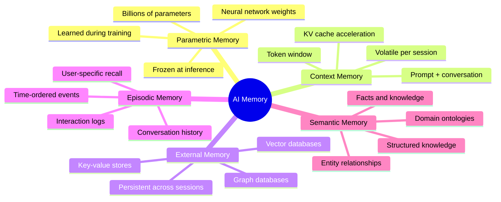
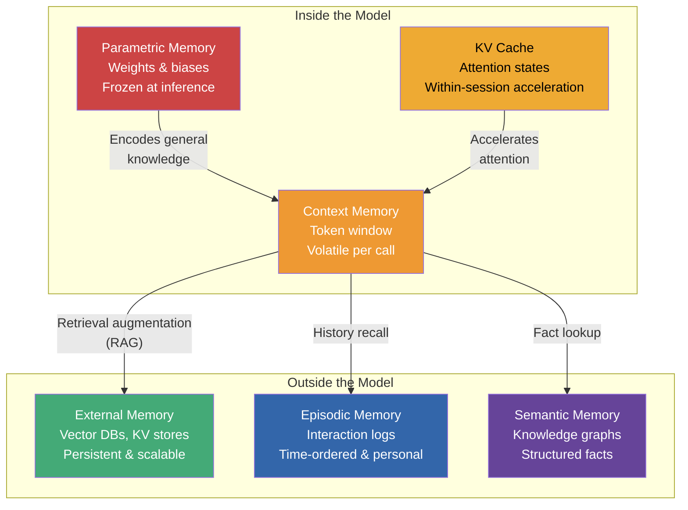
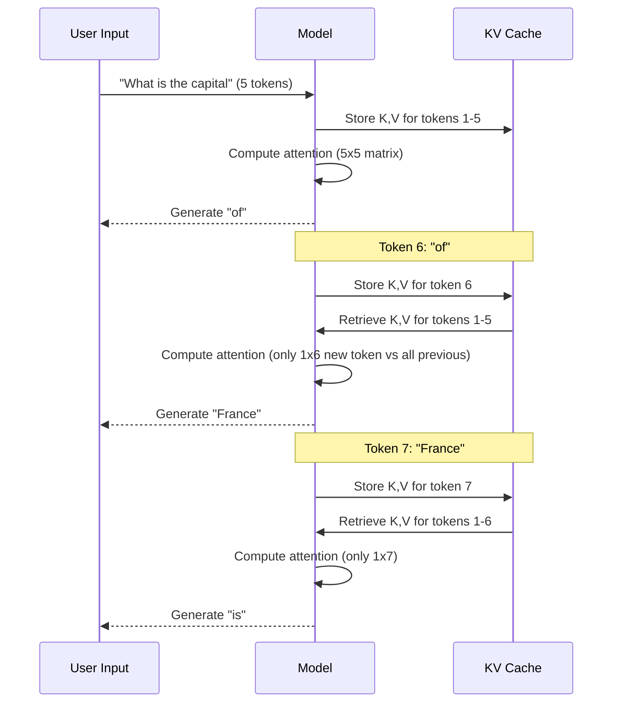
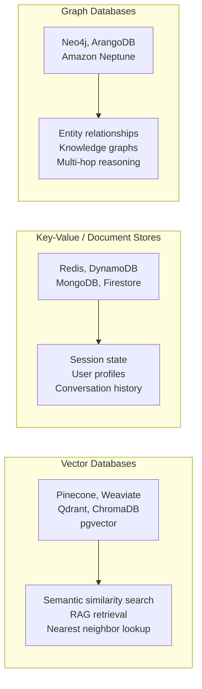
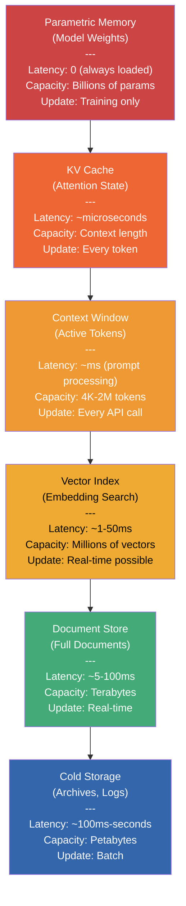
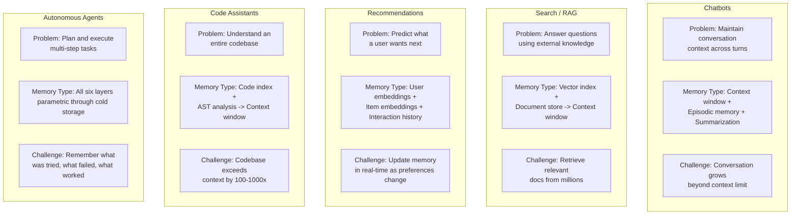
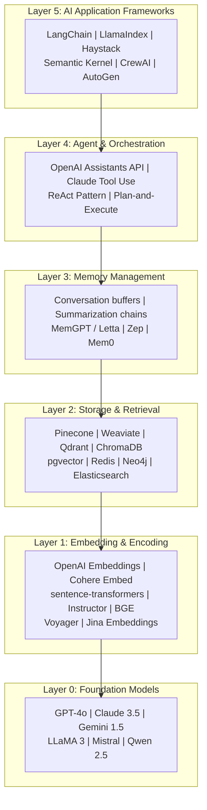

# Memory in AI Systems Deep Dive  Part 0: What Is Memory in AI? (A Developer's Perspective)

---

**Series:** Memory in AI Systems  A Developer's Deep Dive from Fundamentals to Production
**Part:** 0 of 19 (Foundation)
**Audience:** Developers with programming experience who want to understand AI memory systems from the ground up
**Reading time:** ~45 minutes

---

## Why This Series Exists

Ask a developer what "memory" means in the context of AI, and you'll get one of three answers:

1. **"Context window"**  the tokens you stuff into a prompt
2. **"RAG"**  retrieval-augmented generation, the buzzword du jour
3. **A blank stare**  followed by changing the subject

None of these are wrong, but all of them are incomplete. Memory in AI systems is a deep, multi-layered engineering problem that touches tokenization, neural network weights, vector databases, caching strategies, compression algorithms, and distributed systems. It's the single most important concept you need to master to build AI applications that actually work in production.

Here's the uncomfortable truth: **most AI applications fail because of memory problems, not model problems.** Your chatbot forgets what the user said 10 minutes ago. Your RAG pipeline retrieves irrelevant documents. Your agent loops because it can't remember what it already tried. Your fine-tuned model hallucinates because the knowledge wasn't encoded correctly during training.

These are all memory problems wearing different disguises.

This 20-part series will take you from "I've heard of embeddings" to "I can architect a production memory system for any AI application." We'll write real code, benchmark real systems, and build real projects. No hand-waving, no black boxes.

> **Who this is for:** You write code for a living (or plan to). You've used an LLM API at least once. You don't need a PhD in machine learning  but you're not afraid of a matrix multiplication when it shows up.

> **Who this is NOT for:** If you're looking for a high-level overview of AI trends, or a tutorial on prompting ChatGPT, this series will feel like drinking from a fire hose. That's by design.

By the end of this series, you'll understand why every design decision in modern AI systems  from attention mechanisms to vector indices to agent architectures  is fundamentally a decision about **how to store, retrieve, update, compress, and forget information.**

Let's start with the map.

---

## 1. What We Mean by "Memory" (The Developer's Map)

When humans talk about memory, we mean one thing: the ability to store and recall information. When AI researchers talk about memory, they mean at least five different things. As a developer, you need to know exactly which type you're dealing with, because they have completely different engineering characteristics.

### The Five Types of AI Memory



Let's define each one precisely.

### 1.1 Parametric Memory (The Weights)

**What it is:** The knowledge encoded in a neural network's weights during training. When GPT-4 "knows" that Paris is the capital of France, that knowledge is stored as patterns in billions of floating-point numbers.

**Human analogy:** This is like your **long-term procedural memory**  the things you just "know" without thinking about where you learned them. You know how to ride a bicycle. You know that water is H2O. You can't point to where that knowledge lives in your brain, but it's there.

**Engineering characteristics:**
- **Immutable at inference time**  you can't change the weights while the model runs
- **Massive**  GPT-4 has ~1.8 trillion parameters, each a 16-bit float = ~3.6 TB
- **Slow to update**  changing parametric memory requires retraining or fine-tuning
- **Lossy**  the model saw trillions of tokens but compressed them into fixed-size weights
- **No citations**  the model can't tell you *which* training document a fact came from

```python
# Parametric memory is just weights  numbers in tensors
import numpy as np

# A tiny "neural network" with parametric memory
weights = np.array([
    [0.23, -0.45, 0.67],   # These numbers ARE the memory
    [0.12,  0.89, -0.34],  # They were learned during training
    [-0.56, 0.01,  0.78],  # They're frozen at inference time
])

# "Inference" is just matrix multiplication against these frozen weights
input_vector = np.array([1.0, 0.5, -0.2])
output = weights @ input_vector  # The weights "remember" what to do with this input
print(output)  # [-0.269, 0.573, -0.711]
```

### 1.2 Context Memory (The Working Memory)

**What it is:** The information currently "in view" for the model during a single inference call. This is the prompt, the conversation history, any system instructions, and tool outputs  everything packed into the token window.

**Human analogy:** This is your **working memory**  the ~7 items you can hold in your mind simultaneously. When someone reads you a phone number, it's in your working memory. Look away for 30 seconds, and it's gone.

**Engineering characteristics:**
- **Volatile**  disappears after each API call (unless you re-send it)
- **Size-limited**  bounded by the model's context window (4K to 200K+ tokens)
- **Expensive**  cost scales linearly with token count (quadratically in attention computation)
- **High-fidelity**  the model can "see" everything in context with full attention
- **Developer-managed**  you decide what goes in and what gets cut

```python
from openai import OpenAI
client = OpenAI()

# Everything in the `messages` list IS the context memory
# The model has NO memory beyond what's in this list
response = client.chat.completions.create(
    model="gpt-4o",
    messages=[
        {"role": "system", "content": "You are a helpful assistant."},      # Context
        {"role": "user", "content": "My name is Alice."},                    # Context
        {"role": "assistant", "content": "Nice to meet you, Alice!"},        # Context
        {"role": "user", "content": "What's my name?"},                      # Context
    ]
)
# The model can answer "Alice" because it's IN the context window
# Remove the earlier messages, and the model has no idea who you are
```

### 1.3 External Memory (The Reference Library)

**What it is:** Any data store that lives *outside* the model and is queried during inference. Vector databases, SQL databases, key-value stores, search engines, file systems  all external memory.

**Human analogy:** This is like your **bookshelf, your notes app, or Google**. You don't remember every fact, but you know where to look it up. The information persists even when you're not thinking about it.

**Engineering characteristics:**
- **Persistent**  survives across sessions, restarts, and model swaps
- **Scalable**  can store billions of documents (limited by infrastructure, not architecture)
- **Requires retrieval**  the model can't "see" external memory until you fetch and inject it
- **Requires indexing**  data must be organized for efficient retrieval (embeddings, indices)
- **Separable**  you can update external memory without touching the model

### 1.4 Episodic Memory (The Diary)

**What it is:** Records of specific interactions, events, or experiences  ordered by time and tied to a particular user or session. "User Alice asked about Python decorators on Tuesday" is episodic memory.

**Human analogy:** This is your **autobiographical memory**  remembering what you had for breakfast, what happened at last week's meeting, or your first day at work. It's personal, temporal, and context-rich.

**Engineering characteristics:**
- **Time-stamped**  every memory has a "when"
- **User-scoped**  typically partitioned by user or session
- **Append-heavy**  new episodes are constantly added, rarely modified
- **Summarizable**  old episodes can be compressed into summaries
- **Privacy-sensitive**  contains personal interaction data

### 1.5 Semantic Memory (The Encyclopedia)

**What it is:** Structured knowledge about facts, entities, relationships, and concepts  independent of when or how you learned them. "Python is a programming language created by Guido van Rossum" is semantic memory.

**Human analogy:** This is your **general knowledge**  facts about the world that aren't tied to a personal experience. You know that the Earth orbits the Sun, but you don't remember the specific moment you learned it.

**Engineering characteristics:**
- **Structured**  often stored as knowledge graphs or ontologies
- **Entity-centric**  organized around things (people, concepts, products)
- **Relationship-rich**  captures how entities relate to each other
- **Updateable**  facts can be added, modified, or deprecated
- **Shareable**  the same semantic memory can serve multiple users

### The Map: How They Relate



> **Key insight for developers:** When someone says "add memory to the AI," your first question should be: **"Which type of memory?"** The answer determines whether you're fine-tuning a model, managing a context window, building a RAG pipeline, implementing conversation persistence, or constructing a knowledge graph. These are five completely different engineering problems.

---

## 2. A Simple Experiment: Why Memory Matters

Theory is nice. Let's write code.

Here's the simplest possible demonstration of why memory matters: a chatbot without memory vs. one with memory.

### 2.1 Chat Without Memory (Stateless)

```python
"""
chat_no_memory.py  A chatbot with zero memory between turns.
Each API call is completely independent.
"""
from openai import OpenAI

client = OpenAI()

def chat_no_memory(user_message: str) -> str:
    """Each call starts fresh. The model has no idea what happened before."""
    response = client.chat.completions.create(
        model="gpt-4o-mini",
        messages=[
            {"role": "system", "content": "You are a helpful assistant."},
            {"role": "user", "content": user_message},
        ],
    )
    return response.choices[0].message.content

# Conversation
print(chat_no_memory("My name is Alice and I'm a Python developer."))
# -> "Nice to meet you, Alice! How can I help you with Python today?"

print(chat_no_memory("What's my name?"))
# -> "I don't have access to personal information. Could you tell me your name?"
#    ^^^ MEMORY FAILURE  it has no idea you just said "Alice"

print(chat_no_memory("What programming language do I use?"))
# -> "I don't know what programming language you use. There are many options..."
#    ^^^ MEMORY FAILURE  it forgot everything from the first message
```

The model isn't broken. It's working exactly as designed. Each API call is **stateless**  the model receives only the messages you send in that specific call. If you don't include the conversation history, it doesn't exist.

### 2.2 Chat With Memory (Stateful Context)

```python
"""
chat_with_memory.py  A chatbot that maintains conversation history.
We manually manage context by accumulating messages.
"""
from openai import OpenAI

client = OpenAI()

class ChatWithMemory:
    """Maintains conversation history as a list of messages."""

    def __init__(self, system_prompt: str = "You are a helpful assistant."):
        self.messages: list[dict] = [
            {"role": "system", "content": system_prompt}
        ]

    def chat(self, user_message: str) -> str:
        # Add the user's message to history
        self.messages.append({"role": "user", "content": user_message})

        # Send the ENTIRE history to the model
        response = client.chat.completions.create(
            model="gpt-4o-mini",
            messages=self.messages,  # <- All previous messages included
        )

        assistant_message = response.choices[0].message.content

        # Add the assistant's response to history
        self.messages.append({"role": "assistant", "content": assistant_message})

        return assistant_message

# Conversation
bot = ChatWithMemory()

print(bot.chat("My name is Alice and I'm a Python developer."))
# -> "Nice to meet you, Alice! How can I help you with Python today?"

print(bot.chat("What's my name?"))
# -> "Your name is Alice!"
#    ^^^ MEMORY WORKS  the previous message is in context

print(bot.chat("What programming language do I use?"))
# -> "You mentioned that you're a Python developer!"
#    ^^^ MEMORY WORKS  the first message is still in context
```

"Memory" here is just a Python list. That's it. That's the entire "memory system." You accumulate messages and send all of them every time.

### 2.3 When This Breaks: The Token Limit Wall

This naive approach works beautifully for short conversations. It falls apart for long ones.

```python
"""
memory_breaks.py  Demonstrating the token limit wall.
"""
import tiktoken

def count_tokens(messages: list[dict], model: str = "gpt-4o-mini") -> int:
    """Count the tokens in a message list."""
    encoding = tiktoken.encoding_for_model(model)
    total = 0
    for message in messages:
        total += 4  # Every message has overhead: <|start|>role\ncontent<|end|>
        total += len(encoding.encode(message["content"]))
    total += 2  # Priming tokens
    return total

# Simulate a conversation that grows over time
messages = [{"role": "system", "content": "You are a helpful assistant."}]

for i in range(500):
    # Each exchange adds ~100 tokens (user message + assistant response)
    messages.append({"role": "user", "content": f"Tell me fact #{i+1} about machine learning. "
                     "Please be detailed and give examples."})
    messages.append({"role": "assistant", "content": f"Here's fact #{i+1} about machine learning: "
                     "Lorem ipsum dolor sit amet, consectetur adipiscing elit. "
                     "Sed do eiusmod tempor incididunt ut labore et dolore magna aliqua. "
                     "Ut enim ad minim veniam, quis nostrud exercitation ullamco."})

tokens = count_tokens(messages)
print(f"After 500 exchanges: {tokens:,} tokens")
# -> After 500 exchanges: ~55,000 tokens

# Model context limits:
# gpt-4o-mini:  128,000 tokens
# gpt-4o:       128,000 tokens
# claude-3.5:   200,000 tokens
# gpt-3.5:        4,096 tokens (!) <- this would have blown up at ~40 exchanges
```

### The Math That Governs Everything

Here's the fundamental equation every AI developer needs to internalize:

```
Total tokens per request = System prompt tokens
                         + Conversation history tokens
                         + Retrieved context tokens (RAG)
                         + Tool outputs tokens
                         + Current user message tokens
                         + Output tokens (reserved for response)
```

And the constraints:

| Model | Max Context | Approximate Cost (input) | Output Reserved |
|-------|------------|--------------------------|-----------------|
| GPT-3.5 Turbo | 4,096 tokens | $0.0005/1K | ~500-1000 tokens |
| GPT-4o-mini | 128,000 tokens | $0.00015/1K | ~4,096 tokens |
| GPT-4o | 128,000 tokens | $0.0025/1K | ~16,384 tokens |
| Claude 3.5 Sonnet | 200,000 tokens | $0.003/1K | ~8,192 tokens |
| Claude 3.5 Haiku | 200,000 tokens | $0.0008/1K | ~8,192 tokens |
| Gemini 1.5 Pro | 2,000,000 tokens | $0.00125/1K | ~8,192 tokens |

> **The token budget problem:** You have a fixed-size bucket (the context window). You need to fit everything the model needs to know into that bucket. As conversations grow, as retrieved documents pile up, as tool calls return data  the bucket fills up. When it overflows, you must decide what to keep and what to cut. **That decision is the core engineering challenge of AI memory.**

This is why "just send the whole conversation" doesn't scale. At 128K tokens, you might get a few hours of intensive conversation. At 4K tokens (GPT-3.5 era), you got maybe 10 exchanges. And even with 2M tokens (Gemini 1.5 Pro), you're still bounded  and the cost and latency of processing millions of tokens is significant.

The rest of this series is about solving this problem elegantly.

---

## 3. Parameters: The Frozen Memory

Let's dig deeper into the first type of memory: parametric memory. This is the knowledge baked into the model's weights during training.

### 3.1 What Neural Network Weights Actually Store

A neural network is a function: it takes an input (like a sequence of tokens) and produces an output (like the next token). The function is defined by its **parameters**  weights and biases  which are numbers learned during training.

```python
"""
parametric_memory.py  Understanding weights as learned memory.
"""
import numpy as np

# Imagine training a network to classify sentiment (positive/negative).
# After training, the weights "remember" what patterns indicate sentiment.

# Input: word embeddings (simplified to 3 dimensions)
word_embeddings = {
    "great":     np.array([ 0.8,  0.6,  0.1]),
    "terrible":  np.array([-0.7, -0.5,  0.2]),
    "movie":     np.array([ 0.1,  0.0,  0.9]),
    "wonderful": np.array([ 0.9,  0.7, -0.1]),
    "awful":     np.array([-0.8, -0.6,  0.1]),
}

# These weights are the "memory"  they encode what the network learned
# about sentiment during training
sentiment_weights = np.array([0.75, 0.65, -0.1])  # Learned during training
bias = 0.0                                          # Learned during training

def predict_sentiment(word: str) -> str:
    """Use parametric memory (weights) to classify sentiment."""
    embedding = word_embeddings[word]
    # The dot product compares the input against the learned pattern
    score = np.dot(sentiment_weights, embedding) + bias
    return f"'{word}' -> score: {score:.3f} -> {'POSITIVE' if score > 0 else 'NEGATIVE'}"

for word in ["great", "terrible", "wonderful", "awful", "movie"]:
    print(predict_sentiment(word))

# Output:
# 'great'     -> score:  0.980 -> POSITIVE
# 'terrible'  -> score: -0.870 -> NEGATIVE
# 'wonderful' -> score:  1.120 -> POSITIVE
# 'awful'     -> score: -0.990 -> NEGATIVE
# 'movie'     -> score:  0.015 -> POSITIVE  (barely  it's neutral, as expected)
```

The weights `[0.75, 0.65, -0.1]` are the **parametric memory**. They encode the pattern: "high values in the first two dimensions correlate with positive sentiment." The network doesn't store a lookup table of "great -> positive." Instead, it stores a **compressed, generalized pattern** that works for words it has never seen before, as long as they follow the same embedding patterns.

### 3.2 Scale: How Much Memory Do LLMs Have?

Modern LLMs are *enormous* parametric memories:

| Model | Parameters | Memory (FP16) | Training Data |
|-------|-----------|---------------|---------------|
| GPT-2 | 1.5B | ~3 GB | ~40 GB text |
| LLaMA 2 7B | 7B | ~14 GB | ~2 TB text |
| LLaMA 2 70B | 70B | ~140 GB | ~2 TB text |
| GPT-4 (estimated) | ~1.8T (MoE) | ~3.6 TB | Unknown (likely 10+ TB) |
| Claude 3.5 Sonnet | Unknown | Unknown | Unknown |

> **The compression insight:** GPT-4 was trained on perhaps 13 trillion tokens of text. That raw text might be 10+ TB. The model compressed it into ~1.8 trillion parameters (~3.6 TB at FP16). That's a compression ratio of roughly 3:1  meaning the model discards enormous amounts of detail and keeps only the *patterns*. This is why LLMs hallucinate: they're generating from compressed patterns, not looking up facts in a database.

### 3.3 The Frozen Problem

Here's the critical limitation: **parametric memory is frozen at inference time.** Once training ends, the weights don't change. This means:

1. **Knowledge cutoff**  the model doesn't know about events after its training date
2. **No learning from conversations**  talking to the model doesn't update its weights
3. **Updating is expensive**  changing what the model "knows" requires fine-tuning or retraining
4. **Errors are persistent**  if the model learned something wrong, it stays wrong until retrained

```python
# This is what it means for parametric memory to be "frozen"

class FrozenMemoryModel:
    """Simulates how LLM parametric memory works at inference time."""

    def __init__(self, weights: np.ndarray):
        self.weights = weights.copy()
        self._frozen = True  # Weights are frozen after training

    def forward(self, x: np.ndarray) -> np.ndarray:
        """Inference: use weights, but never modify them."""
        return self.weights @ x  # Read-only access to parametric memory

    def learn(self, new_info):
        """This doesn't exist at inference time!"""
        if self._frozen:
            raise RuntimeError(
                "Cannot update parametric memory at inference time. "
                "You need fine-tuning or retraining to change weights. "
                "Use external memory instead."
            )

# At inference time:
model = FrozenMemoryModel(weights=np.random.randn(3, 3))
output = model.forward(np.array([1.0, 2.0, 3.0]))  # Works fine

try:
    model.learn("Python 4.0 was released in 2026")    # Impossible at inference
except RuntimeError as e:
    print(f"Error: {e}")
```

This is why external memory exists. You can't update the model's knowledge, but you can give it access to up-to-date information through its context window at inference time.

---

## 4. Context Windows: The Working Memory

The context window is where the real engineering happens. It's the one type of memory you, as a developer, have direct control over in every API call.

### 4.1 What a Context Window Actually Is

Technically, the context window is the **maximum number of tokens** a model can process in a single forward pass. Every token in the window attends to every other token (in standard transformer architecture), which is what gives the model its ability to understand relationships between distant parts of the text.

```python
"""
context_window.py  Understanding token counting and context limits.
"""
import tiktoken

def analyze_context(text: str, model: str = "gpt-4o") -> dict:
    """Analyze how much of the context window a text consumes."""
    encoding = tiktoken.encoding_for_model(model)
    tokens = encoding.encode(text)

    # Model context limits
    context_limits = {
        "gpt-3.5-turbo": 4_096,
        "gpt-4": 8_192,
        "gpt-4-32k": 32_768,
        "gpt-4o": 128_000,
        "gpt-4o-mini": 128_000,
    }

    max_tokens = context_limits.get(model, 128_000)

    return {
        "text_length_chars": len(text),
        "token_count": len(tokens),
        "context_limit": max_tokens,
        "usage_percent": (len(tokens) / max_tokens) * 100,
        "tokens_remaining": max_tokens - len(tokens),
        "approx_chars_per_token": len(text) / len(tokens) if tokens else 0,
    }

# Example: How much context does a typical conversation use?
conversation = """
User: Hi, I'm building a recommendation system for an e-commerce platform.
Assistant: Great! I'd be happy to help you build a recommendation system. Could you tell me more
about your platform? What kind of products do you sell, what's your user base size, and what data
do you currently collect?
User: We sell electronics  phones, laptops, accessories. About 500K monthly active users. We have
purchase history, browsing history, and user ratings.
Assistant: With 500K MAUs and that data, you have several good options. Let me outline the main
approaches for e-commerce recommendation systems...
"""

result = analyze_context(conversation, model="gpt-4o")
print(f"Conversation: {result['token_count']} tokens "
      f"({result['usage_percent']:.2f}% of context window)")
print(f"Remaining: {result['tokens_remaining']:,} tokens")
print(f"Average: {result['approx_chars_per_token']:.1f} chars/token")

# Output:
# Conversation: ~140 tokens (0.11% of context window)
# Remaining: 127,860 tokens
# Average: ~4.1 chars/token
```

### 4.2 The Token Economy

A rough rule of thumb for English text:

| Unit | Approximate Tokens |
|------|-------------------|
| 1 word | ~1.3 tokens |
| 1 sentence | ~15-25 tokens |
| 1 paragraph | ~50-100 tokens |
| 1 page (500 words) | ~650 tokens |
| 1 typical code file (200 lines) | ~800-1,500 tokens |
| 1 book (80,000 words) | ~100,000 tokens |
| A full Wikipedia article | ~2,000-10,000 tokens |
| The entire Harry Potter series | ~1,100,000 tokens |

> **Developer insight:** 128K tokens is roughly a 200-page book. That sounds like a lot, but in a production application, you're splitting that budget across system prompts, few-shot examples, tool definitions, retrieved documents, conversation history, and the actual user query. It fills up faster than you'd think.

### 4.3 The Quadratic Cost of Attention

Here's something most developers don't realize: **the computational cost of processing context scales quadratically** with the number of tokens.

In the standard transformer attention mechanism, every token must attend to every other token. If you have `n` tokens in context:
- **Computation:** O(n^2)  doubling the context length quadruples the compute
- **Memory (GPU):** O(n^2)  the attention matrix has n x n entries
- **Latency:** scales with n^2  longer contexts take disproportionately longer

```python
"""
attention_cost.py  Visualizing the quadratic cost of attention.
"""

def attention_cost(num_tokens: int) -> dict:
    """
    Estimate the relative cost of processing a context window.

    In standard multi-head attention:
    - Each token computes attention scores with ALL other tokens
    - This creates an n x n attention matrix
    - Both compute and memory scale as O(n^2)
    """
    attention_matrix_size = num_tokens * num_tokens
    return {
        "tokens": num_tokens,
        "attention_entries": attention_matrix_size,
        "relative_cost": attention_matrix_size / (1000 * 1000),  # Relative to 1K tokens
    }

print(f"{'Tokens':>10} | {'Attention Matrix':>20} | {'Relative Cost':>15}")
print("-" * 55)

for tokens in [1_000, 4_000, 8_000, 32_000, 128_000, 200_000, 1_000_000]:
    result = attention_cost(tokens)
    print(f"{result['tokens']:>10,} | {result['attention_entries']:>20,} | "
          f"{result['relative_cost']:>13,.1f}x")

# Output:
#     Tokens |     Attention Matrix |   Relative Cost
# -------------------------------------------------------
#      1,000 |            1,000,000 |           1.0x
#      4,000 |           16,000,000 |          16.0x
#      8,000 |           64,000,000 |          64.0x
#     32,000 |        1,024,000,000 |       1,024.0x
#    128,000 |       16,384,000,000 |      16,384.0x
#    200,000 |       40,000,000,000 |      40,000.0x
#  1,000,000 |    1,000,000,000,000 |   1,000,000.0x
```

Going from 1K tokens to 128K tokens isn't 128x more expensive  it's **16,384x** more expensive in raw attention computation. In practice, optimizations like FlashAttention, multi-query attention, and ring attention reduce this, but the fundamental scaling pressure remains.

> **This is why memory management matters.** You can't just throw everything into the context window and hope for the best. Every additional token has a real cost in latency, money, and GPU memory. Good AI engineering is about putting the *right* information in context, not *all* information.

### 4.4 The KV Cache: Accelerating Sequential Generation

When an LLM generates text token by token, it doesn't recompute attention from scratch for each new token. Instead, it maintains a **Key-Value (KV) cache**  a running record of the attention states for all previous tokens.



Without the KV cache, generating the 100th token would require recomputing attention for all 100 tokens from scratch. With the KV cache, the model only computes attention between the *new* token and all previous tokens  a massive speedup.

But the KV cache has its own memory problem: it grows linearly with context length and must be stored in GPU memory.

| Context Length | KV Cache Size (approx, for a 70B model) |
|---------------|----------------------------------------|
| 2,048 tokens | ~1 GB |
| 8,192 tokens | ~4 GB |
| 32,768 tokens | ~16 GB |
| 131,072 tokens | ~64 GB |

> **This is why running long-context models requires so much GPU memory.** The KV cache for a 128K-token context on a 70B model can consume as much GPU memory as the model weights themselves.

We'll explore KV cache optimization in detail in Parts 4-5 of this series.

---

## 5. External Memory: The Game Changer

Parametric memory is frozen. Context memory is limited. If you need a system that has access to up-to-date, domain-specific, or user-specific information without retraining the model, you need **external memory**.

### 5.1 When Context Isn't Enough

Here are real scenarios where context memory alone fails:

| Scenario | Why Context Fails | External Memory Solution |
|----------|-------------------|--------------------------|
| Customer support bot for 10,000 products | Product catalog doesn't fit in context | Vector DB of product descriptions |
| Legal assistant over 50,000 documents | Documents exceed any context window | Document index + semantic search |
| Personal assistant that remembers 2 years of conversations | Conversation history >> context limit | Summarized episodic memory store |
| Code assistant for a 500-file codebase | Entire codebase doesn't fit | Code index with embedding-based retrieval |
| Medical Q&A system | Need to cite specific sources | Knowledge graph + document retrieval |

### 5.2 The Three Types of External Memory Stores



**Vector Databases** store high-dimensional embedding vectors and support nearest-neighbor search. You convert text to embeddings, store them, then query "find the 10 most similar documents to this query." This is the foundation of RAG (Retrieval-Augmented Generation).

**Key-Value / Document Stores** store structured data indexed by keys. Fast exact lookups, but no semantic understanding. Great for session state, user preferences, and conversation history.

**Graph Databases** store entities and their relationships. When you need to answer questions like "What products are related to what the user bought, made by companies headquartered in Europe?"  that's a graph query.

### 5.3 External Memory in Action: A Minimal Example

Here's the simplest possible demonstration of external memory  a dictionary acting as an external store:

```python
"""
external_memory_basic.py  The simplest possible external memory system.
No vector DB, no embeddings  just a dictionary to show the concept.
"""
from openai import OpenAI

client = OpenAI()

# EXTERNAL MEMORY: lives outside the model, persists across sessions
knowledge_base = {
    "product_pricing": {
        "basic_plan": "$9/month, 1 user, 10GB storage",
        "pro_plan": "$29/month, 5 users, 100GB storage",
        "enterprise_plan": "$99/month, unlimited users, 1TB storage",
    },
    "refund_policy": "Full refund within 30 days. Pro-rated refund after 30 days. "
                     "No refund after 90 days. Contact support@example.com.",
    "supported_languages": "Python, JavaScript, TypeScript, Go, Rust, Java",
    "last_updated": "2026-02-15",
}

def retrieve_from_memory(query: str) -> str:
    """
    Retrieve relevant information from external memory.

    In a real system, this would be a vector similarity search.
    Here, we use simple keyword matching to illustrate the concept.
    """
    query_lower = query.lower()
    results = []

    for key, value in knowledge_base.items():
        if any(word in query_lower for word in key.split("_")):
            if isinstance(value, dict):
                results.append(f"{key}:\n" + "\n".join(
                    f"  - {k}: {v}" for k, v in value.items()
                ))
            else:
                results.append(f"{key}: {value}")

    return "\n\n".join(results) if results else "No relevant information found."

def chat_with_external_memory(user_message: str) -> str:
    """Retrieve relevant context from external memory, then query the LLM."""

    # Step 1: RETRIEVE from external memory
    retrieved_context = retrieve_from_memory(user_message)

    # Step 2: INJECT retrieved context into the prompt
    messages = [
        {
            "role": "system",
            "content": (
                "You are a customer support assistant. Use the following information "
                "from our knowledge base to answer the user's question. If the "
                "information doesn't cover their question, say so.\n\n"
                f"--- RETRIEVED CONTEXT ---\n{retrieved_context}\n--- END CONTEXT ---"
            ),
        },
        {"role": "user", "content": user_message},
    ]

    # Step 3: Let the LLM generate an answer using the retrieved context
    response = client.chat.completions.create(
        model="gpt-4o-mini",
        messages=messages,
    )

    return response.choices[0].message.content

# Example usage
print(chat_with_external_memory("How much does the pro plan cost?"))
# -> "The Pro plan costs $29/month and includes 5 users and 100GB storage."

print(chat_with_external_memory("What's your refund policy?"))
# -> "We offer a full refund within 30 days, pro-rated refund from 30-90 days..."

print(chat_with_external_memory("Do you support Rust?"))
# -> "Yes! We support Rust, along with Python, JavaScript, TypeScript, Go, and Java."
```

This is the **fundamental pattern** behind every RAG system:

1. **RETRIEVE**  query external memory for relevant information
2. **AUGMENT**  inject the retrieved information into the model's context
3. **GENERATE**  let the model produce an answer using both its parametric memory and the retrieved context

The only difference between this toy example and a production RAG system is the sophistication of the retrieval step. Instead of keyword matching, you use embeddings and vector similarity search. Instead of a Python dictionary, you use a vector database. But the pattern is identical.

We'll build increasingly sophisticated versions of this pattern throughout the series, starting with a proper embedding-based RAG system in Parts 2-3.

---

## 6. The Memory Hierarchy of AI Systems

If you've studied computer architecture, you know about the memory hierarchy: registers, L1 cache, L2 cache, L3 cache, RAM, SSD, HDD. Each level trades speed for capacity.

AI systems have their own memory hierarchy, and understanding it is just as important for performance engineering.

### 6.1 The AI Memory Pyramid



### 6.2 Layer-by-Layer Breakdown

| Layer | What It Stores | Latency | Capacity | Persistence | Update Frequency |
|-------|---------------|---------|----------|-------------|-----------------|
| **Parametric Memory** | General knowledge in weights | 0 (always in GPU) | Billions of params (~GB-TB) | Permanent until retrained | Training only |
| **KV Cache** | Attention states for current sequence | ~microseconds | Current context x model dims | Within-session only | Every new token |
| **Context Window** | Active prompt, conversation, retrieved docs | ~ms (prompt processing) | 4K - 2M tokens | Per API call | Every API call |
| **Vector Index** | Embedding vectors for semantic search | 1-50ms | Millions-billions of vectors | Persistent | Real-time or batch |
| **Document Store** | Full text, metadata, structured data | 5-100ms | TB-scale | Persistent | Real-time |
| **Cold Storage** | Archives, raw logs, training corpora | 100ms-seconds | PB-scale | Persistent | Batch/rare |

### 6.3 The Analogy to Computer Memory

```
Computer Memory Hierarchy        AI Memory Hierarchy
-------------------------        ---------------------
CPU Registers (~1ns)       <->   Parametric Memory (weights in GPU)
L1/L2 Cache (~1-10ns)     <->   KV Cache (attention states in GPU)
L3 Cache (~10-30ns)        <->   Context Window (tokens in GPU)
RAM (~100ns)               <->   Vector Index (embeddings in RAM)
SSD (~10us)                <->   Document Store (full text on disk/RAM)
HDD/Tape (~5ms+)           <->   Cold Storage (archives, S3)
```

The design principle is the same: **keep frequently accessed, performance-critical data in the fastest layer, and push less critical data to cheaper, larger, slower layers.** The engineering challenge is managing the flow of information between layers  which is exactly what a RAG pipeline, a conversation manager, or an agent framework does.

> **Key insight:** Every AI application architecture is a decision about where in this hierarchy to store different types of information, and how to move information between layers. A chatbot is mostly about managing the context window layer. A RAG system bridges the context window and vector index layers. An agent with long-term memory spans all six layers.

---

## 7. Why Every AI Application Is Really a Memory Problem

Once you see AI applications through the lens of memory, you can't unsee it. Every major AI application pattern is fundamentally a memory management problem.

### 7.1 The Memory Perspective on AI Applications



### 7.2 Application-by-Application Analysis

**Chatbots** are a context management problem. The user expects the bot to remember everything said in the conversation. But conversations grow unboundedly, and context windows don't. Your engineering challenge: compress, summarize, and prioritize conversation history to fit the most important information into a fixed-size window.

**RAG / Search** is a retrieval problem. You have a corpus of documents that won't fit in context. You need to identify the 3-5 most relevant documents for a given query and inject them into context. Your engineering challenge: embeddings that capture semantic meaning, indices that enable fast search, reranking that ensures relevance.

**Recommendation Systems** are a preference memory problem. You need to remember what users liked, what they browsed, what they purchased  and use that memory to predict what they'll want next. Your engineering challenge: representing user preferences as vectors (embeddings) and updating them efficiently as new signals arrive.

**Code Assistants** (like Copilot, Cursor, or Claude Code) are a codebase memory problem. A typical codebase has hundreds of files and hundreds of thousands of lines. The context window can hold maybe 3-5 files. Your engineering challenge: index the codebase, identify which files are relevant to the current task, and inject the right code context.

**Autonomous Agents** are the hardest memory problem. An agent needs short-term memory (current task state), working memory (retrieved information), episodic memory (what it tried before), and semantic memory (domain knowledge). When an agent loops or fails, it's almost always because its memory system broke down  it forgot what it already tried, or it couldn't retrieve the right information for the next step.

### 7.3 The Unifying Principle

Every one of these applications follows the same pattern:

```
1. DETERMINE what information the model needs
2. RETRIEVE that information from the appropriate memory layer
3. FIT it into the context window (compressing if necessary)
4. GENERATE the response
5. STORE new information back into the appropriate memory layer
```

That's the core loop of every AI application. The differences between a chatbot and an agent aren't conceptual  they're engineering differences in how sophisticated each step is.

> **If you master the principles of AI memory  how to store, retrieve, compress, and manage information across the memory hierarchy  you can build any AI application.** That's the promise of this series.

---

## 8. The Five Fundamental Operations on AI Memory

Every memory system  human or artificial  supports a small set of fundamental operations. In AI systems, there are exactly five. Understanding these operations gives you a framework for reasoning about any memory architecture.

### 8.1 The Operations


**STORE**  Writing new information into a memory layer. This could be: saving a user's message to conversation history, embedding a document and inserting it into a vector database, appending an event to an episodic log, or (at the extreme) training new knowledge into model weights.

**RETRIEVE**  Finding and returning relevant information from memory. This is the hardest operation to get right. Retrieval quality determines whether your AI application works or hallucinates. Vector similarity search, keyword search, graph traversal, attention over context  all retrieval mechanisms.

**UPDATE**  Modifying existing memories. Updating a user's profile, correcting a fact in a knowledge base, refreshing an embedding after a document changes. More nuanced than it sounds  you need to decide whether to overwrite, version, or merge.

**COMPRESS**  Reducing the size of stored memory while preserving the most important information. Summarizing old conversation turns, quantizing embeddings from FP32 to INT8, pruning low-attention tokens from context, distilling a knowledge base into fewer entries. Compression is the key to staying within token and storage budgets.

**FORGET**  Deliberately removing information from memory. Evicting stale cache entries, deleting old conversation history, removing deprecated knowledge, respecting GDPR deletion requests. Forgetting is as important as remembering  without it, memory systems become cluttered and retrieval quality degrades.

### 8.2 The AIMemorySystem Interface

Here's a Python interface that captures these five operations. Every memory system we build in this series will implement some or all of these methods.

```python
"""
ai_memory_interface.py  The fundamental interface for AI memory systems.
Every memory system in this series implements this contract.
"""
from abc import ABC, abstractmethod
from dataclasses import dataclass, field
from datetime import datetime
from typing import Any, Optional


@dataclass
class MemoryEntry:
    """A single unit of memory."""
    id: str
    content: str
    metadata: dict = field(default_factory=dict)
    embedding: Optional[list[float]] = None
    timestamp: datetime = field(default_factory=datetime.utcnow)
    access_count: int = 0
    last_accessed: Optional[datetime] = None
    importance_score: float = 0.0

    def __repr__(self) -> str:
        preview = self.content[:80] + "..." if len(self.content) > 80 else self.content
        return f"MemoryEntry(id={self.id!r}, content={preview!r})"


@dataclass
class RetrievalResult:
    """A memory entry returned from a retrieval query, with relevance score."""
    entry: MemoryEntry
    relevance_score: float
    retrieval_method: str  # "vector", "keyword", "graph", "recency", etc.


class AIMemorySystem(ABC):
    """
    Abstract base class for all AI memory systems.

    Every memory system  from a simple conversation buffer to a production
    RAG pipeline to an agent's episodic memory  implements these five
    fundamental operations.
    """

    # ──────────────────────────────────────────────
    # OPERATION 1: STORE
    # ──────────────────────────────────────────────
    @abstractmethod
    def store(self, content: str, metadata: Optional[dict] = None) -> MemoryEntry:
        """
        Store new information in memory.

        Args:
            content: The text content to store.
            metadata: Optional metadata (source, user_id, tags, etc.)

        Returns:
            The created MemoryEntry with assigned ID and embedding.

        Examples:
            - Store a user message in conversation history
            - Index a document chunk in a vector database
            - Record an agent action in episodic memory
            - Save a fact in a knowledge graph
        """
        ...

    # ──────────────────────────────────────────────
    # OPERATION 2: RETRIEVE
    # ──────────────────────────────────────────────
    @abstractmethod
    def retrieve(
        self,
        query: str,
        top_k: int = 5,
        filters: Optional[dict] = None,
    ) -> list[RetrievalResult]:
        """
        Find and return the most relevant memories for a query.

        Args:
            query: The search query (natural language).
            top_k: Maximum number of results to return.
            filters: Optional metadata filters (e.g., {"user_id": "alice"}).

        Returns:
            List of RetrievalResult, sorted by relevance (highest first).

        Examples:
            - Find relevant documents for a RAG query
            - Recall recent conversation about a topic
            - Look up related entities in a knowledge graph
        """
        ...

    # ──────────────────────────────────────────────
    # OPERATION 3: UPDATE
    # ──────────────────────────────────────────────
    @abstractmethod
    def update(self, memory_id: str, new_content: str, **kwargs) -> MemoryEntry:
        """
        Update an existing memory entry.

        Args:
            memory_id: The ID of the memory to update.
            new_content: The new content to replace/merge.
            **kwargs: Additional fields to update (metadata, importance, etc.)

        Returns:
            The updated MemoryEntry.

        Examples:
            - Correct a fact in the knowledge base
            - Update a user's preference profile
            - Refresh an embedding after document content changes
        """
        ...

    # ──────────────────────────────────────────────
    # OPERATION 4: COMPRESS
    # ──────────────────────────────────────────────
    @abstractmethod
    def compress(self, strategy: str = "summarize") -> dict:
        """
        Reduce memory size while preserving important information.

        Args:
            strategy: The compression approach. Options:
                - "summarize": LLM-generated summaries of old entries
                - "prune": Remove lowest-importance entries
                - "merge": Combine similar entries
                - "quantize": Reduce embedding precision

        Returns:
            Dict with compression statistics (entries_before, entries_after,
            bytes_saved, etc.)

        Examples:
            - Summarize old conversation turns to free context budget
            - Merge duplicate knowledge base entries
            - Prune rarely-accessed episodic memories
        """
        ...

    # ──────────────────────────────────────────────
    # OPERATION 5: FORGET
    # ──────────────────────────────────────────────
    @abstractmethod
    def forget(
        self,
        memory_id: Optional[str] = None,
        filters: Optional[dict] = None,
        older_than: Optional[datetime] = None,
    ) -> int:
        """
        Remove information from memory.

        Args:
            memory_id: Specific memory to delete (if provided).
            filters: Delete all memories matching these filters.
            older_than: Delete all memories older than this timestamp.

        Returns:
            Number of memories deleted.

        Examples:
            - Delete a user's data for GDPR compliance
            - Evict stale cache entries
            - Remove outdated facts from knowledge base
            - Clear old episodic memories to prevent confusion
        """
        ...

    # ──────────────────────────────────────────────
    # UTILITY METHODS
    # ──────────────────────────────────────────────
    @abstractmethod
    def count(self) -> int:
        """Return the total number of memories stored."""
        ...

    @abstractmethod
    def stats(self) -> dict:
        """Return memory system statistics (size, counts, health metrics)."""
        ...
```

### 8.3 Mapping Operations to Memory Types

Not every memory type supports every operation equally well:

| Operation | Parametric | Context Window | Vector DB | KV Store | Knowledge Graph |
|-----------|-----------|---------------|-----------|----------|-----------------|
| **STORE** | Training only | Per API call | Real-time | Real-time | Real-time |
| **RETRIEVE** | Implicit (generation) | Full attention | ANN search | Key lookup | Graph traversal |
| **UPDATE** | Fine-tuning | Replace messages | Re-embed | Overwrite | Edit triples |
| **COMPRESS** | Distillation/pruning | Summarization | Quantization | TTL eviction | Subgraph collapse |
| **FORGET** | Unlearning (hard!) | Drop messages | Delete vectors | Delete keys | Remove triples |

> **Notice the pattern:** Parametric memory is the hardest to modify (every operation requires retraining or specialized techniques like unlearning). External memory stores are the easiest. This is why most production AI applications lean heavily on external memory  it gives you the flexibility to store, update, and forget without touching the model.

---

## 9. A Quick Tour of the AI Memory Stack

Before we dive deep in the coming parts, let's survey the tools and technologies you'll encounter. Think of this as your map of the landscape.

### 9.1 The Stack, Layer by Layer



### 9.2 Embedding Models: Turning Text into Vectors

Embedding models convert text into fixed-size numerical vectors that capture semantic meaning. Two pieces of text with similar meanings will have similar embedding vectors. This is the foundation of semantic search and vector-based retrieval.

| Model | Dimensions | Max Tokens | Strengths | Provider |
|-------|-----------|------------|-----------|----------|
| `text-embedding-3-small` | 1,536 | 8,191 | Cheap, fast, good quality | OpenAI |
| `text-embedding-3-large` | 3,072 | 8,191 | Higher quality, flexible dims | OpenAI |
| `embed-v4` | 1,024 | 512 | Search-optimized, multi-language | Cohere |
| `all-MiniLM-L6-v2` | 384 | 256 | Free, fast, runs locally | HuggingFace |
| `bge-large-en-v1.5` | 1,024 | 512 | Free, high quality, runs locally | BAAI |
| `jina-embeddings-v3` | 1,024 | 8,192 | Long context, multilingual | Jina AI |
| `voyage-3` | 1,024 | 32,000 | Code-aware, long context | Voyage AI |

### 9.3 Vector Databases: Storing and Searching Embeddings

| Database | Type | Hosting | Key Features | Best For |
|----------|------|---------|--------------|----------|
| **Pinecone** | Managed SaaS | Cloud only | Serverless, easy scaling | Production SaaS apps |
| **Weaviate** | Open source | Self-hosted / Cloud | Multi-modal, GraphQL API | Complex retrieval pipelines |
| **Qdrant** | Open source | Self-hosted / Cloud | Fast, Rust-based, filtering | Performance-critical apps |
| **ChromaDB** | Open source | Embedded / Self-hosted | Dead simple API, Python-native | Prototyping, small projects |
| **pgvector** | PostgreSQL extension | Self-hosted / Cloud | Use existing Postgres infra | Teams already on PostgreSQL |
| **Milvus** | Open source | Self-hosted / Cloud | Billion-scale, GPU acceleration | Massive scale search |
| **Redis VSS** | Redis module | Self-hosted / Cloud | Sub-millisecond, versatile | Real-time applications |

### 9.4 Memory-Specific Tools

These are tools built specifically for managing AI memory:

| Tool | What It Does | Key Idea |
|------|-------------|----------|
| **Mem0** | Managed memory layer for AI apps | Automatically extracts, stores, and retrieves user-specific memories across sessions |
| **Zep** | Long-term memory for AI assistants | Combines conversation history, summaries, and vector search in one service |
| **Letta (MemGPT)** | Self-editing memory for agents | The agent manages its own memory like an OS manages virtual memory  paging in/out |
| **LangChain Memory** | Memory modules for LLM chains | Provides conversation buffers, summaries, entity memory, and knowledge graph memory |
| **LlamaIndex** | Data framework for LLM apps | Excels at indexing, chunking, and retrieving from diverse data sources |

### 9.5 Observability and Evaluation

Memory systems need monitoring. How do you know if your retrieval is working?

| Tool | What It Measures |
|------|-----------------|
| **Ragas** | RAG pipeline quality (faithfulness, relevance, recall) |
| **LangSmith** | LLM call traces, token usage, latency, memory state |
| **Weights & Biases** | Embedding quality, retrieval metrics, drift detection |
| **Phoenix (Arize)** | Embedding drift, retrieval relevance, hallucination rates |
| **DeepEval** | LLM output evaluation with memory-aware metrics |

We'll use many of these tools throughout the series. Don't worry about choosing now  each part will introduce the right tool for the job.

---

## 10. What You'll Build in This Series

This isn't a series of lectures. Every part includes hands-on projects that build on each other. Here's the roadmap:

### The 20-Part Roadmap

| Part | Title | What You'll Build |
|------|-------|-------------------|
| **0** | What Is Memory in AI? | Foundation  you're reading it |
| **1** | Embeddings from Scratch | Build a mini embedding model, visualize vector spaces |
| **2** | Vector Search Fundamentals | Implement brute-force and ANN search from scratch |
| **3** | Building a RAG Pipeline | End-to-end RAG with chunking, embedding, retrieval, generation |
| **4** | Context Window Management | Sliding window, summarization, and priority-based context packing |
| **5** | KV Cache Deep Dive | Understand and optimize the KV cache, implement PagedAttention concepts |
| **6** | Conversation Memory | Multi-session chatbot with episodic memory and summarization |
| **7** | Advanced Retrieval | Hybrid search, reranking, HyDE, multi-query retrieval |
| **8** | Knowledge Graphs for AI | Build an entity-relationship memory with Neo4j |
| **9** | Chunking Strategies | The art and science of splitting documents for retrieval |
| **10** | Memory Compression | Summarization chains, embedding quantization, memory pruning |
| **11** | Evaluation and Benchmarking | Measuring retrieval quality, faithfulness, and memory coverage |
| **12** | Agent Memory Architecture | Build an agent with working, episodic, and semantic memory |
| **13** | Long-Term Memory Systems | Production episodic memory with Mem0 and Zep |
| **14** | Multi-Modal Memory | Storing and retrieving images, audio, and code alongside text |
| **15** | Memory-Aware Fine-Tuning | LoRA and QLoRA for encoding domain knowledge into weights |
| **16** | Distributed Memory Systems | Scaling vector search across nodes, sharding strategies |
| **17** | Memory Security and Privacy | Access control, encryption, GDPR compliance, PII detection |
| **18** | Production Architecture | Designing memory systems for scale, reliability, and cost |
| **19** | The Future of AI Memory | Emerging research  infinite context, memory-augmented transformers, continual learning |

### The Progression


Each part builds on the ones before it. By the end, you won't just understand AI memory  you'll have built a complete, production-grade memory system from scratch.

---

## 11. Prerequisites and Setup

### 11.1 What You Need to Know

This series assumes you have:

- **Python fluency**  you can read and write Python classes, type hints, async code, and decorators without looking things up
- **Basic ML intuition**  you know roughly what a neural network does (input -> weights -> output), even if the math is fuzzy
- **API experience**  you've made HTTP requests, used REST APIs, and dealt with JSON
- **Command-line comfort**  you can navigate a terminal, run pip commands, and set environment variables
- **Git basics**  you can clone repos, create branches, and commit

Things you do **NOT** need:
- A PhD in machine learning
- Experience with PyTorch or TensorFlow (we'll introduce what you need)
- GPU hardware (most examples run on CPU; GPU-specific parts will note this)
- Prior experience with vector databases

### 11.2 Environment Setup

```bash
# Create a project directory
mkdir ai-memory-deep-dive
cd ai-memory-deep-dive

# Create and activate a virtual environment
python -m venv .venv

# On macOS/Linux:
source .venv/bin/activate

# On Windows:
.venv\Scripts\activate
```

### 11.3 Core Dependencies

Install the packages we'll use across the series. You don't need all of them for Part 0  we'll call out specific requirements in each part.

```bash
# Core: LLM APIs and utilities
pip install openai anthropic tiktoken

# Embeddings and ML
pip install numpy scipy scikit-learn
pip install sentence-transformers  # Local embedding models
pip install torch                   # PyTorch (for embedding models)

# Vector databases (install as needed)
pip install chromadb               # Lightweight, embedded vector DB
pip install qdrant-client          # Qdrant client
pip install pinecone-client        # Pinecone client
pip install weaviate-client        # Weaviate client

# Data processing
pip install pandas                 # Data manipulation
pip install matplotlib plotly      # Visualization

# Memory frameworks (install as needed)
pip install langchain langchain-openai langchain-community
pip install llama-index
pip install mem0ai                 # Mem0 memory layer

# Evaluation
pip install ragas                  # RAG evaluation
pip install deepeval               # LLM evaluation

# Utilities
pip install python-dotenv          # Environment variable management
pip install rich                   # Pretty terminal output
pip install tqdm                   # Progress bars
```

### 11.4 API Keys

You'll need at least one LLM provider API key. Store them in a `.env` file:

```bash
# .env  NEVER commit this file to version control!
OPENAI_API_KEY=sk-...
ANTHROPIC_API_KEY=sk-ant-...

# Optional (used in later parts)
COHERE_API_KEY=...
PINECONE_API_KEY=...
```

Load them in your code:

```python
"""
setup.py  Environment setup used across all parts.
"""
import os
from dotenv import load_dotenv

# Load environment variables from .env file
load_dotenv()

# Verify API keys are set
def check_setup():
    """Verify that required API keys and dependencies are available."""
    checks = {
        "OPENAI_API_KEY": os.getenv("OPENAI_API_KEY") is not None,
        "numpy": True,
        "tiktoken": True,
    }

    try:
        import numpy
        checks["numpy"] = True
    except ImportError:
        checks["numpy"] = False

    try:
        import tiktoken
        checks["tiktoken"] = True
    except ImportError:
        checks["tiktoken"] = False

    print("Environment Check:")
    print("-" * 40)
    for name, status in checks.items():
        indicator = "PASS" if status else "FAIL"
        print(f"  {indicator}  {name}")

    all_pass = all(checks.values())
    print("-" * 40)
    print(f"  {'Ready to go!' if all_pass else 'Fix the FAIL items above.'}")
    return all_pass

if __name__ == "__main__":
    check_setup()
```

### 11.5 Hardware Notes

| Part | CPU Only? | GPU Recommended? | Notes |
|------|----------|-----------------|-------|
| 0-3 | Yes | No | API-based, runs anywhere |
| 4-6 | Yes | No | Context management is CPU/API work |
| 7-9 | Yes | Helpful | Local embedding models benefit from GPU |
| 10-11 | Yes | Helpful | Compression benchmarks faster with GPU |
| 12-14 | Yes | Helpful | Agent memory is mostly API + DB work |
| 15 | No | **Required** | Fine-tuning requires GPU (or use cloud) |
| 16-19 | Varies | Helpful | Distributed systems may need cloud infra |

> **No GPU? No problem for 80% of this series.** Most memory engineering is about data management, retrieval, and orchestration  not model training. When we do need GPU compute (Part 15), we'll show you how to use cloud options like Google Colab, AWS, or Lambda Labs.

---

## 12. Vocabulary Cheat Sheet

Here's every key term introduced in this part, organized for quick reference. Bookmark this  you'll use it throughout the series.

| Term | Definition | First Introduced |
|------|-----------|-----------------|
| **Parametric Memory** | Knowledge encoded in neural network weights during training. Frozen at inference time. | Section 1.1 |
| **Context Memory** | Information in the model's active token window during a single inference call. Volatile. | Section 1.2 |
| **External Memory** | Any persistent data store queried during inference (vector DBs, KV stores, etc.). | Section 1.3 |
| **Episodic Memory** | Time-ordered records of specific interactions or events. User-scoped. | Section 1.4 |
| **Semantic Memory** | Structured knowledge about facts, entities, and relationships. Shareable. | Section 1.5 |
| **Context Window** | The maximum number of tokens a model can process in one forward pass. | Section 4.1 |
| **Token** | The basic unit of text for an LLM. Roughly 0.75 words in English. | Section 4.2 |
| **Token Budget** | The allocation of context window space across system prompt, history, retrieved docs, etc. | Section 2.3 |
| **KV Cache** | Cached key-value attention states that avoid recomputation during autoregressive generation. | Section 4.4 |
| **Attention** | The mechanism by which tokens in context influence each other. O(n^2) in standard form. | Section 4.3 |
| **Embedding** | A fixed-size numerical vector representing the semantic meaning of text. | Section 9.2 |
| **Vector Database** | A database optimized for storing and searching high-dimensional embedding vectors. | Section 5.2 |
| **RAG** | Retrieval-Augmented Generation. Retrieve external knowledge, inject into context, generate. | Section 5.3 |
| **ANN Search** | Approximate Nearest Neighbor search. Fast (but approximate) similarity search in vector space. | Section 9.3 |
| **Knowledge Graph** | A graph of entities and relationships used for structured knowledge retrieval. | Section 5.2 |
| **Fine-Tuning** | Updating a model's parametric memory on new data. Changes the weights. | Section 3.3 |
| **STORE** | Memory operation: writing new information into a memory layer. | Section 8.1 |
| **RETRIEVE** | Memory operation: finding and returning relevant information from memory. | Section 8.1 |
| **UPDATE** | Memory operation: modifying existing memories. | Section 8.1 |
| **COMPRESS** | Memory operation: reducing memory size while preserving important information. | Section 8.1 |
| **FORGET** | Memory operation: deliberately removing information from memory. | Section 8.1 |
| **Memory Hierarchy** | The layered architecture from parametric memory (fastest) to cold storage (cheapest). | Section 6 |
| **Quadratic Scaling** | The O(n^2) cost of standard attention, making long contexts disproportionately expensive. | Section 4.3 |
| **Hallucination** | When a model generates plausible but incorrect information from compressed parametric memory. | Section 3.2 |
| **Stateless** | An API call with no memory of previous calls. Each request is independent. | Section 2.1 |

---

## 13. Key Takeaways

Let's distill this part down to the essential insights:

### The Big Ideas

1. **Memory is the central engineering challenge of AI applications.** Models are commoditizing. Memory architecture is what differentiates a demo from a product.

2. **There are five types of AI memory,** each with different engineering characteristics: parametric (weights), context (token window), external (databases), episodic (interaction logs), and semantic (knowledge graphs). Knowing which type you're dealing with determines your entire architecture.

3. **Parametric memory is frozen.** You can't update what the model "knows" at inference time. This is why external memory and RAG exist  they let you give the model access to current, domain-specific, or user-specific information without retraining.

4. **Context windows are finite and expensive.** The quadratic cost of attention means that bigger context windows aren't a free lunch. Memory management  deciding what goes in context and what stays out  is the core skill.

5. **Every AI application is a memory management problem.** Chatbots, RAG systems, recommendation engines, code assistants, and agents all follow the same pattern: determine what information the model needs, retrieve it from the right memory layer, fit it into context, generate a response, and store new information.

6. **There are five fundamental memory operations:** STORE, RETRIEVE, UPDATE, COMPRESS, and FORGET. Every memory system implements some combination of these.

7. **AI systems have a memory hierarchy** analogous to computer memory: parametric memory (GPU) -> KV cache (GPU) -> context window (GPU) -> vector index (RAM) -> document store (disk) -> cold storage (archive). The engineering challenge is managing data flow between layers.

### The One Sentence Summary

> **Building AI applications is not about choosing the right model  it's about building the right memory system around any model.**

---

## 14. What Comes Next

In **Part 1: Embeddings from Scratch**, we'll dive deep into the foundation of all memory retrieval: embeddings.

You'll learn:
- **What embeddings actually are**  not just "vectors that represent meaning," but the specific mathematical properties that make them useful
- **How to build a simple embedding model** from scratch using only NumPy  no frameworks, no APIs, just the raw math
- **Why cosine similarity works** for measuring semantic similarity, and when it doesn't
- **How production embedding models** (OpenAI's text-embedding-3, sentence-transformers, Cohere Embed) differ from each other
- **Dimensionality and its trade-offs**  why embedding size matters and how to choose
- **Visualization techniques**  plotting embedding spaces to build geometric intuition
- **A hands-on project**  building a semantic search engine over your own documents using embeddings

Embeddings are the currency of AI memory. They're how text gets converted into a form that machines can compare, search, and reason about. If you don't understand embeddings, you can't understand retrieval. And if you can't understand retrieval, you can't build memory systems.

Part 1 gives you that understanding  from the ground up.

---

**Next up:** [Part 1: Embeddings from Scratch  The Currency of AI Memory →](#)

---

*This is Part 0 of a 20-part series on Memory in AI Systems. Each part builds on the previous one, taking you from foundations to production-grade memory architectures. If you're reading this and want to get job-ready for AI engineering roles, follow along from the start  the depth compounds.*

---