# Memory in AI Systems Deep Dive  Part 1: How Machines Represent Information (Tokens, Numbers, and Vectors)

---

**Series:** Memory in AI Systems  A Developer's Deep Dive from Fundamentals to Production
**Part:** 1 of 19
**Audience:** Developers with programming experience who want to understand AI memory systems from the ground up
**Reading time:** ~50 minutes

---

In Part 0, we surveyed the landscape: what "memory" means in AI systems, why it matters, and the roadmap for this 19-part series. We drew the distinction between **parametric memory** (knowledge baked into model weights during training), **working memory** (the context window that holds the current conversation), and **external memory** (vector databases, retrieval systems, and persistent stores that extend what a model can access). We also established the central question of this series: *How do AI systems store, retrieve, and reason over information  and how can developers build systems that do it well?*

Now we go to the absolute foundation. Before an AI system can "remember" anything  before it can store a fact, retrieve a similar document, or maintain context across a conversation  it must solve a more fundamental problem: **How do you represent human language as numbers that a computer can process?**

This isn't a trivial question. The word "bank" means something completely different in "river bank" vs. "bank account." The sentences "The cat sat on the mat" and "The feline rested upon the rug" mean nearly the same thing despite sharing almost no words. How do you capture this in numbers?

The answer involves a journey from raw characters to tokens to vectors  representations that encode not just the identity of words, but their *meaning*. This journey is the foundation that everything else in this series builds upon. Get this wrong, and your AI memory system stores garbage. Get it right, and you unlock semantic search, meaningful retrieval, and intelligent information processing.

By the end of this part, you will:

- Understand **why** representation matters (the fundamental problem)
- Implement **character-level** and **BPE tokenizers** from scratch in Python
- Use **tiktoken** to see how GPT models actually tokenize text
- Build **one-hot encodings** and understand why they fail
- Create **dense vector representations** that capture meaning
- Implement **four similarity metrics** from scratch (cosine, euclidean, dot product, manhattan)
- Build a minimal **Word2Vec** implementation in NumPy
- Use **sentence-transformers** for production-quality embeddings
- **Visualize** high-dimensional embeddings in 2D with PCA, t-SNE, and UMAP
- Understand **numerical precision** trade-offs (float32 vs float16 vs int8)
- Build a complete **semantic search engine** from scratch (~100 lines)
- Connect all of this to **AI memory systems**

Let's build.

---

## Table of Contents

1. [The Representation Problem](#1-the-representation-problem)
2. [From Characters to Tokens](#2-from-characters-to-tokens)
3. [One-Hot Encoding: The Naive Approach](#3-one-hot-encoding-the-naive-approach)
4. [Dense Vectors: Where Meaning Lives](#4-dense-vectors-where-meaning-lives)
5. [Measuring Similarity](#5-measuring-similarity)
6. [Word2Vec: Learning Meaning from Context](#6-word2vec-learning-meaning-from-context)
7. [From Word Vectors to Sentence/Document Vectors](#7-from-word-vectors-to-sentencedocument-vectors)
8. [Modern Embeddings: Sentence Transformers](#8-modern-embeddings-sentence-transformers)
9. [The Vector Space: Visualizing High-Dimensional Meaning](#9-the-vector-space-visualizing-high-dimensional-meaning)
10. [Numerical Precision](#10-numerical-precision)
11. [Project: Build a Semantic Search Engine from Scratch](#11-project-build-a-semantic-search-engine-from-scratch)
12. [How Representations Connect to Memory](#12-how-representations-connect-to-memory)
13. [Vocabulary Cheat Sheet](#13-vocabulary-cheat-sheet)
14. [Key Takeaways and What's Next](#14-key-takeaways-and-whats-next)

---

## 1. The Representation Problem

### Computers Don't Understand Language

Here's a fundamental truth that's easy to forget: **computers only understand numbers**. Specifically, they understand binary  sequences of 0s and 1s stored as electrical voltages in silicon. A CPU doesn't know what the word "cat" means. It doesn't know that "happy" and "joyful" are similar. It doesn't know that "not bad" actually means "good."

When you type a message to ChatGPT, Claude, or any other AI system, your words must be converted into numbers before the model can do *anything* with them. The quality of that conversion  how faithfully those numbers capture the *meaning* of your words  determines the quality of everything that follows.

Think of it this way: if you tried to store a photograph by only recording the total number of pixels, you'd lose the image entirely. If you stored each pixel's color values in a grid, you'd capture the image perfectly. **How you represent information determines what operations you can perform on it and how useful the results will be.**

### The Three Levels of Representation

In AI systems, language goes through three stages of increasingly meaningful representation:

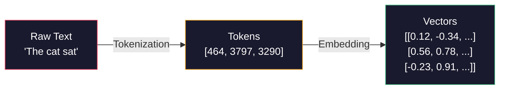

| Stage | What It Does | Captures Identity? | Captures Meaning? |
|-------|-------------|-------------------|-------------------|
| **Raw Text** | Human-readable characters | No (just bytes) | No |
| **Tokens** | Break text into processable units | Yes (unique IDs) | No |
| **Vectors** | Map tokens to dense number arrays | Yes (implicitly) | **Yes** |

Each stage adds information. Raw text is just bytes. Tokens give each piece of text a unique identity. Vectors encode *meaning*  they position words in a space where similar meanings are close together.

### Why This Matters for Memory

Every memory system in AI  from the context window of an LLM to a vector database storing millions of documents  operates on these representations. When you:

- **Store** something in AI memory: text gets tokenized, then embedded into vectors
- **Search** for something: your query gets embedded, then compared against stored vectors
- **Retrieve** something: the closest vectors are found, then decoded back to text

The quality of your representations is the ceiling on the quality of your memory system. A bad embedding model that thinks "bank" (finance) is identical to "bank" (river) will produce a confused retrieval system. A good one that understands context will produce a system that feels almost magical.

Let's start building these representations from the ground up.

---

## 2. From Characters to Tokens

### The Encoding Problem

Before we can do any AI processing, we need to solve a basic question: **how do we represent text as numbers?**

The simplest approach is character encoding  assign a number to each character. This is what ASCII does (1963) and what Unicode extends to cover all human writing systems.

```python
# Characters are already numbers under the hood
text = "Hello AI"
print([ord(c) for c in text])
# [72, 101, 108, 108, 111, 32, 65, 73]

# Unicode handles any language
text_multilingual = "Hello 你好 مرحبا"
print([ord(c) for c in text_multilingual])
# [72, 101, 108, 108, 111, 32, 20320, 22909, 32, 1605, 1585, 1581, 1576, 1575]
```

But feeding raw character codes to an AI model is like trying to understand a book by looking at individual letters  you lose all the structure. The word "understanding" has 13 characters, but it's one concept. We need a way to break text into *meaningful units*.

### Level 1: Character-Level Tokenization

The simplest tokenizer treats each character as a token. Let's build one from scratch:

```python
class CharTokenizer:
    """
    Character-level tokenizer.
    Each unique character becomes a token.
    """

    def __init__(self):
        self.char_to_id = {}
        self.id_to_char = {}
        self.vocab_size = 0

    def fit(self, text: str):
        """Build vocabulary from text."""
        unique_chars = sorted(set(text))
        self.char_to_id = {ch: i for i, ch in enumerate(unique_chars)}
        self.id_to_char = {i: ch for ch, i in self.char_to_id.items()}
        self.vocab_size = len(unique_chars)
        return self

    def encode(self, text: str) -> list[int]:
        """Convert text to token IDs."""
        return [self.char_to_id[ch] for ch in text if ch in self.char_to_id]

    def decode(self, ids: list[int]) -> str:
        """Convert token IDs back to text."""
        return "".join(self.id_to_char[i] for i in ids if i in self.id_to_char)


# Usage
tokenizer = CharTokenizer()
tokenizer.fit("The cat sat on the mat.")

text = "The cat sat"
encoded = tokenizer.encode(text)
decoded = tokenizer.decode(encoded)

print(f"Text:      '{text}'")
print(f"Encoded:   {encoded}")
print(f"Decoded:   '{decoded}'")
print(f"Vocab size: {tokenizer.vocab_size}")

# Output:
# Text:      'The cat sat'
# Encoded:   [3, 8, 6, 1, 4, 3, 0, 1, 11, 3, 0]
# Decoded:   'The cat sat'
# Vocab size: 13
```

Character tokenization works, but it has a critical problem: **sequences become extremely long**. The sentence "The cat sat on the mat" becomes 22 tokens (one per character including spaces). Long sequences mean more computation for the model  and characters alone don't carry much meaning. The letter "t" tells you almost nothing.

### Level 2: Word-Level Tokenization

The obvious improvement is to split on words:

```python
class WordTokenizer:
    """
    Word-level tokenizer.
    Splits on whitespace and punctuation.
    """

    def __init__(self):
        self.word_to_id = {}
        self.id_to_word = {}
        self.vocab_size = 0

    def fit(self, text: str):
        """Build vocabulary from text."""
        import re
        # Split on whitespace and keep punctuation as separate tokens
        words = re.findall(r"\w+|[^\w\s]", text.lower())
        unique_words = sorted(set(words))

        # Reserve 0 for unknown words
        self.word_to_id = {"<UNK>": 0}
        for i, word in enumerate(unique_words, start=1):
            self.word_to_id[word] = i

        self.id_to_word = {i: w for w, i in self.word_to_id.items()}
        self.vocab_size = len(self.word_to_id)
        return self

    def encode(self, text: str) -> list[int]:
        """Convert text to token IDs."""
        import re
        words = re.findall(r"\w+|[^\w\s]", text.lower())
        return [self.word_to_id.get(w, 0) for w in words]

    def decode(self, ids: list[int]) -> str:
        """Convert token IDs back to text."""
        return " ".join(self.id_to_word.get(i, "<UNK>") for i in ids)


# Usage
corpus = "The cat sat on the mat. The dog sat on the log."
tokenizer = WordTokenizer()
tokenizer.fit(corpus)

text = "The cat sat on the mat"
encoded = tokenizer.encode(text)
decoded = tokenizer.decode(encoded)

print(f"Text:      '{text}'")
print(f"Encoded:   {encoded}")
print(f"Decoded:   '{decoded}'")
print(f"Vocab size: {tokenizer.vocab_size}")

# Output:
# Text:      'The cat sat on the mat'
# Encoded:   [8, 1, 6, 5, 8, 4]
# Decoded:   'the cat sat on the mat'
# Vocab size: 10
```

Word tokenization gives us shorter sequences with more meaningful units. But it has its own problem: **the vocabulary explodes**. The English language has hundreds of thousands of words. Add misspellings, technical terms, names, code snippets, and multiple languages, and you're looking at millions of possible tokens. Each token needs its own embedding vector in the model, so a huge vocabulary means a huge embedding table that consumes memory and is slow to train.

Worse, word tokenization can't handle words it hasn't seen. "ChatGPT" would be `<UNK>`. "Unforgettable" might be `<UNK>`. You lose information constantly.

### Level 3: Subword Tokenization (BPE)  The Sweet Spot

Modern AI systems use **subword tokenization**  a middle ground between characters and words. The most common algorithm is **Byte Pair Encoding (BPE)**, which builds a vocabulary by iteratively merging the most frequent pairs of tokens.

The intuition: common words like "the" get their own token, but rare words like "unforgettable" get split into subwords like "un" + "forget" + "table". This gives you a compact vocabulary that can represent *any* text.

Let's build BPE from scratch:

```python
class SimpleBPE:
    """
    Minimal Byte Pair Encoding tokenizer.

    BPE starts with character-level tokens, then iteratively merges
    the most frequent adjacent pair into a new token.
    """

    def __init__(self, vocab_size: int = 300):
        self.vocab_size = vocab_size
        self.merges = {}          # (token_a, token_b) -> merged_token
        self.token_to_id = {}
        self.id_to_token = {}

    def _get_pairs(self, tokens: list[str]) -> dict[tuple, int]:
        """Count frequency of adjacent token pairs."""
        pairs = {}
        for i in range(len(tokens) - 1):
            pair = (tokens[i], tokens[i + 1])
            pairs[pair] = pairs.get(pair, 0) + 1
        return pairs

    def _merge_pair(self, tokens: list[str], pair: tuple[str, str]) -> list[str]:
        """Merge all occurrences of a pair in the token list."""
        merged = pair[0] + pair[1]
        new_tokens = []
        i = 0
        while i < len(tokens):
            if i < len(tokens) - 1 and tokens[i] == pair[0] and tokens[i + 1] == pair[1]:
                new_tokens.append(merged)
                i += 2
            else:
                new_tokens.append(tokens[i])
                i += 1
        return new_tokens

    def fit(self, text: str):
        """Learn BPE merges from training text."""
        # Start with character-level tokens
        # Add special end-of-word marker to preserve word boundaries
        words = text.split()

        # Tokenize each word into characters
        word_tokens = {}
        for word in words:
            chars = list(word) + ["</w>"]
            key = tuple(chars)
            word_tokens[key] = word_tokens.get(key, 0) + 1

        # Build initial vocabulary from characters
        vocab = set()
        for word_tuple in word_tokens:
            for token in word_tuple:
                vocab.add(token)

        # Iteratively merge most frequent pairs
        num_merges = self.vocab_size - len(vocab)

        for merge_idx in range(num_merges):
            # Count pairs across all words
            pair_counts = {}
            for word_tuple, count in word_tokens.items():
                tokens = list(word_tuple)
                for i in range(len(tokens) - 1):
                    pair = (tokens[i], tokens[i + 1])
                    pair_counts[pair] = pair_counts.get(pair, 0) + count

            if not pair_counts:
                break

            # Find most frequent pair
            best_pair = max(pair_counts, key=pair_counts.get)
            merged_token = best_pair[0] + best_pair[1]

            # Store merge rule
            self.merges[best_pair] = merged_token
            vocab.add(merged_token)

            # Apply merge to all words
            new_word_tokens = {}
            for word_tuple, count in word_tokens.items():
                tokens = list(word_tuple)
                tokens = self._merge_pair(tokens, best_pair)
                new_word_tokens[tuple(tokens)] = count
            word_tokens = new_word_tokens

            if (merge_idx + 1) % 50 == 0:
                print(f"  Merge {merge_idx + 1}: '{best_pair[0]}' + '{best_pair[1]}' -> '{merged_token}'")

        # Build token-to-ID mapping
        self.token_to_id = {token: i for i, token in enumerate(sorted(vocab))}
        self.id_to_token = {i: token for token, i in self.token_to_id.items()}

        print(f"\nFinal vocabulary size: {len(vocab)}")
        return self

    def encode(self, text: str) -> list[int]:
        """Encode text using learned BPE merges."""
        words = text.split()
        all_ids = []

        for word in words:
            tokens = list(word) + ["</w>"]

            # Apply merges in order
            for pair, merged in self.merges.items():
                tokens = self._merge_pair(tokens, pair)

            # Convert to IDs
            for token in tokens:
                if token in self.token_to_id:
                    all_ids.append(self.token_to_id[token])
                else:
                    # Unknown character: skip or use a special token
                    pass

        return all_ids

    def decode(self, ids: list[int]) -> str:
        """Decode token IDs back to text."""
        tokens = [self.id_to_token[i] for i in ids if i in self.id_to_token]
        text = "".join(tokens)
        # Replace end-of-word markers with spaces
        text = text.replace("</w>", " ")
        return text.strip()


# Train BPE on sample text
training_text = """
The cat sat on the mat. The cat is a good cat.
The dog sat on the log. The dog is a good dog.
Machine learning is transforming how we process information.
Natural language processing enables machines to understand text.
Deep learning models learn representations from data.
Neural networks process information through layers of computation.
"""

print("Training BPE tokenizer...")
bpe = SimpleBPE(vocab_size=100)
bpe.fit(training_text.strip())

# Test encoding
test = "The cat sat on the mat"
encoded = bpe.encode(test)
decoded = bpe.decode(encoded)

print(f"\nText:    '{test}'")
print(f"Encoded: {encoded}")
print(f"Decoded: '{decoded}'")
print(f"Tokens:  {[bpe.id_to_token[i] for i in encoded]}")
```

### How GPT Models Actually Tokenize: tiktoken

In production, OpenAI's GPT models use a highly optimized BPE implementation called **tiktoken**. Let's see how it works:

```python
import tiktoken

# GPT-4 / GPT-3.5 tokenizer
enc = tiktoken.get_encoding("cl100k_base")

# Basic tokenization
text = "Hello, world! How are you doing today?"
tokens = enc.encode(text)
print(f"Text:       '{text}'")
print(f"Token IDs:  {tokens}")
print(f"Num tokens: {len(tokens)}")
print(f"Tokens:     {[enc.decode([t]) for t in tokens]}")

# Output:
# Text:       'Hello, world! How are you doing today?'
# Token IDs:  [9906, 11, 1917, 0, 2650, 527, 499, 3815, 3432, 30]
# Num tokens: 10
# Tokens:     ['Hello', ',', ' world', '!', ' How', ' are', ' you', ' doing', ' today', '?']

# See how subword tokenization handles rare words
examples = [
    "The cat sat on the mat",
    "Pneumonoultramicroscopicsilicovolcanoconiosis",
    "transformers are amazing",
    "def fibonacci(n): return n if n <= 1 else fibonacci(n-1) + fibonacci(n-2)",
    "こんにちは世界",  # Japanese: "Hello world"
    "https://api.example.com/v2/users?page=1&limit=10",
]

for text in examples:
    tokens = enc.encode(text)
    decoded_tokens = [enc.decode([t]) for t in tokens]
    print(f"\n'{text}'")
    print(f"  Tokens ({len(tokens)}): {decoded_tokens}")
```

Notice how tiktoken handles different types of input:
- Common English words → one token each ("The", " cat", " sat")
- Long medical terms → broken into subwords
- Code → operators and keywords often get their own tokens
- Non-Latin scripts → typically more tokens per character
- URLs → broken into recognizable parts

### Tokenizer Comparison

| Tokenizer | Vocabulary Size | Sequence Length | Handles Unknown Words? | Used By |
|-----------|----------------|----------------|----------------------|---------|
| **Character** | ~100 (ASCII) or ~150K (Unicode) | Very long (1 token/char) | Yes (all chars known) | Early RNNs, some research |
| **Word** | 100K-1M+ | Short (1 token/word) | No (OOV problem) | Classical NLP, Word2Vec |
| **BPE** | 30K-100K | Medium | Yes (falls back to subwords/chars) | GPT-2/3/4, RoBERTa, LLaMA |
| **WordPiece** | 30K | Medium | Yes (## prefix for subwords) | BERT, DistilBERT |
| **SentencePiece** | 32K-64K | Medium | Yes (treats text as byte stream) | T5, ALBERT, LLaMA, mBART |
| **tiktoken** | ~100K | Medium | Yes (BPE variant) | GPT-3.5, GPT-4, Claude-family |

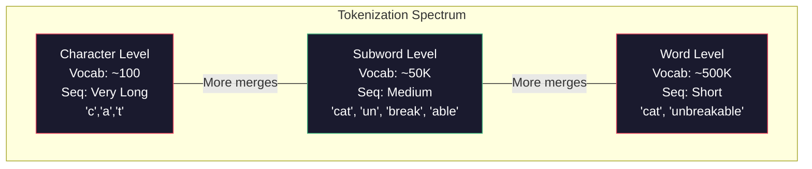

The sweet spot is subword tokenization (highlighted in green above). It balances vocabulary size, sequence length, and coverage. This is why every modern LLM uses some form of BPE or SentencePiece.

### Why Tokenization Matters for Memory

Tokenization is the first gate in any AI memory system. When you store a document in a vector database, it gets tokenized before it gets embedded. When you search, your query gets tokenized. The tokenizer determines:

1. **What the model "sees"**: A bad tokenizer might split "New York" into "New" and "York," losing the concept of the city.
2. **Context window usage**: More tokens per concept means less information fits in the context window.
3. **Cross-lingual behavior**: Many tokenizers use more tokens for non-English text, effectively giving those languages less context window space.

---

## 3. One-Hot Encoding: The Naive Approach

Now that we can convert text to token IDs, we need to convert those IDs into something a neural network can process. The simplest approach is **one-hot encoding**: represent each token as a vector where exactly one element is 1 and all others are 0.

### Implementation

```python
import numpy as np


def one_hot_encode(token_ids: list[int], vocab_size: int) -> np.ndarray:
    """
    Convert token IDs to one-hot vectors.

    Each token becomes a vector of size vocab_size with a single 1.

    Args:
        token_ids: List of integer token IDs
        vocab_size: Total number of tokens in vocabulary

    Returns:
        Array of shape (num_tokens, vocab_size)
    """
    num_tokens = len(token_ids)
    one_hot = np.zeros((num_tokens, vocab_size), dtype=np.float32)

    for i, token_id in enumerate(token_ids):
        one_hot[i, token_id] = 1.0

    return one_hot


# Example: small vocabulary
vocab = {"the": 0, "cat": 1, "sat": 2, "on": 3, "mat": 4, "dog": 5, "ran": 6}
vocab_size = len(vocab)

# Encode "the cat sat"
token_ids = [vocab["the"], vocab["cat"], vocab["sat"]]
one_hot = one_hot_encode(token_ids, vocab_size)

print("Vocabulary:", vocab)
print(f"\nOne-hot encoding of 'the cat sat' (shape: {one_hot.shape}):")
for word, token_id in zip(["the", "cat", "sat"], token_ids):
    print(f"  '{word}' (ID {token_id}): {one_hot[token_ids.index(token_id)]}")

# Output:
# Vocabulary: {'the': 0, 'cat': 1, 'sat': 2, 'on': 3, 'mat': 4, 'dog': 5, 'ran': 6}
#
# One-hot encoding of 'the cat sat' (shape: (3, 7)):
#   'the' (ID 0): [1. 0. 0. 0. 0. 0. 0.]
#   'cat' (ID 1): [0. 1. 0. 0. 0. 0. 0.]
#   'sat' (ID 2): [0. 0. 1. 0. 0. 0. 0.]
```

### Visualizing One-Hot Vectors

```
Vocabulary: [the, cat, sat, on, mat, dog, ran]

"the" → [1, 0, 0, 0, 0, 0, 0]
"cat" → [0, 1, 0, 0, 0, 0, 0]
"dog" → [0, 0, 0, 0, 0, 1, 0]
"sat" → [0, 0, 1, 0, 0, 0, 0]
"ran" → [0, 0, 0, 0, 0, 0, 1]
```

### Why One-Hot Encoding Fails

One-hot encoding has three fatal flaws for AI systems:

**Flaw 1: No Semantics**

"Cat" and "dog" are both animals. "Sat" and "ran" are both verbs describing actions. But one-hot vectors encode zero semantic information:

```python
# Compute similarity between one-hot vectors
cat_vec = one_hot_encode([vocab["cat"]], vocab_size)[0]
dog_vec = one_hot_encode([vocab["dog"]], vocab_size)[0]
sat_vec = one_hot_encode([vocab["sat"]], vocab_size)[0]

# Dot product as similarity measure
cat_dog_sim = np.dot(cat_vec, dog_vec)
cat_sat_sim = np.dot(cat_vec, sat_vec)
cat_cat_sim = np.dot(cat_vec, cat_vec)

print(f"Similarity(cat, dog) = {cat_dog_sim}")  # 0.0  but they're both animals!
print(f"Similarity(cat, sat) = {cat_sat_sim}")  # 0.0
print(f"Similarity(cat, cat) = {cat_cat_sim}")  # 1.0

# Every pair of different words has ZERO similarity.
# "cat" is equally dissimilar to "dog" (a related animal) and "sat" (unrelated verb).
# This is a catastrophic failure for any memory or retrieval system.
```

**Flaw 2: Curse of Dimensionality**

With a real vocabulary, one-hot vectors become absurdly large:

```python
# Real-world vocabulary sizes
vocab_sizes = {
    "Simple example": 7,
    "Word2Vec (Google News)": 3_000_000,
    "BERT WordPiece": 30_522,
    "GPT-2 BPE": 50_257,
    "GPT-4 tiktoken": 100_256,
}

print("Memory usage for one-hot encoding a single token:")
print("-" * 60)
for name, size in vocab_sizes.items():
    bytes_f32 = size * 4  # float32 = 4 bytes
    if bytes_f32 < 1024:
        mem_str = f"{bytes_f32} bytes"
    elif bytes_f32 < 1024 * 1024:
        mem_str = f"{bytes_f32 / 1024:.1f} KB"
    else:
        mem_str = f"{bytes_f32 / (1024 * 1024):.1f} MB"
    print(f"  {name:30s}: {size:>10,} dimensions → {mem_str}")

# Output:
#   Simple example                :          7 dimensions → 28 bytes
#   Word2Vec (Google News)        :  3,000,000 dimensions → 11.4 MB
#   BERT WordPiece                :     30,522 dimensions → 119.2 KB
#   GPT-2 BPE                     :     50,257 dimensions → 196.3 KB
#   GPT-4 tiktoken                :    100,256 dimensions → 391.6 KB
```

A single token in a Word2Vec vocabulary would need an 11.4 MB vector. A sentence of 20 tokens would need 228 MB. That's absurd for storing so little information.

**Flaw 3: No Generalization**

One-hot vectors are orthogonal  every vector is perpendicular to every other. This means a model that learns something about "cat" gets zero benefit when processing "kitten." The model must learn everything independently for every word. This makes training extremely data-hungry and the resulting model fragile.

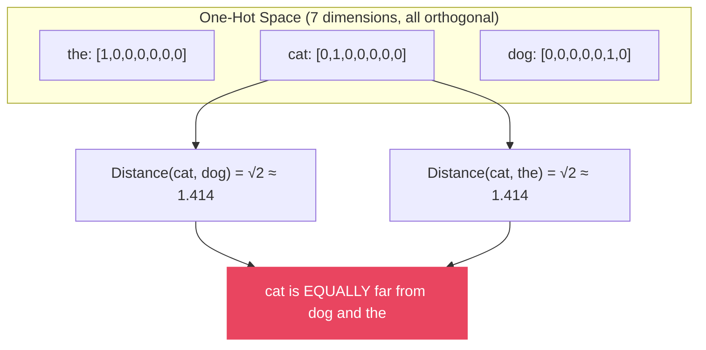

One-hot encoding tells us *which* token we're looking at, but nothing about *what it means*. We need something better.

---

## 4. Dense Vectors: Where Meaning Lives

### The Key Insight

What if, instead of a sparse vector with one meaningful dimension, we used a **dense vector**  a short vector where *every* dimension carries information? And what if we could arrange things so that **similar meanings get similar vectors**?

This is the core idea behind **embeddings**: learn a mapping from tokens to dense vectors where geometric relationships (distance, direction) correspond to semantic relationships (meaning, similarity).

### The GPS Coordinate Analogy

Think of it like GPS coordinates. Every location on Earth can be described by two numbers: latitude and longitude. These numbers aren't arbitrary  they encode spatial relationships:

- New York (40.7, -74.0) and Philadelphia (39.9, -75.2) are close → similar coordinates
- New York (40.7, -74.0) and Tokyo (35.7, 139.7) are far → different coordinates
- You can compute the *distance* between any two cities from their coordinates

Word embeddings work the same way, but in higher dimensions. Instead of 2 dimensions (lat, long), word vectors might have 300 or 768 dimensions. Each dimension captures some aspect of meaning  not as cleanly interpretable as latitude/longitude, but the geometric relationships still hold:

```python
import numpy as np

# Imagine a simplified 4-dimensional embedding space
# Dimensions loosely represent: [animacy, size, domesticated, predatory]

embeddings = {
    "cat":     np.array([ 0.9,  -0.3,   0.8,   0.3]),
    "dog":     np.array([ 0.9,   0.1,   0.9,   0.2]),
    "kitten":  np.array([ 0.9,  -0.7,   0.8,   0.1]),
    "tiger":   np.array([ 0.9,   0.8,  -0.9,   0.9]),
    "car":     np.array([-0.9,   0.6,   0.0,   0.0]),
    "truck":   np.array([-0.9,   0.9,   0.0,   0.0]),
    "king":    np.array([ 0.8,   0.3,   0.0,   0.1]),
    "queen":   np.array([ 0.8,   0.3,   0.0,  -0.1]),
}

# Cosine similarity function
def cosine_similarity(a, b):
    return np.dot(a, b) / (np.linalg.norm(a) * np.linalg.norm(b))

# Compare similarities
pairs = [
    ("cat", "dog"),      # Both animals, domestic
    ("cat", "kitten"),   # Very similar  same animal
    ("cat", "tiger"),    # Both felines, but different
    ("cat", "car"),      # Totally unrelated
    ("car", "truck"),    # Both vehicles
    ("king", "queen"),   # Both royalty
]

print("Cosine Similarities:")
print("-" * 45)
for w1, w2 in pairs:
    sim = cosine_similarity(embeddings[w1], embeddings[w2])
    bar = "█" * int(max(0, sim) * 20)
    print(f"  {w1:8s} ↔ {w2:8s}: {sim:+.3f}  {bar}")

# Output:
# Cosine Similarities:
# ---------------------------------------------
#   cat      ↔ dog     : +0.930  ██████████████████
#   cat      ↔ kitten  : +0.979  ███████████████████
#   cat      ↔ tiger   : +0.250  █████
#   cat      ↔ car     : -0.543
#   car      ↔ truck   : +0.987  ███████████████████
#   king     ↔ queen   : +0.984  ███████████████████
```

### Contrasting with One-Hot

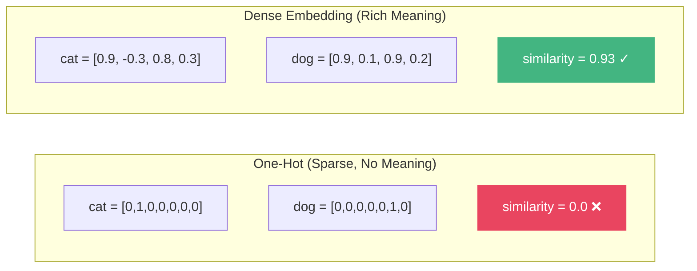

| Property | One-Hot | Dense Embedding |
|----------|---------|-----------------|
| Dimensions | = vocab size (30K-100K+) | Fixed, small (64-1536) |
| Values | Exactly one 1, rest 0 | All values meaningful |
| Semantic similarity | Always 0 for different words | Reflects actual meaning |
| Memory per token | Huge (vocab_size × 4 bytes) | Small (embedding_dim × 4 bytes) |
| Generalization | None | Strong (similar words → similar vectors) |

### How Embeddings Are Actually Stored in Models

In practice, embeddings are stored as a matrix  a lookup table where row `i` contains the embedding vector for token `i`:

```python
import numpy as np

# An embedding matrix: vocab_size × embedding_dim
vocab_size = 10
embedding_dim = 4

# In a real model, these are learned during training
# Here we initialize randomly to show the structure
np.random.seed(42)
embedding_matrix = np.random.randn(vocab_size, embedding_dim).astype(np.float32)

print(f"Embedding matrix shape: {embedding_matrix.shape}")
print(f"  {vocab_size} tokens × {embedding_dim} dimensions\n")

# Looking up an embedding is just indexing a row
token_id = 3
embedding = embedding_matrix[token_id]
print(f"Token ID {token_id} → embedding: {embedding}")

# Embedding a sequence is just selecting multiple rows
token_ids = [1, 3, 5]
sequence_embeddings = embedding_matrix[token_ids]
print(f"\nSequence {token_ids} → shape {sequence_embeddings.shape}:")
for tid, emb in zip(token_ids, sequence_embeddings):
    print(f"  Token {tid}: {emb}")

# Real-world embedding matrix sizes:
print("\n--- Real-World Embedding Tables ---")
real_models = {
    "Word2Vec (Google News)":   (3_000_000, 300),
    "GloVe (840B)":             (2_200_000, 300),
    "BERT-base":                (30_522, 768),
    "GPT-2":                    (50_257, 768),
    "GPT-3 (175B)":             (50_257, 12_288),
    "LLaMA-2 7B":               (32_000, 4_096),
}

for name, (v, d) in real_models.items():
    params = v * d
    mem_mb = (params * 4) / (1024 * 1024)  # float32
    print(f"  {name:30s}: {v:>10,} × {d:>6,} = {params:>15,} params ({mem_mb:>8.1f} MB)")
```

The embedding matrix is one of the most important components of any language model. In GPT-3, it alone contains ~617 million parameters and occupies ~2.4 GB of memory in float32. This is the model's "vocabulary knowledge"  its representation of what each token means.

---

## 5. Measuring Similarity

Once you have vectors, you need ways to compare them. "How similar are these two vectors?" is the fundamental question of any memory retrieval system. There are several ways to answer it, each with different properties.

### Cosine Similarity

The most popular similarity metric. It measures the *angle* between two vectors, ignoring their magnitude. Two vectors pointing in the same direction have cosine similarity of 1.0, perpendicular vectors have 0.0, and opposite vectors have -1.0.

```python
import numpy as np


def cosine_similarity(a: np.ndarray, b: np.ndarray) -> float:
    """
    Compute cosine similarity between two vectors.

    Formula: cos(θ) = (a · b) / (||a|| × ||b||)

    Range: [-1, 1]
        1.0  = identical direction (most similar)
        0.0  = perpendicular (no similarity)
       -1.0  = opposite direction (most dissimilar)

    Properties:
        - Magnitude-invariant (normalizes by vector lengths)
        - Most popular for text similarity
        - Used by default in most vector databases
    """
    dot_product = np.dot(a, b)
    norm_a = np.linalg.norm(a)
    norm_b = np.linalg.norm(b)

    if norm_a == 0 or norm_b == 0:
        return 0.0

    return dot_product / (norm_a * norm_b)


# Example
a = np.array([1.0, 2.0, 3.0])
b = np.array([2.0, 4.0, 6.0])  # Same direction, different magnitude
c = np.array([3.0, -1.0, 0.5]) # Different direction

print(f"cosine_sim(a, b) = {cosine_similarity(a, b):.4f}")  # 1.0 (same direction)
print(f"cosine_sim(a, c) = {cosine_similarity(a, c):.4f}")  # ~0.26 (different)
```

### Euclidean Distance

The straight-line distance between two points. Smaller distance means more similar.

```python
def euclidean_distance(a: np.ndarray, b: np.ndarray) -> float:
    """
    Compute Euclidean (L2) distance between two vectors.

    Formula: d = √(Σ(aᵢ - bᵢ)²)

    Range: [0, ∞)
        0    = identical vectors
        large = very different vectors

    Properties:
        - Magnitude-sensitive (affected by vector scale)
        - Intuitive geometric interpretation
        - Used when magnitude matters
    """
    return np.sqrt(np.sum((a - b) ** 2))


# Equivalent to: np.linalg.norm(a - b)

# Example
a = np.array([1.0, 2.0, 3.0])
b = np.array([1.1, 2.1, 3.1])  # Very close
c = np.array([10.0, 20.0, 30.0])  # Far away

print(f"euclidean(a, b) = {euclidean_distance(a, b):.4f}")  # Small (similar)
print(f"euclidean(a, c) = {euclidean_distance(a, c):.4f}")  # Large (different)
```

### Dot Product

The raw dot product  no normalization. Sensitive to both direction *and* magnitude.

```python
def dot_product_similarity(a: np.ndarray, b: np.ndarray) -> float:
    """
    Compute dot product between two vectors.

    Formula: a · b = Σ(aᵢ × bᵢ)

    Range: (-∞, +∞)
        Positive = similar direction
        Zero     = perpendicular
        Negative = opposite direction

    Properties:
        - Magnitude-sensitive (larger vectors → larger scores)
        - Faster than cosine (no normalization needed)
        - Used in attention mechanisms (scaled dot-product)
        - Equivalent to cosine similarity when vectors are normalized
    """
    return np.dot(a, b)


# Example
a = np.array([1.0, 2.0, 3.0])
b = np.array([2.0, 4.0, 6.0])  # Same direction, 2x magnitude
c = np.array([-1.0, -2.0, -3.0])  # Opposite direction

print(f"dot(a, b) = {dot_product_similarity(a, b):.4f}")  # 28.0 (large positive)
print(f"dot(a, a) = {dot_product_similarity(a, a):.4f}")  # 14.0
print(f"dot(a, c) = {dot_product_similarity(a, c):.4f}")  # -14.0 (negative)
```

### Manhattan Distance

Also known as L1 distance or "taxicab distance." The sum of absolute differences along each dimension  like navigating a city grid instead of flying straight.

```python
def manhattan_distance(a: np.ndarray, b: np.ndarray) -> float:
    """
    Compute Manhattan (L1) distance between two vectors.

    Formula: d = Σ|aᵢ - bᵢ|

    Range: [0, ∞)
        0    = identical vectors
        large = very different vectors

    Properties:
        - Less sensitive to outliers than Euclidean
        - Good for high-dimensional spaces (curse of dimensionality)
        - Also called "taxicab distance" or "city block distance"
    """
    return np.sum(np.abs(a - b))


# Example
a = np.array([1.0, 2.0, 3.0])
b = np.array([1.5, 2.5, 3.5])  # Each dimension differs by 0.5

print(f"manhattan(a, b) = {manhattan_distance(a, b):.4f}")  # 1.5 (sum of diffs)
print(f"euclidean(a, b) = {euclidean_distance(a, b):.4f}")  # ~0.87 (straight line)
# Manhattan is always >= Euclidean
```

### Comparing All Metrics on Word Pairs

Let's see how all four metrics compare on real-ish word vectors:

```python
import numpy as np

# Simulated word embeddings (4 dimensions for illustration)
# In practice, these would come from Word2Vec, GloVe, or a transformer
word_vectors = {
    "king":     np.array([ 0.8,   0.6,  -0.3,   0.9]),
    "queen":    np.array([ 0.75,  0.65, -0.35,  -0.85]),
    "man":      np.array([ 0.5,   0.3,  -0.1,   0.8]),
    "woman":    np.array([ 0.45,  0.35, -0.15,  -0.75]),
    "cat":      np.array([ 0.2,  -0.5,   0.7,   0.1]),
    "dog":      np.array([ 0.25, -0.4,   0.65,   0.15]),
    "car":      np.array([-0.7,   0.8,   0.3,   0.05]),
    "bicycle":  np.array([-0.6,   0.5,   0.35,   0.0]),
    "happy":    np.array([ 0.3,   0.1,   0.5,   0.4]),
    "sad":      np.array([ 0.3,   0.1,  -0.6,  -0.3]),
}

# Pairs to compare
pairs = [
    ("king", "queen"),     # Related (royalty)
    ("king", "man"),       # Related (male humans)
    ("cat", "dog"),        # Related (pets)
    ("cat", "car"),        # Unrelated
    ("happy", "sad"),      # Opposites
    ("car", "bicycle"),    # Related (transport)
    ("man", "woman"),      # Related (humans)
]

print(f"{'Pair':<20} {'Cosine':>8} {'Euclidean':>10} {'Dot Prod':>10} {'Manhattan':>10}")
print("-" * 62)

for w1, w2 in pairs:
    v1, v2 = word_vectors[w1], word_vectors[w2]
    cos = cosine_similarity(v1, v2)
    euc = euclidean_distance(v1, v2)
    dot = dot_product_similarity(v1, v2)
    man = manhattan_distance(v1, v2)
    print(f"{w1 + ' ↔ ' + w2:<20} {cos:>+8.3f} {euc:>10.3f} {dot:>+10.3f} {man:>10.3f}")
```

### Metric Comparison Table

| Metric | Range | "More Similar" = | Magnitude-Sensitive? | Best For |
|--------|-------|-----------------|---------------------|----------|
| **Cosine Similarity** | [-1, 1] | Higher (→ 1.0) | No | Text similarity, retrieval |
| **Euclidean Distance** | [0, ∞) | Lower (→ 0.0) | Yes | Clustering, k-NN |
| **Dot Product** | (-∞, ∞) | Higher | Yes | Attention, fast retrieval |
| **Manhattan Distance** | [0, ∞) | Lower (→ 0.0) | Yes | High-dim spaces, sparse data |

### Which Metric Should You Use?

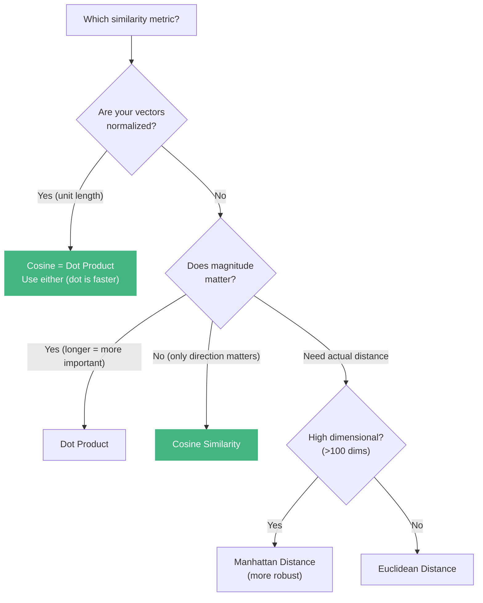

**For most AI memory and retrieval applications, use cosine similarity.** It's direction-based (ignoring magnitude), well-understood, and supported by every vector database. If your vectors are already normalized to unit length, dot product gives the same result and is computationally cheaper.

---

## 6. Word2Vec: Learning Meaning from Context

We've seen that dense vectors can encode meaning  but where do these vectors come from? How do you *learn* embeddings that capture semantic relationships? The breakthrough answer came in 2013 from Tomas Mikolov and colleagues at Google: **Word2Vec**.

### The Core Insight: "You Shall Know a Word by the Company It Keeps"

Word2Vec's key insight is deceptively simple: **words that appear in similar contexts have similar meanings.** Consider:

- "The **cat** sat on the mat"
- "The **dog** sat on the rug"
- "The **kitten** played with the yarn"

"Cat," "dog," and "kitten" all appear with similar surrounding words (the, sat, on, played, with). By training a model to predict context from a word (or a word from context), the model is forced to learn representations where these similar words end up with similar vectors.

### Two Architectures: Skip-gram and CBOW

Word2Vec has two variants:

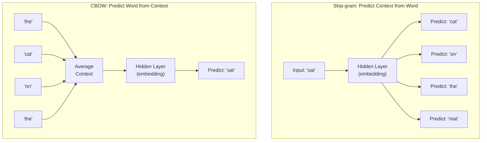

| | Skip-gram | CBOW |
|---|---|---|
| **Input** | Center word | Context words |
| **Output** | Context words | Center word |
| **Strength** | Better for rare words | Faster to train |
| **Common use** | More popular in practice | Slightly better for frequent words |
| **Analogy** | "Given 'bank,' what words appear nearby?" | "Given 'river,' 'fishing,' 'water,' what word fits?" |

### Minimal Word2Vec Implementation (Skip-gram)

Let's build a minimal but complete Word2Vec from scratch using only NumPy. This implementation uses the skip-gram architecture with negative sampling:

```python
import numpy as np
from collections import Counter


class Word2Vec:
    """
    Minimal Word2Vec (Skip-gram with negative sampling).

    Architecture:
        Input (one-hot) → W_in (vocab × embed_dim) → hidden → W_out (embed_dim × vocab) → output

    The rows of W_in become our word embeddings.
    """

    def __init__(self, vocab_size: int, embedding_dim: int = 50, learning_rate: float = 0.01):
        self.vocab_size = vocab_size
        self.embedding_dim = embedding_dim
        self.lr = learning_rate

        # Initialize weight matrices with small random values
        # W_in: input word embeddings (this is what we want)
        # W_out: output word embeddings (used during training only)
        self.W_in = np.random.randn(vocab_size, embedding_dim) * 0.01
        self.W_out = np.random.randn(embedding_dim, vocab_size) * 0.01

    def _sigmoid(self, x: np.ndarray) -> np.ndarray:
        """Numerically stable sigmoid."""
        return np.where(
            x >= 0,
            1 / (1 + np.exp(-x)),
            np.exp(x) / (1 + np.exp(x))
        )

    def train_pair(self, center_id: int, context_id: int, negative_ids: list[int]):
        """
        Train on one (center, context) pair with negative samples.

        The model should predict high probability for the true context word
        and low probability for the negative (random) words.
        """
        # Forward pass: get center word embedding
        h = self.W_in[center_id]  # (embedding_dim,)

        # Positive example: context word should be predicted
        pos_output = self.W_out[:, context_id]  # (embedding_dim,)
        pos_score = self._sigmoid(np.dot(h, pos_output))

        # Negative examples: random words should NOT be predicted
        neg_outputs = self.W_out[:, negative_ids]  # (embedding_dim, num_neg)
        neg_scores = self._sigmoid(-np.dot(h, neg_outputs))

        # Compute gradients
        # Positive gradient: push center and context closer
        pos_grad = (pos_score - 1) * pos_output

        # Update W_out for positive example
        self.W_out[:, context_id] -= self.lr * (pos_score - 1) * h

        # Negative gradients: push center and negatives apart
        neg_grad = np.zeros(self.embedding_dim)
        for i, neg_id in enumerate(negative_ids):
            neg_score = 1 - neg_scores[i]
            neg_grad += neg_score * self.W_out[:, neg_id]
            self.W_out[:, neg_id] -= self.lr * neg_score * h

        # Update W_in for center word
        self.W_in[center_id] -= self.lr * (pos_grad + neg_grad)

    def get_embedding(self, word_id: int) -> np.ndarray:
        """Get the learned embedding for a word."""
        return self.W_in[word_id]


def train_word2vec(sentences: list[list[str]], embedding_dim: int = 50,
                   window_size: int = 2, num_negatives: int = 5,
                   epochs: int = 100, learning_rate: float = 0.025):
    """
    Train Word2Vec on a corpus.

    Args:
        sentences: List of tokenized sentences
        embedding_dim: Size of embedding vectors
        window_size: How many words on each side to consider as context
        num_negatives: Number of negative samples per positive pair
        epochs: Number of training passes
        learning_rate: Initial learning rate

    Returns:
        model: Trained Word2Vec model
        word_to_id: Word-to-index mapping
        id_to_word: Index-to-word mapping
    """
    # Build vocabulary
    word_counts = Counter()
    for sentence in sentences:
        word_counts.update(sentence)

    vocab = sorted(word_counts.keys())
    word_to_id = {word: i for i, word in enumerate(vocab)}
    id_to_word = {i: word for word, i in word_to_id.items()}
    vocab_size = len(vocab)

    # Compute negative sampling distribution (word frequency ^ 0.75)
    freq = np.array([word_counts[id_to_word[i]] for i in range(vocab_size)], dtype=np.float64)
    freq = freq ** 0.75
    neg_dist = freq / freq.sum()

    # Create model
    model = Word2Vec(vocab_size, embedding_dim, learning_rate)

    # Generate training pairs
    training_pairs = []
    for sentence in sentences:
        ids = [word_to_id[w] for w in sentence]
        for i, center_id in enumerate(ids):
            # Get context window
            start = max(0, i - window_size)
            end = min(len(ids), i + window_size + 1)
            for j in range(start, end):
                if j != i:
                    training_pairs.append((center_id, ids[j]))

    print(f"Vocabulary size: {vocab_size}")
    print(f"Training pairs: {len(training_pairs)}")
    print(f"Training for {epochs} epochs...\n")

    # Train
    for epoch in range(epochs):
        # Shuffle training pairs
        np.random.shuffle(training_pairs)

        total_loss = 0
        for center_id, context_id in training_pairs:
            # Sample negative examples
            neg_ids = []
            while len(neg_ids) < num_negatives:
                neg = np.random.choice(vocab_size, p=neg_dist)
                if neg != center_id and neg != context_id:
                    neg_ids.append(neg)

            model.train_pair(center_id, context_id, neg_ids)

        if (epoch + 1) % 20 == 0:
            print(f"  Epoch {epoch + 1}/{epochs} complete")

    return model, word_to_id, id_to_word


# Training corpus  needs to be large for good results,
# but this demonstrates the concept
corpus = [
    "the king ruled the kingdom with wisdom",
    "the queen ruled the land with grace",
    "the man walked to the store",
    "the woman walked to the market",
    "the boy played in the park",
    "the girl played in the garden",
    "the cat sat on the warm mat",
    "the dog sat on the soft rug",
    "the kitten slept on the couch",
    "the puppy slept on the bed",
    "machine learning transforms data into knowledge",
    "deep learning uses neural networks",
    "neural networks learn from training data",
    "the king and queen ruled together",
    "the man and woman walked together",
    "a cat is a small furry animal",
    "a dog is a loyal furry animal",
]

sentences = [s.split() for s in corpus]

model, word_to_id, id_to_word = train_word2vec(
    sentences,
    embedding_dim=30,
    window_size=3,
    num_negatives=5,
    epochs=100,
    learning_rate=0.025
)
```

### The King - Man + Woman = Queen Example

The most famous result of Word2Vec: vector arithmetic on words produces meaningful results. If you take the vector for "king," subtract the vector for "man," and add the vector for "woman," the result is closest to "queen."

```python
def find_most_similar(model, word_to_id, id_to_word, target_vector,
                       exclude_words=None, top_k=5):
    """Find words most similar to a target vector."""
    exclude_ids = set()
    if exclude_words:
        exclude_ids = {word_to_id[w] for w in exclude_words if w in word_to_id}

    similarities = []
    for word_id in range(model.vocab_size):
        if word_id in exclude_ids:
            continue
        word_vec = model.get_embedding(word_id)
        sim = np.dot(target_vector, word_vec) / (
            np.linalg.norm(target_vector) * np.linalg.norm(word_vec) + 1e-8
        )
        similarities.append((id_to_word[word_id], sim))

    similarities.sort(key=lambda x: x[1], reverse=True)
    return similarities[:top_k]


def word_analogy(model, word_to_id, id_to_word, a, b, c):
    """
    Solve: a is to b as c is to ?
    Computes: vector(b) - vector(a) + vector(c)

    Example: king is to queen as man is to ? → woman
    """
    vec_a = model.get_embedding(word_to_id[a])
    vec_b = model.get_embedding(word_to_id[b])
    vec_c = model.get_embedding(word_to_id[c])

    # The magic arithmetic
    target = vec_b - vec_a + vec_c

    results = find_most_similar(model, word_to_id, id_to_word, target,
                                 exclude_words=[a, b, c])

    print(f"\n'{a}' is to '{b}' as '{c}' is to ...?")
    print(f"  Arithmetic: vec('{b}') - vec('{a}') + vec('{c}')")
    for word, sim in results[:3]:
        print(f"  → {word}: {sim:.3f}")
    return results[0][0]


# Test analogies (results depend on corpus quality  ours is tiny)
# With a small corpus, these won't be perfect, but they demonstrate the concept
if "king" in word_to_id and "queen" in word_to_id:
    word_analogy(model, word_to_id, id_to_word, "king", "queen", "man")
    word_analogy(model, word_to_id, id_to_word, "cat", "kitten", "dog")

# Find similar words
if "cat" in word_to_id:
    cat_vec = model.get_embedding(word_to_id["cat"])
    print("\nWords most similar to 'cat':")
    for word, sim in find_most_similar(model, word_to_id, id_to_word, cat_vec,
                                        exclude_words=["cat"]):
        print(f"  {word}: {sim:.3f}")
```

> **Note:** Our tiny training corpus won't produce perfect analogies  you need millions of sentences for truly good embeddings. The point is that the *mechanism* works: the model learns to position words in vector space such that semantic relationships are captured as geometric relationships.

### Using Pre-trained Word2Vec with Gensim

For real applications, use pre-trained embeddings. The `gensim` library makes this easy:

```python
import gensim.downloader as api

# Download pre-trained Word2Vec (trained on Google News, 3 billion words)
# WARNING: This downloads ~1.7 GB
# model = api.load("word2vec-google-news-300")

# For a lighter alternative, use GloVe (trained on Wikipedia + Gigaword)
# ~66 MB download
model = api.load("glove-wiki-gigaword-50")

# Now the embeddings are actually good
print("Similar to 'king':")
for word, score in model.most_similar("king", topn=5):
    print(f"  {word}: {score:.3f}")

# Output (approximately):
# Similar to 'king':
#   prince: 0.824
#   queen: 0.811
#   monarch: 0.782
#   throne: 0.766
#   kingdom: 0.741

# The famous analogy
result = model.most_similar(positive=["king", "woman"], negative=["man"], topn=3)
print("\nking - man + woman =")
for word, score in result:
    print(f"  {word}: {score:.3f}")

# Output:
# king - man + woman =
#   queen: 0.852

# More analogies
analogies = [
    (["paris", "germany"], ["france"], "Paris:France :: ?:Germany"),
    (["bigger", "cold"], ["big"], "big:bigger :: cold:?"),
    (["king", "woman"], ["man"], "man:king :: woman:?"),
]

for positive, negative, description in analogies:
    result = model.most_similar(positive=positive, negative=negative, topn=1)
    print(f"\n{description}")
    print(f"  → {result[0][0]} ({result[0][1]:.3f})")
```

### Limitations of Word2Vec

Word2Vec was revolutionary, but it has critical limitations:

| Limitation | Problem | Example |
|-----------|---------|---------|
| **Static embeddings** | One vector per word regardless of context | "bank" (river) and "bank" (finance) get the SAME vector |
| **Word-level only** | Can't handle subwords or unknown words | "ChatGPT" → not in vocabulary |
| **No sentence meaning** | Only embeds individual words | Can't directly compare sentence similarity |
| **Requires lots of data** | Needs billions of words for good quality | Small corpus → poor embeddings |
| **Shallow context** | Only considers a small window | Misses long-range dependencies |

These limitations motivate everything that comes next in this article  from simple averaging to sentence transformers.

---

## 7. From Word Vectors to Sentence/Document Vectors

Word2Vec gives us good word vectors, but real applications need to compare *sentences* and *documents*. "How similar is this user query to that stored document?" requires sentence-level representations. How do we get from word vectors to sentence vectors?

### Approach 1: Bag-of-Words Averaging

The simplest method: average the word vectors in a sentence.

```python
import numpy as np

# Simulated pre-trained word vectors (in practice, use Word2Vec/GloVe)
word_vectors = {
    "the":         np.array([ 0.1,  0.0, -0.1,  0.0]),
    "cat":         np.array([ 0.7, -0.5,  0.3,  0.1]),
    "sat":         np.array([ 0.2,  0.3,  0.5, -0.1]),
    "on":          np.array([ 0.0,  0.1, -0.2,  0.0]),
    "mat":         np.array([-0.1,  0.2,  0.4,  0.3]),
    "dog":         np.array([ 0.65,-0.4,  0.35,  0.15]),
    "rug":         np.array([-0.15, 0.25, 0.35,  0.25]),
    "is":          np.array([ 0.05, 0.1, -0.05,  0.0]),
    "a":           np.array([ 0.08, 0.02,-0.08, -0.02]),
    "good":        np.array([ 0.4,  0.6,  0.2,   0.3]),
    "bad":         np.array([ 0.35, -0.5, -0.3,  -0.4]),
    "not":         np.array([-0.3, -0.1,  0.1,  -0.2]),
    "very":        np.array([ 0.1,  0.3,  0.1,   0.15]),
    "pet":         np.array([ 0.6, -0.3,  0.25,  0.2]),
    "animal":      np.array([ 0.5, -0.35, 0.2,   0.1]),
    "furry":       np.array([ 0.55,-0.45, 0.15,  0.05]),
}


def sentence_vector_avg(sentence: str, word_vecs: dict) -> np.ndarray:
    """
    Create a sentence vector by averaging its word vectors.

    This is the simplest approach  bag of words (ignores word order).
    """
    words = sentence.lower().split()
    vectors = [word_vecs[w] for w in words if w in word_vecs]

    if not vectors:
        return np.zeros(next(iter(word_vecs.values())).shape)

    return np.mean(vectors, axis=0)


def cosine_sim(a, b):
    """Cosine similarity between two vectors."""
    dot = np.dot(a, b)
    norm = np.linalg.norm(a) * np.linalg.norm(b)
    return dot / norm if norm > 0 else 0.0


# Compare sentences
sentences = [
    "the cat sat on the mat",
    "the dog sat on the rug",
    "the cat is a good pet",
    "the cat is a very bad animal",
]

print("Sentence Vectors (averaged word embeddings):")
print("=" * 60)

vectors = {}
for s in sentences:
    vec = sentence_vector_avg(s, word_vectors)
    vectors[s] = vec
    print(f"  '{s}'")
    print(f"  → {vec}\n")

print("\nPairwise Cosine Similarities:")
print("-" * 60)
for i, s1 in enumerate(sentences):
    for j, s2 in enumerate(sentences):
        if j > i:
            sim = cosine_sim(vectors[s1], vectors[s2])
            print(f"  {sim:+.3f}  '{s1}' ↔ '{s2}'")
```

### Approach 2: TF-IDF Weighted Averaging

Simple averaging treats every word equally  "the" gets the same weight as "cat." TF-IDF (Term Frequency–Inverse Document Frequency) weights words by how *distinctive* they are:

```python
import numpy as np
from collections import Counter
import math


class TFIDFWeightedEmbedding:
    """
    Create sentence/document vectors using TF-IDF weighted word embeddings.

    TF-IDF gives higher weight to words that are:
    - Frequent in THIS document (TF = Term Frequency)
    - Rare across ALL documents (IDF = Inverse Document Frequency)

    Common words like "the" get low weight; distinctive words like "neural" get high weight.
    """

    def __init__(self, word_vectors: dict):
        self.word_vectors = word_vectors
        self.idf = {}

    def fit(self, documents: list[str]):
        """Compute IDF from a corpus of documents."""
        n_docs = len(documents)
        doc_freq = Counter()

        for doc in documents:
            # Count unique words per document
            unique_words = set(doc.lower().split())
            doc_freq.update(unique_words)

        # IDF = log(N / df) + 1 (smoothed)
        self.idf = {
            word: math.log(n_docs / (freq + 1)) + 1
            for word, freq in doc_freq.items()
        }
        return self

    def transform(self, sentence: str) -> np.ndarray:
        """Create a TF-IDF weighted sentence vector."""
        words = sentence.lower().split()
        word_counts = Counter(words)

        embedding_dim = next(iter(self.word_vectors.values())).shape[0]
        weighted_sum = np.zeros(embedding_dim)
        total_weight = 0.0

        for word, count in word_counts.items():
            if word in self.word_vectors and word in self.idf:
                tf = count / len(words)
                idf = self.idf[word]
                weight = tf * idf

                weighted_sum += weight * self.word_vectors[word]
                total_weight += weight

        if total_weight > 0:
            return weighted_sum / total_weight
        return np.zeros(embedding_dim)


# Usage
documents = [
    "the cat sat on the mat",
    "the dog sat on the rug",
    "the cat is a good pet",
    "machine learning is transforming data processing",
]

tfidf_embedder = TFIDFWeightedEmbedding(word_vectors)
tfidf_embedder.fit(documents)

print("TF-IDF Weights (higher = more distinctive):")
print("-" * 40)
important_words = ["the", "cat", "dog", "sat", "mat", "good", "pet"]
for word in important_words:
    if word in tfidf_embedder.idf:
        print(f"  {word:10s}: {tfidf_embedder.idf[word]:.3f}")

# Compare with simple averaging
print("\n\nSimple Average vs TF-IDF Weighted:")
print("=" * 60)

s1 = "the cat sat on the mat"
s2 = "the dog sat on the rug"
s3 = "the cat is a good pet"

# Simple average
avg_sim_12 = cosine_sim(sentence_vector_avg(s1, word_vectors),
                         sentence_vector_avg(s2, word_vectors))
avg_sim_13 = cosine_sim(sentence_vector_avg(s1, word_vectors),
                         sentence_vector_avg(s3, word_vectors))

# TF-IDF weighted
tfidf_sim_12 = cosine_sim(tfidf_embedder.transform(s1),
                            tfidf_embedder.transform(s2))
tfidf_sim_13 = cosine_sim(tfidf_embedder.transform(s1),
                            tfidf_embedder.transform(s3))

print(f"  '{s1}' ↔ '{s2}'")
print(f"    Simple average: {avg_sim_12:.3f}")
print(f"    TF-IDF weighted: {tfidf_sim_12:.3f}")
print(f"\n  '{s1}' ↔ '{s3}'")
print(f"    Simple average: {avg_sim_13:.3f}")
print(f"    TF-IDF weighted: {tfidf_sim_13:.3f}")
```

### The Fatal Flaw: Lost Word Order

Both averaging approaches have a fundamental problem  they produce **bag-of-words** representations that ignore word order entirely:

```python
# These three sentences get IDENTICAL vectors with averaging:
s1 = "the dog bit the man"
s2 = "the man bit the dog"
s3 = "the bit dog man the"  # Nonsensical!

# All three have the exact same words, so their averages are identical
v1 = sentence_vector_avg(s1, word_vectors)
v2 = sentence_vector_avg(s2, word_vectors)

print(f"'{s1}'")
print(f"'{s2}'")
print(f"Similarity: {cosine_sim(v1, v2):.4f}")
# Similarity: 1.0000  identical! But the meanings are very different.
```

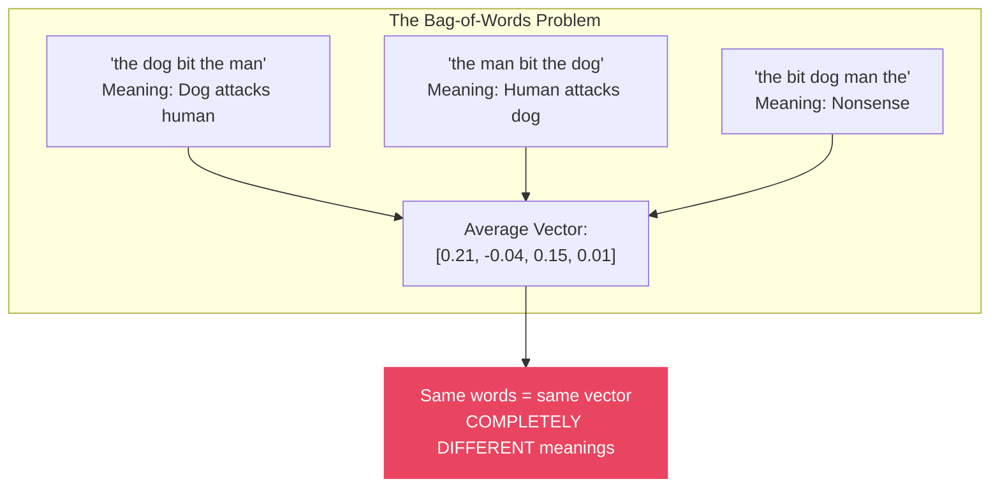

This is a catastrophic failure. A memory system using averaged word vectors would think "the dog bit the man" and "the man bit the dog" are identical. It can't distinguish "not good" from "good not"  making negation invisible.

These problems motivate the move to **contextual embeddings**  models that consider the entire sentence when creating each vector. That's what we'll explore in the next section.

### Summary: Word-to-Sentence Methods

| Method | Preserves Order? | Captures Semantics? | Handles Negation? | Complexity |
|--------|-----------------|--------------------|--------------------|------------|
| **Simple Average** | No | Partially | No | O(n)  trivial |
| **TF-IDF Weighted** | No | Better | No | O(n)  needs IDF computation |
| **SIF (Smooth Inverse Freq)** | No | Better still | No | O(n) + PCA |
| **Sentence Transformers** | **Yes** | **Yes** | **Yes** | O(n²)  transformer |

The first three are fast but lossy. Sentence transformers (next section) are slower but dramatically better.

---

## 8. Modern Embeddings: Sentence Transformers

### The Revolution: Contextual Embeddings

Everything we've built so far has a fundamental limitation: word vectors are **static**. The word "bank" always gets the same vector, whether it appears in "river bank" or "bank account." And our sentence vectors are just averages  they can't distinguish "dog bites man" from "man bites dog."

In 2018-2019, two breakthroughs changed everything:

1. **BERT** (2018): A transformer model that creates *contextual* word embeddings  the same word gets different vectors depending on surrounding context.
2. **Sentence-BERT** (2019): A modification that produces high-quality *sentence* embeddings  fixed-size vectors that capture the full meaning of a sentence, including word order, negation, and context.

These **sentence transformers** are what power modern AI memory systems. Every vector database, every semantic search engine, every RAG pipeline uses some variant of this technology.

### Using Sentence Transformers

The `sentence-transformers` library makes it trivially easy to generate production-quality embeddings:

```python
from sentence_transformers import SentenceTransformer
import numpy as np

# Load a pre-trained model
# all-MiniLM-L6-v2: Good balance of speed and quality (384 dimensions)
model = SentenceTransformer("all-MiniLM-L6-v2")

# Encode sentences  this is all you need!
sentences = [
    "The cat sat on the mat",
    "A feline rested on the rug",           # Same meaning, different words
    "The dog sat on the mat",                # Similar structure, different subject
    "Machine learning is transforming AI",   # Completely different topic
    "The mat was sat on by the cat",         # Passive voice, same meaning
    "I love programming in Python",          # Unrelated
]

# Generate embeddings  each sentence becomes a 384-dimensional vector
embeddings = model.encode(sentences)

print(f"Number of sentences: {len(sentences)}")
print(f"Embedding dimension: {embeddings.shape[1]}")
print(f"Embedding matrix shape: {embeddings.shape}")
print(f"Embedding dtype: {embeddings.dtype}")
print(f"\nFirst embedding (first 10 dims): {embeddings[0][:10]}")

# Compute pairwise similarities
from sentence_transformers.util import cos_sim

similarity_matrix = cos_sim(embeddings, embeddings)

print("\n\nPairwise Cosine Similarities:")
print("=" * 80)
for i in range(len(sentences)):
    for j in range(i + 1, len(sentences)):
        sim = similarity_matrix[i][j].item()
        bar = "█" * int(max(0, sim) * 30)
        print(f"  {sim:.3f} {bar}")
        print(f"    '{sentences[i]}'")
        print(f"    '{sentences[j]}'\n")
```

### Key Results to Notice

The output will show something remarkable:

- **"The cat sat on the mat" vs "A feline rested on the rug"** → High similarity (~0.6-0.7), even though they share almost no words. The model understands that "cat" and "feline" are the same, and "sat on" and "rested on" are similar actions.

- **"The cat sat on the mat" vs "The mat was sat on by the cat"** → Very high similarity (~0.8+). The model understands that passive and active voice express the same meaning.

- **"The cat sat on the mat" vs "Machine learning is transforming AI"** → Low similarity (~0.05-0.15). Completely different topics get distant vectors.

This is the power of contextual embeddings  they capture *meaning*, not just word overlap.

### Handling the Cases That Broke Averaging

Remember how word averaging couldn't distinguish these?

```python
from sentence_transformers import SentenceTransformer
from sentence_transformers.util import cos_sim

model = SentenceTransformer("all-MiniLM-L6-v2")

# Cases that broke bag-of-words averaging
problem_cases = [
    # Word order matters
    ("The dog bit the man", "The man bit the dog"),

    # Negation matters
    ("This movie is good", "This movie is not good"),

    # Synonyms should match
    ("How do I fix this bug?", "How do I resolve this issue?"),

    # Different words, same meaning
    ("The automobile was repaired", "The car was fixed"),

    # Same words, different meaning (polysemy)
    ("I went to the bank to deposit money", "I sat on the river bank to fish"),
]

print("Sentence Transformer Results:")
print("=" * 70)

for s1, s2 in problem_cases:
    emb = model.encode([s1, s2])
    sim = cos_sim(emb[0:1], emb[1:2]).item()
    print(f"\n  Similarity: {sim:.3f}")
    print(f"  '{s1}'")
    print(f"  '{s2}'")

# Expected approximate results:
#   "The dog bit the man" vs "The man bit the dog"     → ~0.75 (similar but distinguishable)
#   "This movie is good" vs "This movie is not good"   → ~0.55 (correctly lower than 1.0)
#   "How do I fix this bug?" vs "How do I resolve..."  → ~0.85 (recognized as similar)
#   "The automobile was repaired" vs "The car was..."   → ~0.88 (synonym understanding)
#   "bank deposit" vs "river bank"                      → ~0.30 (different meanings detected)
```

### Batch Processing for Performance

In production, you'll often need to embed thousands or millions of documents. Sentence transformers support efficient batching:

```python
from sentence_transformers import SentenceTransformer
import time

model = SentenceTransformer("all-MiniLM-L6-v2")

# Simulate a corpus of documents
documents = [f"This is document number {i} about topic {i % 10}" for i in range(1000)]

# Batch encoding with progress bar
start = time.time()
embeddings = model.encode(
    documents,
    batch_size=64,          # Process 64 sentences at a time
    show_progress_bar=True, # Visual progress
    normalize_embeddings=True,  # Pre-normalize for faster cosine similarity
)
elapsed = time.time() - start

print(f"\nEncoded {len(documents)} documents in {elapsed:.2f}s")
print(f"  ({len(documents) / elapsed:.0f} documents/second)")
print(f"  Shape: {embeddings.shape}")
print(f"  Memory: {embeddings.nbytes / 1024 / 1024:.1f} MB")

# When embeddings are pre-normalized, dot product = cosine similarity
# This is much faster for retrieval
query = model.encode(["What is topic 5?"], normalize_embeddings=True)
scores = query @ embeddings.T  # Fast dot product
top_indices = scores[0].argsort()[-5:][::-1]

print("\nTop 5 results for 'What is topic 5?':")
for idx in top_indices:
    print(f"  Score: {scores[0][idx]:.3f}  {documents[idx]}")
```

### Embedding Model Comparison Table

Choosing the right embedding model is a critical decision for any AI memory system. Here's a comparison of popular models:

| Model | Dimensions | Max Tokens | Speed | Quality | Size | Best For |
|-------|-----------|-----------|-------|---------|------|----------|
| **all-MiniLM-L6-v2** | 384 | 256 | Very Fast | Good | 80 MB | General purpose, prototyping |
| **all-mpnet-base-v2** | 768 | 384 | Fast | Very Good | 420 MB | Higher quality retrieval |
| **bge-large-en-v1.5** | 1024 | 512 | Medium | Excellent | 1.3 GB | English retrieval, RAG |
| **e5-large-v2** | 1024 | 512 | Medium | Excellent | 1.3 GB | Retrieval with instruction prefix |
| **text-embedding-3-small** (OpenAI) | 1536 | 8191 | API-bound | Very Good | API | Production with OpenAI ecosystem |
| **text-embedding-3-large** (OpenAI) | 3072 | 8191 | API-bound | Excellent | API | Highest quality, cost-sensitive |
| **voyage-3** (Anthropic/Voyage) | 1024 | 32000 | API-bound | Excellent | API | Long documents, code |
| **nomic-embed-text-v1.5** | 768 | 8192 | Fast | Very Good | 550 MB | Long context, open source |
| **mxbai-embed-large-v1** | 1024 | 512 | Medium | Excellent | 1.3 GB | Top MTEB performance |
| **gte-large-en-v1.5** | 1024 | 8192 | Medium | Excellent | 1.3 GB | Long context, Alibaba |

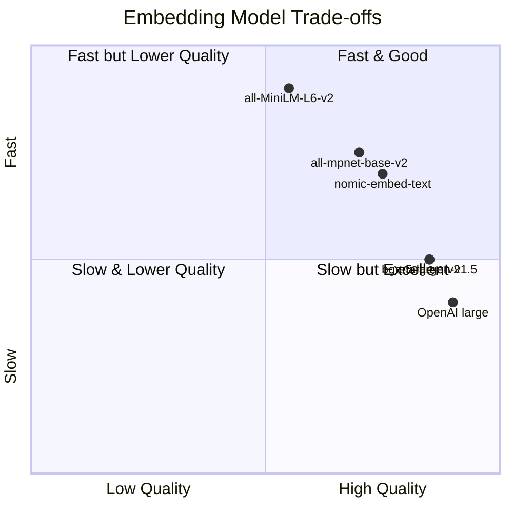

### How to Choose an Embedding Model

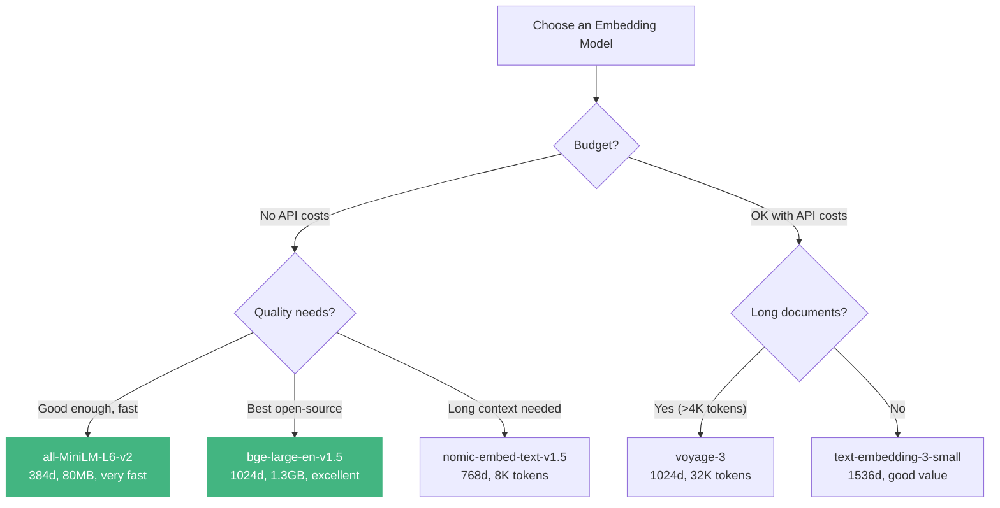

### Important: Embedding Compatibility

A critical production concern: **you cannot mix embeddings from different models**. An embedding from `all-MiniLM-L6-v2` lives in a completely different vector space than one from `bge-large-en-v1.5`. Comparing them is like comparing GPS coordinates on Earth with coordinates on Mars  the numbers mean nothing relative to each other.

```python
# WRONG  comparing embeddings from different models
from sentence_transformers import SentenceTransformer
import numpy as np

model_a = SentenceTransformer("all-MiniLM-L6-v2")      # 384 dimensions
model_b = SentenceTransformer("all-mpnet-base-v2")      # 768 dimensions

text = "The cat sat on the mat"

emb_a = model_a.encode([text])  # Shape: (1, 384)
emb_b = model_b.encode([text])  # Shape: (1, 768)

# These can't even be compared  different dimensions!
# And even if they were the same size, the spaces are different.
print(f"Model A embedding shape: {emb_a.shape}")
print(f"Model B embedding shape: {emb_b.shape}")
print("These vectors live in DIFFERENT spaces  comparison is meaningless!")
```

**Rule: Once you choose an embedding model for a vector database, you must use the same model for all queries.** Changing models means re-embedding everything.

---

## 9. The Vector Space: Visualizing High-Dimensional Meaning

Embeddings live in high-dimensional spaces (384, 768, 1024+ dimensions). Human brains can't visualize anything beyond 3 dimensions. But we can use **dimensionality reduction** techniques to project these high-dimensional vectors down to 2D for visualization  sacrificing some information but revealing structure.

### Three Visualization Techniques

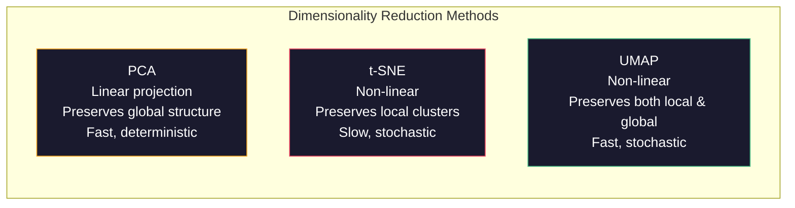

| Method | Type | Speed | Preserves Global Structure? | Preserves Local Clusters? | Deterministic? |
|--------|------|-------|---------------------------|--------------------------|----------------|
| **PCA** | Linear | Very fast | Yes | Partially | Yes |
| **t-SNE** | Non-linear | Slow | No | **Yes** | No |
| **UMAP** | Non-linear | Fast | Partially | **Yes** | No |

### Complete Visualization Code

```python
import numpy as np
import matplotlib.pyplot as plt
from sentence_transformers import SentenceTransformer
from sklearn.decomposition import PCA
from sklearn.manifold import TSNE

# Optional: pip install umap-learn
try:
    import umap
    HAS_UMAP = True
except ImportError:
    HAS_UMAP = False
    print("Install umap-learn for UMAP visualization: pip install umap-learn")


def visualize_embeddings(sentences, categories, method="pca", title=None):
    """
    Embed sentences and visualize them in 2D.

    Args:
        sentences: List of strings to embed
        categories: List of category labels (for coloring)
        method: 'pca', 'tsne', or 'umap'
        title: Plot title
    """
    # Generate embeddings
    model = SentenceTransformer("all-MiniLM-L6-v2")
    embeddings = model.encode(sentences)
    print(f"Original embedding shape: {embeddings.shape}")

    # Reduce to 2D
    if method == "pca":
        reducer = PCA(n_components=2, random_state=42)
        coords = reducer.fit_transform(embeddings)
        variance_explained = reducer.explained_variance_ratio_.sum()
        method_label = f"PCA (variance explained: {variance_explained:.1%})"
    elif method == "tsne":
        # Perplexity should be less than number of samples
        perplexity = min(30, len(sentences) - 1)
        reducer = TSNE(n_components=2, random_state=42, perplexity=perplexity)
        coords = reducer.fit_transform(embeddings)
        method_label = "t-SNE"
    elif method == "umap" and HAS_UMAP:
        reducer = umap.UMAP(n_components=2, random_state=42, n_neighbors=5)
        coords = reducer.fit_transform(embeddings)
        method_label = "UMAP"
    else:
        print(f"Method '{method}' not available. Using PCA.")
        reducer = PCA(n_components=2, random_state=42)
        coords = reducer.fit_transform(embeddings)
        method_label = "PCA (fallback)"

    # Plot
    fig, ax = plt.subplots(1, 1, figsize=(14, 10))

    # Color by category
    unique_categories = list(set(categories))
    colors = plt.cm.tab10(np.linspace(0, 1, len(unique_categories)))
    category_to_color = {cat: colors[i] for i, cat in enumerate(unique_categories)}

    for i, (x, y) in enumerate(coords):
        color = category_to_color[categories[i]]
        ax.scatter(x, y, c=[color], s=100, alpha=0.7, edgecolors="white", linewidth=0.5)

        # Add text label (truncate long sentences)
        label = sentences[i][:40] + "..." if len(sentences[i]) > 40 else sentences[i]
        ax.annotate(label, (x, y), textcoords="offset points", xytext=(5, 5),
                    fontsize=7, alpha=0.8)

    # Add legend
    for cat in unique_categories:
        ax.scatter([], [], c=[category_to_color[cat]], s=100, label=cat)
    ax.legend(loc="best", fontsize=9)

    ax.set_title(title or f"Sentence Embeddings  {method_label}", fontsize=14)
    ax.set_xlabel("Dimension 1")
    ax.set_ylabel("Dimension 2")
    ax.grid(True, alpha=0.3)

    plt.tight_layout()
    plt.savefig("embedding_visualization.png", dpi=150, bbox_inches="tight")
    plt.show()
    print(f"Saved to embedding_visualization.png")


# Sample sentences with categories
sentences = [
    # Animals
    "The cat sat on the warm mat",
    "A kitten played with a ball of yarn",
    "Dogs are loyal and friendly companions",
    "The puppy chased its tail in circles",
    "Birds sing beautiful songs at dawn",

    # Technology
    "Python is a popular programming language",
    "Machine learning models require large datasets",
    "The GPU accelerated the training process",
    "Kubernetes orchestrates container deployments",
    "React is a JavaScript frontend framework",

    # Food
    "Italian pizza is baked in a wood-fired oven",
    "Sushi is a traditional Japanese dish",
    "The chef prepared a delicious pasta",
    "Fresh vegetables make a healthy salad",
    "Chocolate cake is my favorite dessert",

    # Science
    "Gravity pulls objects toward the Earth",
    "DNA carries genetic information in organisms",
    "Photosynthesis converts sunlight to energy",
    "The speed of light is approximately 300,000 km/s",
    "Atoms are the building blocks of matter",
]

categories = (
    ["Animals"] * 5 +
    ["Technology"] * 5 +
    ["Food"] * 5 +
    ["Science"] * 5
)

# Visualize with all three methods
visualize_embeddings(sentences, categories, method="pca",
                     title="Sentence Embeddings  PCA Projection")
```

### What You'll See in the Visualizations

When you run this code, the resulting plot will reveal clusters:

- **Animal sentences** cluster together  the model knows cats, dogs, and birds are related topics
- **Technology sentences** form their own cluster  programming and ML are close in meaning-space
- **Food sentences** group together  all about cuisine and cooking
- **Science sentences** cluster separately  physics, biology, chemistry

This is the power of embeddings: **semantic relationships become spatial relationships**. Documents about similar topics end up near each other in vector space, which is exactly what makes semantic search and retrieval-augmented generation (RAG) work.

### Comparing Reduction Methods Side by Side

```python
import matplotlib.pyplot as plt
from sklearn.decomposition import PCA
from sklearn.manifold import TSNE
from sentence_transformers import SentenceTransformer
import numpy as np

# Generate embeddings once
model = SentenceTransformer("all-MiniLM-L6-v2")
embeddings = model.encode(sentences)

fig, axes = plt.subplots(1, 3, figsize=(20, 6))

# PCA
pca_coords = PCA(n_components=2, random_state=42).fit_transform(embeddings)

# t-SNE
tsne_coords = TSNE(n_components=2, random_state=42,
                    perplexity=min(15, len(sentences) - 1)).fit_transform(embeddings)

# UMAP (if available)
try:
    import umap
    umap_coords = umap.UMAP(n_components=2, random_state=42,
                             n_neighbors=5).fit_transform(embeddings)
except ImportError:
    umap_coords = pca_coords  # Fallback

# Plot each method
for ax, coords, title in zip(
    axes,
    [pca_coords, tsne_coords, umap_coords],
    ["PCA", "t-SNE", "UMAP"]
):
    unique_cats = list(set(categories))
    colors = plt.cm.tab10(np.linspace(0, 1, len(unique_cats)))
    cat_to_color = {c: colors[i] for i, c in enumerate(unique_cats)}

    for i, (x, y) in enumerate(coords):
        ax.scatter(x, y, c=[cat_to_color[categories[i]]], s=80, alpha=0.7,
                   edgecolors="white", linewidth=0.5)

    for cat in unique_cats:
        ax.scatter([], [], c=[cat_to_color[cat]], s=80, label=cat)

    ax.legend(fontsize=8)
    ax.set_title(title, fontsize=14)
    ax.grid(True, alpha=0.3)

plt.suptitle("Same Embeddings, Three Visualization Methods", fontsize=16, y=1.02)
plt.tight_layout()
plt.savefig("three_methods_comparison.png", dpi=150, bbox_inches="tight")
plt.show()
```

### When to Use Which Visualization

| Scenario | Best Method | Why |
|----------|------------|-----|
| Quick exploration | **PCA** | Fast, deterministic, shows global layout |
| Finding clusters | **t-SNE** | Best at revealing local cluster structure |
| Publication/presentation | **UMAP** | Good balance of local and global, faster than t-SNE |
| Very large datasets (>100K) | **PCA** or **UMAP** | t-SNE doesn't scale well |
| Comparing across runs | **PCA** | Deterministic  same input → same output |

---

## 10. Numerical Precision

### Why Precision Matters for AI Memory

Every vector stored in your AI memory system occupies real memory  RAM, disk, or GPU VRAM. When you're storing millions of document embeddings, the precision of each number directly impacts your costs:

```python
import numpy as np

# A single embedding from all-MiniLM-L6-v2: 384 dimensions
embedding_dim = 384

# Different precision levels
precisions = {
    "float64 (double)":   np.float64,
    "float32 (single)":   np.float32,
    "float16 (half)":     np.float16,
    "bfloat16":           np.float32,  # Simulated  not native NumPy
    "int8 (quantized)":   np.int8,
}

print(f"Memory per embedding ({embedding_dim} dimensions):")
print("-" * 55)

for name, dtype in precisions.items():
    if name == "bfloat16":
        bytes_per_element = 2  # bfloat16 is 2 bytes
    else:
        bytes_per_element = np.dtype(dtype).itemsize

    bytes_per_embedding = embedding_dim * bytes_per_element
    print(f"  {name:22s}: {bytes_per_element} bytes/dim × {embedding_dim} = {bytes_per_embedding:,} bytes ({bytes_per_embedding / 1024:.1f} KB)")

# Scale to real-world scenarios
print("\n\nMemory for 1 million embeddings (384 dimensions):")
print("-" * 55)

n_embeddings = 1_000_000
for name, bytes_per_element in [("float32", 4), ("float16", 2), ("int8", 1)]:
    total_bytes = n_embeddings * embedding_dim * bytes_per_element
    total_gb = total_bytes / (1024 ** 3)
    print(f"  {name:10s}: {total_gb:.2f} GB")

# Output:
# Memory for 1 million embeddings (384 dimensions):
# -------------------------------------------------------
#   float32   : 1.43 GB
#   float16   : 0.72 GB
#   int8      : 0.36 GB
```

### The Precision Hierarchy

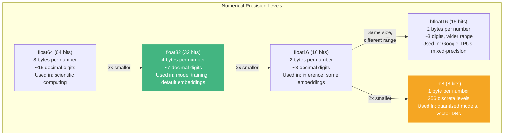

### How Quantization Works

Quantization converts high-precision floats to lower-precision integers. The key insight: for similarity search, you don't need perfect precision  you just need to preserve the *ranking* of distances.

```python
import numpy as np


def quantize_to_int8(vectors: np.ndarray) -> tuple[np.ndarray, float, float]:
    """
    Quantize float32 vectors to int8 (scalar quantization).

    Maps the range [min, max] of the float values to [-128, 127].

    Returns:
        quantized: int8 array
        scale: scaling factor for dequantization
        zero_point: zero point for dequantization
    """
    v_min = vectors.min()
    v_max = vectors.max()

    # Compute scale and zero point
    scale = (v_max - v_min) / 255.0  # Map to 256 levels
    zero_point = v_min

    # Quantize
    quantized = np.round((vectors - zero_point) / scale).astype(np.int8) - 128

    return quantized, scale, zero_point


def dequantize_from_int8(quantized: np.ndarray, scale: float,
                          zero_point: float) -> np.ndarray:
    """Convert int8 vectors back to float32 (with information loss)."""
    return ((quantized.astype(np.float32) + 128) * scale + zero_point)


# Demonstrate quantization
np.random.seed(42)
original = np.random.randn(5, 384).astype(np.float32)  # 5 embeddings, 384 dims

# Quantize
quantized, scale, zero_point = quantize_to_int8(original)

# Dequantize
reconstructed = dequantize_from_int8(quantized, scale, zero_point)

# Measure error
error = np.abs(original - reconstructed)
print(f"Original dtype:      {original.dtype}, shape: {original.shape}")
print(f"Quantized dtype:     {quantized.dtype}, shape: {quantized.shape}")
print(f"Memory reduction:    {original.nbytes / quantized.nbytes:.1f}x")
print(f"\nReconstruction error:")
print(f"  Mean absolute error: {error.mean():.6f}")
print(f"  Max absolute error:  {error.max():.6f}")

# Check if rankings are preserved (this is what matters for search!)
from numpy.linalg import norm

query = original[0]
query_q = quantized[0]

# Original similarities
orig_sims = [np.dot(query, original[i]) / (norm(query) * norm(original[i]))
              for i in range(1, 5)]

# Quantized similarities (using dequantized vectors)
recon_query = reconstructed[0]
recon_sims = [np.dot(recon_query, reconstructed[i]) / (norm(recon_query) * norm(reconstructed[i]))
               for i in range(1, 5)]

print(f"\nSimilarity rankings (original → quantized):")
print(f"  Original rankings:  {np.argsort(orig_sims)[::-1] + 1}")
print(f"  Quantized rankings: {np.argsort(recon_sims)[::-1] + 1}")
print(f"  Rankings preserved: {np.array_equal(np.argsort(orig_sims), np.argsort(recon_sims))}")
```

### Precision vs Quality Trade-off

| Precision | Bytes/Dim | Memory (1M × 384d) | Recall@10 | Use Case |
|-----------|----------|--------------------:|----------:|----------|
| **float32** | 4 | 1.43 GB | 100% (baseline) | Training, exact search |
| **float16** | 2 | 0.72 GB | ~99.9% | Inference, most vector DBs |
| **int8** | 1 | 0.36 GB | ~99.0% | Large-scale search, edge devices |
| **binary** | 0.125 | 0.05 GB | ~90-95% | First-stage retrieval, filtering |

### Production Scaling Calculations

```python
# Real-world memory planning

def calculate_memory(n_documents: int, embedding_dim: int,
                      bytes_per_dim: int, overhead_factor: float = 1.3) -> dict:
    """
    Calculate memory requirements for a vector database.

    Args:
        n_documents: Number of documents/embeddings
        embedding_dim: Dimensions per embedding
        bytes_per_dim: Bytes per dimension (4=float32, 2=float16, 1=int8)
        overhead_factor: Database overhead (indexes, metadata)  typically 1.2-1.5x

    Returns:
        Dictionary with memory calculations
    """
    raw_bytes = n_documents * embedding_dim * bytes_per_dim
    with_overhead = raw_bytes * overhead_factor

    return {
        "raw_gb": raw_bytes / (1024 ** 3),
        "with_overhead_gb": with_overhead / (1024 ** 3),
        "per_embedding_bytes": embedding_dim * bytes_per_dim,
    }


# Scenario: Building a knowledge base for a company
scenarios = [
    ("Startup (10K docs)",     10_000,    384, 4),
    ("Mid-size (100K docs)",   100_000,   384, 4),
    ("Enterprise (1M docs)",   1_000_000, 768, 4),
    ("Enterprise (1M, int8)",  1_000_000, 768, 1),
    ("Large scale (10M docs)", 10_000_000, 384, 4),
    ("Large scale (10M, int8)", 10_000_000, 384, 1),
    ("Web scale (100M docs)",  100_000_000, 384, 1),
]

print(f"{'Scenario':<28} {'Docs':>10} {'Dim':>5} {'Prec':>6} {'Raw GB':>8} {'With OH':>9}")
print("-" * 76)

for name, n, dim, bpd in scenarios:
    prec = {4: "f32", 2: "f16", 1: "int8"}[bpd]
    result = calculate_memory(n, dim, bpd)
    print(f"{name:<28} {n:>10,} {dim:>5} {prec:>6} {result['raw_gb']:>8.2f} {result['with_overhead_gb']:>8.2f} GB")
```

### Key Takeaway: Start with float32, Optimize Later

For most projects:
1. **Start with float32**  it's the default and eliminates precision as a variable during debugging
2. **Move to float16** when you need to cut memory in half with minimal quality loss
3. **Use int8** when scaling to millions of documents and memory is a constraint
4. **Use binary quantization** only for first-stage retrieval in massive systems (re-rank with full precision)

---

## 11. Project: Build a Semantic Search Engine from Scratch

Let's put everything together. We'll build a complete semantic search engine in ~100 lines that demonstrates the full pipeline: tokenization (handled by the model), embedding, storage, and retrieval.

```python
"""
Semantic Search Engine  A Complete Implementation

This search engine embeds documents and queries into the same vector space,
then finds the most semantically similar documents to any query.

Unlike keyword search (which matches exact words), this finds documents
by MEANING  even if query and document share no words.

Requirements:
    pip install sentence-transformers numpy
"""

import numpy as np
from sentence_transformers import SentenceTransformer
import time


class SemanticSearchEngine:
    """
    A complete semantic search engine built on sentence embeddings.

    Architecture:
        1. Documents are embedded into vectors at index time
        2. Queries are embedded into the same vector space
        3. Cosine similarity finds the closest documents
        4. Results are ranked by relevance score
    """

    def __init__(self, model_name: str = "all-MiniLM-L6-v2"):
        """Initialize with a sentence transformer model."""
        print(f"Loading model: {model_name}...")
        self.model = SentenceTransformer(model_name)
        self.documents = []
        self.embeddings = None
        self.metadata = []
        print(f"  Model loaded. Embedding dimension: {self.model.get_sentence_embedding_dimension()}")

    def index(self, documents: list[str], metadata: list[dict] = None,
              batch_size: int = 64):
        """
        Index documents for search.

        Args:
            documents: List of document texts
            metadata: Optional list of metadata dicts (one per document)
            batch_size: Batch size for embedding generation
        """
        print(f"\nIndexing {len(documents)} documents...")
        start = time.time()

        self.documents = documents
        self.metadata = metadata or [{} for _ in documents]

        # Generate embeddings (normalized for fast cosine similarity via dot product)
        self.embeddings = self.model.encode(
            documents,
            batch_size=batch_size,
            normalize_embeddings=True,
            show_progress_bar=len(documents) > 100,
        )

        elapsed = time.time() - start
        mem_mb = self.embeddings.nbytes / (1024 * 1024)
        print(f"  Indexed {len(documents)} docs in {elapsed:.2f}s")
        print(f"  Embedding matrix: {self.embeddings.shape} ({mem_mb:.1f} MB)")

    def search(self, query: str, top_k: int = 5, threshold: float = 0.0) -> list[dict]:
        """
        Search for documents similar to the query.

        Args:
            query: Search query text
            top_k: Number of results to return
            threshold: Minimum similarity score (0.0 to 1.0)

        Returns:
            List of result dicts with 'document', 'score', 'index', 'metadata'
        """
        if self.embeddings is None:
            raise ValueError("No documents indexed. Call .index() first.")

        # Embed the query
        query_embedding = self.model.encode(
            [query], normalize_embeddings=True
        )

        # Compute similarities (dot product = cosine similarity for normalized vectors)
        scores = (query_embedding @ self.embeddings.T)[0]

        # Rank by score
        top_indices = np.argsort(scores)[::-1][:top_k]

        results = []
        for idx in top_indices:
            score = float(scores[idx])
            if score >= threshold:
                results.append({
                    "document": self.documents[idx],
                    "score": score,
                    "index": int(idx),
                    "metadata": self.metadata[idx],
                })

        return results

    def search_and_display(self, query: str, top_k: int = 5):
        """Search and pretty-print results."""
        print(f"\n{'=' * 70}")
        print(f"Query: \"{query}\"")
        print(f"{'=' * 70}")

        results = self.search(query, top_k=top_k)

        for i, result in enumerate(results, 1):
            score_bar = "█" * int(result["score"] * 30)
            print(f"\n  #{i} [Score: {result['score']:.3f}] {score_bar}")
            print(f"     {result['document'][:100]}")
            if result["metadata"]:
                print(f"     Metadata: {result['metadata']}")

        if not results:
            print("  No results found.")

        return results


# ============================================================
# Demo: Build a Knowledge Base and Search It
# ============================================================

# Create the search engine
engine = SemanticSearchEngine("all-MiniLM-L6-v2")

# A sample knowledge base (imagine these are your company's documents)
documents = [
    # Technical docs
    "Python is a high-level programming language known for its readability and versatility.",
    "Docker containers package applications with their dependencies for consistent deployment.",
    "Kubernetes orchestrates containerized applications across clusters of machines.",
    "PostgreSQL is a powerful open-source relational database management system.",
    "Redis is an in-memory data store used as a cache, message broker, and database.",
    "Git is a distributed version control system for tracking changes in source code.",
    "REST APIs use HTTP methods to perform CRUD operations on resources.",
    "GraphQL is a query language that lets clients request exactly the data they need.",
    "Machine learning models learn patterns from data to make predictions.",
    "Neural networks are computing systems inspired by biological neural networks.",

    # Business docs
    "Our Q4 revenue exceeded projections by 15 percent driven by enterprise sales.",
    "The marketing team launched a new campaign targeting developer communities.",
    "Customer satisfaction scores improved after the support ticket response time decreased.",
    "The product roadmap for next year prioritizes mobile experience and API improvements.",
    "We hired 50 new engineers to support the growing infrastructure team.",

    # Process docs
    "All code changes require at least two approvals before merging to the main branch.",
    "Incidents are classified as P1 through P4 based on customer impact and scope.",
    "New employees complete a two-week onboarding program covering tools and processes.",
    "Performance reviews happen quarterly with self-assessment and manager feedback.",
    "The deployment pipeline runs tests, security scans, and staging verification automatically.",
]

# Index with metadata
metadata = [
    {"category": "technical", "topic": "python"},
    {"category": "technical", "topic": "docker"},
    {"category": "technical", "topic": "kubernetes"},
    {"category": "technical", "topic": "postgres"},
    {"category": "technical", "topic": "redis"},
    {"category": "technical", "topic": "git"},
    {"category": "technical", "topic": "rest"},
    {"category": "technical", "topic": "graphql"},
    {"category": "technical", "topic": "ml"},
    {"category": "technical", "topic": "neural-nets"},
    {"category": "business", "topic": "finance"},
    {"category": "business", "topic": "marketing"},
    {"category": "business", "topic": "support"},
    {"category": "business", "topic": "product"},
    {"category": "business", "topic": "hiring"},
    {"category": "process", "topic": "code-review"},
    {"category": "process", "topic": "incidents"},
    {"category": "process", "topic": "onboarding"},
    {"category": "process", "topic": "performance"},
    {"category": "process", "topic": "cicd"},
]

engine.index(documents, metadata)

# Now search! Notice how it finds relevant results even with different wording.
queries = [
    "How do I store data fast?",                         # Should find Redis, PostgreSQL
    "What's the process for shipping code?",              # Should find code review, CI/CD
    "How is the company doing financially?",              # Should find Q4 revenue
    "container orchestration",                             # Should find Kubernetes, Docker
    "How do new people get started?",                      # Should find onboarding
    "artificial intelligence and deep learning",           # Should find ML, neural nets
]

for query in queries:
    engine.search_and_display(query, top_k=3)
```

### What This Project Demonstrates

This ~100-line search engine demonstrates the entire representation pipeline from this article:

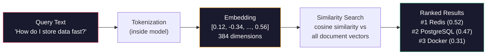

1. **Tokenization**: The sentence transformer handles this internally  you never see tokens
2. **Embedding**: Text becomes a 384-dimensional dense vector
3. **Storage**: Embeddings are stored as a NumPy matrix (in production, this would be a vector database)
4. **Retrieval**: Cosine similarity ranks documents by semantic relevance
5. **Results**: The most semantically similar documents are returned

The key insight: the query "How do I store data fast?" contains none of the words "Redis," "cache," or "in-memory." Yet a semantic search engine finds Redis as the top result because the *meanings* are close in vector space. This is the power of the representations we've built in this article.

---

## 12. How Representations Connect to Memory

Let's step back and connect everything in this article to the central theme of this series: **memory in AI systems**.

### The Representation → Memory Pipeline

Every AI memory system  from a chatbot's context window to a million-document vector database  depends on the representations we've built in this article:

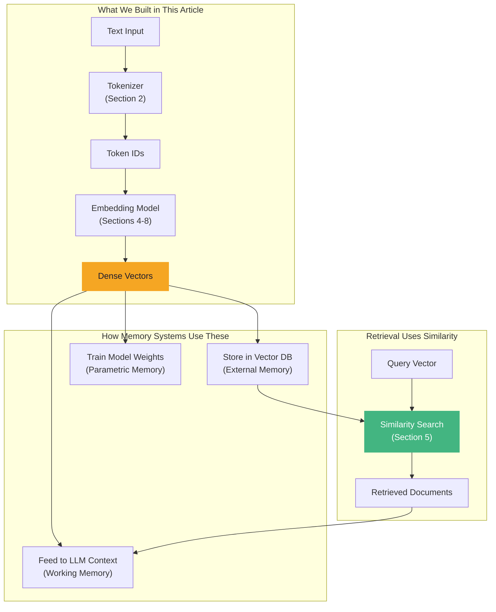

### Tokens Are the Input Language

Tokens are how information enters an AI system. Every word you type, every document you store, every query you make  it all starts as tokens. The tokenizer determines:

- **What the model can represent**: If "New York" is split into two tokens, the model must learn to compose them. If it's one token, the concept is atomic.
- **How much fits in memory**: More tokens per concept = less information per context window.
- **Cross-lingual fairness**: Languages that need more tokens per word get less effective memory.

### Vectors Are the Memory Format

Once tokenized, information is converted to vectors for storage and comparison. The quality of your vectors directly determines the quality of your memory system:

| If Your Vectors Are... | Your Memory System Will... |
|------------------------|---------------------------|
| High quality (good model, fine-tuned) | Retrieve relevant results, understand nuance |
| Low quality (bad model, wrong domain) | Return irrelevant results, miss important context |
| Too large (high dimensional) | Be slow and expensive to search |
| Too small (low dimensional) | Lose nuance, conflate different meanings |
| Static (Word2Vec-era) | Miss context-dependent meaning |
| Contextual (transformer-based) | Understand polysemy, negation, word order |

### Similarity Is the Retrieval Mechanism

When a user asks a question and your system needs to find relevant information, it computes similarity between the query vector and all stored vectors. The metric you choose (cosine, dot product, etc.) determines:

- **What "relevant" means**: Cosine finds directionally similar vectors; Euclidean finds nearby vectors.
- **How fast retrieval is**: Dot product on normalized vectors is cheapest; Manhattan distance is most expensive.
- **How accurate retrieval is**: The right metric for your data distribution improves results.

### The Quality Ceiling

**Your representation quality is the ceiling on your memory system quality.** No amount of clever retrieval algorithms, re-ranking, or prompt engineering can compensate for embeddings that don't capture the meaning of your documents. This is why choosing the right embedding model (Section 8) is one of the most important decisions in building an AI memory system.

---

## 13. Vocabulary Cheat Sheet

| Term | Definition | Example |
|------|-----------|---------|
| **Token** | A unit of text that a model processes | "Hello" → 1 token; "unbelievable" → "un" + "believ" + "able" (3 tokens) |
| **Tokenizer** | Algorithm that breaks text into tokens | BPE, WordPiece, SentencePiece |
| **Vocabulary** | The set of all tokens a model knows | GPT-4's vocabulary has ~100K tokens |
| **Token ID** | Integer identifier for a specific token | "Hello" → 9906 in tiktoken |
| **One-Hot Vector** | Sparse vector with a single 1, rest 0 | [0, 0, 1, 0, 0] for token ID 2 in a vocab of 5 |
| **Embedding** | Dense vector representing a token/sentence | [0.12, -0.34, 0.56, ...] (384 dimensions) |
| **Embedding Dimension** | Number of values in an embedding vector | 384 (MiniLM), 768 (BERT), 1536 (OpenAI) |
| **Embedding Model** | Neural network that produces embeddings | all-MiniLM-L6-v2, text-embedding-3-small |
| **Embedding Matrix** | Lookup table: token ID → embedding vector | Shape: (vocab_size × embedding_dim) |
| **Cosine Similarity** | Angle-based similarity metric, [-1, 1] | cos_sim("cat", "dog") ≈ 0.8 |
| **Euclidean Distance** | Straight-line distance, [0, ∞) | dist("cat", "car") ≈ 5.2 |
| **Dot Product** | Raw inner product, (-∞, ∞) | dot("cat", "dog") ≈ 12.4 |
| **Dense Vector** | A vector where most/all values are non-zero | [0.12, -0.34, 0.56, 0.78] |
| **Sparse Vector** | A vector where most values are zero | [0, 0, 0, 1, 0, 0, 0, 0] |
| **Word2Vec** | Algorithm that learns word vectors from context | king - man + woman ≈ queen |
| **Skip-gram** | Word2Vec variant: predict context from word | Input: "sat" → predict: "cat", "on", "mat" |
| **CBOW** | Word2Vec variant: predict word from context | Input: "the", "on", "mat" → predict: "sat" |
| **BPE** | Byte Pair Encoding  subword tokenization | "unhappiness" → "un" + "happiness" |
| **Contextual Embedding** | Embedding that changes based on context | "bank" in "river bank" ≠ "bank" in "bank account" |
| **Static Embedding** | One fixed embedding per word regardless of context | Word2Vec, GloVe |
| **Sentence Transformer** | Model that embeds entire sentences as vectors | all-MiniLM-L6-v2, all-mpnet-base-v2 |
| **Dimensionality Reduction** | Projecting high-dim vectors to lower dims | PCA, t-SNE, UMAP |
| **Quantization** | Reducing numerical precision for efficiency | float32 → int8 (4x smaller) |
| **Normalization** | Scaling vectors to unit length | v / ||v|| → length = 1.0 |
| **Vector Space** | The mathematical space where embeddings live | 384-dimensional real-valued space |
| **Semantic Similarity** | How similar two texts are in meaning | "automobile" ↔ "car" = high similarity |
| **Bag of Words** | Representation that ignores word order | "dog bit man" = "man bit dog" (a problem!) |
| **TF-IDF** | Term weighting: frequent-in-doc but rare-overall gets high weight | "the" → low weight; "quantum" → high weight |

---

## 14. Key Takeaways and What's Next

### What We Built

In this article, we went from raw text to production-quality semantic search. Here's the complete journey:

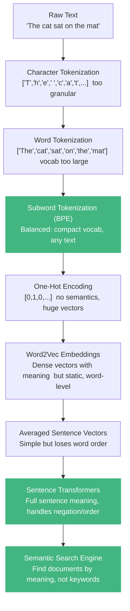

### The 10 Key Insights

1. **Computers only understand numbers.** Every AI system must convert text to numerical representations before processing. The quality of this conversion is the ceiling on everything that follows.

2. **Subword tokenization is the sweet spot.** Characters are too granular, words create vocabulary explosions. BPE and SentencePiece balance vocabulary size, sequence length, and coverage.

3. **One-hot encoding captures identity, not meaning.** Every word is equally different from every other. This is fatal for memory and retrieval systems.

4. **Dense embeddings encode semantic relationships as geometric relationships.** Similar meanings → similar vectors → close in space. This is the foundation of all AI memory.

5. **Cosine similarity is your default metric.** It ignores magnitude and focuses on direction, making it robust for comparing text embeddings. Use dot product on normalized vectors for speed.

6. **Word2Vec proved that meaning emerges from context.** Words that appear in similar contexts get similar vectors. This "distributional hypothesis" underlies all modern embeddings.

7. **Averaging word vectors loses word order**  a fatal flaw. "Dog bit man" and "man bit dog" get identical vectors. Sentence transformers solve this.

8. **Sentence transformers are the production standard.** They produce single vectors that capture full sentence meaning, including word order, negation, and context.

9. **Numerical precision is a memory-cost trade-off.** float32 is the safe default. int8 quantization gives 4x compression with <1% quality loss for most retrieval tasks.

10. **Your embedding model choice is a one-way door.** Changing models means re-embedding everything. Choose carefully, and never mix embeddings from different models.

### What's Next: Part 2  Neural Networks as Memory Systems

In Part 2, we'll explore how neural networks themselves act as memory systems. We'll build:

- **Perceptrons** and **multi-layer networks** from scratch in NumPy
- **Backpropagation**  how networks learn to remember patterns
- **Recurrent Neural Networks (RNNs)**  networks with explicit memory
- **LSTMs and GRUs**  solving the vanishing gradient (forgetting) problem
- **The hidden state as working memory**  what RNNs actually remember

We'll see how the representations from Part 1 become the *inputs* to neural networks, and how those networks learn to store patterns in their weights (parametric memory) and carry information through sequences (working memory). The foundations we built here  tokens, embeddings, similarity  will be the vocabulary we use to understand everything that follows.

See you in Part 2.

---

*This article is part of the "Memory in AI Systems Deep Dive" series. Started from Part 0? You're building a deep, hands-on understanding of how AI systems store, retrieve, and reason over information  from raw tokens to production memory architectures.*

**Series Navigation:**
- **Part 0:** The Landscape of AI Memory (overview and roadmap)
- **Part 1:** How Machines Represent Information (tokens, vectors, embeddings)  *you are here*
- **Part 2:** Neural Networks as Memory Systems (weights, hidden states, RNNs)
- **Part 3:** The Attention Mechanism (how transformers focus and remember)
- **Part 4:** The Transformer Architecture (the engine behind modern AI)
- *...and 15 more parts taking you to production memory systems*