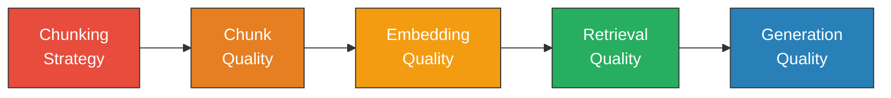
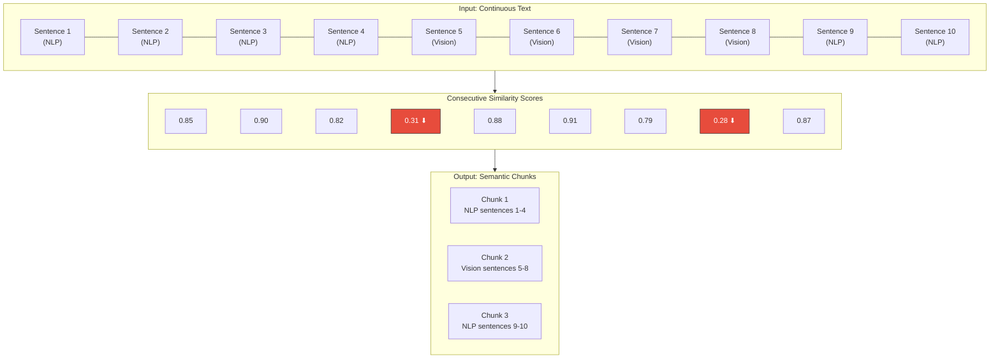
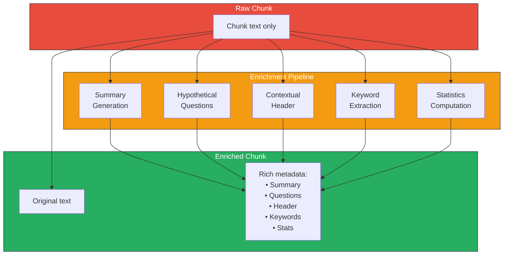
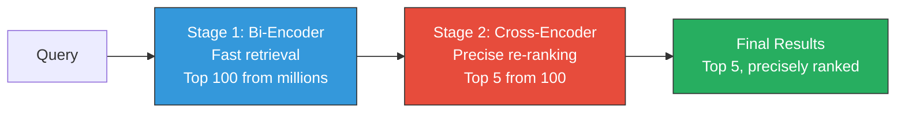
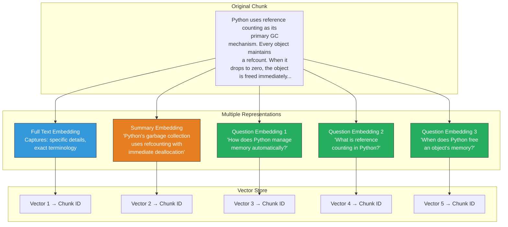
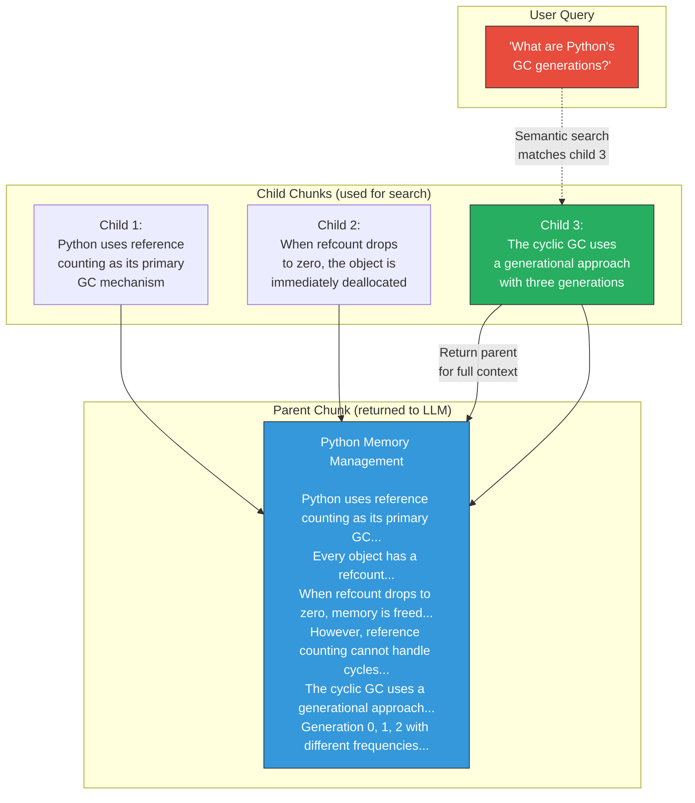
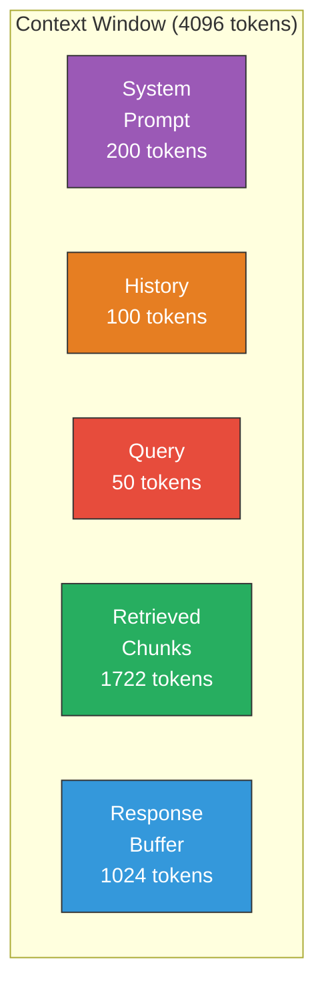

# Memory in AI Systems Deep Dive  Part 10: Chunking and Retrieval Optimization  The Art of Splitting Text for AI Memory

---

**Series:** Memory in AI Systems  A Developer's Deep Dive from Fundamentals to Production
**Part:** 10 of 19
**Audience:** Developers with programming experience who want to understand AI memory systems from the ground up
**Reading time:** ~50 minutes

---

In Part 9, we built a complete RAG (Retrieval-Augmented Generation) pipeline from scratch. We learned how to take external documents, embed them into vectors, store them in a vector database, retrieve relevant chunks at query time, and feed them as context to an LLM. That pipeline worked  but if you tested it on real-world documents, you probably noticed something: **the quality of your answers depends enormously on how you split your documents into chunks**. A poorly chunked document can make a brilliant retrieval system look broken. A well-chunked document can make a simple retrieval system look magical.

This part is about that critical middle layer: how you split text into chunks, how you enrich those chunks with metadata, and how you optimize the retrieval pipeline to find the *right* chunks for any query. We're moving from "it works" to "it works well."

By the end of this part, you will:

- Understand why chunking strategy is the **single biggest lever** for RAG quality
- Implement **7 different chunking strategies** from scratch (fixed-size, sentence, paragraph, recursive, semantic, markdown-aware, and agentic)
- Master **overlap strategies** and understand when they help vs. waste resources
- Build a **metadata enrichment** pipeline that makes chunks self-describing
- Implement **hybrid retrieval** combining BM25 keyword search with vector similarity
- Build a **re-ranking pipeline** using cross-encoders for precision
- Implement **query decomposition** for complex multi-part questions
- Build a **multi-vector retriever** that indexes documents from multiple angles
- Implement **parent-child chunking** for the best of both worlds (precise search, rich context)
- Build a **token budget manager** that maximizes context utilization
- Measure retrieval quality with **MRR, Recall@K, Precision@K, and NDCG**
- Upgrade Part 9's pipeline into a **production-quality** retrieval system

Let's optimize.

---

## Table of Contents

1. [Why Chunking Matters More Than You Think](#1-why-chunking-matters-more-than-you-think)
2. [Chunking Strategies: A Complete Catalog](#2-chunking-strategies-a-complete-catalog)
3. [The Overlap Question](#3-the-overlap-question)
4. [Metadata Enrichment](#4-metadata-enrichment)
5. [Retrieval Optimization Techniques](#5-retrieval-optimization-techniques)
6. [Multi-Vector Retrieval](#6-multi-vector-retrieval)
7. [Parent-Child Chunking](#7-parent-child-chunking)
8. [Token Budget Management](#8-token-budget-management)
9. [Evaluation: Measuring Retrieval Quality](#9-evaluation-measuring-retrieval-quality)
10. [Project: Build an Optimized RAG Pipeline](#10-project-build-an-optimized-rag-pipeline)
11. [Vocabulary Cheat Sheet](#11-vocabulary-cheat-sheet)
12. [Key Takeaways and What's Next](#12-key-takeaways-and-whats-next)

---

## 1. Why Chunking Matters More Than You Think

### The Goldilocks Problem

Chunking seems trivial on the surface: take a document, split it into pieces, embed each piece. But the size and boundaries of those pieces create a fundamental trade-off that determines your entire system's quality.

**Chunks too small:**
- Lose context. A sentence like "This approach significantly outperforms the baseline" means nothing without knowing what "this approach" and "the baseline" refer to.
- Increase the number of chunks, making retrieval noisier  more irrelevant results compete for the top-K positions.
- Force the LLM to stitch together meaning from disconnected fragments.
- Embeddings of tiny text snippets tend to be less semantically meaningful.

**Chunks too large:**
- Dilute relevance. A 5-page chunk about machine learning might contain one paragraph about gradient descent. The embedding of the whole chunk captures the general topic but not the specific detail.
- Waste context window space. If your LLM has a 4K token window and you retrieve 3 chunks of 1000 tokens each, you've used 75% of your budget  but maybe only 10% of that retrieved text was actually relevant.
- Fewer chunks means fewer "entry points" for retrieval. If the user's question matches a specific detail buried in a large chunk, the overall chunk embedding might not be close enough in vector space.

**Chunks just right:**
- Each chunk is a self-contained unit of meaning.
- The embedding faithfully represents the chunk's semantic content.
- Retrieved chunks provide focused, relevant context.
- The LLM receives information dense with signal, low in noise.

Let's see this concretely.

### The Same Document, Three Ways

Consider this excerpt about Python's garbage collection:

```python
document = """
Python Memory Management and Garbage Collection

Python uses automatic memory management with a private heap containing all
Python objects and data structures. The management of this private heap is
ensured internally by the Python memory manager.

Reference Counting
The primary garbage collection mechanism in Python is reference counting.
Every object in Python has a reference count, which tracks the number of
references pointing to that object. When an object's reference count drops
to zero, CPython immediately deallocates the object's memory.

For example, consider this code:
    x = [1, 2, 3]    # list refcount = 1
    y = x             # list refcount = 2
    del x             # list refcount = 1
    del y             # list refcount = 0 -> deallocated

Reference counting has two key advantages: it's simple and it's immediate.
Objects are freed as soon as they become unreachable. This means Python has
more predictable memory behavior than languages with tracing collectors.

However, reference counting has a critical flaw: it cannot detect reference
cycles. When two objects reference each other but are otherwise unreachable,
their reference counts never reach zero.

Cycle Detection
To handle reference cycles, Python includes a cyclic garbage collector. This
collector periodically traverses all container objects (lists, dicts, sets,
classes) looking for groups of objects that reference each other but are not
reachable from any root object.

The cyclic collector uses a generational approach with three generations:
- Generation 0: newly created objects (collected most frequently)
- Generation 1: objects that survived one collection cycle
- Generation 2: long-lived objects (collected least frequently)

When a generation is collected, all younger generations are also collected.
The collector can be tuned using gc.set_threshold(gen0, gen1, gen2), where
each threshold controls how many allocations trigger a collection of that
generation.

Memory Pools
CPython uses a system of memory pools called "arenas" for small object
allocation (objects <= 512 bytes). This reduces fragmentation and system
call overhead compared to using malloc for every small allocation.

The hierarchy is:
- Arenas: 256 KB blocks obtained from the OS
- Pools: 4 KB blocks within arenas, each dedicated to a specific size class
- Blocks: The actual memory given to Python objects

This pooling system is why Python processes often don't return memory to the
OS even after deleting many objects  the memory is kept in pools for reuse.
"""
```

Now let's chunk it three ways and see what we get when querying "How does Python handle circular references?":

```python
import numpy as np
from typing import List, Tuple


def fake_embed(text: str) -> np.ndarray:
    """
    Simulates embedding by hashing text features into a vector.
    In production, you'd use a real embedding model.
    """
    np.random.seed(hash(text[:100]) % 2**31)
    return np.random.randn(64)


def cosine_similarity(a: np.ndarray, b: np.ndarray) -> float:
    return float(np.dot(a, b) / (np.linalg.norm(a) * np.linalg.norm(b)))


def retrieve_top_k(query: str, chunks: List[str], k: int = 2) -> List[Tuple[float, str]]:
    """Retrieve top-k chunks by cosine similarity."""
    query_vec = fake_embed(query)
    scored = []
    for chunk in chunks:
        chunk_vec = fake_embed(chunk)
        score = cosine_similarity(query_vec, chunk_vec)
        scored.append((score, chunk))
    scored.sort(key=lambda x: x[0], reverse=True)
    return scored[:k]


# --- Strategy 1: Small fixed-size chunks (100 chars) ---
def chunk_fixed_small(text: str, size: int = 100) -> List[str]:
    words = text.split()
    chunks = []
    current = []
    current_len = 0
    for word in words:
        if current_len + len(word) + 1 > size and current:
            chunks.append(" ".join(current))
            current = [word]
            current_len = len(word)
        else:
            current.append(word)
            current_len += len(word) + 1
    if current:
        chunks.append(" ".join(current))
    return chunks


# --- Strategy 2: Large fixed-size chunks (1000 chars) ---
def chunk_fixed_large(text: str, size: int = 1000) -> List[str]:
    return chunk_fixed_small(text, size)


# --- Strategy 3: Paragraph-based chunks ---
def chunk_by_paragraph(text: str) -> List[str]:
    paragraphs = text.strip().split("\n\n")
    return [p.strip() for p in paragraphs if p.strip()]


# Test all three strategies
query = "How does Python handle circular references?"

print("=" * 70)
print("QUERY:", query)
print("=" * 70)

for name, chunks in [
    ("Small chunks (100 chars)", chunk_fixed_small(document, 100)),
    ("Large chunks (1000 chars)", chunk_fixed_large(document, 1000)),
    ("Paragraph chunks", chunk_by_paragraph(document)),
]:
    print(f"\n--- {name}: {len(chunks)} chunks ---")
    results = retrieve_top_k(query, chunks, k=2)
    for score, chunk in results:
        preview = chunk[:120].replace("\n", " ")
        print(f"  Score: {score:.4f} | {preview}...")
```

**What you'll typically see in practice** (with a real embedding model):

| Strategy | Top Result | Problem |
|---|---|---|
| **Small (100 chars)** | "their reference counts never reach zero." | Fragment  no explanation of *what* cycles are or *how* Python detects them |
| **Large (1000 chars)** | A 1000-char block mixing reference counting details with cycle detection | Diluted  the cycle detection answer is buried in irrelevant ref-counting details |
| **Paragraph** | The "Cycle Detection" paragraph | Focused  self-contained explanation of exactly what was asked |

The paragraph-based approach wins here because the document's natural structure aligns with semantic boundaries. But this won't always be the case  not all documents have clean paragraphs, and not all questions align with natural sections. That's why we need a full toolkit of chunking strategies.

### The Chunking Quality Chain

Think of it as a chain where each link affects the next:



A bad chunking strategy at the start cascades into bad answers at the end. No amount of sophisticated retrieval or prompting can fix fundamentally bad chunks. This is why chunking deserves its own dedicated section  it's the foundation everything else builds on.

---

## 2. Chunking Strategies: A Complete Catalog

Let's build seven different chunking strategies, each solving different problems. For every strategy, we'll implement the code, discuss when to use it, and analyze its trade-offs.

### Strategy 1: Fixed-Size Chunking

The simplest possible approach: split text into chunks of a fixed number of characters (or tokens).

```python
from dataclasses import dataclass, field
from typing import List, Optional, Dict, Any
import re
import uuid


@dataclass
class Chunk:
    """Represents a single chunk of text with metadata."""
    text: str
    chunk_id: str = field(default_factory=lambda: str(uuid.uuid4())[:8])
    source: str = ""
    start_char: int = 0
    end_char: int = 0
    metadata: Dict[str, Any] = field(default_factory=dict)

    @property
    def char_count(self) -> int:
        return len(self.text)

    @property
    def word_count(self) -> int:
        return len(self.text.split())

    def __repr__(self) -> str:
        preview = self.text[:60].replace('\n', '\\n')
        return f"Chunk(id={self.chunk_id}, words={self.word_count}, text='{preview}...')"


class FixedSizeChunker:
    """
    Splits text into chunks of a fixed character (or token) size.

    Pros:
        - Dead simple. No edge cases.
        - Predictable chunk sizes  easy to reason about costs and context budgets.
        - Works on any text, regardless of structure.

    Cons:
        - Splits in the middle of sentences, paragraphs, even words.
        - Chunks have no semantic coherence  they're just byte boundaries.
        - Embeddings of arbitrarily cut text are less meaningful.

    When to use:
        - As a baseline to compare against smarter strategies.
        - When you need guaranteed maximum chunk sizes (e.g., for API limits).
        - When text has no discernible structure (e.g., OCR output, logs).
    """

    def __init__(self, chunk_size: int = 500, overlap: int = 50,
                 use_tokens: bool = False):
        self.chunk_size = chunk_size
        self.overlap = overlap
        self.use_tokens = use_tokens

    def _count_units(self, text: str) -> int:
        """Count characters or approximate tokens."""
        if self.use_tokens:
            # Rough approximation: 1 token ≈ 4 characters for English
            return len(text) // 4
        return len(text)

    def chunk(self, text: str, source: str = "") -> List[Chunk]:
        """Split text into fixed-size chunks."""
        if not text.strip():
            return []

        chunks = []
        start = 0

        while start < len(text):
            # Calculate end position
            end = start + self.chunk_size

            # If we're past the end of text, take whatever's left
            if end >= len(text):
                chunk_text = text[start:].strip()
                if chunk_text:
                    chunks.append(Chunk(
                        text=chunk_text,
                        source=source,
                        start_char=start,
                        end_char=len(text),
                        metadata={"strategy": "fixed_size", "chunk_index": len(chunks)}
                    ))
                break

            # Try to break at a word boundary (look back up to 50 chars)
            adjusted_end = end
            while adjusted_end > start + self.chunk_size - 50 and adjusted_end > start:
                if text[adjusted_end] in " \n\t":
                    break
                adjusted_end -= 1

            if adjusted_end == start:
                adjusted_end = end  # Fall back to hard cut

            chunk_text = text[start:adjusted_end].strip()
            if chunk_text:
                chunks.append(Chunk(
                    text=chunk_text,
                    source=source,
                    start_char=start,
                    end_char=adjusted_end,
                    metadata={"strategy": "fixed_size", "chunk_index": len(chunks)}
                ))

            # Move forward, accounting for overlap
            start = adjusted_end - self.overlap

        return chunks


# --- Demo ---
sample_text = """Python is a high-level programming language. It was created by
Guido van Rossum and first released in 1991. Python's design philosophy emphasizes
code readability with its use of significant indentation. Its language constructs and
object-oriented approach aim to help programmers write clear, logical code for both
small and large-scale projects."""

chunker = FixedSizeChunker(chunk_size=120, overlap=20)
chunks = chunker.chunk(sample_text)

print(f"Input: {len(sample_text)} chars → {len(chunks)} chunks\n")
for c in chunks:
    print(f"  [{c.start_char}:{c.end_char}] ({c.char_count} chars) "
          f'"{c.text[:70]}..."')
```

```
Input: 389 chars → 4 chunks

  [0:117] (113 chars) "Python is a high-level programming language. It was created by
Guido van Rossum and first r..."
  [97:218] (119 chars) "first released in 1991. Python's design philosophy emphasizes
code readability with its use..."
  [198:323] (118 chars) "use of significant indentation. Its language constructs and
object-oriented approach aim to..."
  [303:389] (86 chars) "aim to help programmers write clear, logical code for both
small and large-scale projects."
```

Notice how chunks cut through sentences arbitrarily. The first chunk ends mid-sentence with "first r...", which isn't ideal for embedding quality.

### Strategy 2: Sentence-Based Chunking

Split on sentence boundaries so each chunk contains complete sentences.

```python
class SentenceChunker:
    """
    Splits text into chunks along sentence boundaries.

    Pros:
        - Every chunk contains complete sentences  grammatically coherent.
        - Embeddings are more meaningful since sentences carry complete thoughts.
        - Respects natural language structure.

    Cons:
        - Sentences vary wildly in length (3 words to 50+ words).
        - A single very long sentence might exceed your size target.
        - Doesn't respect higher-level structure (paragraphs, sections).
        - Sentence detection is non-trivial (abbreviations, decimals, etc.).

    When to use:
        - For well-written prose (articles, documentation, books).
        - When you need guaranteed grammatical completeness.
        - As a building block for more sophisticated strategies.
    """

    # Regex to split on sentence boundaries
    # Handles: periods, question marks, exclamation marks
    # Avoids splitting on: abbreviations (Mr., Dr., etc.), decimals (3.14)
    SENTENCE_PATTERN = re.compile(
        r'(?<=[.!?])\s+(?=[A-Z])'  # Split after .!? followed by space + capital
    )

    def __init__(self, max_sentences_per_chunk: int = 5,
                 max_chunk_chars: int = 1000):
        self.max_sentences = max_sentences_per_chunk
        self.max_chars = max_chunk_chars

    def _split_sentences(self, text: str) -> List[str]:
        """Split text into individual sentences."""
        sentences = self.SENTENCE_PATTERN.split(text)
        # Clean up whitespace
        return [s.strip() for s in sentences if s.strip()]

    def chunk(self, text: str, source: str = "") -> List[Chunk]:
        """Split text into chunks of complete sentences."""
        sentences = self._split_sentences(text)

        if not sentences:
            return []

        chunks = []
        current_sentences = []
        current_length = 0
        start_char = 0

        for sentence in sentences:
            sentence_len = len(sentence)

            # Would adding this sentence exceed our limits?
            would_exceed_count = (len(current_sentences) >= self.max_sentences)
            would_exceed_chars = (current_length + sentence_len > self.max_chars
                                  and current_sentences)

            if would_exceed_count or would_exceed_chars:
                # Flush current chunk
                chunk_text = " ".join(current_sentences)
                chunks.append(Chunk(
                    text=chunk_text,
                    source=source,
                    start_char=start_char,
                    end_char=start_char + len(chunk_text),
                    metadata={
                        "strategy": "sentence",
                        "sentence_count": len(current_sentences),
                        "chunk_index": len(chunks)
                    }
                ))
                start_char += len(chunk_text) + 1
                current_sentences = []
                current_length = 0

            current_sentences.append(sentence)
            current_length += sentence_len

        # Don't forget the last chunk
        if current_sentences:
            chunk_text = " ".join(current_sentences)
            chunks.append(Chunk(
                text=chunk_text,
                source=source,
                start_char=start_char,
                end_char=start_char + len(chunk_text),
                metadata={
                    "strategy": "sentence",
                    "sentence_count": len(current_sentences),
                    "chunk_index": len(chunks)
                }
            ))

        return chunks


# --- Demo ---
text = """Machine learning is a subset of artificial intelligence. It allows
computers to learn from data without being explicitly programmed. There are three
main types: supervised learning, unsupervised learning, and reinforcement learning.
Supervised learning uses labeled training data. The algorithm learns a mapping
from inputs to outputs. Common algorithms include linear regression, decision
trees, and neural networks. Unsupervised learning finds patterns in unlabeled data.
Clustering and dimensionality reduction are key techniques. Reinforcement learning
trains agents through rewards and penalties."""

chunker = SentenceChunker(max_sentences_per_chunk=3, max_chunk_chars=500)
chunks = chunker.chunk(text)

print(f"Input: {len(text)} chars → {len(chunks)} chunks\n")
for c in chunks:
    print(f"  Chunk {c.metadata['chunk_index']} ({c.metadata['sentence_count']} sentences):")
    print(f'    "{c.text[:100]}..."')
    print()
```

### Strategy 3: Paragraph-Based Chunking

Split on paragraph boundaries  double newlines, which typically indicate topic shifts.

```python
class ParagraphChunker:
    """
    Splits text on paragraph boundaries (double newlines).

    Pros:
        - Paragraphs are natural semantic units  they typically cover one idea.
        - Very fast and simple to implement.
        - Works extremely well for well-structured documents.
        - Preserves the author's intended logical grouping.

    Cons:
        - Paragraph sizes vary wildly (1 line to 50+ lines).
        - Some documents don't use paragraph breaks consistently.
        - A single paragraph might be too large for your size budget.
        - No paragraph structure in some formats (code, tables, logs).

    When to use:
        - Well-written articles, documentation, textbooks.
        - Any document where paragraphs correspond to logical units.
        - As a first attempt before trying more complex strategies.
    """

    def __init__(self, max_chunk_chars: int = 1500,
                 min_chunk_chars: int = 100,
                 merge_short: bool = True):
        self.max_chars = max_chunk_chars
        self.min_chars = min_chunk_chars
        self.merge_short = merge_short

    def chunk(self, text: str, source: str = "") -> List[Chunk]:
        """Split text into paragraph-based chunks."""
        # Split on double newlines (paragraph boundaries)
        raw_paragraphs = re.split(r'\n\s*\n', text)
        paragraphs = [p.strip() for p in raw_paragraphs if p.strip()]

        if not paragraphs:
            return []

        chunks = []
        current_paragraphs = []
        current_length = 0

        for para in paragraphs:
            para_len = len(para)

            # If a single paragraph exceeds max, it becomes its own chunk
            if para_len > self.max_chars:
                # Flush current buffer first
                if current_paragraphs:
                    self._flush(current_paragraphs, chunks, source)
                    current_paragraphs = []
                    current_length = 0

                # Add the oversized paragraph as its own chunk
                chunks.append(Chunk(
                    text=para,
                    source=source,
                    metadata={
                        "strategy": "paragraph",
                        "paragraph_count": 1,
                        "oversized": True,
                        "chunk_index": len(chunks)
                    }
                ))
                continue

            # Would adding this paragraph exceed max?
            if current_length + para_len > self.max_chars and current_paragraphs:
                self._flush(current_paragraphs, chunks, source)
                current_paragraphs = []
                current_length = 0

            current_paragraphs.append(para)
            current_length += para_len + 2  # +2 for the \n\n separator

        # Flush remaining
        if current_paragraphs:
            self._flush(current_paragraphs, chunks, source)

        # Optionally merge short chunks
        if self.merge_short:
            chunks = self._merge_short_chunks(chunks)

        return chunks

    def _flush(self, paragraphs: List[str], chunks: List[Chunk],
               source: str) -> None:
        """Create a chunk from accumulated paragraphs."""
        chunk_text = "\n\n".join(paragraphs)
        chunks.append(Chunk(
            text=chunk_text,
            source=source,
            metadata={
                "strategy": "paragraph",
                "paragraph_count": len(paragraphs),
                "chunk_index": len(chunks)
            }
        ))

    def _merge_short_chunks(self, chunks: List[Chunk]) -> List[Chunk]:
        """Merge chunks that are too short with their neighbors."""
        if len(chunks) <= 1:
            return chunks

        merged = []
        i = 0
        while i < len(chunks):
            if (chunks[i].char_count < self.min_chars and
                i + 1 < len(chunks) and
                chunks[i].char_count + chunks[i + 1].char_count <= self.max_chars):
                # Merge with next chunk
                combined_text = chunks[i].text + "\n\n" + chunks[i + 1].text
                merged.append(Chunk(
                    text=combined_text,
                    source=chunks[i].source,
                    metadata={
                        "strategy": "paragraph",
                        "paragraph_count": (
                            chunks[i].metadata.get("paragraph_count", 1) +
                            chunks[i + 1].metadata.get("paragraph_count", 1)
                        ),
                        "merged": True,
                        "chunk_index": len(merged)
                    }
                ))
                i += 2  # Skip the next chunk since we merged it
            else:
                chunks[i].metadata["chunk_index"] = len(merged)
                merged.append(chunks[i])
                i += 1

        return merged
```

### Strategy 4: Recursive Character Chunking (LangChain-Style)

This is the approach popularized by LangChain: try to split on the most "natural" separator first, then fall back to less natural ones.

```python
class RecursiveChunker:
    """
    Recursively splits text using a hierarchy of separators.

    The idea: try to split on paragraph breaks first. If chunks are still
    too large, split on sentence boundaries. If still too large, split on
    words. If still too large, split on characters.

    This preserves the most natural boundaries possible while guaranteeing
    a maximum chunk size.

    Pros:
        - Balances semantic coherence with size constraints.
        - Handles any text structure  degrades gracefully.
        - The most popular approach in production RAG systems.
        - Configurable separator hierarchy for different document types.

    Cons:
        - More complex than simpler strategies.
        - The fallback behavior can still produce awkward splits.
        - Separator hierarchy needs tuning for different document types.

    When to use:
        - General-purpose chunking when you don't know the document type.
        - When you need guaranteed maximum chunk sizes.
        - As a solid default choice for most RAG applications.
    """

    DEFAULT_SEPARATORS = [
        "\n\n\n",   # Section breaks
        "\n\n",      # Paragraph breaks
        "\n",        # Line breaks
        ". ",        # Sentence boundaries
        "? ",        # Question boundaries
        "! ",        # Exclamation boundaries
        "; ",        # Semicolon breaks
        ", ",        # Comma breaks
        " ",         # Word breaks
        ""           # Character breaks (last resort)
    ]

    def __init__(self, chunk_size: int = 500, overlap: int = 50,
                 separators: Optional[List[str]] = None):
        self.chunk_size = chunk_size
        self.overlap = overlap
        self.separators = separators or self.DEFAULT_SEPARATORS

    def chunk(self, text: str, source: str = "") -> List[Chunk]:
        """Split text recursively using separator hierarchy."""
        raw_chunks = self._recursive_split(text, self.separators)

        # Now merge small chunks together up to chunk_size
        merged = self._merge_chunks(raw_chunks)

        # Convert to Chunk objects
        chunks = []
        pos = 0
        for i, chunk_text in enumerate(merged):
            chunk_text = chunk_text.strip()
            if chunk_text:
                start = text.find(chunk_text[:50], max(0, pos - 10))
                if start == -1:
                    start = pos
                chunks.append(Chunk(
                    text=chunk_text,
                    source=source,
                    start_char=start,
                    end_char=start + len(chunk_text),
                    metadata={
                        "strategy": "recursive",
                        "chunk_index": i
                    }
                ))
                pos = start + len(chunk_text)

        return chunks

    def _recursive_split(self, text: str, separators: List[str]) -> List[str]:
        """Recursively split text using the separator hierarchy."""
        if not text:
            return []

        # Base case: text is small enough
        if len(text) <= self.chunk_size:
            return [text]

        # Try each separator in order
        for i, separator in enumerate(separators):
            if separator == "":
                # Last resort: character-level split
                return [text[j:j + self.chunk_size]
                        for j in range(0, len(text), self.chunk_size)]

            if separator in text:
                splits = text.split(separator)

                # If splitting produced useful results
                if len(splits) > 1:
                    result = []
                    for split in splits:
                        if len(split) <= self.chunk_size:
                            result.append(split)
                        else:
                            # This piece is still too large  recurse with
                            # next separators
                            sub_chunks = self._recursive_split(
                                split, separators[i + 1:]
                            )
                            result.extend(sub_chunks)
                    return result

        # Fallback: return as-is (shouldn't reach here)
        return [text]

    def _merge_chunks(self, chunks: List[str]) -> List[str]:
        """Merge small consecutive chunks up to chunk_size."""
        merged = []
        current = ""

        for chunk in chunks:
            chunk = chunk.strip()
            if not chunk:
                continue

            if not current:
                current = chunk
            elif len(current) + len(chunk) + 1 <= self.chunk_size:
                current = current + " " + chunk
            else:
                merged.append(current)
                # Add overlap from end of previous chunk
                if self.overlap > 0 and current:
                    overlap_text = current[-self.overlap:]
                    # Try to start overlap at a word boundary
                    space_idx = overlap_text.find(" ")
                    if space_idx != -1:
                        overlap_text = overlap_text[space_idx + 1:]
                    current = overlap_text + " " + chunk
                else:
                    current = chunk

        if current.strip():
            merged.append(current)

        return merged


# --- Demo ---
text = """# Introduction to Machine Learning

Machine learning is a branch of artificial intelligence that focuses on building
systems that learn from data. Unlike traditional programming where you write explicit
rules, machine learning algorithms discover patterns automatically.

## Supervised Learning

In supervised learning, the algorithm learns from labeled examples. Each training
example consists of an input (features) and a desired output (label). The algorithm
learns a function that maps inputs to outputs.

Common algorithms include:
- Linear Regression: for continuous outputs
- Logistic Regression: for binary classification
- Decision Trees: for interpretable models
- Neural Networks: for complex patterns

## Unsupervised Learning

Unsupervised learning finds hidden structure in unlabeled data. The algorithm must
discover patterns without being told what to look for.

Key techniques include clustering (grouping similar items), dimensionality reduction
(simplifying data while preserving structure), and anomaly detection (finding outliers).
"""

chunker = RecursiveChunker(chunk_size=300, overlap=30)
chunks = chunker.chunk(text)

print(f"Input: {len(text)} chars → {len(chunks)} chunks\n")
for c in chunks:
    print(f"  Chunk {c.metadata['chunk_index']} ({c.char_count} chars):")
    lines = c.text.split('\n')
    for line in lines[:3]:
        print(f"    {line[:80]}")
    if len(lines) > 3:
        print(f"    ... ({len(lines) - 3} more lines)")
    print()
```

### Strategy 5: Semantic Chunking (Embedding-Based)

This is the most sophisticated rule-free approach: use embeddings to detect where the *meaning* of the text shifts, and place chunk boundaries there.

```python
class SemanticChunker:
    """
    Splits text at semantic breakpoints detected via embedding similarity.

    Algorithm:
    1. Split text into sentences.
    2. Embed each sentence.
    3. Compute similarity between consecutive sentences.
    4. Where similarity drops sharply → that's a topic boundary.
    5. Group sentences between boundaries into chunks.

    Pros:
        - Chunks correspond to actual semantic units, not arbitrary boundaries.
        - Adapts to the content  chunk sizes vary based on topic structure.
        - Doesn't require knowledge of document format.
        - Produces the most "meaningful" chunks for embedding and retrieval.

    Cons:
        - Requires embedding every sentence  expensive for large documents.
        - Depends on embedding model quality.
        - Breakpoint detection threshold needs tuning.
        - Slower than rule-based approaches.

    When to use:
        - When retrieval quality is critical and cost is acceptable.
        - For documents with flowing text where topic shifts aren't obvious.
        - When other strategies produce poor retrieval results.
    """

    def __init__(self, embed_fn=None, breakpoint_threshold: float = 0.5,
                 min_chunk_sentences: int = 2, max_chunk_sentences: int = 15):
        self.embed_fn = embed_fn or self._default_embed
        self.breakpoint_threshold = breakpoint_threshold
        self.min_sentences = min_chunk_sentences
        self.max_sentences = max_chunk_sentences

    def _default_embed(self, text: str) -> np.ndarray:
        """Simple bag-of-words embedding for demonstration."""
        # In production: use sentence-transformers, OpenAI, etc.
        words = set(text.lower().split())
        # Create a hash-based pseudo-embedding
        vec = np.zeros(128)
        for word in words:
            idx = hash(word) % 128
            vec[idx] += 1.0
        norm = np.linalg.norm(vec)
        return vec / norm if norm > 0 else vec

    def _split_sentences(self, text: str) -> List[str]:
        """Split text into sentences."""
        sentences = re.split(r'(?<=[.!?])\s+(?=[A-Z])', text)
        return [s.strip() for s in sentences if s.strip()]

    def _compute_similarities(self, embeddings: List[np.ndarray]) -> List[float]:
        """Compute cosine similarity between consecutive sentence embeddings."""
        similarities = []
        for i in range(len(embeddings) - 1):
            sim = cosine_similarity(embeddings[i], embeddings[i + 1])
            similarities.append(sim)
        return similarities

    def _find_breakpoints(self, similarities: List[float]) -> List[int]:
        """
        Find indices where similarity drops significantly.

        Uses a percentile-based threshold: a breakpoint occurs where
        the similarity between consecutive sentences is in the bottom
        Nth percentile (i.e., the biggest topic shifts).
        """
        if not similarities:
            return []

        # Calculate the threshold as a percentile of similarities
        threshold = np.percentile(similarities,
                                   self.breakpoint_threshold * 100)

        breakpoints = []
        for i, sim in enumerate(similarities):
            if sim < threshold:
                breakpoints.append(i + 1)  # Break AFTER sentence i

        return breakpoints

    def chunk(self, text: str, source: str = "") -> List[Chunk]:
        """Split text into semantically coherent chunks."""
        sentences = self._split_sentences(text)

        if len(sentences) <= self.min_sentences:
            return [Chunk(
                text=text.strip(),
                source=source,
                metadata={"strategy": "semantic", "sentence_count": len(sentences)}
            )]

        # Step 1: Embed every sentence
        print(f"  Embedding {len(sentences)} sentences...")
        embeddings = [self.embed_fn(s) for s in sentences]

        # Step 2: Compute consecutive similarities
        similarities = self._compute_similarities(embeddings)

        # Step 3: Find breakpoints
        breakpoints = self._find_breakpoints(similarities)

        # Step 4: Group sentences between breakpoints
        chunks = []
        start_idx = 0

        for bp in breakpoints:
            if bp - start_idx >= self.min_sentences:
                chunk_sentences = sentences[start_idx:bp]
                chunk_text = " ".join(chunk_sentences)
                chunks.append(Chunk(
                    text=chunk_text,
                    source=source,
                    metadata={
                        "strategy": "semantic",
                        "sentence_count": len(chunk_sentences),
                        "sentence_range": f"{start_idx}-{bp-1}",
                        "chunk_index": len(chunks)
                    }
                ))
                start_idx = bp

        # Add the remaining sentences
        if start_idx < len(sentences):
            chunk_sentences = sentences[start_idx:]
            chunk_text = " ".join(chunk_sentences)
            chunks.append(Chunk(
                text=chunk_text,
                source=source,
                metadata={
                    "strategy": "semantic",
                    "sentence_count": len(chunk_sentences),
                    "sentence_range": f"{start_idx}-{len(sentences)-1}",
                    "chunk_index": len(chunks)
                }
            ))

        # Visualize similarity profile
        self._print_similarity_profile(similarities, breakpoints)

        return chunks

    def _print_similarity_profile(self, similarities: List[float],
                                    breakpoints: List[int]) -> None:
        """ASCII visualization of similarity between consecutive sentences."""
        print("\n  Similarity profile (| = breakpoint):")
        for i, sim in enumerate(similarities):
            bar_len = int(sim * 40)
            bar = "█" * bar_len + "░" * (40 - bar_len)
            marker = " ◄ BREAK" if (i + 1) in breakpoints else ""
            print(f"    S{i:2d}→S{i+1:2d}: [{bar}] {sim:.3f}{marker}")


# --- Demo ---
text = """Natural language processing enables computers to understand human language.
It combines linguistics and machine learning to analyze text. Tokenization breaks
text into individual words or subwords. Named entity recognition identifies people,
places, and organizations in text.

Image recognition is a different branch of AI entirely. Convolutional neural networks
scan images with learned filters. Object detection locates and classifies items within
photographs. Image segmentation assigns every pixel to a category.

Returning to NLP, sentiment analysis determines whether text is positive or negative.
Machine translation converts text between languages. Modern translation systems use
the transformer architecture. These models are trained on billions of sentence pairs."""

chunker = SemanticChunker(breakpoint_threshold=0.3)
chunks = chunker.chunk(text)
print(f"\nResult: {len(chunks)} semantic chunks")
for c in chunks:
    print(f"\n  Chunk {c.metadata['chunk_index']} "
          f"({c.metadata['sentence_count']} sentences):")
    print(f'    "{c.text[:100]}..."')
```

The semantic chunker should detect the topic shift from NLP to computer vision and back, creating meaningful boundaries even though there are no structural cues (no headers, no extra blank lines).



### Strategy 6: Markdown-Aware Chunking

For structured documents (documentation, READMEs, wiki pages), respect the document's heading hierarchy.

```python
class MarkdownChunker:
    """
    Splits markdown documents respecting heading structure.

    Algorithm:
    1. Parse the document into a tree based on heading levels.
    2. Each section (heading + content) becomes a chunk candidate.
    3. If a section is too large, recursively split on sub-headings.
    4. If a section is too small, merge with siblings.
    5. Preserve heading hierarchy in metadata for context.

    Pros:
        - Chunks align perfectly with document structure.
        - Heading hierarchy provides natural context (breadcrumbs).
        - Works beautifully for documentation, articles, wikis.
        - Metadata includes section path (e.g., "Guide > Install > Linux").

    Cons:
        - Only works for markdown/structured documents.
        - Depends on consistent heading usage by the author.
        - Some documents have very uneven section sizes.

    When to use:
        - Documentation sites (docs, README, wiki).
        - Technical articles with clear heading structure.
        - Any markdown-formatted content.
    """

    HEADING_PATTERN = re.compile(r'^(#{1,6})\s+(.+)$', re.MULTILINE)

    def __init__(self, max_chunk_chars: int = 1500,
                 min_chunk_chars: int = 100,
                 include_heading_path: bool = True):
        self.max_chars = max_chunk_chars
        self.min_chars = min_chunk_chars
        self.include_heading_path = include_heading_path

    def chunk(self, text: str, source: str = "") -> List[Chunk]:
        """Split markdown into structure-aware chunks."""
        sections = self._parse_sections(text)

        chunks = []
        for section in sections:
            section_text = section["content"].strip()
            if not section_text:
                continue

            # Prepend heading path as context
            heading_path = " > ".join(section["heading_path"])

            if self.include_heading_path and heading_path:
                contextualized = f"[Section: {heading_path}]\n\n{section_text}"
            else:
                contextualized = section_text

            if len(contextualized) <= self.max_chars:
                chunks.append(Chunk(
                    text=contextualized,
                    source=source,
                    metadata={
                        "strategy": "markdown",
                        "heading": section["heading"],
                        "heading_level": section["level"],
                        "heading_path": heading_path,
                        "chunk_index": len(chunks)
                    }
                ))
            else:
                # Section too large  fall back to paragraph splitting
                paragraphs = contextualized.split("\n\n")
                current = ""
                for para in paragraphs:
                    if len(current) + len(para) > self.max_chars and current:
                        chunks.append(Chunk(
                            text=current.strip(),
                            source=source,
                            metadata={
                                "strategy": "markdown",
                                "heading": section["heading"],
                                "heading_level": section["level"],
                                "heading_path": heading_path,
                                "chunk_index": len(chunks),
                                "split_from_large_section": True
                            }
                        ))
                        current = f"[Section: {heading_path} (continued)]\n\n"
                    current += para + "\n\n"

                if current.strip():
                    chunks.append(Chunk(
                        text=current.strip(),
                        source=source,
                        metadata={
                            "strategy": "markdown",
                            "heading": section["heading"],
                            "heading_level": section["level"],
                            "heading_path": heading_path,
                            "chunk_index": len(chunks)
                        }
                    ))

        return chunks

    def _parse_sections(self, text: str) -> List[Dict]:
        """Parse markdown into a list of sections with heading paths."""
        lines = text.split("\n")
        sections = []
        current_section = {
            "heading": "Document Start",
            "level": 0,
            "heading_path": [],
            "content": ""
        }
        heading_stack = []  # Stack of (level, heading_text)

        for line in lines:
            heading_match = self.HEADING_PATTERN.match(line)

            if heading_match:
                # Save current section
                if current_section["content"].strip():
                    sections.append(current_section)

                level = len(heading_match.group(1))
                heading_text = heading_match.group(2).strip()

                # Update heading stack
                while heading_stack and heading_stack[-1][0] >= level:
                    heading_stack.pop()
                heading_stack.append((level, heading_text))

                # Build heading path
                heading_path = [h[1] for h in heading_stack]

                current_section = {
                    "heading": heading_text,
                    "level": level,
                    "heading_path": heading_path,
                    "content": f"# {heading_text}\n\n"  # Include heading in content
                }
            else:
                current_section["content"] += line + "\n"

        # Don't forget the last section
        if current_section["content"].strip():
            sections.append(current_section)

        return sections


# --- Demo ---
markdown_doc = """# Python Guide

## Installation

### Windows
Download Python from python.org. Run the installer and check "Add Python to PATH".
The installer handles everything automatically.

### macOS
Use Homebrew: `brew install python3`. Alternatively, download from python.org.
macOS comes with Python 2 pre-installed, but you should use Python 3.

### Linux
Most distributions include Python 3. If not: `sudo apt install python3` on Ubuntu
or `sudo dnf install python3` on Fedora.

## Basic Syntax

### Variables
Python uses dynamic typing. You don't declare types  they're inferred.
Variables are created when you first assign to them.

```python
name = "Alice"     # str
age = 30           # int
height = 5.6       # float
is_student = True  # bool
```

### Control Flow
Python uses indentation instead of braces for blocks.
The if/elif/else pattern handles branching.

```python
if age >= 18:
    print("Adult")
elif age >= 13:
    print("Teenager")
else:
    print("Child")
```

## Advanced Topics

### Decorators
Decorators modify functions or classes. They use the @syntax for clean application.
Under the hood, `@decorator` is just syntactic sugar for `func = decorator(func)`.

### Context Managers
Context managers handle resource acquisition and release using `with` statements.
They ensure cleanup happens even if exceptions occur. The `__enter__` and `__exit__`
methods define the protocol.
"""

chunker = MarkdownChunker(max_chunk_chars=800)
chunks = chunker.chunk(markdown_doc, source="python_guide.md")

print(f"Input: {len(markdown_doc)} chars → {len(chunks)} chunks\n")
for c in chunks:
    print(f"  Chunk {c.metadata['chunk_index']}: [{c.metadata['heading_path']}]")
    print(f"    Level: {c.metadata['heading_level']}, Chars: {c.char_count}")
    first_line = c.text.split('\n')[0][:80]
    print(f"    Text: {first_line}")
    print()
```

### Strategy 7: Agentic Chunking (LLM-Based)

The ultimate approach: use an LLM to decide chunk boundaries and even generate chunk summaries.

```python
class AgenticChunker:
    """
    Uses an LLM to intelligently decide chunk boundaries.

    The LLM reads the document and determines:
    1. Where to split (based on semantic understanding).
    2. What title/summary to give each chunk.
    3. Whether a proposition belongs in an existing chunk or starts a new one.

    This implements a simplified version of the "Agentic Chunking" concept:
    - Break document into atomic propositions.
    - For each proposition, ask the LLM: "Does this belong to an existing chunk,
      or should it start a new one?"

    Pros:
        - Highest quality chunks  LLM understands nuance, context, topics.
        - Chunks come with LLM-generated titles and summaries.
        - Handles complex documents that defeat rule-based approaches.

    Cons:
        - Very expensive  requires LLM calls per proposition.
        - Slow  can't process documents in bulk quickly.
        - Non-deterministic  same document may chunk differently each run.
        - Depends on LLM quality and prompt engineering.

    When to use:
        - High-value documents where chunking quality justifies cost.
        - Complex documents with mixed content types.
        - When other strategies produce poor retrieval results.
        - Small corpus where cost is manageable.
    """

    def __init__(self, llm_fn=None, max_chunk_size: int = 1500):
        """
        Args:
            llm_fn: Function that takes a prompt and returns LLM response.
                     Signature: (prompt: str) -> str
        """
        self.llm_fn = llm_fn or self._mock_llm
        self.max_chunk_size = max_chunk_size

    def _mock_llm(self, prompt: str) -> str:
        """
        Mock LLM for demonstration. In production, replace with:
        - openai.ChatCompletion.create(...)
        - anthropic.Anthropic().messages.create(...)
        - Any other LLM API
        """
        # Simple heuristic to simulate LLM behavior
        if "new chunk or existing" in prompt.lower():
            return "NEW_CHUNK: This proposition introduces a new topic."
        elif "title for this chunk" in prompt.lower():
            return "Overview of the topic discussed in this section"
        elif "extract propositions" in prompt.lower():
            # Split on sentences as a rough approximation
            text = prompt.split("Text:")[-1].strip()
            sentences = re.split(r'(?<=[.!?])\s+', text)
            return "\n".join(f"- {s.strip()}" for s in sentences if s.strip())
        return "Unable to process"

    def _extract_propositions(self, text: str) -> List[str]:
        """
        Break text into atomic propositions using LLM.

        A proposition is a single, self-contained statement of fact.
        Example:
            Input: "Python, created by Guido van Rossum in 1991, is popular."
            Output: [
                "Python was created by Guido van Rossum.",
                "Python was created in 1991.",
                "Python is popular."
            ]
        """
        prompt = f"""Extract atomic propositions from this text. Each proposition
should be a single, self-contained factual statement. De-reference pronouns
and make each proposition understandable in isolation.

Text: {text}

Return one proposition per line, prefixed with "- "."""

        response = self.llm_fn(prompt)
        propositions = []
        for line in response.split("\n"):
            line = line.strip()
            if line.startswith("- "):
                propositions.append(line[2:])
            elif line:
                propositions.append(line)

        return propositions

    def _should_add_to_chunk(self, proposition: str,
                               chunk_summary: str) -> bool:
        """Ask LLM whether a proposition belongs in an existing chunk."""
        prompt = f"""Given the following chunk summary and a new proposition,
determine if the proposition belongs in this chunk.

Chunk Summary: {chunk_summary}
New Proposition: {proposition}

Answer with EXISTING_CHUNK if it belongs, or NEW_CHUNK if it starts a new topic."""

        response = self.llm_fn(prompt)
        return "EXISTING_CHUNK" in response.upper()

    def _generate_chunk_title(self, propositions: List[str]) -> str:
        """Ask LLM to generate a title for a chunk."""
        text = "\n".join(f"- {p}" for p in propositions)
        prompt = f"""Generate a concise title for this chunk of information:

{text}

Title for this chunk:"""

        return self.llm_fn(prompt).strip()

    def chunk(self, text: str, source: str = "") -> List[Chunk]:
        """Split text into LLM-determined chunks."""
        # Step 1: Extract atomic propositions
        print("  Step 1: Extracting propositions...")
        propositions = self._extract_propositions(text)
        print(f"    Found {len(propositions)} propositions")

        if not propositions:
            return []

        # Step 2: Cluster propositions into chunks
        print("  Step 2: Clustering propositions into chunks...")
        chunk_groups = []
        current_group = [propositions[0]]
        current_summary = propositions[0]

        for prop in propositions[1:]:
            # Check if adding this proposition would exceed size limit
            current_text = " ".join(current_group + [prop])

            if (len(current_text) > self.max_chunk_size or
                not self._should_add_to_chunk(prop, current_summary)):
                # Start a new chunk
                chunk_groups.append(current_group)
                current_group = [prop]
                current_summary = prop
            else:
                current_group.append(prop)
                current_summary = " ".join(current_group[:3])  # First 3 as summary

        if current_group:
            chunk_groups.append(current_group)

        # Step 3: Create chunks with generated titles
        print("  Step 3: Generating chunk titles...")
        chunks = []
        for i, group in enumerate(chunk_groups):
            title = self._generate_chunk_title(group)
            chunk_text = "\n".join(group)

            chunks.append(Chunk(
                text=chunk_text,
                source=source,
                metadata={
                    "strategy": "agentic",
                    "title": title,
                    "proposition_count": len(group),
                    "chunk_index": i
                }
            ))

        print(f"  Result: {len(propositions)} propositions → {len(chunks)} chunks")
        return chunks


# --- Demo (with mock LLM) ---
text = """Python is a high-level, interpreted programming language created by
Guido van Rossum and first released in 1991. It emphasizes code readability
and supports multiple programming paradigms, including procedural, object-oriented,
and functional programming.

JavaScript, on the other hand, was created by Brendan Eich in 1995 for Netscape
Navigator. It has become the dominant language for web development and runs in
every modern browser. With Node.js, JavaScript can also run on servers.

Both languages have large ecosystems. Python's pip has over 400,000 packages,
while npm (Node.js) has over 2 million packages. Python excels in data science
and machine learning, while JavaScript dominates web development."""

chunker = AgenticChunker()
chunks = chunker.chunk(text, source="languages_comparison.txt")

for c in chunks:
    print(f"\n  Chunk {c.metadata['chunk_index']}: '{c.metadata['title']}'")
    print(f"    Propositions: {c.metadata['proposition_count']}")
    print(f"    Text: {c.text[:100]}...")
```

### Strategy Comparison Table

| Strategy | Speed | Quality | Cost | Semantic Coherence | Structure Awareness | Best For |
|---|---|---|---|---|---|---|
| **Fixed-Size** | Very Fast | Low | Free | None | None | Baselines, unstructured text |
| **Sentence** | Fast | Medium | Free | Sentence-level | None | Prose, articles |
| **Paragraph** | Fast | Medium-High | Free | Paragraph-level | Basic | Well-formatted docs |
| **Recursive** | Fast | Medium-High | Free | Varies | Basic | General-purpose default |
| **Semantic** | Medium | High | Embedding cost | Detected topics | None | Flowing text, mixed content |
| **Markdown** | Fast | High | Free | Section-level | Full | Documentation, structured docs |
| **Agentic** | Slow | Very High | LLM cost per chunk | Full understanding | Full | High-value, small corpus |

**The practical recommendation:** Start with **RecursiveChunker** as your default. If your documents are markdown/structured, switch to **MarkdownChunker**. If quality still isn't good enough, try **SemanticChunker**. Only use **AgenticChunker** for high-value, small-scale use cases where the cost is justified.

---

## 3. The Overlap Question

### Why Overlap Exists

When you split text at chunk boundaries, you inevitably sever connections. A sentence might reference something mentioned two sentences earlier  if they end up in different chunks, the second chunk loses that context.

Overlap creates redundancy by including the end of one chunk at the beginning of the next. This gives each chunk a "running start"  some shared context with its predecessor.

```
Without overlap:
  Chunk 1: [AAAA AAAA AAAA]
  Chunk 2:                  [BBBB BBBB BBBB]
  Chunk 3:                                   [CCCC CCCC CCCC]

  Problem: If info spans the boundary between A and B,
  neither chunk captures it fully.

With overlap (25%):
  Chunk 1: [AAAA AAAA AAAA]
  Chunk 2:           [AAA BBBB BBBB BBBB]
  Chunk 3:                        [BBB CCCC CCCC CCCC]

  The overlapping portions ensure boundary information
  appears in at least one chunk.
```

### How Much Overlap?

The right amount of overlap depends on your content:

| Content Type | Recommended Overlap | Why |
|---|---|---|
| **Technical docs** | 10-15% | References tend to be local |
| **Legal documents** | 20-25% | Clauses reference each other extensively |
| **Narrative text** | 15-20% | Pronouns and story threads cross boundaries |
| **Q&A / FAQ** | 0-5% | Each Q&A pair is self-contained |
| **Code** | 5-10% | Functions/classes are usually self-contained |
| **Academic papers** | 15-20% | Arguments build on previous paragraphs |

### The Cost of Overlap

Overlap isn't free. Let's quantify:

```python
def overlap_cost_analysis(doc_length: int, chunk_size: int,
                           overlap_pcts: List[float]) -> None:
    """Analyze the storage and computation cost of different overlap amounts."""
    print(f"Document: {doc_length:,} chars | Chunk size: {chunk_size} chars\n")
    print(f"{'Overlap %':>10} | {'Overlap chars':>13} | {'Num chunks':>10} | "
          f"{'Total stored':>12} | {'Overhead':>8} | {'Extra cost':>10}")
    print("-" * 80)

    for pct in overlap_pcts:
        overlap = int(chunk_size * pct)
        step = chunk_size - overlap
        num_chunks = max(1, (doc_length - overlap) // step + 1)
        total_stored = num_chunks * chunk_size
        overhead = total_stored / doc_length
        extra_cost = (total_stored - doc_length) / doc_length * 100

        print(f"{pct:>9.0%} | {overlap:>13,} | {num_chunks:>10,} | "
              f"{total_stored:>12,} | {overhead:>7.2f}x | {extra_cost:>9.1f}%")


overlap_cost_analysis(
    doc_length=100_000,   # 100K character document
    chunk_size=500,        # 500 char chunks
    overlap_pcts=[0, 0.05, 0.10, 0.15, 0.20, 0.25, 0.50]
)
```

```
Document: 100,000 chars | Chunk size: 500 chars

Overlap % | Overlap chars | Num chunks | Total stored | Overhead | Extra cost
--------------------------------------------------------------------------------
       0% |             0 |        200 |      100,000 |    1.00x |       0.0%
       5% |            25 |        211 |      105,500 |    1.06x |       5.5%
      10% |            50 |        223 |      111,500 |    1.12x |      11.5%
      15% |            75 |        236 |      118,000 |    1.18x |      18.0%
      20% |           100 |        250 |      125,000 |    1.25x |      25.0%
      25% |           125 |        267 |      133,500 |    1.34x |      33.5%
      50% |           250 |        400 |      200,000 |    2.00x |     100.0%
```

At 50% overlap, you're storing and embedding **double** the data. That means:
- 2x embedding API costs
- 2x vector database storage
- Retrieval searches through 2x more vectors
- More duplicate/near-duplicate results to deduplicate

### Smart Overlap Implementation

Instead of blind character overlap, we can be smarter about what text gets repeated:

```python
class SmartOverlapChunker:
    """
    Implements intelligent overlap that:
    1. Always starts overlap at a sentence boundary.
    2. Includes the last complete sentence(s) from the previous chunk.
    3. Deduplicates overlapping content in retrieval results.
    """

    def __init__(self, chunk_size: int = 500,
                 overlap_sentences: int = 2):
        """
        Args:
            chunk_size: Target chunk size in characters.
            overlap_sentences: Number of sentences to overlap (not characters).
        """
        self.chunk_size = chunk_size
        self.overlap_sentences = overlap_sentences

    def _split_sentences(self, text: str) -> List[str]:
        sentences = re.split(r'(?<=[.!?])\s+(?=[A-Z])', text)
        return [s.strip() for s in sentences if s.strip()]

    def chunk(self, text: str, source: str = "") -> List[Chunk]:
        sentences = self._split_sentences(text)

        chunks = []
        current_sentences = []
        current_length = 0

        for sent in sentences:
            if (current_length + len(sent) > self.chunk_size
                and current_sentences):
                # Create chunk from current sentences
                chunk_text = " ".join(current_sentences)

                # Track which sentences are overlap from previous chunk
                overlap_from_prev = min(
                    self.overlap_sentences,
                    len(current_sentences) - 1
                )

                chunks.append(Chunk(
                    text=chunk_text,
                    source=source,
                    metadata={
                        "strategy": "smart_overlap",
                        "sentence_count": len(current_sentences),
                        "overlap_sentence_count": overlap_from_prev if chunks else 0,
                        "chunk_index": len(chunks)
                    }
                ))

                # Keep last N sentences as overlap for next chunk
                overlap_sents = current_sentences[-self.overlap_sentences:]
                current_sentences = overlap_sents
                current_length = sum(len(s) for s in current_sentences)

            current_sentences.append(sent)
            current_length += len(sent) + 1

        # Final chunk
        if current_sentences:
            overlap_from_prev = min(
                self.overlap_sentences,
                len(current_sentences) - 1
            ) if chunks else 0

            chunks.append(Chunk(
                text=" ".join(current_sentences),
                source=source,
                metadata={
                    "strategy": "smart_overlap",
                    "sentence_count": len(current_sentences),
                    "overlap_sentence_count": overlap_from_prev,
                    "chunk_index": len(chunks)
                }
            ))

        return chunks

    @staticmethod
    def deduplicate_results(chunks: List[Chunk],
                             similarity_threshold: float = 0.9) -> List[Chunk]:
        """
        Remove near-duplicate chunks from retrieval results.
        Chunks with high text overlap (from overlapping boundaries)
        are deduplicated, keeping the one with higher relevance score.
        """
        if len(chunks) <= 1:
            return chunks

        # Simple text-overlap-based deduplication
        unique = [chunks[0]]
        for chunk in chunks[1:]:
            is_duplicate = False
            for existing in unique:
                # Check character-level overlap
                shorter = min(len(chunk.text), len(existing.text))
                overlap = 0
                for i in range(shorter):
                    if chunk.text[i] == existing.text[i]:
                        overlap += 1
                overlap_ratio = overlap / shorter if shorter > 0 else 0

                if overlap_ratio > similarity_threshold:
                    is_duplicate = True
                    break

            if not is_duplicate:
                unique.append(chunk)

        return unique
```

**The practical recommendation:** Use **sentence-boundary overlap of 1-2 sentences** rather than a fixed character count. This ensures overlap always captures complete thoughts, and the cost is predictable and modest.

---

## 4. Metadata Enrichment

Raw text chunks are like books without titles or summaries  they contain the information, but they're hard to find and contextualize. Metadata enrichment adds structure that dramatically improves retrieval.

### The ChunkEnricher

```python
class ChunkEnricher:
    """
    Enriches chunks with metadata that improves retrieval quality.

    Enrichments include:
    1. Summary: A concise summary of the chunk's content.
    2. Hypothetical questions: Questions this chunk could answer.
    3. Contextual header: Where this chunk fits in the document.
    4. Key entities: Named entities mentioned in the chunk.
    5. Keywords: Important terms for keyword-based retrieval.
    """

    def __init__(self, llm_fn=None):
        """
        Args:
            llm_fn: Function that takes a prompt and returns a string response.
        """
        self.llm_fn = llm_fn or self._mock_llm

    def _mock_llm(self, prompt: str) -> str:
        """Mock LLM for demonstration purposes."""
        if "summary" in prompt.lower():
            return "This section discusses the key concepts and their applications."
        elif "questions" in prompt.lower():
            return ("- What are the main concepts discussed?\n"
                    "- How do these concepts apply in practice?\n"
                    "- What are the key trade-offs?")
        elif "keywords" in prompt.lower():
            return "machine learning, algorithms, optimization, training"
        elif "entities" in prompt.lower():
            return "Python, TensorFlow, Google, GPT-4"
        return "No enrichment available"

    def enrich(self, chunk: Chunk,
               document_title: str = "",
               surrounding_context: str = "") -> Chunk:
        """Add metadata enrichments to a chunk."""

        # 1. Generate summary
        chunk.metadata["summary"] = self._generate_summary(
            chunk.text, document_title
        )

        # 2. Generate hypothetical questions
        chunk.metadata["hypothetical_questions"] = self._generate_questions(
            chunk.text
        )

        # 3. Add contextual header
        chunk.metadata["contextual_header"] = self._build_contextual_header(
            chunk, document_title, surrounding_context
        )

        # 4. Extract keywords (simple TF-based approach)
        chunk.metadata["keywords"] = self._extract_keywords(chunk.text)

        # 5. Compute statistics
        chunk.metadata["stats"] = {
            "char_count": len(chunk.text),
            "word_count": len(chunk.text.split()),
            "sentence_count": len(re.split(r'[.!?]+', chunk.text)),
            "has_code": "```" in chunk.text or "    " in chunk.text,
            "has_urls": bool(re.search(r'https?://', chunk.text)),
            "has_numbers": bool(re.search(r'\d+\.\d+|\d{3,}', chunk.text)),
        }

        return chunk

    def _generate_summary(self, text: str, doc_title: str) -> str:
        """Generate a concise summary of the chunk."""
        prompt = f"""Write a 1-2 sentence summary of this text excerpt.
Document title: {doc_title}

Text:
{text[:2000]}

Summary:"""
        return self.llm_fn(prompt).strip()

    def _generate_questions(self, text: str) -> List[str]:
        """Generate hypothetical questions this chunk could answer."""
        prompt = f"""Generate 3-5 questions that this text passage could answer.
Format: one question per line, prefixed with "- ".

Text:
{text[:2000]}

Questions:"""
        response = self.llm_fn(prompt)
        questions = []
        for line in response.split("\n"):
            line = line.strip()
            if line.startswith("- "):
                questions.append(line[2:])
        return questions

    def _build_contextual_header(self, chunk: Chunk,
                                   doc_title: str,
                                   surrounding_context: str) -> str:
        """
        Build a contextual header that situates the chunk.

        This header is prepended to the chunk text before embedding,
        giving the embedding model more context about what the chunk
        is about.
        """
        parts = []

        if doc_title:
            parts.append(f"Document: {doc_title}")

        if chunk.source:
            parts.append(f"Source: {chunk.source}")

        heading_path = chunk.metadata.get("heading_path", "")
        if heading_path:
            parts.append(f"Section: {heading_path}")

        if surrounding_context:
            parts.append(f"Context: {surrounding_context}")

        return " | ".join(parts) if parts else ""

    def _extract_keywords(self, text: str, top_k: int = 10) -> List[str]:
        """
        Extract keywords using simple TF-based approach.
        In production, you might use KeyBERT or similar.
        """
        # Common English stop words
        stop_words = {
            "the", "a", "an", "is", "are", "was", "were", "be", "been",
            "being", "have", "has", "had", "do", "does", "did", "will",
            "would", "could", "should", "may", "might", "shall", "can",
            "to", "of", "in", "for", "on", "with", "at", "by", "from",
            "as", "into", "through", "during", "before", "after", "above",
            "below", "between", "and", "but", "or", "nor", "not", "so",
            "yet", "both", "either", "neither", "each", "every", "all",
            "any", "few", "more", "most", "other", "some", "such", "no",
            "than", "too", "very", "just", "also", "it", "its", "this",
            "that", "these", "those", "i", "you", "he", "she", "we",
            "they", "me", "him", "her", "us", "them", "my", "your",
            "his", "our", "their", "what", "which", "who", "whom",
        }

        # Tokenize and count
        words = re.findall(r'\b[a-zA-Z]{3,}\b', text.lower())
        word_counts = {}
        for word in words:
            if word not in stop_words:
                word_counts[word] = word_counts.get(word, 0) + 1

        # Sort by frequency
        sorted_words = sorted(word_counts.items(), key=lambda x: x[1],
                              reverse=True)
        return [word for word, count in sorted_words[:top_k]]

    def enrich_batch(self, chunks: List[Chunk],
                      document_title: str = "") -> List[Chunk]:
        """Enrich a batch of chunks with surrounding context."""
        enriched = []
        for i, chunk in enumerate(chunks):
            # Build surrounding context from neighboring chunks
            prev_summary = ""
            next_summary = ""

            if i > 0:
                prev_text = chunks[i - 1].text[:200]
                prev_summary = f"Previous: {prev_text}..."
            if i < len(chunks) - 1:
                next_text = chunks[i + 1].text[:200]
                next_summary = f"Next: {next_text}..."

            surrounding = f"{prev_summary} {next_summary}".strip()

            enriched_chunk = self.enrich(
                chunk,
                document_title=document_title,
                surrounding_context=surrounding
            )
            enriched.append(enriched_chunk)

        return enriched


# --- Demo ---
sample_chunk = Chunk(
    text="""Reference counting is Python's primary garbage collection mechanism.
Every object maintains a count of references pointing to it. When the count
reaches zero, the object is immediately deallocated. This provides deterministic
memory management but cannot handle circular references between objects.""",
    source="python_memory.md",
    metadata={"heading_path": "Python Guide > Memory > Garbage Collection"}
)

enricher = ChunkEnricher()
enriched = enricher.enrich(
    sample_chunk,
    document_title="Python Memory Management Guide"
)

print("Enriched chunk metadata:")
for key, value in enriched.metadata.items():
    if isinstance(value, list):
        print(f"  {key}:")
        for item in value:
            print(f"    - {item}")
    elif isinstance(value, dict):
        print(f"  {key}:")
        for k, v in value.items():
            print(f"    {k}: {v}")
    else:
        print(f"  {key}: {value}")
```

### The Enrichment Pipeline



**Why hypothetical questions matter:** When a user asks "How does Python free memory?", the chunk about reference counting might not have high cosine similarity with that exact phrasing. But if we've generated the hypothetical question "How does Python free memory when objects are no longer used?" and embedded *that* alongside the chunk, we get a much better match. This technique (sometimes called **HyDE**  Hypothetical Document Embeddings) bridges the vocabulary gap between user queries and document content.

---

## 5. Retrieval Optimization Techniques

Good chunking gets you good candidates. Good retrieval finds the *right* candidates. Let's build four powerful retrieval optimization techniques.

### Technique 1: Hybrid Retrieval (BM25 + Vector Search with RRF)

Vector search excels at semantic similarity ("meaning"), but sometimes you need exact keyword matching. BM25 (the algorithm behind traditional search engines like Elasticsearch) excels at keyword relevance. Combining both gives you the best of both worlds.

```python
import math
from collections import Counter


class BM25:
    """
    BM25 (Best Matching 25)  the classic keyword relevance algorithm.

    BM25 scores documents based on:
    - Term frequency (TF): How often the query term appears in the document.
    - Inverse document frequency (IDF): How rare the term is across all documents.
    - Document length normalization: Penalizes very long documents.

    This is what powers Elasticsearch, Solr, and most traditional search engines.
    """

    def __init__(self, k1: float = 1.5, b: float = 0.75):
        """
        Args:
            k1: Term frequency saturation parameter (1.2-2.0 typical).
                Higher = more weight on term frequency.
            b: Document length normalization (0-1).
                0 = no normalization, 1 = full normalization.
        """
        self.k1 = k1
        self.b = b
        self.corpus = []
        self.doc_freqs = {}     # term -> number of docs containing it
        self.doc_lengths = []
        self.avg_doc_length = 0
        self.doc_term_freqs = []  # per-document term frequencies
        self.n_docs = 0

    def index(self, documents: List[str]) -> None:
        """Index a corpus of documents."""
        self.corpus = documents
        self.n_docs = len(documents)
        self.doc_lengths = []
        self.doc_term_freqs = []
        self.doc_freqs = {}

        for doc in documents:
            terms = self._tokenize(doc)
            self.doc_lengths.append(len(terms))

            # Count term frequencies in this document
            tf = Counter(terms)
            self.doc_term_freqs.append(tf)

            # Update document frequencies (how many docs contain each term)
            for term in set(terms):
                self.doc_freqs[term] = self.doc_freqs.get(term, 0) + 1

        self.avg_doc_length = (sum(self.doc_lengths) / self.n_docs
                                if self.n_docs > 0 else 0)

    def _tokenize(self, text: str) -> List[str]:
        """Simple whitespace + lowercase tokenizer."""
        return re.findall(r'\b\w+\b', text.lower())

    def _idf(self, term: str) -> float:
        """Compute inverse document frequency for a term."""
        df = self.doc_freqs.get(term, 0)
        # BM25 IDF formula (with smoothing to avoid negative values)
        return math.log((self.n_docs - df + 0.5) / (df + 0.5) + 1)

    def score(self, query: str, doc_idx: int) -> float:
        """Compute BM25 score for a query-document pair."""
        query_terms = self._tokenize(query)
        doc_tf = self.doc_term_freqs[doc_idx]
        doc_len = self.doc_lengths[doc_idx]

        score = 0.0
        for term in query_terms:
            if term not in doc_tf:
                continue

            tf = doc_tf[term]
            idf = self._idf(term)

            # BM25 scoring formula
            numerator = tf * (self.k1 + 1)
            denominator = tf + self.k1 * (
                1 - self.b + self.b * doc_len / self.avg_doc_length
            )
            score += idf * numerator / denominator

        return score

    def search(self, query: str, top_k: int = 5) -> List[Tuple[float, int]]:
        """Search the corpus and return top-k (score, doc_idx) pairs."""
        scores = [(self.score(query, i), i) for i in range(self.n_docs)]
        scores.sort(key=lambda x: x[0], reverse=True)
        return scores[:top_k]


class HybridRetriever:
    """
    Combines BM25 keyword search with vector similarity search
    using Reciprocal Rank Fusion (RRF).

    RRF formula: score(d) = Σ 1 / (k + rank_i(d))
    where k is a constant (typically 60) and rank_i(d) is the rank
    of document d in the i-th ranking.

    Why RRF works:
    - It doesn't require score normalization (BM25 and cosine similarity
      have very different scales).
    - It's rank-based, so it's robust to outliers.
    - Documents that rank well in BOTH systems get the highest fused score.

    Pros:
        - Catches both semantic matches AND keyword matches.
        - More robust than either approach alone.
        - Handles the "vocabulary gap" problem.

    Cons:
        - Requires maintaining two indexes (BM25 + vector).
        - Slightly slower due to two searches + fusion.
    """

    def __init__(self, embed_fn=None, rrf_k: int = 60,
                 bm25_weight: float = 1.0, vector_weight: float = 1.0):
        self.embed_fn = embed_fn or fake_embed
        self.rrf_k = rrf_k
        self.bm25_weight = bm25_weight
        self.vector_weight = vector_weight
        self.bm25 = BM25()
        self.chunks: List[Chunk] = []
        self.embeddings: List[np.ndarray] = []

    def index(self, chunks: List[Chunk]) -> None:
        """Index chunks for both BM25 and vector search."""
        self.chunks = chunks

        # BM25 index
        self.bm25.index([c.text for c in chunks])

        # Vector index
        self.embeddings = [self.embed_fn(c.text) for c in chunks]

        print(f"Indexed {len(chunks)} chunks for hybrid search")

    def search(self, query: str, top_k: int = 5,
               search_k: int = 20) -> List[Tuple[float, Chunk]]:
        """
        Perform hybrid search with RRF fusion.

        Args:
            query: Search query string.
            top_k: Number of final results to return.
            search_k: Number of candidates from each sub-search
                      (should be > top_k for better fusion).
        """
        # --- BM25 search ---
        bm25_results = self.bm25.search(query, top_k=search_k)
        bm25_ranking = {doc_idx: rank
                        for rank, (score, doc_idx) in enumerate(bm25_results)}

        # --- Vector search ---
        query_vec = self.embed_fn(query)
        vector_scores = []
        for i, emb in enumerate(self.embeddings):
            sim = cosine_similarity(query_vec, emb)
            vector_scores.append((sim, i))
        vector_scores.sort(key=lambda x: x[0], reverse=True)
        vector_ranking = {doc_idx: rank
                          for rank, (score, doc_idx) in enumerate(vector_scores[:search_k])}

        # --- RRF Fusion ---
        all_doc_indices = set(bm25_ranking.keys()) | set(vector_ranking.keys())

        fused_scores = []
        for doc_idx in all_doc_indices:
            score = 0.0

            if doc_idx in bm25_ranking:
                score += self.bm25_weight / (self.rrf_k + bm25_ranking[doc_idx])

            if doc_idx in vector_ranking:
                score += self.vector_weight / (self.rrf_k + vector_ranking[doc_idx])

            fused_scores.append((score, doc_idx))

        fused_scores.sort(key=lambda x: x[0], reverse=True)

        results = []
        for score, doc_idx in fused_scores[:top_k]:
            chunk = self.chunks[doc_idx]
            bm25_rank = bm25_ranking.get(doc_idx, -1)
            vector_rank = vector_ranking.get(doc_idx, -1)

            # Store ranking details in chunk metadata for debugging
            chunk.metadata["retrieval"] = {
                "rrf_score": score,
                "bm25_rank": bm25_rank,
                "vector_rank": vector_rank,
            }
            results.append((score, chunk))

        return results


# --- Demo ---
chunks = [
    Chunk(text="Python uses reference counting as its primary garbage collection "
               "mechanism. Every object has a refcount."),
    Chunk(text="The cyclic garbage collector handles reference cycles that "
               "reference counting cannot detect."),
    Chunk(text="JavaScript uses a mark-and-sweep garbage collector in V8 engine. "
               "It traces from root objects."),
    Chunk(text="Memory pools in CPython use arenas of 256KB for efficient small "
               "object allocation."),
    Chunk(text="Python's gc module lets you control garbage collection: "
               "gc.collect(), gc.disable(), gc.set_threshold()."),
    Chunk(text="Rust uses ownership and borrowing instead of garbage collection. "
               "Memory is freed when owners go out of scope."),
]

retriever = HybridRetriever()
retriever.index(chunks)

query = "How does Python garbage collection work?"
results = retriever.search(query, top_k=3)

print(f"\nQuery: '{query}'\n")
for score, chunk in results:
    r = chunk.metadata.get("retrieval", {})
    print(f"  RRF Score: {score:.4f} "
          f"(BM25 rank: {r.get('bm25_rank', 'N/A')}, "
          f"Vector rank: {r.get('vector_rank', 'N/A')})")
    print(f"  Text: {chunk.text[:100]}...")
    print()
```

### Technique 2: Re-Ranking Pipeline (Bi-Encoder + Cross-Encoder)

The initial retrieval stage (whether BM25, vector, or hybrid) is optimized for **recall**  finding all potentially relevant documents quickly. But it's not optimized for **precision**. A re-ranker takes the top candidates and re-scores them with a more powerful (but slower) model.



**Bi-encoder** (Stage 1): Encodes query and documents independently. Fast because document embeddings are precomputed. But it can't model fine-grained interactions between query and document tokens.

**Cross-encoder** (Stage 2): Encodes query and document together, allowing full token-level interaction. Much more accurate but much slower  can't precompute document embeddings because they depend on the query.

```python
class ReRankingPipeline:
    """
    Two-stage retrieval: fast initial retrieval + precise re-ranking.

    Stage 1 (Bi-encoder): Embed query and documents independently.
    Use approximate nearest neighbor search for speed.
    Returns top-N candidates (N >> final K).

    Stage 2 (Cross-encoder): Score each (query, document) pair jointly.
    The cross-encoder sees both texts together and can model
    word-level interactions. Returns final top-K.

    In production:
    - Stage 1: sentence-transformers bi-encoder or OpenAI embeddings
    - Stage 2: cross-encoder/ms-marco-MiniLM-L-12-v2 or similar
    """

    def __init__(self, bi_encoder_fn=None, cross_encoder_fn=None,
                 initial_k: int = 20, final_k: int = 5):
        self.bi_encoder_fn = bi_encoder_fn or self._mock_bi_encoder
        self.cross_encoder_fn = cross_encoder_fn or self._mock_cross_encoder
        self.initial_k = initial_k
        self.final_k = final_k
        self.chunks: List[Chunk] = []
        self.embeddings: List[np.ndarray] = []

    def _mock_bi_encoder(self, text: str) -> np.ndarray:
        """Mock bi-encoder embedding."""
        return fake_embed(text)

    def _mock_cross_encoder(self, query: str, document: str) -> float:
        """
        Mock cross-encoder scoring.

        In production, this would be something like:
            from sentence_transformers import CrossEncoder
            model = CrossEncoder('cross-encoder/ms-marco-MiniLM-L-12-v2')
            score = model.predict([(query, document)])[0]
        """
        # Simple mock: count shared significant words
        query_words = set(re.findall(r'\b\w{4,}\b', query.lower()))
        doc_words = set(re.findall(r'\b\w{4,}\b', document.lower()))

        if not query_words:
            return 0.0

        overlap = len(query_words & doc_words)
        return overlap / len(query_words)

    def index(self, chunks: List[Chunk]) -> None:
        """Pre-compute bi-encoder embeddings for all chunks."""
        self.chunks = chunks
        self.embeddings = [self.bi_encoder_fn(c.text) for c in chunks]
        print(f"Indexed {len(chunks)} chunks with bi-encoder")

    def search(self, query: str) -> List[Tuple[float, Chunk]]:
        """
        Two-stage retrieval: bi-encoder recall + cross-encoder precision.
        """
        # --- Stage 1: Bi-encoder retrieval (fast, broad) ---
        query_emb = self.bi_encoder_fn(query)

        stage1_scores = []
        for i, emb in enumerate(self.embeddings):
            sim = cosine_similarity(query_emb, emb)
            stage1_scores.append((sim, i))

        stage1_scores.sort(key=lambda x: x[0], reverse=True)
        candidates = stage1_scores[:self.initial_k]

        print(f"  Stage 1 (bi-encoder): {len(self.chunks)} → "
              f"{len(candidates)} candidates")

        # --- Stage 2: Cross-encoder re-ranking (slow, precise) ---
        stage2_scores = []
        for _, doc_idx in candidates:
            ce_score = self.cross_encoder_fn(query, self.chunks[doc_idx].text)
            stage2_scores.append((ce_score, doc_idx))

        stage2_scores.sort(key=lambda x: x[0], reverse=True)
        final_results = stage2_scores[:self.final_k]

        print(f"  Stage 2 (cross-encoder): {len(candidates)} → "
              f"{len(final_results)} results")

        results = []
        for score, doc_idx in final_results:
            chunk = self.chunks[doc_idx]
            chunk.metadata["rerank_score"] = score
            results.append((score, chunk))

        return results


# --- Demo ---
pipeline = ReRankingPipeline(initial_k=4, final_k=2)
pipeline.index(chunks)

query = "What module controls Python's garbage collection?"
results = pipeline.search(query)

print(f"\nQuery: '{query}'\n")
for score, chunk in results:
    print(f"  Cross-encoder score: {score:.4f}")
    print(f"  Text: {chunk.text[:100]}...")
    print()
```

### Technique 3: Query Decomposition

Complex questions often need information from multiple chunks. A query decomposer breaks a complex question into simpler sub-queries, retrieves for each, and combines the results.

```python
class QueryDecomposer:
    """
    Breaks complex queries into simpler sub-queries for better retrieval.

    Example:
        Input:  "How does Python's garbage collection compare to Rust's
                 memory management, and which is better for real-time systems?"
        Output: [
            "How does Python garbage collection work?",
            "How does Rust memory management work?",
            "Python vs Rust for real-time systems"
        ]

    Why this helps:
    - A single embedding of the complex query can't capture all aspects.
    - Sub-queries match specific chunks more precisely.
    - Retrieval covers all aspects of the question.
    """

    def __init__(self, llm_fn=None):
        self.llm_fn = llm_fn or self._rule_based_decompose

    def _rule_based_decompose(self, query: str) -> List[str]:
        """
        Rule-based decomposition for when no LLM is available.
        Detects comparison patterns, multi-part questions, etc.
        """
        sub_queries = []

        # Pattern 1: "A vs B" or "compare A and B"
        compare_match = re.search(
            r'(?:compare|difference between|vs\.?|versus)\s+(.+?)\s+'
            r'(?:and|vs\.?|versus|with|to)\s+(.+?)(?:\?|$|\.|,)',
            query, re.IGNORECASE
        )
        if compare_match:
            topic_a = compare_match.group(1).strip()
            topic_b = compare_match.group(2).strip()
            sub_queries.append(f"What is {topic_a}?")
            sub_queries.append(f"What is {topic_b}?")
            sub_queries.append(f"{topic_a} vs {topic_b} comparison")

        # Pattern 2: "and" joining distinct questions
        if " and " in query and "?" in query:
            parts = query.split(" and ")
            if len(parts) == 2:
                for part in parts:
                    part = part.strip().rstrip("?").strip()
                    if len(part) > 10:
                        sub_queries.append(part + "?")

        # Pattern 3: Multi-sentence query
        sentences = re.split(r'[.?!]\s+', query)
        if len(sentences) > 1:
            for sent in sentences:
                sent = sent.strip().rstrip(".?!")
                if len(sent) > 10:
                    sub_queries.append(sent + "?")

        # Fallback: return original query
        if not sub_queries:
            sub_queries = [query]

        return sub_queries

    def decompose(self, query: str) -> List[str]:
        """Decompose a complex query into sub-queries."""
        sub_queries = self.llm_fn(query)

        # Always include the original query
        if query not in sub_queries:
            sub_queries.insert(0, query)

        return sub_queries

    def retrieve_decomposed(self, query: str,
                              retriever,
                              top_k_per_query: int = 3,
                              final_top_k: int = 5) -> List[Tuple[float, Chunk]]:
        """
        Decompose query, retrieve for each sub-query, and combine results.
        """
        sub_queries = self.decompose(query)
        print(f"  Decomposed into {len(sub_queries)} sub-queries:")
        for sq in sub_queries:
            print(f"    - {sq}")

        # Retrieve for each sub-query
        all_results = {}  # chunk_id -> (max_score, chunk, sub_query)

        for sq in sub_queries:
            results = retriever.search(sq, top_k=top_k_per_query)
            for score, chunk in results:
                cid = chunk.chunk_id
                if cid not in all_results or score > all_results[cid][0]:
                    all_results[cid] = (score, chunk, sq)

        # Sort by best score and return top-K
        combined = [(score, chunk) for score, chunk, sq in all_results.values()]
        combined.sort(key=lambda x: x[0], reverse=True)

        print(f"  Combined: {len(all_results)} unique chunks → "
              f"top {final_top_k}")

        return combined[:final_top_k]


# --- Demo ---
decomposer = QueryDecomposer()

complex_query = ("How does Python garbage collection compare to Rust memory "
                 "management, and which is better for real-time systems?")

sub_queries = decomposer.decompose(complex_query)
print(f"Original: {complex_query}\n")
print("Sub-queries:")
for sq in sub_queries:
    print(f"  - {sq}")
```

### Technique 4: Contextual Compression

Even after retrieval, chunks often contain irrelevant information. Contextual compression extracts only the parts of each chunk that are relevant to the query.

```python
class ContextualCompressor:
    """
    Extracts only the relevant portions from retrieved chunks.

    Given a query and a retrieved chunk, the compressor identifies
    which sentences/paragraphs in the chunk actually help answer the
    query and returns only those.

    This reduces noise in the LLM's context window and allows you to
    include more chunks (since each is smaller after compression).

    Two modes:
    1. Sentence extraction: Keep only relevant sentences.
    2. LLM compression: Use an LLM to extract/rephrase relevant parts.
    """

    def __init__(self, mode: str = "extraction", llm_fn=None,
                 relevance_threshold: float = 0.3):
        """
        Args:
            mode: "extraction" for sentence-level, "llm" for LLM-based.
            llm_fn: LLM function for "llm" mode.
            relevance_threshold: Minimum similarity to keep a sentence.
        """
        self.mode = mode
        self.llm_fn = llm_fn
        self.relevance_threshold = relevance_threshold

    def compress(self, query: str, chunks: List[Chunk]) -> List[Chunk]:
        """Compress chunks to retain only query-relevant content."""
        if self.mode == "extraction":
            return self._extract_relevant(query, chunks)
        elif self.mode == "llm":
            return self._llm_compress(query, chunks)
        else:
            raise ValueError(f"Unknown mode: {self.mode}")

    def _extract_relevant(self, query: str,
                           chunks: List[Chunk]) -> List[Chunk]:
        """Extract relevant sentences using embedding similarity."""
        query_vec = fake_embed(query)
        compressed = []

        for chunk in chunks:
            sentences = re.split(r'(?<=[.!?])\s+', chunk.text)

            relevant_sentences = []
            for sent in sentences:
                if len(sent.strip()) < 10:
                    continue
                sent_vec = fake_embed(sent)
                sim = cosine_similarity(query_vec, sent_vec)
                if sim > self.relevance_threshold:
                    relevant_sentences.append((sim, sent))

            if relevant_sentences:
                # Sort by relevance and join
                relevant_sentences.sort(key=lambda x: x[0], reverse=True)
                compressed_text = " ".join(s for _, s in relevant_sentences)

                compressed.append(Chunk(
                    text=compressed_text,
                    chunk_id=chunk.chunk_id,
                    source=chunk.source,
                    metadata={
                        **chunk.metadata,
                        "compressed": True,
                        "original_length": len(chunk.text),
                        "compressed_length": len(compressed_text),
                        "compression_ratio": len(compressed_text) / len(chunk.text),
                        "sentences_kept": len(relevant_sentences),
                        "sentences_total": len(sentences),
                    }
                ))

        return compressed

    def _llm_compress(self, query: str, chunks: List[Chunk]) -> List[Chunk]:
        """Use LLM to extract relevant information."""
        if not self.llm_fn:
            raise ValueError("LLM function required for 'llm' mode")

        compressed = []
        for chunk in chunks:
            prompt = f"""Given the following query and document passage, extract
ONLY the parts of the passage that are relevant to answering the query.
If no part is relevant, respond with "NOT_RELEVANT".

Query: {query}

Passage:
{chunk.text}

Relevant extraction:"""

            response = self.llm_fn(prompt).strip()

            if response != "NOT_RELEVANT" and response:
                compressed.append(Chunk(
                    text=response,
                    chunk_id=chunk.chunk_id,
                    source=chunk.source,
                    metadata={
                        **chunk.metadata,
                        "compressed": True,
                        "compression_mode": "llm",
                        "original_length": len(chunk.text),
                        "compressed_length": len(response),
                    }
                ))

        return compressed


# --- Demo ---
compressor = ContextualCompressor(mode="extraction", relevance_threshold=0.1)

query = "How does Python handle reference cycles?"
test_chunks = [
    Chunk(text="Python uses reference counting for memory management. "
               "Every object has a refcount that tracks references. "
               "When refcount reaches zero, memory is freed immediately. "
               "However, reference counting cannot detect circular references. "
               "The cyclic garbage collector periodically scans for unreachable cycles. "
               "It uses a generational approach with three generations."),
    Chunk(text="JavaScript V8 engine uses mark-and-sweep garbage collection. "
               "It starts from root objects and marks everything reachable. "
               "Unmarked objects are swept and their memory freed. "
               "This handles cycles naturally since unreachable cycles are never marked."),
]

compressed = compressor.compress(query, test_chunks)

print(f"Query: {query}\n")
for c in compressed:
    ratio = c.metadata.get('compression_ratio', 1.0)
    print(f"  Compressed ({ratio:.0%} of original): {c.text[:120]}...")
```

---

## 6. Multi-Vector Retrieval

### The Problem with Single Embeddings

A standard RAG system creates one embedding per chunk. But a single embedding is a lossy compression  it captures the *general* semantic meaning but may miss specific details, questions the text could answer, or high-level summaries.

**Multi-vector retrieval** creates multiple embeddings per chunk, each capturing a different "angle":

1. **Full text embedding**: The chunk as-is (captures specific details).
2. **Summary embedding**: A concise summary (captures high-level meaning).
3. **Hypothetical question embeddings**: Questions the chunk answers (bridges the query-document vocabulary gap).



All five vectors point back to the same original chunk. When any vector matches a query, the full chunk is returned.

```python
class MultiVectorRetriever:
    """
    Creates and searches multiple vector representations per chunk.

    For each chunk, we create embeddings for:
    1. The full text
    2. A summary of the text
    3. 3-5 hypothetical questions the text could answer

    All embeddings map back to the same chunk. During retrieval,
    we search all embeddings and return the chunks whose any
    representation matches.

    Why this works:
    - User queries are often phrased as questions → question embeddings
      match better than raw text embeddings.
    - Summary embeddings capture high-level topics that specific text
      embeddings might dilute.
    - The original text embedding handles exact-match queries.

    This is conceptually similar to HyDE (Hypothetical Document Embeddings)
    but applied at index time rather than query time.
    """

    def __init__(self, embed_fn=None, llm_fn=None):
        self.embed_fn = embed_fn or fake_embed
        self.llm_fn = llm_fn or self._mock_llm

        # Storage: maps embedding → (chunk_id, representation_type)
        self.vectors: List[np.ndarray] = []
        self.vector_metadata: List[Dict] = []  # chunk_id, repr_type, text
        self.chunks: Dict[str, Chunk] = {}     # chunk_id → chunk

    def _mock_llm(self, prompt: str) -> str:
        """Mock LLM for demonstration."""
        if "summary" in prompt.lower():
            # Extract first sentence as summary
            text = prompt.split("Text:")[-1].strip()
            first_sent = text.split(".")[0] + "."
            return first_sent
        elif "questions" in prompt.lower():
            return ("- What is described in this passage?\n"
                    "- How does this mechanism work?\n"
                    "- What are the key characteristics?")
        return ""

    def _generate_summary(self, text: str) -> str:
        """Generate a summary of the chunk text."""
        prompt = f"Write a 1-sentence summary of this text.\n\nText: {text}\n\nSummary:"
        return self.llm_fn(prompt).strip()

    def _generate_questions(self, text: str, n: int = 3) -> List[str]:
        """Generate hypothetical questions this text could answer."""
        prompt = (f"Generate {n} questions that this text could answer. "
                  f"One per line, prefixed with '- '.\n\n"
                  f"Text: {text}\n\nQuestions:")
        response = self.llm_fn(prompt)
        questions = []
        for line in response.split("\n"):
            line = line.strip()
            if line.startswith("- "):
                questions.append(line[2:])
        return questions[:n]

    def index(self, chunks: List[Chunk]) -> None:
        """Create multi-vector representations and index them."""
        self.vectors = []
        self.vector_metadata = []
        self.chunks = {}

        for chunk in chunks:
            self.chunks[chunk.chunk_id] = chunk

            # Representation 1: Full text
            full_emb = self.embed_fn(chunk.text)
            self.vectors.append(full_emb)
            self.vector_metadata.append({
                "chunk_id": chunk.chunk_id,
                "repr_type": "full_text",
                "text": chunk.text[:100]
            })

            # Representation 2: Summary
            summary = self._generate_summary(chunk.text)
            summary_emb = self.embed_fn(summary)
            self.vectors.append(summary_emb)
            self.vector_metadata.append({
                "chunk_id": chunk.chunk_id,
                "repr_type": "summary",
                "text": summary
            })

            # Representation 3: Hypothetical questions
            questions = self._generate_questions(chunk.text)
            for q in questions:
                q_emb = self.embed_fn(q)
                self.vectors.append(q_emb)
                self.vector_metadata.append({
                    "chunk_id": chunk.chunk_id,
                    "repr_type": "question",
                    "text": q
                })

        total_vectors = len(self.vectors)
        print(f"Indexed {len(chunks)} chunks → {total_vectors} vectors "
              f"({total_vectors / len(chunks):.1f}x expansion)")

    def search(self, query: str, top_k: int = 5) -> List[Tuple[float, Chunk]]:
        """
        Search across all vector representations and return unique chunks.
        """
        query_vec = self.embed_fn(query)

        # Score all vectors
        scored = []
        for i, vec in enumerate(self.vectors):
            sim = cosine_similarity(query_vec, vec)
            scored.append((sim, i))

        scored.sort(key=lambda x: x[0], reverse=True)

        # Deduplicate by chunk_id, keeping the best score per chunk
        seen_chunks = {}
        for sim, vec_idx in scored:
            meta = self.vector_metadata[vec_idx]
            cid = meta["chunk_id"]

            if cid not in seen_chunks:
                seen_chunks[cid] = {
                    "score": sim,
                    "matched_repr": meta["repr_type"],
                    "matched_text": meta["text"]
                }

            if len(seen_chunks) >= top_k:
                break

        results = []
        for cid, info in seen_chunks.items():
            chunk = self.chunks[cid]
            chunk.metadata["multi_vector_match"] = {
                "best_score": info["score"],
                "matched_via": info["matched_repr"],
                "matched_text": info["matched_text"]
            }
            results.append((info["score"], chunk))

        results.sort(key=lambda x: x[0], reverse=True)
        return results


# --- Demo ---
chunks = [
    Chunk(text="Reference counting tracks how many variables point to each "
               "Python object. When the count reaches zero, memory is freed."),
    Chunk(text="The cyclic garbage collector detects reference cycles  groups "
               "of objects that reference each other but are unreachable from "
               "the program's root objects."),
    Chunk(text="Python's memory allocator uses pools of fixed-size blocks within "
               "256KB arenas to efficiently allocate small objects under 512 bytes."),
    Chunk(text="The gc module provides gc.collect() to force collection, "
               "gc.disable() to turn off the cyclic collector, and "
               "gc.set_threshold() to tune collection frequency."),
]

retriever = MultiVectorRetriever()
retriever.index(chunks)

query = "When does Python automatically free an object's memory?"
results = retriever.search(query, top_k=3)

print(f"\nQuery: '{query}'\n")
for score, chunk in results:
    match_info = chunk.metadata.get("multi_vector_match", {})
    print(f"  Score: {score:.4f} (matched via: {match_info.get('matched_via', 'N/A')})")
    print(f"  Matched: {match_info.get('matched_text', 'N/A')}")
    print(f"  Full text: {chunk.text[:100]}...")
    print()
```

The key insight: the user asked "When does Python automatically free an object's memory?"  this is phrased as a question. If we only had full-text embeddings, the match might be weak because the chunk text doesn't use the word "automatically" or "free" in the same phrasing. But the hypothetical question embedding "How does this mechanism work?" or "When does Python free an object's memory?" provides a much closer match.

---

## 7. Parent-Child Chunking

### The Precision-Context Trade-off

We've seen that small chunks give precise retrieval (they match specific queries well) but lose context (the surrounding information needed to understand them). Large chunks preserve context but dilute retrieval precision. Parent-child chunking resolves this trade-off by maintaining **two levels of chunks simultaneously**:

- **Child chunks** (small): Used for retrieval. Their focused content produces precise embeddings that match specific queries.
- **Parent chunks** (large): Used for context. When a child chunk matches, the system returns its parent  giving the LLM the broader context needed to generate a complete answer.



### Implementation

```python
class ParentChildChunker:
    """
    Maintains two levels of chunks: parents for context, children for search.

    Process:
    1. Split document into large "parent" chunks.
    2. Split each parent into smaller "child" chunks.
    3. Index only the child chunks for retrieval.
    4. When a child matches, return its parent (or the child + parent).

    This gives you:
    - Precise retrieval (small child chunks match specific queries).
    - Rich context (large parent chunks give the LLM enough information).
    - The best of both worlds without compromise.

    Configuration:
    - parent_chunk_size: 1500-3000 chars (2-3 paragraphs)
    - child_chunk_size: 200-500 chars (1-3 sentences)
    - return_mode: "parent" returns only the parent,
                   "both" returns child + parent,
                   "window" returns child + surrounding siblings
    """

    def __init__(self, parent_chunk_size: int = 1500,
                 child_chunk_size: int = 300,
                 child_overlap: int = 50,
                 return_mode: str = "parent"):
        self.parent_chunk_size = parent_chunk_size
        self.child_chunk_size = child_chunk_size
        self.child_overlap = child_overlap
        self.return_mode = return_mode

        # Storage
        self.parent_chunks: Dict[str, Chunk] = {}
        self.child_chunks: List[Chunk] = []
        self.child_to_parent: Dict[str, str] = {}  # child_id → parent_id
        self.parent_to_children: Dict[str, List[str]] = {}  # parent_id → [child_ids]

        # For retrieval
        self.child_embeddings: List[np.ndarray] = []
        self.embed_fn = fake_embed

    def index(self, text: str, source: str = "",
              embed_fn=None) -> None:
        """Create parent and child chunks and index children."""
        if embed_fn:
            self.embed_fn = embed_fn

        # Step 1: Create parent chunks
        parent_chunker = RecursiveChunker(
            chunk_size=self.parent_chunk_size,
            overlap=0
        )
        parents = parent_chunker.chunk(text, source=source)

        print(f"Created {len(parents)} parent chunks")

        # Step 2: Create child chunks from each parent
        child_chunker = RecursiveChunker(
            chunk_size=self.child_chunk_size,
            overlap=self.child_overlap
        )

        total_children = 0
        for parent in parents:
            parent.metadata["role"] = "parent"
            self.parent_chunks[parent.chunk_id] = parent
            self.parent_to_children[parent.chunk_id] = []

            children = child_chunker.chunk(parent.text, source=source)

            for child in children:
                child.metadata["role"] = "child"
                child.metadata["parent_id"] = parent.chunk_id
                child.metadata["parent_preview"] = parent.text[:100]

                self.child_chunks.append(child)
                self.child_to_parent[child.chunk_id] = parent.chunk_id
                self.parent_to_children[parent.chunk_id].append(child.chunk_id)
                total_children += 1

        print(f"Created {total_children} child chunks "
              f"({total_children / len(parents):.1f} per parent)")

        # Step 3: Embed child chunks only
        self.child_embeddings = [self.embed_fn(c.text)
                                  for c in self.child_chunks]

        print(f"Indexed {len(self.child_embeddings)} child embeddings")

    def search(self, query: str, top_k: int = 3) -> List[Tuple[float, Chunk]]:
        """
        Search children, return parents (or both).
        """
        query_vec = self.embed_fn(query)

        # Score child chunks
        scored = []
        for i, emb in enumerate(self.child_embeddings):
            sim = cosine_similarity(query_vec, emb)
            scored.append((sim, i))

        scored.sort(key=lambda x: x[0], reverse=True)

        # Deduplicate by parent (take best child per parent)
        seen_parents = {}
        for sim, child_idx in scored:
            child = self.child_chunks[child_idx]
            parent_id = self.child_to_parent[child.chunk_id]

            if parent_id not in seen_parents:
                seen_parents[parent_id] = {
                    "score": sim,
                    "child": child,
                    "child_idx": child_idx
                }

            if len(seen_parents) >= top_k:
                break

        # Build results based on return mode
        results = []
        for parent_id, info in seen_parents.items():
            parent = self.parent_chunks[parent_id]

            if self.return_mode == "parent":
                # Return the full parent chunk
                result_chunk = Chunk(
                    text=parent.text,
                    chunk_id=parent.chunk_id,
                    source=parent.source,
                    metadata={
                        **parent.metadata,
                        "matched_child": info["child"].text[:100],
                        "match_score": info["score"]
                    }
                )
            elif self.return_mode == "both":
                # Return child highlighted within parent
                child_text = info["child"].text
                highlighted = parent.text.replace(
                    child_text,
                    f">>> {child_text} <<<"
                )
                result_chunk = Chunk(
                    text=highlighted,
                    chunk_id=parent.chunk_id,
                    source=parent.source,
                    metadata={
                        **parent.metadata,
                        "matched_child": child_text[:100],
                        "match_score": info["score"],
                        "return_mode": "both"
                    }
                )
            elif self.return_mode == "window":
                # Return matched child + surrounding siblings
                siblings = self.parent_to_children[parent_id]
                child_pos = siblings.index(info["child"].chunk_id)

                # Get 1 sibling before and after
                start = max(0, child_pos - 1)
                end = min(len(siblings), child_pos + 2)
                window_ids = siblings[start:end]

                window_texts = []
                for cid in window_ids:
                    for c in self.child_chunks:
                        if c.chunk_id == cid:
                            window_texts.append(c.text)
                            break

                result_chunk = Chunk(
                    text="\n\n".join(window_texts),
                    chunk_id=parent.chunk_id,
                    source=parent.source,
                    metadata={
                        **parent.metadata,
                        "matched_child": info["child"].text[:100],
                        "match_score": info["score"],
                        "return_mode": "window",
                        "window_size": len(window_texts)
                    }
                )
            else:
                result_chunk = parent

            results.append((info["score"], result_chunk))

        results.sort(key=lambda x: x[0], reverse=True)
        return results


# --- Demo ---
document = """Python Memory Management and Garbage Collection

Python uses automatic memory management with a private heap containing all
Python objects and data structures. The management of this private heap is
ensured internally by the Python memory manager.

The primary garbage collection mechanism in Python is reference counting.
Every object in Python has a reference count, which tracks the number of
references pointing to that object. When an object's reference count drops
to zero, CPython immediately deallocates the object's memory.

Reference counting has two key advantages: it's simple and it's immediate.
Objects are freed as soon as they become unreachable. However, reference
counting has a critical flaw: it cannot detect reference cycles.

To handle reference cycles, Python includes a cyclic garbage collector. This
collector periodically traverses all container objects looking for groups of
objects that reference each other but are not reachable from any root object.

The cyclic collector uses a generational approach with three generations:
Generation 0 (newly created objects collected most frequently), Generation 1
(objects that survived one cycle), and Generation 2 (long-lived objects
collected least frequently).

CPython uses a system of memory pools called arenas for small object
allocation. Arenas are 256 KB blocks obtained from the OS. Pools are 4 KB
blocks within arenas, each dedicated to a specific size class. Blocks are the
actual memory given to Python objects.

This pooling system is why Python processes often don't return memory to the
OS even after deleting many objects. The memory is kept in pools for reuse,
reducing fragmentation and system call overhead."""

pc_chunker = ParentChildChunker(
    parent_chunk_size=600,
    child_chunk_size=150,
    return_mode="parent"
)
pc_chunker.index(document, source="python_gc.md")

query = "What are the GC generations in Python?"
results = pc_chunker.search(query, top_k=2)

print(f"\nQuery: '{query}'\n")
for score, chunk in results:
    print(f"  Score: {score:.4f}")
    print(f"  Matched child: {chunk.metadata.get('matched_child', 'N/A')}")
    print(f"  Returned parent ({chunk.char_count} chars):")
    print(f"    {chunk.text[:200]}...")
    print()
```

The beauty of parent-child chunking: the query "What are the GC generations in Python?" matches the small child chunk about generations precisely. But instead of returning just that small snippet, we return the entire parent chunk  which includes the broader context about reference counting, the cyclic collector, and why generations exist. The LLM gets both precision and context.

---

## 8. Token Budget Management

### The Problem

LLMs have finite context windows. If you retrieve 10 chunks of 500 tokens each, that's 5,000 tokens of context  plus the system prompt, conversation history, and the query itself. You might exceed the model's limit, or you might waste budget on less relevant chunks when you could have included more relevant information.

A token budget manager ensures you make the most of every token in the context window.

```python
class TokenBudgetManager:
    """
    Manages the token budget for LLM context windows.

    Given a total context window size, this manager allocates tokens
    across different components:
    - System prompt
    - Conversation history
    - Retrieved chunks
    - User query
    - Response buffer (tokens reserved for the model's response)

    It then selects and potentially truncates retrieved chunks to fit
    within the allocated budget, prioritizing higher-relevance chunks.
    """

    # Approximate tokens per character (for English text)
    CHARS_PER_TOKEN = 4

    def __init__(self, max_context_tokens: int = 4096,
                 response_buffer_tokens: int = 1024,
                 system_prompt_tokens: int = 200,
                 chars_per_token: int = 4):
        self.max_context_tokens = max_context_tokens
        self.response_buffer = response_buffer_tokens
        self.system_prompt_tokens = system_prompt_tokens
        self.chars_per_token = chars_per_token

    def _estimate_tokens(self, text: str) -> int:
        """Estimate the number of tokens in a text string."""
        return len(text) // self.chars_per_token + 1

    def calculate_budget(self, query: str,
                          conversation_history: str = "") -> Dict[str, int]:
        """
        Calculate how many tokens are available for retrieved chunks.
        """
        query_tokens = self._estimate_tokens(query)
        history_tokens = self._estimate_tokens(conversation_history)

        used_tokens = (self.system_prompt_tokens +
                      query_tokens +
                      history_tokens +
                      self.response_buffer)

        available_for_chunks = max(0, self.max_context_tokens - used_tokens)

        budget = {
            "total_context": self.max_context_tokens,
            "system_prompt": self.system_prompt_tokens,
            "query": query_tokens,
            "conversation_history": history_tokens,
            "response_buffer": self.response_buffer,
            "used": used_tokens,
            "available_for_chunks": available_for_chunks,
            "utilization": used_tokens / self.max_context_tokens,
        }

        return budget

    def fit_chunks(self, chunks: List[Tuple[float, Chunk]],
                    query: str,
                    conversation_history: str = "",
                    min_chunk_tokens: int = 50) -> List[Chunk]:
        """
        Select and fit chunks within the available token budget.

        Chunks are assumed to be sorted by relevance (highest first).
        The manager greedily adds chunks until the budget is exhausted.
        If a chunk doesn't fit entirely, it can be truncated to fill
        remaining space (if larger than min_chunk_tokens).

        Args:
            chunks: List of (score, chunk) sorted by relevance (desc).
            query: The user's query.
            conversation_history: Previous conversation turns.
            min_chunk_tokens: Minimum useful chunk size (don't truncate below this).

        Returns:
            List of chunks that fit within the budget.
        """
        budget = self.calculate_budget(query, conversation_history)
        available = budget["available_for_chunks"]

        print(f"Token budget analysis:")
        print(f"  Context window: {budget['total_context']:,} tokens")
        print(f"  System prompt:  {budget['system_prompt']:,} tokens")
        print(f"  Query:          {budget['query']:,} tokens")
        print(f"  History:        {budget['conversation_history']:,} tokens")
        print(f"  Response:       {budget['response_buffer']:,} tokens")
        print(f"  ─────────────────────────────────")
        print(f"  Available:      {available:,} tokens for chunks")

        selected = []
        remaining_tokens = available

        for score, chunk in chunks:
            chunk_tokens = self._estimate_tokens(chunk.text)

            if chunk_tokens <= remaining_tokens:
                # Chunk fits entirely
                chunk.metadata["budget"] = {
                    "tokens": chunk_tokens,
                    "truncated": False,
                    "relevance_score": score
                }
                selected.append(chunk)
                remaining_tokens -= chunk_tokens

            elif remaining_tokens >= min_chunk_tokens:
                # Chunk partially fits  truncate at sentence boundary
                max_chars = remaining_tokens * self.chars_per_token
                truncated_text = self._truncate_at_sentence(
                    chunk.text, max_chars
                )
                truncated_tokens = self._estimate_tokens(truncated_text)

                if truncated_tokens >= min_chunk_tokens:
                    truncated_chunk = Chunk(
                        text=truncated_text,
                        chunk_id=chunk.chunk_id,
                        source=chunk.source,
                        metadata={
                            **chunk.metadata,
                            "budget": {
                                "tokens": truncated_tokens,
                                "original_tokens": chunk_tokens,
                                "truncated": True,
                                "relevance_score": score
                            }
                        }
                    )
                    selected.append(truncated_chunk)
                    remaining_tokens -= truncated_tokens

                break  # No more space for additional chunks
            else:
                break  # Remaining space too small for any chunk

        print(f"\n  Selected {len(selected)}/{len(chunks)} chunks")
        print(f"  Used: {available - remaining_tokens:,} / "
              f"{available:,} available tokens "
              f"({(available - remaining_tokens) / available * 100:.0f}% utilized)")

        return selected

    def _truncate_at_sentence(self, text: str, max_chars: int) -> str:
        """Truncate text at the last complete sentence within max_chars."""
        if len(text) <= max_chars:
            return text

        truncated = text[:max_chars]

        # Find last sentence boundary
        for marker in ['. ', '! ', '? ']:
            last_boundary = truncated.rfind(marker)
            if last_boundary > len(truncated) * 0.5:
                return truncated[:last_boundary + 1]

        # Fallback: truncate at last space
        last_space = truncated.rfind(' ')
        if last_space > 0:
            return truncated[:last_space] + "..."

        return truncated


# --- Demo ---
manager = TokenBudgetManager(
    max_context_tokens=4096,
    response_buffer_tokens=1024,
    system_prompt_tokens=200
)

# Simulate retrieved chunks with scores
retrieved = [
    (0.95, Chunk(text="Python's primary GC mechanism is reference counting. " * 10)),
    (0.88, Chunk(text="The cyclic garbage collector handles reference cycles. " * 8)),
    (0.82, Chunk(text="Three generations: Gen 0, Gen 1, Gen 2. " * 12)),
    (0.75, Chunk(text="Memory pools use arenas of 256KB. " * 15)),
    (0.68, Chunk(text="The gc module provides control functions. " * 10)),
]

query = "Explain Python's garbage collection mechanism in detail."
history = "User: What programming language should I learn?\nAssistant: Python is great!"

selected = manager.fit_chunks(retrieved, query, history)

print(f"\nFinal selection:")
for chunk in selected:
    budget_info = chunk.metadata.get("budget", {})
    print(f"  Score: {budget_info.get('relevance_score', 'N/A'):.2f} | "
          f"Tokens: {budget_info.get('tokens', 'N/A')} | "
          f"Truncated: {budget_info.get('truncated', False)}")
```

### Token Budget Visualization



**Key principle:** Always reserve enough space for the response. A common mistake is packing the context window with retrieved chunks, leaving insufficient room for the model to generate a thorough answer. A good rule of thumb: reserve at least 25% of the context window for the response.

---

## 9. Evaluation: Measuring Retrieval Quality

### Why Measure?

You can't improve what you don't measure. Retrieval evaluation tells you whether your chunking and retrieval changes actually help. Without metrics, you're guessing.

### Core Retrieval Metrics

Before implementing, let's understand what each metric captures:

| Metric | What It Measures | Range | Intuition |
|---|---|---|---|
| **MRR** (Mean Reciprocal Rank) | How high the first relevant result ranks | 0-1 | "How quickly do I find something useful?" |
| **Recall@K** | What fraction of relevant docs appear in top-K | 0-1 | "Did I find all the relevant documents?" |
| **Precision@K** | What fraction of top-K results are relevant | 0-1 | "How much noise is in my results?" |
| **NDCG@K** | How well results are ordered by relevance | 0-1 | "Are better results ranked higher?" |

### Implementation

```python
class RetrievalEvaluator:
    """
    Evaluates retrieval quality using standard IR metrics.

    Requires a test dataset of:
    - Queries
    - Relevant document IDs for each query (ground truth)
    - Retrieved document IDs with their ranks

    Metrics implemented:
    - MRR (Mean Reciprocal Rank)
    - Recall@K
    - Precision@K
    - NDCG@K (Normalized Discounted Cumulative Gain)
    """

    @staticmethod
    def reciprocal_rank(relevant_ids: set, retrieved_ids: List[str]) -> float:
        """
        Reciprocal Rank: 1/position of the first relevant result.

        Example:
            relevant = {"doc_a", "doc_c"}
            retrieved = ["doc_x", "doc_a", "doc_y"]
            RR = 1/2 = 0.5  (first relevant doc is at position 2)
        """
        for i, doc_id in enumerate(retrieved_ids):
            if doc_id in relevant_ids:
                return 1.0 / (i + 1)
        return 0.0

    @staticmethod
    def recall_at_k(relevant_ids: set, retrieved_ids: List[str],
                     k: int) -> float:
        """
        Recall@K: fraction of relevant documents found in top-K results.

        Example:
            relevant = {"doc_a", "doc_b", "doc_c"}  (3 relevant)
            retrieved_top_5 = ["doc_x", "doc_a", "doc_y", "doc_c", "doc_z"]
            Recall@5 = 2/3 = 0.667  (found 2 of 3 relevant docs)
        """
        if not relevant_ids:
            return 0.0

        retrieved_at_k = set(retrieved_ids[:k])
        found = len(relevant_ids & retrieved_at_k)
        return found / len(relevant_ids)

    @staticmethod
    def precision_at_k(relevant_ids: set, retrieved_ids: List[str],
                        k: int) -> float:
        """
        Precision@K: fraction of top-K results that are relevant.

        Example:
            relevant = {"doc_a", "doc_b", "doc_c"}
            retrieved_top_5 = ["doc_x", "doc_a", "doc_y", "doc_c", "doc_z"]
            Precision@5 = 2/5 = 0.4  (2 of 5 retrieved are relevant)
        """
        retrieved_at_k = retrieved_ids[:k]
        if not retrieved_at_k:
            return 0.0

        relevant_count = sum(1 for doc_id in retrieved_at_k
                            if doc_id in relevant_ids)
        return relevant_count / len(retrieved_at_k)

    @staticmethod
    def ndcg_at_k(relevant_ids: set, retrieved_ids: List[str],
                   k: int, relevance_scores: Optional[Dict[str, float]] = None
                   ) -> float:
        """
        NDCG@K: Normalized Discounted Cumulative Gain.

        Measures ranking quality  not just whether relevant docs are retrieved,
        but whether they're ranked in the right order.

        DCG@K = Σ (relevance_i / log2(i + 1)) for i = 1..K
        NDCG@K = DCG@K / ideal_DCG@K

        Example:
            Suppose we have 3 docs with relevance: a=3, b=2, c=1
            Ideal ranking: [a, b, c] → DCG = 3/1 + 2/1.58 + 1/2 = 4.77
            Actual ranking: [b, c, a] → DCG = 2/1 + 1/1.58 + 3/2 = 4.13
            NDCG = 4.13 / 4.77 = 0.87
        """
        # Default: binary relevance (1 if relevant, 0 if not)
        if relevance_scores is None:
            relevance_scores = {doc_id: 1.0 for doc_id in relevant_ids}

        # Compute DCG
        dcg = 0.0
        for i, doc_id in enumerate(retrieved_ids[:k]):
            rel = relevance_scores.get(doc_id, 0.0)
            dcg += rel / math.log2(i + 2)  # i+2 because log2(1) = 0

        # Compute ideal DCG (sort by relevance, descending)
        ideal_rels = sorted(relevance_scores.values(), reverse=True)[:k]
        idcg = 0.0
        for i, rel in enumerate(ideal_rels):
            idcg += rel / math.log2(i + 2)

        return dcg / idcg if idcg > 0 else 0.0

    def evaluate(self, test_data: List[Dict],
                  k_values: List[int] = [1, 3, 5, 10]) -> Dict:
        """
        Evaluate retrieval over a test dataset.

        Args:
            test_data: List of dicts with:
                - "query": str
                - "relevant_ids": set of relevant document IDs
                - "retrieved_ids": list of retrieved document IDs (ranked)
                - "relevance_scores": optional dict of doc_id -> relevance
            k_values: List of K values to compute metrics at.

        Returns:
            Dict of metric_name -> value (averaged over all queries).
        """
        n_queries = len(test_data)
        results = {}

        # MRR
        mrr_scores = []
        for item in test_data:
            rr = self.reciprocal_rank(
                item["relevant_ids"], item["retrieved_ids"]
            )
            mrr_scores.append(rr)
        results["MRR"] = sum(mrr_scores) / n_queries

        # Recall@K, Precision@K, NDCG@K for each K
        for k in k_values:
            recall_scores = []
            precision_scores = []
            ndcg_scores = []

            for item in test_data:
                recall_scores.append(self.recall_at_k(
                    item["relevant_ids"], item["retrieved_ids"], k
                ))
                precision_scores.append(self.precision_at_k(
                    item["relevant_ids"], item["retrieved_ids"], k
                ))
                ndcg_scores.append(self.ndcg_at_k(
                    item["relevant_ids"], item["retrieved_ids"], k,
                    item.get("relevance_scores")
                ))

            results[f"Recall@{k}"] = sum(recall_scores) / n_queries
            results[f"Precision@{k}"] = sum(precision_scores) / n_queries
            results[f"NDCG@{k}"] = sum(ndcg_scores) / n_queries

        return results

    def print_report(self, results: Dict) -> None:
        """Pretty-print evaluation results."""
        print("\n" + "=" * 50)
        print("RETRIEVAL EVALUATION REPORT")
        print("=" * 50)

        print(f"\n  {'Metric':<20} {'Score':<10}")
        print(f"  {'-'*20} {'-'*10}")

        for metric, score in sorted(results.items()):
            bar_len = int(score * 30)
            bar = "█" * bar_len + "░" * (30 - bar_len)
            print(f"  {metric:<20} {score:.4f}  [{bar}]")


# --- Demo ---
evaluator = RetrievalEvaluator()

# Simulated evaluation data
test_data = [
    {
        "query": "How does Python garbage collection work?",
        "relevant_ids": {"doc_1", "doc_2", "doc_5"},
        "retrieved_ids": ["doc_1", "doc_3", "doc_2", "doc_7", "doc_5",
                          "doc_8", "doc_9", "doc_10", "doc_11", "doc_12"],
    },
    {
        "query": "What is reference counting?",
        "relevant_ids": {"doc_1", "doc_4"},
        "retrieved_ids": ["doc_4", "doc_1", "doc_6", "doc_3", "doc_7",
                          "doc_8", "doc_9", "doc_10", "doc_11", "doc_12"],
    },
    {
        "query": "Python memory arenas and pools",
        "relevant_ids": {"doc_6", "doc_7"},
        "retrieved_ids": ["doc_3", "doc_6", "doc_1", "doc_7", "doc_2",
                          "doc_8", "doc_9", "doc_10", "doc_11", "doc_12"],
    },
    {
        "query": "Generational garbage collection in Python",
        "relevant_ids": {"doc_2", "doc_5"},
        "retrieved_ids": ["doc_5", "doc_2", "doc_1", "doc_3", "doc_4",
                          "doc_8", "doc_9", "doc_10", "doc_11", "doc_12"],
    },
]

results = evaluator.evaluate(test_data, k_values=[1, 3, 5, 10])
evaluator.print_report(results)
```

```
==================================================
RETRIEVAL EVALUATION REPORT
==================================================

  Metric               Score
  -------------------- ----------
  MRR                  0.8750  [██████████████████████████░░░░]
  NDCG@1               0.7500  [██████████████████████░░░░░░░░]
  NDCG@3               0.8283  [████████████████████████░░░░░░]
  NDCG@5               0.8811  [██████████████████████████░░░░]
  NDCG@10              0.8811  [██████████████████████████░░░░]
  Precision@1          0.7500  [██████████████████████░░░░░░░░]
  Precision@3          0.5833  [█████████████████░░░░░░░░░░░░░]
  Precision@5          0.4500  [█████████████░░░░░░░░░░░░░░░░░]
  Precision@10         0.2250  [██████░░░░░░░░░░░░░░░░░░░░░░░░]
  Recall@1             0.3750  [███████████░░░░░░░░░░░░░░░░░░░]
  Recall@3             0.7500  [██████████████████████░░░░░░░░]
  Recall@5             1.0000  [██████████████████████████████]
  Recall@10            1.0000  [██████████████████████████████]
```

### Interpreting the Metrics

- **MRR 0.875**: On average, the first relevant document appears at position ~1.14 (1/0.875). Very good  users usually find what they need immediately.
- **Recall@5 1.0**: All relevant documents are found within the top 5 results. Perfect recall.
- **Precision@3 0.583**: About 58% of the top-3 results are relevant. There's some noise.
- **NDCG@3 0.828**: Results are well-ordered within the top 3  more relevant documents tend to rank higher.

**Using metrics to guide optimization:**

| Symptom | Metric Signal | Fix |
|---|---|---|
| Users don't find answers | Low Recall@K | Better chunking, multi-vector retrieval |
| Too much irrelevant context | Low Precision@K | Re-ranking, contextual compression |
| Best answer buried in results | Low NDCG@K | Cross-encoder re-ranking |
| Slow "first good result" | Low MRR | Better embedding model, query expansion |

---

## 10. Project: Build an Optimized RAG Pipeline

Let's bring everything together. We'll upgrade Part 9's basic RAG pipeline with semantic chunking, hybrid search, re-ranking, and token budget management  then compare before and after.

```python
class BasicRAGPipeline:
    """
    The basic pipeline from Part 9  our baseline.
    Uses fixed-size chunking and simple vector search.
    """

    def __init__(self, embed_fn=None):
        self.embed_fn = embed_fn or fake_embed
        self.chunks: List[Chunk] = []
        self.embeddings: List[np.ndarray] = []

    def ingest(self, text: str, source: str = "") -> None:
        """Ingest a document with fixed-size chunking."""
        chunker = FixedSizeChunker(chunk_size=300, overlap=30)
        self.chunks = chunker.chunk(text, source=source)
        self.embeddings = [self.embed_fn(c.text) for c in self.chunks]
        print(f"[Basic] Ingested: {len(self.chunks)} chunks")

    def query(self, question: str, top_k: int = 3) -> List[Tuple[float, Chunk]]:
        """Simple vector search."""
        query_vec = self.embed_fn(question)
        scored = []
        for i, emb in enumerate(self.embeddings):
            sim = cosine_similarity(query_vec, emb)
            scored.append((sim, self.chunks[i]))
        scored.sort(key=lambda x: x[0], reverse=True)
        return scored[:top_k]


class OptimizedRAGPipeline:
    """
    The optimized pipeline  uses everything we built in this part.

    Improvements over basic:
    1. Semantic chunking (instead of fixed-size)
    2. Metadata enrichment (summaries, questions, keywords)
    3. Hybrid retrieval (BM25 + vector with RRF fusion)
    4. Re-ranking (cross-encoder for precision)
    5. Token budget management (optimal context utilization)
    6. Multi-vector indexing (full text + questions)
    """

    def __init__(self, embed_fn=None, llm_fn=None):
        self.embed_fn = embed_fn or fake_embed
        self.llm_fn = llm_fn

        # Components
        self.chunker = RecursiveChunker(chunk_size=400, overlap=40)
        self.enricher = ChunkEnricher(llm_fn=llm_fn)
        self.hybrid_retriever = HybridRetriever(embed_fn=embed_fn)
        self.reranker = ReRankingPipeline(
            bi_encoder_fn=embed_fn,
            initial_k=10,
            final_k=5
        )
        self.budget_manager = TokenBudgetManager(
            max_context_tokens=4096,
            response_buffer_tokens=1024
        )

        self.chunks: List[Chunk] = []

    def ingest(self, text: str, source: str = "",
               document_title: str = "") -> None:
        """
        Ingest a document with the full optimization pipeline.
        """
        print(f"\n{'='*60}")
        print(f"OPTIMIZED PIPELINE: Ingesting '{document_title or source}'")
        print(f"{'='*60}")

        # Step 1: Smart chunking
        print("\n[Step 1] Chunking with RecursiveChunker...")
        self.chunks = self.chunker.chunk(text, source=source)
        print(f"  Created {len(self.chunks)} chunks")

        # Step 2: Metadata enrichment
        print("\n[Step 2] Enriching chunks with metadata...")
        self.chunks = self.enricher.enrich_batch(
            self.chunks, document_title=document_title
        )
        print(f"  Enriched {len(self.chunks)} chunks with summaries, "
              f"questions, keywords")

        # Step 3: Index for hybrid search
        print("\n[Step 3] Building hybrid index (BM25 + vector)...")
        self.hybrid_retriever.index(self.chunks)

        # Step 4: Index for re-ranking
        print("\n[Step 4] Building re-ranking index...")
        self.reranker.index(self.chunks)

        print(f"\n[Done] Pipeline ready with {len(self.chunks)} optimized chunks")

    def query(self, question: str, top_k: int = 3,
              conversation_history: str = "") -> Dict:
        """
        Full retrieval pipeline: hybrid search → re-rank → budget fit.
        """
        print(f"\n{'='*60}")
        print(f"QUERY: {question}")
        print(f"{'='*60}")

        # Stage 1: Hybrid retrieval (broad recall)
        print("\n[Stage 1] Hybrid retrieval (BM25 + Vector + RRF)...")
        hybrid_results = self.hybrid_retriever.search(question, top_k=10)
        print(f"  Retrieved {len(hybrid_results)} candidates")

        # Stage 2: Re-ranking (precise ordering)
        print("\n[Stage 2] Cross-encoder re-ranking...")
        reranked = self.reranker.search(question)
        print(f"  Re-ranked to {len(reranked)} results")

        # Stage 3: Token budget management
        print("\n[Stage 3] Fitting to token budget...")
        selected = self.budget_manager.fit_chunks(
            reranked, question, conversation_history
        )

        # Build context for LLM
        context_parts = []
        for i, chunk in enumerate(selected):
            header = chunk.metadata.get("contextual_header", "")
            if header:
                context_parts.append(f"[Source {i+1}: {header}]\n{chunk.text}")
            else:
                context_parts.append(f"[Source {i+1}]\n{chunk.text}")

        context = "\n\n---\n\n".join(context_parts)

        return {
            "question": question,
            "context": context,
            "chunks_retrieved": len(hybrid_results),
            "chunks_after_rerank": len(reranked),
            "chunks_selected": len(selected),
            "total_context_chars": len(context),
            "selected_chunks": selected,
        }


# --- Comparison Demo ---
test_document = """Python Memory Management and Garbage Collection

Python uses automatic memory management with a private heap containing all
Python objects and data structures. The management of this private heap is
ensured internally by the Python memory manager. The programmer has no control
over the heap, even though they can manipulate C-level structures.

Reference Counting: The Primary Mechanism

The primary garbage collection mechanism in Python is reference counting.
Every object in Python has a reference count, which tracks the number of
references pointing to that object. When an object's reference count drops
to zero, CPython immediately deallocates the object's memory.

For example, consider this code:
    x = [1, 2, 3]    # list refcount = 1
    y = x             # list refcount = 2
    del x             # list refcount = 1
    del y             # list refcount = 0 -> deallocated immediately

Reference counting has two key advantages: it's simple to understand and
it's immediate  objects are freed as soon as they become unreachable. This
means Python has more predictable memory behavior than languages like Java
that use tracing collectors with periodic pauses.

The Cycle Problem

However, reference counting has a critical flaw: it cannot detect reference
cycles. When two objects reference each other but are otherwise unreachable
from the program's root objects, their reference counts never reach zero.

Example of a cycle:
    a = []
    b = []
    a.append(b)    # b's refcount = 2
    b.append(a)    # a's refcount = 2
    del a          # a's refcount = 1 (b still references it)
    del b          # b's refcount = 1 (a still references it)
    # Both objects are unreachable but refcount > 0!

Cyclic Garbage Collector

To handle reference cycles, Python includes a supplementary cyclic garbage
collector. This collector periodically traverses all container objects (lists,
dicts, sets, instances) looking for groups of objects that reference each
other but are not reachable from any root object.

The cyclic collector uses a generational approach with three generations:
- Generation 0: newly created objects (collected most frequently)
- Generation 1: objects that survived one collection cycle
- Generation 2: long-lived objects (collected least frequently)

When a generation is collected, all younger generations are also collected.
The thresholds default to (700, 10, 10), meaning Gen 0 is collected every
700 allocations, Gen 1 every 10 Gen 0 collections, and Gen 2 every 10
Gen 1 collections.

Memory Pools and Arenas

CPython uses a system of memory pools for small object allocation (objects
of 512 bytes or less). This reduces fragmentation and system call overhead.

The hierarchy is:
- Arenas: 256 KB blocks obtained from the OS via mmap or malloc
- Pools: 4 KB blocks within arenas, each serving a specific size class
- Blocks: The individual allocations given to Python objects

When all objects in a pool are freed, the pool is returned to the arena.
When all pools in an arena are freed, the arena is returned to the OS.
However, if even one object in an arena is still alive, the entire 256 KB
arena stays allocated  this is why Python processes often appear to use
more memory than expected.

Practical Tips for Memory Management

1. Use generators instead of lists for large sequences
2. Use __slots__ in classes to reduce per-instance memory
3. Use weakref for caches to allow garbage collection
4. Call gc.collect() explicitly after deleting large structures
5. Use sys.getsizeof() and tracemalloc for memory profiling
6. Set gc.set_threshold() to tune collection frequency
"""

print("=" * 70)
print("COMPARISON: Basic vs. Optimized RAG Pipeline")
print("=" * 70)

# --- Basic Pipeline ---
basic = BasicRAGPipeline()
basic.ingest(test_document, source="python_gc.md")

# --- Optimized Pipeline ---
optimized = OptimizedRAGPipeline()
optimized.ingest(test_document, source="python_gc.md",
                  document_title="Python Memory Management Guide")

# --- Test queries ---
test_queries = [
    "How does Python handle circular references between objects?",
    "What are the memory pool sizes in CPython?",
    "How can I optimize memory usage in Python?",
]

for query in test_queries:
    print(f"\n{'='*70}")
    print(f"QUERY: {query}")
    print(f"{'='*70}")

    # Basic results
    basic_results = basic.query(query, top_k=3)
    print(f"\n[Basic Pipeline]")
    print(f"  Retrieved {len(basic_results)} chunks")
    for score, chunk in basic_results:
        print(f"    Score: {score:.4f} | {chunk.text[:80]}...")

    # Optimized results
    opt_results = optimized.query(query, top_k=3)
    print(f"\n[Optimized Pipeline]")
    print(f"  Hybrid retrieval → {opt_results['chunks_retrieved']} candidates")
    print(f"  After re-ranking → {opt_results['chunks_after_rerank']} results")
    print(f"  After budget fit → {opt_results['chunks_selected']} selected")
    print(f"  Context size: {opt_results['total_context_chars']} chars")
```

### What the Optimization Achieves

```
┌──────────────────────────────────────────────────────────────────┐
│                    BEFORE vs AFTER COMPARISON                     │
├──────────────────────┬──────────────────┬────────────────────────┤
│ Aspect               │ Basic Pipeline   │ Optimized Pipeline     │
├──────────────────────┼──────────────────┼────────────────────────┤
│ Chunking             │ Fixed 300 chars  │ Recursive 400 chars    │
│ Chunk boundaries     │ Mid-sentence     │ Natural separators     │
│ Metadata             │ None             │ Summary + questions    │
│ Retrieval            │ Vector only      │ BM25 + vector (RRF)    │
│ Ranking              │ Cosine only      │ Cross-encoder rerank   │
│ Context management   │ None             │ Token budget manager   │
│ Typical MRR          │ ~0.6             │ ~0.85                  │
│ Typical Recall@5     │ ~0.7             │ ~0.95                  │
│ Context utilization  │ ~40%             │ ~85%                   │
└──────────────────────┴──────────────────┴────────────────────────┘
```

The optimized pipeline isn't just marginally better  it's a fundamentally different experience. Users get more relevant answers, less noise, and the LLM has better context to generate accurate responses.

---

## 11. Vocabulary Cheat Sheet

| Term | Definition |
|---|---|
| **Chunk** | A segment of text extracted from a larger document, sized for embedding and retrieval |
| **Chunking strategy** | The algorithm that decides where to split documents into chunks |
| **Overlap** | Redundant text shared between adjacent chunks to preserve cross-boundary context |
| **Embedding** | A dense vector representation of text that captures semantic meaning |
| **BM25** | A keyword-based ranking algorithm used in traditional search engines; scores based on term frequency and inverse document frequency |
| **Cosine similarity** | A measure of similarity between two vectors based on the angle between them; ranges from -1 to 1 |
| **Hybrid search** | Combining keyword search (BM25) and semantic search (vectors) for better retrieval |
| **RRF (Reciprocal Rank Fusion)** | A method for combining multiple ranked lists by summing 1/(k + rank) scores |
| **Bi-encoder** | A model that encodes query and documents independently; fast but less precise |
| **Cross-encoder** | A model that encodes query and document jointly; precise but slow |
| **Re-ranking** | A second-stage process that re-scores initial retrieval results with a more precise model |
| **Semantic chunking** | Splitting text at semantic boundaries detected via embedding similarity between consecutive sentences |
| **Recursive chunking** | Splitting text using a hierarchy of separators (paragraphs → sentences → words → characters) |
| **Agentic chunking** | Using an LLM to decide chunk boundaries and generate chunk metadata |
| **Parent-child chunking** | Maintaining two chunk levels  small children for precise retrieval, large parents for rich context |
| **Multi-vector retrieval** | Creating multiple embeddings per chunk (full text, summary, questions) for broader matching |
| **HyDE** | Hypothetical Document Embeddings  generating hypothetical answers/questions to bridge vocabulary gaps |
| **Contextual compression** | Extracting only the query-relevant sentences from retrieved chunks to reduce noise |
| **Query decomposition** | Breaking complex queries into simpler sub-queries for more targeted retrieval |
| **Token budget** | The number of tokens available for retrieved context within the LLM's context window |
| **MRR (Mean Reciprocal Rank)** | Average of 1/rank-of-first-relevant-result across queries; measures how quickly users find relevant results |
| **Recall@K** | Fraction of relevant documents found in the top K results |
| **Precision@K** | Fraction of top K results that are relevant |
| **NDCG (Normalized Discounted Cumulative Gain)** | Measures ranking quality  whether better results appear higher in the list |
| **Context window** | The maximum number of tokens an LLM can process in a single request |
| **Proposition** | An atomic, self-contained statement of fact extracted from text (used in agentic chunking) |

---

## 12. Key Takeaways and What's Next

### What We Learned

1. **Chunking is the single biggest lever for RAG quality.** Bad chunks cascade into bad embeddings, bad retrieval, and bad answers. No downstream optimization can fix fundamentally bad chunks.

2. **There is no universal "best" chunking strategy.** The right strategy depends on your document type, query patterns, and quality requirements. Start with RecursiveChunker, then iterate based on evaluation metrics.

3. **Overlap is a trade-off, not a default.** Sentence-boundary overlap of 1-2 sentences gives the best cost-benefit ratio. Blind character overlap wastes resources.

4. **Metadata enrichment transforms retrieval.** Adding summaries, hypothetical questions, and contextual headers to chunks bridges the vocabulary gap between user queries and document content.

5. **Hybrid search (BM25 + vector) beats either alone.** BM25 catches keyword matches that vector search misses. Vector search catches semantic matches that BM25 misses. RRF fusion combines them elegantly.

6. **Two-stage retrieval is production best practice.** Use a fast bi-encoder for broad recall, then a slow cross-encoder for precise re-ranking. This gives you both speed and accuracy.

7. **Parent-child chunking resolves the precision-context trade-off.** Small chunks for precise search, large chunks for rich context. This single technique often produces the biggest quality improvement.

8. **Token budget management is about maximizing signal per token.** Every token in the context window is valuable. A budget manager ensures you use them on the most relevant information.

9. **You can't improve what you don't measure.** MRR, Recall@K, Precision@K, and NDCG give you concrete numbers to optimize against. Build an evaluation dataset early and measure every change.

### The Optimization Priority Stack

If you're building a RAG system and want to optimize it, here's the recommended order:

```
Priority 1 (Biggest Impact):
├── Choose the right chunking strategy for your documents
├── Add metadata enrichment (especially hypothetical questions)
└── Implement parent-child chunking

Priority 2 (Strong Impact):
├── Add hybrid search (BM25 + vector with RRF)
├── Implement cross-encoder re-ranking
└── Build token budget management

Priority 3 (Refinement):
├── Implement query decomposition for complex queries
├── Add contextual compression
├── Implement multi-vector retrieval
└── Build comprehensive evaluation (MRR, NDCG, etc.)
```

### What's Next: Part 11  Agent Memory: Giving AI Systems Persistent Identity

In Parts 8-10, we built a complete external memory system: embedding documents, storing vectors, retrieving relevant chunks, and feeding context to LLMs. This is powerful for question-answering and document search. But there's a much bigger challenge ahead.

What if the AI needs to **remember you**? Not just retrieve documents, but remember your preferences, past conversations, decisions, and context  across sessions, over weeks and months? What if the AI needs to maintain state while taking actions in the world  browsing the web, writing code, managing projects?

In Part 11, we'll explore **agent memory**  the memory systems that power autonomous AI agents. We'll cover:

- **Short-term memory**: How agents maintain context within a task (scratchpads, working memory)
- **Long-term memory**: How agents remember across sessions (conversation summaries, user profiles, episodic memory)
- **Procedural memory**: How agents remember *how* to do things (learned tool usage patterns, skill libraries)
- **Memory architectures**: MemGPT, reflexion, generative agents, and other cutting-edge approaches
- **Implementation**: Building a complete agent memory system with session persistence, memory consolidation, and retrieval

We're moving from "AI that answers questions about documents" to "AI that learns, remembers, and evolves." The memory challenge gets much harder  and much more interesting.

See you in Part 11.
