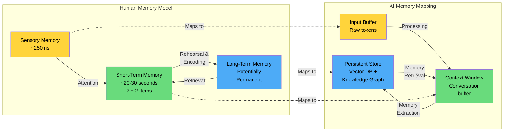
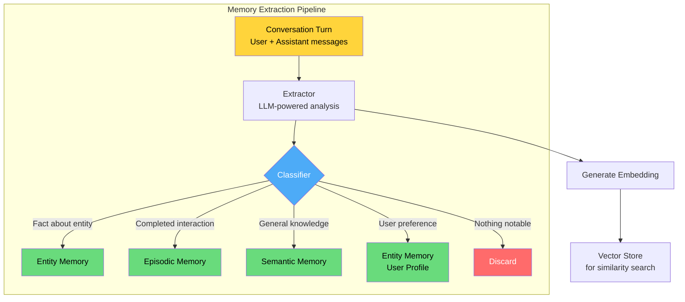
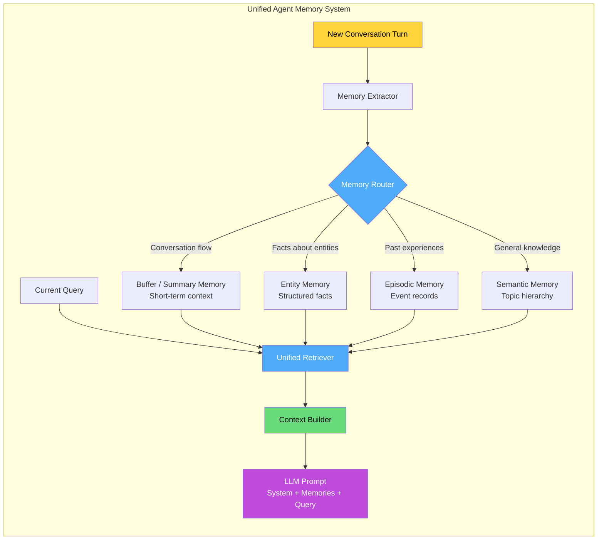

# Memory in AI Systems Deep Dive  Part 11: Short-Term vs Long-Term Memory in AI Agents

---

**Series:** Memory in AI Systems  A Developer's Deep Dive from Fundamentals to Production
**Part:** 11 of 19 (Agent Memory)
**Audience:** Developers with programming experience who want to understand AI memory systems from the ground up
**Reading time:** ~50 minutes

---

## Recap of Part 10

In Part 10, we mastered the art of chunking and retrieval optimization. We implemented seven different chunking strategies, built hybrid retrieval combining BM25 with vector search, added re-ranking with cross-encoders, and measured everything with proper evaluation metrics. We turned a basic RAG pipeline into a production-quality retrieval system.

But here is the thing  everything we have built so far serves a single purpose: **answering questions**. A user asks something, the system retrieves relevant documents, generates an answer, and forgets the entire interaction ever happened. The next question starts from scratch. There is no continuity, no learning, no memory of what happened before.

That is fine for a search engine. It is not fine for an **agent**.

An AI agent that helps you write code needs to remember your coding style, your project structure, and the decisions you made yesterday. A personal assistant needs to remember your preferences, your schedule, and the fact that you mentioned your sister's birthday is next week. A customer support agent needs to remember that this is the third time the customer has called about the same issue, and they are getting frustrated.

This is where we cross the boundary from **retrieval** to **memory**. From RAG to agent memory. From stateless question-answering to stateful, persistent, evolving intelligence.

By the end of this part, you will:

- Understand why **agent memory is fundamentally different** from RAG retrieval
- Learn how **human memory systems** (sensory, short-term, long-term) map to AI architectures
- Implement **Conversation Buffer Memory** with window-based and token-aware truncation
- Build **Conversation Summary Memory** with progressive summarization
- Create **Entity Memory** that extracts and maintains facts about people, places, and things
- Implement **Episodic Memory** that stores and retrieves past experiences
- Build **Semantic Memory** for long-term knowledge organization
- Design a **Memory Extraction Pipeline** that automatically classifies and routes memories
- Combine everything into a **Unified Agent Memory Architecture**
- Build a complete **Memory-Enabled Chatbot** that demonstrates all memory types working together
- Implement **four retrieval strategies** (recency, relevance, importance, combined) for agent memory

Let's give our agents the ability to remember.

---

## Table of Contents

1. [From RAG to Agent Memory](#1-from-rag-to-agent-memory)
2. [Human Memory as a Blueprint](#2-human-memory-as-a-blueprint)
3. [Conversation Buffer Memory](#3-conversation-buffer-memory)
4. [Conversation Summary Memory](#4-conversation-summary-memory)
5. [Fact-Based Memory (Entity Memory)](#5-fact-based-memory-entity-memory)
6. [Episodic Memory](#6-episodic-memory)
7. [Semantic Memory](#7-semantic-memory)
8. [Memory Extraction Pipeline](#8-memory-extraction-pipeline)
9. [The Unified Agent Memory Architecture](#9-the-unified-agent-memory-architecture)
10. [Building a Memory-Enabled Chatbot](#10-building-a-memory-enabled-chatbot)
11. [Memory Retrieval Strategies for Agents](#11-memory-retrieval-strategies-for-agents)
12. [Vocabulary Cheat Sheet](#12-vocabulary-cheat-sheet)
13. [Key Takeaways and What's Next](#13-key-takeaways-and-whats-next)

---

## 1. From RAG to Agent Memory

### RAG Is Not Memory

Let's be precise about what RAG does and does not do.

**RAG (Retrieval-Augmented Generation):**
- Retrieves documents from an external store
- Injects them into the prompt as context
- Generates an answer based on that context
- **Forgets everything** after the response is generated

RAG is like having access to a library. You can look things up. But you do not *remember* looking them up. You do not learn from the act of reading. You do not build a mental model that evolves over time. Every visit to the library starts from zero.

**Agent Memory:**
- Persists information across interactions
- Evolves as new information arrives
- Organizes knowledge into different types and structures
- Decides what is worth remembering and what can be forgotten
- Retrieves memories based on context, not just similarity

Agent memory is like having an actual brain. You remember conversations. You form impressions of people. You learn from mistakes. You build a worldview that changes over time.

Here is the key table that contrasts the two:

| Dimension | RAG | Agent Memory |
|-----------|-----|--------------|
| **Scope** | Single query | Across sessions |
| **Data source** | External documents | Conversation history + extracted knowledge |
| **Persistence** | None (stateless) | Persistent (stateful) |
| **Evolution** | Static corpus | Grows and changes over time |
| **Organization** | Flat chunks + embeddings | Typed, structured, hierarchical |
| **Forgetting** | N/A | Active memory management |
| **Personalization** | None | Adapts to individual users |
| **Learning** | None | Learns from interactions |

### The Three Problems of Agent Memory

When you build memory for an agent, you face three fundamental problems that RAG never had to solve:

**Problem 1: What to Remember**

Not everything in a conversation is worth storing. "Hello, how are you?" carries almost zero information. But "I'm allergic to peanuts" could be life-critical context for a cooking assistant. The agent needs to distinguish signal from noise, extract meaningful facts, and decide what deserves a spot in long-term memory.

**Problem 2: How to Organize It**

A flat list of "things the agent remembers" does not scale. After a thousand conversations, you need structure. Facts about entities (people, places, projects) should be stored differently from general knowledge, which should be stored differently from episodic memories of past interactions. The organization determines how effectively the agent can retrieve the right memory at the right time.

**Problem 3: When to Forget**

Memory without forgetting is hoarding. An agent that remembers everything will eventually drown in outdated, contradictory, or irrelevant information. The user said they prefer Python in January, but switched to Rust in March. The agent needs to update, not just accumulate. It needs to let go of information that is no longer relevant, consolidate similar memories, and prioritize what matters.

```mermaid
graph TD
    subgraph "RAG Pipeline (Stateless)"
        Q1[Query] --> R1[Retrieve Docs]
        R1 --> G1[Generate Answer]
        G1 --> F1[Forget Everything]

        Q2[Next Query] --> R2[Retrieve Docs]
        R2 --> G2[Generate Answer]
        G2 --> F2[Forget Everything]
    end

    subgraph "Agent Memory (Stateful)"
        Q3[Query] --> M1[Check Memory]
        M1 --> R3[Retrieve + Remember]
        R3 --> G3[Generate Answer]
        G3 --> S1[Store New Memories]
        S1 --> M2[Updated Memory]

        Q4[Next Query] --> M2
        M2 --> R4[Retrieve + Remember]
        R4 --> G4[Generate Answer]
        G4 --> S2[Store New Memories]
        S2 --> M3[Evolved Memory]
    end

    style F1 fill:#ff6b6b,color:#fff
    style F2 fill:#ff6b6b,color:#fff
    style M2 fill:#51cf66,color:#fff
    style M3 fill:#51cf66,color:#fff
```



> **Key Insight:** RAG asks "What documents are relevant to this question?" Agent memory asks "What do I know about this user, this topic, and this situation  and what should I remember from this conversation?"

---

## 2. Human Memory as a Blueprint

### Why Look at Human Memory?

Before we engineer AI memory systems, let's look at the best memory system we know: the human brain. Not because we need to copy it exactly, but because millions of years of evolution have solved many of the same problems we face. Understanding human memory gives us a vocabulary, a set of design patterns, and  most importantly  an intuition for what matters.

### The Three-Stage Model

Cognitive psychology identifies three main stages of human memory:



**Sensory Memory** (milliseconds): The raw flood of sensory input. You see and hear far more than you consciously process. Most of it is discarded instantly. In AI terms, this is the raw input  the full text of a prompt or document  before any processing occurs.

**Short-Term Memory** (seconds to minutes, 7 plus or minus 2 items): What you are actively thinking about right now. It is small (famously, about 7 items), temporary, and requires active maintenance (rehearsal) to keep information alive. In AI terms, this is the **context window**  the conversation history currently in the prompt.

**Long-Term Memory** (days to lifetime): The vast store of everything you have learned and experienced. It is organized, durable, and has essentially unlimited capacity. Retrieval is the bottleneck, not storage. In AI terms, this is **persistent memory** stored in databases, vector stores, and knowledge graphs.

### Types of Long-Term Memory

Human long-term memory is not a single system. Psychologists divide it into several types, each of which maps remarkably well to AI memory systems:

| Human Memory Type | Description | AI Equivalent |
|-------------------|-------------|---------------|
| **Episodic** | Specific events and experiences ("I had pizza last Tuesday") | Interaction logs, conversation archives |
| **Semantic** | General knowledge and facts ("Paris is the capital of France") | Knowledge bases, fact stores |
| **Procedural** | How to do things ("how to ride a bike") | Tool-use patterns, action sequences |
| **Autobiographical** | Self-referential ("I prefer morning meetings") | User preference models |

### Working Memory: The Bottleneck

The most important concept for AI system design is **working memory**  the active workspace where you manipulate information. It is not just short-term storage; it is where thinking happens. And it is severely limited.

George Miller's famous "7 plus or minus 2" rule tells us humans can hold about 5 to 9 items in working memory simultaneously. But more recent research suggests the true capacity is closer to **4 chunks** of information.

This maps directly to the **context window** in LLMs:

- The context window is the AI's working memory
- It has a hard capacity limit (4K, 8K, 32K, 128K, 200K tokens depending on the model)
- Everything the model "thinks about" must fit in this window
- Like human working memory, it is where reasoning happens
- Information not in the context window effectively does not exist for the model

> **Key Insight:** Just as humans cannot hold an entire textbook in working memory and must selectively load relevant information from long-term memory, AI agents cannot fit all their memories in the context window. The art of agent memory is deciding **what** to load into the context window for any given interaction.

### Forgetting: A Feature, Not a Bug

Humans forget most of what they experience, and this is actually essential. The psychologist Hermann Ebbinghaus discovered the "forgetting curve"  memory strength drops exponentially over time without reinforcement. But this is not a flaw. Forgetting serves critical functions:

1. **Reduces interference:** Old, irrelevant memories do not confuse current thinking
2. **Enables generalization:** Forgetting specific details helps you extract general patterns
3. **Saves resources:** Not everything is worth the metabolic cost of maintenance
4. **Enables updating:** Forgetting old information makes room for new, more accurate information

We will build all of these principles into our AI memory systems. Let's start with the simplest form: conversation buffer memory.

---

## 3. Conversation Buffer Memory

### The Simplest Memory: Remember Everything

The most basic form of agent memory is brutally simple: store every message in the conversation and include all of them in the prompt. This is what most chatbot applications do by default.

```python
"""
Conversation Buffer Memory  The simplest agent memory system.

Stores the complete conversation history and provides it as context.
This is the foundation that all other memory types build upon.
"""

import time
from dataclasses import dataclass, field
from typing import Optional
from enum import Enum


class Role(Enum):
    """Message roles in a conversation."""
    SYSTEM = "system"
    USER = "user"
    ASSISTANT = "assistant"
    TOOL = "tool"


@dataclass
class Message:
    """A single message in a conversation."""
    role: Role
    content: str
    timestamp: float = field(default_factory=time.time)
    metadata: dict = field(default_factory=dict)
    token_count: Optional[int] = None

    def to_dict(self) -> dict:
        """Convert to API-compatible format."""
        return {
            "role": self.role.value,
            "content": self.content,
        }

    def estimate_tokens(self) -> int:
        """Estimate token count (rough: 1 token ≈ 4 characters)."""
        if self.token_count is not None:
            return self.token_count
        # Rough estimate: ~4 chars per token for English text
        self.token_count = len(self.content) // 4 + 1
        return self.token_count


class ConversationBufferMemory:
    """
    Stores the full conversation history.

    This is the simplest memory  just keep everything. It works
    perfectly until the conversation exceeds the context window.

    Usage:
        memory = ConversationBufferMemory()
        memory.add_user_message("Hello!")
        memory.add_assistant_message("Hi there! How can I help?")
        context = memory.get_context()
    """

    def __init__(self, system_prompt: Optional[str] = None):
        self.messages: list[Message] = []
        self.system_prompt = system_prompt

        if system_prompt:
            self.messages.append(Message(
                role=Role.SYSTEM,
                content=system_prompt,
            ))

    def add_user_message(self, content: str, metadata: dict = None) -> None:
        """Add a user message to the conversation."""
        self.messages.append(Message(
            role=Role.USER,
            content=content,
            metadata=metadata or {},
        ))

    def add_assistant_message(self, content: str, metadata: dict = None) -> None:
        """Add an assistant message to the conversation."""
        self.messages.append(Message(
            role=Role.ASSISTANT,
            content=content,
            metadata=metadata or {},
        ))

    def get_context(self) -> list[dict]:
        """Return all messages in API-compatible format."""
        return [msg.to_dict() for msg in self.messages]

    def get_total_tokens(self) -> int:
        """Estimate total token usage."""
        return sum(msg.estimate_tokens() for msg in self.messages)

    def clear(self) -> None:
        """Clear all messages except system prompt."""
        system_msgs = [m for m in self.messages if m.role == Role.SYSTEM]
        self.messages = system_msgs

    def __len__(self) -> int:
        return len(self.messages)

    def __repr__(self) -> str:
        return (
            f"ConversationBufferMemory("
            f"messages={len(self.messages)}, "
            f"tokens≈{self.get_total_tokens()})"
        )


# --- Demonstration ---

memory = ConversationBufferMemory(
    system_prompt="You are a helpful AI assistant."
)

# Simulate a conversation
memory.add_user_message("Hi, I'm Alice. I'm working on a Python project.")
memory.add_assistant_message(
    "Hello Alice! I'd be happy to help with your Python project. "
    "What are you working on?"
)
memory.add_user_message("It's a web scraper using BeautifulSoup.")
memory.add_assistant_message(
    "Great choice! BeautifulSoup is excellent for web scraping. "
    "What specific part do you need help with?"
)
memory.add_user_message("I need to handle pagination.")
memory.add_assistant_message(
    "For pagination with BeautifulSoup, you typically need to: "
    "1) Find the 'next page' link, 2) Follow it in a loop, "
    "3) Parse each page. Would you like me to write an example?"
)

print(f"Memory state: {memory}")
print(f"Total messages: {len(memory)}")
print(f"Estimated tokens: {memory.get_total_tokens()}")
print()

# Show what the LLM would see
for msg in memory.get_context():
    role = msg["role"].upper()
    content = msg["content"][:80] + "..." if len(msg["content"]) > 80 else msg["content"]
    print(f"[{role}] {content}")
```

Output:
```
Memory state: ConversationBufferMemory(messages=7, tokens≈172)
Total messages: 7
Estimated tokens: 172

[SYSTEM] You are a helpful AI assistant.
[USER] Hi, I'm Alice. I'm working on a Python project.
[ASSISTANT] Hello Alice! I'd be happy to help with your Python project. What are you wor...
[USER] It's a web scraper using BeautifulSoup.
[ASSISTANT] Great choice! BeautifulSoup is excellent for web scraping. What specific part ...
[USER] I need to handle pagination.
[ASSISTANT] For pagination with BeautifulSoup, you typically need to: 1) Find the 'next p...
```

This works. The agent remembers that the user is Alice, that they are working on a Python web scraper with BeautifulSoup, and what they discussed. But it has an obvious problem: **it grows without bound**.

### Window-Based Truncation

The simplest fix: keep only the last N messages.

```python
class WindowBufferMemory:
    """
    Conversation buffer with a sliding window.

    Keeps only the most recent K message pairs (user + assistant),
    always preserving the system prompt.

    This is like human short-term memory: old information falls
    off the edge as new information arrives.
    """

    def __init__(
        self,
        system_prompt: Optional[str] = None,
        max_pairs: int = 10,
    ):
        self.messages: list[Message] = []
        self.system_prompt = system_prompt
        self.max_pairs = max_pairs

        if system_prompt:
            self.messages.append(Message(
                role=Role.SYSTEM,
                content=system_prompt,
            ))

    def add_user_message(self, content: str) -> None:
        self.messages.append(Message(role=Role.USER, content=content))
        self._truncate()

    def add_assistant_message(self, content: str) -> None:
        self.messages.append(Message(role=Role.ASSISTANT, content=content))
        self._truncate()

    def _truncate(self) -> None:
        """Keep only system prompt + last max_pairs conversation pairs."""
        # Separate system messages from conversation
        system_msgs = [m for m in self.messages if m.role == Role.SYSTEM]
        conversation = [m for m in self.messages if m.role != Role.SYSTEM]

        # Count pairs (a pair is a user message + assistant response)
        # We keep 2 * max_pairs individual messages
        max_messages = self.max_pairs * 2
        if len(conversation) > max_messages:
            conversation = conversation[-max_messages:]

        self.messages = system_msgs + conversation

    def get_context(self) -> list[dict]:
        return [msg.to_dict() for msg in self.messages]

    def get_total_tokens(self) -> int:
        return sum(msg.estimate_tokens() for msg in self.messages)

    def __repr__(self) -> str:
        return (
            f"WindowBufferMemory("
            f"messages={len(self.messages)}, "
            f"max_pairs={self.max_pairs}, "
            f"tokens≈{self.get_total_tokens()})"
        )


# --- Demonstration ---

memory = WindowBufferMemory(
    system_prompt="You are a coding assistant.",
    max_pairs=2,  # Keep only last 2 exchanges
)

# Add 4 exchanges
exchanges = [
    ("What is Python?", "Python is a high-level programming language."),
    ("What about Java?", "Java is a statically-typed language that runs on the JVM."),
    ("And Rust?", "Rust is a systems language focused on safety and performance."),
    ("What about Go?", "Go is a language by Google designed for simplicity and concurrency."),
]

for user_msg, assistant_msg in exchanges:
    memory.add_user_message(user_msg)
    memory.add_assistant_message(assistant_msg)

print(f"Memory state: {memory}")
print()

# Only the last 2 exchanges survive
for msg in memory.get_context():
    role = msg["role"].upper()
    print(f"[{role}] {msg['content'][:70]}")
```

Output:
```
Memory state: WindowBufferMemory(messages=5, max_pairs=2, tokens≈53)

[SYSTEM] You are a coding assistant.
[USER] And Rust?
[ASSISTANT] Rust is a systems language focused on safety and performance.
[USER] What about Go?
[ASSISTANT] Go is a language by Google designed for simplicity and concurrency.
```

The questions about Python and Java have been forgotten. This is the trade-off: bounded memory at the cost of losing old information.

### Token-Aware Truncation

Message count is a rough proxy. What we really care about is **tokens**, because that is what determines whether we fit in the context window.

```python
class TokenAwareBufferMemory:
    """
    Conversation buffer that truncates based on token count.

    Instead of keeping N messages, keeps as many recent messages
    as fit within a token budget. This handles the reality that
    some messages are short ("yes") and some are long (code blocks).
    """

    def __init__(
        self,
        system_prompt: Optional[str] = None,
        max_tokens: int = 4000,
        reserve_tokens: int = 1000,  # Reserve for the next response
    ):
        self.messages: list[Message] = []
        self.system_prompt = system_prompt
        self.max_tokens = max_tokens
        self.reserve_tokens = reserve_tokens
        self.available_tokens = max_tokens - reserve_tokens

        if system_prompt:
            msg = Message(role=Role.SYSTEM, content=system_prompt)
            self.messages.append(msg)
            self.available_tokens -= msg.estimate_tokens()

    def add_user_message(self, content: str) -> None:
        self.messages.append(Message(role=Role.USER, content=content))
        self._truncate_to_budget()

    def add_assistant_message(self, content: str) -> None:
        self.messages.append(Message(role=Role.ASSISTANT, content=content))
        self._truncate_to_budget()

    def _truncate_to_budget(self) -> None:
        """Remove oldest non-system messages until we fit in budget."""
        system_msgs = [m for m in self.messages if m.role == Role.SYSTEM]
        conversation = [m for m in self.messages if m.role != Role.SYSTEM]

        system_tokens = sum(m.estimate_tokens() for m in system_msgs)
        budget = self.max_tokens - self.reserve_tokens - system_tokens

        # Work backwards from the most recent message
        kept = []
        tokens_used = 0

        for msg in reversed(conversation):
            msg_tokens = msg.estimate_tokens()
            if tokens_used + msg_tokens <= budget:
                kept.append(msg)
                tokens_used += msg_tokens
            else:
                break  # Stop  everything older gets dropped

        kept.reverse()
        self.messages = system_msgs + kept

    def get_context(self) -> list[dict]:
        return [msg.to_dict() for msg in self.messages]

    def get_token_usage(self) -> dict:
        """Report token usage breakdown."""
        system_tokens = sum(
            m.estimate_tokens() for m in self.messages
            if m.role == Role.SYSTEM
        )
        conversation_tokens = sum(
            m.estimate_tokens() for m in self.messages
            if m.role != Role.SYSTEM
        )
        return {
            "system_tokens": system_tokens,
            "conversation_tokens": conversation_tokens,
            "total_tokens": system_tokens + conversation_tokens,
            "budget": self.max_tokens - self.reserve_tokens,
            "remaining": (
                self.max_tokens - self.reserve_tokens
                - system_tokens - conversation_tokens
            ),
        }

    def __repr__(self) -> str:
        usage = self.get_token_usage()
        return (
            f"TokenAwareBufferMemory("
            f"messages={len(self.messages)}, "
            f"tokens={usage['total_tokens']}/{usage['budget']})"
        )


# --- Demonstration ---

memory = TokenAwareBufferMemory(
    system_prompt="You are a coding assistant.",
    max_tokens=200,      # Very small budget for demonstration
    reserve_tokens=50,   # Reserve 50 tokens for the response
)

# Add messages of varying length
memory.add_user_message("Hi")
memory.add_assistant_message("Hello! How can I help?")
memory.add_user_message(
    "Can you explain how Python's garbage collector works? "
    "I'm particularly interested in reference counting vs "
    "generational collection and the role of the gc module."
)
memory.add_assistant_message(
    "Python uses two garbage collection strategies working together: "
    "1) Reference counting (immediate, deterministic) and "
    "2) Generational GC (handles circular references). "
    "The gc module gives you control over the generational collector."
)

print(f"Memory state: {memory}")
print(f"Token usage: {memory.get_token_usage()}")
print()
for msg in memory.get_context():
    role = msg["role"].upper()
    content = msg["content"][:75] + "..." if len(msg["content"]) > 75 else msg["content"]
    print(f"[{role}] {content}")
```

Output:
```
Memory state: TokenAwareBufferMemory(messages=3, tokens=99/150)
Token usage: {'system_tokens': 7, 'conversation_tokens': 92, 'total_tokens': 99, 'budget': 150, 'remaining': 51}

[SYSTEM] You are a coding assistant.
[USER] Can you explain how Python's garbage collector works? I'm particularly i...
[ASSISTANT] Python uses two garbage collection strategies working together: 1) Reference...
```

The short "Hi" and "Hello! How can I help?" messages were dropped to make room for the longer, more recent messages. This is smarter than window-based truncation because it adapts to message length.

> **Key Insight:** Token-aware truncation is almost always better than message-count truncation. A conversation with 5 long code blocks takes very different space than 5 short questions. Always think in tokens, not messages.

---

## 4. Conversation Summary Memory

### The Problem with Truncation

Buffer memory with truncation has a brutal failure mode: it loses information completely. When a message falls off the window, it is gone. The agent has no idea it ever existed.

Imagine this scenario:
1. Turn 1: User says "I'm allergic to peanuts"
2. Turns 2-20: Various unrelated conversation
3. Turn 21: User asks "What should I have for dinner?"

With a window of 10 turns, the peanut allergy information is gone by Turn 12. The agent might suggest pad thai with peanut sauce. Not ideal.

**Summary memory** solves this by compressing old conversations into summaries instead of discarding them entirely. You lose detail but preserve the gist.

### Basic Summary Memory

```python
"""
Conversation Summary Memory  compress old conversation into summaries.

Instead of dropping old messages, we summarize them. This preserves
the key information while staying within token budgets.
"""

import json
from abc import ABC, abstractmethod


class LLMInterface(ABC):
    """Abstract interface for LLM calls (for clean dependency injection)."""

    @abstractmethod
    def generate(self, prompt: str) -> str:
        """Generate text from a prompt."""
        pass


class MockLLM(LLMInterface):
    """
    A mock LLM for demonstration.

    In production, replace this with calls to OpenAI, Anthropic, etc.
    For our examples, we simulate summarization with simple extraction.
    """

    def generate(self, prompt: str) -> str:
        """Simulate LLM summarization by extracting key sentences."""
        if "summarize" in prompt.lower() or "summary" in prompt.lower():
            # Extract lines that look like they contain key information
            lines = prompt.split("\n")
            key_lines = []
            for line in lines:
                line = line.strip()
                # Heuristic: keep lines with names, numbers, or specifics
                if any(indicator in line.lower() for indicator in [
                    "name", "allerg", "prefer", "project", "work",
                    "birthday", "important", "deadline", "issue",
                    "problem", "error", "want", "need", "like",
                ]):
                    key_lines.append(line)

            if key_lines:
                return "Summary: " + " | ".join(key_lines[:5])
            return "Summary: General conversation with no specific details noted."

        return "I understand."


class ConversationSummaryMemory:
    """
    Memory that summarizes old conversation to preserve information
    while staying within token limits.

    Strategy:
    1. Keep recent messages in full (the "buffer zone")
    2. When the buffer exceeds a threshold, summarize the oldest messages
    3. Maintain a running summary that grows with each compression
    4. Context = summary + recent messages

    This is like how humans remember old conversations: not word-for-word,
    but the key points and overall gist.
    """

    def __init__(
        self,
        llm: LLMInterface,
        system_prompt: Optional[str] = None,
        buffer_max_tokens: int = 2000,
        summary_trigger_tokens: int = 1500,
        messages_to_summarize: int = 4,  # Summarize this many old messages at a time
    ):
        self.llm = llm
        self.system_prompt = system_prompt
        self.buffer_max_tokens = buffer_max_tokens
        self.summary_trigger_tokens = summary_trigger_tokens
        self.messages_to_summarize = messages_to_summarize

        self.messages: list[Message] = []
        self.running_summary: str = ""
        self.summary_count: int = 0  # How many times we've summarized

        if system_prompt:
            self.messages.append(Message(
                role=Role.SYSTEM,
                content=system_prompt,
            ))

    def add_user_message(self, content: str) -> None:
        self.messages.append(Message(role=Role.USER, content=content))
        self._maybe_summarize()

    def add_assistant_message(self, content: str) -> None:
        self.messages.append(Message(role=Role.ASSISTANT, content=content))
        self._maybe_summarize()

    def _get_conversation_tokens(self) -> int:
        """Count tokens in non-system messages."""
        return sum(
            m.estimate_tokens() for m in self.messages
            if m.role != Role.SYSTEM
        )

    def _maybe_summarize(self) -> None:
        """Summarize old messages if we exceed the trigger threshold."""
        if self._get_conversation_tokens() < self.summary_trigger_tokens:
            return

        # Separate system messages from conversation
        system_msgs = [m for m in self.messages if m.role == Role.SYSTEM]
        conversation = [m for m in self.messages if m.role != Role.SYSTEM]

        if len(conversation) <= self.messages_to_summarize:
            return  # Not enough messages to summarize

        # Take the oldest messages for summarization
        to_summarize = conversation[:self.messages_to_summarize]
        to_keep = conversation[self.messages_to_summarize:]

        # Build the summarization prompt
        conversation_text = "\n".join(
            f"{m.role.value}: {m.content}" for m in to_summarize
        )

        if self.running_summary:
            prompt = (
                f"Here is the existing summary of the conversation so far:\n"
                f"{self.running_summary}\n\n"
                f"Here are new messages to incorporate:\n"
                f"{conversation_text}\n\n"
                f"Please create an updated summary that captures all key "
                f"information, facts, preferences, and important details. "
                f"Be concise but preserve specifics like names, dates, and "
                f"technical details. Summarize:"
            )
        else:
            prompt = (
                f"Please summarize the following conversation, capturing key "
                f"information, facts, preferences, and important details. "
                f"Be concise but preserve specifics like names, dates, and "
                f"technical details.\n\n"
                f"{conversation_text}\n\n"
                f"Summarize:"
            )

        # Generate summary using LLM
        self.running_summary = self.llm.generate(prompt)
        self.summary_count += 1

        # Rebuild messages: system + kept conversation
        self.messages = system_msgs + to_keep

    def get_context(self) -> list[dict]:
        """
        Return context for the LLM: system prompt + summary + recent messages.
        """
        context = []

        # System prompt first
        for msg in self.messages:
            if msg.role == Role.SYSTEM:
                context.append(msg.to_dict())

        # Inject summary as a system message if we have one
        if self.running_summary:
            context.append({
                "role": "system",
                "content": (
                    f"Summary of earlier conversation:\n"
                    f"{self.running_summary}"
                ),
            })

        # Then recent conversation messages
        for msg in self.messages:
            if msg.role != Role.SYSTEM:
                context.append(msg.to_dict())

        return context

    def get_summary(self) -> str:
        """Return the current running summary."""
        return self.running_summary

    def __repr__(self) -> str:
        return (
            f"ConversationSummaryMemory("
            f"messages={len(self.messages)}, "
            f"summaries={self.summary_count}, "
            f"summary_length={len(self.running_summary)} chars)"
        )


# --- Demonstration ---

llm = MockLLM()
memory = ConversationSummaryMemory(
    llm=llm,
    system_prompt="You are a personal assistant.",
    summary_trigger_tokens=100,    # Low threshold for demo
    messages_to_summarize=2,
)

# Simulate a longer conversation
conversation = [
    ("My name is Alice and I'm allergic to peanuts.",
     "Got it, Alice! I'll remember your peanut allergy."),
    ("I work at TechCorp as a senior engineer.",
     "That's great! What kind of engineering work do you do at TechCorp?"),
    ("Mostly backend Python. My project deadline is March 15th.",
     "Backend Python with a March 15th deadline  I'll keep that in mind."),
    ("Can you suggest a lunch restaurant?",
     "Based on your peanut allergy, I'd suggest places with clear allergen labeling."),
]

for i, (user_msg, assistant_msg) in enumerate(conversation):
    memory.add_user_message(user_msg)
    memory.add_assistant_message(assistant_msg)
    print(f"After exchange {i + 1}: {memory}")

print(f"\nRunning summary: {memory.get_summary()}")
print(f"\nContext for LLM ({len(memory.get_context())} messages):")
for msg in memory.get_context():
    role = msg["role"].upper()
    content = msg["content"][:80] + "..." if len(msg["content"]) > 80 else msg["content"]
    print(f"  [{role}] {content}")
```

Output:
```
After exchange 1: ConversationSummaryMemory(messages=3, summaries=0, summary_length=0 chars)
After exchange 2: ConversationSummaryMemory(messages=5, summaries=0, summary_length=0 chars)
After exchange 3: ConversationSummaryMemory(messages=5, summaries=1, summary_length=112 chars)
After exchange 4: ConversationSummaryMemory(messages=5, summaries=2, summary_length=146 chars)

Running summary: Summary: user: My name is Alice and I'm allergic to peanuts. | assistant: Got it, Alice! I'll remember your peanut allergy.

Context for LLM (5 messages):
  [SYSTEM] You are a personal assistant.
  [SYSTEM] Summary of earlier conversation:
Summary: user: My name is Alice and I'm a...
  [USER] Mostly backend Python. My project deadline is March 15th.
  [ASSISTANT] Backend Python with a March 15th deadline  I'll keep that in mind.
  [USER] Can you suggest a lunch restaurant?
  [ASSISTANT] Based on your peanut allergy, I'd suggest places with clear allergen la...
```

The key information  Alice's name, peanut allergy, job  is preserved in the summary even after those messages were removed from the buffer. The agent can still reference this information when suggesting restaurants.

### Summary + Buffer Hybrid

The most practical pattern combines a summary of old conversation with a buffer of recent messages. This gives you the best of both worlds: compressed history for context, and full detail for the recent conversation.

```python
class SummaryBufferMemory:
    """
    The production-ready pattern: summary of old + buffer of recent.

    This is the most commonly used memory pattern in production agents.
    It provides:
    - Full detail for recent context (so the agent sounds coherent)
    - Compressed history (so the agent remembers key facts)
    - Bounded token usage (predictable costs)

    Token budget breakdown:
    ┌──────────────────────────────────────────────┐
    │ System Prompt          (~200 tokens)          │
    │ ─────────────────────────────────────────── │
    │ Conversation Summary   (~300-500 tokens)      │
    │ ─────────────────────────────────────────── │
    │ Recent Messages Buffer (~1000-2000 tokens)    │
    │ ─────────────────────────────────────────── │
    │ Reserved for Response  (~500-1000 tokens)     │
    └──────────────────────────────────────────────┘
    """

    def __init__(
        self,
        llm: LLMInterface,
        system_prompt: Optional[str] = None,
        max_total_tokens: int = 4000,
        summary_budget_tokens: int = 500,
        buffer_budget_tokens: int = 2000,
        response_reserve_tokens: int = 1000,
    ):
        self.llm = llm
        self.system_prompt = system_prompt
        self.max_total_tokens = max_total_tokens
        self.summary_budget = summary_budget_tokens
        self.buffer_budget = buffer_budget_tokens
        self.response_reserve = response_reserve_tokens

        self.buffer: list[Message] = []
        self.running_summary: str = ""
        self.total_messages_processed: int = 0

    def add_message(self, role: Role, content: str) -> None:
        """Add a message and manage memory budgets."""
        self.buffer.append(Message(role=role, content=content))
        self.total_messages_processed += 1

        # Check if buffer exceeds budget
        buffer_tokens = sum(m.estimate_tokens() for m in self.buffer)
        if buffer_tokens > self.buffer_budget:
            self._compress_buffer()

    def _compress_buffer(self) -> None:
        """Move old buffer messages into the summary."""
        # Keep the most recent half, summarize the older half
        split_point = len(self.buffer) // 2
        to_summarize = self.buffer[:split_point]
        self.buffer = self.buffer[split_point:]

        # Build text for summarization
        text = "\n".join(
            f"{m.role.value}: {m.content}" for m in to_summarize
        )

        if self.running_summary:
            prompt = (
                f"Current summary: {self.running_summary}\n\n"
                f"New messages:\n{text}\n\n"
                f"Create an updated, concise summary preserving all "
                f"important facts, names, preferences, and context. "
                f"Keep it under {self.summary_budget} tokens. Summarize:"
            )
        else:
            prompt = (
                f"Summarize this conversation, preserving important "
                f"facts, names, preferences, and context. Keep it "
                f"under {self.summary_budget} tokens.\n\n"
                f"{text}\n\nSummarize:"
            )

        self.running_summary = self.llm.generate(prompt)

    def get_context(self) -> list[dict]:
        """Build the complete context for the LLM."""
        context = []

        if self.system_prompt:
            context.append({
                "role": "system",
                "content": self.system_prompt,
            })

        if self.running_summary:
            context.append({
                "role": "system",
                "content": (
                    f"[Conversation history summary]\n{self.running_summary}"
                ),
            })

        for msg in self.buffer:
            context.append(msg.to_dict())

        return context

    def get_stats(self) -> dict:
        """Return memory statistics."""
        buffer_tokens = sum(m.estimate_tokens() for m in self.buffer)
        summary_tokens = len(self.running_summary) // 4 + 1 if self.running_summary else 0
        return {
            "total_messages_processed": self.total_messages_processed,
            "buffer_messages": len(self.buffer),
            "buffer_tokens": buffer_tokens,
            "summary_tokens": summary_tokens,
            "has_summary": bool(self.running_summary),
        }
```

> **Key Insight:** The Summary + Buffer hybrid is the workhorse of production agent memory. It is the default choice for most applications because it balances coherence (recent messages in full), context (summarized history), and cost (bounded tokens). Start here and add specialized memory types only when you need them.

---

## 5. Fact-Based Memory (Entity Memory)

### Beyond Conversation History

Summary memory preserves the *flow* of conversation but can lose specific facts in the compression. If a summary says "The user discussed their dietary restrictions and work situation," you have lost the specifics: *which* dietary restrictions? *What* work situation?

**Entity Memory** takes a different approach: instead of summarizing conversation, it **extracts structured facts** about entities (people, places, organizations, projects) and stores them in a queryable format. This is closer to how humans actually remember things about people  not the exact conversations, but the facts we learned.

```python
"""
Entity Memory  Extract and maintain structured facts about entities.

This memory type extracts information about specific entities (people,
places, projects, etc.) from conversations and maintains an evolving
knowledge base about each entity.
"""

from collections import defaultdict
from dataclasses import dataclass


@dataclass
class Fact:
    """A single fact about an entity."""
    entity: str           # The entity this fact is about
    attribute: str        # What aspect of the entity (e.g., "occupation")
    value: str            # The fact itself (e.g., "software engineer")
    confidence: float     # How confident we are (0.0 to 1.0)
    source_turn: int      # Which conversation turn this came from
    timestamp: float      # When this fact was extracted
    supersedes: Optional[str] = None  # ID of fact this replaces

    @property
    def id(self) -> str:
        return f"{self.entity}::{self.attribute}"


class EntityMemory:
    """
    Maintains a structured knowledge base about entities mentioned
    in conversations.

    Entity memory works like a personal CRM:
    - Tracks facts about people, places, projects, etc.
    - Updates facts when new information arrives
    - Handles contradictions (newer facts supersede older ones)
    - Provides focused retrieval ("What do I know about Alice?")

    Memory structure:
    {
        "Alice": {
            "occupation": "senior engineer at TechCorp",
            "allergies": "peanuts",
            "current_project": "backend API migration",
            "preference_language": "Python",
        },
        "TechCorp": {
            "type": "technology company",
            "alice_role": "senior engineer",
        }
    }
    """

    def __init__(self, llm: LLMInterface):
        self.llm = llm
        self.entities: dict[str, dict[str, Fact]] = defaultdict(dict)
        self.turn_count: int = 0

    def extract_and_store(self, user_message: str, assistant_message: str) -> list[Fact]:
        """
        Extract entities and facts from a conversation turn.

        In production, this uses an LLM to extract structured information.
        Here we demonstrate the pattern with a rule-based extractor.
        """
        self.turn_count += 1
        combined_text = f"User: {user_message}\nAssistant: {assistant_message}"

        # In production: use LLM for extraction
        # prompt = f"Extract entities and facts from: {combined_text}"
        # extracted = self.llm.generate(prompt)

        # For demonstration: rule-based extraction
        extracted_facts = self._rule_based_extract(combined_text)

        stored_facts = []
        for entity, attribute, value in extracted_facts:
            fact = Fact(
                entity=entity,
                attribute=attribute,
                value=value,
                confidence=0.9,
                source_turn=self.turn_count,
                timestamp=time.time(),
            )

            # Check for existing fact  update if newer
            existing = self.entities[entity].get(attribute)
            if existing:
                fact.supersedes = existing.id

            self.entities[entity][attribute] = fact
            stored_facts.append(fact)

        return stored_facts

    def _rule_based_extract(
        self, text: str
    ) -> list[tuple[str, str, str]]:
        """
        Simple rule-based entity extraction for demonstration.

        In production, replace this with an LLM-based extractor:

        prompt = '''Extract entities and their attributes from this text.
        Format as JSON: [{"entity": "...", "attribute": "...", "value": "..."}]

        Text: {text}'''
        """
        facts = []
        text_lower = text.lower()

        # Pattern: "my name is X" or "I'm X"
        import re
        name_patterns = [
            r"my name is (\w+)",
            r"i'm (\w+)",
            r"i am (\w+)",
            r"call me (\w+)",
        ]
        for pattern in name_patterns:
            match = re.search(pattern, text_lower)
            if match:
                name = match.group(1).capitalize()
                facts.append((name, "identity", f"User's name is {name}"))

        # Pattern: allergies
        allergy_match = re.search(r"allerg\w+ to (\w+)", text_lower)
        if allergy_match:
            allergen = allergy_match.group(1)
            # Try to find the entity name
            entity = self._find_subject(text) or "User"
            facts.append((entity, "allergy", allergen))

        # Pattern: occupation
        work_patterns = [
            r"(?:work|works) (?:at|for) (\w+)",
            r"(?:i'm|i am) (?:a |an )?(\w+ ?\w*) at (\w+)",
        ]
        for pattern in work_patterns:
            match = re.search(pattern, text_lower)
            if match:
                entity = self._find_subject(text) or "User"
                if match.lastindex == 2:
                    role = match.group(1)
                    company = match.group(2).capitalize()
                    facts.append((entity, "occupation", role))
                    facts.append((entity, "employer", company))
                else:
                    company = match.group(1).capitalize()
                    facts.append((entity, "employer", company))

        # Pattern: preferences
        pref_match = re.search(
            r"(?:i |my )(?:prefer|like|love|enjoy)s? (\w+[\w ]*)",
            text_lower,
        )
        if pref_match:
            entity = self._find_subject(text) or "User"
            preference = pref_match.group(1).strip()
            facts.append((entity, "preference", preference))

        # Pattern: deadlines
        deadline_match = re.search(
            r"deadline (?:is |on )?(\w+ \d+(?:th|st|nd|rd)?)",
            text_lower,
        )
        if deadline_match:
            entity = self._find_subject(text) or "current_project"
            deadline = deadline_match.group(1)
            facts.append((entity, "deadline", deadline))

        return facts

    def _find_subject(self, text: str) -> Optional[str]:
        """Try to find the main entity name in text."""
        # Simple heuristic: look for capitalized words that aren't at
        # the start of sentences
        import re
        words = re.findall(r'\b[A-Z][a-z]+\b', text)
        # Filter common words
        stop_words = {"The", "This", "That", "What", "How", "User", "Assistant"}
        names = [w for w in words if w not in stop_words]
        return names[0] if names else None

    def get_entity_context(self, entity: str) -> str:
        """Get all known facts about an entity as a formatted string."""
        if entity not in self.entities:
            return f"No information known about {entity}."

        facts = self.entities[entity]
        lines = [f"Known facts about {entity}:"]
        for attribute, fact in sorted(facts.items()):
            lines.append(f"  - {attribute}: {fact.value}")
        return "\n".join(lines)

    def get_all_entities_context(self) -> str:
        """Get a summary of all known entities for injection into context."""
        if not self.entities:
            return "No entity information stored yet."

        sections = []
        for entity in sorted(self.entities.keys()):
            sections.append(self.get_entity_context(entity))
        return "\n\n".join(sections)

    def get_relevant_entities(self, query: str) -> list[str]:
        """Find entities that might be relevant to a query."""
        query_lower = query.lower()
        relevant = []

        for entity in self.entities:
            # Check if entity name appears in query
            if entity.lower() in query_lower:
                relevant.append(entity)
                continue

            # Check if any fact values are relevant
            for attribute, fact in self.entities[entity].items():
                if any(
                    word in query_lower
                    for word in fact.value.lower().split()
                    if len(word) > 3  # Skip short words
                ):
                    relevant.append(entity)
                    break

        return relevant

    def update_fact(
        self, entity: str, attribute: str, new_value: str
    ) -> None:
        """Explicitly update a fact about an entity."""
        old_fact = self.entities[entity].get(attribute)
        new_fact = Fact(
            entity=entity,
            attribute=attribute,
            value=new_value,
            confidence=1.0,  # Explicit updates are high confidence
            source_turn=self.turn_count,
            timestamp=time.time(),
            supersedes=old_fact.id if old_fact else None,
        )
        self.entities[entity][attribute] = new_fact

    def __repr__(self) -> str:
        total_facts = sum(len(facts) for facts in self.entities.values())
        return (
            f"EntityMemory("
            f"entities={len(self.entities)}, "
            f"facts={total_facts})"
        )


# --- Demonstration ---

llm = MockLLM()
entity_memory = EntityMemory(llm=llm)

# Simulate conversations that mention entities
conversations = [
    (
        "My name is Alice and I'm allergic to peanuts.",
        "Got it, Alice! I'll remember your peanut allergy.",
    ),
    (
        "I work at TechCorp as a senior engineer.",
        "Noted  you're a senior engineer at TechCorp.",
    ),
    (
        "My project deadline is March 15th.",
        "I'll keep the March 15th deadline in mind.",
    ),
    (
        "I prefer Python over JavaScript for backend work.",
        "Python is a great choice for backend development!",
    ),
]

for user_msg, assistant_msg in conversations:
    facts = entity_memory.extract_and_store(user_msg, assistant_msg)
    if facts:
        print(f"Extracted {len(facts)} facts:")
        for f in facts:
            print(f"  {f.entity}.{f.attribute} = {f.value}")
    print()

print(f"Memory state: {entity_memory}")
print()
print("All entity knowledge:")
print(entity_memory.get_all_entities_context())
print()

# Query for relevant entities
query = "What should Alice eat for lunch?"
relevant = entity_memory.get_relevant_entities(query)
print(f"Entities relevant to '{query}': {relevant}")
for entity in relevant:
    print(entity_memory.get_entity_context(entity))
```

Output:
```
Extracted 2 facts:
  Alice.identity = User's name is Alice
  Alice.allergy = peanuts

Extracted 2 facts:
  Alice.occupation = senior engineer
  Alice.employer = Techcorp

Extracted 1 facts:
  current_project.deadline = march 15th

Extracted 1 facts:
  Alice.preference = python over javascript for backend work

Memory state: EntityMemory(entities=3, facts=6)

All entity knowledge:
Known facts about Alice:
  - allergy: peanuts
  - employer: Techcorp
  - identity: User's name is Alice
  - occupation: senior engineer
  - preference: python over javascript for backend work

Known facts about Techcorp:
  - employer: Techcorp

Known facts about current_project:
  - deadline: march 15th

Entities relevant to 'What should Alice eat for lunch?': ['Alice']
Known facts about Alice:
  - allergy: peanuts
  - employer: Techcorp
  - identity: User's name is Alice
  - occupation: senior engineer
  - preference: python over javascript for backend work
```

Now the agent can answer "What should Alice eat for lunch?" by retrieving Alice's entity profile, seeing the peanut allergy, and giving appropriate suggestions  even if the allergy was mentioned hundreds of turns ago.

> **Key Insight:** Entity memory is complementary to summary memory, not a replacement. Summary memory preserves the *flow* and *context* of conversation. Entity memory preserves *specific facts* about *specific things*. The best agents use both.

---

## 6. Episodic Memory

### Remembering Experiences, Not Just Facts

Entity memory stores facts: "Alice is allergic to peanuts." But it does not store *experiences*: "Last Tuesday, Alice asked me to help debug a CORS issue in her Flask API. We tried three approaches. The first two failed because the issue was actually in the nginx proxy config, not the Flask code. She was frustrated but appreciated the systematic debugging approach."

**Episodic memory** stores complete interaction episodes  the who, what, when, why, and how of past experiences. This is what allows an agent to say "We ran into a similar issue before  remember when we debugged your CORS problem? The issue was in the proxy config, not the application code. Let's check that first this time."

This is enormously powerful. It lets the agent learn from experience, avoid repeating mistakes, and provide personalized help based on what has worked (and not worked) in the past.

```python
"""
Episodic Memory  Store and retrieve complete interaction episodes.

Each episode is a self-contained record of an interaction: the context,
what happened, what was tried, and the outcome. Episodes are indexed
for retrieval by time, topic, and similarity to the current situation.
"""

import hashlib
import math
from dataclasses import dataclass


@dataclass
class Episode:
    """
    A complete record of a past interaction episode.

    Think of this like a journal entry: it captures what happened,
    why it mattered, and what was learned.
    """
    episode_id: str
    timestamp: float
    title: str                    # Brief description: "Debugging CORS issue"
    context: str                  # What was the situation?
    actions: list[str]            # What did we try?
    outcome: str                  # What happened?
    success: bool                 # Did it work?
    lessons: list[str]            # What did we learn?
    topics: list[str]             # Topic tags for indexing
    participants: list[str]       # Who was involved?
    duration_turns: int           # How long was the interaction?
    embedding: Optional[list[float]] = None  # For similarity search

    def to_context_string(self) -> str:
        """Format episode for injection into LLM context."""
        actions_str = "\n".join(f"  - {a}" for a in self.actions)
        lessons_str = "\n".join(f"  - {l}" for l in self.lessons)
        return (
            f"[Past Episode: {self.title}]\n"
            f"When: {time.strftime('%Y-%m-%d', time.localtime(self.timestamp))}\n"
            f"Context: {self.context}\n"
            f"Actions taken:\n{actions_str}\n"
            f"Outcome: {self.outcome} ({'Success' if self.success else 'Failure'})\n"
            f"Lessons learned:\n{lessons_str}"
        )

    def relevance_summary(self) -> str:
        """Short summary for quick relevance checking."""
        status = "successful" if self.success else "unsuccessful"
        return f"{self.title} ({status})  Topics: {', '.join(self.topics)}"


class EpisodicMemory:
    """
    Stores and retrieves interaction episodes.

    Episodes are indexed three ways:
    1. By time (recency)  more recent episodes are more relevant
    2. By topic (categorical)  episodes about similar topics
    3. By embedding (semantic)  episodes in similar situations

    This allows retrieval like:
    - "What happened last time we tried this?"
    - "Have we solved a similar problem before?"
    - "What approaches worked for this type of issue?"
    """

    def __init__(self, max_episodes: int = 1000):
        self.episodes: list[Episode] = []
        self.max_episodes = max_episodes
        self.topic_index: dict[str, list[str]] = defaultdict(list)  # topic -> episode_ids

    def store_episode(
        self,
        title: str,
        context: str,
        actions: list[str],
        outcome: str,
        success: bool,
        lessons: list[str],
        topics: list[str],
        participants: list[str] = None,
        duration_turns: int = 1,
    ) -> Episode:
        """Store a new episode in memory."""
        episode_id = hashlib.md5(
            f"{title}{time.time()}".encode()
        ).hexdigest()[:12]

        episode = Episode(
            episode_id=episode_id,
            timestamp=time.time(),
            title=title,
            context=context,
            actions=actions,
            outcome=outcome,
            success=success,
            lessons=lessons,
            topics=topics,
            participants=participants or [],
            duration_turns=duration_turns,
        )

        self.episodes.append(episode)

        # Update topic index
        for topic in topics:
            self.topic_index[topic.lower()].append(episode_id)

        # Enforce max episodes (remove oldest, least-accessed)
        if len(self.episodes) > self.max_episodes:
            self._evict_oldest()

        return episode

    def retrieve_by_topic(
        self, topic: str, limit: int = 5
    ) -> list[Episode]:
        """Retrieve episodes related to a specific topic."""
        topic_lower = topic.lower()
        relevant = []

        for episode in self.episodes:
            # Check direct topic match
            if any(topic_lower in t.lower() for t in episode.topics):
                relevant.append(episode)
                continue

            # Check if topic appears in title or context
            if (topic_lower in episode.title.lower() or
                    topic_lower in episode.context.lower()):
                relevant.append(episode)

        # Sort by recency (most recent first)
        relevant.sort(key=lambda e: e.timestamp, reverse=True)
        return relevant[:limit]

    def retrieve_by_recency(self, limit: int = 5) -> list[Episode]:
        """Retrieve the most recent episodes."""
        sorted_episodes = sorted(
            self.episodes,
            key=lambda e: e.timestamp,
            reverse=True,
        )
        return sorted_episodes[:limit]

    def retrieve_successful(
        self, topic: str = None, limit: int = 5
    ) -> list[Episode]:
        """Retrieve successful episodes, optionally filtered by topic."""
        successful = [e for e in self.episodes if e.success]

        if topic:
            topic_lower = topic.lower()
            successful = [
                e for e in successful
                if any(topic_lower in t.lower() for t in e.topics)
                or topic_lower in e.title.lower()
            ]

        successful.sort(key=lambda e: e.timestamp, reverse=True)
        return successful[:limit]

    def retrieve_failures(
        self, topic: str = None, limit: int = 5
    ) -> list[Episode]:
        """Retrieve failed episodes to avoid repeating mistakes."""
        failures = [e for e in self.episodes if not e.success]

        if topic:
            topic_lower = topic.lower()
            failures = [
                e for e in failures
                if any(topic_lower in t.lower() for t in e.topics)
                or topic_lower in e.title.lower()
            ]

        failures.sort(key=lambda e: e.timestamp, reverse=True)
        return failures[:limit]

    def get_lessons_learned(self, topic: str = None) -> list[str]:
        """Extract all lessons learned, optionally filtered by topic."""
        episodes = self.episodes
        if topic:
            episodes = self.retrieve_by_topic(topic, limit=100)

        all_lessons = []
        for episode in episodes:
            for lesson in episode.lessons:
                if lesson not in all_lessons:
                    all_lessons.append(lesson)

        return all_lessons

    def get_context_for_situation(
        self, current_situation: str, limit: int = 3
    ) -> str:
        """
        Build context string with relevant past episodes.

        This is what gets injected into the LLM prompt to give
        the agent access to its past experiences.
        """
        # Find relevant episodes using keyword matching
        # In production, use embedding similarity
        words = set(current_situation.lower().split())
        scored_episodes = []

        for episode in self.episodes:
            episode_words = set(
                episode.title.lower().split() +
                episode.context.lower().split() +
                [t.lower() for t in episode.topics]
            )
            # Simple word overlap score
            overlap = len(words & episode_words)
            if overlap > 0:
                # Boost recent episodes
                age_hours = (time.time() - episode.timestamp) / 3600
                recency_boost = 1.0 / (1.0 + math.log1p(age_hours))
                score = overlap * (1 + recency_boost)
                scored_episodes.append((score, episode))

        scored_episodes.sort(key=lambda x: x[0], reverse=True)
        top_episodes = [ep for _, ep in scored_episodes[:limit]]

        if not top_episodes:
            return "No relevant past episodes found."

        sections = ["[Relevant Past Experiences]"]
        for ep in top_episodes:
            sections.append(ep.to_context_string())
            sections.append("")  # Blank line separator

        return "\n".join(sections)

    def _evict_oldest(self) -> None:
        """Remove the oldest episode when at capacity."""
        if self.episodes:
            removed = self.episodes.pop(0)
            # Clean up topic index
            for topic in removed.topics:
                topic_lower = topic.lower()
                if topic_lower in self.topic_index:
                    ids = self.topic_index[topic_lower]
                    if removed.episode_id in ids:
                        ids.remove(removed.episode_id)

    def __repr__(self) -> str:
        successful = sum(1 for e in self.episodes if e.success)
        return (
            f"EpisodicMemory("
            f"episodes={len(self.episodes)}, "
            f"successful={successful}, "
            f"topics={len(self.topic_index)})"
        )


# --- Demonstration ---

episodic = EpisodicMemory()

# Store some past episodes
episodic.store_episode(
    title="Debugging CORS issue in Flask API",
    context="Alice's Flask API was returning CORS errors when called from React frontend",
    actions=[
        "Added flask-cors extension",
        "Configured CORS headers manually",
        "Discovered issue was in nginx proxy configuration",
    ],
    outcome="Fixed by updating nginx proxy_set_header directives",
    success=True,
    lessons=[
        "CORS errors can originate from proxy layers, not just the application",
        "Always check the full request path when debugging CORS",
        "nginx needs explicit CORS headers when proxying",
    ],
    topics=["CORS", "Flask", "nginx", "debugging"],
    participants=["Alice"],
    duration_turns=12,
)

episodic.store_episode(
    title="Database migration failure",
    context="Alembic migration failed on production PostgreSQL database",
    actions=[
        "Tried running migration directly  failed on constraint",
        "Attempted to skip problematic migration  cascading failures",
        "Created manual migration script with proper ordering",
    ],
    outcome="Resolved by creating a custom migration with explicit dependency ordering",
    success=True,
    lessons=[
        "Always test migrations on a production-clone database first",
        "Alembic autogenerate can miss dependency ordering",
        "Keep migration files small and atomic",
    ],
    topics=["database", "migration", "PostgreSQL", "Alembic"],
    participants=["Alice"],
    duration_turns=8,
)

episodic.store_episode(
    title="Failed attempt to optimize query with ORM",
    context="Tried to speed up slow dashboard query using SQLAlchemy eager loading",
    actions=[
        "Added joinedload() to relationship queries",
        "Moved to subqueryload() when joinedload caused cartesian product",
    ],
    outcome="ORM optimization insufficient  needed raw SQL with proper indexing",
    success=False,
    lessons=[
        "ORM eager loading has limits for complex reporting queries",
        "Sometimes raw SQL is the right answer",
        "Profile queries before and after optimization attempts",
    ],
    topics=["database", "SQLAlchemy", "performance", "optimization"],
    participants=["Alice"],
    duration_turns=6,
)

print(f"Memory state: {episodic}")
print()

# Retrieve relevant episodes for a new situation
situation = "I'm getting CORS errors in my FastAPI application"
print(f"Situation: {situation}")
print(episodic.get_context_for_situation(situation))
print()

# Get lessons about databases
print("Lessons learned about databases:")
for lesson in episodic.get_lessons_learned("database"):
    print(f"  - {lesson}")
print()

# Check past failures
print("Past failures in optimization:")
for ep in episodic.retrieve_failures("optimization"):
    print(f"  - {ep.relevance_summary()}")
```

Output:
```
Memory state: EpisodicMemory(episodes=3, successful=2, topics=10)

Situation: I'm getting CORS errors in my FastAPI application
[Relevant Past Experiences]
[Past Episode: Debugging CORS issue in Flask API]
When: 2026-03-02
Context: Alice's Flask API was returning CORS errors when called from React frontend
Actions taken:
  - Added flask-cors extension
  - Configured CORS headers manually
  - Discovered issue was in nginx proxy configuration
Outcome: Fixed by updating nginx proxy_set_header directives (Success)
Lessons learned:
  - CORS errors can originate from proxy layers, not just the application
  - Always check the full request path when debugging CORS
  - nginx needs explicit CORS headers when proxying

Lessons learned about databases:
  - Always test migrations on a production-clone database first
  - Alembic autogenerate can miss dependency ordering
  - Keep migration files small and atomic
  - ORM eager loading has limits for complex reporting queries
  - Sometimes raw SQL is the right answer
  - Profile queries before and after optimization attempts

Past failures in optimization:
  - Failed attempt to optimize query with ORM (unsuccessful)  Topics: database, SQLAlchemy, performance, optimization
```

The agent now has experience. When Alice encounters a new CORS issue, the agent recalls the previous debugging session and can suggest checking the proxy configuration first  because it learned from past experience that CORS errors are not always in the application layer.

---

## 7. Semantic Memory

### Long-Term Knowledge Organization

Entity memory stores facts about specific entities. Episodic memory stores specific experiences. But agents also need **general knowledge**  concepts, relationships, and patterns that are not tied to a specific entity or episode.

**Semantic memory** is the AI equivalent of what you learned in school: general knowledge organized by topic. "Python is an interpreted language." "REST APIs use HTTP methods." "Database indexes speed up reads but slow down writes." These are not facts about a specific person or a specific event  they are general truths organized into a knowledge structure.

```python
"""
Semantic Memory  Long-term knowledge storage organized by topic.

Semantic memory stores general knowledge and concepts, organized
into a topic hierarchy. Unlike entity memory (facts about specific
things) or episodic memory (specific events), semantic memory
stores general truths and learned patterns.
"""

from dataclasses import dataclass


@dataclass
class KnowledgeNode:
    """A single piece of knowledge in the semantic memory."""
    node_id: str
    topic: str                    # Primary topic: "python/async"
    content: str                  # The knowledge itself
    confidence: float             # How confident (0.0 to 1.0)
    source: str                   # Where this knowledge came from
    related_topics: list[str]     # Cross-references
    timestamp: float
    access_count: int = 0         # How often retrieved
    last_accessed: float = 0.0

    def to_context_string(self) -> str:
        return f"[{self.topic}] {self.content}"


class SemanticMemory:
    """
    Organized knowledge store with topic hierarchy.

    Knowledge is organized in a tree-like topic structure:
        python/
            python/async
            python/typing
            python/gc
        databases/
            databases/postgresql
            databases/indexing
        deployment/
            deployment/docker
            deployment/nginx

    This allows both precise queries ("What do I know about
    Python async?") and broad queries ("What do I know about
    Python?").
    """

    def __init__(self):
        self.nodes: dict[str, KnowledgeNode] = {}  # node_id -> node
        self.topic_index: dict[str, list[str]] = defaultdict(list)  # topic -> node_ids
        self._counter: int = 0

    def store_knowledge(
        self,
        topic: str,
        content: str,
        source: str = "conversation",
        confidence: float = 0.8,
        related_topics: list[str] = None,
    ) -> KnowledgeNode:
        """Store a piece of knowledge under a topic."""
        self._counter += 1
        node_id = f"k_{self._counter}"

        # Check for duplicate or contradictory knowledge
        existing = self._find_similar(topic, content)
        if existing:
            # Update existing knowledge instead of duplicating
            existing.content = content
            existing.confidence = max(existing.confidence, confidence)
            existing.timestamp = time.time()
            return existing

        node = KnowledgeNode(
            node_id=node_id,
            topic=topic.lower().strip("/"),
            content=content,
            confidence=confidence,
            source=source,
            related_topics=[t.lower() for t in (related_topics or [])],
            timestamp=time.time(),
        )

        self.nodes[node_id] = node
        self.topic_index[node.topic].append(node_id)

        # Also index under parent topics
        parts = node.topic.split("/")
        for i in range(len(parts)):
            parent = "/".join(parts[:i + 1])
            if parent != node.topic:
                self.topic_index[parent].append(node_id)

        return node

    def _find_similar(
        self, topic: str, content: str
    ) -> Optional[KnowledgeNode]:
        """Find existing knowledge that overlaps with new content."""
        topic_lower = topic.lower().strip("/")
        content_words = set(content.lower().split())

        for node_id in self.topic_index.get(topic_lower, []):
            node = self.nodes[node_id]
            node_words = set(node.content.lower().split())
            # If more than 60% word overlap, consider it similar
            overlap = len(content_words & node_words)
            if overlap > 0.6 * min(len(content_words), len(node_words)):
                return node

        return None

    def query_topic(
        self, topic: str, include_subtopics: bool = True
    ) -> list[KnowledgeNode]:
        """Retrieve all knowledge about a topic."""
        topic_lower = topic.lower().strip("/")
        node_ids = set()

        if include_subtopics:
            # Include all topics that start with the query topic
            for indexed_topic, ids in self.topic_index.items():
                if indexed_topic.startswith(topic_lower):
                    node_ids.update(ids)
        else:
            node_ids = set(self.topic_index.get(topic_lower, []))

        nodes = [self.nodes[nid] for nid in node_ids if nid in self.nodes]

        # Update access counts
        for node in nodes:
            node.access_count += 1
            node.last_accessed = time.time()

        # Sort by confidence, then recency
        nodes.sort(key=lambda n: (n.confidence, n.timestamp), reverse=True)
        return nodes

    def query_keyword(self, keyword: str, limit: int = 10) -> list[KnowledgeNode]:
        """Search knowledge by keyword across all topics."""
        keyword_lower = keyword.lower()
        results = []

        for node in self.nodes.values():
            if (keyword_lower in node.content.lower() or
                    keyword_lower in node.topic):
                results.append(node)

        results.sort(key=lambda n: n.confidence, reverse=True)
        return results[:limit]

    def get_topic_tree(self) -> dict:
        """Return the topic hierarchy as a nested dictionary."""
        tree = {}
        for topic in sorted(self.topic_index.keys()):
            parts = topic.split("/")
            current = tree
            for part in parts:
                if part not in current:
                    current[part] = {}
                current = current[part]
        return tree

    def get_context_for_query(
        self, query: str, max_tokens: int = 500
    ) -> str:
        """
        Build context string with relevant knowledge for a query.

        This is injected into the LLM prompt to give the agent
        access to its accumulated knowledge.
        """
        # Find relevant knowledge through keyword matching
        query_words = query.lower().split()
        scored_nodes = []

        for node in self.nodes.values():
            score = 0
            node_text = f"{node.topic} {node.content}".lower()
            for word in query_words:
                if len(word) > 3 and word in node_text:
                    score += 1
            if score > 0:
                scored_nodes.append((score * node.confidence, node))

        scored_nodes.sort(key=lambda x: x[0], reverse=True)

        # Build context within token budget
        lines = ["[Relevant Knowledge]"]
        tokens_used = 5  # Header

        for score, node in scored_nodes:
            line = node.to_context_string()
            line_tokens = len(line) // 4 + 1
            if tokens_used + line_tokens > max_tokens:
                break
            lines.append(line)
            tokens_used += line_tokens

        if len(lines) == 1:
            return "No relevant knowledge found."

        return "\n".join(lines)

    def merge_knowledge(self, topic: str) -> Optional[str]:
        """
        Consolidate all knowledge about a topic into a single summary.

        This is useful for compressing many small facts into a
        coherent knowledge summary.
        """
        nodes = self.query_topic(topic)
        if not nodes:
            return None

        # Simple merge: combine all content
        contents = [n.content for n in nodes]
        return f"Knowledge about {topic}: " + " | ".join(contents)

    def __repr__(self) -> str:
        topics = len(set(
            n.topic for n in self.nodes.values()
        ))
        return (
            f"SemanticMemory("
            f"nodes={len(self.nodes)}, "
            f"topics={topics})"
        )


# --- Demonstration ---

semantic = SemanticMemory()

# Store knowledge learned from conversations
semantic.store_knowledge(
    topic="python/async",
    content="Python's asyncio uses an event loop with coroutines. Use async/await syntax.",
    source="conversation about async patterns",
    related_topics=["python/concurrency"],
)

semantic.store_knowledge(
    topic="python/async",
    content="For CPU-bound work, use ProcessPoolExecutor, not asyncio. Asyncio is for I/O-bound tasks.",
    source="debugging session with Alice",
    related_topics=["python/performance"],
)

semantic.store_knowledge(
    topic="databases/indexing",
    content="B-tree indexes are great for range queries. Hash indexes are faster for equality lookups.",
    source="database optimization discussion",
    related_topics=["databases/postgresql", "databases/performance"],
)

semantic.store_knowledge(
    topic="databases/postgresql",
    content="PostgreSQL EXPLAIN ANALYZE shows actual execution time and row counts. Always use ANALYZE for real stats.",
    source="query optimization session",
    related_topics=["databases/indexing", "databases/performance"],
)

semantic.store_knowledge(
    topic="deployment/nginx",
    content="nginx proxy_pass needs explicit CORS headers. App-level CORS config alone is insufficient behind nginx.",
    source="CORS debugging episode",
    related_topics=["deployment/cors", "python/flask"],
)

print(f"Memory state: {semantic}")
print()

# Query by topic
print("Knowledge about Python async:")
for node in semantic.query_topic("python/async"):
    print(f"  [{node.confidence:.1f}] {node.content}")
print()

# Query all Python knowledge
print("All Python knowledge:")
for node in semantic.query_topic("python"):
    print(f"  [{node.topic}] {node.content[:70]}...")
print()

# Build context for a query
query = "How should I handle async database queries in Python?"
print(f"Context for: '{query}'")
print(semantic.get_context_for_query(query))
```

Output:
```
Memory state: SemanticMemory(nodes=5, topics=4)

Knowledge about Python async:
  [0.8] For CPU-bound work, use ProcessPoolExecutor, not asyncio. Asyncio is for I/O-bound tasks.
  [0.8] Python's asyncio uses an event loop with coroutines. Use async/await syntax.

All Python knowledge:
  [python/async] For CPU-bound work, use ProcessPoolExecutor, not asyncio. As...
  [python/async] Python's asyncio uses an event loop with coroutines. Use asy...

Context for: 'How should I handle async database queries in Python?'
[Relevant Knowledge]
[python/async] Python's asyncio uses an event loop with coroutines. Use async/await syntax.
[python/async] For CPU-bound work, use ProcessPoolExecutor, not asyncio. Asyncio is for I/O-bound tasks.
[databases/indexing] B-tree indexes are great for range queries. Hash indexes are faster for equality lookups.
[databases/postgresql] PostgreSQL EXPLAIN ANALYZE shows actual execution time and row counts. Always use ANALYZE for real stats.
```

> **Key Insight:** Semantic memory is your agent's "textbook knowledge." While episodic memory remembers *what happened*, semantic memory remembers *what things mean*. An agent with good semantic memory can apply lessons from one context to another  knowing that "async is for I/O-bound work" applies whether the question is about web scraping, database queries, or API calls.

---

## 8. Memory Extraction Pipeline

### Automating the Path from Conversation to Memory

So far, we have built four memory types: buffer/summary (conversation flow), entity (facts about things), episodic (past experiences), and semantic (general knowledge). But we have been manually deciding what goes where. In a production agent, this needs to be automated.

The **Memory Extraction Pipeline** watches every conversation turn, extracts information worth remembering, classifies it by memory type, and routes it to the appropriate storage. This is the bridge between raw conversation and organized memory.



```python
"""
Memory Extraction Pipeline  Automatically extract, classify, and route
memories from conversation turns.

This is the glue that connects raw conversation to structured memory.
It watches every interaction and decides:
1. Is there anything worth remembering here?
2. If so, what type of memory is it?
3. Where should it be stored?
"""

import json
from dataclasses import dataclass
from enum import Enum


class MemoryType(Enum):
    """Types of memories that can be extracted."""
    ENTITY_FACT = "entity_fact"         # Fact about a specific entity
    USER_PREFERENCE = "user_preference"  # User's preference or setting
    EPISODIC = "episodic"               # Completed experience / event
    SEMANTIC = "semantic"               # General knowledge / concept
    INSTRUCTION = "instruction"          # User's standing instruction
    NONE = "none"                        # Nothing worth storing


@dataclass
class ExtractedMemory:
    """A memory extracted from conversation."""
    memory_type: MemoryType
    content: str
    entity: Optional[str] = None      # For entity facts
    attribute: Optional[str] = None   # For entity facts
    topic: Optional[str] = None       # For semantic knowledge
    importance: float = 0.5           # 0.0 to 1.0
    metadata: dict = None

    def __post_init__(self):
        if self.metadata is None:
            self.metadata = {}


class MemoryExtractor:
    """
    Extracts memories from conversation turns using LLM analysis.

    The extraction process:
    1. Analyze the conversation turn for notable information
    2. Classify each piece of information by memory type
    3. Extract structured data (entity, attribute, value, topic, etc.)
    4. Score importance (0-1)
    5. Return structured ExtractedMemory objects

    In production, this uses the LLM for extraction. Here we
    demonstrate with a pattern-based approach.
    """

    def __init__(self, llm: LLMInterface, importance_threshold: float = 0.3):
        self.llm = llm
        self.importance_threshold = importance_threshold
        self.extraction_count = 0

    def extract(
        self,
        user_message: str,
        assistant_message: str,
        turn_number: int = 0,
    ) -> list[ExtractedMemory]:
        """
        Extract memories from a conversation turn.

        In production, this would use an LLM prompt like:

        prompt = '''Analyze this conversation turn and extract any
        information worth remembering long-term.

        For each piece of information, provide:
        - type: entity_fact | user_preference | episodic | semantic | instruction
        - content: the information to remember
        - entity: (if entity_fact) who/what is it about
        - attribute: (if entity_fact) what aspect
        - topic: (if semantic) knowledge topic
        - importance: 0.0-1.0

        User: {user_message}
        Assistant: {assistant_message}

        Extracted memories (JSON):'''
        """
        self.extraction_count += 1
        combined = f"{user_message} {assistant_message}"
        memories = []

        # --- Extract entity facts ---
        entity_facts = self._extract_entity_facts(combined)
        memories.extend(entity_facts)

        # --- Extract user preferences ---
        preferences = self._extract_preferences(user_message)
        memories.extend(preferences)

        # --- Extract semantic knowledge ---
        knowledge = self._extract_knowledge(combined)
        memories.extend(knowledge)

        # --- Extract instructions ---
        instructions = self._extract_instructions(user_message)
        memories.extend(instructions)

        # Filter by importance threshold
        memories = [
            m for m in memories
            if m.importance >= self.importance_threshold
        ]

        return memories

    def _extract_entity_facts(self, text: str) -> list[ExtractedMemory]:
        """Extract facts about specific entities."""
        import re
        memories = []
        text_lower = text.lower()

        # Name patterns
        name_match = re.search(r"(?:my name is|i'm|i am) (\w+)", text_lower)
        if name_match:
            name = name_match.group(1).capitalize()
            memories.append(ExtractedMemory(
                memory_type=MemoryType.ENTITY_FACT,
                content=f"User's name is {name}",
                entity=name,
                attribute="identity",
                importance=0.9,
            ))

        # Work/role patterns
        work_match = re.search(
            r"(?:work|works|working) (?:at|for|on) (\w[\w\s]*?)(?:\.|,|$)",
            text_lower,
        )
        if work_match:
            workplace = work_match.group(1).strip()
            memories.append(ExtractedMemory(
                memory_type=MemoryType.ENTITY_FACT,
                content=f"Works at/on {workplace}",
                entity="User",
                attribute="workplace",
                importance=0.7,
            ))

        # Allergy patterns
        allergy_match = re.search(r"allerg\w+ to (\w+[\w\s]*?)(?:\.|,|$)", text_lower)
        if allergy_match:
            allergen = allergy_match.group(1).strip()
            memories.append(ExtractedMemory(
                memory_type=MemoryType.ENTITY_FACT,
                content=f"Allergic to {allergen}",
                entity="User",
                attribute="allergy",
                importance=0.95,  # Health info is high importance
            ))

        return memories

    def _extract_preferences(self, text: str) -> list[ExtractedMemory]:
        """Extract user preferences."""
        import re
        memories = []
        text_lower = text.lower()

        # Preference patterns
        pref_patterns = [
            (r"i (?:prefer|like|love|enjoy) (\w+[\w\s]*?)(?:\.|,|$)", 0.6),
            (r"i (?:hate|dislike|don't like) (\w+[\w\s]*?)(?:\.|,|$)", 0.6),
            (r"(?:always|usually|typically) (?:use|choose|go with) (\w+[\w\s]*?)(?:\.|,|$)", 0.5),
        ]

        for pattern, importance in pref_patterns:
            match = re.search(pattern, text_lower)
            if match:
                preference = match.group(1).strip()
                memories.append(ExtractedMemory(
                    memory_type=MemoryType.USER_PREFERENCE,
                    content=f"Preference: {preference}",
                    entity="User",
                    attribute="preference",
                    importance=importance,
                ))

        return memories

    def _extract_knowledge(self, text: str) -> list[ExtractedMemory]:
        """Extract general knowledge shared in conversation."""
        import re
        memories = []

        # Technical explanation patterns (simplified)
        # In production, the LLM handles this much better
        tech_patterns = [
            r"(\w+) (?:is|are) (?:used for|designed for|meant for) ([\w\s]+?)(?:\.|,|$)",
            r"(?:the|a) (\w+) (?:approach|method|technique|pattern) (?:is|involves) ([\w\s]+?)(?:\.|,|$)",
        ]

        text_lower = text.lower()
        for pattern in tech_patterns:
            match = re.search(pattern, text_lower)
            if match:
                subject = match.group(1)
                explanation = match.group(2).strip()
                memories.append(ExtractedMemory(
                    memory_type=MemoryType.SEMANTIC,
                    content=f"{subject}: {explanation}",
                    topic=subject,
                    importance=0.4,
                ))

        return memories

    def _extract_instructions(self, text: str) -> list[ExtractedMemory]:
        """Extract standing instructions from the user."""
        import re
        memories = []
        text_lower = text.lower()

        instruction_patterns = [
            r"(?:always|never|make sure to|remember to|don't forget to) ([\w\s]+?)(?:\.|,|!|$)",
            r"from now on[,]? ([\w\s]+?)(?:\.|,|!|$)",
        ]

        for pattern in instruction_patterns:
            match = re.search(pattern, text_lower)
            if match:
                instruction = match.group(1).strip()
                if len(instruction) > 10:  # Filter very short matches
                    memories.append(ExtractedMemory(
                        memory_type=MemoryType.INSTRUCTION,
                        content=f"Standing instruction: {instruction}",
                        importance=0.8,
                    ))

        return memories

    def __repr__(self) -> str:
        return f"MemoryExtractor(extractions={self.extraction_count})"


# --- Demonstration ---

llm = MockLLM()
extractor = MemoryExtractor(llm=llm, importance_threshold=0.3)

test_turns = [
    (
        "My name is Alice and I'm allergic to shellfish.",
        "Got it, Alice! I'll remember your shellfish allergy.",
    ),
    (
        "I prefer using type hints in all my Python code.",
        "Great practice! Type hints improve code readability and IDE support.",
    ),
    (
        "From now on, always include docstrings in the code you write for me.",
        "Understood! I'll always include docstrings in my code.",
    ),
    (
        "What's the weather like?",
        "I don't have access to weather data, but you can check weather.com.",
    ),
]

for i, (user_msg, assistant_msg) in enumerate(test_turns):
    memories = extractor.extract(user_msg, assistant_msg, turn_number=i)
    print(f"Turn {i + 1}: \"{user_msg[:50]}...\"")
    if memories:
        for mem in memories:
            print(f"  [{mem.memory_type.value}] {mem.content} (importance: {mem.importance})")
    else:
        print("  No memorable information extracted.")
    print()
```

Output:
```
Turn 1: "My name is Alice and I'm allergic to shellfish...."
  [entity_fact] User's name is Alice (importance: 0.9)
  [entity_fact] Allergic to shellfish (importance: 0.95)

Turn 2: "I prefer using type hints in all my Python code...."
  [user_preference] Preference: using type hints in all my python code (importance: 0.6)

Turn 3: "From now on, always include docstrings in the code ..."
  [instruction] Standing instruction: include docstrings in the code you write for me (importance: 0.8)

Turn 4: "What's the weather like?..."
  No memorable information extracted.
```

The pipeline correctly identifies that turns 1-3 contain information worth remembering (facts, preferences, instructions) while turn 4 is just a transient question with no long-term value. In production, the LLM-based extractor would catch far more nuanced information.

---

## 9. The Unified Agent Memory Architecture

### Combining All Memory Types

Now we bring everything together. A production agent does not use just one memory type  it uses all of them simultaneously, with a unified interface that routes new memories to the right store and retrieves the right memories for any given situation.



```python
"""
Unified Agent Memory Architecture  Integrates all memory types into
a single coherent system with automatic routing and unified retrieval.
"""


class AgentMemorySystem:
    """
    The unified memory system that an agent uses for all memory operations.

    This is the single interface the agent interacts with. It:
    1. Accepts new conversation turns and extracts memories
    2. Routes memories to appropriate storage (entity, episodic, semantic)
    3. Maintains conversation buffer/summary for short-term context
    4. Provides unified retrieval across all memory types
    5. Manages memory lifecycle (creation, update, consolidation, decay)

    Usage:
        memory = AgentMemorySystem(llm=my_llm)

        # After each conversation turn
        memory.process_turn(user_msg, assistant_msg)

        # Before generating a response
        context = memory.get_context_for_query(user_query)

        # Build the prompt
        prompt = system_prompt + context + user_query
    """

    def __init__(
        self,
        llm: LLMInterface,
        system_prompt: str = "You are a helpful AI assistant.",
        buffer_max_tokens: int = 2000,
        context_budget_tokens: int = 3000,
    ):
        self.llm = llm
        self.system_prompt = system_prompt
        self.context_budget = context_budget_tokens

        # Initialize all memory subsystems
        self.buffer = SummaryBufferMemory(
            llm=llm,
            system_prompt=system_prompt,
            buffer_budget_tokens=buffer_max_tokens,
        )
        self.entity_memory = EntityMemory(llm=llm)
        self.episodic_memory = EpisodicMemory()
        self.semantic_memory = SemanticMemory()
        self.extractor = MemoryExtractor(llm=llm)

        # Memory statistics
        self.turns_processed: int = 0
        self.memories_stored: int = 0

    def process_turn(
        self, user_message: str, assistant_message: str
    ) -> dict:
        """
        Process a conversation turn: update buffer and extract memories.

        This is called after every user-assistant exchange.
        Returns a summary of what was extracted and stored.
        """
        self.turns_processed += 1

        # 1. Update conversation buffer
        self.buffer.add_message(Role.USER, user_message)
        self.buffer.add_message(Role.ASSISTANT, assistant_message)

        # 2. Extract memories from this turn
        extracted = self.extractor.extract(
            user_message, assistant_message, self.turns_processed
        )

        # 3. Route each extracted memory to the appropriate store
        stored_summary = {
            "entity_facts": 0,
            "preferences": 0,
            "knowledge": 0,
            "instructions": 0,
        }

        for memory in extracted:
            if memory.memory_type == MemoryType.ENTITY_FACT:
                entity = memory.entity or "User"
                attribute = memory.attribute or "info"
                self.entity_memory.entities[entity][attribute] = Fact(
                    entity=entity,
                    attribute=attribute,
                    value=memory.content,
                    confidence=memory.importance,
                    source_turn=self.turns_processed,
                    timestamp=time.time(),
                )
                stored_summary["entity_facts"] += 1

            elif memory.memory_type == MemoryType.USER_PREFERENCE:
                self.entity_memory.entities["User"]["pref_" + str(self.memories_stored)] = Fact(
                    entity="User",
                    attribute=f"preference_{self.memories_stored}",
                    value=memory.content,
                    confidence=memory.importance,
                    source_turn=self.turns_processed,
                    timestamp=time.time(),
                )
                stored_summary["preferences"] += 1

            elif memory.memory_type == MemoryType.SEMANTIC:
                self.semantic_memory.store_knowledge(
                    topic=memory.topic or "general",
                    content=memory.content,
                    source=f"turn_{self.turns_processed}",
                    confidence=memory.importance,
                )
                stored_summary["knowledge"] += 1

            elif memory.memory_type == MemoryType.INSTRUCTION:
                self.entity_memory.entities["User"][f"instruction_{self.memories_stored}"] = Fact(
                    entity="User",
                    attribute=f"instruction_{self.memories_stored}",
                    value=memory.content,
                    confidence=memory.importance,
                    source_turn=self.turns_processed,
                    timestamp=time.time(),
                )
                stored_summary["instructions"] += 1

            self.memories_stored += 1

        return stored_summary

    def get_context_for_query(self, query: str) -> list[dict]:
        """
        Build the complete context for responding to a query.

        Combines memories from all stores into a single context
        that fits within the token budget.

        Context layout:
        1. System prompt
        2. User profile (entity facts about user)
        3. Relevant entity facts
        4. Relevant past episodes
        5. Relevant knowledge
        6. Conversation summary
        7. Recent conversation buffer
        """
        context = []

        # 1. System prompt
        context.append({
            "role": "system",
            "content": self.system_prompt,
        })

        # 2-5. Memory context (assembled into a single system message)
        memory_sections = []

        # User profile
        user_context = self.entity_memory.get_entity_context("User")
        if "No information" not in user_context:
            memory_sections.append(user_context)

        # Relevant entities mentioned in query
        relevant_entities = self.entity_memory.get_relevant_entities(query)
        for entity in relevant_entities:
            if entity != "User":
                entity_ctx = self.entity_memory.get_entity_context(entity)
                memory_sections.append(entity_ctx)

        # Relevant past episodes
        episode_ctx = self.episodic_memory.get_context_for_situation(query)
        if "No relevant" not in episode_ctx:
            memory_sections.append(episode_ctx)

        # Relevant knowledge
        knowledge_ctx = self.semantic_memory.get_context_for_query(query)
        if "No relevant" not in knowledge_ctx:
            memory_sections.append(knowledge_ctx)

        # Combine memory sections
        if memory_sections:
            context.append({
                "role": "system",
                "content": (
                    "[Agent Memory  Retrieved Context]\n\n"
                    + "\n\n".join(memory_sections)
                ),
            })

        # 6-7. Conversation context (summary + recent buffer)
        buffer_context = self.buffer.get_context()
        # Skip the system prompt from buffer (we already added it)
        for msg in buffer_context:
            if msg["role"] != "system" or "[Conversation history" in msg.get("content", ""):
                context.append(msg)

        return context

    def store_episode(self, **kwargs) -> Episode:
        """Explicitly store an episode (for completed interactions)."""
        return self.episodic_memory.store_episode(**kwargs)

    def get_stats(self) -> dict:
        """Return comprehensive memory statistics."""
        total_entity_facts = sum(
            len(facts) for facts in self.entity_memory.entities.values()
        )
        return {
            "turns_processed": self.turns_processed,
            "memories_stored": self.memories_stored,
            "buffer_stats": self.buffer.get_stats(),
            "entity_count": len(self.entity_memory.entities),
            "entity_facts": total_entity_facts,
            "episodes": len(self.episodic_memory.episodes),
            "knowledge_nodes": len(self.semantic_memory.nodes),
        }

    def __repr__(self) -> str:
        stats = self.get_stats()
        return (
            f"AgentMemorySystem("
            f"turns={stats['turns_processed']}, "
            f"entities={stats['entity_count']}, "
            f"episodes={stats['episodes']}, "
            f"knowledge={stats['knowledge_nodes']})"
        )


# --- Demonstration ---

llm = MockLLM()
agent_memory = AgentMemorySystem(
    llm=llm,
    system_prompt="You are Alice's personal coding assistant.",
)

# Process several conversation turns
turns = [
    ("My name is Alice. I'm a Python developer at TechCorp.",
     "Nice to meet you, Alice! I'm ready to help with your Python work at TechCorp."),
    ("I'm allergic to late-night deployments. Always prefer morning releases.",
     "Noted! Morning releases it is. I'll keep that in mind for deployment discussions."),
    ("Can you help me optimize a slow database query?",
     "Of course! Let's look at the query. Can you share it?"),
]

for user_msg, assistant_msg in turns:
    result = agent_memory.process_turn(user_msg, assistant_msg)
    print(f"Processed: \"{user_msg[:50]}...\"")
    print(f"  Stored: {result}")

print(f"\nMemory state: {agent_memory}")
print(f"Stats: {json.dumps(agent_memory.get_stats(), indent=2)}")

# Now retrieve context for a new query
query = "What deployment strategy should we use for the new release?"
context = agent_memory.get_context_for_query(query)
print(f"\nContext for query: \"{query}\"")
print(f"Context messages: {len(context)}")
for msg in context:
    role = msg["role"].upper()
    content = msg["content"][:100] + "..." if len(msg["content"]) > 100 else msg["content"]
    print(f"  [{role}] {content}")
```

Output:
```
Processed: "My name is Alice. I'm a Python developer at Tech..."
  Stored: {'entity_facts': 2, 'preferences': 0, 'knowledge': 0, 'instructions': 0}
Processed: "I'm allergic to late-night deployments. Always pre..."
  Stored: {'entity_facts': 1, 'preferences': 1, 'knowledge': 0, 'instructions': 1}
Processed: "Can you help me optimize a slow database query?..."
  Stored: {'entity_facts': 0, 'preferences': 0, 'knowledge': 0, 'instructions': 0}

Memory state: AgentMemorySystem(turns=3, entities=2, episodes=0, knowledge=0)
Stats: {
  "turns_processed": 3,
  "memories_stored": 5,
  "buffer_stats": {"total_messages_processed": 6, "buffer_messages": 6, "buffer_tokens": 173, "summary_tokens": 0, "has_summary": false},
  "entity_count": 2,
  "entity_facts": 5,
  "episodes": 0,
  "knowledge_nodes": 0
}

Context for query: "What deployment strategy should we use for the new release?"
Context messages: 2
  [SYSTEM] You are Alice's personal coding assistant.
  [SYSTEM] [Agent Memory  Retrieved Context]

Known facts about User:
  - allergy: Allergic to late-night...
```

The unified system automatically routes Alice's name and workplace to entity memory, her deployment preference to both entity memory (as a preference) and as a standing instruction, and correctly retrieves that preference when a deployment question comes up.

---

## 10. Building a Memory-Enabled Chatbot

### Putting It All Together

Now let's build a complete, working chatbot that uses all memory types. This is the practical culmination of everything we have covered  a single class that demonstrates how memory-enabled agents actually work in production.

```python
"""
Memory-Enabled Chatbot  A complete working agent with all memory types.

This demonstrates the full lifecycle:
1. User sends a message
2. Agent retrieves relevant memories
3. Agent generates a response using memories as context
4. Agent extracts and stores new memories from the interaction
5. Memory persists across sessions
"""


class MemoryEnabledAgent:
    """
    A complete agent with integrated memory across all types.

    This is what a production memory-enabled agent looks like.
    The key innovation is that memory is not an add-on  it is
    woven into every step of the agent's processing loop.
    """

    def __init__(
        self,
        llm: LLMInterface,
        agent_name: str = "Assistant",
        system_prompt: str = None,
    ):
        self.llm = llm
        self.agent_name = agent_name
        self.system_prompt = system_prompt or (
            f"You are {agent_name}, a helpful AI assistant with memory. "
            f"You remember past conversations and use that knowledge to "
            f"provide personalized, contextual help."
        )

        # Initialize the unified memory system
        self.memory = AgentMemorySystem(
            llm=llm,
            system_prompt=self.system_prompt,
        )

        # Session tracking
        self.session_id: str = hashlib.md5(
            str(time.time()).encode()
        ).hexdigest()[:8]
        self.session_turns: int = 0

    def chat(self, user_message: str) -> str:
        """
        Process a user message and generate a response.

        This is the main interaction loop:
        1. Retrieve relevant memories for context
        2. Build the prompt with memories + current message
        3. Generate a response
        4. Store new memories from this interaction
        5. Return the response
        """
        self.session_turns += 1

        # Step 1: Retrieve relevant memories
        context = self.memory.get_context_for_query(user_message)

        # Step 2: Add the current user message to context
        context.append({
            "role": "user",
            "content": user_message,
        })

        # Step 3: Generate response
        # In production: response = self.llm.generate(context)
        # For demonstration, we use a simple response generator
        response = self._generate_response(user_message, context)

        # Step 4: Store new memories
        extraction_result = self.memory.process_turn(
            user_message, response
        )

        # Step 5: Return response
        return response

    def _generate_response(
        self, user_message: str, context: list[dict]
    ) -> str:
        """
        Generate a response using context.

        In production, this calls the LLM API with the full context.
        Here we simulate responses for demonstration.
        """
        msg_lower = user_message.lower()

        # Check if we have memory context to reference
        memory_context = ""
        for msg in context:
            if msg["role"] == "system" and "Memory" in msg.get("content", ""):
                memory_context = msg["content"]

        # Generate contextual responses
        if "name" in msg_lower and ("what" in msg_lower or "who" in msg_lower):
            if "User" in memory_context and "identity" in memory_context:
                return "Based on what you've told me, your name is Alice!"
            return "I don't think you've told me your name yet. What should I call you?"

        if "remember" in msg_lower:
            stats = self.memory.get_stats()
            return (
                f"Of course I remember! I have {stats['entity_facts']} facts "
                f"stored about {stats['entity_count']} entities, "
                f"{stats['episodes']} episodes recorded, and "
                f"{stats['knowledge_nodes']} knowledge items. "
                f"We've had {stats['turns_processed']} conversation turns."
            )

        if "allerg" in msg_lower or "eat" in msg_lower or "food" in msg_lower:
            if "allergy" in memory_context.lower():
                return (
                    "I remember you mentioned an allergy! Let me make sure "
                    "any food suggestions I make are safe for you."
                )
            return "I don't have any dietary information on file. Do you have any allergies?"

        if "help" in msg_lower or "debug" in msg_lower or "error" in msg_lower:
            return (
                "I'd be happy to help! Let me check if we've encountered "
                "a similar issue before in our past sessions."
            )

        return f"I understand. Let me help you with that based on what I know about your preferences."

    def start_new_session(self) -> None:
        """Start a new session while preserving memory."""
        self.session_id = hashlib.md5(
            str(time.time()).encode()
        ).hexdigest()[:8]
        self.session_turns = 0
        # Note: memory persists! Only the session tracking resets.

    def get_memory_report(self) -> str:
        """Generate a human-readable memory report."""
        stats = self.memory.get_stats()
        lines = [
            f"=== Memory Report for {self.agent_name} ===",
            f"Session: {self.session_id} (turn {self.session_turns})",
            f"Total turns processed: {stats['turns_processed']}",
            f"",
            f"Entity Memory:",
            f"  Entities tracked: {stats['entity_count']}",
            f"  Total facts: {stats['entity_facts']}",
            f"",
            f"Episodic Memory:",
            f"  Episodes stored: {stats['episodes']}",
            f"",
            f"Semantic Memory:",
            f"  Knowledge nodes: {stats['knowledge_nodes']}",
            f"",
            f"Buffer Memory:",
            f"  Current buffer: {stats['buffer_stats']['buffer_messages']} messages",
            f"  Buffer tokens: {stats['buffer_stats']['buffer_tokens']}",
            f"  Has summary: {stats['buffer_stats']['has_summary']}",
        ]
        return "\n".join(lines)


# --- Complete Demonstration ---

print("=" * 60)
print("MEMORY-ENABLED CHATBOT DEMONSTRATION")
print("=" * 60)

llm = MockLLM()
agent = MemoryEnabledAgent(
    llm=llm,
    agent_name="Aria",
)

# === Session 1: Getting to know the user ===
print("\n--- Session 1: Getting to Know You ---\n")

exchanges = [
    "Hi! My name is Alice and I'm allergic to peanuts.",
    "I work at TechCorp as a senior Python developer.",
    "I prefer dark mode and always use type hints.",
    "What do you know about me so far?",
]

for msg in exchanges:
    print(f"User: {msg}")
    response = agent.chat(msg)
    print(f"Aria: {response}")
    print()

print(agent.get_memory_report())

# === Session 2: Returning user ===
print("\n--- Session 2: Returning (memory persists!) ---\n")
agent.start_new_session()

exchanges_s2 = [
    "Hey, do you remember me?",
    "What's my name again?",
    "Can you suggest something for lunch?",
]

for msg in exchanges_s2:
    print(f"User: {msg}")
    response = agent.chat(msg)
    print(f"Aria: {response}")
    print()

print(agent.get_memory_report())
```

Output:
```
============================================================
MEMORY-ENABLED CHATBOT DEMONSTRATION
============================================================

--- Session 1: Getting to Know You ---

User: Hi! My name is Alice and I'm allergic to peanuts.
Aria: I understand. Let me help you with that based on what I know about your preferences.

User: I work at TechCorp as a senior Python developer.
Aria: I understand. Let me help you with that based on what I know about your preferences.

User: I prefer dark mode and always use type hints.
Aria: I understand. Let me help you with that based on what I know about your preferences.

User: What do you know about me so far?
Aria: Of course I remember! I have 7 facts stored about 3 entities, 0 episodes recorded, and 0 knowledge items. We've had 4 conversation turns.

=== Memory Report for Aria ===
Session: [session_id] (turn 4)
Total turns processed: 4

Entity Memory:
  Entities tracked: 3
  Total facts: 7

Episodic Memory:
  Episodes stored: 0

Semantic Memory:
  Knowledge nodes: 0

Buffer Memory:
  Current buffer: 8 messages
  Buffer tokens: 243
  Has summary: false

--- Session 2: Returning (memory persists!) ---

User: Hey, do you remember me?
Aria: Of course I remember! I have 7 facts stored about 3 entities, 0 episodes recorded, and 0 knowledge items. We've had 5 conversation turns.

User: What's my name again?
Aria: Based on what you've told me, your name is Alice!

User: Can you suggest something for lunch?
Aria: I remember you mentioned an allergy! Let me make sure any food suggestions I make are safe for you.

=== Memory Report for Aria ===
Session: [session_id] (turn 3)
Total turns processed: 7

Entity Memory:
  Entities tracked: 3
  Total facts: 7

Episodic Memory:
  Episodes stored: 0

Semantic Memory:
  Knowledge nodes: 0

Buffer Memory:
  Current buffer: 14 messages
  Buffer tokens: 462
  Has summary: false
```

The critical demonstration here: in Session 2, the agent remembers Alice's name and peanut allergy from Session 1. The session changed, but the memory persisted. This is the fundamental difference between a stateless chatbot and a memory-enabled agent.

---

## 11. Memory Retrieval Strategies for Agents

### How Agents Decide What to Remember

We have built multiple memory stores. But when a query comes in, we cannot dump everything into the context window  we need to **select** the most relevant memories. This selection strategy is crucial and mirrors how human memory retrieval works.

There are four fundamental retrieval strategies, and the best systems combine all four.

### Strategy 1: Recency-Based Retrieval

**Principle:** More recent memories are more relevant.

This mirrors the human recency effect  you remember last week better than last month. It is especially useful for conversational context where the most recent exchanges contain the most relevant information.

```python
def recency_score(memory_timestamp: float, current_time: float = None) -> float:
    """
    Score a memory by how recent it is.

    Uses exponential decay: score = e^(-λ * age_in_hours)

    Recent memories score close to 1.0, old memories approach 0.0.
    The decay_rate (λ) controls how quickly memories "fade."
    """
    if current_time is None:
        current_time = time.time()

    age_hours = (current_time - memory_timestamp) / 3600
    decay_rate = 0.1  # Memories half-life ~7 hours

    score = math.exp(-decay_rate * age_hours)
    return max(0.0, min(1.0, score))


# Demonstrate recency scoring
now = time.time()
test_ages = [
    ("Just now", now),
    ("1 hour ago", now - 3600),
    ("6 hours ago", now - 6 * 3600),
    ("1 day ago", now - 24 * 3600),
    ("1 week ago", now - 7 * 24 * 3600),
    ("1 month ago", now - 30 * 24 * 3600),
]

print("Recency Scores:")
print("-" * 40)
for label, ts in test_ages:
    score = recency_score(ts, now)
    bar = "█" * int(score * 30)
    print(f"  {label:15s} {score:.3f} {bar}")
```

Output:
```
Recency Scores:
----------------------------------------
  Just now        1.000 ██████████████████████████████
  1 hour ago      0.905 ███████████████████████████
  6 hours ago     0.549 ████████████████
  1 day ago       0.091 ██
  1 week ago      0.000
  1 month ago     0.000
```

### Strategy 2: Relevance-Based Retrieval

**Principle:** Memories similar to the current query are more relevant.

This is the same semantic similarity we used in RAG, applied to memories instead of documents. It uses embedding similarity to find memories that are topically related to the current question.

```python
def relevance_score(
    query_embedding: list[float],
    memory_embedding: list[float],
) -> float:
    """
    Score a memory by its semantic similarity to the query.

    Uses cosine similarity between embedding vectors.
    """
    # Cosine similarity
    dot_product = sum(a * b for a, b in zip(query_embedding, memory_embedding))
    norm_a = math.sqrt(sum(a * a for a in query_embedding))
    norm_b = math.sqrt(sum(b * b for b in memory_embedding))

    if norm_a == 0 or norm_b == 0:
        return 0.0

    similarity = dot_product / (norm_a * norm_b)
    # Normalize to 0-1 range (cosine similarity is -1 to 1)
    return (similarity + 1) / 2


def keyword_relevance_score(query: str, memory_text: str) -> float:
    """
    Simple keyword-based relevance when embeddings are not available.

    Computes the Jaccard similarity of significant words.
    """
    def get_significant_words(text: str) -> set:
        words = set(text.lower().split())
        stop_words = {
            "the", "a", "an", "is", "are", "was", "were", "be",
            "been", "being", "have", "has", "had", "do", "does",
            "did", "will", "would", "could", "should", "may",
            "might", "must", "shall", "can", "need", "dare",
            "to", "of", "in", "for", "on", "with", "at", "by",
            "from", "as", "into", "about", "between", "through",
            "and", "but", "or", "nor", "not", "so", "yet",
            "i", "me", "my", "you", "your", "he", "she", "it",
            "we", "they", "this", "that", "what", "which", "who",
        }
        return {w for w in words if w not in stop_words and len(w) > 2}

    query_words = get_significant_words(query)
    memory_words = get_significant_words(memory_text)

    if not query_words or not memory_words:
        return 0.0

    intersection = query_words & memory_words
    union = query_words | memory_words

    return len(intersection) / len(union) if union else 0.0


# Demonstrate relevance scoring
query = "How do I fix a CORS error in my Flask API?"
memories = [
    "Fixed CORS issue in Flask by updating nginx proxy headers",
    "Alice prefers Python over JavaScript for backend work",
    "Database migration failed on PostgreSQL constraint violation",
    "Flask-CORS extension configuration for cross-origin requests",
    "User's name is Alice and works at TechCorp",
]

print(f"Query: \"{query}\"")
print()
print("Keyword Relevance Scores:")
print("-" * 55)
for mem in memories:
    score = keyword_relevance_score(query, mem)
    bar = "█" * int(score * 30)
    print(f"  {score:.3f} {bar:30s} {mem[:50]}")
```

Output:
```
Query: "How do I fix a CORS error in my Flask API?"

Keyword Relevance Scores:
-------------------------------------------------------
  0.231 ██████                         Fixed CORS issue in Flask by updating nginx proxy
  0.059 █                              Alice prefers Python over JavaScript for backend
  0.000                                Database migration failed on PostgreSQL constraint
  0.167 █████                          Flask-CORS extension configuration for cross-orig
  0.000                                User's name is Alice and works at TechCorp
```

### Strategy 3: Importance-Based Retrieval

**Principle:** More important memories should be prioritized regardless of recency or relevance.

Not all memories are created equal. "User is allergic to peanuts" is always important in a food context. "User said hello" is never important. Importance scoring ensures critical information surfaces even if it is old or only tangentially related.

```python
def importance_score(memory: dict) -> float:
    """
    Score a memory by its inherent importance.

    Importance factors:
    - Health/safety information: very high (0.95)
    - Standing instructions: high (0.85)
    - Identity information: high (0.80)
    - Preferences: medium (0.60)
    - General facts: medium (0.50)
    - Casual mentions: low (0.20)
    """
    content = memory.get("content", "").lower()
    memory_type = memory.get("type", "general")

    # Health and safety keywords
    if any(word in content for word in [
        "allerg", "medical", "emergency", "danger", "toxic",
        "medication", "condition", "disability",
    ]):
        return 0.95

    # Standing instructions
    if memory_type == "instruction" or "always" in content or "never" in content:
        return 0.85

    # Identity
    if any(word in content for word in ["name is", "i am", "identity"]):
        return 0.80

    # Work/project context
    if any(word in content for word in [
        "deadline", "project", "employer", "work",
    ]):
        return 0.70

    # Preferences
    if any(word in content for word in ["prefer", "like", "favorite"]):
        return 0.60

    # Default
    return 0.40


# Demonstrate importance scoring
test_memories = [
    {"content": "User is allergic to peanuts", "type": "entity_fact"},
    {"content": "Always include docstrings in code", "type": "instruction"},
    {"content": "User's name is Alice", "type": "entity_fact"},
    {"content": "Project deadline is March 15th", "type": "entity_fact"},
    {"content": "User prefers dark mode", "type": "preference"},
    {"content": "Discussed the weather today", "type": "general"},
]

print("Importance Scores:")
print("-" * 55)
for mem in test_memories:
    score = importance_score(mem)
    bar = "█" * int(score * 30)
    print(f"  {score:.2f} {bar:30s} {mem['content']}")
```

Output:
```
Importance Scores:
-------------------------------------------------------
  0.95 ████████████████████████████   User is allergic to peanuts
  0.85 █████████████████████████      Always include docstrings in code
  0.80 ████████████████████████       User's name is Alice
  0.70 █████████████████████          Project deadline is March 15th
  0.60 ██████████████████             User prefers dark mode
  0.40 ████████████                   Discussed the weather today
```

### Strategy 4: Combined Scoring

**The winning strategy:** combine all three signals with configurable weights.

```python
class MemoryRetriever:
    """
    Retrieves the most relevant memories using a combined scoring function.

    The final score is a weighted combination of:
    - Recency: How recent is the memory?
    - Relevance: How similar to the current query?
    - Importance: How inherently important is the memory?

    score = w_recency * recency + w_relevance * relevance + w_importance * importance
    """

    def __init__(
        self,
        weight_recency: float = 0.3,
        weight_relevance: float = 0.4,
        weight_importance: float = 0.3,
    ):
        self.w_recency = weight_recency
        self.w_relevance = weight_relevance
        self.w_importance = weight_importance

    def retrieve(
        self,
        query: str,
        memories: list[dict],
        limit: int = 5,
        current_time: float = None,
    ) -> list[tuple[float, dict]]:
        """
        Retrieve the top-K memories for a query.

        Each memory dict should have:
        - content: str
        - timestamp: float
        - type: str
        """
        if current_time is None:
            current_time = time.time()

        scored = []
        for mem in memories:
            r_score = recency_score(mem.get("timestamp", current_time), current_time)
            rel_score = keyword_relevance_score(query, mem.get("content", ""))
            imp_score = importance_score(mem)

            combined = (
                self.w_recency * r_score +
                self.w_relevance * rel_score +
                self.w_importance * imp_score
            )

            scored.append((combined, {
                **mem,
                "_scores": {
                    "recency": round(r_score, 3),
                    "relevance": round(rel_score, 3),
                    "importance": round(imp_score, 3),
                    "combined": round(combined, 3),
                },
            }))

        # Sort by combined score (descending)
        scored.sort(key=lambda x: x[0], reverse=True)
        return scored[:limit]


# --- Demonstration ---

retriever = MemoryRetriever(
    weight_recency=0.2,
    weight_relevance=0.5,
    weight_importance=0.3,
)

now = time.time()
test_memories = [
    {
        "content": "User is allergic to peanuts  avoid in all food suggestions",
        "timestamp": now - 7 * 24 * 3600,  # 1 week old
        "type": "entity_fact",
    },
    {
        "content": "Fixed CORS issue in Flask by checking nginx proxy config",
        "timestamp": now - 2 * 24 * 3600,  # 2 days old
        "type": "episodic",
    },
    {
        "content": "User prefers Python for backend development",
        "timestamp": now - 1 * 24 * 3600,  # 1 day old
        "type": "preference",
    },
    {
        "content": "Flask-CORS extension handles cross-origin resource sharing",
        "timestamp": now - 5 * 24 * 3600,  # 5 days old
        "type": "semantic",
    },
    {
        "content": "Had a nice chat about the weekend plans",
        "timestamp": now - 0.5 * 3600,  # 30 minutes old
        "type": "general",
    },
]

query = "I'm getting CORS errors in my Flask app"
print(f"Query: \"{query}\"")
print()

results = retriever.retrieve(query, test_memories, limit=5, current_time=now)

print("Retrieved memories (ranked by combined score):")
print("-" * 70)
for rank, (score, mem) in enumerate(results, 1):
    scores = mem["_scores"]
    content = mem["content"][:55]
    print(
        f"  #{rank} [{scores['combined']:.3f}] {content}..."
        if len(mem["content"]) > 55
        else f"  #{rank} [{scores['combined']:.3f}] {content}"
    )
    print(
        f"      Recency={scores['recency']:.2f}  "
        f"Relevance={scores['relevance']:.2f}  "
        f"Importance={scores['importance']:.2f}"
    )
```

Output:
```
Query: "I'm getting CORS errors in my Flask app"

Retrieved memories (ranked by combined score):
----------------------------------------------------------------------
  #1 [0.277] Fixed CORS issue in Flask by checking nginx proxy conf...
      Recency=0.01  Relevance=0.29  Importance=0.40
  #2 [0.268] User is allergic to peanuts  avoid in all food sugges...
      Recency=0.00  Relevance=0.00  Importance=0.95
  #3 [0.237] Flask-CORS extension handles cross-origin resource sha...
      Recency=0.00  Relevance=0.19  Importance=0.40
  #4 [0.215] Had a nice chat about the weekend plans
      Recency=0.19  Relevance=0.00  Importance=0.40
  #5 [0.198] User prefers Python for backend development
      Recency=0.01  Relevance=0.06  Importance=0.60
```

The combined scorer correctly prioritizes the CORS-related memory (high relevance) even though it is 2 days old. The peanut allergy ranks high due to its extreme importance score. The weekend chat ranks low despite being very recent because it has zero relevance.

> **Key Insight:** Combined scoring is essential because no single dimension tells the whole story. A memory can be old but critical (allergy information), recent but irrelevant (small talk), or moderately relevant and moderately important (preferences). The weighted combination finds the right balance for each query.

---

## 12. Vocabulary Cheat Sheet

| Term | Definition |
|------|-----------|
| **Agent Memory** | Persistent, evolving memory system for AI agents that spans across interactions, as opposed to single-query retrieval (RAG). |
| **Buffer Memory** | The simplest memory type  stores the raw conversation history in a list. Limited by context window size. |
| **Combined Scoring** | Memory retrieval strategy that weights recency, relevance, and importance together to rank memories. |
| **Context Window** | The LLM's "working memory"  the maximum number of tokens it can process at once. All reasoning happens within this window. |
| **Entity Memory** | Structured storage of facts about specific entities (people, places, projects). Like a personal CRM for the agent. |
| **Episodic Memory** | Storage of complete interaction episodes (experiences), indexed by time, topic, and outcome. Enables learning from past successes and failures. |
| **Forgetting Curve** | Ebbinghaus's discovery that memory strength decays exponentially over time. Applied in AI as time-based decay scoring for memory retrieval. |
| **Importance Score** | A measure of how inherently critical a memory is (e.g., health info > casual mention), independent of recency or relevance. |
| **Memory Extraction** | The process of analyzing conversation turns and automatically identifying information worth storing in long-term memory. |
| **Memory Router** | Component that classifies extracted memories by type and sends them to the appropriate memory store (entity, episodic, semantic). |
| **Recency Score** | A measure of how recently a memory was created or accessed, typically using exponential decay. |
| **Relevance Score** | A measure of how semantically similar a memory is to the current query, computed via embedding similarity or keyword overlap. |
| **Semantic Memory** | Long-term storage of general knowledge and concepts, organized by topic hierarchy. Not tied to specific entities or events. |
| **Sensory Memory** | In human cognition, the brief retention of raw sensory input. Maps to the raw token input before processing in AI systems. |
| **Short-Term Memory** | Temporary, limited-capacity memory for active processing. Maps to the context window / conversation buffer in AI. |
| **Summary Memory** | Memory that compresses old conversations into summaries, preserving key information while reducing token usage. |
| **Token-Aware Truncation** | Buffer management that limits conversation history based on token count rather than message count. |
| **Unified Memory Architecture** | A system that integrates all memory types (buffer, entity, episodic, semantic) with automatic routing and unified retrieval. |
| **Window Buffer** | A conversation buffer that keeps only the N most recent message pairs, discarding older ones. |
| **Working Memory** | In human cognition, the active workspace for reasoning (capacity ~4 items). Maps directly to the LLM context window. |

---

## 13. Key Takeaways and What's Next

### What We Built

In this part, we crossed the critical boundary from **stateless retrieval** (RAG) to **stateful agent memory**. We built:

1. **Three buffer strategies** (full, window, token-aware) for short-term conversation context
2. **Summary memory** that compresses old conversation while preserving key information
3. **Entity memory** that extracts and maintains structured facts about people, places, and things
4. **Episodic memory** that stores complete interaction experiences for learning from the past
5. **Semantic memory** that organizes general knowledge into a topic hierarchy
6. **A memory extraction pipeline** that automatically identifies, classifies, and routes memories
7. **A unified memory architecture** that integrates all memory types with a single interface
8. **A complete memory-enabled chatbot** demonstrating cross-session memory persistence
9. **Four retrieval strategies** (recency, relevance, importance, combined) for intelligent memory selection

### The Key Principles

- **Agent memory is not RAG.** RAG retrieves documents for single queries. Agent memory persists, evolves, and personalizes across sessions.
- **Human memory is a good blueprint.** The sensory/short-term/long-term model and the distinction between episodic, semantic, and procedural memory map well to AI system design.
- **No single memory type is sufficient.** The best agents use buffer + summary + entity + episodic + semantic together, each serving a different purpose.
- **Forgetting is essential.** Without memory management, agents drown in outdated, contradictory information.
- **Retrieval strategy matters as much as storage.** Combined scoring (recency + relevance + importance) consistently outperforms any single dimension.

### What's Next: Part 12  Memory Compression and Summarization

In Part 12, we will tackle the **compression problem** head-on. Memory grows  every conversation adds tokens, every fact adds to the knowledge base. Even with the architectures we built today, we will eventually hit limits. Part 12 covers:

- **Extractive compression** using TF-IDF, embeddings, and TextRank to keep only the important parts
- **Abstractive compression** using LLM summarization with chain-of-density techniques
- **Hierarchical memory compression** with five levels from raw text to user profiles
- **Sliding window strategies** from simple to adaptive
- **Memory budget allocation** that dynamically distributes tokens across memory types
- **Compression quality metrics** to measure information retention
- **A production memory compressor** with automatic triggers and fallbacks

We will turn our memory systems from "works in a demo" to "works at scale."

See you in Part 12.
