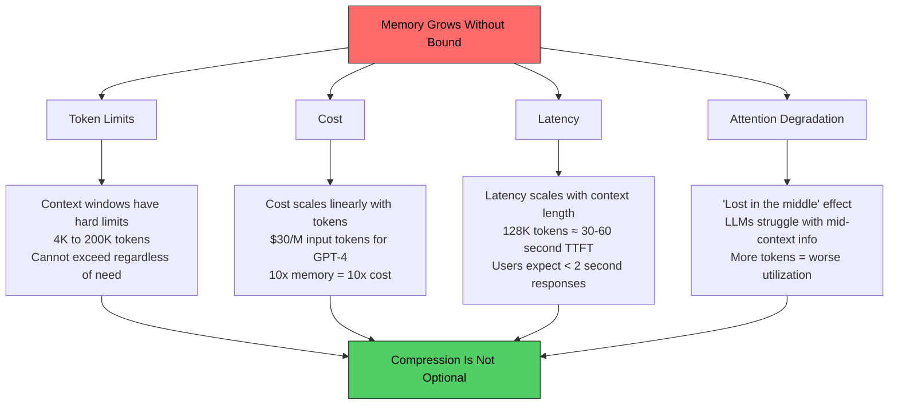
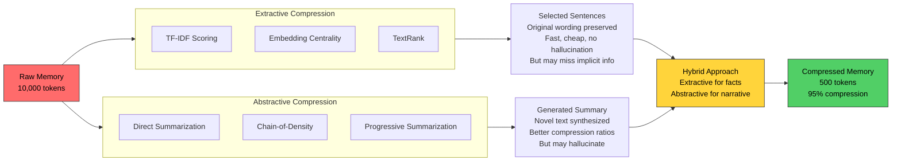
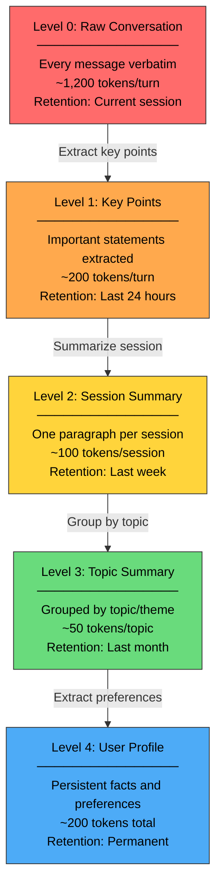

# Memory in AI Systems Deep Dive  Part 12: Memory Compression and Summarization

---

**Series:** Memory in AI Systems  A Developer's Deep Dive from Fundamentals to Production
**Part:** 12 of 19 (Memory Compression)
**Audience:** Developers with programming experience who want to understand AI memory systems from the ground up
**Reading time:** ~45 minutes

---

## Recap of Part 11

In Part 11, we explored memory persistence and storage  how to save, load, and manage memory across sessions so that AI systems can remember users, conversations, and learned facts across restarts and deployments. We built storage backends, serialization pipelines, and lifecycle management systems that keep memory alive beyond a single conversation turn.

But here's a problem we kept bumping into: **memory grows**. Every conversation adds tokens. Every retrieved document adds context. Every fact learned adds to the knowledge base. And LLMs have a hard limit  the context window. Even with the largest models offering 128K or 200K token windows, an AI assistant that remembers everything from every conversation will eventually run out of room.

This is the compression problem. And it's not just about fitting into the context window  it's about **cost**, **latency**, and **attention quality**. A 100K token context costs 50x more than a 2K token context. It takes longer to process. And research consistently shows that LLMs struggle to utilize information in the middle of very long contexts (the "lost in the middle" effect).

In this part, we'll build a complete memory compression system from scratch. We'll implement extractive compression (keeping the important parts), abstractive compression (summarizing with LLMs), hierarchical compression (multi-level summarization), sliding window strategies, memory budget allocation, and quality evaluation  then combine everything into a production-ready compressor.

By the end of this part, you will:

- Understand **why compression is essential**, not optional, for production AI memory systems
- Implement **extractive compression** using TF-IDF, embeddings, and TextRank
- Build **abstractive compression** using LLM summarization with chain-of-density techniques
- Design **hierarchical memory compression** with 5 levels from raw text to user profiles
- Implement **4 sliding window strategies** from simple to adaptive
- Build a **memory budget allocator** that dynamically distributes tokens across memory types
- Create **compression quality metrics** to measure information retention
- Combine everything into a **production memory compressor** with automatic triggers and fallbacks

Let's compress.

---

## Table of Contents

1. [Why Memory Must Be Compressed](#1-why-memory-must-be-compressed)
2. [Extractive Compression](#2-extractive-compression)
3. [Abstractive Compression (LLM Summarization)](#3-abstractive-compression-llm-summarization)
4. [Hierarchical Memory Compression](#4-hierarchical-memory-compression)
5. [Sliding Window Strategies](#5-sliding-window-strategies)
6. [Memory Budget Allocation](#6-memory-budget-allocation)
7. [Compression Quality Evaluation](#7-compression-quality-evaluation)
8. [Building a Production Memory Compressor](#8-building-a-production-memory-compressor)
9. [Vocabulary Cheat Sheet](#9-vocabulary-cheat-sheet)
10. [Key Takeaways and What's Next](#10-key-takeaways-and-whats-next)

---

## 1. Why Memory Must Be Compressed

### The Memory Growth Problem

Every interaction with an AI system generates text. Let's quantify how fast memory grows in a realistic scenario:

```python
"""
Quantifying memory growth in a conversational AI system.
"""

class MemoryGrowthSimulator:
    """Simulates how memory grows over time in a typical AI assistant."""

    def __init__(self):
        # Average tokens per message (based on real-world data)
        self.avg_user_message_tokens = 50      # Users tend to be concise
        self.avg_assistant_response_tokens = 250  # Assistants are more verbose
        self.avg_system_prompt_tokens = 500     # System instructions
        self.avg_retrieved_doc_tokens = 300     # Per retrieved document
        self.docs_per_query = 3                 # Typical retrieval count

    def tokens_per_turn(self) -> int:
        """Calculate tokens consumed per conversation turn."""
        return (
            self.avg_user_message_tokens +       # User says something
            self.avg_assistant_response_tokens +  # Assistant responds
            self.avg_retrieved_doc_tokens * self.docs_per_query  # Retrieved context
        )

    def simulate_growth(self, num_turns: int, num_sessions: int) -> dict:
        """Simulate memory growth across multiple sessions."""
        per_turn = self.tokens_per_turn()  # 50 + 250 + 900 = 1,200 tokens/turn

        results = {
            "tokens_per_turn": per_turn,
            "tokens_per_session": per_turn * num_turns,
            "total_tokens": per_turn * num_turns * num_sessions,
            "cost_at_input_rate": 0,  # Will calculate
            "context_windows_needed": 0,  # Will calculate
        }

        total = results["total_tokens"]

        # Cost calculation (approximate GPT-4 rates: $30/1M input tokens)
        results["cost_at_input_rate"] = (total / 1_000_000) * 30.0

        # How many 128K context windows would this fill?
        results["context_windows_needed"] = total / 128_000

        return results

    def print_growth_table(self):
        """Show memory growth at different scales."""
        print(f"{'Scenario':<30} {'Turns':<8} {'Sessions':<10} "
              f"{'Total Tokens':<15} {'Cost':<10} {'128K Windows'}")
        print("-" * 100)

        scenarios = [
            ("Single conversation", 10, 1),
            ("Day of conversations", 10, 20),
            ("Week of usage", 10, 140),
            ("Month of usage", 10, 600),
            ("Year of usage", 10, 7300),
            ("Power user (year)", 30, 7300),
        ]

        for name, turns, sessions in scenarios:
            r = self.simulate_growth(turns, sessions)
            print(f"{name:<30} {turns:<8} {sessions:<10} "
                  f"{r['total_tokens']:<15,} ${r['cost_at_input_rate']:<9.2f} "
                  f"{r['context_windows_needed']:.1f}")


# Run the simulation
sim = MemoryGrowthSimulator()
sim.print_growth_table()
```

**Output:**

```
Scenario                       Turns    Sessions   Total Tokens    Cost       128K Windows
----------------------------------------------------------------------------------------------------
Single conversation            10       1          12,000          $0.36      0.1
Day of conversations           10       20         240,000         $7.20      1.9
Week of usage                  10       140        1,680,000       $50.40     13.1
Month of usage                 10       600        7,200,000       $216.00    56.3
Year of usage                  10       7300       87,600,000      $2628.00   684.4
Power user (year)              30       7300       262,800,000     $7884.00   2053.1
```

The numbers are stark. A single conversation fits easily in context. But a month of usage generates **7.2 million tokens**  that's 56 context windows worth of data. A year of power usage hits **262 million tokens**. You simply cannot stuff all of that into a context window.

### The Four Forces Demanding Compression



Let's examine each force in detail.

#### Force 1: Token Limits Are Hard Walls

```python
"""
Context window limits across major models (as of 2025).
"""

MODEL_CONTEXT_LIMITS = {
    # Model: (context_window, typical_output_limit)
    "GPT-3.5-Turbo":    (16_384,   4_096),
    "GPT-4":            (8_192,    4_096),
    "GPT-4-Turbo":      (128_000,  4_096),
    "GPT-4o":           (128_000,  16_384),
    "Claude 3 Haiku":   (200_000,  4_096),
    "Claude 3.5 Sonnet": (200_000, 8_192),
    "Claude 3 Opus":    (200_000,  4_096),
    "Gemini 1.5 Pro":   (2_000_000, 8_192),
    "Llama 3 8B":       (8_192,    2_048),
    "Llama 3 70B":      (8_192,    2_048),
    "Mistral Large":    (128_000,  4_096),
}

def check_memory_fits(memory_tokens: int, model: str) -> dict:
    """Check if memory fits in a model's context window."""
    if model not in MODEL_CONTEXT_LIMITS:
        raise ValueError(f"Unknown model: {model}")

    context_limit, output_limit = MODEL_CONTEXT_LIMITS[model]

    # Available for input = context_limit - output_limit - system_prompt_overhead
    system_overhead = 500  # Typical system prompt
    available = context_limit - output_limit - system_overhead

    fits = memory_tokens <= available
    utilization = memory_tokens / available if available > 0 else float('inf')
    overflow = max(0, memory_tokens - available)

    return {
        "model": model,
        "context_limit": context_limit,
        "available_for_memory": available,
        "memory_tokens": memory_tokens,
        "fits": fits,
        "utilization_pct": utilization * 100,
        "overflow_tokens": overflow,
        "compression_needed": max(0, 1 - (available / memory_tokens)) * 100 if not fits else 0
    }


# Check: can a month of conversations fit?
month_tokens = 7_200_000

for model in ["GPT-4", "GPT-4o", "Claude 3.5 Sonnet", "Gemini 1.5 Pro"]:
    result = check_memory_fits(month_tokens, model)
    status = "FITS" if result["fits"] else f"OVERFLOW by {result['overflow_tokens']:,} tokens"
    compression = f"Need {result['compression_needed']:.1f}% compression" if not result["fits"] else "No compression needed"
    print(f"{model:<22} Available: {result['available_for_memory']:>10,} | {status} | {compression}")
```

**Output:**

```
GPT-4                  Available:      3,596 | OVERFLOW by 7,196,404 tokens | Need 100.0% compression
GPT-4o                 Available:    111,116 | OVERFLOW by 7,088,884 tokens | Need 98.5% compression
Claude 3.5 Sonnet      Available:    191,308 | OVERFLOW by 7,008,692 tokens | Need 97.3% compression
Gemini 1.5 Pro         Available:  1,991,308 | OVERFLOW by 5,208,692 tokens | Need 72.3% compression
```

Even Gemini's 2M token window cannot hold a month of conversations. **Every model requires aggressive compression.**

#### Force 2: Cost Scales Linearly

```python
"""
Cost implications of uncompressed vs. compressed memory.
"""

def calculate_cost_savings(
    memory_tokens: int,
    queries_per_day: int,
    compression_ratio: float,  # 0.1 = 90% compression
    cost_per_million_input: float = 30.0,  # USD
    cost_per_million_output: float = 60.0   # USD
) -> dict:
    """Calculate cost savings from memory compression."""

    # Without compression: full memory sent with every query
    uncompressed_daily_input = memory_tokens * queries_per_day
    uncompressed_daily_cost = (uncompressed_daily_input / 1_000_000) * cost_per_million_input

    # With compression
    compressed_tokens = int(memory_tokens * compression_ratio)
    compressed_daily_input = compressed_tokens * queries_per_day
    compressed_daily_cost = (compressed_daily_input / 1_000_000) * cost_per_million_input

    # Compression itself costs tokens (one-time per compression cycle)
    compression_cost_per_cycle = (memory_tokens / 1_000_000) * cost_per_million_input  # Input
    compression_cost_per_cycle += (compressed_tokens / 1_000_000) * cost_per_million_output  # Output

    daily_savings = uncompressed_daily_cost - compressed_daily_cost
    monthly_savings = daily_savings * 30

    return {
        "uncompressed_tokens": memory_tokens,
        "compressed_tokens": compressed_tokens,
        "compression_ratio": compression_ratio,
        "daily_cost_uncompressed": uncompressed_daily_cost,
        "daily_cost_compressed": compressed_daily_cost,
        "compression_overhead": compression_cost_per_cycle,
        "daily_savings": daily_savings,
        "monthly_savings": monthly_savings,
        "roi_queries_to_break_even": compression_cost_per_cycle / (
            (memory_tokens - compressed_tokens) / 1_000_000 * cost_per_million_input
        ) if memory_tokens > compressed_tokens else float('inf')
    }


# Scenario: 1 week of conversation history (1.68M tokens), 50 queries/day
result = calculate_cost_savings(
    memory_tokens=1_680_000,
    queries_per_day=50,
    compression_ratio=0.05  # 95% compression  keep only 5%
)

print(f"Uncompressed: {result['uncompressed_tokens']:,} tokens")
print(f"Compressed:   {result['compressed_tokens']:,} tokens ({result['compression_ratio']:.0%} of original)")
print(f"Daily cost without compression: ${result['daily_cost_uncompressed']:.2f}")
print(f"Daily cost with compression:    ${result['daily_cost_compressed']:.2f}")
print(f"Compression overhead (one-time): ${result['compression_overhead']:.2f}")
print(f"Daily savings:                  ${result['daily_savings']:.2f}")
print(f"Monthly savings:                ${result['monthly_savings']:.2f}")
print(f"Break-even after:               {result['roi_queries_to_break_even']:.1f} queries")
```

**Output:**

```
Uncompressed: 1,680,000 tokens
Compressed:   84,000 tokens (5% of original)
Daily cost without compression: $2520.00
Daily cost with compression:    $126.00
Compression overhead (one-time): $55.44
Daily savings:                  $2394.00
Monthly savings:                $71820.00
Break-even after:               1.2 queries
```

The economics are overwhelming. Compression pays for itself in **just over one query**.

#### Force 3: Latency Increases with Context

```python
"""
Approximate latency impact of context length.
Time-to-first-token (TTFT) grows with input size.
"""

import math

def estimate_latency(input_tokens: int, model_size_billions: int = 70) -> dict:
    """
    Estimate latency characteristics for different context lengths.

    Based on empirical observations:
    - Prefill (TTFT) scales roughly O(n) with input tokens for typical transformer models
    - Actual scaling depends on implementation (flash attention, paged attention, etc.)
    """

    # Rough TTFT estimates based on real-world measurements
    # These assume a well-optimized serving setup
    base_ttft_ms = 200  # Fixed overhead (network, scheduling, etc.)

    # Prefill rate: ~10K tokens/second for large models on A100
    prefill_rate = 10_000  # tokens/second
    prefill_time_ms = (input_tokens / prefill_rate) * 1000

    ttft_ms = base_ttft_ms + prefill_time_ms

    # Token generation rate: ~30-50 tokens/second (doesn't depend on input length much)
    generation_rate = 40  # tokens/second

    # Assume 200 token response
    response_tokens = 200
    generation_time_ms = (response_tokens / generation_rate) * 1000

    total_ms = ttft_ms + generation_time_ms

    return {
        "input_tokens": input_tokens,
        "ttft_ms": ttft_ms,
        "generation_ms": generation_time_ms,
        "total_ms": total_ms,
        "user_experience": (
            "Instant" if ttft_ms < 500 else
            "Fast" if ttft_ms < 1000 else
            "Acceptable" if ttft_ms < 3000 else
            "Slow" if ttft_ms < 10000 else
            "Painful"
        )
    }


print(f"{'Input Tokens':<15} {'TTFT':<12} {'Total':<12} {'Experience'}")
print("-" * 55)

for tokens in [1_000, 4_000, 16_000, 64_000, 128_000, 500_000, 2_000_000]:
    r = estimate_latency(tokens)
    print(f"{tokens:<15,} {r['ttft_ms']:<12,.0f}ms {r['total_ms']:<12,.0f}ms {r['user_experience']}")
```

**Output:**

```
Input Tokens    TTFT         Total        Experience
-------------------------------------------------------
1,000           300ms        5,300ms      Instant
4,000           600ms        5,600ms      Fast
16,000          1,800ms      6,800ms      Acceptable
64,000          6,600ms      11,600ms     Slow
128,000         13,000ms     18,000ms     Painful
500,000         50,200ms     55,200ms     Painful
2,000,000       200,200ms    205,200ms    Painful
```

Sending 128K tokens means the user waits **13 seconds** just for the first token to appear. Compression to 4K tokens brings that down to **600ms**. That's the difference between a usable product and an abandoned one.

#### Force 4: Attention Degradation

> **Key Insight:** More context does not always mean better answers. Research on the "lost in the middle" effect (Liu et al., 2023) shows that LLMs are best at using information placed at the **beginning** and **end** of the context. Information in the middle gets progressively ignored. Compression helps by ensuring that only the most relevant information survives  and it gets placed where the model can actually use it.

```python
"""
Simulating the 'lost in the middle' effect.
Position-dependent retrieval accuracy from the original paper.
"""

def lost_in_the_middle_accuracy(num_documents: int) -> list[dict]:
    """
    Simulate position-dependent accuracy based on the
    'Lost in the Middle' paper findings.

    Key finding: when relevant information is placed at different
    positions in the context, accuracy varies dramatically.
    """
    results = []

    for position in range(num_documents):
        # Normalize position to [0, 1]
        normalized_pos = position / (num_documents - 1) if num_documents > 1 else 0

        # U-shaped curve: high at start, drops in middle, recovers at end
        # This approximates the paper's findings
        if normalized_pos < 0.1:
            accuracy = 0.90 - normalized_pos * 2  # ~90% at start, drops quickly
        elif normalized_pos > 0.9:
            accuracy = 0.70 + (normalized_pos - 0.9) * 2  # Recovers to ~80% at end
        else:
            # Middle region: lower accuracy with a dip around the center
            center_distance = abs(normalized_pos - 0.5)
            accuracy = 0.55 + center_distance * 0.3  # 55-70% in middle

        results.append({
            "position": position + 1,
            "normalized_position": normalized_pos,
            "accuracy": min(accuracy, 0.95)
        })

    return results


# Simulate with 20 documents in context
results = lost_in_the_middle_accuracy(20)

print("Position-dependent accuracy (20 documents in context):")
print(f"{'Position':<10} {'Accuracy':<10} {'Visual'}")
print("-" * 50)
for r in results:
    bar = "█" * int(r["accuracy"] * 40)
    print(f"{r['position']:<10} {r['accuracy']:<10.1%} {bar}")

# Key takeaway
best = max(results, key=lambda x: x["accuracy"])
worst = min(results, key=lambda x: x["accuracy"])
print(f"\nBest accuracy:  Position {best['position']} ({best['accuracy']:.1%})")
print(f"Worst accuracy: Position {worst['position']} ({worst['accuracy']:.1%})")
print(f"Accuracy gap:   {best['accuracy'] - worst['accuracy']:.1%}")
```

> **The Compression Imperative:** Compression isn't a nice-to-have optimization. It's a fundamental requirement for any AI system that maintains memory across conversations. Without compression, you hit token limits, burn through budgets, frustrate users with latency, and degrade answer quality. The question is not *whether* to compress, but *how*.

---

## 2. Extractive Compression

**Extractive compression** keeps the most important parts of the original text verbatim. Think of it as highlighting the key sentences in a textbook  you're not rewriting anything, just selecting what matters.

### 2.1 TF-IDF Based Importance Scoring

The simplest approach to extractive compression uses **TF-IDF** (Term Frequency - Inverse Document Frequency) to score sentence importance. Sentences containing rare, distinctive terms score higher than sentences with only common words.

```python
"""
Extractive compression using TF-IDF importance scoring.
"""

import math
import re
from collections import Counter
from dataclasses import dataclass, field


@dataclass
class ScoredSentence:
    """A sentence with its importance score and metadata."""
    text: str
    index: int              # Original position in document
    score: float = 0.0
    token_count: int = 0

    def __post_init__(self):
        # Rough token count (words ≈ 1.3 tokens on average)
        self.token_count = int(len(self.text.split()) * 1.3)


class TFIDFExtractor:
    """
    Extract important sentences using TF-IDF scoring.

    How it works:
    1. Split text into sentences
    2. Compute TF-IDF for each term across sentences
    3. Score each sentence as the average TF-IDF of its terms
    4. Select top-scoring sentences up to the token budget
    """

    def __init__(self):
        self.stop_words = {
            'the', 'a', 'an', 'is', 'are', 'was', 'were', 'be', 'been',
            'being', 'have', 'has', 'had', 'do', 'does', 'did', 'will',
            'would', 'could', 'should', 'may', 'might', 'can', 'shall',
            'to', 'of', 'in', 'for', 'on', 'with', 'at', 'by', 'from',
            'as', 'into', 'through', 'during', 'before', 'after', 'and',
            'but', 'or', 'nor', 'not', 'so', 'yet', 'both', 'either',
            'neither', 'each', 'every', 'all', 'any', 'few', 'more',
            'most', 'other', 'some', 'such', 'no', 'only', 'own', 'same',
            'than', 'too', 'very', 'just', 'because', 'if', 'when', 'then',
            'that', 'this', 'these', 'those', 'it', 'its', 'i', 'me', 'my',
            'we', 'our', 'you', 'your', 'he', 'him', 'his', 'she', 'her',
            'they', 'them', 'their', 'what', 'which', 'who', 'whom',
        }

    def _split_sentences(self, text: str) -> list[str]:
        """Split text into sentences using regex."""
        # Split on period, exclamation, question mark followed by space or end
        sentences = re.split(r'(?<=[.!?])\s+', text.strip())
        # Filter out very short "sentences" (likely artifacts)
        return [s.strip() for s in sentences if len(s.strip().split()) >= 3]

    def _tokenize(self, text: str) -> list[str]:
        """Simple tokenization: lowercase, remove punctuation, filter stop words."""
        words = re.findall(r'\b[a-z]+\b', text.lower())
        return [w for w in words if w not in self.stop_words and len(w) > 2]

    def _compute_tfidf(self, sentences: list[str]) -> list[dict[str, float]]:
        """Compute TF-IDF scores for terms in each sentence."""
        # Tokenize all sentences
        tokenized = [self._tokenize(s) for s in sentences]
        n_docs = len(tokenized)

        # Document frequency: how many sentences contain each term
        doc_freq = Counter()
        for tokens in tokenized:
            unique_tokens = set(tokens)
            for token in unique_tokens:
                doc_freq[token] += 1

        # Compute TF-IDF for each sentence
        tfidf_per_sentence = []
        for tokens in tokenized:
            if not tokens:
                tfidf_per_sentence.append({})
                continue

            # Term frequency (normalized by sentence length)
            tf = Counter(tokens)
            max_tf = max(tf.values())

            tfidf = {}
            for term, count in tf.items():
                # Augmented TF to prevent bias toward long sentences
                tf_score = 0.5 + 0.5 * (count / max_tf)
                # IDF with smoothing
                idf_score = math.log((n_docs + 1) / (doc_freq[term] + 1)) + 1
                tfidf[term] = tf_score * idf_score

            tfidf_per_sentence.append(tfidf)

        return tfidf_per_sentence

    def extract(
        self,
        text: str,
        max_tokens: int = 500,
        min_sentences: int = 1,
        preserve_order: bool = True
    ) -> list[ScoredSentence]:
        """
        Extract the most important sentences within a token budget.

        Args:
            text: Input text to compress
            max_tokens: Maximum tokens in the output
            min_sentences: Minimum sentences to keep
            preserve_order: If True, return sentences in original order

        Returns:
            List of selected sentences with scores
        """
        sentences = self._split_sentences(text)
        if not sentences:
            return []

        # Compute TF-IDF scores
        tfidf_scores = self._compute_tfidf(sentences)

        # Score each sentence (average TF-IDF of its terms)
        scored = []
        for i, (sentence, tfidf) in enumerate(zip(sentences, tfidf_scores)):
            if tfidf:
                score = sum(tfidf.values()) / len(tfidf)
            else:
                score = 0.0

            # Boost first and last sentences (they often contain key information)
            position_boost = 1.0
            if i == 0:
                position_boost = 1.3  # First sentence often states the topic
            elif i == len(sentences) - 1:
                position_boost = 1.1  # Last sentence often summarizes
            elif i < 3:
                position_boost = 1.1  # Early sentences tend to be important

            scored.append(ScoredSentence(
                text=sentence,
                index=i,
                score=score * position_boost
            ))

        # Sort by score (highest first)
        scored.sort(key=lambda x: x.score, reverse=True)

        # Select sentences within token budget
        selected = []
        total_tokens = 0

        for sentence in scored:
            if total_tokens + sentence.token_count <= max_tokens or len(selected) < min_sentences:
                selected.append(sentence)
                total_tokens += sentence.token_count

            if total_tokens >= max_tokens and len(selected) >= min_sentences:
                break

        # Optionally restore original order
        if preserve_order:
            selected.sort(key=lambda x: x.index)

        return selected

    def compress(self, text: str, max_tokens: int = 500) -> str:
        """Compress text and return as a single string."""
        selected = self.extract(text, max_tokens=max_tokens)
        return " ".join(s.text for s in selected)


# ---- Example usage ----

conversation = """
The user asked about deploying a machine learning model to production. They
specifically wanted to know about containerization with Docker and orchestration
with Kubernetes. I explained that Docker allows you to package your model with
all its dependencies into a reproducible container image. The Dockerfile should
include the model weights, inference code, and a serving framework like FastAPI
or TensorFlow Serving. For Kubernetes deployment, I recommended using a
Deployment resource with multiple replicas for high availability. The user was
particularly interested in auto-scaling based on GPU utilization. I explained
that Kubernetes Horizontal Pod Autoscaler can scale based on custom metrics
including GPU memory usage and inference latency. We also discussed model
versioning strategies using Kubernetes labels and canary deployments. The user
mentioned they're currently using a single EC2 instance and wanted to understand
the migration path. I outlined a three-phase migration: first containerize the
existing setup, then deploy to a managed Kubernetes service like EKS, and
finally implement auto-scaling and monitoring. The user thanked me and said
they would start with the Docker containerization step this weekend.
"""

extractor = TFIDFExtractor()

# Compress to ~100 tokens
compressed = extractor.compress(conversation, max_tokens=100)
original_tokens = int(len(conversation.split()) * 1.3)
compressed_tokens = int(len(compressed.split()) * 1.3)

print(f"Original: ~{original_tokens} tokens")
print(f"Compressed: ~{compressed_tokens} tokens")
print(f"Compression ratio: {compressed_tokens/original_tokens:.1%}")
print(f"\nCompressed text:\n{compressed}")
```

### 2.2 Embedding-Based Key Sentence Selection

TF-IDF works well for keyword-heavy text, but it misses semantic meaning. Two sentences can use completely different words to express similar ideas. **Embedding-based extraction** uses vector representations to capture semantic importance.

The core idea: sentences that are semantically central to the document (close to many other sentences in embedding space) are the most important.

```python
"""
Embedding-based extractive compression.
Selects sentences that are most semantically representative.
"""

import numpy as np
from dataclasses import dataclass


class EmbeddingExtractor:
    """
    Extract key sentences using embedding-based semantic importance.

    Strategy: A sentence is important if it's semantically similar to many
    other sentences in the document (i.e., it captures central themes).
    """

    def __init__(self, embedding_fn=None):
        """
        Args:
            embedding_fn: Function that takes a list of strings and returns
                         a numpy array of embeddings. If None, uses a simple
                         bag-of-words embedding for demonstration.
        """
        self.embedding_fn = embedding_fn or self._simple_embedding

    def _simple_embedding(self, texts: list[str]) -> np.ndarray:
        """
        Simple bag-of-words embedding for demonstration.
        In production, use sentence-transformers or OpenAI embeddings.
        """
        # Build vocabulary
        all_words = set()
        tokenized = []
        for text in texts:
            words = set(text.lower().split())
            tokenized.append(words)
            all_words.update(words)

        vocab = sorted(all_words)
        word_to_idx = {w: i for i, w in enumerate(vocab)}

        # Create embeddings (binary bag-of-words)
        embeddings = np.zeros((len(texts), len(vocab)))
        for i, words in enumerate(tokenized):
            for word in words:
                if word in word_to_idx:
                    embeddings[i, word_to_idx[word]] = 1.0

        # L2 normalize
        norms = np.linalg.norm(embeddings, axis=1, keepdims=True)
        norms = np.where(norms == 0, 1, norms)  # Avoid division by zero
        embeddings = embeddings / norms

        return embeddings

    def _cosine_similarity_matrix(self, embeddings: np.ndarray) -> np.ndarray:
        """Compute pairwise cosine similarity between all embeddings."""
        # Since embeddings are L2-normalized, cosine similarity = dot product
        return embeddings @ embeddings.T

    def _compute_centrality_scores(self, similarity_matrix: np.ndarray) -> np.ndarray:
        """
        Compute centrality score for each sentence.

        A sentence is central if it has high similarity to many other sentences.
        This captures sentences that represent the main themes of the document.
        """
        n = similarity_matrix.shape[0]

        # Zero out self-similarity
        sim = similarity_matrix.copy()
        np.fill_diagonal(sim, 0)

        # Centrality = mean similarity to all other sentences
        centrality = sim.mean(axis=1)

        return centrality

    def _maximal_marginal_relevance(
        self,
        similarity_matrix: np.ndarray,
        centrality_scores: np.ndarray,
        n_select: int,
        lambda_param: float = 0.7
    ) -> list[int]:
        """
        Select sentences using Maximal Marginal Relevance (MMR).

        MMR balances:
        - Relevance: selecting important (central) sentences
        - Diversity: avoiding redundant selections

        Args:
            similarity_matrix: Pairwise sentence similarities
            centrality_scores: Importance score for each sentence
            n_select: Number of sentences to select
            lambda_param: Balance between relevance (1.0) and diversity (0.0)

        Returns:
            Indices of selected sentences
        """
        n = len(centrality_scores)
        selected = []
        remaining = list(range(n))

        for _ in range(min(n_select, n)):
            if not remaining:
                break

            if not selected:
                # First selection: most central sentence
                best_idx = max(remaining, key=lambda i: centrality_scores[i])
            else:
                # MMR selection
                best_score = -float('inf')
                best_idx = remaining[0]

                for idx in remaining:
                    # Relevance: centrality score
                    relevance = centrality_scores[idx]

                    # Redundancy: max similarity to already selected sentences
                    redundancy = max(similarity_matrix[idx][s] for s in selected)

                    # MMR score
                    mmr_score = lambda_param * relevance - (1 - lambda_param) * redundancy

                    if mmr_score > best_score:
                        best_score = mmr_score
                        best_idx = idx

            selected.append(best_idx)
            remaining.remove(best_idx)

        return selected

    def extract(
        self,
        text: str,
        max_tokens: int = 500,
        diversity: float = 0.7
    ) -> list[ScoredSentence]:
        """
        Extract key sentences using embedding-based importance with MMR diversity.

        Args:
            text: Input text
            max_tokens: Token budget
            diversity: 0.0 = maximize diversity, 1.0 = maximize relevance

        Returns:
            Selected sentences
        """
        # Split into sentences
        sentences = re.split(r'(?<=[.!?])\s+', text.strip())
        sentences = [s.strip() for s in sentences if len(s.strip().split()) >= 3]

        if not sentences:
            return []

        # Get embeddings
        embeddings = self.embedding_fn(sentences)

        # Compute similarity matrix
        sim_matrix = self._cosine_similarity_matrix(embeddings)

        # Compute centrality scores
        centrality = self._compute_centrality_scores(sim_matrix)

        # Estimate how many sentences we can fit
        avg_tokens_per_sentence = np.mean([len(s.split()) * 1.3 for s in sentences])
        n_select = max(1, int(max_tokens / avg_tokens_per_sentence))

        # Select with MMR
        selected_indices = self._maximal_marginal_relevance(
            sim_matrix, centrality, n_select, diversity
        )

        # Build results
        results = []
        total_tokens = 0
        for idx in sorted(selected_indices):  # Preserve original order
            sentence = sentences[idx]
            token_count = int(len(sentence.split()) * 1.3)

            if total_tokens + token_count <= max_tokens or not results:
                results.append(ScoredSentence(
                    text=sentence,
                    index=idx,
                    score=float(centrality[idx]),
                    token_count=token_count
                ))
                total_tokens += token_count

        return results

    def compress(self, text: str, max_tokens: int = 500) -> str:
        """Compress text to fit within token budget."""
        selected = self.extract(text, max_tokens=max_tokens)
        return " ".join(s.text for s in selected)


# Example
extractor = EmbeddingExtractor()
compressed = extractor.compress(conversation, max_tokens=100)
print(f"Embedding-based compression:\n{compressed}")
```

### 2.3 TextRank Algorithm

**TextRank** is a graph-based ranking algorithm (inspired by Google's PageRank) applied to sentences. It builds a graph where sentences are nodes and edge weights represent inter-sentence similarity. Sentences that are connected to many other important sentences rise to the top.

```python
"""
TextRank implementation for extractive summarization.
"""

class TextRankExtractor:
    """
    Extract important sentences using the TextRank algorithm.

    Algorithm:
    1. Build a graph where each sentence is a node
    2. Edge weight between sentences = their similarity
    3. Run PageRank-style iteration to find important nodes
    4. Select top-ranked sentences within token budget

    Why TextRank works: A sentence is important not just because it's
    similar to other sentences, but because it's similar to other
    IMPORTANT sentences. This recursive definition captures document structure.
    """

    def __init__(self, damping: float = 0.85, max_iterations: int = 100,
                 convergence_threshold: float = 1e-6):
        """
        Args:
            damping: Probability of following a link (vs random jump).
                    Standard PageRank value is 0.85.
            max_iterations: Maximum iterations for convergence
            convergence_threshold: Stop when scores change less than this
        """
        self.damping = damping
        self.max_iterations = max_iterations
        self.convergence_threshold = convergence_threshold

    def _sentence_similarity(self, s1: str, s2: str) -> float:
        """
        Compute similarity between two sentences.
        Uses word overlap normalized by sentence lengths.
        """
        words1 = set(s1.lower().split())
        words2 = set(s2.lower().split())

        # Remove very short words (likely stop words)
        words1 = {w for w in words1 if len(w) > 2}
        words2 = {w for w in words2 if len(w) > 2}

        if not words1 or not words2:
            return 0.0

        overlap = words1 & words2

        # Normalize by log of sentence lengths (prevents bias toward long sentences)
        norm = math.log(len(words1) + 1) + math.log(len(words2) + 1)
        if norm == 0:
            return 0.0

        return len(overlap) / norm

    def _build_similarity_matrix(self, sentences: list[str]) -> np.ndarray:
        """Build the sentence similarity matrix (adjacency matrix of the graph)."""
        n = len(sentences)
        matrix = np.zeros((n, n))

        for i in range(n):
            for j in range(i + 1, n):
                sim = self._sentence_similarity(sentences[i], sentences[j])
                matrix[i][j] = sim
                matrix[j][i] = sim

        return matrix

    def _textrank(self, similarity_matrix: np.ndarray) -> np.ndarray:
        """
        Run the TextRank algorithm (PageRank on sentence graph).

        The update rule:
        score(i) = (1 - d) + d * Σ(j→i) [sim(i,j) / Σ(k) sim(j,k)] * score(j)

        Where:
        - d is the damping factor
        - sim(i,j) is the similarity between sentences i and j
        - The sum is over all sentences j that link to i
        """
        n = similarity_matrix.shape[0]

        # Initialize scores uniformly
        scores = np.ones(n) / n

        # Normalize similarity matrix (each row sums to 1)
        row_sums = similarity_matrix.sum(axis=1, keepdims=True)
        row_sums = np.where(row_sums == 0, 1, row_sums)
        transition_matrix = similarity_matrix / row_sums

        # Iterative update
        for iteration in range(self.max_iterations):
            new_scores = (1 - self.damping) / n + self.damping * (transition_matrix.T @ scores)

            # Check convergence
            delta = np.abs(new_scores - scores).sum()
            scores = new_scores

            if delta < self.convergence_threshold:
                break

        return scores

    def extract(
        self,
        text: str,
        max_tokens: int = 500,
        preserve_order: bool = True
    ) -> list[ScoredSentence]:
        """Extract key sentences using TextRank."""
        # Split into sentences
        sentences = re.split(r'(?<=[.!?])\s+', text.strip())
        sentences = [s.strip() for s in sentences if len(s.strip().split()) >= 3]

        if not sentences:
            return []

        # Build similarity matrix
        sim_matrix = self._build_similarity_matrix(sentences)

        # Run TextRank
        scores = self._textrank(sim_matrix)

        # Create scored sentences
        scored = [
            ScoredSentence(text=s, index=i, score=float(scores[i]))
            for i, s in enumerate(sentences)
        ]

        # Sort by score (highest first)
        scored.sort(key=lambda x: x.score, reverse=True)

        # Select within token budget
        selected = []
        total_tokens = 0

        for sentence in scored:
            if total_tokens + sentence.token_count <= max_tokens or not selected:
                selected.append(sentence)
                total_tokens += sentence.token_count
            if total_tokens >= max_tokens:
                break

        # Restore original order if requested
        if preserve_order:
            selected.sort(key=lambda x: x.index)

        return selected

    def compress(self, text: str, max_tokens: int = 500) -> str:
        """Compress text using TextRank."""
        selected = self.extract(text, max_tokens=max_tokens)
        return " ".join(s.text for s in selected)


# ---- Compare all three extractive methods ----

print("=" * 80)
print("EXTRACTIVE COMPRESSION COMPARISON")
print("=" * 80)

methods = {
    "TF-IDF": TFIDFExtractor(),
    "Embedding": EmbeddingExtractor(),
    "TextRank": TextRankExtractor(),
}

for name, extractor in methods.items():
    compressed = extractor.compress(conversation, max_tokens=80)
    tokens = int(len(compressed.split()) * 1.3)
    print(f"\n--- {name} ({tokens} tokens) ---")
    print(compressed[:300] + "..." if len(compressed) > 300 else compressed)
```

> **When to Use Each Extractive Method:**
> - **TF-IDF:** Fast, no dependencies, good for keyword-heavy technical text
> - **Embedding-based:** Better semantic understanding, handles paraphrases, but requires an embedding model
> - **TextRank:** Best for document-level summarization, captures structural importance, but slower on very long texts

---

## 3. Abstractive Compression (LLM Summarization)

Extractive compression keeps original sentences  it can never synthesize new text or combine ideas. **Abstractive compression** uses an LLM to generate new, shorter text that captures the same meaning. This is more powerful but also more expensive and risky (the LLM might hallucinate or lose important details).

### 3.1 Basic LLM Summarization

```python
"""
Abstractive compression using LLM summarization.
"""

from typing import Optional
from dataclasses import dataclass, field
from enum import Enum


class CompressionLevel(Enum):
    """How aggressively to compress."""
    LIGHT = "light"       # Keep most details, ~50% compression
    MODERATE = "moderate"  # Keep key points, ~75% compression
    AGGRESSIVE = "aggressive"  # Essential facts only, ~90% compression
    EXTREME = "extreme"    # One-line summary, ~95%+ compression


@dataclass
class CompressionResult:
    """Result of an abstractive compression operation."""
    original_text: str
    compressed_text: str
    original_tokens: int
    compressed_tokens: int
    compression_ratio: float
    level: CompressionLevel
    metadata: dict = field(default_factory=dict)

    @property
    def space_saved_pct(self) -> float:
        return (1 - self.compression_ratio) * 100


class AbstractiveCompressor:
    """
    Compress text using LLM-based summarization.

    Supports multiple compression strategies:
    1. Direct summarization (single-shot)
    2. Chain-of-density summarization (progressive detail reduction)
    3. Structured extraction (extract into schema then render)
    """

    def __init__(self, llm_fn=None):
        """
        Args:
            llm_fn: Function that takes a prompt string and returns a response string.
                   If None, uses a mock for demonstration.
        """
        self.llm_fn = llm_fn or self._mock_llm

    def _mock_llm(self, prompt: str) -> str:
        """Mock LLM for demonstration. Replace with real API call."""
        # In production, this would call OpenAI, Anthropic, etc.
        # For demonstration, we return a placeholder
        return "[LLM response would appear here]"

    def _count_tokens(self, text: str) -> int:
        """Approximate token count."""
        return int(len(text.split()) * 1.3)

    def _build_summarization_prompt(
        self,
        text: str,
        level: CompressionLevel,
        max_tokens: int,
        context: Optional[str] = None
    ) -> str:
        """Build the prompt for LLM summarization."""

        level_instructions = {
            CompressionLevel.LIGHT: (
                "Create a detailed summary that preserves most information. "
                "Keep specific names, numbers, dates, and technical details. "
                "Remove only redundant or filler content."
            ),
            CompressionLevel.MODERATE: (
                "Create a concise summary focusing on key points and decisions. "
                "Keep important specifics (names, numbers, conclusions) but "
                "remove examples, elaborations, and tangential details."
            ),
            CompressionLevel.AGGRESSIVE: (
                "Create a brief summary with only the essential facts. "
                "Focus on: what was discussed, what was decided, and what "
                "actions were planned. Use minimal words."
            ),
            CompressionLevel.EXTREME: (
                "Create a one or two sentence summary capturing only the "
                "single most important takeaway from this text."
            ),
        }

        context_section = ""
        if context:
            context_section = f"\nContext about why this text matters:\n{context}\n"

        prompt = f"""Summarize the following text.
{context_section}
Instructions: {level_instructions[level]}

Target length: approximately {max_tokens} tokens (about {int(max_tokens / 1.3)} words).

IMPORTANT RULES:
- Do NOT add information that isn't in the original text
- Preserve factual accuracy  especially names, numbers, and technical terms
- Write in the same style and tense as the original
- Do not include meta-commentary like "This text discusses..."

Text to summarize:
---
{text}
---

Summary:"""

        return prompt

    def summarize(
        self,
        text: str,
        level: CompressionLevel = CompressionLevel.MODERATE,
        max_tokens: int = 200,
        context: Optional[str] = None
    ) -> CompressionResult:
        """
        Summarize text using an LLM.

        Args:
            text: Text to compress
            level: How aggressive the compression should be
            max_tokens: Target token count for output
            context: Optional context about why this memory matters

        Returns:
            CompressionResult with original and compressed text
        """
        original_tokens = self._count_tokens(text)

        # Don't compress if already under budget
        if original_tokens <= max_tokens:
            return CompressionResult(
                original_text=text,
                compressed_text=text,
                original_tokens=original_tokens,
                compressed_tokens=original_tokens,
                compression_ratio=1.0,
                level=level,
                metadata={"skipped": True, "reason": "Already within budget"}
            )

        prompt = self._build_summarization_prompt(text, level, max_tokens, context)
        compressed = self.llm_fn(prompt)
        compressed_tokens = self._count_tokens(compressed)

        return CompressionResult(
            original_text=text,
            compressed_text=compressed,
            original_tokens=original_tokens,
            compressed_tokens=compressed_tokens,
            compression_ratio=compressed_tokens / original_tokens if original_tokens > 0 else 1.0,
            level=level,
            metadata={
                "method": "direct_summarization",
                "prompt_tokens": self._count_tokens(prompt)
            }
        )

    def chain_of_density_summarize(
        self,
        text: str,
        num_iterations: int = 3,
        final_max_tokens: int = 100
    ) -> CompressionResult:
        """
        Chain-of-Density summarization (Adams et al., 2023).

        Process:
        1. Start with a verbose summary
        2. Iteratively make it denser by adding missing entities
           while keeping the length the same
        3. Each iteration packs more information into the same space

        This produces higher-quality compressions than single-shot summarization
        because the LLM progressively identifies what's truly important.
        """
        original_tokens = self._count_tokens(text)

        prompt = f"""You will generate increasingly concise summaries of the following text.

Text:
---
{text}
---

Generate {num_iterations} summaries of the above text, each approximately
{int(final_max_tokens / 1.3)} words long.

For each summary:
- Summary 1: Write a first summary covering the main topics
- Summary 2: Make the summary denser  add 1-2 important details that were
  missing from Summary 1, while removing less important content to maintain
  the same length
- Summary 3: Make it even denser  add remaining critical details, compress
  redundant phrasing, use more information-dense language

Format your response as:

SUMMARY 1:
[summary]

SUMMARY 2:
[summary]

SUMMARY 3:
[summary]"""

        response = self.llm_fn(prompt)

        # Parse the final (densest) summary
        # In production, you'd parse all summaries and pick the best
        compressed = response  # Would extract SUMMARY 3 in production
        compressed_tokens = self._count_tokens(compressed)

        return CompressionResult(
            original_text=text,
            compressed_text=compressed,
            original_tokens=original_tokens,
            compressed_tokens=compressed_tokens,
            compression_ratio=compressed_tokens / original_tokens if original_tokens > 0 else 1.0,
            level=CompressionLevel.AGGRESSIVE,
            metadata={
                "method": "chain_of_density",
                "iterations": num_iterations
            }
        )

    def progressive_summarize(
        self,
        texts: list[str],
        max_tokens_per_summary: int = 200,
        final_max_tokens: int = 100
    ) -> CompressionResult:
        """
        Progressive summarization: summarize multiple texts, then summarize the summaries.

        This is essential for compressing very long histories that don't fit
        in a single LLM call. Process:

        1. Split history into chunks that fit in context
        2. Summarize each chunk independently
        3. Concatenate summaries
        4. If still too long, summarize the summaries
        5. Repeat until within budget
        """
        original_text = "\n\n".join(texts)
        original_tokens = self._count_tokens(original_text)

        # Step 1: Summarize each text independently
        summaries = []
        for text in texts:
            result = self.summarize(
                text,
                level=CompressionLevel.MODERATE,
                max_tokens=max_tokens_per_summary
            )
            summaries.append(result.compressed_text)

        # Step 2: If combined summaries are still too long, summarize again
        combined = "\n\n".join(summaries)
        combined_tokens = self._count_tokens(combined)

        rounds = 1
        while combined_tokens > final_max_tokens and rounds < 5:
            result = self.summarize(
                combined,
                level=CompressionLevel.AGGRESSIVE,
                max_tokens=final_max_tokens
            )
            combined = result.compressed_text
            combined_tokens = self._count_tokens(combined)
            rounds += 1

        return CompressionResult(
            original_text=original_text,
            compressed_text=combined,
            original_tokens=original_tokens,
            compressed_tokens=combined_tokens,
            compression_ratio=combined_tokens / original_tokens if original_tokens > 0 else 1.0,
            level=CompressionLevel.AGGRESSIVE,
            metadata={
                "method": "progressive_summarization",
                "num_source_texts": len(texts),
                "compression_rounds": rounds
            }
        )


# ---- Demonstrate the compressor ----

compressor = AbstractiveCompressor()

# Direct summarization
result = compressor.summarize(
    conversation,
    level=CompressionLevel.MODERATE,
    max_tokens=80
)
print(f"Direct summarization:")
print(f"  Original: {result.original_tokens} tokens")
print(f"  Target:   80 tokens")
print(f"  Method:   {result.metadata['method']}")

# Chain-of-density
result = compressor.chain_of_density_summarize(conversation, final_max_tokens=80)
print(f"\nChain-of-density:")
print(f"  Original: {result.original_tokens} tokens")
print(f"  Method:   {result.metadata['method']}")
print(f"  Iterations: {result.metadata['iterations']}")

# Progressive (for multiple conversation sessions)
sessions = [conversation, conversation, conversation]  # Simulating 3 sessions
result = compressor.progressive_summarize(sessions, final_max_tokens=80)
print(f"\nProgressive summarization:")
print(f"  Source texts: {result.metadata['num_source_texts']}")
print(f"  Compression rounds: {result.metadata['compression_rounds']}")
```

### 3.2 Compression Strategy Comparison



| Aspect | Extractive | Abstractive |
|--------|-----------|-------------|
| **Speed** | Fast (no LLM call needed) | Slow (requires LLM inference) |
| **Cost** | Free (runs locally) | Expensive (LLM API costs) |
| **Faithfulness** | Perfect (original text) | Risk of hallucination |
| **Compression ratio** | Limited (~50-70%) | Excellent (~90-99%) |
| **Coherence** | Can feel choppy | Smooth, natural text |
| **Information density** | Low (original verbosity) | High (can synthesize) |
| **Cross-sentence reasoning** | Cannot combine ideas | Can merge related points |
| **Best for** | Factual records, legal text | Conversations, narratives |

---

## 4. Hierarchical Memory Compression

Real memory systems don't use a single compression level. Think about human memory: you remember today's breakfast in detail, last week's meals vaguely, and last year's meals as "I usually ate healthy." This is **hierarchical compression**  different levels of detail for different time horizons.

### 4.1 The Five Levels of Memory Compression



```python
"""
Hierarchical Memory Compression System.
Five levels from raw conversation to user profile.
"""

import time
import json
from datetime import datetime, timedelta
from typing import Optional
from dataclasses import dataclass, field
from enum import IntEnum


class MemoryLevel(IntEnum):
    """Compression levels from raw (0) to most compressed (4)."""
    RAW = 0           # Full conversation text
    KEY_POINTS = 1    # Important sentences/facts extracted
    SESSION = 2       # One-paragraph session summary
    TOPIC = 3         # Topic-level summaries
    PROFILE = 4       # Persistent user profile


@dataclass
class MemoryEntry:
    """A single entry at any compression level."""
    content: str
    level: MemoryLevel
    timestamp: float
    token_count: int = 0
    source_entries: list[str] = field(default_factory=list)  # IDs of source entries
    entry_id: str = ""
    metadata: dict = field(default_factory=dict)

    def __post_init__(self):
        if not self.token_count:
            self.token_count = int(len(self.content.split()) * 1.3)
        if not self.entry_id:
            self.entry_id = f"mem_{self.level.name}_{int(self.timestamp * 1000)}"


@dataclass
class CompressionPolicy:
    """Policy defining when and how to compress each level."""
    level: MemoryLevel
    max_age_hours: float          # Entries older than this get compressed
    max_entries: int              # Maximum entries at this level before compression
    max_tokens: int               # Maximum total tokens at this level
    target_tokens_per_entry: int  # Target tokens when compressing to this level


class HierarchicalCompressor:
    """
    Multi-level memory compression system.

    Memory flows down through compression levels:
    Raw → Key Points → Session Summary → Topic Summary → User Profile

    Each level has policies governing:
    - When entries should be compressed (age, count, token budget)
    - How much to compress (target tokens per entry)
    - What information to preserve vs. discard
    """

    def __init__(self, llm_fn=None):
        self.llm_fn = llm_fn or self._mock_llm

        # Storage for each level
        self.levels: dict[MemoryLevel, list[MemoryEntry]] = {
            level: [] for level in MemoryLevel
        }

        # Compression policies
        self.policies = {
            MemoryLevel.RAW: CompressionPolicy(
                level=MemoryLevel.RAW,
                max_age_hours=2,          # Keep raw for 2 hours
                max_entries=50,            # Max 50 raw entries
                max_tokens=10_000,         # Max 10K tokens
                target_tokens_per_entry=0  # N/A (this is the source level)
            ),
            MemoryLevel.KEY_POINTS: CompressionPolicy(
                level=MemoryLevel.KEY_POINTS,
                max_age_hours=24,          # Keep key points for 24 hours
                max_entries=100,           # Max 100 key point entries
                max_tokens=5_000,          # Max 5K tokens
                target_tokens_per_entry=50 # ~50 tokens per key point
            ),
            MemoryLevel.SESSION: CompressionPolicy(
                level=MemoryLevel.SESSION,
                max_age_hours=168,         # Keep session summaries for 1 week
                max_entries=50,            # Max 50 sessions
                max_tokens=3_000,          # Max 3K tokens
                target_tokens_per_entry=100 # ~100 tokens per session
            ),
            MemoryLevel.TOPIC: CompressionPolicy(
                level=MemoryLevel.TOPIC,
                max_age_hours=720,         # Keep topic summaries for 30 days
                max_entries=20,            # Max 20 topics
                max_tokens=1_500,          # Max 1.5K tokens
                target_tokens_per_entry=75 # ~75 tokens per topic
            ),
            MemoryLevel.PROFILE: CompressionPolicy(
                level=MemoryLevel.PROFILE,
                max_age_hours=float('inf'), # Permanent
                max_entries=1,              # Single profile document
                max_tokens=500,             # Max 500 tokens
                target_tokens_per_entry=500 # The entire profile
            ),
        }

    def _mock_llm(self, prompt: str) -> str:
        """Mock LLM for demonstration."""
        return "[Compressed by LLM]"

    def _count_tokens(self, text: str) -> int:
        return int(len(text.split()) * 1.3)

    def add_raw_memory(self, content: str, metadata: dict = None) -> MemoryEntry:
        """Add a new raw memory entry (Level 0)."""
        entry = MemoryEntry(
            content=content,
            level=MemoryLevel.RAW,
            timestamp=time.time(),
            metadata=metadata or {}
        )
        self.levels[MemoryLevel.RAW].append(entry)

        # Check if compression is needed
        self._check_and_compress(MemoryLevel.RAW)

        return entry

    def _check_and_compress(self, level: MemoryLevel):
        """Check if a level needs compression and trigger it."""
        if level == MemoryLevel.PROFILE:
            return  # Profile is the final level

        policy = self.policies[level]
        entries = self.levels[level]

        needs_compression = False
        reason = ""

        # Check entry count
        if len(entries) > policy.max_entries:
            needs_compression = True
            reason = f"entry count ({len(entries)} > {policy.max_entries})"

        # Check total tokens
        total_tokens = sum(e.token_count for e in entries)
        if total_tokens > policy.max_tokens:
            needs_compression = True
            reason = f"token count ({total_tokens} > {policy.max_tokens})"

        # Check age of oldest entry
        if entries:
            oldest_age_hours = (time.time() - entries[0].timestamp) / 3600
            if oldest_age_hours > policy.max_age_hours:
                needs_compression = True
                reason = f"age ({oldest_age_hours:.1f}h > {policy.max_age_hours}h)"

        if needs_compression:
            self._compress_level(level, reason)

    def _compress_level(self, source_level: MemoryLevel, reason: str):
        """Compress entries from one level to the next."""
        target_level = MemoryLevel(source_level.value + 1)
        source_entries = self.levels[source_level]
        target_policy = self.policies[target_level]

        if not source_entries:
            return

        print(f"  Compressing {source_level.name} → {target_level.name} "
              f"(reason: {reason})")

        # Select entries to compress (oldest half, keeping recent ones at current level)
        n_to_compress = max(1, len(source_entries) // 2)
        to_compress = source_entries[:n_to_compress]
        to_keep = source_entries[n_to_compress:]

        # Build compression prompt based on target level
        compressed_entry = self._compress_entries(to_compress, target_level, target_policy)

        # Update storage
        self.levels[source_level] = to_keep
        self.levels[target_level].append(compressed_entry)

        # Check if target level now needs compression too (cascade)
        self._check_and_compress(target_level)

    def _compress_entries(
        self,
        entries: list[MemoryEntry],
        target_level: MemoryLevel,
        policy: CompressionPolicy
    ) -> MemoryEntry:
        """Compress a list of entries into a single entry at the target level."""

        combined_content = "\n".join(e.content for e in entries)
        source_ids = [e.entry_id for e in entries]

        # Level-specific compression prompts
        prompts = {
            MemoryLevel.KEY_POINTS: (
                f"Extract the key points from this conversation. "
                f"List the most important facts, decisions, and requests. "
                f"Target: ~{policy.target_tokens_per_entry} tokens.\n\n"
                f"Conversation:\n{combined_content}"
            ),
            MemoryLevel.SESSION: (
                f"Write a one-paragraph summary of this conversation session. "
                f"Include: main topic, key decisions, action items, and outcomes. "
                f"Target: ~{policy.target_tokens_per_entry} tokens.\n\n"
                f"Key points:\n{combined_content}"
            ),
            MemoryLevel.TOPIC: (
                f"Group these session summaries by topic and create a brief "
                f"summary for each topic. Merge related sessions. "
                f"Target: ~{policy.target_tokens_per_entry} tokens per topic.\n\n"
                f"Sessions:\n{combined_content}"
            ),
            MemoryLevel.PROFILE: (
                f"Extract a user profile from these topic summaries. Include: "
                f"user's expertise level, preferred technologies, common tasks, "
                f"communication style, and any stated preferences. "
                f"Target: ~{policy.target_tokens_per_entry} tokens total.\n\n"
                f"Topics:\n{combined_content}"
            ),
        }

        prompt = prompts.get(target_level, f"Summarize:\n{combined_content}")
        compressed_text = self.llm_fn(prompt)

        return MemoryEntry(
            content=compressed_text,
            level=target_level,
            timestamp=entries[-1].timestamp,  # Use most recent timestamp
            source_entries=source_ids,
            metadata={
                "compressed_from": len(entries),
                "original_tokens": sum(e.token_count for e in entries),
            }
        )

    def get_memory_snapshot(self, max_tokens: int = 2000) -> str:
        """
        Get a combined memory snapshot across all levels.

        Allocates tokens to each level based on priority:
        - Profile (L4): Always included in full
        - Topics (L3): High priority
        - Sessions (L2): Medium priority
        - Key Points (L1): Low priority
        - Raw (L0): Only current conversation
        """
        allocations = {
            MemoryLevel.PROFILE: 0.15,      # 15% for profile
            MemoryLevel.TOPIC: 0.20,         # 20% for topic summaries
            MemoryLevel.SESSION: 0.20,       # 20% for session summaries
            MemoryLevel.KEY_POINTS: 0.15,    # 15% for key points
            MemoryLevel.RAW: 0.30,           # 30% for recent raw conversation
        }

        snapshot_parts = []

        for level in reversed(list(MemoryLevel)):  # Start from profile (most compressed)
            level_budget = int(max_tokens * allocations[level])
            entries = self.levels[level]

            if not entries:
                continue

            # Take most recent entries that fit in budget
            level_text = ""
            level_tokens = 0

            for entry in reversed(entries):  # Most recent first
                if level_tokens + entry.token_count <= level_budget:
                    level_text = entry.content + "\n" + level_text
                    level_tokens += entry.token_count
                else:
                    break

            if level_text.strip():
                snapshot_parts.append(f"[{level.name}]\n{level_text.strip()}")

        return "\n\n".join(snapshot_parts)

    def get_stats(self) -> dict:
        """Get statistics about memory at each level."""
        stats = {}
        for level in MemoryLevel:
            entries = self.levels[level]
            stats[level.name] = {
                "entries": len(entries),
                "total_tokens": sum(e.token_count for e in entries),
                "oldest_age_hours": (
                    (time.time() - entries[0].timestamp) / 3600
                    if entries else 0
                ),
            }
        return stats


# ---- Demonstrate hierarchical compression ----

compressor = HierarchicalCompressor()

# Simulate adding conversation turns
conversations = [
    "User asked about Docker containerization for ML models. Explained Dockerfile best practices.",
    "Discussed Kubernetes deployments with auto-scaling based on GPU metrics.",
    "User wanted to migrate from EC2 to EKS. Outlined three-phase plan.",
    "Reviewed CI/CD pipeline for model deployment. Recommended GitHub Actions.",
    "Discussed model versioning with MLflow. User prefers DVC for data versioning.",
    "Helped debug a CUDA out-of-memory error in PyTorch training script.",
    "User asked about A/B testing ML models in production. Explained canary deployments.",
    "Discussed monitoring with Prometheus and Grafana for ML model performance.",
]

print("Adding conversation memories and watching compression cascade:")
print("=" * 70)

for i, conv in enumerate(conversations):
    print(f"\n[Turn {i+1}] Adding: {conv[:60]}...")
    compressor.add_raw_memory(conv)

print("\n" + "=" * 70)
print("Final memory stats:")
for level_name, stats in compressor.get_stats().items():
    print(f"  {level_name:<12}: {stats['entries']} entries, {stats['total_tokens']} tokens")
```
