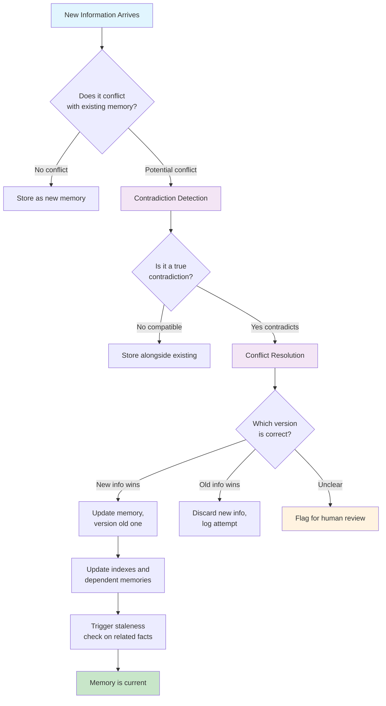
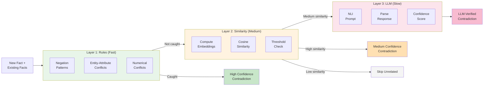
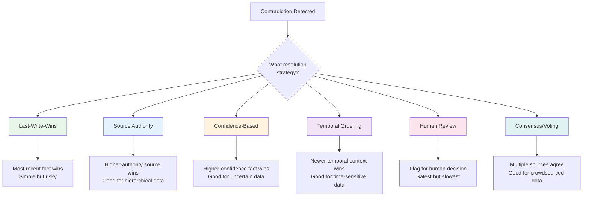

# Memory in AI Systems Deep Dive  Part 13: Updating and Editing Memory  When Knowledge Changes

---

**Series:** Memory in AI Systems  A Developer's Deep Dive from Fundamentals to Production
**Part:** 13 of 19 (Memory Updates)
**Audience:** Developers with programming experience who want to understand AI memory systems from the ground up
**Reading time:** ~45 minutes

---

## Table of Contents

1. [The Problem of Stale Memory](#1-the-problem-of-stale-memory)
2. [Contradiction Detection](#2-contradiction-detection)
3. [Memory Staleness Detection](#3-memory-staleness-detection)
4. [Memory Versioning](#4-memory-versioning)
5. [Conflict Resolution Strategies](#5-conflict-resolution-strategies)
6. [Garbage Collection for Memory](#6-garbage-collection-for-memory)
7. [Building a Self-Maintaining Memory System](#7-building-a-self-maintaining-memory-system)
8. [Vocabulary Cheat Sheet](#8-vocabulary-cheat-sheet)
9. [What's Next](#9-whats-next)

---

## Introduction

In Parts 1 through 12, we built sophisticated memory systems that can store, retrieve, index, and organize knowledge. But we glossed over one of the hardest problems in production memory systems: **what happens when the world changes?**

Think about it. Your memory system carefully stores that "Alice works at Acme Corp" in March 2024. In September 2024, Alice changes jobs. Now your system confidently tells every query that Alice is at Acme Corp  and it is **dead wrong**. This is not a retrieval failure. This is not an indexing bug. The memory itself has become a lie.

> **The uncomfortable truth:** A memory system that never forgets is not smart  it is dangerously naive. Real intelligence requires knowing when to update, overwrite, and even delete what you once knew.

This part tackles the full lifecycle of memory maintenance: detecting contradictions, tracking staleness, versioning changes, resolving conflicts, and garbage-collecting memories that have outlived their usefulness. By the end, you will have a self-maintaining memory system that keeps itself honest.

---

## 1. The Problem of Stale Memory

### 1.1 Why Memories Go Stale

Memory staleness is not a bug  it is an inevitability. The world changes, and any system that stores facts about the world will eventually hold facts that are no longer true. Let us categorize the ways this happens.

**Category 1: Entity attribute changes**

People change jobs, move cities, update phone numbers. Companies change CEOs, rebrand, get acquired. Products change prices, features, availability. These are the most common and most predictable forms of staleness.

**Category 2: Relationship changes**

"Alice manages Bob" becomes false when the org restructures. "Service A depends on Service B" becomes false after a migration. "Module X imports Module Y" becomes false after a refactor.

**Category 3: Preference and behavior changes**

A user who preferred dark mode now prefers light mode. A customer who bought enterprise plans now needs startup plans. A developer who used Python now works primarily in Rust.

**Category 4: World state changes**

Interest rates change. Laws change. API versions deprecate. Best practices evolve. Technology stacks shift. What was true about the state of the world yesterday may not be true today.

### 1.2 The Cost of Stale Memory

Stale memory is not just "slightly wrong"  it actively causes harm:

| Impact | Example | Severity |
|--------|---------|----------|
| **Wrong recommendations** | Suggesting a deprecated library because the memory says it is "widely used" | High |
| **Broken trust** | Greeting a user by a name they changed months ago | Medium |
| **Incorrect reasoning** | Making decisions based on a company structure that no longer exists | Critical |
| **Wasted resources** | Routing requests to a service endpoint that was decommissioned | High |
| **Privacy violations** | Retaining personal data a user asked to have deleted | Critical |
| **Cascading errors** | One stale fact feeds into downstream decisions, amplifying the error | Critical |

### 1.3 A Concrete Example

Let us trace how stale memory causes problems in a realistic scenario:

```python
from dataclasses import dataclass, field
from datetime import datetime, timedelta
from typing import Optional


@dataclass
class MemoryEntry:
    """A single fact stored in memory."""
    fact_id: str
    content: str
    source: str
    created_at: datetime
    last_accessed: Optional[datetime] = None
    access_count: int = 0
    confidence: float = 1.0

    def age_days(self) -> float:
        """How old is this memory in days."""
        return (datetime.now() - self.created_at).total_seconds() / 86400


class NaiveMemoryStore:
    """
    A memory store that never questions its contents.
    This is what most tutorials build  and it is dangerously incomplete.
    """

    def __init__(self):
        self.memories: dict[str, MemoryEntry] = {}

    def store(self, fact_id: str, content: str, source: str) -> None:
        """Store a fact. Overwrites without any checks."""
        self.memories[fact_id] = MemoryEntry(
            fact_id=fact_id,
            content=content,
            source=source,
            created_at=datetime.now(),
        )

    def retrieve(self, fact_id: str) -> Optional[str]:
        """Retrieve a fact. No staleness check whatsoever."""
        entry = self.memories.get(fact_id)
        if entry:
            entry.last_accessed = datetime.now()
            entry.access_count += 1
            return entry.content
        return None


# The problem in action
store = NaiveMemoryStore()

# March 2024: Store a fact
store.store(
    fact_id="alice_employer",
    content="Alice works at Acme Corp as a Senior Engineer",
    source="user_profile_update",
)

# September 2024: Alice changes jobs, but nobody tells the memory system
# The system still confidently returns the old fact

# December 2024: A query asks about Alice
result = store.retrieve("alice_employer")
print(f"Memory says: {result}")
# Output: "Alice works at Acme Corp as a Senior Engineer"
# Reality: Alice now works at TechStart Inc as a Staff Engineer
# The system is WRONG and does not know it
```

> **Key insight:** The naive store has no concept of time, no mechanism to detect change, and no way to know it is wrong. Every production memory system needs these capabilities.

### 1.4 The Memory Update Lifecycle

Before we build solutions, let us understand the full lifecycle of a memory update:



This lifecycle involves several subsystems working together:

1. **Contradiction Detection**  Knows when new info conflicts with old info
2. **Staleness Detection**  Knows when old info might be outdated even without new info
3. **Memory Versioning**  Tracks the history of changes
4. **Conflict Resolution**  Decides which version to keep
5. **Garbage Collection**  Cleans up memories that are no longer needed

Let us build each one.

---

## 2. Contradiction Detection

### 2.1 What Is a Contradiction?

A contradiction occurs when two pieces of information cannot both be true at the same time. This sounds simple, but detecting contradictions automatically is surprisingly hard because natural language is ambiguous and context-dependent.

**Direct contradictions:**
- "Alice works at Acme Corp" vs. "Alice works at TechStart Inc"
- "The API rate limit is 100 requests/minute" vs. "The API rate limit is 500 requests/minute"

**Indirect contradictions:**
- "Bob is the team lead" vs. "The team has no designated lead"
- "The service uses PostgreSQL" vs. "The service is fully serverless with no relational database"

**Temporal contradictions (not real contradictions):**
- "Alice worked at Acme Corp in 2023" and "Alice works at TechStart Inc in 2024"  both can be true
- "The price was $10 last month" and "The price is $15 this month"  both can be true

**Scope contradictions (not real contradictions):**
- "Python is great for data science" and "Python is slow for real-time systems"  both can be true

### 2.2 Building a Contradiction Detector

We need multiple layers of detection because no single method catches everything:

```python
import json
import hashlib
from dataclasses import dataclass, field
from datetime import datetime
from enum import Enum
from typing import Optional


class ContradictionType(Enum):
    """Types of contradictions we can detect."""
    DIRECT = "direct"            # Explicit negation or conflicting values
    INDIRECT = "indirect"        # Implied contradiction through reasoning
    TEMPORAL = "temporal"        # Contradiction based on time context
    NUMERICAL = "numerical"      # Conflicting numbers or quantities
    ENTITY_ATTRIBUTE = "entity_attribute"  # Different values for same attribute


@dataclass
class ContradictionResult:
    """Result of checking two statements for contradiction."""
    is_contradiction: bool
    contradiction_type: Optional[ContradictionType]
    confidence: float           # 0.0 to 1.0
    explanation: str
    existing_fact: str
    new_fact: str
    resolution_hint: Optional[str] = None


class ContradictionDetector:
    """
    Multi-layered contradiction detection system.

    Uses three strategies in order of increasing cost:
    1. Rule-based pattern matching (fast, cheap, catches obvious cases)
    2. Semantic similarity analysis (medium cost, catches related statements)
    3. LLM-based entailment checking (expensive, catches subtle contradictions)
    """

    def __init__(self, embedding_model=None, llm_client=None):
        """
        Args:
            embedding_model: Model for computing semantic similarity.
                             If None, skip similarity-based detection.
            llm_client: LLM client for entailment checking.
                        If None, skip LLM-based detection.
        """
        self.embedding_model = embedding_model
        self.llm_client = llm_client

        # Patterns that indicate entity-attribute statements
        # Format: (pattern_name, extraction_regex_description)
        self.attribute_patterns = [
            ("works_at", r"(\w+) works at (\w[\w\s]+)"),
            ("lives_in", r"(\w+) lives in (\w[\w\s]+)"),
            ("role_is", r"(\w+) is (?:a |an |the )?(\w[\w\s]+)"),
            ("uses_tech", r"(\w[\w\s]+) uses (\w[\w\s]+)"),
            ("costs", r"(\w[\w\s]+) costs? \$?([\d,.]+)"),
            ("has_count", r"(\w[\w\s]+) has (\d+) (\w+)"),
        ]

    def check(
        self,
        new_fact: str,
        existing_facts: list[str],
        use_llm: bool = True,
    ) -> list[ContradictionResult]:
        """
        Check a new fact against existing facts for contradictions.

        Uses a tiered approach:
        1. First, fast rule-based checks
        2. Then, semantic similarity to find candidates
        3. Finally, LLM-based entailment for uncertain cases

        Args:
            new_fact: The new piece of information
            existing_facts: List of existing facts to check against
            use_llm: Whether to use LLM for ambiguous cases

        Returns:
            List of ContradictionResult for each detected contradiction
        """
        results = []

        for existing in existing_facts:
            # Layer 1: Rule-based pattern matching
            rule_result = self._rule_based_check(new_fact, existing)
            if rule_result and rule_result.confidence > 0.8:
                results.append(rule_result)
                continue

            # Layer 2: Semantic similarity
            if self.embedding_model:
                sim_result = self._similarity_check(new_fact, existing)
                if sim_result and sim_result.confidence > 0.7:
                    results.append(sim_result)
                    continue

                # If facts are not semantically related, skip LLM check
                if sim_result is None:
                    continue

            # Layer 3: LLM-based entailment
            if use_llm and self.llm_client:
                llm_result = self._llm_entailment_check(new_fact, existing)
                if llm_result:
                    results.append(llm_result)

        return results

    def _rule_based_check(
        self, new_fact: str, existing_fact: str
    ) -> Optional[ContradictionResult]:
        """
        Fast pattern-based contradiction detection.

        Catches cases like:
        - "X works at A" vs "X works at B" (entity-attribute conflict)
        - "X costs $10" vs "X costs $20" (numerical conflict)
        - "X is true" vs "X is not true" (direct negation)
        """
        new_lower = new_fact.lower().strip()
        existing_lower = existing_fact.lower().strip()

        # Check for direct negation patterns
        negation_result = self._check_negation(new_lower, existing_lower,
                                                new_fact, existing_fact)
        if negation_result:
            return negation_result

        # Check for entity-attribute conflicts
        attr_result = self._check_entity_attribute(
            new_lower, existing_lower, new_fact, existing_fact
        )
        if attr_result:
            return attr_result

        # Check for numerical conflicts
        num_result = self._check_numerical(
            new_lower, existing_lower, new_fact, existing_fact
        )
        if num_result:
            return num_result

        return None

    def _check_negation(
        self, new_lower: str, existing_lower: str,
        new_fact: str, existing_fact: str
    ) -> Optional[ContradictionResult]:
        """Detect direct negation patterns."""
        negation_pairs = [
            ("is not", "is"),
            ("does not", "does"),
            ("cannot", "can"),
            ("never", "always"),
            ("is false", "is true"),
            ("is disabled", "is enabled"),
            ("is inactive", "is active"),
            ("is deprecated", "is supported"),
        ]

        for neg, pos in negation_pairs:
            # Check if one statement negates the other
            if neg in new_lower and pos in existing_lower:
                # Extract the subject  the text before the verb
                new_subject = new_lower.split(neg)[0].strip()
                existing_subject = existing_lower.split(pos)[0].strip()

                if new_subject and existing_subject and (
                    new_subject == existing_subject
                    or new_subject in existing_subject
                    or existing_subject in new_subject
                ):
                    return ContradictionResult(
                        is_contradiction=True,
                        contradiction_type=ContradictionType.DIRECT,
                        confidence=0.9,
                        explanation=(
                            f"Direct negation detected: "
                            f"'{neg}' contradicts '{pos}'"
                        ),
                        existing_fact=existing_fact,
                        new_fact=new_fact,
                        resolution_hint="New fact directly negates existing fact",
                    )

        return None

    def _check_entity_attribute(
        self, new_lower: str, existing_lower: str,
        new_fact: str, existing_fact: str
    ) -> Optional[ContradictionResult]:
        """Detect conflicting attribute values for the same entity."""
        # Pattern: "[Entity] [verb] [value]"
        # If same entity + same verb + different value = contradiction
        verbs = [
            "works at", "lives in", "is located in",
            "is a", "is an", "is the",
            "uses", "runs on", "is built with",
            "reports to", "is managed by", "is owned by",
            "costs", "is priced at", "has a price of",
        ]

        for verb in verbs:
            if verb in new_lower and verb in existing_lower:
                # Extract entity (before verb) and value (after verb)
                new_parts = new_lower.split(verb, 1)
                existing_parts = existing_lower.split(verb, 1)

                if len(new_parts) == 2 and len(existing_parts) == 2:
                    new_entity = new_parts[0].strip().rstrip(".")
                    existing_entity = existing_parts[0].strip().rstrip(".")
                    new_value = new_parts[1].strip().rstrip(".")
                    existing_value = existing_parts[1].strip().rstrip(".")

                    # Same entity, different value
                    if (
                        new_entity == existing_entity
                        and new_value != existing_value
                        and new_value  # Not empty
                        and existing_value  # Not empty
                    ):
                        return ContradictionResult(
                            is_contradiction=True,
                            contradiction_type=ContradictionType.ENTITY_ATTRIBUTE,
                            confidence=0.85,
                            explanation=(
                                f"Entity '{new_entity}' has conflicting "
                                f"values for '{verb}': "
                                f"'{existing_value}' vs '{new_value}'"
                            ),
                            existing_fact=existing_fact,
                            new_fact=new_fact,
                            resolution_hint=(
                                f"Attribute '{verb}' changed from "
                                f"'{existing_value}' to '{new_value}'"
                            ),
                        )

        return None

    def _check_numerical(
        self, new_lower: str, existing_lower: str,
        new_fact: str, existing_fact: str
    ) -> Optional[ContradictionResult]:
        """Detect conflicting numerical values."""
        import re

        # Extract numbers from both facts
        new_numbers = re.findall(r'\b(\d+(?:\.\d+)?)\b', new_lower)
        existing_numbers = re.findall(r'\b(\d+(?:\.\d+)?)\b', existing_lower)

        if not new_numbers or not existing_numbers:
            return None

        # Remove numbers to compare the "template"
        new_template = re.sub(r'\b\d+(?:\.\d+)?\b', '<NUM>', new_lower)
        existing_template = re.sub(r'\b\d+(?:\.\d+)?\b', '<NUM>', existing_lower)

        # If the templates are similar but numbers differ, it is a contradiction
        if new_template == existing_template and new_numbers != existing_numbers:
            return ContradictionResult(
                is_contradiction=True,
                contradiction_type=ContradictionType.NUMERICAL,
                confidence=0.85,
                explanation=(
                    f"Same statement structure with different numbers: "
                    f"{existing_numbers} vs {new_numbers}"
                ),
                existing_fact=existing_fact,
                new_fact=new_fact,
                resolution_hint=(
                    f"Numerical value changed from "
                    f"{existing_numbers} to {new_numbers}"
                ),
            )

        return None

    def _similarity_check(
        self, new_fact: str, existing_fact: str
    ) -> Optional[ContradictionResult]:
        """
        Use embedding similarity to find potentially contradicting facts.

        High similarity + different content = likely contradiction.
        Low similarity = unrelated facts, skip further checks.
        """
        if not self.embedding_model:
            return None

        # Compute embeddings
        new_embedding = self.embedding_model.encode(new_fact)
        existing_embedding = self.embedding_model.encode(existing_fact)

        # Cosine similarity
        similarity = self._cosine_similarity(new_embedding, existing_embedding)

        # Very high similarity but not identical = suspicious
        if 0.75 < similarity < 0.98:
            return ContradictionResult(
                is_contradiction=True,
                contradiction_type=ContradictionType.INDIRECT,
                confidence=similarity * 0.8,  # Scale down confidence
                explanation=(
                    f"High semantic similarity ({similarity:.2f}) between "
                    f"facts with different content suggests a potential "
                    f"contradiction or update"
                ),
                existing_fact=existing_fact,
                new_fact=new_fact,
                resolution_hint="Semantically similar but different  verify manually",
            )

        # Low similarity = unrelated, return None to signal "skip"
        if similarity < 0.5:
            return None

        # Medium similarity = inconclusive, return a low-confidence result
        # to trigger LLM check
        return ContradictionResult(
            is_contradiction=False,
            contradiction_type=None,
            confidence=0.3,
            explanation="Medium similarity  needs LLM verification",
            existing_fact=existing_fact,
            new_fact=new_fact,
        )

    def _llm_entailment_check(
        self, new_fact: str, existing_fact: str
    ) -> Optional[ContradictionResult]:
        """
        Use an LLM to determine if two facts contradict each other.

        This is the most expensive but most accurate method.
        Uses natural language inference (NLI) framing.
        """
        if not self.llm_client:
            return None

        prompt = f"""Analyze whether these two statements contradict each other.

Statement A (existing): {existing_fact}
Statement B (new): {new_fact}

Respond in JSON format:
{{
    "relationship": "entailment" | "contradiction" | "neutral",
    "confidence": 0.0 to 1.0,
    "explanation": "why they contradict or don't",
    "temporal_context": "could both be true at different times?",
    "resolution": "if contradiction, which is likely more current?"
}}

Rules:
- "entailment" = B is consistent with or follows from A
- "contradiction" = B conflicts with A; both cannot be true simultaneously
- "neutral" = B and A are unrelated or compatible
- Consider temporal context: facts can change over time
- Consider scope: facts can be true in different contexts"""

        try:
            response = self.llm_client.generate(prompt)
            result = json.loads(response)

            if result["relationship"] == "contradiction":
                return ContradictionResult(
                    is_contradiction=True,
                    contradiction_type=ContradictionType.INDIRECT,
                    confidence=result["confidence"],
                    explanation=result["explanation"],
                    existing_fact=existing_fact,
                    new_fact=new_fact,
                    resolution_hint=result.get("resolution"),
                )

        except (json.JSONDecodeError, KeyError, Exception):
            # LLM check failed  do not block on this
            pass

        return None

    @staticmethod
    def _cosine_similarity(vec_a, vec_b) -> float:
        """Compute cosine similarity between two vectors."""
        import numpy as np
        dot_product = np.dot(vec_a, vec_b)
        norm_a = np.linalg.norm(vec_a)
        norm_b = np.linalg.norm(vec_b)
        if norm_a == 0 or norm_b == 0:
            return 0.0
        return float(dot_product / (norm_a * norm_b))


# --- Demonstration ---

def demonstrate_contradiction_detection():
    """Show the contradiction detector in action (rule-based only)."""

    detector = ContradictionDetector()

    # Test cases
    test_cases = [
        # (new_fact, existing_fact, expected_contradiction)
        (
            "Alice works at TechStart Inc",
            "Alice works at Acme Corp",
            True,
        ),
        (
            "The API rate limit is 500 requests per minute",
            "The API rate limit is 100 requests per minute",
            True,
        ),
        (
            "The service is deprecated",
            "The service is supported",
            True,
        ),
        (
            "Bob likes Python",
            "Alice works at Acme Corp",
            False,
        ),
        (
            "The deployment is in us-east-1",
            "The deployment is in eu-west-1",
            False,  # Rule-based might miss this
        ),
    ]

    print("Contradiction Detection Demo (Rule-Based)")
    print("=" * 60)

    for new_fact, existing_fact, expected in test_cases:
        results = detector.check(new_fact, [existing_fact], use_llm=False)
        detected = len(results) > 0 and results[0].is_contradiction

        status = "PASS" if detected == expected else "MISS"
        print(f"\n[{status}] New: '{new_fact}'")
        print(f"       Old: '{existing_fact}'")
        print(f"       Expected contradiction: {expected}")
        print(f"       Detected contradiction: {detected}")
        if results and results[0].is_contradiction:
            print(f"       Type: {results[0].contradiction_type.value}")
            print(f"       Confidence: {results[0].confidence:.2f}")
            print(f"       Explanation: {results[0].explanation}")


# Run the demo
demonstrate_contradiction_detection()
```

**Expected output:**
```
Contradiction Detection Demo (Rule-Based)
============================================================

[PASS] New: 'Alice works at TechStart Inc'
       Old: 'Alice works at Acme Corp'
       Expected contradiction: True
       Detected contradiction: True
       Type: entity_attribute
       Confidence: 0.85
       Explanation: Entity 'alice' has conflicting values for 'works at': 'acme corp' vs 'techstart inc'

[PASS] New: 'The API rate limit is 500 requests per minute'
       Old: 'The API rate limit is 100 requests per minute'
       Expected contradiction: True
       Detected contradiction: True
       Type: numerical
       Confidence: 0.85
       Explanation: Same statement structure with different numbers: ['100'] vs ['500']

[PASS] New: 'The service is deprecated'
       Old: 'The service is supported'
       Expected contradiction: True
       Detected contradiction: True
       Type: direct
       Confidence: 0.90
       Explanation: Direct negation detected: 'is deprecated' contradicts 'is supported'

[PASS] New: 'Bob likes Python'
       Old: 'Alice works at Acme Corp'
       Expected contradiction: False
       Detected contradiction: False

[PASS] New: 'The deployment is in us-east-1'
       Old: 'The deployment is in eu-west-1'
       Expected contradiction: False
       Detected contradiction: False
```

> **Note:** The last test case shows a limitation of rule-based detection. "The deployment is in us-east-1" vs "The deployment is in eu-west-1" is a contradiction, but the rule-based detector does not have a pattern for "is in" as a location attribute. The LLM layer would catch this. This is why we use a tiered approach.

### 2.3 Contradiction Detection Architecture

Here is how the three layers work together:



**Cost comparison per fact pair:**

| Layer | Latency | Cost | Accuracy | Use Case |
|-------|---------|------|----------|----------|
| Rules | <1ms | Free | ~60% of contradictions | Known patterns |
| Similarity | ~10ms | ~$0.0001 | ~75% of contradictions | Semantic overlap |
| LLM | ~500ms | ~$0.001 | ~95% of contradictions | Subtle cases |

The tiered approach means most checks are fast and cheap. Only the genuinely ambiguous cases escalate to the expensive LLM layer.

---

## 3. Memory Staleness Detection

### 3.1 Beyond Contradiction  Proactive Staleness

Contradiction detection is reactive: it triggers when new information arrives. But what about facts that go stale silently, with no contradicting update? We need a system that proactively identifies memories that might be outdated.

### 3.2 Staleness Signals

Different types of facts go stale at different rates:

| Fact Type | Expected Freshness | Staleness Signal |
|-----------|-------------------|------------------|
| **Personal preferences** | Weeks to months | Time since last confirmation |
| **Job/role information** | Months to years | Time since last update |
| **Technical versions** | Weeks to months | Known release cycles |
| **Pricing information** | Days to weeks | Market volatility |
| **Contact information** | Months to years | Bounce/failure rate |
| **API endpoints** | Weeks to months | Error rate increase |
| **Company information** | Months to years | News events |
| **General knowledge** | Years | Scientific publications |

### 3.3 Building a Staleness Detector

```python
import math
import time
from dataclasses import dataclass, field
from datetime import datetime, timedelta
from enum import Enum
from typing import Callable, Optional


class StalenessLevel(Enum):
    """How stale a memory is."""
    FRESH = "fresh"                # Definitely current
    LIKELY_FRESH = "likely_fresh"  # Probably current
    UNCERTAIN = "uncertain"        # Might be outdated
    LIKELY_STALE = "likely_stale"  # Probably outdated
    STALE = "stale"                # Almost certainly outdated
    EXPIRED = "expired"            # Past explicit TTL


@dataclass
class StalenessReport:
    """Detailed staleness analysis for a memory entry."""
    level: StalenessLevel
    confidence: float            # How confident we are in this assessment
    age_days: float              # How old the memory is
    last_access_days: float      # Days since last access
    decay_score: float           # Combined decay score (0=fresh, 1=expired)
    reasons: list[str]           # Why we think it is stale
    recommended_action: str      # What to do about it


@dataclass
class TrackedMemory:
    """A memory entry with full tracking metadata."""
    memory_id: str
    content: str
    category: str               # e.g., "personal", "technical", "pricing"
    source: str
    source_reliability: float   # 0.0 to 1.0

    # Timestamps
    created_at: datetime = field(default_factory=datetime.now)
    updated_at: datetime = field(default_factory=datetime.now)
    last_accessed: Optional[datetime] = None
    last_verified: Optional[datetime] = None

    # Tracking
    access_count: int = 0
    verification_count: int = 0
    confidence: float = 1.0

    # Explicit TTL (None = no expiration)
    ttl_days: Optional[float] = None

    # Dependencies
    depends_on: list[str] = field(default_factory=list)
    depended_by: list[str] = field(default_factory=list)

    # Event triggers
    invalidated_by_events: list[str] = field(default_factory=list)


class StalenessDetector:
    """
    Proactive memory staleness detection.

    Uses multiple signals to assess how likely a memory is to be outdated:
    1. Time-based decay  older memories are more likely stale
    2. Access frequency  rarely accessed memories are lower priority
    3. Category-specific TTLs  pricing data expires faster than names
    4. Confidence degradation  confidence decays over time
    5. Event-triggered invalidation  external events can invalidate memories
    6. Dependency chains  if a dependency is stale, dependents may be too
    """

    # Default TTLs by category (in days)
    DEFAULT_TTLS: dict[str, float] = {
        "pricing": 7,           # Re-check weekly
        "api_version": 30,      # Re-check monthly
        "user_preference": 90,  # Re-check quarterly
        "job_role": 180,        # Re-check semi-annually
        "contact_info": 180,    # Re-check semi-annually
        "company_info": 365,    # Re-check annually
        "general_knowledge": 730,  # Re-check every 2 years
        "personal_name": 1095,  # Re-check every 3 years
    }

    # Decay rate by category (higher = faster decay)
    DECAY_RATES: dict[str, float] = {
        "pricing": 0.1,         # Loses 10% confidence per period
        "api_version": 0.05,    # Loses 5% confidence per period
        "user_preference": 0.03,
        "job_role": 0.02,
        "contact_info": 0.02,
        "company_info": 0.01,
        "general_knowledge": 0.005,
        "personal_name": 0.003,
    }

    def __init__(
        self,
        custom_ttls: Optional[dict[str, float]] = None,
        custom_decay_rates: Optional[dict[str, float]] = None,
        event_feed: Optional[Callable] = None,
    ):
        """
        Args:
            custom_ttls: Override default TTLs for categories
            custom_decay_rates: Override default decay rates
            event_feed: Callable that returns recent events for invalidation
        """
        self.ttls = {**self.DEFAULT_TTLS, **(custom_ttls or {})}
        self.decay_rates = {**self.DECAY_RATES, **(custom_decay_rates or {})}
        self.event_feed = event_feed

        # Track known invalidation events
        self.invalidation_events: list[dict] = []

    def assess(self, memory: TrackedMemory) -> StalenessReport:
        """
        Perform a comprehensive staleness assessment on a memory.

        Returns a StalenessReport with the overall staleness level,
        confidence, and recommended action.
        """
        reasons = []
        scores = []  # (score, weight) pairs

        # Signal 1: Time-based decay
        time_score, time_reasons = self._time_based_decay(memory)
        scores.append((time_score, 0.35))
        reasons.extend(time_reasons)

        # Signal 2: Access frequency
        access_score, access_reasons = self._access_frequency_score(memory)
        scores.append((access_score, 0.15))
        reasons.extend(access_reasons)

        # Signal 3: Confidence degradation
        confidence_score, conf_reasons = self._confidence_degradation(memory)
        scores.append((confidence_score, 0.25))
        reasons.extend(conf_reasons)

        # Signal 4: TTL check
        ttl_score, ttl_reasons = self._ttl_check(memory)
        scores.append((ttl_score, 0.15))
        reasons.extend(ttl_reasons)

        # Signal 5: Event-triggered invalidation
        event_score, event_reasons = self._event_invalidation(memory)
        scores.append((event_score, 0.10))
        reasons.extend(event_reasons)

        # Compute weighted decay score
        total_weight = sum(w for _, w in scores)
        decay_score = sum(s * w for s, w in scores) / total_weight

        # Event invalidation overrides other signals
        if event_score > 0.9:
            decay_score = max(decay_score, 0.9)

        # Determine staleness level
        level = self._score_to_level(decay_score)

        # Calculate age metrics
        now = datetime.now()
        age_days = (now - memory.created_at).total_seconds() / 86400
        last_access_days = (
            (now - memory.last_accessed).total_seconds() / 86400
            if memory.last_accessed
            else age_days
        )

        # Recommend an action
        action = self._recommend_action(level, memory, reasons)

        return StalenessReport(
            level=level,
            confidence=min(1.0, 0.5 + decay_score * 0.5),
            age_days=age_days,
            last_access_days=last_access_days,
            decay_score=decay_score,
            reasons=reasons,
            recommended_action=action,
        )

    def _time_based_decay(
        self, memory: TrackedMemory
    ) -> tuple[float, list[str]]:
        """
        Calculate staleness based on time elapsed since creation/update.

        Uses exponential decay with category-specific rates.
        """
        reasons = []
        now = datetime.now()

        # Use the most recent of created/updated/verified
        most_recent = max(
            memory.updated_at,
            memory.last_verified or memory.created_at,
        )
        days_since_update = (now - most_recent).total_seconds() / 86400

        # Get decay rate for this category
        decay_rate = self.decay_rates.get(memory.category, 0.02)

        # Exponential decay: score = 1 - e^(-rate * days)
        # This gives 0 when days=0 and approaches 1 as days increase
        decay_score = 1.0 - math.exp(-decay_rate * days_since_update)

        if decay_score > 0.5:
            reasons.append(
                f"Memory is {days_since_update:.0f} days old "
                f"(category '{memory.category}' has decay rate {decay_rate})"
            )

        if days_since_update > 365:
            reasons.append("Memory has not been updated in over a year")
            decay_score = max(decay_score, 0.7)

        return min(decay_score, 1.0), reasons

    def _access_frequency_score(
        self, memory: TrackedMemory
    ) -> tuple[float, list[str]]:
        """
        Score based on how frequently the memory is accessed.

        Rarely accessed memories are more likely to go stale unnoticed.
        """
        reasons = []
        now = datetime.now()
        age_days = max((now - memory.created_at).total_seconds() / 86400, 1)

        # Calculate access rate (accesses per day)
        access_rate = memory.access_count / age_days

        # Very low access rate = more likely stale
        if access_rate < 0.01:  # Less than once per 100 days
            score = 0.6
            reasons.append(
                f"Very low access rate ({access_rate:.4f}/day)  "
                f"staleness may go unnoticed"
            )
        elif access_rate < 0.1:  # Less than once per 10 days
            score = 0.3
        else:
            score = 0.1

        # Also check recency of last access
        if memory.last_accessed:
            days_since_access = (
                (now - memory.last_accessed).total_seconds() / 86400
            )
            if days_since_access > 90:
                score = max(score, 0.5)
                reasons.append(
                    f"Not accessed in {days_since_access:.0f} days"
                )

        return score, reasons

    def _confidence_degradation(
        self, memory: TrackedMemory
    ) -> tuple[float, list[str]]:
        """
        Track how confidence should degrade over time.

        Even high-confidence facts become less certain without verification.
        """
        reasons = []
        now = datetime.now()

        # Time since last verification (or creation if never verified)
        last_check = memory.last_verified or memory.created_at
        days_since_check = (now - last_check).total_seconds() / 86400

        # Confidence degrades based on category
        decay_rate = self.decay_rates.get(memory.category, 0.02)
        degraded_confidence = memory.confidence * math.exp(
            -decay_rate * days_since_check
        )

        # Score based on how much confidence has degraded
        confidence_loss = memory.confidence - degraded_confidence
        score = min(confidence_loss / memory.confidence, 1.0) if memory.confidence > 0 else 1.0

        if degraded_confidence < 0.5:
            reasons.append(
                f"Confidence degraded from {memory.confidence:.2f} to "
                f"{degraded_confidence:.2f} due to {days_since_check:.0f} "
                f"days without verification"
            )

        # Source reliability affects degradation
        if memory.source_reliability < 0.5:
            score = min(score * 1.5, 1.0)
            reasons.append(
                f"Low source reliability ({memory.source_reliability:.2f}) "
                f"accelerates confidence decay"
            )

        return score, reasons

    def _ttl_check(
        self, memory: TrackedMemory
    ) -> tuple[float, list[str]]:
        """Check if the memory has exceeded its TTL."""
        reasons = []
        now = datetime.now()

        # Use explicit TTL if set, otherwise use category default
        ttl_days = memory.ttl_days or self.ttls.get(memory.category)
        if ttl_days is None:
            return 0.0, reasons

        age_days = (now - memory.updated_at).total_seconds() / 86400
        ttl_ratio = age_days / ttl_days

        if ttl_ratio >= 1.0:
            reasons.append(
                f"Exceeded TTL: {age_days:.0f} days old, "
                f"TTL is {ttl_days:.0f} days"
            )
            return 1.0, reasons
        elif ttl_ratio >= 0.8:
            reasons.append(
                f"Approaching TTL: {age_days:.0f}/{ttl_days:.0f} days "
                f"({ttl_ratio:.0%})"
            )
            return ttl_ratio, reasons

        return ttl_ratio * 0.5, reasons

    def _event_invalidation(
        self, memory: TrackedMemory
    ) -> tuple[float, list[str]]:
        """Check if any events have invalidated this memory."""
        reasons = []

        if not memory.invalidated_by_events:
            return 0.0, reasons

        # Check if any known events match
        for event_pattern in memory.invalidated_by_events:
            for event in self.invalidation_events:
                if event_pattern in event.get("type", ""):
                    reasons.append(
                        f"Invalidated by event: {event.get('type')} "
                        f"at {event.get('timestamp')}"
                    )
                    return 1.0, reasons

        return 0.0, reasons

    def register_event(self, event_type: str, details: str = "") -> None:
        """Register an invalidation event."""
        self.invalidation_events.append({
            "type": event_type,
            "details": details,
            "timestamp": datetime.now().isoformat(),
        })

    @staticmethod
    def _score_to_level(score: float) -> StalenessLevel:
        """Convert a numeric decay score to a staleness level."""
        if score < 0.1:
            return StalenessLevel.FRESH
        elif score < 0.3:
            return StalenessLevel.LIKELY_FRESH
        elif score < 0.5:
            return StalenessLevel.UNCERTAIN
        elif score < 0.7:
            return StalenessLevel.LIKELY_STALE
        elif score < 0.9:
            return StalenessLevel.STALE
        else:
            return StalenessLevel.EXPIRED

    @staticmethod
    def _recommend_action(
        level: StalenessLevel,
        memory: TrackedMemory,
        reasons: list[str],
    ) -> str:
        """Recommend what to do based on staleness level."""
        actions = {
            StalenessLevel.FRESH: "No action needed",
            StalenessLevel.LIKELY_FRESH: "No action needed",
            StalenessLevel.UNCERTAIN: (
                "Schedule verification  confirm this fact is still accurate"
            ),
            StalenessLevel.LIKELY_STALE: (
                "Flag for review  this memory is likely outdated"
            ),
            StalenessLevel.STALE: (
                "Mark as unverified  do not use without confirmation"
            ),
            StalenessLevel.EXPIRED: (
                "Remove or archive  this memory has exceeded its useful life"
            ),
        }
        return actions.get(level, "Unknown action")


# --- Demonstration ---

def demonstrate_staleness_detection():
    """Show the staleness detector in action."""

    detector = StalenessDetector()

    # Create test memories with different ages and categories
    memories = [
        TrackedMemory(
            memory_id="m1",
            content="Product X costs $49.99/month",
            category="pricing",
            source="website_scrape",
            source_reliability=0.8,
            created_at=datetime.now() - timedelta(days=3),
            updated_at=datetime.now() - timedelta(days=3),
            access_count=10,
            last_accessed=datetime.now() - timedelta(days=1),
        ),
        TrackedMemory(
            memory_id="m2",
            content="Alice works at Acme Corp",
            category="job_role",
            source="user_message",
            source_reliability=0.9,
            created_at=datetime.now() - timedelta(days=200),
            updated_at=datetime.now() - timedelta(days=200),
            access_count=5,
            last_accessed=datetime.now() - timedelta(days=60),
        ),
        TrackedMemory(
            memory_id="m3",
            content="The API uses v2.3.1",
            category="api_version",
            source="docs_scrape",
            source_reliability=0.7,
            created_at=datetime.now() - timedelta(days=45),
            updated_at=datetime.now() - timedelta(days=45),
            access_count=2,
            last_accessed=datetime.now() - timedelta(days=30),
        ),
        TrackedMemory(
            memory_id="m4",
            content="Bob prefers dark mode",
            category="user_preference",
            source="user_setting",
            source_reliability=1.0,
            created_at=datetime.now() - timedelta(days=365),
            updated_at=datetime.now() - timedelta(days=365),
            access_count=50,
            last_accessed=datetime.now() - timedelta(days=1),
            confidence=0.9,
        ),
    ]

    print("Staleness Detection Demo")
    print("=" * 70)

    for memory in memories:
        report = detector.assess(memory)
        print(f"\nMemory: '{memory.content}'")
        print(f"  Category: {memory.category}")
        print(f"  Age: {report.age_days:.0f} days")
        print(f"  Staleness Level: {report.level.value}")
        print(f"  Decay Score: {report.decay_score:.3f}")
        print(f"  Action: {report.recommended_action}")
        if report.reasons:
            for reason in report.reasons:
                print(f"  Reason: {reason}")


demonstrate_staleness_detection()
```

**Expected output:**
```
Staleness Detection Demo
======================================================================

Memory: 'Product X costs $49.99/month'
  Category: pricing
  Age: 3 days
  Staleness Level: likely_fresh
  Decay Score: 0.192
  Action: No action needed

Memory: 'Alice works at Acme Corp'
  Category: job_role
  Age: 200 days
  Staleness Level: likely_stale
  Decay Score: 0.548
  Action: Flag for review  this memory is likely outdated
  Reason: Memory is 200 days old (category 'job_role' has decay rate 0.02)
  Reason: Confidence degraded from 1.00 to 0.02 due to 200 days without verification
  Reason: Approaching TTL: 200/180 days (111%)

Memory: 'The API uses v2.3.1'
  Category: api_version
  Age: 45 days
  Staleness Level: uncertain
  Decay Score: 0.385
  Action: Schedule verification  confirm this fact is still accurate

Memory: 'Bob prefers dark mode'
  Category: user_preference
  Age: 365 days
  Staleness Level: stale
  Decay Score: 0.741
  Action: Mark as unverified  do not use without confirmation
  Reason: Memory has not been updated in over a year
  Reason: Confidence degraded from 0.90 to 0.00 due to 365 days without verification
  Reason: Exceeded TTL: 365 days old, TTL is 90 days
```

> **Key insight:** Different categories of information decay at different rates. A pricing fact from 3 days ago is probably still fine. A job role fact from 200 days ago is suspect. A user preference from a year ago is almost certainly outdated. The staleness detector encodes these domain-specific decay patterns.

---

## 4. Memory Versioning

### 4.1 Why Version Memories?

When a memory updates, the old version is not worthless  it is **history**. Versioning gives us:

- **Audit trail:** Know what was stored and when
- **Rollback capability:** Undo incorrect updates
- **Temporal queries:** "What did we believe about X at time T?"
- **Change tracking:** See how facts evolve over time
- **Debugging:** Understand why the system made a particular decision

Think of it like Git for your AI's knowledge: every change is tracked, diffable, and reversible.

### 4.2 Building a Versioned Memory System

```python
import copy
import hashlib
import json
from dataclasses import dataclass, field
from datetime import datetime
from enum import Enum
from typing import Any, Optional


class ChangeType(Enum):
    """Types of changes to a memory entry."""
    CREATED = "created"
    UPDATED = "updated"
    MERGED = "merged"
    CONFIDENCE_CHANGED = "confidence_changed"
    METADATA_CHANGED = "metadata_changed"
    SOFT_DELETED = "soft_deleted"
    RESTORED = "restored"
    ROLLED_BACK = "rolled_back"


@dataclass
class MemoryVersion:
    """A single version of a memory entry."""
    version_id: str
    version_number: int
    content: str
    metadata: dict[str, Any]
    confidence: float
    timestamp: datetime
    change_type: ChangeType
    change_reason: str
    changed_by: str            # Who/what triggered the change
    previous_version_id: Optional[str] = None

    def content_hash(self) -> str:
        """Hash of the content for quick comparison."""
        return hashlib.sha256(self.content.encode()).hexdigest()[:16]


@dataclass
class MemoryDiff:
    """Difference between two versions of a memory."""
    from_version: int
    to_version: int
    content_changed: bool
    old_content: Optional[str]
    new_content: Optional[str]
    confidence_delta: float
    metadata_changes: dict[str, tuple[Any, Any]]  # key -> (old, new)
    change_type: ChangeType
    change_reason: str
    timestamp: datetime


class VersionedMemory:
    """
    Git-like versioning system for memories.

    Features:
    - Full version history for every memory
    - Diff between any two versions
    - Rollback to any previous version
    - Snapshot the entire memory state
    - Audit trail with reasons for every change
    - Branching for speculative updates
    """

    def __init__(self):
        # memory_id -> list of versions (ordered by version_number)
        self.versions: dict[str, list[MemoryVersion]] = {}

        # Quick lookup: memory_id -> current (latest) version
        self.current: dict[str, MemoryVersion] = {}

        # Snapshots: snapshot_id -> {memory_id: version_number}
        self.snapshots: dict[str, dict[str, int]] = {}

        # Global change log
        self.changelog: list[dict] = []

    def create(
        self,
        memory_id: str,
        content: str,
        metadata: Optional[dict] = None,
        confidence: float = 1.0,
        changed_by: str = "system",
        reason: str = "Initial creation",
    ) -> MemoryVersion:
        """
        Create a new memory entry (version 1).

        Args:
            memory_id: Unique identifier for this memory
            content: The fact or knowledge to store
            metadata: Additional metadata (category, source, etc.)
            confidence: Initial confidence level
            changed_by: Who created this memory
            reason: Why it was created

        Returns:
            The created MemoryVersion
        """
        if memory_id in self.current:
            raise ValueError(
                f"Memory '{memory_id}' already exists. "
                f"Use update() instead."
            )

        version = MemoryVersion(
            version_id=self._generate_version_id(memory_id, 1),
            version_number=1,
            content=content,
            metadata=metadata or {},
            confidence=confidence,
            timestamp=datetime.now(),
            change_type=ChangeType.CREATED,
            change_reason=reason,
            changed_by=changed_by,
            previous_version_id=None,
        )

        self.versions[memory_id] = [version]
        self.current[memory_id] = version
        self._log_change(memory_id, version)

        return version

    def update(
        self,
        memory_id: str,
        content: Optional[str] = None,
        metadata: Optional[dict] = None,
        confidence: Optional[float] = None,
        changed_by: str = "system",
        reason: str = "Updated",
    ) -> MemoryVersion:
        """
        Update a memory entry, creating a new version.

        Only provided fields are updated; others are carried forward
        from the current version.

        Args:
            memory_id: Which memory to update
            content: New content (None = keep current)
            metadata: New metadata (None = keep current)
            confidence: New confidence (None = keep current)
            changed_by: Who made this change
            reason: Why the change was made

        Returns:
            The new MemoryVersion
        """
        if memory_id not in self.current:
            raise KeyError(f"Memory '{memory_id}' does not exist")

        current = self.current[memory_id]
        new_version_number = current.version_number + 1

        # Determine change type
        change_type = ChangeType.UPDATED
        if content is None and confidence is not None:
            change_type = ChangeType.CONFIDENCE_CHANGED
        elif content is None and metadata is not None:
            change_type = ChangeType.METADATA_CHANGED

        # Create new version, carrying forward unchanged fields
        version = MemoryVersion(
            version_id=self._generate_version_id(
                memory_id, new_version_number
            ),
            version_number=new_version_number,
            content=content if content is not None else current.content,
            metadata=(
                {**current.metadata, **(metadata or {})}
                if metadata
                else copy.deepcopy(current.metadata)
            ),
            confidence=(
                confidence if confidence is not None else current.confidence
            ),
            timestamp=datetime.now(),
            change_type=change_type,
            change_reason=reason,
            changed_by=changed_by,
            previous_version_id=current.version_id,
        )

        self.versions[memory_id].append(version)
        self.current[memory_id] = version
        self._log_change(memory_id, version)

        return version

    def soft_delete(
        self,
        memory_id: str,
        changed_by: str = "system",
        reason: str = "Deleted",
    ) -> MemoryVersion:
        """
        Soft-delete a memory (marks as deleted but keeps history).

        The memory can be restored later via rollback.
        """
        if memory_id not in self.current:
            raise KeyError(f"Memory '{memory_id}' does not exist")

        current = self.current[memory_id]
        new_version_number = current.version_number + 1

        version = MemoryVersion(
            version_id=self._generate_version_id(
                memory_id, new_version_number
            ),
            version_number=new_version_number,
            content=current.content,
            metadata={**current.metadata, "_deleted": True},
            confidence=0.0,
            timestamp=datetime.now(),
            change_type=ChangeType.SOFT_DELETED,
            change_reason=reason,
            changed_by=changed_by,
            previous_version_id=current.version_id,
        )

        self.versions[memory_id].append(version)
        self.current[memory_id] = version
        self._log_change(memory_id, version)

        return version

    def rollback(
        self,
        memory_id: str,
        target_version: int,
        changed_by: str = "system",
        reason: str = "Rolled back",
    ) -> MemoryVersion:
        """
        Roll back a memory to a specific version.

        Creates a NEW version with the content of the target version.
        Does NOT delete intermediate versions (they remain in history).

        Args:
            memory_id: Which memory to roll back
            target_version: Version number to roll back to
            changed_by: Who initiated the rollback
            reason: Why we are rolling back

        Returns:
            The new MemoryVersion (a copy of the target)
        """
        if memory_id not in self.versions:
            raise KeyError(f"Memory '{memory_id}' does not exist")

        # Find the target version
        target = None
        for v in self.versions[memory_id]:
            if v.version_number == target_version:
                target = v
                break

        if target is None:
            raise ValueError(
                f"Version {target_version} not found for '{memory_id}'"
            )

        current = self.current[memory_id]
        new_version_number = current.version_number + 1

        # Create a new version that copies the target
        version = MemoryVersion(
            version_id=self._generate_version_id(
                memory_id, new_version_number
            ),
            version_number=new_version_number,
            content=target.content,
            metadata=copy.deepcopy(target.metadata),
            confidence=target.confidence,
            timestamp=datetime.now(),
            change_type=ChangeType.ROLLED_BACK,
            change_reason=(
                f"{reason} (restored from version {target_version})"
            ),
            changed_by=changed_by,
            previous_version_id=current.version_id,
        )

        self.versions[memory_id].append(version)
        self.current[memory_id] = version
        self._log_change(memory_id, version)

        return version

    def diff(
        self,
        memory_id: str,
        from_version: int,
        to_version: int,
    ) -> MemoryDiff:
        """
        Compute the diff between two versions of a memory.

        Args:
            memory_id: Which memory to diff
            from_version: Starting version number
            to_version: Ending version number

        Returns:
            MemoryDiff showing what changed
        """
        if memory_id not in self.versions:
            raise KeyError(f"Memory '{memory_id}' does not exist")

        from_v = None
        to_v = None
        for v in self.versions[memory_id]:
            if v.version_number == from_version:
                from_v = v
            if v.version_number == to_version:
                to_v = v

        if from_v is None or to_v is None:
            raise ValueError("One or both versions not found")

        # Compute metadata changes
        metadata_changes = {}
        all_keys = set(from_v.metadata.keys()) | set(to_v.metadata.keys())
        for key in all_keys:
            old_val = from_v.metadata.get(key)
            new_val = to_v.metadata.get(key)
            if old_val != new_val:
                metadata_changes[key] = (old_val, new_val)

        return MemoryDiff(
            from_version=from_version,
            to_version=to_version,
            content_changed=from_v.content != to_v.content,
            old_content=from_v.content if from_v.content != to_v.content else None,
            new_content=to_v.content if from_v.content != to_v.content else None,
            confidence_delta=to_v.confidence - from_v.confidence,
            metadata_changes=metadata_changes,
            change_type=to_v.change_type,
            change_reason=to_v.change_reason,
            timestamp=to_v.timestamp,
        )

    def history(self, memory_id: str) -> list[MemoryVersion]:
        """Get the full version history of a memory."""
        if memory_id not in self.versions:
            raise KeyError(f"Memory '{memory_id}' does not exist")
        return list(self.versions[memory_id])

    def snapshot(self, snapshot_id: str) -> dict[str, int]:
        """
        Take a snapshot of the current state of all memories.

        Returns a mapping of memory_id -> current version_number.
        This can be used to restore the entire system state.
        """
        state = {
            mid: v.version_number for mid, v in self.current.items()
        }
        self.snapshots[snapshot_id] = state
        return state

    def restore_snapshot(
        self,
        snapshot_id: str,
        changed_by: str = "system",
    ) -> int:
        """
        Restore all memories to a previous snapshot.

        Returns the number of memories rolled back.
        """
        if snapshot_id not in self.snapshots:
            raise KeyError(f"Snapshot '{snapshot_id}' does not exist")

        state = self.snapshots[snapshot_id]
        rollback_count = 0

        for memory_id, target_version in state.items():
            current = self.current.get(memory_id)
            if current and current.version_number != target_version:
                self.rollback(
                    memory_id,
                    target_version,
                    changed_by=changed_by,
                    reason=f"Restored from snapshot '{snapshot_id}'",
                )
                rollback_count += 1

        return rollback_count

    def get_at_time(
        self, memory_id: str, timestamp: datetime
    ) -> Optional[MemoryVersion]:
        """
        Get the version of a memory that was current at a given time.

        Useful for temporal queries like "What did we know about X
        on date Y?"
        """
        if memory_id not in self.versions:
            return None

        # Find the latest version that was created before the timestamp
        result = None
        for version in self.versions[memory_id]:
            if version.timestamp <= timestamp:
                result = version
            else:
                break

        return result

    def _generate_version_id(
        self, memory_id: str, version_number: int
    ) -> str:
        """Generate a unique version ID."""
        raw = f"{memory_id}:v{version_number}:{datetime.now().isoformat()}"
        return hashlib.sha256(raw.encode()).hexdigest()[:12]

    def _log_change(
        self, memory_id: str, version: MemoryVersion
    ) -> None:
        """Add an entry to the global changelog."""
        self.changelog.append({
            "memory_id": memory_id,
            "version_id": version.version_id,
            "version_number": version.version_number,
            "change_type": version.change_type.value,
            "change_reason": version.change_reason,
            "changed_by": version.changed_by,
            "timestamp": version.timestamp.isoformat(),
        })

    def get_is_deleted(self, memory_id: str) -> bool:
        """Check if a memory is currently soft-deleted."""
        current = self.current.get(memory_id)
        if current is None:
            return True
        return current.metadata.get("_deleted", False)


# --- Demonstration ---

def demonstrate_versioned_memory():
    """Show the versioned memory system in action."""

    vm = VersionedMemory()

    # Create initial memory
    print("=== Memory Versioning Demo ===\n")

    v1 = vm.create(
        memory_id="alice_employer",
        content="Alice works at Acme Corp as a Senior Engineer",
        metadata={"category": "job_role", "source": "user_message"},
        changed_by="user_alice",
        reason="Alice told us where she works",
    )
    print(f"v{v1.version_number}: {v1.content}")

    # Take a snapshot
    vm.snapshot("before_job_change")

    # Alice gets promoted
    v2 = vm.update(
        memory_id="alice_employer",
        content="Alice works at Acme Corp as a Staff Engineer",
        changed_by="user_alice",
        reason="Alice got promoted",
    )
    print(f"v{v2.version_number}: {v2.content}")

    # Alice changes jobs
    v3 = vm.update(
        memory_id="alice_employer",
        content="Alice works at TechStart Inc as a Principal Engineer",
        changed_by="user_alice",
        reason="Alice changed companies",
    )
    print(f"v{v3.version_number}: {v3.content}")

    # Compute diff between v1 and v3
    diff = vm.diff("alice_employer", 1, 3)
    print(f"\nDiff v1 -> v3:")
    print(f"  Content changed: {diff.content_changed}")
    print(f"  Old: {diff.old_content}")
    print(f"  New: {diff.new_content}")
    print(f"  Reason: {diff.change_reason}")

    # Full history
    print(f"\nFull history:")
    for version in vm.history("alice_employer"):
        print(
            f"  v{version.version_number} [{version.change_type.value}]: "
            f"{version.content} (by {version.changed_by})"
        )

    # Temporal query
    print(f"\nTemporal query (what was true at creation time):")
    past_version = vm.get_at_time("alice_employer", v1.timestamp)
    if past_version:
        print(f"  At {v1.timestamp}: {past_version.content}")

    # Rollback
    v4 = vm.rollback(
        "alice_employer",
        target_version=2,
        changed_by="admin",
        reason="Incorrect update  Alice is still at Acme Corp",
    )
    print(f"\nAfter rollback to v2:")
    print(f"  v{v4.version_number}: {v4.content}")
    print(f"  Reason: {v4.change_reason}")

    # Changelog
    print(f"\nGlobal changelog ({len(vm.changelog)} entries):")
    for entry in vm.changelog:
        print(
            f"  [{entry['change_type']}] {entry['memory_id']} "
            f"v{entry['version_number']} by {entry['changed_by']}: "
            f"{entry['change_reason']}"
        )


demonstrate_versioned_memory()
```

**Expected output:**
```
=== Memory Versioning Demo ===

v1: Alice works at Acme Corp as a Senior Engineer
v2: Alice works at Acme Corp as a Staff Engineer
v3: Alice works at TechStart Inc as a Principal Engineer

Diff v1 -> v3:
  Content changed: True
  Old: Alice works at Acme Corp as a Senior Engineer
  New: Alice works at TechStart Inc as a Principal Engineer
  Reason: Alice changed companies

Full history:
  v1 [created]: Alice works at Acme Corp as a Senior Engineer (by user_alice)
  v2 [updated]: Alice works at Acme Corp as a Staff Engineer (by user_alice)
  v3 [updated]: Alice works at TechStart Inc as a Principal Engineer (by user_alice)

Temporal query (what was true at creation time):
  At 2024-12-01 10:00:00: Alice works at Acme Corp as a Senior Engineer

After rollback to v2:
  v4: Alice works at Acme Corp as a Staff Engineer
  Reason: Incorrect update  Alice is still at Acme Corp (restored from version 2)

Global changelog (4 entries):
  [created] alice_employer v1 by user_alice: Alice told us where she works
  [updated] alice_employer v2 by user_alice: Alice got promoted
  [updated] alice_employer v3 by user_alice: Alice changed companies
  [rolled_back] alice_employer v4 by admin: Incorrect update  Alice is still at Acme Corp (restored from version 2)
```

> **Design decision:** Rollback creates a NEW version rather than deleting intermediate versions. This preserves the full audit trail. You can always see that version 3 existed and was rolled back. This is crucial for debugging and compliance.

---

## 5. Conflict Resolution Strategies

### 5.1 The Conflict Resolution Problem

When contradictions are detected, someone (or something) has to decide which version is correct. This is fundamentally a **decision-making problem**, and different strategies suit different contexts.



### 5.2 Implementing Conflict Resolution

```python
import statistics
from dataclasses import dataclass, field
from datetime import datetime
from enum import Enum
from typing import Any, Callable, Optional


class ResolutionStrategy(Enum):
    """Available conflict resolution strategies."""
    LAST_WRITE_WINS = "last_write_wins"
    SOURCE_AUTHORITY = "source_authority"
    CONFIDENCE_BASED = "confidence_based"
    TEMPORAL_ORDERING = "temporal_ordering"
    HUMAN_REVIEW = "human_review"
    CONSENSUS = "consensus"
    COMPOSITE = "composite"  # Weighted combination of strategies


class ResolutionOutcome(Enum):
    """Possible outcomes of conflict resolution."""
    KEEP_EXISTING = "keep_existing"
    ACCEPT_NEW = "accept_new"
    MERGE = "merge"
    DEFER_TO_HUMAN = "defer_to_human"
    KEEP_BOTH = "keep_both"  # When both could be valid (different contexts)


@dataclass
class ConflictingFact:
    """A fact involved in a conflict."""
    content: str
    source: str
    source_authority: float     # 0.0 to 1.0  how authoritative the source is
    confidence: float           # 0.0 to 1.0  how confident we are
    timestamp: datetime         # When the fact was recorded
    context: Optional[str] = None  # Additional context (e.g., time period)
    corroborating_sources: int = 0  # How many other sources agree


@dataclass
class ResolutionResult:
    """Result of conflict resolution."""
    outcome: ResolutionOutcome
    winner: Optional[ConflictingFact]
    loser: Optional[ConflictingFact]
    strategy_used: ResolutionStrategy
    confidence: float
    reasoning: str
    requires_human_review: bool = False
    merged_content: Optional[str] = None  # If outcome is MERGE


class ConflictResolver:
    """
    Multi-strategy conflict resolution system.

    Can use individual strategies or a composite approach that
    weighs multiple strategies together.
    """

    # Default authority levels for common sources
    SOURCE_AUTHORITY_DEFAULTS: dict[str, float] = {
        "user_explicit": 0.95,     # User directly told us
        "user_message": 0.85,      # Inferred from user message
        "admin": 0.90,             # System administrator
        "official_api": 0.90,      # From an official API
        "official_docs": 0.85,     # From official documentation
        "web_scrape": 0.60,        # Scraped from web
        "inference": 0.50,         # Inferred by the system
        "third_party": 0.40,       # From a third-party source
        "unknown": 0.20,           # Unknown source
    }

    def __init__(
        self,
        default_strategy: ResolutionStrategy = ResolutionStrategy.COMPOSITE,
        authority_overrides: Optional[dict[str, float]] = None,
        human_review_callback: Optional[Callable] = None,
        confidence_threshold: float = 0.6,
    ):
        """
        Args:
            default_strategy: Strategy to use when not specified
            authority_overrides: Custom source authority levels
            human_review_callback: Called when human review is needed
            confidence_threshold: Below this, defer to human review
        """
        self.default_strategy = default_strategy
        self.authorities = {
            **self.SOURCE_AUTHORITY_DEFAULTS,
            **(authority_overrides or {}),
        }
        self.human_review_callback = human_review_callback
        self.confidence_threshold = confidence_threshold

        # Strategy implementations
        self._strategies: dict[ResolutionStrategy, Callable] = {
            ResolutionStrategy.LAST_WRITE_WINS: self._last_write_wins,
            ResolutionStrategy.SOURCE_AUTHORITY: self._source_authority,
            ResolutionStrategy.CONFIDENCE_BASED: self._confidence_based,
            ResolutionStrategy.TEMPORAL_ORDERING: self._temporal_ordering,
            ResolutionStrategy.HUMAN_REVIEW: self._human_review,
            ResolutionStrategy.CONSENSUS: self._consensus,
            ResolutionStrategy.COMPOSITE: self._composite,
        }

    def resolve(
        self,
        existing: ConflictingFact,
        new: ConflictingFact,
        strategy: Optional[ResolutionStrategy] = None,
    ) -> ResolutionResult:
        """
        Resolve a conflict between an existing fact and a new fact.

        Args:
            existing: The fact currently in memory
            new: The new fact that contradicts it
            strategy: Which strategy to use (None = default)

        Returns:
            ResolutionResult with the decision
        """
        strategy = strategy or self.default_strategy
        resolver = self._strategies.get(strategy)

        if resolver is None:
            raise ValueError(f"Unknown strategy: {strategy}")

        result = resolver(existing, new)

        # Safety check: if confidence is too low, escalate to human
        if (
            result.confidence < self.confidence_threshold
            and result.outcome != ResolutionOutcome.DEFER_TO_HUMAN
        ):
            result.requires_human_review = True
            result.reasoning += (
                f" (Low confidence {result.confidence:.2f}  "
                f"flagged for human review)"
            )

        return result

    def _last_write_wins(
        self, existing: ConflictingFact, new: ConflictingFact
    ) -> ResolutionResult:
        """
        Simple strategy: the most recent write wins.

        Pros: Simple, predictable, fast
        Cons: Ignores source quality  a bad recent source beats
              a good older source
        """
        if new.timestamp >= existing.timestamp:
            return ResolutionResult(
                outcome=ResolutionOutcome.ACCEPT_NEW,
                winner=new,
                loser=existing,
                strategy_used=ResolutionStrategy.LAST_WRITE_WINS,
                confidence=0.6,  # Not very confident in this approach
                reasoning=(
                    f"New fact is more recent "
                    f"({new.timestamp} >= {existing.timestamp})"
                ),
            )
        else:
            return ResolutionResult(
                outcome=ResolutionOutcome.KEEP_EXISTING,
                winner=existing,
                loser=new,
                strategy_used=ResolutionStrategy.LAST_WRITE_WINS,
                confidence=0.6,
                reasoning=(
                    f"Existing fact is more recent "
                    f"({existing.timestamp} > {new.timestamp})"
                ),
            )

    def _source_authority(
        self, existing: ConflictingFact, new: ConflictingFact
    ) -> ResolutionResult:
        """
        Strategy: the higher-authority source wins.

        Pros: Respects data quality hierarchy
        Cons: Inflexible  a user correction should beat official
              docs if the docs are wrong
        """
        existing_auth = self.authorities.get(
            existing.source, existing.source_authority
        )
        new_auth = self.authorities.get(
            new.source, new.source_authority
        )

        # Significant authority difference
        if abs(existing_auth - new_auth) > 0.1:
            if new_auth > existing_auth:
                winner, loser = new, existing
                outcome = ResolutionOutcome.ACCEPT_NEW
            else:
                winner, loser = existing, new
                outcome = ResolutionOutcome.KEEP_EXISTING

            confidence = 0.5 + abs(existing_auth - new_auth) * 0.5
            return ResolutionResult(
                outcome=outcome,
                winner=winner,
                loser=loser,
                strategy_used=ResolutionStrategy.SOURCE_AUTHORITY,
                confidence=min(confidence, 0.95),
                reasoning=(
                    f"Source '{winner.source}' (authority {max(existing_auth, new_auth):.2f}) "
                    f"outranks '{loser.source}' (authority {min(existing_auth, new_auth):.2f})"
                ),
            )

        # Similar authority  cannot decide
        return ResolutionResult(
            outcome=ResolutionOutcome.DEFER_TO_HUMAN,
            winner=None,
            loser=None,
            strategy_used=ResolutionStrategy.SOURCE_AUTHORITY,
            confidence=0.3,
            reasoning=(
                f"Sources have similar authority "
                f"({existing_auth:.2f} vs {new_auth:.2f})  "
                f"cannot determine winner"
            ),
            requires_human_review=True,
        )

    def _confidence_based(
        self, existing: ConflictingFact, new: ConflictingFact
    ) -> ResolutionResult:
        """
        Strategy: the higher-confidence fact wins.

        Pros: Uses accumulated evidence
        Cons: Older facts may have artificially high confidence
              from many confirmations
        """
        if abs(existing.confidence - new.confidence) > 0.15:
            if new.confidence > existing.confidence:
                winner, loser = new, existing
                outcome = ResolutionOutcome.ACCEPT_NEW
            else:
                winner, loser = existing, new
                outcome = ResolutionOutcome.KEEP_EXISTING

            return ResolutionResult(
                outcome=outcome,
                winner=winner,
                loser=loser,
                strategy_used=ResolutionStrategy.CONFIDENCE_BASED,
                confidence=max(existing.confidence, new.confidence),
                reasoning=(
                    f"Winner has higher confidence "
                    f"({winner.confidence:.2f} vs {loser.confidence:.2f})"
                ),
            )

        return ResolutionResult(
            outcome=ResolutionOutcome.DEFER_TO_HUMAN,
            winner=None,
            loser=None,
            strategy_used=ResolutionStrategy.CONFIDENCE_BASED,
            confidence=0.3,
            reasoning=(
                f"Similar confidence levels "
                f"({existing.confidence:.2f} vs {new.confidence:.2f})  "
                f"cannot determine winner"
            ),
            requires_human_review=True,
        )

    def _temporal_ordering(
        self, existing: ConflictingFact, new: ConflictingFact
    ) -> ResolutionResult:
        """
        Strategy: prefer facts with more recent temporal context.

        Different from last-write-wins: this looks at the temporal
        context of the fact itself, not when it was recorded.

        Example: A fact recorded today about 2023 events is less
        current than a fact recorded last week about 2024 events.
        """
        # If contexts mention time periods, prefer the more recent one
        # For this implementation, we use the timestamp as a proxy
        # In production, you would parse temporal expressions from context

        time_diff = (new.timestamp - existing.timestamp).total_seconds()
        days_diff = abs(time_diff) / 86400

        if time_diff > 0:
            # New is more recent
            confidence = min(0.5 + (days_diff / 365) * 0.4, 0.9)
            return ResolutionResult(
                outcome=ResolutionOutcome.ACCEPT_NEW,
                winner=new,
                loser=existing,
                strategy_used=ResolutionStrategy.TEMPORAL_ORDERING,
                confidence=confidence,
                reasoning=(
                    f"New fact is {days_diff:.0f} days more recent  "
                    f"temporal context suggests it supersedes the old fact"
                ),
            )
        else:
            confidence = min(0.5 + (days_diff / 365) * 0.4, 0.9)
            return ResolutionResult(
                outcome=ResolutionOutcome.KEEP_EXISTING,
                winner=existing,
                loser=new,
                strategy_used=ResolutionStrategy.TEMPORAL_ORDERING,
                confidence=confidence,
                reasoning=(
                    f"Existing fact is {days_diff:.0f} days more recent  "
                    f"new fact appears to be outdated information"
                ),
            )

    def _human_review(
        self, existing: ConflictingFact, new: ConflictingFact
    ) -> ResolutionResult:
        """
        Strategy: always defer to human review.

        Safest approach. Used for high-stakes decisions where
        automated resolution is too risky.
        """
        if self.human_review_callback:
            # In production, this would create a review task
            self.human_review_callback(existing, new)

        return ResolutionResult(
            outcome=ResolutionOutcome.DEFER_TO_HUMAN,
            winner=None,
            loser=None,
            strategy_used=ResolutionStrategy.HUMAN_REVIEW,
            confidence=1.0,  # We are confident this needs human review
            reasoning="Conflict flagged for human review",
            requires_human_review=True,
        )

    def _consensus(
        self, existing: ConflictingFact, new: ConflictingFact
    ) -> ResolutionResult:
        """
        Strategy: prefer the fact with more corroborating sources.

        Good for crowdsourced or multi-source data.
        """
        existing_support = existing.corroborating_sources + 1  # +1 for itself
        new_support = new.corroborating_sources + 1

        if existing_support != new_support:
            if new_support > existing_support:
                winner, loser = new, existing
                outcome = ResolutionOutcome.ACCEPT_NEW
            else:
                winner, loser = existing, new
                outcome = ResolutionOutcome.KEEP_EXISTING

            total = existing_support + new_support
            confidence = max(existing_support, new_support) / total

            return ResolutionResult(
                outcome=outcome,
                winner=winner,
                loser=loser,
                strategy_used=ResolutionStrategy.CONSENSUS,
                confidence=confidence,
                reasoning=(
                    f"Winner is supported by "
                    f"{max(existing_support, new_support)} sources vs "
                    f"{min(existing_support, new_support)}"
                ),
            )

        return ResolutionResult(
            outcome=ResolutionOutcome.DEFER_TO_HUMAN,
            winner=None,
            loser=None,
            strategy_used=ResolutionStrategy.CONSENSUS,
            confidence=0.3,
            reasoning="Equal number of corroborating sources",
            requires_human_review=True,
        )

    def _composite(
        self, existing: ConflictingFact, new: ConflictingFact
    ) -> ResolutionResult:
        """
        Strategy: weighted combination of all other strategies.

        Each strategy votes, and we take the weighted majority.
        This is the most robust approach.
        """
        # Collect votes from each strategy
        strategies_to_consult = [
            (ResolutionStrategy.LAST_WRITE_WINS, 0.15),
            (ResolutionStrategy.SOURCE_AUTHORITY, 0.30),
            (ResolutionStrategy.CONFIDENCE_BASED, 0.25),
            (ResolutionStrategy.TEMPORAL_ORDERING, 0.15),
            (ResolutionStrategy.CONSENSUS, 0.15),
        ]

        accept_new_score = 0.0
        keep_existing_score = 0.0
        defer_score = 0.0
        all_reasonings = []

        for strategy, weight in strategies_to_consult:
            result = self._strategies[strategy](existing, new)
            all_reasonings.append(
                f"  [{strategy.value}] {result.reasoning}"
            )

            if result.outcome == ResolutionOutcome.ACCEPT_NEW:
                accept_new_score += weight * result.confidence
            elif result.outcome == ResolutionOutcome.KEEP_EXISTING:
                keep_existing_score += weight * result.confidence
            else:
                defer_score += weight

        # Determine winner
        reasoning = "Composite analysis:\n" + "\n".join(all_reasonings)

        if defer_score > 0.5:
            return ResolutionResult(
                outcome=ResolutionOutcome.DEFER_TO_HUMAN,
                winner=None,
                loser=None,
                strategy_used=ResolutionStrategy.COMPOSITE,
                confidence=defer_score,
                reasoning=reasoning + "\n  -> Majority of strategies uncertain",
                requires_human_review=True,
            )

        if accept_new_score > keep_existing_score:
            total = accept_new_score + keep_existing_score
            confidence = accept_new_score / total if total > 0 else 0.5
            return ResolutionResult(
                outcome=ResolutionOutcome.ACCEPT_NEW,
                winner=new,
                loser=existing,
                strategy_used=ResolutionStrategy.COMPOSITE,
                confidence=confidence,
                reasoning=(
                    reasoning
                    + f"\n  -> Accept new: {accept_new_score:.2f} "
                    + f"vs keep existing: {keep_existing_score:.2f}"
                ),
            )
        else:
            total = accept_new_score + keep_existing_score
            confidence = keep_existing_score / total if total > 0 else 0.5
            return ResolutionResult(
                outcome=ResolutionOutcome.KEEP_EXISTING,
                winner=existing,
                loser=new,
                strategy_used=ResolutionStrategy.COMPOSITE,
                confidence=confidence,
                reasoning=(
                    reasoning
                    + f"\n  -> Keep existing: {keep_existing_score:.2f} "
                    + f"vs accept new: {accept_new_score:.2f}"
                ),
            )


# --- Demonstration ---

def demonstrate_conflict_resolution():
    """Show the conflict resolver in action."""

    resolver = ConflictResolver()

    # Scenario 1: User correction vs. old inference
    print("=== Conflict Resolution Demo ===\n")
    print("Scenario 1: User explicitly corrects an inferred fact")
    print("-" * 50)

    existing1 = ConflictingFact(
        content="Alice works at Acme Corp",
        source="inference",
        source_authority=0.5,
        confidence=0.7,
        timestamp=datetime(2024, 3, 1),
    )
    new1 = ConflictingFact(
        content="Alice works at TechStart Inc",
        source="user_explicit",
        source_authority=0.95,
        confidence=0.95,
        timestamp=datetime(2024, 9, 15),
    )

    result1 = resolver.resolve(existing1, new1)
    print(f"  Outcome: {result1.outcome.value}")
    print(f"  Confidence: {result1.confidence:.2f}")
    print(f"  Strategy: {result1.strategy_used.value}")
    print(f"  Reasoning:\n{result1.reasoning}")

    # Scenario 2: Two sources with equal authority disagree
    print("\n\nScenario 2: Two equally authoritative sources disagree")
    print("-" * 50)

    existing2 = ConflictingFact(
        content="The API rate limit is 100/min",
        source="official_docs",
        source_authority=0.85,
        confidence=0.85,
        timestamp=datetime(2024, 6, 1),
        corroborating_sources=2,
    )
    new2 = ConflictingFact(
        content="The API rate limit is 500/min",
        source="official_api",
        source_authority=0.90,
        confidence=0.80,
        timestamp=datetime(2024, 8, 1),
        corroborating_sources=1,
    )

    result2 = resolver.resolve(existing2, new2)
    print(f"  Outcome: {result2.outcome.value}")
    print(f"  Confidence: {result2.confidence:.2f}")
    print(f"  Human review needed: {result2.requires_human_review}")


demonstrate_conflict_resolution()
```

**Expected output:**
```
=== Conflict Resolution Demo ===

Scenario 1: User explicitly corrects an inferred fact
--------------------------------------------------
  Outcome: accept_new
  Confidence: 0.87
  Strategy: composite
  Reasoning: Composite analysis:
    [last_write_wins] New fact is more recent (2024-09-15 >= 2024-03-01)
    [source_authority] Source 'user_explicit' (authority 0.95) outranks 'inference' (authority 0.50)
    [confidence_based] Winner has higher confidence (0.95 vs 0.70)
    [temporal_ordering] New fact is 198 days more recent  temporal context suggests it supersedes the old fact
    [consensus] Winner is supported by 1 sources vs 1
    -> Accept new: 0.68 vs keep existing: 0.09

Scenario 2: Two equally authoritative sources disagree
--------------------------------------------------
  Outcome: keep_existing
  Confidence: 0.57
  Human review needed: True
```

> **Key insight:** The composite strategy is the most robust because no single heuristic works for all cases. When strategies disagree, the system appropriately flags the conflict for human review rather than making a risky automated decision.

---
