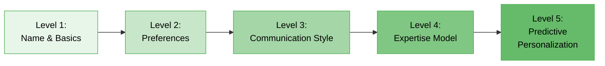
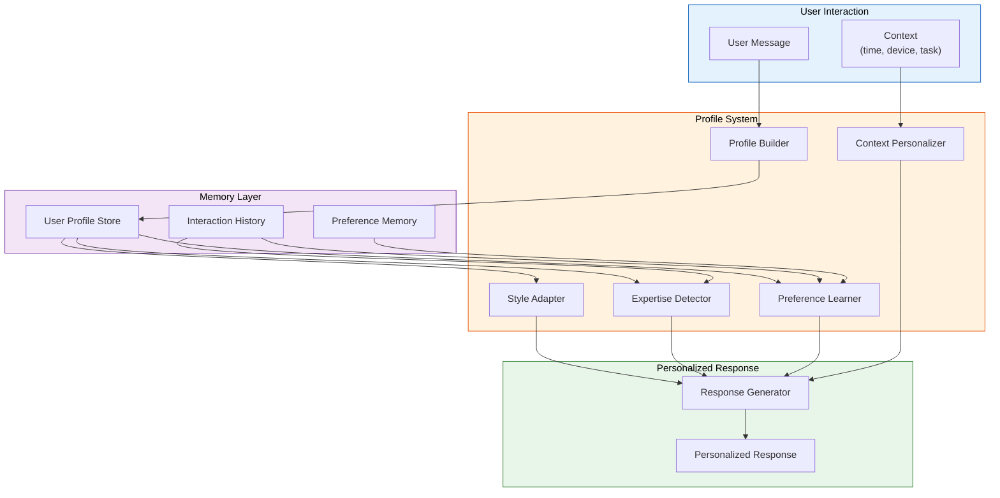
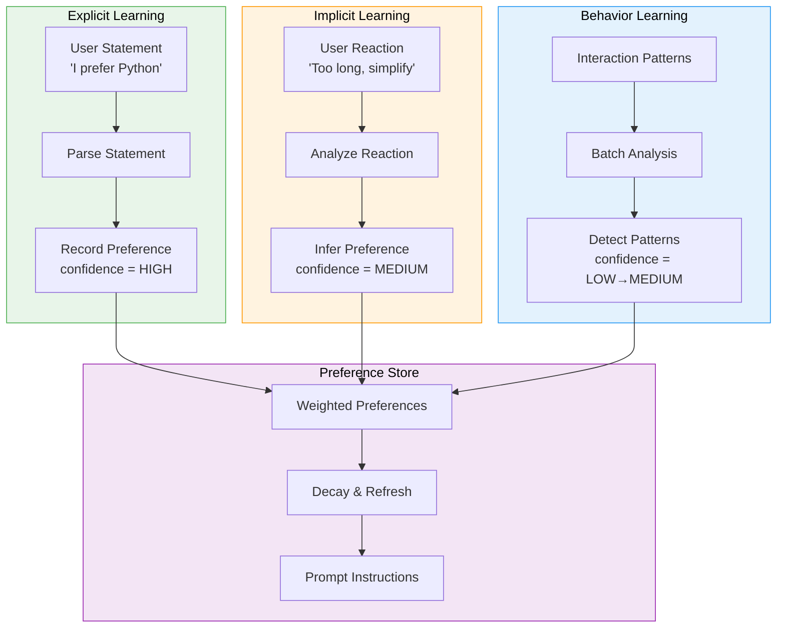

# Memory in AI Systems Deep Dive  Part 14: Personalization  Memory That Knows You

---

**Series:** Memory in AI Systems  A Developer's Deep Dive from Fundamentals to Production
**Part:** 14 of 19 (Personalization)
**Audience:** Developers with programming experience who want to understand AI memory systems from the ground up
**Reading time:** ~45 minutes

---

In Part 13, we explored evaluation frameworks  how to measure whether your AI memory system is actually working, whether retrieval is accurate, whether summaries preserve meaning, and whether the system improves over time. Measurement told us *how well* the system performs. But measurement alone does not tell us *for whom* it performs well. A system that works brilliantly for a senior engineer might bewilder a college student. A system that delights a casual user might frustrate a power user with its verbosity. A system that speaks perfect formal English might alienate a user who prefers casual conversation.

This is the personalization problem: **the same system, given the same query, should produce different responses for different users  and it should learn those differences from memory.**

Personalization is where AI memory transforms from a technical feature into a human experience. It is the difference between a search engine and an assistant. It is the difference between a tool that retrieves information and a companion that understands you. And it is, arguably, the single most compelling reason to build memory into AI systems at all.

By the end of this part, you will:

- Understand why personalization is the **killer application** for AI memory systems
- Build a **UserProfileBuilder** that constructs rich user models from raw interactions
- Implement a **StyleAdapter** that matches communication patterns  formality, vocabulary, length, and depth
- Create an **ExpertiseDetector** that classifies what users know and adapts explanations accordingly
- Build a **PreferenceLearner** that discovers user preferences both explicitly and implicitly
- Implement a **ContextualPersonalizer** that adjusts behavior based on time, task, and urgency
- Design a **PrivatePersonalization** system that personalizes without compromising user privacy
- Assemble a complete **PersonalizationEngine** that integrates all components into a production-ready system
- Understand **A/B testing strategies** for measuring personalization effectiveness

Let's build memory that truly knows its users.

---

## Table of Contents

1. [Why Personalization Is the Killer App for Memory](#1-why-personalization-is-the-killer-app-for-memory)
2. [User Profile Construction](#2-user-profile-construction)
3. [Communication Style Learning](#3-communication-style-learning)
4. [Expertise Detection and Adaptation](#4-expertise-detection-and-adaptation)
5. [Preference Learning](#5-preference-learning)
6. [Context-Aware Personalization](#6-context-aware-personalization)
7. [Privacy-Preserving Personalization](#7-privacy-preserving-personalization)
8. [Building a Complete Personalization Engine](#8-building-a-complete-personalization-engine)
9. [Vocabulary Cheat Sheet](#9-vocabulary-cheat-sheet)
10. [Key Takeaways and What's Next](#10-key-takeaways-and-whats-next)

---

## 1. Why Personalization Is the Killer App for Memory

### The Generic AI Problem

Most AI systems today are **one-size-fits-all**. You ask a question, you get an answer. The answer is the same whether you are a PhD researcher or a curious teenager, whether you prefer bullet points or flowing prose, whether you have asked the same system a hundred questions before or this is your very first interaction.

This is not how human communication works. When you talk to a colleague, you adjust your vocabulary based on their expertise. When you write an email to your manager versus a friend, the tone shifts automatically. When a teacher explains a concept to a struggling student versus an advanced one, the explanation is fundamentally different  not just in words, but in structure, depth, and approach.

**Generic AI feels like talking to a stranger every single time.** Personalized AI feels like talking to someone who knows you.

### What Memory Makes Possible

Without memory, personalization is impossible. Each conversation starts from zero. But with memory  the kind of memory we have been building throughout this series  we can:

| Capability | Without Memory | With Memory |
|---|---|---|
| **Greeting** | "Hello! How can I help you?" | "Welcome back, Sarah. Last time you were debugging that Redis connection pool issue  did you resolve it?" |
| **Explanation depth** | Same level for everyone | Knows Sarah is a senior engineer; skips basics |
| **Communication style** | Default formal | Matches Sarah's preference for concise, technical responses |
| **Recommendations** | Generic suggestions | Based on Sarah's tech stack, past projects, preferences |
| **Error handling** | Standard error messages | Knows Sarah prefers stack traces over plain-English descriptions |
| **Follow-up** | No continuity | "Since you moved to Redis Cluster last month, here is how connection pooling differs..." |

> **Key Insight:** Personalization is not a feature you add on top of memory. It is the *reason* memory exists. Memory without personalization is a filing cabinet. Memory with personalization is an assistant.

### The Personalization Spectrum

Not all personalization is equal. There is a spectrum from superficial to deep:



**Level 1  Name and Basics:** The system remembers your name and basic facts. ("Hi, Alex!") This is trivial but feels polite.

**Level 2  Preferences:** The system remembers what you like and dislike. ("You prefer dark mode, Python code examples, and metric units.") This saves repetitive configuration.

**Level 3  Communication Style:** The system adapts how it communicates to match your patterns. ("You write in short, direct sentences, so I will too.") This feels natural and comfortable.

**Level 4  Expertise Model:** The system knows what you know and adapts depth accordingly. ("You understand distributed systems well but are new to machine learning, so I will explain ML concepts from first principles while using distributed systems analogies.") This makes the system genuinely more useful.

**Level 5  Predictive Personalization:** The system anticipates what you need before you ask. ("Based on your recent work on authentication and your reading history, you might be interested in OAuth 2.1 changes.") This is where personalization becomes truly powerful.

We are going to build all five levels in this part.

### The Architecture of Personalization

Here is how personalization fits into the broader AI memory architecture:



Every user message flows through the profile system, which consults memory to understand who this user is, then shapes the response accordingly. The response itself feeds back into memory, continuously refining the user model.

Let's build each component.

---

## 2. User Profile Construction

### What Goes Into a User Profile?

A user profile is a structured representation of everything the system knows about a user. It is not a flat key-value store  it is a layered model that captures different dimensions of the user at different levels of confidence.

```python
"""
User Profile Construction Module

Builds and maintains rich user profiles from interaction history.
Profiles are structured, versioned, and progressively refined over time.
"""

import json
import time
import hashlib
from datetime import datetime, timedelta
from typing import Any, Optional
from dataclasses import dataclass, field
from enum import Enum
from collections import defaultdict


class ConfidenceLevel(Enum):
    """How confident the system is about a profile attribute."""
    INFERRED_LOW = 0.2    # Guessed from minimal data
    INFERRED_MEDIUM = 0.5  # Pattern seen a few times
    INFERRED_HIGH = 0.8   # Strong pattern from many interactions
    EXPLICIT = 1.0         # User explicitly stated this


@dataclass
class ProfileAttribute:
    """A single attribute in a user profile with metadata."""
    key: str
    value: Any
    confidence: ConfidenceLevel
    source: str                          # How this was learned
    first_observed: float                # Timestamp
    last_confirmed: float                # Last time evidence supported this
    observation_count: int = 1           # How many times observed
    contradictions: int = 0              # How many times contradicted

    def relevance_score(self) -> float:
        """
        Calculate how relevant/reliable this attribute is.

        High observation count + high confidence + recent confirmation
        + low contradictions = high relevance.
        """
        recency = 1.0 / (1.0 + (time.time() - self.last_confirmed) / 86400)
        consistency = 1.0 - (self.contradictions / max(self.observation_count, 1))
        return self.confidence.value * recency * consistency

    def to_dict(self) -> dict:
        return {
            "key": self.key,
            "value": self.value,
            "confidence": self.confidence.name,
            "source": self.source,
            "first_observed": self.first_observed,
            "last_confirmed": self.last_confirmed,
            "observation_count": self.observation_count,
            "contradictions": self.contradictions,
            "relevance_score": round(self.relevance_score(), 3),
        }


@dataclass
class UserProfile:
    """
    Complete user profile with structured and unstructured sections.

    Structured sections contain typed, queryable attributes.
    Unstructured sections contain free-form notes and observations.
    """
    user_id: str
    created_at: float = field(default_factory=time.time)
    last_interaction: float = field(default_factory=time.time)
    interaction_count: int = 0

    # Structured profile sections
    demographics: dict[str, ProfileAttribute] = field(default_factory=dict)
    expertise: dict[str, ProfileAttribute] = field(default_factory=dict)
    preferences: dict[str, ProfileAttribute] = field(default_factory=dict)
    communication_style: dict[str, ProfileAttribute] = field(default_factory=dict)
    goals: dict[str, ProfileAttribute] = field(default_factory=dict)

    # Unstructured observations
    observations: list[dict] = field(default_factory=list)

    # Session history summary
    session_summaries: list[dict] = field(default_factory=list)

    def get_attribute(self, section: str, key: str) -> Optional[ProfileAttribute]:
        """Retrieve a profile attribute by section and key."""
        section_data = getattr(self, section, {})
        if isinstance(section_data, dict):
            return section_data.get(key)
        return None

    def set_attribute(
        self,
        section: str,
        key: str,
        value: Any,
        confidence: ConfidenceLevel,
        source: str,
    ) -> None:
        """Set or update a profile attribute."""
        section_data = getattr(self, section, None)
        if section_data is None or not isinstance(section_data, dict):
            return

        now = time.time()
        existing = section_data.get(key)

        if existing is None:
            # New attribute
            section_data[key] = ProfileAttribute(
                key=key,
                value=value,
                confidence=confidence,
                source=source,
                first_observed=now,
                last_confirmed=now,
            )
        else:
            # Update existing attribute
            if existing.value == value:
                # Confirming existing value  strengthen confidence
                existing.last_confirmed = now
                existing.observation_count += 1
                if confidence.value > existing.confidence.value:
                    existing.confidence = confidence
            else:
                # Contradicting existing value
                existing.contradictions += 1
                if confidence.value >= existing.confidence.value:
                    # New evidence is stronger  update value
                    existing.value = value
                    existing.confidence = confidence
                    existing.source = source
                    existing.last_confirmed = now

    def add_observation(self, observation: str, source: str = "system") -> None:
        """Add a free-form observation about the user."""
        self.observations.append({
            "text": observation,
            "timestamp": time.time(),
            "source": source,
        })
        # Keep only the most recent 100 observations
        if len(self.observations) > 100:
            self.observations = self.observations[-100:]

    def summarize(self) -> dict:
        """
        Generate a compact summary of the profile for use in prompts.
        Only includes high-relevance attributes.
        """
        summary = {
            "user_id": self.user_id,
            "interactions": self.interaction_count,
            "member_since": datetime.fromtimestamp(self.created_at).isoformat(),
        }

        for section_name in [
            "demographics", "expertise", "preferences",
            "communication_style", "goals",
        ]:
            section_data = getattr(self, section_name, {})
            if section_data:
                # Only include attributes with relevance > 0.3
                relevant = {
                    k: v.value
                    for k, v in section_data.items()
                    if v.relevance_score() > 0.3
                }
                if relevant:
                    summary[section_name] = relevant

        return summary

    def to_prompt_string(self) -> str:
        """Convert profile to a string suitable for injection into LLM prompts."""
        summary = self.summarize()
        lines = [f"## User Profile: {self.user_id}"]
        lines.append(f"- Interactions: {summary.get('interactions', 0)}")
        lines.append(f"- Member since: {summary.get('member_since', 'unknown')}")

        section_labels = {
            "demographics": "Background",
            "expertise": "Expertise",
            "preferences": "Preferences",
            "communication_style": "Communication Style",
            "goals": "Current Goals",
        }

        for section_key, label in section_labels.items():
            if section_key in summary:
                lines.append(f"\n### {label}")
                for k, v in summary[section_key].items():
                    lines.append(f"- {k}: {v}")

        return "\n".join(lines)
```

This `UserProfile` class is the foundation. Every other component in this part reads from and writes to this profile. Notice the key design decisions:

- **Confidence tracking:** Every attribute has a confidence level. The system distinguishes between what the user explicitly said ("I prefer Python") and what it inferred ("user seems to prefer Python based on 15 Python-related questions").
- **Contradiction handling:** When new evidence contradicts an existing attribute, the system does not blindly overwrite. It tracks contradictions and only updates when the new evidence is stronger.
- **Relevance scoring:** Attributes decay over time. A preference expressed six months ago matters less than one expressed yesterday.
- **Prompt-ready output:** The profile can be converted directly into a string for injection into LLM prompts.

### The UserProfileBuilder

Now let's build the component that actually constructs and updates profiles from raw user interactions:

```python
class UserProfileBuilder:
    """
    Builds and maintains user profiles from interaction data.

    Uses a combination of:
    - Explicit extraction (user says "I prefer X")
    - Pattern detection (user consistently does X)
    - Session analysis (what topics does the user engage with?)
    """

    # Patterns that indicate explicit preferences
    EXPLICIT_PATTERNS = {
        "preference": [
            r"(?:i|I) (?:prefer|like|want|love|enjoy)\s+(.+)",
            r"(?:please|always)\s+(?:use|give me|show me)\s+(.+)",
            r"(?:i|I) (?:don't like|hate|dislike|avoid)\s+(.+)",
        ],
        "expertise_claim": [
            r"(?:i|I) (?:am|work as|'m)\s+(?:a|an)\s+(.+)",
            r"(?:i|I) (?:have|'ve)\s+(?:\w+\s+)?(?:years?|experience)\s+(?:in|with)\s+(.+)",
            r"(?:i|I) (?:know|understand|am familiar with)\s+(.+)",
        ],
        "background": [
            r"(?:i|I) (?:use|work with|develop in|code in)\s+(.+)",
            r"(?:my|our)\s+(?:team|company|project)\s+(?:uses|is|works with)\s+(.+)",
        ],
    }

    def __init__(self, profile_store: Optional[dict] = None):
        """
        Args:
            profile_store: Dictionary mapping user_id to UserProfile.
                           In production, this would be a database.
        """
        self.profile_store: dict[str, UserProfile] = profile_store or {}
        self.interaction_buffer: dict[str, list] = defaultdict(list)

    def get_or_create_profile(self, user_id: str) -> UserProfile:
        """Retrieve existing profile or create a new one."""
        if user_id not in self.profile_store:
            self.profile_store[user_id] = UserProfile(user_id=user_id)
        return self.profile_store[user_id]

    def process_interaction(
        self,
        user_id: str,
        user_message: str,
        assistant_response: str,
        metadata: Optional[dict] = None,
    ) -> UserProfile:
        """
        Process a single interaction and update the user profile.

        This is the main entry point. Call this after every user interaction.

        Args:
            user_id: Unique user identifier
            user_message: What the user said
            assistant_response: What the assistant replied
            metadata: Optional context (timestamp, device, session_id, etc.)

        Returns:
            Updated UserProfile
        """
        profile = self.get_or_create_profile(user_id)
        profile.interaction_count += 1
        profile.last_interaction = time.time()

        metadata = metadata or {}

        # Step 1: Extract explicit statements
        self._extract_explicit_info(profile, user_message)

        # Step 2: Analyze communication patterns
        self._analyze_communication(profile, user_message)

        # Step 3: Detect topics and potential expertise
        self._analyze_topics(profile, user_message)

        # Step 4: Buffer interaction for batch analysis
        self.interaction_buffer[user_id].append({
            "user_message": user_message,
            "assistant_response": assistant_response,
            "timestamp": time.time(),
            "metadata": metadata,
        })

        # Step 5: Run batch analysis every 10 interactions
        if len(self.interaction_buffer[user_id]) >= 10:
            self._run_batch_analysis(profile, user_id)

        return profile

    def _extract_explicit_info(
        self, profile: UserProfile, message: str
    ) -> None:
        """Extract explicitly stated preferences and information."""
        import re

        for category, patterns in self.EXPLICIT_PATTERNS.items():
            for pattern in patterns:
                matches = re.findall(pattern, message, re.IGNORECASE)
                for match in matches:
                    match_text = match.strip().rstrip(".,!?")
                    if not match_text:
                        continue

                    if category == "preference":
                        if any(
                            neg in message.lower()
                            for neg in ["don't", "hate", "dislike", "avoid"]
                        ):
                            profile.set_attribute(
                                "preferences",
                                f"dislikes_{match_text.lower().replace(' ', '_')}",
                                True,
                                ConfidenceLevel.EXPLICIT,
                                "explicit_statement",
                            )
                        else:
                            profile.set_attribute(
                                "preferences",
                                match_text.lower().replace(" ", "_"),
                                True,
                                ConfidenceLevel.EXPLICIT,
                                "explicit_statement",
                            )

                    elif category == "expertise_claim":
                        profile.set_attribute(
                            "expertise",
                            match_text.lower().replace(" ", "_"),
                            "self_reported",
                            ConfidenceLevel.INFERRED_HIGH,
                            "explicit_claim",
                        )

                    elif category == "background":
                        profile.set_attribute(
                            "demographics",
                            f"uses_{match_text.lower().replace(' ', '_')}",
                            True,
                            ConfidenceLevel.INFERRED_HIGH,
                            "explicit_statement",
                        )

    def _analyze_communication(
        self, profile: UserProfile, message: str
    ) -> None:
        """Analyze communication patterns from the message."""
        words = message.split()
        word_count = len(words)

        # Message length tendency
        if word_count < 10:
            length_pref = "concise"
        elif word_count < 50:
            length_pref = "moderate"
        else:
            length_pref = "detailed"

        profile.set_attribute(
            "communication_style",
            "message_length",
            length_pref,
            ConfidenceLevel.INFERRED_LOW,
            "message_analysis",
        )

        # Formality detection (simple heuristic)
        informal_markers = [
            "hey", "hi", "gonna", "wanna", "gotta", "lol",
            "haha", "yeah", "nah", "btw", "imo", "tbh",
            "thx", "pls", "u ", "ur ",
        ]
        formal_markers = [
            "would you", "could you", "please", "kindly",
            "appreciate", "regarding", "therefore", "furthermore",
            "consequently", "i would like",
        ]

        lower_msg = message.lower()
        informal_count = sum(1 for m in informal_markers if m in lower_msg)
        formal_count = sum(1 for m in formal_markers if m in lower_msg)

        if informal_count > formal_count:
            formality = "informal"
        elif formal_count > informal_count:
            formality = "formal"
        else:
            formality = "neutral"

        profile.set_attribute(
            "communication_style",
            "formality",
            formality,
            ConfidenceLevel.INFERRED_LOW,
            "message_analysis",
        )

        # Technical vocabulary density
        technical_terms = [
            "api", "function", "class", "method", "variable", "array",
            "database", "query", "endpoint", "deploy", "docker", "kubernetes",
            "algorithm", "complexity", "runtime", "memory", "cache", "thread",
            "async", "await", "promise", "callback", "middleware", "pipeline",
            "microservice", "monolith", "latency", "throughput", "schema",
            "index", "shard", "replica", "partition", "vector", "embedding",
        ]
        tech_count = sum(
            1 for term in technical_terms if term in lower_msg
        )
        tech_density = tech_count / max(word_count, 1)

        if tech_density > 0.1:
            vocab_level = "highly_technical"
        elif tech_density > 0.03:
            vocab_level = "technical"
        else:
            vocab_level = "general"

        profile.set_attribute(
            "communication_style",
            "vocabulary_level",
            vocab_level,
            ConfidenceLevel.INFERRED_LOW,
            "vocabulary_analysis",
        )

    def _analyze_topics(self, profile: UserProfile, message: str) -> None:
        """Detect topics the user is asking about."""
        topic_keywords = {
            "python": ["python", "pip", "virtualenv", "django", "flask", "pytest"],
            "javascript": ["javascript", "js", "node", "npm", "react", "vue", "angular"],
            "databases": ["database", "sql", "postgres", "mysql", "mongodb", "redis"],
            "devops": ["docker", "kubernetes", "k8s", "ci/cd", "deploy", "terraform"],
            "machine_learning": ["ml", "model", "training", "neural", "deep learning", "ai"],
            "web_development": ["html", "css", "frontend", "backend", "api", "rest"],
            "system_design": ["architecture", "scalability", "microservice", "distributed"],
            "security": ["auth", "encryption", "oauth", "jwt", "security", "vulnerability"],
        }

        lower_msg = message.lower()
        for topic, keywords in topic_keywords.items():
            if any(kw in lower_msg for kw in keywords):
                profile.set_attribute(
                    "expertise",
                    f"interested_in_{topic}",
                    True,
                    ConfidenceLevel.INFERRED_LOW,
                    "topic_detection",
                )

    def _run_batch_analysis(self, profile: UserProfile, user_id: str) -> None:
        """
        Run deeper analysis on a batch of interactions.

        This is more expensive but produces higher-quality insights.
        """
        buffer = self.interaction_buffer[user_id]

        # Analyze average message length over the batch
        avg_length = sum(
            len(entry["user_message"].split()) for entry in buffer
        ) / len(buffer)

        if avg_length < 15:
            profile.set_attribute(
                "communication_style",
                "message_length",
                "concise",
                ConfidenceLevel.INFERRED_MEDIUM,
                "batch_analysis",
            )
        elif avg_length < 50:
            profile.set_attribute(
                "communication_style",
                "message_length",
                "moderate",
                ConfidenceLevel.INFERRED_MEDIUM,
                "batch_analysis",
            )
        else:
            profile.set_attribute(
                "communication_style",
                "message_length",
                "detailed",
                ConfidenceLevel.INFERRED_MEDIUM,
                "batch_analysis",
            )

        # Count topic frequencies
        topic_counts: dict[str, int] = defaultdict(int)
        for entry in buffer:
            lower_msg = entry["user_message"].lower()
            topic_keywords = {
                "python": ["python", "pip", "django", "flask"],
                "javascript": ["javascript", "js", "node", "react"],
                "databases": ["database", "sql", "postgres", "redis"],
                "devops": ["docker", "kubernetes", "deploy"],
                "ml": ["model", "training", "neural", "embedding"],
            }
            for topic, keywords in topic_keywords.items():
                if any(kw in lower_msg for kw in keywords):
                    topic_counts[topic] += 1

        # Set primary topic interest with higher confidence
        if topic_counts:
            primary_topic = max(topic_counts, key=topic_counts.get)
            profile.set_attribute(
                "expertise",
                "primary_interest",
                primary_topic,
                ConfidenceLevel.INFERRED_MEDIUM,
                "batch_topic_analysis",
            )

        # Add a session summary
        topics_discussed = list(topic_counts.keys())
        profile.session_summaries.append({
            "timestamp": time.time(),
            "interaction_count": len(buffer),
            "topics": topics_discussed,
            "avg_message_length": round(avg_length, 1),
        })

        # Clear the buffer
        self.interaction_buffer[user_id] = []
```

### Progressive Profiling

One critical design principle: **profiles should be built progressively, not all at once.** You do not interrogate the user with a questionnaire on their first visit. Instead, you observe, infer, and gradually build a richer model over time.

```python
class ProgressiveProfiler:
    """
    Builds profiles gradually over multiple sessions.

    Session 1-3: Basic demographics and communication style
    Session 4-10: Expertise areas and preferences
    Session 10+: Deep personalization and prediction
    """

    # Questions to ask at different profile stages.
    # These are asked naturally within conversation, not as interrogation.
    PROGRESSIVE_QUESTIONS = {
        "early": [
            {
                "trigger": "user asks a technical question",
                "question": "Just so I can tailor my explanations  what is your "
                           "primary programming language?",
                "attribute": ("demographics", "primary_language"),
            },
            {
                "trigger": "user asks for an explanation",
                "question": "Would you prefer a high-level overview or a "
                           "detailed technical deep dive?",
                "attribute": ("preferences", "explanation_depth"),
            },
        ],
        "mid": [
            {
                "trigger": "user asks about a framework",
                "question": "How long have you been working with this technology?",
                "attribute": ("expertise", "experience_level"),
            },
            {
                "trigger": "user asks for code",
                "question": "Do you prefer code with detailed comments or "
                           "clean code with separate explanations?",
                "attribute": ("preferences", "code_style"),
            },
        ],
        "mature": [
            {
                "trigger": "user starts new topic",
                "question": "I noticed you have been exploring distributed "
                           "systems topics. Are you working on a specific project?",
                "attribute": ("goals", "current_project"),
            },
        ],
    }

    def __init__(self):
        self.asked_questions: dict[str, set] = defaultdict(set)

    def get_profiling_stage(self, profile: UserProfile) -> str:
        """Determine which profiling stage the user is in."""
        if profile.interaction_count < 5:
            return "early"
        elif profile.interaction_count < 20:
            return "mid"
        else:
            return "mature"

    def should_ask_question(
        self, profile: UserProfile, trigger: str
    ) -> Optional[dict]:
        """
        Determine if we should ask a profiling question.

        Returns the question dict if yes, None if no.
        Rules:
        - Only ask one profiling question per session
        - Never ask the same question twice
        - Only ask if the trigger matches
        - Never ask more than one question in a row
        """
        stage = self.get_profiling_stage(profile)
        user_id = profile.user_id

        questions = self.PROGRESSIVE_QUESTIONS.get(stage, [])

        for q in questions:
            q_id = q["attribute"][1]
            if q_id in self.asked_questions[user_id]:
                continue  # Already asked

            # Check if we already have this attribute
            existing = profile.get_attribute(q["attribute"][0], q["attribute"][1])
            if existing and existing.confidence.value >= 0.8:
                continue  # Already know with high confidence

            # Check trigger match (simplified  in production, use NLP)
            if self._trigger_matches(trigger, q["trigger"]):
                self.asked_questions[user_id].add(q_id)
                return q

        return None

    def _trigger_matches(self, actual_trigger: str, expected_trigger: str) -> bool:
        """Check if the actual trigger matches the expected one."""
        # Simplified matching  in production, use semantic similarity
        trigger_keywords = expected_trigger.lower().split()
        actual_keywords = actual_trigger.lower().split()
        overlap = set(trigger_keywords) & set(actual_keywords)
        return len(overlap) >= 2
```

> **Key Insight:** Progressive profiling respects the user's time and attention. Instead of demanding information upfront, it gathers it naturally over the course of many conversations. By session 20, you have a rich profile without the user ever feeling interrogated.

---

## 3. Communication Style Learning

### Why Style Matters

Consider these two responses to the same question ("How do I sort a list in Python?"):

**Response A (formal, detailed):**
> To sort a list in Python, you may employ the `sorted()` built-in function, which returns a new sorted list, or the `list.sort()` method, which sorts the list in place. The `sorted()` function accepts an optional `key` parameter that specifies a function to be called on each list element prior to making comparisons, as well as a `reverse` parameter to indicate descending order.

**Response B (casual, concise):**
> Quick way: `my_list.sort()` (in-place) or `sorted(my_list)` (new list). Need custom sorting? Pass a `key` function: `sorted(stuff, key=len)`. Add `reverse=True` for descending.

Both are correct. But a casual developer will find Response A tedious, while a formal technical writer will find Response B sloppy. **Matching the user's communication style is not about correctness  it is about comfort.**

### The StyleAdapter

```python
class StyleAdapter:
    """
    Learns and adapts to a user's communication style.

    Tracks multiple dimensions:
    - Formality (casual <-> formal)
    - Verbosity (concise <-> detailed)
    - Technical depth (simple <-> expert)
    - Structure preference (prose <-> bullets <-> code-first)
    - Emoji/punctuation style
    """

    @dataclass
    class StyleProfile:
        """Quantified communication style on multiple dimensions."""
        # Each dimension is a float from 0.0 to 1.0
        formality: float = 0.5       # 0 = very casual, 1 = very formal
        verbosity: float = 0.5       # 0 = very concise, 1 = very detailed
        technical_depth: float = 0.5  # 0 = simple, 1 = expert
        structure: float = 0.5        # 0 = free prose, 1 = highly structured
        emoji_usage: float = 0.0      # 0 = never, 1 = frequent

        # Derived instruction for the LLM
        def to_instruction(self) -> str:
            """Convert style profile to an LLM system prompt instruction."""
            instructions = []

            # Formality
            if self.formality < 0.3:
                instructions.append(
                    "Use casual, conversational language. Contractions are fine. "
                    "Feel free to be friendly and approachable."
                )
            elif self.formality > 0.7:
                instructions.append(
                    "Use formal, professional language. Avoid contractions "
                    "and colloquialisms. Maintain a respectful, measured tone."
                )

            # Verbosity
            if self.verbosity < 0.3:
                instructions.append(
                    "Be very concise. Get to the point quickly. "
                    "Use short sentences and skip unnecessary context."
                )
            elif self.verbosity > 0.7:
                instructions.append(
                    "Provide detailed, thorough explanations. Include context, "
                    "examples, and edge cases. The user appreciates completeness."
                )

            # Technical depth
            if self.technical_depth < 0.3:
                instructions.append(
                    "Keep explanations simple and accessible. Avoid jargon. "
                    "Use analogies to everyday concepts."
                )
            elif self.technical_depth > 0.7:
                instructions.append(
                    "Use precise technical language. The user is an expert  "
                    "skip introductory explanations and go deep on details."
                )

            # Structure
            if self.structure > 0.7:
                instructions.append(
                    "Use structured formatting: bullet points, numbered lists, "
                    "headers, and code blocks. The user prefers organized information."
                )
            elif self.structure < 0.3:
                instructions.append(
                    "Use flowing prose rather than bullet points. "
                    "The user prefers natural, conversational explanations."
                )

            return " ".join(instructions)

    def __init__(self):
        self.style_history: dict[str, list[dict]] = defaultdict(list)
        self.style_profiles: dict[str, "StyleAdapter.StyleProfile"] = {}

    def analyze_message(self, user_id: str, message: str) -> dict[str, float]:
        """
        Analyze a single message for style indicators.

        Returns a dict of style dimensions with detected values.
        """
        words = message.split()
        word_count = len(words)

        if word_count == 0:
            return {}

        analysis = {}

        # --- Formality ---
        informal_signals = [
            "hey", "hi", "gonna", "wanna", "gotta", "lol", "haha",
            "yeah", "nah", "btw", "imo", "tbh", "omg", "idk",
            "thx", "pls", "nope", "yep", "cool", "awesome",
        ]
        formal_signals = [
            "would", "could", "please", "kindly", "appreciate",
            "regarding", "therefore", "furthermore", "consequently",
            "respectively", "nevertheless", "however", "moreover",
        ]

        lower_words = [w.lower().strip(".,!?;:") for w in words]
        informal_count = sum(1 for w in lower_words if w in informal_signals)
        formal_count = sum(1 for w in lower_words if w in formal_signals)

        if informal_count + formal_count > 0:
            analysis["formality"] = formal_count / (informal_count + formal_count)
        else:
            # Check sentence structure for formality clues
            has_greeting = message.lower().startswith(("hi ", "hey ", "hello"))
            has_complete_sentences = message.endswith((".", "?", "!"))
            analysis["formality"] = 0.5 + (0.2 if has_complete_sentences else -0.1)
            if has_greeting:
                analysis["formality"] -= 0.1

        # --- Verbosity ---
        if word_count < 10:
            analysis["verbosity"] = 0.1
        elif word_count < 25:
            analysis["verbosity"] = 0.3
        elif word_count < 60:
            analysis["verbosity"] = 0.5
        elif word_count < 120:
            analysis["verbosity"] = 0.7
        else:
            analysis["verbosity"] = 0.9

        # --- Technical depth ---
        technical_terms = {
            "algorithm", "api", "async", "authentication", "binary",
            "buffer", "cache", "callback", "compiler", "concurrency",
            "container", "daemon", "decorator", "dependency", "deployment",
            "distributed", "endpoint", "encryption", "exception", "framework",
            "garbage", "handler", "hash", "heap", "idempotent",
            "index", "inheritance", "interface", "iterator", "kernel",
            "lambda", "latency", "mutex", "namespace", "optimization",
            "overhead", "parallelism", "polymorphism", "protocol", "proxy",
            "queue", "recursion", "refactor", "regex", "replication",
            "runtime", "schema", "serialization", "singleton", "socket",
            "stack", "synchronous", "thread", "throughput", "transaction",
            "virtualization", "webhook",
        }
        tech_word_count = sum(1 for w in lower_words if w in technical_terms)
        tech_density = tech_word_count / max(word_count, 1)
        analysis["technical_depth"] = min(1.0, tech_density * 10)

        # --- Structure preference ---
        has_bullets = any(
            line.strip().startswith(("-", "*", "1.", "2.", "3."))
            for line in message.split("\n")
        )
        has_code = "```" in message or "`" in message
        has_headers = any(
            line.strip().startswith("#") for line in message.split("\n")
        )
        structure_signals = sum([has_bullets, has_code, has_headers])
        analysis["structure"] = min(1.0, structure_signals * 0.3 + 0.2)

        # --- Emoji usage ---
        import re
        emoji_pattern = re.compile(
            "[\U0001f600-\U0001f64f"   # emoticons
            "\U0001f300-\U0001f5ff"     # symbols & pictographs
            "\U0001f680-\U0001f6ff"     # transport & map
            "\U0001f1e0-\U0001f1ff"     # flags
            "]+",
            flags=re.UNICODE,
        )
        emoji_count = len(emoji_pattern.findall(message))
        analysis["emoji_usage"] = min(1.0, emoji_count * 0.3)

        return analysis

    def update_style(self, user_id: str, message: str) -> "StyleAdapter.StyleProfile":
        """
        Update the user's style profile based on a new message.

        Uses exponential moving average to weight recent messages more heavily.
        """
        analysis = self.analyze_message(user_id, message)
        self.style_history[user_id].append(analysis)

        # Keep only last 50 analyses
        if len(self.style_history[user_id]) > 50:
            self.style_history[user_id] = self.style_history[user_id][-50:]

        # Compute exponential moving average
        alpha = 0.3  # Weight for most recent observation
        profile = self.style_profiles.get(
            user_id, StyleAdapter.StyleProfile()
        )

        for dimension in [
            "formality", "verbosity", "technical_depth",
            "structure", "emoji_usage",
        ]:
            if dimension in analysis:
                current = getattr(profile, dimension)
                new_value = alpha * analysis[dimension] + (1 - alpha) * current
                setattr(profile, dimension, round(new_value, 3))

        self.style_profiles[user_id] = profile
        return profile

    def get_style_instruction(self, user_id: str) -> str:
        """Get the LLM instruction for this user's communication style."""
        profile = self.style_profiles.get(
            user_id, StyleAdapter.StyleProfile()
        )
        return profile.to_instruction()

    def get_style_summary(self, user_id: str) -> dict:
        """Get a human-readable summary of the user's style."""
        profile = self.style_profiles.get(
            user_id, StyleAdapter.StyleProfile()
        )

        def describe(value: float, low: str, mid: str, high: str) -> str:
            if value < 0.3:
                return low
            elif value > 0.7:
                return high
            return mid

        return {
            "formality": describe(
                profile.formality, "casual", "balanced", "formal"
            ),
            "verbosity": describe(
                profile.verbosity, "concise", "moderate", "detailed"
            ),
            "technical_depth": describe(
                profile.technical_depth, "beginner-friendly", "moderate", "expert"
            ),
            "structure": describe(
                profile.structure, "prose", "mixed", "structured"
            ),
            "emoji_usage": describe(
                profile.emoji_usage, "none", "occasional", "frequent"
            ),
        }
```

### Style Adaptation in Practice

Here is how style adaptation works end-to-end:

```python
def demonstrate_style_adaptation():
    """Show how the same question gets different responses based on style."""
    adapter = StyleAdapter()

    # Simulate Casual User  short, informal messages
    casual_messages = [
        "hey how do i sort a list",
        "cool thx, what about dicts?",
        "nah i mean by value not key",
        "awesome that works, btw whats the fastest way",
        "lol yeah makes sense",
    ]

    # Simulate Formal User  structured, detailed messages
    formal_messages = [
        "Could you please explain the various methods available for "
        "sorting a list in Python?",
        "Thank you. I would also like to understand how dictionary "
        "sorting works, particularly sorting by values.",
        "That is helpful. Could you elaborate on the time complexity "
        "of each approach and when one might be preferred over another?",
        "I appreciate the thorough explanation. Furthermore, how does "
        "the Timsort algorithm handle partially sorted data?",
        "Excellent. Please also discuss stability in sorting algorithms.",
    ]

    print("=== Casual User Style Evolution ===")
    for msg in casual_messages:
        profile = adapter.update_style("casual_user", msg)
    casual_summary = adapter.get_style_summary("casual_user")
    casual_instruction = adapter.get_style_instruction("casual_user")
    print(f"Style: {casual_summary}")
    print(f"Instruction: {casual_instruction}\n")

    print("=== Formal User Style Evolution ===")
    for msg in formal_messages:
        profile = adapter.update_style("formal_user", msg)
    formal_summary = adapter.get_style_summary("formal_user")
    formal_instruction = adapter.get_style_instruction("formal_user")
    print(f"Style: {formal_summary}")
    print(f"Instruction: {formal_instruction}\n")


# Run the demonstration
demonstrate_style_adaptation()
```

**Expected output:**
```
=== Casual User Style Evolution ===
Style: {'formality': 'casual', 'verbosity': 'concise', 'technical_depth': 'beginner-friendly', 'structure': 'prose', 'emoji_usage': 'none'}
Instruction: Use casual, conversational language. Contractions are fine. Feel free to be friendly and approachable. Be very concise. Get to the point quickly. Use short sentences and skip unnecessary context. Keep explanations simple and accessible. Avoid jargon. Use analogies to everyday concepts.

=== Formal User Style Evolution ===
Style: {'formality': 'formal', 'verbosity': 'detailed', 'technical_depth': 'expert', 'structure': 'prose', 'emoji_usage': 'none'}
Instruction: Use formal, professional language. Avoid contractions and colloquialisms. Maintain a respectful, measured tone. Provide detailed, thorough explanations. Include context, examples, and edge cases. The user appreciates completeness. Use precise technical language. The user is an expert  skip introductory explanations and go deep on details.
```

The same system, two completely different instruction sets  all derived from observing how the user communicates.

---

## 4. Expertise Detection and Adaptation

### The Problem with One-Size-Fits-All Explanations

When a senior distributed systems engineer asks "How does Raft consensus work?", they want a precise technical explanation that covers leader election, log replication, and safety guarantees. When a computer science student asks the same question, they need the explanation to start with "What is consensus?" and build up gradually.

**Getting this wrong is costly.** Over-explain to an expert and they feel patronized. Under-explain to a beginner and they feel lost. The goal is to detect the user's expertise level *per topic* and adapt accordingly.

### The ExpertiseDetector

```python
class ExpertiseDetector:
    """
    Detects and tracks user expertise across multiple domains.

    Key insight: expertise is not a single number. A user can be an expert
    in Python but a beginner in machine learning, advanced in backend
    development but novice in frontend.

    The detector maintains a per-topic expertise model that evolves
    over time as the user demonstrates (or fails to demonstrate) knowledge.
    """

    class ExpertiseLevel(Enum):
        BEGINNER = 1        # Needs fundamentals explained
        INTERMEDIATE = 2     # Knows basics, needs guidance on advanced topics
        ADVANCED = 3         # Understands advanced concepts, wants depth
        EXPERT = 4           # Deep expertise, wants cutting-edge details

    @dataclass
    class TopicExpertise:
        """Expertise assessment for a single topic."""
        topic: str
        level: "ExpertiseDetector.ExpertiseLevel"
        confidence: float           # 0-1, how sure we are
        evidence: list[str]         # What signals led to this assessment
        last_updated: float
        interaction_count: int = 0  # Interactions involving this topic

        def to_dict(self) -> dict:
            return {
                "topic": self.topic,
                "level": self.level.name,
                "confidence": round(self.confidence, 2),
                "evidence_count": len(self.evidence),
                "interactions": self.interaction_count,
            }

    # Vocabulary that signals expertise level
    EXPERTISE_VOCABULARY = {
        "python": {
            "beginner": [
                "what is python", "how to install", "print hello world",
                "what is a variable", "what is a loop", "how to run",
            ],
            "intermediate": [
                "list comprehension", "decorator", "generator", "context manager",
                "virtual environment", "pip install", "exception handling",
            ],
            "advanced": [
                "metaclass", "descriptor protocol", "GIL", "asyncio internals",
                "cpython", "memory management", "garbage collector",
                "slot", "__new__", "abc", "mro",
            ],
            "expert": [
                "c extension", "bytecode", "ast manipulation", "frame object",
                "pyobject", "reference counting", "generational gc",
                "pep 703", "free-threaded", "subinterpreter",
            ],
        },
        "databases": {
            "beginner": [
                "what is a database", "how to create table", "select from",
                "what is sql", "insert into", "primary key",
            ],
            "intermediate": [
                "join", "index", "transaction", "normalization", "foreign key",
                "group by", "having", "subquery", "view",
            ],
            "advanced": [
                "query planner", "execution plan", "b-tree", "mvcc",
                "isolation level", "deadlock", "connection pool",
                "partitioning", "replication", "wal",
            ],
            "expert": [
                "vacuum", "page split", "buffer pool", "write-ahead log internals",
                "consensus protocol", "vector clock", "crdt",
                "linearizability", "serializability", "jepsen",
            ],
        },
        "machine_learning": {
            "beginner": [
                "what is machine learning", "what is ai", "how does ai work",
                "train a model", "what is a dataset", "prediction",
            ],
            "intermediate": [
                "overfitting", "cross-validation", "gradient descent",
                "regularization", "feature engineering", "precision recall",
                "random forest", "neural network", "backpropagation",
            ],
            "advanced": [
                "attention mechanism", "transformer architecture", "fine-tuning",
                "lora", "quantization", "distillation", "rlhf",
                "contrastive learning", "embedding space",
            ],
            "expert": [
                "mixture of experts", "flash attention", "ring attention",
                "speculative decoding", "kv cache optimization",
                "activation checkpointing", "tensor parallelism",
                "megatron", "deepspeed", "zero optimizer",
            ],
        },
    }

    def __init__(self):
        self.user_expertise: dict[str, dict[str, "ExpertiseDetector.TopicExpertise"]] = (
            defaultdict(dict)
        )

    def analyze_message(
        self,
        user_id: str,
        message: str,
        topic_hint: Optional[str] = None,
    ) -> dict[str, "TopicExpertise"]:
        """
        Analyze a user message to detect and update expertise levels.

        Args:
            user_id: The user identifier
            message: The user's message
            topic_hint: Optional hint about the topic being discussed

        Returns:
            Dict of topic -> TopicExpertise for all detected topics
        """
        lower_msg = message.lower()
        updates = {}

        for topic, level_vocab in self.EXPERTISE_VOCABULARY.items():
            # Skip topics not related to the message (unless hint matches)
            if topic_hint and topic != topic_hint:
                # Still check, but with lower weight
                pass

            signals = {
                "beginner": 0,
                "intermediate": 0,
                "advanced": 0,
                "expert": 0,
            }

            for level, terms in level_vocab.items():
                for term in terms:
                    if term in lower_msg:
                        signals[level] += 1

            total_signals = sum(signals.values())
            if total_signals == 0:
                continue  # No expertise signals for this topic

            # Determine level from signals
            # Higher-level signals are weighted more heavily
            weighted_score = (
                signals["beginner"] * 1
                + signals["intermediate"] * 2
                + signals["advanced"] * 3
                + signals["expert"] * 4
            ) / total_signals

            if weighted_score <= 1.5:
                detected_level = self.ExpertiseLevel.BEGINNER
            elif weighted_score <= 2.5:
                detected_level = self.ExpertiseLevel.INTERMEDIATE
            elif weighted_score <= 3.5:
                detected_level = self.ExpertiseLevel.ADVANCED
            else:
                detected_level = self.ExpertiseLevel.EXPERT

            # Detect question complexity as an additional signal
            question_signals = self._analyze_question_complexity(lower_msg)
            if question_signals:
                detected_level = self._adjust_level(
                    detected_level, question_signals
                )

            # Update or create the expertise record
            confidence = min(0.9, total_signals * 0.15 + 0.1)
            evidence_text = (
                f"Message contained {total_signals} expertise signals "
                f"(b={signals['beginner']}, i={signals['intermediate']}, "
                f"a={signals['advanced']}, e={signals['expert']})"
            )

            existing = self.user_expertise[user_id].get(topic)
            if existing:
                existing.interaction_count += 1
                existing.last_updated = time.time()
                existing.evidence.append(evidence_text)
                if len(existing.evidence) > 20:
                    existing.evidence = existing.evidence[-20:]

                # Blend new detection with existing assessment
                # Weight existing more heavily for stability
                existing_weight = min(0.8, existing.interaction_count * 0.1)
                new_weight = 1.0 - existing_weight

                blended_value = (
                    existing.level.value * existing_weight
                    + detected_level.value * new_weight
                )
                blended_level = self.ExpertiseLevel(
                    max(1, min(4, round(blended_value)))
                )
                existing.level = blended_level
                existing.confidence = min(
                    0.95,
                    existing.confidence + (1 - existing.confidence) * 0.1,
                )
                updates[topic] = existing
            else:
                new_expertise = self.TopicExpertise(
                    topic=topic,
                    level=detected_level,
                    confidence=confidence,
                    evidence=[evidence_text],
                    last_updated=time.time(),
                    interaction_count=1,
                )
                self.user_expertise[user_id][topic] = new_expertise
                updates[topic] = new_expertise

        return updates

    def _analyze_question_complexity(self, message: str) -> Optional[str]:
        """
        Detect question complexity as an expertise signal.

        Beginners ask "what is X?"
        Intermediates ask "how do I use X for Y?"
        Advanced users ask "why does X behave this way in edge case Z?"
        Experts ask "what are the trade-offs between X and Y for Z at scale?"
        """
        if any(
            phrase in message
            for phrase in ["what is", "what are", "explain", "define"]
        ):
            return "basic_question"
        elif any(
            phrase in message
            for phrase in ["how do i", "how to", "can i", "is it possible"]
        ):
            return "how_to_question"
        elif any(
            phrase in message
            for phrase in ["why does", "why is", "what happens when", "edge case"]
        ):
            return "deep_question"
        elif any(
            phrase in message
            for phrase in [
                "trade-off", "compare", "at scale", "production",
                "performance", "versus", "vs",
            ]
        ):
            return "expert_question"
        return None

    def _adjust_level(
        self,
        level: "ExpertiseLevel",
        question_type: str,
    ) -> "ExpertiseLevel":
        """Adjust expertise level based on question complexity."""
        adjustments = {
            "basic_question": -1,
            "how_to_question": 0,
            "deep_question": 1,
            "expert_question": 1,
        }
        adjustment = adjustments.get(question_type, 0)
        new_value = max(1, min(4, level.value + adjustment))
        return self.ExpertiseLevel(new_value)

    def get_expertise_summary(self, user_id: str) -> dict[str, dict]:
        """Get a summary of all expertise levels for a user."""
        user_data = self.user_expertise.get(user_id, {})
        return {
            topic: expertise.to_dict()
            for topic, expertise in user_data.items()
        }

    def get_explanation_guidance(
        self, user_id: str, topic: str
    ) -> str:
        """
        Get guidance for how to explain things to this user for a topic.

        Returns an instruction string suitable for an LLM system prompt.
        """
        user_data = self.user_expertise.get(user_id, {})
        expertise = user_data.get(topic)

        if expertise is None:
            return (
                f"The user's expertise in {topic} is unknown. "
                f"Start with a moderate explanation level and adjust "
                f"based on their response."
            )

        guidance = {
            self.ExpertiseLevel.BEGINNER: (
                f"The user is a BEGINNER in {topic}. "
                f"Explain concepts from first principles. Define technical terms. "
                f"Use analogies to everyday concepts. Provide step-by-step "
                f"instructions. Do not assume prior knowledge."
            ),
            self.ExpertiseLevel.INTERMEDIATE: (
                f"The user has INTERMEDIATE knowledge of {topic}. "
                f"They understand the basics. Focus on practical application "
                f"and best practices. You can use standard terminology without "
                f"defining it, but explain advanced concepts when introduced."
            ),
            self.ExpertiseLevel.ADVANCED: (
                f"The user has ADVANCED knowledge of {topic}. "
                f"Skip introductory explanations. Focus on nuances, edge cases, "
                f"and trade-offs. Use precise technical language. They can "
                f"handle complex code examples."
            ),
            self.ExpertiseLevel.EXPERT: (
                f"The user is an EXPERT in {topic}. "
                f"They likely know as much as you do on most subtopics. "
                f"Focus on cutting-edge developments, subtle trade-offs, "
                f"and novel approaches. Be direct and skip context they "
                f"already have. Engage as a peer."
            ),
        }

        return guidance.get(
            expertise.level,
            f"Provide a moderate-depth explanation of {topic}.",
        )
```

### Expertise Adaptation in Action

```python
def demonstrate_expertise_detection():
    """Show how expertise detection adapts explanations."""
    detector = ExpertiseDetector()

    # Beginner user messages about Python
    beginner_messages = [
        "What is Python? How do I install it?",
        "How to print hello world in Python?",
        "What is a variable? How do I create one?",
        "What is a loop? Can you show me an example?",
    ]

    # Expert user messages about Python
    expert_messages = [
        "How does CPython's reference counting interact with the "
        "generational garbage collector for cyclic references?",
        "What are the implications of PEP 703 for free-threaded Python "
        "on existing C extensions using the GIL?",
        "Can you explain the descriptor protocol and how __get__, __set__, "
        "and __delete__ interact with the MRO?",
        "How does AST manipulation compare to bytecode manipulation "
        "for runtime code generation?",
    ]

    print("=== Beginner User ===")
    for msg in beginner_messages:
        detector.analyze_message("beginner_user", msg)
    beginner_summary = detector.get_expertise_summary("beginner_user")
    beginner_guidance = detector.get_explanation_guidance("beginner_user", "python")
    print(f"Expertise: {beginner_summary}")
    print(f"Guidance: {beginner_guidance}\n")

    print("=== Expert User ===")
    for msg in expert_messages:
        detector.analyze_message("expert_user", msg)
    expert_summary = detector.get_expertise_summary("expert_user")
    expert_guidance = detector.get_explanation_guidance("expert_user", "python")
    print(f"Expertise: {expert_summary}")
    print(f"Guidance: {expert_guidance}\n")


demonstrate_expertise_detection()
```

**Expected output:**
```
=== Beginner User ===
Expertise: {'python': {'topic': 'python', 'level': 'BEGINNER', 'confidence': 0.55, 'evidence_count': 4, 'interactions': 4}}
Guidance: The user is a BEGINNER in python. Explain concepts from first principles. Define technical terms. Use analogies to everyday concepts. Provide step-by-step instructions. Do not assume prior knowledge.

=== Expert User ===
Expertise: {'python': {'topic': 'python', 'level': 'EXPERT', 'confidence': 0.55, 'evidence_count': 4, 'interactions': 4}}
Guidance: The user is an EXPERT in python. They likely know as much as you do on most subtopics. Focus on cutting-edge developments, subtle trade-offs, and novel approaches. Be direct and skip context they already have. Engage as a peer.
```

> **Key Insight:** Expertise detection is topic-specific, not global. A single user might be an expert in Python but a beginner in machine learning. The system must maintain separate expertise models for each domain and use the right one depending on the current conversation topic.

---

## 5. Preference Learning

### Explicit vs. Implicit Preferences

Users express preferences in two ways:

1. **Explicitly:** "I prefer Python code examples" or "Please don't use emojis."
2. **Implicitly:** They always ask follow-up questions when you give short answers (they prefer detailed responses). They never use the code you provide without modification (maybe it does not match their style). They always rephrase your formal explanations in casual language (they prefer casual tone).

Explicit preferences are easy to capture  just listen for specific statements. Implicit preferences are harder but often more revealing.

### The PreferenceLearner

```python
class PreferenceLearner:
    """
    Learns user preferences from both explicit statements and implicit behavior.

    Preference categories:
    - Content: What information the user wants (examples, theory, both)
    - Format: How they want information presented (code-first, prose, mixed)
    - Language: Programming language preferences
    - Tools: Framework and tool preferences
    - Interaction: How they prefer to interact (Q&A, tutorial, exploration)
    """

    @dataclass
    class Preference:
        """A learned preference with evidence and confidence."""
        category: str
        key: str
        value: Any
        weight: float = 1.0          # How strongly to apply this preference
        source: str = "implicit"      # "explicit" or "implicit"
        evidence_count: int = 1
        first_seen: float = field(default_factory=time.time)
        last_seen: float = field(default_factory=time.time)

        @property
        def strength(self) -> float:
            """
            How strong this preference is  combining weight,
            evidence, and recency.
            """
            recency_factor = 1.0 / (
                1.0 + (time.time() - self.last_seen) / (7 * 86400)
            )
            evidence_factor = min(1.0, self.evidence_count / 10)
            source_factor = 1.0 if self.source == "explicit" else 0.7
            return self.weight * recency_factor * evidence_factor * source_factor

    def __init__(self):
        self.preferences: dict[str, list["PreferenceLearner.Preference"]] = (
            defaultdict(list)
        )
        self.feedback_history: dict[str, list[dict]] = defaultdict(list)

    def learn_explicit(
        self,
        user_id: str,
        category: str,
        key: str,
        value: Any,
    ) -> None:
        """
        Record an explicitly stated preference.

        Called when the user says something like "I prefer Python"
        or "Please use bullet points."
        """
        prefs = self.preferences[user_id]

        # Check if preference already exists
        for pref in prefs:
            if pref.category == category and pref.key == key:
                pref.value = value
                pref.source = "explicit"
                pref.weight = 1.0
                pref.evidence_count += 1
                pref.last_seen = time.time()
                return

        # New preference
        prefs.append(
            self.Preference(
                category=category,
                key=key,
                value=value,
                weight=1.0,
                source="explicit",
            )
        )

    def learn_from_feedback(
        self,
        user_id: str,
        assistant_response: str,
        user_reaction: str,
        response_metadata: Optional[dict] = None,
    ) -> list["Preference"]:
        """
        Learn preferences from how the user reacts to responses.

        Positive signals: "thanks", "perfect", "exactly what I needed"
        Negative signals: "too long", "can you simplify", "I already know that"

        Args:
            user_id: The user
            assistant_response: What the assistant said
            user_reaction: How the user responded
            response_metadata: Metadata about the response (length, style, etc.)

        Returns:
            List of newly learned or updated preferences
        """
        learned = []
        lower_reaction = user_reaction.lower()
        metadata = response_metadata or {}

        # --- Detect negative signals ---

        # Too verbose
        if any(
            phrase in lower_reaction
            for phrase in [
                "too long", "tldr", "tl;dr", "shorter",
                "more concise", "brief", "summarize",
            ]
        ):
            pref = self._update_preference(
                user_id, "format", "verbosity", "concise", "implicit"
            )
            learned.append(pref)

        # Too simple
        if any(
            phrase in lower_reaction
            for phrase in [
                "i already know", "too basic", "skip the basics",
                "more advanced", "go deeper", "i know that",
            ]
        ):
            pref = self._update_preference(
                user_id, "content", "depth", "advanced", "implicit"
            )
            learned.append(pref)

        # Too complex
        if any(
            phrase in lower_reaction
            for phrase in [
                "too complex", "simpler", "confused", "don't understand",
                "eli5", "explain like", "in simple terms",
            ]
        ):
            pref = self._update_preference(
                user_id, "content", "depth", "simple", "implicit"
            )
            learned.append(pref)

        # Wants code
        if any(
            phrase in lower_reaction
            for phrase in [
                "show me code", "code example", "show the code",
                "can you code", "implementation",
            ]
        ):
            pref = self._update_preference(
                user_id, "format", "style", "code_first", "implicit"
            )
            learned.append(pref)

        # Wants explanation
        if any(
            phrase in lower_reaction
            for phrase in [
                "explain", "why does", "how does", "what does this mean",
                "can you explain", "i don't get",
            ]
        ):
            pref = self._update_preference(
                user_id, "format", "style", "explanation_first", "implicit"
            )
            learned.append(pref)

        # --- Detect positive signals (reinforcement) ---
        if any(
            phrase in lower_reaction
            for phrase in [
                "perfect", "exactly", "great", "thanks",
                "awesome", "that's what i needed",
            ]
        ):
            # Reinforce whatever style was used in the response
            if metadata.get("style"):
                pref = self._update_preference(
                    user_id,
                    "format",
                    "preferred_style",
                    metadata["style"],
                    "implicit",
                )
                learned.append(pref)

        # Store feedback for batch analysis
        self.feedback_history[user_id].append({
            "timestamp": time.time(),
            "response_snippet": assistant_response[:200],
            "reaction": user_reaction,
            "learned": [
                {"category": p.category, "key": p.key, "value": p.value}
                for p in learned
            ],
        })

        return learned

    def _update_preference(
        self,
        user_id: str,
        category: str,
        key: str,
        value: Any,
        source: str,
    ) -> "Preference":
        """Update or create a preference."""
        prefs = self.preferences[user_id]

        for pref in prefs:
            if pref.category == category and pref.key == key:
                if pref.value == value:
                    # Reinforcing existing preference
                    pref.evidence_count += 1
                    pref.last_seen = time.time()
                    pref.weight = min(1.0, pref.weight + 0.1)
                else:
                    # Conflicting signal  reduce weight of old, maybe switch
                    pref.weight = max(0.1, pref.weight - 0.2)
                    if pref.weight < 0.3:
                        pref.value = value
                        pref.weight = 0.5
                        pref.source = source
                pref.last_seen = time.time()
                return pref

        new_pref = self.Preference(
            category=category,
            key=key,
            value=value,
            weight=0.5,
            source=source,
        )
        prefs.append(new_pref)
        return new_pref

    def get_active_preferences(
        self, user_id: str, min_strength: float = 0.2
    ) -> dict[str, dict[str, Any]]:
        """
        Get all active preferences for a user, organized by category.

        Only returns preferences above the minimum strength threshold.
        """
        prefs = self.preferences.get(user_id, [])
        result: dict[str, dict[str, Any]] = defaultdict(dict)

        for pref in prefs:
            if pref.strength >= min_strength:
                result[pref.category][pref.key] = {
                    "value": pref.value,
                    "strength": round(pref.strength, 2),
                    "source": pref.source,
                    "evidence": pref.evidence_count,
                }

        return dict(result)

    def to_prompt_instructions(self, user_id: str) -> str:
        """Convert active preferences into LLM prompt instructions."""
        active = self.get_active_preferences(user_id)
        if not active:
            return ""

        instructions = ["Based on learned user preferences:"]

        for category, prefs in active.items():
            for key, details in prefs.items():
                value = details["value"]
                strength = details["strength"]

                if strength > 0.7:
                    qualifier = "strongly prefers"
                elif strength > 0.4:
                    qualifier = "prefers"
                else:
                    qualifier = "slightly prefers"

                instructions.append(f"- User {qualifier}: {key} = {value}")

        return "\n".join(instructions)
```

### Preference Learning Flow



---

## 6. Context-Aware Personalization

### Beyond the User  Understanding the Situation

Personalization is not just about *who* the user is. It is also about *where*, *when*, and *what* they are doing right now. The same user asking the same question at 2 AM during an incident needs a different response than at 2 PM during a learning session.

### The ContextualPersonalizer

```python
class ContextualPersonalizer:
    """
    Adapts responses based on situational context:
    - Time of day and day of week
    - Current task/workflow
    - Urgency level
    - Session history (what has been discussed already)
    - Device/platform (if available)
    """

    @dataclass
    class InteractionContext:
        """The full context of the current interaction."""
        timestamp: float = field(default_factory=time.time)
        timezone_offset: int = 0          # Hours from UTC
        device_type: str = "unknown"      # desktop, mobile, terminal
        session_start: float = field(default_factory=time.time)
        messages_in_session: int = 0
        current_task: Optional[str] = None
        urgency: str = "normal"           # low, normal, high, critical
        previous_topics: list[str] = field(default_factory=list)

        @property
        def local_hour(self) -> int:
            """Get the local hour of day for the user."""
            from datetime import datetime, timezone, timedelta
            utc_time = datetime.fromtimestamp(
                self.timestamp, tz=timezone.utc
            )
            local_time = utc_time + timedelta(hours=self.timezone_offset)
            return local_time.hour

        @property
        def session_duration_minutes(self) -> float:
            """How long this session has been going."""
            return (self.timestamp - self.session_start) / 60.0

        @property
        def is_weekend(self) -> bool:
            """Check if it is a weekend."""
            from datetime import datetime, timezone, timedelta
            utc_time = datetime.fromtimestamp(
                self.timestamp, tz=timezone.utc
            )
            local_time = utc_time + timedelta(hours=self.timezone_offset)
            return local_time.weekday() >= 5

    def __init__(self):
        self.context_history: dict[str, list] = defaultdict(list)

    def analyze_context(
        self,
        user_id: str,
        message: str,
        context: Optional["ContextualPersonalizer.InteractionContext"] = None,
    ) -> dict[str, Any]:
        """
        Analyze the current context and produce personalization signals.

        Returns a dict of context signals that can be used to adjust
        the response.
        """
        ctx = context or self.InteractionContext()
        signals: dict[str, Any] = {}

        # --- Time-based signals ---
        hour = ctx.local_hour
        if 0 <= hour < 6:
            signals["time_period"] = "late_night"
            signals["time_note"] = (
                "User is working late at night. Be efficient and "
                "consider they may be tired or dealing with an urgent issue."
            )
        elif 6 <= hour < 9:
            signals["time_period"] = "early_morning"
            signals["time_note"] = (
                "Early morning. User may be starting their day or "
                "doing focused work. Match their energy."
            )
        elif 9 <= hour < 17:
            signals["time_period"] = "work_hours"
            signals["time_note"] = (
                "Standard work hours. Normal interaction mode."
            )
        elif 17 <= hour < 21:
            signals["time_period"] = "evening"
            signals["time_note"] = (
                "Evening hours. User may be learning, doing side projects, "
                "or winding down."
            )
        else:
            signals["time_period"] = "night"
            signals["time_note"] = (
                "Nighttime. Be concise  the user may want quick answers."
            )

        # --- Urgency detection ---
        urgency = self._detect_urgency(message)
        signals["urgency"] = urgency
        if urgency == "critical":
            signals["urgency_note"] = (
                "URGENT: User appears to be in a critical situation "
                "(production incident, deadline, etc.). Skip preamble. "
                "Give the most direct, actionable answer immediately. "
                "Save explanations for follow-up."
            )
        elif urgency == "high":
            signals["urgency_note"] = (
                "User seems pressed for time. Be direct and practical. "
                "Lead with the solution, then explain."
            )

        # --- Session fatigue ---
        if ctx.session_duration_minutes > 60:
            signals["session_fatigue"] = True
            signals["fatigue_note"] = (
                "Long session (>1 hour). The user may be experiencing "
                "information overload. Consider being more concise and "
                "offering to take a different approach."
            )

        # --- Task detection ---
        task = self._detect_task(message, ctx.previous_topics)
        if task:
            signals["detected_task"] = task

        # --- Continuation detection ---
        if ctx.messages_in_session > 0 and ctx.previous_topics:
            signals["continuation"] = True
            signals["previous_topics"] = ctx.previous_topics[-3:]

        return signals

    def _detect_urgency(self, message: str) -> str:
        """Detect urgency level from message content."""
        lower = message.lower()

        critical_signals = [
            "production is down", "server is down", "site is down",
            "critical bug", "data loss", "security breach",
            "customers affected", "urgent", "asap", "emergency",
            "everything is broken", "help!!!",
        ]
        high_signals = [
            "deadline", "need this today", "quick question",
            "stuck on", "blocked", "can't figure out",
            "been trying for hours", "running out of time",
        ]

        if any(signal in lower for signal in critical_signals):
            return "critical"
        elif any(signal in lower for signal in high_signals):
            return "high"
        return "normal"

    def _detect_task(
        self, message: str, previous_topics: list[str]
    ) -> Optional[str]:
        """Detect what task the user is working on."""
        lower = message.lower()

        task_patterns = {
            "debugging": [
                "bug", "error", "exception", "traceback", "fix",
                "broken", "not working", "fails",
            ],
            "learning": [
                "explain", "understand", "learn", "tutorial",
                "how does", "what is", "teach me",
            ],
            "building": [
                "build", "implement", "create", "develop",
                "set up", "configure", "deploy",
            ],
            "reviewing": [
                "review", "code review", "look at", "check this",
                "what do you think", "feedback",
            ],
            "optimizing": [
                "slow", "optimize", "performance", "faster",
                "improve", "efficiency", "bottleneck",
            ],
        }

        for task, keywords in task_patterns.items():
            if any(kw in lower for kw in keywords):
                return task

        return None

    def generate_context_prompt(
        self,
        user_id: str,
        message: str,
        context: Optional["ContextualPersonalizer.InteractionContext"] = None,
    ) -> str:
        """
        Generate context-aware instructions for the LLM prompt.

        Returns a string to be included in the system prompt.
        """
        signals = self.analyze_context(user_id, message, context)
        instructions = ["## Current Context"]

        if "time_note" in signals:
            instructions.append(f"- Time: {signals['time_note']}")

        if signals.get("urgency") in ("high", "critical"):
            instructions.append(f"- Urgency: {signals['urgency_note']}")

        if signals.get("session_fatigue"):
            instructions.append(f"- Session: {signals['fatigue_note']}")

        if "detected_task" in signals:
            task = signals["detected_task"]
            task_guidance = {
                "debugging": "Focus on diagnosing the issue. Ask targeted questions. Provide actionable fixes.",
                "learning": "Prioritize clear explanations. Use examples. Build understanding progressively.",
                "building": "Provide working code. Focus on best practices. Consider edge cases.",
                "reviewing": "Be constructive. Point out issues AND strengths. Suggest improvements.",
                "optimizing": "Focus on measurable improvements. Profile before optimizing. Suggest benchmarks.",
            }
            instructions.append(
                f"- Task ({task}): {task_guidance.get(task, 'Adapt to the task.')}"
            )

        if signals.get("continuation"):
            topics = signals.get("previous_topics", [])
            instructions.append(
                f"- Continuing discussion. Recent topics: {', '.join(topics)}"
            )

        return "\n".join(instructions) if len(instructions) > 1 else ""
```

> **Key Insight:** Context-aware personalization prevents the "robot at 3 AM" problem. When a user messages at 3 AM with "production is down, Redis OOM, help", the system should not respond with a leisurely tutorial on Redis memory management. It should say: "Check `maxmemory` config, run `redis-cli info memory`, and here is how to free memory immediately."

---
