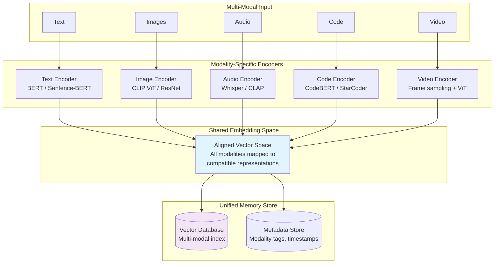
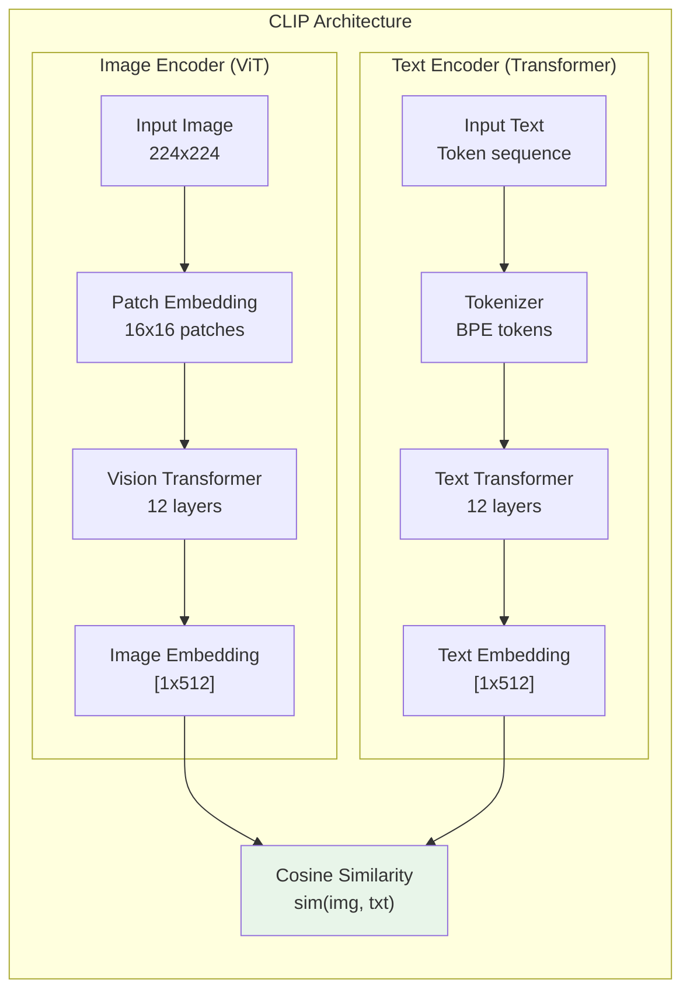
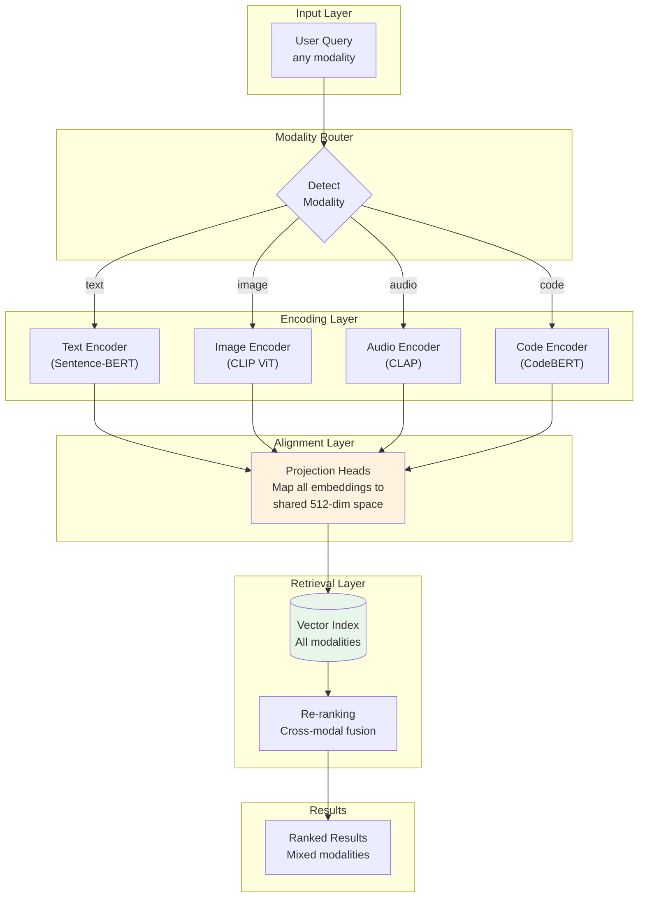
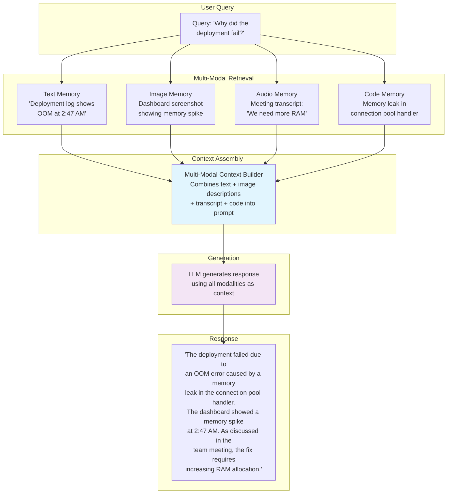

# Memory in AI Systems Deep Dive  Part 15: Multi-Modal Memory  Beyond Text

---

**Series:** Memory in AI Systems  A Developer's Deep Dive from Fundamentals to Production
**Part:** 15 of 19 (Multi-Modal Memory)
**Audience:** Developers with programming experience who want to understand AI memory systems from the ground up
**Reading time:** ~50 minutes

---

In Part 14, we explored personalization  how memory systems learn individual users, adapt communication styles, detect expertise levels, and deliver experiences that feel genuinely personal. Personalization transformed memory from a filing cabinet into an assistant that *knows you*.

But there was a hidden assumption running through everything we built: **all memory was text.** Every embedding we computed was a text embedding. Every retrieval query was a text query. Every stored memory was a string of characters.

The real world is not made of text.

The real world is made of images  screenshots of error messages, diagrams of system architectures, photos of whiteboards after brainstorming sessions. It is made of audio  voice memos recorded during commutes, recorded meetings where key decisions were made, podcast episodes that sparked ideas. It is made of video  screen recordings of bugs being reproduced, tutorial walkthroughs, security camera footage. And it is made of code  not natural language descriptions of what code does, but the code itself, with its own structure, semantics, and relationships.

**An AI memory system that only understands text is like a human who can read but cannot see, hear, or understand diagrams.** It functions, but it misses enormous amounts of information that real users work with every day.

This is the multi-modal memory problem. And solving it is what separates toy memory systems from production-ready AI assistants.

By the end of this part, you will:

- Understand why **multi-modal memory** is essential for real-world AI systems
- Learn how **CLIP** bridges vision and language into a shared embedding space
- Build a **VisualMemory** system that stores and retrieves images using embeddings
- Implement **audio embeddings** with Whisper and CLAP for voice-based memory
- Create **code embeddings** with CodeBERT and StarCoder for semantic code search
- Design a **MultiModalMemoryStore** that unifies all modalities in a single index
- Build a **VisionLanguageMemory** system for image-text paired understanding
- Implement a complete **MultiModalRAG** pipeline that retrieves across modalities
- Understand the architectural patterns that make multi-modal memory practical at scale

Let's teach memory to see, hear, and read code.

---

## Table of Contents

1. [Why Memory Must Go Beyond Text](#1-why-memory-must-go-beyond-text)
2. [CLIP  Bridging Vision and Language](#2-clip--bridging-vision-and-language)
3. [Image Embeddings and Visual Memory](#3-image-embeddings-and-visual-memory)
4. [Audio Embeddings](#4-audio-embeddings)
5. [Code Embeddings](#5-code-embeddings)
6. [Building a Multi-Modal Memory Store](#6-building-a-multi-modal-memory-store)
7. [Vision-Language Memory Systems](#7-vision-language-memory-systems)
8. [Multi-Modal RAG](#8-multi-modal-rag)
9. [Vocabulary Cheat Sheet](#9-vocabulary-cheat-sheet)
10. [Key Takeaways and What's Next](#10-key-takeaways-and-whats-next)

---

## 1. Why Memory Must Go Beyond Text

### The Modality Gap in Current AI Memory

Most AI memory systems today follow a simple pattern: text in, embedding out, vector stored. This works beautifully for conversational memory, document retrieval, and knowledge bases built from written content. But consider what a typical knowledge worker actually interacts with in a single day:

| Modality | Examples | Information Lost in Text-Only Memory |
|---|---|---|
| **Images** | Screenshots, diagrams, charts, photos, UI mockups | Spatial relationships, visual patterns, design intent |
| **Audio** | Meetings, voice notes, phone calls, podcasts | Tone, emphasis, speaker identity, emotional context |
| **Video** | Screen recordings, presentations, tutorials | Temporal sequences, visual demonstrations, gestures |
| **Code** | Source files, notebooks, configurations | Syntactic structure, execution semantics, type relationships |
| **Documents** | PDFs with figures, slides with images, web pages | Layout, embedded visuals, visual hierarchy |

> **Key Insight:** A text-only memory system does not merely miss some information  it systematically loses the information that is hardest to express in words. The architecture diagram that would take five paragraphs to describe in text. The tone of voice that changes the meaning of "that's fine" from agreement to frustration. The visual pattern in a chart that no amount of data description can replace.

### The Multi-Modal Memory Architecture

A multi-modal memory system must solve three fundamental problems:

1. **Encoding**: Convert each modality into a representation that captures its semantics
2. **Alignment**: Ensure representations from different modalities are comparable
3. **Retrieval**: Find relevant memories regardless of whether the query and the stored memory share the same modality



### Cross-Modal Retrieval: The Key Capability

The most powerful feature of multi-modal memory is **cross-modal retrieval**  using a query in one modality to find memories stored in another:

- **Text query, image result**: "Show me the architecture diagram from last week's meeting" retrieves the actual whiteboard photo
- **Image query, text result**: Upload a screenshot of an error, retrieve the documentation that explains it
- **Text query, code result**: "Find the function that handles user authentication" retrieves the actual code, not a description of it
- **Audio query, text result**: Play a voice memo and find the meeting notes that correspond to what was discussed

This is only possible when different modalities share a **common embedding space**  a vector space where semantically similar items are close together, regardless of their original modality.

Let's build this, starting with the model that made cross-modal embeddings practical.

---

## 2. CLIP  Bridging Vision and Language

### What CLIP Actually Does

**CLIP (Contrastive Language-Image Pre-training)**, released by OpenAI in 2021, is the foundation of most modern multi-modal memory systems. Its core idea is simple but revolutionary: **train an image encoder and a text encoder simultaneously, so that matching image-text pairs produce similar embeddings.**

CLIP was trained on 400 million image-text pairs scraped from the internet. For each pair, the model learned to push the image embedding and the text embedding closer together (for matching pairs) and further apart (for non-matching pairs). The result is a shared embedding space where:

- A photo of a dog and the text "a photograph of a dog" have similar embeddings
- A screenshot of Python code and the text "Python code with a for loop" have similar embeddings
- An image of a red car and the text "a blue truck" have dissimilar embeddings



### Using CLIP for Cross-Modal Embeddings

Let's start with the practical implementation. Here is how to use CLIP to encode both images and text into the same vector space:

```python
"""
CLIP-based cross-modal embedding system.

This module demonstrates how to use OpenAI's CLIP model to create
embeddings for both images and text in a shared vector space,
enabling cross-modal similarity search.
"""

import torch
import numpy as np
from PIL import Image
from typing import List, Union, Optional, Tuple
from dataclasses import dataclass
from transformers import CLIPModel, CLIPProcessor, CLIPTokenizerFast


@dataclass
class EmbeddingResult:
    """Result of encoding an item with CLIP."""
    embedding: np.ndarray         # The embedding vector
    modality: str                 # "image" or "text"
    original_input: any           # The original input (path or text)
    model_name: str               # Which CLIP model was used
    embedding_dim: int            # Dimensionality of the embedding


class CLIPEmbedder:
    """
    Cross-modal embedding engine using CLIP.

    Encodes images and text into a shared 512-dimensional vector space,
    enabling similarity search across modalities.

    Usage:
        embedder = CLIPEmbedder()

        # Encode an image
        img_emb = embedder.encode_image("photo.jpg")

        # Encode text
        txt_emb = embedder.encode_text("a photo of a sunset")

        # Compare across modalities
        similarity = embedder.similarity(img_emb, txt_emb)
    """

    def __init__(
        self,
        model_name: str = "openai/clip-vit-base-patch32",
        device: Optional[str] = None
    ):
        """
        Initialize CLIP embedder.

        Args:
            model_name: HuggingFace model identifier for CLIP variant.
                Options:
                - "openai/clip-vit-base-patch32" (fastest, 512-dim)
                - "openai/clip-vit-base-patch16" (better quality, 512-dim)
                - "openai/clip-vit-large-patch14" (best quality, 768-dim)
            device: Device to run on ("cpu", "cuda", "mps"). Auto-detected
                if not specified.
        """
        self.model_name = model_name
        self.device = device or self._detect_device()

        print(f"Loading CLIP model: {model_name}")
        print(f"Device: {self.device}")

        # Load model and processor
        self.model = CLIPModel.from_pretrained(model_name).to(self.device)
        self.processor = CLIPProcessor.from_pretrained(model_name)

        # Put model in eval mode (no gradients needed for inference)
        self.model.eval()

        # Determine embedding dimension from model config
        self.embedding_dim = self.model.config.projection_dim
        print(f"Embedding dimension: {self.embedding_dim}")

    def _detect_device(self) -> str:
        """Auto-detect the best available device."""
        if torch.cuda.is_available():
            return "cuda"
        elif hasattr(torch.backends, "mps") and torch.backends.mps.is_available():
            return "mps"
        return "cpu"

    def encode_image(
        self,
        image: Union[str, Image.Image, List[Union[str, Image.Image]]],
    ) -> Union[EmbeddingResult, List[EmbeddingResult]]:
        """
        Encode one or more images into CLIP embedding space.

        Args:
            image: A file path, PIL Image, or list of either.

        Returns:
            EmbeddingResult or list of EmbeddingResult.
        """
        # Handle single vs batch input
        single_input = not isinstance(image, list)
        images = [image] if single_input else image

        # Load images from paths if needed
        pil_images = []
        for img in images:
            if isinstance(img, str):
                pil_images.append(Image.open(img).convert("RGB"))
            elif isinstance(img, Image.Image):
                pil_images.append(img.convert("RGB"))
            else:
                raise TypeError(f"Expected str or PIL.Image, got {type(img)}")

        # Process and encode
        with torch.no_grad():
            inputs = self.processor(
                images=pil_images,
                return_tensors="pt",
                padding=True
            ).to(self.device)

            # Get image embeddings (already L2-normalized by CLIP)
            image_embeddings = self.model.get_image_features(**inputs)

            # Normalize to unit vectors for cosine similarity
            image_embeddings = image_embeddings / image_embeddings.norm(
                p=2, dim=-1, keepdim=True
            )

        # Convert to numpy
        embeddings_np = image_embeddings.cpu().numpy()

        results = [
            EmbeddingResult(
                embedding=embeddings_np[i],
                modality="image",
                original_input=images[i],
                model_name=self.model_name,
                embedding_dim=self.embedding_dim
            )
            for i in range(len(images))
        ]

        return results[0] if single_input else results

    def encode_text(
        self,
        text: Union[str, List[str]],
    ) -> Union[EmbeddingResult, List[EmbeddingResult]]:
        """
        Encode one or more text strings into CLIP embedding space.

        Args:
            text: A string or list of strings to encode.

        Returns:
            EmbeddingResult or list of EmbeddingResult.
        """
        single_input = isinstance(text, str)
        texts = [text] if single_input else text

        with torch.no_grad():
            inputs = self.processor(
                text=texts,
                return_tensors="pt",
                padding=True,
                truncation=True,
                max_length=77  # CLIP's max token length
            ).to(self.device)

            # Get text embeddings
            text_embeddings = self.model.get_text_features(**inputs)

            # Normalize to unit vectors
            text_embeddings = text_embeddings / text_embeddings.norm(
                p=2, dim=-1, keepdim=True
            )

        embeddings_np = text_embeddings.cpu().numpy()

        results = [
            EmbeddingResult(
                embedding=embeddings_np[i],
                modality="text",
                original_input=texts[i],
                model_name=self.model_name,
                embedding_dim=self.embedding_dim
            )
            for i in range(len(texts))
        ]

        return results[0] if single_input else results

    @staticmethod
    def similarity(a: EmbeddingResult, b: EmbeddingResult) -> float:
        """
        Compute cosine similarity between two embeddings.

        Works across modalities  you can compare an image embedding
        with a text embedding directly.

        Args:
            a: First embedding result.
            b: Second embedding result.

        Returns:
            Cosine similarity score in [-1, 1]. Higher means more similar.
        """
        # Since embeddings are already normalized, dot product = cosine similarity
        return float(np.dot(a.embedding, b.embedding))

    @staticmethod
    def batch_similarity(
        query: EmbeddingResult,
        candidates: List[EmbeddingResult]
    ) -> List[Tuple[int, float]]:
        """
        Compute similarity between a query and multiple candidates.

        Args:
            query: The query embedding.
            candidates: List of candidate embeddings.

        Returns:
            List of (index, similarity) tuples, sorted by similarity descending.
        """
        candidate_matrix = np.stack([c.embedding for c in candidates])
        similarities = candidate_matrix @ query.embedding

        indexed_sims = [(i, float(s)) for i, s in enumerate(similarities)]
        indexed_sims.sort(key=lambda x: x[1], reverse=True)

        return indexed_sims


# ---------------------------------------------------------------------------
# Demonstration: Cross-modal search
# ---------------------------------------------------------------------------

def demo_cross_modal_search():
    """
    Demonstrate cross-modal search: find images with text queries
    and find text descriptions with image queries.
    """
    embedder = CLIPEmbedder()

    # --- Example 1: Text-to-image search ---
    # Imagine we have a library of images with their embeddings
    image_descriptions = [
        "a golden retriever playing in the park",
        "a screenshot of a Python traceback error",
        "an architecture diagram showing microservices",
        "a photo of a sunset over the ocean",
        "a whiteboard with handwritten equations",
    ]

    # Encode all "images" (using text descriptions as stand-ins)
    # In production, you would encode actual images with encode_image()
    image_embeddings = embedder.encode_text(image_descriptions)

    # Search with a text query
    query = embedder.encode_text("system design diagram")
    results = CLIPEmbedder.batch_similarity(query, image_embeddings)

    print("Query: 'system design diagram'")
    print("Results (ranked by similarity):")
    for idx, score in results[:3]:
        print(f"  {score:.4f}  {image_descriptions[idx]}")

    # --- Example 2: Cross-modal similarity ---
    text_emb = embedder.encode_text("a cute puppy")
    # In production: img_emb = embedder.encode_image("puppy.jpg")
    img_description_emb = embedder.encode_text(
        "a golden retriever playing in the park"
    )

    sim = CLIPEmbedder.similarity(text_emb, img_description_emb)
    print(f"\nSimilarity('a cute puppy', 'golden retriever in park'): {sim:.4f}")


if __name__ == "__main__":
    demo_cross_modal_search()
```

### Understanding CLIP's Embedding Space

CLIP's embedding space has several important properties that make it ideal for multi-modal memory:

| Property | Description | Implication for Memory |
|---|---|---|
| **Shared space** | Images and text live in the same vector space | Cross-modal retrieval works with cosine similarity |
| **Semantic alignment** | Similar concepts cluster together regardless of modality | "dog" text is near dog images |
| **Zero-shot transfer** | Works on categories never seen during training | Can recognize and retrieve novel concepts |
| **Compositional** | Understands attribute combinations ("red car", "blue car") | Precise retrieval based on specific attributes |
| **77-token limit** | Text encoder limited to 77 tokens (~60 words) | Long descriptions need chunking or summarization |
| **512/768 dimensions** | Relatively compact embeddings | Efficient storage and fast similarity search |

> **Key Insight:** CLIP's power comes not from understanding images *or* text, but from understanding the *relationship between them*. It learned that certain visual patterns correspond to certain words, enabling a bridge between modalities that previous systems could not cross.

### CLIP Limitations and Workarounds

CLIP is powerful but not perfect. Understanding its limitations is critical for building reliable multi-modal memory:

```python
"""
CLIP limitations and practical workarounds for memory systems.
"""

class CLIPLimitationHandler:
    """
    Handles known CLIP limitations with practical workarounds.
    """

    # Limitation 1: CLIP has a 77-token text limit
    @staticmethod
    def handle_long_text(text: str, max_tokens: int = 70) -> List[str]:
        """
        Split long text into CLIP-compatible chunks and encode each.

        CLIP's text encoder truncates at 77 tokens. For long descriptions,
        we split into overlapping chunks and encode each separately.

        Args:
            text: The full text to encode.
            max_tokens: Maximum tokens per chunk (leaving room for
                special tokens).

        Returns:
            List of text chunks, each within CLIP's token limit.
        """
        words = text.split()
        chunks = []
        chunk_size = max_tokens  # Approximate words-to-tokens (rough)
        overlap = 10  # Overlap between chunks for context continuity

        for i in range(0, len(words), chunk_size - overlap):
            chunk = " ".join(words[i:i + chunk_size])
            chunks.append(chunk)

        return chunks

    # Limitation 2: CLIP struggles with spatial relationships
    @staticmethod
    def enhance_spatial_query(query: str) -> List[str]:
        """
        CLIP poorly understands spatial terms like 'left of', 'above',
        'behind'. Generate multiple query variants to improve retrieval.

        Args:
            query: Original query with spatial terms.

        Returns:
            List of query variants that may retrieve better results.
        """
        spatial_terms = ["left of", "right of", "above", "below",
                         "behind", "in front of", "next to"]

        variants = [query]
        for term in spatial_terms:
            if term in query.lower():
                # Add a version without the spatial term
                simplified = query.lower().replace(term, "and")
                variants.append(simplified)
                # Add a version focusing on just the objects
                parts = query.lower().split(term)
                for part in parts:
                    stripped = part.strip()
                    if stripped:
                        variants.append(stripped)

        return variants

    # Limitation 3: CLIP is weaker on text-in-images (OCR-like tasks)
    @staticmethod
    def hybrid_text_image_search(
        image_path: str,
        embedder: 'CLIPEmbedder',
        ocr_engine: Optional[object] = None
    ) -> dict:
        """
        Combine CLIP embedding with OCR for images containing text.

        CLIP can recognize that an image contains text but struggles
        to read specific words. Combining CLIP with OCR gives us both
        visual understanding and text extraction.

        Args:
            image_path: Path to the image.
            embedder: CLIPEmbedder instance.
            ocr_engine: Optional OCR engine (e.g., pytesseract).

        Returns:
            Dictionary with both visual embedding and extracted text.
        """
        result = {
            "image_path": image_path,
            "visual_embedding": None,
            "extracted_text": "",
            "combined_description": ""
        }

        # Get CLIP embedding for visual understanding
        img_embedding = embedder.encode_image(image_path)
        result["visual_embedding"] = img_embedding

        # If OCR is available, extract text from the image
        if ocr_engine is not None:
            try:
                image = Image.open(image_path)
                extracted = ocr_engine.image_to_string(image)
                result["extracted_text"] = extracted.strip()
            except Exception as e:
                print(f"OCR failed: {e}")

        # Create a combined description for hybrid retrieval
        if result["extracted_text"]:
            result["combined_description"] = (
                f"Image containing text: {result['extracted_text']}"
            )

        return result
```

---

## 3. Image Embeddings and Visual Memory

### Building a Visual Memory System

Now let's build a complete visual memory system  one that can store images, retrieve them by text queries, find similar images, and generate captions for hybrid search:

```python
"""
Visual memory system using CLIP embeddings.

This module implements a complete image memory that supports:
- Storing images with automatic embedding computation
- Text-to-image search (find images matching a text description)
- Image-to-image search (find images similar to a query image)
- Automatic captioning for improved hybrid retrieval
- Metadata-augmented search combining visual and textual cues
"""

import json
import hashlib
import time
from pathlib import Path
from typing import List, Optional, Dict, Tuple, Any
from dataclasses import dataclass, field, asdict
from collections import defaultdict

import numpy as np
from PIL import Image


@dataclass
class VisualMemoryEntry:
    """A single entry in visual memory."""
    memory_id: str                         # Unique identifier
    image_path: str                        # Path to the stored image
    embedding: Optional[np.ndarray]        # CLIP embedding vector
    caption: str = ""                      # Auto-generated or user-provided caption
    caption_embedding: Optional[np.ndarray] = None  # Embedding of the caption
    tags: List[str] = field(default_factory=list)    # User-provided tags
    metadata: Dict[str, Any] = field(default_factory=dict)  # Arbitrary metadata
    timestamp: float = field(default_factory=time.time)
    source: str = ""                       # Where the image came from

    def to_dict(self) -> dict:
        """Serialize to dictionary (excluding numpy arrays)."""
        d = asdict(self)
        d.pop("embedding")
        d.pop("caption_embedding")
        return d


class VisualMemory:
    """
    Complete visual memory system with CLIP-based retrieval.

    Architecture:
        Images --> CLIP Encoder --> Embeddings --> Vector Index --> Retrieval

    Supports three retrieval modes:
        1. Text-to-image: Natural language queries find relevant images
        2. Image-to-image: Find images similar to a reference image
        3. Hybrid: Combine visual similarity with caption/tag matching

    Usage:
        memory = VisualMemory()

        # Store an image
        memory.store("screenshot.png", tags=["error", "python"])

        # Search with text
        results = memory.search_by_text("Python error traceback")

        # Search with an image
        results = memory.search_by_image("similar_error.png")
    """

    def __init__(
        self,
        embedder: Optional['CLIPEmbedder'] = None,
        captioner: Optional[Any] = None,
        storage_dir: str = "./visual_memory_store",
        similarity_threshold: float = 0.2
    ):
        """
        Initialize visual memory.

        Args:
            embedder: CLIPEmbedder instance. Created automatically if None.
            captioner: Optional image captioning model for hybrid retrieval.
            storage_dir: Directory to store image metadata.
            similarity_threshold: Minimum similarity score for retrieval.
        """
        self.embedder = embedder or CLIPEmbedder()
        self.captioner = captioner
        self.storage_dir = Path(storage_dir)
        self.storage_dir.mkdir(parents=True, exist_ok=True)
        self.similarity_threshold = similarity_threshold

        # In-memory index (in production, use a vector database)
        self.entries: Dict[str, VisualMemoryEntry] = {}
        self.embedding_matrix: Optional[np.ndarray] = None
        self.entry_order: List[str] = []  # Maps matrix rows to memory IDs

        # Tag index for fast filtering
        self.tag_index: Dict[str, set] = defaultdict(set)

        self._load_existing_entries()

    def _generate_id(self, image_path: str) -> str:
        """Generate a unique ID for an image based on its content."""
        with open(image_path, "rb") as f:
            content_hash = hashlib.sha256(f.read()).hexdigest()[:16]
        return f"img_{content_hash}_{int(time.time())}"

    def _load_existing_entries(self):
        """Load previously stored entries from disk."""
        metadata_file = self.storage_dir / "visual_memory_index.json"
        if metadata_file.exists():
            with open(metadata_file, "r") as f:
                stored = json.load(f)
            print(f"Loaded {len(stored)} existing visual memory entries")

    def _rebuild_embedding_matrix(self):
        """Rebuild the numpy matrix used for batch similarity search."""
        if not self.entries:
            self.embedding_matrix = None
            self.entry_order = []
            return

        self.entry_order = list(self.entries.keys())
        embeddings = []
        for mid in self.entry_order:
            entry = self.entries[mid]
            if entry.embedding is not None:
                embeddings.append(entry.embedding)
            else:
                # Placeholder zero vector for entries without embeddings
                embeddings.append(
                    np.zeros(self.embedder.embedding_dim, dtype=np.float32)
                )

        self.embedding_matrix = np.stack(embeddings)

    def store(
        self,
        image_path: str,
        caption: str = "",
        tags: Optional[List[str]] = None,
        metadata: Optional[Dict[str, Any]] = None,
        auto_caption: bool = True
    ) -> str:
        """
        Store an image in visual memory.

        Args:
            image_path: Path to the image file.
            caption: Optional human-provided caption.
            tags: Optional list of tags for filtering.
            metadata: Optional metadata dictionary.
            auto_caption: Whether to generate a caption automatically
                if none is provided and a captioner is available.

        Returns:
            The memory ID assigned to this image.
        """
        memory_id = self._generate_id(image_path)

        # Compute CLIP embedding
        print(f"Computing embedding for: {image_path}")
        img_result = self.embedder.encode_image(image_path)

        # Auto-generate caption if needed
        if not caption and auto_caption and self.captioner is not None:
            caption = self._generate_caption(image_path)
            print(f"Auto-generated caption: {caption}")

        # Compute caption embedding for hybrid search
        caption_embedding = None
        if caption:
            caption_result = self.embedder.encode_text(caption)
            caption_embedding = caption_result.embedding

        # Create entry
        entry = VisualMemoryEntry(
            memory_id=memory_id,
            image_path=str(Path(image_path).resolve()),
            embedding=img_result.embedding,
            caption=caption,
            caption_embedding=caption_embedding,
            tags=tags or [],
            metadata=metadata or {},
            source="user_upload"
        )

        # Store in index
        self.entries[memory_id] = entry

        # Update tag index
        for tag in entry.tags:
            self.tag_index[tag.lower()].add(memory_id)

        # Rebuild matrix for fast search
        self._rebuild_embedding_matrix()

        print(f"Stored image with ID: {memory_id}")
        return memory_id

    def _generate_caption(self, image_path: str) -> str:
        """
        Generate a caption for an image using the captioning model.

        In production, you would use a model like:
        - BLIP-2 (Salesforce)
        - LLaVA (visual instruction tuning)
        - GPT-4V / Claude with vision
        """
        if self.captioner is None:
            return ""

        try:
            image = Image.open(image_path)
            # This interface varies by captioning model
            caption = self.captioner.generate_caption(image)
            return caption
        except Exception as e:
            print(f"Caption generation failed: {e}")
            return ""

    def search_by_text(
        self,
        query: str,
        top_k: int = 5,
        tags_filter: Optional[List[str]] = None,
        use_hybrid: bool = True
    ) -> List[Tuple[VisualMemoryEntry, float]]:
        """
        Search visual memory with a text query.

        This is the primary cross-modal retrieval method: natural language
        in, relevant images out.

        Args:
            query: Natural language description of desired image.
            top_k: Maximum number of results.
            tags_filter: Only return results with these tags.
            use_hybrid: If True, combine visual and caption similarity.

        Returns:
            List of (entry, score) tuples, sorted by relevance.
        """
        if self.embedding_matrix is None or len(self.entry_order) == 0:
            return []

        # Encode the text query
        query_result = self.embedder.encode_text(query)
        query_vec = query_result.embedding

        # Compute visual similarities (text query vs image embeddings)
        visual_scores = self.embedding_matrix @ query_vec

        # Optionally combine with caption similarities
        if use_hybrid:
            caption_scores = np.zeros(len(self.entry_order))
            for i, mid in enumerate(self.entry_order):
                entry = self.entries[mid]
                if entry.caption_embedding is not None:
                    caption_scores[i] = float(
                        np.dot(entry.caption_embedding, query_vec)
                    )

            # Weighted combination: 60% visual, 40% caption
            combined_scores = 0.6 * visual_scores + 0.4 * caption_scores
        else:
            combined_scores = visual_scores

        # Apply tag filter if specified
        if tags_filter:
            matching_ids = set()
            for tag in tags_filter:
                matching_ids.update(self.tag_index.get(tag.lower(), set()))

            for i, mid in enumerate(self.entry_order):
                if mid not in matching_ids:
                    combined_scores[i] = -1.0  # Exclude

        # Get top-k results above threshold
        top_indices = np.argsort(combined_scores)[::-1][:top_k]

        results = []
        for idx in top_indices:
            score = float(combined_scores[idx])
            if score >= self.similarity_threshold:
                mid = self.entry_order[idx]
                results.append((self.entries[mid], score))

        return results

    def search_by_image(
        self,
        query_image: str,
        top_k: int = 5,
        exclude_self: bool = True
    ) -> List[Tuple[VisualMemoryEntry, float]]:
        """
        Search visual memory with an image query (image-to-image search).

        Finds images that are visually similar to the query image.

        Args:
            query_image: Path to the query image.
            top_k: Maximum number of results.
            exclude_self: Whether to exclude exact matches (useful when
                the query image is already in memory).

        Returns:
            List of (entry, score) tuples, sorted by similarity.
        """
        if self.embedding_matrix is None:
            return []

        # Encode the query image
        query_result = self.embedder.encode_image(query_image)
        query_vec = query_result.embedding

        # Compute similarities
        scores = self.embedding_matrix @ query_vec
        top_indices = np.argsort(scores)[::-1][:top_k + 1]

        results = []
        query_path_resolved = str(Path(query_image).resolve())

        for idx in top_indices:
            if len(results) >= top_k:
                break

            mid = self.entry_order[idx]
            entry = self.entries[mid]

            # Skip self-matches if requested
            if exclude_self and entry.image_path == query_path_resolved:
                continue

            score = float(scores[idx])
            if score >= self.similarity_threshold:
                results.append((entry, score))

        return results

    def get_stats(self) -> dict:
        """Get statistics about the visual memory."""
        return {
            "total_images": len(self.entries),
            "with_captions": sum(
                1 for e in self.entries.values() if e.caption
            ),
            "unique_tags": len(self.tag_index),
            "embedding_dim": self.embedder.embedding_dim,
            "storage_dir": str(self.storage_dir),
        }
```

### Image Captioning for Hybrid Retrieval

Pure visual embeddings work well for many queries, but combining them with text captions significantly improves retrieval quality. Here is how to add automatic captioning:

```python
"""
Image captioning integration for hybrid visual memory.

Uses BLIP-2 to generate captions, which are then embedded alongside
the visual embeddings for improved retrieval.
"""

from transformers import BlipProcessor, BlipForConditionalGeneration


class ImageCaptioner:
    """
    Generates natural language captions for images using BLIP.

    These captions serve two purposes in the memory system:
    1. Enable text-based search of visual content
    2. Provide human-readable descriptions for memory entries
    """

    def __init__(
        self,
        model_name: str = "Salesforce/blip-image-captioning-base",
        device: Optional[str] = None
    ):
        self.device = device or (
            "cuda" if torch.cuda.is_available() else "cpu"
        )

        print(f"Loading captioning model: {model_name}")
        self.processor = BlipProcessor.from_pretrained(model_name)
        self.model = BlipForConditionalGeneration.from_pretrained(
            model_name
        ).to(self.device)
        self.model.eval()

    def generate_caption(
        self,
        image: Union[str, Image.Image],
        max_length: int = 50,
        num_beams: int = 4
    ) -> str:
        """
        Generate a natural language caption for an image.

        Args:
            image: File path or PIL Image.
            max_length: Maximum caption length in tokens.
            num_beams: Beam search width (higher = better but slower).

        Returns:
            Caption string.
        """
        if isinstance(image, str):
            image = Image.open(image).convert("RGB")

        inputs = self.processor(
            images=image,
            return_tensors="pt"
        ).to(self.device)

        with torch.no_grad():
            output_ids = self.model.generate(
                **inputs,
                max_length=max_length,
                num_beams=num_beams,
                early_stopping=True
            )

        caption = self.processor.decode(
            output_ids[0], skip_special_tokens=True
        )

        return caption.strip()

    def generate_detailed_caption(
        self,
        image: Union[str, Image.Image],
        prompts: Optional[List[str]] = None
    ) -> Dict[str, str]:
        """
        Generate multiple captions with different prompts for richer
        text representation of an image.

        This approach extracts more information by asking different
        questions about the image.

        Args:
            image: File path or PIL Image.
            prompts: List of conditional prompts. Defaults to a
                standard set covering common aspects.

        Returns:
            Dictionary mapping prompt to generated caption.
        """
        if isinstance(image, str):
            image = Image.open(image).convert("RGB")

        if prompts is None:
            prompts = [
                "a photograph of",
                "this image shows",
                "the main subject is",
                "the colors in this image are",
                "this looks like",
            ]

        results = {}
        for prompt in prompts:
            inputs = self.processor(
                images=image,
                text=prompt,
                return_tensors="pt"
            ).to(self.device)

            with torch.no_grad():
                output_ids = self.model.generate(
                    **inputs,
                    max_length=75,
                    num_beams=4
                )

            caption = self.processor.decode(
                output_ids[0], skip_special_tokens=True
            )
            results[prompt] = caption.strip()

        return results
```

> **Key Insight:** Hybrid retrieval  combining visual embeddings with text captions  consistently outperforms either approach alone. The visual embedding captures what a human eye sees (composition, color, spatial arrangement). The caption captures what a human mind interprets (objects, actions, relationships). Together, they provide both perceptual and semantic understanding of images.

---

## 4. Audio Embeddings

### The Audio Memory Challenge

Audio is fundamentally different from text and images. It is **temporal**  meaning unfolds over time, not across spatial dimensions. A single audio clip might contain speech, music, environmental sounds, or all three at once. And the information in audio has multiple layers:

| Layer | What It Contains | Example |
|---|---|---|
| **Linguistic** | The words being spoken | "The deployment failed at 3 AM" |
| **Paralinguistic** | How the words are spoken | Tone of urgency, frustration, confidence |
| **Speaker identity** | Who is speaking | "That was Sarah from the SRE team" |
| **Environmental** | Background context | Office noise, outdoor setting, phone call quality |
| **Temporal** | When things happen | Key decision at minute 23:45 of the meeting |

A text-only memory system (using transcription alone) captures only the first layer and loses everything else.

### Audio Transcription with Whisper

The first step in audio memory is converting speech to text using OpenAI's Whisper model. This gives us the linguistic content, which we can embed alongside the audio's own embeddings:

```python
"""
Audio memory system with transcription and embedding.

Combines Whisper for transcription with CLAP for audio embeddings,
enabling both text-based and audio-based retrieval of audio memories.
"""

import os
import wave
import struct
from pathlib import Path
from typing import List, Optional, Dict, Tuple, Any
from dataclasses import dataclass, field

import numpy as np
import torch


@dataclass
class AudioMemoryEntry:
    """A single entry in audio memory."""
    memory_id: str
    audio_path: str
    duration_seconds: float
    transcript: str = ""
    transcript_embedding: Optional[np.ndarray] = None
    audio_embedding: Optional[np.ndarray] = None
    speaker_labels: Dict[str, List[Tuple[float, float]]] = field(
        default_factory=dict
    )
    segments: List[Dict[str, Any]] = field(default_factory=list)
    metadata: Dict[str, Any] = field(default_factory=dict)
    timestamp: float = field(default_factory=time.time)


class WhisperTranscriber:
    """
    Audio transcription using OpenAI's Whisper model.

    Whisper provides:
    - High-quality speech-to-text transcription
    - Timestamp-aligned segments
    - Language detection
    - Translation to English from other languages
    """

    def __init__(
        self,
        model_size: str = "base",
        device: Optional[str] = None
    ):
        """
        Initialize Whisper transcriber.

        Args:
            model_size: Whisper model size. Options:
                - "tiny"   (39M params, ~32x realtime)
                - "base"   (74M params, ~16x realtime)
                - "small"  (244M params, ~6x realtime)
                - "medium" (769M params, ~2x realtime)
                - "large"  (1550M params, ~1x realtime)
            device: Compute device. Auto-detected if None.
        """
        try:
            import whisper
        except ImportError:
            raise ImportError(
                "Install openai-whisper: pip install openai-whisper"
            )

        self.device = device or (
            "cuda" if torch.cuda.is_available() else "cpu"
        )

        print(f"Loading Whisper model: {model_size}")
        self.model = whisper.load_model(model_size, device=self.device)
        print(f"Whisper loaded on {self.device}")

    def transcribe(
        self,
        audio_path: str,
        language: Optional[str] = None,
        task: str = "transcribe"
    ) -> Dict[str, Any]:
        """
        Transcribe an audio file.

        Args:
            audio_path: Path to audio file (wav, mp3, m4a, etc.).
            language: Language code (e.g., "en"). Auto-detected if None.
            task: "transcribe" for same-language, "translate" for
                English translation.

        Returns:
            Dictionary with:
                - text: Full transcription
                - segments: List of time-aligned segments
                - language: Detected language
        """
        import whisper

        result = whisper.transcribe(
            self.model,
            audio_path,
            language=language,
            task=task,
            verbose=False
        )

        # Structure the segments for memory storage
        segments = []
        for seg in result.get("segments", []):
            segments.append({
                "start": seg["start"],
                "end": seg["end"],
                "text": seg["text"].strip(),
                "avg_logprob": seg.get("avg_logprob", 0),
                "no_speech_prob": seg.get("no_speech_prob", 0),
            })

        return {
            "text": result["text"].strip(),
            "segments": segments,
            "language": result.get("language", "unknown"),
        }

    def transcribe_with_timestamps(
        self,
        audio_path: str,
        chunk_duration: float = 30.0
    ) -> List[Dict[str, Any]]:
        """
        Transcribe with precise word-level timestamps.

        Useful for creating searchable audio memory where you can
        jump to the exact moment something was said.

        Args:
            audio_path: Path to the audio file.
            chunk_duration: Duration of processing chunks in seconds.

        Returns:
            List of word-level timestamp entries.
        """
        import whisper

        result = whisper.transcribe(
            self.model,
            audio_path,
            word_timestamps=True,
            verbose=False
        )

        words_with_times = []
        for segment in result.get("segments", []):
            for word_info in segment.get("words", []):
                words_with_times.append({
                    "word": word_info["word"].strip(),
                    "start": word_info["start"],
                    "end": word_info["end"],
                    "probability": word_info.get("probability", 0),
                })

        return words_with_times


class AudioEmbedder:
    """
    Audio embedding using CLAP (Contrastive Language-Audio Pretraining).

    CLAP is to audio what CLIP is to images: it creates a shared embedding
    space for audio and text, enabling cross-modal retrieval.

    With CLAP embeddings, you can:
    - Search audio files with text queries ("find the meeting where
      someone mentioned the production outage")
    - Find similar-sounding audio clips
    - Classify audio by comparing with text descriptions
    """

    def __init__(
        self,
        model_name: str = "laion/clap-htsat-unfused",
        device: Optional[str] = None
    ):
        """
        Initialize CLAP audio embedder.

        Args:
            model_name: HuggingFace model identifier for CLAP.
            device: Compute device.
        """
        try:
            from transformers import ClapModel, ClapProcessor
        except ImportError:
            raise ImportError(
                "Install transformers>=4.27: "
                "pip install transformers>=4.27"
            )

        self.device = device or (
            "cuda" if torch.cuda.is_available() else "cpu"
        )

        print(f"Loading CLAP model: {model_name}")
        self.model = ClapModel.from_pretrained(model_name).to(self.device)
        self.processor = ClapProcessor.from_pretrained(model_name)
        self.model.eval()

        self.embedding_dim = self.model.config.projection_dim
        print(f"CLAP embedding dimension: {self.embedding_dim}")

    def encode_audio(
        self,
        audio_path: str,
        sample_rate: int = 48000
    ) -> np.ndarray:
        """
        Encode an audio file into the CLAP embedding space.

        Args:
            audio_path: Path to the audio file.
            sample_rate: Target sample rate for processing.

        Returns:
            Normalized embedding vector.
        """
        import librosa

        # Load and resample audio
        waveform, sr = librosa.load(audio_path, sr=sample_rate, mono=True)

        # Process through CLAP
        inputs = self.processor(
            audios=waveform,
            sampling_rate=sample_rate,
            return_tensors="pt"
        ).to(self.device)

        with torch.no_grad():
            audio_features = self.model.get_audio_features(**inputs)
            # Normalize
            audio_features = audio_features / audio_features.norm(
                p=2, dim=-1, keepdim=True
            )

        return audio_features.cpu().numpy().flatten()

    def encode_text(self, text: str) -> np.ndarray:
        """
        Encode text into the CLAP embedding space.

        This enables cross-modal search: text query --> audio results.

        Args:
            text: Text description to encode.

        Returns:
            Normalized embedding vector.
        """
        inputs = self.processor(
            text=text,
            return_tensors="pt",
            padding=True
        ).to(self.device)

        with torch.no_grad():
            text_features = self.model.get_text_features(**inputs)
            text_features = text_features / text_features.norm(
                p=2, dim=-1, keepdim=True
            )

        return text_features.cpu().numpy().flatten()

    def similarity(
        self,
        audio_embedding: np.ndarray,
        text_embedding: np.ndarray
    ) -> float:
        """Compute cosine similarity between audio and text embeddings."""
        return float(np.dot(audio_embedding, text_embedding))
```

### Building Complete Audio Memory

Now let's combine transcription and audio embeddings into a complete audio memory system:

```python
class AudioMemory:
    """
    Complete audio memory system combining transcription and embeddings.

    Architecture:
        Audio --> Whisper (transcript) --> Text Embedding --+
        Audio --> CLAP (audio features) -------------------+--> Combined Index
        Audio --> Metadata extraction ----------------------+

    Search modes:
        1. Text search: Query matches against transcripts
        2. Semantic search: Query embedding vs transcript embeddings
        3. Audio search: Query audio vs stored audio embeddings
        4. Hybrid: Weighted combination of all modes
    """

    def __init__(
        self,
        transcriber: Optional[WhisperTranscriber] = None,
        audio_embedder: Optional[AudioEmbedder] = None,
        text_embedder: Optional['CLIPEmbedder'] = None,
        storage_dir: str = "./audio_memory_store"
    ):
        self.transcriber = transcriber
        self.audio_embedder = audio_embedder
        self.text_embedder = text_embedder
        self.storage_dir = Path(storage_dir)
        self.storage_dir.mkdir(parents=True, exist_ok=True)

        self.entries: Dict[str, AudioMemoryEntry] = {}

    def store(
        self,
        audio_path: str,
        metadata: Optional[Dict[str, Any]] = None
    ) -> str:
        """
        Store an audio file in memory with full processing.

        Processing pipeline:
        1. Transcribe with Whisper (if available)
        2. Compute audio embedding with CLAP (if available)
        3. Compute transcript embedding for text search
        4. Extract metadata (duration, format, etc.)

        Args:
            audio_path: Path to audio file.
            metadata: Optional metadata dictionary.

        Returns:
            Memory ID for the stored audio.
        """
        memory_id = f"audio_{hashlib.sha256(audio_path.encode()).hexdigest()[:16]}"

        # Get audio duration
        duration = self._get_audio_duration(audio_path)

        entry = AudioMemoryEntry(
            memory_id=memory_id,
            audio_path=str(Path(audio_path).resolve()),
            duration_seconds=duration,
            metadata=metadata or {}
        )

        # Step 1: Transcribe
        if self.transcriber is not None:
            print(f"Transcribing: {audio_path}")
            transcription = self.transcriber.transcribe(audio_path)
            entry.transcript = transcription["text"]
            entry.segments = transcription["segments"]
            entry.metadata["language"] = transcription["language"]
            print(f"Transcript: {entry.transcript[:100]}...")

        # Step 2: Compute audio embedding
        if self.audio_embedder is not None:
            print("Computing audio embedding...")
            entry.audio_embedding = self.audio_embedder.encode_audio(
                audio_path
            )

        # Step 3: Compute transcript embedding
        if self.text_embedder is not None and entry.transcript:
            print("Computing transcript embedding...")
            result = self.text_embedder.encode_text(entry.transcript)
            entry.transcript_embedding = result.embedding

        self.entries[memory_id] = entry
        print(f"Stored audio memory: {memory_id}")
        return memory_id

    def search(
        self,
        query: str,
        top_k: int = 5,
        mode: str = "hybrid"
    ) -> List[Tuple[AudioMemoryEntry, float]]:
        """
        Search audio memories with a text query.

        Args:
            query: Natural language search query.
            top_k: Maximum number of results.
            mode: Search mode -- "text" (keyword matching on transcripts),
                "semantic" (embedding similarity on transcripts),
                "audio" (CLAP cross-modal), or "hybrid" (all combined).

        Returns:
            List of (entry, score) tuples sorted by relevance.
        """
        results = []

        for mid, entry in self.entries.items():
            score = 0.0
            score_components = {}

            # Text matching on transcript
            if mode in ("text", "hybrid") and entry.transcript:
                text_score = self._text_match_score(
                    query, entry.transcript
                )
                score_components["text"] = text_score

            # Semantic similarity on transcript embeddings
            if mode in ("semantic", "hybrid"):
                if (self.text_embedder is not None
                        and entry.transcript_embedding is not None):
                    query_emb = self.text_embedder.encode_text(query)
                    sem_score = float(np.dot(
                        query_emb.embedding, entry.transcript_embedding
                    ))
                    score_components["semantic"] = sem_score

            # CLAP cross-modal similarity
            if mode in ("audio", "hybrid"):
                if (self.audio_embedder is not None
                        and entry.audio_embedding is not None):
                    query_audio_emb = self.audio_embedder.encode_text(query)
                    audio_score = float(np.dot(
                        query_audio_emb, entry.audio_embedding
                    ))
                    score_components["audio"] = audio_score

            # Combine scores based on mode
            if mode == "hybrid" and score_components:
                weights = {"text": 0.3, "semantic": 0.4, "audio": 0.3}
                score = sum(
                    weights.get(k, 0) * v
                    for k, v in score_components.items()
                )
            elif score_components:
                score = max(score_components.values())

            if score > 0:
                results.append((entry, score))

        results.sort(key=lambda x: x[1], reverse=True)
        return results[:top_k]

    def find_moment(
        self,
        query: str,
        memory_id: str
    ) -> List[Dict[str, Any]]:
        """
        Find the specific moment in an audio recording that matches
        a query. Returns timestamps for navigation.

        Args:
            query: What to find in the audio.
            memory_id: ID of the audio memory to search within.

        Returns:
            List of matching segments with timestamps.
        """
        entry = self.entries.get(memory_id)
        if entry is None or not entry.segments:
            return []

        query_lower = query.lower()
        matching_segments = []

        for segment in entry.segments:
            segment_text = segment["text"].lower()

            # Simple keyword matching
            if any(word in segment_text for word in query_lower.split()):
                matching_segments.append({
                    "text": segment["text"],
                    "start_seconds": segment["start"],
                    "end_seconds": segment["end"],
                    "start_formatted": self._format_time(segment["start"]),
                    "end_formatted": self._format_time(segment["end"]),
                })

        return matching_segments

    @staticmethod
    def _text_match_score(query: str, text: str) -> float:
        """Simple keyword overlap score between query and text."""
        query_words = set(query.lower().split())
        text_words = set(text.lower().split())

        if not query_words:
            return 0.0

        overlap = query_words & text_words
        return len(overlap) / len(query_words)

    @staticmethod
    def _get_audio_duration(audio_path: str) -> float:
        """Get audio duration in seconds."""
        try:
            import librosa
            duration = librosa.get_duration(path=audio_path)
            return duration
        except Exception:
            return 0.0

    @staticmethod
    def _format_time(seconds: float) -> str:
        """Format seconds as HH:MM:SS."""
        hours = int(seconds // 3600)
        minutes = int((seconds % 3600) // 60)
        secs = int(seconds % 60)
        if hours > 0:
            return f"{hours:02d}:{minutes:02d}:{secs:02d}"
        return f"{minutes:02d}:{secs:02d}"
```

> **Key Insight:** Audio memory is uniquely valuable because humans produce audio far more quickly than text. A one-hour meeting generates roughly 10,000 words of transcript  content that would take hours to write but seconds to speak. Audio memory makes this vast stream of information searchable and retrievable.

---

## 5. Code Embeddings

### Why Code Needs Specialized Embeddings

Code is not natural language. While a general-purpose text embedding model can process code as a string of characters, it misses the structural and semantic properties that make code unique:

```python
# These two functions do the SAME thing but look completely different:

# Version 1: Imperative style
def find_max_v1(numbers):
    max_val = numbers[0]
    for n in numbers[1:]:
        if n > max_val:
            max_val = n
    return max_val

# Version 2: Functional style
def find_max_v2(numbers):
    return max(numbers)

# A text embedding model sees these as very different strings.
# A code embedding model should recognize they are semantically identical.
```

Code embedding models are trained to understand:

| Property | Description | Example |
|---|---|---|
| **Semantic equivalence** | Different code, same behavior | `for` loop vs `map()` |
| **Syntactic structure** | AST relationships matter | Nesting depth, control flow |
| **Type relationships** | Data types and interfaces | A `List[int]` is related to `Array<number>` |
| **Cross-language similarity** | Same algorithm in different languages | Python `sort()` and Java `Arrays.sort()` |
| **Identifier semantics** | Variable/function names carry meaning | `user_count` relates to "number of users" |
| **Documentation links** | Code relates to its docs | Docstring describes function behavior |

### Building a Code Memory System

```python
"""
Code memory system with specialized embeddings.

Uses CodeBERT and StarEncoder for code-aware embeddings that understand
syntactic structure, semantic equivalence, and cross-language similarity.
"""

import ast
import re
import hashlib
from pathlib import Path
from typing import List, Optional, Dict, Tuple, Any
from dataclasses import dataclass, field
from enum import Enum

import numpy as np
import torch
from transformers import AutoTokenizer, AutoModel


class ProgrammingLanguage(Enum):
    """Supported programming languages for code memory."""
    PYTHON = "python"
    JAVASCRIPT = "javascript"
    TYPESCRIPT = "typescript"
    JAVA = "java"
    GO = "go"
    RUST = "rust"
    CPP = "cpp"
    CSHARP = "csharp"
    RUBY = "ruby"
    UNKNOWN = "unknown"


@dataclass
class CodeMemoryEntry:
    """A single entry in code memory."""
    memory_id: str
    code: str                                  # The source code
    language: ProgrammingLanguage              # Programming language
    embedding: Optional[np.ndarray] = None     # Code embedding
    docstring: str = ""                        # Extracted docstring
    docstring_embedding: Optional[np.ndarray] = None
    function_name: str = ""                    # Extracted function/class name
    file_path: str = ""                        # Source file path
    line_range: Tuple[int, int] = (0, 0)       # Line numbers in source file
    dependencies: List[str] = field(default_factory=list)  # Imports/deps
    metadata: Dict[str, Any] = field(default_factory=dict)
    timestamp: float = field(default_factory=lambda: __import__('time').time())


class CodeEmbedder:
    """
    Code embedding engine using CodeBERT or UniXcoder.

    CodeBERT is a bimodal pre-trained model for natural language (NL)
    and programming language (PL). It understands both code and its
    natural language descriptions, enabling:

    - NL-to-code search: "find the function that sorts users by age"
    - Code-to-code search: find similar implementations
    - Code-to-NL: generate descriptions of code
    """

    def __init__(
        self,
        model_name: str = "microsoft/codebert-base",
        device: Optional[str] = None
    ):
        """
        Initialize code embedder.

        Args:
            model_name: HuggingFace model identifier. Options:
                - "microsoft/codebert-base" (125M params, broad language support)
                - "microsoft/unixcoder-base" (125M params, better for search)
                - "bigcode/starencoder" (125M params, trained on The Stack)
            device: Compute device.
        """
        self.device = device or (
            "cuda" if torch.cuda.is_available() else "cpu"
        )

        print(f"Loading code embedding model: {model_name}")
        self.tokenizer = AutoTokenizer.from_pretrained(model_name)
        self.model = AutoModel.from_pretrained(model_name).to(self.device)
        self.model.eval()

        self.model_name = model_name
        self.embedding_dim = self.model.config.hidden_size
        print(f"Code embedding dimension: {self.embedding_dim}")

    def encode_code(
        self,
        code: str,
        language: ProgrammingLanguage = ProgrammingLanguage.PYTHON,
        max_length: int = 512
    ) -> np.ndarray:
        """
        Encode a code snippet into the embedding space.

        Args:
            code: Source code string.
            language: Programming language of the code.
            max_length: Maximum token length (longer code is truncated).

        Returns:
            Normalized embedding vector.
        """
        # Prepend language tag for language-aware encoding
        tagged_code = f"{language.value}: {code}"

        inputs = self.tokenizer(
            tagged_code,
            return_tensors="pt",
            max_length=max_length,
            truncation=True,
            padding=True
        ).to(self.device)

        with torch.no_grad():
            outputs = self.model(**inputs)
            # Use [CLS] token embedding as the code representation
            code_embedding = outputs.last_hidden_state[:, 0, :]

            # Normalize
            code_embedding = code_embedding / code_embedding.norm(
                p=2, dim=-1, keepdim=True
            )

        return code_embedding.cpu().numpy().flatten()

    def encode_query(
        self,
        query: str,
        max_length: int = 128
    ) -> np.ndarray:
        """
        Encode a natural language query for code search.

        Args:
            query: Natural language description of desired code.
            max_length: Maximum token length.

        Returns:
            Normalized embedding vector.
        """
        inputs = self.tokenizer(
            query,
            return_tensors="pt",
            max_length=max_length,
            truncation=True,
            padding=True
        ).to(self.device)

        with torch.no_grad():
            outputs = self.model(**inputs)
            query_embedding = outputs.last_hidden_state[:, 0, :]
            query_embedding = query_embedding / query_embedding.norm(
                p=2, dim=-1, keepdim=True
            )

        return query_embedding.cpu().numpy().flatten()

    def similarity(
        self,
        embedding_a: np.ndarray,
        embedding_b: np.ndarray
    ) -> float:
        """Compute cosine similarity between two code embeddings."""
        return float(np.dot(embedding_a, embedding_b))


class CodeParser:
    """
    Extracts structured information from source code for richer
    memory entries.
    """

    @staticmethod
    def parse_python(code: str) -> List[Dict[str, Any]]:
        """
        Parse Python code into structured function/class entries.

        Args:
            code: Python source code.

        Returns:
            List of extracted code units (functions, classes, etc.).
        """
        units = []
        try:
            tree = ast.parse(code)
        except SyntaxError:
            # If parsing fails, treat entire code as one unit
            return [{"type": "module", "name": "unknown", "code": code,
                      "docstring": "", "line_start": 1,
                      "line_end": len(code.splitlines())}]

        for node in ast.walk(tree):
            if isinstance(node, (ast.FunctionDef, ast.AsyncFunctionDef)):
                units.append({
                    "type": "function",
                    "name": node.name,
                    "code": ast.get_source_segment(code, node) or "",
                    "docstring": ast.get_docstring(node) or "",
                    "line_start": node.lineno,
                    "line_end": node.end_lineno or node.lineno,
                    "args": [arg.arg for arg in node.args.args],
                    "decorators": [
                        ast.dump(d) for d in node.decorator_list
                    ],
                })
            elif isinstance(node, ast.ClassDef):
                units.append({
                    "type": "class",
                    "name": node.name,
                    "code": ast.get_source_segment(code, node) or "",
                    "docstring": ast.get_docstring(node) or "",
                    "line_start": node.lineno,
                    "line_end": node.end_lineno or node.lineno,
                    "bases": [ast.dump(b) for b in node.bases],
                })

        return units

    @staticmethod
    def detect_language(file_path: str) -> ProgrammingLanguage:
        """Detect programming language from file extension."""
        extension_map = {
            ".py": ProgrammingLanguage.PYTHON,
            ".js": ProgrammingLanguage.JAVASCRIPT,
            ".ts": ProgrammingLanguage.TYPESCRIPT,
            ".java": ProgrammingLanguage.JAVA,
            ".go": ProgrammingLanguage.GO,
            ".rs": ProgrammingLanguage.RUST,
            ".cpp": ProgrammingLanguage.CPP,
            ".cc": ProgrammingLanguage.CPP,
            ".cs": ProgrammingLanguage.CSHARP,
            ".rb": ProgrammingLanguage.RUBY,
        }
        ext = Path(file_path).suffix.lower()
        return extension_map.get(ext, ProgrammingLanguage.UNKNOWN)


class CodeMemory:
    """
    Complete code memory system with semantic search.

    Stores code with structure-aware embeddings and supports:
    - Natural language to code search
    - Code to similar code search
    - Cross-language code search
    - Function/class-level granularity
    """

    def __init__(
        self,
        embedder: Optional[CodeEmbedder] = None,
        parser: Optional[CodeParser] = None
    ):
        self.embedder = embedder or CodeEmbedder()
        self.parser = parser or CodeParser()
        self.entries: Dict[str, CodeMemoryEntry] = {}

    def index_file(
        self,
        file_path: str,
        chunk_by_function: bool = True
    ) -> List[str]:
        """
        Index a source code file into memory.

        Args:
            file_path: Path to the source file.
            chunk_by_function: If True, create separate entries for
                each function/class. If False, index the whole file.

        Returns:
            List of memory IDs created.
        """
        language = self.parser.detect_language(file_path)

        with open(file_path, "r", encoding="utf-8") as f:
            code = f.read()

        memory_ids = []

        if chunk_by_function and language == ProgrammingLanguage.PYTHON:
            units = self.parser.parse_python(code)

            for unit in units:
                if not unit["code"]:
                    continue

                mid = self._store_code_unit(
                    code=unit["code"],
                    language=language,
                    function_name=unit.get("name", ""),
                    docstring=unit.get("docstring", ""),
                    file_path=file_path,
                    line_range=(unit["line_start"], unit["line_end"])
                )
                memory_ids.append(mid)
        else:
            mid = self._store_code_unit(
                code=code,
                language=language,
                file_path=file_path,
                line_range=(1, len(code.splitlines()))
            )
            memory_ids.append(mid)

        print(f"Indexed {len(memory_ids)} code units from {file_path}")
        return memory_ids

    def _store_code_unit(
        self,
        code: str,
        language: ProgrammingLanguage,
        function_name: str = "",
        docstring: str = "",
        file_path: str = "",
        line_range: Tuple[int, int] = (0, 0)
    ) -> str:
        """Store a single code unit in memory."""
        memory_id = f"code_{hashlib.sha256(code.encode()).hexdigest()[:16]}"

        # Compute code embedding
        embedding = self.embedder.encode_code(code, language)

        # Compute docstring embedding for hybrid search
        docstring_embedding = None
        if docstring:
            docstring_embedding = self.embedder.encode_query(docstring)

        entry = CodeMemoryEntry(
            memory_id=memory_id,
            code=code,
            language=language,
            embedding=embedding,
            docstring=docstring,
            docstring_embedding=docstring_embedding,
            function_name=function_name,
            file_path=file_path,
            line_range=line_range
        )

        self.entries[memory_id] = entry
        return memory_id

    def search(
        self,
        query: str,
        top_k: int = 5,
        language_filter: Optional[ProgrammingLanguage] = None
    ) -> List[Tuple[CodeMemoryEntry, float]]:
        """
        Search code memory with a natural language query.

        Args:
            query: Natural language description (e.g., "sort a list
                of dictionaries by a specific key").
            top_k: Maximum results.
            language_filter: Only return code in this language.

        Returns:
            List of (entry, score) tuples.
        """
        query_embedding = self.embedder.encode_query(query)

        results = []
        for mid, entry in self.entries.items():
            # Apply language filter
            if language_filter and entry.language != language_filter:
                continue

            if entry.embedding is None:
                continue

            # Code embedding similarity
            code_score = float(np.dot(query_embedding, entry.embedding))

            # Docstring similarity bonus
            doc_score = 0.0
            if entry.docstring_embedding is not None:
                doc_score = float(
                    np.dot(query_embedding, entry.docstring_embedding)
                )

            # Combined score: 60% code, 40% docstring
            combined = 0.6 * code_score + 0.4 * doc_score
            results.append((entry, combined))

        results.sort(key=lambda x: x[1], reverse=True)
        return results[:top_k]

    def find_similar(
        self,
        code: str,
        language: ProgrammingLanguage = ProgrammingLanguage.PYTHON,
        top_k: int = 5
    ) -> List[Tuple[CodeMemoryEntry, float]]:
        """
        Find code similar to a given snippet (code-to-code search).

        Args:
            code: Source code to find similar code for.
            language: Language of the query code.
            top_k: Maximum results.

        Returns:
            List of (entry, score) tuples.
        """
        query_embedding = self.embedder.encode_code(code, language)

        results = []
        for mid, entry in self.entries.items():
            if entry.embedding is None:
                continue

            score = float(np.dot(query_embedding, entry.embedding))
            results.append((entry, score))

        results.sort(key=lambda x: x[1], reverse=True)
        return results[:top_k]
```

> **Key Insight:** Code memory bridges the gap between what developers *say* and what they *write*. When a developer asks "find the function that validates email addresses," they are using natural language. The answer is code. Code embeddings make this translation possible by placing natural language descriptions and code implementations in the same vector space.

---

## 6. Building a Multi-Modal Memory Store

### The Unified Architecture

Now we bring everything together. A multi-modal memory store must handle text, images, audio, and code in a single unified system with cross-modal retrieval:



### Implementation

```python
"""
Unified multi-modal memory store.

Combines text, image, audio, and code memory into a single system
with cross-modal retrieval capabilities.
"""

import uuid
import time
from enum import Enum
from typing import List, Optional, Dict, Tuple, Any, Union
from dataclasses import dataclass, field

import numpy as np


class Modality(Enum):
    """Supported modalities in the multi-modal memory store."""
    TEXT = "text"
    IMAGE = "image"
    AUDIO = "audio"
    CODE = "code"
    VIDEO = "video"


@dataclass
class MultiModalEntry:
    """A single entry in the multi-modal memory store."""
    entry_id: str
    modality: Modality
    content: Any                                   # Raw content or path
    embeddings: Dict[str, np.ndarray] = field(     # Multiple embeddings
        default_factory=dict
    )
    text_representation: str = ""                  # Text description
    metadata: Dict[str, Any] = field(default_factory=dict)
    timestamp: float = field(default_factory=time.time)
    source: str = ""
    related_entries: List[str] = field(default_factory=list)


class MultiModalMemoryStore:
    """
    Unified memory store for all modalities.

    This is the central orchestrator that routes content to the
    appropriate encoder, stores embeddings in a unified index,
    and handles cross-modal retrieval.

    Design principles:
    1. Single interface for all modalities
    2. Cross-modal search by default
    3. Modality-aware ranking and re-ranking
    4. Efficient batch operations
    5. Extensible to new modalities

    Usage:
        store = MultiModalMemoryStore()

        # Store different modalities through the same interface
        store.store("Meeting notes from standup", modality=Modality.TEXT)
        store.store("whiteboard.jpg", modality=Modality.IMAGE)
        store.store("meeting_recording.mp3", modality=Modality.AUDIO)
        store.store("def authenticate(user):", modality=Modality.CODE)

        # Search across all modalities
        results = store.search("authentication discussion")
        # Returns: text notes, whiteboard photo, audio segment, AND code
    """

    def __init__(
        self,
        clip_embedder: Optional['CLIPEmbedder'] = None,
        code_embedder: Optional['CodeEmbedder'] = None,
        audio_embedder: Optional['AudioEmbedder'] = None,
        transcriber: Optional['WhisperTranscriber'] = None,
        captioner: Optional['ImageCaptioner'] = None,
        shared_dim: int = 512
    ):
        """
        Initialize multi-modal memory store.

        Args:
            clip_embedder: For image and text embeddings.
            code_embedder: For code-specific embeddings.
            audio_embedder: For audio embeddings (CLAP).
            transcriber: For audio-to-text (Whisper).
            captioner: For image-to-text (BLIP).
            shared_dim: Dimension of the shared embedding space.
        """
        self.clip_embedder = clip_embedder
        self.code_embedder = code_embedder
        self.audio_embedder = audio_embedder
        self.transcriber = transcriber
        self.captioner = captioner
        self.shared_dim = shared_dim

        # Unified storage
        self.entries: Dict[str, MultiModalEntry] = {}

        # Per-modality indices for filtered search
        self.modality_index: Dict[Modality, List[str]] = {
            m: [] for m in Modality
        }

        # Unified embedding matrix for cross-modal search
        self._embedding_matrix: Optional[np.ndarray] = None
        self._entry_order: List[str] = []

    def store(
        self,
        content: Any,
        modality: Modality,
        metadata: Optional[Dict[str, Any]] = None,
        text_description: str = "",
        related_to: Optional[List[str]] = None
    ) -> str:
        """
        Store content of any modality in the unified memory.

        Args:
            content: The content to store. Type depends on modality:
                - TEXT: string
                - IMAGE: file path (str)
                - AUDIO: file path (str)
                - CODE: source code string
            modality: The modality of the content.
            metadata: Optional metadata.
            text_description: Optional text description for any modality.
            related_to: Optional list of related entry IDs.

        Returns:
            Entry ID for retrieval.
        """
        entry_id = f"{modality.value}_{uuid.uuid4().hex[:12]}"

        # Compute modality-specific embeddings
        embeddings = {}
        text_repr = text_description

        if modality == Modality.TEXT:
            text_repr = text_repr or content
            if self.clip_embedder:
                result = self.clip_embedder.encode_text(content)
                embeddings["clip_text"] = result.embedding

        elif modality == Modality.IMAGE:
            if self.clip_embedder:
                img_result = self.clip_embedder.encode_image(content)
                embeddings["clip_image"] = img_result.embedding

            # Auto-caption for text representation
            if not text_repr and self.captioner:
                text_repr = self.captioner.generate_caption(content)

            if text_repr and self.clip_embedder:
                txt_result = self.clip_embedder.encode_text(text_repr)
                embeddings["clip_caption"] = txt_result.embedding

        elif modality == Modality.AUDIO:
            # Transcribe
            if self.transcriber:
                transcription = self.transcriber.transcribe(content)
                text_repr = text_repr or transcription["text"]

            # Audio embedding
            if self.audio_embedder:
                embeddings["clap_audio"] = (
                    self.audio_embedder.encode_audio(content)
                )

            # Text embedding of transcript
            if text_repr and self.clip_embedder:
                txt_result = self.clip_embedder.encode_text(text_repr)
                embeddings["clip_transcript"] = txt_result.embedding

        elif modality == Modality.CODE:
            if self.code_embedder:
                embeddings["codebert"] = (
                    self.code_embedder.encode_code(content)
                )

            # Also embed any docstring/description
            if text_repr and self.clip_embedder:
                txt_result = self.clip_embedder.encode_text(text_repr)
                embeddings["clip_description"] = txt_result.embedding

        # Create entry
        entry = MultiModalEntry(
            entry_id=entry_id,
            modality=modality,
            content=content,
            embeddings=embeddings,
            text_representation=text_repr,
            metadata=metadata or {},
            source="user",
            related_entries=related_to or []
        )

        # Store
        self.entries[entry_id] = entry
        self.modality_index[modality].append(entry_id)

        # Rebuild unified index
        self._rebuild_unified_index()

        return entry_id

    def _rebuild_unified_index(self):
        """Rebuild the unified embedding matrix for cross-modal search."""
        self._entry_order = list(self.entries.keys())

        if not self._entry_order:
            self._embedding_matrix = None
            return

        embeddings = []
        for eid in self._entry_order:
            entry = self.entries[eid]
            # Use the primary embedding for cross-modal search
            primary = self._get_primary_embedding(entry)
            if primary is not None:
                # Project to shared dimension if needed
                if len(primary) != self.shared_dim:
                    primary = self._project_embedding(
                        primary, self.shared_dim
                    )
                embeddings.append(primary)
            else:
                embeddings.append(np.zeros(self.shared_dim))

        self._embedding_matrix = np.stack(embeddings)

    def _get_primary_embedding(
        self, entry: MultiModalEntry
    ) -> Optional[np.ndarray]:
        """Get the primary embedding for cross-modal search."""
        # Priority order for each modality
        priority = {
            Modality.TEXT: ["clip_text"],
            Modality.IMAGE: ["clip_image", "clip_caption"],
            Modality.AUDIO: ["clap_audio", "clip_transcript"],
            Modality.CODE: ["codebert", "clip_description"],
        }

        for key in priority.get(entry.modality, []):
            if key in entry.embeddings:
                return entry.embeddings[key]

        # Fallback: return any available embedding
        if entry.embeddings:
            return next(iter(entry.embeddings.values()))

        return None

    @staticmethod
    def _project_embedding(
        embedding: np.ndarray,
        target_dim: int
    ) -> np.ndarray:
        """
        Project an embedding to a target dimension.

        Uses simple truncation or zero-padding. In production, you would
        use a learned projection head.
        """
        current_dim = len(embedding)
        if current_dim == target_dim:
            return embedding
        elif current_dim > target_dim:
            return embedding[:target_dim]
        else:
            padded = np.zeros(target_dim)
            padded[:current_dim] = embedding
            return padded

    def search(
        self,
        query: str,
        top_k: int = 10,
        modality_filter: Optional[List[Modality]] = None,
        min_score: float = 0.1
    ) -> List[Tuple[MultiModalEntry, float]]:
        """
        Search across all modalities with a text query.

        Args:
            query: Natural language query.
            top_k: Maximum number of results.
            modality_filter: Optional list of modalities to search.
                If None, searches all modalities.
            min_score: Minimum similarity score threshold.

        Returns:
            List of (entry, score) tuples from any modality.
        """
        if self._embedding_matrix is None:
            return []

        # Encode query
        if self.clip_embedder:
            query_result = self.clip_embedder.encode_text(query)
            query_vec = query_result.embedding
        else:
            return []

        # Project query to shared dim if needed
        if len(query_vec) != self.shared_dim:
            query_vec = self._project_embedding(query_vec, self.shared_dim)

        # Compute similarities
        scores = self._embedding_matrix @ query_vec

        # Apply modality filter
        if modality_filter:
            allowed_modalities = set(modality_filter)
            for i, eid in enumerate(self._entry_order):
                if self.entries[eid].modality not in allowed_modalities:
                    scores[i] = -1.0

        # Get top-k results
        top_indices = np.argsort(scores)[::-1][:top_k]

        results = []
        for idx in top_indices:
            score = float(scores[idx])
            if score >= min_score:
                eid = self._entry_order[idx]
                results.append((self.entries[eid], score))

        return results

    def get_related(
        self,
        entry_id: str,
        top_k: int = 5
    ) -> List[Tuple[MultiModalEntry, float]]:
        """
        Find entries related to a given entry, across all modalities.

        This enables discovery: "show me everything related to this
        diagram" returns text notes, audio discussions, and code
        implementations.
        """
        entry = self.entries.get(entry_id)
        if entry is None:
            return []

        primary = self._get_primary_embedding(entry)
        if primary is None:
            return []

        if len(primary) != self.shared_dim:
            primary = self._project_embedding(primary, self.shared_dim)

        scores = self._embedding_matrix @ primary
        top_indices = np.argsort(scores)[::-1][:top_k + 1]

        results = []
        for idx in top_indices:
            eid = self._entry_order[idx]
            if eid == entry_id:
                continue
            score = float(scores[idx])
            if score > 0:
                results.append((self.entries[eid], score))

        return results[:top_k]

    def get_stats(self) -> Dict[str, Any]:
        """Get statistics about the multi-modal memory store."""
        modality_counts = {
            m.value: len(ids)
            for m, ids in self.modality_index.items()
        }

        return {
            "total_entries": len(self.entries),
            "by_modality": modality_counts,
            "shared_dim": self.shared_dim,
            "has_clip": self.clip_embedder is not None,
            "has_code_embedder": self.code_embedder is not None,
            "has_audio_embedder": self.audio_embedder is not None,
            "has_transcriber": self.transcriber is not None,
            "has_captioner": self.captioner is not None,
        }
```

> **Key Insight:** The unified multi-modal memory store is not just a convenience wrapper around separate memory systems. It is architecturally different because it projects all modalities into a shared embedding space, enabling true cross-modal discovery. A text query can find an image, an audio clip, AND a code snippet  all in a single search operation.

---

## 7. Vision-Language Memory Systems

### When Images and Text Are Inseparable

Many real-world documents combine images and text in ways that neither modality alone can capture. A technical document with annotated diagrams. A bug report with screenshots. A presentation with slides containing both text and figures. For these cases, we need memory systems that understand **paired image-text content**.

### Building a Vision-Language Memory

```python
"""
Vision-language memory system for paired image-text understanding.

Handles documents, screenshots, presentations, and other content
where images and text are interleaved and interdependent.
"""

from typing import List, Optional, Dict, Tuple, Any
from dataclasses import dataclass, field
from pathlib import Path

import numpy as np


@dataclass
class VisionLanguagePair:
    """A paired image-text memory entry."""
    pair_id: str
    image_path: Optional[str] = None
    image_embedding: Optional[np.ndarray] = None
    text_content: str = ""
    text_embedding: Optional[np.ndarray] = None
    combined_embedding: Optional[np.ndarray] = None
    caption: str = ""
    page_number: int = 0
    document_id: str = ""
    metadata: Dict[str, Any] = field(default_factory=dict)


class VisionLanguageMemory:
    """
    Memory system that understands paired image-text content.

    Use cases:
    - Technical documentation with diagrams
    - Bug reports with screenshots
    - Presentations and slide decks
    - Web pages with images
    - Research papers with figures

    The system understands that the text near an image describes that
    image, and vice versa. Queries can match against either the visual
    content or the surrounding text.

    Usage:
        vlm = VisionLanguageMemory(clip_embedder, captioner)

        # Index a document with images
        vlm.index_document(
            pages=[
                {"image": "page1.png", "text": "Architecture overview..."},
                {"image": "page2.png", "text": "The database layer..."},
            ],
            document_id="design_doc_v2"
        )

        # Query with text -- retrieves relevant page images
        results = vlm.search("database connection pooling")

        # Query with image -- retrieves related text
        results = vlm.search_by_image("similar_diagram.png")
    """

    def __init__(
        self,
        clip_embedder: Optional['CLIPEmbedder'] = None,
        captioner: Optional['ImageCaptioner'] = None,
        text_weight: float = 0.5,
        image_weight: float = 0.3,
        caption_weight: float = 0.2
    ):
        """
        Initialize vision-language memory.

        Args:
            clip_embedder: CLIP model for both image and text embeddings.
            captioner: Image captioning model.
            text_weight: Weight for text similarity in combined scoring.
            image_weight: Weight for image similarity.
            caption_weight: Weight for caption similarity.
        """
        self.clip_embedder = clip_embedder
        self.captioner = captioner
        self.text_weight = text_weight
        self.image_weight = image_weight
        self.caption_weight = caption_weight

        self.pairs: Dict[str, VisionLanguagePair] = {}
        self.document_index: Dict[str, List[str]] = {}

    def index_document(
        self,
        pages: List[Dict[str, Any]],
        document_id: str
    ) -> List[str]:
        """
        Index a multi-page document with paired image-text content.

        Args:
            pages: List of page dictionaries, each containing:
                - "image": Path to page image (optional)
                - "text": Text content of the page (optional)
                - "page_number": Page number (optional)
            document_id: Unique identifier for this document.

        Returns:
            List of pair IDs created.
        """
        pair_ids = []

        for i, page in enumerate(pages):
            pair_id = f"vlp_{document_id}_{i}"

            image_path = page.get("image")
            text_content = page.get("text", "")
            page_number = page.get("page_number", i + 1)

            # Compute image embedding
            image_embedding = None
            if image_path and self.clip_embedder:
                result = self.clip_embedder.encode_image(image_path)
                image_embedding = result.embedding

            # Compute text embedding
            text_embedding = None
            if text_content and self.clip_embedder:
                result = self.clip_embedder.encode_text(
                    text_content[:300]  # CLIP token limit
                )
                text_embedding = result.embedding

            # Auto-generate caption
            caption = ""
            if image_path and self.captioner:
                caption = self.captioner.generate_caption(image_path)

            # Compute combined embedding
            combined = self._compute_combined_embedding(
                image_embedding, text_embedding
            )

            pair = VisionLanguagePair(
                pair_id=pair_id,
                image_path=image_path,
                image_embedding=image_embedding,
                text_content=text_content,
                text_embedding=text_embedding,
                combined_embedding=combined,
                caption=caption,
                page_number=page_number,
                document_id=document_id,
            )

            self.pairs[pair_id] = pair
            pair_ids.append(pair_id)

        self.document_index[document_id] = pair_ids
        print(f"Indexed {len(pair_ids)} pages for document: {document_id}")
        return pair_ids

    def _compute_combined_embedding(
        self,
        image_embedding: Optional[np.ndarray],
        text_embedding: Optional[np.ndarray]
    ) -> Optional[np.ndarray]:
        """
        Compute a combined embedding from image and text.

        Uses weighted average with normalization.
        """
        components = []
        weights = []

        if image_embedding is not None:
            components.append(image_embedding)
            weights.append(self.image_weight)

        if text_embedding is not None:
            components.append(text_embedding)
            weights.append(self.text_weight)

        if not components:
            return None

        # Weighted average
        total_weight = sum(weights)
        combined = sum(
            w / total_weight * emb
            for w, emb in zip(weights, components)
        )

        # Normalize
        norm = np.linalg.norm(combined)
        if norm > 0:
            combined = combined / norm

        return combined

    def search(
        self,
        query: str,
        top_k: int = 5,
        document_filter: Optional[str] = None
    ) -> List[Tuple[VisionLanguagePair, float]]:
        """
        Search vision-language memory with a text query.

        Searches against both the text content and the visual content
        of stored pairs, returning results ranked by combined relevance.

        Args:
            query: Natural language query.
            top_k: Maximum results.
            document_filter: Optional document ID to search within.

        Returns:
            List of (pair, score) tuples.
        """
        if not self.clip_embedder:
            return []

        query_result = self.clip_embedder.encode_text(query)
        query_vec = query_result.embedding

        results = []
        search_ids = (
            self.document_index.get(document_filter, [])
            if document_filter
            else list(self.pairs.keys())
        )

        for pid in search_ids:
            pair = self.pairs[pid]
            score_parts = {}

            # Image similarity
            if pair.image_embedding is not None:
                score_parts["image"] = float(
                    np.dot(query_vec, pair.image_embedding)
                )

            # Text similarity
            if pair.text_embedding is not None:
                score_parts["text"] = float(
                    np.dot(query_vec, pair.text_embedding)
                )

            # Combined similarity
            if pair.combined_embedding is not None:
                score_parts["combined"] = float(
                    np.dot(query_vec, pair.combined_embedding)
                )

            if score_parts:
                # Use maximum score across all representations
                score = max(score_parts.values())
                results.append((pair, score))

        results.sort(key=lambda x: x[1], reverse=True)
        return results[:top_k]

    def visual_qa(
        self,
        question: str,
        pair_id: str,
        llm_client: Optional[Any] = None
    ) -> str:
        """
        Answer a question about a specific image-text pair.

        Combines the visual content (via caption) and text content
        to answer questions about a specific memory entry.

        Args:
            question: The question to answer.
            pair_id: ID of the vision-language pair.
            llm_client: Optional LLM client for generation.

        Returns:
            Answer string.
        """
        pair = self.pairs.get(pair_id)
        if pair is None:
            return "Memory entry not found."

        # Build context from both modalities
        context_parts = []

        if pair.caption:
            context_parts.append(f"Image description: {pair.caption}")

        if pair.text_content:
            context_parts.append(
                f"Surrounding text: {pair.text_content[:1000]}"
            )

        if pair.document_id:
            context_parts.append(
                f"Source: {pair.document_id}, page {pair.page_number}"
            )

        context = "\n".join(context_parts)

        if llm_client is not None:
            prompt = (
                f"Based on the following context from a document, "
                f"answer the question.\n\n"
                f"Context:\n{context}\n\n"
                f"Question: {question}\n\n"
                f"Answer:"
            )
            return llm_client.generate(prompt)

        return f"Context available: {context}"
```

---

## 8. Multi-Modal RAG

### RAG That Sees, Hears, and Reads Code

The ultimate application of multi-modal memory is **Multi-Modal RAG**  Retrieval-Augmented Generation that can pull context from any modality to generate informed responses. This is not just text RAG with images bolted on. It is a fundamentally different architecture:



### Implementation

```python
"""
Multi-Modal RAG (Retrieval-Augmented Generation).

Retrieves context from text, images, audio, and code to generate
comprehensive responses that draw on all available information.
"""

from typing import List, Optional, Dict, Tuple, Any
from dataclasses import dataclass, field
from enum import Enum

import numpy as np


@dataclass
class RetrievedContext:
    """A piece of retrieved context from any modality."""
    content: str                    # Text representation of the content
    modality: Modality              # Original modality
    relevance_score: float          # How relevant to the query
    source: str                     # Where this came from
    metadata: Dict[str, Any] = field(default_factory=dict)
    raw_content: Any = None         # Original content (image path, etc.)


class MultiModalRAG:
    """
    Complete Multi-Modal RAG pipeline.

    This system:
    1. Accepts a natural language query
    2. Retrieves relevant context from ALL modalities
    3. Converts non-text context to text representations
    4. Assembles a unified context window
    5. Generates a response using an LLM

    The key innovation is the context assembly step, which
    intelligently combines information from different modalities
    into a coherent prompt that an LLM can process.

    Usage:
        rag = MultiModalRAG(
            memory_store=multi_modal_store,
            llm_client=openai_client
        )

        response = rag.query(
            "What caused the production outage last Tuesday?"
        )
        # Response draws on meeting transcripts, error screenshots,
        # deployment logs, and relevant code changes
    """

    def __init__(
        self,
        memory_store: 'MultiModalMemoryStore',
        llm_client: Optional[Any] = None,
        max_context_tokens: int = 4000,
        retrieval_top_k: int = 10,
        modality_weights: Optional[Dict[Modality, float]] = None
    ):
        """
        Initialize Multi-Modal RAG.

        Args:
            memory_store: The multi-modal memory store to retrieve from.
            llm_client: LLM client for generation (OpenAI, Anthropic, etc.).
            max_context_tokens: Maximum tokens for the context window.
            retrieval_top_k: Number of items to retrieve per query.
            modality_weights: Relative importance of each modality.
                Defaults to equal weights.
        """
        self.memory_store = memory_store
        self.llm_client = llm_client
        self.max_context_tokens = max_context_tokens
        self.retrieval_top_k = retrieval_top_k
        self.modality_weights = modality_weights or {
            Modality.TEXT: 1.0,
            Modality.IMAGE: 0.8,
            Modality.AUDIO: 0.7,
            Modality.CODE: 0.9,
        }

    def query(
        self,
        question: str,
        modality_filter: Optional[List[Modality]] = None,
        include_sources: bool = True
    ) -> Dict[str, Any]:
        """
        Execute a multi-modal RAG query.

        Args:
            question: Natural language question.
            modality_filter: Optional filter to specific modalities.
            include_sources: Whether to include source citations.

        Returns:
            Dictionary with:
                - answer: Generated response
                - sources: List of sources used
                - context: The assembled context
                - retrieval_results: Raw retrieval results
        """
        # Step 1: Retrieve from all modalities
        retrieval_results = self._retrieve(question, modality_filter)

        # Step 2: Convert to text representations
        contexts = self._prepare_contexts(retrieval_results)

        # Step 3: Assemble the prompt
        prompt = self._assemble_prompt(question, contexts)

        # Step 4: Generate response
        answer = self._generate(prompt)

        # Step 5: Format sources
        sources = []
        if include_sources:
            sources = self._format_sources(contexts)

        return {
            "answer": answer,
            "sources": sources,
            "context": prompt,
            "retrieval_results": retrieval_results,
            "modalities_used": list(set(
                c.modality.value for c in contexts
            )),
        }

    def _retrieve(
        self,
        query: str,
        modality_filter: Optional[List[Modality]] = None
    ) -> List[Tuple['MultiModalEntry', float]]:
        """Retrieve relevant entries from the multi-modal memory."""
        results = self.memory_store.search(
            query=query,
            top_k=self.retrieval_top_k,
            modality_filter=modality_filter
        )

        # Apply modality-specific weight adjustments
        weighted_results = []
        for entry, score in results:
            weight = self.modality_weights.get(entry.modality, 1.0)
            weighted_results.append((entry, score * weight))

        # Re-sort after weighting
        weighted_results.sort(key=lambda x: x[1], reverse=True)

        return weighted_results

    def _prepare_contexts(
        self,
        retrieval_results: List[Tuple['MultiModalEntry', float]]
    ) -> List[RetrievedContext]:
        """
        Convert multi-modal retrieval results into text contexts.

        This is the critical step: translating non-text modalities
        into text that an LLM can process.
        """
        contexts = []

        for entry, score in retrieval_results:
            if entry.modality == Modality.TEXT:
                contexts.append(RetrievedContext(
                    content=entry.content,
                    modality=entry.modality,
                    relevance_score=score,
                    source=entry.metadata.get("source", "text memory"),
                    metadata=entry.metadata,
                ))

            elif entry.modality == Modality.IMAGE:
                # Convert image to text description
                description = entry.text_representation
                if not description:
                    description = "[Image with no description available]"

                contexts.append(RetrievedContext(
                    content=f"[IMAGE] {description}",
                    modality=entry.modality,
                    relevance_score=score,
                    source=entry.content,  # Image path
                    metadata=entry.metadata,
                    raw_content=entry.content,
                ))

            elif entry.modality == Modality.AUDIO:
                # Use transcript as text
                transcript = entry.text_representation
                if not transcript:
                    transcript = "[Audio with no transcript available]"

                contexts.append(RetrievedContext(
                    content=f"[AUDIO TRANSCRIPT] {transcript}",
                    modality=entry.modality,
                    relevance_score=score,
                    source=entry.content,  # Audio path
                    metadata=entry.metadata,
                    raw_content=entry.content,
                ))

            elif entry.modality == Modality.CODE:
                language = entry.metadata.get("language", "unknown")
                contexts.append(RetrievedContext(
                    content=(
                        f"[CODE ({language})]\n"
                        f"```{language}\n{entry.content}\n```"
                    ),
                    modality=entry.modality,
                    relevance_score=score,
                    source=entry.metadata.get("file_path", "code memory"),
                    metadata=entry.metadata,
                    raw_content=entry.content,
                ))

        return contexts

    def _assemble_prompt(
        self,
        question: str,
        contexts: List[RetrievedContext]
    ) -> str:
        """
        Assemble the final prompt with multi-modal context.

        Prioritizes higher-relevance contexts and respects
        the token budget.
        """
        # Sort by relevance
        contexts.sort(key=lambda c: c.relevance_score, reverse=True)

        # Build context string within token budget
        context_parts = []
        estimated_tokens = 0

        for ctx in contexts:
            # Rough token estimation: ~4 chars per token
            ctx_tokens = len(ctx.content) // 4

            if estimated_tokens + ctx_tokens > self.max_context_tokens:
                # Truncate this context to fit
                remaining_tokens = self.max_context_tokens - estimated_tokens
                if remaining_tokens > 100:  # Only include if meaningful
                    truncated = ctx.content[:remaining_tokens * 4]
                    context_parts.append(truncated + "...")
                break

            context_parts.append(ctx.content)
            estimated_tokens += ctx_tokens

        context_str = "\n\n---\n\n".join(context_parts)

        prompt = (
            "You are an AI assistant with access to a multi-modal "
            "knowledge base containing text documents, images "
            "(described as text), audio transcripts, and source code.\n\n"
            "Use the following context to answer the question. The "
            "context comes from different sources and modalities, "
            "indicated by tags like [IMAGE], [AUDIO TRANSCRIPT], "
            "and [CODE].\n\n"
            f"Context:\n{context_str}\n\n"
            f"Question: {question}\n\n"
            "Provide a comprehensive answer that synthesizes "
            "information from all relevant sources. Cite the source "
            "type (text, image, audio, code) when referencing "
            "specific information.\n\n"
            "Answer:"
        )

        return prompt

    def _generate(self, prompt: str) -> str:
        """Generate a response using the LLM."""
        if self.llm_client is None:
            return (
                "[LLM client not configured. "
                f"Prompt length: {len(prompt)} chars]"
            )

        try:
            response = self.llm_client.generate(
                prompt=prompt,
                max_tokens=1000,
                temperature=0.3  # Lower temperature for factual responses
            )
            return response
        except Exception as e:
            return f"[Generation failed: {e}]"

    @staticmethod
    def _format_sources(
        contexts: List[RetrievedContext]
    ) -> List[Dict[str, Any]]:
        """Format source citations for the response."""
        sources = []
        for ctx in contexts:
            sources.append({
                "modality": ctx.modality.value,
                "source": ctx.source,
                "relevance": round(ctx.relevance_score, 3),
                "preview": ctx.content[:200],
            })
        return sources
```

### Multi-Modal RAG in Practice

Here is how you would use the complete system:

```python
def demo_multimodal_rag():
    """
    Demonstrate a complete multi-modal RAG workflow.
    """
    # --- Initialize components ---
    clip = CLIPEmbedder()
    code_emb = CodeEmbedder()
    captioner = ImageCaptioner()

    # --- Create the unified memory store ---
    store = MultiModalMemoryStore(
        clip_embedder=clip,
        code_embedder=code_emb,
        captioner=captioner,
    )

    # --- Ingest multi-modal content ---

    # Text: meeting notes
    store.store(
        content=(
            "Deployment review meeting: The production deployment "
            "on Tuesday failed due to an out-of-memory error in the "
            "connection pool handler. The team agreed to increase "
            "RAM allocation from 4GB to 8GB and add memory monitoring."
        ),
        modality=Modality.TEXT,
        metadata={"source": "meeting_notes", "date": "2025-01-14"}
    )

    # Image: monitoring dashboard screenshot
    store.store(
        content="dashboard_screenshot.png",
        modality=Modality.IMAGE,
        text_description=(
            "Monitoring dashboard showing memory usage spike to 98% "
            "at 2:47 AM on Tuesday, with the connection pool handler "
            "consuming 3.8 GB of the 4 GB available."
        ),
        metadata={"source": "grafana", "date": "2025-01-14"}
    )

    # Code: the problematic connection pool handler
    store.store(
        content="""
class ConnectionPoolHandler:
    def __init__(self, max_connections=100):
        self.pool = []
        self.max_connections = max_connections

    def get_connection(self):
        # BUG: connections are never released back to pool
        conn = create_new_connection()
        self.pool.append(conn)
        return conn

    # Missing: release_connection() method
""",
        modality=Modality.CODE,
        text_description="Connection pool handler with memory leak",
        metadata={
            "source": "connection_pool.py",
            "language": "python",
        }
    )

    # --- Query the system ---
    rag = MultiModalRAG(
        memory_store=store,
        llm_client=None  # Would use OpenAI/Anthropic in production
    )

    result = rag.query("What caused the production outage?")

    print("=== Multi-Modal RAG Result ===")
    print(f"Modalities used: {result['modalities_used']}")
    print(f"Number of sources: {len(result['sources'])}")
    for src in result["sources"]:
        print(f"  [{src['modality']}] {src['source']} "
              f"(relevance: {src['relevance']})")
```

---

## 9. Vocabulary Cheat Sheet

| Term | Definition |
|---|---|
| **Multi-modal** | Involving or combining multiple modalities (text, image, audio, video, code) |
| **Modality** | A type or channel of information (e.g., visual, auditory, textual) |
| **CLIP** | Contrastive Language-Image Pre-training  OpenAI model that creates a shared embedding space for images and text |
| **CLAP** | Contrastive Language-Audio Pre-training  analogous to CLIP but for audio and text |
| **Cross-modal retrieval** | Using a query in one modality (e.g., text) to retrieve results in another modality (e.g., images) |
| **Shared embedding space** | A vector space where representations from different modalities can be directly compared |
| **Contrastive learning** | Training approach that learns by pushing similar pairs together and dissimilar pairs apart in embedding space |
| **Vision Transformer (ViT)** | Transformer architecture applied to image patches, used as CLIP's image encoder |
| **CodeBERT** | Pre-trained model for both programming languages and natural language, enabling code search |
| **Whisper** | OpenAI's speech recognition model providing high-quality transcription with timestamps |
| **Image captioning** | Generating natural language descriptions of images (e.g., using BLIP, LLaVA) |
| **Hybrid retrieval** | Combining multiple retrieval signals (e.g., visual embedding + text caption) for better accuracy |
| **Multi-modal RAG** | Retrieval-Augmented Generation that draws context from multiple modalities |
| **Modality router** | Component that detects the modality of input and routes it to the appropriate encoder |
| **Projection head** | A neural network layer that maps embeddings from one dimension to another (used for alignment) |
| **Zero-shot transfer** | Ability to work with categories or concepts not seen during training |
| **OCR** | Optical Character Recognition  extracting text from images |
| **BLIP** | Bootstrapping Language-Image Pre-training  model for image captioning and visual question answering |
| **Embedding alignment** | Ensuring that embeddings from different models or modalities are comparable in the same space |
| **Temporal embedding** | An embedding that captures time-dependent information (important for audio and video) |

---

## 10. Key Takeaways and What's Next

### What We Built

In this part, we built a complete multi-modal memory system from the ground up:

1. **CLIP-based cross-modal embeddings** that place images and text in the same vector space
2. **Visual memory** with automatic captioning, tag-based filtering, and hybrid retrieval
3. **Audio memory** combining Whisper transcription with CLAP audio embeddings
4. **Code memory** using CodeBERT for semantic code search and cross-language understanding
5. **A unified multi-modal memory store** that handles all modalities through a single interface
6. **Vision-language memory** for paired image-text documents
7. **Multi-modal RAG** that retrieves from all modalities to generate comprehensive responses

### Key Architectural Principles

- **Shared embedding spaces** are the foundation of cross-modal retrieval. Without them, each modality lives in its own isolated world.
- **Hybrid retrieval** (combining multiple embedding types) consistently outperforms single-embedding approaches.
- **Text representations** serve as a universal bridge. Every modality can be converted to text (captions for images, transcripts for audio, docstrings for code), providing a fallback retrieval path.
- **Modality-specific encoders** matter. Generic text embeddings applied to code or images lose critical structural information.
- **The unified store pattern** is more powerful than separate stores because it enables true cross-modal discovery.

### Common Pitfalls

| Pitfall | Why It Happens | How to Avoid |
|---|---|---|
| Treating code as plain text | General text embedders miss syntax and semantics | Use CodeBERT or similar code-specific models |
| Ignoring CLIP's 77-token limit | Long descriptions get silently truncated | Chunk long text; use summarization |
| Skipping image captioning | Relying purely on visual embeddings | Always generate text captions for hybrid search |
| Using raw audio without transcription | Audio embeddings alone miss linguistic content | Always transcribe as a parallel representation |
| Single-score ranking across modalities | Different modalities have different score distributions | Apply modality-specific calibration and weighting |
| Storing only embeddings | Cannot debug, inspect, or improve the system | Always store raw content alongside embeddings |

### What's Next

In **Part 16: Autonomous Agents With Memory**, we will take everything we have built  from basic embeddings to multi-modal memory  and put it in the hands of autonomous agents. We will explore:

- How **working memory** keeps agents on task across multi-step plans
- How **episodic memory** lets agents learn from past task attempts
- How **tool memory** enables agents to become more efficient over time
- How to build a **ReAct loop with persistent memory** that maintains purpose across long-running tasks
- The critical role of memory in **agent safety and reliability**

Agents do not just remember conversations  they remember actions, outcomes, and strategies. Memory is what transforms a chatbot into a capable, autonomous system.

---

*Next up: Part 16  Autonomous Agents With Memory: From Chat to Action*
