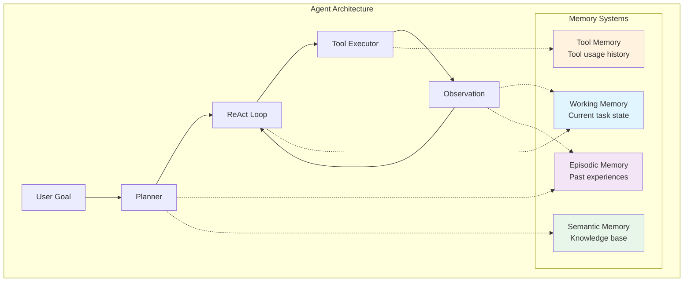
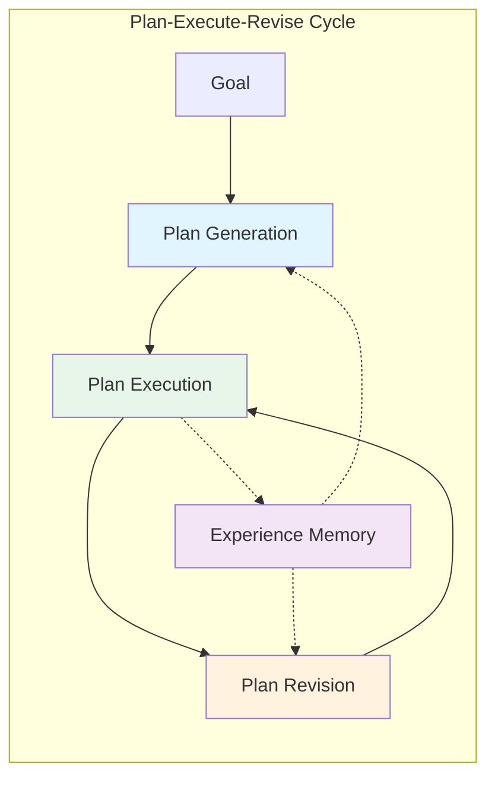

# Memory in AI Systems Deep Dive  Part 16: Autonomous Agents With Memory  From Chat to Action

---

**Series:** Memory in AI Systems  A Developer's Deep Dive from Fundamentals to Production
**Part:** 16 of 19 (Autonomous Agents)
**Audience:** Developers with programming experience who want to understand AI memory systems from the ground up
**Reading time:** ~55 minutes

---

## Recap of Part 15

In Part 15, we explored evaluation and benchmarking of memory systems  how to measure retrieval accuracy, latency, memory coherence, and end-to-end system quality. We built evaluation harnesses, established baselines, and learned to detect memory degradation before users notice it.

But all of that work served a single interaction pattern: a user asks, the system remembers, and the system responds. **What happens when the AI doesn't just respond  it acts?**

That's the leap from chatbot to agent. And memory is what makes it possible.

---

## 1. From Chatbots to Agents

### The Evolution of AI Interaction

The history of AI interaction follows a clear arc, and each step forward depended on better memory:

```
Era 1: Completion (GPT-2 era)
─────────────────────────────
Input: "The capital of France is"
Output: "Paris"
Memory: None  stateless text completion

Era 2: Chat (ChatGPT era)
──────────────────────────
Input: "What's the capital of France?"
Output: "The capital of France is Paris."
Memory: Conversation history in context window

Era 3: Agent (Current era)
──────────────────────────
Input: "Research flight prices to Paris, find hotels near the Eiffel Tower,
        and book the cheapest combination for next weekend."
Output: [Searches flights] → [Compares prices] → [Searches hotels] →
        [Cross-references] → [Books optimal combination] → "Done! Here's your itinerary."
Memory: Working memory + episodic memory + tool memory + plan memory
```

### Why Memory Is the Key Differentiator

A chatbot without memory is a search engine with personality. An agent without memory is a random action generator. **Memory is what transforms a sequence of independent actions into purposeful behavior.**

Consider what an agent needs to remember during a single task:

| Memory Type | What It Stores | Why It Matters |
|---|---|---|
| **Working Memory** | Current goal, active plan, intermediate results | Keeps the agent on track |
| **Episodic Memory** | Past task attempts, successes, failures | Prevents repeating mistakes |
| **Semantic Memory** | Domain knowledge, tool capabilities | Informs action selection |
| **Procedural Memory** | How to use tools, common action sequences | Enables efficient execution |

> **Key Insight:** A chatbot needs memory to maintain conversation. An agent needs memory to maintain *purpose*. The difference is between remembering what was said and remembering what was done, what worked, and what to do next.

### The Agent Architecture Stack



### The Fundamental Agent Loop

Every agent, regardless of complexity, follows this core pattern:

```python
from dataclasses import dataclass, field
from typing import Any, Optional
from datetime import datetime
from enum import Enum
import json


class AgentState(Enum):
    """Possible states of an agent."""
    IDLE = "idle"
    THINKING = "thinking"
    ACTING = "acting"
    OBSERVING = "observing"
    COMPLETE = "complete"
    ERROR = "error"


@dataclass
class AgentStep:
    """A single step in the agent's execution."""
    step_number: int
    thought: str
    action: Optional[str] = None
    action_input: Optional[dict] = None
    observation: Optional[str] = None
    timestamp: datetime = field(default_factory=datetime.now)

    def to_dict(self) -> dict:
        return {
            "step": self.step_number,
            "thought": self.thought,
            "action": self.action,
            "action_input": self.action_input,
            "observation": self.observation,
            "timestamp": self.timestamp.isoformat(),
        }


class BasicAgentLoop:
    """
    The fundamental agent loop that all agent architectures build upon.

    This is the simplest possible agent: think, act, observe, repeat.
    """

    def __init__(self, llm_client, tools: dict, max_steps: int = 10):
        self.llm = llm_client
        self.tools = tools  # name -> callable
        self.max_steps = max_steps
        self.history: list[AgentStep] = []

    def run(self, goal: str) -> str:
        """Execute the agent loop until the goal is achieved or max steps reached."""
        print(f"Agent starting with goal: {goal}")

        for step_num in range(1, self.max_steps + 1):
            # Phase 1: Think
            thought, action, action_input = self._think(goal, step_num)

            step = AgentStep(
                step_number=step_num,
                thought=thought,
                action=action,
                action_input=action_input,
            )

            # Check if agent wants to finish
            if action == "finish":
                step.observation = "Task complete."
                self.history.append(step)
                return action_input.get("answer", "Done.")

            # Phase 2: Act
            observation = self._act(action, action_input)
            step.observation = observation

            # Phase 3: Store in memory (history)
            self.history.append(step)

            print(f"Step {step_num}: {action} -> {observation[:100]}...")

        return "Max steps reached without completing the goal."

    def _think(self, goal: str, step_num: int) -> tuple[str, str, dict]:
        """
        Use the LLM to decide what to do next.
        Returns (thought, action_name, action_input).
        """
        # Build the prompt with full history
        prompt = self._build_prompt(goal, step_num)

        # Call LLM
        response = self.llm.generate(prompt)

        # Parse the response into thought, action, action_input
        thought = response.get("thought", "")
        action = response.get("action", "finish")
        action_input = response.get("action_input", {})

        return thought, action, action_input

    def _act(self, action: str, action_input: dict) -> str:
        """Execute an action using the available tools."""
        if action not in self.tools:
            return f"Error: Unknown tool '{action}'. Available: {list(self.tools.keys())}"

        try:
            result = self.tools[action](**action_input)
            return str(result)
        except Exception as e:
            return f"Error executing {action}: {str(e)}"

    def _build_prompt(self, goal: str, step_num: int) -> str:
        """Build the prompt including the agent's history."""
        history_text = ""
        for step in self.history:
            history_text += f"\nStep {step.step_number}:\n"
            history_text += f"  Thought: {step.thought}\n"
            history_text += f"  Action: {step.action}({json.dumps(step.action_input)})\n"
            history_text += f"  Observation: {step.observation}\n"

        return f"""You are an autonomous agent. Your goal is: {goal}

Available tools: {list(self.tools.keys())}

Previous steps:{history_text if history_text else ' None (this is step 1)'}

Current step: {step_num}

Decide your next action. Respond with:
- thought: Your reasoning about what to do next
- action: The tool to use (or "finish" if done)
- action_input: The input for the tool (or {{"answer": "your answer"}} if finishing)
"""
```

This basic loop is intentionally simple. It highlights the critical insight: **the agent's history IS its working memory**. Every thought, action, and observation feeds back into the next decision. Without this memory, the agent would repeat the same action forever.

---

## 2. The ReAct Pattern

### Reasoning + Acting: The Foundation

The **ReAct** pattern (Reasoning + Acting), introduced by Yao et al. in 2022, formalized something intuitive: agents perform better when they explicitly reason before acting, and when they incorporate observations back into their reasoning.

The pattern alternates between three phases:

```
Thought → Action → Observation → Thought → Action → Observation → ...
```

The key innovation over simple chain-of-thought is that **the agent can act on the world and observe results**, not just reason in isolation.

### A Complete ReAct Implementation

```python
from dataclasses import dataclass, field
from typing import Any, Callable, Optional
from datetime import datetime
import json
import re


@dataclass
class MemoryEntry:
    """A single entry in the agent's memory."""
    content: str
    entry_type: str  # "thought", "action", "observation", "reflection"
    importance: float = 0.5
    timestamp: datetime = field(default_factory=datetime.now)
    metadata: dict = field(default_factory=dict)

    def __str__(self) -> str:
        return f"[{self.entry_type.upper()}] {self.content}"


class WorkingMemory:
    """
    Short-term working memory for the current task.

    Maintains the agent's current focus, intermediate results,
    and a scratchpad for reasoning.
    """

    def __init__(self, capacity: int = 20):
        self.capacity = capacity
        self.entries: list[MemoryEntry] = []
        self.scratchpad: dict[str, Any] = {}
        self.current_goal: Optional[str] = None
        self.sub_goals: list[str] = []

    def add(self, content: str, entry_type: str, importance: float = 0.5,
            metadata: dict = None) -> None:
        """Add an entry to working memory, evicting old entries if needed."""
        entry = MemoryEntry(
            content=content,
            entry_type=entry_type,
            importance=importance,
            metadata=metadata or {},
        )
        self.entries.append(entry)

        # Evict low-importance entries if over capacity
        if len(self.entries) > self.capacity:
            self._evict()

    def _evict(self) -> None:
        """Remove the least important, oldest entries."""
        # Sort by importance (ascending), then by timestamp (ascending = oldest first)
        self.entries.sort(key=lambda e: (e.importance, e.timestamp.timestamp()))
        # Remove the first entry (lowest importance, oldest)
        evicted = self.entries.pop(0)
        print(f"  [Working Memory] Evicted: {evicted.content[:50]}...")

    def get_context(self, last_n: int = 10) -> str:
        """Get the most recent entries as context for the LLM."""
        recent = self.entries[-last_n:]
        lines = []
        for entry in recent:
            lines.append(str(entry))
        return "\n".join(lines)

    def set_variable(self, key: str, value: Any) -> None:
        """Store an intermediate result in the scratchpad."""
        self.scratchpad[key] = value

    def get_variable(self, key: str, default: Any = None) -> Any:
        """Retrieve an intermediate result from the scratchpad."""
        return self.scratchpad.get(key, default)

    def clear(self) -> None:
        """Clear working memory for a new task."""
        self.entries.clear()
        self.scratchpad.clear()
        self.current_goal = None
        self.sub_goals.clear()


class ReActAgent:
    """
    A ReAct agent with integrated memory systems.

    Implements the Thought -> Action -> Observation loop with:
    - Working memory for current task state
    - Episodic memory for past experiences
    - Tool registry for available actions
    """

    def __init__(
        self,
        llm_client,
        tools: dict[str, Callable],
        tool_descriptions: dict[str, str],
        working_memory_capacity: int = 20,
        max_steps: int = 15,
    ):
        self.llm = llm_client
        self.tools = tools
        self.tool_descriptions = tool_descriptions
        self.max_steps = max_steps

        # Memory systems
        self.working_memory = WorkingMemory(capacity=working_memory_capacity)
        self.episodic_memory: list[dict] = []  # Past task episodes

    def run(self, goal: str) -> dict:
        """
        Execute the ReAct loop for a given goal.

        Returns a dict with the result and execution trace.
        """
        # Initialize working memory for this task
        self.working_memory.clear()
        self.working_memory.current_goal = goal
        self.working_memory.add(
            content=f"Goal: {goal}",
            entry_type="thought",
            importance=1.0,
        )

        # Check episodic memory for similar past tasks
        relevant_experiences = self._recall_similar_tasks(goal)
        if relevant_experiences:
            experience_text = self._format_experiences(relevant_experiences)
            self.working_memory.add(
                content=f"Relevant past experience: {experience_text}",
                entry_type="thought",
                importance=0.8,
            )

        trace = []
        result = None

        for step in range(1, self.max_steps + 1):
            print(f"\n--- Step {step} ---")

            # THOUGHT: Reason about what to do
            thought = self._generate_thought(goal, step)
            print(f"Thought: {thought}")
            self.working_memory.add(thought, "thought", importance=0.7)

            # ACTION: Decide and execute an action
            action_name, action_input = self._decide_action(goal, thought)
            print(f"Action: {action_name}({json.dumps(action_input)})")

            if action_name == "finish":
                result = action_input.get("answer", "Task complete.")
                self.working_memory.add(
                    f"Final answer: {result}", "thought", importance=1.0,
                )
                trace.append({
                    "step": step,
                    "thought": thought,
                    "action": "finish",
                    "result": result,
                })
                break

            # Execute the action
            observation = self._execute_action(action_name, action_input)
            print(f"Observation: {observation[:200]}")

            # OBSERVATION: Store the result
            self.working_memory.add(
                f"Action {action_name} returned: {observation}",
                "observation",
                importance=0.6,
            )

            trace.append({
                "step": step,
                "thought": thought,
                "action": action_name,
                "action_input": action_input,
                "observation": observation,
            })

        # Store this episode for future reference
        episode = {
            "goal": goal,
            "steps": len(trace),
            "success": result is not None,
            "result": result,
            "trace_summary": self._summarize_trace(trace),
            "timestamp": datetime.now().isoformat(),
        }
        self.episodic_memory.append(episode)

        return {
            "result": result or "Failed to complete within max steps.",
            "steps": len(trace),
            "trace": trace,
        }

    def _generate_thought(self, goal: str, step: int) -> str:
        """Generate a reasoning thought using the LLM."""
        context = self.working_memory.get_context(last_n=8)

        prompt = f"""You are a reasoning agent. Your goal is: {goal}

Current working memory:
{context}

Step {step}: Think about what you know and what you should do next.
Consider:
- What progress have you made?
- What information do you still need?
- What's the best next action?

Provide your thought as a single clear paragraph."""

        response = self.llm.generate(prompt)
        return response.strip()

    def _decide_action(self, goal: str, thought: str) -> tuple[str, dict]:
        """Decide which action to take based on the current thought."""
        tools_text = "\n".join(
            f"- {name}: {desc}" for name, desc in self.tool_descriptions.items()
        )
        tools_text += '\n- finish: Complete the task. Input: {"answer": "your final answer"}'

        context = self.working_memory.get_context(last_n=5)

        prompt = f"""Based on your reasoning, choose an action.

Goal: {goal}
Current thought: {thought}
Recent context:
{context}

Available actions:
{tools_text}

Respond in JSON format:
{{"action": "tool_name", "action_input": {{"param": "value"}}}}"""

        response = self.llm.generate(prompt)
        parsed = json.loads(response)
        return parsed["action"], parsed.get("action_input", {})

    def _execute_action(self, action_name: str, action_input: dict) -> str:
        """Execute a tool action and return the observation."""
        if action_name not in self.tools:
            return f"Error: Unknown tool '{action_name}'"

        try:
            result = self.tools[action_name](**action_input)
            return str(result)
        except Exception as e:
            error_msg = f"Error: {type(e).__name__}: {str(e)}"
            # Store errors with high importance so the agent doesn't repeat them
            self.working_memory.add(
                f"FAILED: {action_name} with {action_input} -> {error_msg}",
                "observation",
                importance=0.9,
            )
            return error_msg

    def _recall_similar_tasks(self, goal: str) -> list[dict]:
        """Search episodic memory for similar past tasks."""
        if not self.episodic_memory:
            return []

        # Simple keyword matching (in production, use embedding similarity)
        goal_words = set(goal.lower().split())
        scored_episodes = []

        for episode in self.episodic_memory:
            episode_words = set(episode["goal"].lower().split())
            overlap = len(goal_words & episode_words)
            if overlap > 0:
                scored_episodes.append((overlap, episode))

        scored_episodes.sort(key=lambda x: x[0], reverse=True)
        return [ep for _, ep in scored_episodes[:3]]

    def _format_experiences(self, experiences: list[dict]) -> str:
        """Format past experiences for inclusion in the prompt."""
        lines = []
        for exp in experiences:
            status = "succeeded" if exp["success"] else "failed"
            lines.append(
                f"- Task '{exp['goal']}' {status} in {exp['steps']} steps. "
                f"Summary: {exp['trace_summary']}"
            )
        return "\n".join(lines)

    def _summarize_trace(self, trace: list[dict]) -> str:
        """Create a brief summary of the execution trace."""
        actions = [step.get("action", "unknown") for step in trace]
        return f"Actions taken: {' -> '.join(actions)}"
```

> **Key Insight:** The ReAct agent's power comes from the interleaving of reasoning and acting. Pure reasoning (chain-of-thought) can hallucinate facts. Pure acting (trial-and-error) is inefficient. ReAct combines the best of both: grounded reasoning that adapts to real observations.

### ReAct vs. Chain-of-Thought vs. Act-Only

```
Approach         Reasoning  Acting  Grounded  Adaptive
──────────────────────────────────────────────────────
Chain-of-Thought    ✓        ✗       ✗         ✗
Act-Only            ✗        ✓       ✓         ✗
ReAct               ✓        ✓       ✓         ✓
```

The difference matters enormously in practice:

```
Task: "Find the population of the country that hosted the 2024 Olympics"

Chain-of-Thought (no tools):
  Thought: The 2024 Olympics were held in Paris, France.
  Thought: France has a population of approximately 67 million.
  Answer: ~67 million
  Problem: What if the model's knowledge is outdated?

Act-Only (no reasoning):
  Action: search("2024 Olympics")
  Action: search("population")    ← Too vague! What population?
  Action: search("France population 2024")   ← Got lucky
  Problem: No reasoning to connect the dots efficiently.

ReAct:
  Thought: I need to find which country hosted the 2024 Olympics.
  Action: search("2024 Olympics host country")
  Observation: France hosted the 2024 Summer Olympics in Paris.
  Thought: Now I know it's France. Let me find its current population.
  Action: search("France population 2024")
  Observation: France population is approximately 68.17 million.
  Thought: I have all the information I need.
  Action: finish({"answer": "68.17 million"})
```

---

## 3. Planning With Memory

### Why Agents Need Plans

The ReAct loop is reactive  it decides one step at a time. For complex tasks, this leads to inefficient exploration and missed dependencies. **Planning** adds foresight: the agent creates a structured plan before acting, then executes and revises the plan based on outcomes.



### Planning Agent Implementation

```python
from dataclasses import dataclass, field
from typing import Optional
from datetime import datetime
from enum import Enum
import json


class PlanStepStatus(Enum):
    PENDING = "pending"
    IN_PROGRESS = "in_progress"
    COMPLETED = "completed"
    FAILED = "failed"
    SKIPPED = "skipped"
    REVISED = "revised"


@dataclass
class PlanStep:
    """A single step in an execution plan."""
    step_id: int
    description: str
    action: str
    expected_output: str
    dependencies: list[int] = field(default_factory=list)
    status: PlanStepStatus = PlanStepStatus.PENDING
    actual_output: Optional[str] = None
    attempts: int = 0
    max_attempts: int = 3

    def is_ready(self, completed_steps: set[int]) -> bool:
        """Check if all dependencies are satisfied."""
        return all(dep in completed_steps for dep in self.dependencies)


@dataclass
class Plan:
    """A structured execution plan."""
    goal: str
    steps: list[PlanStep]
    created_at: datetime = field(default_factory=datetime.now)
    revision_count: int = 0

    def get_next_step(self) -> Optional[PlanStep]:
        """Get the next step that's ready to execute."""
        completed = {
            s.step_id for s in self.steps
            if s.status == PlanStepStatus.COMPLETED
        }
        for step in self.steps:
            if step.status == PlanStepStatus.PENDING and step.is_ready(completed):
                return step
        return None

    def is_complete(self) -> bool:
        """Check if all steps are completed or skipped."""
        return all(
            s.status in (PlanStepStatus.COMPLETED, PlanStepStatus.SKIPPED)
            for s in self.steps
        )

    def progress_summary(self) -> str:
        """Get a summary of plan progress."""
        total = len(self.steps)
        completed = sum(1 for s in self.steps if s.status == PlanStepStatus.COMPLETED)
        failed = sum(1 for s in self.steps if s.status == PlanStepStatus.FAILED)
        return f"Progress: {completed}/{total} complete, {failed} failed"


class ExperienceStore:
    """
    Stores past planning experiences for future reference.

    When the agent encounters a similar goal, it can retrieve
    past plans and their outcomes to inform new plans.
    """

    def __init__(self):
        self.experiences: list[dict] = []

    def store(self, goal: str, plan: Plan, outcome: str, success: bool) -> None:
        """Store a completed plan and its outcome."""
        self.experiences.append({
            "goal": goal,
            "plan_steps": [
                {
                    "description": s.description,
                    "action": s.action,
                    "status": s.status.value,
                    "output": s.actual_output,
                }
                for s in plan.steps
            ],
            "outcome": outcome,
            "success": success,
            "revisions": plan.revision_count,
            "timestamp": datetime.now().isoformat(),
        })

    def recall(self, goal: str, top_k: int = 3) -> list[dict]:
        """Recall relevant past experiences."""
        if not self.experiences:
            return []

        # Simple keyword similarity (use embeddings in production)
        goal_words = set(goal.lower().split())
        scored = []
        for exp in self.experiences:
            exp_words = set(exp["goal"].lower().split())
            score = len(goal_words & exp_words) / max(len(goal_words | exp_words), 1)
            if score > 0.1:
                scored.append((score, exp))

        scored.sort(key=lambda x: x[0], reverse=True)
        return [exp for _, exp in scored[:top_k]]


class PlanningAgent:
    """
    An agent that creates, executes, and revises plans.

    Unlike the simple ReAct agent, this agent:
    1. Generates a complete plan before acting
    2. Tracks plan progress and dependencies
    3. Revises the plan when steps fail or new information appears
    4. Learns from past planning experiences
    """

    def __init__(
        self,
        llm_client,
        tools: dict,
        tool_descriptions: dict[str, str],
        max_revisions: int = 3,
        max_step_attempts: int = 3,
    ):
        self.llm = llm_client
        self.tools = tools
        self.tool_descriptions = tool_descriptions
        self.max_revisions = max_revisions
        self.max_step_attempts = max_step_attempts
        self.experience_store = ExperienceStore()

    def run(self, goal: str) -> dict:
        """Execute a goal using the plan-execute-revise cycle."""
        print(f"\n{'='*60}")
        print(f"Planning Agent: {goal}")
        print(f"{'='*60}")

        # Phase 1: Generate a plan (informed by past experience)
        plan = self._generate_plan(goal)
        self._print_plan(plan)

        # Phase 2: Execute the plan step by step
        while not plan.is_complete():
            next_step = plan.get_next_step()

            if next_step is None:
                # No step is ready  likely due to failed dependencies
                print("\nNo executable steps remaining. Attempting plan revision...")
                plan = self._revise_plan(goal, plan, "Blocked: no executable steps")
                if plan.revision_count > self.max_revisions:
                    return {
                        "success": False,
                        "result": "Max plan revisions exceeded.",
                        "plan": plan,
                    }
                continue

            # Execute the step
            print(f"\nExecuting step {next_step.step_id}: {next_step.description}")
            next_step.status = PlanStepStatus.IN_PROGRESS
            next_step.attempts += 1

            observation = self._execute_step(next_step)
            next_step.actual_output = observation

            # Evaluate the result
            success = self._evaluate_step_result(next_step, observation)

            if success:
                next_step.status = PlanStepStatus.COMPLETED
                print(f"  Step {next_step.step_id} completed successfully.")

                # Check if observation requires plan revision
                if self._should_revise_plan(plan, next_step, observation):
                    plan = self._revise_plan(goal, plan, f"New info from step {next_step.step_id}: {observation}")
            else:
                if next_step.attempts >= self.max_step_attempts:
                    next_step.status = PlanStepStatus.FAILED
                    print(f"  Step {next_step.step_id} failed after {next_step.attempts} attempts.")
                    # Revise plan to work around the failure
                    plan = self._revise_plan(
                        goal, plan,
                        f"Step {next_step.step_id} failed: {observation}",
                    )
                else:
                    next_step.status = PlanStepStatus.PENDING  # Retry
                    print(f"  Step {next_step.step_id} failed, will retry "
                          f"(attempt {next_step.attempts}/{self.max_step_attempts}).")

        # Phase 3: Synthesize final result
        result = self._synthesize_result(goal, plan)

        # Store experience for future reference
        self.experience_store.store(
            goal=goal,
            plan=plan,
            outcome=result,
            success=True,
        )

        return {
            "success": True,
            "result": result,
            "steps_executed": sum(
                1 for s in plan.steps if s.status == PlanStepStatus.COMPLETED
            ),
            "revisions": plan.revision_count,
        }

    def _generate_plan(self, goal: str) -> Plan:
        """Generate an execution plan using the LLM."""
        # Check for relevant past experiences
        past = self.experience_store.recall(goal)
        experience_text = ""
        if past:
            experience_text = "\n\nRelevant past experiences:\n"
            for exp in past:
                status = "succeeded" if exp["success"] else "failed"
                experience_text += f"- Goal: '{exp['goal']}' ({status})\n"
                for step in exp["plan_steps"]:
                    experience_text += f"  - {step['description']} [{step['status']}]\n"

        tools_text = "\n".join(
            f"- {name}: {desc}" for name, desc in self.tool_descriptions.items()
        )

        prompt = f"""Create a step-by-step plan to achieve this goal: {goal}

Available tools:
{tools_text}
{experience_text}

Create a plan as a JSON list of steps. Each step should have:
- step_id: Sequential integer starting from 1
- description: What this step accomplishes
- action: Which tool to use
- expected_output: What you expect to get
- dependencies: List of step_ids that must complete first (empty list if none)

Respond with only the JSON list."""

        response = self.llm.generate(prompt)
        steps_data = json.loads(response)

        steps = [
            PlanStep(
                step_id=s["step_id"],
                description=s["description"],
                action=s["action"],
                expected_output=s["expected_output"],
                dependencies=s.get("dependencies", []),
            )
            for s in steps_data
        ]

        return Plan(goal=goal, steps=steps)

    def _execute_step(self, step: PlanStep) -> str:
        """Execute a single plan step."""
        if step.action not in self.tools:
            return f"Error: Unknown tool '{step.action}'"

        # Use LLM to determine the right input for the tool
        prompt = f"""You need to execute this step: {step.description}
Using tool: {step.action}
Tool description: {self.tool_descriptions.get(step.action, 'No description')}
Expected output: {step.expected_output}

What input should be provided to the tool? Respond with a JSON object."""

        response = self.llm.generate(prompt)
        action_input = json.loads(response)

        try:
            result = self.tools[step.action](**action_input)
            return str(result)
        except Exception as e:
            return f"Error: {type(e).__name__}: {str(e)}"

    def _evaluate_step_result(self, step: PlanStep, observation: str) -> bool:
        """Evaluate whether a step succeeded based on its output."""
        if observation.startswith("Error:"):
            return False

        prompt = f"""Did this step succeed?
Step: {step.description}
Expected: {step.expected_output}
Actual result: {observation}

Respond with only "yes" or "no"."""

        response = self.llm.generate(prompt).strip().lower()
        return response == "yes"

    def _should_revise_plan(self, plan: Plan, step: PlanStep, observation: str) -> bool:
        """Check if the observation necessitates a plan revision."""
        remaining = [
            s for s in plan.steps
            if s.status == PlanStepStatus.PENDING
        ]
        if not remaining:
            return False

        prompt = f"""Based on this new information, should the remaining plan be revised?

Completed step: {step.description}
Observation: {observation}

Remaining steps:
{json.dumps([{"id": s.step_id, "desc": s.description} for s in remaining])}

Respond with only "yes" or "no"."""

        response = self.llm.generate(prompt).strip().lower()
        return response == "yes"

    def _revise_plan(self, goal: str, current_plan: Plan, reason: str) -> Plan:
        """Revise the plan based on new information or failures."""
        current_plan.revision_count += 1
        print(f"\n  Revising plan (revision #{current_plan.revision_count}): {reason}")

        completed_steps = [
            {"id": s.step_id, "desc": s.description, "output": s.actual_output}
            for s in current_plan.steps
            if s.status == PlanStepStatus.COMPLETED
        ]
        failed_steps = [
            {"id": s.step_id, "desc": s.description, "output": s.actual_output}
            for s in current_plan.steps
            if s.status == PlanStepStatus.FAILED
        ]

        tools_text = "\n".join(
            f"- {name}: {desc}" for name, desc in self.tool_descriptions.items()
        )

        prompt = f"""Revise this plan. Goal: {goal}

Reason for revision: {reason}

Completed steps: {json.dumps(completed_steps)}
Failed steps: {json.dumps(failed_steps)}

Available tools:
{tools_text}

Create a revised list of REMAINING steps (don't repeat completed steps).
Respond with a JSON list of steps."""

        response = self.llm.generate(prompt)
        new_steps_data = json.loads(response)

        # Keep completed steps, replace remaining with revised steps
        completed = [s for s in current_plan.steps if s.status == PlanStepStatus.COMPLETED]
        next_id = max((s.step_id for s in completed), default=0) + 1

        new_steps = []
        for s in new_steps_data:
            new_steps.append(PlanStep(
                step_id=next_id,
                description=s["description"],
                action=s["action"],
                expected_output=s["expected_output"],
                dependencies=s.get("dependencies", []),
            ))
            next_id += 1

        revised_plan = Plan(
            goal=goal,
            steps=completed + new_steps,
            revision_count=current_plan.revision_count,
        )
        self._print_plan(revised_plan)
        return revised_plan

    def _synthesize_result(self, goal: str, plan: Plan) -> str:
        """Synthesize a final result from all completed steps."""
        results = []
        for step in plan.steps:
            if step.status == PlanStepStatus.COMPLETED:
                results.append(f"- {step.description}: {step.actual_output}")

        prompt = f"""Synthesize a final answer for this goal: {goal}

Completed step results:
{chr(10).join(results)}

Provide a clear, comprehensive answer."""

        return self.llm.generate(prompt)

    def _print_plan(self, plan: Plan) -> None:
        """Print the current plan for debugging."""
        print(f"\nPlan for: {plan.goal}")
        print(f"Revision: {plan.revision_count}")
        for step in plan.steps:
            deps = f" (depends on: {step.dependencies})" if step.dependencies else ""
            print(f"  [{step.status.value:^12}] {step.step_id}. {step.description}{deps}")
```

### How Memory Improves Planning Over Time

The planning agent's `ExperienceStore` creates a feedback loop:

```
First time planning "Deploy a web app":
  Plan: 8 steps, 2 revisions, 1 failure
  Stored in experience memory.

Second time planning "Deploy a mobile app":
  Recalls: "Deploy a web app" experience
  Plan: 6 steps, 0 revisions, 0 failures
  The agent learned which steps cause problems and plans around them.

Third time planning "Deploy a microservice":
  Recalls: Both prior deployments
  Plan: 5 steps, 0 revisions, 0 failures
  Plans get better with every experience.
```

> **Key Insight:** Planning without memory is just guessing. Planning with memory is learning. Each completed task becomes a template that makes future planning more efficient and more likely to succeed.

---

## 4. Tool Use and Memory

### Why Tool Memory Matters

Agents use tools to interact with the external world  search engines, APIs, databases, file systems. But tools are unpredictable:

- APIs have rate limits and sometimes fail
- Search results vary in quality
- Database queries can time out
- File operations can encounter permissions errors

**Tool memory** captures the history of tool interactions so the agent can:
1. **Avoid repeating failed tool calls** with the same parameters
2. **Cache successful results** to avoid redundant calls
3. **Learn tool-specific patterns** (e.g., "this API returns errors after 5pm")
4. **Select the right tool** based on past success rates

### Tool-Using Agent With Memory

```python
from dataclasses import dataclass, field
from typing import Any, Callable, Optional
from datetime import datetime, timedelta
import hashlib
import json
import time


@dataclass
class ToolCall:
    """Record of a single tool call."""
    tool_name: str
    input_params: dict
    output: str
    success: bool
    duration_ms: float
    timestamp: datetime = field(default_factory=datetime.now)
    error_type: Optional[str] = None

    @property
    def cache_key(self) -> str:
        """Generate a deterministic cache key for this call."""
        key_str = f"{self.tool_name}:{json.dumps(self.input_params, sort_keys=True)}"
        return hashlib.sha256(key_str.encode()).hexdigest()[:16]


class ToolMemory:
    """
    Memory system specifically for tool interactions.

    Tracks:
    - Call history per tool
    - Success/failure rates
    - Cached results
    - Error patterns
    """

    def __init__(self, cache_ttl_seconds: int = 300):
        self.call_history: list[ToolCall] = []
        self.cache: dict[str, tuple[str, datetime]] = {}  # key -> (result, expiry)
        self.cache_ttl = timedelta(seconds=cache_ttl_seconds)
        self.tool_stats: dict[str, dict] = {}  # tool_name -> stats

    def record_call(self, call: ToolCall) -> None:
        """Record a tool call and update statistics."""
        self.call_history.append(call)

        # Update tool statistics
        if call.tool_name not in self.tool_stats:
            self.tool_stats[call.tool_name] = {
                "total_calls": 0,
                "successes": 0,
                "failures": 0,
                "total_duration_ms": 0,
                "error_types": {},
            }

        stats = self.tool_stats[call.tool_name]
        stats["total_calls"] += 1
        stats["total_duration_ms"] += call.duration_ms

        if call.success:
            stats["successes"] += 1
            # Cache successful results
            self.cache[call.cache_key] = (
                call.output,
                datetime.now() + self.cache_ttl,
            )
        else:
            stats["failures"] += 1
            if call.error_type:
                stats["error_types"][call.error_type] = (
                    stats["error_types"].get(call.error_type, 0) + 1
                )

    def get_cached_result(self, tool_name: str, input_params: dict) -> Optional[str]:
        """Check if we have a cached result for this exact call."""
        key_str = f"{tool_name}:{json.dumps(input_params, sort_keys=True)}"
        cache_key = hashlib.sha256(key_str.encode()).hexdigest()[:16]

        if cache_key in self.cache:
            result, expiry = self.cache[cache_key]
            if datetime.now() < expiry:
                return result
            else:
                del self.cache[cache_key]  # Expired
        return None

    def get_tool_reliability(self, tool_name: str) -> float:
        """Get the success rate for a tool (0.0 to 1.0)."""
        stats = self.tool_stats.get(tool_name)
        if not stats or stats["total_calls"] == 0:
            return 0.5  # Unknown reliability
        return stats["successes"] / stats["total_calls"]

    def get_similar_failures(self, tool_name: str, input_params: dict) -> list[ToolCall]:
        """Find past failures with similar inputs."""
        failures = []
        for call in self.call_history:
            if call.tool_name == tool_name and not call.success:
                # Simple similarity: shared keys
                shared_keys = set(call.input_params.keys()) & set(input_params.keys())
                if shared_keys:
                    failures.append(call)
        return failures[-5:]  # Last 5 similar failures

    def get_avg_duration(self, tool_name: str) -> float:
        """Get average call duration in milliseconds."""
        stats = self.tool_stats.get(tool_name)
        if not stats or stats["total_calls"] == 0:
            return 0
        return stats["total_duration_ms"] / stats["total_calls"]

    def get_tool_summary(self) -> str:
        """Get a human-readable summary of tool usage."""
        lines = ["Tool Usage Summary:"]
        for name, stats in self.tool_stats.items():
            reliability = self.get_tool_reliability(name)
            avg_ms = self.get_avg_duration(name)
            lines.append(
                f"  {name}: {stats['total_calls']} calls, "
                f"{reliability:.0%} success, {avg_ms:.0f}ms avg"
            )
            if stats["error_types"]:
                for err, count in stats["error_types"].items():
                    lines.append(f"    Error '{err}': {count} times")
        return "\n".join(lines)


class ToolUsingAgent:
    """
    An agent that uses tools intelligently through memory.

    Features:
    - Caches tool results to avoid redundant calls
    - Tracks tool reliability and adjusts behavior
    - Learns from tool errors to avoid repeating them
    - Selects optimal tools based on past performance
    """

    def __init__(
        self,
        llm_client,
        tools: dict[str, Callable],
        tool_descriptions: dict[str, str],
        max_steps: int = 15,
    ):
        self.llm = llm_client
        self.tools = tools
        self.tool_descriptions = tool_descriptions
        self.max_steps = max_steps
        self.tool_memory = ToolMemory()

    def execute_tool(self, tool_name: str, input_params: dict) -> tuple[str, bool]:
        """
        Execute a tool with memory integration.

        1. Check cache first
        2. Check for similar past failures
        3. Execute the tool
        4. Record the outcome
        """
        # Step 1: Check cache
        cached = self.tool_memory.get_cached_result(tool_name, input_params)
        if cached is not None:
            print(f"  [Cache hit] {tool_name}")
            return cached, True

        # Step 2: Check for similar failures
        similar_failures = self.tool_memory.get_similar_failures(tool_name, input_params)
        if similar_failures:
            print(f"  [Warning] {len(similar_failures)} similar past failures for {tool_name}")
            # Optionally modify params or choose a different tool
            modified_params = self._adjust_params_from_failures(
                tool_name, input_params, similar_failures,
            )
            if modified_params != input_params:
                print(f"  [Adjusted] Parameters modified based on past failures")
                input_params = modified_params

        # Step 3: Execute
        start_time = time.time()
        try:
            result = self.tools[tool_name](**input_params)
            duration_ms = (time.time() - start_time) * 1000
            output = str(result)

            call = ToolCall(
                tool_name=tool_name,
                input_params=input_params,
                output=output,
                success=True,
                duration_ms=duration_ms,
            )
            self.tool_memory.record_call(call)
            return output, True

        except Exception as e:
            duration_ms = (time.time() - start_time) * 1000
            error_msg = f"{type(e).__name__}: {str(e)}"

            call = ToolCall(
                tool_name=tool_name,
                input_params=input_params,
                output=error_msg,
                success=False,
                duration_ms=duration_ms,
                error_type=type(e).__name__,
            )
            self.tool_memory.record_call(call)
            return error_msg, False

    def select_best_tool(self, task_description: str) -> str:
        """Select the best tool for a task, considering past performance."""
        tool_info = []
        for name, desc in self.tool_descriptions.items():
            reliability = self.tool_memory.get_tool_reliability(name)
            avg_duration = self.tool_memory.get_avg_duration(name)
            tool_info.append({
                "name": name,
                "description": desc,
                "reliability": f"{reliability:.0%}",
                "avg_response_time": f"{avg_duration:.0f}ms",
            })

        prompt = f"""Select the best tool for this task: {task_description}

Available tools with performance data:
{json.dumps(tool_info, indent=2)}

Consider both capability match AND reliability.
Respond with just the tool name."""

        return self.llm.generate(prompt).strip()

    def _adjust_params_from_failures(
        self,
        tool_name: str,
        input_params: dict,
        failures: list[ToolCall],
    ) -> dict:
        """Adjust parameters based on past failures to avoid repeating mistakes."""
        failure_info = [
            {
                "input": f.input_params,
                "error": f.output,
                "error_type": f.error_type,
            }
            for f in failures
        ]

        prompt = f"""These past calls to '{tool_name}' failed:
{json.dumps(failure_info, indent=2)}

Current planned call: {json.dumps(input_params)}

Should the parameters be adjusted to avoid these errors?
If yes, respond with the adjusted JSON parameters.
If no, respond with the original parameters unchanged.
Respond with ONLY the JSON parameters."""

        response = self.llm.generate(prompt)
        try:
            return json.loads(response)
        except json.JSONDecodeError:
            return input_params  # Keep original if parsing fails

    def run(self, goal: str) -> str:
        """Run the agent with tool memory integration."""
        working_context = [f"Goal: {goal}"]

        for step in range(1, self.max_steps + 1):
            # Include tool memory summary in context
            tool_summary = self.tool_memory.get_tool_summary()

            prompt = f"""You are an agent with tool-using capabilities.

{chr(10).join(working_context)}

{tool_summary}

Available tools:
{json.dumps(
    {n: d for n, d in self.tool_descriptions.items()},
    indent=2,
)}

Step {step}: Decide your next action.
Respond in JSON: {{"thought": "...", "action": "tool_name or finish", "input": {{...}}}}"""

            response = self.llm.generate(prompt)
            parsed = json.loads(response)

            thought = parsed["thought"]
            action = parsed["action"]

            working_context.append(f"Thought: {thought}")

            if action == "finish":
                return parsed["input"].get("answer", "Done.")

            # Execute tool with memory
            result, success = self.execute_tool(action, parsed["input"])
            status = "OK" if success else "FAILED"
            working_context.append(f"Action: {action} -> [{status}] {result}")

        return "Max steps reached."
```

### Tool Memory in Practice

Here's how tool memory evolves during a real agent session:

```
Step 1: search_web(query="Python FastAPI tutorial")
  Cache: MISS
  Result: [list of tutorials]
  Recorded: success, 230ms

Step 2: search_web(query="Python FastAPI tutorial")   ← Same query!
  Cache: HIT (saved 230ms and an API call)
  Result: [same list, from cache]

Step 3: fetch_url(url="https://example.com/tutorial")
  Cache: MISS
  Result: Error: ConnectionTimeout
  Recorded: failure, 5000ms, error_type=ConnectionTimeout

Step 4: fetch_url(url="https://example.com/tutorial")   ← Same failing URL
  Similar failures: 1 found (ConnectionTimeout)
  Adjusted: Agent decides to try a different URL instead
  Action changed to: fetch_url(url="https://other.com/tutorial")
  Result: [tutorial content]
  Recorded: success, 340ms

Tool Summary after session:
  search_web: 2 calls (1 real + 1 cached), 100% success, 230ms avg
  fetch_url:  2 calls, 50% success, 2670ms avg
    Error 'ConnectionTimeout': 1 time
```

---

## 5. Experience Learning

### Learning From Actions

The most powerful capability of a memory-enabled agent is **learning from experience**. Instead of approaching every task from scratch, the agent builds a growing library of action-outcome pairs that inform future decisions.

This is analogous to how humans learn: we don't re-derive everything from first principles. We remember what worked and what didn't.

```python
from dataclasses import dataclass, field
from typing import Any, Optional
from datetime import datetime
from collections import defaultdict
import json
import math


@dataclass
class ActionOutcome:
    """A recorded action and its outcome."""
    action: str
    action_input: dict
    context: str  # What was the agent trying to do?
    outcome: str
    success: bool
    reward: float  # -1.0 to 1.0
    duration_ms: float
    timestamp: datetime = field(default_factory=datetime.now)
    tags: list[str] = field(default_factory=list)


@dataclass
class Strategy:
    """A learned strategy  a pattern of actions that tends to work."""
    name: str
    description: str
    action_sequence: list[str]
    success_rate: float
    avg_reward: float
    times_used: int
    applicable_contexts: list[str]
    last_used: datetime = field(default_factory=datetime.now)

    def confidence(self) -> float:
        """
        Confidence in this strategy increases with usage.
        Uses a simple Bayesian-inspired formula.
        """
        # Prior: assume 50% success with 2 pseudo-observations
        prior_successes = 1
        prior_failures = 1
        actual_successes = self.success_rate * self.times_used
        actual_failures = self.times_used - actual_successes

        total = prior_successes + prior_failures + self.times_used
        adjusted_rate = (prior_successes + actual_successes) / total

        # Confidence grows with more data points
        certainty = 1 - (1 / (1 + self.times_used))

        return adjusted_rate * certainty


class ExperienceLearner:
    """
    Learns from past actions to improve future performance.

    Capabilities:
    1. Store action-outcome pairs
    2. Recognize patterns in successful vs. failed actions
    3. Extract reusable strategies
    4. Refine strategies based on new outcomes
    """

    def __init__(self, llm_client):
        self.llm = llm_client
        self.experiences: list[ActionOutcome] = []
        self.strategies: list[Strategy] = []
        self.context_action_rewards: dict[str, list[tuple[str, float]]] = defaultdict(list)

    def record_experience(self, experience: ActionOutcome) -> None:
        """Record a new action-outcome pair and update learned patterns."""
        self.experiences.append(experience)

        # Update context-action reward mapping
        context_key = self._extract_context_key(experience.context)
        self.context_action_rewards[context_key].append(
            (experience.action, experience.reward)
        )

        # Periodically extract strategies
        if len(self.experiences) % 10 == 0:
            self._extract_strategies()

    def get_action_recommendation(self, context: str, available_actions: list[str]) -> dict:
        """
        Recommend the best action for a given context based on past experience.

        Returns:
            dict with 'recommended_action', 'confidence', and 'reasoning'
        """
        context_key = self._extract_context_key(context)

        # Check for directly applicable strategies
        applicable_strategies = [
            s for s in self.strategies
            if any(ctx in context.lower() for ctx in s.applicable_contexts)
            and s.action_sequence[0] in available_actions
        ]

        if applicable_strategies:
            # Sort by confidence
            best = max(applicable_strategies, key=lambda s: s.confidence())
            return {
                "recommended_action": best.action_sequence[0],
                "confidence": best.confidence(),
                "reasoning": f"Strategy '{best.name}' has {best.success_rate:.0%} success "
                             f"rate over {best.times_used} uses.",
                "strategy": best,
            }

        # Fall back to action-reward history
        if context_key in self.context_action_rewards:
            action_rewards = self.context_action_rewards[context_key]
            # Calculate average reward per action
            action_avg_reward: dict[str, list[float]] = defaultdict(list)
            for action, reward in action_rewards:
                if action in available_actions:
                    action_avg_reward[action].append(reward)

            if action_avg_reward:
                best_action = max(
                    action_avg_reward.keys(),
                    key=lambda a: sum(action_avg_reward[a]) / len(action_avg_reward[a]),
                )
                avg = sum(action_avg_reward[best_action]) / len(action_avg_reward[best_action])
                return {
                    "recommended_action": best_action,
                    "confidence": min(0.9, 0.5 + len(action_avg_reward[best_action]) * 0.1),
                    "reasoning": f"Action '{best_action}' has average reward {avg:.2f} "
                                 f"in similar contexts.",
                    "strategy": None,
                }

        # No experience  return no recommendation
        return {
            "recommended_action": None,
            "confidence": 0.0,
            "reasoning": "No relevant past experience found.",
            "strategy": None,
        }

    def analyze_failures(self, n_recent: int = 50) -> dict:
        """
        Analyze recent failures to identify patterns.

        Returns common failure modes and suggested mitigations.
        """
        recent = self.experiences[-n_recent:]
        failures = [e for e in recent if not e.success]

        if not failures:
            return {"failure_rate": 0, "patterns": [], "suggestions": []}

        failure_rate = len(failures) / len(recent)

        # Group failures by action
        action_failures: dict[str, list[ActionOutcome]] = defaultdict(list)
        for f in failures:
            action_failures[f.action].append(f)

        patterns = []
        for action, fails in action_failures.items():
            pattern = {
                "action": action,
                "count": len(fails),
                "common_contexts": self._find_common_words(
                    [f.context for f in fails]
                ),
                "error_samples": [f.outcome[:100] for f in fails[:3]],
            }
            patterns.append(pattern)

        # Use LLM to generate suggestions
        patterns_text = json.dumps(patterns, indent=2)
        prompt = f"""Analyze these failure patterns and suggest mitigations:

{patterns_text}

Provide 3-5 specific, actionable suggestions."""

        suggestions = self.llm.generate(prompt)

        return {
            "failure_rate": failure_rate,
            "total_failures": len(failures),
            "patterns": patterns,
            "suggestions": suggestions,
        }

    def get_success_playbook(self, context: str) -> list[str]:
        """
        Get the most successful sequence of actions for a given context.

        Like a "playbook"  a proven sequence the agent can follow.
        """
        context_key = self._extract_context_key(context)

        # Find all successful episodes with similar context
        successful_sequences = []
        current_sequence = []
        current_context = None

        for exp in self.experiences:
            exp_key = self._extract_context_key(exp.context)
            if exp_key == context_key:
                if current_context != exp.context:
                    if current_sequence and all(e.success for e in current_sequence):
                        successful_sequences.append(
                            [e.action for e in current_sequence]
                        )
                    current_sequence = []
                    current_context = exp.context
                current_sequence.append(exp)

        # Handle the last sequence
        if current_sequence and all(e.success for e in current_sequence):
            successful_sequences.append([e.action for e in current_sequence])

        if not successful_sequences:
            return []

        # Find the most common successful sequence
        sequence_counts: dict[str, int] = defaultdict(int)
        for seq in successful_sequences:
            key = " -> ".join(seq)
            sequence_counts[key] += 1

        best_sequence_key = max(sequence_counts, key=sequence_counts.get)
        return best_sequence_key.split(" -> ")

    def _extract_strategies(self) -> None:
        """Extract reusable strategies from accumulated experiences."""
        # Group experiences by context similarity
        context_groups: dict[str, list[ActionOutcome]] = defaultdict(list)
        for exp in self.experiences:
            key = self._extract_context_key(exp.context)
            context_groups[key].append(exp)

        for context_key, exps in context_groups.items():
            if len(exps) < 3:
                continue  # Need enough data

            # Find successful action sequences
            successful = [e for e in exps if e.success]
            if not successful:
                continue

            # Most common successful action
            action_counts: dict[str, int] = defaultdict(int)
            action_rewards: dict[str, list[float]] = defaultdict(list)
            for e in successful:
                action_counts[e.action] += 1
                action_rewards[e.action].append(e.reward)

            best_action = max(action_counts, key=action_counts.get)
            avg_reward = (
                sum(action_rewards[best_action]) / len(action_rewards[best_action])
            )
            success_rate = len(successful) / len(exps)

            # Check if we already have this strategy
            existing = next(
                (s for s in self.strategies if s.name == f"strategy_{context_key}"),
                None,
            )
            if existing:
                existing.success_rate = success_rate
                existing.avg_reward = avg_reward
                existing.times_used = len(exps)
                existing.last_used = datetime.now()
            else:
                self.strategies.append(Strategy(
                    name=f"strategy_{context_key}",
                    description=f"Best action for '{context_key}' context",
                    action_sequence=[best_action],
                    success_rate=success_rate,
                    avg_reward=avg_reward,
                    times_used=len(exps),
                    applicable_contexts=[context_key],
                ))

    def _extract_context_key(self, context: str) -> str:
        """Extract a simplified key from a context string."""
        # Simple approach: take first 3 meaningful words
        stop_words = {"the", "a", "an", "to", "for", "of", "in", "on", "with", "and", "or"}
        words = [
            w.lower() for w in context.split()
            if w.lower() not in stop_words and len(w) > 2
        ]
        return "_".join(words[:3]) if words else "unknown"

    def _find_common_words(self, texts: list[str]) -> list[str]:
        """Find words that appear in most of the texts."""
        if not texts:
            return []

        word_counts: dict[str, int] = defaultdict(int)
        for text in texts:
            unique_words = set(text.lower().split())
            for word in unique_words:
                if len(word) > 3:
                    word_counts[word] += 1

        threshold = len(texts) * 0.5
        common = [
            word for word, count in word_counts.items()
            if count >= threshold
        ]
        return sorted(common, key=lambda w: word_counts[w], reverse=True)[:5]
```

### The Experience Learning Cycle

```
┌──────────────────────────────────────────────────────────┐
│                Experience Learning Cycle                  │
│                                                          │
│   1. ACT           2. OBSERVE         3. RECORD          │
│   ┌─────────┐     ┌──────────┐      ┌──────────┐       │
│   │ Execute │────▶│ Measure  │─────▶│ Store in │       │
│   │ action  │     │ outcome  │      │ memory   │       │
│   └─────────┘     └──────────┘      └──────────┘       │
│        ▲                                  │              │
│        │                                  ▼              │
│   6. APPLY          5. STRATEGIZE     4. ANALYZE        │
│   ┌──────────┐     ┌──────────┐     ┌──────────┐       │
│   │ Use best │◀────│ Extract  │◀────│ Pattern  │       │
│   │ strategy │     │ strategy │     │ matching │       │
│   └──────────┘     └──────────┘     └──────────┘       │
│                                                          │
└──────────────────────────────────────────────────────────┘
```

> **Key Insight:** Experience learning transforms an agent from "stateless function caller" to "adaptive problem solver." After enough experience, the agent develops intuition  it doesn't just follow rules, it applies learned patterns that go beyond what was explicitly programmed.

---
