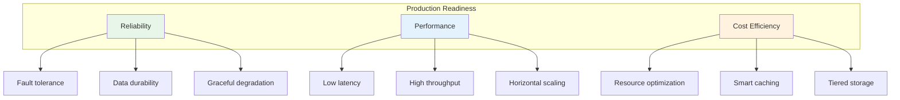
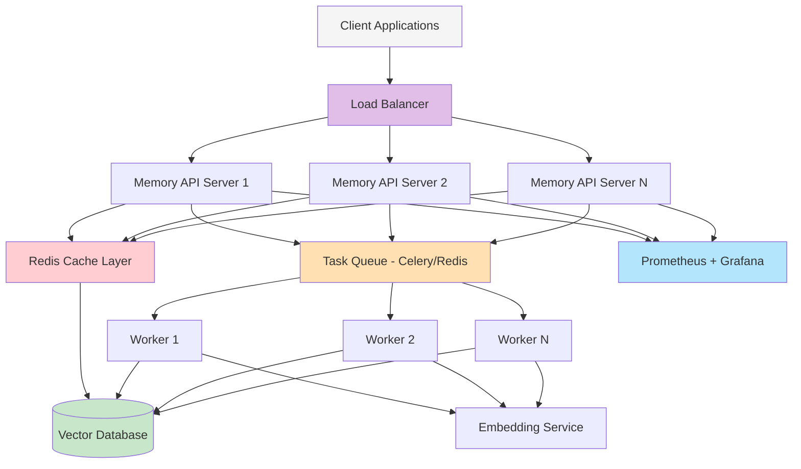

# Memory in AI Systems Deep Dive  Part 17: Scaling Memory Systems in Production

---

**Series:** Memory in AI Systems  A Developer's Deep Dive from Fundamentals to Production
**Part:** 17 of 19 (Production Scaling)
**Audience:** Developers with programming experience who want to understand AI memory systems from the ground up
**Reading time:** ~50 minutes

---

In Part 16, we explored evaluation and testing strategies for memory systems  how to measure retrieval quality, detect regressions, and build confidence that your system is working correctly. We had metrics, benchmarks, and test suites. Everything worked beautifully on your laptop with 10 test documents.

Then you deployed to production. Real users arrived. And everything changed.

Suddenly, your memory system needed to handle 10,000 concurrent users, not one developer running scripts. Your embedding generation, which took a comfortable 200ms for a single query, now needed to process 500 queries per second. Your vector database, which held 50,000 chunks during testing, grew to 50 million. Your single-server architecture, which never experienced a network failure, discovered that networks fail constantly.

This part is about the engineering that makes memory systems work **at scale, under pressure, in the real world**. We are moving from "it works on my machine" to "it works for millions of users, 24/7, at acceptable cost, and recovers gracefully when things go wrong."

By the end of this part, you will:

- Design a **production-ready Memory API** with FastAPI, including authentication and batch operations
- Implement **async processing pipelines** that keep your system responsive under load
- Build a **multi-level caching system** (L1/L2/L3) that dramatically reduces latency and cost
- Add **comprehensive observability** with Prometheus metrics, structured logging, and distributed tracing
- Implement **cost optimization strategies** including embedding batching, model tiering, and storage tiering
- Build **circuit breakers and resilience patterns** that handle failures gracefully
- Design **deployment architectures** using Docker Compose and Kubernetes
- Write **load tests** that identify bottlenecks before your users do

Let's scale.

---

## Table of Contents

1. [From Prototype to Production](#1-from-prototype-to-production)
2. [Memory API Design](#2-memory-api-design)
3. [Async Processing for Memory](#3-async-processing-for-memory)
4. [Caching Strategies](#4-caching-strategies)
5. [Observability and Monitoring](#5-observability-and-monitoring)
6. [Cost Optimization](#6-cost-optimization)
7. [Circuit Breakers and Resilience](#7-circuit-breakers-and-resilience)
8. [Deployment Patterns](#8-deployment-patterns)
9. [Load Testing Memory Systems](#9-load-testing-memory-systems)
10. [Vocabulary Cheat Sheet](#10-vocabulary-cheat-sheet)
11. [Key Takeaways and What's Next](#11-key-takeaways-and-whats-next)

---

## 1. From Prototype to Production

### What Changes at Scale

When you move a memory system from a prototype to production, nearly every assumption you made during development gets challenged. Let's understand exactly what changes and why.

```
┌─────────────────┬──────────────────────┬───────────────────────────────┐
│ Dimension        │ Prototype            │ Production                    │
├─────────────────┼──────────────────────┼───────────────────────────────┤
│ Users            │ 1 (you)              │ 10,000+ concurrent            │
│ Data volume      │ 50K chunks           │ 50M+ chunks                   │
│ Query rate       │ 1 req/sec            │ 500+ req/sec                  │
│ Uptime           │ "works when I run it"│ 99.9% SLA (8.7h downtime/yr) │
│ Latency          │ "fast enough"        │ p99 < 200ms                   │
│ Failure handling │ crash and restart     │ graceful degradation          │
│ Cost             │ free tier             │ $10,000+/month                │
│ Security         │ localhost             │ auth, encryption, audit logs  │
│ Observability    │ print() statements    │ metrics, logs, traces, alerts │
│ Deployment       │ python main.py        │ orchestrated containers       │
└─────────────────┴──────────────────────┴───────────────────────────────┘
```

### The Three Pillars of Production Readiness

Every production system must address three fundamental concerns:



**Reliability** means your system works correctly even when components fail. Networks partition. Databases crash. Embedding APIs return errors. A reliable system handles all of this without losing data or returning wrong answers.

**Performance** means your system responds fast enough for your use case. A chatbot needs sub-second responses. A batch document processor can tolerate minutes. Both need to handle their expected load without degradation.

**Cost Efficiency** means you are not burning money unnecessarily. Embedding generation, vector storage, and LLM calls all cost real money at scale. A well-designed system minimizes these costs without sacrificing quality.

> **Key Insight:** These three pillars often conflict. Higher reliability (more replicas) increases cost. Better performance (faster models) costs more money. Lower cost (cheaper embeddings) may hurt quality. Production engineering is about finding the right balance for your specific use case.

### Architecture Overview

Here is the high-level architecture we will build throughout this part:



This architecture separates concerns cleanly:
- **API Servers** handle incoming requests, authentication, and routing
- **Redis Cache** provides fast access to frequently requested memories
- **Task Queue** decouples memory writes from the request-response cycle
- **Workers** handle expensive operations (embedding generation, consolidation) in the background
- **Vector Database** stores the canonical memory data
- **Monitoring** gives you visibility into everything

Let's build each component.

---

## 2. Memory API Design

### Why a Dedicated Memory Service

In a prototype, you embed memory operations directly in your application code. In production, you extract them into a **dedicated memory service** with a well-defined API. This gives you:

- **Reusability**: Multiple applications can share the same memory service
- **Independent scaling**: Scale your memory service separately from your application
- **Encapsulation**: Change the underlying storage (Pinecone to Weaviate, for example) without affecting clients
- **Access control**: Centralized authentication and authorization

### The Memory API with FastAPI

Let's build a complete, production-ready memory API:

```python
"""
memory_api.py  Production Memory Service API

A FastAPI-based service that provides RESTful endpoints for storing,
retrieving, updating, and deleting memories. Designed for production
use with authentication, rate limiting, and comprehensive error handling.
"""

from fastapi import FastAPI, HTTPException, Depends, Header, Query, BackgroundTasks
from fastapi.middleware.cors import CORSMiddleware
from fastapi.middleware.gzip import GZipMiddleware
from pydantic import BaseModel, Field, validator
from typing import Optional, List, Dict, Any
from datetime import datetime
from enum import Enum
import uuid
import hashlib
import time


# ─── Data Models ──────────────────────────────────────────────────────────

class MemoryType(str, Enum):
    """Categorization of memory types."""
    EPISODIC = "episodic"       # Specific events/interactions
    SEMANTIC = "semantic"       # Facts and knowledge
    PROCEDURAL = "procedural"   # How-to knowledge
    WORKING = "working"         # Temporary, session-scoped


class MemoryCreateRequest(BaseModel):
    """Request body for creating a new memory."""
    content: str = Field(
        ...,
        min_length=1,
        max_length=50000,
        description="The text content of the memory"
    )
    memory_type: MemoryType = Field(
        default=MemoryType.SEMANTIC,
        description="Category of the memory"
    )
    metadata: Dict[str, Any] = Field(
        default_factory=dict,
        description="Arbitrary metadata key-value pairs"
    )
    user_id: str = Field(
        ...,
        description="Owner of this memory"
    )
    namespace: str = Field(
        default="default",
        description="Logical grouping for memories"
    )
    ttl_seconds: Optional[int] = Field(
        default=None,
        ge=60,
        le=31536000,  # Max 1 year
        description="Time-to-live in seconds; None means permanent"
    )

    @validator("content")
    def content_must_not_be_empty(cls, v):
        if not v.strip():
            raise ValueError("Content must contain non-whitespace characters")
        return v.strip()


class MemoryResponse(BaseModel):
    """Response body for a single memory."""
    id: str
    content: str
    memory_type: MemoryType
    metadata: Dict[str, Any]
    user_id: str
    namespace: str
    created_at: datetime
    updated_at: datetime
    relevance_score: Optional[float] = None  # Populated in search results


class MemorySearchRequest(BaseModel):
    """Request body for searching memories."""
    query: str = Field(
        ...,
        min_length=1,
        max_length=10000,
        description="Search query text"
    )
    user_id: str = Field(..., description="Search within this user's memories")
    namespace: str = Field(default="default")
    memory_types: Optional[List[MemoryType]] = Field(
        default=None,
        description="Filter by memory types; None means all types"
    )
    top_k: int = Field(default=10, ge=1, le=100)
    min_relevance: float = Field(
        default=0.0,
        ge=0.0,
        le=1.0,
        description="Minimum relevance score threshold"
    )
    include_metadata: bool = Field(default=True)


class MemorySearchResponse(BaseModel):
    """Response body for search results."""
    query: str
    results: List[MemoryResponse]
    total_found: int
    search_time_ms: float


class BatchMemoryCreateRequest(BaseModel):
    """Request body for creating multiple memories at once."""
    memories: List[MemoryCreateRequest] = Field(
        ...,
        min_items=1,
        max_items=100,
        description="List of memories to create (max 100 per batch)"
    )


class BatchMemoryResponse(BaseModel):
    """Response body for batch operations."""
    created: int
    failed: int
    errors: List[Dict[str, str]]
    memory_ids: List[str]


class MemoryUpdateRequest(BaseModel):
    """Request body for updating an existing memory."""
    content: Optional[str] = Field(default=None, max_length=50000)
    metadata: Optional[Dict[str, Any]] = None
    memory_type: Optional[MemoryType] = None


class MemoryStats(BaseModel):
    """Statistics about a user's memories."""
    total_memories: int
    memories_by_type: Dict[str, int]
    total_storage_bytes: int
    oldest_memory: Optional[datetime]
    newest_memory: Optional[datetime]


# ─── Authentication ───────────────────────────────────────────────────────

class AuthenticationError(HTTPException):
    def __init__(self, detail: str = "Invalid or missing API key"):
        super().__init__(status_code=401, detail=detail)


# In production, this would check against a database or auth service
API_KEY_STORE = {
    "mk_live_abc123": {"user": "app_frontend", "scopes": ["read", "write"]},
    "mk_live_def456": {"user": "app_backend", "scopes": ["read", "write", "admin"]},
    "mk_live_readonly": {"user": "analytics", "scopes": ["read"]},
}


async def verify_api_key(
    x_api_key: str = Header(..., description="API key for authentication")
) -> Dict[str, Any]:
    """Verify the API key and return the associated permissions."""
    if x_api_key not in API_KEY_STORE:
        raise AuthenticationError("Invalid API key")
    return API_KEY_STORE[x_api_key]


def require_scope(required_scope: str):
    """Dependency that checks for a specific permission scope."""
    async def check_scope(
        auth: Dict[str, Any] = Depends(verify_api_key)
    ) -> Dict[str, Any]:
        if required_scope not in auth["scopes"]:
            raise HTTPException(
                status_code=403,
                detail=f"Insufficient permissions. Required scope: {required_scope}"
            )
        return auth
    return check_scope


# ─── Application Setup ───────────────────────────────────────────────────

app = FastAPI(
    title="Memory Service API",
    description="Production-ready API for AI memory management",
    version="1.0.0",
    docs_url="/docs",
    redoc_url="/redoc",
)

# Middleware
app.add_middleware(
    CORSMiddleware,
    allow_origins=["*"],  # Restrict in production
    allow_credentials=True,
    allow_methods=["*"],
    allow_headers=["*"],
)
app.add_middleware(GZipMiddleware, minimum_size=1000)


# ─── In-Memory Store (replace with real DB in production) ─────────────────

memory_store: Dict[str, Dict[str, Any]] = {}


# ─── Helper Functions ─────────────────────────────────────────────────────

def generate_memory_id() -> str:
    """Generate a unique memory ID."""
    return f"mem_{uuid.uuid4().hex[:16]}"


def compute_content_hash(content: str) -> str:
    """Compute a hash of the content for deduplication."""
    return hashlib.sha256(content.encode("utf-8")).hexdigest()[:16]


# ─── API Endpoints ────────────────────────────────────────────────────────

@app.get("/health")
async def health_check():
    """Health check endpoint for load balancers and orchestrators."""
    return {
        "status": "healthy",
        "timestamp": datetime.utcnow().isoformat(),
        "version": "1.0.0",
    }


@app.get("/ready")
async def readiness_check():
    """
    Readiness check  returns 200 only when the service can handle traffic.
    In production, this would verify database connectivity, cache availability, etc.
    """
    # In production, check actual dependencies:
    # - Vector database connection
    # - Redis connection
    # - Embedding service availability
    checks = {
        "vector_db": True,   # await check_vector_db()
        "cache": True,       # await check_redis()
        "embedding": True,   # await check_embedding_service()
    }
    all_healthy = all(checks.values())
    return {
        "ready": all_healthy,
        "checks": checks,
        "timestamp": datetime.utcnow().isoformat(),
    }


@app.post(
    "/memories",
    response_model=MemoryResponse,
    status_code=201,
    dependencies=[Depends(require_scope("write"))],
)
async def create_memory(
    request: MemoryCreateRequest,
    background_tasks: BackgroundTasks,
):
    """
    Create a new memory.

    The memory content is stored immediately, and embedding generation
    is handled asynchronously in the background.
    """
    memory_id = generate_memory_id()
    now = datetime.utcnow()

    memory = {
        "id": memory_id,
        "content": request.content,
        "content_hash": compute_content_hash(request.content),
        "memory_type": request.memory_type,
        "metadata": request.metadata,
        "user_id": request.user_id,
        "namespace": request.namespace,
        "created_at": now,
        "updated_at": now,
        "ttl_seconds": request.ttl_seconds,
        "embedding_status": "pending",
    }

    memory_store[memory_id] = memory

    # Generate embedding in the background (non-blocking)
    background_tasks.add_task(generate_embedding_async, memory_id, request.content)

    return MemoryResponse(
        id=memory_id,
        content=request.content,
        memory_type=request.memory_type,
        metadata=request.metadata,
        user_id=request.user_id,
        namespace=request.namespace,
        created_at=now,
        updated_at=now,
    )


@app.post(
    "/memories/batch",
    response_model=BatchMemoryResponse,
    status_code=201,
    dependencies=[Depends(require_scope("write"))],
)
async def create_memories_batch(
    request: BatchMemoryCreateRequest,
    background_tasks: BackgroundTasks,
):
    """
    Create multiple memories in a single request.

    More efficient than individual creates because:
    - Single network round-trip from client
    - Batch embedding generation
    - Bulk database insert
    """
    created_ids = []
    errors = []
    now = datetime.utcnow()

    for i, mem_request in enumerate(request.memories):
        try:
            memory_id = generate_memory_id()
            memory = {
                "id": memory_id,
                "content": mem_request.content,
                "content_hash": compute_content_hash(mem_request.content),
                "memory_type": mem_request.memory_type,
                "metadata": mem_request.metadata,
                "user_id": mem_request.user_id,
                "namespace": mem_request.namespace,
                "created_at": now,
                "updated_at": now,
                "ttl_seconds": mem_request.ttl_seconds,
                "embedding_status": "pending",
            }
            memory_store[memory_id] = memory
            created_ids.append(memory_id)
        except Exception as e:
            errors.append({"index": str(i), "error": str(e)})

    # Batch embedding generation in background
    contents = [
        memory_store[mid]["content"]
        for mid in created_ids
        if mid in memory_store
    ]
    background_tasks.add_task(
        generate_embeddings_batch_async, created_ids, contents
    )

    return BatchMemoryResponse(
        created=len(created_ids),
        failed=len(errors),
        errors=errors,
        memory_ids=created_ids,
    )


@app.post(
    "/memories/search",
    response_model=MemorySearchResponse,
    dependencies=[Depends(require_scope("read"))],
)
async def search_memories(request: MemorySearchRequest):
    """
    Search memories by semantic similarity.

    Process:
    1. Generate embedding for the query
    2. Check cache for recent identical queries
    3. Search vector database for similar memories
    4. Filter by user_id, namespace, memory_type
    5. Apply minimum relevance threshold
    6. Return top_k results
    """
    start_time = time.time()

    # In production: generate query embedding, search vector DB, apply filters
    # Here we simulate with a simple text match for demonstration
    results = []
    query_lower = request.query.lower()

    for memory in memory_store.values():
        if memory["user_id"] != request.user_id:
            continue
        if memory["namespace"] != request.namespace:
            continue
        if request.memory_types and memory["memory_type"] not in request.memory_types:
            continue

        # Simulated relevance scoring (replace with vector similarity)
        content_lower = memory["content"].lower()
        query_words = set(query_lower.split())
        content_words = set(content_lower.split())
        overlap = len(query_words & content_words)
        score = overlap / max(len(query_words), 1)

        if score >= request.min_relevance:
            results.append(
                MemoryResponse(
                    id=memory["id"],
                    content=memory["content"],
                    memory_type=memory["memory_type"],
                    metadata=memory["metadata"] if request.include_metadata else {},
                    user_id=memory["user_id"],
                    namespace=memory["namespace"],
                    created_at=memory["created_at"],
                    updated_at=memory["updated_at"],
                    relevance_score=round(score, 4),
                )
            )

    # Sort by relevance and limit
    results.sort(key=lambda r: r.relevance_score or 0, reverse=True)
    results = results[: request.top_k]

    search_time = (time.time() - start_time) * 1000  # Convert to ms

    return MemorySearchResponse(
        query=request.query,
        results=results,
        total_found=len(results),
        search_time_ms=round(search_time, 2),
    )


@app.get(
    "/memories/{memory_id}",
    response_model=MemoryResponse,
    dependencies=[Depends(require_scope("read"))],
)
async def get_memory(memory_id: str):
    """Retrieve a single memory by ID."""
    if memory_id not in memory_store:
        raise HTTPException(status_code=404, detail="Memory not found")

    memory = memory_store[memory_id]
    return MemoryResponse(
        id=memory["id"],
        content=memory["content"],
        memory_type=memory["memory_type"],
        metadata=memory["metadata"],
        user_id=memory["user_id"],
        namespace=memory["namespace"],
        created_at=memory["created_at"],
        updated_at=memory["updated_at"],
    )


@app.patch(
    "/memories/{memory_id}",
    response_model=MemoryResponse,
    dependencies=[Depends(require_scope("write"))],
)
async def update_memory(
    memory_id: str,
    request: MemoryUpdateRequest,
    background_tasks: BackgroundTasks,
):
    """
    Partially update an existing memory.

    If content is updated, a new embedding is generated in the background.
    """
    if memory_id not in memory_store:
        raise HTTPException(status_code=404, detail="Memory not found")

    memory = memory_store[memory_id]
    now = datetime.utcnow()

    if request.content is not None:
        memory["content"] = request.content
        memory["content_hash"] = compute_content_hash(request.content)
        memory["embedding_status"] = "pending"
        # Re-generate embedding for updated content
        background_tasks.add_task(
            generate_embedding_async, memory_id, request.content
        )

    if request.metadata is not None:
        memory["metadata"].update(request.metadata)

    if request.memory_type is not None:
        memory["memory_type"] = request.memory_type

    memory["updated_at"] = now

    return MemoryResponse(
        id=memory["id"],
        content=memory["content"],
        memory_type=memory["memory_type"],
        metadata=memory["metadata"],
        user_id=memory["user_id"],
        namespace=memory["namespace"],
        created_at=memory["created_at"],
        updated_at=now,
    )


@app.delete(
    "/memories/{memory_id}",
    status_code=204,
    dependencies=[Depends(require_scope("write"))],
)
async def delete_memory(memory_id: str):
    """Delete a memory by ID."""
    if memory_id not in memory_store:
        raise HTTPException(status_code=404, detail="Memory not found")
    del memory_store[memory_id]


@app.get(
    "/memories/stats/{user_id}",
    response_model=MemoryStats,
    dependencies=[Depends(require_scope("read"))],
)
async def get_memory_stats(user_id: str, namespace: str = "default"):
    """Get statistics about a user's memories."""
    user_memories = [
        m for m in memory_store.values()
        if m["user_id"] == user_id and m["namespace"] == namespace
    ]

    if not user_memories:
        return MemoryStats(
            total_memories=0,
            memories_by_type={},
            total_storage_bytes=0,
            oldest_memory=None,
            newest_memory=None,
        )

    type_counts = {}
    total_bytes = 0
    for m in user_memories:
        mtype = m["memory_type"].value if hasattr(m["memory_type"], "value") else m["memory_type"]
        type_counts[mtype] = type_counts.get(mtype, 0) + 1
        total_bytes += len(m["content"].encode("utf-8"))

    dates = [m["created_at"] for m in user_memories]

    return MemoryStats(
        total_memories=len(user_memories),
        memories_by_type=type_counts,
        total_storage_bytes=total_bytes,
        oldest_memory=min(dates),
        newest_memory=max(dates),
    )


# ─── Background Tasks ────────────────────────────────────────────────────

async def generate_embedding_async(memory_id: str, content: str):
    """Generate an embedding for a memory in the background."""
    # In production: call embedding API, store in vector DB
    # Simulating async embedding generation
    import asyncio
    await asyncio.sleep(0.1)  # Simulate API call

    if memory_id in memory_store:
        memory_store[memory_id]["embedding_status"] = "completed"
        # memory_store[memory_id]["embedding"] = embedding_vector


async def generate_embeddings_batch_async(
    memory_ids: List[str], contents: List[str]
):
    """Generate embeddings for multiple memories in a batch."""
    import asyncio
    await asyncio.sleep(0.2)  # Simulate batch API call

    for memory_id in memory_ids:
        if memory_id in memory_store:
            memory_store[memory_id]["embedding_status"] = "completed"


# ─── Startup ──────────────────────────────────────────────────────────────

if __name__ == "__main__":
    import uvicorn
    uvicorn.run(app, host="0.0.0.0", port=8000)
```

This API provides all the essential operations:

| Endpoint | Method | Purpose |
|---|---|---|
| `/health` | GET | Load balancer health check |
| `/ready` | GET | Readiness probe (checks dependencies) |
| `/memories` | POST | Create a single memory |
| `/memories/batch` | POST | Create up to 100 memories at once |
| `/memories/search` | POST | Semantic similarity search |
| `/memories/{id}` | GET | Retrieve a memory by ID |
| `/memories/{id}` | PATCH | Update a memory |
| `/memories/{id}` | DELETE | Delete a memory |
| `/memories/stats/{user_id}` | GET | Usage statistics |

> **Production Note:** The in-memory store used above is for demonstration. In production, you would replace it with a proper vector database (Qdrant, Weaviate, Pinecone) and a relational database (PostgreSQL) for metadata. The API contract stays the same  clients never need to know what's behind the interface.

### Client SDK

A good API deserves a good client. Here is a Python SDK that wraps our memory service:

```python
"""
memory_client.py  Python SDK for the Memory Service API

Provides a clean, Pythonic interface for interacting with the memory service.
Handles retries, error handling, and response parsing.
"""

import httpx
from typing import Optional, List, Dict, Any
from dataclasses import dataclass
from datetime import datetime
import asyncio
import time


@dataclass
class Memory:
    """Represents a memory returned from the API."""
    id: str
    content: str
    memory_type: str
    metadata: Dict[str, Any]
    user_id: str
    namespace: str
    created_at: datetime
    updated_at: datetime
    relevance_score: Optional[float] = None


@dataclass
class SearchResult:
    """Represents search results from the API."""
    query: str
    results: List[Memory]
    total_found: int
    search_time_ms: float


class MemoryClient:
    """
    Client for the Memory Service API.

    Usage:
        client = MemoryClient(
            base_url="http://memory-service:8000",
            api_key="mk_live_abc123"
        )

        # Store a memory
        memory = client.store(
            content="User prefers dark mode",
            user_id="user_123",
            memory_type="semantic"
        )

        # Search memories
        results = client.search(
            query="What are the user's UI preferences?",
            user_id="user_123"
        )

        # Batch store
        memories = client.store_batch([
            {"content": "Fact 1", "user_id": "user_123"},
            {"content": "Fact 2", "user_id": "user_123"},
        ])
    """

    def __init__(
        self,
        base_url: str,
        api_key: str,
        timeout: float = 30.0,
        max_retries: int = 3,
    ):
        self.base_url = base_url.rstrip("/")
        self.api_key = api_key
        self.timeout = timeout
        self.max_retries = max_retries
        self._client = httpx.Client(
            base_url=self.base_url,
            headers={"X-API-Key": self.api_key},
            timeout=timeout,
        )

    def _request_with_retry(
        self, method: str, path: str, **kwargs
    ) -> httpx.Response:
        """Make an HTTP request with exponential backoff retry."""
        last_exception = None

        for attempt in range(self.max_retries):
            try:
                response = self._client.request(method, path, **kwargs)
                response.raise_for_status()
                return response
            except httpx.HTTPStatusError as e:
                if e.response.status_code in (429, 500, 502, 503, 504):
                    # Retryable errors
                    wait_time = (2 ** attempt) * 0.5  # 0.5s, 1s, 2s
                    time.sleep(wait_time)
                    last_exception = e
                else:
                    raise
            except httpx.RequestError as e:
                # Network errors  retryable
                wait_time = (2 ** attempt) * 0.5
                time.sleep(wait_time)
                last_exception = e

        raise last_exception

    def _parse_memory(self, data: Dict[str, Any]) -> Memory:
        """Parse API response into a Memory object."""
        return Memory(
            id=data["id"],
            content=data["content"],
            memory_type=data["memory_type"],
            metadata=data.get("metadata", {}),
            user_id=data["user_id"],
            namespace=data["namespace"],
            created_at=datetime.fromisoformat(data["created_at"]),
            updated_at=datetime.fromisoformat(data["updated_at"]),
            relevance_score=data.get("relevance_score"),
        )

    def store(
        self,
        content: str,
        user_id: str,
        memory_type: str = "semantic",
        metadata: Optional[Dict[str, Any]] = None,
        namespace: str = "default",
    ) -> Memory:
        """Store a new memory."""
        response = self._request_with_retry(
            "POST",
            "/memories",
            json={
                "content": content,
                "user_id": user_id,
                "memory_type": memory_type,
                "metadata": metadata or {},
                "namespace": namespace,
            },
        )
        return self._parse_memory(response.json())

    def store_batch(
        self,
        memories: List[Dict[str, Any]],
    ) -> Dict[str, Any]:
        """Store multiple memories in a single request."""
        response = self._request_with_retry(
            "POST",
            "/memories/batch",
            json={"memories": memories},
        )
        return response.json()

    def search(
        self,
        query: str,
        user_id: str,
        namespace: str = "default",
        top_k: int = 10,
        min_relevance: float = 0.0,
        memory_types: Optional[List[str]] = None,
    ) -> SearchResult:
        """Search memories by semantic similarity."""
        response = self._request_with_retry(
            "POST",
            "/memories/search",
            json={
                "query": query,
                "user_id": user_id,
                "namespace": namespace,
                "top_k": top_k,
                "min_relevance": min_relevance,
                "memory_types": memory_types,
            },
        )
        data = response.json()
        return SearchResult(
            query=data["query"],
            results=[self._parse_memory(r) for r in data["results"]],
            total_found=data["total_found"],
            search_time_ms=data["search_time_ms"],
        )

    def get(self, memory_id: str) -> Memory:
        """Retrieve a memory by ID."""
        response = self._request_with_retry("GET", f"/memories/{memory_id}")
        return self._parse_memory(response.json())

    def update(
        self,
        memory_id: str,
        content: Optional[str] = None,
        metadata: Optional[Dict[str, Any]] = None,
        memory_type: Optional[str] = None,
    ) -> Memory:
        """Update an existing memory."""
        update_data = {}
        if content is not None:
            update_data["content"] = content
        if metadata is not None:
            update_data["metadata"] = metadata
        if memory_type is not None:
            update_data["memory_type"] = memory_type

        response = self._request_with_retry(
            "PATCH",
            f"/memories/{memory_id}",
            json=update_data,
        )
        return self._parse_memory(response.json())

    def delete(self, memory_id: str) -> None:
        """Delete a memory."""
        self._request_with_retry("DELETE", f"/memories/{memory_id}")

    def stats(self, user_id: str, namespace: str = "default") -> Dict[str, Any]:
        """Get memory usage statistics."""
        response = self._request_with_retry(
            "GET",
            f"/memories/stats/{user_id}",
            params={"namespace": namespace},
        )
        return response.json()

    def close(self):
        """Close the HTTP client."""
        self._client.close()

    def __enter__(self):
        return self

    def __exit__(self, *args):
        self.close()
```

Usage is clean and intuitive:

```python
# Example: Using the Memory Client SDK
with MemoryClient(
    base_url="http://memory-service:8000",
    api_key="mk_live_abc123"
) as client:

    # Store a memory
    memory = client.store(
        content="User prefers Python over JavaScript for backend work",
        user_id="user_42",
        memory_type="semantic",
        metadata={"source": "conversation", "confidence": 0.9},
    )
    print(f"Stored memory: {memory.id}")

    # Search for relevant memories
    results = client.search(
        query="What programming languages does the user prefer?",
        user_id="user_42",
        top_k=5,
    )
    for r in results.results:
        print(f"  [{r.relevance_score:.3f}] {r.content}")

    # Batch store
    batch_result = client.store_batch([
        {
            "content": "User is working on a machine learning project",
            "user_id": "user_42",
            "memory_type": "episodic",
        },
        {
            "content": "User's favorite framework is FastAPI",
            "user_id": "user_42",
            "memory_type": "semantic",
        },
    ])
    print(f"Batch: {batch_result['created']} created, {batch_result['failed']} failed")
```

---

## 3. Async Processing for Memory

### Why Async Matters for Memory Systems

Memory operations are inherently I/O-bound. Embedding generation calls an external API. Vector database queries go over the network. Cache lookups hit Redis. If you handle these synchronously, your server spends most of its time **waiting**  waiting for the embedding API to respond, waiting for the database query to complete, waiting for the cache to reply.

Asynchronous processing lets your server do useful work while waiting for I/O:

```
Synchronous (1 request at a time):
───[Embed: 100ms]───[VectorDB: 50ms]───[LLM: 500ms]───> 650ms total
                                                          Can't serve other requests while waiting

Asynchronous (many requests concurrently):
Thread 1: ───[Embed: 100ms]───[VectorDB: 50ms]───[LLM: 500ms]───> 650ms
Thread 2:    ───[Embed: 100ms]───[VectorDB: 50ms]───[LLM: 500ms]───>
Thread 3:       ───[Embed: 100ms]───[VectorDB: 50ms]───[LLM: 500ms]───>
                All three complete in ~650ms instead of 1,950ms
```

### Async Embedding Generation

```python
"""
async_embeddings.py  Async Embedding Generation Service

Provides non-blocking embedding generation with batching,
connection pooling, and automatic retry.
"""

import asyncio
import time
from typing import List, Optional, Dict, Any
from dataclasses import dataclass, field
import hashlib
import json


@dataclass
class EmbeddingResult:
    """Result of an embedding generation request."""
    text: str
    embedding: List[float]
    model: str
    token_count: int
    latency_ms: float


class AsyncEmbeddingService:
    """
    Non-blocking embedding generation with automatic batching.

    Instead of sending one embedding request at a time, this service
    collects requests over a short time window and sends them as a
    single batch. This reduces API calls and latency.

    Architecture:
    1. Callers submit text via generate()  returns immediately with a Future
    2. A background loop collects pending requests
    3. Every batch_interval_ms (or when batch_size is reached), sends a batch
    4. Results are distributed back to waiting callers
    """

    def __init__(
        self,
        api_key: str = "demo-key",
        model: str = "text-embedding-3-small",
        max_batch_size: int = 64,
        batch_interval_ms: float = 50,
        max_concurrent_batches: int = 4,
    ):
        self.api_key = api_key
        self.model = model
        self.max_batch_size = max_batch_size
        self.batch_interval_ms = batch_interval_ms
        self.max_concurrent_batches = max_concurrent_batches

        # Pending requests queue
        self._pending: asyncio.Queue = asyncio.Queue()

        # Semaphore to limit concurrent API calls
        self._semaphore = asyncio.Semaphore(max_concurrent_batches)

        # Track metrics
        self._total_requests = 0
        self._total_batches = 0
        self._total_tokens = 0

        # Background task handle
        self._batch_task: Optional[asyncio.Task] = None

    async def start(self):
        """Start the background batching loop."""
        self._batch_task = asyncio.create_task(self._batch_loop())

    async def stop(self):
        """Stop the background batching loop and process remaining items."""
        if self._batch_task:
            self._batch_task.cancel()
            try:
                await self._batch_task
            except asyncio.CancelledError:
                pass
        # Process any remaining pending requests
        await self._flush_pending()

    async def generate(self, text: str) -> EmbeddingResult:
        """
        Generate an embedding for the given text.

        Returns a future that resolves when the embedding is ready.
        The actual API call may be batched with other concurrent requests.
        """
        future = asyncio.get_event_loop().create_future()
        await self._pending.put((text, future))
        self._total_requests += 1
        return await future

    async def generate_batch(self, texts: List[str]) -> List[EmbeddingResult]:
        """Generate embeddings for multiple texts."""
        futures = []
        for text in texts:
            future = asyncio.get_event_loop().create_future()
            await self._pending.put((text, future))
            futures.append(future)
            self._total_requests += 1
        return await asyncio.gather(*futures)

    async def _batch_loop(self):
        """Background loop that collects and sends batches."""
        while True:
            try:
                batch = []
                futures = []

                # Collect requests for up to batch_interval_ms
                deadline = time.monotonic() + (self.batch_interval_ms / 1000)

                while len(batch) < self.max_batch_size:
                    remaining = deadline - time.monotonic()
                    if remaining <= 0:
                        break
                    try:
                        text, future = await asyncio.wait_for(
                            self._pending.get(),
                            timeout=remaining,
                        )
                        batch.append(text)
                        futures.append(future)
                    except asyncio.TimeoutError:
                        break

                if batch:
                    # Process this batch
                    asyncio.create_task(
                        self._process_batch(batch, futures)
                    )
                else:
                    # No requests  wait a bit before checking again
                    await asyncio.sleep(self.batch_interval_ms / 1000)

            except asyncio.CancelledError:
                raise
            except Exception as e:
                # Log error but keep the loop running
                print(f"Batch loop error: {e}")
                await asyncio.sleep(0.1)

    async def _process_batch(
        self, texts: List[str], futures: List[asyncio.Future]
    ):
        """Send a batch to the embedding API and distribute results."""
        async with self._semaphore:
            start_time = time.monotonic()
            try:
                # In production: call actual embedding API
                # embeddings = await self._call_embedding_api(texts)
                embeddings = await self._simulate_embedding_api(texts)

                latency_ms = (time.monotonic() - start_time) * 1000
                self._total_batches += 1

                for i, (text, future) in enumerate(zip(texts, futures)):
                    if not future.cancelled():
                        result = EmbeddingResult(
                            text=text,
                            embedding=embeddings[i],
                            model=self.model,
                            token_count=len(text.split()),  # Approximate
                            latency_ms=latency_ms,
                        )
                        future.set_result(result)

            except Exception as e:
                # Propagate error to all waiting callers
                for future in futures:
                    if not future.cancelled() and not future.done():
                        future.set_exception(e)

    async def _simulate_embedding_api(
        self, texts: List[str]
    ) -> List[List[float]]:
        """Simulate embedding API call (replace with real API in production)."""
        await asyncio.sleep(0.05)  # Simulate network latency

        embeddings = []
        for text in texts:
            # Generate deterministic pseudo-embedding from text hash
            text_hash = hashlib.sha256(text.encode()).hexdigest()
            # Create a 256-dimensional embedding from the hash
            embedding = []
            for i in range(0, min(len(text_hash), 64), 1):
                val = int(text_hash[i], 16) / 15.0  # Normalize to [0, 1]
                embedding.append(val)
            # Pad to 256 dimensions
            while len(embedding) < 256:
                embedding.append(0.0)
            embeddings.append(embedding[:256])

        return embeddings

    async def _flush_pending(self):
        """Process all remaining pending requests."""
        batch = []
        futures = []
        while not self._pending.empty():
            try:
                text, future = self._pending.get_nowait()
                batch.append(text)
                futures.append(future)
            except asyncio.QueueEmpty:
                break
        if batch:
            await self._process_batch(batch, futures)

    def get_metrics(self) -> Dict[str, Any]:
        """Return service metrics."""
        return {
            "total_requests": self._total_requests,
            "total_batches": self._total_batches,
            "average_batch_size": (
                self._total_requests / max(self._total_batches, 1)
            ),
            "pending_requests": self._pending.qsize(),
        }


# ─── Example Usage ────────────────────────────────────────────────────────

async def demo_async_embeddings():
    """Demonstrate async embedding generation with automatic batching."""
    service = AsyncEmbeddingService(
        max_batch_size=32,
        batch_interval_ms=50,
    )
    await service.start()

    try:
        # Submit many requests concurrently  they'll be auto-batched
        texts = [
            f"This is document number {i} about topic {i % 5}"
            for i in range(100)
        ]

        print(f"Generating embeddings for {len(texts)} texts...")
        start = time.monotonic()

        # All 100 requests fire concurrently
        results = await service.generate_batch(texts)

        elapsed = time.monotonic() - start
        print(f"Completed in {elapsed:.2f}s")
        print(f"Average latency: {sum(r.latency_ms for r in results) / len(results):.1f}ms")
        print(f"Metrics: {service.get_metrics()}")

    finally:
        await service.stop()


if __name__ == "__main__":
    asyncio.run(demo_async_embeddings())
```

### Background Memory Consolidation

In addition to async embedding generation, production systems need **background consolidation**  periodic processes that organize, compress, and optimize the memory store:

```python
"""
memory_consolidation.py  Background Memory Consolidation Service

Runs periodic tasks to maintain memory health:
- Deduplication: Merge near-duplicate memories
- Summarization: Compress old, detailed memories into summaries
- Expiration: Remove memories past their TTL
- Re-embedding: Update embeddings when the model changes
"""

import asyncio
from typing import List, Dict, Any, Optional
from dataclasses import dataclass
from datetime import datetime, timedelta
import time


@dataclass
class ConsolidationResult:
    """Result of a consolidation run."""
    duplicates_merged: int
    memories_summarized: int
    memories_expired: int
    memories_re_embedded: int
    duration_seconds: float


class MemoryConsolidationService:
    """
    Background service that periodically consolidates memories.

    Consolidation is essential for long-running systems because:
    1. Users create near-duplicate memories over time
    2. Old memories take up space but are rarely accessed
    3. Embedding models improve  old embeddings become stale
    4. TTL-based memories need cleanup
    """

    def __init__(
        self,
        memory_store: Dict[str, Any],
        consolidation_interval_minutes: int = 60,
        similarity_threshold: float = 0.95,
        summarize_after_days: int = 30,
    ):
        self.memory_store = memory_store
        self.interval = consolidation_interval_minutes * 60  # Convert to seconds
        self.similarity_threshold = similarity_threshold
        self.summarize_after_days = summarize_after_days
        self._running = False
        self._task: Optional[asyncio.Task] = None

    async def start(self):
        """Start the consolidation background loop."""
        self._running = True
        self._task = asyncio.create_task(self._run_loop())
        print("Memory consolidation service started")

    async def stop(self):
        """Stop the consolidation background loop."""
        self._running = False
        if self._task:
            self._task.cancel()
            try:
                await self._task
            except asyncio.CancelledError:
                pass
        print("Memory consolidation service stopped")

    async def _run_loop(self):
        """Main consolidation loop."""
        while self._running:
            try:
                result = await self.run_consolidation()
                print(
                    f"Consolidation complete: "
                    f"merged={result.duplicates_merged}, "
                    f"summarized={result.memories_summarized}, "
                    f"expired={result.memories_expired}, "
                    f"re-embedded={result.memories_re_embedded}, "
                    f"duration={result.duration_seconds:.1f}s"
                )
            except Exception as e:
                print(f"Consolidation error: {e}")

            await asyncio.sleep(self.interval)

    async def run_consolidation(self) -> ConsolidationResult:
        """Run a single consolidation pass."""
        start = time.monotonic()

        duplicates = await self._deduplicate()
        summarized = await self._summarize_old_memories()
        expired = await self._expire_ttl_memories()
        re_embedded = await self._re_embed_stale()

        duration = time.monotonic() - start

        return ConsolidationResult(
            duplicates_merged=duplicates,
            memories_summarized=summarized,
            memories_expired=expired,
            memories_re_embedded=re_embedded,
            duration_seconds=duration,
        )

    async def _deduplicate(self) -> int:
        """Find and merge near-duplicate memories."""
        merged_count = 0

        # Group memories by user_id and namespace
        groups: Dict[str, List[str]] = {}
        for mem_id, mem in self.memory_store.items():
            key = f"{mem['user_id']}:{mem['namespace']}"
            groups.setdefault(key, []).append(mem_id)

        for group_key, mem_ids in groups.items():
            if len(mem_ids) < 2:
                continue

            # Compare content hashes for exact duplicates
            seen_hashes: Dict[str, str] = {}
            for mem_id in mem_ids:
                mem = self.memory_store.get(mem_id)
                if not mem:
                    continue
                content_hash = mem.get("content_hash", "")
                if content_hash in seen_hashes:
                    # Exact duplicate found  keep the older one
                    existing_id = seen_hashes[content_hash]
                    existing = self.memory_store[existing_id]
                    current = self.memory_store[mem_id]

                    # Merge metadata from duplicate into original
                    existing["metadata"].update(current.get("metadata", {}))
                    existing["updated_at"] = datetime.utcnow()

                    # Remove the duplicate
                    del self.memory_store[mem_id]
                    merged_count += 1
                else:
                    seen_hashes[content_hash] = mem_id

        return merged_count

    async def _summarize_old_memories(self) -> int:
        """Summarize old memories to save space."""
        summarized = 0
        cutoff = datetime.utcnow() - timedelta(days=self.summarize_after_days)

        for mem_id, mem in list(self.memory_store.items()):
            if mem["created_at"] < cutoff and len(mem["content"]) > 500:
                # In production: use an LLM to generate a summary
                # summary = await llm_summarize(mem["content"])
                # For demonstration, we just truncate
                original_length = len(mem["content"])
                mem["metadata"]["original_length"] = original_length
                mem["metadata"]["summarized_at"] = datetime.utcnow().isoformat()
                # mem["content"] = summary
                summarized += 1

        return summarized

    async def _expire_ttl_memories(self) -> int:
        """Remove memories that have passed their TTL."""
        expired = 0
        now = datetime.utcnow()

        for mem_id in list(self.memory_store.keys()):
            mem = self.memory_store.get(mem_id)
            if not mem:
                continue

            ttl = mem.get("ttl_seconds")
            if ttl is not None:
                expiry_time = mem["created_at"] + timedelta(seconds=ttl)
                if now > expiry_time:
                    del self.memory_store[mem_id]
                    expired += 1

        return expired

    async def _re_embed_stale(self) -> int:
        """Re-generate embeddings for memories with outdated embeddings."""
        re_embedded = 0

        for mem_id, mem in self.memory_store.items():
            if mem.get("embedding_status") == "stale":
                # In production: re-generate embedding with current model
                mem["embedding_status"] = "pending"
                re_embedded += 1

        return re_embedded
```

### Queue-Based Processing with Redis and Celery

For heavier background tasks, use a proper task queue:

```python
"""
memory_tasks.py  Celery Task Definitions for Memory Processing

Uses Celery with Redis as the broker for reliable, distributed
background processing of memory operations.
"""

from celery import Celery, group, chain
from typing import List, Dict, Any, Optional
import time
import json


# ─── Celery Configuration ────────────────────────────────────────────────

app = Celery(
    "memory_tasks",
    broker="redis://redis:6379/0",
    backend="redis://redis:6379/1",
)

app.conf.update(
    # Serialization
    task_serializer="json",
    result_serializer="json",
    accept_content=["json"],

    # Retry policy
    task_acks_late=True,            # Acknowledge after completion (not before)
    task_reject_on_worker_lost=True, # Re-queue if worker dies

    # Rate limiting
    task_default_rate_limit="100/m",  # Max 100 tasks per minute

    # Time limits
    task_soft_time_limit=300,  # Soft limit: 5 minutes
    task_time_limit=600,       # Hard limit: 10 minutes

    # Concurrency
    worker_concurrency=8,           # 8 worker threads
    worker_prefetch_multiplier=2,   # Prefetch 2 tasks per worker

    # Result expiry
    result_expires=3600,  # Results expire after 1 hour
)


# ─── Task Definitions ────────────────────────────────────────────────────

@app.task(
    bind=True,
    max_retries=3,
    default_retry_delay=60,
    autoretry_for=(ConnectionError, TimeoutError),
)
def generate_embedding(self, memory_id: str, content: str) -> Dict[str, Any]:
    """
    Generate an embedding for a memory.

    This task:
    1. Calls the embedding API
    2. Stores the embedding in the vector database
    3. Updates the memory's embedding_status

    Retries automatically on connection and timeout errors.
    """
    try:
        start_time = time.monotonic()

        # Step 1: Generate embedding (simulate API call)
        # In production: embedding = openai.Embedding.create(input=content, model="text-embedding-3-small")
        embedding = [0.1] * 256  # Placeholder
        token_count = len(content.split())

        # Step 2: Store in vector database
        # In production: vector_db.upsert(id=memory_id, vector=embedding, metadata={...})

        # Step 3: Update status
        # In production: db.update(memory_id, embedding_status="completed")

        latency = (time.monotonic() - start_time) * 1000

        return {
            "memory_id": memory_id,
            "dimensions": len(embedding),
            "token_count": token_count,
            "latency_ms": latency,
            "status": "completed",
        }

    except Exception as exc:
        # Log the error and retry
        print(f"Embedding generation failed for {memory_id}: {exc}")
        raise self.retry(exc=exc)


@app.task(bind=True, max_retries=2)
def generate_embeddings_batch(
    self,
    memory_ids: List[str],
    contents: List[str],
) -> Dict[str, Any]:
    """
    Generate embeddings for a batch of memories.

    Batching is more efficient because:
    - Single API call instead of N calls
    - Reduced overhead per embedding
    - Lower cost (many providers charge per request + per token)
    """
    try:
        start_time = time.monotonic()

        # In production: batch API call
        # response = openai.Embedding.create(input=contents, model="text-embedding-3-small")
        embeddings = [[0.1] * 256 for _ in contents]  # Placeholder

        # Store all embeddings in vector database
        # vector_db.upsert_batch(ids=memory_ids, vectors=embeddings)

        latency = (time.monotonic() - start_time) * 1000

        return {
            "batch_size": len(memory_ids),
            "total_tokens": sum(len(c.split()) for c in contents),
            "latency_ms": latency,
            "status": "completed",
        }

    except Exception as exc:
        raise self.retry(exc=exc)


@app.task
def consolidate_user_memories(user_id: str) -> Dict[str, Any]:
    """
    Consolidate memories for a specific user.

    Run periodically or when triggered by a high memory count.
    """
    start_time = time.monotonic()

    # In production:
    # 1. Fetch all memories for user
    # 2. Find near-duplicates using vector similarity
    # 3. Merge duplicates, keeping the most complete version
    # 4. Summarize old memories
    # 5. Update the memory store

    duration = time.monotonic() - start_time

    return {
        "user_id": user_id,
        "duplicates_merged": 0,  # Placeholder
        "memories_summarized": 0,
        "duration_seconds": duration,
    }


@app.task
def cleanup_expired_memories() -> Dict[str, Any]:
    """
    Remove all expired memories across the system.

    Scheduled to run periodically (e.g., every hour via Celery Beat).
    """
    start_time = time.monotonic()

    # In production:
    # expired = db.find({"ttl_expiry": {"$lt": datetime.utcnow()}})
    # db.delete_many(expired)

    duration = time.monotonic() - start_time

    return {
        "expired_count": 0,  # Placeholder
        "duration_seconds": duration,
    }


# ─── Task Orchestration ──────────────────────────────────────────────────

def process_document(document_id: str, chunks: List[str]) -> Any:
    """
    Process a document through the complete memory pipeline.

    Uses Celery's chain and group primitives for orchestration:
    - chain: tasks run sequentially (output of one feeds into next)
    - group: tasks run in parallel
    """
    # Step 1: Generate embeddings for all chunks in parallel
    embedding_tasks = group(
        generate_embedding.s(f"{document_id}_chunk_{i}", chunk)
        for i, chunk in enumerate(chunks)
    )

    # Step 2: After all embeddings are done, consolidate
    consolidation_task = consolidate_user_memories.si(document_id)

    # Chain: embeddings first, then consolidation
    pipeline = chain(embedding_tasks, consolidation_task)

    # Execute the pipeline asynchronously
    result = pipeline.apply_async()
    return result


# ─── Celery Beat Schedule (periodic tasks) ────────────────────────────────

app.conf.beat_schedule = {
    "cleanup-expired-memories": {
        "task": "memory_tasks.cleanup_expired_memories",
        "schedule": 3600.0,  # Every hour
    },
}
```

> **Key Insight:** The choice between FastAPI BackgroundTasks and Celery depends on your scale. BackgroundTasks is simpler and works well for lightweight operations on a single server. Celery is more complex but provides distributed processing, automatic retries, rate limiting, and persistence across server restarts. Start with BackgroundTasks and graduate to Celery when you need it.

---

## 4. Caching Strategies

### Why Cache Memory Operations

Memory operations involve expensive steps:
1. **Embedding generation**: 50-200ms per API call, costs money per token
2. **Vector search**: 10-100ms depending on index size and configuration
3. **LLM calls**: 500-5000ms, expensive per token

If the same user asks similar questions within a session, you are paying these costs repeatedly for nearly identical results. Caching lets you serve these repeated requests in **under 1 millisecond** instead of hundreds of milliseconds.

### Multi-Level Cache Architecture

We use a three-level cache, inspired by CPU cache hierarchies:

```
┌─────────────────────────────────────────────────────────────┐
│                     Request Flow                              │
│                                                               │
│  Query ──> [L1 In-Process LRU] ──hit──> Return (< 0.1ms)    │
│                │                                              │
│              miss                                             │
│                │                                              │
│                v                                              │
│            [L2 Redis Cache] ──hit──> Return (< 2ms)          │
│                │                                              │
│              miss                                             │
│                │                                              │
│                v                                              │
│            [L3 Vector Database] ──hit──> Return (10-100ms)   │
│                │                                              │
│              Store result in L1 + L2                          │
│                                                               │
└─────────────────────────────────────────────────────────────┘
```

```python
"""
memory_cache.py  Multi-Level Caching System for Memory Operations

Implements a three-tier cache (L1 in-process, L2 Redis, L3 vector DB)
with intelligent invalidation and metrics tracking.
"""

import hashlib
import json
import time
from collections import OrderedDict
from typing import Optional, List, Dict, Any, Tuple
from dataclasses import dataclass, field


@dataclass
class CacheEntry:
    """A single cache entry with metadata."""
    key: str
    value: Any
    created_at: float
    ttl_seconds: float
    access_count: int = 0
    last_accessed: float = 0

    @property
    def is_expired(self) -> bool:
        return (time.time() - self.created_at) > self.ttl_seconds


@dataclass
class CacheMetrics:
    """Tracks cache performance metrics."""
    l1_hits: int = 0
    l1_misses: int = 0
    l2_hits: int = 0
    l2_misses: int = 0
    l3_hits: int = 0
    l3_misses: int = 0
    total_requests: int = 0

    @property
    def l1_hit_rate(self) -> float:
        total = self.l1_hits + self.l1_misses
        return self.l1_hits / total if total > 0 else 0.0

    @property
    def l2_hit_rate(self) -> float:
        total = self.l2_hits + self.l2_misses
        return self.l2_hits / total if total > 0 else 0.0

    @property
    def overall_hit_rate(self) -> float:
        hits = self.l1_hits + self.l2_hits + self.l3_hits
        return hits / self.total_requests if self.total_requests > 0 else 0.0

    def summary(self) -> Dict[str, Any]:
        return {
            "total_requests": self.total_requests,
            "l1_hit_rate": f"{self.l1_hit_rate:.2%}",
            "l2_hit_rate": f"{self.l2_hit_rate:.2%}",
            "overall_hit_rate": f"{self.overall_hit_rate:.2%}",
            "l1_hits": self.l1_hits,
            "l2_hits": self.l2_hits,
            "l3_hits": self.l3_hits,
        }


class LRUCache:
    """
    L1: In-process Least Recently Used cache.

    Fast (nanoseconds) but limited by process memory.
    Not shared between server instances.
    """

    def __init__(self, max_size: int = 1000):
        self.max_size = max_size
        self._cache: OrderedDict[str, CacheEntry] = OrderedDict()

    def get(self, key: str) -> Optional[Any]:
        """Get a value from the cache. Returns None on miss."""
        if key not in self._cache:
            return None

        entry = self._cache[key]

        # Check expiration
        if entry.is_expired:
            del self._cache[key]
            return None

        # Move to end (most recently used)
        self._cache.move_to_end(key)
        entry.access_count += 1
        entry.last_accessed = time.time()

        return entry.value

    def put(self, key: str, value: Any, ttl_seconds: float = 300):
        """Store a value in the cache."""
        # Evict if at capacity
        while len(self._cache) >= self.max_size:
            self._cache.popitem(last=False)  # Remove least recently used

        self._cache[key] = CacheEntry(
            key=key,
            value=value,
            created_at=time.time(),
            ttl_seconds=ttl_seconds,
        )

    def invalidate(self, key: str) -> bool:
        """Remove a specific key from the cache."""
        if key in self._cache:
            del self._cache[key]
            return True
        return False

    def invalidate_prefix(self, prefix: str) -> int:
        """Remove all keys that start with the given prefix."""
        keys_to_remove = [k for k in self._cache if k.startswith(prefix)]
        for key in keys_to_remove:
            del self._cache[key]
        return len(keys_to_remove)

    def clear(self):
        """Remove all entries from the cache."""
        self._cache.clear()

    @property
    def size(self) -> int:
        return len(self._cache)


class RedisCache:
    """
    L2: Redis distributed cache.

    Shared between all server instances. Slightly slower than L1 (network hop)
    but much larger capacity and consistent across the cluster.
    """

    def __init__(self, redis_url: str = "redis://localhost:6379/2"):
        self.redis_url = redis_url
        # In production: self._redis = redis.asyncio.from_url(redis_url)
        # For demonstration, we use an in-memory dict to simulate Redis
        self._simulated_store: Dict[str, Tuple[str, float]] = {}  # key -> (value_json, expiry_time)

    async def get(self, key: str) -> Optional[Any]:
        """Get a value from Redis cache."""
        if key not in self._simulated_store:
            return None

        value_json, expiry_time = self._simulated_store[key]
        if time.time() > expiry_time:
            del self._simulated_store[key]
            return None

        return json.loads(value_json)

    async def put(self, key: str, value: Any, ttl_seconds: int = 600):
        """Store a value in Redis with TTL."""
        value_json = json.dumps(value, default=str)
        self._simulated_store[key] = (value_json, time.time() + ttl_seconds)

    async def invalidate(self, key: str) -> bool:
        """Remove a key from Redis."""
        if key in self._simulated_store:
            del self._simulated_store[key]
            return True
        return False

    async def invalidate_pattern(self, pattern: str) -> int:
        """Remove all keys matching a pattern (e.g., 'user:123:*')."""
        # In production: use SCAN + DEL (never KEYS in production)
        prefix = pattern.rstrip("*")
        keys_to_remove = [
            k for k in self._simulated_store if k.startswith(prefix)
        ]
        for key in keys_to_remove:
            del self._simulated_store[key]
        return len(keys_to_remove)


class MemoryCacheManager:
    """
    Unified cache manager with multi-level caching.

    Coordinates between L1 (in-process), L2 (Redis), and L3 (vector DB).
    Handles cache invalidation, warming, and metrics.
    """

    def __init__(
        self,
        l1_max_size: int = 1000,
        l1_ttl: float = 300,      # 5 minutes
        l2_ttl: int = 600,        # 10 minutes
        redis_url: str = "redis://localhost:6379/2",
    ):
        self.l1 = LRUCache(max_size=l1_max_size)
        self.l2 = RedisCache(redis_url=redis_url)
        self.l1_ttl = l1_ttl
        self.l2_ttl = l2_ttl
        self.metrics = CacheMetrics()

    def _make_search_key(
        self, query: str, user_id: str, namespace: str, top_k: int
    ) -> str:
        """Generate a cache key for a search query."""
        raw = f"search:{user_id}:{namespace}:{top_k}:{query}"
        return f"mem_search:{hashlib.sha256(raw.encode()).hexdigest()[:32]}"

    def _make_memory_key(self, memory_id: str) -> str:
        """Generate a cache key for a specific memory."""
        return f"mem_item:{memory_id}"

    def _make_embedding_key(self, content: str) -> str:
        """Generate a cache key for an embedding."""
        content_hash = hashlib.sha256(content.encode()).hexdigest()[:32]
        return f"mem_embed:{content_hash}"

    async def get_search_results(
        self,
        query: str,
        user_id: str,
        namespace: str = "default",
        top_k: int = 10,
    ) -> Optional[Dict[str, Any]]:
        """Look up cached search results through all cache levels."""
        self.metrics.total_requests += 1
        key = self._make_search_key(query, user_id, namespace, top_k)

        # L1: Check in-process cache
        result = self.l1.get(key)
        if result is not None:
            self.metrics.l1_hits += 1
            return result
        self.metrics.l1_misses += 1

        # L2: Check Redis cache
        result = await self.l2.get(key)
        if result is not None:
            self.metrics.l2_hits += 1
            # Promote to L1
            self.l1.put(key, result, self.l1_ttl)
            return result
        self.metrics.l2_misses += 1

        # L3: Must go to vector database
        return None  # Caller handles the vector DB query

    async def cache_search_results(
        self,
        query: str,
        user_id: str,
        namespace: str,
        top_k: int,
        results: Dict[str, Any],
    ):
        """Store search results in both L1 and L2 caches."""
        key = self._make_search_key(query, user_id, namespace, top_k)
        self.l1.put(key, results, self.l1_ttl)
        await self.l2.put(key, results, self.l2_ttl)

    async def get_embedding(self, content: str) -> Optional[List[float]]:
        """Look up a cached embedding."""
        key = self._make_embedding_key(content)

        # L1 check
        result = self.l1.get(key)
        if result is not None:
            return result

        # L2 check
        result = await self.l2.get(key)
        if result is not None:
            self.l1.put(key, result, self.l1_ttl)
            return result

        return None

    async def cache_embedding(self, content: str, embedding: List[float]):
        """Cache an embedding in L1 and L2."""
        key = self._make_embedding_key(content)
        self.l1.put(key, embedding, self.l1_ttl)
        await self.l2.put(key, embedding, self.l2_ttl)

    async def invalidate_user_cache(self, user_id: str):
        """
        Invalidate all cache entries for a user.

        Called when a user's memories change (create, update, delete)
        to ensure subsequent searches return fresh results.
        """
        prefix = f"mem_search:{user_id}"
        l1_removed = self.l1.invalidate_prefix(prefix)
        l2_removed = await self.l2.invalidate_pattern(f"mem_search:{user_id}:*")
        return l1_removed + l2_removed

    async def invalidate_memory(self, memory_id: str):
        """Invalidate cache entries for a specific memory."""
        key = self._make_memory_key(memory_id)
        self.l1.invalidate(key)
        await self.l2.invalidate(key)

    def get_metrics(self) -> Dict[str, Any]:
        """Return cache performance metrics."""
        return self.metrics.summary()


# ─── Example Usage ────────────────────────────────────────────────────────

async def demo_caching():
    """Demonstrate multi-level caching."""
    cache = MemoryCacheManager(l1_max_size=500, l1_ttl=60, l2_ttl=300)

    user_id = "user_42"
    query = "What are the user's preferences?"

    # First search: cache miss  goes to vector DB
    cached = await cache.get_search_results(query, user_id)
    print(f"First lookup: {'HIT' if cached else 'MISS'}")

    # Simulate vector DB results
    results = {
        "query": query,
        "results": [
            {"id": "mem_1", "content": "Prefers dark mode", "score": 0.92},
            {"id": "mem_2", "content": "Uses Python", "score": 0.87},
        ],
        "total_found": 2,
        "search_time_ms": 45.2,
    }

    # Cache the results
    await cache.cache_search_results(query, user_id, "default", 10, results)

    # Second search: cache hit  returns from L1 (sub-millisecond)
    cached = await cache.get_search_results(query, user_id)
    print(f"Second lookup: {'HIT' if cached else 'MISS'}")
    print(f"Results: {len(cached['results'])} memories found")

    # When user's memories change, invalidate their cache
    await cache.invalidate_user_cache(user_id)

    # Third search: miss again (cache was invalidated)
    cached = await cache.get_search_results(query, user_id)
    print(f"After invalidation: {'HIT' if cached else 'MISS'}")

    print(f"\nCache Metrics: {cache.get_metrics()}")


if __name__ == "__main__":
    import asyncio
    asyncio.run(demo_caching())
```

### Cache Invalidation Strategies

Cache invalidation is famously one of the two hard problems in computer science (the other being naming things). Here are the strategies that work for memory systems:

| Strategy | When to Use | Trade-off |
|---|---|---|
| **Time-based (TTL)** | Default for all entries | Simple but may serve stale data |
| **Event-based** | On memory create/update/delete | Accurate but complex |
| **Version-based** | When embedding model changes | Forces full rebuild |
| **Hybrid (TTL + Event)** | Production systems | Best balance of freshness and simplicity |

> **Key Insight:** For memory systems, the cost of a stale cache hit is usually low  serving a slightly outdated set of relevant memories is better than the cost of no caching at all. Set TTLs based on how frequently memories change for typical users, not worst-case scenarios.

---

## 5. Observability and Monitoring

### You Can't Fix What You Can't See

In production, your memory system is a black box unless you instrument it properly. When a user reports "the chatbot forgot my preferences," you need to answer:

- Did the memory get stored?
- Was the embedding generated successfully?
- Did the search find the memory?
- Was the relevance score too low?
- Did the cache serve a stale result?
- Was there a timeout somewhere?

Observability has three pillars: **metrics** (what happened), **logs** (why it happened), and **traces** (how it happened across services).
