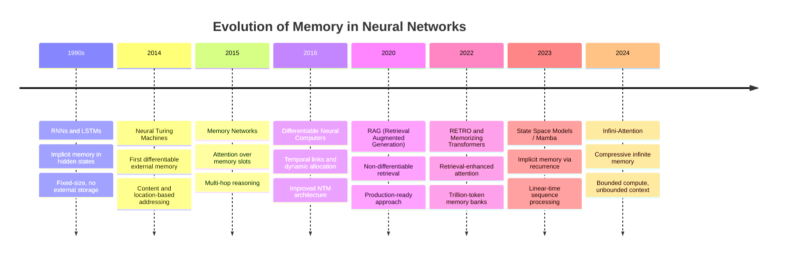
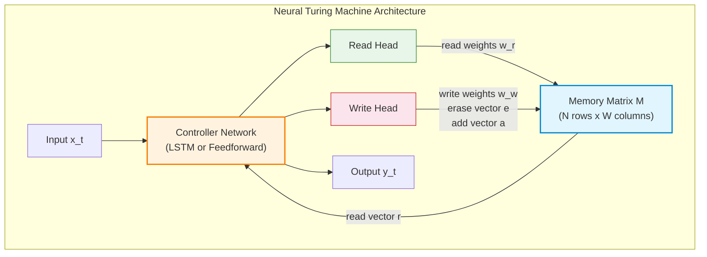
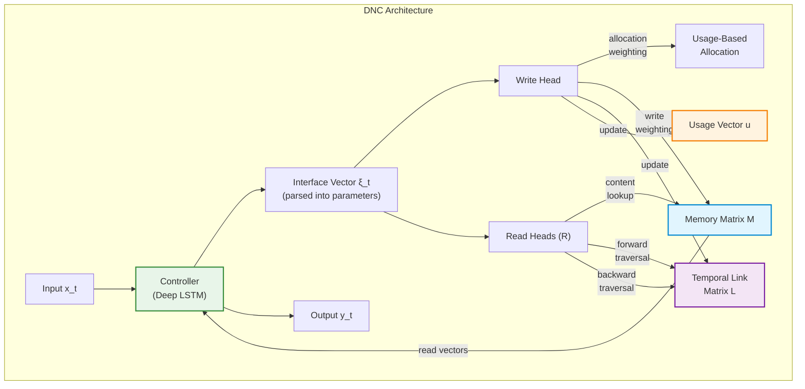
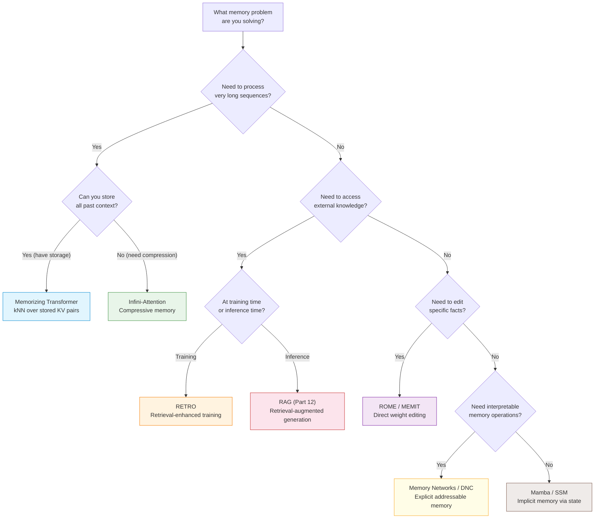

# Memory in AI Systems Deep Dive  Part 18: Research-Level Memory Architectures

---

**Series:** Memory in AI Systems  A Developer's Deep Dive from Fundamentals to Production
**Part:** 18 of 19 (Research Frontier)
**Audience:** Developers with programming experience who want to understand AI memory systems from the ground up
**Reading time:** ~55 minutes

---

In Part 17, we scaled memory systems to production  handling millions of users, building caching layers, adding observability, and ensuring resilience under pressure. We engineered systems that work reliably in the real world.

But the real world keeps changing. Researchers are asking questions that go far beyond anything we have built so far. Questions like: **What if a neural network could learn to use memory the same way a computer program does?** What if instead of hard-coding retrieval pipelines, we let the model learn when, where, and how to read and write its own memory? What if we could give a transformer infinite context without infinite compute? What if we could surgically edit specific facts inside a trained model without retraining it?

These are not hypothetical questions. They are active research directions, and many of them have produced working systems with published code.

This part is different from everything that came before. Parts 1 through 17 gave you tools and techniques you can deploy today. Part 18 gives you the **conceptual vocabulary and architectural understanding** to read cutting-edge research papers, evaluate new approaches as they emerge, and recognize when research ideas are ready to move into your production systems.

By the end of this part, you will:

- Understand **Neural Turing Machines (NTMs)**  the first differentiable external memory for neural networks
- Implement **Differentiable Neural Computers (DNCs)**  DeepMind's improved NTM with temporal links and memory allocation
- Build a **Memorizing Transformer** that extends context with kNN retrieval over a massive external memory bank
- Explore **Infini-Attention**  Google's approach to compressing infinite context into fixed memory
- Understand **RETRO**  retrieval-enhanced transformers that consult a trillion-token database during generation
- Implement **End-to-End Memory Networks** with multi-hop reasoning over stored memories
- Explore **State Space Models (SSMs) and Mamba**  implicit memory through selective recurrence
- Learn about **ROME**  surgically editing individual facts stored inside model weights
- See how all these approaches relate, differ, and point toward the future of AI memory

Let's step into the research frontier.

---

## Table of Contents

1. [The Research Frontier](#1-the-research-frontier)
2. [Neural Turing Machines (NTMs)](#2-neural-turing-machines-ntms)
3. [Differentiable Neural Computers (DNCs)](#3-differentiable-neural-computers-dncs)
4. [Memorizing Transformers](#4-memorizing-transformers)
5. [Infini-Attention](#5-infini-attention)
6. [RETRO  Retrieval-Enhanced Transformers](#6-retro--retrieval-enhanced-transformers)
7. [Memory Networks and End-to-End Memory Networks](#7-memory-networks-and-end-to-end-memory-networks)
8. [State Space Models and Mamba](#8-state-space-models-and-mamba)
9. [ROME  Editing Model Memory](#9-rome--editing-model-memory)
10. [Comparison and Future Directions](#10-comparison-and-future-directions)
11. [Vocabulary Cheat Sheet](#11-vocabulary-cheat-sheet)
12. [Key Takeaways and What's Next](#12-key-takeaways-and-whats-next)

---

## 1. The Research Frontier

### Why Production Memory Is Not Enough

Everything we built in Parts 1 through 17 relies on a fundamental separation: the **model** does thinking, and the **memory system** does storage and retrieval. We hand-crafted the bridge between them  chunking strategies, embedding models, vector databases, retrieval pipelines, reranking, prompt injection. We engineered every connection manually.

This works. It works well enough to ship products. But it has a deep limitation: **the model never truly learns how to use its memory.** We tell it what to remember, how to retrieve, and when to reference stored information. The model is a passive consumer of whatever our pipeline delivers.

Research-level memory architectures ask a different question: **What if memory access itself were differentiable?** What if the model could learn, through gradient descent, exactly how to read from and write to its memory? What if memory operations were as trainable as attention weights?



### The Taxonomy of Research Memory

Research memory architectures fall into distinct families, each with a different philosophy about how memory should work.

| Family | Philosophy | Example Systems | Key Mechanism |
|--------|-----------|-----------------|---------------|
| **Differentiable Memory** | Memory as a differentiable data structure | NTM, DNC | Learned read/write heads |
| **Attention-Based Memory** | Memory as slots attended over | Memory Networks, MemN2N | Multi-hop attention |
| **Retrieval-Augmented** | Memory as an external database | RETRO, Memorizing Transformer | kNN or chunked cross-attention |
| **Compressive Memory** | Memory as compressed representations | Infini-Attention, Compressive Transformer | Linear attention accumulators |
| **Implicit Memory** | Memory encoded in recurrent state | SSMs, Mamba, RWKV | Selective state transitions |
| **Weight Memory** | Memory stored in model parameters | ROME, MEMIT | Direct parameter editing |

> **Key insight:** These are not competing approaches  they are different answers to different questions. Differentiable memory asks "can we learn memory access patterns?" Retrieval-augmented memory asks "can we leverage massive external knowledge?" Compressive memory asks "can we remember everything efficiently?" Understanding which question each approach answers is more valuable than memorizing their architectures.

Let's dive into each one.

---

## 2. Neural Turing Machines (NTMs)

### The Idea That Started It All

In 2014, Alex Graves, Greg Wayne, and Ivo Danihelka at DeepMind published a paper that changed how we think about neural network memory. Their question was simple but profound: **a conventional computer has a CPU (for processing) and RAM (for storage). Can we build a neural network equivalent?**

The result was the Neural Turing Machine  a neural network augmented with an external memory matrix that it can learn to read from and write to. The name references Alan Turing's theoretical tape-based computing machine, and the analogy is intentional: like a Turing machine's tape, the NTM's memory provides unbounded (in principle) storage that the controller can access through learned operations.

Here is the critical architectural insight: **every operation on memory is smooth and differentiable.** Instead of reading from a single memory address (which would be a discrete, non-differentiable operation), the NTM reads from all addresses simultaneously, weighted by an attention distribution. This means we can compute gradients through memory operations and train the entire system end-to-end with backpropagation.



### NTM: Full Implementation

Let's build a complete Neural Turing Machine in PyTorch. This is not a toy  it is a faithful implementation of the core paper's mechanisms.

```python
import torch
import torch.nn as nn
import torch.nn.functional as F
import numpy as np
from typing import Tuple, Optional, Dict


class NTMMemory(nn.Module):
    """
    External memory matrix for the Neural Turing Machine.

    The memory is a matrix M of shape (N, W) where:
    - N = number of memory locations (slots)
    - W = width of each memory location (vector dimension)

    Key insight: all operations are differentiable, enabling
    end-to-end training with backpropagation.
    """

    def __init__(self, num_slots: int, slot_width: int):
        super().__init__()
        self.num_slots = num_slots    # N
        self.slot_width = slot_width  # W

        # Initialize memory with small random values
        # In practice, we reset this at the start of each sequence
        self.register_buffer(
            'initial_memory',
            torch.randn(num_slots, slot_width) * 0.01
        )

    def reset(self, batch_size: int) -> torch.Tensor:
        """Reset memory to initial state for a new sequence."""
        # Shape: (batch_size, N, W)
        return self.initial_memory.unsqueeze(0).expand(
            batch_size, -1, -1
        ).clone()

    def content_addressing(
        self,
        memory: torch.Tensor,
        key: torch.Tensor,
        strength: torch.Tensor
    ) -> torch.Tensor:
        """
        Content-based addressing: find memory locations whose
        content is similar to the query key.

        This is essentially attention over memory slots, where
        similarity is measured by cosine similarity scaled by
        a learnable 'strength' (temperature) parameter.

        Args:
            memory: (batch, N, W) - current memory state
            key: (batch, W) - query vector from controller
            strength: (batch, 1) - sharpness of attention (beta)

        Returns:
            weights: (batch, N) - attention distribution over slots
        """
        # Cosine similarity between key and each memory slot
        # key: (batch, W) -> (batch, 1, W)
        key = key.unsqueeze(1)

        # Compute cosine similarity: (batch, N)
        similarity = F.cosine_similarity(
            memory, key.expand_as(memory), dim=2
        )

        # Scale by strength and apply softmax
        # Higher strength = sharper attention (more focused reads)
        # Lower strength = softer attention (blurrier reads)
        weights = F.softmax(strength * similarity, dim=1)

        return weights

    def location_addressing(
        self,
        content_weights: torch.Tensor,
        prev_weights: torch.Tensor,
        interpolation_gate: torch.Tensor,
        shift_weights: torch.Tensor,
        sharpening_gamma: torch.Tensor
    ) -> torch.Tensor:
        """
        Location-based addressing: allows the NTM to shift attention
        to adjacent memory locations (like incrementing a pointer).

        This is a multi-step process:
        1. Interpolate between content weights and previous weights
        2. Apply circular convolution for shifting
        3. Sharpen the resulting distribution

        Args:
            content_weights: (batch, N) - from content addressing
            prev_weights: (batch, N) - weights from previous timestep
            interpolation_gate: (batch, 1) - gate g in [0, 1]
            shift_weights: (batch, shift_range) - shift kernel
            sharpening_gamma: (batch, 1) - sharpening factor >= 1

        Returns:
            weights: (batch, N) - final attention distribution
        """
        # Step 1: Interpolation
        # g=1 means use only content weights (look up by content)
        # g=0 means use only previous weights (stay where you were)
        gated = (
            interpolation_gate * content_weights +
            (1 - interpolation_gate) * prev_weights
        )

        # Step 2: Circular convolution (shift)
        # This allows the head to move to adjacent locations
        # Like incrementing or decrementing a memory pointer
        shifted = self._circular_convolve(gated, shift_weights)

        # Step 3: Sharpening
        # Raise to power gamma and renormalize
        # This counteracts the blurring effect of convolution
        sharpened = shifted ** sharpening_gamma
        weights = sharpened / (sharpened.sum(dim=1, keepdim=True) + 1e-8)

        return weights

    def _circular_convolve(
        self,
        weights: torch.Tensor,
        shift: torch.Tensor
    ) -> torch.Tensor:
        """
        Circular convolution for location-based shifting.

        If shift = [0, 1, 0], attention stays in place.
        If shift = [0, 0, 1], attention moves right by 1.
        If shift = [1, 0, 0], attention moves left by 1.
        """
        batch_size = weights.size(0)
        num_slots = weights.size(1)
        shift_size = shift.size(1)

        # Pad for circular convolution
        half_shift = shift_size // 2
        result = torch.zeros_like(weights)

        for b in range(batch_size):
            for i in range(num_slots):
                for j in range(shift_size):
                    # Circular index
                    idx = (i - half_shift + j) % num_slots
                    result[b, i] += weights[b, idx] * shift[b, j]

        return result

    def read(
        self,
        memory: torch.Tensor,
        weights: torch.Tensor
    ) -> torch.Tensor:
        """
        Read from memory using attention weights.

        This is a weighted sum over memory slots  like attention
        in a transformer, but over external memory rather than
        over input tokens.

        Args:
            memory: (batch, N, W) - memory matrix
            weights: (batch, N) - read attention weights

        Returns:
            read_vector: (batch, W) - weighted sum of memory slots
        """
        # (batch, N, 1) * (batch, N, W) -> sum -> (batch, W)
        return torch.bmm(weights.unsqueeze(1), memory).squeeze(1)

    def write(
        self,
        memory: torch.Tensor,
        weights: torch.Tensor,
        erase_vector: torch.Tensor,
        add_vector: torch.Tensor
    ) -> torch.Tensor:
        """
        Write to memory using erase-then-add protocol.

        Step 1 (Erase): For each slot, multiply element-wise by
                        (1 - w * e), reducing values where attention
                        and erase signal are both high.
        Step 2 (Add):   For each slot, add w * a, increasing values
                        where attention and add signal are both high.

        This two-step process lets the NTM both overwrite old
        information and add new information in a differentiable way.

        Args:
            memory: (batch, N, W) - current memory state
            weights: (batch, N) - write attention weights
            erase_vector: (batch, W) - what to erase (values in [0,1])
            add_vector: (batch, W) - what to add

        Returns:
            new_memory: (batch, N, W) - updated memory state
        """
        # Erase: M_t = M_{t-1} * (1 - w * e^T)
        # weights: (batch, N, 1), erase: (batch, 1, W)
        erase_matrix = torch.bmm(
            weights.unsqueeze(2),
            erase_vector.unsqueeze(1)
        )
        memory_after_erase = memory * (1 - erase_matrix)

        # Add: M_t = M_erased + w * a^T
        add_matrix = torch.bmm(
            weights.unsqueeze(2),
            add_vector.unsqueeze(1)
        )
        new_memory = memory_after_erase + add_matrix

        return new_memory


class NTMReadHead(nn.Module):
    """
    Read head that generates addressing parameters from
    the controller's state and uses them to read from memory.
    """

    def __init__(
        self,
        controller_size: int,
        slot_width: int,
        num_slots: int,
        shift_range: int = 3
    ):
        super().__init__()
        self.slot_width = slot_width
        self.num_slots = num_slots
        self.shift_range = shift_range

        # Generate all addressing parameters from controller output
        # Key vector for content addressing
        self.fc_key = nn.Linear(controller_size, slot_width)
        # Strength (beta) for content addressing sharpness
        self.fc_strength = nn.Linear(controller_size, 1)
        # Interpolation gate
        self.fc_gate = nn.Linear(controller_size, 1)
        # Shift weights for location addressing
        self.fc_shift = nn.Linear(controller_size, shift_range)
        # Sharpening factor (gamma)
        self.fc_gamma = nn.Linear(controller_size, 1)

    def forward(
        self,
        controller_output: torch.Tensor,
        memory: torch.Tensor,
        prev_weights: torch.Tensor,
        memory_module: NTMMemory
    ) -> Tuple[torch.Tensor, torch.Tensor]:
        """
        Produce a read vector from memory.

        Returns:
            read_vector: (batch, W) - information read from memory
            weights: (batch, N) - attention weights used (for next step)
        """
        # Generate addressing parameters
        key = torch.tanh(self.fc_key(controller_output))
        strength = F.softplus(self.fc_strength(controller_output))
        gate = torch.sigmoid(self.fc_gate(controller_output))
        shift = F.softmax(self.fc_shift(controller_output), dim=1)
        gamma = 1 + F.softplus(self.fc_gamma(controller_output))

        # Content-based addressing
        content_weights = memory_module.content_addressing(
            memory, key, strength
        )

        # Location-based addressing
        weights = memory_module.location_addressing(
            content_weights, prev_weights, gate, shift, gamma
        )

        # Read from memory
        read_vector = memory_module.read(memory, weights)

        return read_vector, weights


class NTMWriteHead(nn.Module):
    """
    Write head that generates addressing parameters AND
    erase/add vectors from the controller's state.
    """

    def __init__(
        self,
        controller_size: int,
        slot_width: int,
        num_slots: int,
        shift_range: int = 3
    ):
        super().__init__()
        self.slot_width = slot_width

        # Addressing parameters (same as read head)
        self.fc_key = nn.Linear(controller_size, slot_width)
        self.fc_strength = nn.Linear(controller_size, 1)
        self.fc_gate = nn.Linear(controller_size, 1)
        self.fc_shift = nn.Linear(controller_size, shift_range)
        self.fc_gamma = nn.Linear(controller_size, 1)

        # Write-specific parameters
        self.fc_erase = nn.Linear(controller_size, slot_width)
        self.fc_add = nn.Linear(controller_size, slot_width)

    def forward(
        self,
        controller_output: torch.Tensor,
        memory: torch.Tensor,
        prev_weights: torch.Tensor,
        memory_module: NTMMemory
    ) -> Tuple[torch.Tensor, torch.Tensor]:
        """
        Write to memory and return updated memory + weights.

        Returns:
            new_memory: (batch, N, W) - updated memory
            weights: (batch, N) - write attention weights
        """
        # Generate addressing parameters
        key = torch.tanh(self.fc_key(controller_output))
        strength = F.softplus(self.fc_strength(controller_output))
        gate = torch.sigmoid(self.fc_gate(controller_output))
        shift = F.softmax(self.fc_shift(controller_output), dim=1)
        gamma = 1 + F.softplus(self.fc_gamma(controller_output))

        # Generate write vectors
        erase = torch.sigmoid(self.fc_erase(controller_output))
        add = torch.tanh(self.fc_add(controller_output))

        # Compute write weights
        content_weights = memory_module.content_addressing(
            memory, key, strength
        )
        weights = memory_module.location_addressing(
            content_weights, prev_weights, gate, shift, gamma
        )

        # Write to memory
        new_memory = memory_module.write(memory, weights, erase, add)

        return new_memory, weights


class NeuralTuringMachine(nn.Module):
    """
    Complete Neural Turing Machine implementation.

    The NTM consists of:
    1. A controller network (LSTM) that processes inputs
    2. An external memory matrix
    3. Read and write heads that interface between controller and memory

    The controller receives the current input AND the previous read
    vector, processes them, and produces outputs for both the task
    and the memory heads.

    Architecture:
        input + prev_read -> controller(LSTM) -> output
                                    |
                            read_head + write_head
                                    |
                                 memory
    """

    def __init__(
        self,
        input_size: int,
        output_size: int,
        controller_size: int = 128,
        num_slots: int = 128,
        slot_width: int = 64,
        num_read_heads: int = 1,
        num_write_heads: int = 1,
        shift_range: int = 3
    ):
        super().__init__()
        self.input_size = input_size
        self.output_size = output_size
        self.controller_size = controller_size
        self.num_slots = num_slots
        self.slot_width = slot_width
        self.num_read_heads = num_read_heads

        # Memory module
        self.memory = NTMMemory(num_slots, slot_width)

        # Controller: LSTM that takes input + read vectors
        controller_input_size = input_size + num_read_heads * slot_width
        self.controller = nn.LSTMCell(
            controller_input_size, controller_size
        )

        # Read heads
        self.read_heads = nn.ModuleList([
            NTMReadHead(controller_size, slot_width, num_slots, shift_range)
            for _ in range(num_read_heads)
        ])

        # Write heads
        self.write_heads = nn.ModuleList([
            NTMWriteHead(controller_size, slot_width, num_slots, shift_range)
            for _ in range(num_write_heads)
        ])

        # Output layer: controller output + read vectors -> task output
        self.fc_output = nn.Linear(
            controller_size + num_read_heads * slot_width,
            output_size
        )

    def _init_state(self, batch_size: int, device: torch.device) -> Dict:
        """Initialize all state for a new sequence."""
        return {
            'memory': self.memory.reset(batch_size).to(device),
            'read_vectors': [
                torch.zeros(batch_size, self.slot_width, device=device)
                for _ in range(self.num_read_heads)
            ],
            'read_weights': [
                torch.zeros(batch_size, self.num_slots, device=device)
                for _ in range(self.num_read_heads)
            ],
            'write_weights': [
                torch.zeros(batch_size, self.num_slots, device=device)
                for _ in range(len(self.write_heads))
            ],
            'controller_state': (
                torch.zeros(batch_size, self.controller_size, device=device),
                torch.zeros(batch_size, self.controller_size, device=device)
            )
        }

    def forward_step(
        self,
        x: torch.Tensor,
        state: Dict
    ) -> Tuple[torch.Tensor, Dict]:
        """
        Process a single timestep.

        Args:
            x: (batch, input_size) - input for this timestep
            state: dictionary containing all NTM state

        Returns:
            output: (batch, output_size) - output for this timestep
            new_state: updated state dictionary
        """
        # Concatenate input with previous read vectors
        controller_input = torch.cat(
            [x] + state['read_vectors'], dim=1
        )

        # Run controller
        h, c = self.controller(
            controller_input, state['controller_state']
        )

        # Write to memory (write before read, as in the paper)
        memory = state['memory']
        new_write_weights = []
        for i, write_head in enumerate(self.write_heads):
            memory, w_weights = write_head(
                h, memory, state['write_weights'][i], self.memory
            )
            new_write_weights.append(w_weights)

        # Read from memory
        new_read_vectors = []
        new_read_weights = []
        for i, read_head in enumerate(self.read_heads):
            read_vec, r_weights = read_head(
                h, memory, state['read_weights'][i], self.memory
            )
            new_read_vectors.append(read_vec)
            new_read_weights.append(r_weights)

        # Compute output
        output_input = torch.cat([h] + new_read_vectors, dim=1)
        output = self.fc_output(output_input)

        # Pack new state
        new_state = {
            'memory': memory,
            'read_vectors': new_read_vectors,
            'read_weights': new_read_weights,
            'write_weights': new_write_weights,
            'controller_state': (h, c)
        }

        return output, new_state

    def forward(
        self,
        x: torch.Tensor
    ) -> torch.Tensor:
        """
        Process a full sequence.

        Args:
            x: (batch, seq_len, input_size) - input sequence

        Returns:
            outputs: (batch, seq_len, output_size) - output sequence
        """
        batch_size, seq_len, _ = x.size()
        state = self._init_state(batch_size, x.device)

        outputs = []
        for t in range(seq_len):
            output, state = self.forward_step(x[:, t, :], state)
            outputs.append(output)

        return torch.stack(outputs, dim=1)


# === Demonstration: Copy Task ===
# The classic NTM benchmark  learn to copy input sequences

def train_ntm_copy_task():
    """
    Train an NTM on the copy task.

    The network sees a sequence of random binary vectors,
    then a delimiter, then must output the same sequence.
    This requires learning to:
    1. Write each input to a different memory location
    2. After the delimiter, read them back in order
    """
    # Configuration
    seq_len = 8        # Length of sequence to copy
    vector_size = 8    # Size of each binary vector
    num_epochs = 5000
    batch_size = 16

    # +1 for delimiter channel, +1 for end-of-sequence flag
    input_size = vector_size + 2
    output_size = vector_size

    # Create NTM
    ntm = NeuralTuringMachine(
        input_size=input_size,
        output_size=output_size,
        controller_size=100,
        num_slots=64,
        slot_width=20,
        num_read_heads=1,
        num_write_heads=1
    )

    optimizer = torch.optim.Adam(ntm.parameters(), lr=1e-4)
    criterion = nn.BCEWithLogitsLoss()

    for epoch in range(num_epochs):
        # Generate random binary sequences
        # Shape: (batch, seq_len, vector_size)
        seq = torch.randint(0, 2, (batch_size, seq_len, vector_size)).float()

        # Build full input: [seq, delimiter, zeros for output phase]
        # Input phase: sequence with no delimiter flag
        input_phase = torch.zeros(batch_size, seq_len, input_size)
        input_phase[:, :, :vector_size] = seq

        # Delimiter
        delimiter = torch.zeros(batch_size, 1, input_size)
        delimiter[:, :, vector_size] = 1.0  # Delimiter channel

        # Output phase: just zeros (network must produce output from memory)
        output_phase = torch.zeros(batch_size, seq_len, input_size)
        output_phase[:, :, vector_size + 1] = 1.0  # End-of-seq flag

        # Full input sequence
        full_input = torch.cat([input_phase, delimiter, output_phase], dim=1)

        # Run NTM
        full_output = ntm(full_input)

        # Loss only on the output phase
        output_predictions = full_output[:, seq_len + 1:, :]
        loss = criterion(output_predictions, seq)

        # Backprop
        optimizer.zero_grad()
        loss.backward()
        # Gradient clipping is important for NTMs
        torch.nn.utils.clip_grad_norm_(ntm.parameters(), max_norm=10.0)
        optimizer.step()

        if (epoch + 1) % 500 == 0:
            # Check accuracy
            with torch.no_grad():
                predictions = (torch.sigmoid(output_predictions) > 0.5).float()
                accuracy = (predictions == seq).float().mean()
                print(
                    f"Epoch {epoch+1}/{num_epochs} | "
                    f"Loss: {loss.item():.4f} | "
                    f"Accuracy: {accuracy.item():.4f}"
                )

    return ntm


# Run training
print("Training NTM on copy task...")
print("The NTM must learn to write inputs to memory,")
print("then read them back in the same order.\n")
# ntm = train_ntm_copy_task()
```

> **Why the copy task matters:** It might seem trivial  just copy a sequence. But for a neural network without external memory, this is impossible for arbitrary-length sequences. The network's fixed-size hidden state cannot store an arbitrary number of vectors. The NTM solves it by learning to write each vector to a separate memory location, then read them back sequentially. This is the neural network equivalent of learning to use a for-loop with array storage.

### What NTMs Taught Us

Neural Turing Machines established several principles that influence every subsequent memory architecture:

1. **Differentiable addressing works.** You can compute gradients through memory lookups, and the system learns useful access patterns.

2. **Content + location addressing is powerful.** Content addressing ("find the slot that matches this query") handles associative lookup. Location addressing ("move to the next slot") handles sequential access. Together, they cover most memory access patterns.

3. **External memory decouples capacity from computation.** The controller can be small while the memory is large. This separation is the key architectural principle.

4. **Training is hard.** NTMs are notoriously difficult to train. The addressing mechanism can be unstable, gradients can vanish through the memory operations, and the system is sensitive to hyperparameters.

---

## 3. Differentiable Neural Computers (DNCs)

### Improving on the NTM

Two years after the NTM, the same DeepMind team (now led by Alex Graves and Greg Wayne with others) published the **Differentiable Neural Computer**. The DNC addresses the NTM's practical limitations with three key innovations:

1. **Dynamic memory allocation**  the DNC tracks which memory slots are free and automatically allocates unused slots for writing, rather than relying entirely on content/location addressing to find empty space.

2. **Temporal link matrix**  the DNC records the order in which memory locations were written, enabling it to traverse memories in the order they were stored (forward) or reverse order (backward).

3. **Improved read mechanisms**  multiple read modes (content-based, forward traversal, backward traversal) that the controller can blend dynamically.



### DNC: Full Implementation

```python
import torch
import torch.nn as nn
import torch.nn.functional as F
from typing import Tuple, Dict, List


class DNCMemory(nn.Module):
    """
    Differentiable Neural Computer memory module.

    Improvements over NTM:
    - Usage-based allocation: tracks which slots are used/free
    - Temporal links: records write order for sequential traversal
    - Multiple read modes: content, forward, backward
    """

    def __init__(self, num_slots: int, slot_width: int, num_reads: int):
        super().__init__()
        self.N = num_slots
        self.W = slot_width
        self.R = num_reads

    def init_state(self, batch_size: int, device: torch.device) -> Dict:
        """Initialize all DNC memory state."""
        return {
            # Memory matrix: (batch, N, W)
            'memory': torch.zeros(batch_size, self.N, self.W, device=device),
            # Usage vector: tracks how "used" each slot is
            'usage': torch.zeros(batch_size, self.N, device=device),
            # Temporal link matrix: L[i,j] = degree to which i was written
            # after j. Used for sequential traversal.
            'link': torch.zeros(
                batch_size, self.N, self.N, device=device
            ),
            # Precedence weights: how recently each location was written
            'precedence': torch.zeros(batch_size, self.N, device=device),
            # Previous read weights: (batch, R, N)
            'read_weights': torch.zeros(
                batch_size, self.R, self.N, device=device
            ),
            # Previous write weights: (batch, N)
            'write_weights': torch.zeros(
                batch_size, self.N, device=device
            ),
        }

    def content_lookup(
        self,
        memory: torch.Tensor,
        keys: torch.Tensor,
        strengths: torch.Tensor
    ) -> torch.Tensor:
        """
        Content-based addressing (same principle as NTM).

        Args:
            memory: (batch, N, W)
            keys: (batch, num_heads, W)
            strengths: (batch, num_heads, 1)

        Returns:
            weights: (batch, num_heads, N)
        """
        # Normalize memory and keys for cosine similarity
        memory_norm = F.normalize(memory, dim=2)  # (batch, N, W)
        keys_norm = F.normalize(keys, dim=2)      # (batch, heads, W)

        # Cosine similarity: (batch, heads, N)
        similarity = torch.bmm(
            keys_norm, memory_norm.transpose(1, 2)
        )

        # Apply strength and softmax
        return F.softmax(strengths * similarity, dim=2)

    def allocation_weighting(
        self,
        usage: torch.Tensor
    ) -> torch.Tensor:
        """
        Compute allocation weights based on memory usage.

        The idea: sort memory locations by usage (ascending),
        then allocate to the least-used locations first.

        This is the DNC's answer to "where should I write new data?"
        Instead of relying on content addressing to find empty slots
        (which is unreliable), we explicitly track usage.

        Args:
            usage: (batch, N) - current usage of each slot

        Returns:
            allocation: (batch, N) - allocation weights
        """
        batch_size = usage.size(0)

        # Sort by usage (ascending  least used first)
        sorted_usage, indices = torch.sort(usage, dim=1)

        # Compute allocation weights
        # a[phi[j]] = (1 - u[phi[j]]) * prod_{i=1}^{j-1} u[phi[i]]
        # This gives high weight to the first free slot found
        cumprod = torch.cumprod(sorted_usage, dim=1)
        # Shift cumprod right (first element should be 1.0)
        cumprod_shifted = torch.cat([
            torch.ones(batch_size, 1, device=usage.device),
            cumprod[:, :-1]
        ], dim=1)

        sorted_allocation = (1 - sorted_usage) * cumprod_shifted

        # Unsort back to original order
        allocation = torch.zeros_like(usage)
        allocation.scatter_(1, indices, sorted_allocation)

        return allocation

    def update_usage(
        self,
        usage: torch.Tensor,
        write_weights: torch.Tensor,
        read_weights: torch.Tensor,
        free_gates: torch.Tensor
    ) -> torch.Tensor:
        """
        Update usage vector after read and write operations.

        Usage increases when we write to a location.
        Usage decreases when we read from a location AND the
        free gate is high (indicating we're done with that memory).

        Args:
            usage: (batch, N) - previous usage
            write_weights: (batch, N) - where we wrote
            read_weights: (batch, R, N) - where we read
            free_gates: (batch, R, 1) - whether to free after reading

        Returns:
            new_usage: (batch, N) - updated usage
        """
        # Memory retention: how much each slot is retained after freeing
        # psi = product over read heads of (1 - f_i * w_r_i)
        retention = torch.ones_like(usage)
        for i in range(self.R):
            retention = retention * (
                1 - free_gates[:, i, :] * read_weights[:, i, :]
            )

        # New usage: apply retention, then add write usage
        new_usage = (usage + write_weights - usage * write_weights) * retention

        return new_usage

    def update_temporal_links(
        self,
        link: torch.Tensor,
        precedence: torch.Tensor,
        write_weights: torch.Tensor
    ) -> Tuple[torch.Tensor, torch.Tensor]:
        """
        Update the temporal link matrix and precedence weights.

        The link matrix L records write ordering:
        L[i,j] represents the degree to which location i was
        written to directly after location j.

        This enables the DNC to traverse memories in the order
        they were written  like following a linked list.

        Args:
            link: (batch, N, N) - previous link matrix
            precedence: (batch, N) - previous precedence weights
            write_weights: (batch, N) - current write weights

        Returns:
            new_link: (batch, N, N) - updated link matrix
            new_precedence: (batch, N) - updated precedence
        """
        batch_size = write_weights.size(0)

        # Update link matrix
        # L[i,j] = (1 - w_w[i] - w_w[j]) * L[i,j] + w_w[i] * p[j]
        w_w = write_weights.unsqueeze(2)  # (batch, N, 1)
        p = precedence.unsqueeze(1)       # (batch, 1, N)

        new_link = (1 - w_w - w_w.transpose(1, 2)) * link + w_w * p

        # Zero out diagonal (a location can't link to itself)
        mask = torch.eye(self.N, device=link.device).unsqueeze(0)
        new_link = new_link * (1 - mask)

        # Update precedence
        # p_t = (1 - sum(w_w)) * p_{t-1} + w_w
        new_precedence = (
            (1 - write_weights.sum(dim=1, keepdim=True)) * precedence +
            write_weights
        )

        return new_link, new_precedence

    def forward_backward_weights(
        self,
        link: torch.Tensor,
        prev_read_weights: torch.Tensor
    ) -> Tuple[torch.Tensor, torch.Tensor]:
        """
        Compute forward and backward traversal weights.

        Forward: f[i] = sum_j L[i,j] * w_{r,prev}[j]
            "Where was written after the locations I last read?"

        Backward: b[i] = sum_j L[j,i] * w_{r,prev}[j]
            "Where was written before the locations I last read?"

        Args:
            link: (batch, N, N) - temporal link matrix
            prev_read_weights: (batch, R, N) - previous read weights

        Returns:
            forward_weights: (batch, R, N)
            backward_weights: (batch, R, N)
        """
        # Forward: multiply link matrix by previous read weights
        # (batch, N, N) x (batch, R, N)^T -> (batch, R, N)
        forward_weights = torch.bmm(
            prev_read_weights, link.transpose(1, 2)
        )

        # Backward: multiply transposed link matrix
        backward_weights = torch.bmm(
            prev_read_weights, link
        )

        return forward_weights, backward_weights


class DNC(nn.Module):
    """
    Complete Differentiable Neural Computer.

    The DNC processes sequences by:
    1. Controller (deep LSTM) processes input + previous reads
    2. Controller outputs an interface vector
    3. Interface vector is parsed into memory operation parameters
    4. Memory operations (allocation, write, read) are performed
    5. Read vectors are combined with controller output for final output
    """

    def __init__(
        self,
        input_size: int,
        output_size: int,
        controller_size: int = 256,
        num_layers: int = 1,
        num_slots: int = 256,
        slot_width: int = 64,
        num_reads: int = 4
    ):
        super().__init__()
        self.input_size = input_size
        self.output_size = output_size
        self.controller_size = controller_size
        self.num_layers = num_layers
        self.num_slots = num_slots
        self.slot_width = slot_width
        self.num_reads = num_reads

        # Memory
        self.memory = DNCMemory(num_slots, slot_width, num_reads)

        # Controller: LSTM
        controller_input_size = input_size + num_reads * slot_width
        self.controller = nn.LSTM(
            controller_input_size,
            controller_size,
            num_layers=num_layers,
            batch_first=True
        )

        # Interface vector size calculation
        # For each read head: key(W) + strength(1) + free_gate(1) + mode(3)
        # For write head: key(W) + strength(1) + erase(W) + add(W) + alloc_gate(1) + write_gate(1)
        interface_size = (
            num_reads * slot_width +  # read keys
            num_reads +                # read strengths
            num_reads +                # free gates
            num_reads * 3 +            # read modes (content, forward, backward)
            slot_width +               # write key
            1 +                        # write strength
            slot_width +               # erase vector
            slot_width +               # write vector (add)
            1 +                        # allocation gate
            1                          # write gate
        )

        self.fc_interface = nn.Linear(controller_size, interface_size)

        # Output
        self.fc_output = nn.Linear(
            controller_size + num_reads * slot_width, output_size
        )

    def _parse_interface(
        self, interface: torch.Tensor
    ) -> Dict[str, torch.Tensor]:
        """Parse the interface vector into individual parameters."""
        W = self.slot_width
        R = self.num_reads

        idx = 0
        parsed = {}

        # Read keys: (batch, R, W)
        parsed['read_keys'] = interface[:, idx:idx + R * W].view(-1, R, W)
        idx += R * W

        # Read strengths: (batch, R, 1)
        parsed['read_strengths'] = F.softplus(
            interface[:, idx:idx + R]
        ).unsqueeze(2)
        idx += R

        # Free gates: (batch, R, 1)
        parsed['free_gates'] = torch.sigmoid(
            interface[:, idx:idx + R]
        ).unsqueeze(2)
        idx += R

        # Read modes: (batch, R, 3)  softmax over 3 modes
        raw_modes = interface[:, idx:idx + R * 3].view(-1, R, 3)
        parsed['read_modes'] = F.softmax(raw_modes, dim=2)
        idx += R * 3

        # Write key: (batch, 1, W)
        parsed['write_key'] = interface[:, idx:idx + W].unsqueeze(1)
        idx += W

        # Write strength: (batch, 1, 1)
        parsed['write_strength'] = F.softplus(
            interface[:, idx:idx + 1]
        ).unsqueeze(2)
        idx += 1

        # Erase vector: (batch, W)
        parsed['erase'] = torch.sigmoid(interface[:, idx:idx + W])
        idx += W

        # Write/add vector: (batch, W)
        parsed['write_vector'] = interface[:, idx:idx + W]
        idx += W

        # Allocation gate: (batch, 1)
        parsed['alloc_gate'] = torch.sigmoid(interface[:, idx:idx + 1])
        idx += 1

        # Write gate: (batch, 1)
        parsed['write_gate'] = torch.sigmoid(interface[:, idx:idx + 1])
        idx += 1

        return parsed

    def forward(self, x: torch.Tensor) -> torch.Tensor:
        """
        Process a full sequence through the DNC.

        Args:
            x: (batch, seq_len, input_size)

        Returns:
            outputs: (batch, seq_len, output_size)
        """
        batch_size, seq_len, _ = x.size()
        device = x.device

        # Initialize memory state
        mem_state = self.memory.init_state(batch_size, device)

        # Initialize read vectors
        prev_reads = torch.zeros(
            batch_size, self.num_reads * self.slot_width, device=device
        )

        outputs = []

        for t in range(seq_len):
            # Concatenate input with previous read vectors
            controller_input = torch.cat(
                [x[:, t, :], prev_reads], dim=1
            ).unsqueeze(1)

            # Run controller for one step
            if t == 0:
                ctrl_output, ctrl_state = self.controller(controller_input)
            else:
                ctrl_output, ctrl_state = self.controller(
                    controller_input, ctrl_state
                )

            ctrl_output = ctrl_output.squeeze(1)  # (batch, controller_size)

            # Generate and parse interface vector
            interface = self.fc_interface(ctrl_output)
            params = self._parse_interface(interface)

            # === WRITE OPERATIONS ===

            # 1. Compute allocation weighting
            alloc_weights = self.memory.allocation_weighting(
                mem_state['usage']
            )

            # 2. Content-based write lookup
            write_content = self.memory.content_lookup(
                mem_state['memory'],
                params['write_key'],
                params['write_strength']
            ).squeeze(1)  # (batch, N)

            # 3. Combine allocation and content for write weights
            # alloc_gate interpolates between content and allocation
            # write_gate controls overall write strength
            write_weights = params['write_gate'] * (
                params['alloc_gate'] * alloc_weights +
                (1 - params['alloc_gate']) * write_content
            )

            # 4. Write to memory
            erase_matrix = torch.bmm(
                write_weights.unsqueeze(2),
                params['erase'].unsqueeze(1)
            )
            add_matrix = torch.bmm(
                write_weights.unsqueeze(2),
                params['write_vector'].unsqueeze(1)
            )
            memory = mem_state['memory'] * (1 - erase_matrix) + add_matrix

            # 5. Update temporal links
            link, precedence = self.memory.update_temporal_links(
                mem_state['link'],
                mem_state['precedence'],
                write_weights
            )

            # 6. Update usage
            usage = self.memory.update_usage(
                mem_state['usage'],
                write_weights,
                mem_state['read_weights'],
                params['free_gates']
            )

            # === READ OPERATIONS ===

            # 1. Content-based read lookup
            read_content = self.memory.content_lookup(
                memory, params['read_keys'], params['read_strengths']
            )  # (batch, R, N)

            # 2. Forward and backward traversal weights
            forward_w, backward_w = self.memory.forward_backward_weights(
                link, mem_state['read_weights']
            )

            # 3. Combine three read modes
            # modes: (batch, R, 3)  [backward, content, forward]
            modes = params['read_modes']
            read_weights = (
                modes[:, :, 0:1] * backward_w +
                modes[:, :, 1:2] * read_content +
                modes[:, :, 2:3] * forward_w
            )

            # 4. Read from memory
            # read_weights: (batch, R, N), memory: (batch, N, W)
            read_vectors = torch.bmm(
                read_weights, memory
            )  # (batch, R, W)

            # Flatten read vectors for controller input
            prev_reads = read_vectors.view(
                batch_size, self.num_reads * self.slot_width
            )

            # === OUTPUT ===
            output = self.fc_output(
                torch.cat([ctrl_output, prev_reads], dim=1)
            )
            outputs.append(output)

            # Update memory state
            mem_state = {
                'memory': memory,
                'usage': usage,
                'link': link,
                'precedence': precedence,
                'read_weights': read_weights,
                'write_weights': write_weights,
            }

        return torch.stack(outputs, dim=1)


# === Demonstration ===
def demo_dnc():
    """Test DNC on a simple sequence task."""
    batch_size = 4
    seq_len = 10
    input_size = 16
    output_size = 16

    dnc = DNC(
        input_size=input_size,
        output_size=output_size,
        controller_size=128,
        num_slots=64,
        slot_width=32,
        num_reads=2
    )

    # Random input
    x = torch.randn(batch_size, seq_len, input_size)

    # Forward pass
    output = dnc(x)
    print(f"Input shape:  {x.shape}")
    print(f"Output shape: {output.shape}")
    print(f"Parameters:   {sum(p.numel() for p in dnc.parameters()):,}")

    # Verify gradients flow through memory
    loss = output.sum()
    loss.backward()

    grad_norms = {
        name: param.grad.norm().item()
        for name, param in dnc.named_parameters()
        if param.grad is not None
    }
    print(f"Gradient norms (sample): "
          f"{list(grad_norms.items())[:3]}")
    print("Gradients flow through memory operations!")

# demo_dnc()
```

> **Key insight  DNC vs NTM:** The DNC's temporal link matrix is its most important innovation. Consider a question-answering task: "What happened after event X?" With an NTM, the network must learn to use location-based shifting to traverse memory sequentially  a fragile learned behavior. With a DNC, the temporal links explicitly record write order, so "what comes next" is a built-in operation. This is the difference between learning to simulate a data structure and having the data structure built into your architecture.

### When to Use NTM/DNC Ideas in Practice

While you probably will not deploy a raw NTM or DNC in production today (they are difficult to train and have been somewhat superseded by transformer-based approaches), their ideas appear throughout modern systems:

- **Content-based addressing** is exactly the same mechanism as attention in transformers
- **Separate read/write operations** appear in many memory-augmented architectures
- **Usage tracking and allocation** inspired memory management in modern systems
- **Temporal links** foreshadowed the importance of positional information in transformers

---

## 4. Memorizing Transformers

### The Context Length Problem

Standard transformers have a fundamental limitation: they can only attend to tokens within their context window. GPT-4 might have a 128K token context, but what about the 129th thousand token? What about a million tokens of conversation history?

The **Memorizing Transformer** (Wu et al., 2022) offers an elegant solution: augment standard attention with **kNN lookup over a massive external memory bank** of past key-value pairs. Instead of throwing away past context, store it in an external database and retrieve relevant entries when needed.

The beauty of this approach is that it requires minimal changes to the transformer architecture  just one additional attention mechanism that gates between local (standard) attention and memory (kNN) attention.

### How It Works

The Memorizing Transformer modifies only one layer of the transformer (typically a middle layer). At that layer, in addition to normal self-attention over the current context window, the model also performs a **kNN search** over a large external memory of past (key, value) pairs. A learned gate combines the two attention outputs.

```python
import torch
import torch.nn as nn
import torch.nn.functional as F
import math
from typing import Optional, Tuple


class KNNMemoryBank:
    """
    External memory bank that stores key-value pairs from
    past sequences and supports approximate nearest neighbor search.

    In production, this would use FAISS or ScaNN for efficient
    kNN search. Here we use exact search for clarity.
    """

    def __init__(self, dim: int, max_size: int = 262144):
        self.dim = dim
        self.max_size = max_size
        self.keys: Optional[torch.Tensor] = None    # (num_stored, dim)
        self.values: Optional[torch.Tensor] = None   # (num_stored, dim)

    def add(self, keys: torch.Tensor, values: torch.Tensor):
        """
        Add new key-value pairs to the memory bank.

        Args:
            keys: (batch, seq_len, dim) - keys to store
            values: (batch, seq_len, dim) - values to store
        """
        # Flatten batch dimension for storage
        flat_keys = keys.detach().reshape(-1, self.dim)
        flat_values = values.detach().reshape(-1, self.dim)

        if self.keys is None:
            self.keys = flat_keys
            self.values = flat_values
        else:
            self.keys = torch.cat([self.keys, flat_keys], dim=0)
            self.values = torch.cat([self.values, flat_values], dim=0)

        # Evict oldest entries if over capacity
        if self.keys.size(0) > self.max_size:
            self.keys = self.keys[-self.max_size:]
            self.values = self.values[-self.max_size:]

    def search(
        self,
        queries: torch.Tensor,
        top_k: int = 32
    ) -> Tuple[torch.Tensor, torch.Tensor, torch.Tensor]:
        """
        Find the top-k nearest neighbors for each query.

        Args:
            queries: (batch, seq_len, dim)
            top_k: number of neighbors to retrieve

        Returns:
            retrieved_keys: (batch, seq_len, top_k, dim)
            retrieved_values: (batch, seq_len, top_k, dim)
            scores: (batch, seq_len, top_k) - similarity scores
        """
        if self.keys is None or self.keys.size(0) == 0:
            batch, seq_len, dim = queries.shape
            return (
                torch.zeros(batch, seq_len, top_k, dim, device=queries.device),
                torch.zeros(batch, seq_len, top_k, dim, device=queries.device),
                torch.zeros(batch, seq_len, top_k, device=queries.device)
            )

        batch, seq_len, dim = queries.shape
        # Flatten queries: (batch * seq_len, dim)
        flat_queries = queries.reshape(-1, dim)

        # Compute similarities: (batch * seq_len, num_stored)
        similarities = torch.mm(
            flat_queries,
            self.keys.to(queries.device).t()
        ) / math.sqrt(dim)

        # Top-k: (batch * seq_len, top_k)
        actual_k = min(top_k, self.keys.size(0))
        scores, indices = similarities.topk(actual_k, dim=1)

        # Gather retrieved keys and values
        retrieved_keys = self.keys[indices]    # (batch*seq, top_k, dim)
        retrieved_values = self.values[indices]

        # Reshape back to batch dimensions
        retrieved_keys = retrieved_keys.view(batch, seq_len, actual_k, dim)
        retrieved_values = retrieved_values.view(batch, seq_len, actual_k, dim)
        scores = scores.view(batch, seq_len, actual_k)

        # Pad if we got fewer than top_k results
        if actual_k < top_k:
            pad_size = top_k - actual_k
            retrieved_keys = F.pad(retrieved_keys, (0, 0, 0, pad_size))
            retrieved_values = F.pad(retrieved_values, (0, 0, 0, pad_size))
            scores = F.pad(scores, (0, pad_size), value=-1e9)

        return retrieved_keys, retrieved_values, scores

    @property
    def size(self) -> int:
        return 0 if self.keys is None else self.keys.size(0)


class MemorizingAttention(nn.Module):
    """
    Attention layer that combines standard local attention
    with kNN attention over an external memory bank.

    This is the core innovation of the Memorizing Transformer:
    a single layer that can attend to both the current context
    AND a massive external memory of past key-value pairs.
    """

    def __init__(
        self,
        d_model: int,
        num_heads: int,
        top_k: int = 32,
        memory_size: int = 262144
    ):
        super().__init__()
        self.d_model = d_model
        self.num_heads = num_heads
        self.head_dim = d_model // num_heads
        self.top_k = top_k

        # Standard QKV projections for local attention
        self.q_proj = nn.Linear(d_model, d_model)
        self.k_proj = nn.Linear(d_model, d_model)
        self.v_proj = nn.Linear(d_model, d_model)
        self.out_proj = nn.Linear(d_model, d_model)

        # Learnable gate: how much to use memory vs local attention
        # Initialized to 0 so the model starts by using only local
        # attention and gradually learns to use memory
        self.gate = nn.Parameter(torch.zeros(1, num_heads, 1, 1))

        # External memory bank (not a nn.Module  it's a data store)
        self.memory_bank = KNNMemoryBank(self.head_dim, memory_size)

    def forward(
        self,
        x: torch.Tensor,
        mask: Optional[torch.Tensor] = None,
        store_to_memory: bool = True
    ) -> torch.Tensor:
        """
        Forward pass with local + memory attention.

        Args:
            x: (batch, seq_len, d_model)
            mask: optional attention mask
            store_to_memory: whether to add current KVs to memory

        Returns:
            output: (batch, seq_len, d_model)
        """
        batch, seq_len, _ = x.shape

        # Compute Q, K, V
        Q = self.q_proj(x)
        K = self.k_proj(x)
        V = self.v_proj(x)

        # Reshape for multi-head attention
        # (batch, seq_len, num_heads, head_dim) -> (batch, num_heads, seq_len, head_dim)
        Q = Q.view(batch, seq_len, self.num_heads, self.head_dim).transpose(1, 2)
        K = K.view(batch, seq_len, self.num_heads, self.head_dim).transpose(1, 2)
        V = V.view(batch, seq_len, self.num_heads, self.head_dim).transpose(1, 2)

        # === LOCAL ATTENTION (standard) ===
        scale = math.sqrt(self.head_dim)
        local_scores = torch.matmul(Q, K.transpose(-2, -1)) / scale

        if mask is not None:
            local_scores = local_scores.masked_fill(mask == 0, -1e9)

        local_attn = F.softmax(local_scores, dim=-1)
        local_output = torch.matmul(local_attn, V)

        # === MEMORY ATTENTION (kNN) ===
        # Use first head's keys for kNN search (for efficiency)
        # In practice, you might search with all heads
        query_for_search = Q[:, 0]  # (batch, seq_len, head_dim)
        retrieved_keys, retrieved_values, knn_scores = \
            self.memory_bank.search(query_for_search, self.top_k)

        # Compute attention over retrieved items
        # Q: (batch, num_heads, seq_len, head_dim)
        # retrieved_keys: (batch, seq_len, top_k, head_dim)
        retrieved_keys = retrieved_keys.unsqueeze(1).expand(
            -1, self.num_heads, -1, -1, -1
        )
        retrieved_values = retrieved_values.unsqueeze(1).expand(
            -1, self.num_heads, -1, -1, -1
        )

        # (batch, heads, seq_len, 1, head_dim) x (batch, heads, seq_len, head_dim, top_k)
        mem_scores = torch.matmul(
            Q.unsqueeze(3), retrieved_keys.transpose(-2, -1)
        ).squeeze(3) / scale  # (batch, heads, seq_len, top_k)

        mem_attn = F.softmax(mem_scores, dim=-1)

        # (batch, heads, seq_len, top_k) x (batch, heads, seq_len, top_k, head_dim)
        mem_output = torch.matmul(
            mem_attn.unsqueeze(3), retrieved_values
        ).squeeze(3)  # (batch, heads, seq_len, head_dim)

        # === GATE between local and memory attention ===
        gate = torch.sigmoid(self.gate)  # (1, heads, 1, 1)
        combined = (1 - gate) * local_output + gate * mem_output

        # Reshape back: (batch, num_heads, seq_len, head_dim) -> (batch, seq_len, d_model)
        combined = combined.transpose(1, 2).contiguous().view(
            batch, seq_len, self.d_model
        )
        output = self.out_proj(combined)

        # Store current KVs to memory for future use
        if store_to_memory:
            # Store keys from first head
            self.memory_bank.add(
                K[:, 0].detach(),
                V[:, 0].detach()
            )

        return output


class MemorizingTransformerBlock(nn.Module):
    """
    A single transformer block that optionally uses memorizing attention.
    """

    def __init__(
        self,
        d_model: int,
        num_heads: int,
        d_ff: int,
        use_memory: bool = False,
        top_k: int = 32
    ):
        super().__init__()
        self.use_memory = use_memory

        if use_memory:
            self.attention = MemorizingAttention(
                d_model, num_heads, top_k
            )
        else:
            self.attention = nn.MultiheadAttention(
                d_model, num_heads, batch_first=True
            )

        self.norm1 = nn.LayerNorm(d_model)
        self.norm2 = nn.LayerNorm(d_model)
        self.ffn = nn.Sequential(
            nn.Linear(d_model, d_ff),
            nn.GELU(),
            nn.Linear(d_ff, d_model)
        )

    def forward(self, x: torch.Tensor) -> torch.Tensor:
        # Self-attention with residual
        normed = self.norm1(x)
        if self.use_memory:
            attn_out = self.attention(normed)
        else:
            attn_out, _ = self.attention(normed, normed, normed)
        x = x + attn_out

        # FFN with residual
        x = x + self.ffn(self.norm2(x))
        return x


class MemorizingTransformer(nn.Module):
    """
    Full Memorizing Transformer model.

    Architecture: Standard transformer with ONE layer replaced
    by a memorizing attention layer (typically a middle layer).
    """

    def __init__(
        self,
        vocab_size: int = 32000,
        d_model: int = 512,
        num_heads: int = 8,
        num_layers: int = 6,
        d_ff: int = 2048,
        memory_layer: int = 3,
        top_k: int = 32,
        max_seq_len: int = 512
    ):
        super().__init__()
        self.embedding = nn.Embedding(vocab_size, d_model)
        self.pos_encoding = nn.Embedding(max_seq_len, d_model)

        self.layers = nn.ModuleList([
            MemorizingTransformerBlock(
                d_model, num_heads, d_ff,
                use_memory=(i == memory_layer),
                top_k=top_k
            )
            for i in range(num_layers)
        ])

        self.norm = nn.LayerNorm(d_model)
        self.output_proj = nn.Linear(d_model, vocab_size)

    def forward(self, input_ids: torch.Tensor) -> torch.Tensor:
        batch, seq_len = input_ids.shape
        positions = torch.arange(seq_len, device=input_ids.device)

        x = self.embedding(input_ids) + self.pos_encoding(positions)

        for layer in self.layers:
            x = layer(x)

        x = self.norm(x)
        return self.output_proj(x)


# === Demonstration ===
def demo_memorizing_transformer():
    model = MemorizingTransformer(
        vocab_size=1000, d_model=128, num_heads=4,
        num_layers=4, d_ff=512, memory_layer=2, top_k=8
    )

    # Process first "document"  keys/values stored to memory
    doc1 = torch.randint(0, 1000, (2, 64))
    out1 = model(doc1)
    print(f"After doc1: memory size = "
          f"{model.layers[2].attention.memory_bank.size}")

    # Process second document  can now attend to doc1's representations
    doc2 = torch.randint(0, 1000, (2, 64))
    out2 = model(doc2)
    print(f"After doc2: memory size = "
          f"{model.layers[2].attention.memory_bank.size}")

    print(f"Output shape: {out2.shape}")
    print(f"Parameters: {sum(p.numel() for p in model.parameters()):,}")

# demo_memorizing_transformer()
```

> **Key insight  Why only one layer?** The Memorizing Transformer adds kNN memory to just one layer, not all of them. This is deliberate: lower layers learn local patterns (syntax, short-range dependencies) that do not benefit from long-range memory. Higher layers learn task-specific transformations. The middle layer is where the model forms semantic representations that benefit most from accessing past context. This also keeps the computational overhead manageable  kNN search is expensive, and doing it at every layer would be prohibitive.

---

## 5. Infini-Attention

### Infinite Context, Finite Compute

In 2024, Google Research published **Infini-Attention**, an approach that gives transformers effectively infinite context length while keeping memory and computation bounded. The key insight: instead of storing all past key-value pairs (which grows linearly with sequence length), **compress** past context into a fixed-size memory using linear attention.

The system works by processing the input in **segments**. Within each segment, standard dot-product attention operates normally. But across segments, a **compressive memory** accumulates information using a linear attention update rule. A learned gate blends the local (within-segment) and long-term (compressive memory) attention outputs.

### Infini-Attention: Implementation

```python
import torch
import torch.nn as nn
import torch.nn.functional as F
import math
from typing import Optional, Tuple, Dict


class CompressiveMemory(nn.Module):
    """
    Compressive memory that accumulates information using
    linear attention. This is the core innovation of Infini-Attention.

    Instead of storing all past keys and values (O(n) memory),
    we maintain a fixed-size memory matrix that summarizes
    all past information (O(1) memory relative to sequence length).

    The memory is updated using the associative binding operator
    from linear attention:
        M_t = M_{t-1} + sigma(K_t)^T * V_t

    And retrieved using:
        retrieved = sigma(Q_t) * M_t / (sigma(Q_t) * z_t)

    where sigma is a nonlinearity (we use ELU+1) and z_t is a
    normalization factor.
    """

    def __init__(self, head_dim: int):
        super().__init__()
        self.head_dim = head_dim

    def init_state(
        self, batch_size: int, num_heads: int, device: torch.device
    ) -> Dict[str, torch.Tensor]:
        """Initialize compressive memory state."""
        return {
            # Memory matrix: accumulates K^T * V associations
            'memory': torch.zeros(
                batch_size, num_heads, self.head_dim, self.head_dim,
                device=device
            ),
            # Normalization vector: tracks sum of keys for proper scaling
            'z': torch.zeros(
                batch_size, num_heads, self.head_dim,
                device=device
            )
        }

    def _feature_map(self, x: torch.Tensor) -> torch.Tensor:
        """
        Feature map for linear attention: ELU + 1.

        This maps keys and queries into a non-negative space
        where linear attention (outer product accumulation)
        approximates softmax attention.
        """
        return F.elu(x) + 1

    def retrieve(
        self,
        queries: torch.Tensor,
        state: Dict[str, torch.Tensor]
    ) -> torch.Tensor:
        """
        Retrieve from compressive memory.

        Args:
            queries: (batch, heads, seq_len, head_dim)
            state: memory state dict

        Returns:
            retrieved: (batch, heads, seq_len, head_dim)
        """
        # Apply feature map to queries
        phi_q = self._feature_map(queries)

        # Retrieved = phi(Q) @ Memory
        # (batch, heads, seq, dim) @ (batch, heads, dim, dim)
        retrieved = torch.matmul(phi_q, state['memory'])

        # Normalize by z
        # (batch, heads, seq, dim) @ (batch, heads, dim, 1) -> (batch, heads, seq, 1)
        z = torch.matmul(phi_q, state['z'].unsqueeze(-1))
        z = torch.clamp(z, min=1e-6)  # Prevent division by zero

        return retrieved / z

    def update(
        self,
        keys: torch.Tensor,
        values: torch.Tensor,
        state: Dict[str, torch.Tensor]
    ) -> Dict[str, torch.Tensor]:
        """
        Update compressive memory with new key-value pairs.

        This is the "compression" step: instead of storing all
        KV pairs, we accumulate them into the fixed-size memory
        matrix using the linear attention update rule.

        Args:
            keys: (batch, heads, seq_len, head_dim)
            values: (batch, heads, seq_len, head_dim)
            state: current memory state

        Returns:
            new_state: updated memory state
        """
        phi_k = self._feature_map(keys)

        # Delta update rule (as in the paper):
        # First retrieve what the memory already predicts for these keys
        existing = self.retrieve(keys, state)

        # Update memory: M += phi(K)^T @ (V - existing)
        # This prevents double-counting information already in memory
        delta = values - existing
        new_memory = state['memory'] + torch.matmul(
            phi_k.transpose(-2, -1), delta
        )

        # Update normalization: z += sum(phi(K), dim=seq)
        new_z = state['z'] + phi_k.sum(dim=2)

        return {'memory': new_memory, 'z': new_z}


class InfiniAttention(nn.Module):
    """
    Infini-Attention: combines local dot-product attention
    with compressive long-term memory.

    For each segment of the input:
    1. Standard attention within the segment (local)
    2. Retrieve from compressive memory (long-term)
    3. Learned gate combines both
    4. Update memory with current segment's KV pairs
    """

    def __init__(self, d_model: int, num_heads: int):
        super().__init__()
        self.d_model = d_model
        self.num_heads = num_heads
        self.head_dim = d_model // num_heads

        assert d_model % num_heads == 0

        self.q_proj = nn.Linear(d_model, d_model)
        self.k_proj = nn.Linear(d_model, d_model)
        self.v_proj = nn.Linear(d_model, d_model)
        self.out_proj = nn.Linear(d_model, d_model)

        # Compressive memory module
        self.compressive_memory = CompressiveMemory(self.head_dim)

        # Learnable gate: balances local vs long-term attention
        # One gate per head, initialized near 0 (favor local initially)
        self.gate = nn.Parameter(torch.zeros(1, num_heads, 1, 1))

    def forward(
        self,
        x: torch.Tensor,
        memory_state: Optional[Dict] = None,
        causal_mask: bool = True
    ) -> Tuple[torch.Tensor, Dict]:
        """
        Process one segment with Infini-Attention.

        Args:
            x: (batch, seg_len, d_model) - one segment
            memory_state: compressive memory from previous segments
            causal_mask: whether to apply causal masking

        Returns:
            output: (batch, seg_len, d_model)
            new_memory_state: updated compressive memory
        """
        batch, seg_len, _ = x.shape

        # Initialize memory if needed
        if memory_state is None:
            memory_state = self.compressive_memory.init_state(
                batch, self.num_heads, x.device
            )

        # Project Q, K, V
        Q = self.q_proj(x).view(batch, seg_len, self.num_heads, self.head_dim)
        K = self.k_proj(x).view(batch, seg_len, self.num_heads, self.head_dim)
        V = self.v_proj(x).view(batch, seg_len, self.num_heads, self.head_dim)

        # Transpose to (batch, heads, seq, dim)
        Q = Q.transpose(1, 2)
        K = K.transpose(1, 2)
        V = V.transpose(1, 2)

        # === LOCAL ATTENTION (standard dot-product) ===
        scale = math.sqrt(self.head_dim)
        local_scores = torch.matmul(Q, K.transpose(-2, -1)) / scale

        if causal_mask:
            mask = torch.tril(
                torch.ones(seg_len, seg_len, device=x.device)
            ).bool()
            local_scores = local_scores.masked_fill(~mask, -1e9)

        local_attn = F.softmax(local_scores, dim=-1)
        local_output = torch.matmul(local_attn, V)

        # === LONG-TERM MEMORY RETRIEVAL ===
        memory_output = self.compressive_memory.retrieve(Q, memory_state)

        # === GATE AND COMBINE ===
        gate = torch.sigmoid(self.gate)
        combined = (1 - gate) * local_output + gate * memory_output

        # === UPDATE MEMORY with current segment ===
        new_memory_state = self.compressive_memory.update(
            K, V, memory_state
        )

        # Reshape output
        combined = combined.transpose(1, 2).contiguous().view(
            batch, seg_len, self.d_model
        )
        output = self.out_proj(combined)

        return output, new_memory_state


class InfiniTransformer(nn.Module):
    """
    Transformer with Infini-Attention layers.

    Processes long sequences by splitting into segments and
    maintaining compressive memory across segments.
    """

    def __init__(
        self,
        vocab_size: int = 32000,
        d_model: int = 512,
        num_heads: int = 8,
        num_layers: int = 6,
        d_ff: int = 2048,
        segment_length: int = 512
    ):
        super().__init__()
        self.segment_length = segment_length
        self.d_model = d_model
        self.num_layers = num_layers

        self.embedding = nn.Embedding(vocab_size, d_model)

        # Each layer has Infini-Attention + FFN
        self.attention_layers = nn.ModuleList([
            InfiniAttention(d_model, num_heads)
            for _ in range(num_layers)
        ])
        self.norms1 = nn.ModuleList([
            nn.LayerNorm(d_model) for _ in range(num_layers)
        ])
        self.norms2 = nn.ModuleList([
            nn.LayerNorm(d_model) for _ in range(num_layers)
        ])
        self.ffns = nn.ModuleList([
            nn.Sequential(
                nn.Linear(d_model, d_ff),
                nn.GELU(),
                nn.Linear(d_ff, d_model)
            )
            for _ in range(num_layers)
        ])

        self.final_norm = nn.LayerNorm(d_model)
        self.output_proj = nn.Linear(d_model, vocab_size)

    def forward(self, input_ids: torch.Tensor) -> torch.Tensor:
        """
        Process a long sequence by splitting into segments.

        Args:
            input_ids: (batch, total_seq_len)

        Returns:
            logits: (batch, total_seq_len, vocab_size)
        """
        batch, total_len = input_ids.shape
        x = self.embedding(input_ids)

        # Split into segments
        num_segments = (total_len + self.segment_length - 1) // self.segment_length
        segments = []
        for i in range(num_segments):
            start = i * self.segment_length
            end = min(start + self.segment_length, total_len)
            segments.append(x[:, start:end, :])

        # Process each segment, maintaining memory across segments
        all_outputs = []
        # Memory state per layer
        memory_states = [None] * self.num_layers

        for segment in segments:
            h = segment
            for layer_idx in range(self.num_layers):
                # Infini-Attention with residual
                normed = self.norms1[layer_idx](h)
                attn_out, memory_states[layer_idx] = \
                    self.attention_layers[layer_idx](
                        normed, memory_states[layer_idx]
                    )
                h = h + attn_out

                # FFN with residual
                h = h + self.ffns[layer_idx](self.norms2[layer_idx](h))

            all_outputs.append(h)

        # Concatenate all segment outputs
        output = torch.cat(all_outputs, dim=1)
        output = self.final_norm(output)
        return self.output_proj(output)


# === Demonstration ===
def demo_infini_attention():
    model = InfiniTransformer(
        vocab_size=1000, d_model=128, num_heads=4,
        num_layers=2, d_ff=256, segment_length=64
    )

    # Process a sequence much longer than segment_length
    long_input = torch.randint(0, 1000, (2, 256))
    logits = model(long_input)

    print(f"Input length:  {long_input.shape[1]}")
    print(f"Segment length: {model.segment_length}")
    print(f"Num segments:   {256 // 64}")
    print(f"Output shape:  {logits.shape}")
    print(f"Parameters:    {sum(p.numel() for p in model.parameters()):,}")
    print("Memory compressed across 4 segments!")

# demo_infini_attention()
```

> **Key insight  Compression vs Storage:** The Memorizing Transformer stores past KV pairs and retrieves them with kNN (O(n) storage, O(k log n) retrieval). Infini-Attention compresses past KV pairs into a fixed-size matrix (O(1) storage, O(d^2) retrieval). The trade-off is precision: kNN retrieval finds exact matches but costs memory; compressive retrieval is approximate but costs nothing extra as the sequence grows. For extremely long sequences (books, codebases), compression wins because you cannot store everything.

---

## 6. RETRO  Retrieval-Enhanced Transformers

### Scaling Memory to Trillions of Tokens

DeepMind's **RETRO** (Retrieval-Enhanced Transformer, 2022) takes a radically different approach to extending memory: instead of modifying the attention mechanism, **use a massive external retrieval database** that the model can consult during both training and inference.

RETRO was trained with access to a **2 trillion token** database. The model itself is relatively small (7.5B parameters), but it achieves performance comparable to much larger models (like the 175B GPT-3) because it can look up relevant text from its enormous database.

The key architectural innovation is **chunked cross-attention**: the input is split into fixed-size chunks, each chunk retrieves its nearest neighbors from the database, and a special cross-attention mechanism integrates the retrieved text into the model's representations.

### RETRO: Implementation

```python
import torch
import torch.nn as nn
import torch.nn.functional as F
import math
from typing import List, Tuple, Optional


class RetrievalDatabase:
    """
    Simulated retrieval database for RETRO.

    In production, this would be a massive BERT-encoded database
    with approximate nearest neighbor search (like SCaNN).
    RETRO's actual database contains 2 trillion tokens from
    MassiveText, chunked into segments of 64 tokens each.
    """

    def __init__(self, chunk_size: int = 64, embed_dim: int = 128):
        self.chunk_size = chunk_size
        self.embed_dim = embed_dim
        self.chunks: List[torch.Tensor] = []
        self.embeddings: Optional[torch.Tensor] = None

    def add_documents(self, token_embeddings: torch.Tensor):
        """Add document chunks to the database."""
        # Split into chunks and store
        seq_len = token_embeddings.size(1)
        for start in range(0, seq_len - self.chunk_size + 1, self.chunk_size):
            chunk = token_embeddings[:, start:start + self.chunk_size, :]
            self.chunks.append(chunk.detach().mean(dim=1))  # Chunk embedding

    def retrieve(
        self,
        query_chunks: torch.Tensor,
        num_neighbors: int = 2
    ) -> torch.Tensor:
        """
        Retrieve nearest neighbor chunks for each query chunk.

        Args:
            query_chunks: (batch, num_chunks, embed_dim)
            num_neighbors: how many neighbors to retrieve per chunk

        Returns:
            neighbors: (batch, num_chunks, num_neighbors, chunk_size, embed_dim)
        """
        batch, num_chunks, dim = query_chunks.shape

        if len(self.chunks) == 0:
            return torch.zeros(
                batch, num_chunks, num_neighbors, self.chunk_size, dim,
                device=query_chunks.device
            )

        # Stack all stored chunk embeddings
        db_embeddings = torch.stack(self.chunks).squeeze(0)
        if db_embeddings.dim() == 1:
            db_embeddings = db_embeddings.unsqueeze(0)

        # Compute similarities and retrieve top-k
        # This is simplified; real RETRO uses SCaNN
        query_flat = query_chunks.reshape(-1, dim)
        sims = torch.mm(query_flat, db_embeddings.t())
        k = min(num_neighbors, db_embeddings.size(0))
        _, indices = sims.topk(k, dim=1)

        # For simplicity, return random neighbor tokens
        # (in practice, you'd look up the actual token sequences)
        neighbors = torch.randn(
            batch, num_chunks, num_neighbors, self.chunk_size, dim,
            device=query_chunks.device
        )
        return neighbors


class ChunkedCrossAttention(nn.Module):
    """
    RETRO's chunked cross-attention mechanism.

    This is the key innovation: instead of attending to retrieved
    text at the token level (which would be expensive), RETRO
    processes each chunk independently with cross-attention to
    its retrieved neighbors.

    The input is split into chunks, each chunk attends to its
    own retrieved neighbors, and the results are stitched back
    together.
    """

    def __init__(self, d_model: int, num_heads: int, chunk_size: int = 64):
        super().__init__()
        self.d_model = d_model
        self.num_heads = num_heads
        self.head_dim = d_model // num_heads
        self.chunk_size = chunk_size

        # Cross-attention: query from model, key/value from retrieved text
        self.q_proj = nn.Linear(d_model, d_model)
        self.k_proj = nn.Linear(d_model, d_model)
        self.v_proj = nn.Linear(d_model, d_model)
        self.out_proj = nn.Linear(d_model, d_model)

    def forward(
        self,
        x: torch.Tensor,
        retrieved: torch.Tensor
    ) -> torch.Tensor:
        """
        Chunked cross-attention between model representations
        and retrieved text.

        Args:
            x: (batch, seq_len, d_model) - model representations
            retrieved: (batch, num_chunks, num_neighbors, chunk_size, d_model)

        Returns:
            output: (batch, seq_len, d_model)
        """
        batch, seq_len, d_model = x.shape
        num_chunks = retrieved.size(1)
        num_neighbors = retrieved.size(2)
        ret_chunk_size = retrieved.size(3)

        # Split input into chunks
        # Pad if necessary
        pad_len = (self.chunk_size - seq_len % self.chunk_size) % self.chunk_size
        if pad_len > 0:
            x_padded = F.pad(x, (0, 0, 0, pad_len))
        else:
            x_padded = x

        actual_chunks = x_padded.size(1) // self.chunk_size
        used_chunks = min(actual_chunks, num_chunks)

        # Reshape into chunks: (batch, num_chunks, chunk_size, d_model)
        x_chunked = x_padded[:, :used_chunks * self.chunk_size, :].view(
            batch, used_chunks, self.chunk_size, d_model
        )

        # Flatten retrieved neighbors: (batch, num_chunks, neighbors * chunk_size, d_model)
        retrieved_flat = retrieved[:, :used_chunks].reshape(
            batch, used_chunks, num_neighbors * ret_chunk_size, d_model
        )

        # Project Q (from model chunks) and K, V (from retrieved)
        Q = self.q_proj(x_chunked)  # (batch, chunks, chunk_size, d_model)
        K = self.k_proj(retrieved_flat)
        V = self.v_proj(retrieved_flat)

        # Reshape for multi-head attention within each chunk
        def reshape_heads(t, seq_dim_size):
            return t.view(
                batch, used_chunks, seq_dim_size,
                self.num_heads, self.head_dim
            ).permute(0, 1, 3, 2, 4)

        Q = reshape_heads(Q, self.chunk_size)
        K = reshape_heads(K, num_neighbors * ret_chunk_size)
        V = reshape_heads(V, num_neighbors * ret_chunk_size)

        # Cross-attention per chunk
        scale = math.sqrt(self.head_dim)
        scores = torch.matmul(Q, K.transpose(-2, -1)) / scale
        attn = F.softmax(scores, dim=-1)
        chunk_output = torch.matmul(attn, V)

        # Reshape back: (batch, chunks, heads, chunk_size, head_dim)
        #            -> (batch, chunks, chunk_size, d_model)
        chunk_output = chunk_output.permute(0, 1, 3, 2, 4).contiguous()
        chunk_output = chunk_output.view(
            batch, used_chunks, self.chunk_size, d_model
        )

        # Project output
        chunk_output = self.out_proj(chunk_output)

        # Stitch chunks back together
        output = chunk_output.view(batch, used_chunks * self.chunk_size, d_model)

        # Trim or pad to original sequence length
        if output.size(1) >= seq_len:
            output = output[:, :seq_len, :]
        else:
            output = F.pad(output, (0, 0, 0, seq_len - output.size(1)))

        return output


class RETROBlock(nn.Module):
    """
    RETRO transformer block with optional chunked cross-attention.

    RETRO interleaves standard self-attention layers with
    retrieval-augmented layers. Not every layer does retrieval 
    typically only every 3rd layer includes cross-attention.
    """

    def __init__(
        self,
        d_model: int,
        num_heads: int,
        d_ff: int,
        chunk_size: int = 64,
        use_retrieval: bool = False
    ):
        super().__init__()
        self.use_retrieval = use_retrieval

        # Standard self-attention
        self.self_attn = nn.MultiheadAttention(
            d_model, num_heads, batch_first=True
        )
        self.norm1 = nn.LayerNorm(d_model)

        # Chunked cross-attention (only in retrieval layers)
        if use_retrieval:
            self.cross_attn = ChunkedCrossAttention(
                d_model, num_heads, chunk_size
            )
            self.norm_cross = nn.LayerNorm(d_model)

        # Feed-forward
        self.ffn = nn.Sequential(
            nn.Linear(d_model, d_ff),
            nn.GELU(),
            nn.Linear(d_ff, d_model)
        )
        self.norm2 = nn.LayerNorm(d_model)

    def forward(
        self,
        x: torch.Tensor,
        retrieved: Optional[torch.Tensor] = None
    ) -> torch.Tensor:
        # Self-attention
        normed = self.norm1(x)
        attn_out, _ = self.self_attn(normed, normed, normed)
        x = x + attn_out

        # Cross-attention with retrieved text (if this is a retrieval layer)
        if self.use_retrieval and retrieved is not None:
            normed = self.norm_cross(x)
            cross_out = self.cross_attn(normed, retrieved)
            x = x + cross_out

        # FFN
        x = x + self.ffn(self.norm2(x))
        return x


# === Demonstration ===
def demo_retro():
    d_model = 128
    num_heads = 4
    chunk_size = 32

    # Create a RETRO-style model with retrieval every other layer
    layers = nn.ModuleList([
        RETROBlock(d_model, num_heads, 512, chunk_size,
                   use_retrieval=(i % 2 == 1))
        for i in range(6)
    ])

    # Simulate input and retrieved neighbors
    batch_size = 2
    seq_len = 128
    num_chunks = seq_len // chunk_size
    num_neighbors = 2

    x = torch.randn(batch_size, seq_len, d_model)
    retrieved = torch.randn(
        batch_size, num_chunks, num_neighbors, chunk_size, d_model
    )

    # Forward pass
    h = x
    for layer in layers:
        h = layer(h, retrieved)

    print(f"Input shape:     {x.shape}")
    print(f"Retrieved shape: {retrieved.shape}")
    print(f"Output shape:    {h.shape}")
    print(f"Chunks: {num_chunks}, Neighbors per chunk: {num_neighbors}")
    print(f"Effective context: {num_neighbors * chunk_size * num_chunks} "
          f"tokens from retrieval")

# demo_retro()
```

> **Key insight  RETRO vs RAG:** Both RETRO and RAG (from Part 12) use retrieval to augment language models. But they work at fundamentally different levels. RAG retrieves text and prepends it to the prompt  the model sees retrieved text as additional input tokens. RETRO integrates retrieval into the model's internal representations through cross-attention  the model learns how to use retrieved information during training. RAG is a pipeline-level solution; RETRO is an architecture-level solution. RAG works with any model; RETRO requires training with retrieval from the start.

---

## 7. Memory Networks and End-to-End Memory Networks

### The Original Attention-Over-Memory Architecture

Before transformers, before NTMs, Facebook AI Research (now Meta AI) introduced **Memory Networks** (Weston et al., 2014) and their fully trainable successor, **End-to-End Memory Networks** (Sukhbaatar et al., 2015). These architectures introduced a deceptively simple idea: store facts as vectors in memory slots, then use **multiple rounds of attention** (called "hops") to reason over them.

The "hops" are what make this powerful. In the first hop, the network might identify relevant facts. In the second hop, it might find facts related to those first facts. In the third hop, it might synthesize the answer. This multi-hop reasoning is a form of **iterative refinement** that prefigured chain-of-thought reasoning in modern LLMs.

### End-to-End Memory Network: Implementation

```python
import torch
import torch.nn as nn
import torch.nn.functional as F
from typing import Tuple


class EndToEndMemoryNetwork(nn.Module):
    """
    End-to-End Memory Network (MemN2N).

    Architecture:
    1. Sentences are embedded into memory vectors (input + output)
    2. Query is embedded
    3. Multiple "hops" of attention over memory:
       - Compute attention between query and input memory
       - Read from output memory using attention weights
       - Update query by adding the read result
    4. Final query is used to predict the answer

    This is one of the earliest examples of "attention over
    stored information"  the same principle that later became
    the foundation of transformer attention.
    """

    def __init__(
        self,
        vocab_size: int,
        embed_dim: int = 128,
        num_hops: int = 3,
        max_memory_size: int = 50,
        max_sentence_len: int = 20
    ):
        super().__init__()
        self.embed_dim = embed_dim
        self.num_hops = num_hops
        self.max_memory_size = max_memory_size

        # Separate embeddings for input memories and output memories
        # at each hop. In the "weight tying" variant, these are shared.
        # We use the "adjacent weight tying" scheme:
        # A_{k+1} = C_k (output embedding of hop k = input embedding of hop k+1)
        self.input_embeddings = nn.ModuleList([
            nn.Embedding(vocab_size, embed_dim)
            for _ in range(num_hops)
        ])
        self.output_embeddings = nn.ModuleList([
            nn.Embedding(vocab_size, embed_dim)
            for _ in range(num_hops)
        ])

        # Query embedding (same as first input embedding in tied version)
        self.query_embedding = nn.Embedding(vocab_size, embed_dim)

        # Positional encoding for sentences
        # Each position within a sentence gets a learned encoding
        self.position_encoding = nn.Parameter(
            torch.randn(max_sentence_len, embed_dim) * 0.1
        )

        # Final answer prediction
        self.answer_proj = nn.Linear(embed_dim, vocab_size)

        # Apply adjacent weight tying
        self._tie_weights()

    def _tie_weights(self):
        """
        Adjacent weight tying: the output embedding of hop k
        becomes the input embedding of hop k+1.
        """
        for k in range(self.num_hops - 1):
            self.input_embeddings[k + 1].weight = \
                self.output_embeddings[k].weight

    def _encode_sentences(
        self,
        sentences: torch.Tensor,
        embedding: nn.Embedding
    ) -> torch.Tensor:
        """
        Encode sentences into memory vectors using position encoding.

        Args:
            sentences: (batch, num_sentences, sentence_len) - word indices
            embedding: which embedding to use

        Returns:
            encoded: (batch, num_sentences, embed_dim)
        """
        # Embed words: (batch, num_sentences, sentence_len, embed_dim)
        embedded = embedding(sentences)

        # Add position encoding
        sent_len = sentences.size(2)
        pos_enc = self.position_encoding[:sent_len]
        embedded = embedded + pos_enc.unsqueeze(0).unsqueeze(0)

        # Sum over words to get sentence representation
        # (batch, num_sentences, embed_dim)
        encoded = embedded.sum(dim=2)

        return encoded

    def forward(
        self,
        stories: torch.Tensor,
        queries: torch.Tensor
    ) -> torch.Tensor:
        """
        Forward pass with multi-hop reasoning.

        Args:
            stories: (batch, num_sentences, sentence_len) - memory facts
            queries: (batch, sentence_len) - question

        Returns:
            answer_logits: (batch, vocab_size)
        """
        batch_size = stories.size(0)

        # Encode query: (batch, embed_dim)
        query_embedded = self.query_embedding(queries)
        query_len = queries.size(1)
        pos_enc = self.position_encoding[:query_len]
        u = (query_embedded + pos_enc.unsqueeze(0)).sum(dim=1)

        # Multi-hop reasoning
        for hop in range(self.num_hops):
            # Encode stories with hop-specific embeddings
            # Input memory: used for computing attention
            m_input = self._encode_sentences(
                stories, self.input_embeddings[hop]
            )
            # Output memory: used for reading (the actual content)
            m_output = self._encode_sentences(
                stories, self.output_embeddings[hop]
            )

            # Compute attention: how relevant is each memory to the query?
            # (batch, num_sentences)
            attention = torch.bmm(
                m_input, u.unsqueeze(2)
            ).squeeze(2)
            attention_weights = F.softmax(attention, dim=1)

            # Read from output memory using attention weights
            # (batch, embed_dim)
            o = torch.bmm(
                attention_weights.unsqueeze(1), m_output
            ).squeeze(1)

            # Update query representation for next hop
            # The query "accumulates" information from memory
            u = u + o

        # Predict answer from final query representation
        answer_logits = self.answer_proj(u)

        return answer_logits


# === Demonstration: bAbI Question Answering ===
def demo_memory_network():
    """
    Demonstrate MemN2N on a simple question-answering task.

    bAbI tasks (Weston et al., 2015) are the standard benchmark.
    Example:
        Story: "Mary went to the kitchen. John went to the garden."
        Query: "Where is Mary?"
        Answer: "kitchen"
    """
    vocab_size = 50  # Small vocab for demonstration
    embed_dim = 64
    num_hops = 3
    max_sentences = 10
    sentence_len = 8

    model = EndToEndMemoryNetwork(
        vocab_size=vocab_size,
        embed_dim=embed_dim,
        num_hops=num_hops,
        max_memory_size=max_sentences,
        max_sentence_len=sentence_len
    )

    # Simulate a batch of stories and queries
    batch_size = 4
    stories = torch.randint(0, vocab_size, (batch_size, max_sentences, sentence_len))
    queries = torch.randint(0, vocab_size, (batch_size, sentence_len))

    # Forward pass
    logits = model(stories, queries)
    predictions = logits.argmax(dim=1)

    print(f"Stories shape:  {stories.shape}")
    print(f"Queries shape:  {queries.shape}")
    print(f"Output shape:   {logits.shape}")
    print(f"Predictions:    {predictions}")
    print(f"Num hops:       {num_hops}")
    print(f"Parameters:     {sum(p.numel() for p in model.parameters()):,}")

    # Show attention evolving over hops
    with torch.no_grad():
        u = model.query_embedding(queries)
        query_len = queries.size(1)
        pos_enc = model.position_encoding[:query_len]
        u = (u + pos_enc.unsqueeze(0)).sum(dim=1)

        for hop in range(num_hops):
            m_input = model._encode_sentences(
                stories, model.input_embeddings[hop]
            )
            attention = torch.bmm(m_input, u.unsqueeze(2)).squeeze(2)
            weights = F.softmax(attention, dim=1)
            print(f"  Hop {hop+1} attention (sample): "
                  f"{weights[0, :5].numpy().round(3)}")

            m_output = model._encode_sentences(
                stories, model.output_embeddings[hop]
            )
            o = torch.bmm(weights.unsqueeze(1), m_output).squeeze(1)
            u = u + o

# demo_memory_network()
```

> **Key insight  Multi-hop reasoning:** The beauty of memory networks is the hop mechanism. Each hop refines the query by incorporating information from memory. Hop 1 might find "Mary went to the kitchen." Hop 2, with the updated query, might find related facts about the kitchen. Hop 3 might confirm the answer. This is the same principle behind multi-step retrieval in modern RAG systems (re-query after initial retrieval) and chain-of-thought prompting (reason step by step).

---

## 8. State Space Models and Mamba

### Memory Without Explicit Storage

Every architecture we have seen so far uses **explicit** memory  a data structure (matrix, database, slot array) that stores information for later retrieval. State Space Models (SSMs) and their selective variant **Mamba** take a completely different approach: **implicit memory through recurrent state transitions**.

The idea comes from control theory. A **state space model** describes a system through:
- A hidden state that evolves over time according to learned dynamics
- An input that influences the state transition
- An output that reads from the hidden state

The hidden state serves as an **implicit memory**  information from the past is encoded in the state, and the model learns which information to retain and which to forget through the dynamics matrices.

Mamba's key innovation is making these dynamics **input-dependent** (selective). Standard SSMs have fixed dynamics  they compress all inputs the same way. Mamba's selective mechanism lets it decide, for each input token, how much to remember and how much to forget. This is conceptually similar to the gating mechanisms in LSTMs, but implemented in a way that allows efficient parallel computation.

### Mamba: Selective State Space Model Implementation

```python
import torch
import torch.nn as nn
import torch.nn.functional as F
import math
from typing import Optional, Tuple


class SelectiveSSM(nn.Module):
    """
    Selective State Space Model  the core of Mamba.

    Standard SSM (continuous-time):
        h'(t) = A h(t) + B x(t)
        y(t)  = C h(t) + D x(t)

    Discretized (for sequence processing):
        h_t = A_bar h_{t-1} + B_bar x_t
        y_t = C h_t + D x_t

    Mamba's innovation: B, C, and delta (discretization step)
    are INPUT-DEPENDENT, meaning the model can selectively
    decide what to remember at each timestep.

    This is "selective" because:
    - When delta is large: the model pays attention to the current input
      (state changes significantly)
    - When delta is small: the model ignores the current input
      (state barely changes, preserving past information)
    """

    def __init__(
        self,
        d_model: int,
        d_state: int = 16,
        d_conv: int = 4,
        expand: int = 2
    ):
        super().__init__()
        self.d_model = d_model
        self.d_state = d_state      # N: state dimension
        self.d_inner = d_model * expand
        self.d_conv = d_conv

        # Input projection: expand dimension
        self.in_proj = nn.Linear(d_model, self.d_inner * 2, bias=False)

        # Convolution for local context (before SSM)
        self.conv1d = nn.Conv1d(
            self.d_inner, self.d_inner,
            kernel_size=d_conv,
            padding=d_conv - 1,
            groups=self.d_inner  # Depthwise convolution
        )

        # SSM parameters
        # A is fixed (structured initialization), not input-dependent
        # This is the "HiPPO" initialization that gives SSMs
        # good long-range memory properties
        A = torch.arange(1, d_state + 1, dtype=torch.float32)
        A = A.unsqueeze(0).expand(self.d_inner, -1)
        self.A_log = nn.Parameter(torch.log(A))  # Log-parameterization

        # D is a skip connection parameter
        self.D = nn.Parameter(torch.ones(self.d_inner))

        # Input-dependent projections for B, C, and delta
        self.x_proj = nn.Linear(self.d_inner, d_state * 2 + 1, bias=False)

        # Delta (discretization step) projection
        self.dt_proj = nn.Linear(1, self.d_inner, bias=True)

        # Output projection: contract dimension
        self.out_proj = nn.Linear(self.d_inner, d_model, bias=False)

    def _selective_scan(
        self,
        x: torch.Tensor,
        delta: torch.Tensor,
        A: torch.Tensor,
        B: torch.Tensor,
        C: torch.Tensor,
        D: torch.Tensor
    ) -> torch.Tensor:
        """
        The selective scan operation  the heart of Mamba.

        This processes the sequence recurrently but can be
        parallelized using a parallel scan algorithm.

        For clarity, we show the sequential version here.

        Args:
            x: (batch, d_inner, seq_len) - input
            delta: (batch, d_inner, seq_len) - discretization steps
            A: (d_inner, d_state) - state transition matrix
            B: (batch, d_state, seq_len) - input-dependent input matrix
            C: (batch, d_state, seq_len) - input-dependent output matrix
            D: (d_inner,) - skip connection

        Returns:
            y: (batch, d_inner, seq_len) - output
        """
        batch, d_inner, seq_len = x.shape
        d_state = A.shape[1]

        # Discretize A and B using delta
        # A_bar = exp(delta * A)  for each position in the sequence
        # delta: (batch, d_inner, seq_len)
        # A: (d_inner, d_state) -> (1, d_inner, 1, d_state)
        deltaA = torch.exp(
            delta.unsqueeze(-1) * A.unsqueeze(0).unsqueeze(2)
        )  # (batch, d_inner, seq_len, d_state)

        # B_bar = delta * B
        # delta: (batch, d_inner, seq_len)
        # B: (batch, d_state, seq_len) -> (batch, 1, seq_len, d_state)
        deltaB = (
            delta.unsqueeze(-1) *
            B.unsqueeze(1).permute(0, 1, 3, 2)
        )  # (batch, d_inner, seq_len, d_state)

        # x contribution: deltaB * x
        deltaBx = deltaB * x.unsqueeze(-1)

        # Sequential scan (can be parallelized with parallel scan)
        h = torch.zeros(
            batch, d_inner, d_state, device=x.device
        )
        outputs = []

        for t in range(seq_len):
            # State update: h_t = A_bar_t * h_{t-1} + B_bar_t * x_t
            h = deltaA[:, :, t, :] * h + deltaBx[:, :, t, :]

            # Output: y_t = C_t * h_t
            # C: (batch, d_state, seq_len) -> C[:, :, t]: (batch, d_state)
            y_t = torch.sum(
                h * C[:, :, t].unsqueeze(1), dim=-1
            )  # (batch, d_inner)

            outputs.append(y_t)

        y = torch.stack(outputs, dim=2)  # (batch, d_inner, seq_len)

        # Add skip connection
        y = y + x * D.unsqueeze(0).unsqueeze(2)

        return y

    def forward(self, x: torch.Tensor) -> torch.Tensor:
        """
        Forward pass of the Selective SSM block.

        Args:
            x: (batch, seq_len, d_model)

        Returns:
            output: (batch, seq_len, d_model)
        """
        batch, seq_len, _ = x.shape

        # Input projection: split into two paths (like GLU)
        xz = self.in_proj(x)  # (batch, seq_len, 2 * d_inner)
        x_path, z = xz.chunk(2, dim=-1)

        # Transpose for conv1d: (batch, d_inner, seq_len)
        x_path = x_path.transpose(1, 2)

        # Local convolution for short-range context
        x_path = self.conv1d(x_path)[:, :, :seq_len]
        x_path = F.silu(x_path)

        # Generate input-dependent SSM parameters
        # Transpose back: (batch, seq_len, d_inner)
        x_for_proj = x_path.transpose(1, 2)
        ssm_params = self.x_proj(x_for_proj)  # (batch, seq_len, 2N+1)

        # Split into B, C, and delta
        B = ssm_params[:, :, :self.d_state]          # (batch, seq_len, N)
        C = ssm_params[:, :, self.d_state:2*self.d_state]
        delta_raw = ssm_params[:, :, -1:]              # (batch, seq_len, 1)

        # Process delta through projection and softplus
        delta = F.softplus(self.dt_proj(delta_raw))    # (batch, seq_len, d_inner)
        delta = delta.transpose(1, 2)                  # (batch, d_inner, seq_len)

        # Get A from log-parameterization (always negative for stability)
        A = -torch.exp(self.A_log)  # (d_inner, d_state)

        # Transpose B and C for selective_scan
        B = B.transpose(1, 2)  # (batch, d_state, seq_len)
        C = C.transpose(1, 2)

        # Run selective scan
        y = self._selective_scan(x_path, delta, A, B, C, self.D)

        # Apply gate (SiLU activation on z path)
        y = y.transpose(1, 2)  # (batch, seq_len, d_inner)
        z = F.silu(z)
        y = y * z

        # Output projection
        output = self.out_proj(y)

        return output


class MambaBlock(nn.Module):
    """A single Mamba block with residual connection and norm."""

    def __init__(self, d_model: int, d_state: int = 16):
        super().__init__()
        self.norm = nn.LayerNorm(d_model)
        self.ssm = SelectiveSSM(d_model, d_state)

    def forward(self, x: torch.Tensor) -> torch.Tensor:
        return x + self.ssm(self.norm(x))


class MambaModel(nn.Module):
    """
    Full Mamba language model.

    Mamba replaces attention entirely with selective SSMs.
    This gives it:
    - Linear time complexity (vs quadratic for transformers)
    - Constant memory per step during generation
    - No KV cache needed
    """

    def __init__(
        self,
        vocab_size: int = 32000,
        d_model: int = 512,
        d_state: int = 16,
        num_layers: int = 12
    ):
        super().__init__()
        self.embedding = nn.Embedding(vocab_size, d_model)
        self.layers = nn.ModuleList([
            MambaBlock(d_model, d_state)
            for _ in range(num_layers)
        ])
        self.norm = nn.LayerNorm(d_model)
        self.output_proj = nn.Linear(d_model, vocab_size)

    def forward(self, input_ids: torch.Tensor) -> torch.Tensor:
        x = self.embedding(input_ids)
        for layer in self.layers:
            x = layer(x)
        x = self.norm(x)
        return self.output_proj(x)


# === Demonstration ===
def demo_mamba():
    model = MambaModel(
        vocab_size=1000, d_model=128,
        d_state=16, num_layers=4
    )

    input_ids = torch.randint(0, 1000, (2, 256))
    logits = model(input_ids)

    print(f"Input shape:  {input_ids.shape}")
    print(f"Output shape: {logits.shape}")
    print(f"Parameters:   {sum(p.numel() for p in model.parameters()):,}")

    # Compare memory usage: Mamba vs Transformer
    # Mamba: O(B * D * N) state per layer (batch * d_inner * d_state)
    # Transformer: O(B * L * D) KV cache per layer (batch * seq_len * d_model)
    d_inner = 128 * 2  # expand=2
    d_state = 16
    seq_len = 256
    print(f"\nMemory comparison (per layer, per batch element):")
    print(f"  Mamba state:      {d_inner * d_state:,} floats "
          f"(constant regardless of sequence length)")
    print(f"  Transformer KV:   {2 * seq_len * 128:,} floats "
          f"(grows linearly with sequence length)")

# demo_mamba()
```

> **Key insight  Implicit vs Explicit Memory:** Mamba does not have a memory you can inspect, query, or modify. Its "memory" is the hidden state vector  a compressed representation of everything the model has seen. This makes it fast (no retrieval step) and efficient (constant memory) but opaque (you cannot ask "what does the model remember?"). This is a fundamental trade-off in memory architecture design: explicit memory is interpretable and precise but expensive; implicit memory is efficient but lossy and opaque.

---

## 9. ROME  Editing Model Memory

### The Model's Weights Are Its Long-Term Memory

Every architecture we have explored so far adds memory *alongside* a neural network. But there is another form of memory that we have been overlooking: **the model's own parameters.** When a language model learns that "The Eiffel Tower is in Paris," that fact is encoded somewhere in its weight matrices. The weights *are* the model's long-term memory  they are where it stores everything it learned during training.

**ROME** (Rank-One Model Editing, Meng et al., 2022) asks a provocative question: **can we locate exactly where a specific fact is stored in a model's weights, and surgically edit it?** Can we change "The Eiffel Tower is in Paris" to "The Eiffel Tower is in London" by modifying a small number of parameters, without affecting anything else the model knows?

The answer is yes  with remarkable precision.

### How ROME Works

ROME is based on a key empirical finding: **factual associations in transformers are primarily stored in the MLP (feed-forward) layers of middle transformer blocks.** Specifically, the MLP acts as a key-value store where:
- The **key** is the subject representation (e.g., the hidden state corresponding to "Eiffel Tower")
- The **value** is the fact associated with that subject (e.g., the information that maps to "Paris")

ROME edits facts by performing a rank-one update to the MLP weight matrix at a specific layer, changing the value associated with a specific key while leaving all other key-value associations intact.

### ROME: Implementation

```python
import torch
import torch.nn as nn
import torch.nn.functional as F
from typing import Dict, List, Tuple, Optional
import copy


class SimpleMLP(nn.Module):
    """
    A simplified MLP (feed-forward) layer from a transformer.

    In a real transformer, the MLP at each layer acts as a
    key-value memory:
        output = W_out * activation(W_in * input)

    Where:
    - W_in maps inputs to "keys" in the MLP's internal space
    - activation selects which "keys" are active
    - W_out maps from active keys to "values" (associated facts)

    ROME targets W_out (called W_proj in the paper) because
    that's where the factual associations live.
    """

    def __init__(self, d_model: int, d_ff: int):
        super().__init__()
        self.w_in = nn.Linear(d_model, d_ff, bias=False)
        self.w_out = nn.Linear(d_ff, d_model, bias=False)
        self.activation = nn.GELU()

    def forward(self, x: torch.Tensor) -> torch.Tensor:
        return self.w_out(self.activation(self.w_in(x)))


class SimpleTransformer(nn.Module):
    """Simplified transformer for demonstrating ROME."""

    def __init__(
        self,
        vocab_size: int = 1000,
        d_model: int = 256,
        num_layers: int = 6,
        d_ff: int = 512,
        num_heads: int = 4
    ):
        super().__init__()
        self.embedding = nn.Embedding(vocab_size, d_model)
        self.layers = nn.ModuleList()
        for _ in range(num_layers):
            self.layers.append(nn.ModuleDict({
                'attn': nn.MultiheadAttention(
                    d_model, num_heads, batch_first=True
                ),
                'mlp': SimpleMLP(d_model, d_ff),
                'norm1': nn.LayerNorm(d_model),
                'norm2': nn.LayerNorm(d_model),
            }))
        self.final_norm = nn.LayerNorm(d_model)
        self.output_proj = nn.Linear(d_model, vocab_size)

    def forward(
        self,
        input_ids: torch.Tensor,
        return_hidden: bool = False
    ) -> torch.Tensor:
        x = self.embedding(input_ids)
        hidden_states = [x]

        for layer in self.layers:
            # Self-attention
            normed = layer['norm1'](x)
            attn_out, _ = layer['attn'](normed, normed, normed)
            x = x + attn_out

            # MLP
            normed = layer['norm2'](x)
            mlp_out = layer['mlp'](normed)
            x = x + mlp_out

            hidden_states.append(x)

        x = self.final_norm(x)
        logits = self.output_proj(x)

        if return_hidden:
            return logits, hidden_states
        return logits


class ROME:
    """
    Rank-One Model Editing (ROME).

    Algorithm:
    1. Identify the critical layer where the fact is stored
    2. Compute the subject's key vector (k*) at that layer
    3. Compute the desired new value vector (v*)
    4. Apply a rank-one update to W_out: W_new = W + (v* - W k*) k*^T / (k*^T k*)

    This changes the MLP's output for the specific subject
    (key) while minimally affecting other inputs.
    """

    def __init__(self, model: SimpleTransformer, target_layer: int):
        self.model = model
        self.target_layer = target_layer

    def _get_subject_key(
        self,
        input_ids: torch.Tensor,
        subject_token_idx: int
    ) -> torch.Tensor:
        """
        Get the key vector for the subject at the target layer.

        This is the representation of the subject at the input
        to the MLP in the target layer.

        Args:
            input_ids: (1, seq_len) - tokenized prompt
            subject_token_idx: position of the subject's last token

        Returns:
            key: (d_ff,) - the subject's key vector
        """
        with torch.no_grad():
            _, hidden_states = self.model(input_ids, return_hidden=True)

        # Get hidden state before MLP at target layer
        layer = self.model.layers[self.target_layer]
        h = hidden_states[self.target_layer]

        # Apply attention first (to get the pre-MLP representation)
        normed = layer['norm1'](h)
        attn_out, _ = layer['attn'](normed, normed, normed)
        h_after_attn = h + attn_out

        # The "key" is the MLP's input at the subject position
        normed = layer['norm2'](h_after_attn)
        subject_repr = normed[0, subject_token_idx]  # (d_model,)

        # Pass through W_in and activation to get the key
        mlp = layer['mlp']
        key = mlp.activation(mlp.w_in(subject_repr))  # (d_ff,)

        return key

    def _compute_new_value(
        self,
        target_output: torch.Tensor,
        key: torch.Tensor,
    ) -> torch.Tensor:
        """
        Compute the desired new value vector.

        We want the MLP to output target_output when it sees
        this key. So: v* = target_output

        In practice, this is computed by optimizing v* to make
        the model produce the desired text. Here we use a
        simplified version.

        Args:
            target_output: (d_model,) - desired MLP output
            key: (d_ff,) - the subject's key vector

        Returns:
            new_value: (d_model,) - the new value to associate
        """
        return target_output

    def edit(
        self,
        input_ids: torch.Tensor,
        subject_token_idx: int,
        target_representation: torch.Tensor
    ) -> SimpleTransformer:
        """
        Apply ROME to edit a fact in the model.

        Args:
            input_ids: tokenized prompt containing the subject
            subject_token_idx: position of subject's last token
            target_representation: desired output representation

        Returns:
            edited_model: model with the fact edited
        """
        # Step 1: Get the subject's key vector
        k_star = self._get_subject_key(input_ids, subject_token_idx)

        # Step 2: Get current value (what the MLP currently outputs for this key)
        mlp = self.model.layers[self.target_layer]['mlp']
        with torch.no_grad():
            current_value = mlp.w_out(k_star)  # (d_model,)

        # Step 3: Compute desired new value
        v_star = self._compute_new_value(target_representation, k_star)

        # Step 4: Apply rank-one update to W_out
        # W_new = W_old + (v* - W_old @ k*) @ k*^T / (k*^T @ k*)
        # This ensures W_new @ k* = v* while minimizing changes for other keys

        delta_v = v_star - current_value  # (d_model,)
        k_norm_sq = torch.dot(k_star, k_star)

        # Rank-one update matrix: (d_model, d_ff)
        update = torch.outer(delta_v, k_star) / k_norm_sq

        # Apply update to a copy of the model
        edited_model = copy.deepcopy(self.model)
        edited_mlp = edited_model.layers[self.target_layer]['mlp']

        with torch.no_grad():
            edited_mlp.w_out.weight.add_(update)

        return edited_model


# === Demonstration ===
def demo_rome():
    """Demonstrate ROME fact editing."""
    torch.manual_seed(42)

    # Create a simple model
    model = SimpleTransformer(
        vocab_size=100, d_model=128,
        num_layers=4, d_ff=256, num_heads=4
    )

    # Simulate a prompt: "The Eiffel Tower is in [BLANK]"
    input_ids = torch.randint(0, 100, (1, 10))
    subject_idx = 3  # Position of "Tower" (last subject token)

    # Get original model output
    with torch.no_grad():
        original_logits = model(input_ids)
        original_pred = original_logits[0, -1].argmax().item()

    print(f"Original prediction at last position: token {original_pred}")

    # Apply ROME edit
    rome = ROME(model, target_layer=2)  # Edit layer 2

    # Create a target representation (in practice, this would be
    # derived from the desired output text "London")
    target_repr = torch.randn(128) * 2  # Desired output representation

    edited_model = rome.edit(input_ids, subject_idx, target_repr)

    # Check edited model output
    with torch.no_grad():
        edited_logits = edited_model(input_ids)
        edited_pred = edited_logits[0, -1].argmax().item()

    print(f"Edited prediction at last position:   token {edited_pred}")

    # Verify other inputs are minimally affected
    other_input = torch.randint(0, 100, (1, 10))
    with torch.no_grad():
        orig_other = model(other_input)[0, -1]
        edit_other = edited_model(other_input)[0, -1]
        diff = (orig_other - edit_other).norm().item()

    print(f"Output difference on unrelated input:  {diff:.6f}")
    print(f"(Small difference = edit was surgical)")

    # Count changed parameters
    total_params = sum(p.numel() for p in model.parameters())
    changed_params = 128 * 256  # Only W_out in one layer
    print(f"\nTotal parameters:   {total_params:,}")
    print(f"Changed parameters: {changed_params:,}")
    print(f"Fraction changed:   {changed_params/total_params:.4%}")

# demo_rome()
```

> **Key insight  Memory is everywhere:** ROME reveals that a transformer's MLP layers function as key-value memories, where keys are subject representations and values are associated facts. This blurs the line between "model" and "memory"  the model IS a memory system, just one that is very difficult to inspect or modify. ROME gives us tools to do both: inspect (by identifying where facts are stored) and modify (by performing targeted edits). This opens the door to maintaining model knowledge without expensive retraining.

---

## 10. Comparison and Future Directions

### Comparing All Approaches

Now that we have explored each architecture in depth, let's compare them systematically.

| Approach | Memory Type | Capacity | Access Cost | Training | Interpretability | Production Ready |
|----------|-----------|----------|-------------|----------|-----------------|-----------------|
| **NTM** | Differentiable matrix | O(N x W) | O(N) per step | End-to-end, difficult | High (can inspect weights) | Low |
| **DNC** | Differentiable matrix + links | O(N x W + N^2) | O(N) per step | End-to-end, moderate | High | Low |
| **Memorizing Transformer** | kNN over KV pairs | O(n) stored pairs | O(k log n) retrieval | Standard + kNN layer | Medium | Medium |
| **Infini-Attention** | Compressive matrix | O(d^2) fixed | O(d^2) per segment | End-to-end | Low (compressed) | Medium-High |
| **RETRO** | External text database | Trillions of tokens | O(k log n) retrieval | Trained with retrieval | High (can inspect retrieved text) | Medium |
| **Memory Networks** | Slot-based with hops | O(M x d) | O(M) per hop | End-to-end | High (attention maps) | Low |
| **Mamba/SSM** | Implicit in hidden state | O(d x N) per layer | O(1) per step | End-to-end | Low (opaque state) | High |
| **ROME** | Model weights | Encoded in params | O(1) (forward pass) | Targeted weight edit | Medium (localized) | Medium |

### Architecture Decision Guide



### What Is Coming Next

The research frontier is converging on several directions that will likely define the next generation of AI memory systems:

**1. Hybrid Architectures**

The future is not one approach but combinations. We are already seeing:
- **Mamba + Attention hybrids** (Jamba by AI21) that use SSM layers for efficiency and attention layers for precise recall
- **Retrieval + Compression** systems that retrieve relevant context and then compress it for efficient processing
- **Editable + Retrievable** systems that combine ROME-style editing with RAG-style retrieval

**2. Learned Memory Management**

Instead of hand-coding when to store, retrieve, or forget, future systems will learn these decisions:
- When to write to long-term memory vs keeping in working memory
- When to retrieve vs relying on parametric knowledge
- When a stored memory is stale and should be updated

**3. Multi-Modal Memory**

Current systems are mostly text-based. Future memory systems will store and retrieve across modalities:
- Visual memories linked to textual descriptions
- Audio memories with temporal structure
- Embodied memories combining perception and action

**4. Continual Learning with Memory**

The holy grail: models that continuously learn from new experiences without forgetting old ones:
- Using external memory as a buffer for new experiences
- Consolidating important memories into weight updates (like sleep)
- Detecting and resolving conflicts between old and new knowledge

---

## 11. Vocabulary Cheat Sheet

| Term | Definition |
|------|-----------|
| **Neural Turing Machine (NTM)** | A neural network augmented with a differentiable external memory matrix, accessible through learned read/write heads using content and location-based addressing. |
| **Differentiable Neural Computer (DNC)** | An improved NTM with dynamic memory allocation, temporal link matrices for sequential traversal, and multiple read modes. |
| **Content-Based Addressing** | Finding memory locations by computing similarity (typically cosine) between a query and stored memory contents. The same principle as attention in transformers. |
| **Location-Based Addressing** | Accessing memory by position, enabling sequential traversal through circular convolution and interpolation with previous weights. |
| **Temporal Link Matrix** | A matrix in the DNC that records the order in which memory locations were written, enabling forward and backward traversal of memories in write order. |
| **Memory Allocation** | The DNC's mechanism for tracking which memory slots are in use and finding free slots for new writes, based on a usage vector. |
| **Memorizing Transformer** | A transformer augmented with kNN lookup over a large external bank of past key-value pairs, gated with standard attention. |
| **kNN Attention** | Attention that retrieves the k nearest neighbor keys from an external memory and computes attention over their corresponding values. |
| **Infini-Attention** | Google's approach to infinite context that compresses past key-value pairs into a fixed-size memory matrix using linear attention, combined with local dot-product attention. |
| **Compressive Memory** | A fixed-size memory that accumulates information through additive updates (typically linear attention), providing O(1) storage regardless of sequence length. |
| **Linear Attention** | An attention variant that uses feature maps instead of softmax, enabling O(n) complexity and associative memory updates: M = M + phi(K)^T V. |
| **RETRO** | Retrieval-Enhanced Transformer that consults a massive external text database during both training and inference using chunked cross-attention. |
| **Chunked Cross-Attention** | RETRO's mechanism for integrating retrieved text: the input is split into chunks, each chunk retrieves neighbors, and cross-attention integrates them. |
| **Memory Networks (MemN2N)** | Architecture with explicit memory slots and multi-hop attention, where each hop refines the query by incorporating information from memory. |
| **Hop (Memory Network)** | One round of attention over memory followed by query update. Multiple hops enable multi-step reasoning over stored facts. |
| **State Space Model (SSM)** | A sequence model based on continuous-time state equations (h' = Ah + Bx, y = Ch + Dx), discretized for sequence processing. |
| **Selective SSM (Mamba)** | An SSM where the dynamics parameters (B, C, delta) are input-dependent, allowing the model to selectively remember or forget at each timestep. |
| **HiPPO Initialization** | A principled initialization for SSM state matrices that gives them good long-range memory properties by approximating function history. |
| **Parallel Scan** | An algorithm that computes the sequential scan of an SSM in O(n log n) time on parallel hardware, enabling efficient training. |
| **ROME (Rank-One Model Editing)** | A technique for surgically editing specific factual associations in a language model by applying rank-one updates to MLP weight matrices. |
| **Factual Association** | A specific fact stored in a model's weights, such as (subject: "Eiffel Tower", relation: "is located in", object: "Paris"). |
| **Rank-One Update** | A matrix modification of the form W_new = W + uv^T that changes the output for a specific input direction while minimally affecting other directions. |
| **Feature Map** | In linear attention, a function that maps queries and keys into a space where attention can be computed as a simple dot product, avoiding the softmax bottleneck. |

---

## 12. Key Takeaways and What's Next

### What We Learned

This part explored the research frontier of AI memory, from the foundational Neural Turing Machine to cutting-edge approaches like Infini-Attention and Mamba. Here are the key takeaways:

1. **Memory is a spectrum.** From fully explicit (NTM/DNC with addressable slots) to fully implicit (Mamba with compressed state), each approach makes different trade-offs between capacity, speed, interpretability, and precision.

2. **Differentiable memory started it all.** The NTM proved that neural networks could learn to use external memory through backpropagation. Every subsequent approach builds on this insight, even when the specific mechanism differs.

3. **Retrieval is powerful but expensive.** The Memorizing Transformer and RETRO show that accessing a massive external database can substitute for having a larger model. But retrieval adds latency and infrastructure complexity.

4. **Compression is the future for long sequences.** Infini-Attention shows that you do not need to store everything  a well-designed compressive memory can summarize arbitrarily long context into a fixed-size representation.

5. **Implicit memory through recurrence is making a comeback.** Mamba and SSMs show that attention is not the only path forward. Recurrent approaches with selective gating achieve competitive results with better scaling properties.

6. **Model weights are memory too.** ROME reveals that we can locate, inspect, and edit specific facts stored in model parameters. This opens a path to maintaining model knowledge without full retraining.

7. **The future is hybrid.** No single approach is best for all situations. Production systems will increasingly combine retrieval, compression, implicit state, and parametric memory based on the specific requirements of each use case.

### What's Next

In **Part 19**, we bring everything together in a **Capstone Project**. You will build a complete, production-grade memory system from scratch that combines techniques from across the entire series:

- A **multi-tier memory architecture** with short-term (context), medium-term (session memory), and long-term (persistent knowledge) storage
- **Intelligent memory management** that decides what to store, when to retrieve, and when to forget
- **Evaluation and monitoring** to ensure your system works correctly in production
- **Cost optimization** to make it economically viable at scale

You have learned the fundamentals of embeddings, vector databases, chunking strategies, retrieval pipelines, memory architectures, evaluation frameworks, production scaling, and research frontiers. Part 19 is where it all comes together into a system you can actually deploy.

See you there.

---

*Next: [Part 19  Capstone Project: Building a Complete Memory System](ai-memory-deep-dive-part-19.md)*
