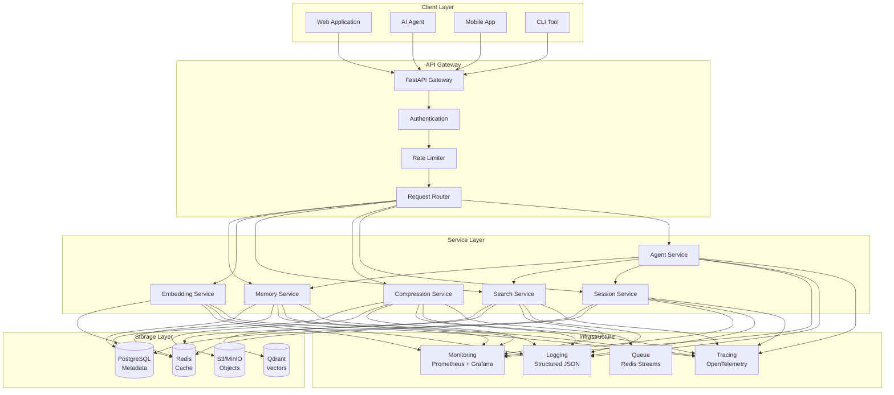
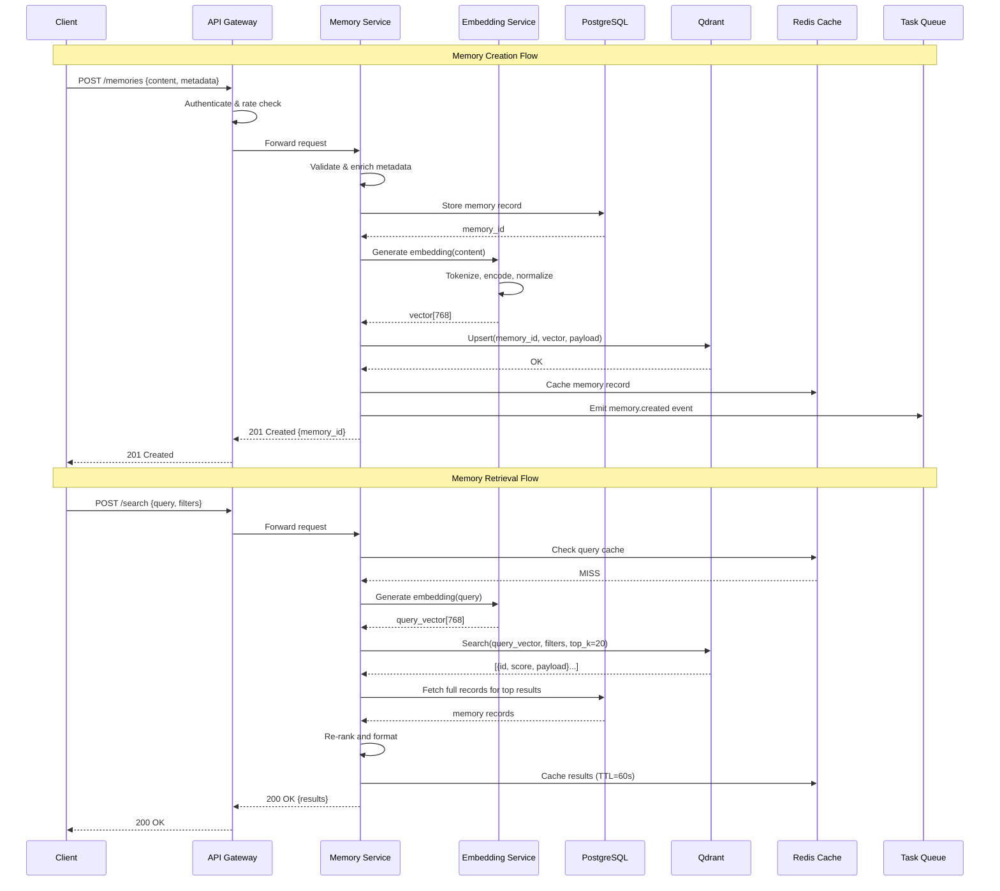
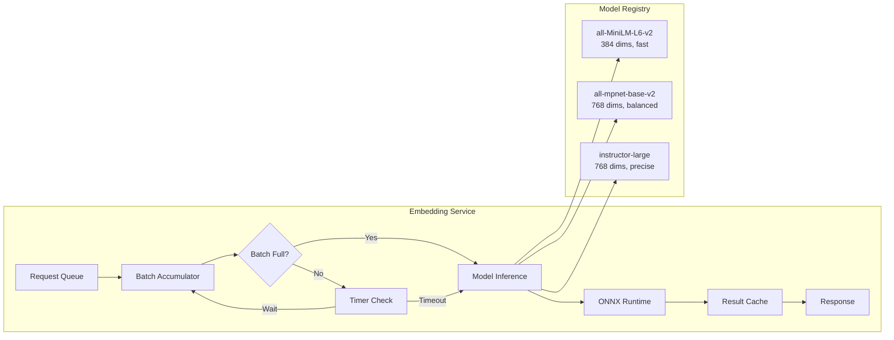

# Memory in AI Systems Deep Dive  Part 19: Designing a Production AI Memory Platform  The Capstone

---

**Series:** Memory in AI Systems  A Developer's Deep Dive from Fundamentals to Production
**Part:** 19 of 19 (Capstone)
**Audience:** Developers with programming experience who want to understand AI memory systems from the ground up
**Reading time:** ~60 minutes

---

## Table of Contents

1. [The Capstone Challenge](#1-the-capstone-challenge)
2. [System Architecture](#2-system-architecture)
3. [Data Models](#3-data-models)
4. [Memory Service Layer](#4-memory-service-layer)
5. [Embedding Service](#5-embedding-service)
6. [Storage Layer](#6-storage-layer)
7. [API Layer](#7-api-layer)
8. [Agent Integration](#8-agent-integration)
9. [Evaluation Framework](#9-evaluation-framework)
10. [Deployment and Operations](#10-deployment-and-operations)
11. [Series Conclusion](#11-series-conclusion)

---

## 1. The Capstone Challenge

We have arrived at the summit. Across eighteen parts of this series, we explored every dimension of memory in AI systems  from the philosophical foundations of what memory means for machines (Part 0) through the neuroscience of biological memory (Part 1), into the mathematical scaffolding of embeddings, vector spaces, and retrieval algorithms (Parts 2-5), through compression, summarization, and memory management strategies (Parts 6-9), into advanced architectures like memory-augmented neural networks, knowledge graphs, and multi-agent memory (Parts 10-14), and finally through evaluation, privacy, ethical concerns, and the future landscape (Parts 15-18).

Now we bring it all together. This capstone is not a theoretical exercise  it is the blueprint and implementation of a **production-grade AI memory platform** that any application can plug into.

### 1.1 What We Are Building

**Mnemos**  a complete, horizontally scalable AI memory platform that provides:

- **Memory storage and retrieval** across multiple modalities (text, structured data, conversations)
- **Semantic search** powered by embeddings and vector databases
- **Memory lifecycle management** including compression, consolidation, and expiration
- **Multi-tenant isolation** so multiple applications share infrastructure safely
- **Agent-native SDKs** so AI agents can store and retrieve memories with minimal code
- **Evaluation and observability** so operators know the system works correctly

> **Why "Mnemos"?** From the Greek *mneme* (memory)  the root of "mnemonic." We name our platform after the fundamental concept this entire series explores.

### 1.2 Requirements Gathering

Before writing a single line of code, we define what the platform must do. These requirements draw directly from lessons learned throughout the series.

#### Functional Requirements

| Requirement | Source Part | Description |
|---|---|---|
| Memory CRUD | Part 2 | Create, read, update, delete memories with full metadata |
| Semantic Search | Parts 3-4 | Find memories by meaning, not just keywords |
| Memory Types | Part 6 | Support episodic, semantic, and procedural memory |
| Compression | Part 7 | Automatically compress old memories to save space |
| Session Management | Part 8 | Track conversation sessions with context windows |
| Multi-user | Part 9 | Isolate memories per user, per application |
| Knowledge Graph | Part 12 | Link related memories in a graph structure |
| Agent Integration | Part 13 | Provide APIs designed for autonomous agents |
| Privacy Controls | Part 16 | Allow users to view, export, and delete their data |

#### Non-Functional Requirements

| Requirement | Target | Rationale |
|---|---|---|
| Latency (p95) | < 100ms for retrieval | Agents need real-time responses |
| Throughput | 10,000 queries/sec | Multi-tenant production load |
| Availability | 99.9% uptime | Production SLA |
| Data Durability | 99.999999999% | Memory is critical state |
| Horizontal Scaling | Linear with nodes | Cost-effective growth |
| Security | SOC 2 Type II | Enterprise requirement |

### 1.3 Technology Choices

Every technology choice traces back to a lesson from earlier in the series:

```python
"""
Technology Selection Matrix for Mnemos Platform

Each choice is justified by what we learned in specific parts of the series.
"""

TECHNOLOGY_CHOICES = {
    "api_framework": {
        "choice": "FastAPI",
        "justification": "Async-native, auto-generated OpenAPI docs, Pydantic integration",
        "relevant_parts": [7, 8, 13],
    },
    "vector_database": {
        "choice": "Qdrant",
        "justification": "Strong filtering, payload storage, horizontal scaling",
        "relevant_parts": [4, 5],
    },
    "relational_database": {
        "choice": "PostgreSQL",
        "justification": "ACID compliance for metadata, JSONB for flexible schemas",
        "relevant_parts": [2, 9],
    },
    "cache_layer": {
        "choice": "Redis",
        "justification": "Sub-millisecond reads, TTL support, pub/sub for events",
        "relevant_parts": [8, 9],
    },
    "object_storage": {
        "choice": "S3-compatible (MinIO for self-hosted)",
        "justification": "Large object storage, versioning, lifecycle policies",
        "relevant_parts": [7, 16],
    },
    "embedding_models": {
        "choice": "Sentence-Transformers with ONNX runtime",
        "justification": "Local inference, no API dependency, batch optimization",
        "relevant_parts": [3, 4, 5],
    },
    "message_queue": {
        "choice": "Redis Streams",
        "justification": "Async processing, consumer groups, already in stack",
        "relevant_parts": [7, 9],
    },
    "container_orchestration": {
        "choice": "Kubernetes",
        "justification": "Horizontal scaling, service discovery, rolling deployments",
        "relevant_parts": [17, 18],
    },
}


def print_tech_stack():
    """Display the complete technology stack."""
    print("=" * 70)
    print("MNEMOS PLATFORM  TECHNOLOGY STACK")
    print("=" * 70)
    for category, details in TECHNOLOGY_CHOICES.items():
        print(f"\n[{category.upper()}]")
        print(f"  Choice: {details['choice']}")
        print(f"  Why:    {details['justification']}")
        print(f"  Parts:  {', '.join(str(p) for p in details['relevant_parts'])}")
    print("\n" + "=" * 70)


if __name__ == "__main__":
    print_tech_stack()
```

---

## 2. System Architecture

### 2.1 High-Level Architecture

The platform follows a **service-oriented architecture** with clear boundaries between concerns. Each service owns its data and communicates through well-defined interfaces.



### 2.2 Service Boundaries

Each service has a single responsibility, owns its data, and exposes a clean interface:

```python
"""
Service boundary definitions for the Mnemos platform.

Each service is defined by:
- What it owns (data, logic)
- What it exposes (interface)
- What it depends on (other services)
"""

from dataclasses import dataclass, field
from enum import Enum
from typing import Optional


class ServiceStatus(Enum):
    HEALTHY = "healthy"
    DEGRADED = "degraded"
    UNHEALTHY = "unhealthy"


@dataclass
class ServiceDefinition:
    """Defines a service boundary in the Mnemos architecture."""

    name: str
    description: str
    owns: list[str]
    exposes: list[str]
    depends_on: list[str] = field(default_factory=list)
    port: int = 8000
    replicas_min: int = 1
    replicas_max: int = 10


# Define all service boundaries
SERVICES = {
    "memory_service": ServiceDefinition(
        name="Memory Service",
        description="Core CRUD operations for memories. Owns memory lifecycle.",
        owns=[
            "Memory records in PostgreSQL",
            "Memory metadata and tags",
            "Memory version history",
        ],
        exposes=[
            "POST /memories  Create memory",
            "GET /memories/{id}  Read memory",
            "PUT /memories/{id}  Update memory",
            "DELETE /memories/{id}  Delete memory",
            "GET /memories  List with filters",
        ],
        depends_on=["embedding_service", "storage_manager"],
        port=8001,
    ),
    "embedding_service": ServiceDefinition(
        name="Embedding Service",
        description="Generates and manages vector embeddings for text.",
        owns=[
            "Embedding model cache",
            "Embedding generation pipeline",
            "Model version registry",
        ],
        exposes=[
            "POST /embed  Generate embedding for text",
            "POST /embed/batch  Batch embedding generation",
            "GET /models  List available models",
        ],
        depends_on=[],
        port=8002,
    ),
    "search_service": ServiceDefinition(
        name="Search Service",
        description="Semantic and hybrid search across memories.",
        owns=[
            "Search index configuration",
            "Query optimization logic",
            "Ranking algorithms",
        ],
        exposes=[
            "POST /search  Semantic search",
            "POST /search/hybrid  Hybrid keyword+semantic search",
            "POST /search/rerank  Re-rank results",
        ],
        depends_on=["embedding_service"],
        port=8003,
    ),
    "compression_service": ServiceDefinition(
        name="Compression Service",
        description="Compresses, summarizes, and consolidates memories.",
        owns=[
            "Compression policies",
            "Summary generation pipeline",
            "Consolidation scheduling",
        ],
        exposes=[
            "POST /compress  Compress a memory",
            "POST /consolidate  Merge related memories",
            "GET /policies  List compression policies",
        ],
        depends_on=["memory_service"],
        port=8004,
    ),
    "session_service": ServiceDefinition(
        name="Session Service",
        description="Manages conversation sessions and context windows.",
        owns=[
            "Session records",
            "Context window state",
            "Session-to-memory mappings",
        ],
        exposes=[
            "POST /sessions  Create session",
            "GET /sessions/{id}  Get session with context",
            "POST /sessions/{id}/messages  Add message to session",
            "POST /sessions/{id}/extract  Extract memories from session",
        ],
        depends_on=["memory_service", "compression_service"],
        port=8005,
    ),
    "agent_service": ServiceDefinition(
        name="Agent Service",
        description="High-level API designed for AI agent integration.",
        owns=[
            "Agent profiles",
            "Tool definitions",
            "Automatic memory extraction rules",
        ],
        exposes=[
            "POST /agents/remember  Store a memory from agent context",
            "POST /agents/recall  Retrieve relevant memories for a query",
            "POST /agents/reflect  Generate insights from memory patterns",
        ],
        depends_on=[
            "memory_service",
            "search_service",
            "session_service",
        ],
        port=8006,
    ),
}


def print_architecture():
    """Display the service architecture."""
    print("MNEMOS PLATFORM  SERVICE ARCHITECTURE")
    print("=" * 60)
    for key, svc in SERVICES.items():
        print(f"\n{'─' * 60}")
        print(f"  {svc.name} (:{svc.port})")
        print(f"  {svc.description}")
        print(f"  Owns: {', '.join(svc.owns[:2])}...")
        print(f"  Endpoints: {len(svc.exposes)}")
        if svc.depends_on:
            print(f"  Depends on: {', '.join(svc.depends_on)}")
        print(f"  Scaling: {svc.replicas_min}-{svc.replicas_max} replicas")


if __name__ == "__main__":
    print_architecture()
```

### 2.3 Data Flow

Understanding how data flows through the system is critical for debugging and optimization. Here is the path a memory takes from creation to retrieval.



### 2.4 Cross-Cutting Concerns

```python
"""
Cross-cutting concerns that every service must implement.
These are injected via middleware and decorators.
"""

import time
import uuid
import logging
import functools
from contextlib import asynccontextmanager
from typing import Any, Callable

import structlog


# --- Structured Logging ---

def configure_logging(service_name: str) -> structlog.BoundLogger:
    """Configure structured JSON logging for a service."""
    structlog.configure(
        processors=[
            structlog.contextvars.merge_contextvars,
            structlog.processors.add_log_level,
            structlog.processors.TimeStamper(fmt="iso"),
            structlog.processors.StackInfoRenderer(),
            structlog.processors.format_exc_info,
            structlog.processors.JSONRenderer(),
        ],
        wrapper_class=structlog.make_filtering_bound_logger(logging.INFO),
        context_class=dict,
        logger_factory=structlog.PrintLoggerFactory(),
    )
    return structlog.get_logger(service=service_name)


# --- Request Tracing ---

class RequestContext:
    """Thread-local request context for tracing."""

    def __init__(self):
        self.request_id: str = str(uuid.uuid4())
        self.user_id: str | None = None
        self.tenant_id: str | None = None
        self.start_time: float = time.monotonic()
        self.span_id: str = str(uuid.uuid4())[:8]

    @property
    def elapsed_ms(self) -> float:
        return (time.monotonic() - self.start_time) * 1000


# --- Metrics Decorator ---

def track_metrics(operation: str):
    """Decorator to track operation latency and success rate."""

    def decorator(func: Callable) -> Callable:
        @functools.wraps(func)
        async def wrapper(*args, **kwargs) -> Any:
            start = time.monotonic()
            status = "success"
            try:
                result = await func(*args, **kwargs)
                return result
            except Exception as e:
                status = "error"
                raise
            finally:
                duration_ms = (time.monotonic() - start) * 1000
                # In production, this would push to Prometheus
                logger = structlog.get_logger()
                logger.info(
                    "operation_complete",
                    operation=operation,
                    duration_ms=round(duration_ms, 2),
                    status=status,
                )

        return wrapper

    return decorator


# --- Health Check ---

class HealthChecker:
    """Aggregates health status from all dependencies."""

    def __init__(self, service_name: str):
        self.service_name = service_name
        self.checks: dict[str, Callable] = {}

    def register(self, name: str, check_func: Callable):
        """Register a health check function."""
        self.checks[name] = check_func

    async def check_all(self) -> dict[str, Any]:
        """Run all health checks and return aggregate status."""
        results = {}
        overall_healthy = True

        for name, check_func in self.checks.items():
            try:
                healthy = await check_func()
                results[name] = {
                    "status": "healthy" if healthy else "unhealthy",
                }
            except Exception as e:
                results[name] = {"status": "unhealthy", "error": str(e)}
                overall_healthy = False

        return {
            "service": self.service_name,
            "status": "healthy" if overall_healthy else "degraded",
            "checks": results,
            "timestamp": time.time(),
        }
```

---

## 3. Data Models

### 3.1 Core Domain Models

The data models are the foundation of the entire platform. Every design decision here cascades through every layer above.

```python
"""
Core data models for the Mnemos platform.

These models define the domain language of the system. Every service
speaks in terms of these types.
"""

import hashlib
from datetime import datetime, timezone
from enum import Enum
from typing import Any, Optional
from uuid import UUID, uuid4

from pydantic import BaseModel, Field, field_validator, model_validator


# --- Enumerations ---

class MemoryType(str, Enum):
    """Types of memory, inspired by cognitive science (Part 1)."""
    EPISODIC = "episodic"      # Specific events and experiences
    SEMANTIC = "semantic"      # General knowledge and facts
    PROCEDURAL = "procedural"  # How-to knowledge and skills
    WORKING = "working"        # Short-term, session-scoped


class MemoryStatus(str, Enum):
    """Lifecycle status of a memory."""
    ACTIVE = "active"
    COMPRESSED = "compressed"
    ARCHIVED = "archived"
    DELETED = "deleted"


class ImportanceLevel(str, Enum):
    """How important a memory is for retention."""
    CRITICAL = "critical"    # Never auto-compress or delete
    HIGH = "high"            # Compress after 90 days
    MEDIUM = "medium"        # Compress after 30 days
    LOW = "low"              # Compress after 7 days
    EPHEMERAL = "ephemeral"  # Delete after session ends


# --- Core Models ---

class MemoryContent(BaseModel):
    """The actual content of a memory."""
    text: str = Field(..., min_length=1, max_length=100_000)
    structured_data: Optional[dict[str, Any]] = None
    source_url: Optional[str] = None
    language: str = Field(default="en", max_length=5)
    content_hash: Optional[str] = None

    def model_post_init(self, __context: Any) -> None:
        """Compute content hash after initialization."""
        if self.content_hash is None:
            self.content_hash = hashlib.sha256(
                self.text.encode("utf-8")
            ).hexdigest()[:16]


class MemoryMetadata(BaseModel):
    """Metadata associated with a memory."""
    tags: list[str] = Field(default_factory=list, max_length=50)
    source: Optional[str] = None
    confidence: float = Field(default=1.0, ge=0.0, le=1.0)
    importance: ImportanceLevel = ImportanceLevel.MEDIUM
    custom: dict[str, Any] = Field(default_factory=dict)

    @field_validator("tags")
    @classmethod
    def normalize_tags(cls, v: list[str]) -> list[str]:
        """Lowercase and deduplicate tags."""
        return list(set(tag.lower().strip() for tag in v))


class MemoryRelation(BaseModel):
    """A relationship between two memories (Part 12  Knowledge Graphs)."""
    source_id: UUID
    target_id: UUID
    relation_type: str  # e.g., "derived_from", "contradicts", "supports"
    weight: float = Field(default=1.0, ge=0.0, le=1.0)
    metadata: dict[str, Any] = Field(default_factory=dict)


class Memory(BaseModel):
    """
    The central entity of the Mnemos platform.

    A Memory represents a discrete unit of information that an AI system
    has stored for later retrieval. It combines content, metadata,
    versioning, and lifecycle management.
    """
    id: UUID = Field(default_factory=uuid4)
    tenant_id: str = Field(..., min_length=1, max_length=128)
    user_id: str = Field(..., min_length=1, max_length=128)
    collection_id: Optional[UUID] = None

    # Content
    memory_type: MemoryType
    content: MemoryContent
    status: MemoryStatus = MemoryStatus.ACTIVE

    # Metadata
    metadata: MemoryMetadata = Field(default_factory=MemoryMetadata)

    # Versioning
    version: int = Field(default=1, ge=1)
    previous_version_id: Optional[UUID] = None

    # Vector embedding reference
    embedding_model: Optional[str] = None
    embedding_dimension: Optional[int] = None
    has_embedding: bool = False

    # Timestamps
    created_at: datetime = Field(
        default_factory=lambda: datetime.now(timezone.utc)
    )
    updated_at: datetime = Field(
        default_factory=lambda: datetime.now(timezone.utc)
    )
    accessed_at: datetime = Field(
        default_factory=lambda: datetime.now(timezone.utc)
    )
    expires_at: Optional[datetime] = None

    # Compression tracking (Part 7)
    compression_ratio: Optional[float] = None
    original_size: Optional[int] = None
    compressed_size: Optional[int] = None

    # Access tracking for importance decay
    access_count: int = Field(default=0, ge=0)

    @model_validator(mode="after")
    def set_sizes(self) -> "Memory":
        """Track content size for compression metrics."""
        content_bytes = len(self.content.text.encode("utf-8"))
        if self.original_size is None:
            self.original_size = content_bytes
        if self.compressed_size is None:
            self.compressed_size = content_bytes
        return self

    def record_access(self) -> None:
        """Update access tracking when this memory is retrieved."""
        self.access_count += 1
        self.accessed_at = datetime.now(timezone.utc)


class Collection(BaseModel):
    """
    A named group of memories for organizational purposes.
    Think of it as a folder or namespace within a tenant.
    """
    id: UUID = Field(default_factory=uuid4)
    tenant_id: str
    name: str = Field(..., min_length=1, max_length=256)
    description: Optional[str] = None
    embedding_model: str = "all-MiniLM-L6-v2"
    embedding_dimension: int = 384
    created_at: datetime = Field(
        default_factory=lambda: datetime.now(timezone.utc)
    )
    memory_count: int = 0
    metadata: dict[str, Any] = Field(default_factory=dict)


class Session(BaseModel):
    """
    A conversation session that generates memories.
    Tracks the context window and extracted memories.
    """
    id: UUID = Field(default_factory=uuid4)
    tenant_id: str
    user_id: str
    collection_id: Optional[UUID] = None

    # Session state
    is_active: bool = True
    messages: list[dict[str, Any]] = Field(default_factory=list)
    extracted_memory_ids: list[UUID] = Field(default_factory=list)

    # Context window management (Part 8)
    max_context_tokens: int = Field(default=8192)
    current_token_count: int = 0

    # Timestamps
    created_at: datetime = Field(
        default_factory=lambda: datetime.now(timezone.utc)
    )
    last_activity_at: datetime = Field(
        default_factory=lambda: datetime.now(timezone.utc)
    )

    def add_message(self, role: str, content: str, token_count: int) -> None:
        """Add a message to the session."""
        self.messages.append({
            "role": role,
            "content": content,
            "token_count": token_count,
            "timestamp": datetime.now(timezone.utc).isoformat(),
        })
        self.current_token_count += token_count
        self.last_activity_at = datetime.now(timezone.utc)


class User(BaseModel):
    """A user within a tenant."""
    id: str
    tenant_id: str
    display_name: Optional[str] = None
    created_at: datetime = Field(
        default_factory=lambda: datetime.now(timezone.utc)
    )
    memory_count: int = 0
    session_count: int = 0
    preferences: dict[str, Any] = Field(default_factory=dict)


# --- Request/Response Models ---

class CreateMemoryRequest(BaseModel):
    """Request to create a new memory."""
    content: str = Field(..., min_length=1, max_length=100_000)
    memory_type: MemoryType = MemoryType.SEMANTIC
    tags: list[str] = Field(default_factory=list)
    importance: ImportanceLevel = ImportanceLevel.MEDIUM
    collection_id: Optional[UUID] = None
    metadata: dict[str, Any] = Field(default_factory=dict)


class SearchRequest(BaseModel):
    """Request to search memories."""
    query: str = Field(..., min_length=1, max_length=10_000)
    collection_id: Optional[UUID] = None
    memory_types: Optional[list[MemoryType]] = None
    tags: Optional[list[str]] = None
    min_confidence: float = Field(default=0.0, ge=0.0, le=1.0)
    top_k: int = Field(default=10, ge=1, le=100)
    include_compressed: bool = False


class SearchResult(BaseModel):
    """A single search result."""
    memory: Memory
    score: float = Field(ge=0.0, le=1.0)
    highlights: list[str] = Field(default_factory=list)


class SearchResponse(BaseModel):
    """Response from a search query."""
    results: list[SearchResult]
    total_found: int
    query_time_ms: float
    model_used: str


# --- Demonstration ---

def demonstrate_models():
    """Show the data models in action."""
    # Create a memory
    memory = Memory(
        tenant_id="acme-corp",
        user_id="user-123",
        memory_type=MemoryType.SEMANTIC,
        content=MemoryContent(
            text="The Mnemos platform uses Qdrant for vector search, "
                 "chosen for its filtering capabilities and horizontal scaling.",
            source_url="https://docs.mnemos.dev/architecture",
        ),
        metadata=MemoryMetadata(
            tags=["architecture", "vector-db", "qdrant"],
            source="documentation",
            importance=ImportanceLevel.HIGH,
            confidence=0.95,
        ),
    )

    print(f"Memory ID: {memory.id}")
    print(f"Type: {memory.memory_type.value}")
    print(f"Content hash: {memory.content.content_hash}")
    print(f"Tags: {memory.metadata.tags}")
    print(f"Size: {memory.original_size} bytes")
    print(f"Status: {memory.status.value}")

    # Create a search request
    search = SearchRequest(
        query="What vector database does Mnemos use?",
        tags=["architecture"],
        top_k=5,
    )
    print(f"\nSearch query: {search.query}")
    print(f"Filters: tags={search.tags}, top_k={search.top_k}")


if __name__ == "__main__":
    demonstrate_models()
```

### 3.2 Database Schema

The PostgreSQL schema mirrors our Pydantic models with proper indexing:

```python
"""
PostgreSQL schema definition for the Mnemos platform.
Uses SQLAlchemy for type-safe schema definition.
"""

SCHEMA_SQL = """
-- Tenants table
CREATE TABLE IF NOT EXISTS tenants (
    id VARCHAR(128) PRIMARY KEY,
    name VARCHAR(256) NOT NULL,
    plan VARCHAR(50) NOT NULL DEFAULT 'free',
    max_memories BIGINT NOT NULL DEFAULT 10000,
    created_at TIMESTAMPTZ NOT NULL DEFAULT NOW(),
    settings JSONB NOT NULL DEFAULT '{}'::jsonb
);

-- Users table
CREATE TABLE IF NOT EXISTS users (
    id VARCHAR(128) NOT NULL,
    tenant_id VARCHAR(128) NOT NULL REFERENCES tenants(id),
    display_name VARCHAR(256),
    created_at TIMESTAMPTZ NOT NULL DEFAULT NOW(),
    preferences JSONB NOT NULL DEFAULT '{}'::jsonb,
    PRIMARY KEY (tenant_id, id)
);

-- Collections table
CREATE TABLE IF NOT EXISTS collections (
    id UUID PRIMARY KEY DEFAULT gen_random_uuid(),
    tenant_id VARCHAR(128) NOT NULL REFERENCES tenants(id),
    name VARCHAR(256) NOT NULL,
    description TEXT,
    embedding_model VARCHAR(128) NOT NULL DEFAULT 'all-MiniLM-L6-v2',
    embedding_dimension INTEGER NOT NULL DEFAULT 384,
    created_at TIMESTAMPTZ NOT NULL DEFAULT NOW(),
    memory_count BIGINT NOT NULL DEFAULT 0,
    metadata JSONB NOT NULL DEFAULT '{}'::jsonb,
    UNIQUE(tenant_id, name)
);

-- Memories table  the core entity
CREATE TABLE IF NOT EXISTS memories (
    id UUID PRIMARY KEY DEFAULT gen_random_uuid(),
    tenant_id VARCHAR(128) NOT NULL REFERENCES tenants(id),
    user_id VARCHAR(128) NOT NULL,
    collection_id UUID REFERENCES collections(id),
    memory_type VARCHAR(20) NOT NULL,
    status VARCHAR(20) NOT NULL DEFAULT 'active',

    -- Content
    content_text TEXT NOT NULL,
    content_structured JSONB,
    content_hash VARCHAR(16) NOT NULL,
    source_url TEXT,
    language VARCHAR(5) NOT NULL DEFAULT 'en',

    -- Metadata
    tags TEXT[] NOT NULL DEFAULT '{}',
    source VARCHAR(256),
    confidence REAL NOT NULL DEFAULT 1.0,
    importance VARCHAR(20) NOT NULL DEFAULT 'medium',
    custom_metadata JSONB NOT NULL DEFAULT '{}'::jsonb,

    -- Versioning
    version INTEGER NOT NULL DEFAULT 1,
    previous_version_id UUID REFERENCES memories(id),

    -- Embedding reference
    embedding_model VARCHAR(128),
    embedding_dimension INTEGER,
    has_embedding BOOLEAN NOT NULL DEFAULT FALSE,

    -- Compression tracking
    compression_ratio REAL,
    original_size INTEGER,
    compressed_size INTEGER,

    -- Access tracking
    access_count INTEGER NOT NULL DEFAULT 0,

    -- Timestamps
    created_at TIMESTAMPTZ NOT NULL DEFAULT NOW(),
    updated_at TIMESTAMPTZ NOT NULL DEFAULT NOW(),
    accessed_at TIMESTAMPTZ NOT NULL DEFAULT NOW(),
    expires_at TIMESTAMPTZ
);

-- Indexes for common query patterns
CREATE INDEX idx_memories_tenant_user
    ON memories(tenant_id, user_id);
CREATE INDEX idx_memories_tenant_collection
    ON memories(tenant_id, collection_id);
CREATE INDEX idx_memories_type
    ON memories(memory_type);
CREATE INDEX idx_memories_status
    ON memories(status);
CREATE INDEX idx_memories_tags
    ON memories USING GIN(tags);
CREATE INDEX idx_memories_content_hash
    ON memories(content_hash);
CREATE INDEX idx_memories_created_at
    ON memories(created_at DESC);
CREATE INDEX idx_memories_importance
    ON memories(importance);
CREATE INDEX idx_memories_expires_at
    ON memories(expires_at)
    WHERE expires_at IS NOT NULL;

-- Memory relations (knowledge graph edges, Part 12)
CREATE TABLE IF NOT EXISTS memory_relations (
    id UUID PRIMARY KEY DEFAULT gen_random_uuid(),
    source_id UUID NOT NULL REFERENCES memories(id) ON DELETE CASCADE,
    target_id UUID NOT NULL REFERENCES memories(id) ON DELETE CASCADE,
    relation_type VARCHAR(50) NOT NULL,
    weight REAL NOT NULL DEFAULT 1.0,
    metadata JSONB NOT NULL DEFAULT '{}'::jsonb,
    created_at TIMESTAMPTZ NOT NULL DEFAULT NOW(),
    UNIQUE(source_id, target_id, relation_type)
);

CREATE INDEX idx_relations_source ON memory_relations(source_id);
CREATE INDEX idx_relations_target ON memory_relations(target_id);
CREATE INDEX idx_relations_type ON memory_relations(relation_type);

-- Sessions table
CREATE TABLE IF NOT EXISTS sessions (
    id UUID PRIMARY KEY DEFAULT gen_random_uuid(),
    tenant_id VARCHAR(128) NOT NULL REFERENCES tenants(id),
    user_id VARCHAR(128) NOT NULL,
    collection_id UUID REFERENCES collections(id),
    is_active BOOLEAN NOT NULL DEFAULT TRUE,
    messages JSONB NOT NULL DEFAULT '[]'::jsonb,
    extracted_memory_ids UUID[] NOT NULL DEFAULT '{}',
    max_context_tokens INTEGER NOT NULL DEFAULT 8192,
    current_token_count INTEGER NOT NULL DEFAULT 0,
    created_at TIMESTAMPTZ NOT NULL DEFAULT NOW(),
    last_activity_at TIMESTAMPTZ NOT NULL DEFAULT NOW()
);

CREATE INDEX idx_sessions_tenant_user
    ON sessions(tenant_id, user_id);
CREATE INDEX idx_sessions_active
    ON sessions(is_active)
    WHERE is_active = TRUE;

-- Compression history for auditing
CREATE TABLE IF NOT EXISTS compression_history (
    id UUID PRIMARY KEY DEFAULT gen_random_uuid(),
    memory_id UUID NOT NULL REFERENCES memories(id),
    original_text TEXT NOT NULL,
    compressed_text TEXT NOT NULL,
    original_size INTEGER NOT NULL,
    compressed_size INTEGER NOT NULL,
    compression_method VARCHAR(50) NOT NULL,
    quality_score REAL,
    created_at TIMESTAMPTZ NOT NULL DEFAULT NOW()
);

-- Trigger to update updated_at timestamp
CREATE OR REPLACE FUNCTION update_updated_at()
RETURNS TRIGGER AS $$
BEGIN
    NEW.updated_at = NOW();
    RETURN NEW;
END;
$$ LANGUAGE plpgsql;

CREATE TRIGGER memories_updated_at
    BEFORE UPDATE ON memories
    FOR EACH ROW
    EXECUTE FUNCTION update_updated_at();
""";


def print_schema_summary():
    """Summarize the database schema."""
    tables = [
        ("tenants", "Multi-tenant isolation"),
        ("users", "User profiles within tenants"),
        ("collections", "Named groups of memories"),
        ("memories", "Core memory storage"),
        ("memory_relations", "Knowledge graph edges"),
        ("sessions", "Conversation sessions"),
        ("compression_history", "Audit trail for compressions"),
    ]
    print("MNEMOS DATABASE SCHEMA")
    print("=" * 50)
    for table, desc in tables:
        print(f"  {table:25s}  {desc}")


if __name__ == "__main__":
    print_schema_summary()
```

---

## 4. Memory Service Layer

The Memory Service is the heart of the platform. It orchestrates all memory operations, enforcing business rules and coordinating between storage backends.

### 4.1 Core Memory Service

```python
"""
Memory Service  Core business logic for the Mnemos platform.

This service owns all memory lifecycle operations and coordinates
between the embedding service, storage backends, and event system.
"""

import time
import hashlib
from datetime import datetime, timezone, timedelta
from typing import Any, Optional
from uuid import UUID, uuid4

import structlog

# Internal imports (these reference other modules in the platform)
# from mnemos.models import (
#     Memory, MemoryContent, MemoryMetadata, MemoryType, MemoryStatus,
#     ImportanceLevel, CreateMemoryRequest, SearchRequest, SearchResponse,
#     SearchResult, MemoryRelation, Collection
# )
# from mnemos.embedding import EmbeddingService
# from mnemos.storage import StorageManager
# from mnemos.events import EventBus


logger = structlog.get_logger()


class MemoryService:
    """
    Core memory operations for the Mnemos platform.

    Responsibilities:
    - CRUD operations with validation
    - Memory routing to appropriate storage backends
    - Coordinating embedding generation
    - Memory deduplication
    - Access tracking and importance decay
    - Compression pipeline orchestration
    """

    def __init__(
        self,
        storage: Any,       # StorageManager
        embedder: Any,       # EmbeddingService
        event_bus: Any,      # EventBus
        cache: Any,          # Redis client
    ):
        self.storage = storage
        self.embedder = embedder
        self.event_bus = event_bus
        self.cache = cache
        self.logger = logger.bind(service="memory")

    # --- CREATE ---

    async def create_memory(
        self,
        tenant_id: str,
        user_id: str,
        request: dict,  # CreateMemoryRequest as dict for demonstration
    ) -> dict:
        """
        Create a new memory with embedding generation.

        Flow:
        1. Validate and deduplicate
        2. Generate embedding
        3. Store in PostgreSQL (metadata) + Qdrant (vector)
        4. Cache the result
        5. Emit creation event
        """
        start_time = time.monotonic()
        self.logger.info(
            "creating_memory",
            tenant_id=tenant_id,
            user_id=user_id,
            memory_type=request.get("memory_type", "semantic"),
        )

        # Step 1: Build the memory object
        content_text = request["content"]
        content_hash = hashlib.sha256(
            content_text.encode("utf-8")
        ).hexdigest()[:16]

        # Check for duplicates
        existing = await self._find_duplicate(
            tenant_id, user_id, content_hash
        )
        if existing:
            self.logger.info(
                "duplicate_detected",
                existing_id=str(existing["id"]),
                content_hash=content_hash,
            )
            return {
                "status": "duplicate",
                "existing_memory_id": existing["id"],
                "message": "A memory with identical content already exists.",
            }

        memory_id = uuid4()
        now = datetime.now(timezone.utc)

        memory_record = {
            "id": str(memory_id),
            "tenant_id": tenant_id,
            "user_id": user_id,
            "collection_id": request.get("collection_id"),
            "memory_type": request.get("memory_type", "semantic"),
            "status": "active",
            "content_text": content_text,
            "content_hash": content_hash,
            "tags": request.get("tags", []),
            "importance": request.get("importance", "medium"),
            "confidence": request.get("confidence", 1.0),
            "metadata": request.get("metadata", {}),
            "version": 1,
            "original_size": len(content_text.encode("utf-8")),
            "compressed_size": len(content_text.encode("utf-8")),
            "access_count": 0,
            "created_at": now.isoformat(),
            "updated_at": now.isoformat(),
            "accessed_at": now.isoformat(),
        }

        # Step 2: Generate embedding
        embedding = await self.embedder.embed(content_text)
        memory_record["has_embedding"] = True
        memory_record["embedding_model"] = self.embedder.model_name
        memory_record["embedding_dimension"] = len(embedding)

        # Step 3: Store in PostgreSQL
        await self.storage.postgres.insert("memories", memory_record)

        # Step 4: Store vector in Qdrant
        await self.storage.vector_db.upsert(
            collection_name=self._get_collection_name(tenant_id),
            points=[{
                "id": str(memory_id),
                "vector": embedding,
                "payload": {
                    "tenant_id": tenant_id,
                    "user_id": user_id,
                    "memory_type": memory_record["memory_type"],
                    "tags": memory_record["tags"],
                    "importance": memory_record["importance"],
                    "created_at": now.isoformat(),
                    "content_preview": content_text[:200],
                },
            }],
        )

        # Step 5: Cache the memory
        cache_key = f"memory:{tenant_id}:{memory_id}"
        await self.cache.set(cache_key, memory_record, ex=3600)

        # Step 6: Emit event
        await self.event_bus.emit("memory.created", {
            "memory_id": str(memory_id),
            "tenant_id": tenant_id,
            "user_id": user_id,
            "memory_type": memory_record["memory_type"],
        })

        duration_ms = (time.monotonic() - start_time) * 1000
        self.logger.info(
            "memory_created",
            memory_id=str(memory_id),
            duration_ms=round(duration_ms, 2),
        )

        return {
            "status": "created",
            "memory_id": str(memory_id),
            "content_hash": content_hash,
            "embedding_dimension": len(embedding),
        }

    # --- READ ---

    async def get_memory(
        self,
        tenant_id: str,
        memory_id: str,
        track_access: bool = True,
    ) -> Optional[dict]:
        """Retrieve a memory by ID with optional access tracking."""

        # Check cache first
        cache_key = f"memory:{tenant_id}:{memory_id}"
        cached = await self.cache.get(cache_key)
        if cached:
            if track_access:
                await self._track_access(tenant_id, memory_id)
            return cached

        # Fetch from PostgreSQL
        record = await self.storage.postgres.fetch_one(
            "memories",
            {"id": memory_id, "tenant_id": tenant_id},
        )

        if record and record.get("status") != "deleted":
            # Repopulate cache
            await self.cache.set(cache_key, record, ex=3600)
            if track_access:
                await self._track_access(tenant_id, memory_id)
            return record

        return None

    # --- UPDATE ---

    async def update_memory(
        self,
        tenant_id: str,
        memory_id: str,
        updates: dict,
    ) -> Optional[dict]:
        """
        Update a memory, creating a new version if content changes.

        Content changes trigger:
        - New version with incremented version number
        - Re-embedding with the new content
        - Link to previous version for history
        """
        existing = await self.get_memory(
            tenant_id, memory_id, track_access=False
        )
        if not existing:
            return None

        content_changed = (
            "content" in updates
            and updates["content"] != existing["content_text"]
        )

        if content_changed:
            # Create a new version
            new_memory_id = uuid4()
            new_content = updates["content"]
            new_hash = hashlib.sha256(
                new_content.encode("utf-8")
            ).hexdigest()[:16]

            # Re-generate embedding for new content
            new_embedding = await self.embedder.embed(new_content)

            version_record = {
                **existing,
                "id": str(new_memory_id),
                "content_text": new_content,
                "content_hash": new_hash,
                "version": existing["version"] + 1,
                "previous_version_id": memory_id,
                "original_size": len(new_content.encode("utf-8")),
                "compressed_size": len(new_content.encode("utf-8")),
                "has_embedding": True,
                "embedding_model": self.embedder.model_name,
                "embedding_dimension": len(new_embedding),
                "updated_at": datetime.now(timezone.utc).isoformat(),
            }

            # Apply any other metadata updates
            for key in ["tags", "importance", "metadata"]:
                if key in updates:
                    version_record[key] = updates[key]

            await self.storage.postgres.insert("memories", version_record)
            await self.storage.vector_db.upsert(
                collection_name=self._get_collection_name(tenant_id),
                points=[{
                    "id": str(new_memory_id),
                    "vector": new_embedding,
                    "payload": {
                        "tenant_id": tenant_id,
                        "user_id": existing["user_id"],
                        "memory_type": existing["memory_type"],
                        "tags": version_record["tags"],
                        "importance": version_record["importance"],
                    },
                }],
            )

            # Mark old version as superseded
            await self.storage.postgres.update(
                "memories",
                {"id": memory_id},
                {"status": "archived"},
            )

            # Invalidate cache
            await self.cache.delete(f"memory:{tenant_id}:{memory_id}")

            await self.event_bus.emit("memory.versioned", {
                "old_id": memory_id,
                "new_id": str(new_memory_id),
                "version": version_record["version"],
            })

            return version_record
        else:
            # Metadata-only update  no new version needed
            allowed_updates = {}
            for key in ["tags", "importance", "metadata", "confidence"]:
                if key in updates:
                    allowed_updates[key] = updates[key]
            allowed_updates["updated_at"] = (
                datetime.now(timezone.utc).isoformat()
            )

            await self.storage.postgres.update(
                "memories",
                {"id": memory_id, "tenant_id": tenant_id},
                allowed_updates,
            )

            # Invalidate cache
            await self.cache.delete(f"memory:{tenant_id}:{memory_id}")

            await self.event_bus.emit("memory.updated", {
                "memory_id": memory_id,
                "updated_fields": list(allowed_updates.keys()),
            })

            return await self.get_memory(
                tenant_id, memory_id, track_access=False
            )

    # --- DELETE ---

    async def delete_memory(
        self,
        tenant_id: str,
        memory_id: str,
        hard_delete: bool = False,
    ) -> bool:
        """
        Delete a memory. Soft delete by default (marks as deleted).
        Hard delete removes from all storage backends.
        """
        existing = await self.get_memory(
            tenant_id, memory_id, track_access=False
        )
        if not existing:
            return False

        if hard_delete:
            # Remove from all backends
            await self.storage.postgres.delete(
                "memories", {"id": memory_id}
            )
            await self.storage.vector_db.delete(
                collection_name=self._get_collection_name(tenant_id),
                point_ids=[memory_id],
            )
            # Also delete related compression history
            await self.storage.postgres.delete(
                "compression_history", {"memory_id": memory_id}
            )
        else:
            # Soft delete
            await self.storage.postgres.update(
                "memories",
                {"id": memory_id},
                {
                    "status": "deleted",
                    "updated_at": datetime.now(timezone.utc).isoformat(),
                },
            )

        # Always clean cache
        await self.cache.delete(f"memory:{tenant_id}:{memory_id}")

        await self.event_bus.emit("memory.deleted", {
            "memory_id": memory_id,
            "tenant_id": tenant_id,
            "hard_delete": hard_delete,
        })

        return True

    # --- SEARCH ---

    async def search(
        self,
        tenant_id: str,
        user_id: str,
        request: dict,  # SearchRequest as dict
    ) -> dict:
        """
        Search memories using semantic similarity with filtering.

        Flow:
        1. Generate query embedding
        2. Search Qdrant with filters
        3. Fetch full records from PostgreSQL
        4. Re-rank results
        5. Return with metadata
        """
        start_time = time.monotonic()
        query = request["query"]
        top_k = request.get("top_k", 10)

        # Check query cache
        cache_key = self._search_cache_key(tenant_id, user_id, request)
        cached_results = await self.cache.get(cache_key)
        if cached_results:
            return cached_results

        # Generate query embedding
        query_embedding = await self.embedder.embed(query)

        # Build Qdrant filter
        filters = self._build_search_filter(tenant_id, user_id, request)

        # Vector search
        vector_results = await self.storage.vector_db.search(
            collection_name=self._get_collection_name(tenant_id),
            query_vector=query_embedding,
            query_filter=filters,
            limit=top_k * 2,  # Fetch extra for re-ranking
        )

        # Fetch full records
        memory_ids = [r["id"] for r in vector_results]
        full_records = await self.storage.postgres.fetch_many(
            "memories",
            {"id": memory_ids, "tenant_id": tenant_id},
        )
        record_map = {str(r["id"]): r for r in full_records}

        # Combine scores with full records
        results = []
        for vr in vector_results:
            record = record_map.get(vr["id"])
            if record and record.get("status") == "active":
                results.append({
                    "memory": record,
                    "score": vr["score"],
                    "highlights": self._extract_highlights(
                        record["content_text"], query
                    ),
                })

        # Re-rank using importance and recency boost
        results = self._rerank_results(results, query)

        # Trim to requested top_k
        results = results[:top_k]

        # Track access for returned memories
        for r in results:
            await self._track_access(
                tenant_id, r["memory"]["id"]
            )

        duration_ms = (time.monotonic() - start_time) * 1000

        response = {
            "results": results,
            "total_found": len(results),
            "query_time_ms": round(duration_ms, 2),
            "model_used": self.embedder.model_name,
        }

        # Cache results for 60 seconds
        await self.cache.set(cache_key, response, ex=60)

        self.logger.info(
            "search_complete",
            tenant_id=tenant_id,
            results_count=len(results),
            duration_ms=round(duration_ms, 2),
        )

        return response

    # --- COMPRESSION PIPELINE ---

    async def compress_old_memories(
        self,
        tenant_id: str,
        max_age_days: int = 30,
        batch_size: int = 100,
    ) -> dict:
        """
        Compress memories older than max_age_days.

        Uses the compression strategies from Part 7:
        - Extractive summarization for factual content
        - Abstractive summarization for narratives
        - Key-point extraction for procedural knowledge
        """
        cutoff = datetime.now(timezone.utc) - timedelta(days=max_age_days)
        candidates = await self.storage.postgres.fetch_many(
            "memories",
            {
                "tenant_id": tenant_id,
                "status": "active",
                "created_at_before": cutoff.isoformat(),
                "importance_not_in": ["critical"],
            },
            limit=batch_size,
        )

        compressed_count = 0
        total_bytes_saved = 0

        for memory in candidates:
            original_text = memory["content_text"]
            original_size = len(original_text.encode("utf-8"))

            # Choose compression strategy based on memory type
            if memory["memory_type"] == "episodic":
                compressed_text = await self._compress_episodic(
                    original_text
                )
            elif memory["memory_type"] == "procedural":
                compressed_text = await self._compress_procedural(
                    original_text
                )
            else:
                compressed_text = await self._compress_semantic(
                    original_text
                )

            compressed_size = len(compressed_text.encode("utf-8"))
            ratio = compressed_size / original_size if original_size > 0 else 1

            # Only apply compression if significant reduction achieved
            if ratio < 0.7:  # At least 30% reduction
                # Store compression history for audit
                await self.storage.postgres.insert(
                    "compression_history",
                    {
                        "memory_id": memory["id"],
                        "original_text": original_text,
                        "compressed_text": compressed_text,
                        "original_size": original_size,
                        "compressed_size": compressed_size,
                        "compression_method": memory["memory_type"],
                    },
                )

                # Update the memory
                await self.storage.postgres.update(
                    "memories",
                    {"id": memory["id"]},
                    {
                        "content_text": compressed_text,
                        "status": "compressed",
                        "compression_ratio": ratio,
                        "compressed_size": compressed_size,
                    },
                )

                # Re-embed the compressed content
                new_embedding = await self.embedder.embed(compressed_text)
                await self.storage.vector_db.upsert(
                    collection_name=self._get_collection_name(tenant_id),
                    points=[{
                        "id": memory["id"],
                        "vector": new_embedding,
                        "payload": {
                            "tenant_id": tenant_id,
                            "user_id": memory["user_id"],
                            "memory_type": memory["memory_type"],
                            "tags": memory.get("tags", []),
                            "importance": memory.get("importance", "medium"),
                        },
                    }],
                )

                compressed_count += 1
                total_bytes_saved += original_size - compressed_size

                # Invalidate cache
                await self.cache.delete(
                    f"memory:{tenant_id}:{memory['id']}"
                )

        return {
            "compressed_count": compressed_count,
            "total_candidates": len(candidates),
            "bytes_saved": total_bytes_saved,
            "average_ratio": (
                total_bytes_saved / (compressed_count or 1)
            ),
        }

    # --- PRIVATE HELPERS ---

    async def _find_duplicate(
        self, tenant_id: str, user_id: str, content_hash: str
    ) -> Optional[dict]:
        """Check if a memory with the same content hash exists."""
        return await self.storage.postgres.fetch_one(
            "memories",
            {
                "tenant_id": tenant_id,
                "user_id": user_id,
                "content_hash": content_hash,
                "status": "active",
            },
        )

    async def _track_access(self, tenant_id: str, memory_id: str) -> None:
        """Increment access count and update accessed_at timestamp."""
        await self.storage.postgres.execute(
            """
            UPDATE memories
            SET access_count = access_count + 1,
                accessed_at = NOW()
            WHERE id = $1 AND tenant_id = $2
            """,
            memory_id,
            tenant_id,
        )

    def _build_search_filter(
        self, tenant_id: str, user_id: str, request: dict
    ) -> dict:
        """Build a Qdrant filter from search request parameters."""
        must_conditions = [
            {"key": "tenant_id", "match": {"value": tenant_id}},
            {"key": "user_id", "match": {"value": user_id}},
        ]

        if request.get("memory_types"):
            must_conditions.append({
                "key": "memory_type",
                "match": {"any": request["memory_types"]},
            })

        if request.get("tags"):
            for tag in request["tags"]:
                must_conditions.append({
                    "key": "tags",
                    "match": {"value": tag},
                })

        return {"must": must_conditions}

    def _rerank_results(
        self, results: list[dict], query: str
    ) -> list[dict]:
        """
        Re-rank search results using a composite score.

        Factors:
        - Vector similarity (base score from Qdrant)
        - Importance weight (critical > high > medium > low)
        - Recency boost (newer memories get slight boost)
        - Access frequency (popular memories boosted)
        """
        importance_weights = {
            "critical": 1.3,
            "high": 1.2,
            "medium": 1.0,
            "low": 0.8,
            "ephemeral": 0.6,
        }

        for result in results:
            base_score = result["score"]
            memory = result["memory"]

            # Importance factor
            importance = memory.get("importance", "medium")
            importance_factor = importance_weights.get(importance, 1.0)

            # Recency factor (exponential decay over 90 days)
            created_str = memory.get("created_at", "")
            if created_str:
                try:
                    created = datetime.fromisoformat(created_str)
                    age_days = (
                        datetime.now(timezone.utc) - created
                    ).days
                    recency_factor = max(0.5, 1.0 - (age_days / 180))
                except (ValueError, TypeError):
                    recency_factor = 1.0
            else:
                recency_factor = 1.0

            # Access frequency factor (logarithmic)
            import math
            access_count = memory.get("access_count", 0)
            access_factor = 1.0 + 0.1 * math.log1p(access_count)

            # Composite score
            result["score"] = (
                base_score
                * importance_factor
                * recency_factor
                * access_factor
            )

        # Sort by composite score descending
        results.sort(key=lambda r: r["score"], reverse=True)
        return results

    def _extract_highlights(self, text: str, query: str) -> list[str]:
        """Extract relevant text snippets for search result highlighting."""
        query_words = set(query.lower().split())
        sentences = text.replace("\n", " ").split(". ")
        scored = []

        for sentence in sentences:
            sentence = sentence.strip()
            if len(sentence) < 10:
                continue
            words = set(sentence.lower().split())
            overlap = len(query_words & words)
            if overlap > 0:
                scored.append((overlap, sentence[:200]))

        scored.sort(key=lambda x: x[0], reverse=True)
        return [s[1] for s in scored[:3]]

    def _get_collection_name(self, tenant_id: str) -> str:
        """Get the Qdrant collection name for a tenant."""
        safe_name = tenant_id.replace("-", "_").replace(".", "_")
        return f"mnemos_{safe_name}"

    def _search_cache_key(
        self, tenant_id: str, user_id: str, request: dict
    ) -> str:
        """Generate a cache key for a search query."""
        key_data = f"{tenant_id}:{user_id}:{request.get('query', '')}:{request.get('top_k', 10)}"
        key_hash = hashlib.md5(key_data.encode()).hexdigest()[:12]
        return f"search:{key_hash}"

    async def _compress_episodic(self, text: str) -> str:
        """Compress episodic memory by extracting key events."""
        # In production, this would call an LLM for summarization.
        # Here we demonstrate the structure.
        sentences = text.split(". ")
        if len(sentences) <= 3:
            return text
        # Keep first, middle, and last sentences plus key facts
        key_sentences = [
            sentences[0],
            sentences[len(sentences) // 2],
            sentences[-1],
        ]
        return ". ".join(key_sentences) + "."

    async def _compress_semantic(self, text: str) -> str:
        """Compress semantic memory by extracting key facts."""
        sentences = text.split(". ")
        if len(sentences) <= 2:
            return text
        # Keep sentences with the most information density
        scored = [
            (len(set(s.lower().split())), s) for s in sentences
        ]
        scored.sort(key=lambda x: x[0], reverse=True)
        top_sentences = [s[1] for s in scored[:max(2, len(sentences) // 3)]]
        return ". ".join(top_sentences) + "."

    async def _compress_procedural(self, text: str) -> str:
        """Compress procedural memory by extracting steps."""
        lines = text.split("\n")
        # Keep lines that look like steps or instructions
        step_indicators = [
            "step", "first", "then", "next", "finally",
            "1.", "2.", "3.", "-", "*",
        ]
        steps = [
            line for line in lines
            if any(
                ind in line.lower() for ind in step_indicators
            ) or line.strip().startswith(("- ", "* ", "1"))
        ]
        if steps:
            return "\n".join(steps)
        return text
```

### 4.2 Memory Router

Different types of memories may need different processing pipelines. The router directs memories to the appropriate handler.

```python
"""
Memory Router  Directs memories to appropriate processing pipelines.

Different memory types have different requirements:
- Episodic memories need temporal indexing
- Semantic memories need concept extraction
- Procedural memories need step parsing
- Working memories need TTL management
"""

from datetime import datetime, timezone, timedelta
from typing import Any, Optional, Protocol


class MemoryProcessor(Protocol):
    """Protocol for memory type processors."""

    async def pre_process(self, memory: dict) -> dict:
        """Transform memory before storage."""
        ...

    async def post_process(self, memory: dict) -> dict:
        """Enrich memory after storage."""
        ...

    def get_default_ttl(self) -> Optional[timedelta]:
        """Return default TTL for this memory type."""
        ...


class EpisodicProcessor:
    """Processes episodic memories  events and experiences."""

    async def pre_process(self, memory: dict) -> dict:
        """Add temporal metadata to episodic memories."""
        content = memory.get("content_text", "")

        # Extract temporal markers
        temporal_markers = self._extract_temporal_markers(content)
        if temporal_markers:
            metadata = memory.get("metadata", {})
            metadata["temporal_markers"] = temporal_markers
            memory["metadata"] = metadata

        # Ensure episodic memories have source context
        if not memory.get("source"):
            memory["source"] = "conversation"

        return memory

    async def post_process(self, memory: dict) -> dict:
        """Link episodic memories to temporal neighbors."""
        # In production, this would find nearby-in-time memories
        # and create temporal relation edges
        return memory

    def get_default_ttl(self) -> Optional[timedelta]:
        """Episodic memories default to 90-day retention."""
        return timedelta(days=90)

    def _extract_temporal_markers(self, text: str) -> list[str]:
        """Find temporal expressions in text."""
        temporal_words = [
            "yesterday", "today", "tomorrow", "last week",
            "this morning", "earlier", "recently", "just now",
        ]
        found = []
        text_lower = text.lower()
        for marker in temporal_words:
            if marker in text_lower:
                found.append(marker)
        return found


class SemanticProcessor:
    """Processes semantic memories  facts and knowledge."""

    async def pre_process(self, memory: dict) -> dict:
        """Extract key concepts from semantic memories."""
        content = memory.get("content_text", "")

        # Extract potential key terms (simplified version)
        words = content.split()
        # In production, use NER or key phrase extraction
        capitalized = [
            w.strip(".,!?;:") for w in words
            if w[0].isupper() and len(w) > 2
        ]
        unique_terms = list(set(capitalized))[:10]

        if unique_terms:
            metadata = memory.get("metadata", {})
            metadata["key_concepts"] = unique_terms
            memory["metadata"] = metadata

        return memory

    async def post_process(self, memory: dict) -> dict:
        """Link semantic memories to related concepts."""
        return memory

    def get_default_ttl(self) -> Optional[timedelta]:
        """Semantic memories have no default expiration."""
        return None


class ProceduralProcessor:
    """Processes procedural memories  instructions and how-tos."""

    async def pre_process(self, memory: dict) -> dict:
        """Parse procedural memories into structured steps."""
        content = memory.get("content_text", "")

        steps = self._extract_steps(content)
        if steps:
            metadata = memory.get("metadata", {})
            metadata["steps"] = steps
            metadata["step_count"] = len(steps)
            memory["metadata"] = metadata

        return memory

    async def post_process(self, memory: dict) -> dict:
        """Validate procedural memory completeness."""
        return memory

    def get_default_ttl(self) -> Optional[timedelta]:
        """Procedural memories persist indefinitely by default."""
        return None

    def _extract_steps(self, text: str) -> list[str]:
        """Extract ordered steps from text."""
        lines = text.strip().split("\n")
        steps = []
        for line in lines:
            line = line.strip()
            if not line:
                continue
            # Check for numbered steps or bullet points
            if (
                line[0].isdigit()
                or line.startswith(("- ", "* ", "=> "))
            ):
                steps.append(line.lstrip("0123456789.-* =>").strip())
        return steps


class WorkingMemoryProcessor:
    """Processes working memories  short-term, session-scoped."""

    async def pre_process(self, memory: dict) -> dict:
        """Set up working memory with session binding."""
        # Working memories always have a TTL
        if not memory.get("expires_at"):
            ttl = self.get_default_ttl()
            if ttl:
                expires = datetime.now(timezone.utc) + ttl
                memory["expires_at"] = expires.isoformat()

        # Working memories are always ephemeral importance
        memory["importance"] = "ephemeral"
        return memory

    async def post_process(self, memory: dict) -> dict:
        return memory

    def get_default_ttl(self) -> Optional[timedelta]:
        """Working memories expire after 1 hour by default."""
        return timedelta(hours=1)


class MemoryRouter:
    """Routes memories to the appropriate processor based on type."""

    def __init__(self):
        self.processors: dict[str, MemoryProcessor] = {
            "episodic": EpisodicProcessor(),
            "semantic": SemanticProcessor(),
            "procedural": ProceduralProcessor(),
            "working": WorkingMemoryProcessor(),
        }

    async def route(self, memory: dict) -> dict:
        """Pre-process a memory based on its type."""
        memory_type = memory.get("memory_type", "semantic")
        processor = self.processors.get(memory_type)

        if processor:
            memory = await processor.pre_process(memory)

            # Apply default TTL if not already set
            if not memory.get("expires_at"):
                ttl = processor.get_default_ttl()
                if ttl:
                    expires = datetime.now(timezone.utc) + ttl
                    memory["expires_at"] = expires.isoformat()

        return memory

    async def post_route(self, memory: dict) -> dict:
        """Post-process a memory after storage."""
        memory_type = memory.get("memory_type", "semantic")
        processor = self.processors.get(memory_type)

        if processor:
            memory = await processor.post_process(memory)

        return memory


# --- Demonstration ---

async def demonstrate_routing():
    """Show memory routing in action."""
    router = MemoryRouter()

    # Route an episodic memory
    episodic = await router.route({
        "memory_type": "episodic",
        "content_text": "Yesterday the user asked about deploying to Kubernetes. "
                        "We discussed helm charts and rolling updates.",
        "tags": ["kubernetes", "deployment"],
    })
    print("Episodic memory metadata:", episodic.get("metadata", {}))
    print("Episodic TTL:", episodic.get("expires_at"))

    # Route a procedural memory
    procedural = await router.route({
        "memory_type": "procedural",
        "content_text": (
            "1. Install kubectl\n"
            "2. Configure kubeconfig\n"
            "3. Apply the deployment manifest\n"
            "4. Verify pods are running"
        ),
        "tags": ["kubernetes", "setup"],
    })
    print("\nProcedural memory metadata:", procedural.get("metadata", {}))

    # Route a working memory
    working = await router.route({
        "memory_type": "working",
        "content_text": "User is currently asking about Redis caching strategies.",
    })
    print("\nWorking memory importance:", working.get("importance"))
    print("Working memory expires:", working.get("expires_at"))


if __name__ == "__main__":
    import asyncio
    asyncio.run(demonstrate_routing())
```

---

## 5. Embedding Service

### 5.1 Scalable Embedding Generation

The embedding service is one of the most performance-critical components. Every memory creation and every search query requires an embedding. We must handle this at scale.



```python
"""
Embedding Service  Scalable vector embedding generation.

Key design decisions:
- Local model inference via ONNX Runtime (no API dependency)
- Batch accumulation for GPU/CPU efficiency
- Multi-level caching (in-memory LRU + Redis)
- Fallback models for resilience
- Async interface with batching under the hood
"""

import asyncio
import hashlib
import time
from collections import OrderedDict
from dataclasses import dataclass, field
from typing import Any, Optional

import numpy as np


# --- Model Configuration ---

@dataclass
class ModelConfig:
    """Configuration for an embedding model."""
    name: str
    dimension: int
    max_tokens: int
    description: str
    priority: int = 0  # Higher = preferred
    is_available: bool = True
    average_latency_ms: float = 0.0
    batch_size_optimal: int = 32


# Model registry  ordered by priority
MODEL_REGISTRY: dict[str, ModelConfig] = {
    "all-MiniLM-L6-v2": ModelConfig(
        name="all-MiniLM-L6-v2",
        dimension=384,
        max_tokens=256,
        description="Fast, lightweight model for general-purpose embeddings",
        priority=10,
        batch_size_optimal=64,
    ),
    "all-mpnet-base-v2": ModelConfig(
        name="all-mpnet-base-v2",
        dimension=768,
        max_tokens=384,
        description="Balanced model with good quality and acceptable speed",
        priority=20,
        batch_size_optimal=32,
    ),
    "bge-large-en-v1.5": ModelConfig(
        name="bge-large-en-v1.5",
        dimension=1024,
        max_tokens=512,
        description="High-quality model for precise retrieval",
        priority=30,
        batch_size_optimal=16,
    ),
}


# --- LRU Cache ---

class LRUCache:
    """Thread-safe LRU cache for embeddings."""

    def __init__(self, max_size: int = 10_000):
        self.max_size = max_size
        self.cache: OrderedDict[str, np.ndarray] = OrderedDict()
        self._lock = asyncio.Lock()
        self.hits = 0
        self.misses = 0

    async def get(self, key: str) -> Optional[np.ndarray]:
        async with self._lock:
            if key in self.cache:
                # Move to end (most recently used)
                self.cache.move_to_end(key)
                self.hits += 1
                return self.cache[key]
            self.misses += 1
            return None

    async def put(self, key: str, value: np.ndarray) -> None:
        async with self._lock:
            if key in self.cache:
                self.cache.move_to_end(key)
            else:
                if len(self.cache) >= self.max_size:
                    self.cache.popitem(last=False)  # Remove oldest
            self.cache[key] = value

    @property
    def hit_rate(self) -> float:
        total = self.hits + self.misses
        return self.hits / total if total > 0 else 0.0


# --- Batch Accumulator ---

class BatchAccumulator:
    """
    Accumulates individual embedding requests into batches
    for efficient model inference.

    This is critical for throughput  processing 1 text at a time
    wastes most of the GPU/CPU capacity. Batching improves throughput
    by 10-50x depending on hardware.
    """

    def __init__(
        self,
        batch_size: int = 32,
        max_wait_ms: float = 50.0,
    ):
        self.batch_size = batch_size
        self.max_wait_ms = max_wait_ms
        self._queue: asyncio.Queue = asyncio.Queue()
        self._processing = False

    async def add(self, text: str) -> asyncio.Future:
        """Add a text to the batch queue and return a future for its embedding."""
        future = asyncio.get_event_loop().create_future()
        await self._queue.put((text, future))
        return future

    async def collect_batch(self) -> list[tuple[str, asyncio.Future]]:
        """Collect up to batch_size items, waiting at most max_wait_ms."""
        batch = []
        deadline = time.monotonic() + (self.max_wait_ms / 1000)

        # Get at least one item (blocking)
        item = await self._queue.get()
        batch.append(item)

        # Try to fill the batch within the time limit
        while len(batch) < self.batch_size:
            remaining = deadline - time.monotonic()
            if remaining <= 0:
                break
            try:
                item = await asyncio.wait_for(
                    self._queue.get(), timeout=remaining
                )
                batch.append(item)
            except asyncio.TimeoutError:
                break

        return batch


# --- Embedding Service ---

class EmbeddingService:
    """
    Production embedding service with batching, caching, and fallback.

    Architecture:
    1. Request comes in for text embedding
    2. Check LRU cache -> return if hit
    3. Check Redis cache -> return if hit
    4. Add to batch accumulator
    5. When batch is ready, run model inference
    6. Cache results at both levels
    7. Return embedding vector
    """

    def __init__(
        self,
        model_name: str = "all-MiniLM-L6-v2",
        redis_client: Any = None,
        cache_size: int = 10_000,
        batch_size: int = 32,
        max_wait_ms: float = 50.0,
    ):
        self.model_name = model_name
        self.model_config = MODEL_REGISTRY.get(model_name)
        if not self.model_config:
            raise ValueError(f"Unknown model: {model_name}")

        self.redis = redis_client
        self.lru_cache = LRUCache(max_size=cache_size)
        self.batch_accumulator = BatchAccumulator(
            batch_size=batch_size,
            max_wait_ms=max_wait_ms,
        )

        # In production, this would load the actual ONNX model
        # self.model = onnxruntime.InferenceSession(f"models/{model_name}.onnx")
        # self.tokenizer = AutoTokenizer.from_pretrained(model_name)

        self._batch_processor_task: Optional[asyncio.Task] = None
        self._fallback_models: list[str] = self._get_fallback_chain()

        # Metrics
        self.total_requests = 0
        self.total_batches = 0
        self.total_cache_hits = 0

    def _get_fallback_chain(self) -> list[str]:
        """
        Build a fallback chain ordered by priority.
        If the primary model fails, try the next one.
        """
        models = sorted(
            MODEL_REGISTRY.values(),
            key=lambda m: m.priority,
        )
        chain = [
            m.name for m in models if m.name != self.model_name
        ]
        return chain

    async def start(self) -> None:
        """Start the background batch processor."""
        self._batch_processor_task = asyncio.create_task(
            self._process_batches()
        )

    async def stop(self) -> None:
        """Stop the background batch processor."""
        if self._batch_processor_task:
            self._batch_processor_task.cancel()
            try:
                await self._batch_processor_task
            except asyncio.CancelledError:
                pass

    async def embed(self, text: str) -> list[float]:
        """
        Generate an embedding for a single text.

        This is the primary public API. Under the hood it uses
        caching and batching for efficiency.
        """
        self.total_requests += 1

        # Normalize text
        text = text.strip()
        if not text:
            raise ValueError("Cannot embed empty text")

        # Check caches
        cache_key = self._cache_key(text)

        # Level 1: In-memory LRU cache
        cached = await self.lru_cache.get(cache_key)
        if cached is not None:
            self.total_cache_hits += 1
            return cached.tolist()

        # Level 2: Redis cache
        if self.redis:
            redis_cached = await self._redis_get(cache_key)
            if redis_cached is not None:
                self.total_cache_hits += 1
                await self.lru_cache.put(cache_key, redis_cached)
                return redis_cached.tolist()

        # No cache hit  add to batch and await result
        future = await self.batch_accumulator.add(text)
        embedding = await future

        # Cache the result
        embedding_array = np.array(embedding, dtype=np.float32)
        await self.lru_cache.put(cache_key, embedding_array)
        if self.redis:
            await self._redis_set(cache_key, embedding_array)

        return embedding

    async def embed_batch(self, texts: list[str]) -> list[list[float]]:
        """Generate embeddings for multiple texts."""
        # For explicit batch calls, bypass the accumulator
        # and process directly
        texts = [t.strip() for t in texts if t.strip()]
        if not texts:
            return []

        # Check cache for each text
        results = [None] * len(texts)
        uncached_indices = []

        for i, text in enumerate(texts):
            cache_key = self._cache_key(text)
            cached = await self.lru_cache.get(cache_key)
            if cached is not None:
                results[i] = cached.tolist()
            else:
                uncached_indices.append(i)

        # Generate embeddings for uncached texts
        if uncached_indices:
            uncached_texts = [texts[i] for i in uncached_indices]
            embeddings = await self._run_inference(uncached_texts)

            for idx, embedding in zip(uncached_indices, embeddings):
                results[idx] = embedding
                # Cache
                cache_key = self._cache_key(texts[idx])
                embedding_array = np.array(embedding, dtype=np.float32)
                await self.lru_cache.put(cache_key, embedding_array)

        return results

    async def _process_batches(self) -> None:
        """Background task that processes batches from the accumulator."""
        while True:
            try:
                batch = await self.batch_accumulator.collect_batch()
                if not batch:
                    continue

                self.total_batches += 1
                texts = [item[0] for item in batch]
                futures = [item[1] for item in batch]

                try:
                    embeddings = await self._run_inference(texts)
                    for future, embedding in zip(futures, embeddings):
                        if not future.done():
                            future.set_result(embedding)
                except Exception as e:
                    for future in futures:
                        if not future.done():
                            future.set_exception(e)

            except asyncio.CancelledError:
                break
            except Exception:
                await asyncio.sleep(0.1)

    async def _run_inference(
        self, texts: list[str]
    ) -> list[list[float]]:
        """
        Run model inference on a batch of texts.

        In production, this uses ONNX Runtime for efficient inference.
        Here we simulate with random vectors of the correct dimension.
        """
        dimension = self.model_config.dimension

        # Simulate model inference
        # In production:
        #   inputs = self.tokenizer(
        #       texts, padding=True, truncation=True,
        #       max_length=self.model_config.max_tokens,
        #       return_tensors="np"
        #   )
        #   outputs = self.model.run(None, dict(inputs))
        #   embeddings = outputs[0][:, 0, :]  # CLS token
        #   embeddings = embeddings / np.linalg.norm(
        #       embeddings, axis=1, keepdims=True
        #   )

        # Simulation: deterministic pseudo-random based on text content
        embeddings = []
        for text in texts:
            # Use hash for deterministic "embeddings" in demo
            seed = int(hashlib.md5(text.encode()).hexdigest()[:8], 16)
            rng = np.random.RandomState(seed)
            vec = rng.randn(dimension).astype(np.float32)
            vec = vec / np.linalg.norm(vec)  # L2 normalize
            embeddings.append(vec.tolist())

        return embeddings

    async def _run_inference_with_fallback(
        self, texts: list[str]
    ) -> list[list[float]]:
        """Try primary model, fall back to alternatives on failure."""
        try:
            return await self._run_inference(texts)
        except Exception as primary_error:
            for fallback_name in self._fallback_models:
                try:
                    # Switch to fallback model temporarily
                    original_config = self.model_config
                    self.model_config = MODEL_REGISTRY[fallback_name]
                    result = await self._run_inference(texts)
                    self.model_config = original_config
                    return result
                except Exception:
                    continue
            raise primary_error  # All fallbacks failed

    def _cache_key(self, text: str) -> str:
        """Generate a cache key for a text."""
        text_hash = hashlib.sha256(text.encode()).hexdigest()[:16]
        return f"emb:{self.model_name}:{text_hash}"

    async def _redis_get(self, key: str) -> Optional[np.ndarray]:
        """Get an embedding from Redis cache."""
        try:
            data = await self.redis.get(key)
            if data:
                return np.frombuffer(data, dtype=np.float32)
        except Exception:
            pass
        return None

    async def _redis_set(
        self, key: str, embedding: np.ndarray, ttl: int = 86400
    ) -> None:
        """Store an embedding in Redis cache with TTL."""
        try:
            await self.redis.set(
                key, embedding.tobytes(), ex=ttl
            )
        except Exception:
            pass  # Cache write failures are non-critical

    def get_stats(self) -> dict[str, Any]:
        """Return service statistics."""
        return {
            "model": self.model_name,
            "dimension": self.model_config.dimension,
            "total_requests": self.total_requests,
            "total_batches": self.total_batches,
            "total_cache_hits": self.total_cache_hits,
            "cache_hit_rate": (
                self.total_cache_hits / max(1, self.total_requests)
            ),
            "lru_cache_hit_rate": self.lru_cache.hit_rate,
            "lru_cache_size": len(self.lru_cache.cache),
        }


# --- Demonstration ---

async def demonstrate_embedding_service():
    """Show the embedding service in action."""
    service = EmbeddingService(
        model_name="all-MiniLM-L6-v2",
        cache_size=1000,
    )

    # Single embedding
    text = "The Mnemos platform provides AI memory as a service."
    embedding = await service._run_inference([text])
    vec = embedding[0]
    print(f"Text: '{text}'")
    print(f"Embedding dimension: {len(vec)}")
    print(f"First 5 values: {[round(v, 4) for v in vec[:5]]}")
    print(f"L2 norm: {np.linalg.norm(vec):.4f}")

    # Batch embedding
    texts = [
        "Memory systems in artificial intelligence",
        "Vector databases for similarity search",
        "Kubernetes deployment strategies",
    ]
    embeddings = await service._run_inference(texts)
    print(f"\nBatch of {len(texts)} texts embedded")

    # Show pairwise similarities
    for i in range(len(texts)):
        for j in range(i + 1, len(texts)):
            sim = np.dot(embeddings[i], embeddings[j])
            print(f"  Similarity({i}, {j}): {sim:.4f}")

    print(f"\nService stats: {service.get_stats()}")


if __name__ == "__main__":
    asyncio.run(demonstrate_embedding_service())
```

### 5.2 Model Management

In production, you need to manage multiple embedding models, handle model updates, and ensure backward compatibility:

```python
"""
Embedding Model Manager  Handles model lifecycle and versioning.

Key concerns:
- Model downloads and caching
- Version compatibility (old embeddings with new models)
- A/B testing between models
- Graceful model transitions
"""

from dataclasses import dataclass
from datetime import datetime, timezone
from enum import Enum
from typing import Optional


class ModelStatus(Enum):
    DOWNLOADING = "downloading"
    READY = "ready"
    ACTIVE = "active"
    DEPRECATED = "deprecated"
    RETIRED = "retired"


@dataclass
class ModelVersion:
    """Tracks a specific version of an embedding model."""
    model_name: str
    version: str
    status: ModelStatus
    dimension: int
    download_url: str
    checksum: str
    loaded_at: Optional[datetime] = None
    memory_usage_mb: float = 0.0
    collections_using: int = 0


class ModelManager:
    """Manages embedding model lifecycle."""

    def __init__(self, models_dir: str = "/models"):
        self.models_dir = models_dir
        self.models: dict[str, ModelVersion] = {}
        self.active_model: Optional[str] = None

    def register_model(self, model: ModelVersion) -> None:
        """Register a model version in the registry."""
        key = f"{model.model_name}:{model.version}"
        self.models[key] = model

    def get_active_model(self) -> Optional[ModelVersion]:
        """Get the currently active model."""
        if self.active_model:
            return self.models.get(self.active_model)
        return None

    def activate_model(self, model_name: str, version: str) -> bool:
        """
        Activate a model version.

        IMPORTANT: Changing the active model means new embeddings
        will be in a different vector space than old ones.
        This requires a re-embedding migration strategy.
        """
        key = f"{model_name}:{version}"
        model = self.models.get(key)
        if not model:
            return False

        if model.status != ModelStatus.READY:
            return False

        # Deprecate the current active model
        if self.active_model and self.active_model in self.models:
            self.models[self.active_model].status = ModelStatus.DEPRECATED

        model.status = ModelStatus.ACTIVE
        model.loaded_at = datetime.now(timezone.utc)
        self.active_model = key
        return True

    def plan_migration(
        self, from_model: str, to_model: str
    ) -> dict:
        """
        Plan a migration from one embedding model to another.

        This is one of the hardest operational challenges in
        production embedding systems (covered in Part 18).
        """
        from_config = MODEL_REGISTRY.get(from_model)
        to_config = MODEL_REGISTRY.get(to_model)

        if not from_config or not to_config:
            return {"error": "Unknown model(s)"}

        dimension_changed = from_config.dimension != to_config.dimension

        return {
            "from_model": from_model,
            "to_model": to_model,
            "dimension_change": (
                f"{from_config.dimension} -> {to_config.dimension}"
                if dimension_changed
                else "No change"
            ),
            "requires_re_embedding": True,  # Always true for model changes
            "requires_new_collection": dimension_changed,
            "strategy": (
                "dual_write"
                if dimension_changed
                else "rolling_update"
            ),
            "steps": self._migration_steps(
                from_model, to_model, dimension_changed
            ),
        }

    def _migration_steps(
        self,
        from_model: str,
        to_model: str,
        dimension_changed: bool,
    ) -> list[str]:
        """Generate migration steps."""
        steps = [
            f"1. Deploy {to_model} alongside {from_model}",
            "2. Create new Qdrant collection with new dimensions"
            if dimension_changed
            else "2. Use existing Qdrant collection",
            "3. Begin dual-writing new memories to both models",
            "4. Backfill: re-embed all existing memories with new model",
            "5. Validate: compare search quality between old and new",
            "6. Switch reads to new model",
            "7. Stop writes to old model",
            "8. Archive old embeddings",
            f"9. Retire {from_model}",
        ]
        return steps


def demonstrate_model_management():
    """Show model management in action."""
    manager = ModelManager()

    # Register models
    manager.register_model(ModelVersion(
        model_name="all-MiniLM-L6-v2",
        version="1.0",
        status=ModelStatus.READY,
        dimension=384,
        download_url="https://models.mnemos.dev/minilm-v2-1.0.onnx",
        checksum="abc123",
    ))

    manager.register_model(ModelVersion(
        model_name="all-mpnet-base-v2",
        version="1.0",
        status=ModelStatus.READY,
        dimension=768,
        download_url="https://models.mnemos.dev/mpnet-v2-1.0.onnx",
        checksum="def456",
    ))

    # Activate the default model
    manager.activate_model("all-MiniLM-L6-v2", "1.0")
    active = manager.get_active_model()
    print(f"Active model: {active.model_name} v{active.version}")
    print(f"Dimension: {active.dimension}")

    # Plan a migration
    plan = manager.plan_migration(
        "all-MiniLM-L6-v2", "all-mpnet-base-v2"
    )
    print(f"\nMigration plan:")
    print(f"  Dimension change: {plan['dimension_change']}")
    print(f"  Strategy: {plan['strategy']}")
    for step in plan["steps"]:
        print(f"  {step}")


if __name__ == "__main__":
    demonstrate_model_management()
```
