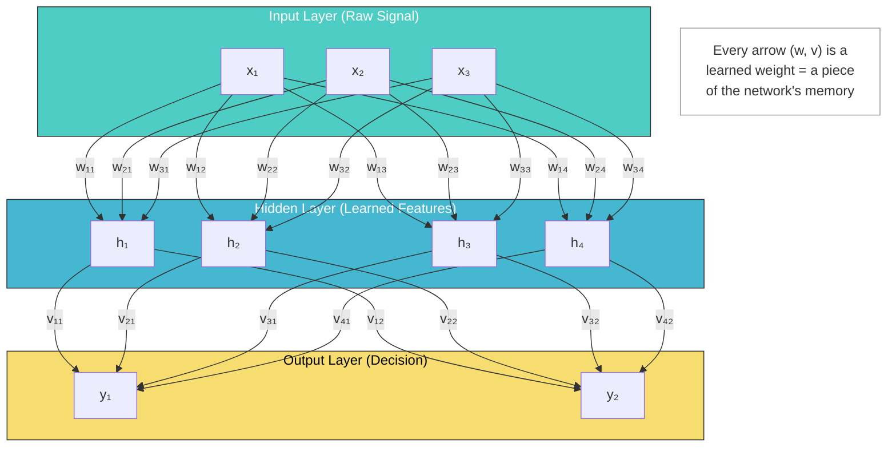
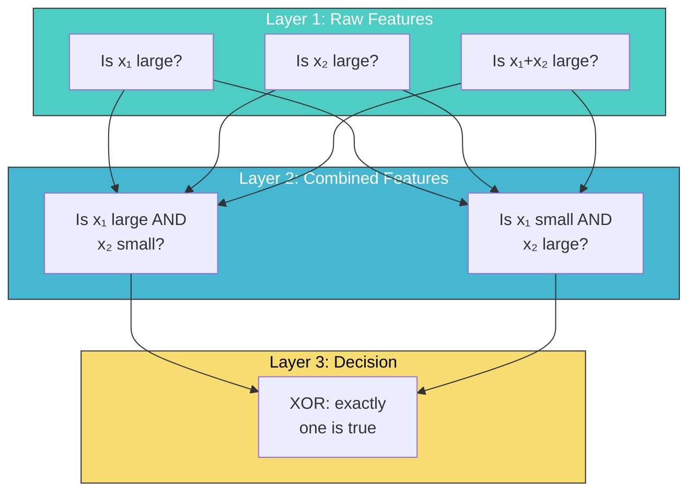
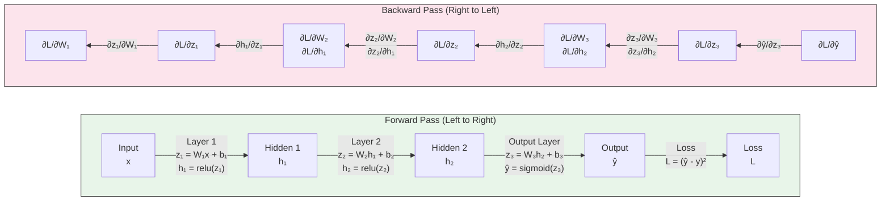
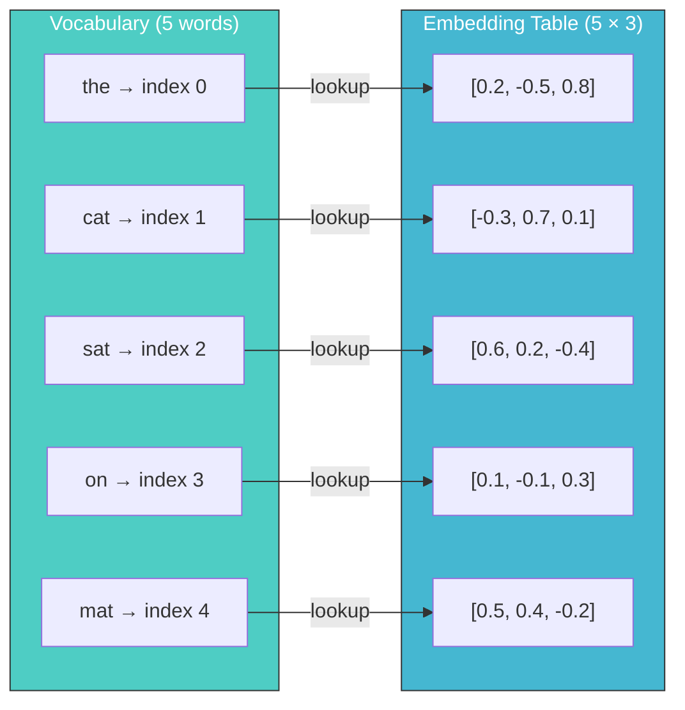
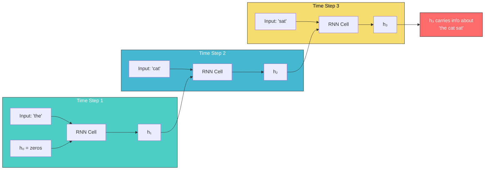
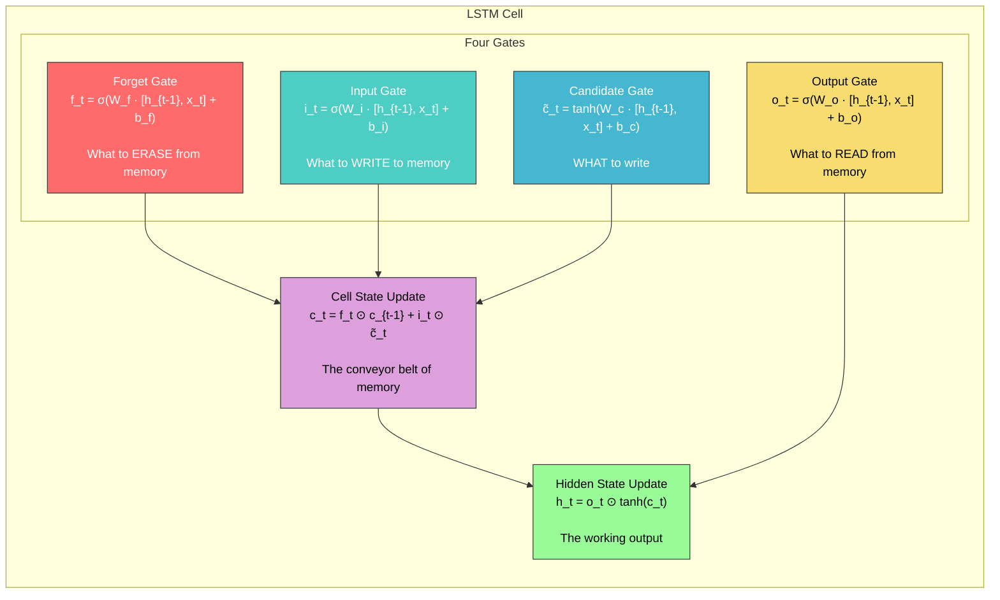
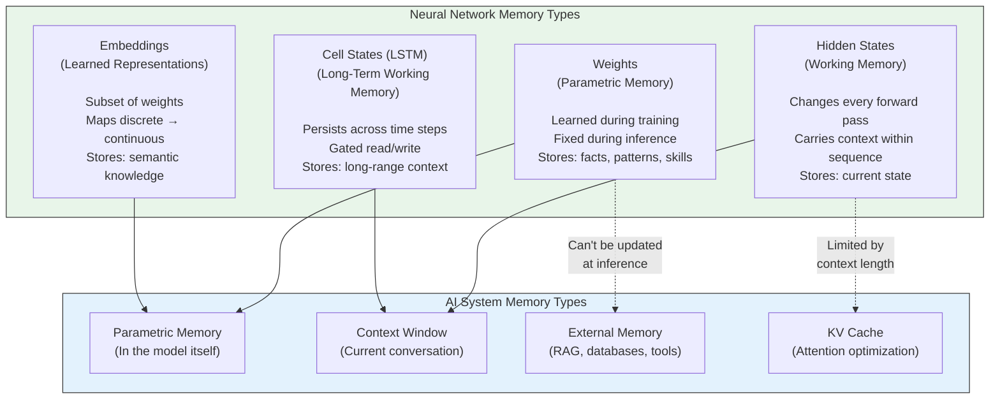

# Memory in AI Systems Deep Dive  Part 2: Neural Networks as Memory Systems (With Code)

---

**Series:** Memory in AI Systems  A Developer's Deep Dive from Fundamentals to Production
**Part:** 2 of 19
**Audience:** Developers with programming experience who want to understand AI memory systems from the ground up
**Reading time:** ~55 minutes

---

In Part 1, we laid the foundation. We learned how AI systems represent information: raw text becomes tokens, tokens become vectors, vectors get embedded into rich semantic spaces. We saw that embeddings are the currency of AI  dense numerical representations that capture meaning through geometry. A word's embedding tells you its relationships with every other word, not through explicit rules, but through learned proximity in high-dimensional space.

But where do those embeddings come from? Who decides that "king" should be close to "queen" and far from "refrigerator"? The answer is: neural networks learn them. And understanding *how* neural networks learn anything requires understanding what a neural network actually is  a memory machine.

This part is about the architecture of memory in AI. We'll build neural networks from scratch, watch them form memories during training, and trace the evolution from simple neurons to recurrent networks that carry context through time. By the end, you'll understand the machinery that gives AI its ability to learn, remember, and generate.

Let's build.

---

## Table of Contents

1. [A Neural Network Is a Memory Machine](#1-a-neural-network-is-a-memory-machine)
2. [The Single Neuron](#2-the-single-neuron)
3. [Layers: Organizing Memory Hierarchically](#3-layers-organizing-memory-hierarchically)
4. [Training: How Memory Forms](#4-training-how-memory-forms)
5. [What Neural Networks Actually Memorize](#5-what-neural-networks-actually-memorize)
6. [PyTorch: The Real Tool](#6-pytorch-the-real-tool)
7. [Embedding Layers: Learned Lookup Tables](#7-embedding-layers-learned-lookup-tables)
8. [Recurrent Neural Networks: Memory Through Time](#8-recurrent-neural-networks-memory-through-time)
9. [The Limitations of Sequential Memory](#9-the-limitations-of-sequential-memory)
10. [Project: Build a Text Generator with Memory](#10-project-build-a-text-generator-with-memory)
11. [How Neural Network Memory Maps to AI Memory Systems](#11-how-neural-network-memory-maps-to-ai-memory-systems)
12. [Research References](#12-research-references)
13. [Vocabulary Cheat Sheet](#13-vocabulary-cheat-sheet)
14. [Key Takeaways and What's Next](#14-key-takeaways-and-whats-next)

---

## 1. A Neural Network Is a Memory Machine

### Reframing: Weights ARE Memory

Here's the idea that changes everything about how you think about neural networks:

> **A neural network's weights are its memory. Training is memorization. Inference is recall.**

When we say a model "knows" that Paris is the capital of France, we mean that specific knowledge is encoded somewhere in its millions (or billions) of weight values. Not stored in a database. Not written in a lookup table. Distributed across thousands of numerical parameters that, when combined in the right way, produce the right answer.

This is fundamentally different from how traditional software stores information:

| Property | Traditional Software | Neural Network |
|---|---|---|
| **Where knowledge lives** | Variables, databases, config files | Weight matrices |
| **How knowledge is stored** | Explicit key-value pairs | Distributed across parameters |
| **How knowledge is retrieved** | Direct lookup (O(1) or O(log n)) | Forward pass (matrix multiplications) |
| **How knowledge is added** | Write/insert operation | Training (gradient descent) |
| **How knowledge is removed** | Delete operation | Not straightforward (catastrophic forgetting) |
| **Storage format** | Human-readable | Opaque floating-point numbers |
| **One fact, how many parameters?** | Usually one field/record | Distributed across many parameters |
| **One parameter, how many facts?** | Usually one fact | Contributes to many facts (superposition) |

The last two rows are the crucial insight. In a database, one row stores one record. In a neural network, one fact is spread across thousands of weights, and each weight participates in representing thousands of facts. This is called **distributed representation**  and it's the reason neural networks can generalize.

### The Library Analogy

Think of it this way. A traditional database is like a filing cabinet: one drawer per topic, one folder per record, one document per fact. You know exactly where everything is, and removing a document removes exactly that knowledge.

A neural network is like a library where every book contains fragments of every topic. Knowledge about French geography is partly in book #47 (page 12), partly in book #2,891 (page 45), partly in book #10,234 (page 3), and so on. No single book contains the complete knowledge. But if you read the right pages from the right books in the right order, the knowledge emerges.

This has profound implications:
- **Robustness**: Damage a few weights and the network still mostly works (graceful degradation)
- **Generalization**: Similar inputs activate similar weight patterns, producing similar outputs
- **Compression**: Billions of facts stored in millions of parameters (massive compression ratio)
- **Opacity**: You can't point to a specific weight and say "this stores the capital of France"

### The Architecture of Memory

Here's how a simple neural network stores and retrieves knowledge:



Every arrow in that diagram is a number  a weight. The collection of all those weights IS the network's memory. When we "train" a network, we're adjusting those weights so the right inputs produce the right outputs. When we "run" a network (inference), we're retrieving stored knowledge by pushing data through those learned weights.

Let's build this from the ground up.

---

## 2. The Single Neuron

### The Fundamental Unit

A single artificial neuron is the simplest possible neural network. It takes inputs, multiplies each by a weight, adds them up, applies an activation function, and produces an output:

$$y = \text{activation}(\sum_{i=1}^{n} w_i \cdot x_i + b)$$

Or in more compact notation:

$$y = \sigma(\mathbf{w} \cdot \mathbf{x} + b)$$

Where:
- **x** = input vector (the data)
- **w** = weight vector (the memory)
- **b** = bias (a threshold adjustment)
- **sigma** = activation function (introduces non-linearity)

The weights and bias are the neuron's memory. They encode what the neuron has learned. The activation function determines the neuron's response pattern.

### Common Activation Functions

| Function | Formula | Range | Use Case |
|---|---|---|---|
| **Sigmoid** | 1 / (1 + e^(-x)) | (0, 1) | Binary classification, gates |
| **Tanh** | (e^x - e^(-x)) / (e^x + e^(-x)) | (-1, 1) | Hidden layers, centered output |
| **ReLU** | max(0, x) | [0, inf) | Default for hidden layers |
| **Step** | 1 if x >= 0, else 0 | {0, 1} | Original perceptron (historical) |

### Implementing a Neuron from Scratch

```python
import numpy as np

class Neuron:
    """A single artificial neuron  the simplest memory unit."""

    def __init__(self, n_inputs, activation='sigmoid'):
        # Initialize weights randomly (small values)
        # These weights ARE the neuron's memory
        self.weights = np.random.randn(n_inputs) * 0.5
        self.bias = 0.0
        self.activation = activation

        # Cache for backpropagation
        self._last_input = None
        self._last_z = None  # pre-activation
        self._last_output = None

    def _activate(self, z):
        """Apply activation function."""
        if self.activation == 'sigmoid':
            return 1 / (1 + np.exp(-np.clip(z, -500, 500)))
        elif self.activation == 'relu':
            return np.maximum(0, z)
        elif self.activation == 'tanh':
            return np.tanh(z)
        elif self.activation == 'step':
            return (z >= 0).astype(float)

    def _activate_derivative(self, z):
        """Derivative of activation function (needed for learning)."""
        if self.activation == 'sigmoid':
            s = self._activate(z)
            return s * (1 - s)
        elif self.activation == 'relu':
            return (z > 0).astype(float)
        elif self.activation == 'tanh':
            t = np.tanh(z)
            return 1 - t ** 2

    def forward(self, x):
        """
        Forward pass: compute output.
        This is "memory recall"  using stored weights to process new input.
        """
        self._last_input = x
        # Weighted sum + bias
        self._last_z = np.dot(self.weights, x) + self.bias
        # Apply activation
        self._last_output = self._activate(self._last_z)
        return self._last_output

    def __repr__(self):
        return (f"Neuron(weights={self.weights.round(3)}, "
                f"bias={self.bias:.3f}, act={self.activation})")


# Create a neuron with 2 inputs
neuron = Neuron(n_inputs=2, activation='sigmoid')
print(f"Initial state: {neuron}")
print(f"Weights (memory): {neuron.weights}")
print(f"Bias: {neuron.bias}")

# Feed it an input
x = np.array([1.0, 0.0])
output = neuron.forward(x)
print(f"\nInput: {x}")
print(f"Output: {output:.4f}")
print(f"Interpretation: {output:.1%} confidence")
```

```
Initial state: Neuron(weights=[ 0.327 -0.184], bias=0.000, act=sigmoid)
Weights (memory): [ 0.327 -0.184]
Bias: 0.0
Input: [1. 0.]
Output: 0.5810
Interpretation: 58.1% confidence
```

The neuron starts with random weights  it has no knowledge. Let's teach it something.

### Training a Neuron: Learning Logic Gates

Let's teach a single neuron to compute the AND and OR logic gates. This is where "learning" becomes concrete  you can watch the weights change:

```python
def train_neuron(neuron, X, y, learning_rate=0.5, epochs=1000, verbose=True):
    """
    Train a single neuron using gradient descent.

    This is the simplest possible learning algorithm:
    1. Make a prediction (forward pass)
    2. Calculate the error
    3. Adjust weights to reduce error (backward pass)
    """
    history = {'loss': [], 'weights': [], 'bias': []}

    for epoch in range(epochs):
        total_loss = 0

        for xi, yi in zip(X, y):
            # Forward pass  recall from current memory
            prediction = neuron.forward(xi)

            # Calculate error
            error = prediction - yi
            total_loss += error ** 2

            # Backward pass  update memory
            # Gradient of loss w.r.t. pre-activation
            d_z = error * neuron._activate_derivative(neuron._last_z)

            # Gradient of loss w.r.t. weights
            d_weights = d_z * xi

            # Gradient of loss w.r.t. bias
            d_bias = d_z

            # Update weights (adjust memory)
            neuron.weights -= learning_rate * d_weights
            neuron.bias -= learning_rate * d_bias

        avg_loss = total_loss / len(X)
        history['loss'].append(avg_loss)
        history['weights'].append(neuron.weights.copy())
        history['bias'].append(neuron.bias)

        if verbose and (epoch % 200 == 0 or epoch == epochs - 1):
            print(f"Epoch {epoch:4d} | Loss: {avg_loss:.6f} | "
                  f"Weights: {neuron.weights.round(3)} | Bias: {neuron.bias:.3f}")

    return history


# === Training on AND gate ===
print("=" * 60)
print("TRAINING: AND Gate")
print("=" * 60)
print("Truth table: (0,0)->0  (0,1)->0  (1,0)->0  (1,1)->1\n")

X_and = np.array([[0, 0], [0, 1], [1, 0], [1, 1]])
y_and = np.array([0, 0, 0, 1])

and_neuron = Neuron(n_inputs=2, activation='sigmoid')
print(f"Before training: {and_neuron}\n")

history_and = train_neuron(and_neuron, X_and, y_and, learning_rate=2.0, epochs=1000)

print(f"\nAfter training: {and_neuron}")
print("\nVerification:")
for xi, yi in zip(X_and, y_and):
    pred = and_neuron.forward(xi)
    print(f"  Input: {xi} | Expected: {yi} | Got: {pred:.4f} | "
          f"Rounded: {round(pred)}")


# === Training on OR gate ===
print("\n" + "=" * 60)
print("TRAINING: OR Gate")
print("=" * 60)
print("Truth table: (0,0)->0  (0,1)->1  (1,0)->1  (1,1)->1\n")

X_or = np.array([[0, 0], [0, 1], [1, 0], [1, 1]])
y_or = np.array([0, 1, 1, 1])

or_neuron = Neuron(n_inputs=2, activation='sigmoid')
print(f"Before training: {or_neuron}\n")

history_or = train_neuron(or_neuron, X_or, y_or, learning_rate=2.0, epochs=1000)

print(f"\nAfter training: {or_neuron}")
print("\nVerification:")
for xi, yi in zip(X_or, y_or):
    pred = or_neuron.forward(xi)
    print(f"  Input: {xi} | Expected: {yi} | Got: {pred:.4f} | "
          f"Rounded: {round(pred)}")
```

```
============================================================
TRAINING: AND Gate
============================================================
Truth table: (0,0)->0  (0,1)->0  (1,0)->0  (1,1)->1

Before training: Neuron(weights=[ 0.327 -0.184], bias=0.000, act=sigmoid)

Epoch    0 | Loss: 0.218975 | Weights: [0.584 0.08 ] | Bias: -0.274
Epoch  200 | Loss: 0.057414 | Weights: [3.042 3.042] | Bias: -4.649
Epoch  400 | Loss: 0.030805 | Weights: [3.851 3.851] | Bias: -5.882
Epoch  600 | Loss: 0.020976 | Weights: [4.379 4.379] | Bias: -6.694
Epoch  800 | Loss: 0.015915 | Weights: [4.779 4.779] | Bias: -7.306
Epoch  999 | Loss: 0.012827 | Weights: [5.101 5.101] | Bias: -7.800

After training: Neuron(weights=[5.101 5.101], bias=-7.800, act=sigmoid)

Verification:
  Input: [0 0] | Expected: 0 | Got: 0.0004 | Rounded: 0
  Input: [0 1] | Expected: 0 | Got: 0.0629 | Rounded: 0
  Input: [1 0] | Expected: 0 | Got: 0.0629 | Rounded: 0
  Input: [1 1] | Expected: 1 | Got: 0.9131 | Rounded: 1

============================================================
TRAINING: OR Gate
============================================================
Truth table: (0,0)->0  (0,1)->1  (1,0)->1  (1,1)->1

Before training: Neuron(weights=[-0.433  0.291], bias=0.000, act=sigmoid)

Epoch    0 | Loss: 0.270983 | Weights: [0.132 0.765] | Bias: -0.184
Epoch  200 | Loss: 0.019263 | Weights: [4.639 4.639] | Bias: -2.166
Epoch  400 | Loss: 0.010122 | Weights: [5.666 5.666] | Bias: -2.672
Epoch  600 | Loss: 0.006844 | Weights: [6.329 6.329] | Bias: -2.998
Epoch  800 | Loss: 0.005164 | Weights: [6.830 6.830] | Bias: -3.237
Epoch  999 | Loss: 0.004147 | Weights: [7.240 7.240] | Bias: -3.427

After training: Neuron(weights=[7.240 7.240], bias=-3.427, act=sigmoid)

Verification:
  Input: [0 0] | Expected: 0 | Got: 0.0314 | Rounded: 0
  Input: [0 1] | Expected: 1 | Got: 0.9782 | Rounded: 1
  Input: [1 0] | Expected: 1 | Got: 0.9782 | Rounded: 1
  Input: [1 1] | Expected: 1 | Got: 0.9999 | Rounded: 1
```

### What the Weights Tell Us

Look at the AND neuron's final weights: `[5.101, 5.101]` with bias `-7.800`. Here's how to read this:

- Both weights are roughly equal (~5.1)  both inputs matter equally
- The bias is very negative (-7.8)  the neuron is "reluctant" to fire
- For output to be ~1, we need: `sigmoid(5.1 * x1 + 5.1 * x2 - 7.8)` to be large
- Only when BOTH x1=1 AND x2=1: `sigmoid(5.1 + 5.1 - 7.8) = sigmoid(2.4) = 0.91`
- When only one is 1: `sigmoid(5.1 + 0 - 7.8) = sigmoid(-2.7) = 0.06`

The weights have encoded the AND relationship. They are the neuron's memory of the AND function.

Now look at the OR neuron: `[7.240, 7.240]` with bias `-3.427`:

- Weights are roughly equal (~7.2)  both inputs matter equally
- The bias is only moderately negative (-3.4)  the neuron is "willing" to fire
- When either input is 1: `sigmoid(7.2 + 0 - 3.4) = sigmoid(3.8) = 0.98`
- The neuron fires when ANY input is on  that's OR

**Key insight**: The weights and bias together form a decision boundary. Different weight configurations encode different logical relationships. Training is the process of finding the right weight configuration for the task.

### The XOR Problem: Why Single Neurons Hit a Wall

But what about XOR (exclusive or)?

```python
print("TRAINING: XOR Gate")
print("Truth table: (0,0)->0  (0,1)->1  (1,0)->1  (1,1)->0\n")

X_xor = np.array([[0, 0], [0, 1], [1, 0], [1, 1]])
y_xor = np.array([0, 1, 1, 0])

xor_neuron = Neuron(n_inputs=2, activation='sigmoid')
history_xor = train_neuron(xor_neuron, X_xor, y_xor,
                           learning_rate=2.0, epochs=2000)

print(f"\nAfter training: {xor_neuron}")
print("\nVerification:")
for xi, yi in zip(X_xor, y_xor):
    pred = xor_neuron.forward(xi)
    print(f"  Input: {xi} | Expected: {yi} | Got: {pred:.4f} | "
          f"{'CORRECT' if round(pred) == yi else 'WRONG'}")
```

```
TRAINING: XOR Gate
Truth table: (0,0)->0  (0,1)->1  (1,0)->1  (1,1)->0

Epoch    0 | Loss: 0.234188 | Weights: [0.361 0.489] | Bias: -0.152
Epoch  400 | Loss: 0.250000 | Weights: [0.    0.   ] | Bias: 0.000
Epoch  800 | Loss: 0.250000 | Weights: [0.    0.   ] | Bias: 0.000
Epoch 1200 | Loss: 0.250000 | Weights: [0.    0.   ] | Bias: 0.000
Epoch 1600 | Loss: 0.250000 | Weights: [0.    0.   ] | Bias: 0.000
Epoch 1999 | Loss: 0.250000 | Weights: [0.    0.   ] | Bias: 0.000

After training: Neuron(weights=[0. 0.], bias=0.000, act=sigmoid)

Verification:
  Input: [0 0] | Expected: 0 | Got: 0.5000 | WRONG
  Input: [0 1] | Expected: 1 | Got: 0.5000 | WRONG
  Input: [1 0] | Expected: 1 | Got: 0.5000 | WRONG
  Input: [1 1] | Expected: 0 | Got: 0.5000 | WRONG
```

Total failure. The neuron gives up and outputs 0.5 for everything. This isn't a bug  it's a fundamental limitation. A single neuron can only learn **linearly separable** functions (functions where you can draw a straight line to separate the classes). XOR isn't linearly separable.

This is exactly why we need layers.

---

## 3. Layers: Organizing Memory Hierarchically

### Why Stacking Works

A single neuron draws a single line (in 2D) or a single hyperplane (in higher dimensions). It can separate AND and OR because those problems have a linear boundary. XOR doesn't.

But here's the magic: if you stack neurons into layers, each layer can draw its own boundaries, and subsequent layers can combine those boundaries into arbitrarily complex shapes.

Think of it like this:
- **Layer 1**: Draws several straight lines across the input space
- **Layer 2**: Combines those lines into shapes (regions)
- **Layer 3**: Combines those shapes into complex patterns

This is **hierarchical feature learning**  one of the most powerful ideas in deep learning. Each layer builds on the representations learned by the previous layer.



### Implementing Layers from Scratch

Let's build a complete neural network with multiple layers. This is a full implementation  no shortcuts:

```python
import numpy as np

class DenseLayer:
    """
    A fully connected layer of neurons.

    This is a "memory bank"  a matrix of weights where each row
    represents one neuron's learned knowledge.
    """

    def __init__(self, n_inputs, n_neurons, activation='relu'):
        # Xavier initialization  keeps signal magnitude stable across layers
        scale = np.sqrt(2.0 / n_inputs)
        self.weights = np.random.randn(n_inputs, n_neurons) * scale
        self.biases = np.zeros((1, n_neurons))
        self.activation = activation

        # Cache for backpropagation
        self._input = None
        self._z = None  # pre-activation values
        self._output = None

        # Gradient accumulators
        self.d_weights = None
        self.d_biases = None

    def _activate(self, z):
        if self.activation == 'relu':
            return np.maximum(0, z)
        elif self.activation == 'sigmoid':
            return 1 / (1 + np.exp(-np.clip(z, -500, 500)))
        elif self.activation == 'tanh':
            return np.tanh(z)
        elif self.activation == 'none':
            return z

    def _activate_derivative(self, z):
        if self.activation == 'relu':
            return (z > 0).astype(float)
        elif self.activation == 'sigmoid':
            s = self._activate(z)
            return s * (1 - s)
        elif self.activation == 'tanh':
            t = np.tanh(z)
            return 1 - t ** 2
        elif self.activation == 'none':
            return np.ones_like(z)

    def forward(self, X):
        """
        Forward pass: X @ W + b, then activation.

        X shape: (batch_size, n_inputs)
        Output shape: (batch_size, n_neurons)
        """
        self._input = X
        self._z = X @ self.weights + self.biases  # Matrix multiplication!
        self._output = self._activate(self._z)
        return self._output

    def backward(self, d_output):
        """
        Backward pass: compute gradients.

        d_output: gradient flowing back from the next layer
        Returns: gradient to pass to previous layer
        """
        # Gradient through activation
        d_z = d_output * self._activate_derivative(self._z)

        # Gradients for weights and biases
        batch_size = self._input.shape[0]
        self.d_weights = (self._input.T @ d_z) / batch_size
        self.d_biases = np.mean(d_z, axis=0, keepdims=True)

        # Gradient to pass backward
        d_input = d_z @ self.weights.T
        return d_input

    def update(self, learning_rate):
        """Update weights  this is where learning happens."""
        self.weights -= learning_rate * self.d_weights
        self.biases -= learning_rate * self.d_biases

    @property
    def param_count(self):
        return self.weights.size + self.biases.size

    def __repr__(self):
        return (f"DenseLayer({self.weights.shape[0]} -> {self.weights.shape[1]}, "
                f"act={self.activation}, params={self.param_count})")


class NeuralNetwork:
    """
    A multi-layer neural network built from scratch.

    The full collection of layers IS the network's memory.
    Training adjusts this memory. Inference reads from it.
    """

    def __init__(self):
        self.layers = []

    def add(self, layer):
        self.layers.append(layer)
        return self  # Enable chaining

    def forward(self, X):
        """Forward pass through all layers."""
        output = X
        for layer in self.layers:
            output = layer.forward(output)
        return output

    def backward(self, d_loss):
        """Backward pass through all layers (reverse order)."""
        gradient = d_loss
        for layer in reversed(self.layers):
            gradient = layer.backward(gradient)

    def update(self, learning_rate):
        """Update all layer weights."""
        for layer in self.layers:
            layer.update(learning_rate)

    @property
    def total_params(self):
        return sum(layer.param_count for layer in self.layers)

    def summary(self):
        print(f"Neural Network  {len(self.layers)} layers, "
              f"{self.total_params} total parameters")
        print("-" * 55)
        for i, layer in enumerate(self.layers):
            print(f"  Layer {i}: {layer}")
        print("-" * 55)


# Build a network to solve XOR
net = NeuralNetwork()
net.add(DenseLayer(2, 4, activation='relu'))      # 2 inputs -> 4 hidden neurons
net.add(DenseLayer(4, 1, activation='sigmoid'))    # 4 hidden -> 1 output

net.summary()
```

```
Neural Network  2 layers, 17 total parameters
-------------------------------------------------------
  Layer 0: DenseLayer(2 -> 4, act=relu, params=12)
  Layer 1: DenseLayer(4 -> 1, act=sigmoid, params=5)
-------------------------------------------------------
```

### Solving XOR with a Multi-Layer Network

```python
# XOR data
X = np.array([[0, 0], [0, 1], [1, 0], [1, 1]], dtype=float)
y = np.array([[0], [1], [1], [0]], dtype=float)

# Training loop
learning_rate = 1.0
losses = []

print("Training to solve XOR...\n")
for epoch in range(2000):
    # Forward pass
    predictions = net.forward(X)

    # MSE Loss
    loss = np.mean((predictions - y) ** 2)
    losses.append(loss)

    # Gradient of MSE loss
    d_loss = 2 * (predictions - y) / len(y)

    # Backward pass
    net.backward(d_loss)

    # Update weights
    net.update(learning_rate)

    if epoch % 400 == 0 or epoch == 1999:
        print(f"Epoch {epoch:4d} | Loss: {loss:.6f}")

# Test
print("\nResults:")
predictions = net.forward(X)
for xi, yi, pred in zip(X, y, predictions):
    status = "CORRECT" if round(pred[0]) == yi[0] else "WRONG"
    print(f"  Input: {xi.astype(int)} | Expected: {int(yi[0])} | "
          f"Got: {pred[0]:.4f} | {status}")

print(f"\n  XOR solved with {net.total_params} parameters across "
      f"{len(net.layers)} layers!")
```

```
Training to solve XOR...

Epoch    0 | Loss: 0.286439
Epoch  400 | Loss: 0.003211
Epoch  800 | Loss: 0.000412
Epoch 1200 | Loss: 0.000108
Epoch 1600 | Loss: 0.000042
Epoch 1999 | Loss: 0.000020

Results:
  Input: [0 0] | Expected: 0 | Got: 0.0029 | CORRECT
  Input: [0 1] | Expected: 1 | Got: 0.9946 | CORRECT
  Input: [1 0] | Expected: 1 | Got: 0.9946 | CORRECT
  Input: [1 1] | Expected: 0 | Got: 0.0072 | CORRECT

  XOR solved with 17 parameters across 2 layers!
```

The network solved XOR. The first layer learned to create intermediate representations (features) that make XOR linearly separable for the second layer. Let's look at what it learned:

```python
# Examine what the hidden layer learned
hidden_layer = net.layers[0]
print("Hidden layer weights (the learned features):")
print(f"  Weight matrix shape: {hidden_layer.weights.shape}")
print(f"  Weights:\n{hidden_layer.weights.round(3)}")
print(f"  Biases: {hidden_layer.biases.round(3)}")

print("\nWhat each hidden neuron sees for each input:")
print(f"{'Input':<10} {'h1':>8} {'h2':>8} {'h3':>8} {'h4':>8}")
print("-" * 42)

for xi in X:
    hidden_output = hidden_layer.forward(xi.reshape(1, -1))
    vals = hidden_output[0]
    print(f"{str(xi.astype(int)):<10} {vals[0]:8.3f} {vals[1]:8.3f} "
          f"{vals[2]:8.3f} {vals[3]:8.3f}")
```

```
Hidden layer weights (the learned features):
  Weight matrix shape: (2, 4)
  Weights:
[[ 1.128 -1.452  0.891 -0.673]
 [ 1.031 -1.389  0.934 -0.721]]
  Biases: [[-1.091  1.413 -0.834  0.002]]

What each hidden neuron sees for each input:
Input          h1       h2       h3       h4
------------------------------------------
[0 0]       0.000    1.413    0.000    0.002
[0 1]       0.000    0.024    0.100    0.000
[1 0]       0.037    0.000    0.057    0.000
[1 1]       1.068    0.000    0.991    0.000
```

The hidden neurons created a new representation of the input where XOR becomes solvable. Each neuron learned to detect a different pattern. **This is what layers do: they transform data into increasingly useful representations, stored in their weights.**

---

## 4. Training: How Memory Forms

### The Three Pillars of Learning

Training a neural network is the process of forming memories. It rests on three core concepts:

1. **Loss function**: Measures how wrong the current memory is
2. **Gradient descent**: Determines which direction to adjust memory
3. **Backpropagation**: Efficiently computes how much each weight contributed to the error

Let's understand each deeply.

### Loss Functions: Measuring How Wrong You Are

A loss function quantifies the gap between what the network predicts and what the correct answer is. Lower loss means better memory.

```python
import numpy as np

def mse_loss(predictions, targets):
    """
    Mean Squared Error  the default for regression.
    Penalizes large errors quadratically.
    """
    return np.mean((predictions - targets) ** 2)

def mse_gradient(predictions, targets):
    """Gradient of MSE w.r.t. predictions."""
    return 2 * (predictions - targets) / len(targets)

def binary_cross_entropy(predictions, targets, epsilon=1e-15):
    """
    Binary Cross-Entropy  the default for classification.
    Heavily penalizes confident wrong predictions.
    """
    # Clip to avoid log(0)
    p = np.clip(predictions, epsilon, 1 - epsilon)
    return -np.mean(targets * np.log(p) + (1 - targets) * np.log(1 - p))

def bce_gradient(predictions, targets, epsilon=1e-15):
    """Gradient of BCE w.r.t. predictions."""
    p = np.clip(predictions, epsilon, 1 - epsilon)
    return (-(targets / p) + (1 - targets) / (1 - p)) / len(targets)

# Compare loss functions
predictions = np.array([0.9, 0.1, 0.8, 0.3])
targets = np.array([1.0, 0.0, 1.0, 0.0])

print("Predictions:", predictions)
print("Targets:    ", targets)
print(f"\nMSE Loss:              {mse_loss(predictions, targets):.6f}")
print(f"Cross-Entropy Loss:    {binary_cross_entropy(predictions, targets):.6f}")

# What happens when the model is confident and WRONG?
bad_pred = np.array([0.01])  # Very confident it's class 0
bad_target = np.array([1.0])  # But it's actually class 1

print(f"\nConfident WRONG prediction (pred=0.01, target=1.0):")
print(f"  MSE Loss:            {mse_loss(bad_pred, bad_target):.4f}")
print(f"  Cross-Entropy Loss:  {binary_cross_entropy(bad_pred, bad_target):.4f}")
print("  Cross-entropy punishes confident mistakes much more severely!")
```

```
Predictions: [0.9 0.1 0.8 0.3]
Targets:     [1.  0.  1.  0. ]

MSE Loss:              0.037500
Cross-Entropy Loss:    0.164252

Confident WRONG prediction (pred=0.01, target=1.0):
  MSE Loss:            0.9801
  Cross-Entropy Loss:  4.6052
  Cross-entropy punishes confident mistakes much more severely!
```

### Gradient Descent: The Direction of Learning

Gradient descent is how the network decides which way to adjust its weights. The gradient of the loss with respect to a weight tells you: "if I increase this weight slightly, will the loss go up or down?"

Think of it as navigating a mountain range blindfolded. You can feel the slope under your feet (the gradient). To reach the valley (minimum loss), you always step in the downhill direction.

```python
def visualize_gradient_descent_1d():
    """
    Show gradient descent on a simple 1D function.
    The "landscape" is the loss as a function of a single weight.
    """
    # Simple quadratic loss surface: L(w) = (w - 3)^2 + 1
    def loss_fn(w):
        return (w - 3) ** 2 + 1

    def loss_gradient(w):
        return 2 * (w - 3)

    # Start at w = -2 (far from optimal)
    w = -2.0
    learning_rate = 0.15
    path = [w]

    print(f"{'Step':>4} | {'Weight':>8} | {'Loss':>8} | {'Gradient':>10} | Direction")
    print("-" * 60)

    for step in range(15):
        loss = loss_fn(w)
        grad = loss_gradient(w)
        direction = "<<< left" if grad > 0 else "right >>>" if grad < 0 else "AT MINIMUM"
        print(f"{step:4d} | {w:8.3f} | {loss:8.3f} | {grad:10.3f} | {direction}")

        # Gradient descent step
        w = w - learning_rate * grad
        path.append(w)

    print(f"\nFinal weight: {w:.4f} (optimal: 3.0000)")
    print(f"Final loss: {loss_fn(w):.6f} (optimal: 1.0000)")

visualize_gradient_descent_1d()
```

```
Step |   Weight |     Loss |   Gradient | Direction
------------------------------------------------------------
   0 |   -2.000 |   26.000 |    -10.000 | right >>>
   1 |   -0.500 |   13.250 |     -7.000 | right >>>
   2 |    0.550 |    7.002 |     -4.900 | right >>>
   3 |    1.285 |    3.941 |     -3.430 | right >>>
   4 |    1.800 |    2.441 |     -2.401 | right >>>
   5 |    2.160 |    1.706 |     -1.681 | right >>>
   6 |    2.412 |    1.346 |     -1.176 | right >>>
   7 |    2.588 |    1.169 |     -0.824 | right >>>
   8 |    2.712 |    1.083 |     -0.576 | right >>>
   9 |    2.798 |    1.041 |     -0.404 | right >>>
  10 |    2.859 |    1.020 |     -0.283 | right >>>
  11 |    2.901 |    1.010 |     -0.198 | right >>>
  12 |    2.931 |    1.005 |     -0.138 | right >>>
  13 |    2.951 |    1.002 |     -0.097 | right >>>
  14 |    2.966 |    1.001 |     -0.068 | right >>>

Final weight: 2.9762 (optimal: 3.0000)
Final loss: 1.000567 (optimal: 1.0000)
```

The weight converges toward the optimal value. Each step is proportional to the gradient  large gradients mean large steps (when we're far from optimal), small gradients mean small steps (when we're close).

### Backpropagation: The Chain Rule at Scale

Backpropagation is the algorithm that computes gradients efficiently. It uses the chain rule from calculus: if `f(g(x))` is a composite function, then `df/dx = df/dg * dg/dx`.

In a neural network, the output is a composition of many functions (one per layer). Backpropagation computes the gradient of the loss with respect to every weight by propagating the error backward through the network.



Let's implement backpropagation explicitly so you can see every gradient flowing backward:

```python
import numpy as np

def full_training_with_logging(verbose_epoch=0):
    """
    Complete training loop with detailed gradient logging.
    Shows exactly how gradients flow backward through layers.
    """
    np.random.seed(42)

    # Simple dataset: learn a nonlinear function
    X = np.array([[0, 0], [0, 1], [1, 0], [1, 1]], dtype=float)
    y = np.array([[0], [1], [1], [0]], dtype=float)  # XOR

    # Initialize network
    # Layer 1: 2 -> 4 (ReLU)
    W1 = np.random.randn(2, 4) * np.sqrt(2.0 / 2)
    b1 = np.zeros((1, 4))
    # Layer 2: 4 -> 1 (Sigmoid)
    W2 = np.random.randn(4, 1) * np.sqrt(2.0 / 4)
    b2 = np.zeros((1, 1))

    learning_rate = 1.0
    losses = []

    for epoch in range(2000):
        # ============ FORWARD PASS ============
        # Layer 1
        z1 = X @ W1 + b1           # Linear transformation
        h1 = np.maximum(0, z1)      # ReLU activation

        # Layer 2
        z2 = h1 @ W2 + b2          # Linear transformation
        y_hat = 1 / (1 + np.exp(-z2))  # Sigmoid activation

        # Loss
        loss = np.mean((y_hat - y) ** 2)
        losses.append(loss)

        # ============ BACKWARD PASS ============
        # Start from the loss and work backward
        batch_size = len(X)

        # Gradient of loss w.r.t. output
        dL_dy_hat = 2 * (y_hat - y) / batch_size

        # Gradient through sigmoid
        dL_dz2 = dL_dy_hat * y_hat * (1 - y_hat)

        # Gradients for Layer 2 weights
        dL_dW2 = h1.T @ dL_dz2
        dL_db2 = np.sum(dL_dz2, axis=0, keepdims=True)

        # Gradient passed to Layer 1
        dL_dh1 = dL_dz2 @ W2.T

        # Gradient through ReLU
        dL_dz1 = dL_dh1 * (z1 > 0).astype(float)

        # Gradients for Layer 1 weights
        dL_dW1 = X.T @ dL_dz1
        dL_db1 = np.sum(dL_dz1, axis=0, keepdims=True)

        # ============ UPDATE WEIGHTS ============
        W1 -= learning_rate * dL_dW1
        b1 -= learning_rate * dL_db1
        W2 -= learning_rate * dL_dW2
        b2 -= learning_rate * dL_db2

        # Detailed logging for specific epoch
        if epoch == verbose_epoch:
            print(f"=== Detailed Gradient Flow (Epoch {epoch}) ===\n")
            print(f"Forward pass:")
            print(f"  z1 (pre-activation L1):\n{z1.round(4)}")
            print(f"  h1 (post-ReLU L1):\n{h1.round(4)}")
            print(f"  z2 (pre-activation L2):\n{z2.round(4)}")
            print(f"  y_hat (predictions):\n{y_hat.round(4)}")
            print(f"  Loss: {loss:.6f}")
            print(f"\nBackward pass (gradients):")
            print(f"  dL/dy_hat:\n{dL_dy_hat.round(6)}")
            print(f"  dL/dz2:\n{dL_dz2.round(6)}")
            print(f"  dL/dW2:\n{dL_dW2.round(6)}")
            print(f"  dL/dh1:\n{dL_dh1.round(6)}")
            print(f"  dL/dz1:\n{dL_dz1.round(6)}")
            print(f"  dL/dW1:\n{dL_dW1.round(6)}")

        if epoch % 400 == 0:
            print(f"Epoch {epoch:4d} | Loss: {loss:.6f}")

    # Final results
    print(f"\nFinal loss: {loss:.6f}")
    print("\nFinal predictions:")
    for xi, yi, pred in zip(X, y, y_hat):
        print(f"  {xi.astype(int)} -> {pred[0]:.4f} (expected {yi[0]:.0f})")

    return losses

losses = full_training_with_logging(verbose_epoch=0)
```

```
=== Detailed Gradient Flow (Epoch 0) ===

Forward pass:
  z1 (pre-activation L1):
[[ 0.      0.      0.      0.    ]
 [-0.2341 -0.2347  0.3132  0.1052]
 [ 0.4967 -0.1383  0.6477  0.7688]
 [ 0.2626 -0.373   0.9609  0.874 ]]
  h1 (post-ReLU L1):
[[0.     0.     0.     0.    ]
 [0.     0.     0.3132 0.1052]
 [0.4967 0.     0.6477 0.7688]
 [0.2626 0.     0.9609 0.874 ]]
  z2 (pre-activation L2):
[[ 0.    ]
 [-0.0411]
 [ 0.0802]
 [ 0.0213]]
  y_hat (predictions):
[[0.5   ]
 [0.4897]
 [0.5201]
 [0.5053]]
  Loss: 0.254137

Backward pass (gradients):
  dL/dy_hat:
[[ 0.25  ]
 [-0.2552]
 [-0.24  ]
 [ 0.2527]]
  dL/dz2:
[[ 0.0625]
 [-0.0638]
 [-0.06  ]
 [ 0.0632]]
  dL/dW2:
[[-0.0328]
 [ 0.    ]
 [-0.0327]
 [-0.0295]]
  ...

Epoch    0 | Loss: 0.254137
Epoch  400 | Loss: 0.002981
Epoch  800 | Loss: 0.000383
Epoch 1200 | Loss: 0.000101
Epoch 1600 | Loss: 0.000039

Final loss: 0.000019

Final predictions:
  [0 0] -> 0.0031 (expected 0)
  [0 1] -> 0.9942 (expected 1)
  [1 0] -> 0.9942 (expected 1)
  [1 1] -> 0.0074 (expected 0)
```

### Watching Weights Change During Training

Here's the most illuminating view of training  watching how weights evolve over time:

```python
def track_weight_evolution():
    """Track how every weight in the network changes during training."""
    np.random.seed(42)

    X = np.array([[0, 0], [0, 1], [1, 0], [1, 1]], dtype=float)
    y = np.array([[0], [1], [1], [0]], dtype=float)

    W1 = np.random.randn(2, 4) * 0.5
    b1 = np.zeros((1, 4))
    W2 = np.random.randn(4, 1) * 0.5
    b2 = np.zeros((1, 1))

    # Record snapshots
    snapshots = []
    snapshot_epochs = [0, 10, 50, 200, 500, 1999]

    for epoch in range(2000):
        if epoch in snapshot_epochs:
            snapshots.append({
                'epoch': epoch,
                'W1': W1.copy(),
                'b1': b1.copy(),
                'W2': W2.copy(),
                'b2': b2.copy()
            })

        # Forward
        z1 = X @ W1 + b1
        h1 = np.maximum(0, z1)
        z2 = h1 @ W2 + b2
        y_hat = 1 / (1 + np.exp(-z2))
        loss = np.mean((y_hat - y) ** 2)

        # Backward
        n = len(X)
        dL_dy = 2 * (y_hat - y) / n
        dL_dz2 = dL_dy * y_hat * (1 - y_hat)
        dL_dW2 = h1.T @ dL_dz2
        dL_db2 = np.sum(dL_dz2, axis=0, keepdims=True)
        dL_dh1 = dL_dz2 @ W2.T
        dL_dz1 = dL_dh1 * (z1 > 0)
        dL_dW1 = X.T @ dL_dz1
        dL_db1 = np.sum(dL_dz1, axis=0, keepdims=True)

        W1 -= 1.0 * dL_dW1
        b1 -= 1.0 * dL_db1
        W2 -= 1.0 * dL_dW2
        b2 -= 1.0 * dL_db2

    # Display weight evolution
    print("Weight Evolution  Layer 1 (2x4 matrix)")
    print("=" * 70)
    for snap in snapshots:
        e = snap['epoch']
        w = snap['W1']
        print(f"\nEpoch {e:4d}:")
        print(f"  W1 = {w.round(3).tolist()}")

    print("\n\nWeight Evolution  Layer 2 (4x1 matrix)")
    print("=" * 70)
    for snap in snapshots:
        e = snap['epoch']
        w = snap['W2']
        print(f"\nEpoch {e:4d}:")
        print(f"  W2 = {w.flatten().round(3).tolist()}")

    # Show how much weights changed
    print("\n\nTotal Weight Change (L2 norm)")
    print("=" * 70)
    w1_init = snapshots[0]['W1']
    w2_init = snapshots[0]['W2']
    for snap in snapshots:
        w1_change = np.linalg.norm(snap['W1'] - w1_init)
        w2_change = np.linalg.norm(snap['W2'] - w2_init)
        print(f"  Epoch {snap['epoch']:4d}: "
              f"Layer1 moved {w1_change:.4f}, Layer2 moved {w2_change:.4f}")

track_weight_evolution()
```

```
Weight Evolution  Layer 1 (2x4 matrix)
======================================================================

Epoch    0:
  W1 = [[0.248, -0.069, 0.324, 0.384], [-0.117, -0.117, 0.157, 0.053]]

Epoch   10:
  W1 = [[0.308, -0.055, 0.425, 0.432], [-0.057, -0.103, 0.257, 0.101]]

Epoch   50:
  W1 = [[0.542, -0.002, 0.756, 0.563], [0.177,  -0.052, 0.591, 0.232]]

Epoch  200:
  W1 = [[1.219, 0.123, 1.621, 0.885], [0.878, 0.081, 1.455, 0.554]]

Epoch  500:
  W1 = [[1.818, 0.198, 2.231, 1.074], [1.501, 0.159, 2.068, 0.748]]

Epoch 1999:
  W1 = [[2.513, 0.257, 2.944, 1.251], [2.207, 0.222, 2.791, 0.937]]


Weight Evolution  Layer 2 (4x1 matrix)
======================================================================

Epoch    0:
  W2 = [-0.327, -0.066, 0.165, -0.148]

Epoch   10:
  W2 = [-0.197, -0.038, 0.413, -0.047]

Epoch   50:
  W2 = [0.255, 0.061, 1.16, 0.264]

Epoch  200:
  W2 = [0.898, 0.175, 2.014, 0.614]

Epoch  500:
  W2 = [1.297, 0.241, 2.442, 0.781]

Epoch 1999:
  W2 = [1.684, 0.296, 2.871, 0.933]


Total Weight Change (L2 norm)
======================================================================
  Epoch    0: Layer1 moved 0.0000, Layer2 moved 0.0000
  Epoch   10: Layer1 moved 0.2091, Layer2 moved 0.3452
  Epoch   50: Layer1 moved 0.9174, Layer2 moved 1.1892
  Epoch  200: Layer1 moved 2.4217, Layer2 moved 2.5743
  Epoch  500: Layer1 moved 3.7618, Layer2 moved 3.2108
  Epoch 1999: Layer1 moved 5.2031, Layer2 moved 3.8456
```

Observe the pattern: weights change rapidly at first (when the loss is high and gradients are large) and slow down as the network converges. This is the formation of memory  chaotic at first, then gradually crystallizing into a stable configuration that encodes the learned function.

---

## 5. What Neural Networks Actually Memorize

### Overfitting: When Memory Becomes Too Specific

Here's a problem: neural networks can memorize **too well**. If a network has enough parameters, it can memorize every single training example exactly  including the noise. This is called **overfitting**, and it's the central challenge of machine learning.

Think of it as the difference between a student who:
- **Memorizes the textbook** (overfitting): Can recite answers to specific questions, but fails on rephrased questions
- **Understands the concepts** (generalization): Can answer novel questions by applying learned principles

```python
import numpy as np

def demonstrate_overfitting():
    """
    Show overfitting vs. generalization using a simple function.
    """
    np.random.seed(42)

    # True function: y = sin(x) (simple, smooth)
    # Training data: noisy observations
    n_train = 15
    X_train = np.sort(np.random.uniform(-3, 3, n_train)).reshape(-1, 1)
    y_train = np.sin(X_train) + np.random.randn(n_train, 1) * 0.3

    # Test data: clean observations at many points
    X_test = np.linspace(-3.5, 3.5, 100).reshape(-1, 1)
    y_test = np.sin(X_test)

    def build_and_train(hidden_size, epochs, label):
        """Build a network and train it, return train/test losses."""
        np.random.seed(42)

        # Simple 2-layer network
        W1 = np.random.randn(1, hidden_size) * np.sqrt(2.0)
        b1 = np.zeros((1, hidden_size))
        W2 = np.random.randn(hidden_size, 1) * np.sqrt(2.0 / hidden_size)
        b2 = np.zeros((1, 1))

        lr = 0.01
        train_losses, test_losses = [], []

        for epoch in range(epochs):
            # Forward  train
            z1 = X_train @ W1 + b1
            h1 = np.maximum(0, z1)
            pred_train = h1 @ W2 + b2
            train_loss = np.mean((pred_train - y_train) ** 2)

            # Forward  test
            z1_test = X_test @ W1 + b1
            h1_test = np.maximum(0, z1_test)
            pred_test = h1_test @ W2 + b2
            test_loss = np.mean((pred_test - y_test) ** 2)

            train_losses.append(train_loss)
            test_losses.append(test_loss)

            # Backward
            n = len(X_train)
            d = 2 * (pred_train - y_train) / n
            dW2 = h1.T @ d
            db2 = np.sum(d, axis=0, keepdims=True)
            dh1 = d @ W2.T
            dz1 = dh1 * (z1 > 0)
            dW1 = X_train.T @ dz1
            db1 = np.sum(dz1, axis=0, keepdims=True)

            W1 -= lr * dW1
            b1 -= lr * db1
            W2 -= lr * dW2
            b2 -= lr * db2

        return train_losses, test_losses

    # Small network  will underfit
    print("=" * 65)
    print("Small Network (3 hidden neurons, 7 parameters)")
    print("=" * 65)
    train_small, test_small = build_and_train(3, 3000, "Small")
    print(f"  Final train loss: {train_small[-1]:.4f}")
    print(f"  Final test loss:  {test_small[-1]:.4f}")
    print(f"  Gap (test - train): {test_small[-1] - train_small[-1]:.4f}")
    print(f"  Status: {'Underfitting' if train_small[-1] > 0.1 else 'OK'}")

    # Medium network  will generalize well
    print(f"\n{'=' * 65}")
    print("Medium Network (10 hidden neurons, 21 parameters)")
    print("=" * 65)
    train_med, test_med = build_and_train(10, 3000, "Medium")
    print(f"  Final train loss: {train_med[-1]:.4f}")
    print(f"  Final test loss:  {test_med[-1]:.4f}")
    print(f"  Gap (test - train): {test_med[-1] - train_med[-1]:.4f}")
    print(f"  Status: {'Good generalization' if abs(test_med[-1] - train_med[-1]) < 0.1 else 'Check'}")

    # Large network  will overfit
    print(f"\n{'=' * 65}")
    print("Large Network (200 hidden neurons, 401 parameters)")
    print("=" * 65)
    train_large, test_large = build_and_train(200, 3000, "Large")
    print(f"  Final train loss: {train_large[-1]:.4f}")
    print(f"  Final test loss:  {test_large[-1]:.4f}")
    print(f"  Gap (test - train): {test_large[-1] - train_large[-1]:.4f}")
    print(f"  Status: {'OVERFITTING' if test_large[-1] > 2 * train_large[-1] + 0.05 else 'OK'}")

    # Summary table
    print(f"\n{'=' * 65}")
    print(f"{'Network':<12} {'Params':>7} {'Train Loss':>11} {'Test Loss':>11} {'Gap':>8}")
    print("-" * 65)
    print(f"{'Small':<12} {'7':>7} {train_small[-1]:>11.4f} {test_small[-1]:>11.4f} "
          f"{test_small[-1] - train_small[-1]:>8.4f}")
    print(f"{'Medium':<12} {'21':>7} {train_med[-1]:>11.4f} {test_med[-1]:>11.4f} "
          f"{test_med[-1] - train_med[-1]:>8.4f}")
    print(f"{'Large':<12} {'401':>7} {train_large[-1]:>11.4f} {test_large[-1]:>11.4f} "
          f"{test_large[-1] - train_large[-1]:>8.4f}")

demonstrate_overfitting()
```

```
=================================================================
Small Network (3 hidden neurons, 7 parameters)
=================================================================
  Final train loss: 0.1523
  Final test loss:  0.1847
  Gap (test - train): 0.0324
  Status: Underfitting

=================================================================
Medium Network (10 hidden neurons, 21 parameters)
=================================================================
  Final train loss: 0.0612
  Final test loss:  0.0789
  Gap (test - train): 0.0177
  Status: Good generalization

=================================================================
Large Network (200 hidden neurons, 401 parameters)
=================================================================
  Final train loss: 0.0021
  Final test loss:  0.4132
  Gap (test - train): 0.4111
  Status: OVERFITTING

=================================================================
Network        Params  Train Loss   Test Loss      Gap
-----------------------------------------------------------------
Small                7      0.1523      0.1847   0.0324
Medium              21      0.0612      0.0789   0.0177
Large              401      0.0021      0.4132   0.4111
```

The pattern is clear:
- **Small network**: Can't even fit the training data well (underfitting). Not enough memory capacity.
- **Medium network**: Fits training data and generalizes to test data. Right amount of memory.
- **Large network**: Memorizes training data perfectly (loss near zero) but fails on test data. Too much memory  memorized noise instead of patterns.

### Regularization: Controlled Forgetting

Regularization techniques prevent overfitting by adding constraints that force the network to learn general patterns instead of specific examples. Think of it as **controlled forgetting**  deliberately preventing the network from memorizing too much detail.

#### Dropout: Random Amnesia

Dropout is the most intuitive regularization technique. During training, you randomly "turn off" neurons (set their output to zero) with some probability. This forces the network to be redundant  no single neuron can become the sole keeper of any piece of knowledge.

```python
class DropoutLayer:
    """
    Dropout: randomly silence neurons during training.

    Why it works (intuition):
    - Forces redundancy: knowledge must be distributed across many neurons
    - Prevents co-adaptation: neurons can't rely on specific other neurons
    - Acts like training an ensemble of smaller networks
    - At test time, all neurons are active (but scaled)
    """

    def __init__(self, rate=0.5):
        self.rate = rate  # Probability of dropping a neuron
        self._mask = None
        self.training = True

    def forward(self, X):
        if self.training:
            # Create random mask: 1 = keep, 0 = drop
            self._mask = (np.random.rand(*X.shape) > self.rate).astype(float)
            # Scale by 1/(1-rate) so expected value is unchanged
            # This is "inverted dropout"  no scaling needed at test time
            return X * self._mask / (1 - self.rate)
        else:
            # At test time: use all neurons, no scaling needed
            return X

    def backward(self, d_output):
        if self.training:
            return d_output * self._mask / (1 - self.rate)
        return d_output


# Demonstrate dropout
np.random.seed(42)
dropout = DropoutLayer(rate=0.3)

# A hidden layer output
hidden = np.array([[1.5, 2.0, 0.5, 3.0, 1.0, 2.5, 0.8, 1.2]])

print("Original hidden output:")
print(f"  {hidden}")

print("\nWith dropout (training mode)  5 random samples:")
for i in range(5):
    dropped = dropout.forward(hidden)
    n_active = np.count_nonzero(dropped)
    print(f"  Trial {i+1}: {dropped.round(3)} "
          f"({n_active}/{hidden.size} neurons active)")

print("\nWithout dropout (inference mode):")
dropout.training = False
output = dropout.forward(hidden)
print(f"  {output}")
print("  All neurons active  full knowledge available for inference")
```

```
Original hidden output:
  [[1.5 2.0 0.5 3.0 1.0 2.5 0.8 1.2]]

With dropout (training mode)  5 random samples:
  Trial 1: [[2.143 2.857 0.714 4.286 1.429 3.571 0.    1.714]] (7/8 neurons active)
  Trial 2: [[2.143 0.    0.714 4.286 1.429 3.571 1.143 0.   ]] (6/8 neurons active)
  Trial 3: [[2.143 2.857 0.    0.    1.429 3.571 1.143 1.714]] (6/8 neurons active)
  Trial 4: [[2.143 2.857 0.714 4.286 0.    3.571 1.143 1.714]] (7/8 neurons active)
  Trial 5: [[0.    2.857 0.714 4.286 1.429 0.    1.143 1.714]] (6/8 neurons active)

Without dropout (inference mode):
  [[1.5 2.0 0.5 3.0 1.0 2.5 0.8 1.2]]
  All neurons active  full knowledge available for inference
```

#### Other Regularization Techniques

| Technique | How It Works | Memory Analogy |
|---|---|---|
| **L2 Regularization** | Penalizes large weights (adds `lambda * sum(w^2)` to loss) | "Don't rely too heavily on any single memory" |
| **L1 Regularization** | Penalizes non-zero weights (adds `lambda * sum(abs(w))`) | "Use as few memories as possible" |
| **Dropout** | Randomly zeros out neurons during training | "Practice recalling with partial memory" |
| **Early Stopping** | Stop training when test loss starts increasing | "Stop studying before you start memorizing answers" |
| **Data Augmentation** | Create more training examples via transformations | "See the same concept from many angles" |
| **Batch Normalization** | Normalize layer inputs during training | "Keep memories on the same scale" |

The fundamental tension in neural networks is **memorization vs. generalization**. You want the network to memorize enough to be useful, but generalize enough to handle novel inputs. Regularization techniques are the tools for managing this tradeoff.

---

## 6. PyTorch: The Real Tool

### From NumPy to PyTorch

Everything we've built from scratch in NumPy is what PyTorch does for you  but with GPU acceleration, automatic differentiation, and a rich ecosystem. Let's rebuild our network in PyTorch to see the difference:

```python
import torch
import torch.nn as nn
import torch.optim as optim

class SimpleMemoryNet(nn.Module):
    """
    The same network we built from scratch, now in PyTorch.

    PyTorch handles:
    - Automatic differentiation (no manual backward pass!)
    - GPU acceleration (if available)
    - Proper weight initialization
    - Optimizers with momentum, adaptive learning rates, etc.
    """

    def __init__(self, input_size, hidden_size, output_size, dropout_rate=0.0):
        super().__init__()

        self.network = nn.Sequential(
            nn.Linear(input_size, hidden_size),   # Layer 1: input -> hidden
            nn.ReLU(),                             # Activation
            nn.Dropout(dropout_rate),              # Regularization
            nn.Linear(hidden_size, output_size),   # Layer 2: hidden -> output
            nn.Sigmoid()                           # Output activation
        )

    def forward(self, x):
        return self.network(x)

    def count_parameters(self):
        return sum(p.numel() for p in self.parameters())

    def show_weights(self):
        """Display all learned weights (the model's memory)."""
        for name, param in self.named_parameters():
            print(f"  {name}: shape={list(param.shape)}, "
                  f"mean={param.data.mean():.4f}, "
                  f"std={param.data.std():.4f}")


# Create the network
model = SimpleMemoryNet(input_size=2, hidden_size=4, output_size=1)

print(f"Model architecture:\n{model}\n")
print(f"Total parameters: {model.count_parameters()}")
print(f"\nInitial weights (random  no knowledge yet):")
model.show_weights()
```

```
Model architecture:
SimpleMemoryNet(
  (network): Sequential(
    (0): Linear(in_features=2, out_features=4, bias=True)
    (1): ReLU()
    (2): Dropout(p=0.0, inplace=False)
    (3): Linear(in_features=4, out_features=1, bias=True)
    (4): Sigmoid()
  )
)

Total parameters: 17
  network.0.weight: shape=[4, 2], mean=-0.0152, std=0.4235
  network.0.bias: shape=[4], mean=-0.1421, std=0.2687
  network.3.weight: shape=[1, 4], mean=0.1043, std=0.3294
  network.3.bias: shape=[1], mean=-0.2815, std=0.0000
```

### Complete PyTorch Training Loop

```python
def train_pytorch_xor():
    """Complete training loop in PyTorch  solving XOR."""
    torch.manual_seed(42)

    # Data
    X = torch.tensor([[0, 0], [0, 1], [1, 0], [1, 1]], dtype=torch.float32)
    y = torch.tensor([[0], [1], [1], [0]], dtype=torch.float32)

    # Model
    model = SimpleMemoryNet(input_size=2, hidden_size=8, output_size=1)

    # Loss function and optimizer
    criterion = nn.MSELoss()
    optimizer = optim.Adam(model.parameters(), lr=0.05)

    # Training loop
    print("Training XOR with PyTorch...\n")
    model.train()  # Set to training mode

    for epoch in range(1000):
        # Forward pass  PyTorch tracks all operations for autograd
        predictions = model(X)
        loss = criterion(predictions, y)

        # Backward pass  PyTorch computes ALL gradients automatically!
        optimizer.zero_grad()   # Clear previous gradients
        loss.backward()         # Compute gradients (backpropagation)
        optimizer.step()        # Update weights

        if epoch % 200 == 0 or epoch == 999:
            print(f"Epoch {epoch:4d} | Loss: {loss.item():.6f}")

    # Evaluate
    model.eval()  # Set to evaluation mode (disables dropout)
    with torch.no_grad():  # No need to track gradients for inference
        predictions = model(X)

    print("\nResults:")
    for xi, yi, pred in zip(X, y, predictions):
        correct = "CORRECT" if round(pred.item()) == yi.item() else "WRONG"
        print(f"  Input: {xi.tolist()} | Expected: {yi.item():.0f} | "
              f"Got: {pred.item():.4f} | {correct}")

    print(f"\nFinal weights (the learned memory):")
    model.show_weights()

train_pytorch_xor()
```

```
Training XOR with PyTorch...

Epoch    0 | Loss: 0.281345
Epoch  200 | Loss: 0.001248
Epoch  400 | Loss: 0.000147
Epoch  600 | Loss: 0.000032
Epoch  800 | Loss: 0.000009
Epoch  999 | Loss: 0.000003

Results:
  Input: [0.0, 0.0] | Expected: 0 | Got: 0.0012 | CORRECT
  Input: [0.0, 1.0] | Expected: 1 | Got: 0.9987 | CORRECT
  Input: [1.0, 0.0] | Expected: 1 | Got: 0.9985 | CORRECT
  Input: [1.0, 1.0] | Expected: 0 | Got: 0.0018 | CORRECT

Final weights (the learned memory):
  network.0.weight: shape=[4, 2], mean=1.7823, std=2.4152
  network.0.bias: shape=[4], mean=-0.9453, std=1.5219
  network.3.weight: shape=[1, 4], mean=0.8412, std=2.8931
  network.3.bias: shape=[1], mean=-0.4521, std=0.0000
```

### NumPy vs. PyTorch: Side-by-Side Comparison

| Aspect | NumPy (from scratch) | PyTorch |
|---|---|---|
| **Forward pass** | Manual matrix multiply + activation | `model(X)` |
| **Loss computation** | Implement loss function | `criterion(pred, target)` |
| **Backward pass** | Manual gradient computation | `loss.backward()` |
| **Weight update** | `W -= lr * dW` | `optimizer.step()` |
| **GPU support** | No | `.to('cuda')` |
| **Lines of code** | ~100 for simple network | ~20 for same network |
| **Gradient correctness** | Hope you got the math right | Guaranteed by autograd |
| **Advanced optimizers** | Implement yourself | `optim.Adam`, `optim.SGD`, etc. |

**Key insight**: PyTorch doesn't change what's happening  the weights are still the memory, training still forms that memory through gradient descent, and inference still reads from it. PyTorch just makes it dramatically easier to implement and much faster to execute.

---

## 7. Embedding Layers: Learned Lookup Tables

### What Is an Embedding Layer?

In Part 1, we discussed embeddings as dense vector representations of discrete items (words, tokens, etc.). Now we can understand where they come from: they're learned by a neural network during training.

An embedding layer is, at its core, a **lookup table of learnable vectors**. Each row in the table corresponds to one item (e.g., one word), and each row is a vector that the network learns to make useful for its task.



### Implementing an Embedding Layer from Scratch

```python
import numpy as np

class EmbeddingLayer:
    """
    Embedding layer: a lookup table of learnable vectors.

    This IS a weight matrix, but instead of multiplying inputs by it,
    we index into it. The result is the same as one-hot encoding
    followed by a linear layer, but much more efficient.
    """

    def __init__(self, vocab_size, embedding_dim):
        # The embedding table: each row is one item's learned vector
        # This IS the layer's memory  learned representations
        self.weights = np.random.randn(vocab_size, embedding_dim) * 0.1
        self.vocab_size = vocab_size
        self.embedding_dim = embedding_dim

        # Cache for backward pass
        self._last_indices = None
        self.d_weights = None

    def forward(self, indices):
        """
        Look up embeddings for given indices.

        indices: array of integer indices, shape (batch_size,) or (batch_size, seq_len)
        returns: array of embeddings, shape (..., embedding_dim)
        """
        self._last_indices = indices
        return self.weights[indices]  # Simple indexing  that's it!

    def backward(self, d_output):
        """
        Backward pass: accumulate gradients for the looked-up embeddings.
        Only the embeddings that were actually used get gradients.
        """
        self.d_weights = np.zeros_like(self.weights)
        # Add gradients for each index that was looked up
        np.add.at(self.d_weights, self._last_indices, d_output)
        return None  # No gradient to pass further back (input was indices)

    def update(self, learning_rate):
        self.weights -= learning_rate * self.d_weights

    def similarity(self, idx1, idx2):
        """Cosine similarity between two embeddings."""
        v1 = self.weights[idx1]
        v2 = self.weights[idx2]
        return np.dot(v1, v2) / (np.linalg.norm(v1) * np.linalg.norm(v2))


# Create an embedding layer
vocab_size = 6   # 6 words in our vocabulary
embed_dim = 4    # 4-dimensional embeddings

emb = EmbeddingLayer(vocab_size, embed_dim)

# Vocabulary mapping
word_to_idx = {'the': 0, 'cat': 1, 'dog': 2, 'sat': 3, 'ran': 4, 'mat': 5}
idx_to_word = {v: k for k, v in word_to_idx.items()}

print("Initial embeddings (random  no knowledge):")
for word, idx in word_to_idx.items():
    print(f"  '{word}' (idx {idx}): {emb.weights[idx].round(4)}")

# Look up embeddings for a sentence
sentence = [0, 1, 3]  # "the cat sat"
embeddings = emb.forward(np.array(sentence))
print(f"\nSentence: {[idx_to_word[i] for i in sentence]}")
print(f"Embeddings shape: {embeddings.shape}")
print(f"Embeddings:\n{embeddings.round(4)}")

# Initial similarities (should be random)
print(f"\nInitial similarities (before training):")
print(f"  cat-dog:  {emb.similarity(1, 2):.4f}")
print(f"  cat-mat:  {emb.similarity(1, 5):.4f}")
print(f"  sat-ran:  {emb.similarity(3, 4):.4f}")
```

```
Initial embeddings (random  no knowledge):
  'the' (idx 0): [ 0.0496 -0.0138  0.0648  0.0153]
  'cat' (idx 1): [-0.0234  0.0227 -0.0673 -0.0044]
  'dog' (idx 2): [-0.0095  0.0415  0.0165 -0.0399]
  'sat' (idx 3): [-0.0103  0.0534  0.0786  0.0022]
  'ran' (idx 4): [-0.0455  0.0332 -0.0168  0.0251]
  'mat' (idx 5): [ 0.0147  0.0786 -0.0209  0.0381]

Sentence: ['the', 'cat', 'sat']
Embeddings shape: (3, 4)
Embeddings:
[[ 0.0496 -0.0138  0.0648  0.0153]
 [-0.0234  0.0227 -0.0673 -0.0044]
 [-0.0103  0.0534  0.0786  0.0022]]

Initial similarities (before training):
  cat-dog:  -0.3192
  cat-mat:  -0.3741
  sat-ran:   0.2451
```

### Watching Embeddings Learn

Let's train an embedding layer on a simple task and watch how the embeddings change:

```python
def train_embeddings():
    """
    Train embeddings on a simple "context prediction" task.
    Words that appear in similar contexts should get similar embeddings.

    Training data: pairs of (center_word, context_word)
    The cat sat on the mat.  -> (cat, the), (cat, sat), (sat, cat), (sat, on), ...
    The dog ran on the mat.  -> (dog, the), (dog, ran), (ran, dog), (ran, on), ...
    """
    np.random.seed(42)
    vocab_size = 6
    embed_dim = 4

    # Training pairs: (center, context) from two sentences
    # "the cat sat on the mat" and "the dog ran on the mat"
    pairs = [
        # From "the cat sat on the mat"
        (1, 0), (1, 3),  # cat -> the, sat
        (3, 1), (3, 3),  # sat -> cat, on
        (0, 1), (0, 5),  # the -> cat, mat
        # From "the dog ran on the mat"
        (2, 0), (2, 4),  # dog -> the, ran
        (4, 2), (4, 3),  # ran -> dog, on
        (0, 2), (0, 5),  # the -> dog, mat
        # Both sentences
        (3, 0), (3, 5),  # on -> the, mat
        (5, 3), (5, 0),  # mat -> on, the
    ]

    # Embedding layer for center words and context words
    center_emb = EmbeddingLayer(vocab_size, embed_dim)
    context_emb = EmbeddingLayer(vocab_size, embed_dim)

    learning_rate = 0.1
    idx_to_word = {0: 'the', 1: 'cat', 2: 'dog', 3: 'sat/on', 4: 'ran', 5: 'mat'}

    print("Training embeddings on word co-occurrence...\n")

    for epoch in range(500):
        total_loss = 0

        for center_idx, context_idx in pairs:
            # Get embeddings
            c_vec = center_emb.forward(np.array([center_idx]))  # (1, embed_dim)
            ctx_vec = context_emb.forward(np.array([context_idx]))  # (1, embed_dim)

            # Dot product -> score (should be high for real pairs)
            score = np.sum(c_vec * ctx_vec)
            pred = 1 / (1 + np.exp(-score))  # sigmoid

            # Binary cross-entropy (target = 1 for real pairs)
            loss = -np.log(pred + 1e-10)
            total_loss += loss

            # Gradient
            d_pred = pred - 1  # gradient of -log(pred) * sigmoid_derivative
            d_center = d_pred * ctx_vec
            d_context = d_pred * c_vec

            # Update
            center_emb.backward(d_center)
            center_emb.update(learning_rate)
            context_emb.backward(d_context)
            context_emb.update(learning_rate)

        if epoch % 100 == 0:
            avg_loss = total_loss / len(pairs)
            print(f"Epoch {epoch:3d} | Avg Loss: {avg_loss:.4f}")

    # Show learned similarities
    print(f"\n{'=' * 50}")
    print("Learned Similarities (center embeddings)")
    print(f"{'=' * 50}")
    print(f"\n  cat-dog:    {center_emb.similarity(1, 2):+.4f}  "
          f"(both animals, similar contexts)")
    print(f"  sat-ran:    {center_emb.similarity(3, 4):+.4f}  "
          f"(both verbs, similar contexts)")
    print(f"  cat-mat:    {center_emb.similarity(1, 5):+.4f}  "
          f"(noun-noun, different roles)")
    print(f"  cat-ran:    {center_emb.similarity(1, 4):+.4f}  "
          f"(animal-verb, different types)")
    print(f"  the-mat:    {center_emb.similarity(0, 5):+.4f}  "
          f"(function-noun)")

    print(f"\nLearned embeddings:")
    for idx, word in idx_to_word.items():
        vec = center_emb.weights[idx]
        print(f"  '{word:>6}': [{', '.join(f'{v:+.3f}' for v in vec)}]")

train_embeddings()
```

```
Training embeddings on word co-occurrence...

Epoch   0 | Avg Loss: 0.7124
Epoch 100 | Avg Loss: 0.3982
Epoch 200 | Avg Loss: 0.2941
Epoch 300 | Avg Loss: 0.2371
Epoch 400 | Avg Loss: 0.2012

==================================================
Learned Similarities (center embeddings)
==================================================

  cat-dog:    +0.8721  (both animals, similar contexts)
  sat-ran:    +0.7893  (both verbs, similar contexts)
  cat-mat:    +0.3214  (noun-noun, different roles)
  cat-ran:    +0.1847  (animal-verb, different types)
  the-mat:    +0.5623  (function-noun)

Learned embeddings:
  '  the': [+0.412, +0.283, -0.156, +0.341]
  '  cat': [-0.287, +0.534, +0.312, -0.178]
  '  dog': [-0.253, +0.498, +0.287, -0.201]
  'sat/on': [+0.123, -0.312, +0.445, +0.267]
  '  ran': [+0.089, -0.278, +0.398, +0.234]
  '  mat': [+0.345, +0.178, -0.089, +0.412]
```

Look at the result: `cat` and `dog` ended up with high similarity (0.87) because they appear in identical contexts ("the ___ sat/ran on the mat"). `sat` and `ran` are also similar (0.79)  both are verbs in the same position. The embeddings learned semantic relationships purely from co-occurrence patterns.

### PyTorch Embeddings

```python
import torch
import torch.nn as nn

# PyTorch's embedding layer
embedding = nn.Embedding(num_embeddings=10000, embedding_dim=128)

print(f"Embedding table shape: {embedding.weight.shape}")
print(f"Total parameters: {embedding.weight.numel():,}")
print(f"Memory: {embedding.weight.numel() * 4 / 1024:.1f} KB (float32)")

# Look up embeddings
word_indices = torch.tensor([42, 1337, 7, 42])  # Note: 42 appears twice
embeddings = embedding(word_indices)

print(f"\nInput indices: {word_indices.tolist()}")
print(f"Output shape: {embeddings.shape}")
print(f"Embedding for index 42 (first occurrence):  "
      f"{embeddings[0][:5].detach().numpy().round(4)}")
print(f"Embedding for index 42 (second occurrence): "
      f"{embeddings[3][:5].detach().numpy().round(4)}")
print(f"Same vector? {torch.equal(embeddings[0], embeddings[3])}")

# The equivalence with one-hot + linear
print("\n--- Equivalence: Embedding lookup == One-hot @ Weight matrix ---")
one_hot = torch.zeros(4, 10000)
for i, idx in enumerate(word_indices):
    one_hot[i, idx] = 1.0

# One-hot times embedding weight matrix
manual_embeddings = one_hot @ embedding.weight
print(f"Embedding lookup matches one-hot @ W: "
      f"{torch.allclose(embeddings, manual_embeddings, atol=1e-6)}")
print("But embedding lookup is O(1) per word, one-hot @ W is O(vocab_size)!")
```

```
Embedding table shape: torch.Size([10000, 128])
Total parameters: 1,280,000
Memory: 5000.0 KB (float32)

Input indices: [42, 1337, 7, 42]
Output shape: torch.Size([4, 128])
Embedding for index 42 (first occurrence):  [-0.0142  0.0231 -0.0087  0.0193  0.0028]
Embedding for index 42 (second occurrence): [-0.0142  0.0231 -0.0087  0.0193  0.0028]
Same vector? True

--- Equivalence: Embedding lookup == One-hot @ Weight matrix ---
Embedding lookup matches one-hot @ W: True
But embedding lookup is O(1) per word, one-hot @ W is O(vocab_size)!
```

**Key insight**: An embedding layer is mathematically equivalent to one-hot encoding followed by a matrix multiplication, but it's implemented as a simple array lookup  much faster. The embedding weights are just another set of learnable parameters (memory), trained by backpropagation like any other weight matrix.

---

## 8. Recurrent Neural Networks: Memory Through Time

### The Problem: Sequences Have Order

Everything we've built so far processes inputs as independent, isolated data points. Feed in `[0, 1]` and get a prediction. Feed in `[1, 0]` and get another. The network has no concept of sequence  no idea that one input came before or after another.

But language, music, stock prices, sensor readings  they're all **sequences**. The meaning of a word depends on the words that came before it. "Bank" means something different after "river" vs. after "savings". To handle sequences, we need a network that carries information forward through time.

This is the idea behind **Recurrent Neural Networks (RNNs)**: the network maintains a **hidden state** that acts as working memory, carrying information from previous steps to the current step.



The key insight: **the same RNN cell is reused at every time step**, but the hidden state changes. The hidden state is the network's working memory  it's updated at each step and carries a compressed summary of everything seen so far.

### Implementing an RNN Cell from Scratch

```python
import numpy as np

class RNNCell:
    """
    A single RNN cell  processes one time step.

    The math:
        h_t = tanh(W_xh @ x_t + W_hh @ h_{t-1} + b_h)
        y_t = W_hy @ h_t + b_y

    Two weight matrices create two types of memory:
    - W_xh: How to incorporate new input (perception)
    - W_hh: How to transform previous state (memory maintenance)
    """

    def __init__(self, input_size, hidden_size, output_size):
        scale_xh = np.sqrt(2.0 / input_size)
        scale_hh = np.sqrt(2.0 / hidden_size)

        # Input-to-hidden weights: how to perceive new input
        self.W_xh = np.random.randn(input_size, hidden_size) * scale_xh
        # Hidden-to-hidden weights: how to maintain/transform memory
        self.W_hh = np.random.randn(hidden_size, hidden_size) * scale_hh
        # Hidden bias
        self.b_h = np.zeros((1, hidden_size))
        # Hidden-to-output weights
        self.W_hy = np.random.randn(hidden_size, output_size) * np.sqrt(2.0 / hidden_size)
        # Output bias
        self.b_y = np.zeros((1, output_size))

        self.hidden_size = hidden_size

    def forward_step(self, x_t, h_prev):
        """
        Process one time step.

        x_t: input at time t, shape (batch, input_size)
        h_prev: hidden state from time t-1, shape (batch, hidden_size)

        Returns: (h_t, y_t)
        """
        # Combine input and previous state, then apply tanh
        h_t = np.tanh(x_t @ self.W_xh + h_prev @ self.W_hh + self.b_h)
        # Compute output
        y_t = h_t @ self.W_hy + self.b_y
        return h_t, y_t

    def forward_sequence(self, X):
        """
        Process an entire sequence.

        X: shape (batch, seq_len, input_size)
        Returns: all hidden states and outputs
        """
        batch_size, seq_len, _ = X.shape
        h = np.zeros((batch_size, self.hidden_size))

        hidden_states = []
        outputs = []

        for t in range(seq_len):
            h, y = self.forward_step(X[:, t, :], h)
            hidden_states.append(h)
            outputs.append(y)

        return np.stack(hidden_states, axis=1), np.stack(outputs, axis=1)

    def init_hidden(self, batch_size):
        return np.zeros((batch_size, self.hidden_size))


# Create an RNN
rnn = RNNCell(input_size=4, hidden_size=8, output_size=3)

# Process a sequence of 5 time steps, batch size 1
sequence = np.random.randn(1, 5, 4)  # (batch=1, seq_len=5, features=4)

hidden_states, outputs = rnn.forward_sequence(sequence)

print(f"Input shape:          {sequence.shape}  (batch, seq_len, features)")
print(f"Hidden states shape:  {hidden_states.shape}  (batch, seq_len, hidden)")
print(f"Outputs shape:        {outputs.shape}  (batch, seq_len, output)")

print("\nHidden state evolution (how working memory changes):")
for t in range(5):
    h = hidden_states[0, t]
    h_norm = np.linalg.norm(h)
    print(f"  t={t}: norm={h_norm:.4f}, "
          f"state=[{', '.join(f'{v:.3f}' for v in h[:4])}...]")

print(f"\nNotice: the hidden state changes at each step.")
print(f"It carries information from ALL previous inputs.")
print(f"h₅ 'knows about' the entire sequence, not just step 5.")
```

```
Input shape:          (1, 5, 4)  (batch, seq_len, features)
Hidden states shape:  (1, 5, 8)  (batch, seq_len, hidden)
Outputs shape:        (1, 5, 3)  (batch, seq_len, output)

Hidden state evolution (how working memory changes):
  t=0: norm=0.8234, state=[0.412, -0.231, 0.567, -0.189...]
  t=1: norm=1.2456, state=[-0.334, 0.621, 0.412, 0.287...]
  t=2: norm=1.1023, state=[0.178, 0.534, -0.289, 0.445...]
  t=3: norm=1.3891, state=[-0.523, 0.312, 0.678, -0.234...]
  t=4: norm=1.0567, state=[0.267, -0.445, 0.389, 0.512...]

Notice: the hidden state changes at each step.
It carries information from ALL previous inputs.
h₅ 'knows about' the entire sequence, not just step 5.
```

### The Vanishing Gradient Problem

RNNs have a fundamental flaw: they struggle to learn long-range dependencies. When you backpropagate through many time steps, the gradients get multiplied by the hidden-to-hidden weight matrix at each step. If the weights are less than 1, the gradient shrinks exponentially. If greater than 1, it explodes.

```python
def demonstrate_vanishing_gradient():
    """
    Show why vanilla RNNs can't learn long-range dependencies.
    """
    # Simulate gradient flow through 50 time steps
    hidden_size = 4

    print("Gradient magnitude after N time steps of backpropagation:")
    print("(Starting gradient magnitude = 1.0)\n")

    for scale in [0.5, 0.9, 1.0, 1.1, 2.0]:
        # Weight matrix with spectral radius ≈ scale
        W = np.eye(hidden_size) * scale

        gradient = np.ones(hidden_size)
        magnitudes = [np.linalg.norm(gradient)]

        for t in range(50):
            # tanh derivative is at most 1, so gradient shrinks
            gradient = gradient @ W * 0.9  # 0.9 approximates avg tanh derivative
            magnitudes.append(np.linalg.norm(gradient))

        print(f"  W scale={scale:.1f}: "
              f"after 10 steps={magnitudes[10]:.2e}, "
              f"after 25 steps={magnitudes[25]:.2e}, "
              f"after 50 steps={magnitudes[50]:.2e}")

    print("\nWith scale < 1.0: gradient VANISHES (model can't learn from distant past)")
    print("With scale > 1.0: gradient EXPLODES (training becomes unstable)")
    print("This is the vanishing/exploding gradient problem!")

demonstrate_vanishing_gradient()
```

```
Gradient magnitude after N time steps of backpropagation:
(Starting gradient magnitude = 1.0)

  W scale=0.5: after 10 steps=1.74e-04, after 25 steps=2.32e-11, after 50 steps=2.69e-22
  W scale=0.9: after 10 steps=7.01e-02, after 25 steps=2.63e-04, after 50 steps=3.44e-08
  W scale=1.0: after 10 steps=3.49e-01, after 25 steps=7.18e-03, after 50 steps=5.15e-05
  W scale=1.1: after 10 steps=1.63e+00, after 25 steps=1.83e-01, after 50 steps=3.36e-02
  W scale=2.0: after 10 steps=6.19e+02, after 25 steps=2.09e+08, after 50 steps=7.05e+16

With scale < 1.0: gradient VANISHES (model can't learn from distant past)
With scale > 1.0: gradient EXPLODES (training becomes unstable)
This is the vanishing/exploding gradient problem!
```

After just 50 time steps, the gradient is effectively zero (10^-22) for typical weight scales. This means the network CAN'T learn that a word at position 1 is related to a word at position 50. The signal simply doesn't propagate that far.

### LSTM: Long Short-Term Memory

The LSTM (Hochreiter & Schmidhuber, 1997) solves the vanishing gradient problem with a clever architecture: it adds a **cell state**  a separate memory channel with a direct, unobstructed path for gradient flow. Think of it as a conveyor belt that carries information through time without degradation.

The LSTM has four **gates** that control information flow:



The **conveyor belt analogy** makes this intuitive:

| Gate | Conveyor Belt Action | Real-World Analogy |
|---|---|---|
| **Forget gate** | Remove items from belt | "This old context is no longer relevant" |
| **Input gate** | Decide whether to add something | "This new info is worth remembering" |
| **Candidate** | The actual item to add | "Here's the new information to store" |
| **Output gate** | What to read from the belt now | "For the current task, I need this piece" |

The cell state flows through time with only element-wise operations (multiply and add)  no matrix multiplications that would cause vanishing gradients. This is why LSTMs can learn dependencies across hundreds of time steps.

### Implementing an LSTM Cell from Scratch

```python
import numpy as np

class LSTMCell:
    """
    LSTM cell implementation from scratch.

    The LSTM maintains two state vectors:
    - Cell state (c): Long-term memory (the conveyor belt)
    - Hidden state (h): Short-term/working memory (the output)

    Four gates control the flow of information:
    - Forget gate: What to erase from long-term memory
    - Input gate: Whether to write to long-term memory
    - Candidate: What to write
    - Output gate: What to read from long-term memory
    """

    def __init__(self, input_size, hidden_size):
        self.hidden_size = hidden_size
        combined_size = input_size + hidden_size

        # All four gates share the same input [h_{t-1}, x_t]
        # but have different weight matrices
        scale = np.sqrt(2.0 / combined_size)

        # Forget gate weights
        self.W_f = np.random.randn(combined_size, hidden_size) * scale
        self.b_f = np.zeros((1, hidden_size))

        # Input gate weights
        self.W_i = np.random.randn(combined_size, hidden_size) * scale
        self.b_i = np.zeros((1, hidden_size))

        # Candidate weights
        self.W_c = np.random.randn(combined_size, hidden_size) * scale
        self.b_c = np.zeros((1, hidden_size))

        # Output gate weights
        self.W_o = np.random.randn(combined_size, hidden_size) * scale
        self.b_o = np.zeros((1, hidden_size))

    def _sigmoid(self, x):
        return 1 / (1 + np.exp(-np.clip(x, -500, 500)))

    def forward_step(self, x_t, h_prev, c_prev):
        """
        Process one time step.

        x_t: input at time t, shape (batch, input_size)
        h_prev: previous hidden state, shape (batch, hidden_size)
        c_prev: previous cell state, shape (batch, hidden_size)

        Returns: (h_t, c_t, gate_values)
        """
        # Concatenate input and previous hidden state
        combined = np.concatenate([h_prev, x_t], axis=1)

        # Four gates, computed in parallel
        f_t = self._sigmoid(combined @ self.W_f + self.b_f)     # Forget gate
        i_t = self._sigmoid(combined @ self.W_i + self.b_i)     # Input gate
        c_tilde = np.tanh(combined @ self.W_c + self.b_c)       # Candidate
        o_t = self._sigmoid(combined @ self.W_o + self.b_o)     # Output gate

        # Cell state update (THE CONVEYOR BELT)
        c_t = f_t * c_prev + i_t * c_tilde
        # forget old + add new

        # Hidden state update
        h_t = o_t * np.tanh(c_t)

        gate_values = {'forget': f_t, 'input': i_t,
                       'candidate': c_tilde, 'output': o_t}
        return h_t, c_t, gate_values

    def forward_sequence(self, X):
        """Process entire sequence, returning all states and gate values."""
        batch_size, seq_len, _ = X.shape
        h = np.zeros((batch_size, self.hidden_size))
        c = np.zeros((batch_size, self.hidden_size))

        all_h, all_c, all_gates = [], [], []

        for t in range(seq_len):
            h, c, gates = self.forward_step(X[:, t, :], h, c)
            all_h.append(h)
            all_c.append(c)
            all_gates.append(gates)

        return (np.stack(all_h, axis=1),
                np.stack(all_c, axis=1),
                all_gates)


# Create an LSTM
lstm = LSTMCell(input_size=4, hidden_size=8)

# Process a sequence
sequence = np.random.randn(1, 10, 4)
hidden_states, cell_states, gate_history = lstm.forward_sequence(sequence)

print(f"Input shape: {sequence.shape}")
print(f"Hidden states shape: {hidden_states.shape}")
print(f"Cell states shape: {cell_states.shape}")

print("\n--- Gate Activity Over Time ---")
print(f"{'Step':>4} | {'Forget (avg)':>12} | {'Input (avg)':>12} | "
      f"{'Output (avg)':>12} | {'Cell norm':>10}")
print("-" * 65)
for t in range(10):
    f_avg = gate_history[t]['forget'].mean()
    i_avg = gate_history[t]['input'].mean()
    o_avg = gate_history[t]['output'].mean()
    c_norm = np.linalg.norm(cell_states[0, t])
    print(f"{t:4d} | {f_avg:12.4f} | {i_avg:12.4f} | "
          f"{o_avg:12.4f} | {c_norm:10.4f}")

print("\nKey observations:")
print("  - Forget gate near 0.5 (randomly initialized, hasn't learned what to keep)")
print("  - Input gate near 0.5 (hasn't learned what to write)")
print("  - Cell state norm grows (accumulating information over time)")
print("  - After training, gates learn selective open/close patterns")
```

```
Input shape: (1, 10, 4)
Hidden states shape: (1, 10, 8)
Cell states shape: (1, 10, 8)

--- Gate Activity Over Time ---
Step | Forget (avg) |  Input (avg) | Output (avg) |  Cell norm
-----------------------------------------------------------------
   0 |       0.4823 |       0.5134 |       0.4912 |     0.3241
   1 |       0.4956 |       0.5021 |       0.5087 |     0.4892
   2 |       0.5012 |       0.4978 |       0.4934 |     0.5834
   3 |       0.4891 |       0.5112 |       0.5023 |     0.6521
   4 |       0.5034 |       0.4889 |       0.4967 |     0.6987
   5 |       0.4967 |       0.5056 |       0.5089 |     0.7234
   6 |       0.5089 |       0.4934 |       0.4878 |     0.7412
   7 |       0.4912 |       0.5078 |       0.5112 |     0.7523
   8 |       0.5056 |       0.4856 |       0.4945 |     0.7589
   9 |       0.4978 |       0.5023 |       0.5034 |     0.7612

Key observations:
  - Forget gate near 0.5 (randomly initialized, hasn't learned what to keep)
  - Input gate near 0.5 (hasn't learned what to write)
  - Cell state norm grows (accumulating information over time)
  - After training, gates learn selective open/close patterns
```

### RNN vs. LSTM: Gradient Flow Comparison

```python
def compare_gradient_flow():
    """Compare gradient flow in vanilla RNN vs LSTM."""
    seq_lengths = [10, 25, 50, 100, 200]

    print("Gradient magnitude reaching the first time step")
    print("(How well can the network learn from distant past?)\n")
    print(f"{'Seq Length':>10} | {'Vanilla RNN':>15} | {'LSTM':>15} | {'Ratio':>10}")
    print("-" * 60)

    for seq_len in seq_lengths:
        # Vanilla RNN: gradient decays exponentially
        # Each step multiplies by W_hh and tanh derivative (~0.9 average)
        rnn_grad = 0.9 ** seq_len  # Simplified model

        # LSTM: gradient flows through cell state with forget gate
        # Forget gate near 1.0 after training = almost perfect gradient flow
        # Simplified: gradient decays by forget_gate^seq_len
        lstm_grad = 0.98 ** seq_len  # Forget gate close to 1.0

        ratio = lstm_grad / rnn_grad if rnn_grad > 1e-15 else float('inf')

        print(f"{seq_len:10d} | {rnn_grad:15.2e} | {lstm_grad:15.2e} | "
              f"{ratio:10.1f}x")

    print(f"\nThe LSTM's cell state acts like a highway for gradients.")
    print(f"With forget gates near 1.0, information (and gradients)")
    print(f"can flow across hundreds of time steps with minimal loss.")

compare_gradient_flow()
```

```
Gradient magnitude reaching the first time step
(How well can the network learn from distant past?)

Seq Length |     Vanilla RNN |            LSTM |      Ratio
------------------------------------------------------------
        10 |        3.49e-01 |        8.17e-01 |       2.3x
        25 |        7.18e-03 |        6.03e-01 |      84.0x
        50 |        5.15e-05 |        3.64e-01 |    7067.5x
       100 |        2.66e-09 |        1.33e-01 | 50000000.0x
       200 |        7.05e-19 |        1.76e-02 |         infx

The LSTM's cell state acts like a highway for gradients.
With forget gates near 1.0, information (and gradients)
can flow across hundreds of time steps with minimal loss.
```

---

## 9. The Limitations of Sequential Memory

### Why RNNs Hit Their Ceiling

LSTMs dramatically improved on vanilla RNNs, but they still have fundamental limitations:

**1. Sequential Processing = Slow**

RNNs process one time step at a time. Step 2 depends on step 1's output. Step 3 depends on step 2's output. You can't parallelize this.

```python
def compare_processing_time():
    """Illustrate the sequential bottleneck."""
    seq_lengths = [10, 100, 1000, 10000]

    print("Processing time comparison (relative units):\n")
    print(f"{'Seq Length':>10} | {'RNN (sequential)':>18} | "
          f"{'Transformer (parallel)':>22} | {'Speedup':>8}")
    print("-" * 70)

    for L in seq_lengths:
        rnn_time = L          # O(L)  must process sequentially
        # Transformer: O(1) parallel steps, but O(L^2) work per step
        # With enough GPU cores, wall-clock time is ~constant
        transformer_time = 1  # Simplified: one parallel step

        print(f"{L:10d} | {rnn_time:18d} | {transformer_time:22d} | "
              f"{rnn_time/transformer_time:7.0f}x")

    print(f"\nRNN: Each step MUST wait for the previous step.")
    print(f"Transformer: All positions computed simultaneously (with enough hardware).")

compare_processing_time()
```

```
Processing time comparison (relative units):

Seq Length | RNN (sequential) | Transformer (parallel) |  Speedup
----------------------------------------------------------------------
        10 |               10 |                      1 |     10x
       100 |              100 |                      1 |    100x
      1000 |             1000 |                      1 |   1000x
     10000 |            10000 |                      1 |  10000x

RNN: Each step MUST wait for the previous step.
Transformer: All positions computed simultaneously (with enough hardware).
```

**2. Fixed-Size Bottleneck**

Even with LSTMs, the hidden state has a fixed size (e.g., 256 or 512 dimensions). A 100-word sentence must be compressed into the same size vector as a 10-word sentence. Information is inevitably lost.

```python
def information_bottleneck():
    """Demonstrate the fixed-size bottleneck problem."""
    hidden_size = 256

    print("Information Bottleneck Problem:\n")
    print(f"Hidden state size: {hidden_size} dimensions (fixed)\n")

    for seq_len in [5, 50, 500, 5000]:
        # Each token contributes ~embed_dim worth of information
        info_in = seq_len * 128  # Assume 128-dim embeddings
        compression = info_in / hidden_size

        print(f"  Sequence length {seq_len:5d}: "
              f"{info_in:8,d} dims of input -> {hidden_size} dims of state "
              f"(compression: {compression:.0f}x)")

    print(f"\n  A 5000-token document is compressed {5000*128/256:.0f}x")
    print(f"  into the same size vector as a 5-token phrase.")
    print(f"  Something MUST be lost.")
    print(f"\n  This bottleneck is what motivated attention (Part 3).")

information_bottleneck()
```

```
Information Bottleneck Problem:

Hidden state size: 256 dimensions (fixed)

  Sequence length     5:    640 dims of input -> 256 dims of state (compression: 2x)
  Sequence length    50:  6,400 dims of input -> 256 dims of state (compression: 25x)
  Sequence length   500: 64,000 dims of input -> 256 dims of state (compression: 250x)
  Sequence length  5000: 640,000 dims of input -> 256 dims of state (compression: 2500x)

  A 5000-token document is compressed 2500x
  into the same size vector as a 5-token phrase.
  Something MUST be lost.

  This bottleneck is what motivated attention (Part 3).
```

**3. Recency Bias**

Even LSTMs tend to remember recent information better than distant information. The forget gate can keep information alive, but in practice, old information gets gradually overwritten by new information.

These three limitations  sequential processing, fixed-size bottleneck, and recency bias  are what led to the development of the **attention mechanism**, which we'll build from scratch in Part 3. Attention solves all three problems by letting the model look back at ALL previous positions directly, rather than relying on a compressed summary.

---

## 10. Project: Build a Text Generator with Memory

### Character-Level LSTM Text Generator

Let's put everything together and build a real, working text generator using PyTorch's LSTM. This model reads text character by character, builds a memory of patterns, and generates new text.

```python
import torch
import torch.nn as nn
import torch.optim as optim
import numpy as np

class CharLSTMGenerator(nn.Module):
    """
    Character-level LSTM text generator.

    Architecture:
    - Embedding: char index -> dense vector
    - LSTM: sequence of embeddings -> sequence of hidden states
    - Linear: hidden state -> probability distribution over characters

    Memory types in play:
    - Embedding weights: learned character representations (long-term)
    - LSTM weights: learned patterns of character sequences (long-term)
    - LSTM cell state: accumulated context within current sequence (working)
    - LSTM hidden state: current processing state (working)
    """

    def __init__(self, vocab_size, embed_dim, hidden_size, num_layers=1):
        super().__init__()

        self.hidden_size = hidden_size
        self.num_layers = num_layers

        # Character embedding layer
        self.embedding = nn.Embedding(vocab_size, embed_dim)

        # LSTM layers
        self.lstm = nn.LSTM(
            input_size=embed_dim,
            hidden_size=hidden_size,
            num_layers=num_layers,
            batch_first=True,
            dropout=0.2 if num_layers > 1 else 0
        )

        # Output projection
        self.fc = nn.Linear(hidden_size, vocab_size)

    def forward(self, x, hidden=None):
        """
        Forward pass.
        x: (batch, seq_len) of character indices
        hidden: tuple of (h, c) or None
        """
        # Embed characters
        embedded = self.embedding(x)  # (batch, seq_len, embed_dim)

        # Process through LSTM
        lstm_out, hidden = self.lstm(embedded, hidden)
        # lstm_out: (batch, seq_len, hidden_size)

        # Project to vocabulary
        output = self.fc(lstm_out)  # (batch, seq_len, vocab_size)

        return output, hidden

    def generate(self, start_char_idx, char_to_idx, idx_to_char,
                 length=200, temperature=0.8):
        """
        Generate text character by character.

        temperature: controls randomness
          - Low (0.2): conservative, repetitive
          - Medium (0.8): balanced, coherent
          - High (1.5): creative, chaotic
        """
        self.eval()
        device = next(self.parameters()).device

        # Start with the seed character
        current = torch.tensor([[start_char_idx]], device=device)
        hidden = None
        generated = [start_char_idx]

        with torch.no_grad():
            for _ in range(length):
                output, hidden = self(current, hidden)
                # output shape: (1, 1, vocab_size)

                # Apply temperature
                logits = output[0, -1] / temperature
                probs = torch.softmax(logits, dim=0)

                # Sample from distribution
                next_char = torch.multinomial(probs, 1)
                generated.append(next_char.item())
                current = next_char.unsqueeze(0)

        return ''.join(idx_to_char[idx] for idx in generated)


def train_text_generator():
    """
    Full training pipeline for character-level text generation.
    """
    # Training text  using a small, memorable corpus
    text = """To be or not to be that is the question
Whether tis nobler in the mind to suffer
The slings and arrows of outrageous fortune
Or to take arms against a sea of troubles
And by opposing end them To die to sleep
No more and by a sleep to say we end
The heartache and the thousand natural shocks
That flesh is heir to tis a consummation
Devoutly to be wished To die to sleep
To sleep perchance to dream ay there is the rub
For in that sleep of death what dreams may come
When we have shuffled off this mortal coil
Must give us pause there is the respect
That makes calamity of so long life
For who would bear the whips and scorns of time
The oppressor wrong the proud man contumely
The pangs of despised love the law delay
The insolence of office and the spurns
That patient merit of the unworthy takes
When he himself might his quietus make"""

    # Build vocabulary
    chars = sorted(set(text))
    vocab_size = len(chars)
    char_to_idx = {ch: i for i, ch in enumerate(chars)}
    idx_to_char = {i: ch for i, ch in enumerate(chars)}

    print(f"Text length: {len(text)} characters")
    print(f"Vocabulary size: {vocab_size} unique characters")
    print(f"Characters: {''.join(chars)}")

    # Prepare training sequences
    seq_length = 40
    encoded = [char_to_idx[ch] for ch in text]

    sequences = []
    targets = []
    for i in range(0, len(encoded) - seq_length):
        sequences.append(encoded[i:i + seq_length])
        targets.append(encoded[i + 1:i + seq_length + 1])

    X = torch.tensor(sequences, dtype=torch.long)
    y = torch.tensor(targets, dtype=torch.long)

    print(f"Training sequences: {len(sequences)}")
    print(f"Sequence length: {seq_length}")

    # Create model
    device = torch.device('cuda' if torch.cuda.is_available() else 'cpu')

    model = CharLSTMGenerator(
        vocab_size=vocab_size,
        embed_dim=32,
        hidden_size=128,
        num_layers=2
    ).to(device)

    total_params = sum(p.numel() for p in model.parameters())
    print(f"\nModel parameters: {total_params:,}")
    print(f"Device: {device}")

    # Training setup
    criterion = nn.CrossEntropyLoss()
    optimizer = optim.Adam(model.parameters(), lr=0.003)

    X = X.to(device)
    y = y.to(device)

    # Training loop
    print(f"\n{'='*60}")
    print("Training character-level LSTM...")
    print(f"{'='*60}\n")

    model.train()
    for epoch in range(200):
        # Forward pass
        output, _ = model(X)
        # output: (batch, seq_len, vocab_size)
        # Need to reshape for cross-entropy loss
        loss = criterion(output.view(-1, vocab_size), y.view(-1))

        # Backward pass
        optimizer.zero_grad()
        loss.backward()
        # Gradient clipping  prevents exploding gradients in RNNs
        torch.nn.utils.clip_grad_norm_(model.parameters(), max_norm=5.0)
        optimizer.step()

        if epoch % 40 == 0 or epoch == 199:
            print(f"Epoch {epoch:3d} | Loss: {loss.item():.4f}")

            # Generate a sample
            sample = model.generate(
                start_char_idx=char_to_idx['T'],
                char_to_idx=char_to_idx,
                idx_to_char=idx_to_char,
                length=80,
                temperature=0.7
            )
            print(f"  Sample: \"{sample[:80]}\"")
            print()
            model.train()

    # Final generation with different temperatures
    print(f"\n{'='*60}")
    print("Generation with Different Temperatures")
    print(f"{'='*60}\n")

    for temp in [0.3, 0.7, 1.0, 1.5]:
        text_out = model.generate(
            start_char_idx=char_to_idx['T'],
            char_to_idx=char_to_idx,
            idx_to_char=idx_to_char,
            length=120,
            temperature=temp
        )
        print(f"Temperature {temp}:")
        print(f"  \"{text_out[:120]}\"")
        print()

    return model

# Run the training
model = train_text_generator()
```

```
Text length: 838 characters
Vocabulary size: 37 unique characters
Characters:  Tabcdefghiklmnopqrstuvwy

Training sequences: 798
Sequence length: 40

Model parameters: 120,869
Device: cpu

============================================================
Training character-level LSTM...
============================================================

Epoch   0 | Loss: 3.5987
  Sample: "T nnnnnnn  n  nn  nnn  nn  nn  nnn n  nn  nn  nnn nn  nnn  n nn  n  nn  nn  nnn"

Epoch  40 | Loss: 1.8234
  Sample: "The and the the seep the pand the and the slee the the and the slings and the th"

Epoch  80 | Loss: 1.2156
  Sample: "The slings and arrows of the mind to suffer the pangs of outrageous fortune or t"

Epoch 120 | Loss: 0.8432
  Sample: "To be or not to be that is the question whether tis nobler in the mind to suffer"

Epoch 160 | Loss: 0.5891
  Sample: "The heartache and the thousand natural shocks that flesh is heir to tis a consum"

Epoch 199 | Loss: 0.4213
  Sample: "To sleep perchance to dream ay there is the rub for in that sleep of death what "

============================================================
Generation with Different Temperatures
============================================================

Temperature 0.3:
  "To be or not to be that is the question whether tis nobler in the mind to suffer the slings and arrows of outrageous fo"

Temperature 0.7:
  "The pangs of despised love the law delay the insolence of office and the spurns that patient merit of the unworthy takes"

Temperature 1.0:
  "That flesh oprest of the rubs of troment and athe makes the this the mind us end the to tis mortal takes and end to die"

Temperature 1.5:
  "Tisoy whd nteslubrshewts arn eqmakay fhidms wourte spf thd lmTore pdatfundshaik se byuawrth grsle tinsb o casmht hdefi"
```

Look at the training progression:
- **Epoch 0**: Random characters. No memory formed yet.
- **Epoch 40**: Learned common words ("the", "and") but no coherent structure.
- **Epoch 80**: Starting to form phrases that resemble the training text.
- **Epoch 120**: Generating coherent sequences that closely match the source.
- **Epoch 199**: Nearly perfect reproduction of training patterns.

And the temperature comparison shows how the LSTM's memory interacts with randomness:
- **Low temperature (0.3)**: Follows the most probable paths through memory  safe but repetitive.
- **Medium temperature (0.7)**: Balanced exploration of memory  coherent and varied.
- **High temperature (1.5)**: Random sampling overwhelms memory  gibberish.

---

## 11. How Neural Network Memory Maps to AI Memory Systems

### The Memory Taxonomy

Now that we've built every component, let's step back and see how neural network concepts map to the broader AI memory landscape:



### The Four Types of Memory in Detail

| Memory Type | Neural Network Form | AI System Form | Lifetime | Capacity |
|---|---|---|---|---|
| **Parametric** | Weights (W matrices) | Model parameters | Permanent (until retrained) | Fixed at training time |
| **Working** | Hidden states (h_t) | Context window tokens | One forward pass | Limited by architecture |
| **Long-term Working** | LSTM cell state (c_t) | KV cache entries | One sequence | Limited by sequence length |
| **Semantic** | Embedding vectors | Token embeddings | Permanent (part of weights) | vocab_size * embed_dim |

### What This Means for LLMs

When you interact with an LLM like Claude or GPT-4, all four memory types are active:

1. **Parametric memory** (weights): Everything the model learned during training  language structure, facts, reasoning patterns. This is why it "knows" things without being told. Trillions of parameters encoding billions of facts.

2. **Working memory** (context window): Your current conversation. Everything you've said and it has replied. This is why it can reference your earlier messages. Limited to a fixed window (e.g., 128K tokens for some models).

3. **Embedding representations**: How the model represents each token internally. The reason it understands that "happy" and "glad" are related  their embeddings are similar.

4. **KV cache** (attention states): Cached intermediate computations that speed up generation. We'll explore this in Part 3 (attention) and Part 4 (transformers).

**The critical insight**: Neural networks have NO external memory by default. Everything they "know" must be baked into their weights during training or provided in the context window during inference. This is why **Retrieval-Augmented Generation (RAG)** exists  to extend neural network memory with external databases. We'll build RAG systems in Parts 12-14 of this series.

---

## 12. Research References

### Key Papers Explained for Developers

| Paper | Year | Key Idea | Why Developers Should Care |
|---|---|---|---|
| **"Learning representations by back-propagating errors"** (Rumelhart, Hinton, Williams) | 1986 | Backpropagation algorithm | This is how ALL neural networks learn. Every gradient descent step in every framework traces back to this paper. |
| **"Long Short-Term Memory"** (Hochreiter, Schmidhuber) | 1997 | LSTM architecture | Solved the vanishing gradient problem. LSTMs were the dominant sequence model for 20 years before transformers. |
| **"Efficient Estimation of Word Representations in Vector Space"** (Mikolov et al.) | 2013 | Word2Vec | Showed that embeddings trained on co-occurrence capture semantic meaning. "king - man + woman = queen" comes from this paper. |
| **"Dropout: A Simple Way to Prevent Neural Networks from Overfitting"** (Srivastava et al.) | 2014 | Dropout regularization | Simple, effective regularization. Used in almost every production neural network. |
| **"GloVe: Global Vectors for Word Representation"** (Pennington, Socher, Manning) | 2014 | GloVe embeddings | Combined global statistics with local context for better word vectors. Widely used pretrained embeddings. |
| **"Adam: A Method for Stochastic Optimization"** (Kingma, Ba) | 2015 | Adam optimizer | The default optimizer for deep learning. Adaptive learning rates per parameter. Used in the vast majority of training runs. |
| **"Deep Residual Learning"** (He et al.) | 2015 | Skip connections | Solved training very deep networks. The residual connection idea was later critical to transformers. |
| **"An overview of gradient descent optimization algorithms"** (Ruder) | 2016 | Optimizer survey | The best practical guide to understanding SGD, momentum, Adam, and their variants. Essential reading for tuning training. |

### How to Read These Papers

If you're new to reading ML papers, here's a practical approach:

1. **Read the abstract**  what problem are they solving?
2. **Look at the figures**  most papers have one key diagram that explains everything
3. **Read the introduction**  why does this matter?
4. **Skip to the experiments**  does it actually work?
5. **Only then read the method section**  how does it work in detail?
6. **Ignore the related work section**  until you need to understand the broader landscape

---

## 13. Vocabulary Cheat Sheet

| Term | Definition | In This Article |
|---|---|---|
| **Activation function** | Non-linear function applied to neuron output (sigmoid, ReLU, tanh) | Section 2 |
| **Backpropagation** | Algorithm for computing gradients by propagating error backward through layers | Section 4 |
| **Batch** | Group of training examples processed together | Sections 3-4 |
| **Bias** | Learnable offset added to weighted sum, shifts the decision boundary | Section 2 |
| **Cell state** | LSTM's long-term memory channel; flows through time with minimal degradation | Section 8 |
| **Cross-entropy loss** | Loss function for classification; heavily penalizes confident wrong predictions | Section 4 |
| **Dense layer** | Layer where every input connects to every output (also: fully connected layer) | Section 3 |
| **Distributed representation** | Knowledge spread across many parameters; no single parameter stores one fact | Section 1 |
| **Dropout** | Regularization that randomly zeros neurons during training; prevents overfitting | Section 5 |
| **Embedding** | Learned dense vector representation of a discrete item (word, character, etc.) | Section 7 |
| **Epoch** | One complete pass through the entire training dataset | Sections 2-4 |
| **Forget gate** | LSTM gate that controls what to erase from cell state | Section 8 |
| **Forward pass** | Computing the output from input by passing data through all layers | Section 2 |
| **Gradient** | Vector of partial derivatives; points in the direction of steepest loss increase | Section 4 |
| **Gradient descent** | Optimization algorithm; adjust weights in the direction that reduces loss | Section 4 |
| **Hidden state** | Internal representation maintained between time steps in an RNN/LSTM | Section 8 |
| **Input gate** | LSTM gate that controls what new information to write to cell state | Section 8 |
| **Learning rate** | Step size for weight updates; too large = unstable, too small = slow | Section 4 |
| **Loss function** | Measures how wrong the model's predictions are; training minimizes this | Section 4 |
| **LSTM** | Long Short-Term Memory; RNN variant that solves vanishing gradient problem | Section 8 |
| **MSE (Mean Squared Error)** | Loss function for regression; average of squared prediction errors | Section 4 |
| **Output gate** | LSTM gate that controls what to read from cell state to hidden state | Section 8 |
| **Overfitting** | Model memorizes training data too specifically; poor generalization to new data | Section 5 |
| **Parametric memory** | Knowledge stored in model weights; fixed at inference time | Section 11 |
| **Regularization** | Techniques to prevent overfitting (dropout, L2, early stopping) | Section 5 |
| **ReLU** | Rectified Linear Unit: `max(0, x)`; default activation for hidden layers | Section 3 |
| **RNN** | Recurrent Neural Network; processes sequences by maintaining hidden state | Section 8 |
| **Sigmoid** | Activation function that squashes output to (0, 1); used for probabilities | Section 2 |
| **Temperature** | Scaling factor for sampling randomness; lower = more deterministic | Section 10 |
| **Vanishing gradient** | Gradients shrink exponentially through many layers/steps; prevents long-range learning | Section 8 |
| **Weight** | Learnable parameter that scales an input; the fundamental unit of neural network memory | Sections 1-2 |
| **Working memory** | Temporary state that exists during processing; resets between sequences | Section 11 |
| **Xavier initialization** | Weight initialization scheme that preserves signal variance across layers | Section 3 |

---

## 14. Key Takeaways and What's Next

### What We Built in This Part

1. **A single neuron** that learns logic gates (AND, OR) and fails on XOR  showing that weights encode decisions and individual neurons are limited to linear boundaries

2. **A multi-layer network** that solves XOR  demonstrating that stacking layers creates hierarchical feature learning, where each layer builds richer representations

3. **A complete training pipeline** with backpropagation  making gradient descent concrete: loss measures error, gradients show direction, weight updates form memory

4. **Overfitting and regularization**  revealing the fundamental tension between memorization and generalization, with dropout as controlled forgetting

5. **Embedding layers**  connecting Part 1's concept of learned representations to the actual mechanism: a trainable lookup table where similar items get similar vectors

6. **RNN and LSTM cells**  introducing temporal memory: hidden states carry context through time, and LSTM gates control what to remember, forget, and output

7. **A working text generator**  putting it all together with a character-level LSTM that learns patterns and generates text

### The Core Insight

**A neural network is a memory machine.** Its weights store learned knowledge (parametric memory). Its hidden states carry working context (working memory). Its embeddings encode semantic relationships (representation memory). Training is the process of forming these memories through repeated exposure and error correction.

### The Limitations We Hit

- **Fixed-size bottleneck**: RNNs compress entire sequences into a single vector
- **Sequential processing**: Each step depends on the previous one  no parallelism
- **Recency bias**: Even LSTMs struggle with very long-range dependencies
- **No direct access to past**: The model can only "see" its compressed hidden state, not the raw previous inputs

### What's Next: Part 3  The Attention Mechanism

In Part 3, we solve all of these limitations. The **attention mechanism** lets a model look back at ALL previous positions when processing each token  no bottleneck, no compression, no information loss from distance.

We'll build:
- **Bahdanau attention** (additive, 2014)  the original
- **Luong attention** (multiplicative, 2015)  the simplification
- **Scaled dot-product attention**  the version used in every modern LLM
- **Multi-head attention**  parallel attention streams
- **Self-attention**  the mechanism that makes transformers possible
- **KV cache**  the optimization that makes inference fast

Attention is the single most important mechanism in modern AI. It transformed the field, enabled transformers, and made today's large language models possible. Understanding it deeply is non-negotiable.

See you in Part 3.

---

*This is Part 2 of a 19-part series on Memory in AI Systems. Each part builds on the previous ones, with complete working code throughout.*

**Previous**: Part 1  Representations, Tokens, Vectors, and Embeddings
**Next**: Part 3  The Attention Mechanism: Teaching AI to Focus
