# Memory in AI Systems Deep Dive  Part 3: The Attention Mechanism  Teaching AI to Focus (With Full Implementation)

---

**Series:** Memory in AI Systems  A Developer's Deep Dive from Fundamentals to Production
**Part:** 3 of 19
**Audience:** Developers with programming experience who want to understand AI memory systems from the ground up
**Reading time:** ~55 minutes

---

In Part 2, we built neural networks from scratch and saw how they store knowledge in weights and carry context in hidden states. We also hit a wall: RNNs compress an entire sequence into a single fixed-size hidden vector, creating a bottleneck that loses information in long sequences. Imagine trying to summarize an entire book into a single sentence  that's what RNNs attempt to do. In this part, we build the solution: **attention**  the mechanism that lets a model look back at ALL previous positions when processing each token, rather than relying on a compressed summary.

Attention is arguably the single most important idea in modern AI. It's the core of every transformer, every large language model, every chatbot you've ever used. GPT-4, Claude, Gemini, Llama  they all run on attention. Understanding it deeply isn't optional if you want to understand how AI memory works.

By the end of this part, you will:

- Understand **why** attention was invented (the bottleneck problem)
- Implement **Bahdanau attention** (additive, 2014) from scratch in NumPy
- Implement **Luong attention** (multiplicative, 2015) from scratch
- Implement **scaled dot-product attention**  the version used in every modern LLM
- Build **multi-head attention** from scratch in both NumPy and PyTorch
- Understand **self-attention**  the mechanism that makes transformers possible
- Implement a **KV cache** and understand why it matters for inference
- Visualize **attention patterns** and understand what models actually learn
- Analyze the **O(n²) computational cost** that limits context windows
- Build a complete **attention-based sentiment classifier** from scratch
- Connect attention to **memory**  the throughline of this entire series

Let's build.

---

## Table of Contents

1. [The Bottleneck Problem (Why We Need Attention)](#1-the-bottleneck-problem-why-we-need-attention)
2. [The Intuition Behind Attention](#2-the-intuition-behind-attention)
3. [Bahdanau Attention: The Original (2014)](#3-bahdanau-attention-the-original-2014)
4. [Luong Attention: The Simplified Version (2015)](#4-luong-attention-the-simplified-version-2015)
5. [Scaled Dot-Product Attention: The Foundation of Transformers](#5-scaled-dot-product-attention-the-foundation-of-transformers)
6. [Multi-Head Attention: Parallel Attention Streams](#6-multi-head-attention-parallel-attention-streams)
7. [Self-Attention: When Q, K, V Come from the Same Sequence](#7-self-attention-when-q-k-v-come-from-the-same-sequence)
8. [PyTorch Implementation](#8-pytorch-implementation)
9. [Attention as Memory Access](#9-attention-as-memory-access)
10. [The KV Cache: Caching Attention Computations](#10-the-kv-cache-caching-attention-computations)
11. [Attention Patterns: What Models Actually Look At](#11-attention-patterns-what-models-actually-look-at)
12. [Computational Cost of Attention](#12-computational-cost-of-attention)
13. [Cross-Attention: Connecting Two Sequences](#13-cross-attention-connecting-two-sequences)
14. [Project: Build an Attention-Based Sequence Model](#14-project-build-an-attention-based-sequence-model)
15. [Research Papers Explained for Developers](#15-research-papers-explained-for-developers)
16. [Vocabulary Cheat Sheet](#16-vocabulary-cheat-sheet)
17. [Key Takeaways and What's Next](#17-key-takeaways-and-whats-next)

---

## 1. The Bottleneck Problem (Why We Need Attention)

### The Encoder-Decoder Architecture

Before attention existed, the dominant approach for sequence-to-sequence tasks (like machine translation) was the **encoder-decoder** architecture. Here's how it worked:

1. An **encoder RNN** reads the entire input sequence, one token at a time
2. The encoder's final hidden state becomes a **context vector**  a fixed-size summary of the whole input
3. A **decoder RNN** takes this context vector and generates the output sequence, one token at a time

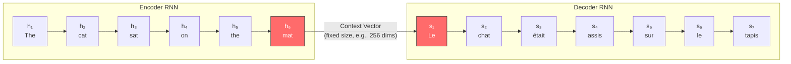

This looks reasonable for short sentences. But there's a critical flaw hiding in this design.

### The Bottleneck

That context vector  typically 256, 512, or 1024 floating-point numbers  must encode **everything** about the input sentence. Every word, every relationship between words, every nuance of meaning. All of it compressed into a single vector.

Think about what this means:

- A 5-word sentence gets compressed into 512 numbers. That's about 100 numbers per word. Seems manageable.
- A 50-word sentence gets compressed into the same 512 numbers. Now it's about 10 numbers per word.
- A 500-word paragraph? Just 1 number per word. Almost nothing.

> **The Bottleneck Analogy:** Imagine you're a court stenographer, and the judge says: "Before you translate that 500-page document into French, please summarize the entire thing in a single tweet. Then translate from the tweet." That's what an encoder-decoder RNN does.

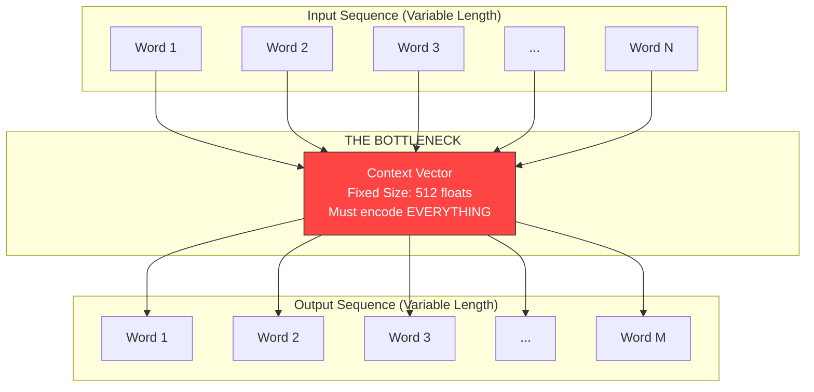

### A Concrete Example

Let's trace through what happens when an RNN encoder-decoder tries to translate a moderately complex English sentence into French:

**Input:** "The cat that the dog chased ran up the tree quickly"

Here's what the encoder sees at each timestep:

```
Step 1:  h₁  encodes "The"
Step 2:  h₂  encodes "The cat"
Step 3:  h₃  encodes "The cat that"
Step 4:  h₄  encodes "The cat that the"
Step 5:  h₅  encodes "The cat that the dog"
Step 6:  h₆  encodes "The cat that the dog chased"
Step 7:  h₇  encodes "The cat that the dog chased ran"
Step 8:  h₈  encodes "The cat that the dog chased ran up"
Step 9:  h₉  encodes "The cat that the dog chased ran up the"
Step 10: h₁₀ encodes "The cat that the dog chased ran up the tree"
Step 11: h₁₁ encodes "The cat that the dog chased ran up the tree quickly"
```

Now, `h₁₁` is our context vector. The decoder must generate the French translation using **only** `h₁₁`. By the time the encoder reaches step 11, the information about "The" from step 1 has been transformed, mixed, and partially overwritten 10 times. The early words are like a photocopy of a photocopy of a photocopy  degraded beyond recognition.

### Let's See This in Code

```python
import numpy as np
np.random.seed(42)

def simple_rnn_step(x, h, W_xh, W_hh, b_h):
    """One step of an RNN: h_new = tanh(W_xh @ x + W_hh @ h + b_h)"""
    return np.tanh(np.dot(W_xh, x) + np.dot(W_hh, h) + b_h)

# Setup
hidden_size = 64
input_size = 32

# Random weights (in practice these would be learned)
W_xh = np.random.randn(hidden_size, input_size) * 0.1
W_hh = np.random.randn(hidden_size, hidden_size) * 0.1
b_h = np.zeros(hidden_size)

# Simulate encoding a 50-token sequence
num_tokens = 50
h = np.zeros(hidden_size)
hidden_states = [h.copy()]

for t in range(num_tokens):
    x = np.random.randn(input_size)  # Random input embedding
    h = simple_rnn_step(x, h, W_xh, W_hh, b_h)
    hidden_states.append(h.copy())

# How much does the final hidden state "remember" about each position?
# Measure similarity between each intermediate state and the final state
final_state = hidden_states[-1]
similarities = []

for t, state in enumerate(hidden_states[1:]):  # Skip initial zero state
    # Cosine similarity
    cos_sim = np.dot(state, final_state) / (
        np.linalg.norm(state) * np.linalg.norm(final_state) + 1e-8
    )
    similarities.append(cos_sim)

print("Position vs. Similarity to Final Hidden State:")
print("-" * 50)
for t in range(0, num_tokens, 5):
    bar = "█" * int(abs(similarities[t]) * 50)
    print(f"  Position {t:3d}: {similarities[t]:+.4f}  {bar}")

print(f"\n  Position {num_tokens-1:3d}: {similarities[-1]:+.4f}  (this IS the final state)")
```

**Expected Output Pattern:**

```
Position vs. Similarity to Final Hidden State:
--------------------------------------------------
  Position   0: +0.0821  ████
  Position   5: +0.1203  ██████
  Position  10: +0.1547  ███████
  Position  15: +0.2134  ██████████
  Position  20: +0.2891  ██████████████
  Position  25: +0.3672  ██████████████████
  Position  30: +0.4589  ██████████████████████
  Position  35: +0.5834  █████████████████████████████
  Position  40: +0.7201  ████████████████████████████████████
  Position  45: +0.8912  ████████████████████████████████████████████

  Position  49: +1.0000  (this IS the final state)
```

The pattern is clear: **recent positions dominate the final hidden state**, while early positions are largely forgotten. This is the bottleneck in action.

### Performance Degrades with Sequence Length

This isn't just a theoretical problem. The original encoder-decoder papers showed clear degradation in translation quality as sentences got longer:

```
Sentence Length vs. Translation Quality (BLEU Score)
━━━━━━━━━━━━━━━━━━━━━━━━━━━━━━━━━━━━━━━━━━━━━━━━━━

Length  5-10:   ████████████████████████████████████  36.2 BLEU
Length 10-15:   ██████████████████████████████████    34.1 BLEU
Length 15-20:   ████████████████████████████████      31.8 BLEU
Length 20-25:   ██████████████████████████████        29.5 BLEU
Length 25-30:   ████████████████████████████          27.1 BLEU
Length 30-40:   ██████████████████████                22.4 BLEU
Length 40-50:   ████████████████                      16.8 BLEU
Length 50+:     ██████████                            11.2 BLEU

(Approximate reproduction of Cho et al., 2014 findings)
```

> **Key Insight:** The bottleneck problem isn't just about information loss  it's about **uneven** information loss. The decoder has much better access to recent tokens than early ones. For tasks like translation, where word order often differs between languages, this is catastrophic.

### What We Need

The solution seems obvious once you see the problem: **don't throw away the intermediate hidden states**. Instead of compressing everything into one vector, let the decoder access ALL encoder hidden states  and let it decide which ones are relevant at each step.

That's attention.

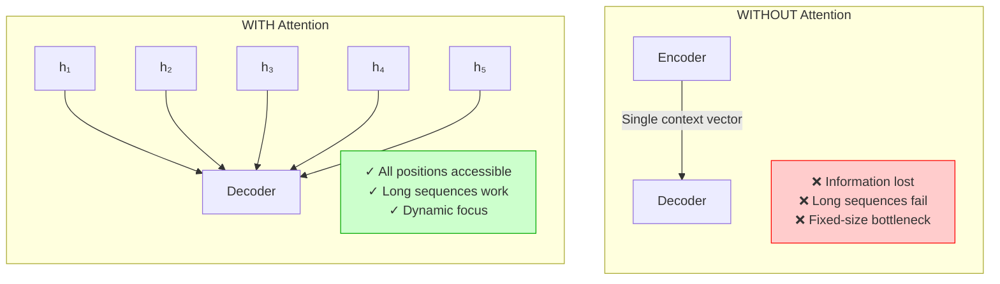

---

## 2. The Intuition Behind Attention

### How Humans Translate

Before diving into math, let's think about how a human translator actually works. When translating a sentence from English to French, you don't:

1. Read the entire English sentence
2. Close your eyes
3. Try to write the French translation from memory

Instead, you:

1. Read the English sentence to get the general meaning
2. Start writing the French translation
3. **Keep glancing back** at the English text as you write each French word
4. Focus on the **relevant parts** of the English text for each French word you're producing

For example, translating "The cat sat on the mat":

```
Generating "Le"      → eyes glance at "The"           (high focus)
Generating "chat"    → eyes glance at "cat"            (high focus)
Generating "était"   → eyes glance at "sat"            (high focus)
Generating "assis"   → eyes glance at "sat"            (high focus)
Generating "sur"     → eyes glance at "on"             (high focus)
Generating "le"      → eyes glance at "the"            (high focus)
Generating "tapis"   → eyes glance at "mat"            (high focus)
```

This "glancing back" behavior is exactly what attention does. The decoder doesn't just use a single compressed summary  it **looks back** at the entire input sequence and **focuses on the most relevant parts** for each output token.

### The Google Search Analogy

Here's another way to think about attention that connects to something every developer already understands:

**Google Search is a form of attention.**

When you type a search query, Google doesn't just give you a random document from its index. It:

1. Takes your **query** ("how to implement attention in Python")
2. Compares it against **keys** (indexed descriptions of every webpage)
3. Ranks the results by **relevance** (attention weights)
4. Returns the most relevant **values** (the actual webpage content)

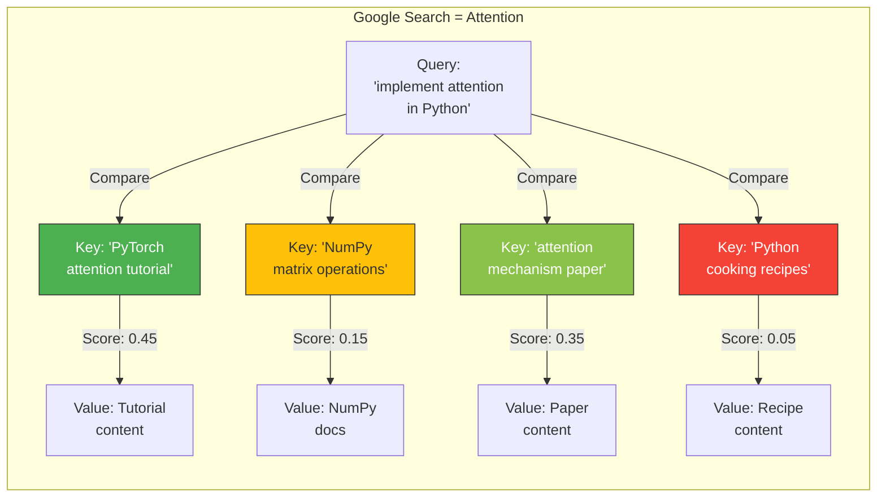

The search query is "attending" to all possible documents and selecting the most relevant ones. Attention in neural networks works the same way  it's a **soft search** over a set of values, where the relevance of each value is determined by comparing a query to corresponding keys.

### The Three Core Concepts: Query, Key, Value

Every attention mechanism boils down to three components:

| Component | What It Represents | Analogy |
|---|---|---|
| **Query (Q)** | What am I looking for right now? | Your search query |
| **Key (K)** | What does each source position contain? | Webpage titles/descriptions |
| **Value (V)** | What information should I extract? | Webpage actual content |

Here's the critical insight: **Keys and Values come from the same source** (like webpages having both a description and content), but they serve different purposes. Keys are used for **matching** (finding relevant items), while Values are used for **retrieval** (getting the actual information).

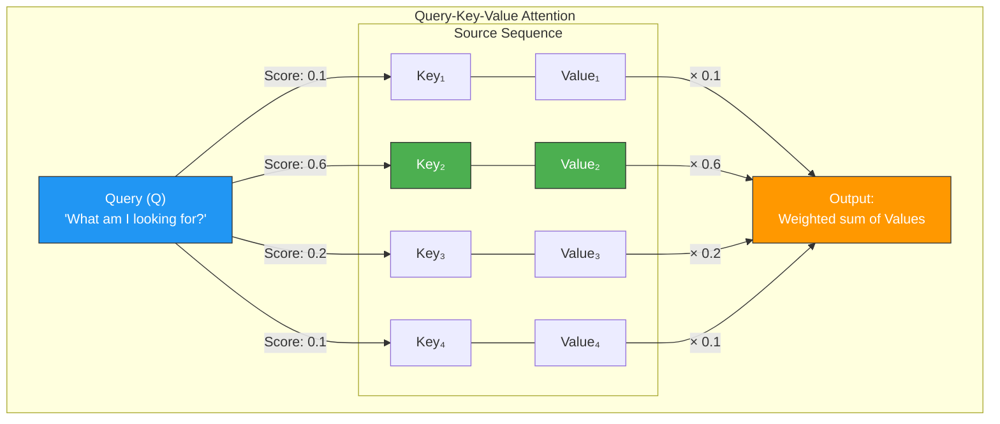

### The Attention Algorithm in Plain English

Here's the complete attention algorithm in four steps:

1. **Compute scores:** For each position in the source, calculate how relevant it is to the current query. This gives us a score for each source position.

2. **Normalize scores:** Convert the raw scores into a probability distribution using softmax. Now the scores sum to 1 and represent "how much attention to pay" to each position.

3. **Compute weighted sum:** Multiply each value by its attention weight and sum them all up. Positions with high attention weights contribute more to the output.

4. **Return the result:** The output is a single vector that's a blend of all values, weighted by relevance.

```python
def attention_pseudocode(query, keys, values):
    """
    Attention in 4 lines of pseudocode.

    query:  what am I looking for?          (one vector)
    keys:   what does each position have?   (one vector per source position)
    values: what info is at each position?  (one vector per source position)
    """
    scores = compute_similarity(query, keys)  # How relevant is each position?
    weights = softmax(scores)                  # Normalize to probabilities
    output = weighted_sum(weights, values)     # Blend values by relevance
    return output
```

That's it. Every attention variant  Bahdanau, Luong, scaled dot-product, multi-head  is just a different way of implementing `compute_similarity`. The rest stays the same.

> **The Attention Equation in One Sentence:** Attention computes a weighted average of values, where the weights are determined by how well each key matches the query.

### Why "Attention" is the Right Name

The name is perfect because it captures exactly what happens. When you pay attention to something, you:

- **Selectively focus** on the relevant parts of your sensory input
- **Ignore** the irrelevant parts
- **Dynamically shift** your focus based on what you're doing right now

Neural attention does the same thing:

- **Selectively focuses** on relevant source positions (high attention weights)
- **Ignores** irrelevant positions (low attention weights)
- **Dynamically shifts** focus at each decoding step (different queries produce different weight distributions)

A decoder generating the word "chat" (French for "cat") will attend heavily to "cat" in the source sentence, while a decoder generating "tapis" (French for "mat") will shift its attention to "mat". The attention distribution changes at every step  just like human attention.

---

## 3. Bahdanau Attention: The Original (2014)

### The Paper That Started It All

In September 2014, Dzmitry Bahdanau, Kyunghyun Cho, and Yoshua Bengio published "Neural Machine Translation by Jointly Learning to Align and Translate." This paper introduced the attention mechanism to sequence-to-sequence models and changed the course of NLP history.

The key idea: instead of encoding the entire source sentence into a single vector, let the decoder **look at all encoder hidden states** at each decoding step, and learn which ones are most relevant.

### How Bahdanau Attention Works

Bahdanau attention uses an **additive** (also called **concatenation-based**) scoring function. Here's the process at each decoder timestep:

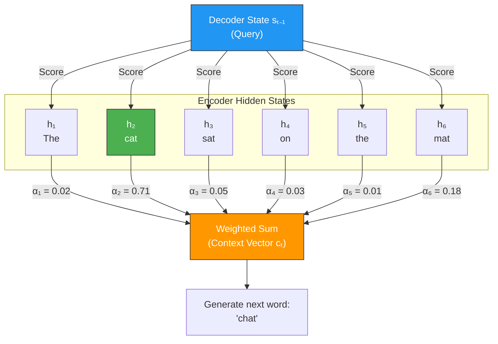

The scoring formula for Bahdanau attention is:

```
score(sₜ, hᵢ) = v^T · tanh(W_s · sₜ + W_h · hᵢ)
```

Where:
- `sₜ` is the decoder hidden state at time t (the query)
- `hᵢ` is the encoder hidden state at position i (the key)
- `W_s` and `W_h` are learnable weight matrices that project both into a shared space
- `v` is a learnable vector that produces a scalar score from the combined representation
- `tanh` is a nonlinear activation that helps model complex relationships

This is called **additive** attention because the query and key representations are **added together** (after separate linear transformations) before being passed through a nonlinearity.

### Full NumPy Implementation

Let's implement Bahdanau attention from scratch, step by step:

```python
import numpy as np

class BahdanauAttention:
    """
    Bahdanau (Additive) Attention Mechanism.

    From: "Neural Machine Translation by Jointly Learning to Align and Translate"
    (Bahdanau, Cho, Bengio, 2014)

    Score function: score(s, h) = v^T * tanh(W_query * s + W_key * h)

    This is called "additive" because the query and key representations
    are added together (after linear transformation).
    """

    def __init__(self, hidden_size, attention_size):
        """
        Parameters:
        -----------
        hidden_size : int
            Dimension of both encoder hidden states and decoder hidden state.
        attention_size : int
            Dimension of the internal attention representation.
            This is a hyperparameter  typically 64-512.
        """
        # W_query projects decoder state into attention space
        # Shape: (hidden_size, attention_size)
        self.W_query = np.random.randn(hidden_size, attention_size) * 0.01

        # W_key projects encoder states into attention space
        # Shape: (hidden_size, attention_size)
        self.W_key = np.random.randn(hidden_size, attention_size) * 0.01

        # v produces a scalar score from the attention representation
        # Shape: (attention_size,)
        self.v = np.random.randn(attention_size) * 0.01

        # Store for analysis
        self.last_weights = None
        self.last_scores = None

    def forward(self, query, keys):
        """
        Compute attention context vector and weights.

        Parameters:
        -----------
        query : np.ndarray, shape (hidden_size,)
            Decoder hidden state at current timestep (what we're looking for).
        keys : np.ndarray, shape (seq_len, hidden_size)
            All encoder hidden states (what we're searching through).
            In Bahdanau attention, these serve as both keys AND values.

        Returns:
        --------
        context : np.ndarray, shape (hidden_size,)
            Weighted sum of encoder states (the attention output).
        weights : np.ndarray, shape (seq_len,)
            Attention weights (how much we "looked at" each position).
        """
        seq_len = keys.shape[0]

        # Step 1: Project query into attention space
        # query: (hidden_size,) -> query_transformed: (attention_size,)
        query_transformed = np.dot(query, self.W_query)

        # Step 2: Project all keys into attention space
        # keys: (seq_len, hidden_size) -> keys_transformed: (seq_len, attention_size)
        keys_transformed = np.dot(keys, self.W_key)

        # Step 3: Add query and key representations
        # query_transformed is broadcast: (attention_size,) -> (seq_len, attention_size)
        # combined: (seq_len, attention_size)
        combined = query_transformed + keys_transformed

        # Step 4: Apply tanh nonlinearity
        # This allows the network to learn non-linear relationships
        # between the query and key representations
        activated = np.tanh(combined)  # (seq_len, attention_size)

        # Step 5: Project to scalar scores using v
        # activated: (seq_len, attention_size) @ v: (attention_size,) -> scores: (seq_len,)
        scores = np.dot(activated, self.v)

        # Step 6: Softmax to get attention weights (probability distribution)
        weights = self.softmax(scores)  # (seq_len,)

        # Step 7: Compute weighted sum of encoder states (the context vector)
        # weights: (seq_len,) @ keys: (seq_len, hidden_size) -> context: (hidden_size,)
        context = np.dot(weights, keys)

        # Store for visualization
        self.last_weights = weights
        self.last_scores = scores

        return context, weights

    def softmax(self, x):
        """Numerically stable softmax."""
        exp_x = np.exp(x - np.max(x))  # Subtract max for numerical stability
        return exp_x / exp_x.sum()


# ============================================================
# DEMO: Bahdanau Attention in Action
# ============================================================

np.random.seed(42)

# Configuration
hidden_size = 8       # Small for demonstration
attention_size = 6    # Internal attention dimension
seq_len = 6           # "The cat sat on the mat"

# Simulated encoder hidden states (one per source word)
# In practice, these come from an RNN encoder
source_words = ["The", "cat", "sat", "on", "the", "mat"]
encoder_states = np.random.randn(seq_len, hidden_size)

# Simulated decoder state (when generating "chat" - French for "cat")
decoder_state = np.random.randn(hidden_size)

# Create attention module
attention = BahdanauAttention(hidden_size, attention_size)

# Compute attention
context, weights = attention.forward(decoder_state, encoder_states)

# Display results
print("Bahdanau Attention  Translating to 'chat' (cat)")
print("=" * 55)
print(f"\nDecoder state shape: {decoder_state.shape}")
print(f"Encoder states shape: {encoder_states.shape}")
print(f"Context vector shape: {context.shape}")
print(f"\nAttention weights (which source words we focus on):")
print("-" * 55)

for word, weight in zip(source_words, weights):
    bar = "█" * int(weight * 50)
    print(f"  {word:6s}: {weight:.4f}  {bar}")

print(f"\nWeights sum: {weights.sum():.6f} (should be 1.0)")
```

### Step-by-Step Walkthrough with Concrete Numbers

Let's trace through every computation with actual numbers to make sure the math is crystal clear.

```python
import numpy as np
np.random.seed(0)

# Tiny example: hidden_size=4, attention_size=3, seq_len=3
hidden_size = 4
attention_size = 3
seq_len = 3

# Encoder hidden states (3 source tokens, each with 4 dimensions)
keys = np.array([
    [0.1, 0.2, 0.3, 0.4],    # h₁ for "cat"
    [0.5, 0.6, 0.7, 0.8],    # h₂ for "sat"
    [0.2, 0.1, 0.4, 0.3],    # h₃ for "mat"
])

# Decoder hidden state (current decoder step)
query = np.array([0.3, 0.4, 0.1, 0.2])

# Weight matrices (normally learned, we'll set them manually)
W_query = np.array([
    [0.1, 0.2, 0.3],
    [0.4, 0.5, 0.6],
    [0.7, 0.8, 0.9],
    [0.1, 0.2, 0.3],
])  # Shape: (4, 3)

W_key = np.array([
    [0.2, 0.1, 0.3],
    [0.4, 0.3, 0.5],
    [0.1, 0.2, 0.4],
    [0.3, 0.4, 0.2],
])  # Shape: (4, 3)

v = np.array([0.5, 0.3, 0.2])  # Shape: (3,)

print("=" * 65)
print("STEP-BY-STEP BAHDANAU ATTENTION")
print("=" * 65)

# STEP 1: Transform query
print("\nSTEP 1: Project query into attention space")
print(f"  query = {query}")
print(f"  W_query shape = {W_query.shape}")
query_transformed = np.dot(query, W_query)
print(f"  query_transformed = query @ W_query = {query_transformed}")
print(f"  Shape: ({hidden_size},) @ ({hidden_size},{attention_size}) = ({attention_size},)")

# STEP 2: Transform keys
print("\nSTEP 2: Project keys into attention space")
print(f"  keys shape = {keys.shape}")
print(f"  W_key shape = {W_key.shape}")
keys_transformed = np.dot(keys, W_key)
print(f"  keys_transformed = keys @ W_key =")
for i, row in enumerate(keys_transformed):
    print(f"    Position {i}: {row}")
print(f"  Shape: ({seq_len},{hidden_size}) @ ({hidden_size},{attention_size}) = ({seq_len},{attention_size})")

# STEP 3: Add (with broadcasting)
print("\nSTEP 3: Add query_transformed + keys_transformed (broadcasting)")
combined = query_transformed + keys_transformed
for i, row in enumerate(combined):
    print(f"  Position {i}: {query_transformed} + {keys_transformed[i]} = {row}")

# STEP 4: Apply tanh
print("\nSTEP 4: Apply tanh activation")
activated = np.tanh(combined)
for i, row in enumerate(activated):
    print(f"  Position {i}: tanh({combined[i]}) = {row}")

# STEP 5: Dot product with v to get scalar scores
print(f"\nSTEP 5: Dot with v = {v} to get scalar scores")
scores = np.dot(activated, v)
for i in range(seq_len):
    terms = " + ".join([f"{activated[i][j]:.4f}*{v[j]}" for j in range(attention_size)])
    print(f"  Score {i}: {terms} = {scores[i]:.4f}")

# STEP 6: Softmax
print("\nSTEP 6: Softmax to get attention weights")
exp_scores = np.exp(scores - np.max(scores))
weights = exp_scores / exp_scores.sum()
print(f"  Raw scores: {scores}")
print(f"  exp(scores - max): {exp_scores}")
print(f"  Weights (normalized): {weights}")
print(f"  Sum: {weights.sum():.6f}")

# STEP 7: Weighted sum
print("\nSTEP 7: Weighted sum of encoder states")
context = np.dot(weights, keys)
print(f"  context = Σ(weight_i * h_i)")
for i in range(seq_len):
    print(f"    + {weights[i]:.4f} * {keys[i]} = {weights[i] * keys[i]}")
print(f"  = {context}")
print(f"\nFinal context vector: {context}")
print(f"Shape: ({hidden_size},)")
```

### Visualizing Attention Weights

One of the most powerful aspects of attention is that the weights are **interpretable**. We can visualize which source words the model focuses on when generating each target word:

```python
import numpy as np

def visualize_attention_text(source_words, target_words, attention_matrix):
    """
    Visualize attention weights as a text-based heatmap.

    Parameters:
    -----------
    source_words : list of str
        Source sequence tokens.
    target_words : list of str
        Target sequence tokens.
    attention_matrix : np.ndarray, shape (target_len, source_len)
        Attention weight for each (target, source) pair.
    """
    print("\nAttention Heatmap (text-based)")
    print("Each row = one target word, columns = source words")
    print("█ = high attention, ░ = low attention\n")

    # Header
    header = "          "
    for word in source_words:
        header += f"{word:>8s}"
    print(header)
    print("          " + "-" * (8 * len(source_words)))

    # Each row
    for t, target_word in enumerate(target_words):
        row = f"{target_word:>8s} |"
        for s in range(len(source_words)):
            weight = attention_matrix[t, s]
            if weight > 0.5:
                symbol = "  ████ "
            elif weight > 0.3:
                symbol = "  ███░ "
            elif weight > 0.15:
                symbol = "  ██░░ "
            elif weight > 0.08:
                symbol = "  █░░░ "
            else:
                symbol = "  ░░░░ "
            row += symbol
        row += f"  ({target_word})"
        print(row)

    print()

# Simulated attention weights for English -> French translation
# "The cat sat on the mat" -> "Le chat était assis sur le tapis"
source = ["The", "cat", "sat", "on", "the", "mat"]
target = ["Le", "chat", "était", "assis", "sur", "le", "tapis"]

# Realistic attention weights (would be learned in practice)
attention_matrix = np.array([
    [0.62, 0.08, 0.05, 0.03, 0.15, 0.07],  # Le -> The
    [0.05, 0.72, 0.08, 0.03, 0.02, 0.10],  # chat -> cat
    [0.03, 0.10, 0.65, 0.05, 0.02, 0.15],  # était -> sat
    [0.02, 0.05, 0.58, 0.15, 0.03, 0.17],  # assis -> sat
    [0.03, 0.02, 0.08, 0.70, 0.10, 0.07],  # sur -> on
    [0.10, 0.02, 0.03, 0.05, 0.68, 0.12],  # le -> the
    [0.04, 0.08, 0.03, 0.02, 0.05, 0.78],  # tapis -> mat
])

visualize_attention_text(source, target, attention_matrix)
print("Observation: The model learns a roughly diagonal pattern,")
print("but it's NOT perfectly diagonal  because word order differs")
print("between English and French. The attention mechanism learns")
print("to handle this automatically!")
```

> **Key Insight from Bahdanau Attention:** The attention weights create a **soft alignment** between source and target positions. Unlike traditional word alignment in machine translation (which is hard/discrete), attention provides a smooth, differentiable alignment that can be learned end-to-end with gradient descent.

---

## 4. Luong Attention: The Simplified Version (2015)

### Three Scoring Methods

In 2015, Minh-Thang Luong, Hieu Pham, and Christopher Manning published "Effective Approaches to Attention-based Neural Machine Translation." They proposed three simpler alternatives to Bahdanau's additive scoring:

| Method | Formula | Complexity | Intuition |
|--------|---------|------------|-----------|
| **Dot** | `score = sₜ · hᵢ` | Simplest | Direct similarity measurement |
| **General** | `score = sₜ · W · hᵢ` | Medium | Learned similarity with transformation |
| **Concat** | `score = v · tanh(W · [sₜ; hᵢ])` | Most complex | Similar to Bahdanau (concatenate instead of add) |

### Key Differences from Bahdanau

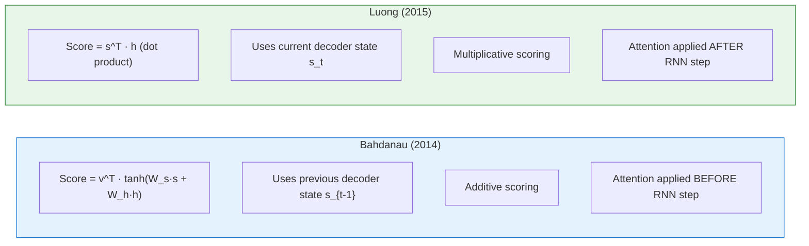

### Full Implementation: All Three Variants

```python
import numpy as np

class LuongAttention:
    """
    Luong Attention Mechanism (2015).

    Three scoring variants:
    - dot:     score = query · key                    (simplest)
    - general: score = query · W · key                (learned similarity)
    - concat:  score = v · tanh(W · [query; key])     (most expressive)
    """

    def __init__(self, hidden_size, method='dot'):
        """
        Parameters:
        -----------
        hidden_size : int
            Dimension of hidden states.
        method : str
            One of 'dot', 'general', or 'concat'.
        """
        self.method = method
        self.hidden_size = hidden_size

        if method == 'general':
            # Learnable weight matrix for general scoring
            # Transforms key space before dot product
            self.W = np.random.randn(hidden_size, hidden_size) * 0.01

        elif method == 'concat':
            # Learnable weights for concat scoring
            # Projects concatenated [query; key] to attention space
            self.W = np.random.randn(2 * hidden_size, hidden_size) * 0.01
            self.v = np.random.randn(hidden_size) * 0.01

        # No learnable parameters for 'dot'  it's purely based on
        # the raw similarity between query and key vectors

        self.last_weights = None

    def score(self, query, keys):
        """
        Compute alignment scores between query and all keys.

        Parameters:
        -----------
        query : np.ndarray, shape (hidden_size,)
            Current decoder hidden state.
        keys : np.ndarray, shape (seq_len, hidden_size)
            All encoder hidden states.

        Returns:
        --------
        scores : np.ndarray, shape (seq_len,)
            Raw alignment scores (before softmax).
        """
        if self.method == 'dot':
            # score(s, h) = s · h
            # Simply the dot product  measures raw cosine-like similarity
            # Requires query and key to have the same dimension
            scores = np.dot(keys, query)  # (seq_len, hidden) @ (hidden,) = (seq_len,)

        elif self.method == 'general':
            # score(s, h) = s · W · h
            # The weight matrix W allows the model to learn which dimensions
            # of the query should be compared with which dimensions of the key
            transformed_query = np.dot(self.W, query)  # (hidden,)
            scores = np.dot(keys, transformed_query)    # (seq_len,)

        elif self.method == 'concat':
            # score(s, h) = v · tanh(W · [s; h])
            # Most expressive: concatenates query and key, then applies
            # a learned nonlinear transformation
            seq_len = keys.shape[0]
            expanded_query = np.tile(query, (seq_len, 1))  # (seq_len, hidden)
            combined = np.concatenate([expanded_query, keys], axis=1)  # (seq_len, 2*hidden)
            activated = np.tanh(np.dot(combined, self.W))  # (seq_len, hidden)
            scores = np.dot(activated, self.v)              # (seq_len,)

        return scores

    def forward(self, query, keys, values=None):
        """
        Compute attention context vector and weights.

        Parameters:
        -----------
        query : np.ndarray, shape (hidden_size,)
            Current decoder hidden state.
        keys : np.ndarray, shape (seq_len, hidden_size)
            Encoder hidden states (used for scoring).
        values : np.ndarray, shape (seq_len, hidden_size), optional
            Values to aggregate. If None, uses keys as values.

        Returns:
        --------
        context : np.ndarray, shape (hidden_size,)
            Attention context vector.
        weights : np.ndarray, shape (seq_len,)
            Attention weights.
        """
        if values is None:
            values = keys

        # Compute alignment scores
        scores = self.score(query, keys)

        # Softmax normalization
        weights = self.softmax(scores)

        # Weighted sum of values
        context = np.dot(weights, values)

        self.last_weights = weights
        return context, weights

    def softmax(self, x):
        """Numerically stable softmax."""
        exp_x = np.exp(x - np.max(x))
        return exp_x / exp_x.sum()


# ============================================================
# DEMO: Compare All Three Luong Scoring Methods
# ============================================================

np.random.seed(42)

hidden_size = 8
seq_len = 6

# Same encoder states and decoder state for fair comparison
encoder_states = np.random.randn(seq_len, hidden_size)
decoder_state = np.random.randn(hidden_size)
source_words = ["The", "cat", "sat", "on", "the", "mat"]

print("Comparing Luong Attention Scoring Methods")
print("=" * 60)
print(f"Source: {' '.join(source_words)}")
print(f"Decoder state: generating 'chat' (French for 'cat')")
print()

for method in ['dot', 'general', 'concat']:
    attention = LuongAttention(hidden_size, method=method)
    context, weights = attention.forward(decoder_state, encoder_states)

    print(f"\n--- {method.upper()} scoring ---")
    for word, weight in zip(source_words, weights):
        bar = "█" * int(weight * 40)
        print(f"  {word:6s}: {weight:.4f}  {bar}")
    print(f"  Sum: {weights.sum():.6f}")
```

### Bahdanau vs Luong: Side-by-Side Comparison

```python
import numpy as np
np.random.seed(42)

hidden_size = 64
attention_size = 32
seq_len = 10

# Create both attention types
bahdanau = BahdanauAttention(hidden_size, attention_size)
luong_dot = LuongAttention(hidden_size, method='dot')
luong_general = LuongAttention(hidden_size, method='general')

# Same inputs
encoder_states = np.random.randn(seq_len, hidden_size)
decoder_state = np.random.randn(hidden_size)

# Compute attention with each method
_, bah_weights = bahdanau.forward(decoder_state, encoder_states)
_, dot_weights = luong_dot.forward(decoder_state, encoder_states)
_, gen_weights = luong_general.forward(decoder_state, encoder_states)

print("Attention Weight Distributions")
print("=" * 70)
print(f"{'Position':>10} {'Bahdanau':>12} {'Luong-Dot':>12} {'Luong-General':>14}")
print("-" * 70)

for i in range(seq_len):
    print(f"{'Pos ' + str(i):>10} {bah_weights[i]:>12.4f} {dot_weights[i]:>12.4f} {gen_weights[i]:>14.4f}")

print("-" * 70)
print(f"{'Sum':>10} {bah_weights.sum():>12.4f} {dot_weights.sum():>12.4f} {gen_weights.sum():>14.4f}")

# Measure "sharpness" of attention (entropy)
def entropy(weights):
    return -np.sum(weights * np.log(weights + 1e-10))

print(f"\n{'Entropy':>10} {entropy(bah_weights):>12.4f} {entropy(dot_weights):>12.4f} {entropy(gen_weights):>14.4f}")
print("(Lower entropy = sharper/more focused attention)")
```

| Feature | Bahdanau (2014) | Luong (2015) |
|---------|----------------|--------------|
| **Scoring** | Additive: `v · tanh(W_s · s + W_h · h)` | Multiplicative: `s · h` or `s · W · h` |
| **Decoder state used** | Previous state `s_{t-1}` | Current state `s_t` |
| **When attention is applied** | Before RNN step | After RNN step |
| **Computational cost** | Higher (MLP with two matrices + tanh) | Lower (single dot product or matrix multiply) |
| **Expressiveness** | More flexible (nonlinear) | Simpler (linear for dot/general) |
| **Parameters** | `W_s`, `W_h`, `v` (3 matrices) | None (dot), `W` (general), `W`, `v` (concat) |
| **Used in practice today** | Rarely on its own | Dot variant evolved into transformer attention |

> **Historical Note:** While Bahdanau attention was the breakthrough paper, the **dot-product scoring** from Luong attention is what ultimately evolved into the scaled dot-product attention used in transformers. The simplicity and efficiency of dot-product scoring won out.

---

## 5. Scaled Dot-Product Attention: The Foundation of Transformers

### The Most Important Equation in Modern AI

If you remember one equation from this entire series, make it this one:

```
Attention(Q, K, V) = softmax(Q · K^T / √d_k) · V
```

This is **scaled dot-product attention**, introduced in the legendary "Attention Is All You Need" paper (Vaswani et al., 2017). It's the attention mechanism used in every modern transformer, every LLM, every foundation model.

Let's break it apart piece by piece.

### The Formula Deconstructed

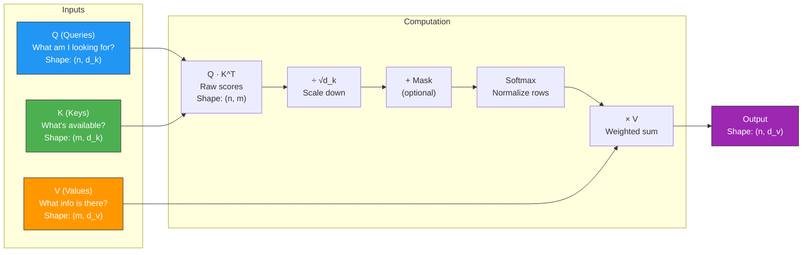

| Step | Operation | Shape | What It Does |
|------|-----------|-------|--------------|
| 1 | `Q · K^T` | `(n, d_k) × (d_k, m) = (n, m)` | Compute similarity between every query and every key |
| 2 | `/ √d_k` | `(n, m)` | Scale scores to prevent softmax saturation |
| 3 | `+ mask` | `(n, m)` | Optionally mask out positions (e.g., future tokens) |
| 4 | `softmax` | `(n, m)` | Normalize each row to a probability distribution |
| 5 | `× V` | `(n, m) × (m, d_v) = (n, d_v)` | Compute weighted sum of values for each query |

### Why Scale by √d_k?

This is a subtle but critical detail. Without scaling, dot products grow in magnitude with the dimension `d_k`. Here's why:

If `q` and `k` are random vectors with mean 0 and variance 1 in each component, their dot product has:
- Mean: 0
- Variance: `d_k` (each component contributes variance ≈ 1, and there are `d_k` components)

So for `d_k = 512`, the dot products have standard deviation `√512 ≈ 22.6`. This means scores can easily reach values like ±40 or ±50.

The problem? **Softmax is extremely sensitive to large inputs.**

```python
import numpy as np

def softmax(x):
    exp_x = np.exp(x - np.max(x))
    return exp_x / exp_x.sum()

# Demonstrate the problem with large scores
print("Why Scaling Matters: Softmax Behavior")
print("=" * 60)

# Small scores (well-behaved)
small_scores = np.array([1.0, 2.0, 3.0, 4.0])
print(f"\nSmall scores: {small_scores}")
print(f"Softmax:      {softmax(small_scores)}")
print(f"Max weight:   {softmax(small_scores).max():.4f}")
print("-> Nice, smooth distribution")

# Medium scores (starting to peak)
medium_scores = np.array([5.0, 10.0, 15.0, 20.0])
print(f"\nMedium scores: {medium_scores}")
print(f"Softmax:       {softmax(medium_scores)}")
print(f"Max weight:    {softmax(medium_scores).max():.4f}")
print("-> Getting peaky")

# Large scores (almost one-hot  gradient vanishes!)
large_scores = np.array([10.0, 20.0, 30.0, 40.0])
print(f"\nLarge scores: {large_scores}")
print(f"Softmax:      {softmax(large_scores)}")
print(f"Max weight:   {softmax(large_scores).max():.6f}")
print("-> Almost a one-hot vector! Gradients nearly vanish.")

# Show the scaling fix
print("\n\n--- The Fix: Divide by √d_k ---")
d_k = 512
print(f"d_k = {d_k}, √d_k = {np.sqrt(d_k):.2f}")

# Simulate random dot products for d_k=512
np.random.seed(42)
q = np.random.randn(d_k)
k_vectors = np.random.randn(10, d_k)

raw_scores = np.dot(k_vectors, q)
scaled_scores = raw_scores / np.sqrt(d_k)

print(f"\nRaw dot products (d_k={d_k}):")
print(f"  Mean: {raw_scores.mean():.2f}, Std: {raw_scores.std():.2f}")
print(f"  Range: [{raw_scores.min():.2f}, {raw_scores.max():.2f}]")
print(f"  Softmax: {softmax(raw_scores)}")

print(f"\nScaled dot products (÷ √{d_k} = ÷ {np.sqrt(d_k):.2f}):")
print(f"  Mean: {scaled_scores.mean():.2f}, Std: {scaled_scores.std():.2f}")
print(f"  Range: [{scaled_scores.min():.2f}, {scaled_scores.max():.2f}]")
print(f"  Softmax: {softmax(scaled_scores)}")
print("\n-> Scaled scores produce much smoother attention distributions!")
```

> **The Scaling Rule:** Dividing by `√d_k` ensures that regardless of the dimension, the dot products have approximately unit variance. This keeps the softmax in its "useful" regime where gradients flow well. Without scaling, attention would collapse to near-one-hot vectors during training, and the model would struggle to learn.

### Full NumPy Implementation

```python
import numpy as np

def softmax(x, axis=-1):
    """Numerically stable softmax along the specified axis."""
    exp_x = np.exp(x - np.max(x, axis=axis, keepdims=True))
    return exp_x / np.sum(exp_x, axis=axis, keepdims=True)


def scaled_dot_product_attention(Q, K, V, mask=None):
    """
    Scaled Dot-Product Attention.

    The core attention mechanism used in all modern transformers.

    Formula: Attention(Q, K, V) = softmax(Q·K^T / √d_k) · V

    Parameters:
    -----------
    Q : np.ndarray, shape (batch_size, seq_len_q, d_k)
        Queries  what each position is looking for.
    K : np.ndarray, shape (batch_size, seq_len_k, d_k)
        Keys  what each source position offers for matching.
    V : np.ndarray, shape (batch_size, seq_len_k, d_v)
        Values  the actual content at each source position.
    mask : np.ndarray, shape (batch_size, seq_len_q, seq_len_k), optional
        Mask where 0 means "do not attend to this position".
        Used for causal (autoregressive) masking.

    Returns:
    --------
    output : np.ndarray, shape (batch_size, seq_len_q, d_v)
        The attention output  weighted sum of values for each query.
    weights : np.ndarray, shape (batch_size, seq_len_q, seq_len_k)
        Attention weights  how much each query attended to each key.
    """
    d_k = Q.shape[-1]

    # Step 1: Compute raw attention scores
    # Q: (batch, seq_q, d_k) @ K^T: (batch, d_k, seq_k) -> scores: (batch, seq_q, seq_k)
    scores = np.matmul(Q, K.transpose(0, 2, 1))

    # Step 2: Scale by √d_k to prevent softmax saturation
    scores = scores / np.sqrt(d_k)

    # Step 3: Apply mask (optional)
    # Set masked positions to -inf so they get zero weight after softmax
    if mask is not None:
        scores = np.where(mask == 0, -1e9, scores)

    # Step 4: Softmax to get attention weights
    # Each row sums to 1  it's a probability distribution over source positions
    weights = softmax(scores, axis=-1)

    # Step 5: Compute weighted sum of values
    # weights: (batch, seq_q, seq_k) @ V: (batch, seq_k, d_v) -> output: (batch, seq_q, d_v)
    output = np.matmul(weights, V)

    return output, weights


# ============================================================
# DEMO: Scaled Dot-Product Attention with Concrete Numbers
# ============================================================

np.random.seed(42)

# Parameters
batch_size = 1
seq_len = 5      # "I love this great movie"
d_k = 4          # Key/Query dimension (small for demonstration)
d_v = 4          # Value dimension

words = ["I", "love", "this", "great", "movie"]

# Create Q, K, V matrices (in self-attention, all come from the same source)
# Shape: (1, 5, 4)
Q = np.random.randn(batch_size, seq_len, d_k) * 0.5
K = np.random.randn(batch_size, seq_len, d_k) * 0.5
V = np.random.randn(batch_size, seq_len, d_v) * 0.5

print("Scaled Dot-Product Attention  Step by Step")
print("=" * 65)
print(f"Sequence: {' '.join(words)}")
print(f"d_k = {d_k}, √d_k = {np.sqrt(d_k):.4f}")

# Step 1: Q @ K^T
scores_raw = np.matmul(Q, K.transpose(0, 2, 1))
print(f"\nStep 1: Raw scores (Q @ K^T), shape {scores_raw.shape}:")
print("         ", "  ".join(f"{w:>7s}" for w in words))
for i, word in enumerate(words):
    row = scores_raw[0, i]
    print(f"  {word:>6s}: {' '.join(f'{v:>7.3f}' for v in row)}")

# Step 2: Scale
scores_scaled = scores_raw / np.sqrt(d_k)
print(f"\nStep 2: Scaled scores (÷ √{d_k} = ÷ {np.sqrt(d_k):.2f}):")
print("         ", "  ".join(f"{w:>7s}" for w in words))
for i, word in enumerate(words):
    row = scores_scaled[0, i]
    print(f"  {word:>6s}: {' '.join(f'{v:>7.3f}' for v in row)}")

# Step 3: Softmax
weights = softmax(scores_scaled, axis=-1)
print(f"\nStep 3: Attention weights (softmax):")
print("         ", "  ".join(f"{w:>7s}" for w in words))
for i, word in enumerate(words):
    row = weights[0, i]
    print(f"  {word:>6s}: {' '.join(f'{v:>7.3f}' for v in row)}")
    assert abs(row.sum() - 1.0) < 1e-6, f"Row {i} doesn't sum to 1!"

# Step 4: Weighted sum
output = np.matmul(weights, V)
print(f"\nStep 4: Output (weights @ V), shape {output.shape}:")
for i, word in enumerate(words):
    print(f"  {word:>6s}: {output[0, i]}")

print("\nEach output vector is a weighted blend of all value vectors,")
print("where the weights reflect how relevant each position is.")
```

### The Causal Mask: Preventing the Model from Cheating

In autoregressive language models (like GPT), the model generates text one token at a time, left to right. When predicting the 5th token, it should only be able to see tokens 1-4  not token 5 or later (that would be cheating!).

The **causal mask** (also called **look-ahead mask**) enforces this constraint:

```python
import numpy as np

def create_causal_mask(seq_len):
    """
    Create a causal (look-ahead) mask.

    mask[i][j] = 1 if position j is allowed to attend to position i
    mask[i][j] = 0 if position j should NOT attend to position i (future)

    Example for seq_len=5:

        Position:  0  1  2  3  4
    Query 0:      [1, 0, 0, 0, 0]    <- Can only see itself
    Query 1:      [1, 1, 0, 0, 0]    <- Can see positions 0-1
    Query 2:      [1, 1, 1, 0, 0]    <- Can see positions 0-2
    Query 3:      [1, 1, 1, 1, 0]    <- Can see positions 0-3
    Query 4:      [1, 1, 1, 1, 1]    <- Can see all positions
    """
    mask = np.tril(np.ones((seq_len, seq_len)))
    return mask

# Demonstrate
seq_len = 6
words = ["The", "cat", "sat", "on", "the", "mat"]
mask = create_causal_mask(seq_len)

print("Causal Mask:")
print("(1 = can attend, 0 = blocked)")
print()
print("Key ->  ", "  ".join(f"{w:>5s}" for w in words))
print("         " + "-" * (7 * len(words)))

for i, word in enumerate(words):
    row = mask[i]
    symbols = ["  ✓  " if v == 1 else "  ✗  " for v in row]
    print(f"Q: {word:>4s} |{''.join(symbols)}")

# Apply the causal mask in attention
print("\n\nAttention with Causal Mask:")
print("=" * 60)

np.random.seed(42)
batch_size = 1
d_k = 8

Q = np.random.randn(batch_size, seq_len, d_k)
K = np.random.randn(batch_size, seq_len, d_k)
V = np.random.randn(batch_size, seq_len, d_k)

# Without mask
output_no_mask, weights_no_mask = scaled_dot_product_attention(Q, K, V)

# With causal mask
causal_mask = create_causal_mask(seq_len).reshape(1, seq_len, seq_len)
output_masked, weights_masked = scaled_dot_product_attention(Q, K, V, mask=causal_mask)

print("\nWithout causal mask (each position can see everything):")
print("         ", "  ".join(f"{w:>6s}" for w in words))
for i, word in enumerate(words):
    row = weights_no_mask[0, i]
    print(f"  {word:>4s}: {' '.join(f'{v:>6.3f}' for v in row)}")

print("\nWith causal mask (each position can only see past + current):")
print("         ", "  ".join(f"{w:>6s}" for w in words))
for i, word in enumerate(words):
    row = weights_masked[0, i]
    print(f"  {word:>4s}: {' '.join(f'{v:>6.3f}' for v in row)}")

print("\nNotice: Upper-right triangle is all zeros  future positions are blocked!")
print("Each row still sums to 1.0 (the available weights are redistributed).")
```

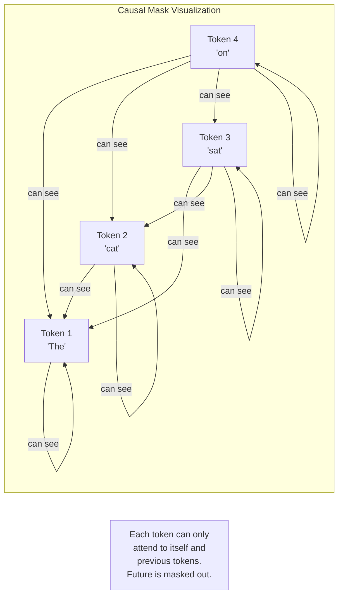

### Attention Score Matrix Visualization

The attention scores form a matrix that tells a complete story about what the model is doing:

```python
import numpy as np

def visualize_attention_matrix(weights, words, title="Attention Weights"):
    """
    Create a text-based heatmap of attention weights.
    """
    print(f"\n{title}")
    print("=" * (12 + 9 * len(words)))

    # Header
    print(f"{'':>10}", end="  ")
    for w in words:
        print(f"{w:>7s}", end="  ")
    print()
    print(f"{'':>10}", end="  ")
    for _ in words:
        print(f"{'-------':>7s}", end="  ")
    print()

    # Rows
    for i, word in enumerate(words):
        print(f"{word:>10}", end="  ")
        for j in range(len(words)):
            val = weights[i, j]
            # Color coding with text symbols
            if val > 0.4:
                symbol = "███████"
            elif val > 0.25:
                symbol = "█████░░"
            elif val > 0.15:
                symbol = "███░░░░"
            elif val > 0.08:
                symbol = "█░░░░░░"
            else:
                symbol = "░░░░░░░"
            print(f"{symbol:>7s}", end="  ")
        print()

    print()

# Example: Self-attention on "The cat sat on the mat"
np.random.seed(42)
words = ["The", "cat", "sat", "on", "the", "mat"]
seq_len = len(words)
d_k = 16

Q = np.random.randn(1, seq_len, d_k)
K = np.random.randn(1, seq_len, d_k)
V = np.random.randn(1, seq_len, d_k)

# No mask (bidirectional attention, like in BERT)
_, weights = scaled_dot_product_attention(Q, K, V)
visualize_attention_matrix(weights[0], words, "Bidirectional Self-Attention (BERT-style)")

# Causal mask (unidirectional, like in GPT)
mask = create_causal_mask(seq_len).reshape(1, seq_len, seq_len)
_, weights_causal = scaled_dot_product_attention(Q, K, V, mask=mask)
visualize_attention_matrix(weights_causal[0], words, "Causal Self-Attention (GPT-style)")
```

---

## 6. Multi-Head Attention: Parallel Attention Streams

### Why One Head Isn't Enough

A single attention head can focus on one type of relationship at a time. But language is rich with many simultaneous relationships:

- **Syntactic relationships:** "The cat"  determiner + noun
- **Semantic relationships:** "cat" and "animal"  meaning similarity
- **Coreference:** "it" refers to "cat"  pronoun resolution
- **Positional:** adjacent words often relate to each other
- **Long-range dependencies:** "The cat that the dog ... chased **ran**"  subject-verb agreement

One attention head trying to capture all of these at once would be like trying to watch a soccer game through a keyhole  you'd see one thing at a time and miss the bigger picture.

**Multi-head attention** solves this by running **multiple attention computations in parallel**, each with its own learned projection. Each "head" can specialize in a different type of relationship.

### The Analogy: Multiple Readers

Imagine you give the same document to 8 different readers, each with a different focus:

| Head | What It Learns to Focus On | Example |
|------|---------------------------|---------|
| Head 1 | Syntactic structure | Subject-verb pairs |
| Head 2 | Positional proximity | Adjacent words |
| Head 3 | Semantic similarity | Synonyms, related concepts |
| Head 4 | Coreference | Pronouns and their referents |
| Head 5 | Negation scope | "not" and what it negates |
| Head 6 | Punctuation structure | Clause boundaries |
| Head 7 | Named entities | Names and their attributes |
| Head 8 | Long-range dependencies | Distant but related words |

After reading, you combine all 8 perspectives into a comprehensive understanding. That's multi-head attention.

### Architecture

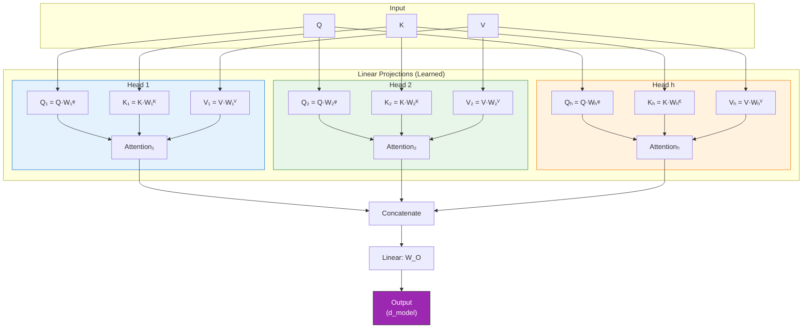

### How It Works: The Math

Given input dimension `d_model` and `h` attention heads:

1. **Split the dimension:** Each head operates on `d_k = d_model / h` dimensions
2. **Project Q, K, V:** For each head `i`, compute:
   - `Q_i = Q · W_i^Q` where `W_i^Q` has shape `(d_model, d_k)`
   - `K_i = K · W_i^K` where `W_i^K` has shape `(d_model, d_k)`
   - `V_i = V · W_i^V` where `W_i^V` has shape `(d_model, d_v)`
3. **Compute attention:** `head_i = Attention(Q_i, K_i, V_i)`
4. **Concatenate:** `MultiHead = Concat(head_1, ..., head_h)`
5. **Final projection:** `Output = MultiHead · W_O`

The key insight: **the total computation is roughly the same as single-head attention** because each head operates on `d_model / h` dimensions instead of `d_model`. We're splitting the representation into `h` subspaces.

### NumPy Implementation

```python
import numpy as np

def softmax(x, axis=-1):
    """Numerically stable softmax."""
    exp_x = np.exp(x - np.max(x, axis=axis, keepdims=True))
    return exp_x / np.sum(exp_x, axis=axis, keepdims=True)


def scaled_dot_product_attention(Q, K, V, mask=None):
    """
    Scaled dot-product attention.
    Q: (..., seq_len_q, d_k)
    K: (..., seq_len_k, d_k)
    V: (..., seq_len_k, d_v)
    """
    d_k = Q.shape[-1]
    scores = np.matmul(Q, np.swapaxes(K, -2, -1)) / np.sqrt(d_k)
    if mask is not None:
        scores = np.where(mask == 0, -1e9, scores)
    weights = softmax(scores, axis=-1)
    output = np.matmul(weights, V)
    return output, weights


class MultiHeadAttention:
    """
    Multi-Head Attention (NumPy Implementation).

    Runs h parallel attention operations, each on a d_k-dimensional
    slice of the input, then concatenates and projects the results.

    MultiHead(Q, K, V) = Concat(head_1, ..., head_h) · W_O
    where head_i = Attention(Q·W_i^Q, K·W_i^K, V·W_i^V)
    """

    def __init__(self, d_model, num_heads):
        """
        Parameters:
        -----------
        d_model : int
            Total model dimension (must be divisible by num_heads).
        num_heads : int
            Number of parallel attention heads.
        """
        assert d_model % num_heads == 0, \
            f"d_model ({d_model}) must be divisible by num_heads ({num_heads})"

        self.d_model = d_model
        self.num_heads = num_heads
        self.d_k = d_model // num_heads  # Dimension per head

        # Xavier initialization for all projection matrices
        scale = np.sqrt(2.0 / d_model)

        # Combined projection matrices (more efficient than separate per-head matrices)
        # Shape: (d_model, d_model)  conceptually h matrices of (d_model, d_k) stacked
        self.W_Q = np.random.randn(d_model, d_model) * scale
        self.W_K = np.random.randn(d_model, d_model) * scale
        self.W_V = np.random.randn(d_model, d_model) * scale
        self.W_O = np.random.randn(d_model, d_model) * scale

        # Storage for attention weights (for visualization)
        self.attention_weights = None

    def split_heads(self, x):
        """
        Reshape from (batch, seq_len, d_model) to (batch, num_heads, seq_len, d_k).

        This splits the last dimension into num_heads × d_k, then rearranges
        so that each head's data is contiguous.

        Example with d_model=8, num_heads=2, d_k=4:
            [a₁ a₂ a₃ a₄ | b₁ b₂ b₃ b₄]  (one token, d_model=8)
            -> Head 1: [a₁ a₂ a₃ a₄]       (d_k=4)
               Head 2: [b₁ b₂ b₃ b₄]       (d_k=4)
        """
        batch_size, seq_len, d_model = x.shape
        x = x.reshape(batch_size, seq_len, self.num_heads, self.d_k)
        return x.transpose(0, 2, 1, 3)  # (batch, heads, seq_len, d_k)

    def combine_heads(self, x):
        """
        Reverse of split_heads.
        (batch, num_heads, seq_len, d_k) -> (batch, seq_len, d_model)
        """
        batch_size, num_heads, seq_len, d_k = x.shape
        x = x.transpose(0, 2, 1, 3)  # (batch, seq_len, heads, d_k)
        return x.reshape(batch_size, seq_len, self.d_model)

    def forward(self, Q, K, V, mask=None):
        """
        Compute multi-head attention.

        Parameters:
        -----------
        Q, K, V : np.ndarray, shape (batch_size, seq_len, d_model)
        mask : np.ndarray, optional

        Returns:
        --------
        output : np.ndarray, shape (batch_size, seq_len, d_model)
        weights : np.ndarray, shape (batch_size, num_heads, seq_len_q, seq_len_k)
        """
        batch_size = Q.shape[0]

        # Step 1: Linear projections
        # (batch, seq, d_model) @ (d_model, d_model) -> (batch, seq, d_model)
        Q_proj = np.matmul(Q, self.W_Q)
        K_proj = np.matmul(K, self.W_K)
        V_proj = np.matmul(V, self.W_V)

        # Step 2: Split into multiple heads
        # (batch, seq, d_model) -> (batch, heads, seq, d_k)
        Q_heads = self.split_heads(Q_proj)
        K_heads = self.split_heads(K_proj)
        V_heads = self.split_heads(V_proj)

        # Step 3: Apply scaled dot-product attention to each head
        # (batch, heads, seq_q, d_k) -> (batch, heads, seq_q, d_k)
        if mask is not None:
            # Expand mask for head dimension
            if mask.ndim == 3:
                mask = mask[:, np.newaxis, :, :]  # (batch, 1, seq_q, seq_k)

        attn_output, weights = scaled_dot_product_attention(
            Q_heads, K_heads, V_heads, mask
        )

        # Store attention weights for visualization
        self.attention_weights = weights

        # Step 4: Concatenate heads
        # (batch, heads, seq, d_k) -> (batch, seq, d_model)
        attn_output = self.combine_heads(attn_output)

        # Step 5: Final linear projection
        # (batch, seq, d_model) @ (d_model, d_model) -> (batch, seq, d_model)
        output = np.matmul(attn_output, self.W_O)

        return output, weights


# ============================================================
# DEMO: Multi-Head Attention
# ============================================================

np.random.seed(42)

# Configuration
d_model = 16         # Total model dimension
num_heads = 4        # 4 attention heads
batch_size = 1
seq_len = 5

words = ["The", "cat", "sat", "on", "mat"]

# Create input (in self-attention, Q=K=V=input)
x = np.random.randn(batch_size, seq_len, d_model)

# Create multi-head attention
mha = MultiHeadAttention(d_model, num_heads)

# Forward pass
output, weights = mha.forward(x, x, x)

print("Multi-Head Attention Demo")
print("=" * 65)
print(f"Input shape:  {x.shape}  (batch={batch_size}, seq={seq_len}, d_model={d_model})")
print(f"Output shape: {output.shape}  (same as input!)")
print(f"Weights shape: {weights.shape}  (batch, heads, seq_q, seq_k)")
print(f"\nNumber of heads: {num_heads}")
print(f"Dimension per head (d_k): {d_model // num_heads}")

# Show attention patterns for each head
for head in range(num_heads):
    print(f"\n--- Head {head + 1} Attention Weights ---")
    print(f"{'':>8}", end="")
    for w in words:
        print(f"{w:>8}", end="")
    print()

    for i, word in enumerate(words):
        print(f"{word:>8}", end="")
        for j in range(seq_len):
            val = weights[0, head, i, j]
            print(f"{val:>8.3f}", end="")
        print()

print("\n\nNotice how different heads have DIFFERENT attention patterns!")
print("Each head has learned to focus on different relationships.")
```

### Different Heads Learn Different Patterns

In trained models, researchers have observed that different attention heads specialize in remarkably different patterns:

```python
import numpy as np

def demonstrate_head_specialization():
    """
    Show how different heads might specialize.
    These are hand-crafted examples that illustrate real observed patterns.
    """
    words = ["The", "cat", "that", "I", "saw", "ran"]
    seq_len = len(words)

    print("Attention Head Specialization (Observed Patterns)")
    print("=" * 65)
    print(f"Sentence: '{' '.join(words)}'")

    # Head 1: Positional (previous token pattern)
    # Each word attends mostly to the word just before it
    head1 = np.zeros((seq_len, seq_len))
    for i in range(seq_len):
        if i > 0:
            head1[i, i-1] = 0.7
        head1[i, i] = 0.3 if i > 0 else 1.0
    # Normalize rows
    head1 = head1 / head1.sum(axis=1, keepdims=True)

    # Head 2: Syntactic (subject-verb)
    # "cat" and "ran" attend to each other (subject-verb)
    head2 = np.ones((seq_len, seq_len)) * 0.05
    head2[1, 5] = 0.6   # "cat" attends to "ran" (its verb)
    head2[5, 1] = 0.6   # "ran" attends to "cat" (its subject)
    head2[3, 4] = 0.5   # "I" attends to "saw"
    head2[4, 3] = 0.5   # "saw" attends to "I"
    for i in range(seq_len):
        head2[i] = head2[i] / head2[i].sum()

    # Head 3: Relative clause pattern
    # "that" connects "cat" to the relative clause
    head3 = np.ones((seq_len, seq_len)) * 0.08
    head3[2, 1] = 0.7   # "that" attends to "cat"
    head3[4, 1] = 0.4   # "saw" attends to "cat" (the one being seen)
    head3[4, 2] = 0.3   # "saw" attends to "that"
    for i in range(seq_len):
        head3[i] = head3[i] / head3[i].sum()

    # Head 4: Broad/uniform attention
    # Captures general sentence context
    head4 = np.ones((seq_len, seq_len)) / seq_len

    heads = [
        ("Head 1: Previous Token", head1),
        ("Head 2: Subject-Verb", head2),
        ("Head 3: Relative Clause", head3),
        ("Head 4: Global Context", head4),
    ]

    for name, head in heads:
        print(f"\n{name}")
        print("-" * 50)
        print(f"{'':>8}", end="")
        for w in words:
            print(f"{w:>7}", end="")
        print()
        for i, word in enumerate(words):
            print(f"{word:>7}:", end="")
            for j in range(seq_len):
                val = head[i, j]
                if val > 0.3:
                    print(f"  ████", end="")
                elif val > 0.15:
                    print(f"  ██░░", end="")
                elif val > 0.08:
                    print(f"  █░░░", end="")
                else:
                    print(f"  ░░░░", end="")
            print()

demonstrate_head_specialization()
```

> **Key Insight:** Multi-head attention achieves **ensemble-like** behavior within a single layer. Each head is like a different "expert" that focuses on a different aspect of the input. The final output combines all perspectives through the learned projection `W_O`. This is one reason transformers are so powerful  they capture multiple types of relationships simultaneously.

---

## 7. Self-Attention: When Q, K, V Come from the Same Sequence

### The Key Innovation

In the attention mechanisms we've seen so far (Bahdanau, Luong), the query comes from the **decoder** and the keys/values come from the **encoder**. This is called **cross-attention**  two different sequences interact.

**Self-attention** is different: the queries, keys, AND values all come from the **same sequence**. Each token attends to every other token in the same sequence (including itself).

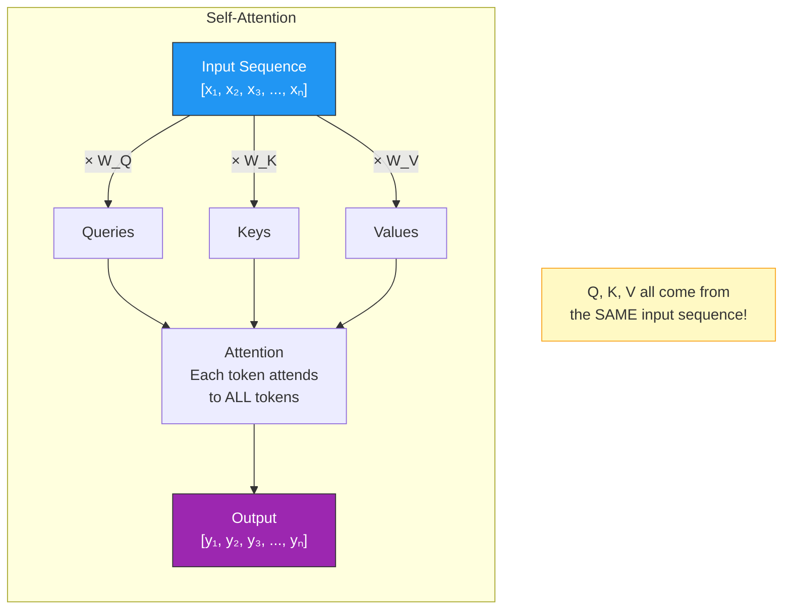

This is **the** key innovation that makes transformers work. Let's see why it's so powerful.

### The Pronoun Resolution Example

Consider this sentence: **"The animal didn't cross the street because it was too tired."**

What does "it" refer to? A human instantly knows "it" = "the animal" (not "the street"). But how?

You implicitly **attend** to the earlier parts of the sentence when processing "it." Your brain computes something like: "What entity in this sentence could be 'tired'? Animals get tired, streets don't. So 'it' = 'the animal'."

Self-attention does exactly this:

```python
import numpy as np

def demonstrate_self_attention_pronoun():
    """
    Show how self-attention helps resolve pronoun references.
    """
    words = ["The", "animal", "didn't", "cross", "the",
             "street", "because", "it", "was", "too", "tired"]

    print("Self-Attention for Pronoun Resolution")
    print("=" * 65)
    print(f"Sentence: '{' '.join(words)}'")
    print(f"\nQuestion: What does 'it' (position 7) refer to?")

    # Simulated attention weights for the word "it" (position 7)
    # In a trained model, "it" would attend most strongly to "animal"
    it_attention = np.array([
        0.04,   # The
        0.42,   # animal       <-- highest! "it" refers to "animal"
        0.05,   # didn't
        0.03,   # cross
        0.03,   # the
        0.18,   # street       <-- second highest (also a noun, but wrong)
        0.08,   # because
        0.05,   # it           <-- attends to itself
        0.04,   # was
        0.04,   # too
        0.04,   # tired
    ])

    print(f"\nAttention weights FROM 'it' TO all other words:")
    print("-" * 55)
    for word, weight in zip(words, it_attention):
        bar = "█" * int(weight * 60)
        marker = " <-- 'it' = 'animal'!" if word == "animal" else ""
        print(f"  {word:>8s}: {weight:.3f}  {bar}{marker}")

    print(f"\nThe model correctly identifies that 'it' refers to 'animal'")
    print(f"by learning that 'animal' is the entity that can be 'tired'.")

    # Now show full self-attention: what each word attends to
    print(f"\n\nFull Self-Attention Matrix (simplified):")
    print(f"Which words each word 'looks at' most strongly:")
    print("-" * 55)

    # Simplified focus for each word
    focuses = {
        "The": "animal (its noun)",
        "animal": "The (its determiner), didn't (its verb)",
        "didn't": "cross (the action), animal (the subject)",
        "cross": "street (the object), didn't (negation)",
        "the": "street (its noun)",
        "street": "cross (the action), the (its determiner)",
        "because": "tired (the reason), animal (the subject)",
        "it": "animal (the referent!), tired (its state)",
        "was": "it (the subject), tired (the predicate)",
        "too": "tired (the adjective it modifies)",
        "tired": "animal/it (who is tired), because (the connection)",
    }

    for word in words:
        print(f"  {word:>8s} attends to → {focuses[word]}")

demonstrate_self_attention_pronoun()
```

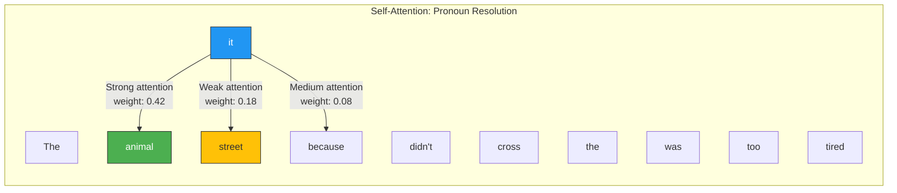

### Self-Attention Captures Multiple Types of Relationships

The power of self-attention is that it can capture **any** relationship between any two positions in a sequence, regardless of distance:

```python
import numpy as np

def show_relationship_types():
    """
    Demonstrate different types of relationships self-attention can capture.
    """
    print("Types of Relationships Self-Attention Captures")
    print("=" * 65)

    relationships = [
        {
            "name": "1. Local/Adjacent",
            "sentence": "New York City",
            "explanation": "'New' attends to 'York' (bigram relationship)",
            "distance": 1,
        },
        {
            "name": "2. Syntactic (Subject-Verb Agreement)",
            "sentence": "The keys to the cabinet ARE on the table",
            "explanation": "'ARE' attends to 'keys' (not 'cabinet') for agreement",
            "distance": 4,
        },
        {
            "name": "3. Coreference",
            "sentence": "Mary said she would leave when she was ready",
            "explanation": "'she' attends to 'Mary'",
            "distance": 2,
        },
        {
            "name": "4. Long-Range Dependency",
            "sentence": "The book that I bought yesterday at the store on Main Street was fascinating",
            "explanation": "'was' attends to 'book' (13 words apart!)",
            "distance": 13,
        },
        {
            "name": "5. Semantic Similarity",
            "sentence": "The doctor prescribed medicine because the physician saw symptoms",
            "explanation": "'physician' attends to 'doctor' (same entity, different word)",
            "distance": 6,
        },
    ]

    for rel in relationships:
        print(f"\n{rel['name']}")
        print(f"  Sentence: \"{rel['sentence']}\"")
        print(f"  Captured: {rel['explanation']}")
        print(f"  Distance: {rel['distance']} tokens")

    print("\n" + "=" * 65)
    print("Key advantage over RNNs:")
    print("  RNN: Information must flow through ALL intermediate steps")
    print("        (path length = O(n), signal degrades)")
    print("  Self-Attention: DIRECT connection between any two positions")
    print("        (path length = O(1), signal is preserved)")

show_relationship_types()
```

### Why Self-Attention Beats RNNs

The fundamental advantage of self-attention over RNNs is the **path length** between any two positions:

| Architecture | Path Length | Implication |
|---|---|---|
| **RNN** | O(n) | Information must travel through n-1 intermediate states |
| **Self-Attention** | O(1) | Direct connection between any two positions |
| **CNN** | O(log_k(n)) | Information must travel through log_k(n) layers |

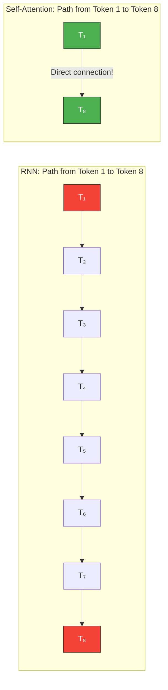

In an RNN, for token 1 to influence token 8, the signal must pass through 7 intermediate states. At each step, information is mixed, transformed, and potentially lost. With self-attention, token 1 has a **direct** connection to token 8  the information path is just one step.

This is why transformers handle long-range dependencies so much better than RNNs, and why they've completely replaced RNNs for most NLP tasks.

### Implementation: Self-Attention as a Building Block

```python
import numpy as np

def self_attention(x, W_Q, W_K, W_V, mask=None):
    """
    Self-Attention: Q, K, V all derived from the same input.

    Parameters:
    -----------
    x : np.ndarray, shape (batch_size, seq_len, d_model)
        Input sequence.
    W_Q, W_K, W_V : np.ndarray, shape (d_model, d_k) or (d_model, d_model)
        Learned projection matrices.
    mask : np.ndarray, optional
        Attention mask.

    Returns:
    --------
    output : np.ndarray, shape (batch_size, seq_len, d_v)
    weights : np.ndarray, shape (batch_size, seq_len, seq_len)
    """
    # All three come from the SAME input x
    Q = np.matmul(x, W_Q)  # What am I looking for?
    K = np.matmul(x, W_K)  # What do I contain?
    V = np.matmul(x, W_V)  # What information do I have?

    d_k = Q.shape[-1]

    # Compute attention scores
    scores = np.matmul(Q, np.swapaxes(K, -2, -1)) / np.sqrt(d_k)

    # Apply mask if provided
    if mask is not None:
        scores = np.where(mask == 0, -1e9, scores)

    # Softmax
    exp_scores = np.exp(scores - np.max(scores, axis=-1, keepdims=True))
    weights = exp_scores / np.sum(exp_scores, axis=-1, keepdims=True)

    # Weighted sum
    output = np.matmul(weights, V)

    return output, weights


# Demo
np.random.seed(42)

batch_size = 1
seq_len = 5
d_model = 16
d_k = 16

words = ["The", "cat", "sat", "on", "mat"]

# Input embeddings
x = np.random.randn(batch_size, seq_len, d_model)

# Projection matrices
W_Q = np.random.randn(d_model, d_k) * 0.1
W_K = np.random.randn(d_model, d_k) * 0.1
W_V = np.random.randn(d_model, d_k) * 0.1

# Self-attention (no mask  bidirectional, like BERT)
output, weights = self_attention(x, W_Q, W_K, W_V)

print("Self-Attention Demo")
print("=" * 55)
print(f"Input shape:  {x.shape}")
print(f"Output shape: {output.shape}")
print(f"\nAttention weights (who looks at whom):")
print(f"{'':>8}", end="")
for w in words:
    print(f"{w:>8}", end="")
print()
for i, word in enumerate(words):
    print(f"{word:>8}", end="")
    for j in range(seq_len):
        print(f"{weights[0, i, j]:>8.3f}", end="")
    print()

# Self-attention with causal mask (like GPT)
causal_mask = np.tril(np.ones((1, seq_len, seq_len)))
output_causal, weights_causal = self_attention(x, W_Q, W_K, W_V, mask=causal_mask)

print(f"\nCausal Self-Attention (GPT-style):")
print(f"{'':>8}", end="")
for w in words:
    print(f"{w:>8}", end="")
print()
for i, word in enumerate(words):
    print(f"{word:>8}", end="")
    for j in range(seq_len):
        print(f"{weights_causal[0, i, j]:>8.3f}", end="")
    print()
```

---

## 8. PyTorch Implementation

### Production-Quality Multi-Head Attention

Now let's implement multi-head attention in PyTorch  the framework used to train most modern LLMs. This implementation follows the same logic as our NumPy version but uses PyTorch's optimized operations and automatic differentiation.

```python
import torch
import torch.nn as nn
import torch.nn.functional as F
import math

class MultiHeadAttention(nn.Module):
    """
    Multi-Head Attention (PyTorch Implementation).

    This is the attention mechanism used in transformers.
    It runs h parallel attention computations ("heads") and combines the results.

    Architecture:
        1. Project Q, K, V through learned linear layers
        2. Split into h heads
        3. Compute scaled dot-product attention for each head
        4. Concatenate heads and project through output layer
    """

    def __init__(self, d_model, num_heads, dropout=0.1):
        """
        Parameters:
        -----------
        d_model : int
            Total model dimension (embedding dimension).
        num_heads : int
            Number of parallel attention heads.
        dropout : float
            Dropout rate for attention weights.
        """
        super().__init__()

        assert d_model % num_heads == 0, \
            f"d_model ({d_model}) must be divisible by num_heads ({num_heads})"

        self.d_model = d_model
        self.num_heads = num_heads
        self.d_k = d_model // num_heads

        # Linear projection layers
        # Each is (d_model -> d_model), conceptually h separate (d_model -> d_k) projections
        self.W_Q = nn.Linear(d_model, d_model, bias=False)
        self.W_K = nn.Linear(d_model, d_model, bias=False)
        self.W_V = nn.Linear(d_model, d_model, bias=False)
        self.W_O = nn.Linear(d_model, d_model, bias=False)

        self.dropout = nn.Dropout(dropout)

        # Initialize weights using Xavier uniform (good for attention)
        self._init_weights()

    def _init_weights(self):
        """Xavier uniform initialization for attention weights."""
        for module in [self.W_Q, self.W_K, self.W_V, self.W_O]:
            nn.init.xavier_uniform_(module.weight)

    def forward(self, Q, K, V, mask=None):
        """
        Compute multi-head attention.

        Parameters:
        -----------
        Q : torch.Tensor, shape (batch_size, seq_len_q, d_model)
            Query input.
        K : torch.Tensor, shape (batch_size, seq_len_k, d_model)
            Key input.
        V : torch.Tensor, shape (batch_size, seq_len_k, d_model)
            Value input.
        mask : torch.Tensor, optional
            Mask where 0/False means "do not attend".
            Shape: (batch_size, 1, seq_len_q, seq_len_k) or broadcastable.

        Returns:
        --------
        output : torch.Tensor, shape (batch_size, seq_len_q, d_model)
        attention_weights : torch.Tensor, shape (batch_size, num_heads, seq_len_q, seq_len_k)
        """
        batch_size = Q.size(0)

        # Step 1: Linear projections
        # (batch, seq, d_model) -> (batch, seq, d_model)
        Q = self.W_Q(Q)
        K = self.W_K(K)
        V = self.W_V(V)

        # Step 2: Reshape to (batch, num_heads, seq, d_k)
        Q = Q.view(batch_size, -1, self.num_heads, self.d_k).transpose(1, 2)
        K = K.view(batch_size, -1, self.num_heads, self.d_k).transpose(1, 2)
        V = V.view(batch_size, -1, self.num_heads, self.d_k).transpose(1, 2)

        # Step 3: Compute attention scores
        # (batch, heads, seq_q, d_k) @ (batch, heads, d_k, seq_k) -> (batch, heads, seq_q, seq_k)
        scores = torch.matmul(Q, K.transpose(-2, -1)) / math.sqrt(self.d_k)

        # Step 4: Apply mask
        if mask is not None:
            # mask shape should be broadcastable to (batch, heads, seq_q, seq_k)
            scores = scores.masked_fill(mask == 0, float('-inf'))

        # Step 5: Softmax to get attention weights
        attention_weights = F.softmax(scores, dim=-1)

        # Step 6: Apply dropout to attention weights (regularization)
        attention_weights = self.dropout(attention_weights)

        # Step 7: Compute weighted sum of values
        # (batch, heads, seq_q, seq_k) @ (batch, heads, seq_k, d_k) -> (batch, heads, seq_q, d_k)
        context = torch.matmul(attention_weights, V)

        # Step 8: Concatenate heads
        # (batch, heads, seq, d_k) -> (batch, seq, heads, d_k) -> (batch, seq, d_model)
        context = context.transpose(1, 2).contiguous().view(batch_size, -1, self.d_model)

        # Step 9: Final linear projection
        output = self.W_O(context)

        return output, attention_weights


# ============================================================
# DEMO: Using PyTorch Multi-Head Attention
# ============================================================

def demo_pytorch_mha():
    # Configuration
    d_model = 64
    num_heads = 8
    batch_size = 2
    seq_len = 10
    dropout = 0.0  # No dropout for demo

    # Create the module
    mha = MultiHeadAttention(d_model, num_heads, dropout)

    # Create random input (simulating token embeddings)
    x = torch.randn(batch_size, seq_len, d_model)

    # Self-attention (Q=K=V=x)
    output, weights = mha(x, x, x)

    print("PyTorch Multi-Head Attention Demo")
    print("=" * 55)
    print(f"Input shape:     {x.shape}")
    print(f"Output shape:    {output.shape}")
    print(f"Weights shape:   {weights.shape}")
    print(f"Num parameters:  {sum(p.numel() for p in mha.parameters()):,}")

    # With causal mask
    causal_mask = torch.tril(torch.ones(seq_len, seq_len)).unsqueeze(0).unsqueeze(0)
    output_masked, weights_masked = mha(x, x, x, mask=causal_mask)

    print(f"\nWith causal mask:")
    print(f"Mask shape:      {causal_mask.shape}")
    print(f"Output shape:    {output_masked.shape}")

    # Verify causal masking works
    print(f"\nAttention weights for position 0 (batch 0, head 0):")
    print(f"  {weights_masked[0, 0, 0]}")
    print(f"  (Should have weight only on position 0)")

    print(f"\nAttention weights for position 4 (batch 0, head 0):")
    print(f"  {weights_masked[0, 0, 4]}")
    print(f"  (Should have weights on positions 0-4 only)")

    # Verify gradient flow
    loss = output.sum()
    loss.backward()
    print(f"\nGradients flow: {mha.W_Q.weight.grad is not None}")
    print(f"W_Q gradient norm: {mha.W_Q.weight.grad.norm():.4f}")

    return mha

# Run the demo
mha = demo_pytorch_mha()
```

### Comparing with PyTorch's Built-in Implementation

PyTorch provides `nn.MultiheadAttention` out of the box. Let's compare:

```python
import torch
import torch.nn as nn

def compare_implementations():
    d_model = 64
    num_heads = 8
    batch_size = 2
    seq_len = 10

    # Our implementation
    our_mha = MultiHeadAttention(d_model, num_heads, dropout=0.0)

    # PyTorch's built-in
    pytorch_mha = nn.MultiheadAttention(
        embed_dim=d_model,
        num_heads=num_heads,
        dropout=0.0,
        batch_first=True,  # Use (batch, seq, feature) format
    )

    x = torch.randn(batch_size, seq_len, d_model)

    # Our implementation
    our_output, our_weights = our_mha(x, x, x)

    # PyTorch's implementation
    # Note: PyTorch returns (output, weights) with different weight format
    pt_output, pt_weights = pytorch_mha(x, x, x)

    print("Comparison: Our MHA vs. PyTorch's nn.MultiheadAttention")
    print("=" * 60)
    print(f"\n{'':>25} {'Ours':>15} {'PyTorch':>15}")
    print(f"{'-' * 55}")
    print(f"{'Output shape':>25} {str(our_output.shape):>15} {str(pt_output.shape):>15}")
    print(f"{'Weights shape':>25} {str(our_weights.shape):>15} {str(pt_weights.shape):>15}")
    print(f"{'Num parameters':>25} {sum(p.numel() for p in our_mha.parameters()):>15,} "
          f"{sum(p.numel() for p in pytorch_mha.parameters()):>15,}")

    print("\nNote: PyTorch's version has slightly more parameters because it")
    print("includes bias terms by default. The core computation is identical.")

compare_implementations()
```

### Utility Functions

```python
def create_padding_mask(seq_lengths, max_len):
    """
    Create a padding mask for variable-length sequences in a batch.

    Parameters:
    -----------
    seq_lengths : torch.Tensor, shape (batch_size,)
        Actual length of each sequence in the batch.
    max_len : int
        Maximum sequence length (after padding).

    Returns:
    --------
    mask : torch.Tensor, shape (batch_size, 1, 1, max_len)
        1 for real tokens, 0 for padding tokens.
    """
    batch_size = seq_lengths.size(0)
    # Create range tensor: [0, 1, 2, ..., max_len-1]
    range_tensor = torch.arange(max_len).unsqueeze(0).expand(batch_size, -1)
    # Compare with sequence lengths
    mask = (range_tensor < seq_lengths.unsqueeze(1)).float()
    # Reshape for broadcasting: (batch, 1, 1, max_len)
    return mask.unsqueeze(1).unsqueeze(2)


def create_causal_mask(seq_len):
    """
    Create a causal mask for autoregressive attention.

    Returns:
    --------
    mask : torch.Tensor, shape (1, 1, seq_len, seq_len)
        Lower triangular matrix of ones.
    """
    mask = torch.tril(torch.ones(seq_len, seq_len))
    return mask.unsqueeze(0).unsqueeze(0)


def create_combined_mask(seq_lengths, max_len):
    """
    Create a combined padding + causal mask.

    This is what GPT-style models actually use: they need to both
    mask future tokens AND ignore padding tokens.
    """
    padding_mask = create_padding_mask(seq_lengths, max_len)
    causal_mask = create_causal_mask(max_len)
    # Combine: both conditions must be met
    combined = padding_mask * causal_mask
    return combined


# Demo
batch_size = 3
max_len = 6
seq_lengths = torch.tensor([4, 6, 2])  # Different lengths in batch

padding_mask = create_padding_mask(seq_lengths, max_len)
causal_mask = create_causal_mask(max_len)
combined_mask = create_combined_mask(seq_lengths, max_len)

print("Mask Examples")
print("=" * 50)

print(f"\nPadding mask (seq_lengths={seq_lengths.tolist()}, max_len={max_len}):")
for b in range(batch_size):
    print(f"  Batch {b} (len={seq_lengths[b]}): {padding_mask[b, 0, 0].int().tolist()}")

print(f"\nCausal mask ({max_len}x{max_len}):")
for i in range(max_len):
    print(f"  Row {i}: {causal_mask[0, 0, i].int().tolist()}")

print(f"\nCombined mask (batch 0, seq_len=4):")
for i in range(max_len):
    print(f"  Row {i}: {combined_mask[0, 0, i].int().tolist()}")
```

---

## 9. Attention as Memory Access

### The Deep Connection

Here's the insight that ties this entire series together: **attention is a form of memory access**.

Think about how you access a traditional key-value store (like a hash map or a database):

```python
# Traditional memory access (hard lookup)
database = {
    "user_123": {"name": "Alice", "role": "admin"},
    "user_456": {"name": "Bob", "role": "user"},
    "user_789": {"name": "Charlie", "role": "user"},
}

# Query: find user_456
result = database["user_456"]
# Returns EXACTLY one entry: {"name": "Bob", "role": "user"}
```

This is **hard** memory access  you get exactly one result, the one that matches exactly.

Now think about attention:

```python
# Attention-based memory access (soft lookup)
# Instead of exact match, we compute SIMILARITY to all keys
# and return a WEIGHTED BLEND of all values

query = "user_45?"  # Approximate query
keys = ["user_123", "user_456", "user_789"]
values = [alice_data, bob_data, charlie_data]

# Soft matching gives weights
weights = [0.05, 0.85, 0.10]  # user_456 matches best, but not exactly

# Result is a weighted blend
result = 0.05 * alice_data + 0.85 * bob_data + 0.10 * charlie_data
```

This is **soft** memory access  you get a blended result, weighted by similarity.

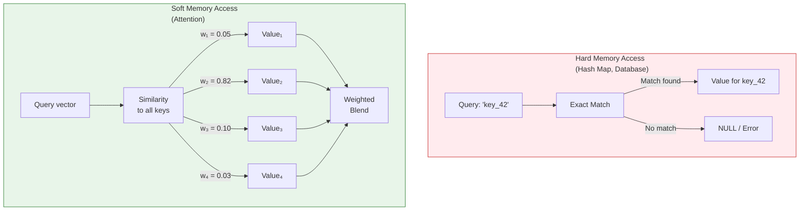

### The Attention-Memory Mapping

| Attention Concept | Memory Concept | Example |
|---|---|---|
| **Keys (K)** | Memory addresses | What's stored at each location |
| **Values (V)** | Memory contents | The actual data at each location |
| **Query (Q)** | Read address / search query | What you're looking for |
| **Attention weights** | Read strength per location | How much to read from each slot |
| **Output** | Read result | The data you retrieved |
| **Softmax** | Normalization | Ensures total read = 1.0 |

### Code: Attention as an Explicit Memory Module

```python
import numpy as np

class AttentionMemory:
    """
    Treat attention explicitly as a memory read/write system.

    This makes the connection between attention and memory crystal clear.
    """

    def __init__(self, num_slots, slot_size):
        """
        Initialize memory with empty slots.

        Parameters:
        -----------
        num_slots : int
            Number of memory slots (like sequence length).
        slot_size : int
            Size of each memory slot (like hidden dimension).
        """
        self.num_slots = num_slots
        self.slot_size = slot_size

        # Memory storage: keys and values
        self.keys = np.zeros((num_slots, slot_size))
        self.values = np.zeros((num_slots, slot_size))
        self.slot_labels = ["empty"] * num_slots
        self.write_pointer = 0

    def write(self, key, value, label=""):
        """
        Write a key-value pair to memory.
        Similar to how encoder states populate the attention memory.
        """
        if self.write_pointer >= self.num_slots:
            print("Memory full!")
            return

        self.keys[self.write_pointer] = key
        self.values[self.write_pointer] = value
        self.slot_labels[self.write_pointer] = label
        self.write_pointer += 1

    def read(self, query):
        """
        Read from memory using soft attention.

        This is EXACTLY what attention does:
        1. Compare query to all keys (dot product)
        2. Softmax to get read weights
        3. Return weighted sum of values
        """
        # Only read from written slots
        active_slots = self.write_pointer
        if active_slots == 0:
            return np.zeros(self.slot_size), np.array([])

        active_keys = self.keys[:active_slots]
        active_values = self.values[:active_slots]

        # Compute similarity (dot product)
        scores = np.dot(active_keys, query)

        # Scale by sqrt(d) for numerical stability
        scores = scores / np.sqrt(self.slot_size)

        # Softmax to get attention/read weights
        exp_scores = np.exp(scores - np.max(scores))
        weights = exp_scores / exp_scores.sum()

        # Weighted sum of values
        result = np.dot(weights, active_values)

        return result, weights

    def display_memory(self):
        """Display the current state of memory."""
        print(f"\nMemory State ({self.write_pointer}/{self.num_slots} slots used)")
        print("-" * 50)
        for i in range(self.write_pointer):
            print(f"  Slot {i}: [{self.slot_labels[i]}]")
            print(f"    Key:   {self.keys[i][:4]}...")
            print(f"    Value: {self.values[i][:4]}...")

    def display_read(self, query, label=""):
        """Display a read operation with weights."""
        result, weights = self.read(query)
        print(f"\nReading from memory with query: {label}")
        print("-" * 50)
        for i, (w, lbl) in enumerate(zip(weights, self.slot_labels[:self.write_pointer])):
            bar = "█" * int(w * 40)
            print(f"  [{lbl:>12}]: {w:.4f}  {bar}")
        print(f"\nResult vector (first 4 dims): {result[:4]}")
        return result, weights


# ============================================================
# DEMO: Attention Memory in Action
# ============================================================

np.random.seed(42)
slot_size = 32

# Create memory with 6 slots (like a 6-token sequence)
memory = AttentionMemory(num_slots=6, slot_size=slot_size)

# Write encoder states to memory (like processing input tokens)
# We'll create embeddings that are somewhat meaningful
def create_embedding(base_pattern, slot_size):
    """Create an embedding with a recognizable pattern."""
    emb = np.random.randn(slot_size) * 0.3
    emb[:len(base_pattern)] += np.array(base_pattern)
    return emb

# Populate memory with "The cat sat on the mat"
words_and_patterns = [
    ("The",  [1, 0, 0, 0]),
    ("cat",  [0, 1, 0, 0]),
    ("sat",  [0, 0, 1, 0]),
    ("on",   [0, 0, 0, 1]),
    ("the",  [1, 0, 0, 0]),   # Similar to "The"
    ("mat",  [0, 1, 0.5, 0]), # Similar to "cat" (both nouns)
]

for word, pattern in words_and_patterns:
    key = create_embedding(pattern, slot_size)
    value = create_embedding(pattern, slot_size)
    memory.write(key, value, label=word)

memory.display_memory()

# Read: "What noun is the subject?" (query similar to "cat" pattern)
query_subject = create_embedding([0, 1.5, 0, 0], slot_size)
memory.display_read(query_subject, label="What noun? (subject)")

# Read: "What action happened?" (query similar to "sat" pattern)
query_action = create_embedding([0, 0, 1.5, 0], slot_size)
memory.display_read(query_action, label="What action? (verb)")

# Read: "What determiner?" (query similar to "The" pattern)
query_det = create_embedding([1.5, 0, 0, 0], slot_size)
memory.display_read(query_det, label="What determiner?")
```

### The Connection to Future Parts

This attention-as-memory perspective is **crucial** for understanding the rest of this series:

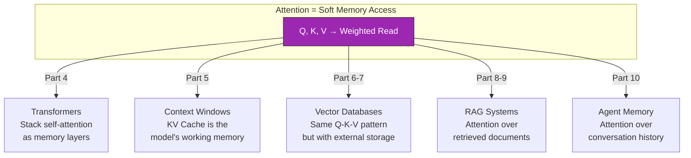

> **The Throughline:** Every memory system in AI  from attention within a transformer, to KV caches, to vector databases, to RAG pipelines  follows the same Query-Key-Value pattern. The query asks "what do I need?", the keys identify relevant information, and the values provide it. Understanding attention deeply means understanding ALL of these systems at their core.

---

## 10. The KV Cache: Caching Attention Computations

### The Problem: Redundant Computation

During autoregressive text generation (like ChatGPT producing a response), the model generates one token at a time. At each step, it runs attention over **all** previous tokens.

Here's the problem: when generating token 100, the model computes keys and values for tokens 1-99  **even though it already computed them when generating tokens 2 through 99**.

```
Generating token 1: Compute K₁, V₁                          (1 K,V pair)
Generating token 2: Compute K₁, V₁, K₂, V₂                  (2 K,V pairs  K₁,V₁ recomputed!)
Generating token 3: Compute K₁, V₁, K₂, V₂, K₃, V₃          (3 K,V pairs  K₁,V₁,K₂,V₂ recomputed!)
...
Generating token n: Compute K₁...Kₙ, V₁...Vₙ                (n K,V pairs  massive waste!)
```

Without caching, generating `n` tokens requires `O(n²)` Key-Value computations. With caching, it's only `O(n)`.

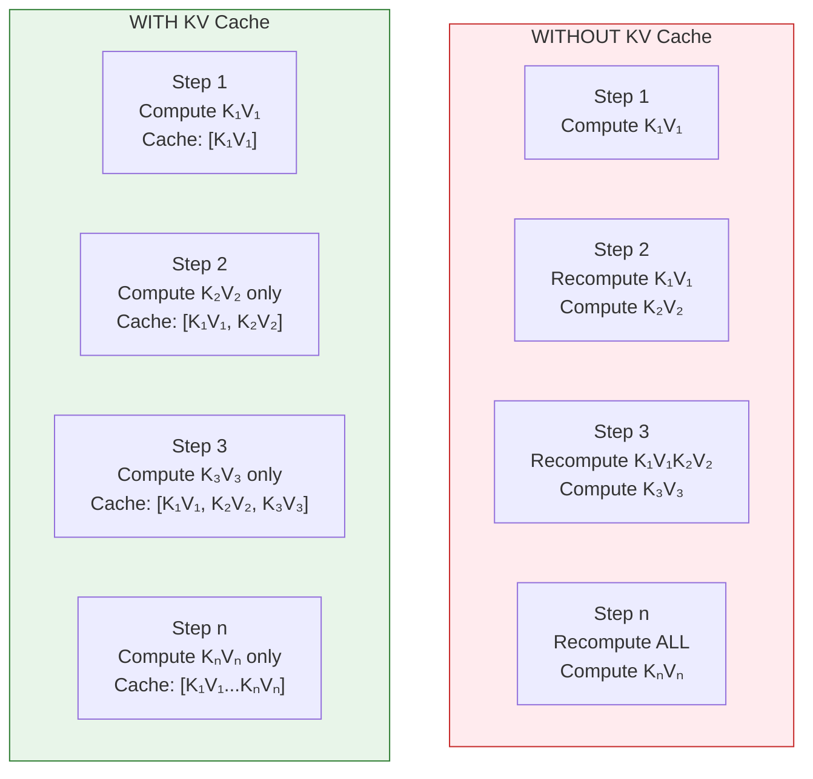

### Implementation

```python
import numpy as np

class KVCache:
    """
    Key-Value Cache for efficient autoregressive generation.

    Stores previously computed key and value tensors so they don't
    need to be recomputed at each generation step.

    This is a CRITICAL optimization for inference:
    - Without cache: O(n²) K,V computations for n tokens
    - With cache: O(n) K,V computations for n tokens
    """

    def __init__(self):
        self.key_cache = None    # (batch, heads, cached_len, d_k)
        self.value_cache = None  # (batch, heads, cached_len, d_k)
        self.cache_length = 0

    def update(self, new_keys, new_values):
        """
        Append new key-value pairs to the cache.

        Parameters:
        -----------
        new_keys : np.ndarray, shape (batch, heads, new_len, d_k)
            Keys for new token(s).
        new_values : np.ndarray, shape (batch, heads, new_len, d_k)
            Values for new token(s).

        Returns:
        --------
        all_keys : np.ndarray, shape (batch, heads, total_len, d_k)
            All cached keys + new keys.
        all_values : np.ndarray, shape (batch, heads, total_len, d_k)
            All cached values + new values.
        """
        if self.key_cache is None:
            # First token  initialize cache
            self.key_cache = new_keys
            self.value_cache = new_values
        else:
            # Append to existing cache
            self.key_cache = np.concatenate([self.key_cache, new_keys], axis=2)
            self.value_cache = np.concatenate([self.value_cache, new_values], axis=2)

        self.cache_length = self.key_cache.shape[2]
        return self.key_cache, self.value_cache

    def clear(self):
        """Clear the cache (e.g., at the start of a new sequence)."""
        self.key_cache = None
        self.value_cache = None
        self.cache_length = 0

    def get_cache_size_bytes(self, dtype_bytes=4):
        """Calculate the memory used by the cache in bytes."""
        if self.key_cache is None:
            return 0
        total_elements = self.key_cache.size + self.value_cache.size
        return total_elements * dtype_bytes

    def __repr__(self):
        if self.key_cache is None:
            return "KVCache(empty)"
        shape = self.key_cache.shape
        return f"KVCache(batch={shape[0]}, heads={shape[1]}, length={shape[2]}, d_k={shape[3]})"


class CachedMultiHeadAttention:
    """
    Multi-Head Attention with KV Cache support.

    During generation:
    1. First call: Process full prompt, cache all K,V
    2. Subsequent calls: Process only new token, retrieve cached K,V
    """

    def __init__(self, d_model, num_heads):
        self.d_model = d_model
        self.num_heads = num_heads
        self.d_k = d_model // num_heads

        scale = np.sqrt(2.0 / d_model)
        self.W_Q = np.random.randn(d_model, d_model) * scale
        self.W_K = np.random.randn(d_model, d_model) * scale
        self.W_V = np.random.randn(d_model, d_model) * scale
        self.W_O = np.random.randn(d_model, d_model) * scale

        self.kv_cache = KVCache()

    def split_heads(self, x):
        batch, seq, _ = x.shape
        return x.reshape(batch, seq, self.num_heads, self.d_k).transpose(0, 2, 1, 3)

    def forward(self, x, use_cache=False):
        """
        Forward pass with optional KV caching.

        Parameters:
        -----------
        x : np.ndarray, shape (batch, seq_len, d_model)
            Input. During cached generation, seq_len=1 (just the new token).
        use_cache : bool
            If True, use and update the KV cache.
        """
        batch = x.shape[0]

        # Compute Q, K, V for the NEW input only
        Q = self.split_heads(np.matmul(x, self.W_Q))
        K_new = self.split_heads(np.matmul(x, self.W_K))
        V_new = self.split_heads(np.matmul(x, self.W_V))

        if use_cache:
            # Append new K, V to cache and get full K, V
            K, V = self.kv_cache.update(K_new, V_new)
        else:
            K, V = K_new, V_new

        # Scaled dot-product attention
        d_k = Q.shape[-1]
        scores = np.matmul(Q, np.swapaxes(K, -2, -1)) / np.sqrt(d_k)

        # Apply causal mask
        seq_q = Q.shape[2]
        seq_k = K.shape[2]
        # During cached generation: seq_q=1, seq_k=total_len
        # The new token can attend to all cached tokens + itself
        if seq_q == 1:
            # Single new token  can attend to everything (all are in the past)
            pass
        else:
            mask = np.tril(np.ones((seq_q, seq_k)))
            scores = np.where(mask == 0, -1e9, scores)

        exp_scores = np.exp(scores - np.max(scores, axis=-1, keepdims=True))
        weights = exp_scores / np.sum(exp_scores, axis=-1, keepdims=True)

        output = np.matmul(weights, V)
        output = output.transpose(0, 2, 1, 3).reshape(batch, -1, self.d_model)
        output = np.matmul(output, self.W_O)

        return output

    def reset_cache(self):
        self.kv_cache.clear()


# ============================================================
# DEMO: KV Cache in Action
# ============================================================

np.random.seed(42)

d_model = 32
num_heads = 4
batch_size = 1

attn = CachedMultiHeadAttention(d_model, num_heads)

# Simulate generating a 10-token sequence
prompt = np.random.randn(batch_size, 5, d_model)  # 5-token prompt

print("KV Cache Demo: Autoregressive Generation")
print("=" * 60)

# Step 1: Process the prompt (no cache yet)
attn.reset_cache()
output = attn.forward(prompt, use_cache=True)
print(f"\nStep 1: Process prompt (5 tokens)")
print(f"  Input shape: {prompt.shape}")
print(f"  Output shape: {output.shape}")
print(f"  Cache: {attn.kv_cache}")
print(f"  Cache memory: {attn.kv_cache.get_cache_size_bytes():,} bytes")

# Steps 2-6: Generate 5 more tokens one at a time
for step in range(5):
    new_token = np.random.randn(batch_size, 1, d_model)
    output = attn.forward(new_token, use_cache=True)

    print(f"\nStep {step + 2}: Generate token {step + 6}")
    print(f"  Input shape: {new_token.shape}  (just 1 new token!)")
    print(f"  Output shape: {output.shape}")
    print(f"  Cache: {attn.kv_cache}")
    print(f"  Cache memory: {attn.kv_cache.get_cache_size_bytes():,} bytes")

print("\n\nKey observation: At each step, we only compute Q, K, V for the")
print("NEW token. All previous K, V values come from the cache!")
```

### KV Cache Memory: The Hidden Cost

The KV cache is why large language models need so much GPU memory during inference. Let's calculate the actual memory requirements:

```python
def calculate_kv_cache_memory(
    seq_len,
    num_layers,
    num_heads,
    d_k,
    batch_size=1,
    dtype_bytes=2,  # FP16 = 2 bytes per number
):
    """
    Calculate KV cache memory requirements.

    KV cache stores Keys and Values for EVERY layer, EVERY head,
    for EVERY token in the sequence.

    Memory = 2 × batch × layers × heads × seq_len × d_k × dtype_bytes
             ^
             (2 for both K and V)
    """
    # Per token, per layer: store K and V
    # K: (heads, d_k), V: (heads, d_k)
    elements_per_token_per_layer = 2 * num_heads * d_k  # K + V

    # Total elements
    total_elements = batch_size * seq_len * num_layers * elements_per_token_per_layer

    # Memory in bytes
    memory_bytes = total_elements * dtype_bytes

    return memory_bytes


print("KV Cache Memory Requirements for Popular Models")
print("=" * 70)

models = [
    {
        "name": "GPT-2 (Small)",
        "num_layers": 12,
        "num_heads": 12,
        "d_k": 64,  # d_model=768, d_k=768/12=64
        "max_seq": 1024,
    },
    {
        "name": "GPT-2 (Large)",
        "num_layers": 36,
        "num_heads": 20,
        "d_k": 64,  # d_model=1280
        "max_seq": 1024,
    },
    {
        "name": "LLaMA-7B",
        "num_layers": 32,
        "num_heads": 32,
        "d_k": 128,  # d_model=4096
        "max_seq": 4096,
    },
    {
        "name": "LLaMA-70B",
        "num_layers": 80,
        "num_heads": 64,
        "d_k": 128,  # d_model=8192
        "max_seq": 4096,
    },
    {
        "name": "GPT-4 (estimated)",
        "num_layers": 120,
        "num_heads": 96,
        "d_k": 128,  # d_model=12288 estimated
        "max_seq": 128000,
    },
]

print(f"\n{'Model':<22} {'Layers':>7} {'Heads':>7} {'d_k':>5} {'Seq Len':>9} "
      f"{'KV Cache (FP16)':>18}")
print("-" * 78)

for model in models:
    mem = calculate_kv_cache_memory(
        seq_len=model["max_seq"],
        num_layers=model["num_layers"],
        num_heads=model["num_heads"],
        d_k=model["d_k"],
        batch_size=1,
        dtype_bytes=2,
    )

    if mem > 1e9:
        mem_str = f"{mem / 1e9:.1f} GB"
    elif mem > 1e6:
        mem_str = f"{mem / 1e6:.1f} MB"
    else:
        mem_str = f"{mem / 1e3:.1f} KB"

    print(f"{model['name']:<22} {model['num_layers']:>7} {model['num_heads']:>7} "
          f"{model['d_k']:>5} {model['max_seq']:>9,} {mem_str:>18}")

print()
print("INSIGHT: For GPT-4-scale models, the KV cache alone can use")
print("~150+ GB of GPU memory at max sequence length!")
print("This is WHY context length is limited  it's a memory constraint.")
print("(More on this in Part 5: Context Windows and Memory Management)")

# Show how KV cache grows with sequence length
print("\n\nKV Cache Growth: LLaMA-7B at Different Sequence Lengths")
print("-" * 50)
for seq_len in [128, 512, 1024, 2048, 4096, 8192, 16384, 32768]:
    mem = calculate_kv_cache_memory(
        seq_len=seq_len,
        num_layers=32,
        num_heads=32,
        d_k=128,
        batch_size=1,
        dtype_bytes=2,
    )
    bar = "█" * int(mem / 1e6 / 50)  # Scale for display
    if mem > 1e9:
        print(f"  {seq_len:>6,} tokens: {mem/1e9:>6.2f} GB  {bar}")
    else:
        print(f"  {seq_len:>6,} tokens: {mem/1e6:>6.0f} MB  {bar}")

print("\nThe KV cache grows LINEARLY with sequence length.")
print("Double the context window → double the KV cache memory.")
```

### PyTorch KV Cache Implementation

```python
import torch
import torch.nn as nn

class KVCachePyTorch:
    """
    PyTorch KV Cache for production use.

    Supports:
    - Pre-allocation for known max sequence length
    - Incremental updates
    - Memory-efficient in-place operations
    """

    def __init__(self, batch_size, num_heads, max_seq_len, d_k, device='cpu', dtype=torch.float16):
        """
        Pre-allocate cache memory for efficiency.
        """
        self.max_seq_len = max_seq_len
        self.current_len = 0

        # Pre-allocate to avoid repeated allocation during generation
        self.key_cache = torch.zeros(
            batch_size, num_heads, max_seq_len, d_k,
            device=device, dtype=dtype
        )
        self.value_cache = torch.zeros(
            batch_size, num_heads, max_seq_len, d_k,
            device=device, dtype=dtype
        )

    def update(self, new_keys, new_values):
        """
        Append new KV pairs to the cache (in-place for efficiency).

        Parameters:
        -----------
        new_keys : torch.Tensor, shape (batch, heads, new_len, d_k)
        new_values : torch.Tensor, shape (batch, heads, new_len, d_k)

        Returns:
        --------
        keys : torch.Tensor, shape (batch, heads, current_len + new_len, d_k)
        values : torch.Tensor, shape (batch, heads, current_len + new_len, d_k)
        """
        new_len = new_keys.shape[2]
        end_pos = self.current_len + new_len

        assert end_pos <= self.max_seq_len, \
            f"Cache overflow: {end_pos} > {self.max_seq_len}"

        # Write new values into pre-allocated buffer (no allocation!)
        self.key_cache[:, :, self.current_len:end_pos, :] = new_keys
        self.value_cache[:, :, self.current_len:end_pos, :] = new_values

        self.current_len = end_pos

        # Return view of the active portion
        return (
            self.key_cache[:, :, :self.current_len, :],
            self.value_cache[:, :, :self.current_len, :],
        )

    def clear(self):
        """Reset the cache."""
        self.current_len = 0
        self.key_cache.zero_()
        self.value_cache.zero_()

    @property
    def memory_bytes(self):
        """Total memory used by the cache."""
        return self.key_cache.nelement() * self.key_cache.element_size() * 2

    def __repr__(self):
        return (f"KVCache(current_len={self.current_len}, "
                f"max_len={self.max_seq_len}, "
                f"memory={self.memory_bytes / 1e6:.1f} MB)")


# Quick demo
cache = KVCachePyTorch(
    batch_size=1, num_heads=32, max_seq_len=4096, d_k=128,
    device='cpu', dtype=torch.float16
)
print(f"Pre-allocated cache: {cache}")
print(f"Memory reserved: {cache.memory_bytes / 1e6:.1f} MB")
```

> **Why This Matters:** The KV cache is the single biggest memory bottleneck during LLM inference. Every optimization technique for longer context windows  from sliding window attention to Grouped Query Attention (GQA) to paged attention (vLLM)  is essentially about making the KV cache more efficient. We'll dive deep into these techniques in Part 5.

---

## 11. Attention Patterns: What Models Actually Look At

### Why Visualization Matters

One of the beautiful things about attention is its **interpretability**. Unlike most neural network internals (which are opaque high-dimensional vectors), attention weights have a clear meaning: they tell you exactly how much each position "looked at" each other position.

Researchers have discovered that trained transformers develop consistent, recognizable patterns in their attention weights. Understanding these patterns gives you insight into what the model has actually learned.

### Common Attention Patterns

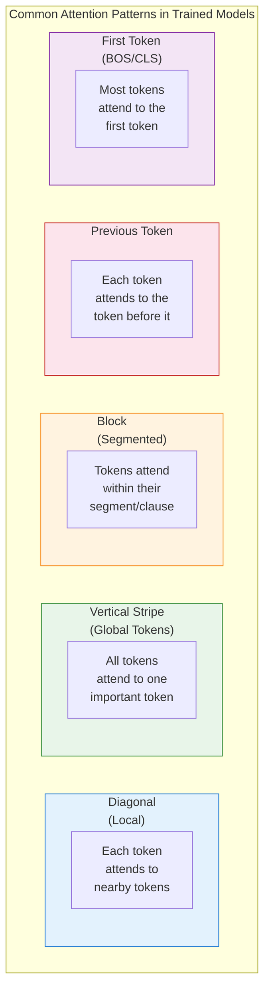

### Code: Generate and Visualize Attention Patterns

```python
import numpy as np

def create_pattern_examples():
    """
    Generate synthetic attention patterns that match what's observed
    in real trained transformers.
    """
    seq_len = 8
    tokens = ["[CLS]", "The", "quick", "brown", "fox", "jumped", "over", "dogs"]

    patterns = {}

    # Pattern 1: Diagonal (Local attention)
    # Each token mainly attends to itself and immediate neighbors
    diag = np.eye(seq_len) * 0.5
    for i in range(seq_len):
        if i > 0:
            diag[i, i-1] = 0.25
        if i < seq_len - 1:
            diag[i, i+1] = 0.15
    diag = diag / diag.sum(axis=1, keepdims=True)
    patterns["Diagonal (Local)"] = diag

    # Pattern 2: Vertical Stripe (Global token)
    # One token (e.g., a verb) gets attention from many positions
    vert = np.ones((seq_len, seq_len)) * 0.05
    vert[:, 5] = 0.6   # "jumped" gets heavy attention
    vert = vert / vert.sum(axis=1, keepdims=True)
    patterns["Vertical Stripe (Important Token)"] = vert

    # Pattern 3: Previous Token
    # Each token attends strongly to the immediately preceding token
    prev = np.zeros((seq_len, seq_len))
    for i in range(seq_len):
        if i > 0:
            prev[i, i-1] = 0.7
        prev[i, i] = 0.3
    prev[0, 0] = 1.0  # First token only has itself
    prev = prev / prev.sum(axis=1, keepdims=True)
    patterns["Previous Token"] = prev

    # Pattern 4: First Token (CLS/BOS)
    # Most tokens attend to the first special token
    first = np.ones((seq_len, seq_len)) * 0.03
    first[:, 0] = 0.6   # Heavy attention to [CLS]
    for i in range(seq_len):
        first[i, i] += 0.1
    first = first / first.sum(axis=1, keepdims=True)
    patterns["First Token ([CLS]/BOS)"] = first

    # Pattern 5: Block/Segment pattern
    # Tokens attend within clauses/segments
    block = np.ones((seq_len, seq_len)) * 0.02
    # Segment 1: positions 0-3
    block[:4, :4] = 0.2
    # Segment 2: positions 4-7
    block[4:, 4:] = 0.2
    block = block / block.sum(axis=1, keepdims=True)
    patterns["Block (Segment)"] = block

    # Pattern 6: Broad/Uniform
    # Equal attention to all positions (context gathering)
    uniform = np.ones((seq_len, seq_len)) / seq_len
    patterns["Uniform (Global Context)"] = uniform

    return tokens, patterns


def visualize_pattern(tokens, weights, title):
    """Text-based attention heatmap visualization."""
    seq_len = len(tokens)

    print(f"\n{'─' * 60}")
    print(f"  {title}")
    print(f"{'─' * 60}")

    # Header
    print(f"{'':>10}", end="")
    for t in tokens:
        print(f"{t:>8}", end="")
    print()

    # Rows
    for i, token in enumerate(tokens):
        print(f"{token:>10}", end="")
        for j in range(seq_len):
            val = weights[i, j]
            if val > 0.4:
                cell = "  ████"
            elif val > 0.25:
                cell = "  ███░"
            elif val > 0.12:
                cell = "  ██░░"
            elif val > 0.06:
                cell = "  █░░░"
            else:
                cell = "  ░░░░"
            print(f"{cell:>8}", end="")
        print()


# Generate and display all patterns
tokens, patterns = create_pattern_examples()

print("Attention Patterns Observed in Trained Transformers")
print("=" * 60)
print(f"Sequence: {' '.join(tokens)}")
print(f"(Darker = higher attention weight)")

for name, weights in patterns.items():
    visualize_pattern(tokens, weights, name)

print(f"\n{'=' * 60}")
print("In real models, DIFFERENT HEADS show DIFFERENT patterns.")
print("Head 1 might be 'Previous Token' while Head 5 is 'Global Token'.")
print("This is exactly why multi-head attention is so powerful!")
```

### What Different Heads Learn

Research by Clark et al. (2019) and others has shown remarkable specialization in BERT-style models:

```python
def show_head_specialization_research():
    """
    Summarize research findings about attention head specialization.
    """
    print("Attention Head Specialization (Research Findings)")
    print("=" * 65)

    findings = [
        {
            "model": "BERT",
            "layer": "Early layers (1-4)",
            "pattern": "Positional patterns",
            "detail": "Previous token, next token, sentence start",
            "interpretation": "Low-level positional features",
        },
        {
            "model": "BERT",
            "layer": "Middle layers (5-8)",
            "pattern": "Syntactic patterns",
            "detail": "Subject-verb, determiner-noun, preposition-object",
            "interpretation": "Grammatical structure",
        },
        {
            "model": "BERT",
            "layer": "Late layers (9-12)",
            "pattern": "Semantic patterns",
            "detail": "Coreference, semantic role, entity relations",
            "interpretation": "Meaning and relationships",
        },
        {
            "model": "GPT-2",
            "layer": "Layer 5, Head 1",
            "pattern": "Induction heads",
            "detail": "Copies patterns seen earlier in the sequence",
            "interpretation": "In-context learning mechanism",
        },
        {
            "model": "GPT-2",
            "layer": "Layer 5, Head 5",
            "pattern": "Previous token head",
            "detail": "Almost always attends to position t-1",
            "interpretation": "Bigram statistics / local context",
        },
        {
            "model": "GPT-2",
            "layer": "Various",
            "pattern": "Duplicate token heads",
            "detail": "Attends to other instances of the same token",
            "interpretation": "Pattern matching",
        },
    ]

    for f in findings:
        print(f"\n  Model: {f['model']}, {f['layer']}")
        print(f"  Pattern: {f['pattern']}")
        print(f"  Detail: {f['detail']}")
        print(f"  Interpretation: {f['interpretation']}")

    print(f"\n{'=' * 65}")
    print("Source: Clark et al. (2019), Olsson et al. (2022)")

show_head_specialization_research()
```

### Matplotlib Visualization Code

For those who want publication-quality attention visualizations:

```python
import numpy as np

def plot_attention_matplotlib(tokens, attention_weights, head_labels=None, title="Attention Weights"):
    """
    Visualize attention weights using matplotlib.

    Parameters:
    -----------
    tokens : list of str
        Token labels for both axes.
    attention_weights : np.ndarray
        Shape (num_heads, seq_len, seq_len) or (seq_len, seq_len).
    head_labels : list of str, optional
        Labels for each head.
    title : str
        Plot title.
    """
    try:
        import matplotlib.pyplot as plt
        import matplotlib.colors as mcolors
    except ImportError:
        print("matplotlib not available  skipping plot.")
        print("Install with: pip install matplotlib")
        return

    if attention_weights.ndim == 2:
        attention_weights = attention_weights[np.newaxis, :, :]

    num_heads = attention_weights.shape[0]
    seq_len = len(tokens)

    # Determine grid layout
    cols = min(4, num_heads)
    rows = (num_heads + cols - 1) // cols

    fig, axes = plt.subplots(rows, cols, figsize=(4 * cols, 4 * rows))
    if num_heads == 1:
        axes = np.array([axes])
    axes = axes.flatten()

    for head in range(num_heads):
        ax = axes[head]
        im = ax.imshow(attention_weights[head], cmap='Blues', vmin=0, vmax=1)

        ax.set_xticks(range(seq_len))
        ax.set_yticks(range(seq_len))
        ax.set_xticklabels(tokens, rotation=45, ha='right', fontsize=8)
        ax.set_yticklabels(tokens, fontsize=8)

        label = head_labels[head] if head_labels else f"Head {head + 1}"
        ax.set_title(label, fontsize=10)

        ax.set_xlabel("Key (attending to)")
        ax.set_ylabel("Query (from)")

    # Hide unused subplots
    for i in range(num_heads, len(axes)):
        axes[i].set_visible(False)

    fig.suptitle(title, fontsize=14, fontweight='bold')
    plt.tight_layout()
    plt.savefig("attention_visualization.png", dpi=150, bbox_inches='tight')
    plt.close()
    print(f"Attention visualization saved to attention_visualization.png")


# Example usage
np.random.seed(42)
tokens = ["The", "cat", "sat", "on", "mat"]
seq_len = len(tokens)

# Create 4 synthetic heads with different patterns
heads = np.zeros((4, seq_len, seq_len))

# Head 1: Diagonal
heads[0] = np.eye(seq_len) * 0.6
for i in range(seq_len):
    if i > 0: heads[0, i, i-1] = 0.3
    if i < seq_len-1: heads[0, i, i+1] = 0.1
heads[0] /= heads[0].sum(axis=1, keepdims=True)

# Head 2: Previous token
for i in range(seq_len):
    if i > 0: heads[1, i, i-1] = 0.8
    heads[1, i, i] = 0.2
heads[1, 0, 0] = 1.0
heads[1] /= heads[1].sum(axis=1, keepdims=True)

# Head 3: Global token
heads[2] = np.ones((seq_len, seq_len)) * 0.05
heads[2, :, 1] = 0.6  # "cat" is important
heads[2] /= heads[2].sum(axis=1, keepdims=True)

# Head 4: Broad
heads[3] = np.ones((seq_len, seq_len)) / seq_len

head_labels = ["Local", "Previous Token", "Global (cat)", "Uniform"]

plot_attention_matplotlib(tokens, heads, head_labels, "Multi-Head Attention Patterns")
```

---

## 12. Computational Cost of Attention

### The O(n^2) Problem

The fundamental computational cost of self-attention is **quadratic** in the sequence length. Let's break down exactly why and what this means in practice.

For a sequence of length `n` with dimension `d`:

```
Q: (n, d)     n queries, each of dimension d
K: (n, d)     n keys, each of dimension d
V: (n, d)     n values, each of dimension d

Step 1: Q @ K^T  → (n, d) × (d, n) = (n, n)    Cost: O(n² × d)
Step 2: softmax   → (n, n)                       Cost: O(n²)
Step 3: weights @ V → (n, n) × (n, d) = (n, d)   Cost: O(n² × d)

Total: O(n² × d)
```

The `n²` term is the killer. Every token must compute a score with every other token.

### Let's Put Numbers on It

```python
import numpy as np

def attention_cost_analysis():
    """
    Calculate the actual computation costs for different sequence lengths.
    """
    print("Attention Computational Cost Analysis")
    print("=" * 75)

    d_model = 4096   # Typical for a 7B parameter model
    num_heads = 32
    d_k = d_model // num_heads  # 128

    print(f"\nModel config: d_model={d_model}, num_heads={num_heads}, d_k={d_k}")
    print(f"\nFor ONE attention layer, ONE head:")
    print(f"  Computation = O(n² × d_k) where n = sequence length")

    print(f"\n{'Seq Length':>12} {'Attn Scores':>18} {'FLOPs (1 head)':>18} {'FLOPs (all heads)':>20} {'Time @ 100 TFLOPS':>20}")
    print("-" * 90)

    seq_lengths = [128, 512, 1024, 2048, 4096, 8192, 16384, 32768, 65536, 131072]

    for n in seq_lengths:
        # Attention score matrix size
        attn_scores = n * n

        # FLOPs for one head:
        # Q@K^T: 2*n*n*d_k (matrix multiply)
        # softmax: ~5*n*n (exp, sum, divide per element)
        # weights@V: 2*n*n*d_k
        flops_one_head = 2 * n * n * d_k + 5 * n * n + 2 * n * n * d_k
        flops_all_heads = flops_one_head * num_heads

        # Time at 100 TFLOPS (approximate A100 performance)
        time_seconds = flops_all_heads / 100e12

        # Format
        if attn_scores > 1e9:
            attn_str = f"{attn_scores/1e9:.1f}B"
        elif attn_scores > 1e6:
            attn_str = f"{attn_scores/1e6:.1f}M"
        elif attn_scores > 1e3:
            attn_str = f"{attn_scores/1e3:.0f}K"
        else:
            attn_str = f"{attn_scores}"

        if flops_all_heads > 1e12:
            flops_str = f"{flops_all_heads/1e12:.2f} TFLOP"
        elif flops_all_heads > 1e9:
            flops_str = f"{flops_all_heads/1e9:.2f} GFLOP"
        else:
            flops_str = f"{flops_all_heads/1e6:.2f} MFLOP"

        if time_seconds > 1:
            time_str = f"{time_seconds:.2f} s"
        elif time_seconds > 1e-3:
            time_str = f"{time_seconds*1e3:.2f} ms"
        else:
            time_str = f"{time_seconds*1e6:.2f} us"

        print(f"{n:>12,} {attn_str:>18} {flops_one_head/1e9:>14.2f} GFLOP "
              f"{flops_str:>20} {time_str:>20}")

    print(f"\n{'=' * 90}")
    print("Notice: Every 2x increase in sequence length → 4x increase in computation!")
    print("Going from 4K to 128K tokens → 1024x more attention computation.")
    print("\nThis is THE reason context windows have practical limits,")
    print("and why efficient attention variants are critical (Part 5).")

attention_cost_analysis()
```

### Visualizing the Quadratic Growth

```python
def visualize_quadratic_growth():
    """
    Show quadratic growth visually.
    """
    print("\nAttention Cost: Quadratic Growth Visualization")
    print("=" * 65)
    print("Each █ = 1 unit of computation")
    print()

    base = 4  # Baseline at seq_len = base
    for n in [4, 8, 16, 32, 64]:
        cost = n * n
        bar_len = min(cost // (base * base), 60)  # Scale
        bar = "█" * bar_len
        ratio = cost / (base * base)
        print(f"  n={n:>5}: {cost:>8,} ops ({ratio:>6.0f}x)  {bar}")

    print(f"\n  n = 2x  →  cost = 4x   (quadratic!)")
    print(f"  n = 4x  →  cost = 16x")
    print(f"  n = 16x →  cost = 256x")

visualize_quadratic_growth()
```

### Memory vs. Compute: The Double Hit

Attention's quadratic cost affects both computation AND memory:

| Resource | Cost | What Grows Quadratically |
|---|---|---|
| **Computation** | O(n^2 * d) | Matrix multiplications Q@K^T and weights@V |
| **Memory (attention scores)** | O(n^2) per head | The (n x n) attention score matrix |
| **Memory (KV cache)** | O(n * d) per layer | Linear in n, but multiplied by many layers |

```python
def memory_analysis():
    """
    Break down memory usage for attention at different scales.
    """
    print("\nMemory Analysis: Where Does It All Go?")
    print("=" * 70)

    # For a single attention layer
    d_model = 4096
    num_heads = 32
    d_k = 128
    bytes_per_element = 2  # FP16

    print(f"\nModel: d_model={d_model}, heads={num_heads}, d_k={d_k}, dtype=FP16")
    print(f"\n{'Seq Len':>10} {'Attn Score Matrix':>20} {'KV Cache (1 layer)':>20} {'KV Cache (32 layers)':>22}")
    print("-" * 75)

    for n in [1024, 4096, 16384, 65536, 131072]:
        # Attention score matrix: (batch, heads, n, n)  but computed per-head
        # During computation, we need (n, n) per head
        attn_mem = num_heads * n * n * bytes_per_element

        # KV cache per layer: 2 * n * d_model (keys + values)
        kv_per_layer = 2 * n * d_model * bytes_per_element

        # KV cache for all layers
        kv_all_layers = kv_per_layer * 32

        def fmt(b):
            if b > 1e9: return f"{b/1e9:.1f} GB"
            if b > 1e6: return f"{b/1e6:.1f} MB"
            return f"{b/1e3:.1f} KB"

        print(f"{n:>10,} {fmt(attn_mem):>20} {fmt(kv_per_layer):>20} {fmt(kv_all_layers):>22}")

    print(f"\nAt 128K tokens:")
    print(f"  - Attention score matrix alone needs ~128 GB (!)")
    print(f"  - This is why FlashAttention (Part 5) never materializes the full matrix")
    print(f"  - Instead, it computes attention in tiles that fit in SRAM")

memory_analysis()
```

> **Preview of Part 5:** The quadratic cost of attention has spawned an entire research field of "efficient attention" variants: FlashAttention (GPU-memory-efficient), sliding window attention (Mistral), sparse attention (BigBird, Longformer), linear attention (Performers), and more. We'll implement several of these in Part 5: Context Windows and Memory Management.

---

## 13. Cross-Attention: Connecting Two Sequences

### When Two Sequences Need to Talk

So far we've seen:
- **Encoder-decoder attention** (Bahdanau, Luong): Query from decoder, K/V from encoder
- **Self-attention**: Q, K, V all from the same sequence

**Cross-attention** is the general term for attention where queries come from one sequence and keys/values come from a different sequence. This is used whenever two different sources of information need to interact.

### Where Cross-Attention Is Used

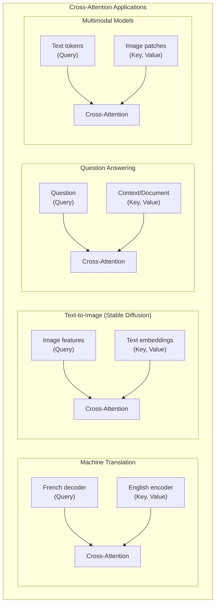

### Implementation

```python
import numpy as np

def softmax(x, axis=-1):
    exp_x = np.exp(x - np.max(x, axis=axis, keepdims=True))
    return exp_x / np.sum(exp_x, axis=axis, keepdims=True)


class CrossAttention:
    """
    Cross-Attention: Queries from one sequence, Keys/Values from another.

    Used in:
    - Encoder-decoder models (translation)
    - Text-to-image generation (Stable Diffusion)
    - Multimodal models (connecting text and images)
    - Question answering (question attends to context)
    """

    def __init__(self, d_query, d_kv, d_model, num_heads):
        """
        Parameters:
        -----------
        d_query : int
            Dimension of the query sequence.
        d_kv : int
            Dimension of the key/value sequence (can differ from d_query!).
        d_model : int
            Internal attention dimension.
        num_heads : int
            Number of attention heads.
        """
        self.num_heads = num_heads
        self.d_k = d_model // num_heads

        scale = np.sqrt(2.0 / d_model)

        # Note: W_Q projects from QUERY dimension
        # W_K, W_V project from KEY/VALUE dimension (can be different!)
        self.W_Q = np.random.randn(d_query, d_model) * scale
        self.W_K = np.random.randn(d_kv, d_model) * scale
        self.W_V = np.random.randn(d_kv, d_model) * scale
        self.W_O = np.random.randn(d_model, d_model) * scale

        self.d_model = d_model

    def forward(self, query_seq, kv_seq, mask=None):
        """
        Parameters:
        -----------
        query_seq : np.ndarray, shape (batch, seq_q, d_query)
            Sequence providing the queries (e.g., decoder states).
        kv_seq : np.ndarray, shape (batch, seq_kv, d_kv)
            Sequence providing keys and values (e.g., encoder states).
        mask : np.ndarray, optional
            Attention mask.

        Returns:
        --------
        output : np.ndarray, shape (batch, seq_q, d_model)
        weights : np.ndarray, shape (batch, num_heads, seq_q, seq_kv)
        """
        batch = query_seq.shape[0]
        seq_q = query_seq.shape[1]
        seq_kv = kv_seq.shape[1]

        # Project queries from query sequence
        Q = np.matmul(query_seq, self.W_Q)  # (batch, seq_q, d_model)
        # Project keys and values from KV sequence
        K = np.matmul(kv_seq, self.W_K)     # (batch, seq_kv, d_model)
        V = np.matmul(kv_seq, self.W_V)     # (batch, seq_kv, d_model)

        # Reshape for multi-head attention
        def split(x, seq_len):
            return x.reshape(batch, seq_len, self.num_heads, self.d_k).transpose(0, 2, 1, 3)

        Q = split(Q, seq_q)    # (batch, heads, seq_q, d_k)
        K = split(K, seq_kv)   # (batch, heads, seq_kv, d_k)
        V = split(V, seq_kv)   # (batch, heads, seq_kv, d_k)

        # Scaled dot-product attention
        scores = np.matmul(Q, np.swapaxes(K, -2, -1)) / np.sqrt(self.d_k)

        if mask is not None:
            scores = np.where(mask == 0, -1e9, scores)

        weights = softmax(scores, axis=-1)
        context = np.matmul(weights, V)

        # Concatenate heads and project
        context = context.transpose(0, 2, 1, 3).reshape(batch, seq_q, self.d_model)
        output = np.matmul(context, self.W_O)

        return output, weights


# ============================================================
# DEMO: Cross-Attention for Machine Translation
# ============================================================

np.random.seed(42)

# English encoder output (source)
english_words = ["The", "cat", "sat", "on", "the", "mat"]
d_encoder = 64
encoder_output = np.random.randn(1, len(english_words), d_encoder)

# French decoder states (target, being generated)
french_words = ["Le", "chat", "etait", "assis"]  # Partially generated
d_decoder = 64
decoder_states = np.random.randn(1, len(french_words), d_decoder)

# Cross-attention: French decoder queries English encoder
cross_attn = CrossAttention(
    d_query=d_decoder,
    d_kv=d_encoder,
    d_model=64,
    num_heads=4,
)

output, weights = cross_attn.forward(decoder_states, encoder_output)

print("Cross-Attention: Machine Translation")
print("=" * 60)
print(f"English (source): {' '.join(english_words)}")
print(f"French (target):  {' '.join(french_words)}")
print(f"\nEncoder output shape: {encoder_output.shape}")
print(f"Decoder states shape: {decoder_states.shape}")
print(f"Cross-attention output shape: {output.shape}")

# Show cross-attention weights (averaged across heads)
avg_weights = weights[0].mean(axis=0)  # Average over heads
print(f"\nCross-Attention Weights (avg over {cross_attn.num_heads} heads):")
print(f"  (Which English words each French word attends to)")
print(f"\n{'':>10}", end="")
for w in english_words:
    print(f"{w:>8}", end="")
print()

for i, word in enumerate(french_words):
    print(f"{word:>10}", end="")
    for j in range(len(english_words)):
        val = avg_weights[i, j]
        print(f"{val:>8.3f}", end="")
    print()


# ============================================================
# DEMO: Cross-Attention for Text-to-Image (Stable Diffusion concept)
# ============================================================

print("\n\nCross-Attention: Text-to-Image (Conceptual)")
print("=" * 60)

# Text embeddings (from CLIP text encoder)
text_tokens = ["a", "red", "car", "on", "a", "beach"]
d_text = 768  # CLIP dimension
text_embeddings = np.random.randn(1, len(text_tokens), d_text)

# Image features (from U-Net, being denoised)
num_patches = 16  # 4x4 image patches
d_image = 512
image_features = np.random.randn(1, num_patches, d_image)

# Cross-attention: Image queries attend to text keys/values
cross_attn_img = CrossAttention(
    d_query=d_image,   # Image feature dimension
    d_kv=d_text,       # Text embedding dimension (different!)
    d_model=256,
    num_heads=8,
)

output_img, weights_img = cross_attn_img.forward(image_features, text_embeddings)

print(f"Text tokens: {text_tokens}")
print(f"Image patches: {num_patches} (e.g., 4x4 grid)")
print(f"\nText embeddings shape: {text_embeddings.shape}")
print(f"Image features shape: {image_features.shape}")
print(f"Cross-attention output shape: {output_img.shape}")
print(f"\nThis is how Stable Diffusion knows WHERE in the image")
print(f"to place 'red', 'car', and 'beach'  each image patch")
print(f"attends to the relevant text tokens!")

# Show which text tokens the first few image patches attend to
avg_img_weights = weights_img[0].mean(axis=0)
print(f"\nImage Patch → Text Token attention (first 4 patches):")
for patch in range(4):
    top_idx = np.argsort(avg_img_weights[patch])[::-1][:3]
    top_words = [(text_tokens[i], avg_img_weights[patch, i]) for i in top_idx]
    print(f"  Patch {patch}: {', '.join(f'{w}({s:.3f})' for w, s in top_words)}")
```

### Self-Attention vs. Cross-Attention: Summary

| Feature | Self-Attention | Cross-Attention |
|---|---|---|
| **Source of Q** | Same sequence | Sequence A |
| **Source of K, V** | Same sequence | Sequence B |
| **Q and K/V dimensions** | Must match (same d_model) | Can differ (d_query != d_kv) |
| **Attention matrix shape** | (n, n)  square | (n_q, n_kv)  rectangular |
| **Use case** | Token interactions within a sequence | Connecting two different sequences |
| **Examples** | BERT, GPT self-attention | Translation, text-to-image |

---

## 14. Project: Build an Attention-Based Sequence Model

### Sentiment Analysis with Attention

Let's build a complete, working model that uses attention for text classification. This project ties together everything we've learned.

**Goal:** Build a model that:
1. Reads a sentence
2. Uses self-attention to understand token relationships
3. Predicts sentiment (positive/negative)
4. Visualizes **which words** influenced the prediction

### Complete Working Implementation

```python
import numpy as np

# ============================================================
# UTILITY FUNCTIONS
# ============================================================

def softmax(x, axis=-1):
    """Numerically stable softmax."""
    exp_x = np.exp(x - np.max(x, axis=axis, keepdims=True))
    return exp_x / np.sum(exp_x, axis=axis, keepdims=True)

def sigmoid(x):
    """Numerically stable sigmoid."""
    return np.where(
        x >= 0,
        1 / (1 + np.exp(-x)),
        np.exp(x) / (1 + np.exp(x))
    )

def relu(x):
    """ReLU activation."""
    return np.maximum(0, x)

def binary_cross_entropy(y_pred, y_true):
    """Binary cross-entropy loss."""
    eps = 1e-7
    y_pred = np.clip(y_pred, eps, 1 - eps)
    return -np.mean(y_true * np.log(y_pred) + (1 - y_true) * np.log(1 - y_pred))


# ============================================================
# SIMPLE VOCABULARY
# ============================================================

class SimpleVocab:
    """
    A simple word-to-index vocabulary for our toy dataset.
    """
    def __init__(self):
        self.word2idx = {"<PAD>": 0, "<UNK>": 1}
        self.idx2word = {0: "<PAD>", 1: "<UNK>"}
        self.next_idx = 2

    def add_sentence(self, sentence):
        for word in sentence.lower().split():
            if word not in self.word2idx:
                self.word2idx[word] = self.next_idx
                self.idx2word[self.next_idx] = word
                self.next_idx += 1

    def encode(self, sentence, max_len):
        words = sentence.lower().split()
        indices = [self.word2idx.get(w, 1) for w in words]
        # Pad or truncate
        if len(indices) < max_len:
            indices += [0] * (max_len - len(indices))
        else:
            indices = indices[:max_len]
        return np.array(indices)

    def decode(self, indices):
        return [self.idx2word.get(i, "<UNK>") for i in indices if i != 0]

    @property
    def vocab_size(self):
        return self.next_idx


# ============================================================
# THE ATTENTION-BASED SENTIMENT MODEL
# ============================================================

class AttentionSentimentClassifier:
    """
    A complete attention-based sentiment classifier.

    Architecture:
    1. Embedding layer: word indices -> dense vectors
    2. Self-attention: tokens attend to each other
    3. Attention pooling: aggregate sequence into fixed vector
    4. Classifier: dense layers for binary prediction

    This model is simple enough to understand every component,
    yet powerful enough to demonstrate attention's value.
    """

    def __init__(self, vocab_size, embed_dim=32, hidden_dim=16, max_len=20):
        self.vocab_size = vocab_size
        self.embed_dim = embed_dim
        self.hidden_dim = hidden_dim
        self.max_len = max_len

        # Initialize parameters
        np.random.seed(42)
        scale_e = np.sqrt(2.0 / embed_dim)
        scale_h = np.sqrt(2.0 / hidden_dim)

        # Embedding matrix
        self.embedding = np.random.randn(vocab_size, embed_dim) * 0.1

        # Self-attention parameters
        self.W_Q = np.random.randn(embed_dim, hidden_dim) * scale_e
        self.W_K = np.random.randn(embed_dim, hidden_dim) * scale_e
        self.W_V = np.random.randn(embed_dim, hidden_dim) * scale_e

        # Attention pooling (aggregate sequence to single vector)
        self.pool_query = np.random.randn(hidden_dim) * scale_h

        # Classification head
        self.W_class1 = np.random.randn(hidden_dim, hidden_dim) * scale_h
        self.b_class1 = np.zeros(hidden_dim)
        self.W_class2 = np.random.randn(hidden_dim, 1) * scale_h
        self.b_class2 = np.zeros(1)

        # Storage for attention weights (for visualization)
        self.self_attn_weights = None
        self.pool_attn_weights = None

    def forward(self, token_indices, padding_mask=None):
        """
        Forward pass through the model.

        Parameters:
        -----------
        token_indices : np.ndarray, shape (max_len,)
            Encoded token indices.
        padding_mask : np.ndarray, shape (max_len,), optional
            1 for real tokens, 0 for padding.

        Returns:
        --------
        prediction : float
            Probability of positive sentiment (0 to 1).
        """
        seq_len = len(token_indices)

        # Step 1: Embedding lookup
        # (max_len,) -> (max_len, embed_dim)
        x = self.embedding[token_indices]

        # Step 2: Self-attention
        # Each token attends to all other tokens
        Q = np.dot(x, self.W_Q)  # (seq_len, hidden_dim)
        K = np.dot(x, self.W_K)  # (seq_len, hidden_dim)
        V = np.dot(x, self.W_V)  # (seq_len, hidden_dim)

        # Scaled dot-product attention
        d_k = Q.shape[-1]
        scores = np.dot(Q, K.T) / np.sqrt(d_k)  # (seq_len, seq_len)

        # Mask padding positions
        if padding_mask is not None:
            # Set padding positions to -inf
            mask_2d = padding_mask[:, np.newaxis] * padding_mask[np.newaxis, :]
            scores = np.where(mask_2d == 0, -1e9, scores)

        self_attn_weights = softmax(scores, axis=-1)
        self.self_attn_weights = self_attn_weights

        # Apply attention
        attended = np.dot(self_attn_weights, V)  # (seq_len, hidden_dim)

        # Step 3: Attention pooling
        # Instead of average pooling, use learned attention to
        # aggregate the sequence into a single vector
        pool_scores = np.dot(attended, self.pool_query) / np.sqrt(d_k)

        if padding_mask is not None:
            pool_scores = np.where(padding_mask == 0, -1e9, pool_scores)

        pool_weights = softmax(pool_scores)
        self.pool_attn_weights = pool_weights

        # Weighted sum: (seq_len,) @ (seq_len, hidden_dim) -> (hidden_dim,)
        pooled = np.dot(pool_weights, attended)

        # Step 4: Classification
        hidden = relu(np.dot(pooled, self.W_class1) + self.b_class1)
        logit = np.dot(hidden, self.W_class2) + self.b_class2
        prediction = sigmoid(logit[0])

        return prediction

    def predict_and_explain(self, sentence, vocab):
        """
        Make a prediction and show which words the model focused on.
        """
        # Encode
        indices = vocab.encode(sentence, self.max_len)
        words = sentence.lower().split()
        padding_mask = (indices != 0).astype(float)

        # Predict
        prob = self.forward(indices, padding_mask)

        # Get attention weights for real tokens only
        real_len = len(words)
        pool_weights = self.pool_attn_weights[:real_len]

        # Normalize for display
        pool_weights = pool_weights / pool_weights.sum()

        # Display results
        sentiment = "POSITIVE" if prob > 0.5 else "NEGATIVE"
        confidence = prob if prob > 0.5 else 1 - prob

        print(f"\nInput: \"{sentence}\"")
        print(f"Prediction: {sentiment} ({confidence:.1%} confident)")
        print(f"\nWord Importance (Attention Pooling Weights):")
        print("-" * 50)

        for word, weight in zip(words, pool_weights):
            bar_len = int(weight * 50)
            bar = "█" * bar_len
            print(f"  {word:>12}: {weight:.4f}  {bar}")

        # Show self-attention for most important word
        top_word_idx = np.argmax(pool_weights)
        print(f"\nSelf-Attention FROM '{words[top_word_idx]}' TO other words:")
        print("-" * 50)
        sa_weights = self.self_attn_weights[top_word_idx, :real_len]
        sa_weights = sa_weights / sa_weights.sum()

        for word, weight in zip(words, sa_weights):
            bar_len = int(weight * 40)
            bar = "█" * bar_len
            print(f"  {word:>12}: {weight:.4f}  {bar}")

        return prob


# ============================================================
# DATASET AND TRAINING
# ============================================================

# Simple sentiment dataset
dataset = [
    ("this movie is great and wonderful", 1),
    ("terrible film awful acting bad plot", 0),
    ("loved every minute of this amazing film", 1),
    ("worst movie i have ever seen boring", 0),
    ("brilliant performance outstanding cast", 1),
    ("dull tedious waste of time", 0),
    ("excellent story beautiful cinematography", 1),
    ("horrible script weak dialogue disappointing", 0),
    ("fantastic movie highly recommend", 1),
    ("unwatchable garbage terrible direction", 0),
    ("absolutely loved it must see film", 1),
    ("painfully bad acting poor writing", 0),
    ("superb film great director wonderful cast", 1),
    ("boring predictable not worth watching", 0),
    ("amazing masterpiece best film ever", 1),
    ("awful terrible worst film disgusting", 0),
]

# Build vocabulary
vocab = SimpleVocab()
for sentence, _ in dataset:
    vocab.add_sentence(sentence)

print("Attention-Based Sentiment Classifier")
print("=" * 60)
print(f"Vocabulary size: {vocab.vocab_size}")
print(f"Training examples: {len(dataset)}")

# Create model
max_len = 10
model = AttentionSentimentClassifier(
    vocab_size=vocab.vocab_size,
    embed_dim=32,
    hidden_dim=16,
    max_len=max_len,
)

# Simple training loop (SGD)
learning_rate = 0.01
num_epochs = 100

print(f"\nTraining for {num_epochs} epochs...")
print("-" * 40)

for epoch in range(num_epochs):
    total_loss = 0
    correct = 0

    for sentence, label in dataset:
        indices = vocab.encode(sentence, max_len)
        padding_mask = (indices != 0).astype(float)

        # Forward pass
        pred = model.forward(indices, padding_mask)
        loss = binary_cross_entropy(pred, label)
        total_loss += loss

        if (pred > 0.5) == label:
            correct += 1

        # Very simple gradient approximation (numerical gradient)
        # In practice, you'd use autograd  this is for demonstration
        eps = 1e-4

        # Update embedding for active tokens only
        for idx in indices:
            if idx == 0:
                continue
            for d in range(model.embed_dim):
                original = model.embedding[idx, d]

                model.embedding[idx, d] = original + eps
                pred_plus = model.forward(indices, padding_mask)
                loss_plus = binary_cross_entropy(pred_plus, label)

                model.embedding[idx, d] = original - eps
                pred_minus = model.forward(indices, padding_mask)
                loss_minus = binary_cross_entropy(pred_minus, label)

                grad = (loss_plus - loss_minus) / (2 * eps)
                model.embedding[idx, d] = original - learning_rate * grad

    accuracy = correct / len(dataset)
    avg_loss = total_loss / len(dataset)

    if (epoch + 1) % 20 == 0 or epoch == 0:
        print(f"  Epoch {epoch+1:>4}: Loss = {avg_loss:.4f}, Accuracy = {accuracy:.1%}")

# Test with explanations
print(f"\n{'=' * 60}")
print("PREDICTIONS WITH ATTENTION EXPLANATIONS")
print(f"{'=' * 60}")

test_sentences = [
    "this movie is great",
    "terrible awful waste",
    "loved the brilliant cast",
    "boring and predictable",
]

for sentence in test_sentences:
    model.predict_and_explain(sentence, vocab)
    print()
```

### What This Project Teaches Us

This project demonstrates several key concepts:

1. **Attention as feature selection:** The attention pooling weights show which words the model considers most important for its prediction. For positive reviews, sentiment words like "great", "wonderful", "brilliant" get high weights. For negative reviews, words like "terrible", "awful", "boring" are highlighted.

2. **Self-attention as context building:** Before the pooling step, self-attention lets each word gather context from other words. The word "not" before "great" would cause "great" to have a different representation than "great" alone  self-attention captures this.

3. **Interpretability:** Unlike a black-box model, we can see *exactly* what the model is paying attention to. This is one of the most powerful properties of attention mechanisms.

> **Extension Ideas:**
> - Add positional encodings (we'll cover these in Part 4)
> - Use proper backpropagation instead of numerical gradients
> - Add multiple attention layers (stacking)
> - Try multi-head attention for richer representations
> - Port to PyTorch for GPU-accelerated training

---

## 15. Research Papers Explained for Developers

### Paper 1: "Neural Machine Translation by Jointly Learning to Align and Translate" (Bahdanau et al., 2014)

**The Problem They Solved:**

Before this paper, encoder-decoder models compressed the entire input into one vector. Translation quality dropped sharply for long sentences.

**The Key Idea:**

Let the decoder look at ALL encoder hidden states at each step, and learn which ones are relevant. They called this "alignment" because it learns which source words align with each target word.

**How It Appears in Modern Code:**

```python
# The Bahdanau pattern appears whenever you see:
# 1. A query attending to a set of keys
# 2. Additive scoring (adding projected query and key)
# 3. Tanh activation before computing the final score

# This evolved into:
# - Cross-attention in transformers
# - Attention in seq2seq models
# - The general Q-K-V framework
```

**Impact:** Established the concept of attention. BLEU scores jumped significantly for long sentences. This paper has over 30,000 citations.

---

### Paper 2: "Effective Approaches to Attention-based Neural Machine Translation" (Luong et al., 2015)

**The Problem They Solved:**

Bahdanau's attention was effective but computationally expensive (additive scoring with learned parameters). Could simpler scoring functions work?

**The Key Idea:**

Three simpler scoring alternatives:
- **Dot product:** Just multiply query and key directly
- **General:** Multiply through a learned matrix
- **Concat:** Similar to Bahdanau but with concatenation

**How It Appears in Modern Code:**

```python
# The Luong dot-product pattern is THE foundation of transformer attention:
scores = torch.matmul(Q, K.transpose(-2, -1))

# This single line is doing Luong dot-product scoring!
# The transformer just adds scaling: / sqrt(d_k)
```

**Impact:** Showed that simple dot-product scoring works well, paving the way for the efficient attention computation in transformers.

---

### Paper 3: "Attention Is All You Need" (Vaswani et al., 2017)

**The Problem They Solved:**

RNNs were sequential  you couldn't process token 5 until tokens 1-4 were done. This made training slow and limited parallelism. Could you build a model using ONLY attention, with no recurrence at all?

**The Key Ideas:**

1. **Self-attention:** A sequence attends to itself (no separate encoder/decoder RNN needed)
2. **Multi-head attention:** Run multiple attention computations in parallel
3. **Positional encoding:** Since there's no recurrence, inject position information explicitly
4. **Scaled dot-product attention:** Efficient and effective scoring
5. **The Transformer architecture:** Stack self-attention + feed-forward layers

**How It Appears in Modern Code:**

```python
# EVERY modern LLM is a transformer:
# GPT-4:   Decoder-only transformer
# Claude:  Decoder-only transformer
# BERT:    Encoder-only transformer
# T5:      Encoder-decoder transformer
# LLaMA:   Decoder-only transformer

# The core of every forward pass:
output = self_attention(x)        # Attend to other tokens
output = feed_forward(output)     # Process each token independently
# Stack this N times (N = 12 for small, 96+ for large models)
```

**Impact:** This paper changed everything. It introduced the architecture that powers ALL modern large language models. The title  "Attention Is All You Need"  turned out to be one of the most prescient claims in AI history.

> **We'll implement a complete transformer from scratch in Part 4.** This is just a preview  but notice how every concept from this Part (scaled dot-product attention, multi-head attention, self-attention, the KV framework) feeds directly into the transformer.

---

## 16. Vocabulary Cheat Sheet

| Term | Definition | First Introduced |
|------|-----------|-----------------|
| **Attention** | A mechanism that lets a model focus on relevant parts of the input when producing each output | Bahdanau et al., 2014 |
| **Query (Q)** | A vector representing "what am I looking for?"  comes from the current position being processed | Vaswani et al., 2017 |
| **Key (K)** | A vector representing "what do I contain?"  used for matching against queries | Vaswani et al., 2017 |
| **Value (V)** | A vector representing "what information do I have?"  the actual content retrieved | Vaswani et al., 2017 |
| **Attention Weights** | A probability distribution over source positions, indicating how much to attend to each | Bahdanau et al., 2014 |
| **Attention Score** | Raw (pre-softmax) similarity between a query and a key | General concept |
| **Additive Attention** | Scoring using `v · tanh(W_q·q + W_k·k)`  adds projected query and key | Bahdanau et al., 2014 |
| **Dot-Product Attention** | Scoring using `q · k`  direct dot product | Luong et al., 2015 |
| **Scaled Dot-Product Attention** | Scoring using `q · k / √d_k`  scaled to prevent softmax saturation | Vaswani et al., 2017 |
| **Multi-Head Attention** | Running multiple attention operations in parallel, each on a subspace of the representation | Vaswani et al., 2017 |
| **Self-Attention** | Attention where Q, K, V all come from the same sequence  each token attends to all others | Vaswani et al., 2017 |
| **Cross-Attention** | Attention where Q comes from one sequence and K, V come from another | General concept |
| **Causal Mask** | A lower-triangular mask that prevents tokens from attending to future positions | Standard in autoregressive models |
| **Padding Mask** | A mask that prevents attention to padding tokens in batched variable-length sequences | Standard practice |
| **Context Vector** | The output of attention  a weighted sum of values | Bahdanau et al., 2014 |
| **KV Cache** | Stored key and value tensors from previous tokens, reused during autoregressive generation | Inference optimization |
| **Attention Head** | One of the parallel attention computations in multi-head attention | Vaswani et al., 2017 |
| **d_model** | Total model dimension (e.g., 768, 4096) | Vaswani et al., 2017 |
| **d_k** | Dimension per attention head (d_model / num_heads) | Vaswani et al., 2017 |
| **Softmax** | Function that converts raw scores to a probability distribution (values sum to 1) | General |
| **Alignment** | The correspondence between source and target positions learned by attention | Bahdanau et al., 2014 |
| **Induction Head** | An attention pattern that copies sequences seen earlier (key to in-context learning) | Olsson et al., 2022 |

---

## 17. Key Takeaways and What's Next

### What We Learned

This part covered the most important mechanism in modern AI. Let's summarize the key insights:

**1. The Bottleneck Problem Motivates Attention**

RNNs compress an entire sequence into a single fixed-size vector. This works for short sequences but catastrophically fails for long ones. Attention solves this by letting the model access ALL positions at every step.

**2. Attention = Learned, Dynamic Memory Access**

At its core, attention is a soft lookup operation:
- Query: What am I looking for?
- Keys: What's available?
- Values: What information is there?
- Output: Weighted blend of values based on query-key similarity

This is the same pattern used in vector databases, RAG systems, and every memory system we'll study in this series.

**3. Evolution of Attention**

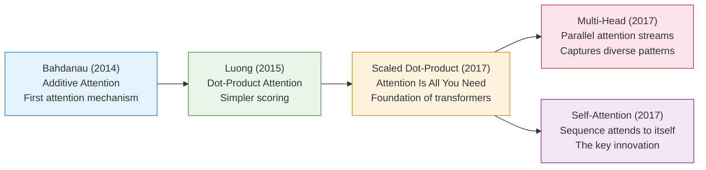

**4. Self-Attention Is the Building Block of Transformers**

Self-attention lets every token directly access every other token in O(1) path length, compared to O(n) for RNNs. This is why transformers handle long-range dependencies so much better.

**5. Multi-Head Attention Captures Multiple Relationship Types**

Different heads specialize in different patterns: local proximity, syntactic structure, coreference, semantic similarity. This ensemble-like behavior within a single layer is part of why transformers are so powerful.

**6. The KV Cache Is Critical for Inference**

Caching previously computed keys and values turns O(n^2) per-token generation into O(n) per token. But the KV cache itself grows linearly with sequence length and can consume hundreds of gigabytes for large models at long context lengths.

**7. Attention Has O(n^2) Cost**

The quadratic cost of attention in sequence length is the fundamental bottleneck that limits context windows. This motivates the efficient attention techniques we'll cover in Part 5.

### The Memory Perspective

From a memory standpoint, attention introduced something revolutionary: **learned, dynamic, content-based memory access**. Before attention:

- RNN memory was fixed-size and positionally-biased (recent > distant)
- Traditional databases required exact key matches

Attention gave us:
- **Variable-size** memory (as many slots as tokens)
- **Content-addressable** access (similarity-based, not position-based)
- **Differentiable** operations (can be trained end-to-end)
- **Parallel** access (read from all positions simultaneously)

This memory paradigm is the foundation for everything that follows in this series.

### What's Next: Part 4  Transformers and Context Windows

In Part 4, we'll take everything from this part and assemble it into a complete **transformer architecture**:

```
Part 4 Preview:
├── Positional encodings (how transformers know word order)
├── The complete transformer block (attention + feed-forward + norms)
├── Encoder-only (BERT), decoder-only (GPT), and encoder-decoder (T5)
├── Building a full transformer from scratch in PyTorch
├── Context windows: what they are and why they matter
├── How transformers actually process and generate text
└── The training process: pretraining, fine-tuning, RLHF
```

The attention mechanism you learned in this part is the engine. In Part 4, we'll build the car around it.

---

**Continue to Part 4: Transformers and Context Windows →**

---

*This article is part of the "Memory in AI Systems Deep Dive" series. For the complete series, start with [Part 0: What is Memory in AI?](ai-memory-deep-dive-part-0.md).*