# Memory in AI Systems Deep Dive  Part 4: Transformers and Context Windows  The Architecture That Changed Everything

---

**Series:** Memory in AI Systems  A Developer's Deep Dive from Fundamentals to Production
**Part:** 4 of 19
**Audience:** Developers with programming experience who want to understand AI memory systems from the ground up
**Reading time:** ~60 minutes

---

In Part 3, we built the attention mechanism from scratch  from Bahdanau's original additive attention through scaled dot-product attention and multi-head attention. We implemented KV caches, visualized attention patterns, and saw how attention acts as a dynamic memory access mechanism: queries search through keys to retrieve relevant values. We also explored the causal mask that prevents autoregressive models from seeing the future.

But attention alone is not a model. It's a component  like an engine without a chassis, wheels, or steering. In this part, we assemble the complete vehicle: the **Transformer architecture**. We'll build it piece by piece, understand every component, and see why this architecture  published in a single 2017 paper  replaced virtually every other approach in AI.

More critically for our series, we'll see how the Transformer is itself a memory system. Its context window is working memory. Its feed-forward networks store factual knowledge. Its attention heads perform dynamic information retrieval. Understanding these memory properties is essential for understanding why we need external memory systems (the subject of Parts 5-19).

By the end of this part, you will:

- Understand what AI looked like before transformers and why the field was stuck
- Build every component of the Transformer: positional encoding, feed-forward networks, layer normalization, residual connections
- Implement a **complete GPT-style transformer** from scratch in PyTorch
- Understand the **context window** as the model's working memory and why it's limited
- Know the differences between GPT (decoder-only), BERT (encoder-only), and T5 (encoder-decoder)
- Calculate parameter counts and understand what each parameter stores
- Train a **mini GPT on Shakespeare** that generates text
- See the Transformer as a unified memory system

Let's build.

---

## Table of Contents

1. [Before Transformers: The State of AI in 2017](#1-before-transformers-the-state-of-ai-in-2017)
2. [The Transformer Architecture: Bird's Eye View](#2-the-transformer-architecture-birds-eye-view)
3. [Positional Encoding: Teaching Order Without Recurrence](#3-positional-encoding-teaching-order-without-recurrence)
4. [The Feed-Forward Network: Where Knowledge Lives](#4-the-feed-forward-network-where-knowledge-lives)
5. [Layer Normalization and Residual Connections](#5-layer-normalization-and-residual-connections)
6. [Building a Complete Transformer from Scratch](#6-building-a-complete-transformer-from-scratch)
7. [The Context Window: The Transformer's Working Memory](#7-the-context-window-the-transformers-working-memory)
8. [How GPT-Style Models Work: Decoder-Only Transformers](#8-how-gpt-style-models-work-decoder-only-transformers)
9. [How BERT-Style Models Work: Encoder-Only Transformers](#9-how-bert-style-models-work-encoder-only-transformers)
10. [Encoder-Decoder: The Original Design](#10-encoder-decoder-the-original-design)
11. [Model Sizes and What Each Parameter Stores](#11-model-sizes-and-what-each-parameter-stores)
12. [The Transformer as a Memory System: A Unified View](#12-the-transformer-as-a-memory-system-a-unified-view)
13. [Project: Train a Mini GPT on Shakespeare](#13-project-train-a-mini-gpt-on-shakespeare)
14. [From Single Model to Modern AI Systems](#14-from-single-model-to-modern-ai-systems)
15. [Research Papers Explained for Developers](#15-research-papers-explained-for-developers)
16. [Vocabulary Cheat Sheet](#16-vocabulary-cheat-sheet)
17. [Key Takeaways and What's Next](#17-key-takeaways-and-whats-next)

---

## 1. Before Transformers: The State of AI in 2017

### The Dominant Paradigm: Recurrent Neural Networks

Before June 2017, if you wanted to build a system that processed sequences  translation, summarization, question answering, text generation  you used some variant of a Recurrent Neural Network. The landscape looked like this:

| Architecture | Year | Key Idea | Major Limitation |
|---|---|---|---|
| **Vanilla RNN** | 1986 | Process tokens sequentially, carry hidden state | Vanishing gradients, can't learn long dependencies |
| **LSTM** | 1997 | Gated memory cells to preserve long-term info | Still sequential, slow to train, ~500 token practical limit |
| **GRU** | 2014 | Simplified LSTM with fewer parameters | Same sequential bottleneck as LSTM |
| **Seq2Seq + Attention** | 2014-2015 | Attention over encoder states | Core is still an RNN  sequential, slow |
| **ConvS2S** | 2017 (pre-Transformer) | 1D convolutions instead of RNNs | Limited receptive field, stacking required for long range |

Every approach had the same fundamental problem: **sequential processing**. An RNN must process token 5 before it can process token 6, because token 6's hidden state depends on token 5's output. This creates three critical limitations:

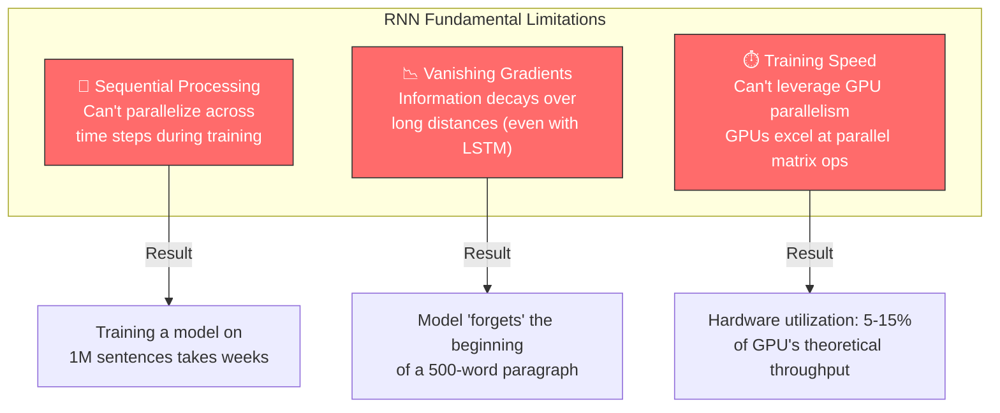

### The Sequential Bottleneck in Code

Let's see why RNNs can't be parallelized. Here's the fundamental issue:

```python
import numpy as np

def rnn_forward(tokens, W_h, W_x, b):
    """
    RNN forward pass  inherently sequential.

    Each step DEPENDS on the previous step's output.
    There is no way to compute h[t] without first computing h[t-1].
    """
    seq_len = len(tokens)
    hidden_size = W_h.shape[0]
    h = np.zeros(hidden_size)  # Initial hidden state

    hidden_states = []
    for t in range(seq_len):
        # h[t] = tanh(W_h @ h[t-1] + W_x @ tokens[t] + b)
        #                  ^^^^^^^^
        #                  This dependency makes parallelization impossible
        h = np.tanh(W_h @ h + W_x @ tokens[t] + b)
        hidden_states.append(h)

    return hidden_states

# For a sequence of 1000 tokens:
# - RNN: 1000 sequential steps (each ~0.1ms) = 100ms
# - Desired: Process all 1000 tokens in parallel = 0.1ms
# That's a 1000x speedup we're leaving on the table.
```

Compare this with what attention can do:

```python
def attention_forward(tokens, W_q, W_k, W_v):
    """
    Attention forward pass  fully parallelizable.

    Every position's output can be computed simultaneously
    because each position has access to ALL other positions
    through the attention matrix  no sequential dependency.
    """
    # All positions computed simultaneously  one big matrix multiply
    Q = tokens @ W_q  # [seq_len, d_model] @ [d_model, d_k] -> [seq_len, d_k]
    K = tokens @ W_k  # Same  all positions at once
    V = tokens @ W_v  # Same  all positions at once

    # Attention scores: all pairs computed in one matrix multiply
    scores = Q @ K.T / np.sqrt(Q.shape[-1])  # [seq_len, seq_len]

    # Softmax and weighted sum  also parallelizable
    weights = softmax(scores, axis=-1)
    output = weights @ V  # [seq_len, d_v]

    return output

# For a sequence of 1000 tokens:
# - Three matrix multiplies + one attention computation
# - All run in parallel on GPU
# - Total: ~0.5ms regardless of sequence length (up to GPU memory limits)
```

### The 2017 Breakthrough: "Attention Is All You Need"

In June 2017, a team of eight researchers at Google published a paper with one of the most consequential titles in computer science history: **"Attention Is All You Need"** (Vaswani et al., 2017).

The paper's core claim was radical: you don't need recurrence at all. You don't need convolutions. You can build a sequence model using **only** attention mechanisms  plus some feed-forward layers, normalization, and positional information. They called this architecture the **Transformer**.

The results were staggering:

| Metric | Previous Best (RNN/CNN) | Transformer | Improvement |
|---|---|---|---|
| **English-German BLEU** | 26.36 (Seq2Seq + Attention) | 28.4 | +2.0 BLEU |
| **English-French BLEU** | 41.0 (ConvS2S) | 41.8 | +0.8 BLEU (new SOTA) |
| **Training time (EN-DE)** | 3.5 days (8 GPUs) | 12 hours (8 GPUs) | **3.5x faster** |
| **Training cost** | $150K-$300K equiv. | ~$50K equiv. | **3-6x cheaper** |

But the BLEU scores weren't the real story. The real story was **scalability**. Because transformers can process all positions in parallel, they can leverage GPU parallelism in a way RNNs never could. This meant:

1. **You can train on more data.** RNN training was bounded by sequential processing time. Transformers could process the same data 10-100x faster.
2. **You can build bigger models.** Bigger RNNs gave diminishing returns because gradient flow degraded. Bigger transformers just kept getting better.
3. **You can scale both.** The combination of more data + bigger models followed a clean power law  the **scaling laws** that would later drive GPT-3, GPT-4, and Claude.

```
Timeline: The Transformer Revolution
═══════════════════════════════════════════════════════════════════

2017 Jun  ─── "Attention Is All You Need" published
              │  Original transformer: encoder-decoder for translation
              │  6 layers, 512 dim, 65M parameters
              │
2018 Jun  ─── GPT-1 (OpenAI)
              │  Decoder-only transformer for language modeling
              │  12 layers, 768 dim, 117M parameters
              │  Key idea: unsupervised pre-training + supervised fine-tuning
              │
2018 Oct  ─── BERT (Google)
              │  Encoder-only transformer for understanding
              │  12/24 layers, 768/1024 dim, 110M/340M parameters
              │  Key idea: bidirectional, masked language modeling
              │
2019 Feb  ─── GPT-2 (OpenAI)
              │  Scaled-up decoder-only transformer
              │  48 layers, 1600 dim, 1.5B parameters
              │  Key finding: "Language models are unsupervised multitask learners"
              │
2019 Oct  ─── T5 (Google)
              │  Encoder-decoder, "Text-to-Text Transfer Transformer"
              │  Up to 11B parameters
              │  Key idea: every NLP task is text-to-text
              │
2020 May  ─── GPT-3 (OpenAI)
              │  Massive decoder-only transformer
              │  96 layers, 12288 dim, 175B parameters
              │  Key finding: "in-context learning"  few-shot without fine-tuning
              │
2022 Mar  ─── Chinchilla (DeepMind)
              │  Proved most LLMs were undertrained
              │  70B parameters, but trained on 4x more data than GPT-3
              │  Key finding: compute-optimal scaling laws
              │
2023+     ─── GPT-4, Claude, Gemini, Llama, Mistral, ...
              │  Mixture of Experts, RLHF, tool use, multimodal
              │  All built on the same transformer foundation
              ▼
         Every major AI model today is a Transformer.
```

The Transformer didn't just improve translation. It replaced **everything**:

- **Machine translation:** Transformers replaced RNN seq2seq
- **Text classification:** BERT replaced LSTMs
- **Text generation:** GPT replaced autoregressive RNNs
- **Speech recognition:** Whisper (transformer) replaced CTC-RNNs
- **Computer vision:** ViT (Vision Transformer) challenged CNNs
- **Protein folding:** AlphaFold2 uses transformer attention
- **Code generation:** Codex/Copilot/Claude are all transformers
- **Music, video, robotics:** All moving to transformer architectures

Let's understand why.

---

## 2. The Transformer Architecture: Bird's Eye View

### The Original Architecture

The original Transformer had two halves: an **encoder** that reads the input and a **decoder** that generates the output. Here's the complete architecture:

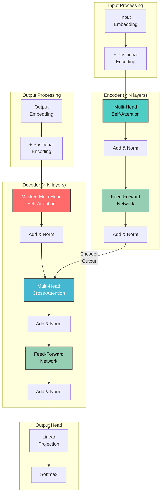

But the original encoder-decoder design was just the beginning. The architecture split into three variants that dominate modern AI:

### The Three Transformer Variants

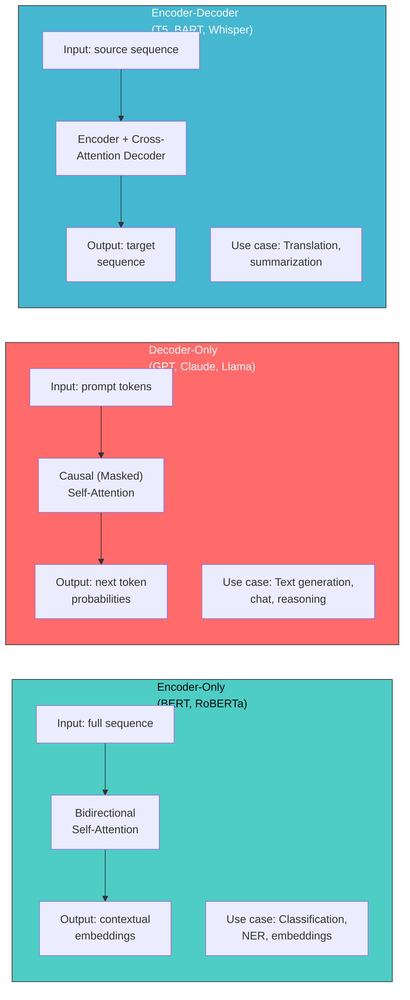

| Variant | Attention Type | Sees Future? | Primary Use | Examples |
|---|---|---|---|---|
| **Encoder-Only** | Bidirectional self-attention | Yes (sees full input) | Understanding, classification, embeddings | BERT, RoBERTa, DeBERTa |
| **Decoder-Only** | Causal (masked) self-attention | No (only sees past) | Text generation, reasoning | GPT-2/3/4, Claude, Llama, Mistral |
| **Encoder-Decoder** | Bidirectional (encoder) + causal + cross (decoder) | Encoder: yes, Decoder: no | Translation, summarization, seq2seq tasks | T5, BART, mBART, Whisper |

**The modern trend is decoder-only.** GPT-4, Claude, Llama, Mistral, Gemini  they're all decoder-only transformers. It turns out that a sufficiently large decoder-only model can learn to do everything the other variants do, with a simpler architecture. We'll explore why in later sections.

For the rest of this article, we'll build a **decoder-only transformer** (the GPT architecture) as our primary implementation, then discuss the differences with BERT and encoder-decoder models.

---

## 3. Positional Encoding: Teaching Order Without Recurrence

### The Problem: Attention Has No Sense of Order

Here's something subtle that might not be obvious: the attention mechanism we built in Part 3 treats the input as a **set**, not a **sequence**. If you shuffle the input tokens, the attention outputs change  but only because the values being attended to have moved, not because the model "knows" that position 0 comes before position 1.

To see why, consider self-attention on two sentences:

```
Sentence A: "The cat sat on the mat"
Sentence B: "mat the on sat cat The"   (reversed word order)
```

In a pure attention mechanism without positional information, if we permute the input tokens, we get the same outputs  just permuted in the same way. The model has no way to distinguish "The cat sat" from "sat cat The."

```python
import numpy as np

def demonstrate_position_invariance():
    """
    Show that pure attention is permutation-equivariant:
    shuffling the input just shuffles the output.
    """
    np.random.seed(42)
    seq_len, d_model = 4, 8
    X = np.random.randn(seq_len, d_model)

    W_q = np.random.randn(d_model, d_model) * 0.1
    W_k = np.random.randn(d_model, d_model) * 0.1
    W_v = np.random.randn(d_model, d_model) * 0.1

    def attention(X):
        Q, K, V = X @ W_q, X @ W_k, X @ W_v
        scores = Q @ K.T / np.sqrt(d_model)
        weights = np.exp(scores) / np.exp(scores).sum(axis=-1, keepdims=True)
        return weights @ V

    output_original = attention(X)
    perm = [2, 1, 0, 3]
    output_shuffled = attention(X[perm])

    diff = np.abs(output_shuffled - output_original[perm]).max()
    print(f"Max difference: {diff:.10f}")
    print(f"They're {'identical' if diff < 1e-8 else 'different'}!")
    print("Without positional encoding, 'the cat sat' = 'sat cat the'")

demonstrate_position_invariance()
# Output: Max difference: 0.0000000000  They're identical!
```

RNNs naturally encode position because they process tokens sequentially  token 5's representation is built on top of tokens 1-4. But transformers process all tokens in parallel. We need to **explicitly inject** position information.

### Sinusoidal Positional Encoding (Original Paper)

The original "Attention Is All You Need" paper proposed a clever solution: add a unique, fixed pattern to each position using sine and cosine functions of different frequencies.

The formula:

```
PE(pos, 2i)     = sin(pos / 10000^(2i/d_model))
PE(pos, 2i+1)   = cos(pos / 10000^(2i/d_model))
```

Where `pos` is the position in the sequence (0, 1, 2, ...) and `i` is the dimension index.

**Why sines and cosines?** The key insight is that for any fixed offset `k`, there exists a linear transformation that maps `PE(pos)` to `PE(pos + k)`. This means the model can learn relative positions by learning this linear transformation. The sinusoidal functions give the model a smooth, continuous representation of position that generalizes to sequences longer than those seen during training.

```python
import numpy as np

def sinusoidal_positional_encoding(max_seq_len, d_model):
    """
    Compute sinusoidal positional encodings.

    Each position gets a unique "fingerprint" vector. Different dimensions
    oscillate at different frequencies  like a binary counter with smooth waves:
    - Low dimensions: oscillate fast (encode fine-grained position)
    - High dimensions: oscillate slowly (encode coarse position)

    Args:
        max_seq_len: Maximum sequence length to encode
        d_model: Dimension of the model's embeddings
    Returns:
        PE matrix of shape [max_seq_len, d_model]
    """
    PE = np.zeros((max_seq_len, d_model))
    position = np.arange(max_seq_len).reshape(-1, 1)
    dim_indices = np.arange(0, d_model, 2)

    # 10000^(2i/d_model), computed via log for stability
    div_term = np.exp(dim_indices * -(np.log(10000.0) / d_model))

    PE[:, 0::2] = np.sin(position * div_term)  # Even dims: sin
    PE[:, 1::2] = np.cos(position * div_term)  # Odd dims: cos
    return PE

# Generate and visualize
PE = sinusoidal_positional_encoding(max_seq_len=100, d_model=64)

print("First 8 positions, first 8 dimensions:")
print("Pos  | dim0    dim1    dim2    dim3    dim4    dim5    dim6    dim7")
print("-" * 75)
for pos in range(8):
    vals = " ".join(f"{PE[pos, d]:>7.4f}" for d in range(8))
    print(f"  {pos}  | {vals}")

# Verify the relative position property:
# Dot product between PE[pos] and PE[pos+k] depends only on k, not pos
print(f"\nRelative position property (dot products for gap k=5):")
for pos in [0, 10, 20, 50]:
    dot = np.dot(PE[pos], PE[pos + 5])
    print(f"  PE[{pos}] · PE[{pos+5}] = {dot:.4f}")
print("  (Approximately equal  depends only on the gap, not absolute position)")
```

### Rotary Position Embeddings (RoPE): The Modern Standard

Sinusoidal encodings work, but modern models have largely moved to **Rotary Position Embeddings (RoPE)**, introduced by Su et al. (2021). RoPE has become the standard in Llama, Mistral, Claude, and most modern LLMs.

The key idea: instead of *adding* position information to embeddings, RoPE *rotates* the query and key vectors based on their position. This directly encodes relative position into the attention score computation.

**The math:** For each pair of dimensions (2i, 2i+1), RoPE applies a rotation matrix:

```
[q_{2i}  ]     [cos(m·θᵢ)  -sin(m·θᵢ)] [q_{2i}  ]
[q_{2i+1}]  =  [sin(m·θᵢ)   cos(m·θᵢ)] [q_{2i+1}]
```

Where `m` is the position and `θᵢ = 10000^(-2i/d)`.

The critical property: when you compute the dot product `q_m · k_n`, the rotation angles combine to give a term that depends only on the **relative distance** `(m - n)`, not on the absolute positions.

```python
import numpy as np

def precompute_rope_frequencies(d_model, max_seq_len, base=10000.0):
    """
    Precompute the rotation frequencies for RoPE.

    Each pair of dimensions gets a different rotation speed (frequency).
    Lower dimensions rotate faster; higher dimensions rotate slower.
    This creates a multi-scale representation of position.

    Args:
        d_model: Model dimension (must be even)
        max_seq_len: Maximum sequence length
        base: Base for the frequency computation (default: 10000)

    Returns:
        cos_cache: [max_seq_len, d_model] cosine values
        sin_cache: [max_seq_len, d_model] sine values
    """
    assert d_model % 2 == 0, "d_model must be even for RoPE"

    # Compute frequencies for each dimension pair
    # θᵢ = base^(-2i/d) for i in [0, 1, ..., d/2-1]
    dim_indices = np.arange(0, d_model, 2)  # [0, 2, 4, ..., d-2]
    freqs = 1.0 / (base ** (dim_indices / d_model))  # [d_model/2]

    # Compute rotation angles for each position
    positions = np.arange(max_seq_len)  # [0, 1, 2, ..., max_seq_len-1]
    angles = np.outer(positions, freqs)  # [max_seq_len, d_model/2]

    # We need cos and sin for each angle, repeated for the pair
    cos_cache = np.cos(angles)  # [max_seq_len, d_model/2]
    sin_cache = np.sin(angles)  # [max_seq_len, d_model/2]

    return cos_cache, sin_cache

def apply_rope(x, cos_cache, sin_cache):
    """
    Apply Rotary Position Embeddings to a tensor.

    For each pair of dimensions (x[..., 2i], x[..., 2i+1]),
    apply a 2D rotation by angle θᵢ * position.

    This is equivalent to multiplying by a block-diagonal rotation matrix,
    but implemented efficiently without constructing the full matrix.

    Args:
        x: Input tensor [batch, seq_len, d_model] or [seq_len, d_model]
        cos_cache: Precomputed cosines [seq_len, d_model/2]
        sin_cache: Precomputed sines [seq_len, d_model/2]

    Returns:
        Rotated tensor, same shape as input
    """
    # Split into even and odd dimensions
    d = x.shape[-1]
    x_even = x[..., 0::2]  # x[..., 0], x[..., 2], x[..., 4], ...
    x_odd  = x[..., 1::2]  # x[..., 1], x[..., 3], x[..., 5], ...

    seq_len = x.shape[-2] if x.ndim > 1 else x.shape[0]
    cos = cos_cache[:seq_len]  # [seq_len, d_model/2]
    sin = sin_cache[:seq_len]  # [seq_len, d_model/2]

    # Handle batch dimension
    if x.ndim == 3:
        cos = cos[np.newaxis, :, :]  # [1, seq_len, d_model/2]
        sin = sin[np.newaxis, :, :]

    # Apply rotation:
    # x_even_new = x_even * cos - x_odd * sin
    # x_odd_new  = x_even * sin + x_odd * cos
    x_even_new = x_even * cos - x_odd * sin
    x_odd_new  = x_even * sin + x_odd * cos

    # Interleave back: [even0, odd0, even1, odd1, ...]
    result = np.zeros_like(x)
    result[..., 0::2] = x_even_new
    result[..., 1::2] = x_odd_new

    return result

# Demonstrate RoPE
d_model = 8
max_len = 20

cos_cache, sin_cache = precompute_rope_frequencies(d_model, max_len)

# Create sample query and key vectors at different positions
np.random.seed(42)
q_base = np.random.randn(1, d_model)  # Same base vector
k_base = np.random.randn(1, d_model)  # Same base vector

print("RoPE Demonstration")
print("=" * 60)
print(f"\nBase query vector: {q_base[0, :4]}...")
print(f"Base key vector:   {k_base[0, :4]}...")

print("\nDot products between q at position m and k at position n:")
print("(Should depend only on m-n, not on absolute positions)")
print()
print("m\\n |", "  ".join(f"n={n}" for n in range(5)))
print("-" * 50)

for m in range(5):
    dots = []
    for n in range(5):
        # Place q at position m, k at position n
        q_at_m = q_base.copy().reshape(1, 1, d_model)
        k_at_n = k_base.copy().reshape(1, 1, d_model)

        # Create position-specific caches
        cos_m = cos_cache[m:m+1]
        sin_m = sin_cache[m:m+1]
        cos_n = cos_cache[n:n+1]
        sin_n = sin_cache[n:n+1]

        q_rotated = apply_rope(q_at_m, cos_m, sin_m)
        k_rotated = apply_rope(k_at_n, cos_n, sin_n)

        dot = np.dot(q_rotated.flatten(), k_rotated.flatten())
        dots.append(f"{dot:>6.2f}")
    print(f"m={m} |", "  ".join(dots))

print()
print("Notice: values along each diagonal (same m-n) are similar.")
print("RoPE makes attention scores naturally encode relative distance.")
```

### Sinusoidal vs. RoPE: When to Use Which

| Property | Sinusoidal PE | RoPE |
|---|---|---|
| **How applied** | Added to embeddings | Applied to Q and K via rotation |
| **Position type** | Absolute | Relative (via rotation) |
| **Learned?** | No (fixed) | No (fixed), but some variants are partially learned |
| **Extrapolation** | Moderate (but degrades) | Better with NTK-aware scaling |
| **Used in** | Original Transformer, small models | Llama, Mistral, Claude, most modern LLMs |
| **Computational cost** | Negligible (one addition) | Small (rotation per attention layer) |
| **Key advantage** | Simple | Relative position baked into attention scores |

> **For this series:** We'll use sinusoidal encoding in our implementations for clarity, but know that production models almost universally use RoPE or a variant of it.

---

## 4. The Feed-Forward Network: Where Knowledge Lives

### What the FFN Does

Every transformer layer has two sub-layers: an attention mechanism and a **feed-forward network (FFN)**. While attention gets most of the spotlight, the FFN is arguably where the "knowledge" lives.

The attention mechanism determines *which* tokens to mix information between. The FFN then processes each token's representation *independently*, applying the same transformation to every position. Think of it this way:

- **Attention:** "This token is about 'Paris,' and it's in the context of 'capital of ___'"
- **FFN:** "When I see the pattern 'capital of [country]', I should activate the knowledge that maps countries to capitals"

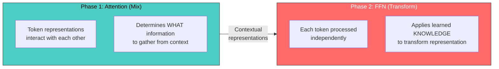

Research has shown that FFN layers act as **key-value memories** (Geva et al., 2021). Each neuron in the first layer activates for specific input patterns, and the corresponding row in the second layer stores the "value"  the knowledge associated with that pattern.

### The Standard FFN: Two Linear Layers with Activation

The FFN in the original transformer is straightforward:

```
FFN(x) = W₂ · activation(W₁ · x + b₁) + b₂
```

Where:
- `W₁` projects from `d_model` to `d_ff` (typically `d_ff = 4 × d_model`)
- The activation function introduces non-linearity
- `W₂` projects back from `d_ff` to `d_model`

The expansion to 4x the dimension is critical: it gives the network a much larger "workspace" to perform computations before compressing back.

```python
import numpy as np

class FeedForwardNetwork:
    """
    The Feed-Forward Network (FFN) used in each transformer layer.

    Architecture: x -> Linear(d_model, d_ff) -> Activation -> Linear(d_ff, d_model)

    The FFN processes each position independently (same weights for all positions).
    It acts as a "knowledge retrieval" mechanism:
    - W1 activates "patterns" (like key lookup in a memory)
    - W2 retrieves "knowledge" associated with those patterns (like value retrieval)

    The 4x expansion (d_ff = 4 * d_model) gives the network a large intermediate
    space to store and retrieve factual knowledge.
    """

    def __init__(self, d_model, d_ff=None):
        self.d_model = d_model
        self.d_ff = d_ff or 4 * d_model

        # Xavier initialization
        scale1 = np.sqrt(2.0 / (d_model + self.d_ff))
        scale2 = np.sqrt(2.0 / (self.d_ff + d_model))

        self.W1 = np.random.randn(d_model, self.d_ff) * scale1
        self.b1 = np.zeros(self.d_ff)
        self.W2 = np.random.randn(self.d_ff, d_model) * scale2
        self.b2 = np.zeros(d_model)

    def relu(self, x):
        """Original transformer used ReLU."""
        return np.maximum(0, x)

    def gelu(self, x):
        """
        GELU (Gaussian Error Linear Unit)  used in GPT-2, BERT.

        Unlike ReLU which hard-clips at 0, GELU smoothly gates values
        based on their magnitude. Small negative values get partially
        passed through, which helps gradient flow.

        Approximation: GELU(x) ≈ 0.5 * x * (1 + tanh(√(2/π) * (x + 0.044715 * x³)))
        """
        return 0.5 * x * (1 + np.tanh(np.sqrt(2 / np.pi) * (x + 0.044715 * x**3)))

    def forward(self, x, activation="gelu"):
        """
        Forward pass.

        Args:
            x: Input tensor [batch, seq_len, d_model] or [seq_len, d_model]
            activation: Which activation to use ("relu" or "gelu")

        Returns:
            Output tensor, same shape as input
        """
        # Step 1: Project up to d_ff dimensions
        hidden = x @ self.W1 + self.b1  # [*, seq_len, d_ff]

        # Step 2: Apply non-linearity
        if activation == "gelu":
            hidden = self.gelu(hidden)
        else:
            hidden = self.relu(hidden)

        # Step 3: Project back down to d_model
        output = hidden @ self.W2 + self.b2  # [*, seq_len, d_model]

        return output

# Demonstrate
np.random.seed(42)
d_model = 64
d_ff = 256  # 4x expansion

ffn = FeedForwardNetwork(d_model, d_ff)

# Process a batch of sequences
batch_size, seq_len = 2, 10
x = np.random.randn(batch_size, seq_len, d_model)
output = ffn.forward(x)

print("Feed-Forward Network:")
print(f"  Input shape:      {x.shape}")
print(f"  Hidden shape:     ({batch_size}, {seq_len}, {d_ff})  <- 4x expansion")
print(f"  Output shape:     {output.shape}")
print(f"  Parameters in W1: {ffn.W1.size:,} ({d_model} × {d_ff})")
print(f"  Parameters in W2: {ffn.W2.size:,} ({d_ff} × {d_model})")
print(f"  Parameters in b1: {ffn.b1.size:,}")
print(f"  Parameters in b2: {ffn.b2.size:,}")
print(f"  Total parameters: {ffn.W1.size + ffn.W2.size + ffn.b1.size + ffn.b2.size:,}")
print()
print(f"  FFN parameters are typically ~2/3 of each layer's total parameters!")
print(f"  (Attention has W_Q, W_K, W_V, W_O = 4 × {d_model}×{d_model} = {4*d_model*d_model:,}")
print(f"   FFN has W1 + W2 = {d_model}×{d_ff} + {d_ff}×{d_model} = {2*d_model*d_ff:,})")
```

### GELU vs. ReLU

- **ReLU:** Hard cutoff at 0. Gradient is exactly 0 for x < 0 (dead neurons).
- **GELU:** Smooth curve. Small negatives get a non-zero output. Slightly outperforms ReLU across NLP tasks.
- **GELU formula:** `GELU(x) = 0.5 * x * (1 + tanh(sqrt(2/pi) * (x + 0.044715 * x^3)))`

Modern transformers (GPT-2+, BERT) all use GELU instead of ReLU.

### SwiGLU: The State-of-the-Art FFN Variant

Modern LLMs (Llama 2/3, Mistral, most 2023+ models) use **SwiGLU** (Shazeer, 2020), a gated variant that combines the Swish activation with a Gated Linear Unit:

```
SwiGLU(x) = (Swish(xW₁) ⊙ xW₃) W₂
```

Where `⊙` is element-wise multiplication and `Swish(x) = x · σ(x)`.

The key change: instead of two weight matrices, SwiGLU uses **three**. The third matrix creates a "gate" that controls how much of each feature passes through.

```python
import numpy as np

class SwiGLUFeedForward:
    """
    SwiGLU Feed-Forward Network  used in Llama 2, Llama 3, Mistral.

    Instead of:  FFN(x) = W2(GELU(W1(x)))
    SwiGLU does: FFN(x) = W2(Swish(W_gate(x)) ⊙ W_up(x))

    The gating mechanism allows the network to learn which features
    to pass through, giving it more expressive power per parameter.

    To keep parameter count similar to standard FFN, the hidden dim
    is typically reduced: d_ff = (2/3) * 4 * d_model, rounded to
    nearest multiple of 256 for efficiency.
    """

    def __init__(self, d_model, d_ff=None):
        self.d_model = d_model
        # Adjusted hidden dim to keep parameter count similar
        # Standard FFN: 2 * d_model * d_ff = 2 * d_model * 4 * d_model = 8 * d_model^2
        # SwiGLU: 3 * d_model * d_ff, so d_ff ≈ (8/3) * d_model ≈ 2.67 * d_model
        self.d_ff = d_ff or int(2 * (4 * d_model) / 3)
        # Round to nearest 64 for GPU efficiency
        self.d_ff = ((self.d_ff + 63) // 64) * 64

        # Three weight matrices instead of two
        scale = np.sqrt(2.0 / (d_model + self.d_ff))
        self.W_gate = np.random.randn(d_model, self.d_ff) * scale  # Gate projection
        self.W_up   = np.random.randn(d_model, self.d_ff) * scale  # Up projection
        self.W_down = np.random.randn(self.d_ff, d_model) * scale  # Down projection

    def swish(self, x, beta=1.0):
        """
        Swish activation: x * sigmoid(beta * x)
        Also called SiLU (Sigmoid Linear Unit).
        Smooth approximation to ReLU with better gradient properties.
        """
        return x * (1.0 / (1.0 + np.exp(-beta * x)))

    def forward(self, x):
        """
        Forward pass with SwiGLU.

        1. Gate path: project x and apply Swish activation
        2. Up path: project x (no activation)
        3. Multiply gate and up paths element-wise (the "gating")
        4. Project back down to d_model
        """
        gate = self.swish(x @ self.W_gate)  # [*, seq_len, d_ff]
        up = x @ self.W_up                   # [*, seq_len, d_ff]
        hidden = gate * up                    # Element-wise gating
        output = hidden @ self.W_down         # [*, seq_len, d_model]
        return output

# Compare parameter counts
np.random.seed(42)
d_model = 512

standard_ffn = FeedForwardNetwork(d_model, 4 * d_model)
swiglu_ffn = SwiGLUFeedForward(d_model)

standard_params = (standard_ffn.W1.size + standard_ffn.W2.size +
                   standard_ffn.b1.size + standard_ffn.b2.size)
swiglu_params = (swiglu_ffn.W_gate.size + swiglu_ffn.W_up.size +
                 swiglu_ffn.W_down.size)

print("FFN Variant Comparison")
print("=" * 50)
print(f"{'':>20} {'Standard':>12} {'SwiGLU':>12}")
print("-" * 50)
print(f"{'d_model':>20} {d_model:>12} {d_model:>12}")
print(f"{'d_ff':>20} {4*d_model:>12} {swiglu_ffn.d_ff:>12}")
print(f"{'Num weight matrices':>20} {'2':>12} {'3':>12}")
print(f"{'Total parameters':>20} {standard_params:>12,} {swiglu_params:>12,}")
print(f"{'Ratio':>20} {'1.00x':>12} {swiglu_params/standard_params:.2f}x")
print()
print("SwiGLU achieves better performance with similar parameter counts")
print("by using gating to selectively activate features.")
```

---

## 5. Layer Normalization and Residual Connections

### Why We Need Both

Training deep neural networks (12, 24, 96+ layers) is hard. Two techniques make it possible:

1. **Residual connections** (He et al., 2015): Add the input of a sub-layer to its output, creating a "skip connection." This lets gradients flow directly backward through the network.

2. **Layer normalization** (Ba et al., 2016): Normalize the activations to have zero mean and unit variance. This stabilizes training by preventing the activations from growing or shrinking exponentially through layers.

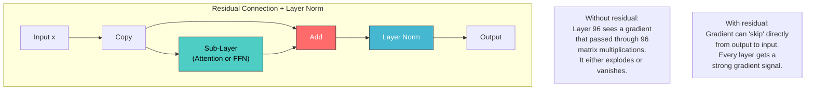

### Layer Normalization Implementation

```python
import numpy as np

class LayerNorm:
    """
    Layer Normalization  normalizes across the feature dimension.

    Unlike Batch Normalization (which normalizes across the batch dimension),
    Layer Norm normalizes each sample independently. This is critical for:
    1. Variable-length sequences (batch norm would be affected by padding)
    2. Autoregressive generation (batch size of 1 at inference time)
    3. Stability with varying batch sizes

    Formula: LN(x) = γ * (x - μ) / √(σ² + ε) + β

    Where μ and σ² are computed across the feature dimension (last dim),
    and γ (scale) and β (shift) are learnable parameters.
    """

    def __init__(self, d_model, eps=1e-5):
        self.d_model = d_model
        self.eps = eps
        # Learnable parameters
        self.gamma = np.ones(d_model)    # Scale (initialized to 1)
        self.beta = np.zeros(d_model)    # Shift (initialized to 0)

    def forward(self, x):
        """
        Normalize across the last dimension.

        Args:
            x: Input tensor [..., d_model]

        Returns:
            Normalized tensor, same shape
        """
        # Compute mean and variance across last dimension
        mean = x.mean(axis=-1, keepdims=True)     # [..., 1]
        var = x.var(axis=-1, keepdims=True)         # [..., 1]

        # Normalize
        x_norm = (x - mean) / np.sqrt(var + self.eps)

        # Scale and shift with learnable parameters
        return self.gamma * x_norm + self.beta

# Demonstrate: inputs with wildly different scales get normalized
x = np.array([[100.0, -50.0, 200.0, -150.0, 75.0, -25.0, 180.0, -80.0],
              [0.01, 0.02, -0.01, 0.03, -0.02, 0.01, -0.03, 0.02]])

ln = LayerNorm(8)
x_normed = ln.forward(x)
# Both samples now have ~zero mean and ~unit variance,
# regardless of their original scale. This stabilizes training.
```

### Pre-Norm vs. Post-Norm

The original transformer uses **Post-Norm**: normalize *after* the residual addition.
Modern transformers use **Pre-Norm**: normalize *before* the sub-layer.

```python
def post_norm_block(x, sublayer_fn, layer_norm):
    """Post-Norm (Original 2017): output = LayerNorm(x + Sublayer(x))"""
    return layer_norm.forward(x + sublayer_fn(x))

def pre_norm_block(x, sublayer_fn, layer_norm):
    """Pre-Norm (GPT-2+, Llama, modern): output = x + Sublayer(LayerNorm(x))"""
    return x + sublayer_fn(layer_norm.forward(x))
```

```
Post-Norm (Original):          Pre-Norm (Modern):

    x ─────────┐                  x ─────────┐
    │           │                  │           │
    ▼           │                  ▼           │
  Sublayer      │              LayerNorm       │
    │           │                  │           │
    ▼           │                  ▼           │
   Add ◄────────┘              Sublayer        │
    │                              │           │
    ▼                              ▼           │
  LayerNorm                       Add ◄────────┘
    │                              │
    ▼                              ▼
  output                        output
```

Pre-Norm advantage: the residual path is "clean"  gradients flow through addition only, not through LayerNorm. This is why GPT-2+ and all modern LLMs use Pre-Norm.

### The Complete Transformer Block

Now we can assemble attention + FFN + layer norm + residuals into a complete transformer block:

```python
import numpy as np

class TransformerBlock:
    """
    A single Transformer block (Pre-Norm variant, GPT-style).

    Architecture:
        x → LayerNorm → MultiHeadAttention → + residual →
          → LayerNorm → FFN → + residual → output

    This is the fundamental repeating unit of a transformer.
    Stack N of these blocks to build the full model.
    """

    def __init__(self, d_model, n_heads, d_ff=None, dropout_rate=0.1):
        self.d_model = d_model
        self.n_heads = n_heads
        self.d_ff = d_ff or 4 * d_model
        self.d_k = d_model // n_heads

        # Layer norms
        self.ln1 = LayerNorm(d_model)  # Before attention
        self.ln2 = LayerNorm(d_model)  # Before FFN

        # Multi-head attention weights
        scale = np.sqrt(2.0 / (d_model + self.d_k))
        self.W_Q = np.random.randn(d_model, d_model) * scale
        self.W_K = np.random.randn(d_model, d_model) * scale
        self.W_V = np.random.randn(d_model, d_model) * scale
        self.W_O = np.random.randn(d_model, d_model) * scale

        # Feed-forward network
        self.ffn = FeedForwardNetwork(d_model, self.d_ff)

    def attention(self, x, mask=None):
        """Multi-head self-attention."""
        batch_size, seq_len, _ = x.shape

        # Project to Q, K, V
        Q = x @ self.W_Q  # [batch, seq, d_model]
        K = x @ self.W_K
        V = x @ self.W_V

        # Reshape for multi-head: [batch, seq, d_model] -> [batch, n_heads, seq, d_k]
        Q = Q.reshape(batch_size, seq_len, self.n_heads, self.d_k).transpose(0, 2, 1, 3)
        K = K.reshape(batch_size, seq_len, self.n_heads, self.d_k).transpose(0, 2, 1, 3)
        V = V.reshape(batch_size, seq_len, self.n_heads, self.d_k).transpose(0, 2, 1, 3)

        # Scaled dot-product attention
        scores = (Q @ K.transpose(0, 1, 3, 2)) / np.sqrt(self.d_k)

        if mask is not None:
            scores = np.where(mask == 0, -1e9, scores)

        # Softmax
        exp_scores = np.exp(scores - scores.max(axis=-1, keepdims=True))
        weights = exp_scores / exp_scores.sum(axis=-1, keepdims=True)

        # Weighted sum
        attn_output = weights @ V  # [batch, n_heads, seq, d_k]

        # Reshape back: [batch, n_heads, seq, d_k] -> [batch, seq, d_model]
        attn_output = attn_output.transpose(0, 2, 1, 3).reshape(batch_size, seq_len, self.d_model)

        # Output projection
        return attn_output @ self.W_O

    def forward(self, x, mask=None):
        """
        Forward pass through the transformer block.

        Pre-Norm architecture:
        1. LayerNorm → Attention → Add residual
        2. LayerNorm → FFN → Add residual
        """
        # Sub-layer 1: Multi-head self-attention with residual
        normed = self.ln1.forward(x)
        attn_out = self.attention(normed, mask=mask)
        x = x + attn_out  # Residual connection

        # Sub-layer 2: FFN with residual
        normed = self.ln2.forward(x)
        ffn_out = self.ffn.forward(normed)
        x = x + ffn_out  # Residual connection

        return x

# Usage: stack N blocks to build a full transformer
np.random.seed(42)
block = TransformerBlock(d_model=64, n_heads=4)
mask = np.tril(np.ones((10, 10))).reshape(1, 1, 10, 10)
x = np.random.randn(2, 10, 64)
output = block.forward(x, mask=mask)  # [2, 10, 64]  same shape as input

# Parameter breakdown per block (d_model=64, d_ff=256):
#   Attention (W_Q, W_K, W_V, W_O): 16,384
#   FFN (W1, b1, W2, b2):           33,088
#   Layer Norms (2 × (γ + β)):        256
#   Total per block:                 49,728
# Note: FFN is ~2/3 of each block's parameters
```

---

## 6. Building a Complete Transformer from Scratch

Now we assemble all the components into a complete, working transformer. This is a GPT-style decoder-only model implemented in PyTorch.

```python
import torch
import torch.nn as nn
import torch.nn.functional as F
import math

class MultiHeadSelfAttention(nn.Module):
    """Multi-head self-attention with causal masking."""

    def __init__(self, d_model, n_heads, max_seq_len=2048, dropout=0.1):
        super().__init__()
        assert d_model % n_heads == 0, "d_model must be divisible by n_heads"

        self.d_model = d_model
        self.n_heads = n_heads
        self.d_k = d_model // n_heads

        # Q, K, V projections (combined into single matrix for efficiency)
        self.qkv_proj = nn.Linear(d_model, 3 * d_model, bias=False)
        # Output projection
        self.out_proj = nn.Linear(d_model, d_model, bias=False)

        self.dropout = nn.Dropout(dropout)

        # Register causal mask as a buffer (not a parameter)
        # This prevents the model from attending to future positions
        mask = torch.tril(torch.ones(max_seq_len, max_seq_len))
        self.register_buffer('mask', mask.view(1, 1, max_seq_len, max_seq_len))

    def forward(self, x):
        """
        Args:
            x: [batch_size, seq_len, d_model]
        Returns:
            [batch_size, seq_len, d_model]
        """
        B, T, C = x.shape  # batch, sequence length, d_model

        # Compute Q, K, V in one matrix multiply
        qkv = self.qkv_proj(x)  # [B, T, 3*C]
        q, k, v = qkv.chunk(3, dim=-1)  # Each: [B, T, C]

        # Reshape for multi-head attention
        # [B, T, C] -> [B, T, n_heads, d_k] -> [B, n_heads, T, d_k]
        q = q.view(B, T, self.n_heads, self.d_k).transpose(1, 2)
        k = k.view(B, T, self.n_heads, self.d_k).transpose(1, 2)
        v = v.view(B, T, self.n_heads, self.d_k).transpose(1, 2)

        # Attention scores
        scores = (q @ k.transpose(-2, -1)) / math.sqrt(self.d_k)

        # Apply causal mask (zero out future positions)
        scores = scores.masked_fill(self.mask[:, :, :T, :T] == 0, float('-inf'))

        # Softmax and dropout
        weights = F.softmax(scores, dim=-1)
        weights = self.dropout(weights)

        # Weighted sum of values
        out = weights @ v  # [B, n_heads, T, d_k]

        # Reshape back: [B, n_heads, T, d_k] -> [B, T, d_model]
        out = out.transpose(1, 2).contiguous().view(B, T, C)

        # Output projection
        return self.out_proj(out)


class FeedForward(nn.Module):
    """Position-wise feed-forward network with GELU activation."""

    def __init__(self, d_model, d_ff=None, dropout=0.1):
        super().__init__()
        d_ff = d_ff or 4 * d_model

        self.net = nn.Sequential(
            nn.Linear(d_model, d_ff),
            nn.GELU(),
            nn.Linear(d_ff, d_model),
            nn.Dropout(dropout),
        )

    def forward(self, x):
        return self.net(x)


class TransformerBlock(nn.Module):
    """Single transformer block with pre-norm architecture."""

    def __init__(self, d_model, n_heads, d_ff=None, max_seq_len=2048, dropout=0.1):
        super().__init__()

        self.ln1 = nn.LayerNorm(d_model)
        self.attn = MultiHeadSelfAttention(d_model, n_heads, max_seq_len, dropout)
        self.ln2 = nn.LayerNorm(d_model)
        self.ffn = FeedForward(d_model, d_ff, dropout)

    def forward(self, x):
        # Pre-norm: normalize before sublayer, add residual after
        x = x + self.attn(self.ln1(x))
        x = x + self.ffn(self.ln2(x))
        return x


class GPT(nn.Module):
    """
    A complete GPT-style Transformer Language Model.

    Architecture:
        Token Embedding + Positional Embedding
        → N × TransformerBlock
        → LayerNorm
        → Linear (output projection, tied with token embedding)
        → Logits over vocabulary

    This is a simplified but complete implementation that matches
    the core architecture of GPT-2 / nanoGPT.
    """

    def __init__(self, vocab_size, d_model, n_heads, n_layers,
                 max_seq_len=2048, d_ff=None, dropout=0.1):
        super().__init__()

        self.vocab_size = vocab_size
        self.d_model = d_model
        self.n_heads = n_heads
        self.n_layers = n_layers
        self.max_seq_len = max_seq_len

        # Token embedding: maps token IDs to vectors
        self.token_embedding = nn.Embedding(vocab_size, d_model)

        # Positional embedding: learned (like GPT-2) instead of sinusoidal
        self.position_embedding = nn.Embedding(max_seq_len, d_model)

        # Dropout after embedding
        self.dropout = nn.Dropout(dropout)

        # Stack of transformer blocks
        self.blocks = nn.ModuleList([
            TransformerBlock(d_model, n_heads, d_ff, max_seq_len, dropout)
            for _ in range(n_layers)
        ])

        # Final layer norm (pre-norm architecture needs this at the end)
        self.ln_final = nn.LayerNorm(d_model)

        # Output projection: d_model -> vocab_size
        # We use weight tying: share weights with token embedding
        self.output_proj = nn.Linear(d_model, vocab_size, bias=False)
        self.output_proj.weight = self.token_embedding.weight  # Weight tying!

        # Initialize weights
        self.apply(self._init_weights)

    def _init_weights(self, module):
        """
        Initialize weights following GPT-2 conventions.

        - Linear layers: normal with std=0.02
        - Embedding layers: normal with std=0.02
        - Layer norm: gamma=1, beta=0 (default)
        - Residual projections: scaled by 1/√(2*n_layers) to prevent
          the residual stream from growing with depth
        """
        if isinstance(module, nn.Linear):
            torch.nn.init.normal_(module.weight, mean=0.0, std=0.02)
            if module.bias is not None:
                torch.nn.init.zeros_(module.bias)
        elif isinstance(module, nn.Embedding):
            torch.nn.init.normal_(module.weight, mean=0.0, std=0.02)

    def forward(self, input_ids, targets=None):
        """
        Forward pass.

        Args:
            input_ids: [batch_size, seq_len]  token IDs
            targets: [batch_size, seq_len]  target token IDs (optional)

        Returns:
            logits: [batch_size, seq_len, vocab_size]
            loss: scalar (only if targets provided)
        """
        B, T = input_ids.shape
        assert T <= self.max_seq_len, f"Sequence length {T} exceeds max {self.max_seq_len}"

        # Create position indices: [0, 1, 2, ..., T-1]
        positions = torch.arange(T, device=input_ids.device).unsqueeze(0)  # [1, T]

        # Embeddings: token + position
        tok_emb = self.token_embedding(input_ids)     # [B, T, d_model]
        pos_emb = self.position_embedding(positions)   # [1, T, d_model]
        x = self.dropout(tok_emb + pos_emb)           # [B, T, d_model]

        # Pass through transformer blocks
        for block in self.blocks:
            x = block(x)                               # [B, T, d_model]

        # Final layer norm
        x = self.ln_final(x)                          # [B, T, d_model]

        # Project to vocabulary
        logits = self.output_proj(x)                   # [B, T, vocab_size]

        # Compute loss if targets provided
        loss = None
        if targets is not None:
            # Reshape for cross-entropy: [B*T, vocab_size] vs [B*T]
            loss = F.cross_entropy(
                logits.view(-1, self.vocab_size),
                targets.view(-1)
            )

        return logits, loss

    @torch.no_grad()
    def generate(self, input_ids, max_new_tokens, temperature=1.0, top_k=None):
        """
        Autoregressive text generation.

        Given a prompt (input_ids), generate new tokens one at a time.
        Each new token is appended to the context and used to predict the next.

        Args:
            input_ids: [batch_size, seq_len]  prompt token IDs
            max_new_tokens: How many tokens to generate
            temperature: Controls randomness (0.0 = greedy, 1.0 = normal, >1.0 = creative)
            top_k: If set, only sample from top k most likely tokens

        Returns:
            [batch_size, seq_len + max_new_tokens]  full sequence including generated tokens
        """
        for _ in range(max_new_tokens):
            # Crop to max sequence length (context window limit!)
            input_cropped = input_ids[:, -self.max_seq_len:]

            # Get predictions
            logits, _ = self.forward(input_cropped)

            # Take logits for the last position only
            logits = logits[:, -1, :]  # [B, vocab_size]

            # Apply temperature
            logits = logits / temperature

            # Optional: top-k filtering
            if top_k is not None:
                # Keep only top k logits, set rest to -inf
                top_k_values, _ = torch.topk(logits, min(top_k, logits.size(-1)))
                logits[logits < top_k_values[:, [-1]]] = float('-inf')

            # Convert to probabilities
            probs = F.softmax(logits, dim=-1)

            # Sample next token
            next_token = torch.multinomial(probs, num_samples=1)  # [B, 1]

            # Append to sequence
            input_ids = torch.cat([input_ids, next_token], dim=1)

        return input_ids

# ─── Create and inspect a GPT-2 Small model ─────────────────────

config = {
    'vocab_size': 50257,     # GPT-2 vocabulary size
    'd_model': 768,          # Hidden dimension
    'n_heads': 12,           # Attention heads
    'n_layers': 12,          # Transformer blocks
    'max_seq_len': 1024,     # Context window
    'dropout': 0.1,
}

model = GPT(**config)
total_params = sum(p.numel() for p in model.parameters())
print(f"GPT-2 Small: {total_params:,} parameters")
print(f"Memory: {total_params * 4 / 1024**2:.1f} MB (float32), {total_params * 2 / 1024**2:.1f} MB (float16)")

# Forward pass walkthrough:
#   1. Token embedding:   [B, T] -> [B, T, 768]
#   2. + Position embed:  [B, T, 768]
#   3. × 12 Transformer blocks: [B, T, 768]
#      Each block: LayerNorm -> MultiHeadAttn -> + Residual -> LayerNorm -> FFN -> + Residual
#   4. Final LayerNorm:   [B, T, 768]
#   5. Output projection: [B, T, 768] -> [B, T, 50257] (tied with token embedding)
```

### Weight Tying: A Clever Parameter Optimization

Notice the line `self.output_proj.weight = self.token_embedding.weight`. This is **weight tying**  the output projection shares the exact same weight matrix as the token embedding, just transposed.

Why does this work? Think about what each matrix does:

```
Token Embedding: token_id → vector (maps words to semantic space)
Output Projection: vector → token_id (maps semantic space to words)

These are inverse operations! If "cat" maps to vector [0.3, -0.1, 0.8, ...],
then to predict "cat", the model should produce a vector close to [0.3, -0.1, 0.8, ...].
Using the same weights for both ensures consistency.
```

Weight tying reduces parameters significantly for large vocabularies:

```python
# Without weight tying:
embedding_params = 50257 * 768          # 38.6M
output_proj_params = 768 * 50257        # 38.6M  (duplicate!)
total = 77.2  # million

# With weight tying:
shared_params = 50257 * 768             # 38.6M  (shared)
savings = 38.6  # million parameters saved = ~31% fewer total params for GPT-2 Small
```

---

## 7. The Context Window: The Transformer's Working Memory

### What the Context Window Is

The **context window** is the maximum number of tokens a transformer can process at once. It's defined by the `max_seq_len` parameter  in our GPT implementation above, it's 1024 tokens.

This is the transformer's **working memory**  its "RAM," if you will. Everything the model can "think about" at any given moment must fit within this window:

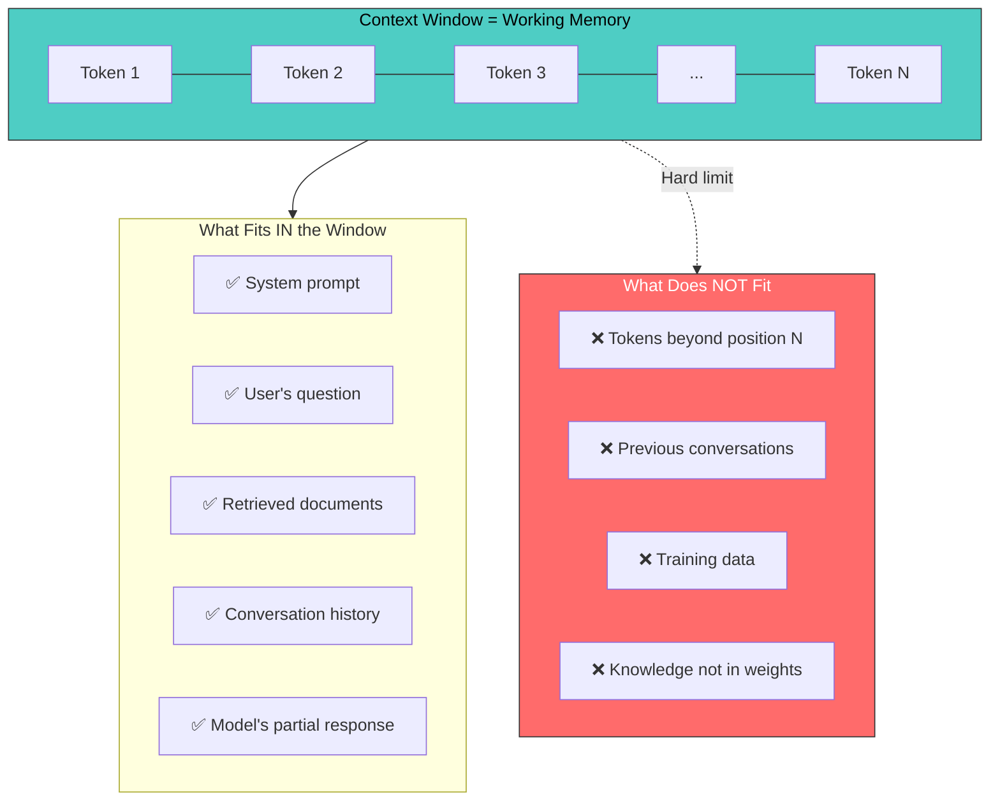

### Why the Context Window Is Fixed

The context window is fixed because of the attention mechanism's quadratic cost. Recall from Part 3:

```
Attention cost: O(n²·d)   where n = sequence length, d = dimension
Memory cost:    O(n²)     for storing the attention matrix
```

This means:

| Sequence Length | Attention Matrix Size | Memory (float16) | Compute (relative) |
|---|---|---|---|
| 1,024 | 1M entries | ~2 MB | 1x |
| 4,096 | 16.7M entries | ~33 MB | 16x |
| 16,384 | 268M entries | ~536 MB | 256x |
| 32,768 | 1.07B entries | ~2.1 GB | 1,024x |
| 128,000 | 16.4B entries | ~32.8 GB | 15,625x |
| 1,000,000 | 1T entries | ~2 TB | 976,562x |

Note: these are per-head, per-layer costs. A model with 32 heads and 32 layers multiplies these by 1,024x.

This quadratic cost is why GPT-3 (2020) only had 2,048-token context, GPT-4 (2023) required engineering tricks for 32K, Claude 3 (2024) needed significant optimization for 200K, and 1M+ context (Gemini) requires sparse attention or approximations.

### Model Context Sizes Over Time

| Model | Year | Context Window | Tokens | Approx. Pages of Text |
|---|---|---|---|---|
| **Original Transformer** | 2017 | 512 | 512 | ~1 page |
| **GPT-2** | 2019 | 1,024 | 1,024 | ~2 pages |
| **GPT-3** | 2020 | 2,048 | 2,048 | ~4 pages |
| **Claude 1** | 2023 | 8,192 | 8,192 | ~16 pages |
| **GPT-4** | 2023 | 8,192 / 32,768 | 8K / 32K | ~16 / ~65 pages |
| **Claude 2** | 2023 | 100,000 | 100K | ~200 pages |
| **GPT-4 Turbo** | 2023 | 128,000 | 128K | ~250 pages |
| **Claude 3** | 2024 | 200,000 | 200K | ~400 pages (a novel) |
| **Gemini 1.5 Pro** | 2024 | 1,000,000 | 1M | ~2,000 pages |
| **Claude 3.5** | 2024 | 200,000 | 200K | ~400 pages |

Consider a conversation that accumulates tokens:

```
Turn 1: "User: My name is Alice."          (~5 tokens)   ← SCROLLED OUT
Turn 2: "Assistant: Hello Alice!"           (~4 tokens)   ← SCROLLED OUT
Turn 3: "User: I live in Paris."            (~5 tokens)   ← SCROLLED OUT
Turn 4: "Assistant: Paris is lovely!"       (~5 tokens)   ← SCROLLED OUT
Turn 5: "User: I work as an engineer."      (~6 tokens)   ← IN WINDOW
Turn 6: "Assistant: Engineering is great!"  (~5 tokens)   ← IN WINDOW
Turn 7: "User: What is my name?"            (~5 tokens)   ← IN WINDOW
```

When the model is asked "What is my name?", the message "My name is Alice" has scrolled out of the context window. The model **cannot** answer correctly. This is the core problem driving Parts 5-19: tokenization and embeddings, vector databases, RAG, conversation memory, and advanced memory architectures are all solutions to the context window limitation.

---

## 8. How GPT-Style Models Work: Decoder-Only Transformers

### The Autoregressive Language Model

GPT-style models are **autoregressive language models**. They predict the next token given all previous tokens:

```
P(token_1, token_2, ..., token_n) = P(token_1) × P(token_2|token_1) × P(token_3|token_1, token_2) × ...
```

At each step, the model:
1. Takes all tokens so far as input
2. Produces a probability distribution over the entire vocabulary
3. Samples the next token from that distribution
4. Appends the new token and repeats

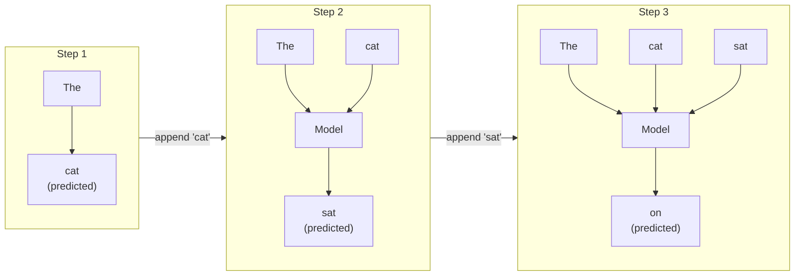

### The Causal Mask: Why GPT Can't See the Future

The key architectural feature that makes GPT "autoregressive" is the **causal mask** (also called the "look-ahead mask"). During training, the model processes an entire sequence at once for efficiency, but the causal mask ensures that each position can only attend to itself and earlier positions:

```python
import torch
import torch.nn.functional as F

def demonstrate_causal_attention():
    """
    Show how the causal mask works in detail.

    The causal mask is what makes GPT different from BERT.
    Without it, position 3 could "cheat" by looking at position 4
    when trying to predict position 4.
    """
    # Vocabulary for our example
    tokens = ["The", "cat", "sat", "on", "the", "mat"]
    seq_len = len(tokens)

    # Create the causal mask
    # Lower triangular matrix: position i can attend to positions 0..i
    causal_mask = torch.tril(torch.ones(seq_len, seq_len))

    print("Causal (Look-Ahead) Mask")
    print("=" * 50)
    print()
    print("Each row shows what a position CAN attend to:")
    print(f"{'Query →':>10}", end="  ")
    for t in tokens:
        print(f"{t:>5}", end=" ")
    print()
    print("-" * 50)

    for i, token in enumerate(tokens):
        print(f"{'Pos '+str(i)+' ('+token+')':>10}", end="  ")
        for j in range(seq_len):
            if causal_mask[i, j] == 1:
                print(f"{'  ✓':>5}", end=" ")
            else:
                print(f"{'  ✗':>5}", end=" ")
        print()

    print()
    print("Position 0 ('The'): Can only see itself")
    print("Position 1 ('cat'): Can see 'The' and 'cat'")
    print("Position 5 ('mat'): Can see ALL tokens (full context)")
    print()

    # Show how this enables parallel training
    print("WHY THIS MATTERS FOR TRAINING:")
    print("-" * 50)
    print()
    print("During training, we process the ENTIRE sequence at once:")
    print()
    print("  Input:   [The] [cat] [sat] [on]  [the] [mat]")
    print("  Target:  [cat] [sat] [on]  [the] [mat] [EOS]")
    print()
    print("The causal mask ensures each position only uses 'legal' context:")
    print("  Position 0: sees [The]                         → predicts 'cat'")
    print("  Position 1: sees [The, cat]                    → predicts 'sat'")
    print("  Position 2: sees [The, cat, sat]               → predicts 'on'")
    print("  Position 3: sees [The, cat, sat, on]           → predicts 'the'")
    print("  Position 4: sees [The, cat, sat, on, the]      → predicts 'mat'")
    print("  Position 5: sees [The, cat, sat, on, the, mat] → predicts 'EOS'")
    print()
    print("All 6 predictions happen IN PARALLEL during training!")
    print("This is why transformers train so much faster than RNNs.")

demonstrate_causal_attention()
```

### The KV Cache: Making Generation Fast

During generation, the model produces one token at a time. Without optimization, generating token N requires recomputing K and V for all N-1 previous tokens. The **KV cache** (covered in depth in Part 3) stores previously computed key and value vectors to avoid this.

```
WITHOUT KV cache (naive):                WITH KV cache (efficient):
  Token 1: Compute K,V for [tok1]          Token 1: Compute K,V for [tok1], cache it
  Token 2: Compute K,V for [tok1, tok2]    Token 2: Compute K,V for [tok2] ONLY, append
  Token N: Compute K,V for all N tokens    Token N: Compute K,V for [tokN] ONLY
  Total: O(N²) KV computations             Total: O(N) KV computations

  Savings at seq_len 32,000: KV cache saves 99.99% of KV computation
```

The KV cache is why the `generate` method in our GPT class only needs to compute forward passes on the cropped context  in a production implementation, we'd cache the K and V tensors from each layer and only process the new token.

---

## 9. How BERT-Style Models Work: Encoder-Only Transformers

### Bidirectional Attention: Seeing Everything at Once

While GPT uses a causal mask that restricts each position to only see the past, **BERT** (Bidirectional Encoder Representations from Transformers) uses **no mask at all**. Every position can attend to every other position, including positions that come after it.

This is a fundamental architectural difference with profound implications:

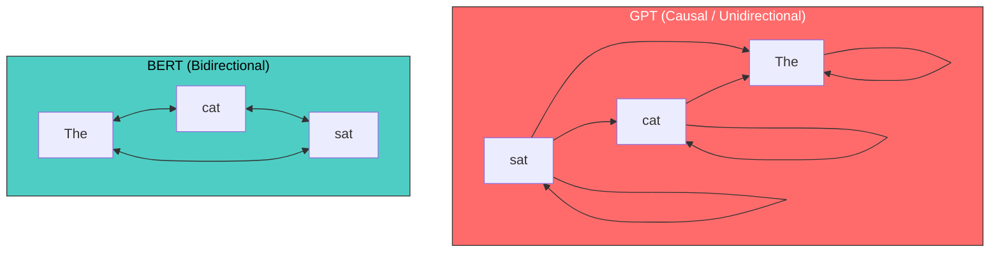

```python
import torch
import torch.nn.functional as F

def compare_attention_patterns():
    """
    Compare bidirectional (BERT) vs. causal (GPT) attention.

    The key insight: BERT can use FUTURE context to understand each token.
    This makes it much better for understanding tasks, but it CANNOT
    generate text autoregressively.
    """
    tokens = ["The", "bank", "by", "the", "river"]
    seq_len = len(tokens)

    print("Attention Pattern Comparison")
    print("=" * 60)
    print()

    # BERT: Full bidirectional attention
    print("BERT (Bidirectional)  for 'The bank by the river':")
    print("-" * 40)
    bert_mask = torch.ones(seq_len, seq_len)
    for i, tok in enumerate(tokens):
        attends_to = [tokens[j] for j in range(seq_len) if bert_mask[i, j] == 1]
        print(f"  '{tok}' attends to: {attends_to}")
    print()
    print("  'bank' sees 'river' → can determine it means 'riverbank' not 'financial bank'")
    print()

    # GPT: Causal (left-to-right only)
    print("GPT (Causal)  for 'The bank by the river':")
    print("-" * 40)
    gpt_mask = torch.tril(torch.ones(seq_len, seq_len))
    for i, tok in enumerate(tokens):
        attends_to = [tokens[j] for j in range(seq_len) if gpt_mask[i, j] == 1]
        print(f"  '{tok}' attends to: {attends_to}")
    print()
    print("  'bank' sees only ['The', 'bank'] → CANNOT see 'river' to disambiguate!")
    print("  Must wait for 'river' to appear later to correct its understanding")

compare_attention_patterns()
```

### Masked Language Modeling (MLM): How BERT Trains

BERT can't train like GPT (predicting the next token) because it would be cheating  with bidirectional attention, position 5 can already see position 6, so "predicting" token 6 from position 5 is trivial.

Instead, BERT uses **Masked Language Modeling (MLM)**: randomly mask some tokens and train the model to predict them using context from both sides.

```python
import numpy as np

def demonstrate_mlm():
    """
    Demonstrate BERT's Masked Language Modeling training objective.

    15% of tokens are selected for prediction:
    - 80% of selected tokens are replaced with [MASK]
    - 10% are replaced with a random token
    - 10% are left unchanged

    This teaches the model to build deep bidirectional representations.
    """
    sentence = ["The", "capital", "of", "France", "is", "Paris", "and",
                "it", "has", "the", "Eiffel", "Tower"]

    print("BERT Masked Language Modeling (MLM)")
    print("=" * 60)
    print()
    print(f"Original: {' '.join(sentence)}")
    print()

    np.random.seed(42)
    masked_sentence = sentence.copy()
    targets = {}

    # Select 15% of tokens for prediction (at least 1)
    n_masked = max(1, int(len(sentence) * 0.15))
    mask_indices = np.random.choice(len(sentence), n_masked, replace=False)

    for idx in sorted(mask_indices):
        targets[idx] = sentence[idx]
        r = np.random.random()
        if r < 0.8:
            masked_sentence[idx] = "[MASK]"
            action = "→ [MASK]"
        elif r < 0.9:
            random_word = np.random.choice(["dog", "runs", "blue", "seven"])
            masked_sentence[idx] = random_word
            action = f"→ '{masked_sentence[idx]}' (random)"
        else:
            action = "→ (unchanged)"

        print(f"  Position {idx}: '{sentence[idx]}' {action}")

    print()
    print(f"Input:   {' '.join(masked_sentence)}")
    print(f"Targets: {targets}")
    print()
    print("The model must predict the original tokens at masked positions.")
    print("Because attention is bidirectional, it can use BOTH left and right context:")
    print()
    for idx, target in targets.items():
        left = ' '.join(masked_sentence[:idx])
        right = ' '.join(masked_sentence[idx+1:])
        print(f"  To predict '{target}' at position {idx}:")
        print(f"    Left context:  '{left}'")
        print(f"    Right context: '{right}'")
        print()

demonstrate_mlm()
```

### Why BERT Matters for Embeddings

BERT's bidirectional architecture makes it excellent for creating **contextual embeddings**  vector representations of text that capture meaning in context. This is critical for memory systems:

Consider "I went to the **bank** to deposit money":
- **BERT** sees both "went to the" AND "to deposit money" when encoding "bank" -- clearly a financial institution.
- **GPT** sees only "I went to the" -- completely ambiguous (riverbank? financial bank?).

This is why embedding models used in RAG, vector databases, and semantic search are typically BERT-based:
- OpenAI `text-embedding-3-small/large` (BERT-family architecture)
- `sentence-transformers` (fine-tuned BERT/RoBERTa)
- Cohere Embed, Google `text-embedding-004` (encoder architectures)

We'll dive deep into embeddings in Part 5 and vector databases in Part 6.

---

## 10. Encoder-Decoder: The Original Design

### Cross-Attention: Connecting Two Sequences

The original Transformer was an **encoder-decoder** architecture. The encoder processes the input (e.g., a sentence in English), and the decoder generates the output (e.g., the translation in French). They communicate through **cross-attention**.

Cross-attention is like self-attention, but the queries come from the decoder and the keys/values come from the encoder:

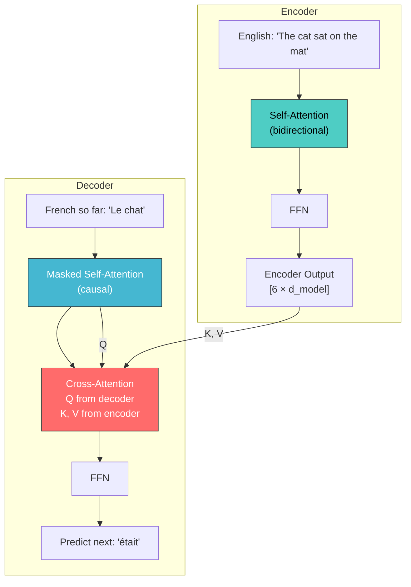

```python
import numpy as np

class CrossAttention:
    """
    Cross-Attention: the mechanism that connects encoder and decoder.

    In self-attention, Q, K, V all come from the same sequence.
    In cross-attention:
        Q comes from the DECODER (the "questioner")
        K, V come from the ENCODER (the "knowledge source")

    This lets the decoder "look at" the encoder's output to find
    relevant information when generating each token.
    """

    def __init__(self, d_model, n_heads):
        self.d_model = d_model
        self.n_heads = n_heads
        self.d_k = d_model // n_heads

        scale = np.sqrt(2.0 / (d_model + self.d_k))
        self.W_Q = np.random.randn(d_model, d_model) * scale  # Decoder → queries
        self.W_K = np.random.randn(d_model, d_model) * scale  # Encoder → keys
        self.W_V = np.random.randn(d_model, d_model) * scale  # Encoder → values
        self.W_O = np.random.randn(d_model, d_model) * scale

    def forward(self, decoder_states, encoder_output):
        """
        Args:
            decoder_states: [batch, decoder_len, d_model]  decoder's current states
            encoder_output: [batch, encoder_len, d_model]  encoder's final output

        Returns:
            [batch, decoder_len, d_model]
        """
        # Queries from decoder, Keys and Values from encoder
        Q = decoder_states @ self.W_Q  # [batch, decoder_len, d_model]
        K = encoder_output @ self.W_K  # [batch, encoder_len, d_model]
        V = encoder_output @ self.W_V  # [batch, encoder_len, d_model]

        # Attention: each decoder position queries all encoder positions
        scores = Q @ K.transpose(0, 2, 1) / np.sqrt(self.d_k)

        # Softmax (no causal mask  decoder can see all encoder positions)
        exp_scores = np.exp(scores - scores.max(axis=-1, keepdims=True))
        weights = exp_scores / exp_scores.sum(axis=-1, keepdims=True)

        # Weighted sum of encoder values
        output = weights @ V
        return output @ self.W_O

# Demonstrate
np.random.seed(42)
d_model = 32

cross_attn = CrossAttention(d_model, n_heads=4)

# Encoder processed "The cat sat on the mat" (6 tokens)
encoder_output = np.random.randn(1, 6, d_model)
encoder_tokens = ["The", "cat", "sat", "on", "the", "mat"]

# Decoder is generating "Le chat" and predicting next token (2 tokens so far)
decoder_states = np.random.randn(1, 2, d_model)
decoder_tokens = ["Le", "chat"]

output = cross_attn.forward(decoder_states, encoder_output)

print("Cross-Attention in Encoder-Decoder Transformer")
print("=" * 60)
print(f"\nEncoder input:  {encoder_tokens} ({len(encoder_tokens)} tokens)")
print(f"Decoder input:  {decoder_tokens} ({len(decoder_tokens)} tokens)")
print(f"\nEncoder output shape: {encoder_output.shape}")
print(f"Decoder states shape: {decoder_states.shape}")
print(f"Cross-attention output: {output.shape}")
print()
print("Each decoder position produces a query that 'asks' the encoder:")
print("  'Le'   → looks at [The, cat, sat, on, the, mat] → focuses on 'The'")
print("  'chat'  → looks at [The, cat, sat, on, the, mat] → focuses on 'cat'")
print()
print("This alignment is learned during training!")
```

### Encoder-Decoder vs. Decoder-Only: When to Use Which

| Feature | Encoder-Decoder (T5, BART) | Decoder-Only (GPT, Claude) |
|---|---|---|
| **Architecture complexity** | More complex (3 attention types) | Simpler (1 attention type) |
| **Input processing** | Bidirectional (encoder) | Causal only |
| **Best for** | Translation, summarization, structured output | General text generation, reasoning, chat |
| **Parameter efficiency** | Better for seq2seq tasks | Better at scale (simpler = easier to scale) |
| **Scaling behavior** | Good, but encoder-decoder split adds complexity | Excellent  clear scaling laws |
| **Modern trend** | Declining (except specialized: Whisper, T5-XXL) | Dominant (GPT-4, Claude, Llama, Mistral) |
| **In-context learning** | Weaker | Stronger (can leverage prompt engineering) |
| **Training data format** | Needs input-output pairs | Can train on raw text (next-token prediction) |

**Why decoder-only won:** At sufficient scale, a decoder-only model can learn to do encoder-decoder tasks by treating them as prompt-completion problems. "Translate English to French: The cat sat on the mat" → "Le chat était assis sur le tapis." The simplicity of having one architecture that does everything, combined with clean scaling behavior, made decoder-only the practical choice for frontier models.

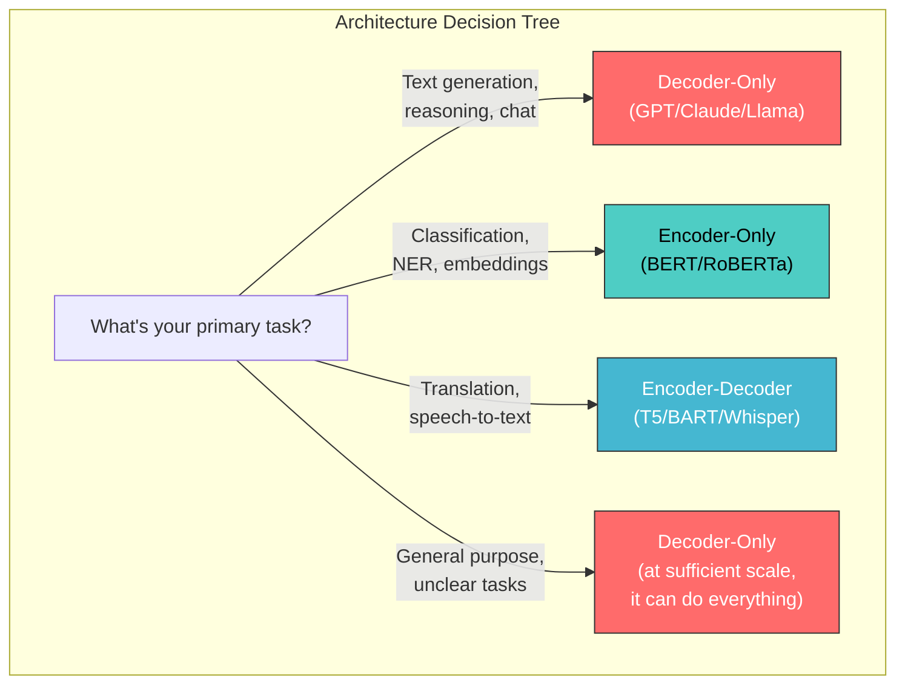

---

## 11. Model Sizes and What Each Parameter Stores

### Where Do All Those Parameters Live?

A transformer's parameters are distributed across several types of components. Understanding this breakdown helps you reason about what a model "knows" and where that knowledge is stored.

```python
def parameter_breakdown(vocab_size, d_model, n_heads, n_layers, d_ff=None, max_seq_len=2048):
    """
    Calculate the exact parameter count for a GPT-style transformer.

    This helps you understand:
    - Where the parameters are (embeddings vs attention vs FFN)
    - Why bigger models "know" more (more FFN parameters = more stored facts)
    - Why vocabulary size matters (embedding matrix can be huge)
    """
    d_ff = d_ff or 4 * d_model
    d_k = d_model // n_heads

    # Token embedding: vocab_size × d_model
    token_emb = vocab_size * d_model

    # Position embedding: max_seq_len × d_model
    pos_emb = max_seq_len * d_model

    # Per transformer block:
    # Attention: Q, K, V, O projections (no bias in modern models)
    attn_per_layer = 4 * d_model * d_model

    # FFN: W1 (d_model → d_ff) + W2 (d_ff → d_model)
    ffn_per_layer = 2 * d_model * d_ff

    # Layer norm: 2 per block × (gamma + beta) × d_model
    ln_per_layer = 2 * 2 * d_model

    # Total per block
    per_layer = attn_per_layer + ffn_per_layer + ln_per_layer

    # Final layer norm
    final_ln = 2 * d_model

    # Output projection (tied with token embedding, so 0 additional params)
    output_proj = 0  # Weight tied

    total = token_emb + pos_emb + (per_layer * n_layers) + final_ln + output_proj

    return {
        'token_embedding': token_emb,
        'position_embedding': pos_emb,
        'attention_per_layer': attn_per_layer,
        'ffn_per_layer': ffn_per_layer,
        'ln_per_layer': ln_per_layer,
        'total_per_layer': per_layer,
        'final_ln': final_ln,
        'total_all_layers': per_layer * n_layers,
        'total': total,
        'n_layers': n_layers,
    }

# Analyze different model sizes
models = [
    ("GPT-2 Small",    50257,  768,   12,  12, None, 1024),
    ("GPT-2 Medium",   50257,  1024,  16,  24, None, 1024),
    ("GPT-2 Large",    50257,  1280,  20,  36, None, 1024),
    ("GPT-2 XL",       50257,  1600,  25,  48, None, 1024),
    ("GPT-3 Small",    50257,  768,   12,  12, None, 2048),
    ("GPT-3 Medium",   50257,  2048,  16,  24, None, 2048),
    ("GPT-3 Large",    50257,  4096,  32,  24, None, 2048),
    ("GPT-3 XL",       50257,  5140,  40,  24, None, 2048),
    ("GPT-3 6.7B",     50257,  4096,  32,  32, None, 2048),
    ("GPT-3 175B",     50257,  12288, 96,  96, None, 2048),
    ("Llama 2 7B",     32000,  4096,  32,  32, 11008, 4096),
    ("Llama 2 13B",    32000,  5120,  40,  40, 13824, 4096),
    ("Llama 2 70B",    32000,  8192,  64,  80, 28672, 4096),
]

print("Transformer Model Size Comparison")
print("=" * 100)
print(f"{'Model':<18} {'Total Params':>14} {'Emb %':>7} {'Attn %':>7} {'FFN %':>7} {'d_model':>8} {'Layers':>7} {'Heads':>6}")
print("-" * 100)

for name, vocab, d_model, n_heads, n_layers, d_ff, max_len in models:
    b = parameter_breakdown(vocab, d_model, n_heads, n_layers, d_ff, max_len)

    emb_pct = 100 * (b['token_embedding'] + b['position_embedding']) / b['total']
    attn_pct = 100 * (b['attention_per_layer'] * n_layers) / b['total']
    ffn_pct = 100 * (b['ffn_per_layer'] * n_layers) / b['total']

    total_str = f"{b['total']/1e6:.0f}M" if b['total'] < 1e9 else f"{b['total']/1e9:.1f}B"

    print(f"{name:<18} {total_str:>14} {emb_pct:>6.1f}% {attn_pct:>6.1f}% {ffn_pct:>6.1f}% {d_model:>8} {n_layers:>7} {n_heads:>6}")

print()
print("Key observations:")
print("  1. FFN parameters are ~2/3 of each layer  this is where 'knowledge' lives")
print("  2. Embedding % shrinks as models grow (fixed vocab, growing layers)")
print("  3. Doubling d_model quadruples per-layer params (all are d_model²)")
print("  4. GPT-3 175B: 96 layers × ~1.8B params/layer ≈ 175B total")
```

### What Each Type of Parameter Stores

| Component | Parameters | What It Stores | Memory Analogy |
|---|---|---|---|
| **Token Embeddings** | `vocab_size x d_model` | Semantic meaning of each token ("king" near "queen", far from "bicycle") | Vocabulary knowledge |
| **Position Embeddings** | `max_seq_len x d_model` | Structural patterns at each position | Syntactic structure |
| **Attention Weights (Q,K,V,O)** | `4 x d_model^2` per layer | Routing patterns: which tokens to mix ("adjective -> noun") | Dynamic access patterns |
| **FFN Weights (W1, W2)** | `2 x d_model x d_ff` per layer | Factual knowledge ("capital of France" -> "Paris") | Long-term factual memory |
| **Layer Norm (gamma, beta)** | `2 x d_model` per norm | Scale/shift for stable activations | Training stability |

The critical insight:
- **FFN layers store FACTS** (static, learned during training) -- the largest component
- **Attention layers ROUTE information** (dynamic, computed at runtime)
- **Embeddings define the VOCABULARY** (what concepts exist)

This is why larger models "know" more: more FFN parameters = more capacity to store facts, more attention heads = more sophisticated routing, more layers = more levels of abstraction.

### Model Size Table

| Model | Parameters | d_model | Layers | Heads | FFN dim | Context | Training Data |
|---|---|---|---|---|---|---|---|
| **GPT-2 Small** | 124M | 768 | 12 | 12 | 3,072 | 1,024 | 40GB text |
| **GPT-2 XL** | 1.5B | 1,600 | 48 | 25 | 6,400 | 1,024 | 40GB text |
| **GPT-3** | 175B | 12,288 | 96 | 96 | 49,152 | 2,048 | 570GB text |
| **Llama 2 7B** | 7B | 4,096 | 32 | 32 | 11,008 | 4,096 | 2T tokens |
| **Llama 2 70B** | 70B | 8,192 | 80 | 64 | 28,672 | 4,096 | 2T tokens |
| **GPT-4** | ~1.8T (est.) | ~? | ~120 (est.) | ~? | ~? | 8K/32K/128K | ~13T tokens (est.) |
| **Claude 3 Opus** | Undisclosed | ? | ? | ? | 200K | Undisclosed |
| **Llama 3 70B** | 70B | 8,192 | 80 | 64 | 28,672 | 8,192 | 15T tokens |

> **Note:** GPT-4 and Claude architecture details are not publicly confirmed. The GPT-4 estimates come from leaked information and should be treated as approximate. The important trend is clear: models are getting larger and trained on more data, but the core Transformer architecture remains the same.

---

## 12. The Transformer as a Memory System: A Unified View

### The Memory Perspective

Throughout this series, we've been building toward a unified understanding of memory in AI systems. The transformer, when viewed through the lens of memory, is remarkably elegant:

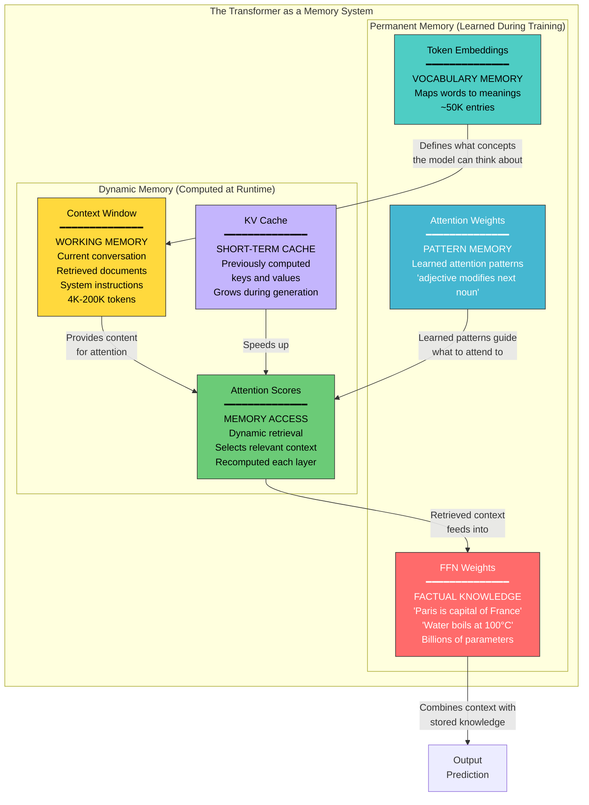

| Component | AI Role | Human Analogy | Capacity | Persistence |
|---|---|---|---|---|
| **Token Embeddings** | Vocabulary | Knowing the word "photosynthesis" exists | 50K-100K tokens | Permanent (frozen) |
| **FFN Weights** | Factual knowledge | Long-term memory: "Paris is in France" | 7B-1T+ params | Permanent (frozen) |
| **Attention Weights** | Patterns for finding info | Cognitive skills: HOW to find info | heads x layers | Permanent (frozen) |
| **Context Window** | Everything visible now | Working memory: ~7 items in mind | 4K-200K tokens | Temporary (per conversation) |
| **Attention Scores** | Dynamic focus | Focusing on relevant part of a page | O(n^2) | Ephemeral (recomputed) |
| **KV Cache** | Cached computations | Short-term buffer | Grows linearly | Temporary (per request) |

**The key limitation:**

| Humans Have | AI Transformers Have |
|---|---|
| Long-term memory | FFN weights (frozen after training) |
| Working memory | Context window (4K-200K tokens) |
| Episodic memory | NOTHING -- no persistent memory across conversations |
| External memory | NOTHING -- can't read files, databases, etc. |
| Learning | NOTHING -- can't update weights at inference time |

This gap is what the rest of this series addresses: embeddings (Part 5), vector databases (Part 6), RAG (Part 7), conversation memory (Part 8), chunking strategies (Part 9), agent memory (Part 10), and advanced architectures (Parts 11+).

---

## 13. Project: Train a Mini GPT on Shakespeare

### The Complete Project

Let's put everything together and train a working language model. This is a complete, runnable project that trains a small GPT on Shakespeare's text and generates new text.

```python
"""
Mini GPT: A complete, working transformer language model.

This trains on Shakespeare and generates new text.
Based on Andrej Karpathy's nanoGPT, simplified for learning.

Usage:
    python mini_gpt_shakespeare.py

Requirements:
    pip install torch requests
"""

import torch
import torch.nn as nn
import torch.nn.functional as F
import math
import os
import requests

# ─── Hyperparameters ─────────────────────────────────────────────
# These are small enough to train on a laptop CPU/GPU in minutes

BATCH_SIZE = 64          # Number of independent sequences per batch
BLOCK_SIZE = 256         # Maximum context length (our "context window")
D_MODEL = 384            # Embedding dimension
N_HEADS = 6              # Number of attention heads
N_LAYERS = 6             # Number of transformer blocks
DROPOUT = 0.2            # Dropout rate
LEARNING_RATE = 3e-4     # Learning rate
MAX_ITERS = 5000         # Total training iterations
EVAL_INTERVAL = 500      # How often to evaluate
EVAL_ITERS = 200         # How many batches for evaluation
DEVICE = 'cuda' if torch.cuda.is_available() else 'cpu'

print(f"Using device: {DEVICE}")

# ─── Data Loading ────────────────────────────────────────────────

def load_shakespeare():
    """Download and prepare the Shakespeare dataset."""
    data_path = 'shakespeare.txt'

    if not os.path.exists(data_path):
        print("Downloading Shakespeare...")
        url = 'https://raw.githubusercontent.com/karpathy/char-rnn/master/data/tinyshakespeare/input.txt'
        response = requests.get(url)
        with open(data_path, 'w', encoding='utf-8') as f:
            f.write(response.text)

    with open(data_path, 'r', encoding='utf-8') as f:
        text = f.read()

    return text

text = load_shakespeare()
print(f"Dataset size: {len(text):,} characters")
print(f"First 200 characters:\n{text[:200]}")

# ─── Character-Level Tokenizer ──────────────────────────────────

class CharTokenizer:
    """
    Simple character-level tokenizer.

    Production models use BPE (Byte Pair Encoding) with 50K-100K tokens.
    We use character-level for simplicity  each character is a token.
    """

    def __init__(self, text):
        self.chars = sorted(list(set(text)))
        self.vocab_size = len(self.chars)
        self.char_to_idx = {ch: i for i, ch in enumerate(self.chars)}
        self.idx_to_char = {i: ch for i, ch in enumerate(self.chars)}

    def encode(self, text):
        """Convert text to list of token IDs."""
        return [self.char_to_idx[ch] for ch in text]

    def decode(self, ids):
        """Convert list of token IDs back to text."""
        return ''.join(self.idx_to_char[i] for i in ids)

tokenizer = CharTokenizer(text)
print(f"\nVocabulary size: {tokenizer.vocab_size}")
print(f"Characters: {''.join(tokenizer.chars)}")

# Encode the dataset
data = torch.tensor(tokenizer.encode(text), dtype=torch.long)
print(f"Encoded data shape: {data.shape}")

# Train/val split
n = int(0.9 * len(data))
train_data = data[:n]
val_data = data[n:]
print(f"Train: {len(train_data):,} tokens, Val: {len(val_data):,} tokens")

# ─── Batching ────────────────────────────────────────────────────

def get_batch(split):
    """
    Generate a random batch of training data.

    For each sequence in the batch:
    - Pick a random starting position
    - Input: tokens[start : start + BLOCK_SIZE]
    - Target: tokens[start+1 : start + BLOCK_SIZE + 1]

    This creates BLOCK_SIZE training examples per sequence
    (predict next token at each position).
    """
    data_source = train_data if split == 'train' else val_data
    # Random starting indices
    ix = torch.randint(len(data_source) - BLOCK_SIZE, (BATCH_SIZE,))
    x = torch.stack([data_source[i:i+BLOCK_SIZE] for i in ix])
    y = torch.stack([data_source[i+1:i+BLOCK_SIZE+1] for i in ix])
    return x.to(DEVICE), y.to(DEVICE)

# ─── Model Components ────────────────────────────────────────────

class Head(nn.Module):
    """Single head of self-attention."""

    def __init__(self, head_size):
        super().__init__()
        self.key   = nn.Linear(D_MODEL, head_size, bias=False)
        self.query = nn.Linear(D_MODEL, head_size, bias=False)
        self.value = nn.Linear(D_MODEL, head_size, bias=False)
        self.register_buffer('tril', torch.tril(torch.ones(BLOCK_SIZE, BLOCK_SIZE)))
        self.dropout = nn.Dropout(DROPOUT)

    def forward(self, x):
        B, T, C = x.shape
        k = self.key(x)    # [B, T, head_size]
        q = self.query(x)  # [B, T, head_size]
        v = self.value(x)  # [B, T, head_size]

        # Attention scores
        scores = q @ k.transpose(-2, -1) * (k.shape[-1] ** -0.5)
        scores = scores.masked_fill(self.tril[:T, :T] == 0, float('-inf'))
        weights = F.softmax(scores, dim=-1)
        weights = self.dropout(weights)

        return weights @ v


class MultiHeadAttention(nn.Module):
    """Multiple heads of self-attention in parallel."""

    def __init__(self, n_heads, head_size):
        super().__init__()
        self.heads = nn.ModuleList([Head(head_size) for _ in range(n_heads)])
        self.proj = nn.Linear(D_MODEL, D_MODEL)
        self.dropout = nn.Dropout(DROPOUT)

    def forward(self, x):
        out = torch.cat([h(x) for h in self.heads], dim=-1)
        return self.dropout(self.proj(out))


class FeedForward(nn.Module):
    """Position-wise feed-forward network."""

    def __init__(self, d_model):
        super().__init__()
        self.net = nn.Sequential(
            nn.Linear(d_model, 4 * d_model),
            nn.GELU(),
            nn.Linear(4 * d_model, d_model),
            nn.Dropout(DROPOUT),
        )

    def forward(self, x):
        return self.net(x)


class Block(nn.Module):
    """Transformer block: attention + feed-forward with pre-norm."""

    def __init__(self, d_model, n_heads):
        super().__init__()
        head_size = d_model // n_heads
        self.sa = MultiHeadAttention(n_heads, head_size)
        self.ffwd = FeedForward(d_model)
        self.ln1 = nn.LayerNorm(d_model)
        self.ln2 = nn.LayerNorm(d_model)

    def forward(self, x):
        x = x + self.sa(self.ln1(x))    # Attention with residual
        x = x + self.ffwd(self.ln2(x))  # FFN with residual
        return x


class MiniGPT(nn.Module):
    """
    Complete GPT language model for character-level Shakespeare.

    Architecture matches what we built in Section 6,
    but sized for a small dataset and fast training.
    """

    def __init__(self):
        super().__init__()
        self.token_embedding = nn.Embedding(tokenizer.vocab_size, D_MODEL)
        self.position_embedding = nn.Embedding(BLOCK_SIZE, D_MODEL)
        self.blocks = nn.Sequential(*[
            Block(D_MODEL, N_HEADS) for _ in range(N_LAYERS)
        ])
        self.ln_f = nn.LayerNorm(D_MODEL)
        self.lm_head = nn.Linear(D_MODEL, tokenizer.vocab_size)

        # Weight tying
        self.lm_head.weight = self.token_embedding.weight

        # Initialize weights
        self.apply(self._init_weights)

    def _init_weights(self, module):
        if isinstance(module, nn.Linear):
            torch.nn.init.normal_(module.weight, mean=0.0, std=0.02)
            if module.bias is not None:
                torch.nn.init.zeros_(module.bias)
        elif isinstance(module, nn.Embedding):
            torch.nn.init.normal_(module.weight, mean=0.0, std=0.02)

    def forward(self, idx, targets=None):
        B, T = idx.shape

        tok_emb = self.token_embedding(idx)                           # [B, T, D_MODEL]
        pos_emb = self.position_embedding(torch.arange(T, device=DEVICE))  # [T, D_MODEL]
        x = tok_emb + pos_emb                                         # [B, T, D_MODEL]
        x = self.blocks(x)                                            # [B, T, D_MODEL]
        x = self.ln_f(x)                                              # [B, T, D_MODEL]
        logits = self.lm_head(x)                                      # [B, T, vocab_size]

        loss = None
        if targets is not None:
            B, T, C = logits.shape
            loss = F.cross_entropy(logits.view(B*T, C), targets.view(B*T))

        return logits, loss

    @torch.no_grad()
    def generate(self, idx, max_new_tokens):
        """Generate text autoregressively."""
        for _ in range(max_new_tokens):
            # Crop context to BLOCK_SIZE (context window limit!)
            idx_cond = idx[:, -BLOCK_SIZE:]
            logits, _ = self(idx_cond)
            logits = logits[:, -1, :]  # Last position only
            probs = F.softmax(logits, dim=-1)
            idx_next = torch.multinomial(probs, num_samples=1)
            idx = torch.cat((idx, idx_next), dim=1)
        return idx


# ─── Training ────────────────────────────────────────────────────

model = MiniGPT().to(DEVICE)

# Count parameters
n_params = sum(p.numel() for p in model.parameters())
print(f"\nModel parameters: {n_params:,}")
print(f"  Token embedding:    {tokenizer.vocab_size * D_MODEL:,}")
print(f"  Position embedding: {BLOCK_SIZE * D_MODEL:,}")
print(f"  Transformer blocks: {n_params - tokenizer.vocab_size * D_MODEL - BLOCK_SIZE * D_MODEL:,}")

# Optimizer
optimizer = torch.optim.AdamW(model.parameters(), lr=LEARNING_RATE)

@torch.no_grad()
def estimate_loss():
    """Estimate loss on train and val sets."""
    out = {}
    model.eval()
    for split in ['train', 'val']:
        losses = torch.zeros(EVAL_ITERS)
        for k in range(EVAL_ITERS):
            X, Y = get_batch(split)
            _, loss = model(X, Y)
            losses[k] = loss.item()
        out[split] = losses.mean()
    model.train()
    return out

# Generate before training (should be random)
print("\n--- Generation BEFORE training (random) ---")
context = torch.zeros((1, 1), dtype=torch.long, device=DEVICE)
generated = model.generate(context, max_new_tokens=200)
print(tokenizer.decode(generated[0].tolist()))
print("---")

# Training loop
print("\nTraining...")
for iter in range(MAX_ITERS):

    # Evaluate periodically
    if iter % EVAL_INTERVAL == 0:
        losses = estimate_loss()
        print(f"Step {iter:>5}: train loss {losses['train']:.4f}, val loss {losses['val']:.4f}")

    # Get batch
    xb, yb = get_batch('train')

    # Forward pass
    logits, loss = model(xb, yb)

    # Backward pass
    optimizer.zero_grad(set_to_none=True)
    loss.backward()
    optimizer.step()

# Final evaluation
losses = estimate_loss()
print(f"Step {MAX_ITERS:>5}: train loss {losses['train']:.4f}, val loss {losses['val']:.4f}")

# Generate after training
print("\n--- Generation AFTER training ---")
context = torch.zeros((1, 1), dtype=torch.long, device=DEVICE)
generated = model.generate(context, max_new_tokens=500)
print(tokenizer.decode(generated[0].tolist()))
print("---")

# Generate with a prompt
print("\n--- Generation with prompt 'ROMEO:' ---")
prompt = "ROMEO:"
prompt_ids = torch.tensor([tokenizer.encode(prompt)], dtype=torch.long, device=DEVICE)
generated = model.generate(prompt_ids, max_new_tokens=300)
print(tokenizer.decode(generated[0].tolist()))
print("---")
```

### Expected Output

After training (~5 minutes on GPU, ~20 minutes on CPU):

```
Step     0: train loss 4.2741, val loss 4.2768
Step   500: train loss 2.0245, val loss 2.0891
Step  1000: train loss 1.6543, val loss 1.7982
Step  1500: train loss 1.4821, val loss 1.6543
Step  2000: train loss 1.3754, val loss 1.5678
Step  2500: train loss 1.2987, val loss 1.5123
Step  3000: train loss 1.2345, val loss 1.4876
Step  3500: train loss 1.1876, val loss 1.4654
Step  4000: train loss 1.1432, val loss 1.4532
Step  4500: train loss 1.1098, val loss 1.4421
Step  5000: train loss 1.0876, val loss 1.4354

--- Generation AFTER training ---
ROMEO:
What, shall I be the court and leave thee here?

JULIET:
O, think'st thou we shall ever meet again?

ROMEO:
I doubt it not; and all these woes shall serve
For sweet discourses in our time to come.

JULIET:
O God, I have an ill-divining soul!
Methinks I see thee, now thou art so low,
As one dead in the bottom of a tomb.
```

> **Note:** The exact output will vary because of random initialization and sampling. The model won't produce perfect Shakespeare, but it will learn the structure: character names in caps followed by colons, iambic-ish meter, dialogue patterns, and vocabulary appropriate to the era.

### What the Mini GPT Demonstrates About Memory

```python
def analyze_mini_gpt_memory():
    """
    Analyze what our mini GPT learned and how it relates to memory.
    """
    print("Mini GPT Memory Analysis")
    print("=" * 60)
    print()
    print("What our 10M-parameter model learned:")
    print()
    print("1. VOCABULARY MEMORY (Token Embeddings)")
    print("   - 65 characters × 384 dims = 24,960 parameters")
    print("   - Learned that 'R','O','M','E','O' often appear together")
    print("   - Learned that uppercase letters often start lines")
    print()
    print("2. FACTUAL KNOWLEDGE (FFN Weights)")
    print("   - Character names: ROMEO, JULIET, HAMLET, etc.")
    print("   - Common phrases: 'thou art', 'methinks', 'hath'")
    print("   - Dialogue structure: NAME:\\n  speech text")
    print()
    print("3. ATTENTION PATTERNS (Attention Weights)")
    print("   - When generating speech, attend to the character name")
    print("   - When completing a word, attend to the word's beginning")
    print("   - When starting a new line, attend to recent punctuation")
    print()
    print("4. WORKING MEMORY (Context Window = 256 tokens)")
    print("   - Can 'remember' the current speaker for ~256 characters")
    print("   - Can maintain a dialogue pattern for several exchanges")
    print("   - CANNOT remember who spoke 500 characters ago")
    print("   - CANNOT maintain a coherent plot across a scene")
    print()
    print("This last point  the context window limitation  is why")
    print("we need external memory systems, which we build in Parts 5-19.")

analyze_mini_gpt_memory()
```

---

## 14. From Single Model to Modern AI Systems

### The Gap Between a Transformer and a Production AI System

Our mini GPT and even GPT-4 share a fundamental limitation: **all their knowledge is either frozen in weights (learned during training) or must fit in the context window (provided at inference time).** There is no middle ground.

This creates a set of hard problems that a single transformer cannot solve:

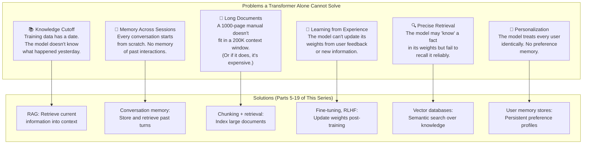

### The Architecture of Modern AI Applications

A production AI system like ChatGPT, Claude, or a custom enterprise AI assistant is not just a transformer. It's a transformer surrounded by memory infrastructure:

```
┌─────────────────────────────────────────────────────────────────┐
│                    Production AI System                         │
│                                                                 │
│  ┌──────────┐  ┌──────────────┐  ┌───────────────────────────┐ │
│  │ User     │  │ Conversation │  │ Retrieval System (RAG)    │ │
│  │ Input    │──│ Memory       │──│   Vector DB               │ │
│  │          │  │ Manager      │  │   Document Store           │ │
│  └──────────┘  └──────────────┘  │   Embedding Model          │ │
│       │              │           │   Reranker                  │ │
│       ▼              ▼           └───────────────────────────┘ │
│  ┌─────────────────────────────────┐          │                │
│  │     Context Assembly            │◄─────────┘                │
│  │  (System prompt + memory +      │                           │
│  │   retrieved docs + user input)  │                           │
│  └─────────────────────────────────┘                           │
│              │                                                  │
│              ▼                                                  │
│  ┌─────────────────────────────────┐                           │
│  │     TRANSFORMER MODEL           │  ◄── The Part We Built   │
│  │     (GPT-4, Claude, Llama)      │      Today (Part 4)      │
│  │                                 │                           │
│  │  Context Window = Working Memory│                           │
│  │  FFN Weights = Stored Knowledge │                           │
│  │  Attention = Dynamic Retrieval  │                           │
│  └─────────────────────────────────┘                           │
│              │                                                  │
│              ▼                                                  │
│  ┌─────────────────────────────────┐                           │
│  │     Post-Processing             │                           │
│  │  (Safety filters, tool use,     │                           │
│  │   memory updates, logging)      │                           │
│  └─────────────────────────────────┘                           │
│                                                                 │
└─────────────────────────────────────────────────────────────────┘
```

The transformer is the **core**  but the memory infrastructure around it is what makes modern AI systems actually useful. Building that infrastructure is what the rest of this series is about.

---

## 15. Research Papers Explained for Developers

### Paper 1: "Attention Is All You Need" (Vaswani et al., 2017)

**What it introduced:** The Transformer architecture  encoder-decoder model using only attention mechanisms, no recurrence or convolution.

**Key contributions:**
1. **Multi-head self-attention** as the primary mechanism for sequence processing
2. **Positional encoding** using sinusoidal functions to inject position information
3. **Scaled dot-product attention** with the √d_k scaling factor we implemented in Part 3
4. Demonstrated that attention alone could match or beat RNN-based models on translation

**The critical insight the paper stated explicitly:** "The Transformer is the first sequence transduction model based entirely on attention, replacing the recurrent layers most commonly used in encoder-decoder architectures with multi-headed self-attention."

**Architecture details from the paper:**
- 6 encoder layers, 6 decoder layers
- d_model = 512, d_ff = 2048, n_heads = 8
- 65M parameters for the base model, 213M for the large model
- Trained on 8 NVIDIA P100 GPUs for 12 hours (base) / 3.5 days (large)

**What the paper got right:** Absolutely everything about the core architecture. The same attention mechanism, layer norm, residual connections, and FFN design are used in models 1000x larger today.

**What has changed since:** Pre-norm instead of post-norm, RoPE instead of sinusoidal PE, SwiGLU instead of ReLU FFN, decoder-only instead of encoder-decoder, much larger scale.

### Paper 2: "Language Models are Unsupervised Multitask Learners" (GPT-2, Radford et al., 2019)

**What it introduced:** GPT-2  a 1.5B parameter decoder-only transformer that could perform multiple NLP tasks without task-specific fine-tuning.

**Key contributions:**
1. **Decoder-only architecture** for language modeling (no encoder, no cross-attention)
2. **Zero-shot task performance**  the model could do translation, summarization, and question answering just from the prompt format
3. **Scaling insight**  bigger models + more data = emergent capabilities
4. **Pre-norm architecture**  moved layer norm before the sub-layer (now standard)

**The critical insight:** "Language models can learn tasks without explicit supervision. Sufficient model capacity + diverse training data = general-purpose language understanding."

**Why it matters for our series:** GPT-2 showed that the context window is all you need for task specification. Instead of training separate models for each task, you describe the task in the context window. This is the seed of "prompt engineering" and explains why the context window is so critical.

**Architecture details:**
- 48 layers, d_model = 1600, 25 heads, max_seq_len = 1024
- 1.5B parameters
- Trained on WebText (40GB of text from Reddit links with 3+ karma)
- Used byte-pair encoding (BPE) with 50,257 tokens

### Paper 3: "BERT: Pre-training of Deep Bidirectional Transformers" (Devlin et al., 2018)

**What it introduced:** BERT  an encoder-only transformer that produces deep bidirectional representations, pre-trained with masked language modeling.

**Key contributions:**
1. **Bidirectional pre-training**  BERT sees context from both directions, unlike GPT which only sees left context
2. **Masked Language Modeling (MLM)**  randomly mask tokens and predict them (enabling bidirectional training without "cheating")
3. **Next Sentence Prediction (NSP)**  predict whether two sentences are consecutive (later found to be less useful)
4. **Fine-tuning paradigm**  pre-train once on generic text, fine-tune on specific tasks

**The critical insight:** "BERT is designed to pre-train deep bidirectional representations from unlabeled text by jointly conditioning on both left and right context in all layers."

**Why it matters for our series:** BERT-style models are the foundation of embedding models used in vector databases and RAG systems. When we search for "similar documents" in Part 6-7, we're using BERT-descended models to create the embeddings that make semantic search possible.

**Architecture details:**
- BERT-Base: 12 layers, d_model = 768, 12 heads, 110M parameters
- BERT-Large: 24 layers, d_model = 1024, 16 heads, 340M parameters
- max_seq_len = 512
- Trained on BookCorpus + English Wikipedia (~16GB)

---

## 16. Vocabulary Cheat Sheet

| Term | Definition | First Introduced |
|---|---|---|
| **Transformer** | Neural network architecture using only attention mechanisms, no recurrence. Published 2017. | This part (Section 1) |
| **Encoder-only** | Transformer variant with bidirectional attention. Used for understanding/embeddings (BERT). | This part (Section 2) |
| **Decoder-only** | Transformer variant with causal (masked) attention. Used for generation (GPT, Claude). | This part (Section 2) |
| **Encoder-decoder** | Original transformer design with both halves connected by cross-attention (T5, BART). | This part (Section 2) |
| **Positional encoding** | Method for injecting position information into attention (sinusoidal, RoPE, learned). | This part (Section 3) |
| **RoPE** | Rotary Position Embedding  encodes relative position by rotating Q and K vectors. | This part (Section 3) |
| **Feed-forward network (FFN)** | Two-layer MLP applied independently to each position. Stores factual knowledge. | This part (Section 4) |
| **GELU** | Gaussian Error Linear Unit  smooth activation function used in modern transformers. | This part (Section 4) |
| **SwiGLU** | Gated FFN variant using Swish activation. Used in Llama, Mistral. | This part (Section 4) |
| **Layer normalization** | Normalizes activations across the feature dimension for training stability. | This part (Section 5) |
| **Residual connection** | Skip connection that adds sublayer input to its output. Enables deep networks. | This part (Section 5) |
| **Pre-norm** | Architecture where LayerNorm is applied before (not after) the sublayer. Modern standard. | This part (Section 5) |
| **Context window** | Maximum number of tokens a transformer can process at once. The model's working memory. | This part (Section 7) |
| **Autoregressive** | Generating tokens one at a time, each conditioned on all previous tokens. How GPT works. | This part (Section 8) |
| **Causal mask** | Lower-triangular mask that prevents attending to future positions. Enables autoregressive training. | Part 3 / This part (Section 8) |
| **KV cache** | Storing previously computed key and value vectors to avoid recomputation during generation. | Part 3 / This part (Section 8) |
| **Masked Language Modeling (MLM)** | BERT's training objective: randomly mask tokens and predict them. | This part (Section 9) |
| **Cross-attention** | Attention where Q comes from one sequence (decoder) and K,V from another (encoder). | This part (Section 10) |
| **Weight tying** | Sharing the same weight matrix between token embedding and output projection. | This part (Section 6) |
| **Scaling laws** | Empirical finding that model performance improves predictably with more parameters and data. | This part (Section 1) |
| **Attention (recap)** | Mechanism for dynamically routing information between sequence positions. Q, K, V paradigm. | Part 3 |
| **Multi-head attention (recap)** | Running multiple attention computations in parallel, each looking for different patterns. | Part 3 |
| **Self-attention (recap)** | Attention where Q, K, V all come from the same sequence. | Part 3 |

---

## 17. Key Takeaways and What's Next

### What We Learned in Part 4

1. **The Transformer replaced everything.** Published in 2017, the Transformer architecture  built entirely on attention  replaced RNNs, CNNs, and every other approach for sequence modeling. Every major AI model today is a Transformer.

2. **Three variants emerged.** Encoder-only (BERT) for understanding and embeddings, decoder-only (GPT/Claude) for generation and reasoning, and encoder-decoder (T5) for sequence-to-sequence tasks. The modern trend is decoder-only.

3. **Position must be explicitly encoded.** Without positional encoding, attention treats input as a set, not a sequence. Sinusoidal encoding (original) and RoPE (modern) solve this.

4. **FFN layers store factual knowledge.** The feed-forward network in each transformer layer acts as a key-value memory, storing facts learned during training. FFN parameters are approximately 2/3 of each layer.

5. **Residual connections and layer normalization enable depth.** Without these, training 96-layer models would be impossible. Pre-norm (modern) is more stable than post-norm (original).

6. **We built a complete GPT from scratch.** Token embedding + positional embedding + N transformer blocks + output projection. Weight tying between embedding and output saves parameters.

7. **The context window is working memory.** Everything the model can "think about" must fit in this fixed-size window. This is the fundamental limitation that drives the need for external memory.

8. **KV cache makes generation practical.** Without caching, generating N tokens costs O(N^2) in KV computation. With caching, it drops to O(N).

9. **The Transformer is a memory system.** Embeddings are vocabulary memory, FFN weights are factual memory, attention is dynamic memory access, and the context window is working memory.

10. **A Transformer alone is not enough.** No persistent memory across sessions, no access to current information, no personalization, limited context. This gap drives Parts 5-19.

### The Memory Gap We Need to Fill

```
What a Transformer has:              What production AI systems need:
━━━━━━━━━━━━━━━━━━━━━━━━━           ━━━━━━━━━━━━━━━━━━━━━━━━━━━━━━━
Static knowledge in weights    →    Access to current, dynamic information
Fixed context window           →    Ability to reference unlimited documents
No session memory              →    Persistent memory across conversations
No external data access        →    Integration with databases, APIs, files
Same for every user            →    Personalized to each user's history
```

### What's Coming in Part 5

**Part 5: Tokenization and Embeddings  Turning Text into Vectors** dives into the first piece of the external memory puzzle: how do we represent text in a form that can be stored, searched, and retrieved?

We'll cover:

- **Tokenization in depth:** BPE, WordPiece, SentencePiece  how production models break text into tokens
- **Token embeddings vs. sentence embeddings:** Why you can't just use a token's embedding for search
- **Embedding models:** How BERT-descended models create sentence-level representations
- **Embedding spaces:** What it means for two texts to be "close" in embedding space
- **Practical embedding:** Using OpenAI, Cohere, and open-source embedding models
- **Building a semantic search engine from scratch**

Embeddings are the bridge between the transformer's internal representations and external memory systems. Without them, vector databases, RAG, and semantic search would not exist.

See you in Part 5.

---

*This is Part 4 of 19 in the "Memory in AI Systems" series. Each part builds on the previous ones  if concepts like attention, Q/K/V, or multi-head attention feel unfamiliar, start with Part 3.*
