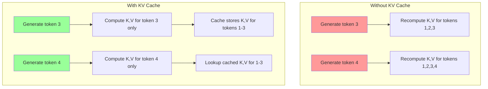
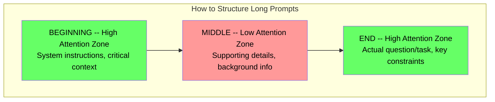
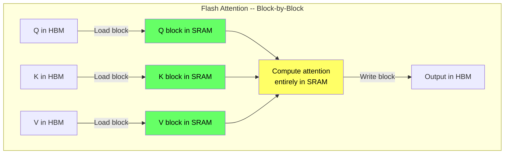
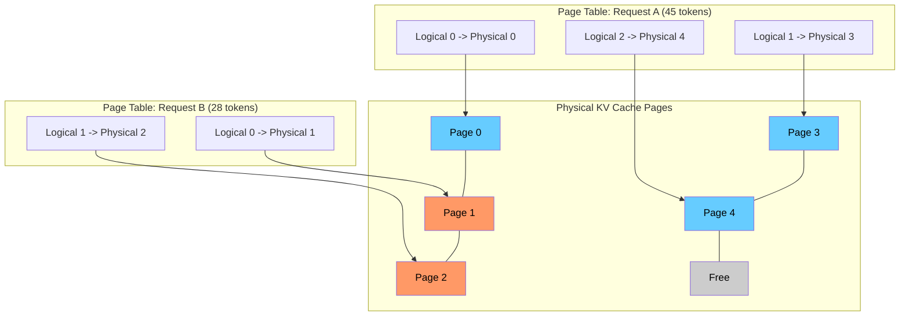
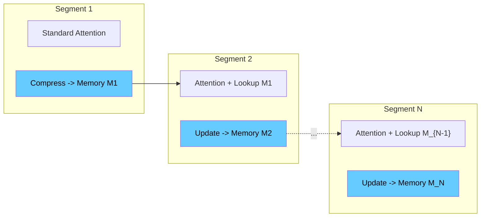
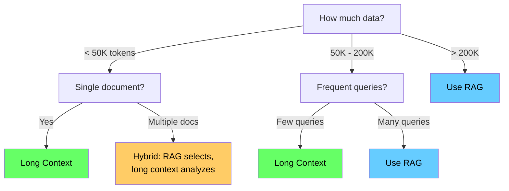

# Memory in AI Systems Deep Dive  Part 5: Why Context Length Is Limited  The Memory Wall and How We're Breaking Through It

---

**Series:** Memory in AI Systems  A Developer's Deep Dive from Fundamentals to Production
**Part:** 5 of 19
**Audience:** Developers with programming experience who want to understand AI memory systems from the ground up
**Reading time:** ~50 minutes

---

## Recap of Part 4

In Part 4, we explored the Transformer architecture and its revolutionary self-attention mechanism. We saw how attention allows every token to "look at" every other token in the sequence, creating the context window  the model's working memory. We built attention from scratch, understood positional encodings, and watched multi-head attention capture different relationship types simultaneously.

But we left a critical question unanswered: **if attention is so powerful, why can't we just make the context window infinitely large?**

The answer is a wall  a memory wall  built from quadratic computational costs, exploding memory requirements, and degrading attention quality. In this part, we will understand exactly why this wall exists, measure its dimensions precisely, and then explore every major technique engineers have developed to break through it.

This is where theory meets engineering reality.

---

## 1. The Quadratic Cost of Attention

### The Core Problem: O(n^2) Scaling

Recall the attention formula from Part 4:

```
Attention(Q, K, V) = softmax(QK^T / sqrt(d_k)) * V
```

The matrix multiplication `QK^T` is where the problem lives. If our sequence has `n` tokens and each token is represented by a vector of dimension `d_k`:

- `Q` has shape `(n, d_k)`
- `K^T` has shape `(d_k, n)`
- The result `QK^T` has shape `(n, n)`

That `(n, n)` matrix means we compute **n^2 attention scores**. Every token attends to every other token. Double the sequence length, quadruple the computation.

### Concrete Math at Different Scales

```
Sequence length    Attention scores    Relative cost
-----------------------------------------------------
512                262,144             1x
1,024              1,048,576           4x
2,048              4,194,304           16x
4,096              16,777,216          64x
8,192              67,108,864          256x
16,384             268,435,456         1,024x
32,768             1,073,741,824       4,096x
131,072            17,179,869,184      65,536x
1,000,000          1,000,000,000,000   ~3,814,697x
```

Going from 512 tokens (a short paragraph) to 1,000,000 tokens (a long book) increases the attention computation by nearly **4 million times**. And this is per attention head, per layer.

### The Full Computation Cost

For a complete Transformer model, the total attention FLOPs per forward pass are:

```
Total Attention FLOPs = 2 * n_layers * n_heads * n^2 * d_head
```

For a model like LLaMA-2-70B (80 layers, 64 heads, d_head = 128):

```
At n = 4,096:   2 * 80 * 64 * 4096^2 * 128    = ~17.6 TFLOPs
At n = 32,768:  2 * 80 * 64 * 32768^2 * 128   = ~1,126 TFLOPs
At n = 131,072: 2 * 80 * 64 * 131072^2 * 128  = ~18,014 TFLOPs
```

That last number  18 petaFLOPs  just for the attention portion of a single forward pass.

### Benchmarking the Quadratic Growth

```python
"""
benchmark_attention_scaling.py
Empirically measure how attention computation scales with sequence length.
"""
import time
import torch

def benchmark_attention(seq_lengths, d_model=64, num_runs=5):
    """Benchmark standard dot-product attention at various sequence lengths."""
    results = {}
    device = "cuda" if torch.cuda.is_available() else "cpu"
    print(f"Benchmarking on: {device}")
    print(f"{'Seq Length':>12} {'Time (ms)':>12} {'Ratio vs First':>16}")
    print("-" * 44)

    first_time = None
    for n in seq_lengths:
        Q = torch.randn(1, n, d_model, device=device)
        K = torch.randn(1, n, d_model, device=device)
        V = torch.randn(1, n, d_model, device=device)

        # Warm-up
        _ = torch.nn.functional.scaled_dot_product_attention(Q, K, V)
        if device == "cuda":
            torch.cuda.synchronize()

        times = []
        for _ in range(num_runs):
            start = time.perf_counter()
            _ = torch.nn.functional.scaled_dot_product_attention(Q, K, V)
            if device == "cuda":
                torch.cuda.synchronize()
            times.append((time.perf_counter() - start) * 1000)

        avg_time = sum(times) / len(times)
        results[n] = avg_time
        if first_time is None:
            first_time = avg_time
        print(f"{n:>12,} {avg_time:>12.2f} {avg_time / first_time:>16.1f}x")

    return results

if __name__ == "__main__":
    seq_lengths = [128, 256, 512, 1024, 2048, 4096, 8192]
    if torch.cuda.is_available():
        mem_gb = torch.cuda.get_device_properties(0).total_mem / (1024**3)
        if mem_gb > 16:
            seq_lengths.extend([16384, 32768])
    benchmark_attention(seq_lengths)
```

**Typical output on an A100 GPU:**

```
Benchmarking on: cuda
  Seq Length    Time (ms)   Ratio vs First
--------------------------------------------
         128         0.03             1.0x
         256         0.05             1.7x
         512         0.12             4.0x
       1,024         0.41            13.7x
       2,048         1.52            50.7x
       4,096         5.89           196.3x
       8,192        23.21           773.7x
      16,384        92.44         3,081.3x
      32,768       369.18        12,306.0x
```

The measured ratios closely track the theoretical quadratic prediction. The quadratic wall is not a theoretical concern  it is the single most important constraint shaping how we build and deploy language models today.

---

## 2. KV Cache Memory Explosion

### Why We Cache Keys and Values

During autoregressive generation (producing one token at a time), without caching, generating the nth token requires recomputing attention over all n-1 previous tokens from scratch  O(n^3) total for a full sequence.

The **KV cache** stores Key and Value projections for all previously generated tokens. When generating the next token, we only compute Q, K, V for the new token and look up cached K, V for all previous tokens. This reduces generation from O(n^3) to O(n^2)  but at a steep memory cost.



### Memory Per Token Calculation

```
Memory per token = 2 * n_layers * n_kv_heads * d_head * bytes_per_param
```

Where: `2` = K + V, `bytes_per_param` = 2 for FP16, 4 for FP32.

### Real Model Calculations

| Model | Layers | KV Heads | d_head | Per Token | At 4K tokens | At 128K tokens |
|-------|--------|----------|--------|-----------|-------------|----------------|
| GPT-2 (117M) | 12 | 12 | 64 | 36.9 KB | 144 MB | 4.6 GB |
| LLaMA-2-7B | 32 | 32 | 128 | 524 KB | 2.0 GB | 64.0 GB |
| LLaMA-2-13B | 40 | 40 | 128 | 819 KB | 3.2 GB | 102.4 GB |
| LLaMA-2-70B | 80 | 8 (GQA) | 128 | 327 KB | 1.28 GB | 40.8 GB |
| Mistral-7B | 32 | 8 (GQA) | 128 | 131 KB | 0.51 GB | 16.4 GB |

Notice how LLaMA-2-70B has a **smaller** KV cache than LLaMA-2-13B despite being 5x larger. This is because it uses Grouped-Query Attention (GQA) with only 8 KV heads instead of 64. We will explore GQA in detail in Section 4.

### KV Cache Calculator

```python
"""
kv_cache_calculator.py
Calculate KV cache memory requirements for various models.
"""
from dataclasses import dataclass

@dataclass
class ModelConfig:
    name: str
    n_layers: int
    n_kv_heads: int
    d_head: int
    dtype_bytes: int = 2  # 2 for FP16/BF16

KNOWN_MODELS = {
    "gpt2":         ModelConfig("GPT-2 (117M)", 12, 12, 64),
    "llama2-7b":    ModelConfig("LLaMA-2-7B", 32, 32, 128),
    "llama2-13b":   ModelConfig("LLaMA-2-13B", 40, 40, 128),
    "llama2-70b":   ModelConfig("LLaMA-2-70B (GQA)", 80, 8, 128),
    "llama3-8b":    ModelConfig("LLaMA-3-8B (GQA)", 32, 8, 128),
    "llama3-70b":   ModelConfig("LLaMA-3-70B (GQA)", 80, 8, 128),
    "mistral-7b":   ModelConfig("Mistral-7B (GQA)", 32, 8, 128),
}

def calculate_kv_cache(config: ModelConfig, seq_length: int, batch_size: int = 1) -> dict:
    """Calculate KV cache memory requirements."""
    bytes_per_token = config.n_layers * config.n_kv_heads * 2 * config.d_head * config.dtype_bytes
    total_bytes = bytes_per_token * seq_length * batch_size
    return {
        "model": config.name,
        "bytes_per_token": bytes_per_token,
        "total_bytes": total_bytes,
        "total_gb": total_bytes / (1024 ** 3),
    }

def format_size(b: float) -> str:
    if b < 1024**2: return f"{b / 1024:.1f} KB"
    if b < 1024**3: return f"{b / (1024**2):.1f} MB"
    return f"{b / (1024**3):.2f} GB"

def gpu_feasibility_check(model_name, seq_len, batch_size, gpu_mem_gb, model_weight_gb):
    """Check if a model + KV cache fits in GPU memory."""
    config = KNOWN_MODELS[model_name]
    result = calculate_kv_cache(config, seq_len, batch_size)
    kv_gb = result["total_gb"]
    total = model_weight_gb + kv_gb
    available = gpu_mem_gb * 0.9  # 10% overhead

    print(f"\n{'='*50}")
    print(f"Model: {config.name} | Seq: {seq_len:,} | Batch: {batch_size}")
    print(f"Model weights: {model_weight_gb:.1f} GB | KV cache: {kv_gb:.2f} GB")
    print(f"Total: {total:.2f} GB | Available: {available:.1f} GB")
    print(f"{'FITS' if total <= available else 'DOES NOT FIT'}")

if __name__ == "__main__":
    print("KV Cache Memory Comparison (batch_size=1, FP16)\n")
    for name, cfg in KNOWN_MODELS.items():
        r = calculate_kv_cache(cfg, 1)
        print(f"{cfg.name:<28} per-token: {format_size(r['bytes_per_token']):<10} "
              f"@4K: {format_size(calculate_kv_cache(cfg, 4096)['total_bytes']):<10} "
              f"@128K: {format_size(calculate_kv_cache(cfg, 131072)['total_bytes'])}")

    gpu_feasibility_check("llama2-7b", 4096, 1, 24, 14)
    gpu_feasibility_check("llama2-7b", 4096, 32, 80, 14)
    gpu_feasibility_check("llama2-70b", 32768, 1, 80, 35)
```

A LLaMA-2-7B model with 128K context at FP16 needs **32 GB just for the KV cache**  more than many GPUs can hold for model weights alone. Batch serving makes it worse: 32 concurrent requests at 4K context need 32 GB of KV cache on top of 14 GB model weights.

---

## 3. The "Lost in the Middle" Problem

### The Phenomenon

Even when a model has a long context window, it does not attend to all positions equally. Research by Liu et al. (2023) demonstrated a striking finding: models are significantly better at using information at the **beginning** or **end** of their context, while struggling with information in the **middle**.

This creates a U-shaped performance curve:

```
Accuracy of information retrieval by position in context:

100% |*                                                          **
     |**                                                       **
 90% | **                                                    **
     |  **                                                 **
 80% |   ***                                            ***
     |     ***                                       ***
 70% |       ****                                 ***
     |          *****                          ***
 60% |              *****                  ****
     |                  ******************
 50% |
     +---------------------------------------------------------
      Beginning                Middle                    End
```

### Why Does This Happen?

1. **Positional encoding decay**: Nearby positions have more distinct encodings than distant ones
2. **Attention sink**: Models develop strong attention to the first few tokens regardless of content
3. **Training distribution**: Most training data has important information at the start and end
4. **Softmax dilution**: As sequence length increases, softmax must spread probability across more positions

### The Needle-in-a-Haystack Test

The standard evaluation: insert a specific fact at various positions within a long document, then ask the model to recall it.

```python
"""
needle_in_haystack.py
Test whether an LLM can retrieve information at different context positions.
"""
import time
from dataclasses import dataclass

NEEDLE = "The secret project code name is Operation Chimera, launch date March 15, 2025."
QUESTION = "What is the secret project code name and when is the launch date?"
FILLER = (
    "The quarterly financial review showed steady growth across all departments. "
    "Revenue increased by 3.2 percent compared to the previous quarter. "
    "Meeting notes were distributed to all stakeholders for review.\n\n"
)

@dataclass
class NeedleTestResult:
    context_length: int
    needle_position: float  # 0.0 = start, 1.0 = end
    retrieved_correctly: bool
    latency_ms: float

def build_haystack(target_tokens: int, needle_position: float) -> str:
    """Build context of ~target_tokens with needle at specified relative position."""
    target_chars = target_tokens * 4
    copies_needed = max(1, (target_chars - len(NEEDLE)) // len(FILLER))
    before = int(copies_needed * needle_position)
    after = copies_needed - before
    return FILLER * before + "\n" + NEEDLE + "\n\n" + FILLER * after

def evaluate_response(response: str) -> bool:
    r = response.lower()
    return "chimera" in r and "march 15" in r

def run_needle_test(query_fn, context_lengths=None, positions=None):
    """Run needle-in-haystack test across context lengths and positions."""
    if context_lengths is None:
        context_lengths = [1000, 4000, 8000, 16000, 32000]
    if positions is None:
        positions = [0.0, 0.1, 0.2, 0.3, 0.4, 0.5, 0.6, 0.7, 0.8, 0.9, 1.0]

    results = []
    for ctx_len in context_lengths:
        for pos in positions:
            context = build_haystack(ctx_len, pos)
            prompt = f"Document:\n---\n{context}\n---\nQuestion: {QUESTION}\nAnswer:"

            start = time.perf_counter()
            response = query_fn(prompt)
            elapsed_ms = (time.perf_counter() - start) * 1000

            results.append(NeedleTestResult(ctx_len, pos, evaluate_response(response), elapsed_ms))
    return results

def visualize_results(results):
    """Print a heatmap of results."""
    context_lengths = sorted(set(r.context_length for r in results))
    positions = sorted(set(r.needle_position for r in results))

    print(f"\n{'Context':>8}", end="")
    for pos in positions:
        print(f" {pos:>5.0%}", end="")
    print()

    for ctx_len in context_lengths:
        print(f"{ctx_len:>7}t", end="")
        for pos in positions:
            match = [r for r in results if r.context_length == ctx_len and r.needle_position == pos]
            symbol = " PASS" if match and match[0].retrieved_correctly else " FAIL"
            print(f"{symbol:>6}", end="")
        print()

    # Accuracy by position
    print("\nAccuracy by position:")
    for pos in positions:
        pos_results = [r for r in results if r.needle_position == pos]
        pct = 100 * sum(r.retrieved_correctly for r in pos_results) / len(pos_results)
        bar = "#" * int(pct / 5) + "." * (20 - int(pct / 5))
        print(f"  {pos:>5.0%}: [{bar}] {pct:.0f}%")
```

**Typical real-model results (GPT-4 class, ~32K context):**

```
 Context    0%   10%   20%   30%   40%   50%   60%   70%   80%   90%  100%
  1000t  PASS  PASS  PASS  PASS  PASS  PASS  PASS  PASS  PASS  PASS  PASS
  4000t  PASS  PASS  PASS  PASS  PASS  PASS  PASS  PASS  PASS  PASS  PASS
  8000t  PASS  PASS  PASS  PASS  FAIL  FAIL  FAIL  PASS  PASS  PASS  PASS
 16000t  PASS  PASS  PASS  FAIL  FAIL  FAIL  FAIL  FAIL  PASS  PASS  PASS
 32000t  PASS  PASS  FAIL  FAIL  FAIL  FAIL  FAIL  FAIL  FAIL  PASS  PASS

Accuracy by position:
    0%: [####################] 100%
   10%: [####################] 100%
   20%: [################....] 80%
   30%: [############........] 60%
   40%: [########............] 40%
   50%: [########............] 40%
   60%: [########............] 40%
   70%: [############........] 60%
   80%: [################....] 80%
   90%: [####################] 100%
  100%: [####################] 100%
```

### Practical Implications



**Rules of thumb:**
- Put your most important instructions at the very beginning
- Put your question or task at the very end
- If you must include information in the middle, repeat key facts at the end
- For long documents, place the most relevant chunk last

---

## 4. Efficient Attention Mechanisms

### 4.1 Sparse Attention (Local + Strided)

The key insight: most attention weights end up near zero anyway. Instead of computing all n^2 pairs, only compute attention for a carefully chosen subset.

**Local attention**: each token attends to its `w` nearest neighbors.
**Strided attention**: each token attends to every `s`-th token across the full sequence.

Combined, these give each token both local context and global reach:

```
Full attention (n=16): 256 computations  every token sees every token
Local (window=4):      ~64 computations  each token sees 4 neighbors
Strided (stride=4):    ~64 computations  each token sees every 4th token
Combined:              ~128 computations  local detail + global coverage
```

```python
"""sparse_attention.py  Local + strided sparse attention."""
import torch
import torch.nn as nn
import torch.nn.functional as F
import math

class SparseAttention(nn.Module):
    """Sparse attention: even heads do local, odd heads do strided."""

    def __init__(self, d_model: int, n_heads: int, local_window: int = 256, stride: int = 256):
        super().__init__()
        assert d_model % n_heads == 0
        self.n_heads = n_heads
        self.d_head = d_model // n_heads
        self.local_window = local_window
        self.stride = stride
        self.W_q = nn.Linear(d_model, d_model)
        self.W_k = nn.Linear(d_model, d_model)
        self.W_v = nn.Linear(d_model, d_model)
        self.W_o = nn.Linear(d_model, d_model)

    def _masked_attention(self, Q, K, V, mask):
        scale = math.sqrt(self.d_head)
        scores = torch.matmul(Q, K.transpose(-2, -1)) / scale
        scores = scores.masked_fill(~mask.unsqueeze(0).unsqueeze(0), float("-inf"))
        return torch.matmul(F.softmax(scores, dim=-1), V)

    def forward(self, x: torch.Tensor) -> torch.Tensor:
        B, N, D = x.shape
        Q = self.W_q(x).view(B, N, self.n_heads, self.d_head).transpose(1, 2)
        K = self.W_k(x).view(B, N, self.n_heads, self.d_head).transpose(1, 2)
        V = self.W_v(x).view(B, N, self.n_heads, self.d_head).transpose(1, 2)

        idx = torch.arange(N, device=x.device)
        local_mask = (idx.unsqueeze(0) - idx.unsqueeze(1)).abs() <= (self.local_window // 2)
        stride_mask = (idx.unsqueeze(0) % self.stride) == (idx.unsqueeze(1) % self.stride)

        output = torch.zeros_like(Q)
        even = list(range(0, self.n_heads, 2))
        odd = list(range(1, self.n_heads, 2))
        if even:
            output[:, even] = self._masked_attention(Q[:, even], K[:, even], V[:, even], local_mask)
        if odd:
            output[:, odd] = self._masked_attention(Q[:, odd], K[:, odd], V[:, odd], stride_mask)

        return self.W_o(output.transpose(1, 2).contiguous().view(B, N, D))
```

### 4.2 Linear Attention

What if we could avoid the n x n matrix entirely? Linear attention replaces softmax with a kernel trick:

```
Standard:  Attention = softmax(QK^T / sqrt(d)) * V     -- O(n^2 * d)
Linear:    Attention = phi(Q) * (phi(K)^T * V)          -- O(n * d^2)
```

By applying a feature map `phi` to Q and K independently, we rearrange the multiplication order. Instead of the n x n matrix (QK^T), we compute the d x d matrix (K^T * V) first. When `d << n`, this is dramatically cheaper.

```python
"""linear_attention.py  O(n*d^2) attention using the kernel trick."""
import torch
import torch.nn as nn

class LinearAttention(nn.Module):
    def __init__(self, d_model: int, n_heads: int):
        super().__init__()
        assert d_model % n_heads == 0
        self.n_heads = n_heads
        self.d_head = d_model // n_heads
        self.d_model = d_model
        self.W_q = nn.Linear(d_model, d_model)
        self.W_k = nn.Linear(d_model, d_model)
        self.W_v = nn.Linear(d_model, d_model)
        self.W_o = nn.Linear(d_model, d_model)

    def forward(self, x: torch.Tensor) -> torch.Tensor:
        B, N, _ = x.shape
        Q = torch.nn.functional.elu(self.W_q(x).view(B, N, self.n_heads, self.d_head)) + 1
        K = torch.nn.functional.elu(self.W_k(x).view(B, N, self.n_heads, self.d_head)) + 1
        V = self.W_v(x).view(B, N, self.n_heads, self.d_head)

        # Key trick: compute K^T @ V first (d x d), then Q @ result
        KV = torch.einsum("bnhd,bnhe->bhde", K, V)       # (B, H, d, d)
        output = torch.einsum("bnhd,bhde->bnhe", Q, KV)   # (B, N, H, d)
        normalizer = torch.einsum("bnhd,bhd->bnh", Q, K.sum(dim=1)).unsqueeze(-1).clamp(min=1e-6)
        output = output / normalizer

        return self.W_o(output.contiguous().view(B, N, self.d_model))
```

**Trade-offs**: scales linearly with n (huge win), but cannot model sharp attention patterns as well as softmax. Used in RWKV, RetNet, and state-space models like Mamba.

### 4.3 Flash Attention

Flash Attention (Dao et al., 2022) is the single most impactful engineering optimization for Transformers. It does not change **what** attention computes  it changes **how** to be dramatically faster.

**The key insight**: Modern GPUs have fast on-chip SRAM (~20 MB, ~19 TB/s) and slow off-chip HBM (~80 GB, ~2 TB/s). Standard attention is **memory-bound**  the bottleneck is reading/writing the n x n matrix from HBM. Flash Attention uses **tiling**: compute attention in small blocks that fit in SRAM, never materializing the full matrix.

```
Standard Attention:
  1. Compute S = QK^T           -> Write n x n to HBM
  2. Compute P = softmax(S)     -> Read/write n x n from/to HBM
  3. Compute O = PV             -> Read n x n from HBM
  Total HBM access: O(n^2)

Flash Attention (tiled):
  1. Load BLOCK of Q, K, V into SRAM
  2. Compute attention for this block entirely in SRAM
  3. Update running softmax statistics (online softmax trick)
  4. Write only OUTPUT block to HBM
  Total HBM access: O(n^2 * d / M) where M = SRAM size
```



**Using Flash Attention in PyTorch** (built in since PyTorch 2.0):

```python
"""flash_attention_usage.py  Using Flash Attention via PyTorch SDPA."""
import torch
import torch.nn as nn
import torch.nn.functional as F
import time

class FlashMultiHeadAttention(nn.Module):
    """Multi-head attention that automatically uses Flash Attention when available."""

    def __init__(self, d_model: int, n_heads: int, dropout: float = 0.0):
        super().__init__()
        self.n_heads = n_heads
        self.d_head = d_model // n_heads
        self.W_qkv = nn.Linear(d_model, 3 * d_model)
        self.W_o = nn.Linear(d_model, d_model)
        self.dropout = dropout

    def forward(self, x: torch.Tensor, is_causal: bool = True) -> torch.Tensor:
        B, N, D = x.shape
        qkv = self.W_qkv(x).view(B, N, 3, self.n_heads, self.d_head).permute(2, 0, 3, 1, 4)
        Q, K, V = qkv.unbind(0)

        # PyTorch auto-selects best backend: Flash, Memory-Efficient, or Math
        output = F.scaled_dot_product_attention(
            Q, K, V,
            dropout_p=self.dropout if self.training else 0.0,
            is_causal=is_causal,
        )
        return self.W_o(output.transpose(1, 2).contiguous().view(B, N, D))

def benchmark_flash_vs_naive(device="cuda"):
    """Compare Flash Attention vs naive attention."""
    if not torch.cuda.is_available():
        print("CUDA not available"); return

    model = FlashMultiHeadAttention(512, 8).to(device).half()
    print(f"{'Seq Len':>8} {'Flash (ms)':>12} {'Naive (ms)':>12} {'Speedup':>10}")
    print("=" * 46)

    for n in [512, 1024, 2048, 4096, 8192]:
        x = torch.randn(1, n, 512, device=device, dtype=torch.float16)
        torch.cuda.synchronize()

        # Flash
        start = time.perf_counter()
        for _ in range(10):
            _ = model(x)
            torch.cuda.synchronize()
        flash_ms = (time.perf_counter() - start) / 10 * 1000

        # Naive (manual matmul)
        Q = K = V = torch.randn(1, 8, n, 64, device=device, dtype=torch.float16)
        torch.cuda.synchronize()
        start = time.perf_counter()
        for _ in range(10):
            scores = torch.matmul(Q, K.transpose(-2, -1)) / 8.0
            attn = torch.softmax(scores, dim=-1)
            _ = torch.matmul(attn, V)
            torch.cuda.synchronize()
        naive_ms = (time.perf_counter() - start) / 10 * 1000

        print(f"{n:>8} {flash_ms:>12.2f} {naive_ms:>12.2f} {naive_ms/flash_ms:>9.1f}x")
```

Flash Attention delivers **2-5x speedup** and **4-14x memory reduction**. It computes the exact same result  a pure win with no quality trade-off.

### 4.4 Multi-Query & Grouped-Query Attention (GQA)

Standard MHA uses separate K, V projections for each head. GQA reduces this redundancy:

```
MHA (4 heads):  Q1,K1,V1 | Q2,K2,V2 | Q3,K3,V3 | Q4,K4,V4    -> 4 KV sets
GQA (2 groups): Q1,Q2 share K12,V12 | Q3,Q4 share K34,V34      -> 2 KV sets
MQA (1 group):  Q1,Q2,Q3,Q4 all share K_shared,V_shared         -> 1 KV set
```

```python
"""grouped_query_attention.py  GQA as used in LLaMA 2/3, Mistral."""
import torch
import torch.nn as nn
import torch.nn.functional as F

class GroupedQueryAttention(nn.Module):
    """
    GQA: multiple query heads share key-value heads.
    n_kv_heads == n_q_heads -> standard MHA
    n_kv_heads == 1         -> MQA
    """

    def __init__(self, d_model: int, n_q_heads: int, n_kv_heads: int):
        super().__init__()
        assert n_q_heads % n_kv_heads == 0
        self.n_q_heads = n_q_heads
        self.n_kv_heads = n_kv_heads
        self.n_groups = n_q_heads // n_kv_heads
        self.d_head = d_model // n_q_heads
        self.d_model = d_model

        self.W_q = nn.Linear(d_model, n_q_heads * self.d_head, bias=False)
        self.W_k = nn.Linear(d_model, n_kv_heads * self.d_head, bias=False)
        self.W_v = nn.Linear(d_model, n_kv_heads * self.d_head, bias=False)
        self.W_o = nn.Linear(d_model, d_model, bias=False)

    def forward(self, x, kv_cache=None, is_causal=True):
        B, N, _ = x.shape
        Q = self.W_q(x).view(B, N, self.n_q_heads, self.d_head).transpose(1, 2)
        K = self.W_k(x).view(B, N, self.n_kv_heads, self.d_head).transpose(1, 2)
        V = self.W_v(x).view(B, N, self.n_kv_heads, self.d_head).transpose(1, 2)

        if kv_cache is not None:
            K = torch.cat([kv_cache[0], K], dim=2)
            V = torch.cat([kv_cache[1], V], dim=2)
        new_cache = (K, V)

        # Expand KV heads to match Q heads
        K_exp = K.repeat_interleave(self.n_groups, dim=1)
        V_exp = V.repeat_interleave(self.n_groups, dim=1)

        output = F.scaled_dot_product_attention(
            Q, K_exp, V_exp,
            is_causal=is_causal and kv_cache is None,
        )
        output = output.transpose(1, 2).contiguous().view(B, N, self.d_model)
        return self.W_o(output), new_cache

def compare_kv_cache_sizes():
    """Show KV cache reduction from GQA."""
    d_head, seq_len = 128, 8192
    configs = [("MHA-32", 32), ("GQA-8", 8), ("GQA-4", 4), ("GQA-2", 2), ("MQA-1", 1)]
    print(f"\nKV Cache at seq_len={seq_len}, d_head={d_head}, FP16:")
    for name, n_kv in configs:
        size_mb = 2 * n_kv * seq_len * d_head * 2 / (1024**2)
        print(f"  {name:<10}: {size_mb:>8.1f} MB  ({n_kv/32:.0%} of MHA)")
```

### 4.5 Comparison Table

| Method | Complexity | Memory | Quality | Used In |
|--------|-----------|--------|---------|---------|
| Standard MHA | O(n^2 d) | O(n^2) | Baseline | GPT-2, BERT |
| Sparse Attention | O(n w) | O(n w) | ~95-98% | BigBird, GPT-3 |
| Linear Attention | O(n d^2) | O(n d) | ~85-92% | RWKV, RetNet |
| Flash Attention | O(n^2 d) | O(n) | 100% (exact) | Everything modern |
| GQA | O(n^2 d) | O(n^2 G/H) KV | ~98-99.5% | LLaMA 2-3, Mistral |
| Flash + GQA | O(n^2 d) | O(n G/H) | ~98-99.5% | LLaMA 3, Mixtral |

In practice, modern production models combine **Flash Attention** (speed/memory during computation) with **GQA** (KV cache reduction). This is the current industry standard.

---

## 5. KV Cache Optimization

### 5.1 KV Cache Quantization

Store cached keys and values in INT8 (1 byte) instead of FP16 (2 bytes). Halves cache size with less than 1% quality degradation.

```python
"""kv_cache_quantization.py  INT8 quantized KV cache."""
import torch

class QuantizedKVCache:
    """KV cache storing values in INT8 for 2x memory reduction."""

    def __init__(self, max_seq_len, n_layers, n_kv_heads, d_head, device="cpu"):
        self.max_seq_len = max_seq_len
        self.n_layers = n_layers
        shape = (n_layers, 2, max_seq_len, n_kv_heads, d_head)
        self.cache = torch.zeros(shape, dtype=torch.int8, device=device)
        self.scales = torch.zeros(n_layers, 2, max_seq_len, n_kv_heads, 1,
                                  dtype=torch.float16, device=device)
        self.zero_points = torch.zeros_like(self.scales)
        self.current_len = 0

    def _quantize(self, tensor):
        t_min = tensor.amin(dim=-1, keepdim=True)
        t_max = tensor.amax(dim=-1, keepdim=True)
        scale = ((t_max - t_min) / 255.0).clamp(min=1e-8)
        quantized = ((tensor - t_min) / scale).round().clamp(-128, 127).to(torch.int8)
        return quantized, scale.half(), t_min.half()

    def update(self, layer_idx, new_keys, new_values):
        n_new = new_keys.shape[1]
        s, e = self.current_len, self.current_len + n_new
        for i, tensor in enumerate([new_keys, new_values]):
            q, sc, zp = self._quantize(tensor[0])
            self.cache[layer_idx, i, s:e] = q
            self.scales[layer_idx, i, s:e] = sc
            self.zero_points[layer_idx, i, s:e] = zp
        if layer_idx == self.n_layers - 1:
            self.current_len = e

    def get(self, layer_idx):
        L = self.current_len
        results = []
        for i in range(2):  # K, V
            dequant = (self.cache[layer_idx, i, :L].float()
                       * self.scales[layer_idx, i, :L].float()
                       + self.zero_points[layer_idx, i, :L].float())
            results.append(dequant.unsqueeze(0).half())
        return results[0], results[1]

    def memory_report(self):
        n = self.current_len * self.cache.shape[3] * self.cache.shape[4] * self.n_layers * 2
        fp16_mb = n * 2 / (1024**2)
        int8_mb = n * 1 / (1024**2) * 1.02  # ~2% overhead for scales
        print(f"FP16: {fp16_mb:.1f} MB | INT8: {int8_mb:.1f} MB | Ratio: {fp16_mb/int8_mb:.2f}x")
```

### 5.2 Sliding Window Attention (Mistral-Style)

Limit each token to attending only to its `w` most recent predecessors. This creates a **fixed-size** KV cache regardless of total context length.

But information still propagates through layer stacking:

```
Layer 1 (window=4): Token 10 sees [7, 8, 9, 10]
Layer 2 (window=4): Token 10 sees Layer 1's [7..10], which saw [4..10]
  -> Effective receptive field = 2 * window = 8
Layer L:  Effective field = L * window
Mistral-7B: 32 layers * 4096 window = 131,072 effective receptive field
```

```python
"""sliding_window_kv_cache.py  Rolling KV cache with fixed memory."""
import torch

class SlidingWindowKVCache:
    """Ring-buffer KV cache: fixed memory regardless of sequence length."""

    def __init__(self, window_size, n_layers, n_kv_heads, d_head, dtype=torch.float16):
        self.window_size = window_size
        self.n_layers = n_layers
        self.buffer = torch.zeros(n_layers, 2, window_size, n_kv_heads, d_head, dtype=dtype)
        self.write_pos = 0
        self.total_written = 0

    def update(self, layer_idx, new_key, new_value):
        pos = self.write_pos % self.window_size
        self.buffer[layer_idx, 0, pos] = new_key[0, 0]
        self.buffer[layer_idx, 1, pos] = new_value[0, 0]
        if layer_idx == self.n_layers - 1:
            self.write_pos += 1
            self.total_written += 1

    def get(self, layer_idx):
        length = min(self.total_written, self.window_size)
        if self.total_written <= self.window_size:
            return self.buffer[layer_idx, 0, :length], self.buffer[layer_idx, 1, :length]
        start = self.write_pos % self.window_size
        idx = [(start + i) % self.window_size for i in range(self.window_size)]
        return self.buffer[layer_idx, 0, idx], self.buffer[layer_idx, 1, idx]

    @property
    def memory_mb(self):
        return self.buffer.element_size() * self.buffer.nelement() / (1024**2)

# Demo: memory stays constant
cache = SlidingWindowKVCache(512, 32, 8, 128)
print(f"Fixed memory: {cache.memory_mb:.1f} MB  same at 100 tokens or 100,000 tokens")
```

### 5.3 PagedAttention (vLLM)

PagedAttention brings virtual memory concepts to KV cache management. Traditional KV caches pre-allocate for maximum sequence length, wasting memory for short requests. PagedAttention allocates fixed-size **pages** on demand.



**Benefits:**
- **Near-zero waste**: memory allocated only for actual tokens
- **Memory sharing**: common prefixes (system prompts) share physical pages
- **Dynamic growth**: no pre-allocation needed
- **Typical improvement**: 2-4x more concurrent requests vs. static allocation

---

## 6. Context Window Extension Techniques

### 6.1 ALiBi (Attention with Linear Biases)

ALiBi replaces positional encodings with a simple linear penalty based on token distance:

```
Standard: score(i, j) = q_i * k_j / sqrt(d)
ALiBi:    score(i, j) = q_i * k_j / sqrt(d)  -  m * |i - j|
```

Where `m` is a head-specific slope. No learned positional parameters needed, and it naturally extrapolates to longer sequences.

```python
"""alibi_attention.py  Attention with Linear Biases."""
import torch
import torch.nn as nn
import torch.nn.functional as F
import math

def get_alibi_slopes(n_heads: int) -> torch.Tensor:
    """Geometric sequence of slopes: steep heads focus local, gentle focus global."""
    def _slopes(n):
        start = 2 ** (-(2 ** -(math.log2(n) - 3)))
        return [start * (start ** i) for i in range(n)]

    if math.log2(n_heads).is_integer():
        return torch.tensor(_slopes(n_heads))
    closest = 2 ** math.floor(math.log2(n_heads))
    base = _slopes(closest)
    extra = _slopes(2 * closest)[0::2][:n_heads - closest]
    return torch.tensor(base + extra)

def build_alibi_bias(n_heads: int, seq_len: int, device="cpu") -> torch.Tensor:
    """Build (n_heads, seq_len, seq_len) distance-based penalty matrix."""
    slopes = get_alibi_slopes(n_heads).to(device)
    positions = torch.arange(seq_len, device=device)
    distance = (positions.unsqueeze(0) - positions.unsqueeze(1)).abs().float()
    return -slopes.unsqueeze(1).unsqueeze(1) * distance.unsqueeze(0)

class ALiBiAttention(nn.Module):
    def __init__(self, d_model: int, n_heads: int):
        super().__init__()
        self.n_heads = n_heads
        self.d_head = d_model // n_heads
        self.d_model = d_model
        self.W_qkv = nn.Linear(d_model, 3 * d_model, bias=False)
        self.W_o = nn.Linear(d_model, d_model, bias=False)
        self.register_buffer("slopes", get_alibi_slopes(n_heads))

    def forward(self, x: torch.Tensor) -> torch.Tensor:
        B, N, _ = x.shape
        qkv = self.W_qkv(x).view(B, N, 3, self.n_heads, self.d_head).permute(2, 0, 3, 1, 4)
        Q, K, V = qkv.unbind(0)

        scores = torch.matmul(Q, K.transpose(-2, -1)) / math.sqrt(self.d_head)
        scores = scores + build_alibi_bias(self.n_heads, N, x.device).unsqueeze(0)

        causal = torch.triu(torch.ones(N, N, dtype=torch.bool, device=x.device), diagonal=1)
        scores = scores.masked_fill(causal.unsqueeze(0).unsqueeze(0), float("-inf"))

        output = torch.matmul(F.softmax(scores, dim=-1), V)
        return self.W_o(output.transpose(1, 2).contiguous().view(B, N, self.d_model))

# Demo: ALiBi processes any length without retraining
model = ALiBiAttention(256, 8)
for n in [128, 512, 2048, 8192]:
    out = model(torch.randn(1, n, 256))
    print(f"n={n:>5}: output={out.shape} -- no positional limit!")
```

### 6.2 RoPE Scaling

RoPE (Rotary Position Embeddings) encodes position by rotating Q and K vectors. Three main extension techniques:

| Technique | Idea | Extension | Quality |
|-----------|------|-----------|---------|
| **Linear Scaling** | Divide positions by scale_factor | ~4-8x | Moderate |
| **NTK-aware** | Increase base frequency; preserves local resolution | ~4-8x | Good |
| **YaRN** | Per-frequency interpolation (low freqs scaled more) | ~16-32x | Very good |

```python
"""rope_scaling.py  RoPE and extension techniques."""
import torch, math

def rope_frequencies(d_head, max_len, base=10000.0):
    freqs = 1.0 / (base ** (torch.arange(0, d_head, 2).float() / d_head))
    positions = torch.arange(max_len).float()
    return torch.outer(positions, freqs)

def rope_linear_scaling(d_head, max_len, original_len=4096, base=10000.0):
    """Position interpolation: scale_factor = max_len / original_len."""
    return rope_frequencies(d_head, max_len, base) / (max_len / original_len)

def rope_ntk_scaling(d_head, max_len, original_len=4096, base=10000.0):
    """NTK-aware: modify base instead of positions."""
    scale = max_len / original_len
    new_base = base * (scale ** (d_head / (d_head - 2)))
    return rope_frequencies(d_head, max_len, new_base)
```

### 6.3 Infini-Attention

Infini-Attention adds a **compressive memory** alongside standard attention. Instead of extending the window, it processes input in fixed segments and compresses each segment's KV pairs into a fixed-size memory matrix.



**Bounded memory cost** regardless of total sequence length, while referencing information from millions of tokens ago through compressed memory.

| Technique | Training Needed | Max Extension | Memory Cost |
|-----------|----------------|---------------|-------------|
| ALiBi | None | ~2-4x | Same as standard |
| RoPE Linear | ~100 steps | ~4-8x | Same |
| YaRN | ~400 steps | ~16-32x | Same |
| Infini-Attention | Full training | Unlimited | Fixed O(d^2) |
| Sliding Window | Built-in | L * w effective | O(w) per layer |

---

## 7. The Practical Impact

### 7.1 Cost Calculations

```python
"""context_cost_calculator.py  Real-world cost of context window choices."""

PRICING = {
    "gpt-4o":           {"input": 2.50, "output": 10.00, "max_ctx": 128_000},
    "gpt-4o-mini":      {"input": 0.15, "output": 0.60,  "max_ctx": 128_000},
    "claude-3.5-sonnet": {"input": 3.00, "output": 15.00, "max_ctx": 200_000},
    "claude-3-haiku":   {"input": 0.25, "output": 1.25,  "max_ctx": 200_000},
}

def cost_per_request(model, input_tokens, output_tokens):
    p = PRICING[model]
    return (input_tokens / 1e6) * p["input"] + (output_tokens / 1e6) * p["output"]

# Cost scaling with context length (GPT-4o, 500 output tokens)
print("Cost Scaling with Context Length (GPT-4o)")
print(f"{'Input Tokens':>14} {'Cost/Request':>14} {'Monthly (10K/day)':>18} {'Relative':>10}")
print("-" * 60)
base = None
for n in [500, 1000, 2000, 4000, 8000, 16000, 32000, 64000, 128000]:
    c = cost_per_request("gpt-4o", n, 500)
    if base is None: base = c
    monthly = c * 10_000 * 30
    print(f"{n:>14,} ${c:>12.5f} ${monthly:>16.2f} {c/base:>9.1f}x")
```

**Key numbers:**

```
  Input Tokens  Cost/Request  Monthly (10K/day)  Relative
------------------------------------------------------------
           500      $0.00625         $1,875.00       1.0x
         4,000      $0.01500         $4,500.00       2.4x
        32,000      $0.08500        $25,500.00      13.6x
       128,000      $0.32500        $97,500.00      52.0x
```

Using 128K context instead of 500 tokens costs **52x more per request**. At scale, that is $97,500/month vs. $1,875/month.

### 7.2 Long Context vs RAG: Cost Comparison

```python
# 1000 questions about a 75,000-token document
doc_tokens = 75_000
questions = 1000

# Full context: stuff entire doc every time
full_cost = cost_per_request("gpt-4o", doc_tokens + 200, 500) * questions
# RAG: retrieve ~3000 relevant tokens per question
rag_cost = cost_per_request("gpt-4o", 3200, 500) * questions + 0.01  # + embedding cost

print(f"Full context: ${full_cost:.2f}")
print(f"RAG approach: ${rag_cost:.2f}")
print(f"Savings: ${full_cost - rag_cost:.2f} ({(1 - rag_cost/full_cost)*100:.0f}%)")
# Full context: ~$193.00 | RAG: ~$13.00 | Savings: ~$180 (93%)
```

### 7.3 Decision Framework

| Factor | Favor Long Context | Favor RAG |
|--------|-------------------|-----------|
| **Data size** | < 100K tokens | > 100K tokens or unbounded |
| **Query frequency** | One-off or few queries | Many queries over same data |
| **Latency** | Seconds acceptable | Sub-second required |
| **Cost sensitivity** | Low | High |
| **Need** | Holistic understanding | Specific facts |
| **Updates** | Static document | Frequently updated |
| **Implementation** | Simple (paste in context) | Complex (indexing pipeline) |



---

## 8. The Bridge to External Memory

We can now see the context window for what it truly is: **the fastest, most expressive, but most expensive form of memory** available to an AI system.

```
+-----------------------------------------------------------+
|              AI Memory Hierarchy (Revisited)               |
+-----------------------------------------------------------+
|                                                           |
|  ATTENTION (Context Window)                               |
|  Speed: Instant | Cost: $$$$ | Capacity: 4K-2M tokens    |
|  Persistence: None | Quality: Perfect at start/end        |
|                         |                                 |
|                         v                                 |
|  KV CACHE                                                 |
|  Speed: Fast | Cost: $$$ | Capacity: GPU memory bound     |
|  Persistence: Per-session | Quality: Exact                |
|                         |                                 |
|                         v                                 |
|  RETRIEVAL (RAG / External Memory)                        |
|  Speed: ~100ms | Cost: $ | Capacity: Unlimited            |
|  Persistence: Permanent | Quality: Depends on retrieval   |
|                         |                                 |
|                         v                                 |
|  PARAMETRIC MEMORY (Model Weights)                        |
|  Speed: Instant | Cost: $ | Capacity: Vast but imprecise  |
|  Persistence: Permanent | Quality: Approximate            |
|                                                           |
+-----------------------------------------------------------+
```

No single memory layer is sufficient:

- **Context window**: perfect for precise reasoning RIGHT NOW, but too expensive for everything
- **KV cache**: extends context across a session, but bounded by GPU memory
- **External memory (RAG)**: cheap and boundless, but adds latency and retrieval errors
- **Parametric memory (weights)**: captures general knowledge, but cannot learn new facts without retraining

The art of building production AI systems is **orchestrating these layers together**  loading the right information into the right memory tier at the right time.

In Part 6, we will cross the bridge from internal to external memory, building complete RAG systems that extend AI memory far beyond what any context window can hold.

---

## 9. Project: Build a Context Window Manager

A production `ContextWindowManager` that handles priority-based allocation, importance scoring, and auto-summarization.

```python
"""
context_window_manager.py
Production context window manager with priority-based eviction.
"""
import time
from dataclasses import dataclass, field
from enum import IntEnum
from typing import Callable

class Priority(IntEnum):
    EPHEMERAL = 0    # Can be dropped freely
    LOW = 1          # Background info, old turns
    NORMAL = 2       # Standard messages
    HIGH = 3         # Important context, retrieved docs
    CRITICAL = 4     # System prompt, current query
    PINNED = 5       # Absolutely never evicted

@dataclass
class ContentBlock:
    id: str
    text: str
    token_count: int
    priority: Priority
    timestamp: float = field(default_factory=time.time)
    importance_score: float = 1.0
    is_summary: bool = False

    @property
    def effective_score(self) -> float:
        priority_w = self.priority.value * 100
        importance_w = self.importance_score * 10
        recency_w = max(0, 10 - (time.time() - self.timestamp) / 60)
        return priority_w + importance_w + recency_w

class ContextWindowManager:
    """
    Manages content allocation within a fixed-size context window.

    Usage:
        manager = ContextWindowManager(max_tokens=8192)
        manager.add("system", prompt, priority=Priority.PINNED)
        manager.add("user_1", message, priority=Priority.NORMAL)
        manager.add("doc_chunk", chunk, priority=Priority.HIGH)
        manager.add("query", question, priority=Priority.CRITICAL)
        context = manager.build_context()
    """

    def __init__(self, max_tokens: int, tokenizer_fn=None, summarizer_fn=None):
        self.max_tokens = max_tokens
        self.blocks: dict[str, ContentBlock] = {}
        self.tokenizer_fn = tokenizer_fn or (lambda text: len(text) // 4)
        self.summarizer_fn = summarizer_fn or self._default_summarizer

    def _default_summarizer(self, text: str) -> str:
        target = int(len(text) * 0.25)
        cut = text[:target]
        last_period = cut.rfind(".")
        if last_period > target * 0.5:
            cut = cut[:last_period + 1]
        return f"[Summary] {cut}"

    @property
    def current_tokens(self) -> int:
        return sum(b.token_count for b in self.blocks.values())

    def add(self, block_id: str, text: str, priority=Priority.NORMAL, importance=1.0) -> bool:
        token_count = self.tokenizer_fn(text)
        if token_count > self.max_tokens and priority < Priority.PINNED:
            text = self.summarizer_fn(text)
            token_count = self.tokenizer_fn(text)
            if token_count > self.max_tokens:
                return False

        self.blocks[block_id] = ContentBlock(
            id=block_id, text=text, token_count=token_count,
            priority=priority, importance_score=importance,
        )
        self._enforce_budget()
        return block_id in self.blocks

    def _enforce_budget(self):
        while self.current_tokens > self.max_tokens:
            evictable = [b for b in self.blocks.values() if b.priority < Priority.PINNED]
            if not evictable:
                break
            evictable.sort(key=lambda b: b.effective_score)
            victim = evictable[0]

            if victim.priority >= Priority.NORMAL and not victim.is_summary:
                summary = self.summarizer_fn(victim.text)
                summary_tokens = self.tokenizer_fn(summary)
                if summary_tokens < victim.token_count:
                    del self.blocks[victim.id]
                    self.blocks[f"{victim.id}_summary"] = ContentBlock(
                        id=f"{victim.id}_summary", text=summary,
                        token_count=summary_tokens, priority=Priority.LOW,
                        importance_score=victim.importance_score * 0.5,
                        is_summary=True,
                    )
                    continue
            del self.blocks[victim.id]

    def build_context(self) -> str:
        sorted_blocks = sorted(
            self.blocks.values(),
            key=lambda b: (-b.priority.value, b.timestamp),
        )
        return "\n\n".join(b.text for b in sorted_blocks)

    def status(self) -> str:
        lines = [f"Context: {self.current_tokens:,}/{self.max_tokens:,} tokens "
                 f"({self.current_tokens/self.max_tokens:.0%}) | {len(self.blocks)} blocks"]
        for b in sorted(self.blocks.values(), key=lambda b: -b.effective_score):
            tag = " [S]" if b.is_summary else ""
            lines.append(f"  {b.id+tag:<30} {b.priority.name:<10} {b.token_count:>6} tok")
        return "\n".join(lines)

# Demo
if __name__ == "__main__":
    mgr = ContextWindowManager(max_tokens=500)
    mgr.add("system", "You are a helpful assistant. " * 5, Priority.PINNED)
    mgr.add("user_1", "What is machine learning? " * 10, Priority.NORMAL)
    mgr.add("asst_1", "Machine learning is a field of AI... " * 20, Priority.NORMAL)
    mgr.add("doc", "Retrieved: ML uses statistical methods... " * 15, Priority.HIGH)
    mgr.add("query", "Explain gradient descent", Priority.CRITICAL)
    print(mgr.status())
```

---

## 10. Research Papers Explained

### "Efficient Transformers: A Survey" (Tay et al., 2022)

Comprehensive taxonomy of efficient attention methods. Key insight: there is no single "best" method  the right choice depends on your task, hardware, and constraints.

### "FlashAttention" (Dao et al., 2022)

How to compute **exact** attention 2-4x faster with 5-20x less memory by being smart about GPU memory hierarchy. The bottleneck is memory I/O, not FLOPs. By tiling computation to stay in SRAM, Flash Attention never materializes the n x n matrix. Now the default in PyTorch 2.0+.

### "GQA: Training Generalized Multi-Query Transformer Models" (Ainslie et al., 2023)

Reduce KV cache by sharing key-value heads across query heads. Quality loss is minimal (< 0.5%) while cache shrinks by H/G times. Pre-trained MHA models can be converted to GQA through mean-pooling and brief uptraining.

### "Lost in the Middle" (Liu et al., 2023)

Systematic evidence of the U-shaped retrieval curve. Models excel at beginning and end positions but fail in the middle. Effect worsens with context length. This should change how you structure every long prompt.

---

## 11. Vocabulary Cheat Sheet

| Term | Definition |
|------|-----------|
| **Attention complexity** | O(n^2) cost of standard self-attention where n = sequence length |
| **KV cache** | Stored Key/Value tensors from previous tokens to avoid recomputation |
| **Flash Attention** | IO-aware tiled attention: exact results, 2-5x faster, 5-20x less memory |
| **MHA** | Multi-Head Attention: each head has its own Q, K, V projections |
| **MQA** | Multi-Query Attention: all heads share one K, V projection |
| **GQA** | Grouped-Query Attention: G groups of shared K, V across H query heads |
| **Sparse attention** | Only compute a subset of n^2 pairs (local + strided) |
| **Linear attention** | Kernel trick to avoid n x n matrix: O(n d^2) instead of O(n^2 d) |
| **Sliding window** | Each token attends only to w most recent tokens: O(w) cache |
| **PagedAttention** | Virtual-memory-style KV cache: allocate pages on demand (vLLM) |
| **ALiBi** | Replace positional encodings with linear distance penalty |
| **RoPE** | Rotary Position Embedding: encode position via Q/K rotation |
| **RoPE scaling** | Extend RoPE beyond trained length (linear, NTK, YaRN methods) |
| **Infini-Attention** | Compressive memory + local attention for unbounded context |
| **Lost in the middle** | Models struggle with information in the middle of long contexts |
| **Needle-in-haystack** | Test: hide a fact at various positions, measure retrieval accuracy |
| **TTFT** | Time To First Token: latency before generation begins |
| **Memory wall** | Hard constraint where cost prevents further context scaling |
| **HBM** | High Bandwidth Memory: main GPU memory (~80 GB, ~2 TB/s on A100) |
| **SRAM** | On-chip GPU memory (~20 MB, ~19 TB/s on A100) used by Flash Attention |
| **Attention sink** | First tokens receive high attention regardless of content |

---

## 12. Key Takeaways and What's Next

### What We Learned

1. **The quadratic wall is real.** Standard attention costs O(n^2). Doubling context length quadruples cost  the fundamental reason context windows have limits.

2. **KV cache is the silent memory killer.** For large models serving many users, KV cache often consumes more GPU memory than model weights. GQA and quantization are essential.

3. **Models do not use context uniformly.** The "lost in the middle" effect means stuffing information into context does not guarantee the model will use it. Place critical info at the start and end.

4. **Flash Attention is a free lunch.** Exact attention, 2-5x faster, 5-20x less memory through IO-aware tiling. If you are not using it, you are leaving performance on the table.

5. **GQA is the production standard.** Nearly all modern models use grouped-query attention for its excellent quality-to-efficiency trade-off.

6. **Context extension is possible but imperfect.** ALiBi, RoPE scaling, and YaRN push beyond trained length, but quality degrades at extremes.

7. **Long context vs. RAG is a cost-quality trade-off.** Long context is simpler. RAG is dramatically cheaper at scale. Most production systems use both.

8. **Context is expensive, fast memory.** It sits atop a hierarchy. The art of AI engineering is orchestrating context, KV cache, retrieval, and parametric memory together.

### What's Next: Part 6

In **Part 6: Vector Databases and Similarity Search**, we cross the bridge from internal to external memory:

- **Vector embeddings in production**  how to embed documents, queries, and structured data
- **Similarity search algorithms**  exact search, ANN, HNSW, IVF, product quantization
- **Vector database architectures**  Pinecone, Weaviate, Qdrant, Chroma, pgvector
- **Building a complete indexing pipeline**  chunking, embedding models, metadata filtering
- **Project**  Build a semantic search engine from scratch with HNSW indexing

We move from the model's internal memory to the vast world of external knowledge stores  the technology that makes RAG possible.

---

*Next up: [Part 6  Vector Databases and Similarity Search: Building the External Memory Layer](#)*