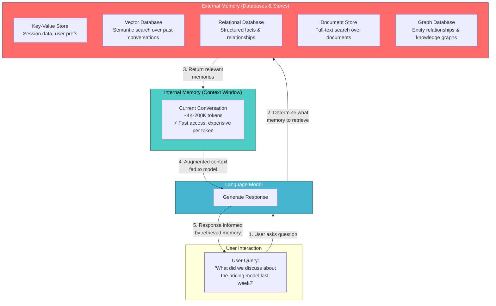
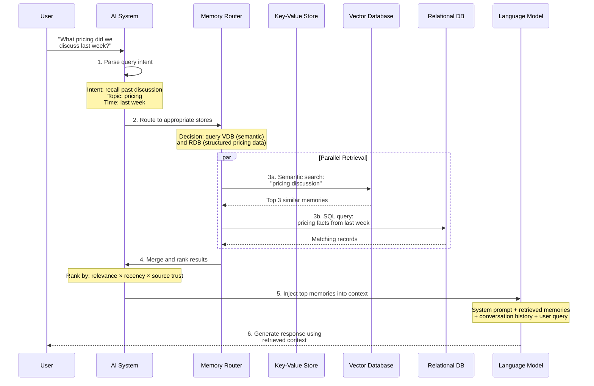
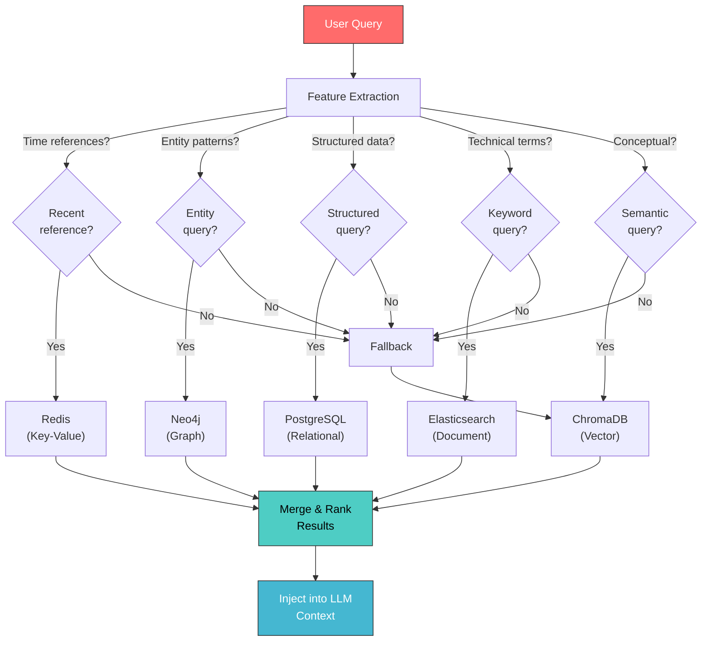
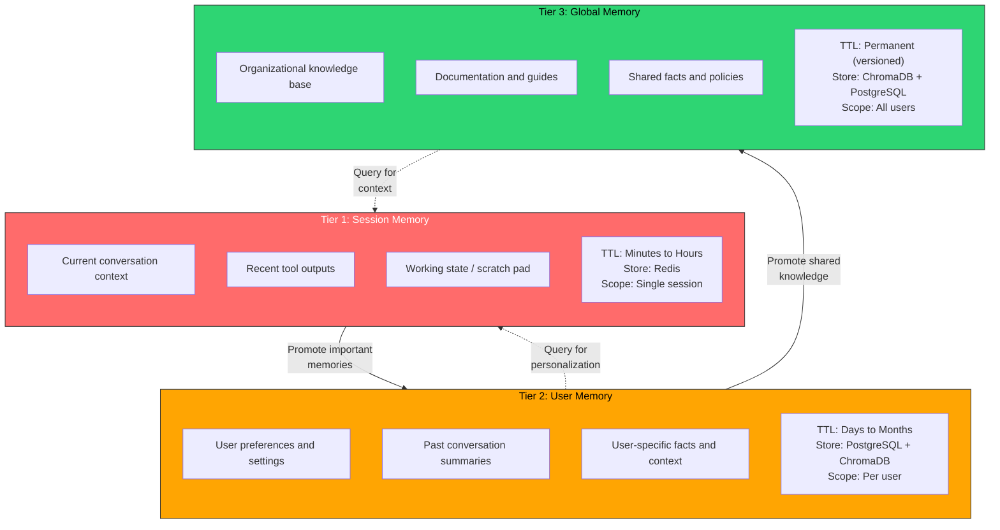

# Memory in AI Systems Deep Dive  Part 6: External Memory  When the Context Window Isn't Enough

---

**Series:** Memory in AI Systems  A Developer's Deep Dive from Fundamentals to Production
**Part:** 6 of 19
**Audience:** Developers with programming experience who want to understand AI memory systems from the ground up
**Reading time:** ~50 minutes

---

In Parts 0 through 5, we built memory from the ground up. We started with how humans remember things (Part 0), then explored how neural networks store knowledge in weights (Parts 1-2). We implemented attention  the mechanism that lets models look back at all previous tokens (Part 3). We built a full Transformer and saw how the context window acts as the model's "working memory" (Part 4). And in Part 5, we confronted the hard limits: context windows are finite, expensive to scale, and everything in them vanishes when the conversation ends.

Here is the core problem: **a language model's internal memory (the context window) is like a desk**. It is great for the documents you are currently working with, but terrible for storing everything you have ever read. You would not keep every book you own on your desk. You would keep them on shelves, in filing cabinets, in a library  and pull them out when needed.

That is exactly what external memory does for AI systems. It moves storage **outside** the model, into databases, vector stores, and file systems that can hold virtually unlimited information. The model then retrieves just the relevant pieces when it needs them.

By the end of this part, you will:

- Understand the **external memory paradigm** and why it exists
- Know the **five major types** of external memory stores and when to use each
- Implement **keyword search (BM25)** and **semantic search** from scratch
- Build a complete **embedding pipeline** for storing and retrieving memories
- Implement a **memory router** that decides which store to query
- Build **tiered memory** with session, user, and global layers
- Handle **memory freshness** and staleness with TTL-based systems
- Understand the **cost and latency tradeoffs** of external memory
- Build a complete **multi-store memory system** project
- Implement **security and access control** for memory stores
- Connect all of this to the **RAG systems** we will build in Parts 7-9

Let's build.

---

## Table of Contents

1. [The External Memory Paradigm](#1-the-external-memory-paradigm)
2. [Types of External Memory for AI Systems](#2-types-of-external-memory-for-ai-systems)
3. [The Memory Access Pattern](#3-the-memory-access-pattern)
4. [Keyword Search vs Semantic Search](#4-keyword-search-vs-semantic-search)
5. [The Embedding Pipeline](#5-the-embedding-pipeline)
6. [Memory Routing](#6-memory-routing)
7. [Memory Persistence Patterns](#7-memory-persistence-patterns)
8. [Memory Consistency and Freshness](#8-memory-consistency-and-freshness)
9. [The Cost of External Memory](#9-the-cost-of-external-memory)
10. [Project: Build a Multi-Store Memory System](#10-project-build-a-multi-store-memory-system)
11. [Security and Privacy](#11-security-and-privacy)
12. [How This Connects to the Series](#12-how-this-connects-to-the-series)
13. [Vocabulary Cheat Sheet](#13-vocabulary-cheat-sheet)
14. [Key Takeaways and What's Next](#14-key-takeaways-and-whats-next)

---

## 1. The External Memory Paradigm

### Why Internal Memory Is Not Enough

Let's recap what we know about a language model's internal memory from Parts 3-5:

| Memory Type | What It Stores | Capacity | Persistence |
|---|---|---|---|
| **Weights** (Parameters) | General knowledge learned during training | Billions of parameters | Permanent (until retraining) |
| **KV Cache** (Context) | Current conversation / document | 4K-200K tokens | Gone when conversation ends |
| **Activations** | Intermediate computations | Per-layer, per-token | Gone after each forward pass |

The context window is the only place where the model can access conversation-specific, real-time information. And it has three brutal constraints:

1. **Size limit**: Even 200K tokens is only about 150K words  roughly two novels. Most production systems use far less.
2. **Cost**: Every token in the context window costs compute on every generation step. Filling a 128K context costs 10-100x more than a 4K context.
3. **Volatility**: When the session ends, everything in the context window disappears. The model has no memory of your conversation tomorrow.

### The Library Analogy

Think of it this way:

**Internal memory (context window)** = Your desk at the library
- Limited surface area (you can only spread out so many books)
- Everything is immediately visible and accessible
- When you leave, the desk is cleared

**External memory (databases, vector stores)** = The library's collection
- Millions of books on the shelves
- Organized with catalogs, indexes, and classification systems
- Permanent  the books are still there tomorrow
- You need to know what to look for and where to find it

The key insight: **you do not bring the entire library to your desk. You bring the right books to your desk when you need them.**



### The Separation Principle

External memory is built on one fundamental principle: **separate storage from processing**.

The language model is the **processor**  it reasons, generates, and responds. External memory is the **storage**  it holds facts, conversations, documents, and knowledge. A **retrieval layer** connects them, fetching the right information at the right time.

```python
# The fundamental pattern of external memory
class ExternalMemorySystem:
    """
    The basic architecture: storage is separate from processing.
    The model only sees what the retrieval layer brings into context.
    """

    def __init__(self, llm, memory_stores, retriever):
        self.llm = llm                    # The processor (language model)
        self.memory_stores = memory_stores  # The storage (databases)
        self.retriever = retriever          # The bridge between them

    def respond(self, user_query: str, conversation_context: list[dict]) -> str:
        # Step 1: Use the retriever to find relevant memories
        relevant_memories = self.retriever.search(
            query=user_query,
            stores=self.memory_stores,
            top_k=5  # Only bring back the top 5 most relevant pieces
        )

        # Step 2: Inject retrieved memories into the context
        augmented_context = self._build_context(
            conversation=conversation_context,
            memories=relevant_memories
        )

        # Step 3: Let the LLM generate with the augmented context
        response = self.llm.generate(augmented_context)

        # Step 4: Optionally store new information from this interaction
        self._store_new_memories(user_query, response)

        return response

    def _build_context(self, conversation, memories) -> str:
        """Build the prompt with retrieved memories injected."""
        memory_text = "\n".join([
            f"[Memory from {m.source}, relevance: {m.score:.2f}]: {m.content}"
            for m in memories
        ])

        return f"""You have access to the following relevant memories:

{memory_text}

Current conversation:
{self._format_conversation(conversation)}

Respond using the memories above when relevant."""

    def _format_conversation(self, conversation) -> str:
        return "\n".join([
            f"{msg['role'].capitalize()}: {msg['content']}"
            for msg in conversation
        ])

    def _store_new_memories(self, query, response):
        """Store noteworthy information from this interaction."""
        # We will build sophisticated versions of this later
        for store in self.memory_stores:
            store.maybe_store(query=query, response=response)
```

This pattern  **retrieve, augment, generate**  is the foundation of every production AI system that needs memory beyond the context window. It is so important that it has its own name: **Retrieval-Augmented Generation (RAG)**, which we will build end-to-end in Parts 7-9.

### What Makes External Memory Hard

If external memory were as simple as "just use a database," this would be a short article. The challenges are real:

| Challenge | Description | Where We Solve It |
|---|---|---|
| **What to store** | Not everything is worth remembering | Section 5 (Embedding Pipeline) |
| **How to search** | Finding the right memory for a given query | Section 4 (Search Methods) |
| **Where to search** | Which database has the answer? | Section 6 (Memory Routing) |
| **When to expire** | Memories go stale over time | Section 8 (Freshness) |
| **How to prioritize** | Multiple relevant memories compete for limited context space | Section 3 (Memory Access Pattern) |
| **Cost vs quality** | More retrieval = better answers but higher latency and cost | Section 9 (Cost Analysis) |
| **Security** | Who can see what memories? | Section 11 (Security) |

Let's tackle each of these, starting with the most fundamental question: what types of storage can we use?

---

## 2. Types of External Memory for AI Systems

There are five major categories of external memory stores, each with different strengths. Let's explore each one with working code.

### 2.1 Key-Value Stores (Redis)

**Best for**: Session data, user preferences, recent conversation history, caching.

Key-value stores are the simplest and fastest form of external memory. You store a value under a key, and you retrieve it by that key. Think of it like a Python dictionary that lives outside your program and persists across sessions.

**Why Redis for AI memory?**
- Sub-millisecond reads (critical when you are adding retrieval latency to every LLM call)
- Built-in TTL (time-to-live) for automatic expiration
- Data structures beyond simple key-value: lists, sorted sets, hashes
- Pub/sub for real-time memory updates

```python
import redis
import json
import time
from datetime import datetime
from typing import Optional


class RedisConversationMemory:
    """
    Store and retrieve conversation history using Redis.

    Design decisions:
    - Each conversation is a Redis List (ordered, appendable)
    - User metadata is stored in a Redis Hash (structured fields)
    - Conversations auto-expire after the TTL (configurable)
    - Recent messages can be fetched efficiently with LRANGE
    """

    def __init__(
        self,
        host: str = "localhost",
        port: int = 6379,
        db: int = 0,
        default_ttl: int = 86400  # 24 hours in seconds
    ):
        self.client = redis.Redis(
            host=host, port=port, db=db,
            decode_responses=True  # Return strings, not bytes
        )
        self.default_ttl = default_ttl

    def store_message(
        self,
        conversation_id: str,
        role: str,
        content: str,
        metadata: Optional[dict] = None
    ) -> int:
        """
        Append a message to a conversation.

        Returns the total number of messages in the conversation.

        Why RPUSH? We want chronological order. RPUSH appends to the
        right (end) of the list, so the oldest message is at index 0.
        """
        message = {
            "role": role,
            "content": content,
            "timestamp": datetime.utcnow().isoformat(),
            "metadata": metadata or {}
        }

        key = f"conversation:{conversation_id}"

        # Append message to conversation list
        length = self.client.rpush(key, json.dumps(message))

        # Reset TTL on every new message (conversation is still active)
        self.client.expire(key, self.default_ttl)

        return length

    def get_recent_messages(
        self,
        conversation_id: str,
        count: int = 10
    ) -> list[dict]:
        """
        Retrieve the most recent N messages from a conversation.

        Why negative indexing? Redis LRANGE with -count to -1 gives
        us the last 'count' elements  the most recent messages.
        """
        key = f"conversation:{conversation_id}"

        # LRANGE returns elements from start to stop (inclusive)
        # -count to -1 means "last count elements"
        raw_messages = self.client.lrange(key, -count, -1)

        return [json.loads(msg) for msg in raw_messages]

    def get_full_conversation(self, conversation_id: str) -> list[dict]:
        """Retrieve the entire conversation history."""
        key = f"conversation:{conversation_id}"
        raw_messages = self.client.lrange(key, 0, -1)
        return [json.loads(msg) for msg in raw_messages]

    def store_user_profile(self, user_id: str, profile: dict) -> None:
        """
        Store user profile data as a Redis Hash.

        Why a Hash instead of a JSON string?
        - Individual fields can be read/updated without fetching everything
        - More memory-efficient for structured data
        - Atomic field updates with HSET
        """
        key = f"user:{user_id}:profile"

        # Flatten nested dicts for Redis Hash storage
        flat_profile = {}
        for k, v in profile.items():
            if isinstance(v, (dict, list)):
                flat_profile[k] = json.dumps(v)
            else:
                flat_profile[k] = str(v)

        self.client.hset(key, mapping=flat_profile)

    def get_user_profile(self, user_id: str) -> dict:
        """Retrieve a user's profile."""
        key = f"user:{user_id}:profile"
        return self.client.hgetall(key)

    def get_conversation_count(self, conversation_id: str) -> int:
        """How many messages in this conversation?"""
        key = f"conversation:{conversation_id}"
        return self.client.llen(key)

    def search_recent_by_keyword(
        self,
        conversation_id: str,
        keyword: str,
        max_messages: int = 50
    ) -> list[dict]:
        """
        Simple keyword search over recent messages.

        Limitation: This is a brute-force scan. Redis is not designed
        for full-text search (though Redis Search module adds this).
        For keyword search at scale, use Elasticsearch (Section 2.3).
        """
        messages = self.get_recent_messages(conversation_id, max_messages)
        keyword_lower = keyword.lower()

        return [
            msg for msg in messages
            if keyword_lower in msg["content"].lower()
        ]


# Usage example
def demo_redis_memory():
    memory = RedisConversationMemory(default_ttl=3600)  # 1 hour TTL

    conv_id = "conv_abc123"
    user_id = "user_42"

    # Store user profile
    memory.store_user_profile(user_id, {
        "name": "Alice",
        "preferences": {"tone": "technical", "verbosity": "concise"},
        "timezone": "US/Pacific"
    })

    # Store conversation messages
    memory.store_message(conv_id, "user", "How does Redis handle persistence?")
    memory.store_message(conv_id, "assistant",
        "Redis supports two persistence mechanisms: RDB snapshots and AOF "
        "(Append Only File). RDB creates point-in-time snapshots at intervals, "
        "while AOF logs every write operation for durability."
    )
    memory.store_message(conv_id, "user", "Which one should I use for my use case?")
    memory.store_message(conv_id, "assistant",
        "It depends on your durability requirements. RDB is better for backups "
        "and faster restarts. AOF provides better durability but uses more disk. "
        "Many production systems use both."
    )

    # Retrieve recent context
    recent = memory.get_recent_messages(conv_id, count=4)
    print(f"Recent messages ({len(recent)}):")
    for msg in recent:
        print(f"  [{msg['role']}]: {msg['content'][:80]}...")

    # Search by keyword
    results = memory.search_recent_by_keyword(conv_id, "persistence")
    print(f"\nMessages mentioning 'persistence': {len(results)}")

    # Get user profile
    profile = memory.get_user_profile(user_id)
    print(f"\nUser profile: {profile}")
```

**Key takeaway**: Redis is your **fastest** option for structured data that you access by known keys. It is not great for "find messages similar to this query"  that's where vector databases shine (Section 2.5).

### 2.2 Relational Databases (PostgreSQL)

**Best for**: Structured facts, user data, entity relationships, anything that needs ACID guarantees.

When your AI system needs to remember structured knowledge  facts with attributes, relationships between entities, data that needs to be queried with complex conditions  a relational database is the right tool.

```python
import psycopg2
from psycopg2.extras import RealDictCursor, execute_values
from datetime import datetime
from typing import Optional


class PostgresKnowledgeStore:
    """
    Store structured knowledge facts in PostgreSQL.

    Why PostgreSQL?
    - ACID guarantees: facts are either stored or they're not
    - Complex queries: JOIN across tables, filter by attributes
    - Full-text search: built-in tsvector/tsquery for keyword search
    - JSON support: store semi-structured metadata alongside structured data
    - pgvector extension: can also do vector similarity search!
    """

    def __init__(self, connection_string: str):
        self.conn = psycopg2.connect(
            connection_string,
            cursor_factory=RealDictCursor  # Return dicts, not tuples
        )
        self._initialize_schema()

    def _initialize_schema(self):
        """Create tables if they don't exist."""
        with self.conn.cursor() as cur:
            cur.execute("""
                -- Knowledge facts: things the AI has learned about the world
                CREATE TABLE IF NOT EXISTS knowledge_facts (
                    id SERIAL PRIMARY KEY,
                    subject TEXT NOT NULL,        -- "Python"
                    predicate TEXT NOT NULL,       -- "was created by"
                    object TEXT NOT NULL,          -- "Guido van Rossum"
                    confidence FLOAT DEFAULT 1.0,  -- How sure are we?
                    source TEXT,                   -- Where did this fact come from?
                    metadata JSONB DEFAULT '{}',   -- Flexible extra data
                    created_at TIMESTAMP DEFAULT NOW(),
                    updated_at TIMESTAMP DEFAULT NOW(),
                    expires_at TIMESTAMP,          -- NULL = never expires

                    -- Full-text search index on subject + object
                    -- tsvector allows fast text matching
                    search_vector TSVECTOR GENERATED ALWAYS AS (
                        to_tsvector('english', subject || ' ' || predicate || ' ' || object)
                    ) STORED
                );

                -- Index for fast full-text search
                CREATE INDEX IF NOT EXISTS idx_facts_search
                    ON knowledge_facts USING GIN (search_vector);

                -- Index for subject lookups (common query pattern)
                CREATE INDEX IF NOT EXISTS idx_facts_subject
                    ON knowledge_facts (subject);

                -- User-specific memories
                CREATE TABLE IF NOT EXISTS user_memories (
                    id SERIAL PRIMARY KEY,
                    user_id TEXT NOT NULL,
                    memory_type TEXT NOT NULL,     -- "preference", "fact", "context"
                    key TEXT NOT NULL,
                    value TEXT NOT NULL,
                    metadata JSONB DEFAULT '{}',
                    created_at TIMESTAMP DEFAULT NOW(),
                    updated_at TIMESTAMP DEFAULT NOW(),

                    -- Each user can have only one memory per key+type
                    UNIQUE(user_id, memory_type, key)
                );

                CREATE INDEX IF NOT EXISTS idx_user_memories
                    ON user_memories (user_id, memory_type);
            """)
            self.conn.commit()

    def store_fact(
        self,
        subject: str,
        predicate: str,
        obj: str,
        confidence: float = 1.0,
        source: Optional[str] = None,
        metadata: Optional[dict] = None
    ) -> int:
        """
        Store a knowledge triple (subject, predicate, object).

        This is a simplified knowledge representation. Real knowledge
        graphs use more sophisticated schemas, but this captures the
        core pattern: entity -> relationship -> entity.
        """
        with self.conn.cursor() as cur:
            cur.execute("""
                INSERT INTO knowledge_facts
                    (subject, predicate, object, confidence, source, metadata)
                VALUES (%s, %s, %s, %s, %s, %s)
                ON CONFLICT DO NOTHING
                RETURNING id
            """, (subject, predicate, obj, confidence, source,
                  psycopg2.extras.Json(metadata or {})))

            result = cur.fetchone()
            self.conn.commit()
            return result["id"] if result else -1

    def query_facts_about(
        self,
        subject: str,
        min_confidence: float = 0.5
    ) -> list[dict]:
        """
        Get all facts about a given subject.

        This is a direct lookup  fast and precise.
        Use this when you know exactly what entity you're asking about.
        """
        with self.conn.cursor() as cur:
            cur.execute("""
                SELECT subject, predicate, object, confidence, source, metadata
                FROM knowledge_facts
                WHERE subject ILIKE %s
                  AND confidence >= %s
                  AND (expires_at IS NULL OR expires_at > NOW())
                ORDER BY confidence DESC, updated_at DESC
            """, (f"%{subject}%", min_confidence))

            return cur.fetchall()

    def search_facts(self, query: str, limit: int = 10) -> list[dict]:
        """
        Full-text search across all facts.

        PostgreSQL's full-text search handles stemming, stop words,
        and ranking automatically. For example, searching "created"
        will also match "creates", "creating", etc.
        """
        with self.conn.cursor() as cur:
            cur.execute("""
                SELECT
                    subject, predicate, object, confidence, source,
                    ts_rank(search_vector, query) AS relevance
                FROM knowledge_facts,
                     plainto_tsquery('english', %s) AS query
                WHERE search_vector @@ query
                  AND (expires_at IS NULL OR expires_at > NOW())
                ORDER BY relevance DESC, confidence DESC
                LIMIT %s
            """, (query, limit))

            return cur.fetchall()

    def store_user_memory(
        self,
        user_id: str,
        memory_type: str,
        key: str,
        value: str,
        metadata: Optional[dict] = None
    ) -> None:
        """
        Store or update a user-specific memory.

        Uses UPSERT (INSERT ... ON CONFLICT UPDATE) to handle both
        new memories and updates to existing ones atomically.
        """
        with self.conn.cursor() as cur:
            cur.execute("""
                INSERT INTO user_memories (user_id, memory_type, key, value, metadata)
                VALUES (%s, %s, %s, %s, %s)
                ON CONFLICT (user_id, memory_type, key)
                DO UPDATE SET
                    value = EXCLUDED.value,
                    metadata = EXCLUDED.metadata,
                    updated_at = NOW()
            """, (user_id, memory_type, key, value,
                  psycopg2.extras.Json(metadata or {})))
            self.conn.commit()

    def get_user_memories(
        self,
        user_id: str,
        memory_type: Optional[str] = None
    ) -> list[dict]:
        """Retrieve all memories for a user, optionally filtered by type."""
        with self.conn.cursor() as cur:
            if memory_type:
                cur.execute("""
                    SELECT key, value, memory_type, metadata, updated_at
                    FROM user_memories
                    WHERE user_id = %s AND memory_type = %s
                    ORDER BY updated_at DESC
                """, (user_id, memory_type))
            else:
                cur.execute("""
                    SELECT key, value, memory_type, metadata, updated_at
                    FROM user_memories
                    WHERE user_id = %s
                    ORDER BY memory_type, updated_at DESC
                """, (user_id,))

            return cur.fetchall()


# Usage example
def demo_postgres_knowledge():
    store = PostgresKnowledgeStore("postgresql://localhost/ai_memory")

    # Store knowledge facts as triples
    store.store_fact("Python", "was created by", "Guido van Rossum",
                     confidence=1.0, source="wikipedia")
    store.store_fact("Python", "first released in", "1991",
                     confidence=1.0, source="wikipedia")
    store.store_fact("Python", "is known for", "readability and simplicity",
                     confidence=0.9, source="community consensus")
    store.store_fact("Guido van Rossum", "worked at", "Google",
                     confidence=1.0, source="linkedin")
    store.store_fact("Guido van Rossum", "worked at", "Dropbox",
                     confidence=1.0, source="linkedin")

    # Direct lookup: "What do we know about Python?"
    facts = store.query_facts_about("Python")
    print("Facts about Python:")
    for fact in facts:
        print(f"  {fact['subject']} {fact['predicate']} {fact['object']}"
              f" (confidence: {fact['confidence']})")

    # Full-text search: "Who created something?"
    results = store.search_facts("created programming language")
    print(f"\nSearch results for 'created programming language':")
    for r in results:
        print(f"  {r['subject']} {r['predicate']} {r['object']}"
              f" (relevance: {r['relevance']:.4f})")

    # User-specific memory
    store.store_user_memory("user_42", "preference", "language", "Python")
    store.store_user_memory("user_42", "preference", "style", "concise")
    store.store_user_memory("user_42", "fact", "project",
                            "Building a chatbot for customer support")

    memories = store.get_user_memories("user_42")
    print(f"\nUser 42's memories:")
    for m in memories:
        print(f"  [{m['memory_type']}] {m['key']}: {m['value']}")
```

**Key takeaway**: PostgreSQL gives you **structure, relationships, and complex queries**. Use it when you need to filter memories by attributes (e.g., "all facts about Python with confidence > 0.8 from Wikipedia").

### 2.3 Document Stores (Elasticsearch)

**Best for**: Full-text search over large document collections, logs, unstructured text.

When your AI needs to search through thousands of documents, articles, or conversation transcripts by keywords and phrases, Elasticsearch is purpose-built for this.

```python
from elasticsearch import Elasticsearch
from datetime import datetime
from typing import Optional


class ElasticsearchDocumentMemory:
    """
    Full-text search over documents and conversation transcripts.

    Why Elasticsearch?
    - Built for full-text search at scale (millions of documents)
    - Rich query language: fuzzy matching, phrase search, boosting
    - Built-in relevance scoring (BM25 by default)
    - Aggregations for analytics over your memory store
    - Near real-time indexing
    """

    def __init__(
        self,
        hosts: list[str] = None,
        index_prefix: str = "ai_memory"
    ):
        self.es = Elasticsearch(hosts or ["http://localhost:9200"])
        self.index_prefix = index_prefix
        self._ensure_indices()

    def _ensure_indices(self):
        """Create indices with appropriate mappings."""
        # Document memory index
        doc_index = f"{self.index_prefix}_documents"
        if not self.es.indices.exists(index=doc_index):
            self.es.indices.create(
                index=doc_index,
                body={
                    "settings": {
                        "number_of_shards": 1,
                        "number_of_replicas": 0,
                        "analysis": {
                            "analyzer": {
                                "memory_analyzer": {
                                    "type": "custom",
                                    "tokenizer": "standard",
                                    "filter": [
                                        "lowercase",
                                        "stop",
                                        "snowball"  # Stemming
                                    ]
                                }
                            }
                        }
                    },
                    "mappings": {
                        "properties": {
                            "content": {
                                "type": "text",
                                "analyzer": "memory_analyzer",
                                "fields": {
                                    # Keep a non-analyzed version for exact match
                                    "raw": {"type": "keyword"}
                                }
                            },
                            "title": {"type": "text", "boost": 2.0},
                            "source": {"type": "keyword"},
                            "category": {"type": "keyword"},
                            "user_id": {"type": "keyword"},
                            "conversation_id": {"type": "keyword"},
                            "timestamp": {"type": "date"},
                            "metadata": {"type": "object", "enabled": False}
                        }
                    }
                }
            )

    def store_document(
        self,
        content: str,
        title: Optional[str] = None,
        source: Optional[str] = None,
        category: Optional[str] = None,
        user_id: Optional[str] = None,
        conversation_id: Optional[str] = None,
        metadata: Optional[dict] = None
    ) -> str:
        """
        Index a document for full-text search.

        Elasticsearch will automatically tokenize, stem, and index
        the content for fast retrieval.
        """
        doc = {
            "content": content,
            "title": title,
            "source": source,
            "category": category,
            "user_id": user_id,
            "conversation_id": conversation_id,
            "timestamp": datetime.utcnow().isoformat(),
            "metadata": metadata or {}
        }

        result = self.es.index(
            index=f"{self.index_prefix}_documents",
            body=doc,
            refresh="wait_for"  # Make immediately searchable
        )

        return result["_id"]

    def search(
        self,
        query: str,
        user_id: Optional[str] = None,
        category: Optional[str] = None,
        limit: int = 10,
        min_score: float = 0.5
    ) -> list[dict]:
        """
        Full-text search with optional filters.

        Uses Elasticsearch's bool query to combine:
        - must: the text query (required)
        - filter: exact match on user_id, category (optional, no scoring impact)
        """
        must_clauses = [
            {
                "multi_match": {
                    "query": query,
                    "fields": ["title^2", "content"],  # Title matches worth 2x
                    "type": "best_fields",
                    "fuzziness": "AUTO"  # Handle typos
                }
            }
        ]

        filter_clauses = []
        if user_id:
            filter_clauses.append({"term": {"user_id": user_id}})
        if category:
            filter_clauses.append({"term": {"category": category}})

        body = {
            "query": {
                "bool": {
                    "must": must_clauses,
                    "filter": filter_clauses
                }
            },
            "min_score": min_score,
            "size": limit,
            "highlight": {
                "fields": {
                    "content": {
                        "fragment_size": 150,
                        "number_of_fragments": 3
                    }
                }
            }
        }

        results = self.es.search(
            index=f"{self.index_prefix}_documents",
            body=body
        )

        return [
            {
                "id": hit["_id"],
                "score": hit["_score"],
                "content": hit["_source"]["content"],
                "title": hit["_source"].get("title"),
                "source": hit["_source"].get("source"),
                "highlights": hit.get("highlight", {}).get("content", []),
                "timestamp": hit["_source"]["timestamp"]
            }
            for hit in results["hits"]["hits"]
        ]

    def search_conversation_history(
        self,
        query: str,
        conversation_id: str,
        limit: int = 5
    ) -> list[dict]:
        """Search within a specific conversation's history."""
        return self.search(
            query=query,
            limit=limit,
            # Additional filter for conversation_id would be added here
        )


# Usage example
def demo_elasticsearch_memory():
    memory = ElasticsearchDocumentMemory()

    # Store various documents
    memory.store_document(
        content="Redis is an in-memory data structure store that can be used "
                "as a database, cache, and message broker. It supports strings, "
                "hashes, lists, sets, and sorted sets.",
        title="Redis Overview",
        category="technology",
        source="documentation"
    )

    memory.store_document(
        content="PostgreSQL is a powerful open-source relational database system "
                "with over 35 years of active development. It supports ACID "
                "transactions, foreign keys, and complex queries.",
        title="PostgreSQL Introduction",
        category="technology",
        source="documentation"
    )

    memory.store_document(
        content="The user mentioned they prefer using Python for backend "
                "development and are currently building a customer support "
                "chatbot using FastAPI and Redis.",
        category="conversation",
        user_id="user_42",
        conversation_id="conv_abc123"
    )

    # Search
    results = memory.search("in-memory database caching")
    print("Search results for 'in-memory database caching':")
    for r in results:
        print(f"  [{r['score']:.2f}] {r.get('title', 'Untitled')}")
        for highlight in r["highlights"]:
            print(f"    ...{highlight}...")
```

**Key takeaway**: Elasticsearch excels at **keyword-based search over large text collections** with rich filtering, highlighting, and relevance scoring. It is the backbone of many production search systems.

### 2.4 Graph Databases (Neo4j)

**Best for**: Entity relationships, knowledge graphs, "how is X connected to Y?" queries.

When your AI needs to understand relationships between entities  people, concepts, events  a graph database represents these naturally. This is especially powerful for multi-hop reasoning: "Alice works at Acme, which is a partner of Beta Corp, which uses Redis."

```python
from neo4j import GraphDatabase
from typing import Optional


class Neo4jKnowledgeGraph:
    """
    Store and query knowledge as a graph of entities and relationships.

    Why Neo4j?
    - Relationships are first-class citizens (not JOINs)
    - Cypher query language is intuitive for graph patterns
    - Multi-hop queries are fast (follow edges, not scan tables)
    - Built-in graph algorithms (shortest path, community detection)
    """

    def __init__(self, uri: str, user: str, password: str):
        self.driver = GraphDatabase.driver(uri, auth=(user, password))

    def close(self):
        self.driver.close()

    def store_entity(
        self,
        name: str,
        entity_type: str,
        properties: Optional[dict] = None
    ) -> None:
        """
        Create or update an entity node.

        MERGE ensures we don't create duplicates  if the entity
        already exists, we update its properties instead.
        """
        props = properties or {}
        with self.driver.session() as session:
            session.run(
                f"""
                MERGE (e:{entity_type} {{name: $name}})
                SET e += $properties
                SET e.updated_at = datetime()
                """,
                name=name, properties=props
            )

    def store_relationship(
        self,
        from_name: str,
        from_type: str,
        relationship: str,
        to_name: str,
        to_type: str,
        properties: Optional[dict] = None
    ) -> None:
        """
        Create a relationship between two entities.

        This automatically creates the entities if they don't exist,
        which is convenient when ingesting knowledge from text.
        """
        props = properties or {}
        with self.driver.session() as session:
            session.run(
                f"""
                MERGE (from:{from_type} {{name: $from_name}})
                MERGE (to:{to_type} {{name: $to_name}})
                MERGE (from)-[r:{relationship}]->(to)
                SET r += $properties
                SET r.updated_at = datetime()
                """,
                from_name=from_name, to_name=to_name, properties=props
            )

    def query_relationships(
        self,
        entity_name: str,
        max_hops: int = 2
    ) -> list[dict]:
        """
        Find all entities connected to a given entity within N hops.

        This is where graph databases shine: multi-hop traversals
        that would require expensive recursive JOINs in SQL.
        """
        with self.driver.session() as session:
            result = session.run(
                """
                MATCH path = (start {name: $name})-[*1..""" + str(max_hops) + """]->(end)
                RETURN
                    [node IN nodes(path) | node.name] AS entity_chain,
                    [rel IN relationships(path) | type(rel)] AS relationship_chain,
                    length(path) AS hops
                ORDER BY hops ASC
                LIMIT 50
                """,
                name=entity_name
            )

            return [
                {
                    "entities": record["entity_chain"],
                    "relationships": record["relationship_chain"],
                    "hops": record["hops"]
                }
                for record in result
            ]

    def find_connection(
        self,
        entity_a: str,
        entity_b: str
    ) -> Optional[list[dict]]:
        """
        Find the shortest path between two entities.

        This answers questions like: "How is Alice connected to Redis?"
        Maybe: Alice -> works at -> Acme Corp -> uses -> Redis
        """
        with self.driver.session() as session:
            result = session.run(
                """
                MATCH path = shortestPath(
                    (a {name: $entity_a})-[*..6]-(b {name: $entity_b})
                )
                RETURN
                    [node IN nodes(path) | node.name] AS entities,
                    [rel IN relationships(path) | type(rel)] AS relationships
                """,
                entity_a=entity_a, entity_b=entity_b
            )

            record = result.single()
            if record:
                return {
                    "entities": record["entities"],
                    "relationships": record["relationships"],
                    "path_length": len(record["relationships"])
                }
            return None

    def get_entity_context(self, entity_name: str) -> str:
        """
        Generate a natural language summary of everything we know
        about an entity. This can be injected directly into the LLM context.
        """
        relationships = self.query_relationships(entity_name, max_hops=1)

        if not relationships:
            return f"No information found about '{entity_name}'."

        lines = [f"Known information about {entity_name}:"]
        for rel in relationships:
            entities = rel["entities"]
            rels = rel["relationships"]

            if len(entities) == 2 and len(rels) == 1:
                lines.append(
                    f"  - {entities[0]} {rels[0].lower().replace('_', ' ')} "
                    f"{entities[1]}"
                )

        return "\n".join(lines)


# Usage example
def demo_neo4j_knowledge():
    graph = Neo4jKnowledgeGraph(
        "bolt://localhost:7687", "neo4j", "password"
    )

    # Build a knowledge graph
    graph.store_relationship("Alice", "Person", "WORKS_AT",
                             "Acme Corp", "Company")
    graph.store_relationship("Acme Corp", "Company", "USES",
                             "Redis", "Technology")
    graph.store_relationship("Acme Corp", "Company", "USES",
                             "Python", "Technology")
    graph.store_relationship("Acme Corp", "Company", "PARTNER_OF",
                             "Beta Corp", "Company")
    graph.store_relationship("Beta Corp", "Company", "USES",
                             "PostgreSQL", "Technology")
    graph.store_relationship("Alice", "Person", "KNOWS",
                             "Bob", "Person")
    graph.store_relationship("Bob", "Person", "WORKS_AT",
                             "Beta Corp", "Company")

    # Query: What do we know about Alice?
    context = graph.get_entity_context("Alice")
    print(context)
    # Output:
    # Known information about Alice:
    #   - Alice works at Acme Corp
    #   - Alice knows Bob

    # Query: How is Alice connected to PostgreSQL?
    connection = graph.find_connection("Alice", "PostgreSQL")
    if connection:
        path_parts = []
        for i, rel in enumerate(connection["relationships"]):
            path_parts.append(
                f"{connection['entities'][i]} --[{rel}]--> "
            )
        path_parts.append(connection["entities"][-1])
        print(f"\nConnection: {''.join(path_parts)}")
        # Alice --[KNOWS]--> Bob --[WORKS_AT]--> Beta Corp --[USES]--> PostgreSQL

    graph.close()
```

**Key takeaway**: Graph databases excel at **relationship queries and multi-hop reasoning**. If your AI needs to answer "how is X connected to Y?" or traverse chains of relationships, a graph is the natural fit.

### 2.5 Vector Databases (ChromaDB)

**Best for**: Semantic similarity search, finding conceptually related content regardless of exact wording.

This is the most important external memory type for AI systems. Vector databases store **embeddings**  numerical representations of text that capture meaning. Instead of matching keywords, they find content that is semantically similar to your query.

```python
import chromadb
from chromadb.config import Settings
from typing import Optional
import hashlib


class ChromaSemanticMemory:
    """
    Semantic memory using ChromaDB for vector similarity search.

    Why vector databases for AI memory?
    - "What was that thing about deployment?" matches a document about
      "CI/CD pipeline configuration"  even though they share no keywords
    - Captures MEANING, not just words
    - The fundamental building block of RAG systems (Parts 7-9)

    Why ChromaDB specifically?
    - Open source, runs locally (no API keys needed)
    - Built-in embedding via sentence-transformers
    - Simple API, great for learning and prototyping
    - Supports metadata filtering alongside vector search
    """

    def __init__(
        self,
        collection_name: str = "ai_memory",
        persist_directory: str = "./chroma_data",
        embedding_model: str = "all-MiniLM-L6-v2"
    ):
        # ChromaDB handles embedding automatically using sentence-transformers
        self.client = chromadb.PersistentClient(path=persist_directory)

        self.collection = self.client.get_or_create_collection(
            name=collection_name,
            metadata={
                "hnsw:space": "cosine"  # Use cosine similarity
            }
            # ChromaDB uses all-MiniLM-L6-v2 by default for embeddings
        )

    def store(
        self,
        text: str,
        source: Optional[str] = None,
        user_id: Optional[str] = None,
        category: Optional[str] = None,
        metadata: Optional[dict] = None,
        doc_id: Optional[str] = None
    ) -> str:
        """
        Store a text with its embedding.

        ChromaDB automatically computes the embedding using the
        configured model. We just provide the text and metadata.
        """
        # Generate a deterministic ID if none provided
        if doc_id is None:
            doc_id = hashlib.sha256(text.encode()).hexdigest()[:16]

        # Build metadata (ChromaDB requires flat key-value pairs)
        meta = {}
        if source:
            meta["source"] = source
        if user_id:
            meta["user_id"] = user_id
        if category:
            meta["category"] = category
        if metadata:
            # Flatten any extra metadata
            for k, v in metadata.items():
                if isinstance(v, (str, int, float, bool)):
                    meta[k] = v

        self.collection.upsert(
            ids=[doc_id],
            documents=[text],
            metadatas=[meta] if meta else None
        )

        return doc_id

    def search(
        self,
        query: str,
        top_k: int = 5,
        user_id: Optional[str] = None,
        category: Optional[str] = None,
        min_similarity: float = 0.0
    ) -> list[dict]:
        """
        Find the most semantically similar memories to the query.

        This is the core operation: the query is embedded into the same
        vector space as stored memories, and we find the nearest neighbors.

        "How do I deploy?" will match "CI/CD pipeline setup guide" because
        their embeddings are close in the vector space, even though they
        share no keywords.
        """
        # Build metadata filter
        where_filter = {}
        if user_id:
            where_filter["user_id"] = user_id
        if category:
            where_filter["category"] = category

        results = self.collection.query(
            query_texts=[query],
            n_results=top_k,
            where=where_filter if where_filter else None,
            include=["documents", "metadatas", "distances"]
        )

        # Convert ChromaDB results to a cleaner format
        memories = []
        if results["documents"] and results["documents"][0]:
            for i, doc in enumerate(results["documents"][0]):
                # ChromaDB returns distances; convert to similarity
                # For cosine distance: similarity = 1 - distance
                distance = results["distances"][0][i]
                similarity = 1.0 - distance

                if similarity >= min_similarity:
                    memories.append({
                        "content": doc,
                        "similarity": similarity,
                        "metadata": results["metadatas"][0][i] if results["metadatas"] else {},
                        "id": results["ids"][0][i]
                    })

        return memories

    def search_with_context(
        self,
        query: str,
        top_k: int = 5,
        context_template: str = "[Memory (similarity: {similarity:.2f}, source: {source})]: {content}"
    ) -> str:
        """
        Search and format results for direct injection into an LLM prompt.

        This is a convenience method that bridges the gap between
        the vector database and the language model's context window.
        """
        memories = self.search(query, top_k=top_k)

        if not memories:
            return "No relevant memories found."

        formatted = []
        for mem in memories:
            formatted.append(context_template.format(
                similarity=mem["similarity"],
                source=mem["metadata"].get("source", "unknown"),
                content=mem["content"]
            ))

        return "\n".join(formatted)

    def delete(self, doc_id: str) -> None:
        """Remove a memory by ID."""
        self.collection.delete(ids=[doc_id])

    def count(self) -> int:
        """How many memories are stored?"""
        return self.collection.count()


# Usage example
def demo_chroma_memory():
    memory = ChromaSemanticMemory(
        collection_name="demo_memory",
        persist_directory="./demo_chroma"
    )

    # Store various memories
    memory.store(
        "The deployment pipeline uses GitHub Actions for CI/CD, "
        "building Docker images and pushing to AWS ECR.",
        source="engineering_docs", category="infrastructure"
    )
    memory.store(
        "Redis is used as the primary caching layer with a 15-minute "
        "TTL for API responses. Cache invalidation happens on writes.",
        source="engineering_docs", category="infrastructure"
    )
    memory.store(
        "The team decided to use PostgreSQL for the main database "
        "after evaluating MongoDB and DynamoDB. Key factors were "
        "ACID compliance and complex query support.",
        source="meeting_notes", category="decisions"
    )
    memory.store(
        "User authentication uses JWT tokens with a 1-hour expiry. "
        "Refresh tokens are stored in an HTTP-only cookie.",
        source="security_docs", category="security"
    )
    memory.store(
        "The pricing model has three tiers: Free (100 req/day), "
        "Pro ($29/month, 10K req/day), and Enterprise (custom).",
        source="product_docs", category="business"
    )

    # Semantic search: notice how "How do I ship code?" matches
    # the deployment pipeline document even though no keywords overlap
    print("Query: 'How do I ship code to production?'")
    results = memory.search("How do I ship code to production?", top_k=3)
    for r in results:
        print(f"  [{r['similarity']:.3f}] {r['content'][:80]}...")

    print("\nQuery: 'What database are we using and why?'")
    results = memory.search("What database are we using and why?", top_k=3)
    for r in results:
        print(f"  [{r['similarity']:.3f}] {r['content'][:80]}...")

    # Generate context for LLM injection
    print("\nFormatted context for LLM:")
    context = memory.search_with_context(
        "How much does the API cost?", top_k=2
    )
    print(context)
```

**Key takeaway**: Vector databases are the **foundation of modern AI memory systems**. They find relevant content by meaning, not keywords. This is what makes RAG work, and we will build heavily on this in Parts 7-9.

### Comparison: Choosing the Right Store

| Feature | Redis | PostgreSQL | Elasticsearch | Neo4j | ChromaDB |
|---|---|---|---|---|---|
| **Primary strength** | Speed | Structure | Full-text search | Relationships | Semantic search |
| **Query type** | Key lookup | SQL (complex filters) | Keyword matching | Graph traversal | Similarity search |
| **Latency** | <1ms | 1-10ms | 5-50ms | 5-50ms | 10-100ms |
| **Scale** | Millions of keys | Billions of rows | Billions of docs | Millions of nodes | Millions of vectors |
| **Best for AI memory** | Session cache, recent history | Structured facts, user data | Document search, logs | Knowledge graphs | Finding similar content |
| **Persistence** | Optional (RDB/AOF) | Built-in | Built-in | Built-in | Built-in |
| **Search capability** | Key only (without modules) | Full-text via tsvector | Excellent full-text | Pattern matching | Semantic similarity |
| **When NOT to use** | Complex queries | Real-time speed needed | Simple key lookups | Flat data | Exact keyword match |

> **Production reality**: Most AI systems use **multiple stores together**. A common pattern is Redis for session cache + PostgreSQL for structured data + a vector database for semantic search. We will build exactly this in Section 10.

---

## 3. The Memory Access Pattern

Now that we know **where** to store memories, we need to understand **how** the retrieval flow works end to end. Every external memory access follows the same fundamental pattern.

### The Full Flow



### The Seven Steps

Let's break down each step with code:

```python
from dataclasses import dataclass, field
from typing import Optional
import time


@dataclass
class MemoryResult:
    """A single retrieved memory with its metadata."""
    content: str
    source: str              # Which store it came from
    score: float             # Relevance score (0.0 to 1.0)
    timestamp: Optional[str] = None
    metadata: dict = field(default_factory=dict)


class MemoryAccessPipeline:
    """
    The complete memory access pattern:
    query → intent → route → search → rank → inject → generate.

    This class orchestrates the entire flow from user query to
    memory-augmented response.
    """

    def __init__(self, stores: dict, llm, router):
        self.stores = stores  # {"redis": RedisStore, "chroma": ChromaStore, ...}
        self.llm = llm
        self.router = router

    # Step 1: Parse Query Intent
    def parse_intent(self, query: str) -> dict:
        """
        Determine what kind of memory access the query needs.

        In production, this might use an LLM call or a trained classifier.
        Here we use a simplified rule-based approach.
        """
        intent = {
            "needs_memory": True,
            "memory_types": [],
            "time_filter": None,
            "entity_filter": None,
            "topic": query  # Simplified: use the whole query as topic
        }

        query_lower = query.lower()

        # Detect temporal references
        time_keywords = {
            "yesterday": "1d",
            "last week": "7d",
            "last month": "30d",
            "today": "1d",
            "recently": "7d"
        }
        for keyword, period in time_keywords.items():
            if keyword in query_lower:
                intent["time_filter"] = period
                break

        # Detect memory type hints
        if any(w in query_lower for w in ["remember", "discussed", "talked about", "said"]):
            intent["memory_types"].append("conversation_history")
        if any(w in query_lower for w in ["document", "docs", "article", "guide"]):
            intent["memory_types"].append("documents")
        if any(w in query_lower for w in ["who", "where", "works at", "related to"]):
            intent["memory_types"].append("knowledge_graph")
        if any(w in query_lower for w in ["preference", "setting", "config"]):
            intent["memory_types"].append("user_profile")

        # Default: search conversation history and documents
        if not intent["memory_types"]:
            intent["memory_types"] = ["conversation_history", "documents"]

        return intent

    # Step 2: Route to Appropriate Stores
    def route_query(self, intent: dict) -> list[str]:
        """
        Decide which stores to query based on intent.
        Returns a list of store names to search.
        """
        store_mapping = {
            "conversation_history": ["chroma", "redis"],
            "documents": ["chroma", "elasticsearch"],
            "knowledge_graph": ["neo4j"],
            "user_profile": ["redis", "postgres"],
            "structured_facts": ["postgres"]
        }

        stores_to_query = set()
        for memory_type in intent["memory_types"]:
            if memory_type in store_mapping:
                stores_to_query.update(store_mapping[memory_type])

        # Only include stores we actually have configured
        return [s for s in stores_to_query if s in self.stores]

    # Step 3: Search Each Store
    def search_stores(
        self,
        query: str,
        store_names: list[str],
        top_k_per_store: int = 5
    ) -> list[MemoryResult]:
        """
        Search each selected store and collect results.

        In production, these searches would run in parallel
        (asyncio.gather or ThreadPoolExecutor).
        """
        all_results = []

        for store_name in store_names:
            store = self.stores[store_name]
            start_time = time.time()

            try:
                results = store.search(query, top_k=top_k_per_store)
                latency = time.time() - start_time

                for result in results:
                    all_results.append(MemoryResult(
                        content=result.get("content", ""),
                        source=store_name,
                        score=result.get("similarity", result.get("score", 0.5)),
                        timestamp=result.get("timestamp"),
                        metadata={
                            **result.get("metadata", {}),
                            "retrieval_latency_ms": round(latency * 1000, 1)
                        }
                    ))
            except Exception as e:
                # Never let a store failure break the entire pipeline
                print(f"Warning: {store_name} search failed: {e}")

        return all_results

    # Step 4: Rank Results
    def rank_results(
        self,
        results: list[MemoryResult],
        top_k: int = 5
    ) -> list[MemoryResult]:
        """
        Rank and deduplicate results from multiple stores.

        Ranking factors:
        - Relevance score (from the store's search)
        - Recency (newer memories are often more relevant)
        - Source trust (some stores are more reliable)
        """
        source_trust = {
            "postgres": 1.0,       # Structured facts are reliable
            "neo4j": 0.95,         # Knowledge graph relationships
            "chroma": 0.85,        # Semantic search is good but fuzzy
            "elasticsearch": 0.80, # Keyword match can be noisy
            "redis": 0.75          # Session data is transient
        }

        for result in results:
            trust = source_trust.get(result.source, 0.5)
            # Combined score: relevance weighted by source trust
            result.score = result.score * 0.7 + trust * 0.3

        # Sort by combined score, take top_k
        results.sort(key=lambda r: r.score, reverse=True)

        # Simple deduplication: remove results with very similar content
        seen_content = set()
        unique_results = []
        for result in results:
            # Use first 100 chars as a rough dedup key
            content_key = result.content[:100].lower().strip()
            if content_key not in seen_content:
                seen_content.add(content_key)
                unique_results.append(result)

        return unique_results[:top_k]

    # Step 5: Inject into Context
    def build_augmented_prompt(
        self,
        query: str,
        memories: list[MemoryResult],
        conversation_history: list[dict]
    ) -> str:
        """
        Build the final prompt with memories injected.

        The placement of memories in the prompt matters:
        - System-level: treated as background knowledge
        - Before conversation: provides context for the whole chat
        - Before query: most immediately relevant to the question
        """
        # Format memories for injection
        memory_sections = []
        for i, mem in enumerate(memories, 1):
            memory_sections.append(
                f"[Memory {i} | source: {mem.source} | "
                f"relevance: {mem.score:.2f}]\n{mem.content}"
            )

        memories_text = "\n\n".join(memory_sections) if memory_sections else "No relevant memories found."

        # Format conversation history
        history_text = "\n".join([
            f"{msg['role'].capitalize()}: {msg['content']}"
            for msg in conversation_history[-10:]  # Last 10 messages
        ])

        return f"""You are a helpful assistant with access to a memory system.

## Retrieved Memories
The following memories were retrieved as potentially relevant to the user's query.
Use them to provide accurate, contextual responses. If a memory contradicts your
training data, prefer the memory (it may be more recent or user-specific).

{memories_text}

## Conversation History
{history_text}

## Current Query
User: {query}

Respond helpfully using the retrieved memories where relevant. If the memories
don't contain the answer, say so rather than making something up."""

    # Step 6 & 7: Generate Response (ties it all together)
    def respond(
        self,
        query: str,
        conversation_history: list[dict] = None
    ) -> tuple[str, list[MemoryResult]]:
        """
        The complete pipeline: query → intent → route → search → rank → inject → generate.
        Returns both the response and the memories used (for transparency).
        """
        conversation_history = conversation_history or []

        # Step 1: Parse intent
        intent = self.parse_intent(query)

        if not intent["needs_memory"]:
            # Simple queries don't need memory retrieval
            prompt = f"User: {query}"
            return self.llm.generate(prompt), []

        # Step 2: Route
        store_names = self.route_query(intent)

        # Step 3: Search
        raw_results = self.search_stores(query, store_names)

        # Step 4: Rank
        ranked_results = self.rank_results(raw_results, top_k=5)

        # Step 5: Inject
        prompt = self.build_augmented_prompt(
            query, ranked_results, conversation_history
        )

        # Step 6: Generate
        response = self.llm.generate(prompt)

        return response, ranked_results
```

### This Is RAG (In Preview)

You just saw the complete Retrieval-Augmented Generation pattern. The flow is:

1. **Retrieve** relevant information from external memory
2. **Augment** the prompt with that information
3. **Generate** a response using the augmented context

We will build production-grade RAG systems in Parts 7-9. This section gave you the foundational pattern that everything builds on.

---

## 4. Keyword Search vs Semantic Search

The most fundamental decision in external memory is **how you search**. There are two paradigms, and understanding both is essential.

### 4.1 Keyword Search: BM25

**BM25** (Best Matching 25) is the industry-standard algorithm for keyword search. It is what Google used in its early days, what Elasticsearch uses by default, and what many production systems still rely on.

The core idea: a document is relevant if it contains the query's words, with bonuses for:
- **Term frequency (TF)**: Words that appear more often in a document are more relevant
- **Inverse document frequency (IDF)**: Rare words are more meaningful than common ones
- **Document length normalization**: Long documents are not unfairly penalized

Let's implement BM25 from scratch:

```python
import math
from collections import Counter
from typing import Optional
import re


class BM25:
    """
    BM25 keyword search implemented from scratch.

    This is the same algorithm that powers Elasticsearch's default
    relevance scoring. Understanding it helps you know when keyword
    search will work and when it won't.

    Parameters:
    - k1: Controls term frequency saturation (1.2-2.0 typical)
      Higher = more weight on term frequency
    - b: Controls document length normalization (0.0-1.0)
      Higher = more penalty for long documents
    """

    def __init__(self, k1: float = 1.5, b: float = 0.75):
        self.k1 = k1
        self.b = b
        self.documents = []        # Original documents
        self.doc_token_counts = [] # Token frequency per document
        self.doc_lengths = []      # Number of tokens per document
        self.avg_doc_length = 0.0  # Average document length
        self.idf_scores = {}       # Inverse document frequency per term
        self.corpus_size = 0       # Total number of documents

    def _tokenize(self, text: str) -> list[str]:
        """
        Simple tokenization: lowercase, split on non-alphanumeric,
        remove very short tokens.

        Production systems use much more sophisticated tokenization
        (stemming, lemmatization, stop word removal).
        """
        tokens = re.findall(r'\b[a-zA-Z0-9]+\b', text.lower())
        return [t for t in tokens if len(t) > 1]  # Remove single chars

    def fit(self, documents: list[str]) -> "BM25":
        """
        Index a collection of documents.

        This precomputes IDF scores and document statistics needed
        for fast scoring at query time.
        """
        self.documents = documents
        self.corpus_size = len(documents)

        # Tokenize all documents and compute statistics
        self.doc_token_counts = []
        self.doc_lengths = []

        # Count how many documents contain each term (for IDF)
        doc_frequency = Counter()  # term -> number of docs containing it

        for doc in documents:
            tokens = self._tokenize(doc)
            token_counts = Counter(tokens)

            self.doc_token_counts.append(token_counts)
            self.doc_lengths.append(len(tokens))

            # Each unique token in this doc increments the doc frequency
            for token in set(tokens):
                doc_frequency[token] += 1

        # Average document length (used for length normalization)
        self.avg_doc_length = (
            sum(self.doc_lengths) / self.corpus_size
            if self.corpus_size > 0 else 0
        )

        # Compute IDF for each term
        # IDF formula: log((N - df + 0.5) / (df + 0.5) + 1)
        # where N = corpus size, df = document frequency
        for term, df in doc_frequency.items():
            self.idf_scores[term] = math.log(
                (self.corpus_size - df + 0.5) / (df + 0.5) + 1.0
            )

        return self

    def _score_document(
        self,
        query_tokens: list[str],
        doc_index: int
    ) -> float:
        """
        Compute BM25 score for a single document against a query.

        The formula for each query term t in document d:
        score(t, d) = IDF(t) * (tf(t,d) * (k1 + 1)) / (tf(t,d) + k1 * (1 - b + b * |d| / avgdl))

        Where:
        - IDF(t) = log((N - df(t) + 0.5) / (df(t) + 0.5) + 1)
        - tf(t,d) = frequency of term t in document d
        - |d| = length of document d
        - avgdl = average document length
        - k1, b = tuning parameters
        """
        score = 0.0
        doc_len = self.doc_lengths[doc_index]
        token_counts = self.doc_token_counts[doc_index]

        for token in query_tokens:
            if token not in self.idf_scores:
                continue  # Term not in corpus, skip

            # Term frequency in this document
            tf = token_counts.get(token, 0)
            if tf == 0:
                continue  # Term not in this document

            # IDF component
            idf = self.idf_scores[token]

            # TF component with saturation and length normalization
            # As tf increases, the score increases but with diminishing returns
            # (controlled by k1). Long documents are normalized (controlled by b).
            tf_component = (tf * (self.k1 + 1)) / (
                tf + self.k1 * (
                    1 - self.b + self.b * doc_len / self.avg_doc_length
                )
            )

            score += idf * tf_component

        return score

    def search(
        self,
        query: str,
        top_k: int = 5
    ) -> list[dict]:
        """
        Search for documents matching the query.
        Returns ranked results with scores.
        """
        query_tokens = self._tokenize(query)

        if not query_tokens:
            return []

        # Score every document
        scores = []
        for i in range(self.corpus_size):
            score = self._score_document(query_tokens, i)
            if score > 0:
                scores.append({
                    "index": i,
                    "content": self.documents[i],
                    "score": score,
                    "matched_terms": [
                        t for t in query_tokens
                        if self.doc_token_counts[i].get(t, 0) > 0
                    ]
                })

        # Sort by score descending
        scores.sort(key=lambda x: x["score"], reverse=True)

        return scores[:top_k]


# Demo: BM25 in action
def demo_bm25():
    documents = [
        "Redis is an in-memory data structure store used as a database and cache",
        "PostgreSQL is a powerful relational database with ACID transactions",
        "Elasticsearch provides full-text search with BM25 relevance scoring",
        "ChromaDB is a vector database for AI applications and embeddings",
        "Neo4j is a graph database for storing entity relationships",
        "MongoDB is a document database that stores data in JSON-like format",
        "The deployment pipeline uses Docker containers and Kubernetes",
        "Machine learning models require large datasets for training",
        "The caching layer reduces database load and improves response time",
        "API rate limiting protects the service from abuse and overload"
    ]

    bm25 = BM25(k1=1.5, b=0.75)
    bm25.fit(documents)

    # Search examples
    queries = [
        "in-memory database caching",
        "vector embeddings AI",
        "how to deploy containers",
        "relational database transactions"
    ]

    for query in queries:
        print(f"\nQuery: '{query}'")
        results = bm25.search(query, top_k=3)
        for r in results:
            print(f"  [{r['score']:.3f}] {r['content'][:70]}...")
            print(f"          Matched: {r['matched_terms']}")


demo_bm25()
```

### 4.2 Semantic Search

Semantic search uses **embeddings**  dense vector representations of text  to find content by meaning rather than keywords.

```python
import numpy as np
from typing import Optional


class SemanticSearch:
    """
    Semantic search using sentence embeddings.

    The key insight: text is converted to a high-dimensional vector
    where semantically similar texts are close together. This means
    "How do I ship code?" and "deployment pipeline" will have similar
    vectors even though they share no keywords.

    We use sentence-transformers (specifically all-MiniLM-L6-v2) which
    produces 384-dimensional embeddings optimized for semantic similarity.
    """

    def __init__(self, model_name: str = "all-MiniLM-L6-v2"):
        # sentence-transformers wraps HuggingFace models with a
        # convenient API for encoding text to embeddings
        from sentence_transformers import SentenceTransformer
        self.model = SentenceTransformer(model_name)

        self.documents = []
        self.embeddings = None  # numpy array of shape (n_docs, embedding_dim)

    def fit(self, documents: list[str]) -> "SemanticSearch":
        """
        Encode all documents into embeddings.

        This is the expensive step  each document is passed through
        a neural network to produce its embedding. In production,
        you do this once at ingestion time, not at query time.
        """
        self.documents = documents

        # Encode all documents in one batch (much faster than one-by-one)
        self.embeddings = self.model.encode(
            documents,
            convert_to_numpy=True,
            normalize_embeddings=True,  # L2 normalize for cosine similarity
            show_progress_bar=True
        )

        return self

    def search(
        self,
        query: str,
        top_k: int = 5
    ) -> list[dict]:
        """
        Find the most semantically similar documents to the query.

        The process:
        1. Encode the query into an embedding (same model, same space)
        2. Compute cosine similarity between query and all documents
        3. Return the top-k most similar documents

        Because embeddings are normalized, cosine similarity = dot product,
        which is very fast to compute.
        """
        # Encode the query
        query_embedding = self.model.encode(
            [query],
            convert_to_numpy=True,
            normalize_embeddings=True
        )[0]

        # Compute cosine similarity with all documents
        # Since embeddings are normalized, dot product = cosine similarity
        similarities = np.dot(self.embeddings, query_embedding)

        # Get top-k indices
        top_indices = np.argsort(similarities)[::-1][:top_k]

        results = []
        for idx in top_indices:
            results.append({
                "index": int(idx),
                "content": self.documents[idx],
                "similarity": float(similarities[idx])
            })

        return results


# Demo: Semantic search in action
def demo_semantic_search():
    documents = [
        "Redis is an in-memory data structure store used as a database and cache",
        "PostgreSQL is a powerful relational database with ACID transactions",
        "Elasticsearch provides full-text search with BM25 relevance scoring",
        "ChromaDB is a vector database for AI applications and embeddings",
        "Neo4j is a graph database for storing entity relationships",
        "MongoDB is a document database that stores data in JSON-like format",
        "The deployment pipeline uses Docker containers and Kubernetes",
        "Machine learning models require large datasets for training",
        "The caching layer reduces database load and improves response time",
        "API rate limiting protects the service from abuse and overload"
    ]

    search = SemanticSearch()
    search.fit(documents)

    queries = [
        "How do I ship code to production?",       # No keyword overlap with "deployment"
        "fast data storage that lives in RAM",      # Describes Redis without using the word
        "protecting services from too many requests", # Describes rate limiting
        "finding similar things using AI"            # Describes vector search
    ]

    for query in queries:
        print(f"\nQuery: '{query}'")
        results = search.search(query, top_k=3)
        for r in results:
            print(f"  [{r['similarity']:.3f}] {r['content'][:70]}...")


demo_semantic_search()
```

### 4.3 Head-to-Head Comparison

Let's compare both approaches on the same queries:

```python
def compare_search_methods():
    """
    Side-by-side comparison of BM25 vs Semantic search.

    This reveals the fundamental tradeoff:
    - BM25: Precise when keywords match, fails when they don't
    - Semantic: Finds meaning even without keyword overlap, but can be fuzzy
    """
    documents = [
        "Redis is an in-memory data structure store used as a database and cache",
        "PostgreSQL is a powerful relational database with ACID transactions",
        "The deployment pipeline uses Docker containers and Kubernetes",
        "Machine learning models require large datasets for training",
        "The caching layer reduces database load and improves response time",
        "API rate limiting protects the service from abuse and overload",
        "Vector embeddings capture semantic meaning of text in dense arrays",
        "The team uses Python for backend development and React for frontend"
    ]

    # Initialize both search engines
    bm25 = BM25(k1=1.5, b=0.75).fit(documents)
    semantic = SemanticSearch().fit(documents)

    test_queries = [
        # Query where both should work
        ("in-memory database", "Keywords match directly"),
        # Query where only semantic works
        ("How do I ship code?", "No keyword overlap with 'deployment'"),
        # Query where only BM25 works
        ("ACID", "Exact technical acronym"),
        # Paraphrased query
        ("prevent too many API calls", "Paraphrase of 'rate limiting'"),
        # Conceptual query
        ("store text meaning as numbers", "Describes embeddings conceptually"),
    ]

    for query, note in test_queries:
        print(f"\n{'='*70}")
        print(f"Query: '{query}'")
        print(f"Note: {note}")
        print(f"{'='*70}")

        bm25_results = bm25.search(query, top_k=2)
        semantic_results = semantic.search(query, top_k=2)

        print("\n  BM25 (keyword) results:")
        if bm25_results:
            for r in bm25_results:
                print(f"    [{r['score']:.3f}] {r['content'][:60]}...")
        else:
            print("    No results (no keyword matches)")

        print("\n  Semantic results:")
        for r in semantic_results:
            print(f"    [{r['similarity']:.3f}] {r['content'][:60]}...")


compare_search_methods()
```

**Expected output analysis:**

| Query | BM25 Winner? | Semantic Winner? | Why |
|---|---|---|---|
| "in-memory database" | Yes | Yes | Keywords match directly, meaning is clear |
| "How do I ship code?" | No (no keyword overlap) | Yes (understands "ship code" ≈ "deploy") | Semantic captures meaning |
| "ACID" | Yes (exact match) | Maybe (depends on embedding model) | BM25 excels at exact terms |
| "prevent too many API calls" | Partial ("API" matches) | Yes (understands concept) | Semantic captures paraphrases |
| "store text meaning as numbers" | No | Yes (maps to "embeddings") | Only semantic understands this |

### Pros and Cons Summary

| Aspect | BM25 (Keyword) | Semantic Search |
|---|---|---|
| **Exact terms** | Excellent  "ACID" matches "ACID" | May miss  depends on embedding model |
| **Paraphrases** | Poor  "ship code" misses "deployment" | Excellent  captures meaning |
| **Speed** | Very fast (inverted index lookup) | Slower (embedding + vector comparison) |
| **Memory** | Low (just index structures) | High (store all embeddings) |
| **Setup cost** | Minimal (no ML models needed) | Requires embedding model |
| **Interpretability** | High (you can see which words matched) | Low (similarity score is opaque) |
| **Multilingual** | Needs per-language configuration | Often works cross-language |
| **Domain-specific terms** | Works immediately | May need fine-tuned embeddings |

### Hybrid Search: The Best of Both Worlds

In practice, production systems combine both approaches. This is called **hybrid search**, and we will implement it fully in Part 8. The basic idea:

```python
def hybrid_search(query, documents, bm25_weight=0.4, semantic_weight=0.6):
    """
    Combine BM25 and semantic search scores.

    The weights control the balance:
    - Higher bm25_weight: favor exact keyword matches
    - Higher semantic_weight: favor semantic understanding

    Common production setting: 0.3 BM25 + 0.7 Semantic
    """
    bm25_results = bm25_search(query, documents)
    semantic_results = semantic_search(query, documents)

    # Normalize scores to [0, 1] range
    bm25_scores = normalize_scores(bm25_results)
    semantic_scores = normalize_scores(semantic_results)

    # Combine scores for each document
    combined = {}
    for doc_id, score in bm25_scores.items():
        combined[doc_id] = combined.get(doc_id, 0) + score * bm25_weight
    for doc_id, score in semantic_scores.items():
        combined[doc_id] = combined.get(doc_id, 0) + score * semantic_weight

    # Return ranked by combined score
    return sorted(combined.items(), key=lambda x: x[1], reverse=True)
```

---

## 5. The Embedding Pipeline

Storing and retrieving memories through embeddings requires a complete pipeline. Let's build one that handles the full lifecycle: **preprocess → chunk → embed → store → query**.

```python
import numpy as np
import hashlib
import re
from dataclasses import dataclass, field
from typing import Optional
from datetime import datetime


@dataclass
class MemoryChunk:
    """A single chunk of text ready for embedding and storage."""
    text: str
    chunk_id: str
    doc_id: str
    chunk_index: int
    metadata: dict = field(default_factory=dict)
    embedding: Optional[np.ndarray] = None


class MemoryPipeline:
    """
    Complete embedding pipeline for AI memory:
    preprocess → chunk → embed → store → query.

    This is the core infrastructure that powers semantic memory.
    Every piece of text that enters the memory system goes through
    this pipeline.

    Design principles:
    1. Chunk intelligently: split at natural boundaries, not mid-sentence
    2. Preserve context: each chunk should be understandable standalone
    3. Embed efficiently: batch encoding, caching, lazy computation
    4. Store with metadata: enable filtering without re-embedding
    5. Query with fallback: if semantic search fails, try keyword search
    """

    def __init__(
        self,
        embedding_model: str = "all-MiniLM-L6-v2",
        chunk_size: int = 512,       # Target chunk size in characters
        chunk_overlap: int = 50,      # Overlap between chunks
        min_chunk_size: int = 100,    # Minimum chunk size (avoid tiny chunks)
    ):
        from sentence_transformers import SentenceTransformer
        self.model = SentenceTransformer(embedding_model)
        self.embedding_dim = self.model.get_sentence_embedding_dimension()

        self.chunk_size = chunk_size
        self.chunk_overlap = chunk_overlap
        self.min_chunk_size = min_chunk_size

        # In-memory store (replace with ChromaDB/Pinecone in production)
        self.chunks: list[MemoryChunk] = []
        self.embeddings: Optional[np.ndarray] = None
        self._embeddings_dirty = True  # Flag to rebuild numpy array

    # ─── Stage 1: Preprocess ─────────────────────────────────────────

    def preprocess(self, text: str) -> str:
        """
        Clean and normalize text before chunking.

        Goals:
        - Remove noise that hurts embedding quality
        - Normalize whitespace for consistent chunking
        - Preserve meaningful structure (paragraphs, lists)
        """
        # Normalize unicode characters
        import unicodedata
        text = unicodedata.normalize("NFKC", text)

        # Remove excessive whitespace (but preserve paragraph breaks)
        text = re.sub(r'\n{3,}', '\n\n', text)          # Max 2 newlines
        text = re.sub(r'[ \t]+', ' ', text)               # Collapse spaces
        text = re.sub(r' *\n *', '\n', text)              # Clean line breaks

        # Remove common noise patterns
        text = re.sub(r'https?://\S+', '[URL]', text)     # URLs to placeholder
        text = re.sub(r'\S+@\S+\.\S+', '[EMAIL]', text)  # Emails to placeholder

        return text.strip()

    # ─── Stage 2: Chunk ──────────────────────────────────────────────

    def chunk(self, text: str, doc_id: Optional[str] = None) -> list[MemoryChunk]:
        """
        Split text into overlapping chunks at natural boundaries.

        Strategy:
        1. First, split on paragraph boundaries (double newlines)
        2. If a paragraph is still too long, split on sentence boundaries
        3. If a sentence is still too long, split on word boundaries
        4. Add overlap between chunks for context continuity

        The overlap ensures that if important information spans a chunk
        boundary, it appears in at least one chunk completely.
        """
        if doc_id is None:
            doc_id = hashlib.sha256(text[:200].encode()).hexdigest()[:12]

        # Split into paragraphs first
        paragraphs = text.split('\n\n')
        paragraphs = [p.strip() for p in paragraphs if p.strip()]

        chunks = []
        current_chunk = ""
        chunk_index = 0

        for paragraph in paragraphs:
            # If adding this paragraph would exceed chunk_size
            if (len(current_chunk) + len(paragraph) + 2 > self.chunk_size
                    and current_chunk):
                # Save current chunk
                if len(current_chunk) >= self.min_chunk_size:
                    chunks.append(self._make_chunk(
                        current_chunk, doc_id, chunk_index
                    ))
                    chunk_index += 1

                # Start new chunk with overlap from previous
                if self.chunk_overlap > 0 and current_chunk:
                    # Take the last chunk_overlap characters as context
                    overlap_text = current_chunk[-self.chunk_overlap:]
                    # Find the start of the nearest sentence/word
                    space_idx = overlap_text.find(' ')
                    if space_idx >= 0:
                        overlap_text = overlap_text[space_idx + 1:]
                    current_chunk = overlap_text + "\n\n" + paragraph
                else:
                    current_chunk = paragraph
            else:
                if current_chunk:
                    current_chunk += "\n\n" + paragraph
                else:
                    current_chunk = paragraph

            # Handle paragraphs that are too long even alone
            if len(current_chunk) > self.chunk_size * 1.5:
                sub_chunks = self._split_long_text(
                    current_chunk, doc_id, chunk_index
                )
                chunks.extend(sub_chunks)
                chunk_index += len(sub_chunks)
                current_chunk = ""

        # Don't forget the last chunk
        if current_chunk and len(current_chunk) >= self.min_chunk_size:
            chunks.append(self._make_chunk(
                current_chunk, doc_id, chunk_index
            ))

        return chunks

    def _split_long_text(
        self, text: str, doc_id: str, start_index: int
    ) -> list[MemoryChunk]:
        """Split a long text at sentence boundaries."""
        # Simple sentence splitting (production: use spaCy or nltk)
        sentences = re.split(r'(?<=[.!?])\s+', text)

        chunks = []
        current = ""
        idx = start_index

        for sentence in sentences:
            if len(current) + len(sentence) > self.chunk_size and current:
                chunks.append(self._make_chunk(current, doc_id, idx))
                idx += 1
                current = sentence
            else:
                current = (current + " " + sentence).strip()

        if current and len(current) >= self.min_chunk_size:
            chunks.append(self._make_chunk(current, doc_id, idx))

        return chunks

    def _make_chunk(
        self, text: str, doc_id: str, chunk_index: int
    ) -> MemoryChunk:
        """Create a MemoryChunk with a deterministic ID."""
        chunk_id = hashlib.sha256(
            f"{doc_id}:{chunk_index}:{text[:50]}".encode()
        ).hexdigest()[:16]

        return MemoryChunk(
            text=text.strip(),
            chunk_id=chunk_id,
            doc_id=doc_id,
            chunk_index=chunk_index,
            metadata={
                "char_count": len(text),
                "word_count": len(text.split()),
                "created_at": datetime.utcnow().isoformat()
            }
        )

    # ─── Stage 3: Embed ──────────────────────────────────────────────

    def embed(self, chunks: list[MemoryChunk]) -> list[MemoryChunk]:
        """
        Compute embeddings for a list of chunks.

        Uses batch encoding for efficiency  encoding 100 chunks in
        one batch call is much faster than 100 individual calls.
        """
        texts = [chunk.text for chunk in chunks]

        # Batch encode all texts at once
        embeddings = self.model.encode(
            texts,
            convert_to_numpy=True,
            normalize_embeddings=True,  # For cosine similarity
            batch_size=32,
            show_progress_bar=len(texts) > 10
        )

        # Attach embeddings to chunks
        for chunk, embedding in zip(chunks, embeddings):
            chunk.embedding = embedding

        return chunks

    # ─── Stage 4: Store ──────────────────────────────────────────────

    def store(
        self,
        chunks: list[MemoryChunk],
        source: Optional[str] = None,
        category: Optional[str] = None
    ) -> int:
        """
        Add embedded chunks to the memory store.

        Returns the number of chunks stored.
        """
        for chunk in chunks:
            if chunk.embedding is None:
                raise ValueError(
                    f"Chunk {chunk.chunk_id} has no embedding. "
                    "Call embed() before store()."
                )

            # Add source/category metadata
            if source:
                chunk.metadata["source"] = source
            if category:
                chunk.metadata["category"] = category

            self.chunks.append(chunk)

        self._embeddings_dirty = True
        return len(chunks)

    def _rebuild_embeddings_array(self):
        """Rebuild the numpy array for fast similarity computation."""
        if self._embeddings_dirty and self.chunks:
            self.embeddings = np.array([
                chunk.embedding for chunk in self.chunks
            ])
            self._embeddings_dirty = False

    # ─── Stage 5: Query ──────────────────────────────────────────────

    def query(
        self,
        query_text: str,
        top_k: int = 5,
        min_similarity: float = 0.0,
        filter_source: Optional[str] = None,
        filter_category: Optional[str] = None
    ) -> list[dict]:
        """
        Find the most relevant chunks for a query.

        Process:
        1. Encode the query into the same embedding space
        2. Compute cosine similarity with all stored chunks
        3. Apply metadata filters
        4. Return top-k results
        """
        if not self.chunks:
            return []

        self._rebuild_embeddings_array()

        # Encode query
        query_embedding = self.model.encode(
            [query_text],
            convert_to_numpy=True,
            normalize_embeddings=True
        )[0]

        # Compute similarities
        similarities = np.dot(self.embeddings, query_embedding)

        # Build results with filtering
        results = []
        for i, (chunk, sim) in enumerate(zip(self.chunks, similarities)):
            # Apply filters
            if sim < min_similarity:
                continue
            if filter_source and chunk.metadata.get("source") != filter_source:
                continue
            if filter_category and chunk.metadata.get("category") != filter_category:
                continue

            results.append({
                "chunk_id": chunk.chunk_id,
                "doc_id": chunk.doc_id,
                "content": chunk.text,
                "similarity": float(sim),
                "metadata": chunk.metadata
            })

        # Sort by similarity descending
        results.sort(key=lambda x: x["similarity"], reverse=True)

        return results[:top_k]

    # ─── Convenience: Full Pipeline ──────────────────────────────────

    def ingest(
        self,
        text: str,
        source: Optional[str] = None,
        category: Optional[str] = None,
        doc_id: Optional[str] = None
    ) -> int:
        """
        Run the full pipeline: preprocess → chunk → embed → store.

        This is the most common entry point  just give it text and
        it handles everything.
        """
        # Stage 1: Preprocess
        cleaned = self.preprocess(text)

        # Stage 2: Chunk
        chunks = self.chunk(cleaned, doc_id=doc_id)

        if not chunks:
            return 0

        # Stage 3: Embed
        chunks = self.embed(chunks)

        # Stage 4: Store
        stored = self.store(chunks, source=source, category=category)

        return stored

    def stats(self) -> dict:
        """Return statistics about the memory store."""
        return {
            "total_chunks": len(self.chunks),
            "unique_documents": len(set(c.doc_id for c in self.chunks)),
            "total_characters": sum(
                c.metadata.get("char_count", 0) for c in self.chunks
            ),
            "embedding_dimension": self.embedding_dim,
            "chunk_size_config": self.chunk_size,
            "chunk_overlap_config": self.chunk_overlap
        }


# Full demo of the embedding pipeline
def demo_pipeline():
    pipeline = MemoryPipeline(
        chunk_size=300,      # Smaller chunks for demo
        chunk_overlap=50,
        min_chunk_size=50
    )

    # Ingest a multi-paragraph document
    document = """
    Redis is an open-source, in-memory data structure store that can be used
    as a database, cache, and message broker. It supports data structures such
    as strings, hashes, lists, sets, sorted sets, bitmaps, hyperloglogs,
    geospatial indexes, and streams.

    Redis has built-in replication, Lua scripting, LRU eviction, transactions,
    and different levels of on-disk persistence. It provides high availability
    via Redis Sentinel and automatic partitioning with Redis Cluster.

    For AI applications, Redis is particularly useful as a session store and
    caching layer. Its sub-millisecond latency makes it ideal for storing
    conversation context that needs to be accessed on every LLM call. The
    Redis Vector Similarity Search module also enables it to function as
    a vector database.

    Common deployment patterns include using Redis as a write-behind cache
    for PostgreSQL, a pub/sub message broker for real-time updates, and a
    rate limiter for API endpoints. Many production AI systems use Redis
    as their first layer of memory  the fastest, most transient store.
    """

    num_chunks = pipeline.ingest(
        document,
        source="engineering_docs",
        category="infrastructure",
        doc_id="redis_overview"
    )
    print(f"Ingested document into {num_chunks} chunks")
    print(f"Pipeline stats: {pipeline.stats()}")

    # Query the pipeline
    queries = [
        "What is Redis used for in AI systems?",
        "How does Redis handle persistence?",
        "What data structures does Redis support?",
        "caching and performance optimization"
    ]

    for query in queries:
        print(f"\nQuery: '{query}'")
        results = pipeline.query(query, top_k=2)
        for r in results:
            print(f"  [{r['similarity']:.3f}] {r['content'][:80]}...")


demo_pipeline()
```

### Pipeline Visualization

```mermaid
graph LR
    subgraph Input["Input"]
        RAW["Raw Text<br/>(any length)"]
    end

    subgraph Stage1["1. Preprocess"]
        CLEAN["Clean & Normalize<br/>Remove noise<br/>Normalize whitespace"]
    end

    subgraph Stage2["2. Chunk"]
        SPLIT["Split at Natural<br/>Boundaries<br/>Paragraphs → Sentences"]
        OVERLAP["Add Overlap<br/>Between Chunks"]
    end

    subgraph Stage3["3. Embed"]
        ENCODE["Sentence Transformer<br/>Text → 384d Vector"]
    end

    subgraph Stage4["4. Store"]
        SAVE["Save Chunks +<br/>Embeddings +<br/>Metadata"]
    end

    subgraph Stage5["5. Query"]
        SEARCH["Encode Query →<br/>Cosine Similarity →<br/>Top-K Results"]
    end

    RAW --> CLEAN --> SPLIT --> OVERLAP --> ENCODE --> SAVE
    SAVE -.-> SEARCH

    style Stage1 fill:#ff9f43,stroke:#333,color:#000
    style Stage2 fill:#54a0ff,stroke:#333,color:#000
    style Stage3 fill:#5f27cd,stroke:#333,color:#fff
    style Stage4 fill:#01a3a4,stroke:#333,color:#fff
    style Stage5 fill:#ee5a24,stroke:#333,color:#fff
```



---

## 6. Memory Routing

When your system has multiple memory stores, **how does it decide which one to query?** This is the job of the memory router.

### The Routing Problem

Consider a user asking: "What was the pricing we discussed last Tuesday?"

This query could go to:
- **Redis**: For recent conversation history (last Tuesday's session)
- **ChromaDB**: For semantic search over all past conversations
- **PostgreSQL**: For structured pricing data

Sending it to all three wastes resources. Sending it to the wrong one gives poor results. The router makes the intelligent choice.

```python
from dataclasses import dataclass
from enum import Enum
from typing import Optional
import re
import time


class StoreType(Enum):
    """Types of memory stores in our system."""
    KEY_VALUE = "key_value"         # Redis
    RELATIONAL = "relational"       # PostgreSQL
    DOCUMENT = "document"           # Elasticsearch
    GRAPH = "graph"                 # Neo4j
    VECTOR = "vector"              # ChromaDB


@dataclass
class RoutingDecision:
    """The router's decision about where to search."""
    stores: list[StoreType]         # Which stores to query (ordered by priority)
    confidence: float               # How confident the router is (0-1)
    reasoning: str                  # Why this decision was made
    parallel: bool = True           # Whether stores can be queried in parallel
    max_results_per_store: int = 5  # Limit per store


class MemoryRouter:
    """
    Decides which memory store(s) to query for a given request.

    Routing strategies:
    1. Rule-based: Pattern matching on query features (fast, interpretable)
    2. Intent-based: Classify query intent, map to stores
    3. Multi-arm bandit: Learn which stores work best over time
    4. LLM-based: Use a small LLM to decide (most flexible, slowest)

    This implementation uses a rule-based approach with intent classification.
    For production, you would train a lightweight classifier or use an LLM.
    """

    def __init__(self, available_stores: list[StoreType] = None):
        self.available_stores = available_stores or list(StoreType)

        # Track routing performance for learning
        self.routing_history = []  # (query, decision, feedback)

    def route(
        self,
        query: str,
        user_id: Optional[str] = None,
        conversation_id: Optional[str] = None,
        context: Optional[dict] = None
    ) -> RoutingDecision:
        """
        Main routing method. Analyzes the query and decides which
        stores to search.
        """
        query_lower = query.lower()
        features = self._extract_features(query_lower, context)

        # Apply routing rules based on features
        stores = []
        reasons = []

        # Rule 1: Recent conversation references → Key-Value first
        if features["is_recent_reference"]:
            stores.append(StoreType.KEY_VALUE)
            reasons.append("Query references recent conversation")

        # Rule 2: Entity/relationship questions → Graph database
        if features["is_entity_query"]:
            stores.append(StoreType.GRAPH)
            reasons.append("Query asks about entity relationships")

        # Rule 3: Structured data queries → Relational database
        if features["is_structured_query"]:
            stores.append(StoreType.RELATIONAL)
            reasons.append("Query needs structured/factual data")

        # Rule 4: Keyword-heavy queries → Document store
        if features["is_keyword_query"]:
            stores.append(StoreType.DOCUMENT)
            reasons.append("Query contains specific keywords/terms")

        # Rule 5: Conceptual/semantic queries → Vector database
        if features["is_semantic_query"]:
            stores.append(StoreType.VECTOR)
            reasons.append("Query is conceptual/needs semantic matching")

        # Default: always include vector store as fallback
        if StoreType.VECTOR not in stores:
            stores.append(StoreType.VECTOR)
            reasons.append("Vector store as default fallback")

        # Filter to only available stores
        stores = [s for s in stores if s in self.available_stores]

        # Confidence based on how many signals we matched
        feature_matches = sum(1 for v in features.values() if v)
        confidence = min(0.5 + feature_matches * 0.1, 0.95)

        decision = RoutingDecision(
            stores=stores,
            confidence=confidence,
            reasoning=" | ".join(reasons),
            parallel=len(stores) <= 3,  # Parallel if not too many stores
            max_results_per_store=max(3, 10 // len(stores))  # Share budget
        )

        # Record for learning
        self.routing_history.append({
            "query": query,
            "decision": decision,
            "timestamp": time.time()
        })

        return decision

    def _extract_features(
        self, query: str, context: Optional[dict] = None
    ) -> dict:
        """
        Extract routing-relevant features from the query.

        These features determine which stores are most likely to
        have the answer. In production, this would be a trained
        classifier rather than regex patterns.
        """
        return {
            # Time references suggest recent memory (Redis)
            "is_recent_reference": bool(re.search(
                r'\b(yesterday|today|last\s+(week|month|time)|'
                r'earlier|just\s+now|recently|previous)\b',
                query
            )),

            # Entity/relationship patterns suggest graph DB
            "is_entity_query": bool(re.search(
                r'\b(who\s+(is|works|knows|manages)|'
                r'how\s+is\s+\w+\s+(connected|related)|'
                r'relationship\s+between|team\s+of|reports\s+to)\b',
                query
            )),

            # Structured/factual patterns suggest SQL
            "is_structured_query": bool(re.search(
                r'\b(how\s+many|count|total|average|price|cost|'
                r'list\s+all|statistics|number\s+of|percentage)\b',
                query
            )),

            # Specific technical terms suggest keyword search
            "is_keyword_query": bool(re.search(
                r'\b(error|exception|bug|log|config|setting|'
                r'version|API|endpoint|function|class|method)\b',
                query
            )),

            # Conceptual/open-ended questions suggest semantic search
            "is_semantic_query": bool(re.search(
                r'\b(how\s+(do|does|can|should|would)|'
                r'what\s+(is|are|was|were)|explain|describe|'
                r'similar\s+to|like|about|overview|summary)\b',
                query
            )),
        }

    def get_routing_stats(self) -> dict:
        """Get statistics about routing decisions."""
        if not self.routing_history:
            return {"total_queries": 0}

        store_counts = {}
        for record in self.routing_history:
            for store in record["decision"].stores:
                store_counts[store.value] = store_counts.get(store.value, 0) + 1

        return {
            "total_queries": len(self.routing_history),
            "store_usage": store_counts,
            "avg_stores_per_query": sum(
                len(r["decision"].stores) for r in self.routing_history
            ) / len(self.routing_history)
        }


# Demo the router
def demo_router():
    router = MemoryRouter(available_stores=[
        StoreType.KEY_VALUE,
        StoreType.RELATIONAL,
        StoreType.VECTOR,
        StoreType.GRAPH
    ])

    test_queries = [
        "What did we discuss about pricing yesterday?",
        "How many active users do we have this month?",
        "Who manages the infrastructure team?",
        "How does our deployment pipeline work?",
        "What is the error rate on the /api/users endpoint?",
        "Explain how our caching strategy reduces latency",
        "What is the relationship between Alice and the ML team?",
        "List all configuration settings for the Redis cluster",
    ]

    for query in test_queries:
        decision = router.route(query)
        stores_str = " → ".join([s.value for s in decision.stores])
        print(f"\nQuery: '{query}'")
        print(f"  Route: {stores_str}")
        print(f"  Confidence: {decision.confidence:.2f}")
        print(f"  Reasoning: {decision.reasoning}")

    print(f"\nRouting stats: {router.get_routing_stats()}")


demo_router()
```

### Routing Flow Diagram



> **Key insight**: The vector database is always the fallback. If no other routing rule matches, semantic search is the safest default because it can handle any natural language query. The other stores are specialists  they are better at their specific job, but the vector database is the generalist.

---

## 7. Memory Persistence Patterns

Not all memories are created equal. Some matter for the next 30 seconds (the current conversation turn), some matter for months (user preferences), and some matter forever (organizational knowledge). A well-designed memory system handles all three with **tiered memory**.

### The Three Tiers



### Implementation

```python
import json
import time
import hashlib
from dataclasses import dataclass, field
from typing import Optional, Any
from enum import Enum
from datetime import datetime, timedelta


class MemoryTier(Enum):
    SESSION = "session"   # Fast, ephemeral, per-conversation
    USER = "user"         # Persistent, per-user
    GLOBAL = "global"     # Permanent, shared across all users


@dataclass
class Memory:
    """A single memory with tier and lifecycle metadata."""
    content: str
    tier: MemoryTier
    key: str
    created_at: float = field(default_factory=time.time)
    expires_at: Optional[float] = None
    access_count: int = 0
    last_accessed: Optional[float] = None
    source: str = "unknown"
    metadata: dict = field(default_factory=dict)

    @property
    def is_expired(self) -> bool:
        if self.expires_at is None:
            return False
        return time.time() > self.expires_at

    @property
    def age_seconds(self) -> float:
        return time.time() - self.created_at


class TieredMemory:
    """
    A three-tier memory system: session → user → global.

    Design principles:
    1. Session memory is fast and cheap (in-memory dict or Redis)
    2. User memory is persistent and personalized (database-backed)
    3. Global memory is shared and authoritative (knowledge base)
    4. Queries cascade: session first, then user, then global
    5. Important session memories get promoted to user tier
    6. Shared user insights get promoted to global tier

    This mirrors how human memory works:
    - Working memory (session): what you're thinking about right now
    - Episodic memory (user): your personal experiences and preferences
    - Semantic memory (global): general knowledge shared by everyone
    """

    def __init__(
        self,
        session_ttl: int = 3600,       # 1 hour
        user_ttl: int = 2592000,       # 30 days
        global_ttl: Optional[int] = None  # No expiry
    ):
        # In production, these would be backed by different stores
        # Session → Redis, User → PostgreSQL, Global → ChromaDB + PostgreSQL
        self._stores: dict[MemoryTier, dict[str, Memory]] = {
            MemoryTier.SESSION: {},
            MemoryTier.USER: {},
            MemoryTier.GLOBAL: {},
        }

        self._ttl_config = {
            MemoryTier.SESSION: session_ttl,
            MemoryTier.USER: user_ttl,
            MemoryTier.GLOBAL: global_ttl,
        }

    def store(
        self,
        content: str,
        tier: MemoryTier,
        key: Optional[str] = None,
        source: str = "system",
        metadata: Optional[dict] = None,
        custom_ttl: Optional[int] = None
    ) -> str:
        """
        Store a memory in the specified tier.

        The key is auto-generated from content hash if not provided.
        TTL is determined by the tier unless custom_ttl is specified.
        """
        if key is None:
            key = hashlib.sha256(content.encode()).hexdigest()[:16]

        ttl = custom_ttl if custom_ttl is not None else self._ttl_config[tier]
        expires_at = time.time() + ttl if ttl is not None else None

        memory = Memory(
            content=content,
            tier=tier,
            key=key,
            expires_at=expires_at,
            source=source,
            metadata=metadata or {}
        )

        self._stores[tier][key] = memory
        return key

    def retrieve(
        self,
        key: str,
        tier: Optional[MemoryTier] = None
    ) -> Optional[Memory]:
        """
        Retrieve a memory by key.

        If tier is not specified, searches all tiers in order:
        session → user → global (cascade search).
        """
        search_tiers = [tier] if tier else [
            MemoryTier.SESSION,
            MemoryTier.USER,
            MemoryTier.GLOBAL
        ]

        for t in search_tiers:
            if key in self._stores[t]:
                memory = self._stores[t][key]

                # Check expiration
                if memory.is_expired:
                    del self._stores[t][key]
                    continue

                # Update access metadata
                memory.access_count += 1
                memory.last_accessed = time.time()

                return memory

        return None

    def search(
        self,
        query: str,
        tiers: Optional[list[MemoryTier]] = None,
        max_results: int = 10
    ) -> list[Memory]:
        """
        Search memories across tiers using simple keyword matching.

        In production, this would use the embedding pipeline from
        Section 5 for semantic search within each tier.

        Search order matters: session results come first (most relevant
        to current context), then user, then global.
        """
        search_tiers = tiers or [
            MemoryTier.SESSION,
            MemoryTier.USER,
            MemoryTier.GLOBAL
        ]

        results = []
        query_lower = query.lower()

        for tier in search_tiers:
            for key, memory in list(self._stores[tier].items()):
                # Remove expired memories
                if memory.is_expired:
                    del self._stores[tier][key]
                    continue

                # Simple keyword match (use semantic search in production)
                if query_lower in memory.content.lower():
                    results.append(memory)

                if len(results) >= max_results:
                    break

        return results[:max_results]

    def promote(self, key: str, from_tier: MemoryTier, to_tier: MemoryTier) -> bool:
        """
        Promote a memory from a lower tier to a higher tier.

        Use cases:
        - Session → User: "Remember this preference for future conversations"
        - User → Global: "This knowledge is useful for all users"

        The memory is copied (not moved)  it stays in the lower tier
        until it naturally expires. The promoted copy gets the new tier's TTL.
        """
        if key not in self._stores[from_tier]:
            return False

        memory = self._stores[from_tier][key]

        # Store in higher tier with appropriate TTL
        self.store(
            content=memory.content,
            tier=to_tier,
            key=key,
            source=f"promoted_from_{from_tier.value}",
            metadata={
                **memory.metadata,
                "promoted_from": from_tier.value,
                "promoted_at": time.time(),
                "original_access_count": memory.access_count
            }
        )

        return True

    def auto_promote(self, access_threshold: int = 5) -> list[str]:
        """
        Automatically promote frequently accessed session memories to user tier.

        Heuristic: if a session memory has been accessed more than
        `access_threshold` times, it is probably important enough
        to persist beyond the session.
        """
        promoted = []

        for key, memory in list(self._stores[MemoryTier.SESSION].items()):
            if memory.access_count >= access_threshold:
                if self.promote(key, MemoryTier.SESSION, MemoryTier.USER):
                    promoted.append(key)

        return promoted

    def cleanup_expired(self) -> dict[str, int]:
        """Remove all expired memories across all tiers."""
        removed = {}
        for tier in MemoryTier:
            count = 0
            for key in list(self._stores[tier].keys()):
                if self._stores[tier][key].is_expired:
                    del self._stores[tier][key]
                    count += 1
            removed[tier.value] = count
        return removed

    def get_context_for_llm(
        self,
        query: str,
        max_session: int = 5,
        max_user: int = 3,
        max_global: int = 2
    ) -> str:
        """
        Build a context string for LLM injection from all tiers.

        Budget allocation:
        - More session memories (most relevant to current conversation)
        - Fewer user memories (personalization)
        - Fewest global memories (general knowledge)
        """
        sections = []

        # Session context (most relevant)
        session_memories = self.search(
            query, tiers=[MemoryTier.SESSION], max_results=max_session
        )
        if session_memories:
            session_text = "\n".join([
                f"- {m.content}" for m in session_memories
            ])
            sections.append(
                f"## Current Session Context\n{session_text}"
            )

        # User context (personalization)
        user_memories = self.search(
            query, tiers=[MemoryTier.USER], max_results=max_user
        )
        if user_memories:
            user_text = "\n".join([
                f"- {m.content}" for m in user_memories
            ])
            sections.append(
                f"## User-Specific Context\n{user_text}"
            )

        # Global context (shared knowledge)
        global_memories = self.search(
            query, tiers=[MemoryTier.GLOBAL], max_results=max_global
        )
        if global_memories:
            global_text = "\n".join([
                f"- {m.content}" for m in global_memories
            ])
            sections.append(
                f"## General Knowledge\n{global_text}"
            )

        return "\n\n".join(sections) if sections else "No relevant context found."

    def stats(self) -> dict:
        """Get statistics about each tier."""
        stats = {}
        for tier in MemoryTier:
            memories = self._stores[tier]
            non_expired = [
                m for m in memories.values() if not m.is_expired
            ]
            stats[tier.value] = {
                "total": len(memories),
                "active": len(non_expired),
                "expired": len(memories) - len(non_expired),
                "avg_access_count": (
                    sum(m.access_count for m in non_expired) / len(non_expired)
                    if non_expired else 0
                )
            }
        return stats


# Demo the tiered memory system
def demo_tiered_memory():
    memory = TieredMemory(
        session_ttl=3600,      # 1 hour for session
        user_ttl=2592000,      # 30 days for user
        global_ttl=None        # Global never expires
    )

    # Session-level memories (current conversation)
    memory.store(
        "User is asking about Redis performance optimization",
        MemoryTier.SESSION, key="current_topic"
    )
    memory.store(
        "User prefers code examples in Python",
        MemoryTier.SESSION, key="code_preference"
    )

    # User-level memories (persisted across sessions)
    memory.store(
        "User is a senior backend developer at Acme Corp",
        MemoryTier.USER, key="user_role"
    )
    memory.store(
        "User's tech stack: Python, FastAPI, Redis, PostgreSQL",
        MemoryTier.USER, key="tech_stack"
    )

    # Global memories (shared knowledge)
    memory.store(
        "Redis SCAN is preferred over KEYS in production for iterating keys",
        MemoryTier.GLOBAL, key="redis_best_practice_1"
    )
    memory.store(
        "Connection pooling should be used for all database connections in production",
        MemoryTier.GLOBAL, key="db_best_practice_1"
    )

    # Build context for an LLM query
    context = memory.get_context_for_llm("How should I optimize Redis?")
    print("Context for LLM:")
    print(context)

    # Simulate frequent access to trigger auto-promotion
    for _ in range(6):
        memory.retrieve("code_preference")

    promoted = memory.auto_promote(access_threshold=5)
    print(f"\nAuto-promoted memories: {promoted}")
    print(f"\nMemory stats: {json.dumps(memory.stats(), indent=2)}")


demo_tiered_memory()
```

---

## 8. Memory Consistency and Freshness

One of the most insidious bugs in AI memory systems is **stale memory**. The model retrieves an outdated fact and presents it confidently as truth. The user changed their email address three months ago, but the system still uses the old one. The pricing model was updated last week, but the AI still quotes the old numbers.

### The Stale Memory Problem

```
User (January): "My project uses React for the frontend."
→ Stored in memory: "User's frontend framework: React"

User (March): "We migrated to Vue.js last month."
→ Stored in memory: "User's frontend framework: Vue.js"

User (April): "What frontend framework am I using?"
→ System retrieves BOTH memories. Which one is correct?
   If it picks the first (higher similarity to the question), it's wrong.
```

This is not a hypothetical problem. It happens constantly in production. The solution is a combination of **TTL (Time-To-Live)**, **versioning**, and **conflict resolution**.

### TTL-Based Fresh Memory

```python
import time
import hashlib
from dataclasses import dataclass, field
from typing import Optional, Callable
from enum import Enum


class FreshnessPolicy(Enum):
    """How aggressively to enforce freshness."""
    STRICT = "strict"       # Only return non-expired memories
    RELAXED = "relaxed"     # Return expired memories with a warning
    ADAPTIVE = "adaptive"   # Adjust based on query importance


@dataclass
class VersionedMemory:
    """A memory with version tracking and freshness metadata."""
    content: str
    key: str
    version: int
    created_at: float
    updated_at: float
    expires_at: Optional[float]
    confidence: float = 1.0
    source: str = "unknown"
    superseded_by: Optional[str] = None  # Key of newer version
    metadata: dict = field(default_factory=dict)

    @property
    def is_expired(self) -> bool:
        if self.expires_at is None:
            return False
        return time.time() > self.expires_at

    @property
    def is_superseded(self) -> bool:
        return self.superseded_by is not None

    @property
    def freshness_score(self) -> float:
        """
        Compute a freshness score from 0 (stale) to 1 (fresh).

        This decays over time, reaching 0 at the expiration time.
        Non-expiring memories always return 1.0.
        """
        if self.expires_at is None:
            return 1.0

        now = time.time()
        if now >= self.expires_at:
            return 0.0

        total_lifetime = self.expires_at - self.created_at
        remaining = self.expires_at - now

        return remaining / total_lifetime if total_lifetime > 0 else 0.0

    @property
    def age_hours(self) -> float:
        return (time.time() - self.updated_at) / 3600


class FreshMemory:
    """
    Memory system with built-in freshness management.

    Key features:
    1. TTL-based expiration: memories automatically become stale
    2. Versioning: updates create new versions, old ones are superseded
    3. Conflict detection: when two memories contradict, the newer wins
    4. Freshness scoring: query results are weighted by freshness
    5. Decay functions: memory confidence decreases over time
    """

    def __init__(
        self,
        default_ttl: int = 86400,  # 24 hours
        policy: FreshnessPolicy = FreshnessPolicy.ADAPTIVE
    ):
        self.default_ttl = default_ttl
        self.policy = policy
        self._store: dict[str, list[VersionedMemory]] = {}
        # key -> list of versions (newest last)

    def store(
        self,
        content: str,
        key: str,
        ttl: Optional[int] = None,
        confidence: float = 1.0,
        source: str = "system"
    ) -> VersionedMemory:
        """
        Store or update a memory.

        If a memory with the same key exists, create a new version
        and supersede the old one. This preserves history while
        ensuring the latest version is returned by default.
        """
        now = time.time()
        effective_ttl = ttl if ttl is not None else self.default_ttl
        expires_at = now + effective_ttl if effective_ttl else None

        # Check for existing versions
        version = 1
        if key in self._store:
            existing_versions = self._store[key]
            version = len(existing_versions) + 1

            # Mark previous version as superseded
            if existing_versions:
                latest = existing_versions[-1]
                latest.superseded_by = f"{key}_v{version}"

        memory = VersionedMemory(
            content=content,
            key=key,
            version=version,
            created_at=now,
            updated_at=now,
            expires_at=expires_at,
            confidence=confidence,
            source=source,
            metadata={
                "ttl_seconds": effective_ttl,
                "version": version
            }
        )

        if key not in self._store:
            self._store[key] = []

        self._store[key].append(memory)

        return memory

    def retrieve(
        self,
        key: str,
        include_history: bool = False
    ) -> Optional[VersionedMemory | list[VersionedMemory]]:
        """
        Retrieve the current (latest, non-expired) version of a memory.

        If include_history is True, return all versions for auditing.
        """
        if key not in self._store:
            return None

        versions = self._store[key]

        if include_history:
            return versions

        # Find the latest non-expired, non-superseded version
        for memory in reversed(versions):
            if self.policy == FreshnessPolicy.STRICT:
                if not memory.is_expired and not memory.is_superseded:
                    return memory
            elif self.policy == FreshnessPolicy.RELAXED:
                if not memory.is_superseded:
                    return memory
            else:  # ADAPTIVE
                if not memory.is_superseded:
                    # Return it, but adjust confidence by freshness
                    memory.confidence *= memory.freshness_score
                    return memory

        return None

    def search(
        self,
        query: str,
        max_results: int = 10,
        min_freshness: float = 0.0
    ) -> list[dict]:
        """
        Search memories with freshness-weighted scoring.

        Results are scored by: keyword_match * freshness * confidence.
        This ensures that recent, high-confidence memories rank higher
        than stale or low-confidence ones.
        """
        results = []
        query_lower = query.lower()

        for key, versions in self._store.items():
            # Get the current version
            current = None
            for mem in reversed(versions):
                if not mem.is_superseded:
                    current = mem
                    break

            if current is None:
                continue

            # Check freshness threshold
            freshness = current.freshness_score
            if freshness < min_freshness:
                continue

            # Simple keyword matching (use embeddings in production)
            if query_lower in current.content.lower():
                # Combined score
                match_score = 1.0  # Simplified
                combined_score = match_score * freshness * current.confidence

                results.append({
                    "content": current.content,
                    "key": current.key,
                    "version": current.version,
                    "freshness": freshness,
                    "confidence": current.confidence,
                    "combined_score": combined_score,
                    "age_hours": current.age_hours,
                    "is_expired": current.is_expired
                })

        # Sort by combined score
        results.sort(key=lambda r: r["combined_score"], reverse=True)

        return results[:max_results]

    def refresh(self, key: str, new_ttl: Optional[int] = None) -> bool:
        """
        Refresh a memory's TTL without changing its content.

        Use this when a memory is still accurate but approaching expiration.
        """
        if key not in self._store:
            return False

        # Get latest version
        latest = self._store[key][-1]
        ttl = new_ttl if new_ttl is not None else self.default_ttl
        latest.expires_at = time.time() + ttl if ttl else None
        latest.updated_at = time.time()

        return True

    def detect_conflicts(self, key: str) -> list[dict]:
        """
        Check if there are conflicting versions of a memory.

        Conflicts happen when the same key is updated with different
        content from different sources. This method surfaces them for
        human review or automated resolution.
        """
        if key not in self._store:
            return []

        versions = self._store[key]
        conflicts = []

        for i, v1 in enumerate(versions):
            for v2 in versions[i+1:]:
                if v1.content != v2.content:
                    conflicts.append({
                        "version_a": {
                            "content": v1.content,
                            "version": v1.version,
                            "source": v1.source,
                            "created_at": v1.created_at
                        },
                        "version_b": {
                            "content": v2.content,
                            "version": v2.version,
                            "source": v2.source,
                            "created_at": v2.created_at
                        }
                    })

        return conflicts

    def cleanup(self) -> dict:
        """Remove expired memories and compact version history."""
        stats = {"removed": 0, "compacted": 0}

        for key in list(self._store.keys()):
            versions = self._store[key]

            # Remove fully expired version chains
            active = [v for v in versions if not v.is_expired or not v.is_superseded]

            if not active:
                del self._store[key]
                stats["removed"] += len(versions)
            elif len(active) < len(versions):
                self._store[key] = active
                stats["compacted"] += len(versions) - len(active)

        return stats


# Demo: freshness management
def demo_fresh_memory():
    memory = FreshMemory(
        default_ttl=3600,  # 1 hour default
        policy=FreshnessPolicy.ADAPTIVE
    )

    # Store initial facts
    memory.store(
        "User's frontend framework: React",
        key="user_frontend",
        confidence=0.9,
        source="conversation_jan"
    )

    # Simulate time passing and an update
    # (In real code, time passes naturally)
    memory.store(
        "User's frontend framework: Vue.js (migrated from React)",
        key="user_frontend",
        confidence=1.0,
        source="conversation_mar"
    )

    # Retrieve: should get Vue.js (latest version)
    current = memory.retrieve("user_frontend")
    print(f"Current: {current.content}")
    print(f"Version: {current.version}")
    print(f"Freshness: {current.freshness_score:.2f}")

    # View version history
    history = memory.retrieve("user_frontend", include_history=True)
    print(f"\nVersion history ({len(history)} versions):")
    for v in history:
        print(f"  v{v.version}: {v.content[:50]}..."
              f" (superseded: {v.is_superseded})")

    # Check for conflicts
    conflicts = memory.detect_conflicts("user_frontend")
    print(f"\nConflicts detected: {len(conflicts)}")


demo_fresh_memory()
```

### Freshness Best Practices

| Data Type | Recommended TTL | Refresh Strategy |
|---|---|---|
| Session context | 1-4 hours | No refresh needed (session-scoped) |
| User preferences | 30-90 days | Refresh on user interaction |
| Conversation summaries | 7-30 days | Refresh when user references old conversations |
| Technical documentation | 1-7 days | Refresh on document update |
| Pricing/product info | 1-24 hours | Refresh on data source change |
| General knowledge | No expiry | Version and supersede when corrected |

---

## 9. The Cost of External Memory

External memory is not free. Every retrieval adds latency, compute cost, and infrastructure complexity. Understanding these tradeoffs is essential for making good architectural decisions.

### Latency Budget

Every LLM call in production has a latency budget. Users expect responses in 1-3 seconds. Here is where the time goes:

```
Total response time: ~2000ms budget

├── Memory retrieval:     200-500ms
│   ├── Query parsing:     10-20ms
│   ├── Embedding query:   30-50ms    (if using semantic search)
│   ├── Vector search:     20-100ms   (depends on index size)
│   ├── Keyword search:    10-50ms    (if hybrid search)
│   ├── Result ranking:    10-30ms
│   └── Network overhead:  50-100ms   (if stores are remote)
│
├── Context building:       20-50ms
│   ├── Format memories:    5-10ms
│   └── Assemble prompt:   10-30ms
│
├── LLM generation:       1000-1500ms  (the bottleneck)
│
└── Post-processing:        50-100ms
    ├── Parse response:     10-20ms
    ├── Store new memories: 20-50ms
    └── Response formatting: 10-20ms
```

### Cost Comparison

| Store | Monthly Cost (Typical) | Cost per 1M Queries | Best For |
|---|---|---|---|
| **Redis** (self-hosted) | $50-200 for 16GB | ~$0.10 | High-frequency reads, session data |
| **Redis** (managed, e.g. ElastiCache) | $100-500 | ~$0.20 | Same, with less ops burden |
| **PostgreSQL** (self-hosted) | $50-200 | ~$0.50 | Structured data, complex queries |
| **PostgreSQL** (managed, e.g. RDS) | $100-800 | ~$1.00 | Same, with backups and scaling |
| **Elasticsearch** (self-hosted) | $200-1000 | ~$2.00 | Full-text search at scale |
| **Elasticsearch** (managed) | $500-3000 | ~$5.00 | Same, with monitoring |
| **ChromaDB** (self-hosted) | $50-200 | ~$1.00 | Semantic search, small-medium scale |
| **Pinecone** (managed) | $70-2000 | ~$8.00 | Managed vector search at scale |
| **Neo4j** (self-hosted) | $100-500 | ~$3.00 | Relationship queries |
| **Embedding API** (OpenAI) | N/A | ~$0.10 per 1M tokens | If not using local embeddings |

> **Note**: The LLM API cost typically dwarfs memory infrastructure cost. A single GPT-4 call costs ~$0.03-0.10, while the memory retrieval for that call costs ~$0.001. Focus on optimizing the number and size of LLM calls, not memory infrastructure cost.

### Decision Framework

Use this flowchart to decide your memory architecture:

```python
def choose_memory_architecture(requirements: dict) -> dict:
    """
    Decision framework for choosing memory stores.

    Input requirements:
    - query_volume: queries per second
    - data_size: total data in GB
    - latency_budget_ms: max acceptable retrieval latency
    - query_types: ["keyword", "semantic", "structured", "graph"]
    - budget_monthly: infrastructure budget in USD
    - team_ops_capacity: "low", "medium", "high"
    """
    architecture = {
        "stores": [],
        "reasoning": [],
        "estimated_monthly_cost": 0
    }

    qps = requirements.get("query_volume", 10)
    data_gb = requirements.get("data_size", 1)
    latency_ms = requirements.get("latency_budget_ms", 500)
    query_types = requirements.get("query_types", ["semantic"])
    budget = requirements.get("budget_monthly", 500)
    ops = requirements.get("team_ops_capacity", "medium")

    # Rule 1: Always need a cache layer for high QPS
    if qps > 50:
        architecture["stores"].append({
            "type": "Redis",
            "role": "Cache + session store",
            "managed": ops == "low",
            "estimated_cost": 100 if ops == "low" else 50
        })
        architecture["reasoning"].append(
            f"Redis for caching at {qps} QPS (sub-ms reads)"
        )

    # Rule 2: Semantic search is the default for AI memory
    if "semantic" in query_types:
        if data_gb < 10 and budget < 200:
            store = {
                "type": "ChromaDB",
                "role": "Vector search",
                "managed": False,
                "estimated_cost": 50
            }
        else:
            store = {
                "type": "Pinecone",
                "role": "Vector search",
                "managed": True,
                "estimated_cost": 200
            }
        architecture["stores"].append(store)
        architecture["reasoning"].append(
            f"Vector DB for semantic search over {data_gb}GB"
        )

    # Rule 3: Structured data needs a relational DB
    if "structured" in query_types:
        architecture["stores"].append({
            "type": "PostgreSQL",
            "role": "Structured data + facts",
            "managed": ops == "low",
            "estimated_cost": 150 if ops == "low" else 50
        })
        architecture["reasoning"].append(
            "PostgreSQL for structured queries and ACID guarantees"
        )

    # Rule 4: Knowledge graph for relationship queries
    if "graph" in query_types:
        architecture["stores"].append({
            "type": "Neo4j",
            "role": "Relationship queries",
            "managed": ops == "low",
            "estimated_cost": 200 if ops == "low" else 100
        })
        architecture["reasoning"].append(
            "Neo4j for entity relationship traversal"
        )

    # Rule 5: Keyword search at scale
    if "keyword" in query_types and data_gb > 5:
        architecture["stores"].append({
            "type": "Elasticsearch",
            "role": "Full-text search",
            "managed": ops == "low",
            "estimated_cost": 300 if ops == "low" else 200
        })
        architecture["reasoning"].append(
            f"Elasticsearch for keyword search over {data_gb}GB"
        )

    # Calculate total cost
    architecture["estimated_monthly_cost"] = sum(
        s["estimated_cost"] for s in architecture["stores"]
    )

    # Budget check
    if architecture["estimated_monthly_cost"] > budget:
        architecture["warning"] = (
            f"Estimated cost (${architecture['estimated_monthly_cost']}) "
            f"exceeds budget (${budget}). Consider reducing stores."
        )

    return architecture


# Example usage
example = choose_memory_architecture({
    "query_volume": 100,          # 100 QPS
    "data_size": 5,               # 5 GB of data
    "latency_budget_ms": 300,     # 300ms budget
    "query_types": ["semantic", "structured", "keyword"],
    "budget_monthly": 500,
    "team_ops_capacity": "medium"
})

print("Recommended Architecture:")
for store in example["stores"]:
    print(f"  - {store['type']} ({store['role']}): ~${store['estimated_cost']}/month")
print(f"\nTotal estimated cost: ${example['estimated_monthly_cost']}/month")
print(f"Reasoning: {'; '.join(example['reasoning'])}")
```

### The Two Rules of Memory Cost Optimization

**Rule 1: Minimize retrieval round-trips.** Each round-trip to an external store adds latency. Batch queries where possible, use connection pooling, and cache frequently accessed memories.

**Rule 2: Right-size your context injection.** Retrieved memories go into the LLM's context window, and longer contexts cost more. Retrieve 5 highly relevant chunks rather than 20 loosely relevant ones. The cost of one LLM token is typically 100-1000x the cost of one memory retrieval.

---

## 10. Project: Build a Multi-Store Memory System

Let's bring everything together by building a complete memory system that combines Redis (fast cache), ChromaDB (semantic search), and a file-based store (persistence).

```python
"""
Multi-Store Memory System
=========================
A complete AI memory system combining:
- Redis: Session cache and recent conversation history
- ChromaDB: Semantic search over all stored memories
- File Store: Persistent JSON storage for structured data

This is a simplified but functional version of what production
AI systems like ChatGPT, Claude, and enterprise assistants use.
"""

import json
import os
import time
import hashlib
from dataclasses import dataclass, field
from typing import Optional
from datetime import datetime


# ─── Store Interfaces ─────────────────────────────────────────────


class InMemoryCache:
    """
    Simulates Redis for environments without a Redis server.
    In production, replace with the RedisConversationMemory from Section 2.1.
    """

    def __init__(self, default_ttl: int = 3600):
        self._data: dict[str, tuple[str, float]] = {}  # key -> (value, expires_at)
        self.default_ttl = default_ttl

    def set(self, key: str, value: str, ttl: Optional[int] = None) -> None:
        effective_ttl = ttl if ttl is not None else self.default_ttl
        expires_at = time.time() + effective_ttl
        self._data[key] = (value, expires_at)

    def get(self, key: str) -> Optional[str]:
        if key not in self._data:
            return None
        value, expires_at = self._data[key]
        if time.time() > expires_at:
            del self._data[key]
            return None
        return value

    def delete(self, key: str) -> None:
        self._data.pop(key, None)

    def keys(self, pattern: str = "*") -> list[str]:
        """Simple pattern matching (supports * wildcard)."""
        import fnmatch
        now = time.time()
        # Clean expired first
        expired = [k for k, (_, exp) in self._data.items() if now > exp]
        for k in expired:
            del self._data[k]
        return [k for k in self._data.keys() if fnmatch.fnmatch(k, pattern)]


class FileStore:
    """
    Simple file-based persistent storage.
    In production, replace with PostgreSQL from Section 2.2.
    """

    def __init__(self, directory: str = "./memory_store"):
        self.directory = directory
        os.makedirs(directory, exist_ok=True)

    def save(self, collection: str, key: str, data: dict) -> None:
        filepath = os.path.join(self.directory, f"{collection}.json")

        # Load existing data
        existing = self._load_collection(collection)
        existing[key] = {
            **data,
            "updated_at": datetime.utcnow().isoformat()
        }

        # Save atomically
        temp_path = filepath + ".tmp"
        with open(temp_path, 'w') as f:
            json.dump(existing, f, indent=2)
        os.replace(temp_path, filepath)

    def load(self, collection: str, key: str) -> Optional[dict]:
        data = self._load_collection(collection)
        return data.get(key)

    def search(self, collection: str, query: str) -> list[dict]:
        """Simple keyword search over a collection."""
        data = self._load_collection(collection)
        query_lower = query.lower()
        results = []
        for key, value in data.items():
            value_str = json.dumps(value).lower()
            if query_lower in value_str:
                results.append({"key": key, **value})
        return results

    def _load_collection(self, collection: str) -> dict:
        filepath = os.path.join(self.directory, f"{collection}.json")
        if os.path.exists(filepath):
            with open(filepath, 'r') as f:
                return json.load(f)
        return {}


class SimpleVectorStore:
    """
    Simplified vector store for environments without ChromaDB.
    In production, replace with ChromaSemanticMemory from Section 2.5.

    Uses sentence-transformers for embeddings and numpy for similarity.
    """

    def __init__(self, persist_path: str = "./vectors.json"):
        self.persist_path = persist_path
        self._documents = []
        self._embeddings = []
        self._metadatas = []
        self._ids = []
        self._model = None  # Lazy load

        # Load persisted data if available
        self._load()

    def _get_model(self):
        if self._model is None:
            try:
                from sentence_transformers import SentenceTransformer
                self._model = SentenceTransformer("all-MiniLM-L6-v2")
            except ImportError:
                raise ImportError(
                    "Install sentence-transformers: "
                    "pip install sentence-transformers"
                )
        return self._model

    def add(
        self,
        text: str,
        doc_id: Optional[str] = None,
        metadata: Optional[dict] = None
    ) -> str:
        if doc_id is None:
            doc_id = hashlib.sha256(text.encode()).hexdigest()[:16]

        # Skip duplicates
        if doc_id in self._ids:
            return doc_id

        model = self._get_model()
        embedding = model.encode([text], normalize_embeddings=True)[0]

        self._documents.append(text)
        self._embeddings.append(embedding.tolist())
        self._metadatas.append(metadata or {})
        self._ids.append(doc_id)

        self._save()
        return doc_id

    def search(self, query: str, top_k: int = 5) -> list[dict]:
        if not self._documents:
            return []

        import numpy as np
        model = self._get_model()
        query_embedding = model.encode([query], normalize_embeddings=True)[0]

        embeddings_array = np.array(self._embeddings)
        similarities = np.dot(embeddings_array, query_embedding)

        top_indices = np.argsort(similarities)[::-1][:top_k]

        results = []
        for idx in top_indices:
            results.append({
                "content": self._documents[idx],
                "similarity": float(similarities[idx]),
                "metadata": self._metadatas[idx],
                "id": self._ids[idx]
            })

        return results

    def _save(self):
        data = {
            "documents": self._documents,
            "embeddings": self._embeddings,
            "metadatas": self._metadatas,
            "ids": self._ids
        }
        with open(self.persist_path, 'w') as f:
            json.dump(data, f)

    def _load(self):
        if os.path.exists(self.persist_path):
            with open(self.persist_path, 'r') as f:
                data = json.load(f)
            self._documents = data.get("documents", [])
            self._embeddings = data.get("embeddings", [])
            self._metadatas = data.get("metadatas", [])
            self._ids = data.get("ids", [])


# ─── Multi-Store Memory System ────────────────────────────────────


@dataclass
class RetrievedMemory:
    """A memory retrieved from any store."""
    content: str
    source: str
    score: float
    metadata: dict = field(default_factory=dict)


class MultiStoreMemory:
    """
    Complete multi-store memory system combining cache, vector, and file stores.

    Architecture:
    ┌─────────────────────────────────────────────┐
    │              MultiStoreMemory                │
    │                                              │
    │  ┌──────────┐  ┌───────────┐  ┌──────────┐  │
    │  │  Cache    │  │  Vector   │  │   File   │  │
    │  │  (Redis)  │  │  (Chroma) │  │  (JSON)  │  │
    │  │          │  │           │  │          │  │
    │  │ Session  │  │ Semantic  │  │ Structured│  │
    │  │ Recent   │  │ All past  │  │ User data │  │
    │  │ Prefs    │  │ memories  │  │ Settings  │  │
    │  └──────────┘  └───────────┘  └──────────┘  │
    └─────────────────────────────────────────────┘
    """

    def __init__(
        self,
        cache_ttl: int = 3600,
        storage_dir: str = "./multi_memory",
        vector_path: str = "./multi_memory/vectors.json"
    ):
        os.makedirs(storage_dir, exist_ok=True)

        self.cache = InMemoryCache(default_ttl=cache_ttl)
        self.vectors = SimpleVectorStore(persist_path=vector_path)
        self.files = FileStore(directory=storage_dir)

        # Statistics tracking
        self._stats = {
            "total_stores": 0,
            "total_retrievals": 0,
            "cache_hits": 0,
            "cache_misses": 0
        }

    # ─── Store Operations ─────────────────────────────────────

    def store_message(
        self,
        conversation_id: str,
        role: str,
        content: str,
        user_id: Optional[str] = None
    ) -> None:
        """
        Store a conversation message across multiple stores:
        1. Cache: for fast recent retrieval
        2. Vector store: for semantic search
        3. File store: for persistent structured storage
        """
        timestamp = datetime.utcnow().isoformat()
        message = {
            "role": role,
            "content": content,
            "timestamp": timestamp,
            "conversation_id": conversation_id,
            "user_id": user_id
        }

        # 1. Cache the message for fast access
        cache_key = f"msg:{conversation_id}:{timestamp}"
        self.cache.set(cache_key, json.dumps(message))

        # 2. Add to vector store for semantic search
        self.vectors.add(
            text=content,
            doc_id=cache_key,
            metadata={
                "role": role,
                "conversation_id": conversation_id,
                "user_id": user_id or "",
                "timestamp": timestamp
            }
        )

        # 3. Save to file store for persistence
        self.files.save(
            collection=f"conversation_{conversation_id}",
            key=timestamp,
            data=message
        )

        self._stats["total_stores"] += 1

    def store_user_preference(
        self,
        user_id: str,
        key: str,
        value: str
    ) -> None:
        """Store a user preference (cached + persisted)."""
        # Cache for fast access
        cache_key = f"pref:{user_id}:{key}"
        self.cache.set(cache_key, value, ttl=86400)  # 24h cache

        # Persist to file store
        self.files.save(
            collection=f"user_{user_id}_prefs",
            key=key,
            data={"value": value, "user_id": user_id}
        )

    def store_knowledge(self, content: str, source: str, category: str) -> str:
        """Store a piece of knowledge in the vector store."""
        doc_id = hashlib.sha256(content.encode()).hexdigest()[:16]

        self.vectors.add(
            text=content,
            doc_id=doc_id,
            metadata={"source": source, "category": category}
        )

        # Also persist to file store
        self.files.save(
            collection="knowledge",
            key=doc_id,
            data={
                "content": content,
                "source": source,
                "category": category
            }
        )

        return doc_id

    # ─── Retrieve Operations ──────────────────────────────────

    def get_recent_messages(
        self,
        conversation_id: str,
        count: int = 10
    ) -> list[dict]:
        """Get recent messages from cache (fast) or file store (fallback)."""
        self._stats["total_retrievals"] += 1

        # Try cache first
        cache_keys = self.cache.keys(f"msg:{conversation_id}:*")

        if cache_keys:
            self._stats["cache_hits"] += 1
            messages = []
            for key in sorted(cache_keys)[-count:]:
                raw = self.cache.get(key)
                if raw:
                    messages.append(json.loads(raw))
            return messages

        # Fallback to file store
        self._stats["cache_misses"] += 1
        collection = self.files._load_collection(
            f"conversation_{conversation_id}"
        )
        messages = sorted(
            collection.values(),
            key=lambda m: m.get("timestamp", "")
        )
        return messages[-count:]

    def get_user_preference(
        self,
        user_id: str,
        key: str
    ) -> Optional[str]:
        """Get a user preference from cache or file store."""
        # Try cache first
        cache_key = f"pref:{user_id}:{key}"
        cached = self.cache.get(cache_key)
        if cached:
            return cached

        # Fallback to file store
        data = self.files.load(f"user_{user_id}_prefs", key)
        if data:
            # Re-cache for next time
            self.cache.set(cache_key, data["value"], ttl=86400)
            return data["value"]

        return None

    def search_memories(
        self,
        query: str,
        top_k: int = 5,
        include_conversations: bool = True,
        include_knowledge: bool = True
    ) -> list[RetrievedMemory]:
        """
        Semantic search across all memory stores.

        This is the primary retrieval method  it finds memories
        by meaning, regardless of which store they are in.
        """
        self._stats["total_retrievals"] += 1

        results = []

        # Semantic search via vector store
        vector_results = self.vectors.search(query, top_k=top_k * 2)

        for vr in vector_results:
            # Filter by type if requested
            meta = vr.get("metadata", {})
            is_conversation = "conversation_id" in meta
            is_knowledge = "category" in meta

            if is_conversation and not include_conversations:
                continue
            if is_knowledge and not include_knowledge:
                continue

            results.append(RetrievedMemory(
                content=vr["content"],
                source="vector_store",
                score=vr["similarity"],
                metadata=meta
            ))

        # Sort by score and return top_k
        results.sort(key=lambda r: r.score, reverse=True)
        return results[:top_k]

    def build_context(
        self,
        query: str,
        conversation_id: Optional[str] = None,
        user_id: Optional[str] = None,
        max_tokens_budget: int = 2000
    ) -> str:
        """
        Build a complete context string for LLM injection.

        Combines:
        1. Recent conversation messages (if conversation_id provided)
        2. User preferences (if user_id provided)
        3. Semantically relevant memories
        """
        sections = []
        approx_tokens_used = 0

        # 1. User preferences
        if user_id:
            prefs = []
            for key in ["language", "tone", "expertise_level", "name"]:
                val = self.get_user_preference(user_id, key)
                if val:
                    prefs.append(f"- {key}: {val}")

            if prefs:
                pref_text = "## User Preferences\n" + "\n".join(prefs)
                sections.append(pref_text)
                approx_tokens_used += len(pref_text.split()) * 1.3

        # 2. Recent conversation
        if conversation_id:
            messages = self.get_recent_messages(conversation_id, count=5)
            if messages:
                msg_lines = []
                for msg in messages:
                    line = f"- [{msg['role']}]: {msg['content'][:200]}"
                    msg_lines.append(line)
                conv_text = "## Recent Conversation\n" + "\n".join(msg_lines)
                sections.append(conv_text)
                approx_tokens_used += len(conv_text.split()) * 1.3

        # 3. Semantic memories (fill remaining budget)
        remaining_budget = max_tokens_budget - approx_tokens_used
        if remaining_budget > 200:
            memories = self.search_memories(query, top_k=5)
            if memories:
                mem_lines = []
                for mem in memories:
                    line = (
                        f"- [relevance: {mem.score:.2f}] "
                        f"{mem.content[:300]}"
                    )
                    mem_lines.append(line)
                mem_text = "## Relevant Memories\n" + "\n".join(mem_lines)
                sections.append(mem_text)

        return "\n\n".join(sections) if sections else "No context available."

    def get_stats(self) -> dict:
        """Return system statistics."""
        cache_total = self._stats["cache_hits"] + self._stats["cache_misses"]
        return {
            **self._stats,
            "cache_hit_rate": (
                self._stats["cache_hits"] / cache_total
                if cache_total > 0 else 0
            ),
            "vector_store_size": len(self.vectors._documents)
        }


# ─── Complete Usage Demo ──────────────────────────────────────────


def demo_multi_store():
    """
    Full demo of the multi-store memory system.

    Simulates a conversation with memory across multiple stores.
    """
    print("=" * 60)
    print("Multi-Store Memory System Demo")
    print("=" * 60)

    # Initialize the system
    memory = MultiStoreMemory(
        cache_ttl=3600,
        storage_dir="./demo_multi_memory",
        vector_path="./demo_multi_memory/vectors.json"
    )

    user_id = "user_42"
    conv_id = "conv_001"

    # ─── Phase 1: Store user preferences ──────────────────────
    print("\n--- Phase 1: Storing user preferences ---")
    memory.store_user_preference(user_id, "name", "Alice")
    memory.store_user_preference(user_id, "language", "Python")
    memory.store_user_preference(user_id, "tone", "technical")
    memory.store_user_preference(user_id, "expertise_level", "senior")
    print("Stored 4 user preferences")

    # ─── Phase 2: Store knowledge ─────────────────────────────
    print("\n--- Phase 2: Storing knowledge base ---")
    knowledge_items = [
        ("Redis uses single-threaded event loop for core operations, "
         "achieving high throughput without threading complexity.",
         "architecture_docs", "infrastructure"),
        ("Our API rate limit is 1000 requests per minute per user. "
         "Exceeded limits return HTTP 429.",
         "api_docs", "api"),
        ("The deployment pipeline: PR → CI tests → staging → canary "
         "→ full rollout. Rollback is automatic on error rate > 1%.",
         "devops_runbook", "deployment"),
        ("Customer data must be encrypted at rest using AES-256 and "
         "in transit using TLS 1.3. PII requires additional masking.",
         "security_policy", "security"),
    ]

    for content, source, category in knowledge_items:
        memory.store_knowledge(content, source, category)
    print(f"Stored {len(knowledge_items)} knowledge items")

    # ─── Phase 3: Simulate a conversation ─────────────────────
    print("\n--- Phase 3: Simulating conversation ---")
    messages = [
        ("user", "How does our deployment pipeline work?"),
        ("assistant", "Your deployment pipeline follows this flow: "
         "PR → CI tests → staging → canary → full rollout. "
         "Rollback is automatic if error rate exceeds 1%."),
        ("user", "What about the Redis architecture?"),
        ("assistant", "Redis uses a single-threaded event loop for "
         "core operations. This design avoids threading complexity "
         "while achieving high throughput."),
        ("user", "How do we handle rate limiting on our API?"),
    ]

    for role, content in messages:
        memory.store_message(conv_id, role, content, user_id)
    print(f"Stored {len(messages)} conversation messages")

    # ─── Phase 4: Query the memory system ─────────────────────
    print("\n--- Phase 4: Querying memory ---")

    # Test 1: Get recent messages
    recent = memory.get_recent_messages(conv_id, count=3)
    print(f"\nRecent messages ({len(recent)}):")
    for msg in recent:
        print(f"  [{msg['role']}]: {msg['content'][:60]}...")

    # Test 2: Get user preference
    name = memory.get_user_preference(user_id, "name")
    print(f"\nUser preference 'name': {name}")

    # Test 3: Semantic search
    print("\nSemantic search: 'rate limiting and API protection'")
    results = memory.search_memories(
        "rate limiting and API protection", top_k=3
    )
    for r in results:
        print(f"  [{r.score:.3f}] {r.content[:70]}...")

    # Test 4: Build full context for LLM
    print("\n--- Phase 5: Building LLM context ---")
    context = memory.build_context(
        query="How do we handle rate limiting on our API?",
        conversation_id=conv_id,
        user_id=user_id,
        max_tokens_budget=2000
    )
    print(context)

    # Statistics
    print(f"\n--- System Statistics ---")
    stats = memory.get_stats()
    for key, value in stats.items():
        print(f"  {key}: {value}")


# Run the demo
# demo_multi_store()
```

> **Try it yourself**: Copy the code above into a Python file and run `demo_multi_store()`. You will need `sentence-transformers` installed (`pip install sentence-transformers`). Everything else uses only the standard library.
