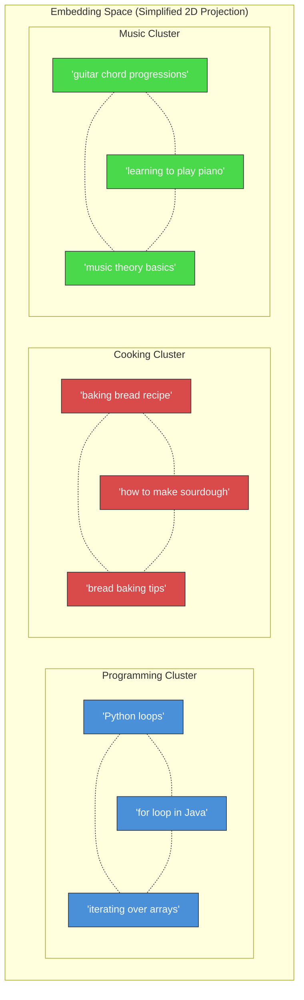
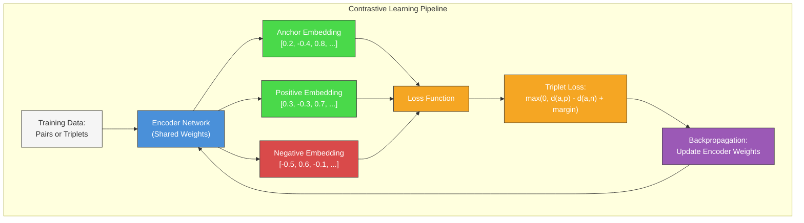
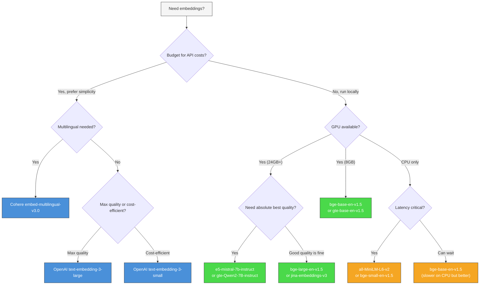
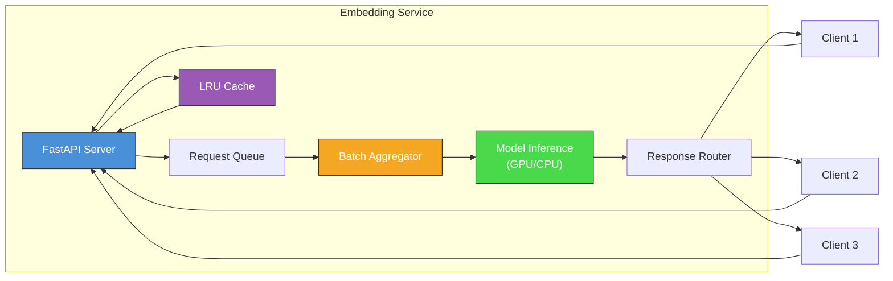

# Memory in AI Systems Deep Dive  Part 7: Embeddings  Teaching Machines to Understand Meaning

---

**Series:** Memory in AI Systems  A Developer's Deep Dive from Fundamentals to Production
**Part:** 7 of 19 (Embeddings Deep Dive)
**Audience:** Developers with programming experience who want to understand AI memory systems from the ground up
**Reading time:** ~50 minutes

---

## Recap of Part 6

In Part 6, we explored Retrieval-Augmented Generation (RAG) at its conceptual level  the idea that instead of relying solely on what a model "knows" from training, we can give it access to external documents at query time. We saw how the retrieve-then-generate pipeline works, why it matters for accuracy and freshness, and the fundamental architecture decisions that shape every RAG system.

But we glossed over something critical: **the retrieval step itself**. When a user asks a question and we need to find the most relevant documents from millions of candidates, how does the system know what "relevant" means? How does it compare a natural language question to a natural language document and produce a meaningful similarity score  in milliseconds?

The answer is **embeddings**  dense vector representations that encode the *meaning* of text into arrays of numbers. We introduced embeddings briefly in Part 1 when we first talked about vectors. Now we go production-depth. This is the most important single concept in the entire AI memory stack, because every retrieval system, every vector database, every semantic search engine, and every RAG pipeline depends on the quality of its embeddings.

If your embeddings are bad, your entire memory system is bad. No amount of clever vector indexing or prompt engineering can compensate for embeddings that don't capture the right semantics.

By the end of this part, you will:

- Understand **how embedding models are trained** from scratch using contrastive learning
- Survey **every major embedding model** available today, with concrete performance comparisons
- Use **Sentence Transformers** to encode text, compute similarity, and cluster documents
- **Fine-tune** embedding models on your own domain data
- Build a complete **embedding evaluation pipeline** with Recall@K, MRR, and NDCG
- Work with **multilingual embeddings** that cross language barriers
- Optimize embeddings for **production** with quantization, Matryoshka truncation, and caching
- Build a **production embedding microservice** with FastAPI

Let's build.

---

## Table of Contents

1. [From Vectors to Meaning](#1-from-vectors-to-meaning)
2. [How Embedding Models Are Trained](#2-how-embedding-models-are-trained)
3. [Pre-trained Embedding Models](#3-pre-trained-embedding-models)
4. [Using Sentence Transformers](#4-using-sentence-transformers)
5. [Fine-Tuning Embeddings for Your Domain](#5-fine-tuning-embeddings-for-your-domain)
6. [Embedding Quality Evaluation](#6-embedding-quality-evaluation)
7. [Multilingual and Cross-Lingual Embeddings](#7-multilingual-and-cross-lingual-embeddings)
8. [Embedding Optimization for Production](#8-embedding-optimization-for-production)
9. [Building an Embedding Service](#9-building-an-embedding-service)
10. [Vocabulary Cheat Sheet](#10-vocabulary-cheat-sheet)
11. [Key Takeaways and What's Next](#11-key-takeaways-and-whats-next)

---

## 1. From Vectors to Meaning

### The Embedding Hypothesis

In Part 1, we established the foundational idea: text can be converted into arrays of numbers (vectors), and similar texts produce vectors that are close together in space. We built a simple semantic search engine with sentence-transformers and saw it work.

Now let's make this idea precise.

The **embedding hypothesis** states:

> **Texts with similar meanings, when passed through a well-trained embedding model, will be mapped to points that are nearby in high-dimensional vector space. The distance between points is inversely proportional to semantic similarity.**

This is not just a convenient assumption  it is an *engineered property*. Embedding models are specifically trained to make this true. The entire training procedure is designed to push similar items together and dissimilar items apart in the vector space.

### Why Embeddings Are the Universal Language of AI Memory

Consider the full stack of AI memory:

```
User Query: "How do I handle authentication in FastAPI?"
    │
    ▼
┌──────────────────────────────────────┐
│  Embedding Model                      │
│  "How do I handle auth..." → [0.23,  │
│   -0.41, 0.87, ..., 0.12]  (768-D)  │
└──────────────────────────────────────┘
    │
    ▼
┌──────────────────────────────────────┐
│  Vector Database (Pinecone, Qdrant)  │
│  Find nearest neighbors in 768-D     │
│  space among millions of documents    │
└──────────────────────────────────────┘
    │
    ▼
┌──────────────────────────────────────┐
│  Top-K Retrieved Documents           │
│  "FastAPI Security docs..."           │
│  "OAuth2 with Password Flow..."       │
│  "JWT Token Authentication..."        │
└──────────────────────────────────────┘
    │
    ▼
┌──────────────────────────────────────┐
│  LLM generates answer using context  │
└──────────────────────────────────────┘
```

The embedding model is the **translation layer** between human language and machine-searchable numeric space. It appears at every critical junction:

- **Indexing time**: Every document gets embedded before storage
- **Query time**: Every query gets embedded before search
- **Reranking**: Cross-encoder embeddings refine initial results
- **Caching**: Similar queries can share cached results via embedding proximity
- **Clustering**: Embeddings group similar documents for organization

Without embeddings, there is no semantic memory. Period.

### From Words to Sentences to Documents

In Part 1, we focused on word-level embeddings (Word2Vec) and briefly touched on sentence-level embeddings. Let's formalize the full hierarchy:

```
┌─────────────────────────────────────────────────────────┐
│                   Embedding Granularity                   │
├──────────────┬──────────────┬───────────────────────────┤
│  Token/Word  │   Sentence   │        Document           │
│  Embeddings  │  Embeddings  │        Embeddings         │
├──────────────┼──────────────┼───────────────────────────┤
│  Word2Vec    │  SBERT       │  Doc2Vec                  │
│  GloVe       │  all-MiniLM  │  Longformer embeddings    │
│  FastText    │  OpenAI ada  │  Chunk + pool strategies  │
│  BERT [CLS]  │  Cohere v3   │  Hierarchical embeddings  │
│              │  BGE / E5    │                           │
├──────────────┼──────────────┼───────────────────────────┤
│  ~100-300 D  │  ~384-3072 D │  ~384-3072 D              │
│  Per token   │  Per sentence│  Per document             │
└──────────────┴──────────────┴───────────────────────────┘
```

For AI memory systems, **sentence-level embeddings** are the workhorse. They capture enough context to be semantically meaningful while remaining computationally tractable. When we embed longer documents, we typically chunk them into sentence-sized or paragraph-sized pieces and embed each chunk independently.

### The Geometry of Meaning

Let's visualize what a well-trained embedding space actually looks like:



In this space:
- **Intra-cluster distances** are small (similar topics are nearby)
- **Inter-cluster distances** are large (different topics are far apart)
- **Analogical relationships** are preserved (the vector from "Python" to "Java" is similar to the vector from "pip" to "Maven")

Let's verify this with code:

```python
from sentence_transformers import SentenceTransformer
import numpy as np
from sklearn.metrics.pairwise import cosine_similarity

# Load a pre-trained model
model = SentenceTransformer("all-MiniLM-L6-v2")

# Define sentences from different domains
programming = [
    "How to write a for loop in Python",
    "Iterating over arrays in JavaScript",
    "Loop constructs in programming languages",
]

cooking = [
    "How to bake sourdough bread at home",
    "Best recipe for chocolate chip cookies",
    "Tips for making homemade pasta from scratch",
]

music = [
    "Learning guitar chord progressions for beginners",
    "How to read sheet music notation",
    "Basic music theory and scales explained",
]

# Encode all sentences
all_sentences = programming + cooking + music
embeddings = model.encode(all_sentences)

# Compute pairwise cosine similarity
sim_matrix = cosine_similarity(embeddings)

# Print similarity matrix with labels
labels = ["Prog1", "Prog2", "Prog3", "Cook1", "Cook2", "Cook3", "Mus1", "Mus2", "Mus3"]
print(f"{'':>8}", end="")
for label in labels:
    print(f"{label:>8}", end="")
print()

for i, label in enumerate(labels):
    print(f"{label:>8}", end="")
    for j in range(len(labels)):
        print(f"{sim_matrix[i][j]:>8.3f}", end="")
    print()

# Expected output shows high intra-cluster similarity, low inter-cluster
# Prog1-Prog2: ~0.55   Prog1-Cook1: ~0.10   Prog1-Mus1: ~0.08
```

The output reveals the structure we expect: programming sentences are similar to each other (cosine similarity ~0.4-0.6), cooking sentences cluster together (~0.3-0.5), and cross-domain similarities are much lower (~0.05-0.15).

> **Key Insight:** The embedding space is not organized by words  it's organized by *meaning*. "How to write a for loop" and "iterating over arrays" share few words but are semantically close. "How to bake bread" and "how to write code" share the word "how" but are semantically distant.

---

## 2. How Embedding Models Are Trained

### The Core Idea: Learning by Comparison

How do you teach a neural network to produce vectors where similar texts are close and dissimilar texts are far? You train it with **contrastive learning**  a paradigm where the model learns by comparing examples.

The intuition is simple:
1. Show the model a pair of similar texts (a **positive pair**)
2. Show the model a pair of dissimilar texts (a **negative pair**)
3. Train the model to produce embeddings that are close for positive pairs and far for negative pairs
4. Repeat millions of times



### Triplet Loss: The Foundation

The oldest and most intuitive contrastive loss is **triplet loss**. Given:
- An **anchor** text (a)
- A **positive** text (p)  similar to the anchor
- A **negative** text (n)  dissimilar from the anchor

Triplet loss pushes the anchor closer to the positive and farther from the negative:

```
L = max(0, d(a, p) - d(a, n) + margin)
```

Where `d` is a distance function (typically Euclidean or 1 - cosine similarity), and `margin` is a hyperparameter that controls how much separation we require.

Let's implement this from scratch:

```python
import torch
import torch.nn as nn
import torch.nn.functional as F


class TripletLoss(nn.Module):
    """
    Triplet loss for training embedding models.

    Given an anchor, positive, and negative embedding,
    minimizes the distance between anchor-positive while
    maximizing the distance between anchor-negative.
    """

    def __init__(self, margin: float = 1.0, distance: str = "euclidean"):
        super().__init__()
        self.margin = margin
        self.distance = distance

    def _compute_distance(self, x: torch.Tensor, y: torch.Tensor) -> torch.Tensor:
        if self.distance == "euclidean":
            return F.pairwise_distance(x, y, p=2)
        elif self.distance == "cosine":
            # Cosine distance = 1 - cosine_similarity
            return 1.0 - F.cosine_similarity(x, y, dim=1)
        else:
            raise ValueError(f"Unknown distance: {self.distance}")

    def forward(
        self,
        anchor: torch.Tensor,
        positive: torch.Tensor,
        negative: torch.Tensor,
    ) -> torch.Tensor:
        """
        Args:
            anchor:   (batch_size, embedding_dim)
            positive: (batch_size, embedding_dim)
            negative: (batch_size, embedding_dim)
        Returns:
            Scalar loss value
        """
        d_pos = self._compute_distance(anchor, positive)
        d_neg = self._compute_distance(anchor, negative)

        # Triplet loss: push positive closer, negative farther
        loss = torch.clamp(d_pos - d_neg + self.margin, min=0.0)
        return loss.mean()


# --- Demonstration ---
torch.manual_seed(42)

# Simulate a batch of 4 triplets with 128-dim embeddings
batch_size, dim = 4, 128
anchor = torch.randn(batch_size, dim)
positive = anchor + 0.1 * torch.randn(batch_size, dim)  # Close to anchor
negative = torch.randn(batch_size, dim)                   # Random (far)

triplet_loss = TripletLoss(margin=1.0, distance="euclidean")
loss = triplet_loss(anchor, positive, negative)
print(f"Triplet loss: {loss.item():.4f}")

# With cosine distance
triplet_loss_cos = TripletLoss(margin=0.5, distance="cosine")
loss_cos = triplet_loss_cos(
    F.normalize(anchor, dim=1),
    F.normalize(positive, dim=1),
    F.normalize(negative, dim=1),
)
print(f"Triplet loss (cosine): {loss_cos.item():.4f}")
```

### InfoNCE Loss: The Modern Standard

While triplet loss works, modern embedding models use **InfoNCE** (Noise-Contrastive Estimation), also called **NT-Xent** (Normalized Temperature-scaled Cross-Entropy). The key improvement: instead of comparing one positive against one negative, InfoNCE compares one positive against **many negatives simultaneously**, using the entire batch as negative examples.

```python
class InfoNCELoss(nn.Module):
    """
    InfoNCE / NT-Xent loss  the standard loss for modern embedding models.

    For each anchor, we have one positive and use all other samples in
    the batch as negatives. This gives us (batch_size - 1) negatives
    per anchor for free  no need to mine negatives explicitly.
    """

    def __init__(self, temperature: float = 0.07):
        super().__init__()
        self.temperature = temperature

    def forward(
        self,
        anchors: torch.Tensor,
        positives: torch.Tensor,
    ) -> torch.Tensor:
        """
        Args:
            anchors:   (batch_size, embedding_dim)  L2-normalized
            positives: (batch_size, embedding_dim)  L2-normalized
        Returns:
            Scalar loss value
        """
        # Normalize embeddings
        anchors = F.normalize(anchors, dim=1)
        positives = F.normalize(positives, dim=1)

        # Compute similarity matrix: anchors vs all positives
        # Shape: (batch_size, batch_size)
        similarity_matrix = torch.matmul(anchors, positives.T) / self.temperature

        # Labels: the diagonal contains the correct positive for each anchor
        # anchor[i] should match positives[i]
        labels = torch.arange(anchors.size(0), device=anchors.device)

        # Cross-entropy loss: treat as classification problem
        # Each anchor must "classify" which positive is its match
        loss = F.cross_entropy(similarity_matrix, labels)

        return loss


# --- Demonstration ---
torch.manual_seed(42)
batch_size, dim = 32, 128

# Simulate anchor-positive pairs
anchors = F.normalize(torch.randn(batch_size, dim), dim=1)
# Positives are perturbed versions of anchors (simulating paraphrases)
positives = F.normalize(anchors + 0.3 * torch.randn(batch_size, dim), dim=1)

infonce = InfoNCELoss(temperature=0.07)
loss = infonce(anchors, positives)
print(f"InfoNCE loss: {loss.item():.4f}")

# The temperature controls the sharpness of the distribution
for temp in [0.01, 0.05, 0.1, 0.5, 1.0]:
    loss = InfoNCELoss(temperature=temp)(anchors, positives)
    print(f"  temperature={temp:.2f} → loss={loss.item():.4f}")
```

> **Key Insight:** The temperature parameter in InfoNCE is crucial. Low temperature (e.g., 0.01) makes the loss very sensitive to small differences  the model must be very confident. High temperature (e.g., 1.0) makes the distribution smoother, which is better for early training. Most models use temperature in the range 0.05-0.1.

### Multiple Negatives Ranking Loss

The loss function used by most Sentence-BERT models is **Multiple Negatives Ranking Loss** (MNRL), which is essentially InfoNCE applied to text pairs. The beauty of MNRL is that it uses **in-batch negatives**: if you have a batch of (query, positive_document) pairs, every other document in the batch serves as a negative for each query.

```python
class MultipleNegativesRankingLoss(nn.Module):
    """
    Multiple Negatives Ranking Loss  the workhorse loss for text embedding.

    Given pairs (query_i, document_i), this loss:
    1. Encodes all queries and documents
    2. Computes cosine similarity between every query and every document
    3. Trains the model so query_i is most similar to document_i

    In-batch negatives: document_j (j != i) serves as negative for query_i.
    With batch_size = 256, we get 255 free negatives per query.
    """

    def __init__(self, temperature: float = 0.05):
        super().__init__()
        self.temperature = temperature
        self.cross_entropy = nn.CrossEntropyLoss()

    def forward(
        self,
        query_embeddings: torch.Tensor,
        document_embeddings: torch.Tensor,
    ) -> torch.Tensor:
        # Normalize to unit vectors (cosine similarity via dot product)
        query_embeddings = F.normalize(query_embeddings, dim=1)
        document_embeddings = F.normalize(document_embeddings, dim=1)

        # Similarity matrix: (batch, batch)
        scores = torch.matmul(
            query_embeddings, document_embeddings.T
        ) / self.temperature

        # Each query_i should match document_i → labels = [0, 1, 2, ..., n-1]
        labels = torch.arange(scores.size(0), device=scores.device)

        return self.cross_entropy(scores, labels)


# --- Full Training Loop Example ---
class SimpleTextEncoder(nn.Module):
    """Simplified text encoder for demonstration."""

    def __init__(self, vocab_size: int, embed_dim: int, hidden_dim: int):
        super().__init__()
        self.embedding = nn.Embedding(vocab_size, embed_dim)
        self.encoder = nn.Sequential(
            nn.Linear(embed_dim, hidden_dim),
            nn.ReLU(),
            nn.Linear(hidden_dim, hidden_dim),
        )

    def forward(self, input_ids: torch.Tensor) -> torch.Tensor:
        # input_ids: (batch, seq_len)
        embedded = self.embedding(input_ids)       # (batch, seq_len, embed_dim)
        pooled = embedded.mean(dim=1)              # (batch, embed_dim)   mean pooling
        return self.encoder(pooled)                # (batch, hidden_dim)


# Training setup
vocab_size = 10000
embed_dim = 64
hidden_dim = 128
batch_size = 32
num_epochs = 10

encoder = SimpleTextEncoder(vocab_size, embed_dim, hidden_dim)
optimizer = torch.optim.Adam(encoder.parameters(), lr=1e-3)
loss_fn = MultipleNegativesRankingLoss(temperature=0.05)

# Simulated training data: pairs of (query_tokens, document_tokens)
for epoch in range(num_epochs):
    # Simulated batch of token IDs
    query_ids = torch.randint(0, vocab_size, (batch_size, 10))
    doc_ids = torch.randint(0, vocab_size, (batch_size, 20))

    # Forward pass
    query_emb = encoder(query_ids)
    doc_emb = encoder(doc_ids)

    # Compute loss
    loss = loss_fn(query_emb, doc_emb)

    # Backward pass
    optimizer.zero_grad()
    loss.backward()
    optimizer.step()

    if epoch % 2 == 0:
        print(f"Epoch {epoch}: loss = {loss.item():.4f}")
```

### Hard Negative Mining

Not all negatives are equally useful for learning. If a negative is already very far from the anchor, the loss is already 0 and the model learns nothing from it. The most informative negatives are **hard negatives**  examples that are *somewhat similar* to the anchor but *shouldn't be considered matches*.

```python
def mine_hard_negatives(
    query_embeddings: torch.Tensor,
    document_embeddings: torch.Tensor,
    labels: torch.Tensor,
    num_hard_negatives: int = 5,
) -> torch.Tensor:
    """
    For each query, find the most similar non-matching documents.
    These are the hardest negatives  documents that look similar
    but are actually about different topics.

    Args:
        query_embeddings: (num_queries, dim)
        document_embeddings: (num_docs, dim)
        labels: (num_queries,)  index of correct document for each query
        num_hard_negatives: how many hard negatives per query

    Returns:
        hard_negative_indices: (num_queries, num_hard_negatives)
    """
    # Compute all pairwise similarities
    similarities = torch.matmul(
        F.normalize(query_embeddings, dim=1),
        F.normalize(document_embeddings, dim=1).T,
    )

    # Mask out the correct positives (set to -inf so they aren't selected)
    for i in range(len(labels)):
        similarities[i, labels[i]] = float("-inf")

    # Select top-K most similar (hardest) negatives
    _, hard_neg_indices = similarities.topk(num_hard_negatives, dim=1)

    return hard_neg_indices


# Example: mining hard negatives
num_queries, num_docs, dim = 100, 1000, 128

query_emb = F.normalize(torch.randn(num_queries, dim), dim=1)
doc_emb = F.normalize(torch.randn(num_docs, dim), dim=1)
correct_labels = torch.randint(0, num_docs, (num_queries,))

hard_negatives = mine_hard_negatives(query_emb, doc_emb, correct_labels, num_hard_negatives=5)
print(f"Hard negative indices shape: {hard_negatives.shape}")
print(f"Hard negatives for query 0: {hard_negatives[0].tolist()}")
```

> **Key Insight:** Hard negative mining is one of the most impactful techniques for improving embedding quality. Models like BGE and E5 specifically credit their strong performance to careful hard negative mining during training. A common strategy is to use BM25 (keyword search) to find hard negatives: documents that share keywords with the query but aren't actually relevant.

### The Training Data Pipeline

Where does the training data come from? Modern embedding models are trained on massive, diverse datasets:

| Data Source | Pair Type | Example | Scale |
|---|---|---|---|
| **Natural Language Inference** | Entailment pairs | "A dog runs" → "An animal moves" | ~1M pairs |
| **Paraphrase datasets** | Paraphrases | "What time is it?" ↔ "What's the current time?" | ~5M pairs |
| **Question-Answer pairs** | QA pairs | "What is Python?" → "Python is a programming language..." | ~10M pairs |
| **Search logs** | Query-click pairs | "best laptop 2024" → clicked product page | ~100M+ pairs |
| **Title-body pairs** | Title-abstract | Paper title → paper abstract | ~30M pairs |
| **Parallel translations** | Cross-lingual | English sentence ↔ French translation | ~50M pairs |
| **Reddit comment pairs** | Conversation | Post → top reply | ~200M pairs |

The diversity of training data is crucial  it's what gives general-purpose embedding models their broad capability.

---

## 3. Pre-trained Embedding Models

### The Model Landscape

The embedding model ecosystem has exploded. Here's a comprehensive survey of the models you'll encounter in production, from legacy educational models to state-of-the-art:

#### Legacy Models (Educational Value)

**Word2Vec** (Google, 2013)
- The model that started it all. Learns word vectors by predicting context words (Skip-gram) or predicting a word from its context (CBOW).
- Produces one vector per word  no sentence-level understanding.
- Still useful for understanding the *concept* of embeddings.

**GloVe** (Stanford, 2014)
- Global Vectors for Word Representation. Learns from word co-occurrence statistics across the entire corpus.
- Often produces slightly better word analogies than Word2Vec.
- Same limitation: word-level only, no context sensitivity.

**FastText** (Facebook, 2016)
- Extension of Word2Vec that uses character n-grams.
- Can handle out-of-vocabulary words by composing subword vectors.
- Still word-level, but handles morphologically rich languages better.

> **Important:** Word-level embeddings are **not used** in modern AI memory systems. They can't distinguish "bank" (river) from "bank" (financial). Everything below operates at the sentence/passage level with full context awareness.

#### The Modern Era: Transformer-Based Embeddings

**Sentence-BERT / all-MiniLM-L6-v2** (2019-2021)
- The breakthrough that made sentence embeddings practical. Fine-tuned BERT with siamese/triplet networks.
- `all-MiniLM-L6-v2`: 384 dimensions, 22M parameters, fast inference. The go-to "starter" model.
- `all-mpnet-base-v2`: 768 dimensions, 109M parameters, better quality.

**OpenAI Embeddings** (2022-2024)
- `text-embedding-ada-002`: 1536 dimensions. The model that popularized API-based embeddings.
- `text-embedding-3-small`: 1536 dimensions (adjustable via API to 512). Better quality, cheaper.
- `text-embedding-3-large`: 3072 dimensions (adjustable). Highest quality from OpenAI.
- API-only  no local inference, no fine-tuning.

**Cohere Embed** (2023-2024)
- `embed-english-v3.0`: 1024 dimensions. Supports separate "search_query" and "search_document" input types for asymmetric search.
- `embed-multilingual-v3.0`: Same architecture, 100+ languages.
- Excellent for search use cases. API-only.

**Instructor Embeddings** (2023)
- Allows task-specific instructions: "Represent the Science document for retrieval: ..."
- The same model produces different embeddings depending on the instruction.
- Open-source, runs locally.

**BGE Models** (BAAI, 2023-2024)
- `bge-small-en-v1.5`: 384 dimensions, very fast.
- `bge-base-en-v1.5`: 768 dimensions, excellent quality/speed balance.
- `bge-large-en-v1.5`: 1024 dimensions, top-tier quality.
- `bge-m3`: Multilingual, multi-granularity. Supports dense, sparse, and ColBERT-style retrieval in one model.
- Open-source, trained with excellent hard negative mining.

**E5 Models** (Microsoft, 2023-2024)
- `e5-small-v2`, `e5-base-v2`, `e5-large-v2`: Competitive with BGE.
- `e5-mistral-7b-instruct`: LLM-based embedding model. 4096 dimensions.
- Uses "query:" and "passage:" prefixes to distinguish query vs document encoding.

**GTE Models** (Alibaba, 2023-2024)
- `gte-small`, `gte-base`, `gte-large`: Strong across all benchmarks.
- `gte-Qwen2-7B-instruct`: LLM-based, top scores on MTEB benchmark.
- Open-source with permissive licenses.

**Nomic Embed** (2024)
- `nomic-embed-text-v1.5`: 768 dimensions with Matryoshka support (truncate to any dimension).
- Fully open-source including training code and data.
- Strong performance for its size.

**Jina Embeddings** (2024)
- `jina-embeddings-v3`: 1024 dimensions, 8192 token context.
- Supports task-specific LoRA adapters for retrieval, classification, etc.
- Multilingual with Matryoshka dimension support.

### Comprehensive Comparison Table

| Model | Dimensions | Max Tokens | Parameters | MTEB Score | Speed (rel.) | Open Source | Local |
|---|---|---|---|---|---|---|---|
| all-MiniLM-L6-v2 | 384 | 256 | 22M | 56.3 | 5x | Yes | Yes |
| all-mpnet-base-v2 | 768 | 384 | 109M | 57.8 | 2.5x | Yes | Yes |
| bge-small-en-v1.5 | 384 | 512 | 33M | 62.2 | 4.5x | Yes | Yes |
| bge-base-en-v1.5 | 768 | 512 | 109M | 63.6 | 2.5x | Yes | Yes |
| bge-large-en-v1.5 | 1024 | 512 | 335M | 64.2 | 1x | Yes | Yes |
| e5-base-v2 | 768 | 512 | 109M | 61.5 | 2.5x | Yes | Yes |
| e5-large-v2 | 1024 | 512 | 335M | 62.0 | 1x | Yes | Yes |
| gte-base-en-v1.5 | 768 | 8192 | 109M | 64.1 | 2.5x | Yes | Yes |
| nomic-embed-text-v1.5 | 768 | 8192 | 137M | 62.3 | 2x | Yes | Yes |
| jina-embeddings-v3 | 1024 | 8192 | 572M | 65.5 | 0.5x | Yes | Yes |
| text-embedding-3-small | 1536 | 8191 | Unknown | 62.3 | API | No | No |
| text-embedding-3-large | 3072 | 8191 | Unknown | 64.6 | API | No | No |
| embed-english-v3.0 | 1024 | 512 | Unknown | 64.5 | API | No | No |
| e5-mistral-7b-instruct | 4096 | 32768 | 7B | 66.6 | 0.1x | Yes | Yes* |

*\* Requires significant GPU memory (14GB+ for float16)*

> **Key Insight:** MTEB (Massive Text Embedding Benchmark) scores are the standard for comparing embedding models. But they test general-purpose quality  your domain-specific performance may differ significantly. Always benchmark on *your* data before choosing a model.

### Model Selection Decision Tree



---

## 4. Using Sentence Transformers

### Installation and First Steps

The `sentence-transformers` library is the most popular way to work with embedding models locally. It wraps Hugging Face Transformers with a clean, embedding-focused API.

```python
# Installation (run in terminal)
# pip install sentence-transformers

from sentence_transformers import SentenceTransformer
import numpy as np

# Load a model  downloads automatically on first use
model = SentenceTransformer("all-MiniLM-L6-v2")

# Check model properties
print(f"Model: {model}")
print(f"Max sequence length: {model.max_seq_length}")
print(f"Embedding dimension: {model.get_sentence_embedding_dimension()}")
# Output:
# Max sequence length: 256
# Embedding dimension: 384
```

### Basic Encoding

```python
# Encode a single sentence
sentence = "Embeddings convert text into meaningful vectors."
embedding = model.encode(sentence)

print(f"Type: {type(embedding)}")        # <class 'numpy.ndarray'>
print(f"Shape: {embedding.shape}")        # (384,)
print(f"First 10 values: {embedding[:10].round(4)}")
print(f"L2 norm: {np.linalg.norm(embedding):.4f}")  # ~1.0 (normalized)

# Encode multiple sentences at once
sentences = [
    "The cat sat on the mat.",
    "A feline rested on the rug.",
    "The stock market crashed today.",
    "Financial markets experienced a downturn.",
    "I love eating pizza on Fridays.",
]

embeddings = model.encode(sentences)
print(f"Batch shape: {embeddings.shape}")  # (5, 384)
```

### Semantic Similarity Computation

```python
from sentence_transformers import SentenceTransformer, util
import torch

model = SentenceTransformer("all-MiniLM-L6-v2")

# Define query and corpus
query = "What are the health benefits of green tea?"
corpus = [
    "Green tea contains antioxidants that may reduce the risk of heart disease.",
    "The history of tea drinking dates back to ancient China.",
    "Coffee is the most popular beverage in the United States.",
    "Studies show green tea can boost metabolism and aid weight loss.",
    "Black tea is fully oxidized while green tea is not.",
    "Drinking green tea regularly may improve brain function.",
    "The best temperature for brewing green tea is 175°F.",
]

# Encode query and corpus
query_embedding = model.encode(query, convert_to_tensor=True)
corpus_embeddings = model.encode(corpus, convert_to_tensor=True)

# Compute cosine similarity between query and all corpus sentences
cosine_scores = util.cos_sim(query_embedding, corpus_embeddings)[0]

# Sort by similarity
scored_corpus = list(zip(corpus, cosine_scores.tolist()))
scored_corpus.sort(key=lambda x: x[1], reverse=True)

print("Query:", query)
print("\nResults ranked by similarity:")
for text, score in scored_corpus:
    print(f"  [{score:.4f}] {text}")

# Expected: health-related green tea sentences rank highest
```

### Batch Processing for Efficiency

When encoding large datasets, batch processing is critical for performance:

```python
import time
from sentence_transformers import SentenceTransformer

model = SentenceTransformer("all-MiniLM-L6-v2")

# Simulate a large corpus
corpus = [f"This is document number {i} about topic {i % 100}." for i in range(10000)]

# --- Method 1: One at a time (slow) ---
start = time.time()
embeddings_slow = [model.encode(doc) for doc in corpus[:100]]
time_slow = time.time() - start
print(f"One-at-a-time (100 docs): {time_slow:.2f}s")

# --- Method 2: Batch encoding (fast) ---
start = time.time()
embeddings_batch = model.encode(corpus[:100], batch_size=32)
time_batch = time.time() - start
print(f"Batch encoding (100 docs): {time_batch:.2f}s")
print(f"Speedup: {time_slow / time_batch:.1f}x")

# --- Method 3: Full corpus with progress bar ---
start = time.time()
embeddings_full = model.encode(
    corpus,
    batch_size=128,
    show_progress_bar=True,
    convert_to_numpy=True,
    normalize_embeddings=True,  # Pre-normalize for cosine similarity
)
time_full = time.time() - start
print(f"\nFull corpus ({len(corpus)} docs): {time_full:.2f}s")
print(f"Throughput: {len(corpus) / time_full:.0f} docs/sec")
print(f"Shape: {embeddings_full.shape}")
```

### Semantic Clustering

Embeddings naturally support clustering  similar documents form clusters in the embedding space:

```python
from sentence_transformers import SentenceTransformer
from sklearn.cluster import KMeans, AgglomerativeClustering
from sklearn.metrics import silhouette_score
import numpy as np

model = SentenceTransformer("all-MiniLM-L6-v2")

# Documents from mixed topics
documents = [
    # Programming
    "How to write unit tests in Python with pytest",
    "Best practices for error handling in JavaScript",
    "Understanding async/await in modern programming",
    "Git branching strategies for team development",
    "Docker containerization for microservices",

    # Cooking
    "Easy homemade pasta recipe for beginners",
    "How to properly season a cast iron skillet",
    "The best way to caramelize onions slowly",
    "Tips for baking the perfect sourdough bread",
    "How to make a classic French omelette",

    # Fitness
    "Beginner's guide to strength training at home",
    "How to improve your running endurance",
    "Yoga poses for flexibility and stress relief",
    "Nutrition tips for muscle building",
    "HIIT workout routines for busy people",
]

# Encode
embeddings = model.encode(documents, normalize_embeddings=True)

# K-Means clustering
kmeans = KMeans(n_clusters=3, random_state=42, n_init=10)
kmeans_labels = kmeans.fit_predict(embeddings)

# Agglomerative clustering
agglo = AgglomerativeClustering(n_clusters=3)
agglo_labels = agglo.fit_predict(embeddings)

# Evaluate clustering quality
kmeans_silhouette = silhouette_score(embeddings, kmeans_labels)
agglo_silhouette = silhouette_score(embeddings, agglo_labels)

print(f"K-Means silhouette score: {kmeans_silhouette:.4f}")
print(f"Agglomerative silhouette score: {agglo_silhouette:.4f}")

# Display clusters
print("\nK-Means Clusters:")
for cluster_id in range(3):
    print(f"\n  Cluster {cluster_id}:")
    for doc, label in zip(documents, kmeans_labels):
        if label == cluster_id:
            print(f"    - {doc}")
```

### Semantic Search Engine (Complete)

Let's build a more robust semantic search engine than the one in Part 1:

```python
from sentence_transformers import SentenceTransformer, util
import numpy as np
import json
from typing import Optional
from dataclasses import dataclass


@dataclass
class SearchResult:
    """A single search result with metadata."""
    text: str
    score: float
    index: int
    metadata: dict


class SemanticSearchEngine:
    """
    A complete semantic search engine using sentence-transformers.

    Features:
    - Batch indexing with progress tracking
    - Top-K retrieval with score thresholds
    - Metadata support
    - Normalized embeddings for fast cosine similarity via dot product
    """

    def __init__(self, model_name: str = "all-MiniLM-L6-v2"):
        self.model = SentenceTransformer(model_name)
        self.corpus_texts: list[str] = []
        self.corpus_metadata: list[dict] = []
        self.corpus_embeddings: Optional[np.ndarray] = None

    def index(
        self,
        texts: list[str],
        metadata: Optional[list[dict]] = None,
        batch_size: int = 64,
    ) -> None:
        """Index a corpus of texts with optional metadata."""
        self.corpus_texts = texts
        self.corpus_metadata = metadata or [{} for _ in texts]

        print(f"Indexing {len(texts)} documents...")
        self.corpus_embeddings = self.model.encode(
            texts,
            batch_size=batch_size,
            show_progress_bar=True,
            normalize_embeddings=True,
            convert_to_numpy=True,
        )
        print(f"Index built: {self.corpus_embeddings.shape}")

    def search(
        self,
        query: str,
        top_k: int = 5,
        min_score: float = 0.0,
    ) -> list[SearchResult]:
        """Search the corpus for the most relevant documents."""
        if self.corpus_embeddings is None:
            raise ValueError("No documents indexed. Call index() first.")

        # Encode query
        query_embedding = self.model.encode(
            query, normalize_embeddings=True, convert_to_numpy=True
        )

        # Cosine similarity via dot product (embeddings are normalized)
        scores = np.dot(self.corpus_embeddings, query_embedding)

        # Get top-K indices
        top_indices = np.argsort(scores)[::-1][:top_k]

        # Build results
        results = []
        for idx in top_indices:
            score = float(scores[idx])
            if score >= min_score:
                results.append(SearchResult(
                    text=self.corpus_texts[idx],
                    score=score,
                    index=int(idx),
                    metadata=self.corpus_metadata[idx],
                ))

        return results


# --- Usage ---
engine = SemanticSearchEngine("all-MiniLM-L6-v2")

# Index a knowledge base
knowledge_base = [
    "Python is a high-level programming language known for readability.",
    "FastAPI is a modern Python web framework for building APIs.",
    "Docker containers package applications with their dependencies.",
    "PostgreSQL is a powerful open-source relational database.",
    "Redis is an in-memory data store used for caching.",
    "Kubernetes orchestrates containerized applications at scale.",
    "Machine learning models learn patterns from training data.",
    "Neural networks are inspired by biological brain structures.",
    "Git is a distributed version control system.",
    "CI/CD pipelines automate software testing and deployment.",
]

metadata = [{"category": "language"}, {"category": "framework"},
            {"category": "devops"}, {"category": "database"},
            {"category": "database"}, {"category": "devops"},
            {"category": "ml"}, {"category": "ml"},
            {"category": "devops"}, {"category": "devops"}]

engine.index(knowledge_base, metadata)

# Search
queries = [
    "How do I build a REST API?",
    "What database should I use?",
    "How does deep learning work?",
]

for query in queries:
    print(f"\nQuery: {query}")
    results = engine.search(query, top_k=3)
    for r in results:
        print(f"  [{r.score:.4f}] ({r.metadata['category']}) {r.text}")
```

---

## 5. Fine-Tuning Embeddings for Your Domain

### When to Fine-Tune

Pre-trained embedding models are remarkably good at general text. But there are specific scenarios where fine-tuning produces significant improvements:

| Scenario | Example | Expected Gain |
|---|---|---|
| **Domain-specific vocabulary** | Medical: "myocardial infarction" ≈ "heart attack" | +10-25% |
| **Specialized similarity** | Legal: contracts about similar clauses | +5-15% |
| **Short vs. long asymmetry** | Query: "auth bug" → Doc: 500-word bug report | +5-20% |
| **Non-English or mixed language** | Technical docs in Korean + English code | +10-30% |
| **Custom relevance definition** | "Similar" means same customer segment, not same topic | +15-40% |

> **Rule of Thumb:** If your domain uses specialized vocabulary, if "similar" means something specific in your context, or if pre-trained models retrieve irrelevant results on your test queries, fine-tuning will likely help.

### Preparing Training Data

The most important part of fine-tuning is preparing good training data. You need pairs (or triplets) of texts with similarity labels:

```python
from sentence_transformers import InputExample
import random

# --- Option 1: Positive pairs (simplest) ---
# Each example is a pair of texts that should be similar.
# Negatives are mined from the batch automatically.

positive_pairs = [
    InputExample(texts=["How to reset my password?",
                        "I forgot my login credentials, how do I recover them?"]),
    InputExample(texts=["Cancel my subscription",
                        "I want to stop my monthly plan"]),
    InputExample(texts=["App crashes on startup",
                        "The application fails to open and shows an error"]),
    InputExample(texts=["Change my billing address",
                        "Update the address on my payment method"]),
    InputExample(texts=["How to export data as CSV?",
                        "Download my data in spreadsheet format"]),
]

# --- Option 2: Triplets (more explicit) ---
# (anchor, positive, negative)  you explicitly choose hard negatives

triplets = [
    InputExample(texts=[
        "How to reset my password?",              # anchor
        "I forgot my credentials, help me reset",  # positive
        "How to change my email address",           # negative (hard: also account-related)
    ]),
    InputExample(texts=[
        "App crashes on startup",
        "Application won't open, shows error",
        "App is running slowly",                    # negative (hard: also app issue)
    ]),
]

# --- Option 3: Scored pairs (most flexible) ---
# Each pair has a similarity score from 0.0 to 1.0

scored_pairs = [
    InputExample(texts=["happy", "joyful"], label=0.95),
    InputExample(texts=["happy", "sad"], label=0.10),
    InputExample(texts=["happy", "content"], label=0.80),
    InputExample(texts=["dog", "puppy"], label=0.85),
    InputExample(texts=["dog", "cat"], label=0.40),  # Related but different
    InputExample(texts=["dog", "democracy"], label=0.02),
]


# --- Generating Training Data from Real Sources ---
def generate_training_pairs_from_faq(
    faq_data: list[dict],
) -> list[InputExample]:
    """
    Generate training pairs from FAQ data.
    Each FAQ has a 'question' and 'answer', plus 'category'.

    Strategy:
    - Positive pairs: different questions in the same category
    - Hard negatives: questions from different categories that share words
    """
    examples = []

    # Group by category
    categories = {}
    for item in faq_data:
        cat = item["category"]
        if cat not in categories:
            categories[cat] = []
        categories[cat].append(item)

    # Generate positive pairs (same category)
    for cat, items in categories.items():
        for i in range(len(items)):
            for j in range(i + 1, len(items)):
                examples.append(InputExample(
                    texts=[items[i]["question"], items[j]["question"]],
                    label=1.0,
                ))

    # Generate negative pairs (different categories)
    cat_list = list(categories.keys())
    for i in range(len(cat_list)):
        for j in range(i + 1, len(cat_list)):
            items_a = categories[cat_list[i]]
            items_b = categories[cat_list[j]]
            # Sample a few negatives
            for _ in range(min(3, len(items_a), len(items_b))):
                a = random.choice(items_a)
                b = random.choice(items_b)
                examples.append(InputExample(
                    texts=[a["question"], b["question"]],
                    label=0.0,
                ))

    random.shuffle(examples)
    return examples


# Example FAQ data
faq_data = [
    {"question": "How do I reset my password?", "answer": "...", "category": "account"},
    {"question": "I can't log into my account", "answer": "...", "category": "account"},
    {"question": "How to update my email?", "answer": "...", "category": "account"},
    {"question": "App crashes when I open it", "answer": "...", "category": "technical"},
    {"question": "The page won't load", "answer": "...", "category": "technical"},
    {"question": "How to request a refund?", "answer": "...", "category": "billing"},
    {"question": "Cancel my subscription", "answer": "...", "category": "billing"},
]

training_data = generate_training_pairs_from_faq(faq_data)
print(f"Generated {len(training_data)} training pairs")
```

### Fine-Tuning with Sentence Transformers

```python
from sentence_transformers import (
    SentenceTransformer,
    InputExample,
    losses,
    evaluation,
)
from torch.utils.data import DataLoader
import math

# --- Step 1: Load base model ---
model = SentenceTransformer("all-MiniLM-L6-v2")

# --- Step 2: Prepare training data ---
# Using Multiple Negatives Ranking Loss (pairs only, negatives from batch)
train_examples = [
    InputExample(texts=["How to reset my password?",
                        "I forgot my login credentials"]),
    InputExample(texts=["App won't open",
                        "Application crashes on startup"]),
    InputExample(texts=["Cancel subscription",
                        "Stop my monthly billing"]),
    InputExample(texts=["Export data to CSV",
                        "Download data as spreadsheet"]),
    InputExample(texts=["Two-factor authentication setup",
                        "Enable 2FA on my account"]),
    InputExample(texts=["Slow loading times",
                        "Pages take too long to render"]),
    InputExample(texts=["Change billing address",
                        "Update payment information address"]),
    InputExample(texts=["How to invite team members?",
                        "Add new users to my organization"]),
    # ... (in practice, you'd have thousands of examples)
]

train_dataloader = DataLoader(
    train_examples,
    shuffle=True,
    batch_size=16,
)

# --- Step 3: Choose loss function ---
# MultipleNegativesRankingLoss: best for positive-only pairs
train_loss = losses.MultipleNegativesRankingLoss(model=model)

# Alternative: CosineSimilarityLoss for scored pairs
# train_loss = losses.CosineSimilarityLoss(model=model)

# Alternative: TripletLoss for explicit triplets
# train_loss = losses.TripletLoss(model=model)

# --- Step 4: Prepare evaluation ---
eval_sentences1 = ["How do I change my password?", "App is not working"]
eval_sentences2 = ["Password reset instructions", "Application error on launch"]
eval_scores = [0.9, 0.85]  # Expected similarity scores

evaluator = evaluation.EmbeddingSimilarityEvaluator(
    eval_sentences1, eval_sentences2, eval_scores
)

# --- Step 5: Train ---
num_epochs = 3
warmup_steps = math.ceil(
    len(train_dataloader) * num_epochs * 0.1
)

model.fit(
    train_objectives=[(train_dataloader, train_loss)],
    evaluator=evaluator,
    epochs=num_epochs,
    warmup_steps=warmup_steps,
    evaluation_steps=100,
    output_path="./models/finetuned-support-embeddings",
    show_progress_bar=True,
)

# --- Step 6: Load and use fine-tuned model ---
finetuned_model = SentenceTransformer("./models/finetuned-support-embeddings")
embedding = finetuned_model.encode("How do I reset my password?")
print(f"Fine-tuned embedding shape: {embedding.shape}")
```

### Evaluating Fine-Tuning Impact

Always compare before and after fine-tuning on your actual use case:

```python
from sentence_transformers import SentenceTransformer, util
import numpy as np


def evaluate_retrieval(
    model: SentenceTransformer,
    queries: list[str],
    corpus: list[str],
    relevant: dict[int, list[int]],  # query_idx → list of relevant doc indices
    top_k: int = 5,
) -> dict[str, float]:
    """
    Evaluate a model on a retrieval task.

    Args:
        model: The embedding model to evaluate
        queries: List of query strings
        corpus: List of document strings
        relevant: Mapping from query index to relevant document indices
        top_k: Number of results to consider

    Returns:
        Dictionary of metrics: recall@k, mrr, precision@k
    """
    query_embeddings = model.encode(queries, normalize_embeddings=True)
    corpus_embeddings = model.encode(corpus, normalize_embeddings=True)

    # Compute all similarities
    similarities = np.dot(query_embeddings, corpus_embeddings.T)

    recalls = []
    mrrs = []
    precisions = []

    for q_idx in range(len(queries)):
        # Get top-K results
        top_indices = np.argsort(similarities[q_idx])[::-1][:top_k]
        relevant_set = set(relevant.get(q_idx, []))

        if not relevant_set:
            continue

        # Recall@K: fraction of relevant docs found in top-K
        found = len(set(top_indices) & relevant_set)
        recalls.append(found / len(relevant_set))

        # Precision@K: fraction of top-K that are relevant
        precisions.append(found / top_k)

        # MRR: reciprocal rank of first relevant result
        for rank, idx in enumerate(top_indices, 1):
            if idx in relevant_set:
                mrrs.append(1.0 / rank)
                break
        else:
            mrrs.append(0.0)

    return {
        f"recall@{top_k}": np.mean(recalls),
        f"precision@{top_k}": np.mean(precisions),
        "mrr": np.mean(mrrs),
    }


# --- Compare base vs. fine-tuned ---
base_model = SentenceTransformer("all-MiniLM-L6-v2")
# Assuming you've fine-tuned a model:
# finetuned_model = SentenceTransformer("./models/finetuned-support-embeddings")

queries = [
    "password reset",
    "app not working",
    "cancel plan",
    "export my data",
]

corpus = [
    "How to reset your password: Go to Settings > Security > Reset Password",
    "Troubleshooting app crashes: Clear cache and reinstall",
    "Subscription cancellation: Go to Billing > Cancel Plan",
    "Data export: Navigate to Settings > Data > Export as CSV",
    "Changing your profile picture",
    "System requirements for the desktop app",
    "Pricing plans comparison",
    "Contact support via live chat",
]

relevant = {
    0: [0],     # "password reset" → password reset doc
    1: [1],     # "app not working" → troubleshooting doc
    2: [2],     # "cancel plan" → cancellation doc
    3: [3],     # "export my data" → data export doc
}

base_metrics = evaluate_retrieval(base_model, queries, corpus, relevant, top_k=3)
print("Base model metrics:")
for metric, value in base_metrics.items():
    print(f"  {metric}: {value:.4f}")

# After fine-tuning, you'd see improved metrics on domain-specific queries
# finetuned_metrics = evaluate_retrieval(finetuned_model, queries, corpus, relevant, top_k=3)
```

---

## 6. Embedding Quality Evaluation

### Why Evaluation Matters

Choosing an embedding model  or deciding whether your fine-tuned version is better than the base  requires rigorous evaluation. "It seems to work" is not a metric. You need quantitative measures that correlate with real-world retrieval performance.

There are three families of evaluation metrics:

1. **Retrieval metrics**: How well do embeddings retrieve relevant documents?
2. **Clustering metrics**: How well do embeddings group similar items?
3. **Downstream task metrics**: How well do embeddings perform in your actual application?

### Retrieval Metrics Deep Dive

#### Recall@K

**Recall@K** answers: "Of all the relevant documents, what fraction did we find in the top K results?"

```
Recall@K = |{relevant documents in top K}| / |{all relevant documents}|
```

This is the most important metric for RAG systems. If your retrieval misses relevant documents, the LLM can never see them.

#### Mean Reciprocal Rank (MRR)

**MRR** answers: "On average, what rank does the first relevant document appear at?"

```
MRR = (1/|Q|) × Σ (1 / rank_i)
```

Where `rank_i` is the position of the first relevant document for query `i`. MRR rewards models that put the *best* result at the very top.

#### Normalized Discounted Cumulative Gain (NDCG)

**NDCG** answers: "How good is the ranking, considering that documents at the top matter more?"

NDCG accounts for graded relevance (not just binary relevant/not-relevant) and position bias (results at position 1 matter more than position 10).

```
DCG@K = Σ_{i=1}^{K} (2^{rel_i} - 1) / log2(i + 1)
NDCG@K = DCG@K / IDCG@K
```

Where `IDCG@K` is the ideal DCG (what you'd get with perfect ranking).

### Complete Evaluation Pipeline

```python
import numpy as np
from sentence_transformers import SentenceTransformer
from dataclasses import dataclass
from typing import Optional


@dataclass
class EvaluationResult:
    """Complete evaluation results for an embedding model."""
    recall_at_1: float
    recall_at_5: float
    recall_at_10: float
    mrr: float
    ndcg_at_10: float
    map_at_10: float  # Mean Average Precision


class EmbeddingEvaluator:
    """
    Comprehensive embedding quality evaluator.

    Evaluates retrieval performance using standard IR metrics:
    Recall@K, MRR, NDCG@K, and MAP@K.
    """

    def __init__(self, model: SentenceTransformer):
        self.model = model

    def _compute_ndcg(
        self,
        relevance_scores: list[float],
        k: int,
    ) -> float:
        """Compute NDCG@K for a single query."""
        # DCG
        dcg = 0.0
        for i, rel in enumerate(relevance_scores[:k]):
            dcg += (2 ** rel - 1) / np.log2(i + 2)  # i+2 because log2(1) = 0

        # Ideal DCG (sort by relevance)
        ideal_scores = sorted(relevance_scores, reverse=True)[:k]
        idcg = 0.0
        for i, rel in enumerate(ideal_scores):
            idcg += (2 ** rel - 1) / np.log2(i + 2)

        return dcg / idcg if idcg > 0 else 0.0

    def _compute_average_precision(
        self,
        retrieved_indices: np.ndarray,
        relevant_set: set[int],
        k: int,
    ) -> float:
        """Compute Average Precision for a single query."""
        if not relevant_set:
            return 0.0

        hits = 0
        sum_precision = 0.0

        for i, idx in enumerate(retrieved_indices[:k]):
            if idx in relevant_set:
                hits += 1
                sum_precision += hits / (i + 1)

        return sum_precision / min(len(relevant_set), k)

    def evaluate(
        self,
        queries: list[str],
        corpus: list[str],
        relevant_docs: dict[int, list[int]],
        relevance_scores: Optional[dict[int, dict[int, float]]] = None,
    ) -> EvaluationResult:
        """
        Run full evaluation.

        Args:
            queries: List of query strings
            corpus: List of document strings
            relevant_docs: query_idx → list of relevant doc indices
            relevance_scores: Optional graded relevance.
                query_idx → {doc_idx: score}. If None, binary relevance is used.

        Returns:
            EvaluationResult with all metrics
        """
        # Encode everything
        query_embeddings = self.model.encode(
            queries, normalize_embeddings=True, show_progress_bar=False
        )
        corpus_embeddings = self.model.encode(
            corpus, normalize_embeddings=True, show_progress_bar=False
        )

        # Compute similarity matrix
        similarities = np.dot(query_embeddings, corpus_embeddings.T)

        # Compute metrics
        recalls_1, recalls_5, recalls_10 = [], [], []
        mrrs = []
        ndcgs = []
        maps = []

        for q_idx in range(len(queries)):
            ranked_indices = np.argsort(similarities[q_idx])[::-1]
            relevant_set = set(relevant_docs.get(q_idx, []))

            if not relevant_set:
                continue

            # Recall@K
            for k, recall_list in [(1, recalls_1), (5, recalls_5), (10, recalls_10)]:
                found = len(set(ranked_indices[:k]) & relevant_set)
                recall_list.append(found / len(relevant_set))

            # MRR
            rr = 0.0
            for rank, idx in enumerate(ranked_indices, 1):
                if idx in relevant_set:
                    rr = 1.0 / rank
                    break
            mrrs.append(rr)

            # NDCG@10
            if relevance_scores and q_idx in relevance_scores:
                rel_scores = [
                    relevance_scores[q_idx].get(int(idx), 0.0)
                    for idx in ranked_indices[:10]
                ]
            else:
                # Binary relevance
                rel_scores = [
                    1.0 if int(idx) in relevant_set else 0.0
                    for idx in ranked_indices[:10]
                ]
            ndcgs.append(self._compute_ndcg(rel_scores, k=10))

            # MAP@10
            maps.append(self._compute_average_precision(
                ranked_indices, relevant_set, k=10
            ))

        return EvaluationResult(
            recall_at_1=float(np.mean(recalls_1)),
            recall_at_5=float(np.mean(recalls_5)),
            recall_at_10=float(np.mean(recalls_10)),
            mrr=float(np.mean(mrrs)),
            ndcg_at_10=float(np.mean(ndcgs)),
            map_at_10=float(np.mean(maps)),
        )


# --- Benchmark Multiple Models Head-to-Head ---
def benchmark_models(
    model_names: list[str],
    queries: list[str],
    corpus: list[str],
    relevant_docs: dict[int, list[int]],
) -> None:
    """Compare multiple embedding models on the same dataset."""

    print(f"{'Model':<30} {'R@1':>6} {'R@5':>6} {'R@10':>6} "
          f"{'MRR':>6} {'NDCG':>6} {'MAP':>6}")
    print("-" * 90)

    for model_name in model_names:
        model = SentenceTransformer(model_name)
        evaluator = EmbeddingEvaluator(model)
        result = evaluator.evaluate(queries, corpus, relevant_docs)

        print(f"{model_name:<30} "
              f"{result.recall_at_1:>6.3f} "
              f"{result.recall_at_5:>6.3f} "
              f"{result.recall_at_10:>6.3f} "
              f"{result.mrr:>6.3f} "
              f"{result.ndcg_at_10:>6.3f} "
              f"{result.map_at_10:>6.3f}")

        # Free memory
        del model


# --- Example Usage ---
queries = [
    "How do I authenticate with the API?",
    "What are the rate limits?",
    "How to handle webhook events?",
    "Database migration steps",
    "Error handling best practices",
]

corpus = [
    "API Authentication: Use Bearer tokens in the Authorization header.",
    "Rate Limiting: The API allows 100 requests per minute per API key.",
    "Webhooks: Configure endpoints in Settings to receive event notifications.",
    "Database Migrations: Run 'alembic upgrade head' to apply pending migrations.",
    "Error Handling: Wrap API calls in try/except and implement retry logic.",
    "Getting Started: Install the SDK with pip install our-sdk.",
    "Configuration: Set environment variables for API keys and secrets.",
    "Logging: Use structured logging with correlation IDs for debugging.",
    "Testing: Write unit tests for all API endpoint handlers.",
    "Deployment: Use Docker containers for consistent production deployments.",
]

relevant_docs = {
    0: [0],     # auth query → auth doc
    1: [1],     # rate limits → rate limit doc
    2: [2],     # webhooks → webhook doc
    3: [3],     # migrations → migration doc
    4: [4],     # error handling → error handling doc
}

# Compare models
models_to_test = [
    "all-MiniLM-L6-v2",
    "all-mpnet-base-v2",
    # "BAAI/bge-base-en-v1.5",  # Uncomment to test
]

benchmark_models(models_to_test, queries, corpus, relevant_docs)
```

### Clustering Quality Metrics

Beyond retrieval, you may want to evaluate how well embeddings cluster:

```python
from sklearn.metrics import (
    silhouette_score,
    calinski_harabasz_score,
    davies_bouldin_score,
    adjusted_rand_score,
    normalized_mutual_info_score,
)
from sklearn.cluster import KMeans
import numpy as np


def evaluate_clustering_quality(
    embeddings: np.ndarray,
    true_labels: np.ndarray,
    n_clusters: int,
) -> dict[str, float]:
    """
    Evaluate embedding quality through clustering metrics.

    Args:
        embeddings: (n_samples, dim)  normalized embeddings
        true_labels: (n_samples,)  ground truth cluster labels
        n_clusters: Number of expected clusters

    Returns:
        Dictionary of clustering quality metrics
    """
    # Run K-Means
    kmeans = KMeans(n_clusters=n_clusters, random_state=42, n_init=10)
    predicted_labels = kmeans.fit_predict(embeddings)

    return {
        # Internal metrics (don't need ground truth)
        "silhouette": silhouette_score(embeddings, predicted_labels),
        "calinski_harabasz": calinski_harabasz_score(embeddings, predicted_labels),
        "davies_bouldin": davies_bouldin_score(embeddings, predicted_labels),

        # External metrics (compare to ground truth)
        "adjusted_rand_index": adjusted_rand_score(true_labels, predicted_labels),
        "normalized_mutual_info": normalized_mutual_info_score(
            true_labels, predicted_labels
        ),
    }


# Example
model = SentenceTransformer("all-MiniLM-L6-v2")

texts = [
    # Category 0: Technology
    "Python programming language", "JavaScript frameworks",
    "Machine learning algorithms", "Cloud computing services",
    # Category 1: Sports
    "Basketball game highlights", "Soccer world cup results",
    "Tennis grand slam tournament", "Olympic swimming records",
    # Category 2: Food
    "Italian pasta recipes", "Japanese sushi preparation",
    "French pastry techniques", "Indian curry spices",
]
true_labels = np.array([0, 0, 0, 0, 1, 1, 1, 1, 2, 2, 2, 2])

embeddings = model.encode(texts, normalize_embeddings=True)
metrics = evaluate_clustering_quality(embeddings, true_labels, n_clusters=3)

print("Clustering Quality Metrics:")
for name, value in metrics.items():
    print(f"  {name}: {value:.4f}")
```

> **Key Insight:** Silhouette scores above 0.3 indicate reasonable clustering. Above 0.5 is good. Above 0.7 is excellent. If your embeddings produce silhouette scores below 0.2 on data that should cluster naturally, the embedding model isn't capturing the right distinctions for your domain.

---

## 7. Multilingual and Cross-Lingual Embeddings

### The Multilingual Challenge

Real-world AI memory systems often deal with multiple languages. Consider:
- A global customer support system receiving queries in 20+ languages
- A research tool searching academic papers across languages
- A knowledge base with documents in English, Chinese, and Japanese

Without multilingual embeddings, you'd need separate embedding models and vector indices for each language  and cross-lingual search would be impossible.

### How Multilingual Embeddings Work

Multilingual embedding models create a **shared vector space** across languages. The sentence "How are you?" in English and its translation in Spanish, French, or Japanese all map to nearby points in the same space.

This is achieved through **cross-lingual training data**: parallel translations are used as positive pairs during contrastive training. The model learns that "The cat sat on the mat" and "Le chat s'est assis sur le tapis" should produce similar vectors.

### Using Multilingual Models

```python
from sentence_transformers import SentenceTransformer, util
import numpy as np

# Load a multilingual model
model = SentenceTransformer("paraphrase-multilingual-MiniLM-L12-v2")

# Same meaning in different languages
sentences = {
    "English": "Machine learning is transforming technology.",
    "Spanish": "El aprendizaje automático está transformando la tecnología.",
    "French": "L'apprentissage automatique transforme la technologie.",
    "German": "Maschinelles Lernen verändert die Technologie.",
    "Chinese": "机器学习正在改变技术。",
    "Japanese": "機械学習はテクノロジーを変革しています。",
    "Korean": "머신러닝이 기술을 변화시키고 있습니다.",
    "Arabic": "التعلم الآلي يحول التكنولوجيا.",
    "Portuguese": "O aprendizado de máquina está transformando a tecnologia.",
    "Russian": "Машинное обучение трансформирует технологии.",
}

# Encode all sentences
texts = list(sentences.values())
languages = list(sentences.keys())
embeddings = model.encode(texts, normalize_embeddings=True)

# Compute pairwise similarities
sim_matrix = np.dot(embeddings, embeddings.T)

# Print similarity matrix
print(f"{'':>12}", end="")
for lang in languages:
    print(f"{lang[:6]:>8}", end="")
print()

for i, lang in enumerate(languages):
    print(f"{lang[:10]:>12}", end="")
    for j in range(len(languages)):
        print(f"{sim_matrix[i][j]:>8.3f}", end="")
    print()

# Expected: all pairs have high similarity (>0.8) since they express
# the same meaning
```

### Cross-Lingual Retrieval

The most powerful application: search in one language, retrieve in another.

```python
from sentence_transformers import SentenceTransformer, util
import numpy as np

model = SentenceTransformer("paraphrase-multilingual-MiniLM-L12-v2")

# Knowledge base with documents in multiple languages
knowledge_base = [
    # English documents
    {"text": "Python is widely used for data science and machine learning.",
     "lang": "en"},
    {"text": "Docker containers simplify application deployment.",
     "lang": "en"},
    {"text": "REST APIs use HTTP methods like GET, POST, PUT, DELETE.",
     "lang": "en"},

    # Spanish documents
    {"text": "La inteligencia artificial está revolucionando la medicina.",
     "lang": "es"},
    {"text": "Las bases de datos NoSQL son ideales para datos no estructurados.",
     "lang": "es"},

    # French documents
    {"text": "Les réseaux de neurones profonds excellent en reconnaissance d'images.",
     "lang": "fr"},
    {"text": "Le cloud computing permet une mise à l'échelle élastique.",
     "lang": "fr"},

    # German documents
    {"text": "Kubernetes orchestriert Container-Anwendungen in der Produktion.",
     "lang": "de"},

    # Japanese documents
    {"text": "自然言語処理はテキストデータの分析に使用されます。",
     "lang": "ja"},
]

# Index the knowledge base
corpus_texts = [doc["text"] for doc in knowledge_base]
corpus_embeddings = model.encode(corpus_texts, normalize_embeddings=True)

# Search in different languages
queries = [
    ("English", "How is AI used in healthcare?"),
    ("Spanish", "¿Cómo funciona la orquestación de contenedores?"),
    ("French", "Quels langages sont utilisés pour la science des données?"),
    ("Japanese", "画像認識の技術について教えてください"),
]

print("Cross-Lingual Retrieval Results")
print("=" * 70)

for query_lang, query in queries:
    query_embedding = model.encode(query, normalize_embeddings=True)
    scores = np.dot(corpus_embeddings, query_embedding)
    top_indices = np.argsort(scores)[::-1][:3]

    print(f"\nQuery ({query_lang}): {query}")
    for rank, idx in enumerate(top_indices, 1):
        doc = knowledge_base[idx]
        print(f"  {rank}. [{scores[idx]:.4f}] ({doc['lang']}) {doc['text']}")
```

### Language-Agnostic Memory Architecture

For production systems, multilingual embeddings enable a clean architecture:

```python
class MultilingualMemory:
    """
    Language-agnostic memory system.

    Documents in any supported language are stored in a single
    vector space. Queries in any language retrieve relevant
    documents regardless of the document's language.
    """

    def __init__(self, model_name: str = "paraphrase-multilingual-MiniLM-L12-v2"):
        self.model = SentenceTransformer(model_name)
        self.documents: list[dict] = []
        self.embeddings: np.ndarray | None = None

    def add_documents(self, documents: list[dict]) -> None:
        """
        Add documents to memory.

        Each document should have at minimum:
        - 'text': the content
        - 'lang': language code (optional, for metadata)
        """
        self.documents.extend(documents)
        all_texts = [doc["text"] for doc in self.documents]
        self.embeddings = self.model.encode(
            all_texts, normalize_embeddings=True, show_progress_bar=True
        )

    def search(
        self,
        query: str,
        top_k: int = 5,
        language_filter: str | None = None,
    ) -> list[dict]:
        """
        Search memory in any language.

        Args:
            query: Query text in any supported language
            top_k: Number of results
            language_filter: Optional  only return docs in this language
        """
        query_embedding = self.model.encode(query, normalize_embeddings=True)
        scores = np.dot(self.embeddings, query_embedding)

        # Apply language filter if specified
        if language_filter:
            for i, doc in enumerate(self.documents):
                if doc.get("lang") != language_filter:
                    scores[i] = -1.0

        top_indices = np.argsort(scores)[::-1][:top_k]

        results = []
        for idx in top_indices:
            results.append({
                **self.documents[idx],
                "score": float(scores[idx]),
            })

        return results
```

> **Key Insight:** Multilingual embedding models like `paraphrase-multilingual-MiniLM-L12-v2` (50+ languages) and `bge-m3` (100+ languages) make it possible to build truly global AI memory systems with a single vector index. The trade-off is that multilingual models are typically slightly less accurate than monolingual ones for any given language, so if you only need English, use an English-specific model.

---

## 8. Embedding Optimization for Production

### The Production Challenge

In development, you encode a few hundred texts and nobody cares if it takes 5 seconds. In production, the calculus changes dramatically:

| Metric | Development | Production |
|---|---|---|
| **Corpus size** | 1,000 documents | 10,000,000 documents |
| **Embedding storage** | 1.5 MB | 15 GB |
| **Query latency** | < 1 second | < 50 milliseconds |
| **Throughput** | 1 query/sec | 1,000 queries/sec |
| **Cost** | Free (local) | $$$$ (API or GPU) |

Every optimization technique targets one or more of these constraints.

### Dimensionality Reduction

#### Matryoshka Embeddings

**Matryoshka Representation Learning (MRL)** produces embeddings where the first N dimensions are a useful embedding on their own. You can truncate a 768-dimensional embedding to 256 or even 64 dimensions with controlled quality loss.

Named after Russian nesting dolls, the idea is that each prefix of the embedding vector contains a useful representation  just at lower resolution.

```python
from sentence_transformers import SentenceTransformer
import numpy as np

# Models that support Matryoshka embeddings:
# - nomic-embed-text-v1.5
# - jina-embeddings-v3
# - OpenAI text-embedding-3-small/large (via API dimensions parameter)

model = SentenceTransformer("nomic-ai/nomic-embed-text-v1.5", trust_remote_code=True)

sentences = [
    "Machine learning for beginners",
    "Introduction to deep learning",
    "Cooking Italian pasta at home",
    "How to make homemade bread",
]

# Get full embeddings
full_embeddings = model.encode(
    sentences, normalize_embeddings=True
)
print(f"Full embedding dim: {full_embeddings.shape[1]}")

# Truncate to different dimensions and compare quality
def evaluate_truncated(embeddings: np.ndarray, dim: int) -> float:
    """Compute average intra-pair similarity at given dimension."""
    truncated = embeddings[:, :dim]
    # Re-normalize after truncation
    norms = np.linalg.norm(truncated, axis=1, keepdims=True)
    truncated = truncated / norms

    # Similarity between related pairs (0-1, 2-3)
    sim_related = np.dot(truncated[0], truncated[1])
    sim_related += np.dot(truncated[2], truncated[3])
    sim_related /= 2

    # Similarity between unrelated pairs (0-2, 1-3)
    sim_unrelated = np.dot(truncated[0], truncated[2])
    sim_unrelated += np.dot(truncated[1], truncated[3])
    sim_unrelated /= 2

    return float(sim_related - sim_unrelated)  # Higher = better separation

dimensions = [64, 128, 256, 384, 512, 768]
print(f"\n{'Dimension':<12} {'Separation':>12} {'Storage Savings':>16}")
print("-" * 42)
for dim in dimensions:
    separation = evaluate_truncated(full_embeddings, dim)
    savings = (1 - dim / full_embeddings.shape[1]) * 100
    print(f"{dim:<12} {separation:>12.4f} {savings:>15.1f}%")
```

#### PCA Dimensionality Reduction

For models that don't support Matryoshka, you can use PCA:

```python
from sklearn.decomposition import PCA
import numpy as np


def reduce_embeddings_pca(
    embeddings: np.ndarray,
    target_dim: int,
    fit_embeddings: np.ndarray | None = None,
) -> tuple[np.ndarray, PCA]:
    """
    Reduce embedding dimensions with PCA.

    Args:
        embeddings: (n, original_dim) embeddings to transform
        target_dim: desired output dimension
        fit_embeddings: optional separate set to fit PCA on
                       (use training set, apply to all)

    Returns:
        Reduced embeddings and fitted PCA object
    """
    pca = PCA(n_components=target_dim)

    if fit_embeddings is not None:
        pca.fit(fit_embeddings)
        reduced = pca.transform(embeddings)
    else:
        reduced = pca.fit_transform(embeddings)

    # Re-normalize for cosine similarity
    norms = np.linalg.norm(reduced, axis=1, keepdims=True)
    reduced = reduced / norms

    explained_variance = sum(pca.explained_variance_ratio_) * 100
    print(f"PCA {embeddings.shape[1]}D → {target_dim}D: "
          f"{explained_variance:.1f}% variance retained")

    return reduced, pca


# Example
model = SentenceTransformer("all-MiniLM-L6-v2")
texts = [f"Sample document number {i} about topic {i % 50}" for i in range(1000)]
embeddings = model.encode(texts, normalize_embeddings=True)

for target_dim in [128, 192, 256, 320]:
    reduced, pca = reduce_embeddings_pca(embeddings, target_dim)
    print(f"  Shape: {reduced.shape}, "
          f"Storage: {reduced.nbytes / 1024:.0f} KB "
          f"(was {embeddings.nbytes / 1024:.0f} KB)")
```

### Quantization

Converting from float32 to lower precision dramatically reduces storage and speeds up similarity computation.

```python
import numpy as np
import time


def quantize_to_int8(embeddings: np.ndarray) -> tuple[np.ndarray, dict]:
    """
    Quantize float32 embeddings to int8.

    Maps each dimension's range to [-128, 127].
    Stores scale and offset for dequantization.
    """
    # Compute per-dimension min and max
    mins = embeddings.min(axis=0)
    maxs = embeddings.max(axis=0)
    ranges = maxs - mins

    # Avoid division by zero
    ranges[ranges == 0] = 1.0

    # Scale to [0, 255] then shift to [-128, 127]
    scaled = ((embeddings - mins) / ranges * 255).astype(np.float32)
    quantized = (scaled - 128).astype(np.int8)

    calibration = {"mins": mins, "ranges": ranges}
    return quantized, calibration


def dequantize_from_int8(
    quantized: np.ndarray,
    calibration: dict,
) -> np.ndarray:
    """Restore float32 embeddings from int8."""
    scaled = (quantized.astype(np.float32) + 128) / 255
    return scaled * calibration["ranges"] + calibration["mins"]


def quantize_to_binary(embeddings: np.ndarray) -> np.ndarray:
    """
    Binary quantization: each dimension becomes a single bit.
    Positive values → 1, negative values → 0.

    768-dim float32 (3072 bytes) → 768 bits (96 bytes) = 32x compression.
    Use Hamming distance for similarity.
    """
    return np.packbits((embeddings > 0).astype(np.uint8), axis=1)


def hamming_similarity(a: np.ndarray, b: np.ndarray) -> float:
    """Compute similarity between binary-quantized vectors."""
    # XOR to find differing bits, count them
    xor = np.unpackbits(np.bitwise_xor(a, b))
    total_bits = len(xor)
    differing_bits = np.sum(xor)
    return 1.0 - (differing_bits / total_bits)


# --- Benchmark ---
np.random.seed(42)
n_vectors = 100_000
dim = 384

print(f"Generating {n_vectors:,} vectors of dimension {dim}...")
embeddings = np.random.randn(n_vectors, dim).astype(np.float32)

# Normalize (typical for cosine similarity)
norms = np.linalg.norm(embeddings, axis=1, keepdims=True)
embeddings = embeddings / norms

# Storage comparison
print(f"\n{'Format':<20} {'Size (MB)':>12} {'Compression':>12}")
print("-" * 46)

# Float32 (original)
f32_size = embeddings.nbytes / 1024 / 1024
print(f"{'float32':<20} {f32_size:>12.1f} {'1.0x':>12}")

# Float16
f16 = embeddings.astype(np.float16)
f16_size = f16.nbytes / 1024 / 1024
print(f"{'float16':<20} {f16_size:>12.1f} {f32_size/f16_size:>11.1f}x")

# Int8
int8_quant, calibration = quantize_to_int8(embeddings)
int8_size = int8_quant.nbytes / 1024 / 1024
print(f"{'int8':<20} {int8_size:>12.1f} {f32_size/int8_size:>11.1f}x")

# Binary
binary_quant = quantize_to_binary(embeddings)
binary_size = binary_quant.nbytes / 1024 / 1024
print(f"{'binary (1-bit)':<20} {binary_size:>12.1f} {f32_size/binary_size:>11.1f}x")

# Quality comparison (compare similarities)
print("\nQuality comparison (similarity between first two vectors):")
query = embeddings[0:1]
target = embeddings[1:2]

# Float32 baseline
cos_f32 = float(np.dot(query, target.T)[0, 0])
print(f"  float32:  {cos_f32:.6f} (baseline)")

# Float16
cos_f16 = float(np.dot(query.astype(np.float16), target.astype(np.float16).T)[0, 0])
print(f"  float16:  {cos_f16:.6f} (error: {abs(cos_f32 - cos_f16):.6f})")

# Int8 (dequantize first)
deq = dequantize_from_int8(int8_quant[:2], calibration)
cos_int8 = float(np.dot(deq[0:1], deq[1:2].T)[0, 0])
print(f"  int8:     {cos_int8:.6f} (error: {abs(cos_f32 - cos_int8):.6f})")

# Binary
ham = hamming_similarity(binary_quant[0], binary_quant[1])
print(f"  binary:   {ham:.6f} (Hamming similarity, not directly comparable)")
```

### Caching Strategies

Embedding computation is expensive. Cache aggressively.

```python
import hashlib
import json
import time
from typing import Optional
import numpy as np


class EmbeddingCache:
    """
    Multi-tier embedding cache.

    Tier 1: In-memory LRU cache (fastest, limited size)
    Tier 2: Redis cache (fast, shared across instances)
    Tier 3: Compute on cache miss

    In production, this avoids re-embedding the same text.
    Common scenario: users ask similar questions repeatedly.
    """

    def __init__(
        self,
        model: "SentenceTransformer",
        max_memory_cache: int = 10_000,
        redis_client: Optional["redis.Redis"] = None,
        redis_ttl: int = 86400,  # 24 hours
    ):
        self.model = model
        self.max_memory_cache = max_memory_cache
        self.redis_client = redis_client
        self.redis_ttl = redis_ttl

        # Tier 1: In-memory cache
        self._memory_cache: dict[str, np.ndarray] = {}
        self._access_order: list[str] = []

        # Stats
        self.stats = {"memory_hits": 0, "redis_hits": 0, "misses": 0}

    def _cache_key(self, text: str) -> str:
        """Generate a deterministic cache key for text."""
        return hashlib.sha256(text.encode("utf-8")).hexdigest()

    def _evict_if_needed(self) -> None:
        """Evict oldest entries if memory cache is full."""
        while len(self._memory_cache) >= self.max_memory_cache:
            oldest_key = self._access_order.pop(0)
            self._memory_cache.pop(oldest_key, None)

    def encode(self, text: str) -> np.ndarray:
        """Encode text with caching."""
        key = self._cache_key(text)

        # Tier 1: Check memory cache
        if key in self._memory_cache:
            self.stats["memory_hits"] += 1
            # Move to end of access order (LRU)
            if key in self._access_order:
                self._access_order.remove(key)
            self._access_order.append(key)
            return self._memory_cache[key]

        # Tier 2: Check Redis cache
        if self.redis_client:
            cached = self.redis_client.get(f"emb:{key}")
            if cached is not None:
                self.stats["redis_hits"] += 1
                embedding = np.frombuffer(cached, dtype=np.float32)
                # Promote to memory cache
                self._evict_if_needed()
                self._memory_cache[key] = embedding
                self._access_order.append(key)
                return embedding

        # Tier 3: Compute embedding
        self.stats["misses"] += 1
        embedding = self.model.encode(text, normalize_embeddings=True)

        # Store in memory cache
        self._evict_if_needed()
        self._memory_cache[key] = embedding
        self._access_order.append(key)

        # Store in Redis
        if self.redis_client:
            self.redis_client.setex(
                f"emb:{key}",
                self.redis_ttl,
                embedding.tobytes(),
            )

        return embedding

    def encode_batch(self, texts: list[str]) -> np.ndarray:
        """Batch encode with caching  only compute uncached texts."""
        results = [None] * len(texts)
        uncached_indices = []
        uncached_texts = []

        # Check cache for each text
        for i, text in enumerate(texts):
            key = self._cache_key(text)
            if key in self._memory_cache:
                results[i] = self._memory_cache[key]
                self.stats["memory_hits"] += 1
            else:
                uncached_indices.append(i)
                uncached_texts.append(text)

        # Batch-compute uncached texts
        if uncached_texts:
            new_embeddings = self.model.encode(
                uncached_texts, normalize_embeddings=True, batch_size=64
            )
            self.stats["misses"] += len(uncached_texts)

            for idx, embedding in zip(uncached_indices, new_embeddings):
                results[idx] = embedding
                key = self._cache_key(texts[idx])
                self._evict_if_needed()
                self._memory_cache[key] = embedding
                self._access_order.append(key)

        return np.array(results)

    def print_stats(self) -> None:
        total = sum(self.stats.values())
        if total == 0:
            print("No cache operations yet.")
            return
        print(f"Cache Statistics:")
        print(f"  Memory hits:  {self.stats['memory_hits']:>6} "
              f"({self.stats['memory_hits']/total*100:.1f}%)")
        print(f"  Redis hits:   {self.stats['redis_hits']:>6} "
              f"({self.stats['redis_hits']/total*100:.1f}%)")
        print(f"  Misses:       {self.stats['misses']:>6} "
              f"({self.stats['misses']/total*100:.1f}%)")
        print(f"  Cache size:   {len(self._memory_cache):>6} entries")


# --- Usage ---
from sentence_transformers import SentenceTransformer

model = SentenceTransformer("all-MiniLM-L6-v2")
cache = EmbeddingCache(model, max_memory_cache=5000)

# Simulate repeated queries
queries = [
    "How to reset password",
    "App crashes on startup",
    "Cancel my subscription",
    "How to reset password",     # Repeated  cache hit
    "App crashes on startup",     # Repeated  cache hit
    "How to reset password",     # Repeated  cache hit
    "New unique query here",
    "Another new query",
    "How to reset password",     # Repeated  cache hit
]

for query in queries:
    embedding = cache.encode(query)

cache.print_stats()
```

### Batch Processing Patterns

```python
import numpy as np
from concurrent.futures import ThreadPoolExecutor
from sentence_transformers import SentenceTransformer
import time


class BatchEmbeddingProcessor:
    """
    Efficient batch processing for large-scale embedding.

    Handles millions of documents with:
    - Chunked processing to manage memory
    - Progress tracking
    - Checkpoint/resume support
    - Memory-mapped output for large datasets
    """

    def __init__(
        self,
        model_name: str = "all-MiniLM-L6-v2",
        batch_size: int = 256,
        chunk_size: int = 10_000,
    ):
        self.model = SentenceTransformer(model_name)
        self.batch_size = batch_size
        self.chunk_size = chunk_size
        self.embedding_dim = self.model.get_sentence_embedding_dimension()

    def process_corpus(
        self,
        texts: list[str],
        output_path: str | None = None,
    ) -> np.ndarray:
        """
        Process a large corpus in chunks.

        Args:
            texts: Full list of texts to embed
            output_path: If provided, save to memory-mapped file
                        (handles datasets larger than RAM)
        """
        n_total = len(texts)
        n_chunks = (n_total + self.chunk_size - 1) // self.chunk_size

        if output_path:
            # Memory-mapped file: can handle datasets larger than RAM
            embeddings = np.memmap(
                output_path,
                dtype=np.float32,
                mode="w+",
                shape=(n_total, self.embedding_dim),
            )
        else:
            embeddings = np.zeros(
                (n_total, self.embedding_dim), dtype=np.float32
            )

        start_time = time.time()

        for chunk_idx in range(n_chunks):
            chunk_start = chunk_idx * self.chunk_size
            chunk_end = min(chunk_start + self.chunk_size, n_total)
            chunk_texts = texts[chunk_start:chunk_end]

            # Encode chunk
            chunk_embeddings = self.model.encode(
                chunk_texts,
                batch_size=self.batch_size,
                normalize_embeddings=True,
                show_progress_bar=False,
            )

            embeddings[chunk_start:chunk_end] = chunk_embeddings

            # Progress
            elapsed = time.time() - start_time
            done = chunk_end
            rate = done / elapsed
            eta = (n_total - done) / rate if rate > 0 else 0

            print(f"  Chunk {chunk_idx+1}/{n_chunks}: "
                  f"{done:,}/{n_total:,} docs "
                  f"({done/n_total*100:.1f}%) "
                  f"| {rate:.0f} docs/s "
                  f"| ETA: {eta:.0f}s")

        if output_path:
            embeddings.flush()

        total_time = time.time() - start_time
        print(f"\nCompleted: {n_total:,} docs in {total_time:.1f}s "
              f"({n_total/total_time:.0f} docs/s)")

        return embeddings


# --- Usage ---
processor = BatchEmbeddingProcessor(
    model_name="all-MiniLM-L6-v2",
    batch_size=256,
    chunk_size=5000,
)

# Simulate a corpus
corpus = [f"Document {i}: This discusses topic {i % 100} in detail." for i in range(20_000)]

# Process (in-memory)
embeddings = processor.process_corpus(corpus)
print(f"Result shape: {embeddings.shape}")
print(f"Memory usage: {embeddings.nbytes / 1024 / 1024:.1f} MB")
```

---

## 9. Building an Embedding Service

### Production Architecture

A production embedding service needs to handle concurrent requests, manage model loading, provide caching, and expose a clean API. Here's a complete implementation:



### Complete FastAPI Embedding Service

```python
"""
Production Embedding Service

A FastAPI microservice that provides text embedding with:
- Multiple model support
- Batch encoding
- In-memory caching with LRU eviction
- Health checks and metrics
- Request validation
- Configurable via environment variables

Run with: uvicorn embedding_service:app --host 0.0.0.0 --port 8000 --workers 1
Note: Use 1 worker to share the model in memory. Use a load balancer for scaling.
"""

from fastapi import FastAPI, HTTPException
from pydantic import BaseModel, Field
import numpy as np
import hashlib
import time
import os
from typing import Optional
from collections import OrderedDict
import threading
import logging

logging.basicConfig(level=logging.INFO)
logger = logging.getLogger(__name__)


# ─── Configuration ───────────────────────────────────────────────────────

class Config:
    DEFAULT_MODEL = os.getenv("EMBEDDING_MODEL", "all-MiniLM-L6-v2")
    MAX_BATCH_SIZE = int(os.getenv("MAX_BATCH_SIZE", "256"))
    MAX_TEXT_LENGTH = int(os.getenv("MAX_TEXT_LENGTH", "8192"))
    CACHE_SIZE = int(os.getenv("CACHE_SIZE", "50000"))
    ALLOWED_MODELS = [
        "all-MiniLM-L6-v2",
        "all-mpnet-base-v2",
        "BAAI/bge-base-en-v1.5",
        "BAAI/bge-small-en-v1.5",
    ]


# ─── Request/Response Models ─────────────────────────────────────────────

class EmbeddingRequest(BaseModel):
    texts: list[str] = Field(..., min_length=1, max_length=Config.MAX_BATCH_SIZE)
    model: str = Field(default=Config.DEFAULT_MODEL)
    normalize: bool = Field(default=True)
    truncate_dim: Optional[int] = Field(default=None, ge=32, le=4096)


class EmbeddingResponse(BaseModel):
    embeddings: list[list[float]]
    model: str
    dimension: int
    num_texts: int
    cached: int
    processing_time_ms: float


class HealthResponse(BaseModel):
    status: str
    loaded_models: list[str]
    cache_size: int
    total_requests: int


# ─── Embedding Model Manager ─────────────────────────────────────────────

class ModelManager:
    """Manages loading and caching of embedding models."""

    def __init__(self):
        self._models: dict = {}
        self._lock = threading.Lock()

    def get_model(self, model_name: str):
        """Get a model, loading it if necessary."""
        if model_name not in self._models:
            with self._lock:
                if model_name not in self._models:
                    logger.info(f"Loading model: {model_name}")
                    from sentence_transformers import SentenceTransformer
                    self._models[model_name] = SentenceTransformer(model_name)
                    logger.info(f"Model loaded: {model_name} "
                              f"(dim={self._models[model_name].get_sentence_embedding_dimension()})")
        return self._models[model_name]

    @property
    def loaded_models(self) -> list[str]:
        return list(self._models.keys())


# ─── LRU Cache ────────────────────────────────────────────────────────────

class LRUEmbeddingCache:
    """Thread-safe LRU cache for embeddings."""

    def __init__(self, max_size: int = 50_000):
        self.max_size = max_size
        self._cache: OrderedDict[str, np.ndarray] = OrderedDict()
        self._lock = threading.Lock()

    def _make_key(self, text: str, model: str) -> str:
        content = f"{model}:{text}"
        return hashlib.sha256(content.encode()).hexdigest()

    def get(self, text: str, model: str) -> Optional[np.ndarray]:
        key = self._make_key(text, model)
        with self._lock:
            if key in self._cache:
                self._cache.move_to_end(key)
                return self._cache[key]
        return None

    def put(self, text: str, model: str, embedding: np.ndarray) -> None:
        key = self._make_key(text, model)
        with self._lock:
            if key in self._cache:
                self._cache.move_to_end(key)
            else:
                if len(self._cache) >= self.max_size:
                    self._cache.popitem(last=False)
                self._cache[key] = embedding

    @property
    def size(self) -> int:
        return len(self._cache)


# ─── Application ──────────────────────────────────────────────────────────

app = FastAPI(
    title="Embedding Service",
    description="Production embedding microservice for AI memory systems",
    version="1.0.0",
)

model_manager = ModelManager()
cache = LRUEmbeddingCache(max_size=Config.CACHE_SIZE)
total_requests = 0


@app.on_event("startup")
async def startup():
    """Pre-load the default model on startup."""
    logger.info("Pre-loading default model...")
    model_manager.get_model(Config.DEFAULT_MODEL)
    logger.info("Service ready.")


@app.post("/embed", response_model=EmbeddingResponse)
async def embed(request: EmbeddingRequest):
    """
    Generate embeddings for a batch of texts.

    Features:
    - Caches results to avoid redundant computation
    - Only computes embeddings for uncached texts
    - Supports optional dimension truncation (Matryoshka)
    """
    global total_requests
    total_requests += 1
    start_time = time.time()

    # Validate model
    if request.model not in Config.ALLOWED_MODELS:
        raise HTTPException(
            status_code=400,
            detail=f"Model not allowed. Choose from: {Config.ALLOWED_MODELS}",
        )

    # Validate text lengths
    for i, text in enumerate(request.texts):
        if len(text) > Config.MAX_TEXT_LENGTH:
            raise HTTPException(
                status_code=400,
                detail=f"Text at index {i} exceeds max length of "
                       f"{Config.MAX_TEXT_LENGTH} characters.",
            )

    # Check cache for each text
    results = [None] * len(request.texts)
    uncached_indices = []
    uncached_texts = []
    cached_count = 0

    for i, text in enumerate(request.texts):
        cached_embedding = cache.get(text, request.model)
        if cached_embedding is not None:
            results[i] = cached_embedding
            cached_count += 1
        else:
            uncached_indices.append(i)
            uncached_texts.append(text)

    # Compute uncached embeddings
    if uncached_texts:
        model = model_manager.get_model(request.model)
        new_embeddings = model.encode(
            uncached_texts,
            normalize_embeddings=request.normalize,
            batch_size=min(64, len(uncached_texts)),
            show_progress_bar=False,
        )

        for idx, embedding in zip(uncached_indices, new_embeddings):
            results[idx] = embedding
            cache.put(request.texts[idx], request.model, embedding)

    # Apply dimension truncation if requested
    if request.truncate_dim:
        for i in range(len(results)):
            results[i] = results[i][:request.truncate_dim]
            if request.normalize:
                norm = np.linalg.norm(results[i])
                if norm > 0:
                    results[i] = results[i] / norm

    # Convert to response format
    embeddings_list = [emb.tolist() for emb in results]
    dimension = len(embeddings_list[0])

    processing_time = (time.time() - start_time) * 1000

    return EmbeddingResponse(
        embeddings=embeddings_list,
        model=request.model,
        dimension=dimension,
        num_texts=len(request.texts),
        cached=cached_count,
        processing_time_ms=round(processing_time, 2),
    )


@app.get("/health", response_model=HealthResponse)
async def health():
    """Health check endpoint."""
    return HealthResponse(
        status="healthy",
        loaded_models=model_manager.loaded_models,
        cache_size=cache.size,
        total_requests=total_requests,
    )


@app.get("/models")
async def list_models():
    """List available embedding models."""
    return {
        "available_models": Config.ALLOWED_MODELS,
        "default_model": Config.DEFAULT_MODEL,
        "loaded_models": model_manager.loaded_models,
    }
```

### Client Usage

```python
import requests
import numpy as np
import time


class EmbeddingClient:
    """Client for the embedding microservice."""

    def __init__(self, base_url: str = "http://localhost:8000"):
        self.base_url = base_url
        self.session = requests.Session()

    def embed(
        self,
        texts: list[str],
        model: str = "all-MiniLM-L6-v2",
        normalize: bool = True,
        truncate_dim: int | None = None,
    ) -> np.ndarray:
        """Embed a batch of texts."""
        payload = {
            "texts": texts,
            "model": model,
            "normalize": normalize,
        }
        if truncate_dim:
            payload["truncate_dim"] = truncate_dim

        response = self.session.post(
            f"{self.base_url}/embed",
            json=payload,
        )
        response.raise_for_status()
        data = response.json()

        print(f"Embedded {data['num_texts']} texts "
              f"(cached: {data['cached']}, "
              f"dim: {data['dimension']}, "
              f"time: {data['processing_time_ms']:.1f}ms)")

        return np.array(data["embeddings"])

    def health(self) -> dict:
        """Check service health."""
        response = self.session.get(f"{self.base_url}/health")
        response.raise_for_status()
        return response.json()


# --- Usage Example ---
# (Requires the service to be running)
#
# client = EmbeddingClient("http://localhost:8000")
#
# # Single batch
# embeddings = client.embed([
#     "How do I reset my password?",
#     "What are the API rate limits?",
#     "How to configure webhooks?",
# ])
# print(f"Shape: {embeddings.shape}")
#
# # With dimension truncation (Matryoshka)
# small_embeddings = client.embed(
#     ["Same text but smaller embedding"],
#     truncate_dim=128,
# )
# print(f"Truncated shape: {small_embeddings.shape}")
#
# # Health check
# health = client.health()
# print(f"Service status: {health['status']}")
```

### Dockerizing the Service

```python
# --- Dockerfile (save as Dockerfile) ---
"""
FROM python:3.11-slim

WORKDIR /app

# Install dependencies
COPY requirements.txt .
RUN pip install --no-cache-dir -r requirements.txt

# Pre-download the default model during build
RUN python -c "from sentence_transformers import SentenceTransformer; \
    SentenceTransformer('all-MiniLM-L6-v2')"

# Copy application
COPY embedding_service.py .

# Run
CMD ["uvicorn", "embedding_service:app", "--host", "0.0.0.0", "--port", "8000"]

# Build: docker build -t embedding-service .
# Run:   docker run -p 8000:8000 embedding-service
"""

# --- requirements.txt ---
"""
fastapi==0.109.0
uvicorn==0.27.0
sentence-transformers==2.3.1
numpy==1.26.3
pydantic==2.5.3
"""
```

---

## 10. Vocabulary Cheat Sheet

| Term | Definition |
|---|---|
| **Embedding** | A dense vector representation of text where geometric proximity reflects semantic similarity. The fundamental data structure of AI memory. |
| **Contrastive Learning** | A training paradigm where models learn by comparing similar (positive) and dissimilar (negative) examples. The standard approach for training embedding models. |
| **Triplet Loss** | A loss function using (anchor, positive, negative) triplets. Pushes anchor closer to positive and farther from negative. |
| **InfoNCE Loss** | A contrastive loss that compares one positive against many negatives from the batch simultaneously. The basis for most modern embedding training. |
| **Multiple Negatives Ranking Loss (MNRL)** | InfoNCE applied to text pairs  every other document in the batch serves as a negative. The standard loss for Sentence-BERT fine-tuning. |
| **In-Batch Negatives** | Using other samples in the same training batch as negative examples. Provides free negatives without explicit negative mining. |
| **Hard Negatives** | Negative examples that are somewhat similar to the anchor  the most informative negatives for training. Often found via BM25 or previous model versions. |
| **MTEB (Massive Text Embedding Benchmark)** | The standard benchmark suite for evaluating embedding models across retrieval, classification, clustering, and other tasks. |
| **Sentence Transformers** | The most popular Python library for computing sentence/text embeddings. Wraps Hugging Face models with an embedding-focused API. |
| **Recall@K** | The fraction of relevant documents retrieved in the top K results. The most important metric for RAG retrieval quality. |
| **MRR (Mean Reciprocal Rank)** | The average reciprocal rank of the first relevant result across queries. Measures how quickly the best result appears. |
| **NDCG (Normalized Discounted Cumulative Gain)** | A ranking metric that accounts for graded relevance and position bias. Results at higher positions contribute more to the score. |
| **Matryoshka Embeddings** | Embeddings where any prefix of the vector (first N dimensions) is a valid, useful embedding. Allows flexible dimension/quality trade-offs. |
| **Quantization** | Reducing the numerical precision of embeddings (float32 to int8 or binary) to save storage and speed up computation. |
| **Binary Quantization** | Extreme quantization where each dimension becomes a single bit (positive = 1, negative = 0). Achieves 32x compression with Hamming distance similarity. |
| **Cross-Lingual Embeddings** | Embeddings trained so that translations of the same text map to nearby vectors. Enables search across language barriers. |
| **Asymmetric Search** | Search where queries and documents have different characteristics (short query vs. long document). Some models (Cohere, E5) support separate query/document encoding modes. |
| **Mean Pooling** | Averaging all token embeddings to produce a single sentence embedding. The most common pooling strategy for transformer-based embedding models. |
| **Cosine Similarity** | A similarity metric measuring the angle between two vectors. Ranges from -1 (opposite) to +1 (identical direction). The standard metric for comparing embeddings. |
| **Embedding Dimension** | The number of values in an embedding vector. Common dimensions: 384, 768, 1024, 1536, 3072. Higher dimensions capture more nuance but cost more to store and search. |

---

## 11. Key Takeaways and What's Next

### What We Learned

This part went deep into the foundation of all AI memory systems  **embeddings**. Here are the critical takeaways:

1. **Embeddings are engineered, not magic.** They work because models are explicitly trained with contrastive learning to map similar texts to nearby points. Understanding the training process demystifies why they sometimes fail and how to fix them.

2. **Loss functions matter.** Triplet loss, InfoNCE, and Multiple Negatives Ranking Loss each have trade-offs. MNRL with in-batch negatives is the practical default  it's simple, efficient, and effective.

3. **Hard negative mining is the single biggest lever** for improving embedding quality beyond choosing a better base model. Documents that are topically similar but not actually relevant are the hardest  and most valuable  negatives.

4. **Model selection is a multi-dimensional decision.** There is no single "best" embedding model. The right choice depends on your language requirements, latency constraints, budget, and whether you can run models locally.

5. **Fine-tuning works.** When your domain has specialized vocabulary or unusual similarity definitions, fine-tuning a pre-trained model on as few as 1,000 labeled pairs can yield 10-30% retrieval improvements.

6. **Evaluation must be quantitative.** Recall@K, MRR, and NDCG on your actual queries and documents tell you whether your embeddings are good enough. "Seems to work" is not a metric.

7. **Production optimization is non-optional.** Matryoshka truncation, quantization, caching, and batch processing can reduce costs by 10-50x with minimal quality loss. A production embedding service needs all of these.

8. **Multilingual embeddings enable global memory.** A single vector index can serve queries in any language and retrieve documents in any other language. This architectural simplification is profound.

### What's Next: Part 8  Vector Databases

We now have high-quality embeddings  dense vectors that capture the meaning of text. But storing millions of these vectors and finding the nearest neighbors in milliseconds is a non-trivial engineering challenge.

In **Part 8**, we'll dive into **vector databases**  the storage and retrieval engines that make semantic search possible at scale:

- **Why traditional databases fail** for vector similarity search
- **Approximate Nearest Neighbor (ANN) algorithms**: HNSW, IVF, PQ, and ScaNN  how they trade accuracy for speed
- **Vector database landscape**: Pinecone, Qdrant, Weaviate, Milvus, Chroma, pgvector  architecture, trade-offs, and when to use each
- **Indexing strategies**: flat, IVF, HNSW, and hybrid approaches
- **Filtering and metadata**: combining vector search with traditional filters
- **Hands-on**: Building a complete vector search pipeline with Qdrant and Chroma
- **Production deployment**: sharding, replication, and scaling to billions of vectors
- **Benchmark**: latency, throughput, and recall at different scales

We have the vectors. Now we need the database that can search them.

See you in Part 8.

---

*This is Part 7 of a 19-part series on Memory in AI Systems. Each part builds on the previous  if embeddings feel unfamiliar, revisit Part 1 (tokens and vectors) for the conceptual foundation.*
