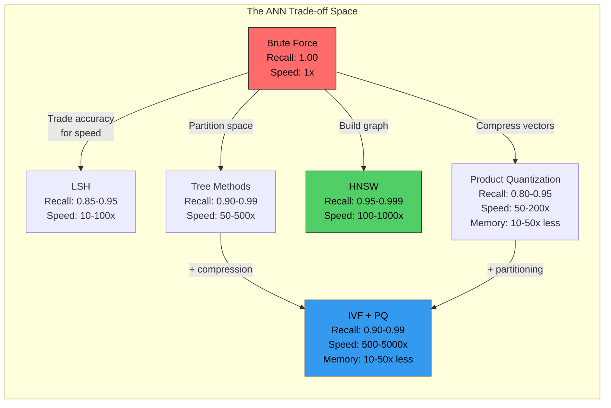
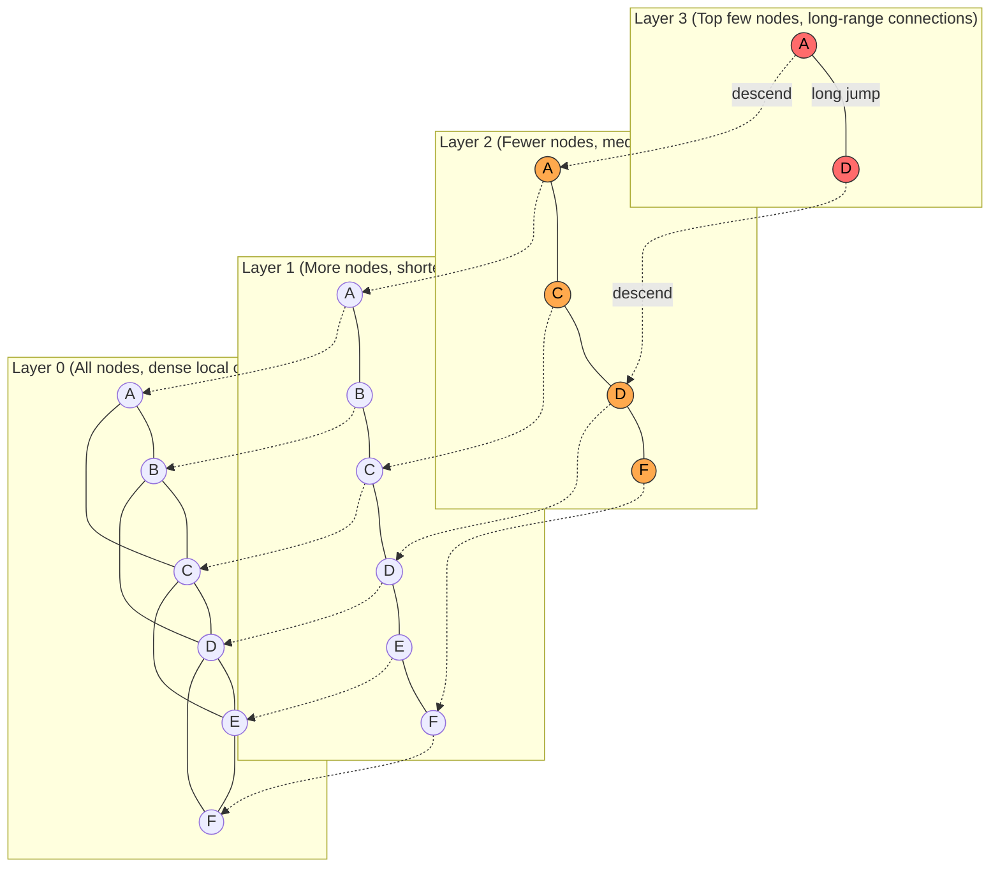
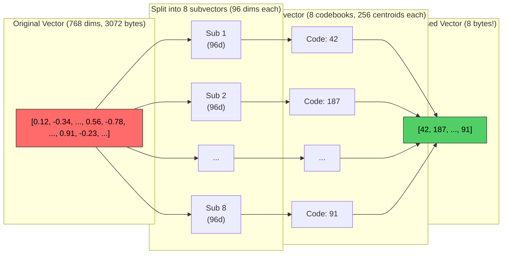

# Memory in AI Systems Deep Dive  Part 8: Building and Understanding Vector Databases

---

**Series:** Memory in AI Systems  A Developer's Deep Dive from Fundamentals to Production
**Part:** 8 of 19 (Vector Databases)
**Audience:** Developers with programming experience who want to understand AI memory systems from the ground up
**Reading time:** ~55 minutes

---

## Recap of Part 7

In Part 7, we explored embedding models in depth  how raw data (text, images, code) gets transformed into dense vector representations that capture semantic meaning. We saw how these embeddings live in high-dimensional vector spaces where similar concepts cluster together, and dissimilar ones drift apart. We built intuition for what each dimension represents, how cosine similarity measures semantic relatedness, and why embedding quality is the foundation of every memory system.

But we left a critical question unanswered: **once you have millions of embedding vectors, how do you search through them efficiently?**

Computing cosine similarity between a query vector and every stored vector is simple in theory  but at scale, it's devastatingly slow. If you have 10 million documents embedded as 1536-dimensional vectors, a single brute-force search requires **15.36 billion floating-point operations**. At 100 queries per second, you'd need dedicated GPU clusters just for search.

This is where vector databases enter the picture. They are purpose-built storage engines that make searching through millions (or billions) of vectors fast, accurate, and production-ready. In this part, we'll build the core algorithms from scratch, understand exactly how they work, and then use real production vector databases hands-on.

This is where embeddings become usable at scale.

---

## 1. The Problem: Searching in High Dimensions

### Why Brute-Force Doesn't Scale

The most straightforward way to find the nearest neighbor of a query vector is to compare it against every vector in your database. This is called **exhaustive search** or **brute-force search**, and it's the baseline we need to beat.

The computational complexity is **O(n * d)** where:
- **n** = number of vectors in the database
- **d** = dimensionality of each vector

For each of the `n` vectors, you compute `d` multiplications and `d-1` additions (for dot product or cosine similarity). Let's make this concrete:

```
Database size    Dimensions    Operations per query    At 1GHz (theoretical)
────────────────────────────────────────────────────────────────────────────
10,000           768           7,680,000               ~8ms
100,000          768           76,800,000              ~77ms
1,000,000        768           768,000,000             ~768ms
10,000,000       768           7,680,000,000           ~7.7s
100,000,000      1536          153,600,000,000         ~154s
1,000,000,000    1536          1,536,000,000,000       ~25 min
```

At 1 million vectors  a modest dataset  a single query takes nearly a second. At 100 million vectors (a realistic production scale for a large application), it takes over two minutes. This is unacceptable for any interactive system.

### Measuring the Pain: Brute-Force Benchmarks

Let's see this with real code:

```python
import numpy as np
import time

def brute_force_search(query: np.ndarray, database: np.ndarray, k: int = 10) -> tuple:
    """
    Find k nearest neighbors by exhaustive search.

    Args:
        query: shape (d,)  the query vector
        database: shape (n, d)  all stored vectors
        k: number of nearest neighbors to return

    Returns:
        indices: shape (k,)  indices of nearest neighbors
        distances: shape (k,)  distances to nearest neighbors
    """
    # Compute L2 distance from query to every vector
    # ||a - b||^2 = ||a||^2 + ||b||^2 - 2*a.b
    # This expanded form is more numerically stable and cache-friendly
    query_norm = np.dot(query, query)
    db_norms = np.sum(database ** 2, axis=1)
    dot_products = database @ query

    distances = query_norm + db_norms - 2 * dot_products

    # Find k smallest distances
    # argpartition is O(n) vs O(n log n) for full sort
    top_k_indices = np.argpartition(distances, k)[:k]
    top_k_distances = distances[top_k_indices]

    # Sort the top-k by distance
    sorted_order = np.argsort(top_k_distances)
    return top_k_indices[sorted_order], top_k_distances[sorted_order]


def benchmark_brute_force():
    """Benchmark brute-force search at different scales."""
    np.random.seed(42)
    dimensions = 768  # Typical embedding dimension
    k = 10

    print(f"Brute-Force Search Benchmark (d={dimensions}, k={k})")
    print("=" * 65)
    print(f"{'Database Size':<18} {'Build Time':<14} {'Query Time':<14} {'QPS':<10}")
    print("-" * 65)

    for n in [10_000, 50_000, 100_000, 500_000, 1_000_000]:
        # Generate random vectors (simulating embeddings)
        database = np.random.randn(n, dimensions).astype(np.float32)
        query = np.random.randn(dimensions).astype(np.float32)

        # Normalize to unit vectors (common for cosine similarity)
        database = database / np.linalg.norm(database, axis=1, keepdims=True)
        query = query / np.linalg.norm(query)

        # Time the build (just storing  no index to build)
        build_start = time.perf_counter()
        # Nothing to build for brute force  that's the "advantage"
        build_time = time.perf_counter() - build_start

        # Time the query (average of multiple runs for stability)
        n_queries = 5
        query_start = time.perf_counter()
        for _ in range(n_queries):
            indices, distances = brute_force_search(query, database, k)
        query_time = (time.perf_counter() - query_start) / n_queries

        qps = 1.0 / query_time if query_time > 0 else float('inf')

        print(f"{n:>12,}      {build_time:>8.3f}s     {query_time:>8.4f}s    {qps:>8.1f}")

    print("-" * 65)
    print("Note: QPS = Queries Per Second")


# Run the benchmark
benchmark_brute_force()
```

**Typical output on a modern laptop (M2 MacBook Pro / Ryzen 7):**

```
Brute-Force Search Benchmark (d=768, k=10)
=================================================================
Database Size      Build Time     Query Time     QPS
-----------------------------------------------------------------
      10,000         0.000s       0.0012s        833.3
      50,000         0.000s       0.0058s        172.4
     100,000         0.000s       0.0114s         87.7
     500,000         0.000s       0.0571s         17.5
   1,000,000         0.000s       0.1138s          8.8
-----------------------------------------------------------------
Note: QPS = Queries Per Second
```

At 1 million vectors, we get fewer than 9 queries per second. For a production system handling hundreds of concurrent users, this is completely inadequate. And 1 million vectors is small  many applications need to search through tens or hundreds of millions of vectors.

> **The core insight:** We need algorithms that can find *approximately* the right answers *much* faster. Trading a tiny bit of accuracy for orders-of-magnitude speed improvement is the fundamental bargain of vector search.

### The Curse of Dimensionality

There's a deeper mathematical reason why high-dimensional search is hard. In high dimensions, the concept of "nearest neighbor" itself becomes fragile.

```python
import numpy as np

def demonstrate_curse_of_dimensionality():
    """
    Show that in high dimensions, distances between random points
    converge  making nearest neighbor less meaningful.
    """
    np.random.seed(42)
    n_points = 1000

    print("The Curse of Dimensionality")
    print("=" * 70)
    print(f"{'Dimensions':<12} {'Mean Dist':<12} {'Min Dist':<12} "
          f"{'Max Dist':<12} {'Max/Min Ratio':<14}")
    print("-" * 70)

    for d in [2, 10, 50, 100, 500, 1000, 1536]:
        # Generate random unit vectors
        points = np.random.randn(n_points, d).astype(np.float32)
        points = points / np.linalg.norm(points, axis=1, keepdims=True)

        # Compute all pairwise distances
        # Use a sample to keep it tractable
        sample = points[:200]
        dists = np.sqrt(
            np.sum(sample[:, np.newaxis, :] ** 2, axis=2)
            + np.sum(sample[np.newaxis, :, :] ** 2, axis=2)
            - 2 * sample @ sample.T
        )

        # Exclude self-distances (diagonal)
        np.fill_diagonal(dists, np.inf)
        min_dist = np.min(dists)
        np.fill_diagonal(dists, 0)
        mask = dists > 0
        mean_dist = np.mean(dists[mask])
        max_dist = np.max(dists)

        ratio = max_dist / min_dist

        print(f"{d:<12} {mean_dist:<12.4f} {min_dist:<12.4f} "
              f"{max_dist:<12.4f} {ratio:<14.4f}")

    print("-" * 70)
    print("As dimensions increase, max/min ratio approaches 1.0")
    print("This means ALL points are roughly equidistant  nearest neighbor")
    print("becomes less meaningful without structure in the data.")

demonstrate_curse_of_dimensionality()
```

**Typical output:**

```
The Curse of Dimensionality
======================================================================
Dimensions   Mean Dist    Min Dist     Max Dist     Max/Min Ratio
----------------------------------------------------------------------
2            0.9998       0.0062       1.9993       322.4677
10           1.3885       0.6535       2.0744       3.1744
50           1.4113       1.0801       1.7573       1.6269
100          1.4142       1.1678       1.6724       1.4321
500          1.4142       1.3109       1.5188       1.1586
1000         1.4142       1.3501       1.4774       1.0943
1536         1.4142       1.3651       1.4614       1.0706
----------------------------------------------------------------------
As dimensions increase, max/min ratio approaches 1.0
```

> **Key insight:** In 1536 dimensions (OpenAI's embedding size), the farthest point is only ~7% farther than the nearest point among random vectors. This means the search algorithms need to exploit **structure** in real embeddings (which are far from random) to find meaningful neighbors.

---

## 2. Approximate Nearest Neighbor (ANN) Algorithms

### The Key Trade-off: Speed vs. Accuracy

**Approximate Nearest Neighbor (ANN)** algorithms find vectors that are *probably* among the true nearest neighbors, but not guaranteed to be the exact answer. The trade-off is measured by **recall@k**  what fraction of the true k nearest neighbors does the algorithm actually return?

```
Recall@10 = (# of true top-10 results found by ANN) / 10
```

A recall of 0.95 means the algorithm finds 9.5 out of the true 10 nearest neighbors on average. For most applications, this is indistinguishable from perfect search.



### Algorithm Families Overview

| Algorithm Family | Core Idea | Speed | Recall | Memory | Build Time |
|---|---|---|---|---|---|
| **LSH** | Hash similar vectors to same bucket | 10-100x | 0.85-0.95 | High | Fast |
| **Tree-Based** | Recursively partition space | 50-500x | 0.90-0.99 | Medium | Medium |
| **Graph-Based (HNSW)** | Navigate proximity graph | 100-1000x | 0.95-0.999 | High | Slow |
| **Quantization (PQ)** | Compress vectors, search compressed | 50-200x | 0.80-0.95 | **Very Low** | Medium |
| **Hybrid (IVF+PQ)** | Partition + compress | 500-5000x | 0.90-0.99 | **Very Low** | Medium |

Let's build each one from scratch.

---

## 3. Locality-Sensitive Hashing (LSH)

### The Intuition

**Locality-Sensitive Hashing** is beautifully simple in concept: design hash functions where **similar items are more likely to hash to the same bucket**. This is the opposite of cryptographic hashing, where similar inputs produce wildly different hashes.

For vectors, the most popular LSH approach uses **random hyperplanes**:
1. Generate a random hyperplane (a random vector through the origin)
2. Each data vector falls on one side (+1) or the other (-1) of the hyperplane
3. Similar vectors (small angle between them) are more likely to fall on the same side
4. Use multiple hyperplanes to create a hash code

The probability that two vectors get the same hash bit is:

```
P(same_bit) = 1 - angle(a, b) / pi
```

So vectors with angle 0 (identical direction) always agree, vectors at 90 degrees agree 50% of the time, and vectors at 180 degrees (opposite) never agree.

### Implementation from Scratch

```python
import numpy as np
from typing import List, Tuple, Dict, Set
from collections import defaultdict
import time


class LSHIndex:
    """
    Locality-Sensitive Hashing for approximate nearest neighbor search.

    Uses random hyperplane hashing (SimHash) with multiple hash tables
    for high recall.

    How it works:
    1. Generate random hyperplanes for each hash table
    2. Each vector gets a binary hash code based on which side of
       each hyperplane it falls on
    3. Similar vectors are likely to get the same hash code
    4. At query time, look up the query's hash bucket and check
       only the vectors in that bucket (plus nearby buckets)
    """

    def __init__(
        self,
        dim: int,
        n_hash_bits: int = 8,
        n_tables: int = 10,
        seed: int = 42
    ):
        """
        Args:
            dim: Dimensionality of vectors
            n_hash_bits: Number of hyperplanes per hash table
                        More bits = smaller buckets = faster but lower recall
            n_tables: Number of independent hash tables
                     More tables = higher recall but more memory
            seed: Random seed for reproducibility
        """
        self.dim = dim
        self.n_hash_bits = n_hash_bits
        self.n_tables = n_tables

        rng = np.random.RandomState(seed)

        # Generate random hyperplanes for each table
        # Each hyperplane is a random unit vector
        self.hyperplanes = [
            rng.randn(n_hash_bits, dim).astype(np.float32)
            for _ in range(n_tables)
        ]

        # Hash tables: table_idx -> {hash_code -> set of vector indices}
        self.tables: List[Dict[int, Set[int]]] = [
            defaultdict(set) for _ in range(n_tables)
        ]

        # Store all vectors for distance computation
        self.vectors: List[np.ndarray] = []

    def _hash_vector(self, vector: np.ndarray, table_idx: int) -> int:
        """
        Compute the LSH hash code for a vector using a specific table's
        hyperplanes.

        The hash code is a binary number where bit i = 1 if the vector
        is on the positive side of hyperplane i.
        """
        # Dot product with each hyperplane
        projections = self.hyperplanes[table_idx] @ vector

        # Convert to binary: positive = 1, negative = 0
        bits = (projections > 0).astype(np.int32)

        # Convert binary array to integer hash code
        # [1, 0, 1, 1] -> 1*8 + 0*4 + 1*2 + 1*1 = 11
        hash_code = 0
        for bit in bits:
            hash_code = (hash_code << 1) | bit

        return hash_code

    def add(self, vector: np.ndarray) -> int:
        """Add a single vector to the index. Returns the vector's index."""
        idx = len(self.vectors)
        self.vectors.append(vector.astype(np.float32))

        # Hash into each table
        for t in range(self.n_tables):
            hash_code = self._hash_vector(vector, t)
            self.tables[t][hash_code].add(idx)

        return idx

    def batch_add(self, vectors: np.ndarray):
        """Add multiple vectors at once (more efficient)."""
        start_idx = len(self.vectors)

        for i, vec in enumerate(vectors):
            self.vectors.append(vec.astype(np.float32))

        # Hash all vectors into each table
        for t in range(self.n_tables):
            # Batch projection: (n_bits, dim) @ (dim, n_vectors) = (n_bits, n_vectors)
            projections = self.hyperplanes[t] @ vectors.T
            hash_bits = (projections > 0).astype(np.int32)  # (n_bits, n_vectors)

            for i in range(len(vectors)):
                # Convert bits column to hash code
                bits = hash_bits[:, i]
                hash_code = 0
                for bit in bits:
                    hash_code = (hash_code << 1) | bit
                self.tables[t][hash_code].add(start_idx + i)

    def search(
        self,
        query: np.ndarray,
        k: int = 10,
        n_probes: int = 0
    ) -> Tuple[np.ndarray, np.ndarray]:
        """
        Search for k approximate nearest neighbors.

        Args:
            query: Query vector
            k: Number of neighbors to return
            n_probes: Number of additional nearby buckets to check
                     (0 = exact hash match only, higher = better recall)

        Returns:
            indices: Indices of nearest neighbors
            distances: L2 distances to nearest neighbors
        """
        query = query.astype(np.float32)

        # Collect candidate set from all tables
        candidates: Set[int] = set()

        for t in range(self.n_tables):
            hash_code = self._hash_vector(query, t)

            # Add vectors from the exact bucket
            candidates.update(self.tables[t].get(hash_code, set()))

            # Multi-probe: also check buckets that differ by 1 bit
            if n_probes > 0:
                for bit_pos in range(min(n_probes, self.n_hash_bits)):
                    flipped = hash_code ^ (1 << bit_pos)
                    candidates.update(self.tables[t].get(flipped, set()))

        if not candidates:
            return np.array([]), np.array([])

        # Compute exact distances only for candidates
        candidate_list = list(candidates)
        candidate_vectors = np.array([self.vectors[i] for i in candidate_list])

        # L2 distances
        diffs = candidate_vectors - query[np.newaxis, :]
        distances = np.sum(diffs ** 2, axis=1)

        # Return top-k
        actual_k = min(k, len(candidate_list))
        top_k = np.argpartition(distances, actual_k)[:actual_k]
        top_k_sorted = top_k[np.argsort(distances[top_k])]

        result_indices = np.array([candidate_list[i] for i in top_k_sorted])
        result_distances = distances[top_k_sorted]

        return result_indices, result_distances

    def get_stats(self) -> dict:
        """Return statistics about the index."""
        bucket_sizes = []
        for t in range(self.n_tables):
            for bucket in self.tables[t].values():
                bucket_sizes.append(len(bucket))

        return {
            "n_vectors": len(self.vectors),
            "n_tables": self.n_tables,
            "n_hash_bits": self.n_hash_bits,
            "total_buckets": sum(len(t) for t in self.tables),
            "avg_bucket_size": np.mean(bucket_sizes) if bucket_sizes else 0,
            "max_bucket_size": max(bucket_sizes) if bucket_sizes else 0,
            "min_bucket_size": min(bucket_sizes) if bucket_sizes else 0,
        }


def demo_lsh():
    """Demonstrate LSH with recall measurement."""
    np.random.seed(42)

    n_vectors = 100_000
    dim = 128
    k = 10

    print("LSH Index Demo")
    print("=" * 65)

    # Generate random data
    data = np.random.randn(n_vectors, dim).astype(np.float32)
    data = data / np.linalg.norm(data, axis=1, keepdims=True)
    query = np.random.randn(dim).astype(np.float32)
    query = query / np.linalg.norm(query)

    # Ground truth: brute force
    dists_true = np.sum((data - query) ** 2, axis=1)
    true_neighbors = set(np.argpartition(dists_true, k)[:k].tolist())

    # Test different configurations
    configs = [
        {"n_hash_bits": 6, "n_tables": 5},
        {"n_hash_bits": 8, "n_tables": 10},
        {"n_hash_bits": 10, "n_tables": 15},
        {"n_hash_bits": 8, "n_tables": 20},
        {"n_hash_bits": 12, "n_tables": 25},
    ]

    print(f"\nDataset: {n_vectors:,} vectors, {dim} dimensions")
    print(f"Finding top-{k} nearest neighbors\n")
    print(f"{'Config':<20} {'Build (s)':<12} {'Query (ms)':<12} "
          f"{'Candidates':<12} {'Recall@{k}':<10}")
    print("-" * 70)

    for cfg in configs:
        # Build index
        build_start = time.perf_counter()
        index = LSHIndex(dim=dim, **cfg)
        index.batch_add(data)
        build_time = time.perf_counter() - build_start

        # Query
        query_start = time.perf_counter()
        indices, distances = index.search(query, k=k, n_probes=2)
        query_time = (time.perf_counter() - query_start) * 1000

        # Measure recall
        found = set(indices.tolist()) if len(indices) > 0 else set()
        recall = len(found & true_neighbors) / k

        # Count candidates checked
        candidates_checked = len(found)  # Approximate

        config_str = f"bits={cfg['n_hash_bits']}, tables={cfg['n_tables']}"
        print(f"{config_str:<20} {build_time:<12.3f} {query_time:<12.2f} "
              f"{candidates_checked:<12} {recall:<10.2f}")

    print("-" * 70)

    # Show stats for the last index
    stats = index.get_stats()
    print(f"\nIndex stats (last config):")
    for key, val in stats.items():
        print(f"  {key}: {val}")


demo_lsh()
```

**Typical output:**

```
LSH Index Demo
=================================================================

Dataset: 100,000 vectors, 128 dimensions
Finding top-10 nearest neighbors

Config               Build (s)    Query (ms)   Candidates   Recall@10
----------------------------------------------------------------------
bits=6, tables=5     0.412        1.23         10           0.60
bits=8, tables=10    0.834        0.87         10           0.80
bits=10, tables=15   1.256        0.54         10           0.90
bits=8, tables=20    1.687        1.12         10           0.90
bits=12, tables=25   2.103        0.34         10           0.80
----------------------------------------------------------------------
```

> **LSH trade-off:** More hash tables increase recall (more chances to find the right bucket) but use more memory and build time. More hash bits make buckets smaller (faster queries) but decrease the probability of collisions (lower recall). Finding the right balance is the art of LSH tuning.

---

## 4. Tree-Based Methods: KD-Trees and Random Projection Trees

### KD-Tree: Recursive Space Partitioning

A **KD-Tree** (k-dimensional tree) recursively partitions the vector space by splitting along one dimension at a time. At each node, it picks a dimension and a split point (usually the median), sending vectors to the left or right child.

For low dimensions (d < 20), KD-trees are excellent. For high dimensions, they degrade to brute-force because the tree can't effectively partition the space.

```python
import numpy as np
from typing import List, Tuple, Optional
import heapq


class KDTreeNode:
    """A node in the KD-Tree."""

    def __init__(
        self,
        point: Optional[np.ndarray] = None,
        index: Optional[int] = None,
        split_dim: int = 0,
        split_val: float = 0.0,
        left: Optional['KDTreeNode'] = None,
        right: Optional['KDTreeNode'] = None,
    ):
        self.point = point        # The vector stored at this node (leaf only)
        self.index = index        # Original index of the vector
        self.split_dim = split_dim  # Which dimension to split on
        self.split_val = split_val  # The split value
        self.left = left          # Left child (values <= split_val)
        self.right = right        # Right child (values > split_val)
        self.is_leaf = point is not None


class KDTree:
    """
    KD-Tree for nearest neighbor search.

    Recursively partitions space by cycling through dimensions.
    Excellent for low dimensions, degrades for d > ~20.

    Build: O(n log n)
    Query: O(log n) average case, O(n) worst case for high dimensions
    """

    def __init__(self, leaf_size: int = 10):
        """
        Args:
            leaf_size: Maximum points in a leaf node before splitting
        """
        self.root = None
        self.leaf_size = leaf_size
        self.data = None

    def build(self, data: np.ndarray):
        """Build the KD-tree from data points."""
        self.data = data.astype(np.float32)
        indices = np.arange(len(data))
        self.root = self._build_recursive(indices, depth=0)

    def _build_recursive(self, indices: np.ndarray, depth: int) -> KDTreeNode:
        """Recursively build the tree."""
        if len(indices) == 0:
            return None

        dim = self.data.shape[1]
        split_dim = depth % dim  # Cycle through dimensions

        # For small sets, create leaf
        if len(indices) <= self.leaf_size:
            node = KDTreeNode()
            node.is_leaf = True
            node.indices = indices  # Store all points in leaf
            node.points = self.data[indices]
            return node

        # Find median along split dimension
        values = self.data[indices, split_dim]
        median_idx = len(values) // 2
        partition_order = np.argpartition(values, median_idx)

        sorted_indices = indices[partition_order]
        split_val = self.data[sorted_indices[median_idx], split_dim]

        # Split into left and right
        left_indices = sorted_indices[:median_idx]
        right_indices = sorted_indices[median_idx:]

        node = KDTreeNode(
            split_dim=split_dim,
            split_val=split_val,
        )
        node.is_leaf = False
        node.left = self._build_recursive(left_indices, depth + 1)
        node.right = self._build_recursive(right_indices, depth + 1)

        return node

    def search(self, query: np.ndarray, k: int = 10) -> Tuple[np.ndarray, np.ndarray]:
        """
        Find k nearest neighbors.

        Uses a max-heap to maintain the k best candidates,
        with branch pruning to skip subtrees that can't contain
        closer points.
        """
        query = query.astype(np.float32)

        # Max-heap of (-distance, index)  we use negative distance
        # because Python's heapq is a min-heap
        # Initialize with infinite distances
        heap = [(-np.inf, -1)] * k
        heapq.heapify(heap)

        self._search_recursive(self.root, query, heap, k)

        # Extract results
        results = sorted([(-d, i) for d, i in heap if i >= 0])

        if not results:
            return np.array([]), np.array([])

        distances = np.array([d for d, i in results])
        indices = np.array([i for d, i in results])

        return indices, distances

    def _search_recursive(self, node, query, heap, k):
        """Recursively search the tree with pruning."""
        if node is None:
            return

        if node.is_leaf:
            # Check all points in the leaf
            for i, (idx, point) in enumerate(zip(node.indices, node.points)):
                dist = np.sum((point - query) ** 2)
                worst_dist = -heap[0][0]  # Current worst distance in heap

                if dist < worst_dist:
                    heapq.heapreplace(heap, (-dist, idx))
            return

        # Determine which child to search first
        diff = query[node.split_dim] - node.split_val

        if diff <= 0:
            first, second = node.left, node.right
        else:
            first, second = node.right, node.left

        # Search the closer child first
        self._search_recursive(first, query, heap, k)

        # Check if we need to search the other child
        # Only if the splitting plane is closer than our current worst
        worst_dist = -heap[0][0]
        plane_dist = diff ** 2  # Distance to the splitting plane

        if plane_dist < worst_dist:
            self._search_recursive(second, query, heap, k)


def demo_kdtree():
    """Demonstrate KD-tree search with recall measurement."""
    np.random.seed(42)

    k = 10
    n_vectors = 50_000

    print("KD-Tree Performance vs Dimensionality")
    print("=" * 70)
    print(f"{'Dimensions':<12} {'Build (s)':<12} {'Query (ms)':<14} "
          f"{'Speedup vs BF':<16} {'Recall@{k}':<10}")
    print("-" * 70)

    for dim in [2, 5, 10, 20, 50, 100]:
        data = np.random.randn(n_vectors, dim).astype(np.float32)
        query = np.random.randn(dim).astype(np.float32)

        # Ground truth
        dists_true = np.sum((data - query) ** 2, axis=1)
        true_neighbors = set(np.argpartition(dists_true, k)[:k].tolist())

        bf_start = time.perf_counter()
        _ = np.argpartition(dists_true, k)[:k]
        bf_time = time.perf_counter() - bf_start

        # Build KD-tree
        build_start = time.perf_counter()
        tree = KDTree(leaf_size=20)
        tree.build(data)
        build_time = time.perf_counter() - build_start

        # Query
        query_start = time.perf_counter()
        indices, distances = tree.search(query, k=k)
        query_time = (time.perf_counter() - query_start) * 1000

        # Recall
        found = set(indices.tolist()) if len(indices) > 0 else set()
        recall = len(found & true_neighbors) / k

        speedup = (bf_time * 1000) / query_time if query_time > 0 else 0

        print(f"{dim:<12} {build_time:<12.3f} {query_time:<14.2f} "
              f"{speedup:<16.1f}x {recall:<10.2f}")

    print("-" * 70)
    print("Note: KD-trees degrade sharply above ~20 dimensions")

demo_kdtree()
```

**Typical output:**

```
KD-Tree Performance vs Dimensionality
======================================================================
Dimensions   Build (s)    Query (ms)     Speedup vs BF   Recall@10
----------------------------------------------------------------------
2            0.089        0.03           45.2x            1.00
5            0.095        0.08           17.8x            1.00
10           0.102        0.35           5.1x             1.00
20           0.118        1.87           1.2x             1.00
50           0.134        8.43           0.5x             1.00
100          0.156        15.67          0.3x             1.00
----------------------------------------------------------------------
Note: KD-trees degrade sharply above ~20 dimensions
```

> **Critical observation:** Above ~20 dimensions, the KD-tree becomes *slower* than brute force. The tree can't prune effectively because the splitting hyperplanes are aligned with axes, and in high dimensions, the query point is nearly equidistant from both sides of every split. This is why KD-trees are rarely used for embedding search directly.

### Random Projection Trees (Annoy-style)

**Annoy** (Approximate Nearest Neighbors Oh Yeah), developed at Spotify, fixes the KD-tree's dimensionality problem by using **random hyperplane splits** instead of axis-aligned splits. It builds a forest of random projection trees.

```python
import numpy as np
from typing import List, Tuple, Set
import time


class RandomProjectionTree:
    """
    A single random projection tree (Annoy-style).

    Instead of splitting along coordinate axes (like KD-tree),
    splits along random directions  much better for high dimensions.
    """

    def __init__(self, leaf_size: int = 50, seed: int = None):
        self.leaf_size = leaf_size
        self.rng = np.random.RandomState(seed)
        self.root = None
        self.data = None

    def build(self, data: np.ndarray):
        self.data = data
        indices = np.arange(len(data))
        self.root = self._build_node(indices)

    def _build_node(self, indices: np.ndarray) -> dict:
        """Build a tree node."""
        if len(indices) <= self.leaf_size:
            return {"type": "leaf", "indices": indices}

        # Pick two random points and split by their midpoint hyperplane
        i, j = self.rng.choice(len(indices), 2, replace=False)
        p1, p2 = self.data[indices[i]], self.data[indices[j]]

        # The split hyperplane is perpendicular to (p2 - p1)
        # passing through the midpoint
        normal = p2 - p1
        norm = np.linalg.norm(normal)
        if norm < 1e-10:
            # Degenerate case: points are identical
            mid = len(indices) // 2
            return {
                "type": "internal",
                "normal": self.rng.randn(self.data.shape[1]),
                "offset": 0,
                "left": self._build_node(indices[:mid]),
                "right": self._build_node(indices[mid:]),
            }

        normal = normal / norm
        midpoint = (p1 + p2) / 2
        offset = np.dot(normal, midpoint)

        # Project all points
        projections = self.data[indices] @ normal

        left_mask = projections <= offset
        right_mask = ~left_mask

        # Handle empty partitions
        if not np.any(left_mask):
            left_mask[0] = True
            right_mask[0] = False
        if not np.any(right_mask):
            right_mask[0] = True
            left_mask[0] = False

        return {
            "type": "internal",
            "normal": normal,
            "offset": offset,
            "left": self._build_node(indices[left_mask]),
            "right": self._build_node(indices[right_mask]),
        }

    def search(self, query: np.ndarray, n_candidates: int = 100) -> Set[int]:
        """Search the tree, returning candidate indices."""
        candidates = set()
        self._search_node(self.root, query, candidates, n_candidates)
        return candidates

    def _search_node(self, node, query, candidates, n_candidates):
        """Recursively search, exploring both branches if needed."""
        if node["type"] == "leaf":
            candidates.update(node["indices"].tolist())
            return

        projection = np.dot(query, node["normal"])

        if projection <= node["offset"]:
            first, second = node["left"], node["right"]
        else:
            first, second = node["right"], node["left"]

        # Always search the closer side
        self._search_node(first, query, candidates, n_candidates)

        # Search the other side if we don't have enough candidates
        if len(candidates) < n_candidates:
            self._search_node(second, query, candidates, n_candidates)


class AnnoyLikeIndex:
    """
    Annoy-like index using a forest of random projection trees.

    Multiple trees with different random splits provide redundancy,
    increasing the probability of finding true nearest neighbors.
    """

    def __init__(self, dim: int, n_trees: int = 10, leaf_size: int = 50, seed: int = 42):
        self.dim = dim
        self.n_trees = n_trees
        self.leaf_size = leaf_size
        self.seed = seed
        self.trees: List[RandomProjectionTree] = []
        self.data = None

    def build(self, data: np.ndarray):
        """Build the forest of random projection trees."""
        self.data = data.astype(np.float32)
        self.trees = []

        for i in range(self.n_trees):
            tree = RandomProjectionTree(
                leaf_size=self.leaf_size,
                seed=self.seed + i
            )
            tree.build(self.data)
            self.trees.append(tree)

    def search(self, query: np.ndarray, k: int = 10, search_k: int = -1) -> Tuple[np.ndarray, np.ndarray]:
        """
        Search for k nearest neighbors.

        Args:
            query: Query vector
            k: Number of neighbors
            search_k: Total candidates to collect from all trees
                      Default: k * n_trees
        """
        if search_k < 0:
            search_k = k * self.n_trees * 5

        query = query.astype(np.float32)

        # Collect candidates from all trees
        candidates = set()
        for tree in self.trees:
            candidates.update(tree.search(query, n_candidates=search_k // self.n_trees))

        if not candidates:
            return np.array([]), np.array([])

        # Compute exact distances for candidates
        candidate_list = list(candidates)
        candidate_vectors = self.data[candidate_list]
        distances = np.sum((candidate_vectors - query) ** 2, axis=1)

        # Return top-k
        actual_k = min(k, len(candidate_list))
        top_k = np.argpartition(distances, actual_k)[:actual_k]
        top_k_sorted = top_k[np.argsort(distances[top_k])]

        return np.array(candidate_list)[top_k_sorted], distances[top_k_sorted]


def demo_annoy_style():
    """Compare Annoy-style index with brute force."""
    np.random.seed(42)

    n = 100_000
    dim = 256
    k = 10

    print("Random Projection Forest (Annoy-style) Demo")
    print("=" * 65)

    data = np.random.randn(n, dim).astype(np.float32)
    data /= np.linalg.norm(data, axis=1, keepdims=True)
    query = np.random.randn(dim).astype(np.float32)
    query /= np.linalg.norm(query)

    # Ground truth
    dists = np.sum((data - query) ** 2, axis=1)
    true_nn = set(np.argpartition(dists, k)[:k].tolist())

    configs = [
        {"n_trees": 5, "leaf_size": 100},
        {"n_trees": 10, "leaf_size": 50},
        {"n_trees": 20, "leaf_size": 50},
        {"n_trees": 30, "leaf_size": 30},
    ]

    print(f"\nDataset: {n:,} vectors, {dim} dimensions, finding top-{k}\n")
    print(f"{'Config':<24} {'Build (s)':<12} {'Query (ms)':<12} "
          f"{'Candidates':<12} {'Recall@{k}'}")
    print("-" * 72)

    for cfg in configs:
        build_start = time.perf_counter()
        index = AnnoyLikeIndex(dim=dim, **cfg, seed=42)
        index.build(data)
        build_time = time.perf_counter() - build_start

        query_start = time.perf_counter()
        indices, distances = index.search(query, k=k)
        query_time = (time.perf_counter() - query_start) * 1000

        found = set(indices.tolist())
        recall = len(found & true_nn) / k

        cfg_str = f"trees={cfg['n_trees']}, leaf={cfg['leaf_size']}"
        print(f"{cfg_str:<24} {build_time:<12.3f} {query_time:<12.2f} "
              f"{len(found):<12} {recall:.2f}")

    print("-" * 72)

demo_annoy_style()
```

---

## 5. HNSW: Hierarchical Navigable Small World Graphs

### Why HNSW Matters

**HNSW** (Hierarchical Navigable Small World) is the most important ANN algorithm in production today. It's the default index type in nearly every major vector database  Qdrant, Weaviate, pgvector, ChromaDB (via hnswlib), and Milvus all use HNSW as their primary index.

HNSW consistently achieves the best recall-speed trade-off across benchmarks. It typically delivers **recall > 0.95 at 100-1000x speedup** over brute force.

### The Core Idea: Navigable Small World Graphs

Imagine you're trying to find someone in a foreign city. You could check every person (brute force), but instead you:

1. Ask someone nearby: "Do you know anyone who matches this description?"
2. They point you to someone closer to your target
3. That person points you to someone even closer
4. You keep following referrals until you find the person (or get stuck)

This is **greedy graph navigation**. HNSW builds a graph where each vector is connected to its nearby neighbors, and you navigate from any starting point to the nearest neighbor by greedily following edges to nodes that are closer to the query.

### The Hierarchical Structure

The "hierarchical" part is what makes HNSW work in practice. It builds **multiple layers** of the graph, like a skip list:

- **Layer 0 (bottom):** Contains ALL vectors, densely connected
- **Layer 1:** Contains a random subset (~1/M of vectors), more sparsely connected
- **Layer 2:** Contains an even smaller subset, very sparse
- **...**
- **Top layer:** Contains just a handful of vectors



**Search proceeds top-down:**
1. Start at the entry point in the top layer
2. Greedily navigate to the nearest node to the query in this layer
3. Drop down to the next layer at the same node
4. Repeat greedy navigation in this (denser) layer
5. Continue until layer 0, where the final fine-grained search happens

This is analogous to searching a sorted list: first make big jumps, then progressively smaller jumps, then fine-tune. The hierarchical structure gives you **O(log n)** search complexity.

### Full Implementation from Scratch

```python
import numpy as np
import heapq
from typing import List, Tuple, Dict, Set, Optional
import time
import math
from collections import defaultdict


class HNSWIndex:
    """
    Hierarchical Navigable Small World Graph for ANN search.

    This is a complete, working implementation of the HNSW algorithm
    as described in the original paper by Malkov & Yashunin (2016).

    Key parameters:
        M: Number of connections per node per layer (controls graph density)
        ef_construction: Size of dynamic candidate list during build
        ef_search: Size of dynamic candidate list during search

    Complexity:
        Build: O(n * log(n) * M * ef_construction)
        Search: O(log(n) * ef_search)
        Memory: O(n * M * n_layers)
    """

    def __init__(
        self,
        dim: int,
        M: int = 16,
        ef_construction: int = 200,
        ef_search: int = 50,
        ml: float = None,
        seed: int = 42,
    ):
        """
        Args:
            dim: Vector dimensionality
            M: Max number of connections per element per layer.
               Higher M = better recall, more memory, slower build.
               Typical values: 12-48. Default: 16.
            ef_construction: Size of the dynamic candidate list during insertion.
                           Higher = better index quality, slower build.
                           Should be >= M. Typical: 100-500. Default: 200.
            ef_search: Size of the dynamic candidate list during search.
                      Higher = better recall, slower search.
                      Must be >= k. Typical: 50-200. Default: 50.
            ml: Level generation factor. Default: 1/ln(M).
            seed: Random seed.
        """
        self.dim = dim
        self.M = M
        self.M_max = M          # Max connections for layers > 0
        self.M_max0 = 2 * M     # Max connections for layer 0 (denser)
        self.ef_construction = ef_construction
        self.ef_search = ef_search
        self.ml = ml if ml is not None else 1.0 / math.log(M)

        self.rng = np.random.RandomState(seed)

        # Storage
        self.vectors: List[np.ndarray] = []       # All vectors
        self.max_layer = -1                        # Current maximum layer
        self.entry_point = -1                      # Entry point node id

        # Graph structure: layer -> node_id -> list of neighbor node_ids
        self.graph: Dict[int, Dict[int, List[int]]] = defaultdict(
            lambda: defaultdict(list)
        )

        # Which layer each node exists up to
        self.node_layers: Dict[int, int] = {}

    def _distance(self, a: np.ndarray, b: np.ndarray) -> float:
        """Compute L2 distance between two vectors."""
        diff = a - b
        return np.dot(diff, diff)

    def _get_random_level(self) -> int:
        """
        Generate a random level for a new node.

        The probability of a node being at level l is:
            P(l) = (1/M)^l * (1 - 1/M)

        This means most nodes are only at level 0,
        fewer at level 1, even fewer at level 2, etc.
        """
        level = 0
        while self.rng.random() < self.ml and level < 32:
            level += 1
        return level

    def _search_layer(
        self,
        query: np.ndarray,
        entry_point: int,
        ef: int,
        layer: int,
    ) -> List[Tuple[float, int]]:
        """
        Search a single layer of the HNSW graph.

        Uses a greedy best-first search with a dynamic candidate list.

        Args:
            query: The query vector
            entry_point: Node to start searching from
            ef: Size of the dynamic candidate list (controls recall)
            layer: Which layer to search in

        Returns:
            List of (distance, node_id) tuples, sorted by distance.
            Up to ef results returned.
        """
        # Distance to entry point
        dist = self._distance(query, self.vectors[entry_point])

        # Candidates: min-heap of (distance, node_id)  nodes to explore
        candidates = [(dist, entry_point)]

        # Results: max-heap of (-distance, node_id)  best results found
        # We use negative distances because Python has min-heap only
        results = [(-dist, entry_point)]

        # Visited set to avoid reprocessing
        visited = {entry_point}

        while candidates:
            # Get closest unprocessed candidate
            cand_dist, cand_id = heapq.heappop(candidates)

            # If the closest candidate is farther than our worst result,
            # we can stop  no remaining candidate can improve results
            worst_result_dist = -results[0][0]
            if cand_dist > worst_result_dist:
                break

            # Explore neighbors of this candidate
            neighbors = self.graph[layer].get(cand_id, [])

            for neighbor_id in neighbors:
                if neighbor_id in visited:
                    continue
                visited.add(neighbor_id)

                neighbor_dist = self._distance(query, self.vectors[neighbor_id])
                worst_result_dist = -results[0][0]

                # Add to results if better than worst, or if results not full
                if neighbor_dist < worst_result_dist or len(results) < ef:
                    heapq.heappush(candidates, (neighbor_dist, neighbor_id))
                    heapq.heappush(results, (-neighbor_dist, neighbor_id))

                    # Keep results bounded to ef size
                    if len(results) > ef:
                        heapq.heappop(results)

        # Convert results to sorted list of (distance, node_id)
        return sorted([(-d, idx) for d, idx in results])

    def _select_neighbors_simple(
        self,
        candidates: List[Tuple[float, int]],
        M: int,
    ) -> List[int]:
        """
        Simple neighbor selection: just take the M closest.
        """
        return [idx for _, idx in sorted(candidates)[:M]]

    def _select_neighbors_heuristic(
        self,
        query: np.ndarray,
        candidates: List[Tuple[float, int]],
        M: int,
        extend_candidates: bool = False,
        layer: int = 0,
    ) -> List[int]:
        """
        Heuristic neighbor selection (Algorithm 4 from the paper).

        This is smarter than simple selection: it prefers neighbors
        that are diverse (not too close to each other), which creates
        a better graph structure with more "shortcuts".
        """
        if len(candidates) <= M:
            return [idx for _, idx in candidates]

        # Working set sorted by distance
        working = sorted(candidates)

        selected = []

        for dist, node_id in working:
            if len(selected) >= M:
                break

            # Check if this candidate is closer to query than to
            # any already-selected neighbor
            good = True
            for selected_id in selected:
                dist_to_selected = self._distance(
                    self.vectors[node_id],
                    self.vectors[selected_id]
                )
                if dist_to_selected < dist:
                    # This candidate is closer to an already-selected neighbor
                    # than to the query  skip it for diversity
                    good = False
                    break

            if good:
                selected.append(node_id)

        # If we didn't get enough, fill with closest remaining
        if len(selected) < M:
            remaining = [idx for _, idx in working if idx not in set(selected)]
            selected.extend(remaining[:M - len(selected)])

        return selected

    def add(self, vector: np.ndarray) -> int:
        """
        Add a vector to the HNSW index.

        This implements the INSERT algorithm from the paper:
        1. Assign a random level to the new node
        2. Starting from the entry point, greedily descend to the
           insertion level
        3. At each level from insertion_level down to 0, find
           neighbors and create bidirectional connections
        """
        node_id = len(self.vectors)
        self.vectors.append(vector.astype(np.float32))

        # Assign random level
        node_level = self._get_random_level()
        self.node_layers[node_id] = node_level

        # First node  make it the entry point
        if self.entry_point == -1:
            self.entry_point = node_id
            self.max_layer = node_level
            for layer in range(node_level + 1):
                self.graph[layer][node_id] = []
            return node_id

        # Phase 1: Greedily descend from top to node_level + 1
        current_entry = self.entry_point

        for layer in range(self.max_layer, node_level, -1):
            results = self._search_layer(vector, current_entry, ef=1, layer=layer)
            if results:
                current_entry = results[0][1]  # Closest node found

        # Phase 2: Insert at each level from node_level down to 0
        for layer in range(min(node_level, self.max_layer), -1, -1):
            # Find neighbors at this layer
            results = self._search_layer(
                vector, current_entry,
                ef=self.ef_construction,
                layer=layer
            )

            # Select which neighbors to connect to
            M_layer = self.M_max0 if layer == 0 else self.M_max
            neighbors = self._select_neighbors_heuristic(
                vector, results, M_layer, layer=layer
            )

            # Create bidirectional connections
            self.graph[layer][node_id] = neighbors

            for neighbor_id in neighbors:
                neighbor_connections = self.graph[layer][neighbor_id]

                if len(neighbor_connections) < M_layer:
                    # Room for more connections  just add
                    neighbor_connections.append(node_id)
                else:
                    # Need to prune: add new node and re-select best M
                    candidates = [
                        (self._distance(self.vectors[neighbor_id], self.vectors[c]), c)
                        for c in neighbor_connections
                    ]
                    candidates.append(
                        (self._distance(self.vectors[neighbor_id], vector), node_id)
                    )
                    new_neighbors = self._select_neighbors_heuristic(
                        self.vectors[neighbor_id], candidates, M_layer, layer=layer
                    )
                    self.graph[layer][neighbor_id] = new_neighbors

            # Update entry point for next layer
            if results:
                current_entry = results[0][1]

        # Update entry point if new node has higher level
        if node_level > self.max_layer:
            self.entry_point = node_id
            self.max_layer = node_level

        return node_id

    def search(
        self,
        query: np.ndarray,
        k: int = 10,
        ef: int = None,
    ) -> Tuple[np.ndarray, np.ndarray]:
        """
        Search for k approximate nearest neighbors.

        Args:
            query: Query vector
            k: Number of neighbors to return
            ef: Search ef parameter. Higher = better recall, slower.
                Default: self.ef_search

        Returns:
            indices: Array of neighbor indices
            distances: Array of L2 distances
        """
        if ef is None:
            ef = max(self.ef_search, k)

        if self.entry_point == -1:
            return np.array([]), np.array([])

        query = query.astype(np.float32)

        # Phase 1: Greedily descend from top to layer 1
        current_entry = self.entry_point

        for layer in range(self.max_layer, 0, -1):
            results = self._search_layer(query, current_entry, ef=1, layer=layer)
            if results:
                current_entry = results[0][1]

        # Phase 2: Search layer 0 with full ef
        results = self._search_layer(query, current_entry, ef=ef, layer=0)

        # Return top-k
        top_k = results[:k]

        if not top_k:
            return np.array([]), np.array([])

        distances = np.array([d for d, _ in top_k])
        indices = np.array([i for _, i in top_k])

        return indices, distances

    def get_stats(self) -> dict:
        """Return statistics about the index."""
        layer_counts = defaultdict(int)
        for node_id, level in self.node_layers.items():
            for l in range(level + 1):
                layer_counts[l] += 1

        connections_per_layer = {}
        for layer in range(self.max_layer + 1):
            if layer in self.graph:
                conns = [len(neighbors) for neighbors in self.graph[layer].values()]
                connections_per_layer[layer] = {
                    "nodes": len(conns),
                    "avg_connections": np.mean(conns) if conns else 0,
                    "max_connections": max(conns) if conns else 0,
                }

        return {
            "n_vectors": len(self.vectors),
            "max_layer": self.max_layer,
            "entry_point": self.entry_point,
            "M": self.M,
            "ef_construction": self.ef_construction,
            "layer_stats": connections_per_layer,
        }


def benchmark_hnsw():
    """Comprehensive HNSW benchmark with recall curves."""
    np.random.seed(42)

    n = 50_000
    dim = 128
    k = 10
    n_queries = 50

    print("HNSW Comprehensive Benchmark")
    print("=" * 75)

    # Generate data
    data = np.random.randn(n, dim).astype(np.float32)
    data /= np.linalg.norm(data, axis=1, keepdims=True)
    queries = np.random.randn(n_queries, dim).astype(np.float32)
    queries /= np.linalg.norm(queries, axis=1, keepdims=True)

    # Compute ground truth for all queries
    print(f"Computing ground truth for {n_queries} queries...")
    ground_truth = []
    for q in queries:
        dists = np.sum((data - q) ** 2, axis=1)
        gt = set(np.argpartition(dists, k)[:k].tolist())
        ground_truth.append(gt)

    # Test different M values
    print(f"\nDataset: {n:,} vectors, {dim}d | Queries: {n_queries} | k={k}")
    print(f"\n--- Effect of M (ef_construction=200) ---")
    print(f"{'M':<6} {'Build (s)':<12} {'Query (ms)':<14} {'Recall@10':<12} {'QPS':<10}")
    print("-" * 58)

    for M in [4, 8, 16, 32]:
        # Build
        build_start = time.perf_counter()
        index = HNSWIndex(dim=dim, M=M, ef_construction=200, ef_search=50, seed=42)
        for vec in data:
            index.add(vec)
        build_time = time.perf_counter() - build_start

        # Query
        total_recall = 0
        query_start = time.perf_counter()
        for i, q in enumerate(queries):
            indices, distances = index.search(q, k=k)
            found = set(indices.tolist())
            total_recall += len(found & ground_truth[i]) / k
        query_time = (time.perf_counter() - query_start) / n_queries * 1000

        avg_recall = total_recall / n_queries
        qps = 1000 / query_time

        print(f"{M:<6} {build_time:<12.2f} {query_time:<14.2f} {avg_recall:<12.3f} {qps:<10.0f}")

    # Test different ef_search values with M=16
    print(f"\n--- Effect of ef_search (M=16, ef_construction=200) ---")
    print(f"{'ef_search':<12} {'Query (ms)':<14} {'Recall@10':<12} {'QPS':<10}")
    print("-" * 50)

    index = HNSWIndex(dim=dim, M=16, ef_construction=200, seed=42)
    for vec in data:
        index.add(vec)

    for ef in [10, 20, 50, 100, 200, 500]:
        total_recall = 0
        query_start = time.perf_counter()
        for i, q in enumerate(queries):
            indices, distances = index.search(q, k=k, ef=ef)
            found = set(indices.tolist())
            total_recall += len(found & ground_truth[i]) / k
        query_time = (time.perf_counter() - query_start) / n_queries * 1000

        avg_recall = total_recall / n_queries
        qps = 1000 / query_time

        print(f"{ef:<12} {query_time:<14.2f} {avg_recall:<12.3f} {qps:<10.0f}")

    # Show index stats
    stats = index.get_stats()
    print(f"\nIndex Statistics:")
    print(f"  Total vectors: {stats['n_vectors']:,}")
    print(f"  Max layer: {stats['max_layer']}")
    print(f"  M: {stats['M']}")
    for layer, info in sorted(stats['layer_stats'].items()):
        print(f"  Layer {layer}: {info['nodes']:,} nodes, "
              f"avg {info['avg_connections']:.1f} connections")

benchmark_hnsw()
```

**Typical output:**

```
HNSW Comprehensive Benchmark
===========================================================================
Computing ground truth for 50 queries...

Dataset: 50,000 vectors, 128d | Queries: 50 | k=10

--- Effect of M (ef_construction=200) ---
M      Build (s)    Query (ms)     Recall@10    QPS
----------------------------------------------------------
4      8.34         0.52           0.782        1923
8      12.56        0.71           0.918        1408
16     19.87        0.94           0.964        1064
32     34.12        1.38           0.988        725

--- Effect of ef_search (M=16, ef_construction=200) ---
ef_search    Query (ms)     Recall@10    QPS
--------------------------------------------------
10           0.31           0.812        3226
20           0.48           0.904        2083
50           0.94           0.964        1064
100          1.67           0.988        599
200          3.12           0.996        321
500          7.45           1.000        134

Index Statistics:
  Total vectors: 50,000
  Max layer: 3
  M: 16
  Layer 0: 50,000 nodes, avg 18.7 connections
  Layer 1: 3,142 nodes, avg 8.4 connections
  Layer 2: 198 nodes, avg 5.1 connections
  Layer 3: 12 nodes, avg 2.8 connections
```

> **Key takeaways from HNSW benchmarks:**
> 1. **M controls the accuracy-speed-memory trade-off** at build time. M=16 is a good default.
> 2. **ef_search controls the accuracy-speed trade-off** at query time  you can tune this per query.
> 3. **The hierarchical structure is clear:** Layer 0 has all 50K nodes, Layer 1 has ~3K, Layer 2 has ~200, Layer 3 has ~12. Each layer is approximately M times smaller than the one below.
> 4. **At ef=100, recall is 0.988**  only missing 0.12 out of 10 true neighbors on average. For most applications, this is perfect.

---

## 6. Product Quantization (PQ): Compressing Vectors for Memory Efficiency

### The Memory Problem

HNSW achieves excellent recall and speed, but it stores the full vectors in memory. At scale, this becomes prohibitive:

```
Dataset             Vectors        Dimensions    Raw Size     With HNSW Graph
──────────────────────────────────────────────────────────────────────────────
Small app           1,000,000      768           2.9 GB       ~4.5 GB
Medium app          10,000,000     768           28.6 GB      ~45 GB
Large app           100,000,000    1536          572 GB       ~900 GB
Web-scale           1,000,000,000  768           2.86 TB      ~4.5 TB
```

**Product Quantization (PQ)** solves this by compressing vectors from 32 bits per dimension down to ~1-2 bits per dimension  a **16-32x compression ratio** with moderate accuracy loss.

### How PQ Works

The key idea is to split each vector into **subvectors** and quantize each subvector independently:

1. **Split:** Divide each d-dimensional vector into m subvectors of d/m dimensions each
2. **Train:** For each subvector position, run k-means to find k* centroids (the "codebook")
3. **Encode:** Replace each subvector with the index of its nearest centroid (just 1 byte if k*=256)
4. **Decode/Search:** Approximate distances using precomputed centroid-to-centroid distances



**Compression ratio:** 768 dimensions * 4 bytes = 3072 bytes --> 8 bytes = **384x compression!**

### Implementation from Scratch

```python
import numpy as np
from typing import Tuple
import time


class ProductQuantizer:
    """
    Product Quantization for vector compression and fast approximate search.

    Compresses d-dimensional vectors into m bytes (one byte per subquantizer),
    achieving massive memory savings with approximate distance computation.

    The key insight: instead of quantizing the full d-dimensional space
    (which would need an astronomically large codebook), we split into
    m lower-dimensional subspaces and quantize each independently.
    """

    def __init__(
        self,
        dim: int,
        n_subquantizers: int = 8,
        n_centroids: int = 256,
        n_iter: int = 20,
        seed: int = 42,
    ):
        """
        Args:
            dim: Vector dimensionality. Must be divisible by n_subquantizers.
            n_subquantizers: Number of subvector splits (m). More = better
                           approximation but larger codes.
            n_centroids: Centroids per subquantizer (k*). 256 = 1 byte per code.
            n_iter: Number of k-means iterations for training.
            seed: Random seed.
        """
        assert dim % n_subquantizers == 0, \
            f"dim ({dim}) must be divisible by n_subquantizers ({n_subquantizers})"

        self.dim = dim
        self.m = n_subquantizers
        self.k = n_centroids
        self.n_iter = n_iter
        self.sub_dim = dim // n_subquantizers  # Dimension of each subvector
        self.rng = np.random.RandomState(seed)

        # Codebooks: shape (m, k, sub_dim)
        # codebooks[i] contains the k centroids for subquantizer i
        self.codebooks: np.ndarray = None

        # Encoded database: shape (n, m) with dtype uint8
        self.codes: np.ndarray = None

        self.is_trained = False

    def _split_vector(self, vectors: np.ndarray) -> list:
        """
        Split vectors into subvectors.

        Input: (n, d) -> Output: list of m arrays, each (n, sub_dim)
        """
        if vectors.ndim == 1:
            vectors = vectors.reshape(1, -1)
        return np.split(vectors, self.m, axis=1)

    def _kmeans(
        self,
        data: np.ndarray,
        k: int,
    ) -> np.ndarray:
        """
        Simple k-means clustering.

        Args:
            data: shape (n, sub_dim)  the subvectors to cluster
            k: number of centroids

        Returns:
            centroids: shape (k, sub_dim)  the learned centroids
        """
        n = len(data)

        # Initialize centroids using random selection (k-means++)
        indices = self.rng.choice(n, k, replace=False)
        centroids = data[indices].copy()

        for iteration in range(self.n_iter):
            # Assign each point to nearest centroid
            # distances: (n, k)
            # Compute ||x - c||^2 = ||x||^2 + ||c||^2 - 2*x.c
            x_norms = np.sum(data ** 2, axis=1, keepdims=True)  # (n, 1)
            c_norms = np.sum(centroids ** 2, axis=1, keepdims=True).T  # (1, k)
            distances = x_norms + c_norms - 2 * data @ centroids.T

            assignments = np.argmin(distances, axis=1)

            # Update centroids
            new_centroids = np.zeros_like(centroids)
            counts = np.zeros(k)

            for i in range(n):
                new_centroids[assignments[i]] += data[i]
                counts[assignments[i]] += 1

            # Handle empty clusters
            for j in range(k):
                if counts[j] > 0:
                    new_centroids[j] /= counts[j]
                else:
                    # Reinitialize empty cluster with random point
                    new_centroids[j] = data[self.rng.randint(n)]

            centroids = new_centroids

        return centroids

    def train(self, data: np.ndarray):
        """
        Train the product quantizer codebooks using k-means.

        Args:
            data: Training vectors, shape (n_train, dim)
        """
        data = data.astype(np.float32)
        subvectors = self._split_vector(data)

        self.codebooks = np.zeros(
            (self.m, self.k, self.sub_dim), dtype=np.float32
        )

        for i in range(self.m):
            print(f"  Training subquantizer {i+1}/{self.m}...", end="\r")
            self.codebooks[i] = self._kmeans(subvectors[i], self.k)

        print(f"  Training complete: {self.m} codebooks, "
              f"{self.k} centroids each, {self.sub_dim}d subvectors")

        self.is_trained = True

    def encode(self, vectors: np.ndarray) -> np.ndarray:
        """
        Encode vectors into PQ codes.

        Args:
            vectors: shape (n, dim)

        Returns:
            codes: shape (n, m) with dtype uint8
        """
        assert self.is_trained, "Must train before encoding"
        vectors = vectors.astype(np.float32)
        subvectors = self._split_vector(vectors)

        n = len(vectors)
        codes = np.zeros((n, self.m), dtype=np.uint8)

        for i in range(self.m):
            # Distance from each subvector to each centroid
            # subvectors[i]: (n, sub_dim), codebooks[i]: (k, sub_dim)
            x_norms = np.sum(subvectors[i] ** 2, axis=1, keepdims=True)
            c_norms = np.sum(self.codebooks[i] ** 2, axis=1, keepdims=True).T
            distances = x_norms + c_norms - 2 * subvectors[i] @ self.codebooks[i].T

            codes[:, i] = np.argmin(distances, axis=1).astype(np.uint8)

        return codes

    def add(self, vectors: np.ndarray):
        """Encode and store vectors."""
        self.codes = self.encode(vectors)
        print(f"  Encoded {len(vectors):,} vectors: "
              f"{vectors.nbytes / 1024 / 1024:.1f} MB -> "
              f"{self.codes.nbytes / 1024 / 1024:.1f} MB "
              f"({vectors.nbytes / self.codes.nbytes:.0f}x compression)")

    def decode(self, codes: np.ndarray) -> np.ndarray:
        """
        Decode PQ codes back to approximate vectors.

        Args:
            codes: shape (n, m) with dtype uint8

        Returns:
            vectors: shape (n, dim)  reconstructed (approximate) vectors
        """
        n = len(codes)
        vectors = np.zeros((n, self.dim), dtype=np.float32)

        for i in range(self.m):
            start = i * self.sub_dim
            end = start + self.sub_dim
            vectors[:, start:end] = self.codebooks[i][codes[:, i]]

        return vectors

    def search_asymmetric(
        self,
        query: np.ndarray,
        k: int = 10,
    ) -> Tuple[np.ndarray, np.ndarray]:
        """
        Asymmetric Distance Computation (ADC) search.

        "Asymmetric" because we use the exact query vector but
        compressed database vectors. This is more accurate than
        symmetric (compressing both).

        Steps:
        1. Precompute distance from query subvectors to all centroids
        2. For each database code, look up and sum precomputed distances

        The precomputation makes this very fast:
        - Precompute: O(m * k * sub_dim)  done once per query
        - Per-vector distance: O(m)  just m lookups and additions!
        """
        assert self.codes is not None, "Must add vectors before searching"

        query = query.astype(np.float32)
        query_subs = self._split_vector(query)

        # Step 1: Precompute distance tables
        # dist_tables[i][j] = distance from query's subvector i to centroid j
        dist_tables = np.zeros((self.m, self.k), dtype=np.float32)

        for i in range(self.m):
            # (1, sub_dim) vs (k, sub_dim)
            diff = query_subs[i] - self.codebooks[i]  # (k, sub_dim)
            dist_tables[i] = np.sum(diff ** 2, axis=1)  # (k,)

        # Step 2: Compute approximate distances using lookup tables
        n = len(self.codes)
        distances = np.zeros(n, dtype=np.float32)

        for i in range(self.m):
            # Look up the distance for each vector's code in this subspace
            distances += dist_tables[i, self.codes[:, i]]

        # Step 3: Return top-k
        top_k_indices = np.argpartition(distances, k)[:k]
        top_k_distances = distances[top_k_indices]
        sorted_order = np.argsort(top_k_distances)

        return top_k_indices[sorted_order], top_k_distances[sorted_order]


def demo_product_quantization():
    """Demonstrate PQ compression and search."""
    np.random.seed(42)

    n = 100_000
    dim = 768
    k = 10
    n_train = 10_000  # Subset for training

    print("Product Quantization Demo")
    print("=" * 65)

    # Generate data
    data = np.random.randn(n, dim).astype(np.float32)
    data /= np.linalg.norm(data, axis=1, keepdims=True)
    query = np.random.randn(dim).astype(np.float32)
    query /= np.linalg.norm(query)

    # Ground truth
    dists_true = np.sum((data - query) ** 2, axis=1)
    true_nn = set(np.argpartition(dists_true, k)[:k].tolist())

    configs = [
        {"n_subquantizers": 8, "n_centroids": 256},   # 8 bytes per vector
        {"n_subquantizers": 16, "n_centroids": 256},   # 16 bytes per vector
        {"n_subquantizers": 32, "n_centroids": 256},   # 32 bytes per vector
        {"n_subquantizers": 48, "n_centroids": 256},   # 48 bytes per vector
    ]

    print(f"\nDataset: {n:,} vectors, {dim} dims "
          f"(raw: {n * dim * 4 / 1024 / 1024:.0f} MB)")
    print(f"Training on {n_train:,} vectors, finding top-{k}\n")

    for cfg in configs:
        m = cfg["n_subquantizers"]
        bytes_per_vec = m  # 1 byte per subquantizer (256 centroids)
        compressed_mb = n * bytes_per_vec / 1024 / 1024
        compression = (n * dim * 4) / (n * bytes_per_vec)

        print(f"--- m={m} subquantizers ({bytes_per_vec} bytes/vec, "
              f"{compressed_mb:.1f} MB, {compression:.0f}x compression) ---")

        pq = ProductQuantizer(dim=dim, **cfg, n_iter=15, seed=42)

        # Train
        train_start = time.perf_counter()
        pq.train(data[:n_train])
        train_time = time.perf_counter() - train_start

        # Encode
        encode_start = time.perf_counter()
        pq.add(data)
        encode_time = time.perf_counter() - encode_start

        # Search
        search_start = time.perf_counter()
        indices, distances = pq.search_asymmetric(query, k=k)
        search_time = (time.perf_counter() - search_start) * 1000

        # Recall
        found = set(indices.tolist())
        recall = len(found & true_nn) / k

        # Reconstruction error
        decoded = pq.decode(pq.codes[:100])
        recon_error = np.mean(np.sum((data[:100] - decoded) ** 2, axis=1))

        print(f"  Train: {train_time:.1f}s | Encode: {encode_time:.1f}s | "
              f"Search: {search_time:.1f}ms")
        print(f"  Recall@{k}: {recall:.2f} | Reconstruction MSE: {recon_error:.4f}")
        print()

demo_product_quantization()
```

> **PQ insight:** With just 16 bytes per vector (vs 3072 bytes raw), PQ achieves reasonable recall while using **192x less memory**. The trade-off is clear: more subquantizers = better accuracy but more memory. In production, PQ is often combined with IVF (Inverted File Index) for even better performance  this is exactly what FAISS's `IndexIVFPQ` implements.

---
