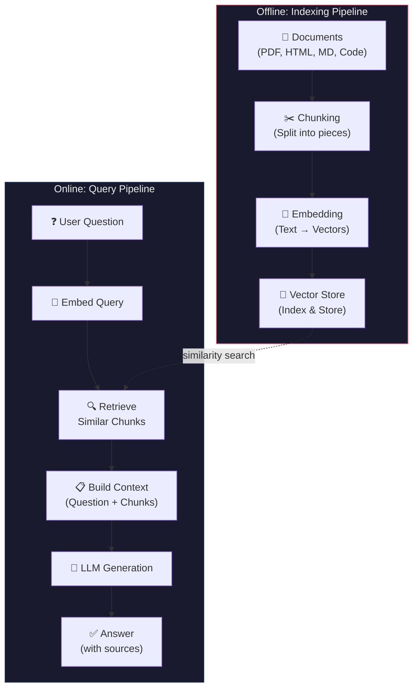
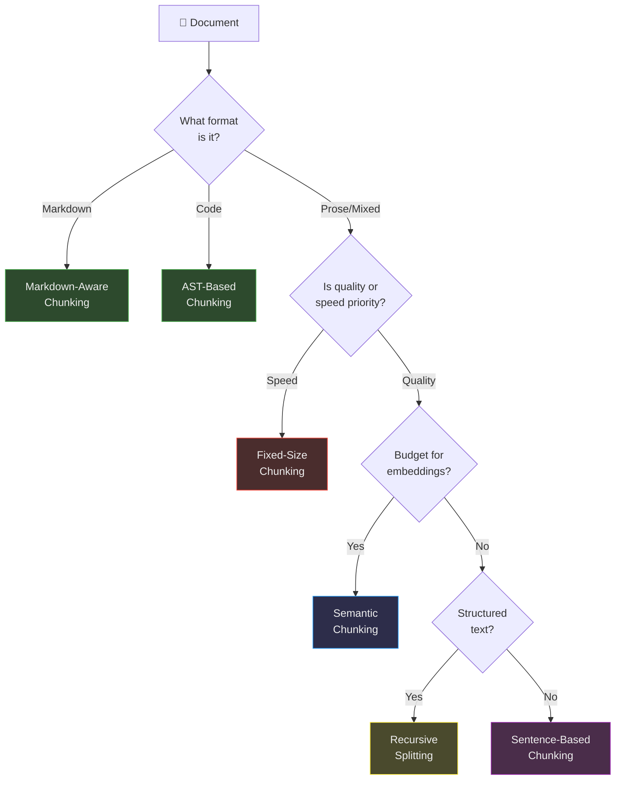
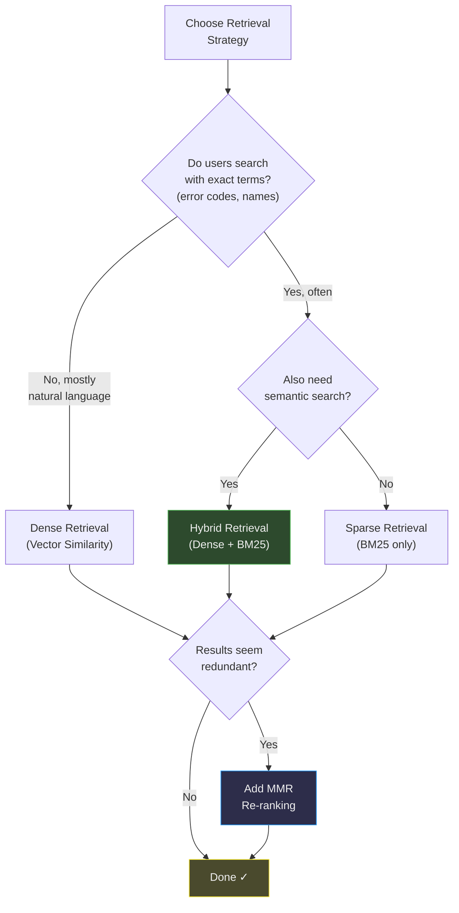

# Memory in AI Systems Deep Dive  Part 9: Retrieval-Augmented Generation  Giving AI Perfect Memory

---

**Series:** Memory in AI Systems  A Developer's Deep Dive from Fundamentals to Production
**Part:** 9 of 19 (RAG Systems)
**Audience:** Developers with programming experience who want to understand AI memory systems from the ground up
**Reading time:** ~55 minutes

---

## Recap of Part 8

In Part 8, we explored vector databases  the specialized storage engines that make similarity search fast at scale. We built vector indexes from scratch, understood HNSW and IVF algorithms, compared Pinecone, Weaviate, Qdrant, ChromaDB, and pgvector, and learned how to choose the right vector database for our use case.

But a vector database by itself is just a library with no librarian. It can store millions of vectors and find similar ones quickly, but it doesn't know *what* to store, *how* to prepare documents for storage, *when* to search, or *how* to use what it finds. That's like having a massive warehouse of books with no catalog, no reading room, and no way to answer questions.

This part puts the entire system together. We're building **Retrieval-Augmented Generation (RAG)**  the architecture pattern that gives AI models access to external knowledge. RAG is, by far, the most common pattern for AI memory in production today. It's how ChatGPT searches the web, how enterprise chatbots answer questions about internal documents, and how coding assistants understand your codebase.

By the end of this part, you will:

- Understand **why RAG exists** and the fundamental insight behind it
- Build a **complete RAG pipeline from scratch**  every stage, from document loading to answer generation
- Implement **5 different chunking strategies** and understand when to use each
- Build **3 different retrieval strategies** (dense, sparse, hybrid) and compare their quality
- Master **prompt engineering for RAG** including source attribution and conflict handling
- Build working pipelines with **LangChain** and **LlamaIndex**
- Implement **advanced RAG patterns** including HyDE and query decomposition
- Build a **RAG evaluation framework** that measures retrieval and generation quality
- Understand the **failure modes** and how to debug them

Let's give AI a library card.

---

## Table of Contents

1. [What Is RAG and Why It Matters](#1-what-is-rag-and-why-it-matters)
2. [The RAG Pipeline End to End](#2-the-rag-pipeline-end-to-end)
3. [Document Loading and Processing](#3-document-loading-and-processing)
4. [Chunking Strategies](#4-chunking-strategies)
5. [Indexing and Storage](#5-indexing-and-storage)
6. [Retrieval Strategies](#6-retrieval-strategies)
7. [Generation with Retrieved Context](#7-generation-with-retrieved-context)
8. [Building with LangChain](#8-building-with-langchain)
9. [Building with LlamaIndex](#9-building-with-llamaindex)
10. [Advanced RAG Patterns](#10-advanced-rag-patterns)
11. [RAG Evaluation](#11-rag-evaluation)
12. [Vocabulary Cheat Sheet](#12-vocabulary-cheat-sheet)
13. [Key Takeaways and What's Next](#13-key-takeaways-and-whats-next)

---

## 1. What Is RAG and Why It Matters

### The Fundamental Problem: Models Have Fixed Knowledge

Large language models are trained on massive datasets  trillions of tokens of text from books, websites, code repositories, and more. After training, the model's knowledge is **frozen in its weights**. It knows what it learned during training, and nothing else.

This creates three critical problems:

**Problem 1: Knowledge cutoff.** A model trained in January 2024 doesn't know about events in February 2024. Ask it about recent news, new library versions, or latest research  it either hallucinates or admits ignorance.

**Problem 2: No private knowledge.** The model was trained on public data. It has never seen your company's internal documentation, your codebase, your customer records, or your proprietary research. It can't answer questions about information it was never trained on.

**Problem 3: Hallucination.** When the model doesn't know something, it often makes up plausible-sounding but factually wrong answers. It generates text that *looks* correct but *isn't* grounded in real information.

```
User: What is our company's refund policy?

Model (without RAG): Based on common business practices, your refund
policy likely allows returns within 30 days of purchase with a valid
receipt. Customers can typically request a full refund or exchange...

[This is a HALLUCINATION  the model is guessing, not referencing
actual policy documents]

Model (with RAG): According to your company's refund policy document
(last updated March 2025), customers can request a full refund within
14 business days of purchase. Digital products are non-refundable
after download. Refund requests must be submitted through the customer
portal at support.example.com.

[Source: refund-policy-v3.pdf, Section 2.1]

[This is GROUNDED  every fact traces back to an actual document]
```

### The Fundamental Insight: Open-Book Exams

Think about two kinds of exams in school:

**Closed-book exam:** You must memorize everything. You can only use what's in your head. If you didn't study a topic, you either guess or leave it blank.

**Open-book exam:** You bring your textbooks and notes. When you encounter a question you're not sure about, you look it up. You don't need to memorize every fact  you need to know *where to find* the answer and *how to use* what you find.

RAG turns AI from a closed-book exam taker into an open-book exam taker.

> **The RAG Insight:** Instead of training the model to memorize all knowledge (expensive, slow, static), give it the ability to *retrieve* relevant information at query time and *reason* over that information to generate an answer.

This is surprisingly powerful. The model doesn't need to "know" your company's refund policy. It needs to:
1. **Retrieve** the refund policy document when someone asks about refunds
2. **Read** the relevant sections
3. **Generate** an accurate answer based on what it read

### Why Not Just Fine-Tune?

You might wonder: why not fine-tune the model on our private data? Fine-tuning teaches the model new knowledge by updating its weights. Why add this retrieval layer?

| Dimension | Fine-Tuning | RAG |
|---|---|---|
| **Knowledge update speed** | Hours to days (retrain) | Minutes (re-index documents) |
| **Cost** | Expensive (GPU training) | Cheap (embedding + storage) |
| **Freshness** | Stale after training | Always current |
| **Source attribution** | No (knowledge baked into weights) | Yes (can cite sources) |
| **Hallucination control** | Harder (model still guesses) | Easier (grounded in documents) |
| **Data privacy** | Data touches model weights | Data stays in your database |
| **Specialization** | Good for style/behavior changes | Good for knowledge injection |
| **Scalability** | Limited by model capacity | Scales with database |

Fine-tuning and RAG serve different purposes. Fine-tuning changes *how* the model behaves (tone, style, reasoning patterns). RAG changes *what* the model knows (facts, documents, data). In practice, the best systems often use both.

### The Architecture at 10,000 Feet

Here's what a RAG system looks like at the highest level:



Two separate pipelines:

1. **Offline (Indexing):** Process documents once. Load them, split them into chunks, embed each chunk into a vector, and store the vectors in a vector database. This happens when you first set up the system and whenever documents change.

2. **Online (Query):** When a user asks a question, embed the question into a vector, search the vector database for similar chunks, assemble those chunks into a prompt, and send it to the LLM to generate an answer.

The key properties of this architecture:
- **Decoupled knowledge from reasoning.** The LLM provides reasoning ability; the vector database provides knowledge.
- **Updateable.** Add new documents by running the indexing pipeline. No model retraining needed.
- **Auditable.** Every answer can cite which document chunks it used, enabling source verification.
- **Scalable.** The vector database can hold millions of documents. The LLM only sees the relevant ones.

---

## 2. The RAG Pipeline End to End

Before diving into each component, let's build the entire pipeline from scratch. This gives you the complete picture  we'll refine each piece in later sections.

### The Core Pipeline Class

```python
"""
Complete RAG Pipeline  Built from scratch.
This is the skeleton we'll flesh out throughout this article.
"""

import hashlib
import json
import os
from dataclasses import dataclass, field
from typing import Any

import numpy as np


@dataclass
class Document:
    """Represents a loaded document before chunking."""
    content: str
    metadata: dict = field(default_factory=dict)
    doc_id: str = ""

    def __post_init__(self):
        if not self.doc_id:
            self.doc_id = hashlib.md5(self.content.encode()).hexdigest()[:12]


@dataclass
class Chunk:
    """Represents a piece of a document after chunking."""
    content: str
    metadata: dict = field(default_factory=dict)
    chunk_id: str = ""
    embedding: np.ndarray | None = None

    def __post_init__(self):
        if not self.chunk_id:
            self.chunk_id = hashlib.md5(self.content.encode()).hexdigest()[:12]


@dataclass
class RetrievedChunk:
    """A chunk returned from retrieval, with a relevance score."""
    chunk: Chunk
    score: float
    rank: int


@dataclass
class RAGResponse:
    """The final response from the RAG pipeline."""
    answer: str
    source_chunks: list[RetrievedChunk]
    query: str
    metadata: dict = field(default_factory=dict)


class RAGPipeline:
    """
    Complete RAG pipeline: Load → Chunk → Embed → Index → Retrieve → Generate.

    Each method can be overridden with different strategies.
    """

    def __init__(
        self,
        embedding_model: str = "text-embedding-3-small",
        llm_model: str = "gpt-4o",
        chunk_size: int = 512,
        chunk_overlap: int = 50,
        top_k: int = 5,
    ):
        self.embedding_model = embedding_model
        self.llm_model = llm_model
        self.chunk_size = chunk_size
        self.chunk_overlap = chunk_overlap
        self.top_k = top_k

        # Storage
        self.chunks: list[Chunk] = []
        self.embeddings: np.ndarray | None = None

    # ── Stage 1: Document Loading ──────────────────────────────

    def load_document(self, file_path: str) -> Document:
        """Load a document from a file path."""
        ext = os.path.splitext(file_path)[1].lower()

        loaders = {
            ".txt": self._load_text,
            ".md": self._load_markdown,
            ".pdf": self._load_pdf,
            ".html": self._load_html,
            ".py": self._load_code,
        }

        loader = loaders.get(ext, self._load_text)
        content = loader(file_path)

        return Document(
            content=content,
            metadata={
                "source": file_path,
                "file_type": ext,
                "file_name": os.path.basename(file_path),
            },
        )

    def _load_text(self, path: str) -> str:
        with open(path, "r", encoding="utf-8") as f:
            return f.read()

    def _load_markdown(self, path: str) -> str:
        return self._load_text(path)  # Keep markdown as-is for now

    def _load_pdf(self, path: str) -> str:
        """Load PDF using PyPDF2."""
        try:
            import PyPDF2
            with open(path, "rb") as f:
                reader = PyPDF2.PdfReader(f)
                pages = [page.extract_text() for page in reader.pages]
                return "\n\n".join(pages)
        except ImportError:
            raise ImportError("Install PyPDF2: pip install PyPDF2")

    def _load_html(self, path: str) -> str:
        """Load HTML and extract text."""
        try:
            from bs4 import BeautifulSoup
            with open(path, "r", encoding="utf-8") as f:
                soup = BeautifulSoup(f.read(), "html.parser")
                # Remove script and style elements
                for element in soup(["script", "style"]):
                    element.decompose()
                return soup.get_text(separator="\n", strip=True)
        except ImportError:
            raise ImportError("Install BeautifulSoup: pip install beautifulsoup4")

    def _load_code(self, path: str) -> str:
        """Load code file with language annotation."""
        content = self._load_text(path)
        lang = os.path.splitext(path)[1].lstrip(".")
        return f"```{lang}\n{content}\n```"

    # ── Stage 2: Chunking ──────────────────────────────────────

    def chunk_document(self, document: Document) -> list[Chunk]:
        """Split a document into chunks with overlap."""
        text = document.content
        chunks = []
        start = 0
        chunk_index = 0

        while start < len(text):
            end = start + self.chunk_size

            # Try to break at a sentence boundary
            if end < len(text):
                # Look for the last period, newline, or other boundary
                for sep in ["\n\n", "\n", ". ", "? ", "! "]:
                    last_sep = text[start:end].rfind(sep)
                    if last_sep != -1 and last_sep > self.chunk_size * 0.5:
                        end = start + last_sep + len(sep)
                        break

            chunk_text = text[start:end].strip()

            if chunk_text:
                chunk = Chunk(
                    content=chunk_text,
                    metadata={
                        **document.metadata,
                        "chunk_index": chunk_index,
                        "start_char": start,
                        "end_char": end,
                        "doc_id": document.doc_id,
                    },
                )
                chunks.append(chunk)
                chunk_index += 1

            start = end - self.chunk_overlap

        return chunks

    # ── Stage 3: Embedding ─────────────────────────────────────

    def embed_chunks(self, chunks: list[Chunk]) -> np.ndarray:
        """Embed a list of chunks using OpenAI's embedding API."""
        from openai import OpenAI
        client = OpenAI()

        texts = [chunk.content for chunk in chunks]

        # Batch embedding (API allows up to 2048 inputs)
        batch_size = 2048
        all_embeddings = []

        for i in range(0, len(texts), batch_size):
            batch = texts[i : i + batch_size]
            response = client.embeddings.create(
                model=self.embedding_model,
                input=batch,
            )
            batch_embeddings = [item.embedding for item in response.data]
            all_embeddings.extend(batch_embeddings)

        embeddings = np.array(all_embeddings, dtype=np.float32)

        # Attach embeddings to chunks
        for chunk, emb in zip(chunks, embeddings):
            chunk.embedding = emb

        return embeddings

    def embed_query(self, query: str) -> np.ndarray:
        """Embed a single query string."""
        from openai import OpenAI
        client = OpenAI()

        response = client.embeddings.create(
            model=self.embedding_model,
            input=query,
        )
        return np.array(response.data[0].embedding, dtype=np.float32)

    # ── Stage 4: Indexing ──────────────────────────────────────

    def index(self, chunks: list[Chunk], embeddings: np.ndarray):
        """Store chunks and their embeddings (simple in-memory index)."""
        self.chunks = chunks
        self.embeddings = embeddings
        print(f"Indexed {len(chunks)} chunks with {embeddings.shape[1]}D vectors")

    # ── Stage 5: Retrieval ─────────────────────────────────────

    def retrieve(self, query: str, top_k: int | None = None) -> list[RetrievedChunk]:
        """Retrieve the most relevant chunks for a query."""
        if top_k is None:
            top_k = self.top_k

        query_embedding = self.embed_query(query)

        # Cosine similarity
        similarities = np.dot(self.embeddings, query_embedding) / (
            np.linalg.norm(self.embeddings, axis=1) * np.linalg.norm(query_embedding)
        )

        # Get top-k indices
        top_indices = np.argsort(similarities)[::-1][:top_k]

        results = []
        for rank, idx in enumerate(top_indices):
            results.append(
                RetrievedChunk(
                    chunk=self.chunks[idx],
                    score=float(similarities[idx]),
                    rank=rank + 1,
                )
            )

        return results

    # ── Stage 6: Generation ────────────────────────────────────

    def generate(self, query: str, retrieved: list[RetrievedChunk]) -> RAGResponse:
        """Generate an answer using the LLM with retrieved context."""
        from openai import OpenAI
        client = OpenAI()

        # Build context from retrieved chunks
        context_parts = []
        for r in retrieved:
            source = r.chunk.metadata.get("source", "Unknown")
            context_parts.append(
                f"[Source: {source} | Relevance: {r.score:.3f}]\n{r.chunk.content}"
            )
        context = "\n\n---\n\n".join(context_parts)

        prompt = f"""Answer the question based ONLY on the provided context.
If the context doesn't contain enough information to answer, say so explicitly.
Always cite which source(s) you used.

Context:
{context}

Question: {query}

Answer:"""

        response = client.chat.completions.create(
            model=self.llm_model,
            messages=[
                {
                    "role": "system",
                    "content": (
                        "You are a helpful assistant that answers questions "
                        "based on provided context. Always cite your sources."
                    ),
                },
                {"role": "user", "content": prompt},
            ],
            temperature=0.1,  # Low temperature for factual accuracy
        )

        return RAGResponse(
            answer=response.choices[0].message.content,
            source_chunks=retrieved,
            query=query,
            metadata={
                "model": self.llm_model,
                "num_chunks_used": len(retrieved),
            },
        )

    # ── Full Pipeline ──────────────────────────────────────────

    def ingest(self, file_paths: list[str]):
        """Run the full indexing pipeline on a list of files."""
        all_chunks = []

        for path in file_paths:
            print(f"Loading: {path}")
            doc = self.load_document(path)
            print(f"  → {len(doc.content)} characters")

            chunks = self.chunk_document(doc)
            print(f"  → {len(chunks)} chunks")
            all_chunks.extend(chunks)

        print(f"\nEmbedding {len(all_chunks)} total chunks...")
        embeddings = self.embed_chunks(all_chunks)

        self.index(all_chunks, embeddings)
        print("Ingestion complete!")

    def query(self, question: str) -> RAGResponse:
        """Run the full query pipeline."""
        retrieved = self.retrieve(question)
        response = self.generate(question, retrieved)
        return response


# ── Usage Example ──────────────────────────────────────────────

def demo_basic_rag():
    """Demonstrate the complete RAG pipeline."""
    # Initialize the pipeline
    rag = RAGPipeline(
        chunk_size=500,
        chunk_overlap=50,
        top_k=5,
    )

    # Ingest documents
    rag.ingest([
        "docs/refund-policy.pdf",
        "docs/shipping-guide.md",
        "docs/faq.html",
    ])

    # Query
    response = rag.query("What is the refund policy for digital products?")

    # Display results
    print(f"\nQuestion: {response.query}")
    print(f"\nAnswer: {response.answer}")
    print(f"\nSources used:")
    for chunk in response.source_chunks:
        print(f"  [{chunk.rank}] Score: {chunk.score:.3f}")
        print(f"      Source: {chunk.chunk.metadata.get('source', 'Unknown')}")
        print(f"      Preview: {chunk.chunk.content[:100]}...")
```

That's the complete skeleton. Every section below dives deep into one stage.

> **The Pipeline Principle:** A RAG system is only as strong as its weakest stage. A perfect retriever can't compensate for terrible chunking. A brilliant LLM can't generate good answers from irrelevant retrieved documents. Every stage matters.

---

## 3. Document Loading and Processing

The first stage of any RAG pipeline is getting your data into a format the system can work with. This sounds trivial  just read the file, right?  but real-world documents come in dozens of formats, each with its own quirks.

### The Universal Document Loader

```python
"""
Universal Document Loader  Handles PDF, HTML, Markdown, Code, JSON, CSV.
"""

import csv
import json
import os
import re
from pathlib import Path


class UniversalDocumentLoader:
    """
    Load documents from any common format into clean text.

    Supports: .txt, .md, .pdf, .html, .py, .js, .ts, .java,
              .go, .rs, .json, .csv, .docx
    """

    def __init__(self):
        self.loaders = {
            ".txt": self._load_text,
            ".md": self._load_markdown,
            ".pdf": self._load_pdf,
            ".html": self._load_html,
            ".htm": self._load_html,
            ".json": self._load_json,
            ".csv": self._load_csv,
            ".docx": self._load_docx,
        }

        # Code file extensions
        self.code_extensions = {
            ".py", ".js", ".ts", ".jsx", ".tsx", ".java", ".go",
            ".rs", ".cpp", ".c", ".h", ".cs", ".rb", ".php",
            ".swift", ".kt", ".scala", ".r", ".sql", ".sh", ".yaml",
            ".yml", ".toml", ".ini", ".cfg",
        }

    def load(self, file_path: str) -> Document:
        """Load a single file and return a Document."""
        path = Path(file_path)
        ext = path.suffix.lower()

        if ext in self.loaders:
            content = self.loaders[ext](file_path)
        elif ext in self.code_extensions:
            content = self._load_code(file_path, ext)
        else:
            # Fall back to plain text
            content = self._load_text(file_path)

        return Document(
            content=content,
            metadata={
                "source": str(path.absolute()),
                "file_name": path.name,
                "file_type": ext,
                "file_size": path.stat().st_size,
            },
        )

    def load_directory(
        self,
        directory: str,
        extensions: list[str] | None = None,
        recursive: bool = True,
    ) -> list[Document]:
        """Load all supported files from a directory."""
        documents = []
        dir_path = Path(directory)

        pattern = "**/*" if recursive else "*"

        for file_path in sorted(dir_path.glob(pattern)):
            if not file_path.is_file():
                continue

            ext = file_path.suffix.lower()
            if extensions and ext not in extensions:
                continue

            # Skip hidden files and common non-content files
            if file_path.name.startswith("."):
                continue
            if file_path.name in {"package-lock.json", "yarn.lock", "Cargo.lock"}:
                continue

            try:
                doc = self.load(str(file_path))
                documents.append(doc)
            except Exception as e:
                print(f"Warning: Could not load {file_path}: {e}")

        return documents

    # ── Format-Specific Loaders ────────────────────────────────

    def _load_text(self, path: str) -> str:
        """Load plain text file."""
        with open(path, "r", encoding="utf-8", errors="replace") as f:
            return f.read()

    def _load_markdown(self, path: str) -> str:
        """
        Load Markdown file, preserving structure.

        We keep the Markdown formatting because:
        1. Headers indicate topic boundaries (useful for chunking)
        2. Code blocks should stay intact
        3. Lists and tables carry semantic structure
        """
        content = self._load_text(path)

        # Optional: strip HTML comments
        content = re.sub(r"<!--.*?-->", "", content, flags=re.DOTALL)

        return content

    def _load_pdf(self, path: str) -> str:
        """
        Load PDF with multiple fallback strategies.

        Strategy 1: pdfplumber (best for tables and structured PDFs)
        Strategy 2: PyPDF2 (good general-purpose extractor)
        Strategy 3: pymupdf/fitz (fast, handles complex layouts)
        """
        # Try pdfplumber first (best quality)
        try:
            import pdfplumber

            pages = []
            with pdfplumber.open(path) as pdf:
                for i, page in enumerate(pdf.pages):
                    text = page.extract_text()
                    if text:
                        pages.append(f"[Page {i + 1}]\n{text}")

                    # Also extract tables
                    tables = page.extract_tables()
                    for table in tables:
                        table_text = self._format_table(table)
                        if table_text:
                            pages.append(f"[Table on Page {i + 1}]\n{table_text}")

            return "\n\n".join(pages)
        except ImportError:
            pass

        # Fall back to PyPDF2
        try:
            import PyPDF2

            with open(path, "rb") as f:
                reader = PyPDF2.PdfReader(f)
                pages = []
                for i, page in enumerate(reader.pages):
                    text = page.extract_text()
                    if text:
                        pages.append(f"[Page {i + 1}]\n{text}")
                return "\n\n".join(pages)
        except ImportError:
            pass

        raise ImportError(
            "Install a PDF library: pip install pdfplumber  OR  pip install PyPDF2"
        )

    @staticmethod
    def _format_table(table: list[list]) -> str:
        """Format an extracted table as a readable text table."""
        if not table or not table[0]:
            return ""

        # Calculate column widths
        col_widths = [0] * len(table[0])
        for row in table:
            for i, cell in enumerate(row):
                if i < len(col_widths):
                    col_widths[i] = max(col_widths[i], len(str(cell or "")))

        # Format rows
        lines = []
        for row_idx, row in enumerate(table):
            cells = [
                str(cell or "").ljust(col_widths[i])
                for i, cell in enumerate(row)
                if i < len(col_widths)
            ]
            lines.append(" | ".join(cells))
            if row_idx == 0:
                lines.append("-+-".join("-" * w for w in col_widths))

        return "\n".join(lines)

    def _load_html(self, path: str) -> str:
        """Load HTML and extract meaningful text content."""
        from bs4 import BeautifulSoup

        with open(path, "r", encoding="utf-8", errors="replace") as f:
            soup = BeautifulSoup(f.read(), "html.parser")

        # Remove non-content elements
        for tag in soup(["script", "style", "nav", "footer", "header", "aside"]):
            tag.decompose()

        # Extract text with structure preservation
        text_parts = []

        for element in soup.find_all(
            ["h1", "h2", "h3", "h4", "h5", "h6", "p", "li", "td", "th", "pre", "code"]
        ):
            tag_name = element.name
            text = element.get_text(strip=True)

            if not text:
                continue

            if tag_name.startswith("h"):
                level = int(tag_name[1])
                text_parts.append(f"\n{'#' * level} {text}\n")
            elif tag_name == "li":
                text_parts.append(f"- {text}")
            elif tag_name in ("pre", "code"):
                text_parts.append(f"```\n{text}\n```")
            else:
                text_parts.append(text)

        return "\n".join(text_parts)

    def _load_code(self, path: str, ext: str) -> str:
        """Load a code file with language annotation and structure extraction."""
        content = self._load_text(path)
        lang = ext.lstrip(".")

        # Map extensions to language names
        lang_map = {
            "py": "python",
            "js": "javascript",
            "ts": "typescript",
            "jsx": "javascript",
            "tsx": "typescript",
            "rs": "rust",
            "go": "go",
            "rb": "ruby",
            "kt": "kotlin",
        }
        lang = lang_map.get(lang, lang)

        # For Python files, extract docstrings and function signatures
        # for better searchability
        if lang == "python":
            summary = self._extract_python_summary(content)
            if summary:
                return f"File: {Path(path).name}\n\nSummary:\n{summary}\n\nFull Code:\n```python\n{content}\n```"

        return f"File: {Path(path).name}\n\n```{lang}\n{content}\n```"

    @staticmethod
    def _extract_python_summary(code: str) -> str:
        """Extract classes, functions, and docstrings from Python code."""
        import ast

        try:
            tree = ast.parse(code)
        except SyntaxError:
            return ""

        parts = []

        for node in ast.walk(tree):
            if isinstance(node, ast.ClassDef):
                docstring = ast.get_docstring(node) or ""
                methods = [
                    n.name for n in node.body if isinstance(n, ast.FunctionDef)
                ]
                parts.append(
                    f"class {node.name}: {docstring[:100]}"
                    f"\n  Methods: {', '.join(methods)}"
                )
            elif isinstance(node, ast.FunctionDef):
                # Skip methods (already listed under class)
                if not any(
                    isinstance(parent, ast.ClassDef)
                    for parent in ast.walk(tree)
                    if node in getattr(parent, "body", [])
                ):
                    docstring = ast.get_docstring(node) or ""
                    parts.append(f"def {node.name}(): {docstring[:100]}")

        return "\n".join(parts)

    def _load_json(self, path: str) -> str:
        """Load JSON and format it as readable text."""
        with open(path, "r", encoding="utf-8") as f:
            data = json.load(f)

        # Convert to a text-friendly representation
        return json.dumps(data, indent=2, ensure_ascii=False)

    def _load_csv(self, path: str) -> str:
        """Load CSV and format as a readable table."""
        with open(path, "r", encoding="utf-8", newline="") as f:
            reader = csv.reader(f)
            rows = list(reader)

        if not rows:
            return ""

        return self._format_table(rows)

    def _load_docx(self, path: str) -> str:
        """Load Word document."""
        try:
            import docx

            doc = docx.Document(path)
            paragraphs = [p.text for p in doc.paragraphs if p.text.strip()]
            return "\n\n".join(paragraphs)
        except ImportError:
            raise ImportError("Install python-docx: pip install python-docx")


# ── Usage ──────────────────────────────────────────────────────

def demo_document_loading():
    """Demonstrate loading various document types."""
    loader = UniversalDocumentLoader()

    # Load a single file
    doc = loader.load("docs/architecture.md")
    print(f"Loaded: {doc.metadata['file_name']}")
    print(f"  Size: {len(doc.content)} characters")
    print(f"  Preview: {doc.content[:200]}...")

    # Load an entire directory
    docs = loader.load_directory(
        "docs/",
        extensions=[".md", ".pdf", ".html"],
        recursive=True,
    )
    print(f"\nLoaded {len(docs)} documents from docs/")
    for doc in docs:
        print(f"  {doc.metadata['file_name']}: {len(doc.content)} chars")
```

### Key Decisions in Document Loading

**Why preserve structure?** When we load Markdown, we keep the headers (`#`, `##`, etc.) because they serve as natural chunk boundaries later. When we load HTML, we convert it to Markdown-like format for the same reason.

**Why extract code summaries?** Embedding a 500-line Python file as a single block is rarely useful. Extracting function names and docstrings creates searchable text that matches how users ask questions ("How does the `calculate_price` function work?").

**Why multiple PDF strategies?** PDF is the most unpredictable format. Some PDFs have clean text layers; others are scanned images requiring OCR. Some have tables that need special extraction. A robust loader tries multiple strategies.

---

## 4. Chunking Strategies

Chunking is arguably the **most important and most underrated** part of a RAG pipeline. How you split your documents determines what your retrieval system can find and how useful the found pieces are. Bad chunking can make a brilliant vector database and LLM look incompetent.

### Why Chunking Matters

Consider this paragraph from a company's documentation:

```
Our standard shipping takes 5-7 business days for domestic orders.
International shipping typically takes 10-14 business days, depending
on the destination country. Express shipping is available for an
additional $15 and guarantees delivery within 2 business days for
domestic orders. All orders over $100 qualify for free standard
shipping. Tracking information is sent via email within 24 hours
of shipment.
```

Now imagine a user asks: "How much does express shipping cost?"

If this paragraph is split into 50-character chunks:
- Chunk 1: `"Our standard shipping takes 5-7 business days"`
- Chunk 2: `"for domestic orders. International shipping typ"`
- Chunk 3: `"ically takes 10-14 business days, depending on"`
- Chunk 4: `"the destination country. Express shipping is ava"`
- Chunk 5: `"ilable for an additional $15 and guarantees deli"`
- Chunk 6: `"very within 2 business days for domestic orders."`

The answer ("$15") is split across chunks 4 and 5. Neither chunk alone makes sense. The word "Express" is in chunk 4 and "$15" is in chunk 5  the retriever might find chunk 4 (it mentions "Express shipping") but lose the price information.

If the entire paragraph is kept as one chunk, the retriever finds it easily and the LLM has all the context it needs.

But if we keep *every* paragraph as one chunk, we might have 5,000-word chunks that waste the LLM's context window and dilute the relevant information with irrelevant text.

**This is the fundamental chunking trade-off:**

| | Small Chunks | Large Chunks |
|---|---|---|
| **Precision** | High  each chunk is focused | Low  lots of irrelevant text mixed in |
| **Context** | Low  chunks lack surrounding context | High  chunks are self-contained |
| **Retrieval noise** | More chunks to search through | Fewer chunks, less noise |
| **LLM efficiency** | More focused context | Wasted tokens on irrelevant text |
| **Best for** | Fact lookups, specific questions | Complex questions, reasoning tasks |

### Strategy 1: Fixed-Size Chunking

The simplest approach: split text every N characters, with optional overlap.

```python
"""
Chunking Strategy 1: Fixed-Size Chunks.

Split text every N characters. Simple but effective baseline.
"""


class FixedSizeChunker:
    """
    Split text into fixed-size chunks with configurable overlap.

    Overlap ensures that information at chunk boundaries isn't lost.
    A chunk boundary might split a sentence in half  overlap ensures
    the complete sentence appears in at least one chunk.
    """

    def __init__(self, chunk_size: int = 500, overlap: int = 50):
        self.chunk_size = chunk_size
        self.overlap = overlap

    def chunk(self, text: str) -> list[str]:
        chunks = []
        start = 0

        while start < len(text):
            end = min(start + self.chunk_size, len(text))
            chunk = text[start:end]

            if chunk.strip():  # Don't add empty chunks
                chunks.append(chunk.strip())

            # Move forward by (chunk_size - overlap)
            start += self.chunk_size - self.overlap

        return chunks


# ── Demo ───────────────────────────────────────────────────────

sample_text = """
Machine learning is a subset of artificial intelligence that focuses on
building systems that learn from data. Unlike traditional programming,
where rules are explicitly coded, machine learning algorithms discover
patterns in data and use those patterns to make predictions.

There are three main types of machine learning:

1. Supervised learning: The algorithm learns from labeled examples.
   Given input-output pairs, it learns to map new inputs to outputs.
   Examples: spam detection, image classification, price prediction.

2. Unsupervised learning: The algorithm finds patterns in unlabeled data.
   It discovers structure without being told what to look for.
   Examples: customer segmentation, anomaly detection, topic modeling.

3. Reinforcement learning: The algorithm learns by taking actions in an
   environment and receiving rewards or penalties. It learns to maximize
   cumulative reward over time.
   Examples: game playing, robotics, recommendation systems.
""".strip()

# ── Compare different chunk sizes ──────────────────────────────

for size in [100, 200, 500]:
    chunker = FixedSizeChunker(chunk_size=size, overlap=20)
    chunks = chunker.chunk(sample_text)
    print(f"\n{'='*60}")
    print(f"Chunk size: {size}, Overlap: 20 → {len(chunks)} chunks")
    print(f"{'='*60}")
    for i, chunk in enumerate(chunks):
        print(f"\n--- Chunk {i+1} ({len(chunk)} chars) ---")
        print(chunk[:120] + "..." if len(chunk) > 120 else chunk)
```

**When to use fixed-size chunking:**
- When you need a quick baseline
- When document structure is inconsistent
- When you're processing very large datasets and need speed

**Weaknesses:**
- Blindly splits mid-sentence, mid-paragraph, mid-thought
- Overlap partially mitigates but doesn't solve boundary problems
- No awareness of document structure

### Strategy 2: Sentence-Based Chunking

Split on sentence boundaries, then group sentences until the chunk reaches the target size.

```python
"""
Chunking Strategy 2: Sentence-Based Chunks.

Split into sentences first, then group sentences into chunks.
Never breaks a sentence in half.
"""

import re


class SentenceChunker:
    """
    Chunk text by grouping complete sentences up to a target size.

    Uses regex-based sentence splitting that handles common edge cases
    like abbreviations (Dr., Mr., U.S.) and decimal numbers.
    """

    def __init__(
        self,
        max_chunk_size: int = 500,
        min_chunk_size: int = 100,
        overlap_sentences: int = 1,
    ):
        self.max_chunk_size = max_chunk_size
        self.min_chunk_size = min_chunk_size
        self.overlap_sentences = overlap_sentences

    def split_sentences(self, text: str) -> list[str]:
        """
        Split text into sentences, handling common edge cases.

        Edge cases:
        - Abbreviations: "Dr. Smith went..." (not a sentence boundary)
        - Numbers: "The price was 3.14..." (not a sentence boundary)
        - Multiple punctuation: "Really?!" (one sentence boundary)
        - Ellipsis: "Wait..." (one sentence boundary)
        """
        # Common abbreviations that contain periods
        abbreviations = {
            "mr", "mrs", "ms", "dr", "prof", "sr", "jr", "st",
            "ave", "blvd", "dept", "est", "fig", "inc", "ltd",
            "vs", "etc", "approx", "dept", "div", "govt",
        }

        # Replace abbreviation periods with a placeholder
        modified = text
        for abbr in abbreviations:
            # Match abbreviation followed by period (case-insensitive)
            pattern = re.compile(rf"\b({abbr})\.", re.IGNORECASE)
            modified = pattern.sub(r"\1<PERIOD>", modified)

        # Split on sentence-ending punctuation followed by space + capital
        sentences = re.split(r'(?<=[.!?])\s+(?=[A-Z"])', modified)

        # Restore periods
        sentences = [s.replace("<PERIOD>", ".") for s in sentences]

        # Clean up
        sentences = [s.strip() for s in sentences if s.strip()]

        return sentences

    def chunk(self, text: str) -> list[str]:
        """Group sentences into chunks respecting size limits."""
        sentences = self.split_sentences(text)
        chunks = []
        current_chunk: list[str] = []
        current_size = 0

        for sentence in sentences:
            sentence_size = len(sentence)

            # If a single sentence exceeds max size, it becomes its own chunk
            if sentence_size > self.max_chunk_size:
                # Flush current chunk first
                if current_chunk:
                    chunks.append(" ".join(current_chunk))
                    current_chunk = []
                    current_size = 0
                chunks.append(sentence)
                continue

            # Would this sentence push us over the limit?
            if current_size + sentence_size + 1 > self.max_chunk_size and current_chunk:
                chunks.append(" ".join(current_chunk))

                # Keep overlap_sentences for the next chunk
                if self.overlap_sentences > 0:
                    current_chunk = current_chunk[-self.overlap_sentences :]
                    current_size = sum(len(s) for s in current_chunk)
                else:
                    current_chunk = []
                    current_size = 0

            current_chunk.append(sentence)
            current_size += sentence_size + 1  # +1 for space

        # Don't forget the last chunk
        if current_chunk:
            text_chunk = " ".join(current_chunk)
            # Merge with previous if too small
            if len(text_chunk) < self.min_chunk_size and chunks:
                chunks[-1] += " " + text_chunk
            else:
                chunks.append(text_chunk)

        return chunks


# ── Demo ───────────────────────────────────────────────────────

chunker = SentenceChunker(max_chunk_size=300, overlap_sentences=1)
chunks = chunker.chunk(sample_text)

print(f"Sentence-based chunking: {len(chunks)} chunks")
for i, chunk in enumerate(chunks):
    print(f"\n--- Chunk {i+1} ({len(chunk)} chars) ---")
    print(chunk)
```

**When to use sentence-based chunking:**
- When factual accuracy matters (each chunk contains complete thoughts)
- When documents are prose-heavy (articles, documentation, policies)
- When you want a good balance of precision and context

### Strategy 3: Recursive Character Splitting

The most popular strategy, used by LangChain as its default. It tries to split on the most semantically meaningful boundary available.

```python
"""
Chunking Strategy 3: Recursive Character Splitting.

Try splitting on paragraph boundaries first. If chunks are still too
large, split on sentences. If still too large, split on words.
This preserves the most semantic structure possible.
"""


class RecursiveChunker:
    """
    Recursive text splitter that tries progressively finer separators.

    Separator hierarchy (most to least semantic meaning):
    1. Double newline (paragraph boundary)
    2. Single newline (line boundary)
    3. Sentence-ending punctuation
    4. Space (word boundary)
    5. Empty string (character boundary  last resort)
    """

    def __init__(
        self,
        chunk_size: int = 500,
        chunk_overlap: int = 50,
        separators: list[str] | None = None,
    ):
        self.chunk_size = chunk_size
        self.chunk_overlap = chunk_overlap
        self.separators = separators or [
            "\n\n",   # Paragraph boundary
            "\n",     # Line boundary
            ". ",     # Sentence boundary
            "? ",
            "! ",
            "; ",
            ", ",     # Clause boundary
            " ",      # Word boundary
            "",       # Character boundary (last resort)
        ]

    def chunk(self, text: str) -> list[str]:
        """Recursively split text using the separator hierarchy."""
        return self._split(text, self.separators)

    def _split(self, text: str, separators: list[str]) -> list[str]:
        """Core recursive splitting logic."""
        # Base case: text fits in one chunk
        if len(text) <= self.chunk_size:
            return [text] if text.strip() else []

        # Find the best separator (first one that appears in the text)
        separator = ""
        remaining_separators = []

        for i, sep in enumerate(separators):
            if sep == "":
                separator = sep
                remaining_separators = []
                break
            if sep in text:
                separator = sep
                remaining_separators = separators[i + 1 :]
                break

        # Split on the chosen separator
        if separator:
            splits = text.split(separator)
        else:
            splits = list(text)  # Character-level split

        # Merge splits into chunks that respect the size limit
        chunks = []
        current_chunk = ""

        for split in splits:
            piece = split if not separator else split

            # Would adding this piece exceed the limit?
            test_chunk = (
                current_chunk + separator + piece if current_chunk else piece
            )

            if len(test_chunk) <= self.chunk_size:
                current_chunk = test_chunk
            else:
                # Save current chunk if it has content
                if current_chunk.strip():
                    chunks.append(current_chunk.strip())

                # If this single piece is too large, recurse with finer separators
                if len(piece) > self.chunk_size and remaining_separators:
                    sub_chunks = self._split(piece, remaining_separators)
                    chunks.extend(sub_chunks)
                    current_chunk = ""
                else:
                    current_chunk = piece

        # Don't forget the last piece
        if current_chunk.strip():
            chunks.append(current_chunk.strip())

        # Apply overlap
        if self.chunk_overlap > 0 and len(chunks) > 1:
            chunks = self._apply_overlap(chunks)

        return chunks

    def _apply_overlap(self, chunks: list[str]) -> list[str]:
        """Add overlap between consecutive chunks."""
        overlapped = [chunks[0]]

        for i in range(1, len(chunks)):
            prev = chunks[i - 1]
            curr = chunks[i]

            # Take the last N characters from the previous chunk as overlap
            overlap_text = prev[-self.chunk_overlap :] if len(prev) > self.chunk_overlap else prev

            # Find a clean break point in the overlap
            space_idx = overlap_text.find(" ")
            if space_idx != -1:
                overlap_text = overlap_text[space_idx + 1 :]

            overlapped.append(overlap_text + " " + curr)

        return overlapped


# ── Demo ───────────────────────────────────────────────────────

chunker = RecursiveChunker(chunk_size=250, chunk_overlap=30)
chunks = chunker.chunk(sample_text)

print(f"Recursive chunking: {len(chunks)} chunks")
for i, chunk in enumerate(chunks):
    print(f"\n--- Chunk {i+1} ({len(chunk)} chars) ---")
    print(chunk)
```

**Why recursive splitting is the default choice:**
- It respects document structure (paragraphs > sentences > words)
- It adapts to the actual content
- It produces chunks that are semantically coherent
- It's what LangChain's `RecursiveCharacterTextSplitter` implements

### Strategy 4: Markdown-Aware Chunking

When your documents are in Markdown (a very common case for technical documentation), you can use headers as natural chunk boundaries.

```python
"""
Chunking Strategy 4: Markdown-Aware Chunking.

Use Markdown headers as semantic boundaries.
Each section (header + content) becomes a chunk or group of chunks.
"""

import re


class MarkdownChunker:
    """
    Split Markdown documents using header hierarchy.

    This chunker understands Markdown structure:
    - Splits on headers (# ## ### etc.)
    - Keeps code blocks intact
    - Preserves list structure
    - Adds header breadcrumbs to each chunk for context
    """

    def __init__(
        self,
        max_chunk_size: int = 1000,
        min_chunk_size: int = 100,
    ):
        self.max_chunk_size = max_chunk_size
        self.min_chunk_size = min_chunk_size

    def chunk(self, text: str) -> list[str]:
        """Split Markdown text into semantically meaningful chunks."""
        sections = self._split_by_headers(text)

        chunks = []
        for section in sections:
            header_path = section["header_path"]
            content = section["content"]

            # Add header context to each chunk
            header_prefix = " > ".join(header_path) if header_path else ""

            if len(content) <= self.max_chunk_size:
                full_text = f"{header_prefix}\n\n{content}" if header_prefix else content
                if len(full_text.strip()) >= self.min_chunk_size:
                    chunks.append(full_text.strip())
            else:
                # Section is too large  sub-chunk it
                sub_chunker = RecursiveChunker(
                    chunk_size=self.max_chunk_size,
                    chunk_overlap=50,
                )
                sub_chunks = sub_chunker.chunk(content)

                for sub_chunk in sub_chunks:
                    full_text = (
                        f"{header_prefix}\n\n{sub_chunk}"
                        if header_prefix
                        else sub_chunk
                    )
                    chunks.append(full_text.strip())

        return chunks

    def _split_by_headers(self, text: str) -> list[dict]:
        """
        Split text into sections based on Markdown headers.
        Returns a list of {header_path: [...], content: "..."} dicts.
        """
        # Regex to match Markdown headers
        header_pattern = re.compile(r"^(#{1,6})\s+(.+)$", re.MULTILINE)

        sections = []
        header_stack: list[tuple[int, str]] = []  # (level, text)
        last_end = 0

        for match in header_pattern.finditer(text):
            # Save content before this header
            content = text[last_end : match.start()].strip()
            if content and header_stack:
                sections.append(
                    {
                        "header_path": [h[1] for h in header_stack],
                        "content": content,
                    }
                )
            elif content:
                sections.append({"header_path": [], "content": content})

            # Update header stack
            level = len(match.group(1))  # Number of # characters
            title = match.group(2).strip()

            # Pop headers that are at the same or deeper level
            while header_stack and header_stack[-1][0] >= level:
                header_stack.pop()

            header_stack.append((level, title))
            last_end = match.end()

        # Don't forget content after the last header
        remaining = text[last_end:].strip()
        if remaining:
            sections.append(
                {
                    "header_path": [h[1] for h in header_stack],
                    "content": remaining,
                }
            )

        return sections
```

### Strategy 5: Semantic Chunking

The most sophisticated approach: use embeddings to find natural topic boundaries within the text.

```python
"""
Chunking Strategy 5: Semantic Chunking.

Use embedding similarity to find natural topic boundaries.
Split where the meaning of adjacent sentences changes significantly.
"""

import numpy as np


class SemanticChunker:
    """
    Split text based on semantic similarity between adjacent segments.

    Algorithm:
    1. Split text into sentences
    2. Embed each sentence
    3. Compute similarity between adjacent sentences
    4. Split where similarity drops below threshold (topic change)
    5. Group resulting segments into appropriately-sized chunks
    """

    def __init__(
        self,
        embedding_model: str = "text-embedding-3-small",
        similarity_threshold: float = 0.5,
        max_chunk_size: int = 1000,
        min_chunk_size: int = 100,
    ):
        self.embedding_model = embedding_model
        self.similarity_threshold = similarity_threshold
        self.max_chunk_size = max_chunk_size
        self.min_chunk_size = min_chunk_size

    def chunk(self, text: str) -> list[str]:
        """Split text at semantic boundaries."""
        # Step 1: Split into sentences
        sentences = self._split_sentences(text)
        if len(sentences) <= 1:
            return [text] if text.strip() else []

        # Step 2: Embed each sentence
        embeddings = self._embed_sentences(sentences)

        # Step 3: Compute similarity between adjacent sentences
        similarities = []
        for i in range(len(embeddings) - 1):
            sim = self._cosine_similarity(embeddings[i], embeddings[i + 1])
            similarities.append(sim)

        # Step 4: Find split points (where similarity drops)
        split_points = self._find_split_points(similarities)

        # Step 5: Create chunks from split points
        chunks = self._create_chunks(sentences, split_points)

        return chunks

    def _split_sentences(self, text: str) -> list[str]:
        """Split text into sentences."""
        sentences = re.split(r"(?<=[.!?])\s+", text)
        return [s.strip() for s in sentences if s.strip()]

    def _embed_sentences(self, sentences: list[str]) -> np.ndarray:
        """Embed a list of sentences."""
        from openai import OpenAI
        client = OpenAI()

        response = client.embeddings.create(
            model=self.embedding_model,
            input=sentences,
        )
        return np.array([item.embedding for item in response.data])

    @staticmethod
    def _cosine_similarity(a: np.ndarray, b: np.ndarray) -> float:
        """Compute cosine similarity between two vectors."""
        return float(np.dot(a, b) / (np.linalg.norm(a) * np.linalg.norm(b)))

    def _find_split_points(self, similarities: list[float]) -> list[int]:
        """
        Find indices where we should split.

        Uses both absolute threshold and relative drop detection.
        """
        if not similarities:
            return []

        split_points = []
        mean_sim = np.mean(similarities)
        std_sim = np.std(similarities)

        for i, sim in enumerate(similarities):
            # Split if similarity is below threshold
            # OR if it drops significantly from the local average
            is_below_threshold = sim < self.similarity_threshold
            is_significant_drop = sim < (mean_sim - std_sim)

            if is_below_threshold or is_significant_drop:
                split_points.append(i + 1)  # Split AFTER sentence i

        return split_points

    def _create_chunks(
        self, sentences: list[str], split_points: list[int]
    ) -> list[str]:
        """Group sentences into chunks based on split points."""
        chunks = []
        start = 0

        for split_point in split_points:
            chunk_text = " ".join(sentences[start:split_point])

            # Handle chunks that are too large
            if len(chunk_text) > self.max_chunk_size:
                # Sub-split using recursive chunker
                sub_chunker = RecursiveChunker(chunk_size=self.max_chunk_size)
                chunks.extend(sub_chunker.chunk(chunk_text))
            elif len(chunk_text) >= self.min_chunk_size:
                chunks.append(chunk_text)
            else:
                # Chunk too small  will merge with next
                if chunks:
                    chunks[-1] += " " + chunk_text
                else:
                    chunks.append(chunk_text)

            start = split_point

        # Handle the last segment
        if start < len(sentences):
            last_chunk = " ".join(sentences[start:])
            if last_chunk.strip():
                if len(last_chunk) < self.min_chunk_size and chunks:
                    chunks[-1] += " " + last_chunk
                else:
                    chunks.append(last_chunk)

        return chunks
```

### Comparing Chunking Strategies



| Strategy | Speed | Quality | Embedding Cost | Best For |
|---|---|---|---|---|
| Fixed-size | Fastest | Lowest | None | Quick prototypes, massive datasets |
| Sentence-based | Fast | Medium | None | Prose documents, FAQ pages |
| Recursive | Fast | High | None | General purpose, mixed content |
| Markdown-aware | Fast | High | None | Documentation, technical writing |
| Semantic | Slow | Highest | High (embed every sentence) | When quality matters most |

> **The Chunking Rule of Thumb:** Start with recursive splitting at 500 characters with 50-character overlap. This works surprisingly well for most use cases. Only move to fancier strategies when you've measured retrieval quality and identified chunking as the bottleneck.

---

## 5. Indexing and Storage

Once documents are chunked and embedded, we need to store them in a way that enables fast retrieval. In Part 8, we explored vector databases in depth. Here we'll focus on the practical integration  how to use ChromaDB (the most popular choice for getting started) as the storage layer for our RAG pipeline.

### ChromaDB Integration

```python
"""
Indexing with ChromaDB  Production-ready vector storage for RAG.
"""

import hashlib
import time
from typing import Any

import chromadb
from chromadb.config import Settings


class ChromaIndex:
    """
    Vector index backed by ChromaDB.

    Features:
    - Persistent storage (survives restarts)
    - Metadata filtering
    - Automatic deduplication
    - Incremental updates (add new documents without re-indexing everything)
    """

    def __init__(
        self,
        collection_name: str = "rag_documents",
        persist_directory: str = "./chroma_db",
        embedding_function: Any | None = None,
    ):
        # Initialize ChromaDB with persistent storage
        self.client = chromadb.PersistentClient(path=persist_directory)

        # Use OpenAI embeddings or a custom embedding function
        if embedding_function is None:
            from chromadb.utils import embedding_functions
            embedding_function = embedding_functions.OpenAIEmbeddingFunction(
                model_name="text-embedding-3-small",
            )

        self.collection = self.client.get_or_create_collection(
            name=collection_name,
            embedding_function=embedding_function,
            metadata={"hnsw:space": "cosine"},  # Use cosine similarity
        )

        print(f"Collection '{collection_name}': {self.collection.count()} existing documents")

    def add_chunks(
        self,
        chunks: list[Chunk],
        batch_size: int = 100,
    ) -> dict:
        """
        Add chunks to the index with deduplication.

        Returns stats about what was added/skipped.
        """
        stats = {"added": 0, "skipped_duplicate": 0, "errors": 0}

        # Check for existing IDs to avoid duplicates
        existing_ids = set()
        if self.collection.count() > 0:
            # Get all existing IDs
            all_data = self.collection.get()
            existing_ids = set(all_data["ids"])

        # Filter out duplicates
        new_chunks = [c for c in chunks if c.chunk_id not in existing_ids]
        stats["skipped_duplicate"] = len(chunks) - len(new_chunks)

        # Add in batches
        for i in range(0, len(new_chunks), batch_size):
            batch = new_chunks[i : i + batch_size]

            try:
                self.collection.add(
                    ids=[c.chunk_id for c in batch],
                    documents=[c.content for c in batch],
                    metadatas=[c.metadata for c in batch],
                )
                stats["added"] += len(batch)
            except Exception as e:
                print(f"Error adding batch {i // batch_size}: {e}")
                stats["errors"] += len(batch)

        return stats

    def search(
        self,
        query: str,
        top_k: int = 5,
        where: dict | None = None,
        where_document: dict | None = None,
    ) -> list[RetrievedChunk]:
        """
        Search for relevant chunks.

        Args:
            query: The search query text
            top_k: Number of results to return
            where: Metadata filter (e.g., {"file_type": ".pdf"})
            where_document: Document content filter (e.g., {"$contains": "refund"})
        """
        kwargs = {
            "query_texts": [query],
            "n_results": top_k,
        }

        if where:
            kwargs["where"] = where
        if where_document:
            kwargs["where_document"] = where_document

        results = self.collection.query(**kwargs)

        retrieved = []
        for i in range(len(results["ids"][0])):
            chunk = Chunk(
                content=results["documents"][0][i],
                metadata=results["metadatas"][0][i],
                chunk_id=results["ids"][0][i],
            )
            score = 1 - results["distances"][0][i]  # ChromaDB returns distances
            retrieved.append(
                RetrievedChunk(chunk=chunk, score=score, rank=i + 1)
            )

        return retrieved

    def delete_by_source(self, source: str):
        """Delete all chunks from a specific source (for re-indexing)."""
        self.collection.delete(where={"source": source})

    def update_document(self, source: str, new_chunks: list[Chunk]):
        """
        Update a document: delete old chunks and add new ones.

        This is how you handle document updates in production 
        re-index the changed document without touching others.
        """
        self.delete_by_source(source)
        return self.add_chunks(new_chunks)

    def get_stats(self) -> dict:
        """Get index statistics."""
        count = self.collection.count()

        # Sample some metadata to understand the collection
        sample = self.collection.peek(limit=10)
        sources = set()
        file_types = set()
        for meta in sample.get("metadatas", []):
            if meta:
                sources.add(meta.get("source", "unknown"))
                file_types.add(meta.get("file_type", "unknown"))

        return {
            "total_chunks": count,
            "sample_sources": list(sources),
            "sample_file_types": list(file_types),
        }


# ── Usage Example ──────────────────────────────────────────────

def demo_chroma_indexing():
    """Full indexing pipeline with ChromaDB."""
    # 1. Load documents
    loader = UniversalDocumentLoader()
    docs = loader.load_directory("docs/", extensions=[".md", ".pdf"])
    print(f"Loaded {len(docs)} documents")

    # 2. Chunk documents
    chunker = RecursiveChunker(chunk_size=500, chunk_overlap=50)
    all_chunks = []
    for doc in docs:
        chunks = chunker.chunk(doc.content)
        for i, chunk_text in enumerate(chunks):
            chunk = Chunk(
                content=chunk_text,
                metadata={
                    **doc.metadata,
                    "chunk_index": i,
                    "doc_id": doc.doc_id,
                },
            )
            all_chunks.append(chunk)
    print(f"Created {len(all_chunks)} chunks")

    # 3. Index chunks (embedding happens automatically in ChromaDB)
    index = ChromaIndex(collection_name="my_docs")
    stats = index.add_chunks(all_chunks)
    print(f"Indexing stats: {stats}")

    # 4. Search
    results = index.search("What is the refund policy?", top_k=3)
    for r in results:
        print(f"  [{r.rank}] Score: {r.score:.3f}  {r.chunk.content[:100]}...")
```

### Metadata Management

Metadata is the unsung hero of RAG systems. Good metadata enables filtering that dramatically improves retrieval quality.

```python
"""
Metadata Enrichment  Make your chunks self-describing.
"""

from datetime import datetime


class MetadataEnricher:
    """
    Enrich chunks with additional metadata for better filtering and retrieval.
    """

    @staticmethod
    def enrich(chunk: Chunk, document: Document) -> Chunk:
        """Add useful metadata to a chunk."""
        content = chunk.content

        # ── Basic stats ────────────────────────────────────────
        chunk.metadata["char_count"] = len(content)
        chunk.metadata["word_count"] = len(content.split())
        chunk.metadata["line_count"] = content.count("\n") + 1

        # ── Content type detection ─────────────────────────────
        has_code = "```" in content or "def " in content or "class " in content
        has_table = "|" in content and "-|-" in content
        has_list = bool(re.search(r"^\s*[-*\d+.]\s", content, re.MULTILINE))

        chunk.metadata["has_code"] = has_code
        chunk.metadata["has_table"] = has_table
        chunk.metadata["has_list"] = has_list

        # ── Topic hints (simple keyword detection) ─────────────
        content_lower = content.lower()
        topics = []

        topic_keywords = {
            "pricing": ["price", "cost", "fee", "charge", "discount", "subscription"],
            "shipping": ["shipping", "delivery", "tracking", "carrier"],
            "returns": ["return", "refund", "exchange", "warranty"],
            "technical": ["api", "endpoint", "function", "class", "method", "error"],
            "security": ["security", "authentication", "password", "encryption", "token"],
        }

        for topic, keywords in topic_keywords.items():
            if any(kw in content_lower for kw in keywords):
                topics.append(topic)

        chunk.metadata["topics"] = topics

        # ── Timestamp ──────────────────────────────────────────
        chunk.metadata["indexed_at"] = datetime.now().isoformat()

        return chunk
```

---

## 6. Retrieval Strategies

Retrieval is where the magic happens  or fails. The right retrieval strategy can mean the difference between a system that feels intelligent and one that gives irrelevant answers.

### Strategy 1: Dense Retrieval (Vector Similarity)

This is what we've been building so far: embed the query and find chunks with similar embeddings.

```python
"""
Retrieval Strategy 1: Dense Retrieval.

Use vector similarity to find semantically similar chunks.
This is the "standard" RAG retrieval approach.
"""


class DenseRetriever:
    """
    Dense retrieval using cosine similarity on embeddings.

    Strengths:
    - Understands semantics ("automobile" matches "car")
    - Handles paraphrasing well
    - Works across languages (with multilingual embeddings)

    Weaknesses:
    - Can miss exact keyword matches
    - Expensive (requires embedding model)
    - Quality depends on embedding model
    """

    def __init__(self, index: ChromaIndex):
        self.index = index

    def retrieve(
        self,
        query: str,
        top_k: int = 5,
        **filters,
    ) -> list[RetrievedChunk]:
        """Standard dense retrieval."""
        return self.index.search(query, top_k=top_k, where=filters.get("where"))


# ── Demo ───────────────────────────────────────────────────────

def demo_dense_retrieval():
    index = ChromaIndex(collection_name="my_docs")
    retriever = DenseRetriever(index)

    # Semantic search works even when exact words don't match
    results = retriever.retrieve("How do I get my money back?")
    # This will match chunks about "refund policy" even though
    # "money back" doesn't appear in the document

    for r in results:
        print(f"  [{r.rank}] {r.score:.3f}: {r.chunk.content[:80]}...")
```

### Strategy 2: Sparse Retrieval (BM25)

BM25 is a traditional information retrieval algorithm that matches on keywords. It's been used by search engines for decades and is still incredibly effective.

```python
"""
Retrieval Strategy 2: Sparse Retrieval (BM25).

Keyword-based retrieval using the BM25 scoring algorithm.
"""

import math
from collections import Counter


class BM25Retriever:
    """
    BM25 (Best Matching 25) retrieval.

    BM25 is a bag-of-words ranking function. It scores documents based
    on how many query terms appear in them, weighted by:
    - Term frequency (TF): more occurrences = more relevant
    - Inverse document frequency (IDF): rare terms matter more
    - Document length normalization: longer docs don't get unfair advantage

    Strengths:
    - Excellent for exact keyword matching
    - Fast (no embedding needed)
    - Great for technical terms, names, error codes
    - No API costs

    Weaknesses:
    - No semantic understanding ("automobile" won't match "car")
    - Struggles with paraphrasing
    - Sensitive to vocabulary mismatch
    """

    def __init__(self, k1: float = 1.5, b: float = 0.75):
        """
        Args:
            k1: Term frequency saturation parameter.
                Higher = term frequency matters more. (1.2 to 2.0 typical)
            b: Length normalization parameter.
                0 = no normalization, 1 = full normalization. (0.75 typical)
        """
        self.k1 = k1
        self.b = b
        self.chunks: list[Chunk] = []
        self.tokenized_chunks: list[list[str]] = []
        self.doc_freqs: Counter = Counter()  # How many docs contain each term
        self.avg_doc_len: float = 0.0
        self.doc_count: int = 0

    def index(self, chunks: list[Chunk]):
        """Build the BM25 index from chunks."""
        self.chunks = chunks
        self.doc_count = len(chunks)
        self.tokenized_chunks = [self._tokenize(c.content) for c in chunks]

        # Calculate document frequencies
        self.doc_freqs = Counter()
        for tokens in self.tokenized_chunks:
            unique_tokens = set(tokens)
            for token in unique_tokens:
                self.doc_freqs[token] += 1

        # Calculate average document length
        total_tokens = sum(len(tokens) for tokens in self.tokenized_chunks)
        self.avg_doc_len = total_tokens / self.doc_count if self.doc_count else 0

        print(f"BM25 index: {self.doc_count} documents, "
              f"{len(self.doc_freqs)} unique terms")

    @staticmethod
    def _tokenize(text: str) -> list[str]:
        """Simple whitespace + punctuation tokenizer."""
        # Lowercase and split on non-alphanumeric characters
        tokens = re.findall(r"\w+", text.lower())

        # Remove very common stop words
        stop_words = {
            "the", "a", "an", "is", "are", "was", "were", "be", "been",
            "being", "have", "has", "had", "do", "does", "did", "will",
            "would", "could", "should", "may", "might", "shall", "can",
            "to", "of", "in", "for", "on", "with", "at", "by", "from",
            "as", "into", "about", "than", "after", "before", "between",
            "it", "its", "this", "that", "these", "those", "i", "we",
            "you", "he", "she", "they", "me", "him", "her", "us", "them",
            "and", "or", "but", "not", "no", "if", "then", "so",
        }

        return [t for t in tokens if t not in stop_words and len(t) > 1]

    def _idf(self, term: str) -> float:
        """Calculate inverse document frequency for a term."""
        df = self.doc_freqs.get(term, 0)
        # BM25 IDF formula (with smoothing to handle edge cases)
        return math.log(
            (self.doc_count - df + 0.5) / (df + 0.5) + 1
        )

    def _score(self, query_tokens: list[str], doc_idx: int) -> float:
        """Calculate BM25 score for a single document."""
        doc_tokens = self.tokenized_chunks[doc_idx]
        doc_len = len(doc_tokens)
        tf_counter = Counter(doc_tokens)

        score = 0.0
        for term in query_tokens:
            if term not in tf_counter:
                continue

            tf = tf_counter[term]
            idf = self._idf(term)

            # BM25 scoring formula
            numerator = tf * (self.k1 + 1)
            denominator = tf + self.k1 * (
                1 - self.b + self.b * doc_len / self.avg_doc_len
            )

            score += idf * numerator / denominator

        return score

    def retrieve(self, query: str, top_k: int = 5) -> list[RetrievedChunk]:
        """Retrieve top-k chunks for a query using BM25 scoring."""
        query_tokens = self._tokenize(query)

        # Score all documents
        scores = [
            (i, self._score(query_tokens, i))
            for i in range(self.doc_count)
        ]

        # Sort by score descending
        scores.sort(key=lambda x: x[1], reverse=True)

        # Return top-k
        results = []
        for rank, (idx, score) in enumerate(scores[:top_k]):
            if score > 0:
                results.append(
                    RetrievedChunk(
                        chunk=self.chunks[idx],
                        score=score,
                        rank=rank + 1,
                    )
                )

        return results
```

### Strategy 3: Hybrid Retrieval

The most effective approach in practice: combine dense and sparse retrieval to get the best of both worlds.

```python
"""
Retrieval Strategy 3: Hybrid Retrieval.

Combine dense (vector) and sparse (BM25) retrieval.
Uses Reciprocal Rank Fusion (RRF) to merge ranked lists.
"""


class HybridRetriever:
    """
    Hybrid retriever combining dense and sparse signals.

    Why hybrid works better than either alone:
    - Dense catches semantic similarity ("refund" ~ "money back")
    - Sparse catches exact matches ("error code E-4521")
    - Together, they cover each other's blind spots

    Merging strategy: Reciprocal Rank Fusion (RRF)
    - Score = sum(1 / (k + rank)) for each retriever
    - k is a constant (typically 60) that controls rank importance
    """

    def __init__(
        self,
        dense_retriever: DenseRetriever,
        bm25_retriever: BM25Retriever,
        dense_weight: float = 0.5,
        sparse_weight: float = 0.5,
        rrf_k: int = 60,
    ):
        self.dense = dense_retriever
        self.bm25 = bm25_retriever
        self.dense_weight = dense_weight
        self.sparse_weight = sparse_weight
        self.rrf_k = rrf_k

    def retrieve(self, query: str, top_k: int = 5) -> list[RetrievedChunk]:
        """
        Retrieve using both strategies and merge results.

        Flow:
        1. Get top results from dense retriever
        2. Get top results from BM25 retriever
        3. Merge using Reciprocal Rank Fusion
        4. Return top-k merged results
        """
        # Get more results than needed from each (for better fusion)
        fetch_k = top_k * 3

        dense_results = self.dense.retrieve(query, top_k=fetch_k)
        sparse_results = self.bm25.retrieve(query, top_k=fetch_k)

        # Reciprocal Rank Fusion
        chunk_scores: dict[str, float] = {}
        chunk_map: dict[str, Chunk] = {}

        for result in dense_results:
            cid = result.chunk.chunk_id
            chunk_map[cid] = result.chunk
            rrf_score = self.dense_weight / (self.rrf_k + result.rank)
            chunk_scores[cid] = chunk_scores.get(cid, 0) + rrf_score

        for result in sparse_results:
            cid = result.chunk.chunk_id
            chunk_map[cid] = result.chunk
            rrf_score = self.sparse_weight / (self.rrf_k + result.rank)
            chunk_scores[cid] = chunk_scores.get(cid, 0) + rrf_score

        # Sort by fused score
        sorted_chunks = sorted(
            chunk_scores.items(), key=lambda x: x[1], reverse=True
        )

        # Return top-k
        results = []
        for rank, (cid, score) in enumerate(sorted_chunks[:top_k]):
            results.append(
                RetrievedChunk(
                    chunk=chunk_map[cid],
                    score=score,
                    rank=rank + 1,
                )
            )

        return results


# ── Demo comparing all three strategies ────────────────────────

def demo_retrieval_comparison():
    """Show the difference between dense, sparse, and hybrid retrieval."""

    # Create test chunks
    test_chunks = [
        Chunk(content="Our refund policy allows returns within 14 business days."),
        Chunk(content="Express shipping costs an additional $15 for 2-day delivery."),
        Chunk(content="Error code E-4521 indicates a payment processing failure."),
        Chunk(content="To get your money back, submit a request through the portal."),
        Chunk(content="The API endpoint /v2/payments returns transaction status."),
    ]

    queries = [
        "How do I get my money back?",    # Semantic  dense should win
        "error E-4521",                   # Keyword  sparse should win
        "refund policy for returns",      # Both should work
    ]

    print("=" * 70)
    print("RETRIEVAL STRATEGY COMPARISON")
    print("=" * 70)

    for query in queries:
        print(f"\nQuery: '{query}'")
        print("-" * 50)

        # In practice, you'd run all three retrievers here
        # and compare their ranked results
        print("  Dense:  Best for semantic matches")
        print("  BM25:   Best for keyword/exact matches")
        print("  Hybrid: Best overall (combines both signals)")
```

### Strategy 4: Maximal Marginal Relevance (MMR)

A common problem with basic retrieval: the top-5 results are often very similar to each other. MMR balances relevance with diversity.

```python
"""
Retrieval Strategy 4: Maximal Marginal Relevance (MMR).

Balance relevance with diversity to avoid redundant results.
"""


class MMRRetriever:
    """
    MMR re-ranks retrieved results to maximize both relevance and diversity.

    The problem: Standard retrieval often returns 5 chunks that all say
    the same thing. This wastes the LLM's context window.

    MMR solution: Iteratively select chunks that are:
    1. Relevant to the query (high similarity to query)
    2. Different from already-selected chunks (low similarity to selected)

    Formula:
    MMR = argmax[lambda * sim(chunk, query) - (1-lambda) * max(sim(chunk, selected))]

    lambda = 1.0: pure relevance (no diversity)
    lambda = 0.0: pure diversity (no relevance)
    lambda = 0.5: balanced (typical)
    """

    def __init__(self, lambda_param: float = 0.5):
        self.lambda_param = lambda_param

    def rerank(
        self,
        query_embedding: np.ndarray,
        candidates: list[RetrievedChunk],
        top_k: int = 5,
    ) -> list[RetrievedChunk]:
        """Re-rank candidates using MMR."""
        if not candidates:
            return []

        # We need embeddings for MMR
        # In practice, you'd get these from the vector store
        candidate_embeddings = np.array(
            [c.chunk.embedding for c in candidates if c.chunk.embedding is not None]
        )

        if len(candidate_embeddings) == 0:
            return candidates[:top_k]

        selected_indices: list[int] = []
        remaining_indices = list(range(len(candidates)))

        for _ in range(min(top_k, len(candidates))):
            best_score = float("-inf")
            best_idx = -1

            for idx in remaining_indices:
                # Relevance: similarity to query
                relevance = self._cosine_sim(
                    candidate_embeddings[idx], query_embedding
                )

                # Diversity: max similarity to already-selected chunks
                if selected_indices:
                    selected_embeddings = candidate_embeddings[selected_indices]
                    similarities = [
                        self._cosine_sim(candidate_embeddings[idx], sel_emb)
                        for sel_emb in selected_embeddings
                    ]
                    max_similarity = max(similarities)
                else:
                    max_similarity = 0.0

                # MMR score
                mmr_score = (
                    self.lambda_param * relevance
                    - (1 - self.lambda_param) * max_similarity
                )

                if mmr_score > best_score:
                    best_score = mmr_score
                    best_idx = idx

            if best_idx >= 0:
                selected_indices.append(best_idx)
                remaining_indices.remove(best_idx)

        # Return re-ranked results
        return [
            RetrievedChunk(
                chunk=candidates[idx].chunk,
                score=candidates[idx].score,
                rank=rank + 1,
            )
            for rank, idx in enumerate(selected_indices)
        ]

    @staticmethod
    def _cosine_sim(a: np.ndarray, b: np.ndarray) -> float:
        return float(np.dot(a, b) / (np.linalg.norm(a) * np.linalg.norm(b) + 1e-8))
```

### Retrieval Strategy Decision Guide



> **The Hybrid Advantage:** In benchmarks across multiple datasets, hybrid retrieval (dense + sparse with RRF fusion) consistently outperforms either dense or sparse retrieval alone. If you only have time to implement one approach, make it hybrid.
