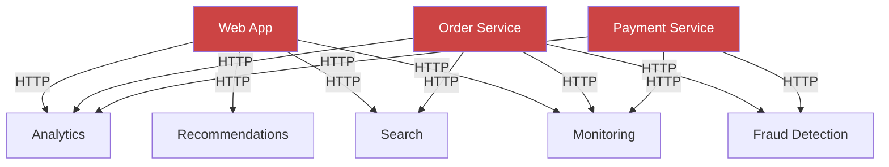
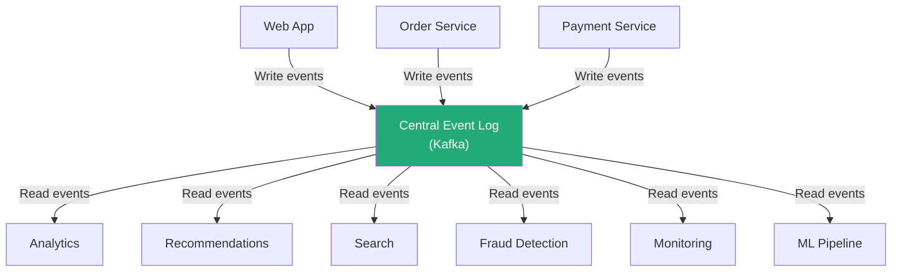
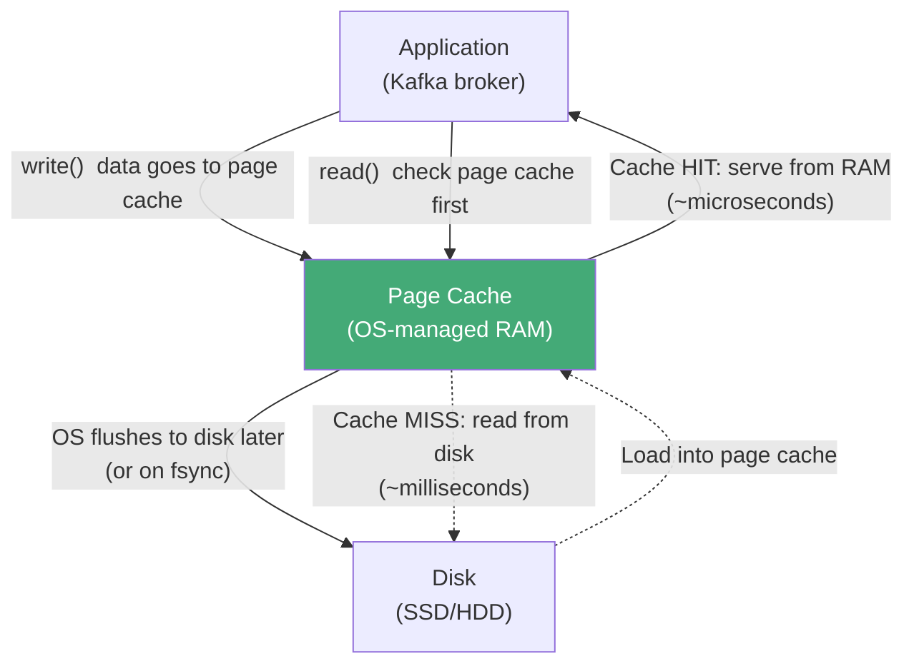
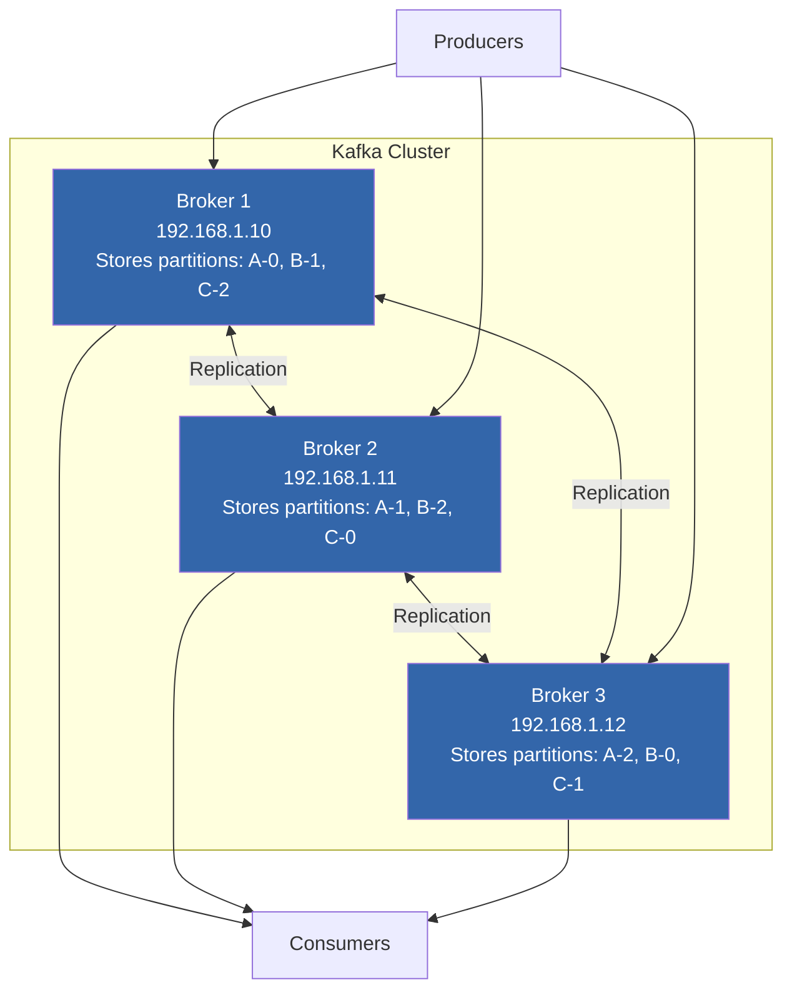
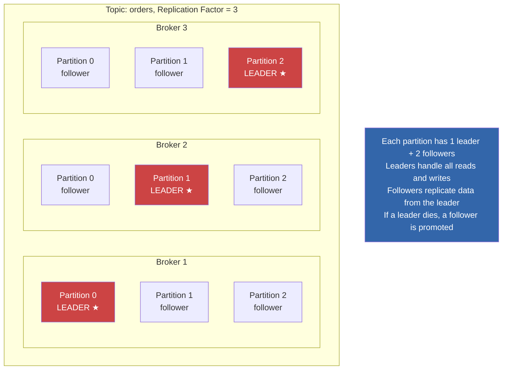

# Apache Kafka Deep Dive  Part 0: The Foundation You Need Before Going Deep

---

**Series:** Apache Kafka Deep Dive  From First Principles to Planet-Scale Event Streaming
**Part:** 0 of 10 (Foundation)
**Audience:** Engineers with 1-3 years of experience preparing for the deep dive, or senior engineers who want to refresh distributed systems fundamentals
**Reading time:** ~45 minutes

---

## Why This Part Exists

Part 1 of this series dives straight into the distributed commit log abstraction, sequential I/O vs. random I/O performance, zero-copy `sendfile()` transfers, page cache delegation, and the CAP theorem tradeoffs in unclean leader election. If you read sentences like "Kafka uses `sendfile()` to transfer data directly from page cache to NIC via scatter-gather DMA" or "ISR shrinkage under `acks=all` triggers `NotEnoughReplicasException`" and feel lost  this part is for you.

This is not a Kafka tutorial. You won't learn how to produce and consume messages here. Instead, this article builds the **systems and distributed computing foundation** that makes the rest of the series make sense. We'll cover:

- What messaging systems are and why they exist
- What "events" and "event-driven architecture" actually mean
- How computers store data on disk and why access patterns matter enormously
- How the operating system helps (and doesn't help) with I/O performance
- What "distributed" really means  clusters, replication, consensus
- How data survives crashes and hardware failure
- What delivery guarantees (at-least-once, exactly-once) actually promise
- The fundamental tradeoffs every distributed system faces
- Where Kafka fits in a real system architecture

Every concept here directly connects to something in Part 1 and beyond. Nothing is filler.

Let's build the foundation.

---

## Series Roadmap: 11 Parts, First Principles to Production

Before diving into the foundation, here's the full arc of this series. Each part builds on the ones before it.

| Part | Title | What You'll Learn |
|------|-------|-------------------|
| **0** | Foundation | Distributed systems, disk I/O, OS concepts, delivery semantics  you're reading it |
| **1** | Why Kafka Exists | The log abstraction, sequential I/O, storage engine, pull vs. push, partitioning |
| **2** | Architecture Internals | Brokers, the controller, KRaft, request handling, thread pools |
| **3** | Replication Deep Dive | ISR, leader election, high watermark, rack-aware replication |
| **4** | Consumer Groups | Coordination protocol, rebalancing, cooperative rebalancing, offset management |
| **5** | Storage Engine | Segments, indexes, log compaction, time/size-based retention |
| **6** | Producers | Batching, idempotence, transactions, exactly-once semantics |
| **7** | Performance Engineering | Throughput tuning, latency profiling, compression benchmarks, sizing |
| **8** | Stream Processing | Kafka Streams, ksqlDB, Flink integration patterns |
| **9** | Production Operations | Monitoring, incident response, capacity planning, upgrades |
| **10** | Advanced Patterns | Event sourcing, CDC, CQRS, multi-datacenter replication |

### The Progression

```mermaid
flowchart LR
    subgraph "Foundation (Parts 0–1)"
        P0["Part 0\nFoundation"]
        P1["Part 1\nWhy Kafka Exists"]
    end

    subgraph "Architecture (Parts 2–3)"
        P2["Part 2\nArchitecture Internals"]
        P3["Part 3\nReplication Deep Dive"]
    end

    subgraph "Core Mechanics (Parts 4–6)"
        P4["Part 4\nConsumer Groups"]
        P5["Part 5\nStorage Engine"]
        P6["Part 6\nProducers"]
    end

    subgraph "Production (Parts 7–10)"
        P7["Part 7\nPerformance"]
        P8["Part 8\nStream Processing"]
        P9["Part 9\nOperations"]
        P10["Part 10\nAdvanced Patterns"]
    end

    P0 --> P1 --> P2 --> P3 --> P4 --> P5 --> P6 --> P7 --> P8 --> P9 --> P10
```



---

## 1. The Problem Kafka Solves (Before You Understand How)

### 1.1 The Spaghetti Integration Problem

Imagine a growing e-commerce company. It has:
- A **web application** generating user activity events (clicks, page views, searches)
- An **order service** processing purchases
- A **payment service** handling transactions
- A **recommendation engine** that needs user behavior data
- An **analytics warehouse** that needs all events for business intelligence
- A **fraud detection system** that needs transaction data in real time
- A **search index** that needs product and order data to stay current
- A **monitoring system** that needs operational metrics from everything

Without a central messaging system, each service talks directly to every other service that needs its data:



This is **point-to-point integration**. With 4 producers and 5 consumers, you need up to 20 individual connections. Each connection requires:
- Agreement on data format between the two services
- Error handling (what happens when the consumer is down?)
- Retry logic
- Monitoring for each connection

When you add a new consumer (say, a machine learning pipeline), you have to modify every producer to send data to it. When you change a data format, you break every consumer. The system becomes a tangle of dependencies  fragile, slow to change, and impossible to debug.

### 1.2 The Solution: Put a Central Log in the Middle

What if every service just wrote its events to one central place, and every other service read from that central place independently?



Now:
- Producers don't know or care who consumes their data
- Consumers don't know or care who produces the data
- Adding a new consumer requires zero changes to producers  just start reading
- Data is written once, read many times
- If a consumer is temporarily down, it catches up when it comes back  no data lost

This is what Kafka does. It's the **central nervous system** that connects all the parts of a modern data architecture. But to understand *how* it does this, you need several foundational concepts.

---

## 2. What Is a "Message" and What Is a "Messaging System"?

### 2.1 Messages: Data in Motion

A **message** (also called an **event**, **record**, or **datum**) is a unit of data sent from one system to another. It can be:
- A JSON object: `{"user_id": 42, "action": "click", "page": "/products/shoes"}`
- A binary blob: serialized Protobuf or Avro data
- A simple string: `"order-12345-completed"`
- Anything, really  Kafka treats message values as opaque bytes

What makes a message different from a database row or an API response is its **intent**: a message represents something that **happened**. It's a fact about the world at a point in time.

### 2.2 Messaging Systems: The Middleman

A **messaging system** (also called a **message broker** or **message queue**) sits between the sender (**producer**) and the receiver (**consumer**). Instead of the producer sending data directly to the consumer, the producer sends it to the broker, and the consumer reads it from the broker.

```
Without broker:    Producer ──────────→ Consumer
                   (tightly coupled: producer must know
                    the consumer's address, handle its failures)

With broker:       Producer ──→ Broker ──→ Consumer
                   (decoupled: producer sends to broker,
                    consumer reads from broker, independently)
```

This **decoupling** is the core value of any messaging system. The producer and consumer don't need to:
- Be running at the same time (the broker stores messages until the consumer is ready)
- Know about each other (the producer sends to a named destination; the consumer reads from it)
- Operate at the same speed (the broker buffers the difference)

### 2.3 Queues vs. Topics vs. Logs

Different messaging systems organize messages differently:

| Concept | How It Works | Example Systems |
|---|---|---|
| **Queue** | Messages go into a queue. One consumer reads each message. Once read and acknowledged, the message is deleted. | RabbitMQ, ActiveMQ, Amazon SQS |
| **Topic (pub/sub)** | Messages are published to a topic. Multiple subscribers each receive a copy. Once delivered, messages are typically deleted. | RabbitMQ (exchanges), Google Pub/Sub |
| **Log** | Messages are appended to an ordered, immutable log. Multiple consumers read independently from any position. Messages are retained by time or size policy, not by consumption. | **Kafka**, Apache Pulsar, Amazon Kinesis |

Kafka uses the **log** model. This distinction  that messages are *retained*, not *deleted after consumption*  is the single most important thing that separates Kafka from traditional message queues. Part 1 explores why this matters deeply.

---

## 3. Events, Event-Driven Architecture, and Why "Events" Matter

Part 1 discusses Kafka as an "event streaming platform." But what is an event, and why is event-driven architecture important?

### 3.1 What Is an Event?

An **event** is a record of something that happened. It is an immutable fact:

- "User 42 logged in at 2025-03-15 14:32:07 UTC"
- "Order 98765 was placed for $149.99"
- "Temperature sensor in warehouse B read 72.4°F"
- "Payment of $49.00 was charged to card ending 4242"

Events are different from **commands** (requests to do something) and **queries** (requests for information):

| Type | Example | Nature |
|---|---|---|
| **Command** | "Place order for user 42" | A request  might succeed or fail |
| **Query** | "What is user 42's address?" | A question  returns current state |
| **Event** | "Order 12345 was placed by user 42" | A fact  already happened, immutable |

### 3.2 Event-Driven Architecture

In a traditional request-response architecture, services call each other directly:

```
User clicks "Buy" → Order Service calls Payment Service
                   → Payment Service calls Inventory Service
                   → Inventory Service calls Shipping Service
                   → Each call blocks waiting for a response
```

In an **event-driven architecture**, services emit events about what they did, and other services react independently:

```
User clicks "Buy" → Order Service emits "OrderPlaced" event to Kafka
                   → Payment Service reads the event, processes payment,
                     emits "PaymentCompleted" event
                   → Inventory Service reads the event, reserves stock,
                     emits "StockReserved" event
                   → Shipping Service reads the event, schedules delivery
                   → All of this happens asynchronously and independently
```

The benefits:
- **Loose coupling:** services don't call each other directly  they just emit and consume events
- **Resilience:** if one service is temporarily down, its events accumulate in Kafka and are processed when it recovers
- **Scalability:** each service can be scaled independently
- **Auditability:** the event log is a complete record of everything that happened

### 3.3 Event Sourcing (Brief Mention)

**Event sourcing** takes this further: instead of storing the *current state* of an entity (e.g., "order status: shipped"), you store the *sequence of events* that produced that state ("OrderPlaced → PaymentCompleted → StockReserved → Shipped"). The current state can be reconstructed by replaying the events.

Kafka's log retention makes it a natural fit for event sourcing  the log *is* the sequence of events. Part 1 discusses this when explaining why the log abstraction is more powerful than the queue abstraction.

---

## 4. How Disks Work: The Foundation of Kafka's Performance Story

Kafka stores all its data on disk  not in memory like Redis. This surprises many engineers who assume "disk = slow." Part 1 explains why Kafka is fast despite storing data on disk, but to understand that explanation, you need to understand how disks actually work.

### 4.1 Hard Disk Drives (HDD): Mechanical Storage

A hard disk is literally a spinning metal platter with a magnetic surface. Data is read and written by a tiny arm that moves across the platter.

To read data from a specific location, the drive must:
1. **Seek:** Move the arm to the correct track (5-10 milliseconds)
2. **Rotate:** Wait for the platter to spin to the correct sector (2-6 milliseconds for 7200 RPM)
3. **Transfer:** Read the data (fast once positioned  100-200 MB/s)

The seek and rotation are the expensive parts. If you need to read data from many scattered locations (random I/O), you pay the seek + rotation penalty every time. But if you read data that's stored contiguously  one piece right after another  you only pay the seek/rotation cost once, and then the data streams off the platter at full speed (sequential I/O).

```
Random I/O on HDD:
  Seek(5ms) + Read + Seek(5ms) + Read + Seek(5ms) + Read
  → ~100-200 reads per second (100-200 IOPS)

Sequential I/O on HDD:
  Seek(5ms) + Read + Read + Read + Read + Read + Read...
  → 100-200 MB per second (continuous stream)
```

The difference is staggering: **sequential I/O on HDD is 100-200x faster than random I/O.**

### 4.2 Solid State Drives (SSD/NVMe): Electronic Storage

SSDs have no moving parts. Data is stored in electronic flash memory chips. Random reads are dramatically faster than HDDs  microseconds instead of milliseconds.

But even on SSDs, sequential I/O is significantly faster than random I/O:

| Access Pattern | HDD | SSD (NVMe) |
|---|---|---|
| **Sequential read/write** | 100-200 MB/s | 2,000-7,000 MB/s |
| **Random read/write** | 0.5-1 MB/s | 200-800 MB/s |
| **Sequential advantage** | ~200x | ~5-10x |

SSDs narrow the gap, but sequential is *still* 5-10x faster than random. This is because SSDs have internal parallelism optimizations (read-ahead, command queuing, page-level access patterns) that favor sequential access.

### 4.3 Why This Matters for Kafka

Kafka is designed so that **all disk I/O is sequential**:
- Writing messages: always **appended** to the end of a file (sequential write)
- Reading messages: consumers read **forward** through the file (sequential read)
- Kafka never updates data in the middle of a file
- Kafka never reads randomly scattered data in normal operation

This is why Kafka can achieve disk throughput that rivals or exceeds what many in-memory systems achieve for random access. Part 1 quantifies this in detail.

---

## 5. The Operating System's Role: Page Cache, Syscalls, and Zero-Copy

Part 1 frequently references the OS page cache, `sendfile()`, and kernel/user space. These concepts are critical to understanding Kafka's performance.

### 5.1 Kernel Space vs. User Space

The operating system divides memory into two regions:

- **Kernel space:** where the OS kernel runs  manages hardware, filesystems, network, memory
- **User space:** where your applications run  including the Kafka broker (a Java process)

Applications can't directly access hardware (disks, network cards). Instead, they make **system calls (syscalls)**  requests to the kernel to perform hardware operations on their behalf.

```
Your application (user space):     "I want to read file X"
        │
        ▼  syscall: read()
OS kernel (kernel space):          Reads from disk into kernel buffer
        │
        ▼  copy data
Your application:                  Receives data in application buffer
```

Each syscall involves a **context switch**  the CPU switches from running your application code to running kernel code, then back. This costs 1-10 microseconds. When you're processing millions of messages per second, the overhead of unnecessary syscalls and data copies adds up.

### 5.2 Page Cache: The OS-Level Disk Cache

When the OS reads data from disk, it doesn't just hand it to your application and forget about it. It keeps a copy in RAM, in an area called the **page cache**. If the same data is requested again, the OS serves it from RAM  no disk access needed.

Similarly, when your application writes data, it goes into the page cache first (in RAM), and the OS flushes it to disk later in the background.



Key insight for Kafka: **Kafka deliberately does NOT manage its own cache.** Instead, it relies entirely on the OS page cache. This has surprising benefits:

1. **No double-caching:** Some databases (like PostgreSQL) maintain their own buffer pool *and* the OS maintains the page cache  the same data exists in both places, wasting memory. Kafka avoids this.

2. **The cache survives restarts:** If the Kafka process crashes and restarts, the page cache (managed by the OS) is still warm. An application-level cache would be empty.

3. **No garbage collection pressure:** Kafka runs on the JVM (Java Virtual Machine). Data in the JVM heap is subject to garbage collection  periodic pauses where the JVM reclaims unused memory. Data in the page cache is outside the JVM heap, so it causes zero GC pressure.

### 5.3 What Is the JVM and Why Does Garbage Collection Matter?

Kafka is written in Java and Scala, which run on the **Java Virtual Machine (JVM)**. The JVM manages memory automatically through **garbage collection (GC)**  periodically identifying and freeing memory that's no longer used.

GC is convenient for developers (no manual memory management) but introduces **GC pauses**: brief periods where the application freezes while the GC runs. These pauses can range from milliseconds to seconds, depending on heap size and GC algorithm.

For a system like Kafka that processes millions of messages per second, large GC pauses are catastrophic  they can cause:
- Consumers timing out and triggering rebalances
- Producers receiving timeout errors
- Replicas falling out of sync

This is why Kafka delegates caching to the OS page cache (outside the JVM) and keeps its JVM heap relatively small (typically 4-8 GB even on servers with 64+ GB of RAM). Part 1 discusses this tradeoff in detail.

### 5.4 Zero-Copy: Eliminating Unnecessary Data Movement

When a consumer requests data from a Kafka broker, the data needs to travel from disk to the consumer's network connection. The naive path:

```
Step 1: Disk → Page cache (kernel)          [DMA copy]
Step 2: Page cache → Application buffer     [CPU copy  read() syscall]
Step 3: Application buffer → Socket buffer  [CPU copy  write() syscall]
Step 4: Socket buffer → Network card (NIC)  [DMA copy]
```

Steps 2 and 3 are wasteful  the data passes through the application just to be copied right back to the kernel. **Zero-copy** transfer eliminates this:

```
Step 1: Disk → Page cache (kernel)          [DMA copy]
Step 2: Page cache → Network card (NIC)     [DMA copy]
```

The data goes directly from the page cache to the network without ever entering the application's memory. Linux provides this through the `sendfile()` system call. Kafka uses it heavily.

**DMA** (Direct Memory Access) means the hardware (disk controller, network card) reads/writes memory directly without involving the CPU. This frees the CPU to do other work.

Part 1 explains zero-copy's impact on Kafka's throughput with concrete numbers.

---

## 6. What "Distributed" Actually Means

Part 1 discusses Kafka as a "distributed commit log." But what does "distributed" mean in practice?

### 6.1 One Machine Is Not Enough

A single server has limits:
- **Disk space:** maybe 2-16 TB per server
- **Network bandwidth:** 10-25 Gbps
- **CPU and memory:** finite
- **Availability:** if the server dies, the system goes down

When your data volume or throughput requirements exceed what one server can handle, you need multiple servers working together. This is a **distributed system**.

### 6.2 Cluster: A Group of Machines Working Together

A Kafka **cluster** is a group of servers (**brokers**) that collectively store and serve data. A cluster might have 3 brokers for a small deployment or 1,000+ for a large one.



Data is distributed across brokers so that:
- No single broker stores all the data (horizontal scaling)
- Each broker handles a fraction of the total traffic
- The system continues working even if some brokers fail

### 6.3 Partitioning: Splitting Data Across Machines

When a dataset is too large for one machine, you **partition** it  split it into pieces, each stored on a different machine.

Think of it like a library with multiple branches. Instead of one massive library holding every book, you distribute books across branches. Branch A holds books with authors A-H, Branch B holds I-P, Branch C holds Q-Z. Each branch handles its own visitors independently.

In Kafka, a **topic** (a named stream of messages, like "user-events" or "orders") is divided into **partitions**. Each partition is an independent, ordered sequence of messages stored on one broker.

```
Topic: "orders" with 3 partitions

Partition 0 (on Broker 1):  [msg0, msg3, msg6, msg9, ...]
Partition 1 (on Broker 2):  [msg1, msg4, msg7, msg10, ...]
Partition 2 (on Broker 3):  [msg2, msg5, msg8, msg11, ...]
```

Partitioning enables **parallelism**: three brokers can each handle writes and reads for their partition simultaneously, tripling total throughput compared to a single machine.

Part 1 discusses how the partition key (a field in each message) determines which partition a message lands in, and why this choice profoundly affects ordering guarantees.

### 6.4 Replication: Surviving Hardware Failure

Partitioning alone doesn't protect against failure. If Broker 1 dies and Partition 0 only exists on Broker 1, that data is gone.

**Replication** solves this by storing copies of each partition on multiple brokers:



With **replication factor 3**, each partition exists on 3 brokers:
- One **leader** handles all reads and writes for that partition
- Two **followers** continuously copy data from the leader
- If the leader broker dies, one of the followers is automatically promoted to leader

This means the system survives any single broker failure without losing data.

### 6.5 Leader and Follower: Who Does the Work?

In Kafka's replication model:
- **All client requests (produce and consume) go to the partition leader.** The leader is the source of truth.
- **Followers passively replicate**  they fetch data from the leader, just like a consumer would. They don't serve client requests directly (in the default configuration).
- **Leader election** happens when a leader fails. Kafka's controller selects a new leader from the followers that are sufficiently caught up.

Part 1 discusses the "In-Sync Replica (ISR)" set  the group of followers that are caught up enough to be eligible for leader election  and why the ISR is one of the most important concepts in Kafka operations.

---

## 7. How Data Survives Crashes: Durability and Persistence

### 7.1 The Durability Problem

When a producer sends a message to Kafka, the producer wants to know: **is this message safe?** "Safe" means the message will survive:
- The Kafka process crashing and restarting
- The server losing power
- A disk failing

### 7.2 Writing to Disk vs. Writing to Memory

When the Kafka broker receives a message and calls `write()`, the data goes into the OS **page cache** (RAM), not directly to disk. The OS flushes page cache to disk in the background.

If the Kafka process crashes, the OS page cache is still intact  the data is safe. But if the **server loses power**, the page cache (which is in RAM) is wiped, and any un-flushed data is lost.

### 7.3 fsync: Forcing Data to Disk

The `fsync()` system call forces the OS to flush a file's data from page cache to physical disk. After `fsync()` returns, the data is durable  it survives a power loss.

But `fsync()` is slow  it blocks until the disk confirms the write. On HDDs, this can take 5-10 milliseconds. Calling `fsync()` after every message would limit Kafka to 100-200 messages per second on HDDs  unacceptable.

### 7.4 Kafka's Approach: Replication Instead of fsync

Kafka takes a different approach to durability: **rather than waiting for disk flushes, it replicates data to multiple brokers.**

```
Producer sends message
  → Broker 1 (leader) writes to page cache → acknowledges
  → Broker 2 (follower) replicates → writes to page cache
  → Broker 3 (follower) replicates → writes to page cache
```

Now the message exists in the page cache of 3 independent servers. The probability of all 3 servers losing power simultaneously is extremely low. Eventually, the OS on each server flushes the page cache to disk, and the data is durable on disk across 3 machines.

This is faster than `fsync()` because network replication (copying data between servers) typically completes in 1-5 milliseconds, and the broker doesn't wait for disk flushes.

### 7.5 Acknowledgment Levels

The producer can choose how much durability confirmation it wants:

| Setting | What Happens | Durability | Speed |
|---|---|---|---|
| `acks=0` | Producer doesn't wait for any confirmation | Lowest  data could be lost | Fastest |
| `acks=1` | Producer waits for the leader to write to its page cache | Medium  lost if leader crashes before replication | Fast |
| `acks=all` | Producer waits for the leader AND all in-sync followers to write | Highest  survives any single broker failure | Slower |

Part 1 discusses these tradeoffs in depth, along with the `min.insync.replicas` setting that controls how many replicas must confirm.

---

## 8. Delivery Semantics: At-Most-Once, At-Least-Once, Exactly-Once

Part 1 discusses Kafka's delivery guarantees. These are fundamental concepts for any messaging system.

### 8.1 The Problem: Failures Cause Ambiguity

Consider: a producer sends a message to Kafka. The broker writes it. The broker sends an acknowledgment. But the acknowledgment gets lost in the network. The producer didn't receive an ACK  did the message make it or not?

The producer can either:
1. **Give up**  risk losing the message (it was written, but the producer doesn't know)
2. **Retry**  risk duplicating the message (it was already written, and now it's written again)

This is the fundamental tension in distributed messaging.

### 8.2 Three Delivery Semantics

**At-most-once:** Each message is delivered zero or one times. No duplicates, but messages can be lost. If the producer doesn't retry on failure, some messages may never arrive.

```
Producer: Send message → No ACK received → Don't retry → Message may be lost
Result: Message delivered 0 or 1 times
```

**At-least-once:** Each message is delivered one or more times. No message loss, but duplicates are possible. If the producer retries on failure, the message might be written twice.

```
Producer: Send message → No ACK received → Retry → Message may be written twice
Result: Message delivered 1 or more times
```

**Exactly-once:** Each message is delivered exactly one time. No loss, no duplicates. This is the hardest to achieve and requires special mechanisms.

```
Producer: Send message → No ACK received → Retry with deduplication ID
Broker: "I already have a message with this ID, ignoring the duplicate"
Result: Message delivered exactly 1 time
```

### 8.3 How Kafka Achieves Exactly-Once (Preview)

Kafka achieves exactly-once semantics through two mechanisms:
1. **Idempotent producers:** Each producer has a unique ID and each message has a sequence number. The broker detects and ignores duplicate messages based on these identifiers.
2. **Transactions:** Multiple writes across multiple partitions can be committed atomically  all succeed or all fail.

Part 1 explains what exactly-once actually guarantees and where it breaks down (specifically: when your consumer writes to an external system like a database, Kafka's exactly-once doesn't extend to that external system unless the external write is also idempotent).

### 8.4 What Is Idempotency?

An operation is **idempotent** if performing it multiple times has the same effect as performing it once.

| Operation | Idempotent? | Why? |
|---|---|---|
| `SET user:42 name "Alice"` | Yes | Setting to "Alice" twice has the same result |
| `INSERT INTO users (id, name) VALUES (42, 'Alice')` | It depends | Fails on second attempt if id is unique; succeeds if using UPSERT |
| `account.balance += 100` | No | Doing it twice adds $200 instead of $100 |
| `account.balance = 500` | Yes | Setting to 500 twice has the same result |

In messaging systems, idempotency matters because retries happen. If your message processing is idempotent, duplicate messages are harmless. If it's not idempotent, you need exactly-once delivery or application-level deduplication.

---

## 9. The CAP Theorem: The Tradeoff Every Distributed System Faces

Part 1 references the CAP theorem when discussing Kafka's unclean leader election tradeoff. Here's what you need to know.

### 9.1 The Three Properties

The **CAP theorem** states that a distributed system can provide at most two of three guarantees simultaneously:

- **Consistency (C):** Every read receives the most recent write. All nodes see the same data at the same time.
- **Availability (A):** Every request receives a response (not an error). The system is always operational.
- **Partition tolerance (P):** The system continues operating despite network failures between nodes.

### 9.2 Why You Must Choose

In a real distributed system, network partitions (communication failures between servers) **will happen**  cables get cut, switches fail, cloud availability zones have connectivity issues. So partition tolerance is not optional  you must have P.

This means the real choice is between:
- **CP (Consistency + Partition tolerance):** During a network partition, the system may become unavailable (refuse requests) to maintain consistency.
- **AP (Availability + Partition tolerance):** During a network partition, the system stays available but may return stale or inconsistent data.

### 9.3 Kafka and CAP

Kafka's behavior depends on configuration:

**Default configuration (CP-leaning):** If a partition leader fails and no in-sync followers are available, Kafka makes the partition **unavailable** rather than electing an out-of-sync follower (which could lose data). This prioritizes consistency over availability.

**With `unclean.leader.election.enable=true` (AP-leaning):** Kafka allows an out-of-sync follower to become leader, which means the partition stays **available** but may **lose some messages** that only existed on the failed leader.

Part 1 discusses this tradeoff in the "Unclean Leader Election Dilemma" section. Understanding CAP helps you reason about why Kafka's default is correct for most use cases and when you might intentionally choose availability over consistency.

---

## 10. Throughput, Latency, and How to Reason About Performance

Part 1 is full of performance reasoning  "2 million messages per second," "end-to-end latency under 10ms," "100-200x faster." Here's how to think about these numbers.

### 10.1 Throughput: How Much Work Per Second

**Throughput** is the rate of work completed. In Kafka's context:
- **Messages per second (msgs/sec):** how many messages the system can produce or consume per second
- **Bytes per second (MB/s or GB/s):** how much data volume per second

These are related but different. If your average message is 1 KB:
- 1,000,000 msgs/sec = 1 GB/s
- 100,000 msgs/sec = 100 MB/s

If your average message is 100 bytes:
- 1,000,000 msgs/sec = only 100 MB/s

Throughput is limited by the **bottleneck**  the slowest component in the pipeline:
- Disk write speed
- Network bandwidth
- CPU (for compression, serialization, checksums)
- The application's processing speed

### 10.2 Latency: How Long One Operation Takes

**Latency** is the time from sending a message to it being available for consumption. In Kafka:

```
End-to-end latency =
    Producer batching delay (linger.ms)
  + Network to broker
  + Broker writes to log
  + Replication to followers (if acks=all)
  + Network to consumer
  + Consumer fetch interval
```

Typical values:
- **Producer-to-broker:** 1-5 ms (including replication with `acks=all`)
- **End-to-end (produce to consume):** 5-50 ms for real-time consumers
- **End-to-end with batching:** 100-500 ms (if `linger.ms` is configured for throughput)

### 10.3 The Throughput-Latency Tradeoff

This is a fundamental tension in systems design: you can optimize for throughput or latency, but improving one typically degrades the other.

**Batching** is the classic example:
- Send each message individually: **low latency** (sent immediately) but **low throughput** (one network round-trip per message, high overhead)
- Batch 1,000 messages together: **high throughput** (amortized overhead) but **higher latency** (the first message in the batch waits for the batch to fill)

Kafka's `linger.ms` configuration controls this tradeoff directly:
- `linger.ms=0`: send immediately, lowest latency, lower throughput
- `linger.ms=100`: wait up to 100ms to fill a batch, higher latency, much higher throughput

Part 1 analyzes this tradeoff with concrete numbers.

### 10.4 Units of Time and Data

| Unit | Abbreviation | Size |
|---|---|---|
| Nanosecond | ns | 0.000000001 seconds |
| Microsecond | µs | 0.000001 seconds |
| Millisecond | ms | 0.001 seconds |
| Second | s | 1 second |

| Unit | Abbreviation | Size |
|---|---|---|
| Kilobyte | KB | 1,000 bytes |
| Megabyte | MB | 1,000,000 bytes |
| Gigabyte | GB | 1,000,000,000 bytes |
| Terabyte | TB | 1,000,000,000,000 bytes |

Network speeds are measured in **bits** per second (Gbps = gigabits per second). Disk and memory speeds are measured in **bytes** per second (GB/s = gigabytes per second). The conversion: **1 byte = 8 bits.** So 10 Gbps ≈ 1.25 GB/s.

---

## 11. Hashing, Modulo, and How Messages Find Their Partition

Part 1 discusses how messages are routed to partitions using hash functions. Here's the foundation.

### 11.1 What Is a Hash Function?

A **hash function** takes an input of any size and produces a fixed-size output (a number). The same input always produces the same output. Different inputs (usually) produce different outputs.

```
hash("user_42")  → 2,847,391,042
hash("user_17")  → 1,293,847,556
hash("user_42")  → 2,847,391,042    ← same input, same output
```

### 11.2 Modulo: Mapping a Hash to a Partition

To map a hash value to one of N partitions, Kafka uses the **modulo** operation (the remainder after division):

```
partition = hash(key) % number_of_partitions

hash("user_42") = 2,847,391,042
2,847,391,042 % 6 = 2
→ Message goes to Partition 2

hash("user_17") = 1,293,847,556
1,293,847,556 % 6 = 4
→ Message goes to Partition 4
```

This guarantees that **all messages with the same key always go to the same partition**, which is how Kafka maintains per-key ordering. Every "user_42" event will land in Partition 2, so they'll be processed in order.

### 11.3 Why This Matters

Part 1 discusses:
- **Partition keys** determine ordering guarantees. Now you understand *how*  through hashing.
- **Partition skew** happens when some keys are much more common than others. If "user_42" generates 80% of all events, Partition 2 gets 80% of the load while other partitions sit idle.
- **Adding partitions breaks key mapping.** If you change from 6 to 8 partitions, `hash("user_42") % 8` might produce a different partition number than `hash("user_42") % 6`. Events for the same user could end up in different partitions, breaking ordering.

---

## 12. Compression: Trading CPU for Disk and Network

Part 1 discusses compression codecs (GZIP, Snappy, LZ4, Zstandard) and their impact on throughput. Here's what compression is and why it matters.

### 12.1 What Is Compression?

**Compression** reduces the size of data by finding and eliminating redundancy. For example, the string `"AAAAAABBBBCC"` (12 bytes) can be compressed to `"6A4B2C"` (6 bytes)  same information, half the size.

Real compression algorithms (LZ4, Zstandard, GZIP) are more sophisticated, but the principle is the same: find patterns and represent them more compactly.

### 12.2 Why Kafka Compresses at the Batch Level

Kafka compresses entire batches of messages together, not individual messages. This is important because:

1. **Redundancy across messages.** If you're sending JSON events with the same schema, the field names (`"user_id"`, `"timestamp"`, `"action"`) repeat in every message. Batch-level compression catches this cross-message redundancy.

2. **Better compression ratios.** Larger inputs give compression algorithms more data to find patterns in. A batch of 1,000 similar messages compresses much better than 1,000 individually compressed messages.

3. **Amortized overhead.** Compression has fixed overhead per operation (setting up internal state, writing headers). Compressing once per batch amortizes this overhead across many messages.

### 12.3 The CPU-Bandwidth Tradeoff

Compression costs CPU time. Decompression also costs CPU time (though usually less). The benefit is reduced data size, which means:
- Less disk I/O (faster writes, more data fits on disk)
- Less network I/O (faster replication between brokers, faster consumer fetches)
- More effective page cache (more logical data fits in the same RAM)

This tradeoff is usually worth it  modern CPUs can compress data faster than networks and disks can transfer it. But Part 1 notes that for very high-throughput workloads, CPU can become the bottleneck with heavy compression (GZIP), which is why lighter codecs (LZ4, Zstandard) are preferred.

---

## 13. Checksums: Detecting Corrupt Data

Part 1 mentions CRC32 checksums in the record batch format. Here's what they do.

A **checksum** is a small value computed from a block of data. When data is written, the checksum is calculated and stored alongside it. When data is read, the checksum is recalculated and compared to the stored value. If they don't match, the data was corrupted (by a disk error, network glitch, or software bug).

```
Write:
  Data: "Hello World" → CRC32: 0x4A17B156
  Store: "Hello World" + 0x4A17B156

Read:
  Read: "Hello World" + 0x4A17B156
  Recalculate: CRC32("Hello World") → 0x4A17B156
  Compare: 0x4A17B156 == 0x4A17B156 ✓ (data intact)

Corrupt read:
  Read: "Hello Worle" + 0x4A17B156  ← bit flip!
  Recalculate: CRC32("Hello Worle") → 0x7B2E3A91
  Compare: 0x7B2E3A91 ≠ 0x4A17B156 ✗ (CORRUPTION DETECTED)
```

Kafka computes a CRC32 checksum for each record batch. This ensures that data corruption  whether from disk, network, or memory errors  is detected before it reaches consumers. Silent data corruption is one of the most insidious failure modes in distributed systems.

---

## 14. Binary Protocols and Serialization

Part 1 discusses Kafka's binary protocol, varints, and wire format. Here's the background.

### 14.1 Text vs. Binary Protocols

When two programs communicate over a network, they need an agreed-upon format for data. Two approaches:

**Text protocols** use human-readable strings:
```
HTTP/1.1 GET /users/42
Content-Type: application/json

{"name": "Alice", "age": 30}
```

**Binary protocols** use compact byte sequences:
```
[0x00][0x03][0x47][0x45][0x54]...  (not human-readable)
```

Binary protocols are more efficient: a 32-bit integer takes 4 bytes in binary but 1-10 bytes in text (the string "2147483647" is 10 bytes). For a system processing millions of messages per second, this overhead matters.

Kafka uses a custom **binary protocol** for communication between clients and brokers. Every request and response is a precise sequence of bytes with no wasted space.

### 14.2 Serialization: Turning Objects into Bytes

**Serialization** is the process of converting an in-memory data structure (a Java object, a Python dictionary, a Go struct) into a sequence of bytes that can be stored on disk or sent over the network. **Deserialization** is the reverse.

Common serialization formats:
| Format | Type | Human-Readable? | Size | Speed |
|---|---|---|---|---|
| JSON | Text | Yes | Large | Moderate |
| XML | Text | Yes | Very large | Slow |
| Protocol Buffers (Protobuf) | Binary | No | Small | Fast |
| Apache Avro | Binary | No | Small | Fast |
| MessagePack | Binary | No | Small | Fast |

Kafka doesn't care what serialization format you use for message values  it treats them as opaque bytes. But the choice affects performance:
- JSON: easy to debug (you can read it), but large and slow to parse
- Protobuf/Avro: compact and fast, but requires schema management

### 14.3 Varints: Variable-Length Integers

Part 1 mentions "varints" in the record batch format. A **varint** (variable-length integer) encodes small numbers in fewer bytes and large numbers in more bytes:

| Value | Fixed int32 (4 bytes always) | Varint (1-5 bytes) |
|---|---|---|
| 1 | `00 00 00 01` | `01` |
| 127 | `00 00 00 7F` | `7F` |
| 300 | `00 00 01 2C` | `AC 02` |
| 1,000,000 | `00 0F 42 40` | `C0 84 3D` |

Since most offset deltas and timestamp deltas in Kafka record batches are small numbers, varints save significant space. Part 1 quantifies this: ~700 bytes saved per 100-record batch just from using varints for deltas instead of fixed-width integers.

---

## 15. Putting It All Together: The Kafka Data Flow

Now you have all the building blocks. Let's trace the journey of a single message through the entire system:

```mermaid
flowchart TD
    APP["1. Your application creates an event<br/>{user_id: 42, action: 'purchase', amount: 99.99}"]

    SER["2. Serialization<br/>Convert to bytes (JSON, Avro, Protobuf)<br/>Choose partition key: 'user_42'"]

    HASH["3. Partitioning<br/>hash('user_42') % 6 = Partition 2<br/>Message added to producer batch for Partition 2"]

    BATCH["4. Batching<br/>Wait for batch to fill (batch.size) or<br/>time to expire (linger.ms)<br/>Compress entire batch with LZ4"]

    SEND["5. Network send<br/>Send ProduceRequest to Broker 1<br/>(leader of Partition 2)"]

    WRITE["6. Broker writes<br/>Append batch to segment file (sequential I/O)<br/>Data goes to page cache<br/>Compute CRC32 checksum"]

    REPL["7. Replication<br/>Followers on Broker 2 and 3 fetch the batch<br/>Write to their own segment files"]

    ACK["8. Acknowledgment<br/>acks=all: wait for all replicas<br/>Send ProduceResponse to producer<br/>'Message written successfully at offset 847291'"]

    FETCH["9. Consumer fetch<br/>Consumer sends FetchRequest for Partition 2<br/>from offset 847291"]

    ZERO["10. Zero-copy transfer<br/>Broker uses sendfile() to send data<br/>directly from page cache to consumer's socket"]

    CONSUME["11. Consumer processes<br/>Deserialize bytes back to event object<br/>Process the purchase event<br/>Commit offset 847292"]

    APP --> SER --> HASH --> BATCH --> SEND --> WRITE --> REPL --> ACK
    ACK -.->|"Consumer side"| FETCH --> ZERO --> CONSUME

    style WRITE fill:#2a7,color:#fff
    style ZERO fill:#4a7,color:#fff
    style BATCH fill:#36a,color:#fff
```



Every step maps to a concept from this article:
- **Step 1:** Events (Section 3)
- **Step 2:** Serialization (Section 14)
- **Step 3:** Hashing and partitioning (Section 11)
- **Step 4:** Batching and compression (Sections 10, 12)
- **Step 5:** Binary protocol over TCP
- **Step 6:** Sequential disk I/O, page cache (Sections 4, 5)
- **Step 7:** Replication (Section 6)
- **Step 8:** Delivery guarantees, acknowledgments (Sections 7, 8)
- **Step 9-10:** Zero-copy transfer (Section 5)
- **Step 11:** Deserialization, consumer offsets

---

## 16. Vocabulary Cheat Sheet

Here's a quick-reference for terms you'll encounter throughout the series:

| Term | Meaning | First Introduced |
|---|---|---|
| **Broker** | A Kafka server that stores data and serves client requests | Section 6.2 |
| **Cluster** | A group of brokers working together | Section 6.2 |
| **Topic** | A named stream of messages (like "orders" or "user-events") | Section 6.3 |
| **Partition** | A subdivision of a topic; an independent, ordered log | Section 6.3 |
| **Offset** | A sequential ID for each message within a partition (0, 1, 2, 3, ...) | Section 6.3 |
| **Producer** | An application that writes messages to Kafka | Section 2.2 |
| **Consumer** | An application that reads messages from Kafka | Section 2.2 |
| **Consumer Group** | A set of consumers that cooperatively read from a topic, each handling a subset of partitions | Section 6.3 |
| **Leader** | The broker responsible for handling reads/writes for a partition | Section 6.4 |
| **Follower** | A broker that replicates a partition from the leader | Section 6.4 |
| **ISR (In-Sync Replicas)** | The set of replicas that are caught up with the leader | Section 6.5 |
| **Replication Factor** | How many copies of each partition exist across the cluster | Section 6.4 |
| **Rebalance** | The process of redistributing partitions among consumers when group membership changes | Section 6.2 |
| **Lag** | How far behind a consumer is from the latest message (measured in offsets or time) | Section 10.1 |
| **Segment** | A file containing a contiguous range of messages for a partition | Section 14.1 |
| **Page Cache** | OS-managed RAM cache for file data; Kafka reads and writes pass through it | Section 5.2 |
| **Zero-Copy** | Transferring data from disk to network without passing through application memory | Section 5.4 |
| **fsync** | System call that forces data from page cache to physical disk | Section 7.3 |
| **Syscall** | A function call from user space into the OS kernel | Section 5.1 |
| **Sequential I/O** | Reading/writing data in order; dramatically faster than random I/O | Section 4.1 |
| **DMA** | Direct Memory Access  hardware transfers data without CPU involvement | Section 5.4 |
| **JVM** | Java Virtual Machine  the runtime environment Kafka runs on | Section 5.3 |
| **GC (Garbage Collection)** | JVM's automatic memory reclamation; can cause pauses | Section 5.3 |
| **Serialization** | Converting data structures to bytes for storage or transmission | Section 14.2 |
| **Compression** | Reducing data size by eliminating redundancy | Section 12.1 |
| **Checksum (CRC32)** | A value computed from data to detect corruption | Section 13 |
| **Varint** | Variable-length integer encoding; small numbers use fewer bytes | Section 14.3 |
| **Idempotent** | An operation that produces the same result whether performed once or multiple times | Section 8.4 |
| **ACK (Acknowledgment)** | Confirmation that a message was received and stored | Section 7.5 |
| **At-least-once** | Delivery guarantee: no messages lost, but duplicates possible | Section 8.2 |
| **Exactly-once** | Delivery guarantee: no messages lost, no duplicates (requires special configuration) | Section 8.3 |
| **CAP Theorem** | A distributed system can guarantee at most two of: Consistency, Availability, Partition tolerance | Section 9.1 |
| **Backpressure** | When a downstream system can't keep up with the upstream data rate | Section 10.1 |
| **Throughput** | Rate of work completed (messages/sec, MB/s) | Section 10.1 |
| **Latency** | Time for one operation to complete (typically measured in milliseconds) | Section 10.2 |
| **Partition Key** | A value used to determine which partition a message goes to | Section 11.2 |

---

## Key Takeaways

1. **Kafka is a central event log** that decouples producers from consumers. Producers write once; any number of consumers read independently. This solves the spaghetti integration problem.

2. **Events are immutable facts** about things that happened. Event-driven architecture builds systems around these facts, enabling loose coupling and resilience.

3. **Sequential disk I/O is fast**  100-200x faster than random I/O on HDDs, 5-10x on SSDs. Kafka exploits this by only ever appending to files.

4. **The OS page cache is Kafka's secret weapon.** By delegating caching to the OS, Kafka avoids JVM garbage collection, survives process restarts with warm caches, and eliminates double-buffering.

5. **Replication is how Kafka achieves durability** without expensive `fsync` calls. Data is copied to multiple brokers before the producer is acknowledged.

6. **Partitioning enables parallelism** but limits ordering to within a partition. The partition key determines which messages are ordered relative to each other.

7. **Delivery semantics (at-least-once, exactly-once) have real engineering costs.** Exactly-once requires idempotent producers, transactions, and careful consumer design.

8. **The CAP theorem forces real tradeoffs.** Kafka's defaults favor consistency over availability, but this is configurable.

---

## What Comes Next: Part 1

You now have the foundation to understand Part 1's deep dive. Here's exactly what Part 1 covers and how it connects to what you just learned:

### Part 1: Why Kafka Exists  The Distributed Log as a Systems Primitive

**The log abstraction**  Part 1 opens by explaining why LinkedIn built Kafka in 2010: the gap between log aggregation tools (high throughput, no durability) and enterprise message brokers (durability, but no scale or replay). It shows how a simple append-only log solves all of these problems at once.

**Sequential I/O quantified**  You learned the mechanics of why sequential I/O is fast. Part 1 puts concrete numbers on it: sequential HDD writes at 100-200 MB/s vs. random at 0.5-1 MB/s; NVMe sequential at 2-7 GB/s. It then shows how a well-tuned 6-broker cluster achieves 2-5 million messages per second of sustained write throughput.

**Page cache and zero-copy in practice**  You learned how the OS page cache works and what `sendfile()` does. Part 1 shows Kafka's complete I/O path: data written once to page cache, served directly to consumers via `sendfile()`, with zero CPU copies and zero double-buffering.

**Pull vs. push**  Part 1 makes the case for why Kafka consumers pull rather than being pushed to: consumer-controlled pacing, natural backpressure, simpler broker state, and replay as a trivial operation.

**Partitioning in practice**  You learned what partition keys and modulo hashing do. Part 1 shows the real design decisions: how to choose a partition key, how to size a topic's partition count, and the consequences of skewed keys.

**Consumer group coordination**  Part 1 introduces the rebalancing problem: why all consumers stop during an eager rebalance, and why `CooperativeStickyAssignor` should always be used in production.

**Durability and the ISR**  You learned about `acks=all` and replication. Part 1 adds the ISR (in-sync replica) set: which replicas qualify for leader election, how `min.insync.replicas` controls the availability/durability tradeoff, and the unclean leader election dilemma in full.

> **Go read [Part 1: Why Kafka Exists  The Distributed Log as a Systems Primitive](kafka-deep-dive-part-1.md).** Everything in this article was written to make Part 1 make sense.

---

*This is Part 0 (Foundation) of a 10-part series. It exists to ensure that the deep technical content in Parts 1-10 is accessible to engineers who are ready to go deep but need the systems and distributed computing fundamentals first. If you already know everything in this article, skip straight to Part 1.*
