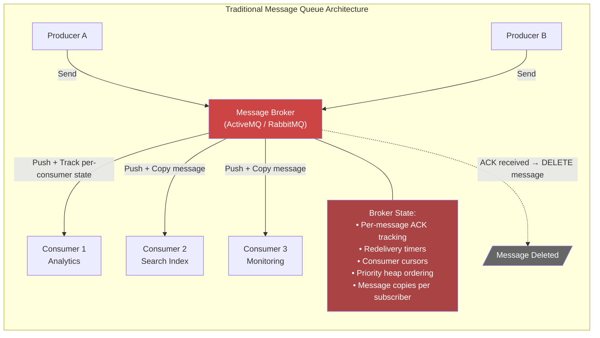
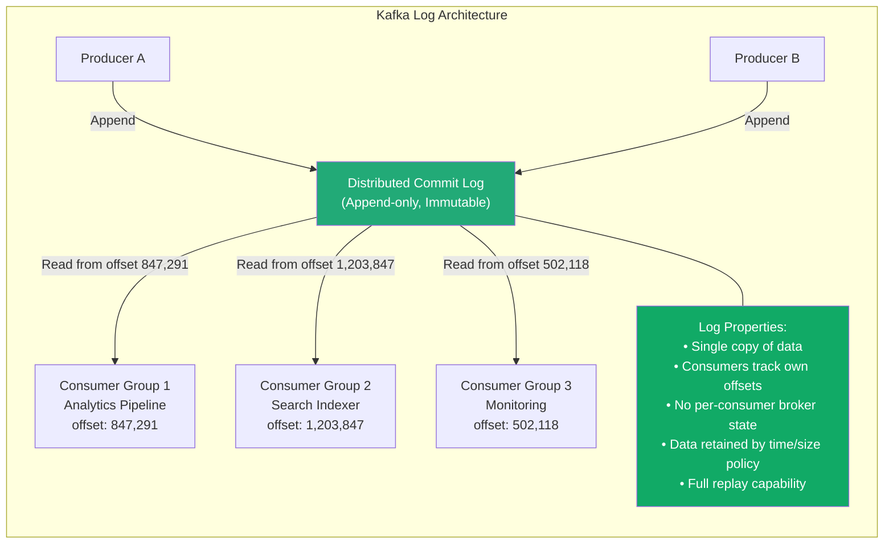
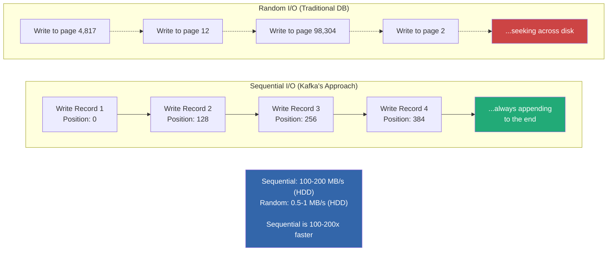
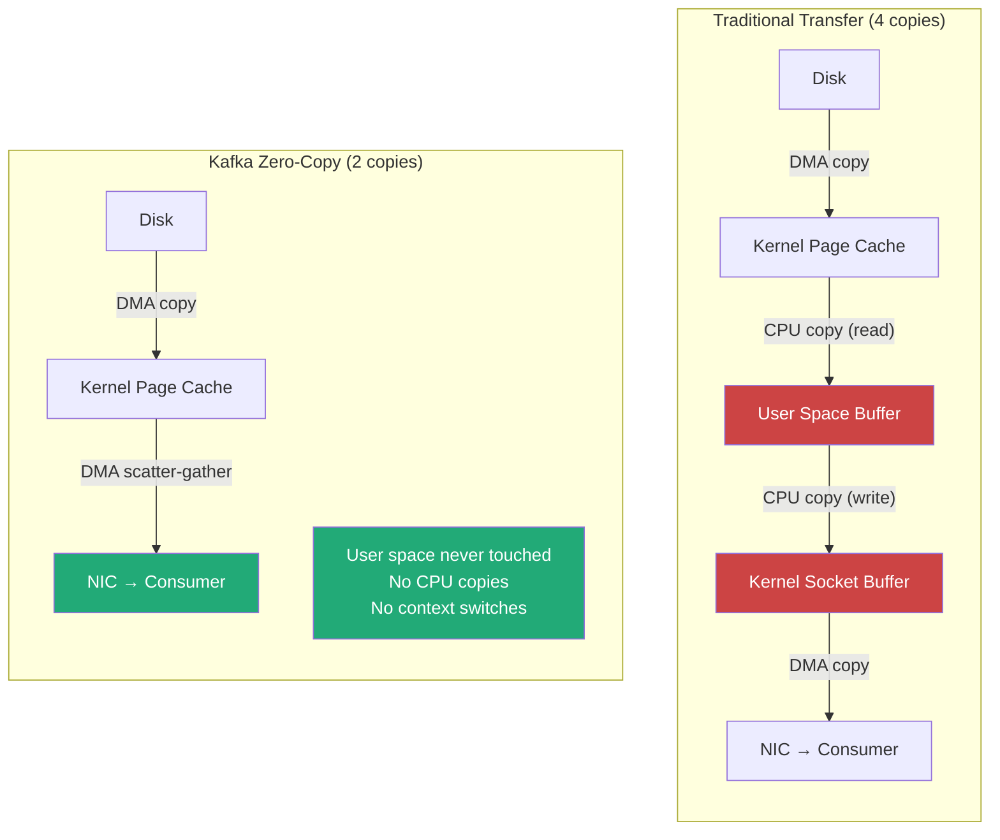
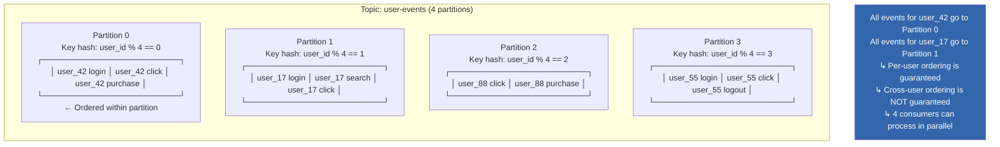
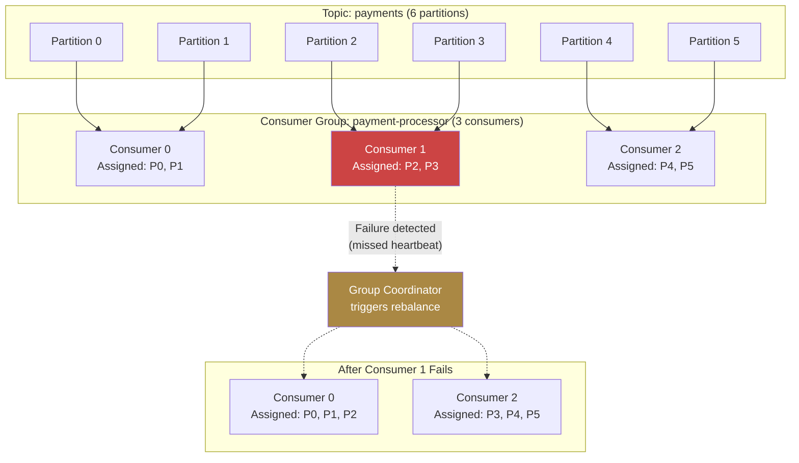

# Apache Kafka Deep Dive  Part 1: Why Kafka Exists: The Distributed Log as a Systems Primitive

---

**Series:** Apache Kafka Deep Dive  From First Principles to Planet-Scale Event Streaming
**Part:** 1 of 10
**Audience:** Senior backend engineers, distributed systems engineers, data platform architects
**Reading time:** ~45 minutes

---

## Series Overview

### Who This Series Is For

This series targets engineers who have used Kafka in production  or are about to  and want to understand *why* Kafka makes the architectural decisions it does, not just *how* to configure it. If you've ever stared at consumer lag growing unboundedly and wondered whether the problem is partition skew, slow deserialization, or a rebalance storm  or debated whether Kafka actually guarantees exactly-once delivery  or tried to reason about whether your 200-partition topic is over-partitioned or under-partitioned  this series is for you.

We will go deep into Kafka internals: the distributed log abstraction, storage engine mechanics, replication protocol, consumer group coordination, exactly-once semantics, and the engineering tradeoffs that make Kafka simultaneously the backbone of modern data infrastructure and one of the most operationally demanding systems you'll run.

### What You Will Learn

- Why the append-only log is a more powerful abstraction than the message queue, and the computer science foundations behind this insight
- How Kafka achieves millions of messages per second using sequential I/O, OS page cache, zero-copy transfers, and batched network protocols
- The replication protocol (ISR, leader election, unclean leader election) and its real consistency guarantees  and gaps
- Consumer group coordination, rebalancing mechanics, and why rebalances are Kafka's Achilles' heel
- Exactly-once semantics: what it actually means, what it costs, and where it breaks
- Storage internals: segments, indexes, log compaction, and time/size-based retention
- Production scaling patterns, failure modes, and when Kafka is the wrong tool
- System design patterns that leverage Kafka correctly  and anti-patterns that create cascading failures

### Prerequisites

- Solid understanding of distributed systems fundamentals (CAP theorem, consensus, replication)
- Familiarity with networking concepts (TCP, syscalls, kernel buffers)
- Production experience with messaging or streaming systems (you've at least operated a queue or dealt with consumer lag)
- Comfort reasoning about throughput, latency, and durability tradeoffs

### Why Kafka Matters in Modern Architecture

Kafka occupies a unique position in the infrastructure stack. It's not a traditional message queue  it doesn't delete messages after consumption. It's not a database  it doesn't support arbitrary queries. It's not a filesystem  yet it stores data durably on disk. This hybrid identity is precisely what makes it powerful: Kafka is a **distributed, durable, ordered, replayable commit log** that serves as the central nervous system connecting databases, services, analytics pipelines, and real-time applications.

As of 2025, Kafka processes an estimated tens of trillions of messages per day across production deployments worldwide. It backs real-time fraud detection at financial institutions, event sourcing at e-commerce platforms, change data capture pipelines at companies operating petabyte-scale data lakes, and inter-service communication at organizations running thousands of microservices. LinkedIn alone processes over 7 trillion messages per day through its Kafka infrastructure.

Understanding Kafka at the architectural level isn't academic  it's the difference between a streaming platform that handles 2 million messages per second with end-to-end latency under 10ms and one that suffers cascading consumer group rebalances during a partition leader election at 2 AM, dropping messages into a black hole while your on-call engineer scrambles to make sense of `OffsetOutOfRangeException`.

Let's begin.

---

## 1. The Problem: Why Traditional Messaging Systems Failed at Scale

To understand why Kafka exists, you must first understand what it replaced  and why the existing solutions collapsed under the weight of modern data infrastructure requirements.

### The World Before Kafka: LinkedIn, 2010

In 2010, LinkedIn was a rapidly growing social network with a problem that no existing software could solve cleanly. The company needed to:

1. **Collect activity data**  page views, profile views, searches, ad impressions  at a rate of billions of events per day
2. **Feed that data** to multiple downstream systems simultaneously: Hadoop for batch analytics, a search index for real-time query, a monitoring system for operational dashboards, a recommendation engine, and a data warehouse
3. **Do this reliably**, without losing data, without coupling producers to consumers, and without each new downstream system requiring integration work with every upstream system

The existing landscape offered two categories of tools, neither of which worked.

### Category 1: Enterprise Message Queues (ActiveMQ, RabbitMQ, IBM MQ)

Traditional message brokers were designed around a **transient message delivery** model. A producer sends a message, the broker routes it to a queue, a consumer reads and acknowledges it, and the broker deletes it. This model works well for task distribution and RPC-style messaging. It does not work for LinkedIn's requirements.

The fundamental problems:

**Throughput ceiling.** ActiveMQ and RabbitMQ were designed for thousands of messages per second, not millions. Their architectures involve per-message bookkeeping: message-level acknowledgments, redelivery tracking, priority queues with heap-based ordering, and transactional support with per-message journaling. Each of these features adds per-message overhead that compounds at scale. At LinkedIn's data volumes, these brokers simply could not keep up.

**Message deletion after consumption.** In a traditional queue, once a consumer acknowledges a message, the broker deletes it. This means only one logical consumer can process each message (the competing consumers pattern). LinkedIn needed multiple independent consumers reading the same data stream  analytics, search indexing, monitoring  each at their own pace. The fan-out patterns available (topics in JMS, exchanges in AMQP) incurred multiplicative overhead: the broker had to copy each message once per subscriber, multiplying storage and network costs.

**No replay capability.** Once consumed, a message was gone. If a downstream system had a bug that corrupted data for the last 6 hours, there was no way to reprocess those messages. You'd need a separate system to store the raw data  which defeated the purpose of the message broker.

**Broker-centric delivery.** Traditional brokers push messages to consumers. The broker tracks which consumer has received which message, manages redelivery timers, and maintains per-consumer state. This is O(consumers × messages) state on the broker, which becomes the bottleneck as either dimension scales.



### Category 2: Log Aggregation Systems (Flume, Scribe)

Facebook's Scribe and Apache Flume were designed specifically for high-throughput log collection. They could handle the volume  but at the cost of everything else.

**No durability guarantees.** These systems were "best effort"  messages could be lost during agent restarts, network partitions, or destination unavailability. For page view analytics, losing 0.1% of events was acceptable. For financial transaction logging, it was not.

**No consumer flexibility.** Scribe and Flume were pipeline systems: they moved data from point A (application servers) to point B (HDFS, typically). There was no concept of multiple consumers, replay, or real-time consumption alongside batch delivery.

**No ordering guarantees.** Events could arrive out of order, be duplicated, or be dropped silently. Building correct downstream systems on top of this required extensive application-level deduplication and reordering logic.

### The Gap

LinkedIn needed a system that combined:
- The **throughput** of log aggregation systems (millions of messages/sec)
- The **durability and delivery guarantees** of enterprise message brokers
- **Multi-consumer support** without per-consumer message duplication
- **Replay capability** for reprocessing historical data
- **Ordering guarantees** for correctness-sensitive downstream systems
- **Decoupling** of producers from consumers  no coordination, no coupling, no shared state

No existing system provided this combination. Jay Kreps, Neha Narkhede, and Jun Rao at LinkedIn designed Kafka to fill this gap. The key insight was that all of these requirements could be satisfied by a single, deceptively simple abstraction: **the distributed commit log**.

---

## 2. The Distributed Log: A Systems Primitive from First Principles

### What Is a Log?

In the most fundamental sense, a log is an append-only, totally ordered sequence of records. Each record is assigned a sequential identifier  an offset  that serves as its unique address within the log.

```
Offset:  0     1     2     3     4     5     6     7
       ┌─────┬─────┬─────┬─────┬─────┬─────┬─────┬─────┐
       │ R0  │ R1  │ R2  │ R3  │ R4  │ R5  │ R6  │ R7  │  → (writes append here)
       └─────┴─────┴─────┴─────┴─────┴─────┴─────┴─────┘
                          ↑                       ↑
                     Consumer A              Consumer B
                     (offset 3)              (offset 6)
```

This structure has three critical properties:

1. **Immutability.** Records are never modified after being written. Offset 3 always contains the same record. This eliminates an entire class of concurrency problems.

2. **Total ordering.** Every record has an unambiguous position relative to every other record. If record A has offset 5 and record B has offset 8, then A was written before B. This ordering is preserved for all readers.

3. **Random read access by position.** Any consumer can seek to any offset and read forward. This decouples consumption from production  consumers don't need to keep up in real time, and they can re-read historical data at will.

These three properties  immutability, total ordering, and position-based access  are what make the log a systems primitive. It's the same abstraction that underlies write-ahead logs in databases (PostgreSQL's WAL, MySQL's binlog), distributed consensus protocols (Raft's replicated log, Paxos's decree sequence), and version control systems (Git's commit history).

### Why the Log Abstraction Is More Powerful Than the Queue Abstraction

A queue says: "Here's a message. Someone take it. Once taken, it's gone."

A log says: "Here's a record at position N. Anyone can read it. It stays here until retention policy removes it."

This difference has profound architectural implications:

**Multiple independent consumers.** In a queue, adding a consumer means either splitting the message stream (competing consumers) or duplicating it (pub/sub with broker-side fan-out). In a log, adding a consumer means adding a pointer (an offset). The data is written once; consumers simply read from different positions. The cost of adding a consumer is O(1)  a single integer tracking where that consumer is in the log.

**Replay and time travel.** A consumer can reset its offset to re-read historical data. This enables:
- Reprocessing after a bug fix
- Bootstrapping a new downstream system from historical data
- A/B testing different processing logic on the same data stream
- Auditing and debugging by replaying events

**Backpressure is implicit.** Slow consumers simply fall behind  their offset grows further from the log head. They don't slow down producers or other consumers. The log acts as a shock absorber between components operating at different speeds.

**Simpler broker.** The broker doesn't need to track per-consumer, per-message delivery state. It stores the log. Consumers track their own offsets. The broker's complexity is O(log size), not O(log size × number of consumers × redelivery state).



### The Log as Integration Infrastructure

Jay Kreps articulated this insight in his influential 2013 blog post "The Log: What every software engineer should know about real-time data's unifying abstraction." The key argument: if you put all your organization's data changes into an ordered log, every downstream system becomes a materialized view of that log.

- Your search index is a materialized view of the log, filtered and transformed for full-text search
- Your analytics warehouse is a materialized view of the log, aggregated and denormalized for OLAP queries
- Your cache is a materialized view of the log, containing the latest state for hot keys
- Your recommendation engine is a materialized view of the log, computed from user activity events

This is not a metaphor  it's a literal description of how modern data architectures work. And the distributed commit log (Kafka) is the piece that makes it tractable.

---

## 3. Kafka's Storage Engine: Why Sequential I/O Changes Everything

Kafka's storage engine is built on a single insight that defies the intuition most engineers carry: **sequential disk I/O is fast  sometimes faster than random memory access**.

### The Physics of Disk I/O

To understand Kafka's performance, you need to understand the hardware.

**Spinning disks (HDD):** A read or write operation involves physically moving an actuator arm to the correct track (seek time: 5-10ms) and waiting for the platter to rotate to the correct sector (rotational latency: ~4ms for 7200 RPM). Once positioned, sequential transfer rates are 100-200 MB/s. The seek penalty means random I/O on HDDs achieves roughly 100-200 IOPS  that's 100-200 operations per second, not per millisecond.

**Solid state drives (SSD/NVMe):** No mechanical movement. Random read latency is 10-100 microseconds, with random IOPS in the range of 100K-1M. Sequential throughput reaches 3-7 GB/s on modern NVMe drives. SSDs are dramatically better for random access, but sequential throughput still exceeds random throughput by an order of magnitude due to internal parallelism and command queuing optimizations.

**RAM:** Random access latency is ~100 nanoseconds. Sequential bandwidth is 20-50 GB/s for DDR4/DDR5.

Here's the counterintuitive result, demonstrated in the ACM Queue paper "The Pathologies of Big Data" and confirmed by numerous benchmarks:

| Access Pattern | Medium | Throughput |
|---|---|---|
| Sequential write | HDD | 100-200 MB/s |
| Random write | HDD | 0.5-1 MB/s |
| Sequential write | SSD (NVMe) | 2-7 GB/s |
| Random write | SSD (NVMe) | 200-800 MB/s |
| Random read | RAM (DRAM) | ~10 GB/s (effective, due to cache line behavior) |

Sequential disk writes on a modern NVMe SSD approach the effective throughput of random memory access. On HDDs, sequential writes are 100-200x faster than random writes. Kafka exploits this by making **all writes sequential**  it only ever appends to the end of a file.



### Kafka's On-Disk Storage Structure

Each Kafka topic partition is stored as a directory on the broker's filesystem. Within that directory, the log is divided into **segments**  individual files that each contain a contiguous range of offsets.

```
/var/kafka-logs/orders-0/
├── 00000000000000000000.log        # Segment file: offsets 0 to ~1M
├── 00000000000000000000.index      # Offset index for this segment
├── 00000000000000000000.timeindex  # Timestamp index for this segment
├── 00000000000001048576.log        # Next segment: offsets ~1M to ~2M
├── 00000000000001048576.index
├── 00000000000001048576.timeindex
├── 00000000000002097152.log        # Active segment (currently being written to)
├── 00000000000002097152.index
├── 00000000000002097152.timeindex
└── leader-epoch-checkpoint
```

Each segment file is named by the base offset of the first record it contains. The filename `00000000000001048576.log` tells you this segment starts at offset 1,048,576.

**Why segments?** Three reasons:

1. **Retention.** When Kafka needs to delete old data (based on time or size retention policy), it deletes entire segment files. Deleting a file is O(1)  the filesystem simply removes the inode. Deleting individual records from the middle of a file would require rewriting the file  O(n) and destructive to sequential I/O patterns.

2. **Memory-mapped I/O.** Each segment can be memory-mapped independently. The active segment (being written to) is kept hot. Older segments are accessed on demand and can be paged out by the OS.

3. **Log compaction.** The compaction process reads old segments, filters out superseded records, and writes new compacted segments  without touching the active segment. This allows compaction to run concurrently with writes.

### Inside a Segment File

A segment's `.log` file contains a sequence of **record batches** (previously called "message sets" in older Kafka versions). Each record batch is a contiguous block of bytes with the following structure:

```
┌──────────────────────────────────────────────────────────┐
│ Record Batch Header                                       │
│ ├── Base Offset (int64)                                   │
│ ├── Batch Length (int32)                                   │
│ ├── Partition Leader Epoch (int32)                         │
│ ├── Magic (int8)  format version                         │
│ ├── CRC32 (int32)  checksum of remaining batch content   │
│ ├── Attributes (int16)  compression, timestamp type, etc │
│ ├── Last Offset Delta (int32)                             │
│ ├── Base Timestamp (int64)                                │
│ ├── Max Timestamp (int64)                                 │
│ ├── Producer ID (int64)                                   │
│ ├── Producer Epoch (int16)                                │
│ ├── Base Sequence (int32)                                 │
│ └── Record Count (int32)                                  │
├──────────────────────────────────────────────────────────┤
│ Record 0                                                  │
│ ├── Length (varint)                                        │
│ ├── Attributes (int8)                                     │
│ ├── Timestamp Delta (varint)                              │
│ ├── Offset Delta (varint)                                 │
│ ├── Key Length (varint) + Key Bytes                       │
│ ├── Value Length (varint) + Value Bytes                   │
│ └── Headers (array of key-value pairs)                    │
├──────────────────────────────────────────────────────────┤
│ Record 1 ...                                              │
│ Record 2 ...                                              │
│ ...                                                       │
└──────────────────────────────────────────────────────────┘
```

Key design details:

- **Varints for deltas.** Offsets and timestamps within a batch are stored as deltas from the base values, using variable-length integer encoding. A batch of 100 records where each offset delta is 0-99 uses 1 byte per delta instead of 8 bytes for a full int64. This alone saves ~700 bytes per 100-record batch.

- **Batch-level compression.** The entire record batch (all records together) is compressed as a single unit, using Snappy, LZ4, Zstandard, or GZIP. Compressing a batch of similar records achieves dramatically better compression ratios than compressing individual records, because the algorithm can exploit redundancy across records (e.g., repeated field names in JSON payloads, similar schema structures).

- **CRC per batch.** Data integrity is validated at the batch level, not per-record. This amortizes the cost of checksum computation across multiple records.

- **Producer ID and sequence numbers.** These fields (added in Kafka 0.11 for idempotent producers) enable exactly-once delivery semantics. The broker uses them to detect and deduplicate retried batches.

### The Index Files

The `.index` file is a sparse index that maps offsets to physical file positions within the `.log` file:

```
Offset Index (.index):
┌───────────────┬───────────────┐
│ Relative Offset│ File Position  │
├───────────────┼───────────────┤
│ 0             │ 0              │
│ 4,096         │ 524,288        │
│ 8,192         │ 1,048,576      │
│ 12,288        │ 1,572,864      │
│ ...           │ ...            │
└───────────────┴───────────────┘
```

The index is **sparse**  it doesn't contain an entry for every offset. Instead, it contains an entry every `log.index.interval.bytes` (default 4 KB) of log data. To find a specific offset, Kafka:

1. Binary searches the index to find the largest offset ≤ the target
2. Scans forward in the `.log` file from that position to find the exact record batch

This two-level lookup (binary search on index + linear scan in log) is efficient because:
- The index files are small (typically a few MB) and memory-mapped  the binary search hits page cache, not disk
- The linear scan is short  at most `log.index.interval.bytes` worth of data (4 KB default)
- The scan is sequential, which the OS prefetcher handles optimally

The `.timeindex` file provides the same sparse indexing by timestamp instead of offset, enabling time-based lookups (`offsetsForTimes` API) without scanning the entire log.

---

## 4. Why Kafka Is Fast: A Systems-Level Decomposition

"Kafka is fast" is frequently stated but rarely decomposed. Let's examine each contributing factor in order of impact.

### Factor 1: Sequential I/O and OS Page Cache

Kafka delegates caching to the operating system's page cache rather than maintaining its own application-level cache (as most databases do). This is a deliberate, consequential design decision.

When a Kafka broker writes a record batch to a segment file, the `write()` syscall places the data into the kernel's page cache. The OS will flush it to disk asynchronously (or on `fsync()` if configured, though Kafka typically relies on replication for durability rather than synchronous disk flushes). When a consumer reads from the same segment, the `read()` (or `sendfile()`) syscall can serve the data directly from page cache  no disk I/O at all.

The implications:

**Warm reads are memory-speed.** If a consumer is tailing the log (reading near the write head), the data was just written into page cache and is served from RAM. This is the common case in real-time streaming  consumers typically lag by seconds, not hours. The effective read latency is sub-millisecond.

**The JVM heap is not involved.** Kafka is written in Scala/Java, which means it runs on the JVM. If Kafka maintained an in-process cache, that cache would live in the JVM heap, subject to garbage collection pauses. By using the OS page cache (which lives outside the JVM heap), Kafka avoids GC pressure entirely for cached data. A broker with 64 GB of RAM might run with a 6 GB JVM heap and 50+ GB of page cache  far more effective than any in-process caching scheme.

**The cache survives process restarts.** If you restart the Kafka broker process, the page cache is preserved by the OS. The broker comes back online with its hot data still cached. An in-process cache would be empty after restart, causing a thundering herd of disk reads.

**No double buffering.** Databases that maintain their own buffer pool (PostgreSQL's shared buffers, MySQL's InnoDB buffer pool) suffer from double buffering: data exists in both the database's cache and the OS page cache, wasting memory. Kafka avoids this entirely.

### Factor 2: Zero-Copy Transfer with sendfile()

When a consumer fetches data from a broker, the naive approach involves four data copies:

```
1. Disk → Kernel page cache    (DMA copy)
2. Kernel page cache → User space buffer (CPU copy  read() syscall)
3. User space buffer → Kernel socket buffer (CPU copy  write() syscall)
4. Kernel socket buffer → NIC    (DMA copy)
```

This involves two unnecessary CPU copies (steps 2 and 3) and two context switches (user → kernel → user → kernel).

Kafka uses the Linux `sendfile()` syscall (or `transferTo()` in Java NIO, which maps to `sendfile` on Linux) to eliminate the user-space copies:

```
1. Disk → Kernel page cache    (DMA copy)
2. Kernel page cache → NIC     (DMA copy, via scatter-gather if supported)
```

With `sendfile()`, data moves directly from the page cache to the network socket buffer without ever entering user space. This eliminates two CPU copies and two context switches per fetch request. On a broker serving 1 GB/s of consumer reads, this saves roughly 2 GB/s of memory bandwidth and significant CPU cycles.

This is possible because Kafka's on-disk format is identical to its network format. The broker doesn't need to deserialize, transform, or re-serialize data between disk and network  it sends the raw bytes as they exist on disk. This is a direct consequence of the "dumb broker, smart consumer" design philosophy.



### Factor 3: Batching at Every Layer

Kafka batches aggressively  and the batching happens at every layer of the stack:

**Producer batching.** The Kafka producer client accumulates records in memory, grouped by target partition. Records destined for the same partition are collected into a batch and sent together in a single network request. The batch size is controlled by `batch.size` (default 16 KB) and `linger.ms` (default 0ms, but typically configured to 5-100ms in production). A single `ProduceRequest` can contain batches for multiple partitions, further amortizing the network round-trip.

**Broker write batching.** When the broker receives a `ProduceRequest` containing a record batch, it appends the entire batch as a single unit to the segment file. One `write()` syscall per batch, not per record. With a batch of 1,000 records at 500 bytes each, this is one 500 KB `write()` call instead of 1,000 separate `write()` calls  eliminating 999 syscalls and their associated context switches.

**Consumer fetch batching.** The consumer doesn't pull one record at a time. The `FetchRequest` specifies a minimum fetch size (`fetch.min.bytes`, default 1 byte) and a maximum wait time (`fetch.max.wait.ms`, default 500ms). The broker collects data until either the minimum size is met or the wait time expires, then sends a large batch of record batches in a single response. A single `FetchResponse` might contain megabytes of data across multiple partitions.

**Network protocol batching.** Kafka's binary protocol amortizes header overhead across multiple partition-level operations within a single request/response. A `ProduceRequest` for 50 partitions sends one TCP payload, not 50.

The throughput impact of batching is dramatic. Without batching, the overhead per record includes:
- Network round-trip: ~0.5ms on a typical LAN
- Syscall overhead: ~1-5 microseconds per `write()`
- TCP/IP header overhead: 40-60 bytes per packet

With batching (batch size = 1,000 records):
- Network round-trip amortized: ~0.5 microseconds per record
- Syscall overhead amortized: ~1-5 nanoseconds per record
- TCP/IP header overhead amortized: ~0.05 bytes per record

This is a 1,000x reduction in per-record overhead.

### Factor 4: Compression

Kafka supports four compression codecs: GZIP, Snappy, LZ4, and Zstandard (zstd). Compression happens at the batch level on the producer, and the compressed batch is stored as-is on the broker and sent as-is to consumers. The broker never decompresses data in the normal produce/fetch path (it decompresses only for offset validation with older message format versions, and for log compaction).

| Codec | Compression Ratio | Compression Speed | Decompression Speed | CPU Cost |
|---|---|---|---|---|
| GZIP | Best (~70-80% reduction) | Slow | Moderate | High |
| Snappy | Moderate (~50-60%) | Very fast | Very fast | Low |
| LZ4 | Moderate (~50-65%) | Very fast | Very fast | Low |
| Zstandard | Very good (~65-75%) | Fast | Very fast | Moderate |

For most production workloads, **LZ4 or Zstandard** offers the best tradeoff. Zstandard typically achieves GZIP-level compression ratios at LZ4-level speeds.

Compression's impact on throughput is multiplicative:
- Reduces disk I/O by the compression ratio (less data written/read)
- Reduces network I/O by the compression ratio (less data transferred)
- Increases effective page cache capacity (more logical data fits in the same physical RAM)

With JSON payloads (common in Kafka), zstd compression typically achieves 5-8x compression, meaning a broker with 1 TB of disk effectively stores 5-8 TB of logical data.

### Factor 5: Partitioned Parallelism

A Kafka topic is divided into partitions, and each partition is an independent log. This allows:
- Multiple brokers to handle writes for different partitions in parallel
- Multiple consumers to read from different partitions in parallel
- No coordination between partitions (no cross-partition locking)

If a topic has 12 partitions across 4 brokers, write throughput scales roughly linearly: 4 brokers × the single-partition throughput of each broker. This is Kafka's primary horizontal scaling mechanism.

### Putting It Together: Throughput Reasoning

Consider a Kafka cluster with 6 brokers, each with:
- 2x NVMe SSDs in JBOD configuration (sequential write: 2 GB/s each)
- 128 GB RAM (100+ GB available for page cache)
- 25 Gbps network

For a topic with 24 partitions (4 per broker), replication factor 3:

**Write throughput (producer → leader):**
- Each broker handles 4 partitions as leader
- Sequential disk write throughput per broker: 2 GB/s (limited by a single disk per partition, but multiple partitions write to different disks)
- Network ingress per broker: 25 Gbps ≈ 3.1 GB/s
- Bottleneck: typically network, at ~3 GB/s per broker
- Total cluster write throughput: ~6 × 3 GB/s = ~18 GB/s (before replication)
- With replication factor 3: ~6 GB/s effective write throughput (each byte is written 3 times)

**Read throughput (broker → consumer):**
- If consumers are tailing (reading near the head), all reads are served from page cache
- Network egress per broker: 25 Gbps ≈ 3.1 GB/s
- With zero-copy, CPU is not the bottleneck for reads
- Total cluster read throughput: ~6 × 3 GB/s = ~18 GB/s (per consumer group)
- Multiple consumer groups can read independently; the same page cache data serves all of them

These are theoretical maximums. In practice, with 1 KB average message size, 100ms linger, and zstd compression (4x ratio), a well-tuned 6-broker cluster can handle **2-5 million messages per second** of sustained write throughput and significantly more for reads.

---

## 5. Pull vs. Push: Why Consumers Pull in Kafka

In traditional message brokers (RabbitMQ, ActiveMQ), the broker pushes messages to consumers. In Kafka, consumers pull data from brokers. This is not an arbitrary choice  it has deep implications for system behavior.

### The Problems with Push

**Rate mismatch.** A push-based broker must decide how fast to send data. If it sends too fast, it overwhelms the consumer. If it sends too slow, it underutilizes the consumer. The optimal rate depends on the consumer's current processing capacity, which varies dynamically with CPU load, downstream system availability, GC pauses, and more. Push-based systems need flow control mechanisms (TCP backpressure, broker-side rate limiting, consumer acknowledgments with windowing) to handle this  all of which add complexity and latency.

**Broker complexity.** The broker must track per-consumer state: which messages have been sent, which have been acknowledged, which need redelivery, and at what rate to send. For N consumers, this is N times the bookkeeping. Under load, this per-consumer state management becomes the bottleneck.

**Head-of-line blocking.** If one consumer in a push model is slow, the broker's outbound queue for that consumer backs up. Depending on the implementation, this can consume broker memory (buffering messages for the slow consumer) or trigger backpressure that affects other consumers.

### The Benefits of Pull

**Consumer-controlled pacing.** Each consumer fetches data when it's ready, at the rate it can handle. A fast consumer with spare capacity can fetch aggressively (large `fetch.min.bytes`, short `fetch.max.wait.ms`). A slow consumer recovering from a backlog can throttle its own fetch rate. No broker-side rate limiting needed.

**Optimal batching.** A pull-based consumer can ask for "give me up to 1 MB of data, or wait up to 500ms" in a single request. The broker collects data until either condition is met, then returns a large, efficient batch. This naturally amortizes network overhead. In a push model, the broker must choose between sending small messages immediately (low latency, high overhead) or batching them (higher latency, lower overhead)  and it must make this choice for the consumer.

**Simplified broker.** The broker doesn't track which messages have been "sent" to which consumer. It stores the log and serves fetch requests. The consumer tracks its own offset. This is the key simplification that allows Kafka's broker to scale.

**Replay is trivial.** A pull-based consumer can seek to any offset and re-read. In a push model, replay requires the broker to re-send historical data  but the broker may have already deleted it (since push models typically delete after acknowledgment).

### The Drawback: Long Polling

The one disadvantage of pull is that if there's no new data, the consumer polls repeatedly and gets empty responses  wasting CPU and network. Kafka solves this with **long polling**: the `FetchRequest` includes a `fetch.max.wait.ms` parameter. If there isn't enough data to satisfy `fetch.min.bytes`, the broker holds the request open (blocks on the server side) until either enough data arrives or the timeout expires. This gives pull the latency characteristics of push  new data is delivered within milliseconds  without the complexity of push-based flow control.

---

## 6. Partitioning: Ordering, Parallelism, and the Fundamental Tradeoff

### The Core Design Decision

Kafka provides ordering guarantees **within a partition**, not across partitions. This is the single most important architectural decision to understand, because it drives the entire partitioning strategy.

Within a single partition:
- Records are appended in the order they arrive (modulo retries  more on this later)
- Consumers read records in offset order
- Offset N is always delivered before offset N+1

Across partitions:
- No ordering guarantee
- Records in partition 0 and partition 1 may be interleaved arbitrarily at the consumer
- A consumer reading from multiple partitions sees records in whatever order the fetch responses arrive

### Why Not Total Ordering Across All Partitions?

Because total ordering requires serialization  all writes must go through a single point of coordination. This limits throughput to what a single node can handle. Kafka's partitioning breaks this serialization constraint: each partition is an independent ordered log, and different partitions can be served by different brokers in parallel.

This is a direct application of the **scalability-ordering tradeoff** that appears throughout distributed systems:

| Ordering Guarantee | Scalability | Example |
|---|---|---|
| Total order (all events) | Single node throughput | Single-partition topic, Raft log |
| Partition order (per-key) | Linear with partition count | Kafka topics, DynamoDB streams |
| No ordering | Maximum parallelism | S3 uploads, UDP datagrams |

Kafka's partition-level ordering is the sweet spot for most event streaming use cases: you get ordered processing for events that need to be ordered (by choosing the right partition key), and parallel processing for events that don't.



### Choosing Partition Keys

The partition key determines which partition a record lands in. The default partitioner hashes the key using murmur2 and takes modulo of the partition count: `murmur2(key) % numPartitions`.

Good partition keys have two properties:

1. **Semantic ordering requirement.** Events that must be processed in order share the same key. For an e-commerce system: order events keyed by `order_id`, user activity events keyed by `user_id`, inventory updates keyed by `product_id`.

2. **Uniform distribution.** The key values should hash uniformly across partitions. If 80% of your traffic comes from 100 power users and you key by `user_id`, those 100 users might cluster on a few partitions, creating hot partitions while others sit idle. This is **partition skew**  the most common source of uneven consumer lag in production Kafka deployments.

**Records without keys** are distributed using a sticky partitioning strategy (since Kafka 2.4): the producer sends all records to the same partition until a batch is full or `linger.ms` expires, then switches to a different partition. This achieves good batching without the round-robin overhead of one-record-per-partition.

### How Many Partitions?

This is one of the most frequently asked Kafka questions, and the answer requires reasoning about multiple constraints:

**Upper bound: broker resource limits.** Each partition requires:
- An open file descriptor per segment (at least 3: `.log`, `.index`, `.timeindex`)
- Memory for the index files (memory-mapped)
- A replication thread fetching from the leader
- Leadership state in the controller

A broker can comfortably handle 2,000-4,000 partitions (as leader). Beyond that, controller election time increases, metadata propagation slows, and the broker's fd usage becomes concerning.

**Lower bound: consumer parallelism.** Each partition in a consumer group can only be assigned to one consumer. If you have 12 consumers in a group and 6 partitions, 6 consumers sit idle. The partition count is the upper limit on consumer parallelism.

**Throughput requirement.** If a single partition can handle 10 MB/s of write throughput, and you need 100 MB/s total, you need at least 10 partitions (before accounting for skew).

**The rough formula:**

```
partitions = max(
    target_throughput / single_partition_throughput,
    max_consumer_instances
)
```

Multiply by a safety factor (1.5-2x) for skew and future growth. A common starting point for high-throughput topics is **12-36 partitions**, which provides sufficient parallelism for most consumer groups while remaining manageable operationally.

**Warning: partition count can only increase, never decrease.** Adding partitions changes the key-to-partition mapping (`hash(key) % newCount`), breaking ordering guarantees for existing keys. This is one of the reasons to slightly over-provision partitions upfront.

---

## 7. Consumer Groups: Coordination and the Rebalancing Problem

### The Consumer Group Abstraction

A consumer group is a set of consumer instances that cooperatively consume a topic. Each partition is assigned to exactly one consumer within the group. If a consumer fails, its partitions are reassigned to surviving consumers. If a new consumer joins, some partitions are rebalanced to it.



### How Rebalancing Works

Rebalancing is the process of reassigning partitions when the consumer group membership changes. It is also Kafka's most operationally painful mechanism.

The rebalancing protocol (using the default `RangeAssignor` or `CooperativeStickyAssignor`) works as follows:

1. **Trigger.** A rebalance is triggered when a consumer joins the group, a consumer leaves (gracefully or by failing to send heartbeats within `session.timeout.ms`), or the topic's partition count changes.

2. **Join Group phase.** All consumers send `JoinGroup` requests to the group coordinator (a designated broker). Each consumer includes its subscription (which topics it can consume) and its supported assignment strategies. The coordinator waits for all consumers or until a timeout.

3. **Leader election.** The coordinator selects one consumer as the "group leader." The leader receives the full list of group members and their subscriptions.

4. **Assignment.** The leader runs the partition assignment algorithm (e.g., `RangeAssignor`, `RoundRobinAssignor`, `StickyAssignor`) and produces a mapping: `{consumer_id → [partition list]}`.

5. **Sync Group phase.** The leader sends the assignment to the coordinator via `SyncGroup`. The coordinator distributes each consumer's assignment back to them via their own `SyncGroup` responses.

6. **Resume processing.** Each consumer begins fetching from its newly assigned partitions.

### Why Rebalances Are Kafka's Achilles' Heel

During a rebalance using the **eager rebalancing protocol** (the default before Kafka 2.4):

**All consumers stop processing.** When a rebalance is triggered, every consumer in the group must revoke all its partitions, commit offsets, and rejoin the group. This means that even if only one consumer failed, all consumers pause. For a consumer group with 50 consumers processing a topic with 200 partitions, a single consumer restart causes a full stop-the-world rebalance.

**Rebalance storms.** If a consumer takes too long to rejoin (perhaps because it's doing expensive cleanup in a `ConsumerRebalanceListener`), it exceeds `max.poll.interval.ms` and is kicked from the group  triggering another rebalance. Under load, this can cascade: each rebalance takes longer (more consumers, more partitions), causing more timeouts, causing more rebalances.

**Duplicate processing.** After a rebalance, a consumer might begin processing from the last committed offset, which might be behind the actual processing position (offsets are committed periodically, not after every record). This means some records get processed twice. For idempotent consumers, this is merely wasteful. For non-idempotent consumers, it causes data duplication.

### Cooperative Rebalancing (Incremental Rebalancing)

Kafka 2.4 introduced **cooperative rebalancing** (via `CooperativeStickyAssignor`), which dramatically improves the situation:

Instead of revoking all partitions and reassigning from scratch, cooperative rebalancing:
1. Determines which partitions need to move (only the ones affected by the membership change)
2. Revokes only those partitions from their current owners
3. Assigns them to new owners in a subsequent rebalance round
4. Partitions that don't move are never revoked  their consumers continue processing uninterrupted

This reduces the "blast radius" of a rebalance from "all consumers stop" to "only the affected partitions pause briefly." For a 50-consumer group where one consumer fails, only the 4 partitions owned by that consumer are reassigned; the other 46 consumers continue processing without interruption.

**Production recommendation:** Always use `CooperativeStickyAssignor` (or `StickyAssignor` at minimum) in production. The default `RangeAssignor` with eager protocol is almost never the right choice for non-trivial consumer groups.

---

## 8. Backpressure and Consumer Control Theory

### The Nature of Backpressure in Streaming Systems

Backpressure occurs when a downstream component can't keep up with the upstream data rate. In a streaming system, this manifests as growing consumer lag  the difference between the log-end offset (latest produced record) and the consumer's current offset.

Kafka's pull-based architecture provides **implicit backpressure**  a fundamental advantage over push-based systems. Let's analyze why.

### Kafka's Backpressure Model

In Kafka, the consumer controls the flow:

```
Consumer processing rate = min(
    consumer's compute capacity,
    consumer's fetch rate,
    broker's ability to serve fetches
)
```

If the consumer's processing rate drops below the production rate, lag increases. But critically:

1. **The producer is unaffected.** The producer continues writing at its own pace. There is no mechanism (by design) for a slow consumer to slow down a producer. The log absorbs the difference.

2. **Other consumer groups are unaffected.** Each consumer group has an independent offset. Consumer group A's lag has zero impact on consumer group B's processing.

3. **The broker is unaffected** (mostly). The only broker-side impact of consumer lag is that lagging consumers may need to read from disk (outside the page cache) instead of from cache. This increases disk I/O on the broker, which can affect other consumers if the disk becomes saturated  but this is a resource contention issue, not a backpressure propagation issue.

4. **The data is preserved.** Unlike a push-based system that might drop messages when a consumer is overwhelmed (or block the producer), Kafka retains all data according to its retention policy. A consumer can fall behind by hours or days and catch up later without data loss.

### Modeling Lag as a Control Signal

Consumer lag is not just a metric  it's a **control signal** that can drive autoscaling and alerting:

```
lag(t) = production_rate × t - consumption_rate × t
       = (production_rate - consumption_rate) × t
```

If `production_rate > consumption_rate`, lag grows linearly with time. The time until a consumer falls behind the retention window:

```
time_to_data_loss = retention_size / (production_rate - consumption_rate)
```

For example: if retention is 7 days of data, the production rate is 10 MB/s, the consumption rate is 8 MB/s, and the current lag is zero:

```
Data accumulated per day = (10 - 8) MB/s × 86,400 s = 172,800 MB ≈ 169 GB/day
Time to breach retention = 7 days × 10 MB/s × 86,400 / ((10 - 8) × 86,400) = 35 days
```

So you have 35 days before the consumer starts losing data to retention. This gives you time to either add consumers (scaling out the consumer group) or optimize processing speed.

**Production insight:** Monitor `records-lag-max` per consumer group and alert when the lag exceeds a threshold that corresponds to your acceptable latency. For real-time use cases (fraud detection, alerting), alert on lag > 1,000 records. For near-real-time (analytics, search indexing), lag > 1,000,000 might be acceptable.

---

## 9. Failure Models and Durability Assumptions

### What Kafka Promises

Kafka's durability model is built on replication. A topic with replication factor 3 has each partition replicated across 3 brokers: one leader and two followers. The producer can control the durability guarantee with the `acks` configuration:

| `acks` Setting | Guarantee | Latency | Throughput |
|---|---|---|---|
| `acks=0` | Fire-and-forget. No acknowledgment. Data may be lost silently. | Lowest | Highest |
| `acks=1` | Leader acknowledges after writing to its local log. Data is lost if the leader fails before replication. | Low | High |
| `acks=all` (`-1`) | Leader waits for all in-sync replicas (ISR) to acknowledge. Data survives any single broker failure. | Higher | Lower |

With `acks=all` and `min.insync.replicas=2` (on a replication factor 3 topic):
- The producer is acknowledged only after at least 2 of 3 replicas have written the data
- If one broker is down, the remaining 2 can still serve writes (2 ≥ `min.insync.replicas`)
- If two brokers are down, writes are rejected (`NotEnoughReplicasException`)  the system chooses consistency over availability

This is Kafka's durability sweet spot for most production workloads. It survives any single broker failure without data loss, while still allowing the cluster to operate during single-node maintenance or failure.

### What Kafka Does NOT Promise

**Ordering under retries without idempotence.** If a producer sends batch A, then batch B, and batch A fails and is retried, batch B might be written before batch A  violating order. The fix: enable idempotent producers (`enable.idempotence=true`, default since Kafka 3.0). With idempotence, the broker tracks sequence numbers per producer and rejects out-of-order batches.

**Cross-partition atomicity (without transactions).** Writing to partitions A and B is not atomic by default. If the producer crashes between writing to A and B, A has the record and B doesn't. The fix: Kafka transactions (`transactional.id` + `beginTransaction()` / `commitTransaction()`), which provide atomic writes across multiple partitions.

**Zero data loss under catastrophic failure.** If all replicas of a partition fail simultaneously (e.g., a rack failure taking out all 3 replicas), data is lost. Kafka's durability is bounded by the number of independent failure domains. With rack-aware replication (`broker.rack` configured), Kafka distributes replicas across racks, making simultaneous failure less likely.

**Exactly-once without idempotence + transactions.** Without these features enabled, Kafka provides at-least-once delivery by default. Consumer crashes between processing a record and committing its offset will cause that record to be reprocessed. True exactly-once requires idempotent producers, transactions, and `read_committed` isolation on consumers.

### The Unclean Leader Election Dilemma

When a partition leader fails, Kafka elects a new leader from the ISR (in-sync replicas). But what if all ISR members are down? Kafka faces a choice:

- **Wait** for an ISR member to come back online (`unclean.leader.election.enable=false`, the default since Kafka 0.11). The partition is unavailable until a replica that was in the ISR recovers. This preserves data consistency but sacrifices availability.

- **Elect an out-of-sync replica** (`unclean.leader.election.enable=true`). The partition becomes available immediately, but the new leader might be missing some committed records that existed only on the failed leader. This is a data loss event.

This is a direct manifestation of the CAP theorem: under a partition (all ISR members unreachable), Kafka must choose between consistency (wait for ISR) and availability (elect out-of-sync replica). The default (wait for ISR) is correct for most production workloads. Only enable unclean leader election for topics where availability is more important than data integrity  metrics, logs, non-critical telemetry.

---

## 10. Comparison with Traditional Messaging Systems

### Kafka vs. RabbitMQ: Architectural Philosophy

The comparison between Kafka and RabbitMQ is not "which is better"  it's "which abstraction fits your problem."

| Dimension | Kafka | RabbitMQ |
|---|---|---|
| Core abstraction | Distributed commit log | Message broker with exchanges and queues |
| Message lifecycle | Retained per retention policy (time/size) | Deleted after acknowledgment |
| Delivery model | Consumer pulls | Broker pushes (with acknowledgment) |
| Ordering | Per-partition ordering | Per-queue ordering (FIFO within a single queue) |
| Replay | Native (seek to any offset) | Not supported (messages deleted after ACK) |
| Consumer tracking | Consumer-managed offsets | Broker-managed per-message ACK state |
| Routing | Topic + partition key | Exchange types (direct, fanout, topic, headers) |
| Throughput | 100K-2M+ msgs/sec per broker | 10K-50K msgs/sec per node (typical) |
| Latency | 2-10ms (end-to-end, typical) | Sub-millisecond possible (for small messages) |
| Protocol | Custom binary protocol | AMQP 0.9.1, MQTT, STOMP |

**When Kafka is the right choice:**
- High throughput event streaming (> 50K msgs/sec)
- Event sourcing and change data capture
- Multiple independent consumers reading the same data
- Replay and reprocessing requirements
- Long-term data retention (hours to weeks)
- Stream processing pipelines (Kafka Streams, Flink, etc.)

**When RabbitMQ is the right choice:**
- Task distribution (work queues) with per-message routing
- Request-reply patterns
- Complex routing logic (topic exchanges with wildcards, header-based routing)
- Low-latency messaging where sub-millisecond delivery matters
- Smaller scale systems where operational simplicity is paramount
- When message deletion after processing is desired behavior

**A common mistake:** using Kafka as a task queue. Kafka can do this (consumer groups with partition-level assignment approximate competing consumers), but it's awkward: you can't acknowledge individual messages (only commit offsets, which are sequential), you can't route specific messages to specific consumers, and rebalancing overhead is much higher than RabbitMQ's consumer management. If your primary use case is "distribute tasks to a pool of workers with per-task acknowledgment," RabbitMQ is almost certainly the better tool.

### Kafka vs. ActiveMQ/JMS

ActiveMQ (and the JMS specification it implements) was designed for enterprise integration: guaranteed delivery, transactions, distributed transactions (XA), message selectors, temporary queues, and request-reply patterns. It is feature-rich and operationally mature.

However, JMS brokers fundamentally struggle with Kafka's use case because:

1. **Per-message state.** JMS requires the broker to track delivery state per message per consumer. This is O(messages × consumers) state, which becomes untenable at millions of messages per second with multiple consumer groups.

2. **No horizontal scaling of topics.** A JMS queue lives on a single broker. While ActiveMQ supports network-of-brokers topologies, the data path for a single queue still bottlenecks on one node. Kafka's partitioning distributes the data and I/O across the cluster.

3. **No replay.** JMS messages are deleted after acknowledgment. There is no offset-based replay without external storage.

4. **No native stream processing.** Kafka's log retention model enables stream processing frameworks to treat the log as both an input source and an output sink. JMS's transient message model doesn't support this.

---

## 11. When NOT to Use Kafka

Kafka is not a universal solution. It adds significant operational complexity, and there are clear situations where it's the wrong tool:

**You need request-reply messaging.** Kafka can technically do request-reply (produce a request to one topic, consume the response from another), but it's awkward and high-latency compared to purpose-built RPC systems (gRPC, HTTP, RabbitMQ's direct reply-to). If your primary pattern is "send a message, get a response," don't use Kafka.

**Your throughput is < 1,000 messages/sec.** At low volumes, Kafka's operational overhead (ZooKeeper/KRaft management, broker configuration, monitoring, topic management, consumer group coordination) is disproportionate to the value it provides. A simple Redis pub/sub, a PostgreSQL-based queue (e.g., `LISTEN`/`NOTIFY` or a `SKIP LOCKED` pattern), or even an in-process channel might suffice.

**You need per-message routing.** Kafka's routing is coarse: messages go to a topic, and within a topic, to a partition determined by the key hash. If you need to route individual messages to specific consumers based on message attributes (content-based routing), RabbitMQ's exchange model or AWS SNS message filtering is a better fit.

**You need strong ordering across your entire event stream.** Kafka orders within partitions. If you need total ordering across all events  and your throughput exceeds what a single partition can handle  Kafka cannot help you. You need a single-writer system or a consensus protocol.

**Your team can't operate it.** Kafka is operationally demanding. Broker failures, partition reassignment, ISR management, consumer group rebalancing, log compaction tuning, ZooKeeper maintenance (or KRaft migration), monitoring lag across hundreds of consumer groups, topic configuration management  this requires dedicated operational expertise. If your team is three engineers building a startup product, the overhead of operating Kafka may far exceed the engineering cost of a simpler solution.

**You need a database.** Kafka is not a database. It doesn't support queries, indexes, or point lookups. While Kafka Streams provides stateful processing with embedded RocksDB stores, and ksqlDB offers SQL-like querying over streams, these are stream processing layers, not general-purpose databases. Don't store your user table in Kafka.

---

## 12. Common Misconceptions About Kafka

**"Kafka guarantees exactly-once delivery."**
Kafka provides exactly-once *semantics* (EOS) under specific conditions: idempotent producers enabled, transactional writes, and `read_committed` isolation level on consumers, combined with processing logic that writes output exclusively to Kafka (or to external systems with idempotent writes). If your consumer reads from Kafka and writes to PostgreSQL, EOS requires your PostgreSQL write to be idempotent  Kafka can't control what happens outside its boundary.

**"More partitions always means more throughput."**
Beyond the point where each consumer in the group has at least one partition, adding more partitions provides diminishing returns and increasing costs: more open file descriptors, more memory for indexes, longer leader election times, more rebalancing overhead, and potential partition skew. Over-partitioning is a common mistake.

**"Kafka is a message queue."**
Kafka is a distributed commit log. Using it as a queue is possible but ignores its key strengths (replay, multi-consumer, retention) and amplifies its weaknesses (no per-message ACK, coarse routing, rebalancing overhead). If you only need a queue, use a queue.

**"Consumer lag means something is broken."**
Some lag is normal and expected. A burst of production activity will temporarily increase lag until consumers catch up. Lag is only a problem if it's growing unboundedly over time (meaning consumers are permanently slower than producers) or if it exceeds your latency SLA.

**"Kafka preserves message ordering."**
Kafka preserves ordering *within a partition*. If you produce messages with different keys, they may land in different partitions and be consumed in any relative order. If you produce messages with the same key but retries are enabled without idempotence, even within-partition ordering can be violated (prior to Kafka 3.0 where idempotence became the default).

**"Setting replication factor = 3 means my data is always safe."**
Replication factor 3 means your data is stored on 3 brokers. If all 3 are in the same rack and the rack loses power, your data is gone. If you configure `acks=1` (leader only), data on the leader might not have replicated to followers before the leader dies. Durability requires `acks=all` + `min.insync.replicas=2` + rack-aware replica placement.

---

## 13. Operational Complexity: An Honest Assessment

### What You're Signing Up For

Running Kafka in production means operating a distributed stateful system. Here's what that entails:

**Cluster management.** Broker additions and removals require partition reassignment. Reassignment is a manual process (using `kafka-reassign-partitions.sh` or Cruise Control) that moves data between brokers  a network-intensive, time-consuming operation. A 10 TB reassignment on a 10 Gbps network takes ~2.5 hours, during which the cluster is under elevated I/O load.

**ZooKeeper (or KRaft).** Pre-3.3 Kafka requires Apache ZooKeeper for metadata management, controller election, and configuration storage. ZooKeeper is itself a distributed consensus system that requires operational attention: quorum maintenance, session timeouts, disk I/O monitoring, and careful upgrade procedures. KRaft mode (production-ready since Kafka 3.3) removes this dependency by embedding a Raft-based metadata quorum in the Kafka brokers themselves, but migration from ZooKeeper to KRaft is a non-trivial operational project.

**Monitoring.** A production Kafka deployment requires monitoring at minimum:
- Broker: under-replicated partitions, ISR shrink/expand rate, request handler pool utilization, network handler pool utilization, log flush latency, disk usage per broker
- Producers: record send rate, record error rate, batch size distribution, request latency
- Consumers: consumer lag per partition, commit rate, rebalance frequency, poll interval
- Topics: message rate, byte rate, partition count, replication factor

This is 50+ metrics before you consider JVM-level monitoring (GC pauses, heap usage, thread counts).

**Retention management.** Misconfigured retention (too short: data loss for slow consumers; too long: disk exhaustion) is a common source of production incidents. Different topics often need different retention policies, and changing retention on an existing topic requires understanding the implications for all consumer groups.

**Upgrades.** Kafka rolling upgrades require careful attention to inter-broker protocol versions, API compatibility, and client compatibility. An upgrade typically involves: update `inter.broker.protocol.version`, rolling restart all brokers, update `log.message.format.version`, another rolling restart. Skipping versions or misconfiguring compatibility can cause data format issues.

---

## Key Takeaways

1. **Kafka is a distributed commit log, not a message queue.** The log abstraction (append-only, ordered, position-based access) is what enables replay, multi-consumer, and decoupled architecture. Treating Kafka as a queue misses its core value proposition.

2. **Sequential I/O is the performance foundation.** Kafka's throughput comes from exploiting sequential disk I/O, OS page cache, zero-copy transfer, batching at every layer, and compression. These are systems-level optimizations, not application-level cleverness.

3. **Ordering is per-partition, not global.** The choice of partition key determines your ordering guarantees. This is the most consequential decision in topic design.

4. **Pull-based consumption enables backpressure and replay.** Consumers control their own pace. The log acts as a buffer between producers and consumers operating at different speeds.

5. **Durability requires explicit configuration.** `acks=all` + `min.insync.replicas=2` + rack-aware replication is the baseline for data you can't afford to lose.

6. **Rebalancing is Kafka's weakest point operationally.** Use cooperative rebalancing, tune session timeouts carefully, and minimize consumer group churn.

7. **Kafka is operationally demanding.** The system rewards deep operational understanding and punishes neglect. Budget operational effort proportional to the criticality of your streaming infrastructure.

---

## Mental Models Summary

| Mental Model | Insight |
|---|---|
| **The Log = Ordered, Immutable Sequence** | Every record has a permanent position. Consumers are just pointers into this sequence. |
| **Write Once, Read Many** | Producers write once. Any number of consumers read from any position. Cost of adding a consumer: one integer (the offset). |
| **Sequential I/O as a Superpower** | Disk is slow for random access, but fast for sequential. Kafka turns all I/O into sequential operations. |
| **The Broker Is Dumb, The Consumer Is Smart** | The broker stores data and serves fetches. It doesn't track per-consumer delivery state. Consumers manage their own offsets. |
| **Partitions = Unit of Parallelism and Ordering** | Partitioning is the mechanism that converts a single-node ordered log into a distributed system with parallel processing. |
| **Retention, Not Deletion** | Messages are not deleted after consumption. They're retained by time or size policy. This enables replay, debugging, and multi-consumer patterns. |
| **Backpressure Through Lag** | Consumer lag is the natural backpressure signal. A slow consumer falls behind; it doesn't slow down the producer. |

---

## Coming Up in Part 2: Kafka Architecture Internals  Brokers, Controllers, Replication, and ISR

In Part 2, we'll go deep into the machinery that makes the distributed log actually distributed:

- **Broker architecture**  request handling, request/response queuing, the network thread pool and I/O thread pool model
- **The Controller**  what it does, how it's elected, why controller failover is a critical availability event, and how KRaft changes the game
- **Replication protocol**  leader-follower replication, fetch-based replication, high watermark advancement, and the exact semantics of "in-sync"
- **ISR mechanics**  how replicas join and leave the ISR, `replica.lag.time.max.ms` tuning, and the relationship between ISR size and write availability
- **Leader election**  what happens when a leader fails, the role of the controller, preferred leader election, and the unclean leader election tradeoff in detail
- **Metadata propagation**  how brokers learn about partition leadership, topic configuration, and cluster membership
- **Rack-aware replication**  how Kafka distributes replicas across failure domains

We'll include protocol-level walkthroughs, failure scenario analysis, and production configuration recommendations.

---

*This is Part 1 of a 10-part series. Each subsequent part builds on the mental models established here. If you found this useful, the next part will take us from the log abstraction into the distributed systems machinery  where Kafka's real engineering complexity lives.*
