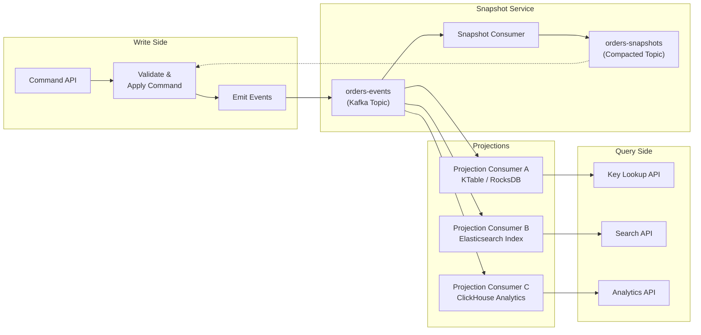
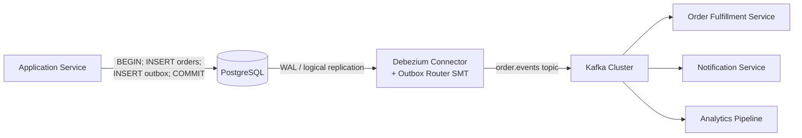
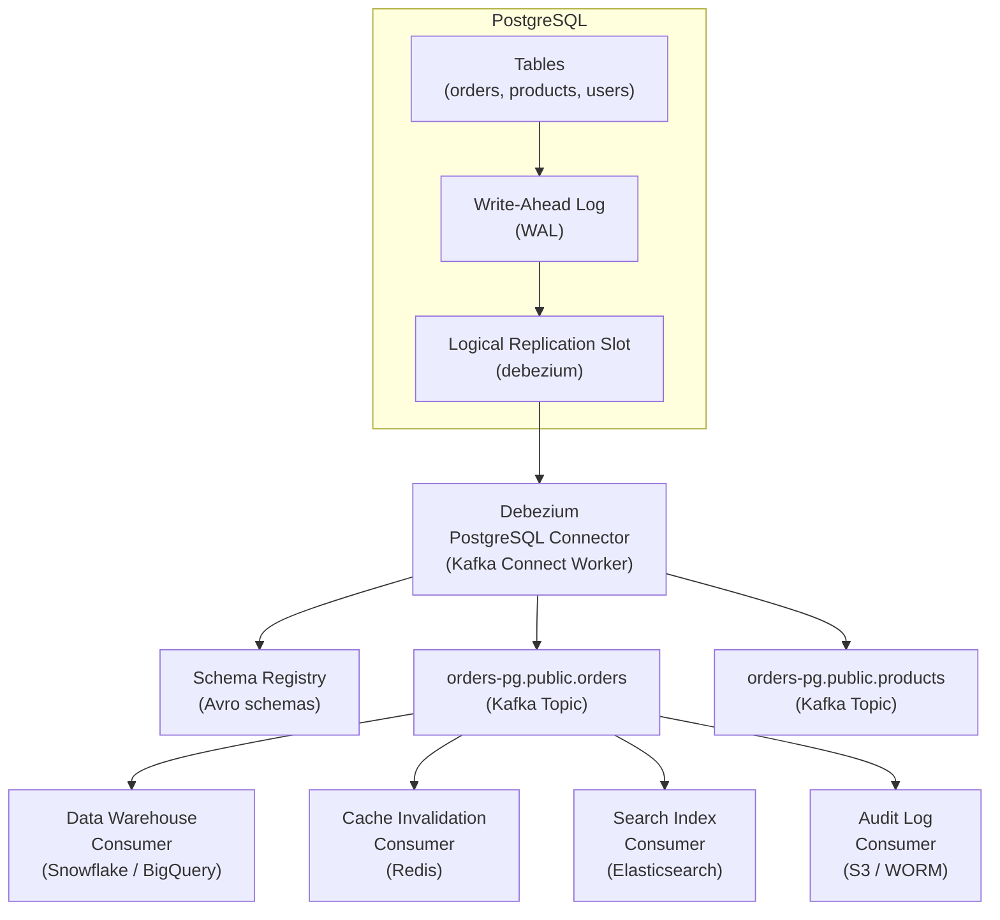
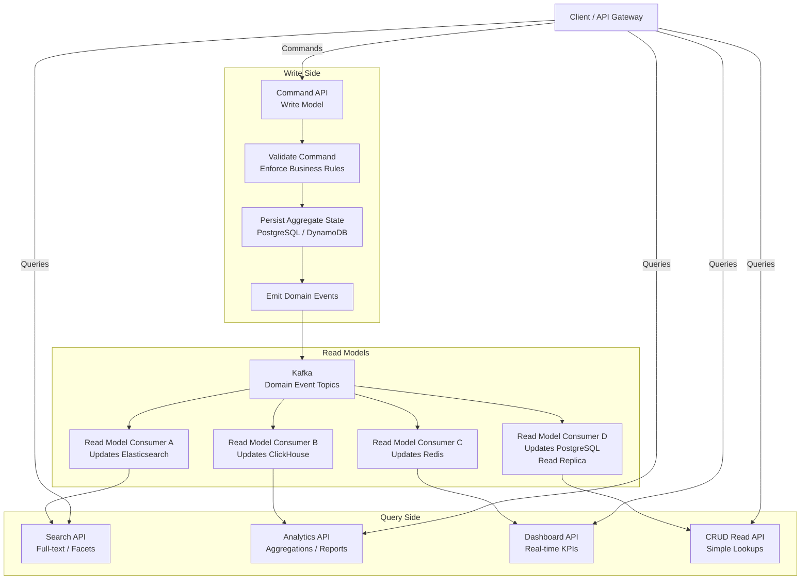
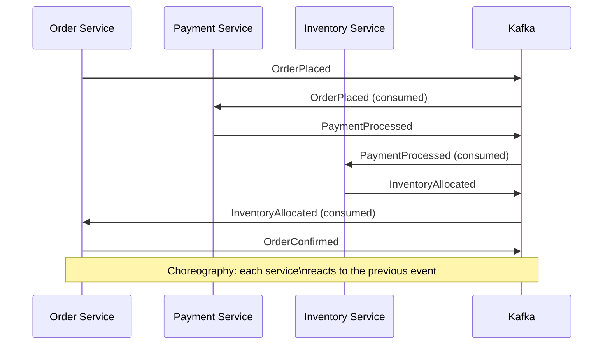

# Apache Kafka Deep Dive  Part 10: Advanced Patterns  Event Sourcing, CDC, CQRS, and Multi-Datacenter

---

**Series:** Apache Kafka Deep Dive  From First Principles to Planet-Scale Event Streaming
**Part:** 10 of 10 (Final)
**Audience:** Senior backend engineers, distributed systems architects, data platform engineers
**Reading time:** ~45 minutes

---

Parts 0 through 9 took you from first principles  sequential I/O, page cache delegation, zero-copy transfers  through the distributed log abstraction, broker internals, the ISR replication protocol, consumer group coordination with the Group Coordinator and partition assignment strategies, the physical storage engine with its segment files and sparse index, producer internals with the two-thread model and exactly-once semantics, performance engineering with batching and compression, Kafka Streams and stateful stream processing, and finally production operations including monitoring, tuning, and incident response. You know how Kafka works at every layer of the stack.

This final part is the capstone. It assembles everything you have learned into the advanced architectural patterns that define how senior engineers actually use Kafka in production at scale: event sourcing, change data capture, CQRS, multi-datacenter replication, and the Kafka Connect ecosystem. It also revisits anti-patterns with the full picture now available, and maps the broader Kafka ecosystem including where the technology is heading.

Nothing in this part is foundational. All of it builds directly on what came before.

---

## 1. Event Sourcing with Kafka

### 1.1 Event Sourcing Fundamentals

Traditional applications store current state. An `orders` table has a row per order with a `status` column. When an order ships, you run `UPDATE orders SET status = 'shipped' WHERE id = 12345`. The previous state  that it was once `payment_processed`, before that `placed`  is gone. You have a point-in-time snapshot with no history.

Event sourcing inverts this. Instead of storing current state, you store the **sequence of events that caused that state**. Events are immutable facts: `OrderPlaced`, `PaymentProcessed`, `OrderShipped`. Current state is not stored  it is derived by replaying the event sequence from the beginning.

```
OrderPlaced        → { orderId: 12345, customerId: 99, items: [...], ts: T1 }
PaymentProcessed   → { orderId: 12345, amount: 49.99, txId: "ch_abc", ts: T2 }
ItemAllocated      → { orderId: 12345, warehouseId: "SFO-1", ts: T3 }
OrderShipped       → { orderId: 12345, trackingId: "1Z999...", ts: T4 }
```

To know the current state of order 12345, you read all four events and fold them through an aggregation function. The result is a projection  an in-memory or persisted representation of the current state computed from the event history.

This has profound implications:

- **Full audit trail**: every change is recorded with its timestamp and causation.
- **Temporal queries**: you can reconstruct any state at any point in time.
- **Event replay**: downstream systems can re-process the entire history.
- **Decoupled projections**: multiple read models can be derived from the same event log, each optimized for its query pattern.

The price: additional architectural complexity, eventual consistency between the event store and projections, and the need to manage event schema evolution over the lifetime of the system.

### 1.2 Kafka as the Event Store

Kafka was designed for exactly what event sourcing requires. A Kafka topic is an append-only, ordered, replayable log. Every property of the Kafka topic maps directly to an event sourcing requirement:

| Event Sourcing Requirement | Kafka Property |
|---|---|
| Append-only (events are immutable) | Topics are append-only logs |
| Ordered events per aggregate | Per-partition ordering (key by aggregate ID) |
| Replayable from any point | Consumer can seek to any offset |
| Durable (events survive crashes) | Configurable replication factor + fsync |
| Long retention | `retention.ms=-1` for infinite retention |
| High write throughput | Sequential disk writes, batching, compression |

The design decision is: **use a Kafka topic as the primary event store**. Each event is a Kafka record. The event's aggregate ID is the Kafka record key, ensuring all events for the same aggregate land in the same partition and are thus totally ordered.

```
Topic: orders-events
  Partition 0: events for aggregate IDs hashing to partition 0
  Partition 1: events for aggregate IDs hashing to partition 1
  ...
  Partition N-1: ...
```

This is not an approximation of an event store built on top of Kafka. **The Kafka topic is the event store**. Kafka's log retention, compaction, and replication machinery become your event store's persistence guarantees.

### 1.3 Aggregate Snapshots

Replaying millions of events to reconstruct a single aggregate's state is theoretically correct but operationally impractical. An order that has been alive for years, with thousands of state transitions (updates, partial fulfillments, returns, reships), takes too long to reconstruct from scratch on every read.

The solution is **snapshots**: periodically persist the full aggregate state at a known offset. On restart or cold read, you:

1. Load the latest snapshot for the aggregate.
2. Note the Kafka offset at which that snapshot was taken.
3. Seek to that offset in the events topic.
4. Replay only the events from that offset forward.

This bounds reconstruction time regardless of total event history length. A system that takes hourly snapshots never replays more than one hour's worth of events.

```
Time     Offset   Event
────     ──────   ──────────────────
T0       100      OrderPlaced
T1       101      PaymentProcessed
...
T-1h     9834     ItemReturned         ← snapshot taken here (offset 9834)
T-59m    9835     RefundInitiated
T-58m    9836     RefundProcessed
T-now    9837     OrderClosed

Reconstruction: load snapshot@9834 → replay 9835, 9836, 9837
```

The snapshot stores the full aggregate state plus the offset at which it was taken. Without the offset, you cannot know where to resume in the event log.

### 1.4 Snapshot Topic Design

Snapshots should be stored in a **compacted Kafka topic**, keyed by aggregate ID. Compaction ensures only the latest snapshot per aggregate is retained, automatically garbage-collecting old snapshots as new ones are written.

```
Topic: orders-snapshots
  Configuration:
    cleanup.policy=compact
    retention.ms=-1        ← keep forever (same as events topic)
    segment.ms=86400000    ← compact daily

  Record:
    Key:   orderId (e.g., "12345")
    Value: { aggregateState: {...}, snapshotOffset: 9834, version: 42 }
```

On startup, a service reads the `orders-snapshots` topic to load the latest snapshot per aggregate, then seeks to the corresponding offset in `orders-events` and begins consuming from there. The compacted snapshots topic also serves as a distributed cache  any replica of the service can bootstrap from it independently.

The `snapshotOffset` field is critical. It tells the consumer exactly where in the `orders-events` topic the snapshot was taken, so replay begins at the right position.

### 1.5 Event Sourcing with Kafka Streams

Kafka Streams provides a first-class implementation of event sourcing patterns without building the machinery from scratch.

- **KStream**: the full ordered event history. Represents every event ever produced to the topic. Ideal for aggregating, transforming, and computing over the event sequence.
- **KTable**: the current-state projection, backed by a compacted changelog topic. Represents the latest value per key. Ideal for point-in-time state lookups.

Both are available simultaneously from the same source topic:

```java
StreamsBuilder builder = new StreamsBuilder();

// Full event history  every OrderPlaced, PaymentProcessed, etc.
KStream<String, OrderEvent> events = builder.stream("orders-events");

// Current state projection  latest aggregate state per orderId
KTable<String, OrderState> currentState = events
    .groupByKey()
    .aggregate(
        OrderState::new,          // initializer
        this::applyEvent,         // aggregator: fold event into state
        Materialized.<String, OrderState, KeyValueStore<Bytes, byte[]>>as("orders-state-store")
            .withKeySerde(Serdes.String())
            .withValueSerde(orderStateSerde)
    );
```

The `orders-state-store` is backed by RocksDB locally and a compacted Kafka changelog topic for durability. The KTable is the materialized snapshot that Kafka Streams maintains and updates as new events arrive. The KStream is the original append-only event sequence.

This is the duality of event sourcing in Kafka Streams: the stream is the canonical truth; the table is the queryable projection.

### 1.6 Temporal Queries

The most powerful property of event sourcing  one that is completely impossible with a traditional mutable-state database  is **temporal queries**: reconstructing state at any arbitrary point in time.

"What was the state of order 12345 at 2:00 PM yesterday?"

With a mutable database, the answer is: impossible (unless you have a separate audit log). The database overwrote the previous state when it applied the update.

With Kafka event sourcing:

```java
// Seek to timestamp in the event topic
Map<TopicPartition, Long> timestamps = new HashMap<>();
timestamps.put(new TopicPartition("orders-events", partitionFor("12345")),
               targetTimestamp);  // 2PM yesterday as epoch milliseconds

Map<TopicPartition, OffsetAndTimestamp> offsets =
    consumer.offsetsForTimes(timestamps);

// Seek to that offset
consumer.seek(partition, offsets.get(partition).offset());

// Replay forward, stopping when timestamp exceeds target
OrderState state = new OrderState();
while (true) {
    ConsumerRecords<String, OrderEvent> records = consumer.poll(Duration.ofMillis(100));
    for (ConsumerRecord<String, OrderEvent> record : records) {
        if (record.key().equals("12345") && record.timestamp() <= targetTimestamp) {
            state = applyEvent(state, record.value());
        } else if (record.timestamp() > targetTimestamp) {
            return state;  // state as of exactly 2PM yesterday
        }
    }
}
```

`consumer.offsetsForTimes()` translates a wall-clock timestamp to a Kafka offset using the timestamp index (`.timeindex` files that Part 5 covered). Seek to that offset, replay forward filtering by aggregate ID, stop when the timestamp threshold is crossed. No special infrastructure required  it emerges naturally from Kafka's indexing capabilities.

### 1.7 Event Schema Evolution

Events are immutable historical facts, and this immutability creates a schema evolution challenge that does not exist with mutable databases: you cannot ALTER the schema of events already written. Every event from five years ago must still be deserializable by consumers running today.

The strategies, in order of preference:

**Add new event types instead of modifying old ones.** If `OrderPlaced_v1` needs a new field, create `OrderPlaced_v2` with the additional field. Consumers handle both types. Old events remain exactly as they were written.

**Use Avro or Protobuf with additive schema evolution.** Both support adding optional fields with defaults without breaking backward compatibility. A consumer running the new schema can deserialize old records (the new field gets its default value). A consumer running the old schema can deserialize new records (the unknown field is ignored in forward-compatible mode).

```protobuf
// v1
message OrderPlaced {
    string order_id = 1;
    string customer_id = 2;
    repeated LineItem items = 3;
}

// v2  added field with default, backward and forward compatible
message OrderPlaced {
    string order_id = 1;
    string customer_id = 2;
    repeated LineItem items = 3;
    string channel = 4;  // "web", "mobile", "api"  new field, optional
}
```

**Never rename, remove, or change the type of an existing field.** Once a field is in the schema and events with that field exist in the log, it is permanent. Removing it breaks deserialization of old records.

**Use semantic versioning for genuinely breaking changes.** When a change is truly incompatible (restructured event, renamed aggregate concept), create a new topic. `orders-events-v2` starts fresh. Run a migration job that reads from `orders-events` (v1) and produces translated events to `orders-events-v2`. Consumers migrate to the new topic on their schedule.

### 1.8 Event Sourcing Pitfalls

**The event store is not a database.** Kafka cannot answer "give me all orders in status SHIPPED for customer 99 placed in the last 30 days." The event topic is a time-ordered log, not a queryable index. Every query pattern requires a **projection**  a derived view maintained by a consumer that continuously reads events and writes to a queryable store (Elasticsearch, PostgreSQL, Redis, ClickHouse). The event log is the source of truth; the projection is the query surface.

**Causality tracking.** Events from multiple aggregates may have causal relationships. "Order 12345 was placed because inventory was available"  the order placement causally depends on the inventory check. Kafka's per-partition ordering does not capture cross-partition causality. For systems where strict causal ordering matters across aggregates, embed **Lamport timestamps** or **vector clocks** in event payloads. This is complex and most systems don't need it; be sure you do before implementing it.

**Infinite retention means infinite storage.** Event sourcing requires keeping events forever (or for the system's lifetime). Set `retention.ms=-1` on event store topics. As Part 5 discussed, this means storage grows without bound. Tiered storage (S3 as the cold tier, local disk as the hot tier) is the production answer  keep recent events on fast local SSD, archive older events to object storage, and retrieve them transparently on seek.

**Diagram: Event Sourcing with Kafka**



---

## 2. Change Data Capture (CDC) with Kafka

### 2.1 What CDC Is

Change Data Capture is the practice of capturing every change  INSERT, UPDATE, DELETE  made to a database and publishing those changes as a stream of events. The database remains the system of record; Kafka becomes the distribution mechanism that propagates changes to any number of downstream systems.

The mental model: instead of downstream systems polling the database (high load, latency, missed deletes), the database's own change stream is tapped and the changes flow outward to all consumers at the moment they occur.

CDC turns every database into an event source without requiring the application to be rewritten to produce events explicitly. This is its primary advantage over application-level event publishing: it works even with legacy applications and captures changes made by any path (ORM, raw SQL, migration scripts, admin tools).

### 2.2 CDC Use Cases

- **Data warehouse replication**: stream all DB changes to a data warehouse (Snowflake, BigQuery, ClickHouse) in near real-time, eliminating nightly ETL batch jobs and their associated delay and fragility.
- **Cross-service data synchronization**: when Service A owns a table that Service B needs to read, CDC publishes changes so B maintains its own local copy, eliminating synchronous cross-service calls.
- **Cache invalidation**: when a DB record changes, the corresponding cache entry is immediately invalidated or updated, keeping caches consistent with the DB.
- **Downstream workflow triggers**: a record inserted into `orders` triggers a fulfillment workflow; a record inserted into `fraud_alerts` triggers a notification. CDC turns the DB into an event source for workflow orchestration.
- **Audit logging**: every INSERT/UPDATE/DELETE is captured with timestamp, before-image, and after-image, providing a complete audit trail without modifying application code.
- **Search index synchronization**: changes to the `products` table in PostgreSQL are streamed to Elasticsearch, keeping the search index current.

### 2.3 CDC Methods

**Query-based CDC** polls the database for changed rows, typically using a `updated_at` column:

```sql
SELECT * FROM orders WHERE updated_at > :last_checked_at
```

This approach is simple to implement but has fundamental limitations:
- Misses hard deletes (deleted rows cannot be queried).
- Adds load to the database on every poll interval.
- Not real-time  there is an inherent delay equal to the poll interval.
- Misses multiple updates between polls (only the final state is captured).

Query-based CDC is appropriate for simple, low-volume synchronization needs with acceptable latency. It is not the production approach for high-volume or latency-sensitive workloads.

**Log-based CDC** reads the database's internal write-ahead log (WAL). Every database that guarantees durability maintains a WAL  a sequential log of every change applied to the database, written before the change is applied to the data files. Log-based CDC taps this log at the source:

- Real-time: changes appear in the log within milliseconds of commit.
- Captures all operations including hard deletes.
- Zero added load on the database (reading the log is sequential I/O, separate from query processing).
- Captures before-image and after-image of every change.
- Captures every intermediate state even under rapid updates.

Log-based CDC is the production approach. Its complexity lies in interpreting the database-specific log format, which is where Debezium comes in.

### 2.4 Debezium

Debezium is an open-source CDC framework, now a Red Hat project, that reads database WALs and publishes change events to Kafka. It runs as a Kafka Connect source connector, integrating natively with the Connect framework (Part 7).

Supported databases and their log mechanisms:

| Database | Log Mechanism | Debezium Connector |
|---|---|---|
| PostgreSQL | Logical replication (WAL via pgoutput/wal2json) | `debezium-connector-postgres` |
| MySQL / MariaDB | Binary log (binlog) | `debezium-connector-mysql` |
| MongoDB | Oplog | `debezium-connector-mongodb` |
| SQL Server | Change Data Capture (SQL Server native CDC) | `debezium-connector-sqlserver` |
| Oracle | LogMiner / Redo logs | `debezium-connector-oracle` |
| Cassandra | Commit log | `debezium-connector-cassandra` |

Debezium handles the database-specific log protocol, schema introspection, offset tracking, and error recovery. From the application perspective, you configure the connector and receive a stream of structured change events in Kafka.

### 2.5 Debezium PostgreSQL Setup

PostgreSQL requires logical replication to be enabled  a configuration that exposes the WAL in a structured format that Debezium can parse.

**Step 1: Configure PostgreSQL**

```ini
# postgresql.conf
wal_level = logical          # Required: enables logical decoding
max_replication_slots = 4    # One slot per Debezium connector + headroom
max_wal_senders = 4          # One per replication connection
```

**Step 2: Create a replication slot**

```sql
-- Creates a logical replication slot using the pgoutput plugin (built into PG 10+)
SELECT pg_create_logical_replication_slot('debezium', 'pgoutput');

-- Verify
SELECT slot_name, plugin, slot_type, confirmed_flush_lsn
FROM pg_replication_slots;
```

**Step 3: Create a Debezium user with replication privileges**

```sql
CREATE USER debezium REPLICATION LOGIN PASSWORD 'secret';
GRANT SELECT ON ALL TABLES IN SCHEMA public TO debezium;
```

**Step 4: Deploy the Debezium Kafka Connect connector**

```json
{
  "name": "postgres-orders-connector",
  "config": {
    "connector.class": "io.debezium.connector.postgresql.PostgresConnector",
    "database.hostname": "postgres.internal",
    "database.port": "5432",
    "database.user": "debezium",
    "database.password": "secret",
    "database.dbname": "orders_db",
    "database.server.name": "orders-pg",
    "plugin.name": "pgoutput",
    "slot.name": "debezium",
    "table.include.list": "public.orders,public.order_items",
    "key.converter": "io.confluent.kafka.serializers.KafkaAvroSerializer",
    "value.converter": "io.confluent.kafka.serializers.KafkaAvroSerializer",
    "schema.registry.url": "http://schema-registry:8081"
  }
}
```

**Topic naming**: Debezium creates one topic per table: `{server.name}.{schema}.{table}`. For this configuration: `orders-pg.public.orders` and `orders-pg.public.order_items`.

**Change event structure**:

```json
{
  "before": {
    "id": 12345,
    "status": "payment_processed",
    "updated_at": "2025-10-01T14:00:00Z"
  },
  "after": {
    "id": 12345,
    "status": "shipped",
    "tracking_id": "1Z999AA10123456784",
    "updated_at": "2025-10-01T15:30:00Z"
  },
  "op": "u",
  "ts_ms": 1727793000000,
  "source": {
    "version": "2.4.0.Final",
    "connector": "postgresql",
    "name": "orders-pg",
    "ts_ms": 1727793000000,
    "db": "orders_db",
    "schema": "public",
    "table": "orders",
    "txId": 7283,
    "lsn": 24023128,
    "xmin": null
  }
}
```

The `op` field values: `"c"` (create/INSERT), `"u"` (update/UPDATE), `"d"` (delete/DELETE), `"r"` (read  used during initial snapshot).

`before` is `null` for INSERTs; `after` is `null` for DELETEs. Both are populated for UPDATEs, giving consumers a full diff.

### 2.6 The Outbox Pattern

The outbox pattern solves one of the hardest problems in distributed systems: **atomically updating a database and publishing an event**. This is the "dual write" problem.

**The problem**: a service handles a command  say, place an order. It needs to:
1. Write the order to the `orders` table.
2. Publish an `OrderPlaced` event to the `orders-events` Kafka topic.

If it does both independently, either can fail after the other succeeds:
- DB commits, Kafka publish fails → order exists in DB but no event was published. Downstream systems never learn about the order.
- Kafka publishes, DB rollback → event exists in Kafka but no order in DB. Downstream systems process a phantom order.

Two-phase commit between a relational database and Kafka is theoretically possible but operationally nightmarish. XA transactions across heterogeneous systems are fragile and not supported by most Kafka clients.

**The outbox solution**:

```sql
-- In the same DB transaction:
BEGIN;

INSERT INTO orders (id, customer_id, status, ...)
VALUES (12345, 99, 'placed', ...);

INSERT INTO outbox (id, aggregate_type, aggregate_id, event_type, payload)
VALUES (
    gen_random_uuid(),
    'order',
    12345,
    'OrderPlaced',
    '{"orderId": 12345, "customerId": 99, ...}'::jsonb
);

COMMIT;
```

The `outbox` table is an event staging table. The application writes only to the database. The Debezium connector watches the `outbox` table and publishes its rows to Kafka as they appear.

The DB transaction guarantees atomicity: either both the `orders` INSERT and the `outbox` INSERT commit, or neither does. Debezium handles the publishing. If Debezium is temporarily down, the outbox rows accumulate until Debezium recovers and catches up  the events are not lost because they are in the durable database.

**Debezium Outbox Event Router SMT**: Debezium provides a Single Message Transform that reads from the `outbox` CDC events and routes them to topic-per-aggregate:

```json
{
  "transforms": "outbox-router",
  "transforms.outbox-router.type": "io.debezium.transforms.outbox.EventRouter",
  "transforms.outbox-router.table.field.event.id": "id",
  "transforms.outbox-router.table.field.event.key": "aggregate_id",
  "transforms.outbox-router.table.field.event.type": "event_type",
  "transforms.outbox-router.table.field.event.payload": "payload",
  "transforms.outbox-router.route.by.field": "aggregate_type",
  "transforms.outbox-router.route.topic.replacement": "${routedByValue}.events"
}
```

With this configuration, an outbox row with `aggregate_type = "order"` is published to the `order.events` topic. The SMT strips the outbox metadata and publishes only the domain event payload.



### 2.7 CDC and Schema Evolution

When the database schema changes  `ALTER TABLE orders ADD COLUMN priority VARCHAR(10)`  the CDC events immediately reflect the new schema. Debezium re-reads the schema from the database and registers a new Avro schema version in Schema Registry.

If the Schema Registry compatibility mode is set to BACKWARD (the recommended setting), the new schema with an additional optional column is backward compatible. Consumers on the old schema can deserialize new events (the new column is ignored). Once consumers upgrade, they can read the new field.

The dangerous case: `ALTER TABLE orders DROP COLUMN customer_notes`. This removes a field from the CDC event schema. If consumers depend on `customer_notes`, they break. This is a breaking change. Coordinate with consumers before dropping columns  or never drop columns, only deprecate them by name convention.

### 2.8 CDC Pitfalls

**Replication slot lag.** PostgreSQL's logical replication is pull-based: Debezium asks the database for changes by advancing a replication slot. The WAL segment cannot be recycled (freed from disk) until Debezium has acknowledged consuming it. If Debezium falls behind  consumer lag grows  PostgreSQL WAL files accumulate on disk without bound. A Debezium outage that lasts 24 hours on a busy database can fill the data volume and crash PostgreSQL.

Monitor `pg_replication_slots.confirmed_flush_lsn` lag aggressively:

```sql
SELECT slot_name,
       pg_current_wal_lsn() - confirmed_flush_lsn AS lag_bytes,
       pg_size_pretty(pg_current_wal_lsn() - confirmed_flush_lsn) AS lag_pretty
FROM pg_replication_slots;
```

Alert when lag exceeds a threshold (e.g., 1GB). Set `max_slot_wal_keep_size` in PostgreSQL 13+ to cap WAL retention per slot, at the cost of Debezium potentially needing to re-snapshot if it falls too far behind.

**High-volume tables.** A table that receives 100,000 writes per second generates 100,000 CDC events per second in Kafka. This is fine if you plan for it  partition the target topic by primary key, size the cluster for the throughput. The pitfall is underestimating the event volume at design time.

**Initial snapshot.** When Debezium first connects to a table, it performs a full table scan to capture the existing state. For a table with 500 million rows, this scan can take hours and places significant read load on the database. Plan initial snapshots for low-traffic periods. PostgreSQL's snapshot isolation ensures the scan is consistent (it reads a consistent snapshot of the table as of the time the scan started), but the I/O load is real.

**Diagram: Debezium CDC Pipeline**



---

## 3. CQRS (Command Query Responsibility Segregation) with Kafka

### 3.1 CQRS Fundamentals

CQRS is the architectural pattern of separating the **write model** (commands that mutate state) from the **read model** (queries that read state). In a traditional monolithic application, the same data model serves both writes and reads  acceptable when the access patterns are similar, problematic when they diverge.

The divergence happens at scale:
- The write model needs transactional consistency, foreign key constraints, and write throughput.
- The read model needs low-latency access optimized for specific query shapes: full-text search, faceted aggregation, real-time dashboards, materialized joins.

A relational database with indexes can satisfy many read patterns, but not all. Full-text search wants Elasticsearch's inverted index. OLAP queries want ClickHouse's columnar storage. User-facing dashboards want Redis's in-memory key-value access. No single database is optimal for all query patterns.

CQRS solves this by allowing the write model and read models to be different data stores, synchronized asynchronously.

### 3.2 Why CQRS + Kafka

Kafka is the natural event bus between the write model and multiple read models. The write model emits events to Kafka whenever state changes. Each read model subscribes to those events and maintains its own optimized store, updated continuously as events arrive.

The coupling between write model and read models is entirely through Kafka:
- Write model does not know how many read models exist.
- Read models do not call the write model.
- New read models can be added without modifying the write model.
- Read models can be rebuilt at any time by replaying the event history.

### 3.3 CQRS Architecture with Kafka



Each read model is a **consumer group** that:
1. Consumes events from the domain event topic.
2. Transforms each event into a write to its target data store.
3. Tracks its own consumer group offset, independent of other read models.

The read models evolve independently. Adding a new ClickHouse analytics model does not touch the Elasticsearch model. Each model's consumer group can be paused, resumed, or reset without affecting others.

### 3.4 Eventual Consistency

Read models lag behind the write model by the consumer processing time  typically milliseconds to seconds under normal conditions, potentially more under high load or consumer backpressure.

This means a user who places an order may query the search API milliseconds later and not yet see their order in search results. This is **eventual consistency**: the system will converge to a consistent state, but not instantaneously.

Design strategies for eventual consistency in UX:

- **Optimistic UI updates**: the client updates its local state immediately on command submission, without waiting for the read model to reflect the change. The UI shows the expected state; if the command fails, the UI rolls back.
- **Read-your-writes**: after issuing a command, the client queries the write model directly (bypassing the eventually-consistent read model) for that specific record. Only for cases where the user immediately queries their own recent change.
- **Staleness indicators**: display "data as of N seconds ago" in dashboards and analytics views where real-time is not critical.
- **Event-driven UI updates**: use Server-Sent Events or WebSocket to push a notification to the client when the read model is updated. The client then refreshes from the updated read model.

Eventual consistency is not a bug. It is the deliberate tradeoff that enables read models to be independently optimized and scaled.

### 3.5 Read Model Rebuilding

The single most powerful property of CQRS with Kafka is that **any read model can be fully rebuilt at any time** by replaying the event history.

Scenarios that require rebuilding:
- A bug in the read model consumer corrupted the data store.
- New query requirements demand a different schema (adding a new field to the Elasticsearch mapping, changing an aggregation).
- Migrating from one data store technology to another (Elasticsearch to OpenSearch).
- A catastrophic failure destroyed the read model's data store.

Rebuilding procedure:
1. Reset the consumer group offset to the beginning of the event topic.
2. Restart the consumer with the new logic.
3. It replays all events from offset 0, rebuilding the read model from scratch.
4. During the rebuild, the old read model can remain in service (if still intact) or the endpoint can return a "data rebuilding" indicator.

This works only because Kafka retains the full event history. The event log is the canonical source of truth. The read models are derived, disposable, and rebuildable. This inverts the risk model compared to traditional databases: instead of "if the database is destroyed everything is lost," you have "any derived store can be rebuilt from the log."

### 3.6 CQRS Pitfalls

**Unjustified complexity.** CQRS adds significant architectural weight: separate write and read models, asynchronous synchronization, eventual consistency to manage in the UX, multiple data stores to operate. This complexity is justified only when read and write access patterns are genuinely different and cannot be served by a single store with appropriate indexes. A CRUD application with simple query patterns does not benefit from CQRS. Apply the pattern where the problem demands it, not by default.

**Event ordering across aggregates.** Within a single aggregate (keyed to the same Kafka partition), events are totally ordered. Across aggregates on different partitions, there is no ordering guarantee. A read model that joins state from two aggregates may see events from aggregate A before or after events from aggregate B, depending on which partition each comes from. Design read models to be idempotent and to handle out-of-order events gracefully.

**Saga coordination.** Long-running business processes that span multiple aggregates require sagas  sequences of compensating transactions that handle partial failure. There are two saga styles:

- **Choreography-based sagas**: each service listens for events and reacts by performing its step and emitting the next event. No central coordinator. Simpler, but hard to visualize and debug when things go wrong.
- **Orchestration-based sagas**: a saga coordinator service manages the saga state machine, explicitly commanding each participant and handling failures. More complex, but the saga logic is centralized and observable.



---

## 4. Kafka as a Database: Materialized Views

### 4.1 The "Kafka as a Database" Pattern

Kafka is not a database. But with the right patterns, it can serve database-like functions for specific, constrained access patterns. Understanding where it works  and where it breaks down  prevents both under-utilization and overreach.

The pattern: use a **compacted Kafka topic** as a distributed key-value store. The compacted topic retains only the latest value per key, functioning like a continuously-updated hashmap. A Kafka Streams KTable backed by this topic materializes the data into a local RocksDB state store, enabling sub-millisecond key lookups without leaving the JVM.

This is not theoretical  it is the mechanism behind Kafka Streams changelog topics, Flink's operator state, and ksqlDB's materialized tables.

### 4.2 KTable Interactive Queries

Kafka Streams exposes local state stores for external query via the **Interactive Queries API**. A Streams application that maintains a KTable can serve point lookups over its local RocksDB state, without writing to or reading from any external database.

```java
// Expose the state store via a gRPC or HTTP endpoint
KafkaStreams streams = new KafkaStreams(topology, props);
streams.start();

ReadOnlyKeyValueStore<String, OrderState> store =
    streams.store(StoreQueryParameters.fromNameAndType(
        "orders-state-store",
        QueryableStoreTypes.keyValueStore()
    ));

// Serve queries
OrderState state = store.get("12345");  // Sub-millisecond RocksDB lookup
```

For keys that live on a different Streams instance (because the state is partitioned across instances), the Streams metadata API identifies which host owns the key, and the querying instance proxies the request:

```java
KeyQueryMetadata metadata =
    streams.queryMetadataForKey("orders-state-store", key, Serdes.String().serializer());

if (metadata.activeHost().equals(thisHostInfo)) {
    return store.get(key);    // Local lookup
} else {
    return remoteService.get(metadata.activeHost(), key);  // Proxy to owning instance
}
```

This gives you a distributed, automatically-sharded, always-consistent (with the event stream) key-value store with no separate database to operate.

### 4.3 When This Works Well

The KTable Interactive Queries pattern is well-suited to:

- **Read-heavy, simple key lookups**: the primary access pattern is `GET /orders/12345`, with the key known in advance.
- **Data already in Kafka**: if the state is derived from a Kafka stream, there is no impedance mismatch  the KTable is the natural materialization.
- **Latency-sensitive access**: RocksDB lookups from local NVMe storage are 100 microseconds or less. This beats any external database over the network.
- **Automatically consistent with stream state**: the KTable is always current with the stream. No cache invalidation, no TTL management.

### 4.4 When This Breaks Down

The pattern fails under:

- **Complex queries**: range scans, multi-key joins, filters, sorting  RocksDB and Interactive Queries do not provide SQL. You cannot do `SELECT * FROM orders WHERE status = 'shipped' AND customer_id = 99 ORDER BY placed_at DESC LIMIT 10` against a KTable.
- **Large datasets that don't fit on disk**: each Streams instance must store its partition's data on local disk. If the dataset exceeds the disk capacity of any single instance, the pattern breaks. Horizontal partitioning helps but adds complexity.
- **Multi-tenancy with isolation**: Streams state stores have no access control. All queries against the store see all data. If you need per-tenant isolation, use a database with row-level security.
- **Operational familiarity**: teams used to PostgreSQL know how to operate it, tune it, and recover it. Operating Kafka Streams state stores requires different operational knowledge.

### 4.5 ksqlDB as a Queryable Kafka Database

ksqlDB extends the materialization pattern with a SQL-like interface. A ksqlDB **pull query** reads from a materialized table synchronously:

```sql
-- Create a materialized table from a Kafka topic
CREATE TABLE orders_by_id AS
    SELECT order_id,
           LATEST_BY_OFFSET(status) AS status,
           LATEST_BY_OFFSET(customer_id) AS customer_id,
           COUNT(*) AS event_count
    FROM orders_events
    GROUP BY order_id
    EMIT CHANGES;

-- Pull query: point-in-time read of current state
SELECT * FROM orders_by_id WHERE order_id = '12345';
```

ksqlDB pull queries are served from the materialized state, not from re-scanning the Kafka topic. Latency is typically single-digit milliseconds. This is suitable for simple lookups and aggregations  real-time dashboards, API endpoints that read Kafka-derived state.

ksqlDB is not a replacement for a relational database. It does not support transactions, foreign key constraints, or complex multi-table joins. It is a queryable layer over Kafka topics, most valuable when the primary flow is event-driven and the query patterns are simple.

---

## 5. Schema Registry and Schema Evolution

### 5.1 Why Schemas Matter at Scale

Without schemas, a Kafka topic is a stream of opaque bytes. The only contract between producer and consumer is informal: "I'll publish JSON with fields `x`, `y`, `z` in this format." This works for a single team with two services. It fails at scale.

Consider: 80 producer services publishing to 400 topics consumed by 200 consumer services. A team modifies their JSON payload  removes a field that consumers depend on, renames a field for clarity. They deploy their producer. Within minutes, consumer services start throwing `NullPointerException` and deserialization errors in production.

There is no automated validation, no contract enforcement, no notification mechanism. The breaking change propagated silently to production.

Schema governance through Schema Registry solves this by making schemas explicit, registered, versioned, and enforced at serialization time. A producer cannot publish data in a schema that breaks registered compatibility rules. The contract is enforced in code, not in documentation.

### 5.2 Confluent Schema Registry

The Schema Registry is a separate service (typically deployed alongside the Kafka cluster) that stores Avro, Protobuf, and JSON Schema definitions. It exposes a REST API for schema registration and retrieval.

The wire format: every Avro-serialized record in Kafka begins with a **5-byte magic prefix**:

```
Byte 0:     Magic byte (0x00)  indicates Confluent wire format
Bytes 1-4:  Schema ID (big-endian int32)  identifies the schema version

Bytes 5+:   Avro binary payload
```

When a producer serializes a record:
1. Serializer computes the schema fingerprint.
2. Checks local cache: is this schema already registered?
3. If not, registers it with Schema Registry via `POST /subjects/{topic}-value/versions`.
4. Schema Registry returns the schema ID.
5. Serializer writes the 5-byte prefix + Avro binary payload to Kafka.

When a consumer deserializes a record:
1. Reads bytes 1-4 to extract the schema ID.
2. Checks local cache: is this schema ID already fetched?
3. If not, fetches the schema from Schema Registry via `GET /schemas/ids/{id}`.
4. Deserializes the Avro payload using the fetched schema.

Both producer and consumer cache schemas locally. Under steady state, Schema Registry is only contacted on first encounter with a new schema ID  typically once per deployment, not once per message.

### 5.3 Schema Compatibility Modes

Schema Registry enforces compatibility between schema versions when a new schema is registered for a subject. The compatibility mode is configured per subject:

| Mode | What it guarantees | Who must upgrade first |
|---|---|---|
| `BACKWARD` | New schema can read data written by old schema | Consumers (upgrade before producers) |
| `FORWARD` | Old schema can read data written by new schema | Producers (upgrade before consumers) |
| `FULL` | New schema can read old data AND old schema can read new data | Either order is safe |
| `BACKWARD_TRANSITIVE` | New schema compatible with all previous versions, not just the latest | Consumers |
| `FORWARD_TRANSITIVE` | Old schema can read data written by any future schema version | Producers |
| `FULL_TRANSITIVE` | Fully compatible with all versions, not just adjacent | Either order |
| `NONE` | No compatibility enforcement | Coordination required |

The production default for most teams is `FULL` or `FULL_TRANSITIVE`. This is the most restrictive and safest: schema changes must be compatible with both reading old data and old consumers reading new data. The practical implication: **only add optional fields with default values**. Never remove, rename, or change field types.

### 5.4 Schema Evolution Best Practices

**Always add fields with defaults.** In Avro:

```json
{
  "type": "record",
  "name": "OrderPlaced",
  "fields": [
    {"name": "orderId", "type": "string"},
    {"name": "customerId", "type": "string"},
    {"name": "channel", "type": ["null", "string"], "default": null}
  ]
}
```

The `channel` field has a union type of `["null", "string"]` with a default of `null`. Old records without this field deserialize with `channel = null`. Old consumers ignore the field. Both conditions are satisfied.

**Never rename fields; add new fields instead.** If `customerId` must become `userId`, add a `userId` field and populate both. Deprecate `customerId` in documentation. Remove it in a future schema version after all consumers have migrated  but only on topics with short retention, or never if the topic retains events permanently.

**Never change field types.** Changing `amount` from `int` to `long` or `string` is a breaking change. Add a new field `amountLong` or `amountDecimal` if the type must change.

**Version subjects explicitly for breaking changes.** If a breaking change is truly necessary, create a new Kafka topic and a new Schema Registry subject. Run producers that write to both topics in parallel during migration. Consumers migrate to the new topic at their own pace. Decommission the old topic after all consumers have migrated.

### 5.5 The Schema ID Flow

```
Producer Side:
  record = { orderId: "12345", customerId: "99", channel: "web" }
  bytes = avroSerializer.serialize(record, schema_v3)
     → [0x00][0x00 0x00 0x00 0x2A][...avro binary bytes...]
               ↑ magic        ↑ schema ID = 42

Consumer Side:
  bytes = [0x00][0x00 0x00 0x00 0x2A][...avro binary bytes...]
  schemaId = readInt(bytes[1:5])  → 42
  schema = schemaRegistry.getById(42)  → schema_v3 Avro definition
  record = avroDeserializer.deserialize(bytes[5:], schema)
         → { orderId: "12345", customerId: "99", channel: "web" }
```

The schema ID is the coupling point between producer and consumer. Both resolve the schema from the same Schema Registry, ensuring they interpret the same bytes the same way. This eliminates the need for producers and consumers to share schema files out-of-band.

---

## 6. Multi-Datacenter Replication

### 6.1 Why Multi-Datacenter

A single Kafka cluster spans a single datacenter (or a single availability zone grouping). There are four reasons to replicate across datacenters:

**Disaster recovery**: if the primary datacenter suffers a catastrophic failure (power, network, fire), a secondary datacenter with a replicated copy of the Kafka data can take over. The RPO (recovery point objective) is the replication lag; the RTO (recovery time objective) is the time to detect the failure and switch producers and consumers to the secondary cluster.

**Geographic data locality**: users in Europe experience lower latency reading from a European Kafka cluster than from a US cluster. Produce events in the region closest to the event source; replicate globally for systems that need a global view.

**Data residency compliance**: GDPR and similar regulations require that personal data about European users remain within European borders. A European Kafka cluster with replication restricted to European datacenters satisfies this requirement. The US cluster does not receive personal data about EU users.

**Active-active load distribution**: both datacenters actively serve producers and consumers, with replication sharing state. This provides both redundancy and load distribution.

### 6.2 MirrorMaker 2

MirrorMaker 2 (MM2) is Kafka's built-in cross-cluster replication tool, introduced in Kafka 2.4. It runs as a Kafka Connect cluster  consuming from a source Kafka cluster and producing to a target Kafka cluster.

MM2 supersedes MirrorMaker 1 (a simple consumer-producer bridge) with:
- Bidirectional replication with loop prevention.
- Offset translation between source and target clusters.
- Consumer group offset replication (enabling consumer failover).
- Topic configuration synchronization.
- ACL replication.

### 6.3 MM2 Architecture

Internally, MM2 uses the Kafka Connect framework. Each MM2 deployment consists of:

- **MirrorSourceConnector**: consumes from the source cluster, produces to the target cluster.
- **MirrorCheckpointConnector**: reads consumer group offsets from the source cluster and writes translated offsets to the target cluster (enabling failover).
- **MirrorHeartbeatConnector**: produces heartbeat records to verify replication connectivity.

MM2 runs these as Kafka Connect tasks, with parallelism controlled by the number of tasks configured.

```yaml
# mm2.properties
clusters = us-east, us-west
us-east.bootstrap.servers = kafka-us-east:9092
us-west.bootstrap.servers = kafka-us-west:9092

# Replicate from us-east to us-west
us-east->us-west.enabled = true
us-east->us-west.topics = .*  # replicate all topics

# Replicate from us-west to us-east (bidirectional)
us-west->us-east.enabled = true
us-west->us-east.topics = .*

# Offset sync interval
emit.checkpoints.interval.seconds = 60
```

### 6.4 Topic Renaming

MM2 prefixes replicated topics with the source cluster alias. A topic `payments.transactions` produced on the `us-east` cluster appears on the `us-west` cluster as `us-east.payments.transactions`.

This prefix serves two purposes:
1. **Provenance**: consumers on `us-west` know whether they are consuming locally-produced events (`payments.transactions`) or replicated events from `us-east` (`us-east.payments.transactions`).
2. **Loop prevention**: MM2 will not replicate `us-east.payments.transactions` back to `us-east`, because a topic with the `us-east.` prefix did not originate on `us-west`.

### 6.5 Offset Translation

Consumer offsets are local to a cluster. Offset 1,000,000 on `us-east` does not correspond to offset 1,000,000 on `us-west`. The target cluster has a different log (records may be batched differently, compaction may have applied, the timeline of when records arrived differs).

MM2 maintains an internal offset translation mapping: for each source consumer group, it tracks the last committed source offset and the corresponding target offset where the same record appears. This mapping is stored in an internal topic on the target cluster.

When failing over consumer groups from `us-east` to `us-west`, the translated offset enables consumers to resume from approximately the same position in the replicated log:

```bash
# MM2 provides a tool for offset translation during failover
kafka-mirrormaker.sh \
  --offset-translation \
  --consumer-group orders-fulfillment \
  --source-cluster us-east \
  --target-cluster us-west
```

The translation is approximate  there may be a small window of re-processing or potential gaps if translation lag exists  but it provides best-effort position continuity.

### 6.6 Active-Active Replication

In active-active mode, both clusters produce and consume events. Bidirectional replication shares state between clusters.

The loop prevention mechanism: MM2 tracks which topics originated from which cluster via the topic prefix. A `payments.transactions` event produced on `us-east` is replicated to `us-west` as `us-east.payments.transactions`. MM2 on `us-west` does not replicate `us-east.payments.transactions` back to `us-east`  it recognizes the `us-east.` prefix as a signal that the topic originated there.

Active-active introduces the **concurrent write problem**: if an order with ID 12345 is updated on `us-east` and also updated on `us-west` during a network partition, both clusters have diverging states for the same key. After the partition heals and replication resumes, there are two conflicting events for the same aggregate.

Resolution strategies:
- **Last-write-wins (LWW)**: the event with the higher timestamp wins. Simple but can lose writes.
- **Region-prefixed keys**: each region writes to distinct key namespaces. `us-east:order:12345` and `us-west:order:12345` are different keys that never conflict.
- **Application-level conflict resolution**: consumers detect conflicts (same key, events from both regions) and apply business logic to resolve.
- **Topology design to avoid conflicts**: route all writes for a given entity to a specific region (e.g., all EU user orders go to `eu-west`). Active-active for availability, not for concurrent writes to the same entity.

### 6.7 Active-Passive (Disaster Recovery)

In active-passive mode, only the primary cluster receives writes. The secondary cluster is a replicated read-only copy, receiving events via MM2 but not serving producers.

On failover:
1. Detect primary cluster failure (monitoring alert, health check failure).
2. Producers are reconfigured to point to the secondary cluster's bootstrap servers.
3. Consumers translate their offsets using MM2's checkpoint data and resume consuming from the secondary cluster.
4. The secondary cluster becomes the new primary.

**RPO (Recovery Point Objective)**: the replication lag at the moment of failure. If MM2 was 30 seconds behind, up to 30 seconds of events may not have been replicated. Those events are unrecoverable if the primary is destroyed. For financial systems, this may be unacceptable  consider synchronous cross-datacenter replication (with latency cost) for those topics.

**RTO (Recovery Time Objective)**: the time from failure detection to producers and consumers resuming on the secondary cluster. Automation reduces this to minutes; manual intervention stretches it to tens of minutes.

### 6.8 Geo-Replication Design Decisions

| Decision | Options | Tradeoff |
|---|---|---|
| Which topics to replicate? | All topics vs. selective replication | All = simpler, higher bandwidth. Selective = lower bandwidth, more configuration. |
| Replication lag (RPO)? | Accept seconds of lag vs. synchronous replication | Async (MM2) = low primary latency. Sync = guaranteed RPO=0 but ~10-50ms added latency per produce. |
| Failover mechanism? | Manual vs. automated | Manual = lower risk of unnecessary failover. Automated = faster RTO. |
| Active-active or active-passive? | Both DCs write vs. one writes | Active-active = higher availability, conflict risk. Active-passive = simpler, DR-only. |
| Offset management during failover? | MM2 translation vs. reset to latest vs. reset to earliest | Translation = min re-processing. Latest = potential gaps. Earliest = guaranteed no gaps, potentially high re-processing. |

**Diagram: MM2 Bidirectional Replication**

```mermaid
graph TB
    subgraph us-east ["US East Cluster"]
        UE_PROD[Producers\n(us-east region)] --> UE_KAFKA[Kafka Brokers\n(us-east)]
        UE_KAFKA --> UE_CONS[Consumers\n(us-east)]
        UE_KAFKA --> UE_MM2[MirrorMaker 2\n(us-east→us-west)]
    end

    subgraph us-west ["US West Cluster"]
        UW_PROD[Producers\n(us-west region)] --> UW_KAFKA[Kafka Brokers\n(us-west)]
        UW_KAFKA --> UW_CONS[Consumers\n(us-west)]
        UW_KAFKA --> UW_MM2[MirrorMaker 2\n(us-west→us-east)]
    end

    UE_MM2 -->|"Replicated topics:\nus-east.payments.*\nus-east.orders.*"| UW_KAFKA
    UW_MM2 -->|"Replicated topics:\nus-west.payments.*\nus-west.orders.*"| UE_KAFKA

    UE_MM2 -.->|"Offset checkpoints\n(for consumer failover)"| UW_KAFKA
    UW_MM2 -.->|"Offset checkpoints\n(for consumer failover)"| UE_KAFKA

    style us-east fill:#e8f4f8,stroke:#2196F3
    style us-west fill:#f4f8e8,stroke:#4CAF50
```

---

## 7. Kafka Connect: The Connector Ecosystem

### 7.1 What Kafka Connect Is

Kafka Connect is a framework for building and running **connectors**  plugins that move data between Kafka and external systems. It abstracts the boilerplate of producing to and consuming from Kafka, letting connector developers focus on the external system integration.

Connect runs as a distributed cluster of **worker processes**, separate from the Kafka brokers. Workers coordinate through Kafka topics:
- `connect-configs`: stores connector and task configurations.
- `connect-offsets`: stores the source connector offset positions (equivalent to consumer group offsets).
- `connect-status`: stores connector and task status.

Connectors are deployed, monitored, and managed via a REST API on the Connect workers.

### 7.2 Common Source Connectors

Source connectors pull data from external systems into Kafka:

| Connector | External System | Notes |
|---|---|---|
| Debezium PostgreSQL | PostgreSQL WAL | CDC, log-based, real-time |
| Debezium MySQL | MySQL binlog | CDC, log-based, real-time |
| JDBC Source | Any SQL database | Query-based CDC, limited (misses deletes) |
| S3 Source | Amazon S3 | Replay historical files into Kafka |
| HTTP Source | Any HTTP endpoint | Poll-based, configurable interval |
| MQTT Source | MQTT broker (IoT) | For IoT sensor data ingestion |
| Kafka MirrorMaker 2 | Remote Kafka cluster | Cross-cluster replication |
| Schema Registry Source | Schema subjects | Replicate schemas between registries |

### 7.3 Common Sink Connectors

Sink connectors write data from Kafka to external systems:

| Connector | External System | Notes |
|---|---|---|
| S3 Sink | Amazon S3 | Archival, data lake; Parquet/Avro/JSON output |
| Elasticsearch / OpenSearch Sink | Elasticsearch, OpenSearch | Search index population |
| JDBC Sink | Any SQL database | Write Kafka records to SQL tables |
| Redis Sink | Redis | Key-value store population |
| BigQuery Sink | Google BigQuery | Real-time analytics warehouse loading |
| Snowflake Sink | Snowflake | Data warehouse loading |
| ClickHouse Sink | ClickHouse | OLAP analytics |
| MongoDB Sink | MongoDB | Document store |
| HTTP Sink | Any HTTP endpoint | Webhook delivery |

### 7.4 Connect Worker Internals

A Kafka Connect **task** is the unit of parallelism. Each connector is split into one or more tasks, each running as a thread within a Connect worker process. For a JDBC Source connector reading from a table with 8 partitions, you might configure 8 tasks  each task reads a subset of the table.

Tasks within a connector are coordinated by the Connect framework, which distributes them across available worker nodes. If a worker fails, its tasks are reassigned to surviving workers, similar to Kafka consumer group rebalancing.

**Converters** handle serialization and deserialization of records as they move through Connect. Common converters:
- `KafkaAvroConverter`: serialize/deserialize using Avro + Schema Registry.
- `JsonConverter`: serialize/deserialize as JSON (with optional schema).
- `ByteArrayConverter`: pass raw bytes through without conversion.

The converter is configured per connector, allowing source connectors to serialize into Avro and sink connectors to deserialize from Avro into the external system's native format.

### 7.5 Single Message Transforms (SMTs)

SMTs are lightweight, stateless transformations applied to each record as it flows through the connector pipeline. They operate in the Connect worker, after deserialization and before serialization (or vice versa for sinks).

Common SMTs and their use cases:

```json
{
  "transforms": "extractKey,addTimestamp,filterEmpty",

  "transforms.extractKey.type":
    "org.apache.kafka.connect.transforms.ExtractField$Key",
  "transforms.extractKey.field": "id",

  "transforms.addTimestamp.type":
    "org.apache.kafka.connect.transforms.InsertField$Value",
  "transforms.addTimestamp.timestamp.field": "kafka_ingest_ts",

  "transforms.filterEmpty.type":
    "org.apache.kafka.connect.transforms.Filter",
  "transforms.filterEmpty.predicate": "isNullValue"
}
```

- `ExtractField$Key`: extracts a specific field from a composite record and promotes it to the Kafka record key.
- `InsertField$Value`: adds a new field to the record (commonly to add the Kafka timestamp or partition metadata).
- `ReplaceField`: rename, whitelist, or blacklist fields.
- `Filter`: drop records matching a predicate (requires Kafka 2.6+).
- `MaskField`: replace field values with nulls or constants (for PII redaction in development topics).
- `Flatten`: convert nested record structs to flat key-value pairs.
- `TimestampConverter`: convert between timestamp formats (epoch ms, ISO 8601, date strings).

**Critical limitation**: SMTs are stateless and operate per-message. They cannot join records, aggregate, or access historical state. For anything beyond simple field-level mutations, use Kafka Streams or Flink.

### 7.6 Connect REST API

The Connect REST API is the operational interface for managing connectors:

```bash
# Deploy a new connector
POST /connectors
{
  "name": "postgres-orders-connector",
  "config": { ... }
}

# Check connector status
GET /connectors/postgres-orders-connector/status
# Response: { "state": "RUNNING", "tasks": [{ "id": 0, "state": "RUNNING" }] }

# Pause a connector (stop reading from source, without destroying offset state)
PUT /connectors/postgres-orders-connector/pause

# Resume a paused connector
PUT /connectors/postgres-orders-connector/resume

# Restart a failed task
POST /connectors/postgres-orders-connector/tasks/0/restart

# List all connectors
GET /connectors

# Delete a connector (stops all tasks, removes config)
DELETE /connectors/postgres-orders-connector
```

Connectors should be deployed via configuration management (Ansible, Terraform with the Kafka Connect provider, or GitOps with a Connect management tool). Avoid manual REST calls in production  connector configurations are infrastructure as code.

### 7.7 When NOT to Use Kafka Connect

Kafka Connect is optimized for bulk data movement between external systems and Kafka. It is not the right tool for:

- **Complex transformations**: Connect's SMT model is single-record, stateless. Joining two streams, windowed aggregations, and stateful enrichment require Kafka Streams or Flink.
- **Latency-sensitive paths**: Connect adds overhead (task scheduling, converter calls, SMT processing). For paths where microseconds matter, a custom producer or consumer with direct Kafka client API access will be faster.
- **Exactly-once to external sinks**: most sink connectors deliver at-least-once. A failure mid-batch results in partial delivery, and on retry, duplicate records appear in the sink. If the sink supports idempotent writes (e.g., upserts by primary key), duplicates are harmless. If not, exactly-once to that sink is not achievable through Connect.
- **Custom business logic**: Connect is a data movement framework, not an application framework. Business logic belongs in the application or in Kafka Streams, not in SMTs.

---

## 8. Anti-Patterns Revisited: The Full Picture

Having covered the complete stack from first principles through advanced patterns, we can now identify anti-patterns with the depth and precision that was not possible in earlier parts.

### 8.1 Using Kafka as a Task Queue

The defining properties of a task queue: per-message acknowledgment, selective message routing (priority, routing key), visibility timeout (a message is hidden from other consumers while being processed), and dead-letter queues with automatic re-queuing on failure.

Kafka provides none of these natively. Kafka's consumer model is: read records in order, commit batch offsets. A "failed" record cannot be selectively re-queued  the consumer must either commit past it (losing it) or stop (blocking all subsequent records in the partition).

When a service needs to distribute tasks to a pool of workers with per-task ACK, use RabbitMQ, Amazon SQS, or Google Pub/Sub. Kafka is for ordered event streams, not for task distribution. The confusion arises because both carry "messages," but the semantics are fundamentally different.

If you already have Kafka and need task-queue-like behavior, implement a dead-letter topic and retry logic carefully  but acknowledge that you are building what task queues provide out of the box.

### 8.2 The "Kafka as a Database" Overreach

KTables with Interactive Queries work beautifully for what they are: materialized key-value views of Kafka topics with sub-millisecond point-lookup access. The overreach happens when teams treat this as a general-purpose database replacement.

The pattern fails when:
- You need `SELECT WHERE status = 'shipped'`  no secondary index in RocksDB.
- You need `JOIN orders o ON o.customer_id = c.id` across multiple aggregates  KTables support only stream-table joins with co-partitioning requirements.
- You need ACID transactions across multiple keys  RocksDB state stores are per-partition, not globally transactional.
- The data grows beyond what fits on local disk  state store recovery after failure requires replaying from the changelog topic, which slows down as state size grows.

Keep Kafka as the event transport and event store. Use a real database (PostgreSQL, MongoDB, ClickHouse) as the query surface. The boundary between them is clear: events flow through Kafka; queries are answered by the database.

### 8.3 Unbounded State in Stream Processing

Every `KGroupedStream.aggregate()` or `KGroupedStream.count()` without a time window accumulates state indefinitely. A counting aggregation over all events ever produced will eventually exhaust the local disk of every Streams instance.

The correct approach: **always window aggregations or implement explicit state cleanup**.

```java
// Wrong: unbounded state
KTable<String, Long> orderCountByCustomer = orders
    .groupBy((k, v) -> v.getCustomerId())
    .count();  // Grows forever  every customer ever seen is in this table

// Right: windowed aggregation with bounded state
KTable<Windowed<String>, Long> orderCountByCustomer = orders
    .groupBy((k, v) -> v.getCustomerId())
    .windowedBy(TimeWindows.ofSizeWithNoGrace(Duration.ofDays(30)))
    .count();  // Only last 30 days; old windows expire and are removed from state
```

For legitimate unbounded aggregations (e.g., total lifetime orders per customer), the state must be bounded by a different mechanism  periodic compaction to a database, explicit TTL, or acknowledgment that the state will grow and sizing the disk accordingly.

### 8.4 One Topic per Message Type (Topic Explosion)

A common design pattern in microservices: each event type gets its own topic. Service A produces `UserCreated`, `UserUpdated`, `UserDeleted`, `UserSuspended`, `UserReactivated`  five topics. With 50 services and 10 events each, you have 500 topics.

Each topic has a replication factor and a partition count. At RF=3, partition count=12, 500 topics = 18,000 partition replicas. The broker controller must track all 18,000. At 1,000 topics (reasonable for a large org), partition count becomes the dominant operational cost.

The Kafka controller is a single-threaded state machine managing partition leadership and ISR membership. Large partition counts cause:
- Slower leader election (more state to enumerate).
- Higher metadata overhead (metadata is propagated per-partition).
- Longer broker startup times.
- More open file handles per broker (each segment file is an open fd).

Better design: **consolidate related event types into a single topic, use a header or field for event type**.

```
Topic: user-events (all user-related events)
  Record Key: userId (consistent hashing for ordering per user)
  Record Header: event-type = "UserCreated" | "UserUpdated" | ...
  Record Value: event payload (Avro union type or polymorphic schema)
```

Consumers filter on the header. The topic count drops from 5 to 1 per domain, and partition counts become manageable. Reserve per-event-type topics only when consumers are so specialized that mixing types adds confusion without operational benefit.

### 8.5 Ignoring Consumer Lag Until It's Critical

Consumer lag is the distance between the latest offset in a partition and the consumer group's committed offset. Lag = 0 means the consumer is current. Lag = 1,000,000 means the consumer is 1M records behind.

Lag spikes happen suddenly  traffic burst, consumer slowdown, rebalance storm, downstream dependency latency increase. Once lag is critical (hours of backlog), options narrow: scale up consumers (only helps if the bottleneck is CPU/IO, not downstream), shed load (risky), or wait (during which the lag may continue growing).

Alert on **lag trends**, not just absolute values. A lag that grows by 100,000 records per minute is a developing incident regardless of current absolute value. If current throughput is 200,000 records/minute and the consumer processes 150,000 records/minute, the lag grows by 50,000/minute and will reach critical levels in predictable time.

Use the consumer group lag metrics exposed via `kafka.consumer_group:type=consumer-fetch-manager-metrics,client-id=*`:
- `records-lag-max`: maximum lag across all partitions for this consumer group.
- `records-lag-avg`: average lag.

Expose these to Prometheus and alert:
- `lag_rate_of_change > 1000 per minute for 5 minutes` → investigate immediately.
- `lag > 10_minutes_of_normal_throughput` → page on-call.

### 8.6 Not Testing Failure Scenarios

Kafka's operational failure modes are not theoretical  they occur in production. But the first time most teams encounter them is in production, without practice, at 2AM. The failure modes:

- **Rebalance storms**: a consumer group with 30 instances that each take 45 seconds to rebalance (loading state stores) will take 22.5 minutes to stabilize after any instance joins or leaves. With repeated failures causing repeated rebalances, the group never stabilizes.
- **Broker failure and leader election**: when a broker fails, leader election for all partitions it led runs in sequence. With 1,000 partitions and 1ms per election, that is 1 second before all affected partitions have new leaders. During that window, producer sends to those partitions fail with `NotLeaderOrFollowerException`.
- **GC pause cascade**: a JVM broker with a 10-second GC pause causes its followers' replica fetch loop to time out, triggering ISR shrinkage, followed by leader election, followed by producer `NotEnoughReplicasException` if `acks=all` and ISR shrinks below min.insync.replicas.
- **NIC saturation**: a broker whose network interface is saturated sees inter-broker replication fall behind, causing replica lag, ISR shrinkage, and producer errors.

Practice these in staging with chaos engineering. Kill a broker randomly once a week. Force a GC pause with `kill -SIGSTOP`. Saturate a NIC with `iperf`. Measure RTO, identify gaps in alerting, fix the gaps, repeat.

### 8.7 Overusing Exactly-Once

Exactly-once semantics (EOS) in Kafka requires idempotent producers, transactional APIs, and consumer configuration with `isolation.level=read_committed`. As Part 6 covered, EOS adds:
- 10-20% producer throughput reduction.
- Additional coordinator round-trips for transaction begin/commit.
- Consumer filtering overhead (reading and discarding abort markers).
- Operational complexity: transaction timeout tuning, zombie fencing on producer restart.

For the majority of workloads, **idempotent consumer logic + at-least-once delivery** achieves the same correctness at lower cost. If a consumer that processes a payment event twice detects the duplicate via `paymentId` uniqueness and discards the second, the outcome is identical to exactly-once with none of the EOS overhead.

Reserve EOS for:
- Financial transactions where duplicate processing causes real monetary harm and deduplication at the application level is impractical.
- Stream processing pipelines (Kafka Streams to Kafka) where per-record exactly-once is required and the state store is the source of truth.
- Outbox pattern implementations where the event publishing must be atomic with the database write (though the outbox pattern itself is a simpler solution for the DB+Kafka atomicity problem).

---

## 9. The Kafka Ecosystem Map

### 9.1 Complete Ecosystem Overview

```
┌─────────────────────────────────────────────────────────────────────┐
│                        DATA SOURCES                                  │
│  Databases  │  Applications  │  IoT Devices  │  Logs  │  Streams   │
└──────┬──────┴────────┬───────┴───────┬───────┴────┬───┴─────┬──────┘
       │               │               │             │         │
       ▼               ▼               ▼             ▼         ▼
┌──────────────────────────────────────────────────────────────────────┐
│               KAFKA CONNECT  SOURCE CONNECTORS                      │
│   Debezium CDC  │  JDBC Source  │  MQTT  │  S3 Source  │  Custom    │
└──────────────────────────────┬───────────────────────────────────────┘
                               │
                               ▼
┌──────────────────────────────────────────────────────────────────────┐
│                       KAFKA CLUSTER                                  │
│  Brokers  │  Topics  │  Partitions  │  Replicas  │  Schema Registry │
└───────────────────────┬──────────────────────────────────────────────┘
                        │
           ┌────────────┼────────────────┐
           │            │                │
           ▼            ▼                ▼
┌──────────────┐ ┌────────────┐ ┌──────────────────┐
│    KAFKA     │ │  ksqlDB    │ │  Apache Flink     │
│   STREAMS    │ │            │ │  (external)       │
│  (embedded)  │ │            │ │                   │
└──────┬───────┘ └─────┬──────┘ └────────┬─────────┘
       │               │                  │
       └───────────────┴──────────────────┘
                       │
                       ▼
┌──────────────────────────────────────────────────────────────────────┐
│              KAFKA CONNECT  SINK CONNECTORS                         │
│  S3 Sink  │  Elasticsearch  │  JDBC Sink  │  Snowflake  │  Custom   │
└──────────────────────────────┬───────────────────────────────────────┘
                               │
                               ▼
┌─────────────────────────────────────────────────────────────────────┐
│                         DATA SINKS                                   │
│  Data Lakes  │  Warehouses  │  Search  │  Dashboards  │  Databases  │
└─────────────────────────────────────────────────────────────────────┘
```

### 9.2 Managed Kafka Options

| Provider | Offering | Key Differentiator |
|---|---|---|
| Confluent Cloud | Fully managed Apache Kafka | Richest ecosystem (Schema Registry, ksqlDB, Flink, connectors); enterprise support |
| Amazon MSK | Managed Kafka on AWS | Deep AWS integration (IAM, VPC, CloudWatch); familiar for AWS-native teams |
| Amazon MSK Serverless | Capacity-managed MSK | Auto-scaling partitions; pay per-GB throughput; no partition sizing |
| Azure Event Hubs | Kafka-compatible API | Kafka protocol compatibility over Event Hubs infrastructure; Azure-native |
| Aiven for Kafka | Multi-cloud managed Kafka | Available on AWS/GCP/Azure/DO/OCI; strong observability |
| Redpanda Cloud | Managed Redpanda | Kafka-compatible, C++ implementation, no JVM |

The managed vs. self-hosted decision: managed services eliminate JVM tuning, disk provisioning, upgrade management, and monitoring setup. The tradeoff is higher cost per GB/throughput and reduced control. For most organizations, managed Kafka is the right default; self-hosted is justified for cost optimization at very high scale or when specific configuration requirements cannot be met by managed offerings.

### 9.3 Redpanda: The Kafka-Compatible Alternative

Redpanda is a Kafka-compatible message broker written entirely in C++ using the Seastar framework (the same framework underlying ScyllaDB). It is a drop-in replacement for Kafka: existing Kafka clients, connectors, and tools work without modification.

Architectural differences from Apache Kafka:

- **No JVM**: eliminates JVM GC pauses, JVM warmup time, and JVM heap tuning. C++ memory management is deterministic.
- **No ZooKeeper / No KRaft**: Redpanda implements its own Raft-based consensus, embedded within each broker. There is no separate metadata cluster.
- **Thread-per-core architecture**: Seastar uses cooperative multitasking on dedicated CPU cores, eliminating context switches and achieving predictable latency.
- **Wasm-based transforms**: Redpanda supports server-side WebAssembly transforms (still evolving), analogous to SMTs but executed closer to the broker.

Performance claims: Redpanda typically achieves lower P99 latency than Apache Kafka, particularly under mixed read/write workloads, because it avoids GC pauses. At very high throughput, both systems are ultimately I/O bound and performance converges.

Where Redpanda is compelling: latency-sensitive use cases (trading systems, real-time bidding, gaming backends), teams that want to avoid JVM operational complexity, greenfield deployments without Kafka-specific integrations.

Where Redpanda is less compelling: when you need the full Confluent ecosystem (ksqlDB, Confluent Schema Registry governance features, Kafka Streams with rich state management), or when you have deep organizational investment in Apache Kafka tooling and operations.

### 9.4 Where the Industry Is Heading

**KRaft adoption completing.** ZooKeeper was deprecated in Kafka 2.8 and removed support in Kafka 4.0. As of 2025, all new Kafka deployments should use KRaft mode. The era of operating a separate ZooKeeper cluster alongside Kafka is ending. KRaft brings faster controller failover, simpler deployment topology, and higher partition limits (ZooKeeper had practical limits around 200,000 partitions per cluster; KRaft aims for millions).

**Tiered storage as standard.** The combination of Kafka as the hot tier (fast, local SSD for recent data) and S3 as the cold tier (cheap object storage for historical data) is becoming the default deployment model. As of Kafka 3.6+, tiered storage is a production feature. The operational benefit is profound: topics can retain months or years of data at S3 costs, with consumers transparently reading from either tier based on the requested offset.

**Flink as the dominant external stream processor.** Kafka Streams is excellent for in-application stream processing (stateful transformations embedded in a microservice). For complex, large-scale, multi-topic streaming pipelines with rich state management, checkpointing, and SQL interfaces, Apache Flink has emerged as the industry standard. Confluent's acquisition of Immerok and the launch of Confluent's Flink service signals the market direction.

**Convergence of streaming and batch (Apache Iceberg + Kafka).** Apache Iceberg is an open table format for large-scale analytics, supported by Spark, Flink, Trino, DuckDB, and dozens of query engines. Kafka Connect's Iceberg sink writes Kafka events directly to Iceberg tables in S3. Flink can read from both Kafka (streaming) and Iceberg (batch) with a unified API. This convergence enables architectures where the same data pipeline serves real-time streaming queries and historical batch analytics from the same storage layer  the "Kappa-plus" architecture.

**Kafka as the standard event streaming substrate.** After a decade of competition (Pulsar, Kinesis, EventBridge, NATS, Event Hubs), Kafka's API has become the de facto standard. Even competing systems advertise Kafka protocol compatibility. This standardization reduces switching costs and increases the ecosystem's value  connectors, monitoring tools, and client libraries built for Kafka work across the ecosystem.

---

## Key Takeaways

- **Event sourcing and Kafka are a natural fit**: Kafka's append-only, replayable log is structurally identical to an event store. Periodic aggregate snapshots stored in a compacted topic make reconstruction practical for large aggregate histories. Temporal queries  impossible with mutable databases  emerge naturally from `offsetsForTimes()` and offset seek.

- **CDC via Debezium is the correct way to stream database changes**: log-based CDC reads the WAL with zero added database load and captures all operations including deletes. The outbox pattern solves the dual-write problem atomically  write to the DB (including an outbox table), let Debezium publish the events, and the DB transaction guarantees consistency between the business update and the event publication.

- **CQRS with Kafka enables independently optimized read models**: the write model emits events; each read model maintains its own optimized data store (Elasticsearch, ClickHouse, Redis). Any read model can be rebuilt at any time by replaying the event history. This is the superpower of the event-driven approach: derived state is always rebuildable from the canonical log.

- **Schema governance at scale requires Schema Registry**: Avro or Protobuf schemas registered in Schema Registry with FULL compatibility mode prevent silent breaking changes. The 5-byte schema ID prefix on every message enables consumers to automatically fetch the correct schema version. Schema evolution rules are simple: add optional fields with defaults, never rename or remove, never change types.

- **Multi-datacenter replication is not simple**: MirrorMaker 2 solves replication, topic renaming, and offset translation. Active-active topology requires careful conflict avoidance design. Active-passive provides simpler DR with RPO measured in replication lag seconds. The hardest decisions are not technical  they are: which topics to replicate, what RPO is acceptable, and how to handle consumer offset mapping during failover.

- **Kafka Connect is infrastructure code, not plumbing**: the connector ecosystem covers the vast majority of source and sink integration patterns. SMTs handle simple field-level transformations in the connector pipeline. Complex transformations belong in Kafka Streams. The operational model (REST API, worker clustering, offset tracking) requires the same care as any distributed system component.

- **Anti-patterns recur because they seem reasonable at small scale**: one topic per event type, ignoring consumer lag, using Kafka as a task queue, unbounded stream processing state  all appear harmless in development and cause production incidents at scale. The common thread: Kafka's performance characteristics and operational costs scale with partition count, throughput, and state size in ways that only become apparent under load.

- **Kafka's ecosystem is converging on a standard**: KRaft removing ZooKeeper, tiered storage normalizing long retention at low cost, Flink as the external processing layer, Iceberg bridging streaming and batch. The direction is toward simpler operations (fewer moving parts), longer retention (richer history), and unified streaming+batch architectures. The engineers who master Kafka today are building on a foundation that will remain relevant through this evolution.

---

## Mental Models Summary

| Pattern | Mental Model | When to Apply |
|---|---|---|
| Event Sourcing | The log IS the database; current state is a derived view | When audit history, temporal queries, or multiple projections are required |
| Aggregate Snapshots | Checkpoint + replay from checkpoint | When aggregate event history exceeds practical reconstruction time |
| CDC / Debezium | The database WAL is an event stream; tap it at the source | When the application can't be modified to produce events, or when legacy systems must be integrated |
| Outbox Pattern | Write to DB (including outbox table); let CDC publish | When atomicity between DB update and event publication is required |
| CQRS | Write model → events → multiple optimized read models | When read and write access patterns are genuinely different and cannot be served by one store |
| Read Model Rebuild | Consumer group offset reset → replay from 0 → rebuilt view | When a read model is corrupted, needs new schema, or is being migrated |
| Schema Registry | Schema ID in wire format → schemas are versioned contracts | Always, at scale; the alternative is schema chaos |
| Compatibility Modes | FULL = add optional fields only; never rename/remove/retype | Default for production event topics |
| MM2 Active-Passive | Primary produces → MM2 replicates → secondary is DR | When DR is the goal and concurrent writes from two regions create complexity |
| MM2 Active-Active | Both DCs produce → bidirectional replication → prefix prevents loops | When both DCs must serve producers and geographic availability matters |
| KTable Interactive Queries | RocksDB state store + REST API = queryable Kafka-derived store | For simple key lookups where data is already in Kafka and latency is critical |
| Topic Consolidation | One topic per domain, not one topic per event type | Always; topic explosion kills controller performance |
| Lag Trend Alerting | Alert on rate-of-change of lag, not just absolute value | Always; absolute lag thresholds miss developing incidents |
| Chaos Engineering | Kill broker → measure RTO → fix gaps → repeat | Quarterly at minimum; monthly for critical pipelines |

---

## Series Conclusion

Ten articles ago, we started with a question that most engineers answer incorrectly: what is Apache Kafka? The common answer  "a message broker" or "a pub/sub system"  is not wrong, but it misses the architectural insight that makes Kafka different from every other system in the messaging space.

Kafka is a distributed, append-only, ordered, replayable log. That is not a description of a feature set. It is a description of a single fundamental data structure  the commit log  implemented at scale with the reliability properties of a distributed system. Everything else: consumer groups, partition leadership, ISR replication, stream processing, CDC, CQRS, event sourcing, multi-datacenter replication  all of it is a consequence of, and a variation on, that single abstraction.

The arc of this series traced that abstraction from first principles to production mastery.

Part 0 built the distributed systems foundation: sequential I/O vs. random I/O, page cache delegation, zero-copy sendfile(), CAP theorem tradeoffs, and the basic vocabulary of distributed systems. Part 1 introduced Kafka specifically as the distributed commit log abstraction  why a log is the right data structure for event streaming, and how Kafka's design choices (append-only, sequential writes, consumer pull) flow from that abstraction.

Parts 2 through 5 went deep on how Kafka actually works. Part 2 examined broker architecture: the log structure on disk, segment files, sparse offset indexes, the role of the page cache. Part 3 covered the replication protocol: ISR (in-sync replicas), the leader election process, HWM (high watermark) vs. LEO (log end offset), and what "acks=all" actually guarantees. Part 4 dissected consumer groups: the Group Coordinator, partition assignment strategies, consumer group rebalance triggers and protocols, and the commit offset lifecycle. Part 5 went into the storage engine: how segment files are structured, how compaction works, tiered storage with S3 as the cold tier.

Parts 6 and 7 covered the producer and performance engineering. Part 6 examined the two-thread producer model, the RecordAccumulator, idempotent producers and the producer ID mechanism, and exactly-once semantics with transactions. Part 7 was performance engineering: batching, compression, linger.ms tuning, the network stack between producer and broker, consumer throughput optimization, and the configuration knobs that determine whether Kafka is a throughput machine or a latency landmine.

Parts 8 and 9 addressed the application layer. Part 8 covered Kafka Streams: the topology abstraction, KStream vs. KTable semantics, stateful aggregations backed by RocksDB, windowed operations, and the changelog topic machinery that makes state fault-tolerant. Part 9 was production operations: JVM tuning for GC pause reduction, broker and consumer monitoring with the right metric selection, incident response playbooks for lag spikes and rebalance storms, and capacity planning.

This final part assembled everything into the advanced patterns: event sourcing with snapshots and temporal queries, CDC with Debezium and the outbox pattern, CQRS with independently optimized read models, multi-datacenter replication with MirrorMaker 2, the Kafka Connect ecosystem, and a revisit of anti-patterns with the full stack in view.

What this series did not cover  and what readers should explore next:

**Kafka Streams advanced features**: interactive queries with federated lookups across instances, global KTables (broadcast topics replicated to all instances), processor API for custom stateful logic below the DSL abstraction level, and custom state store implementations beyond RocksDB.

**Multi-tenancy and RBAC**: running a shared Kafka cluster serving dozens of teams requires namespace isolation, quotas (byte-rate limiting per client, partition-rate limiting), and role-based access control. Confluent RBAC and Apache Ranger provide the governance layer; Kafka's native ACL system provides the access control primitives.

**GDPR and data deletion**: Kafka's append-only log does not support deletion by record content. If a user exercises their right to erasure, their personal data in Kafka events cannot be deleted. Strategies include: encrypting personal data with a per-user encryption key and discarding the key (cryptographic erasure), segregating personal data into short-retention topics while keeping anonymized event data in long-retention topics, or using a "tombstone on projection" approach where the projection layer deletes data and the Kafka record is treated as expired after the projection is updated.

**Apache Flink as the external processor**: Flink's checkpoint mechanism, state backends (RocksDB for large state, heap for small state), the Flink-Kafka connector's exactly-once mode, and Flink SQL for streaming analytics are a full discipline of their own, as deep as Kafka itself.

What mastery of Kafka enables  and why it is worth the operational investment  is best stated plainly: you can build data architectures where events are the first-class citizens, state is derived and rebuildable, systems are decoupled without being disconnected, and data flows at the speed of the business rather than the speed of the batch job.

An order placed in a web frontend propagates in milliseconds to the inventory system, the payment processor, the fulfillment warehouse, the analytics dashboard, and the fraud detection model  not because those systems share a database or call each other synchronously, but because they all subscribe to the same durable, replayable event stream. When the fraud detection model improves, it replays six months of events to rebuild its state. When a new compliance requirement demands a new audit trail, a new consumer subscribes and builds it from the beginning of the log. When the EU datacenter goes dark, consumers fail over to the replicated cluster in minutes, not hours.

This is what a distributed commit log, properly understood and operated, makes possible.

Kafka is operationally demanding. The JVM requires tuning. Replication and partition management require expertise. Consumer group rebalances require careful configuration. At scale, every abstraction leaks and every configuration knob matters. But the systems that justify that operational investment  systems where data pipelines must be reliable, scalable, replayable, and real-time  are exactly the systems that define modern infrastructure.

You have the foundation. Build something worth it.
