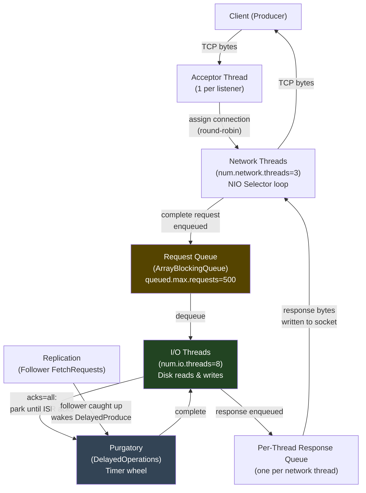
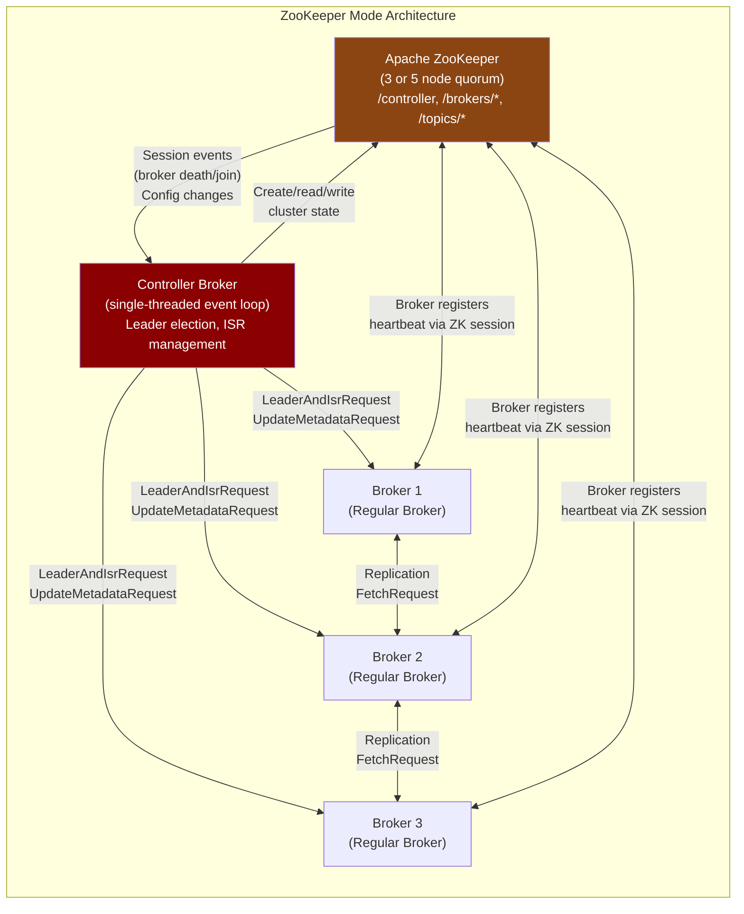

# Apache Kafka Deep Dive  Part 2: Architecture Internals  Brokers, Controllers, and KRaft

---

**Series:** Apache Kafka Deep Dive  From First Principles to Planet-Scale Event Streaming
**Part:** 2 of 10
**Audience:** Senior backend engineers, distributed systems engineers
**Reading time:** ~45 minutes

---

## Series Recap and Where We Are

Part 0 established the systems foundation: disk I/O physics, OS page cache mechanics, zero-copy `sendfile()`, delivery semantics, and the CAP theorem. Part 1 made the case for Kafka's existence  the distributed log abstraction, why sequential I/O enables millions of messages per second, storage engine segment structure, pull vs. push mechanics, partitioning and ordering tradeoffs, consumer group basics, and failure models.

We are not revisiting any of that. This article goes one level deeper: **how the cluster actually works**.

Part 1 treated the broker as a black box that accepts ProduceRequests and serves FetchRequests. Part 2 opens the box. We will trace a ProduceRequest through every layer of the broker's request-handling pipeline, examine the Kafka wire protocol's binary anatomy, and then examine the two systems that coordinate the entire cluster: the Controller (the brain) and ZooKeeper/KRaft (the consensus substrate). By the end of this article you will be able to reason about broker startup sequencing, controller failover timing, partition administration, and why large clusters with ZooKeeper suffered catastrophically slow controller failovers  and exactly how KRaft fixes each of those problems.

---

## 1. The Broker: A Deep Dive into the Request Processing Pipeline

### 1.1 Physical Architecture: What a Broker Is

A Kafka broker is a JVM process  a single `kafka.Kafka` main class  listening on one or more TCP ports (default: 9092 for plaintext, 9093 for TLS). Its responsibilities are:

1. Accept incoming TCP connections from clients (producers, consumers, admin tools) and from other brokers (replication traffic)
2. Parse and route incoming requests to the appropriate handler
3. Read from and write to the log directories on disk
4. Return responses to callers

A broker owns a set of log directories (configured via `log.dirs`, e.g., `/var/kafka/data-1,/var/kafka/data-2`). Within each directory it stores partition log segments. A broker with `log.dirs=/data/kafka-1,/data/kafka-2` and 200 partitions (as leader or follower) will distribute those 200 partitions across both directories.

The process has two classes of system resources it competes for:

- **File descriptors:** Each partition segment requires open file descriptors for the `.log`, `.index`, and `.timeindex` files. At 3 FDs per active segment, a broker hosting 2,000 partitions might have 6,000+ open file descriptors. The Linux default `ulimit -n` of 1,024 is dangerously low for Kafka; production deployments set it to 100,000+.
- **Network sockets:** Each client connection is a TCP socket. At 10,000 clients, this is 10,000 open sockets. The broker's network threads service these through Java NIO selectors, not one-thread-per-connection.

### 1.2 Network Thread Pool: Acceptor Thread and Network Threads

Kafka uses a **Reactor pattern** for network I/O, implemented in `kafka.network.SocketServer`. There are two distinct thread roles:

**The Acceptor Thread.** There is exactly one acceptor thread per listener (per port). It does nothing except call `ServerSocketChannel.accept()` in a tight loop, accepting new TCP connections and assigning them to a network thread via round-robin. The acceptor thread never reads or writes data  it is purely a connection dispatcher.

**Network Threads (`num.network.threads`, default 3).** Each network thread runs a Java NIO `Selector` loop. It owns a set of connections and is responsible for:
- Reading bytes from client sockets until a complete request is framed
- Placing complete requests into the shared request queue
- Writing response bytes back to client sockets after an I/O thread places the response in the per-network-thread response queue

The critical invariant: **network threads never block on disk I/O**. They read from sockets, deserialize enough to identify the request, enqueue it, and move on. This is what keeps the acceptor and network layer responsive even when the disk is saturated.

```
num.network.threads=3 means 3 network threads total, shared across all clients.
For a broker serving 5,000 connections: each network thread owns ~1,667 sockets.
A thread's NIO Selector handles all 1,667 as non-blocking multiplexed I/O.
```

In practice, `num.network.threads` is rarely the bottleneck  network threads are not compute-intensive. You typically increase it only when you observe network thread utilization (via `kafka.network:type=Processor,name=IdlePercent`) consistently above 80%.

### 1.3 Request Queue: The Bridge Between Network and I/O Threads

The **request queue** is a Java `ArrayBlockingQueue` with a bounded capacity (configured via `queued.max.requests`, default 500). When a network thread receives a complete request, it wraps it in a `RequestChannel.Request` object  containing the raw bytes, the metadata about which network thread should receive the response, and a timestamp  and enqueues it.

If the queue is full (i.e., all 500 slots are occupied), the network thread **blocks** trying to enqueue. This is the intentional backpressure mechanism: when I/O threads cannot keep up, the queue fills, network threads stall, and TCP flow control backs pressure all the way to the client's send buffer. The producer's `send()` call will block, which ultimately signals the application to slow down.

Monitoring `queued.max.requests` utilization is one of the first things to check when diagnosing producer latency spikes. A consistently full request queue means you are I/O-bound, not network-thread-bound.

### 1.4 I/O Thread Pool: Where Disk Work Happens

The **I/O thread pool** (`num.io.threads`, default 8) consists of threads that dequeue requests from the shared request queue and perform the actual disk operations. For a ProduceRequest:

1. Dequeue the request
2. Validate the request (API version, topic existence, authorization)
3. Call `ReplicaManager.appendRecords()`, which appends the record batch to the partition's leader log
4. If `acks=all`, create a `DelayedProduce` operation and park it in the Purgatory (Section 8) until follower acknowledgments arrive
5. If `acks=1` or `acks=0`, immediately construct the ProduceResponse and enqueue it in the network thread's response queue

For a FetchRequest, the I/O thread calls `ReplicaManager.fetchMessages()`, which reads from the partition log and constructs a FetchResponse.

The I/O threads are the ones that block on disk  on `FileChannel.write()` for produces and `FileChannel.transferTo()` (the zero-copy path) for fetches. This is the correct design: blocking is isolated to a thread pool that is explicitly sized for it, not bleeding into the network layer.

`num.io.threads` is the most commonly tuned parameter for I/O-bound brokers. A broker on NVMe SSDs with fast random I/O may need only 4-8 threads. A broker on spinning HDDs where individual disk operations take 5-10ms may benefit from 16-32 threads to keep the disk pipeline saturated.

### 1.5 Response Queue: The Return Path

After an I/O thread completes a request, it does not write the response directly to the socket. Instead, it places the `RequestChannel.Response` object into the **per-network-thread response queue** for the network thread that originally read the request. This is tracked in the `RequestChannel.Request` object that was enqueued in step 1.3.

The network thread's NIO selector loop, on each iteration, drains its response queue and writes the response bytes to the appropriate client socket. This keeps the response path as non-blocking as the request path: the network thread does a `SocketChannel.write()`, which is a non-blocking NIO operation that returns immediately, and the kernel handles the actual TCP transmission.

### 1.6 Full Request Lifecycle: Tracing a ProduceRequest

Let's trace a single ProduceRequest from TCP arrival to ProduceResponse. Assume `acks=all`, one partition, batch of 100 records.

```
TCP Arrival and Framing
───────────────────────
Client sends bytes over TCP.
Acceptor thread: accept() → assign connection to Network Thread 2.
Network Thread 2: NIO Selector fires READ event on client socket.
  → Read bytes into receive buffer.
  → Frame the request: first 4 bytes = request length (int32).
  → Continue reading until full request length is received.
  → Deserialize header: ApiKey=0 (Produce), ApiVersion=9, CorrelationId=1042.
  → Wrap in RequestChannel.Request.
  → Enqueue into shared request queue.
  → Record: request.requestDequeueTime = System.nanoTime()

I/O Thread Processing
─────────────────────
I/O Thread 5: dequeues the request.
  → Authorize: does this producer have WRITE access to this topic?
    (via ACL check against the authorizer)
  → Call ReplicaManager.appendRecords(
        timeout = request.timeout,
        requiredAcks = -1,
        internalTopicsAllowed = false,
        origin = AppendOrigin.Client,
        entriesPerPartition = Map(TopicPartition("orders", 2) → RecordBatch)
    )
  → ReplicaManager calls Partition.appendRecordsToLeader():
      → Validate magic byte, CRC, attributes
      → Call Log.appendAsLeader(records):
          → Assign offsets (atomic increment of nextOffset)
          → Write to active segment: FileChannel.write(records)
            (this goes to OS page cache, async disk flush)
          → Update index if past index interval threshold
          → Return LogAppendInfo(firstOffset=847291, lastOffset=847390)
  → Since acks=-1, create DelayedProduce:
      → Required ISR: all replicas currently in ISR
      → Create DelayedProduce(
            produce request,
            partitionStatus = Map(
              TopicPartition("orders", 2) → ProducePartitionStatus(
                requiredOffset = 847390,
                acksPending = true
              )
            ),
            timeout = request.timeout
          )
      → Register in Purgatory (timer wheel, see Section 8)

Follower Replication
────────────────────
Follower on Broker 3: sends FetchRequest to Broker 1 (leader):
  → FetchOffset = 847291 (next expected offset)
Broker 1 I/O Thread: serves the FetchRequest.
  → ReplicaManager.fetchMessages() → reads from log → sends batch.
  → Updates ISR follower LEO (Log End Offset) for Broker 3 to 847391.
  → Checks if DelayedProduce can complete:
      → All ISR members have LEO >= requiredOffset (847390)?
      → Yes: complete the DelayedProduce.
  → Compute ProduceResponse:
      ProduceResponse(
        responses = [
          TopicResponse(
            name = "orders",
            partitionResponses = [
              PartitionResponse(
                index = 2,
                errorCode = 0 (NONE),
                baseOffset = 847291,
                logAppendTime = -1,
                logStartOffset = 0
              )
            ]
          )
        ]
      )
  → Enqueue in Network Thread 2's response queue.

Response Delivery
─────────────────
Network Thread 2: NIO Selector fires.
  → Drain response queue: find ProduceResponse for CorrelationId=1042.
  → Serialize response to bytes.
  → SocketChannel.write(responseBytes) → kernel TCP buffer → client.
Client: receives bytes, frames response by CorrelationId=1042.
  → Future<RecordMetadata> completes with offset=847291.
```

Total elapsed time for this sequence: typically 2-8ms on a well-tuned cluster with fast disks and in-datacenter replication.



### 1.7 Why the Reactor Pattern: No Blocking in Network Threads

The Reactor pattern (also called the event-driven non-blocking I/O pattern) is the standard architecture for high-throughput servers. Nginx, Node.js, Redis, and Netty all use variants of it.

The core insight: **blocking is expensive when it prevents other work from happening**. In a one-thread-per-connection model (what Java's original `ServerSocket` API encourages), a thread blocked waiting for disk I/O is occupying a stack (512KB-2MB by default), scheduler state, and CPU registers. At 10,000 connections, that's 10,000 threads  memory pressure, context switching overhead, and scheduler inefficiency.

In Kafka's model, the 3 network threads handle 10,000 connections via non-blocking NIO selectors. The 8 I/O threads block on disk I/O  which is unavoidable  but they're a small, bounded pool. The separation ensures that slow disk I/O does not cascade into slow network responsiveness.

---

## 2. Request Types and the Kafka Protocol

### 2.1 API Keys: The Protocol's Foundation

Every Kafka request type has a numeric **API key** that identifies what kind of request it is. The API key is the first field deserialized after the 4-byte request length. A few critical ones:

| API Key | Name | Purpose |
|---|---|---|
| 0 | Produce | Write record batches to partitions |
| 1 | Fetch | Read record batches from partitions |
| 2 | ListOffsets | Get start/end offsets for a partition |
| 3 | Metadata | Discover broker addresses and partition leaders |
| 8 | OffsetCommit | Commit consumer group offsets |
| 9 | OffsetFetch | Fetch consumer group's committed offsets |
| 10 | FindCoordinator | Find the group or transaction coordinator broker |
| 11 | JoinGroup | Join a consumer group |
| 13 | LeaveGroup | Leave a consumer group |
| 14 | SyncGroup | Exchange partition assignment within a group |
| 18 | ApiVersions | Ask a broker which API versions it supports |
| 19 | CreateTopics | Create topics (sent to controller) |
| 20 | DeleteTopics | Delete topics (sent to controller) |
| 36 | SaslHandshake | Initiate SASL authentication |
| 37 | ApiVersions | (same as 18, versioned evolution) |
| 44 | IncrementalAlterConfigs | Update topic/broker config incrementally |

The full list as of Kafka 3.7 has over 70 API keys, including KRaft-specific ones (`Vote`, `BeginQuorumEpoch`, `EndQuorumEpoch`, `Fetch` for metadata log).

### 2.2 Protocol Versioning: Backward Compatibility at the Wire Level

Each API key supports multiple **versions**. The `ApiVersions` request (API key 18) is how a client discovers the min and max version the broker supports for each API. The Kafka client then uses `min(client_max, broker_max)` for each request.

The versioning contract is:
- Fields can be added to newer versions (old brokers ignore unknown fields; old clients skip new broker fields)
- Fields cannot be removed until a minimum version is deprecated cluster-wide
- The `ApiVersions` handshake at connection startup ensures both sides agree on the version to use

This versioning strategy allows rolling upgrades: a cluster with mixed broker versions (e.g., some on 3.5, some on 3.6) can still communicate correctly, because clients negotiate down to the version both sides understand.

```
Wire format of a Request:
┌──────────────────────────────────────────────────────────────────┐
│ Length (int32)          size of remaining request in bytes       │
├──────────────────────────────────────────────────────────────────┤
│ Api Key (int16)         e.g., 0 = Produce, 1 = Fetch            │
│ Api Version (int16)     version of this API being used          │
│ Correlation ID (int32)  client-assigned ID, echoed in response  │
│ Client ID (nullable string)  client identifier for logging      │
├──────────────────────────────────────────────────────────────────┤
│ Request Body            varies by ApiKey and ApiVersion         │
└──────────────────────────────────────────────────────────────────┘

Wire format of a Response:
┌──────────────────────────────────────────────────────────────────┐
│ Length (int32)          size of remaining response in bytes     │
├──────────────────────────────────────────────────────────────────┤
│ Correlation ID (int32)  matches the request's CorrelationId     │
├──────────────────────────────────────────────────────────────────┤
│ Response Body           varies by ApiKey and ApiVersion         │
└──────────────────────────────────────────────────────────────────┘
```

### 2.3 ProduceRequest Anatomy

A ProduceRequest (API key 0, version 9 schema) carries:

```
ProduceRequest v9:
  transactional_id:   nullable string    null for non-transactional producers
  acks:               int16              0, 1, or -1
  timeout_ms:         int32              max ms to wait for ISR acks
  topic_data:         array of:
    name:             string             topic name
    partition_data:   array of:
      index:          int32              partition number
      records:        bytes              RecordBatch (see Part 1 for format)
```

One ProduceRequest can contain batches for multiple topics and multiple partitions. This is important: a producer sending to 50 partitions simultaneously sends 1 TCP payload, not 50.

The `timeout_ms` field is critical. It sets the maximum time the broker should wait for `acks=all` to complete (i.e., for followers to replicate). If followers don't replicate within this window, the DelayedProduce expires and the broker returns a `REQUEST_TIMED_OUT` error. The client then retries (if `retries > 0`).

### 2.4 FetchRequest Anatomy

A FetchRequest (API key 1) is used by both clients and by follower brokers fetching for replication:

```
FetchRequest v12:
  replica_id:           int32     -1 for clients; broker ID for follower replication
  max_wait_ms:          int32     long-poll timeout (fetch.max.wait.ms)
  min_bytes:            int32     minimum data to return before responding
  max_bytes:            int32     upper bound on response size
  isolation_level:      int8      0=READ_UNCOMMITTED, 1=READ_COMMITTED
  session_id:           int32     fetch session ID (for incremental fetches)
  session_epoch:        int32     fetch session epoch
  topics:               array of:
    topic_id:           uuid      topic UUID (replaces topic name in v13+)
    partitions:         array of:
      partition:        int32     partition number
      current_leader_epoch: int32  fencing against stale leaders
      fetch_offset:     int64     starting offset to fetch from
      last_fetched_epoch: int32   for follower divergence detection
      log_start_offset: int64    follower's log start (for leader divergence check)
      partition_max_bytes: int32  per-partition fetch size limit
  forgotten_topics_data: array    incremental fetch: partitions to stop fetching
```

The `replica_id` field distinguishes client fetches (value `-1`) from follower replication fetches (the follower's broker ID). This matters because follower replication fetches bypass consumer quotas and update the leader's knowledge of each follower's `LEO` (Log End Offset)  which drives ISR membership and High Watermark advancement.

The `session_id` / `session_epoch` fields enable **incremental fetch sessions** (Kafka 1.1+). Instead of sending the full topic-partition list on every fetch request, a client establishes a fetch session and then sends only deltas (which partitions changed). This reduces FetchRequest sizes dramatically for consumers subscribed to many partitions.

### 2.5 MetadataRequest: How Clients Bootstrap

Before a producer or consumer can do anything useful, it needs to know:
- Which brokers exist in the cluster
- Which broker is the current leader for each partition it cares about
- What the partition count for a topic is

It gets this information via MetadataRequest (API key 3):

```
MetadataRequest v12:
  topics:                    nullable array of:
    topic_id:                uuid
    name:                    nullable string
  allow_auto_topic_creation: bool
  include_topic_authorized_operations: bool
```

An empty topics array means "give me metadata for all topics." The response includes:
- The list of all brokers (broker ID, host, port, rack)
- For each topic: partition count, replication factor, and for each partition: leader broker ID, list of replicas (all replicas), list of in-sync replicas (ISR), and any errors (e.g., `LEADER_NOT_AVAILABLE`)

Clients cache this metadata and refresh it on a schedule (`metadata.max.age.ms`, default 5 minutes) or on error (e.g., `NOT_LEADER_OR_FOLLOWER` forces an immediate refresh). This is how clients stay updated as leaders change due to broker failures or preferred leader elections.

### 2.6 Request Handler Thread Model: The Purgatory

Some requests cannot be satisfied immediately. Two examples:

- A ProduceRequest with `acks=all` must wait for all ISR followers to replicate before responding
- A FetchRequest with `min_bytes=65536` must wait until 64 KB of data accumulates before responding (long polling)

These are handled by the **Purgatory** system (formally: `DelayedOperationPurgatory`). When an I/O thread determines a request cannot be immediately satisfied, it creates a `DelayedOperation` object, registers the conditions that would satisfy it (a set of keys that will trigger a re-check), and puts it in the Purgatory.

Two things can complete a `DelayedOperation`:
1. **External event:** A follower's LEO advances (completing a `DelayedProduce`), or new records arrive (completing a `DelayedFetch`)
2. **Timeout expiry:** The operation's timeout is reached

The Purgatory uses a **timer wheel** for timeout management (see Section 8 for the full analysis). This design allows the I/O threads to continue processing new requests rather than blocking. The Purgatory is one of Kafka's most important internal data structures under load.

---

## 3. The Controller: Kafka's Brain

### 3.1 What the Controller Is

At any given moment, exactly one broker in a Kafka cluster is the **Controller**. It is a regular Kafka broker that has taken on the additional responsibility of cluster-wide coordination. The controller runs the **cluster-wide state machine**: it knows the definitive state of every partition, every broker, every ISR, and every topic configuration. All other brokers are followers of the controller's view of the world.

The controller's responsibilities do not include serving client requests (ProduceRequest, FetchRequest). Those go to the partition's leader broker directly. The controller handles **administrative events**  events that change cluster topology or partition ownership.

### 3.2 Controller Responsibilities

The controller's job list:

**Leader election for partitions.** When a partition leader fails (broker crashes), the controller detects this, selects a new leader from the partition's ISR, and broadcasts the leadership change to all affected brokers.

**ISR management.** When a follower falls too far behind the leader (measured by `replica.lag.time.max.ms`), the controller removes it from the ISR. When it catches up, the leader broker notifies the controller and it re-adds the follower to the ISR. ISR changes require updating ZooKeeper (or the KRaft log) and broadcasting `LeaderAndIsrRequest` to affected brokers.

**Broker liveness tracking.** The controller monitors broker health via ZooKeeper ephemeral znodes (ZK mode) or heartbeats (KRaft mode). When a broker is deemed dead, the controller triggers leader elections for all partitions that had that broker as leader.

**Topic creation and deletion.** When an AdminClient sends `CreateTopicsRequest`, it goes to the controller. The controller assigns partitions to brokers, creates the log directories on each broker, and updates metadata.

**Partition reassignment.** When an operator runs `kafka-reassign-partitions.sh`, the controller orchestrates the data movement: adding new replicas, waiting for them to catch up, updating leadership, and removing old replicas.

**Preferred leader election.** Kafka tracks the "preferred leader" for each partition (typically the first replica in the assignment list). The controller periodically triggers elections to restore preferred leadership after it has been disrupted by failures.

### 3.3 Controller Election in ZooKeeper Mode

In the ZooKeeper-based architecture (all Kafka versions before 3.3 in production, and optionally through 3.7), controller election uses ZooKeeper's ephemeral znode mechanism.

When any broker starts up, it attempts to create the ZooKeeper znode `/controller` with an ephemeral node containing its broker ID. ZooKeeper guarantees that exactly one client can create an ephemeral node  the **first one wins**. All other brokers receive a `NodeExistsException` and become watchers on `/controller`.

```
ZooKeeper election sequence:
  Broker 1 starts → attempts create /controller → wins → becomes controller
  Broker 2 starts → attempts create /controller → NodeExists → watches /controller
  Broker 3 starts → attempts create /controller → NodeExists → watches /controller

  Broker 1 (controller) dies → ZooKeeper session expires → /controller deleted
  ZooKeeper notifies watchers: Broker 2 and Broker 3 both notified simultaneously
  Both attempt create /controller → exactly one wins (e.g., Broker 2)
  Broker 2 becomes new controller. Broker 3 watches /controller again.
```

The `/controller` znode contains the controller's broker ID and a **controller epoch**  a monotonically increasing integer incremented on every election. This epoch is included in all controller-to-broker requests (`LeaderAndIsrRequest`, `UpdateMetadataRequest`, `StopReplicaRequest`). A broker that receives a request from a stale controller (one with a lower epoch) rejects it  this prevents a "zombie controller" from issuing commands after losing its ZooKeeper session.

### 3.4 Controller Failover Mechanics

After being elected, the new controller must reconstruct the complete cluster state before it can do anything useful. In ZooKeeper mode, this means reading from ZooKeeper:

```
Controller initialization sequence (ZK mode):
  1. Increment controller epoch in ZooKeeper /controller_epoch znode
  2. Read /brokers/ids/*  list of live brokers and their metadata
  3. Read /brokers/topics/*  all topic configurations and partition assignments
  4. Read /brokers/topics/<topic>/partitions/<id>/state  leader, ISR per partition
  5. For every partition on every topic, build in-memory state:
       partitionLeaderState: Map[TopicPartition, PartitionLeaderState]
  6. Register ZooKeeper watchers on:
       /brokers/ids (broker liveness)
       /admin/reassign_partitions (reassignment requests)
       /kafka-acl/* (ACL changes)
       /brokers/topics (topic changes)
  7. Send UpdateMetadataRequest to all live brokers (propagate full state)
  8. Trigger leader elections for partitions that need them
```

For a large cluster  100 brokers, 50,000 partitions  step 4 involves 50,000 ZooKeeper reads. ZooKeeper's read throughput is typically 10,000-100,000 operations per second. At the low end, this is 500ms to 5 seconds just for the ZooKeeper reads, before the new controller can begin issuing `LeaderAndIsrRequest` commands. This is the **controller failover bottleneck** that plagued large ZooKeeper-mode deployments.

### 3.5 The Controller Epoch

The controller epoch is critical for correctness. Consider this scenario:

```
T=0ms:  Broker 1 is controller (epoch=5). Broker 3 dies.
T=5ms:  Broker 1's ZooKeeper session expires (network partition).
         ZK deletes /controller. Election starts.
T=10ms: Broker 2 wins election (epoch=6). Begins reconstruction.
T=15ms: Broker 1's network partition heals. Broker 1 does NOT know
         it lost the election. It issues LeaderAndIsrRequest to Broker 4
         with epoch=5 to make itself leader of partition X.
T=16ms: Broker 4 receives the request. Checks epoch: 5 < 6 (current).
         Rejects the request with STALE_CONTROLLER_EPOCH error.
```

Without the epoch check, the zombie controller (Broker 1) could corrupt cluster state by issuing commands based on stale information. The epoch acts as a logical clock that fences off stale actors.

### 3.6 LeaderAndIsrRequest: The Controller's Primary Instrument

When a partition leadership change occurs, the controller sends `LeaderAndIsrRequest` (API key 4) to the affected brokers. This is the most critical request in Kafka's internal protocol.

```
LeaderAndIsrRequest:
  controller_id:      int32
  controller_epoch:   int32     fencing field
  broker_epoch:       int64     per-broker epoch (added in Kafka 2.2)
  type:               int8      0=FULL, 1=INCREMENTAL
  partition_states:   array of:
    topic_name:       string
    partition_index:  int32
    controller_epoch: int32
    leader:           int32     broker ID of new leader
    leader_epoch:     int32     per-partition epoch (incremented on each leader change)
    isr:              array<int32>   current ISR member broker IDs
    partition_epoch:  int32
    replicas:         array<int32>  all replica broker IDs
    adding_replicas:  array<int32>  replicas being added (during reassignment)
    removing_replicas:array<int32>  replicas being removed
    is_new:           bool
  live_brokers:       array of BrokerEndpoint
```

The **leader epoch** (per-partition, distinct from the controller epoch) is what consumers use to detect stale reads. If a consumer is fetching from a broker that was the leader but has since been replaced, the consumer's FetchRequest includes `current_leader_epoch`. The broker compares this to its local leader epoch. If the consumer's epoch is newer than the broker's, the broker returns `FENCED_LEADER_EPOCH`, and the consumer refreshes metadata and redirects to the actual leader.

### 3.7 UpdateMetadataRequest: Propagating Cluster State

In addition to `LeaderAndIsrRequest` (which goes only to brokers directly involved in a partition change), the controller sends `UpdateMetadataRequest` (API key 6) to **all live brokers** to update their `MetadataCache`. This ensures every broker knows the current leader for every partition  which it needs to correctly redirect clients that send requests to the wrong broker.

```
UpdateMetadataRequest v8:
  controller_id:    int32
  controller_epoch: int32
  broker_epoch:     int64
  partition_states: array of PartitionState (same structure as LeaderAndIsr)
  live_brokers:     array of:
    id:             int32
    endpoints:      array of:
      port:         int32
      host:         string
      listener_name:string
      security_protocol_type: int16
    rack:           nullable string
```

For clusters with thousands of partitions, `UpdateMetadataRequest` can be large. Kafka optimizes this: in KRaft mode, brokers use incremental fetches from the metadata log rather than receiving full state on every change.

### 3.8 Controller Bottleneck: The Single-Threaded Event Loop

The controller, in ZooKeeper mode, runs a **single-threaded event loop** for processing all state changes. This is intentional: single-threaded execution avoids concurrency bugs in the most complex stateful component of the cluster. But it becomes a performance bottleneck under high event rates.

Consider what happens when a broker with 500 leader partitions dies:

```
Event queue for the controller:
  BrokerDeathEvent(broker_id=5)

Processing:
  1. Mark Broker 5 as dead
  2. For each of 500 partitions where Broker 5 was leader:
     a. Select new leader from ISR
     b. Update in-memory state
     c. Queue LeaderAndIsrRequest to new leaders
     d. Queue UpdateMetadataRequest to all brokers
  3. Send 500+ LeaderAndIsrRequests (batched per target broker)
  4. Send UpdateMetadataRequest to all surviving brokers (once, but large)

Total time: depends on controller's processing speed and ZK writes needed.
On a cluster with 100K partitions, a broker failure requiring 10K leader
elections can take the controller 5-30 seconds of single-threaded processing.
During this time, affected partitions are unavailable to producers with acks=all.
```

This is the root cause of the "large cluster controller failover is slow" problem. KRaft addresses it fundamentally (Section 4.7).



---

## 4. KRaft: Removing the ZooKeeper Dependency

### 4.1 The ZooKeeper Problem

ZooKeeper was the right choice for Kafka in 2011. It provided a battle-tested distributed consensus layer that handled leader election and configuration storage. But by 2019, the problems had become severe enough that the Kafka community committed to removing ZooKeeper entirely (KIP-500).

**The operational complexity problem.** Running a Kafka cluster requires running a ZooKeeper cluster in addition. ZooKeeper has its own upgrade cycle, configuration parameters, monitoring requirements, JVM tuning, disk requirements, and failure modes. On-call engineers debugging a Kafka incident must understand both systems. Operational burden is doubled.

**The ZooKeeper session timeout cascade.** ZooKeeper's liveness detection relies on session timeouts. When a broker's ZooKeeper session expires (due to a network partition, GC pause, or overloaded ZooKeeper), ZooKeeper deletes the broker's ephemeral znode  the same signal as the broker dying. This can trigger unnecessary leader elections even when the broker itself is healthy. The default `zookeeper.session.timeout.ms=18000` means a 18-second GC pause (entirely possible without ZGC tuning on Java 11 brokers) appears as a broker death to ZooKeeper.

**The ZooKeeper write bottleneck.** ZooKeeper is a CP system with a single-leader write path. Its throughput for writes is limited  typically 10,000-50,000 writes per second. Every ISR change, every topic creation, every ACL update requires a ZooKeeper write through the ZooKeeper leader. For clusters with millions of partitions and frequent ISR changes (common under load), this bottleneck is real.

**The scalability ceiling on partition count.** Controller initialization requires reading all partition state from ZooKeeper. This limits practical cluster scale. The Kafka project's own target before KRaft was ~200,000 partitions per cluster as a practical limit. With KRaft, the target is millions.

**The metadata propagation lag.** Controller failover requires re-reading all ZooKeeper state and rebroadcasting to all brokers. This creates a gap during which brokers have stale metadata  clients get `LEADER_NOT_AVAILABLE` errors. KRaft eliminates this gap.

### 4.2 KRaft Architecture: Raft-Based Metadata Quorum

KRaft (Kafka Raft) embeds a Raft consensus algorithm directly inside Kafka brokers. There is no external consensus system. A subset of brokers form the **KRaft controller quorum**  they store and replicate the metadata log using Raft. Other brokers fetch metadata from the quorum leaders.

The metadata log is the single source of truth for all cluster state. Instead of writing partition state to ZooKeeper znodes, every state change (topic creation, leader election, ISR change) is **appended as a record to the metadata log**. Raft ensures this log is replicated to a majority of the quorum before being considered committed.

The metadata log topic is `__cluster_metadata`, stored in the standard Kafka log format (segments, index files) on the controller quorum nodes. This is a Kafka topic that stores Kafka's own metadata  the system bootstraps itself.

### 4.3 KRaft Roles: Broker-Only, Controller-Only, Combined

In KRaft mode, each broker's `process.roles` configuration determines what it does:

| `process.roles` | Description |
|---|---|
| `broker` | Regular broker: handles client requests (Produce, Fetch), participates in data replication. Fetches metadata from controller quorum. |
| `controller` | Controller quorum member: participates in Raft consensus for the metadata log. Does NOT serve client produce/fetch requests. |
| `broker,controller` | Combined mode: broker AND quorum member. Supported for small clusters (≤ 3 nodes). For production at scale, separate controller and broker roles. |

For large production clusters, the recommended deployment is **3 dedicated controller nodes + N broker nodes**. The 3 controllers form a Raft quorum (tolerate 1 failure). Brokers are pure data-path nodes.

```
Production KRaft layout (9 nodes total):

Controller Quorum (3 nodes):
  controller-1  process.roles=controller
  controller-2  process.roles=controller
  controller-3  process.roles=controller
  → One of these is the KRaft leader. The others are followers.
  → All 3 store the full metadata log.

Brokers (6 nodes):
  broker-1 through broker-6  process.roles=broker
  → None participate in Raft consensus.
  → All fetch metadata from the active controller.
```

### 4.4 The Metadata Log: `__cluster_metadata`

The metadata log is a Raft log of **typed records**, each representing a state change event:

```
Record types in __cluster_metadata:
  RegisterBrokerRecord        a broker registered/re-registered with the cluster
  UnregisterBrokerRecord      a broker gracefully deregistered
  TopicRecord                 a topic was created (stores topic name → topic ID mapping)
  PartitionRecord             a partition was created or its state changed
                              (leader, ISR, replicas, partition epoch)
  ConfigRecord                a configuration change for a topic or broker
  ProducerIdsRecord           range of producer IDs allocated
  AccessControlEntryRecord    an ACL was created or deleted
  RemoveTopicRecord           a topic was deleted
  FeatureLevelRecord          a feature was enabled or the cluster metadata version changed
  BrokerRegistrationChangeRecord  broker changed its endpoints or features
```

Each record has a monotonically increasing **offset** in the metadata log. Brokers track which offset they have replayed up to. When a broker's metadata image is at offset N, it has applied every state change up to N.

This log-based approach makes **metadata snapshots** natural: periodically, the active controller writes a full snapshot of the current state to disk (a compacted image), and brokers can bootstrap from the snapshot + any subsequent log records, instead of replaying the entire history.

### 4.5 KRaft Leader Election: Standard Raft

KRaft uses the standard Raft leader election algorithm. The key phases:

**Normal operation.** The KRaft leader sends heartbeats (via `BeginQuorumEpoch` mechanism) to followers. Followers reset their election timeout on each heartbeat.

**Election trigger.** If a follower doesn't receive a heartbeat within the election timeout (randomly chosen between `quorum.election.timeout.ms` and `2 × quorum.election.timeout.ms`, default 1-2 seconds), it transitions to **Candidate** state and increments its local **term** (Raft's equivalent of the controller epoch).

**Vote request.** The candidate sends `VoteRequest` to all other quorum members. A quorum member grants its vote if:
1. The candidate's term is ≥ the voter's current term
2. The candidate's log is at least as up-to-date as the voter's log (by last log term and last log offset)
3. The voter hasn't already voted for someone else in this term

**Majority wins.** If the candidate receives votes from a majority of quorum members (2 of 3 in a 3-member quorum), it becomes the new leader.

**Leader establishes authority.** The new leader sends `BeginQuorumEpoch` to all followers, establishing the new term. It begins accepting writes to the metadata log.

```
KRaft election trace (3-member quorum):

T=0s:    KRaft leader (controller-1, term=4) dies.
T=~1s:   controller-2's election timeout fires.
          controller-2: term → 5, state → Candidate.
          controller-2 sends VoteRequest(term=5, lastLogOffset=N, lastLogTerm=4)
            to controller-1 (no response) and controller-3.
T=~1.2s: controller-3 grants vote (term 5, hasn't voted, log ok).
          controller-2 has 2/3 votes → becomes leader, term=5.
          controller-2 sends BeginQuorumEpoch(term=5) to controller-3.
          Cluster has a new active controller in ~1.2 seconds.
```

Compare this to ZooKeeper mode, where controller failover could take 10-60 seconds for large clusters.

### 4.6 Metadata Replication: Snapshots and Incremental Fetches

Brokers stay current with cluster metadata via a **metadata fetch loop**  effectively, the broker is a Kafka consumer of the `__cluster_metadata` topic:

```
Broker metadata fetch loop:
  Loop forever:
    Send FetchRequest(fetch_offset = my_current_metadata_offset)
      to active controller.
    Receive FetchResponse with new metadata records.
    Apply each record to in-memory metadata image:
      PartitionRecord → update partition leader/ISR
      RegisterBrokerRecord → add broker to known set
      TopicRecord → add topic to known set
      ...
    Update my_current_metadata_offset.
    If response was empty: back off (quorum.fetch.timeout.ms)
```

When a broker is far behind (e.g., just started, or was down for a while), the controller may send a **snapshot**  a full serialized image of the current metadata state  instead of individual log records. The broker applies the snapshot, then continues with incremental fetches from the snapshot's end offset.

This is dramatically more efficient than ZooKeeper mode's controller failover, where the new controller reads all state fresh from ZooKeeper on every election.

### 4.7 KRaft Benefits: The Quantitative Case

| Dimension | ZooKeeper Mode | KRaft Mode |
|---|---|---|
| Controller failover time (small cluster, ~1K partitions) | 2-10 seconds | 100-500 milliseconds |
| Controller failover time (large cluster, ~100K partitions) | 30-120 seconds | 500ms - 2 seconds |
| Practical partition limit per cluster | ~200,000 | Millions (tested at 2M+) |
| External dependencies | ZooKeeper 3.4-3.7 | None |
| Nodes to operate | Kafka brokers + ZK ensemble | Kafka brokers + controllers only |
| Metadata source of truth | ZooKeeper znodes | `__cluster_metadata` Raft log |
| Metadata propagation on controller failover | Full ZK read + broadcast | Incremental log replay (brokers already caught up) |
| Session timeout false positives | ZK session expiry can appear as broker death | Direct heartbeat, no false ZK session timeouts |
| Maximum topic creation throughput | Limited by ZK write throughput (~5K topics/sec) | Limited by Raft commit throughput (~10K+ events/sec) |

### 4.8 Migration Path: ZooKeeper to KRaft

Kafka provided a migration path across versions 3.3-3.7:

**Kafka 3.3:** KRaft declared production-ready for new clusters. Existing ZooKeeper clusters could not migrate yet.

**Kafka 3.4-3.5:** Migration tooling introduced. The migration process:
1. Run Kafka in ZooKeeper mode as before
2. Add KRaft controller nodes alongside existing ZooKeeper
3. Initiate migration: broker writes go to both ZooKeeper and the metadata log ("dual-write" mode)
4. Controller quorum takes over as the authoritative metadata store
5. Remove ZooKeeper dependency entirely

**Kafka 3.7:** Migration tooling stabilized. This is the last version that supports ZooKeeper mode.

**Kafka 4.0 (released 2024):** ZooKeeper support **removed entirely**. All new clusters must use KRaft. Existing ZooKeeper clusters must migrate before upgrading to 4.0.

---

## 5. Broker Metadata and In-Memory State

### 5.1 MetadataCache: The Broker's View of the World

Every broker maintains a `MetadataCache`  an in-memory snapshot of the cluster's current state. It answers questions like:
- Which broker is the current leader for partition `(orders, 2)`?
- What is the current ISR for partition `(payments, 7)`?
- What are the endpoints (host:port) of all live brokers?

The MetadataCache is what allows a broker to respond to `MetadataRequest` from clients without contacting the controller. It is also what a broker consults to correctly reject or redirect requests  if a client sends a ProduceRequest to the wrong broker (not the leader for that partition), the broker returns `NOT_LEADER_OR_FOLLOWER`, and the client uses its MetadataCache to find the correct leader (refreshing if needed).

The MetadataCache is not the broker's definitive truth about its own partitions  for that, each partition's `Partition` object is authoritative. The MetadataCache is the broker's knowledge about the cluster as a whole.

### 5.2 Keeping MetadataCache Current

In ZooKeeper mode, the controller broadcasts `UpdateMetadataRequest` to all brokers after every cluster state change. Brokers apply these updates to their MetadataCache. This creates a brief window of metadata staleness: between when the controller updates its state and when the `UpdateMetadataRequest` reaches all brokers, some brokers may return stale leaders to clients.

In KRaft mode, brokers continuously fetch from the metadata log. As they apply new records (`PartitionRecord`, `RegisterBrokerRecord`, etc.), their MetadataCache updates in near-real-time. The staleness is bounded by the fetch latency (typically milliseconds) rather than the controller's broadcast latency.

### 5.3 LogManager: Disk Lifecycle Management

The `LogManager` is responsible for all aspects of partition log lifecycle on disk:

- **Log creation:** When a partition is assigned to this broker, LogManager creates the directory structure and initializes the first segment
- **Active segment management:** Tracks which segment is currently being written to; rolls to a new segment when the current one exceeds `log.segment.bytes` (default 1 GB) or `log.roll.ms`
- **Retention enforcement:** Background thread periodically checks each log against `log.retention.bytes` and `log.retention.ms`; deletes old segments by unlinking files
- **Log compaction scheduling:** For compacted topics, schedules the log compaction background task
- **Recovery on startup:** Reads the last segment of each partition to find the last stable offset; truncates any incomplete writes (details in Section 6.2)

LogManager maintains a registry of all `Log` objects (one per partition directory) and coordinates with the operating system's file system.

### 5.4 ReplicaManager: The Partition State Machine

The `ReplicaManager` is the broker's coordinator for all partition-level operations. It owns:

- `allPartitions`: a map from `TopicPartition` to `Partition` object for every partition this broker hosts (both as leader and as follower)
- `replicaFetcherManager`: manages the background fetch threads that replicate data from leaders to follower partitions
- The high watermark advancement logic for leader partitions

When the controller sends a `LeaderAndIsrRequest`, it arrives at the ReplicaManager, which:
1. For each partition that this broker should be leader of: transitions the `Partition` object to leader state, starts serving produce/fetch requests for it
2. For each partition that this broker should be follower of: transitions to follower state, starts a `ReplicaFetcher` thread to replicate from the leader
3. For any partition this broker is being removed from: stops replication, closes the log

### 5.5 GroupCoordinator: Consumer Group Management

The `GroupCoordinator` manages consumer group state for groups that this broker is coordinator for. A consumer group's coordinator is determined by:

```
coordinator_broker = hash(group_id) % __consumer_offsets_partition_count
                   → __consumer_offsets partition N
                   → broker that is leader of that partition
```

The GroupCoordinator handles:
- `JoinGroup` requests (consumers entering the rebalance protocol)
- `SyncGroup` requests (distributing partition assignments)
- `Heartbeat` requests (consumer liveness checks)
- `LeaveGroup` requests
- `OffsetCommit` and `OffsetFetch` (reading and writing committed offsets to `__consumer_offsets`)

Consumer group state is durably stored in the `__consumer_offsets` internal topic  a compacted topic where the latest committed offset for each `(group_id, topic, partition)` tuple is the final record with that key.

---

## 6. Broker Startup Sequence

### 6.1 Startup Steps

A Kafka broker startup, step by step:

```
1. Load configuration
   → Parse server.properties (or KRaft equivalent)
   → Validate: log.dirs exist and are writable, port not in use, etc.

2. Initialize log directories
   → LogManager scans each directory in log.dirs
   → Discovers which partition directories exist
   → For each partition directory: opens or creates the Log object
     (loads existing segments, memory-maps index files)

3. Register with ZooKeeper / KRaft controller quorum
   ZK mode:  Create ephemeral znode /brokers/ids/<broker_id>
   KRaft mode: Send RegisterBrokerRecord to active controller

4. Controller election (if applicable)
   ZK mode:  Attempt to create /controller znode. If it wins: become controller.
   KRaft mode: If this node is process.roles=controller: participate in Raft.

5. Load metadata / sync with cluster state
   ZK mode:  If just became controller: read all state from ZK (slow).
             If regular broker: wait for UpdateMetadataRequest from controller.
   KRaft mode: Fetch from metadata log until caught up with active controller.

6. Log recovery
   → For each partition log: find RecoveryPoint, validate, truncate if needed
   (Section 6.2  critical for data integrity)

7. Start network / I/O threads
   → SocketServer binds to configured listeners
   → Acceptor thread starts
   → Network threads start their NIO selectors
   → I/O thread pool starts

8. Catch up as follower (Section 6.3)
   → For each follower partition: start ReplicaFetcher thread
   → Wait until caught up with leader's LEO before joining ISR

9. Accept client connections
   → Broker advertises itself as live
   → Clients begin sending requests
```

### 6.2 Log Recovery on Startup

Log recovery is one of the most important  and most misunderstood  parts of the startup sequence. Its goal: ensure that the log only contains data that was durably committed to the ISR, not data that was written locally but not yet replicated.

Kafka uses the **recovery point** (`recovery-point-offset-checkpoint` file in each log directory) and the **high watermark** to determine the safe recovery point.

```
Recovery sequence for a partition log:

1. Read the recovery point checkpoint file.
   This contains the offset up to which we've confirmed data is safe.
   (Updated during normal operation and on controlled shutdown.)

2. If the log's LEO (last written offset) > recovery point:
   → Some data was written after the last checkpoint  unsafe to keep.
   → Truncate the log to the recovery point.
   → Why? Those writes may have been in-flight and never replicated.
     If we kept them and became the leader, we'd have data that
     followers don't have, violating consistency.

3. For the active segment (the last one), validate each record batch:
   → Check CRC32 checksum.
   → Check magic byte, offset monotonicity.
   → If any batch fails validation, truncate at that point.

4. Rebuild the offset and time indexes from the truncated log.
```

This recovery logic ensures that even after an unclean shutdown (power loss, OOM kill), the broker starts with a consistent log state. The price is startup latency  large active segments require scanning from the last index entry to the end, which can take seconds on multi-GB segments.

**Why truncation is safe:** By the time the `RecoveryPoint` was written, that data had been durably written and acknowledged. Data after the recovery point was written locally but not necessarily replicated. When the broker comes back up as a follower, it will replicate whatever the leader has. When it comes back as a leader, it first needs to catch up with the ISR before accepting writes.

### 6.3 Catching Up as a Follower: The ISR Join Protocol

After startup, if this broker is a follower for some partition, it needs to replicate from the leader before it can be added to the ISR. The sequence:

```
T=0:    Broker 5 starts, recovery complete. Partition (orders, 2) has:
          leader = Broker 1
          ISR = [1, 3] (Broker 5 was previously in ISR but fell out)
          Broker 5's LEO = 847,100
          Leader's LEO = 1,200,000

T=0.1s: ReplicaFetcher thread starts on Broker 5.
         Sends FetchRequest(replica_id=5, fetch_offset=847,100) to Broker 1.

T=~100s: After sustained replication (rate depends on disk and network):
          Broker 5's LEO approaches leader's LEO.

T=~101s: Broker 5's LEO >= leader's LEO - replica.lag.time.max.ms window.
          Leader broker detects: "Broker 5 is now in sync."
          Leader notifies controller: ISR should include Broker 5.
          Controller updates ISR to [1, 3, 5].
          Controller sends LeaderAndIsrRequest to all affected brokers.

T=~102s: Broker 5 is in the ISR. ProduceRequests with acks=all now require
          acknowledgment from Broker 5 before responding to producers.
```

The key metric is `replica.lag.time.max.ms` (default 30,000ms = 30 seconds). A replica is considered "in sync" if it has fetched from the leader within the last 30 seconds AND its LEO is within the leader's current LEO bounds. The second condition (LEO proximity) is what actually matters  a slow follower that fetches frequently but can't keep up still won't join the ISR.

### 6.4 Controlled Shutdown: The Clean Path

When you restart a Kafka broker gracefully (via `kafka-server-stop.sh` or `systemctl stop kafka`), the broker performs a **controlled shutdown**:

```
Controlled shutdown sequence:
  1. Broker sends ControlledShutdownRequest(broker_id=5) to the controller.

  2. Controller receives the request.
     For each partition where Broker 5 is the leader:
       a. Select a new leader from the ISR (excluding Broker 5).
       b. Prepare LeaderAndIsrRequest for the new leader.
       c. Prepare UpdateMetadataRequest for all brokers.

  3. Controller sends LeaderAndIsrRequest to each new leader.
     New leaders begin accepting produce/fetch requests.

  4. Controller sends UpdateMetadataRequest to all brokers.
     All brokers now know the new leaders.

  5. Controller sends ControlledShutdownResponse(error=NONE) to Broker 5.

  6. Broker 5 stops its network threads, closes log files, deregisters from ZK/KRaft.
```

**Why controlled shutdown matters:**

- **No unnecessary leader elections under load.** An uncontrolled broker failure triggers leader elections for all its partitions simultaneously. The controller handles them sequentially. During this window (potentially 10-30 seconds for a broker with many partitions), those partitions are unavailable. A controlled shutdown pre-migrates leaders before the broker stops, so there is zero downtime from the leadership perspective.

- **No consumer rebalances.** An uncontrolled failure causes the broker to miss consumer group heartbeats, triggering `session.timeout.ms` expiry and a consumer group rebalance. A controlled shutdown allows the GroupCoordinator on this broker to gracefully hand off its consumer group state to another broker.

- **No ISR shrinkage.** Uncontrolled failure causes ISR to shrink (the failed broker is removed). ISR shrinkage is logged as a warning and increases the risk of data loss during any subsequent leader failure. Controlled shutdown avoids this: the broker is removed from assignments cleanly before stopping.

**Always configure Kafka service management to use controlled shutdown.** This is usually automatic with the official startup scripts, but matters when using process supervisors (systemd, supervisord) that issue `SIGKILL` instead of `SIGTERM`.

---

## 7. Topic and Partition Administration

### 7.1 Topic Creation Flow

When an operator creates a topic via the AdminClient (`kafka-topics.sh --create` or `AdminClient.createTopics()`):

```
Topic creation flow:
  1. AdminClient sends CreateTopicsRequest to any broker.

  2. That broker (if not the controller in KRaft, or not the current
     ZK-mode controller) forwards the request to the controller.
     (In KRaft, AdminClient sends directly to the active controller.)

  3. Controller receives CreateTopicsRequest:
     a. Validate: does the topic already exist? Are partitions/RF valid?
     b. Run partition assignment algorithm (Section 7.2).
        Output: Map[partition_id → List[broker_id]] (e.g., {0: [3,1,2], 1: [1,2,3]})
     c. Write TopicRecord to metadata log (KRaft) or ZooKeeper (ZK mode).
     d. Write PartitionRecord for each partition (KRaft) or ZK nodes.

  4. For each broker that has been assigned partitions:
     Controller sends LeaderAndIsrRequest (each broker's assigned partitions).
     Broker's ReplicaManager creates the partition directory and Log object.
     Leader partition: starts accepting produce/fetch requests.
     Follower partitions: start replicating from leaders.

  5. Controller sends UpdateMetadataRequest to all brokers.
     All brokers' MetadataCaches now know the new topic.

  6. Controller sends CreateTopicsResponse to AdminClient.
     Includes: created topic's partition count, RF, and any errors per partition.

Total time: typically 50-500ms for a topic with 12 partitions on a healthy cluster.
```

### 7.2 Partition Assignment Algorithm

Kafka's default partition assignment algorithm aims to distribute leaders and replicas evenly across brokers while respecting rack constraints.

For a topic with `P` partitions, replication factor `RF`, and `N` brokers:

```
Step 1: Select a starting broker at random (or round-robin from last assignment).
Step 2: For partition 0: assign leader to broker[start % N],
                         replica 1 to broker[(start+1) % N],
                         replica 2 to broker[(start+2) % N], ...
Step 3: For partition 1: shift starting broker by 1.
Step 4: Continue for all P partitions.

Example: P=6, RF=3, N=3 brokers [0,1,2], start=1:

Partition 0: leader=broker[1], replicas=[1, 2, 0]
Partition 1: leader=broker[2], replicas=[2, 0, 1]
Partition 2: leader=broker[0], replicas=[0, 1, 2]
Partition 3: leader=broker[1], replicas=[1, 0, 2]  (shifted 2nd replica)
Partition 4: leader=broker[2], replicas=[2, 1, 0]
Partition 5: leader=broker[0], replicas=[0, 2, 1]

Leaders per broker: Broker 0: 2, Broker 1: 2, Broker 2: 2 (balanced)
Replicas per broker: each broker hosts 6 replicas (balanced)
```

With **rack awareness** (`broker.rack` configured), the algorithm ensures that replicas of the same partition land on different racks. This is the most important configuration for production clusters that span multiple availability zones or physical racks.

```
Rack-aware assignment example:
  Brokers: 0 (rack=az-1), 1 (rack=az-1), 2 (rack=az-2), 3 (rack=az-2)
  Partition 0, RF=2:
    Leader: broker 0 (az-1)
    Follower: broker 2 (az-2)  different rack, ensures rack failure tolerance

  NOT: broker 0 (az-1) + broker 1 (az-1)  same rack, no fault isolation
```

### 7.3 Partition Count Limits: The Open File Descriptor Problem

Each partition requires:
- A directory in `log.dirs`
- For each active segment: 3 open file descriptors (`.log`, `.index`, `.timeindex`)
- At minimum, 1 active segment per partition

At `num.partitions=4000` partitions per broker, replication factor 3 (each broker hosts ~4000 partitions total as leader + follower), that's:

```
File descriptors per broker:
  4000 partitions × 3 FD per segment = 12,000 FDs (minimum, 1 segment each)
  + additional segments not yet deleted by retention
  + index mmap file handles
  ≈ 20,000-40,000 FDs for a busy 4000-partition broker

System configuration requirement:
  /proc/sys/fs/file-max ≥ 1,000,000 (kernel limit)
  ulimit -n ≥ 100,000 (per-process limit)
```

Beyond file descriptors:
- **Memory:** Each partition's index files are memory-mapped. At 10 MB index file size per partition, 4000 partitions = 40 GB of potential mmap. Ensure `vm.max_map_count` is set to at least `2 × number_of_partitions` (typically `262144` in `sysctl.conf`).
- **Controller metadata overhead:** In ZooKeeper mode, each partition requires a ZooKeeper znode. At 1-10 KB per znode, 100,000 partitions is 100MB-1GB of ZooKeeper data.
- **Controller election time:** In ZooKeeper mode, controller failover time scales linearly with partition count. At 100,000 partitions, failover takes 30-120 seconds.

**Practical upper bound for ZooKeeper mode:** 4,000 partitions per broker, 50-100 brokers = ~200,000-400,000 partitions per cluster. Beyond this, KRaft is not optional  it's mandatory.

### 7.4 ACLs and Quotas

**Authorization (ACLs).** Kafka's authorization model (when `authorizer.class.name` is configured) checks every request against an Access Control List:

```
AclBinding structure:
  ResourcePattern:
    resourceType: TOPIC | GROUP | CLUSTER | TRANSACTIONAL_ID | DELEGATION_TOKEN
    name: "orders" (or "*" for wildcard)
    patternType: LITERAL | PREFIXED
  AccessControlEntry:
    principal: "User:alice" | "User:*"
    host: "*" (or specific IP)
    operation: READ | WRITE | CREATE | DELETE | ALTER | DESCRIBE | ALL
    permissionType: ALLOW | DENY
```

ACLs are stored in ZooKeeper (`/kafka-acl/*`) or the KRaft metadata log (`AccessControlEntryRecord`). Every incoming request is checked by the configured `Authorizer` implementation on the I/O thread before the actual operation executes.

**Quotas.** Kafka enforces producer byte rate and consumer fetch byte rate quotas per client (identified by `client.id` or by principal). Quotas are implemented via a **token bucket** algorithm:

```
Quota enforcement flow:
  1. I/O thread processes ProduceRequest from client "order-service".
  2. Check quota: is "order-service" over its byte rate quota?
     clientQuotaManager.recordAndGetThrottleTimeMs(clientId, requestBytes)
  3. If throttle time > 0:
     → Complete the request normally (data is written).
     → Set throttleTimeMs in the ProduceResponse.
     → Delay sending the response by throttleTimeMs.
     → During the delay, the network thread will not process new requests
       from this client (it won't read from that socket).
     → Effectively: the client is throttled by not being able to send
       new requests until the previous response is delivered.
```

This is a soft throttle: the data is written, but the response is delayed, which causes the client's `send()` buffer to fill and ultimately causes TCP flow control to apply backpressure to the producer's `send()` call.

---

## 8. The Broker Under Load: Purgatory and Delayed Operations

### 8.1 The Purgatory Abstraction

The **Purgatory** (`DelayedOperationPurgatory`) solves a fundamental problem: some requests must wait for an asynchronous condition before they can be completed. The naive solution  block the I/O thread until the condition is met  would tie up an I/O thread for the duration of `request.timeout.ms` (default 30 seconds). With 8 I/O threads and 1000 concurrent produce requests, that's a deadlock.

The correct solution is to **decouple the completion of a request from the thread that started processing it**. The Purgatory is that decoupling mechanism:

1. I/O thread processes a request, determines it cannot complete immediately
2. Creates a `DelayedOperation` with the condition that would complete it
3. Registers the operation in the Purgatory's key-based index
4. I/O thread returns to process other requests

When the completion condition occurs (e.g., a follower's LEO advances), the system looks up the relevant `DelayedOperation` in the Purgatory and completes it  typically from the same I/O thread processing the follow-up event that triggered completion.

### 8.2 DelayedProduce: Waiting for ISR Acknowledgments

`DelayedProduce` is created for ProduceRequests with `acks=all`. It tracks:

```
DelayedProduce state:
  partitionStatus: Map[TopicPartition, ProducePartitionStatus]
    ProducePartitionStatus:
      requiredOffset: Long        followers must have LEO >= this offset
      acksPending: Boolean        false once this partition is satisfied

  timeout: Long                   from request's timeout_ms
  produceMetadata: ProduceMetadata  the original request data

Completion condition:
  ALL partitions satisfy:
    all ISR members have LEO >= requiredOffset
    (checked in ReplicaManager.recordFollowerLogEndOffset())

Expiry condition:
  System.nanoTime() > creationTime + timeout
  → Return REQUEST_TIMED_OUT error for unsatisfied partitions
```

When a follower's `FetchRequest` arrives and the leader updates that follower's LEO, `ReplicaManager.recordFollowerLogEndOffset()` checks if any `DelayedProduce` operations can now be completed. If so, it triggers completion  the `DelayedProduce` constructs the `ProduceResponse` and enqueues it in the response queue.

### 8.3 DelayedFetch: Accumulating Data for Consumers

`DelayedFetch` is created for FetchRequests where:
- `min_bytes > 0` and the available data is less than `min_bytes`
- The fetch offset is at the log end (no data available yet)

This implements Kafka's **long polling** for consumers:

```
DelayedFetch state:
  fetchMetadata: FetchMetadata   original request data
  replicaId: Int                 -1 for clients, broker ID for followers
  timeout: Long                  fetch.max.wait.ms

Completion condition (either):
  ANY partition has accumulated >= (min_bytes - already fetched bytes) of new data
  → i.e., new records have been appended since the DelayedFetch was created

  OR: timeout expires → return whatever data is available (possibly empty)
```

When a ProduceRequest appends new records to a partition, `ReplicaManager.tryCompleteDelayedFetch()` is called. It checks the Purgatory for any `DelayedFetch` operations waiting on that partition and completes them if the new data satisfies their `min_bytes` requirement.

This mechanism is how Kafka achieves low-latency delivery to real-time consumers without the consumers spinning in a tight poll loop. A consumer with `fetch.min.bytes=1` will wake up within milliseconds of new data arriving, because the producer's append immediately triggers `tryCompleteDelayedFetch()`.

### 8.4 Timer Wheel: O(1) Timeout Management

Both `DelayedProduce` and `DelayedFetch` have timeouts. With 1 million concurrent delayed operations, managing timeouts efficiently is critical. Kafka uses a **hierarchical timing wheel** (implemented in `kafka.utils.timer.Timer`).

A standard priority queue (Java's `PriorityQueue` or `TreeMap`) provides O(log n) insert and O(log n) remove-min. At 1 million operations, that's ~20 operations per insert  feasible, but becomes the bottleneck at high throughput.

A timing wheel provides **O(1) amortized insert and expiry**:

```
Timing wheel structure (single level):

Wheel size: 20 slots (each slot = 20ms duration)
Current time: 1000ms

Slot 0 (980ms-1000ms): [op_A expires at 995ms, op_B at 998ms]
Slot 1 (1000ms-1020ms): [op_C expires at 1010ms]
Slot 2 (1020ms-1040ms): []
...
Slot 19 (1360ms-1380ms): [op_D expires at 1375ms]

On each tick (every ~20ms):
  Advance current slot.
  All operations in the new current slot have expired.
  → Call operation.expire() for each.

Insert operation expiring at 1015ms:
  slot_index = (1015ms / 20ms) % 20 = slot 1
  Append to slot 1's list. O(1).

Insert operation expiring at 5000ms (beyond single wheel):
  → Overflow into second-level wheel (each slot = 400ms = 20 slots × 20ms)
  → When second-level slot fires, "overflow" operations are re-inserted
    into the first-level wheel with their remaining time.
```

Kafka uses a 3-level hierarchical wheel:
- Level 1: 20 slots × `tickMs` (default 1ms) = covers 20ms
- Level 2: 20 slots × 20ms = covers 400ms
- Level 3: 20 slots × 400ms = covers 8 seconds

Operations with timeouts > 8 seconds are managed by a background `java.util.concurrent.DelayQueue` that re-inserts them into the wheel when their time is within the wheel's range.

**Why this matters at scale:**

```
Scenario: 1,000,000 concurrent requests, each with 30s timeout.
Each request triggers 1 insert, 1 expiry, possibly 1 early completion.

PriorityQueue cost:
  Insert: O(log 1,000,000) = ~20 comparisons per insert
  At 100,000 requests/sec: 100,000 × 20 = 2,000,000 comparisons/sec
  At 1M requests/sec: 20,000,000 comparisons/sec → ~1 CPU core just for timeout management

Timing wheel cost:
  Insert: O(1)  compute slot_index, append to list
  At 1M requests/sec: 1,000,000 operations/sec → trivial CPU cost
```

At 1 million messages per second, naive O(log n) timeout management would consume a full CPU core just tracking expiry. The timing wheel makes timeout management essentially free.

---

## Key Takeaways

1. **The Reactor pattern separates network I/O from disk I/O cleanly.** Acceptor threads accept connections, network threads handle non-blocking socket reads/writes via NIO selectors, and I/O threads do the actual disk work. Network threads never block on disk. This allows a handful of threads to handle tens of thousands of concurrent connections.

2. **The request queue is the backpressure point.** A full request queue (bounded by `queued.max.requests`) causes network threads to block, which fills TCP send buffers, which causes producers to experience latency. This is the system's natural throttle. Monitoring queue depth is a first-order diagnostic for I/O-bound brokers.

3. **Every request type has an API key and a protocol version.** The `ApiVersions` handshake at connection time ensures backward compatibility. Rolling upgrades work because clients negotiate down to a version both sides support.

4. **The Controller is the cluster's single brain, and its single-threaded event loop is its bottleneck.** In ZooKeeper mode, controller failover on large clusters takes tens of seconds because it must re-read all partition state from ZooKeeper. This is the root cause of "Kafka is slow to recover" complaints on large ZooKeeper-mode clusters.

5. **KRaft eliminates the ZooKeeper dependency by embedding Raft directly in Kafka.** The `__cluster_metadata` topic is a Raft-replicated log of every cluster state change. Controller failover time drops from 10-120 seconds to 100-500 milliseconds. Practical partition count scales from ~200,000 to millions. ZooKeeper support is removed in Kafka 4.0.

6. **The ISR join protocol prevents data integrity violations after restart.** A broker starting after an uncontrolled failure truncates its log to the last safe recovery point, then replicates from the leader before joining the ISR. This ensures a re-joining broker never serves stale data as leader.

7. **Controlled shutdown prevents unnecessary leader elections.** Before stopping, a broker pre-migrates its leader partitions to other brokers via `ControlledShutdownRequest`. This makes broker restarts nearly invisible to clients and prevents consumer rebalances.

8. **The Purgatory's timer wheel enables O(1) timeout management.** At high request rates, managing timeouts for millions of in-flight operations would be CPU-bound with a priority queue. The hierarchical timing wheel makes timeout management essentially free, which is why Kafka can sustain millions of concurrent delayed operations without degrading.

---

## Mental Models Summary

| Mental Model | Insight |
|---|---|
| **Broker = Reactor pattern** | Three roles with strict separation: Acceptor (connection dispatch), Network threads (non-blocking NIO), I/O threads (blocking disk work). Non-blocking everywhere except where blocking is unavoidable. |
| **Request queue = backpressure valve** | The `ArrayBlockingQueue` between network and I/O threads is not an implementation detail  it is the system's natural backpressure mechanism. Full queue = disk is the bottleneck. |
| **Controller = single-threaded state machine** | All cluster topology changes serialize through one thread on one broker. This makes correctness tractable but makes the controller the performance ceiling for cluster-wide administrative events. |
| **ZooKeeper = external clock and registry** | In ZK mode, ZooKeeper's session timeout is the liveness detector. GC pauses > session timeout look like broker deaths. ZooKeeper is an external system that can fail independently of Kafka. |
| **KRaft = Kafka stores its own metadata** | By making `__cluster_metadata` a Raft-replicated Kafka topic, Kafka eliminates the external dependency and makes metadata updates as fast as Raft consensus (milliseconds). |
| **ISR join = the replication catch-up protocol** | After any restart, a broker is a follower-only participant until it has fully replicated the leader's log. It cannot join the ISR  and therefore cannot become leader  until it has proven it is current. |
| **Purgatory = async completion engine** | Requests that must wait for external conditions (ISR replication, data accumulation) are parked in the Purgatory, freeing I/O threads to process other requests. The Purgatory's timer wheel is what makes this viable at scale. |
| **Controller epoch + leader epoch = dual fencing** | The controller epoch prevents zombie controllers from corrupting cluster state. The per-partition leader epoch prevents consumers from reading from stale leaders. Two independent clocks at two different granularities. |

---

## Coming Up in Part 3

Part 3 goes deep into the mechanism that makes Kafka's durability promises real: **the replication protocol**.

We will examine:

- **The fetch-based replication loop:** How follower brokers continuously replicate from leaders using the same FetchRequest API as consumers  and why this architectural choice was deliberate
- **Log End Offset (LEO) vs. High Watermark (HW):** The two critical offsets that determine what is safe to expose to consumers and what can be acknowledged to producers  and the precise rules governing their advancement
- **ISR mechanics in depth:** The exact algorithm for `replica.lag.time.max.ms` evaluation, what happens when a follower's disk falls behind under write pressure, and the ISR shrink/expand decision process
- **Leader epoch and the log divergence problem:** What happens when a follower has data the new leader does not  and why the leader epoch was introduced in Kafka 0.11 to prevent this from causing data corruption
- **Preferred leader election:** How Kafka periodically re-balances leadership to the "preferred" replica, why this matters for write throughput distribution, and how to tune `auto.leader.rebalance.enable`
- **Rack-aware replication in practice:** Why `broker.rack` configuration is mandatory for multi-AZ deployments, and what rack-aware assignment actually looks like at the assignment algorithm level
- **Unclean leader election revisited:** At the protocol level  exactly which records are lost, how the consumer detects the data gap via `OffsetOutOfRange`, and the correct operational response

We will include protocol-level walkthroughs with precise byte-level illustrations, failure scenario analysis showing exactly which data is lost under each failure mode, and production configuration recommendations with quantitative justification.

---

*This is Part 2 of a 10-part series. Part 3 will complete the architectural picture by covering the replication protocol in full  the mechanism that gives Kafka its durability properties under real-world failure conditions.*
