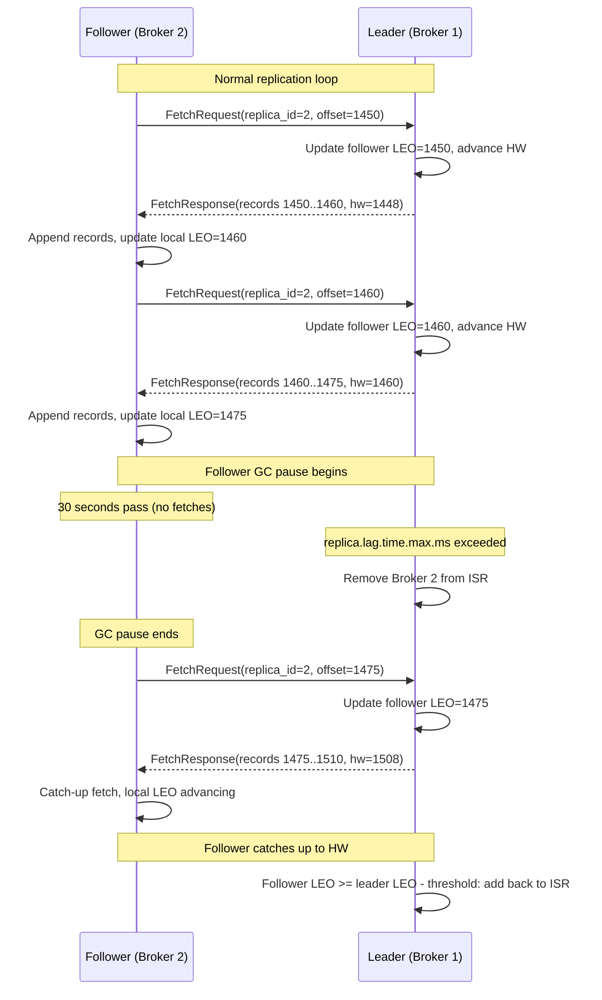
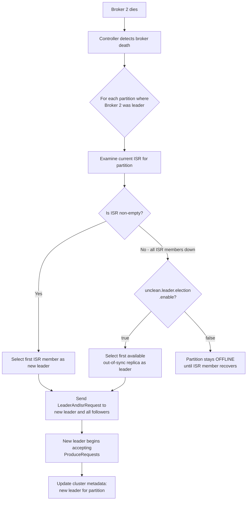
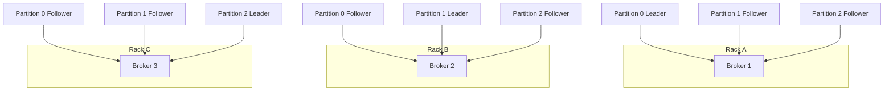

# Apache Kafka Deep Dive  Part 3: Replication Deep Dive  ISR, Leader Election, and Durability

---

**Series:** Apache Kafka Deep Dive  From First Principles to Planet-Scale Event Streaming
**Part:** 3 of 10
**Audience:** Senior backend engineers, distributed systems engineers, data platform architects
**Reading time:** ~45 minutes

---

## Prerequisites from Previous Parts

Part 1 established the distributed log abstraction: why Kafka treats the append-only log as a first-class systems primitive, how sequential I/O enables millions of writes per second, and how partitioning enables horizontal scaling. Part 2 covered the broker's internal architecture: the network thread pool, IO thread pool, the controller role, and the migration from ZooKeeper-based metadata to KRaft consensus.

This part builds directly on that foundation. When we say "controller" here, we mean the KRaft controller (or ZooKeeper-based controller in older deployments) from Part 2. When we say "partition leader," we mean the single broker that owns the partition's write path, which we introduced in Part 1. Everything in this part is about how Kafka keeps copies of your data alive across broker failures  and what the word "durable" actually means in practice.

---

## 1. Replication from First Principles

### 1.1 Why Replicate: Single Point of Failure, Durability, Availability

A partition stored on a single broker is a liability. Disks fail. Kernel panics happen. Network cards stop responding. A broker running a JVM with a 16GB heap can stall for 30 seconds during a full GC cycle. If that broker is the only place your data lives, those 30 seconds mean your partition is unavailable for reads and writes  and if the broker fails entirely, your data is gone.

Replication solves three distinct problems simultaneously:

**Durability**  the property that committed data is not lost. A record acknowledged by Kafka must survive hardware failure. A single broker's page cache does not survive power loss. A disk does not survive a head crash. Replication distributes the data across independent failure domains so that no single hardware event can destroy it.

**Availability**  the property that the system remains operational when components fail. With a single broker, broker death means partition unavailability. With replicas on other brokers, another broker can take over the partition within seconds.

**Read scalability**  a secondary property. While Kafka 2.4+ supports follower reads (fetch from the nearest ISR member), the primary motivation for Kafka's replication design was durability and availability, not read throughput. Part 7 covers follower reads in depth.

The tradeoff is latency. Replication means a write is not "done" until multiple brokers have received it. The question of exactly when the write is "done"  and how many brokers must acknowledge it  is the core tension that the rest of this part addresses.

### 1.2 Kafka's Replication Model: Leader-Follower

Kafka uses an asymmetric leader-follower replication model. Each partition has exactly one leader at any point in time, and zero or more followers.

All writes go to the leader. A producer sending a `ProduceRequest` for partition `P` sends it directly to the broker that is the current leader for `P`. The leader writes the record to its local log and then waits (depending on `acks` configuration) for followers to replicate before acknowledging to the producer.

All reads go to the leader (by default). Consumers issue `FetchRequests` to the partition leader. This is a deliberate design choice: reads from the leader see the most up-to-date committed data, and it simplifies consistency reasoning. Followers do not serve consumer requests under the default configuration.

Followers replicate by issuing `FetchRequests` to the leader, identical in structure to consumer fetches. They receive batches of records in offset order and append them to their local log. This fetch-based pull model is central to how Kafka manages replication without complex push-side state management  we cover it in detail in Section 2.

The replica set for a partition is determined at topic creation time and stored in the cluster metadata. The ordered list of brokers assigned to a partition is called the **replica assignment**. The first broker in that list is called the **preferred leader**.

### 1.3 Replication Factor: RF=1, RF=2, RF=3

The **replication factor (RF)** is the number of copies of each partition's data Kafka maintains across the cluster. It is set per topic.

**RF=1**: One copy. No redundancy. The partition data exists only on the leader broker. Any failure of that broker results in data loss or prolonged unavailability. Suitable only for development environments or topics where data loss is explicitly acceptable (e.g., session data that can be regenerated).

**RF=2**: Two copies. Survives one broker failure. The partition can tolerate the loss of one broker  either the leader or the single follower  and remain operational. However, during the period when a follower is down and the leader is the only copy, a subsequent leader failure means data loss. RF=2 is a minimum for production environments with low-risk topics.

**RF=3**: Three copies. Survives two broker failures (though usually you only configure `min.insync.replicas=2`, which tolerates one failure before rejecting writes). This is the recommended production configuration for any topic where data loss is unacceptable. LinkedIn, Confluent, and most large-scale Kafka operators run RF=3 for their critical topics.

RF=3 is not just about surviving individual broker failures. It's about surviving simultaneous failures: a broker failure during rolling restart, a follower lagging due to GC during the window when another broker is being replaced, a rack-level network partition during maintenance. Three replicas give you buffer.

### 1.4 The Replication Factor vs. Availability Tradeoff

| RF | Tolerated Failures (Availability) | Storage Overhead | Write Latency Impact | Recommended For |
|----|----------------------------------|------------------|----------------------|-----------------|
| 1  | 0 (any failure = downtime)       | 1x               | Minimal              | Dev/test only   |
| 2  | 1 broker failure                 | 2x               | Low                  | Low-risk production topics |
| 3  | 2 broker failures (with min.isr=2, tolerates 1 before rejecting) | 3x | Moderate | All critical production topics |
| 4+ | 3+ broker failures               | 4x+              | Higher               | Regulated industries, cross-DC setups |

Note that "tolerated failures" and "write availability" are different. RF=3 with `min.insync.replicas=2` tolerates 1 broker failure while keeping writes alive. If 2 brokers fail simultaneously, writes are rejected (but no data is lost). If you want writes to survive 2 failures, you need RF=5 with `min.insync.replicas=3`  at that point you're approaching Paxos territory in cost.

---

## 2. Fetch-Based Replication Protocol

### 2.1 How Follower Replication Works

Followers are consumers of the partition leader. This is the key insight into Kafka's replication design: the mechanism followers use to replicate is structurally identical to the mechanism consumers use to read data. Both issue `FetchRequests`. Both receive batches of records in response. Both track their position in the log (the offset they have fetched up to). The difference is in what the leader does with the information.

This architectural choice pays several dividends. It reuses the same code path for both replication and consumption. It means the leader doesn't need to push data to followers or maintain per-follower send buffers. And it means follower replication can benefit from the same zero-copy optimization (`sendfile`) that consumer reads use  the kernel transfers data from the page cache file descriptor directly to the network socket without a userspace copy.

Each follower broker runs one `ReplicaFetcherThread` per leader broker it is replicating from. If broker 2 is a follower for 50 partitions whose leader is broker 1, and 30 partitions whose leader is broker 3, broker 2 runs two `ReplicaFetcherThread` instances: one that fetches from broker 1 (batching requests for all 50 partitions) and one that fetches from broker 3 (batching for the 30 partitions). This broker-level batching is critical for efficient replication in large clusters.

### 2.2 The FetchRequest from a Follower

A follower's `FetchRequest` to the leader includes:

- `replica_id`: Set to the follower's broker ID (a non-negative integer). Consumer `FetchRequests` use `replica_id=-1`, which is how the leader distinguishes a follower fetch from a consumer fetch. This distinction matters: follower fetches update the leader's replica tracking state; consumer fetches do not.
- Per-partition fetch data: for each partition this follower is replicating, the request includes the `partition_id` and the `fetch_offset`  the log-end offset of the follower's local copy, which is the offset from which it wants the leader to start sending records.
- `max_bytes`: total bytes the follower is willing to receive across all partitions in this request.
- `max_wait_ms` and `min_bytes`: the follower will wait up to `max_wait_ms` milliseconds if there are fewer than `min_bytes` available, allowing the leader to batch more data before responding. The default `replica.fetch.wait.max.ms` is 500ms.

```
FetchRequest {
  replica_id: 2          // broker ID of the fetching follower
  max_wait_ms: 500
  min_bytes: 1
  topics: [
    {
      topic: "orders",
      partitions: [
        { partition: 0, fetch_offset: 1450, max_bytes: 1048576 },
        { partition: 3, fetch_offset: 892,  max_bytes: 1048576 }
      ]
    }
  ]
}
```

### 2.3 Leader Processes Follower Fetch

When the leader receives a `FetchRequest` with a non-negative `replica_id`, it does two things that it does not do for consumer fetches:

1. **Updates the follower's position in the leader's replica tracking table**. The leader maintains a `ReplicaState` entry for each follower, containing the follower's last known `fetch_offset` (its LEO) and the timestamp of its last fetch. This is how the leader knows whether a follower is caught up.

2. **Advances the High Watermark** (covered in Section 3). The leader computes the minimum LEO across all ISR members after updating the follower's position, and advances the partition's HW to that minimum.

The leader then returns records starting at `fetch_offset`, up to `max_bytes`. The follower appends these records to its local log segment, advancing its own LEO.

### 2.4 Why Pull-Based Replication

The same rationale applies as for pull-based consumers (Part 1): the follower controls its own pace. If a follower is experiencing GC pauses or disk I/O saturation, it simply doesn't issue fetches. The leader doesn't need to buffer unsent data per follower or detect follower slowness in order to stop sending. It just notices that the follower hasn't fetched recently (via `replica.lag.time.max.ms`) and removes it from the ISR.

A push-based replication model would require the leader to maintain per-follower outbound queues, implement per-follower flow control, and handle the case where a slow follower's backpressure propagates to the leader's write path. Kafka avoids all of this.

### 2.5 Replication Lag

**Replication lag** is the measure of how far behind a follower is relative to the leader. Kafka measures this as time: specifically, the time elapsed since the follower last issued a successful `FetchRequest` to the leader.

The configuration parameter `replica.lag.time.max.ms` (default: 30,000ms, i.e., 30 seconds) defines the threshold. If a follower has not fetched from the leader within this window, it is considered lagging and is removed from the ISR.

Note that this is a time-based metric, not a purely offset-based one. In older Kafka versions (before 0.9), there was also `replica.lag.max.messages`, which removed followers that were more than N messages behind the leader. This was problematic because high-throughput bursts could momentarily cause a healthy follower to fall that far behind without any actual failure. The time-based metric is more robust to burst traffic.

When a follower is removed from the ISR, the `IsrShrinksPerSec` metric increments. When it catches up and rejoins, `IsrExpandsPerSec` increments.



---

## 3. The High Watermark and Log-End Offset

### 3.1 Log-End Offset (LEO)

The **Log-End Offset (LEO)** is the offset of the next message to be written. If a partition's log currently contains messages at offsets 0 through 1499, the LEO is 1500. It is the highest offset in the log plus one.

Every replica  leader and followers alike  has its own LEO representing the state of its local copy of the partition log. The leader's LEO is always at or ahead of any follower's LEO, because followers replicate from the leader.

The leader also tracks each follower's LEO. When a follower fetches with `fetch_offset=1450`, the leader records that follower's LEO as 1450  the follower has confirmed it has records up through offset 1449.

### 3.2 High Watermark (HW)

The **High Watermark (HW)** is the highest offset that has been replicated to all members of the ISR. It represents the "committed" frontier: the offset up to which all ISR replicas have a consistent copy of the data.

Consumers can only read records up to (but not including) the HW. A consumer sees records at offsets 0 through HW-1. Records between HW and the leader's LEO exist in the leader's log but are not yet visible to consumers  they are "uncommitted" and could theoretically be lost if the leader fails before they are replicated.

### 3.3 Why the HW Matters

Consider what happens without the HW constraint. A producer sends record R at offset 1500. The leader appends it (leader LEO = 1501). A consumer fetches and reads R. Now the leader fails before any follower has replicated offset 1500. A follower is elected leader. Its LEO is 1499. Record R is gone  but the consumer already processed it.

This is a phantom read: the consumer observed a record that the system subsequently lost. The HW prevents this by ensuring consumers only see records that have been replicated to all ISR members, meaning a subsequent leader election (which always promotes an ISR member) will not lose those records.

### 3.4 How HW Advances

The leader advances the HW based on the follower fetch positions it tracks. Specifically:

1. The leader maintains the known LEO for each ISR member (including itself).
2. After each follower `FetchRequest`, the leader updates that follower's tracked LEO.
3. The leader recomputes the minimum LEO across all ISR members.
4. The HW is set to `min(ISR member LEOs)`.

In practice, the HW is bounded by the slowest ISR member. If one follower is consistently behind, it suppresses the HW, reducing consumer read availability. This is why ISR health directly affects consumer throughput even when producers are writing successfully  a lagging ISR member that stays within `replica.lag.time.max.ms` will slow down consumer reads without being ejected from the ISR.

### 3.5 The HW Propagation Lag: One Extra Round-Trip

Followers learn the current HW from the leader's `FetchResponse`. This means there is an inherent one-round-trip lag in follower HW knowledge:

- Leader advances HW at time T.
- Follower learns the new HW at time T + (next FetchRequest RTT).

This is relevant for the follower-reads feature (introduced in 2.4+), where consumers can fetch from the nearest ISR member. A follower serving reads must use its locally known HW (which may be one round-trip stale) rather than the leader's current HW. Kafka handles this by including the current HW in every `FetchResponse`, so followers update their HW knowledge on each replication cycle.

### 3.5 LEO vs. HW Across Three Message Appends

The following ASCII sequence shows the evolution of LEO and HW across the leader (L) and two followers (F1, F2) as three messages are written:

```
Initial state (all caught up):
  L:  LEO=100, HW=100
  F1: LEO=100, known_HW=100
  F2: LEO=100, known_HW=100

--- Producer writes msg A (offset 100) ---

L appends msg A:
  L:  LEO=101, HW=100  (HW not yet advanced; followers haven't fetched A)

F1 FetchRequest(fetch_offset=100):
  L receives: updates F1.LEO=100 (F1 is at 100, fetching from 100)
  L sends: records[100], hw=100
  F1 appends msg A: F1.LEO=101, known_HW=100

F2 FetchRequest(fetch_offset=100):
  L receives: updates F2.LEO=100
  L recomputes HW = min(L.LEO=101, F1.LEO=101, F2.LEO=100) = 100 (F2 just arriving)
  L sends: records[100], hw=100
  F2 appends msg A: F2.LEO=101, known_HW=100

--- Producer writes msg B (offset 101) ---

L appends msg B:
  L: LEO=102, HW=100

F1 FetchRequest(fetch_offset=101):
  L receives: updates F1.LEO=101
  L recomputes HW = min(102, 101, 101) = 101  <-- HW advances to 101!
  L sends: records[101], hw=101
  F1 appends msg B: F1.LEO=102, known_HW=101

F2 FetchRequest(fetch_offset=101):
  L receives: updates F2.LEO=101
  L recomputes HW = min(102, 102, 101) = 101
  L sends: records[101], hw=101
  F2 appends msg B: F2.LEO=102, known_HW=101

--- Producer writes msg C (offset 102) ---

L appends msg C: LEO=103, HW=101

F1 FetchRequest(fetch_offset=102):
  L receives: updates F1.LEO=102
  L recomputes HW = min(103, 102, 102) = 102  <-- HW advances to 102
  L sends: records[102], hw=102
  F1 appends: F1.LEO=103, known_HW=102

F2 FetchRequest(fetch_offset=102):
  L receives: updates F2.LEO=102
  L recomputes HW = min(103, 103, 102) = 102
  L sends: records[102], hw=102
  F2 appends: F2.LEO=103, known_HW=102

Both followers now issue FetchRequests for offset 103:
  L recomputes HW = min(103, 103, 103) = 103
  Consumers can now read through offset 102 (offsets 0..102 inclusive)
```

The pattern is clear: the HW advances one round-trip behind the leader's LEO. With two followers, it takes two fetch cycles (from both followers) after the leader appends for the HW to catch up. Under continuous writes, the HW trails the leader's LEO by roughly one replication RTT.

### 3.6 Epoch-Based Leader Tracking: Leader Epoch

Prior to Kafka 0.11, there was a subtle correctness problem in the replication protocol. When a follower was elected leader after the old leader failed, it didn't know whether the old leader had written records beyond what the follower had replicated. The follower-turned-leader would begin accepting writes from its own LEO  but the old leader might have written (and possibly acknowledged) records at higher offsets that were now orphaned.

When the old leader recovered and rejoined as a follower, it needed to truncate its log to match the new leader. But how far to truncate? The old leader would query the new leader's HW and truncate to that. This was correct in simple failure scenarios but could lead to log divergence in specific split-brain edge cases, resulting in data that appeared committed being silently discarded.

The **Leader Epoch** mechanism (introduced in KIP-101, Kafka 0.11) solves this. Every time a new leader is elected, it increments the epoch counter. The epoch and its starting offset are stored in a small per-partition log (the "leader epoch file"). When a follower reconnects to a new leader, instead of naively truncating to the new leader's HW, it executes this protocol:

1. The follower sends an `OffsetForLeaderEpoch` request asking: "What is the last offset (LEO) of epoch N?" where N is the epoch it last knew.
2. The new leader responds with the endpoint of that epoch in its log.
3. The follower truncates its local log to that offset.
4. The follower then begins normal fetch-based replication from that truncated position.

### 3.7 Leader Epoch Fetch: Safe Log Truncation

The Leader Epoch protocol ensures that a recovering follower never keeps records that the new leader doesn't have, and never discards records that the new leader has. It provides a safe truncation point that is mathematically derivable from the epoch metadata, rather than being an approximation based on the HW.

```
Epoch history on leader broker (after 3 leader elections):
  Epoch 0: started at offset 0, ended at offset 1200
  Epoch 1: started at offset 1201, ended at offset 1450
  Epoch 2: started at offset 1451 (current)

Recovering follower last knew epoch 1, its LEO is 1480:
  Follower: "What was the last offset of epoch 1?"
  New leader: "Epoch 1 ended at offset 1450"
  Follower: truncates its log to offset 1450
  Follower: begins fetching from offset 1450 in epoch 2
```

Without Leader Epoch, the follower might have kept records 1451-1480 that were written by the old epoch-1 leader but not committed, leading to log divergence. The epoch mechanism eliminates this class of bug.

---

## 4. In-Sync Replicas (ISR): The Heart of Kafka Durability

### 4.1 What the ISR Is

The **In-Sync Replica set (ISR)** is the subset of a partition's replicas that are currently considered "in sync" with the leader. "In sync" means the replica has recently fetched from the leader and has not fallen significantly behind.

The ISR is a dynamic set. At topic creation, all replicas start in the ISR. As follower behavior changes  due to GC pauses, disk saturation, network issues  replicas are evicted from and readmitted to the ISR in real time. The leader manages ISR membership and persists changes to the cluster metadata (ZooKeeper or KRaft log, depending on version).

The ISR is the fundamental unit of Kafka's durability guarantee. A record is **committed** when it is written to all members of the ISR. The HW marks the committed frontier. Consumers only see committed records.

### 4.2 ISR Join Condition

A follower is eligible to join (or rejoin) the ISR when it has caught up to within `replica.lag.time.max.ms` of the leader. In practice, "caught up" means the follower's LEO equals the leader's LEO  the follower has all records the leader has at that moment.

The leader continuously monitors follower fetch positions. When a follower's LEO reaches the leader's LEO (meaning the follower is fully caught up), the leader adds it back to the ISR and updates the cluster metadata. This triggers an `IsrExpandsPerSec` metric increment.

### 4.3 ISR Leave Condition

A follower is evicted from the ISR when it has not sent a `FetchRequest` to the leader within the last `replica.lag.time.max.ms` milliseconds. The default is 30,000ms (30 seconds).

The check is implemented in the leader's replica management logic, which periodically scans all tracked replicas and evicts those whose last-fetch timestamp is stale. Eviction is reflected in the cluster metadata so that the controller, other brokers, and producers with `acks=all` all have a consistent view of which replicas are in-sync.

Note: Kafka does not evict a follower based on offset lag alone (it removed `replica.lag.max.messages` in 0.9.0). A follower that is consistently 50,000 messages behind but fetches every 5 seconds would remain in the ISR, because the time-based check is the gate. This matters for high-throughput topics: a follower with slow disk I/O may remain in the ISR while still suppressing the HW.

### 4.4 ISR Shrinkage Scenario: GC Pause

The classic ISR shrinkage scenario is a JVM GC pause on a follower broker:

```
Timeline:

T+0s:  Follower (Broker 3) is in ISR. LEO=10000. Fetching normally.
T+1s:  JVM full GC starts on Broker 3. All threads stop.
T+31s: GC completes. Broker 3 resumes.

Meanwhile on the leader (Broker 1):
T+30s: Broker 3's last fetch was 30s ago. Threshold exceeded.
       Leader removes Broker 3 from ISR.
       ISR changes from {1,2,3} to {1,2}.
       Leader persists new ISR to ZooKeeper/KRaft.
       Metric: IsrShrinksPerSec increments.

T+31s: Broker 3 resumes, issues FetchRequest.
       Leader updates Broker 3's tracked LEO.
       Leader sees Broker 3 is fetching normally again.

T+31s-T+45s: Broker 3 catch-up replication: fetches records 10000..15000.
             Broker 3 LEO approaches leader LEO.

T+46s: Broker 3 LEO == leader LEO.
       Leader re-adds Broker 3 to ISR.
       ISR changes from {1,2} to {1,2,3}.
       Metric: IsrExpandsPerSec increments.
```

Relevant JMX metrics:
- `kafka.server:type=ReplicaManager,name=IsrShrinksPerSec`  rate of ISR shrinkage events
- `kafka.server:type=ReplicaManager,name=IsrExpandsPerSec`  rate of ISR expansion events
- `kafka.server:type=ReplicaManager,name=UnderReplicatedPartitions`  count of partitions with ISR < RF

During the 15-second window from T+31s to T+46s, the partition has ISR={1,2} with RF=3. The `UnderReplicatedPartitions` metric is non-zero. Any monitoring alert on this metric should fire. This is not a crisis  it's expected during rolling restarts and occasional GC  but sustained non-zero URP is a red flag.

### 4.5 ISR and `acks=all`: The Degradation Trap

The `acks` producer configuration controls how many replicas must acknowledge a `ProduceRequest` before the leader responds to the producer:

- `acks=0`: Producer doesn't wait for any acknowledgment. Fire-and-forget.
- `acks=1`: Leader acknowledges after writing to its own log. Followers may not have replicated.
- `acks=all` (or `acks=-1`): Leader waits for all ISR members to acknowledge before responding.

Here is the critical subtlety: **`acks=all` waits for the current ISR, not all replicas.**

If the ISR shrinks to `{leader}`  just the leader broker  then `acks=all` degrades to `acks=1`. The producer's `ProduceRequest` is acknowledged as soon as the leader writes to its log, with no replication having occurred. If the leader fails a millisecond later, the data is gone, despite the producer having used `acks=all`.

This is not a bug. It is documented behavior. The ISR represents the set of replicas Kafka trusts to be in sync. If followers are down or lagging, Kafka cannot wait for them  that would block producers indefinitely. Instead, it proceeds with the replicas that are available and in-sync.

The implication is that `acks=all` alone is insufficient for durability guarantees. You must pair it with `min.insync.replicas`.

### 4.6 `min.insync.replicas`: The Safety Net

`min.insync.replicas` (often abbreviated `min.isr`) is a broker-level or topic-level configuration that sets a lower bound on how small the ISR can get before Kafka rejects produce requests with `acks=all`.

If the current ISR size falls below `min.insync.replicas`, any `ProduceRequest` with `acks=all` receives a `NotEnoughReplicasException`. The producer cannot write. This is a hard availability wall that trades availability for consistency: rather than letting the ISR degrade to a single replica and silently accepting data that has no redundancy, Kafka says "I refuse to accept data I cannot safely replicate."

Producers with `acks=0` or `acks=1` are not affected by `min.insync.replicas`. The setting only applies to `acks=all` requests.

Example configuration:
```
# Topic configuration
min.insync.replicas=2

# Producer configuration
acks=all
```

With RF=3, ISR={1,2,3}, `min.insync.replicas=2`:
- ISR shrinks to {1,2}: produce requests still succeed. ISR (2) >= min.isr (2).
- ISR shrinks to {1}: produce requests fail with `NotEnoughReplicasException`. ISR (1) < min.isr (2).

### 4.7 Recommended Production Configuration

The standard recommendation for durability-sensitive topics:

```
# Topic level
replication.factor=3
min.insync.replicas=2

# Producer level
acks=all
enable.idempotence=true  # prevents duplicate records on retry (Part 6)
retries=Integer.MAX_VALUE
```

What this guarantees:
- **Tolerates 1 broker failure**: if 1 of 3 brokers is down, the ISR is {2 remaining brokers}, ISR size (2) = min.isr (2), writes continue.
- **Rejects writes if 2 brokers are down**: ISR would be {1}, ISR size (1) < min.isr (2), `NotEnoughReplicasException`  no silent data loss.
- **No data loss**: every acknowledged record is on at least 2 brokers.

| ISR Size | min.isr | acks | Result |
|----------|---------|------|--------|
| 3 (all replicas) | 2 | all | Write succeeds, replicated to 3 |
| 2 (one follower down) | 2 | all | Write succeeds, replicated to 2 |
| 1 (two followers down) | 2 | all | Write fails: NotEnoughReplicasException |
| 1 (two followers down) | 2 | 1   | Write succeeds, on leader only (dangerous) |
| 1 (two followers down) | 1 | all | Write succeeds, on leader only (min.isr too low) |

### 4.8 ISR and Read Availability

A lagging ISR member suppresses the HW even if it remains within `replica.lag.time.max.ms`. Consider: the leader has LEO=10000. Follower A has LEO=9999. Follower B has LEO=7000 but has fetched within the last 20 seconds (within the 30s threshold). All three are in the ISR.

The HW = min(10000, 9999, 7000) = 7000.

Consumers can only read up to offset 6999, even though the leader has 10000 records. The 7000 records between HW and the leader's LEO are invisible to consumers. Follower B is holding back 3000 records of consumer-visible progress despite technically being "in sync" by the time-based definition.

This is why high-throughput production systems tune `replica.lag.time.max.ms` carefully and monitor per-replica replication lag. A follower that is consistently slow but stays within the time threshold degrades consumer throughput without triggering ISR alerts.

---

## 5. Leader Election: Types, Mechanisms, and Tradeoffs

### 5.1 Preferred Leader

The **preferred leader** is the first broker listed in the partition's replica assignment. It is "preferred" because it was originally chosen by Kafka's assignment algorithm to distribute leader responsibilities evenly across brokers.

When a topic is created with RF=3 and 6 partitions across 3 brokers, the preferred leaders are distributed roughly evenly  2 leader partitions per broker. This balances the write traffic, since all writes go to the partition leader.

```
Partition 0: replicas=[1,2,3], preferred leader=Broker 1
Partition 1: replicas=[2,3,1], preferred leader=Broker 2
Partition 2: replicas=[3,1,2], preferred leader=Broker 3
Partition 3: replicas=[1,3,2], preferred leader=Broker 1
Partition 4: replicas=[2,1,3], preferred leader=Broker 2
Partition 5: replicas=[3,2,1], preferred leader=Broker 3
```

Over time, broker restarts cause leadership to migrate away from preferred leaders. Broker 1 dies, its partitions fail over to followers. When Broker 1 recovers, it rejoins the ISR but may not reclaim leadership automatically.

### 5.2 Preferred Leader Election

**Preferred leader election** moves leadership back to the preferred replica when the preferred replica is alive and in the ISR. It can be triggered:

- Automatically, if `auto.leader.rebalance.enable=true` (default: true)  Kafka's controller periodically checks leader distribution and triggers preferred leader elections to rebalance.
- Manually, via `kafka-leader-election.sh --election-type PREFERRED`.

Preferred leader election is a "clean" election  the preferred replica is already in the ISR and fully caught up. There is no data loss risk. The election is simply a metadata update: the controller sends `LeaderAndIsrRequests` informing all replicas that the preferred replica is now the leader.

The latency impact is minimal: a brief period during which the new leader is being set up, typically under a second.

### 5.3 Unclean Leader Election

**Unclean leader election** is the most operationally dangerous event in Kafka's operational lifecycle. It occurs when:

1. The partition leader dies.
2. All ISR members (followers that were in-sync) are also unavailable.
3. Only out-of-sync replicas (replicas that were not in the ISR at the time of failure) are available.

In this scenario, there is no safe choice. Every available replica is behind the last committed HW. Any replica elected leader will be missing some records that were committed (acknowledged to producers) before the failure. Those records are permanently lost.

The configuration `unclean.leader.election.enable` controls the behavior:

**`unclean.leader.election.enable=false` (default since Kafka 0.11):**
The partition remains **UNAVAILABLE**  no reads, no writes  until an ISR member recovers. This is the CP side of the CAP tradeoff: consistency is preserved (no data loss), availability is sacrificed.

The partition will stay down indefinitely if the ISR members are truly dead (e.g., all three brokers in a 3-broker cluster running RF=3 lost their disks simultaneously). Recovery requires manual intervention: replace the hardware, restore from backup, or explicitly enable unclean election.

**`unclean.leader.election.enable=true`:**
An out-of-sync replica is elected leader. The partition becomes **AVAILABLE**, but records that were acknowledged to producers but not replicated to this follower are **permanently lost**. Consumers will see a gap in the log. The offsets that existed on the dead leader but not on the new leader simply don't exist anymore  the new leader's records start from where the out-of-sync follower left off.

This is the AP side: availability is preserved, but consistency (durability) is sacrificed.

When to enable unclean election:

| Topic Type | Recommendation | Rationale |
|------------|----------------|-----------|
| Financial transactions | Never | Data loss is unacceptable |
| User activity events | Probably not | Losing some clicks is bad |
| Metrics / monitoring | Consider enabling | Availability matters; some data loss tolerable |
| Log aggregation | Consider enabling | Losing a few log lines is acceptable |
| CDC (database changes) | Never | Loss breaks downstream consistency |
| ML feature data | Case-by-case | Depends on retraining sensitivity |

### 5.4 Controller-Triggered Leader Election

When a broker dies, the controller detects the failure (via ZooKeeper session expiry or KRaft heartbeat timeout) and initiates leader elections for all partitions where the dead broker was the leader. The process:



The `LeaderAndIsrRequest` is sent by the controller to:
- The new leader: "You are now the leader for partition P."
- All followers: "The new leader is broker X. Start fetching from X."

The new leader then begins accepting `FetchRequests` from followers and `ProduceRequests` from producers. From the producer's perspective, a broker failure manifests as a `NotLeaderForPartitionException` on the next `ProduceRequest`, after which the producer fetches updated metadata and retries to the new leader.

### 5.5 Leader Election Latency

The time from broker failure to partition availability depends on two components:

**Failure detection latency**: how quickly the controller learns the broker is dead.
- ZooKeeper-based: ZooKeeper session timeout is `zookeeper.session.timeout.ms`, typically 6,000–18,000ms. The broker's ZooKeeper session doesn't expire until this timeout elapses after the last heartbeat. In the worst case, this adds 18 seconds of detection latency.
- KRaft-based (Kafka 3.3+): The active controller receives heartbeats from all brokers. The default `broker.heartbeat.interval.ms` is 2,000ms and `broker.session.timeout.ms` is 9,000ms. In practice, failure detection is much faster  on the order of 1-3 seconds.

**Election and propagation latency**: how quickly the controller processes the election and propagates the `LeaderAndIsrRequest`. For a single partition election, this is milliseconds. For thousands of partitions (see Section 5.6), it can be the bottleneck.

Total expected election latency:
| Metadata System | Failure Detection | Election | Total (typical) |
|-----------------|-------------------|----------|-----------------|
| ZooKeeper | 6-18s | <100ms per partition | 6-18s |
| KRaft | 1-3s | <100ms per partition | 1-3s |

### 5.6 Election Storm

An **election storm** occurs when a large number of partition leaders fail simultaneously  for example, when an entire broker hosting many partition leaders dies, or when a network partition isolates a datacenter.

Consider a cluster with 3 brokers and 10,000 partitions per broker, RF=3. If Broker 1 dies and it is the preferred (and actual) leader for 3,333 partitions, the controller must process 3,333 leader elections. Even at 1ms per election, that's 3.3 seconds. In practice, controller processing time, metadata propagation, and batching behavior mean real-world election storms can take 30-60 seconds for tens of thousands of partitions.

During this window, affected partitions are unavailable. Producers receive `NotLeaderForPartitionException`. Consumers stall. Dependent services see timeouts.

Mitigation strategies:
- **Reduce partition count per broker**: fewer partitions means smaller storms. (See Part 1's discussion of the partition count tradeoff.)
- **Use KRaft**: KRaft's controller is significantly more efficient at processing bulk elections because it avoids ZooKeeper write latency on each election.
- **Controller pre-computation**: newer Kafka versions batch `LeaderAndIsrRequests` to minimize round-trips.
- **Monitor preferred leader balance**: an unbalanced cluster (one broker with disproportionately many leaders) creates asymmetric failure impact.

---

## 6. Replica Assignment and Rack Awareness

### 6.1 Default Assignment Algorithm

When a topic is created, Kafka's assignment algorithm distributes replicas across available brokers to spread both leader and follower load. The algorithm:

1. Sort brokers by broker ID.
2. For partition 0, assign the first replica starting at a random broker, then assign subsequent replicas to the next brokers in round-robin order.
3. For partition 1, start the first replica at the next broker in the sorted list (offset by 1), continuing round-robin for remaining replicas. The offset increases by 1 for each partition.

This produces an interleaved assignment where leadership is evenly distributed:

```
Brokers: [1, 2, 3], RF=3, 6 partitions

Partition 0: leader=1, replicas=[1,2,3]
Partition 1: leader=2, replicas=[2,3,1]
Partition 2: leader=3, replicas=[3,1,2]
Partition 3: leader=1, replicas=[1,3,2]
Partition 4: leader=2, replicas=[2,1,3]
Partition 5: leader=3, replicas=[3,2,1]

Leader count: Broker 1=2, Broker 2=2, Broker 3=2 (balanced)
```

### 6.2 Rack-Aware Assignment

The default algorithm assigns replicas across brokers but doesn't consider physical locality. In a multi-rack deployment, it's possible that all three replicas of a partition land on brokers in the same rack. A rack-level power or network failure would then take all replicas offline  defeating the purpose of RF=3.

**Rack-aware assignment** requires:
1. Each broker configured with `broker.rack=<rack-id>`.
2. At least as many distinct racks as the replication factor.

With rack-awareness enabled, Kafka modifies the assignment algorithm to ensure each rack receives at most one replica of each partition:



With this assignment:
- Rack A fails: Partitions 0, 1, 2 each lose one replica (Broker 1). ISR shrinks from 3 to 2 for all partitions. With `min.insync.replicas=2`, writes continue. No data loss.
- Rack A fails + Rack B fails: All partitions lose 2 replicas. ISR = {Rack C broker}. With `min.insync.replicas=2`, writes are rejected. But no data is lost  the Rack C broker has all committed records.

Without rack-awareness, a rack failure could take all 3 replicas of a partition offline simultaneously, causing data unavailability or loss.

### 6.3 Verifying Replica Assignment

Use `kafka-topics.sh --describe` to inspect assignment and ISR:

```bash
kafka-topics.sh --bootstrap-server broker:9092 --describe --topic orders
```

Output:
```
Topic: orders   PartitionCount: 6   ReplicationFactor: 3   Configs: min.insync.replicas=2
        Topic: orders   Partition: 0   Leader: 1   Replicas: 1,2,3   Isr: 1,2,3
        Topic: orders   Partition: 1   Leader: 2   Replicas: 2,3,1   Isr: 2,3,1
        Topic: orders   Partition: 2   Leader: 3   Replicas: 3,1,2   Isr: 3,2
        Topic: orders   Partition: 3   Leader: 1   Replicas: 1,3,2   Isr: 1,3,2
        Topic: orders   Partition: 4   Leader: 2   Replicas: 2,1,3   Isr: 2,1,3
        Topic: orders   Partition: 5   Leader: 3   Replicas: 3,2,1   Isr: 3,2,1
```

Reading this output:
- **Replicas**: the full replica assignment list. The first entry is the preferred leader.
- **Isr**: current ISR. Partition 2 has ISR={3,2}  Broker 1 (a replica for partition 2) is out of the ISR. This is an under-replicated partition. The `UnderReplicatedPartitions` metric should be non-zero for this topic.
- **Leader**: the current active leader. For partition 2, leader=3 matches the preferred leader (first in Replicas list)  Broker 3 was already the preferred leader.

### 6.4 Partition Reassignment

Over time, replica assignments become suboptimal:
- New brokers are added; existing brokers have disproportionately more partitions.
- A broker is decommissioned; its partitions need to move to remaining brokers.
- Hardware is being replaced on a specific broker.
- An assignment change is needed to improve rack balance.

`kafka-reassign-partitions.sh` handles this. The workflow:

```bash
# 1. Generate a reassignment plan
kafka-reassign-partitions.sh \
  --bootstrap-server broker:9092 \
  --broker-list "1,2,3,4" \
  --topics-to-move-json-file topics.json \
  --generate

# 2. Review the generated plan, save to reassignment.json

# 3. Execute the reassignment
kafka-reassign-partitions.sh \
  --bootstrap-server broker:9092 \
  --reassignment-json-file reassignment.json \
  --execute \
  --throttle 50000000  # 50 MB/s replication bandwidth cap

# 4. Monitor progress
kafka-reassign-partitions.sh \
  --bootstrap-server broker:9092 \
  --reassignment-json-file reassignment.json \
  --verify
```

The `--throttle` flag is critical in production. Partition reassignment triggers full catch-up replication from the source to the new destination broker. Without throttling, this replication I/O can saturate broker network bandwidth, impacting producer and consumer throughput. 50-100 MB/s per broker is a typical safe throttle in production environments.

During reassignment, the partition's replica set is temporarily expanded (adding the new destination replicas) before old replicas are removed. The ISR grows, then shrinks. Both sides of the migration are in the ISR simultaneously during the transition window.

---

## 7. Replication and Consistency Guarantees

### 7.1 What `acks=all` ACTUALLY Guarantees

There is a common and dangerous misunderstanding about `acks=all`. It does not mean the record is written to disk. It means the record is written to the **OS page cache** (kernel buffer cache) of all ISR members.

The page cache is memory. If a broker loses power  not a graceful restart, but a hard power loss  records in the page cache that haven't been flushed to disk are lost. The OS kernel's write-back mechanism flushes pages to disk on its own schedule, typically every 5-30 seconds (`dirty_expire_centisecs` on Linux).

Kafka does not force synchronous disk flushes by default. The configuration `log.flush.interval.messages` and `log.flush.interval.ms` can be used to force periodic flushes, but Kafka's official documentation explicitly discourages relying on these, citing the performance cost and noting that replication is the preferred durability mechanism.

The durability argument: with RF=3 and `min.insync.replicas=2`, even if one broker loses power and its page cache is lost, the other two ISR brokers have the data in their page caches. The probability of all three suffering simultaneous power loss is much lower. And with good UPS and proper data center infrastructure, an "all nodes lose power simultaneously" scenario is effectively zero.

This is a conscious tradeoff: Kafka prioritizes throughput (avoiding synchronous disk flushes) and relies on replication for durability. For environments where this is insufficient (HIPAA, PCI-DSS, financial transactions), additional safeguards are needed.

### 7.2 The Durability Hierarchy

| Configuration | Survives | Does Not Survive | Typical Use Case |
|---------------|----------|------------------|------------------|
| `acks=0` | Nothing | Any failure | Telemetry where loss is acceptable |
| `acks=1` | Leader crash-restart (log on disk) | Leader power loss (page cache only) | Internal metrics, non-critical events |
| `acks=all`, ISR=1 (min.isr not set or too low) | Same as acks=1 | Same as acks=1 | Misconfiguration  dangerous |
| `acks=all`, min.isr=2, RF=3 | Single broker power failure (2 copies survive) | Simultaneous power loss to 2+ brokers | Standard production |
| `acks=all`, min.isr=2, RF=3, rack-aware | Rack-level failure | Simultaneous failure of 2 racks | High-availability production |
| `acks=all`, min.isr=2, RF=3 + MirrorMaker 2 | Datacenter failure | Simultaneous datacenter failure | Disaster recovery setups |

### 7.3 "Committed" vs. "Acknowledged"

These are the same thing in Kafka's model:

- A message is **committed** when it has been written to all ISR members and the HW has advanced past its offset.
- A message is **acknowledged** (to the producer) when (depending on `acks`) the leader has written it and (for `acks=all`) all ISR members have fetched it.

With `acks=all`, acknowledgment and commitment happen simultaneously from the producer's perspective: the `ProduceResponse` comes back only after the message is in all ISR members.

Non-committed messages  those between the HW and the leader's LEO  can be lost. They have been written to the leader's log and possibly some followers' logs, but not all ISR members. If the leader fails, the new leader (elected from the ISR) may not have these records. Consumers cannot see them because the HW is the visibility fence.

This is the correct behavior. A consumer that reads a non-committed message and the message is subsequently lost would observe a phantom read  a read of data that the system has no durable record of. Kafka's HW fence prevents this class of inconsistency entirely.

### 7.4 Producer Retries and Ordering

When a producer with `acks=all` sends a `ProduceRequest` and the leader fails mid-flight, the producer receives a network error or timeout. It retries. But the original record may have already been appended to the new leader's log (if the new leader was a follower that already replicated it before the old leader's failure). The retry would write a duplicate.

Without idempotent producers, `retries > 0` can result in:
- **Duplicates**: the record appears twice at two different offsets.
- **Out-of-order delivery**: if two in-flight batches are reordered due to retry behavior.

The idempotent producer (`enable.idempotence=true`), covered in Part 6, uses sequence numbers and a producer ID to allow the broker to detect and reject duplicates. It is enabled by default as of Kafka 3.0 and should always be enabled for `acks=all` configurations.

---

## 8. Monitoring Replication Health

### 8.1 Under-Replicated Partitions (URP)

**Under-replicated partitions** are partitions where the current ISR size is less than the configured replication factor. This means data redundancy is reduced below the intended level.

```
Metric: kafka.server:type=ReplicaManager,name=UnderReplicatedPartitions
Type: Gauge (count of partitions)
Alert threshold: > 0 for more than 60 seconds
Severity: HIGH  data is less durable than configured
```

URP is the single most important replication health metric. Any non-zero URP value means at least one partition has fewer replicas than it should. A brief URP during a rolling restart is expected and acceptable. Sustained URP indicates a follower that is down, lagging, or unable to catch up.

Causes of sustained URP:
- A broker is completely down (network failure, JVM crash).
- A broker is running but its disks are full  it cannot append new records.
- A broker has disk I/O saturation  it is falling behind and cannot catch up faster than the leader is writing.
- A follower is experiencing severe GC pauses that keep it outside the `replica.lag.time.max.ms` window.

### 8.2 Under-MinISR Partitions

Distinct from URP: **under-MinISR partitions** are partitions where the ISR size has fallen below `min.insync.replicas`. This is worse than URP  it means producers with `acks=all` are actively being rejected.

```
Metric: kafka.server:type=ReplicaManager,name=UnderMinIsrPartitionCount
Type: Gauge
Alert threshold: > 0
Severity: CRITICAL  produce requests are failing right now
```

If this metric is non-zero, check:
1. Are brokers down? (`kafka.server:type=KafkaServer,name=BrokerState`)
2. Is there a network partition between brokers?
3. Are follower brokers running but failing to replicate? (check replication lag metrics)

### 8.3 ISR Shrink/Expand Rate

```
Metric: kafka.server:type=ReplicaManager,name=IsrShrinksPerSec
Metric: kafka.server:type=ReplicaManager,name=IsrExpandsPerSec
Type: Rate (events per second)
Alert: chronic IsrShrinksPerSec > 0 outside maintenance windows
```

A small number of ISR shrink/expand events during rolling restarts is normal. Chronic ISR instability  shrinks and expands happening continuously during normal operation  indicates a structural problem with follower stability. Common causes:

- **GC pauses** on follower brokers: tune JVM GC settings, consider ZGC or Shenandoah, increase `kafka_jvm_heap_opts`.
- **Disk I/O contention**: the follower's disk is shared with log compaction, segment rolling, or other I/O-intensive operations.
- **Network congestion** between specific broker pairs: check inter-broker bandwidth with `iftop` or similar.
- **Asymmetric hardware**: a slower follower broker with lower I/O capacity cannot keep up with a high-throughput leader.
- **`replica.lag.time.max.ms` too low**: at very high write rates, even healthy followers may occasionally miss the threshold due to network jitter. Increasing this to 60,000ms reduces false ISR instability.

### 8.4 Replication Lag Per Replica

```
Metric: kafka.server:type=FetcherLagMetrics,
        name=ConsumerLag,
        clientId=ReplicaFetcherThread-{leader_broker_id},
        topic={topic_name},
        partition={partition_id}
Type: Gauge (message count lag)
```

This metric reports how many messages behind each replica fetcher thread is for each partition. A follower that is consistently 50,000 messages behind on a high-throughput partition may be within `replica.lag.time.max.ms` but is still suppressing the HW significantly.

Track this metric per-replica and per-partition to identify which follower is lagging and which partition is affected. This is the starting point for diagnosing HW suppression.

### 8.5 Leader Count Per Broker

Leaders handle all write traffic for their partitions. If leaders are unevenly distributed, some brokers handle disproportionate write load while others idle as followers.

```
Metric: kafka.server:type=ReplicaManager,name=LeaderCount
Type: Gauge (number of partitions where this broker is leader)
Alert: deviation > 10-15% from expected value (total_partitions / broker_count)
```

In a 3-broker cluster with 300 partitions, the expected leader count is 100 per broker. If one broker has 180 leaders and another has 60, that's a severe imbalance. The overloaded broker receives 3x the write throughput of the underloaded broker.

Trigger a preferred leader election to rebalance:

```bash
kafka-leader-election.sh \
  --bootstrap-server broker:9092 \
  --election-type PREFERRED \
  --all-topic-partitions
```

### 8.6 Common Causes of Replication Lag: A Diagnostic Table

| Cause | Symptom | Diagnosis | Remediation |
|-------|---------|-----------|-------------|
| JVM GC pause on follower | Periodic ISR shrinks, lag spikes | JVM GC logs, `jstat -gcutil` | Tune GC: G1GC settings, heap sizing |
| Disk I/O saturation | Constant high lag on specific broker | `iostat -x`, disk await time > 10ms | Move to faster disks (NVMe), reduce segment size |
| Network congestion | Lag on all partitions for a specific broker pair | `iftop`, broker-to-broker throughput metrics | Upgrade network, separate replication NIC |
| Log compaction I/O | Lag during compaction runs | `kafka.log:type=LogCleaner` metrics | Tune compaction I/O throttle: `log.cleaner.io.max.bytes.per.second` |
| Asymmetric hardware | Consistent lag on one broker, others fine | Compare hardware specs | Rebalance partitions off the slow broker |
| `replica.lag.time.max.ms` too low | Frequent ISR instability under burst traffic | ISR shrink/expand correlation with traffic spikes | Increase to 60,000ms |

---

## Key Takeaways

- **Followers are consumers**: Kafka's replication protocol reuses the `FetchRequest` mechanism  followers pull from leaders exactly as consumers do. This eliminates complex push-side state management and benefits from zero-copy I/O. The distinction is the non-negative `replica_id` field that signals follower behavior to the leader.

- **The HW is the consumer visibility fence**: consumers only read records up to the High Watermark  the offset confirmed by all ISR members. Records between HW and the leader's LEO are "uncommitted" and can be lost during leader failure. This prevents phantom reads.

- **ISR is dynamic and shrinkage is normal**: ISR members are evicted on time-based criteria (`replica.lag.time.max.ms`, default 30s). A GC pause that exceeds this threshold causes ISR shrinkage. The ISR expands again when the follower catches up. Brief ISR instability is expected; chronic instability indicates follower problems.

- **`acks=all` alone is not enough**: if the ISR shrinks to just the leader, `acks=all` degrades to `acks=1`  no replication, no redundancy. You must configure `min.insync.replicas` to set a floor below which Kafka rejects writes rather than accepting data with degraded durability.

- **RF=3, min.isr=2, acks=all is the production gold standard**: this configuration tolerates one broker failure with writes continuing, rejects writes if two brokers fail (rather than silently accepting unredundant data), and guarantees acknowledged records are on at least two brokers.

- **Unclean leader election is a data loss decision**: enabling `unclean.leader.election.enable=true` trades durability for availability. It should only be considered for topics where some data loss is explicitly acceptable (metrics, logs). Never for financial data or CDC streams.

- **Rack awareness is the second layer of durability**: default assignment doesn't prevent all replicas landing on the same rack. Configure `broker.rack` and use rack-aware assignment to ensure that a rack-level failure doesn't simultaneously remove all replicas of a partition from the ISR.

- **`acks=all` writes to page cache, not disk**: Kafka's durability model relies on replication across independent failure domains, not synchronous disk flushes. This is a deliberate throughput-durability tradeoff. Three copies across three independent machines (ideally in three racks) is statistically more reliable than a single synchronous fsync to one disk.

---

## Mental Models Summary

| Concept | Mental Model |
|---------|--------------|
| Follower replication | Followers are consumers of the leader's log  same `FetchRequest` protocol, special `replica_id` field |
| Log-End Offset (LEO) | The "write frontier"  where the next record will be written. Each replica has its own. |
| High Watermark (HW) | The "read frontier" for consumers  the lowest LEO across all ISR members. Advances one round-trip behind the leader. |
| ISR | The "trusted replicas" set. A record is committed when it's in all ISR members. Dynamic  shrinks and expands based on follower health. |
| `acks=all` | "All currently trusted replicas must confirm"  not all replicas, not disk, just ISR page cache |
| `min.insync.replicas` | The ISR floor: below this, refuse writes rather than accept data with degraded durability |
| Preferred leader | The replica Kafka originally intended to be leader  rebalancing restores leadership to the preferred list to maintain even write distribution |
| Unclean leader election | The availability lever  elects a stale follower at the cost of data loss. CP vs AP decision made explicit. |
| Leader Epoch | The log's "version counter"  used by recovering followers to find the safe truncation point without relying on potentially stale HW values |
| Rack awareness | Cross-failure-domain distribution: guarantees that a rack failure hits at most one replica per partition |

---

## Coming Up in Part 4

Part 4 dives into **Consumer Groups: Coordination, Rebalancing, and the Rebalance Problem**.

We've established how Kafka durably stores and replicates data. Now we look at the consumption side: how multiple consumer instances coordinate to share the work of reading from a partitioned topic, how the Group Coordinator and Group Leader work together to assign partitions, and why rebalances are Kafka's most operationally dangerous routine event.

Part 4 covers:

- Consumer group internals: the Group Coordinator broker, the Group Leader consumer, and the `JoinGroup`/`SyncGroup` protocol
- The rebalance lifecycle: what triggers a rebalance, what happens during one (the "stop the world" consumption pause), and how long it actually takes in production
- Partition assignment strategies: `RangeAssignor`, `RoundRobinAssignor`, `StickyAssignor`, and `CooperativeStickyAssignor`  and why sticky assignment dramatically reduces rebalance impact
- Incremental cooperative rebalancing (KIP-429): how Kafka 2.4+ enables rolling partition hand-offs instead of full rebalance pauses
- Consumer heartbeating: `heartbeat.interval.ms`, `session.timeout.ms`, `max.poll.interval.ms`  the triangle of consumer liveness detection and the subtle ways misconfiguration causes rebalance storms
- Static group membership (KIP-345): how to assign stable member IDs that survive consumer restarts without triggering a rebalance
- The `__consumer_offsets` internal topic: how offset commits are stored, the compaction policy, and what happens when offset commits fail
- Diagnosing and fixing rebalance storms in production

If you've ever seen consumer lag spike during a deployment and wondered why all 20 consumer instances stopped processing for 45 seconds  Part 4 is the answer.
