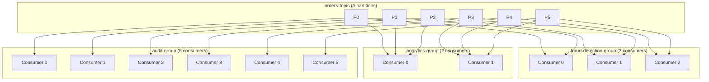
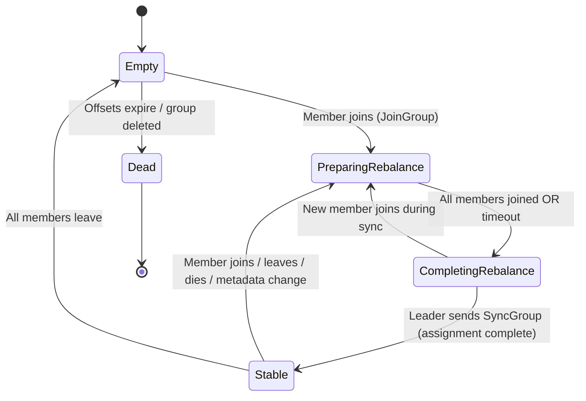

# Apache Kafka Deep Dive  Part 4: Consumer Groups  Coordination, Rebalancing, and Offset Management

---

**Series:** Apache Kafka Deep Dive  From First Principles to Planet-Scale Event Streaming
**Part:** 4 of 10
**Audience:** Senior backend engineers, distributed systems engineers, data platform architects
**Reading time:** ~45 minutes

---

## Preface

Parts 1 through 3 established the foundations: why the distributed log exists, how brokers store data on disk using segments and the page cache, and how replication keeps data durable across broker failures using the ISR protocol. You now understand how Kafka *produces* and *stores* data reliably.

This part focuses on the other side of the coin: how Kafka delivers data to consumers at scale, and why this turns out to be one of the most operationally interesting problems in the entire system. Consumer groups are Kafka's horizontal scaling primitive for consumption  but the coordination protocol that keeps them consistent is a sophisticated state machine that, when it misfires, produces some of Kafka's most frustrating failure modes.

We will go deep on every layer: the group coordinator and its relationship to `__consumer_offsets`, the full JoinGroup/SyncGroup protocol state machine, the concrete difference between eager and cooperative rebalancing (with sequence diagrams showing exactly what stops and what keeps running), all four partition assignment strategies, the three timeout parameters and why confusing them causes production incidents, and offset management from auto-commit all the way to exactly-once semantics. By the end of this article, you will be able to diagnose a rebalance storm from first principles, choose the right assignment strategy for your workload, and tune consumer configuration for your specific processing latency profile.

---

## 1. The Consumer Group Abstraction Revisited

### 1.1 What a Consumer Group Is

A consumer group is a named collection of consumer instances that cooperate to consume a topic. The defining invariant of a consumer group is **exclusive partition assignment**: at any moment, each partition of a subscribed topic is assigned to exactly one consumer within the group. No two consumers in the same group will ever process the same partition simultaneously.

This invariant is enforced by the group coordinator (covered in Section 2), and it is what makes consumer groups safe for parallel processing  each partition is an ordered log, and if two consumers processed the same partition concurrently, they would interleave record processing in ways that would likely violate application ordering guarantees.

When you call `subscribe(Collection<String> topics)` in the consumer API, you are not reserving any specific partitions. You are declaring membership in a group and letting the group coordinator assign partitions to you dynamically. The assignment can change whenever the group membership changes  that is what a rebalance does.

### 1.2 Why Groups Exist: Horizontal Scaling of Consumption

Kafka topics are partitioned precisely to enable parallel processing. A topic with 12 partitions has 12 independent ordered sub-streams. A single consumer reading all 12 partitions will be serialized through one thread, one network connection, and one processing loop. Add a second consumer in the same group, and the 12 partitions are divided between them  each consumer handles 6. Add a third, and each handles 4. At N consumers, each consumer handles 12/N partitions in parallel.

This is the fundamental scaling model. Throughput scales with the number of consumers up to the number of partitions. Beyond that, adding more consumers provides no additional throughput  but it does provide redundancy, as idle consumers can take over partitions from failed consumers without operator intervention.

### 1.3 Multiple Groups Reading the Same Topic

Each consumer group maintains its own independent offset for every partition it reads. A partition's messages are never "consumed" in the sense of being deleted from Kafka when a group reads them. Kafka retains messages based on retention policy (time or size), completely independently of whether any consumer group has read them.

This means multiple groups can read the same topic independently, each processing all messages from their own cursor position. A common production architecture has three or more groups reading the same topic:

- **fraud-detection-group**: real-time fraud scoring, processes every event with <100ms latency
- **analytics-group**: batch aggregation, intentionally lags behind by minutes or hours for efficiency
- **audit-group**: compliance logging, writes every event to an immutable store

Each group's offset advances independently. The fraud detection group being at offset 8,000,000 on partition 3 has no effect on the analytics group sitting at offset 6,500,000 on the same partition. Neither group interferes with the other's processing.

This "fan-out by consumer group" pattern is one of the architectural advantages of Kafka's pull-based model over push-based brokers. A push-based broker must track every subscriber and route messages accordingly; Kafka simply stores the log and lets each group decide when to consume.

### 1.4 The Partition-Consumer Assignment Constraint

The exclusive assignment invariant creates a hard upper bound on consumer group parallelism: **you cannot have more active consumers than partitions**. If a topic has 6 partitions and you deploy 8 consumers in the same group, 6 consumers receive one partition each and 2 consumers receive zero partitions  they sit completely idle, consuming memory and network connections but processing nothing.

This is not a bug; it is a consequence of the ordering guarantee. If you need more consumer parallelism, you need more partitions  and increasing partition count on an existing topic has its own trade-offs (covered in Part 7).

The inverse is not symmetric: fewer consumers than partitions works fine. A single consumer can handle multiple partitions. A group of 2 consumers handling a 6-partition topic will have each consumer handling 3 partitions. Performance degrades linearly as consumers are removed below the partition count.



In this diagram, `fraud-detection-group` has 3 consumers serving 6 partitions (2 partitions each), `analytics-group` has 2 consumers (3 partitions each), and `audit-group` has exactly 6 consumers (1 partition each  maximally parallel). All three groups read the same 6 partitions with completely independent offsets.

---

## 2. The Group Coordinator

### 2.1 What the Group Coordinator Is

The Group Coordinator is a broker-side component responsible for managing the lifecycle of a specific consumer group: tracking membership, driving rebalances, and storing committed offsets. Every consumer group has exactly one Group Coordinator at any given time, and that coordinator is a specific broker  not necessarily the controller, not a special-purpose broker, just whichever broker happens to be the leader for a specific partition of `__consumer_offsets`.

This is a key architectural point: the Group Coordinator is not a centralized service. Its responsibility is distributed across all brokers, with each broker acting as coordinator for the groups that hash to partitions it leads. A 10-broker cluster with the default 50-partition `__consumer_offsets` topic will have each broker coordinating approximately 5 groups per partition it leads, spread across the `__consumer_offsets` partitions.

### 2.2 How the Group Coordinator Is Selected

The selection algorithm is simple and deterministic:

```
coordinator_partition = abs(hash(group_id)) % num_partitions(__consumer_offsets)
coordinator_broker    = leader_of(__consumer_offsets[coordinator_partition])
```

When a consumer starts up, it doesn't know which broker is its coordinator. It sends a `FindCoordinatorRequest` to any broker (typically the bootstrap server). That broker computes the hash, looks up which broker leads the corresponding `__consumer_offsets` partition, and returns that broker's address. The consumer then connects directly to the coordinator for all subsequent group protocol messages.

This design means coordinator assignment changes only when the leader of a `__consumer_offsets` partition changes  that is, when that partition's leader broker fails and the ISR protocol elects a new leader. Normal broker restarts, topic configuration changes, and partition leader elections on user topics do not affect coordinator assignments.

### 2.3 The `__consumer_offsets` Topic

`__consumer_offsets` is an internal Kafka topic that serves two purposes simultaneously:

1. **Offset storage**: committed consumer offsets are stored here as ordinary Kafka messages
2. **Group metadata storage**: group membership, generation numbers, and protocol metadata are stored here as well

The topic has 50 partitions by default (configurable via `offsets.topic.num.partitions`). It is a **compacted** topic: for each unique key, only the latest value is retained. The key for an offset commit message is the tuple `(group_id, topic, partition)`. This means that regardless of how many times a group commits its offset for a given partition, the `__consumer_offsets` topic only retains the most recent commit  old commits are garbage collected during log compaction.

Message format:

| Field | Type | Description |
|---|---|---|
| Key | `(group_id, topic, partition)` | Uniquely identifies which group/partition this offset belongs to |
| Value: offset | int64 | The committed offset (next offset to fetch) |
| Value: metadata | string | Optional application-provided metadata (e.g., processing timestamp) |
| Value: commit_timestamp | int64 | When this offset was committed |
| Value: expire_timestamp | int64 | When this offset expires (for `offsets.retention.minutes`) |

When consumers read their last committed offset on startup (or after a rebalance), they query `__consumer_offsets`  not the user topic itself. The coordinator fetches the latest compacted value for the consumer's `(group_id, topic, partition)` key and returns it in the `OffsetFetch` response.

### 2.4 Group Coordinator Responsibilities

The Group Coordinator is the authoritative source of truth for its groups. Its responsibilities:

- **JoinGroup handling**: receives JoinGroup requests from all members, waits until the full group has joined (or session timeout expires), selects the group leader, and responds to all members with the current member list
- **SyncGroup handling**: receives the partition assignment from the group leader, distributes per-member assignments to each member in SyncGroup responses
- **Heartbeat tracking**: monitors heartbeat arrival from each member; marks a member as dead if `session.timeout.ms` elapses without a heartbeat
- **Offset storage**: persists `OffsetCommitRequest` data to `__consumer_offsets`, responds to `OffsetFetchRequest` reads
- **Rebalance triggering**: initiates rebalances when membership changes (member joins/leaves/dies) or when subscribed topic metadata changes (new partitions added)

### 2.5 What Happens When the Group Coordinator Dies

When the broker acting as Group Coordinator crashes, the following sequence occurs:

1. The Kafka ISR protocol elects a new leader for the affected `__consumer_offsets` partition (same mechanism described in Part 3)
2. Consumers send heartbeats and receive no response (or a connection error)
3. Consumers call `FindCoordinator` again to discover the new coordinator
4. The new coordinator loads group metadata from `__consumer_offsets` (which it now leads) to reconstruct group state
5. The new coordinator accepts JoinGroup requests and drives a rebalance to re-establish the group

During steps 1-4, consumers may receive `GroupCoordinatorNotAvailableException` or `NotCoordinatorException`. The Kafka consumer client handles these automatically by retrying `FindCoordinator` with exponential backoff. From the application's perspective, this manifests as elevated poll latency and potentially a rebalance. The duration of the disruption is bounded by the ISR election time (typically milliseconds to low seconds) plus the time for consumers to discover and connect to the new coordinator.

The critical guarantee: because offsets are stored in `__consumer_offsets` as replicated Kafka messages, no committed offsets are lost when a coordinator broker fails. The new coordinator reads the same replicated log.

---

## 3. The Consumer Group Protocol: State Machine

### 3.1 Group States

The Group Coordinator tracks every consumer group through a state machine with five states:

| State | Description |
|---|---|
| **Empty** | Group exists with no members. May have stored offsets from a previous membership. |
| **PreparingRebalance** | Membership change detected. Coordinator waiting for all current/joining members to send JoinGroup. |
| **CompletingRebalance** | All members have sent JoinGroup. Leader is computing assignment. Coordinator waiting for SyncGroup from leader. |
| **Stable** | Assignment complete. All members have received their partitions and are actively consuming. |
| **Dead** | Group has been deleted or all member sessions expired while in Empty state. Metadata will be cleaned up. |

### 3.2 State Transitions

| Current State | Trigger | New State |
|---|---|---|
| Empty | New member sends JoinGroup | PreparingRebalance |
| Stable | Any member sends JoinGroup (new member joining) | PreparingRebalance |
| Stable | Member leaves group (explicit `LeaveGroup` request) | PreparingRebalance |
| Stable | Member heartbeat timeout  coordinator marks member dead | PreparingRebalance |
| Stable | Subscribed topic gains new partitions | PreparingRebalance |
| PreparingRebalance | All members joined OR rebalance timeout expires | CompletingRebalance |
| CompletingRebalance | Group leader sends SyncGroup with assignment | Stable |
| CompletingRebalance | Any member sends JoinGroup (another change) | PreparingRebalance |
| Any | All members' sessions expire | Empty |
| Empty | Group deleted, or offsets expire | Dead |



The key insight in this state machine is that `PreparingRebalance` is a barrier: the coordinator cannot proceed to `CompletingRebalance` until all currently known members have submitted a JoinGroup request. This is the "stop-the-world" gate of eager rebalancing  the coordinator will not complete the rebalance until it hears from every member (or gives up waiting after `rebalance.timeout.ms`).

### 3.3 Consumer-Side States During Protocol

While the coordinator tracks group-level state, each consumer client also tracks its own participation state:

- **STABLE**: Normal operation. Consumer is fetching records, processing them, committing offsets, and sending heartbeats. The heartbeat thread runs in the background at `heartbeat.interval.ms` intervals.
- **JOINING**: Consumer has sent JoinGroup to the coordinator and is blocked waiting for a response. No records are being fetched during this period. This is a pause in consumption.
- **SYNCING**: Consumer received its JoinGroup response (which includes the current member list and, if this consumer is the group leader, the full subscription metadata needed to compute an assignment). Consumer is either running the assignment algorithm (if leader) or waiting for SyncGroup response (if follower). Still paused.
- **ASSIGNING**: Consumer has received its SyncGroup response containing its partition list. It is preparing to fetch from newly assigned partitions (seeking to committed offsets, resetting state). About to return to STABLE.

The transition `STABLE → JOINING → SYNCING → STABLE` represents the full rebalance cycle. During `JOINING` and `SYNCING`, no records are fetched. This is the source of the "stop-the-world" description of eager rebalancing.

---

## 4. The Rebalance Protocol: Eager vs. Cooperative

### 4.1 Eager Rebalancing (Stop-the-World)

Eager rebalancing is the original Kafka consumer group protocol, and it earns its "stop-the-world" name honestly: every consumer in the group revokes all of its partitions before anyone knows what the new assignment will be.

**Step-by-step sequence for a 3-consumer group when Consumer C3 joins:**

**Step 1  Trigger**: Consumer C3 starts up and sends JoinGroup to the coordinator. The coordinator, currently in Stable state with C1 and C2, transitions to PreparingRebalance. It notifies C1 and C2 of the pending rebalance (via the next heartbeat response or poll response, setting `REBALANCE_IN_PROGRESS`).

**Step 2  Revoke everything**: C1 and C2 revoke all their partitions. They call `onPartitionsRevoked()` with their full current assignment. Critically, they revoke partitions regardless of whether those partitions will be reassigned to them after the rebalance. A consumer that had P0 and P1, and will be given P0 and P1 again after the rebalance, still revokes P0 and P1 before the rebalance and re-acquires them after. This is the fundamental inefficiency of eager rebalancing.

**Step 3  JoinGroup from all members**: C1, C2, and C3 all send JoinGroup to the coordinator. The coordinator waits until all three have joined (or `rebalance.timeout.ms` expires and it kicks the non-responsive member). Each consumer's JoinGroup request includes its supported protocols and, for newer versions, its current assignment.

**Step 4  Coordinator selects leader and responds**: The coordinator picks one consumer as the group leader (usually the first one to join or the existing leader if still present). It responds to all members. The leader's response contains the full list of members and their metadata. The followers receive only their own member ID and generation number.

**Step 5  Leader computes assignment**: The group leader runs the partition assignment algorithm locally (the `PartitionAssignor`). It knows the full member list, all subscribed topics, and all partitions. It produces a `Map<String, List<TopicPartition>>` mapping each member ID to its assigned partitions.

**Step 6  SyncGroup**: The leader sends this assignment map to the coordinator via a SyncGroup request. All other members also send (empty) SyncGroup requests to the coordinator, waiting for their individual assignment in the response. The coordinator distributes the assignments: each member receives exactly the partitions assigned to it by the leader.

**Step 7  Resumption**: Consumers call `onPartitionsAssigned()` with their new partitions, seek to committed offsets, and begin fetching. Group transitions to Stable.

```
┌──────────────┐   ┌──────────────┐   ┌──────────────┐   ┌─────────────────┐
│  Consumer C1  │   │  Consumer C2  │   │  Consumer C3  │   │   Coordinator   │
│  (had P0,P1)  │   │  (had P2,P3)  │   │   (joining)   │   │                 │
└──────┬───────┘   └──────┬───────┘   └──────┬───────┘   └────────┬────────┘
       │                  │                  │                     │
       │  heartbeat response: REBALANCE_IN_PROGRESS                │
       │◄─────────────────────────────────────────────────────────┤
       │                  │◄─────────────────────────────────────┤
       │                  │                  │                     │
       │ revoke(P0,P1)     │ revoke(P2,P3)    │                     │
       │ onRevoked()      │ onRevoked()      │                     │
       │                  │                  │                     │
       │─── JoinGroup ───────────────────────────────────────────►│
       │                  │─── JoinGroup ───────────────────────►│
       │                  │                  │─── JoinGroup ─────►│
       │                  │                  │                     │
       │                  │                  │   [waits for all 3] │
       │                  │                  │                     │
       │◄── JoinGroup Response (LEADER, member list) ─────────────┤
       │                  │◄── JoinGroup Response (follower) ─────┤
       │                  │                  │◄── JoinGroup Resp ─┤
       │                  │                  │                     │
       │ [runs RangeAssignor:                 │                     │
       │   C1→P0,P1 C2→P2,P3 C3→P4,P5]      │                     │
       │                  │                  │                     │
       │─── SyncGroup (assignment map) ──────────────────────────►│
       │                  │─── SyncGroup (empty) ───────────────►│
       │                  │                  │─── SyncGroup ─────►│
       │                  │                  │                     │
       │◄── SyncGroup Resp [P0,P1] ───────────────────────────────┤
       │                  │◄── SyncGroup Resp [P2,P3] ─────────┤
       │                  │                  │◄── SyncGroup [P4,P5]┤
       │                  │                  │                     │
       │ onAssigned(P0,P1) │ onAssigned(P2,P3)│ onAssigned(P4,P5) │
       │ [begin fetch]    │ [begin fetch]    │ [begin fetch]      │
```

**Total downtime** is the period from when C1 and C2 stop processing (after receiving the REBALANCE_IN_PROGRESS signal) to when they resume fetching (after receiving SyncGroup response). This includes:
- Time for all consumers to revoke and send JoinGroup
- Time for the coordinator to wait for all members (up to `rebalance.timeout.ms`)
- Time for the leader to run the assignment algorithm
- Time for the SyncGroup round trip

In production clusters with dozens of consumers and complex processing (e.g., long `onPartitionsRevoked` callbacks that flush databases), this window can easily reach 30-60 seconds. During this window, no consumer in the group processes any records.

### 4.2 Cooperative (Incremental) Rebalancing

Cooperative rebalancing, introduced in Kafka 2.4 via the `CooperativeStickyAssignor`, fundamentally changes the protocol by **only revoking partitions that actually need to move**. Partitions that will stay with the same consumer are never revoked. Those consumers never stop.

The protocol requires two rounds of JoinGroup/SyncGroup:

**Round 1  Announce and compute diff**:
- All consumers send JoinGroup, this time including their *current* partition assignment in the request
- The coordinator responds with the full member list including everyone's current assignments
- The group leader runs the assignment algorithm and computes not just the new assignment, but the *diff*: which partitions move from which consumer to which other consumer
- The leader submits this to the coordinator via SyncGroup. Each consumer's SyncGroup response contains: "keep these partitions, revoke these partitions"
- Consumers whose partitions are not changing receive a response saying "keep everything, revoke nothing"  they continue processing without interruption

**Round 2  Execute revocations and redistribute**:
- Consumers that received revocations call `onPartitionsRevoked()` for only the specific partitions being moved, commit their offsets for those partitions, and wait
- Another JoinGroup/SyncGroup round is triggered (because some members revoked partitions  this is a membership change)
- In Round 2, the consumers that revoked their partitions no longer own them. The leader can now assign those free partitions to their new owners
- Consumers that are receiving new partitions call `onPartitionsAssigned()` and begin fetching

The critical property: **consumers whose partitions are not moving never stop**. In a 10-consumer group where 1 consumer joins and only 2 partitions move, 8 consumers experience zero interruption.

```
┌──────────────────┐   ┌──────────────────┐   ┌──────────────────┐   ┌─────────────────┐
│  Consumer C1      │   │  Consumer C2      │   │  Consumer C3      │   │   Coordinator   │
│  (has P0,P1,P2,P3)│   │  (joining)        │   │  (has P4,P5)      │   │                 │
└────────┬─────────┘   └────────┬─────────┘   └────────┬─────────┘   └────────┬────────┘
         │                      │                       │                      │
         │ ══ ROUND 1 ══════════════════════════════════════════════════════════════════
         │                      │                       │                      │
         │─── JoinGroup (current=[P0,P1,P2,P3]) ────────────────────────────►│
         │                      │─── JoinGroup (current=[]) ────────────────►│
         │                      │                       │─── JoinGroup ──────►│
         │                      │                       │ (current=[P4,P5])   │
         │                      │                       │                      │
         │◄── JoinGroup Resp (LEADER, full member+assignment list) ───────────┤
         │                      │◄── JoinGroup Resp (follower) ──────────────┤
         │                      │                       │◄── JoinGroup Resp ─┤
         │                      │                       │                      │
         │ [computes: C3 was idle, now has P4,P5 - no change                  │
         │  C1 needs to give up P2,P3 to C2              │                    │
         │  C2 should get P2,P3. C1 keeps P0,P1]         │                    │
         │                      │                       │                      │
         │─── SyncGroup (assignment diff map) ──────────────────────────────►│
         │                      │─── SyncGroup (empty) ────────────────────►│
         │                      │                       │─── SyncGroup ──────►│
         │                      │                       │                      │
         │◄── SyncGroup Resp:   │                       │◄── SyncGroup Resp: ─┤
         │  keep=[P0,P1]        │◄── SyncGroup Resp: ───┤  keep=[P4,P5]       │
         │  revoke=[P2,P3]      │  keep=[] revoke=[]   │  revoke=[]          │
         │                      │                       │                      │
         │ onRevoked([P2,P3])   │ [C2 KEEPS PROCESSING] │ [C3 KEEPS PROCESSING]│
         │ commitOffsets(P2,P3) │                       │                      │
         │ [C1 still processes  │                       │                      │
         │  P0,P1 throughout!]  │                       │                      │
         │                      │                       │                      │
         │ ══ ROUND 2 ══════════════════════════════════════════════════════════════════
         │                      │                       │                      │
         │─── JoinGroup (current=[P0,P1]) ──────────────────────────────────►│
         │                      │─── JoinGroup (current=[]) ────────────────►│
         │                      │                       │─── JoinGroup ──────►│
         │                      │                       │ (current=[P4,P5])   │
         │                      │                       │                      │
         │◄── JoinGroup + SyncGroup rounds complete ─────────────────────────┤
         │                      │◄── SyncGroup Resp [P2,P3] ─────────────────┤
         │                      │                       │                      │
         │ [continues P0,P1]    │ onAssigned([P2,P3])   │ [continues P4,P5]   │
         │                      │ [begin fetch P2,P3]   │                      │
```

In this scenario, C2 and C3 never stop processing during the entire rebalance. C1 only stops processing P2 and P3 for the brief revocation window, but continues processing P0 and P1 throughout. Total downtime for the group is limited to the small window where C1 revokes P2 and P3.

### 4.3 Eager vs. Cooperative Comparison

| Dimension | Eager Rebalancing | Cooperative (Incremental) Rebalancing |
|---|---|---|
| **Protocol rounds** | 1 round (JoinGroup + SyncGroup) | 2 rounds (two JoinGroup/SyncGroup cycles) |
| **Partition revocation scope** | ALL partitions revoked by ALL consumers | Only moving partitions revoked by affected consumers |
| **Consumer downtime** | Every consumer stops for entire rebalance duration | Only consumers whose partitions move experience any pause |
| **Total group downtime** | Full group halts: typically 3-60 seconds | Near-zero for non-moving consumers; seconds for moving partitions |
| **Assignment complexity** | Stateless: leader computes fresh assignment | Stateful: leader must know current assignment to compute diff |
| **Protocol generation** | Each rebalance increments generation by 1 | Two-round rebalance increments generation by 2 |
| **Assignor required** | Any `PartitionAssignor` | Must use `CooperativeStickyAssignor` or implement cooperative protocol |
| **Kafka version** | All versions | 2.4+ for `CooperativeStickyAssignor` |
| **Complexity** | Simpler to reason about | More protocol states; `onPartitionsRevoked` semantics differ |
| **Recommended for** | Simple cases, development | All production workloads with > 2 consumers |

The migration from eager to cooperative on a live cluster without downtime requires a specific rolling upgrade procedure (`upgrade.from` configuration parameter) because the two protocols are not directly compatible during a mixed cluster state.

---

## 5. Partition Assignment Strategies

Partition assignment is entirely a client-side concern: the group leader consumer runs the assignment algorithm using whatever `PartitionAssignor` is configured. The coordinator receives the output and distributes it but has no visibility into how the assignment was computed.

### 5.1 RangeAssignor (Default)

`RangeAssignor` assigns partitions by sorting both consumers and partitions, then dividing the partition range among consumers in order:

```
Topic A: P0, P1, P2, P3, P4, P5  (6 partitions)
Consumers sorted: C0, C1, C2      (3 consumers)
Partitions per consumer: 6 / 3 = 2

C0 → P0, P1  (range [0, 2))
C1 → P2, P3  (range [2, 4))
C2 → P4, P5  (range [4, 6))
```

For a single topic, this produces perfectly balanced assignment. The problem emerges with multiple topics. `RangeAssignor` operates independently per topic:

```
Topic A: P0-P5 (6 partitions), Topic B: P0-P5 (6 partitions)
Consumers: C0, C1, C2

Topic A assignment: C0→A:P0,A:P1 | C1→A:P2,A:P3 | C2→A:P4,A:P5
Topic B assignment: C0→B:P0,B:P1 | C1→B:P2,B:P3 | C2→B:P4,B:P5

Total: C0=4 partitions, C1=4 partitions, C2=4 partitions (balanced)
```

Now with an odd partition count:

```
Topic A: P0-P6 (7 partitions), Topic B: P0-P6 (7 partitions)
7 / 3 = 2 remainder 1, so first consumer gets 3

Topic A: C0→A:P0,A:P1,A:P2 | C1→A:P3,A:P4 | C2→A:P5,A:P6
Topic B: C0→B:P0,B:P1,B:P2 | C1→B:P3,B:P4 | C2→B:P5,B:P6

Total: C0=6, C1=4, C2=4 (C0 over-loaded by 2)
```

With 10 topics each having 7 partitions: C0 ends up with 30 partitions, C1 and C2 with 20 each. The leading consumer is systematically overloaded. This is why `RangeAssignor` is problematic in multi-topic subscriptions with odd partition counts.

### 5.2 RoundRobinAssignor

`RoundRobinAssignor` flattens all partitions from all subscribed topics into a single sorted list and distributes them one by one across consumers in round-robin order:

```
All partitions sorted: A:P0, A:P1, A:P2, A:P3, A:P4, A:P5, B:P0, B:P1, B:P2...
Consumers: C0, C1, C2

C0 ← A:P0, A:P3, B:P0, B:P3, ...
C1 ← A:P1, A:P4, B:P1, B:P4, ...
C2 ← A:P2, A:P5, B:P2, B:P5, ...
```

This produces better balance across topics. The downside is partition mobility: on rebalance, `RoundRobinAssignor` computes a fresh round-robin assignment from scratch. If C1 leaves and C2 joins, the entire assignment changes. Partitions that could have stayed with C0 get moved to C2, causing unnecessary revocations and the full stop-the-world cost for no benefit.

`RoundRobinAssignor` uses the eager protocol, so even without excessive partition movement, it still incurs the full stop-the-world penalty on every rebalance.

### 5.3 StickyAssignor

`StickyAssignor` introduces stickiness: on rebalance, it retains as many current assignments as possible while still achieving a balanced distribution. It minimizes partition movement to exactly the partitions that must move to restore balance.

```
Before (3 consumers): C0→P0,P1 | C1→P2,P3 | C2→P4,P5
C1 leaves group.
Sticky strategy: C0 keeps P0,P1; C2 keeps P4,P5; P2,P3 are now free
Balance requires: each consumer gets 3. P2→C0, P3→C2.
After: C0→P0,P1,P2 | C2→P3,P4,P5
```

Without stickiness, `RoundRobinAssignor` might have produced: `C0→P0,P2,P4 | C2→P1,P3,P5`  moving P1, P4, P5 unnecessarily.

The trade-off with `StickyAssignor`: it uses the **eager protocol**. Despite minimizing partition movement in the assignment, all consumers still revoke all partitions before the new assignment is distributed. You get stickiness (which helps the application layer  less state to reload, fewer `onPartitionsRevoked`/`onPartitionsAssigned` transitions), but you still pay the full stop-the-world cost at the protocol level.

### 5.4 CooperativeStickyAssignor

`CooperativeStickyAssignor` combines the stickiness of `StickyAssignor` with the cooperative protocol. It is the recommended production choice in Kafka 2.4+:

- Computes a sticky assignment (minimum partition movement) during Round 1
- Uses the cooperative two-round protocol (only moving partitions are revoked)
- Consumers with stable assignments never pause

The result: a rebalance where C1 leaves a 3-consumer group causes only the partitions formerly owned by C1 to be revoked and redistributed. C0 and C2 continue processing their original assignments throughout.

Configure with:

```java
props.put(ConsumerConfig.PARTITION_ASSIGNMENT_STRATEGY_CONFIG,
    CooperativeStickyAssignor.class.getName());
```

### 5.5 Custom Assignment

Implement `org.apache.kafka.clients.consumer.ConsumerPartitionAssignor` to build domain-specific assignment logic. Common use cases:

- **Rack-aware assignment**: always assign a partition to a consumer on the same availability zone. Eliminates cross-AZ data transfer costs for consumers that process high volumes.
- **Co-partitioned assignments**: if two topics are co-partitioned (same partition count, same partitioning key), ensure that partition N of topic A is always assigned to the same consumer as partition N of topic B. Required for stateful joins in custom streaming applications.
- **Priority-weighted assignment**: large consumers (higher-capacity machines) receive more partitions than smaller ones.

The `assign()` method receives the full `Cluster` metadata (including broker rack information), the list of `GroupMember` objects (each with their subscription and user data), and must return a `Map<String, List<TopicPartition>>`.

### 5.6 Partition Assignment Strategy Comparison

| Strategy | Balance | Stickiness | Protocol | Kafka Version | Recommended Use Case |
|---|---|---|---|---|---|
| `RangeAssignor` | Poor for multi-topic odd partitions | None | Eager | All | Single-topic subscriptions only |
| `RoundRobinAssignor` | Good | None | Eager | All | Multi-topic where stickiness not needed |
| `StickyAssignor` | Good | High | Eager | 0.11+ | Pre-2.4 clusters needing stickiness |
| `CooperativeStickyAssignor` | Good | High | Cooperative | 2.4+ | All production workloads on modern Kafka |

---

## 6. Heartbeats, Session Timeout, and Consumer Detection

### 6.1 The Heartbeat Thread

Kafka consumer clients maintain a dedicated background thread  separate from the application's poll thread  solely for sending periodic `HeartbeatRequest` messages to the group coordinator. This separation is intentional and important.

The heartbeat thread runs independently of your processing code. It fires every `heartbeat.interval.ms` (default 3,000ms). Even if your application is blocked in a slow database write for 10 seconds, the heartbeat thread continues to fire, telling the coordinator "this consumer is still alive." This prevents the coordinator from falsely declaring the consumer dead due to slow processing.

`HeartbeatRequest` carries the current generation ID and member ID. The coordinator validates these against its current group state. If they match, it responds with `NONE` (all good) or `REBALANCE_IN_PROGRESS` (a rebalance has been triggered  stop what you're doing and call JoinGroup). If the consumer's generation ID is stale (it missed a rebalance), it receives `ILLEGAL_GENERATION` and must re-join.

### 6.2 Session Timeout

`session.timeout.ms` (default 45,000ms in modern Kafka, was 10,000ms in older versions) is the time the coordinator will wait for a heartbeat before declaring a consumer dead and triggering a rebalance.

If the coordinator receives no heartbeat from a consumer within `session.timeout.ms`, it removes that consumer from the group and initiates a rebalance to redistribute its partitions to the remaining consumers.

Session timeout is the mechanism for detecting **node failures**: if a consumer process crashes, gets OOM-killed, loses network connectivity, or is paused by a long GC pause, the heartbeat thread stops firing. After `session.timeout.ms` elapses, the coordinator reacts.

There is a hard constraint from the broker side: `session.timeout.ms` must be between `group.min.session.timeout.ms` (default 6,000ms) and `group.max.session.timeout.ms` (default 1,800,000ms). Attempting to set a session timeout outside these bounds causes the consumer's JoinGroup request to fail.

### 6.3 `max.poll.interval.ms`

`max.poll.interval.ms` (default 300,000ms  5 minutes) is a completely different mechanism from session timeout, and conflating them is the source of many production incidents.

The background heartbeat thread can keep sending heartbeats even while the application thread is not calling `poll()`. This means a consumer can appear alive from the coordinator's perspective while actually being stuck: the application thread is blocked in processing a record batch, or a downstream call is hanging, or the application is simply not consuming.

`max.poll.interval.ms` solves this. The Kafka client library tracks when `poll()` was last called. If `poll()` is not called for `max.poll.interval.ms`, the consumer client automatically leaves the group (sends `LeaveGroup`) and stops heartbeating. The coordinator receives the `LeaveGroup` and triggers a rebalance.

This handles the case where:
- Consumer is alive at the OS/JVM level (heartbeats are flowing)
- But the application is stuck processing and accumulating records indefinitely
- The stuck consumer "holds" its partitions, preventing other consumers from making progress

`max.poll.interval.ms` is entirely a client-side enforcement: the client library enforces it, not the broker. When you see `max.poll.interval.ms exceeded` in logs, it means the consumer client evicted itself from the group.

### 6.4 The Relationship Between the Three Timeouts

```
heartbeat.interval.ms     session.timeout.ms         max.poll.interval.ms
|──────3s──────|          |───────────45s──────────────|   |──────────5min──────────────────|

heartbeat fires every 3s
                          if no heartbeat received in 45s → dead (node failure)
                                                             if poll() not called in 5min → leave group (processing stall)
```

The ordering constraint is:

```
heartbeat.interval.ms < session.timeout.ms << max.poll.interval.ms
```

A common rule of thumb: set `heartbeat.interval.ms` to 1/3 of `session.timeout.ms`. This ensures at least 3 heartbeat attempts before the session times out, reducing the risk of a transient network hiccup causing a false positive. `max.poll.interval.ms` should be set to the maximum time your application might spend processing a poll batch, with significant headroom.

### 6.5 Tuning Guidance

**Slow processing pipelines**: If each poll batch takes 30-60 seconds to process (e.g., batch inserts to a slow database), you have two options:
- Increase `max.poll.interval.ms` to comfortably exceed your maximum processing time. Set it to 2-3x your expected worst-case batch processing time.
- Decrease `max.poll.records` (default 500) to reduce the batch size, so each poll completes faster. Often preferable since it also reduces memory pressure.

**Cloud environments with JVM**: GC pauses (especially G1GC full GCs or ZGC collection pauses during high-memory pressure) can pause the entire JVM including the heartbeat thread. If GC pauses exceed `session.timeout.ms`, the consumer will be falsely declared dead. Mitigation options:
- Increase `session.timeout.ms` to 60,000ms or higher to survive GC pauses
- Tune the JVM GC to minimize pause duration (`-XX:MaxGCPauseMillis`)
- Use GC algorithms with shorter pauses (ZGC, Shenandoah) for latency-sensitive consumers

**Aggressive failure detection**: If you need fast rebalance when a consumer fails (e.g., latency-sensitive workloads where you can't afford 45 seconds of a partition being unprocessed), decrease `session.timeout.ms` to 10,000-15,000ms. The trade-off: more false positives from load spikes and GC pauses, each triggering an unnecessary rebalance.

| Parameter | Default | Decrease if... | Increase if... |
|---|---|---|---|
| `heartbeat.interval.ms` | 3,000ms | You need faster coordinator signal (rarely needed) | Never (must stay < session.timeout.ms / 3) |
| `session.timeout.ms` | 45,000ms | Fast failure detection needed | Cloud/JVM with GC pauses |
| `max.poll.interval.ms` | 300,000ms | Never typically (already generous) | Slow processing per batch |
| `max.poll.records` | 500 | Processing per record is slow | High-throughput fast processing |

### 6.6 Static Membership (`group.instance.id`)

Normal consumer group membership is ephemeral: when a consumer leaves (gracefully or due to failure) and rejoins, it receives a new member ID and triggers a rebalance. This is wasteful for **stateful consumers**  applications that maintain local state derived from their assigned partitions (caches, local RocksDB state stores in Kafka Streams, pre-computed aggregations). After a rebalance, the consumer must reload its state before it can process records efficiently.

Static membership allows a consumer to declare a persistent identity:

```java
props.put(ConsumerConfig.GROUP_INSTANCE_ID_CONFIG, "consumer-zone-a-01");
```

With `group.instance.id` set:
- If the consumer disconnects and reconnects **within `session.timeout.ms`**, the coordinator recognizes its identity and **does not trigger a rebalance**. The consumer resumes with the same partition assignment.
- If the consumer is absent for longer than `session.timeout.ms`, the coordinator declares it dead and triggers a rebalance  same as dynamic membership.

This is specifically designed for Kafka Streams and similar stateful processing frameworks where restarting a processing instance (e.g., for a deployment rollout) should not trigger a group-wide rebalance. The `session.timeout.ms` effectively becomes a "grace period for restarts."

The `group.instance.id` must be unique within the group. If two consumers start with the same `group.instance.id`, the second one will fence out the first (the first receives `FENCED_INSTANCE_ID` and is kicked from the group).

---

## 7. Offset Management

### 7.1 What Offsets Are

A Kafka offset is a 64-bit integer that uniquely identifies a record's position within a partition. Offsets are monotonically increasing and immutable  once a record is written at offset N, it remains at offset N until it is deleted from the log (via retention or compaction). They are not reused.

**Committed offset semantics**: The committed offset is the offset of the **next record to fetch**, not the offset of the last processed record. If your consumer has successfully processed the record at offset 999, you commit offset 1000 (not 999). This is a common source of off-by-one errors in custom offset management code.

When a consumer starts up or is assigned a new partition after a rebalance, it reads the committed offset from `__consumer_offsets` and begins fetching from that position. If no committed offset exists for this group/partition combination (a new group or a new partition), the consumer behavior is controlled by `auto.offset.reset`:
- `latest` (default): start from the current end of the log (ignore all existing messages)
- `earliest`: start from the beginning of the log (replay all messages)
- `none`: throw an exception if no committed offset is found

### 7.2 `__consumer_offsets` Offset Storage

Every `commitSync()` or `commitAsync()` call translates into a write to `__consumer_offsets`. The record key is `(group_id, topic, partition)` and the value contains the offset, optional metadata string, and timestamps.

Because `__consumer_offsets` is a compacted topic, each `(group_id, topic, partition)` triple maps to exactly one record: the most recent commit. Log compaction periodically runs over `__consumer_offsets` (default compaction lag: 1 day), removing all but the latest commit per key. Old commits are garbage collected without affecting correctness.

The retention of committed offsets beyond group activity is controlled by `offsets.retention.minutes` (default 7 days). If a consumer group has no active members and no offset commits for longer than this duration, the group's offsets are deleted. When the group restarts, `auto.offset.reset` determines where it begins.

### 7.3 Auto-Commit

Auto-commit is the default behavior (`enable.auto.commit=true`). The consumer client automatically commits the current offset every `auto.commit.interval.ms` (default 5,000ms).

The commit happens at the start of each `poll()` call: before returning new records, the Kafka client internally commits the offset of the last record returned by the *previous* `poll()` call. This is a subtle timing: the commit represents "I have *received* these records," not "I have *processed* these records."

**At-least-once semantics with auto-commit**  The common failure scenario:

```
t=0:  poll() returns records 1000-1049
t=1:  application processes records 1000-1049
t=4:  poll() is called → auto-commit fires → commits offset 1050
      (clean success)

--- crash scenario ---
t=0:  poll() returns records 1000-1049
t=1:  application processes records 1000-1024 (halfway through)
t=3:  CRASH before next poll() and auto-commit
t=4:  consumer restarts, reads committed offset = 1000
t=5:  records 1000-1024 are reprocessed (at-least-once delivery)
```

Auto-commit does **not** guarantee records are committed only after processing. If auto-commit fires before processing completes, a crash-then-restart will NOT reprocess the committed records even if they were never fully processed. This is the at-least-once vs. at-most-once boundary.

Auto-commit is acceptable for:
- Non-critical analytics where occasional reprocessing or loss is tolerable
- Development and testing environments
- High-throughput pipelines where the 5-second commit window risk is acceptable

Auto-commit is **not** acceptable for exactly-once or guaranteed at-least-once processing semantics.

### 7.4 Manual Synchronous Commit (`commitSync()`)

`commitSync()` blocks the calling thread until the broker acknowledges the offset commit. It is the simplest way to guarantee that a batch of records has been committed only after processing completes:

```java
while (true) {
    ConsumerRecords<String, String> records = consumer.poll(Duration.ofMillis(100));
    for (ConsumerRecord<String, String> record : records) {
        process(record);  // your processing logic
    }
    consumer.commitSync();  // blocks until coordinator acknowledges
    // If an exception is thrown anywhere above, commitSync() is never called
    // → on restart, records will be reprocessed from last committed offset
    // → guaranteed at-least-once
}
```

`commitSync()` retries on retriable errors (`RetriableCommitFailedException`). This means it will block indefinitely if the coordinator is unavailable  a consideration for applications with strict latency SLAs.

The performance cost: one synchronous network round-trip per poll batch. For a consumer making 10 polls per second, that's 10 additional round-trips per second to the coordinator. In practice, this is rarely a bottleneck for throughput-oriented workloads, but can add meaningful latency in latency-sensitive pipelines.

### 7.5 Manual Asynchronous Commit (`commitAsync()`)

`commitAsync()` sends the commit request without blocking:

```java
consumer.commitAsync((offsets, exception) -> {
    if (exception != null) {
        log.error("Commit failed for offsets {}", offsets, exception);
        metrics.increment("kafka.commit.failure");
    }
});
```

`commitAsync()` does **not** retry on failure. This is intentional. Consider what would happen if it retried:

```
t=0: consumer at offset 1000, sends commitAsync(1000)
t=1: consumer processes more records, at offset 1200
t=2: commit for 1000 fails (network error)
t=2: consumer sends commitAsync(1200)   succeeds immediately
t=3: retry for offset 1000 arrives at broker  OVERWRITES 1200 with 1000!
```

An automatic retry would potentially overwrite a newer commit with a stale one, causing records 1000-1199 to be reprocessed even though they were already committed. By not retrying, `commitAsync()` avoids this hazard. You monitor failures via the callback and handle them based on your application's requirements.

### 7.6 Hybrid Commit Pattern

The production best practice combines both approaches:

```java
try {
    while (!shutdown) {
        ConsumerRecords<String, String> records = consumer.poll(Duration.ofMillis(100));
        process(records);
        consumer.commitAsync((offsets, exception) -> {  // fast, non-blocking during normal operation
            if (exception != null) {
                log.warn("Async commit failed, will retry on next poll or shutdown sync");
            }
        });
    }
} catch (Exception e) {
    log.error("Unexpected error", e);
} finally {
    try {
        consumer.commitSync();  // blocking, retrying: ensure final state is persisted
    } finally {
        consumer.close();
    }
}
```

Normal operation uses `commitAsync()`  fast, no blocking, failures logged but not fatal (the next successful commit will cover the same or later offset). On shutdown (or on `onPartitionsRevoked` during rebalance), `commitSync()` ensures the final committed state is durably written before the consumer exits. This hybrid gives high throughput with a strong durability guarantee at boundaries.

### 7.7 Committing Specific Offsets

The default `commitSync()` / `commitAsync()` commits the offset returned by `consumer.position(partition)`  that is, the offset after the last record returned by the most recent `poll()`. But you can commit specific offsets for specific partitions:

```java
Map<TopicPartition, OffsetAndMetadata> offsetsToCommit = new HashMap<>();
for (ConsumerRecord<String, String> record : records) {
    processRecord(record);
    // commit after each individual record
    offsetsToCommit.put(
        new TopicPartition(record.topic(), record.partition()),
        new OffsetAndMetadata(record.offset() + 1, "processed at " + Instant.now())
    );
    consumer.commitSync(offsetsToCommit);
}
```

Note `record.offset() + 1`: the committed offset is the *next* offset to read, not the offset of the record just processed.

Per-record commits are expensive (one round-trip per record) but provide the finest-grained recovery guarantee. More commonly, you commit after processing a meaningful unit of work: a transaction boundary, a database batch, or a time window.

The `OffsetAndMetadata` value accepts an optional metadata string. This can carry application state: a processing timestamp, a downstream system's transaction ID, or a checksum. The metadata is stored in `__consumer_offsets` alongside the offset and is returned by `OffsetFetchRequest`. Applications can use this to implement custom recovery logic without a separate state store.

### 7.8 Exactly-Once Consumption

True exactly-once semantics  where each input record produces exactly one effect in the output system, even if the consumer fails mid-batch  requires transactions. The pattern is:

1. Consume records from input topic (within a transaction)
2. Process and produce output records to output topic (within the same transaction)
3. Commit input offsets to `__consumer_offsets` (atomically with the transaction)

If the consumer crashes after step 2 but before step 3, the transaction is rolled back. On restart, the consumer re-reads from the last committed offset and reprocesses, but the output topic's transactional consumer will see the previous (rolled-back) attempt as an abort and skip it.

This is Kafka's "read-process-write" exactly-once pattern, enabled by the transactional API (`KafkaProducer.beginTransaction()`, `sendOffsetsToTransaction()`, `commitTransaction()`). It has real costs: transactions add write amplification, commit overhead, and abort handling complexity. Exactly-once semantics in full detail  including the two-phase commit protocol, producer fencing, epoch numbers, and zombie producer prevention  is covered in Part 6.

---

## 8. Consumer Lag and Monitoring

### 8.1 Consumer Lag Definition

Consumer lag for a partition is:

```
lag(partition) = log_end_offset(partition) - committed_offset(group, partition)
```

`log_end_offset` is the offset that will be assigned to the next record written to this partition  effectively, the current end of the log. `committed_offset` is the offset stored in `__consumer_offsets` for this group/partition pair.

Total group lag is the sum of lag across all partitions:

```
total_lag(group) = Σ lag(partition_i) for all partitions i
```

Lag represents the number of records that have been produced to the topic but not yet committed as processed by this consumer group.

### 8.2 Lag Is Not Latency

Consumer lag measured in record count is not directly meaningful without knowing the production rate. Two scenarios with 10,000 records of lag represent very different situations:

| Scenario | Lag | Production rate | End-to-end latency |
|---|---|---|---|
| Slow pipeline | 10,000 records | 10 records/sec | 1,000 seconds (~17 min) |
| Fast pipeline | 10,000 records | 10,000 records/sec | 1 second |

A consumer group with 10,000 records of lag that is processing at the same rate as production (steady state) is fine  it's just permanently behind by 10,000 records. A consumer group with 500 records of lag that is processing slower than production is in trouble  the lag is growing and will eventually exhaust available memory and potentially disk.

Meaningful lag alerting should be **rate-of-change of lag**, not absolute lag level. Alert when lag is growing faster than a threshold, not when lag exceeds an absolute number. Some teams also track **lag-in-seconds** (lag / production rate per second) as a more intuitive metric.

### 8.3 Monitoring Lag

**Command-line inspection:**

```bash
kafka-consumer-groups.sh --bootstrap-server localhost:9092 \
  --group my-consumer-group \
  --describe

GROUP               TOPIC         PARTITION  CURRENT-OFFSET  LOG-END-OFFSET  LAG
my-consumer-group  orders        0          8000000         8000150         150
my-consumer-group  orders        1          7999900         8000050         150
my-consumer-group  orders        2          8000010         8000200         190
```

**JMX metrics** (accessible via JMX or exposed via JMX exporter for Prometheus):

```
kafka.consumer:type=consumer-fetch-manager-metrics,client-id=consumer-1,topic=orders,partition=0
→ records-lag          (current lag for this partition)
→ records-lag-max      (maximum lag seen across fetch windows)
→ fetch-rate           (records fetched per second)
→ fetch-latency-avg    (average fetch latency)
```

**Consumer group state via AdminClient:**

```java
AdminClient adminClient = AdminClient.create(props);
Map<TopicPartition, OffsetSpec> topicPartitions = new HashMap<>();
// populate with your partitions

// Get log end offsets (LEO) from the topic
Map<TopicPartition, ListOffsetsResult.ListOffsetsResultInfo> endOffsets =
    adminClient.listOffsets(topicPartitions).all().get();

// Get committed offsets for the group
Map<TopicPartition, OffsetAndMetadata> committedOffsets =
    adminClient.listConsumerGroupOffsets("my-group")
               .partitionsToOffsetAndMetadata()
               .get();

// Compute lag per partition
for (Map.Entry<TopicPartition, OffsetAndMetadata> entry : committedOffsets.entrySet()) {
    TopicPartition tp = entry.getKey();
    long committed = entry.getValue().offset();
    long logEnd = endOffsets.get(tp).offset();
    long lag = logEnd - committed;
    System.out.printf("%s lag: %d%n", tp, lag);
}
```

### 8.4 Lag-Based Autoscaling

In Kubernetes environments, consumer lag can drive horizontal pod autoscaling via KEDA (Kubernetes Event-driven Autoscaling):

```yaml
apiVersion: keda.sh/v1alpha1
kind: ScaledObject
metadata:
  name: orders-consumer-scaler
spec:
  scaleTargetRef:
    name: orders-consumer-deployment
  pollingInterval: 30
  cooldownPeriod: 300
  minReplicaCount: 2
  maxReplicaCount: 12   # hard cap at partition count
  triggers:
  - type: kafka
    metadata:
      bootstrapServers: kafka-broker:9092
      consumerGroup: my-consumer-group
      topic: orders
      lagThreshold: "500"    # scale up when lag per partition exceeds 500
      offsetResetPolicy: latest
```

KEDA queries the lag, computes the desired replica count as `ceil(total_lag / lagThreshold)`, and adjusts the deployment. The `maxReplicaCount` must not exceed the partition count  adding more consumers than partitions yields idle pods, not additional throughput.

Important: autoscaling adds consumers, which triggers a rebalance. With eager rebalancing, adding one pod to reduce lag may briefly increase lag (due to the rebalance pause) before it decreases. With `CooperativeStickyAssignor`, the new consumer picks up its partitions without disrupting existing consumers, so the lag trajectory is monotonically improving.

### 8.5 Common Lag Causes

| Cause | Symptom | Diagnosis | Remedy |
|---|---|---|---|
| Slow record processing | Lag grows steadily, fetch rate is high but commit rate is low | Processing time per record exceeds poll rate | Optimize processing; add consumers; increase parallelism within consumer |
| Downstream bottleneck | Lag grows at DB write rate | DB slow query logs, connection pool exhaustion | Connection pooling, batch writes, async writes to DB |
| GC pauses (JVM) | Lag spikes intermittently, recovers | GC logs show long pauses | GC tuning, increase session.timeout.ms, use Shenandoah/ZGC |
| Rebalance storm | Lag grows in waves correlated with rebalance events | Coordinator logs show frequent rebalances | Find and fix the trigger (often: slow onPartitionsRevoked, max.poll.interval.ms exceeded) |
| Deserializer overhead | Lag grows, CPU is pegged | profiler shows time in deserializer | Use a faster schema (Avro with Schema Registry vs. JSON), optimize decoder |
| Partition skew | Some partitions have high lag, others zero | Per-partition lag view | Rebalance partitions (re-key producers), use RoundRobinAssignor |

### 8.6 Caution: The `__consumer_offsets` Topic

Do not accidentally subscribe to `__consumer_offsets` itself. This is an internal topic, but `subscribe(Pattern.compile(".*"))` with no internal topic filtering will include it. Reading internal topics can interfere with the coordinator's normal operation and expose internal Kafka metadata that changes format between versions. The `KafkaConsumer` API excludes internal topics from pattern subscriptions by default since Kafka 0.10, but custom consumers using raw `MetadataRequest`-based discovery may not.

Also: do not create a consumer group named `__consumer_offsets-consumer` or similar patterns. The internal naming conventions Kafka uses for its own processes use double-underscore prefixes, and collisions can cause confusing behavior.

---

## 9. ConsumerRebalanceListener: Handling Rebalance Callbacks

### 9.1 `onPartitionsRevoked`

`onPartitionsRevoked(Collection<TopicPartition> partitions)` is called **synchronously on the poll thread** before the rebalance completes. The collection contains the partitions being taken from this consumer.

In **eager rebalancing**: `onPartitionsRevoked` is called with the consumer's *entire* current assignment, because all partitions are revoked. Even partitions that will be reassigned to the same consumer after the rebalance are included.

In **cooperative rebalancing**: `onPartitionsRevoked` is called only with the partitions that are *actually moving to another consumer*. Partitions staying with this consumer are not included.

The primary use case for `onPartitionsRevoked` is committing offsets before handing off partitions:

```java
@Override
public void onPartitionsRevoked(Collection<TopicPartition> partitions) {
    // Commit offsets for revoked partitions to ensure the next owner
    // starts from the right position
    Map<TopicPartition, OffsetAndMetadata> offsetsToCommit = new HashMap<>();
    for (TopicPartition tp : partitions) {
        Long offset = currentOffsets.get(tp);  // track in-flight offsets
        if (offset != null) {
            offsetsToCommit.put(tp, new OffsetAndMetadata(offset));
        }
    }
    try {
        consumer.commitSync(offsetsToCommit);  // sync: must complete before handoff
    } catch (CommitFailedException e) {
        log.warn("Commit failed during revocation", e);
        // Log but don't rethrow  rebalance must proceed
    }
}
```

### 9.2 `onPartitionsAssigned`

`onPartitionsAssigned(Collection<TopicPartition> partitions)` is called **after** the rebalance completes, with the newly assigned partitions. This is where you:

- **Seek to specific offsets**: if your application stores offsets externally (in a database, Redis, etc.) as part of a transactional pattern, seek to the externally stored offset rather than the Kafka-committed offset
- **Load state**: initialize caches, restore local state (e.g., RocksDB state stores) from persistent storage
- **Prefetch data**: warm up downstream connection pools for the new partitions' data characteristics

```java
@Override
public void onPartitionsAssigned(Collection<TopicPartition> partitions) {
    for (TopicPartition tp : partitions) {
        // Option 1: Use Kafka-committed offsets (default behavior, no action needed)

        // Option 2: Seek to external offset store for transactional exactly-once
        Long externalOffset = offsetStore.getOffset(groupId, tp.topic(), tp.partition());
        if (externalOffset != null) {
            consumer.seek(tp, externalOffset);
        }

        // Option 3: Seek to a specific time
        // consumer.offsetsForTimes(Map.of(tp, Instant.now().minus(1, HOURS).toEpochMilli()))
        //   .forEach((partition, offsetAndTimestamp) ->
        //       consumer.seek(partition, offsetAndTimestamp.offset()));
    }
}
```

### 9.3 `onPartitionsLost`

`onPartitionsLost(Collection<TopicPartition> partitions)` is a newer callback (Kafka 2.4+) called when the consumer has been forcibly removed from the group  the coordinator declared this consumer dead due to heartbeat timeout. Unlike `onPartitionsRevoked`, this callback is called when it is too late to commit: the coordinator has already assigned these partitions to another consumer.

The correct behavior in `onPartitionsLost` is **cleanup only**  close file handles, release resources, clear in-memory state. Do not attempt to commit offsets (the commit will fail with `ILLEGAL_GENERATION` since the consumer's generation is now stale).

If you do not override `onPartitionsLost`, it defaults to calling `onPartitionsRevoked` with the lost partitions  which will attempt a commit that will fail. Overriding `onPartitionsLost` explicitly to skip the commit is the cleaner pattern.

### 9.4 The `onPartitionsRevoked` Trap

The most dangerous mistake with `ConsumerRebalanceListener`: doing expensive, potentially slow work in `onPartitionsRevoked`.

`onPartitionsRevoked` runs on the poll thread. The `max.poll.interval.ms` timer is effectively paused during a rebalance callback execution (the consumer client handles this), but there is a subtler danger: the coordinator has a `rebalance.timeout.ms` deadline for the entire JoinGroup round. If your `onPartitionsRevoked` takes longer than `rebalance.timeout.ms` (default 5 minutes, but often tuned down), the coordinator will time out your consumer's JoinGroup, remove it from the group, and trigger another rebalance.

The cascade:

```
C1's onPartitionsRevoked is slow (large DB flush: 90 seconds)
→ Coordinator's JoinGroup wait expires
→ Coordinator kicks C1 from the group
→ Rebalance completes with C2 and C3
→ C1 finishes its flush
→ C1 rejoins the group
→ Another rebalance triggered
→ Rebalance storm: every time C1 joins, the expensive flush starts over
```

Remediation strategies:
- Make `onPartitionsRevoked` fast: do the minimum necessary (commit offsets), defer expensive work to a background thread
- Reduce the batch size being held in memory (smaller `max.poll.records`) so there is less to flush
- For large state stores (Kafka Streams), use incremental checkpointing so `onPartitionsRevoked` only needs to flush the delta since the last checkpoint

### 9.5 Cooperative Rebalance Callback Semantics

With cooperative rebalancing and `CooperativeStickyAssignor`, the semantics of callbacks change significantly:

- `onPartitionsRevoked` is called **only for partitions actually being moved**  not all partitions. Partitions remaining with this consumer are not included. Your revocation callback must not assume it has all of the consumer's partitions.
- `onPartitionsAssigned` is called for the newly acquired partitions in Round 2, **while the consumer is still processing its unchanged partitions**. The assigned callback runs while the consumer is mid-stream on other partitions.

This means any state you maintain per-partition (in-flight offset tracking, per-partition caches) must be partition-scoped, not consumer-scoped. A consumer-scoped flush in `onPartitionsRevoked` ("flush everything") will incorrectly clear state for partitions the consumer is keeping:

```java
// WRONG with cooperative rebalancing:
@Override
public void onPartitionsRevoked(Collection<TopicPartition> partitions) {
    flushAllPartitionState();  // flushes P0,P1 even though only P2 is being revoked!
    commitAllOffsets();        // commits P0,P1 unnecessarily (they haven't changed)
}

// CORRECT with cooperative rebalancing:
@Override
public void onPartitionsRevoked(Collection<TopicPartition> partitions) {
    for (TopicPartition tp : partitions) {
        flushPartitionState(tp);          // only flush state for revoked partition
        commitOffsetForPartition(tp);     // only commit the revoked partition's offset
    }
}
```

This is one of the correctness differences that makes migrating from eager to cooperative rebalancing non-trivial for applications with complex stateful revocation logic.

---

## Key Takeaways

- **The Group Coordinator is just a broker** designated by hashing the group ID to a partition of `__consumer_offsets`. It is not a special-purpose node, and coordinator failover is handled by the same ISR leader election that handles all broker failures.

- **Eager rebalancing is a group-wide stop.** Every consumer revokes every partition before the new assignment is known. For large consumer groups with non-trivial `onPartitionsRevoked` callbacks, this translates to tens of seconds of zero processing across the entire group. `CooperativeStickyAssignor` eliminates this for partitions that don't move.

- **`session.timeout.ms` and `max.poll.interval.ms` detect different failure modes.** Session timeout detects node failures (heartbeat stops flowing). `max.poll.interval.ms` detects processing stalls (heartbeat flows but application thread is stuck). Confusing them leads to improperly tuned configurations that either tolerate ghost consumers or create rebalance storms.

- **The committed offset is the next record to fetch, not the last record processed.** Off-by-one errors in manual offset management will either replay one record on restart (if you commit `offset` instead of `offset + 1`) or skip one record permanently (if you commit `offset + 2`).

- **Auto-commit does not guarantee at-least-once.** It commits based on records *returned* by `poll()`, not records *processed* by your application. The gap between poll and commit is a window of potential record loss on crash. Manual `commitSync()` after processing is required for true at-least-once guarantees.

- **Consumer lag without production rate is meaningless.** 100,000 records of lag at 100,000 records/second is 1 second of latency. The same lag at 100 records/second is 1,000 seconds. Lag-based alerting should monitor rate-of-change, not absolute count.

- **Static membership (`group.instance.id`) is critical for stateful consumers.** Without it, every rolling restart of a Kafka Streams application triggers a full rebalance and state restoration cycle. With it, restarts within `session.timeout.ms` are invisible to the group coordinator  no rebalance, no state restoration.

- **`onPartitionsRevoked` must be fast and partition-scoped.** Slow work in revocation callbacks causes the JoinGroup timeout to expire, kicking the consumer from the group mid-rebalance, creating a rebalance loop. With cooperative rebalancing, revocation callbacks must operate on only the revoked partitions  not the full current assignment.

---

## Mental Models Summary

| Concept | Mental Model |
|---|---|
| Consumer group | A named team of workers collectively processing a task queue (topic), where each queue shard (partition) has exactly one worker at a time |
| Group Coordinator | A broker that acts as the "team manager" for specific groups  determined by hashing the group name, not by any global election |
| `__consumer_offsets` | A compacted Kafka topic that is its own persistent state store; the coordinator's memory survives broker restarts because it's just a Kafka log |
| Eager rebalance | A team standup where everyone drops everything, gathers in a room, redistributes all tasks, then everyone starts fresh  even if your task list doesn't change |
| Cooperative rebalance | A team standup where only the people whose tasks are changing step out; everyone else keeps working while the redistribution happens |
| `session.timeout.ms` | A dead-man's switch: if I don't hear from you within this window, I assume you crashed |
| `max.poll.interval.ms` | A productivity watchdog: if you haven't checked in on your work queue in this long, you're considered stuck and removed |
| Committed offset | A bookmark: the page number where you will START reading next time, not the last page you finished |
| Consumer lag | Distance behind the front of the queue  only meaningful in context of how fast the queue is growing |
| Static membership | A reserved seat: your spot at the table is held for you for up to `session.timeout.ms` if you step away, even if others are waiting |
| `onPartitionsRevoked` | Handing keys back to the front desk before you leave  if this takes too long, you get locked out and someone else gets the keys without any handoff |

---

## Coming Up in Part 5

Part 5 dives into **Kafka's Storage Engine Internals**: how data actually lives on disk. We will cover the log segment file structure (`.log`, `.index`, `.timeindex` files), how Kafka achieves sequential I/O performance at extreme write rates, the role of the OS page cache in Kafka's read performance, zero-copy data transfer via `sendfile()`, how offset indexes enable O(log n) position lookup without reading the entire log, time-based indexes and their role in `offsetsForTimes()`, and the log compaction algorithm  including tombstone records, the "dirty" vs. "clean" segment distinction, and how compaction correctness is maintained during concurrent writes.

If you have ever wondered why Kafka recommends dedicated disks rather than SSDs, why your broker memory configuration matters less than OS memory configuration, or how `--from-beginning` replays gigabytes of data in seconds, Part 5 has the answers.

---

*Part 4 of 10  Apache Kafka Deep Dive*
