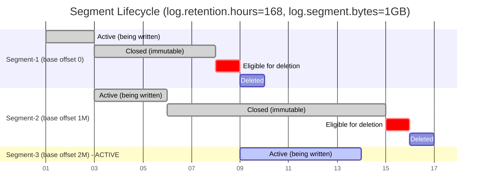
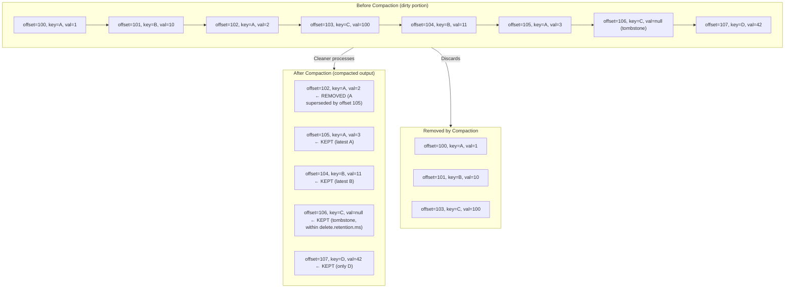

# Apache Kafka Deep Dive  Part 5: Storage Engine  Segments, Indexes, Log Compaction, and Retention

---

**Series:** Apache Kafka Deep Dive  From First Principles to Planet-Scale Event Streaming
**Part:** 5 of 10
**Audience:** Senior backend engineers, distributed systems engineers, data platform architects
**Reading time:** ~45 minutes

---

## Prerequisites and Series Context

Parts 0–4 of this series established the foundations. Part 0 covered why Kafka exists and the distributed log abstraction. Part 1 introduced the concept of log segments at a high level. Parts 2–3 examined broker architecture and the replication protocol (ISR, leader election, high watermarks). Part 4 dove into consumer group coordination and rebalancing mechanics.

This part goes much deeper into the storage engine than any of the preceding articles. When Part 1 told you "Kafka stores messages in segments on disk," this is where you learn exactly what that means  byte by byte, file by file, algorithm by algorithm.

If you have not read the earlier parts, the minimum context you need is this: Kafka organizes data into **topics**, partitions those topics into **partitions**, and each partition is a totally ordered, immutable, append-only log. Each broker stores the partition data it is responsible for on local disk. That local storage is what we are dissecting today.

---

## 1. On-Disk Layout: Directory Structure

### 1.1 One Directory Per Partition

Every partition replica stored on a broker gets its own directory on disk. The path follows the pattern:

```
{log.dirs}/{topic-name}-{partition-number}/
```

Where `log.dirs` is the broker configuration property pointing to one or more mount points (e.g., `/var/kafka-logs`). If you configure multiple `log.dirs` entries  which you should for I/O parallelism across multiple disks  Kafka distributes partitions across them using a round-robin assignment during partition creation.

For a topic named `orders` with 6 partitions, and a broker hosting partitions 0, 2, and 5, the directory layout would be:

```
/var/kafka-logs/
├── orders-0/
├── orders-2/
└── orders-5/
```

This flat directory-per-partition structure is deliberate. Kafka avoids deeply nested hierarchies because the OS directory lookup cost grows with nesting depth, and Kafka may manage tens of thousands of partitions on a single broker in large clusters.

### 1.2 Files Within a Partition Directory

Inside each partition directory you will find a set of file groups, one group per segment. Each segment consists of up to four files sharing the same base name (the base offset) but different extensions:

| Extension | Purpose |
|---|---|
| `.log` | The actual message data  record batches stored sequentially |
| `.index` | Sparse offset index mapping relative offsets to file positions in `.log` |
| `.timeindex` | Sparse timestamp index mapping timestamps to offsets |
| `.txnindex` | Aborted transaction index used by read_committed consumers |
| `leader-epoch-checkpoint` | Per-partition file tracking leader epoch history for ISR divergence detection |
| `partition.metadata` | Topic ID and partition ID, written during topic creation |

The `leader-epoch-checkpoint` file is not a segment file but a partition-level metadata file. It stores a list of `(epoch, start_offset)` pairs representing every leader epoch transition the partition has experienced. This is critical for the replication protocol's leader epoch verification during follower fetch requests  covered in Part 3.

### 1.3 Segment Naming Convention

The filename of every segment file (before the extension) is the **base offset** of that segment  the offset of the first record in that segment  zero-padded to exactly 20 digits. This is not arbitrary. Twenty digits is sufficient to represent any 64-bit unsigned integer (max value 18,446,744,073,709,551,615  20 digits), and zero-padding ensures that lexicographic sort order equals numeric sort order. This lets the broker find the correct segment for a given offset with a simple binary search on the filename list.

Examples of segment filenames:
- `00000000000000000000.log`  the first segment, containing offsets starting at 0
- `00000000000001048576.log`  a segment whose first record has offset 1,048,576
- `00000000000002097152.log`  a segment whose first record has offset 2,097,152

### 1.4 Active Segment vs. Closed Segments

At any given moment, exactly one segment per partition is the **active segment**: the segment currently being written to. All other segments are **closed** (also called "frozen" or "inactive") and are immutable  Kafka never modifies a closed segment's `.log` file.

This immutability is architecturally crucial. It means:

1. Closed segments can be safely read by multiple consumers concurrently with no locking.
2. The OS page cache for closed segments is stable  pages are not being invalidated by writes.
3. Replication of closed segments is trivially consistent  a follower that has fetched a segment fully will never see that segment change.
4. Log compaction and deletion operate on closed segments only; the active segment is never compacted or deleted mid-write.

The active segment has an open file descriptor and accepts `append` operations. Its index files are also open and being extended as data is written.

### 1.5 Full Directory Tree Visualization

```
/var/kafka-logs/orders-0/
│
├── 00000000000000000000.log         ← Segment 1: offsets 0..1,048,575
├── 00000000000000000000.index       ← Offset index for segment 1
├── 00000000000000000000.timeindex   ← Timestamp index for segment 1
├── 00000000000000000000.txnindex    ← Aborted tx index for segment 1
│
├── 00000000000001048576.log         ← Segment 2: offsets 1,048,576..2,097,151
├── 00000000000001048576.index
├── 00000000000001048576.timeindex
├── 00000000000001048576.txnindex
│
├── 00000000000002097152.log         ← Segment 3 (ACTIVE): offsets 2,097,152..
├── 00000000000002097152.index       ← Pre-allocated to log.index.size.max.bytes
├── 00000000000002097152.timeindex   ← Pre-allocated
├── 00000000000002097152.txnindex
│
├── leader-epoch-checkpoint          ← Per-partition, not per-segment
└── partition.metadata               ← Topic ID metadata
```

Notice that segment 1 and 2 are closed (immutable) while segment 3 is the active segment. The `.index` and `.timeindex` files for closed segments are truncated to their actual content, while those for the active segment are pre-allocated to their maximum size.

---

## 2. The Segment File (.log) Format

The `.log` file is a sequence of **record batches** written end-to-end with no padding, no alignment, and no record boundaries marked at the file level. To know where one batch ends and the next begins, you read the `BatchLength` field of the current batch header. This is the core binary format you must understand to debug Kafka at the byte level.

### 2.1 Record Batch Structure

Each record batch begins with a fixed-size header (61 bytes), followed by a variable-length payload of compressed or uncompressed records:

```
Record Batch Header (61 bytes fixed):
┌─────────────────────────────┬──────────┬──────────────────────────────────────┐
│ Field                       │ Size     │ Notes                                │
├─────────────────────────────┼──────────┼──────────────────────────────────────┤
│ BaseOffset                  │ 8 bytes  │ int64: offset of first record        │
│ BatchLength                 │ 4 bytes  │ int32: length of everything AFTER    │
│                             │          │ BaseOffset+BatchLength fields         │
│ PartitionLeaderEpoch        │ 4 bytes  │ int32: leader epoch at write time    │
│ Magic                       │ 1 byte   │ int8: always 2 for current format    │
│ CRC32                       │ 4 bytes  │ int32: CRC over everything after CRC │
│ Attributes                  │ 2 bytes  │ int16: compression, tx, control bits │
│ LastOffsetDelta             │ 4 bytes  │ int32: (last offset - BaseOffset)    │
│ BaseTimestamp               │ 8 bytes  │ int64: min timestamp in batch        │
│ MaxTimestamp                │ 8 bytes  │ int64: max timestamp in batch        │
│ ProducerID                  │ 8 bytes  │ int64: -1 if not transactional       │
│ ProducerEpoch               │ 2 bytes  │ int16: -1 if not transactional       │
│ BaseSequence                │ 4 bytes  │ int32: -1 if not transactional       │
│ RecordCount                 │ 4 bytes  │ int32: number of records in batch    │
└─────────────────────────────┴──────────┴──────────────────────────────────────┘

Followed by: [Record 0][Record 1]...[Record N-1]
(possibly compressed as a unit)
```

**Key observations:**

- `BatchLength` measures from after the `BatchLength` field itself to the end of the batch. To compute the start of the next batch: `current_position + 8 (BaseOffset) + 4 (BatchLength field itself) + BatchLength`.
- `Magic = 2` is the v2 record format introduced in Kafka 0.11 for exactly-once semantics. Earlier formats (magic 0 and 1) are no longer produced by modern clients.
- `CRC32` covers everything from `Attributes` to the end of the batch. The `PartitionLeaderEpoch` and `Magic` fields are intentionally excluded from the CRC  they are broker-assigned metadata. `BaseOffset` and `BatchLength` are also excluded, allowing offset reassignment on the broker without CRC recalculation.
- `PartitionLeaderEpoch` is stamped by the leader when it receives the batch. Followers use it during epoch verification (see Part 3).
- `ProducerID`, `ProducerEpoch`, and `BaseSequence` are the exactly-once metadata. For non-idempotent producers, all three are -1.
- `LastOffsetDelta` is `(lastOffset - BaseOffset)`, which equals `RecordCount - 1` for a normal non-transactional batch. For control batches (commit/abort markers), it is always 0.

### 2.2 Individual Record Format

Within the batch payload, each record uses a compact variable-length encoding. All integer fields use **zigzag-encoded varints** (protobuf-style variable-length encoding where the sign bit is moved to the LSB):

```
Individual Record (variable length):
┌─────────────────────────────┬──────────┬──────────────────────────────────────┐
│ Field                       │ Size     │ Notes                                │
├─────────────────────────────┼──────────┼──────────────────────────────────────┤
│ Length                      │ varint   │ total length of the record           │
│ Attributes                  │ 1 byte   │ int8: reserved, currently unused     │
│ TimestampDelta              │ varint   │ (record timestamp - BaseTimestamp)   │
│ OffsetDelta                 │ varint   │ (record offset - BaseOffset)         │
│ KeyLength                   │ varint   │ -1 if null key (tombstone signal)    │
│ Key                         │ variable │ raw bytes, KeyLength bytes           │
│ ValueLength                 │ varint   │ -1 if null value (tombstone)         │
│ Value                       │ variable │ raw bytes, ValueLength bytes         │
│ HeadersCount                │ varint   │ number of header key-value pairs     │
│ Headers                     │ variable │ [headerKeyLen, headerKey,            │
│                             │          │  headerValueLen, headerValue] each   │
└─────────────────────────────┴──────────┴──────────────────────────────────────┘
```

To reconstruct the absolute offset and timestamp of a record:
- `absoluteOffset = BaseOffset + OffsetDelta`
- `absoluteTimestamp = BaseTimestamp + TimestampDelta`

### 2.3 Why Varints for Deltas

The decision to encode deltas rather than absolute values with varints is a deliberate space optimization with measurable impact.

Consider a producer batch of 100 records. The offset deltas within that batch are 0, 1, 2, ..., 99. The timestamp deltas for records produced within milliseconds of each other are 0, 0, 0, ..., 3, 4. The key observation: small integers encode compactly in varints.

Varint encoding rules: values 0–127 encode in 1 byte. Values 128–16,383 encode in 2 bytes. Values 128^2 – 128^3-1 encode in 3 bytes. An absolute int64 offset like 5,000,000 would require 4 bytes in varint (it exceeds 16,383). But offset delta 47 (within a 100-record batch) encodes in 1 byte.

Concrete savings per 100-record batch:
- 100 timestamp deltas: ~1 byte each (deltas of 0–10ms) = 100 bytes total, vs. 800 bytes for absolute int64 timestamps  savings: 700 bytes
- 100 offset deltas: 1 byte each = 100 bytes, vs. 800 bytes for absolute int64 offsets  savings: 700 bytes
- Net savings per 100-record batch: ~1,400 bytes, or ~14 bytes per record

At a throughput of 1 million records/second, this translates to roughly 14 MB/s less disk I/O and 14 MB/s less network traffic. At scale, these savings compound significantly.

### 2.4 Attributes Field Bit Layout

The batch-level `Attributes` field (int16) encodes multiple boolean and enum properties:

```
Bit Layout of Attributes (int16):
┌─────┬─────┬─────┬────┬────┬───────────────────┐
│ b15 │ ... │  b6 │ b5 │ b4 │ b3 │ b2 b1 b0     │
├─────┴─────┴─────┼────┼────┼────┼──────────────┤
│    (reserved)   │ CB │ TX │ TS │ Compression  │
└─────────────────┴────┴────┴────┴──────────────┘

Bits 0-2: Compression codec
  000 = NONE
  001 = GZIP
  010 = Snappy
  011 = LZ4
  100 = Zstandard (Kafka 2.1+)

Bit 3 (TS): Timestamp type
  0 = CreateTime (producer-assigned)
  1 = LogAppendTime (broker-assigned at write time)

Bit 4 (TX): isTransactional
  1 = this batch belongs to a transaction

Bit 5 (CB): isControlBatch
  1 = this is a control batch (COMMIT or ABORT marker)
  Control batches are not delivered to consumers
```

The `isControlBatch` bit is especially important for the transaction protocol. When a consumer sees a batch with `isControlBatch=1`, it knows this is a commit or abort marker, not application data. The actual record value within a control batch encodes the marker type (COMMIT=1, ABORT=0) and the coordinator epoch.

### 2.5 Compression Scope and Batch Header Accessibility

Kafka's compression model is batch-level, not record-level: the entire record payload (all records in the batch from the first record's `Length` field to the end) is compressed as a single unit. The batch header (the 61-byte fixed portion) is **never compressed**.

```
Physical layout of a compressed batch:

[BaseOffset 8B][BatchLength 4B][LeaderEpoch 4B][Magic 1B][CRC 4B]
[Attributes 2B][LastOffsetDelta 4B][BaseTimestamp 8B][MaxTimestamp 8B]
[ProducerID 8B][ProducerEpoch 2B][BaseSequence 4B][RecordCount 4B]
^^^ UNCOMPRESSED HEADER (61 bytes) ^^^

[COMPRESSED PAYLOAD: LZ4/Snappy/GZIP/Zstd compressed bytes
 containing all records concatenated]
```

Why keep the header uncompressed? Because the broker needs to read `BaseOffset`, `BatchLength`, `MaxTimestamp`, and `LastOffsetDelta` without decompressing the payload. These are used for:

1. **Segment navigation**: `BatchLength` tells the broker where the next batch starts.
2. **Time-based retention**: `MaxTimestamp` is consulted to determine segment age without decompressing every batch.
3. **Offset index entries**: The index maps to physical byte positions, not record boundaries  the header provides the position anchor.
4. **Consumer fetch response construction**: The broker can read batch headers to satisfy fetch requests without decompressing and recompressing payloads.

This "header-visible, payload-opaque" design enables significant broker-side efficiency: the broker can route, index, and manage records without ever touching the compressed payload contents.

### 2.6 Full Record Batch Byte Layout (Annotated)

```
Offset 0x000: [00 00 00 00 00 10 00 00]  BaseOffset = 1,048,576 (0x100000)
Offset 0x008: [00 00 07 D4]              BatchLength = 2,004 bytes
Offset 0x00C: [00 00 00 03]              PartitionLeaderEpoch = 3
Offset 0x010: [02]                       Magic = 2
Offset 0x011: [A1 2F 3C 9E]             CRC32
Offset 0x015: [00 04]                   Attributes = 0x0004 (LZ4, CreateTime, non-tx)
Offset 0x017: [00 00 00 63]             LastOffsetDelta = 99 (100 records, 0..99)
Offset 0x01B: [00 00 01 8E 26 AB 10 00] BaseTimestamp = 1,710,000,000,000 ms
Offset 0x023: [00 00 01 8E 26 AB 10 3F] MaxTimestamp = BaseTimestamp + 63ms
Offset 0x02B: [FF FF FF FF FF FF FF FF] ProducerID = -1 (non-transactional)
Offset 0x033: [FF FF]                   ProducerEpoch = -1
Offset 0x035: [FF FF FF FF]             BaseSequence = -1
Offset 0x039: [00 00 00 64]             RecordCount = 100
Offset 0x03D: [... LZ4 compressed payload, 1,951 bytes ...]
```

---

## 3. Index Files: Sparse Offset and Time Indexes

The two index files per segment exist to answer one question efficiently: **given an offset (or a timestamp), what is the byte position in the `.log` file where I should start reading?**

### 3.1 The `.index` File: Sparse Offset Index

The `.index` file does **not** contain an entry for every record in the segment. If it did, the index for a 1 GB segment with 10-byte records would require 800 MB  larger than the segment itself.

Instead, Kafka writes one index entry per `log.index.interval.bytes` (default 4,096 bytes) of log data. This means for a typical segment with 1 KB average record batches, you get one index entry roughly every 4 batches. The index is therefore **sparse**  it maps a sampled subset of offsets to their physical positions.

The trade-off: lookup is not O(1) but O(log(N) + scan). The scan distance is bounded by `log.index.interval.bytes`  you never scan more than 4KB of log data to find your target offset.

### 3.2 Index Entry Format

Each entry in the `.index` file is exactly 8 bytes:

```
Index Entry (8 bytes):
┌─────────────────────────┬──────────────────────────────────────┐
│ Relative Offset (4B)    │ Physical Position (4B)               │
│ int32                   │ int32                                │
│ = abs_offset - baseOff  │ = byte offset from start of .log    │
└─────────────────────────┴──────────────────────────────────────┘
```

Relative offsets (not absolute) are stored because the absolute offset could be very large (billions), requiring int64. By storing the delta from the segment's base offset, which is bounded by the maximum number of records in a segment (at 1 KB/record and 1 GB segment, at most ~1,000,000 records), int32 is sufficient  saving 4 bytes per entry.

Similarly, physical position uses int32 because segment sizes are bounded by `log.segment.bytes` (default 1 GB = 2^30 bytes), which fits in int32.

The index file is **memory-mapped** using `mmap`. The broker maps the entire index file into virtual address space, so binary search on the index becomes a matter of pointer arithmetic and memory reads  no filesystem syscalls during the search itself. This is why index lookup is extremely fast even for large indexes.

### 3.3 Lookup Algorithm: Finding Offset N in a Segment

The lookup procedure for finding a specific offset within a segment is a two-phase operation:

```
Phase 1: Binary search on the .index file
  Input: target absolute offset T
  1. Compute relative offset R = T - segmentBaseOffset
  2. Binary search the in-memory index for largest entry where
     relativeOffset ≤ R
  3. Read the corresponding physicalPosition P from that entry

Phase 2: Linear forward scan in the .log file
  4. Seek to position P in the .log file
  5. Read batch header at P → get BaseOffset B
  6. If B == T: found. Return this batch.
  7. If B < T: advance to next batch (P += 8 + 4 + BatchLength)
              repeat from step 5
  8. If B > T: offset does not exist in this segment
```

The maximum scan distance in Phase 2 is bounded by `log.index.interval.bytes` bytes of log data. With the default 4 KB interval, this is at most 4 KB of sequential reads  typically 1–4 batch headers.

This is why Kafka's random-offset lookups are efficient despite the sparse index: the bounded scan means worst-case scan distance is known and small, while binary search on the mmapped index is O(log(M)) where M is the number of index entries (at most `log.index.size.max.bytes` / 8 entries ≈ 1.3 million entries for the 10 MB default, but in practice far fewer).

```
The Three-File Lookup Path:

.index file (memory-mapped):
┌───────────┬──────────┐
│ rel_off=0 │ pos=0    │
├───────────┼──────────┤
│ rel_off=4 │ pos=4096 │  ← binary search finds this entry
├───────────┼──────────┤                        │
│ rel_off=8 │ pos=8192 │                        │
└───────────┴──────────┘                        │
                                                 │ seek to pos=4096
                                                 ▼
.log file (sequential read from position 4096):
┌─────────────────────────────────────────────────────────────────┐
│ Batch at offset 4: [header][payload] → offset too low, advance  │
│ Batch at offset 5: [header][payload] → offset too low, advance  │
│ Batch at offset 6: [header][payload] → TARGET FOUND             │
└─────────────────────────────────────────────────────────────────┘

.timeindex file (same sparse structure, used for time-based seeks):
┌───────────────────┬──────────┐
│ timestamp=T+0ms   │ rel_off=0│
├───────────────────┼──────────┤
│ timestamp=T+15ms  │ rel_off=4│  ← binary search for target time
├───────────────────┼──────────┤
│ timestamp=T+31ms  │ rel_off=8│
└───────────────────┴──────────┘
```

### 3.4 The `.timeindex` File: Timestamp-to-Offset Mapping

The `.timeindex` file enables the `offsetsForTimes()` API, which answers: "what is the earliest offset whose timestamp is ≥ T?" This is used by consumers to implement time-based replay  "replay all events since yesterday at noon."

Like the offset index, it is sparse, with one entry per `log.index.interval.bytes` of data. Each entry is 12 bytes:

```
Timeindex Entry (12 bytes):
┌─────────────────────────┬──────────────────────────────────────┐
│ Timestamp (8B)          │ Relative Offset (4B)                 │
│ int64                   │ int32                                │
│ = MaxTimestamp of batch │ = rel offset of that batch           │
└─────────────────────────┴──────────────────────────────────────┘
```

The timestamp stored is the `MaxTimestamp` from the corresponding batch header  the latest timestamp within that batch. This is important: if you seek to time T, you may get a batch whose `BaseTimestamp` is slightly before T but whose `MaxTimestamp` is at or after T. The consumer must scan forward and filter by individual record timestamps if precision is required.

The lookup algorithm is analogous to the offset lookup: binary search on `.timeindex` to find the largest entry with timestamp ≤ T, then use the corresponding relative offset to look up the physical position in `.index`, then linear scan in `.log`.

### 3.5 Index Pre-allocation

When the broker creates a new active segment, it **pre-allocates** the `.index` and `.timeindex` files to their full maximum sizes:
- `.index`: pre-allocated to `log.index.size.max.bytes` (default 10,485,760 bytes = 10 MB)
- `.timeindex`: also pre-allocated to `log.index.size.max.bytes`

Pre-allocation means the broker creates the file and immediately writes zeros to fill it to the target size. This appears wasteful but avoids a significant performance problem: if the broker did not pre-allocate, every write to the index would potentially require the OS to extend the file, which involves metadata updates (inode modification, directory entry changes) and may cause filesystem fragmentation. Pre-allocation converts these many small metadata operations into one large allocation at segment creation time.

When the segment rolls (transitions from active to closed), the broker **truncates** the index files to their actual content size. This is why closed segment indexes are smaller than active segment indexes in `ls -la` output.

The index is full when the pre-allocated space is exhausted  this is one of the three conditions that triggers a segment roll (see Section 4.1).

---

## 4. Segment Lifecycle: Rolling, Retention, Deletion

### 4.1 When a Segment Rolls

An active segment transitions to closed (rolls) when any of three conditions are met:

| Condition | Configuration | Default |
|---|---|---|
| Segment size exceeds threshold | `log.segment.bytes` | 1,073,741,824 (1 GB) |
| Segment age exceeds threshold | `log.roll.ms` / `log.roll.hours` | 604,800,000 ms (7 days) |
| Index file is full | `log.index.size.max.bytes` | 10,485,760 (10 MB) |

The size threshold is checked after each batch is appended. If the current `.log` file size exceeds `log.segment.bytes`, the broker rolls the segment before the next write. This means segments can be slightly larger than the threshold  by at most one batch size.

The age threshold is checked periodically by the log manager background thread. A segment is considered "too old" when `now - BaseTimestamp_of_first_record > log.roll.ms`. Note that this uses the **record timestamp**, not the file modification time. For a topic with `log.message.timestamp.type=LogAppendTime`, this is the append time; for `CreateTime`, it is the producer-assigned timestamp (which could be manipulated or clock-skewed).

The index full condition is triggered when a new index entry would exceed the pre-allocated file size. With 8 bytes per entry and a 10 MB allocation, this allows ~1.3 million index entries, which at 4 KB intervals represents ~5 GB of log data  much larger than the default 1 GB segment size. Index exhaustion is therefore rare with default settings, but becomes relevant if `log.segment.bytes` is set very high.

### 4.2 Segment Rolling Process

The rolling process is atomic from the perspective of external readers:

```
1. Flush pending writes to the active segment's .log file (fdatasync)
2. Truncate .index and .timeindex files to their actual used sizes
3. Close the active segment's file descriptors (it is now immutable)
4. Determine the new base offset: lastOffset + 1
5. Create new files:
   00000000000002097152.log      (empty, open for append)
   00000000000002097152.index    (pre-allocated to 10 MB, zeroed)
   00000000000002097152.timeindex (pre-allocated to 10 MB, zeroed)
6. Update the broker's in-memory partition state to point to new active segment
7. Begin accepting writes to the new segment
```

Between steps 3 and 7, the partition continues to accept fetch requests  they simply read from the most recently closed segment. There is no gap in availability.

### 4.3 Time-Based Retention

`log.retention.ms` (or `log.retention.hours`) defines how long Kafka retains data. The retention check runs every `log.retention.check.interval.ms` (default 5 minutes) and determines which segments are eligible for deletion.

**Critical distinction**: a segment's age is determined by the **MaxTimestamp of the segment** (the latest timestamp across all records in the segment), not by the segment's file modification time on disk.

This distinction matters in several scenarios:

- **Compacted topics with old keys**: if a segment was written 8 days ago but contains a record with a key that was re-written 1 day ago, the segment's MaxTimestamp reflects the more recent record, and it will not be deleted until 8 + 7 = retention period after that most recent record.
- **Time-shifted producers**: a producer with a misconfigured clock writing records with timestamps in the past will cause segments to have a lower MaxTimestamp than their actual creation time, potentially making segments appear older than they are and causing premature deletion.
- **LogAppendTime vs CreateTime**: with `log.message.timestamp.type=LogAppendTime`, timestamps are broker-assigned and accurate. With `CreateTime`, they are producer-assigned and potentially unreliable.

The retention deletion process:
1. Sort all closed segments by base offset (ascending).
2. Find all segments where `MaxTimestamp < (now - log.retention.ms)`.
3. Delete those segments (log file + index files) starting from the oldest.
4. The active segment is never deleted.

### 4.4 Size-Based Retention

`log.retention.bytes` sets the maximum total size of all segment files in a single partition. When the total size exceeds this threshold, the broker deletes the oldest closed segments until the total is at or below the threshold.

Both retention policies can be active simultaneously (the defaults have `log.retention.bytes=-1`, meaning size retention is disabled by default). When both are enabled, Kafka deletes a segment if it is eligible under either policy.

### 4.5 Segment-Granular Deletion: The Implication

Kafka **never deletes individual records from within a segment**. Deletion always removes entire segment files. This has a frequently surprising consequence:

> A single record with a timestamp within the retention window can keep an entire 1 GB segment alive.

Consider a segment created 30 days ago with `log.retention.hours=168` (7 days). If the last record written to that segment (the record that caused the roll to the next segment) has a `MaxTimestamp` from 6 days ago (perhaps due to producer clock drift or a batch that was buffered for a long time), the entire segment is retained for another day.

In practice, this means:
- Retention is not precise at the record level  it is approximate at the segment level.
- A topic with large segments (`log.segment.bytes=1GB`) will have coarser retention granularity than one with small segments.
- For topics requiring precise retention (e.g., GDPR deletion of specific user records), size-based or time-based retention alone is insufficient  log compaction with tombstones or a purpose-built solution is required.

### 4.6 Log Deleter vs. Log Cleaner

Kafka has two distinct background subsystems for managing log size:

| Aspect | Log Deleter | Log Cleaner |
|---|---|---|
| Applies to | Topics with `cleanup.policy=delete` | Topics with `cleanup.policy=compact` |
| Mechanism | Removes entire segments beyond retention | Rewrites segments keeping only latest-per-key |
| Configuration | `log.retention.ms`, `log.retention.bytes` | `log.cleaner.dedupe.buffer.size`, `min.cleanable.dirty.ratio` |
| Thread | `kafka-log-retention-thread` | `kafka-log-cleaner-thread-N` (pool) |
| Output | Segment files are deleted | Compacted segment files replace dirty segments |
| Minimum guarantee | Data older than retention may be deleted | Latest value per key is always retained |

The Log Cleaner is a multi-threaded pool (controlled by `log.cleaner.threads`, default 1). Each cleaner thread independently picks the partition with the highest "dirty ratio" and compacts it.

### 4.7 Mermaid: Segment Lifecycle Timeline



---

## 5. Log Compaction: The Key-Based Retention Model

### 5.1 Compaction vs. Deletion: Fundamentally Different Semantics

Time/size-based deletion answers the question: "how long do we keep data?" Log compaction answers a different question entirely: "for each key, do we need to keep every historical value, or only the current state?"

Deletion: all records older than the retention window are eventually removed, regardless of key.
Compaction: for each key, only the most recent record is guaranteed to be retained, regardless of age.

This distinction maps to two different data use cases:

- **Event streaming** (e.g., user clickstream, transaction log): you want a bounded window of recent events. Deletion is appropriate. You do not need a record from 6 months ago that says "user clicked on button X."
- **State materialization** (e.g., current user preferences, latest inventory count, current account balance as a CDC stream): you want the current value for every key, forever. Deletion would destroy the state for keys that have not been updated recently. Compaction is the correct model.

### 5.2 Use Cases for Compacted Topics

**Change Data Capture (CDC)**: a CDC pipeline streaming database changes from MySQL/PostgreSQL to downstream systems. The topic key is the primary key of the database row. Consumers reading the topic from offset 0 can reconstruct the current state of the table. Without compaction, the topic would grow indefinitely; with compaction, it stabilizes at approximately the size of the table itself.

**Kafka Streams State Stores**: Kafka Streams persists state (aggregations, join tables, windowed state) in changelog topics that are compacted. When a Streams application restarts after failure, it re-reads its changelog topic from offset 0 to restore in-memory state. Compaction ensures this restore is bounded by current state size, not by the full history of all state transitions.

**Application Configuration**: a compacted topic storing service configuration. The key is the config key name, the value is the config value. New instances of a service consume the topic from offset 0 to initialize their configuration. Compaction ensures they see the current value of each config key without consuming the full history of configuration changes.

**Distributed Caches**: a compacted topic as a "distributed materialized view" where the topic represents a cache, and each key's latest value is the current cached entry. This is sometimes called the "compacted topic as a database table" pattern.

### 5.3 Cleanup Policy Configuration

The `cleanup.policy` topic-level configuration accepts three values:

| Value | Behavior |
|---|---|
| `delete` | (default) Time/size-based retention; old segments are deleted |
| `compact` | Key-based retention; cleaner rewrites segments to keep only latest-per-key |
| `compact,delete` | Hybrid: compaction runs on the dirty portion AND time/size retention deletes old cleaned segments |

The hybrid `compact,delete` policy is powerful: it compacts to keep the latest-per-key, but also enforces a time or size bound. Use case: a CDC topic where you want the latest value for every key, but also want to eventually age out keys that have not been updated in more than 90 days (implicitly, via their deletion tombstone expiring).

### 5.4 Compaction Semantics and Consumer Guarantees

Compaction provides the following guarantee: **a consumer reading a compacted topic from offset 0 will see at least one record per key  the latest one**.

The nuance "at least one" is important. In the dirty portion (segments not yet compacted), a consumer may see multiple records for the same key  all the historical versions written since the last compaction run. Compaction is not instantaneous; it runs periodically and asynchronously. During the window between compaction runs, the dirty portion accumulates duplicate keys.

After compaction of a segment group, only the latest record per key survives in those segments. Old records for those keys are permanently removed from disk.

### 5.5 Tombstones: Key Deletion

To delete a key from a compacted topic  to signal that "this key no longer exists"  a producer writes a **tombstone** record: a record with a non-null key and a null value (`ValueLength = -1` in the record format).

Tombstones are not immediately removed. They must be visible to consumers long enough for all consumers to observe the deletion. The `delete.retention.ms` configuration (default 86,400,000 ms = 24 hours) controls how long tombstones are retained before the cleaner is allowed to remove them.

Tombstone lifecycle:
1. Producer writes tombstone (key=X, value=null).
2. Cleaner compaction runs: all previous records for key=X are removed; the tombstone is retained.
3. After `delete.retention.ms` has passed since the tombstone was written, the cleaner may remove the tombstone itself.
4. Key=X no longer exists anywhere in the log.

If a consumer reads the topic from offset 0 after the tombstone has been removed, it will never see key=X. If it reads before the tombstone is removed but after previous values are compacted, it will see the tombstone (null value) and know the key was deleted.

### 5.6 The Cleaner Thread: How Compaction Works

The cleaner thread operates in a background loop:

```
Cleaner Loop:
1. Find the partition with the highest dirty ratio among all
   compact-policy partitions this thread is responsible for.
2. If dirty ratio < min.cleanable.dirty.ratio: sleep and retry.
3. Lock the partition for compaction (brief lock to snapshot log state).
4. Identify the "clean" portion: offsets 0..firstDirtyOffset-1
5. Identify the "dirty" portion: offsets firstDirtyOffset..latestOffset
6. Build the offset map: scan dirty segments sequentially,
   build key→latestOffset map.
7. Write compacted segments: for each record in dirty segments,
   emit it to the output segment if it is the latest for its key.
8. Atomically replace dirty segments with compacted segments.
9. Update the firstDirtyOffset pointer.
10. Repeat from step 1.
```

The key insight is in step 7: the cleaner reads dirty segments sequentially (optimal disk I/O) and builds an in-memory offset map. Then it writes output segments sequentially. The I/O pattern is two sequential passes over the dirty data  read once, write once  not random I/O.

### 5.7 Dirty Ratio and When Compaction Triggers

The **dirty ratio** is the fraction of a partition's total log size that is in the "dirty" (not yet compacted) portion:

```
dirty_ratio = dirty_bytes / (clean_bytes + dirty_bytes)
```

The cleaner runs on a partition when its dirty ratio exceeds `min.cleanable.dirty.ratio` (default 0.5  50% of the log must be dirty before compaction triggers).

Setting `min.cleanable.dirty.ratio` lower causes more frequent compaction (better compactness, higher I/O overhead). Setting it higher allows more duplicate accumulation before compaction (lower I/O overhead, less compact log at any given moment).

Monitor the metric `kafka.log:type=LogCleanerManager,name=max-dirty-percent` in production. If this metric is consistently at or near 100%, your cleaner is falling behind  the dirty portion is accumulating faster than the cleaner can process it. Remedies: increase `log.cleaner.threads`, reduce `min.cleanable.dirty.ratio`, or add more brokers to distribute the partition load.

### 5.8 Clean vs. Dirty Portions of the Log

```
Compacted Topic Log Structure:

Offset:  0        1M        2M        3M        4M (latest)
         │        │         │         │         │
         ▼        ▼         ▼         ▼         ▼
Segment: [SEG-A ──────────][SEG-B ──────────][SEG-C (active)───]
         │ CLEAN PORTION   │ DIRTY PORTION   │ ACTIVE           │
         │ Already compact │ Not yet compact │ Being written    │
         ▼                 ▼                 ▼                  ▼
         Guarantees:       May have          May have
         1 record/key      duplicates        duplicates
                           ↑
                    firstDirtyOffset
                    (tracked per partition)
```

New writes always go to the active segment, which is always in the dirty portion. After a segment rolls, it becomes part of the dirty portion and will eventually be compacted. After compaction, it moves to the clean portion  but it may accumulate new dirt if a key that was compacted in that segment receives new writes in a later segment.

This is why the clean/dirty classification is not purely segment-based: a segment in the "clean" portion may still contain records for keys that have been updated again in the dirty portion. The cleaner handles this by re-compacting clean segments during compaction runs when needed.

### 5.9 Mermaid: Before and After Compaction



**Offset gaps after compaction**: notice that the compacted log has gaps in the offset sequence (100, 101, 103 are gone; the remaining records retain their original offsets). Kafka offsets are immutable  compaction never renumbers records. Consumers reading a compacted topic must handle non-contiguous offsets gracefully, and they do by design: the consumer position is an offset, not a sequential index.

### 5.10 Compaction Does Not Guarantee Cross-Key Ordering

After compaction, the relative ordering of records for **different keys** is not guaranteed to be preserved. The compacted output contains the latest record for each key, but those records may be interleaved differently than in the original log.

Per-key ordering is maintained: all records for key A appear in the same order they were originally written. But the interleaving of records for key A and key B after compaction may differ from the original interleaving.

This matters for consumers that depend on cross-key causal ordering  for example, a consumer processing a CDC stream where "UPDATE user SET status=active" must be observed before "INSERT order WHERE user.status=active." For such cases, log compaction is not appropriate; a time-windowed append-only topic with full history is required.

---

## 6. The Offset Map: How the Cleaner Tracks Latest Offsets

### 6.1 In-Memory Offset Map Structure

The cleaner builds an in-memory hash map during the "reading the dirty portion" phase of compaction. For each record encountered, it records:

```
key_hash → (latestOffset, keySize)
```

The map tracks `keySize` in addition to `latestOffset` to handle hash collisions  if two keys produce the same hash, the cleaner uses the actual key bytes to disambiguate. This is a space-efficiency optimization: storing full key bytes would require unbounded memory for large keys.

The hash function is SHA-256 of the key bytes. SHA-256 produces 256-bit hashes, but only the low-order bits are used to index into the hash map, with the remaining bits used for collision detection.

The custom hash map used by the Kafka cleaner is optimized for sequential insertion (building the map by scanning the dirty portion sequentially) and sequential lookup (checking records during the output phase). It uses open addressing with linear probing  cache-friendly for sequential workloads.

### 6.2 Memory Limit and Multi-Pass Compaction

The offset map is bounded by `log.cleaner.dedupe.buffer.size` (default 134,217,728 bytes = 128 MB). Each entry in the hash map occupies roughly 24 bytes (8 bytes for the hash + 8 bytes for the offset + 4 bytes for key size + 4 bytes overhead). The 128 MB buffer therefore holds approximately 5.3 million entries.

If the dirty portion of a partition contains more unique keys than fit in the offset map, the cleaner performs **multi-pass compaction**:

1. Process a subset of the dirty portion that fits in the offset map.
2. Write compacted output for that subset.
3. Clear the offset map.
4. Continue with the next subset.

Multi-pass compaction is less efficient than single-pass (it requires multiple reads of some overlapping dirty data) but bounded in memory use. The `log.cleaner.dedupe.buffer.size` should be sized to handle the partition's unique key count comfortably; if you observe frequent multi-pass compaction (visible in broker logs), increase this setting.

### 6.3 Hash Collision Probability

With a 128 MB buffer and 24 bytes per entry, the map holds approximately 5.3 million slots. The probability of a SHA-256 collision for any two distinct keys is negligible (SHA-256 has 2^256 possible values), but the hash map uses only a fraction of the SHA-256 output bits for bucketing (the number of bits equal to `log2(map_size)`). For a 5.3M-entry map, this is approximately 23 bits.

The probability of a **bucket collision** (two distinct keys mapping to the same bucket) is governed by the birthday paradox. For 5.3 million entries in 5.3 million buckets, expected collisions ≈ n²/(2m) ≈ 2.65M  but these are resolved by linear probing and key comparison, not by silently assuming two keys are the same. The cleaner is correct even under hash collisions; it uses them only to locate candidate entries, and then compares actual key bytes.

True hash collisions (two distinct keys producing identical SHA-256 hashes) would cause incorrect compaction behavior. SHA-256 collision probability for any two distinct inputs is approximately 2^-128  practically zero at any realistic key count.

### 6.4 Cleaner I/O Pattern

```
Compaction I/O Flow:

1. SEQUENTIAL READ: scan dirty segments left to right
   [SEG-D1][SEG-D2][SEG-D3] → build offset map in memory

2. SEQUENTIAL READ + WRITE: scan dirty segments again
   For each record: check if record.offset == offsetMap[key]
   If yes → emit to new compacted segment
   If no  → skip (superseded by later write)

3. ATOMIC SEGMENT REPLACEMENT:
   - rename temp compacted segments to final names
   - delete old dirty segments
   - update partition's segment list atomically

4. REBUILD INDEXES: rebuild .index and .timeindex for new segments
   (indexes are always derived from the log, never canonical)
```

The rename-then-delete atomicity is critical. Kafka uses filesystem rename operations (atomic on POSIX filesystems) to swap in compacted segments, ensuring that a broker crash during compaction never leaves the partition in a corrupt state  it will either have the old segments or the new compacted segments, never a partial mix.

---

## 7. Log Segments and Transactions

### 7.1 Transactional Markers: Control Batches

When a transactional producer commits or aborts a transaction, the transaction coordinator instructs each partition leader involved in the transaction to write a **control batch**  a special record batch with `Attributes.isControlBatch = 1`.

Control batches are not delivered to consumers. They are infrastructure markers that tell consumer the fate of a transaction.

Two types of control batches exist:
- **COMMIT marker**: the transaction committed. All batches from this producer within this transaction are now visible to `isolation.level=read_committed` consumers.
- **ABORT marker**: the transaction aborted. All batches from this producer within this transaction are permanently invisible to `read_committed` consumers (they are visible to `read_uncommitted` consumers until compacted away).

The control batch structure:
```
Control Batch:
  Attributes.isTransactional = 1
  Attributes.isControlBatch = 1
  RecordCount = 1
  Single record value:
    ┌────────────────────┬──────────────────────────────────────┐
    │ Version (int16)    │ Marker type (int16)                  │
    │ 0                  │ 1 = COMMIT, 0 = ABORT                │
    └────────────────────┴──────────────────────────────────────┘
```

### 7.2 The `.txnindex` File

When a segment contains records that belong to aborted transactions, the broker maintains a `.txnindex` file for that segment. The txnindex records which byte ranges within the `.log` file belong to aborted transactions.

When a `read_committed` consumer fetches from a segment, the broker consults the `.txnindex` to identify and exclude aborted transaction records from the response. This filtering happens on the broker side  the consumer does not receive aborted records at all; it receives only committed records and the COMMIT/ABORT markers themselves (which it uses to update its transaction state).

The `.txnindex` format stores entries of the form:
```
TxnIndex Entry:
  ProducerID (int64)
  ProducerEpoch (int16)
  FirstOffset (int64)      ← first offset of the aborted transaction
  LastOffset (int64)       ← last offset of the aborted transaction (the ABORT marker)
  LastStableOffset (int64) ← LSO at the time the abort was recorded
```

### 7.3 Transaction Impact on Compaction

Compaction interacts with transactions in a nuanced way. The cleaner must not remove transactional records until their fate (COMMIT or ABORT) is known. More specifically:

- **Uncommitted transaction records**: the cleaner must not compact these  they may still be committed.
- **Aborted transaction records**: the cleaner can remove them (they are logically deleted), but it must retain the ABORT marker long enough for all consumers to observe it.
- **Committed transaction records**: the cleaner treats them like normal records  it retains the latest-per-key.

`log.cleaner.min.compaction.lag.ms` (default 0) sets the minimum time a message must remain uncompacted after being written. This helps ensure that consumers have time to observe records before the cleaner removes superseded versions. For transactional topics, setting this to a value larger than your maximum transaction duration ensures the cleaner does not compact records whose transaction fate is still unknown.

---

## 8. Tiered Storage (Kafka 3.6+)

### 8.1 The Motivation: Cold Data on Hot Storage

The fundamental economics of Kafka storage create a tension: Kafka is designed for durability (keep data for 7 days, 30 days, 90 days), but local NVMe or SSD storage is expensive. A typical production Kafka broker might have 12 TB of local storage. At $0.10–0.30/GB/month for local NVMe, a three-replica cluster with 90-day retention for a 10 TB/day ingest rate requires petabytes of local storage costing millions of dollars monthly.

Yet the access pattern for this data is highly skewed: consumers typically read from the tail of the log (recent data), with cold data (older than a few hours) rarely accessed. Keeping cold data on expensive local NVMe is economically wasteful.

Tiered storage decouples the **retention period** from the **local storage size**: brokers maintain only a recent window of data locally, and older segments are offloaded to object storage (Amazon S3, Google Cloud Storage, Azure Blob Storage) that costs 10–100x less per GB.

### 8.2 Architecture: Local and Remote Tiers

```
Tiered Storage Architecture:

                    Producer
                       │
                       ▼
              ┌────────────────┐
              │  Kafka Broker  │
              │                │
              │  Local Tier:   │
              │  [SEG-N-2]     │ ← recent, hot data, local NVMe
              │  [SEG-N-1]     │
              │  [SEG-N]       │ ← active segment
              └────────┬───────┘
                       │ Background upload thread
                       │ (after local.log.retention.ms)
                       ▼
              ┌────────────────┐
              │  Object Store  │
              │  (S3/GCS/Blob) │
              │                │
              │  [SEG-1]       │ ← cold data, cheap storage
              │  [SEG-2]       │
              │  ...           │
              │  [SEG-N-3]     │
              └────────────────┘
                       │
                       ▼
              Consumer reads cold segment
              via broker (broker fetches from S3,
              caches, returns to consumer)
```

From the consumer's perspective, tiered storage is transparent. The consumer fetches from the broker as usual; the broker determines whether the requested segment is local or remote and fetches from the appropriate tier.

### 8.3 Remote Log Metadata

Kafka maintains a special internal topic (`__remote_log_metadata`) that tracks the mapping between segment offsets and remote storage locations. Each entry records:

- Topic partition
- Segment base offset and end offset
- Remote storage path (S3 key or equivalent)
- Segment size
- Epoch information for leader validation

When a broker uploads a segment to object storage, it writes an entry to this metadata topic. When a new broker takes over leadership for a partition, it reads this metadata topic to discover which segments are available remotely and can serve reads from either tier without a full segment scan.

### 8.4 Cost Implications

| Storage Type | Cost/GB/Month | 90-day retention, 1 TB/day ingest, 3 replicas |
|---|---|---|
| Local NVMe (no tiered storage) | $0.20 | $1,620,000/year |
| Local NVMe (7-day local) + S3 (83-day remote) | $0.20 local + $0.023 S3 | ~$215,000/year |
| Savings with tiered storage | | ~87% cost reduction |

The numbers above assume uniform access patterns. Real-world savings depend on the ratio of cold to hot data access, since S3 GET requests add both latency and per-request cost.

### 8.5 Limitations and Tradeoffs

**Latency**: local NVMe read latency is ~0.1–1 ms. S3 GET latency is 20–200 ms. For consumers reading cold data, this latency difference is significant. The broker can cache recently fetched remote segments in local disk or memory to amortize this, but the cache miss path is fundamentally slower.

**Log compaction + tiered storage**: the interaction between log compaction and tiered storage is incomplete in Kafka 3.6. Compaction is fundamentally a local operation  the cleaner reads and rewrites segments on local disk. Segments that have been uploaded to the remote tier cannot be compacted without first downloading them. As of Kafka 3.6, remote segments are not eligible for compaction; compaction only applies to local segments. This means compacted topics with tiered storage may accumulate more data in the remote tier than a purely local deployment would.

**Operational complexity**: tiered storage adds dependencies on object storage services (IAM roles, bucket policies, network connectivity, eventual consistency of object metadata), monitoring of the upload lag metric, and handling of S3/GCS API errors in the broker.

**Fetch amplification**: a consumer fetch for a small range within a large remote segment may cause the broker to download the entire segment from S3. This amplification can increase S3 costs unexpectedly. Tuning `log.segment.bytes` to smaller values (e.g., 256 MB instead of 1 GB) reduces amplification for remote reads.

---

## Key Takeaways

- **Segment files are named by base offset, zero-padded to 20 digits**, enabling O(log N) binary search to find the correct segment for any target offset without scanning directory contents sequentially.

- **Record batches use delta-encoded varints** for timestamps and offsets within a batch, saving ~14 bytes per record at 100-record batch size; the batch header remains fixed-width and uncompressed, enabling broker-side management without decompression.

- **Compression applies to the entire record payload within a batch**, not individual records, maximizing compression ratio while keeping the header readable for index building and segment navigation.

- **Index files are sparse and memory-mapped**  one entry per 4 KB of log data, binary searched to find the closest anchor, then followed by a bounded linear scan in the `.log` file. Maximum scan distance is always ≤ `log.index.interval.bytes`.

- **Deletion is segment-granular**  Kafka never removes individual records from within a segment. A single record with a timestamp within the retention window keeps an entire 1 GB segment alive, making retention precise only at the segment boundary level.

- **Log compaction retains the latest value per key indefinitely** using a background cleaner thread that builds an in-memory offset map, sequentially reads dirty segments, and rewrites compacted output; tombstones (null-value records) are the mechanism for key deletion.

- **After compaction, offsets are not renumbered**  compacted logs have gaps in the offset sequence. Consumers must handle non-contiguous offsets, and they do by design since consumer position is an absolute offset, not a sequential index.

- **Tiered storage (Kafka 3.6+) decouples retention period from local disk size** by offloading cold segments to object storage, potentially reducing storage costs by 80–90% for long-retention topics, at the cost of higher latency for cold reads and incomplete support for log compaction on remote segments.

---

## Mental Models Summary

| Concept | Mental Model |
|---|---|
| Partition directory | A folder containing chronologically-ordered groups of files, one group per segment, named by the first offset they contain |
| Segment file (.log) | A binary file of back-to-back record batches with no delimiters; BatchLength in each header tells you where the next batch starts |
| Record batch header | A fixed 61-byte header that is always readable without decompression; the compressed payload follows immediately after |
| Offset index (.index) | A memory-mapped array of (relativeOffset, physicalPosition) pairs, one per 4 KB of data; binary searched to find the nearest anchor for any target offset |
| Timeindex (.timeindex) | Same sparse structure as offset index, but maps timestamps to relative offsets; enables time-based consumer seeking without scanning all data |
| Active vs. closed segments | Active: one per partition, append-only, open file descriptor, growing index. Closed: immutable, index truncated, eligible for retention/compaction. |
| Segment-granular deletion | Retention operates on whole segment files; a record with a recent timestamp extends the life of its entire segment; individual record deletion is impossible without compaction |
| Log compaction | A background key-deduplication process: for each key, only the latest record survives; tombstones (null values) are the deletion signal; the cleaner is the GC of stateful topics |
| Dirty ratio | The fraction of a compacted topic's log that has not been compacted yet; compaction triggers when dirty_ratio ≥ min.cleanable.dirty.ratio (default 50%) |
| Tiered storage | Local tier = recent hot segments on NVMe; remote tier = cold segments on S3/GCS; consumer sees unified log; broker handles tier routing transparently |

---

## Coming Up in Part 6: Producer Deep Dive

Part 6 takes the producer from its public API down to the last network byte. We will cover:

- **The producer record accumulator**: how records are batched in memory, how `linger.ms` and `batch.size` control the buffering/throughput tradeoff, and what happens when the accumulator is full.
- **The sender thread**: the background thread that drains the accumulator, groups batches by leader, and issues `ProduceRequest` RPCs  and how its pipelining interacts with `max.in.flight.requests.per.connection`.
- **Idempotent producers**: the ProducerID and sequence number mechanism that eliminates duplicates from network retries, and the precisely-once constraint it enables at the single-partition level.
- **Transactions**: the two-phase protocol (BEGIN → write to partitions → write to offsets topic → COMMIT/ABORT), the transaction coordinator, and the exactly-once read-process-write pattern for stream processing.
- **Compression in the producer**: when compression is applied, which algorithm to choose (LZ4 vs. Snappy vs. Zstandard) for different payload types, and the interaction between compression and the broker's batch format.
- **Failure modes**: what happens when the leader fails mid-batch, when `acks=all` times out, when the transaction coordinator crashes, and when idempotent sequence numbers go out of sync after a producer restart.

If you have wondered what "exactly-once semantics" actually guarantees  and more importantly, what it does not guarantee  Part 6 is where those answers live.

---

*Apache Kafka Deep Dive  Part 5 of 10. All benchmarks and byte-level specifications reference Kafka 3.6 unless otherwise noted.*
