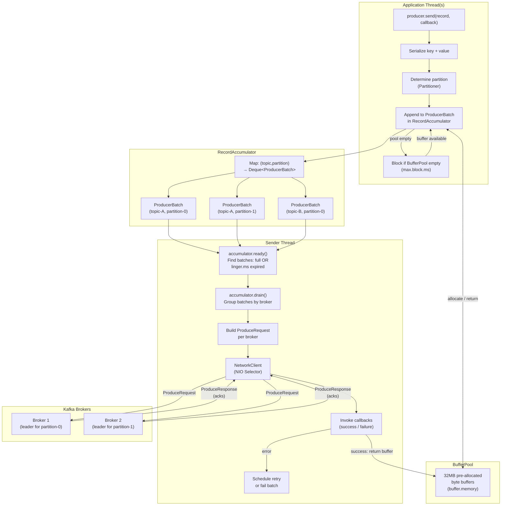
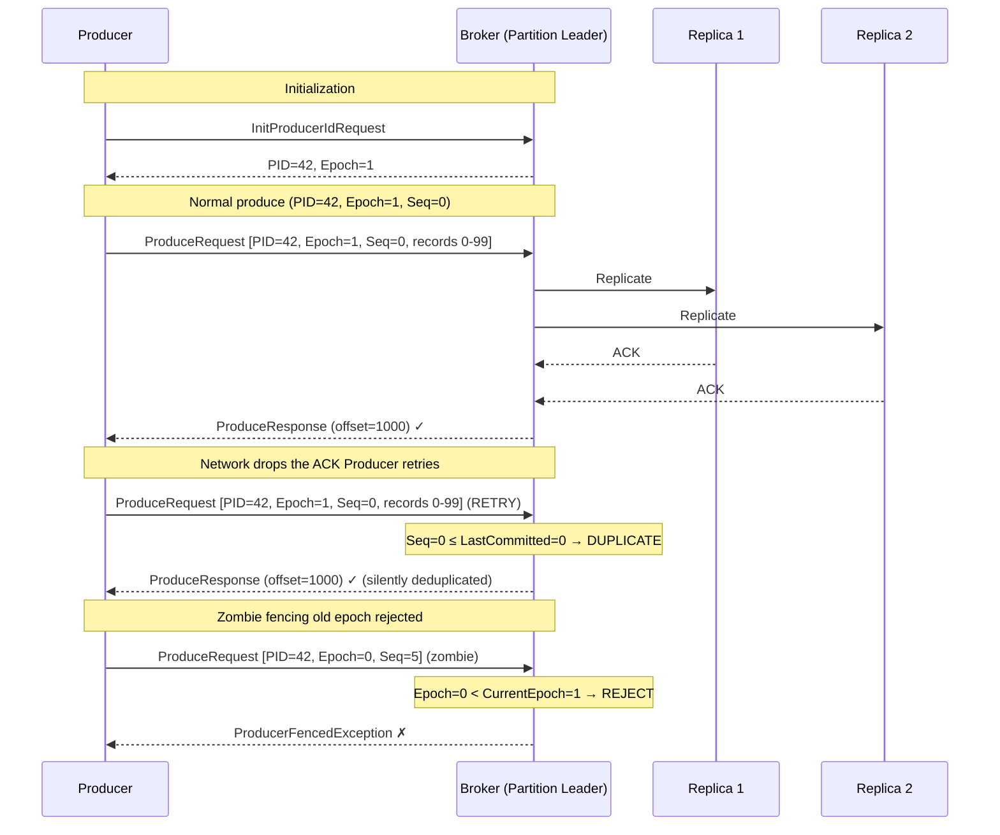
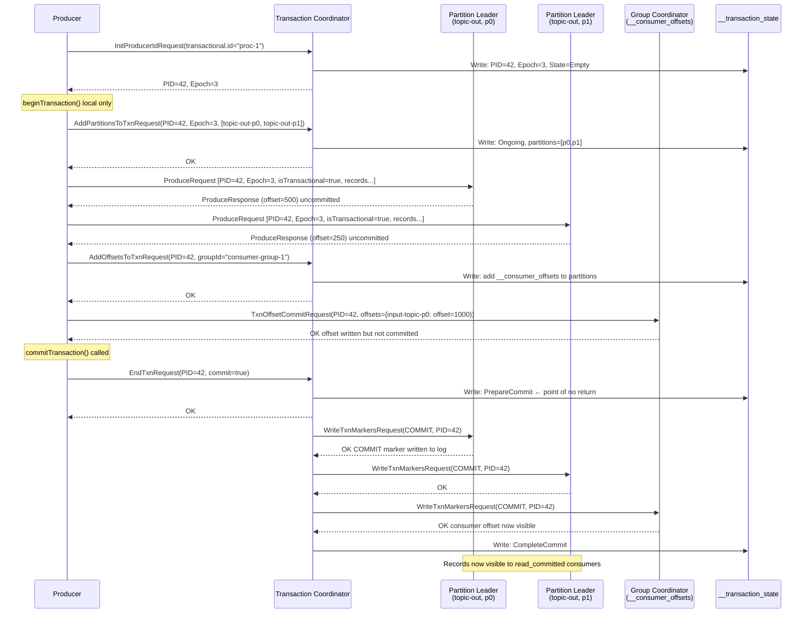

# Apache Kafka Deep Dive  Part 6: Producers  Batching, Idempotence, Transactions, and Exactly-Once

---

**Series:** Apache Kafka Deep Dive  From First Principles to Planet-Scale Event Streaming
**Part:** 6 of 10
**Audience:** Senior backend engineers, distributed systems engineers, data platform architects
**Reading time:** ~45 minutes

---

Parts 0 through 5 established the distributed log abstraction, broker architecture, replication protocol, consumer group coordination, and the storage engine. You know how Kafka stores data, how replicas stay in sync, and how consumers are assigned partitions. This part turns the lens to the other end of the pipeline: the producer. Not how to call `producer.send()`  that is a one-liner  but what happens inside the JVM, at the broker, and across network boundaries between that call and the moment your record is durably committed. The guarantees you get, the failure modes you must plan for, and the specific configuration knobs that determine whether your producer is a throughput machine or a latency landmine.

---

## 1. Producer Internals: The Two-Thread Model

Most engineers who have worked with the Kafka Java client think of `KafkaProducer.send()` as "send a record to Kafka." Mechanically, that is not what happens. Understanding what does happen is the foundation for everything in this part.

### 1.1 Application Thread vs. Sender Thread

The `KafkaProducer` runs two threads. Your code calls `send()` on the **application thread**  the same thread that called `producer.send(record, callback)`. The application thread does not send anything to a broker. It places the record into an internal buffer and returns immediately (or blocks if the buffer is full). The actual transmission to brokers is handled by a background **Sender thread**, which runs in a loop, draining the buffer and writing bytes to broker connections.

This design is deliberate and critical. The application thread must not block on network I/O. Network operations can stall for hundreds of milliseconds due to TCP retransmit, broker GC pause, or leader election. If `send()` blocked on network I/O, a single slow broker could halt your entire application. The two-thread model ensures that the application thread's only obligation is to put a record in a buffer  a memory operation that takes microseconds.

The separation also enables batching. Because the application thread can deposit records faster than the Sender thread drains them, multiple records accumulate in the buffer. The Sender thread picks up a group of records in a single pass and writes them to the broker in one network round-trip. This is how Kafka achieves high throughput without requiring the application to batch records manually.

### 1.2 RecordAccumulator: The Bridge Between Threads

The bridge between the application thread and the Sender thread is the **RecordAccumulator**. Conceptually, it is a map from `(topic, partition)` pairs to a queue of `ProducerBatch` objects. When `send()` is called, the application thread:

1. Determines the target partition (via the configured `Partitioner`, or the partition in the `ProducerRecord` if set explicitly).
2. Locates the `Deque<ProducerBatch>` for that `(topic, partition)` in the accumulator.
3. Appends the record to the last batch in the deque if there is room, or creates a new batch and appends to that.

The Sender thread reads from the accumulator in the other direction: it scans all `(topic, partition)` pairs, identifies batches that are ready to send (either full or past their linger deadline), groups them by the broker that leads the target partition, and issues one `ProduceRequest` per broker containing all ready batches destined for that broker.

The two threads share the accumulator but operate on it in a coordinated way. Batch creation and appending are protected by fine-grained locking at the deque level, which means different partitions make progress independently.

### 1.3 ProducerBatch

A **ProducerBatch** is a byte buffer destined for one specific partition. It holds a list of serialized `Record` objects encoded in Kafka's record batch format. A batch grows as the application thread appends records. It is considered ready to send when either:

- Its size reaches `batch.size` bytes, or
- `linger.ms` milliseconds have elapsed since the first record was appended.

Once a batch is sent, it is not immediately returned to the pool. It remains in flight until the broker acknowledges it (success) or until retries are exhausted (failure). Only then is the memory returned.

The record batch format (introduced in Kafka 0.11) wraps multiple records in a single envelope that carries producer metadata (PID, epoch, base sequence number), compression codec, and CRC. This envelope is what the broker stores verbatim  the broker does not re-serialize individual records.

### 1.4 Memory Pool (BufferPool)

Naive implementations would allocate a fresh `byte[]` for every batch. At 100,000 records per second with 16KB batches, that is thousands of short-lived allocations per second, enough to trigger frequent young-generation GC pauses and  under pressure  stop-the-world full GCs.

The Kafka producer avoids this with **BufferPool**: a pool of pre-allocated, fixed-size byte buffers. The total pool size is controlled by `buffer.memory` (default 32MB). When a new batch needs memory, the application thread requests a buffer from the pool. When the batch is acknowledged and no longer needed, its buffer is returned to the pool for reuse.

The pool only manages fixed-size allocations equal to `batch.size`. Batches larger than `batch.size` (which can happen for single records larger than the batch size) fall outside the pool and are allocated from the heap directly  these are exceptional cases and should be avoided for high-throughput paths.

When the pool is exhausted (all `buffer.memory` bytes are in use by in-flight or pending batches), the application thread's `send()` call blocks. It waits up to `max.block.ms` for a buffer to become available. If none is returned within that window, `send()` throws `TimeoutException`. This is the backpressure mechanism: a slow or disconnected broker causes batches to pile up, the pool empties, and `send()` starts blocking, propagating backpressure to the calling code.

### 1.5 Sender Thread Loop

The Sender thread runs a tight loop. On each iteration it:

1. Calls `accumulator.ready(cluster)` to identify which brokers have at least one batch ready to send.
2. Calls `accumulator.drain(cluster, readyNodes, maxRequestSize)` to pull ready batches grouped by broker, respecting `max.request.size`.
3. Handles expired batches (batches that have been in the accumulator longer than `delivery.timeout.ms`): fails them immediately without sending.
4. For each broker with ready batches, constructs a `ProduceRequest` and sends it via `NetworkClient`.
5. Polls `NetworkClient` for responses, invoking callbacks for completed requests.
6. Wakes up any application threads blocked in `send()` waiting for buffer space.

The `NetworkClient` underneath wraps Java NIO selectors. A single Sender thread manages all broker connections using non-blocking I/O, which is why one thread suffices regardless of how many brokers are in the cluster.

The following diagram shows the full data path:



---

## 2. Batching Configuration and Throughput

Batching is the primary lever for tuning producer throughput. Every configuration in this section affects the size of batches and how long they accumulate before being sent. Understanding the interactions between these knobs is essential for tuning without surprises.

### 2.1 `batch.size` (Default: 16,384 bytes = 16KB)

`batch.size` is the maximum number of bytes a single `ProducerBatch` can hold. It is a per-partition limit. A batch never exceeds this size; once it reaches the limit, it is immediately eligible for transmission regardless of `linger.ms`.

A larger `batch.size` means more records per network round-trip, which reduces per-record overhead from TCP framing, TLS, and broker processing. The cost is memory: each active partition needs at least one batch worth of buffer space, and with `buffer.memory` fixed, a larger `batch.size` means fewer concurrent batches.

In practice, 16KB is conservative. Production deployments with high partition counts and high throughput frequently raise this to 64KB or 256KB. The upper bound is constrained by `max.request.size` and the broker's `message.max.bytes`  a single record or batch cannot exceed either.

One subtlety: if a single serialized record is larger than `batch.size`, the Kafka producer creates a batch that exceeds `batch.size` to accommodate it. This is the "large record" case mentioned in Section 1.4, where the BufferPool cannot help and a heap allocation occurs.

### 2.2 `linger.ms` (Default: 0)

`linger.ms` is how long the Sender thread will wait for a batch to accumulate more records before sending it. At the default of 0, the Sender sends a batch as soon as any record is available  even if the batch has only one record and is far from `batch.size`. This minimizes end-to-end latency at the cost of throughput: each record travels in its own network round-trip.

Setting `linger.ms` to a non-zero value tells the Sender: "wait up to this long for the batch to fill before sending." During that window, additional `send()` calls for the same partition append to the same batch, amortizing the network round-trip cost across multiple records.

The latency addition is bounded by `linger.ms`. If 5ms of additional end-to-end latency is acceptable (which it is for most non-interactive workloads), `linger.ms=5` can double or triple throughput on a busy producer. For very high-volume producers, a linger of 20-100ms yields batches that approach `batch.size` without the latency becoming operationally significant.

### 2.3 `buffer.memory` (Default: 33,554,432 bytes = 32MB)

This is the total memory the producer allocates for all in-flight and pending batches across all partitions. The rule of thumb for sizing it: it should comfortably hold `batch.size × active_partition_count × in_flight_multiplier`. If you have 200 active partitions, `batch.size=65536`, and up to 5 in-flight requests per broker, your buffer needs on the order of 200 × 65KB × 2 (headroom) ≈ 26MB. 32MB is tight in this scenario; raising to 64MB or 128MB prevents `send()` from blocking due to buffer exhaustion.

On the JVM, `buffer.memory` is allocated off-heap via `ByteBuffer.allocateDirect()`, which means it does not count toward the heap configured by `-Xmx`. Account for this when sizing your container or JVM process memory limits.

### 2.4 `max.block.ms` (Default: 60,000ms = 60 seconds)

When `send()` is called and the accumulator has no available buffer (pool exhausted), the application thread blocks. `max.block.ms` bounds how long it blocks. After this timeout, `send()` throws `TimeoutException`.

This configuration also controls how long `send()` blocks while waiting for partition metadata to be fetched (e.g., on first use of a new topic). Metadata fetch and buffer wait share this timeout budget.

For latency-sensitive producers, reduce `max.block.ms` aggressively  1,000ms or less. This converts a stall-and-wait-60-seconds failure mode into a fast-fail exception that your circuit breaker or bulkhead can act on. For throughput-critical batch producers, the default is fine.

### 2.5 Throughput Mathematics

Consider a producer sending 100,000 messages per second with `linger.ms=0` and `batch.size=16384`. At zero linger, each `send()` call creates a batch that is sent before the next `send()` arrives. You get one network round-trip per record  100,000 ProduceRequests per second to the broker. If a round-trip takes 1ms, you can sustain at most 1,000 round-trips per second per partition, making 100,000 records/second impossible on a single partition without pipelining (which `max.in.flight.requests.per.connection` provides, but increases ordering complexity).

With `linger.ms=5`: in a 5ms window at 100,000 msg/sec, approximately 500 records arrive per partition. They are collected into a single batch and sent in one ProduceRequest. That is 1 RTT per 500 records instead of 1 RTT per record  a 500x reduction in round-trips. Throughput ceiling is now governed by bytes per second, not round-trips per second.

With `linger.ms=5` and `batch.size=65536` at an average record size of 200 bytes, a batch fills in about 327 records  roughly 1.6ms. The batch is sent before `linger.ms` expires because it filled. This is the steady-state for high-volume producers: batches fill by size, not by time.

### 2.6 `max.request.size` (Default: 1,048,576 bytes = 1MB)

This caps the size of a single `ProduceRequest`. The Sender thread will not include more batches in a single request than this limit allows. Note that this is the limit for the entire request  which may contain batches for multiple partitions destined for the same broker. It also serves as an implicit upper bound on individual record size: a record larger than `max.request.size` cannot be sent and results in `RecordTooLargeException`.

When increasing `batch.size`, ensure `max.request.size` is at least as large as the new batch size. Also coordinate with the broker's `message.max.bytes` setting (the broker-side limit for incoming records), which must be at least as large as `max.request.size`.

### Batching Configuration Matrix

| `batch.size` | `linger.ms` | Behavior | Best For |
|---|---|---|---|
| 16KB (default) | 0 (default) | One batch per `send()`, minimal latency | Low-volume, latency-sensitive |
| 16KB | 5ms | Accumulates records for 5ms; small batches | Moderate-volume, balanced |
| 64KB | 20ms | Larger batches, higher throughput | High-volume, latency tolerant |
| 256KB | 50ms | Near-maximum batch efficiency | Very high-volume, analytics |
| 1MB | 100ms | Maximum batch size | Bulk ingestion pipelines |

---

## 3. Compression

Compression reduces the bytes on the wire and on disk. For Kafka producers, compression is almost always worth enabling. Understanding where and when compression happens lets you tune it correctly and avoid the common compression mismatch trap.

### 3.1 Where Compression Happens

Compression occurs in the **application thread**, not the Sender thread. When a batch is finalized (full or linger expired), the application thread (or, in some implementations, a task handed off just before sending) compresses the batch payload. The compressed bytes are placed in the `ProduceRequest` and sent to the broker.

The broker stores the compressed batch verbatim. It does not decompress on write. The compressed batch is written to the partition log segment exactly as received. When a consumer fetches records, it receives the compressed batch and decompresses it locally.

This means compression saves both network bandwidth (producer to broker) and disk I/O (broker to consumer fetch, broker storage). The cost of compression is paid entirely by the producer CPU and the consumer CPU. The broker CPU is not involved in normal produce/consume paths.

### 3.2 Codec Options

Kafka supports four compression codecs:

- **GZIP**: Highest compression ratio among the older codecs. Implemented in the JVM standard library. CPU-intensive. Best for scenarios where bandwidth is severely constrained and CPU is plentiful.
- **Snappy**: Google's fast compression library. Moderate compression ratio, much faster than GZIP. Good balance for general use.
- **LZ4**: Very fast compression and decompression. Comparable ratio to Snappy. The preferred choice when latency matters because decompression on the consumer side is nearly zero-overhead.
- **Zstandard (zstd)**: Developed by Facebook. Best compression ratio among the supported codecs at reasonable speed. Configurable compression level (level 1-22; level 3 is the default and the right choice for most cases). Available since Kafka 2.1.

### 3.3 Compression Ratio and Throughput Benchmarks

These figures are representative for typical JSON event payloads (which compress well due to repeated field names and ASCII text). Binary formats like Avro or Protobuf compress less because they are already more compact.

| Codec | Ratio (JSON) | Compression Throughput | Decompression Throughput | Notes |
|---|---|---|---|---|
| GZIP | ~80% reduction | 30–50 MB/s per core | 150–200 MB/s per core | JVM implementation; high CPU cost |
| Snappy | ~60% reduction | 200–400 MB/s per core | 300–600 MB/s per core | Good default for most workloads |
| LZ4 | ~60% reduction | 400–700 MB/s per core | 1,000–2,000 MB/s per core | Best when consumer latency matters |
| Zstd (level 3) | ~75% reduction | 200–400 MB/s per core | 600–1,000 MB/s per core | Best ratio+speed tradeoff; preferred for new deployments |

"Ratio" means the compressed output is that percentage smaller than the input. 80% reduction means a 100KB batch compresses to ~20KB.

### 3.4 When the Broker Decompresses

The broker decompresses batches in only two situations:

1. **Log compaction**: The compaction thread must inspect individual record keys to decide which records to retain. Since keys are inside the compressed batch, the broker must decompress, read keys, and re-compress the retained records into a new batch.
2. **Message format conversion**: If a producer sends records in the newer RecordBatch format (V2, introduced in 0.11) and an older consumer requests the legacy message format (V0 or V1), the broker must decompress, convert, and re-serve. This is a compatibility layer for old clients. Avoid it in new deployments  pin clients to modern API versions.

### 3.5 Consumer Decompression

Consumers fetch `FetchResponse` payloads that contain compressed batches. The consumer client decompresses each batch before deserializing individual records. Decompression happens in the consumer's poll thread, which also handles deserialization and callback invocation.

At high fetch throughput, consumer decompression can become a bottleneck. LZ4's extremely fast decompression (1–2 GB/s per core) makes it the default choice when consumers are throughput-sensitive.

### 3.6 CPU Budget for Compression

At a production rate of 1GB/s of uncompressed records with Snappy (200 MB/s compression throughput per core):

```
Compression CPU cores needed = 1,000 MB/s ÷ 200 MB/s per core = 5 cores
```

If your producer JVM is running on a 4-core container, compression alone saturates more CPU than is available. Always model compression CPU cost against your producer's compute budget.

With Zstd at level 3 (300 MB/s per core) and 60% payload reduction applied before compression measurement (since Zstd compresses already-batched data, the effective throughput is on compressed output):

```
Effective throughput = 1,000 MB/s input × (1 - 0.75 reduction) = 250 MB/s output
CPU cores needed ≈ 1,000 MB/s ÷ 300 MB/s per core ≈ 3.3 cores
```

Zstd is often more CPU-efficient than GZIP while achieving similar ratios.

### 3.7 The Compression Mismatch Problem

The `compression.type` broker configuration specifies which compression codec the broker expects or will enforce. When set to a specific codec (e.g., `gzip`), the broker **recompresses** any batch that arrives in a different codec.

Example: producer sends LZ4-compressed batches. Broker is configured with `compression.type=gzip`. The broker decompresses each batch (LZ4 decompression), then recompresses it (GZIP compression), then writes to disk. This doubles the compression CPU cost on the broker and adds latency. Worse, the broker's CPU is a shared resource  recompression on a heavily loaded broker delays all producers and consumers on that broker.

The fix is trivial: align producer `compression.type` with the broker `compression.type`. If the broker is set to `producer` (the default), it accepts and stores whatever codec the producer uses without recompression. If you set the broker to a specific codec, ensure all producers use that same codec.

---

## 4. Retries and Ordering

Even a correctly configured producer will encounter transient failures. Network blips, leader elections, and broker restarts cause `ProduceRequests` to fail. The producer's retry logic determines whether those failures are transparent to your application  and whether they introduce subtle ordering violations.

### 4.1 Transient Failures

The Kafka producer automatically retries on retriable exceptions:

- `NetworkException`: socket-level failure, connection reset, timeout
- `NotLeaderOrFollowerException`: the broker is no longer the partition leader (leader election in progress)
- `UnknownTopicOrPartitionException`: metadata is stale; the topic/partition exists but the producer's cached metadata is wrong
- `CorruptRecordException`: rare; a retry may succeed if the corruption was transient
- `RequestTimedOutException`: broker did not respond within `request.timeout.ms`

Non-retriable exceptions (e.g., `RecordTooLargeException`, `SerializationException`, authorization failures) fail immediately without retry.

### 4.2 `retries` (Default: `Integer.MAX_VALUE` since Kafka 2.1)

The `retries` configuration counts how many times a single batch is retried before being failed. The default of `Integer.MAX_VALUE` (effectively infinite) means the producer will keep retrying until `delivery.timeout.ms` expires.

`delivery.timeout.ms` (default 120,000ms = 2 minutes) is the wall-clock timeout for a batch from the time it was first appended to the accumulator to the time it is either acknowledged or failed. This is the true knob for controlling how long a producer persists: retries happen continuously until this timeout, regardless of the `retries` count.

### 4.3 `retry.backoff.ms` (Default: 100ms)

Between retry attempts, the Sender thread waits `retry.backoff.ms` before re-queuing the batch. The default is 100ms. There is no built-in exponential backoff in the Kafka producer client (as of Kafka 3.x). For critical paths where cascading retries could overload a recovering broker, implement application-level exponential backoff by catching exceptions and sleeping before re-calling `send()`.

As of Kafka 2.8, `retry.backoff.max.ms` was added alongside `retry.backoff.ms` to support exponential backoff with jitter, interpolating between `retry.backoff.ms` (minimum) and `retry.backoff.max.ms` (maximum). This is worth enabling for workloads that experience correlated failures.

### 4.4 The Ordering Problem with Retries

This is one of the most subtle failure modes in Kafka producer configuration. Consider the following sequence with `max.in.flight.requests.per.connection=2`:

```
Time →
Producer sends:  [Batch A]──→ Broker
Producer sends:  [Batch B]──→ Broker (before A is acknowledged)
Broker ACKs B: partition log now has B at offset 10
Broker rejects A: NotLeaderOrFollowerException
Producer retries A:
Broker ACKs A (retry): partition log now has A at offset 11
```

The result: record B is at offset 10, record A is at offset 11. Consumers reading this partition see B before A  the opposite of the order in which the application called `send()`. If your application relies on partition-level ordering (which is one of Kafka's key guarantees), this is a silent data corruption.

This can only happen when multiple batches are in-flight simultaneously (`max.in.flight.requests.per.connection > 1`) and a batch other than the last one is retried.

### 4.5 `max.in.flight.requests.per.connection` (Default: 5)

This controls how many `ProduceRequests` can be outstanding (sent but not yet acknowledged) to a single broker connection simultaneously. The higher the value, the better the throughput  you keep the network pipe full without waiting for each ACK before sending the next batch. The lower the value, the stricter the ordering guarantee under retry.

At `max.in.flight.requests.per.connection=1`, only one request is in flight at a time. If it fails and is retried, there are no other in-flight requests that could end up at a lower offset. Ordering is guaranteed. The cost: you cannot pipeline requests, so throughput is limited by `RTT × max_request_size`. For a 1ms RTT and 1MB max request size, that is 1,000 × 1MB = 1GB/s theoretical max  but in practice, the synchronous round-trip serializes the Sender loop and you will see a 3-5x throughput reduction compared to `max.in.flight.requests.per.connection=5`.

### 4.6 Classic Safe Configuration (Pre-Idempotence)

Before Kafka 0.11 introduced idempotent producers, the canonical "safe" producer configuration was:

```properties
acks=all
retries=Integer.MAX_VALUE
max.in.flight.requests.per.connection=1
```

This guarantees ordering under retries but serializes all requests to each broker. It was the necessary tradeoff. Idempotent producers (Section 5) eliminate this tradeoff.

---

## 5. Idempotent Producers: Exactly-Once Per Partition

Idempotent producers are one of the most important features added to Kafka in recent years. They solve the ordering problem from Section 4 without sacrificing throughput, and they prevent duplicate records from appearing in the log due to retry.

### 5.1 What Idempotence Solves

Without idempotence, the following scenario produces a duplicate:

1. Producer sends batch A (records 1–100) to the broker.
2. Broker writes records to disk and sends ACK.
3. ACK is lost in the network.
4. Producer times out waiting for ACK, retries batch A.
5. Broker receives the retry, writes records 1–100 again.
6. Consumer reads records 1–100 twice.

With idempotence, step 5 is different: the broker recognizes that the retry is a duplicate of an already-written batch and discards it silently. The consumer reads records 1–100 exactly once.

### 5.2 `enable.idempotence=true` (Default Since Kafka 3.0)

Enabling idempotence automatically enforces:

- `acks=all`: every batch is acknowledged only after all in-sync replicas have written it.
- `retries=Integer.MAX_VALUE`: the producer retries indefinitely (bounded by `delivery.timeout.ms`).
- `max.in.flight.requests.per.connection=5`: up to 5 in-flight requests per broker.

The `max.in.flight.requests.per.connection=5` limit with idempotence is not arbitrary. The broker's deduplication logic can handle up to 5 in-flight batches per producer per partition and still detect and reject out-of-order or duplicate batches. Above 5, the broker cannot guarantee correct deduplication and rejects the configuration.

### 5.3 How It Works: PID, Epoch, and Sequence Numbers

When `enable.idempotence=true`, the producer sends an `InitProducerIdRequest` to the broker on startup. The broker (specifically, the broker acting as the **coordinator** for this producer) assigns a **Producer ID (PID)** and an initial **epoch** of 0. These are returned in the `InitProducerIdResponse`.

Every batch the producer sends now includes three additional fields in the RecordBatch header:

| Field | Description |
|---|---|
| `ProducerID (PID)` | Unique identifier for this producer instance |
| `ProducerEpoch` | Incremented on each new producer initialization; used to fence zombies |
| `BaseSequence` | The sequence number of the first record in this batch |

The sequence number starts at 0 and increments monotonically per partition. The broker maintains a per-`(PID, Partition)` counter tracking the last committed sequence number. When a `ProduceRequest` arrives, the broker checks:

- `BatchSequence == LastCommittedSequence + 1`: Accept and write.
- `BatchSequence <= LastCommittedSequence`: Duplicate  discard silently, send ACK.
- `BatchSequence > LastCommittedSequence + 1`: Gap in sequence  something went wrong (lost batch). Return `OutOfOrderSequenceException`. The producer should treat this as a fatal error and re-initialize.

This mechanism allows `max.in.flight.requests.per.connection=5` because the broker can reorder up to 5 in-flight batches using their sequence numbers. Batch B arriving before batch A (due to TCP reordering or retry) is held until batch A arrives and is committed, then batch B is committed in order.

### 5.4 Producer Epoch: Zombie Fencing

What happens if a producer crashes and is restarted? The new producer instance calls `InitProducerIdRequest` and gets back the same PID with an incremented epoch. The broker increments the epoch in its state and begins expecting batches with the new epoch.

If the old producer (the "zombie") was slow to die and now sends a belated retry with the old epoch, the broker rejects it: `ProducerFencedException`. The zombie is fenced. This prevents a scenario where a crashed producer's retry, delayed by minutes in the network, arrives after a successor has already sent newer records  which would corrupt the ordering.

The PID is not guaranteed to be stable across producer restarts unless `transactional.id` is set (Section 6). Without `transactional.id`, a restart may get a new PID, and the old epoch-based fencing relies on the broker's in-memory state.

### 5.5 Scope of Idempotence

Idempotence is **per-partition**. If your producer writes to partition A and partition B, idempotence guarantees:

- No duplicates within partition A.
- No duplicates within partition B.
- No ordering violations within partition A.
- No ordering violations within partition B.

It does NOT guarantee that writes to partition A and partition B are atomic. If the producer writes to both and crashes after writing to A but before writing to B, consumers see the A write but not the B write. For atomic multi-partition writes, you need transactions (Section 6).

### 5.6 Idempotence Overhead

The overhead of idempotent producers is negligible:

- One `InitProducerIdRequest` at startup: a single round-trip to the broker on initialization.
- Sequence number tracking: in-memory counter, incremented per batch. Zero allocation.
- Broker-side tracking: a few hundred bytes per `(PID, Partition)` pair in the broker's in-memory state.
- No additional disk I/O on the hot path.

Throughput is effectively identical between idempotent and non-idempotent producers at `max.in.flight.requests.per.connection=5`. There is no reason to disable idempotence in any production deployment.



---

## 6. Transactions: Atomic Multi-Partition Writes

Idempotence solves duplicates within a single partition. Transactions extend the guarantee across multiple partitions and multiple topics. A transaction is an atomic unit: either every write in the transaction is committed (and becomes visible to read-committed consumers) or none of them are.

### 6.1 What Transactions Add

Transactions enable three things that idempotence alone cannot:

1. **Atomic multi-partition writes**: records sent to five different partitions in one transaction are either all committed or all aborted.
2. **Atomic offset commits**: in a read-process-write pipeline, the consumer offset commit and the output record write can be made atomic  they either both succeed or both fail.
3. **Exactly-once semantics end-to-end**: combined with `isolation.level=read_committed` on the consumer side, transactions enable exactly-once processing across the full Kafka-in to Kafka-out pipeline.

### 6.2 `transactional.id`

Setting `transactional.id` to a non-null string activates transactional mode. This string must be unique per producer instance and stable across restarts. By "stable across restarts" we mean: if your `order-processor-instance-3` crashes and restarts, it uses the same `transactional.id=order-processor-instance-3`. This enables the broker to fence the zombie (the crashed instance's lingering connections) when the replacement comes up.

With `transactional.id` set, the broker is able to tie a producer's PID to a durable, named identity. The PID assigned to `transactional.id=X` is stored durably in the `__transaction_state` topic and survives broker restarts. If the producer restarts and calls `initTransactions()`, it gets back the same PID with an incremented epoch  the broker fences the old epoch.

### 6.3 Transaction Coordinator

Each transaction is managed by a **Transaction Coordinator**  a broker that owns a specific partition of the `__transaction_state` internal topic. The partition is selected by:

```
partition = hash(transactional.id) % __transaction_state.partition.count
```

`__transaction_state` has 50 partitions by default, so 50 brokers can each be the coordinator for a disjoint set of `transactional.id` values. (In typical clusters with fewer than 50 brokers, multiple partitions  and their coordinators  land on the same broker.)

The Transaction Coordinator:

- Assigns PID and epoch to transactional producers.
- Tracks which partitions are part of the current transaction.
- Drives the two-phase commit protocol.
- Writes durable transaction state to `__transaction_state` (which is replicated, so coordinator failure does not lose transaction state).

### 6.4 Transaction State Machine

The Transaction Coordinator tracks each transaction through a state machine:

```
              initTransactions()
Empty ──────────────────────────────→ Empty (with PID assigned)
  │
  │ beginTransaction() + first send()
  ↓
Ongoing ──→ PrepareCommit ──→ CompleteCommit
  │              ↑
  │    commitTransaction()
  │
  └──→ PrepareAbort ──→ CompleteAbort
            ↑
  abortTransaction() or timeout
```

States persisted to `__transaction_state`:

| State | Meaning |
|---|---|
| `Empty` | No active transaction for this PID |
| `Ongoing` | Transaction in progress; partitions being registered |
| `PrepareCommit` | Two-phase commit started; commit markers being written |
| `CompleteCommit` | All commit markers written; transaction closed |
| `PrepareAbort` | Abort initiated; abort markers being written |
| `CompleteAbort` | All abort markers written; transaction closed |
| `Dead` | PID fenced; will never accept new writes |

### 6.5 Transaction Protocol  Step by Step

The full transactional produce sequence involves the producer, the Transaction Coordinator, and partition leaders. Here is the complete protocol:

**Step 1: `initTransactions()`**

The producer sends an `InitProducerIdRequest` to the Transaction Coordinator (located by `transactional.id` hash). The coordinator:

1. Looks up any existing transaction state for this `transactional.id`.
2. If an existing transaction is in `Ongoing` state (from a crashed previous instance), aborts it by writing abort markers to all involved partitions.
3. Increments the epoch.
4. Returns the PID and new epoch to the producer.

Any zombie producers with the old epoch are now fenced  they will receive `ProducerFencedException` on their next produce attempt.

**Step 2: `beginTransaction()`**

This is a local operation. It sets a flag in the producer's state: "I am now inside a transaction." No broker communication occurs. No state is written to `__transaction_state`. The transaction does not officially exist at the coordinator until the first `send()` is called.

**Step 3: `send()` within a transaction**

Transactional sends work like idempotent sends, with one addition: the RecordBatch header includes the `isTransactional=true` flag. The broker writes the record to the partition log but marks it as **uncommitted** (invisible to `read_committed` consumers). Internally, the broker notes which PID wrote to this partition.

Before the first send to a new partition in a transaction, the producer sends an `AddPartitionsToTxnRequest` to the Transaction Coordinator, registering that partition as part of the current transaction. The coordinator writes this to `__transaction_state` (durably). This registration is necessary so the coordinator knows which partitions need commit or abort markers at the end.

**Step 4: `sendOffsetsToTransaction(offsets, consumerGroupId)`**

In a read-process-write pipeline (Section 7.5), you want the consumer offset commit to be part of the transaction. Without this, a crash between commit and offset commit would reprocess records, producing duplicates.

`sendOffsetsToTransaction` sends an `AddOffsetsToTxnRequest` to the Transaction Coordinator (registering `__consumer_offsets` as part of the transaction) and a `TxnOffsetCommitRequest` to the Group Coordinator (writing the offsets to `__consumer_offsets` as transactional  not visible until the transaction commits).

**Step 5: `commitTransaction()`**

Two-phase commit:

1. **Phase 1**: Producer sends `EndTxnRequest(commit=true)` to the Transaction Coordinator. Coordinator writes `PrepareCommit` to `__transaction_state`. This is the point of no return  even if the coordinator crashes now, the transaction will be committed when the coordinator recovers.

2. **Phase 2**: Coordinator sends `WriteTxnMarkersRequest` to each partition leader that was part of the transaction. Each leader writes a **COMMIT marker** record to the partition log. Once consumers read past this marker, all uncommitted records from this transaction become visible.

3. **Phase 3**: Coordinator writes `CompleteCommit` to `__transaction_state`, closing the transaction.

**Step 6: `abortTransaction()`**

Same as commit but with ABORT markers. Consumers in `read_committed` mode skip all records between the transaction open and the ABORT marker  they never see aborted records.



---

## 7. Read-Committed Isolation and Exactly-Once End-to-End

Transactions on the producer side are only half of exactly-once. The consumer side must be configured to only read committed data, and the application must be structured to handle the recovery path when a crash occurs between transaction stages.

### 7.1 `isolation.level=read_uncommitted` (Default)

Consumers with `isolation.level=read_uncommitted` (the default) see all records as they are appended to the log  including records from open transactions that have not yet committed or aborted. This is the highest-throughput consumer mode because it reads up to the **Log End Offset (LEO)** without waiting for transaction state.

In non-transactional deployments, `read_uncommitted` is the correct choice  there are no uncommitted records to worry about. In deployments that mix transactional and non-transactional producers on the same topic, `read_uncommitted` will see transactional records before they are committed, which may expose partial transaction state to downstream systems.

### 7.2 `isolation.level=read_committed`

Consumers with `isolation.level=read_committed` only see:

1. Records from committed transactions (after the COMMIT marker has been written to the log).
2. Records written outside of any transaction (non-transactional records).

Aborted records are filtered out entirely  the consumer library skips them transparently. This is not done by the broker on fetch; the broker sends the aborted records to the consumer, and the consumer's `KafkaConsumer` library filters them locally based on the ABORT markers embedded in the log.

### 7.3 How Read-Committed Works: The Last Stable Offset

The consumer with `read_committed` reads up to the **Last Stable Offset (LSO)**, not the LEO. The LSO is defined as:

```
LSO = min(offset of oldest open transaction, LEO)
```

If there are no open transactions, LSO == LEO and `read_committed` is equivalent to `read_uncommitted`. If there is an open transaction starting at offset 1000 and the LEO is at offset 5000, LSO is 1000. All `read_committed` consumers stop at offset 1000, regardless of whether records between 1001 and 5000 belong to that transaction or to other, already-committed transactions.

This is the fundamental constraint of read-committed isolation in Kafka's log model: the LSO is a partition-wide ceiling, not per-transaction. All readers share the same ceiling.

### 7.4 The Last Stable Offset Problem

An open transaction holds back the LSO for its entire partition. If your transactional producer opens a transaction, writes record at offset 1000, and then the producer crashes  the transaction is open indefinitely. The Transaction Coordinator will eventually abort it (after `transaction.timeout.ms`, default 60 seconds), at which point it writes an ABORT marker and the LSO advances. But during those 60 seconds, all `read_committed` consumers on that partition are frozen.

Practical implications:

- **Keep transactions short**: a transaction that spans seconds of processing holds the LSO back for all consumers on all involved partitions.
- **Set `transaction.timeout.ms` appropriately**: the default 60 seconds is long for interactive workloads. For stream processing, the transaction duration is bounded by your micro-batch size; 5-30 seconds is a common range.
- **Monitor `records-lag` and `fetch-throttle-time-avg`**: if read-committed consumers show unexpected lag on low-volume partitions, check for stuck open transactions using `kafka-consumer-groups.sh` or broker metrics on `LSO`.

### 7.5 The Exactly-Once Pipeline

Combining transactional producers with read-committed consumers enables exactly-once processing from Kafka input to Kafka output. This is the pattern used by Kafka Streams for its exactly-once processing mode. Here is the complete recovery-safe pipeline:

```
┌─────────────────────────────────────────────────────────────────────────┐
│ Exactly-Once Read-Process-Write Pipeline                                 │
└─────────────────────────────────────────────────────────────────────────┘

NORMAL PATH:

┌──────────────────────┐     ┌──────────────────────┐     ┌─────────────┐
│   Input Topic        │     │  Processor            │     │Output Topic │
│  (read_committed)    │     │  (your application)   │     │             │
└──────────┬───────────┘     └──────────┬────────────┘     └──────┬──────┘
           │                            │                          │
           │ 1. consumer.poll()         │                          │
           │ ─────────────────────────► │                          │
           │                            │ 2. process records       │
           │                            │                          │
           │                            │ 3. producer.beginTx()   │
           │                            │ ─────────────────────────────► │
           │                            │                          │      │
           │                            │ 4. producer.send(output) │      │
           │                            │ ─────────────────────────────► │
           │                            │                          │      │
           │                            │ 5. sendOffsetsToTxn()    │      │
           │                            │   (atomically binds input│      │
           │                            │    offset commit to tx)  │      │
           │                            │ 6. producer.commitTx()   │      │
           │                            │ ──────────────────────────────► │
           │                            │                          │
           │ ◄─ committed offset ───────┤ (next poll starts from   │
                                        │  committed offset)        │

CRASH RECOVERY PATH:

If crash occurs between step 3 and step 6:
  - Transaction is open
  - Output records are in log but uncommitted (read_committed consumers cannot see them)
  - Input offsets are NOT committed (transaction not complete)

On restart:
  1. New producer with same transactional.id calls initTransactions()
  2. Transaction Coordinator detects open transaction from crashed instance
  3. Coordinator aborts open transaction (writes ABORT markers to output topic)
  4. Consumer starts from last committed input offset (before the crash)
  5. Records are reprocessed and a new transaction is begun
  Result: exactly-once  no duplicates in output, no skipped records in input
```

### 7.6 Where Exactly-Once Breaks

Kafka's exactly-once guarantee is strictly bounded to **Kafka-to-Kafka** data flows. The transaction spans only Kafka topics and the `__consumer_offsets` topic. It does not extend to:

- **Relational databases** (PostgreSQL, MySQL): writing to a database inside a Kafka transaction does not make the database write part of the transaction. If the Kafka commit succeeds but the database write fails (or vice versa), you have inconsistency.
- **Redis, Elasticsearch, HTTP APIs**: same problem. Any external write is outside Kafka's transaction boundary.
- **Multi-cluster Kafka**: a transaction on cluster A does not span cluster B. Cross-cluster exactly-once requires MirrorMaker 2 or custom tooling.

For external sink exactly-once, you have two patterns:

1. **Idempotent external writes**: design the external write to be idempotent  the same record written twice produces the same outcome. This works for upserts by primary key in a database (write the same row twice, second write is a no-op).
2. **Outbox pattern**: write output to an outbox table in the same database transaction as your business logic, then asynchronously relay the outbox to Kafka or the external sink. The database transaction provides the exactly-once guarantee for the core state change. This will be covered in detail in Part 10.

---

## 8. Producer Configuration Reference

### 8.1 Key Configuration Summary

| Config | Default | Type | Tuning Guidance |
|---|---|---|---|
| `acks` | `all` (Kafka 3.0+) | String: `0`, `1`, `all` | Keep `all` for durability. `1` for high-throughput at-least-once. Never `0` in production. |
| `batch.size` | `16384` (16KB) | Int (bytes) | Increase to 65536–1MB for throughput workloads. Monitor `batch-size-avg` metric. |
| `linger.ms` | `0` | Long (ms) | Set 5–100ms for throughput. Keep 0 only for latency-critical producers. |
| `buffer.memory` | `33554432` (32MB) | Long (bytes) | Increase if `producer-metrics:bufferpool-wait-time` is non-zero. Size ≥ `batch.size × partitions`. |
| `compression.type` | `none` | String | Use `lz4` or `zstd` for most workloads. Align with broker `compression.type`. |
| `enable.idempotence` | `true` (Kafka 3.0+) | Boolean | Keep enabled. No throughput cost. Prevents duplicates and ordering violations. |
| `max.in.flight.requests.per.connection` | `5` | Int | Keep at 5 with idempotence. Reduce to 1 only for legacy non-idempotent ordering guarantee. |
| `retries` | `Integer.MAX_VALUE` | Int | Keep default. Bound retry duration with `delivery.timeout.ms` instead. |
| `delivery.timeout.ms` | `120000` (2 min) | Long (ms) | The real retry bound. Reduce for latency-sensitive, increase for resilience to long outages. |
| `retry.backoff.ms` | `100` | Long (ms) | Increase for high-volume retry scenarios to avoid overwhelming a recovering broker. |
| `retry.backoff.max.ms` | `1000` | Long (ms) | Sets the ceiling for exponential backoff (Kafka 2.8+). Set to 5000–30000ms in production. |
| `max.block.ms` | `60000` (60s) | Long (ms) | Reduce to 1000–5000ms for latency-sensitive producers to fast-fail on buffer pressure. |
| `max.request.size` | `1048576` (1MB) | Int (bytes) | Coordinate with `batch.size` and broker `message.max.bytes`. |
| `request.timeout.ms` | `30000` (30s) | Int (ms) | Time waiting for broker response. Must be less than `delivery.timeout.ms`. |
| `transactional.id` | `null` | String | Set to a unique, stable string per producer instance for exactly-once pipelines. |
| `transaction.timeout.ms` | `60000` (60s) | Int (ms) | How long before the broker aborts an open transaction. Keep short (5–30s) for stream processing. |

### 8.2 Configuration Profiles

**Profile A: Maximum Throughput (Analytics Ingestion)**

```properties
acks=all
batch.size=524288           # 512KB
linger.ms=50
buffer.memory=134217728     # 128MB
compression.type=zstd
enable.idempotence=true
max.in.flight.requests.per.connection=5
delivery.timeout.ms=300000  # 5 minutes  tolerate long broker pauses
```

**Profile B: Low-Latency (User-Facing Events)**

```properties
acks=all
batch.size=16384            # 16KB default
linger.ms=0
buffer.memory=33554432      # 32MB default
compression.type=lz4        # fast compression, minimal latency cost
enable.idempotence=true
max.in.flight.requests.per.connection=5
max.block.ms=1000           # fail fast if buffer full
delivery.timeout.ms=10000   # 10 seconds  tight SLA
```

**Profile C: Exactly-Once Stream Processing**

```properties
acks=all
batch.size=65536            # 64KB
linger.ms=20
compression.type=lz4
enable.idempotence=true
max.in.flight.requests.per.connection=5
transactional.id=my-processor-instance-0
transaction.timeout.ms=30000
delivery.timeout.ms=120000
```

---

## Key Takeaways

- **The two-thread model** is fundamental: `send()` on the application thread writes to the RecordAccumulator; the Sender thread drains batches to brokers asynchronously. This separation is what makes Kafka's producer non-blocking and throughput-efficient.

- **`linger.ms` is the most impactful single throughput knob**: at high message rates, even `linger.ms=5` can increase effective batch size from 1 record to hundreds, reducing round-trips by 100x. The latency addition is bounded and usually acceptable.

- **`buffer.memory` is your backpressure valve**: when `send()` blocks, your buffer is exhausted. This is a signal to either increase `buffer.memory`, reduce producer rate, scale out partitions, or investigate slow brokers. `max.block.ms` determines how long you tolerate this state before failing.

- **Retries without idempotence violate ordering**: any `max.in.flight.requests.per.connection > 1` with retries enabled can produce out-of-order records in the log. Idempotent producers eliminate this problem with zero throughput cost.

- **Idempotent producers are free and should always be enabled**: the only overhead is one `InitProducerIdRequest` at startup and in-memory sequence number tracking. Kafka 3.0 enables this by default; treat any deployment that disables it as a bug.

- **Transactions provide atomic multi-partition writes** using a two-phase commit driven by the Transaction Coordinator. The point of no return is the `PrepareCommit` write to `__transaction_state`  after that, the transaction will commit even if the coordinator crashes.

- **The Last Stable Offset (LSO) is the most operationally significant consequence of transactions**: a single open transaction freezes all `read_committed` consumers on that partition. Keep transactions short, set a reasonable `transaction.timeout.ms`, and monitor LSO lag in production.

- **Exactly-once is Kafka-to-Kafka only**: Kafka's transaction does not span external databases, caches, or APIs. For external sinks, design idempotent writes or adopt the outbox pattern  the latter makes the database the source of truth and treats Kafka as a reliable relay.

---

## Mental Models Summary

| Concept | Mental Model |
|---|---|
| RecordAccumulator | A per-partition post box: application thread drops letters in; Sender thread picks up and delivers batches when the box is full or the timer rings |
| BufferPool | A fixed pool of reusable envelopes  when the pool is empty, the application thread waits at the post office counter rather than tearing a new envelope from a roll |
| `linger.ms` | A "collection window"  the postman waits for this window before driving to the destination, so more letters can pile up and share the trip |
| Idempotence (PID + Seq) | A numbered ticket system: every batch has a sequence number; the broker tracks the last ticket it processed and discards duplicates with a lower number |
| Producer Epoch | A generation number on an API key: when a new producer starts, it increments the generation, and any request using the old generation is rejected as unauthorized |
| Transaction Coordinator | A two-phase commit coordinator: it holds the decision log. Once it writes PrepareCommit, the outcome is determined  all participants will eventually commit, even if some are temporarily unavailable |
| Last Stable Offset (LSO) | A rising watermark that is held in place by the oldest open transaction  all read-committed consumers are blocked behind it, not just those reading from that transaction's records |
| Exactly-once boundary | A blast radius indicator: exactly-once applies inside the Kafka namespace. Crossing into any external system (database, cache, API) leaves the blast radius and requires external mechanisms |

---

## Coming Up in Part 7: Performance Engineering

Part 6 covered the mechanics of getting records into Kafka correctly and efficiently. Part 7 steps back to the full system and addresses performance engineering at scale.

**Part 7: Performance Engineering  Throughput, Latency, and Tuning the Full Stack** will cover:

- **End-to-end latency decomposition**: serialization, accumulator wait, network transit, broker write path (page cache, fsync), replication, consumer fetch  where is your latency budget actually spent?
- **Throughput ceiling analysis**: how to compute the theoretical maximum throughput for a given cluster configuration and identify whether you are network-bound, CPU-bound, disk-bound, or partition-count-bound.
- **Partition count and its effects**: the latency cost of over-partitioning (leader election time, controller load, consumer rebalance time scales with partition count), and the throughput ceiling of under-partitioning.
- **Zero-copy and page cache**: why Kafka's fetch path bypasses the JVM heap entirely using `sendfile()`, and how to keep your working set in the OS page cache.
- **JVM tuning for Kafka brokers**: G1GC vs. ZGC, heap sizing, `kafka.heap.opts`, and why the JVM heap should be kept small (the page cache is more valuable).
- **OS and network tuning**: socket buffer sizes, TCP settings, filesystem choice (XFS vs. ext4), RAID vs. JBOD, and the reason Kafka prefers JBOD for independent disk failure domains.
- **Monitoring the full pipeline**: the 10 JMX/Prometheus metrics you must have in your Kafka dashboard, and what each one tells you about the health of your producers, brokers, and consumers.
- **Capacity planning models**: a worked example sizing a Kafka cluster for 500K messages/second with 3x replication, 7-day retention, and 99th-percentile end-to-end latency under 20ms.

Part 7 is where configuration knowledge converts into operational judgment  the ability to look at a metrics dashboard and diagnose exactly where your system is failing before your on-call alarm fires.
