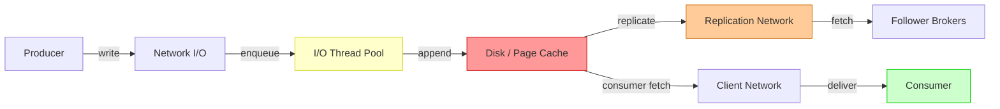
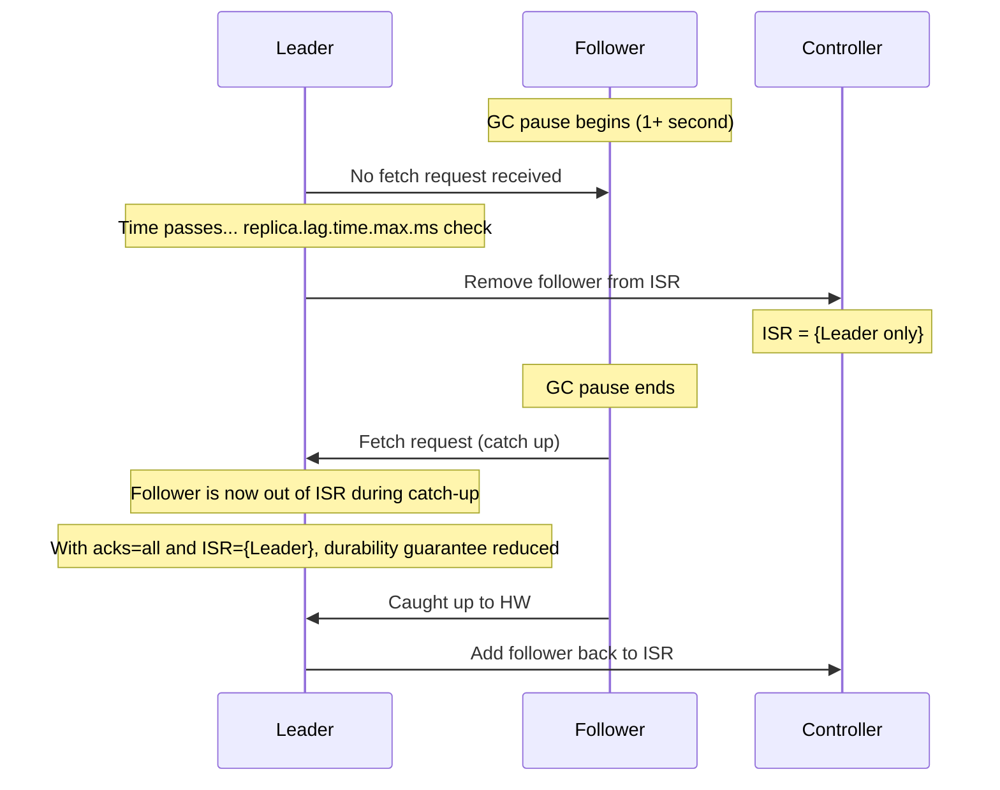
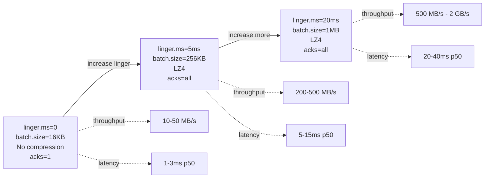
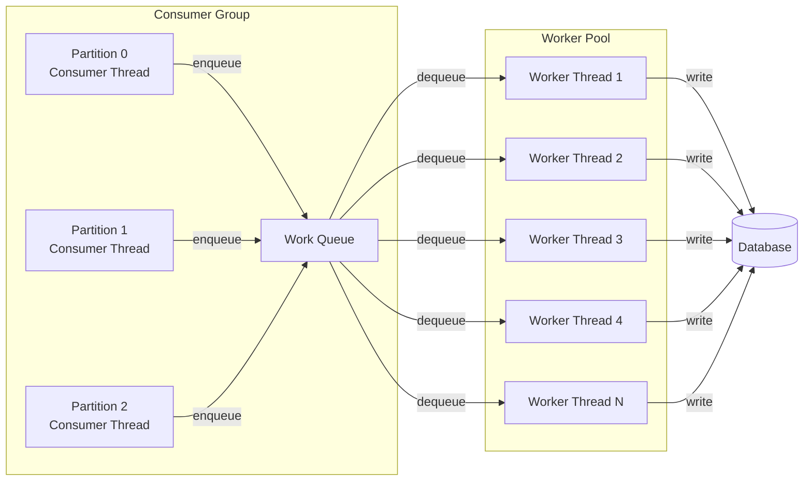

# Apache Kafka Deep Dive  Part 7: Performance Engineering  Throughput, Latency, and Tuning

---

**Series:** Apache Kafka Deep Dive  From First Principles to Planet-Scale Event Streaming
**Part:** 7 of 10
**Audience:** Senior backend engineers, distributed systems engineers, data platform architects
**Reading time:** ~45 minutes

---

## Prerequisites

Parts 0–6 of this series covered the theoretical and architectural foundations this article builds on directly:

- **Part 0**  Series orientation and the distributed log abstraction
- **Part 1**  Why Kafka exists: the log as a systems primitive
- **Part 2**  Broker architecture: network threads, I/O threads, request lifecycle
- **Part 3**  Replication protocol: ISR, leader election, acknowledgement semantics
- **Part 4**  Consumer group coordination and the rebalance protocol
- **Part 5**  Storage engine: segments, indexes, log compaction, retention
- **Part 6**  Producer internals: accumulator, sender, batching, idempotence, transactions

This article assumes fluency with all of the above. When a concept from a prior part is referenced here, it is not re-explained  only the performance implication is discussed.

---

## 1. Performance Mental Model: Finding the Bottleneck

### 1.1 The Bottleneck Principle

Every distributed system has a bottleneck  a single constraint that caps its total throughput. Kafka is no different. The cluster's maximum sustainable throughput equals the capacity of its slowest component.

This sounds obvious, but it has a non-obvious implication: **adding resources to non-bottleneck components produces zero throughput improvement**. Adding more brokers when the bottleneck is consumer processing capacity wastes money and complexity. Adding NVMe SSDs when the bottleneck is a 1 Gbps NIC produces no measurable difference.

Performance engineering starts not with tuning but with identification. You must locate the bottleneck before touching any configuration.

The four resource dimensions that Kafka saturates:

| Bottleneck | What it limits | Primary consumers |
|---|---|---|
| Disk I/O | Write throughput, log flush latency | Producer ingestion, log segment rotation |
| Network bandwidth | Replication throughput, client throughput | Replication, high-volume consumers |
| CPU | Compression/decompression speed, request parsing | Compressed topics, high message rate |
| Application | Consumer processing speed, poll() latency | Slow downstream systems, heavy processing |



The red node is where most production bottlenecks live. Identify which node is saturated before tuning anything else.

### 1.2 Identifying the Bottleneck: Diagnostic Tools

**Disk I/O saturation**  `iostat -x 1`:

```bash
iostat -x 1 10
```

Key columns to watch:

| Column | Meaning | Alarm threshold |
|---|---|---|
| `%iowait` | CPU time spent waiting for I/O | > 20% |
| `await` | Average I/O wait time (ms) | > 10ms (SSD), > 50ms (HDD) |
| `%util` | Device utilization | > 80% sustained |
| `r/s`, `w/s` | Read/write operations per second | Compare to device spec |
| `rMB/s`, `wMB/s` | Throughput | Compare to device spec |

**Network saturation**  `sar -n DEV 1`:

```bash
sar -n DEV 1 10
```

Compare `txkB/s` and `rxkB/s` to NIC advertised bandwidth. A 25 Gbps NIC saturates at approximately 3,000 MB/s (accounting for protocol overhead). If the sum of all Kafka traffic  producer writes + replication + consumer reads  approaches this, network is the bottleneck.

Kafka-native metric: `kafka.network:type=RequestMetrics,name=ResponseQueueTimeMs`  time a response spent waiting to be sent. High values mean the network thread cannot drain responses fast enough.

**CPU saturation**  `top` or `htop`:

Look for broker Java process CPU above 70%. Check what the CPU is doing with `perf top` or JVM profiling (async-profiler). Compression/decompression work from Part 6 (the sender's batch compression) appears as `LZ4.compress()` or `SnappyCompressor` time in profiles. High CPU with no compression configured usually means message parsing overhead.

**Application bottleneck**  consumer lag:

```bash
kafka-consumer-groups.sh --bootstrap-server localhost:9092 \
  --describe --group my-group
```

If `LAG` is growing monotonically, the consumer is slower than the producer. Check whether the bottleneck is in `poll()` itself (slow broker fetch), deserialization, or downstream processing (database write, HTTP call, computation).

### 1.3 The Four Bottlenecks and Their Symptoms

**Disk I/O bottleneck:**

- `%iowait` > 20% on broker hosts
- `await` > 10ms on SSDs (should be < 1ms for NVMe at normal load)
- Disk utilization > 80% sustained
- `kafka.log:type=LogFlushStats,name=LogFlushRateAndTimeMs` p99 spikes
- Producer `request-latency-avg` climbing without network cause

Typical causes: spinning HDD in a high-throughput cluster, RAID-5 write amplification, ext4 with `atime` enabled, page cache pressure from oversized heap.

**Network bottleneck:**

- NIC at or near line rate (check with `sar -n DEV`)
- Producer and consumer latency spikes that track with throughput increases
- `kafka.network:type=RequestMetrics,name=ResponseQueueTimeMs` p99 > 10ms
- Replication lag during peak ingestion windows (followers cannot fetch fast enough)
- `replica.lag.time.max.ms` violations and ISR shrinkage during high-throughput windows

Typical causes: 1 Gbps NIC in a 500 MB/s cluster, client and replication traffic sharing a single NIC, missing socket buffer tuning.

**CPU bottleneck:**

- Broker CPU > 70% sustained
- Compression/decompression routines in JVM profiler output
- `kafka.network:type=RequestMetrics,name=RequestQueueTimeMs` elevated  I/O threads falling behind
- GC pause duration increasing  heap pressure from large batches

Typical causes: per-message compression (compress in batches, not per-message  see Part 6), Snappy or ZSTD on high-throughput topics without hardware acceleration, insufficient I/O thread count.

**Application bottleneck:**

- Consumer lag grows during business hours, recovers off-peak
- `poll()` returns records but processing loop takes > `max.poll.interval.ms` / `max.poll.records`
- External database or HTTP endpoint latency visible in application traces
- Consumer CPU idles while processing waits on I/O

Typical cause: synchronous external calls inside the processing loop. The fix is architectural (async processing, work queues) not Kafka configuration.

### 1.4 Benchmarking Tools

Kafka ships with two performance testing scripts in its `bin/` directory. These are the canonical tools for establishing baseline throughput and latency before and after any tuning change.

**kafka-producer-perf-test.sh:**

```bash
kafka-producer-perf-test.sh \
  --topic perf-test \
  --num-records 10000000 \
  --record-size 1024 \
  --throughput -1 \
  --producer-props \
    bootstrap.servers=localhost:9092 \
    acks=all \
    compression.type=lz4 \
    batch.size=65536 \
    linger.ms=5
```

Parameters:

| Parameter | Meaning |
|---|---|
| `--num-records` | Total messages to produce |
| `--record-size` | Message payload size in bytes |
| `--throughput -1` | No rate limit  produce as fast as possible |
| `--throughput N` | Rate-limit to N records/second (for latency measurement at realistic load) |

**kafka-consumer-perf-test.sh:**

```bash
kafka-consumer-perf-test.sh \
  --bootstrap-server localhost:9092 \
  --topic perf-test \
  --messages 10000000 \
  --fetch-size 1048576 \
  --threads 1
```

Measures maximum consumer throughput for a single consumer. Run with `--threads N` to simulate a consumer group.

**What to measure:**

Always run baseline tests before any tuning changes. Run each test three times and take the median. Record:

1. Producer throughput at `--throughput -1` (maximum achievable)
2. Consumer throughput at `--throughput -1`
3. Producer p99 latency at a realistic sustained throughput (set `--throughput` to your expected production rate)
4. End-to-end latency (time-stamp messages with the producer, measure delta at consumer)

### 1.5 Interpreting Perf Test Output

A producer perf test run outputs:

```
5000000 records sent, 412345.6 records/sec (403.66 MB/sec), 2.34 ms avg latency,
156.00 ms max latency, 1 ms 50th, 4 ms 95th, 89 ms 99th, 142 ms 99.9th.
```

What each number means:

| Metric | Meaning | What it reveals |
|---|---|---|
| records/sec | Sustained throughput | Raw ingestion capacity |
| MB/sec | Byte throughput | Network and disk utilization |
| avg latency | Mean produce latency | General performance level |
| max latency | Single worst measurement | Outlier events (GC pause, fsync) |
| 50th percentile | Median latency | Typical user experience |
| 95th percentile | 95% of requests complete within | Service-level indicator baseline |
| 99th percentile | 99% of requests complete within | SLA compliance indicator |
| 99.9th percentile | 1 in 1000 requests latency | Tail latency (GC, disk flush events) |

The ratio of p99 to p50 is diagnostic. A ratio above 5x indicates periodic latency spikes  look for GC pauses, fsync events, or request queue buildup. A ratio of 2-3x is typical for a healthy cluster under load.

---

## 2. Disk I/O Tuning

### 2.1 Storage Hardware Choice

Kafka's I/O pattern  described in depth in Part 5  is almost entirely sequential: sequential appends to the active segment, sequential reads by consumers tailing the log. This pattern is highly favorable for SSDs and acceptable for HDDs at low throughput.

Throughput tiers by storage type:

| Hardware | Sequential write bandwidth | Random read IOPS | Kafka suitability |
|---|---|---|---|
| HDD (7200 RPM) | 100-200 MB/s | 100-200 | Low throughput only (< 100 MB/s per broker) |
| SATA SSD | 400-600 MB/s | 80,000 | Medium throughput (< 400 MB/s per broker) |
| NVMe SSD (PCIe 3.0) | 2,000-3,500 MB/s | 500,000+ | High throughput (< 2,000 MB/s per broker) |
| NVMe SSD (PCIe 4.0) | 5,000-7,000 MB/s | 1,000,000+ | Very high throughput |

For brokers handling more than 500 MB/s sustained write throughput, NVMe is the correct choice. The cost difference between NVMe and SATA SSD is small relative to the operational cost of managing more brokers to compensate for storage bottlenecks.

Kafka does not use random I/O for normal operation. Segment reads (from Part 5: the `.index` binary search followed by sequential scan) involve a small number of random reads for index lookups but these are typically served from page cache. The random IOPS column is relevant only for broker startup (index recovery) and consumer reads of cold data.

### 2.2 JBOD vs. RAID

Kafka's official recommendation is **JBOD (Just a Bunch of Disks)** with multiple disks per broker, configured via the `log.dirs` property:

```
log.dirs=/data/kafka/disk1,/data/kafka/disk2,/data/kafka/disk3,/data/kafka/disk4
```

Kafka distributes partitions across these directories, load-balancing I/O across all disks. This approach has several advantages:

- **No write amplification.** RAID-5 and RAID-6 require reading parity blocks and rewriting them on every write. For a 4+1 RAID-5 array, every logical write becomes 4 physical operations. Sequential write performance drops by 50-75% relative to JBOD.
- **Fault isolation.** A failed disk in JBOD takes only the partitions on that disk offline. In RAID-5/6, the entire array enters degraded mode and rebuild I/O competes with Kafka I/O. Kafka's replication handles data redundancy  you do not need storage-level redundancy.
- **Cost efficiency.** Raw disks are cheaper per TB than RAID controllers.

RAID-10 (mirroring + striping) is acceptable if policy requires it: it has no write amplification penalty and delivers full sequential write bandwidth. However, it costs 2x the disk capacity for what Kafka's own replication already provides.

RAID-5 and RAID-6 are actively harmful for Kafka and should not be used.

### 2.3 Filesystem Choice

**ext4** and **XFS** are both suitable for Kafka. The choice matters at the margins.

**ext4 configuration:**

```
# /etc/fstab
/dev/nvme0n1 /data/kafka/disk1 ext4 defaults,noatime,data=writeback 0 2
```

The `data=writeback` option disables journaling of file data (metadata is still journaled). This improves write throughput at the cost of potential file corruption if the system crashes between a data write and its metadata journal entry. For Kafka, this is acceptable: Kafka's own replication provides durability, and a crashed broker recovers from replicas anyway.

**XFS** handles large files better than ext4 and uses extent-based allocation that reduces fragmentation in Kafka's large segment files. At very high throughput (> 1 GB/s per disk), XFS typically outperforms ext4 by 10-15%.

```
# /etc/fstab
/dev/nvme0n1 /data/kafka/disk1 xfs defaults,noatime,largeio,inode64 0 2
```

The `largeio` option sets the preferred I/O size to the filesystem stripe unit, improving sequential throughput. The `inode64` option allows inode allocation anywhere on the disk, preventing inode exhaustion on large filesystems.

### 2.4 The `noatime` Mount Option

Every file read on a Linux filesystem normally triggers a metadata write: the file's `atime` (access time) field is updated. For Kafka, which reads heavily from the OS page cache (zero-copy sends as described in Part 2), this means every consumer fetch triggers a disk write for atime metadata  even though the data itself was served from memory.

The `noatime` option disables atime updates entirely:

```
noatime  # disables all atime updates
```

Alternatively, `relatime` updates atime only when the current atime is older than the modification time  this satisfies most applications that depend on atime semantics while eliminating the constant update overhead.

In benchmarks on busy Kafka brokers, `noatime` reduces disk write IOPS by 10-20% on SATA SSDs. On NVMe the improvement is less dramatic but still measurable at high message rates.

### 2.5 Swappiness

The `vm.swappiness` kernel parameter controls how aggressively Linux swaps anonymous memory (heap, stack) to disk when physical RAM is under pressure.

```bash
# Set at runtime
sysctl -w vm.swappiness=1

# Persist across reboots
echo 'vm.swappiness=1' >> /etc/sysctl.conf
```

For Kafka brokers, set `vm.swappiness=1` (not 0). Here is why:

- **Value 0:** Linux avoids swap entirely. If the broker runs out of RAM, the OOM killer terminates the JVM process. Kafka recovers via re-election and log recovery. This is acceptable.
- **Value 1:** Linux uses swap only as a last resort before OOM-killing. This provides a small safety margin without allowing swap to degrade performance.
- **Value 60 (default):** Linux aggressively swaps. On a broker with 64GB RAM and a 6GB heap, the JVM heap can be partially swapped while 58GB of page cache sits in memory  because the kernel overestimates the heap's "coldness". When the GC runs and accesses swapped heap pages, GC pauses extend from milliseconds to seconds. This is catastrophic for ISR stability (see Section 4.3).

The Kafka page cache (described in Part 5) is anonymous from the application perspective but is managed by the kernel as file-backed memory, which the kernel handles separately from swappiness. Reducing swappiness protects heap and JVM internals from being swapped, which is the correct behavior.

### 2.6 Dirty Page Flushing

When Kafka writes to the log (an `mmap` + `FileChannel.write()` as described in Part 5), data initially lands in the page cache as dirty pages  pages that differ from their on-disk version. The kernel flushes dirty pages to disk asynchronously.

Two kernel parameters control this behavior:

```bash
sysctl -w vm.dirty_ratio=80
sysctl -w vm.dirty_background_ratio=5
```

| Parameter | Meaning | Kafka-appropriate value |
|---|---|---|
| `vm.dirty_background_ratio` | % of RAM at which background flush starts | 5% |
| `vm.dirty_ratio` | % of RAM at which writes **block** waiting for flush | 80% |

The large gap between these values (5% and 80%) serves Kafka in two ways:

1. **Write burst absorption.** Kafka often receives message bursts (batch sends from producers). The large dirty_ratio allows these bursts to be absorbed into the page cache without blocking. The background flusher (starting at 5%) drains the cache between bursts.

2. **Sequential write coalescing.** The kernel's background flusher writes dirty pages in large sequential batches, which is efficient. If dirty_ratio is too low (e.g., the default 20%), bursts cause synchronous flushes that fragment I/O.

On a broker with 128GB RAM and 80% dirty_ratio, up to 102GB of dirty pages can accumulate before writes block. In practice, the background flusher (5% threshold = 6.4GB) keeps dirty pages well below this level. The 80% limit is a safety valve against pathological scenarios.

### 2.7 Disk I/O Scheduler

The Linux I/O scheduler reorders disk requests to improve efficiency. For spinning disks, the CFQ (Completely Fair Queuing) scheduler provides good performance by ordering requests to minimize seek distance. For SSDs, this reordering adds latency with no benefit  SSDs have near-zero seek time and handle random I/O as efficiently as sequential.

```bash
# Check current scheduler for a device
cat /sys/block/nvme0n1/queue/scheduler

# Set for NVMe/SSD
echo none > /sys/block/nvme0n1/queue/scheduler
# or
echo mq-deadline > /sys/block/nvme0n1/queue/scheduler
```

Recommended schedulers by device type:

| Device | Recommended scheduler | Reasoning |
|---|---|---|
| NVMe SSD | `none` (no-op) | NVMe has internal queuing (NCQ); kernel reordering interferes |
| SATA SSD | `mq-deadline` | Ensures fairness without CFQ overhead |
| HDD | `mq-deadline` or `bfq` | Deadline prevents starvation; bfq is better for mixed workloads |

To persist across reboots, create a udev rule:

```bash
# /etc/udev/rules.d/60-kafka-ioscheduler.rules
ACTION=="add|change", KERNEL=="nvme[0-9]*", ATTR{queue/scheduler}="none"
ACTION=="add|change", KERNEL=="sd[a-z]", ATTR{queue/rotational}=="0", ATTR{queue/scheduler}="mq-deadline"
```

---

## 3. Network Tuning

### 3.1 Socket Buffer Sizes

The Linux TCP socket buffers determine how much data can be in flight between sender and receiver. For high-throughput Kafka, the default buffer sizes (approximately 200KB) become a bottleneck: with a 1ms RTT between producer and broker, the bandwidth-delay product is:

```
bandwidth × RTT = 10,000 MB/s × 0.001s = 10 MB
```

A 200KB socket buffer caps throughput at 200 MB/s regardless of NIC bandwidth. This is why default-configured Linux hosts cannot achieve line-rate Kafka throughput even with 25 Gbps NICs.

```bash
# Add to /etc/sysctl.conf
net.core.rmem_default = 134217728    # 128MB receive buffer default
net.core.wmem_default = 134217728    # 128MB send buffer default
net.core.rmem_max = 134217728        # 128MB receive buffer maximum
net.core.wmem_max = 134217728        # 128MB send buffer maximum

# Apply immediately
sysctl -p
```

These settings set the default and maximum socket buffer sizes system-wide. With 128MB buffers and 1ms RTT, the bandwidth-delay product supports up to 128 GB/s  far above any NIC Kafka runs on today.

### 3.2 TCP Tuning

```bash
# /etc/sysctl.conf additions for Kafka brokers
net.ipv4.tcp_window_scaling = 1        # Enable window scaling (usually default on)
net.ipv4.tcp_syn_retries = 2           # Reduce SYN retry delay (default 6)
net.ipv4.tcp_retries2 = 5             # Reduce retransmission before giving up (default 15)
net.ipv4.tcp_slow_start_after_idle = 0 # Don't reset cwnd after idle periods
```

`tcp_retries2` deserves special attention. The default value of 15 means Linux retries TCP retransmissions for approximately 13-30 minutes before declaring the connection dead. During this time, Kafka's producer or consumer believes it is connected to a broker that is actually unreachable. Reducing to 5 means dead connections are detected in approximately 60-90 seconds  still a long time, but much better than the default for broker failure detection.

`tcp_slow_start_after_idle` = 0 prevents TCP from resetting its congestion window after a period of inactivity. Without this setting, a Kafka consumer that has been idle (no messages to consume) restarts TCP slow start when messages arrive, causing a throughput ramp-up period before reaching full speed.

### 3.3 Kafka Socket Configuration

```properties
# server.properties
socket.send.buffer.bytes=-1        # Use OS default (tuned above)
socket.receive.buffer.bytes=-1     # Use OS default (tuned above)
socket.request.max.bytes=104857600 # 100MB max request size
```

Setting these to `-1` instructs Kafka to use the OS socket buffer defaults, which you have already tuned to 128MB. Alternatively, set explicitly:

```properties
socket.send.buffer.bytes=67108864    # 64MB
socket.receive.buffer.bytes=67108864 # 64MB
```

Note the asymmetry between the OS-level buffer (128MB) and the Kafka socket config (64MB): the OS buffer accounts for multiple concurrent sockets on the same server, while the Kafka config controls per-socket sizing. On a broker with 1,000 concurrent producer connections, 1,000 × 64MB = 64GB of kernel socket buffer memory is theoretically allocatable  the OS manages this dynamically and does not actually allocate full buffers unless they are used.

### 3.4 Network Thread Tuning

From Part 2: Kafka's request lifecycle involves network threads (acceptors + handlers) that read requests from sockets and place them on the request queue, and I/O threads that dequeue and process them.

`num.network.threads` (default 3) controls the network handler threads. Each handler thread handles multiple connections via Java NIO, so 3 threads can manage thousands of connections. However, under very high request rates (> 500,000 requests/sec), 3 threads can become a bottleneck.

Diagnostic metric: `kafka.network:type=RequestMetrics,name=RequestQueueTimeMs`

If this metric's p99 exceeds 5ms at your operating load, network threads are insufficient. Increase:

```properties
num.network.threads=16  # Appropriate for brokers handling > 100,000 requests/sec
```

Typical values by throughput tier:

| Throughput | Recommended `num.network.threads` |
|---|---|
| < 100 MB/s | 3 (default) |
| 100-500 MB/s | 8 |
| 500 MB/s - 2 GB/s | 16 |
| > 2 GB/s | 24-32 |

### 3.5 I/O Thread Tuning

`num.io.threads` (default 8) controls the threads that process requests from the request queue. I/O threads perform the actual disk appends, index lookups, and fetch reads. Because each I/O thread may block on disk I/O, having more threads enables more concurrent disk operations.

```properties
num.io.threads=32  # Appropriate for NVMe SSDs with high IOPS
```

Diagnostic metric: `kafka.server:type=KafkaRequestHandlerPool,name=RequestHandlerAvgIdlePercent`

If this metric drops below 30%, I/O threads are saturated. Increase `num.io.threads`. Note that adding I/O threads beyond the storage system's IOPS capacity produces no further improvement  the bottleneck shifts back to disk.

| Storage type | Recommended `num.io.threads` |
|---|---|
| HDD | 8-16 |
| SATA SSD | 16-32 |
| NVMe SSD | 32-64 |
| Multiple NVMe SSDs | 64-128 |

### 3.6 Separating Replication and Client Traffic

Replication traffic (followers fetching from the leader  described in Part 3) competes with producer and consumer traffic on the same NIC. During high ingestion periods, replication can consume a significant fraction of NIC bandwidth, causing ISR lag and consumer latency spikes.

Strategies to separate this traffic:

**Separate listener configuration:**

```properties
# server.properties
listeners=PLAINTEXT://0.0.0.0:9092,REPLICATION://0.0.0.0:9093
advertised.listeners=PLAINTEXT://kafka-1.internal:9092,REPLICATION://kafka-1-repl.internal:9093
```

Bind each listener to a separate NIC by assigning the advertised listener addresses to different network interfaces. This requires network-level routing but completely separates client and replication traffic.

**Replication throttling during partition reassignment:**

When adding brokers or rebalancing partitions, the initial replication of existing data can saturate network bandwidth. Throttle this:

```bash
kafka-configs.sh --bootstrap-server localhost:9092 \
  --alter \
  --entity-type brokers \
  --entity-name 0 \
  --add-config follower.replication.throttled.rate=52428800,leader.replication.throttled.rate=52428800
```

This limits reassignment replication to 50 MB/s per broker, leaving client traffic unaffected during the reassignment window.

---

## 4. JVM and Garbage Collection Tuning

### 4.1 Heap Sizing

The counterintuitive truth about Kafka heap sizing: **more heap is worse above a threshold**.

Kafka's architecture (from Part 5) deliberately delegates data caching to the OS page cache rather than application-level heap structures. The broker stores no message data in heap  the log segments are memory-mapped or zero-copied directly between the kernel's page cache and the network socket. JVM heap stores only metadata: topic/partition maps, ISR state, consumer group assignments, and object allocations from the request processing pipeline.

Heap sizing recommendations:

| Server RAM | Kafka heap size | Page cache available |
|---|---|---|
| 32 GB | 4-6 GB | 26-28 GB |
| 64 GB | 6-8 GB | 56-58 GB |
| 128 GB | 6-8 GB | 120-122 GB |
| 256 GB | 8-10 GB | 246-248 GB |

The heap does not scale with server RAM. Giving a 128GB broker a 32GB heap does not improve performance  it reduces page cache by 24GB (because the JVM heap is reserved RAM unavailable to the kernel) and produces dramatically longer GC pause times.

### 4.2 GC Algorithm Options

**G1GC  recommended for Kafka < 3.x or JDK < 15:**

```bash
export KAFKA_JVM_PERFORMANCE_OPTS="-XX:+UseG1GC \
  -XX:MaxGCPauseMillis=20 \
  -XX:InitiatingHeapOccupancyPercent=35 \
  -XX:G1HeapRegionSize=16M \
  -XX:+ParallelRefProcEnabled \
  -XX:+DisableExplicitGC"
```

`MaxGCPauseMillis=20` is a target, not a guarantee. G1GC will attempt to limit pauses to 20ms but will exceed this during full GC events or when the old generation is close to exhaustion. `InitiatingHeapOccupancyPercent=35` starts concurrent marking when the old generation reaches 35%, giving G1 time to complete marking before the old generation fills. Lower values cause more frequent concurrent GC (slightly higher CPU, lower pause risk); higher values risk triggering full GC.

`G1HeapRegionSize=16M`  larger regions reduce region count and the metadata overhead G1 maintains per region. For a 6GB heap, 16MB regions produce 384 regions  a manageable number.

**ZGC  recommended for Kafka 3.x+ on JDK 15+:**

```bash
export KAFKA_JVM_PERFORMANCE_OPTS="-XX:+UseZGC \
  -XX:MaxGCPauseMillis=10 \
  -XX:ConcGCThreads=4"
```

ZGC is a concurrent, low-latency garbage collector that achieves sub-millisecond pause times regardless of heap size. It does this by performing almost all GC work concurrently with application threads, using load barriers to handle concurrent object relocation.

ZGC trade-offs:

| Aspect | G1GC | ZGC |
|---|---|---|
| GC pause time | 10-100ms typical, seconds possible | < 1ms consistent |
| Throughput overhead | ~5-10% | ~10-15% |
| CPU overhead | Moderate | Higher (concurrent threads) |
| JDK requirement | JDK 8+ | JDK 15+ (production-ready in JDK 17) |
| Best for | Default; JDK 8/11 environments | Latency-sensitive, JDK 17+ |

For latency-sensitive Kafka deployments targeting p99 < 5ms, ZGC is the correct choice. For maximum throughput where p99 latency is not critical, G1GC's lower CPU overhead may yield better raw throughput.

### 4.3 GC Pause Impact on ISR Stability

This is the most operationally significant JVM behavior for Kafka. Understanding the causal chain from GC pause to ISR shrinkage prevents misdiagnosing "Kafka instability" as a networking or configuration problem when the root cause is JVM garbage collection.



The sequence:

1. A GC pause (1+ second) on a follower broker causes the follower to stop sending fetch requests to the leader.
2. The leader tracks the last fetch time per follower. After `replica.lag.time.max.ms` (default 30,000ms) with no fetch, the leader notifies the controller to remove the follower from the ISR.
3. With the follower out of ISR, `acks=all` producers now only require acknowledgement from the leader  ISR size = 1 means `acks=all` degrades to effective `acks=1`.
4. If the leader also experiences a GC pause (or crashes), any data acknowledged but not yet replicated is lost  exactly the scenario `acks=all` was meant to prevent.

The mitigation: ZGC (sub-millisecond pauses eliminate the problem) or ensuring `replica.lag.time.max.ms` is much larger than maximum GC pause duration with G1GC.

Alert threshold: GC p99 pause > 500ms on any broker. At this level, brief network hiccups could combine with GC to push the follower out of ISR.

### 4.4 GC Monitoring

Enable GC logging in `KAFKA_JVM_PERFORMANCE_OPTS`:

```bash
-Xlog:gc*:file=/var/log/kafka/gc.log:time,uptime:filecount=10,filesize=20M
```

This produces rolling GC logs (10 × 20MB files) with timestamps. Feed these into a GC analysis tool:

- **GCViewer**  open source, visualizes pause distribution
- **GCEasy**  web-based analysis with recommendations
- **Prometheus JMX Exporter**  `jvm_gc_collection_seconds` for real-time alerting

Key GC metrics to export to Prometheus:

```yaml
# Prometheus alert rules
- alert: KafkaGCPauseHigh
  expr: kafka_jvm_gc_pause_seconds{quantile="0.99"} > 0.5
  for: 5m
  annotations:
    summary: "Kafka GC p99 pause > 500ms  ISR instability risk"

- alert: KafkaFullGC
  expr: increase(kafka_jvm_gc_full_collections_total[5m]) > 0
  annotations:
    summary: "Full GC detected  immediate investigation required"
```

### 4.5 Direct Memory

Kafka's network layer (from Part 2: the `Selector` and `KafkaChannel` network stack) allocates Java NIO `ByteBuffer`s for network I/O. When `java.nio.ByteBuffer.allocateDirect()` is called, memory is allocated outside the JVM heap  in the JVM's off-heap "direct memory" region.

Direct memory is not subject to GC pauses but has its own limits:

```bash
-XX:MaxDirectMemorySize=2G
```

If direct memory is exhausted, the JVM throws `java.lang.OutOfMemoryError: Direct buffer memory`. This crash does not produce a heap dump (the heap is fine) and does not trigger the normal OOM handling  the JVM exits immediately. Without explicit monitoring, this looks like a silent broker crash.

Sizing: with `num.network.threads=16` and large socket buffers, direct memory usage per broker can reach 512MB-1GB. Set `MaxDirectMemorySize` to at least 2GB on high-throughput brokers. Monitor with:

```bash
# JVM direct buffer usage via JMX
java.nio:type=BufferPool,name=direct
```

### 4.6 File Descriptor Limits

Each Kafka log segment requires three file descriptors:
- `.log`  the data file
- `.index`  the offset index
- `.timeindex`  the timestamp index

With large deployments, this adds up rapidly:

```
4,000 partitions × 10 segments each × 3 FDs = 120,000 file descriptors
```

Add to this: each client connection (producer + consumer) requires a file descriptor. A broker with 1,000 clients and 120,000 segment FDs needs 121,000+ FDs.

Default Linux limits are typically 65,536 per process  insufficient.

```bash
# /etc/security/limits.conf
kafka   soft   nofile   1000000
kafka   hard   nofile   1000000

# /etc/sysctl.conf
fs.file-max=2097152

# Apply immediately
sysctl -w fs.file-max=2097152
ulimit -n 1000000  # for current session
```

Verify at runtime:

```bash
# Check Kafka's current FD count
ls /proc/$(pgrep -f kafka.Kafka)/fd | wc -l

# Check the limit
cat /proc/$(pgrep -f kafka.Kafka)/limits | grep 'open files'
```

Alert when FD utilization exceeds 70% of the limit  approaching the limit causes `Too many open files` errors that manifest as failed replication and client disconnections.

---

## 5. Producer Performance Tuning

### 5.1 The Throughput-Latency Dial

From Part 6: the producer accumulator batches records before sending. The two primary controls  `linger.ms` and `batch.size`  define a dial between two extremes:

- **linger.ms=0, batch.size=small** → minimum latency, low throughput (send every record immediately, no batching)
- **linger.ms=large, batch.size=large** → maximum throughput, high latency (accumulate large batches, amortize network round trips)



No single configuration is correct. Choose based on your application's latency SLA.

### 5.2 High Throughput Producer Configuration

Optimized for maximum records/sec, where latency of 20-50ms is acceptable:

```properties
# High throughput producer configuration
batch.size=1048576                          # 1MB batches
linger.ms=20                               # Wait 20ms to fill batch
compression.type=lz4                        # LZ4: best throughput/compression ratio
acks=all                                    # Maintain durability guarantee
buffer.memory=67108864                     # 64MB producer buffer
max.in.flight.requests.per.connection=5    # 5 in-flight batches per broker
enable.idempotence=true                    # Exactly-once semantics from Part 6

# Advanced tuning
send.buffer.bytes=131072                   # 128KB TCP send buffer (per-socket override)
receive.buffer.bytes=65536                 # 64KB TCP receive buffer
request.timeout.ms=30000                   # 30s timeout for broker ack
delivery.timeout.ms=120000                 # 2 minutes total delivery timeout
```

Why `compression.type=lz4` specifically: LZ4 is the best choice for Kafka's combination of high message rate and mixed content types.

| Codec | Compression ratio | Compression CPU | Decompression CPU | Best for |
|---|---|---|---|---|
| none | 1.0x | None | None | Already compressed content |
| lz4 | 2-4x | Low | Very low | High throughput, general use |
| snappy | 2-4x | Low | Low | Similar to LZ4, Google ecosystem |
| zstd | 3-7x | Medium | Low | Storage-constrained, batch workloads |
| gzip | 3-6x | High | Medium | Legacy compatibility, not recommended |

For `max.in.flight.requests.per.connection=5` with `enable.idempotence=true`: from Part 6, idempotence allows up to 5 in-flight requests without reordering risk (the producer sequence numbers allow gap detection). This enables pipelining without sacrificing ordering guarantees.

### 5.3 Low Latency Producer Configuration

Optimized for minimum p99 latency, where throughput of 10-100 MB/s is acceptable:

```properties
# Low latency producer configuration
batch.size=16384                           # 16KB, fills quickly
linger.ms=0                               # Send immediately, don't accumulate
compression.type=none                      # Eliminate compression overhead
acks=1                                     # Reduce ack round-trips (one replica)
max.in.flight.requests.per.connection=1   # Strict ordering, no pipelining
max.block.ms=1000                         # Fail fast if producer buffer full
request.timeout.ms=5000                   # Short timeout for fast failure detection
delivery.timeout.ms=15000                 # 15s total delivery timeout
```

Note the durability trade-off in `acks=1`: if the leader crashes after acknowledging but before replication, the message is lost. For latency-sensitive applications that require both low latency and strong durability, use `acks=all` with ISR = {leader only} awareness, or invest in ZGC and NVMe to reduce the actual latency of `acks=all`.

### 5.4 Partition Count Impact on Producer Throughput

From Part 6: the producer accumulator maintains one `RecordBatch` per partition. With N partitions in a topic, the producer maintains N in-progress batches simultaneously.

The throughput relationship:

```
producer_throughput = min(
  sum(partition_throughputs),    # parallelism benefit
  batch.size × partitions / linger.ms,  # batching efficiency
  buffer.memory / (avg_record_size × partitions)  # buffer availability
)
```

Throughput scales with partition count until:
1. The producer's `buffer.memory` is divided across too many partitions (each partition gets a smaller fraction of buffer, reducing effective batch size)
2. The number of partitions exceeds the number of brokers × I/O threads (no more physical parallelism to exploit)
3. Each partition's batch fills in less than `linger.ms` (throughput limited by message rate, not batching)

Practical guideline: throughput scales roughly linearly with partition count up to `buffer.memory / batch.size` partitions. With 64MB buffer and 1MB batches, throughput scales up to approximately 64 partitions before buffer contention reduces batch sizes.

### 5.5 Serialization Cost

At high message rates, serialization CPU cost can equal or exceed Kafka I/O cost. Consider: at 1,000,000 messages/second with 1KB JSON payloads:

- JSON serialization: ~200ns per message × 1,000,000 = 200ms of CPU time per second = 0.2 CPU cores at 100% utilization
- But JSON involves reflection, String allocation, and escape processing  real-world cost is 400-800ns per message at 1KB
- At 1M msg/sec: 0.4-0.8 CPU cores fully consumed by serialization alone
- At 5M msg/sec (not unusual for aggregated producers): 2-4 CPU cores

Binary schema-based serialization comparison:

| Format | Serialization time (1KB message) | Relative cost | Notes |
|---|---|---|---|
| JSON (Jackson) | 400-800ns | 1.0x (baseline) | Reflection, string processing |
| Avro (specific) | 50-100ns | 0.1x | Schema-compiled, no reflection |
| Protobuf | 40-80ns | 0.08x | Binary, field-number based |
| Avro (generic) | 200-400ns | 0.5x | Schema at runtime, some overhead |
| Thrift | 60-120ns | 0.15x | Similar to Protobuf |

For producers handling > 500,000 messages/second, moving from JSON to Avro or Protobuf can recover 2-4 CPU cores, which can be used to increase `num.io.threads` and batch throughput instead.

The Confluent Schema Registry (used with Avro and Protobuf) adds a schema ID lookup per message type but caches schemas  amortized cost is negligible after warm-up.

---

## 6. Consumer Performance Tuning

### 6.1 `fetch.min.bytes`  Batching Fetches

`fetch.min.bytes` (default 1) controls how much data the broker accumulates before sending a fetch response. With the default value of 1, the broker sends a response as soon as any data is available  potentially sending thousands of small responses for individual messages.

For throughput workloads, increase `fetch.min.bytes`:

```properties
fetch.min.bytes=1048576    # Wait until 1MB is available before responding
fetch.max.wait.ms=1000     # But don't wait longer than 1 second
```

The effect: instead of 1,000 fetch requests/second returning 1KB each, the consumer sends 1 fetch request/second receiving 1MB. Network round-trip overhead drops 1,000x. For a consumer processing 100MB/s, this reduces broker-side fetch handling from 100,000 requests/second to 100 requests/second.

For latency-sensitive consumers, keep `fetch.min.bytes=1`  any data available is returned immediately.

### 6.2 `fetch.max.wait.ms`  Fetch Wait Bound

`fetch.max.wait.ms` (default 500ms) is the upper bound on how long the broker waits for `fetch.min.bytes` to be satisfied. If `fetch.min.bytes=1MB` but the topic only produces 100KB/second, the broker would wait up to `fetch.max.wait.ms` before returning 100KB.

These two settings work together:

```
response_time = min(time_to_accumulate_fetch.min.bytes, fetch.max.wait.ms)
```

For high-throughput topics: `fetch.min.bytes=1MB`, `fetch.max.wait.ms=1000ms`  reduces round trips without causing long idle waits.

For latency-sensitive topics: `fetch.min.bytes=1`, `fetch.max.wait.ms=100ms`  always respond quickly.

For mixed topics: `fetch.min.bytes=64KB`, `fetch.max.wait.ms=500ms`  balanced.

### 6.3 `max.partition.fetch.bytes`  Per-Partition Response Size

`max.partition.fetch.bytes` (default 1,048,576 = 1MB) limits the data returned per partition in a single fetch response. The total fetch response size is bounded by `fetch.max.bytes` (default 52,428,800 = 50MB) across all partitions.

When messages are large:

```
average_message_size = 500KB
max.partition.fetch.bytes = 1MB (default)
messages_per_fetch = 1MB / 500KB = 2 messages per fetch cycle
```

At `fetch.max.wait.ms=500ms`, this consumer processes 4 messages/second  clearly inadequate for a topic with 100 messages/second.

Fix:

```properties
max.partition.fetch.bytes=10485760   # 10MB per partition
fetch.max.bytes=104857600            # 100MB total per fetch
```

For topics with variable message sizes, set `max.partition.fetch.bytes` to at least 10x the 99th percentile message size to ensure full fetch cycles.

### 6.4 `max.poll.records`  Processing Flow Control

`max.poll.records` (default 500) controls the maximum records returned by a single `poll()` call. This is a flow control mechanism, not a throughput mechanism  it controls how many records the consumer processes between heartbeats.

The interaction with `max.poll.interval.ms` (default 300,000ms) from Part 4: if processing `max.poll.records` records takes longer than `max.poll.interval.ms`, the coordinator removes the consumer from the group, triggering a rebalance.

```
max_processing_time_per_poll < max.poll.interval.ms
max.poll.records = max.poll.interval.ms / (processing_time_per_record)

# Example: 100ms processing per record, 300s interval
max.poll.records = 300,000ms / 100ms = 3,000 records maximum
# Be conservative: set to 1,000
```

Tuning direction:

| Scenario | `max.poll.records` | Reasoning |
|---|---|---|
| Fast processing (< 1ms/record) | 2000-5000 | Maximize batch size for efficiency |
| Medium processing (1-10ms/record) | 200-500 | Balance batch size and interval compliance |
| Slow processing (> 100ms/record) | 10-50 | Avoid max.poll.interval.ms violations |
| External I/O in processing loop | 10-100 | I/O latency is unpredictable |

### 6.5 Consumer Parallelism

The fundamental constraint from Part 4: within a consumer group, each partition is assigned to exactly one consumer. Maximum parallelism = partition count.

```
effective_parallelism = min(consumer_instances, partition_count)
```

Implications:

1. A consumer group with 32 consumers but 8 partitions: 24 consumers are idle. Wasted resources.
2. A consumer group with 8 consumers but 32 partitions: each consumer handles 4 partitions. Each consumer's throughput is the sum of its 4 partitions' throughput.
3. To increase parallelism beyond current consumer count: increase partitions (requires topic recreation or online partition addition) then add consumers.

**Note on partition count permanence:** partitions can be added but not removed. Increasing partitions changes the hash-based routing of keyed messages  keys that previously mapped to partition 3 may now map to partition 17. Applications relying on key-based ordering across the entire topic (not just per-partition) must handle this transition.

### 6.6 Processing Parallelism Pattern

For consumers where processing is slow relative to I/O (database writes, HTTP calls, heavy computation), the single-threaded poll loop becomes the bottleneck. The standard pattern is to decouple Kafka I/O from processing:



The consumer threads (one per partition) are responsible only for Kafka I/O: polling records and enqueuing to the work queue. Worker threads process without blocking the Kafka poll loop. The work queue backpressure (`queue.remainingCapacity() == 0`) pauses consumer threads, allowing the Kafka heartbeat to continue while processing catches up  avoiding rebalance triggering from slow processing.

Committing offsets in this pattern requires care: offsets should only be committed after the corresponding records have been fully processed by worker threads. An unprocessed-offset tracker (per partition, minimum unacked offset) ensures exactly-once or at-least-once semantics are maintained.

---

## 7. Broker Performance Tuning

### 7.1 Replication Fetch Size

From Part 3: followers send `FetchRequest`s to leaders to replicate data. `replica.fetch.max.bytes` (default 1,048,576 = 1MB) controls the maximum bytes a follower fetches per request.

Under high write load, followers can fall behind if they cannot fetch data as fast as it is produced. Symptoms: growing follower lag, ISR shrinkage during peak hours.

```properties
replica.fetch.max.bytes=10485760    # 10MB per fetch
```

The follower fetch pipeline:

```
follower_replication_throughput = replica.fetch.max.bytes / replica.fetch.wait.max.ms × 1000
# With defaults: 1MB / 500ms × 1000 = 2 MB/s per follower (pathetically low)
# With tuned values: 10MB / 500ms × 1000 = 20 MB/s per follower
# For 500 MB/s write rate with RF=3: each follower needs 500 MB/s
# Required: replica.fetch.max.bytes = 500MB per fetch  too large
# Solution: reduce replica.fetch.wait.max.ms = 10ms
#   10MB / 10ms × 1000 = 1 GB/s per follower  sufficient
```

### 7.2 Follower Fetch Wait Time

`replica.fetch.wait.max.ms` (default 500ms)  the follower's long-poll timeout. The follower sends a `FetchRequest` and waits up to this value for data before returning an empty response.

The interaction with `replica.fetch.max.bytes` determines replication throughput. For high-throughput brokers:

```properties
replica.fetch.wait.max.ms=10    # 10ms  fetch more frequently
replica.fetch.max.bytes=10485760  # 10MB per fetch
```

This allows followers to replicate at up to 1 GB/s per follower (10MB every 10ms). For a write rate of 500 MB/s with RF=3, this provides 2x headroom for replication.

**Caution:** reducing `replica.fetch.wait.max.ms` increases the number of fetch requests per second from followers, increasing broker CPU and I/O thread load. Monitor `kafka.server:type=KafkaRequestHandlerPool,name=RequestHandlerAvgIdlePercent` after this change.

### 7.3 Log Flush Policy

Kafka's durability model (from Part 3 and Part 5) relies on **replication, not fsync**. The log flush settings control how frequently Kafka explicitly calls `fsync()` on log segments, forcing dirty pages from the page cache to disk.

The correct production configuration:

```properties
log.flush.interval.messages=9223372036854775807   # Long.MAX_VALUE  never
log.flush.interval.ms=9223372036854775807          # Long.MAX_VALUE  never
```

This tells Kafka to never explicitly fsync. The OS page cache manages flushing via the dirty page settings from Section 2.6. Data safety comes from having multiple replicas  if a broker crashes before the OS flushes a dirty page, the data is already on the leader's other ISR members.

Why explicit fsync destroys performance: `fsync()` is a synchronous operation that blocks until all dirty pages for the file are written to durable storage. On an HDD, this can take 5-50ms. If every Kafka write triggers an fsync, maximum throughput is limited to:

```
fsync_throughput = segment_size / fsync_duration
= 1GB / 20ms = 50 GB/s  # NVMe  fsync is fast, acceptable
= 1GB / 5000ms = 200 MB/s  # HDD  fsync takes seconds, devastating
```

On HDD-based brokers, enabling `log.flush.interval.messages=1` (fsync every message) reduces throughput by 100-1000x. On NVMe, it is less catastrophic but still unnecessary given replication durability.

**Exception:** single-replica topics (`replication.factor=1`) may benefit from periodic fsync if data loss is unacceptable. But single-replica topics should not be used for important data.

### 7.4 Replication Throttling

During partition reassignment (adding brokers, rebalancing leaders), Kafka copies existing data between brokers. For a broker with 10TB of data, this represents 10TB of network I/O that competes with live production traffic.

Apply throttling before initiating reassignment:

```bash
# Throttle leader replication outbound on broker 0
kafka-configs.sh --bootstrap-server localhost:9092 \
  --alter \
  --entity-type brokers \
  --entity-name 0 \
  --add-config leader.replication.throttled.rate=52428800

# Throttle follower replication inbound on broker 1 (the destination)
kafka-configs.sh --bootstrap-server localhost:9092 \
  --alter \
  --entity-type brokers \
  --entity-name 1 \
  --add-config follower.replication.throttled.rate=52428800
```

52,428,800 bytes/second = 50 MB/s. This allows reassignment to complete while consuming only 50 MB/s of network bandwidth  leaving 25 Gbps - 400 Mbps = ~24.6 Gbps for production traffic.

Remove throttling after reassignment completes:

```bash
kafka-configs.sh --bootstrap-server localhost:9092 \
  --alter \
  --entity-type brokers \
  --entity-name 0 \
  --delete-config leader.replication.throttled.rate,follower.replication.throttled.rate
```

### 7.5 Partition Leadership Balance

Each partition has one leader at a time (from Part 3). Write traffic for a partition goes entirely to its leader. If partitions are distributed unevenly, some brokers handle all write traffic while others are idle.

Check balance:

```bash
kafka-topics.sh --bootstrap-server localhost:9092 \
  --describe \
  --topic my-topic
```

Look at the `Leader` column. If broker 0 leads 80% of partitions, it handles 80% of write traffic.

The controller (from Part 3) tracks the "preferred replica" for each partition  the first replica in the replica assignment list. After broker failures and restarts, actual leaders may drift from preferred replicas.

Trigger preferred replica election:

```bash
kafka-preferred-replica-election.sh \
  --bootstrap-server localhost:9092
```

This is safe to run in production  it moves leadership to the preferred replica, which is already in the ISR. The transition involves an ISR change notification but no data loss or replication gap.

For automated rebalancing, configure `auto.leader.rebalance.enable=true` and `leader.imbalance.check.interval.seconds=300` (default). The controller periodically checks for leader imbalance and triggers preferred replica elections automatically.

Metric: `kafka.controller:type=KafkaController,name=ActiveControllerCount`  should always be 1 in a healthy cluster. `kafka.server:type=ReplicaManager,name=LeaderCount` per broker  should be approximately equal across brokers for uniform write load distribution.

---

## 8. End-to-End Latency Decomposition

### 8.1 Breaking Down End-to-End Latency

End-to-end latency  from the moment the application calls `producer.send()` to the moment the consumer's `poll()` returns the record  is the sum of multiple components:

```
Total latency =
    linger.ms                        # Producer batching delay
  + serialization time               # Producer-side record encoding
  + network RTT (producer → broker)  # TCP transmission to leader
  + broker request queue wait        # Time in I/O thread queue
  + broker write time                # Page cache append
  + replication time                 # If acks=all: leader → followers → ack
  + fetch wait (consumer)            # fetch.min.bytes / fetch.max.wait.ms
  + network RTT (broker → consumer)  # TCP transmission to consumer
  + deserialization time             # Consumer-side record decoding
```



```mermaid
gantt
    title End-to-End Kafka Latency Timeline (acks=all, low load)
    dateFormat X
    axisFormat %Lms

    section Producer
    linger.ms (batching)       :0, 0
    Serialization              :0, 1
    Network RTT to broker      :1, 2

    section Broker
    Request queue wait         :2, 2
    Page cache write           :2, 3
    Replication RTT (2 hops)   :3, 5
    Leader ack to producer     :5, 6

    section Consumer
    Consumer fetch poll        :6, 6
    Network RTT to consumer    :6, 7
    Deserialization            :7, 8
```

### 8.2 Typical Latency Breakdown at Low Load

For a well-tuned cluster at low ingestion rate (acks=all, linger.ms=0, ZGC, NVMe):

| Component | Duration | Notes |
|---|---|---|
| `linger.ms` | 0ms | Set to 0 for low latency |
| Serialization (Avro/Protobuf) | 0.05ms | Schema-compiled binary |
| Producer → broker network | 0.5ms | Local datacenter LAN |
| Broker request queue | 0.1ms | I/O threads lightly loaded |
| Page cache write | 0.1ms | NVMe-backed, no wait |
| Replication (2 followers) | 1.5ms | 2 × 0.75ms fetch cycle |
| Broker → consumer network | 0.5ms | Consumer is tailing HW |
| Consumer fetch wait | 0ms | Data available immediately |
| Deserialization | 0.05ms | Binary format |
| **Total p50** | **~2.8ms** | |
| **Total p99** | **~8ms** | GC, occasional queue spikes |

### 8.3 Latency at High Load

At 80% broker capacity (acks=all, linger.ms=5ms for throughput, G1GC):

| Component | Duration | Notes |
|---|---|---|
| `linger.ms` | 5ms | Configured for throughput |
| Serialization | 0.1ms | JSON (not optimized) |
| Producer → broker network | 1ms | Network contention |
| Broker request queue | 3ms | I/O threads under load |
| Page cache write | 0.5ms | Occasional writeback contention |
| Replication | 8ms | Followers under load |
| Broker → consumer network | 1ms | Network contention |
| Consumer fetch wait | 0ms | High-rate topic, data always available |
| Deserialization | 0.1ms | JSON |
| **Total p50** | **~19ms** | |
| **Total p99** | **~150ms** | GC pauses (G1GC), request queue spikes |

The 8x increase in p99 relative to p50 at high load is characteristic of G1GC: occasional pauses of 50-200ms create large tail latency even when median latency is reasonable.

### 8.4 P99 vs. P50 Latency

The gap between p99 and p50 latency is the single most important number for SLA compliance. In a system with p50=5ms and p99=50ms, 1% of all messages experience 10x the typical latency. For a service processing 1 million messages/second, that is 10,000 messages/second exceeding SLA.

Sources of p99 latency spikes in Kafka:

| Source | Magnitude | Detection |
|---|---|---|
| G1GC full GC pause | 1-10 seconds | GC logs, JVM metrics |
| G1GC young gen pause | 10-200ms | GC logs |
| OS dirty page flush (synchronous) | 10-500ms | `iostat` `await` spike |
| Request queue buildup | 5-100ms | `RequestQueueTimeMs` |
| Network congestion / packet loss | 1-100ms | `sar -n DEV`, TCP retransmit counters |
| Consumer rebalance | 100ms - 60s | Consumer group metrics (Part 4) |

### 8.5 Reducing P99 Latency

The three highest-impact interventions for p99 latency reduction, in order of effectiveness:

**1. Migrate from G1GC to ZGC:**

ZGC's concurrent marking and relocation eliminate stop-the-world pauses above 1ms. This single change typically reduces p99 latency from 50-200ms to 2-10ms on healthy clusters. Requires JDK 17+.

```bash
export KAFKA_JVM_PERFORMANCE_OPTS="-XX:+UseZGC -XX:MaxGCPauseMillis=5 -XX:ConcGCThreads=4"
```

**2. Upgrade storage to NVMe:**

NVMe latency for a 4KB write is 50-100 microseconds. SATA SSD is 100-300 microseconds. HDD is 5-10 milliseconds. Under page cache pressure (the OS must write dirty pages to make room), storage latency directly translates to broker write latency.

**3. Oversize the I/O thread pool:**

Request queue time (`RequestQueueTimeMs`) represents records waiting for an available I/O thread. With a generously sized thread pool, the queue drains immediately even during burst periods:

```properties
num.io.threads=64    # Oversize intentionally  idle threads have near-zero cost
```

The cost of idle threads is the thread stack memory (approximately 1MB per thread × 64 = 64MB) plus GC overhead for thread-local allocations. This is negligible compared to the p99 latency improvement from eliminating queue wait time.

---

## 9. Sizing a Kafka Cluster

### 9.1 Sizing Methodology

Cluster sizing works backwards from requirements. The inputs:

| Input | Example |
|---|---|
| Peak write throughput | 500 MB/s |
| Read multiplier (consumers / topic) | 2x (two consumer groups) |
| Replication factor | 3 |
| Retention period | 7 days |
| NIC bandwidth per broker | 25 Gbps = 3,125 MB/s |
| Disk capacity per broker | Available in chosen server spec |
| Single-partition throughput ceiling | 50 MB/s (empirically measured) |

### 9.2 Step 1  Network Requirement

Total network bandwidth required per broker:

```
total_traffic = write_throughput + replication_traffic + read_throughput
             = write + (write × (RF - 1)) + (write × read_multiplier)
             = write × (1 + RF - 1 + read_multiplier)
             = write × (RF + read_multiplier)
```

For 500 MB/s write, RF=3, 2 consumer groups:

```
total_traffic = 500 × (3 + 2) = 2,500 MB/s total cluster
```

With 3,125 MB/s per broker NIC:

```
broker_count = ceil(2,500 / 3,125) = ceil(0.8) = 1 broker
```

But RF=3 requires a minimum of 3 brokers. Always use the larger of the calculated minimum and RF. Add headroom:

```
broker_count = max(ceil(total_traffic / NIC_bandwidth), RF) × headroom_factor
             = max(1, 3) × 1.5 = ceil(4.5) = 5 brokers
             → Use 6 brokers (multiples of RF for even partition distribution)
```

### 9.3 Step 2  Disk Requirement

```
disk_per_broker_GB =
    (peak_write_MB_s × retention_seconds × RF)
    / broker_count
    / 1024

# For 500 MB/s write, 7-day retention, RF=3, 6 brokers:
= (500 × 7 × 86400 × 3) / 6 / 1024
= (500 × 604800 × 3) / 6 / 1024
= 907,200,000 / 6 / 1024
= 147,656 GB / 6 / 1024...

# Let's redo clearly:
total_data_bytes = 500 MB/s × 604800 s × 3 (RF) = 907,200,000 MB = 885,937 GB
disk_per_broker = 885,937 GB / 6 brokers ≈ 147,656 GB ≈ 144 TB per broker
```

This is a large number. Practical implications:

- 144TB per broker requires multiple NVMe drives: 6 × 24TB NVMe, or 12 × 12TB NVMe
- With `log.dirs` pointing to 12 mount points, Kafka distributes partitions across all 12
- Consider compression: LZ4 at 3:1 ratio reduces effective storage to 48TB per broker

Add 20% headroom for index files, segment overhead, and burst absorption:

```
disk_per_broker_with_headroom = 144TB × 1.2 = 173TB per broker
```

### 9.4 Step 3  Partition Count

```
partitions = max(
    ceil(peak_write_MB_s / single_partition_throughput_MB_s),  # throughput requirement
    max_consumer_parallelism,                                   # consumer requirement
    broker_count × min_partitions_per_broker                   # balance requirement
)

# For 500 MB/s write, 50 MB/s per partition, 10 peak consumers, 6 brokers:
throughput_partitions = ceil(500 / 50) = 10
consumer_partitions = 10
balance_partitions = 6 × 10 = 60  # 10 partitions per broker minimum for good balance

partitions = max(10, 10, 60) = 60
```

60 partitions across 6 brokers = 10 partitions per broker  good balance. Each partition leads on its assigned broker, distributing write load evenly.

### 9.5 Worked Example Summary

| Requirement | Value |
|---|---|
| Peak write throughput | 500 MB/s |
| Replication factor | 3 |
| Retention | 7 days |
| Consumer groups | 2 (2x read multiplier) |
| NIC per broker | 25 Gbps (3,125 MB/s) |
| Single-partition ceiling | 50 MB/s |

| Decision | Result | Calculation |
|---|---|---|
| Broker count | 6 | max(ceil(2500/3125), 3) × 1.5 rounded up to RF multiple |
| Disk per broker | ~175 TB | 500 × 604800 × 3 / 6 / 1024 × 1.2 |
| Partitions | 60 | max(10, 10, 60) |
| Heap per broker | 8 GB | Fixed recommendation |
| I/O threads | 64 | NVMe with 12 disks |
| Network threads | 16 | High-throughput tier |

### 9.6 Common Sizing Mistakes

**Undersizing disk for retention:**
Operators calculate disk based on average throughput, not peak. If peak throughput is 3x average, retention fills 3x faster during peak periods. Always size for peak throughput sustained for the full retention period.

**Oversizing JVM heap:**
A 32GB heap on a 128GB server leaves 96GB for page cache  acceptable. But the GC pauses on a 32GB heap with G1GC can reach 5-10 seconds. This violates `replica.lag.time.max.ms` and causes constant ISR churn. Counterintuitively, reducing heap to 8GB improves stability.

**Single NIC for all traffic:**
Client writes (500 MB/s) + replication (1,000 MB/s for RF=3) + client reads (1,000 MB/s for 2 consumers) = 2,500 MB/s. A 10 Gbps NIC (1,250 MB/s) is immediately saturated. Always size NICs for `write × (RF + read_multiplier)`.

**Not accounting for replication in NIC sizing:**
The most common mistake. An operator observes 500 MB/s of producer traffic and provisions 10 Gbps NICs, unaware that 1,000 MB/s of replication traffic runs on the same NIC.

**Ignoring index file space:**
Each Kafka segment has a `.index` file preallocated to `log.index.size.max.bytes` (default 10MB) and a `.timeindex` file of the same size. With 4,000 partitions and 10 segments each:

```
index_overhead = 4,000 × 10 × (10MB + 10MB) = 800GB
```

800GB of disk consumed before a single message is stored. Reduce `log.index.size.max.bytes` to 2MB for partitions with large segments.

---

## Key Takeaways

- **Locate the bottleneck before tuning.** Use `iostat -x 1` for disk, `sar -n DEV 1` for network, `top` for CPU, and consumer lag for application bottlenecks. Tuning non-bottleneck components produces no throughput improvement.

- **Disk I/O tuning is the highest-impact lever for most clusters.** JBOD over RAID-5, XFS or ext4 with `noatime`, `vm.swappiness=1`, and `vm.dirty_ratio=80` collectively can double broker throughput compared to default configurations on the same hardware.

- **Never size the JVM heap above 8-10GB.** Kafka's data lives in the OS page cache, not heap. Oversized heap reduces page cache capacity and increases GC pause duration  both harmful. The 4-8GB heap recommendation is correct even on 256GB servers.

- **ZGC eliminates GC-induced ISR instability.** A 1-second GC pause on a follower can trigger ISR removal, degrading `acks=all` to effective `acks=1`. ZGC's sub-millisecond pauses eliminate this failure mode entirely. On JDK 17+, ZGC is the correct default for Kafka.

- **The `linger.ms` / `batch.size` dial is the primary producer throughput control.** `linger.ms=0` + `batch.size=16KB` minimizes latency. `linger.ms=20` + `batch.size=1MB` + `compression.type=lz4` maximizes throughput. Both configurations can maintain `acks=all` durability.

- **Replication traffic must be factored into NIC sizing.** Total NIC utilization = `write × (RF + consumer_read_multiplier)`. Forgetting the `RF` factor is the most common cause of NIC saturation on otherwise well-provisioned clusters.

- **Binary serialization (Avro/Protobuf) is not optional above 500,000 msg/sec.** JSON serialization consumes 2-4 CPU cores at 1M msg/sec with 1KB messages. This CPU is unavailable for compression, I/O thread work, and GC. The Confluent Schema Registry makes Avro operationally manageable.

- **P99 latency is your SLA metric, not P50.** A cluster with p50=5ms and p99=200ms is delivering 200ms latency to 1 in 100 messages. At 1M msg/sec, that is 10,000 messages/second experiencing SLA violations. Monitor p99 in production and set alerts at SLA-relevant thresholds, not at P50.

---

## Mental Models Summary

| Concept | Mental Model |
|---|---|
| Bottleneck identification | Water flowing through a pipe  the narrowest section (disk, network, CPU, application) limits total flow. Add water pressure elsewhere has no effect. |
| Page cache vs. heap | Kafka is an OS-aware application: it stores data in kernel memory (page cache), not JVM heap. Giving Kafka more heap steals from its actual storage layer. |
| linger.ms / batch.size | A postal service with two strategies: (1) deliver every letter immediately by motorcycle; (2) wait for a truckload. Latency vs. fuel efficiency trade-off  the dial adjusts the wait time and truck capacity. |
| GC → ISR cascade | A domino chain: GC pause → missed fetch heartbeat → ISR removal → durability downgrade → leader crash during this window → data loss. ZGC removes the first domino. |
| JBOD vs. RAID-5 | Kafka replication is the redundancy layer. RAID-5 adds a second redundancy layer with 75% write amplification. Redundancy should be managed once, at the application layer, where Kafka can make intelligent decisions about placement. |
| Dirty page buffering | A shock absorber: `vm.dirty_ratio=80` creates a large buffer between Kafka's write speed and disk flush speed. Write bursts are absorbed; the background flusher drains them at sustained disk speed. |
| NIC sizing formula | `write × (RF + read_multiplier)`  replication is invisible to monitoring tools that only show client traffic, but consumes (RF-1) × write throughput of network bandwidth. |
| P99 vs. P50 | P50 is how the system performs. P99 is the promise you make to every user. A system with good P50 and bad P99 breaks its promise 1% of the time  which, at scale, is a constant stream of broken promises. |

---

## Coming Up in Part 8

**Part 8: Stream Processing  Kafka Streams, ksqlDB, and Apache Flink**

Part 7 tuned Kafka's data plane for maximum throughput and minimum latency. Part 8 addresses what to do with that data once it is in Kafka  transforming, joining, and aggregating streams in real time.

We will cover:

- **Kafka Streams architecture**: the embedded stream processing library that runs inside your application process. Its topology model, stateful operations (KTable, aggregations), and RocksDB-backed state stores.
- **Changelog topics and fault tolerance**: how Kafka Streams checkpoints state to Kafka, enabling recovery after process failure without losing aggregation state.
- **KStream vs. KTable semantics**: event streams vs. changelog streams  the fundamental duality that determines join behavior, aggregation semantics, and compaction requirements.
- **ksqlDB**: SQL-over-Kafka for teams that need stream processing without writing Java. Its push queries vs. pull queries, persistent queries, and operationalization.
- **Apache Flink**: the industrial-strength stream processor for exactly-once stateful computation at scale. Flink's checkpointing protocol, watermarks and event-time processing, and when to choose Flink over Kafka Streams.
- **Joining streams**: stream-stream joins (windowed), stream-table joins (enrichment), and table-table joins  and the subtle semantics that determine correctness.
- **When Kafka Streams is not enough**: partition count constraints, cross-partition aggregations, and the scenarios that require a dedicated stream processing cluster rather than embedded processing.

Part 8 assumes the replication and storage internals from Parts 3 and 5, the consumer group mechanics from Part 4, and the exactly-once semantics from Part 6. By the end, you will be able to architect end-to-end stream processing pipelines that are both correct and performant.
