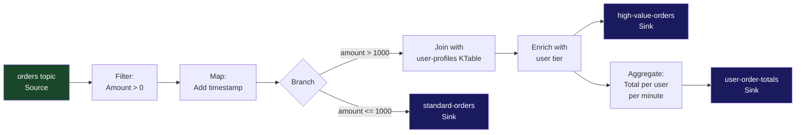
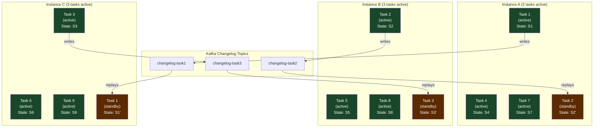
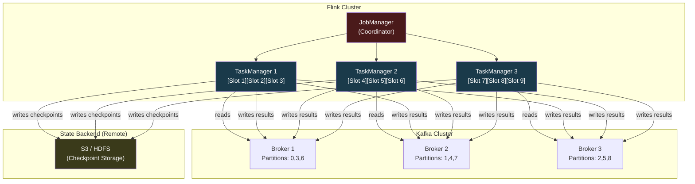
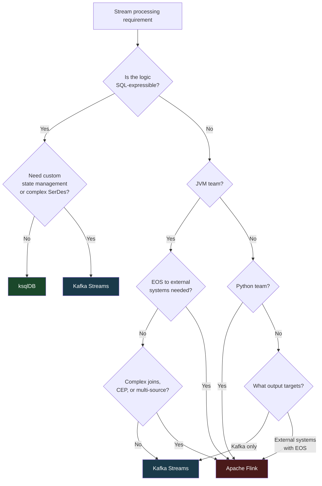

# Apache Kafka Deep Dive  Part 8: Stream Processing  Kafka Streams, ksqlDB, and Flink

---

**Series:** Apache Kafka Deep Dive  From First Principles to Planet-Scale Event Streaming
**Part:** 8 of 10
**Audience:** Senior backend engineers, distributed systems engineers, data platform architects
**Reading time:** ~45 minutes

---

## Prerequisites from Previous Parts

Parts 0 through 7 established the full mechanical picture of Kafka as a distributed log. Part 0 framed the event streaming problem and why a commit log is the right abstraction. Part 1 covered the distributed log: sequential I/O, partitioning, and offset semantics. Part 2 examined broker internals: the network thread pool, IO threads, and the KRaft controller. Part 3 went deep on replication: ISR, leader election, and what durability actually means. Part 4 dissected consumer groups: the group coordinator, partition assignment, and rebalance protocols. Part 5 covered the storage engine: segment files, the index structure, log compaction, and tiered storage. Part 6 covered producers: batching, compression, idempotency, and transactions. Part 7 addressed performance engineering: tuning throughput, latency, and the interaction between producer, broker, and consumer configurations.

This part builds on all of that. When we talk about producer transactions, we mean the exactly-once mechanism from Part 6. When we talk about consumer group rebalancing, we mean the protocol from Part 4. When we talk about log compaction for state store changelog topics, we mean the compaction mechanics from Part 5. Stream processing is not separate from Kafka  it is built on top of every mechanism you have already learned.

---

## 1. What Is Stream Processing and Why It Matters

### 1.1 Batch vs. Stream Processing

Batch processing operates on **bounded datasets**. You accumulate data until some threshold is reached  a time interval (midnight), a size limit (10GB), or a trigger (job completion)  and then run a computation over the entire accumulated set. The result is correct as of the batch's end time, but it is always historical. A batch job that runs at midnight tells you what happened yesterday. If fraud occurred at 11:58 PM, you learn about it at midnight, not at 11:58.

Stream processing operates on **unbounded data as it arrives**. The dataset has no defined end. Events flow continuously, and the processor applies its logic to each event (or window of events) as it appears. The result is continuously updated  the model reflects the world as it is right now, not as it was when a batch last ran.

The distinction is not merely latency. It is a difference in the fundamental shape of the data and the computation:

| Dimension | Batch | Stream |
|-----------|-------|--------|
| Data model | Bounded, finite dataset | Unbounded, infinite sequence |
| Trigger | Schedule or size threshold | Arrival of each event |
| Result freshness | Stale (minutes to hours) | Near-real-time (milliseconds to seconds) |
| State management | Implicit (recompute from scratch) | Explicit (maintain state between events) |
| Failure model | Rerun the job | Restore local state and resume |
| Typical tools | Hadoop MapReduce, Spark batch, SQL | Kafka Streams, Flink, Spark Structured Streaming |

The practical consequence: when the business requires decisions or outputs in less than a second, batch is not a viable architecture. When results must reflect events that happened in the last 100 milliseconds, you need stream processing.

### 1.2 Streaming Use Cases

Understanding what problems stream processing solves makes the engineering tradeoffs comprehensible. These are the canonical use cases that drive the design decisions you will encounter throughout this part.

**Real-time fraud detection.** A payment processor must decide whether to approve or decline a transaction in the time it takes a user to wait at a point-of-sale terminal  typically under 200 milliseconds. This requires evaluating the transaction against recent behavioral patterns: is this card being used in two countries within 10 minutes? Have there been three declined transactions in the last 60 seconds? These questions require state (recent transaction history per card) and must be answered in milliseconds. Batch processing cannot answer them  the fraud has already succeeded by the time the job runs.

**Live dashboards.** A dashboard showing "orders placed in the last 5 minutes" or "active users right now" must reflect reality continuously. Querying a data warehouse on a schedule produces a dashboard that is always 15 minutes out of date. A stream processor that maintains a running count updated on each event produces a dashboard that reflects the last few seconds.

**Sessionization.** Grouping a user's activity into sessions  a sequence of interactions bounded by inactivity gaps  is inherently a streaming problem. Sessions have no defined end time when you start processing them. A stream processor with session window support can open a session on the first event and close it only when the inactivity gap is exceeded.

**Anomaly detection.** Detecting that a metric has deviated more than three standard deviations from its rolling average requires maintaining that rolling average continuously. A batch job can compute it historically; a stream processor can evaluate it on each new data point.

**Real-time recommendations.** E-commerce systems that adjust recommendations based on what a user just clicked require the recommendation model's input features to reflect events that occurred in the last few seconds. The feature pipeline  transforming raw click events into model inputs  must be a stream processor.

**Change Data Capture (CDC) materialization.** Databases emit a stream of row-level changes (inserts, updates, deletes) via CDC (Debezium being the most common Kafka CDC connector). A stream processor consumes this change stream and maintains a materialized view  a queryable, denormalized representation of the current database state  without touching the source database for reads.

### 1.3 Stream Processing Abstractions

Three distinct processing models exist, with different tradeoffs between simplicity and correctness.

**Record-at-a-time processing** is the simplest model. Each record is processed individually as it arrives. There is no windowing, no state (beyond what the application explicitly manages), and no notion of time. This model is correct for stateless transformations  filtering, projection, enrichment via point lookups. It is low-latency because there is no buffering. It is inadequate for aggregations over time windows.

**Micro-batch processing** (Spark Structured Streaming's default mode) buffers records for a configurable interval  say, 100 milliseconds  and then runs a batch computation over each micro-batch. The result is semantically equivalent to record-at-a-time processing but implemented as a sequence of small batch jobs. The advantage is that batch processing infrastructure (query planning, columnar execution) can be reused. The disadvantage is that latency is bounded below by the micro-batch interval  you cannot respond in 10 milliseconds if you batch for 100 milliseconds.

**True streaming with windowing** (Kafka Streams, Flink) processes records as they arrive and maintains state that spans records. Time-based windows  "count all events in a 1-minute sliding window"  are first-class primitives. Late-arriving events (events whose event timestamp is earlier than the current processing frontier) can be handled explicitly. Watermarks allow the system to reason about time without waiting forever for stragglers. This is the most expressive and most complex model.

### 1.4 Why Process Streams in Kafka's Ecosystem

The straightforward answer: your data is already in Kafka. Moving it out for processing requires serializing it across a network boundary, deserializing it in the processing system, serializing the output, and writing it back. Each step adds latency, adds operational components to manage, and creates potential for format inconsistency.

Kafka-native stream processing avoids this. Kafka Streams runs inside your application process. It reads from Kafka partitions directly (as a consumer), processes records in memory, and writes output back to Kafka partitions (as a producer). The only network hops are the same ones a regular Kafka consumer would make. State is stored locally on RocksDB, replicated to Kafka changelog topics using the same durable storage you trust for your primary data.

The result is a dramatically simpler operational picture: no separate cluster to manage for the stream processor, no format translation layer, no additional monitoring target. You deploy your Kafka Streams application the same way you deploy any other service. You monitor it with the same JMX metrics infrastructure.

This simplicity has limits, and we will reach those limits in Section 8 when we discuss Apache Flink. But for the majority of Kafka-to-Kafka stream processing use cases, the ecosystem approach is correct.

---

## 2. Kafka Streams: Architecture and Core Abstractions

### 2.1 What Kafka Streams Is

Kafka Streams is a **Java and Scala client library** that turns your application into a stream processor. This is the most important sentence in this section. It is not a cluster. It is not a service you deploy separately. It is a library you add to your application's dependencies.

This design choice has profound implications:

- **No additional infrastructure.** You do not provision a Flink cluster, a Spark cluster, or a Storm topology. You need only a Kafka cluster, which you already have.
- **Deployment model is your existing deployment model.** A Kafka Streams application is a regular application. You containerize it, deploy it on Kubernetes, scale it by running more replicas, and monitor it with your existing observability stack.
- **Isolation is natural.** Because each application instance is a separate process, a bug that crashes one instance affects only the tasks that instance was running. Other instances continue processing.
- **Operational complexity scales with processing complexity, not with the framework.** A simple filter-and-route application is as simple to operate as any other microservice.

The constraint: Kafka Streams is JVM-only. If your team writes Python or Go, Kafka Streams is not an option. (We will address this in Section 8.)

### 2.2 Topology: The Processing Graph

A Kafka Streams application is defined by its **topology**  a directed acyclic graph (DAG) of processing nodes.

Three types of nodes exist:

- **Source nodes**: connected to Kafka input topics. They consume records and inject them into the topology.
- **Processor nodes**: apply transformations to records. They can be stateless (filter, map) or stateful (aggregate, join). They can forward results to downstream nodes.
- **Sink nodes**: write records to Kafka output topics. They are the terminal nodes of the topology.

Topologies are defined in one of two ways:

The **Streams DSL** is a high-level, functional API. It provides `filter()`, `map()`, `flatMap()`, `groupBy()`, `aggregate()`, `join()`, and windowing operations. The DSL is expressive for the majority of use cases and is significantly more readable than the alternative.

The **Processor API** is a low-level API. You implement the `Processor` interface directly, with explicit control over when to forward records, how to schedule punctuators (periodic callbacks), and how to access state stores. Use the Processor API when the DSL cannot express your logic  for example, when you need to emit records on a timer independent of incoming events, or when you need fine-grained control over state store access patterns.



### 2.3 Stream vs. Table Duality

The stream-table duality is one of the most important theoretical concepts in Kafka's design. It appears throughout Kafka Streams, ksqlDB, and informs the design of Kafka itself (log compaction exists because of it).

**KStream** represents an **unbounded sequence of independent events**. Each record is a self-contained fact. Records with the same key are not related to each other by KStream semantics  they are separate events that happen to share a key. The mental model: a KStream is an append-only log of facts. "User 42 placed order #1001 for $150." "User 42 placed order #1002 for $75." Both records exist. Neither supersedes the other.

**KTable** represents a **changelog stream interpreted as a materialized view**. Each record is an update to the current state of a key. The latest record for each key is the current value. Earlier records for the same key are superseded. The mental model: a KTable is a database table maintained by replaying a changelog. "User 42's profile is {name: Alice, tier: gold}." If a new record arrives with user_id=42 and tier=platinum, the KTable now reflects {name: Alice, tier: platinum}. The old record is gone from the materialized view (though it still exists in the topic).

**GlobalKTable** is a KTable that is **replicated to every stream thread across all application instances**  not partitioned. A regular KTable partitions its state across tasks (and thus across instances). A GlobalKTable stores the complete dataset on every instance. This means you can join a KStream against a GlobalKTable without requiring co-partitioning (both topics having the same number of partitions and the same partitioning key). Use GlobalKTable for small reference datasets  country codes, product catalogs, configuration tables  where the full dataset fits comfortably in memory or RocksDB on each instance and where you need foreign-key-style joins.

The duality: a KStream becomes a KTable by aggregation (every aggregate over a KStream produces a KTable). A KTable becomes a KStream by calling `.toStream()`  you get back the changelog of updates to the table.

### 2.4 KStream-KTable Join

The KStream-KTable join is the canonical enrichment pattern. An event stream is enriched with current reference state.

```
Enriched record = event from KStream + current state of matching KTable key
```

In code:

```java
KStream<String, Order> orders = builder.stream("orders");
KTable<String, UserProfile> userProfiles = builder.table("user-profiles");

KStream<String, EnrichedOrder> enrichedOrders = orders.join(
    userProfiles,
    (order, profile) -> new EnrichedOrder(order, profile),
    Joined.with(Serdes.String(), orderSerde, userProfileSerde)
);

enrichedOrders.to("enriched-orders");
```

Key semantics: the KTable join looks up the **current value** of the matching key at the moment the stream event arrives. If the KTable has no value for that key, the result depends on whether you use `join()` (inner, produces no output for unmatched keys) or `leftJoin()` (outer, produces a result with null for the table side).

This is fundamentally different from a database join. The KStream-KTable join is asymmetric in time: the stream event triggers the lookup, and the table provides the current value at that point in time.

### 2.5 KStream-KStream Join

Two event streams can be joined within a time window. The mental model: "find pairs of events from two streams where the keys match and the events occurred within a given time window of each other."

```java
KStream<String, Order> orders = builder.stream("orders");
KStream<String, Payment> payments = builder.stream("payments");

KStream<String, OrderWithPayment> matched = orders.join(
    payments,
    (order, payment) -> new OrderWithPayment(order, payment),
    JoinWindows.ofTimeDifferenceWithNoGrace(Duration.ofHours(1)),
    StreamJoined.with(Serdes.String(), orderSerde, paymentSerde)
);
```

Both streams must share the same key (the order ID in this example). Kafka Streams buffers events from both streams in a windowed state store and emits joined results when a match is found within the time window. Events that do not find a match within the window are dropped (for inner joins).

The window duration is a critical tradeoff: a wider window allows more late-arriving matches but consumes more memory for buffered events.

---

## 3. Kafka Streams: Tasks, Threads, and Parallelism

### 3.1 Stream Tasks: The Unit of Parallelism

The **stream task** is the fundamental unit of work in Kafka Streams. Each task is assigned a subset of the input topic's partitions and is responsible for processing all records from those partitions.

The rule: **one task per partition of the input topic** (for the source topics with the most partitions, when multiple source topics exist with different partition counts, task count equals the maximum partition count across co-partitioned topics).

If your input topic has 12 partitions, your topology creates 12 tasks. This is not configurable  it is determined by the partition count of your input topics. Want more parallelism? Increase the partition count of your input topics (with the caveat from Part 4 that reducing partition counts is not supported without data migration).

Each task:
- Owns a specific set of input partition offsets
- Maintains its own local state stores (isolated from other tasks)
- Commits its own consumer offsets independently

Tasks are the unit of both parallelism and failure isolation. A task can be moved from one application instance to another during a rebalance. When a task moves, its state store moves with it (or is restored from its changelog topic on the new instance).

### 3.2 Stream Threads

Each Kafka Streams application instance runs one or more **stream threads**, configured via `num.stream.threads` (default: 1).

Each thread:
- Is assigned one or more tasks
- Processes records from all its assigned tasks serially (one task at a time, iterating across assigned tasks)
- Manages the consumer poll loop for all its tasks' partitions

The relationship between tasks and threads:
- One task runs in exactly one thread at a time
- One thread can run multiple tasks (serially, interleaved)
- The number of tasks that can run in parallel equals the total number of stream threads across all application instances

Setting `num.stream.threads=4` on a single instance gives you 4 threads. If you have 12 tasks, each thread processes 3 tasks, interleaved.

The practical guidance: set `num.stream.threads` to roughly the number of physical CPU cores available to the instance, unless your processing is I/O-bound (in which case more threads than cores can help) or you need to limit resource consumption.

### 3.3 Scaling Out

To scale a Kafka Streams application, you run multiple application instances with the **same `application.id`**. The `application.id` is the Kafka consumer group ID for the Kafka Streams application. All instances with the same `application.id` participate in the same consumer group and distribute tasks among themselves via the consumer group rebalance protocol.

The scaling math:
- Total tasks = partition count of input topics
- Maximum useful instances = total tasks (one task per instance at the extreme)
- Adding instances beyond the task count gains nothing (extra instances have no tasks to process)

This is why partition count is a ceiling on stream parallelism. If you have 12 partitions and deploy 24 instances, 12 instances are idle. If you later repartition to 24 partitions, all 24 instances become productive.

Scaling is elastic in Kubernetes: deploying more replicas of your Kafka Streams application automatically triggers a consumer group rebalance, redistributing tasks to the new instances. Removing replicas triggers another rebalance, redistributing the departed instance's tasks to the remaining ones.

### 3.4 Task Assignment: StickyTaskAssignor

The default task assignor in Kafka Streams is the **StickyTaskAssignor**. Its goal is to minimize task movement across rebalances while maintaining balanced task distribution.

Why stickiness matters for stream processing: each task owns a local state store backed by RocksDB. If a task moves to a new instance, that instance must restore the task's state from the changelog topic before the task can resume processing. For large state stores, restoration can take minutes. Sticky assignment minimizes unnecessary state migration.

The StickyTaskAssignor:
1. Attempts to re-assign each task to the instance that previously held it
2. If that instance is unavailable (it left the group), assigns the task to an instance that has a standby replica (Section 3.5)
3. Falls back to least-loaded assignment if neither condition holds

Kafka 2.4 introduced the **High Availability Task Assignor** (`StreamsConfig.TASK_ASSIGNOR_CLASS_CONFIG = "HighAvailabilityTaskAssignor"`), which is optimized for high-availability scenarios. It aggressively assigns tasks to instances with standby replicas during rebalances, minimizing downtime at the cost of slightly less balanced distribution.

### 3.5 Standby Replicas

A **standby replica** is a shadow task that maintains an up-to-date copy of a primary task's state stores on a different application instance.

Configure them with `num.standby.replicas`. With `num.standby.replicas=1`, each task's state store is maintained on two instances: the primary (actively processing) and one standby (passively replaying the changelog). With `num.standby.replicas=2`, three instances maintain each task's state.

How standby replicas work:
1. The standby task subscribes to the changelog topics of the state stores it shadows
2. As the primary task writes to its state stores, those writes are replicated to the changelog topic
3. The standby task replays the changelog, maintaining an identical local state store
4. If the primary instance fails, the standby instance already has the state. Task assignment switches to the standby instance, which resumes processing with near-zero restoration lag



The tradeoff: standby replicas consume additional memory, disk, and changelog topic read throughput. For stateless topologies, standby replicas provide no benefit (no state to restore). For stateful topologies with large state stores and high availability requirements, they are essential.

---

## 4. State Stores: Local State in Stream Processing

### 4.1 What State Stores Are

A **state store** is a local, embedded key-value store that a Kafka Streams task uses to maintain state between records. The default implementation is **RocksDB**  an LSM-tree-based storage engine from Meta, designed for write-heavy workloads and embedded use cases. An in-memory alternative is available for workloads where state fits entirely in RAM and durability across restarts is not required.

State stores are **task-local**: each task has its own isolated state store instance. Task 1's state store has no shared state with Task 2's store. This isolation is what makes horizontal scaling possible  adding instances adds tasks, and each task brings its own isolated state. There is no shared mutable state requiring distributed locking.

State stores are created implicitly by the DSL when you call stateful operations:
- `groupBy().aggregate()` creates a `KeyValueStore`
- `groupBy().windowedBy(...).aggregate()` creates a `WindowStore`
- `groupBy().windowedBy(SessionWindows.ofInactivityGapWithNoGrace(...)).aggregate()` creates a `SessionStore`

Or explicitly by the Processor API when you register stores with `builder.addStateStore()`.

### 4.2 Changelog Topics

Every write to a state store is **replicated to a compacted Kafka topic**  the changelog topic. The topic name follows the pattern:

```
[application.id]-[store-name]-changelog
```

For example, an application with `application.id=fraud-detector` and a store named `user-transaction-counts` creates a changelog topic named:

```
fraud-detector-user-transaction-counts-changelog
```

This topic is a compacted topic (Part 5). Each key in the changelog corresponds to a key in the state store. Log compaction ensures that the changelog retains only the latest value per key, keeping it from growing unboundedly.

The changelog serves two purposes:
1. **Fault tolerance**: if an instance fails and its state is lost, the replacement instance can restore the state by replaying the changelog
2. **Standby replicas**: standby tasks consume the changelog to maintain shadow copies of the state

The changelog write happens synchronously with the state store write when `processing.guarantee=exactly_once_v2`. With `at_least_once`, changelog writes are batched and flushed periodically.

### 4.3 State Store Types

**KeyValueStore** is the general-purpose store. It supports:
- `put(key, value)`  insert or update
- `get(key)`  point lookup by key
- `delete(key)`  remove a key
- `range(fromKey, toKey)`  range scan
- `all()`  full scan (expensive, avoid in hot paths)

**WindowStore** stores values keyed by both the record key and a time window boundary. Under the hood, it encodes the window timestamp into the RocksDB key. Supports:
- `put(key, value, windowStartTimestamp)`  insert into a specific window
- `fetch(key, fromTime, toTime)`  fetch all windows for a key within a time range

**SessionStore** stores values keyed by both the record key and a session window (represented as a start-time, end-time pair). The session merger logic  combining two overlapping sessions when a new event bridges them  is embedded in the session windowing operator.

### 4.4 State Restoration

When a Kafka Streams instance starts (or restarts after failure), it must **restore the state of all tasks assigned to it** before it can begin processing new records.

Restoration process:
1. Kafka Streams assigns tasks to the instance via the group rebalance protocol
2. For each task, Kafka Streams reads the changelog topic from the beginning (or from a local checkpoint that records the last-known offset)
3. Each record from the changelog is replayed into the local RocksDB instance
4. Once the changelog is fully replayed (consumer reached the latest offset), the task transitions to `RUNNING` state and begins consuming live records from the input topic

Restoration time scales with:
- **Changelog topic size**: more keys = more records to replay
- **Network throughput**: bounded by Kafka consumer throughput from the broker to this instance
- **RocksDB write speed**: high write rates can cause RocksDB compaction to fall behind during restoration

For a state store with 50 million keys and an average value size of 500 bytes, that is 25GB of data. At a Kafka consumer throughput of 100MB/s, restoration takes approximately 4 minutes. During those 4 minutes, the task is unavailable. This is why standby replicas matter: they have the state already, so the takeover is nearly instantaneous.

The local checkpoint reduces restoration time on clean restarts: Kafka Streams records the last-replayed changelog offset in a local file (`[state.dir]/[application.id]/[task.id]/[store.name].checkpoint`). On restart, replay begins from the checkpoint offset, not from the beginning.

### 4.5 RocksDB Tuning

The default RocksDB configuration is conservative  it is designed to work correctly in a wide range of environments, not to maximize throughput on your specific hardware. Production deployments with high state write rates almost always require custom tuning via the `rocksdb.config.setter` configuration.

```java
public class MyRocksDBConfig implements RocksDBConfigSetter {
    @Override
    public void setConfig(String storeName, Options options, Map<String, Object> configs) {
        BlockBasedTableConfig tableConfig = new BlockBasedTableConfig();

        // Block cache: reduce disk reads for hot keys. 256MB per task.
        tableConfig.setBlockCacheSize(256 * 1024 * 1024L);

        // Block size: larger blocks improve sequential read throughput.
        tableConfig.setBlockSize(16 * 1024L);

        options.setTableFormatConfig(tableConfig);

        // Write buffer: data is written to a memtable before flushing to disk.
        // Larger write buffers reduce flush frequency, improving write throughput.
        options.setWriteBufferSize(64 * 1024 * 1024L);
        options.setMaxWriteBufferNumber(3);

        // Compaction: more threads reduce compaction lag, at CPU cost.
        options.setMaxBackgroundCompactions(4);
        options.setMaxBackgroundFlushes(2);
    }

    @Override
    public void close(String storeName, Options options) {
        // Close any resources created in setConfig
    }
}
```

Register it:
```java
props.put(StreamsConfig.ROCKSDB_CONFIG_SETTER_CLASS_CONFIG, MyRocksDBConfig.class);
```

Key metrics to monitor for RocksDB health:
- `rocksdb.estimate-pending-compaction-bytes`: if this grows without bound, compaction is falling behind writes. Add compaction threads or reduce write rate.
- `rocksdb.block-cache-hit` and `rocksdb.block-cache-miss`: low hit rate means the block cache is too small for the working set.
- `rocksdb.estimate-num-keys`: approximate key count, useful for capacity planning.

### 4.6 Interactive Queries

Kafka Streams state stores are queryable from outside the stream processing topology via the **Interactive Queries** API. This allows you to serve the current aggregated state directly from the Kafka Streams application, without writing results to a separate database.

```java
// Get a read-only view of a state store
ReadOnlyKeyValueStore<String, Long> store = streams.store(
    StoreQueryParameters.fromNameAndType(
        "user-order-counts",
        QueryableStoreTypes.keyValueStore()
    )
);

// Point lookup
Long count = store.get("user-42");

// Range scan
KeyValueIterator<String, Long> range = store.range("user-00", "user-99");
```

For multi-instance deployments, a given key's state lives in the task assigned to that key's partition. An instance that does not own that partition cannot serve the query locally. Kafka Streams exposes metadata about which instance owns which keys via `KafkaStreams.queryMetadataForKey()`. Your application can use this metadata to route queries to the correct instance  or proxy them via an HTTP layer.

This pattern  stream processor as a serving layer  eliminates a class of infrastructure: you do not need to write aggregated results to Redis or PostgreSQL and then serve from there. The Kafka Streams application is the database.

---

## 5. Windowing: Time-Based Aggregations

### 5.1 The Windowing Problem

Aggregating an infinite stream requires carving it into finite, manageable pieces. You cannot compute "the average order value" over an infinite stream without a starting point  the average would need to incorporate every event since the beginning of time. You can compute "the average order value in the last 5 minutes," which is bounded and meaningful.

Windowing is the mechanism that imposes finite structure on infinite data. But it introduces a hard problem: **when do you know a window is complete?**

In batch processing, this question has a clean answer: when the batch is done. In stream processing, events can arrive out of order. An event timestamped 12:34:58 might arrive at the processor at 12:36:02  after the window ending at 12:35:00 has nominally closed. Do you include it in the closed window or drop it? How long do you wait before closing a window?

This is the late arrival problem, and the windowing types and grace periods in this section are all answers to it.

### 5.2 Event Time vs. Processing Time vs. Ingestion Time

The timestamp used to place an event in a window is not obvious. Three interpretations exist:

**Event time** is the timestamp embedded in the event payload  the time the event actually occurred in the real world. This is the most semantically correct interpretation. An order placed at 12:34:58 belongs in the window covering 12:34:00–12:35:00 regardless of when it arrives at the processor. Kafka Streams uses event time by default, sourced from the record's timestamp (which, by Kafka's default `CreateTime` timestamp type, is set by the producer at the moment of production  which is usually close to event time, but not identical if the event was buffered before being produced).

**Processing time** is the timestamp at the moment of processing  the wall clock time when the stream processor handles the record. Simple to implement (no timestamp extraction needed), but semantically incorrect for late arrivals. An event that was delayed in transit will be placed in a later window than the one it belongs to by event time. For systems that require accurate historical aggregations, processing time is wrong.

**Ingestion time** is the timestamp at which the record was written to Kafka. Kafka can stamp records with the broker's timestamp (`LogAppendTime` timestamp type). This is a compromise: it is not the true event time (there is still delay between event occurrence and Kafka write), but it is monotonically increasing within a partition (unlike event time, which can arrive out of order). Useful when you do not control the producer and cannot embed event timestamps in the payload.

Kafka Streams extracts timestamps via a `TimestampExtractor`. The default `FailOnInvalidTimestamp` extractor uses the record's Kafka timestamp. You can provide a custom extractor to parse event time from the record's payload:

```java
public class OrderTimestampExtractor implements TimestampExtractor {
    @Override
    public long extract(ConsumerRecord<Object, Object> record, long partitionTime) {
        Order order = (Order) record.value();
        return order.getEventTimestampMs();
    }
}
```

### 5.3 Tumbling Windows

Tumbling windows are **fixed-size, non-overlapping, contiguous** windows. The stream is divided into non-overlapping buckets of equal duration. Every event belongs to exactly one window.

```
Events: e1(t=0:10) e2(t=0:45) e3(t=1:15) e4(t=1:50) e5(t=2:05)

Tumbling (size=1 min):
[0:00 - 1:00)  → e1, e2
[1:00 - 2:00)  → e3, e4
[2:00 - 3:00)  → e5
```

DSL usage:

```java
orders.groupByKey()
    .windowedBy(TimeWindows.ofSizeWithNoGrace(Duration.ofMinutes(1)))
    .count()
    .toStream()
    .to("order-counts-per-minute");
```

Tumbling windows are the right choice when you want a complete, non-overlapping partition of time  daily reports, per-minute metrics, hourly summaries.

### 5.4 Hopping Windows

Hopping windows are **fixed-size, overlapping** windows. They are defined by two parameters: window size (how long each window covers) and advance interval (how often a new window starts). Each event belongs to `size / advance` windows simultaneously.

```
Events: e1(t=0:10) e2(t=0:45) e3(t=1:15) e4(t=1:50)

Hopping (size=5 min, advance=1 min):
[0:00 - 5:00)  → e1, e2, e3, e4
[1:00 - 6:00)  → e3, e4
[2:00 - 7:00)  → (future events)
```

DSL usage:

```java
orders.groupByKey()
    .windowedBy(TimeWindows.ofSizeAndGrace(
        Duration.ofMinutes(5), Duration.ofMinutes(1)
    ).advanceBy(Duration.ofMinutes(1)))
    .count()
    .toStream()
    .to("rolling-5min-order-counts");
```

Hopping windows are the right choice for rolling metrics  "traffic in the last 5 minutes, updated every minute." The tradeoff: each event is stored in multiple windows simultaneously, increasing state store size by a factor of `size / advance`.

### 5.5 Session Windows

Session windows are **variable-size windows bounded by inactivity gaps**. A session begins with the first event for a key and extends as long as subsequent events arrive within the inactivity gap. The session closes when no event arrives for longer than the gap duration.

```
Events for user-42: e1(t=0:10) e2(t=0:25) e3(t=0:40) [gap: 35 min] e4(t=1:15) e5(t=1:22)

Session (gap=30 min):
Session 1 [0:10 - 0:40]  → e1, e2, e3
Session 2 [1:15 - 1:22]  → e4, e5
```

Sessions can merge: if e3.5 arrives at t=0:55 (within 30 minutes of e3 at 0:40 and within 30 minutes of e4 at 1:15), the two sessions merge into one spanning 0:10 to 1:22.

DSL usage:

```java
pageViews.groupByKey()
    .windowedBy(SessionWindows.ofInactivityGapWithNoGrace(Duration.ofMinutes(30)))
    .count()
    .toStream()
    .to("user-sessions");
```

Session windows require a `SessionStore`, which handles the merging logic. The store is more complex than a `WindowStore` because sessions can extend and merge retroactively.

```mermaid
gantt
    title Window Type Comparison
    dateFormat  HH:mm
    axisFormat  %H:%M

    section Events
    e1          : milestone, 00:10, 0m
    e2          : milestone, 00:45, 0m
    e3          : milestone, 01:15, 0m
    e4          : milestone, 01:50, 0m
    e5          : milestone, 02:05, 0m

    section Tumbling (1 min)
    Window 1 [00:00-01:00)   : 00:00, 60m
    Window 2 [01:00-02:00)   : 01:00, 60m
    Window 3 [02:00-03:00)   : 02:00, 60m

    section Hopping (5 min, adv 1 min)
    W [00:00-05:00)          : 00:00, 300m
    W [01:00-06:00)          : 01:00, 300m
    W [02:00-07:00)          : 02:00, 300m

    section Session (gap 30 min)
    Session 1 [00:10-00:45)  : 00:10, 35m
    Session 2 [01:15-02:05)  : 01:15, 50m
```

### 5.6 Late Arrivals and Grace Periods

Events can arrive at the stream processor significantly after their event timestamp  mobile clients that reconnect after hours offline, network partitions that buffer events, producers that retry with stale timestamps. Without special handling, these late arrivals would be silently dropped (placed in an already-closed window) or corrupt the current window (placed in a wrong window by processing time).

Kafka Streams handles late arrivals via **grace periods**. A grace period keeps a closed window available for updates for a configured duration after the window's nominal end time.

```java
TimeWindows.ofSizeAndGrace(
    Duration.ofMinutes(1),      // window size
    Duration.ofMinutes(5)       // grace period
)
```

With this configuration, the window [12:34:00, 12:35:00) remains open for updates until 12:40:00 (5 minutes after the window closes). An event with timestamp 12:34:58 that arrives at the processor at 12:39:00 will be included in the window. An event arriving at 12:41:00 is beyond the grace period and is dropped.

The grace period is a deliberate tradeoff: it delays the finalization of results (you know the [12:34, 12:35) window count is final only at 12:40) in exchange for correctness (late arrivals are incorporated).

### 5.7 Watermarks and the Fundamental Uncertainty of Stream Time

The **watermark** is the stream processor's current estimate of event time progress. It is defined as:

```
watermark = max_observed_event_time - grace_period
```

Events with timestamps below the watermark are considered late. Windows whose end time is below the watermark are considered closed.

The watermark is a **heuristic**. The stream processor observes the maximum event timestamp seen so far and subtracts the grace period to estimate where "now" is. This is not a guarantee  it is an assumption that no events older than `grace_period` will arrive. If an event arrives with a timestamp older than the watermark, it is a late arrival.

The fundamental uncertainty: the processor never knows for certain that a time window is complete. There could always be another event, delayed indefinitely by a network partition or a client that has been offline for days. At some point, you must decide to finalize results and accept that some events will be dropped. The grace period encodes that decision.

In Flink, watermarks are explicit, per-stream, and configurable with fine-grained strategies (monotonically increasing timestamps, bounded out-of-orderness, etc.). In Kafka Streams, the watermark is implicit, derived from the maximum observed timestamp minus the grace period. The explicit watermark model in Flink is more powerful for handling highly out-of-order streams  another reason to consider Flink when Kafka Streams' windowing is insufficient.

---

## 6. Exactly-Once in Kafka Streams

### 6.1 The Exactly-Once Requirement in Stream Processing

A stream processor reads from input topics, processes records, and writes to output topics. With a `read-process-write` pipeline, exactly-once semantics requires that each input record is processed exactly once  even if the application crashes and restarts.

Without exactly-once guarantees:
- **At-most-once**: the application processes a record and then crashes before committing the consumer offset. On restart, Kafka delivers the same record again. The record is processed twice. For a running sum, this means double-counting.
- **At-least-once**: the application processes a record, writes to the output topic, but crashes before committing the consumer offset. On restart, the record is reprocessed and written to the output topic again. Downstream consumers see duplicates.

For financial applications (running totals, fraud detection, billing), duplicates are not acceptable. For aggregations that feed dashboards, at-least-once may be acceptable (a slightly inflated count is visible but not catastrophic). The tradeoff is performance: exactly-once has overhead.

### 6.2 EOS v2: `processing.guarantee=exactly_once_v2`

Kafka Streams implements exactly-once by combining two mechanisms from previous parts:

1. **Producer transactions** (Part 6): atomic multi-partition writes. Either all writes commit or none do.
2. **Transactional consumer offset commits**: the output records and the consumer offset commit happen in the same transaction.

The flow:

```
For each task, per commit interval:
1. Poll records from input partitions (consumer read)
2. Process records through the topology
3. Begin a producer transaction
4. Write output records to output topics (within transaction)
5. Write state store changelog records (within transaction)
6. Commit consumer offsets to __consumer_offsets topic (within transaction)
7. Commit the producer transaction

If crash at step 3-6: transaction is aborted on restart. Records not visible to consumers. Offset not advanced. Records reprocessed from the last committed offset.
If crash at step 7: depends on whether Kafka committed or aborted. Kafka's transaction coordinator ensures atomicity.
```

Enable with:

```java
props.put(StreamsConfig.PROCESSING_GUARANTEE_CONFIG, StreamsConfig.EXACTLY_ONCE_V2);
```

EOS v2 requires Kafka brokers 2.5 or newer. Each **task** gets its own transactional producer, identified by a `transactional.id` derived from `[application.id]-[task.id]`. This per-task granularity is the key improvement over EOS v1.

### 6.3 EOS v2 vs. EOS v1

EOS v1 (the original implementation, Kafka Streams 0.11+) had a critical limitation: it used **one transactional producer per stream thread**, not per task. This meant that if a zombie instance (a Streams instance that has been declared dead by the consumer group but has not actually stopped, due to a network partition or GC pause) attempts to produce records, it shares the `transactional.id` with the legitimate successor producer for that thread.

Producer fencing via `transactional.id` and epochs (Part 6) handles this in theory  the zombie's produce attempt is rejected because its epoch is outdated. But because the `transactional.id` covered a thread (and thus multiple tasks), a zombie could potentially produce records for tasks it was no longer supposed to own.

EOS v2 eliminates this by assigning a unique `transactional.id` to each task. The zombie can only produce records for its specific tasks, and those tasks have been fenced at the task level. The scope of potential corruption is reduced from "all tasks on a thread" to "zero tasks" (because the task's epoch has been incremented by the new owner).

Additionally, EOS v2 uses the **static membership** consumer group protocol (`group.instance.id`), which allows instances to rejoin the consumer group after a transient failure without triggering a full rebalance. This reduces the frequency of rebalances, which would otherwise reset EOS state.

### 6.4 EOS Performance Overhead

Exactly-once semantics has a measurable overhead. Transactions require:
- A `beginTransaction()` call to the broker transaction coordinator (adds one round trip per commit interval)
- A `sendOffsetsToTransaction()` call (adds one round trip)
- A `commitTransaction()` call (adds one round trip, which must complete before the next batch)
- The transaction coordinator must durably replicate the transaction state before confirming

The net overhead is typically **10–20% higher end-to-end latency** compared to `at_least_once`. Throughput impact depends on the commit interval (`commit.interval.ms`, default 100ms for EOS). A longer commit interval amortizes the transaction overhead over more records but increases the reprocessing window if a failure occurs.

Tuning guidance:
- If EOS is required: increase `commit.interval.ms` to 500–1000ms to reduce transaction overhead per record. Accept that failures require reprocessing up to 1 second of records.
- If EOS is not required: use `processing.guarantee=at_least_once` (default). Implement idempotent output (idempotent DB writes, deduplication at the consumer) to handle duplicates.

### 6.5 When EOS Matters vs. Doesn't

EOS in Kafka Streams provides **exactly-once within the Kafka-to-Kafka pipeline**. It guarantees that each input record is processed and its effects are written to output Kafka topics exactly once.

It does **not** extend to external systems. If your topology reads from Kafka, processes records, and writes to a PostgreSQL database, Kafka's EOS does not prevent duplicate writes to PostgreSQL. A crash after the Kafka transaction commits but before the DB write commits (or after a DB write that failed to be confirmed) results in a processed record with no DB write  or an extra DB write on retry.

To achieve true end-to-end exactly-once with external systems, you need:
- **Idempotent DB writes**: include a unique record ID in each DB write; the DB upserts rather than inserts. Duplicate writes are harmless.
- **Two-phase commit with Flink** (Section 8.4): Flink's checkpointing mechanism coordinates a 2PC across Kafka and external sinks.

The practical guidance: use `exactly_once_v2` when your output is Kafka topics and downstream consumers must not see duplicates (financial aggregations, billing, audit logs). Use `at_least_once` with idempotent DB writes when your output is an external database and you can design idempotent upserts.

---

## 7. ksqlDB: SQL for Kafka Streams

### 7.1 What ksqlDB Is

ksqlDB is a **SQL layer on top of Kafka Streams**. Instead of writing Java code to define a Kafka Streams topology, you write SQL statements that ksqlDB compiles into Kafka Streams topologies and executes on your behalf.

The value proposition: if your stream processing logic is expressible in SQL, ksqlDB eliminates the need to write, compile, package, and deploy a Java application. You write a `CREATE STREAM ... AS SELECT` statement, and ksqlDB handles the rest.

This is not a toy. ksqlDB is production-grade, runs at companies processing billions of events per day, and supports the full range of Kafka Streams capabilities: windowed aggregations, stream-table joins, exactly-once semantics, and interactive queries.

### 7.2 Architecture

A ksqlDB deployment consists of one or more **ksqlDB Server** instances. Each server is a Kafka Streams application that:
1. Maintains a catalog of defined streams and tables (persisted to a Kafka topic: `_confluent-ksql-[ksql.service.id]_command_topic`)
2. Compiles SQL statements into Kafka Streams topologies
3. Executes those topologies as embedded Kafka Streams applications
4. Exposes a REST API and interactive CLI for query submission and result retrieval

Multiple ksqlDB Servers form a cluster by sharing the same `ksql.service.id` and thus the same Kafka consumer group. SQL queries submitted to any server in the cluster are replicated to all servers via the command topic  each server replays the command topic to reconstruct the full catalog of queries.

Pull queries (Section 7.5) benefit from the cluster: each server can route a pull query to the server that owns the state for the queried key.

### 7.3 Streams and Tables in ksqlDB

ksqlDB surfaces the same stream-table duality as Kafka Streams, with SQL syntax:

```sql
-- Register an existing Kafka topic as a stream
-- Every record in the topic is an independent event
CREATE STREAM orders (
    order_id VARCHAR KEY,
    user_id  VARCHAR,
    amount   DOUBLE,
    ts       BIGINT
) WITH (
    KAFKA_TOPIC  = 'orders',
    VALUE_FORMAT = 'JSON',
    TIMESTAMP    = 'ts'
);

-- Register an existing Kafka topic as a table
-- The latest record per key is the current state
CREATE TABLE user_profiles (
    user_id VARCHAR PRIMARY KEY,
    name    VARCHAR,
    tier    VARCHAR
) WITH (
    KAFKA_TOPIC  = 'user-profiles',
    VALUE_FORMAT = 'JSON'
);
```

`CREATE STREAM` and `CREATE TABLE` without `AS SELECT` register existing topics as ksqlDB metadata objects  no Kafka Streams topology is created, no processing happens. They are schema registrations.

`CREATE STREAM ... AS SELECT` and `CREATE TABLE ... AS SELECT` create **persistent queries**: Kafka Streams topologies that continuously process the source and write results to a new Kafka topic.

### 7.4 Push Queries

A **push query** is a streaming query that continuously emits results as new records arrive. The connection remains open; results stream from the ksqlDB server to the client.

```sql
-- Push query: stream all new orders for user-42
SELECT order_id, amount, ts
FROM orders
WHERE user_id = 'user-42'
EMIT CHANGES;
```

Push queries are the ksqlDB equivalent of a Kafka consumer combined with a filter. They are appropriate for:
- Real-time dashboards that display events as they occur
- Alerting systems that trigger on specific events
- Event-driven microservices that react to filtered streams

Push queries execute continuously until the client disconnects or the query is terminated. They are not stored in the ksqlDB catalog  they are ephemeral, per-connection queries.

### 7.5 Pull Queries

A **pull query** is a point-in-time query against a materialized state store. It returns the current state and exits  like a traditional SQL SELECT against a database.

```sql
-- Pull query: what is the current order count for user-42 in the current minute?
SELECT user_id, order_count, WINDOWSTART, WINDOWEND
FROM order_counts_per_minute
WHERE user_id = 'user-42';
```

Pull queries can only be executed against:
- Tables created with `CREATE TABLE ... AS SELECT`
- Materialized views backed by a state store

They cannot be executed against streams (streams have no current state  only an unbounded history of events).

Pull queries are served from the local state store, making them low-latency (sub-millisecond for in-memory stores, a few milliseconds for RocksDB). For pull queries against tables that span multiple ksqlDB server instances, the ksqlDB server routes the query to the server that owns the relevant partition.

### 7.6 Windowed Aggregations in ksqlDB

```sql
-- Create a persistent query that counts orders per user per minute
CREATE TABLE order_counts_per_minute AS
    SELECT
        user_id,
        COUNT(*) AS order_count,
        SUM(amount) AS total_amount
    FROM orders
    WINDOW TUMBLING (SIZE 1 MINUTE, GRACE PERIOD 5 MINUTES)
    GROUP BY user_id
    EMIT CHANGES;
```

This creates a Kafka Streams topology with a tumbling 1-minute window and a 5-minute grace period. The results are written to a new Kafka topic and materialized in a state store. The state store is queryable via pull queries.

Supported window types in ksqlDB:
- `WINDOW TUMBLING (SIZE n unit)`  tumbling windows
- `WINDOW HOPPING (SIZE n unit, ADVANCE BY n unit)`  hopping windows
- `WINDOW SESSION (n unit)`  session windows

```sql
-- Hopping window: 5-minute window, updated every 1 minute
CREATE TABLE rolling_5min_orders AS
    SELECT user_id, COUNT(*) AS order_count
    FROM orders
    WINDOW HOPPING (SIZE 5 MINUTES, ADVANCE BY 1 MINUTE)
    GROUP BY user_id
    EMIT CHANGES;
```

### 7.7 Stream-Table Join in ksqlDB

```sql
-- Enrich each order event with the user's current profile
CREATE STREAM enriched_orders AS
    SELECT
        o.order_id,
        o.amount,
        o.ts,
        u.name    AS user_name,
        u.tier    AS user_tier
    FROM orders o
    LEFT JOIN user_profiles u ON o.user_id = u.user_id
    EMIT CHANGES;
```

This is a KStream-KTable join compiled to a Kafka Streams topology. Each incoming order event is enriched with the latest user profile for the matching `user_id`. The `LEFT JOIN` ensures that orders for unknown users are still emitted (with null values for the user fields).

ksqlDB also supports stream-stream joins:

```sql
-- Match orders with payments within a 1-hour window
CREATE STREAM matched_orders AS
    SELECT o.order_id, o.amount, p.payment_method
    FROM orders o
    INNER JOIN payments p
        WITHIN 1 HOUR
    ON o.order_id = p.order_id
    EMIT CHANGES;
```

Co-partitioning requirement: stream-stream and stream-table joins require that the joined topics have the same number of partitions and use the same partitioning key. ksqlDB enforces this at query creation time and will reject the query if co-partitioning is violated.

### 7.8 When to Use ksqlDB vs. Kafka Streams

This is a practical engineering decision, not a religious one. The right tool depends on the specific requirements.

| Criterion | ksqlDB | Kafka Streams |
|-----------|--------|---------------|
| Processing logic | SQL-expressible | Arbitrary complexity |
| Development speed | Fast (SQL only) | Slower (Java code) |
| Custom state management | Not supported | Full control |
| Debugging | Limited (SQL execution plan) | Full Java debugging |
| Testing | ksqlDB test runner | JUnit with TopologyTestDriver |
| Language requirement | SQL + REST API | JVM (Java, Scala, Kotlin) |
| Performance tuning | Limited | Full control (RocksDB, threads, etc.) |
| Custom SerDes | Limited | Full support |
| Prototype to production | Excellent | Moderate |
| Complex multi-step joins | Moderate | Excellent |
| External system integration | Requires Kafka Connect | Native (Processor API) |

Use ksqlDB when:
- The transformation is straightforward: filter, aggregate, enrich, window
- The team is not fluent in JVM development
- Speed of iteration matters more than performance tuning
- You want SQL-readable stream processing logic in code reviews

Use Kafka Streams when:
- Processing logic cannot be expressed in SQL (complex state machines, custom algorithms)
- You need fine-grained control over RocksDB, threading, or memory
- You need to integrate directly with non-Kafka external systems in the processor
- You need full testing coverage with the TopologyTestDriver
- Performance requirements demand maximum optimization

---

## 8. Apache Flink: When You Need More

### 8.1 What Flink Is

Apache Flink is a **distributed stream processing system**  not a library, not a SQL layer over another library, but a full cluster-based processing framework. It runs as its own cluster, independent of Kafka, and integrates with Kafka as a source and sink.

Architecture:
- **JobManager**: the cluster coordinator. Accepts job submissions, generates execution plans, coordinates checkpointing, and manages fault recovery. Similar in role to Kafka's KRaft controller.
- **TaskManagers**: the worker nodes. Each TaskManager runs one or more task slots, where task slots are the unit of parallelism in Flink (analogous to Kafka Streams tasks). Each slot runs one parallel subtask of the processing pipeline.
- **Dispatcher / REST API**: the submission endpoint. You submit a Flink job (a JAR or a SQL statement) to the Dispatcher, which hands it to the JobManager for execution.



### 8.2 Why Flink Instead of Kafka Streams

Flink is architecturally more complex and operationally more demanding than Kafka Streams. The decision to adopt Flink is justified by specific requirements that Kafka Streams cannot satisfy:

**True watermark-based event time processing.** Flink's watermark system is explicit and powerful. You can define per-stream watermark strategies with bounded out-of-orderness, assign watermarks at the source, and reason about time progress across multiple input streams independently. Kafka Streams' implicit watermark (max observed timestamp minus grace period) is adequate for single-stream processing but can produce incorrect results for multi-stream joins with heterogeneous time characteristics.

**Exactly-once with external systems via two-phase commit.** Flink's checkpointing mechanism coordinates a 2PC across all sources, operators, and sinks in a single job. A `FlinkKafkaProducer` configured with `Semantic.EXACTLY_ONCE` participates in Flink's checkpoint protocol, ensuring that Kafka output is committed if and only if the full checkpoint succeeds. A JDBC sink using the `TwoPhaseCommitSinkFunction` can extend this guarantee to a database. Kafka Streams EOS does not extend to external systems.

**Complex Event Processing (CEP).** Flink includes the `FlinkCEP` library, which allows you to define patterns over event streams  "detect if event A is followed by event B within 5 minutes, unless interrupted by event C." This is used for network intrusion detection, compliance monitoring, and business process tracking. Kafka Streams has no equivalent.

**Higher throughput for CPU-intensive processing.** Flink's execution model is designed for high-throughput analytics. Its network stack uses credit-based flow control and off-heap memory management, avoiding GC pressure that can stall JVM-based processors. For CPU-intensive transformations (ML inference, heavy aggregations), Flink can sustain higher throughput than Kafka Streams.

**Multi-source, multi-sink jobs.** A single Flink job can read from multiple Kafka clusters, Kafka topics, files, databases, and APIs simultaneously  and write to multiple sinks. Kafka Streams is designed around Kafka-to-Kafka pipelines.

**Python (PyFlink).** Flink supports Python via the PyFlink API, enabling data science teams to write stream processing logic in Python. Kafka Streams requires JVM.

### 8.3 Flink-Kafka Integration

Flink reads from Kafka via the `KafkaSource` connector (Flink 1.14+, replacing the older `FlinkKafkaConsumer`):

```java
KafkaSource<Order> source = KafkaSource.<Order>builder()
    .setBootstrapServers("kafka:9092")
    .setTopics("orders")
    .setGroupId("flink-order-processor")
    .setStartingOffsets(OffsetsInitializer.committed())
    .setValueOnlyDeserializer(new OrderDeserializationSchema())
    .build();

DataStream<Order> orders = env.fromSource(
    source,
    WatermarkStrategy.<Order>forBoundedOutOfOrderness(Duration.ofSeconds(5))
        .withTimestampAssigner((order, ts) -> order.getEventTimestampMs()),
    "Kafka Order Source"
);
```

The `WatermarkStrategy` is configured at the source. `forBoundedOutOfOrderness(Duration.ofSeconds(5))` tells Flink to assume that events are at most 5 seconds out of order  equivalent to a 5-second grace period, but the watermark is computed per-partition and advanced separately for each Kafka partition, then merged across partitions for windowing. This is more precise than Kafka Streams' global watermark.

Flink writes to Kafka via the `KafkaSink` connector:

```java
KafkaSink<EnrichedOrder> sink = KafkaSink.<EnrichedOrder>builder()
    .setBootstrapServers("kafka:9092")
    .setRecordSerializer(new EnrichedOrderSerializer("enriched-orders"))
    .setDeliveryGuarantee(DeliveryGuarantee.EXACTLY_ONCE)
    .setTransactionalIdPrefix("flink-enriched-orders")
    .build();

enrichedOrders.sinkTo(sink);
```

Flink stores Kafka consumer offsets as part of its checkpoint state  not via the standard Kafka consumer group offset commit mechanism. The offsets are embedded in the Flink checkpoint and are restored atomically with all other state when Flink recovers from a failure.

### 8.4 Flink Exactly-Once with Kafka: The Two-Phase Commit Protocol

Flink's EOS guarantee is implemented via its **checkpointing mechanism** combined with a two-phase commit protocol across all operators and sinks.

The checkpoint process:

```
1. JobManager initiates a checkpoint by injecting a checkpoint barrier into all source
   partitions (special marker records in the data stream).

2. Checkpoint barriers flow downstream through the operator graph. Each operator:
   a. Buffers incoming records from channels that have already delivered the barrier
   b. Processes records from channels that have not yet delivered the barrier
   c. When all input channels have delivered the barrier: snapshots its state
      to the state backend (S3, HDFS, or local disk), then forwards the barrier downstream.

3. The KafkaSink, on receiving the barrier, pre-commits its Kafka transaction
   (writes records to Kafka in a transaction without committing it).

4. The KafkaSink reports to the JobManager that it is ready to commit.

5. JobManager, when all operators and sinks have completed their state snapshots:
   a. Marks the checkpoint as complete.
   b. Notifies all sinks to commit their pre-committed transactions.

6. KafkaSink commits the Kafka transaction. Records become visible to consumers.

Failure scenarios:
- Crash before step 5: checkpoint incomplete. Flink restores from the previous
  completed checkpoint. The Kafka transaction is aborted (the pre-committed records
  are not visible). Records are reprocessed from the Kafka offset stored in the
  previous checkpoint.
- Crash after step 5 but before commit notification: checkpoint state records the
  transaction as committed. On restart, Flink re-issues the commit notification.
  Kafka's transaction coordinator handles the duplicate commit idempotently.
```

The key property: the Kafka producer transaction and the Flink checkpoint state are committed atomically (via the 2PC protocol). Either both are committed or neither is. This is why Flink can provide exactly-once guarantees for Kafka output  and, with a `TwoPhaseCommitSinkFunction` for the database, extend the guarantee to external sinks.

### 8.5 Flink vs. Kafka Streams Comparison

| Dimension | Kafka Streams | Apache Flink |
|-----------|--------------|-------------|
| Deployment model | Library embedded in app | Separate cluster (JobManager + TaskManagers) |
| Infrastructure overhead | Low (needs only Kafka) | High (Flink cluster + monitoring + job management) |
| Scaling unit | Application instance (JVM process) | TaskManager (add nodes to Flink cluster) |
| State backend options | RocksDB, in-memory | RocksDB, heap, EmbeddedRocksDB, remote (S3/HDFS) |
| Windowing capability | Good (tumbling, hopping, session) | Excellent (all types + explicit watermarks per partition) |
| Exactly-once to Kafka | Yes (producer transactions) | Yes (2PC with checkpoints) |
| Exactly-once to external systems | No | Yes (TwoPhaseCommitSinkFunction) |
| Operational complexity | Low | High |
| JVM language support | Java, Scala, Kotlin | Java, Scala |
| Python support | No | Yes (PyFlink) |
| Complex Event Processing | No | Yes (FlinkCEP) |
| Multi-source jobs | Limited (Kafka only) | Yes (Kafka, files, databases, custom sources) |
| Maturity for simple Kafka pipelines | Excellent | Good (more setup required) |
| Maturity for complex analytics | Moderate | Excellent |
| Best use case | Kafka-to-Kafka with moderate complexity | Complex analytics, EOS to external systems, Python, CEP |

---

## 9. Choosing the Right Stream Processing Tool

### 9.1 Decision Framework

The choice among ksqlDB, Kafka Streams, and Flink is not a matter of which is best in the abstract  it is a matter of which is best for your specific requirements and constraints.



To make the decision concrete:

**Choose ksqlDB when:**
- The transformation is a filter, projection, aggregation, or join that fits naturally in SQL
- The team wants to iterate quickly without writing Java
- The processing is event-driven (new orders trigger enrichment) rather than batch-oriented
- You want the processing logic to be readable by non-engineers in SQL
- Deployment simplicity is a priority (ksqlDB is just another Java service)

**Choose Kafka Streams when:**
- Processing logic requires procedural code  complex conditional logic, recursive computations, custom algorithms
- You need fine-grained control over RocksDB configuration, memory management, or threading
- You need to integrate with external systems within the processor (call a remote API, write to a local cache)
- You want maximum testability with `TopologyTestDriver` (deterministic, clock-controlled unit tests)
- Your team writes JVM languages and can maintain a Java codebase
- You need interactive queries served from the stream processor itself

**Choose Flink when:**
- Exactly-once semantics must extend to a non-Kafka sink (PostgreSQL, Elasticsearch, S3)
- You need Complex Event Processing (pattern matching across event sequences)
- Processing logic is analytically complex (multi-way joins, sessionization across multiple streams, ML inference pipelines)
- The team writes Python
- You need to ingest from multiple different source systems simultaneously
- Throughput requirements exceed what a JVM-per-instance model can sustain

**Consider Spark Structured Streaming when:**
- Your organization already runs a Spark cluster
- You need unified batch and stream processing (same code handles historical backfill and real-time processing)
- You have large data science teams that are Spark-proficient
- Your use case involves heavy analytical queries over long historical windows (Spark's micro-batch model is efficient for this)

### 9.2 Common Anti-Patterns

**Using Kafka Streams for pure stateless filtering/routing.** If your "stream processing" consists of reading a topic, filtering records by a condition, and writing to another topic  with no state, no aggregations, and no joins  a Kafka Streams topology is overkill. A regular Kafka consumer with manual partition assignment and a producer is simpler, has lower overhead (no state store, no changelog topic, no RocksDB), and is easier to debug. The Kafka Streams topology adds operational complexity without providing value in the stateless case.

**Using Flink for simple Kafka-to-Kafka transformations.** A Flink cluster requires provisioning, monitoring, and operational expertise. If your transformation is "filter orders over $1000 and write to a different topic," Flink's operational overhead is not justified. Use Kafka Streams or even a simple consumer-producer application.

**Large KTable state without standby replicas.** A KTable that materializes 50 million user profiles has tens of gigabytes of state in RocksDB. If the instance holding that state crashes, and there are no standby replicas, the replacement instance must restore 50GB from the changelog topic before processing can resume. At 100MB/s, that is 8 minutes of downtime. This is a production incident. Configure `num.standby.replicas=1` for any stateful topology in production.

**Unbounded joins without windows.** A KStream-KStream join that does not specify a time window creates a state store that buffers every unmatched event forever. If the two streams have different throughput rates or if matching events arrive with significant time gaps, the state store grows without bound until the application runs out of disk or memory. Always bound stream-stream joins with explicit time windows (`JoinWindows.ofTimeDifferenceWithNoGrace(Duration.ofHours(1))`). If events that need to match are more than the window duration apart, the match is not possible  accept this and design accordingly.

**Ignoring partition count as a ceiling on parallelism.** A common mistake: deploy 20 Kafka Streams instances but forget that the input topic has only 8 partitions. 12 of the 20 instances are idle consumers in the consumer group. The fix is obvious once you understand the task-partition relationship, but it is frequently missed by engineers new to Kafka Streams. Review your partition counts against your target parallelism before deploying.

**Processing time semantics where event time is required.** Using the default timestamp extractor is fine if your producers embed accurate event timestamps in record metadata and the `CreateTime` timestamp type is used. If producers set timestamps incorrectly, or if you are processing data from an external system with unreliable producer timestamps, your windowed aggregations will be wrong  silently. Validate your timestamp distribution early (check for skew, future timestamps, and zero-epoch timestamps) before relying on event-time windows in production.

---

## Key Takeaways

- **Kafka Streams is a library, not a cluster.** It runs inside your application process and requires only a Kafka cluster as external infrastructure. This makes it operationally simple  deploy it like any other microservice  but limits it to JVM languages and Kafka-to-Kafka pipelines.

- **The stream-table duality is the central abstraction.** A KStream models an unbounded sequence of independent events; a KTable models the current state of the world (the latest value per key). Aggregating a KStream produces a KTable. Converting a KTable to a KStream yields its changelog. Every join and aggregation in Kafka Streams is built on this duality.

- **Parallelism is bounded by partition count.** The number of Kafka Streams tasks equals the partition count of the input topics. The maximum useful number of application instances equals the task count. Partition count is a design decision with lasting consequences  plan it before launch.

- **State stores are local, RocksDB-backed, and fault-tolerant via changelog topics.** Every state mutation is replicated to a compacted Kafka topic. Restoration on failure replays this topic. Large state stores with long restoration times require standby replicas (`num.standby.replicas`) to maintain high availability.

- **Exactly-once v2 (EOS v2) provides per-task transactional producers** that combine with consumer offset commits to deliver exactly-once Kafka-to-Kafka semantics. The overhead is 10–20% latency increase. EOS does not extend to external systems  idempotent DB writes or Flink's 2PC are required for that.

- **Windowing requires explicit decisions about time semantics and late arrivals.** Event time is more correct than processing time but requires accurate producer timestamps and a grace period for late arrivals. The watermark is a heuristic  you are always making a bet that events beyond `max_observed - grace_period` will not arrive. The grace period is how you tune that bet.

- **ksqlDB compiles SQL to Kafka Streams topologies.** It is the right tool for SQL-expressible transformations and rapid development. It is the wrong tool for complex stateful logic, custom SerDes, or scenarios requiring programmatic control of the processing topology.

- **Flink's unique capabilities are exactly-once to external systems (via 2PC checkpointing), Complex Event Processing, Python support, and explicit per-partition watermarks.** These capabilities come with significant operational overhead  a Flink cluster is a substantial system to operate. Choose Flink only when Kafka Streams cannot satisfy the requirement.

---

## Mental Models Summary

| Concept | Mental Model |
|---------|-------------|
| Kafka Streams | A library that turns your JVM application into a stateful Kafka consumer-producer with built-in state management |
| Stream task | One partition of the input topic, processed by one thread at a time. The atom of parallelism. |
| KStream | An append-only log of facts. Every record is a new independent event. |
| KTable | A database table maintained by replaying a changelog. Latest value per key wins. |
| GlobalKTable | A small reference table replicated to every instance (not partitioned). Use for foreign-key-style lookups. |
| State store | A local RocksDB (or in-memory) database owned by one task. Fault-tolerant via changelog topic replication. |
| Changelog topic | A compacted Kafka topic that is the write-ahead log for a state store. Replaying it restores the state. |
| Standby replica | A shadow task that follows the changelog of a primary task, ready to take over with near-zero restoration lag. |
| Tumbling window | Non-overlapping buckets of fixed duration. Every event belongs to exactly one window. |
| Hopping window | Overlapping buckets. Every event belongs to `size/advance` windows. More state, smoother metrics. |
| Session window | Variable-length windows bounded by inactivity. The user's "visit." |
| Watermark | `max_observed_event_time - grace_period`. The system's best guess at "now." A heuristic, not a guarantee. |
| EOS v2 | Per-task transactional producers + atomic consumer offset commits = no duplicates in Kafka-to-Kafka pipelines. |
| ksqlDB | SQL compiled to Kafka Streams topologies. Fast to develop, limited in expressibility. |
| Flink 2PC checkpointing | Barriers flow through the operator graph; sinks pre-commit; JobManager coordinates the final commit. Atomic across the entire job. |
| Interactive queries | Kafka Streams state stores are directly queryable from outside the application. The stream processor is the database. |

---

## Coming Up in Part 9: Production Operations

Part 8 covered how to build stream processing pipelines on top of Kafka  the programming models, the state management, the time semantics, and the tool selection tradeoffs. In production, building the pipeline is only half the problem. Operating it reliably is the other half.

**Part 9: Production Operations  Monitoring, Tuning, and Operating Kafka at Scale** will cover:

- **The metrics that matter**: which JMX metrics reveal broker health, consumer lag, and replication status  and which are noise. The three metrics you must alert on before anything else.
- **Consumer lag as a system health indicator**: how to interpret lag, why lag spikes are diagnostic signals, and how to distinguish a slow consumer from a slow broker.
- **Broker tuning for throughput vs. latency**: the interplay between `num.io.threads`, `num.network.threads`, `socket.send.buffer.bytes`, and OS-level TCP tuning.
- **Partition reassignment**: how to safely move partitions across brokers without impacting producers and consumers  the throttle settings that prevent reassignment from saturating inter-broker replication bandwidth.
- **Rolling upgrades and zero-downtime deployments**: the correct protocol for upgrading Kafka brokers, upgrading Kafka Streams applications, and rotating credentials without dropping messages.
- **Multi-datacenter deployments**: MirrorMaker 2 architecture, active-passive vs. active-active replication topologies, and the offset translation problem for cross-datacenter consumer groups.
- **Operational anti-patterns**: the configurations that look reasonable in development and cause production incidents  and the post-mortems that explain why.

The goal of Part 9 is to give you the operational knowledge to run Kafka confidently at scale, not just to build on top of it.
