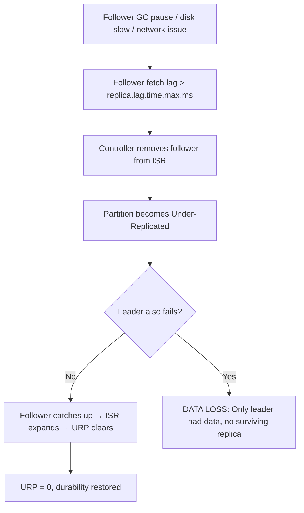
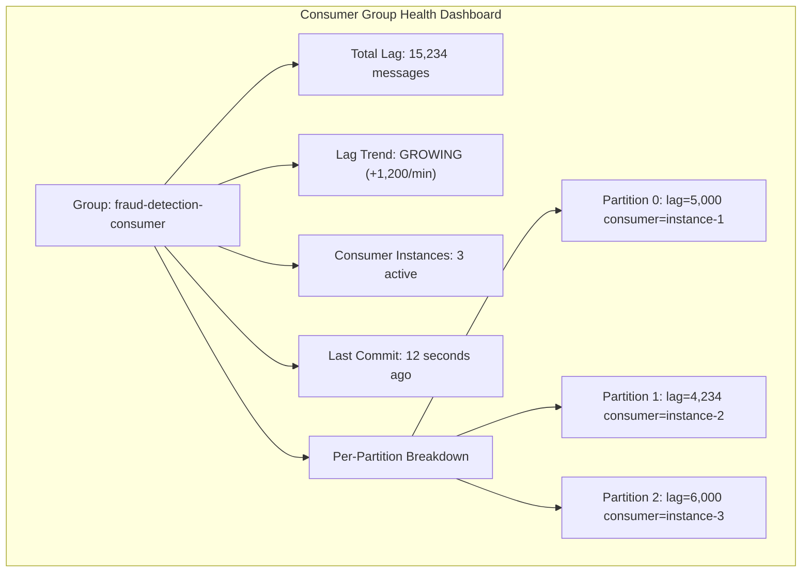
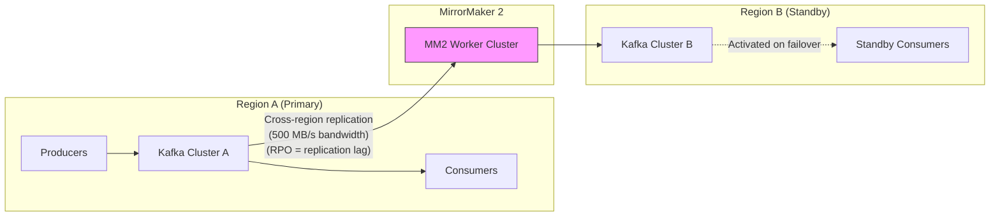

# Apache Kafka Deep Dive  Part 9: Production Operations  Monitoring, Incident Response, and Capacity Planning

---

**Series:** Apache Kafka Deep Dive  From First Principles to Planet-Scale Event Streaming
**Part:** 9 of 10
**Audience:** Senior backend engineers, distributed systems engineers, data platform architects
**Reading time:** ~45 minutes

---

## Preface

Parts 0 through 8 built the complete technical foundation: the distributed log abstraction, broker storage using segments and the page cache, the ISR replication protocol, consumer group coordination and rebalancing, the storage engine internals, producer durability guarantees, performance engineering at the hardware and software boundary, and stream processing with Kafka Streams and ksqlDB.

You now understand how Kafka works from first principles. This part is about how Kafka *fails* in production and how you detect, respond to, and prevent those failures at scale.

Production operations for Kafka is not simply "install Prometheus, point at JMX, make dashboards." It is a discipline that requires understanding the causal relationships between metrics  why a growing ISR shrink rate three days ago is the leading indicator of a disk-full incident today, why a single misconfigured `max.poll.interval.ms` can destabilize an entire consumer group across all its partitions, and why capacity planning without accounting for replication factor is how you end up with a 3 a.m. page.

This article organizes production Kafka operations into a coherent framework: monitoring philosophy and metric layering, the critical broker metrics and what they tell you about the system's internal state, consumer lag monitoring as a business-level signal, safe upgrade and migration procedures, partition management at scale, runbooks for the five most common failure modes, and a disciplined approach to capacity planning before problems materialize.

By the end of this article, you will be able to build a monitoring stack that alerts on the right things at the right thresholds, diagnose any of the common Kafka failure modes from first principles, execute a rolling upgrade without data loss, and project when your cluster will need expansion before the disk fills.

---

## 1. Monitoring Philosophy: What to Watch and Why

### 1.1 The Four Golden Signals Applied to Kafka

The four golden signals  latency, traffic, errors, and saturation  originate from the Google SRE book as a universal framework for service monitoring. Kafka maps cleanly onto all four, though the signals manifest at multiple layers simultaneously.

**Latency** in Kafka has two distinct dimensions. Produce latency is the time from when a producer calls `send()` to when the broker acknowledges the write (or when the record is committed to all ISR replicas, depending on `acks`). Consume end-to-end latency is the time from when a record is produced to when a consumer processes it  this is largely determined by consumer lag. Both are meaningful; the first tells you about broker health and producer configuration, the second tells you about business SLA adherence.

**Traffic** is measured as messages per second and bytes per second, separately tracked per topic and per broker. Traffic metrics serve two purposes: they tell you whether the system is operating at expected throughput levels (a sudden drop in messages/sec often indicates a stuck producer upstream of Kafka), and they tell you how close you are to capacity limits.

**Errors** in Kafka are not HTTP 5xx codes  they manifest as failed produce requests, failed fetch requests, ISR shrinks (a replica has fallen out of sync), offline partitions (no leader elected), and consumer group rebalances that fail to stabilize. ISR shrinks are particularly important as a leading error signal: they precede broker failures in a large fraction of production incidents.

**Saturation** is the signal most engineers underweight. Kafka saturates at disk (write I/O and storage capacity), CPU (compression/decompression, ZooKeeper/KRaft processing), network (bytes in plus bytes out per NIC), and at the broker's request handler thread pool (the number of threads available to process produce and fetch requests). The request handler thread pool is the most counterintuitive saturation point  a broker can be CPU-idle but completely saturated if all request handler threads are blocked waiting on slow disk I/O.

### 1.2 Layered Monitoring: Infrastructure to Business SLAs

Production Kafka monitoring requires four distinct layers, each dependent on the one below it.

```
┌─────────────────────────────────────────────────────────┐
│  Layer 4: Business SLAs                                  │
│  Fraud detection lag < 500ms, Order processing < 2s     │
├─────────────────────────────────────────────────────────┤
│  Layer 3: Producer/Consumer Client Metrics               │
│  Producer record-error-rate, Consumer lag, Poll latency  │
├─────────────────────────────────────────────────────────┤
│  Layer 2: Broker JMX Metrics                             │
│  URP, ISR shrinks, Request handler utilization, Offline  │
│  partitions, Bytes in/out, Log flush latency             │
├─────────────────────────────────────────────────────────┤
│  Layer 1: Infrastructure                                 │
│  Disk IOPS, Disk utilization%, CPU%, Network MB/s, RAM   │
└─────────────────────────────────────────────────────────┘
```

A failure at Layer 1 (disk IOPS saturation) will manifest at Layer 2 (high log flush latency → high request handler wait time → high URP), then propagate to Layer 3 (producer timeout errors, growing consumer lag), and eventually to Layer 4 (business SLA violated). Monitoring only one layer gives you either lagging signals (only monitoring Layer 4 means you find out when customers complain) or noisy signals (only monitoring Layer 1 means disk IOPS spikes that never affect Kafka trigger pages).

The correct approach is to alert at the layer where the signal is actionable and specific, and to use the layer above it to validate customer impact.

### 1.3 Metric Collection Stack

Kafka brokers expose metrics via JMX (Java Management Extensions). The standard production stack for scraping, storing, and visualizing those metrics is:

```
┌──────────────────────────────────────────────────────────────────────┐
│                         Kafka Broker (JVM)                           │
│  Exposes metrics at: service:jmx:rmi:///jndi/rmi://host:9999/jmxrmi │
└──────────────────────────┬───────────────────────────────────────────┘
                           │ JMX scrape (every 15s)
                           ▼
┌──────────────────────────────────────────────────────────────────────┐
│              Prometheus JMX Exporter (runs as Java agent)            │
│  Converts JMX MBeans to Prometheus exposition format                 │
│  Config: kafka-jmx-exporter.yaml (maps JMX paths to metric names)   │
│  Exposes: http://broker:7071/metrics                                 │
└──────────────────────────┬───────────────────────────────────────────┘
                           │ HTTP scrape (every 15s)
                           ▼
┌──────────────────────────────────────────────────────────────────────┐
│                         Prometheus                                    │
│  Stores time-series data, evaluates alerting rules                   │
│  Retention: 15 days local, long-term remote write to Thanos/Mimir    │
└──────────────────────────┬───────────────────────────────────────────┘
                           │ PromQL queries
                           ▼
┌──────────────────────────────────────────────────────────────────────┐
│                           Grafana                                    │
│  Dashboards: Broker overview, Consumer lag, Topic metrics            │
│  Alerting: Routes to PagerDuty/Opsgenie via Alertmanager             │
└──────────────────────────────────────────────────────────────────────┘
```

The JMX Exporter configuration file is non-trivial to write from scratch. The Kafka community maintains a reference configuration at `prometheus/jmx_exporter` on GitHub. Start from that and customize.

**Alternatives to Prometheus/Grafana:**
- **Datadog Agent**: The Datadog Kafka integration scrapes JMX natively. Lower operational overhead than running Prometheus + Alertmanager + Grafana, but costs scale with metric volume.
- **Confluent Control Center**: Full-featured commercial UI included with Confluent Platform. Rich consumer lag visualization and schema registry integration. Requires Confluent licensing.
- **OpenTelemetry Collector**: The emerging standard for telemetry collection. Kafka has a JMX receiver in the OTel contrib collector. Routes to any OTLP-compatible backend.

### 1.4 Priority Order for Alerting

Not all Kafka metrics deserve the same alerting priority. Here is the priority order for a production cluster, ordered by the urgency and severity of what they indicate:

| Priority | Metric | Threshold | Severity |
|----------|--------|-----------|----------|
| 1 | Under-Replicated Partitions | > 0 for > 5 min | P1 |
| 2 | Active Controller Count | != 1 | P0 |
| 3 | Offline Partitions Count | > 0 | P0 |
| 4 | Consumer Lag (sustained growth) | rate > 0 AND lag > SLO | P1-P2 |
| 5 | Disk Utilization | > 75% | P2 |
| 6 | ISR Shrink Rate | > 0 for > 10 min | P2 |
| 7 | Request Handler Idle % | < 30% | P2 |
| 8 | Network Handler Idle % | < 30% | P2 |

Active Controller Count and Offline Partitions are P0 because they mean the cluster is either partially or fully unable to serve traffic. URP is P1 because it means data is currently at risk of loss if the leader fails. These three are non-negotiable alerts that must page someone immediately at any hour.

---

## 2. Critical Broker Metrics

### 2.1 Under-Replicated Partitions (URP)

Under-Replicated Partitions is the single most important broker health metric. A partition is under-replicated when the number of in-sync replicas (ISR) is less than the replication factor configured for that topic. In the normal case, a topic with `replication.factor=3` has three replicas all in-sync. When one follower falls behind, the ISR shrinks to two and that partition becomes under-replicated.

**JMX path:**
```
kafka.server:type=ReplicaManager,name=UnderReplicatedPartitions
```

**Prometheus metric name (after JMX Exporter mapping):**
```
kafka_server_replicamanager_underreplicatedpartitions
```

**Alert threshold:** > 0 sustained for more than 5 minutes. The 5-minute grace period is intentional  during a leader election or a brief GC pause on a follower, URP can transiently spike to a non-zero value and then return to zero within seconds or minutes. Alerting on any non-zero value creates noise. Alerting on sustained non-zero values identifies genuine problems.

**Why URP matters:** When a partition is under-replicated, data written to the leader exists on fewer replicas than the configured replication factor. If the leader crashes at this moment, data that has been acknowledged to producers (under `acks=all`) is *not necessarily* on a surviving replica  because the follower that would have held the copy is currently behind. This is the data-loss window that URP quantifies. Every minute of URP is a minute where the cluster's durability guarantees are weakened.

**Root causes of sustained URP:**

1. **Broker down**  the most obvious cause. A follower that is down cannot replicate. Check `kafka-broker-api-versions.sh --bootstrap-server broker:9092` to see which brokers respond.

2. **Follower GC pause**  a long GC pause on the follower JVM causes it to stop fetching from the leader. If the pause exceeds `replica.lag.time.max.ms` (default 30 seconds), the follower is removed from the ISR. After GC completes, the follower begins catching up, but during catch-up the partition is under-replicated.

3. **Disk I/O saturation on follower**  if the follower's disk cannot keep up with the replication write rate, the follower falls behind. The leader's replication log accumulates pending data for the slow follower. Eventually `replica.lag.time.max.ms` expires and the follower is evicted from ISR.

4. **Network partition**  if the network between the leader broker and the follower broker becomes unreliable or drops, the follower stops receiving replication data. The ISR shrinks. This is distinguishable from broker down because the follower process is alive and healthy when viewed locally.

**Mermaid diagram  URP causal chain:**



### 2.2 Active Controller Count

The controller is the broker elected to manage cluster-level state: partition leadership assignments, ISR changes, broker registrations, and topic creation/deletion. At any instant, exactly one broker in the cluster is the active controller.

**JMX path:**
```
kafka.controller:type=KafkaController,name=ActiveControllerCount
```

**Expected value:** Exactly 1 on the broker that is currently the controller. All other brokers report 0. When you sum this metric across all brokers, the sum must be 1.

**Alert threshold:** Sum across all brokers != 1. This is a P0 alert.

- **Sum = 0**: No controller is elected. The cluster cannot perform any metadata operations. Producer connections may succeed for existing leadership information cached by clients, but new topic creation, broker failures, and partition reassignments cannot be handled. The cluster is in a degraded state.
- **Sum >= 2**: Split-brain  two brokers believe they are the controller simultaneously. This is a serious bug condition, typically caused by a ZooKeeper or KRaft quorum anomaly. Two controllers issuing conflicting metadata updates can corrupt cluster state.

In practice, controller elections complete within seconds after a controller failure. A sustained Active Controller Count of 0 indicates that the ZooKeeper quorum (or KRaft quorum in Kafka 3.x+) cannot reach consensus  typically due to a ZooKeeper/KRaft node failure reducing quorum below the majority threshold.

### 2.3 Offline Partitions Count

An offline partition has no elected leader. This means no producer can write to it and no consumer can read from it. The partition is completely unavailable.

**JMX path:**
```
kafka.controller:type=KafkaController,name=OfflinePartitionsCount
```

**Expected value:** 0 at all times.

**Alert threshold:** > 0, immediately, P0.

A partition goes offline when all replicas in its ISR fail. This requires multiple simultaneous broker failures, which is rare  but it is exactly the scenario that justifies a multi-replica replication factor in the first place. A partition can also go offline if `unclean.leader.election.enable=false` (the default) and the only surviving replicas are out-of-sync replicas. In this case, Kafka refuses to elect an out-of-sync replica as leader (which would cause data loss) and leaves the partition offline instead.

The choice between `unclean.leader.election.enable=true` (prefer availability, risk data loss) and `false` (prefer consistency, risk unavailability) is the classic CAP theorem tradeoff and should be a deliberate architectural decision, not the default.

### 2.4 Request Handler Pool Utilization

Kafka brokers process produce and fetch requests on a pool of I/O threads called the request handler pool, sized by `num.io.threads` (default: 8). This metric measures the average idle percentage of those threads.

**JMX path:**
```
kafka.server:type=KafkaRequestHandlerPool,name=RequestHandlerAvgIdlePercent
```

**Alert threshold:** Idle% < 30%. At this point, the thread pool is more than 70% utilized on average, and peak utilization is likely saturating it completely, causing request queuing and latency spikes.

**Why this matters:** Each request handler thread processes one request at a time. If all threads are busy waiting on disk I/O (the most common cause), incoming requests queue in the network receive buffer. Queue depth grows. Produce timeouts occur. Consumers experience fetch delays. The broker looks CPU-idle (because threads are waiting on I/O, not computing), which can mislead engineers who check only CPU utilization.

**Actions when request handler utilization is high:**
1. Increase `num.io.threads`  up to 2x the number of disk spindles or NVMe devices on the broker.
2. Check disk I/O utilization  if disks are saturated, adding threads will not help; you need faster storage or fewer partitions per broker.
3. Reduce partitions per broker  each partition adds replication fetch overhead to each broker.
4. Add brokers and reassign partitions to reduce load per broker.

### 2.5 Network Handler Pool Utilization

Separate from the I/O thread pool, Kafka has a network processor pool (sized by `num.network.threads`, default: 3) that handles TCP accept/read/write operations. This pool is the front door for all client connections.

**JMX path:**
```
kafka.network:type=SocketServer,name=NetworkProcessorAvgIdlePercent
```

**Alert threshold:** Idle% < 30%.

Network thread saturation is less common than I/O thread saturation, but it occurs when the broker handles a very large number of concurrent client connections or a very high number of small requests per second. Each network thread manages multiple connections via a Java NIO selector, but at very high connection counts (thousands of producers + consumers), the network thread pool becomes the bottleneck.

**Actions:** Increase `num.network.threads`. Unlike I/O threads, network threads are not disk-bound, so increasing thread count up to 2x CPU cores is generally safe.

### 2.6 Log Flush Latency

Kafka's default configuration relies on the OS page cache to flush writes to disk asynchronously. When `log.flush.interval.messages` or `log.flush.interval.ms` are configured to force explicit flushes (which most production deployments avoid  relying instead on replication for durability), flush latency becomes significant.

**JMX path:**
```
kafka.log:type=LogFlushStats,name=LogFlushRateAndTimeMs
```

Even when relying on OS-level flushes, high disk I/O utilization will increase the time the OS takes to write dirty pages, which indirectly increases the time between a `write()` syscall completing and data being durable on disk. The log flush latency metric reflects how quickly the broker's log append path completes disk operations.

**High log flush latency is a symptom, not a root cause.** The root cause is disk I/O saturation, which you will see simultaneously in the infrastructure layer (iowait% on the host, disk utilization%, disk queue depth). The causal chain: disk slow → log flush latency high → request handler threads blocked waiting for disk → request handler idle% drops → produce/fetch latency increases → producer timeouts → consumer lag grows.

### 2.7 ISR Expand and Shrink Rates

The ISR shrink rate is the rate at which replicas are being removed from the ISR. The ISR expand rate is the rate at which previously-removed replicas are being re-added after catching up.

**JMX paths:**
```
kafka.server:type=ReplicaManager,name=IsrShrinksPerSec
kafka.server:type=ReplicaManager,name=IsrExpandsPerSec
```

**Interpreting the pattern:**

| Pattern | Meaning | Action |
|---------|---------|--------|
| Occasional shrink followed immediately by expand | Transient GC pause on follower; follower recovered and caught up | Monitor; if GC pauses persist, tune JVM |
| Sustained shrink with no expand | Follower is permanently behind or down | Investigate follower: disk, GC, network |
| Shrink rate high, expands lagging | Follower keeps falling out of ISR, catching up slowly, and being removed again | Follower disk I/O cannot keep up with write rate; reduce partition count on that broker or upgrade disk |
| Shrink on all partitions on a specific broker | Whole broker is falling behind | Broker-level issue: disk, GC, network; investigate that broker specifically |

A healthy cluster should have ISR shrink rates near zero most of the time, with only brief transient spikes.

### 2.8 Bytes In/Out Rates Per Broker

Network throughput metrics reveal two important things: the absolute load level relative to NIC capacity, and the distribution of load across brokers.

**JMX paths:**
```
kafka.server:type=BrokerTopicMetrics,name=BytesInPerSec
kafka.server:type=BrokerTopicMetrics,name=BytesOutPerSec
```

Note that `BytesOutPerSec` includes *both* consumer fetch traffic and replication traffic from followers fetching from the leader. On a cluster with replication factor 3, `BytesOutPerSec` on a leader broker will be approximately `consumer_bytes + (replication_factor - 1) × write_bytes = consumer_bytes + 2 × write_bytes`. A broker with 1 GB/s of writes could easily have 3+ GB/s of outbound traffic, consuming a significant portion of a 10 GbE NIC.

**Imbalance detection:** Compare `BytesInPerSec` across all brokers. If one broker is handling 3x the write throughput of others, partition distribution is skewed  likely because one topic's partitions are unevenly distributed, or because a high-traffic topic has all its leaders on one broker. Run `kafka-leader-election.sh` to rebalance leaders, or use Cruise Control for automated rebalancing.

### 2.9 Full Broker Metrics Reference Table

| Metric Name | JMX Path | Alert Threshold | Meaning | Action |
|-------------|----------|-----------------|---------|--------|
| UnderReplicatedPartitions | `kafka.server:type=ReplicaManager,name=UnderReplicatedPartitions` | > 0 for 5+ min | Replicas behind  data at risk | Investigate follower: disk, GC, network, broker down |
| ActiveControllerCount | `kafka.controller:type=KafkaController,name=ActiveControllerCount` | != 1 (sum across cluster) | Controller missing or split-brain | Check ZK/KRaft quorum; restart controller broker |
| OfflinePartitionsCount | `kafka.controller:type=KafkaController,name=OfflinePartitionsCount` | > 0 | Partitions with no leader  unavailable | Identify failed brokers; restore or reassign |
| RequestHandlerAvgIdlePercent | `kafka.server:type=KafkaRequestHandlerPool,name=RequestHandlerAvgIdlePercent` | < 30% | I/O thread pool saturated | Increase num.io.threads; check disk I/O |
| NetworkProcessorAvgIdlePercent | `kafka.network:type=SocketServer,name=NetworkProcessorAvgIdlePercent` | < 30% | Network thread pool saturated | Increase num.network.threads |
| LogFlushRateAndTimeMs | `kafka.log:type=LogFlushStats,name=LogFlushRateAndTimeMs` | p99 > 1s | Disk I/O backing up | Investigate disk saturation; reduce flush frequency |
| IsrShrinksPerSec | `kafka.server:type=ReplicaManager,name=IsrShrinksPerSec` | > 0 sustained | Replicas falling out of ISR | GC tuning on followers; check disk/network |
| IsrExpandsPerSec | `kafka.server:type=ReplicaManager,name=IsrExpandsPerSec` |  | Rate of ISR re-admission | Companion to shrinks; healthy pattern: shrink quickly followed by expand |
| BytesInPerSec | `kafka.server:type=BrokerTopicMetrics,name=BytesInPerSec` | > 70% NIC capacity | Network ingress approaching limit | Add brokers; reassign partitions |
| BytesOutPerSec | `kafka.server:type=BrokerTopicMetrics,name=BytesOutPerSec` | > 70% NIC capacity | Network egress approaching limit | Check consumer count; rebalance leaders |
| TotalFetchRequestsPerSec | `kafka.server:type=BrokerTopicMetrics,name=TotalFetchRequestsPerSec` |  | Request rate; use for capacity planning | Baseline tracking; alert on sudden drop (stuck consumer) |
| ProduceRequestsPerSec | `kafka.server:type=BrokerTopicMetrics,name=TotalProduceRequestsPerSec` |  | Producer request rate | Baseline tracking; alert on sudden drop (stuck producer) |
| FailedProduceRequestsPerSec | `kafka.server:type=BrokerTopicMetrics,name=FailedProduceRequestsPerSec` | > 0 | Producers getting errors | Check URP, offline partitions, broker errors |
| FailedFetchRequestsPerSec | `kafka.server:type=BrokerTopicMetrics,name=FailedFetchRequestsPerSec` | > 0 | Consumers getting errors | Check broker health, network, permissions |
| ActiveConnections | `kafka.server:type=socket-server-metrics,name=connection-count` | > 80% of max.connections | Approaching connection limit | Increase max.connections; add brokers |

---

## 3. Consumer Lag Monitoring

### 3.1 Lag Definition

Consumer lag is the difference between the Log End Offset (LEO)  the offset of the next message that will be written to a partition  and the consumer group's committed offset for that partition:

```
lag = partition_LEO - consumer_committed_offset
```

A lag of 0 means the consumer has processed every message that has been produced. A lag of 10,000 means the consumer is 10,000 messages behind the head of the partition. Lag is always measured per partition and then typically reported as the sum or maximum across all partitions in a consumer group.

Lag is not measured in time  it is measured in message count. To convert to time, you need to divide by the consumption rate:

```
estimated_time_behind = lag / consumer_messages_per_second
```

This is why lag alone is insufficient for SLA monitoring  a lag of 100,000 messages on a topic that processes 1,000,000 messages/second is 100 milliseconds behind. The same lag on a topic that processes 100 messages/second is 1,000 seconds behind.

### 3.2 Why Lag Is the Most Important Consumer Metric

Every other consumer metric is a proxy for what you actually care about: are consumers keeping up with producers? Consumer lag is the direct, unambiguous answer to that question. All other consumer metrics  poll rate, fetch throughput, processing time, rebalance count  are inputs that explain why lag is at its current value, but lag is the output you must track against your SLO.

The causal chain from business requirement to metric is:

```
Business SLA: "Fraud detection must process transactions within 500ms of production"
        ↓
Technical SLO: "Fraud detection consumer group lag must stay below 5,000 messages"
        ↓  (assuming 10,000 messages/second throughput → 5000 messages = 500ms)
Alert: rate(consumer_lag[30m]) > 0 AND consumer_lag > 5000
```

This is the correct way to translate a business SLA into a Kafka alerting rule.

### 3.3 Monitoring Tools for Consumer Lag

**kafka-consumer-groups.sh** (built-in CLI):

```bash
kafka-consumer-groups.sh \
  --bootstrap-server kafka-broker:9092 \
  --describe \
  --group fraud-detection-consumer
```

Output:
```
GROUP                   TOPIC          PARTITION  CURRENT-OFFSET  LOG-END-OFFSET  LAG   CONSUMER-ID         HOST
fraud-detection-consumer transactions  0          1234567         1234572         5     consumer-1-uuid     /10.0.0.1
fraud-detection-consumer transactions  1          2345678         2345679         1     consumer-2-uuid     /10.0.0.2
fraud-detection-consumer transactions  2          3456789         3456799         10    consumer-3-uuid     /10.0.0.3
```

This gives a point-in-time snapshot per partition. It is useful for ad-hoc debugging but not for alerting  it does not tell you whether lag is growing, stable, or shrinking.

**Burrow** (LinkedIn open-source lag monitor):

Burrow continuously tracks consumer group offsets and computes lag trends over time. Its key insight is that point-in-time lag is not as useful as lag *velocity*. Burrow classifies consumer groups as:

- **OK**: Lag is stable or decreasing
- **WARNING**: Lag is non-zero but consumer is making progress
- **ERROR**: Lag is growing and consumer is falling further behind

Burrow exposes an HTTP API for querying group status and integrates with alerting systems. It handles the phantom lag problem (Section 3.6) by tracking whether a consumer is actively committing offsets, not just whether lag exists.

**Prometheus + JMX Exporter** (client-side metrics):

Consumer clients expose lag metrics directly from the client library:

```
kafka.consumer:type=consumer-fetch-manager-metrics,
  client-id=fraud-detection,
  topic=transactions,
  partition=0,
  attribute=records-lag
```

The aggregate metric across all partitions:
```
kafka.consumer:type=consumer-fetch-manager-metrics,
  client-id=fraud-detection,
  attribute=records-lag-max
```

Client-side lag metrics have an important limitation: they reflect the lag *at the time of the last fetch*, not the current lag. If a consumer is stuck (not calling `poll()`), the client-side metric will not update. Burrow's server-side approach avoids this problem.

### 3.4 Lag Alerting Strategy

The naive alerting strategy is: alert when lag > threshold. This generates too many false positives. A better strategy has three rules:

**Rule 1: Alert on sustained growth, not absolute value.**

```promql
# Alert if lag has been growing for 30 minutes AND is already above the minimum threshold
increase(kafka_consumer_group_lag[30m]) > 0 AND kafka_consumer_group_lag > 1000
```

A lag spike during a rebalance is expected and self-correcting. A lag that grows monotonically for 30 minutes indicates a genuine problem.

**Rule 2: Alert when lag crosses the SLO threshold.**

```promql
# Alert when lag exceeds the SLO-derived threshold
kafka_consumer_group_lag{group="fraud-detection"} > 5000
```

This is the SLA-derived alert that pages on-call when the business SLA is at risk.

**Rule 3: Alert when a consumer group disappears entirely.**

```promql
# Alert when a consumer group that was previously active stops reporting
absent(kafka_consumer_group_lag{group="fraud-detection"})
```

A consumer group that has crashed entirely stops reporting metrics. `absent()` detects this case.

### 3.5 Consumer Group Health Dashboard

A well-designed consumer lag dashboard should show the following information per consumer group:



The key elements: aggregate lag with trend (not just point-in-time), number of active consumer instances, time since last offset commit, and per-partition breakdown. Per-partition breakdown is critical for diagnosing skew  if one partition has 90% of the lag, that indicates a hot partition or a dead consumer instance that was assigned to that partition.

### 3.6 The Phantom Lag Problem

Phantom lag is a frequent cause of spurious P1 alerts. It occurs when a consumer group's consumer instances have all stopped (gracefully shut down), but the group's committed offsets remain in `__consumer_offsets`. Because the group is not consuming, the partition's LEO continues to advance as producers write new messages. The lag metric  LEO minus committed offset  grows unboundedly even though no consumer is running.

```
Producers write to partition at 1,000 messages/second
Consumer group "batch-etl" shut down 6 hours ago for maintenance
Partition LEO grows by 1,000/sec × 21,600 sec = 21,600,000 messages
Lag reported: 21,600,000 messages
Alert fires: "CRITICAL: batch-etl lag = 21.6M messages"
On-call engineer wakes up at 3am to discover the consumer is intentionally stopped
```

**Solutions:**

1. **Monitor consumer heartbeat status alongside lag.** A consumer group with active members shows `STABLE` state. A consumer group with no members shows `EMPTY` state. Only alert if state is `STABLE` and lag is growing  a growing lag in an `EMPTY` group is expected and should not page.

2. **Use Burrow.** Burrow's evaluation model considers whether the consumer is making progress (committing offsets), not just whether lag exists. A group with no committed offsets in the past N minutes is classified as not-running, and its lag is not treated as an ERROR condition.

3. **Implement consumer lifecycle events.** When a consumer group is intentionally shut down for maintenance, emit a metric or set a flag that suppresses lag alerts for that group for a defined maintenance window.

---

## 4. Rolling Upgrades and Version Management

### 4.1 Kafka Versioning

Kafka follows semantic versioning: `major.minor.patch` (e.g., `3.7.0`). The versioning conventions matter for operations:

- **Patch versions** (3.7.0 → 3.7.1): Bug fixes and security patches. Safe to apply without protocol version changes. Requires rolling restart.
- **Minor versions** (3.6.x → 3.7.x): New features, potential new wire protocol versions, possible deprecations. Requires coordinated `inter.broker.protocol.version` management during upgrade.
- **Major versions** (2.x → 3.x): Significant changes. In the 2.x → 3.x transition, ZooKeeper dependency was deprecated in favor of KRaft. Major version upgrades require careful planning.

### 4.2 Inter-Broker Protocol Version

The `inter.broker.protocol.version` configuration controls which Kafka protocol version is used for communication between brokers. This is the critical configuration to manage during a rolling upgrade.

During a rolling upgrade, different brokers in the cluster run different software versions simultaneously. The protocol version must be set to the *lower* of the two versions to ensure all brokers can communicate. Only after all brokers are upgraded to the new version should the protocol version be updated to the new version.

The `log.message.format.version` configuration (controlling the message format version used for log storage) is separate but related. It was deprecated in Kafka 3.0 and effectively replaced by `inter.broker.protocol.version`. In Kafka 3.x, setting `inter.broker.protocol.version` controls both the wire protocol and the storage format.

### 4.3 Rolling Upgrade Procedure

The safe procedure for upgrading Kafka from version X to version X+1 with zero data loss and minimal unavailability:

```
Pre-upgrade checklist:
  [ ] Read the Kafka release notes for X+1. Note any configuration deprecations.
  [ ] Verify current inter.broker.protocol.version is set to version X.
  [ ] Verify all brokers are healthy (URP = 0, no offline partitions).
  [ ] Schedule during low-traffic period if possible.
  [ ] Have rollback plan: know how to restart with version X binaries.
```

**Step-by-step procedure:**

1. **Set `inter.broker.protocol.version` to the current version** (if not explicitly set, set it now to the current version string). This ensures the value is explicit before you start upgrading.

2. **For each broker, sequentially (one at a time):**
   - a. Gracefully stop the broker: `systemctl stop kafka` or send `SIGTERM` to the Kafka process. The broker will hand off partition leadership before shutting down (if `controlled.shutdown.enable=true`, which is the default).
   - b. Replace the Kafka JAR or binary with the new version.
   - c. Start the broker with the new version: `systemctl start kafka`.
   - d. Wait for the broker to rejoin the cluster and for all partitions to return to full replication: monitor `UnderReplicatedPartitions` until it returns to 0.
   - e. Verify the broker is healthy before proceeding to the next broker.

3. **After all brokers are running the new version:**
   - Update `inter.broker.protocol.version` to the new version string in broker configuration.
   - Perform a second rolling restart (one broker at a time) to apply the new protocol version.

4. **Validate:** Run `kafka-broker-api-versions.sh` to confirm all brokers report the new version. Run a full health check: URP = 0, ActiveControllerCount = 1, OfflinePartitionsCount = 0.

```mermaid
sequenceDiagram
    participant Ops as Operator
    participant B1 as Broker 1 (old)
    participant B2 as Broker 2 (old)
    participant B3 as Broker 3 (old)
    participant Cluster as Cluster State

    Ops->>B1: Stop broker 1
    B1->>Cluster: Handoff partition leaders
    Ops->>B1: Upgrade to new version
    Ops->>B1: Start broker 1 (new)
    B1->>Cluster: Rejoin, fetch replication data
    Cluster-->>Ops: URP = 0 (B1 caught up)
    Note over B2,B3: Still running old version; inter.broker.protocol.version = old
    Ops->>B2: Stop broker 2
    B2->>Cluster: Handoff partition leaders
    Ops->>B2: Upgrade to new version
    Ops->>B2: Start broker 2 (new)
    B2->>Cluster: Rejoin, fetch replication data
    Cluster-->>Ops: URP = 0 (B2 caught up)
    Ops->>B3: Stop broker 3 (repeat pattern)
    Note over B1,B3: All brokers now new version
    Ops->>Cluster: Update inter.broker.protocol.version to new version
    Ops->>Cluster: Rolling restart to apply new protocol version
```

### 4.4 Client Compatibility

Kafka maintains strong backward compatibility between clients and brokers. The rule is:

- New clients can talk to old brokers (using the feature subset supported by the old broker).
- Old clients can talk to new brokers (the broker speaks the older protocol version the client requests).

This means you should always upgrade brokers before upgrading clients. If a new broker version introduces a bug in the old protocol path and you have already upgraded clients, you may have more blast radius. If brokers are upgraded first, clients continue working against the old protocol until you are ready to upgrade them.

Producer and consumer API compatibility is maintained across major versions (2.x clients work against 3.x brokers), but certain features  like idempotent producer with transactions, cooperative rebalancing  require both client and broker to be at compatible versions.

### 4.5 ZooKeeper to KRaft Migration

Kafka 2.x and early 3.x used Apache ZooKeeper for cluster metadata storage. From Kafka 3.3 onward, KRaft (Kafka Raft) mode is the preferred metadata management mechanism. Kafka 4.0 removes ZooKeeper support entirely.

KRaft replaces ZooKeeper with a Raft-based consensus group built into Kafka itself, eliminating an external dependency and significantly reducing cluster management complexity. The controller in KRaft mode is a dedicated role (KRaft controller nodes) rather than a dynamically-elected broker.

**Migration procedure (Kafka 3.3-3.7, for existing ZooKeeper-based clusters):**

```
Phase 1: Deploy KRaft controller quorum
  1. Provision KRaft controller nodes (3 or 5, for quorum)
  2. Run kafka-storage.sh format to initialize KRaft metadata log
  3. Configure controllers with process.roles=controller and quorum voters list

Phase 2: Enable dual-write mode
  4. Update ZooKeeper brokers to enable metadata migration feature flag
  5. ZooKeeper metadata is now mirrored to KRaft controllers in real time
  6. Monitor: KRaft controllers should show metadata lag = 0

Phase 3: Migrate brokers one by one
  7. For each broker: stop broker, reconfigure for KRaft mode
     (remove zookeeper.connect, add controller.quorum.voters)
  8. Start broker in KRaft mode. Broker fetches metadata from KRaft controllers.
  9. Wait for URP = 0 before proceeding to next broker.

Phase 4: Decommission ZooKeeper
  10. After all brokers are in KRaft mode, disable ZooKeeper metadata writes
  11. Shut down ZooKeeper ensemble
  12. Remove ZooKeeper configuration from all brokers
```

**Critical warnings:**
- The migration is **irreversible** once Phase 3 begins. There is no supported rollback path after migrating a broker to KRaft mode.
- Test the full migration procedure in a staging environment that mirrors your production cluster configuration before executing in production.
- Kafka's migration tooling (`kafka-zk-to-kraft-migration.sh`) handles the state transfer, but you must validate metadata integrity at each phase.

---

## 5. Partition Reassignment and Rebalancing

### 5.1 When to Reassign Partitions

Partition reassignment moves partition-replicas from one broker to another. This is necessary in several scenarios:

**After adding brokers:** New brokers join the cluster empty. Kafka does not automatically rebalance existing topic partitions onto new brokers. You must explicitly reassign partitions to distribute load to the new capacity.

**After replacing failed brokers:** If a broker is permanently lost (hardware failure), its partitions need to be re-replicated to surviving or replacement brokers.

**Correcting partition skew:** Some brokers may accumulate more partitions than others due to uneven topic creation patterns. Reassignment corrects this.

**Moving to new storage:** If you are migrating data directories, upgrading disk hardware, or moving log directories, reassignment is the mechanism to trigger data movement.

### 5.2 Manual Reassignment with kafka-reassign-partitions.sh

The partition reassignment tool has three phases: generate, execute, and verify.

**Generate a reassignment plan:**
```bash
# topics.json specifies which topics to consider for reassignment
cat topics.json
{
  "topics": [{"topic": "payments.transactions.created.v2"}],
  "version": 1
}

kafka-reassign-partitions.sh \
  --bootstrap-server kafka-broker:9092 \
  --generate \
  --topics-to-move-json-file topics.json \
  --broker-list "1,2,3,4"
```

This outputs two JSON objects: the current assignment (save this for rollback) and the proposed assignment. Review the proposed assignment carefully  the tool generates a plan but cannot know your topology constraints (rack awareness, network locality, disk availability per broker).

**Execute the reassignment:**
```bash
kafka-reassign-partitions.sh \
  --bootstrap-server kafka-broker:9092 \
  --execute \
  --reassignment-json-file proposed-reassignment.json
```

Execution begins immediately. Each partition being reassigned will add a new follower replica on the target broker, which must fetch all existing data from the current leader before the partition can be considered in-sync on the target.

**Monitor progress:**
```bash
kafka-reassign-partitions.sh \
  --bootstrap-server kafka-broker:9092 \
  --verify \
  --reassignment-json-file proposed-reassignment.json
```

Run verify every few minutes to check progress. Large partitions with significant data to replicate can take hours to complete.

### 5.3 Throttling Reassignment Traffic

Without throttling, partition reassignment will attempt to replicate data at the maximum available network and disk speed. On a busy production cluster, this saturates the broker's network and disk, causing latency spikes for live producers and consumers. Always apply a throttle before executing reassignment.

**Apply replication throttle:**
```bash
kafka-configs.sh \
  --bootstrap-server kafka-broker:9092 \
  --alter \
  --entity-type brokers \
  --entity-default \
  --add-config "leader.replication.throttled.rate=52428800,follower.replication.throttled.rate=52428800"
```

`52428800` bytes/second = 50 MB/s. Choose a throttle rate that leaves sufficient headroom for production traffic. A common heuristic: throttle to no more than 50% of available network bandwidth, accounting for replication factor.

**Remove the throttle after reassignment completes:**
```bash
kafka-configs.sh \
  --bootstrap-server kafka-broker:9092 \
  --alter \
  --entity-type brokers \
  --entity-default \
  --delete-config "leader.replication.throttled.rate,follower.replication.throttled.rate"
```

**Common mistake:** Engineers often forget to remove the throttle after reassignment completes. If the throttle remains in place, it will slow down *all* follower replication (not just reassignment replication), which can cause follower lag and ISR shrinks under normal write load. Always add throttle removal to your reassignment runbook as an explicit step.

### 5.4 Cruise Control for Automated Rebalancing

LinkedIn's Cruise Control (open-source) provides automated partition rebalancing for Kafka clusters. It continuously monitors broker load (disk, network, CPU, partition count) and generates rebalancing proposals to keep all brokers within balanced utilization targets.

Cruise Control's advantages over manual reassignment:

- **Automated:** Monitors cluster continuously and can trigger rebalancing without manual intervention.
- **Multi-dimensional optimization:** Balances not just partition count, but actual disk utilization, network throughput, and leader-to-follower ratio simultaneously.
- **Built-in throttling:** Applies configurable replication throttles automatically during execution.
- **REST API:** Exposes a REST API for querying load, generating proposals, and approving/executing rebalancing. Integrates with internal automation.
- **Anomaly detection:** Can automatically detect and respond to disk failures, broker over-load, and goal violations.

Cruise Control significantly reduces the mean time to recover (MTTR) for load imbalance issues, which on large clusters (100+ brokers, 10,000+ partitions) can take days to resolve manually.

### 5.5 Preferred Leader Election

Kafka designates the first replica in a partition's replica list as the "preferred leader"  the broker that should be the partition leader under normal (non-failure) conditions. When a broker restarts after a failure, its partitions may have a different broker acting as leader (the leader that was elected during the failure). The partition is technically healthy, but the leader is not on the preferred broker.

Over time, without intervention, partition leadership drifts from preferred assignments, causing load imbalance as some brokers end up leading far more partitions than others.

**Trigger preferred leader election:**
```bash
kafka-leader-election.sh \
  --bootstrap-server kafka-broker:9092 \
  --election-type PREFERRED \
  --all-topic-partitions
```

This is a metadata operation only  no data movement. It completes in seconds, not hours. Run this after any broker restart to restore balanced leadership.

**Automatic preferred leader election:** Set `auto.leader.rebalance.enable=true` in broker configuration (default: true) and `leader.imbalance.check.interval.seconds=300` (default: 300). The controller will automatically trigger preferred leader elections when leadership imbalance exceeds `leader.imbalance.per.broker.percentage` (default: 10%).

---

## 6. Topic Management at Scale

### 6.1 Topic Naming Conventions

As a Kafka cluster grows to hundreds or thousands of topics, ad-hoc naming creates operational chaos: no one knows what a topic named `my_topic_v3_FINAL` contains, who owns it, or whether it can be safely deleted.

A structured naming convention solves this:

```
[domain].[entity].[event-type].[version]
```

Examples:
- `payments.transactions.created.v2`
- `identity.users.profile-updated.v1`
- `inventory.products.stock-changed.v3`
- `notifications.emails.sent.v1`

**Benefits of structured naming:**
- Topic ownership is clear from the domain prefix.
- The version suffix allows schema evolution without breaking consumers (v1 consumers read v1 topics; v2 topics use updated schemas).
- Prefix-based ACLs become natural: the payments service has write access to `payments.*` topics.
- Retention, replication factor, and other configurations can be applied by prefix pattern.

**Enforcement:** Use a Kafka topic creation policy (`kafka.server.policy.CreateTopicPolicy`) implemented as a custom Java class deployed on brokers. The policy validates topic names against the naming convention and rejects topics that do not match. This prevents the naming convention from being advisory-only.

### 6.2 Topic Configuration as Code

Managing topic configurations through direct `kafka-configs.sh` commands in production is error-prone and unauditable. Use infrastructure-as-code tooling:

**Option 1: Terraform with Kafka provider**
```hcl
resource "kafka_topic" "payments_transactions" {
  name               = "payments.transactions.created.v2"
  replication_factor = 3
  partitions         = 12
  config = {
    "retention.ms"           = "604800000"   # 7 days
    "cleanup.policy"         = "delete"
    "compression.type"       = "lz4"
    "min.insync.replicas"    = "2"
  }
}
```

**Option 2: kafka-gitops**
YAML-based topic definitions committed to a Git repository, with a CI/CD pipeline that applies changes to the cluster. Topic configurations become pull request reviewable and have a complete audit history.

**Option 3: Kafka AdminClient in application bootstrapping**
Applications declare the topics they require and create/update them at startup via the AdminClient API. This couples topic configuration to application deployment, which is convenient for development but less appropriate for multi-team production environments.

### 6.3 Access Control Lists (ACLs)

Kafka ACLs enforce which principals (users, service accounts) can perform which operations on which resources (topics, consumer groups, cluster).

**Add a produce ACL for a service account:**
```bash
kafka-acls.sh \
  --bootstrap-server kafka-broker:9092 \
  --command-config admin.properties \
  --add \
  --allow-principal User:payment-service \
  --operation Write \
  --operation Describe \
  --topic payments.transactions.created.v2
```

**Add a consume ACL for a consumer group:**
```bash
kafka-acls.sh \
  --bootstrap-server kafka-broker:9092 \
  --command-config admin.properties \
  --add \
  --allow-principal User:fraud-detection-service \
  --operation Read \
  --operation Describe \
  --topic payments.transactions.created.v2 \
  --group fraud-detection-consumer
```

**Principle of least privilege in practice:** Each service should have write access only to the topics it produces to, and read access only to the topics and consumer groups it consumes. No service should have cluster-level admin permissions except the platform team's tooling.

**ACL management at scale:** With hundreds of services and topics, managing ACLs via CLI commands is unmanageable. Store ACL definitions in the same infrastructure-as-code repository as topic definitions. Use a Terraform Kafka provider or a custom reconciliation controller that reads ACL specifications from Git and applies them to the cluster.

### 6.4 Quotas: Protecting Broker Resources

Client quotas prevent runaway producers or consumers from consuming disproportionate broker resources, protecting other clients from noisy-neighbor effects.

**Set a produce quota for a service:**
```bash
kafka-configs.sh \
  --bootstrap-server kafka-broker:9092 \
  --alter \
  --entity-type clients \
  --entity-name analytics-producer \
  --add-config producer_byte_rate=10485760   # 10 MB/s
```

**Set a consume quota:**
```bash
kafka-configs.sh \
  --bootstrap-server kafka-broker:9092 \
  --alter \
  --entity-type clients \
  --entity-name analytics-consumer \
  --add-config consumer_byte_rate=10485760   # 10 MB/s
```

**Request rate quota:**
```bash
kafka-configs.sh \
  --bootstrap-server kafka-broker:9092 \
  --alter \
  --entity-type clients \
  --entity-name high-frequency-producer \
  --add-config request_percentage=25   # 25% of request handler threads
```

When a client exceeds its quota, the broker throttles the client by imposing a delay on responses. The client sees increased latency but does not receive errors. This is preferable to error-based throttling because it degrades gracefully.

**Quota hierarchy:** Quotas can be set at user level, client-id level, or user+client-id level. The most specific quota wins. This allows per-service quotas that apply regardless of how many instances are running.

### 6.5 Topic Deletion

Topic deletion is enabled by default (`delete.topic.enable=true`). Deleting a topic is permanent and immediate for client purposes  once deleted, producers and consumers get errors for that topic  but physical data deletion is asynchronous.

```bash
kafka-topics.sh \
  --bootstrap-server kafka-broker:9092 \
  --delete \
  --topic payments.transactions.created.v1
```

**What happens internally:**
1. The topic is marked for deletion in the cluster metadata.
2. Producers and consumers immediately receive errors (`UnknownTopicOrPartitionException`).
3. The Log Cleaner and retention processing runs on all brokers hosting partitions of the deleted topic.
4. Each broker deletes the log segments from disk when the cleaner processes them.
5. The topic metadata entry is removed from the controller.

The asynchronous deletion means that disk space is not immediately reclaimed. In a disk-full emergency, you cannot delete a topic and immediately recover disk space. You need to manually delete log segments (see the Disk Full runbook in Section 7.4).

There is no recovery from accidental topic deletion in a standard Kafka deployment. If you need recoverability, options include:
- Backup topics using MirrorMaker to another cluster before deletion.
- Use a topic rename/archive workflow (create new topic, stop producing to old topic, retain old topic read-only for a defined period, then delete).

### 6.6 Schema Registry Integration

Without schema enforcement, producers can write messages in any format, and consumer deserialization failures become a primary failure mode. Schema Registry enforces schema compatibility at produce time, preventing producers from breaking consumers.

**How it works:**
1. When a producer sends a message with Avro (or Protobuf/JSON Schema), the serializer contacts the Schema Registry to register or retrieve the schema ID.
2. The schema ID is embedded in the message bytes (4-byte prefix).
3. The consumer's deserializer reads the schema ID from the message, fetches the schema from Schema Registry, and deserializes.
4. Schema Registry enforces compatibility modes (BACKWARD, FORWARD, FULL) to prevent breaking changes.

**BACKWARD compatibility** (the most common mode): New consumers can read messages written with the old schema. This means you can add optional fields with defaults; you cannot remove or rename required fields.

**Example schema evolution:**

```json
// v1 schema
{
  "type": "record",
  "name": "Transaction",
  "fields": [
    {"name": "id", "type": "string"},
    {"name": "amount", "type": "double"}
  ]
}

// v2 schema (BACKWARD compatible: added optional field with default)
{
  "type": "record",
  "name": "Transaction",
  "fields": [
    {"name": "id", "type": "string"},
    {"name": "amount", "type": "double"},
    {"name": "currency", "type": "string", "default": "USD"}
  ]
}
```

A v1 consumer reading v2 messages will ignore the `currency` field (it does not know about it). A v2 consumer reading v1 messages will use the default value `"USD"` for `currency`. This is BACKWARD compatible.

---

## 7. Common Failure Modes and Runbooks

Kafka's failure modes are well-understood and recurring. Having pre-written runbooks reviewed by the team before incidents occur  not written for the first time during an incident  is the difference between a 15-minute resolution and a 3-hour incident.

The following runbooks assume Prometheus metrics and SSH access to brokers are available. Each runbook includes symptoms (what your monitoring will show), investigation steps (numbered for execution during an incident), and resolution steps.

### 7.1 Runbook: Broker Down

**Symptoms:**
- `kafka_server_replicamanager_underreplicatedpartitions` > 0 (partitions on the failed broker are under-replicated)
- `kafka_server_replicamanager_leadercount` drops to 0 on the affected broker
- Consumer lag may grow for partitions whose leaders were on the failed broker
- Alert fires: "Under-Replicated Partitions > 0 for 5 minutes"

**Investigation and Resolution:**

```
1. Identify which broker is down:
   kafka-broker-api-versions.sh --bootstrap-server <any-healthy-broker>:9092
   (Compare the list of responding brokers to your known broker IDs)

2. SSH to the broker host. Check the broker process:
   systemctl status kafka
   (If active but unhealthy, check process state)

3. Check for OOM kill:
   dmesg | grep -i "out of memory" | tail -20
   journalctl -u kafka --since "1 hour ago" | grep -i "killed\|oom"

4. Check GC logs for long GC pauses:
   tail -100 /var/log/kafka/kafka-gc.log
   (Look for "pause" entries longer than replica.lag.time.max.ms = 30s)

5. Check disk health and space:
   df -h /var/kafka-logs
   iostat -x 1 5
   (Disk full → see Runbook 7.4. Disk hardware error → replace disk)

6. If simple crash (no OOM, no disk issue):
   systemctl start kafka
   Monitor URP until it returns to 0 (follower catch-up time = lag / replication throughput)

7. If OOM kill:
   DO NOT increase heap. Default 6GB heap for brokers is intentionally sized.
   Check for misconfigured clients: large fetch.max.bytes on consumers forces broker
   to allocate large response buffers. Set fetch.max.bytes to 50MB maximum.
   Restart with: -XX:+HeapDumpOnOutOfMemoryError -XX:HeapDumpPath=/tmp/kafka-heap.hprof
   to capture the next OOM for analysis.

8. If hardware failure (disk dead, NIC failed):
   Broker must be replaced. Provision replacement broker with same broker.id.
   Or: reassign the failed broker's partitions to healthy brokers,
   decommission the failed broker ID, and provision a new broker with a new ID.

9. Validate recovery:
   UnderReplicatedPartitions = 0
   ActiveControllerCount = 1
   OfflinePartitionsCount = 0
   Consumer lag returned to pre-incident levels
```

**Expected timeline:** URP should return to 0 within `replica.lag.time.max.ms` (30 seconds) after broker restart and catch-up. For brokers that were down for hours (large replication backlog), catch-up time can be 30+ minutes depending on disk and network throughput.

### 7.2 Runbook: Consumer Lag Growing Unboundedly

**Symptoms:**
- `kafka_consumer_group_lag` for a specific group growing monotonically
- `increase(kafka_consumer_group_lag[30m]) > 0 AND kafka_consumer_group_lag > threshold` alert fires
- No corresponding broker-side alerts (brokers are healthy)

**Investigation and Resolution:**

```
1. Is this a new consumer group starting for the first time?
   kafka-consumer-groups.sh --bootstrap-server <broker>:9092 \
     --describe --group <group-name>
   If CURRENT-OFFSET is very small (near 0) and LOG-END-OFFSET is large,
   the consumer is catching up from the beginning of retention. This is expected
   on first startup. Not an incident.

2. Is the consumer consuming at all?
   Look at the "CURRENT-OFFSET" column over two queries 30 seconds apart.
   If CURRENT-OFFSET is not advancing, the consumer is not committing offsets
   → consumer is stuck. Go to step 3.
   If CURRENT-OFFSET is advancing but lag is still growing, the producer rate
   exceeds consumer throughput. Go to step 5.

3. Check for rebalance storm:
   Look for GroupRebalance metric or log lines:
   grep "rebalancing" /var/log/myapp/app.log | tail -50
   If rebalances are happening every few seconds, go to Runbook 7.3.

4. Profile the consumer:
   - Where is time spent? Enable consumer logging at DEBUG level briefly.
   - Is max.poll.interval.ms being exceeded? Check for "Consumer poll timeout" in logs.
   - Is there an external dependency bottleneck? DB calls? External API calls?
   - Is there a GC issue? Check consumer JVM GC logs.

5. If producer rate genuinely exceeds consumer throughput:
   a. Horizontal scaling: add consumer instances (up to partition count).
      Verify current consumer count < partition count: if consumer count = partition count,
      horizontal scaling cannot help  need to increase partition count first (requires
      topic recreation or careful re-partitioning).
   b. Increase max.poll.records: allows consumer to process more messages per poll cycle
      if processing per-message is fast.
   c. Optimize processing logic: profile the hot path.
   d. If external DB is bottleneck: add read replicas, implement connection pooling,
      consider batching writes to DB.

6. Validate recovery:
   Monitor lag trend over 30 minutes. Confirm lag is decreasing or stable.
```

### 7.3 Runbook: Rebalance Storm

**Symptoms:**
- Consumer lag spikes repeatedly with a sawtooth pattern (lag grows, then drops partially, then grows again)
- Logs show frequent "Rebalancing..." entries
- `kafka.consumer:type=consumer-coordinator-metrics,attribute=rebalance-rate-per-hour` is high
- Consumers report processing being interrupted repeatedly

**Investigation and Resolution:**

```
1. Check max.poll.interval.ms violations:
   Look for "Consumer poll timeout" or "Session timeout" in consumer application logs.
   Current setting: consumer.getMetrics().get("max-poll-interval-ms")

   If consumers are timing out:
   a. Reduce max.poll.records so each batch takes less time to process.
   b. Move heavy processing outside the poll loop (async processing with backpressure).
   c. Increase max.poll.interval.ms if processing legitimately requires more time
      (e.g., batch writes to a slow external system).

2. Check session.timeout.ms violations (heartbeat-based eviction):
   If consumers are being evicted from the group due to missed heartbeats:
   Look for "Heartbeat timeout" in broker logs for the coordinator.

   Causes:
   a. GC pause on consumer JVM exceeding session.timeout.ms (default: 45s).
      Fix: Switch consumer JVM to ZGC or G1GC with tuned pause targets.
      Or: Increase session.timeout.ms (but this slows failure detection).
   b. Consumer machine under heavy load (CPU-bound other processes).

3. Check for consumer crash loop:
   Is a specific consumer instance restarting repeatedly?
   Look for the same host/process starting and stopping in consumer group membership.
   Fix the crash: look for exceptions in consumer logs, OOM conditions, etc.

4. Switch to CooperativeStickyAssignor:
   The default RangeAssignor or RoundRobinAssignor uses eager rebalancing:
   ALL consumers stop processing during every rebalance.
   CooperativeStickyAssignor uses incremental cooperative rebalancing:
   Only consumers that need to change assignments stop. Others continue.

   To switch:
   Set partition.assignment.strategy=CooperativeStickyAssignor on all consumers.
   Note: switching from eager to cooperative requires a single rebalance cycle where
   all consumers have the new setting. Coordinate a rolling restart of consumers.

5. Validate recovery:
   Rebalance rate per hour drops to near 0 (occasional rebalances during scaling are normal).
   Consumer lag stabilizes or decreases.
```

### 7.4 Runbook: Disk Full on Broker

**Symptoms:**
- Broker logs contain `IOException: No space left on device`
- Producers writing to leader partitions on the affected broker receive `NotLeaderOrFollowerException` or timeouts
- `disk_used_percent` infrastructure alert fires (> 90% or 100%)
- URP may spike (broker cannot write replication data)

**This is a P0 incident. Act immediately.**

```
IMMEDIATE ACTIONS (within first 5 minutes):

1. Apply producer quotas to reduce write pressure on the affected broker's leader partitions:
   kafka-configs.sh --bootstrap-server <broker>:9092 --alter \
     --entity-type clients --entity-name <high-volume-producer> \
     --add-config producer_byte_rate=1048576   # throttle to 1 MB/s

2. Check actual disk usage:
   df -h /var/kafka-logs
   du -sh /var/kafka-logs/* | sort -rh | head -20
   (Identify which topics are consuming most space)

3. Manually delete the oldest log segments for the largest topics:
   ls -lt /var/kafka-logs/<topic-partition>/ | tail -20
   (REVIEW these files before deleting  confirm they are old segments, not active)
   rm /var/kafka-logs/<topic-partition>/00000000000012345678.log
   rm /var/kafka-logs/<topic-partition>/00000000000012345678.index
   (Delete the .log AND the corresponding .index file)

   WARNING: Only delete segments where the offset range is entirely below
   the current consumer group committed offsets. Deleting segments that
   consumers still need will cause OffsetOutOfRangeException for those consumers.

4. Trigger retention to run immediately:
   kafka-configs.sh --bootstrap-server <broker>:9092 --alter \
     --entity-type topics --entity-name <large-topic> \
     --add-config retention.ms=3600000   # temporarily reduce to 1 hour
   (Log cleaner will run and delete segments that exceed this retention)

STABILIZATION ACTIONS (within 30 minutes):

5. Move partitions off the full broker using partition reassignment (Section 5.2):
   Generate reassignment plan excluding the full broker from the broker list.
   Apply throttle: 50 MB/s maximum.

6. Add disk capacity:
   If broker supports hot-add disks: add disk, configure as JBOD with log.dirs.
   Kafka supports multiple log directories and will stripe partitions across them.

LONG-TERM REMEDIATION:

7. Review retention settings for all high-volume topics:
   kafka-configs.sh --bootstrap-server <broker>:9092 \
     --describe --entity-type topics
   (Identify topics with retention.ms longer than operationally necessary)

8. Add brokers and reassign partitions to distribute storage.

9. Set disk utilization alert at 70% to provide lead time for expansion.
   At 70%, you have time to provision and commission new capacity before crisis.
```

### 7.5 Runbook: ISR Shrink / Data Durability Risk

**Symptoms:**
- `kafka_server_replicamanager_isrshrinks_per_sec` > 0 sustained
- URP growing
- No broker is completely down (brokers are all responding)

**Investigation and Resolution:**

```
1. Identify which brokers are the slow followers:
   Sustained ISR shrinks on specific brokers indicate those brokers
   cannot keep up with the leader's write rate.

   Check: which partitions have URP?
   kafka-topics.sh --bootstrap-server <broker>:9092 \
     --describe --under-replicated-partitions
   (Lists all partitions with fewer than replication.factor replicas in ISR)

   Identify which brokers are the follower replicas for those partitions.

2. Check follower broker disk I/O:
   SSH to follower broker.
   iostat -x 1 10
   (Check await time  > 20ms on SSDs or > 50ms on spinning disk indicates saturation)

3. Check follower broker GC:
   tail -200 /var/log/kafka/kafka-gc.log
   (Look for Stop-The-World GC pauses > replica.lag.time.max.ms = 30s)

   If GC pauses are the cause:
   a. Check heap usage: if close to 100%, heap is too large for GC to be efficient.
      Reduce heap from e.g. 8GB to 6GB. Counter-intuitive but correct.
   b. Switch to ZGC: -XX:+UseZGC (max pause < 10ms regardless of heap size)
   c. Check for heap leaks: use JConsole or heap dump analysis.

4. Check follower network:
   sar -n DEV 1 10
   (Check if follower's NIC is saturated receiving replication data)

5. Resolve root cause:
   Disk I/O → reduce write rate to that broker (reassign some partitions away),
              upgrade disk hardware, enable compression on topics.
   GC pauses → switch JVM GC algorithm, tune heap.
   Network → check for NIC issues, duplex mismatch, MTU issues.

6. Validate:
   ISR shrink rate returns to 0.
   URP returns to 0.
   All partitions show replication.factor replicas in ISR.
```

---

## 8. Capacity Planning and Growth Management

### 8.1 Capacity Tracking Framework

Capacity planning is only effective when it is proactive  driven by trends and projections, not by current utilization crossing a crisis threshold. The framework has three components: track actual utilization, project future utilization, and act before limits are approached.

**The 70% rule:** Alert and begin capacity expansion planning when any resource crosses 70% utilization. This provides lead time for provisioning, testing, and deploying new capacity. A cluster running at 90% utilization has no margin for traffic spikes, backup/restore operations, or the replication overhead of partition reassignment.

For Kafka, track utilization across three primary resources:

| Resource | Measurement | 70% threshold triggers |
|----------|-------------|----------------------|
| Disk per broker | Used GB / Total GB | Plan to add brokers or disk |
| Network per broker | Bytes out/sec / NIC capacity | Plan to add brokers |
| Partitions per broker | Total partition-replicas / 4000 | Plan to add brokers |

### 8.2 Disk Growth Projection

Project disk utilization forward in time using the current write rate:

```
bytes_written_per_day = avg_write_MB_s × 86,400 seconds × replication_factor

At avg_write_MB_s = 100 MB/s:
bytes_written_per_day = 100 × 86,400 × 3 = 25,920,000 MB/day ≈ 25 TB/day (across all brokers)
bytes_written_per_broker_per_day = 25 TB / broker_count

With retention.ms = 7 days:
disk_used_at_steady_state_per_broker = 25 TB × 7 / broker_count
```

**Projection formula:**

```
days_until_80_percent_full = (0.80 × total_disk_GB - current_disk_GB) / daily_growth_GB_per_broker
```

If this value is less than 30 days, begin capacity planning immediately. If less than 14 days, begin provisioning.

**Prometheus PromQL for disk exhaustion projection:**

```promql
# Days until disk full at current growth rate
(
  (node_filesystem_size_bytes{mountpoint="/var/kafka-logs"} * 0.80) -
  node_filesystem_used_bytes{mountpoint="/var/kafka-logs"}
) /
(
  deriv(node_filesystem_used_bytes{mountpoint="/var/kafka-logs"}[7d]) * 86400
)
```

Alert when this value drops below 30 days.

### 8.3 Partition Count Growth

Kafka brokers have a practical limit on the number of partition-replicas they can host. The commonly cited guideline is approximately 4,000 partition-replicas per broker (as of Kafka 2.x/3.x), beyond which the broker's metadata management overhead (leader election, ISR management, log manager work) becomes significant. This limit is not a hard cutoff but a guideline  actual limits depend on broker hardware and workload.

**Tracking partition growth:**

```bash
# Total partition-replicas across the cluster
kafka-topics.sh --bootstrap-server <broker>:9092 --describe | \
  grep "PartitionCount" | awk -F'[: \t]+' '{sum += $4} END {print sum}'
```

**Growth accounting:**
- Every new topic with `partitions=12` and `replication.factor=3` adds 36 partition-replicas.
- A Kafka cluster with 10 brokers at 4,000 partition-replicas each can host 40,000 partition-replicas total.
- At 36 partition-replicas per topic, that is approximately 1,111 topics before hitting the limit.

High-throughput organizations with thousands of microservices each owning multiple topics regularly hit partition limits. The solution is more brokers, not more partitions per broker.

### 8.4 Retention Tuning

Retention is the primary dial for managing disk utilization at a per-topic level. Retention policy determines how long data is kept on disk before deletion.

```
retention.ms     = time-based retention (delete segments older than N milliseconds)
retention.bytes  = size-based retention (delete oldest segments when partition exceeds N bytes)
```

When both are set, the first threshold reached triggers deletion.

**Retention as a business decision:**

| Scenario | Recommended Retention | Rationale |
|----------|----------------------|-----------|
| Real-time processing (fraud detection, alerting) | 24-72 hours | Short replay window sufficient; high write rate makes longer retention expensive |
| Event sourcing / audit | 90-365 days (or compacted) | Long replay window required for rebuilding state; compliance requires retention |
| ETL to data warehouse | 7-14 days | Enough to cover weekend ETL job failures; data durably stored in DW |
| User activity events | 30 days | A/B test replay window; balanced between storage and utility |
| IoT telemetry | 7 days | High volume; sensors can be re-queried from source if needed |

**Compaction as an alternative to deletion:** For topics representing the latest state of an entity (user preferences, account settings), `cleanup.policy=compact` retains only the most recent record per key. This gives an unbounded retention window with bounded storage (storage proportional to number of unique keys, not total event volume).

### 8.5 Multi-Region Capacity Planning

For multi-region deployments using MirrorMaker 2 (active-passive) or Confluent Replicator (active-active), the source cluster must account for the additional outbound bandwidth consumed by cross-region replication.

**Bandwidth accounting for active-passive replication:**

```
Source cluster outbound bandwidth =
  (consumer_fetch_traffic) +
  (replication_factor - 1) × write_traffic +   # intra-cluster replication
  (number_of_replicated_topics / total_topics) × write_traffic   # cross-region replication

If all topics are replicated cross-region:
  total_outbound = consumer_fetch + (RF × write_traffic)
```

For a source cluster writing 500 MB/s with RF=3 and all topics replicated cross-region:
- Intra-cluster replication outbound: 500 MB/s × 2 = 1 GB/s
- Cross-region replication outbound: 500 MB/s × 1 = 500 MB/s
- Consumer fetch: varies, assume 200 MB/s
- Total outbound: 1.7 GB/s → requires NICs with headroom above 1.7 GB/s

The destination cluster must also account for cross-region write traffic as additional inbound load on top of any local write traffic.

**MirrorMaker 2 lag as a DR readiness metric:** The cross-region replication lag directly determines your Recovery Point Objective (RPO) in a disaster recovery scenario. If the destination cluster is 10 minutes behind the source, a failover will have at most 10 minutes of data loss. Monitor MirrorMaker 2 lag as a DR readiness metric with an SLO (e.g., "cross-region lag must not exceed 5 minutes").



---

## Key Takeaways

- **Monitor in layers, alert at the boundary closest to where action is taken.** Infrastructure metrics (disk, CPU, network) are inputs; broker JMX metrics translate those inputs into Kafka-specific signals; consumer lag translates broker signals into business impact. Alert at the layer where the signal is specific enough to act on.

- **Under-Replicated Partitions is your most important broker health signal.** It is the early warning system for data durability risk. Any sustained non-zero URP means the cluster's durability guarantees are weakened  if the leader fails now, data loss is possible. Investigate and resolve URP immediately.

- **Consumer lag is a business metric, not just a technical one.** Derive lag SLOs directly from business SLAs (processing latency requirements), and alert on sustained lag growth rather than instantaneous lag values. Phantom lag from stopped consumer groups is a frequent source of false positives  monitor consumer group state alongside lag.

- **Rolling upgrades require two rolling restarts.** The first upgrades the software on each broker while keeping `inter.broker.protocol.version` at the old version (mixed-version compatibility). The second rolling restart applies the new protocol version after all brokers are on the new software. Skipping the first restart risks incompatibility between mixed-version brokers.

- **Never execute partition reassignment without a throttle.** Unthrottled reassignment will saturate broker disk and network, causing latency spikes for live traffic and potentially triggering ISR shrinks. Apply a throttle rate that leaves 50% headroom for production traffic. Always remove the throttle after reassignment completes.

- **Topic management at scale requires infrastructure-as-code discipline.** Manual `kafka-configs.sh` changes in production are unauditable and error-prone. Topic configurations, ACLs, and quotas should be defined in version-controlled YAML or Terraform resources and applied through CI/CD pipelines with review processes.

- **Capacity planning must be proactive, not reactive.** Alert at 70% utilization for disk, network, and partition count per broker. Project disk exhaustion forward using current growth rates. Begin provisioning new capacity when the projection shows less than 30 days until 80% utilization  provisioning time, testing, and partition rebalancing all require lead time.

- **Runbooks must exist before incidents occur.** Write runbooks for the five most common failure modes (broker down, consumer lag growth, rebalance storm, disk full, ISR shrink) and review them with your team quarterly. The cognitive load of diagnosing a failure and simultaneously writing the investigation procedure during a P0 incident at 3 a.m. is a recipe for extended outages.

---

## Mental Models Summary

| Mental Model | Description |
|---|---|
| **Layered monitoring pyramid** | Infrastructure → broker JMX → client metrics → business SLAs. Each layer translates signals from the layer below into more actionable terms. Alert at the layer closest to the actionable signal. |
| **URP as durability window** | Under-replicated partitions are not just a health metric  they represent an open window during which a leader failure can cause data loss. Duration × write rate = potential data at risk. |
| **Lag as business SLA translation** | Consumer lag in message count is meaningless without context. Divide by consumer throughput to get time-behind-realtime. Derive lag thresholds from business SLA requirements, not intuition. |
| **The 70% trigger** | Production systems should never run above 70% of any resource limit. At 70%, you have time to act without crisis. At 90%, you are one traffic spike away from a P0. |
| **Two rolling restarts for upgrades** | Rolling upgrade = (one restart per broker for software) + (one restart per broker for protocol version). The protocol version change requires all brokers to be at the new software version first. |
| **Throttle as courtesy** | Partition reassignment is a bulk data movement operation. Without throttling, it consumes resources at the expense of live traffic. Throttle to half of available bandwidth and treat it as a low-priority background operation. |
| **Retention as the storage dial** | Retention policy is the primary lever for controlling disk utilization at the topic level. Short retention = low storage cost, small replay window. Long retention = high storage cost, large replay window. Choose based on business requirements, not defaults. |
| **Phantom lag detection** | Lag growing on a consumer group that is not running is expected and normal. Monitor consumer group state (EMPTY vs. STABLE) alongside lag. Only alert on lag growth in STABLE groups with active consumers. |

---

## Coming Up in Part 10

Part 9 covered the operational discipline needed to run Kafka reliably in production: the monitoring signals that tell you what is happening inside the cluster, the runbooks for responding when things go wrong, and the capacity planning models for staying ahead of growth.

Part 10 closes the series by zooming back out to the architectural level.

**Part 10: Advanced Patterns  Event Sourcing, CDC, CQRS, and Multi-Datacenter**

- How Kafka enables event sourcing: topics as the system of record, materialized views as derived state
- Change Data Capture (CDC) with Debezium: streaming database changes into Kafka at the transaction log level, with exactly-once semantics
- CQRS (Command Query Responsibility Segregation) implemented with Kafka: separating write models from read models, with Kafka as the integration bus between them
- The Outbox Pattern: solving the dual-write problem between a database and Kafka without distributed transactions
- Multi-datacenter topologies: active-passive (disaster recovery), active-active (geographic load distribution), and the consistency trade-offs of each
- MirrorMaker 2 in depth: offset translation, consumer group migration across clusters, and replication topologies
- The end-to-end event-driven architecture: tying together producers, brokers, stream processing, and consumers into a coherent system design

Part 10 is where the mechanical understanding built across Parts 0-9 converts into architectural judgment  the ability to evaluate which patterns apply to a given problem, where the trade-offs lie, and how to design systems that remain operable as they grow.
