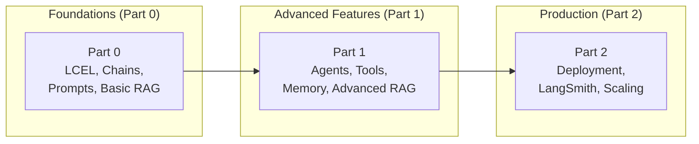
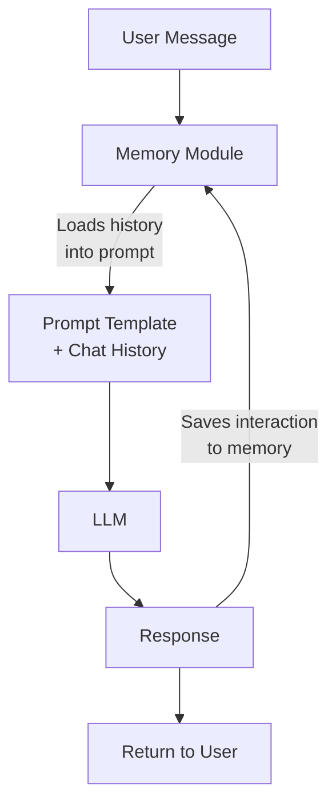
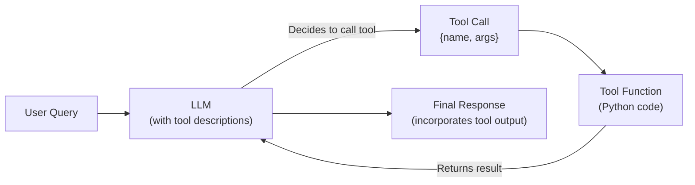
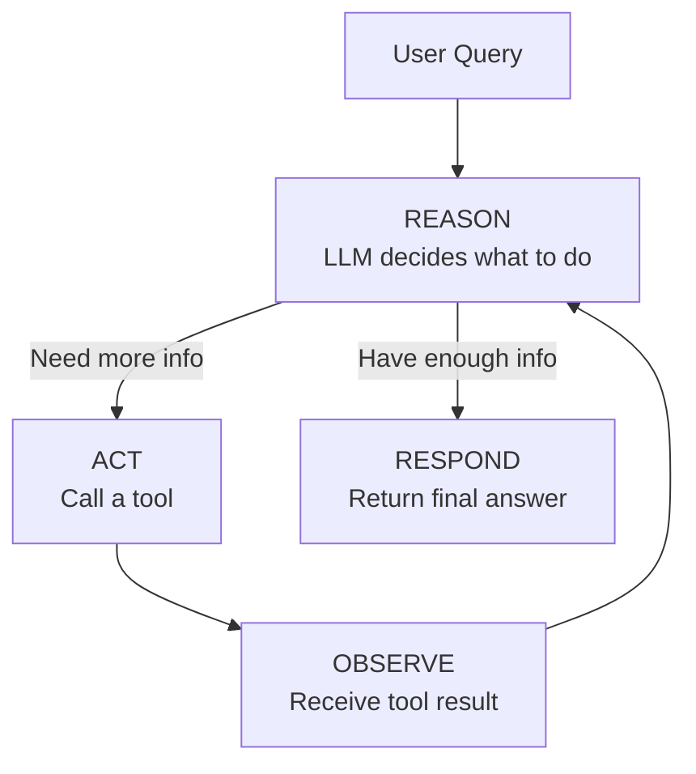
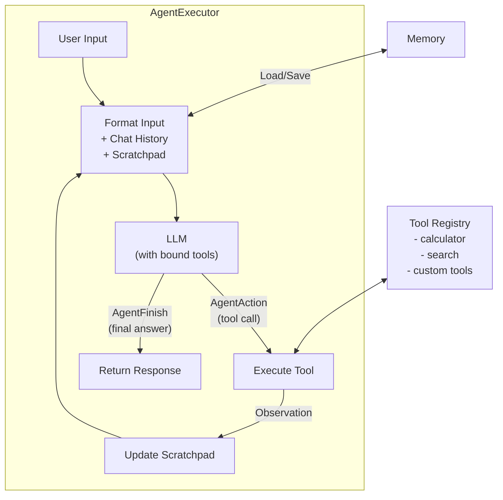
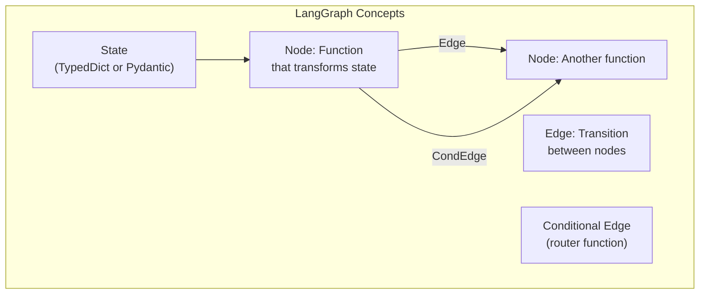
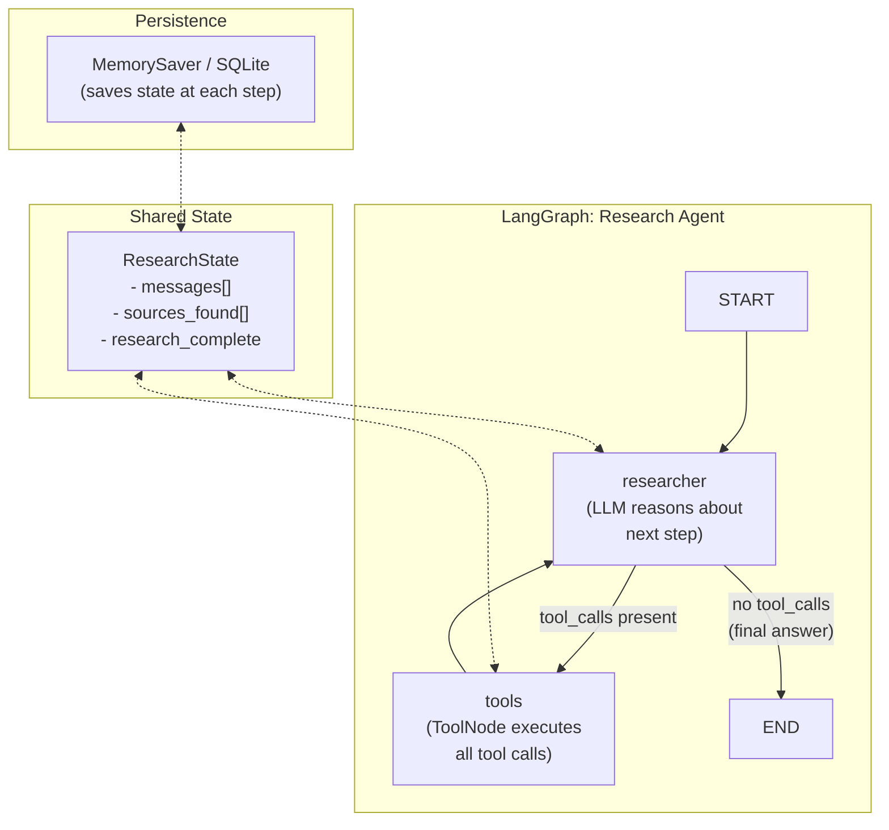
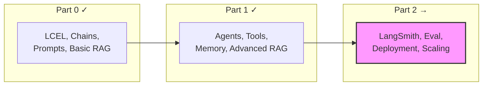

# LangChain Deep Dive  Part 1: Agents, Tools, Memory, and Advanced RAG

---

**Series:** LangChain  A Developer's Deep Dive for Building LLM Applications
**Part:** 1 of 2 (Advanced Features)
**Audience:** Developers who want to build production LLM applications with LangChain
**Reading time:** ~55 minutes

---

## Series Roadmap

| Part | Title | What You'll Learn |
|------|-------|-------------------|
| **0** | Foundations  LCEL, Chains, Prompts, and Basic RAG | LCEL syntax, prompt templates, output parsers, document loaders, vector stores, basic retrieval chains |
| **1** | Agents, Tools, Memory, and Advanced RAG | Conversation memory, custom tools, ReAct agents, LangGraph, advanced retrieval strategies, callbacks, structured output  **you are here** |
| **2** | Production Deployment | LangSmith tracing, evaluation, deployment patterns, cost optimization, error handling, scaling |

### The Progression



---

## 1. Recap of Part 0  Foundations

In Part 0, we built the mental model and core toolkit for LangChain development. Here is what we covered:

**LangChain Expression Language (LCEL)** is the declarative composition system at the heart of modern LangChain. Instead of imperative `.run()` calls, you compose chains with the pipe operator (`|`), creating data-flow pipelines that are inherently streamable, batchable, and async-ready.

```python
# The LCEL pattern from Part 0
from langchain_openai import ChatOpenAI
from langchain_core.prompts import ChatPromptTemplate
from langchain_core.output_parsers import StrOutputParser

prompt = ChatPromptTemplate.from_template("Explain {topic} in one paragraph.")
model = ChatOpenAI(model="gpt-4o")
parser = StrOutputParser()

chain = prompt | model | parser       # LCEL composition
result = chain.invoke({"topic": "quantum computing"})
```

**Key concepts from Part 0:**

- **Prompt Templates**  Reusable, parameterized prompt construction with `ChatPromptTemplate`, `MessagesPlaceholder`, and few-shot examples
- **Output Parsers**  `StrOutputParser`, `JsonOutputParser`, `PydanticOutputParser` for transforming raw LLM output into structured data
- **Document Loaders**  Loading data from PDFs, CSVs, web pages, databases, and dozens of other sources
- **Text Splitters**  `RecursiveCharacterTextSplitter`, `TokenTextSplitter` for chunking documents
- **Embeddings + Vector Stores**  Turning text into vectors with OpenAI/Cohere/HuggingFace embeddings, storing them in FAISS/Chroma/Pinecone
- **Basic RAG**  The retrieve-then-generate pattern using `RunnablePassthrough` and `itemgetter` to wire retrieval into LCEL chains

> **If you haven't read Part 0**, go back and work through it. This part assumes you understand LCEL composition, the `Runnable` protocol (`.invoke()`, `.stream()`, `.batch()`), and the basic RAG pipeline.

Now we build on all of that. Part 1 takes you from stateless question-answering to **stateful, autonomous agents** that remember conversations, use tools, reason through multi-step problems, and retrieve information with sophisticated strategies.

Let's start with the most fundamental upgrade: giving your chains a memory.

---

## 2. Memory in LangChain  Conversation Memory for Stateful Applications

### The Problem: LLMs Are Stateless

Every LLM call is independent. The model receives a prompt, generates a response, and **forgets everything**. There is no built-in session, no conversation history, no context carried forward between calls. If a user says "My name is Alice" in message 1 and asks "What is my name?" in message 2, the model has no idea  unless you explicitly feed message 1 back into the prompt for message 2.

**Memory** in LangChain solves this by managing conversation history between invocations. It stores past interactions and injects them into the prompt automatically so the LLM can maintain conversational context.



### 2.1 ConversationBufferMemory  Store Everything

The simplest memory type. It stores **every single message** in the conversation, verbatim. The entire history is injected into every subsequent prompt.

```python
from langchain.memory import ConversationBufferMemory
from langchain_openai import ChatOpenAI
from langchain_core.prompts import ChatPromptTemplate, MessagesPlaceholder
from langchain_core.runnables import RunnablePassthrough
from langchain_core.output_parsers import StrOutputParser
from operator import itemgetter

# --- Setup memory ---
memory = ConversationBufferMemory(return_messages=True, memory_key="chat_history")

# --- Prompt with history placeholder ---
prompt = ChatPromptTemplate.from_messages([
    ("system", "You are a helpful assistant."),
    MessagesPlaceholder(variable_name="chat_history"),
    ("human", "{input}"),
])

llm = ChatOpenAI(model="gpt-4o", temperature=0)

# --- LCEL chain with memory ---
chain = (
    RunnablePassthrough.assign(
        chat_history=lambda x: memory.load_memory_variables({})["chat_history"]
    )
    | prompt
    | llm
    | StrOutputParser()
)

def chat(user_input: str) -> str:
    """Send a message and update memory."""
    response = chain.invoke({"input": user_input})
    # Save context to memory
    memory.save_context({"input": user_input}, {"output": response})
    return response

# --- Conversation ---
print(chat("My name is Alice and I'm a software engineer."))
# → "Nice to meet you, Alice! ..."

print(chat("What do I do for work?"))
# → "You mentioned you're a software engineer."

print(chat("What is my name?"))
# → "Your name is Alice."
```

**When to use it:** Prototyping, short conversations, debugging. Not suitable for long conversations because the entire history consumes the context window.

**Trade-off:** Token usage grows linearly with conversation length. A 100-turn conversation could consume thousands of tokens just for history.

### 2.2 ConversationBufferWindowMemory  Sliding Window

Keeps only the **last K interactions** (human + AI message pairs). Older messages are discarded.

```python
from langchain.memory import ConversationBufferWindowMemory

# Keep only the last 5 exchanges
memory = ConversationBufferWindowMemory(
    k=5,
    return_messages=True,
    memory_key="chat_history"
)

# --- Simulate a conversation ---
for i in range(10):
    memory.save_context(
        {"input": f"Message {i} from user"},
        {"output": f"Response {i} from assistant"}
    )

# Only the last 5 exchanges are retained
history = memory.load_memory_variables({})["chat_history"]
print(f"Messages in memory: {len(history)}")  # 10 (5 pairs x 2 messages)
print(history[0].content)  # "Message 5 from user"  older messages dropped
```

**When to use it:** Chat applications where recent context matters most. Good for customer support bots where the last few exchanges are more important than the beginning of the conversation.

**Trade-off:** Abrupt loss of early context. The model might "forget" the user's name if it was mentioned more than K exchanges ago.

### 2.3 ConversationSummaryMemory  Compress History into a Summary

Instead of storing raw messages, this memory type uses an LLM to **summarize** the conversation so far. The summary is updated after each exchange and injected into the prompt.

```python
from langchain.memory import ConversationSummaryMemory
from langchain_openai import ChatOpenAI

llm = ChatOpenAI(model="gpt-4o-mini", temperature=0)

memory = ConversationSummaryMemory(
    llm=llm,
    return_messages=True,
    memory_key="chat_history"
)

# Simulate a long conversation
memory.save_context(
    {"input": "Hi, I'm Alice. I work at TechCorp as a senior backend engineer."},
    {"output": "Welcome Alice! Nice to meet a senior backend engineer from TechCorp."}
)
memory.save_context(
    {"input": "I'm working on migrating our monolith to microservices using Kafka."},
    {"output": "That's a great architecture choice. Kafka is excellent for event-driven microservices."}
)
memory.save_context(
    {"input": "We're using Python with FastAPI for the new services."},
    {"output": "FastAPI with Kafka is a solid stack. Are you using async consumers?"}
)

# The memory now contains a SUMMARY, not the raw messages
history = memory.load_memory_variables({})
print(history)
# → Summary: "Alice is a senior backend engineer at TechCorp. She is migrating
#    their monolith to microservices using Kafka, Python, and FastAPI..."
```

**When to use it:** Long conversations where you need to preserve the gist without consuming the entire context window. Particularly useful for advisory or coaching bots.

**Trade-off:** Each save requires an LLM call to update the summary (adds latency and cost). Summarization can lose important details.

### 2.4 ConversationSummaryBufferMemory  The Best of Both Worlds

This hybrid approach keeps **recent messages verbatim** and **summarizes older messages**. It maintains a token budget  when the buffer exceeds `max_token_limit`, the oldest messages are summarized and collapsed into the running summary.

```python
from langchain.memory import ConversationSummaryBufferMemory
from langchain_openai import ChatOpenAI

llm = ChatOpenAI(model="gpt-4o-mini", temperature=0)

memory = ConversationSummaryBufferMemory(
    llm=llm,
    max_token_limit=300,        # Summarize when buffer exceeds this
    return_messages=True,
    memory_key="chat_history"
)

# Add several exchanges
conversations = [
    ("I'm building a RAG pipeline for legal documents.", "Interesting! Legal RAG has unique challenges."),
    ("The documents are mostly contracts and court filings.", "Those have very structured formats."),
    ("I'm using Chroma as my vector store.", "Chroma is good for development and small-scale."),
    ("Should I switch to Pinecone for production?", "Pinecone offers better scaling and managed infrastructure."),
    ("What about Weaviate?", "Weaviate is excellent too  it supports hybrid search natively."),
]

for human_msg, ai_msg in conversations:
    memory.save_context({"input": human_msg}, {"output": ai_msg})

# Memory now has: summary of older messages + recent messages verbatim
variables = memory.load_memory_variables({})
for msg in variables["chat_history"]:
    print(f"[{msg.type}] {msg.content[:100]}...")
```

**When to use it:** Production chat applications. This is the most practical memory type for most use cases  it balances detail (recent messages) with efficiency (summarized history).

### 2.5 VectorStoreRetrieverMemory  Long-Term Memory via Embeddings

This is the most powerful (and most complex) memory type. Instead of keeping messages in a buffer, it **embeds each interaction** into a vector store and **retrieves relevant past interactions** based on semantic similarity to the current query.

```python
from langchain.memory import VectorStoreRetrieverMemory
from langchain_openai import OpenAIEmbeddings
from langchain_community.vectorstores import FAISS
from langchain_core.documents import Document

# --- Create vector store for memory ---
embeddings = OpenAIEmbeddings(model="text-embedding-3-small")

# Initialize with an empty list  FAISS needs at least one document
initial_docs = [Document(page_content="Memory initialized.", metadata={"type": "system"})]
vectorstore = FAISS.from_documents(initial_docs, embeddings)

retriever = vectorstore.as_retriever(search_kwargs={"k": 5})

memory = VectorStoreRetrieverMemory(
    retriever=retriever,
    memory_key="relevant_history",
    input_key="input"
)

# --- Save various interactions over time ---
memory.save_context(
    {"input": "My favorite programming language is Rust."},
    {"output": "Rust is great for performance-critical applications!"}
)
memory.save_context(
    {"input": "I'm learning Kubernetes for container orchestration."},
    {"output": "K8s is essential for modern cloud-native deployments."}
)
memory.save_context(
    {"input": "I prefer PostgreSQL over MySQL for relational databases."},
    {"output": "PostgreSQL has excellent JSON support and extensibility."}
)
memory.save_context(
    {"input": "My team uses GitHub Actions for CI/CD."},
    {"output": "GitHub Actions integrates well with the GitHub ecosystem."}
)

# --- Later, query about databases  retrieves relevant past interaction ---
relevant = memory.load_memory_variables({"input": "What database should I use?"})
print(relevant["relevant_history"])
# → Retrieves the PostgreSQL conversation because it's semantically similar
```

**When to use it:** Long-running applications (personal assistants, tutoring bots) where a user interacts over days/weeks. The memory grows indefinitely without consuming the context window  only the most relevant past interactions are retrieved.

**Trade-off:** Requires a vector store. Retrieval quality depends on embedding quality and similarity thresholds. May retrieve irrelevant memories if the query is ambiguous.

### 2.6 Adding Memory to LCEL Chains

Here is the complete pattern for integrating memory into an LCEL chain with `ConversationSummaryBufferMemory`:

```python
from langchain_openai import ChatOpenAI
from langchain_core.prompts import ChatPromptTemplate, MessagesPlaceholder
from langchain_core.runnables import RunnablePassthrough, RunnableLambda
from langchain_core.output_parsers import StrOutputParser
from langchain.memory import ConversationSummaryBufferMemory

# --- Components ---
llm = ChatOpenAI(model="gpt-4o", temperature=0.7)
memory = ConversationSummaryBufferMemory(
    llm=ChatOpenAI(model="gpt-4o-mini"),  # Cheaper model for summarization
    max_token_limit=500,
    return_messages=True,
    memory_key="chat_history"
)

prompt = ChatPromptTemplate.from_messages([
    ("system", "You are an expert Python developer. Help the user with their coding questions."),
    MessagesPlaceholder(variable_name="chat_history"),
    ("human", "{input}"),
])

# --- Load memory as a Runnable step ---
def load_memory(inputs: dict) -> dict:
    """Load chat history from memory and merge with inputs."""
    mem_vars = memory.load_memory_variables({})
    return {**inputs, "chat_history": mem_vars["chat_history"]}

# --- Build chain ---
chain = (
    RunnableLambda(load_memory)
    | prompt
    | llm
    | StrOutputParser()
)

# --- Chat function with automatic memory saving ---
def chat(user_input: str) -> str:
    response = chain.invoke({"input": user_input})
    memory.save_context({"input": user_input}, {"output": response})
    return response

# --- Usage ---
print(chat("How do I create an async generator in Python?"))
print(chat("Can you show me an example with aiohttp?"))
print(chat("What were we discussing?"))  # Memory kicks in
```

### 2.7 Memory Type Comparison

| Memory Type | Token Usage | Latency | Detail Preserved | Best For |
|-------------|-------------|---------|------------------|----------|
| **ConversationBufferMemory** | Grows linearly | None | Full verbatim | Short conversations, prototyping |
| **ConversationBufferWindowMemory** | Fixed (K * avg_msg_size) | None | Full for last K turns | Chat UIs, customer support |
| **ConversationSummaryMemory** | Fixed (summary size) | Extra LLM call per turn | Lossy summary | Long advisory sessions |
| **ConversationSummaryBufferMemory** | Bounded (summary + buffer) | Extra LLM call when buffer overflows | Full recent + summary of old | **Production default** |
| **VectorStoreRetrieverMemory** | Fixed (K retrieved docs) | Embedding + retrieval | Semantic relevance | Long-term assistants, personalization |

> **Production recommendation:** Start with `ConversationSummaryBufferMemory` for most chatbot applications. Graduate to `VectorStoreRetrieverMemory` when you need cross-session persistence or when conversations span days/weeks.

---

## 3. Tools in LangChain  Extending LLM Capabilities

### What Are Tools?

An LLM can only generate text. It cannot browse the web, query a database, do math reliably, or call an API. **Tools** bridge this gap  they are functions that the LLM can **decide to call** during its reasoning process. The LLM receives tool descriptions, decides which tool to use based on the user's request, generates the required inputs, and receives the tool's output.



### 3.1 Built-in Tools

LangChain provides integrations with many external services out of the box:

```python
# --- Web Search (Tavily) ---
# pip install langchain-community tavily-python
from langchain_community.tools.tavily_search import TavilySearchResults

search_tool = TavilySearchResults(max_results=3)
results = search_tool.invoke("Latest Python 3.13 features")
print(results)  # List of search result dicts with url, content

# --- Wikipedia ---
# pip install wikipedia
from langchain_community.tools import WikipediaQueryRun
from langchain_community.utilities import WikipediaAPIWrapper

wiki_tool = WikipediaQueryRun(api_wrapper=WikipediaAPIWrapper(top_k_results=1))
result = wiki_tool.invoke("LangChain framework")
print(result)

# --- Python REPL (execute code) ---
from langchain_community.tools import PythonREPLTool

python_tool = PythonREPLTool()
result = python_tool.invoke("print(sum(range(1, 101)))")
print(result)  # "5050\n"

# --- DuckDuckGo Search ---
# pip install duckduckgo-search
from langchain_community.tools import DuckDuckGoSearchRun

ddg_tool = DuckDuckGoSearchRun()
result = ddg_tool.invoke("LangChain vs LlamaIndex comparison")
print(result)
```

### 3.2 Custom Tools with the @tool Decorator

The simplest way to create a custom tool is with the `@tool` decorator. LangChain automatically generates the tool's schema from the function signature and docstring.

```python
from langchain_core.tools import tool
from typing import Optional
import requests

@tool
def get_weather(city: str) -> str:
    """Get the current weather for a city.

    Args:
        city: The name of the city to get weather for (e.g., 'London', 'New York')
    """
    # In production, use a real weather API
    api_key = "your_api_key"
    url = f"https://api.weatherapi.com/v1/current.json?key={api_key}&q={city}"
    response = requests.get(url)
    data = response.json()
    return f"Weather in {city}: {data['current']['temp_c']}°C, {data['current']['condition']['text']}"

@tool
def calculate_bmi(weight_kg: float, height_m: float) -> str:
    """Calculate Body Mass Index (BMI).

    Args:
        weight_kg: Weight in kilograms
        height_m: Height in meters
    """
    bmi = weight_kg / (height_m ** 2)
    if bmi < 18.5:
        category = "underweight"
    elif bmi < 25:
        category = "normal weight"
    elif bmi < 30:
        category = "overweight"
    else:
        category = "obese"
    return f"BMI: {bmi:.1f} ({category})"

@tool
def search_database(query: str, table: str = "users", limit: int = 10) -> str:
    """Search our internal database.

    Args:
        query: The search query string
        table: The database table to search (default: 'users')
        limit: Maximum number of results to return (default: 10)
    """
    # Simulated database search
    return f"Found 3 results in '{table}' for '{query}' (limit: {limit})"

# --- Inspect the tool ---
print(get_weather.name)           # "get_weather"
print(get_weather.description)    # "Get the current weather for a city..."
print(get_weather.args_schema.schema())  # JSON schema of inputs

# --- Invoke directly ---
print(calculate_bmi.invoke({"weight_kg": 75, "height_m": 1.80}))
# → "BMI: 23.1 (normal weight)"
```

> **Critical:** The **docstring is what the LLM reads** to decide when to call the tool and how to provide arguments. Write clear, specific docstrings. Vague descriptions lead to incorrect tool usage.

### 3.3 Custom Tools with StructuredTool

For more control over tool configuration, use `StructuredTool.from_function()`:

```python
from langchain_core.tools import StructuredTool
from pydantic import BaseModel, Field

# --- Define input schema explicitly ---
class StockPriceInput(BaseModel):
    ticker: str = Field(description="The stock ticker symbol (e.g., 'AAPL', 'GOOGL')")
    exchange: str = Field(default="NASDAQ", description="The stock exchange")

def get_stock_price(ticker: str, exchange: str = "NASDAQ") -> str:
    """Fetch the current stock price for a ticker symbol."""
    # Simulated  in production, call a real API
    prices = {"AAPL": 189.50, "GOOGL": 141.80, "MSFT": 378.20}
    price = prices.get(ticker.upper(), None)
    if price:
        return f"{ticker.upper()} on {exchange}: ${price}"
    return f"Ticker {ticker} not found on {exchange}"

stock_tool = StructuredTool.from_function(
    func=get_stock_price,
    name="get_stock_price",
    description="Get the current stock price for a given ticker symbol and exchange.",
    args_schema=StockPriceInput,
    return_direct=False,  # If True, returns tool output directly without LLM processing
)

print(stock_tool.invoke({"ticker": "AAPL"}))
# → "AAPL on NASDAQ: $189.5"
```

### 3.4 Tool Input Schemas with Pydantic

For complex tools, Pydantic models give you **validation**, **default values**, **descriptions**, and **type safety**:

```python
from pydantic import BaseModel, Field, field_validator
from langchain_core.tools import tool
from typing import Literal
from datetime import date

class FlightSearchInput(BaseModel):
    """Input for searching flights."""
    origin: str = Field(description="Origin airport IATA code (e.g., 'JFK', 'LAX')")
    destination: str = Field(description="Destination airport IATA code")
    departure_date: str = Field(description="Departure date in YYYY-MM-DD format")
    cabin_class: Literal["economy", "business", "first"] = Field(
        default="economy",
        description="Cabin class preference"
    )
    max_price: float = Field(
        default=1000.0,
        description="Maximum price in USD",
        gt=0
    )

    @field_validator("origin", "destination")
    @classmethod
    def validate_airport_code(cls, v: str) -> str:
        if len(v) != 3 or not v.isalpha():
            raise ValueError(f"Invalid IATA code: {v}. Must be exactly 3 letters.")
        return v.upper()

@tool(args_schema=FlightSearchInput)
def search_flights(
    origin: str,
    destination: str,
    departure_date: str,
    cabin_class: str = "economy",
    max_price: float = 1000.0
) -> str:
    """Search for available flights between two airports.

    Use this tool when a user wants to find flights. Requires origin and
    destination airport codes and a departure date.
    """
    return (
        f"Found 5 {cabin_class} flights from {origin} to {destination} "
        f"on {departure_date} under ${max_price}"
    )

# Pydantic validates inputs before the tool runs
print(search_flights.invoke({
    "origin": "JFK",
    "destination": "LAX",
    "departure_date": "2026-04-15",
    "cabin_class": "business"
}))
# → "Found 5 business flights from JFK to LAX on 2026-04-15 under $1000.0"
```

### 3.5 Async Tools

For I/O-bound operations (API calls, database queries), define async tools:

```python
import asyncio
import aiohttp
from langchain_core.tools import tool

@tool
async def fetch_url_content(url: str) -> str:
    """Fetch the text content of a given URL.

    Args:
        url: The full URL to fetch (must start with https://)
    """
    async with aiohttp.ClientSession() as session:
        async with session.get(url, timeout=aiohttp.ClientTimeout(total=10)) as resp:
            if resp.status == 200:
                text = await resp.text()
                return text[:2000]  # Truncate to avoid huge responses
            return f"Error: HTTP {resp.status}"

# --- Use in async context ---
async def main():
    result = await fetch_url_content.ainvoke({"url": "https://httpbin.org/get"})
    print(result)

asyncio.run(main())
```

### 3.6 Binding Tools to Models

Before tools become useful with agents, you need to **bind** them to the model so it knows they exist:

```python
from langchain_openai import ChatOpenAI
from langchain_core.tools import tool

@tool
def multiply(a: float, b: float) -> float:
    """Multiply two numbers together."""
    return a * b

@tool
def add(a: float, b: float) -> float:
    """Add two numbers together."""
    return a + b

llm = ChatOpenAI(model="gpt-4o")

# Bind tools to the model
llm_with_tools = llm.bind_tools([multiply, add])

# The model can now generate tool calls
response = llm_with_tools.invoke("What is 7 times 13?")
print(response.tool_calls)
# → [{'name': 'multiply', 'args': {'a': 7.0, 'b': 13.0}, 'id': 'call_abc123'}]

# Note: The model doesn't EXECUTE the tool  it generates a tool call request.
# You need an agent or manual logic to execute it and feed the result back.
```

---

## 4. Agents  LLMs That Reason and Act

### What Is an Agent?

A **chain** follows a fixed, predetermined sequence of steps. An **agent** is fundamentally different  it uses the LLM itself to **decide** what to do at each step. The LLM reasons about the user's request, chooses which tool to call (if any), observes the result, and decides whether to continue reasoning or return a final answer.

This is the **ReAct pattern** (Reasoning + Acting):

```
1. REASON  → "The user wants the weather in Tokyo. I should call the weather tool."
2. ACT     → Call get_weather(city="Tokyo")
3. OBSERVE → "Weather in Tokyo: 22°C, Partly Cloudy"
4. REASON  → "I have the information. I can now answer the user."
5. RESPOND → "The current weather in Tokyo is 22°C and partly cloudy."
```

The agent loops through Reason → Act → Observe until it has enough information to respond, or until it hits a maximum iteration limit.



### 4.1 Agent Types in LangChain

| Agent Type | How It Works | Best For |
|------------|-------------|----------|
| **OpenAI Tools Agent** | Uses OpenAI's function/tool calling API natively | GPT-4o, GPT-4-turbo  most reliable |
| **ReAct Agent** | Text-based reasoning with structured output parsing | Open-source models without tool calling |
| **Structured Chat Agent** | JSON-based tool invocation for multi-input tools | Models that support structured output |
| **Self-Ask with Search** | Decomposes questions and uses search iteratively | Complex factual questions |
| **LangGraph Agent** | Full state machine with custom control flow | Production agents with complex logic |

For most production use cases with OpenAI or Anthropic models, use the **OpenAI Tools Agent** or migrate to **LangGraph** (covered in Section 5).

### 4.2 Creating an Agent with create_openai_tools_agent

```python
from langchain_openai import ChatOpenAI
from langchain_core.prompts import ChatPromptTemplate, MessagesPlaceholder
from langchain_core.tools import tool
from langchain.agents import create_openai_tools_agent, AgentExecutor
import math

# --- Define tools ---
@tool
def calculator(expression: str) -> str:
    """Evaluate a mathematical expression.

    Args:
        expression: A valid Python math expression (e.g., '2 + 2', 'math.sqrt(144)')
    """
    try:
        # Restricted eval for safety
        allowed_names = {"math": math, "abs": abs, "round": round}
        result = eval(expression, {"__builtins__": {}}, allowed_names)
        return str(result)
    except Exception as e:
        return f"Error: {e}"

@tool
def get_current_date() -> str:
    """Get today's date. No arguments needed."""
    from datetime import date
    return date.today().isoformat()

@tool
def unit_converter(value: float, from_unit: str, to_unit: str) -> str:
    """Convert a value between units.

    Args:
        value: The numeric value to convert
        from_unit: The source unit (e.g., 'km', 'miles', 'kg', 'lbs', 'celsius', 'fahrenheit')
        to_unit: The target unit
    """
    conversions = {
        ("km", "miles"): lambda v: v * 0.621371,
        ("miles", "km"): lambda v: v * 1.60934,
        ("kg", "lbs"): lambda v: v * 2.20462,
        ("lbs", "kg"): lambda v: v * 0.453592,
        ("celsius", "fahrenheit"): lambda v: (v * 9/5) + 32,
        ("fahrenheit", "celsius"): lambda v: (v - 32) * 5/9,
    }
    key = (from_unit.lower(), to_unit.lower())
    if key in conversions:
        result = conversions[key](value)
        return f"{value} {from_unit} = {result:.2f} {to_unit}"
    return f"Conversion from {from_unit} to {to_unit} not supported"

tools = [calculator, get_current_date, unit_converter]

# --- Create prompt ---
prompt = ChatPromptTemplate.from_messages([
    ("system", "You are a helpful assistant with access to tools. "
               "Use tools when needed to provide accurate answers. "
               "Always show your work."),
    MessagesPlaceholder(variable_name="chat_history", optional=True),
    ("human", "{input}"),
    MessagesPlaceholder(variable_name="agent_scratchpad"),
])

# --- Create agent ---
llm = ChatOpenAI(model="gpt-4o", temperature=0)
agent = create_openai_tools_agent(llm, tools, prompt)

# --- Create executor ---
executor = AgentExecutor(
    agent=agent,
    tools=tools,
    verbose=True,           # Print reasoning steps
    max_iterations=10,      # Safety limit
    handle_parsing_errors=True,
)

# --- Run ---
result = executor.invoke({"input": "What is the square root of 144 plus 5 factorial?"})
print(result["output"])
# Agent will call calculator("math.sqrt(144) + math.factorial(5)") → "132.0"

result = executor.invoke({
    "input": "Convert 100 km to miles and tell me today's date"
})
print(result["output"])
# Agent calls unit_converter AND get_current_date, combines both results
```

### 4.3 AgentExecutor  The Agent Loop

The `AgentExecutor` manages the entire agent lifecycle:

1. Receives user input
2. Calls the agent (LLM) with tools and scratchpad
3. If the agent returns **tool calls** → executes them, appends results to scratchpad, loops back to step 2
4. If the agent returns a **final answer** → returns it
5. If `max_iterations` is reached → returns an error or the best available answer

```python
executor = AgentExecutor(
    agent=agent,
    tools=tools,
    verbose=True,                   # Log reasoning steps to console
    max_iterations=15,              # Max reasoning loops before forced stop
    max_execution_time=60,          # Timeout in seconds
    handle_parsing_errors=True,     # Gracefully handle malformed tool calls
    return_intermediate_steps=True, # Include tool calls in output
    early_stopping_method="generate", # "force" or "generate" when hitting limits
)

result = executor.invoke({"input": "What is 2^10?"})

# Access intermediate steps
for step in result["intermediate_steps"]:
    action, observation = step
    print(f"Tool: {action.tool}")
    print(f"Input: {action.tool_input}")
    print(f"Output: {observation}")
    print("---")
```

### 4.4 Agent with Memory

Combining agents with memory creates persistent, conversational agents:

```python
from langchain.memory import ConversationBufferWindowMemory

memory = ConversationBufferWindowMemory(
    k=10,
    memory_key="chat_history",
    return_messages=True
)

executor_with_memory = AgentExecutor(
    agent=agent,
    tools=tools,
    memory=memory,
    verbose=True,
)

# Conversation persists across calls
executor_with_memory.invoke({"input": "My height is 1.80 meters and I weigh 75 kg."})
executor_with_memory.invoke({"input": "Convert my weight to pounds."})
# Agent remembers: 75 kg → calls unit_converter(75, "kg", "lbs")
executor_with_memory.invoke({"input": "Now convert my height to feet."})
# Agent remembers: 1.80 meters
```

### 4.5 Streaming Agent Output

For real-time UI updates, stream the agent's reasoning and final response:

```python
import asyncio

async def stream_agent():
    async for event in executor.astream_events(
        {"input": "What is 15% of 2500?"},
        version="v2"
    ):
        kind = event["event"]

        if kind == "on_chat_model_stream":
            # Token-by-token output from the LLM
            content = event["data"]["chunk"].content
            if content:
                print(content, end="", flush=True)

        elif kind == "on_tool_start":
            print(f"\n🔧 Calling tool: {event['name']}")

        elif kind == "on_tool_end":
            print(f"\n📎 Tool result: {event['data'].get('output', '')[:200]}")

asyncio.run(stream_agent())
```

### 4.6 Agent Architecture



---

## 5. LangGraph  Stateful Agent Workflows

### Why LangGraph?

`AgentExecutor` works well for simple agent loops, but real-world applications often need:

- **Conditional branching**  different paths based on intermediate results
- **Human-in-the-loop**  pausing execution for human approval before dangerous actions
- **Parallel tool execution**  calling multiple tools simultaneously
- **Custom state**  tracking more than just messages (e.g., counters, flags, collected data)
- **Cycles with control**  loops that aren't just "reason until done"
- **Persistence**  saving and restoring agent state across requests

**LangGraph** is LangChain's framework for building these complex, stateful agent workflows as **directed graphs**. Each node is a function, edges define transitions, and a shared **state** object flows through the graph.



### 5.1 Core Concepts

- **State**  A `TypedDict` or Pydantic model that holds all data flowing through the graph. Every node reads from and writes to this state.
- **Nodes**  Python functions that receive the current state and return updates. Each node performs one logical step.
- **Edges**  Connections between nodes that define the execution order.
- **Conditional Edges**  Router functions that examine the state and decide which node to visit next.
- **START / END**  Special sentinel nodes marking where execution begins and ends.

### 5.2 Building a Multi-Step Agent with LangGraph

Let's build a research agent that can search the web, analyze results, and generate a report:

```python
from typing import TypedDict, Annotated, Literal
from langchain_openai import ChatOpenAI
from langchain_core.messages import HumanMessage, AIMessage, SystemMessage, BaseMessage
from langchain_core.tools import tool
from langgraph.graph import StateGraph, START, END
from langgraph.graph.message import add_messages
from langgraph.prebuilt import ToolNode
import json

# --- State definition ---
class AgentState(TypedDict):
    messages: Annotated[list[BaseMessage], add_messages]  # add_messages = append, don't replace
    iteration_count: int

# --- Tools ---
@tool
def web_search(query: str) -> str:
    """Search the web for current information.

    Args:
        query: The search query
    """
    # Simulated search results
    return f"Search results for '{query}': [Result 1: LangGraph is a framework for building stateful agents...] [Result 2: ...]"

@tool
def analyze_text(text: str) -> str:
    """Analyze and summarize a piece of text.

    Args:
        text: The text to analyze
    """
    return f"Analysis of text ({len(text)} chars): The text discusses key concepts and provides examples."

tools = [web_search, analyze_text]

# --- LLM with tools ---
llm = ChatOpenAI(model="gpt-4o", temperature=0)
llm_with_tools = llm.bind_tools(tools)

# --- Node functions ---
def agent_node(state: AgentState) -> dict:
    """The agent reasons and decides what to do."""
    system_msg = SystemMessage(content=(
        "You are a research assistant. Use tools to gather information, "
        "then provide a comprehensive answer. If you have enough information, "
        "respond directly without calling tools."
    ))
    messages = [system_msg] + state["messages"]
    response = llm_with_tools.invoke(messages)
    return {
        "messages": [response],
        "iteration_count": state.get("iteration_count", 0) + 1
    }

# Use LangGraph's prebuilt ToolNode for tool execution
tool_node = ToolNode(tools)

# --- Router function (conditional edge) ---
def should_continue(state: AgentState) -> Literal["tools", "end"]:
    """Decide whether to call tools or finish."""
    last_message = state["messages"][-1]

    # If the LLM made tool calls, execute them
    if hasattr(last_message, "tool_calls") and last_message.tool_calls:
        return "tools"

    # Otherwise, we're done
    return "end"

# --- Build the graph ---
graph = StateGraph(AgentState)

# Add nodes
graph.add_node("agent", agent_node)
graph.add_node("tools", tool_node)

# Add edges
graph.add_edge(START, "agent")          # Start with the agent
graph.add_conditional_edges(
    "agent",                             # From the agent node...
    should_continue,                     # ...use this router function...
    {
        "tools": "tools",               # ...if "tools" → go to tools node
        "end": END,                      # ...if "end" → finish
    }
)
graph.add_edge("tools", "agent")         # After tools, always go back to agent

# Compile
app = graph.compile()

# --- Run ---
result = app.invoke({
    "messages": [HumanMessage(content="What is LangGraph and how does it compare to AgentExecutor?")],
    "iteration_count": 0
})

# Print final response
for msg in result["messages"]:
    print(f"[{msg.type}] {msg.content[:200]}")
```

### 5.3 Human-in-the-Loop Patterns

LangGraph supports **interrupting** execution for human approval. This is critical for agents that can take destructive actions (deleting data, sending emails, making purchases):

```python
from langgraph.checkpoint.memory import MemorySaver
from langchain_core.messages import HumanMessage

# --- Compile with checkpointing ---
memory_saver = MemorySaver()
app = graph.compile(
    checkpointer=memory_saver,
    interrupt_before=["tools"]  # Pause BEFORE executing tools
)

# --- Start execution (will pause before tool execution) ---
config = {"configurable": {"thread_id": "user-123"}}

result = app.invoke(
    {"messages": [HumanMessage(content="Search for the latest AI news")],
     "iteration_count": 0},
    config=config
)

# Execution is paused. Inspect what the agent wants to do:
last_msg = result["messages"][-1]
print(f"Agent wants to call: {last_msg.tool_calls}")

# --- Human approves → resume execution ---
# Simply invoke with None to continue from the checkpoint
result = app.invoke(None, config=config)
print(result["messages"][-1].content)

# --- Or human rejects → provide alternative input ---
# result = app.invoke(
#     {"messages": [HumanMessage(content="Don't search. Just tell me what you know.")]},
#     config=config
# )
```

### 5.4 Checkpointing and Persistence

LangGraph's checkpointing saves the **entire graph state** at each step. This enables:

- **Resuming** interrupted workflows
- **Time-travel debugging**  inspect any previous state
- **Cross-request persistence**  continue a workflow in a later HTTP request

```python
from langgraph.checkpoint.memory import MemorySaver
from langgraph.checkpoint.sqlite import SqliteSaver  # For persistent storage

# In-memory (for development)
memory_checkpointer = MemorySaver()

# SQLite (for persistence across restarts)
sqlite_checkpointer = SqliteSaver.from_conn_string("checkpoints.db")

# Compile with checkpointer
app = graph.compile(checkpointer=sqlite_checkpointer)

# Every invoke uses a thread_id to scope state
config = {"configurable": {"thread_id": "session-abc-123"}}

# First request
result1 = app.invoke(
    {"messages": [HumanMessage(content="Hello, I'm researching quantum computing.")],
     "iteration_count": 0},
    config=config
)

# Later (even after server restart), continue the same session
result2 = app.invoke(
    {"messages": [HumanMessage(content="What did I say I was researching?")],
     "iteration_count": 0},
    config=config
)
# The graph remembers: "quantum computing"

# --- Inspect state history ---
states = list(app.get_state_history(config))
for state in states:
    print(f"Step: {state.metadata.get('step', '?')}, Messages: {len(state.values['messages'])}")
```

### 5.5 Full LangGraph Example: Multi-Tool Research Agent

```python
from typing import TypedDict, Annotated, Literal
from langchain_openai import ChatOpenAI
from langchain_core.messages import HumanMessage, SystemMessage, BaseMessage
from langchain_core.tools import tool
from langgraph.graph import StateGraph, START, END
from langgraph.graph.message import add_messages
from langgraph.prebuilt import ToolNode
from langgraph.checkpoint.memory import MemorySaver

# --- State ---
class ResearchState(TypedDict):
    messages: Annotated[list[BaseMessage], add_messages]
    sources_found: list[str]
    research_complete: bool

# --- Tools ---
@tool
def search_arxiv(query: str) -> str:
    """Search arxiv.org for academic papers.

    Args:
        query: The research topic or paper title to search for
    """
    return f"ArXiv results for '{query}': [1] 'Attention Is All You Need' (2017), [2] 'BERT: Pre-training' (2019)"

@tool
def search_news(query: str) -> str:
    """Search recent news articles.

    Args:
        query: The news topic to search for
    """
    return f"News results for '{query}': [1] 'OpenAI releases GPT-5' (2026), [2] 'EU AI Act enforcement begins'"

@tool
def write_report(topic: str, findings: str) -> str:
    """Write a structured research report.

    Args:
        topic: The research topic
        findings: Key findings to include in the report
    """
    return f"# Research Report: {topic}\n\n## Findings\n{findings}\n\n## Conclusion\nFurther research recommended."

tools = [search_arxiv, search_news, write_report]

# --- LLM ---
llm = ChatOpenAI(model="gpt-4o", temperature=0).bind_tools(tools)

# --- Nodes ---
def researcher(state: ResearchState) -> dict:
    system = SystemMessage(content=(
        "You are a research agent. Your workflow:\n"
        "1. Search for academic papers on the topic\n"
        "2. Search for recent news on the topic\n"
        "3. Write a report combining your findings\n"
        "Use the available tools to complete each step."
    ))
    response = llm.invoke([system] + state["messages"])
    return {"messages": [response]}

tool_node = ToolNode(tools)

def route(state: ResearchState) -> Literal["tools", "end"]:
    last = state["messages"][-1]
    if hasattr(last, "tool_calls") and last.tool_calls:
        return "tools"
    return "end"

# --- Build Graph ---
builder = StateGraph(ResearchState)
builder.add_node("researcher", researcher)
builder.add_node("tools", tool_node)
builder.add_edge(START, "researcher")
builder.add_conditional_edges("researcher", route, {"tools": "tools", "end": END})
builder.add_edge("tools", "researcher")

# Compile with memory
checkpointer = MemorySaver()
research_app = builder.compile(checkpointer=checkpointer)

# --- Run ---
config = {"configurable": {"thread_id": "research-001"}}
result = research_app.invoke(
    {
        "messages": [HumanMessage(content="Research the current state of large language model agents")],
        "sources_found": [],
        "research_complete": False
    },
    config=config
)

# Print the full conversation
for msg in result["messages"]:
    role = msg.type
    content = msg.content if isinstance(msg.content, str) else str(msg.content)
    if content.strip():
        print(f"\n[{role}]\n{content[:500]}")
```

### 5.6 LangGraph Architecture



---

## 6. Advanced RAG with LangChain

Part 0 covered basic RAG: split documents, embed them, store in a vector store, retrieve the top-K chunks, and feed them into a generation prompt. That's a solid start, but production RAG systems face challenges that basic retrieval cannot handle:

- **Query-document mismatch**  the user's question uses different words than the document
- **Lost context**  small chunks lose surrounding context
- **Metadata filtering**  users want to filter by date, author, category
- **Recall vs. precision**  dense retrieval misses keyword matches; keyword search misses semantic matches
- **Stale documents**  some information is time-sensitive

LangChain provides **advanced retriever types** that address each of these problems.

### 6.1 Multi-Query Retriever

The user's query is a single perspective on what they need. The **MultiQueryRetriever** uses an LLM to generate **multiple variations** of the query, retrieves documents for each variation, and unions the results. This dramatically improves recall.

```python
from langchain.retrievers.multi_query import MultiQueryRetriever
from langchain_openai import ChatOpenAI, OpenAIEmbeddings
from langchain_community.vectorstores import Chroma
from langchain_core.documents import Document

# --- Setup vector store ---
embeddings = OpenAIEmbeddings(model="text-embedding-3-small")
documents = [
    Document(page_content="Python's GIL prevents true multi-threading for CPU-bound tasks.", metadata={"topic": "python"}),
    Document(page_content="asyncio enables concurrent I/O operations in Python.", metadata={"topic": "python"}),
    Document(page_content="multiprocessing bypasses the GIL by using separate processes.", metadata={"topic": "python"}),
    Document(page_content="Rust achieves memory safety without garbage collection using ownership.", metadata={"topic": "rust"}),
    Document(page_content="Go uses goroutines for lightweight concurrent execution.", metadata={"topic": "go"}),
]

vectorstore = Chroma.from_documents(documents, embeddings)
base_retriever = vectorstore.as_retriever(search_kwargs={"k": 3})

# --- Multi-Query Retriever ---
llm = ChatOpenAI(model="gpt-4o-mini", temperature=0)

multi_query_retriever = MultiQueryRetriever.from_llm(
    retriever=base_retriever,
    llm=llm,
)

# User asks one question → LLM generates 3+ variations → retrieves for each
results = multi_query_retriever.invoke("How do I handle parallelism in Python?")
# Generated queries might be:
# 1. "Python parallel processing techniques"
# 2. "Python concurrency multithreading multiprocessing"
# 3. "How to run code in parallel in Python"
# Result: More relevant documents retrieved than a single query would find

for doc in results:
    print(f"- {doc.page_content[:80]}...")
```

### 6.2 Contextual Compression Retriever

Retrieves documents, then uses an LLM to **extract only the relevant parts** of each document. This is particularly useful when documents are long and only a small section answers the user's question.

```python
from langchain.retrievers.document_compressors import LLMChainExtractor
from langchain.retrievers import ContextualCompressionRetriever
from langchain_openai import ChatOpenAI

# --- Create compressor ---
compressor_llm = ChatOpenAI(model="gpt-4o-mini", temperature=0)
compressor = LLMChainExtractor.from_llm(compressor_llm)

# --- Wrap base retriever with compression ---
compression_retriever = ContextualCompressionRetriever(
    base_compressor=compressor,
    base_retriever=base_retriever  # From previous example
)

# Retrieved documents are now compressed to only the relevant portion
results = compression_retriever.invoke("What is Python's GIL?")
for doc in results:
    print(f"Compressed: {doc.page_content}")
# Only the GIL-relevant sentences are returned, not entire documents
```

You can also use **embedding-based** compression for faster, cheaper filtering:

```python
from langchain.retrievers.document_compressors import EmbeddingsFilter
from langchain_openai import OpenAIEmbeddings

embeddings_filter = EmbeddingsFilter(
    embeddings=OpenAIEmbeddings(model="text-embedding-3-small"),
    similarity_threshold=0.75  # Only keep chunks with similarity > 0.75
)

compression_retriever_v2 = ContextualCompressionRetriever(
    base_compressor=embeddings_filter,
    base_retriever=base_retriever
)

results = compression_retriever_v2.invoke("Python concurrency")
```

### 6.3 Ensemble Retriever  Hybrid Search

Combines **multiple retrievers** using **Reciprocal Rank Fusion (RRF)**. The classic combination is dense (semantic) retrieval + sparse (keyword/BM25) retrieval  this is **hybrid search**.

```python
from langchain.retrievers import EnsembleRetriever
from langchain_community.retrievers import BM25Retriever
from langchain_community.vectorstores import FAISS
from langchain_openai import OpenAIEmbeddings
from langchain_core.documents import Document

documents = [
    Document(page_content="The HNSW algorithm provides efficient approximate nearest neighbor search."),
    Document(page_content="BM25 is a bag-of-words ranking function used in information retrieval."),
    Document(page_content="Vector databases store high-dimensional embeddings for similarity search."),
    Document(page_content="TF-IDF weights terms by frequency and inverse document frequency."),
    Document(page_content="Cosine similarity measures the angle between two vectors in embedding space."),
]

# --- Sparse retriever (keyword-based) ---
bm25_retriever = BM25Retriever.from_documents(documents)
bm25_retriever.k = 3

# --- Dense retriever (embedding-based) ---
embeddings = OpenAIEmbeddings(model="text-embedding-3-small")
faiss_store = FAISS.from_documents(documents, embeddings)
faiss_retriever = faiss_store.as_retriever(search_kwargs={"k": 3})

# --- Ensemble (hybrid) ---
ensemble_retriever = EnsembleRetriever(
    retrievers=[bm25_retriever, faiss_retriever],
    weights=[0.4, 0.6]  # 40% weight to BM25, 60% to dense
)

results = ensemble_retriever.invoke("nearest neighbor search algorithms")
for doc in results:
    print(f"- {doc.page_content[:80]}...")
```

> **Why hybrid?** Dense retrieval excels at semantic matching ("How do I find similar items?" matches "nearest neighbor search"). BM25 excels at exact keyword matching ("HNSW algorithm" matches documents containing "HNSW"). Combining both covers more ground.

### 6.4 Self-Query Retriever  Natural Language to Metadata Filters

Users often ask questions that contain **metadata constraints**: "Show me Python articles from 2024" or "Find papers by Vaswani about attention." The **SelfQueryRetriever** uses an LLM to parse the user's query into a **semantic query** (for vector search) and **metadata filters** (for structured filtering).

```python
from langchain.retrievers.self_query.base import SelfQueryRetriever
from langchain.chains.query_constructor.schema import AttributeInfo
from langchain_openai import ChatOpenAI, OpenAIEmbeddings
from langchain_community.vectorstores import Chroma
from langchain_core.documents import Document

# --- Documents with rich metadata ---
docs = [
    Document(page_content="Introduction to transformers and self-attention mechanisms.",
             metadata={"author": "Vaswani", "year": 2017, "topic": "NLP", "type": "paper"}),
    Document(page_content="GPT-4 technical report covering scaling laws and capabilities.",
             metadata={"author": "OpenAI", "year": 2023, "topic": "LLM", "type": "report"}),
    Document(page_content="Fine-tuning BERT for domain-specific NLP tasks.",
             metadata={"author": "Devlin", "year": 2019, "topic": "NLP", "type": "paper"}),
    Document(page_content="A practical guide to building RAG systems with LangChain.",
             metadata={"author": "Harrison Chase", "year": 2024, "topic": "RAG", "type": "tutorial"}),
    Document(page_content="Scaling laws for neural language models.",
             metadata={"author": "Kaplan", "year": 2020, "topic": "LLM", "type": "paper"}),
]

embeddings = OpenAIEmbeddings(model="text-embedding-3-small")
vectorstore = Chroma.from_documents(docs, embeddings)

# --- Describe the metadata fields ---
metadata_field_info = [
    AttributeInfo(name="author", description="The author of the document", type="string"),
    AttributeInfo(name="year", description="The year the document was published", type="integer"),
    AttributeInfo(name="topic", description="The topic: NLP, LLM, or RAG", type="string"),
    AttributeInfo(name="type", description="Document type: paper, report, or tutorial", type="string"),
]

# --- Create self-query retriever ---
llm = ChatOpenAI(model="gpt-4o", temperature=0)

self_query_retriever = SelfQueryRetriever.from_llm(
    llm=llm,
    vectorstore=vectorstore,
    document_contents="Academic papers and technical documents about AI and NLP",
    metadata_field_info=metadata_field_info,
    verbose=True
)

# --- The magic: natural language → structured query + filters ---
results = self_query_retriever.invoke("papers about NLP published before 2020")
# LLM parses this into:
#   query: "NLP"
#   filter: topic == "NLP" AND year < 2020 AND type == "paper"

for doc in results:
    print(f"[{doc.metadata['year']}] {doc.metadata['author']}: {doc.page_content[:60]}...")

results = self_query_retriever.invoke("anything by OpenAI about large language models")
# query: "large language models"
# filter: author == "OpenAI" AND topic == "LLM"
```

### 6.5 Parent Document Retriever

Small chunks are better for precise retrieval, but they lack context for generation. The **ParentDocumentRetriever** solves this by searching over **small chunks** but returning **larger parent documents** (or larger surrounding chunks).

```python
from langchain.retrievers import ParentDocumentRetriever
from langchain.storage import InMemoryStore
from langchain_text_splitters import RecursiveCharacterTextSplitter
from langchain_community.vectorstores import Chroma
from langchain_openai import OpenAIEmbeddings
from langchain_core.documents import Document

# --- Parent and child splitters ---
# Parent: large chunks (the context window for generation)
parent_splitter = RecursiveCharacterTextSplitter(chunk_size=2000, chunk_overlap=200)

# Child: small chunks (what gets embedded and searched)
child_splitter = RecursiveCharacterTextSplitter(chunk_size=400, chunk_overlap=50)

embeddings = OpenAIEmbeddings(model="text-embedding-3-small")
vectorstore = Chroma(embedding_function=embeddings, collection_name="child_chunks")
docstore = InMemoryStore()  # Stores parent documents

# --- Create retriever ---
parent_retriever = ParentDocumentRetriever(
    vectorstore=vectorstore,
    docstore=docstore,
    child_splitter=child_splitter,
    parent_splitter=parent_splitter,
)

# --- Add documents ---
long_documents = [
    Document(page_content=(
        "Chapter 1: Introduction to Neural Networks. "
        "Neural networks are computing systems inspired by biological neural networks. "
        "They consist of layers of interconnected nodes that process information. "
        "The input layer receives data, hidden layers transform it, and the output layer "
        "produces predictions. Training involves adjusting weights through backpropagation. "
        "Modern deep learning uses many hidden layers, enabling the network to learn "
        "hierarchical representations of data. Convolutional neural networks (CNNs) "
        "are specialized for image processing, while recurrent neural networks (RNNs) "
        "handle sequential data like text and time series."
    )),
    Document(page_content=(
        "Chapter 2: Transformer Architecture. "
        "The transformer architecture, introduced in 'Attention Is All You Need', "
        "revolutionized NLP by replacing recurrence with self-attention. "
        "Self-attention allows the model to weigh the importance of different tokens "
        "relative to each other, regardless of their distance in the sequence. "
        "The architecture consists of an encoder and decoder, each made up of layers "
        "containing multi-head attention and feed-forward networks. "
        "Positional encodings are added to give the model information about token order. "
        "Transformers enable massive parallelization during training, leading to much "
        "faster training times compared to RNNs and LSTMs."
    ))
]

parent_retriever.add_documents(long_documents)

# --- Search finds small chunk, returns large parent ---
results = parent_retriever.invoke("What is self-attention?")
for doc in results:
    print(f"Retrieved ({len(doc.page_content)} chars): {doc.page_content[:100]}...")
# Returns the FULL Chapter 2 parent document, not just the small chunk about self-attention
```

### 6.6 Time-Weighted Retriever

Prioritizes **recent** documents over old ones, even if older documents are more semantically similar. This is essential for applications where freshness matters (news, market data, social media).

```python
from langchain.retrievers import TimeWeightedVectorStoreRetriever
from langchain_community.vectorstores import FAISS
from langchain_openai import OpenAIEmbeddings
from langchain_core.documents import Document
from datetime import datetime, timedelta
import faiss

embeddings = OpenAIEmbeddings(model="text-embedding-3-small")

# Create FAISS-based time-weighted retriever
def create_time_weighted_retriever():
    # Initialize empty FAISS index
    embedding_size = 1536  # text-embedding-3-small dimension
    index = faiss.IndexFlatL2(embedding_size)
    vectorstore = FAISS(
        embedding_function=embeddings,
        index=index,
        docstore=InMemoryDocstore(),
        index_to_docstore_id={}
    )

    retriever = TimeWeightedVectorStoreRetriever(
        vectorstore=vectorstore,
        decay_rate=0.01,    # How fast old documents lose relevance (0-1)
        k=3
    )
    return retriever

from langchain_community.docstore.in_memory import InMemoryDocstore

retriever = create_time_weighted_retriever()

# Add documents with different timestamps
now = datetime.now()
docs_with_times = [
    (Document(page_content="Python 3.11 released with performance improvements.",
              metadata={"last_accessed_at": now - timedelta(days=365)}), ),
    (Document(page_content="Python 3.12 adds better error messages and performance.",
              metadata={"last_accessed_at": now - timedelta(days=180)}), ),
    (Document(page_content="Python 3.13 introduces experimental JIT compiler and free-threading.",
              metadata={"last_accessed_at": now - timedelta(days=30)}), ),
]

for doc_tuple in docs_with_times:
    retriever.add_documents([doc_tuple[0]])

# Recent documents about Python will rank higher
results = retriever.invoke("Latest Python features")
for doc in results:
    print(f"- {doc.page_content[:80]}...")
```

### 6.7 Retriever Comparison

| Retriever | What It Does | When to Use | Trade-off |
|-----------|-------------|-------------|-----------|
| **Multi-Query** | Generates query variations, unions results | Ambiguous user queries | Extra LLM calls for query generation |
| **Contextual Compression** | Extracts only relevant portions from retrieved docs | Long documents, need precision | Extra LLM call per retrieved doc |
| **Ensemble (Hybrid)** | Combines dense + sparse retrieval with RRF | General production RAG | Requires maintaining two indexes |
| **Self-Query** | Parses natural language into query + metadata filters | Documents with rich metadata | LLM parsing can fail on complex filters |
| **Parent Document** | Searches small chunks, returns large parents | Need surrounding context | Requires docstore for parents |
| **Time-Weighted** | Decays relevance of old documents over time | News, market data, social feeds | Fresh but less relevant docs may rank higher |

> **Production recommendation:** Start with **Ensemble Retriever** (BM25 + dense) for the biggest accuracy improvement with the least complexity. Add **MultiQueryRetriever** if users ask vague questions. Add **Self-Query** if documents have useful metadata.

---

## 7. Callbacks and Streaming

### 7.1 The Callback System

LangChain's callback system lets you hook into **every step** of chain/agent execution for logging, monitoring, cost tracking, and debugging. Callbacks are event handlers that fire at specific points in the execution lifecycle.

```python
from langchain_core.callbacks import BaseCallbackHandler
from langchain_openai import ChatOpenAI
from langchain_core.prompts import ChatPromptTemplate
from langchain_core.output_parsers import StrOutputParser
import time

class PerformanceCallbackHandler(BaseCallbackHandler):
    """Track performance metrics for every LLM call."""

    def __init__(self):
        self.start_time = None
        self.total_tokens = 0
        self.call_count = 0

    def on_llm_start(self, serialized, prompts, **kwargs):
        self.start_time = time.time()
        self.call_count += 1
        print(f"\n--- LLM Call #{self.call_count} Started ---")
        print(f"Model: {serialized.get('kwargs', {}).get('model_name', 'unknown')}")

    def on_llm_end(self, response, **kwargs):
        duration = time.time() - self.start_time

        # Extract token usage from response
        if response.llm_output and "token_usage" in response.llm_output:
            usage = response.llm_output["token_usage"]
            self.total_tokens += usage.get("total_tokens", 0)
            print(f"Tokens: {usage}")

        print(f"Duration: {duration:.2f}s")
        print(f"Total tokens so far: {self.total_tokens}")
        print(f"--- LLM Call #{self.call_count} Ended ---\n")

    def on_llm_error(self, error, **kwargs):
        print(f"LLM Error: {error}")

    def on_chain_start(self, serialized, inputs, **kwargs):
        print(f"Chain started: {serialized.get('name', 'unnamed')}")

    def on_chain_end(self, outputs, **kwargs):
        print(f"Chain finished")

    def on_tool_start(self, serialized, input_str, **kwargs):
        print(f"Tool called: {serialized.get('name', 'unknown')} with input: {input_str[:100]}")

    def on_tool_end(self, output, **kwargs):
        print(f"Tool returned: {str(output)[:200]}")

# --- Use the callback ---
perf_handler = PerformanceCallbackHandler()

llm = ChatOpenAI(model="gpt-4o", temperature=0, callbacks=[perf_handler])
prompt = ChatPromptTemplate.from_template("Explain {topic} in 2 sentences.")
chain = prompt | llm | StrOutputParser()

result = chain.invoke({"topic": "quantum entanglement"})
print(f"\nResult: {result}")
print(f"\nTotal LLM calls: {perf_handler.call_count}")
print(f"Total tokens used: {perf_handler.total_tokens}")
```

### 7.2 Logging Callback Handler

A production-ready callback handler that logs to a file:

```python
from langchain_core.callbacks import BaseCallbackHandler
import json
import logging
from datetime import datetime

# Configure logging
logging.basicConfig(
    filename="langchain_calls.log",
    level=logging.INFO,
    format="%(asctime)s | %(message)s"
)
logger = logging.getLogger("langchain")

class ProductionLoggingHandler(BaseCallbackHandler):
    """Log all LangChain operations for production monitoring."""

    def on_llm_start(self, serialized, prompts, **kwargs):
        logger.info(json.dumps({
            "event": "llm_start",
            "model": serialized.get("kwargs", {}).get("model_name"),
            "prompt_length": sum(len(p) for p in prompts),
            "run_id": str(kwargs.get("run_id", "")),
        }))

    def on_llm_end(self, response, **kwargs):
        token_usage = {}
        if response.llm_output and "token_usage" in response.llm_output:
            token_usage = response.llm_output["token_usage"]

        logger.info(json.dumps({
            "event": "llm_end",
            "tokens": token_usage,
            "run_id": str(kwargs.get("run_id", "")),
        }))

    def on_llm_error(self, error, **kwargs):
        logger.error(json.dumps({
            "event": "llm_error",
            "error": str(error),
            "run_id": str(kwargs.get("run_id", "")),
        }))

    def on_chain_start(self, serialized, inputs, **kwargs):
        logger.info(json.dumps({
            "event": "chain_start",
            "chain": serialized.get("name", "unknown"),
            "run_id": str(kwargs.get("run_id", "")),
        }))

    def on_chain_end(self, outputs, **kwargs):
        logger.info(json.dumps({
            "event": "chain_end",
            "run_id": str(kwargs.get("run_id", "")),
        }))

# Use globally
logging_handler = ProductionLoggingHandler()

# Attach to any chain
chain = prompt | llm | StrOutputParser()
result = chain.invoke(
    {"topic": "distributed systems"},
    config={"callbacks": [logging_handler]}
)
```

### 7.3 Streaming with LCEL

LCEL chains support streaming natively. Every `Runnable` in the chain can stream its output:

```python
from langchain_openai import ChatOpenAI
from langchain_core.prompts import ChatPromptTemplate
from langchain_core.output_parsers import StrOutputParser

llm = ChatOpenAI(model="gpt-4o", temperature=0.7, streaming=True)
prompt = ChatPromptTemplate.from_template("Write a haiku about {topic}.")
chain = prompt | llm | StrOutputParser()

# --- Synchronous streaming ---
print("Streaming response: ", end="")
for chunk in chain.stream({"topic": "programming"}):
    print(chunk, end="", flush=True)
print()  # Newline at end

# --- Async streaming ---
import asyncio

async def stream_async():
    print("Async streaming: ", end="")
    async for chunk in chain.astream({"topic": "debugging"}):
        print(chunk, end="", flush=True)
    print()

asyncio.run(stream_async())

# --- Stream events (more granular) ---
async def stream_events():
    async for event in chain.astream_events(
        {"topic": "coffee"},
        version="v2"
    ):
        if event["event"] == "on_chat_model_stream":
            token = event["data"]["chunk"].content
            if token:
                print(token, end="", flush=True)
        elif event["event"] == "on_chain_start":
            print(f"\n[Chain started: {event['name']}]")
        elif event["event"] == "on_chain_end":
            print(f"\n[Chain ended]")

asyncio.run(stream_events())
```

### 7.4 Streaming in a FastAPI Application

```python
from fastapi import FastAPI
from fastapi.responses import StreamingResponse
from langchain_openai import ChatOpenAI
from langchain_core.prompts import ChatPromptTemplate
from langchain_core.output_parsers import StrOutputParser
import asyncio

app = FastAPI()

llm = ChatOpenAI(model="gpt-4o", temperature=0.7, streaming=True)
prompt = ChatPromptTemplate.from_template("Explain {topic} in detail.")
chain = prompt | llm | StrOutputParser()

@app.get("/stream")
async def stream_response(topic: str):
    async def event_generator():
        async for chunk in chain.astream({"topic": topic}):
            yield f"data: {chunk}\n\n"
        yield "data: [DONE]\n\n"

    return StreamingResponse(
        event_generator(),
        media_type="text/event-stream"
    )

# Client-side (JavaScript):
# const eventSource = new EventSource('/stream?topic=quantum+computing');
# eventSource.onmessage = (event) => {
#     if (event.data === '[DONE]') { eventSource.close(); return; }
#     document.getElementById('output').textContent += event.data;
# };
```

---

## 8. Structured Output  Getting Reliable Structured Responses

### The Problem

LLMs generate freeform text. But applications need **structured data**  JSON objects, database records, API payloads. Asking the model to "respond in JSON" is unreliable. LangChain provides robust methods for extracting structured output.

### 8.1 `.with_structured_output()`  The Modern Approach

The `.with_structured_output()` method on chat models uses the model's native **function calling / tool calling** capabilities to guarantee structured output that conforms to a Pydantic schema.

```python
from langchain_openai import ChatOpenAI
from pydantic import BaseModel, Field
from typing import Optional, Literal

# --- Define the output schema ---
class MovieReview(BaseModel):
    """A structured movie review."""
    title: str = Field(description="The title of the movie")
    year: int = Field(description="The release year")
    genre: Literal["action", "comedy", "drama", "sci-fi", "horror", "other"] = Field(
        description="The primary genre"
    )
    rating: float = Field(description="Rating out of 10", ge=0, le=10)
    summary: str = Field(description="A one-sentence summary of the review")
    recommended: bool = Field(description="Whether you would recommend this movie")
    pros: list[str] = Field(description="List of positive aspects")
    cons: list[str] = Field(description="List of negative aspects")

# --- Create structured LLM ---
llm = ChatOpenAI(model="gpt-4o", temperature=0)
structured_llm = llm.with_structured_output(MovieReview)

# --- Invoke ---
review = structured_llm.invoke(
    "Write a review for the movie Inception (2010) directed by Christopher Nolan."
)

# review is a MovieReview instance  fully typed, validated
print(f"Title: {review.title}")
print(f"Year: {review.year}")
print(f"Genre: {review.genre}")
print(f"Rating: {review.rating}/10")
print(f"Recommended: {review.recommended}")
print(f"Pros: {review.pros}")
print(f"Cons: {review.cons}")
print(f"Summary: {review.summary}")
```

### 8.2 Extraction with Multiple Entities

Extract structured data from unstructured text  perfect for information extraction pipelines:

```python
from langchain_openai import ChatOpenAI
from langchain_core.prompts import ChatPromptTemplate
from pydantic import BaseModel, Field
from typing import Optional

class Person(BaseModel):
    """Information about a person mentioned in text."""
    name: str = Field(description="The person's full name")
    age: Optional[int] = Field(default=None, description="Age if mentioned")
    occupation: Optional[str] = Field(default=None, description="Job or role if mentioned")
    organization: Optional[str] = Field(default=None, description="Company or organization if mentioned")

class PeopleExtraction(BaseModel):
    """All people mentioned in the text."""
    people: list[Person] = Field(description="List of people extracted from the text")

llm = ChatOpenAI(model="gpt-4o", temperature=0)
structured_llm = llm.with_structured_output(PeopleExtraction)

prompt = ChatPromptTemplate.from_messages([
    ("system", "Extract all people mentioned in the following text. "
               "Include their name, age, occupation, and organization if available."),
    ("human", "{text}")
])

chain = prompt | structured_llm

result = chain.invoke({
    "text": (
        "Sarah Chen, a 34-year-old machine learning engineer at Google DeepMind, "
        "presented her research at NeurIPS. Her collaborator, Dr. James Wright from "
        "MIT, provided theoretical foundations for the work. The keynote was delivered "
        "by Yann LeCun, Chief AI Scientist at Meta."
    )
})

for person in result.people:
    print(f"Name: {person.name}")
    print(f"  Age: {person.age}")
    print(f"  Occupation: {person.occupation}")
    print(f"  Organization: {person.organization}")
    print()
```

### 8.3 Structured Output in LCEL Chains

Combine structured output with the full LCEL pipeline:

```python
from langchain_openai import ChatOpenAI
from langchain_core.prompts import ChatPromptTemplate
from pydantic import BaseModel, Field
from typing import Literal

class CodeAnalysis(BaseModel):
    """Analysis of a code snippet."""
    language: str = Field(description="Programming language detected")
    complexity: Literal["low", "medium", "high"] = Field(description="Code complexity")
    has_bugs: bool = Field(description="Whether the code likely contains bugs")
    bug_descriptions: list[str] = Field(default=[], description="Descriptions of potential bugs")
    improvement_suggestions: list[str] = Field(description="Suggestions for improvement")
    security_concerns: list[str] = Field(default=[], description="Security issues if any")

llm = ChatOpenAI(model="gpt-4o", temperature=0)

prompt = ChatPromptTemplate.from_messages([
    ("system", "You are an expert code reviewer. Analyze the given code snippet."),
    ("human", "Analyze this code:\n```\n{code}\n```")
])

analysis_chain = prompt | llm.with_structured_output(CodeAnalysis)

result = analysis_chain.invoke({
    "code": """
def get_user(user_id):
    query = f"SELECT * FROM users WHERE id = {user_id}"
    result = db.execute(query)
    return result[0] if result else None
"""
})

print(f"Language: {result.language}")
print(f"Complexity: {result.complexity}")
print(f"Has bugs: {result.has_bugs}")
print(f"Bug descriptions:")
for bug in result.bug_descriptions:
    print(f"  - {bug}")
print(f"Security concerns:")
for concern in result.security_concerns:
    print(f"  - {concern}")
# Will flag: SQL injection, no parameterized query, no error handling
```

---

## 9. Chains for Common Tasks

### 9.1 Summarization Chains

LangChain provides three strategies for summarizing long documents that exceed the context window:

**Stuff**  Concatenate all documents into a single prompt. Simple, but only works if the total content fits in the context window.

**Map-Reduce**  Summarize each document independently (map), then summarize the summaries (reduce). Handles arbitrary document counts.

**Refine**  Summarize the first document, then iteratively refine the summary by incorporating each subsequent document. Preserves more detail than map-reduce but is sequential (slower).

```python
from langchain_openai import ChatOpenAI
from langchain_core.prompts import ChatPromptTemplate
from langchain_core.output_parsers import StrOutputParser
from langchain_core.documents import Document
from langchain_text_splitters import RecursiveCharacterTextSplitter
from functools import reduce

llm = ChatOpenAI(model="gpt-4o", temperature=0)

# --- Stuff: all docs in one prompt ---
def stuff_summarize(documents: list[Document]) -> str:
    combined_text = "\n\n".join(doc.page_content for doc in documents)
    prompt = ChatPromptTemplate.from_template(
        "Summarize the following text in 3-5 bullet points:\n\n{text}"
    )
    chain = prompt | llm | StrOutputParser()
    return chain.invoke({"text": combined_text})

# --- Map-Reduce: summarize each, then combine ---
def map_reduce_summarize(documents: list[Document]) -> str:
    # Map: summarize each document
    map_prompt = ChatPromptTemplate.from_template(
        "Summarize this text concisely:\n\n{text}"
    )
    map_chain = map_prompt | llm | StrOutputParser()

    summaries = []
    for doc in documents:
        summary = map_chain.invoke({"text": doc.page_content})
        summaries.append(summary)

    # Reduce: combine summaries
    combined_summaries = "\n\n".join(summaries)
    reduce_prompt = ChatPromptTemplate.from_template(
        "Combine these summaries into a single coherent summary:\n\n{summaries}"
    )
    reduce_chain = reduce_prompt | llm | StrOutputParser()
    return reduce_chain.invoke({"summaries": combined_summaries})

# --- Refine: iteratively improve summary ---
def refine_summarize(documents: list[Document]) -> str:
    # Initial summary from first document
    initial_prompt = ChatPromptTemplate.from_template(
        "Summarize this text:\n\n{text}"
    )
    initial_chain = initial_prompt | llm | StrOutputParser()

    current_summary = initial_chain.invoke({"text": documents[0].page_content})

    # Refine with each subsequent document
    refine_prompt = ChatPromptTemplate.from_template(
        "Here is an existing summary:\n{existing_summary}\n\n"
        "Here is additional text:\n{text}\n\n"
        "Refine the summary to incorporate the new information."
    )
    refine_chain = refine_prompt | llm | StrOutputParser()

    for doc in documents[1:]:
        current_summary = refine_chain.invoke({
            "existing_summary": current_summary,
            "text": doc.page_content
        })

    return current_summary

# --- Usage ---
docs = [
    Document(page_content="The transformer architecture was introduced in 2017..."),
    Document(page_content="BERT showed that pre-training then fine-tuning..."),
    Document(page_content="GPT models demonstrated that scaling works..."),
]

print("=== Stuff ===")
print(stuff_summarize(docs))

print("\n=== Map-Reduce ===")
print(map_reduce_summarize(docs))

print("\n=== Refine ===")
print(refine_summarize(docs))
```

| Strategy | Parallelizable | Context Limit | Detail Preserved | Speed |
|----------|---------------|---------------|------------------|-------|
| **Stuff** | N/A (single call) | Must fit in one window | High | Fastest |
| **Map-Reduce** | Yes (map phase) | Unlimited docs | Medium (lossy summarization) | Medium |
| **Refine** | No (sequential) | Unlimited docs | Highest | Slowest |

### 9.2 QA Chain with Sources

A RAG chain that returns not just the answer but also the **source documents** it used:

```python
from langchain_openai import ChatOpenAI, OpenAIEmbeddings
from langchain_core.prompts import ChatPromptTemplate
from langchain_core.output_parsers import StrOutputParser
from langchain_core.runnables import RunnablePassthrough, RunnableParallel
from langchain_community.vectorstores import FAISS
from langchain_core.documents import Document

# --- Setup ---
embeddings = OpenAIEmbeddings(model="text-embedding-3-small")
docs = [
    Document(page_content="LangChain was created by Harrison Chase in October 2022.",
             metadata={"source": "langchain_history.md", "page": 1}),
    Document(page_content="LCEL (LangChain Expression Language) enables declarative chain composition.",
             metadata={"source": "lcel_docs.md", "page": 5}),
    Document(page_content="LangGraph extends LangChain with stateful graph-based agent workflows.",
             metadata={"source": "langgraph_docs.md", "page": 1}),
]

vectorstore = FAISS.from_documents(docs, embeddings)
retriever = vectorstore.as_retriever(search_kwargs={"k": 2})

llm = ChatOpenAI(model="gpt-4o", temperature=0)

# --- QA chain that returns sources ---
def format_docs_with_sources(docs: list[Document]) -> str:
    formatted = []
    for i, doc in enumerate(docs):
        source = doc.metadata.get("source", "unknown")
        page = doc.metadata.get("page", "?")
        formatted.append(f"[Source {i+1}: {source}, p.{page}]\n{doc.page_content}")
    return "\n\n".join(formatted)

prompt = ChatPromptTemplate.from_template(
    "Answer the question based on the following context. "
    "Cite your sources using [Source N] notation.\n\n"
    "Context:\n{context}\n\n"
    "Question: {question}\n\n"
    "Answer:"
)

# Use RunnableParallel to pass both context and raw docs
def retrieve_and_format(question: str):
    docs = retriever.invoke(question)
    return {
        "context": format_docs_with_sources(docs),
        "source_documents": docs,
        "question": question
    }

qa_chain = (
    RunnablePassthrough()
    | RunnableLambda(lambda x: retrieve_and_format(x["question"]))
    | RunnablePassthrough.assign(
        answer=lambda x: (
            prompt | llm | StrOutputParser()
        ).invoke({"context": x["context"], "question": x["question"]})
    )
)

from langchain_core.runnables import RunnableLambda

# Simpler approach
def qa_with_sources(question: str) -> dict:
    docs = retriever.invoke(question)
    context = format_docs_with_sources(docs)

    answer_chain = prompt | llm | StrOutputParser()
    answer = answer_chain.invoke({"context": context, "question": question})

    return {
        "answer": answer,
        "sources": [
            {"source": d.metadata.get("source"), "page": d.metadata.get("page")}
            for d in docs
        ]
    }

result = qa_with_sources("Who created LangChain?")
print(f"Answer: {result['answer']}")
print(f"Sources: {result['sources']}")
```

### 9.3 Conversational Retrieval Chain

A RAG chain with **memory**  the user can ask follow-up questions that reference earlier context:

```python
from langchain_openai import ChatOpenAI, OpenAIEmbeddings
from langchain_core.prompts import ChatPromptTemplate, MessagesPlaceholder
from langchain_core.output_parsers import StrOutputParser
from langchain_core.runnables import RunnableLambda
from langchain.memory import ConversationBufferWindowMemory
from langchain_community.vectorstores import FAISS
from langchain_core.documents import Document

# --- Setup ---
embeddings = OpenAIEmbeddings(model="text-embedding-3-small")
docs = [
    Document(page_content="LangChain supports multiple vector stores: FAISS, Chroma, Pinecone, Weaviate, and more."),
    Document(page_content="FAISS is best for local development. Pinecone is a managed service for production."),
    Document(page_content="Chroma is an open-source embedding database that runs locally or as a service."),
    Document(page_content="Weaviate supports hybrid search combining dense vectors and BM25 keyword search."),
]

vectorstore = FAISS.from_documents(docs, embeddings)
retriever = vectorstore.as_retriever(search_kwargs={"k": 2})

llm = ChatOpenAI(model="gpt-4o", temperature=0)
memory = ConversationBufferWindowMemory(k=5, return_messages=True, memory_key="chat_history")

# --- Condense follow-up questions ---
condense_prompt = ChatPromptTemplate.from_messages([
    ("system", "Given a chat history and a follow-up question, rephrase the follow-up "
               "as a standalone question that captures the full context."),
    MessagesPlaceholder(variable_name="chat_history"),
    ("human", "{question}")
])

condense_chain = condense_prompt | llm | StrOutputParser()

# --- Answer prompt ---
answer_prompt = ChatPromptTemplate.from_messages([
    ("system", "You are a helpful assistant. Answer based on the provided context. "
               "If the context doesn't contain the answer, say so."),
    MessagesPlaceholder(variable_name="chat_history"),
    ("human", "Context:\n{context}\n\nQuestion: {question}")
])

answer_chain = answer_prompt | llm | StrOutputParser()

# --- Conversational RAG function ---
def conversational_rag(question: str) -> str:
    # Load chat history
    chat_history = memory.load_memory_variables({})["chat_history"]

    # If there's history, condense the follow-up question
    if chat_history:
        standalone_question = condense_chain.invoke({
            "chat_history": chat_history,
            "question": question
        })
    else:
        standalone_question = question

    # Retrieve documents using the standalone question
    docs = retriever.invoke(standalone_question)
    context = "\n\n".join(doc.page_content for doc in docs)

    # Generate answer
    answer = answer_chain.invoke({
        "chat_history": chat_history,
        "context": context,
        "question": question
    })

    # Save to memory
    memory.save_context({"input": question}, {"output": answer})

    return answer

# --- Conversation ---
print(conversational_rag("What vector stores does LangChain support?"))
# → Lists FAISS, Chroma, Pinecone, Weaviate, etc.

print(conversational_rag("Which one is best for production?"))
# → "Pinecone is recommended for production..."
# (The follow-up "which one" is resolved using chat history)

print(conversational_rag("Does it support hybrid search?"))
# → Resolves "it" → Pinecone/Weaviate based on context
```

---

## 10. Multi-Modal with LangChain

### 10.1 Image Input with Vision Models

Modern models like GPT-4o and Claude can process images directly. LangChain supports multi-modal inputs:

```python
from langchain_openai import ChatOpenAI
from langchain_core.messages import HumanMessage
import base64
import httpx

# --- Image from URL ---
llm = ChatOpenAI(model="gpt-4o", temperature=0)

message = HumanMessage(
    content=[
        {"type": "text", "text": "Describe this image in detail. What do you see?"},
        {
            "type": "image_url",
            "image_url": {"url": "https://upload.wikimedia.org/wikipedia/commons/thumb/4/47/PNG_transparency_demonstration_1.png/280px-PNG_transparency_demonstration_1.png"}
        },
    ]
)

response = llm.invoke([message])
print(response.content)

# --- Image from local file (base64) ---
def encode_image(image_path: str) -> str:
    with open(image_path, "rb") as f:
        return base64.b64encode(f.read()).decode("utf-8")

def analyze_local_image(image_path: str, question: str) -> str:
    base64_image = encode_image(image_path)

    message = HumanMessage(
        content=[
            {"type": "text", "text": question},
            {
                "type": "image_url",
                "image_url": {
                    "url": f"data:image/png;base64,{base64_image}",
                    "detail": "high"  # "low", "high", or "auto"
                }
            },
        ]
    )

    response = llm.invoke([message])
    return response.content

# result = analyze_local_image("screenshot.png", "What errors do you see in this code?")
```

### 10.2 Multi-Modal RAG

Combine image analysis with retrieval for a system that can answer questions about a document corpus that includes images:

```python
from langchain_openai import ChatOpenAI, OpenAIEmbeddings
from langchain_core.prompts import ChatPromptTemplate
from langchain_core.output_parsers import StrOutputParser
from langchain_core.documents import Document
from langchain_community.vectorstores import FAISS
import base64

llm = ChatOpenAI(model="gpt-4o", temperature=0)
embeddings = OpenAIEmbeddings(model="text-embedding-3-small")

# --- Step 1: Generate text descriptions of images ---
def describe_image_for_indexing(image_path: str) -> str:
    """Use vision model to create a text description for vector indexing."""
    base64_img = base64.b64encode(open(image_path, "rb").read()).decode()
    from langchain_core.messages import HumanMessage

    msg = HumanMessage(content=[
        {"type": "text", "text": "Describe this image in detail for a search index. "
                                  "Include all visible text, diagrams, charts, and data."},
        {"type": "image_url", "image_url": {"url": f"data:image/png;base64,{base64_img}"}}
    ])

    response = llm.invoke([msg])
    return response.content

# --- Step 2: Index image descriptions alongside text documents ---
documents = [
    Document(page_content="LangChain architecture consists of core, community, and partner packages.",
             metadata={"type": "text", "source": "docs.md"}),
    # In production, add image descriptions here:
    # Document(page_content=describe_image_for_indexing("architecture_diagram.png"),
    #          metadata={"type": "image", "source": "architecture_diagram.png"}),
]

vectorstore = FAISS.from_documents(documents, embeddings)

# --- Step 3: RAG with multi-modal context ---
# When a retrieved document is an image, include the image in the prompt
# When it's text, include the text as usual
```

### 10.3 Comparing Multiple Images

```python
from langchain_openai import ChatOpenAI
from langchain_core.messages import HumanMessage

llm = ChatOpenAI(model="gpt-4o", temperature=0)

def compare_images(image_urls: list[str], comparison_prompt: str) -> str:
    """Compare multiple images using a vision model."""
    content = [{"type": "text", "text": comparison_prompt}]

    for i, url in enumerate(image_urls):
        content.append({
            "type": "text",
            "text": f"\nImage {i + 1}:"
        })
        content.append({
            "type": "image_url",
            "image_url": {"url": url}
        })

    message = HumanMessage(content=content)
    response = llm.invoke([message])
    return response.content

# Usage:
# result = compare_images(
#     ["https://example.com/design_v1.png", "https://example.com/design_v2.png"],
#     "Compare these two UI designs. What changed between v1 and v2?"
# )
```

---

## 11. Testing LangChain Applications

### 11.1 Unit Testing Chains

Testing LLM applications is challenging because outputs are non-deterministic. Here are strategies for reliable testing:

```python
import pytest
from unittest.mock import MagicMock, patch
from langchain_core.messages import AIMessage
from langchain_core.documents import Document

# --- Strategy 1: Mock the LLM ---
def test_chain_with_mocked_llm():
    """Test chain logic without calling an actual LLM."""
    from langchain_core.prompts import ChatPromptTemplate
    from langchain_core.output_parsers import StrOutputParser

    # Create a mock LLM that returns a fixed response
    mock_llm = MagicMock()
    mock_llm.invoke.return_value = AIMessage(content="Mocked response about Python.")

    prompt = ChatPromptTemplate.from_template("Explain {topic}.")
    chain = prompt | mock_llm | StrOutputParser()

    result = chain.invoke({"topic": "Python"})
    assert "Mocked response" in result

    # Verify the prompt was formatted correctly
    call_args = mock_llm.invoke.call_args
    messages = call_args[0][0]  # First positional arg
    assert "Python" in messages[0].content

# --- Strategy 2: Test with a cheap model + assertions on structure ---
def test_structured_output_schema():
    """Test that structured output conforms to the expected schema."""
    from langchain_openai import ChatOpenAI
    from pydantic import BaseModel, Field

    class Sentiment(BaseModel):
        text: str = Field(description="The analyzed text")
        sentiment: str = Field(description="positive, negative, or neutral")
        confidence: float = Field(ge=0, le=1)

    llm = ChatOpenAI(model="gpt-4o-mini", temperature=0)  # Cheaper model for tests
    structured_llm = llm.with_structured_output(Sentiment)

    result = structured_llm.invoke("I absolutely love this product!")

    # Assert structure, not exact content
    assert isinstance(result, Sentiment)
    assert result.sentiment in ["positive", "negative", "neutral"]
    assert 0 <= result.confidence <= 1
    assert result.sentiment == "positive"  # High confidence assertion

# --- Strategy 3: Test retriever independently ---
def test_retriever_returns_relevant_docs():
    """Test that the retriever returns relevant documents."""
    from langchain_community.vectorstores import FAISS
    from langchain_openai import OpenAIEmbeddings

    docs = [
        Document(page_content="Python is a programming language.", metadata={"topic": "python"}),
        Document(page_content="Cats are domestic animals.", metadata={"topic": "animals"}),
    ]

    vectorstore = FAISS.from_documents(docs, OpenAIEmbeddings(model="text-embedding-3-small"))
    retriever = vectorstore.as_retriever(search_kwargs={"k": 1})

    results = retriever.invoke("What programming languages exist?")
    assert len(results) == 1
    assert "Python" in results[0].page_content

# --- Strategy 4: Snapshot / evaluation testing ---
def test_chain_output_quality():
    """Use an LLM to evaluate another LLM's output."""
    from langchain_openai import ChatOpenAI
    from langchain_core.prompts import ChatPromptTemplate
    from langchain_core.output_parsers import StrOutputParser

    # The chain under test
    llm = ChatOpenAI(model="gpt-4o-mini", temperature=0)
    chain = ChatPromptTemplate.from_template("Explain {topic} in one sentence.") | llm | StrOutputParser()

    result = chain.invoke({"topic": "photosynthesis"})

    # Use an evaluator LLM to check quality
    evaluator = ChatOpenAI(model="gpt-4o", temperature=0)
    eval_prompt = ChatPromptTemplate.from_template(
        "Is the following a correct and complete one-sentence explanation of {topic}?\n\n"
        "Explanation: {explanation}\n\n"
        "Answer with only 'YES' or 'NO'."
    )
    eval_chain = eval_prompt | evaluator | StrOutputParser()

    evaluation = eval_chain.invoke({"topic": "photosynthesis", "explanation": result})
    assert "YES" in evaluation.upper()
```

### 11.2 Testing Agents

```python
def test_agent_uses_correct_tool():
    """Verify the agent selects the right tool for a given query."""
    from langchain_openai import ChatOpenAI
    from langchain_core.tools import tool
    from langchain.agents import create_openai_tools_agent, AgentExecutor
    from langchain_core.prompts import ChatPromptTemplate, MessagesPlaceholder

    @tool
    def calculator(expression: str) -> str:
        """Evaluate a math expression."""
        return str(eval(expression))

    @tool
    def dictionary(word: str) -> str:
        """Look up a word's definition."""
        return f"Definition of {word}: ..."

    tools = [calculator, dictionary]
    llm = ChatOpenAI(model="gpt-4o-mini", temperature=0)
    prompt = ChatPromptTemplate.from_messages([
        ("system", "You are a helpful assistant."),
        ("human", "{input}"),
        MessagesPlaceholder(variable_name="agent_scratchpad"),
    ])

    agent = create_openai_tools_agent(llm, tools, prompt)
    executor = AgentExecutor(agent=agent, tools=tools, return_intermediate_steps=True)

    result = executor.invoke({"input": "What is 15 * 23?"})

    # Verify the calculator tool was used
    tool_names_used = [step[0].tool for step in result["intermediate_steps"]]
    assert "calculator" in tool_names_used
    assert "345" in result["output"]
```

### 11.3 Integration Test Pattern

```python
import pytest
from langchain_openai import ChatOpenAI, OpenAIEmbeddings
from langchain_core.documents import Document
from langchain_community.vectorstores import FAISS

@pytest.fixture
def qa_system():
    """Set up a full QA system for integration testing."""
    docs = [
        Document(page_content="The speed of light is approximately 299,792,458 meters per second."),
        Document(page_content="Water boils at 100 degrees Celsius at standard atmospheric pressure."),
        Document(page_content="The Earth orbits the Sun in approximately 365.25 days."),
    ]

    embeddings = OpenAIEmbeddings(model="text-embedding-3-small")
    vectorstore = FAISS.from_documents(docs, embeddings)
    retriever = vectorstore.as_retriever(search_kwargs={"k": 1})
    llm = ChatOpenAI(model="gpt-4o-mini", temperature=0)

    return {"retriever": retriever, "llm": llm}

def test_qa_factual_accuracy(qa_system):
    """Test that the QA system returns factually correct answers."""
    from langchain_core.prompts import ChatPromptTemplate
    from langchain_core.output_parsers import StrOutputParser

    retriever = qa_system["retriever"]
    llm = qa_system["llm"]

    docs = retriever.invoke("How fast is light?")
    context = docs[0].page_content

    prompt = ChatPromptTemplate.from_template(
        "Based on this context: {context}\n\nAnswer: {question}"
    )
    chain = prompt | llm | StrOutputParser()

    answer = chain.invoke({"context": context, "question": "What is the speed of light?"})

    assert "299" in answer  # Contains the correct number
    assert "meters" in answer.lower() or "m/s" in answer.lower()
```

---

## 12. Key Vocabulary

| Term | Definition |
|------|-----------|
| **Agent** | An LLM-powered system that decides which actions (tools) to use at each step, using the ReAct (Reason + Act) pattern |
| **AgentExecutor** | The LangChain runtime that manages the agent loop: reason → act → observe → repeat |
| **Tool** | A function that an agent can call to interact with the outside world (APIs, databases, search, code execution) |
| **@tool decorator** | The simplest way to create a LangChain tool from a Python function |
| **StructuredTool** | A class for creating tools with explicit Pydantic input schemas and configuration |
| **bind_tools()** | Method that attaches tool definitions to a chat model so it can generate tool call requests |
| **Memory** | A module that stores and retrieves conversation history to make LLM chains stateful |
| **ConversationBufferMemory** | Stores all messages verbatim  simple but grows unbounded |
| **ConversationSummaryBufferMemory** | Hybrid memory: recent messages verbatim + older messages summarized |
| **VectorStoreRetrieverMemory** | Embeds interactions and retrieves semantically relevant history from a vector store |
| **LangGraph** | A framework for building stateful, multi-step agent workflows as directed graphs |
| **StateGraph** | The core LangGraph class for defining nodes, edges, and shared state |
| **Conditional Edge** | A LangGraph edge that uses a router function to decide which node to visit next |
| **Checkpointer** | A LangGraph persistence layer that saves graph state for resumption and time-travel debugging |
| **Human-in-the-loop** | A pattern where execution pauses for human approval before certain actions |
| **ReAct** | The Reasoning + Acting pattern: the agent thinks about what to do, takes an action, observes the result, and repeats |
| **MultiQueryRetriever** | Generates multiple query variations to improve retrieval recall |
| **ContextualCompressionRetriever** | Compresses retrieved documents to include only the relevant portions |
| **EnsembleRetriever** | Combines multiple retrievers (e.g., BM25 + dense) using Reciprocal Rank Fusion |
| **SelfQueryRetriever** | Parses natural language queries into semantic queries + metadata filters |
| **ParentDocumentRetriever** | Searches over small chunks but returns the larger parent document for context |
| **TimeWeightedRetriever** | Weights retrieval results by recency, deprioritizing stale documents |
| **Callback** | An event handler that fires during chain/agent execution for logging, monitoring, and debugging |
| **Streaming** | Processing and returning LLM output token-by-token using `.stream()` or `.astream()` |
| **Structured Output** | Using `.with_structured_output()` with Pydantic models to get validated, typed responses from LLMs |
| **Stuff summarization** | All documents concatenated into a single prompt  fast but limited by context window |
| **Map-Reduce summarization** | Each document summarized independently, then summaries combined  scalable but lossy |
| **Refine summarization** | Iteratively refine a summary by incorporating each document sequentially  best detail preservation |
| **Reciprocal Rank Fusion (RRF)** | A method for combining ranked results from multiple retrievers into a single ranking |
| **Hybrid Search** | Combining keyword-based search (BM25/TF-IDF) with semantic vector search for better retrieval |

---

## 13. What's Next  Part 2: Production Deployment

You now have the full toolkit for building sophisticated LLM applications with LangChain: conversational memory, custom tools, autonomous agents, stateful LangGraph workflows, advanced retrieval strategies, structured output, and more.

But building is only half the battle. **Production** introduces an entirely different set of challenges:

- How do you **trace and debug** a chain that fails in production at 2 AM?
- How do you **evaluate** whether your RAG system is actually retrieving the right documents?
- How do you **monitor costs** when agents can make unlimited tool calls?
- How do you **handle errors** gracefully when an API tool fails mid-agent-loop?
- How do you **deploy** a LangChain application as a scalable API?
- How do you **test in CI/CD** when LLM outputs are non-deterministic?

**Part 2 covers:**

| Topic | What You'll Learn |
|-------|-------------------|
| **LangSmith** | Tracing, debugging, dataset creation, evaluation harnesses |
| **Evaluation** | Automated metrics, LLM-as-judge, retrieval quality scoring |
| **Error Handling** | Retry strategies, fallbacks, graceful degradation |
| **Cost Optimization** | Token budgeting, model routing, caching strategies |
| **Deployment** | LangServe, FastAPI integration, Docker, scaling patterns |
| **Security** | Prompt injection defense, tool sandboxing, input validation |
| **CI/CD** | Non-deterministic test strategies, regression testing, monitoring |



> **You have completed Part 1.** You can build multi-step agents that remember conversations, use custom tools, follow complex workflows with LangGraph, retrieve documents with advanced strategies, and produce structured output. In Part 2, we ship it all to production.

---

*Series: LangChain  A Developer's Deep Dive for Building LLM Applications*
*Part 1 of 2  Agents, Tools, Memory, and Advanced RAG*
