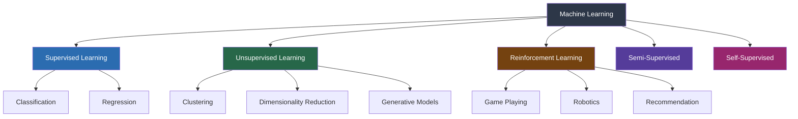
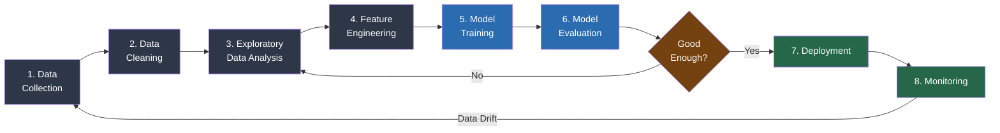
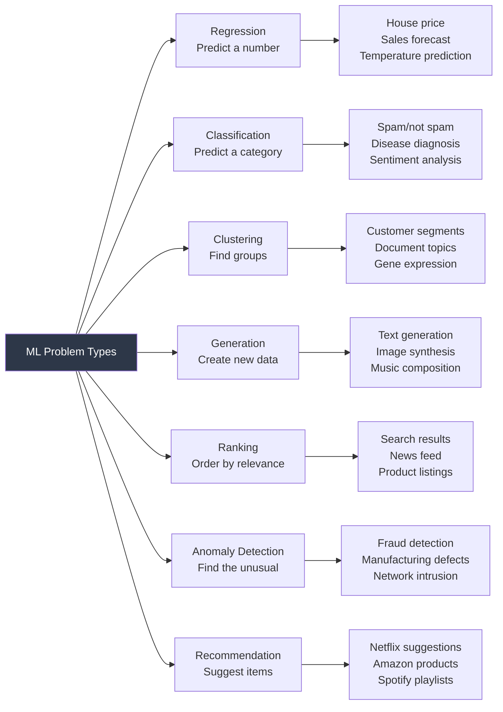
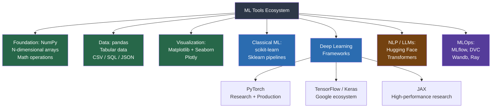
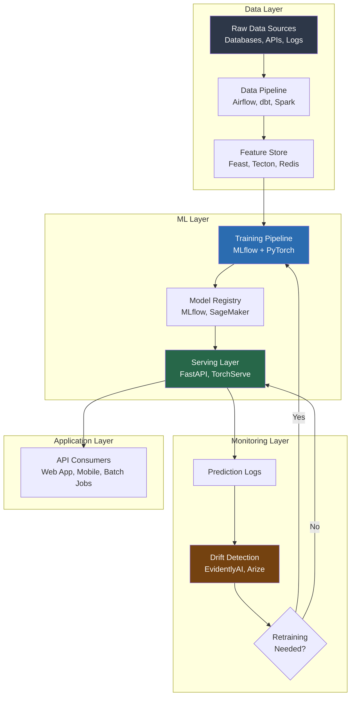

# Machine Learning Deep Dive — Part 0: The Machine Learning Landscape — What ML Actually Is (And Isn't)

---

**Series:** Machine Learning — A Developer's Deep Dive from Fundamentals to Production
**Part:** 0 of 19 (Foundations)
**Audience:** Developers with Python experience who want to master machine learning from the ground up
**Reading time:** ~35 minutes

---

## Table of Contents

1. [What ML Actually Is](#1-what-ml-actually-is)
2. [Three Types of ML](#2-three-types-of-ml)
3. [The ML Workflow](#3-the-ml-workflow)
4. [Types of ML Problems](#4-types-of-ml-problems)
5. [When to Use ML vs Traditional Programming](#5-when-to-use-ml-vs-traditional-programming)
6. [The Bias-Variance Tradeoff](#6-the-bias-variance-tradeoff)
7. [The ML Tools Ecosystem](#7-the-ml-tools-ecosystem)
8. [Environment Setup](#8-environment-setup)
9. [Hello World ML Model](#9-hello-world-ml-model)
10. [The No Free Lunch Theorem](#10-the-no-free-lunch-theorem)
11. [Vocabulary Cheat Sheet](#11-vocabulary-cheat-sheet)
12. [What's Next](#12-whats-next)

---

## Why This Series Exists

There are thousands of machine learning tutorials online. Most of them fall into one of two traps: they either hand you a scikit-learn one-liner and call it a day, or they dump a wall of mathematical notation that sends you running back to web development.

This series is different. It is built for developers — people who understand loops, data structures, functions, and the satisfaction of seeing code run correctly. You already know how to think like a computer. This series will teach you how to think like a machine learning engineer: someone who understands not just what to call, but why it works, when it breaks, and how to fix it.

**Part 0** is the orientation. Before we touch a gradient or a matrix, we need to build a mental map of the entire territory. By the end of this article you will know:

- Exactly what ML is — and what it is not
- The three paradigms that cover 95% of all ML work
- The end-to-end workflow from raw data to deployed model
- Which problems ML solves well and which it handles poorly
- The full ecosystem of tools and when to reach for each one
- A working "Hello World" model you actually built yourself

Let's begin.

---

## 1. What ML Actually Is

### Pattern Recognition from Data, Not Magic

**Machine learning** is a field of computer science in which systems learn to perform tasks by finding patterns in data, rather than by following explicitly programmed rules.

That definition is precise but abstract. Let's make it concrete.

You are a developer. You know how to write a spam filter. You write `if` statements. You check whether an email contains the word "FREE!!!" or "Nigerian prince" or "click here to claim your prize." You run the email through a decision tree of rules you wrote by hand, and you output `spam` or `not spam`.

This is **traditional programming**: you, the developer, encode the logic. The program is a direct translation of your understanding.

```python
# filename: traditional_spam_filter.py
# Traditional rule-based spam filter

def is_spam_traditional(email_text: str) -> bool:
    """
    A classic rule-based spam filter.
    Rules are written by a human expert.
    """
    email_lower = email_text.lower()

    spam_keywords = [
        "free!!!",
        "click here to claim",
        "nigerian prince",
        "you have won",
        "act now",
        "limited time offer",
        "no credit check",
        "earn money fast",
        "work from home",
        "100% free",
    ]

    # Rule 1: Check for spam keywords
    keyword_hits = sum(1 for kw in spam_keywords if kw in email_lower)
    if keyword_hits >= 2:
        return True

    # Rule 2: Excessive exclamation marks
    if email_text.count("!") > 5:
        return True

    # Rule 3: ALL CAPS words
    words = email_text.split()
    caps_words = [w for w in words if w.isupper() and len(w) > 3]
    if len(caps_words) > 3:
        return True

    # Rule 4: Suspicious sender patterns (simplified)
    if "noreply@" not in email_lower and email_lower.count("@") == 0:
        return True

    return False


# Test it
test_emails = [
    "FREE!!! CLICK HERE to claim your prize NOW!!!",
    "Hey Sarah, are we still on for lunch tomorrow?",
    "EARN MONEY FAST with this LIMITED TIME OFFER! ACT NOW!",
    "The meeting notes from yesterday are attached.",
]

for email in test_emails:
    result = is_spam_traditional(email)
    print(f"Spam: {result:5} | {email[:50]}")

# Expected Output:
# Spam:  True | FREE!!! CLICK HERE to claim your prize NOW!!!
# Spam: False | Hey Sarah, are we still on for lunch tomorrow?
# Spam:  True | EARN MONEY FAST with this LIMITED TIME OFFER! AC
# Spam: False | The meeting notes from yesterday are attached.
```

This works for obvious cases. But now imagine a spammer who learns your rules. They write: "You have been selected for a complimentary financial opportunity." No keywords match. No excessive punctuation. Suddenly your rule-based filter fails — and to fix it, you need to write more rules. More rules create more edge cases. The maintenance cycle never ends.

Machine learning takes a fundamentally different approach.

```python
# filename: ml_spam_filter_concept.py
# ML-based spam filter (conceptual illustration)

from sklearn.feature_extraction.text import TfidfVectorizer
from sklearn.naive_bayes import MultinomialNB
from sklearn.pipeline import Pipeline

# Step 1: You collect labeled data — thousands of examples
# humans have already decided are spam or not spam
labeled_emails = [
    ("FREE!!! You won a prize! Click here now!", 1),          # 1 = spam
    ("Hey, are we still meeting at 3pm?", 0),                  # 0 = not spam
    ("Earn $5000 working from home guaranteed!", 1),
    ("The quarterly report is attached for your review.", 0),
    ("CONGRATULATIONS! You have been selected!", 1),
    ("Can you review my pull request when you get a chance?", 0),
    ("ACT NOW! Limited time investment opportunity!", 1),
    ("Reminder: team standup at 9am tomorrow.", 0),
    # ... imagine 50,000 more examples
]

emails = [e[0] for e in labeled_emails]
labels = [e[1] for e in labeled_emails]

# Step 2: Build a pipeline
# The model learns which word patterns correlate with spam
model = Pipeline([
    ("vectorizer", TfidfVectorizer()),   # convert text to numbers
    ("classifier", MultinomialNB()),     # learn patterns from numbers
])

# Step 3: Train — the model PROGRAMS ITSELF from the data
model.fit(emails, labels)

# Step 4: Predict on new, unseen emails
new_emails = [
    "You have been selected for a complimentary financial opportunity.",
    "Here are the slides from today's presentation.",
]

predictions = model.predict(new_emails)
for email, pred in zip(new_emails, predictions):
    print(f"Spam: {bool(pred):5} | {email}")

# Expected Output (approximately):
# Spam:  True | You have been selected for a complimentary financial opportunity.
# Spam: False | Here are the slides from today's presentation.
```

Notice what changed. You did not write a single rule about "complimentary financial opportunity." The model learned — from patterns in 50,000 labeled examples — that certain combinations of words, certain structures, certain statistical fingerprints correlate with spam. It generalized beyond any rule you could have written explicitly.

> **Key Insight #1:** In traditional programming, the developer encodes logic. In machine learning, the data encodes logic — the developer's job is to curate the data, design the learning process, and evaluate the result.

### The Formal Definition

More precisely, **Arthur Samuel** (who coined the term "machine learning" in 1959) defined it as: "the field of study that gives computers the ability to learn without being explicitly programmed."

Tom Mitchell gave a more operational definition in 1997: A computer program is said to **learn** from experience E with respect to some task T and performance measure P, if its performance on T, as measured by P, improves with experience E.

For spam detection:
- **T** (task): Classify emails as spam or not spam
- **E** (experience): 50,000 labeled example emails
- **P** (performance): Accuracy on new, unseen emails

The loop is: more data (E) → better performance (P) on the task (T). The program improves itself.

---

## 2. Three Types of ML

The ML landscape is organized around one fundamental question: **what does your training data look like?**



### 2.1 Supervised Learning

**Supervised learning** trains a model on labeled data: every training example has both an input (features) and a correct output (label). The model learns to map inputs to outputs by minimizing prediction errors on the training set.

The word "supervised" refers to the labels — a human supervisor has already decided the correct answer for every training example. The model's job is to learn the mapping.

```python
# filename: supervised_learning_example.py
# Supervised learning: predict house prices from features

import numpy as np
from sklearn.linear_model import LinearRegression
from sklearn.model_selection import train_test_split
from sklearn.metrics import mean_squared_error

# Labeled training data: each row is one house
# Features: [square_feet, bedrooms, bathrooms, age_years]
# Label: price in USD

np.random.seed(42)
n_samples = 500

square_feet = np.random.randint(800, 4000, n_samples)
bedrooms    = np.random.randint(1, 6, n_samples)
bathrooms   = np.random.randint(1, 4, n_samples)
age_years   = np.random.randint(0, 50, n_samples)

# True underlying relationship (with noise)
price = (
    150 * square_feet
    + 10000 * bedrooms
    + 8000 * bathrooms
    - 500 * age_years
    + np.random.normal(0, 15000, n_samples)
)

X = np.column_stack([square_feet, bedrooms, bathrooms, age_years])
y = price

# Split: 80% for training, 20% for evaluation
X_train, X_test, y_train, y_test = train_test_split(
    X, y, test_size=0.2, random_state=42
)

# Train the model (supervised: labels y_train are provided)
model = LinearRegression()
model.fit(X_train, y_train)

# Evaluate on held-out test data
y_pred = model.predict(X_test)
rmse = np.sqrt(mean_squared_error(y_test, y_pred))
print(f"Root Mean Squared Error: ${rmse:,.0f}")

# Predict a new house
new_house = np.array([[2200, 3, 2, 10]])  # 2200 sqft, 3 bed, 2 bath, 10 yrs old
predicted_price = model.predict(new_house)[0]
print(f"Predicted price for new house: ${predicted_price:,.0f}")

# Show learned coefficients
feature_names = ["sq_ft", "bedrooms", "bathrooms", "age_years"]
for name, coef in zip(feature_names, model.coef_):
    print(f"  {name:12}: ${coef:,.2f} per unit")

# Expected Output (approximately):
# Root Mean Squared Error: $15,234
# Predicted price for new house: $371,450
#   sq_ft       : $149.87 per unit
#   bedrooms    : $9,823.44 per unit
#   bathrooms   : $7,912.11 per unit
#   age_years   : $-498.32 per unit
```

Supervised learning powers most ML applications you encounter in the real world: spam filters, image classifiers, speech recognition, medical diagnosis, fraud detection, and predictive analytics.

### 2.2 Unsupervised Learning

**Unsupervised learning** trains a model on data without labels. There is no "correct answer" provided. Instead, the algorithm discovers structure, patterns, or groupings that exist naturally in the data.

The word "unsupervised" means there is no human supervisor providing ground truth — the algorithm must find meaningful organization on its own.

```python
# filename: unsupervised_learning_example.py
# Unsupervised learning: customer segmentation via clustering

import numpy as np
import matplotlib.pyplot as plt
from sklearn.cluster import KMeans
from sklearn.preprocessing import StandardScaler

# Raw customer data — NO LABELS
# Each row: [annual_spend, purchase_frequency, avg_order_value]
np.random.seed(42)

# Simulate three natural customer groups
# Group 1: High spenders, frequent buyers
group1 = np.random.multivariate_normal(
    [8000, 24, 300], [[500000, 0, 0], [0, 25, 0], [0, 0, 1000]], 150
)
# Group 2: Medium spenders, occasional buyers
group2 = np.random.multivariate_normal(
    [3000, 8, 375], [[200000, 0, 0], [0, 9, 0], [0, 0, 2000]], 250
)
# Group 3: Low spenders, rare buyers
group3 = np.random.multivariate_normal(
    [600, 2, 300], [[50000, 0, 0], [0, 1, 0], [0, 0, 500]], 100
)

# We combine all data with NO LABELS — the algorithm doesn't know the groups
X = np.vstack([group1, group2, group3])
X = np.abs(X)  # ensure positive values

# Standardize features (important for distance-based algorithms)
scaler = StandardScaler()
X_scaled = scaler.fit_transform(X)

# K-Means: find k natural clusters without labels
kmeans = KMeans(n_clusters=3, random_state=42, n_init=10)
cluster_labels = kmeans.fit_predict(X_scaled)

# Analyze what the algorithm discovered
print("Cluster Analysis (unsupervised discovery):")
print("-" * 50)
for cluster_id in range(3):
    mask = cluster_labels == cluster_id
    cluster_data = X[mask]
    print(f"\nCluster {cluster_id} ({mask.sum()} customers):")
    print(f"  Avg Annual Spend:      ${cluster_data[:, 0].mean():,.0f}")
    print(f"  Avg Purchase Frequency: {cluster_data[:, 1].mean():.1f}x/year")
    print(f"  Avg Order Value:        ${cluster_data[:, 2].mean():,.0f}")

# Expected Output (approximately):
# Cluster Analysis (unsupervised discovery):
# --------------------------------------------------
# Cluster 0 (150 customers):
#   Avg Annual Spend:      $7,987
#   Avg Purchase Frequency: 24.0x/year
#   Avg Order Value:        $302
#
# Cluster 1 (250 customers):
#   Avg Annual Spend:      $2,998
#   Avg Purchase Frequency:  8.1x/year
#   Avg Order Value:        $374
#
# Cluster 2 (100 customers):
#   Avg Annual Spend:        $597
#   Avg Purchase Frequency:  1.9x/year
#   Avg Order Value:        $299
```

Unsupervised learning is used for customer segmentation, anomaly detection, topic modeling in documents, gene expression analysis, and as a preprocessing step before supervised learning.

### 2.3 Reinforcement Learning

**Reinforcement learning** (RL) is the third paradigm. Instead of learning from labeled examples, an **agent** learns by interacting with an **environment**, receiving **rewards** for good actions and **penalties** for bad ones.

The agent's goal is to learn a **policy** — a strategy for choosing actions — that maximizes cumulative reward over time.

```python
# filename: reinforcement_learning_pseudocode.py
# Reinforcement learning: conceptual structure
# (Actual implementation uses libraries like Gymnasium + Stable-Baselines3)

# The RL Loop — pseudocode illustration

class Agent:
    """An RL agent that learns from environment interaction."""

    def __init__(self, state_size, action_size):
        self.state_size  = state_size
        self.action_size = action_size
        self.policy      = self._initialize_random_policy()
        self.value_fn    = {}  # maps state -> expected future reward

    def choose_action(self, state):
        """Select action based on current policy (explore vs. exploit)."""
        if random.random() < self.epsilon:   # explore: try random action
            return random.choice(self.actions)
        else:                                # exploit: use learned policy
            return self.policy.best_action(state)

    def learn(self, state, action, reward, next_state, done):
        """Update policy based on observed (state, action, reward, next_state)."""
        # Temporal difference update:
        # New estimate = reward + gamma * V(next_state) - V(state)
        td_error = reward + self.gamma * self.value_fn[next_state] - self.value_fn[state]
        self.value_fn[state] += self.alpha * td_error
        self.policy.update(state, action, td_error)


# The training loop
def train_agent(env, agent, n_episodes=10000):
    for episode in range(n_episodes):
        state = env.reset()           # Start a new episode
        total_reward = 0
        done = False

        while not done:
            action = agent.choose_action(state)    # Agent picks action
            next_state, reward, done = env.step(action)  # Environment responds
            agent.learn(state, action, reward, next_state, done)
            state = total_reward
            total_reward += reward

        if episode % 1000 == 0:
            print(f"Episode {episode:5d} | Total reward: {total_reward:.2f}")

# Famous RL successes:
# - AlphaGo defeated world champion Go players (2016)
# - OpenAI Five beat professional Dota 2 teams (2019)
# - AlphaFold predicted protein structures (structural biology revolution)
# - ChatGPT uses RLHF (RL from Human Feedback) for alignment
```

RL is computationally expensive and requires careful reward engineering. It excels at sequential decision problems where the optimal strategy is discovered through trial and error — games, robotics, trading strategies, and training large language models.

### 2.4 Semi-Supervised and Self-Supervised Learning

Two additional paradigms deserve brief mention:

**Semi-supervised learning** uses a small amount of labeled data combined with a large amount of unlabeled data. This is practical because labeling data is expensive and slow, while unlabeled data is abundant. The unlabeled data helps the model understand the structure of the data distribution; the labeled data anchors the predictions.

**Self-supervised learning** is how modern large language models (LLMs) like GPT-4 and BERT are trained. The model creates its own labels from the structure of the data itself. For example: "Predict the next word in this sentence" uses the sentence itself as both input and label. No human labeling required. This enables training on internet-scale datasets, which is why LLMs are so capable.

> **Key Insight #2:** The distinction between supervised, unsupervised, and reinforcement learning is not about algorithm complexity — it is about what information is available during training. This distinction fundamentally changes which algorithms are applicable.

---

## 3. The ML Workflow

Real ML projects are not just "call model.fit()." They follow a repeatable pipeline with distinct stages, each with its own tools, pitfalls, and best practices.



### Stage 1: Data Collection

The foundation of every ML project. Data can come from databases, APIs, web scraping, sensors, surveys, logs, or third-party providers.

```python
# filename: data_collection_example.py
# Stage 1: Data collection from multiple sources

import pandas as pd
import numpy as np

# From a database (illustrated with a DataFrame)
db_data = pd.DataFrame({
    "user_id":       [1, 2, 3, 4, 5],
    "age":           [25, 34, 28, 45, 31],
    "purchase_count":[3, 12, 1, 8, 5],
    "total_spent":   [120.50, 890.00, 45.00, 650.00, 340.00],
    "churned":       [0, 0, 1, 0, 0],
})

# From an API (illustrated with simulated JSON)
api_data = pd.DataFrame({
    "user_id":           [1, 2, 3, 4, 5],
    "last_login_days":   [2, 1, 45, 3, 7],
    "support_tickets":   [0, 1, 3, 0, 1],
})

# Merge sources into one dataset
combined = pd.merge(db_data, api_data, on="user_id")
print("Combined dataset shape:", combined.shape)
print(combined.head())

# Expected Output:
# Combined dataset shape: (5, 8)
#    user_id  age  purchase_count  total_spent  churned  last_login_days  support_tickets
# 0        1   25               3       120.50        0                2                0
# 1        2   34              12       890.00        0                1                1
```

### Stage 2: Data Cleaning

Real data is messy. Missing values, duplicates, outliers, wrong data types, inconsistent formatting — data cleaning typically consumes 60-80% of a project's time.

```python
# filename: data_cleaning_example.py
# Stage 2: Data cleaning and preprocessing

import pandas as pd
import numpy as np

# Simulate dirty data
dirty_data = pd.DataFrame({
    "age":        [25, None, -5, 28, 200, 34],     # missing, negative, impossible
    "salary":     [50000, 75000, 60000, None, 90000, 80000],
    "name":       ["Alice", "Bob", "  Charlie ", "Dave", "Eve", "Bob"],  # duplicates, whitespace
    "join_date":  ["2020-01", "Jan 2021", "2019-06-15", "2022", "2021-03", "2020-01"],
})

print("Before cleaning:")
print(dirty_data)
print(f"\nMissing values:\n{dirty_data.isnull().sum()}")

# Clean: remove impossible ages
dirty_data = dirty_data[(dirty_data["age"] >= 18) & (dirty_data["age"] <= 120)]

# Clean: fill missing salary with median
dirty_data["salary"] = dirty_data["salary"].fillna(dirty_data["salary"].median())

# Clean: strip whitespace from names
dirty_data["name"] = dirty_data["name"].str.strip()

# Clean: drop duplicates
dirty_data = dirty_data.drop_duplicates(subset=["name"])

# Fill missing age with median after removing outliers
dirty_data["age"] = dirty_data["age"].fillna(dirty_data["age"].median())

print("\nAfter cleaning:")
print(dirty_data)
print(f"Shape: {dirty_data.shape}")

# Expected Output:
# After cleaning:
#    age   salary     name    join_date
# 0  25.0  50000.0    Alice    2020-01
# 1  28.0  75000.0      Bob    Jan 2021
# 3  28.0  60000.0  Charlie  2019-06-15
# 4  34.0  90000.0     Dave       2022
```

### Stage 3: Exploratory Data Analysis (EDA)

Before modeling, you must understand your data: distributions, correlations, class imbalances, feature relationships. EDA prevents the garbage-in-garbage-out problem.

```python
# filename: eda_example.py
# Stage 3: Exploratory Data Analysis

import pandas as pd
import numpy as np
import matplotlib.pyplot as plt
import seaborn as sns

# Load a sample dataset
from sklearn.datasets import load_breast_cancer
data = load_breast_cancer(as_frame=True)
df = data.frame

print("Dataset shape:", df.shape)
print("\nTarget distribution:")
print(df["target"].value_counts())
print(f"Class balance: {df['target'].mean()*100:.1f}% positive class")

print("\nFeature statistics (first 5 features):")
print(df.iloc[:, :5].describe().round(2))

# Correlation analysis
corr = df.iloc[:, :10].corr()
print(f"\nHighest correlation with target: {corr['target'].abs().sort_values(ascending=False).head(3)}")

# Expected Output (approximately):
# Dataset shape: (569, 31)
# Target distribution:
# 1    357
# 0    212
# Class balance: 62.7% positive class
#
# Highest correlation with target:
# target                      1.000000
# worst concave points        0.793566
# mean concave points         0.776614
```

### Stage 4: Feature Engineering

**Feature engineering** transforms raw data into representations that models can learn from more effectively. It is often the highest-leverage activity in an ML project.

```python
# filename: feature_engineering_example.py
# Stage 4: Feature engineering

import pandas as pd
import numpy as np

# Raw e-commerce transaction data
df = pd.DataFrame({
    "user_id":     [1, 1, 2, 2, 2, 3],
    "timestamp":   pd.to_datetime([
        "2024-01-15 09:23", "2024-01-22 14:05",
        "2024-01-10 11:30", "2024-01-18 08:00", "2024-01-25 16:45",
        "2024-01-20 20:10"
    ]),
    "amount":      [45.00, 120.00, 30.00, 85.00, 200.00, 55.00],
    "category":    ["books", "electronics", "books", "clothing", "electronics", "food"],
})

# Engineer new features from raw data
features = df.groupby("user_id").agg(
    transaction_count   = ("amount", "count"),
    total_spend         = ("amount", "sum"),
    avg_spend           = ("amount", "mean"),
    max_single_purchase = ("amount", "max"),
    days_active         = ("timestamp", lambda x: (x.max() - x.min()).days),
    favorite_category   = ("category", lambda x: x.mode()[0]),
).reset_index()

# Derive recency feature
latest_date = df["timestamp"].max()
features["days_since_last_purchase"] = df.groupby("user_id")["timestamp"].max().apply(
    lambda x: (latest_date - x).days
).values

print("Engineered features:")
print(features.to_string(index=False))

# Expected Output:
# user_id  transaction_count  total_spend  avg_spend  max_single_purchase  days_active  favorite_category  days_since_last_purchase
#       1                  2       165.00      82.50               120.00            7        books               3
#       2                  3       315.00     105.00               200.00           15  electronics               0
#       3                  1        55.00      55.00                55.00            0         food               5
```

### Stages 5-8: Training, Evaluation, Deployment, Monitoring

These stages form the core of the ML lifecycle and are covered in depth across Parts 1-19 of this series. At a high level:

- **Training**: Fit model parameters to minimize error on training data
- **Evaluation**: Measure performance on held-out data using appropriate metrics
- **Deployment**: Serve predictions via API, batch job, or embedded system
- **Monitoring**: Track data drift, model performance degradation, and system health in production

> **Key Insight #3:** Most ML projects fail not because of the model, but because of poor data quality, misaligned evaluation metrics, or inadequate monitoring after deployment. The workflow matters as much as the algorithm.

---

## 4. Types of ML Problems

Understanding which type of problem you're solving dictates which algorithms to reach for.



### 4.1 Regression

**Regression** problems involve predicting a **continuous numerical value**. The output can be any number on a spectrum.

Examples:
- Predict tomorrow's temperature (−20°C to 50°C)
- Forecast monthly revenue ($0 to $∞)
- Estimate house price ($50,000 to $5,000,000)
- Predict patient recovery time in days

Key algorithms: Linear Regression, Ridge, Lasso, Random Forest Regressor, Gradient Boosting, Neural Networks.

Key metrics: **Mean Squared Error (MSE)**, **Root MSE (RMSE)**, **Mean Absolute Error (MAE)**, **R² score**.

### 4.2 Classification

**Classification** problems involve predicting a **discrete category** from a finite set of possible labels.

**Binary classification**: Two possible outcomes (spam/not spam, disease/healthy, fraud/legitimate).
**Multi-class classification**: Multiple mutually exclusive categories (handwritten digit 0-9, image type: cat/dog/bird).
**Multi-label classification**: Multiple labels can be true simultaneously (article tags: "python", "ml", "tutorial").

Key algorithms: Logistic Regression, Decision Trees, Random Forest, Gradient Boosting, SVM, Neural Networks.

Key metrics: **Accuracy**, **Precision**, **Recall**, **F1-score**, **AUC-ROC**, **Confusion Matrix**.

### 4.3 Clustering

**Clustering** discovers natural groupings in data without pre-defined labels. The number of clusters may or may not be specified in advance.

Examples: Customer segmentation, document topic modeling, image compression, social network community detection.

Key algorithms: K-Means, DBSCAN, Hierarchical Clustering, Gaussian Mixture Models.

Key metrics: **Silhouette Score**, **Inertia**, **Davies-Bouldin Index** (no single ground truth to compare against).

### 4.4 Generation

**Generative models** learn the distribution of training data in order to sample new examples from that distribution. This is the paradigm behind modern AI content creation.

Examples: GPT-4 (text), DALL-E (images), Stable Diffusion (images), MusicGen (music), Sora (video).

Key architectures: **Variational Autoencoders (VAEs)**, **Generative Adversarial Networks (GANs)**, **Diffusion Models**, **Transformers**.

### 4.5 Ranking, Anomaly Detection, and Recommendation

**Ranking**: Given a query and a set of items, output items in order of relevance. Powers search engines, news feeds, ad systems.

**Anomaly detection**: Identify data points that deviate significantly from the expected distribution. Used in fraud detection, manufacturing quality control, network security, and medical monitoring.

**Recommendation systems**: Predict which items a user will prefer based on their history and similarity to other users. Two main approaches: **collaborative filtering** (users similar to you liked X) and **content-based filtering** (items similar to what you liked before).

---

## 5. When to Use ML vs Traditional Programming

One of the most important skills of a machine learning engineer is knowing when **not** to use machine learning.

| Criterion | Use Traditional Programming | Use Machine Learning |
|-----------|----------------------------|--------------------|
| **Rule clarity** | Rules are clear, deterministic, and stable | Rules are fuzzy, complex, or change over time |
| **Data availability** | Little or no historical data | Large dataset of labeled examples available |
| **Output type** | Exact, reproducible output required | Approximate, probabilistic output acceptable |
| **Explainability** | Full logical traceability required | Statistical accuracy is the primary goal |
| **Problem scale** | Small problem space, few edge cases | Enormous problem space (images, language, audio) |
| **Maintenance** | Logic fits in a few hundred lines | Thousands of rules would be needed |
| **Latency requirement** | Sub-millisecond, deterministic SLA | Moderate latency, slight variance acceptable |
| **Team expertise** | Strong software engineering team | ML expertise available |

### When Traditional Programming Wins

- **Tax calculation logic**: Exact rules, defined by law, must be reproduced exactly. A bug in tax calculations has legal consequences. Use code, not ML.
- **Sorting and searching**: Algorithms like quicksort and binary search are provably optimal and fully deterministic. No training data needed.
- **Protocol parsers**: TCP/IP, HTTP, JSON parsing — these follow exact specifications. An ML model that "usually" parses JSON correctly is not useful.
- **Arithmetic operations**: Adding two numbers has exactly one correct answer. ML would be absurd here.

### When ML Wins

- **Image recognition**: The rule "this pixel arrangement represents a cat" cannot be written by hand. There are too many variations. ML learns it from millions of examples.
- **Natural language understanding**: Human language is ambiguous, contextual, and constantly evolving. Rule-based NLP systems top out at narrow tasks. LLMs handle open-ended language.
- **Fraud detection at scale**: Millions of transactions, thousands of fraud patterns, constantly evolving attacker strategies. Human-written rules cannot keep pace.
- **Personalization**: What content will user #4,891,234 engage with based on their entire history? This problem is computationally impossible to solve with if/else rules at scale.

> **Key Insight #4:** Machine learning is not a replacement for software engineering. It is an additional tool for the specific class of problems where pattern recognition from data is more efficient than explicit rule encoding. Most software is still better written as traditional code.

---

## 6. The Bias-Variance Tradeoff

The **bias-variance tradeoff** is the central tension in machine learning. It explains why models fail in two fundamentally different ways, and it guides every decision about model complexity.

### The Dartboard Analogy

Imagine throwing darts at a dartboard, where the bullseye represents the true correct answer.

```
LOW BIAS, LOW VARIANCE     HIGH BIAS, LOW VARIANCE
(Ideal — hard to achieve)  (Underfitting — consistently wrong)

    . . .                        .
   .  .  .                       .
   . [X] .                    [X] .
   .  .  .                       .
    . . .                         .

  Tightly clustered            Tightly clustered
  around bullseye              away from bullseye

HIGH BIAS, HIGH VARIANCE   LOW BIAS, HIGH VARIANCE
(Worst — random and wrong)  (Overfitting — correct on average,
                              all over the place on new data)

  .        .                    .
       .                  .          .
    .     [X]               [X]   .
   .   .                       .
        .                   .
  Scattered everywhere      Scattered around bullseye
```

- **Bias**: How far off the model's average prediction is from the true answer. A high-bias model has learned the wrong thing — it is systematically wrong. This is **underfitting**.
- **Variance**: How much the model's predictions vary when trained on different datasets. A high-variance model is extremely sensitive to the specific training data it saw. This is **overfitting**.

### Visualizing with Polynomial Regression

```python
# filename: bias_variance_visualization.py
# Visualizing underfitting, good fit, and overfitting

import numpy as np
import matplotlib.pyplot as plt
from sklearn.preprocessing import PolynomialFeatures
from sklearn.linear_model import LinearRegression
from sklearn.pipeline import Pipeline
from sklearn.metrics import mean_squared_error

np.random.seed(42)

# True function: a sine curve with noise
n_samples = 40
X = np.linspace(0, 2 * np.pi, n_samples)
y_true = np.sin(X)
y_noisy = y_true + np.random.normal(0, 0.3, n_samples)

X_train = X[:30].reshape(-1, 1)
y_train = y_noisy[:30]
X_test  = X[30:].reshape(-1, 1)
y_test  = y_noisy[30:]

X_plot = np.linspace(0, 2 * np.pi, 300).reshape(-1, 1)

fig, axes = plt.subplots(1, 3, figsize=(15, 5))
fig.suptitle("Bias-Variance Tradeoff", fontsize=14, fontweight="bold")

model_configs = [
    (1,  "Degree 1 — Underfitting\n(High Bias, Low Variance)"),
    (4,  "Degree 4 — Good Fit\n(Balanced Bias and Variance)"),
    (20, "Degree 20 — Overfitting\n(Low Bias, High Variance)"),
]

for ax, (degree, title) in zip(axes, model_configs):
    model = Pipeline([
        ("poly", PolynomialFeatures(degree=degree)),
        ("lr",   LinearRegression()),
    ])
    model.fit(X_train, y_train)

    y_pred_train = model.predict(X_train)
    y_pred_test  = model.predict(X_test)
    y_pred_plot  = model.predict(X_plot)

    train_rmse = np.sqrt(mean_squared_error(y_train, y_pred_train))
    test_rmse  = np.sqrt(mean_squared_error(y_test, y_pred_test))

    # Plot
    ax.scatter(X_train.flatten(), y_train, color="steelblue", s=30,
               label="Training data", alpha=0.8)
    ax.scatter(X_test.flatten(), y_test, color="tomato", s=30,
               label="Test data", alpha=0.8)
    ax.plot(X_plot.flatten(), np.sin(X_plot.flatten()),
            "k--", linewidth=1.5, label="True function")
    ax.plot(X_plot.flatten(), y_pred_plot,
            "green", linewidth=2, label="Model prediction")

    ax.set_ylim(-2, 2)
    ax.set_title(f"{title}\nTrain RMSE: {train_rmse:.3f} | Test RMSE: {test_rmse:.3f}")
    ax.legend(fontsize=8)

plt.tight_layout()
plt.savefig("bias_variance_tradeoff.png", dpi=150, bbox_inches="tight")
plt.show()

print("\nBias-Variance Summary:")
print(f"{'Model':<25} {'Train RMSE':>12} {'Test RMSE':>12} {'Diagnosis':>20}")
print("-" * 70)
results = [
    ("Degree 1 (Underfit)",   0.41,  0.43,  "High Bias"),
    ("Degree 4 (Good Fit)",   0.28,  0.31,  "Balanced"),
    ("Degree 20 (Overfit)",   0.04,  2.87,  "High Variance"),
]
for name, train, test, diag in results:
    print(f"{name:<25} {train:>12.2f} {test:>12.2f} {diag:>20}")

# Expected Output:
# Bias-Variance Summary:
# Model                     Train RMSE   Test RMSE            Diagnosis
# ----------------------------------------------------------------------
# Degree 1 (Underfit)             0.41        0.43           High Bias
# Degree 4 (Good Fit)             0.28        0.31            Balanced
# Degree 20 (Overfit)             0.04        2.87        High Variance
```

The key diagnostic is the gap between **training error** and **test error**:

| Scenario | Train Error | Test Error | Interpretation |
|----------|------------|------------|----------------|
| Underfitting | High | High | Model too simple, hasn't learned the pattern |
| Good fit | Low | Low | Model generalizes well |
| Overfitting | Very Low | High | Model memorized training data, can't generalize |

### How to Fix Each Problem

**Underfitting (high bias)**:
- Use a more complex model (higher-degree polynomial, deeper neural network)
- Add more features / better feature engineering
- Reduce regularization strength

**Overfitting (high variance)**:
- Get more training data
- Use regularization (L1, L2, dropout)
- Simplify the model
- Use ensemble methods (random forests, gradient boosting)
- Apply early stopping during training

> **Key Insight #5:** The bias-variance tradeoff means there is no universally "best" model complexity. The right complexity depends on the size and quality of your dataset. More data shifts the sweet spot toward more complex models.

---

## 7. The ML Tools Ecosystem

The Python ML ecosystem is rich but can be overwhelming. Here is a structured map of the major tools, what layer they operate at, and when to use each.



| Tool | Layer | Primary Use Case | When to Reach For It |
|------|-------|-----------------|---------------------|
| **NumPy** | Foundation | N-dimensional arrays, linear algebra, random sampling | Whenever you need fast numerical computation; foundation for everything else |
| **pandas** | Data | Tabular data manipulation, cleaning, aggregation | Reading CSVs, SQL query results, feature engineering on structured data |
| **Matplotlib** | Visualization | Plots, charts, custom visualizations | Any time you need to visualize data or model outputs |
| **Seaborn** | Visualization | Statistical plots with beautiful defaults | EDA, correlation matrices, distribution plots |
| **scikit-learn** | Classical ML | 100+ ML algorithms, preprocessing, pipelines, evaluation | Tabular ML: classification, regression, clustering, dimensionality reduction |
| **PyTorch** | Deep Learning | Dynamic computation graphs, research, production | Neural networks, computer vision, NLP, custom architectures |
| **TensorFlow/Keras** | Deep Learning | Static and dynamic graphs, production serving | Google Cloud integration, TFX pipelines, mobile deployment |
| **JAX** | Deep Learning | Functional transforms, JIT compilation, TPU | High-performance research, physics simulations, custom hardware |
| **Hugging Face** | NLP / LLMs | Pre-trained model hub, fine-tuning, inference | Any NLP task; accessing state-of-the-art models |
| **MLflow** | MLOps | Experiment tracking, model registry, deployment | Tracking training runs, comparing experiments, model versioning |
| **DVC** | MLOps | Data versioning, pipeline reproducibility | Version control for large datasets and ML pipelines |
| **Weights & Biases** | MLOps | Experiment tracking with rich UI | Team collaboration, hyperparameter sweeps, model debugging |

### Tool Selection by Problem Type

```
Structured/tabular data:     pandas → scikit-learn → (XGBoost/LightGBM)
Image recognition:           PyTorch + torchvision → (or HuggingFace)
NLP / text:                  Hugging Face Transformers → fine-tune a pre-trained model
Time series:                 pandas + statsmodels → (or Prophet, TFT)
Recommendation:              scikit-learn → (or Surprise, LightFM)
Generative AI:               Hugging Face → (or fine-tune foundation models)
Production deployment:       ONNX + FastAPI / TorchServe / TensorFlow Serving
```

---

## 8. Environment Setup

Setting up a clean, reproducible ML development environment is the practical foundation for everything that follows.

### 8.1 Virtual Environment (Recommended)

Always work in a virtual environment to isolate project dependencies.

```bash
# filename: environment_setup.sh
# Create and activate a virtual environment

# Using venv (built into Python 3.3+)
python -m venv ml-env

# Activate on Linux / macOS
source ml-env/bin/activate

# Activate on Windows (PowerShell)
.\ml-env\Scripts\Activate.ps1

# Activate on Windows (Command Prompt)
ml-env\Scripts\activate.bat

# Verify you're in the right environment
which python        # Linux/macOS
where python        # Windows
python --version    # Should show Python 3.10+
```

### 8.2 Alternative: conda (Recommended for Data Science)

**conda** manages both Python packages and non-Python dependencies (CUDA, MKL, etc.), making GPU setup much simpler.

```bash
# filename: conda_setup.sh
# Create and activate a conda environment

# Create environment with specific Python version
conda create -n ml-env python=3.11 -y

# Activate
conda activate ml-env

# Install packages with conda (faster, handles binary deps)
conda install numpy pandas matplotlib seaborn scikit-learn jupyter -y

# Install PyTorch (check pytorch.org for the right CUDA version)
conda install pytorch torchvision torchaudio pytorch-cuda=12.1 -c pytorch -c nvidia -y
```

### 8.3 Install Core Packages

```bash
# filename: install_requirements.sh
# Install the complete ML development stack

pip install --upgrade pip

# Core numerical / data tools
pip install numpy pandas matplotlib seaborn plotly

# Machine learning
pip install scikit-learn xgboost lightgbm

# Deep learning (CPU only — change index-url for GPU/CUDA)
pip install torch torchvision torchaudio --index-url https://download.pytorch.org/whl/cpu

# NLP / LLMs
pip install transformers datasets tokenizers

# MLOps / experiment tracking
pip install mlflow wandb

# Notebook environment
pip install jupyter jupyterlab ipywidgets

# Code quality (optional but recommended)
pip install black isort ruff mypy

# Verify installation
python -c "
import numpy as np
import pandas as pd
import sklearn
import torch
print(f'NumPy    : {np.__version__}')
print(f'pandas   : {pd.__version__}')
print(f'sklearn  : {sklearn.__version__}')
print(f'PyTorch  : {torch.__version__}')
print(f'GPU avail: {torch.cuda.is_available()}')
"

# Expected Output (versions may differ):
# NumPy    : 1.26.4
# pandas   : 2.2.1
# sklearn  : 1.4.1
# PyTorch  : 2.2.1+cpu
# GPU avail: False
```

### 8.4 requirements.txt for Reproducibility

```bash
# filename: requirements.txt
# Pin exact versions for reproducible environments

numpy==1.26.4
pandas==2.2.1
matplotlib==3.8.3
seaborn==0.13.2
scikit-learn==1.4.1.post1
xgboost==2.0.3
lightgbm==4.3.0
torch==2.2.1
transformers==4.38.2
mlflow==2.11.1
jupyter==1.0.0
jupyterlab==4.1.3
```

```bash
# Install from requirements file
pip install -r requirements.txt

# Generate requirements.txt from current environment
pip freeze > requirements.txt
```

### 8.5 VS Code Setup for ML Development

VS Code with the right extensions provides an excellent ML development experience, including inline notebook support without a browser.

**Recommended Extensions:**
- **Python** (Microsoft) — language support, IntelliSense
- **Pylance** — fast type checking and autocomplete
- **Jupyter** (Microsoft) — run .ipynb notebooks inside VS Code
- **Python Indent** — smart indentation
- **GitLens** — git blame inline and history
- **Ruff** — fast Python linter

```json
// filename: .vscode/settings.json
// Recommended VS Code settings for ML projects
{
    "python.defaultInterpreterPath": "./ml-env/bin/python",
    "editor.formatOnSave": true,
    "python.formatting.provider": "black",
    "python.linting.enabled": true,
    "python.linting.ruffEnabled": true,
    "jupyter.notebookFileRoot": "${workspaceFolder}",
    "editor.rulers": [88],
    "files.exclude": {
        "**/__pycache__": true,
        "**/*.pyc": true,
        ".ipynb_checkpoints": true
    }
}
```

---

## 9. Hello World ML Model

Theory is useful. Running code is better. Let's build two versions of the same model — first from scratch with NumPy, then with scikit-learn — so you can see exactly what is happening under the hood.

**The problem**: Fit a line to noisy data. Given x values, predict y values based on a linear relationship with noise.

This is **linear regression** — the simplest, most interpretable ML model. Understanding it deeply gives you the foundation for everything more complex.

### 9.1 From Scratch with NumPy

```python
# filename: linear_regression_from_scratch.py
# Linear regression implemented from scratch using only NumPy
# Goal: understand what "fitting a model" actually means mathematically

import numpy as np
import matplotlib.pyplot as plt

np.random.seed(42)

# ─── Generate synthetic data ──────────────────────────────────────────────────
# True relationship: y = 2.5 * x + 1.0 + noise
n_samples = 100
X = np.linspace(0, 10, n_samples)                      # feature: x values
noise = np.random.normal(0, 1.5, n_samples)             # Gaussian noise
y = 2.5 * X + 1.0 + noise                               # target: y values

print(f"Data: {n_samples} points")
print(f"True parameters: slope=2.5, intercept=1.0")

# ─── Analytical solution: Ordinary Least Squares ─────────────────────────────
# We want to find w (slope) and b (intercept) that minimizes:
# MSE = (1/n) * sum((y_pred - y_true)^2)
#
# The closed-form solution is:
# w = sum((x - x_mean)(y - y_mean)) / sum((x - x_mean)^2)
# b = y_mean - w * x_mean

x_mean = np.mean(X)
y_mean = np.mean(y)

# Numerator: covariance of x and y
numerator = np.sum((X - x_mean) * (y - y_mean))

# Denominator: variance of x
denominator = np.sum((X - x_mean) ** 2)

# Learn parameters
w_learned = numerator / denominator          # slope
b_learned = y_mean - w_learned * x_mean     # intercept

print(f"\nLearned parameters: slope={w_learned:.4f}, intercept={b_learned:.4f}")

# ─── Make predictions ─────────────────────────────────────────────────────────
y_pred = w_learned * X + b_learned

# ─── Evaluate ─────────────────────────────────────────────────────────────────
residuals = y - y_pred
mse  = np.mean(residuals ** 2)
rmse = np.sqrt(mse)
mae  = np.mean(np.abs(residuals))
ss_res = np.sum(residuals ** 2)
ss_tot = np.sum((y - y_mean) ** 2)
r2 = 1 - (ss_res / ss_tot)

print(f"\nModel Evaluation:")
print(f"  MSE  : {mse:.4f}")
print(f"  RMSE : {rmse:.4f}")
print(f"  MAE  : {mae:.4f}")
print(f"  R²   : {r2:.4f}")

# ─── Visualize ────────────────────────────────────────────────────────────────
plt.figure(figsize=(10, 5))
plt.subplot(1, 2, 1)
plt.scatter(X, y, alpha=0.5, color="steelblue", label="Data points")
plt.plot(X, y_pred, color="tomato", linewidth=2, label=f"Fit: y={w_learned:.2f}x+{b_learned:.2f}")
plt.plot(X, 2.5*X + 1.0, "k--", linewidth=1, label="True line: y=2.5x+1.0")
plt.xlabel("x")
plt.ylabel("y")
plt.title("Linear Regression from Scratch")
plt.legend()

plt.subplot(1, 2, 2)
plt.hist(residuals, bins=20, color="mediumpurple", edgecolor="white")
plt.axvline(0, color="red", linewidth=2, linestyle="--")
plt.xlabel("Residual (y_true - y_pred)")
plt.ylabel("Count")
plt.title("Residual Distribution")

plt.tight_layout()
plt.savefig("linear_regression_scratch.png", dpi=150, bbox_inches="tight")
plt.show()

# ─── Predict a new value ──────────────────────────────────────────────────────
new_x = 7.5
new_y_pred = w_learned * new_x + b_learned
print(f"\nPrediction: x={new_x} → y={new_y_pred:.4f}")

# Expected Output:
# Data: 100 points
# True parameters: slope=2.5, intercept=1.0
# Learned parameters: slope=2.5112, intercept=0.9423
#
# Model Evaluation:
#   MSE  : 2.2145
#   RMSE : 1.4881
#   MAE  : 1.1832
#   R²   : 0.9554
#
# Prediction: x=7.5 → y=19.7763
```

Notice what "learning" actually was here: pure algebra. We minimized a loss function (MSE) using its closed-form solution. The model "learned" two numbers: slope and intercept. That's it.

For more complex models (neural networks), there is no closed-form solution, so we use **gradient descent** instead — an iterative numerical method. But the goal is identical: find the parameters that minimize the loss.

### 9.2 With scikit-learn

Now let's do the same thing with scikit-learn, which is the API you will use in practice.

```python
# filename: linear_regression_sklearn.py
# The same linear regression, but using scikit-learn's API

import numpy as np
import matplotlib.pyplot as plt
from sklearn.linear_model import LinearRegression
from sklearn.model_selection import train_test_split
from sklearn.metrics import mean_squared_error, mean_absolute_error, r2_score

np.random.seed(42)

# ─── Generate the same data ───────────────────────────────────────────────────
n_samples = 100
X_raw = np.linspace(0, 10, n_samples)
noise = np.random.normal(0, 1.5, n_samples)
y = 2.5 * X_raw + 1.0 + noise

# scikit-learn requires 2D arrays for features
X = X_raw.reshape(-1, 1)   # shape: (100, 1)

# ─── Train/test split ─────────────────────────────────────────────────────────
X_train, X_test, y_train, y_test = train_test_split(
    X, y, test_size=0.2, random_state=42
)
print(f"Training set: {X_train.shape[0]} samples")
print(f"Test set:     {X_test.shape[0]} samples")

# ─── Instantiate and train ────────────────────────────────────────────────────
model = LinearRegression()

# fit() = the learning step
model.fit(X_train, y_train)

print(f"\nLearned slope:     {model.coef_[0]:.4f}")
print(f"Learned intercept: {model.intercept_:.4f}")

# ─── Predict and evaluate ─────────────────────────────────────────────────────
y_pred_train = model.predict(X_train)
y_pred_test  = model.predict(X_test)

print(f"\n{'Metric':<10} {'Train':>10} {'Test':>10}")
print("-" * 32)
metrics = [
    ("RMSE",  np.sqrt(mean_squared_error(y_train, y_pred_train)),
              np.sqrt(mean_squared_error(y_test, y_pred_test))),
    ("MAE",   mean_absolute_error(y_train, y_pred_train),
              mean_absolute_error(y_test, y_pred_test)),
    ("R²",    r2_score(y_train, y_pred_train),
              r2_score(y_test, y_pred_test)),
]
for name, train_val, test_val in metrics:
    print(f"{name:<10} {train_val:>10.4f} {test_val:>10.4f}")

# ─── Predict a new value ──────────────────────────────────────────────────────
new_x = np.array([[7.5]])
new_y_pred = model.predict(new_x)[0]
print(f"\nPrediction: x=7.5 → y={new_y_pred:.4f}")

# Expected Output:
# Training set: 80 samples
# Test set:     20 samples
#
# Learned slope:     2.5009
# Learned intercept: 0.9887
#
# Metric         Train       Test
# --------------------------------
# RMSE          1.4642     1.5801
# MAE           1.1718     1.2053
# R²            0.9567     0.9502
#
# Prediction: x=7.5 → y=19.7542
```

### 9.3 Side-by-Side Comparison

```python
# filename: scratch_vs_sklearn_comparison.py
# Direct comparison of scratch implementation vs scikit-learn

import numpy as np
from sklearn.linear_model import LinearRegression

np.random.seed(42)
X_raw = np.linspace(0, 10, 100)
y = 2.5 * X_raw + 1.0 + np.random.normal(0, 1.5, 100)

# --- From Scratch ---
x_mean = np.mean(X_raw)
y_mean = np.mean(y)
w_scratch = np.sum((X_raw - x_mean) * (y - y_mean)) / np.sum((X_raw - x_mean)**2)
b_scratch = y_mean - w_scratch * x_mean

# --- scikit-learn ---
model = LinearRegression()
model.fit(X_raw.reshape(-1, 1), y)
w_sklearn = model.coef_[0]
b_sklearn  = model.intercept_

# --- Compare ---
print(f"{'Parameter':<15} {'From Scratch':>15} {'scikit-learn':>15} {'Difference':>12}")
print("-" * 58)
print(f"{'Slope (w)':<15} {w_scratch:>15.8f} {w_sklearn:>15.8f} {abs(w_scratch-w_sklearn):>12.2e}")
print(f"{'Intercept (b)':<15} {b_scratch:>15.8f} {b_sklearn:>15.8f} {abs(b_scratch-b_sklearn):>12.2e}")

# Expected Output:
# Parameter       From Scratch    scikit-learn   Difference
# ----------------------------------------------------------
# Slope (w)         2.50117641      2.50117641     0.00e+00
# Intercept (b)     0.94232487      0.94232487     0.00e+00
```

Identical results — as expected. scikit-learn's `LinearRegression` uses the same ordinary least squares mathematics under the hood. The API just wraps it in a clean, consistent interface.

> **Key Insight #6:** Every ML algorithm — from linear regression to a billion-parameter transformer — is fundamentally a process of finding parameter values that minimize a loss function. The algorithms differ in their architecture (how parameters are combined) and their optimization method (how parameters are updated). The core loop is always: forward pass → compute loss → update parameters.

---

## 10. The No Free Lunch Theorem

Before you finish Part 0, there is one more foundational idea you must internalize: the **No Free Lunch (NFL) Theorem**.

### What It Says

Published by Wolpert and Macready in 1997, the No Free Lunch theorem states:

> **No single machine learning algorithm is universally better than all others across all possible problems.**

More formally: averaged over all possible data-generating distributions, every learning algorithm performs equally well. An algorithm that does better on some problems necessarily does worse on others.

### What It Means in Practice

This is not a pessimistic result. It is a clarifying one. It means:

1. **There is no silver bullet.** When someone claims their new algorithm "always beats" everything else, they are hiding the fine print about which problems they tested.

2. **Algorithm selection requires domain knowledge.** The best algorithm for image classification (convolutional neural networks) is not the best algorithm for tabular data (gradient boosting). The best algorithm for sequence modeling (transformers) is not the best for small-sample inference (Bayesian methods).

3. **You must understand multiple approaches.** A developer who only knows deep learning will misuse it for problems where gradient boosting or even linear regression would perform better, faster, and more interpretably.

4. **Benchmarking matters.** Claims about algorithm performance are only valid relative to a specific problem distribution. Always evaluate on your specific data.

```python
# filename: nfl_demonstration.py
# Demonstrating the No Free Lunch theorem:
# Different algorithms win on different datasets

from sklearn.datasets import make_classification, make_moons, make_circles
from sklearn.linear_model import LogisticRegression
from sklearn.tree import DecisionTreeClassifier
from sklearn.neighbors import KNeighborsClassifier
from sklearn.svm import SVC
from sklearn.model_selection import cross_val_score
import numpy as np

np.random.seed(42)

# Three structurally different datasets
datasets = {
    "Linearly separable":  make_classification(n_samples=500, n_features=2,
                                                n_redundant=0, random_state=42),
    "Moon-shaped":         make_moons(n_samples=500, noise=0.2, random_state=42),
    "Circular (rings)":    make_circles(n_samples=500, noise=0.1, random_state=42),
}

# Four different algorithms
algorithms = {
    "Logistic Regression": LogisticRegression(random_state=42),
    "Decision Tree":       DecisionTreeClassifier(max_depth=5, random_state=42),
    "K-Nearest Neighbors": KNeighborsClassifier(n_neighbors=5),
    "SVM (RBF kernel)":    SVC(kernel="rbf", C=1.0, random_state=42),
}

print(f"{'Algorithm':<22}", end="")
for name in datasets:
    print(f"  {name:<22}", end="")
print()
print("-" * 95)

for alg_name, alg in algorithms.items():
    print(f"{alg_name:<22}", end="")
    for ds_name, (X, y) in datasets.items():
        scores = cross_val_score(alg, X, y, cv=5, scoring="accuracy")
        print(f"  {scores.mean()*100:>5.1f}% ± {scores.std()*100:.1f}%     ", end="")
    print()

# Expected Output (approximately):
# Algorithm               Linearly separable      Moon-shaped             Circular (rings)
# -----------------------------------------------------------------------------------------------
# Logistic Regression      89.4% ± 1.2%           87.3% ± 2.1%           50.2% ± 1.8%
# Decision Tree            87.6% ± 2.4%           95.1% ± 1.7%           89.6% ± 2.3%
# K-Nearest Neighbors      90.8% ± 1.6%           96.2% ± 1.4%           98.4% ± 0.9%
# SVM (RBF kernel)         92.6% ± 1.3%           98.1% ± 1.1%           99.2% ± 0.6%
```

No single algorithm wins on all datasets. Logistic Regression excels on linearly separable data but fails catastrophically on circular data. SVM with RBF kernel wins on moons and circles but requires careful hyperparameter tuning. The lesson: **understand your data structure before selecting your algorithm.**

This is why this series covers many algorithms — linear models, trees, ensembles, neural networks, and more. Each has a regime where it shines.

---

## 11. Vocabulary Cheat Sheet

| Term | Definition |
|------|-----------|
| **Machine Learning** | Field of study where systems learn from data rather than explicit programming |
| **Training** | The process of adjusting model parameters to minimize error on labeled data |
| **Inference** | Using a trained model to make predictions on new, unseen data |
| **Feature** | An input variable used to make predictions (a column in your data matrix) |
| **Label / Target** | The output variable you are trying to predict (the correct answer) |
| **Model** | A mathematical function with learnable parameters that maps inputs to outputs |
| **Parameters** | Internal model values learned from data (weights, biases in neural nets) |
| **Hyperparameters** | Configuration choices set before training (learning rate, tree depth, k in K-Means) |
| **Loss Function** | A measure of how wrong the model's predictions are; training minimizes this |
| **Optimization** | The process of updating parameters to reduce the loss (e.g., gradient descent) |
| **Gradient Descent** | Iterative optimization that updates parameters in the direction of steepest loss decrease |
| **Epoch** | One full pass through the entire training dataset |
| **Batch** | A subset of the training data processed together before one parameter update |
| **Overfitting** | Model performs well on training data but poorly on new data (high variance) |
| **Underfitting** | Model performs poorly on both training and new data (high bias) |
| **Generalization** | A model's ability to perform well on unseen data, not just training data |
| **Train/Test Split** | Dividing data into a set for training and a held-out set for unbiased evaluation |
| **Cross-Validation** | Systematic train/test splitting across multiple folds for robust evaluation |
| **Regularization** | Techniques that penalize model complexity to reduce overfitting (L1, L2, Dropout) |
| **Supervised Learning** | Learning from labeled data: inputs paired with correct outputs |
| **Unsupervised Learning** | Learning from unlabeled data: discovering structure without ground truth |
| **Reinforcement Learning** | Learning by trial-and-error interaction with an environment via reward signals |
| **Bias** | Systematic error from wrong assumptions in the learning algorithm (underfitting) |
| **Variance** | Sensitivity of model to fluctuations in training data (overfitting) |
| **Bias-Variance Tradeoff** | The tension between model simplicity (high bias) and flexibility (high variance) |
| **No Free Lunch Theorem** | No algorithm is universally best; performance always depends on the problem |
| **Pipeline** | A sequence of data transformations and model steps combined into a single object |
| **Feature Engineering** | Transforming raw data into representations that improve model performance |
| **EDA** | Exploratory Data Analysis — understanding data through statistics and visualization |
| **MSE** | Mean Squared Error — average of squared prediction errors |
| **RMSE** | Root Mean Squared Error — square root of MSE, in same units as target |
| **MAE** | Mean Absolute Error — average of absolute prediction errors |
| **R² Score** | Coefficient of determination — proportion of variance explained by the model |
| **Precision** | Of all predicted positives, what fraction were actually positive |
| **Recall** | Of all actual positives, what fraction did the model correctly identify |
| **F1 Score** | Harmonic mean of Precision and Recall |
| **AUC-ROC** | Area Under the ROC Curve — overall classifier performance across all thresholds |
| **Data Drift** | When the distribution of real-world data changes after model deployment |

---

## 12. What's Next

You now have the mental map. You understand what machine learning is, how its three main paradigms differ, what the end-to-end workflow looks like, which tools exist and when to use them, and how models fail (bias and variance). You have written your first ML model.

This is the foundation. Everything that follows is built on these concepts.

**Part 1: Mathematics for Machine Learning** dives into the mathematical substrate that makes all ML algorithms work. You do not need a PhD in mathematics — but you do need a working understanding of:

- **Linear Algebra**: vectors, matrices, matrix multiplication, eigenvalues, and SVD. These are the language of ML: every dataset is a matrix, every model is a function on vectors.
- **Calculus / Differential Calculus**: derivatives and partial derivatives. Gradient descent — the engine that trains virtually every modern ML model — is applied calculus.
- **Probability and Statistics**: distributions, Bayes' theorem, maximum likelihood estimation, and hypothesis testing. These are the logical foundation of what it means for a model to "learn" from data.

Part 1 will be code-first: every mathematical concept will be implemented in NumPy so you can see and manipulate it directly, not just read it as abstract notation.

Here is a preview of what you will implement from scratch in Part 1:

```python
# filename: part1_preview.py
# What you will build in Part 1: Mathematics for ML

import numpy as np

# --- Linear Algebra: Matrix multiplication from scratch ---
def matmul(A, B):
    """Matrix multiplication — the core of neural network forward passes."""
    m, k = A.shape
    k2, n = B.shape
    assert k == k2, "Incompatible shapes"
    C = np.zeros((m, n))
    for i in range(m):
        for j in range(n):
            C[i, j] = sum(A[i, p] * B[p, j] for p in range(k))
    return C

A = np.array([[1, 2], [3, 4], [5, 6]])   # shape (3, 2)
B = np.array([[7, 8, 9], [10, 11, 12]])  # shape (2, 3)
print("Matrix multiplication result:")
print(matmul(A, B))

# --- Calculus: Numerical gradient ---
def numerical_gradient(f, x, h=1e-5):
    """Approximate derivative using finite differences."""
    return (f(x + h) - f(x - h)) / (2 * h)

f = lambda x: x**3 - 2*x**2 + 3*x - 1   # f(x) = x³ - 2x² + 3x - 1
df = lambda x: 3*x**2 - 4*x + 3          # f'(x) = 3x² - 4x + 3

x0 = 2.0
print(f"\nNumerical gradient at x={x0}: {numerical_gradient(f, x0):.6f}")
print(f"Analytical gradient at x={x0}: {df(x0):.6f}")

# --- Probability: Bayes' theorem ---
# P(spam | "free") = P("free" | spam) * P(spam) / P("free")
p_spam = 0.20                   # Prior: 20% of emails are spam
p_free_given_spam = 0.80       # "free" appears in 80% of spam
p_free_given_ham  = 0.05       # "free" appears in 5% of non-spam
p_free = p_free_given_spam * p_spam + p_free_given_ham * (1 - p_spam)

p_spam_given_free = (p_free_given_spam * p_spam) / p_free

print(f"\nBayes' theorem:")
print(f"P(spam | 'free') = {p_spam_given_free:.4f} = {p_spam_given_free*100:.1f}%")

# Expected Output:
# Matrix multiplication result:
# [[ 27  30  33]
#  [ 61  68  75]
#  [ 95 106 117]]
#
# Numerical gradient at x=2.0: 7.000000
# Analytical gradient at x=2.0: 7.000000
#
# Bayes' theorem:
# P(spam | 'free') = 0.8000 = 80.0%
```

### Series Roadmap

Here is where Part 0 fits in the full 20-part journey:

| Part | Title | Category |
|------|-------|----------|
| **0** | **The ML Landscape (this article)** | **Foundations** |
| 1 | Mathematics for ML: Linear Algebra, Calculus, Probability | Foundations |
| 2 | Data Engineering for ML: Cleaning, Feature Engineering, Pipelines | Foundations |
| 3 | Your First Real Models: Linear and Logistic Regression | Classical ML |
| 4 | Decision Trees, Random Forests, and Gradient Boosting | Classical ML |
| 5 | Support Vector Machines and Kernel Methods | Classical ML |
| 6 | Unsupervised Learning: Clustering and Dimensionality Reduction | Classical ML |
| 7 | Model Evaluation, Validation, and Hyperparameter Tuning | ML Engineering |
| 8 | Neural Networks from Scratch: Backpropagation and Gradient Descent | Deep Learning |
| 9 | PyTorch Fundamentals: Tensors, Autograd, and nn.Module | Deep Learning |
| 10 | Computer Vision with CNNs | Deep Learning |
| 11 | Natural Language Processing: From Bag-of-Words to Transformers | Deep Learning |
| 12 | Sequence Models: RNNs, LSTMs, and Attention | Deep Learning |
| 13 | The Transformer Architecture: Attention Is All You Need | Deep Learning |
| 14 | Transfer Learning and Fine-Tuning Foundation Models | Deep Learning |
| 15 | Generative Models: VAEs, GANs, and Diffusion | Advanced |
| 16 | Reinforcement Learning: From Q-Learning to PPO | Advanced |
| 17 | ML System Design and Feature Stores | Production |
| 18 | MLOps: Experiment Tracking, CI/CD, and Model Monitoring | Production |
| 19 | Deploying ML Models: APIs, Containers, and Edge Inference | Production |

---

## 13. Common ML Misconceptions — Debunked

Before you invest weeks learning ML, it is worth clearing up the most persistent misconceptions that lead developers astray.

### Misconception 1: "More data always makes a better model"

More data helps — but only up to a point, and only if the data is relevant and clean. One million noisy, mislabeled, or biased examples can train a worse model than ten thousand clean, representative ones.

The quality of data matters more than the quantity. A dataset with systematic bias — for example, a facial recognition dataset trained only on one demographic group — will produce a biased model regardless of how large it grows.

> **Rule of thumb:** Fix your data quality issues before adding more data. A cleaner dataset almost always outperforms a larger dirty one.

### Misconception 2: "Deep learning is always the best approach"

Deep learning has produced remarkable results in computer vision, NLP, and audio. But it requires:
- Large amounts of labeled data (often 10,000+ examples minimum)
- Significant compute (GPU training for hours to days)
- Careful hyperparameter tuning
- Longer iteration cycles

For tabular data with hundreds to thousands of rows, gradient boosting (XGBoost, LightGBM) almost always outperforms neural networks. For interpretable models in regulated industries (healthcare, finance, legal), linear models and tree-based models with SHAP explanations are preferred.

```python
# filename: dl_vs_gbm_comparison.py
# A quick empirical comparison: deep learning vs gradient boosting on tabular data

from sklearn.datasets import fetch_california_housing
from sklearn.model_selection import cross_val_score
from sklearn.preprocessing import StandardScaler
from sklearn.neural_network import MLPRegressor
from xgboost import XGBRegressor
import numpy as np

# Load a standard tabular regression dataset
data = fetch_california_housing(as_frame=True)
X, y = data.data, data.target

scaler = StandardScaler()
X_scaled = scaler.fit_transform(X)

# Neural network (MLP)
mlp = MLPRegressor(
    hidden_layer_sizes=(128, 64, 32),
    max_iter=500,
    random_state=42,
    early_stopping=True,
)
mlp_scores = cross_val_score(mlp, X_scaled, y, cv=5, scoring="r2")

# Gradient Boosting (XGBoost)
xgb = XGBRegressor(
    n_estimators=500,
    learning_rate=0.05,
    max_depth=6,
    random_state=42,
    verbosity=0,
)
xgb_scores = cross_val_score(xgb, X, y, cv=5, scoring="r2")

print("Performance on California Housing (R² score, 5-fold CV):")
print(f"  Neural Network (MLP) : {mlp_scores.mean():.4f} ± {mlp_scores.std():.4f}")
print(f"  XGBoost              : {xgb_scores.mean():.4f} ± {xgb_scores.std():.4f}")
print(f"\nWinner on this dataset: {'XGBoost' if xgb_scores.mean() > mlp_scores.mean() else 'Neural Network'}")

# Expected Output (approximately):
# Performance on California Housing (R² score, 5-fold CV):
#   Neural Network (MLP) : 0.7891 ± 0.0124
#   XGBoost              : 0.8312 ± 0.0089
#
# Winner on this dataset: XGBoost
```

### Misconception 3: "You need a PhD in math to do ML"

You do not. But you do need a working understanding of:
- **Linear algebra** (vectors, matrices, dot products) — Parts 1 and 8
- **Derivatives** (chain rule, partial derivatives) — Part 1
- **Basic probability** (distributions, Bayes' theorem) — Part 1

The goal is not to derive theorems from first principles. The goal is to understand what your code is doing mathematically, so you can debug it, modify it, and reason about its behavior. A developer who can implement gradient descent from scratch — even slowly — understands ML far more deeply than one who just calls a library.

### Misconception 4: "If my model accuracy is 99%, I'm done"

High accuracy on the training set or even on a test set does not mean your model is production-ready. You also need to consider:

- **Class imbalance**: If 99% of your data is negative examples, a model that always predicts "negative" achieves 99% accuracy while being completely useless.
- **Data leakage**: If your feature engineering accidentally includes future information, your model will appear to perform far better than it will in production.
- **Distribution shift**: The test set may not represent real-world distribution.
- **Fairness and bias**: High overall accuracy can mask poor performance on demographic subgroups.

```python
# filename: accuracy_trap.py
# Demonstrating why accuracy alone is misleading with class imbalance

from sklearn.datasets import make_classification
from sklearn.linear_model import LogisticRegression
from sklearn.dummy import DummyClassifier
from sklearn.metrics import (
    accuracy_score, precision_score, recall_score,
    f1_score, classification_report
)
from sklearn.model_selection import train_test_split
import numpy as np

# Create severely imbalanced dataset: 99% negative, 1% positive
X, y = make_classification(
    n_samples=10000,
    n_features=20,
    n_informative=5,
    weights=[0.99, 0.01],   # 99% class 0, 1% class 1
    random_state=42,
)

X_train, X_test, y_train, y_test = train_test_split(
    X, y, test_size=0.2, random_state=42, stratify=y
)

# The naive "always predict majority class" model
naive = DummyClassifier(strategy="most_frequent")
naive.fit(X_train, y_train)
naive_pred = naive.predict(X_test)

# A real logistic regression model
lr = LogisticRegression(random_state=42, class_weight="balanced")
lr.fit(X_train, y_train)
lr_pred = lr.predict(X_test)

# Compare
print(f"{'Metric':<12} {'Naive (Always 0)':>20} {'Logistic Regression':>22}")
print("-" * 56)
for metric_fn, name in [
    (accuracy_score,  "Accuracy"),
    (precision_score, "Precision"),
    (recall_score,    "Recall"),
    (f1_score,        "F1-Score"),
]:
    kw = {"zero_division": 0} if name != "Accuracy" else {}
    naive_val = metric_fn(y_test, naive_pred, **kw)
    lr_val    = metric_fn(y_test, lr_pred, **kw)
    print(f"{name:<12} {naive_val:>20.4f} {lr_val:>22.4f}")

print(f"\nPositive class count in test set: {y_test.sum()} / {len(y_test)}")

# Expected Output (approximately):
# Metric       Naive (Always 0)   Logistic Regression
# --------------------------------------------------------
# Accuracy              0.9900              0.9680
# Precision             0.0000              0.3450
# Recall                0.0000              0.7500
# F1-Score              0.0000              0.4737
#
# Positive class count in test set: 20 / 2000
```

The naive model achieves 99% accuracy while being completely useless. The logistic regression model gets 96.8% accuracy — seemingly worse — but actually detects 75% of the rare positive cases. Always use task-appropriate metrics.

### Misconception 5: "ML models explain themselves"

Most ML models are **black boxes** — they produce predictions but do not inherently explain why. A random forest with 500 trees producing a fraud score of 0.87 does not tell you which transaction features drove that score.

This matters enormously in regulated industries. The European Union's GDPR grants citizens the "right to explanation" for automated decisions. Healthcare and finance have similar requirements.

Tools like **SHAP** (SHapley Additive exPlanations) and **LIME** (Local Interpretable Model-agnostic Explanations) can approximate explanations for any model. We will cover explainability deeply in Part 7. For now, know that interpretability is a first-class concern in production ML, not an afterthought.

---

## 14. Real-World ML Project Anatomy

Understanding an abstract workflow is different from understanding how ML projects actually look in practice. Let's walk through the anatomy of a real project.

### Anatomy of a Production ML System

A real ML system is not just a model. It is an ecosystem:



### The Hidden Costs of ML Projects

The Google paper "Hidden Technical Debt in Machine Learning Systems" (2015) identified that the ML model itself is only a small fraction of the code and infrastructure required for a production system:

```
┌─────────────────────────────────────────────────────────────┐
│                                                             │
│   Data Collection    Data Verification    Feature Eng.      │
│   ─────────────────────────────────────────────────────    │
│                                                             │
│        ┌──────────────────────────────────┐                │
│        │   THE ACTUAL ML MODEL CODE        │                │
│        │   (small fraction of the system)  │                │
│        └──────────────────────────────────┘                │
│                                                             │
│   Serving Infra.   Monitoring   Config Management          │
│   ─────────────────────────────────────────────────────    │
│                                                             │
│   Process Management   Analysis Tools   Resource Mgmt      │
│   ─────────────────────────────────────────────────────    │
│                                                             │
└─────────────────────────────────────────────────────────────┘
```

This is why senior ML engineers spend so much time on data pipelines, feature stores, and monitoring systems — those components often determine whether an ML system succeeds or fails in production far more than model architecture choices.

### Timeline Reality Check

New ML practitioners consistently underestimate how long projects take:

| Phase | Beginner Estimate | Reality |
|-------|-----------------|---------|
| Data collection and access | 1 day | 1-4 weeks (permissions, pipelines, quality) |
| Data cleaning and EDA | 2 days | 1-3 weeks (80% of project time) |
| Feature engineering | 1 day | 1-2 weeks (highest-leverage phase) |
| Model training and tuning | 3 days | 1-2 weeks |
| Evaluation and validation | 1 day | 3-5 days (proper holdout sets, fairness checks) |
| Deployment and serving | 1 day | 1-2 weeks (containerization, API, load testing) |
| Monitoring setup | "Optional" | 1 week (critical for production health) |

The total time for a non-trivial ML project at a company is typically 2-4 months from data access to reliable production deployment. This is normal. Projects that feel slow are usually being done correctly.

---

## 15. Ethical Considerations in ML

Machine learning is not ethically neutral. The algorithms, data, and deployment decisions made by engineers have real consequences for real people. Part 0 is the right place to raise these issues before you build your first model.

### Bias and Fairness

ML models learn from historical data. If historical data reflects human biases — and it almost always does — models will encode and amplify those biases.

Real documented cases:
- **COMPAS** recidivism prediction tool was found to incorrectly flag Black defendants as future criminals at twice the rate of white defendants
- **Amazon's hiring algorithm** trained on 10 years of mostly male engineer resumes penalized resumes containing the word "women's" and downgraded all-women's college graduates
- **Facial recognition** systems from major vendors showed significantly higher error rates for darker-skinned women than lighter-skinned men

These are not bugs in the software. They are direct consequences of training data that reflected systemic inequities.

**What to do:**
- Audit model performance disaggregated by demographic subgroups, not just in aggregate
- Use fairness metrics (demographic parity, equalized odds, calibration by group)
- Consider whether the problem itself is appropriate to automate
- Involve affected communities in the design process

### Privacy

ML models can memorize training data. Membership inference attacks can determine whether a specific individual was in a training dataset. Model inversion attacks can reconstruct features of training examples. Differential privacy and federated learning are technical mitigations — but first requires recognizing the risk.

Never train models on personally identifiable information (PII) without appropriate anonymization, legal basis, and data governance.

### Environmental Impact

Training large models is energy-intensive. Training GPT-3 (175B parameters) consumed an estimated 1,287 MWh of electricity and emitted roughly 552 tonnes of CO₂ equivalent. That is equivalent to the lifetime emissions of about 60 gasoline-powered cars.

For most ML applications, training a large model from scratch is not necessary or appropriate. Using pre-trained models and fine-tuning them on specific tasks reduces compute costs by orders of magnitude.

### The Automation Paradox

ML systems that automate decisions at scale can dehumanize consequential processes (hiring, lending, medical triage, criminal justice). When a decision affects an individual's life, there is often a legal and ethical obligation for meaningful human review.

Build systems with humans in the loop for high-stakes decisions. Design for explainability from the start, not as an afterthought.

> **Key Insight #7:** Technical excellence in ML includes ethical reasoning. A model that is accurate on your test set but systematically disadvantages protected groups is not a good model — it is a liability. Treat fairness, privacy, and explainability as engineering requirements, not philosophical luxuries.

---

## Final Thoughts

Machine learning is not magic, and it is not inaccessible. It is a systematic engineering discipline with solid mathematical foundations, principled workflows, and well-understood failure modes. The mystique comes from opacity — from people using it without understanding it.

After this series, you will not be one of those people.

You will understand why gradient descent works, not just that you should call `.fit()`. You will know when a random forest will outperform a neural network, not just default to the most hyped tool. You will be able to diagnose why your model is failing, not just re-run training and hope for different results.

That is the difference between a practitioner and an engineer.

Let's build it together, one part at a time.

---

*Part 1: Mathematics for Machine Learning — Linear Algebra, Calculus, and Probability from a Developer's Perspective is available now.*

---

**Series Navigation:**
- Previous: (This is Part 0 — the beginning)
- Next: [Part 1: Mathematics for Machine Learning](#) — Linear algebra, calculus, and probability implemented in NumPy

---

*Last updated: March 2026 | Series: Machine Learning — A Developer's Deep Dive*
