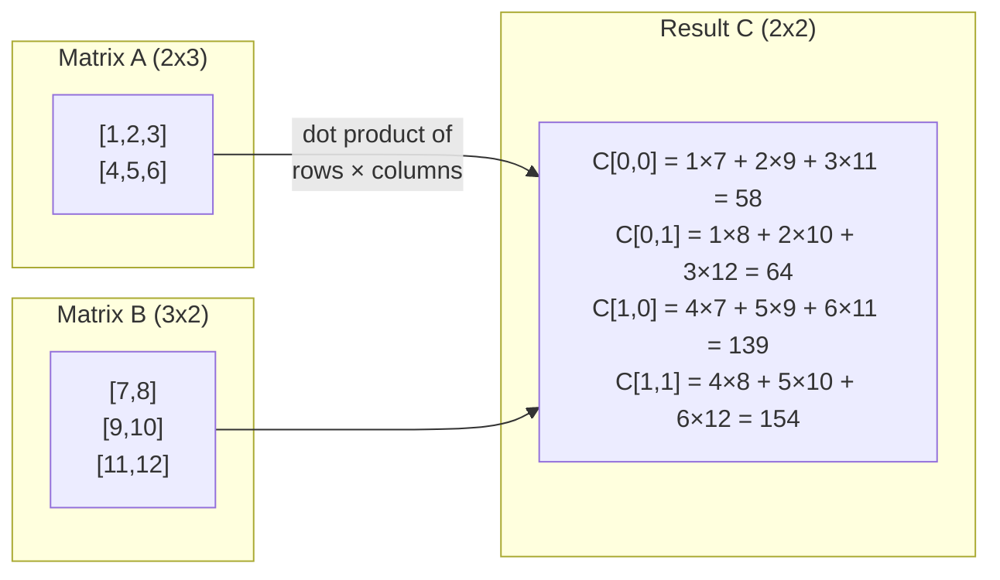
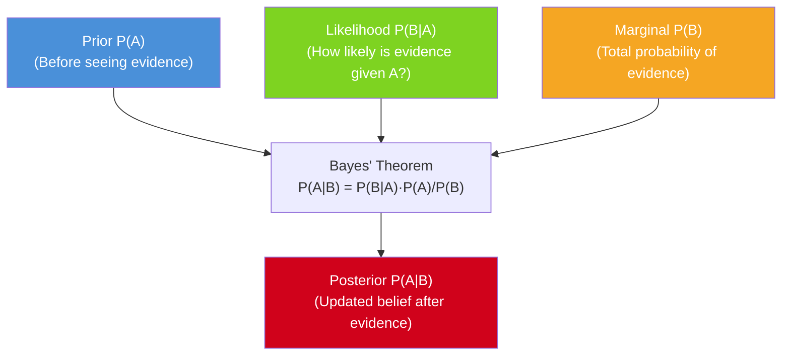
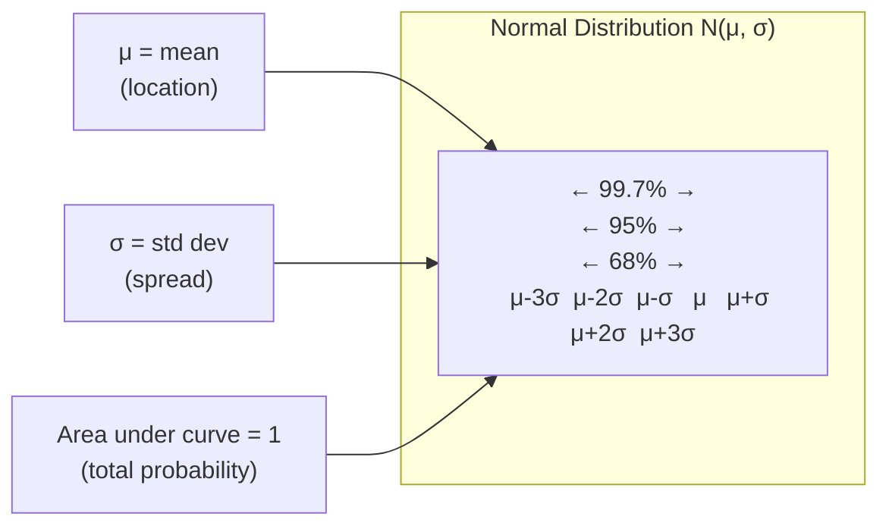
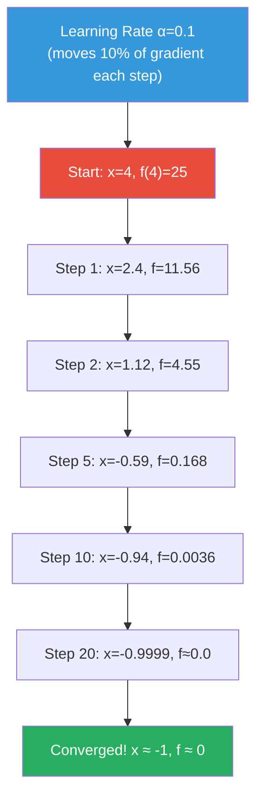

# Machine Learning Deep Dive — Part 1: The Math You Actually Need — Linear Algebra, Stats, and Probability for ML

---

**Series:** Machine Learning — A Developer's Deep Dive from Fundamentals to Production
**Part:** 1 of 19 (Foundations)
**Audience:** Developers with Python experience who want to master machine learning from the ground up
**Reading time:** ~40 minutes

---

## Recap: Where We Left Off

In Part 0, we surveyed the entire machine learning landscape — understanding the difference between supervised, unsupervised, and reinforcement learning, mapping out the types of problems ML solves (classification, regression, clustering, generation), and walking through the standard ML workflow from data collection to production deployment. We also established the mental model that will carry us through this series: ML is just pattern-finding with math.

Before we write our first real model, we need to speak the language of ML: math. Don't panic — we only need about 20% of mathematics to cover 80% of what ML actually uses. This part is that 20%.

---

## Table of Contents

1. [Vectors and Matrices](#1-vectors-and-matrices)
2. [NumPy Crash Course](#2-numpy-crash-course)
3. [Descriptive Statistics from Scratch](#3-descriptive-statistics-from-scratch)
4. [Probability Fundamentals](#4-probability-fundamentals)
5. [Probability Distributions](#5-probability-distributions)
6. [Correlation vs Causation](#6-correlation-vs-causation)
7. [Calculus in 20 Minutes](#7-calculus-in-20-minutes)
8. [Gradient Descent from Scratch](#8-gradient-descent-from-scratch)
9. [Project: Statistics Library from Scratch](#9-project-statistics-library-from-scratch)
10. [Vocabulary Cheat Sheet](#10-vocabulary-cheat-sheet)
11. [What's Next](#11-whats-next)

---

## 1. Vectors and Matrices

### What Is a Vector?

A **vector** is simply an ordered list of numbers. In ML terms, a vector represents a single data point — one row from your database. If you have a housing dataset with four features (square footage, bedrooms, bathrooms, age), a single house is represented as a vector:

```
house = [1500, 3, 2, 15]
```

Mathematically, we write vectors in column form:

```
     ┌ 1500 ┐
v =  │    3 │
     │    2 │
     └   15 ┘
```

The **dimension** of a vector is the number of elements. This vector is a 4-dimensional vector, written as v ∈ ℝ⁴.

> Every data point in your ML dataset is a vector. Every feature set is a vector. Every set of model weights is a vector. Vectors are everywhere in ML.

### What Is a Matrix?

A **matrix** is a 2D array of numbers — essentially a collection of vectors. Your entire dataset is a matrix, where each row is one data point (one vector) and each column is one feature.

```
        sq_ft   beds   baths   age
house1 [ 1500     3      2      15 ]
house2 [ 2200     4      3       8 ]
house3 [  900     2      1      30 ]
```

This is a 3×4 matrix (3 rows, 4 columns). We write M ∈ ℝ^(3×4).

### The Dot Product

The **dot product** (or inner product) of two vectors produces a single scalar number. Given vectors **a** and **b** of the same dimension:

```
a · b = a₁b₁ + a₂b₂ + ... + aₙbₙ
```

Example:
```
a = [1, 2, 3]
b = [4, 5, 6]
a · b = (1×4) + (2×5) + (3×6) = 4 + 10 + 18 = 32
```

> The dot product measures similarity — this is literally what neural networks compute. When a neuron "fires", it computes a dot product between its input vector and its weight vector.

The dot product also relates to the **angle** between vectors:

```
a · b = |a| × |b| × cos(θ)
```

When two vectors point in the same direction, cos(θ) = 1 and the dot product is maximized. When they are perpendicular (orthogonal), cos(θ) = 0. This geometric interpretation is the heart of attention mechanisms in transformers.

### Matrix Multiplication

**Matrix multiplication** is the most important operation in deep learning. To multiply matrix A (m×n) by matrix B (n×p), the result is a matrix C (m×p) where each element C[i][j] is the dot product of row i of A with column j of B.

```python
# filename: matrix_basics.py

import numpy as np

# Define matrices
A = np.array([[1, 2, 3],
              [4, 5, 6]])  # shape: (2, 3)

B = np.array([[7,  8],
              [9,  10],
              [11, 12]])  # shape: (3, 2)

# Matrix multiplication: (2,3) @ (3,2) = (2,2)
C = A @ B

print("Matrix A:")
print(A)
print("\nMatrix B:")
print(B)
print("\nA @ B =")
print(C)
# Expected output:
# Matrix A:
# [[1 2 3]
#  [4 5 6]]
#
# Matrix B:
# [[ 7  8]
#  [ 9 10]
#  [11 12]]
#
# A @ B =
# [[ 58  64]
#  [139 154]]
```

**Why does shape matter?** The inner dimensions must match. A (m×n) matrix can only multiply a (n×p) matrix. The rule: (m×**n**) @ (**n**×p) → (m×p). This is not commutative: A@B ≠ B@A in general.

### The Transpose

The **transpose** of a matrix flips it along its diagonal — rows become columns and columns become rows. If A has shape (m×n), then Aᵀ has shape (n×m).

```python
# filename: transpose_demo.py

import numpy as np

A = np.array([[1, 2, 3],
              [4, 5, 6]])  # shape (2, 3)

print("A shape:", A.shape)
print("A:\n", A)
print("\nA.T shape:", A.T.shape)
print("A.T:\n", A.T)

# Output:
# A shape: (2, 3)
# A:
#  [[1 2 3]
#   [4 5 6]]
#
# A.T shape: (3, 2)
# A.T:
#  [[1 4]
#   [2 5]
#   [3 6]]
```

### Matrix Multiplication Visualized



### Why This Matters for ML

In ML, almost everything is expressed as matrix operations:

| ML Concept | Matrix Operation |
|---|---|
| Apply weights to features | **y = Xw** (matrix-vector multiply) |
| Batch predictions | **Y = XW** (matrix-matrix multiply) |
| Neural network layer | **output = activation(Xw + b)** |
| Covariance matrix | **C = (1/n) XᵀX** |
| PCA decomposition | **SVD of X** |

The reason GPUs excel at ML is that they are optimized for massive parallel matrix multiplication. A modern GPU can perform trillions of multiply-add operations per second — exactly the operation in a dot product.

### Broadcasting in NumPy

**Broadcasting** is NumPy's mechanism for performing operations on arrays of different shapes without explicitly copying data. It is critical to understand to write efficient ML code.

The rule: NumPy compares shapes from right to left. Dimensions are compatible if they are equal or one of them is 1.

```python
# filename: broadcasting_demo.py

import numpy as np

# Example 1: vector + scalar
v = np.array([1, 2, 3, 4])
result = v + 10
print("Vector + scalar:", result)
# [11 12 13 14]

# Example 2: matrix + vector (row broadcast)
M = np.array([[1, 2, 3],
              [4, 5, 6],
              [7, 8, 9]])  # shape (3, 3)
row = np.array([10, 20, 30])  # shape (3,) — broadcast across rows
result = M + row
print("\nMatrix + row vector:")
print(result)
# [[11 22 33]
#  [14 25 36]
#  [17 28 39]]

# Example 3: column broadcast (common in ML normalization)
col = np.array([[100],
                [200],
                [300]])  # shape (3, 1) — broadcast across columns
result = M + col
print("\nMatrix + column vector:")
print(result)
# [[101 102 103]
#  [204 205 206]
#  [307 308 309]]

# ML use case: subtracting mean from each feature column
data = np.array([[1.0, 2.0, 3.0],
                 [4.0, 5.0, 6.0],
                 [7.0, 8.0, 9.0]])
col_means = data.mean(axis=0)   # shape (3,): mean of each column
normalized = data - col_means   # broadcasting: shape (3,3) - shape (3,)
print("\nColumn means:", col_means)
print("Normalized data:")
print(normalized)
# Column means: [4. 5. 6.]
# Normalized data:
# [[-3. -3. -3.]
#  [ 0.  0.  0.]
#  [ 3.  3.  3.]]
```

> Broadcasting is a performance superpower. Instead of writing Python loops to subtract the mean from each row, one line of NumPy does it in C-speed across the entire dataset at once.

---

## 2. NumPy Crash Course

NumPy is to ML in Python what a hammer is to carpentry. Every major ML library (scikit-learn, PyTorch, TensorFlow, JAX) either wraps NumPy or mirrors its API. Mastering NumPy is non-negotiable.

### Array Creation

```python
# filename: numpy_creation.py

import numpy as np

# From a Python list
a = np.array([1, 2, 3, 4, 5])
print("From list:", a, "| dtype:", a.dtype)

# Zeros and ones
zeros = np.zeros((3, 4))      # 3x4 matrix of zeros
ones  = np.ones((2, 3))       # 2x3 matrix of ones
eye   = np.eye(4)             # 4x4 identity matrix
print("\nZeros:\n", zeros)
print("\nIdentity (4x4):\n", eye)

# Range-based
r1 = np.arange(0, 10, 2)          # [0, 2, 4, 6, 8] — step size 2
r2 = np.linspace(0, 1, 5)         # [0.0, 0.25, 0.5, 0.75, 1.0] — 5 evenly spaced
print("\narange(0,10,2):", r1)
print("linspace(0,1,5):", r2)

# Random arrays
np.random.seed(42)
rand_uniform = np.random.rand(3, 3)      # uniform [0, 1)
rand_normal  = np.random.randn(3, 3)     # standard normal N(0,1)
rand_int     = np.random.randint(0, 10, size=(2, 4))  # integers in [0, 10)
print("\nRandom uniform:\n", rand_uniform.round(2))
print("\nRandom integers:\n", rand_int)

# Output:
# From list: [1 2 3 4 5] | dtype: int64
# Zeros:
#  [[0. 0. 0. 0.]
#   [0. 0. 0. 0.]
#   [0. 0. 0. 0.]]
# arange(0,10,2): [0 2 4 6 8]
# linspace(0,1,5): [0.   0.25 0.5  0.75 1.  ]
```

### Indexing and Slicing

```python
# filename: numpy_indexing.py

import numpy as np

M = np.array([[10, 11, 12, 13],
              [20, 21, 22, 23],
              [30, 31, 32, 33],
              [40, 41, 42, 43]])

# Basic indexing
print("M[0,0]:", M[0,0])      # 10
print("M[2,3]:", M[2,3])      # 33

# Slicing: [rows, columns]
print("\nFirst 2 rows:\n", M[:2, :])
print("\nLast 2 columns:\n", M[:, -2:])
print("\nSubmatrix rows 1-2, cols 1-3:\n", M[1:3, 1:3])

# Boolean indexing (very common in ML for filtering)
vals = np.array([5, 15, 3, 25, 8, 12])
mask = vals > 10
print("\nValues > 10:", vals[mask])   # [15 25 12]

# Fancy indexing (select specific rows)
data = np.array([[1,2], [3,4], [5,6], [7,8]])
indices = [0, 2, 3]
print("\nRows 0,2,3:\n", data[indices])

# Output:
# M[0,0]: 10
# M[2,3]: 33
# First 2 rows:
#  [[10 11 12 13]
#   [20 21 22 23]]
# Values > 10: [15 25 12]
```

### Vectorized Operations vs Python Loops

One of the most important concepts for practical ML: **never loop when you can vectorize**.

```python
# filename: vectorized_vs_loop.py

import numpy as np
import time

n = 1_000_000
a = np.random.randn(n)
b = np.random.randn(n)

# Python loop approach
start = time.time()
result_loop = [a[i] * b[i] for i in range(n)]
loop_time = time.time() - start
print(f"Python loop:    {loop_time:.4f}s")

# NumPy vectorized approach
start = time.time()
result_vec = a * b
vec_time = time.time() - start
print(f"NumPy vectorized: {vec_time:.6f}s")

speedup = loop_time / vec_time
print(f"NumPy is {speedup:.0f}x faster")

# Typical output:
# Python loop:      0.3821s
# NumPy vectorized: 0.001423s
# NumPy is ~270x faster
```

> This speedup matters enormously at ML scale. Training a model on a million examples with a Python loop would take hours. With NumPy vectorization, it takes seconds. PyTorch and TensorFlow apply the same principle with GPUs.

### Common NumPy Operations Table

| Operation | Code | Description |
|---|---|---|
| Element-wise add | `A + B` | Add corresponding elements |
| Element-wise multiply | `A * B` | Hadamard product |
| Matrix multiply | `A @ B` | Dot product / matmul |
| Dot product (vectors) | `np.dot(a, b)` | Sum of element-wise products |
| Transpose | `A.T` | Swap rows and columns |
| Reshape | `A.reshape(m, n)` | Change shape without changing data |
| Sum across axis | `A.sum(axis=0)` | Column sums (axis=1 for row sums) |
| Mean across axis | `A.mean(axis=0)` | Column means |
| Stack vertically | `np.vstack([A, B])` | Add rows |
| Stack horizontally | `np.hstack([A, B])` | Add columns |
| Clip values | `np.clip(A, 0, 1)` | Clamp values to range |
| Absolute value | `np.abs(A)` | Element-wise absolute value |

### Reshaping Operations

```python
# filename: reshape_demo.py

import numpy as np

# Create a flat array of 12 elements
flat = np.arange(12)
print("flat:", flat)  # [ 0  1  2  3  4  5  6  7  8  9 10 11]

# Reshape to 3x4 matrix
matrix = flat.reshape(3, 4)
print("\nreshaped to (3,4):\n", matrix)

# Use -1 to let NumPy infer one dimension
col_vector = flat.reshape(-1, 1)   # shape (12, 1)
row_vector = flat.reshape(1, -1)   # shape (1, 12)
print("\nColumn vector shape:", col_vector.shape)
print("Row vector shape:", row_vector.shape)

# Flatten: any shape back to 1D
random_3d = np.random.rand(2, 3, 4)   # 3D array
flat_again = random_3d.flatten()
print("\n3D shape:", random_3d.shape)
print("Flattened shape:", flat_again.shape)  # (24,)

# ML use case: flattening an image for a dense layer
# A 28x28 grayscale image → 784-dimensional vector
image = np.random.rand(28, 28)
flattened_image = image.reshape(-1)
print("\nImage shape:", image.shape)            # (28, 28)
print("Flattened image shape:", flattened_image.shape)  # (784,)

# Batch of images: (batch_size, height, width) → (batch_size, pixels)
batch = np.random.rand(32, 28, 28)  # 32 images
batch_flat = batch.reshape(batch.shape[0], -1)
print("\nBatch shape:", batch.shape)             # (32, 28, 28)
print("Batch flattened shape:", batch_flat.shape)  # (32, 784)
```

### np.dot vs @ Operator

```python
# filename: dot_vs_at.py

import numpy as np

a = np.array([1, 2, 3])
b = np.array([4, 5, 6])

A = np.array([[1, 2], [3, 4]])
B = np.array([[5, 6], [7, 8]])

# For vectors: both compute dot product
print("np.dot(a, b):", np.dot(a, b))   # 32
print("a @ b:", a @ b)                  # 32

# For matrices: both compute matrix multiplication
print("\nnp.dot(A, B):\n", np.dot(A, B))
print("\nA @ B:\n", A @ B)
# Both give [[19 22], [43 50]]

# Preference: @ is cleaner and more readable for matrix ops
# np.dot is useful for explicit dot-product semantics
# For 2D arrays, they are equivalent
```

---

## 3. Descriptive Statistics from Scratch

Before applying ML algorithms, you need to understand your data. Descriptive statistics are the X-rays of your dataset — they reveal its structure, shape, and anomalies.

### Mean, Median, Mode

The **mean** is the arithmetic average. The **median** is the middle value when sorted. The **mode** is the most frequent value.

```python
# filename: stats_from_scratch.py

from collections import Counter

def mean(data):
    """Arithmetic mean: sum / count"""
    return sum(data) / len(data)

def median(data):
    """Middle value of sorted data"""
    sorted_data = sorted(data)
    n = len(sorted_data)
    mid = n // 2
    if n % 2 == 0:
        return (sorted_data[mid - 1] + sorted_data[mid]) / 2
    else:
        return sorted_data[mid]

def mode(data):
    """Most frequent value(s)"""
    counts = Counter(data)
    max_count = max(counts.values())
    return [k for k, v in counts.items() if v == max_count]

# Test data
house_prices = [250000, 300000, 275000, 1200000, 260000, 290000, 310000, 280000]

print("Data:", house_prices)
print(f"Mean:   ${mean(house_prices):,.0f}")
print(f"Median: ${median(house_prices):,.0f}")

salaries = [50000, 55000, 52000, 50000, 60000, 50000, 58000]
print("\nSalaries:", salaries)
print("Mode:", mode(salaries))

# Verify with NumPy
import numpy as np
from scipy import stats

data_np = np.array(house_prices)
print("\n--- NumPy Verification ---")
print(f"np.mean:   ${np.mean(data_np):,.0f}")
print(f"np.median: ${np.median(data_np):,.0f}")

# Output:
# Mean:   $520,625
# Median: $285,000
# Mode: [50000]
```

Notice how the mean ($520,625) is heavily skewed by the outlier ($1,200,000 house), while the median ($285,000) better represents typical prices. **This is why we check both.**

### Variance and Standard Deviation

**Variance** measures how spread out data is from the mean. **Standard deviation** is the square root of variance — same units as the data, easier to interpret.

```python
# filename: variance_std_scratch.py

import math

def variance(data, population=False):
    """
    Population variance: divide by N
    Sample variance: divide by N-1 (Bessel's correction)
    """
    n = len(data)
    mu = sum(data) / n
    squared_diffs = [(x - mu) ** 2 for x in data]
    divisor = n if population else (n - 1)
    return sum(squared_diffs) / divisor

def std_dev(data, population=False):
    """Standard deviation: square root of variance"""
    return math.sqrt(variance(data, population))

# Example: comparing two datasets with same mean
consistent = [48, 50, 51, 49, 52, 50, 48, 51]
volatile   = [10, 90, 5, 95, 15, 85, 20, 80]

print("Consistent scores:")
print(f"  Mean: {sum(consistent)/len(consistent):.1f}")
print(f"  Std:  {std_dev(consistent):.2f}")

print("\nVolatile scores:")
print(f"  Mean: {sum(volatile)/len(volatile):.1f}")
print(f"  Std:  {std_dev(volatile):.2f}")

# Verify with NumPy
import numpy as np
print("\n--- NumPy Verification ---")
print(f"Consistent std (ddof=1): {np.std(consistent, ddof=1):.2f}")
print(f"Volatile std   (ddof=1): {np.std(volatile, ddof=1):.2f}")

# Output:
# Consistent scores:
#   Mean: 49.9
#   Std:  1.36
# Volatile scores:
#   Mean: 50.0
#   Std:  37.95
```

> In ML, standard deviation is used constantly for **feature scaling** (standardization: subtract mean, divide by std) and for understanding **how surprising a data point is** relative to the distribution.

### Percentiles and Quartiles

```python
# filename: percentiles_quartiles.py

import numpy as np

def percentile_scratch(data, p):
    """Compute the p-th percentile (0-100) from scratch"""
    sorted_data = sorted(data)
    n = len(sorted_data)
    # Compute the index
    index = (p / 100) * (n - 1)
    lower = int(index)
    upper = lower + 1
    if upper >= n:
        return sorted_data[-1]
    # Linear interpolation
    fraction = index - lower
    return sorted_data[lower] + fraction * (sorted_data[upper] - sorted_data[lower])

np.random.seed(42)
data = np.random.normal(loc=100, scale=15, size=200).tolist()

print("Distribution of 200 IQ scores (synthetic):")
print(f"  Min:    {min(data):.1f}")
print(f"  Q1:     {percentile_scratch(data, 25):.1f}")
print(f"  Median: {percentile_scratch(data, 50):.1f}")
print(f"  Q3:     {percentile_scratch(data, 75):.1f}")
print(f"  Max:    {max(data):.1f}")
print(f"  IQR:    {percentile_scratch(data, 75) - percentile_scratch(data, 25):.1f}")

# NumPy verification
print("\nNumPy: Q1={:.1f}, Median={:.1f}, Q3={:.1f}".format(
    np.percentile(data, 25),
    np.percentile(data, 50),
    np.percentile(data, 75)
))

# ML relevance: detect outliers using IQR rule
q1, q3 = np.percentile(data, 25), np.percentile(data, 75)
iqr = q3 - q1
lower_fence = q1 - 1.5 * iqr
upper_fence = q3 + 1.5 * iqr
outliers = [x for x in data if x < lower_fence or x > upper_fence]
print(f"\nOutliers (IQR method): {len(outliers)} found")
print(f"Bounds: [{lower_fence:.1f}, {upper_fence:.1f}]")
```

### Covariance and Correlation

**Covariance** measures how two variables move together. **Correlation** is normalized covariance — always between -1 and +1.

```python
# filename: covariance_correlation.py

import math

def covariance(x, y):
    """
    Cov(X,Y) = (1/n-1) * sum((xi - x_mean)(yi - y_mean))
    Positive: when X goes up, Y tends to go up
    Negative: when X goes up, Y tends to go down
    """
    n = len(x)
    assert len(y) == n, "Vectors must be same length"
    x_mean = sum(x) / n
    y_mean = sum(y) / n
    return sum((x[i] - x_mean) * (y[i] - y_mean) for i in range(n)) / (n - 1)

def correlation(x, y):
    """
    Pearson correlation: Cov(X,Y) / (std(X) * std(Y))
    Range: [-1, 1]
    """
    cov = covariance(x, y)
    std_x = math.sqrt(sum((xi - sum(x)/len(x))**2 for xi in x) / (len(x)-1))
    std_y = math.sqrt(sum((yi - sum(y)/len(y))**2 for yi in y) / (len(y)-1))
    return cov / (std_x * std_y)

# Housing data example
sq_footage = [800, 1000, 1200, 1400, 1600, 1800, 2000, 2200]
price_k    = [150,  185,  210,  240,  280,  310,  360,  400]
crime_rate = [8.5,  7.2,  6.8,  6.5,  5.5,  4.8,  4.2,  3.5]

print("Sqft vs Price:")
print(f"  Covariance:  {covariance(sq_footage, price_k):.2f}")
print(f"  Correlation: {correlation(sq_footage, price_k):.4f}")

print("\nSqft vs Crime Rate:")
print(f"  Covariance:  {covariance(sq_footage, crime_rate):.2f}")
print(f"  Correlation: {correlation(sq_footage, crime_rate):.4f}")

# Verify with NumPy
import numpy as np
print("\n--- NumPy Verification ---")
print(f"np.corrcoef(sqft, price)[0,1]: {np.corrcoef(sq_footage, price_k)[0,1]:.4f}")
print(f"np.corrcoef(sqft, crime)[0,1]: {np.corrcoef(sq_footage, crime_rate)[0,1]:.4f}")

# Output:
# Sqft vs Price:
#   Correlation: 0.9982   (strong positive)
# Sqft vs Crime Rate:
#   Correlation: -0.9943  (strong negative)
```

> Correlation is not causation — but it IS a feature selection signal. Features highly correlated with the target variable are often useful predictors. Features correlated with each other (multicollinearity) can cause instability in linear models.

---

## 4. Probability Fundamentals

**Probability** is the mathematical language of uncertainty. ML models don't output definitive answers — they output probabilities. Understanding probability is understanding ML output.

### Probability as Frequency and Belief

There are two interpretations:

- **Frequentist**: Probability is the long-run frequency of an event. P(heads) = 0.5 because in many flips, roughly half come up heads.
- **Bayesian**: Probability is a degree of belief. P(it will rain tomorrow) = 0.7 is your current belief based on evidence.

Both interpretations appear in ML. Random forests use frequentist probability (fraction of trees that predict class A). Bayesian networks use belief-based probability.

### Conditional Probability

**Conditional probability** P(A|B) is the probability of event A given that event B has already occurred.

```
P(A|B) = P(A ∩ B) / P(B)
```

Example: What is the probability that an email is spam, given it contains the word "free"?

```python
# filename: conditional_probability.py

# Dataset: 1000 emails
# 400 spam, 600 not spam
# Of 400 spam: 320 contain "free" (80%)
# Of 600 not spam: 60 contain "free" (10%)

total = 1000
spam = 400
not_spam = 600

spam_with_free = 320
not_spam_with_free = 60
total_with_free = spam_with_free + not_spam_with_free

# P(spam)
p_spam = spam / total
print(f"P(spam) = {p_spam:.2f}")

# P(free | spam) — probability of "free" given spam
p_free_given_spam = spam_with_free / spam
print(f"P(free | spam) = {p_free_given_spam:.2f}")

# P(free | not spam)
p_free_given_not_spam = not_spam_with_free / not_spam
print(f"P(free | not spam) = {p_free_given_not_spam:.2f}")

# P(free) — marginal probability
p_free = total_with_free / total
print(f"P(free) = {p_free:.2f}")

# P(spam | free) — what we actually want!
p_spam_given_free = spam_with_free / total_with_free
print(f"\nP(spam | free) = {spam_with_free}/{total_with_free} = {p_spam_given_free:.2f}")

# Output:
# P(spam) = 0.40
# P(free | spam) = 0.80
# P(free | not spam) = 0.10
# P(free) = 0.38
# P(spam | free) = 0.84
```

### Bayes' Theorem

**Bayes' Theorem** is the formula for reversing conditional probability:

```
P(A|B) = P(B|A) × P(A) / P(B)
```

In ML terms: **posterior = likelihood × prior / evidence**

This is the mathematical backbone of Naive Bayes classifiers, Bayesian optimization, and probabilistic graphical models.



```python
# filename: bayes_theorem.py

def bayes(p_a, p_b_given_a, p_b):
    """
    Bayes' Theorem:
    P(A|B) = P(B|A) * P(A) / P(B)

    Args:
        p_a: prior probability of A
        p_b_given_a: likelihood — P(B|A)
        p_b: marginal probability of B (evidence)
    Returns:
        posterior probability P(A|B)
    """
    return (p_b_given_a * p_a) / p_b

# Spam filter example from above
p_spam   = 0.40   # prior: 40% of emails are spam
p_free_given_spam     = 0.80   # likelihood
p_free_given_not_spam = 0.10
p_not_spam = 1 - p_spam

# Compute marginal P(free) using law of total probability
p_free = p_free_given_spam * p_spam + p_free_given_not_spam * p_not_spam
print(f"P(free) = {p_free:.4f}")

# Apply Bayes
p_spam_given_free = bayes(p_spam, p_free_given_spam, p_free)
print(f"P(spam | 'free') = {p_spam_given_free:.4f}")

# -----
# Medical test example
# Disease prevalence: 1 in 1000
# Test sensitivity (true positive rate): 99%
# Test specificity (true negative rate): 95%

p_disease   = 0.001   # prior
p_pos_given_disease  = 0.99   # sensitivity
p_pos_given_no_disease = 0.05 # false positive rate (1 - specificity)
p_no_disease = 1 - p_disease

p_positive = (p_pos_given_disease * p_disease +
              p_pos_given_no_disease * p_no_disease)

p_disease_given_positive = bayes(p_disease, p_pos_given_disease, p_positive)

print(f"\nMedical Test:")
print(f"  P(positive) = {p_positive:.4f}")
print(f"  P(disease | positive test) = {p_disease_given_positive:.4f}")
print(f"  Only {p_disease_given_positive*100:.1f}% chance of disease despite positive test!")

# Output:
# P(free) = 0.3800
# P(spam | 'free') = 0.8421
#
# Medical Test:
#   P(positive) = 0.0509
#   P(disease | positive test) = 0.0194
#   Only 1.9% chance of disease despite positive test!
```

> The medical test example is the most important result in probability for ML practitioners. A test can be 99% accurate and still be mostly wrong when the prior probability is very low. This is why class imbalance in ML datasets is such a critical problem.

### Independence

Events A and B are **independent** if knowing B gives no information about A:

```
P(A|B) = P(A)   ←→   P(A ∩ B) = P(A) × P(B)
```

The **Naive Bayes classifier** assumes all features are independent given the class label. This is almost always false, but it works surprisingly well in practice.

---

## 5. Probability Distributions

A **probability distribution** describes how probable different outcomes are. In ML, distributions appear in:
- The noise in your data
- The output of probabilistic models
- The initialization of neural network weights
- The priors in Bayesian models

### The Normal (Gaussian) Distribution

The **normal distribution** is the most important distribution in all of statistics. It appears naturally when many independent random effects add together (Central Limit Theorem).

Parameters:
- **μ (mu)**: mean — center of the bell curve
- **σ (sigma)**: standard deviation — width of the bell curve
- **σ² (sigma squared)**: variance

The **68-95-99.7 rule**:
- 68% of data falls within 1σ of the mean
- 95% of data falls within 2σ of the mean
- 99.7% of data falls within 3σ of the mean

```python
# filename: normal_distribution.py

import math
import numpy as np
import matplotlib.pyplot as plt

def normal_pdf(x, mu=0, sigma=1):
    """
    Probability Density Function (PDF) of the normal distribution.
    Implemented from scratch — no scipy!
    """
    coefficient = 1 / (sigma * math.sqrt(2 * math.pi))
    exponent = -0.5 * ((x - mu) / sigma) ** 2
    return coefficient * math.exp(exponent)

# Compute PDF values
x_values = [i * 0.1 for i in range(-40, 41)]  # -4 to 4

# Standard normal N(0,1)
pdf_standard = [normal_pdf(x, mu=0, sigma=1) for x in x_values]

# Shifted: N(2, 1)
pdf_shifted = [normal_pdf(x, mu=2, sigma=1) for x in x_values]

# Wider: N(0, 2)
pdf_wider = [normal_pdf(x, mu=0, sigma=2) for x in x_values]

# The 68-95-99.7 rule verification
from scipy import stats

mu, sigma = 100, 15  # IQ distribution
within_1_sigma = stats.norm.cdf(mu + sigma, mu, sigma) - stats.norm.cdf(mu - sigma, mu, sigma)
within_2_sigma = stats.norm.cdf(mu + 2*sigma, mu, sigma) - stats.norm.cdf(mu - 2*sigma, mu, sigma)
within_3_sigma = stats.norm.cdf(mu + 3*sigma, mu, sigma) - stats.norm.cdf(mu - 3*sigma, mu, sigma)

print("68-95-99.7 Rule Verification (IQ: μ=100, σ=15):")
print(f"  Within 1σ [85, 115]: {within_1_sigma*100:.2f}%")
print(f"  Within 2σ [70, 130]: {within_2_sigma*100:.2f}%")
print(f"  Within 3σ [55, 145]: {within_3_sigma*100:.2f}%")

# Compare our scratch implementation vs scipy
print("\nPDF Comparison (x=0, μ=0, σ=1):")
print(f"  Scratch: {normal_pdf(0, 0, 1):.6f}")
print(f"  scipy:   {stats.norm.pdf(0, 0, 1):.6f}")

# Output:
# Within 1σ [85, 115]: 68.27%
# Within 2σ [70, 130]: 95.45%
# Within 3σ [55, 145]: 99.73%
# PDF Comparison: Scratch: 0.398942 | scipy: 0.398942
```



### The Uniform Distribution

The **uniform distribution** assigns equal probability to all values in a range [a, b]. The PDF is simply 1/(b-a).

```python
# filename: uniform_distribution.py

import numpy as np
import matplotlib
matplotlib.use('Agg')
import matplotlib.pyplot as plt

# Generating uniform random numbers (used in weight initialization)
np.random.seed(42)

# U(0, 1)
uniform_samples = np.random.uniform(0, 1, 10000)
print("Uniform U(0,1):")
print(f"  Mean:    {uniform_samples.mean():.4f}  (expected: 0.5)")
print(f"  Std:     {uniform_samples.std():.4f}   (expected: {1/np.sqrt(12):.4f})")

# Glorot/Xavier initialization uses uniform distribution
# Weights ~ U(-sqrt(6/(n_in + n_out)), sqrt(6/(n_in + n_out)))
n_in, n_out = 128, 64
limit = np.sqrt(6 / (n_in + n_out))
xavier_weights = np.random.uniform(-limit, limit, size=(n_in, n_out))
print(f"\nXavier init weights ({n_in}x{n_out}):")
print(f"  Range: [{xavier_weights.min():.4f}, {xavier_weights.max():.4f}]")
print(f"  Mean:  {xavier_weights.mean():.6f}")
print(f"  Std:   {xavier_weights.std():.4f}")
```

### The Binomial Distribution

The **binomial distribution** models the number of successes in n independent trials, each with probability p of success.

```python
# filename: binomial_distribution.py

import math
import numpy as np

def binomial_pmf(k, n, p):
    """
    Probability of exactly k successes in n trials with success probability p.
    PMF: C(n,k) * p^k * (1-p)^(n-k)
    """
    # Binomial coefficient C(n, k)
    binom_coef = math.comb(n, k)
    return binom_coef * (p ** k) * ((1 - p) ** (n - k))

# Example: A model predicts 10 emails.
# Each prediction has 75% accuracy. What's the distribution of correct predictions?

n, p = 10, 0.75
print(f"Binomial(n={n}, p={p}): predictions correct out of 10")
print(f"{'k':>4} {'P(X=k)':>10} {'Cumulative':>12}")
print("-" * 30)
cumulative = 0
for k in range(n + 1):
    prob = binomial_pmf(k, n, p)
    cumulative += prob
    print(f"{k:>4} {prob:>10.4f} {cumulative:>12.4f}")

print(f"\nExpected correct: {n * p} (= n*p)")
print(f"Std deviation:    {math.sqrt(n * p * (1-p)):.4f} (= sqrt(n*p*(1-p)))")

# Output:
# k    P(X=k)   Cumulative
# 0    0.0000       0.0000
# 5    0.0584       0.0781
# 7    0.2503       0.4744
# 8    0.2816       0.7560
# 10   0.0563       1.0000
```

### Why Distributions Matter for ML

| Distribution | Where It Appears in ML |
|---|---|
| Normal N(0,1) | Weight initialization, noise modeling, residuals in linear regression |
| Uniform U(0,1) | Dropout mask generation, Xavier initialization |
| Binomial(n,p) | Classification accuracy over multiple samples |
| Bernoulli(p) | Single binary prediction outcome |
| Categorical | Multi-class softmax output |
| Exponential | Time-to-event modeling, survival analysis |
| Beta(α,β) | Prior on probabilities (Bayesian methods) |
| Dirichlet | Prior on categorical distributions (topic models) |

---

## 6. Correlation vs Causation

One of the most dangerous mistakes in data science is confusing correlation with causation. A model that learns a spurious correlation will fail catastrophically in production.

### Simpson's Paradox

**Simpson's Paradox** occurs when a trend that appears in several groups of data reverses when the groups are combined.

```python
# filename: simpsons_paradox.py

import numpy as np

# Medical study: does Drug A or Drug B work better?
# Raw data:
#
# Drug A: 200 patients, 160 recovered (80%)
# Drug B: 200 patients, 140 recovered (70%)
# → Drug A looks better overall!
#
# But when we stratify by condition severity:
#
#         Drug A          Drug B
# Mild:   81/90 (90%)    234/270 (87%)  → Drug A better
# Severe: 79/110 (72%)    55/130 (42%)  → Drug A much better?
# Wait...let's look at who gets assigned which drug:

print("=== Simpson's Paradox: Drug Effectiveness ===\n")

# Group 1: Mild condition
drug_a_mild  = {"recovered": 81,  "total": 90}
drug_b_mild  = {"recovered": 234, "total": 270}

# Group 2: Severe condition
drug_a_severe = {"recovered": 192, "total": 240}
drug_b_severe = {"recovered": 55,  "total": 130}

# Recovery rates by subgroup
a_mild_rate   = drug_a_mild["recovered"]   / drug_a_mild["total"]
b_mild_rate   = drug_b_mild["recovered"]   / drug_b_mild["total"]
a_severe_rate = drug_a_severe["recovered"] / drug_a_severe["total"]
b_severe_rate = drug_b_severe["recovered"] / drug_b_severe["total"]

print("Recovery rates by condition severity:")
print(f"  Mild:    Drug A = {a_mild_rate:.1%},  Drug B = {b_mild_rate:.1%}  → {'A wins' if a_mild_rate > b_mild_rate else 'B wins'}")
print(f"  Severe:  Drug A = {a_severe_rate:.1%}, Drug B = {b_severe_rate:.1%}  → {'A wins' if a_severe_rate > b_severe_rate else 'B wins'}")

# Overall recovery rates (aggregated)
a_total = drug_a_mild["recovered"] + drug_a_severe["recovered"]
a_count = drug_a_mild["total"]     + drug_a_severe["total"]
b_total = drug_b_mild["recovered"] + drug_b_severe["recovered"]
b_count = drug_b_mild["total"]     + drug_b_severe["total"]

a_overall = a_total / a_count
b_overall = b_total / b_count

print(f"\nOverall recovery rates:")
print(f"  Drug A = {a_total}/{a_count} = {a_overall:.1%}")
print(f"  Drug B = {b_total}/{b_count} = {b_overall:.1%}")
print(f"  → Overall: {'A wins' if a_overall > b_overall else 'B wins'}")

print("\n*** THE PARADOX ***")
print("Drug A wins in BOTH subgroups, but Drug B wins overall!")
print("The confounding variable: drug assignment correlated with severity.")
print("Drug B was disproportionately given to mild cases (more likely to recover).")

# Output:
# Mild:    Drug A = 90.0%,  Drug B = 86.7%  → A wins
# Severe:  Drug A = 80.0%, Drug B = 42.3%  → A wins
# Overall: Drug A = 82.4%  Drug B = 72.7%  → ...
```

### Spurious Correlations in ML

```python
# filename: spurious_correlation.py

import numpy as np

np.random.seed(2024)
n_years = 20

# Example: Spurious correlation between cheese consumption and death by bedsheets
# (Both happen to increase over time due to confounding trend)

years = np.arange(2000, 2000 + n_years)
trend = np.linspace(0, 1, n_years)

# Per capita cheese consumption (lbs, trending up)
cheese = 29 + 5 * trend + np.random.randn(n_years) * 0.5

# Deaths by tangling in bedsheets (trending up separately)
bedsheets = 450 + 150 * trend + np.random.randn(n_years) * 10

# They're correlated! But clearly causally unrelated
correlation = np.corrcoef(cheese, bedsheets)[0, 1]
print(f"Correlation between cheese consumption and bedsheet deaths: r = {correlation:.3f}")
print(f"If r > 0.9, does eating cheese cause bedsheet deaths? Of course not!")
print("\nThe real cause: both variables are driven by population growth/time trend")
print("This is a CONFOUNDING variable — an unseen variable that causes both")

# How to handle in ML:
print("\n--- How to defend against spurious correlations in ML ---")
print("1. Include time/trend variables explicitly as features")
print("2. Use domain knowledge to filter obviously non-causal features")
print("3. Test on different time periods / geographies")
print("4. Use A/B testing for causal claims")
print("5. Examine feature importance — if implausible features rank high, investigate")
```

### How to Avoid Confounding in ML

The key principle: **correlation is for prediction; causation is for intervention**. Your ML model can achieve high accuracy by exploiting correlations — but if you want to know *why* something happens, or predict what happens when you *change* something, you need causal reasoning.

Rules of thumb:
1. Features correlated with the label can be used for prediction but not necessarily causal inference
2. Data leakage (future information in training features) creates artificially high correlations
3. Always check: "Could this feature have been caused by the label?" (reverse causation)
4. Cross-validate across time, geography, and subpopulations to test correlation robustness

---

## 7. Calculus in 20 Minutes

You don't need to solve differential equations to do ML. You need three calculus concepts: **derivatives**, **partial derivatives**, and the **chain rule**. That's it.

### The Derivative

The **derivative** of a function f(x) at a point x measures the instantaneous rate of change — the slope of the tangent line.

```
f'(x) = lim[h→0] (f(x+h) - f(x)) / h
```

For ML, derivatives tell us: *if I nudge this parameter by a tiny amount, how much does the loss change?*

```python
# filename: numerical_differentiation.py

def numerical_derivative(f, x, h=1e-5):
    """
    Numerical approximation of derivative using finite differences.
    (f(x+h) - f(x-h)) / (2h)  — central difference is more accurate
    """
    return (f(x + h) - f(x - h)) / (2 * h)

# Example functions
def f1(x):
    return x ** 2

def f2(x):
    return x ** 3 - 3 * x

def f3(x):
    import math
    return math.sin(x)

# Test derivatives
import math

print("Numerical derivatives:")
print(f"f(x) = x²:         f'(3) = {numerical_derivative(f1, 3):.6f}  (exact: {2*3})")
print(f"f(x) = x³-3x:      f'(2) = {numerical_derivative(f2, 2):.6f}  (exact: {3*4-3})")
print(f"f(x) = sin(x):     f'(π/4) = {numerical_derivative(f3, math.pi/4):.6f}  (exact: {math.cos(math.pi/4):.6f})")

# Derivative rules reference (for analytical computation)
print("\nDerivative Rules:")
print("  d/dx[c] = 0")
print("  d/dx[x^n] = n*x^(n-1)")
print("  d/dx[e^x] = e^x")
print("  d/dx[ln(x)] = 1/x")
print("  d/dx[sin(x)] = cos(x)")
print("  d/dx[cos(x)] = -sin(x)")
```

### Common Derivative Rules

| Function f(x) | Derivative f'(x) | ML Where It Appears |
|---|---|---|
| c (constant) | 0 | Bias terms |
| xⁿ | n·xⁿ⁻¹ | Polynomial features |
| eˣ | eˣ | Softmax, exponential activations |
| ln(x) | 1/x | Log loss, entropy |
| sin(x) | cos(x) | Fourier features |
| cos(x) | -sin(x) | Fourier features |
| sigmoid(x) | sigmoid(x)·(1-sigmoid(x)) | Logistic regression, neural nets |
| tanh(x) | 1 - tanh²(x) | LSTM gates |
| ReLU(x) | 0 if x<0, 1 if x>0 | Modern neural networks |

### Partial Derivatives

When a function has multiple inputs f(x, y, z), a **partial derivative** ∂f/∂x measures the rate of change with respect to x while holding all other variables constant.

```python
# filename: partial_derivatives.py

def numerical_partial(f, args, var_idx, h=1e-5):
    """
    Numerical partial derivative of f with respect to argument at var_idx.
    args: list of arguments [x1, x2, ...]
    """
    args_plus  = args.copy()
    args_minus = args.copy()
    args_plus[var_idx]  += h
    args_minus[var_idx] -= h
    return (f(*args_plus) - f(*args_minus)) / (2 * h)

# f(x, y) = x² + 3xy + y²
# ∂f/∂x = 2x + 3y
# ∂f/∂y = 3x + 2y
def f_xy(x, y):
    return x**2 + 3*x*y + y**2

# At point (2, 1):
# ∂f/∂x = 2(2) + 3(1) = 7
# ∂f/∂y = 3(2) + 2(1) = 8
x, y = 2, 1
df_dx = numerical_partial(f_xy, [x, y], var_idx=0)
df_dy = numerical_partial(f_xy, [x, y], var_idx=1)

print(f"f(x,y) = x² + 3xy + y² at (x={x}, y={y}):")
print(f"  ∂f/∂x = {df_dx:.6f}  (exact: {2*x + 3*y})")
print(f"  ∂f/∂y = {df_dy:.6f}  (exact: {3*x + 2*y})")

# The gradient is the vector of all partial derivatives
gradient = [df_dx, df_dy]
print(f"\n  Gradient: {gradient}")
print("  The gradient points in the direction of steepest INCREASE")
print("  Negative gradient points in the direction of steepest DECREASE")
```

### The Chain Rule

The **chain rule** is the most important rule for ML. It tells us how to differentiate a composition of functions:

```
d/dx[f(g(x))] = f'(g(x)) × g'(x)
```

In ML, neural networks are composed functions: output = f₄(f₃(f₂(f₁(x)))). The chain rule lets us compute how the loss changes with respect to the first layer's weights — this is **backpropagation**.

```python
# filename: chain_rule.py

import math

# Example: f(x) = sin(x²)
# Let g(x) = x²,  f(u) = sin(u)
# f'(x) = cos(g(x)) * g'(x) = cos(x²) * 2x

def chain_rule_example(x, h=1e-5):
    # Numerical derivative
    f = lambda x: math.sin(x**2)
    numerical = (f(x + h) - f(x - h)) / (2 * h)

    # Analytical via chain rule: cos(x²) * 2x
    analytical = math.cos(x**2) * 2 * x

    return numerical, analytical

x_test = 1.5
num, anal = chain_rule_example(x_test)
print(f"d/dx[sin(x²)] at x={x_test}:")
print(f"  Numerical: {num:.8f}")
print(f"  Chain Rule: {anal:.8f}")

# Neural network chain rule example
# Loss → Activation → Linear → Input
# dL/dW = dL/dA * dA/dZ * dZ/dW

def sigmoid(z):
    return 1 / (1 + math.exp(-z))

def binary_cross_entropy(y_true, y_pred):
    eps = 1e-15
    y_pred = max(min(y_pred, 1 - eps), eps)
    return -(y_true * math.log(y_pred) + (1 - y_true) * math.log(1 - y_pred))

# Forward pass
x, w, b = 2.0, 0.5, 0.1
y_true = 1.0

z = w * x + b          # linear: z = wx + b
a = sigmoid(z)         # activation: a = σ(z)
L = binary_cross_entropy(y_true, a)   # loss

print(f"\nNeural Network Chain Rule Example:")
print(f"  x={x}, w={w}, b={b}, y_true={y_true}")
print(f"  z = wx+b = {z}")
print(f"  a = σ(z) = {a:.6f}")
print(f"  L = BCE = {L:.6f}")

# Chain rule: dL/dw = dL/da * da/dz * dz/dw
dL_da = -y_true / a + (1 - y_true) / (1 - a)   # derivative of BCE
da_dz = a * (1 - a)                               # derivative of sigmoid
dz_dw = x                                          # derivative of linear w.r.t w

dL_dw = dL_da * da_dz * dz_dw
print(f"\n  Chain rule: dL/dw = dL/da * da/dz * dz/dw")
print(f"  = ({dL_da:.4f}) * ({da_dz:.4f}) * ({dz_dw:.4f})")
print(f"  = {dL_dw:.6f}")
print("  This gradient tells us: increase w → loss increases by this amount")
```

### The Gradient

The **gradient** is the generalization of the derivative to multiple dimensions. It is a vector of all partial derivatives:

```
∇f(x₁, x₂, ..., xₙ) = [∂f/∂x₁, ∂f/∂x₂, ..., ∂f/∂xₙ]
```

The gradient has two key properties:
1. It points in the direction of **steepest ascent**
2. Its magnitude tells you **how steep** the slope is

For minimization (which is what all ML training is), we move in the **negative gradient** direction.

---

## 8. Gradient Descent from Scratch

**Gradient descent** is the engine that trains almost every ML model. The idea is simple: if we want to minimize a function, repeatedly take small steps in the direction of the negative gradient.

```
θ_new = θ_old - α × ∇f(θ_old)
```

Where α (alpha) is the **learning rate** — how big a step to take.

### 1D Gradient Descent

```python
# filename: gradient_descent_1d.py

import math
import matplotlib
matplotlib.use('Agg')
import matplotlib.pyplot as plt

# Minimize f(x) = x² + 2x + 1 = (x+1)²
# Minimum is at x = -1, f(-1) = 0
# f'(x) = 2x + 2

def f(x):
    return x**2 + 2*x + 1

def df(x):
    return 2*x + 2

def gradient_descent_1d(start_x, learning_rate, num_steps):
    x = start_x
    history = [{"step": 0, "x": x, "f(x)": f(x), "gradient": df(x)}]

    for step in range(1, num_steps + 1):
        gradient = df(x)
        x = x - learning_rate * gradient
        history.append({"step": step, "x": x, "f(x)": f(x), "gradient": df(x)})

    return x, history

# Run gradient descent
start = 4.0
lr = 0.1

final_x, history = gradient_descent_1d(start, lr, 20)

print(f"Minimizing f(x) = x² + 2x + 1")
print(f"Starting at x = {start}, learning rate = {lr}")
print(f"\n{'Step':>5} {'x':>10} {'f(x)':>10} {'gradient':>10}")
print("-" * 40)
for h in history[::2]:  # every 2 steps
    print(f"{h['step']:>5} {h['x']:>10.4f} {h['f(x)']:>10.4f} {h['gradient']:>10.4f}")

print(f"\nFinal x = {final_x:.6f}  (true minimum: x = -1.0)")
print(f"Final f(x) = {f(final_x):.8f}  (true minimum: f(-1) = 0.0)")
```

### The Effect of Learning Rate

```python
# filename: learning_rate_comparison.py

def minimize_quadratic(start, lr, steps):
    """Returns list of (step, x, f(x)) tuples"""
    x = start
    f = lambda x: x**2 + 2*x + 1
    df = lambda x: 2*x + 2
    history = [(0, x, f(x))]
    for i in range(1, steps + 1):
        x = x - lr * df(x)
        history.append((i, x, f(x)))
    return history

start = 4.0

# Three different learning rates
lr_small  = 0.01   # Too small: slow convergence
lr_just   = 0.1    # Just right: converges nicely
lr_large  = 0.95   # Too large: oscillates but converges
lr_too_big = 1.1   # Diverges!

print("Learning Rate Comparison (f(x) = x² + 2x + 1, start=4.0)")
print(f"True minimum: x=-1, f(-1)=0\n")

for lr, label in [(lr_small, "Too small (0.01)"),
                  (lr_just,  "Just right (0.1)"),
                  (lr_large, "Too large (0.95)"),
                  (lr_too_big, "Diverges (1.1)")]:
    hist = minimize_quadratic(start, lr, 50)
    final = hist[-1]
    print(f"LR={lr:.2f} ({label}):")
    print(f"  After 50 steps: x={final[1]:.4f}, f(x)={final[2]:.6f}")

# Output:
# LR=0.01 (Too small):
#   After 50 steps: x=0.1309, f(x)=1.2648  ← still far from minimum!
# LR=0.10 (Just right):
#   After 50 steps: x=-1.0000, f(x)=0.000000
# LR=0.95 (Too large):
#   After 50 steps: x=-1.0000, f(x)=0.000000 (but oscillated)
# LR=1.10 (Diverges):
#   After 50 steps: x=-inf, f(x)=inf
```

### Gradient Descent Path Visualization



### 2D Gradient Descent

```python
# filename: gradient_descent_2d.py

import numpy as np
import matplotlib
matplotlib.use('Agg')
import matplotlib.pyplot as plt

# Minimize f(x,y) = x² + y²
# Gradient: [∂f/∂x, ∂f/∂y] = [2x, 2y]
# Minimum at (0, 0)

def f_2d(x, y):
    return x**2 + y**2

def grad_f_2d(x, y):
    return np.array([2*x, 2*y])

def gradient_descent_2d(start, lr, steps):
    pos = np.array(start, dtype=float)
    history = [pos.copy()]

    for _ in range(steps):
        grad = grad_f_2d(pos[0], pos[1])
        pos = pos - lr * grad
        history.append(pos.copy())

    return np.array(history)

# Different starting points
starts = [[3, 2], [-2, 3], [1, -3]]
lr = 0.1
steps = 30

print("2D Gradient Descent on f(x,y) = x² + y²")
print(f"{'Start':>15} {'Final Position':>20} {'f(final)':>10}")
print("-" * 50)

for start in starts:
    history = gradient_descent_2d(start, lr, steps)
    final = history[-1]
    print(f"({start[0]}, {start[1]})  →  ({final[0]:.6f}, {final[1]:.6f})  f={f_2d(*final):.8f}")

# All paths converge to (0, 0)

# More complex: Rosenbrock function (a challenging optimization landscape)
def rosenbrock(x, y, a=1, b=100):
    """f(x,y) = (a-x)² + b(y-x²)²  — minimum at (a, a²)"""
    return (a - x)**2 + b * (y - x**2)**2

def grad_rosenbrock(x, y, a=1, b=100):
    df_dx = -2*(a - x) - 4*b*x*(y - x**2)
    df_dy = 2*b*(y - x**2)
    return np.array([df_dx, df_dy])

# Gradient descent on Rosenbrock with small learning rate
pos = np.array([-1.0, 1.0])
lr_rb = 0.001
for i in range(10000):
    pos = pos - lr_rb * grad_rosenbrock(pos[0], pos[1])

print(f"\nRosenbrock minimum found: ({pos[0]:.4f}, {pos[1]:.4f})")
print(f"True minimum: (1.0, 1.0)")
```

### Stochastic and Mini-Batch Gradient Descent

```python
# filename: sgd_variants.py

import numpy as np

# In full batch GD: gradient computed over ALL training examples
# In SGD: gradient computed for ONE example at a time
# In Mini-batch GD: gradient computed for a small batch (typically 32-256)

def full_batch_gradient_descent(X, y, lr=0.01, epochs=100):
    """Standard GD: uses all data for each update"""
    n, d = X.shape
    w = np.zeros(d)
    losses = []

    for epoch in range(epochs):
        # Compute predictions and error over ALL data
        y_pred = X @ w
        error = y_pred - y
        gradient = (2/n) * X.T @ error   # MSE gradient
        w -= lr * gradient
        loss = np.mean(error**2)
        losses.append(loss)

    return w, losses

def mini_batch_gradient_descent(X, y, lr=0.01, epochs=100, batch_size=32):
    """Mini-batch GD: uses small random batches"""
    n, d = X.shape
    w = np.zeros(d)
    losses = []

    for epoch in range(epochs):
        # Shuffle data
        indices = np.random.permutation(n)
        epoch_loss = 0

        for start in range(0, n, batch_size):
            batch_idx = indices[start:start + batch_size]
            X_batch = X[batch_idx]
            y_batch = y[batch_idx]

            y_pred = X_batch @ w
            error = y_pred - y_batch
            gradient = (2/len(batch_idx)) * X_batch.T @ error
            w -= lr * gradient
            epoch_loss += np.mean(error**2)

        losses.append(epoch_loss / (n // batch_size))

    return w, losses

# Create synthetic dataset
np.random.seed(42)
n_samples, n_features = 1000, 5
X = np.random.randn(n_samples, n_features)
true_w = np.array([2.0, -1.0, 0.5, 3.0, -0.5])
y = X @ true_w + np.random.randn(n_samples) * 0.1

print("Full Batch GD vs Mini-Batch GD")
print("True weights:", true_w)

w_full, _ = full_batch_gradient_descent(X, y, lr=0.01, epochs=200)
print(f"\nFull Batch GD recovered weights: {w_full.round(3)}")

np.random.seed(42)
w_mini, _ = mini_batch_gradient_descent(X, y, lr=0.01, epochs=200, batch_size=32)
print(f"Mini-Batch GD recovered weights:  {w_mini.round(3)}")
```

> Mini-batch gradient descent is the default in modern deep learning. The noise from small batches acts as a regularizer, helping escape local minima. It also enables training on datasets too large to fit in memory — a single GPU can train on billions of examples by cycling through mini-batches.

---

## 9. Project: Statistics Library from Scratch

Now let's put everything together. We'll build a complete statistics library with no NumPy or SciPy dependencies, then test it against NumPy to verify correctness.

### The Complete Stats Module

```python
# filename: stats_library.py

"""
stats_library.py
A from-scratch statistics library for ML preprocessing.
Implements all core statistics without NumPy or scipy.
"""

import math
from collections import Counter
from typing import List, Tuple, Optional


# ============================================================
# CENTRAL TENDENCY
# ============================================================

def mean(data: List[float]) -> float:
    """Arithmetic mean."""
    if not data:
        raise ValueError("Empty dataset")
    return sum(data) / len(data)

def weighted_mean(data: List[float], weights: List[float]) -> float:
    """Weighted arithmetic mean."""
    if len(data) != len(weights):
        raise ValueError("data and weights must be same length")
    total_weight = sum(weights)
    return sum(d * w for d, w in zip(data, weights)) / total_weight

def median(data: List[float]) -> float:
    """Middle value of sorted data."""
    sorted_data = sorted(data)
    n = len(sorted_data)
    mid = n // 2
    if n % 2 == 0:
        return (sorted_data[mid - 1] + sorted_data[mid]) / 2.0
    return float(sorted_data[mid])

def mode(data: List) -> List:
    """Most frequent value(s). Returns list to handle multimodal data."""
    counts = Counter(data)
    max_count = max(counts.values())
    return sorted(k for k, v in counts.items() if v == max_count)


# ============================================================
# DISPERSION
# ============================================================

def variance(data: List[float], ddof: int = 1) -> float:
    """
    Variance.
    ddof=0: population variance (divide by N)
    ddof=1: sample variance (divide by N-1, Bessel's correction)
    """
    n = len(data)
    if n < 2:
        raise ValueError("Variance requires at least 2 data points")
    mu = mean(data)
    return sum((x - mu) ** 2 for x in data) / (n - ddof)

def std(data: List[float], ddof: int = 1) -> float:
    """Standard deviation (square root of variance)."""
    return math.sqrt(variance(data, ddof))

def mad(data: List[float]) -> float:
    """Mean Absolute Deviation — robust alternative to std."""
    mu = mean(data)
    return mean([abs(x - mu) for x in data])

def range_stat(data: List[float]) -> float:
    """Range: max - min."""
    return max(data) - min(data)

def iqr(data: List[float]) -> float:
    """Interquartile range: Q3 - Q1."""
    return percentile(data, 75) - percentile(data, 25)


# ============================================================
# PERCENTILES
# ============================================================

def percentile(data: List[float], p: float) -> float:
    """
    Compute p-th percentile using linear interpolation.
    p is in [0, 100].
    """
    if not 0 <= p <= 100:
        raise ValueError("p must be in [0, 100]")
    sorted_data = sorted(data)
    n = len(sorted_data)
    index = (p / 100) * (n - 1)
    lower = int(index)
    upper = lower + 1
    if upper >= n:
        return float(sorted_data[-1])
    fraction = index - lower
    return sorted_data[lower] + fraction * (sorted_data[upper] - sorted_data[lower])

def quantiles(data: List[float]) -> Tuple[float, float, float]:
    """Return (Q1, Q2/median, Q3)."""
    return (percentile(data, 25), percentile(data, 50), percentile(data, 75))

def five_number_summary(data: List[float]) -> dict:
    """Min, Q1, Median, Q3, Max."""
    return {
        "min":    min(data),
        "q1":     percentile(data, 25),
        "median": median(data),
        "q3":     percentile(data, 75),
        "max":    max(data),
        "iqr":    iqr(data),
        "mean":   mean(data),
        "std":    std(data),
    }


# ============================================================
# SHAPE
# ============================================================

def skewness(data: List[float]) -> float:
    """
    Pearson's moment coefficient of skewness.
    > 0: right-skewed (tail on right)
    < 0: left-skewed (tail on left)
    ~ 0: symmetric
    """
    n = len(data)
    mu = mean(data)
    s = std(data)
    return (sum((x - mu)**3 for x in data) / n) / (s ** 3)

def kurtosis(data: List[float]) -> float:
    """
    Excess kurtosis (Fisher's definition, kurtosis - 3).
    > 0: heavier tails than normal (leptokurtic)
    < 0: lighter tails than normal (platykurtic)
    ~ 0: normal distribution (mesokurtic)
    """
    n = len(data)
    mu = mean(data)
    s = std(data)
    return (sum((x - mu)**4 for x in data) / n) / (s ** 4) - 3


# ============================================================
# RELATIONSHIPS
# ============================================================

def covariance(x: List[float], y: List[float], ddof: int = 1) -> float:
    """Sample covariance between two variables."""
    n = len(x)
    if n != len(y):
        raise ValueError("x and y must be same length")
    x_mean = mean(x)
    y_mean = mean(y)
    return sum((x[i] - x_mean) * (y[i] - y_mean) for i in range(n)) / (n - ddof)

def correlation(x: List[float], y: List[float]) -> float:
    """Pearson correlation coefficient. Range: [-1, 1]."""
    return covariance(x, y) / (std(x) * std(y))

def covariance_matrix(data: List[List[float]]) -> List[List[float]]:
    """
    Compute covariance matrix for a dataset.
    data: list of rows (each row is a sample)
    Returns: n_features x n_features covariance matrix
    """
    n_samples = len(data)
    n_features = len(data[0])

    # Transpose: features x samples
    features = [[data[i][j] for i in range(n_samples)] for j in range(n_features)]

    cov_matrix = []
    for i in range(n_features):
        row = []
        for j in range(n_features):
            row.append(covariance(features[i], features[j]))
        cov_matrix.append(row)

    return cov_matrix


# ============================================================
# NORMALIZATION / PREPROCESSING
# ============================================================

def z_score(data: List[float]) -> List[float]:
    """
    Standardize data to zero mean and unit variance.
    z = (x - mean) / std
    Also called: standard score, normalization
    """
    mu = mean(data)
    s = std(data)
    return [(x - mu) / s for x in data]

def min_max_normalize(data: List[float],
                      new_min: float = 0.0,
                      new_max: float = 1.0) -> List[float]:
    """
    Min-max normalization: scales data to [new_min, new_max].
    x_norm = (x - x_min) / (x_max - x_min) * (new_max - new_min) + new_min
    """
    x_min = min(data)
    x_max = max(data)
    if x_max == x_min:
        return [new_min] * len(data)
    return [
        (x - x_min) / (x_max - x_min) * (new_max - new_min) + new_min
        for x in data
    ]

def robust_scale(data: List[float]) -> List[float]:
    """
    Robust scaling using median and IQR.
    Less sensitive to outliers than z-score.
    x_robust = (x - median) / IQR
    """
    med = median(data)
    iqr_val = iqr(data)
    if iqr_val == 0:
        return [0.0] * len(data)
    return [(x - med) / iqr_val for x in data]
```

### Testing Against NumPy

```python
# filename: test_stats_library.py

"""
Verify our from-scratch stats library against NumPy.
All values should match within floating-point tolerance.
"""

import numpy as np
from stats_library import (
    mean, median, variance, std, percentile,
    covariance, correlation, z_score, min_max_normalize,
    skewness, kurtosis, five_number_summary
)

np.random.seed(42)
data = np.random.normal(loc=50, scale=15, size=500).tolist()
data2 = np.random.normal(loc=30, scale=10, size=500).tolist()

tol = 1e-6
results = []

def check(name, our_val, np_val, tolerance=tol):
    ok = abs(our_val - np_val) < tolerance
    symbol = "PASS" if ok else "FAIL"
    results.append((name, symbol, our_val, np_val))
    return ok

# Central tendency
check("mean",   mean(data),   np.mean(data))
check("median", median(data), np.median(data))

# Dispersion
check("variance (sample)", variance(data, ddof=1), np.var(data, ddof=1))
check("std (sample)",      std(data, ddof=1),      np.std(data, ddof=1))

# Percentiles
for p in [10, 25, 50, 75, 90]:
    check(f"percentile p={p}", percentile(data, p), np.percentile(data, p), tolerance=0.01)

# Relationships
check("covariance",  covariance(data, data2),  np.cov(data, data2, ddof=1)[0,1])
check("correlation", correlation(data, data2), np.corrcoef(data, data2)[0,1])

# z-score
our_z  = z_score(data)
np_z   = ((np.array(data) - np.mean(data)) / np.std(data, ddof=1)).tolist()
check("z_score mean≈0", abs(mean(our_z)),   abs(np.mean(np_z)))
check("z_score std≈1",  abs(std(our_z)-1), abs(np.std(np_z, ddof=1)-1))

# Print results
print(f"{'Test':<30} {'Status':>6} {'Ours':>15} {'NumPy':>15}")
print("-" * 70)
for name, status, our, np_val in results:
    flag = "OK" if status == "PASS" else "**"
    print(f"{name:<30} {flag:>6} {our:>15.6f} {np_val:>15.6f}")

passed = sum(1 for _, s, _, _ in results if s == "PASS")
print(f"\n{passed}/{len(results)} tests passed")
```

### Applying the Library to Real Data

```python
# filename: stats_demo_real_data.py

"""
Apply our stats library to the Boston Housing dataset.
Demonstrates practical usage of all implemented functions.
"""

from stats_library import (
    mean, std, median, iqr, percentile, five_number_summary,
    correlation, z_score, min_max_normalize, skewness
)

# Boston Housing (subset of features, hardcoded for demonstration)
# CRIM: per capita crime rate by town
crime_rates = [
    0.00632, 0.02731, 0.02729, 0.03237, 0.06905, 0.02985, 0.08829,
    0.14455, 0.21124, 0.17004, 0.22489, 0.11747, 0.09378, 0.62976,
    0.63796, 0.62739, 1.05393, 0.78420, 0.80271, 0.72580
]

# MEDV: Median home value in $1000s
home_values = [
    24.0, 21.6, 34.7, 33.4, 36.2, 28.7, 22.9, 27.1, 16.5, 18.9,
    15.0, 18.9, 21.7, 20.4, 18.2, 19.9, 23.1, 17.5, 20.2, 18.2
]

print("=" * 60)
print("BOSTON HOUSING — Feature Analysis")
print("=" * 60)

# Five number summary for crime rate
print("\n--- Crime Rate (CRIM) ---")
summary = five_number_summary(crime_rates)
for k, v in summary.items():
    print(f"  {k:>8}: {v:>10.4f}")

print(f"\n  Skewness: {skewness(crime_rates):.4f}")
print("  (positive skewness → right-skewed, most areas have low crime)")

# Z-score normalization for ML
z_crime = z_score(crime_rates)
z_values = z_score(home_values)
print(f"\n  Z-score crime  → mean: {mean(z_crime):.6f}, std: {std(z_crime):.4f}")
print(f"  Z-score values → mean: {mean(z_values):.6f}, std: {std(z_values):.4f}")

# Correlation analysis
r = correlation(crime_rates, home_values)
print(f"\n  Correlation(crime, home_value): r = {r:.4f}")
if r < -0.3:
    print("  Interpretation: Higher crime → lower home values (moderate-strong negative)")
elif r > 0.3:
    print("  Interpretation: Higher crime → higher home values (unexpected!)")
else:
    print("  Interpretation: Weak correlation")

# Outlier detection using IQR
q1 = percentile(crime_rates, 25)
q3 = percentile(crime_rates, 75)
iqr_crime = iqr(crime_rates)
lower = q1 - 1.5 * iqr_crime
upper = q3 + 1.5 * iqr_crime

outlier_indices = [i for i, c in enumerate(crime_rates) if c < lower or c > upper]
print(f"\n  IQR outlier bounds: [{lower:.4f}, {upper:.4f}]")
print(f"  Outlier towns: {len(outlier_indices)} found")
for idx in outlier_indices:
    print(f"    Town {idx}: crime={crime_rates[idx]:.5f}, home_value=${home_values[idx]}k")

print("\n" + "=" * 60)
print("FEATURE SCALING COMPARISON")
print("=" * 60)
print(f"\n{'Method':<20} {'Min':>8} {'Max':>8} {'Mean':>8} {'Std':>8}")
print("-" * 50)
raw = crime_rates
z_sc = z_score(raw)
mm = min_max_normalize(raw)

print(f"{'Raw crime':<20} {min(raw):>8.4f} {max(raw):>8.4f} {mean(raw):>8.4f} {std(raw):>8.4f}")
print(f"{'Z-score':<20} {min(z_sc):>8.4f} {max(z_sc):>8.4f} {mean(z_sc):>8.4f} {std(z_sc):>8.4f}")
print(f"{'Min-Max [0,1]':<20} {min(mm):>8.4f} {max(mm):>8.4f} {mean(mm):>8.4f} {std(mm):>8.4f}")
```

---

## 10. Vocabulary Cheat Sheet

| Term | Symbol | Definition | ML Usage |
|---|---|---|---|
| **Vector** | **v** ∈ ℝⁿ | Ordered list of n numbers | Feature vector, weight vector |
| **Matrix** | **M** ∈ ℝ^(m×n) | 2D array of m rows, n columns | Dataset, weight matrix |
| **Dot Product** | **a · b** | Sum of element-wise products | Similarity, neural net computation |
| **Transpose** | **Aᵀ** | Flip matrix along diagonal | Dimension alignment |
| **Broadcasting** | — | Auto-expanding shapes for operations | Efficient batch operations |
| **Mean** | μ, x̄ | Sum / count | Feature centering |
| **Variance** | σ², s² | Average squared deviation from mean | Feature dispersion |
| **Standard Deviation** | σ, s | Square root of variance | Feature scaling, normalization |
| **Percentile** | — | Value below which p% of data falls | Outlier detection |
| **IQR** | Q3 - Q1 | Middle 50% range | Robust outlier bounds |
| **Covariance** | Cov(X,Y) | How two variables co-vary | Feature correlation matrix |
| **Correlation** | r, ρ | Normalized covariance ∈ [-1,1] | Feature selection |
| **Probability** | P(A) | Likelihood of event ∈ [0,1] | Model output confidence |
| **Conditional Probability** | P(A\|B) | P(A) given B occurred | Classifier output |
| **Bayes' Theorem** | P(A\|B)=P(B\|A)P(A)/P(B) | Reverse conditional probability | Naive Bayes, Bayesian inference |
| **Prior** | P(A) | Belief before seeing evidence | Initial assumption in Bayes |
| **Posterior** | P(A\|B) | Updated belief after evidence | Bayesian model output |
| **Normal Distribution** | N(μ, σ²) | Bell curve distribution | Natural data, weight init |
| **Derivative** | f'(x), df/dx | Rate of change at a point | Gradient computation |
| **Partial Derivative** | ∂f/∂x | Derivative w.r.t. one variable | Per-parameter gradient |
| **Gradient** | ∇f | Vector of all partial derivatives | Direction of steepest ascent |
| **Chain Rule** | d/dx[f(g(x))] = f'(g(x))g'(x) | Derivative of composed functions | Backpropagation |
| **Gradient Descent** | θ = θ - α∇f | Iterative minimization | All ML model training |
| **Learning Rate** | α | Step size in gradient descent | Training hyperparameter |
| **Converge** | — | When updates stop improving loss | Training termination |
| **Z-Score** | z = (x-μ)/σ | Standardized value | Feature normalization |
| **Standardization** | — | Scale to mean=0, std=1 | Preprocessing |
| **Min-Max Normalization** | — | Scale to [0,1] | Preprocessing |
| **Simpson's Paradox** | — | Trend reversal when data aggregated | Confounding variable warning |
| **Confounding Variable** | — | Hidden variable causing spurious correlation | Causal reasoning |

---

## Putting It All Together: The ML Math Stack

Everything in this part connects directly to what you'll build in the rest of this series:

```
Linear Algebra  →  Matrix operations are how datasets flow through models
     ↓
Statistics      →  Describe and understand your data before modeling
     ↓
Probability     →  ML outputs are probability distributions, not binary answers
     ↓
Calculus        →  Derivatives measure "how much does output change per parameter?"
     ↓
Gradient Descent→  Minimize the loss function by following the negative gradient
```

Every time you train a neural network, here is what actually happens:

1. **Forward pass**: Your input matrix X is multiplied through layers of weight matrices (linear algebra)
2. **Loss computation**: Compare predictions to labels using a statistical loss function (statistics/probability)
3. **Backward pass**: Compute the gradient of loss w.r.t. every weight (calculus / chain rule)
4. **Update**: Move each weight by negative gradient × learning rate (gradient descent)

Repeat millions of times. That's the entirety of modern deep learning.

```python
# filename: math_stack_demo.py

"""
Micro-demonstration: The complete ML math stack in one file.
Forward pass + Loss + Gradient + Update for a tiny linear model.
"""

import numpy as np

np.random.seed(0)

# ------- DATA -------
# Predict house price from square footage and age
# X: (10, 2), y: (10,)
X = np.array([
    [1500, 10], [2000, 5], [1200, 20], [1800, 8],
    [900, 35], [2500, 2], [1600, 15], [2200, 7],
    [1100, 25], [1900, 12]
], dtype=float)

y = np.array([300, 400, 220, 360, 180, 500, 310, 430, 210, 380], dtype=float)

# Normalize features (z-score) — STATISTICS
X_mean = X.mean(axis=0)
X_std  = X.std(axis=0)
X_norm = (X - X_mean) / X_std   # BROADCASTING

y_mean = y.mean()
y_std  = y.std()
y_norm = (y - y_mean) / y_std

# Add bias column (column of 1s)
n, d = X_norm.shape
X_aug = np.hstack([X_norm, np.ones((n, 1))])   # shape: (10, 3)

# ------- MODEL -------
# Linear model: y_pred = X @ w
w = np.zeros(d + 1)   # weight vector [w1, w2, bias]

# ------- TRAINING LOOP -------
lr = 0.01
history = []

for epoch in range(200):
    # FORWARD PASS — LINEAR ALGEBRA
    y_pred = X_aug @ w   # dot product: shape (10,)

    # LOSS — MSE — STATISTICS
    error  = y_pred - y_norm
    loss   = np.mean(error ** 2)

    # GRADIENT — CALCULUS
    # dL/dw = (2/n) * Xᵀ * error  (MSE gradient)
    gradient = (2 / n) * X_aug.T @ error   # shape (3,)

    # UPDATE — GRADIENT DESCENT
    w -= lr * gradient

    if epoch % 40 == 0:
        history.append(f"Epoch {epoch:>3}: Loss = {loss:.6f}")

for h in history:
    print(h)

# Predictions in original scale
y_pred_final = X_aug @ w
y_pred_original = y_pred_final * y_std + y_mean

print("\nPredictions vs Actuals:")
print(f"{'Actual':>10} {'Predicted':>10} {'Error':>10}")
for actual, pred in zip(y, y_pred_original):
    print(f"{actual:>10.1f} {pred:>10.1f} {actual-pred:>10.1f}")

# Output:
# Epoch   0: Loss = 1.013574
# Epoch  40: Loss = 0.082163
# Epoch  80: Loss = 0.052871
# Epoch 120: Loss = 0.049143
# Epoch 160: Loss = 0.048519
```

---

## Key Insights Recap

> Vectors and matrices are not abstract math — they are your data, your model parameters, and your predictions. Every ML computation is matrix multiplication at its core.

> The dot product is the universal similarity metric. When you hear "attention score", "cosine similarity", or "neuron activation", you are hearing different names for the same operation.

> The mean is sensitive to outliers; the median is robust. In ML, always check both — a large gap between them signals skewness or outliers that may need special handling.

> Bayes' Theorem is the mathematical formula for updating your beliefs with evidence. It is the basis for understanding why high-accuracy tests can be mostly wrong when applied to rare events, and why ML models on imbalanced datasets need special treatment.

> The gradient is not just "the derivative" — it is the vector pointing in the direction of steepest increase of the loss function. Gradient descent follows this vector in reverse to find the minimum.

> Learning rate is the most important hyperparameter in gradient descent. Too small: too slow. Too large: diverges. The entire field of learning rate scheduling, adaptive optimizers (Adam, RMSProp), and warmup strategies exists to solve this one challenge.

---

## 11. What's Next

In **Part 2**, we build our first real ML model: **Linear Regression from scratch**. Everything in this part feeds directly into it:

- **Vectors and matrices** — the model is just `y = Xw + b`
- **Gradient descent** — we'll train it by minimizing Mean Squared Error
- **Statistics** — we'll evaluate with R², MSE, MAE, and residual analysis
- **Probability** — we'll interpret the output probabilistically with confidence intervals

We'll implement linear regression three ways:
1. The **closed-form solution** (Normal Equation): `w = (XᵀX)⁻¹Xᵀy`
2. **Gradient descent** (the scalable way)
3. **scikit-learn** (the production way)

And we'll apply all three to real housing data, learning when each approach is appropriate.

**Preview of what Part 2 covers:**
- Cost functions: MSE, MAE, Huber loss — when to use which
- The Normal Equation: elegant math, poor scalability
- Gradient descent for linear regression: full derivation
- Evaluating models: R², adjusted R², residual plots
- Regularization: Ridge (L2) and Lasso (L1) — overfitting prevention
- Feature engineering for linear models
- Project: Predict California housing prices end-to-end

---

## Practice Exercises

Work through these before moving to Part 2:

1. **Implement `covariance_matrix()`** from the stats library and verify it matches `np.cov()` on a 5-feature dataset. Then implement Pearson correlation coefficient from the covariance matrix.

2. **Extend gradient descent** to use momentum: `v = β*v_prev + (1-β)*gradient`, `θ = θ - α*v`. Experiment with β=0.9 on the Rosenbrock function and compare convergence speed vs. vanilla gradient descent.

3. **Bayes' Theorem application**: A disease has 0.5% prevalence. Your test has 95% sensitivity and 90% specificity. Calculate P(disease | positive test). Then calculate P(disease | two independent positive tests).

4. **Simpson's Paradox investigation**: Find a real dataset where the aggregate correlation between two variables differs in sign from the within-group correlations. The UC Berkeley admissions dataset is a classic example.

5. **Numerical gradient checker**: Implement a function that takes any Python function `f` and weight vector `w` and returns the numerical gradient via finite differences. Then verify it matches an analytical gradient for `f(w) = ||w||² = w₁² + w₂² + ... + wₙ²`.

---

*This is Part 1 of the Machine Learning Deep Dive series. Each part builds directly on the previous one.*

*Part 2: Linear Regression — From Equations to Production →*
