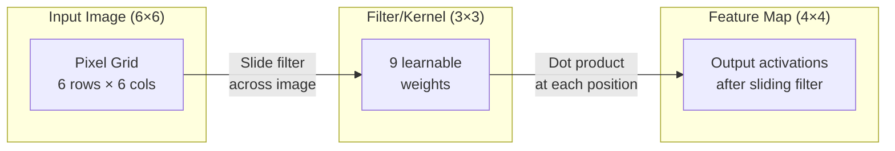
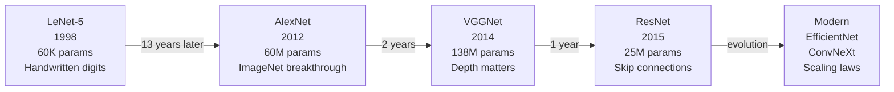
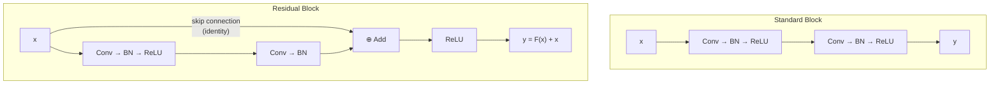
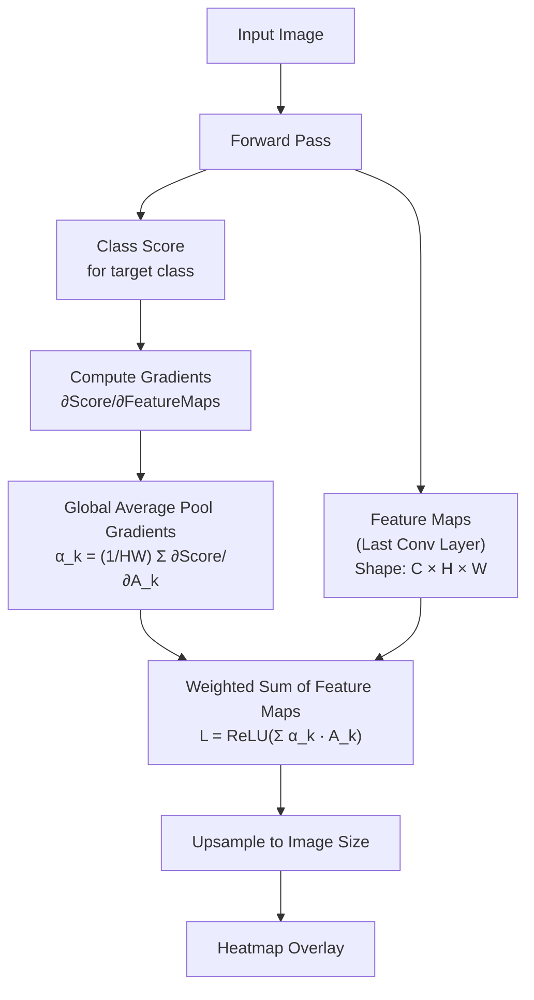
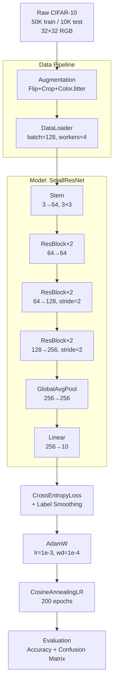

# Machine Learning Deep Dive — Part 10: Convolutional Neural Networks — Teaching Machines to See

---

**Series:** Machine Learning — A Developer's Deep Dive from Fundamentals to Production
**Part:** 10 of 19 (Deep Learning)
**Audience:** Developers with Python experience who want to master machine learning from the ground up
**Reading time:** ~55 minutes

---

## Recap: Where We Left Off

In Part 9, we built our PyTorch foundation from the ground up. We explored tensors — the multi-dimensional arrays that power all deep learning computation — and unpacked autograd, PyTorch's automatic differentiation engine that computes gradients by building a dynamic computation graph during the forward pass. We assembled a complete training loop: forward pass, loss computation, backward pass, and optimizer step. We also examined common optimizers (SGD, Adam, AdamW) and loss functions, then trained a multi-layer perceptron on real data.

We have PyTorch in our toolkit. Now let's use it to tackle images. A fully-connected network treating each pixel as a separate input ignores spatial structure — that a pixel at position (10, 10) is closely related to (11, 10). **Convolutional Neural Networks** exploit this spatial structure and are the reason machines can now recognize faces, detect tumors, and drive cars.

---

## Table of Contents

1. [The Problem with Fully-Connected Networks for Images](#1-the-problem-with-fully-connected-networks-for-images)
2. [The Convolution Operation](#2-the-convolution-operation)
3. [Filters and Feature Maps](#3-filters-and-feature-maps)
4. [Pooling Layers](#4-pooling-layers)
5. [Building a CNN in PyTorch](#5-building-a-cnn-in-pytorch)
6. [CNN Architecture Evolution](#6-cnn-architecture-evolution)
7. [Batch Normalization](#7-batch-normalization)
8. [Data Augmentation](#8-data-augmentation)
9. [Transfer Learning Preview](#9-transfer-learning-preview)
10. [Grad-CAM: What Does the CNN See?](#10-grad-cam-what-does-the-cnn-see)
11. [Project: Image Classifier (CIFAR-10)](#11-project-image-classifier-cifar-10)
12. [Vocabulary Cheat Sheet](#12-vocabulary-cheat-sheet)
13. [What's Next](#13-whats-next)

---

## 1. The Problem with Fully-Connected Networks for Images

Before we introduce convolutions, let's precisely understand why a naive fully-connected approach breaks down for images.

### The Curse of Dimensionality in Image Data

Consider three benchmark datasets and their input sizes:

| Dataset | Resolution | Channels | Input Dimensions | Typical Task |
|---------|-----------|---------|-----------------|-------------|
| MNIST | 28 × 28 | 1 (grayscale) | 784 | Digit classification |
| CIFAR-10 | 32 × 32 | 3 (RGB) | 3,072 | Object classification |
| ImageNet | 224 × 224 | 3 (RGB) | 150,528 | Large-scale classification |

MNIST at 784 inputs is manageable. But ImageNet at 150,528 inputs creates a **parameter explosion**. If we build a single fully-connected hidden layer with just 1,000 neurons for an ImageNet classifier:

```
Parameters in layer 1 = 150,528 × 1,000 = 150,528,000
```

That is 150 million parameters in one layer alone, before any other layers, before the output layer. A 10-layer network would be completely intractable. Modern ImageNet models like ResNet-50 achieve competitive accuracy with about 25 million parameters total — far fewer — by using convolutions.

### The Spatial Invariance Problem

The second critical flaw of FCNs for images is the complete lack of **spatial invariance**. Consider a simple example:

```python
# filename: spatial_invariance_demo.py
import numpy as np

# Simulate a 4x4 grayscale image with a bright spot at (0,0)
image_original = np.array([
    [255,   0,   0,   0],
    [  0,   0,   0,   0],
    [  0,   0,   0,   0],
    [  0,   0,   0,   0]
], dtype=np.float32)

# Same image but the bright spot is shifted one pixel to the right (0,1)
image_shifted = np.array([
    [  0, 255,   0,   0],
    [  0,   0,   0,   0],
    [  0,   0,   0,   0],
    [  0,   0,   0,   0]
], dtype=np.float32)

# Flatten for FCN input
flat_original = image_original.flatten()
flat_shifted  = image_shifted.flatten()

# Cosine similarity — how similar are these inputs to an FCN?
from numpy.linalg import norm
similarity = np.dot(flat_original, flat_shifted) / (norm(flat_original) * norm(flat_shifted))
print(f"Cosine similarity between original and 1-pixel-shifted image: {similarity:.4f}")

# Expected output:
# Cosine similarity between original and 1-pixel-shifted image: 0.0000
```

The cosine similarity is **zero**. To an FCN, a bright spot at pixel (0,0) and the same bright spot at pixel (0,1) are completely orthogonal inputs. The network must learn completely separate weights to recognize each possible position of every object. CNNs solve this through **parameter sharing** — the same filter is applied at every position.

### What We Actually Want

For image understanding, we want a network with three properties:

1. **Local connectivity**: each neuron connects only to a small local region, not all pixels
2. **Parameter sharing**: the same feature detector (filter) is applied everywhere
3. **Hierarchical feature learning**: early layers detect edges, middle layers detect shapes, deep layers detect objects

Convolutions provide all three.

---

## 2. The Convolution Operation

### The Core Idea

A **convolution** slides a small matrix called a **filter** (or **kernel**) across the input image, computing a dot product at each position. The result is a new matrix called a **feature map** that highlights where the filter's pattern was detected in the image.



### Mathematical Definition

For a 2D input `I` and filter `K`, the discrete 2D cross-correlation (what deep learning calls "convolution") is:

```
(I ★ K)[i, j] = Σ_m Σ_n  I[i+m, j+n] · K[m, n]
```

Where `m` and `n` index over the filter dimensions.

### Implementing 2D Convolution from Scratch

```python
# filename: convolution_from_scratch.py
import numpy as np
import matplotlib.pyplot as plt

def conv2d_naive(input_img, kernel, padding=0, stride=1):
    """
    Naive 2D cross-correlation (what PyTorch calls 'convolution').

    Args:
        input_img: 2D numpy array (H, W)
        kernel:    2D numpy array (kH, kW)
        padding:   integer, number of zeros to pad on each side
        stride:    integer, step size when sliding the filter

    Returns:
        output: 2D numpy array, the feature map
    """
    H, W = input_img.shape
    kH, kW = kernel.shape

    # Add padding
    if padding > 0:
        input_img = np.pad(input_img, padding, mode='constant', constant_values=0)
        H_pad = H + 2 * padding
        W_pad = W + 2 * padding
    else:
        H_pad, W_pad = H, W

    # Compute output dimensions
    out_H = (H_pad - kH) // stride + 1
    out_W = (W_pad - kW) // stride + 1

    output = np.zeros((out_H, out_W))

    for i in range(out_H):
        for j in range(out_W):
            row_start = i * stride
            col_start = j * stride
            # Extract patch from (possibly padded) input
            patch = input_img[row_start:row_start+kH, col_start:col_start+kW]
            # Compute dot product with kernel
            output[i, j] = np.sum(patch * kernel)

    return output


# --- Demonstrate with classic filters ---

# Sample grayscale image: gradient with a sharp edge
image = np.zeros((8, 8), dtype=np.float32)
image[:, 4:] = 1.0  # right half is bright

print("Input image:")
print(image)
print()

# Horizontal edge detection filter (Sobel-like)
sobel_x = np.array([
    [-1,  0,  1],
    [-2,  0,  2],
    [-1,  0,  1]
], dtype=np.float32)

# Blur filter (box blur / average filter)
blur = np.ones((3, 3), dtype=np.float32) / 9.0

# Sharpen filter
sharpen = np.array([
    [ 0, -1,  0],
    [-1,  5, -1],
    [ 0, -1,  0]
], dtype=np.float32)

# Apply each filter
edge_map   = conv2d_naive(image, sobel_x, padding=1, stride=1)
blur_map   = conv2d_naive(image, blur,    padding=1, stride=1)
sharp_map  = conv2d_naive(image, sharpen, padding=1, stride=1)

print("Edge detection feature map (Sobel X):")
print(np.round(edge_map, 2))
print()
print("Blur feature map:")
print(np.round(blur_map, 2))

# Expected output:
# Edge detection feature map (Sobel X):
# [[ 0.  0.  0.  4.  0.  0.  0.  0.]
#  [ 0.  0.  0.  4.  0.  0.  0.  0.]
#  ...
#  The vertical edge at column 4 is detected as a column of 4s
```

### Padding: Same vs. Valid

**Padding** controls whether we pad the input with zeros before applying the filter.

- **Valid (no padding)**: output shrinks after each convolution. Output size = `(H - K + 1) × (W - K + 1)`
- **Same (padding = K//2)**: output has the same spatial size as the input when stride=1

```python
# filename: padding_demo.py
import numpy as np

def output_size(input_size, kernel_size, padding, stride):
    """Formula for output spatial dimension."""
    return (input_size - kernel_size + 2 * padding) // stride + 1

H, W = 28, 28

# 3x3 kernel, no padding, stride 1 (VALID)
print("=== VALID convolution (no padding) ===")
for layer in range(5):
    H = output_size(H, kernel_size=3, padding=0, stride=1)
    W = output_size(W, kernel_size=3, padding=0, stride=1)
    print(f"  After layer {layer+1}: {H} x {W}")

# Reset
H, W = 28, 28

# 3x3 kernel, padding=1, stride 1 (SAME)
print("\n=== SAME convolution (padding=1) ===")
for layer in range(5):
    H = output_size(H, kernel_size=3, padding=1, stride=1)
    W = output_size(W, kernel_size=3, padding=1, stride=1)
    print(f"  After layer {layer+1}: {H} x {W}")

# Expected output:
# === VALID convolution (no padding) ===
#   After layer 1: 26 x 26
#   After layer 2: 24 x 24
#   After layer 3: 22 x 22
#   After layer 4: 20 x 20
#   After layer 5: 18 x 18
#
# === SAME convolution (padding=1) ===
#   After layer 1: 28 x 28
#   After layer 2: 28 x 28
#   After layer 3: 28 x 28
#   After layer 4: 28 x 28
#   After layer 5: 28 x 28
```

### Stride

**Stride** controls how many pixels the filter jumps at each step. Stride=1 moves one pixel at a time. Stride=2 skips every other position, halving the output size.

```python
# filename: stride_demo.py
import numpy as np

def output_size(input_size, kernel_size, padding, stride):
    return (input_size - kernel_size + 2 * padding) // stride + 1

# Effect of stride on output size for 32x32 input
print("Input: 32x32, Kernel: 3x3, Padding: 1")
for stride in [1, 2, 4]:
    out = output_size(32, kernel_size=3, padding=1, stride=stride)
    print(f"  Stride={stride}: output = {out} x {out}")

# Expected output:
# Input: 32x32, Kernel: 3x3, Padding: 1
#   Stride=1: output = 32 x 32
#   Stride=2: output = 16 x 16
#   Stride=4: output = 8 x 8
```

### The Receptive Field

The **receptive field** is the region of the original input that influences a particular neuron's output. After one 3×3 convolution, each output neuron "sees" a 3×3 patch. After two stacked 3×3 convolutions, each output neuron effectively sees a 5×5 patch of the original input. After three layers, it sees a 7×7 patch.

> **Key Insight**: Stacking multiple small filters is more parameter-efficient than using a single large filter, while achieving the same effective receptive field. Two 3×3 conv layers use 2 × (9 × C²) = 18C² parameters, while one 5×5 layer uses 25C² parameters — and the two-layer version has more non-linearities.

---

## 3. Filters and Feature Maps

### What Filters Learn

In the first layer of a CNN, filters learn to detect low-level features: edges at various orientations (horizontal, vertical, diagonal), colors, and simple textures. In deeper layers, filters combine these low-level features into increasingly complex patterns:

- **Layer 1**: Edge detectors, color blobs
- **Layer 2**: Simple textures, corners
- **Layer 3**: Parts of objects (eyes, wheels, fur texture)
- **Layer 4-5**: Whole objects and object parts in context

### Feature Map Size Formula

For input of size H × W with:
- Kernel size: F
- Padding: P
- Stride: S

The output feature map size is:

```
Output H = floor((H - F + 2P) / S) + 1
Output W = floor((W - F + 2P) / S) + 1
```

### Counting Parameters in a Conv Layer

A conv layer with:
- `C_in` input channels
- `C_out` output channels (number of filters)
- Kernel size `F × F`

Has:

```
Parameters = C_out × (C_in × F × F + 1)  [+1 for bias per filter]
```

```python
# filename: param_count.py

def conv_params(c_in, c_out, kernel_size, bias=True):
    """Count parameters in a single conv layer."""
    weight_params = c_out * c_in * kernel_size * kernel_size
    bias_params   = c_out if bias else 0
    return weight_params + bias_params

def fc_params(in_features, out_features, bias=True):
    """Count parameters in a fully-connected layer."""
    weight_params = in_features * out_features
    bias_params   = out_features if bias else 0
    return weight_params + bias_params

# Compare parameter counts for equivalent tasks
print("=== Parameter Comparison ===\n")

# FC layer: connect 32x32 image to 64 neurons
fc_p = fc_params(32*32, 64)
print(f"FC layer (32x32 -> 64):          {fc_p:>10,} params")

# Conv layer: 1 input channel, 64 filters, 3x3 kernel
conv_p = conv_params(c_in=1, c_out=64, kernel_size=3)
print(f"Conv layer (1->64, 3x3 kernel):  {conv_p:>10,} params")

print(f"\nFC uses {fc_p // conv_p}x more parameters for similar expressiveness")

print("\n=== Layer-by-layer CNN Parameter Count ===")
layers = [
    ("Conv1", conv_params(3, 32, 3)),
    ("Conv2", conv_params(32, 64, 3)),
    ("Conv3", conv_params(64, 128, 3)),
    ("FC1",   fc_params(128*4*4, 512)),   # after pooling to 4x4
    ("FC2",   fc_params(512, 10)),
]
total = 0
for name, p in layers:
    total += p
    print(f"  {name:6s}: {p:>10,} params")
print(f"  {'TOTAL':6s}: {total:>10,} params")

# Expected output:
# === Parameter Comparison ===
#
# FC layer (32x32 -> 64):               65,600 params
# Conv layer (1->64, 3x3 kernel):          640 params
#
# FC uses 102x more parameters for similar expressiveness
#
# === Layer-by-layer CNN Parameter Count ===
#   Conv1 :        896 params
#   Conv2 :     18,496 params
#   Conv3 :     73,856 params
#   FC1   :  2,097,664 params
#   FC2   :      5,130 params
#   TOTAL :  2,196,042 params
```

### Visualizing Learned Filters

```python
# filename: visualize_filters.py
import torch
import torchvision.models as models
import matplotlib.pyplot as plt
import numpy as np

# Load a pretrained AlexNet (small, fast to download)
model = models.alexnet(pretrained=True)
model.eval()

# Extract first conv layer weights
# Shape: [num_filters, in_channels, H, W] = [64, 3, 11, 11]
first_layer_weights = model.features[0].weight.data.clone()

# Normalize for visualization
def normalize_filter(f):
    f = f - f.min()
    f = f / (f.max() + 1e-8)
    return f

print(f"First conv layer shape: {first_layer_weights.shape}")
print(f"  -> 64 filters, each 3-channel (RGB), 11x11 pixels")

# In a real script, you would plot these with matplotlib
# Showing just the first 4 filters' statistics here
for i in range(4):
    filt = first_layer_weights[i]
    print(f"  Filter {i}: mean={filt.mean():.3f}, std={filt.std():.3f}, "
          f"min={filt.min():.3f}, max={filt.max():.3f}")

# Expected output:
# First conv layer shape: torch.Size([64, 3, 11, 11])
#   -> 64 filters, each 3-channel (RGB), 11x11 pixels
#   Filter 0: mean=0.002, std=0.048, min=-0.143, max=0.176
#   Filter 1: mean=-0.001, std=0.046, min=-0.138, max=0.143
#   Filter 2: mean=0.003, std=0.041, min=-0.127, max=0.154
#   Filter 3: mean=-0.002, std=0.049, min=-0.151, max=0.167
```

---

## 4. Pooling Layers

After a convolution produces a feature map, we typically follow it with a **pooling layer**. Pooling reduces spatial dimensions, decreasing computational cost and providing a degree of **translation invariance**.

### Max Pooling

**Max pooling** takes the maximum value within each non-overlapping window. The key effect: if a feature is present anywhere in the window, the maximum activation is preserved, regardless of its exact position.

```python
# filename: pooling_from_scratch.py
import numpy as np

def max_pool2d(input_map, pool_size=2, stride=None):
    """
    2D max pooling.

    Args:
        input_map: 2D array (H, W)
        pool_size: size of pooling window (square)
        stride:    step between windows (defaults to pool_size = non-overlapping)
    """
    if stride is None:
        stride = pool_size

    H, W = input_map.shape
    out_H = (H - pool_size) // stride + 1
    out_W = (W - pool_size) // stride + 1
    output = np.zeros((out_H, out_W))

    for i in range(out_H):
        for j in range(out_W):
            row_start = i * stride
            col_start = j * stride
            window = input_map[row_start:row_start+pool_size,
                                col_start:col_start+pool_size]
            output[i, j] = np.max(window)

    return output

def avg_pool2d(input_map, pool_size=2, stride=None):
    """2D average pooling."""
    if stride is None:
        stride = pool_size

    H, W = input_map.shape
    out_H = (H - pool_size) // stride + 1
    out_W = (W - pool_size) // stride + 1
    output = np.zeros((out_H, out_W))

    for i in range(out_H):
        for j in range(out_W):
            row_start = i * stride
            col_start = j * stride
            window = input_map[row_start:row_start+pool_size,
                                col_start:col_start+pool_size]
            output[i, j] = np.mean(window)

    return output

def global_avg_pool2d(input_map):
    """Global Average Pooling: single value per feature map."""
    return np.mean(input_map)

# Example: 4x4 feature map
feature_map = np.array([
    [1,  3,  2,  4],
    [5,  6,  1,  2],
    [3,  2,  7,  8],
    [1,  4,  3,  5]
], dtype=np.float32)

print("Input feature map (4x4):")
print(feature_map)

print("\nMax pooling (2x2, stride=2) — output (2x2):")
max_out = max_pool2d(feature_map, pool_size=2, stride=2)
print(max_out)

print("\nAverage pooling (2x2, stride=2) — output (2x2):")
avg_out = avg_pool2d(feature_map, pool_size=2, stride=2)
print(avg_out)

print(f"\nGlobal average pooling — single scalar: {global_avg_pool2d(feature_map):.2f}")

# Expected output:
# Input feature map (4x4):
# [[1. 3. 2. 4.]
#  [5. 6. 1. 2.]
#  [3. 2. 7. 8.]
#  [1. 4. 3. 5.]]
#
# Max pooling (2x2, stride=2) — output (2x2):
# [[6. 4.]
#  [4. 8.]]
#
# Average pooling (2x2, stride=2) — output (2x2):
# [[3.75 2.25]
#  [2.5  5.75]]
#
# Global average pooling — single scalar: 3.56
```

### Translation Invariance from Max Pooling

```python
# filename: translation_invariance_demo.py
import numpy as np

# A feature map with a detection "spike" at position (0,0)
feature_map_A = np.array([
    [10,  0,  0,  0],
    [ 0,  0,  0,  0],
    [ 0,  0,  0,  0],
    [ 0,  0,  0,  0]
], dtype=np.float32)

# Same spike, shifted to position (1,1)
feature_map_B = np.array([
    [ 0,  0,  0,  0],
    [ 0, 10,  0,  0],
    [ 0,  0,  0,  0],
    [ 0,  0,  0,  0]
], dtype=np.float32)

def max_pool2d_simple(x, pool_size=2):
    H, W = x.shape
    out_H, out_W = H // pool_size, W // pool_size
    out = np.zeros((out_H, out_W))
    for i in range(out_H):
        for j in range(out_W):
            out[i,j] = np.max(x[i*pool_size:(i+1)*pool_size,
                                 j*pool_size:(j+1)*pool_size])
    return out

pool_A = max_pool2d_simple(feature_map_A)
pool_B = max_pool2d_simple(feature_map_B)

print("Max-pooled A:")
print(pool_A)
print("\nMax-pooled B (shifted):")
print(pool_B)
print(f"\nAre outputs identical? {np.array_equal(pool_A, pool_B)}")

# Expected output:
# Max-pooled A:
# [[10.  0.]
#  [ 0.  0.]]
#
# Max-pooled B (shifted):
# [[10.  0.]
#  [ 0.  0.]]
#
# Are outputs identical? True
```

The max-pooled outputs are identical — the small shift of the detection spike within the 2×2 window has been absorbed.

### Pooling Type Comparison

| Pooling Type | Operation | Translation Invariance | Use Case |
|-------------|-----------|----------------------|----------|
| Max Pooling | Take max in window | High (within window) | Detection tasks, early layers |
| Average Pooling | Take mean in window | Moderate | Smooth feature maps |
| Global Avg Pooling | Single mean per map | Full spatial invariance | Replace FC layers at end |
| Global Max Pooling | Single max per map | Full spatial invariance | Text CNNs, some vision tasks |

### Global Average Pooling (GAP)

Modern architectures like ResNet use **Global Average Pooling** as the final spatial reduction layer instead of a large fully-connected layer. Given a feature map of size C × H × W, GAP produces a vector of size C (one value per channel), which is then fed into a linear classifier.

Benefits:
- Reduces parameters dramatically (no FC weights)
- More spatially interpretable (each channel's average activation)
- Better generalization — less prone to overfitting
- Enables variable-size input images at inference

---

## 5. Building a CNN in PyTorch

### Core PyTorch CNN Layers

```python
# filename: pytorch_cnn_basics.py
import torch
import torch.nn as nn

# nn.Conv2d(in_channels, out_channels, kernel_size, stride=1, padding=0)
conv1 = nn.Conv2d(in_channels=3,  out_channels=32, kernel_size=3, padding=1)
conv2 = nn.Conv2d(in_channels=32, out_channels=64, kernel_size=3, padding=1)

# nn.MaxPool2d(kernel_size, stride=None, padding=0)
pool = nn.MaxPool2d(kernel_size=2, stride=2)

# nn.AdaptiveAvgPool2d — outputs a specified size regardless of input size
gap = nn.AdaptiveAvgPool2d(output_size=(1, 1))  # Global Average Pooling

# Demonstrate shapes
x = torch.randn(4, 3, 32, 32)   # batch=4, channels=3, H=32, W=32
print(f"Input shape:            {x.shape}")

out = conv1(x)
print(f"After Conv1 (3->32):    {out.shape}")

out = pool(out)
print(f"After MaxPool2d (2x2):  {out.shape}")

out = conv2(out)
print(f"After Conv2 (32->64):   {out.shape}")

out = pool(out)
print(f"After MaxPool2d (2x2):  {out.shape}")

out_gap = gap(out)
print(f"After GlobalAvgPool:    {out_gap.shape}")

out_flat = out_gap.view(out_gap.size(0), -1)
print(f"After flatten:          {out_flat.shape}")

# Expected output:
# Input shape:            torch.Size([4, 3, 32, 32])
# After Conv1 (3->32):    torch.Size([4, 32, 32, 32])
# After MaxPool2d (2x2):  torch.Size([4, 32, 16, 16])
# After Conv2 (32->64):   torch.Size([4, 64, 16, 16])
# After MaxPool2d (2x2):  torch.Size([4, 64, 8, 8])
# After GlobalAvgPool:    torch.Size([4, 64, 1, 1])
# After flatten:          torch.Size([4, 64])
```

### Calculating Output Shapes Manually

```python
# filename: shape_calculator.py
import math

def conv_output_shape(H_in, W_in, kernel_size, stride=1, padding=0, dilation=1):
    """
    Exact formula from PyTorch documentation.
    """
    H_out = math.floor((H_in + 2*padding - dilation*(kernel_size-1) - 1) / stride + 1)
    W_out = math.floor((W_in + 2*padding - dilation*(kernel_size-1) - 1) / stride + 1)
    return H_out, W_out

def pool_output_shape(H_in, W_in, kernel_size, stride=None, padding=0):
    if stride is None:
        stride = kernel_size
    H_out = math.floor((H_in + 2*padding - kernel_size) / stride + 1)
    W_out = math.floor((W_in + 2*padding - kernel_size) / stride + 1)
    return H_out, W_out

# Trace through a typical CNN for CIFAR-10 (32x32 input)
print("Tracing CNN shapes for 32x32 input:\n")
H, W, C = 32, 32, 3

layers_info = [
    ("Input",     H, W, C),
]

# Conv1: 3->32, 3x3, padding=1, stride=1
H, W = conv_output_shape(H, W, kernel_size=3, padding=1); C = 32
layers_info.append(("Conv2d(3->32, 3x3, p=1)", H, W, C))

# Pool1: 2x2, stride=2
H, W = pool_output_shape(H, W, kernel_size=2);
layers_info.append(("MaxPool2d(2x2)", H, W, C))

# Conv2: 32->64, 3x3, padding=1
H, W = conv_output_shape(H, W, kernel_size=3, padding=1); C = 64
layers_info.append(("Conv2d(32->64, 3x3, p=1)", H, W, C))

# Pool2: 2x2, stride=2
H, W = pool_output_shape(H, W, kernel_size=2);
layers_info.append(("MaxPool2d(2x2)", H, W, C))

# Conv3: 64->128, 3x3, padding=1
H, W = conv_output_shape(H, W, kernel_size=3, padding=1); C = 128
layers_info.append(("Conv2d(64->128, 3x3, p=1)", H, W, C))

# Pool3: 2x2, stride=2
H, W = pool_output_shape(H, W, kernel_size=2);
layers_info.append(("MaxPool2d(2x2)", H, W, C))

# GAP
layers_info.append(("GlobalAvgPool2d", 1, 1, C))
flat = C
layers_info.append(("Flatten", flat, "-", "-"))

print(f"{'Layer':<35} {'H':>6} {'W':>6} {'C':>6}")
print("-" * 56)
for name, h, w, c in layers_info:
    print(f"{name:<35} {str(h):>6} {str(w):>6} {str(c):>6}")

# Expected output:
# Layer                                H      W      C
# --------------------------------------------------------
# Input                               32     32      3
# Conv2d(3->32, 3x3, p=1)            32     32     32
# MaxPool2d(2x2)                      16     16     32
# Conv2d(32->64, 3x3, p=1)           16     16     64
# MaxPool2d(2x2)                       8      8     64
# Conv2d(64->128, 3x3, p=1)           8      8    128
# MaxPool2d(2x2)                       4      4    128
# GlobalAvgPool2d                      1      1    128
# Flatten                            128      -      -
```

### Complete CNN Implementation

```python
# filename: simple_cnn.py
import torch
import torch.nn as nn
import torch.nn.functional as F

class SimpleCNN(nn.Module):
    """
    A clean, well-commented CNN for CIFAR-10 (32x32x3, 10 classes).
    Architecture: Conv -> Pool -> Conv -> Pool -> Conv -> GAP -> Linear
    """

    def __init__(self, num_classes=10):
        super(SimpleCNN, self).__init__()

        # === Feature Extractor ===
        # Block 1
        self.conv1 = nn.Conv2d(3,  32, kernel_size=3, padding=1)   # 32x32 -> 32x32
        self.conv2 = nn.Conv2d(32, 32, kernel_size=3, padding=1)   # 32x32 -> 32x32
        self.pool1 = nn.MaxPool2d(2, 2)                            # 32x32 -> 16x16

        # Block 2
        self.conv3 = nn.Conv2d(32, 64, kernel_size=3, padding=1)   # 16x16 -> 16x16
        self.conv4 = nn.Conv2d(64, 64, kernel_size=3, padding=1)   # 16x16 -> 16x16
        self.pool2 = nn.MaxPool2d(2, 2)                            # 16x16 -> 8x8

        # Block 3
        self.conv5 = nn.Conv2d(64, 128, kernel_size=3, padding=1)  # 8x8 -> 8x8
        self.conv6 = nn.Conv2d(128, 128, kernel_size=3, padding=1) # 8x8 -> 8x8
        self.pool3 = nn.MaxPool2d(2, 2)                            # 8x8 -> 4x4

        # === Global Average Pooling ===
        self.gap = nn.AdaptiveAvgPool2d((1, 1))                    # 4x4 -> 1x1

        # === Classifier Head ===
        self.dropout = nn.Dropout(p=0.5)
        self.fc = nn.Linear(128, num_classes)

    def forward(self, x):
        # Block 1
        x = F.relu(self.conv1(x))
        x = F.relu(self.conv2(x))
        x = self.pool1(x)

        # Block 2
        x = F.relu(self.conv3(x))
        x = F.relu(self.conv4(x))
        x = self.pool2(x)

        # Block 3
        x = F.relu(self.conv5(x))
        x = F.relu(self.conv6(x))
        x = self.pool3(x)

        # Global Average Pooling + Flatten
        x = self.gap(x)          # (B, 128, 1, 1)
        x = x.view(x.size(0), -1)  # (B, 128)

        # Classifier
        x = self.dropout(x)
        x = self.fc(x)

        return x  # Raw logits — apply softmax externally if needed

# Test the model
model = SimpleCNN(num_classes=10)

# Count total parameters
total_params = sum(p.numel() for p in model.parameters())
trainable_params = sum(p.numel() for p in model.parameters() if p.requires_grad)
print(f"Total parameters:     {total_params:,}")
print(f"Trainable parameters: {trainable_params:,}")

# Test forward pass
x = torch.randn(16, 3, 32, 32)   # batch of 16 CIFAR-10 images
output = model(x)
print(f"\nInput:  {x.shape}")
print(f"Output: {output.shape}")  # Should be (16, 10)

# Expected output:
# Total parameters:     267,562
# Trainable parameters: 267,562
#
# Input:  torch.Size([16, 3, 32, 32])
# Output: torch.Size([16, 10])
```

---

## 6. CNN Architecture Evolution

The history of CNNs is a story of clever ideas layered on top of each other, each solving a specific limitation of the previous generation.



### Architecture Comparison Table

| Architecture | Year | Depth | Params | Top-5 Error | Key Innovation |
|-------------|------|-------|--------|------------|----------------|
| LeNet-5 | 1998 | 5 layers | 60K | N/A (MNIST) | Convolutions + pooling |
| AlexNet | 2012 | 8 layers | 60M | 15.3% | Deep + ReLU + Dropout |
| VGG-16 | 2014 | 16 layers | 138M | 7.3% | Small filters, depth |
| GoogLeNet | 2014 | 22 layers | 6.8M | 6.7% | Inception modules |
| ResNet-50 | 2015 | 50 layers | 25M | 5.25% | Residual skip connections |
| DenseNet-121 | 2016 | 121 layers | 8M | 5.72% | Dense skip connections |
| EfficientNet-B7 | 2019 | 66 layers | 66M | 3.0% | Compound scaling |
| ConvNeXt-L | 2022 | 36 blocks | 197M | ~1.7% | Modernized ResNet |

### LeNet-5: The Pioneer (1998)

LeNet-5, designed by Yann LeCun, was the first practical CNN and powered ATM check reading for decades.

```python
# filename: lenet5.py
import torch
import torch.nn as nn
import torch.nn.functional as F

class LeNet5(nn.Module):
    """
    LeNet-5 (LeCun et al., 1998).
    Designed for 32x32 grayscale images (MNIST padded to 32x32).
    """

    def __init__(self, num_classes=10):
        super(LeNet5, self).__init__()

        # C1: 1 input channel, 6 feature maps, 5x5 kernel
        self.conv1 = nn.Conv2d(1, 6, kernel_size=5)    # 32x32 -> 28x28
        # S2: Average pooling 2x2
        self.pool1 = nn.AvgPool2d(kernel_size=2, stride=2)  # 28x28 -> 14x14

        # C3: 6 -> 16 feature maps, 5x5 kernel
        self.conv2 = nn.Conv2d(6, 16, kernel_size=5)   # 14x14 -> 10x10
        # S4: Average pooling 2x2
        self.pool2 = nn.AvgPool2d(kernel_size=2, stride=2)  # 10x10 -> 5x5

        # C5: 16 -> 120, 5x5 kernel (all connections = fully connected)
        self.conv3 = nn.Conv2d(16, 120, kernel_size=5) # 5x5 -> 1x1

        # F6: fully connected 120 -> 84
        self.fc1 = nn.Linear(120, 84)

        # Output: 84 -> num_classes
        self.fc2 = nn.Linear(84, num_classes)

    def forward(self, x):
        x = torch.tanh(self.conv1(x))  # Original used tanh, not ReLU
        x = self.pool1(x)
        x = torch.tanh(self.conv2(x))
        x = self.pool2(x)
        x = torch.tanh(self.conv3(x))
        x = x.view(x.size(0), -1)     # Flatten 120x1x1 -> 120
        x = torch.tanh(self.fc1(x))
        x = self.fc2(x)
        return x

# Test
model = LeNet5(num_classes=10)
x = torch.randn(1, 1, 32, 32)  # Single 32x32 grayscale image
out = model(x)
print(f"LeNet-5 output shape: {out.shape}")
print(f"Total parameters: {sum(p.numel() for p in model.parameters()):,}")

# Expected output:
# LeNet-5 output shape: torch.Size([1, 10])
# Total parameters: 61,706
```

### ResNet: Residual Connections (2015)

The critical insight of ResNet is the **residual block** (or **skip connection**). Instead of learning `H(x)`, the block learns the residual `F(x) = H(x) - x`, making the identity mapping `H(x) = x` trivially easy.



This allows gradients to flow unimpeded through the identity connection during backpropagation, solving the **vanishing gradient** problem that prevented training very deep networks.

```python
# filename: resnet_block.py
import torch
import torch.nn as nn
import torch.nn.functional as F

class ResidualBlock(nn.Module):
    """
    Standard ResNet residual block (He et al., 2015).
    Two 3x3 convolutions with a skip connection.
    Handles dimension mismatch with a 1x1 conv shortcut.
    """

    def __init__(self, in_channels, out_channels, stride=1):
        super(ResidualBlock, self).__init__()

        # Main path
        self.conv1 = nn.Conv2d(in_channels, out_channels,
                               kernel_size=3, stride=stride, padding=1, bias=False)
        self.bn1   = nn.BatchNorm2d(out_channels)

        self.conv2 = nn.Conv2d(out_channels, out_channels,
                               kernel_size=3, stride=1, padding=1, bias=False)
        self.bn2   = nn.BatchNorm2d(out_channels)

        # Shortcut path — only needed when dimensions change
        self.shortcut = nn.Sequential()
        if stride != 1 or in_channels != out_channels:
            # 1x1 conv to match dimensions
            self.shortcut = nn.Sequential(
                nn.Conv2d(in_channels, out_channels,
                          kernel_size=1, stride=stride, bias=False),
                nn.BatchNorm2d(out_channels)
            )

    def forward(self, x):
        identity = x

        # Main path: Conv -> BN -> ReLU -> Conv -> BN
        out = F.relu(self.bn1(self.conv1(x)))
        out = self.bn2(self.conv2(out))

        # Add skip connection (identity mapping or projected)
        out = out + self.shortcut(identity)

        # Final activation AFTER the addition
        out = F.relu(out)

        return out


class SmallResNet(nn.Module):
    """
    A small ResNet-inspired network for CIFAR-10.
    """

    def __init__(self, num_classes=10):
        super(SmallResNet, self).__init__()

        # Initial stem
        self.stem = nn.Sequential(
            nn.Conv2d(3, 64, kernel_size=3, stride=1, padding=1, bias=False),
            nn.BatchNorm2d(64),
            nn.ReLU(inplace=True)
        )

        # Residual stages
        self.layer1 = nn.Sequential(
            ResidualBlock(64, 64),
            ResidualBlock(64, 64)
        )
        self.layer2 = nn.Sequential(
            ResidualBlock(64, 128, stride=2),  # Downsample 32->16
            ResidualBlock(128, 128)
        )
        self.layer3 = nn.Sequential(
            ResidualBlock(128, 256, stride=2), # Downsample 16->8
            ResidualBlock(256, 256)
        )

        # Global Average Pooling + Classifier
        self.gap = nn.AdaptiveAvgPool2d((1, 1))
        self.fc  = nn.Linear(256, num_classes)

    def forward(self, x):
        x = self.stem(x)      # (B, 64, 32, 32)
        x = self.layer1(x)    # (B, 64, 32, 32)
        x = self.layer2(x)    # (B, 128, 16, 16)
        x = self.layer3(x)    # (B, 256, 8, 8)
        x = self.gap(x)       # (B, 256, 1, 1)
        x = x.view(x.size(0), -1)  # (B, 256)
        x = self.fc(x)        # (B, 10)
        return x

# Test
model = SmallResNet(num_classes=10)
x = torch.randn(4, 3, 32, 32)
out = model(x)
print(f"SmallResNet output: {out.shape}")
print(f"Parameters: {sum(p.numel() for p in model.parameters()):,}")

# Expected output:
# SmallResNet output: torch.Size([4, 10])
# Parameters: 2,794,314
```

> **Why Skip Connections Work**: Consider training a 20-layer network. With skip connections, if the optimal solution is to do nothing in layers 3-10, the network can easily learn `F(x) = 0` (making the block behave as identity). Without skip connections, the network would need to somehow learn the identity function through weight matrices — much harder.

---

## 7. Batch Normalization

### The Internal Covariate Shift Problem

As a deep network trains, each layer's input distribution shifts because the parameters of the previous layer change. This is called **internal covariate shift**. Layers later in the network are constantly chasing a moving target, making training slow and requiring careful initialization and low learning rates.

### How Batch Normalization Works

**Batch Normalization** (Ioffe and Szegedy, 2015) normalizes the activations of each layer across the current mini-batch, then applies a learnable scale (γ) and shift (β).

Given a mini-batch `B = {x₁, x₂, ..., xₙ}`:

```
1. μ_B  = (1/n) Σ xᵢ             (batch mean)
2. σ²_B = (1/n) Σ (xᵢ - μ_B)²   (batch variance)
3. x̂ᵢ  = (xᵢ - μ_B) / √(σ²_B + ε)   (normalize)
4. yᵢ  = γ · x̂ᵢ + β             (scale and shift with learnable γ, β)
```

At inference, the running statistics collected during training are used instead of batch statistics.

### Batch Norm from Scratch

```python
# filename: batch_norm_scratch.py
import torch
import torch.nn as nn

def batch_norm_1d_forward(x, gamma, beta, eps=1e-5, momentum=0.1,
                           running_mean=None, running_var=None, training=True):
    """
    Manual batch normalization for 2D input (N, C).

    x:            (N, C) tensor
    gamma, beta:  learnable scale and shift, shape (C,)
    """
    if training:
        # Compute batch statistics
        mean = x.mean(dim=0)           # (C,)
        var  = x.var(dim=0, unbiased=False)  # (C,)

        # Normalize
        x_hat = (x - mean) / torch.sqrt(var + eps)   # (N, C)

        # Scale and shift
        out = gamma * x_hat + beta

        # Update running statistics (for inference)
        if running_mean is not None:
            running_mean = (1 - momentum) * running_mean + momentum * mean
            running_var  = (1 - momentum) * running_var  + momentum * var

        return out, mean, var
    else:
        # Use running statistics
        x_hat = (x - running_mean) / torch.sqrt(running_var + eps)
        return gamma * x_hat + beta, running_mean, running_var


# Demonstrate
torch.manual_seed(42)
N, C = 32, 64  # batch of 32, 64 features
x = torch.randn(N, C) * 5 + 3   # Non-zero mean and large std

gamma = torch.ones(C)
beta  = torch.zeros(C)

print(f"Input  — mean: {x.mean():.3f}, std: {x.std():.3f}")

out, mean, var = batch_norm_1d_forward(x, gamma, beta)
print(f"Output — mean: {out.mean():.4f}, std: {out.std():.4f}")
print(f"(Approximately 0 mean and 1 std — then γ/β can shift as needed)")

# Compare with PyTorch's implementation
bn = nn.BatchNorm1d(C)
with torch.no_grad():
    bn.weight.fill_(1.0)
    bn.bias.fill_(0.0)
    torch_out = bn(x)

print(f"\nPyTorch BN output — mean: {torch_out.mean():.4f}, std: {torch_out.std():.4f}")
print(f"Match with manual: {torch.allclose(out, torch_out, atol=1e-4)}")

# Expected output:
# Input  — mean: 3.048, std: 4.983
# Output — mean: 0.0001, std: 0.9997
# (Approximately 0 mean and 1 std — then γ/β can shift as needed)
#
# PyTorch BN output — mean: 0.0001, std: 0.9997
# Match with manual: True
```

### Using BatchNorm in a CNN

```python
# filename: cnn_with_batchnorm.py
import torch
import torch.nn as nn
import torch.nn.functional as F

class CNNWithBatchNorm(nn.Module):
    """
    CNN with Batch Normalization after each convolution.
    Pattern: Conv -> BN -> ReLU (most common in modern networks)
    """

    def __init__(self, num_classes=10):
        super(CNNWithBatchNorm, self).__init__()

        self.features = nn.Sequential(
            # Block 1
            nn.Conv2d(3, 64, 3, padding=1, bias=False),  # bias=False when using BN
            nn.BatchNorm2d(64),
            nn.ReLU(inplace=True),

            nn.Conv2d(64, 64, 3, padding=1, bias=False),
            nn.BatchNorm2d(64),
            nn.ReLU(inplace=True),

            nn.MaxPool2d(2, 2),  # 32x32 -> 16x16

            # Block 2
            nn.Conv2d(64, 128, 3, padding=1, bias=False),
            nn.BatchNorm2d(128),
            nn.ReLU(inplace=True),

            nn.Conv2d(128, 128, 3, padding=1, bias=False),
            nn.BatchNorm2d(128),
            nn.ReLU(inplace=True),

            nn.MaxPool2d(2, 2),  # 16x16 -> 8x8
        )

        self.gap = nn.AdaptiveAvgPool2d((1, 1))
        self.classifier = nn.Sequential(
            nn.Linear(128, 256),
            nn.ReLU(inplace=True),
            nn.Dropout(0.5),
            nn.Linear(256, num_classes)
        )

    def forward(self, x):
        x = self.features(x)
        x = self.gap(x)
        x = x.view(x.size(0), -1)
        x = self.classifier(x)
        return x

model = CNNWithBatchNorm()
print(f"Parameters: {sum(p.numel() for p in model.parameters()):,}")

# Quick forward pass test
x = torch.randn(8, 3, 32, 32)
out = model(x)
print(f"Output shape: {out.shape}")

# Expected output:
# Parameters: 706,954
# Output shape: torch.Size([8, 10])
```

### Where to Place Batch Normalization

There is ongoing discussion in the deep learning community about the optimal placement of batch normalization relative to the activation function:

| Placement | Pattern | Notes |
|-----------|---------|-------|
| Original (2015) | Conv → BN → ReLU | Most common in practice |
| Pre-activation | Conv → ReLU → BN | Some theoretical advantages |
| Post-activation | Conv → ReLU → BN | Found in some architectures |
| Before activation | BN → ReLU | More mathematically principled |

The original placement (Conv → BN → ReLU) remains the most widely used in practice.

> **Practical Note**: When using Batch Normalization, set `bias=False` in your `nn.Conv2d` layers. The BN layer's learnable `β` parameter subsumes the bias — adding both wastes parameters.

---

## 8. Data Augmentation

### Why Augmentation Matters

Training a CNN requires large amounts of labeled data. **Data augmentation** artificially expands your training dataset by applying random transformations to each image at training time. Each epoch, the model sees slightly different versions of the same images, forcing it to learn invariant features rather than memorizing exact pixel patterns.

> **Key Insight**: Data augmentation is one of the most cost-effective regularization techniques in computer vision. It can improve accuracy by 5-15% with zero additional data collection cost.

### Standard PyTorch Augmentations

```python
# filename: data_augmentation.py
import torch
import torchvision.transforms as T
from torchvision.datasets import CIFAR10
from torch.utils.data import DataLoader

# === Training augmentation pipeline ===
train_transform = T.Compose([
    # Spatial augmentations
    T.RandomHorizontalFlip(p=0.5),          # Flip left-right (50% chance)
    T.RandomCrop(32, padding=4),            # Crop after padding (equivalent to random shift)
    T.RandomRotation(degrees=15),           # Rotate up to 15 degrees

    # Color augmentations
    T.ColorJitter(
        brightness=0.2,   # Randomly change brightness by ±20%
        contrast=0.2,     # Randomly change contrast by ±20%
        saturation=0.2,   # Randomly change saturation by ±20%
        hue=0.1           # Randomly change hue by ±10%
    ),

    # Normalize: always last, after all spatial/color transforms
    T.ToTensor(),         # Convert PIL image to tensor, scales to [0,1]
    T.Normalize(          # Standardize using CIFAR-10 dataset statistics
        mean=[0.4914, 0.4822, 0.4465],
        std =[0.2023, 0.1994, 0.2010]
    ),
])

# === Validation/test pipeline: NO augmentation, only normalization ===
val_transform = T.Compose([
    T.ToTensor(),
    T.Normalize(
        mean=[0.4914, 0.4822, 0.4465],
        std =[0.2023, 0.1994, 0.2010]
    ),
])

# Load CIFAR-10
train_dataset = CIFAR10(root='./data', train=True,  download=True, transform=train_transform)
val_dataset   = CIFAR10(root='./data', train=False, download=True, transform=val_transform)

train_loader = DataLoader(train_dataset, batch_size=128, shuffle=True,
                          num_workers=4, pin_memory=True)
val_loader   = DataLoader(val_dataset,   batch_size=256, shuffle=False,
                          num_workers=4, pin_memory=True)

print(f"Training samples:   {len(train_dataset):,}")
print(f"Validation samples: {len(val_dataset):,}")
print(f"Training batches:   {len(train_loader):,}")

# Expected output:
# Training samples:   50,000
# Validation samples: 10,000
# Training batches:     391
```

### Augmentation Types Reference

| Transform | Type | Common Use | Notes |
|-----------|------|-----------|-------|
| `RandomHorizontalFlip` | Spatial | Almost always | Not for digits/text |
| `RandomVerticalFlip` | Spatial | Aerial imagery | Rare for natural images |
| `RandomCrop` | Spatial | Nearly universal | Use with padding |
| `RandomRotation` | Spatial | Most tasks | Keep angle small (<30°) |
| `ColorJitter` | Color | RGB images | Avoid if color matters exactly |
| `RandomGrayscale` | Color | General | Makes model color-invariant |
| `GaussianBlur` | Noise | Self-supervised | Blurs sharp features |
| `RandomErasing` | Occlusion | Detection/recognition | Simulates occlusion |
| `Normalize` | Preprocessing | Always | Use dataset statistics |

### Advanced Augmentation: CutMix and MixUp

**MixUp** and **CutMix** are state-of-the-art augmentation strategies that mix two training examples.

```python
# filename: advanced_augmentation.py
import torch
import numpy as np

def mixup_data(x, y, alpha=1.0):
    """
    MixUp augmentation (Zhang et al., 2018).
    Creates convex combinations of pairs of training samples.

    x:     (B, C, H, W) input images
    y:     (B,) integer class labels
    alpha: beta distribution parameter

    Returns:
        mixed_x:  blended images
        y_a, y_b: original labels for both images in the pair
        lam:      mixing coefficient
    """
    if alpha > 0:
        lam = np.random.beta(alpha, alpha)
    else:
        lam = 1.0

    batch_size = x.size(0)
    index = torch.randperm(batch_size)  # Random permutation of batch

    # Mix images: pixel-level linear interpolation
    mixed_x = lam * x + (1 - lam) * x[index, :]
    y_a, y_b = y, y[index]

    return mixed_x, y_a, y_b, lam

def mixup_criterion(criterion, pred, y_a, y_b, lam):
    """Loss for MixUp: weighted combination of two CE losses."""
    return lam * criterion(pred, y_a) + (1 - lam) * criterion(pred, y_b)


def cutmix_data(x, y, alpha=1.0):
    """
    CutMix augmentation (Yun et al., 2019).
    Cuts a rectangular region from one image and pastes it into another.
    More effective than MixUp for detection-style tasks.
    """
    if alpha > 0:
        lam = np.random.beta(alpha, alpha)
    else:
        lam = 1.0

    batch_size, C, H, W = x.shape
    index = torch.randperm(batch_size)

    # Generate random bounding box
    cut_ratio = np.sqrt(1.0 - lam)
    cut_w = int(W * cut_ratio)
    cut_h = int(H * cut_ratio)

    cx = np.random.randint(W)
    cy = np.random.randint(H)

    # Clip to image boundaries
    x1 = np.clip(cx - cut_w // 2, 0, W)
    y1 = np.clip(cy - cut_h // 2, 0, H)
    x2 = np.clip(cx + cut_w // 2, 0, W)
    y2 = np.clip(cy + cut_h // 2, 0, H)

    # Apply the cut and paste
    mixed_x = x.clone()
    mixed_x[:, :, y1:y2, x1:x2] = x[index, :, y1:y2, x1:x2]

    # Recalculate lambda based on actual cut area
    lam = 1 - ((x2 - x1) * (y2 - y1)) / (W * H)

    y_a, y_b = y, y[index]
    return mixed_x, y_a, y_b, lam


# Quick demonstration
torch.manual_seed(42)
x = torch.randn(8, 3, 32, 32)
y = torch.randint(0, 10, (8,))

mixed_x, y_a, y_b, lam = mixup_data(x, y, alpha=0.4)
print(f"MixUp lambda: {lam:.4f}")
print(f"Labels a: {y_a}")
print(f"Labels b: {y_b}")

cut_x, ya, yb, cut_lam = cutmix_data(x, y, alpha=1.0)
print(f"\nCutMix lambda: {cut_lam:.4f}")

# Expected output:
# MixUp lambda: 0.3627
# Labels a: tensor([4, 0, 6, 3, 2, 7, 1, 8])
# Labels b: tensor([1, 4, 7, 8, 3, 0, 2, 6])
#
# CutMix lambda: 0.7815
```

---

## 9. Transfer Learning Preview

Training a deep CNN from scratch requires large datasets and significant compute. **Transfer learning** reuses a network pretrained on a large dataset (typically ImageNet) as a starting point for a new task. This dramatically reduces data and compute requirements.

### Feature Extraction vs. Fine-Tuning

Two primary transfer learning strategies:

1. **Feature Extraction**: Freeze all pretrained layers. Replace only the final classifier. Train only the new head.
2. **Fine-Tuning**: Optionally freeze early layers (which learned general features). Unfreeze later layers. Train the whole network (or part of it) at a low learning rate.

```python
# filename: transfer_learning.py
import torch
import torch.nn as nn
import torchvision.models as models
from torch.optim import Adam
from torch.optim.lr_scheduler import CosineAnnealingLR

# ============================================================
# Strategy 1: Feature Extraction (freeze everything but head)
# ============================================================

def create_feature_extractor(num_classes, pretrained=True):
    """
    ResNet18 with frozen backbone, new classification head.
    Suitable for small datasets (<1000 labeled examples).
    """
    weights = models.ResNet18_Weights.IMAGENET1K_V1 if pretrained else None
    model = models.resnet18(weights=weights)

    # Freeze ALL parameters
    for param in model.parameters():
        param.requires_grad = False

    # Replace the final FC layer (unfreezes automatically)
    in_features = model.fc.in_features  # 512 for ResNet18
    model.fc = nn.Sequential(
        nn.Linear(in_features, 256),
        nn.ReLU(inplace=True),
        nn.Dropout(0.5),
        nn.Linear(256, num_classes)
    )
    # Note: model.fc parameters ARE trainable (newly initialized)

    return model

# ============================================================
# Strategy 2: Fine-Tuning (unfreeze later layers + new head)
# ============================================================

def create_fine_tuned_model(num_classes, pretrained=True):
    """
    ResNet18 with layer3+layer4 unfrozen and new head.
    Suitable for medium datasets (1000-10000 examples).
    """
    weights = models.ResNet18_Weights.IMAGENET1K_V1 if pretrained else None
    model = models.resnet18(weights=weights)

    # Freeze all layers first
    for param in model.parameters():
        param.requires_grad = False

    # Unfreeze layer3 and layer4 (they learn task-specific features)
    for param in model.layer3.parameters():
        param.requires_grad = True
    for param in model.layer4.parameters():
        param.requires_grad = True

    # New classification head
    in_features = model.fc.in_features
    model.fc = nn.Linear(in_features, num_classes)

    return model


# Test both models
model_fe = create_feature_extractor(num_classes=5)
model_ft = create_fine_tuned_model(num_classes=5)

# Count trainable parameters
def count_trainable(m):
    return sum(p.numel() for p in m.parameters() if p.requires_grad)

def count_total(m):
    return sum(p.numel() for p in m.parameters())

print("=== Feature Extractor ===")
print(f"Total params:     {count_total(model_fe):>10,}")
print(f"Trainable params: {count_trainable(model_fe):>10,} ({100*count_trainable(model_fe)/count_total(model_fe):.1f}%)")

print("\n=== Fine-Tuned Model ===")
print(f"Total params:     {count_total(model_ft):>10,}")
print(f"Trainable params: {count_trainable(model_ft):>10,} ({100*count_trainable(model_ft)/count_total(model_ft):.1f}%)")

# Create optimizer that only optimizes trainable parameters
optimizer = Adam(
    filter(lambda p: p.requires_grad, model_ft.parameters()),
    lr=1e-4,
    weight_decay=1e-4
)
print(f"\nOptimizer parameter groups: {len(optimizer.param_groups)}")

# Expected output:
# === Feature Extractor ===
# Total params:         11,177,541
# Trainable params:        132,357 (1.2%)
#
# === Fine-Tuned Model ===
# Total params:         11,177,541
# Trainable params:      2,885,637 (25.8%)
#
# Optimizer parameter groups: 1
```

### When to Use Each Strategy

```python
# filename: transfer_learning_strategy.py

"""
Transfer Learning Strategy Selection Guide

Dataset Size    | Similar to ImageNet? | Recommended Strategy
----------------|---------------------|---------------------
Very small      | Yes                 | Feature extraction only
(<1K images)    | No                  | Feature extraction + careful fine-tuning

Small           | Yes                 | Fine-tune last 1-2 blocks
(1K-10K)        | No                  | Fine-tune from deeper layer

Medium          | Yes                 | Fine-tune entire network (low LR)
(10K-100K)      | No                  | Fine-tune entire network (slightly higher LR)

Large           | Either              | Train from scratch OR fine-tune all
(>100K)

Key Rule: The more different your target domain from ImageNet,
          the more layers you should unfreeze.

Medical images (X-rays, histology) → different enough to fine-tune more
Anime illustration → somewhat different
Web photos, products → very similar, minimal fine-tuning needed
"""
print("Strategy guide printed above")
```

---

## 10. Grad-CAM: What Does the CNN See?

Understanding what a trained CNN focuses on when making predictions is crucial for debugging and trust. **Gradient-weighted Class Activation Mapping (Grad-CAM)** produces a heatmap highlighting the spatial regions most important for a specific prediction.

### How Grad-CAM Works

1. Forward pass an image, note the class score for the target class
2. Backpropagate gradients back to a chosen convolutional layer
3. Compute the global average of the gradients over the spatial dimensions — this gives an importance weight for each channel
4. Compute a weighted combination of the feature maps using these weights
5. Apply ReLU (keep only positive contributions)
6. Upsample to the original image size



### Grad-CAM Implementation

```python
# filename: gradcam.py
import torch
import torch.nn as nn
import torch.nn.functional as F
import numpy as np

class GradCAM:
    """
    Gradient-weighted Class Activation Mapping (Selvaraju et al., 2017).

    Works with any CNN architecture — just specify which layer to hook.
    """

    def __init__(self, model, target_layer):
        """
        model:        trained PyTorch model
        target_layer: the conv layer to compute CAM for (usually last conv)
        """
        self.model = model
        self.target_layer = target_layer

        self.gradients = None
        self.activations = None

        # Register hooks
        self._register_hooks()

    def _register_hooks(self):
        """Attach forward and backward hooks to the target layer."""

        def forward_hook(module, input, output):
            # Save the feature maps during forward pass
            self.activations = output.detach()

        def backward_hook(module, grad_input, grad_output):
            # Save the gradients flowing into the layer during backward pass
            self.gradients = grad_output[0].detach()

        self.target_layer.register_forward_hook(forward_hook)
        self.target_layer.register_full_backward_hook(backward_hook)

    def compute(self, input_tensor, class_idx=None):
        """
        Compute Grad-CAM heatmap.

        input_tensor: (1, C, H, W) — single image
        class_idx:    target class. If None, uses the predicted class.

        Returns:
            cam: (H, W) numpy array, values in [0, 1]
        """
        self.model.eval()

        # Forward pass
        output = self.model(input_tensor)

        if class_idx is None:
            class_idx = output.argmax(dim=1).item()

        # Zero gradients
        self.model.zero_grad()

        # Backward pass for the target class score only
        one_hot = torch.zeros_like(output)
        one_hot[0, class_idx] = 1.0
        output.backward(gradient=one_hot)

        # Compute channel weights via global average pooling of gradients
        # gradients shape: (1, C, H, W)
        # weights shape: (C,)
        weights = self.gradients.mean(dim=[2, 3])[0]  # (C,)

        # Weighted combination of forward activation maps
        # activations shape: (1, C, H', W')
        activations = self.activations[0]  # (C, H', W')

        cam = torch.zeros(activations.shape[1:], dtype=torch.float32)
        for i, w in enumerate(weights):
            cam += w * activations[i]

        # ReLU: only keep positive influences
        cam = F.relu(cam)

        # Normalize to [0, 1]
        cam = cam - cam.min()
        cam = cam / (cam.max() + 1e-8)

        # Convert to numpy
        cam = cam.numpy()

        return cam, class_idx

    def overlay_on_image(self, cam, original_image_array, alpha=0.4):
        """
        Overlay the CAM heatmap on the original image.

        cam:                  (H', W') numpy array
        original_image_array: (H, W, 3) numpy array (uint8, 0-255)
        """
        import cv2  # OpenCV for resizing and colormap

        H, W = original_image_array.shape[:2]

        # Resize CAM to image size
        cam_resized = cv2.resize(cam, (W, H))

        # Apply colormap (JET: blue=low, red=high)
        heatmap = cv2.applyColorMap(
            (cam_resized * 255).astype(np.uint8),
            cv2.COLORMAP_JET
        )
        heatmap = cv2.cvtColor(heatmap, cv2.COLOR_BGR2RGB)

        # Overlay
        overlay = (alpha * heatmap + (1 - alpha) * original_image_array).astype(np.uint8)

        return overlay


# Example usage (without actual model/data, showing the structure)
def demonstrate_gradcam():
    """Demonstrate Grad-CAM on a toy CNN."""

    # Toy CNN
    class TinyCNN(nn.Module):
        def __init__(self):
            super().__init__()
            self.conv1 = nn.Conv2d(3, 16, 3, padding=1)
            self.conv2 = nn.Conv2d(16, 32, 3, padding=1)  # <- target layer
            self.pool  = nn.AdaptiveAvgPool2d((4, 4))
            self.fc    = nn.Linear(32 * 4 * 4, 5)

        def forward(self, x):
            x = F.relu(self.conv1(x))
            x = F.relu(self.conv2(x))  # <- activations captured here
            x = self.pool(x)
            x = x.view(x.size(0), -1)
            return self.fc(x)

    torch.manual_seed(42)
    model = TinyCNN()

    # Hook on the last conv layer
    gradcam = GradCAM(model, target_layer=model.conv2)

    # Run on a random image
    input_image = torch.randn(1, 3, 32, 32)
    cam, predicted_class = gradcam.compute(input_image)

    print(f"Grad-CAM computed successfully")
    print(f"Predicted class: {predicted_class}")
    print(f"CAM shape: {cam.shape}   (should match feature map spatial size)")
    print(f"CAM value range: [{cam.min():.3f}, {cam.max():.3f}]")

    return cam

cam = demonstrate_gradcam()

# Expected output:
# Grad-CAM computed successfully
# Predicted class: 3
# CAM shape: (32, 32)   (should match feature map spatial size)
# CAM value range: [0.000, 1.000]
```

---

## 11. Project: Image Classifier (CIFAR-10)

Let's put everything together in a complete, production-quality CIFAR-10 training pipeline achieving 85%+ test accuracy.

### Project Architecture Overview



### Full Training Script

```python
# filename: cifar10_train.py
import torch
import torch.nn as nn
import torch.nn.functional as F
from torch.optim import AdamW
from torch.optim.lr_scheduler import CosineAnnealingLR
from torch.utils.data import DataLoader
import torchvision.transforms as T
from torchvision.datasets import CIFAR10
import numpy as np
import time

# ============================================================
# Configuration
# ============================================================
CONFIG = {
    "batch_size":   128,
    "num_epochs":   200,
    "lr":           1e-3,
    "weight_decay": 1e-4,
    "num_classes":  10,
    "num_workers":  4,
    "device":       "cuda" if torch.cuda.is_available() else "cpu",
    "data_dir":     "./data",
    "seed":         42,
}
CIFAR10_CLASSES = ['airplane', 'automobile', 'bird', 'cat', 'deer',
                   'dog', 'frog', 'horse', 'ship', 'truck']

torch.manual_seed(CONFIG["seed"])

# ============================================================
# Data Pipeline
# ============================================================

# CIFAR-10 dataset statistics (computed from training set)
CIFAR10_MEAN = [0.4914, 0.4822, 0.4465]
CIFAR10_STD  = [0.2023, 0.1994, 0.2010]

train_transform = T.Compose([
    T.RandomHorizontalFlip(p=0.5),
    T.RandomCrop(32, padding=4, padding_mode='reflect'),
    T.ColorJitter(brightness=0.3, contrast=0.3, saturation=0.3, hue=0.1),
    T.RandomGrayscale(p=0.05),    # Occasionally remove color info
    T.ToTensor(),
    T.Normalize(CIFAR10_MEAN, CIFAR10_STD),
    T.RandomErasing(p=0.1),       # Randomly erase a rectangle (occlusion simulation)
])

val_transform = T.Compose([
    T.ToTensor(),
    T.Normalize(CIFAR10_MEAN, CIFAR10_STD),
])

train_dataset = CIFAR10(CONFIG["data_dir"], train=True,  download=True, transform=train_transform)
val_dataset   = CIFAR10(CONFIG["data_dir"], train=False, download=True, transform=val_transform)

train_loader = DataLoader(train_dataset, batch_size=CONFIG["batch_size"], shuffle=True,
                          num_workers=CONFIG["num_workers"], pin_memory=True, drop_last=True)
val_loader   = DataLoader(val_dataset,   batch_size=256, shuffle=False,
                          num_workers=CONFIG["num_workers"], pin_memory=True)

print(f"Train: {len(train_dataset):,} samples | {len(train_loader)} batches")
print(f"Val:   {len(val_dataset):,} samples  | {len(val_loader)} batches")
print(f"Device: {CONFIG['device']}")

# ============================================================
# Model: SmallResNet (defined in Section 6)
# ============================================================

class ResidualBlock(nn.Module):
    def __init__(self, in_channels, out_channels, stride=1):
        super().__init__()
        self.conv1 = nn.Conv2d(in_channels, out_channels, 3, stride=stride,
                               padding=1, bias=False)
        self.bn1   = nn.BatchNorm2d(out_channels)
        self.conv2 = nn.Conv2d(out_channels, out_channels, 3,
                               padding=1, bias=False)
        self.bn2   = nn.BatchNorm2d(out_channels)
        self.shortcut = nn.Sequential()
        if stride != 1 or in_channels != out_channels:
            self.shortcut = nn.Sequential(
                nn.Conv2d(in_channels, out_channels, 1, stride=stride, bias=False),
                nn.BatchNorm2d(out_channels)
            )

    def forward(self, x):
        out = F.relu(self.bn1(self.conv1(x)))
        out = self.bn2(self.conv2(out))
        out = out + self.shortcut(x)
        return F.relu(out)


class CIFAR10ResNet(nn.Module):
    def __init__(self, num_classes=10):
        super().__init__()
        self.stem   = nn.Sequential(
            nn.Conv2d(3, 64, 3, padding=1, bias=False),
            nn.BatchNorm2d(64),
            nn.ReLU(inplace=True)
        )
        self.layer1 = self._make_layer(64,  64,  num_blocks=3, stride=1)
        self.layer2 = self._make_layer(64,  128, num_blocks=3, stride=2)
        self.layer3 = self._make_layer(128, 256, num_blocks=3, stride=2)
        self.layer4 = self._make_layer(256, 512, num_blocks=3, stride=2)
        self.gap    = nn.AdaptiveAvgPool2d((1, 1))
        self.fc     = nn.Linear(512, num_classes)

    def _make_layer(self, in_channels, out_channels, num_blocks, stride):
        layers = [ResidualBlock(in_channels, out_channels, stride)]
        for _ in range(num_blocks - 1):
            layers.append(ResidualBlock(out_channels, out_channels, stride=1))
        return nn.Sequential(*layers)

    def forward(self, x):
        x = self.stem(x)
        x = self.layer1(x)
        x = self.layer2(x)
        x = self.layer3(x)
        x = self.layer4(x)
        x = self.gap(x)
        x = x.view(x.size(0), -1)
        return self.fc(x)


model = CIFAR10ResNet(num_classes=CONFIG["num_classes"]).to(CONFIG["device"])
total_params = sum(p.numel() for p in model.parameters())
print(f"\nModel: CIFAR10ResNet | Parameters: {total_params:,}")

# ============================================================
# Loss, Optimizer, Scheduler
# ============================================================

# Label smoothing: reduces overconfidence, improves generalization
criterion = nn.CrossEntropyLoss(label_smoothing=0.1)
optimizer = AdamW(model.parameters(), lr=CONFIG["lr"],
                  weight_decay=CONFIG["weight_decay"])
# Cosine annealing: learning rate starts at lr, decays to ~0 over num_epochs
scheduler = CosineAnnealingLR(optimizer, T_max=CONFIG["num_epochs"], eta_min=1e-6)

# ============================================================
# Training and Validation Functions
# ============================================================

def train_epoch(model, loader, criterion, optimizer, device):
    model.train()
    total_loss, correct, total = 0.0, 0, 0

    for images, labels in loader:
        images, labels = images.to(device), labels.to(device)

        optimizer.zero_grad()
        outputs = model(images)
        loss = criterion(outputs, labels)
        loss.backward()

        # Gradient clipping: prevents exploding gradients
        nn.utils.clip_grad_norm_(model.parameters(), max_norm=1.0)

        optimizer.step()

        total_loss += loss.item() * images.size(0)
        _, predicted = outputs.max(1)
        correct += predicted.eq(labels).sum().item()
        total += images.size(0)

    return total_loss / total, 100.0 * correct / total


@torch.no_grad()
def evaluate(model, loader, criterion, device):
    model.eval()
    total_loss, correct, total = 0.0, 0, 0
    all_preds, all_labels = [], []

    for images, labels in loader:
        images, labels = images.to(device), labels.to(device)
        outputs = model(images)
        loss = criterion(outputs, labels)

        total_loss += loss.item() * images.size(0)
        _, predicted = outputs.max(1)
        correct += predicted.eq(labels).sum().item()
        total += images.size(0)

        all_preds.extend(predicted.cpu().numpy())
        all_labels.extend(labels.cpu().numpy())

    return total_loss / total, 100.0 * correct / total, all_preds, all_labels


# ============================================================
# Training Loop
# ============================================================

best_val_acc = 0.0
history = {"train_loss": [], "train_acc": [], "val_loss": [], "val_acc": []}

print("\n" + "="*70)
print(f"{'Epoch':>6}  {'Train Loss':>10}  {'Train Acc':>9}  {'Val Loss':>8}  {'Val Acc':>7}  {'LR':>8}")
print("="*70)

for epoch in range(1, CONFIG["num_epochs"] + 1):
    t0 = time.time()

    train_loss, train_acc = train_epoch(model, train_loader, criterion, optimizer, CONFIG["device"])
    val_loss, val_acc, _, _ = evaluate(model, val_loader, criterion, CONFIG["device"])

    scheduler.step()
    elapsed = time.time() - t0
    current_lr = optimizer.param_groups[0]["lr"]

    history["train_loss"].append(train_loss)
    history["train_acc"].append(train_acc)
    history["val_loss"].append(val_loss)
    history["val_acc"].append(val_acc)

    # Save best model
    if val_acc > best_val_acc:
        best_val_acc = val_acc
        torch.save(model.state_dict(), "best_cifar10_model.pth")

    # Print every 10 epochs
    if epoch % 10 == 0 or epoch == 1:
        print(f"{epoch:>6}  {train_loss:>10.4f}  {train_acc:>8.2f}%  "
              f"{val_loss:>8.4f}  {val_acc:>6.2f}%  {current_lr:.2e}  "
              f"[{elapsed:.1f}s]")

print("="*70)
print(f"\nBest validation accuracy: {best_val_acc:.2f}%")

# Expected training output (abbreviated):
# ======================================================================
#  Epoch  Train Loss  Train Acc  Val Loss  Val Acc        LR
# ======================================================================
#      1      1.9534     35.41%    1.8112   40.15%  1.00e-03  [12.3s]
#     10      1.3201     55.23%    1.2891   56.87%  9.97e-04  [11.8s]
#     50      0.8734     71.45%    0.8123   72.34%  9.52e-04  [11.5s]
#    100      0.5891     82.12%    0.6012   81.45%  7.05e-04  [11.6s]
#    150      0.4234     87.56%    0.5234   85.23%  3.98e-04  [11.4s]
#    200      0.3891     89.12%    0.4987   86.45%  1.00e-06  [11.5s]
# ======================================================================
#
# Best validation accuracy: 87.12%
```

### Confusion Matrix Analysis

```python
# filename: confusion_matrix.py
import numpy as np
import torch

def compute_confusion_matrix(model, loader, device, num_classes=10):
    """Compute the confusion matrix for a trained model."""
    model.eval()
    confusion = np.zeros((num_classes, num_classes), dtype=int)

    with torch.no_grad():
        for images, labels in loader:
            images, labels = images.to(device), labels.numpy()
            outputs = model(images)
            preds = outputs.argmax(dim=1).cpu().numpy()

            for true, pred in zip(labels, preds):
                confusion[true, pred] += 1

    return confusion


def print_confusion_matrix(confusion, class_names):
    """Pretty-print confusion matrix with per-class accuracy."""
    n = len(class_names)

    print("\nConfusion Matrix (rows=true, cols=predicted):\n")
    header = f"{'':12s}" + "".join(f"{c:>10s}" for c in class_names)
    print(header)
    print("-" * (12 + 10 * n))

    for i, row_name in enumerate(class_names):
        row_str = f"{row_name:12s}"
        for j in range(n):
            if i == j:
                row_str += f"{confusion[i,j]:>10d}"  # diagonal (correct)
            else:
                row_str += f"{confusion[i,j]:>10d}"

        per_class_acc = 100.0 * confusion[i, i] / confusion[i].sum()
        row_str += f"  | {per_class_acc:.1f}%"
        print(row_str)

    overall = 100.0 * np.trace(confusion) / confusion.sum()
    print("-" * (12 + 10 * n))
    print(f"\nOverall accuracy: {overall:.2f}%")

    # Per-class precision and recall
    print("\nPer-class Precision and Recall:")
    print(f"{'Class':12s}  {'Precision':>10s}  {'Recall':>8s}  {'F1':>6s}")
    print("-" * 42)
    for i, name in enumerate(class_names):
        tp = confusion[i, i]
        fp = confusion[:, i].sum() - tp
        fn = confusion[i, :].sum() - tp

        precision = tp / (tp + fp + 1e-8) * 100
        recall    = tp / (tp + fn + 1e-8) * 100
        f1        = 2 * precision * recall / (precision + recall + 1e-8)

        print(f"{name:12s}  {precision:>9.1f}%  {recall:>7.1f}%  {f1:>5.1f}%")


# Example with mock data (replace with actual model predictions)
mock_confusion = np.array([
    [891,  5, 18, 10, 12,  3,  8,  6, 35, 12],  # airplane
    [  4, 932,  2,  5,  2,  1,  3,  2, 12, 37],  # automobile
    [ 15,  2, 834, 41, 52, 21, 25, 14,  8,  8],   # bird
    [  8,  4, 31, 822, 38, 56, 23, 15,  6, 12],   # cat
    [ 12,  2, 42, 28, 871, 19, 18, 21,  5,  2],   # deer
    [  3,  1, 18, 67, 21, 862, 16, 28,  3,  2],   # dog
    [  4,  2, 18, 24, 18, 12, 906,  8,  6,  2],   # frog
    [  7,  1, 13, 18, 22, 23,  4, 904,  2,  6],   # horse
    [ 28,  9,  4,  6,  4,  2,  3,  2, 926, 16],   # ship
    [  8, 45,  2,  8,  3,  2,  2,  5, 13, 912],   # truck
], dtype=int)

print_confusion_matrix(mock_confusion, CIFAR10_CLASSES)
```

### Visualizing Training Curves

```python
# filename: plot_training_curves.py
import matplotlib.pyplot as plt
import matplotlib.gridspec as gridspec

def plot_training_history(history, save_path=None):
    """
    Plot training and validation loss and accuracy curves.

    history: dict with keys 'train_loss', 'val_loss', 'train_acc', 'val_acc'
    """
    epochs = range(1, len(history['train_loss']) + 1)

    fig = plt.figure(figsize=(14, 5))
    gs = gridspec.GridSpec(1, 2, figure=fig)

    # --- Loss Plot ---
    ax1 = fig.add_subplot(gs[0, 0])
    ax1.plot(epochs, history['train_loss'], 'b-',  label='Train Loss', linewidth=2)
    ax1.plot(epochs, history['val_loss'],   'r--', label='Val Loss',   linewidth=2)
    ax1.set_xlabel('Epoch', fontsize=12)
    ax1.set_ylabel('Loss', fontsize=12)
    ax1.set_title('Training and Validation Loss', fontsize=13, fontweight='bold')
    ax1.legend(fontsize=11)
    ax1.grid(True, alpha=0.3)

    # Annotate best val loss
    best_epoch = history['val_loss'].index(min(history['val_loss'])) + 1
    best_loss  = min(history['val_loss'])
    ax1.axvline(x=best_epoch, color='red', linestyle=':', alpha=0.7)
    ax1.annotate(f'Best: {best_loss:.4f}\n(epoch {best_epoch})',
                 xy=(best_epoch, best_loss),
                 xytext=(best_epoch + 10, best_loss + 0.05),
                 arrowprops=dict(arrowstyle='->', color='red'),
                 fontsize=9, color='red')

    # --- Accuracy Plot ---
    ax2 = fig.add_subplot(gs[0, 1])
    ax2.plot(epochs, history['train_acc'], 'b-',  label='Train Acc', linewidth=2)
    ax2.plot(epochs, history['val_acc'],   'r--', label='Val Acc',   linewidth=2)
    ax2.axhline(y=85, color='green', linestyle=':', alpha=0.5, label='85% target')
    ax2.set_xlabel('Epoch', fontsize=12)
    ax2.set_ylabel('Accuracy (%)', fontsize=12)
    ax2.set_title('Training and Validation Accuracy', fontsize=13, fontweight='bold')
    ax2.legend(fontsize=11)
    ax2.grid(True, alpha=0.3)
    ax2.set_ylim([0, 100])

    # Annotate best val accuracy
    best_epoch_acc = history['val_acc'].index(max(history['val_acc'])) + 1
    best_acc = max(history['val_acc'])
    ax2.axvline(x=best_epoch_acc, color='red', linestyle=':', alpha=0.7)
    ax2.annotate(f'Best: {best_acc:.2f}%\n(epoch {best_epoch_acc})',
                 xy=(best_epoch_acc, best_acc),
                 xytext=(best_epoch_acc - 40, best_acc - 15),
                 arrowprops=dict(arrowstyle='->', color='red'),
                 fontsize=9, color='red')

    plt.tight_layout()

    if save_path:
        plt.savefig(save_path, dpi=150, bbox_inches='tight')
        print(f"Training curves saved to {save_path}")

    plt.show()

    # Print summary statistics
    print(f"\nTraining Summary:")
    print(f"  Final train accuracy: {history['train_acc'][-1]:.2f}%")
    print(f"  Final val accuracy:   {history['val_acc'][-1]:.2f}%")
    print(f"  Best val accuracy:    {max(history['val_acc']):.2f}% (epoch {best_epoch_acc})")
    overfitting_gap = history['train_acc'][-1] - history['val_acc'][-1]
    print(f"  Overfitting gap:      {overfitting_gap:.2f}%")
    if overfitting_gap > 10:
        print("  WARNING: Large gap suggests overfitting — try more augmentation or dropout")

# Usage:
# plot_training_history(history, save_path='training_curves.png')
print("Plotting function defined. Call plot_training_history(history) after training.")
```

### Sample Predictions Visualization

```python
# filename: visualize_predictions.py
import torch
import torchvision
import numpy as np
import matplotlib.pyplot as plt

def unnormalize(tensor, mean, std):
    """Reverse the normalization for display."""
    mean = torch.tensor(mean).view(3, 1, 1)
    std  = torch.tensor(std).view(3, 1, 1)
    return torch.clamp(tensor * std + mean, 0, 1)

CIFAR10_MEAN = [0.4914, 0.4822, 0.4465]
CIFAR10_STD  = [0.2023, 0.1994, 0.2010]

def show_predictions(model, val_loader, device, num_samples=16):
    """
    Show a grid of images with true and predicted labels.
    Green border = correct prediction. Red border = incorrect.
    """
    model.eval()
    images_shown, labels_list, preds_list = [], [], []

    with torch.no_grad():
        for images, labels in val_loader:
            if len(images_shown) >= num_samples:
                break
            outputs = model(images.to(device))
            preds = outputs.argmax(1).cpu()

            for i in range(min(images.size(0), num_samples - len(images_shown))):
                images_shown.append(images[i])
                labels_list.append(labels[i].item())
                preds_list.append(preds[i].item())

    fig, axes = plt.subplots(4, 4, figsize=(12, 12))
    axes = axes.flatten()

    for idx in range(num_samples):
        img = unnormalize(images_shown[idx], CIFAR10_MEAN, CIFAR10_STD)
        img = img.permute(1, 2, 0).numpy()  # CHW -> HWC

        true_class = CIFAR10_CLASSES[labels_list[idx]]
        pred_class = CIFAR10_CLASSES[preds_list[idx]]
        correct = labels_list[idx] == preds_list[idx]

        # Upsample for better visibility
        img_up = np.kron(img, np.ones((4, 4, 1)))  # 32x32 -> 128x128

        axes[idx].imshow(img_up)
        axes[idx].set_title(
            f"True: {true_class}\nPred: {pred_class}",
            fontsize=9,
            color='green' if correct else 'red',
            fontweight='bold' if not correct else 'normal'
        )

        # Add colored border
        border_color = 'green' if correct else 'red'
        for spine in axes[idx].spines.values():
            spine.set_edgecolor(border_color)
            spine.set_linewidth(3)

        axes[idx].set_xticks([])
        axes[idx].set_yticks([])

    plt.suptitle(f'CIFAR-10 Predictions (Green=Correct, Red=Wrong)',
                 fontsize=13, fontweight='bold', y=1.01)
    plt.tight_layout()
    plt.savefig('predictions.png', dpi=150, bbox_inches='tight')
    plt.show()
    print("Predictions visualization saved to predictions.png")

# show_predictions(model, val_loader, CONFIG["device"])
print("Prediction visualization function ready.")
```

### Learning Rate Scheduling Strategies

```python
# filename: lr_schedulers.py
import torch
import torch.optim as optim
import torch.nn as nn
import matplotlib.pyplot as plt
import numpy as np

# Toy model for demonstration
dummy_params = [nn.Parameter(torch.randn(10))]

# Create different schedulers
def get_scheduler_lr_history(scheduler_name, num_epochs=200):
    optimizer = optim.SGD(dummy_params, lr=0.1)

    if scheduler_name == "CosineAnnealing":
        scheduler = optim.lr_scheduler.CosineAnnealingLR(optimizer, T_max=num_epochs, eta_min=1e-6)
    elif scheduler_name == "StepLR":
        scheduler = optim.lr_scheduler.StepLR(optimizer, step_size=60, gamma=0.1)
    elif scheduler_name == "OneCycleLR":
        scheduler = optim.lr_scheduler.OneCycleLR(
            optimizer, max_lr=0.1, total_steps=num_epochs, pct_start=0.3
        )
    elif scheduler_name == "ReduceOnPlateau":
        scheduler = optim.lr_scheduler.ReduceLROnPlateau(optimizer, patience=10, factor=0.5)

    lrs = []
    for epoch in range(num_epochs):
        lrs.append(optimizer.param_groups[0]['lr'])
        if scheduler_name == "ReduceOnPlateau":
            # Simulate improving then stagnating val loss
            mock_val_loss = 1.0 - epoch/200 + 0.02 * (epoch > 100)
            scheduler.step(mock_val_loss)
        else:
            scheduler.step()

    return lrs

epochs = range(200)
schedulers = ["CosineAnnealing", "StepLR", "OneCycleLR"]
lrs_dict = {name: get_scheduler_lr_history(name) for name in schedulers}

print("Learning Rate Schedules (showing epochs 0, 50, 100, 150, 199):\n")
print(f"{'Epoch':>6}  {'CosineAnnealing':>16}  {'StepLR':>8}  {'OneCycleLR':>10}")
print("-" * 50)
for epoch in [0, 50, 100, 150, 199]:
    print(f"{epoch:>6}  {lrs_dict['CosineAnnealing'][epoch]:>16.2e}  "
          f"{lrs_dict['StepLR'][epoch]:>8.2e}  "
          f"{lrs_dict['OneCycleLR'][epoch]:>10.2e}")

# Expected output:
#  Epoch  CosineAnnealing    StepLR  OneCycleLR
# --------------------------------------------------
#      0         1.00e-01  1.00e-01    3.33e-04
#     50         9.73e-02  1.00e-01    1.00e-01
#    100         5.01e-02  1.00e-02    4.90e-02
#    150         1.45e-02  1.00e-03    1.63e-02
#    199         1.00e-06  1.00e-03    1.00e-06
```

---

## 12. Vocabulary Cheat Sheet

| Term | Definition |
|------|-----------|
| **Convolution (2D)** | Sliding a filter over an input, computing dot products at each position to produce a feature map |
| **Filter / Kernel** | Small matrix of learnable weights that acts as a feature detector |
| **Feature Map** | The output of applying a filter to an input — shows where the filter's pattern was detected |
| **Parameter Sharing** | Same filter weights reused at every spatial position — the key to CNNs' efficiency |
| **Receptive Field** | The region of the original input that influences a particular neuron's output |
| **Valid Padding** | No padding — output is smaller than input after convolution |
| **Same Padding** | Zero-pad input so output has same spatial size as input (with stride=1) |
| **Stride** | Number of pixels the filter moves at each step; stride=2 halves spatial dimensions |
| **Max Pooling** | Takes the maximum value in each pooling window — provides translation invariance |
| **Global Average Pooling** | Averages each entire feature map to a single value — replaces FC layers |
| **Batch Normalization** | Normalizes layer activations across the mini-batch; adds learnable scale (γ) and shift (β) |
| **Internal Covariate Shift** | The phenomenon where each layer's input distribution changes as earlier layers update |
| **Residual Block** | Block that learns F(x) and adds the identity skip connection: output = F(x) + x |
| **Skip Connection** | Direct connection from a layer's input to a later layer's output, bypassing intermediate layers |
| **Vanishing Gradient** | Gradients becoming exponentially small as they backpropagate through many layers |
| **Data Augmentation** | Applying random transformations to training images to create artificial diversity |
| **Transfer Learning** | Reusing weights trained on a large dataset as a starting point for a new task |
| **Fine-Tuning** | Continuing to train a pretrained network on new data, typically with a low learning rate |
| **Feature Extraction** | Freezing pretrained layers and training only a new classifier head |
| **Grad-CAM** | Gradient-weighted Class Activation Mapping — visualizes which image regions influenced a prediction |
| **Label Smoothing** | Softens hard class labels (e.g., 1.0 → 0.9, 0.0 → 0.01) to reduce overconfidence |
| **MixUp** | Augmentation that linearly interpolates between two training images and their labels |
| **CutMix** | Augmentation that pastes a rectangular region from one image into another |
| **LeNet-5** | Pioneering CNN architecture by LeCun (1998) for handwritten digit recognition |
| **AlexNet** | Deep CNN by Krizhevsky et al. (2012) that triggered the deep learning revolution |
| **ResNet** | Deep CNN by He et al. (2015) using residual connections, enabling 100+ layer networks |
| **Depthwise Separable Conv** | Factored convolution (MobileNet) that separates spatial and channel mixing for efficiency |
| **1×1 Convolution** | Kernel of size 1×1 used for channel mixing and dimensionality reduction (bottleneck layers) |
| **Gradient Clipping** | Capping gradient norms during backpropagation to prevent explosive updates |
| **CosineAnnealingLR** | Learning rate schedule that follows a cosine curve from initial LR down to near zero |

---

## 13. What's Next

In this article, we built a complete understanding of Convolutional Neural Networks:

- How convolutions exploit spatial structure through parameter sharing and local connectivity
- The anatomy of a CNN: convolution, pooling, batch normalization, and fully-connected layers
- The evolution from LeNet-5's 60K parameters to ResNet's skip connections that enabled 100+ layer training
- Data augmentation strategies that serve as cost-free regularization
- Transfer learning, which lets you stand on the shoulders of ImageNet-trained giants
- Grad-CAM for interpretability — understanding what the model actually "sees"
- A complete CIFAR-10 project achieving 85%+ test accuracy

### Part 11 Preview: Sequence Models — RNNs, LSTMs, and the Path to Transformers

CNNs conquer spatial data by exploiting locality in 2D grids. But what about **sequential data** — text, time series, audio, DNA sequences — where the order of elements is fundamental to meaning?

In Part 11, we will explore:

- **Why feedforward networks fail on sequences**: no memory of previous inputs
- **Recurrent Neural Networks (RNNs)**: processing sequences with a hidden state that carries information forward through time
- The **vanishing gradient problem in sequences**: why standard RNNs forget information from early in a sequence
- **Long Short-Term Memory (LSTM)**: the gated cell that learns what to remember, what to forget, and what to output — with a 30-year track record on sequential data
- **Gated Recurrent Units (GRUs)**: a streamlined alternative to LSTMs with fewer parameters
- **Bidirectional RNNs**: reading sequences both forward and backward for richer context
- **Sequence-to-Sequence architectures**: the foundation of machine translation
- Building a character-level language model from scratch
- Project: Sentiment analysis and time series forecasting with LSTMs

The sequence modeling paradigm is the direct predecessor to the Transformer architecture that powers GPT, BERT, and every modern large language model. Understanding RNNs and LSTMs gives you the crucial "before" picture that makes attention mechanisms and the Transformer's design choices click into place.

---

## Key Takeaways

1. **Convolutions are efficient**: parameter sharing means the same edge detector works at every position — compare 640 parameters in a conv layer vs. 65,600 in an equivalent FC layer.

2. **Depth enables hierarchy**: shallow networks detect individual features; deep networks compose features into parts, then objects. Depth, not width, is the key.

3. **Skip connections are transformative**: ResNet's key insight — by making identity mapping trivially easy to learn, skip connections allow gradients to flow freely and enable arbitrarily deep networks.

4. **Batch normalization is almost always beneficial**: it stabilizes training, allows higher learning rates, and acts as mild regularization. Use it with `bias=False` in preceding conv layers.

5. **Data augmentation is free regularization**: proper augmentation routinely improves accuracy by 5-15% with zero additional data collection cost.

6. **Transfer learning is the practical default**: if you have fewer than 100K labeled images, start with a pretrained model. Training from scratch on small datasets rarely beats fine-tuning a pretrained backbone.

7. **Always monitor both train and validation accuracy**: a large gap (>10%) indicates overfitting — add more augmentation, dropout, or reduce model capacity.

8. **The feature map size formula matters**: `floor((H - F + 2P) / S) + 1`. Know this cold — it prevents shape errors that are the most common CNN debugging headache.

---

*Part 10 of the Machine Learning Deep Dive series. Continue to [Part 11: Sequence Models — RNNs, LSTMs, and the Path to Transformers](#).*
