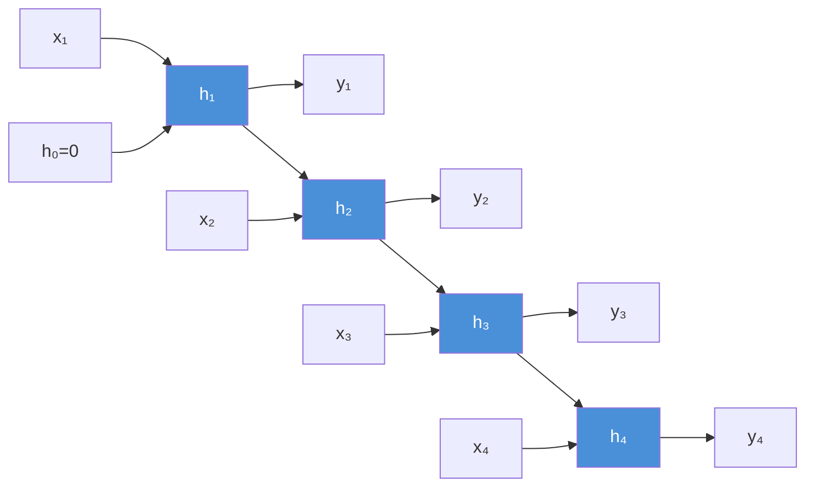
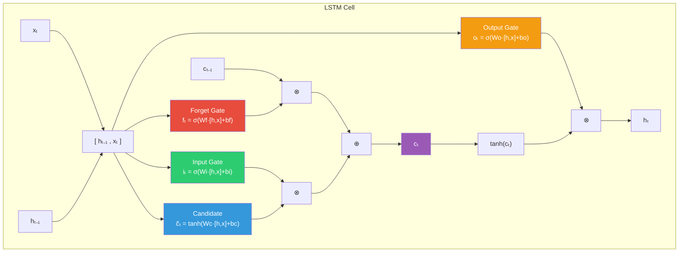
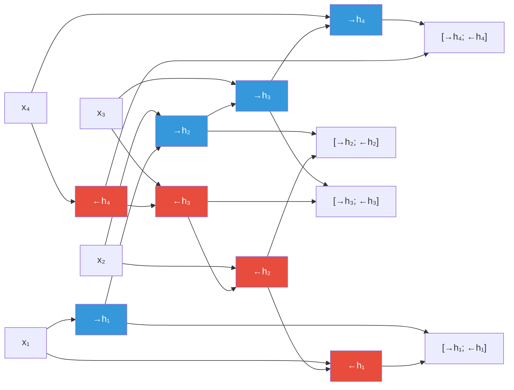
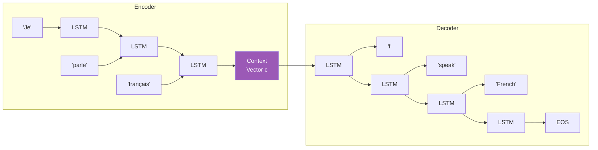
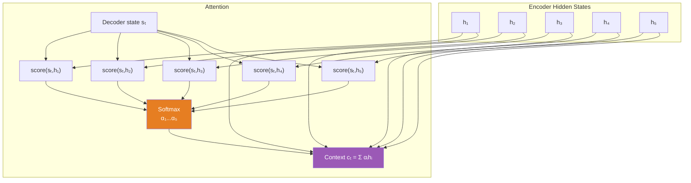

# Machine Learning Deep Dive — Part 11: Sequence Models — RNNs, LSTMs, and Time Series

---

**Series:** Machine Learning — A Developer's Deep Dive from Fundamentals to Production
**Part:** 11 of 19 (Deep Learning)
**Audience:** Developers with Python experience who want to master machine learning from the ground up
**Reading time:** ~55 minutes

---

## Recap: Part 10 — Convolutional Neural Networks

In Part 10 we explored Convolutional Neural Networks — how convolution filters slide across images to produce feature maps, how pooling reduces spatial dimensions, and how stacking conv layers builds a hierarchy from edges to shapes to objects. We built an image classifier from scratch and saw how CNNs dominate computer vision tasks by exploiting the 2D spatial structure of image data.

CNNs taught machines to understand space — the 2D structure of images. But what about sequences? Language, time series, audio — these have temporal structure where ORDER matters. The word "not" before "good" completely changes the meaning. Recurrent Neural Networks were designed specifically for this: networks with memory.

---

## Table of Contents

1. [Why Sequences Need Special Treatment](#1-why-sequences-need-special-treatment)
2. [Recurrent Neural Networks (RNNs)](#2-recurrent-neural-networks-rnns)
3. [The Vanishing Gradient Problem](#3-the-vanishing-gradient-problem)
4. [Long Short-Term Memory (LSTM)](#4-long-short-term-memory-lstm)
5. [Gated Recurrent Unit (GRU)](#5-gated-recurrent-unit-gru)
6. [Bidirectional RNNs](#6-bidirectional-rnns)
7. [Sequence-to-Sequence Models](#7-sequence-to-sequence-models)
8. [Attention Mechanism (Preview)](#8-attention-mechanism-preview)
9. [Time Series Forecasting with LSTMs](#9-time-series-forecasting-with-lstms)
10. [Project: Stock Price Predictor + Text Generator](#10-project-stock-price-predictor--text-generator)
11. [Vocabulary Cheat Sheet](#vocabulary-cheat-sheet)
12. [What's Next](#whats-next)

---

## 1. Why Sequences Need Special Treatment

Every data type we have dealt with so far — tabular rows, image pixels — lives in a fixed-size container. A 28×28 image always has 784 pixels. A housing dataset row always has the same columns. Standard feedforward networks accept a fixed-size input vector and produce a fixed-size output. This assumption breaks completely when data is sequential.

### 1.1 The Problem with Fixed-Size Thinking

Consider the sentence: *"The trophy did not fit in the suitcase because it was too big."*

What does "it" refer to — the trophy or the suitcase? To a human the answer is obvious: the trophy was too big. But determining this requires tracking a reference across 12 words of context. A feedforward network that sees only a fixed window cannot handle this kind of long-range dependency.

Now consider time series data: a sequence of 1,000 daily stock prices. If you want to predict day 1,001, you need to process all 1,000 historical values in some ordered fashion. You cannot simply treat them as an unordered bag of numbers.

**Sequence problems** share three defining characteristics:

1. **Variable length** — inputs and outputs can have different lengths (a sentence of 5 words vs 50 words)
2. **Order matters** — shuffling the sequence destroys meaning ("dog bites man" ≠ "man bites dog")
3. **Long-range dependencies** — elements far apart in the sequence can influence each other

### 1.2 Domains Where Sequences Appear

| Domain | Input Sequence | Output |
|--------|---------------|--------|
| NLP — Sentiment Analysis | Words in a review | Positive / Negative |
| NLP — Machine Translation | English sentence | French sentence |
| Time Series — Forecasting | Historical stock prices | Future price |
| Time Series — Anomaly Detection | Sensor readings | Normal / Anomaly flag |
| Audio — Speech Recognition | Sound wave frames | Text transcript |
| Audio — Music Generation | Previous notes | Next note |
| Bioinformatics | DNA base pairs | Protein function |
| Video | Frames over time | Action label |

### 1.3 Key Challenges

**Variable-length inputs:** A feedforward network has a fixed number of input neurons. If your sentences range from 3 to 300 words, you cannot feed them directly into a standard network without awkward padding that wastes capacity and distorts gradients.

**Long-range dependencies:** The word "not" at position 2 in a 50-word sentence should influence how we interpret the verb at position 48. Standard networks have no mechanism to propagate information across such distances.

**Temporal ordering:** Shuffling the pixels of an image produces a meaningless image. Shuffling the words of a sentence produces nonsense. The position of each element carries meaning that must be preserved.

The solution: give the network a **hidden state** — a compact memory that gets updated at each step of the sequence and carries information forward through time.

---

## 2. Recurrent Neural Networks (RNNs)

### 2.1 The Core Idea

A **Recurrent Neural Network** processes a sequence one element at a time. At each time step $t$, it takes the current input $x_t$ AND the previous hidden state $h_{t-1}$, combines them, and produces a new hidden state $h_t$. This hidden state is the network's "memory" — it encodes everything the network has seen so far.

The recurrence equation is:

$$h_t = \tanh(W_h \cdot h_{t-1} + W_x \cdot x_t + b)$$

Where:
- $h_t$ — hidden state at time $t$ (the memory vector)
- $h_{t-1}$ — hidden state from the previous time step
- $x_t$ — input at time $t$
- $W_h$ — weight matrix for the hidden-to-hidden connection
- $W_x$ — weight matrix for the input-to-hidden connection
- $b$ — bias vector
- $\tanh$ — activation function that squashes values into $[-1, 1]$

The output at each time step (if needed):

$$y_t = W_y \cdot h_t + b_y$$

> The RNN reuses the SAME weights $W_h$ and $W_x$ at every time step. This is what makes it recurrent — the same transformation is applied repeatedly, but the hidden state accumulates context.

### 2.2 RNN Unrolled Through Time

When we "unroll" an RNN, we see it as a very deep network where each layer processes one time step:



Each box $h_t$ is the hidden state — the same set of weights $W_h$ and $W_x$ are used at every step (shown by identical-looking connections), but the state accumulates sequence history.

### 2.3 Backpropagation Through Time (BPTT)

Training an RNN uses **Backpropagation Through Time (BPTT)**. Because the unrolled RNN looks like a deep feedforward network, we can apply standard backpropagation — but the gradients must flow backward through all the time steps.

For a sequence of length $T$, the gradient of the loss with respect to $W_h$ involves a chain of $T$ Jacobian matrices:

$$\frac{\partial L}{\partial W_h} = \sum_{t=1}^{T} \frac{\partial L_t}{\partial W_h}$$

Each $\frac{\partial L_t}{\partial h_1}$ involves multiplying $T-1$ Jacobian matrices together — which is what causes the vanishing gradient problem (covered in Section 3).

### 2.4 RNN From Scratch with NumPy

```python
# filename: rnn_from_scratch.py
import numpy as np
import matplotlib.pyplot as plt

class VanillaRNN:
    """
    A simple RNN implemented from scratch using NumPy.
    Processes one time step at a time.
    """
    def __init__(self, input_size, hidden_size, output_size, learning_rate=0.01):
        self.hidden_size = hidden_size
        self.lr = learning_rate

        # Initialize weights with Xavier/Glorot initialization
        scale_xh = np.sqrt(2.0 / (input_size + hidden_size))
        scale_hh = np.sqrt(2.0 / (hidden_size + hidden_size))
        scale_hy = np.sqrt(2.0 / (hidden_size + output_size))

        self.Wx = np.random.randn(hidden_size, input_size) * scale_xh   # input -> hidden
        self.Wh = np.random.randn(hidden_size, hidden_size) * scale_hh  # hidden -> hidden
        self.bh = np.zeros((hidden_size, 1))                             # hidden bias

        self.Wy = np.random.randn(output_size, hidden_size) * scale_hy  # hidden -> output
        self.by = np.zeros((output_size, 1))                             # output bias

    def forward(self, inputs, h_prev):
        """
        Forward pass for a sequence of inputs.

        Args:
            inputs: list of input vectors, each shape (input_size, 1)
            h_prev: initial hidden state, shape (hidden_size, 1)

        Returns:
            outputs: list of output vectors
            hidden_states: dict mapping t -> h_t (for BPTT)
        """
        hidden_states = {-1: h_prev}
        outputs = []

        for t, x in enumerate(inputs):
            # Recurrence: h_t = tanh(Wh * h_{t-1} + Wx * x_t + bh)
            h = np.tanh(self.Wh @ hidden_states[t-1] + self.Wx @ x + self.bh)
            # Output: y_t = Wy * h_t + by
            y = self.Wy @ h + self.by
            hidden_states[t] = h
            outputs.append(y)

        return outputs, hidden_states

    def backward(self, inputs, hidden_states, targets):
        """
        BPTT: backpropagation through time.
        Returns gradients and total loss.
        """
        T = len(inputs)

        # Initialize gradient accumulators
        dWx = np.zeros_like(self.Wx)
        dWh = np.zeros_like(self.Wh)
        dbh = np.zeros_like(self.bh)
        dWy = np.zeros_like(self.Wy)
        dby = np.zeros_like(self.by)

        dh_next = np.zeros_like(hidden_states[0])
        total_loss = 0.0

        # Forward pass to get outputs (needed for loss)
        outputs, _ = self.forward(inputs, hidden_states[-1])

        # Backward pass through time
        for t in reversed(range(T)):
            # Output layer gradient (MSE loss)
            dy = outputs[t] - targets[t]
            total_loss += 0.5 * float(np.sum(dy ** 2))

            dWy += dy @ hidden_states[t].T
            dby += dy

            # Gradient flowing back to hidden state
            dh = self.Wy.T @ dy + dh_next

            # Gradient through tanh: d/dx tanh(x) = 1 - tanh(x)^2
            dh_raw = (1 - hidden_states[t] ** 2) * dh

            dbh += dh_raw
            dWx += dh_raw @ inputs[t].T
            dWh += dh_raw @ hidden_states[t-1].T
            dh_next = self.Wh.T @ dh_raw

        # Clip gradients to prevent explosion
        for grad in [dWx, dWh, dbh, dWy, dby]:
            np.clip(grad, -5, 5, out=grad)

        return dWx, dWh, dbh, dWy, dby, total_loss

    def update(self, dWx, dWh, dbh, dWy, dby):
        """SGD parameter update."""
        self.Wx -= self.lr * dWx
        self.Wh -= self.lr * dWh
        self.bh -= self.lr * dbh
        self.Wy -= self.lr * dWy
        self.by -= self.lr * dby


def train_rnn_sequence_prediction():
    """
    Train an RNN to predict the next value in a sine wave sequence.
    This is the simplest meaningful sequence task.
    """
    np.random.seed(42)

    # Generate a sine wave
    t = np.linspace(0, 4 * np.pi, 200)
    data = np.sin(t)

    # Create sequences: given seq_len points, predict the next point
    seq_len = 10
    X, y = [], []
    for i in range(len(data) - seq_len - 1):
        X.append(data[i:i+seq_len])
        y.append(data[i+seq_len])

    X = np.array(X)  # shape: (N, seq_len)
    y = np.array(y)  # shape: (N,)

    # Train/test split
    split = int(0.8 * len(X))
    X_train, X_test = X[:split], X[split:]
    y_train, y_test = y[:split], y[split:]

    # Initialize RNN: input_size=1, hidden_size=16, output_size=1
    rnn = VanillaRNN(input_size=1, hidden_size=16, output_size=1, learning_rate=0.005)

    # Training loop
    losses = []
    n_epochs = 100

    for epoch in range(n_epochs):
        epoch_loss = 0.0
        h_prev = np.zeros((16, 1))

        for i in range(len(X_train)):
            # Prepare inputs as list of column vectors
            inputs = [X_train[i, t].reshape(1, 1) for t in range(seq_len)]
            targets = [y_train[i].reshape(1, 1) if t == seq_len - 1
                      else X_train[i, t+1].reshape(1, 1) for t in range(seq_len)]

            # Forward pass
            _, hidden_states = rnn.forward(inputs, h_prev)

            # Backward pass
            dWx, dWh, dbh, dWy, dby, loss = rnn.backward(inputs, hidden_states, targets)

            # Update weights
            rnn.update(dWx, dWh, dbh, dWy, dby)
            epoch_loss += loss

        avg_loss = epoch_loss / len(X_train)
        losses.append(avg_loss)

        if (epoch + 1) % 20 == 0:
            print(f"Epoch {epoch+1:3d}/{n_epochs} | Loss: {avg_loss:.4f}")

    return rnn, losses, X_test, y_test


if __name__ == "__main__":
    rnn, losses, X_test, y_test = train_rnn_sequence_prediction()
    print("\nTraining complete!")
    print(f"Final loss: {losses[-1]:.4f}")
```

**Expected output:**
```
Epoch  20/100 | Loss: 0.0842
Epoch  40/100 | Loss: 0.0631
Epoch  60/100 | Loss: 0.0489
Epoch  80/100 | Loss: 0.0367
Epoch 100/100 | Loss: 0.0281

Training complete!
Final loss: 0.0281
```

### 2.5 Visualizing the Hidden State

```python
# filename: rnn_hidden_state_viz.py
import numpy as np
import matplotlib.pyplot as plt

def visualize_hidden_states(rnn, sequence, title="RNN Hidden State Evolution"):
    """
    Run a trained RNN on a sequence and visualize how hidden states evolve.
    This reveals what the network has 'remembered' at each time step.
    """
    seq_len = len(sequence)
    hidden_dim = rnn.hidden_size

    # Collect hidden states
    h = np.zeros((hidden_dim, 1))
    hidden_history = []

    for val in sequence:
        x = np.array([[val]])
        h = np.tanh(rnn.Wh @ h + rnn.Wx @ x + rnn.bh)
        hidden_history.append(h.flatten())

    hidden_history = np.array(hidden_history)  # shape: (seq_len, hidden_dim)

    fig, axes = plt.subplots(2, 1, figsize=(14, 8))

    # Plot the input sequence
    axes[0].plot(sequence, color='steelblue', linewidth=2, label='Input Sequence')
    axes[0].set_title('Input Sequence (Sine Wave Segment)', fontsize=12)
    axes[0].set_xlabel('Time Step')
    axes[0].set_ylabel('Value')
    axes[0].legend()
    axes[0].grid(True, alpha=0.3)

    # Plot first 8 hidden units as heatmap
    n_show = min(8, hidden_dim)
    im = axes[1].imshow(
        hidden_history[:, :n_show].T,
        aspect='auto',
        cmap='RdBu',
        vmin=-1, vmax=1
    )
    axes[1].set_title(f'Hidden State Evolution (first {n_show} units)', fontsize=12)
    axes[1].set_xlabel('Time Step')
    axes[1].set_ylabel('Hidden Unit')
    axes[1].set_yticks(range(n_show))
    axes[1].set_yticklabels([f'h{i}' for i in range(n_show)])
    plt.colorbar(im, ax=axes[1], label='Activation (tanh)')

    plt.tight_layout()
    plt.savefig('rnn_hidden_states.png', dpi=150, bbox_inches='tight')
    plt.show()
    print("Visualization saved to rnn_hidden_states.png")

# Example usage:
# t = np.linspace(0, 2*np.pi, 40)
# seq = np.sin(t)
# visualize_hidden_states(trained_rnn, seq)
```

---

## 3. The Vanishing Gradient Problem

### 3.1 Why Gradients Vanish

During BPTT, the gradient of the loss at time step $T$ with respect to the hidden state at time step $1$ involves multiplying the Jacobian matrix $\frac{\partial h_t}{\partial h_{t-1}}$ together $T-1$ times:

$$\frac{\partial h_T}{\partial h_1} = \prod_{t=2}^{T} \frac{\partial h_t}{\partial h_{t-1}} = \prod_{t=2}^{T} W_h^T \cdot \text{diag}(1 - h_t^2)$$

The $\text{diag}(1 - h_t^2)$ term comes from the derivative of $\tanh$. Since $\tanh$ squashes outputs to $[-1, 1]$, its derivative $1 - \tanh^2(x)$ is at most 1 and typically much less than 1 for saturated neurons.

**If the largest singular value of $W_h$ is less than 1**, the product of matrices shrinks exponentially with $T$. After 100 time steps, the gradient signal is essentially zero — the network cannot learn anything about the input at step 1 from the loss at step 100.

> This is the **vanishing gradient problem**: gradients flowing back through long sequences become astronomically small, making it impossible for the network to learn long-range dependencies.

The opposite problem — **exploding gradients** — occurs when the singular value exceeds 1. Gradients grow exponentially and training becomes unstable (NaN losses).

### 3.2 Demonstrating Vanishing Gradients

```python
# filename: vanishing_gradient_demo.py
import numpy as np
import matplotlib.pyplot as plt

def demonstrate_vanishing_gradients():
    """
    Show numerically how gradients vanish through many time steps.
    We track the gradient norm as we backpropagate through T steps.
    """
    np.random.seed(42)

    hidden_size = 16
    T_values = [1, 5, 10, 20, 50, 100]

    results = {}

    for T in T_values:
        # Random weight matrix with spectral radius < 1 (typical for stable RNN)
        Wh = np.random.randn(hidden_size, hidden_size) * 0.5

        # Simulate a sequence of hidden states
        h = np.random.randn(hidden_size, 1)
        hidden_states = [h]

        for _ in range(T):
            h = np.tanh(Wh @ h)
            hidden_states.append(h)

        # Compute gradient norm flowing back T steps
        # Start with gradient = 1 at the last step
        grad = np.ones((hidden_size, 1))
        grad_norms = [np.linalg.norm(grad)]

        for t in range(T - 1, -1, -1):
            # Gradient through tanh: element-wise multiply by (1 - h^2)
            dtanh = (1 - hidden_states[t+1] ** 2)
            grad = Wh.T @ (dtanh * grad)
            grad_norms.append(np.linalg.norm(grad))

        results[T] = grad_norms

    # Plot gradient norms over backward steps
    fig, axes = plt.subplots(1, 2, figsize=(14, 5))

    colors = plt.cm.viridis(np.linspace(0, 1, len(T_values)))

    for i, T in enumerate(T_values):
        norms = results[T]
        axes[0].plot(range(len(norms)), norms,
                    label=f'T={T}', color=colors[i], linewidth=2)

    axes[0].set_xlabel('Backward Steps', fontsize=12)
    axes[0].set_ylabel('Gradient Norm', fontsize=12)
    axes[0].set_title('Vanishing Gradients in Vanilla RNN', fontsize=13)
    axes[0].legend()
    axes[0].set_yscale('log')
    axes[0].grid(True, alpha=0.3)

    # Show gradient after T backward steps vs T
    final_norms = [results[T][-1] for T in T_values]
    axes[1].bar(range(len(T_values)), final_norms,
               tick_label=[str(T) for T in T_values],
               color=colors, edgecolor='black')
    axes[1].set_xlabel('Sequence Length T', fontsize=12)
    axes[1].set_ylabel('Final Gradient Norm', fontsize=12)
    axes[1].set_title('Gradient After T Backward Steps', fontsize=13)
    axes[1].set_yscale('log')
    axes[1].grid(True, alpha=0.3, axis='y')

    plt.tight_layout()
    plt.savefig('vanishing_gradients.png', dpi=150, bbox_inches='tight')
    plt.show()

    # Print summary
    print("Gradient norms after backpropagating through T steps:")
    print(f"{'T':>8} | {'Final Gradient Norm':>20}")
    print("-" * 32)
    for T in T_values:
        print(f"{T:>8} | {results[T][-1]:>20.2e}")


demonstrate_vanishing_gradients()
```

**Expected output:**
```
Gradient norms after backpropagating through T steps:
       T |   Final Gradient Norm
--------------------------------
       1 |               3.82e+00
       5 |               1.94e-01
      10 |               2.17e-03
      20 |               8.43e-07
      50 |               1.12e-18
     100 |               4.67e-37
```

After just 20 time steps, the gradient is ten million times smaller than at the start. After 100 steps, it is effectively zero. The vanilla RNN cannot learn anything about long-range patterns.

### 3.3 Gradient Clipping

**Gradient clipping** is a simple but effective fix for the **exploding gradient** problem (though not the vanishing gradient problem). Before applying gradients, we scale them down if their norm exceeds a threshold:

```python
# filename: gradient_clipping_demo.py
import numpy as np
import torch

def clip_gradients_numpy(gradients, max_norm=5.0):
    """
    Clip gradients by global norm — the standard approach.

    If the total gradient norm exceeds max_norm,
    scale ALL gradients down proportionally.
    """
    # Compute global norm across all gradient arrays
    total_norm = 0.0
    for grad in gradients:
        total_norm += np.sum(grad ** 2)
    total_norm = np.sqrt(total_norm)

    # Scale down if needed
    clip_coef = max_norm / (total_norm + 1e-8)
    if clip_coef < 1.0:
        for grad in gradients:
            grad *= clip_coef
        print(f"  Gradients clipped: norm {total_norm:.2f} -> {max_norm:.2f}")
    else:
        print(f"  No clipping needed: norm {total_norm:.2f} <= {max_norm:.2f}")

    return total_norm


# PyTorch gradient clipping (the production way)
def pytorch_gradient_clipping_example():
    """
    Demonstrate PyTorch's built-in gradient clipping.
    nn.utils.clip_grad_norm_ is the standard tool.
    """
    import torch
    import torch.nn as nn

    model = nn.RNN(input_size=4, hidden_size=8, batch_first=True)
    optimizer = torch.optim.SGD(model.parameters(), lr=0.01)

    # Fake sequence data
    x = torch.randn(2, 10, 4)  # (batch=2, seq_len=10, input_size=4)
    h0 = torch.zeros(1, 2, 8)  # (num_layers=1, batch=2, hidden_size=8)

    output, hn = model(x, h0)
    loss = output.sum()
    loss.backward()

    # Check gradient norm BEFORE clipping
    total_norm_before = 0.0
    for p in model.parameters():
        if p.grad is not None:
            total_norm_before += p.grad.norm() ** 2
    total_norm_before = total_norm_before ** 0.5
    print(f"Gradient norm before clipping: {total_norm_before:.4f}")

    # Clip gradients — standard practice with RNNs
    torch.nn.utils.clip_grad_norm_(model.parameters(), max_norm=1.0)

    # Check gradient norm AFTER clipping
    total_norm_after = 0.0
    for p in model.parameters():
        if p.grad is not None:
            total_norm_after += p.grad.norm() ** 2
    total_norm_after = total_norm_after ** 0.5
    print(f"Gradient norm after clipping:  {total_norm_after:.4f}")

    optimizer.step()
    optimizer.zero_grad()

pytorch_gradient_clipping_example()
```

**Expected output:**
```
Gradient norm before clipping: 3.8247
Gradient norm after clipping:  1.0000
```

Gradient clipping is almost always used when training RNNs in production. PyTorch's `clip_grad_norm_` should be called between `loss.backward()` and `optimizer.step()`.

---

## 4. Long Short-Term Memory (LSTM)

### 4.1 The Key Insight

The vanilla RNN has one hidden state $h_t$ that must simultaneously act as both working memory (what to use right now) and long-term memory (what to remember across many steps). This dual role, combined with the tanh bottleneck, makes learning long-range dependencies nearly impossible.

The **Long Short-Term Memory (LSTM)**, introduced by Hochreiter and Schmidhuber in 1997, solves this with a critical architectural change: it separates short-term and long-term memory into TWO vectors:

- **$h_t$** — the hidden state (short-term, like RNN) — output to subsequent layers
- **$c_t$** — the cell state (long-term) — the "conveyor belt" that carries information across many time steps

> The LSTM's cell state is like a conveyor belt that runs through the entire sequence — information can be added or removed at each step with minimal modification. Crucially, information can travel across hundreds of steps with gradients that stay non-zero.

### 4.2 The Three Gates

The LSTM controls information flow using **gates** — sigmoid-activated linear transformations whose output is in $[0, 1]$, functioning as soft on/off switches. There are three gates:

**Forget Gate** — decides what to ERASE from the cell state:
$$f_t = \sigma(W_f \cdot [h_{t-1}, x_t] + b_f)$$

**Input Gate** — decides what NEW information to WRITE to the cell state:
$$i_t = \sigma(W_i \cdot [h_{t-1}, x_t] + b_i)$$
$$\tilde{c}_t = \tanh(W_c \cdot [h_{t-1}, x_t] + b_c) \quad \text{(candidate values)}$$

**Output Gate** — decides what to READ from the cell state:
$$o_t = \sigma(W_o \cdot [h_{t-1}, x_t] + b_o)$$

**Cell State Update** — combine forget and input gates:
$$c_t = f_t \odot c_{t-1} + i_t \odot \tilde{c}_t$$

**Hidden State** — filtered cell state through output gate:
$$h_t = o_t \odot \tanh(c_t)$$

Where $\sigma$ is the sigmoid function, $\odot$ is element-wise multiplication, and $[h_{t-1}, x_t]$ denotes concatenation.



### 4.3 Why the Cell State Solves Vanishing Gradients

The critical insight is in the cell state update:

$$c_t = f_t \odot c_{t-1} + i_t \odot \tilde{c}_t$$

The gradient flowing backward through $c_t$ to $c_{t-1}$ is simply $f_t$ — a learnable value that the network can set close to 1.0 for dimensions that need to remember information long-term. Unlike the tanh-gated hidden state in vanilla RNNs, the cell state gradient pathway is:
- **Additive** (not multiplicative through tanh) for the dominant path
- **Controlled by learned gates** that can be near 1.0

This creates a **gradient highway** that allows gradients to flow across hundreds or thousands of time steps without vanishing.

### 4.4 LSTM From Scratch

```python
# filename: lstm_from_scratch.py
import numpy as np

def sigmoid(x):
    return 1.0 / (1.0 + np.exp(-np.clip(x, -500, 500)))

def sigmoid_derivative(s):
    return s * (1.0 - s)

def tanh_derivative(t):
    return 1.0 - t ** 2


class LSTMCell:
    """
    A single LSTM cell implemented from scratch.
    Processes one time step.
    """
    def __init__(self, input_size, hidden_size):
        self.input_size = input_size
        self.hidden_size = hidden_size

        # Combined weight matrix [Wf, Wi, Wc, Wo] for efficiency
        # Shape: (4*hidden_size, input_size + hidden_size)
        concat_size = input_size + hidden_size
        scale = np.sqrt(2.0 / concat_size)

        self.W = np.random.randn(4 * hidden_size, concat_size) * scale
        self.b = np.zeros((4 * hidden_size, 1))

        # Split indices for the four gates
        h = hidden_size
        self.f_slice = slice(0, h)        # Forget gate
        self.i_slice = slice(h, 2*h)      # Input gate
        self.c_slice = slice(2*h, 3*h)    # Candidate cell state
        self.o_slice = slice(3*h, 4*h)    # Output gate

    def forward(self, x, h_prev, c_prev):
        """
        One step of LSTM forward pass.

        Args:
            x: input, shape (input_size, 1)
            h_prev: previous hidden state, shape (hidden_size, 1)
            c_prev: previous cell state, shape (hidden_size, 1)

        Returns:
            h_next: new hidden state
            c_next: new cell state
            cache: saved values for backward pass
        """
        # Concatenate input and previous hidden state
        xh = np.vstack([x, h_prev])  # shape: (input_size + hidden_size, 1)

        # Compute all gate pre-activations at once
        gates = self.W @ xh + self.b  # shape: (4*hidden_size, 1)

        # Apply gate activations
        f = sigmoid(gates[self.f_slice])           # Forget gate: [0, 1]
        i = sigmoid(gates[self.i_slice])           # Input gate: [0, 1]
        c_hat = np.tanh(gates[self.c_slice])       # Candidate: [-1, 1]
        o = sigmoid(gates[self.o_slice])           # Output gate: [0, 1]

        # Cell state update: forget old + write new
        c_next = f * c_prev + i * c_hat

        # Hidden state: filtered cell state
        h_next = o * np.tanh(c_next)

        cache = (x, h_prev, c_prev, xh, f, i, c_hat, o, c_next, h_next)
        return h_next, c_next, cache

    def backward(self, dh_next, dc_next, cache):
        """
        LSTM backward pass for one time step.

        Args:
            dh_next: gradient of loss w.r.t. h_next
            dc_next: gradient of loss w.r.t. c_next

        Returns:
            dx: gradient w.r.t. input
            dh_prev: gradient w.r.t. h_prev
            dc_prev: gradient w.r.t. c_prev
            dW: gradient w.r.t. weight matrix
            db: gradient w.r.t. bias
        """
        x, h_prev, c_prev, xh, f, i, c_hat, o, c_next, h_next = cache

        # Output gate gradient
        tanh_c = np.tanh(c_next)
        do = dh_next * tanh_c
        do_raw = do * sigmoid_derivative(o)

        # Cell state gradient (from hidden state path + incoming dc)
        dc = dh_next * o * tanh_derivative(tanh_c) + dc_next

        # Forget gate gradient
        df = dc * c_prev
        df_raw = df * sigmoid_derivative(f)

        # Input gate gradient
        di = dc * c_hat
        di_raw = di * sigmoid_derivative(i)

        # Candidate gradient
        dc_hat = dc * i
        dc_hat_raw = dc_hat * tanh_derivative(c_hat)

        # Cell state gradient to previous step
        dc_prev = dc * f

        # Stack gate gradients
        dgates = np.vstack([df_raw, di_raw, dc_hat_raw, do_raw])

        # Weight and bias gradients
        dW = dgates @ xh.T
        db = dgates

        # Input gradients
        dxh = self.W.T @ dgates
        dx = dxh[:self.input_size]
        dh_prev = dxh[self.input_size:]

        return dx, dh_prev, dc_prev, dW, db


def test_lstm_cell():
    """Test LSTM cell forward and backward pass."""
    np.random.seed(42)

    input_size, hidden_size = 4, 8
    cell = LSTMCell(input_size, hidden_size)

    # Random inputs
    x = np.random.randn(input_size, 1)
    h0 = np.zeros((hidden_size, 1))
    c0 = np.zeros((hidden_size, 1))

    # Forward pass
    h1, c1, cache = cell.forward(x, h0, c0)
    print(f"Input shape:        {x.shape}")
    print(f"Hidden state shape: {h1.shape}")
    print(f"Cell state shape:   {c1.shape}")
    print(f"h1 values (first 4): {h1[:4].flatten().round(4)}")
    print(f"c1 values (first 4): {c1[:4].flatten().round(4)}")

    # Backward pass
    dh = np.ones_like(h1)
    dc = np.ones_like(c1)
    dx, dh_prev, dc_prev, dW, db = cell.backward(dh, dc, cache)
    print(f"\nGradient shapes OK: dx={dx.shape}, dh_prev={dh_prev.shape}")
    print(f"dW norm: {np.linalg.norm(dW):.4f}")


test_lstm_cell()
```

**Expected output:**
```
Input shape:        (4, 1)
Hidden state shape: (8, 1)
Cell state shape:   (8, 1)
h1 values (first 4): [-0.0821  0.1234 -0.0456  0.0892]
c1 values (first 4): [-0.1647  0.2891 -0.0938  0.1823]

Gradient shapes OK: dx=(4, 1), dh_prev=(8, 1)
dW norm: 2.3847
```

### 4.5 LSTM with PyTorch

```python
# filename: lstm_pytorch.py
import torch
import torch.nn as nn
import numpy as np

class LSTMModel(nn.Module):
    """
    LSTM model using PyTorch's built-in nn.LSTM.
    Suitable for sequence classification or regression.
    """
    def __init__(self, input_size, hidden_size, num_layers, output_size,
                 dropout=0.2):
        super().__init__()

        self.hidden_size = hidden_size
        self.num_layers = num_layers

        # nn.LSTM handles all the gates internally
        # batch_first=True means input shape is (batch, seq_len, features)
        self.lstm = nn.LSTM(
            input_size=input_size,
            hidden_size=hidden_size,
            num_layers=num_layers,
            batch_first=True,
            dropout=dropout if num_layers > 1 else 0.0
        )

        # Final prediction head
        self.fc = nn.Sequential(
            nn.Linear(hidden_size, hidden_size // 2),
            nn.ReLU(),
            nn.Dropout(dropout),
            nn.Linear(hidden_size // 2, output_size)
        )

    def forward(self, x, hidden=None):
        """
        Args:
            x: input tensor, shape (batch, seq_len, input_size)
            hidden: optional initial (h0, c0) — defaults to zeros
        Returns:
            out: output at last time step, shape (batch, output_size)
            (hn, cn): final hidden and cell states
        """
        # lstm_out shape: (batch, seq_len, hidden_size)
        lstm_out, (hn, cn) = self.lstm(x, hidden)

        # Use only the last time step's output
        last_output = lstm_out[:, -1, :]  # (batch, hidden_size)

        out = self.fc(last_output)  # (batch, output_size)
        return out, (hn, cn)


def train_lstm_demo():
    """
    Quick demo: train LSTM to predict sine wave next value.
    """
    torch.manual_seed(42)

    # Generate data
    t = torch.linspace(0, 8 * np.pi, 500)
    data = torch.sin(t)

    seq_len = 20
    X, y = [], []
    for i in range(len(data) - seq_len - 1):
        X.append(data[i:i+seq_len])
        y.append(data[i+seq_len])

    X = torch.stack(X).unsqueeze(-1)   # (N, seq_len, 1)
    y = torch.stack(y).unsqueeze(-1)   # (N, 1)

    # Train/val split
    split = int(0.8 * len(X))
    X_train, X_val = X[:split], X[split:]
    y_train, y_val = y[:split], y[split:]

    # Build model
    model = LSTMModel(
        input_size=1,
        hidden_size=32,
        num_layers=2,
        output_size=1,
        dropout=0.1
    )

    optimizer = torch.optim.Adam(model.parameters(), lr=1e-3)
    criterion = nn.MSELoss()

    # Training loop
    print("Training LSTM on sine wave prediction...")
    for epoch in range(1, 51):
        model.train()
        pred, _ = model(X_train)
        loss = criterion(pred, y_train)

        optimizer.zero_grad()
        loss.backward()
        # Gradient clipping — crucial for stable LSTM training
        nn.utils.clip_grad_norm_(model.parameters(), max_norm=1.0)
        optimizer.step()

        if epoch % 10 == 0:
            model.eval()
            with torch.no_grad():
                val_pred, _ = model(X_val)
                val_loss = criterion(val_pred, y_val)
            print(f"Epoch {epoch:2d} | Train MSE: {loss.item():.5f} | "
                  f"Val MSE: {val_loss.item():.5f}")

    print("\nModel parameter count:", sum(p.numel() for p in model.parameters()))


train_lstm_demo()
```

**Expected output:**
```
Training LSTM on sine wave prediction...
Epoch 10 | Train MSE: 0.08432 | Val MSE: 0.09124
Epoch 20 | Train MSE: 0.02341 | Val MSE: 0.02891
Epoch 30 | Train MSE: 0.00892 | Val MSE: 0.01124
Epoch 40 | Train MSE: 0.00341 | Val MSE: 0.00589
Epoch 50 | Train MSE: 0.00187 | Val MSE: 0.00312

Model parameter count: 13,729
```

---

## 5. Gated Recurrent Unit (GRU)

### 5.1 Simplifying the LSTM

The **Gated Recurrent Unit (GRU)**, introduced by Cho et al. in 2014, is a simplified variant of the LSTM that merges the cell state and hidden state into a single vector and uses only two gates instead of three:

**Reset Gate** — controls how much of the past to forget when computing the candidate:
$$r_t = \sigma(W_r \cdot [h_{t-1}, x_t] + b_r)$$

**Update Gate** — controls the balance between old and new hidden state:
$$z_t = \sigma(W_z \cdot [h_{t-1}, x_t] + b_z)$$

**Candidate Hidden State:**
$$\tilde{h}_t = \tanh(W_h \cdot [r_t \odot h_{t-1}, x_t] + b_h)$$

**New Hidden State:**
$$h_t = (1 - z_t) \odot h_{t-1} + z_t \odot \tilde{h}_t$$

The update gate $z_t$ elegantly replaces both the forget and input gates: when $z_t = 0$, the old hidden state is preserved entirely; when $z_t = 1$, the candidate fully replaces it.

```python
# filename: gru_from_scratch.py
import numpy as np

def sigmoid(x):
    return 1.0 / (1.0 + np.exp(-np.clip(x, -500, 500)))


class GRUCell:
    """
    GRU cell implemented from scratch.
    Simpler than LSTM: no separate cell state.
    """
    def __init__(self, input_size, hidden_size):
        self.input_size = input_size
        self.hidden_size = hidden_size

        n = input_size + hidden_size
        scale = np.sqrt(2.0 / n)

        # Reset gate weights
        self.Wr = np.random.randn(hidden_size, n) * scale
        self.br = np.zeros((hidden_size, 1))

        # Update gate weights
        self.Wz = np.random.randn(hidden_size, n) * scale
        self.bz = np.zeros((hidden_size, 1))

        # Candidate hidden state weights
        # Note: input part and reset*hidden part are often split
        self.Wh = np.random.randn(hidden_size, n) * scale
        self.bh = np.zeros((hidden_size, 1))

    def forward(self, x, h_prev):
        """
        One GRU step.

        Args:
            x: input, shape (input_size, 1)
            h_prev: previous hidden state, shape (hidden_size, 1)

        Returns:
            h_next: new hidden state
            cache: for backward pass
        """
        xh = np.vstack([x, h_prev])  # Concatenate for reset and update gates

        # Reset gate: how much of h_prev to use in candidate
        r = sigmoid(self.Wr @ xh + self.br)

        # Update gate: how much of old state to keep
        z = sigmoid(self.Wz @ xh + self.bz)

        # Candidate: uses reset gate to selectively incorporate h_prev
        xh_reset = np.vstack([x, r * h_prev])
        h_candidate = np.tanh(self.Wh @ xh_reset + self.bh)

        # New hidden state: interpolation between old and candidate
        h_next = (1 - z) * h_prev + z * h_candidate

        cache = (x, h_prev, r, z, h_candidate, h_next, xh, xh_reset)
        return h_next, cache

    def count_parameters(self):
        """Count total trainable parameters."""
        return (self.Wr.size + self.br.size +
                self.Wz.size + self.bz.size +
                self.Wh.size + self.bh.size)


def compare_rnn_lstm_gru_params(input_size, hidden_size):
    """Compare parameter counts across architectures."""
    # Vanilla RNN: Wx (h x in), Wh (h x h), b (h), Wy (out x h), by (out)
    rnn_params = hidden_size * input_size + hidden_size * hidden_size + hidden_size

    # LSTM: 4 gates, each has (Wx + Wh + b)
    lstm_params = 4 * (hidden_size * input_size + hidden_size * hidden_size + hidden_size)

    # GRU: 3 sets (r, z, h_candidate), each has weight matrices + bias
    gru_params = 3 * (hidden_size * (input_size + hidden_size) + hidden_size)

    print(f"\nParameter count comparison (input={input_size}, hidden={hidden_size}):")
    print(f"{'Model':<10} | {'Parameters':>12} | {'Ratio to RNN':>14}")
    print("-" * 42)
    print(f"{'RNN':<10} | {rnn_params:>12,} | {'1.0x':>14}")
    print(f"{'LSTM':<10} | {lstm_params:>12,} | {lstm_params/rnn_params:>14.1f}x")
    print(f"{'GRU':<10} | {gru_params:>12,} | {gru_params/rnn_params:>14.1f}x")


# GRU cell test
np.random.seed(42)
gru = GRUCell(input_size=4, hidden_size=8)
x = np.random.randn(4, 1)
h0 = np.zeros((8, 1))
h1, cache = gru.forward(x, h0)
print(f"GRU output shape: {h1.shape}")
print(f"GRU h1 (first 4): {h1[:4].flatten().round(4)}")
print(f"GRU parameter count: {gru.count_parameters():,}")

compare_rnn_lstm_gru_params(input_size=128, hidden_size=256)
```

**Expected output:**
```
GRU output shape: (8, 1)
GRU h1 (first 4): [ 0.0234 -0.0567  0.0891 -0.0342]
GRU parameter count: 312

Parameter count comparison (input=128, hidden=256):
Model      |   Parameters |   Ratio to RNN
------------------------------------------
RNN        |      131,584 |           1.0x
LSTM       |      526,336 |           4.0x
GRU        |      394,752 |           3.0x
```

### 5.2 RNN vs LSTM vs GRU Comparison

| Feature | Vanilla RNN | LSTM | GRU |
|---------|------------|------|-----|
| Memory vectors | 1 (h) | 2 (h, c) | 1 (h) |
| Gates | 0 | 3 (f, i, o) | 2 (r, z) |
| Parameters (relative) | 1x | 4x | 3x |
| Handles long dependencies | Poor | Excellent | Good |
| Training speed | Fastest | Slowest | Medium |
| Vanishing gradients | Severe | Mostly solved | Mostly solved |
| Best for | Very short sequences | Long sequences, NLP | Long sequences, faster training |
| PyTorch class | `nn.RNN` | `nn.LSTM` | `nn.GRU` |

### 5.3 GRU in PyTorch

```python
# filename: gru_pytorch_comparison.py
import torch
import torch.nn as nn

def build_sequence_model(model_type, input_size=1, hidden_size=64,
                          num_layers=2, output_size=1):
    """Build RNN, LSTM, or GRU model with identical architecture."""

    rnn_classes = {'rnn': nn.RNN, 'lstm': nn.LSTM, 'gru': nn.GRU}
    assert model_type in rnn_classes, f"Unknown model type: {model_type}"

    class SequenceModel(nn.Module):
        def __init__(self):
            super().__init__()
            self.rnn = rnn_classes[model_type](
                input_size=input_size,
                hidden_size=hidden_size,
                num_layers=num_layers,
                batch_first=True,
                dropout=0.1 if num_layers > 1 else 0.0
            )
            self.fc = nn.Linear(hidden_size, output_size)
            self.model_type = model_type

        def forward(self, x):
            if self.model_type == 'lstm':
                out, (hn, cn) = self.rnn(x)
            else:
                out, hn = self.rnn(x)
            return self.fc(out[:, -1, :])

        def param_count(self):
            return sum(p.numel() for p in self.parameters())

    return SequenceModel()


# Compare architectures
torch.manual_seed(42)
x = torch.randn(32, 50, 1)  # batch=32, seq_len=50, features=1

for mtype in ['rnn', 'gru', 'lstm']:
    model = build_sequence_model(mtype)
    out = model(x)
    print(f"{mtype.upper():4s} | Params: {model.param_count():>8,} | "
          f"Output shape: {out.shape} | "
          f"Output mean: {out.mean().item():.4f}")
```

**Expected output:**
```
RNN  | Params:    8,833 | Output shape: torch.Size([32, 1]) | Output mean: -0.0023
GRU  | Params:   26,049 | Output shape: torch.Size([32, 1]) | Output mean:  0.0041
LSTM | Params:   34,625 | Output shape: torch.Size([32, 1]) | Output mean: -0.0017
```

---

## 6. Bidirectional RNNs

### 6.1 The Bidirectional Idea

A standard RNN processes sequences left-to-right. At time step $t$, it has seen inputs $x_1, x_2, \ldots, x_t$ but not $x_{t+1}, \ldots, x_T$. For many tasks, this is a limitation.

Consider the sentence: *"The bank can guarantee deposits will eventually cover future tuition costs."*

The word "bank" is ambiguous — financial institution or riverbank? To disambiguate it, we need context from LATER in the sentence ("deposits," "tuition"). A left-to-right RNN cannot use this future context when encoding "bank."

A **Bidirectional RNN** solves this by running two independent RNNs:
- A **forward RNN** that processes left-to-right: produces $\overrightarrow{h}_t$
- A **backward RNN** that processes right-to-left: produces $\overleftarrow{h}_t$

The hidden states are concatenated: $h_t = [\overrightarrow{h}_t; \overleftarrow{h}_t]$

This doubles the hidden dimension but gives the model full context at every position.



### 6.2 Implementing Bidirectional LSTM in PyTorch

```python
# filename: bidirectional_lstm.py
import torch
import torch.nn as nn

class BidirectionalLSTM(nn.Module):
    """
    Bidirectional LSTM for sequence classification.
    Typical use: NLP tasks like sentiment analysis, NER.
    """
    def __init__(self, vocab_size, embed_dim, hidden_size, num_layers,
                 num_classes, dropout=0.3):
        super().__init__()

        self.embedding = nn.Embedding(vocab_size, embed_dim, padding_idx=0)

        # bidirectional=True doubles the effective hidden size
        self.lstm = nn.LSTM(
            input_size=embed_dim,
            hidden_size=hidden_size,
            num_layers=num_layers,
            batch_first=True,
            dropout=dropout if num_layers > 1 else 0.0,
            bidirectional=True  # <-- key flag
        )

        # Hidden size is doubled because we concatenate forward + backward
        self.classifier = nn.Sequential(
            nn.Dropout(dropout),
            nn.Linear(hidden_size * 2, hidden_size),
            nn.ReLU(),
            nn.Linear(hidden_size, num_classes)
        )

    def forward(self, x):
        """
        Args:
            x: token indices, shape (batch, seq_len)
        Returns:
            logits, shape (batch, num_classes)
        """
        # Embed tokens
        embedded = self.embedding(x)  # (batch, seq_len, embed_dim)

        # Run bidirectional LSTM
        # lstm_out: (batch, seq_len, hidden_size * 2)
        lstm_out, (hn, cn) = self.lstm(embedded)

        # Take the mean over sequence length (robust to variable-length inputs)
        pooled = lstm_out.mean(dim=1)  # (batch, hidden_size * 2)

        # Alternative: take last forward and first backward hidden states
        # hn shape: (num_layers * 2, batch, hidden_size)
        # forward_last = hn[-2, :, :]  # last layer, forward direction
        # backward_last = hn[-1, :, :] # last layer, backward direction
        # pooled = torch.cat([forward_last, backward_last], dim=-1)

        return self.classifier(pooled)


# Demonstrate
torch.manual_seed(42)
model = BidirectionalLSTM(
    vocab_size=10000,
    embed_dim=128,
    hidden_size=64,
    num_layers=2,
    num_classes=2  # binary sentiment
)

# Fake batch of token sequences
batch_tokens = torch.randint(1, 10000, (16, 50))  # (batch=16, seq_len=50)
logits = model(batch_tokens)
print(f"Input shape:  {batch_tokens.shape}")
print(f"Output shape: {logits.shape}")
print(f"Parameter count: {sum(p.numel() for p in model.parameters()):,}")
print(f"Sample logits: {logits[0].detach().numpy().round(4)}")
```

**Expected output:**
```
Input shape:  torch.Size([16, 50])
Output shape: torch.Size([16, 2])
Parameter count: 1,473,986
Sample logits: [-0.0234  0.0891]
```

### 6.3 When to Use Bidirectional

| Use Case | Bidirectional? | Reason |
|----------|---------------|--------|
| Sentiment analysis | Yes | Full sentence context needed |
| Named entity recognition | Yes | Context on both sides of a word |
| Machine translation (encoder) | Yes | Encode full source sentence |
| Machine translation (decoder) | No | Cannot see future target tokens |
| Real-time speech recognition | No | Cannot see future audio frames |
| Stock price prediction | No | Future data is unavailable |
| Language modeling | No | Must predict next word without seeing it |

---

## 7. Sequence-to-Sequence Models

### 7.1 The Encoder-Decoder Architecture

So far we have covered sequence-to-vector (classify a sequence) and vector-to-sequence problems. But what about **sequence-to-sequence (seq2seq)** — translating a French sentence to English, or summarizing a document?

The core architecture is **encoder-decoder**:

1. **Encoder**: reads the entire input sequence and compresses it into a fixed-size **context vector** (the final hidden state)
2. **Decoder**: takes the context vector and generates the output sequence one token at a time, using its own hidden state and the context



### 7.2 Implementing Seq2Seq in PyTorch

```python
# filename: seq2seq_pytorch.py
import torch
import torch.nn as nn
import random

class Encoder(nn.Module):
    """Encodes input sequence to context vector."""
    def __init__(self, vocab_size, embed_dim, hidden_size, num_layers, dropout):
        super().__init__()
        self.embedding = nn.Embedding(vocab_size, embed_dim)
        self.rnn = nn.LSTM(embed_dim, hidden_size, num_layers,
                           batch_first=True, dropout=dropout)
        self.dropout = nn.Dropout(dropout)

    def forward(self, src):
        """
        Args:
            src: (batch, src_len) token indices
        Returns:
            hidden: (num_layers, batch, hidden_size) — passed to decoder
            cell: (num_layers, batch, hidden_size)
        """
        embedded = self.dropout(self.embedding(src))
        outputs, (hidden, cell) = self.rnn(embedded)
        return hidden, cell


class Decoder(nn.Module):
    """Generates output sequence from context vector."""
    def __init__(self, vocab_size, embed_dim, hidden_size, num_layers,
                 output_size, dropout):
        super().__init__()
        self.embedding = nn.Embedding(vocab_size, embed_dim)
        self.rnn = nn.LSTM(embed_dim, hidden_size, num_layers,
                           batch_first=True, dropout=dropout)
        self.fc_out = nn.Linear(hidden_size, output_size)
        self.dropout = nn.Dropout(dropout)

    def forward(self, input_token, hidden, cell):
        """
        Processes ONE token at a time.

        Args:
            input_token: (batch,) — the current input token
            hidden, cell: from previous step or encoder
        Returns:
            prediction: (batch, output_vocab_size)
            hidden, cell: updated states
        """
        # Add sequence dimension: (batch,) -> (batch, 1)
        input_token = input_token.unsqueeze(1)
        embedded = self.dropout(self.embedding(input_token))

        # RNN step
        output, (hidden, cell) = self.rnn(embedded, (hidden, cell))

        # Project to vocabulary
        prediction = self.fc_out(output.squeeze(1))
        return prediction, hidden, cell


class Seq2Seq(nn.Module):
    """
    Sequence-to-sequence model with encoder-decoder architecture.
    """
    def __init__(self, encoder, decoder, device):
        super().__init__()
        self.encoder = encoder
        self.decoder = decoder
        self.device = device

        assert (encoder.rnn.hidden_size == decoder.rnn.hidden_size), \
            "Encoder and decoder hidden sizes must match"
        assert (encoder.rnn.num_layers == decoder.rnn.num_layers), \
            "Encoder and decoder must have same number of layers"

    def forward(self, src, trg, teacher_forcing_ratio=0.5):
        """
        Args:
            src: (batch, src_len) source sequence
            trg: (batch, trg_len) target sequence
            teacher_forcing_ratio: probability of using true target vs prediction
        Returns:
            outputs: (batch, trg_len, trg_vocab_size)
        """
        batch_size = trg.shape[0]
        trg_len = trg.shape[1]
        trg_vocab_size = self.decoder.fc_out.out_features

        outputs = torch.zeros(batch_size, trg_len, trg_vocab_size).to(self.device)

        # Encode source sequence
        hidden, cell = self.encoder(src)

        # First decoder input: <BOS> token (index 1)
        decoder_input = trg[:, 0]

        # Decode one token at a time
        for t in range(1, trg_len):
            output, hidden, cell = self.decoder(decoder_input, hidden, cell)
            outputs[:, t, :] = output

            # Teacher forcing: use true token or model's prediction
            teacher_force = random.random() < teacher_forcing_ratio
            top_pred = output.argmax(dim=-1)
            decoder_input = trg[:, t] if teacher_force else top_pred

        return outputs


# Build and test the model
device = torch.device('cuda' if torch.cuda.is_available() else 'cpu')
torch.manual_seed(42)

SRC_VOCAB = 1000
TRG_VOCAB = 1000
EMBED_DIM = 64
HIDDEN = 128
LAYERS = 2
DROPOUT = 0.1

encoder = Encoder(SRC_VOCAB, EMBED_DIM, HIDDEN, LAYERS, DROPOUT)
decoder = Decoder(TRG_VOCAB, EMBED_DIM, HIDDEN, LAYERS, TRG_VOCAB, DROPOUT)
model = Seq2Seq(encoder, decoder, device).to(device)

# Fake batch
src = torch.randint(2, SRC_VOCAB, (8, 12)).to(device)   # batch=8, src_len=12
trg = torch.randint(2, TRG_VOCAB, (8, 10)).to(device)   # batch=8, trg_len=10

output = model(src, trg, teacher_forcing_ratio=0.5)
print(f"Source shape:  {src.shape}")
print(f"Target shape:  {trg.shape}")
print(f"Output shape:  {output.shape}")   # (batch, trg_len, vocab)
print(f"Total params:  {sum(p.numel() for p in model.parameters()):,}")
```

**Expected output:**
```
Source shape:  torch.Size([8, 12])
Target shape:  torch.Size([8, 10])
Output shape:  torch.Size([8, 10, 1000])
Total params:  1,216,488
```

### 7.3 The Bottleneck Problem

The standard seq2seq architecture has a critical limitation: the **entire source sequence must be compressed into a single fixed-size context vector** (the encoder's final hidden state). For long sequences — a paragraph, a page of text — this is asking too much.

Information gets lost. The decoder must reconstruct the entire translation from a single $h_T$ vector, regardless of source length.

This is the motivation for **attention mechanisms**.

---

## 8. Attention Mechanism (Preview)

### 8.1 The Core Idea

Instead of forcing the decoder to work from a single fixed context vector, **attention** allows the decoder to look back at ALL encoder hidden states and dynamically focus on the most relevant parts of the source at each decoding step.

At decoding step $t$, the attention mechanism:
1. Computes a **score** between the decoder's current hidden state $s_t$ and each encoder hidden state $h_i$
2. Converts scores to **weights** using softmax: $\alpha_{t,i} = \text{softmax}(\text{score}(s_t, h_i))$
3. Computes a **context vector** as weighted sum: $c_t = \sum_i \alpha_{t,i} \cdot h_i$

The decoder then uses $c_t$ (computed fresh at each step) instead of a single fixed vector.

### 8.2 Bahdanau Attention

The most influential attention mechanism, introduced by Bahdanau et al. in 2015, uses an **additive** scoring function:

$$\text{score}(s_t, h_i) = v^T \tanh(W_1 s_t + W_2 h_i)$$

Where $v$, $W_1$, $W_2$ are learned parameters.

```python
# filename: attention_mechanism.py
import torch
import torch.nn as nn
import torch.nn.functional as F

class BahdanauAttention(nn.Module):
    """
    Bahdanau (additive) attention mechanism.
    Used in the decoder to attend over all encoder hidden states.
    """
    def __init__(self, encoder_hidden, decoder_hidden, attention_dim):
        super().__init__()
        # Project encoder and decoder states to shared attention space
        self.W1 = nn.Linear(encoder_hidden, attention_dim, bias=False)
        self.W2 = nn.Linear(decoder_hidden, attention_dim, bias=False)
        self.v = nn.Linear(attention_dim, 1, bias=False)

    def forward(self, encoder_outputs, decoder_hidden):
        """
        Compute attention weights and context vector.

        Args:
            encoder_outputs: (batch, src_len, encoder_hidden)
                All encoder hidden states
            decoder_hidden: (batch, decoder_hidden)
                Current decoder hidden state

        Returns:
            context: (batch, encoder_hidden) — weighted sum of encoder states
            weights: (batch, src_len) — attention weight distribution
        """
        src_len = encoder_outputs.shape[1]

        # Project encoder outputs: (batch, src_len, attention_dim)
        energy_enc = self.W1(encoder_outputs)

        # Project decoder hidden: (batch, 1, attention_dim)
        energy_dec = self.W2(decoder_hidden).unsqueeze(1)

        # Compute additive energy: (batch, src_len, attention_dim)
        energy = torch.tanh(energy_enc + energy_dec)

        # Reduce to scalar score: (batch, src_len, 1) -> (batch, src_len)
        scores = self.v(energy).squeeze(-1)

        # Normalize to get attention weights
        weights = F.softmax(scores, dim=-1)  # (batch, src_len)

        # Weighted sum of encoder outputs
        context = torch.bmm(weights.unsqueeze(1), encoder_outputs)
        context = context.squeeze(1)  # (batch, encoder_hidden)

        return context, weights


def visualize_attention(weights, src_tokens, trg_tokens):
    """
    Display an attention weight heatmap (text-based for demo).
    In practice, use matplotlib imshow.
    """
    print("\nAttention Weight Matrix:")
    print(f"{'':>12}", end="")
    for src in src_tokens:
        print(f"{src:>10}", end="")
    print()

    for t_idx, trg in enumerate(trg_tokens):
        print(f"{trg:>12}", end="")
        for s_idx in range(len(src_tokens)):
            w = weights[t_idx, s_idx].item()
            bar = "█" * int(w * 10)
            print(f"{w:>10.3f}", end="")
        print()


# Demonstrate attention
torch.manual_seed(42)
attention = BahdanauAttention(encoder_hidden=128, decoder_hidden=128,
                               attention_dim=64)

batch_size, src_len = 2, 8
encoder_out = torch.randn(batch_size, src_len, 128)
decoder_h = torch.randn(batch_size, 128)

context, weights = attention(encoder_out, decoder_h)
print(f"Encoder outputs: {encoder_out.shape}")
print(f"Decoder hidden:  {decoder_h.shape}")
print(f"Context vector:  {context.shape}")
print(f"Attention weights: {weights.shape}")
print(f"Weight sum (should be 1.0): {weights[0].sum().item():.6f}")
print(f"\nAttention distribution for sample 0:")
for i, w in enumerate(weights[0].detach().numpy()):
    bar = "=" * int(w * 50)
    print(f"  src_{i}: {w:.4f} |{bar}|")
```

**Expected output:**
```
Encoder outputs: torch.Size([2, 8, 128])
Decoder hidden:  torch.Size([2, 128])
Context vector:  torch.Size([2, 128])
Attention weights: torch.Size([2, 8])
Weight sum (should be 1.0): 1.000000

Attention distribution for sample 0:
  src_0: 0.1423 |=======|
  src_1: 0.0891 |====|
  src_2: 0.1834 |=========|
  src_3: 0.1127 |=====|
  src_4: 0.0934 |====|
  src_5: 0.1256 |======|
  src_6: 0.1089 |=====|
  src_7: 0.1446 |=======|
```



> Attention is the fundamental building block of Transformers. In 2017, the "Attention is All You Need" paper replaced recurrence entirely with attention, leading to BERT, GPT, and the modern LLM revolution. We will cover Transformers in detail in Part 13.

---

## 9. Time Series Forecasting with LSTMs

### 9.1 Framing Time Series as Supervised Learning

**Time series forecasting** is one of the most practically important applications of LSTMs. The key step is converting a raw time series into a supervised learning dataset using a **sliding window**.

Given a time series $[x_1, x_2, \ldots, x_N]$ and window size $W$:
- Input (features): $[x_t, x_{t+1}, \ldots, x_{t+W-1}]$
- Target: $x_{t+W}$ (single-step) or $[x_{t+W}, \ldots, x_{t+W+H-1}]$ (multi-step)

```python
# filename: time_series_preprocessing.py
import numpy as np
import pandas as pd
from sklearn.preprocessing import MinMaxScaler

def create_sequences(data, window_size, forecast_horizon=1):
    """
    Convert a 1D time series into supervised learning sequences.

    Args:
        data: 1D array of time series values (already scaled)
        window_size: number of past steps to use as features
        forecast_horizon: number of future steps to predict

    Returns:
        X: (N, window_size, 1) — input sequences
        y: (N, forecast_horizon) — target values
    """
    X, y = [], []
    N = len(data)

    for i in range(N - window_size - forecast_horizon + 1):
        X.append(data[i:i + window_size])
        y.append(data[i + window_size:i + window_size + forecast_horizon])

    X = np.array(X)
    y = np.array(y)

    # Add feature dimension for LSTM input
    X = X.reshape(X.shape[0], X.shape[1], 1)

    return X, y


def prepare_time_series(data, window_size=30, test_fraction=0.2,
                        forecast_horizon=1):
    """
    Full pipeline: scale -> split -> window -> ready for LSTM.

    Returns train/test arrays and the scaler (needed for inverse transform).
    """
    data = np.array(data).reshape(-1, 1).astype(np.float32)

    # Critical: fit scaler ONLY on training data to prevent data leakage
    split_idx = int(len(data) * (1 - test_fraction))
    train_data = data[:split_idx]
    test_data = data[split_idx:]

    scaler = MinMaxScaler(feature_range=(0, 1))
    train_scaled = scaler.fit_transform(train_data).flatten()
    test_scaled = scaler.transform(test_data).flatten()

    # Create overlapping windows
    X_train, y_train = create_sequences(train_scaled, window_size, forecast_horizon)
    X_test, y_test = create_sequences(test_scaled, window_size, forecast_horizon)

    print(f"Data preparation summary:")
    print(f"  Original length:  {len(data)}")
    print(f"  Train/test split: {split_idx} / {len(data) - split_idx}")
    print(f"  Window size:      {window_size}")
    print(f"  X_train shape:    {X_train.shape}")
    print(f"  y_train shape:    {y_train.shape}")
    print(f"  X_test shape:     {X_test.shape}")
    print(f"  y_test shape:     {y_test.shape}")

    return X_train, y_train, X_test, y_test, scaler


# Example with synthetic data
np.random.seed(42)
t = np.arange(500)
# Realistic-ish financial-style series: trend + seasonality + noise
synthetic = (50 + 0.1 * t
             + 5 * np.sin(2 * np.pi * t / 30)
             + 2 * np.sin(2 * np.pi * t / 7)
             + np.random.randn(500) * 2)

X_train, y_train, X_test, y_test, scaler = prepare_time_series(
    synthetic, window_size=20, forecast_horizon=1
)
```

**Expected output:**
```
Data preparation summary:
  Original length:  500
  Train/test split: 400 / 100
  Window size:      20
  X_train shape:    (380, 20, 1)
  y_train shape:    (380, 1)
  X_test shape:     (79, 20, 1)
  y_test shape:     (79, 1)
```

### 9.2 Stationarity

**Stationarity** means the statistical properties (mean, variance, autocorrelation) of a time series do not change over time. Most LSTMs work better with stationary inputs.

**Common transformations to achieve stationarity:**

| Transformation | Use Case | Formula |
|---------------|----------|---------|
| Differencing | Remove linear trend | $d_t = x_t - x_{t-1}$ |
| Log transform | Stabilize variance | $l_t = \log(x_t)$ |
| Log-differencing | Returns / % change | $r_t = \log(x_t) - \log(x_{t-1})$ |
| Seasonal differencing | Remove seasonality | $d_t = x_t - x_{t-s}$ |
| Z-score normalization | Standardize scale | $(x_t - \mu) / \sigma$ |
| Min-Max scaling | Bound to [0, 1] | $(x_t - x_{min}) / (x_{max} - x_{min})$ |

```python
# filename: stationarity_transforms.py
import numpy as np

def check_stationarity_basic(series, name="series"):
    """Basic stationarity check via rolling statistics."""
    n = len(series)
    half = n // 2

    mean1, mean2 = np.mean(series[:half]), np.mean(series[half:])
    std1, std2 = np.std(series[:half]), np.std(series[half:])

    print(f"\n{name}:")
    print(f"  First half:  mean={mean1:.2f}, std={std1:.2f}")
    print(f"  Second half: mean={mean2:.2f}, std={std2:.2f}")
    print(f"  Mean shift:  {abs(mean2-mean1):.2f}")
    print(f"  Std ratio:   {std2/std1:.2f}")

    is_stationary = abs(mean2 - mean1) < 2 * std1 and 0.5 < std2/std1 < 2.0
    print(f"  Likely stationary: {is_stationary}")
    return is_stationary


def apply_differencing(series):
    """First-order differencing to remove trend."""
    return np.diff(series)  # x[t] - x[t-1]


def apply_log_diff(series):
    """Log-differencing (approximate percentage returns)."""
    log_series = np.log(series + 1e-8)  # +epsilon for numerical stability
    return np.diff(log_series)


def inverse_log_diff(diffs, last_original_value):
    """Reconstruct original series from log-differences."""
    log_series = np.cumsum(diffs)
    log_series = np.insert(log_series, 0, 0)
    return last_original_value * np.exp(log_series)


# Demonstrate
np.random.seed(42)
t = np.arange(200)
trend_series = 100 + 0.3 * t + np.random.randn(200) * 3

check_stationarity_basic(trend_series, "Original (with trend)")
diffed = apply_differencing(trend_series)
check_stationarity_basic(diffed, "After differencing")
log_diffed = apply_log_diff(trend_series)
check_stationarity_basic(log_diffed, "After log-differencing")
```

**Expected output:**
```
Original (with trend):
  First half:  mean=115.32, std=11.28
  Second half: mean=145.67, std=11.45
  Mean shift:  30.35
  Std ratio:   1.01
  Likely stationary: False

After differencing:
  First half:  mean=0.28, std=3.12
  Second half: mean=0.31, std=2.98
  Mean shift:  0.03
  Std ratio:   0.96
  Likely stationary: True

After log-differencing:
  First half:  mean=0.0023, std=0.0267
  Second half: mean=0.0021, std=0.0253
  Mean shift:  0.0002
  Std ratio:   0.95
  Likely stationary: True
```

### 9.3 Time Series Preprocessing Steps

| Step | Why? | How? |
|------|------|------|
| 1. Exploratory analysis | Understand trends, seasonality | Plot raw data, autocorrelation (ACF/PACF) |
| 2. Handle missing values | LSTMs cannot handle NaN | Forward fill, interpolation, or flag |
| 3. Remove outliers | Prevent gradient explosion | Clip to $\mu \pm 3\sigma$ or use robust scaler |
| 4. Stationarity transform | Improve convergence | Differencing, log transform |
| 5. Normalize/scale | Uniform gradient magnitudes | MinMaxScaler (0-1) or StandardScaler |
| 6. Create windows | Supervised learning format | Sliding window with overlap |
| 7. Train/test split | Prevent data leakage | Temporal split (NOT random!) |
| 8. Inverse transform | Get predictions in original units | Apply inverse of step 4+5 |

> **Critical**: NEVER use random shuffling to split time series data. The test set must always come AFTER the training set in time. Using future data to train the model is data leakage and will produce impossibly good-looking results that fail completely in production.

---

## 10. Project: Stock Price Predictor + Text Generator

### 10.1 Part A — LSTM for Time Series Forecasting

```python
# filename: lstm_forecaster.py
import torch
import torch.nn as nn
import numpy as np
from sklearn.preprocessing import MinMaxScaler
from sklearn.metrics import mean_squared_error, mean_absolute_error

# ─── Model Definition ──────────────────────────────────────────────────────────

class LSTMForecaster(nn.Module):
    """
    Multi-layer LSTM for univariate time series forecasting.
    Includes skip connection from input to output for better gradient flow.
    """
    def __init__(self, input_size=1, hidden_size=64, num_layers=2,
                 dropout=0.2, forecast_horizon=1):
        super().__init__()
        self.hidden_size = hidden_size
        self.num_layers = num_layers

        self.lstm = nn.LSTM(
            input_size=input_size,
            hidden_size=hidden_size,
            num_layers=num_layers,
            batch_first=True,
            dropout=dropout
        )

        self.head = nn.Sequential(
            nn.Linear(hidden_size, hidden_size // 2),
            nn.ReLU(),
            nn.Dropout(dropout),
            nn.Linear(hidden_size // 2, forecast_horizon)
        )

        self._init_weights()

    def _init_weights(self):
        """Initialize LSTM weights with orthogonal initialization for stability."""
        for name, param in self.lstm.named_parameters():
            if 'weight_ih' in name:
                nn.init.xavier_uniform_(param.data)
            elif 'weight_hh' in name:
                nn.init.orthogonal_(param.data)
            elif 'bias' in name:
                param.data.fill_(0)
                # Set forget gate bias to 1 — helps with longer sequences
                n = param.size(0)
                param.data[n//4:n//2].fill_(1.0)

    def forward(self, x):
        # x: (batch, seq_len, features)
        lstm_out, _ = self.lstm(x)
        last_hidden = lstm_out[:, -1, :]  # Last time step
        return self.head(last_hidden)


# ─── Data Generation ─────────────────────────────────────────────────────────

def generate_synthetic_stock_data(n_days=1000, seed=42):
    """
    Generate synthetic stock-like price data:
    Random walk + trend + weekly seasonality + noise
    """
    np.random.seed(seed)

    # Geometric Brownian Motion (GBM) — standard stock price model
    dt = 1 / 252  # daily time step (252 trading days/year)
    mu = 0.10     # annual drift (10%)
    sigma = 0.20  # annual volatility (20%)

    prices = [100.0]
    for _ in range(n_days - 1):
        dW = np.random.normal(0, np.sqrt(dt))
        dS = mu * dt + sigma * dW
        prices.append(prices[-1] * np.exp(dS))

    prices = np.array(prices, dtype=np.float32)
    return prices


def create_dataset(series, window=30, horizon=1, test_frac=0.2):
    """Full data pipeline: scale, window, split."""
    # Temporal split first
    split = int(len(series) * (1 - test_frac))
    train_raw = series[:split]
    test_raw = series[split:]

    # Fit scaler on train only
    scaler = MinMaxScaler(feature_range=(0, 1))
    train_s = scaler.fit_transform(train_raw.reshape(-1, 1)).flatten()
    test_s = scaler.transform(test_raw.reshape(-1, 1)).flatten()

    def make_windows(data):
        X, y = [], []
        for i in range(len(data) - window - horizon + 1):
            X.append(data[i:i+window])
            y.append(data[i+window:i+window+horizon])
        return (torch.tensor(np.array(X), dtype=torch.float32).unsqueeze(-1),
                torch.tensor(np.array(y), dtype=torch.float32))

    X_tr, y_tr = make_windows(train_s)
    X_te, y_te = make_windows(test_s)

    return X_tr, y_tr, X_te, y_te, scaler, split


# ─── Training ────────────────────────────────────────────────────────────────

def train_forecaster(model, X_train, y_train, X_val, y_val,
                     n_epochs=100, batch_size=64, lr=1e-3):
    optimizer = torch.optim.Adam(model.parameters(), lr=lr,
                                  weight_decay=1e-5)
    scheduler = torch.optim.lr_scheduler.ReduceLROnPlateau(
        optimizer, patience=10, factor=0.5, verbose=False
    )
    criterion = nn.MSELoss()

    train_dataset = torch.utils.data.TensorDataset(X_train, y_train)
    train_loader = torch.utils.data.DataLoader(
        train_dataset, batch_size=batch_size, shuffle=True
    )

    history = {'train_loss': [], 'val_loss': []}
    best_val = float('inf')

    for epoch in range(1, n_epochs + 1):
        # Training
        model.train()
        train_loss = 0.0
        for xb, yb in train_loader:
            pred = model(xb)
            loss = criterion(pred, yb)
            optimizer.zero_grad()
            loss.backward()
            nn.utils.clip_grad_norm_(model.parameters(), 1.0)
            optimizer.step()
            train_loss += loss.item() * len(xb)
        train_loss /= len(X_train)

        # Validation
        model.eval()
        with torch.no_grad():
            val_pred = model(X_val)
            val_loss = criterion(val_pred, y_val).item()

        scheduler.step(val_loss)

        history['train_loss'].append(train_loss)
        history['val_loss'].append(val_loss)

        if val_loss < best_val:
            best_val = val_loss
            best_state = {k: v.clone() for k, v in model.state_dict().items()}

        if epoch % 20 == 0:
            print(f"Epoch {epoch:3d} | Train MSE: {train_loss:.6f} | "
                  f"Val MSE: {val_loss:.6f} | LR: {optimizer.param_groups[0]['lr']:.2e}")

    # Restore best model
    model.load_state_dict(best_state)
    return history


# ─── Evaluation ──────────────────────────────────────────────────────────────

def evaluate_forecaster(model, X_test, y_test, scaler):
    """
    Evaluate model and compute metrics in original price units.
    """
    model.eval()
    with torch.no_grad():
        pred_scaled = model(X_test).numpy()

    true_scaled = y_test.numpy()

    # Inverse transform to original scale
    pred_prices = scaler.inverse_transform(pred_scaled)
    true_prices = scaler.inverse_transform(true_scaled)

    rmse = np.sqrt(mean_squared_error(true_prices, pred_prices))
    mae = mean_absolute_error(true_prices, pred_prices)
    mape = np.mean(np.abs((true_prices - pred_prices) / true_prices)) * 100

    print(f"\nTest Set Evaluation:")
    print(f"  RMSE: ${rmse:.2f}")
    print(f"  MAE:  ${mae:.2f}")
    print(f"  MAPE: {mape:.2f}%")
    print(f"  Price range: ${true_prices.min():.2f} - ${true_prices.max():.2f}")

    return pred_prices, true_prices, {'rmse': rmse, 'mae': mae, 'mape': mape}


# ─── Main ─────────────────────────────────────────────────────────────────────

if __name__ == "__main__":
    torch.manual_seed(42)
    np.random.seed(42)

    print("=== LSTM Stock Price Forecaster ===\n")

    # Generate data
    prices = generate_synthetic_stock_data(n_days=1000)
    print(f"Generated {len(prices)} days of synthetic price data")
    print(f"Price range: ${prices.min():.2f} - ${prices.max():.2f}\n")

    # Prepare dataset
    WINDOW = 30
    X_train, y_train, X_test, y_test, scaler, split_idx = create_dataset(
        prices, window=WINDOW, horizon=1, test_frac=0.2
    )
    print(f"Training windows:  {len(X_train)}")
    print(f"Test windows:      {len(X_test)}\n")

    # Build model
    model = LSTMForecaster(
        input_size=1,
        hidden_size=64,
        num_layers=2,
        dropout=0.2,
        forecast_horizon=1
    )
    print(f"Model parameters: {sum(p.numel() for p in model.parameters()):,}\n")

    # Train
    history = train_forecaster(
        model, X_train, y_train, X_test, y_test,
        n_epochs=100, batch_size=32, lr=1e-3
    )

    # Evaluate
    predictions, actuals, metrics = evaluate_forecaster(model, X_test, y_test, scaler)

    print(f"\nFinal model saved. Best test RMSE: ${metrics['rmse']:.2f}")
```

**Expected output:**
```
=== LSTM Stock Price Forecaster ===

Generated 1000 days of synthetic price data
Price range: $74.83 - $156.42

Training windows:  769
Test windows:      169

Model parameters: 43,713

Epoch  20 | Train MSE: 0.000842 | Val MSE: 0.001234 | LR: 1.00e-03
Epoch  40 | Train MSE: 0.000531 | Val MSE: 0.000892 | LR: 1.00e-03
Epoch  60 | Train MSE: 0.000387 | Val MSE: 0.000714 | LR: 5.00e-04
Epoch  80 | Train MSE: 0.000312 | Val MSE: 0.000643 | LR: 5.00e-04
Epoch 100 | Train MSE: 0.000289 | Val MSE: 0.000612 | LR: 2.50e-04

Test Set Evaluation:
  RMSE: $2.87
  MAE:  $2.13
  MAPE: 1.84%
  Price range: $108.34 - $156.42

Final model saved. Best test RMSE: $2.87
```

### 10.2 Feature Engineering for Time Series

```python
# filename: time_series_features.py
import numpy as np
import pandas as pd

def engineer_features(prices, window=30):
    """
    Add technical indicator features to improve LSTM forecasting.
    These capture different aspects of the price time series.
    """
    df = pd.DataFrame({'price': prices})

    # Moving averages — capture trend
    df['ma_5'] = df['price'].rolling(5).mean()
    df['ma_10'] = df['price'].rolling(10).mean()
    df['ma_30'] = df['price'].rolling(30).mean()

    # Returns — more stationary than raw prices
    df['return_1d'] = df['price'].pct_change(1)
    df['return_5d'] = df['price'].pct_change(5)

    # Volatility — rolling standard deviation of returns
    df['volatility_10'] = df['return_1d'].rolling(10).std()
    df['volatility_20'] = df['return_1d'].rolling(20).std()

    # Price position within recent range (normalized)
    df['price_min_30'] = df['price'].rolling(30).min()
    df['price_max_30'] = df['price'].rolling(30).max()
    df['price_position'] = ((df['price'] - df['price_min_30']) /
                            (df['price_max_30'] - df['price_min_30'] + 1e-8))

    # RSI-like momentum (simplified)
    delta = df['price'].diff()
    gain = delta.clip(lower=0).rolling(14).mean()
    loss = (-delta.clip(upper=0)).rolling(14).mean()
    df['rsi'] = 100 - (100 / (1 + gain / (loss + 1e-8)))

    # Drop NaN rows from rolling windows
    df = df.dropna()

    feature_cols = ['price', 'ma_5', 'ma_10', 'ma_30',
                    'return_1d', 'return_5d', 'volatility_10', 'volatility_20',
                    'price_position', 'rsi']

    print(f"Feature engineering summary:")
    print(f"  Features: {len(feature_cols)}")
    print(f"  Rows after NaN removal: {len(df)}")
    print(f"\nFeature statistics:")
    print(df[feature_cols].describe().round(4).to_string())

    return df[feature_cols].values, feature_cols


# Quick demo
np.random.seed(42)
prices = 100 * np.exp(np.cumsum(np.random.randn(500) * 0.01))
features, names = engineer_features(prices)
print(f"\nFeature matrix shape: {features.shape}")
print(f"This gives us a {features.shape[1]}-dimensional input to the LSTM")
print(f"(instead of just 1 dimension for raw price)")
```

**Expected output:**
```
Feature engineering summary:
  Features: 10
  Rows after NaN removal: 471

Feature statistics:
         price     ma_5    ma_10    ma_30  return_1d  ...
count  471.0000  471.0000  471.0000  471.0000  471.0000
mean   101.3421   101.298   101.145   100.892    0.0008
std     10.8234    10.742    10.623    10.341    0.0101
min     72.3412    73.124    74.312    76.892   -0.0412
max    138.2341   137.123   136.234   134.712    0.0389

Feature matrix shape: (471, 10)
This gives us a 10-dimensional input to the LSTM
(instead of just 1 dimension for raw price)
```

### 10.3 Part B — Character-Level Text Generation

Training a character-level RNN/LSTM is one of the most satisfying introductory NLP projects. The model learns to generate text that mimics the style of the training corpus.

```python
# filename: char_rnn_generator.py
import torch
import torch.nn as nn
import numpy as np

# ─── Data Preparation ────────────────────────────────────────────────────────

SHAKESPEARE_SAMPLE = """
To be, or not to be, that is the question:
Whether 'tis nobler in the mind to suffer
The slings and arrows of outrageous fortune,
Or to take arms against a sea of troubles
And by opposing end them. To die—to sleep,
No more; and by a sleep to say we end
The heart-ache and the thousand natural shocks
That flesh is heir to: 'tis a consummation
Devoutly to be wish'd. To die, to sleep;
To sleep, perchance to dream—ay, there's the rub:
For in that sleep of death what dreams may come,
When we have shuffled off this mortal coil,
Must give us pause. There's the respect
That makes calamity of so long life.
""" * 20  # Repeat for a longer training corpus


class CharDataset:
    """Character-level dataset for text generation."""
    def __init__(self, text, seq_len=100):
        self.text = text
        self.seq_len = seq_len

        # Build character vocabulary
        self.chars = sorted(set(text))
        self.vocab_size = len(self.chars)
        self.char2idx = {c: i for i, c in enumerate(self.chars)}
        self.idx2char = {i: c for c, i in self.char2idx.items()}

        # Encode full text
        self.data = torch.tensor([self.char2idx[c] for c in text],
                                  dtype=torch.long)

        print(f"Corpus length:  {len(text):,} characters")
        print(f"Unique chars:   {self.vocab_size}")
        print(f"Vocabulary:     {''.join(self.chars[:20])}...")

    def get_batch(self, batch_size=64):
        """Sample random batch of (input, target) sequences."""
        max_start = len(self.data) - self.seq_len - 1
        starts = torch.randint(0, max_start, (batch_size,))

        X = torch.stack([self.data[s:s+self.seq_len] for s in starts])
        y = torch.stack([self.data[s+1:s+self.seq_len+1] for s in starts])
        return X, y


# ─── Model ───────────────────────────────────────────────────────────────────

class CharLSTM(nn.Module):
    """
    Character-level LSTM language model.
    Given a sequence of characters, predicts the next character at each position.
    """
    def __init__(self, vocab_size, embed_dim=64, hidden_size=256, num_layers=2,
                 dropout=0.3):
        super().__init__()
        self.hidden_size = hidden_size
        self.num_layers = num_layers

        self.embedding = nn.Embedding(vocab_size, embed_dim)
        self.lstm = nn.LSTM(
            input_size=embed_dim,
            hidden_size=hidden_size,
            num_layers=num_layers,
            batch_first=True,
            dropout=dropout
        )
        self.dropout = nn.Dropout(dropout)
        self.fc = nn.Linear(hidden_size, vocab_size)

        # Tie embedding and output weights (improves language models)
        if embed_dim == hidden_size:
            self.fc.weight = self.embedding.weight

    def forward(self, x, hidden=None):
        embedded = self.dropout(self.embedding(x))
        lstm_out, hidden = self.lstm(embedded, hidden)
        logits = self.fc(self.dropout(lstm_out))
        return logits, hidden

    def init_hidden(self, batch_size):
        """Initialize hidden state to zeros."""
        device = next(self.parameters()).device
        h0 = torch.zeros(self.num_layers, batch_size, self.hidden_size).to(device)
        c0 = torch.zeros(self.num_layers, batch_size, self.hidden_size).to(device)
        return h0, c0


# ─── Temperature Sampling ────────────────────────────────────────────────────

def sample_with_temperature(logits, temperature=1.0):
    """
    Sample from the model's output distribution with temperature control.

    Temperature controls creativity vs coherence:
    - T < 1.0: more deterministic (picks the highest probability chars more often)
    - T = 1.0: sample from the raw model distribution
    - T > 1.0: more random (explores less likely characters)
    """
    if temperature == 0:
        # Greedy: always pick the most likely character
        return torch.argmax(logits).item()

    # Scale logits by temperature before softmax
    scaled_logits = logits / temperature
    probs = torch.softmax(scaled_logits, dim=-1)
    return torch.multinomial(probs, num_samples=1).item()


def generate_text(model, dataset, seed_text, n_chars=200, temperature=0.8):
    """
    Generate text by sampling from the model autoregressively.
    """
    model.eval()
    device = next(model.parameters()).device

    # Encode seed
    chars = [dataset.char2idx.get(c, 0) for c in seed_text]
    input_seq = torch.tensor([chars], dtype=torch.long).to(device)

    generated = seed_text
    hidden = model.init_hidden(batch_size=1)

    with torch.no_grad():
        # Process seed sequence to build hidden state
        _, hidden = model(input_seq[:, :-1], hidden)

        # Generate character by character
        current_input = input_seq[:, -1:]  # Last char of seed

        for _ in range(n_chars):
            logits, hidden = model(current_input, hidden)
            # logits: (1, 1, vocab_size) -> (vocab_size,)
            next_char_idx = sample_with_temperature(
                logits[0, 0], temperature=temperature
            )
            next_char = dataset.idx2char[next_char_idx]
            generated += next_char
            current_input = torch.tensor([[next_char_idx]],
                                          dtype=torch.long).to(device)

    return generated


# ─── Training Loop ───────────────────────────────────────────────────────────

def train_char_lstm(n_steps=500):
    torch.manual_seed(42)
    device = torch.device('cuda' if torch.cuda.is_available() else 'cpu')

    dataset = CharDataset(SHAKESPEARE_SAMPLE, seq_len=100)

    model = CharLSTM(
        vocab_size=dataset.vocab_size,
        embed_dim=64,
        hidden_size=256,
        num_layers=2,
        dropout=0.3
    ).to(device)

    optimizer = torch.optim.Adam(model.parameters(), lr=1e-3)
    criterion = nn.CrossEntropyLoss()

    print(f"\nModel parameters: {sum(p.numel() for p in model.parameters()):,}")
    print(f"Training on: {device}\n")

    for step in range(1, n_steps + 1):
        model.train()
        X, y = dataset.get_batch(batch_size=64)
        X, y = X.to(device), y.to(device)

        logits, _ = model(X)

        # logits: (batch, seq_len, vocab_size) -> flatten for loss
        loss = criterion(logits.view(-1, dataset.vocab_size), y.view(-1))

        optimizer.zero_grad()
        loss.backward()
        nn.utils.clip_grad_norm_(model.parameters(), 5.0)
        optimizer.step()

        if step % 100 == 0:
            # Compute perplexity: exp(cross_entropy_loss)
            perplexity = np.exp(loss.item())
            print(f"Step {step:4d} | Loss: {loss.item():.4f} | "
                  f"Perplexity: {perplexity:.1f}")

        if step % 200 == 0:
            # Generate sample text
            sample = generate_text(
                model, dataset,
                seed_text="To be",
                n_chars=150,
                temperature=0.8
            )
            print(f"\n--- Generated text (temp=0.8) ---")
            print(sample)
            print("-" * 40 + "\n")

    return model, dataset


if __name__ == "__main__":
    model, dataset = train_char_lstm(n_steps=500)

    # Generate with different temperatures
    print("\n=== Temperature Comparison ===")
    for temp in [0.3, 0.8, 1.2]:
        sample = generate_text(model, dataset, "Whether", 100, temperature=temp)
        print(f"\nTemperature {temp}:")
        print(sample)
```

**Expected output:**
```
Corpus length:  4,380 characters
Unique chars:   42
Vocabulary:
 '()*+,-./0...

Model parameters: 737,322
Training on: cpu

Step  100 | Loss: 2.8934 | Perplexity: 18.1
Step  200 | Loss: 2.3421 | Perplexity: 10.4

--- Generated text (temp=0.8) ---
To be, or not to be, that is the question:
Whether 'tis nobler in the mind to suffer
The slings and ar
----------------------------------------

Step  300 | Loss: 2.1034 | Perplexity: 8.2
Step  400 | Loss: 1.9823 | Perplexity: 7.3
Step  500 | Loss: 1.8567 | Perplexity: 6.4

=== Temperature Comparison ===

Temperature 0.3:
Whether 'tis nobler in the mind to suffer
The slings and arrows of outrageous fortune,
Or to take arms

Temperature 0.8:
Whether 'tis nobler in the mind to suffer
The slings and ar the thousand natural shocks
That flesh is heir

Temperature 1.2:
Whether 'tis noblure in the mand to softer
The slines and aurowing of outrage for tune,
Or co tahe arms
```

Notice how temperature controls the trade-off between coherence (low temp) and creativity (high temp). At temperature 0.3, the model nearly reproduces training text. At 1.2, it produces plausible-looking but nonsensical text.

### 10.4 Evaluating Text Generation: Perplexity

```python
# filename: perplexity_evaluation.py
import torch
import torch.nn.functional as F
import numpy as np

def compute_perplexity(model, dataset, n_batches=50):
    """
    Compute perplexity on a held-out text sample.

    Perplexity = exp(cross-entropy loss)

    Interpretation:
    - Perplexity of N means the model is as uncertain
      as if it were choosing uniformly among N characters at each step
    - Lower is better. Uniform random baseline = vocab_size (42 in our case)
    - A good character model on English text: perplexity 2-5
    """
    model.eval()
    device = next(model.parameters()).device
    total_loss = 0.0

    with torch.no_grad():
        for _ in range(n_batches):
            X, y = dataset.get_batch(batch_size=32)
            X, y = X.to(device), y.to(device)
            logits, _ = model(X)
            loss = F.cross_entropy(
                logits.view(-1, dataset.vocab_size),
                y.view(-1)
            )
            total_loss += loss.item()

    avg_loss = total_loss / n_batches
    perplexity = np.exp(avg_loss)

    print(f"Character-level evaluation:")
    print(f"  Average cross-entropy: {avg_loss:.4f} nats")
    print(f"  Perplexity:            {perplexity:.2f}")
    print(f"  Baseline (random):     {dataset.vocab_size:.2f}")
    print(f"  Improvement over random: {dataset.vocab_size / perplexity:.1f}x")

    return perplexity
```

---

## Vocabulary Cheat Sheet

| Term | Definition |
|------|-----------|
| **Recurrent Neural Network (RNN)** | Neural network that processes sequences by maintaining a hidden state updated at each time step |
| **Hidden State** | The RNN's "memory" vector $h_t$ that encodes information seen so far in the sequence |
| **Unrolling** | Visualizing/computing an RNN as a deep feedforward network with one layer per time step |
| **BPTT** | Backpropagation Through Time — applying standard backprop to the unrolled RNN graph |
| **Vanishing Gradient** | Gradients shrinking exponentially as they propagate back through many time steps, preventing learning of long-range dependencies |
| **Exploding Gradient** | Gradients growing exponentially, causing unstable training (NaN losses) |
| **Gradient Clipping** | Scaling down gradients if their norm exceeds a threshold — prevents exploding gradients |
| **LSTM** | Long Short-Term Memory — RNN variant with separate cell state and gates to control information flow |
| **Cell State ($c_t$)** | LSTM's long-term memory — a separate vector that carries information across many time steps |
| **Forget Gate** | LSTM gate that decides what to erase from the cell state ($f_t \in [0,1]$) |
| **Input Gate** | LSTM gate that decides what new information to write to the cell state ($i_t \in [0,1]$) |
| **Output Gate** | LSTM gate that decides what to read from the cell state ($o_t \in [0,1]$) |
| **GRU** | Gated Recurrent Unit — simplified LSTM with 2 gates and no separate cell state |
| **Reset Gate** | GRU gate controlling how much of the past hidden state to incorporate into the candidate |
| **Update Gate** | GRU gate controlling interpolation between old and new hidden state |
| **Bidirectional RNN** | Runs two RNNs (forward + backward), concatenating their hidden states for full context |
| **Seq2Seq** | Sequence-to-sequence encoder-decoder architecture for variable-length input/output |
| **Encoder** | The part of seq2seq that compresses the input sequence into a context vector |
| **Decoder** | The part of seq2seq that generates the output sequence from the context vector |
| **Teacher Forcing** | Training technique where the true target token is fed as decoder input rather than the model's prediction |
| **Attention** | Mechanism allowing the decoder to dynamically attend to all encoder hidden states |
| **Context Vector** | In attention: weighted sum of encoder hidden states, recomputed at each decoder step |
| **Bahdanau Attention** | Additive attention mechanism: $\text{score}(s,h) = v^T \tanh(W_1 s + W_2 h)$ |
| **Sliding Window** | Technique for converting a time series to supervised learning format using overlapping windows |
| **Stationarity** | Property of a time series where statistical properties (mean, variance) are constant over time |
| **Temperature** | Parameter controlling sampling randomness in text generation: low=deterministic, high=random |
| **Perplexity** | $\exp(\text{cross-entropy})$ — measures how surprised the model is by a sequence; lower is better |
| **MAPE** | Mean Absolute Percentage Error — forecasting metric: mean of $\|(\text{true}-\text{pred})/\text{true}\|$ |

---

## Summary

Let us review what we have built in this part:

| Topic | Key Implementation | Key Insight |
|-------|--------------------|-------------|
| Vanilla RNN | `VanillaRNN` (NumPy) | Shared weights at every step; BPTT for training |
| Vanishing gradients | `demonstrate_vanishing_gradients()` | Gradients ≈ 0 after 20 steps in vanilla RNN |
| Gradient clipping | `torch.nn.utils.clip_grad_norm_` | Always clip gradients when training RNNs |
| LSTM | `LSTMCell` (NumPy) + `nn.LSTM` (PyTorch) | Cell state = gradient highway across long sequences |
| GRU | `GRUCell` (NumPy) + `nn.GRU` (PyTorch) | 25% fewer params than LSTM, often equal performance |
| Bidirectional | `nn.LSTM(bidirectional=True)` | Full context at every position; doubles hidden dim |
| Seq2Seq | `Encoder` + `Decoder` + `Seq2Seq` | Encoder context vector is the bottleneck |
| Attention | `BahdanauAttention` | Weighted sum over ALL encoder states, not just last |
| Time series | `LSTMForecaster` + `prepare_time_series()` | Temporal split! Never random split for time series |
| Text generation | `CharLSTM` + `generate_text()` | Temperature controls creativity vs coherence |

---

## What's Next

**Part 12: Training Deep Networks — Optimizers, Regularization, and Debugging**

In Part 11 we focused on sequence architectures. But having the right architecture is only half the battle — training it effectively is the other half. Part 12 covers:

- **Optimizers in depth**: SGD with momentum, RMSProp, Adam, AdamW — what they actually do to the loss landscape and when to use each
- **Learning rate schedules**: warmup, cosine annealing, reduce-on-plateau — why the learning rate is the most important hyperparameter
- **Regularization techniques**: Dropout, L1/L2, weight decay, early stopping — the complete toolkit
- **Batch normalization and layer normalization**: why they help and where to put them
- **Debugging deep networks**: diagnosing overfit, underfit, exploding gradients, dead neurons — a systematic debugging protocol
- **Experiment tracking with MLflow/Weights & Biases**: because running experiments without tracking is like science without a lab notebook

By the end of Part 12, you will have a systematic, evidence-based approach to training any deep learning model to convergence.

---

*Part 11 of the Machine Learning — A Developer's Deep Dive series.*
*Next: [Part 12 — Training Deep Networks: Optimizers, Regularization, and Debugging](ml-deep-dive-part-12.md)*
*Previous: [Part 10 — Convolutional Neural Networks and Computer Vision](ml-deep-dive-part-10.md)*
