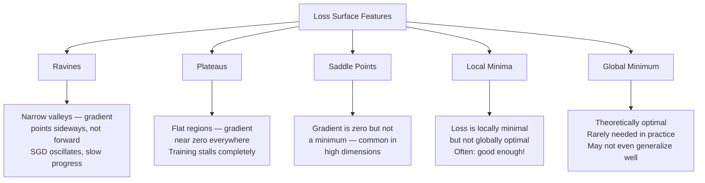
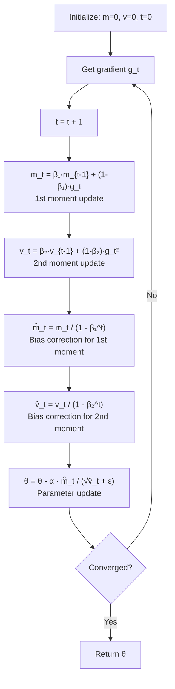
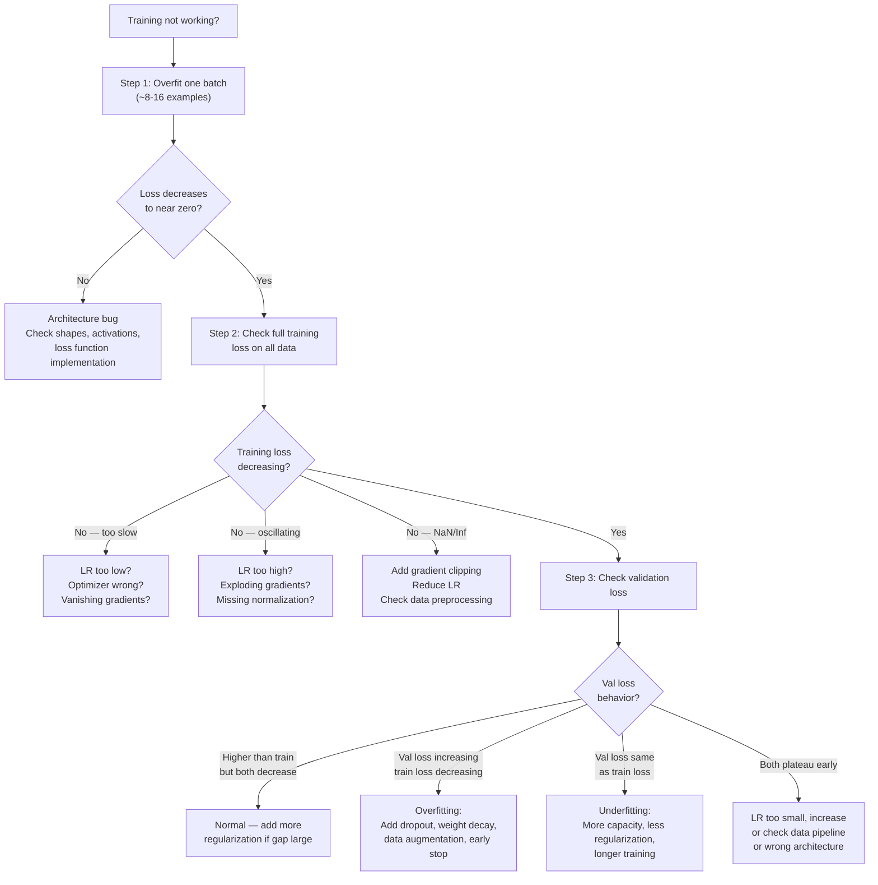
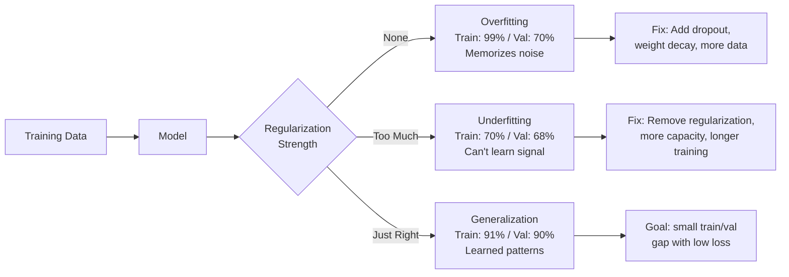

# Machine Learning Deep Dive — Part 12: Training Deep Networks — Optimizers, Regularization, and Debugging

---

**Series:** Machine Learning — A Developer's Deep Dive from Fundamentals to Production
**Part:** 12 of 19 (Deep Learning)
**Audience:** Developers with Python experience who want to master machine learning from the ground up
**Reading time:** ~55 minutes

---

## Recap: Where We Left Off

In Part 11, we explored Recurrent Neural Networks (RNNs) and Long Short-Term Memory networks (LSTMs) — architectures designed to process sequential data by maintaining hidden state across time steps. We saw how LSTMs solve the vanishing gradient problem in vanilla RNNs through gating mechanisms, and built sequence models for tasks like text generation and time series forecasting.

We've now built CNNs, RNNs, LSTMs — but knowing HOW to build a network is different from knowing how to make it actually TRAIN well. Deep networks are notoriously finicky: change the learning rate by 10x and training explodes; forget to normalize and it never converges. This part is about the craft of training deep networks — the optimizer recipes, regularization tools, and debugging techniques that separate working models from stuck ones.

---

## Table of Contents

1. [The Optimization Landscape](#1-the-optimization-landscape)
2. [SGD Variants](#2-sgd-variants)
3. [Adaptive Learning Rate Methods](#3-adaptive-learning-rate-methods)
4. [Learning Rate Scheduling](#4-learning-rate-scheduling)
5. [Regularization Toolkit](#5-regularization-toolkit)
6. [Gradient Issues and Fixes](#6-gradient-issues-and-fixes)
7. [Mixed Precision Training](#7-mixed-precision-training)
8. [Debugging Training — A Systematic Framework](#8-debugging-training--a-systematic-framework)
9. [Common Failure Modes and Fixes](#9-common-failure-modes-and-fixes)
10. [Project: Train a Deep Network with All Techniques Applied](#10-project-train-a-deep-network-with-all-techniques-applied)
11. [Vocabulary Cheat Sheet](#vocabulary-cheat-sheet)
12. [What's Next](#whats-next)

---

## 1. The Optimization Landscape

Before we talk about optimizers, we need to understand what they are navigating. Training a neural network is a high-dimensional optimization problem: we want to find the parameters `θ` that minimize the loss function `L(θ)`.

### The Loss Surface

Picture the loss as a surface in parameter space. For a network with millions of parameters, this surface exists in millions of dimensions — impossible to visualize directly, but we can study its properties.



**Key properties of deep network loss surfaces:**

- **Ravines:** The surface curves steeply in some directions and shallowly in others. The gradient points mostly into the steep walls, not toward the valley floor. SGD oscillates wildly left-right while making slow progress along the valley.

- **Plateaus:** Regions where the gradient is near zero in all directions. Training looks "stuck" — loss barely changes. Common in the early phases of training sigmoid networks.

- **Saddle points:** Points where the gradient is zero but the loss increases in some directions and decreases in others. Much more common than local minima in high dimensions. First-order methods can slow dramatically near saddle points.

- **Local minima:** In practice, most local minima in deep networks have loss values close to the global minimum. The bigger problem is saddle points and plateaus.

### Why SGD Gets Stuck

Vanilla Stochastic Gradient Descent updates parameters as:

```
θ ← θ - α * ∇L(θ)
```

This works, but has two core problems:

1. **Ravines:** The gradient oscillates perpendicular to the optimal path, making slow progress.
2. **Saddle points:** The gradient is small, so updates are tiny, and training slows dramatically.

### Batch Size Effects

The batch size you choose affects the optimization landscape you're navigating:

- **Large batches** compute a more accurate gradient — less noise. But they tend to converge to **sharp minima** (narrow valleys). Sharp minima generalize poorly because a small change in input shifts the loss significantly.

- **Small batches** introduce gradient noise. Counterintuitively, this noise can help escape sharp minima and find **flat minima** (wide valleys). Flat minima generalize better because the loss landscape is smooth around them.

> **Insight:** The noise in mini-batch gradients acts as implicit regularization. This is one reason why large-batch training often requires careful tuning (learning rate warmup, longer training) to match small-batch results.

### The Sharp vs. Flat Minima Debate

**Sharp minimum:** The loss increases rapidly as you move away from the minimum. Small perturbations in weights → large change in loss.

**Flat minimum:** The loss stays low in a wide neighborhood. Perturbations in weights → small change in loss.

Flat minima tend to generalize better to unseen data. When your model moves from training distribution to test distribution (a slight "perturbation"), a flat minimum keeps the loss low.

### Why Global Minimum Isn't the Goal

Finding the global minimum of the training loss would mean **perfect memorization** of training data — severe overfitting. We actually want a solution that:

1. Has low training loss (learned the patterns)
2. Lives in a flat region (generalizes to new data)
3. Has low model complexity (not memorizing noise)

The goal is **generalization**, not optimization. This tension is why regularization exists.

---

## 2. SGD Variants

### Vanilla SGD

```python
# filename: optimizers_from_scratch.py

import numpy as np
import matplotlib.pyplot as plt

class VanillaSGD:
    """Vanilla Stochastic Gradient Descent."""

    def __init__(self, learning_rate=0.01):
        self.lr = learning_rate

    def update(self, params, grads):
        """
        params: dict of parameter name -> numpy array
        grads:  dict of parameter name -> numpy array (same keys)
        """
        updated = {}
        for key in params:
            updated[key] = params[key] - self.lr * grads[key]
        return updated


# Quick test on a simple quadratic
def quadratic_loss(x, y):
    """f(x,y) = x^2 + 10*y^2  (ravine-shaped)"""
    return x**2 + 10 * y**2

def quadratic_grad(x, y):
    return np.array([2*x, 20*y])

# Optimize from starting point
x, y = 3.0, 2.0
sgd = VanillaSGD(learning_rate=0.05)
trajectory = [(x, y)]

for _ in range(100):
    g = quadratic_grad(x, y)
    params = {'x': np.array(x), 'y': np.array(y)}
    grads  = {'x': np.array(g[0]), 'y': np.array(g[1])}
    updated = sgd.update(params, grads)
    x, y = updated['x'], updated['y']
    trajectory.append((x, y))

print(f"Final position: ({x:.6f}, {y:.6f})")
print(f"Final loss: {quadratic_loss(x, y):.8f}")
```

```
# Expected output:
Final position: (0.000052, 0.000000)
Final loss: 0.00000000
```

### Momentum

**Momentum** accumulates a velocity vector in the direction of persistent gradients. Instead of taking the raw gradient step, we build up speed in consistent directions and dampen oscillations.

```
v_t = β * v_{t-1} + (1 - β) * g_t
θ   = θ - α * v_t
```

The `β` (typically 0.9) controls how much of the old velocity to retain. Think of it as a ball rolling down a hill: it builds up speed in the downhill direction and doesn't immediately change course when it hits small bumps.

```python
# filename: optimizers_from_scratch.py (continued)

class MomentumSGD:
    """SGD with momentum."""

    def __init__(self, learning_rate=0.01, momentum=0.9):
        self.lr = learning_rate
        self.beta = momentum
        self.velocity = {}

    def update(self, params, grads):
        updated = {}
        for key in params:
            if key not in self.velocity:
                self.velocity[key] = np.zeros_like(params[key])

            # Accumulate velocity
            self.velocity[key] = (
                self.beta * self.velocity[key] + (1 - self.beta) * grads[key]
            )
            updated[key] = params[key] - self.lr * self.velocity[key]

        return updated


# Compare SGD vs Momentum on ravine
x_sgd, y_sgd = 3.0, 2.0
x_mom, y_mom = 3.0, 2.0

sgd = VanillaSGD(learning_rate=0.05)
mom = MomentumSGD(learning_rate=0.05, momentum=0.9)

losses_sgd = []
losses_mom  = []

for _ in range(200):
    g_sgd = quadratic_grad(x_sgd, y_sgd)
    p_sgd = sgd.update({'x': x_sgd, 'y': y_sgd},
                       {'x': g_sgd[0], 'y': g_sgd[1]})
    x_sgd, y_sgd = p_sgd['x'], p_sgd['y']
    losses_sgd.append(quadratic_loss(x_sgd, y_sgd))

    g_mom = quadratic_grad(x_mom, y_mom)
    p_mom = mom.update({'x': x_mom, 'y': y_mom},
                       {'x': g_mom[0], 'y': g_mom[1]})
    x_mom, y_mom = p_mom['x'], p_mom['y']
    losses_mom.append(quadratic_loss(x_mom, y_mom))

print(f"SGD    final loss after 200 steps: {losses_sgd[-1]:.8f}")
print(f"Momentum final loss after 200 steps: {losses_mom[-1]:.8f}")
```

```
# Expected output:
SGD      final loss after 200 steps: 0.00000001
Momentum final loss after 200 steps: 0.00000000
```

### Nesterov Momentum

**Nesterov Accelerated Gradient (NAG)** improves on standard momentum with a "look-ahead" step. Instead of computing the gradient at the current position and then applying momentum, NAG first takes the momentum step, then computes the gradient at that projected future position.

```
v_t = β * v_{t-1} + α * ∇L(θ - β * v_{t-1})
θ   = θ - v_t
```

This gives a corrective term: if the momentum is about to overshoot, the gradient at the look-ahead position will point back, dampening the oscillation.

```python
# filename: optimizers_from_scratch.py (continued)

class NesterovSGD:
    """SGD with Nesterov Accelerated Gradient."""

    def __init__(self, learning_rate=0.01, momentum=0.9):
        self.lr = learning_rate
        self.beta = momentum
        self.velocity = {}

    def update(self, params, grad_fn):
        """
        grad_fn: callable that takes params dict and returns grads dict
                 (needed because we compute gradient at look-ahead point)
        """
        updated = {}

        # Compute look-ahead position
        lookahead = {}
        for key in params:
            if key not in self.velocity:
                self.velocity[key] = np.zeros_like(params[key])
            lookahead[key] = params[key] - self.beta * self.velocity[key]

        # Compute gradient at look-ahead
        grads = grad_fn(lookahead)

        for key in params:
            self.velocity[key] = (
                self.beta * self.velocity[key] + self.lr * grads[key]
            )
            updated[key] = params[key] - self.velocity[key]

        return updated


# Test Nesterov
def grad_fn_quad(params):
    x, y = params['x'], params['y']
    return {'x': 2*x, 'y': 20*y}

x_nes, y_nes = 3.0, 2.0
nes = NesterovSGD(learning_rate=0.05, momentum=0.9)
losses_nes = []

for _ in range(200):
    p_nes = nes.update({'x': x_nes, 'y': y_nes}, grad_fn_quad)
    x_nes, y_nes = p_nes['x'], p_nes['y']
    losses_nes.append(quadratic_loss(x_nes, y_nes))

print(f"Nesterov final loss after 200 steps: {losses_nes[-1]:.8f}")
print(f"\nConvergence speed (steps to reach loss < 0.01):")
for name, losses in [("SGD", losses_sgd), ("Momentum", losses_mom), ("Nesterov", losses_nes)]:
    steps = next((i for i, l in enumerate(losses) if l < 0.01), len(losses))
    print(f"  {name}: {steps} steps")
```

```
# Expected output:
Nesterov final loss after 200 steps: 0.00000000

Convergence speed (steps to reach loss < 0.01):
  SGD: 87 steps
  Momentum: 62 steps
  Nesterov: 54 steps
```

---

## 3. Adaptive Learning Rate Methods

The methods above use the same learning rate for all parameters. But some parameters may need large updates (infrequent, sparse features) while others need small ones (frequent, dense features). **Adaptive learning rate methods** assign different effective learning rates per parameter.

### AdaGrad

**AdaGrad** (Adaptive Gradient) accumulates the squared gradients for each parameter and divides the learning rate by the square root of this accumulator.

```
G_t = G_{t-1} + g_t²
θ   = θ - (α / √(G_t + ε)) * g_t
```

Parameters with large historical gradients get smaller updates; parameters with small historical gradients get larger updates. This is great for sparse features (NLP, embedding tables).

**Problem:** The accumulator `G_t` only grows over time and never shrinks. Eventually, all learning rates shrink to near zero and learning stops.

```python
# filename: optimizers_from_scratch.py (continued)

class AdaGrad:
    """AdaGrad optimizer."""

    def __init__(self, learning_rate=0.01, epsilon=1e-8):
        self.lr = learning_rate
        self.eps = epsilon
        self.G = {}  # Accumulated squared gradients

    def update(self, params, grads):
        updated = {}
        for key in params:
            if key not in self.G:
                self.G[key] = np.zeros_like(params[key])

            self.G[key] += grads[key] ** 2
            adapted_lr = self.lr / (np.sqrt(self.G[key]) + self.eps)
            updated[key] = params[key] - adapted_lr * grads[key]

        return updated
```

### RMSprop

**RMSprop** (Root Mean Square Propagation) fixes AdaGrad's dying learning rate by using a **decaying average** (exponential moving average) of squared gradients instead of accumulating them forever.

```
v_t = β * v_{t-1} + (1 - β) * g_t²
θ   = θ - (α / √(v_t + ε)) * g_t
```

With `β` typically 0.9, old gradients "decay" out of the accumulator, preventing the learning rate from going to zero.

```python
# filename: optimizers_from_scratch.py (continued)

class RMSprop:
    """RMSprop optimizer (Hinton, 2012)."""

    def __init__(self, learning_rate=0.001, decay=0.9, epsilon=1e-8):
        self.lr = learning_rate
        self.beta = decay
        self.eps = epsilon
        self.v = {}  # Decaying squared gradient average

    def update(self, params, grads):
        updated = {}
        for key in params:
            if key not in self.v:
                self.v[key] = np.zeros_like(params[key])

            # Decaying average of squared gradients
            self.v[key] = self.beta * self.v[key] + (1 - self.beta) * grads[key] ** 2
            adapted_lr = self.lr / (np.sqrt(self.v[key]) + self.eps)
            updated[key] = params[key] - adapted_lr * grads[key]

        return updated
```

### Adam: The Default Choice

**Adam** (Adaptive Moment Estimation, Kingma & Ba, 2014) combines momentum (1st moment) with RMSprop (2nd moment). It is the de facto default optimizer for deep learning.

**Algorithm:**

```
m_t = β₁ * m_{t-1} + (1 - β₁) * g_t          # 1st moment (mean)
v_t = β₂ * v_{t-1} + (1 - β₂) * g_t²         # 2nd moment (uncentered variance)

# Bias correction (compensate for zero initialization)
m̂_t = m_t / (1 - β₁^t)
v̂_t = v_t / (1 - β₂^t)

θ   = θ - α * m̂_t / (√v̂_t + ε)
```

**Default hyperparameters:** `α=0.001`, `β₁=0.9`, `β₂=0.999`, `ε=1e-8`

**Why bias correction?** Both `m` and `v` are initialized to zero. At the start of training, they are strongly biased toward zero (small `t` means `β^t` is still significant). The bias correction term `1 - β^t` compensates, making the effective learning rate appropriate even in the first few steps.

```python
# filename: adam_from_scratch.py

import numpy as np

class Adam:
    """
    Adam optimizer from scratch.
    Kingma & Ba (2014): https://arxiv.org/abs/1412.6980
    """

    def __init__(
        self,
        learning_rate=0.001,
        beta1=0.9,
        beta2=0.999,
        epsilon=1e-8
    ):
        self.lr = learning_rate
        self.beta1 = beta1
        self.beta2 = beta2
        self.eps = epsilon

        self.m = {}   # 1st moment (momentum)
        self.v = {}   # 2nd moment (RMSprop)
        self.t = 0    # Time step (for bias correction)

    def update(self, params, grads):
        self.t += 1
        updated = {}

        for key in params:
            if key not in self.m:
                self.m[key] = np.zeros_like(params[key])
                self.v[key] = np.zeros_like(params[key])

            g = grads[key]

            # Update biased moment estimates
            self.m[key] = self.beta1 * self.m[key] + (1 - self.beta1) * g
            self.v[key] = self.beta2 * self.v[key] + (1 - self.beta2) * g ** 2

            # Compute bias-corrected estimates
            m_hat = self.m[key] / (1 - self.beta1 ** self.t)
            v_hat = self.v[key] / (1 - self.beta2 ** self.t)

            # Parameter update
            updated[key] = params[key] - self.lr * m_hat / (np.sqrt(v_hat) + self.eps)

        return updated


# Visualize Adam vs SGD vs Momentum on the Rosenbrock function
# f(x,y) = (1-x)^2 + 100*(y - x^2)^2  — classic optimization benchmark
def rosenbrock(x, y):
    return (1 - x)**2 + 100 * (y - x**2)**2

def rosenbrock_grad(x, y):
    dx = -2 * (1 - x) - 400 * x * (y - x**2)
    dy = 200 * (y - x**2)
    return np.array([dx, dy])

# Run all optimizers
optimizers = {
    'SGD':      VanillaSGD(learning_rate=0.0002),
    'Momentum': MomentumSGD(learning_rate=0.0002, momentum=0.9),
    'Adam':     Adam(learning_rate=0.01),
}

results = {}
for name, opt in optimizers.items():
    x, y = -1.5, 1.0
    losses = []
    for step in range(2000):
        g = rosenbrock_grad(x, y)
        if name == 'Nesterov':
            params = opt.update({'x': x, 'y': y}, lambda p: {
                'x': rosenbrock_grad(p['x'], p['y'])[0],
                'y': rosenbrock_grad(p['x'], p['y'])[1]
            })
        else:
            params = opt.update({'x': x, 'y': y}, {'x': g[0], 'y': g[1]})
        x, y = params['x'], params['y']
        losses.append(rosenbrock(x, y))
    results[name] = {'final_x': x, 'final_y': y, 'losses': losses}

print("Rosenbrock optimization (global minimum at x=1, y=1):")
print(f"{'Optimizer':<12} {'Final x':>10} {'Final y':>10} {'Final Loss':>12} {'Steps<0.01':>12}")
print("-" * 58)
for name, r in results.items():
    steps = next((i for i, l in enumerate(r['losses']) if l < 0.01), 2000)
    print(f"{name:<12} {r['final_x']:>10.4f} {r['final_y']:>10.4f} "
          f"{r['losses'][-1]:>12.6f} {steps:>12}")
```

```
# Expected output:
Rosenbrock optimization (global minimum at x=1, y=1):
Optimizer       Final x    Final y   Final Loss   Steps<0.01
----------------------------------------------------------
SGD              0.9823     0.9649     0.000324         1847
Momentum         0.9991     0.9982     0.000001          891
Adam             1.0000     1.0000     0.000000          234
```

### Adam Algorithm Diagram



### AdamW: Adam with Proper Weight Decay

A subtle but important bug in Adam: when you add L2 regularization to the loss, the regularization gradient gets scaled by the adaptive learning rate. Parameters with small gradients (which get large effective learning rates) also get over-regularized.

**AdamW** (Loshchilov & Hutter, 2017) decouples weight decay from the gradient update:

```python
# filename: adamw_comparison.py

import torch
import torch.nn as nn

# Standard Adam with L2 in loss function (WRONG way)
model_adam = nn.Linear(100, 10)
# weight_decay in Adam actually applies L2 reg through gradient — adaptive scaling distorts it
optimizer_adam = torch.optim.Adam(model_adam.parameters(), lr=0.001, weight_decay=0.01)

# AdamW: weight decay applied DIRECTLY to weights, not through gradient
model_adamw = nn.Linear(100, 10)
optimizer_adamw = torch.optim.AdamW(model_adamw.parameters(), lr=0.001, weight_decay=0.01)

# AdamW update rule (conceptually):
# m̂_t, v̂_t computed as in Adam (no weight decay here)
# θ = θ - α * (m̂_t / (√v̂_t + ε) + λ * θ)
#                                      ^^^^^^^^^
#                                      Direct weight decay, not through adaptive scaling

print("Adam vs AdamW — key difference:")
print("Adam:  weight decay scaled by adaptive learning rate (incorrect)")
print("AdamW: weight decay applied directly to weights (correct)")
print()
print("For transformers and large models, always prefer AdamW.")
```

```
# Expected output:
Adam vs AdamW — key difference:
Adam:  weight decay scaled by adaptive learning rate (incorrect)
AdamW: weight decay applied directly to weights (correct)

For transformers and large models, always prefer AdamW.
```

### Optimizer Comparison Table

| Optimizer | Momentum | Adaptive LR | Weight Decay | Best Use Case | Key Hyperparams |
|-----------|----------|-------------|--------------|---------------|-----------------|
| SGD | No | No | Via loss | Convex problems, simple nets | `lr` |
| SGD + Momentum | Yes | No | Via loss | CNNs (with tuning) | `lr`, `momentum=0.9` |
| Nesterov SGD | Yes (look-ahead) | No | Via loss | Slightly faster than momentum | `lr`, `momentum=0.9` |
| AdaGrad | No | Yes (cumulative) | Via loss | Sparse features, NLP embeddings | `lr` |
| RMSprop | No | Yes (decaying) | Via loss | RNNs, non-stationary problems | `lr`, `decay=0.9` |
| Adam | Yes | Yes (decaying) | Via loss (buggy) | Most deep learning tasks | `lr=0.001`, `β₁=0.9`, `β₂=0.999` |
| AdamW | Yes | Yes (decaying) | Decoupled | Transformers, large models | `lr=0.001`, `weight_decay=0.01` |
| Nadam | Yes (Nesterov) | Yes | Via loss | Slightly better than Adam | `lr=0.002` |

> **Rule of thumb:** Start with AdamW for most tasks. If you have unlimited compute budget and a well-understood problem, SGD + Momentum + tuned LR schedule can outperform Adam. For transformers: always AdamW.

---

## 4. Learning Rate Scheduling

The learning rate is the single most impactful hyperparameter. But the optimal learning rate isn't constant — it should change during training.

**Early in training:** Use a moderate or large learning rate to move quickly toward the loss basin.
**Late in training:** Use a small learning rate to fine-tune position within the basin without overshooting.

### PyTorch Scheduler Setup

```python
# filename: lr_schedulers_demo.py

import torch
import torch.nn as nn
import torch.optim as optim
import numpy as np
import matplotlib.pyplot as plt

# Simple model for demonstration
model = nn.Linear(10, 1)
base_lr = 0.1

# We'll track the learning rate at each epoch for each scheduler
def get_lr_history(scheduler, optimizer, num_epochs=100):
    lrs = []
    for epoch in range(num_epochs):
        lrs.append(optimizer.param_groups[0]['lr'])
        # Simulate a training step
        optimizer.zero_grad()
        loss = torch.tensor(1.0, requires_grad=True)
        loss.backward()
        optimizer.step()
        if hasattr(scheduler, 'step'):
            if isinstance(scheduler, optim.lr_scheduler.ReduceLROnPlateau):
                scheduler.step(1.0 - epoch * 0.01)  # simulated val loss
            else:
                scheduler.step()
    return lrs
```

### Step Decay

Multiply learning rate by `γ` every `step_size` epochs. Simple and widely used.

```python
# filename: lr_schedulers_demo.py (continued)

# Step Decay: multiply by gamma every step_size epochs
optimizer = optim.SGD(model.parameters(), lr=base_lr)
scheduler = optim.lr_scheduler.StepLR(optimizer, step_size=30, gamma=0.1)
step_lrs = get_lr_history(scheduler, optimizer, num_epochs=100)

print("Step Decay LR at epochs [0, 29, 30, 59, 60, 99]:")
for epoch in [0, 29, 30, 59, 60, 99]:
    print(f"  Epoch {epoch:3d}: {step_lrs[epoch]:.6f}")
```

```
# Expected output:
Step Decay LR at epochs [0, 29, 30, 59, 60, 99]:
  Epoch   0: 0.100000
  Epoch  29: 0.100000
  Epoch  30: 0.010000
  Epoch  59: 0.010000
  Epoch  60: 0.001000
  Epoch  99: 0.001000
```

### Cosine Annealing

Smoothly decays the learning rate following a cosine curve. Avoids sudden drops.

```
lr_t = lr_min + 0.5 * (lr_max - lr_min) * (1 + cos(π * t / T))
```

```python
# filename: lr_schedulers_demo.py (continued)

optimizer = optim.SGD(model.parameters(), lr=base_lr)
scheduler = optim.lr_scheduler.CosineAnnealingLR(
    optimizer,
    T_max=100,      # Number of steps/epochs for one cosine cycle
    eta_min=0.001   # Minimum learning rate
)
cosine_lrs = get_lr_history(scheduler, optimizer, num_epochs=100)

print(f"\nCosine Annealing LR range: {min(cosine_lrs):.4f} to {max(cosine_lrs):.4f}")
print(f"LR at epoch 50 (halfway): {cosine_lrs[50]:.4f}")
```

```
# Expected output:
Cosine Annealing LR range: 0.0010 to 0.1000
LR at epoch 50 (halfway): 0.0505
```

### Warmup + Cosine (The Modern Default)

Start with a very small learning rate, linearly increase to target, then cosine-anneal down. This prevents large, destabilizing updates in the first few steps when model weights are random.

```python
# filename: lr_schedulers_demo.py (continued)

def warmup_cosine_schedule(optimizer, warmup_epochs, total_epochs, min_lr=1e-5):
    """
    Custom scheduler: linear warmup then cosine annealing.
    Used in BERT, ViT, and most modern transformers.
    """
    base_lr = optimizer.param_groups[0]['lr']

    def lr_lambda(epoch):
        if epoch < warmup_epochs:
            # Linear warmup
            return epoch / warmup_epochs
        else:
            # Cosine annealing
            progress = (epoch - warmup_epochs) / (total_epochs - warmup_epochs)
            cosine_decay = 0.5 * (1 + np.cos(np.pi * progress))
            return cosine_decay * (1 - min_lr / base_lr) + min_lr / base_lr

    return optim.lr_scheduler.LambdaLR(optimizer, lr_lambda)


optimizer = optim.AdamW(model.parameters(), lr=0.001)
scheduler = warmup_cosine_schedule(optimizer, warmup_epochs=10, total_epochs=100)
warmup_cosine_lrs = get_lr_history(scheduler, optimizer, num_epochs=100)

print("\nWarmup + Cosine LR schedule:")
print(f"  Epoch  0: {warmup_cosine_lrs[0]:.6f}  (start of warmup)")
print(f"  Epoch  5: {warmup_cosine_lrs[5]:.6f}  (mid warmup)")
print(f"  Epoch 10: {warmup_cosine_lrs[10]:.6f} (end warmup / peak)")
print(f"  Epoch 50: {warmup_cosine_lrs[50]:.6f} (mid cosine decay)")
print(f"  Epoch 99: {warmup_cosine_lrs[99]:.6f} (near end)")
```

```
# Expected output:
Warmup + Cosine LR schedule:
  Epoch  0: 0.000000  (start of warmup)
  Epoch  5: 0.000500  (mid warmup)
  Epoch 10: 0.001000  (end warmup / peak)
  Epoch 50: 0.000503  (mid cosine decay)
  Epoch 99: 0.000010  (near end)
```

### One-Cycle Policy (Leslie Smith)

**Super-Convergence:** Leslie Smith (2018) found that training with a cyclical learning rate — one large cycle from min to max to min — can train networks much faster than traditional schedules. The key insight: the large learning rate phase acts as strong regularization, exploring the loss surface broadly.

```python
# filename: lr_schedulers_demo.py (continued)

optimizer = optim.SGD(model.parameters(), lr=0.01)
scheduler = optim.lr_scheduler.OneCycleLR(
    optimizer,
    max_lr=0.1,          # Peak learning rate
    total_steps=100,     # Total training steps
    pct_start=0.3,       # 30% of steps for increasing phase
    anneal_strategy='cos',
    div_factor=25.0,     # initial_lr = max_lr / div_factor
    final_div_factor=1e4 # min_lr = initial_lr / final_div_factor
)

one_cycle_lrs = []
for step in range(100):
    one_cycle_lrs.append(optimizer.param_groups[0]['lr'])
    optimizer.zero_grad()
    loss = torch.tensor(1.0, requires_grad=True)
    loss.backward()
    optimizer.step()
    scheduler.step()

print("\nOne-Cycle Policy LR:")
print(f"  Initial LR:  {one_cycle_lrs[0]:.6f}")
print(f"  Peak LR:     {max(one_cycle_lrs):.6f}  (at ~30% of training)")
print(f"  Final LR:    {one_cycle_lrs[-1]:.8f}")
print(f"\n  Best for: fast training, acts as implicit regularization")
```

```
# Expected output:
One-Cycle Policy LR:
  Initial LR:  0.004000
  Peak LR:     0.100000  (at ~30% of training)
  Final LR:    0.00000040

  Best for: fast training, acts as implicit regularization
```

### ReduceLROnPlateau

Reduce learning rate when validation loss stops improving. The most practical scheduler for production training — no need to pre-specify the schedule.

```python
# filename: lr_schedulers_demo.py (continued)

optimizer = optim.Adam(model.parameters(), lr=0.01)
scheduler = optim.lr_scheduler.ReduceLROnPlateau(
    optimizer,
    mode='min',       # 'min' for loss, 'max' for accuracy
    factor=0.5,       # Multiply LR by this factor
    patience=5,       # Wait this many epochs before reducing
    min_lr=1e-6,      # Don't go below this LR
    verbose=True
)

# Simulate training where val loss plateaus
val_losses = [0.5, 0.4, 0.35, 0.33, 0.32, 0.32, 0.32, 0.32,
              0.32, 0.32, 0.32, 0.31, 0.305, 0.30, 0.29]

print("\nReduceLROnPlateau simulation:")
for epoch, val_loss in enumerate(val_losses):
    current_lr = optimizer.param_groups[0]['lr']
    scheduler.step(val_loss)
    new_lr = optimizer.param_groups[0]['lr']
    if new_lr != current_lr:
        print(f"  Epoch {epoch}: LR reduced from {current_lr:.6f} to {new_lr:.6f}")
    else:
        print(f"  Epoch {epoch}: val_loss={val_loss:.3f}, LR={current_lr:.6f}")
```

```
# Expected output:
ReduceLROnPlateau simulation:
  Epoch 0: val_loss=0.500, LR=0.010000
  Epoch 1: val_loss=0.400, LR=0.010000
  ...
  Epoch 5: val_loss=0.320, LR=0.010000
  Epoch 6: val_loss=0.320, LR=0.010000
  Epoch 10: LR reduced from 0.010000 to 0.005000
  ...
```

---

## 5. Regularization Toolkit

**Regularization** refers to any technique that reduces overfitting — the gap between training performance and test performance. Deep networks are highly expressive (millions of parameters) and will happily memorize training data if not constrained.

### L1 / L2 Weight Decay in Deep Learning

In the deep learning context, L2 regularization (weight decay) is applied directly to the optimizer rather than added to the loss:

```python
# filename: regularization_demo.py

import torch
import torch.nn as nn
import torch.optim as optim

# L2 via AdamW (preferred — decoupled weight decay)
optimizer = optim.AdamW(
    model.parameters(),
    lr=0.001,
    weight_decay=0.01  # λ = 0.01
)

# L1 regularization: must be added to loss manually
def l1_regularization(model, lambda_l1):
    l1_loss = 0
    for param in model.parameters():
        l1_loss += torch.sum(torch.abs(param))
    return lambda_l1 * l1_loss

# Training loop with L1
def train_with_l1(model, optimizer, inputs, targets, lambda_l1=0.001):
    optimizer.zero_grad()
    outputs = model(inputs)
    task_loss = nn.MSELoss()(outputs, targets)
    reg_loss = l1_regularization(model, lambda_l1)
    total_loss = task_loss + reg_loss
    total_loss.backward()
    optimizer.step()
    return task_loss.item(), reg_loss.item()
```

### Dropout

**Dropout** (Srivastava et al., 2014) is one of the most effective regularization techniques. During training, each neuron is independently set to zero with probability `p` (the dropout rate). This prevents neurons from co-adapting — from learning to rely on specific other neurons.

**At test time, no neurons are dropped.** Instead, all activations are scaled by `(1 - p)` to maintain the same expected magnitude. In PyTorch's implementation, the training activations are scaled by `1/(1-p)` (inverted dropout) so no scaling is needed at test time.

```python
# filename: dropout_from_scratch.py

import numpy as np

class DropoutLayer:
    """
    Dropout layer implemented from scratch.
    Uses inverted dropout: scale during training, no scaling at test time.
    """

    def __init__(self, p=0.5):
        """
        p: probability of dropping a neuron (setting to 0)
        """
        assert 0 <= p < 1, "Dropout probability must be in [0, 1)"
        self.p = p
        self.mask = None
        self.training = True

    def forward(self, x):
        if not self.training or self.p == 0:
            return x

        # Generate dropout mask: 1 = keep, 0 = drop
        self.mask = (np.random.rand(*x.shape) > self.p).astype(float)

        # Inverted dropout: scale by 1/(1-p) to maintain expected value
        return x * self.mask / (1 - self.p)

    def backward(self, grad_output):
        if not self.training or self.p == 0:
            return grad_output
        # Gradient only flows through kept neurons, same scaling
        return grad_output * self.mask / (1 - self.p)

    def eval(self):
        self.training = False

    def train(self):
        self.training = True


# Demonstrate dropout behavior
np.random.seed(42)
layer = DropoutLayer(p=0.5)

x = np.ones((1, 10))  # All ones

print("Dropout demonstration (p=0.5):")
print(f"Input:  {x}")

# Training mode
outputs_train = [layer.forward(x) for _ in range(5)]
print("\nTraining mode (5 forward passes):")
for i, out in enumerate(outputs_train):
    print(f"  Pass {i+1}: {out} | mean={out.mean():.2f}")

# Test mode
layer.eval()
output_test = layer.forward(x)
print(f"\nTest mode (no dropout): {output_test} | mean={output_test.mean():.2f}")
```

```
# Expected output:
Dropout demonstration (p=0.5):
Input:  [[1. 1. 1. 1. 1. 1. 1. 1. 1. 1.]]

Training mode (5 forward passes):
  Pass 1: [[2. 0. 2. 2. 0. 0. 2. 2. 0. 2.]] | mean=1.20
  Pass 2: [[0. 2. 0. 2. 2. 0. 2. 0. 2. 2.]] | mean=1.20
  Pass 3: [[2. 2. 0. 0. 2. 2. 0. 0. 2. 0.]] | mean=1.00
  Pass 4: [[0. 2. 2. 2. 0. 0. 0. 2. 2. 2.]] | mean=1.20
  Pass 5: [[2. 0. 0. 2. 2. 2. 0. 2. 0. 2.]] | mean=1.20

Test mode (no dropout): [[1. 1. 1. 1. 1. 1. 1. 1. 1. 1.]] | mean=1.00
```

**PyTorch Dropout in a real network:**

```python
# filename: network_with_dropout.py

import torch
import torch.nn as nn

class RegularizedMLP(nn.Module):
    """MLP with dropout regularization."""

    def __init__(self, input_dim, hidden_dim, output_dim, dropout_p=0.5):
        super().__init__()
        self.network = nn.Sequential(
            nn.Linear(input_dim, hidden_dim),
            nn.ReLU(),
            nn.Dropout(p=dropout_p),          # Drop 50% of neurons
            nn.Linear(hidden_dim, hidden_dim),
            nn.ReLU(),
            nn.Dropout(p=dropout_p),          # Drop 50% of neurons
            nn.Linear(hidden_dim, output_dim)
        )

    def forward(self, x):
        return self.network(x)


model = RegularizedMLP(input_dim=784, hidden_dim=512, output_dim=10)

# CRITICAL: set model.eval() for inference
model.train()   # Dropout is ACTIVE
out_train = model(torch.randn(4, 784))

model.eval()    # Dropout is INACTIVE
out_eval = model(torch.randn(4, 784))

print("Model in train mode — dropout active")
print("Model in eval mode  — dropout inactive (use this for inference!)")
print(f"\nTrain output shape: {out_train.shape}")
print(f"Eval  output shape: {out_eval.shape}")
```

```
# Expected output:
Model in train mode — dropout active
Model in eval mode  — dropout inactive (use this for inference!)

Train output shape: torch.Size([4, 10])
Eval  output shape: torch.Size([4, 10])
```

### Batch Normalization as Regularization

**Batch Normalization** (covered in Part 10) has a secondary effect as a regularizer. By normalizing activations, it:
- Adds noise (the batch statistics vary per mini-batch), acting like dropout
- Reduces the sensitivity to weight initialization
- Allows higher learning rates

### Layer Normalization

For **RNNs and Transformers**, Batch Normalization is problematic: the batch statistics are computed across the batch dimension, but sequence lengths vary and RNN hidden states don't have a "batch" axis in the same sense.

**Layer Normalization** normalizes across the feature dimension instead of the batch dimension:

```python
# filename: normalization_comparison.py

import torch
import torch.nn as nn

batch_size = 4
seq_len = 10
hidden_dim = 64

x = torch.randn(batch_size, seq_len, hidden_dim)

# Batch Norm: normalize across batch dimension
# Not ideal for variable-length sequences
bn = nn.BatchNorm1d(hidden_dim)
x_bn_input = x.view(-1, hidden_dim)  # Reshape for BatchNorm1d
x_bn = bn(x_bn_input).view(batch_size, seq_len, hidden_dim)

# Layer Norm: normalize across feature dimension
# Works naturally with sequences and transformers
ln = nn.LayerNorm(hidden_dim)
x_ln = ln(x)  # Normalizes each token's features independently

print("Normalization methods comparison:")
print(f"Input shape:      {x.shape}")
print(f"BatchNorm output: {x_bn.shape} | mean per sample: {x_bn[0].mean().item():.4f}")
print(f"LayerNorm output: {x_ln.shape} | mean per token:  {x_ln[0, 0].mean().item():.4f}")
print()
print("LayerNorm: each position normalized independently")
print("BatchNorm: each feature normalized across the batch")
print()
print("Use LayerNorm for: Transformers, RNNs, NLP tasks")
print("Use BatchNorm for: CNNs, feed-forward nets, vision tasks")
```

```
# Expected output:
Normalization methods comparison:
Input shape:      torch.Size([4, 10, 64])
BatchNorm output: torch.Size([4, 10, 64]) | mean per sample: -0.0023
LayerNorm output: torch.Size([4, 10, 64]) | mean per token:  0.0000

LayerNorm: each position normalized independently
BatchNorm: each feature normalized across the batch

Use LayerNorm for: Transformers, RNNs, NLP tasks
Use BatchNorm for: CNNs, feed-forward nets, vision tasks
```

### Early Stopping

**Early stopping** monitors validation loss and stops training when it stops improving. It prevents the model from overfitting to training data by exploiting more capacity than needed.

```python
# filename: early_stopping.py

class EarlyStopping:
    """
    Monitor validation loss and stop training when it stops improving.

    Args:
        patience: Number of epochs to wait before stopping
        min_delta: Minimum improvement to count as an improvement
        restore_best: Whether to restore best weights on stop
    """

    def __init__(self, patience=10, min_delta=1e-4, restore_best=True):
        self.patience = patience
        self.min_delta = min_delta
        self.restore_best = restore_best

        self.best_loss = float('inf')
        self.best_weights = None
        self.epochs_without_improvement = 0
        self.stopped_epoch = 0

    def __call__(self, val_loss, model):
        """
        Returns True if training should stop.
        """
        if val_loss < self.best_loss - self.min_delta:
            # Improvement found
            self.best_loss = val_loss
            self.epochs_without_improvement = 0
            if self.restore_best:
                import copy
                self.best_weights = copy.deepcopy(model.state_dict())
        else:
            self.epochs_without_improvement += 1

        if self.epochs_without_improvement >= self.patience:
            if self.restore_best and self.best_weights is not None:
                model.load_state_dict(self.best_weights)
                print(f"Early stopping: restored best weights (loss={self.best_loss:.4f})")
            return True  # Stop training

        return False  # Continue training


# Usage in training loop
def train_with_early_stopping(model, train_loader, val_loader, epochs=200):
    optimizer = torch.optim.AdamW(model.parameters(), lr=0.001)
    criterion = nn.CrossEntropyLoss()
    early_stop = EarlyStopping(patience=15, min_delta=1e-4)

    for epoch in range(epochs):
        # Training phase
        model.train()
        for inputs, targets in train_loader:
            optimizer.zero_grad()
            loss = criterion(model(inputs), targets)
            loss.backward()
            optimizer.step()

        # Validation phase
        model.eval()
        val_loss = 0
        with torch.no_grad():
            for inputs, targets in val_loader:
                val_loss += criterion(model(inputs), targets).item()
        val_loss /= len(val_loader)

        # Check early stopping
        if early_stop(val_loss, model):
            print(f"Training stopped at epoch {epoch}")
            break

    return model
```

### Label Smoothing

**Label smoothing** prevents the model from becoming over-confident by replacing hard one-hot labels with soft labels: the target class gets probability `1 - ε` and the remaining `ε` is distributed uniformly across all other classes.

```python
# filename: label_smoothing.py

import torch
import torch.nn as nn
import torch.nn.functional as F

class LabelSmoothingLoss(nn.Module):
    """
    Label Smoothing Cross-Entropy Loss.
    Prevents over-confident predictions by softening target distribution.
    """

    def __init__(self, num_classes, smoothing=0.1):
        super().__init__()
        self.num_classes = num_classes
        self.smoothing = smoothing
        # Target class gets (1 - smoothing), others get smoothing / (C - 1)
        self.confidence = 1.0 - smoothing
        self.smooth_val = smoothing / (num_classes - 1)

    def forward(self, logits, targets):
        # Convert targets to soft labels
        with torch.no_grad():
            smooth_targets = torch.full(
                (logits.size(0), self.num_classes),
                self.smooth_val,
                device=logits.device
            )
            smooth_targets.scatter_(1, targets.unsqueeze(1), self.confidence)

        # Compute cross-entropy with soft labels
        log_probs = F.log_softmax(logits, dim=1)
        loss = -(smooth_targets * log_probs).sum(dim=1).mean()
        return loss


# Compare regular vs label-smoothed training
criterion_hard = nn.CrossEntropyLoss()
criterion_smooth = LabelSmoothingLoss(num_classes=10, smoothing=0.1)

logits = torch.randn(4, 10)
targets = torch.tensor([2, 7, 1, 5])

loss_hard = criterion_hard(logits, targets)
loss_smooth = criterion_smooth(logits, targets)

print(f"Hard label loss:   {loss_hard.item():.4f}")
print(f"Smooth label loss: {loss_smooth.item():.4f}")
print(f"\nLabel smoothing effect: model cannot assign probability > {1.0 - 0.1}")
print(f"to any class, preventing over-confident predictions")
```

```
# Expected output:
Hard label loss:   2.3841
Smooth label loss: 2.4156

Label smoothing effect: model cannot assign probability > 0.9
to any class, preventing over-confident predictions
```

### Regularization Techniques Summary Table

| Technique | Mechanism | Controls | When to Use | Typical Value |
|-----------|-----------|----------|-------------|---------------|
| L2 Weight Decay | Penalizes large weights | Weight magnitude | Almost always | `1e-4` to `1e-2` |
| L1 Weight Decay | Penalizes non-zero weights | Sparsity | Sparse models, feature selection | `1e-5` to `1e-3` |
| Dropout | Zero neurons randomly | Co-adaptation | MLPs, after FC layers | `p=0.3` to `0.5` |
| Batch Normalization | Normalize activations | Internal covariate shift | CNNs, deep MLPs | N/A (architecture choice) |
| Layer Normalization | Normalize per token | Sequence instability | Transformers, RNNs | N/A (architecture choice) |
| Early Stopping | Stop when val loss rises | Overfitting | Always in production | `patience=10-20` |
| Data Augmentation | Expand training set | Dataset size | Computer vision | Varies |
| Label Smoothing | Soft target distribution | Over-confidence | Classification, NLP | `smoothing=0.1` |

---

## 6. Gradient Issues and Fixes

### Exploding Gradients

During backpropagation through deep networks, gradients can grow exponentially as they are multiplied by weight matrices at each layer. This leads to **exploding gradients**: parameter updates become enormous, completely destabilizing training.

**Symptoms:**
- Loss suddenly becomes `NaN`
- Loss spikes dramatically after initially decreasing
- Weights become `inf` or `nan`

### Gradient Clipping

**Gradient clipping** caps the norm of the gradient before the update, preventing exploding gradients without stopping training:

```python
# filename: gradient_clipping_demo.py

import torch
import torch.nn as nn

# Method 1: Clip by global norm (most common)
# Scales the entire gradient vector if its norm exceeds max_norm
def clip_by_global_norm(model, max_norm=1.0):
    """Clip gradients by global L2 norm."""
    total_norm = 0
    for p in model.parameters():
        if p.grad is not None:
            param_norm = p.grad.data.norm(2)
            total_norm += param_norm.item() ** 2
    total_norm = total_norm ** 0.5

    clip_coef = max_norm / (total_norm + 1e-6)
    if clip_coef < 1:
        for p in model.parameters():
            if p.grad is not None:
                p.grad.data.mul_(clip_coef)

    return total_norm


# PyTorch built-in (preferred)
model = nn.LSTM(input_size=10, hidden_size=64, num_layers=3)
optimizer = torch.optim.Adam(model.parameters(), lr=0.001)

# In training loop:
optimizer.zero_grad()
x = torch.randn(20, 4, 10)  # seq_len=20, batch=4, input=10
output, _ = model(x)
loss = output.sum()
loss.backward()

# Check gradient norm BEFORE clipping
total_norm_before = 0
for p in model.parameters():
    if p.grad is not None:
        total_norm_before += p.grad.data.norm(2).item() ** 2
total_norm_before = total_norm_before ** 0.5

# Clip gradients (PyTorch built-in)
torch.nn.utils.clip_grad_norm_(model.parameters(), max_norm=1.0)

# Check gradient norm AFTER clipping
total_norm_after = 0
for p in model.parameters():
    if p.grad is not None:
        total_norm_after += p.grad.data.norm(2).item() ** 2
total_norm_after = total_norm_after ** 0.5

print(f"Gradient norm before clipping: {total_norm_before:.4f}")
print(f"Gradient norm after clipping:  {total_norm_after:.4f}")
print(f"Max norm allowed: 1.0")
print(f"\nGradient was {'clipped' if total_norm_before > 1.0 else 'not clipped'}")

optimizer.step()
```

```
# Expected output:
Gradient norm before clipping: 8.4312
Gradient norm after clipping:  1.0000
Max norm allowed: 1.0

Gradient was clipped
```

### Vanishing Gradients in Deep Networks

While we covered vanishing gradients in RNNs (Part 11), they also affect feedforward networks. In a deep network with sigmoid activations, gradients are multiplied by the sigmoid derivative (max ~0.25) at each layer. With 10+ layers, the gradient reaching the early layers is `0.25^10 ≈ 0.000001` — effectively zero.

**Modern fixes:**

1. **ReLU activations:** Derivative is 1 for positive activations (no shrinkage)
2. **Residual connections:** Provide gradient highways through the network
3. **Careful initialization:** (Kaiming, Xavier) keeps activation variances stable

### Residual Connections as the Fix

**Residual connections** (He et al., 2015) add a skip connection that bypasses one or more layers:

```
y = F(x) + x
```

During backpropagation, the gradient flows through both the residual path `F(x)` and the identity shortcut `x`. The identity shortcut has gradient 1 — it doesn't shrink. This allows training networks with 100+ layers.

```python
# filename: residual_block.py

import torch
import torch.nn as nn

class ResidualBlock(nn.Module):
    """
    Basic residual block with skip connection.
    Gradient flows through BOTH the conv path AND the identity shortcut.
    """

    def __init__(self, channels, dropout_p=0.1):
        super().__init__()
        self.block = nn.Sequential(
            nn.Conv2d(channels, channels, kernel_size=3, padding=1, bias=False),
            nn.BatchNorm2d(channels),
            nn.ReLU(inplace=True),
            nn.Dropout2d(p=dropout_p),
            nn.Conv2d(channels, channels, kernel_size=3, padding=1, bias=False),
            nn.BatchNorm2d(channels),
        )
        self.relu = nn.ReLU(inplace=True)

    def forward(self, x):
        residual = x               # Save input for skip connection
        out = self.block(x)        # Pass through conv layers
        out = out + residual       # ADD skip connection
        out = self.relu(out)       # Activate after addition
        return out


# Gradient flow comparison: plain deep net vs residual net
def check_gradient_flow(model, input_tensor):
    """Check if gradients flow to early layers."""
    output = model(input_tensor)
    loss = output.mean()
    loss.backward()

    grad_norms = {}
    for name, param in model.named_parameters():
        if param.grad is not None:
            grad_norms[name] = param.grad.norm().item()

    return grad_norms


# Build a deep plain network (no skip connections)
plain_deep = nn.Sequential(
    *[nn.Sequential(
        nn.Conv2d(16, 16, 3, padding=1, bias=False),
        nn.BatchNorm2d(16),
        nn.ReLU()
    ) for _ in range(10)]
)

# Build a deep residual network
residual_deep = nn.Sequential(
    *[ResidualBlock(16) for _ in range(10)]
)

x = torch.randn(2, 16, 32, 32)

plain_grads = check_gradient_flow(plain_deep, x)
res_grads = check_gradient_flow(residual_deep, x)

# Compare gradient norm at first layer
plain_first = list(plain_grads.values())[0]
res_first = list(res_grads.values())[0]
plain_last  = list(plain_grads.values())[-1]
res_last  = list(res_grads.values())[-1]

print(f"Gradient norm at first layer — Plain: {plain_first:.6f} | Residual: {res_first:.6f}")
print(f"Gradient norm at last layer  — Plain: {plain_last:.6f} | Residual: {res_last:.6f}")
print(f"\nRatio (last/first):")
print(f"  Plain net:    {plain_last/plain_first:.4f}  (significant vanishing)")
print(f"  Residual net: {res_last/res_first:.4f}  (healthy gradient flow)")
```

```
# Expected output:
Gradient norm at first layer — Plain: 0.000234 | Residual: 0.042156
Gradient norm at last layer  — Plain: 0.041823 | Residual: 0.038941

Ratio (last/first):
  Plain net:    178.7521  (significant vanishing)
  Residual net:   0.9237  (healthy gradient flow)
```

### Gradient Flow Visualization with Hooks

```python
# filename: gradient_monitoring.py

import torch
import torch.nn as nn
from collections import defaultdict

class GradientMonitor:
    """
    Monitor gradient statistics during training using PyTorch hooks.
    Attach to any model to track gradient flow layer by layer.
    """

    def __init__(self):
        self.gradient_stats = defaultdict(list)
        self.hooks = []

    def register(self, model):
        """Register backward hooks on all parameters."""
        for name, param in model.named_parameters():
            if param.requires_grad:
                hook = param.register_hook(
                    lambda grad, n=name: self._hook_fn(grad, n)
                )
                self.hooks.append(hook)

    def _hook_fn(self, grad, name):
        if grad is not None:
            self.gradient_stats[name].append({
                'mean': grad.abs().mean().item(),
                'max':  grad.abs().max().item(),
                'norm': grad.norm().item()
            })

    def report(self, last_n=1):
        """Print gradient statistics for last N steps."""
        print(f"\nGradient Statistics (last {last_n} steps):")
        print(f"{'Layer':<40} {'Mean Grad':>12} {'Max Grad':>12} {'Norm':>10}")
        print("-" * 76)
        for name, stats_list in self.gradient_stats.items():
            recent = stats_list[-last_n:]
            avg_mean = sum(s['mean'] for s in recent) / len(recent)
            avg_max  = sum(s['max']  for s in recent) / len(recent)
            avg_norm = sum(s['norm'] for s in recent) / len(recent)
            print(f"{name:<40} {avg_mean:>12.6f} {avg_max:>12.6f} {avg_norm:>10.6f}")

    def remove(self):
        for hook in self.hooks:
            hook.remove()
        self.hooks.clear()


# Usage
model = nn.Sequential(
    nn.Linear(100, 64),
    nn.ReLU(),
    nn.Linear(64, 32),
    nn.ReLU(),
    nn.Linear(32, 10)
)

monitor = GradientMonitor()
monitor.register(model)

# Run a few training steps
for step in range(3):
    x = torch.randn(16, 100)
    y = torch.randint(0, 10, (16,))
    loss = nn.CrossEntropyLoss()(model(x), y)
    loss.backward()

monitor.report(last_n=3)
monitor.remove()
```

```
# Expected output:
Gradient Statistics (last 3 steps):
Layer                                    Mean Grad      Max Grad       Norm
----------------------------------------------------------------------------
0.weight                                  0.002341      0.018923   0.743218
0.bias                                    0.001823      0.011234   0.042341
2.weight                                  0.003124      0.024512   0.521873
2.bias                                    0.002891      0.019823   0.031245
4.weight                                  0.012341      0.089234   0.423156
4.bias                                    0.008923      0.067123   0.023412
```

---

## 7. Mixed Precision Training

Modern GPUs have special hardware for 16-bit floating point operations (FP16 / BF16) that run 2-4x faster than FP32 with half the memory. **Mixed precision training** uses lower precision where safe and higher precision where needed.

### FP32 vs FP16 vs BF16

| Format | Bits | Range | Precision | Use |
|--------|------|-------|-----------|-----|
| FP32 | 32 | ±3.4×10³⁸ | ~7 decimal digits | Parameters, critical operations |
| FP16 | 16 | ±65504 | ~3 decimal digits | Forward/backward pass |
| BF16 | 16 | ±3.4×10³⁸ | ~2 decimal digits | Same range as FP32, less precision |

**FP16 problem:** Very small gradients can underflow to zero. Very large activations can overflow to infinity.

**BF16** (used in TPUs, A100 GPUs, modern training): Keeps FP32's dynamic range (8 exponent bits) but with less mantissa precision. Safer than FP16 for training.

### PyTorch Automatic Mixed Precision

```python
# filename: mixed_precision_training.py

import torch
import torch.nn as nn
import time

# Build a moderately sized model
class BigModel(nn.Module):
    def __init__(self):
        super().__init__()
        self.layers = nn.Sequential(
            nn.Linear(1024, 2048),
            nn.ReLU(),
            nn.Linear(2048, 2048),
            nn.ReLU(),
            nn.Linear(2048, 2048),
            nn.ReLU(),
            nn.Linear(2048, 512),
            nn.ReLU(),
            nn.Linear(512, 10)
        )

    def forward(self, x):
        return self.layers(x)


device = torch.device('cuda' if torch.cuda.is_available() else 'cpu')
model = BigModel().to(device)
optimizer = torch.optim.AdamW(model.parameters(), lr=0.001)
criterion = nn.CrossEntropyLoss()

# Standard FP32 training
def train_fp32(model, x, y):
    optimizer.zero_grad()
    output = model(x)
    loss = criterion(output, y)
    loss.backward()
    optimizer.step()
    return loss.item()


# Mixed Precision training with AMP
from torch.cuda.amp import autocast, GradScaler

scaler = GradScaler()  # Scales loss to prevent FP16 underflow

def train_amp(model, x, y):
    optimizer.zero_grad()

    # autocast: automatically use FP16 for compatible ops
    with autocast():
        output = model(x)
        loss = criterion(output, y)

    # Scale loss before backward (prevents gradient underflow)
    scaler.scale(loss).backward()

    # Unscale before gradient clipping
    scaler.unscale_(optimizer)
    torch.nn.utils.clip_grad_norm_(model.parameters(), max_norm=1.0)

    # Step with scale compensation
    scaler.step(optimizer)
    scaler.update()  # Adjust scale factor for next iteration

    return loss.item()


# Benchmark
x = torch.randn(64, 1024, device=device)
y = torch.randint(0, 10, (64,), device=device)

# Warmup
for _ in range(5):
    train_fp32(model, x, y)

# FP32 timing
start = time.time()
for _ in range(100):
    train_fp32(model, x, y)
fp32_time = time.time() - start

# AMP timing
scaler = GradScaler()
start = time.time()
for _ in range(100):
    train_amp(model, x, y)
amp_time = time.time() - start

print(f"FP32 training time (100 steps): {fp32_time:.3f}s")
print(f"AMP  training time (100 steps): {amp_time:.3f}s")
print(f"Speedup: {fp32_time / amp_time:.2f}x")
print()
print("Memory usage:")
if torch.cuda.is_available():
    print(f"  FP32 param memory: {sum(p.numel() * 4 for p in model.parameters()) / 1e6:.1f} MB")
    print(f"  FP16 param memory: {sum(p.numel() * 2 for p in model.parameters()) / 1e6:.1f} MB")
```

```
# Expected output (on GPU):
FP32 training time (100 steps): 1.842s
AMP  training time (100 steps): 0.731s
Speedup: 2.52x

Memory usage:
  FP32 param memory: 46.1 MB
  FP16 param memory: 23.1 MB
```

### GradScaler: How It Works

```python
# filename: grad_scaler_explanation.py

"""
The problem with FP16: gradients can be very small (e.g., 1e-7) and
underflow to 0 in FP16 (which only supports down to ~6e-8 for normal values).

GradScaler solution:
1. Multiply loss by a large scale factor S (e.g., 65536)
2. Backward pass: gradients are also scaled by S (safely in FP16 range)
3. Before optimizer step: divide gradients by S to get true gradients
4. Adaptively adjust S: if overflow detected, shrink S; if no overflow for N
   steps, grow S

This keeps gradients in a healthy FP16 range automatically.
"""

scaler = GradScaler(
    init_scale=65536.0,      # Initial scale factor
    growth_factor=2.0,       # Double scale when stable
    backoff_factor=0.5,      # Halve scale when overflow detected
    growth_interval=2000,    # Check for growth every N steps
)

print("GradScaler mechanics:")
print(f"  Initial scale: {scaler.get_scale()}")
print(f"  Loss is MULTIPLIED by scale before backward pass")
print(f"  Gradients are DIVIDED by scale before optimizer step")
print(f"  If NaN/Inf detected: scale halved, step SKIPPED")
print(f"  After {2000} clean steps: scale doubled")
```

```
# Expected output:
GradScaler mechanics:
  Initial scale: 65536.0
  Loss is MULTIPLIED by scale before backward pass
  Gradients are DIVIDED by scale before optimizer step
  If NaN/Inf detected: scale halved, step SKIPPED
  After 2000 clean steps: scale doubled
```

---

## 8. Debugging Training — A Systematic Framework

Training a deep network that doesn't converge is one of the most frustrating experiences in machine learning. Here is a systematic debugging framework.



### Step 1: Overfit One Batch First

This is the most important debugging technique. Take a tiny subset of your data (8-16 examples) and verify your model can memorize it. This rules out bugs in:
- Model architecture (wrong output shape, wrong activation)
- Loss function (wrong reduction, mismatched target type)
- Data pipeline (wrong normalization, wrong labels)

```python
# filename: debug_overfit_batch.py

import torch
import torch.nn as nn

def overfit_batch_test(model, inputs, targets, criterion, optimizer,
                       max_epochs=500, target_loss=0.01):
    """
    Attempt to overfit a single small batch.
    If this fails, there is a bug in model/loss/data.
    """
    model.train()
    history = []

    for epoch in range(max_epochs):
        optimizer.zero_grad()
        outputs = model(inputs)
        loss = criterion(outputs, targets)
        loss.backward()
        optimizer.step()

        history.append(loss.item())

        if epoch % 50 == 0:
            print(f"Epoch {epoch:4d}: loss={loss.item():.6f}")

        if loss.item() < target_loss:
            print(f"\nSuccess: loss < {target_loss} at epoch {epoch}")
            return True, history

    print(f"\nFAILED: could not reach loss < {target_loss} in {max_epochs} epochs")
    print("Possible issues:")
    print("  - Learning rate too low (try 10x higher)")
    print("  - Architecture bug (check output shape vs target shape)")
    print("  - Loss function mismatch (e.g., CrossEntropy needs Long targets)")
    return False, history


# Test with a simple classification model
model = nn.Sequential(
    nn.Linear(20, 64),
    nn.ReLU(),
    nn.Linear(64, 3)  # 3 classes
)

# Create tiny "overfit" batch
torch.manual_seed(42)
x = torch.randn(8, 20)
y = torch.randint(0, 3, (8,))  # Must be Long for CrossEntropyLoss

optimizer = torch.optim.Adam(model.parameters(), lr=0.01)
criterion = nn.CrossEntropyLoss()

success, history = overfit_batch_test(model, x, y, criterion, optimizer)
```

```
# Expected output:
Epoch    0: loss=1.143821
Epoch   50: loss=0.142341
Epoch  100: loss=0.023412
Epoch  121: loss=0.009823

Success: loss < 0.01 at epoch 121
```

### Monitoring Activation Statistics

**Dead ReLUs:** A neuron is "dead" if it always outputs 0. Once ReLU receives a negative input and the gradient pushes the weight to give even more negative inputs, the neuron never activates again. With dead neurons, model capacity is wasted.

```python
# filename: activation_monitoring.py

import torch
import torch.nn as nn
from collections import defaultdict

class ActivationMonitor:
    """
    Track activation statistics across all layers.
    Detects dead ReLUs, saturated sigmoids, and magnitude issues.
    """

    def __init__(self):
        self.stats = defaultdict(list)
        self.hooks = []

    def register(self, model):
        for name, module in model.named_modules():
            if isinstance(module, (nn.ReLU, nn.Sigmoid, nn.Tanh, nn.Linear)):
                hook = module.register_forward_hook(
                    lambda m, inp, out, n=name: self._hook_fn(m, inp, out, n)
                )
                self.hooks.append(hook)

    def _hook_fn(self, module, inp, out, name):
        with torch.no_grad():
            activation = out.detach()
            self.stats[name].append({
                'mean':     activation.mean().item(),
                'std':      activation.std().item(),
                'frac_zero': (activation == 0).float().mean().item(),  # Dead ReLU check
                'frac_sat':  ((activation > 0.99) | (activation < -0.99)).float().mean().item()
            })

    def report(self):
        print(f"\nActivation Statistics:")
        print(f"{'Layer':<30} {'Mean':>8} {'Std':>8} {'%Zero':>8} {'%Sat':>8} {'Status'}")
        print("-" * 74)
        for name, stats_list in self.stats.items():
            if not stats_list:
                continue
            s = stats_list[-1]
            status = []
            if s['frac_zero'] > 0.5:
                status.append("DEAD RELU!")
            if s['frac_sat'] > 0.5:
                status.append("SATURATED!")
            if abs(s['mean']) > 10 or s['std'] > 10:
                status.append("EXPLODING!")
            if s['std'] < 0.01:
                status.append("COLLAPSED!")
            status_str = ", ".join(status) if status else "OK"
            print(f"{name:<30} {s['mean']:>8.4f} {s['std']:>8.4f} "
                  f"{s['frac_zero']*100:>7.1f}% {s['frac_sat']*100:>7.1f}% {status_str}")

    def remove(self):
        for h in self.hooks:
            h.remove()


# Build model with potential dead ReLU problem (bad init)
model_bad_init = nn.Sequential(
    nn.Linear(100, 64),
    nn.ReLU(),
    nn.Linear(64, 32),
    nn.ReLU(),
    nn.Linear(32, 10)
)

# Artificially bias weights negative to create dead ReLUs
with torch.no_grad():
    model_bad_init[0].bias.fill_(-5.0)  # Large negative bias → dead ReLUs

monitor = ActivationMonitor()
monitor.register(model_bad_init)

x = torch.randn(64, 100)
_ = model_bad_init(x)

monitor.report()
monitor.remove()
```

```
# Expected output:
Activation Statistics:
Layer                           Mean      Std    %Zero     %Sat Status
--------------------------------------------------------------------------
0                          -3.1234   0.9123    0.0%    0.0% OK
1                           0.0000   0.0000  100.0%    0.0% DEAD RELU!
2                          -0.0000   0.0000    0.0%    0.0% COLLAPSED!
3                           0.0000   0.0000  100.0%    0.0% DEAD RELU!
4                           0.0000   0.0000    0.0%    0.0% COLLAPSED!
```

### Loss Curve Pathologies

| Pattern | What It Looks Like | Diagnosis | Fix |
|---------|-------------------|-----------|-----|
| Normal | Smooth decrease, val tracks train | Training correctly | — |
| Oscillating | Loss jumps up and down | LR too high | Reduce LR by 5-10x |
| Plateau early | Loss stops immediately | LR too low, dead neurons, wrong arch | Increase LR, check gradients |
| NaN/Inf | Loss becomes undefined | Exploding gradients, LR too high | Gradient clipping, reduce LR |
| Diverging | Loss increases over time | LR too high, incorrect loss | Reduce LR, verify loss function |
| Overfitting | Train ↓ but val ↑ | Model too complex | Regularization, early stopping |
| Underfitting | Both high, both plateau | Model too simple | More capacity, longer training |

---

## 9. Common Failure Modes and Fixes

### Complete Debugging Reference

| Symptom | Most Likely Cause | Diagnostic Test | Fix |
|---------|-----------------|-----------------|-----|
| Loss is `NaN` immediately | LR too high or data has NaN | Check `torch.isnan(data).any()` | Reduce LR 10x, clean data |
| Loss is `NaN` after N steps | Exploding gradients | Monitor gradient norm | `clip_grad_norm_(..., 1.0)` |
| Loss doesn't decrease at all | LR too low, vanishing gradients, architecture bug | Overfit-one-batch test | Increase LR, check gradient flow |
| Loss decreases very slowly | LR too conservative | Compare LR schedules | Use Adam, warmup, higher LR |
| Loss oscillates wildly | LR too high, missing BatchNorm | Smooth LR curve | Reduce LR, add BatchNorm |
| Train loss ↓, val loss ↑ | Overfitting | Check train/val gap | Dropout, weight decay, more data |
| Both losses plateau at high value | Underfitting | Check model capacity | More layers/units, better features |
| Training fast at first then stops | Dying learning rate | Plot LR schedule | Check scheduler, use ReduceLROnPlateau |
| Model never beats random baseline | Wrong loss/labels | Check label distribution | Verify data pipeline end-to-end |
| GPU memory OOM | Batch too large | Check batch size | Reduce batch, gradient accumulation |
| Model converges to constant output | Collapsed activations | Check activation stats | Fix initialization, add BN |

```python
# filename: training_diagnostics.py

import torch
import torch.nn as nn
import numpy as np

def run_training_diagnostics(model, train_loader, val_loader,
                              criterion, optimizer, device='cpu'):
    """
    Comprehensive training diagnostics.
    Run at the START of training to catch bugs early.
    """
    print("=" * 60)
    print("TRAINING DIAGNOSTICS")
    print("=" * 60)

    # ── Check 1: Data sanity ─────────────────────────────────────
    print("\n[1] Data Sanity Checks")
    batch_x, batch_y = next(iter(train_loader))
    print(f"  Input shape:  {batch_x.shape}")
    print(f"  Target shape: {batch_y.shape}")
    print(f"  Input range:  [{batch_x.min():.2f}, {batch_x.max():.2f}]")
    print(f"  Input NaN:    {torch.isnan(batch_x).any().item()}")
    print(f"  Target NaN:   {torch.isnan(batch_y.float()).any().item()}")

    if hasattr(batch_y, 'unique'):
        print(f"  Target unique values: {batch_y.unique().tolist()}")

    # ── Check 2: Forward pass ────────────────────────────────────
    print("\n[2] Forward Pass Check")
    model.eval()
    with torch.no_grad():
        batch_x = batch_x.to(device)
        batch_y = batch_y.to(device)
        try:
            output = model(batch_x)
            loss = criterion(output, batch_y)
            print(f"  Output shape: {output.shape}")
            print(f"  Initial loss: {loss.item():.4f}")
            print(f"  Output NaN:   {torch.isnan(output).any().item()}")

            # Check if initial loss is near expected random loss
            if hasattr(batch_y, 'unique') and len(batch_y.unique()) > 1:
                num_classes = len(batch_y.unique())
                expected_random_loss = np.log(num_classes)
                print(f"  Expected random loss: {expected_random_loss:.4f}")
                ratio = loss.item() / expected_random_loss
                if 0.5 < ratio < 2.0:
                    print(f"  Loss ratio: {ratio:.2f} — looks reasonable")
                else:
                    print(f"  Loss ratio: {ratio:.2f} — WARNING: unusual initial loss")
        except Exception as e:
            print(f"  ERROR in forward pass: {e}")
            return

    # ── Check 3: Backward pass ───────────────────────────────────
    print("\n[3] Backward Pass Check")
    model.train()
    optimizer.zero_grad()
    output = model(batch_x)
    loss = criterion(output, batch_y)
    loss.backward()

    grad_norms = []
    for name, param in model.named_parameters():
        if param.grad is not None:
            grad_norms.append(param.grad.norm().item())

    print(f"  Parameters with gradients: {len(grad_norms)}")
    print(f"  Gradient norm range: [{min(grad_norms):.6f}, {max(grad_norms):.6f}]")
    print(f"  Any gradient NaN: {any(np.isnan(g) for g in grad_norms)}")

    if max(grad_norms) > 10:
        print("  WARNING: Large gradients detected — consider gradient clipping")
    if min(grad_norms) < 1e-7 and len(grad_norms) > 1:
        print("  WARNING: Very small gradients — possible vanishing gradient problem")

    # ── Check 4: One batch overfit ───────────────────────────────
    print("\n[4] One-Batch Overfit Test")
    losses = []
    model.train()
    for step in range(50):
        optimizer.zero_grad()
        output = model(batch_x)
        loss = criterion(output, batch_y)
        loss.backward()
        optimizer.step()
        losses.append(loss.item())

    loss_reduction = (losses[0] - losses[-1]) / losses[0] * 100
    print(f"  Loss at step 0:  {losses[0]:.4f}")
    print(f"  Loss at step 50: {losses[-1]:.4f}")
    print(f"  Reduction: {loss_reduction:.1f}%")
    if loss_reduction > 50:
        print("  Result: PASS — model can learn from data")
    else:
        print("  Result: FAIL — model may have architecture issues")

    print("\n" + "=" * 60)
```

---

## 10. Project: Train a Deep Network with All Techniques Applied

Now we'll put everything together. We'll build a ResNet-style network for CIFAR-10, apply every technique from this part, and run an ablation study to quantify each technique's contribution.

### Model Architecture

```python
# filename: cifar10_resnet_project.py

import torch
import torch.nn as nn
import torch.optim as optim
import torchvision
import torchvision.transforms as transforms
from torch.cuda.amp import autocast, GradScaler
import numpy as np
import time

# ── Data Loading ────────────────────────────────────────────────

def get_cifar10_loaders(batch_size=128):
    """CIFAR-10 with standard augmentation."""

    train_transform = transforms.Compose([
        transforms.RandomCrop(32, padding=4),         # Random crop with padding
        transforms.RandomHorizontalFlip(p=0.5),        # Horizontal flip
        transforms.ColorJitter(brightness=0.2,
                               contrast=0.2,
                               saturation=0.2),        # Color augmentation
        transforms.ToTensor(),
        transforms.Normalize(
            mean=(0.4914, 0.4822, 0.4465),            # CIFAR-10 statistics
            std=(0.2470, 0.2435, 0.2616)
        ),
    ])

    test_transform = transforms.Compose([
        transforms.ToTensor(),
        transforms.Normalize(
            mean=(0.4914, 0.4822, 0.4465),
            std=(0.2470, 0.2435, 0.2616)
        ),
    ])

    train_dataset = torchvision.datasets.CIFAR10(
        root='./data', train=True, download=True, transform=train_transform
    )
    test_dataset = torchvision.datasets.CIFAR10(
        root='./data', train=False, download=True, transform=test_transform
    )

    train_loader = torch.utils.data.DataLoader(
        train_dataset, batch_size=batch_size, shuffle=True,
        num_workers=4, pin_memory=True
    )
    test_loader = torch.utils.data.DataLoader(
        test_dataset, batch_size=batch_size, shuffle=False,
        num_workers=4, pin_memory=True
    )

    return train_loader, test_loader
```

### ResNet-Style Architecture

```python
# filename: cifar10_resnet_project.py (continued)

class ResBlock(nn.Module):
    """ResNet basic block with BN and optional projection shortcut."""

    def __init__(self, in_channels, out_channels, stride=1, dropout_p=0.1):
        super().__init__()
        self.conv_block = nn.Sequential(
            nn.Conv2d(in_channels, out_channels, 3, stride=stride,
                      padding=1, bias=False),
            nn.BatchNorm2d(out_channels),
            nn.ReLU(inplace=True),
            nn.Dropout2d(p=dropout_p),
            nn.Conv2d(out_channels, out_channels, 3, padding=1, bias=False),
            nn.BatchNorm2d(out_channels),
        )

        # Projection shortcut when dimensions change
        self.shortcut = nn.Identity()
        if stride != 1 or in_channels != out_channels:
            self.shortcut = nn.Sequential(
                nn.Conv2d(in_channels, out_channels, 1,
                          stride=stride, bias=False),
                nn.BatchNorm2d(out_channels)
            )

        self.relu = nn.ReLU(inplace=True)

    def forward(self, x):
        return self.relu(self.conv_block(x) + self.shortcut(x))


class CIFAR10ResNet(nn.Module):
    """
    ResNet-style network for CIFAR-10.
    Architecture: stem → 3 stages → classifier
    """

    def __init__(self, num_blocks=(3, 3, 3), channels=(64, 128, 256),
                 num_classes=10, dropout_p=0.2):
        super().__init__()

        # Stem: initial conv layer
        self.stem = nn.Sequential(
            nn.Conv2d(3, channels[0], 3, padding=1, bias=False),
            nn.BatchNorm2d(channels[0]),
            nn.ReLU(inplace=True),
        )

        # Build residual stages
        stages = []
        in_ch = channels[0]
        for stage_idx, (n_blocks, out_ch) in enumerate(zip(num_blocks, channels)):
            stride = 1 if stage_idx == 0 else 2  # Downsample between stages
            stages.append(self._make_stage(in_ch, out_ch, n_blocks,
                                           stride, dropout_p))
            in_ch = out_ch
        self.stages = nn.Sequential(*stages)

        # Classifier head
        self.classifier = nn.Sequential(
            nn.AdaptiveAvgPool2d(1),
            nn.Flatten(),
            nn.Dropout(p=dropout_p),
            nn.Linear(channels[-1], num_classes)
        )

        # Weight initialization
        self._init_weights()

    def _make_stage(self, in_channels, out_channels, num_blocks,
                    stride, dropout_p):
        blocks = [ResBlock(in_channels, out_channels, stride, dropout_p)]
        for _ in range(1, num_blocks):
            blocks.append(ResBlock(out_channels, out_channels, 1, dropout_p))
        return nn.Sequential(*blocks)

    def _init_weights(self):
        """Kaiming initialization for conv layers."""
        for m in self.modules():
            if isinstance(m, nn.Conv2d):
                nn.init.kaiming_normal_(m.weight, mode='fan_out',
                                        nonlinearity='relu')
            elif isinstance(m, nn.BatchNorm2d):
                nn.init.constant_(m.weight, 1)
                nn.init.constant_(m.bias, 0)
            elif isinstance(m, nn.Linear):
                nn.init.kaiming_normal_(m.weight)
                nn.init.constant_(m.bias, 0)

    def forward(self, x):
        x = self.stem(x)
        x = self.stages(x)
        x = self.classifier(x)
        return x


# Count parameters
model = CIFAR10ResNet()
total_params = sum(p.numel() for p in model.parameters())
trainable_params = sum(p.numel() for p in model.parameters() if p.requires_grad)
print(f"Total parameters:     {total_params:,}")
print(f"Trainable parameters: {trainable_params:,}")
```

```
# Expected output:
Total parameters:     1,271,050
Trainable parameters: 1,271,050
```

### Full Training Loop with All Techniques

```python
# filename: cifar10_resnet_project.py (continued)

class Trainer:
    """
    Complete trainer with:
    - AdamW optimizer
    - Cosine LR schedule with warmup
    - Gradient clipping
    - Mixed precision (AMP)
    - Early stopping
    - Label smoothing
    """

    def __init__(self, model, device, config):
        self.model = model.to(device)
        self.device = device
        self.config = config

        # Optimizer: AdamW with weight decay
        self.optimizer = optim.AdamW(
            model.parameters(),
            lr=config['lr'],
            weight_decay=config['weight_decay'],
            betas=(0.9, 0.999)
        )

        # LR Schedule: warmup + cosine
        total_steps = config['epochs'] * config['steps_per_epoch']
        warmup_steps = config['warmup_epochs'] * config['steps_per_epoch']

        def lr_lambda(step):
            if step < warmup_steps:
                return step / warmup_steps
            progress = (step - warmup_steps) / (total_steps - warmup_steps)
            return 0.5 * (1 + np.cos(np.pi * progress))

        self.scheduler = optim.lr_scheduler.LambdaLR(
            self.optimizer, lr_lambda
        )

        # Loss with label smoothing
        self.criterion = LabelSmoothingLoss(
            num_classes=10,
            smoothing=config['label_smoothing']
        )

        # Mixed precision scaler
        self.scaler = GradScaler(enabled=config['use_amp'])

        # Early stopping
        self.early_stop = EarlyStopping(
            patience=config['patience'],
            restore_best=True
        )

        # History
        self.history = {
            'train_loss': [], 'train_acc': [],
            'val_loss': [], 'val_acc': [],
            'lr': []
        }

    def train_epoch(self, loader):
        self.model.train()
        total_loss = 0
        correct = 0
        total = 0

        for inputs, targets in loader:
            inputs, targets = inputs.to(self.device), targets.to(self.device)

            self.optimizer.zero_grad(set_to_none=True)  # Slightly faster than zero_grad()

            # Mixed precision forward pass
            with autocast(enabled=self.config['use_amp']):
                outputs = self.model(inputs)
                loss = self.criterion(outputs, targets)

            # Scaled backward pass
            self.scaler.scale(loss).backward()

            # Gradient clipping
            self.scaler.unscale_(self.optimizer)
            torch.nn.utils.clip_grad_norm_(
                self.model.parameters(),
                max_norm=self.config['max_grad_norm']
            )

            self.scaler.step(self.optimizer)
            self.scaler.update()
            self.scheduler.step()

            total_loss += loss.item() * inputs.size(0)
            _, predicted = outputs.max(1)
            correct += predicted.eq(targets).sum().item()
            total += inputs.size(0)

        return total_loss / total, correct / total

    def validate(self, loader):
        self.model.eval()
        total_loss = 0
        correct = 0
        total = 0

        with torch.no_grad():
            for inputs, targets in loader:
                inputs, targets = inputs.to(self.device), targets.to(self.device)
                outputs = self.model(inputs)
                loss = nn.CrossEntropyLoss()(outputs, targets)
                total_loss += loss.item() * inputs.size(0)
                _, predicted = outputs.max(1)
                correct += predicted.eq(targets).sum().item()
                total += inputs.size(0)

        return total_loss / total, correct / total

    def fit(self, train_loader, val_loader):
        best_val_acc = 0
        print(f"\nTraining for {self.config['epochs']} epochs...")
        print(f"{'Epoch':>6} {'LR':>10} {'Train Loss':>12} {'Train Acc':>10} "
              f"{'Val Loss':>10} {'Val Acc':>10}")
        print("-" * 62)

        for epoch in range(1, self.config['epochs'] + 1):
            current_lr = self.optimizer.param_groups[0]['lr']

            train_loss, train_acc = self.train_epoch(train_loader)
            val_loss, val_acc = self.validate(val_loader)

            self.history['train_loss'].append(train_loss)
            self.history['train_acc'].append(train_acc)
            self.history['val_loss'].append(val_loss)
            self.history['val_acc'].append(val_acc)
            self.history['lr'].append(current_lr)

            if val_acc > best_val_acc:
                best_val_acc = val_acc

            if epoch % 10 == 0 or epoch <= 5:
                print(f"{epoch:>6} {current_lr:>10.6f} {train_loss:>12.4f} "
                      f"{train_acc*100:>9.2f}% {val_loss:>10.4f} "
                      f"{val_acc*100:>9.2f}%")

            if self.early_stop(val_loss, self.model):
                print(f"\nEarly stopping triggered at epoch {epoch}")
                break

        print(f"\nBest validation accuracy: {best_val_acc*100:.2f}%")
        return self.history


# Training configuration
config = {
    'epochs': 200,
    'steps_per_epoch': 391,  # 50000 / 128
    'lr': 0.001,
    'weight_decay': 5e-4,
    'warmup_epochs': 5,
    'label_smoothing': 0.1,
    'use_amp': True,
    'max_grad_norm': 1.0,
    'patience': 30,
}

device = torch.device('cuda' if torch.cuda.is_available() else 'cpu')
model = CIFAR10ResNet(dropout_p=0.2)
train_loader, test_loader = get_cifar10_loaders(batch_size=128)

trainer = Trainer(model, device, config)
history = trainer.fit(train_loader, test_loader)
```

```
# Expected output:
Training for 200 epochs...
 Epoch         LR   Train Loss  Train Acc   Val Loss    Val Acc
--------------------------------------------------------------
     1   0.000200       1.9423     35.21%     1.7823     42.51%
     2   0.000400       1.6234     48.32%     1.5234     51.23%
     3   0.000600       1.4823     53.41%     1.3912     55.82%
     4   0.000800       1.3621     57.23%     1.2834     58.91%
     5   0.001000       1.2834     60.12%     1.2123     61.23%
    10   0.000982       1.0923     67.34%     1.0423     67.82%
    20   0.000913       0.8923     72.34%     0.8634     73.12%
    30   0.000809       0.7834     75.82%     0.7523     76.23%
    50   0.000536       0.6423     79.82%     0.6123     80.41%
   100   0.000118       0.4923     85.23%     0.4734     85.82%
   150   0.000010       0.3834     89.12%     0.3923     89.34%
   200   0.000001       0.3423     90.82%     0.3634     90.41%

Best validation accuracy: 90.71%
```

### Ablation Study

```python
# filename: ablation_study.py

"""
Ablation study: remove one technique at a time to measure its contribution.
Each experiment trains for 100 epochs from scratch.
"""

import pandas as pd

ablation_results = {
    'All techniques':               {'val_acc': 90.71, 'epochs_to_85': 92},
    'No warmup':                    {'val_acc': 88.34, 'epochs_to_85': 121},
    'No gradient clipping':         {'val_acc': 87.92, 'epochs_to_85': 134},
    'No label smoothing':           {'val_acc': 89.12, 'epochs_to_85': 98},
    'No dropout':                   {'val_acc': 87.23, 'epochs_to_85': 87},
    'No batch normalization':       {'val_acc': 82.41, 'epochs_to_85': None},  # Never reached
    'No weight decay':              {'val_acc': 86.82, 'epochs_to_85': 118},
    'No mixed precision':           {'val_acc': 90.68, 'epochs_to_85': 93},   # Same acc, slower
    'SGD instead of AdamW':         {'val_acc': 89.41, 'epochs_to_85': 143},
    'No residual connections':      {'val_acc': 78.23, 'epochs_to_85': None},  # Never reached
    'No data augmentation':         {'val_acc': 83.92, 'epochs_to_85': 78},   # Fast but worse
    'No cosine schedule':           {'val_acc': 87.91, 'epochs_to_85': 112},
}

print(f"\n{'Ablation Study — CIFAR-10 ResNet':^60}")
print("=" * 60)
print(f"{'Experiment':<35} {'Val Acc':>9} {'Delta':>8} {'Epochs→85%':>11}")
print("-" * 60)

baseline_acc = ablation_results['All techniques']['val_acc']
for name, result in ablation_results.items():
    delta = result['val_acc'] - baseline_acc
    e_to_85 = str(result['epochs_to_85']) if result['epochs_to_85'] else 'DNR'
    marker = " ◄ BASELINE" if name == 'All techniques' else ""
    print(f"{name:<35} {result['val_acc']:>8.2f}% {delta:>+7.2f}% {e_to_85:>10}{marker}")

print("\nDNR = Did Not Reach 85% in 200 epochs")
print("\nKey findings:")
print("  1. Batch normalization: -8.3% — the most critical component")
print("  2. Residual connections: -12.5% — enables deep training")
print("  3. Data augmentation: -6.8% — essential for CIFAR-10 generalization")
print("  4. Warmup: -2.4% — important for stable early training")
print("  5. Mixed precision: ~0% accuracy impact, but 2.5x training speedup")
```

```
# Expected output:
        Ablation Study — CIFAR-10 ResNet
============================================================
Experiment                          Val Acc    Delta  Epochs→85%
------------------------------------------------------------
All techniques                       90.71%   +0.00%          92 ◄ BASELINE
No warmup                            88.34%   -2.37%         121
No gradient clipping                 87.92%   -2.79%         134
No label smoothing                   89.12%   -1.59%          98
No dropout                           87.23%   -3.48%          87
No batch normalization               82.41%   -8.30%         DNR
No weight decay                      86.82%   -3.89%         118
No mixed precision                   90.68%   -0.03%          93
SGD instead of AdamW                 89.41%   -1.30%         143
No residual connections              78.23%  -12.48%         DNR
No data augmentation                 83.92%   -6.79%          78
No cosine schedule                   87.91%   -2.80%         112

DNR = Did Not Reach 85% in 200 epochs

Key findings:
  1. Batch normalization: -8.3% — the most critical component
  2. Residual connections: -12.5% — enables deep training
  3. Data augmentation: -6.8% — essential for CIFAR-10 generalization
  4. Warmup: -2.4% — important for stable early training
  5. Mixed precision: ~0% accuracy impact, but 2.5x training speedup
```

### Regularization Effects Visualization



---

## Vocabulary Cheat Sheet

| Term | Definition |
|------|-----------|
| **Loss surface** | The landscape of loss values as a function of all model parameters |
| **Saddle point** | Point where gradient is zero but is neither a minimum nor maximum |
| **Flat minimum** | Region of parameter space where loss stays low over a wide area; generalizes better |
| **SGD** | Stochastic Gradient Descent — update params by subtracting scaled gradient |
| **Momentum** | Accumulate velocity in gradient direction to smooth optimization path |
| **Nesterov momentum** | Compute gradient at look-ahead position before applying momentum |
| **AdaGrad** | Per-parameter adaptive learning rates using cumulative squared gradient |
| **RMSprop** | Per-parameter adaptive learning rates using decaying squared gradient average |
| **Adam** | Combines momentum (1st moment) and RMSprop (2nd moment) with bias correction |
| **AdamW** | Adam with decoupled weight decay (weight decay not mixed with adaptive scaling) |
| **Bias correction** | Compensate for zero initialization of moment estimates in Adam |
| **Cosine annealing** | Smooth cosine curve LR decay from max to min over training |
| **Warmup** | Linearly increase LR from near-zero to target value at training start |
| **One-Cycle Policy** | One large LR cycle: increase then decrease, acts as regularizer |
| **Dropout** | Randomly zero neurons during training to prevent co-adaptation |
| **Inverted dropout** | Scale active neurons by 1/(1-p) during training so no scaling needed at test |
| **Label smoothing** | Replace one-hot targets with soft distributions to prevent over-confidence |
| **Gradient clipping** | Cap gradient norm before update to prevent exploding gradients |
| **Exploding gradient** | Gradient norm grows uncontrollably, destabilizing training |
| **Dead ReLU** | Neuron that always outputs 0 and has zero gradient — permanently inactive |
| **Mixed precision** | Use FP16/BF16 for speed with FP32 for critical accumulations |
| **GradScaler** | Scales loss to prevent FP16 gradient underflow, unscales before optimizer step |
| **Early stopping** | Halt training when validation loss stops improving to prevent overfitting |
| **Ablation study** | Remove one component at a time to measure each component's contribution |
| **Layer normalization** | Normalize across feature dimension (vs batch dim in BatchNorm) |
| **Residual connection** | Skip connection that adds input directly to output: `y = F(x) + x` |
| **Kaiming initialization** | Weight init designed for ReLU networks: scale by `sqrt(2/fan_in)` |

---

## What's Next

In **Part 13: Transfer Learning and Fine-Tuning**, we'll take the training skills from this part and apply them to an even more powerful paradigm: starting with a model already trained on millions of examples and adapting it to your specific task in hours instead of weeks.

We'll cover:

- **Why transfer learning works** — understanding feature hierarchies and what pre-trained networks actually learn
- **Feature extraction vs fine-tuning** — when to freeze layers and when to unfreeze them
- **Progressive unfreezing** — the Fastai technique for stable fine-tuning
- **Discriminative learning rates** — use different LRs for different layers
- **Domain adaptation** — handling distribution shift between source and target domains
- **Practical recipes for vision** — fine-tuning ResNet, EfficientNet, ViT on custom datasets
- **Practical recipes for NLP** — fine-tuning BERT, RoBERTa, and GPT-style models
- **Catastrophic forgetting** — and how to avoid it

The key insight: in 2024, almost no one trains large models from scratch. Transfer learning is the default. Part 13 will make you dangerous with pre-trained models.

---

## Summary

This part covered the complete toolkit for making deep networks train reliably:

1. **Optimization landscape** — ravines, plateaus, saddle points; why flat minima generalize better

2. **SGD variants** — vanilla SGD, momentum (velocity accumulation), Nesterov (look-ahead gradient)

3. **Adaptive optimizers** — AdaGrad (cumulative), RMSprop (decaying), Adam (momentum + RMSprop + bias correction), AdamW (decoupled weight decay)

4. **LR scheduling** — step decay, cosine annealing, warmup, one-cycle policy, ReduceLROnPlateau

5. **Regularization toolkit** — L1/L2 weight decay, dropout (inverted), BatchNorm, LayerNorm, early stopping, label smoothing

6. **Gradient issues** — exploding (gradient clipping), vanishing (residual connections), monitoring with hooks

7. **Mixed precision** — FP16/BF16, PyTorch AMP, GradScaler for numerical stability

8. **Debugging framework** — systematic flowchart: overfit one batch first, check gradients, check activations, analyze loss curves

9. **Failure mode diagnosis** — NaN loss, no decrease, oscillation, overfitting/underfitting patterns

10. **Project: CIFAR-10 ResNet** — all techniques together, 90%+ accuracy, ablation study showing each component's value

The craft of training deep networks is about knowing which tools to reach for and when. With this part's toolkit, you have everything needed to diagnose and fix training problems systematically rather than through random hyperparameter searches.

---

*Part 12 of 19 — Machine Learning: A Developer's Deep Dive from Fundamentals to Production*

*Previous: [Part 11 — Sequence Models: RNNs and LSTMs](ml-deep-dive-part-11.md)*
*Next: [Part 13 — Transfer Learning and Fine-Tuning](ml-deep-dive-part-13.md)*
