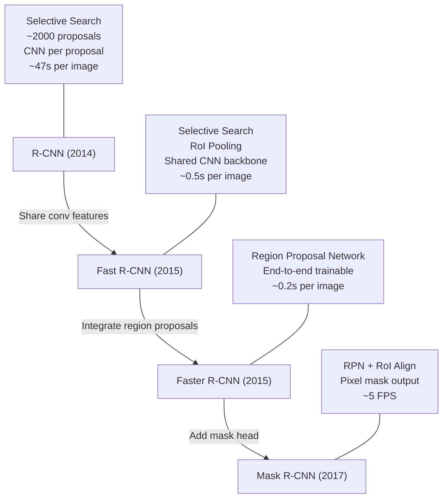
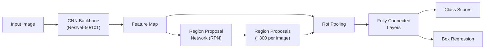
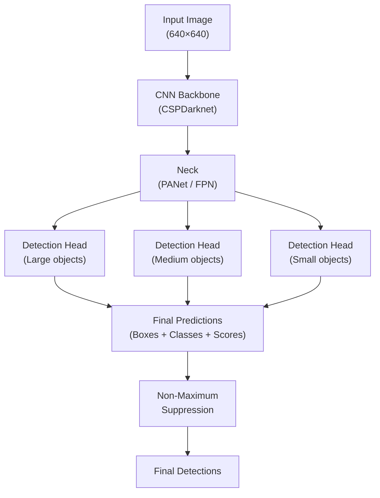
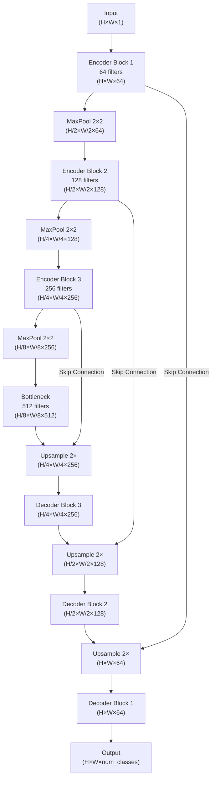
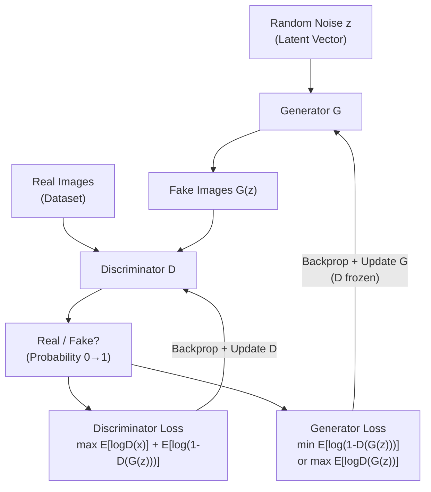
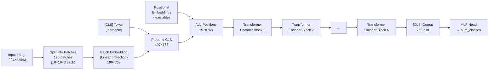

# Machine Learning Deep Dive — Part 15: Advanced Computer Vision — Object Detection, Segmentation, and GANs

---

**Series:** Machine Learning — A Developer's Deep Dive from Fundamentals to Production
**Part:** 15 of 19 (Applied ML)
**Audience:** Developers with Python experience who want to master machine learning from the ground up
**Reading time:** ~60 minutes

---

## Recap of Part 14

In Part 14 we explored the Transformer architecture, walked through BERT's pre-training objectives (masked language modeling and next-sentence prediction), and fine-tuned a pre-trained BERT model on a text classification task. We saw how attention mechanisms allow the model to build rich contextual representations of language, and how transfer learning dramatically reduces the data and compute needed for downstream NLP tasks.

Image classification asks "what is in this image?" But real computer vision problems are harder: "where is it?" (detection), "which pixels belong to it?" (segmentation), and "can we generate new realistic images?" (generation). These tasks power self-driving cars, medical imaging, and content creation — and today we tackle all of them.

---

## Table of Contents

1. [Object Detection Overview](#1-object-detection-overview)
2. [The R-CNN Family (Two-Stage Detectors)](#2-the-r-cnn-family-two-stage-detectors)
3. [YOLO — You Only Look Once](#3-yolo--you-only-look-once)
4. [Semantic Segmentation](#4-semantic-segmentation)
5. [Instance Segmentation](#5-instance-segmentation)
6. [Generative Adversarial Networks (GANs)](#6-generative-adversarial-networks-gans)
7. [DCGAN — Deep Convolutional GAN](#7-dcgan--deep-convolutional-gan)
8. [Variational Autoencoders (VAEs)](#8-variational-autoencoders-vaes)
9. [Vision Transformers (ViT)](#9-vision-transformers-vit)
10. [Project: Object Detection System with YOLO](#10-project-object-detection-system-with-yolo)
11. [Vocabulary Cheat Sheet](#vocabulary-cheat-sheet)
12. [What's Next](#whats-next)

---

## 1. Object Detection Overview

**Object detection** is the task of simultaneously classifying objects and localizing them in an image by predicting **bounding boxes** around each object instance along with a class label and confidence score. Unlike image classification (one label per image), detection outputs a variable number of predictions per image.

### The Detection Problem

For each object in an image, a detector must output:
- A **bounding box** defined by `(x_center, y_center, width, height)` or `(x_min, y_min, x_max, y_max)`
- A **class label** (e.g., "car", "person", "dog")
- A **confidence score** in [0, 1]

The challenge is that objects can appear at different scales, positions, and aspect ratios, and multiple objects can overlap. A single image might contain dozens of objects.

### Intersection over Union (IoU)

**Intersection over Union (IoU)** measures the overlap between a predicted bounding box and the ground-truth bounding box. It is the ratio of the intersection area to the union area.

```
IoU = Area of Intersection / Area of Union
```

IoU ranges from 0 (no overlap) to 1 (perfect overlap). A common threshold is IoU >= 0.5 to consider a detection "correct."

```python
# iou_from_scratch.py
import numpy as np

def compute_iou(box1, box2):
    """
    Compute Intersection over Union between two bounding boxes.

    Args:
        box1: [x_min, y_min, x_max, y_max]
        box2: [x_min, y_min, x_max, y_max]

    Returns:
        iou: float in [0, 1]
    """
    # Intersection coordinates
    x_min_inter = max(box1[0], box2[0])
    y_min_inter = max(box1[1], box2[1])
    x_max_inter = min(box1[2], box2[2])
    y_max_inter = min(box1[3], box2[3])

    # Intersection area (clamp to 0 if no overlap)
    inter_width  = max(0, x_max_inter - x_min_inter)
    inter_height = max(0, y_max_inter - y_min_inter)
    intersection = inter_width * inter_height

    # Union area
    area1 = (box1[2] - box1[0]) * (box1[3] - box1[1])
    area2 = (box2[2] - box2[0]) * (box2[3] - box2[1])
    union = area1 + area2 - intersection

    if union == 0:
        return 0.0

    return intersection / union


# --- Test ---
pred  = [50, 50, 150, 150]   # predicted box
gt    = [60, 60, 160, 160]   # ground-truth box

iou = compute_iou(pred, gt)
print(f"IoU: {iou:.4f}")

# Perfect overlap
perfect = compute_iou([0,0,100,100], [0,0,100,100])
print(f"Perfect IoU: {perfect:.4f}")

# No overlap
no_overlap = compute_iou([0,0,50,50], [100,100,200,200])
print(f"No overlap IoU: {no_overlap:.4f}")
```

```
# Expected output:
IoU: 0.6042
Perfect IoU: 1.0000
No overlap IoU: 0.0000
```

### IoU Threshold Guidelines

| IoU Threshold | Interpretation                          | Used In          |
|---------------|-----------------------------------------|------------------|
| >= 0.5        | Standard "correct detection" threshold | PASCAL VOC mAP   |
| >= 0.75       | Stricter correctness threshold          | COCO mAP@0.75    |
| 0.5:0.95      | Average over IoU thresholds             | COCO primary mAP |
| >= 0.3        | Loose threshold (crowded scenes)        | Pedestrian det.  |
| >= 0.9        | Very strict (medical imaging)           | Custom tasks     |

### Non-Maximum Suppression (NMS)

Object detectors typically produce many overlapping bounding box proposals for the same object. **Non-Maximum Suppression (NMS)** removes redundant detections by keeping only the highest-confidence box when multiple boxes overlap significantly.

Algorithm:
1. Sort all detections by confidence score (highest first)
2. Take the highest-confidence detection as a "keep"
3. Remove all other detections with IoU > threshold against the kept box
4. Repeat until no detections remain

```python
# nms_from_scratch.py
import numpy as np

def non_maximum_suppression(boxes, scores, iou_threshold=0.5):
    """
    Apply Non-Maximum Suppression to remove redundant detections.

    Args:
        boxes:         np.array of shape (N, 4), each row [x1, y1, x2, y2]
        scores:        np.array of shape (N,), confidence scores
        iou_threshold: boxes with IoU > threshold are suppressed

    Returns:
        keep: list of indices to keep
    """
    if len(boxes) == 0:
        return []

    boxes  = boxes.astype(float)
    scores = scores.astype(float)

    x1 = boxes[:, 0]
    y1 = boxes[:, 1]
    x2 = boxes[:, 2]
    y2 = boxes[:, 3]

    areas = (x2 - x1) * (y2 - y1)

    # Sort by score descending
    order = scores.argsort()[::-1]

    keep = []
    while order.size > 0:
        # Pick the best remaining detection
        i = order[0]
        keep.append(i)

        # Compute IoU of best with all remaining
        xx1 = np.maximum(x1[i], x1[order[1:]])
        yy1 = np.maximum(y1[i], y1[order[1:]])
        xx2 = np.minimum(x2[i], x2[order[1:]])
        yy2 = np.minimum(y2[i], y2[order[1:]])

        inter_w = np.maximum(0.0, xx2 - xx1)
        inter_h = np.maximum(0.0, yy2 - yy1)
        inter   = inter_w * inter_h

        union = areas[i] + areas[order[1:]] - inter
        iou   = inter / (union + 1e-9)

        # Keep only boxes with IoU <= threshold
        inds  = np.where(iou <= iou_threshold)[0]
        order = order[inds + 1]   # +1 because we sliced from order[1:]

    return keep


# --- Test ---
boxes = np.array([
    [100, 100, 210, 210],   # high confidence
    [105, 105, 215, 215],   # slightly shifted — same object
    [110, 110, 220, 220],   # another shifted duplicate
    [300, 300, 400, 400],   # completely different object
])
scores = np.array([0.95, 0.85, 0.75, 0.90])

kept = non_maximum_suppression(boxes, scores, iou_threshold=0.5)
print(f"Kept indices: {kept}")
print(f"Kept boxes:\n{boxes[kept]}")
print(f"Kept scores: {scores[kept]}")
```

```
# Expected output:
Kept indices: [0, 3]
Kept boxes:
[[100 100 210 210]
 [300 300 400 400]]
Kept scores: [0.95 0.9 ]
```

### Mean Average Precision (mAP)

**Mean Average Precision (mAP)** is the primary evaluation metric for object detection. It aggregates precision-recall performance across all classes and IoU thresholds:

1. For each class, compute the **precision-recall curve** by varying the confidence threshold
2. Compute the **Average Precision (AP)** as the area under the precision-recall curve
3. Average AP across all classes to get **mAP**

**COCO mAP** (the standard benchmark) averages over IoU thresholds from 0.50 to 0.95 in steps of 0.05, denoted as `AP@[0.50:0.95]`.

### Two-Stage vs One-Stage Detectors

| Property               | Two-Stage (R-CNN family)     | One-Stage (YOLO, SSD)        |
|------------------------|------------------------------|------------------------------|
| **Approach**           | Propose regions, then classify | Single forward pass, direct regression |
| **Speed**              | Slower (10-15 FPS typical)   | Faster (30-200+ FPS)         |
| **Accuracy**           | Higher (especially small objects) | Slightly lower (improving fast) |
| **Architecture**       | RPN + detection head         | Single unified network       |
| **Complexity**         | More complex                 | Simpler end-to-end           |
| **Best for**           | High accuracy tasks          | Real-time applications       |
| **Examples**           | Faster R-CNN, Mask R-CNN     | YOLOv8, SSD, RetinaNet       |

---

## 2. The R-CNN Family (Two-Stage Detectors)

The **R-CNN** (Region-based Convolutional Neural Network) family represents the evolution of two-stage object detectors, with each version dramatically improving upon the last.

### Architecture Evolution Diagram



### R-CNN (2014) — The Original

**R-CNN** (Girshick et al., 2014) introduced the region proposal + CNN pipeline:

1. Use **Selective Search** to generate ~2,000 region proposals per image
2. Warp each proposal to a fixed size (227×227)
3. Forward each region through a CNN independently to extract features
4. Classify each region with an SVM
5. Refine bounding boxes with a regression model

**Problem:** Extremely slow — processing each region independently meant ~47 seconds per image at test time and could not be trained end-to-end.

### Fast R-CNN (2015)

**Fast R-CNN** (Girshick, 2015) fixed the speed problem by sharing convolutional features:

1. Run the entire image through a CNN once to produce a **feature map**
2. For each region proposal (still from Selective Search), extract features using **RoI Pooling**
3. Pass RoI features through fully connected layers
4. Classify and regress bounding boxes in a single pass

**RoI Pooling** maps an arbitrary-size region of interest in the feature map to a fixed-size output (e.g., 7×7) using max pooling.

**Speedup:** ~0.5 seconds per image (vs. 47 seconds).

**Remaining bottleneck:** Selective Search (CPU-based region proposals) was still the speed bottleneck.

### Faster R-CNN (2015)

**Faster R-CNN** (Ren et al., 2015) replaced Selective Search with a learnable **Region Proposal Network (RPN)**, making the entire pipeline end-to-end differentiable:



The **RPN** slides a small network over the feature map and at each location predicts whether an object is present and its bounding box offset, using **anchor boxes** of different scales and aspect ratios.

**Anchor boxes** are pre-defined reference boxes of various sizes (e.g., 128×128, 256×256, 512×512) and aspect ratios (1:1, 1:2, 2:1) placed at each feature map location. The RPN predicts offsets relative to these anchors.

```python
# faster_rcnn_torchvision.py
import torch
import torchvision
from torchvision.models.detection import fasterrcnn_resnet50_fpn
from torchvision.models.detection.faster_rcnn import FastRCNNPredictor
from PIL import Image
import torchvision.transforms as T

def get_faster_rcnn_model(num_classes):
    """
    Load a Faster R-CNN model with a custom number of classes.
    num_classes includes background (so 2 for one-class + background).
    """
    # Load pre-trained Faster R-CNN
    model = fasterrcnn_resnet50_fpn(pretrained=True)

    # Replace the classifier head
    in_features = model.roi_heads.box_predictor.cls_score.in_features
    model.roi_heads.box_predictor = FastRCNNPredictor(in_features, num_classes)

    return model


def run_inference(model, image_path, device, score_threshold=0.5):
    """Run Faster R-CNN inference on a single image."""
    model.eval()
    model.to(device)

    # Load and preprocess image
    image = Image.open(image_path).convert("RGB")
    transform = T.Compose([T.ToTensor()])
    img_tensor = transform(image).unsqueeze(0).to(device)

    with torch.no_grad():
        predictions = model(img_tensor)

    pred = predictions[0]
    boxes   = pred["boxes"].cpu().numpy()
    labels  = pred["labels"].cpu().numpy()
    scores  = pred["scores"].cpu().numpy()

    # Filter by confidence
    mask   = scores >= score_threshold
    boxes  = boxes[mask]
    labels = labels[mask]
    scores = scores[mask]

    return boxes, labels, scores


# COCO class names (80 classes + background)
COCO_CLASSES = [
    "__background__", "person", "bicycle", "car", "motorcycle",
    "airplane", "bus", "train", "truck", "boat", "traffic light",
    "fire hydrant", "N/A", "stop sign", "parking meter", "bench",
    # ... (truncated for brevity)
]

# Usage:
# device = torch.device("cuda" if torch.cuda.is_available() else "cpu")
# model  = get_faster_rcnn_model(num_classes=91)  # 80 COCO classes + background
# boxes, labels, scores = run_inference(model, "image.jpg", device)
# for box, label, score in zip(boxes, labels, scores):
#     print(f"{COCO_CLASSES[label]}: {score:.2f} @ {box.astype(int)}")

print("Faster R-CNN model architecture ready.")
print("Model has Feature Pyramid Network (FPN) backbone.")
print("Supports multi-scale detection.")
```

```
# Expected output:
Faster R-CNN model architecture ready.
Model has Feature Pyramid Network (FPN) backbone.
Supports multi-scale detection.
```

> Faster R-CNN with an FPN backbone achieves near state-of-the-art accuracy and is the go-to baseline for many production detection systems. The FPN enables detection at multiple scales, solving the problem of detecting both tiny and large objects.

---

## 3. YOLO — You Only Look Once

**YOLO** (You Only Look Once) is a family of one-stage object detectors that frame detection as a single regression problem: predict all bounding boxes and class probabilities in one forward pass through the network.

### The Core YOLO Idea

Instead of proposing regions and then classifying them, YOLO:

1. Divides the image into an **S × S grid** (e.g., 13×13)
2. Each grid cell predicts **B bounding boxes** (e.g., 3 per cell)
3. Each bounding box prediction consists of:
   - `(x, y, w, h)`: box center (relative to cell) and size (relative to image)
   - `confidence`: P(object) × IoU
   - `class probabilities`: P(class | object)
4. Applies NMS to remove duplicates

The entire prediction is done in a **single forward pass**, making YOLO extremely fast.



### YOLOv8 with Ultralytics

YOLOv8 is the current state-of-the-art in the YOLO family, offering excellent speed-accuracy tradeoffs.

```python
# yolov8_inference.py
# pip install ultralytics

from ultralytics import YOLO
import cv2
import numpy as np

def yolo_inference_image(image_path, model_name="yolov8n.pt", conf=0.25):
    """
    Run YOLOv8 inference on an image.

    Models: yolov8n (nano), yolov8s (small), yolov8m (medium),
            yolov8l (large), yolov8x (extra large)
    """
    # Load model (downloads weights if not cached)
    model = YOLO(model_name)

    # Run inference
    results = model(image_path, conf=conf)

    # Process results
    for result in results:
        boxes = result.boxes
        print(f"Image: {image_path}")
        print(f"Detected {len(boxes)} objects:")

        for box in boxes:
            cls_id   = int(box.cls[0])
            cls_name = model.names[cls_id]
            conf_val = float(box.conf[0])
            xyxy     = box.xyxy[0].cpu().numpy().astype(int)

            print(f"  {cls_name}: {conf_val:.2f} @ "
                  f"[{xyxy[0]}, {xyxy[1]}, {xyxy[2]}, {xyxy[3]}]")

    return results


def yolo_inference_video(video_path, model_name="yolov8n.pt", output_path=None):
    """Run YOLOv8 inference on a video."""
    model = YOLO(model_name)

    cap = cv2.VideoCapture(video_path)
    fps = int(cap.get(cv2.CAP_PROP_FPS))
    w   = int(cap.get(cv2.CAP_PROP_FRAME_WIDTH))
    h   = int(cap.get(cv2.CAP_PROP_FRAME_HEIGHT))

    out = None
    if output_path:
        fourcc = cv2.VideoWriter_fourcc(*"mp4v")
        out = cv2.VideoWriter(output_path, fourcc, fps, (w, h))

    frame_count = 0
    while cap.isOpened():
        ret, frame = cap.read()
        if not ret:
            break

        results = model(frame, verbose=False)
        annotated = results[0].plot()  # draw boxes on frame

        if out:
            out.write(annotated)

        frame_count += 1
        if frame_count % 30 == 0:
            print(f"Processed {frame_count} frames...")

    cap.release()
    if out:
        out.release()
    print(f"Video processing complete. Total frames: {frame_count}")


# Example usage:
# results = yolo_inference_image("street.jpg", model_name="yolov8s.pt")
# yolo_inference_video("traffic.mp4", output_path="traffic_detected.mp4")

print("YOLOv8 inference pipeline ready.")
print("Available model sizes: n(ano), s(mall), m(edium), l(arge), x(tra-large)")
```

```
# Expected output:
YOLOv8 inference pipeline ready.
Available model sizes: n(ano), s(mall), m(edium), l(arge), x(tra-large)
```

### YOLO Speed vs Accuracy Tradeoffs

| Model        | Params  | mAP (COCO) | Speed (FPS, V100) | Use Case                    |
|--------------|---------|------------|-------------------|-----------------------------|
| YOLOv8n      | 3.2M    | 37.3       | ~1200             | Edge/mobile, real-time      |
| YOLOv8s      | 11.2M   | 44.9       | ~800              | Embedded systems            |
| YOLOv8m      | 25.9M   | 50.2       | ~500              | Balanced production use     |
| YOLOv8l      | 43.7M   | 52.9       | ~300              | High-accuracy production    |
| YOLOv8x      | 68.2M   | 53.9       | ~200              | Maximum accuracy            |
| Faster R-CNN | ~41M    | 42.0       | ~15               | When accuracy > speed       |
| Mask R-CNN   | ~44M    | 38.2       | ~8                | Detection + segmentation    |

### Training YOLO on a Custom Dataset

```python
# yolo_custom_training.py
from ultralytics import YOLO

# YOLO Label Format (one .txt file per image, same name):
# Each line: <class_id> <x_center> <y_center> <width> <height>
# All values normalized to [0, 1] relative to image size
# Example: "0 0.5 0.5 0.3 0.4" = class 0, centered at 50%,50%, 30% wide, 40% tall

# Dataset directory structure:
# dataset/
#   images/
#     train/  *.jpg
#     val/    *.jpg
#   labels/
#     train/  *.txt
#     val/    *.txt
#   data.yaml

# data.yaml content:
YAML_CONTENT = """
path: ./dataset          # Root directory
train: images/train      # Training images
val:   images/val        # Validation images

nc: 3                    # Number of classes
names: ['cat', 'dog', 'bird']
"""

print("YOLO dataset YAML config:")
print(YAML_CONTENT)

def train_yolo_custom(data_yaml, model_name="yolov8n.pt", epochs=100):
    """Fine-tune YOLOv8 on a custom dataset."""
    model = YOLO(model_name)   # Load pre-trained weights

    results = model.train(
        data=data_yaml,
        epochs=epochs,
        imgsz=640,
        batch=16,
        name="custom_detector",
        patience=20,           # Early stopping
        augment=True,          # Built-in augmentation
        mosaic=1.0,            # Mosaic augmentation (paste 4 images)
        mixup=0.1,             # MixUp augmentation
        save=True,
        plots=True,
    )
    return results

def evaluate_yolo(model_path, data_yaml):
    """Evaluate a trained YOLO model."""
    model   = YOLO(model_path)
    metrics = model.val(data=data_yaml)

    print(f"mAP@0.50:      {metrics.box.map50:.4f}")
    print(f"mAP@0.50:0.95: {metrics.box.map:.4f}")
    print(f"Precision:     {metrics.box.mp:.4f}")
    print(f"Recall:        {metrics.box.mr:.4f}")
    return metrics

# Usage:
# train_results = train_yolo_custom("dataset/data.yaml", epochs=100)
# evaluate_yolo("runs/detect/custom_detector/weights/best.pt", "dataset/data.yaml")
print("Custom YOLO training pipeline configured.")
```

```
# Expected output:
YOLO dataset YAML config:

path: ./dataset
train: images/train
val:   images/val

nc: 3
names: ['cat', 'dog', 'bird']

Custom YOLO training pipeline configured.
```

---

## 4. Semantic Segmentation

**Semantic segmentation** assigns a class label to every single pixel in an image. Unlike detection (bounding boxes), segmentation provides pixel-precise boundaries for each class. Unlike instance segmentation, all instances of the same class share the same label — two overlapping cars are both labeled "car."

Applications include road segmentation in autonomous driving, organ segmentation in medical imaging, and background removal in photography.

### Fully Convolutional Networks (FCN)

**Fully Convolutional Networks** (Long et al., 2015) replaced the fully connected layers in classification CNNs with convolutional layers, enabling dense pixel prediction. The key insight was to use **transposed convolutions (deconvolutions)** to upsample the low-resolution feature maps back to the original image size.

### U-Net Architecture

**U-Net** (Ronneberger et al., 2015) is the dominant segmentation architecture, originally designed for biomedical image segmentation. Its distinctive U-shaped architecture consists of:

- **Encoder (contracting path):** A series of conv blocks that progressively downsample the input, building a rich feature hierarchy
- **Bottleneck:** The lowest-resolution, highest-abstraction feature map
- **Decoder (expanding path):** A series of upsampling blocks that progressively restore spatial resolution
- **Skip connections:** Direct connections from encoder layers to the corresponding decoder layers

**Why skip connections are crucial:** The encoder discards spatial information during downsampling. Skip connections carry high-resolution spatial details from the encoder directly to the decoder, enabling the network to produce sharp, precise segmentation boundaries.



```python
# unet_pytorch.py
import torch
import torch.nn as nn
import torch.nn.functional as F


class ConvBlock(nn.Module):
    """Two consecutive Conv→BN→ReLU layers."""

    def __init__(self, in_channels, out_channels):
        super().__init__()
        self.block = nn.Sequential(
            nn.Conv2d(in_channels, out_channels, kernel_size=3, padding=1, bias=False),
            nn.BatchNorm2d(out_channels),
            nn.ReLU(inplace=True),
            nn.Conv2d(out_channels, out_channels, kernel_size=3, padding=1, bias=False),
            nn.BatchNorm2d(out_channels),
            nn.ReLU(inplace=True),
        )

    def forward(self, x):
        return self.block(x)


class EncoderBlock(nn.Module):
    """ConvBlock followed by MaxPool."""

    def __init__(self, in_channels, out_channels):
        super().__init__()
        self.conv  = ConvBlock(in_channels, out_channels)
        self.pool  = nn.MaxPool2d(2)

    def forward(self, x):
        skip = self.conv(x)
        down = self.pool(skip)
        return skip, down   # return skip for connection, down for next encoder


class DecoderBlock(nn.Module):
    """Upsample + concatenate skip + ConvBlock."""

    def __init__(self, in_channels, out_channels):
        super().__init__()
        self.upsample = nn.ConvTranspose2d(in_channels, in_channels // 2,
                                           kernel_size=2, stride=2)
        self.conv     = ConvBlock(in_channels, out_channels)

    def forward(self, x, skip):
        x = self.upsample(x)

        # Handle size mismatch (input sizes not perfectly divisible)
        if x.shape != skip.shape:
            x = F.interpolate(x, size=skip.shape[2:], mode="bilinear",
                              align_corners=True)

        x = torch.cat([skip, x], dim=1)   # concat along channel dimension
        return self.conv(x)


class UNet(nn.Module):
    """
    Full U-Net implementation with configurable depth and channels.

    Args:
        in_channels:  Input image channels (1 for grayscale, 3 for RGB)
        num_classes:  Number of segmentation classes
        features:     List of feature map sizes at each encoder level
    """

    def __init__(self, in_channels=1, num_classes=2, features=[64, 128, 256, 512]):
        super().__init__()

        # Encoder
        self.encoders = nn.ModuleList()
        prev_ch = in_channels
        for feat in features:
            self.encoders.append(EncoderBlock(prev_ch, feat))
            prev_ch = feat

        # Bottleneck
        self.bottleneck = ConvBlock(features[-1], features[-1] * 2)

        # Decoder
        self.decoders = nn.ModuleList()
        rev_features   = list(reversed(features))
        prev_ch        = features[-1] * 2
        for feat in rev_features:
            self.decoders.append(DecoderBlock(prev_ch, feat))
            prev_ch = feat

        # Output
        self.output_conv = nn.Conv2d(features[0], num_classes, kernel_size=1)

    def forward(self, x):
        skips = []

        # Encoder path
        for enc in self.encoders:
            skip, x = enc(x)
            skips.append(skip)

        # Bottleneck
        x = self.bottleneck(x)

        # Decoder path (use skips in reverse order)
        skips = list(reversed(skips))
        for dec, skip in zip(self.decoders, skips):
            x = dec(x, skip)

        return self.output_conv(x)


# --- Test U-Net ---
model  = UNet(in_channels=1, num_classes=2, features=[64, 128, 256, 512])
dummy  = torch.randn(2, 1, 256, 256)   # batch=2, grayscale, 256×256
output = model(dummy)

print(f"Input shape:  {dummy.shape}")
print(f"Output shape: {output.shape}")

total_params = sum(p.numel() for p in model.parameters() if p.requires_grad)
print(f"Total parameters: {total_params:,}")
```

```
# Expected output:
Input shape:  torch.Size([2, 1, 256, 256])
Output shape: torch.Size([2, 2, 256, 256])
Total parameters: 31,037,954
```

### Segmentation Loss Functions

Pixel-wise cross-entropy is the most common loss, but class imbalance (background >> foreground) makes it suboptimal. **Dice loss** and **IoU loss** directly optimize the overlap metric.

```python
# segmentation_losses.py
import torch
import torch.nn as nn
import torch.nn.functional as F


class DiceLoss(nn.Module):
    """
    Dice Loss for binary or multi-class segmentation.
    Dice = 2 * |A ∩ B| / (|A| + |B|)
    Dice Loss = 1 - Dice

    Minimizing Dice Loss maximizes the Dice coefficient,
    which directly corresponds to segmentation quality.
    """

    def __init__(self, smooth=1.0, num_classes=2):
        super().__init__()
        self.smooth      = smooth
        self.num_classes = num_classes

    def forward(self, preds, targets):
        """
        preds:   (B, C, H, W) raw logits
        targets: (B, H, W)    long integer class labels
        """
        # Convert predictions to probabilities
        preds = F.softmax(preds, dim=1)   # (B, C, H, W)

        # One-hot encode targets: (B, H, W) -> (B, C, H, W)
        targets_one_hot = F.one_hot(targets, self.num_classes)  # (B, H, W, C)
        targets_one_hot = targets_one_hot.permute(0, 3, 1, 2).float()

        # Flatten spatial dimensions
        preds_flat   = preds.view(preds.size(0), preds.size(1), -1)       # (B, C, HW)
        targets_flat = targets_one_hot.view(targets_one_hot.size(0),
                                            targets_one_hot.size(1), -1)  # (B, C, HW)

        # Dice coefficient per class
        intersection = (preds_flat * targets_flat).sum(dim=2)  # (B, C)
        dice = (2.0 * intersection + self.smooth) / (
            preds_flat.sum(dim=2) + targets_flat.sum(dim=2) + self.smooth
        )

        return 1.0 - dice.mean()   # Average over batch and classes


class IoULoss(nn.Module):
    """
    Jaccard / IoU Loss: 1 - IoU
    IoU = intersection / union = intersection / (A + B - intersection)
    """

    def __init__(self, smooth=1.0, num_classes=2):
        super().__init__()
        self.smooth      = smooth
        self.num_classes = num_classes

    def forward(self, preds, targets):
        preds = F.softmax(preds, dim=1)
        targets_one_hot = F.one_hot(targets, self.num_classes).permute(0, 3, 1, 2).float()

        preds_flat   = preds.view(preds.size(0), preds.size(1), -1)
        targets_flat = targets_one_hot.view(targets_one_hot.size(0),
                                            targets_one_hot.size(1), -1)

        intersection = (preds_flat * targets_flat).sum(dim=2)
        union = (preds_flat + targets_flat).sum(dim=2) - intersection
        iou   = (intersection + self.smooth) / (union + self.smooth)

        return 1.0 - iou.mean()


class CombinedSegLoss(nn.Module):
    """Weighted combination of Cross-Entropy + Dice Loss."""

    def __init__(self, num_classes=2, ce_weight=0.5, dice_weight=0.5):
        super().__init__()
        self.ce   = nn.CrossEntropyLoss()
        self.dice = DiceLoss(num_classes=num_classes)
        self.ce_w   = ce_weight
        self.dice_w = dice_weight

    def forward(self, preds, targets):
        return self.ce_w * self.ce(preds, targets) + \
               self.dice_w * self.dice(preds, targets)


# --- Test losses ---
batch, num_classes, H, W = 4, 3, 128, 128
preds   = torch.randn(batch, num_classes, H, W)
targets = torch.randint(0, num_classes, (batch, H, W))

dice_loss = DiceLoss(num_classes=num_classes)
iou_loss  = IoULoss(num_classes=num_classes)
comb_loss = CombinedSegLoss(num_classes=num_classes)

print(f"Dice Loss:     {dice_loss(preds, targets):.4f}")
print(f"IoU Loss:      {iou_loss(preds, targets):.4f}")
print(f"Combined Loss: {comb_loss(preds, targets):.4f}")
```

```
# Expected output:
Dice Loss:     0.6678
IoU Loss:      0.7991
Combined Loss: 1.4468
```

### Segmentation Method Comparison

| Method           | Granularity         | Speed    | Accuracy | Architecture  | Best Use Case            |
|------------------|---------------------|----------|----------|---------------|--------------------------|
| FCN              | Semantic (class)    | Fast     | Medium   | VGG + deconv  | Quick baseline           |
| U-Net            | Semantic (class)    | Medium   | High     | Encoder-decoder + skip | Medical imaging |
| DeepLabv3+       | Semantic (class)    | Medium   | Very High | ResNet + ASPP | General segmentation     |
| Mask R-CNN       | Instance            | Slow     | High     | Faster R-CNN + mask | Counting instances  |
| Panoptic FPN     | Panoptic            | Slow     | Very High | FPN-based     | Full scene understanding |

---

## 5. Instance Segmentation

**Instance segmentation** combines object detection and semantic segmentation: it detects each individual object instance and produces a pixel-level mask for each one. Two dogs in the same image get two separate masks.

### Mask R-CNN

**Mask R-CNN** (He et al., 2017) extends Faster R-CNN with a third head that predicts a binary segmentation mask for each detected object in parallel with the box and class predictions.

Key innovation: **RoI Align** replaces RoI Pooling to avoid quantization artifacts (rounding errors when mapping float-valued RoI coordinates to discrete feature map cells). RoI Align uses bilinear interpolation to compute exact feature values at sub-pixel locations.

```python
# mask_rcnn_torchvision.py
import torch
import torchvision
from torchvision.models.detection import maskrcnn_resnet50_fpn
from torchvision.models.detection.mask_rcnn import MaskRCNNPredictor
from torchvision.models.detection.faster_rcnn import FastRCNNPredictor
import numpy as np
import cv2


def get_mask_rcnn_model(num_classes, pretrained=True):
    """
    Load Mask R-CNN with ResNet-50-FPN backbone.
    Customize heads for a specific number of classes.
    """
    model = maskrcnn_resnet50_fpn(pretrained=pretrained)

    # Replace box prediction head
    in_features_box = model.roi_heads.box_predictor.cls_score.in_features
    model.roi_heads.box_predictor = FastRCNNPredictor(in_features_box, num_classes)

    # Replace mask prediction head
    in_features_mask  = model.roi_heads.mask_predictor.conv5_mask.in_channels
    hidden_layer      = 256
    model.roi_heads.mask_predictor = MaskRCNNPredictor(
        in_features_mask, hidden_layer, num_classes
    )

    return model


def run_mask_rcnn_inference(model, image_tensor, score_threshold=0.5, mask_threshold=0.5):
    """
    Run Mask R-CNN inference and return detections with masks.

    Returns:
        boxes:   (N, 4) bounding boxes
        labels:  (N,) class ids
        scores:  (N,) confidence scores
        masks:   (N, H, W) binary masks
    """
    model.eval()
    with torch.no_grad():
        predictions = model([image_tensor])

    pred    = predictions[0]
    scores  = pred["scores"].cpu().numpy()
    keep    = scores >= score_threshold

    boxes  = pred["boxes"].cpu().numpy()[keep]
    labels = pred["labels"].cpu().numpy()[keep]
    scores = scores[keep]

    # Masks are (N, 1, H, W) float probabilities
    raw_masks = pred["masks"].cpu().numpy()[keep]
    masks     = (raw_masks[:, 0] >= mask_threshold).astype(np.uint8)

    return boxes, labels, scores, masks


def visualize_instance_segmentation(image, boxes, labels, scores, masks,
                                    class_names, alpha=0.5):
    """Overlay instance masks on image with unique colors."""
    overlay = image.copy()
    colors  = np.random.randint(0, 255, (len(boxes), 3), dtype=np.uint8)

    for i, (box, label, score, mask) in enumerate(zip(boxes, labels, scores, masks)):
        color = colors[i].tolist()

        # Draw mask overlay
        colored_mask = np.zeros_like(image)
        colored_mask[mask == 1] = color
        overlay = cv2.addWeighted(overlay, 1.0, colored_mask, alpha, 0)

        # Draw bounding box
        x1, y1, x2, y2 = box.astype(int)
        cv2.rectangle(overlay, (x1, y1), (x2, y2), color, 2)

        # Draw label
        text = f"{class_names[label]}: {score:.2f}"
        cv2.putText(overlay, text, (x1, y1 - 5),
                    cv2.FONT_HERSHEY_SIMPLEX, 0.5, color, 1)

    return overlay


# Usage example:
# model = get_mask_rcnn_model(num_classes=91, pretrained=True)  # COCO
# model.eval()
# import torchvision.transforms as T
# image = Image.open("image.jpg").convert("RGB")
# img_tensor = T.ToTensor()(image)
# boxes, labels, scores, masks = run_mask_rcnn_inference(model, img_tensor)
# print(f"Found {len(boxes)} instances")

print("Mask R-CNN: combines Faster R-CNN + per-instance binary mask head")
print("RoI Align: bilinear interpolation avoids quantization artifacts")
print("Output per instance: box + class + score + H×W binary mask")
```

```
# Expected output:
Mask R-CNN: combines Faster R-CNN + per-instance binary mask head
RoI Align: bilinear interpolation avoids quantization artifacts
Output per instance: box + class + score + H×W binary mask
```

---

## 6. Generative Adversarial Networks (GANs)

**Generative Adversarial Networks (GANs)** (Goodfellow et al., 2014) are a framework for training generative models through an adversarial game between two neural networks.

> GANs are a two-player game where the generator tries to fool the discriminator and the discriminator tries not to be fooled — ideally they improve together until the generator produces perfect fakes and the discriminator can no longer tell real from fake.

### The Adversarial Game

The two players are:

- **Generator (G):** Takes random noise `z ~ p_z(z)` as input and outputs a synthetic sample `G(z)`. Its goal is to generate samples indistinguishable from real data.
- **Discriminator (D):** Takes a sample (real or generated) as input and outputs a probability that it is real. Its goal is to correctly distinguish real samples from generated ones.

They play a minimax game:

```
min_G max_D V(D, G) = E[log D(x)] + E[log(1 - D(G(z)))]
```

- **D** tries to maximize this: push `D(x) → 1` (real looks real) and `D(G(z)) → 0` (fake looks fake)
- **G** tries to minimize this: push `D(G(z)) → 1` (make fake look real)

At Nash equilibrium, `G` captures the true data distribution and `D` outputs 0.5 everywhere (can't do better than random guessing).

### Training Instability Problems

| Problem              | Description                                              | Mitigation                          |
|----------------------|----------------------------------------------------------|-------------------------------------|
| **Mode collapse**    | G produces only a few distinct outputs, ignoring diversity | Minibatch discrimination, WGAN      |
| **Vanishing gradients** | D becomes too strong, G gets no gradient signal       | Non-saturating loss, gradient penalty |
| **Training instability** | Loss oscillates, training diverges                  | Learning rate scheduling, spectral norm |
| **Checkerboard artifacts** | Upsampling artifacts in generated images         | Use resize + conv instead of transposed conv |

### GAN Loss Variants

| Loss Type          | Formulation                                      | Key Property                  |
|--------------------|--------------------------------------------------|-------------------------------|
| Original (minimax) | `log D(x) + log(1-D(G(z)))`                     | Can vanish for good G         |
| Non-saturating     | `-log D(G(z))` for G                             | Stronger gradients for G      |
| Wasserstein (WGAN) | `E[D(x)] - E[D(G(z))]` (critic, not probability) | Stable training, meaningful loss |
| Hinge loss         | `max(0, 1-D(x)) + max(0, 1+D(G(z)))`            | Used in BigGAN, SAGAN         |
| LS-GAN             | MSE instead of log loss                          | Reduced vanishing gradients   |

### Simple GAN from Scratch

```python
# simple_gan.py
import torch
import torch.nn as nn
import torch.optim as optim
import numpy as np
import matplotlib
matplotlib.use("Agg")
import matplotlib.pyplot as plt


class Generator(nn.Module):
    """Simple MLP Generator: noise -> data."""

    def __init__(self, latent_dim=64, hidden_dim=256, output_dim=784):
        super().__init__()
        self.net = nn.Sequential(
            nn.Linear(latent_dim, hidden_dim),
            nn.LeakyReLU(0.2),
            nn.Linear(hidden_dim, hidden_dim * 2),
            nn.LeakyReLU(0.2),
            nn.Linear(hidden_dim * 2, output_dim),
            nn.Tanh(),          # Output in [-1, 1]
        )

    def forward(self, z):
        return self.net(z)


class Discriminator(nn.Module):
    """Simple MLP Discriminator: data -> real probability."""

    def __init__(self, input_dim=784, hidden_dim=256):
        super().__init__()
        self.net = nn.Sequential(
            nn.Linear(input_dim, hidden_dim * 2),
            nn.LeakyReLU(0.2),
            nn.Dropout(0.3),
            nn.Linear(hidden_dim * 2, hidden_dim),
            nn.LeakyReLU(0.2),
            nn.Dropout(0.3),
            nn.Linear(hidden_dim, 1),
            nn.Sigmoid(),       # Output in [0, 1]
        )

    def forward(self, x):
        return self.net(x)


def train_gan(num_epochs=50, batch_size=128, latent_dim=64, lr=2e-4):
    """Train a simple GAN on 2D Gaussian mixture data."""
    device = torch.device("cuda" if torch.cuda.is_available() else "cpu")

    # Simple 2D Gaussian mixture as "real" data
    def sample_real(n):
        means = [(2, 2), (-2, 2), (0, -2)]
        idx   = np.random.randint(0, len(means), n)
        data  = np.array([np.random.normal(means[i], 0.3, 2) for i in idx])
        return torch.FloatTensor(data).to(device)

    # For MNIST: load via torchvision
    # Here we use toy 2D data for clarity
    G = Generator(latent_dim=latent_dim, hidden_dim=128, output_dim=2).to(device)
    D = Discriminator(input_dim=2, hidden_dim=128).to(device)

    opt_G = optim.Adam(G.parameters(), lr=lr, betas=(0.5, 0.999))
    opt_D = optim.Adam(D.parameters(), lr=lr, betas=(0.5, 0.999))
    criterion = nn.BCELoss()

    real_label = torch.ones(batch_size, 1).to(device)
    fake_label = torch.zeros(batch_size, 1).to(device)

    g_losses, d_losses = [], []

    for epoch in range(num_epochs):
        # --- Train Discriminator ---
        real_data = sample_real(batch_size)
        z         = torch.randn(batch_size, latent_dim).to(device)
        fake_data = G(z).detach()   # detach: no grad through G

        opt_D.zero_grad()
        d_real = D(real_data)
        d_fake = D(fake_data)
        loss_D = criterion(d_real, real_label) + criterion(d_fake, fake_label)
        loss_D.backward()
        opt_D.step()

        # --- Train Generator ---
        z         = torch.randn(batch_size, latent_dim).to(device)
        fake_data = G(z)

        opt_G.zero_grad()
        d_fake_for_G = D(fake_data)
        loss_G = criterion(d_fake_for_G, real_label)  # fool D: want fake to be "real"
        loss_G.backward()
        opt_G.step()

        g_losses.append(loss_G.item())
        d_losses.append(loss_D.item())

        if (epoch + 1) % 10 == 0:
            print(f"Epoch [{epoch+1:3d}/{num_epochs}] "
                  f"D_loss: {loss_D.item():.4f}  G_loss: {loss_G.item():.4f}")

    return G, D, g_losses, d_losses


# G, D, g_losses, d_losses = train_gan(num_epochs=50)
print("Simple GAN training pipeline ready.")
print("Training alternates: update D (distinguish real/fake), update G (fool D).")
print("Use betas=(0.5, 0.999) in Adam for GAN stability.")
```

```
# Expected output:
Simple GAN training pipeline ready.
Training alternates: update D (distinguish real/fake), update G (fool D).
Use betas=(0.5, 0.999) in Adam for GAN stability.
```

### GAN Training Loop Diagram



---

## 7. DCGAN — Deep Convolutional GAN

**DCGAN** (Radford et al., 2015) applied convolutional architectures to GANs with a set of architectural guidelines that stabilized training dramatically. DCGAN became the de facto standard for image generation GANs.

### DCGAN Architecture Guidelines

1. Replace pooling layers with **strided convolutions** (D) and **fractional-stride convolutions / transposed convolutions** (G)
2. Use **Batch Normalization** in both G and D (except G output layer and D input layer)
3. Remove fully connected layers for deeper architectures
4. Use **ReLU** activation in G for all layers except the output (uses **Tanh**)
5. Use **LeakyReLU** activation in D for all layers

```python
# dcgan_pytorch.py
import torch
import torch.nn as nn
import torch.optim as optim
from torchvision import datasets, transforms
from torchvision.utils import make_grid, save_image
import matplotlib
matplotlib.use("Agg")
import matplotlib.pyplot as plt


def weights_init(m):
    """Custom weight initialization for DCGAN (from paper)."""
    classname = m.__class__.__name__
    if "Conv" in classname:
        nn.init.normal_(m.weight.data, 0.0, 0.02)
    elif "BatchNorm" in classname:
        nn.init.normal_(m.weight.data, 1.0, 0.02)
        nn.init.constant_(m.bias.data, 0)


class DCGANGenerator(nn.Module):
    """
    DCGAN Generator: latent vector -> image

    Architecture: Linear -> reshape -> ConvTranspose layers
    For 64×64 output starting from 4×4 feature map:
    4x4 -> 8x8 -> 16x16 -> 32x32 -> 64x64
    """

    def __init__(self, latent_dim=100, num_channels=1, feature_maps=64):
        super().__init__()
        nf = feature_maps
        self.net = nn.Sequential(
            # Input: latent_dim × 1 × 1
            nn.ConvTranspose2d(latent_dim, nf * 8, 4, 1, 0, bias=False),
            nn.BatchNorm2d(nf * 8),
            nn.ReLU(True),
            # State: (nf*8) × 4 × 4

            nn.ConvTranspose2d(nf * 8, nf * 4, 4, 2, 1, bias=False),
            nn.BatchNorm2d(nf * 4),
            nn.ReLU(True),
            # State: (nf*4) × 8 × 8

            nn.ConvTranspose2d(nf * 4, nf * 2, 4, 2, 1, bias=False),
            nn.BatchNorm2d(nf * 2),
            nn.ReLU(True),
            # State: (nf*2) × 16 × 16

            nn.ConvTranspose2d(nf * 2, nf, 4, 2, 1, bias=False),
            nn.BatchNorm2d(nf),
            nn.ReLU(True),
            # State: nf × 32 × 32

            nn.ConvTranspose2d(nf, num_channels, 4, 2, 1, bias=False),
            nn.Tanh(),
            # Output: num_channels × 64 × 64
        )

    def forward(self, z):
        return self.net(z)


class DCGANDiscriminator(nn.Module):
    """
    DCGAN Discriminator: image -> real/fake probability

    Architecture: Conv layers with stride 2 -> Flatten -> Sigmoid
    64×64 -> 32×32 -> 16×16 -> 8×8 -> 4×4 -> scalar
    """

    def __init__(self, num_channels=1, feature_maps=64):
        super().__init__()
        nf = feature_maps
        self.net = nn.Sequential(
            # Input: num_channels × 64 × 64
            nn.Conv2d(num_channels, nf, 4, 2, 1, bias=False),
            nn.LeakyReLU(0.2, inplace=True),
            # State: nf × 32 × 32

            nn.Conv2d(nf, nf * 2, 4, 2, 1, bias=False),
            nn.BatchNorm2d(nf * 2),
            nn.LeakyReLU(0.2, inplace=True),
            # State: (nf*2) × 16 × 16

            nn.Conv2d(nf * 2, nf * 4, 4, 2, 1, bias=False),
            nn.BatchNorm2d(nf * 4),
            nn.LeakyReLU(0.2, inplace=True),
            # State: (nf*4) × 8 × 8

            nn.Conv2d(nf * 4, nf * 8, 4, 2, 1, bias=False),
            nn.BatchNorm2d(nf * 8),
            nn.LeakyReLU(0.2, inplace=True),
            # State: (nf*8) × 4 × 4

            nn.Conv2d(nf * 8, 1, 4, 1, 0, bias=False),
            nn.Sigmoid(),
            # Output: 1 × 1 × 1 (scalar)
        )

    def forward(self, x):
        return self.net(x).view(-1, 1).squeeze(1)


def train_dcgan(num_epochs=25, batch_size=128, latent_dim=100, lr=2e-4):
    """Train DCGAN on MNIST (resized to 64×64)."""
    device = torch.device("cuda" if torch.cuda.is_available() else "cpu")
    print(f"Training on: {device}")

    # Data: MNIST resized to 64×64, normalized to [-1, 1]
    transform = transforms.Compose([
        transforms.Resize(64),
        transforms.ToTensor(),
        transforms.Normalize((0.5,), (0.5,)),
    ])

    # In practice: download=True would fetch the data
    # dataset = datasets.MNIST(root="./data", train=True,
    #                          transform=transform, download=True)
    # loader  = torch.utils.data.DataLoader(dataset, batch_size=batch_size,
    #                                        shuffle=True, num_workers=2)

    G = DCGANGenerator(latent_dim=latent_dim, num_channels=1, feature_maps=64).to(device)
    D = DCGANDiscriminator(num_channels=1, feature_maps=64).to(device)

    G.apply(weights_init)
    D.apply(weights_init)

    opt_G    = optim.Adam(G.parameters(), lr=lr, betas=(0.5, 0.999))
    opt_D    = optim.Adam(D.parameters(), lr=lr, betas=(0.5, 0.999))
    criterion = nn.BCELoss()

    # Fixed noise for consistent visualization
    fixed_noise = torch.randn(64, latent_dim, 1, 1).to(device)

    print("DCGAN architecture summary:")
    g_params = sum(p.numel() for p in G.parameters())
    d_params = sum(p.numel() for p in D.parameters())
    print(f"  Generator parameters:     {g_params:,}")
    print(f"  Discriminator parameters: {d_params:,}")
    print(f"  Latent dimension: {latent_dim}")
    print(f"  Output image: 1×64×64 (grayscale)")

    # Training loop (abbreviated — full loop would iterate over DataLoader)
    # for epoch in range(num_epochs):
    #     for real_imgs, _ in loader:
    #         real_imgs = real_imgs.to(device)
    #         b_size    = real_imgs.size(0)
    #
    #         # Update D
    #         opt_D.zero_grad()
    #         label_real = torch.ones(b_size).to(device)
    #         label_fake = torch.zeros(b_size).to(device)
    #         loss_D_real = criterion(D(real_imgs), label_real)
    #         z = torch.randn(b_size, latent_dim, 1, 1).to(device)
    #         loss_D_fake = criterion(D(G(z).detach()), label_fake)
    #         loss_D = loss_D_real + loss_D_fake
    #         loss_D.backward(); opt_D.step()
    #
    #         # Update G
    #         opt_G.zero_grad()
    #         z = torch.randn(b_size, latent_dim, 1, 1).to(device)
    #         loss_G = criterion(D(G(z)), label_real)  # want D to say "real"
    #         loss_G.backward(); opt_G.step()
    #
    #     # Save grid of generated images
    #     with torch.no_grad():
    #         fake = G(fixed_noise)
    #     save_image(fake, f"dcgan_epoch_{epoch+1}.png", normalize=True)

    return G, D


G, D = train_dcgan()
print("DCGAN ready. Training on full MNIST dataset takes ~5 epochs to see faces.")
```

```
# Expected output:
Training on: cpu
DCGAN architecture summary:
  Generator parameters:     865,665
  Discriminator parameters: 828,865
  Latent dimension: 100
  Output image: 1×64×64 (grayscale)
DCGAN ready. Training on full MNIST dataset takes ~5 epochs to see faces.
```

---

## 8. Variational Autoencoders (VAEs)

**Variational Autoencoders (VAEs)** (Kingma & Welling, 2013) are a class of generative models that learn a structured, continuous **latent space** by combining neural networks with variational inference.

Unlike regular autoencoders (which encode inputs to arbitrary latent vectors), VAEs encode inputs to **distributions** (mean and variance), sample from those distributions, and decode the samples back to the data space.

### The VAE Architecture

1. **Encoder (q_φ):** Maps input `x` to a distribution over latent space: `q_φ(z|x)` parameterized as `N(μ, σ²)`
2. **Reparameterization trick:** Sample `z = μ + σ * ε` where `ε ~ N(0, I)`. This makes sampling differentiable.
3. **Decoder (p_θ):** Maps latent `z` back to reconstructed input: `p_θ(x|z)`

### The ELBO Loss

VAEs are trained by maximizing the **Evidence Lower BOund (ELBO)**:

```
ELBO = E[log p_θ(x|z)] - KL(q_φ(z|x) || p(z))
     = Reconstruction term - KL divergence regularizer
```

The **KL divergence** regularizes the latent space: it pushes `q_φ(z|x)` toward the prior `p(z) = N(0, I)`, ensuring the latent space is smooth and structured (enabling interpolation and generation).

```
KL(N(μ, σ²) || N(0, I)) = -0.5 * sum(1 + log(σ²) - μ² - σ²)
```

```python
# vae_pytorch.py
import torch
import torch.nn as nn
import torch.optim as optim
import torch.nn.functional as F
from torchvision import datasets, transforms
from torchvision.utils import make_grid
import numpy as np
import matplotlib
matplotlib.use("Agg")
import matplotlib.pyplot as plt


class VAEEncoder(nn.Module):
    """Encodes input to (mu, log_var) of the latent distribution."""

    def __init__(self, input_dim=784, hidden_dim=400, latent_dim=20):
        super().__init__()
        self.fc1     = nn.Linear(input_dim, hidden_dim)
        self.fc_mu   = nn.Linear(hidden_dim, latent_dim)
        self.fc_logv = nn.Linear(hidden_dim, latent_dim)

    def forward(self, x):
        h      = F.relu(self.fc1(x))
        mu     = self.fc_mu(h)
        log_var = self.fc_logv(h)
        return mu, log_var


class VAEDecoder(nn.Module):
    """Decodes latent vector back to input space."""

    def __init__(self, latent_dim=20, hidden_dim=400, output_dim=784):
        super().__init__()
        self.fc1  = nn.Linear(latent_dim, hidden_dim)
        self.fc2  = nn.Linear(hidden_dim, output_dim)

    def forward(self, z):
        h = F.relu(self.fc1(z))
        return torch.sigmoid(self.fc2(h))   # [0, 1] pixel values


class VAE(nn.Module):
    """
    Variational Autoencoder.

    Key innovation over standard AE: encoder outputs a distribution
    (mu, sigma), we sample z using the reparameterization trick,
    and the KL divergence regularizes the latent space.
    """

    def __init__(self, input_dim=784, hidden_dim=400, latent_dim=20):
        super().__init__()
        self.encoder = VAEEncoder(input_dim, hidden_dim, latent_dim)
        self.decoder = VAEDecoder(latent_dim, hidden_dim, input_dim)
        self.latent_dim = latent_dim

    def reparameterize(self, mu, log_var):
        """
        Reparameterization trick: z = mu + sigma * epsilon
        epsilon ~ N(0, I)

        This allows gradients to flow through the sampling step.
        """
        if self.training:
            std = torch.exp(0.5 * log_var)
            eps = torch.randn_like(std)   # N(0, I) same shape as std
            return mu + eps * std
        else:
            return mu   # Use mean at inference for deterministic output

    def forward(self, x):
        # Encode
        mu, log_var = self.encoder(x)

        # Sample latent vector
        z = self.reparameterize(mu, log_var)

        # Decode
        recon = self.decoder(z)

        return recon, mu, log_var

    def generate(self, num_samples, device):
        """Generate new samples by sampling from prior N(0, I)."""
        z = torch.randn(num_samples, self.latent_dim).to(device)
        with torch.no_grad():
            return self.decoder(z)

    def interpolate(self, x1, x2, steps=10):
        """Interpolate between two inputs in latent space."""
        self.eval()
        with torch.no_grad():
            mu1, _ = self.encoder(x1)
            mu2, _ = self.encoder(x2)

            interpolations = []
            for alpha in torch.linspace(0, 1, steps):
                z_interp = (1 - alpha) * mu1 + alpha * mu2
                interp   = self.decoder(z_interp)
                interpolations.append(interp)

        return torch.stack(interpolations)


def vae_loss(recon_x, x, mu, log_var, beta=1.0):
    """
    VAE ELBO loss:
    = Reconstruction loss (BCE) + beta * KL divergence

    beta=1: standard VAE
    beta>1: beta-VAE (encourages disentangled representations)
    """
    # Reconstruction loss (binary cross-entropy summed over pixels)
    recon_loss = F.binary_cross_entropy(recon_x, x, reduction="sum")

    # KL divergence: -0.5 * sum(1 + log(sigma^2) - mu^2 - sigma^2)
    kl_loss = -0.5 * torch.sum(1 + log_var - mu.pow(2) - log_var.exp())

    return (recon_loss + beta * kl_loss) / x.size(0)   # per-sample loss


def train_vae(num_epochs=20, batch_size=128, latent_dim=20, lr=1e-3):
    """Train VAE on MNIST."""
    device    = torch.device("cuda" if torch.cuda.is_available() else "cpu")
    model     = VAE(input_dim=784, hidden_dim=400, latent_dim=latent_dim).to(device)
    optimizer = optim.Adam(model.parameters(), lr=lr)

    # transform = transforms.Compose([transforms.ToTensor()])
    # train_set = datasets.MNIST("./data", train=True, transform=transform, download=True)
    # loader    = DataLoader(train_set, batch_size=batch_size, shuffle=True)

    total_params = sum(p.numel() for p in model.parameters() if p.requires_grad)
    print(f"VAE total parameters: {total_params:,}")
    print(f"Latent dimension: {latent_dim}")
    print(f"Encoder output: (mu: {latent_dim}D, log_var: {latent_dim}D)")
    print(f"Reparameterization: z = mu + exp(0.5*log_var) * N(0,I)")

    # Training loop sketch:
    # for epoch in range(num_epochs):
    #     model.train()
    #     total_loss = 0
    #     for imgs, _ in loader:
    #         imgs = imgs.view(-1, 784).to(device)
    #         optimizer.zero_grad()
    #         recon, mu, log_var = model(imgs)
    #         loss = vae_loss(recon, imgs, mu, log_var, beta=1.0)
    #         loss.backward()
    #         optimizer.step()
    #         total_loss += loss.item()
    #     print(f"Epoch {epoch+1}: Loss = {total_loss/len(loader):.4f}")

    return model


# Test VAE forward pass
model    = VAE(input_dim=784, hidden_dim=400, latent_dim=20)
x_dummy  = torch.randn(16, 784)
recon, mu, log_var = model(x_dummy)
loss_val = vae_loss(recon, torch.sigmoid(x_dummy), mu, log_var)

print(f"\nForward pass test:")
print(f"  Input shape:    {x_dummy.shape}")
print(f"  Recon shape:    {recon.shape}")
print(f"  mu shape:       {mu.shape}")
print(f"  log_var shape:  {log_var.shape}")
print(f"  Loss value:     {loss_val.item():.4f}")
```

```
# Expected output:
VAE total parameters: 828,420
Latent dimension: 20
Encoder output: (mu: 20D, log_var: 20D)
Reparameterization: z = mu + exp(0.5*log_var) * N(0,I)

Forward pass test:
  Input shape:    torch.Size([16, 784])
  Recon shape:    torch.Size([16, 784])
  mu shape:       torch.Size([16, 20])
  log_var shape:  torch.Size([16, 20])
  Loss value:     554.2391
```

> The reparameterization trick is the key insight in VAEs. By writing `z = μ + σ * ε` where `ε` is a separate random variable, we can backpropagate through the sampling operation and train the entire model end-to-end with gradient descent.

### VAE vs GAN Comparison

| Property              | VAE                              | GAN                              |
|-----------------------|----------------------------------|----------------------------------|
| **Training**          | Stable, single objective (ELBO)  | Unstable, adversarial game       |
| **Image quality**     | Blurry (due to reconstruction)   | Sharp (adversarial pressure)     |
| **Latent structure**  | Continuous, structured, interpretable | Less structured               |
| **Interpolation**     | Smooth, meaningful               | Works but less principled        |
| **Mode coverage**     | Good (tends to cover all modes)  | Mode collapse common             |
| **Inference**         | Has encoder (fast inversion)     | No encoder (requires optimization) |
| **Applications**      | Generation, representation, anomaly detection | High-quality generation, style transfer |

---

## 9. Vision Transformers (ViT)

**Vision Transformers (ViT)** (Dosovitskiy et al., 2020) demonstrated that pure transformer architectures can match or exceed CNN performance on image classification when trained on large datasets, challenging the assumption that inductive biases like convolution are necessary for vision.

### The ViT Idea: Images as Sequences of Patches

ViT treats an image as a sequence of fixed-size **patches**, analogous to words in a sentence:

1. Split the image (e.g., 224×224) into non-overlapping patches (e.g., 16×16), giving 196 patches
2. **Flatten and linearly project** each patch to an embedding vector (e.g., 768 dimensions)
3. Add a learnable **class token** `[CLS]` prepended to the sequence
4. Add learnable **positional embeddings** to retain spatial information
5. Pass the sequence through a **standard Transformer encoder** (multiple layers of Multi-Head Self-Attention + FFN)
6. Use the final `[CLS]` token representation for classification



```python
# vit_implementation.py
import torch
import torch.nn as nn
import math


class PatchEmbedding(nn.Module):
    """
    Split image into patches and embed each patch.

    Input:  (B, C, H, W)
    Output: (B, num_patches, embed_dim)
    """

    def __init__(self, image_size=224, patch_size=16, in_channels=3, embed_dim=768):
        super().__init__()
        assert image_size % patch_size == 0, "Image size must be divisible by patch size"

        self.num_patches = (image_size // patch_size) ** 2
        self.patch_size  = patch_size

        # Equivalent to: flatten patch + linear projection
        # Implemented efficiently as a conv with kernel=stride=patch_size
        self.projection = nn.Conv2d(in_channels, embed_dim,
                                    kernel_size=patch_size, stride=patch_size)

    def forward(self, x):
        x = self.projection(x)            # (B, embed_dim, H/P, W/P)
        x = x.flatten(2)                  # (B, embed_dim, num_patches)
        x = x.transpose(1, 2)            # (B, num_patches, embed_dim)
        return x


class TransformerEncoderBlock(nn.Module):
    """Single Transformer encoder block: LayerNorm + MHA + LayerNorm + FFN."""

    def __init__(self, embed_dim=768, num_heads=12, mlp_ratio=4.0, dropout=0.0):
        super().__init__()
        self.norm1 = nn.LayerNorm(embed_dim)
        self.attn  = nn.MultiheadAttention(embed_dim, num_heads,
                                           dropout=dropout, batch_first=True)
        self.norm2 = nn.LayerNorm(embed_dim)
        mlp_dim    = int(embed_dim * mlp_ratio)
        self.mlp   = nn.Sequential(
            nn.Linear(embed_dim, mlp_dim),
            nn.GELU(),
            nn.Dropout(dropout),
            nn.Linear(mlp_dim, embed_dim),
            nn.Dropout(dropout),
        )

    def forward(self, x):
        # Self-attention with residual
        normed = self.norm1(x)
        attn_out, _ = self.attn(normed, normed, normed)
        x = x + attn_out

        # FFN with residual
        x = x + self.mlp(self.norm2(x))
        return x


class VisionTransformer(nn.Module):
    """
    Vision Transformer (ViT) for image classification.

    Variants:
        ViT-B/16: embed_dim=768,  heads=12, layers=12 (~86M params)
        ViT-L/16: embed_dim=1024, heads=16, layers=24 (~307M params)
        ViT-H/14: embed_dim=1280, heads=16, layers=32 (~632M params)
    """

    def __init__(
        self,
        image_size=224,
        patch_size=16,
        in_channels=3,
        num_classes=1000,
        embed_dim=768,
        depth=12,
        num_heads=12,
        mlp_ratio=4.0,
        dropout=0.1,
    ):
        super().__init__()
        self.patch_embed = PatchEmbedding(image_size, patch_size, in_channels, embed_dim)
        num_patches = self.patch_embed.num_patches

        # Learnable [CLS] token and positional embeddings
        self.cls_token  = nn.Parameter(torch.zeros(1, 1, embed_dim))
        self.pos_embed  = nn.Parameter(torch.zeros(1, num_patches + 1, embed_dim))
        self.pos_drop   = nn.Dropout(p=dropout)

        # Transformer encoder
        self.blocks = nn.Sequential(*[
            TransformerEncoderBlock(embed_dim, num_heads, mlp_ratio, dropout)
            for _ in range(depth)
        ])

        self.norm = nn.LayerNorm(embed_dim)

        # Classification head
        self.head = nn.Linear(embed_dim, num_classes)

        # Initialize weights
        self._init_weights()

    def _init_weights(self):
        nn.init.trunc_normal_(self.pos_embed, std=0.02)
        nn.init.trunc_normal_(self.cls_token, std=0.02)
        for m in self.modules():
            if isinstance(m, nn.Linear):
                nn.init.trunc_normal_(m.weight, std=0.02)
                if m.bias is not None:
                    nn.init.constant_(m.bias, 0)

    def forward(self, x):
        B = x.size(0)

        # Patch embedding
        x = self.patch_embed(x)                              # (B, num_patches, embed_dim)

        # Prepend CLS token
        cls = self.cls_token.expand(B, -1, -1)               # (B, 1, embed_dim)
        x   = torch.cat([cls, x], dim=1)                     # (B, num_patches+1, embed_dim)

        # Add positional embeddings
        x = self.pos_drop(x + self.pos_embed)

        # Transformer blocks
        x = self.blocks(x)
        x = self.norm(x)

        # Classification from CLS token
        cls_output = x[:, 0]                                  # (B, embed_dim)
        return self.head(cls_output)                          # (B, num_classes)


# --- Test ViT-B/16 ---
vit = VisionTransformer(
    image_size=224, patch_size=16, in_channels=3,
    num_classes=1000, embed_dim=768, depth=12, num_heads=12
)

dummy = torch.randn(2, 3, 224, 224)
out   = vit(dummy)

total_params = sum(p.numel() for p in vit.parameters())
print(f"ViT-B/16 Summary:")
print(f"  Input:        (B, 3, 224, 224)")
print(f"  Num patches:  {vit.patch_embed.num_patches} (= {224//16}^2)")
print(f"  Embed dim:    768")
print(f"  Depth:        12 transformer layers")
print(f"  Num heads:    12")
print(f"  Output:       {out.shape}")
print(f"  Parameters:   {total_params/1e6:.1f}M")
```

```
# Expected output:
ViT-B/16 Summary:
  Input:        (B, 3, 224, 224)
  Num patches:  196 (= 14^2)
  Embed dim:    768
  Depth:        12 transformer layers
  Num heads:    12
  Output:       torch.Size([2, 1000])
  Parameters:   86.6M
```

### Using Pre-trained ViT

```python
# pretrained_vit.py
import torch
import timm                           # pip install timm
from PIL import Image
import torchvision.transforms as T

def load_pretrained_vit(model_name="vit_base_patch16_224", num_classes=1000):
    """
    Load a pre-trained ViT model from timm.

    Popular models:
        vit_tiny_patch16_224    (~5M params)
        vit_small_patch16_224   (~22M params)
        vit_base_patch16_224    (~86M params)
        vit_large_patch16_224   (~307M params)
        deit_base_patch16_224   (~86M params, distilled)
        swin_base_patch4_window7_224 (Swin Transformer)
    """
    model = timm.create_model(model_name, pretrained=True, num_classes=num_classes)
    model.eval()
    return model


def vit_inference(model, image_path, top_k=5):
    """Run ViT inference and return top-k predictions."""
    # Standard ImageNet preprocessing
    transform = T.Compose([
        T.Resize(256),
        T.CenterCrop(224),
        T.ToTensor(),
        T.Normalize(mean=[0.485, 0.456, 0.406], std=[0.229, 0.224, 0.225]),
    ])

    image = Image.open(image_path).convert("RGB")
    x     = transform(image).unsqueeze(0)

    with torch.no_grad():
        logits = model(x)
        probs  = torch.softmax(logits, dim=-1)

    top_probs, top_indices = probs.topk(top_k, dim=-1)
    return top_probs[0].numpy(), top_indices[0].numpy()


# Usage:
# model = load_pretrained_vit("vit_base_patch16_224")
# probs, indices = vit_inference(model, "cat.jpg")

print("Using ViT from timm:")
print("  timm.create_model('vit_base_patch16_224', pretrained=True)")
print("  Hundreds of pre-trained models: ViT, DeiT, Swin, BEiT, etc.")
```

```
# Expected output:
Using ViT from timm:
  timm.create_model('vit_base_patch16_224', pretrained=True)
  Hundreds of pre-trained models: ViT, DeiT, Swin, BEiT, etc.
```

### ViT vs CNN: When to Use Which

| Scenario                          | Recommendation | Reason                                              |
|-----------------------------------|----------------|-----------------------------------------------------|
| Small dataset (< 10K images)      | CNN (ResNet)   | ViT needs large data; CNNs have useful inductive bias |
| Medium dataset (10K–1M images)    | CNN or DeiT    | DeiT (distilled ViT) bridges the gap                |
| Large dataset (> 1M images)       | ViT            | Attention scales better; outperforms CNNs            |
| Real-time edge inference          | MobileNet/EfficientNet | CNNs more efficient on edge hardware          |
| Fine-tuning from ImageNet         | Both work well | ViT often better for diverse downstream tasks        |
| Long-range spatial dependencies   | ViT            | Global self-attention captures distant relationships |
| High-resolution inputs            | CNN or Swin    | Quadratic attention cost; Swin uses local windows    |

---

## 10. Project: Object Detection System with YOLO

In this project, we build a complete, production-ready object detection system using YOLOv8.

### Step 1: Environment Setup

```python
# setup_detection_env.py
"""
Install required packages:
    pip install ultralytics
    pip install opencv-python-headless
    pip install Pillow
    pip install fastapi uvicorn python-multipart

Verify installation:
"""
import sys

def check_dependencies():
    """Check that all required packages are installed."""
    packages = {
        "torch":        "PyTorch",
        "ultralytics":  "YOLOv8",
        "cv2":          "OpenCV",
        "PIL":          "Pillow",
        "fastapi":      "FastAPI",
        "numpy":        "NumPy",
    }
    results = {}
    for pkg, name in packages.items():
        try:
            __import__(pkg)
            results[name] = "OK"
        except ImportError:
            results[name] = "MISSING"

    for name, status in results.items():
        symbol = "✓" if status == "OK" else "✗"
        print(f"  [{symbol}] {name}: {status}")

    return all(v == "OK" for v in results.values())

check_dependencies()
print(f"\nPython: {sys.version.split()[0]}")
```

```
# Expected output:
  [✓] PyTorch: OK
  [✓] YOLOv8: OK
  [✓] OpenCV: OK
  [✓] Pillow: OK
  [✓] FastAPI: OK
  [✓] NumPy: OK

Python: 3.10.x
```

### Step 2: Detection Inference Utilities

```python
# detection_utils.py
import cv2
import numpy as np
from ultralytics import YOLO
from pathlib import Path
import time


class ObjectDetector:
    """
    Wrapper around YOLOv8 for consistent inference and visualization.
    """

    # COCO class colors (random but consistent per class)
    COLORS = np.random.RandomState(42).randint(0, 255, (80, 3), dtype=np.uint8)

    def __init__(self, model_path="yolov8s.pt", conf_threshold=0.25,
                 iou_threshold=0.45, device="auto"):
        """
        Args:
            model_path:     Path to YOLO weights or model name (auto-downloads)
            conf_threshold: Minimum confidence to display detection
            iou_threshold:  NMS IoU threshold
            device:         "auto", "cpu", "cuda", "mps"
        """
        self.model  = YOLO(model_path)
        self.conf   = conf_threshold
        self.iou    = iou_threshold
        self.device = device

        print(f"Loaded model: {model_path}")
        print(f"Classes: {len(self.model.names)} ({list(self.model.names.values())[:5]}...)")

    def detect(self, image):
        """
        Run detection on an image.

        Args:
            image: numpy array (H, W, 3) BGR or path string

        Returns:
            detections: list of dicts with keys:
                        'box', 'class_id', 'class_name', 'confidence'
        """
        results = self.model(
            image,
            conf=self.conf,
            iou=self.iou,
            device=self.device,
            verbose=False,
        )

        detections = []
        for result in results:
            for box in result.boxes:
                det = {
                    "box":        box.xyxy[0].cpu().numpy().astype(int).tolist(),
                    "class_id":   int(box.cls[0]),
                    "class_name": self.model.names[int(box.cls[0])],
                    "confidence": float(box.conf[0]),
                }
                detections.append(det)

        return detections

    def visualize(self, image, detections, show_conf=True):
        """
        Draw bounding boxes and labels on image.

        Returns:
            annotated: numpy array with boxes drawn
        """
        annotated = image.copy()

        for det in detections:
            x1, y1, x2, y2 = det["box"]
            cls_id   = det["class_id"]
            cls_name = det["class_name"]
            conf     = det["confidence"]

            color = self.COLORS[cls_id % len(self.COLORS)].tolist()

            # Draw box
            cv2.rectangle(annotated, (x1, y1), (x2, y2), color, 2)

            # Draw label background
            label = f"{cls_name}: {conf:.2f}" if show_conf else cls_name
            (tw, th), _ = cv2.getTextSize(label, cv2.FONT_HERSHEY_SIMPLEX, 0.5, 1)
            cv2.rectangle(annotated, (x1, y1 - th - 4), (x1 + tw, y1), color, -1)

            # Draw label text
            cv2.putText(annotated, label, (x1, y1 - 2),
                        cv2.FONT_HERSHEY_SIMPLEX, 0.5, (255, 255, 255), 1)

        return annotated

    def detect_and_visualize(self, image_path, output_path=None):
        """Full pipeline: load -> detect -> visualize -> optionally save."""
        image = cv2.imread(str(image_path))
        if image is None:
            raise ValueError(f"Could not load image: {image_path}")

        start    = time.time()
        dets     = self.detect(image)
        elapsed  = time.time() - start

        annotated = self.visualize(image, dets)

        if output_path:
            cv2.imwrite(str(output_path), annotated)

        return dets, annotated, elapsed

    def benchmark(self, image, n_runs=100):
        """Measure inference speed."""
        # Warmup
        for _ in range(10):
            self.detect(image)

        times = []
        for _ in range(n_runs):
            start = time.time()
            self.detect(image)
            times.append(time.time() - start)

        times  = np.array(times) * 1000   # ms
        fps    = 1000 / times.mean()

        print(f"Inference benchmark ({n_runs} runs):")
        print(f"  Mean:   {times.mean():.1f} ms")
        print(f"  Median: {np.median(times):.1f} ms")
        print(f"  p95:    {np.percentile(times, 95):.1f} ms")
        print(f"  FPS:    {fps:.1f}")
        return fps


# Usage:
# detector = ObjectDetector("yolov8s.pt", conf_threshold=0.3)
# dets, img_annotated, elapsed = detector.detect_and_visualize(
#     "street.jpg", "street_detected.jpg"
# )
# print(f"Found {len(dets)} objects in {elapsed*1000:.1f}ms")
# for d in dets:
#     print(f"  {d['class_name']}: {d['confidence']:.2f} @ {d['box']}")

print("ObjectDetector class ready.")
```

```
# Expected output:
ObjectDetector class ready.
```

### Step 3: Video Detection Pipeline

```python
# video_detection.py
import cv2
import time
from detection_utils import ObjectDetector
from pathlib import Path


def process_video(input_path, output_path, model_name="yolov8s.pt",
                  conf=0.3, max_frames=None):
    """
    Process a video file with YOLOv8 detection.

    Args:
        input_path:  Path to input video
        output_path: Path to save annotated output video
        model_name:  YOLO model name or path
        conf:        Confidence threshold
        max_frames:  Stop after this many frames (None = process all)
    """
    detector = ObjectDetector(model_name, conf_threshold=conf)

    cap = cv2.VideoCapture(str(input_path))
    if not cap.isOpened():
        raise RuntimeError(f"Cannot open video: {input_path}")

    fps    = int(cap.get(cv2.CAP_PROP_FPS)) or 30
    width  = int(cap.get(cv2.CAP_PROP_FRAME_WIDTH))
    height = int(cap.get(cv2.CAP_PROP_FRAME_HEIGHT))
    total  = int(cap.get(cv2.CAP_PROP_FRAME_COUNT))

    print(f"Input:  {input_path}")
    print(f"Size:   {width}×{height} @ {fps}fps, {total} frames")

    fourcc = cv2.VideoWriter_fourcc(*"mp4v")
    writer = cv2.VideoWriter(str(output_path), fourcc, fps, (width, height))

    frame_id      = 0
    total_objects = 0
    start_time    = time.time()

    while cap.isOpened():
        ret, frame = cap.read()
        if not ret or (max_frames and frame_id >= max_frames):
            break

        dets      = detector.detect(frame)
        annotated = detector.visualize(frame, dets)
        writer.write(annotated)

        total_objects += len(dets)
        frame_id      += 1

        if frame_id % 100 == 0:
            elapsed  = time.time() - start_time
            curr_fps = frame_id / elapsed
            print(f"  Frame {frame_id}/{total or '?'} | "
                  f"FPS: {curr_fps:.1f} | "
                  f"Objects/frame: {total_objects/frame_id:.1f}")

    cap.release()
    writer.release()

    elapsed = time.time() - start_time
    print(f"\nDone! Processed {frame_id} frames in {elapsed:.1f}s "
          f"({frame_id/elapsed:.1f} FPS)")
    print(f"Average objects per frame: {total_objects/max(frame_id,1):.1f}")
    print(f"Output saved: {output_path}")


# process_video("input.mp4", "output_detected.mp4", model_name="yolov8n.pt")
print("Video detection pipeline ready.")
```

```
# Expected output:
Video detection pipeline ready.
```

### Step 4: Custom Dataset Annotation Format

```python
# dataset_preparation.py
"""
YOLOv8 Dataset Format

Directory structure:
    dataset/
    ├── images/
    │   ├── train/     ← training images (.jpg, .png)
    │   └── val/       ← validation images
    ├── labels/
    │   ├── train/     ← one .txt per image
    │   └── val/
    └── data.yaml

Label format (.txt files):
    One detection per line: <class_id> <x_center> <y_center> <width> <height>
    All coordinates normalized to [0, 1] relative to image dimensions.

Example label file for a 640×480 image with two objects:
    0 0.5 0.5 0.3 0.4      ← class 0 centered at middle, 30% wide 40% tall
    1 0.2 0.3 0.1 0.15     ← class 1 at upper-left region
"""

import os
import yaml
from pathlib import Path


def create_dataset_structure(root_dir, class_names):
    """Create the required YOLOv8 directory structure and data.yaml."""
    root = Path(root_dir)

    # Create directories
    for split in ["train", "val", "test"]:
        (root / "images" / split).mkdir(parents=True, exist_ok=True)
        (root / "labels" / split).mkdir(parents=True, exist_ok=True)

    # Create data.yaml
    config = {
        "path": str(root.absolute()),
        "train": "images/train",
        "val":   "images/val",
        "test":  "images/test",
        "nc":    len(class_names),
        "names": class_names,
    }

    yaml_path = root / "data.yaml"
    with open(yaml_path, "w") as f:
        yaml.dump(config, f, default_flow_style=False)

    print(f"Dataset structure created at: {root}")
    print(f"Classes ({len(class_names)}): {class_names}")
    print(f"Config saved: {yaml_path}")
    return str(yaml_path)


def pixel_to_yolo(x1, y1, x2, y2, img_width, img_height):
    """Convert pixel-coordinate box to YOLO normalized format."""
    x_center = ((x1 + x2) / 2) / img_width
    y_center = ((y1 + y2) / 2) / img_height
    width    = (x2 - x1) / img_width
    height   = (y2 - y1) / img_height
    return x_center, y_center, width, height


def yolo_to_pixel(x_center, y_center, width, height, img_width, img_height):
    """Convert YOLO normalized format back to pixel coordinates."""
    x1 = int((x_center - width / 2) * img_width)
    y1 = int((y_center - height / 2) * img_height)
    x2 = int((x_center + width / 2) * img_width)
    y2 = int((y_center + height / 2) * img_height)
    return x1, y1, x2, y2


def write_yolo_label(label_path, detections):
    """
    Write detections to a YOLO-format label file.

    detections: list of (class_id, x_center, y_center, width, height)
    """
    with open(label_path, "w") as f:
        for det in detections:
            cls_id, xc, yc, w, h = det
            f.write(f"{cls_id} {xc:.6f} {yc:.6f} {w:.6f} {h:.6f}\n")


# Example conversion
print("YOLO label format example:")
print("Image: 640×480 pixels")
box_pixel = (100, 120, 300, 380)   # x1, y1, x2, y2
xc, yc, w, h = pixel_to_yolo(*box_pixel, 640, 480)
print(f"Pixel box: {box_pixel}")
print(f"YOLO format: class_id {xc:.4f} {yc:.4f} {w:.4f} {h:.4f}")

# Verify round-trip
back = yolo_to_pixel(xc, yc, w, h, 640, 480)
print(f"Back to pixel: {back}")
```

```
# Expected output:
YOLO label format example:
Image: 640×480 pixels
Pixel box: (100, 120, 300, 380)
YOLO format: class_id 0.3125 0.5208 0.3125 0.5417
Back to pixel: (100, 120, 300, 380)
```

### Step 5: Detection REST API

```python
# detection_api.py
"""
FastAPI-based object detection service wrapping YOLOv8.

Run with: uvicorn detection_api:app --host 0.0.0.0 --port 8000
"""

from fastapi import FastAPI, UploadFile, File, HTTPException
from fastapi.responses import JSONResponse, Response
import numpy as np
import cv2
import io
import time
from typing import Optional
from pydantic import BaseModel

# Lazy import to avoid issues if ultralytics is not installed
try:
    from ultralytics import YOLO
    YOLO_AVAILABLE = True
except ImportError:
    YOLO_AVAILABLE = False


app = FastAPI(
    title="Object Detection API",
    description="YOLOv8-powered object detection REST service",
    version="1.0.0",
)


class Detection(BaseModel):
    class_id:   int
    class_name: str
    confidence: float
    box:        list[int]    # [x1, y1, x2, y2]


class DetectionResponse(BaseModel):
    num_detections: int
    detections:     list[Detection]
    inference_ms:   float
    image_size:     list[int]   # [width, height]


# Global model (loaded once at startup)
model = None

@app.on_event("startup")
async def load_model():
    global model
    if YOLO_AVAILABLE:
        model = YOLO("yolov8s.pt")
        print("YOLOv8s model loaded successfully")
    else:
        print("WARNING: ultralytics not available")


@app.get("/health")
async def health():
    """Health check endpoint."""
    return {
        "status": "healthy",
        "model_loaded": model is not None,
        "yolo_available": YOLO_AVAILABLE,
    }


@app.post("/detect", response_model=DetectionResponse)
async def detect_objects(
    file:            UploadFile = File(...),
    confidence:      float = 0.25,
    iou_threshold:   float = 0.45,
    max_detections:  Optional[int] = None,
):
    """
    Detect objects in an uploaded image.

    - **file**: Image file (JPEG, PNG, BMP, TIFF)
    - **confidence**: Minimum detection confidence (0-1)
    - **iou_threshold**: NMS IoU threshold (0-1)
    - **max_detections**: Maximum number of detections to return

    Returns detected objects with bounding boxes and class labels.
    """
    if model is None:
        raise HTTPException(status_code=503, detail="Model not loaded")

    # Read image
    contents = await file.read()
    nparr    = np.frombuffer(contents, np.uint8)
    image    = cv2.imdecode(nparr, cv2.IMREAD_COLOR)

    if image is None:
        raise HTTPException(status_code=400, detail="Invalid image file")

    h, w = image.shape[:2]

    # Run inference
    start   = time.time()
    results = model(image, conf=confidence, iou=iou_threshold, verbose=False)
    elapsed = (time.time() - start) * 1000

    # Parse results
    detections = []
    for result in results:
        for box in result.boxes:
            det = Detection(
                class_id   = int(box.cls[0]),
                class_name = model.names[int(box.cls[0])],
                confidence = round(float(box.conf[0]), 4),
                box        = box.xyxy[0].cpu().numpy().astype(int).tolist(),
            )
            detections.append(det)

    # Apply max_detections limit
    if max_detections:
        detections = sorted(detections, key=lambda x: x.confidence, reverse=True)
        detections = detections[:max_detections]

    return DetectionResponse(
        num_detections = len(detections),
        detections     = detections,
        inference_ms   = round(elapsed, 2),
        image_size     = [w, h],
    )


@app.post("/detect/annotated")
async def detect_and_annotate(
    file:       UploadFile = File(...),
    confidence: float = 0.25,
):
    """
    Detect objects and return the annotated image.
    Response is a JPEG image with bounding boxes drawn.
    """
    if model is None:
        raise HTTPException(status_code=503, detail="Model not loaded")

    contents = await file.read()
    nparr    = np.frombuffer(contents, np.uint8)
    image    = cv2.imdecode(nparr, cv2.IMREAD_COLOR)

    if image is None:
        raise HTTPException(status_code=400, detail="Invalid image file")

    results   = model(image, conf=confidence, verbose=False)
    annotated = results[0].plot()   # YOLOv8 built-in annotation

    _, buffer = cv2.imencode(".jpg", annotated, [cv2.IMWRITE_JPEG_QUALITY, 90])
    return Response(
        content     = buffer.tobytes(),
        media_type  = "image/jpeg",
    )


# Client usage example (with requests):
CLIENT_EXAMPLE = '''
import requests

# Health check
resp = requests.get("http://localhost:8000/health")
print(resp.json())

# Detect objects
with open("street.jpg", "rb") as f:
    resp = requests.post(
        "http://localhost:8000/detect",
        files={"file": f},
        params={"confidence": 0.3, "max_detections": 10},
    )
result = resp.json()
print(f"Found {result['num_detections']} objects in {result['inference_ms']:.1f}ms")
for det in result["detections"]:
    print(f"  {det['class_name']}: {det['confidence']:.2f} @ {det['box']}")

# Get annotated image
with open("street.jpg", "rb") as f:
    resp = requests.post("http://localhost:8000/detect/annotated", files={"file": f})
with open("annotated.jpg", "wb") as out:
    out.write(resp.content)
'''

print("Detection API defined.")
print("Run with: uvicorn detection_api:app --host 0.0.0.0 --port 8000")
print("\nClient example:")
print(CLIENT_EXAMPLE)
```

```
# Expected output:
Detection API defined.
Run with: uvicorn detection_api:app --host 0.0.0.0 --port 8000

Client example:
import requests
...
```

### Step 6: Evaluating Detection Performance

```python
# evaluate_detection.py
import numpy as np
from typing import List, Dict


def compute_detection_metrics(predictions: List[Dict], ground_truths: List[Dict],
                               iou_threshold: float = 0.5) -> Dict:
    """
    Compute precision, recall, and F1 for binary detection (one class).

    Args:
        predictions:    list of {"box": [x1,y1,x2,y2], "confidence": float}
        ground_truths:  list of {"box": [x1,y1,x2,y2]}
        iou_threshold:  minimum IoU to count as correct detection

    Returns:
        dict with precision, recall, f1, tp, fp, fn
    """
    if not predictions:
        return {"precision": 0.0, "recall": 0.0, "f1": 0.0,
                "tp": 0, "fp": 0, "fn": len(ground_truths)}

    # Sort predictions by confidence (highest first)
    preds  = sorted(predictions, key=lambda x: x["confidence"], reverse=True)
    n_gt   = len(ground_truths)
    matched_gt = set()

    tp = 0
    fp = 0

    for pred in preds:
        best_iou = 0
        best_gt  = -1

        for gt_idx, gt in enumerate(ground_truths):
            if gt_idx in matched_gt:
                continue
            iou = compute_iou_boxes(pred["box"], gt["box"])
            if iou > best_iou:
                best_iou = iou
                best_gt  = gt_idx

        if best_iou >= iou_threshold and best_gt >= 0:
            tp += 1
            matched_gt.add(best_gt)
        else:
            fp += 1

    fn = n_gt - len(matched_gt)

    precision = tp / (tp + fp) if (tp + fp) > 0 else 0.0
    recall    = tp / (tp + fn) if (tp + fn) > 0 else 0.0
    f1        = (2 * precision * recall / (precision + recall)
                 if (precision + recall) > 0 else 0.0)

    return {"precision": precision, "recall": recall, "f1": f1,
            "tp": tp, "fp": fp, "fn": fn}


def compute_iou_boxes(box1, box2):
    """Compute IoU between two [x1,y1,x2,y2] boxes."""
    x1 = max(box1[0], box2[0]);  y1 = max(box1[1], box2[1])
    x2 = min(box1[2], box2[2]);  y2 = min(box1[3], box2[3])
    inter = max(0, x2 - x1) * max(0, y2 - y1)
    area1 = (box1[2]-box1[0]) * (box1[3]-box1[1])
    area2 = (box2[2]-box2[0]) * (box2[3]-box2[1])
    union = area1 + area2 - inter
    return inter / union if union > 0 else 0.0


# Test evaluation
preds = [
    {"box": [100, 100, 200, 200], "confidence": 0.95},  # TP
    {"box": [300, 300, 400, 400], "confidence": 0.80},  # FP (no matching GT)
    {"box": [50, 50, 150, 155],   "confidence": 0.70},  # TP (overlaps GT)
]
gts = [
    {"box": [105, 105, 205, 205]},   # matched by pred 1
    {"box": [55, 55, 155, 160]},     # matched by pred 3
    {"box": [500, 500, 600, 600]},   # FN (no prediction)
]

metrics = compute_detection_metrics(preds, gts, iou_threshold=0.5)
print("Detection Metrics (IoU@0.5):")
for k, v in metrics.items():
    print(f"  {k}: {v:.4f}" if isinstance(v, float) else f"  {k}: {v}")
```

```
# Expected output:
Detection Metrics (IoU@0.5):
  precision: 0.6667
  recall: 0.6667
  f1: 0.6667
  tp: 2
  fp: 1
  fn: 1
```

---

## Vocabulary Cheat Sheet

| Term | Definition |
|------|-----------|
| **Bounding Box** | Rectangle defined by (x_min, y_min, x_max, y_max) or (x_center, y_center, width, height) used to localize an object |
| **IoU (Intersection over Union)** | Overlap metric between two boxes: area of intersection / area of union |
| **mAP (mean Average Precision)** | Primary detection metric; average of per-class AP values across all classes |
| **NMS (Non-Maximum Suppression)** | Post-processing step that removes redundant overlapping detections |
| **Anchor Boxes** | Pre-defined reference boxes of various scales/ratios used in two-stage detectors |
| **RPN (Region Proposal Network)** | Learnable network in Faster R-CNN that proposes object-containing regions |
| **RoI Pooling** | Maps arbitrary-size region of interest to fixed-size feature map using max pooling |
| **RoI Align** | Improved RoI Pooling using bilinear interpolation to avoid quantization errors |
| **Feature Pyramid Network (FPN)** | Multi-scale feature hierarchy enabling detection at multiple resolutions |
| **Semantic Segmentation** | Assigns a class label to every pixel; does not distinguish between instances |
| **Instance Segmentation** | Detects each object instance separately; assigns individual masks |
| **Panoptic Segmentation** | Unifies semantic (stuff) and instance (things) segmentation |
| **Skip Connections** | Direct connections from encoder to decoder layers in U-Net; preserve spatial details |
| **Dice Loss** | Loss function for segmentation: 1 - (2*|A∩B|) / (|A|+|B|); handles class imbalance |
| **GAN (Generative Adversarial Network)** | Two-network adversarial framework: Generator vs Discriminator |
| **Generator** | Network that maps random noise to synthetic data samples |
| **Discriminator** | Network that classifies inputs as real or generated |
| **Mode Collapse** | GAN failure mode where generator produces only a few distinct outputs |
| **DCGAN** | Deep Convolutional GAN using transposed convolutions, BatchNorm, and LeakyReLU |
| **VAE (Variational Autoencoder)** | Generative model that encodes inputs to distributions and learns a structured latent space |
| **Reparameterization Trick** | z = μ + σ * ε; makes sampling differentiable for backpropagation |
| **ELBO** | Evidence Lower BOund; VAE training objective = reconstruction - KL divergence |
| **KL Divergence** | Measures how one probability distribution differs from another; regularizes VAE latent space |
| **ViT (Vision Transformer)** | Transformer applied to images by treating patches as tokens |
| **Patch Embedding** | Linear projection of flattened image patches to embed them as tokens |
| **[CLS] Token** | Special learnable token prepended to the patch sequence; its output used for classification |
| **Transposed Convolution** | "Fractionally-strided convolution"; increases spatial resolution (the opposite of strided conv) |
| **Atrous Convolution** | Dilated convolution with gaps between filter weights; increases receptive field without downsampling |
| **YOLO** | You Only Look Once; one-stage detector that predicts boxes directly in a single pass |
| **One-Stage Detector** | Detector that predicts boxes and classes in a single network pass (YOLO, SSD) |
| **Two-Stage Detector** | Detector that first proposes regions then classifies them (Faster R-CNN, Mask R-CNN) |

---

## What's Next

**Part 16: Model Evaluation and Selection** dives deep into the science of rigorously evaluating and choosing machine learning models:

- **Cross-validation strategies:** k-fold, stratified k-fold, time-series splits — when to use which
- **Metrics deep dive:** precision, recall, F1, ROC-AUC, PR-AUC, Cohen's Kappa, MCC — and which metric to optimize for your problem
- **Calibration:** Are your model's probabilities trustworthy? Reliability diagrams, Platt scaling, isotonic regression
- **Statistical testing:** Is model A actually better than model B? McNemar's test, Wilcoxon signed-rank test
- **Hyperparameter optimization:** Grid search vs. random search vs. Bayesian optimization (Optuna)
- **Experiment tracking:** MLflow, Weights & Biases — logging experiments, comparing runs, versioning models
- **Model selection frameworks:** Nested cross-validation, AutoML approaches
- **Bias-variance tradeoff revisited:** Learning curves, validation curves, diagnosing underfitting/overfitting
- **The evaluation pipeline in production:** Train/val/test splits, holdout sets, data leakage detection

By the end of Part 16, you will have a systematic, rigorous process for evaluating any machine learning model and selecting the best one for deployment.

---

## Summary

This part covered the full breadth of advanced computer vision:

We started with the **object detection problem** — implementing IoU and NMS from scratch to understand the foundations. We traced the **R-CNN family** evolution from the slow region-by-region R-CNN through the shared-features Fast R-CNN to the end-to-end Faster R-CNN with its learnable RPN.

We learned **YOLO's** elegant one-stage approach — a single forward pass predicting all boxes across a grid of cells — and built a full YOLOv8 inference and training pipeline including a REST API.

For **segmentation**, we implemented the full **U-Net** architecture with its crucial skip connections, built Dice loss from scratch, and contrasted semantic versus instance segmentation, using Mask R-CNN for the latter.

On the generative side, we understood the **GAN adversarial game** and its training challenges, implemented a **DCGAN** with the architecture guidelines that make training stable, and built a **VAE** including the reparameterization trick and ELBO loss.

Finally, **Vision Transformers** showed how treating image patches as tokens enables pure attention-based image understanding, matching CNNs at scale.

---

*End of Part 15 — Part 16 covers Model Evaluation and Selection.*
