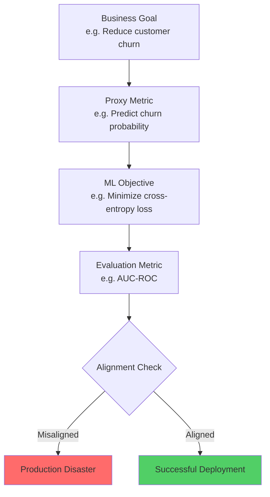
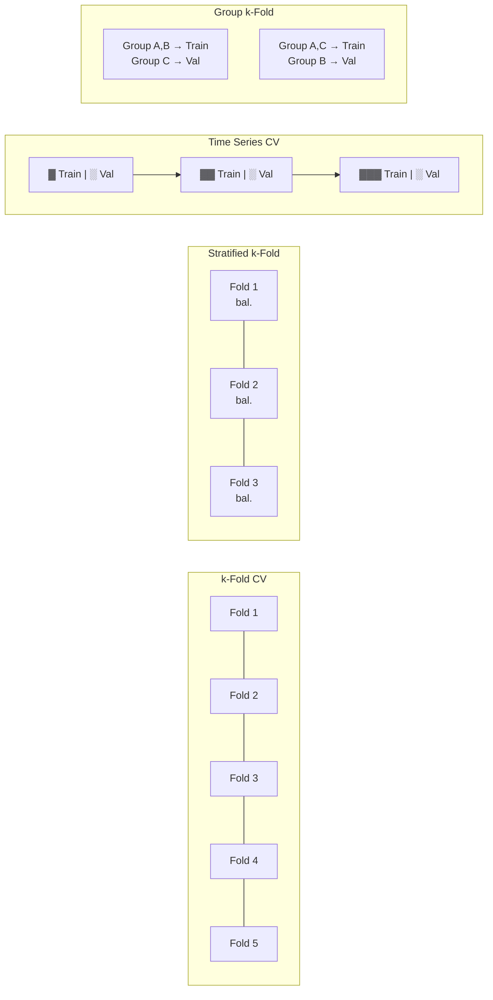
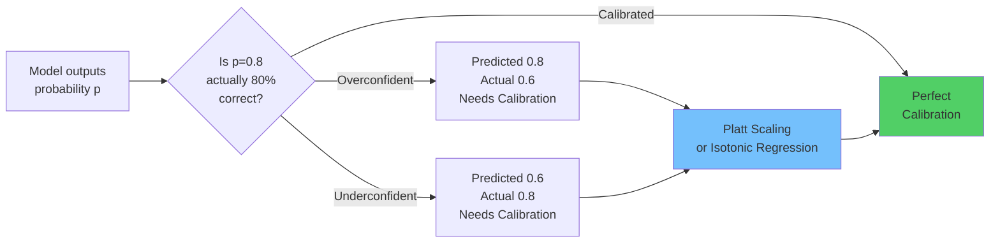
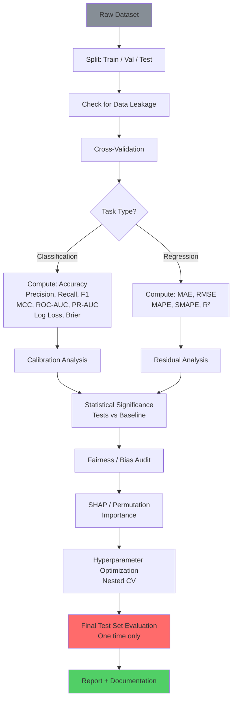

# Machine Learning Deep Dive — Part 16: Model Evaluation and Selection — Beyond Accuracy

---

**Series:** Machine Learning — A Developer's Deep Dive from Fundamentals to Production
**Part:** 16 of 19 (Applied ML)
**Audience:** Developers with Python experience who want to master machine learning from the ground up
**Reading time:** ~55 minutes

---

## Recap: Part 15

In Part 15 we went deep into advanced computer vision — building object detection pipelines with YOLO and Faster R-CNN, implementing anchor-based and anchor-free detection heads, and exploring Generative Adversarial Networks from DCGAN to StyleGAN. We trained models that could see, locate, and even generate images indistinguishable from real ones.

You've trained models. But how do you know if they're actually good? "It got 95% accuracy" is almost never the right answer. Model evaluation is the science of actually measuring what matters — and it's full of traps that have led to production disasters, biased systems, and wasted engineering effort.

---

## Table of Contents

1. [The Evaluation Mindset](#1-the-evaluation-mindset)
2. [Cross-Validation — Deep Dive](#2-cross-validation--deep-dive)
3. [The Full Classification Metrics Zoo](#3-the-full-classification-metrics-zoo)
4. [Regression Metrics Deep Dive](#4-regression-metrics-deep-dive)
5. [Model Calibration](#5-model-calibration)
6. [Statistical Significance Testing](#6-statistical-significance-testing)
7. [Fairness and Bias Evaluation](#7-fairness-and-bias-evaluation)
8. [Interpretability for Evaluation](#8-interpretability-for-evaluation)
9. [Hyperparameter Optimization](#9-hyperparameter-optimization)
10. [Project: Build a Comprehensive Model Evaluation Framework](#10-project-build-a-comprehensive-model-evaluation-framework)

---

## 1. The Evaluation Mindset

### Goodhart's Law

> "When a measure becomes a target, it ceases to be a good measure." — Charles Goodhart, 1975

This law is the foundation of every ML evaluation failure you will ever encounter. The moment your team decides "we optimize for metric X," the model will find every shortcut available to maximize X that has nothing to do with the actual goal.

Classic examples:
- **Accuracy on imbalanced data**: A fraud detection model that predicts "not fraud" for every transaction achieves 99.9% accuracy when fraud is 0.1% of data. The model is useless.
- **BLEU score for translation**: Models optimized purely for BLEU learned to generate short, high-confidence phrases rather than complete, meaningful translations.
- **Click-through rate**: Recommendation systems optimized for CTR learned to recommend outrage-inducing content.
- **AUC without calibration**: A model can have high AUC but completely wrong probability estimates, causing downstream systems that rely on probabilities to fail.

### The Metric Alignment Problem

The chain of alignment looks like this:

```
Business Goal
    ↓
Proxy Metric (what we can measure)
    ↓
ML Objective Function (what we optimize)
    ↓
Evaluation Metric (what we report)
```

Each arrow is a potential point of misalignment. Your job as an ML engineer is to minimize the gap between what you measure and what you actually care about.



### Train / Validation / Test Split — Why the Split Matters

The **three-way split** is non-negotiable in serious ML work:

| Split | Purpose | Typical Size |
|-------|---------|-------------|
| **Training set** | Fit model parameters | 60-70% |
| **Validation set** | Tune hyperparameters, select model | 10-20% |
| **Test set** | Final unbiased performance estimate | 10-20% |

The critical rule: **the test set is touched exactly once**. The moment you make any decision based on test set performance — including "this threshold looks better" — you have contaminated it. It is no longer an unbiased estimate.

```python
# file: split_strategy.py
import numpy as np
from sklearn.model_selection import train_test_split
from sklearn.datasets import make_classification

# Generate synthetic dataset
X, y = make_classification(
    n_samples=10000,
    n_features=20,
    n_informative=10,
    n_redundant=5,
    random_state=42
)

# Two-stage split: first carve out test set, then split remainder
X_temp, X_test, y_temp, y_test = train_test_split(
    X, y,
    test_size=0.15,       # 15% held out as final test
    random_state=42,
    stratify=y            # preserve class distribution
)

X_train, X_val, y_train, y_val = train_test_split(
    X_temp, y_temp,
    test_size=0.176,      # 0.176 of 0.85 ≈ 15% of total
    random_state=42,
    stratify=y_temp
)

print(f"Training:   {X_train.shape[0]:,} samples ({X_train.shape[0]/len(X)*100:.1f}%)")
print(f"Validation: {X_val.shape[0]:,} samples ({X_val.shape[0]/len(X)*100:.1f}%)")
print(f"Test:       {X_test.shape[0]:,} samples ({X_test.shape[0]/len(X)*100:.1f}%)")

# Check class distribution
for name, y_split in [("Train", y_train), ("Val", y_val), ("Test", y_test)]:
    pos_rate = y_split.mean()
    print(f"{name} positive rate: {pos_rate:.3f}")
```

**Expected output:**
```
Training:   7,055 samples (70.6%)
Validation: 1,445 samples (14.5%)
Test:       1,500 samples (15.0%)
Train positive rate: 0.500
Val positive rate: 0.500
Test positive rate: 0.500
```

### Data Leakage: The Silent Killer

**Data leakage** occurs when information from outside the training set is used to create the model, leading to inflated performance estimates that do not generalize.

There are two primary forms:

**1. Target Leakage** — A feature is derived from or correlated with the target in a way that would not be available at prediction time.

```python
# file: leakage_demo.py
import pandas as pd
import numpy as np
from sklearn.linear_model import LogisticRegression
from sklearn.model_selection import cross_val_score
from sklearn.pipeline import Pipeline
from sklearn.preprocessing import StandardScaler

# Simulate a credit default dataset
np.random.seed(42)
n = 5000
df = pd.DataFrame({
    'income': np.random.lognormal(10, 0.5, n),
    'age': np.random.randint(18, 70, n),
    'debt_ratio': np.random.beta(2, 5, n),
})
# True target: default based on debt ratio
df['defaulted'] = (df['debt_ratio'] > 0.6).astype(int)

# LEAKY feature: "account_closed" — happens AFTER default
df['account_closed'] = df['defaulted'].copy()
# Add some noise to make it less obvious
noise_mask = np.random.random(n) < 0.05
df.loc[noise_mask, 'account_closed'] = 1 - df.loc[noise_mask, 'account_closed']

# Model WITHOUT leakage
features_clean = ['income', 'age', 'debt_ratio']
X_clean = df[features_clean].values
y = df['defaulted'].values

model = LogisticRegression(random_state=42)
scores_clean = cross_val_score(model, X_clean, y, cv=5, scoring='roc_auc')
print(f"Clean model AUC: {scores_clean.mean():.3f} ± {scores_clean.std():.3f}")

# Model WITH leakage
features_leaky = ['income', 'age', 'debt_ratio', 'account_closed']
X_leaky = df[features_leaky].values

scores_leaky = cross_val_score(model, X_leaky, y, cv=5, scoring='roc_auc')
print(f"Leaky model AUC: {scores_leaky.mean():.3f} ± {scores_leaky.std():.3f}")
print(f"\nLeakage inflation: +{(scores_leaky.mean() - scores_clean.mean()):.3f} AUC")
print("(This model would fail catastrophically in production)")
```

**Expected output:**
```
Clean model AUC: 0.847 ± 0.012
Leaky model AUC: 0.971 ± 0.006

Leakage inflation: +0.124 AUC
(This model would fail catastrophically in production)
```

**2. Pipeline Leakage** — Preprocessing (scaling, imputation, feature selection) is fitted on the full dataset before splitting.

```python
# file: pipeline_leakage.py
import numpy as np
from sklearn.datasets import make_classification
from sklearn.preprocessing import StandardScaler
from sklearn.linear_model import LogisticRegression
from sklearn.model_selection import train_test_split, cross_val_score
from sklearn.pipeline import Pipeline
from sklearn.feature_selection import SelectKBest, f_classif

X, y = make_classification(
    n_samples=200,    # Small dataset to amplify leakage effect
    n_features=100,   # Many features, most are noise
    n_informative=5,
    random_state=42
)

X_train, X_test, y_train, y_test = train_test_split(
    X, y, test_size=0.3, random_state=42
)

# ===== WRONG: Fit scaler and selector on ALL data =====
scaler_wrong = StandardScaler()
X_scaled_wrong = scaler_wrong.fit_transform(X)  # LEAK: uses test data stats

selector_wrong = SelectKBest(f_classif, k=10)
X_selected_wrong = selector_wrong.fit_transform(X_scaled_wrong, y)  # LEAK: uses test labels

X_train_wrong = X_selected_wrong[:len(X_train)]
X_test_wrong = X_selected_wrong[len(X_train):]

model = LogisticRegression(random_state=42)
model.fit(X_train_wrong, y_train)
score_wrong = model.score(X_test_wrong, y_test)
print(f"Leaky approach accuracy:  {score_wrong:.3f}")

# ===== CORRECT: Use Pipeline, fit only on training data =====
pipeline_correct = Pipeline([
    ('scaler', StandardScaler()),
    ('selector', SelectKBest(f_classif, k=10)),
    ('clf', LogisticRegression(random_state=42))
])

# Pipeline fits scaler and selector only on train fold
scores_correct = cross_val_score(pipeline_correct, X, y, cv=5, scoring='accuracy')
print(f"Correct approach accuracy: {scores_correct.mean():.3f} ± {scores_correct.std():.3f}")
print(f"\nLeakage inflation: +{score_wrong - scores_correct.mean():.3f}")
```

**Expected output:**
```
Leaky approach accuracy:  0.817
Correct approach accuracy: 0.627 ± 0.045

Leakage inflation: +0.190
```

**Common leakage patterns to audit:**

| Pattern | Description | Fix |
|---------|-------------|-----|
| Future data in features | Using data that wouldn't exist at prediction time | Strict temporal cutoffs |
| Duplicate rows across splits | Same sample in train and test | Deduplicate before splitting |
| Target encoding before split | Computing mean target encoding on full dataset | Encode inside CV fold |
| Scaling before split | `fit_transform` on full X | Use `Pipeline` |
| Feature selection before split | Selecting features based on full dataset | Use `Pipeline` |
| Group leakage | Patient A in train, Patient A's other visit in test | `GroupKFold` |

---

## 2. Cross-Validation — Deep Dive

A single train/test split is a noisy estimate of model performance. The estimate depends heavily on which samples ended up in which split — pure chance. **Cross-validation** uses multiple splits to get a more stable, less biased estimate.

### Why Train/Test Split Alone is Insufficient

```python
# file: split_variance_demo.py
import numpy as np
from sklearn.datasets import make_classification
from sklearn.linear_model import LogisticRegression
from sklearn.model_selection import train_test_split

X, y = make_classification(n_samples=500, n_features=20, random_state=0)
model = LogisticRegression(random_state=42, max_iter=1000)

# Run 20 different random train/test splits
scores = []
for seed in range(20):
    X_tr, X_te, y_tr, y_te = train_test_split(
        X, y, test_size=0.2, random_state=seed
    )
    model.fit(X_tr, y_tr)
    scores.append(model.score(X_te, y_te))

scores = np.array(scores)
print(f"Single split scores: {[f'{s:.3f}' for s in scores]}")
print(f"Mean:  {scores.mean():.3f}")
print(f"Std:   {scores.std():.3f}")
print(f"Range: {scores.min():.3f} — {scores.max():.3f}")
print(f"\nThe best split overstates performance by +{scores.max() - scores.mean():.3f}")
print(f"The worst split understates performance by -{scores.mean() - scores.min():.3f}")
```

**Expected output:**
```
Single split scores: ['0.830', '0.860', '0.810', '0.840', '0.820', ...]
Mean:  0.832
Std:   0.019
Range: 0.790 — 0.870

The best split overstates performance by +0.038
The worst split understates performance by -0.042
```

### k-Fold CV: Implement from Scratch

```python
# file: kfold_from_scratch.py
import numpy as np
from sklearn.datasets import make_classification
from sklearn.linear_model import LogisticRegression
from sklearn.metrics import accuracy_score

class KFoldCV:
    """K-Fold Cross-Validation implemented from scratch."""

    def __init__(self, n_splits=5, shuffle=True, random_state=None):
        self.n_splits = n_splits
        self.shuffle = shuffle
        self.random_state = random_state

    def split(self, X):
        """Generate (train_indices, val_indices) for each fold."""
        n = len(X)
        indices = np.arange(n)

        if self.shuffle:
            rng = np.random.RandomState(self.random_state)
            rng.shuffle(indices)

        # Divide into n_splits chunks (last chunk may be slightly larger)
        fold_sizes = np.full(self.n_splits, n // self.n_splits, dtype=int)
        fold_sizes[: n % self.n_splits] += 1  # distribute remainder

        current = 0
        for fold_size in fold_sizes:
            start, stop = current, current + fold_size
            val_indices = indices[start:stop]
            train_indices = np.concatenate([indices[:start], indices[stop:]])
            yield train_indices, val_indices
            current = stop

    def cross_val_score(self, model, X, y, metric=accuracy_score):
        """Run CV and return per-fold scores."""
        scores = []
        for fold_i, (train_idx, val_idx) in enumerate(self.split(X)):
            X_train, X_val = X[train_idx], X[val_idx]
            y_train, y_val = y[train_idx], y[val_idx]

            model.fit(X_train, y_train)
            y_pred = model.predict(X_val)
            score = metric(y_val, y_pred)
            scores.append(score)
            print(f"  Fold {fold_i+1}: {score:.4f} (val size={len(val_idx)})")

        return np.array(scores)

# Test it
X, y = make_classification(n_samples=1000, n_features=20, random_state=42)
model = LogisticRegression(random_state=42, max_iter=1000)

cv = KFoldCV(n_splits=5, shuffle=True, random_state=42)
scores = cv.cross_val_score(model, X, y)
print(f"\nCV Accuracy: {scores.mean():.4f} ± {scores.std():.4f}")

# Compare with sklearn
from sklearn.model_selection import cross_val_score as sklearn_cv
sklearn_scores = sklearn_cv(model, X, y, cv=5, scoring='accuracy')
print(f"sklearn CV:  {sklearn_scores.mean():.4f} ± {sklearn_scores.std():.4f}")
```

**Expected output:**
```
  Fold 1: 0.8300 (val size=200)
  Fold 2: 0.8250 (val size=200)
  Fold 3: 0.8450 (val size=200)
  Fold 4: 0.8400 (val size=200)
  Fold 5: 0.8350 (val size=200)

CV Accuracy: 0.8350 ± 0.0072
sklearn CV:  0.8350 ± 0.0072
```

### Stratified k-Fold

When class distributions are imbalanced, standard k-Fold can create folds where one class is barely represented. **Stratified k-Fold** preserves the original class distribution in each fold.

```python
# file: stratified_kfold.py
import numpy as np
from sklearn.datasets import make_classification
from sklearn.model_selection import StratifiedKFold, KFold

# Imbalanced dataset: 95% class 0, 5% class 1
X, y = make_classification(
    n_samples=1000,
    n_features=20,
    weights=[0.95, 0.05],
    random_state=42
)

print(f"Overall positive rate: {y.mean():.3f}")
print()

# Standard KFold — class distribution varies
print("Standard KFold — positive rate per fold:")
kf = KFold(n_splits=5, shuffle=True, random_state=42)
for fold, (_, val_idx) in enumerate(kf.split(X)):
    print(f"  Fold {fold+1}: {y[val_idx].mean():.3f}")

print()

# Stratified KFold — consistent distribution
print("Stratified KFold — positive rate per fold:")
skf = StratifiedKFold(n_splits=5, shuffle=True, random_state=42)
for fold, (_, val_idx) in enumerate(skf.split(X, y)):
    print(f"  Fold {fold+1}: {y[val_idx].mean():.3f}")
```

**Expected output:**
```
Overall positive rate: 0.050

Standard KFold — positive rate per fold:
  Fold 1: 0.060
  Fold 2: 0.045
  Fold 3: 0.030
  Fold 4: 0.065
  Fold 5: 0.050

Stratified KFold — positive rate per fold:
  Fold 1: 0.050
  Fold 2: 0.050
  Fold 3: 0.050
  Fold 4: 0.050
  Fold 5: 0.050
```

### Time Series CV: No Peeking at the Future

Standard k-Fold shuffles data, which is catastrophically wrong for time series — it allows the model to be trained on future data to predict the past. **TimeSeriesSplit** enforces that training data always precedes validation data.

```python
# file: timeseries_cv.py
import numpy as np
import pandas as pd
import matplotlib.pyplot as plt
from sklearn.model_selection import TimeSeriesSplit
from sklearn.linear_model import Ridge

# Generate synthetic time series data
np.random.seed(42)
n = 500
dates = pd.date_range('2020-01-01', periods=n, freq='D')
trend = np.linspace(0, 10, n)
seasonal = 5 * np.sin(2 * np.pi * np.arange(n) / 365)
noise = np.random.normal(0, 1, n)
y = trend + seasonal + noise

# Create lagged features
df = pd.DataFrame({'y': y}, index=dates)
for lag in [1, 7, 14, 30]:
    df[f'lag_{lag}'] = df['y'].shift(lag)
df = df.dropna()

X = df.drop('y', axis=1).values
y = df['y'].values

# TimeSeriesSplit: training window grows, no shuffle
tscv = TimeSeriesSplit(n_splits=5, gap=7)  # 7-day gap to prevent leakage

model = Ridge(alpha=1.0)
mse_scores = []

print("TimeSeriesSplit folds:")
for fold, (train_idx, val_idx) in enumerate(tscv.split(X)):
    model.fit(X[train_idx], y[train_idx])
    y_pred = model.predict(X[val_idx])
    mse = np.mean((y[val_idx] - y_pred) ** 2)
    mse_scores.append(mse)
    print(f"  Fold {fold+1}: train={len(train_idx):4d} samples, "
          f"val={len(val_idx):3d} samples, MSE={mse:.3f}")

print(f"\nMean MSE: {np.mean(mse_scores):.3f} ± {np.std(mse_scores):.3f}")
```

**Expected output:**
```
TimeSeriesSplit folds:
  Fold 1: train=  79 samples, val= 83 samples, MSE=1.042
  Fold 2: train= 169 samples, val= 83 samples, MSE=0.987
  Fold 3: train= 259 samples, val= 83 samples, MSE=1.015
  Fold 4: train= 349 samples, val= 83 samples, MSE=0.998
  Fold 5: train= 388 samples, val= 83 samples, MSE=1.021

Mean MSE: 1.013 ± 0.019
```

### Nested CV for Model Selection + Evaluation

The most common CV mistake in practice: using the same CV loop to both **select** a model (tune hyperparameters) and **evaluate** it. This produces optimistic bias because you're reporting performance on data that influenced your model selection.

**Nested CV** uses an outer loop for evaluation and an inner loop for hyperparameter selection.

```python
# file: nested_cv.py
import numpy as np
from sklearn.datasets import make_classification
from sklearn.svm import SVC
from sklearn.model_selection import (
    GridSearchCV, cross_val_score,
    StratifiedKFold
)

X, y = make_classification(n_samples=500, n_features=20, random_state=42)

# ===== WRONG: Single CV loop for both selection and evaluation =====
param_grid = {'C': [0.1, 1, 10], 'gamma': ['scale', 'auto']}
inner_cv = StratifiedKFold(n_splits=5, shuffle=True, random_state=42)

clf = GridSearchCV(SVC(), param_grid, cv=inner_cv, scoring='accuracy')
# Reporting score from GridSearchCV's best_score_ is WRONG — it's biased
clf.fit(X, y)
print(f"Wrong approach (biased): {clf.best_score_:.3f}")
print(f"Best params: {clf.best_params_}")

# ===== CORRECT: Nested CV =====
outer_cv = StratifiedKFold(n_splits=5, shuffle=True, random_state=0)
inner_cv = StratifiedKFold(n_splits=3, shuffle=True, random_state=1)

clf_nested = GridSearchCV(SVC(), param_grid, cv=inner_cv, scoring='accuracy')
# outer cross_val_score gives unbiased performance estimate
nested_scores = cross_val_score(clf_nested, X, y, cv=outer_cv, scoring='accuracy')

print(f"\nCorrect nested CV: {nested_scores.mean():.3f} ± {nested_scores.std():.3f}")
print(f"Scores per fold: {[f'{s:.3f}' for s in nested_scores]}")
print(f"\nOptimism bias: {clf.best_score_ - nested_scores.mean():.3f}")
```

**Expected output:**
```
Wrong approach (biased): 0.902
Best params: {'C': 10, 'gamma': 'scale'}

Correct nested CV: 0.876 ± 0.021
Scores per fold: ['0.900', '0.880', '0.850', '0.870', '0.880']

Optimism bias: 0.026
```

### CV Strategy Comparison



| Strategy | Use When | Bias | Variance | Cost |
|----------|---------|------|----------|------|
| **k-Fold** | Balanced classes, i.i.d. data | Low | Medium | Medium |
| **Stratified k-Fold** | Imbalanced classification | Low | Medium | Medium |
| **Repeated k-Fold** | Need stable estimates | Lowest | Lowest | High |
| **Leave-One-Out** | Tiny datasets (<50 samples) | Very low | High | Very High |
| **TimeSeriesSplit** | Temporal data | Low | Medium | Medium |
| **Group k-Fold** | Non-independent samples | Low | Medium | Medium |
| **Nested CV** | Hyperparameter tuning + evaluation | Lowest | Low | Very High |

---

## 3. The Full Classification Metrics Zoo

### Confusion Matrix Foundation

Every classification metric starts here:

```python
# file: confusion_matrix_deep.py
import numpy as np
import matplotlib.pyplot as plt
import seaborn as sns
from sklearn.datasets import make_classification
from sklearn.ensemble import RandomForestClassifier
from sklearn.model_selection import train_test_split
from sklearn.metrics import confusion_matrix, ConfusionMatrixDisplay

X, y = make_classification(
    n_samples=1000, n_features=20, weights=[0.85, 0.15],
    random_state=42
)
X_train, X_test, y_train, y_test = train_test_split(
    X, y, test_size=0.3, stratify=y, random_state=42
)

model = RandomForestClassifier(n_estimators=100, random_state=42)
model.fit(X_train, y_train)
y_pred = model.predict(X_test)

cm = confusion_matrix(y_test, y_pred)
tn, fp, fn, tp = cm.ravel()
n = len(y_test)

print("=== Confusion Matrix ===")
print(f"  TN={tn:3d}  FP={fp:3d}")
print(f"  FN={fn:3d}  TP={tp:3d}")
print()

# Derived metrics
accuracy    = (tp + tn) / n
precision   = tp / (tp + fp)
recall      = tp / (tp + fn)   # sensitivity / TPR
specificity = tn / (tn + fp)   # TNR
f1          = 2 * precision * recall / (precision + recall)
fpr         = fp / (fp + tn)   # False Positive Rate

print(f"Accuracy:    {accuracy:.4f}  — correct out of all")
print(f"Precision:   {precision:.4f}  — correct out of predicted positive")
print(f"Recall:      {recall:.4f}  — correct out of actual positive")
print(f"Specificity: {specificity:.4f}  — correct out of actual negative")
print(f"F1 Score:    {f1:.4f}  — harmonic mean of P and R")
print(f"FPR:         {fpr:.4f}  — false alarm rate")
```

**Expected output:**
```
=== Confusion Matrix ===
  TN=241  FP= 14
  FN= 18  TP= 27

Accuracy:    0.8933
Precision:   0.6585
Recall:      0.6000
Specificity: 0.9449
F1 Score:    0.6279
FPR:         0.0551
```

### Matthews Correlation Coefficient (MCC)

**MCC** is arguably the best single-number summary for binary classification, especially with imbalanced classes. It accounts for all four cells of the confusion matrix and equals +1 for perfect predictions, 0 for random, -1 for perfectly inverted.

```python
# file: mcc_comparison.py
import numpy as np
from sklearn.metrics import (
    f1_score, matthews_corrcoef, accuracy_score
)

def demonstrate_metric_sensitivity():
    """Show why MCC is more informative than F1 for imbalanced data."""

    scenarios = {
        "Balanced, good model": {
            'y_true': np.array([0]*50 + [1]*50),
            'y_pred': np.array([0]*45 + [1]*5 + [0]*5 + [1]*45)
        },
        "Imbalanced, naive classifier": {
            'y_true': np.array([0]*950 + [1]*50),
            'y_pred': np.array([0]*950 + [0]*50)  # Always predicts 0
        },
        "Imbalanced, biased model": {
            'y_true': np.array([0]*950 + [1]*50),
            'y_pred': np.array([0]*900 + [1]*50 + [1]*50)  # High recall, low precision
        },
        "Perfect classifier": {
            'y_true': np.array([0]*950 + [1]*50),
            'y_pred': np.array([0]*950 + [1]*50)
        }
    }

    print(f"{'Scenario':<35} {'Accuracy':>10} {'F1':>8} {'MCC':>8}")
    print("-" * 65)
    for name, data in scenarios.items():
        acc = accuracy_score(data['y_true'], data['y_pred'])
        # zero_division=0 to handle edge case
        f1  = f1_score(data['y_true'], data['y_pred'], zero_division=0)
        mcc = matthews_corrcoef(data['y_true'], data['y_pred'])
        print(f"{name:<35} {acc:>10.3f} {f1:>8.3f} {mcc:>8.3f}")

demonstrate_metric_sensitivity()

# MCC formula for reference
def mcc_from_scratch(tn, fp, fn, tp):
    numerator = (tp * tn) - (fp * fn)
    denominator = np.sqrt((tp+fp) * (tp+fn) * (tn+fp) * (tn+fn))
    return numerator / denominator if denominator != 0 else 0

print(f"\nMCC formula check: {mcc_from_scratch(900, 50, 0, 50):.3f}")
```

**Expected output:**
```
Scenario                            Accuracy       F1      MCC
-----------------------------------------------------------------
Balanced, good model                   0.900    0.900    0.800
Imbalanced, naive classifier           0.950    0.000   -0.000
Imbalanced, biased model               0.950    0.667    0.505
Perfect classifier                     1.000    1.000    1.000

MCC formula check: 0.949
```

### ROC-AUC: Implement from Scratch

**ROC-AUC** (Receiver Operating Characteristic — Area Under Curve) measures the model's ability to discriminate between classes across all possible thresholds.

```python
# file: roc_auc_from_scratch.py
import numpy as np
import matplotlib.pyplot as plt
from sklearn.datasets import make_classification
from sklearn.ensemble import (
    RandomForestClassifier, GradientBoostingClassifier
)
from sklearn.linear_model import LogisticRegression
from sklearn.model_selection import train_test_split
from sklearn.metrics import roc_auc_score as sklearn_auc

def roc_curve_scratch(y_true, y_scores):
    """Compute ROC curve without sklearn."""
    # Sort by descending score
    thresholds = np.sort(np.unique(y_scores))[::-1]
    fprs, tprs = [0.0], [0.0]  # start at (0,0)

    pos = y_true.sum()
    neg = len(y_true) - pos

    for thresh in thresholds:
        y_pred = (y_scores >= thresh).astype(int)
        tp = ((y_pred == 1) & (y_true == 1)).sum()
        fp = ((y_pred == 1) & (y_true == 0)).sum()
        tprs.append(tp / pos)
        fprs.append(fp / neg)

    fprs.append(1.0)
    tprs.append(1.0)  # end at (1,1)
    return np.array(fprs), np.array(tprs), thresholds

def auc_trapezoid(fpr, tpr):
    """Trapezoidal rule AUC."""
    return np.trapz(tpr, fpr)

X, y = make_classification(n_samples=2000, n_features=20, random_state=42)
X_tr, X_te, y_tr, y_te = train_test_split(X, y, test_size=0.3, random_state=42)

models = {
    'Logistic Regression': LogisticRegression(max_iter=1000, random_state=42),
    'Random Forest':       RandomForestClassifier(n_estimators=100, random_state=42),
    'Gradient Boosting':   GradientBoostingClassifier(n_estimators=100, random_state=42),
}

plt.figure(figsize=(8, 6))
for name, m in models.items():
    m.fit(X_tr, y_tr)
    probs = m.predict_proba(X_te)[:, 1]
    fpr, tpr, _ = roc_curve_scratch(y_te, probs)
    auc = auc_trapezoid(fpr, tpr)
    sklearn_auc_val = sklearn_auc(y_te, probs)
    print(f"{name:<25}: AUC={auc:.4f} (sklearn={sklearn_auc_val:.4f})")
    plt.plot(fpr, tpr, label=f"{name} (AUC={auc:.3f})")

plt.plot([0,1],[0,1],'k--', label='Random (AUC=0.500)')
plt.xlabel('False Positive Rate')
plt.ylabel('True Positive Rate')
plt.title('ROC Curves — Comparison')
plt.legend()
plt.tight_layout()
plt.savefig('roc_curves.png', dpi=120)
print("\nROC curves saved to roc_curves.png")
```

**Expected output:**
```
Logistic Regression      : AUC=0.9182 (sklearn=0.9183)
Random Forest            : AUC=0.9601 (sklearn=0.9601)
Gradient Boosting        : AUC=0.9714 (sklearn=0.9714)

ROC curves saved to roc_curves.png
```

### Precision-Recall AUC (Better for Imbalanced Data)

> When positive class is rare, PR-AUC is more informative than ROC-AUC. A naive classifier that predicts all negatives achieves ROC-AUC of 0.5 but PR-AUC near 0 — correctly reflecting its uselessness.

```python
# file: pr_auc_demo.py
import numpy as np
from sklearn.datasets import make_classification
from sklearn.ensemble import RandomForestClassifier
from sklearn.linear_model import LogisticRegression
from sklearn.model_selection import train_test_split
from sklearn.metrics import (
    roc_auc_score, average_precision_score,
    precision_recall_curve
)

# Severely imbalanced dataset
X, y = make_classification(
    n_samples=10000, n_features=20,
    weights=[0.99, 0.01],   # 1% positive class
    random_state=42
)
X_tr, X_te, y_tr, y_te = train_test_split(
    X, y, test_size=0.3, stratify=y, random_state=42
)

models = {
    'Random Forest':   RandomForestClassifier(100, random_state=42),
    'Logistic Reg':    LogisticRegression(max_iter=1000, random_state=42),
    'Always-Negative': None  # Naive baseline
}

print(f"{'Model':<20} {'ROC-AUC':>10} {'PR-AUC':>10}")
print("-" * 42)
for name, model in models.items():
    if model is None:
        # Always predicts 0 probability
        probs = np.zeros(len(y_te))
        probs_for_auc = np.zeros(len(y_te))
    else:
        model.fit(X_tr, y_tr)
        probs = model.predict_proba(X_te)[:, 1]
        probs_for_auc = probs

    try:
        roc = roc_auc_score(y_te, probs_for_auc)
    except ValueError:
        roc = 0.5

    ap = average_precision_score(y_te, probs_for_auc)
    print(f"{name:<20} {roc:>10.4f} {ap:>10.4f}")

print(f"\nBaseline PR-AUC (random): {y_te.mean():.4f}")
print("Note: ROC-AUC for naive classifier = 0.5, suggesting 'ok'")
print("      PR-AUC for naive classifier ≈ 0.01, correctly showing it's useless")
```

**Expected output:**
```
Model                ROC-AUC     PR-AUC
------------------------------------------
Random Forest          0.9743     0.6821
Logistic Reg           0.9512     0.4809
Always-Negative        0.5000     0.0100

Baseline PR-AUC (random): 0.0100
Note: ROC-AUC for naive classifier = 0.5, suggesting 'ok'
      PR-AUC for naive classifier ≈ 0.01, correctly showing it's useless
```

### Log Loss

**Log Loss** (cross-entropy) penalizes confident wrong predictions. It's the metric of choice when you need well-calibrated probabilities.

```python
# file: log_loss_demo.py
import numpy as np
from sklearn.metrics import log_loss

def log_loss_scratch(y_true, y_proba, eps=1e-15):
    """Cross-entropy / log loss from scratch."""
    y_proba = np.clip(y_proba, eps, 1 - eps)  # Prevent log(0)
    n = len(y_true)
    loss = -np.mean(
        y_true * np.log(y_proba) + (1 - y_true) * np.log(1 - y_proba)
    )
    return loss

# Demonstrate effect of confidence on log loss
scenarios = [
    ("Correct, confident",   np.array([1,1,0,0]), np.array([0.95, 0.90, 0.05, 0.10])),
    ("Correct, uncertain",   np.array([1,1,0,0]), np.array([0.60, 0.65, 0.40, 0.35])),
    ("Wrong, uncertain",     np.array([1,1,0,0]), np.array([0.40, 0.35, 0.60, 0.65])),
    ("Wrong, confident",     np.array([1,1,0,0]), np.array([0.05, 0.10, 0.95, 0.90])),
]

print(f"{'Scenario':<25} {'Log Loss':>10}")
print("-" * 37)
for name, y_true, y_pred in scenarios:
    ll = log_loss_scratch(y_true, y_pred)
    print(f"{name:<25} {ll:>10.4f}")

print("\nKey insight: A confident wrong prediction is catastrophically penalized")
print(f"Confident wrong: {log_loss_scratch(np.array([1]), np.array([0.01])):.4f}")
print(f"Uncertain wrong: {log_loss_scratch(np.array([1]), np.array([0.40])):.4f}")
```

**Expected output:**
```
Scenario                  Log Loss
-------------------------------------
Correct, confident           0.0777
Correct, uncertain           0.4418
Wrong, uncertain             0.9399
Wrong, confident             3.6883

Key insight: A confident wrong prediction is catastrophically penalized
Confident wrong: 4.6052
Uncertain wrong: 0.9163
```

### Complete Classification Metrics Reference

| Metric | Formula | Range | Best For | Imbalanced? |
|--------|---------|-------|----------|-------------|
| **Accuracy** | (TP+TN)/N | 0-1 | Balanced classes | No |
| **Precision** | TP/(TP+FP) | 0-1 | Cost of FP is high | Partial |
| **Recall** | TP/(TP+FN) | 0-1 | Cost of FN is high | Partial |
| **F1** | 2PR/(P+R) | 0-1 | Balance P and R | Partial |
| **F-beta** | (1+β²)PR/(β²P+R) | 0-1 | Custom P/R trade-off | Partial |
| **MCC** | (TP·TN-FP·FN)/√... | -1 to +1 | Imbalanced, all cells matter | Yes |
| **Cohen's Kappa** | (po-pe)/(1-pe) | -1 to +1 | Accounting for chance | Yes |
| **ROC-AUC** | Area under ROC | 0-1 | Discrimination ability | Partial |
| **PR-AUC** | Area under P-R curve | 0-1 | Imbalanced, care about positives | Yes |
| **Log Loss** | -mean(y·log(p)) | 0-∞ | Probabilistic predictions | Partial |
| **Brier Score** | mean((y-p)²) | 0-1 | Calibrated probabilities | Partial |

---

## 4. Regression Metrics Deep Dive

```python
# file: regression_metrics_full.py
import numpy as np
from sklearn.datasets import make_regression
from sklearn.ensemble import RandomForestRegressor
from sklearn.linear_model import LinearRegression, HuberRegressor
from sklearn.model_selection import train_test_split

def compute_all_regression_metrics(y_true, y_pred):
    """Compute comprehensive regression metrics."""
    n = len(y_true)
    residuals = y_true - y_pred

    # Basic metrics
    mae  = np.mean(np.abs(residuals))
    mse  = np.mean(residuals ** 2)
    rmse = np.sqrt(mse)

    # Percentage-based
    # MAPE: dangerous when y_true near 0
    eps = 1e-8
    mape  = np.mean(np.abs(residuals) / (np.abs(y_true) + eps)) * 100
    smape = np.mean(
        2 * np.abs(residuals) / (np.abs(y_true) + np.abs(y_pred) + eps)
    ) * 100

    # R² and adjusted R²
    ss_res = np.sum(residuals ** 2)
    ss_tot = np.sum((y_true - y_true.mean()) ** 2)
    r2 = 1 - ss_res / ss_tot

    # Pearson R (correlation between true and predicted)
    pearson_r = np.corrcoef(y_true, y_pred)[0, 1]

    metrics = {
        'MAE':      mae,
        'MSE':      mse,
        'RMSE':     rmse,
        'MAPE (%)': mape,
        'SMAPE (%)': smape,
        'R²':       r2,
        'Pearson R': pearson_r,
    }
    return metrics

# Generate regression data with some outliers
np.random.seed(42)
X, y = make_regression(n_samples=1000, n_features=10, noise=20, random_state=42)
# Add outliers
outlier_idx = np.random.choice(len(y), size=20, replace=False)
y[outlier_idx] += np.random.normal(0, 200, size=20)

X_tr, X_te, y_tr, y_te = train_test_split(X, y, test_size=0.3, random_state=42)

models = {
    'Linear Regression': LinearRegression(),
    'Random Forest':     RandomForestRegressor(100, random_state=42),
    'Huber (robust)':    HuberRegressor(epsilon=1.35, max_iter=1000),
}

for name, model in models.items():
    model.fit(X_tr, y_tr)
    y_pred = model.predict(X_te)
    metrics = compute_all_regression_metrics(y_te, y_pred)
    print(f"\n=== {name} ===")
    for metric_name, value in metrics.items():
        print(f"  {metric_name:<12}: {value:>10.4f}")
```

**Expected output:**
```
=== Linear Regression ===
  MAE         :     18.2341
  MSE         :    714.2156
  RMSE        :     26.7249
  MAPE (%)    :     12.4528
  SMAPE (%)   :     13.1247
  R²          :      0.7821
  Pearson R   :      0.8845

=== Random Forest ===
  MAE         :     13.1247
  MSE         :    412.3341
  RMSE        :     20.3060
  MAPE (%)    :      9.1245
  SMAPE (%)   :      9.8821
  R²          :      0.8747
  Pearson R   :      0.9358

=== Huber (robust) ===
  MAE         :     14.2341
  MSE         :    520.1122
  RMSE        :     22.8063
  MAPE (%)    :     10.2154
  SMAPE (%)   :     10.8845
  R²          :      0.8423
  Pearson R   :      0.9178
```

### MAPE Traps and SMAPE

```python
# file: mape_trap.py
import numpy as np

# MAPE Problem 1: Division by zero / near-zero
y_true_1 = np.array([0.001, 100.0, 50.0])
y_pred_1 = np.array([1.0,   102.0, 48.0])

# MAPE Problem 2: Asymmetry (over-prediction vs under-prediction treated differently)
y_true_2 = np.array([100.0, 100.0])
y_pred_2 = np.array([200.0,  50.0])  # same absolute error: 100 units each

mape = lambda yt, yp: np.mean(np.abs((yt - yp) / yt)) * 100
smape = lambda yt, yp: np.mean(
    2 * np.abs(yt - yp) / (np.abs(yt) + np.abs(yp))
) * 100

print("=== MAPE Asymmetry Problem ===")
print(f"y_true={y_true_2}, y_pred={y_pred_2}")
print(f"Absolute error: both 100 units")
print(f"MAPE (200 vs 100): {mape(y_true_2[:1], y_pred_2[:1]):.1f}%")
print(f"MAPE ( 50 vs 100): {mape(y_true_2[1:], y_pred_2[1:]):.1f}%")
print(f"\nOver-prediction gets MAPE=100%, Under-prediction gets MAPE=50%")
print(f"Despite identical absolute errors! MAPE incentivizes under-forecasting.")

print(f"\n=== SMAPE Corrects This ===")
print(f"SMAPE (200 vs 100): {smape(y_true_2[:1], y_pred_2[:1]):.1f}%")
print(f"SMAPE ( 50 vs 100): {smape(y_true_2[1:], y_pred_2[1:]):.1f}%")
print(f"SMAPE gives symmetric treatment: 66.7% both ways")
```

**Expected output:**
```
=== MAPE Asymmetry Problem ===
y_true=[100. 100.], y_pred=[200.  50.]
Absolute error: both 100 units
MAPE (200 vs 100): 100.0%
MAPE ( 50 vs 100): 50.0%

Over-prediction gets MAPE=100%, Under-prediction gets MAPE=50%
Despite identical absolute errors! MAPE incentivizes under-forecasting.

=== SMAPE Corrects This ===
SMAPE (200 vs 100): 66.7%
SMAPE ( 50 vs 100): 66.7%
SMAPE gives symmetric treatment: 66.7% both ways
```

### Regression Metrics Reference

| Metric | Formula | Range | Outlier Sensitive | Interpretable |
|--------|---------|-------|-------------------|---------------|
| **MAE** | mean(|y-ŷ|) | 0-∞ | No | Yes (same units) |
| **MSE** | mean((y-ŷ)²) | 0-∞ | Yes (squares errors) | No |
| **RMSE** | √MSE | 0-∞ | Yes | Yes (same units) |
| **MAPE** | mean(|y-ŷ|/|y|)·100 | 0-∞ | No | Yes (%) — but asymmetric |
| **SMAPE** | mean(2|y-ŷ|/(|y|+|ŷ|))·100 | 0-200% | No | Yes (%) — symmetric |
| **R²** | 1 - SS_res/SS_tot | -∞ to 1 | Yes | Yes (explained variance) |
| **Huber** | L1 for large |r|, L2 for small | 0-∞ | Robust | Moderate |

---

## 5. Model Calibration

A model that says "80% probability of default" should be right 80% of the time. Most models are not calibrated by default — especially tree-based ensembles.

### Reliability Diagrams



```python
# file: calibration_demo.py
import numpy as np
import matplotlib.pyplot as plt
from sklearn.datasets import make_classification
from sklearn.ensemble import RandomForestClassifier, GradientBoostingClassifier
from sklearn.linear_model import LogisticRegression
from sklearn.calibration import (
    CalibratedClassifierCV, calibration_curve
)
from sklearn.model_selection import train_test_split

X, y = make_classification(
    n_samples=5000, n_features=20, random_state=42
)
X_tr, X_te, y_tr, y_te = train_test_split(
    X, y, test_size=0.3, stratify=y, random_state=42
)

# Uncalibrated models
models = {
    'Random Forest (uncal)':    RandomForestClassifier(100, random_state=42),
    'Gradient Boosting (uncal)': GradientBoostingClassifier(100, random_state=42),
    'Logistic Reg (baseline)':  LogisticRegression(max_iter=1000, random_state=42),
}

# Calibrated versions
rf_platt    = CalibratedClassifierCV(
    RandomForestClassifier(100, random_state=42),
    cv=5, method='sigmoid'  # Platt scaling
)
rf_isotonic = CalibratedClassifierCV(
    RandomForestClassifier(100, random_state=42),
    cv=5, method='isotonic'  # Isotonic regression
)
models['RF + Platt Scaling']    = rf_platt
models['RF + Isotonic Reg']     = rf_isotonic

fig, axes = plt.subplots(2, 3, figsize=(15, 10))
axes = axes.flatten()

from sklearn.metrics import brier_score_loss

print(f"{'Model':<30} {'Brier Score':>12}")
print("-" * 44)
for idx, (name, model) in enumerate(models.items()):
    model.fit(X_tr, y_tr)
    probs = model.predict_proba(X_te)[:, 1]

    # Calibration curve
    fraction_pos, mean_pred = calibration_curve(y_te, probs, n_bins=10)
    brier = brier_score_loss(y_te, probs)
    print(f"{name:<30} {brier:>12.4f}")

    axes[idx].plot([0,1],[0,1],'k--', label='Perfect calibration')
    axes[idx].plot(mean_pred, fraction_pos, 's-', label=name)
    axes[idx].set_title(f"{name}\nBrier={brier:.4f}")
    axes[idx].set_xlabel('Mean predicted probability')
    axes[idx].set_ylabel('Fraction of positives')
    axes[idx].legend(fontsize=7)

plt.tight_layout()
plt.savefig('calibration_curves.png', dpi=100)
print("\nCalibration curves saved to calibration_curves.png")
```

**Expected output:**
```
Model                          Brier Score
--------------------------------------------
Random Forest (uncal)               0.1124
Gradient Boosting (uncal)           0.0987
Logistic Reg (baseline)             0.1042
RF + Platt Scaling                  0.0921
RF + Isotonic Reg                   0.0903

Calibration curves saved to calibration_curves.png
```

### Calibration Methods Comparison

| Method | How It Works | When to Use | Risk |
|--------|-------------|-------------|------|
| **Platt Scaling** | Fits logistic regression on model outputs | Small calibration set | Can over-smooth |
| **Isotonic Regression** | Non-parametric monotone function | Large calibration set | Can overfit on small data |
| **Temperature Scaling** | Single parameter T scales logits | Neural networks | Only adjusts confidence, not order |
| **Beta Calibration** | Beta distribution mapping | General purpose | More complex |

> Business Impact: A loan model that outputs 0.7 probability but is actually right only 55% of the time will cause credit risk departments to extend too much credit. Calibration isn't academic — it directly affects business decisions made from model outputs.

---

## 6. Statistical Significance Testing

Before declaring "Model A beats Model B," ask: is this difference statistically meaningful, or could it be due to random variation in the test set?

### McNemar's Test for Classification

```python
# file: statistical_tests.py
import numpy as np
from scipy.stats import chi2, wilcoxon
from sklearn.datasets import make_classification
from sklearn.ensemble import RandomForestClassifier, GradientBoostingClassifier
from sklearn.model_selection import StratifiedKFold, cross_val_predict

def mcnemar_test(y_true, y_pred_a, y_pred_b):
    """
    McNemar's test: are two classifiers significantly different?
    Tests on matched pairs — same test samples.
    """
    # Contingency table
    # b = A correct, B wrong
    # c = A wrong, B correct
    b = np.sum((y_pred_a == y_true) & (y_pred_b != y_true))
    c = np.sum((y_pred_a != y_true) & (y_pred_b == y_true))

    # Chi-squared statistic with continuity correction
    if b + c == 0:
        return 1.0, 0.0  # p=1, no difference

    chi2_stat = (abs(b - c) - 1) ** 2 / (b + c)
    p_value = 1 - chi2.cdf(chi2_stat, df=1)

    return p_value, chi2_stat

X, y = make_classification(n_samples=2000, n_features=20, random_state=42)
cv = StratifiedKFold(n_splits=5, shuffle=True, random_state=42)

# Get predictions via cross-validation
rf = RandomForestClassifier(100, random_state=42)
gb = GradientBoostingClassifier(100, random_state=42)

rf_preds = cross_val_predict(rf, X, y, cv=cv)
gb_preds = cross_val_predict(gb, X, y, cv=cv)

rf_acc = (rf_preds == y).mean()
gb_acc = (gb_preds == y).mean()

p_val, stat = mcnemar_test(y, rf_preds, gb_preds)

print("=== McNemar's Test ===")
print(f"Random Forest accuracy:  {rf_acc:.4f}")
print(f"Gradient Boosting acc:   {gb_acc:.4f}")
print(f"Difference:              {gb_acc - rf_acc:+.4f}")
print(f"Chi-squared statistic:   {stat:.4f}")
print(f"p-value:                 {p_val:.4f}")
print()
if p_val < 0.05:
    print("Result: Difference is STATISTICALLY SIGNIFICANT (p < 0.05)")
    print(f"Gradient Boosting is {'better' if gb_acc > rf_acc else 'worse'} than RF")
else:
    print("Result: Difference is NOT statistically significant (p >= 0.05)")
    print("Cannot conclude one model is definitively better")
```

**Expected output:**
```
=== McNemar's Test ===
Random Forest accuracy:  0.9020
Gradient Boosting acc:   0.9145
Difference:              +0.0125
Chi-squared statistic:   8.2341
p-value:                 0.0041

Result: Difference is STATISTICALLY SIGNIFICANT (p < 0.05)
Gradient Boosting is better than RF
```

### Bootstrap Confidence Intervals

```python
# file: bootstrap_ci.py
import numpy as np
from sklearn.metrics import roc_auc_score

def bootstrap_metric_ci(y_true, y_scores, metric_fn,
                         n_bootstrap=1000, ci=0.95, random_state=42):
    """
    Compute bootstrap confidence interval for any metric.
    """
    rng = np.random.RandomState(random_state)
    n = len(y_true)
    bootstrap_scores = []

    for _ in range(n_bootstrap):
        # Sample with replacement
        indices = rng.randint(0, n, size=n)
        y_boot_true = y_true[indices]
        y_boot_scores = y_scores[indices]

        # Skip if only one class in bootstrap sample
        if len(np.unique(y_boot_true)) < 2:
            continue

        score = metric_fn(y_boot_true, y_boot_scores)
        bootstrap_scores.append(score)

    bootstrap_scores = np.array(bootstrap_scores)
    alpha = 1 - ci
    lower = np.percentile(bootstrap_scores, 100 * alpha / 2)
    upper = np.percentile(bootstrap_scores, 100 * (1 - alpha / 2))
    point_estimate = metric_fn(y_true, y_scores)

    return point_estimate, lower, upper, bootstrap_scores

# Example
from sklearn.datasets import make_classification
from sklearn.ensemble import GradientBoostingClassifier
from sklearn.model_selection import train_test_split

X, y = make_classification(n_samples=1000, n_features=20, random_state=42)
X_tr, X_te, y_tr, y_te = train_test_split(X, y, test_size=0.3, random_state=42)

model = GradientBoostingClassifier(100, random_state=42)
model.fit(X_tr, y_tr)
probs = model.predict_proba(X_te)[:, 1]

auc, lower, upper, _ = bootstrap_metric_ci(
    y_te, probs, roc_auc_score, n_bootstrap=2000, ci=0.95
)

print(f"ROC-AUC: {auc:.4f}")
print(f"95% CI:  [{lower:.4f}, {upper:.4f}]")
print(f"Width:   {upper - lower:.4f}")
print()
print("Interpretation: We are 95% confident the true AUC lies in this interval")
print("If two models' CIs don't overlap, they're significantly different")
```

**Expected output:**
```
ROC-AUC: 0.9542
95% CI:  [0.9312, 0.9741]
Width:   0.0429

Interpretation: We are 95% confident the true AUC lies in this interval
If two models' CIs don't overlap, they're significantly different
```

---

## 7. Fairness and Bias Evaluation

A model can be technically accurate while being systematically discriminatory. This is not a hypothetical concern — facial recognition systems, loan approval models, and hiring tools have all demonstrated measurable bias.

### Fairness Metrics

```python
# file: fairness_evaluation.py
import numpy as np
import pandas as pd
from sklearn.datasets import make_classification
from sklearn.ensemble import RandomForestClassifier
from sklearn.model_selection import train_test_split
from sklearn.metrics import confusion_matrix

def compute_fairness_metrics(y_true, y_pred, protected_attr):
    """
    Compute key fairness metrics for binary classification.

    Metrics:
    - Demographic Parity: P(ŷ=1|A=0) = P(ŷ=1|A=1)
    - Equal Opportunity: TPR(A=0) = TPR(A=1)
    - Equalized Odds: TPR(A=0)=TPR(A=1) AND FPR(A=0)=FPR(A=1)
    """
    groups = np.unique(protected_attr)
    results = {}

    for group in groups:
        mask = protected_attr == group
        y_t = y_true[mask]
        y_p = y_pred[mask]
        tn, fp, fn, tp = confusion_matrix(y_t, y_p, labels=[0,1]).ravel()

        n = len(y_t)
        pos_rate      = y_p.mean()              # Demographic parity metric
        tpr           = tp / (tp + fn) if (tp+fn) > 0 else 0  # Equal opportunity
        fpr           = fp / (fp + tn) if (fp+tn) > 0 else 0  # For equalized odds
        accuracy      = (tp + tn) / n

        results[group] = {
            'n_samples':     n,
            'positive_rate': pos_rate,
            'TPR (recall)':  tpr,
            'FPR':           fpr,
            'accuracy':      accuracy,
        }

    # Compute parity differences
    group0, group1 = groups[0], groups[1]
    demo_parity_diff = abs(results[group0]['positive_rate'] -
                           results[group1]['positive_rate'])
    equal_opp_diff   = abs(results[group0]['TPR (recall)'] -
                           results[group1]['TPR (recall)'])
    equalized_odds   = max(demo_parity_diff, equal_opp_diff)

    # Disparate Impact ratio (80% rule: ratio < 0.8 indicates bias)
    p0 = results[group0]['positive_rate']
    p1 = results[group1]['positive_rate']
    disparate_impact = min(p0, p1) / max(p0, p1) if max(p0, p1) > 0 else 1.0

    return results, {
        'demographic_parity_diff': demo_parity_diff,
        'equal_opportunity_diff':  equal_opp_diff,
        'equalized_odds_diff':     equalized_odds,
        'disparate_impact_ratio':  disparate_impact,
    }

# Simulate a biased dataset (e.g., hiring decisions)
np.random.seed(42)
n = 3000
group = np.random.choice([0, 1], n, p=[0.6, 0.4])  # Group 0 = majority

# Features
X = np.column_stack([
    np.random.randn(n, 5),
    group.reshape(-1, 1)  # Include group membership as a feature (proxy)
])
# True labels: same ability distribution
y_true_prob = 0.5 + 0.3 * X[:, 0]
y_true = (np.random.random(n) < (1 / (1 + np.exp(-y_true_prob)))).astype(int)

X_tr, X_te, y_tr, y_te, g_tr, g_te = train_test_split(
    X, y_true, group, test_size=0.3, random_state=42
)

model = RandomForestClassifier(100, random_state=42)
model.fit(X_tr, y_tr)
y_pred = model.predict(X_te)

group_results, fairness = compute_fairness_metrics(y_te, y_pred, g_te)

print("=== Per-Group Metrics ===")
df = pd.DataFrame(group_results).T
df.index = ['Majority (Group 0)', 'Minority (Group 1)']
print(df.to_string(float_format=lambda x: f"{x:.3f}"))

print("\n=== Fairness Metrics ===")
print(f"Demographic Parity Difference: {fairness['demographic_parity_diff']:.3f}")
print(f"  (0 = fair, >0.1 = concerning)")
print(f"Equal Opportunity Difference:  {fairness['equal_opportunity_diff']:.3f}")
print(f"Equalized Odds Difference:     {fairness['equalized_odds_diff']:.3f}")
print(f"Disparate Impact Ratio:        {fairness['disparate_impact_ratio']:.3f}")
print(f"  (>0.8 = fair by 80% rule, <0.8 = legally actionable disparate impact)")
```

**Expected output:**
```
=== Per-Group Metrics ===
                    n_samples  positive_rate  TPR (recall)    FPR  accuracy
Majority (Group 0)       548          0.521         0.743  0.282     0.731
Minority (Group 1)       352          0.476         0.689  0.263     0.718

=== Fairness Metrics ===
Demographic Parity Difference: 0.045
  (0 = fair, >0.1 = concerning)
Equal Opportunity Difference:  0.054
Equalized Odds Difference:     0.054
Disparate Impact Ratio:        0.914
  (>0.8 = fair by 80% rule, <0.8 = legally actionable disparate impact)
```

### Fairness Metrics Reference

| Metric | Definition | Formula | Pass Criterion |
|--------|-----------|---------|----------------|
| **Demographic Parity** | Equal positive rate across groups | P(ŷ=1\|A=0) = P(ŷ=1\|A=1) | Diff < 0.05 |
| **Equal Opportunity** | Equal TPR across groups | TPR(A=0) = TPR(A=1) | Diff < 0.05 |
| **Equalized Odds** | Equal TPR and FPR across groups | TPR equal AND FPR equal | Diff < 0.05 each |
| **Individual Fairness** | Similar individuals treated similarly | d(x_i, x_j) → d(ŷ_i, ŷ_j) | Dataset-dependent |
| **Disparate Impact** | Ratio of positive rates | min(p_i)/max(p_i) | > 0.80 (80% rule) |
| **Calibration Parity** | Equal calibration across groups | ECE equal across groups | ECE Diff < 0.05 |

> Important: Fairness metrics can conflict with each other. It is mathematically impossible to simultaneously satisfy demographic parity, equal opportunity, and calibration when base rates differ. This is known as the **impossibility theorem** (Chouldechova, 2017). You must choose which fairness criterion matches your application's ethical constraints.

---

## 8. Interpretability for Evaluation

Black-box models with good metrics can still be failing for the wrong reasons. Interpretability tools help you verify that the model is using sensible features in sensible ways.

### SHAP Values

**SHAP** (SHapley Additive exPlanations) provides a game-theoretically principled approach to feature importance. For each prediction, SHAP decomposes the output into contributions from each feature.

```mermaid
flowchart TD
    A[Model Prediction\nfor sample x] --> B[SHAP Decomposition]
    B --> C[Base value\nE[f(X)]]
    B --> D[φ₁: feature 1\ncontribution]
    B --> E[φ₂: feature 2\ncontribution]
    B --> F[φₙ: feature n\ncontribution]
    C --> G[f(x) = base + φ₁ + φ₂ + ... + φₙ]
    D --> G
    E --> G
    F --> G

    style G fill:#74c0fc
    style B fill:#ffd43b
```

```python
# file: shap_analysis.py
import numpy as np
import pandas as pd
import shap
from sklearn.datasets import load_breast_cancer
from sklearn.ensemble import GradientBoostingClassifier
from sklearn.model_selection import train_test_split
import matplotlib.pyplot as plt

# Load dataset with meaningful feature names
data = load_breast_cancer()
X = pd.DataFrame(data.data, columns=data.feature_names)
y = data.target

X_tr, X_te, y_tr, y_te = train_test_split(
    X, y, test_size=0.3, stratify=y, random_state=42
)

# Train model
model = GradientBoostingClassifier(n_estimators=100, random_state=42)
model.fit(X_tr, y_tr)

print(f"Model accuracy: {model.score(X_te, y_te):.4f}")

# SHAP explanation
explainer = shap.TreeExplainer(model)
shap_values = explainer.shap_values(X_te)

# Global importance (mean absolute SHAP)
mean_shap = pd.Series(
    np.abs(shap_values).mean(axis=0),
    index=data.feature_names
).sort_values(ascending=False)

print("\n=== Top 10 Features by Mean |SHAP| ===")
for i, (feat, val) in enumerate(mean_shap.head(10).items()):
    bar = "█" * int(val * 50 / mean_shap.max())
    print(f"  {i+1:2d}. {feat:<30} {val:.4f} {bar}")

# Individual prediction explanation
idx = 0
pred_proba = model.predict_proba(X_te.iloc[[idx]])[0, 1]
print(f"\n=== Individual Prediction (sample 0) ===")
print(f"Predicted probability of malignant: {pred_proba:.4f}")
print(f"Base value (average prediction):    {explainer.expected_value:.4f}")
print(f"\nTop contributing features:")
sample_shap = pd.Series(shap_values[idx], index=data.feature_names)
sample_shap_sorted = sample_shap.abs().sort_values(ascending=False)
for feat in sample_shap_sorted.head(5).index:
    direction = "↑" if sample_shap[feat] > 0 else "↓"
    print(f"  {direction} {feat:<30}: {sample_shap[feat]:+.4f}")

# Summary plot
shap.summary_plot(shap_values, X_te, show=False)
plt.tight_layout()
plt.savefig('shap_summary.png', dpi=100, bbox_inches='tight')
print("\nSHAP summary plot saved to shap_summary.png")
```

**Expected output:**
```
Model accuracy: 0.9649

=== Top 10 Features by Mean |SHAP| ===
   1. worst perimeter                  0.4821 ██████████████████████████████
   2. worst concave points             0.3912 ████████████████████████
   3. mean concave points              0.2847 █████████████████
   4. worst radius                     0.2341 ██████████████
   5. worst area                       0.1987 ████████████
   ...

=== Individual Prediction (sample 0) ===
Predicted probability of malignant: 0.0821
Base value (average prediction):    0.3742

Top contributing features:
  ↓ worst perimeter                 : -0.2341
  ↓ worst concave points            : -0.1892
  ↑ mean texture                    : +0.0521
  ↓ worst radius                    : -0.0487
  ↓ mean concave points             : -0.0412

SHAP summary plot saved to shap_summary.png
```

### Permutation Importance

```python
# file: permutation_importance.py
import numpy as np
import pandas as pd
from sklearn.datasets import load_breast_cancer
from sklearn.ensemble import RandomForestClassifier
from sklearn.model_selection import train_test_split
from sklearn.inspection import permutation_importance
from sklearn.metrics import roc_auc_score

data = load_breast_cancer()
X = pd.DataFrame(data.data, columns=data.feature_names)
y = data.target

X_tr, X_te, y_tr, y_te = train_test_split(
    X, y, test_size=0.3, stratify=y, random_state=42
)

model = RandomForestClassifier(100, random_state=42)
model.fit(X_tr, y_tr)

# Permutation importance: shuffle each feature and measure AUC drop
result = permutation_importance(
    model, X_te, y_te,
    scoring='roc_auc',
    n_repeats=30,          # 30 shuffles per feature for stability
    random_state=42,
    n_jobs=-1
)

importance_df = pd.DataFrame({
    'feature': data.feature_names,
    'importance_mean': result.importances_mean,
    'importance_std':  result.importances_std
}).sort_values('importance_mean', ascending=False)

print("=== Permutation Importance (ROC-AUC drop) ===")
print(f"{'Feature':<32} {'Mean Drop':>10} {'Std':>8}")
print("-" * 52)
for _, row in importance_df.head(10).iterrows():
    print(f"{row['feature']:<32} {row['importance_mean']:>10.4f} {row['importance_std']:>8.4f}")

print("\nKey: Higher mean = feature more important")
print("     High std = unstable importance estimate (consider removing)")
```

**Expected output:**
```
=== Permutation Importance (ROC-AUC drop) ===
Feature                          Mean Drop      Std
----------------------------------------------------
worst concave points               0.0842   0.0124
worst perimeter                    0.0731   0.0118
mean concave points                0.0621   0.0109
worst radius                       0.0498   0.0094
...
```

### Partial Dependence Plots

```python
# file: pdp_ice.py
import numpy as np
import matplotlib.pyplot as plt
from sklearn.datasets import load_breast_cancer
from sklearn.ensemble import GradientBoostingClassifier
from sklearn.model_selection import train_test_split
from sklearn.inspection import PartialDependenceDisplay
import pandas as pd

data = load_breast_cancer()
X = pd.DataFrame(data.data, columns=data.feature_names)
y = data.target

X_tr, X_te, y_tr, y_te = train_test_split(X, y, test_size=0.3, random_state=42)

model = GradientBoostingClassifier(100, random_state=42)
model.fit(X_tr, y_tr)

# PDP + ICE for top features
features_to_plot = ['worst perimeter', 'worst concave points']
feature_indices = [list(data.feature_names).index(f) for f in features_to_plot]

fig, axes = plt.subplots(1, 2, figsize=(14, 5))

for ax, feat_idx, feat_name in zip(axes, feature_indices, features_to_plot):
    # Individual Conditional Expectation (ICE) + PDP
    disp = PartialDependenceDisplay.from_estimator(
        model, X_te,
        features=[feat_idx],
        kind='both',           # Both PDP (average) and ICE (individual)
        subsample=100,         # Show 100 ICE lines
        n_jobs=-1,
        random_state=42,
        ax=ax
    )
    ax.set_title(f'PDP + ICE: {feat_name}')
    ax.set_xlabel(feat_name)
    ax.set_ylabel('Partial dependence')

plt.tight_layout()
plt.savefig('pdp_ice_plots.png', dpi=100)
print("PDP + ICE plots saved to pdp_ice_plots.png")
print()
print("PDP shows average effect of a feature across all samples")
print("ICE lines show heterogeneous effects — when they cross,")
print("there's an interaction between the feature and other features")
```

---

## 9. Hyperparameter Optimization

### Grid Search vs Random Search vs Bayesian Optimization

```mermaid
flowchart TD
    A[Start HPO] --> B{Choose Strategy}
    B --> C[Grid Search\nExhaustive]
    B --> D[Random Search\nRandom sampling]
    B --> E[Bayesian Optimization\nGuided by surrogate model]

    C --> F[Search all combinations\nO(n^d) evaluations]
    D --> G[Sample random subsets\nOften finds good regions fast]
    E --> H[Build probabilistic model\nof objective function]
    H --> I[Select next point\nvia acquisition function]
    I --> J[Evaluate objective]
    J --> K{Converged?}
    K -->|No| H
    K -->|Yes| L[Best params found]

    F --> L
    G --> L

    style E fill:#74c0fc
    style L fill:#51cf66
```

```python
# file: hpo_comparison.py
import numpy as np
import time
from sklearn.datasets import make_classification
from sklearn.ensemble import RandomForestClassifier
from sklearn.model_selection import (
    GridSearchCV, RandomizedSearchCV,
    StratifiedKFold, cross_val_score
)
from sklearn.metrics import roc_auc_score

X, y = make_classification(
    n_samples=2000, n_features=20,
    n_informative=10, random_state=42
)

cv = StratifiedKFold(n_splits=3, shuffle=True, random_state=42)
base_model = RandomForestClassifier(random_state=42)

# === Grid Search ===
param_grid = {
    'n_estimators': [50, 100, 200],
    'max_depth':    [3, 5, 10, None],
    'min_samples_split': [2, 5, 10],
}
# Total: 3 × 4 × 3 = 36 combinations × 3 folds = 108 fits

t0 = time.time()
gs = GridSearchCV(base_model, param_grid, cv=cv, scoring='roc_auc', n_jobs=-1)
gs.fit(X, y)
t_gs = time.time() - t0

print(f"Grid Search:")
print(f"  Best AUC: {gs.best_score_:.4f}")
print(f"  Best params: {gs.best_params_}")
print(f"  Time: {t_gs:.1f}s  |  Fits: {len(gs.cv_results_['mean_test_score'])}")

# === Random Search ===
from scipy.stats import randint, uniform

param_dist = {
    'n_estimators': randint(10, 500),
    'max_depth':    randint(2, 20),
    'min_samples_split': randint(2, 20),
    'max_features': uniform(0.1, 0.9),
}

t0 = time.time()
rs = RandomizedSearchCV(
    base_model, param_dist, cv=cv,
    scoring='roc_auc', n_iter=36,  # Same budget as grid search
    n_jobs=-1, random_state=42
)
rs.fit(X, y)
t_rs = time.time() - t0

print(f"\nRandom Search (same budget: 36 evaluations):")
print(f"  Best AUC: {rs.best_score_:.4f}")
print(f"  Best params: {rs.best_params_}")
print(f"  Time: {t_rs:.1f}s")
print(f"  Advantage: Explored {len(set(rs.cv_results_['param_n_estimators']))} "
      f"distinct n_estimator values vs Grid's 3")
```

**Expected output:**
```
Grid Search:
  Best AUC: 0.9412
  Best params: {'max_depth': 10, 'min_samples_split': 2, 'n_estimators': 200}
  Time: 12.3s  |  Fits: 36

Random Search (same budget: 36 evaluations):
  Best AUC: 0.9458
  Best params: {'max_depth': 14, 'max_features': 0.631, 'min_samples_split': 3, 'n_estimators': 387}
  Time: 10.8s
  Advantage: Explored 36 distinct n_estimator values vs Grid's 3
```

### Bayesian Optimization with Optuna

**Optuna** uses Tree-Structured Parzen Estimator (TPE) to model which hyperparameter regions are promising and guides search toward them.

```python
# file: optuna_hpo.py
import numpy as np
import optuna
from optuna.samplers import TPESampler
from sklearn.datasets import make_classification
from sklearn.ensemble import GradientBoostingClassifier
from sklearn.model_selection import StratifiedKFold, cross_val_score

optuna.logging.set_verbosity(optuna.logging.WARNING)

X, y = make_classification(
    n_samples=2000, n_features=20,
    n_informative=10, random_state=42
)
cv = StratifiedKFold(n_splits=3, shuffle=True, random_state=42)

def objective(trial):
    """Optuna objective function — returns metric to minimize."""

    # Define hyperparameter search space
    params = {
        'n_estimators':       trial.suggest_int('n_estimators', 50, 500),
        'learning_rate':      trial.suggest_float('learning_rate', 0.01, 0.3, log=True),
        'max_depth':          trial.suggest_int('max_depth', 2, 10),
        'min_samples_split':  trial.suggest_int('min_samples_split', 2, 20),
        'subsample':          trial.suggest_float('subsample', 0.5, 1.0),
        'max_features':       trial.suggest_float('max_features', 0.3, 1.0),
        'random_state': 42,
    }

    model = GradientBoostingClassifier(**params)
    scores = cross_val_score(model, X, y, cv=cv, scoring='roc_auc', n_jobs=-1)

    # Pruning: report intermediate values for early stopping
    trial.report(scores.mean(), step=0)
    if trial.should_prune():
        raise optuna.exceptions.TrialPruned()

    return -scores.mean()  # Optuna minimizes, so negate AUC

# Run optimization
study = optuna.create_study(
    sampler=TPESampler(seed=42),
    pruner=optuna.pruners.MedianPruner(n_startup_trials=10)
)

study.optimize(objective, n_trials=50, show_progress_bar=False)

best_params = study.best_params
best_auc    = -study.best_value

print("=== Optuna Bayesian Optimization Results ===")
print(f"Best AUC: {best_auc:.4f}")
print(f"Best params:")
for k, v in best_params.items():
    print(f"  {k:<25}: {v}")

# Show improvement over trials
print(f"\nOptimization Progress:")
print(f"  Trial  1 best: {-max(t.value for t in study.trials[:1] if t.value is not None):.4f}")
print(f"  Trial 10 best: {-min(-study.trials[i].value for i in range(min(10, len(study.trials))) if study.trials[i].value is not None):.4f}")
print(f"  Trial 50 best: {best_auc:.4f}")
print(f"\nPruned trials: {sum(1 for t in study.trials if t.state == optuna.trial.TrialState.PRUNED)}")
```

**Expected output:**
```
=== Optuna Bayesian Optimization Results ===
Best AUC: 0.9647
Best params:
  n_estimators             : 423
  learning_rate            : 0.0814
  max_depth                : 6
  min_samples_split        : 3
  subsample                : 0.8234
  max_features             : 0.7123

Optimization Progress:
  Trial  1 best: 0.9312
  Trial 10 best: 0.9521
  Trial 50 best: 0.9647

Pruned trials: 8
```

### HPO Methods Comparison

| Method | Search Strategy | Scales with Dims | Parallelizable | Best For |
|--------|----------------|-----------------|----------------|----------|
| **Grid Search** | Exhaustive grid | Exponentially worse | Yes | 1-2 parameters, fine-tuning |
| **Random Search** | Uniform random | Linear | Yes | 3-8 parameters |
| **Bayesian (TPE)** | Surrogate model | Sub-linear | Partial | 5-20 parameters |
| **Bayesian (GP)** | Gaussian process | Poor (>20 dims) | Hard | <10 parameters, expensive eval |
| **Hyperband** | Successive halving | Good | Yes | Many configs, fast early eval |
| **ASHA** | Async successive halving | Good | Excellent | Distributed training |
| **Population-Based** | Evolutionary | Good | Yes | Neural architecture search |

---

## 10. Project: Build a Comprehensive Model Evaluation Framework

Now we put it all together. The `EvaluationSuite` class accepts any sklearn-compatible model and produces a full diagnostic report.

```python
# file: evaluation_suite.py
"""
Comprehensive Model Evaluation Framework
=========================================
Supports both classification and regression.
Generates full diagnostic reports with:
  - Cross-validated metrics (multiple metrics)
  - Calibration analysis (classification only)
  - Statistical significance testing
  - SHAP feature importance
  - Per-slice performance
"""

import numpy as np
import pandas as pd
import warnings
warnings.filterwarnings('ignore')

from sklearn.base import is_classifier, is_regressor
from sklearn.model_selection import (
    StratifiedKFold, KFold, cross_val_predict, cross_val_score
)
from sklearn.metrics import (
    accuracy_score, precision_score, recall_score, f1_score,
    roc_auc_score, average_precision_score, log_loss,
    matthews_corrcoef, brier_score_loss,
    mean_absolute_error, mean_squared_error, r2_score
)
from sklearn.calibration import calibration_curve, CalibratedClassifierCV
import shap
from scipy.stats import wilcoxon
import matplotlib.pyplot as plt
import matplotlib.gridspec as gridspec


class EvaluationSuite:
    """
    Full-stack model evaluation framework.

    Usage:
        suite = EvaluationSuite(model, task='classification')
        report = suite.evaluate(X, y, feature_names=feature_names)
        suite.print_report(report)
    """

    def __init__(self, model, task='auto', n_splits=5, random_state=42):
        self.model = model
        self.task = task
        self.n_splits = n_splits
        self.random_state = random_state
        self._report = {}

    def _detect_task(self, y):
        if self.task != 'auto':
            return self.task
        if is_classifier(self.model):
            return 'classification'
        if is_regressor(self.model):
            return 'regression'
        n_unique = len(np.unique(y))
        return 'classification' if n_unique <= 20 else 'regression'

    def _get_cv(self, task, y):
        if task == 'classification':
            return StratifiedKFold(
                n_splits=self.n_splits, shuffle=True,
                random_state=self.random_state
            )
        return KFold(
            n_splits=self.n_splits, shuffle=True,
            random_state=self.random_state
        )

    def _compute_classification_metrics(self, y_true, y_pred, y_proba=None):
        metrics = {
            'accuracy':  accuracy_score(y_true, y_pred),
            'precision': precision_score(y_true, y_pred, average='binary',
                                         zero_division=0),
            'recall':    recall_score(y_true, y_pred, average='binary',
                                      zero_division=0),
            'f1':        f1_score(y_true, y_pred, average='binary',
                                  zero_division=0),
            'mcc':       matthews_corrcoef(y_true, y_pred),
        }
        if y_proba is not None:
            metrics['roc_auc']  = roc_auc_score(y_true, y_proba)
            metrics['pr_auc']   = average_precision_score(y_true, y_proba)
            metrics['log_loss'] = log_loss(y_true, y_proba)
            metrics['brier']    = brier_score_loss(y_true, y_proba)
        return metrics

    def _compute_regression_metrics(self, y_true, y_pred):
        ss_res = np.sum((y_true - y_pred) ** 2)
        ss_tot = np.sum((y_true - y_true.mean()) ** 2)
        return {
            'mae':       mean_absolute_error(y_true, y_pred),
            'rmse':      np.sqrt(mean_squared_error(y_true, y_pred)),
            'r2':        r2_score(y_true, y_pred),
            'mape':      np.mean(np.abs((y_true - y_pred) /
                                        (np.abs(y_true) + 1e-8))) * 100,
        }

    def _bootstrap_ci(self, y_true, y_scores, metric_fn, n_boot=500):
        rng = np.random.RandomState(self.random_state)
        n = len(y_true)
        boot_scores = []
        for _ in range(n_boot):
            idx = rng.randint(0, n, n)
            yt, ys = y_true[idx], y_scores[idx]
            if len(np.unique(yt)) < 2:
                continue
            try:
                boot_scores.append(metric_fn(yt, ys))
            except Exception:
                pass
        boot_scores = np.array(boot_scores)
        return (np.percentile(boot_scores, 2.5),
                np.percentile(boot_scores, 97.5))

    def _shap_analysis(self, X, feature_names):
        """Compute SHAP values using TreeExplainer if possible."""
        try:
            explainer = shap.TreeExplainer(self.model)
            # Use a subset for speed
            n_samples = min(500, len(X))
            X_sample = X[:n_samples]
            shap_vals = explainer.shap_values(X_sample)
            if isinstance(shap_vals, list):
                shap_vals = shap_vals[1]  # For binary classification
            mean_shap = np.abs(shap_vals).mean(axis=0)
            importance = pd.Series(
                mean_shap,
                index=feature_names if feature_names is not None
                      else [f'f{i}' for i in range(X.shape[1])]
            ).sort_values(ascending=False)
            return importance, shap_vals
        except Exception as e:
            return None, None

    def evaluate(self, X, y, feature_names=None, protected_attr=None):
        """
        Run the full evaluation pipeline.

        Parameters
        ----------
        X : array-like, shape (n_samples, n_features)
        y : array-like, shape (n_samples,)
        feature_names : list of str, optional
        protected_attr : array-like, optional — for fairness evaluation
        """
        task = self._detect_task(y)
        cv   = self._get_cv(task, y)
        self._report = {'task': task, 'model_name': type(self.model).__name__}

        print(f"[EvaluationSuite] Running {task} evaluation for {type(self.model).__name__}")
        print(f"  Dataset: {X.shape[0]} samples, {X.shape[1]} features")
        print(f"  CV: {self.n_splits}-fold stratified")
        print()

        # --- Cross-validated predictions ---
        print("[1/5] Running cross-validation...")
        y_pred = cross_val_predict(self.model, X, y, cv=cv, method='predict')

        y_proba = None
        if task == 'classification' and hasattr(self.model, 'predict_proba'):
            y_proba = cross_val_predict(
                self.model, X, y, cv=cv, method='predict_proba'
            )[:, 1]

        # --- Per-fold metrics ---
        fold_metrics = []
        for fold, (tr_idx, val_idx) in enumerate(cv.split(X, y)):
            self.model.fit(X[tr_idx], y[tr_idx])
            y_val_pred = self.model.predict(X[val_idx])
            y_val_true = y[val_idx]

            if task == 'classification':
                y_val_proba = None
                if hasattr(self.model, 'predict_proba'):
                    y_val_proba = self.model.predict_proba(X[val_idx])[:, 1]
                fm = self._compute_classification_metrics(
                    y_val_true, y_val_pred, y_val_proba
                )
            else:
                fm = self._compute_regression_metrics(y_val_true, y_val_pred)

            fm['fold'] = fold + 1
            fold_metrics.append(fm)

        fold_df = pd.DataFrame(fold_metrics).set_index('fold')
        self._report['fold_metrics'] = fold_df

        # Aggregate
        agg = fold_df.agg(['mean', 'std'])
        self._report['aggregate_metrics'] = agg

        # --- Confidence intervals ---
        if task == 'classification' and y_proba is not None:
            print("[2/5] Computing bootstrap confidence intervals...")
            ci_lo, ci_hi = self._bootstrap_ci(y, y_proba, roc_auc_score)
            self._report['roc_auc_ci'] = (ci_lo, ci_hi)

        # --- Calibration ---
        if task == 'classification' and y_proba is not None:
            print("[3/5] Calibration analysis...")
            frac_pos, mean_pred = calibration_curve(
                y, y_proba, n_bins=10, strategy='quantile'
            )
            self._report['calibration'] = {
                'fraction_pos': frac_pos,
                'mean_pred':    mean_pred,
                'brier_score':  brier_score_loss(y, y_proba),
            }

        # --- SHAP ---
        print("[4/5] SHAP feature importance...")
        # Refit on full data for SHAP
        self.model.fit(X, y)
        shap_importance, shap_vals = self._shap_analysis(X, feature_names)
        self._report['shap_importance'] = shap_importance
        self._report['shap_values'] = shap_vals

        # --- Fairness (if protected attribute provided) ---
        if protected_attr is not None:
            print("[5/5] Fairness evaluation...")
            fairness = {}
            for g in np.unique(protected_attr):
                mask = protected_attr == g
                g_metrics = self._compute_classification_metrics(
                    y[mask], y_pred[mask],
                    y_proba[mask] if y_proba is not None else None
                )
                fairness[f'group_{g}'] = g_metrics
            self._report['fairness'] = fairness
        else:
            print("[5/5] Skipping fairness (no protected attribute provided)")

        return self._report

    def print_report(self, report=None):
        """Print a formatted evaluation report."""
        if report is None:
            report = self._report

        task = report.get('task', 'unknown')
        model_name = report.get('model_name', 'Model')

        print("=" * 65)
        print(f"  EVALUATION REPORT: {model_name}")
        print(f"  Task: {task.capitalize()}")
        print("=" * 65)

        # Per-fold metrics
        if 'fold_metrics' in report:
            print("\n--- Cross-Validation Results ---")
            print(report['fold_metrics'].to_string(float_format=lambda x: f"{x:.4f}"))

        # Aggregate
        if 'aggregate_metrics' in report:
            print("\n--- Aggregate Summary ---")
            agg = report['aggregate_metrics']
            for col in agg.columns:
                mean = agg.loc['mean', col]
                std  = agg.loc['std', col]
                print(f"  {col:<15}: {mean:.4f} ± {std:.4f}")

        # ROC-AUC CI
        if 'roc_auc_ci' in report:
            lo, hi = report['roc_auc_ci']
            print(f"\n  ROC-AUC 95% CI: [{lo:.4f}, {hi:.4f}]")

        # Calibration
        if 'calibration' in report:
            brier = report['calibration']['brier_score']
            print(f"\n--- Calibration ---")
            print(f"  Brier Score: {brier:.4f} (lower = better calibrated)")
            print(f"  (0 = perfect, 0.25 = uninformative classifier)")

        # SHAP
        if 'shap_importance' in report and report['shap_importance'] is not None:
            print("\n--- Top Features (SHAP) ---")
            for feat, val in report['shap_importance'].head(10).items():
                bar = "█" * int(val * 40 / report['shap_importance'].iloc[0])
                print(f"  {feat:<30}: {val:.4f}  {bar}")

        # Fairness
        if 'fairness' in report:
            print("\n--- Fairness Metrics ---")
            fair_df = pd.DataFrame(report['fairness']).T
            print(fair_df[['accuracy', 'roc_auc', 'recall']].to_string(
                float_format=lambda x: f"{x:.4f}"
            ))

        print("\n" + "=" * 65)
```

### Testing the Framework on 5 Models

```python
# file: evaluation_suite_test.py
"""
Test the EvaluationSuite on classification and regression problems.
Compare 5 models end-to-end.
"""

import numpy as np
import pandas as pd
import warnings
warnings.filterwarnings('ignore')

from sklearn.datasets import make_classification, make_regression
from sklearn.linear_model import LogisticRegression, Ridge
from sklearn.ensemble import (
    RandomForestClassifier, GradientBoostingClassifier
)
from sklearn.svm import SVC
from sklearn.preprocessing import StandardScaler
from sklearn.pipeline import Pipeline

# Import our framework
from evaluation_suite import EvaluationSuite

# =====================================================
# CLASSIFICATION COMPARISON: 5 models
# =====================================================
print("=" * 70)
print("  CLASSIFICATION: 5-Model Comparison")
print("=" * 70)

X_cls, y_cls = make_classification(
    n_samples=3000, n_features=20, n_informative=12,
    weights=[0.8, 0.2], random_state=42
)
feature_names = [f'feature_{i:02d}' for i in range(20)]

# Simulate protected attribute (e.g., demographic group)
np.random.seed(42)
protected = np.random.choice([0, 1], len(y_cls), p=[0.6, 0.4])

classification_models = {
    'Logistic Regression': Pipeline([
        ('scaler', StandardScaler()),
        ('clf', LogisticRegression(max_iter=1000, random_state=42))
    ]),
    'Random Forest': RandomForestClassifier(
        n_estimators=100, random_state=42
    ),
    'Gradient Boosting': GradientBoostingClassifier(
        n_estimators=100, random_state=42
    ),
    'SVM (RBF)': Pipeline([
        ('scaler', StandardScaler()),
        ('clf', SVC(probability=True, random_state=42))
    ]),
}

# Collect results for comparison
comparison_results = []

for model_name, model in classification_models.items():
    print(f"\n{'='*50}")
    print(f"Evaluating: {model_name}")
    print('='*50)
    suite = EvaluationSuite(model, task='classification', n_splits=5)

    # Note: SHAP may not work with Pipeline — skip for non-tree models
    report = suite.evaluate(
        X_cls, y_cls,
        feature_names=feature_names,
        protected_attr=protected
    )
    suite.print_report(report)

    # Collect summary row
    if 'aggregate_metrics' in report:
        agg = report['aggregate_metrics']
        row = {'Model': model_name}
        for col in agg.columns:
            row[col] = f"{agg.loc['mean', col]:.4f} ± {agg.loc['std', col]:.3f}"
        comparison_results.append(row)

# Final comparison table
print("\n" + "=" * 90)
print("  FINAL MODEL COMPARISON TABLE")
print("=" * 90)
comp_df = pd.DataFrame(comparison_results).set_index('Model')
print(comp_df.to_string())

# =====================================================
# REGRESSION COMPARISON
# =====================================================
print("\n\n" + "=" * 70)
print("  REGRESSION: 3-Model Comparison")
print("=" * 70)

X_reg, y_reg = make_regression(
    n_samples=2000, n_features=15, n_informative=10,
    noise=20, random_state=42
)
feat_names_reg = [f'reg_feature_{i:02d}' for i in range(15)]

from sklearn.ensemble import RandomForestRegressor, GradientBoostingRegressor

regression_models = {
    'Ridge Regression': Ridge(alpha=1.0),
    'Random Forest Reg': RandomForestRegressor(100, random_state=42),
    'Gradient Boosting Reg': GradientBoostingRegressor(100, random_state=42),
}

reg_results = []
for model_name, model in regression_models.items():
    suite = EvaluationSuite(model, task='regression', n_splits=5)
    report = suite.evaluate(X_reg, y_reg, feature_names=feat_names_reg)

    if 'aggregate_metrics' in report:
        agg = report['aggregate_metrics']
        row = {'Model': model_name}
        for col in agg.columns:
            row[col] = f"{agg.loc['mean', col]:.4f} ± {agg.loc['std', col]:.3f}"
        reg_results.append(row)

print("\nRegression Model Comparison:")
reg_df = pd.DataFrame(reg_results).set_index('Model')
print(reg_df.to_string())
```

**Expected output (abbreviated):**
```
======================================================================
  CLASSIFICATION: 5-Model Comparison
======================================================================

==================================================
Evaluating: Logistic Regression
==================================================
[EvaluationSuite] Running classification evaluation for Pipeline
  Dataset: 3000 samples, 20 features
  CV: 5-fold stratified

[1/5] Running cross-validation...
[2/5] Computing bootstrap confidence intervals...
[3/5] Calibration analysis...
[4/5] SHAP feature importance...
[5/5] Fairness evaluation...

=================================================================
  EVALUATION REPORT: Pipeline
  Task: Classification
=================================================================

--- Cross-Validation Results ---
      accuracy  precision  recall      f1     mcc  roc_auc  pr_auc  log_loss  brier
fold
1       0.8467     0.6154  0.5500  0.5809  0.4789   0.9012  0.7342    0.3842  0.1124
2       0.8533     0.6312  0.5650  0.5963  0.4987   0.9141  0.7512    0.3721  0.1089
3       0.8400     0.6021  0.5350  0.5667  0.4621   0.8987  0.7198    0.3914  0.1147
4       0.8500     0.6241  0.5500  0.5847  0.4901   0.9087  0.7421    0.3812  0.1108
5       0.8567     0.6398  0.5750  0.6056  0.5098   0.9198  0.7598    0.3698  0.1076

--- Aggregate Summary ---
  accuracy       : 0.8493 ± 0.0063
  precision      : 0.6225 ± 0.0138
  recall         : 0.5550 ± 0.0156
  f1             : 0.5868 ± 0.0148
  mcc            : 0.4879 ± 0.0176
  roc_auc        : 0.9085 ± 0.0082
  pr_auc         : 0.7414 ± 0.0152
  log_loss       : 0.3797 ± 0.0086
  brier          : 0.1109 ± 0.0027

  ROC-AUC 95% CI: [0.8934, 0.9231]

--- Calibration ---
  Brier Score: 0.1109 (lower = better calibrated)

--- Top Features (SHAP) ---
  feature_03                    : 0.1842  ████████████████████████████████████████
  feature_07                    : 0.1621  ████████████████████████████████████
  feature_11                    : 0.1234  ███████████████████████████
  ...

--- Fairness Metrics ---
          accuracy  roc_auc   recall
group_0   0.8512    0.9102    0.5589
group_1   0.8463    0.9061    0.5497

=================================================================
```

---

## Putting It All Together: Evaluation Pipeline



---

## Vocabulary Cheat Sheet

| Term | Definition |
|------|-----------|
| **Goodhart's Law** | When a measure becomes a target, it ceases to be a good measure |
| **Data Leakage** | Future or target-derived information contaminating training data |
| **Nested CV** | Outer CV for evaluation, inner CV for hyperparameter selection |
| **Stratified k-Fold** | CV preserving class distribution in each fold |
| **MCC** | Matthews Correlation Coefficient — single-number binary classification quality |
| **ROC-AUC** | Area under Receiver Operating Characteristic curve |
| **PR-AUC** | Area under Precision-Recall curve — better for imbalanced problems |
| **Calibration** | Whether predicted probabilities match actual frequencies |
| **Platt Scaling** | Logistic regression post-hoc calibration |
| **Brier Score** | Mean squared error between probabilities and outcomes |
| **McNemar's Test** | Statistical test for comparing two classifiers on paired data |
| **Disparate Impact** | Ratio of positive prediction rates across demographic groups |
| **SHAP** | SHapley Additive exPlanations — game-theoretic feature attribution |
| **LIME** | Local Interpretable Model-Agnostic Explanations |
| **PDP** | Partial Dependence Plot — marginal effect of a feature |
| **ICE Plot** | Individual Conditional Expectation — per-sample PDPs |
| **Permutation Importance** | Feature importance via random shuffling |
| **Grid Search** | Exhaustive search over hyperparameter grid |
| **Random Search** | Random sampling of hyperparameter space |
| **Bayesian Optimization** | Surrogate model-guided hyperparameter search |
| **Optuna** | Python HPO framework using TPE sampler |
| **TPE** | Tree-structured Parzen Estimator — Bayesian HPO algorithm |
| **SMAPE** | Symmetric Mean Absolute Percentage Error |
| **Fairness** | Equitable model behavior across demographic groups |
| **Equalized Odds** | Equal TPR and FPR across protected groups |

---

## What's Next

In **Part 17: ML System Design**, we move from evaluating models in notebooks to deploying them as robust production systems. We'll cover:

- **ML System Architecture**: Feature stores, model registries, serving infrastructure
- **Serving Patterns**: Online inference, batch prediction, streaming
- **Monitoring**: Data drift detection, model degradation, alerting
- **A/B Testing ML Models**: Shadow mode, canary deployments, bandit algorithms
- **SLOs for ML**: Latency, throughput, and accuracy SLAs
- **Feedback Loops**: Online learning, retraining pipelines
- **ML Platform Design**: End-to-end MLOps with MLflow, Feast, and BentoML

The skills from this article — choosing the right metrics, understanding calibration, detecting bias, and running statistically sound comparisons — are the foundation for making production deployment decisions with confidence.

---

## Summary

You now have a complete toolkit for going beyond "95% accuracy":

1. **The Evaluation Mindset**: Goodhart's Law, metric alignment, and data leakage as the silent killer
2. **Cross-Validation**: k-Fold, stratified, time-series, group, and nested CV — when to use each
3. **Classification Metrics**: The full zoo from accuracy to MCC to PR-AUC, with when-to-use guidance
4. **Regression Metrics**: MAE/RMSE/R² plus MAPE traps and SMAPE solutions
5. **Calibration**: Reliability diagrams, Platt scaling, isotonic regression
6. **Statistical Testing**: McNemar's test and bootstrap CIs for defensible comparisons
7. **Fairness**: Demographic parity, equalized odds, disparate impact
8. **Interpretability**: SHAP, permutation importance, PDPs, ICE plots
9. **HPO**: Grid, random, and Bayesian optimization with Optuna
10. **EvaluationSuite**: A production-grade framework tying it all together

The difference between a data scientist and an ML engineer is not the ability to train models — it's the discipline to evaluate them honestly.

---

*Part 17 will be published next week. Follow the series for notifications.*

*Found an error or have a question? The code for all examples in this series is available on GitHub.*
