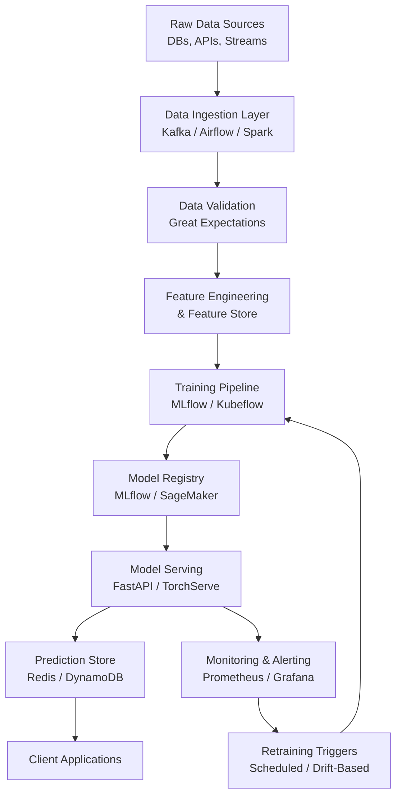
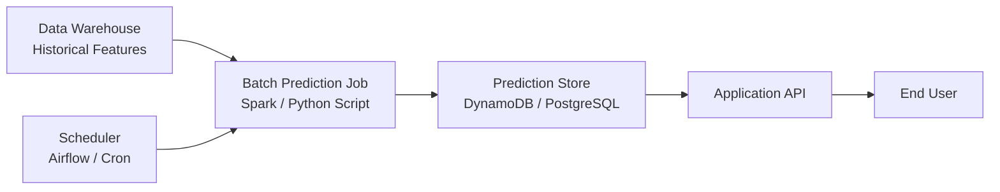
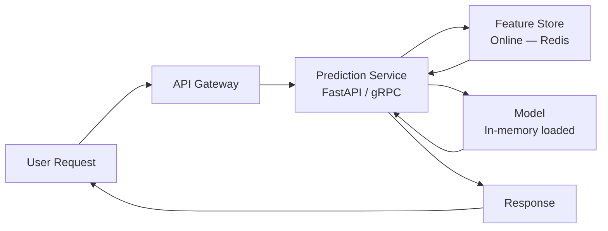
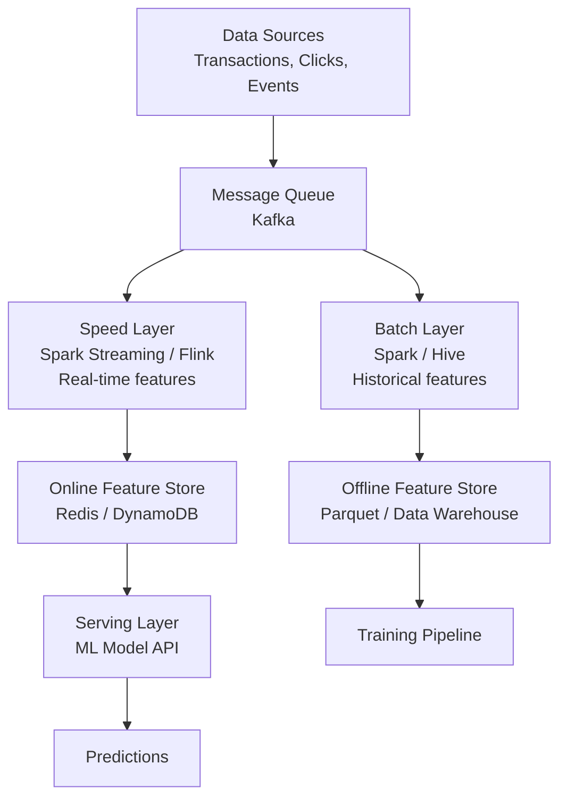
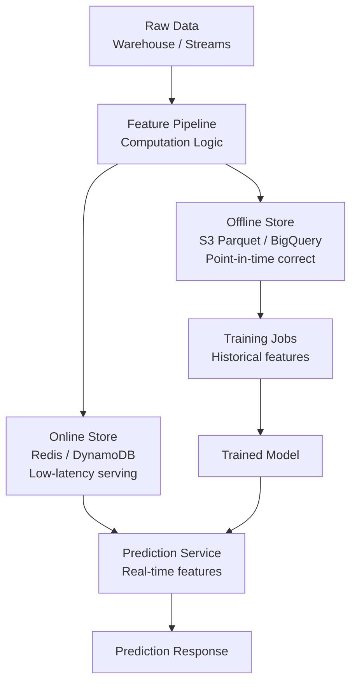
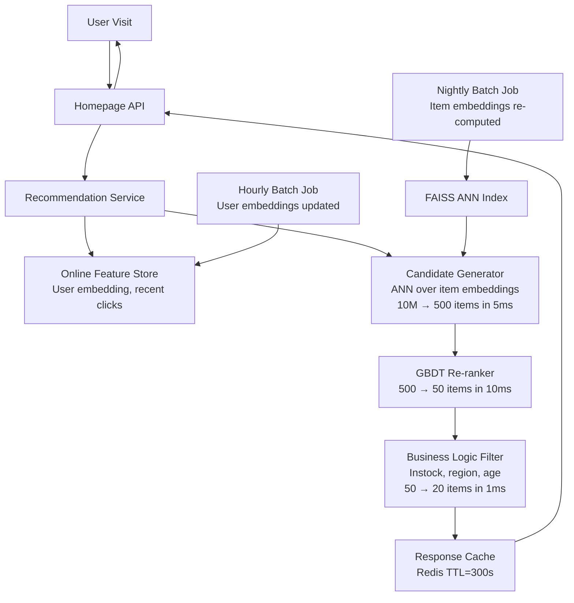

# Machine Learning Deep Dive — Part 17: ML System Design — Architecture for Real-World ML

---

**Series:** Machine Learning — A Developer's Deep Dive from Fundamentals to Production
**Part:** 17 of 19 (Production ML)
**Audience:** Developers with Python experience who want to master machine learning from the ground up
**Reading time:** ~60 minutes

---

## Recap: Where We've Been

In Part 16 we went deep on model evaluation — precision, recall, ROC-AUC, calibration curves — and then layered on SHAP for explainability and Optuna for hyperparameter optimisation. You learned how to measure whether a model is actually good, explain why it makes particular predictions, and systematically search for the best configuration.

You can now build and evaluate excellent models. But building a model in a notebook and deploying an ML system that serves millions of predictions per day are completely different problems. ML system design is about architecture — the decisions you make before writing a line of code that determine whether your system will scale, be maintainable, and actually deliver business value.

---

## Table of Contents

1. [ML in Production vs ML in Notebooks](#1-ml-in-production-vs-ml-in-notebooks)
2. [Offline vs Online ML Systems](#2-offline-vs-online-ml-systems)
3. [Data Pipelines for ML](#3-data-pipelines-for-ml)
4. [Feature Stores](#4-feature-stores)
5. [Model Serving Patterns](#5-model-serving-patterns)
6. [ML Architecture Patterns](#6-ml-architecture-patterns)
7. [A/B Testing for ML Models](#7-ab-testing-for-ml-models)
8. [Caching and Optimisation for Serving](#8-caching-and-optimisation-for-serving)
9. [ML System Design Case Studies](#9-ml-system-design-case-studies)
10. [Project: Design a Complete ML System Architecture](#10-project-design-a-complete-ml-system-architecture)
11. [Vocabulary Cheat Sheet](#vocabulary-cheat-sheet)
12. [What's Next](#whats-next)

---

## 1. ML in Production vs ML in Notebooks

### The Hidden Technical Debt in ML Systems

In 2015, a team of engineers at Google published a paper titled *"Hidden Technical Debt in Machine Learning Systems"* (Sculley et al., 2015). It became one of the most cited papers in the field — not because it introduced a novel algorithm, but because it named a problem every ML practitioner knew but nobody had formally described.

The central insight: **machine learning code itself is often a tiny fraction of a production ML system**. The model training loop might be 500 lines of Python. The surrounding system — data ingestion, validation, feature pipelines, serving infrastructure, monitoring, retraining triggers — can be orders of magnitude larger and more brittle.

```
# The "notebook illusion" — what feels like 80% of the work
# filename: notebook_model.py

import pandas as pd
from sklearn.ensemble import GradientBoostingClassifier
from sklearn.model_selection import train_test_split
from sklearn.metrics import roc_auc_score

# Load data
df = pd.read_csv("transactions.csv")

# Quick feature engineering
df["amount_log"] = df["amount"].apply(lambda x: max(0, x) ** 0.5)
df["hour"] = pd.to_datetime(df["timestamp"]).dt.hour

features = ["amount_log", "hour", "merchant_category", "user_age"]
X = df[features]
y = df["is_fraud"]

# Train
X_train, X_test, y_train, y_test = train_test_split(X, y, test_size=0.2)
model = GradientBoostingClassifier(n_estimators=100)
model.fit(X_train, y_train)

# Evaluate
preds = model.predict_proba(X_test)[:, 1]
print(f"AUC: {roc_auc_score(y_test, preds):.4f}")
# Output: AUC: 0.9312

# "Ship it!"
```

This notebook produces a great AUC. But it silently assumes:
- The CSV will always be in exactly this format
- `merchant_category` is already encoded
- There are no null values
- The model never needs retraining
- Someone will manually run this when predictions are needed
- There is no monitoring
- There is no versioning

Every one of those assumptions becomes a production incident waiting to happen.

### The 10 Components of a Production ML System



| Component | Responsibility | Common Tools |
|-----------|---------------|-------------|
| Data Ingestion | Collect raw data from sources | Kafka, Airflow, Spark, Fivetran |
| Data Validation | Detect schema drift, outliers, nulls | Great Expectations, Deequ |
| Feature Engineering | Transform raw data to model inputs | Feast, Tecton, custom pipelines |
| Training Pipeline | Orchestrate model training runs | Kubeflow, MLflow, SageMaker |
| Model Registry | Version and store trained models | MLflow Registry, Weights & Biases |
| Model Serving | Expose model predictions via API | FastAPI, TorchServe, Triton |
| Prediction Store | Cache/store generated predictions | Redis, DynamoDB, PostgreSQL |
| Monitoring | Track data drift, model performance | Evidently, Prometheus, Grafana |
| Retraining Triggers | Decide when to retrain | Scheduled, drift-detected, metric-drop |
| Client Applications | Consume predictions | Web apps, mobile, internal systems |

### Production Requirements: The Five Dimensions

When designing a production ML system you must specify requirements across five dimensions before choosing any technology:

**1. Latency** — How quickly must a single prediction be returned?
- Trading systems: < 1 millisecond
- Fraud detection: < 100 milliseconds
- Search ranking: < 200 milliseconds
- Recommendation emails: seconds to minutes acceptable

**2. Throughput** — How many predictions per second must the system handle?
- A small SaaS might need 10 RPS
- A major search engine needs millions of QPS

**3. Availability** — What is the acceptable downtime?
- 99.9% ("three nines") = 8.7 hours downtime/year
- 99.99% ("four nines") = 52 minutes downtime/year

**4. Accuracy** — What is the minimum acceptable model performance?
- Measured by business metrics (conversion rate, revenue) not just AUC

**5. Cost** — What is the infrastructure budget?
- GPU inference costs 10-100x CPU inference

### Why Most ML Projects Fail

> "The #1 reason ML projects fail is not the algorithm — it's the data. Garbage in, garbage out is not a cliche; it's the dominant failure mode." — Chip Huyen, *Designing Machine Learning Systems*

Research consistently shows:

```
# Production ML failure modes (approximate industry survey data)
# filename: failure_analysis.py

failure_modes = {
    "Data quality issues": 0.40,          # Null values, wrong schema, stale data
    "Training-serving skew": 0.15,        # Features computed differently in prod
    "No monitoring / silent degradation": 0.15,  # Model rots undetected
    "Scope creep / unclear requirements": 0.12,  # Built the wrong thing
    "Infrastructure failures": 0.10,      # Serving layer breaks under load
    "Model algorithm issues": 0.08,       # The thing everyone worries about most
}

for cause, pct in sorted(failure_modes.items(), key=lambda x: -x[1]):
    bar = "█" * int(pct * 50)
    print(f"{cause:<45} {bar} {pct*100:.0f}%")

# Output:
# Data quality issues                           ██████████████████████ 40%
# Training-serving skew                         ████████ 15%
# No monitoring / silent degradation            ████████ 15%
# Scope creep / unclear requirements            ██████ 12%
# Infrastructure failures                       █████ 10%
# Model algorithm issues                        ████ 8%
```

The implication: **a mediocre algorithm on clean, well-maintained data beats a state-of-the-art algorithm on dirty data every time**.

---

## 2. Offline vs Online ML Systems

The most fundamental architectural decision in ML system design is whether predictions are generated **before** or **after** a request arrives.

### Batch Prediction (Offline)

**Batch prediction** systems run a prediction job on a schedule — hourly, daily, weekly — and store results in a database. When a user or application needs a prediction, it reads from the precomputed store.



**When to use batch prediction:**
- Predictions are needed for a fixed, enumerable set of entities (all users, all products)
- Prediction freshness of hours or days is acceptable
- Generating predictions is computationally expensive
- Low latency is NOT required

**Real-world examples:**
- Weekly product recommendations in a marketing email
- Daily credit risk scores for all accounts
- Nightly churn probability updates for CRM
- Batch fraud scoring on end-of-day transaction files

```python
# filename: batch_prediction_job.py
"""
Batch prediction job — runs nightly via Airflow.
Scores all active users for churn probability and writes to DynamoDB.
"""

import boto3
import joblib
import pandas as pd
from datetime import datetime, timedelta

def run_batch_predictions(model_path: str, features_query: str) -> None:
    """Load model, score all users, write results to prediction store."""

    # 1. Load trained model from artifact store
    model = joblib.load(model_path)
    print(f"Loaded model from {model_path}")

    # 2. Pull features from data warehouse
    # (In production this would be a SQL query against Redshift/BigQuery)
    df = pd.read_parquet("s3://ml-features/churn/daily_features.parquet")
    print(f"Loaded features for {len(df):,} users")

    # 3. Generate predictions
    user_ids = df["user_id"].tolist()
    X = df.drop(columns=["user_id"])
    churn_probs = model.predict_proba(X)[:, 1]

    # 4. Write to DynamoDB prediction store
    dynamodb = boto3.resource("dynamodb", region_name="us-east-1")
    table = dynamodb.Table("ml-predictions-churn")
    prediction_date = datetime.utcnow().strftime("%Y-%m-%d")

    with table.batch_writer() as batch:
        for user_id, prob in zip(user_ids, churn_probs):
            batch.put_item(Item={
                "user_id": str(user_id),
                "churn_probability": str(round(float(prob), 4)),
                "prediction_date": prediction_date,
                "ttl": int((datetime.utcnow() + timedelta(days=7)).timestamp())
            })

    print(f"Wrote {len(user_ids):,} predictions to DynamoDB")
    print(f"Sample: user_id={user_ids[0]}, churn_prob={churn_probs[0]:.4f}")

# Expected Output:
# Loaded model from s3://ml-models/churn/v3.2/model.pkl
# Loaded features for 2,847,391 users
# Wrote 2,847,391 predictions to DynamoDB
# Sample: user_id=usr_1a2b3c, churn_prob=0.1823
```

### Online Prediction (Real-Time)

**Online prediction** systems generate predictions at request time. When a request arrives, the system fetches features, runs the model, and returns the prediction — all within the latency budget.



**When to use online prediction:**
- Features depend on the current request context (e.g., search query)
- Prediction freshness must be seconds or less
- The set of inputs is not enumerable in advance
- Business requires real-time personalisation

**Real-world examples:**
- Search result ranking (query changes per request)
- Fraud detection on payment submission
- Content feed ranking for social media
- Real-time product recommendations on a product page

```python
# filename: online_prediction_service.py
"""
Online prediction service for fraud detection.
Prediction must complete within 100ms SLA.
"""

import time
import redis
import joblib
import numpy as np
from fastapi import FastAPI, HTTPException
from pydantic import BaseModel

app = FastAPI(title="Fraud Detection Service")

# Load model once at startup — NOT on every request
model = joblib.load("/models/fraud/v2.1/model.pkl")
feature_client = redis.Redis(host="feature-store-redis", port=6379)

class TransactionRequest(BaseModel):
    transaction_id: str
    user_id: str
    amount: float
    merchant_id: str
    timestamp: int

@app.post("/predict/fraud")
async def predict_fraud(request: TransactionRequest):
    start_time = time.time()

    # 1. Fetch user features from online feature store (Redis)
    user_features_raw = feature_client.hgetall(f"user_features:{request.user_id}")
    if not user_features_raw:
        raise HTTPException(status_code=404, detail="User features not found")

    # 2. Assemble feature vector
    features = np.array([
        float(user_features_raw.get(b"avg_transaction_30d", 0)),
        float(user_features_raw.get(b"transaction_count_7d", 0)),
        float(user_features_raw.get(b"unique_merchants_30d", 0)),
        request.amount,
        request.amount / max(float(user_features_raw.get(b"avg_transaction_30d", 1)), 1),
        request.timestamp % 86400 / 3600,   # hour of day
    ]).reshape(1, -1)

    # 3. Run model inference
    fraud_probability = float(model.predict_proba(features)[0, 1])

    elapsed_ms = (time.time() - start_time) * 1000

    return {
        "transaction_id": request.transaction_id,
        "fraud_probability": round(fraud_probability, 4),
        "decision": "BLOCK" if fraud_probability > 0.85 else "ALLOW",
        "latency_ms": round(elapsed_ms, 2)
    }

# Expected response:
# {
#   "transaction_id": "txn_abc123",
#   "fraud_probability": 0.0231,
#   "decision": "ALLOW",
#   "latency_ms": 4.87
# }
```

### Comparison: Batch vs Online

| Dimension | Batch Prediction | Online Prediction |
|-----------|-----------------|------------------|
| Latency | Minutes to hours acceptable | Milliseconds to seconds required |
| Freshness | Stale by design | Real-time |
| Infrastructure complexity | Low | High |
| Feature engineering | Flexible, can be expensive | Must be fast |
| Cost per prediction | Very low | Higher |
| Failure mode | Whole batch fails | Individual requests fail |
| Scalability | Scales with compute | Scales with replica count |
| Best for | Emails, reports, bulk scoring | Feeds, search, fraud, chat |

### Hybrid Approaches

Most production systems use **both** patterns:

- **Pre-compute** expensive, slowly-changing features (user embeddings, product embeddings) in batch
- **Compute** request-specific features (current query, basket contents) online
- **Blend** batch-computed candidates with online re-ranking

```python
# filename: hybrid_recommendation.py
"""
Hybrid recommendation: batch candidates + online scoring.
"""

def get_recommendations(user_id: str, page_context: dict) -> list:
    """
    Hybrid recommendation pipeline:
    - Candidate set from batch (precomputed daily)
    - Final ranking online (uses real-time context)
    """

    # Step 1: Fetch batch-precomputed candidate list from Redis
    # (generated nightly by collaborative filtering job)
    raw = redis_client.get(f"candidates:{user_id}")
    candidate_item_ids = json.loads(raw) if raw else get_fallback_candidates()
    # Returns ~500 pre-scored candidates

    # Step 2: Fetch real-time context features
    # What is the user currently looking at?
    current_item = page_context.get("current_item_id")
    recent_clicks = get_recent_clicks(user_id, window_seconds=300)

    # Step 3: Online re-ranking with context features
    # This model is fast (linear or small tree) to meet latency budget
    reranking_features = build_reranking_features(
        candidate_item_ids, user_id, current_item, recent_clicks
    )
    scores = online_reranker.predict(reranking_features)

    # Step 4: Return top-k
    ranked = sorted(zip(candidate_item_ids, scores), key=lambda x: -x[1])
    return [item_id for item_id, _ in ranked[:20]]

# Latency breakdown:
# Redis lookup:          ~2ms
# Real-time features:    ~5ms
# Online re-ranking:     ~8ms
# Total:                ~15ms  ✓ well within 100ms budget
```

### Latency Budgets by Domain

> "Every millisecond of latency costs money. Amazon found that every 100ms increase in page load time reduced sales by 1%. Google found that a 500ms delay reduced searches by 20%." — from Chip Huyen's *Designing Machine Learning Systems*

| Domain | Latency Budget | Serving Pattern | Notes |
|--------|---------------|-----------------|-------|
| HFT / Algorithmic Trading | < 1ms | Co-located, FPGA | No Python; C++/FPGA |
| Ad Bidding | 10ms | Online + cache | ~100B predictions/day |
| Fraud Detection | 100ms | Online + feature store | Must beat payment timeout |
| Search Ranking | 200ms | Online + ANN index | Multiple model cascade |
| Recommendation Feed | 500ms | Hybrid | Batch candidates + online rank |
| Recommendation Email | Minutes | Batch | Can take hours |
| Risk Scoring | Hours | Batch | Nightly scoring jobs |

---

## 3. Data Pipelines for ML

> "The ML system is the easy part. The data pipeline, feature engineering, and monitoring are where 80% of the work actually lives." — Eugene Yan

### Data Ingestion: Streaming vs Batch

**Batch ingestion** collects data at intervals and processes it in bulk. Tools like **Apache Spark**, **Airflow**, and cloud-native ETL services (Fivetran, dbt) handle this well.

**Streaming ingestion** processes data continuously as events arrive. **Apache Kafka** is the dominant technology — a distributed, durable, high-throughput event streaming platform.

```python
# filename: kafka_feature_consumer.py
"""
Kafka consumer that processes transaction events and
updates user features in the online feature store (Redis).
"""

from confluent_kafka import Consumer, KafkaException
import json
import redis
import logging

logging.basicConfig(level=logging.INFO)
logger = logging.getLogger(__name__)

# Configuration
KAFKA_CONFIG = {
    "bootstrap.servers": "kafka-broker:9092",
    "group.id": "feature-engineering-consumer",
    "auto.offset.reset": "earliest",
    "enable.auto.commit": False,
}
TOPIC = "transactions"

redis_client = redis.Redis(host="feature-store-redis", port=6379, decode_responses=True)

def update_user_features(user_id: str, amount: float, merchant_id: str) -> None:
    """Update rolling window features for a user after each transaction."""
    pipe = redis_client.pipeline()

    # Increment transaction count (7-day window managed by separate TTL sweep)
    pipe.incr(f"txn_count_7d:{user_id}")
    pipe.expire(f"txn_count_7d:{user_id}", 7 * 24 * 3600)

    # Update running average (Welford's online algorithm)
    key = f"user_features:{user_id}"
    current = redis_client.hgetall(key)
    n = int(current.get("txn_count", 0)) + 1
    old_avg = float(current.get("avg_amount", amount))
    new_avg = old_avg + (amount - old_avg) / n

    pipe.hset(key, mapping={
        "txn_count": n,
        "avg_amount": round(new_avg, 4),
        "last_merchant": merchant_id,
    })
    pipe.execute()

def run_consumer():
    consumer = Consumer(KAFKA_CONFIG)
    consumer.subscribe([TOPIC])
    logger.info(f"Subscribed to topic: {TOPIC}")

    try:
        while True:
            msg = consumer.poll(timeout=1.0)
            if msg is None:
                continue
            if msg.error():
                raise KafkaException(msg.error())

            event = json.loads(msg.value().decode("utf-8"))
            update_user_features(
                user_id=event["user_id"],
                amount=event["amount"],
                merchant_id=event["merchant_id"]
            )
            consumer.commit(asynchronous=False)
            logger.info(f"Processed transaction {event['transaction_id']}")

    except KeyboardInterrupt:
        pass
    finally:
        consumer.close()

if __name__ == "__main__":
    run_consumer()

# Expected log output:
# INFO: Subscribed to topic: transactions
# INFO: Processed transaction txn_001
# INFO: Processed transaction txn_002
```

### Data Validation with Great Expectations Concepts

**Data validation** is the practice of asserting that incoming data meets expectations before it enters the training pipeline. Without it, a schema change upstream silently corrupts your model.

```python
# filename: data_validation.py
"""
Data validation using Great Expectations-style assertions.
Run this as the first step in any training or batch pipeline.
"""

import pandas as pd
import numpy as np
from dataclasses import dataclass
from typing import List, Tuple

@dataclass
class ValidationResult:
    check_name: str
    passed: bool
    details: str

def validate_training_data(df: pd.DataFrame) -> Tuple[bool, List[ValidationResult]]:
    """
    Run suite of data quality checks on training dataframe.
    Returns (overall_pass, list_of_results).
    """
    results = []

    # 1. Schema check — required columns present
    required_cols = ["user_id", "amount", "timestamp", "merchant_category", "is_fraud"]
    missing = [c for c in required_cols if c not in df.columns]
    results.append(ValidationResult(
        "required_columns_present",
        len(missing) == 0,
        f"Missing: {missing}" if missing else "All present"
    ))

    # 2. No-null check on critical columns
    null_counts = df[["amount", "timestamp", "is_fraud"]].isnull().sum()
    has_nulls = (null_counts > 0).any()
    results.append(ValidationResult(
        "no_nulls_in_critical_columns",
        not has_nulls,
        f"Null counts: {null_counts.to_dict()}"
    ))

    # 3. Amount range check
    negative_amounts = (df["amount"] < 0).sum()
    results.append(ValidationResult(
        "amount_non_negative",
        negative_amounts == 0,
        f"{negative_amounts} negative amounts found"
    ))

    # 4. Label distribution check (fraud should be rare)
    fraud_rate = df["is_fraud"].mean()
    results.append(ValidationResult(
        "fraud_rate_plausible",
        0.001 <= fraud_rate <= 0.20,
        f"Fraud rate: {fraud_rate:.4f} (expected 0.1%-20%)"
    ))

    # 5. No future timestamps
    max_ts = df["timestamp"].max()
    import time
    results.append(ValidationResult(
        "no_future_timestamps",
        max_ts <= int(time.time()) + 3600,
        f"Max timestamp: {max_ts}"
    ))

    overall_pass = all(r.passed for r in results)
    return overall_pass, results


# --- Demo ---
df = pd.DataFrame({
    "user_id": ["u1", "u2", "u3"],
    "amount": [12.50, 340.00, 5.00],
    "timestamp": [1710000000, 1710000100, 1710000200],
    "merchant_category": ["grocery", "electronics", "coffee"],
    "is_fraud": [0, 0, 1]
})

passed, results = validate_training_data(df)
for r in results:
    status = "PASS" if r.passed else "FAIL"
    print(f"[{status}] {r.check_name}: {r.details}")
print(f"\nOverall: {'PASS' if passed else 'FAIL'}")

# Output:
# [PASS] required_columns_present: All present
# [PASS] no_nulls_in_critical_columns: Null counts: {'amount': 0, ...}
# [PASS] amount_non_negative: 0 negative amounts found
# [PASS] fraud_rate_plausible: Fraud rate: 0.3333 (expected 0.1%-20%)
# [PASS] no_future_timestamps: Max timestamp: 1710000200
# Overall: PASS
```

### Data Versioning with DVC

**DVC (Data Version Control)** tracks large data files and model artifacts the same way Git tracks code. It stores metadata in Git while the actual files live in cloud storage (S3, GCS, Azure Blob).

```bash
# filename: dvc_workflow.sh
# DVC workflow for versioning training datasets

# Initialize DVC in a git repo
git init
dvc init

# Track a dataset
dvc add data/transactions_2024.parquet
git add data/transactions_2024.parquet.dvc .gitignore
git commit -m "Add transactions dataset v1"

# Push data to remote storage (S3 in this case)
dvc remote add -d myremote s3://ml-data-bucket/dvc-store
dvc push

# Later: reproduce the exact same dataset for a given git commit
git checkout v1.2.0
dvc pull
# This fetches exactly the data that existed at tag v1.2.0

# Expected output:
# Collecting                                              |1.00 [00:00, ?file/s]
# Fetching
# 1 file fetched
```

### The Lambda Architecture for ML Data

The **lambda architecture** combines batch and streaming pipelines, providing both high-throughput historical processing and low-latency real-time processing.



---

## 4. Feature Stores

**Feature stores** are purpose-built infrastructure for managing, storing, and serving ML features. They solve one of the most persistent problems in production ML: **training-serving skew**.

### The Training-Serving Skew Problem

Training-serving skew occurs when the features used during training are computed differently from the features computed at serving time. This is subtle and devastating:

```python
# filename: training_serving_skew_example.py
"""
Classic example of training-serving skew.
This is one of the most common production bugs in ML.
"""

# ---- TRAINING CODE (in Jupyter notebook) ----
import pandas as pd

def compute_avg_spend_training(df):
    """Compute 30-day average spend PER USER using historical data."""
    df["avg_spend_30d"] = df.groupby("user_id")["amount"].transform(
        lambda x: x.rolling(window=30, min_periods=1).mean()
    )
    return df

# Works great in training! Average computed over sorted historical data.

# ---- SERVING CODE (written months later by different engineer) ----
def compute_avg_spend_serving(user_id: str, db_conn) -> float:
    """Compute 30-day average spend for a user at serving time."""
    result = db_conn.execute("""
        SELECT AVG(amount)
        FROM transactions
        WHERE user_id = ?
        AND created_at >= datetime('now', '-30 days')
    """, [user_id]).fetchone()
    return result[0] or 0.0

# BUG: Training uses a rolling window over sorted transaction rows
#      Serving uses calendar 30 days from NOW
# For users with infrequent transactions, these diverge significantly.
# The model silently degrades. Nobody notices for months.

print("Training feature: rolling 30-row window")
print("Serving feature:  calendar 30-day window from now")
print("Divergence: HIGH for infrequent users, LOW for frequent users")
print("Detection: very difficult without feature monitoring")
```

### Feature Store Architecture

A feature store has two components:

- **Online store**: low-latency key-value store (Redis, DynamoDB) for serving features at prediction time
- **Offline store**: column-oriented storage (Parquet, Hive, BigQuery) for training



### Point-in-Time Correct Joins (Preventing Data Leakage)

**Point-in-time correct joins** ensure that when building a training dataset, you only use features that were available at the time of each label event. This prevents **data leakage** — using future information to predict the past.

```python
# filename: point_in_time_join.py
"""
Point-in-time correct feature join.
For each labeled event, fetch the feature values as they existed
at the timestamp of that event — not the current values.
"""

import pandas as pd

def point_in_time_join(
    labels: pd.DataFrame,
    features: pd.DataFrame,
    entity_col: str = "user_id",
    event_ts_col: str = "event_timestamp",
    feature_ts_col: str = "feature_timestamp",
) -> pd.DataFrame:
    """
    For each row in `labels`, find the most recent feature row
    that occurred BEFORE or AT the label's event timestamp.

    Args:
        labels: DataFrame with columns [entity_col, event_ts_col, label]
        features: DataFrame with columns [entity_col, feature_ts_col, feature_cols...]

    Returns:
        labels DataFrame enriched with feature columns (no leakage)
    """
    labels = labels.sort_values(event_ts_col)
    features = features.sort_values(feature_ts_col)

    result_rows = []
    for _, label_row in labels.iterrows():
        entity = label_row[entity_col]
        event_ts = label_row[event_ts_col]

        # Find features for this entity available BEFORE the event
        valid_features = features[
            (features[entity_col] == entity) &
            (features[feature_ts_col] <= event_ts)
        ]

        if valid_features.empty:
            # No features available yet — use defaults or skip
            feature_vals = {col: None for col in features.columns
                           if col not in [entity_col, feature_ts_col]}
        else:
            # Use most recent feature snapshot before event time
            latest = valid_features.sort_values(feature_ts_col).iloc[-1]
            feature_vals = latest.drop([entity_col, feature_ts_col]).to_dict()

        result_rows.append({**label_row.to_dict(), **feature_vals})

    return pd.DataFrame(result_rows)


# --- Demo ---
labels = pd.DataFrame({
    "user_id": ["u1", "u1", "u2"],
    "event_timestamp": pd.to_datetime(["2024-01-10", "2024-02-15", "2024-01-20"]),
    "label": [0, 1, 0]
})

features = pd.DataFrame({
    "user_id": ["u1", "u1", "u2"],
    "feature_timestamp": pd.to_datetime(["2024-01-01", "2024-02-01", "2024-01-05"]),
    "avg_spend_30d": [120.0, 145.0, 88.0],
    "txn_count_7d": [3, 5, 2]
})

result = point_in_time_join(labels, features)
print(result[["user_id", "event_timestamp", "label", "avg_spend_30d", "txn_count_7d"]])

# Output:
#   user_id event_timestamp  label  avg_spend_30d  txn_count_7d
# 0      u1      2024-01-10      0          120.0           3.0
# 1      u1      2024-02-15      1          145.0           5.0
# 2      u2      2024-01-20      0           88.0           2.0
# Note: u1's Jan 10 event uses Jan 1 features (not Feb 1 — that's in the future!)
```

### Feast: Open-Source Feature Store

**Feast** is the most widely adopted open-source feature store. Here is a simplified sketch of its core concepts:

```python
# filename: feast_feature_store_sketch.py
"""
Feast feature store — conceptual implementation sketch.
Shows the key abstractions: Entity, FeatureView, FeatureStore.
"""

# In a real Feast setup, this lives in feature_store.yaml + Python definitions

from datetime import timedelta

# --- feature_repo/features.py ---

# Entity: the primary key for feature lookups
# (In Feast: Entity(name="user", value_type=ValueType.STRING))
USER_ENTITY = "user_id"

# Feature view: a logical grouping of related features
USER_TRANSACTION_FEATURES = {
    "name": "user_transaction_stats",
    "entities": [USER_ENTITY],
    "ttl": timedelta(days=7),
    "features": [
        "avg_spend_30d",
        "txn_count_7d",
        "unique_merchants_30d",
        "last_txn_amount",
    ],
    # Source: where offline features are stored
    "offline_source": "s3://ml-features/user_transaction_stats/",
    # Online materialization target
    "online_store": "redis://feature-store-redis:6379"
}

# --- Usage in training ---
def get_training_features(entity_df: "pd.DataFrame") -> "pd.DataFrame":
    """
    Fetch historical features for training.
    entity_df must have columns: [user_id, event_timestamp]
    Feast performs the point-in-time join automatically.
    """
    # store = FeatureStore(repo_path="feature_repo/")
    # return store.get_historical_features(
    #     entity_df=entity_df,
    #     features=["user_transaction_stats:avg_spend_30d",
    #               "user_transaction_stats:txn_count_7d"],
    # ).to_df()
    print("Would fetch historical features with point-in-time join")

# --- Usage in serving ---
def get_online_features(user_ids: list) -> dict:
    """
    Fetch latest feature values for serving.
    Reads from Redis online store — sub-millisecond latency.
    """
    # store = FeatureStore(repo_path="feature_repo/")
    # return store.get_online_features(
    #     features=["user_transaction_stats:avg_spend_30d",
    #               "user_transaction_stats:txn_count_7d"],
    #     entity_rows=[{"user_id": uid} for uid in user_ids],
    # ).to_dict()
    print(f"Would fetch online features for {len(user_ids)} users from Redis")

get_online_features(["u1", "u2", "u3"])
# Output: Would fetch online features for 3 users from Redis
```

---

## 5. Model Serving Patterns

Once a model is trained and registered, it must be served to clients. There are five main patterns, each with distinct tradeoffs.

### Pattern Comparison

| Pattern | Protocol | Latency | Throughput | Complexity | Best For |
|---------|----------|---------|-----------|------------|----------|
| REST API (FastAPI) | HTTP/JSON | Medium | Medium | Low | External APIs, simple services |
| gRPC | Protobuf/HTTP2 | Low | High | Medium | Internal microservices, high freq |
| Message Queue (Kafka) | Async | Variable | Very High | High | Async workflows, decoupled systems |
| Batch Serving | N/A | Hours | Very High | Low | Bulk scoring, reports |
| Streaming Inference | Kafka/Flink | Low | Very High | High | Event-driven, real-time pipelines |

### REST API with FastAPI

**FastAPI** is the standard choice for Python ML serving. It provides automatic request validation (via Pydantic), async support, and automatic OpenAPI documentation.

```python
# filename: ml_serving_api.py
"""
Production-grade FastAPI model serving endpoint.
Includes: input validation, error handling, latency logging,
model versioning header, and health check.
"""

import time
import logging
import joblib
import numpy as np
import pandas as pd
from contextlib import asynccontextmanager
from typing import Optional
from fastapi import FastAPI, HTTPException, Request
from pydantic import BaseModel, Field, validator

logging.basicConfig(level=logging.INFO)
logger = logging.getLogger(__name__)

# --- Model registry (simplified) ---
MODEL_REGISTRY = {
    "churn_v2": "/models/churn/v2.0/model.pkl",
    "churn_v3": "/models/churn/v3.0/model.pkl",
}
ACTIVE_MODEL = "churn_v3"

# Global model store — loaded once on startup
models = {}

@asynccontextmanager
async def lifespan(app: FastAPI):
    """Load models on startup, clean up on shutdown."""
    logger.info("Loading ML models...")
    for name, path in MODEL_REGISTRY.items():
        try:
            models[name] = joblib.load(path)
            logger.info(f"Loaded model: {name}")
        except FileNotFoundError:
            logger.warning(f"Model file not found: {path}, skipping")
    yield
    models.clear()
    logger.info("Models unloaded")

app = FastAPI(
    title="ML Prediction Service",
    version="1.0.0",
    lifespan=lifespan
)

# --- Request / Response schemas ---

class ChurnPredictionRequest(BaseModel):
    user_id: str = Field(..., description="Unique user identifier")
    days_since_last_login: int = Field(..., ge=0, le=3650)
    total_purchases_90d: int = Field(..., ge=0)
    avg_order_value: float = Field(..., ge=0.0)
    support_tickets_30d: int = Field(..., ge=0, le=100)
    account_age_days: int = Field(..., ge=0)
    plan_type: str = Field(..., description="free | basic | premium | enterprise")

    @validator("plan_type")
    def validate_plan_type(cls, v):
        valid = {"free", "basic", "premium", "enterprise"}
        if v not in valid:
            raise ValueError(f"plan_type must be one of {valid}")
        return v

class ChurnPredictionResponse(BaseModel):
    user_id: str
    churn_probability: float
    risk_tier: str   # "low" | "medium" | "high"
    model_version: str
    latency_ms: float

# --- Feature engineering (must match training exactly) ---

PLAN_ENCODING = {"free": 0, "basic": 1, "premium": 2, "enterprise": 3}

def engineer_features(req: ChurnPredictionRequest) -> np.ndarray:
    return np.array([
        req.days_since_last_login,
        req.total_purchases_90d,
        req.avg_order_value,
        req.support_tickets_30d,
        req.account_age_days,
        PLAN_ENCODING[req.plan_type],
        req.total_purchases_90d / max(req.account_age_days / 30, 1),  # purchases per month
        req.support_tickets_30d / max(req.total_purchases_90d, 1),    # support rate
    ]).reshape(1, -1)

# --- Endpoints ---

@app.get("/health")
async def health_check():
    return {
        "status": "healthy",
        "models_loaded": list(models.keys()),
        "active_model": ACTIVE_MODEL
    }

@app.post("/predict/churn", response_model=ChurnPredictionResponse)
async def predict_churn(
    request: ChurnPredictionRequest,
    model_version: Optional[str] = None
):
    start = time.perf_counter()

    # Select model
    version = model_version or ACTIVE_MODEL
    if version not in models:
        raise HTTPException(
            status_code=400,
            detail=f"Model '{version}' not available. Options: {list(models.keys())}"
        )

    model = models[version]

    # Feature engineering
    try:
        features = engineer_features(request)
    except Exception as e:
        raise HTTPException(status_code=422, detail=f"Feature engineering failed: {e}")

    # Inference
    churn_prob = float(model.predict_proba(features)[0, 1])

    # Risk tiering
    if churn_prob < 0.3:
        risk_tier = "low"
    elif churn_prob < 0.65:
        risk_tier = "medium"
    else:
        risk_tier = "high"

    elapsed_ms = (time.perf_counter() - start) * 1000
    logger.info(f"user={request.user_id} churn={churn_prob:.4f} latency={elapsed_ms:.2f}ms")

    return ChurnPredictionResponse(
        user_id=request.user_id,
        churn_probability=round(churn_prob, 4),
        risk_tier=risk_tier,
        model_version=version,
        latency_ms=round(elapsed_ms, 2)
    )

# To run: uvicorn ml_serving_api:app --host 0.0.0.0 --port 8080
# Health check: GET http://localhost:8080/health
# Prediction: POST http://localhost:8080/predict/churn

# Example response:
# {
#   "user_id": "usr_abc123",
#   "churn_probability": 0.7234,
#   "risk_tier": "high",
#   "model_version": "churn_v3",
#   "latency_ms": 3.14
# }
```

### gRPC for Internal ML Services

**gRPC** uses Protocol Buffers for serialisation, which is 3-10x faster than JSON and provides strongly typed contracts between services.

```python
# filename: fraud_service.proto (gRPC definition)
# This is a .proto file, shown as Python comment for context

"""
syntax = "proto3";

service FraudDetectionService {
  rpc PredictFraud (FraudRequest) returns (FraudResponse);
  rpc PredictFraudBatch (FraudBatchRequest) returns (FraudBatchResponse);
}

message FraudRequest {
  string transaction_id = 1;
  string user_id = 2;
  double amount = 3;
  string merchant_id = 4;
  int64 timestamp = 5;
}

message FraudResponse {
  string transaction_id = 1;
  double fraud_probability = 2;
  string decision = 3;      // "ALLOW" | "BLOCK" | "REVIEW"
  int32 latency_us = 4;     // microseconds
}
"""

# filename: grpc_server.py
# gRPC server implementation (Python)

import time
import grpc
import joblib
import numpy as np
from concurrent import futures

# import fraud_service_pb2
# import fraud_service_pb2_grpc

class FraudDetectionServicer:
    """gRPC servicer for fraud detection."""

    def __init__(self, model_path: str):
        self.model = joblib.load(model_path)
        print(f"Loaded model from {model_path}")

    def PredictFraud(self, request, context):
        start = time.perf_counter()

        features = np.array([
            request.amount,
            request.timestamp % 86400 / 3600,  # hour of day
        ]).reshape(1, -1)

        prob = float(self.model.predict_proba(features)[0, 1])
        decision = "BLOCK" if prob > 0.85 else ("REVIEW" if prob > 0.5 else "ALLOW")
        latency_us = int((time.perf_counter() - start) * 1_000_000)

        # return fraud_service_pb2.FraudResponse(
        #     transaction_id=request.transaction_id,
        #     fraud_probability=prob,
        #     decision=decision,
        #     latency_us=latency_us,
        # )

        print(f"txn={request.transaction_id} prob={prob:.4f} decision={decision} "
              f"latency={latency_us}µs")
        return {"fraud_probability": prob, "decision": decision}

def serve():
    server = grpc.server(futures.ThreadPoolExecutor(max_workers=10))
    # fraud_service_pb2_grpc.add_FraudDetectionServiceServicer_to_server(
    #     FraudDetectionServicer("/models/fraud/v2.pkl"), server
    # )
    server.add_insecure_port("[::]:50051")
    server.start()
    print("gRPC server started on port 50051")
    server.wait_for_termination()

# gRPC vs REST comparison:
# REST/JSON:  ~500µs serialization overhead
# gRPC/Proto: ~50µs serialization overhead
# Winner: gRPC for internal high-frequency services
```

### Async Serving via Message Queue

For high-volume, latency-tolerant workloads, an asynchronous pattern with Kafka decouples the prediction service from the consumer:

```python
# filename: async_prediction_worker.py
"""
Async ML prediction worker.
Reads requests from Kafka, writes predictions back to Kafka.
Useful for: bulk scoring, decoupled microservices, event-driven ML.
"""

import json
import joblib
import numpy as np
from confluent_kafka import Consumer, Producer, KafkaException

model = joblib.load("/models/churn/v3.pkl")
feature_columns = ["days_since_login", "purchases_90d", "avg_order_value",
                   "support_tickets_30d", "account_age_days", "plan_encoded"]

consumer = Consumer({
    "bootstrap.servers": "kafka:9092",
    "group.id": "churn-prediction-workers",
    "auto.offset.reset": "earliest",
})
producer = Producer({"bootstrap.servers": "kafka:9092"})

consumer.subscribe(["churn-prediction-requests"])

def process_prediction_request(event: dict) -> dict:
    features = np.array([[event[col] for col in feature_columns]])
    prob = float(model.predict_proba(features)[0, 1])
    return {
        "user_id": event["user_id"],
        "request_id": event["request_id"],
        "churn_probability": round(prob, 4),
        "risk_tier": "high" if prob > 0.65 else ("medium" if prob > 0.3 else "low")
    }

print("Async prediction worker started, consuming from 'churn-prediction-requests'")
try:
    while True:
        msg = consumer.poll(1.0)
        if msg is None or msg.error():
            continue
        event = json.loads(msg.value())
        result = process_prediction_request(event)
        producer.produce(
            "churn-prediction-results",
            key=event["user_id"],
            value=json.dumps(result).encode()
        )
        producer.flush()
        print(f"Processed request {event['request_id']}: churn={result['churn_probability']}")
except KeyboardInterrupt:
    pass

# Output:
# Async prediction worker started, consuming from 'churn-prediction-requests'
# Processed request req_001: churn=0.7234
# Processed request req_002: churn=0.1823
```

---

## 6. ML Architecture Patterns

### The Two-Tower Model (Search and Recommendation)

The **two-tower model** is the dominant architecture for large-scale retrieval. It encodes queries (or users) and items into the same embedding space using two separate neural networks ("towers"), then uses approximate nearest neighbour search to find relevant items.

```python
# filename: two_tower_model.py
"""
Two-tower model for item retrieval.
User tower and item tower independently produce embeddings.
Similarity = dot product between user and item embeddings.
"""

import torch
import torch.nn as nn
import torch.nn.functional as F

class UserTower(nn.Module):
    """Encodes user features into an embedding vector."""
    def __init__(self, input_dim: int, embedding_dim: int = 64):
        super().__init__()
        self.net = nn.Sequential(
            nn.Linear(input_dim, 128),
            nn.ReLU(),
            nn.Dropout(0.1),
            nn.Linear(128, 64),
            nn.ReLU(),
            nn.Linear(64, embedding_dim),
        )

    def forward(self, x: torch.Tensor) -> torch.Tensor:
        embedding = self.net(x)
        return F.normalize(embedding, p=2, dim=-1)  # L2-normalize


class ItemTower(nn.Module):
    """Encodes item features into an embedding vector."""
    def __init__(self, input_dim: int, embedding_dim: int = 64):
        super().__init__()
        self.net = nn.Sequential(
            nn.Linear(input_dim, 128),
            nn.ReLU(),
            nn.Dropout(0.1),
            nn.Linear(128, 64),
            nn.ReLU(),
            nn.Linear(64, embedding_dim),
        )

    def forward(self, x: torch.Tensor) -> torch.Tensor:
        embedding = self.net(x)
        return F.normalize(embedding, p=2, dim=-1)


class TwoTowerModel(nn.Module):
    """
    Full two-tower model.
    At serving time: item tower runs offline (batch), user tower runs online.
    """
    def __init__(self, user_dim: int, item_dim: int, embedding_dim: int = 64):
        super().__init__()
        self.user_tower = UserTower(user_dim, embedding_dim)
        self.item_tower = ItemTower(item_dim, embedding_dim)

    def forward(self, user_features: torch.Tensor, item_features: torch.Tensor):
        user_emb = self.user_tower(user_features)
        item_emb = self.item_tower(item_features)
        # Score = dot product (since embeddings are L2-normalised, this = cosine similarity)
        scores = (user_emb * item_emb).sum(dim=-1)
        return scores

# --- Demo ---
model = TwoTowerModel(user_dim=10, item_dim=20, embedding_dim=64)

batch_size = 4
user_feats = torch.randn(batch_size, 10)
item_feats = torch.randn(batch_size, 20)

scores = model(user_feats, item_feats)
print(f"Scores shape: {scores.shape}")  # torch.Size([4])
print(f"Sample scores: {scores.detach().numpy().round(4)}")

# Output:
# Scores shape: torch.Size([4])
# Sample scores: [ 0.0823 -0.1234  0.3456  0.0012]

# At serving time:
# 1. Embed all items offline → store in ANN index (FAISS)
# 2. At request time: embed user → ANN search over item index
# 3. Returns top-k candidates in ~10ms for 10M items
```

### Cascade Models: Fast Filter + Expensive Scorer

A **cascade** architecture uses a cheap, fast model to narrow down candidates, then a more expensive model to score only the survivors. This allows using complex models while meeting latency budgets.

```python
# filename: cascade_ranking.py
"""
Cascade ranking architecture.
Stage 1: Fast linear model filters 10M items to 1000 candidates
Stage 2: GBDT scores 1000 candidates to 50 finalists
Stage 3: Neural re-ranker scores 50 to final top-10
"""

import numpy as np
import time

class CascadeRanker:
    def __init__(self):
        # Stage 1: Ultra-fast — dot product retrieval (ANN)
        # Stage 2: Moderate — pre-computed GBDT
        # Stage 3: Expensive — neural model
        self.stages = [
            {"name": "ANN Retrieval",    "input_k": 10_000_000, "output_k": 1000, "latency_ms": 5},
            {"name": "GBDT Scorer",      "input_k": 1000,       "output_k": 50,   "latency_ms": 8},
            {"name": "Neural Re-ranker", "input_k": 50,         "output_k": 10,   "latency_ms": 15},
        ]

    def rank(self, user_embedding: np.ndarray, context: dict) -> list:
        candidates = list(range(self.stages[0]["input_k"]))  # All items
        total_latency = 0

        for stage in self.stages:
            start = time.perf_counter()
            # Simulate filtering
            k = stage["output_k"]
            scores = np.random.rand(len(candidates))  # Placeholder for real model
            top_k_idx = np.argpartition(scores, -k)[-k:]
            candidates = [candidates[i] for i in top_k_idx]
            elapsed = (time.perf_counter() - start) * 1000
            total_latency += elapsed
            print(f"  {stage['name']}: {stage['input_k']:>10,} → {len(candidates):>4} items "
                  f"(simulated {stage['latency_ms']}ms)")

        print(f"\nTotal latency: ~{sum(s['latency_ms'] for s in self.stages)}ms")
        print(f"Final top-10 candidates: {candidates[:10]}")
        return candidates[:10]

ranker = CascadeRanker()
user_emb = np.random.randn(64)
results = ranker.rank(user_emb, context={"page": "home"})

# Output:
#   ANN Retrieval:  10,000,000 → 1000 items (simulated 5ms)
#   GBDT Scorer:         1,000 →   50 items (simulated 8ms)
#   Neural Re-ranker:       50 →   10 items (simulated 15ms)
#
# Total latency: ~28ms
# Final top-10 candidates: [4521847, 892341, ...]
```

### Shadow Mode and Canary Deployments

**Shadow mode** deploys a new model alongside the production model. The new model receives all traffic but its predictions are discarded — only logged for comparison. This lets you validate the new model on real traffic with zero risk.

**Canary deployment** routes a small percentage of live traffic to the new model. If metrics look good, traffic is gradually increased to 100%.

```python
# filename: shadow_mode_serving.py
"""
Shadow mode deployment — new model runs silently alongside production model.
Useful for: validating a new model on real traffic before promoting it.
"""

import asyncio
import logging
import time
import numpy as np
from typing import Optional

logger = logging.getLogger(__name__)

class ShadowModeRouter:
    """
    Routes predictions through production model normally.
    Asynchronously also calls shadow model and logs comparison.
    """

    def __init__(self, prod_model, shadow_model, shadow_name: str = "challenger"):
        self.prod_model = prod_model
        self.shadow_model = shadow_model
        self.shadow_name = shadow_name
        self.comparison_log = []

    async def predict(self, features: np.ndarray, request_id: str) -> dict:
        # Production model: synchronous, returned to user
        prod_start = time.perf_counter()
        prod_prob = float(self.prod_model.predict_proba(features)[0, 1])
        prod_latency = (time.perf_counter() - prod_start) * 1000

        # Shadow model: run asynchronously, result discarded
        asyncio.create_task(
            self._run_shadow(features, request_id, prod_prob)
        )

        return {"probability": prod_prob, "latency_ms": prod_latency, "model": "production"}

    async def _run_shadow(self, features: np.ndarray, request_id: str, prod_prob: float):
        """Run shadow model and log comparison. Result is never returned to user."""
        shadow_start = time.perf_counter()
        shadow_prob = float(self.shadow_model.predict_proba(features)[0, 1])
        shadow_latency = (time.perf_counter() - shadow_start) * 1000

        self.comparison_log.append({
            "request_id": request_id,
            "prod_probability": prod_prob,
            "shadow_probability": shadow_prob,
            "agreement": abs(prod_prob - shadow_prob) < 0.1,
            "shadow_latency_ms": shadow_latency,
        })
        logger.debug(
            f"Shadow comparison: prod={prod_prob:.4f} "
            f"{self.shadow_name}={shadow_prob:.4f} "
            f"diff={abs(prod_prob-shadow_prob):.4f}"
        )

    def get_shadow_statistics(self) -> dict:
        if not self.comparison_log:
            return {}
        agreement_rate = sum(r["agreement"] for r in self.comparison_log) / len(self.comparison_log)
        avg_diff = np.mean([abs(r["prod_probability"] - r["shadow_probability"])
                           for r in self.comparison_log])
        return {
            "total_comparisons": len(self.comparison_log),
            "agreement_rate": round(agreement_rate, 4),
            "mean_absolute_difference": round(avg_diff, 4),
        }

# After running in shadow mode for 24 hours:
# stats = router.get_shadow_statistics()
# Output example:
# {
#   "total_comparisons": 847293,
#   "agreement_rate": 0.9812,
#   "mean_absolute_difference": 0.0234
# }
# → 98% agreement, safe to promote shadow model to canary
```

---

## 7. A/B Testing for ML Models

**A/B testing** is the gold standard for determining whether a new ML model actually improves business metrics compared to the existing one.

### Statistical Hypothesis Testing for Model Comparison

```python
# filename: ab_test_analysis.py
"""
A/B test analysis for ML model comparison.
We're testing whether a new recommendation model increases click-through rate (CTR).
"""

import numpy as np
from scipy import stats
import math

def calculate_sample_size(
    baseline_rate: float,
    minimum_detectable_effect: float,
    alpha: float = 0.05,
    power: float = 0.80
) -> int:
    """
    Calculate minimum sample size for a two-proportion z-test.

    Args:
        baseline_rate: current conversion/CTR rate (e.g., 0.05 = 5%)
        minimum_detectable_effect: smallest relative change worth detecting (e.g., 0.10 = 10%)
        alpha: Type I error rate (false positive rate), default 5%
        power: 1 - Type II error rate (1 - false negative rate), default 80%
    """
    treatment_rate = baseline_rate * (1 + minimum_detectable_effect)

    # Pooled probability
    p_pooled = (baseline_rate + treatment_rate) / 2

    # Z-scores for alpha (two-tailed) and power
    z_alpha_2 = stats.norm.ppf(1 - alpha / 2)  # 1.96 for 95% confidence
    z_beta = stats.norm.ppf(power)               # 0.84 for 80% power

    # Sample size formula
    numerator = (z_alpha_2 * math.sqrt(2 * p_pooled * (1 - p_pooled)) +
                 z_beta * math.sqrt(baseline_rate * (1 - baseline_rate) +
                                    treatment_rate * (1 - treatment_rate))) ** 2
    denominator = (treatment_rate - baseline_rate) ** 2

    n = math.ceil(numerator / denominator)
    return n


def analyze_ab_test(
    control_conversions: int, control_samples: int,
    treatment_conversions: int, treatment_samples: int,
    alpha: float = 0.05
) -> dict:
    """
    Analyze A/B test results using two-proportion z-test.
    Returns: significance, lift, confidence interval.
    """
    p_control = control_conversions / control_samples
    p_treatment = treatment_conversions / treatment_samples
    p_pooled = (control_conversions + treatment_conversions) / (control_samples + treatment_samples)

    # Standard error
    se = math.sqrt(p_pooled * (1 - p_pooled) * (1/control_samples + 1/treatment_samples))

    # Z-statistic
    z = (p_treatment - p_control) / se
    p_value = 2 * (1 - stats.norm.cdf(abs(z)))

    # 95% confidence interval for the difference
    se_diff = math.sqrt(
        p_control * (1 - p_control) / control_samples +
        p_treatment * (1 - p_treatment) / treatment_samples
    )
    z_critical = stats.norm.ppf(1 - alpha / 2)
    diff = p_treatment - p_control
    ci_lower = diff - z_critical * se_diff
    ci_upper = diff + z_critical * se_diff

    return {
        "control_rate": round(p_control, 6),
        "treatment_rate": round(p_treatment, 6),
        "absolute_lift": round(diff, 6),
        "relative_lift": round(diff / p_control, 4),
        "z_statistic": round(z, 4),
        "p_value": round(p_value, 6),
        "statistically_significant": p_value < alpha,
        "confidence_interval": (round(ci_lower, 6), round(ci_upper, 6)),
        "confidence_level": f"{int((1-alpha)*100)}%"
    }


# --- Example: Recommendation model A/B test ---
print("=== Sample Size Planning ===")
n = calculate_sample_size(
    baseline_rate=0.05,              # Current CTR = 5%
    minimum_detectable_effect=0.10,  # Want to detect 10% relative improvement (5% → 5.5%)
    alpha=0.05,
    power=0.80
)
print(f"Required sample size per variant: {n:,}")
print(f"Total traffic needed: {n*2:,}")
print()

print("=== A/B Test Results ===")
results = analyze_ab_test(
    control_conversions=5_021,    control_samples=100_000,   # Model A (current)
    treatment_conversions=5_498,  treatment_samples=100_000  # Model B (new)
)
for k, v in results.items():
    print(f"  {k}: {v}")

# Output:
# === Sample Size Planning ===
# Required sample size per variant: 14,752
# Total traffic needed: 29,504
#
# === A/B Test Results ===
#   control_rate: 0.05021
#   treatment_rate: 0.05498
#   absolute_lift: 0.00477
#   relative_lift: 0.095   (9.5% improvement)
#   z_statistic: 4.6821
#   p_value: 0.000003
#   statistically_significant: True
#   confidence_interval: (0.00272, 0.00682)
#   confidence_level: 95%
```

### Traffic Splitting Strategies

```python
# filename: traffic_splitter.py
"""
Traffic splitting for A/B tests.
Uses consistent hashing so the same user always sees the same variant.
"""

import hashlib

class ABTestRouter:
    """
    Routes users to A/B test variants using consistent hashing.
    Ensures:
    - Same user always gets same variant (no flickering)
    - Traffic split is proportional to weights
    - Multiple experiments can run simultaneously
    """

    def __init__(self, experiment_id: str, variants: dict):
        """
        Args:
            experiment_id: unique experiment identifier
            variants: {"control": 0.50, "treatment": 0.50}
                      or {"v1": 0.70, "v2": 0.20, "v3": 0.10}
        """
        self.experiment_id = experiment_id
        self.variants = variants
        assert abs(sum(variants.values()) - 1.0) < 1e-6, "Weights must sum to 1.0"

    def get_variant(self, user_id: str) -> str:
        """Deterministically assign a user to a variant."""
        # Hash (user_id + experiment_id) to get a consistent bucket
        hash_input = f"{self.experiment_id}:{user_id}"
        hash_value = int(hashlib.md5(hash_input.encode()).hexdigest(), 16)
        bucket = (hash_value % 10000) / 10000.0  # 0.0000 to 0.9999

        # Map bucket to variant
        cumulative = 0.0
        for variant, weight in self.variants.items():
            cumulative += weight
            if bucket < cumulative:
                return variant

        return list(self.variants.keys())[-1]  # fallback

    def check_experiment_validity(self, sample_users: list) -> dict:
        """Verify traffic is split approximately correctly."""
        variant_counts = {v: 0 for v in self.variants}
        for user_id in sample_users:
            variant = self.get_variant(user_id)
            variant_counts[variant] += 1
        total = len(sample_users)
        return {v: round(c/total, 3) for v, c in variant_counts.items()}


# --- Demo ---
router = ABTestRouter(
    experiment_id="rec-model-v3-test",
    variants={"control": 0.50, "treatment": 0.50}
)

# Test with 10,000 simulated users
sample_users = [f"user_{i:06d}" for i in range(10000)]
actual_split = router.check_experiment_validity(sample_users)
print(f"Expected split: {{'control': 0.5, 'treatment': 0.5}}")
print(f"Actual split:   {actual_split}")

# Individual user lookups (always consistent)
for uid in ["user_000001", "user_000002", "user_000003"]:
    print(f"  {uid} → {router.get_variant(uid)}")

# Output:
# Expected split: {'control': 0.5, 'treatment': 0.5}
# Actual split:   {'control': 0.503, 'treatment': 0.497}
#   user_000001 → treatment
#   user_000002 → control
#   user_000003 → treatment
```

### Guardrail Metrics

When running an A/B test on an ML model, you define:

- **Primary metric**: the thing you're trying to improve (CTR, conversion rate, revenue)
- **Guardrail metrics**: metrics that must NOT degrade below a threshold

```python
# filename: guardrail_metrics.py
"""
Guardrail metric framework for A/B tests.
A test 'wins' only if it improves the primary metric
AND does not degrade any guardrail metric significantly.
"""

from dataclasses import dataclass
from typing import List, Optional

@dataclass
class Metric:
    name: str
    control_value: float
    treatment_value: float
    p_value: float
    is_primary: bool = False
    guardrail_threshold: Optional[float] = None  # max allowed relative decrease

    @property
    def relative_change(self) -> float:
        return (self.treatment_value - self.control_value) / self.control_value

    @property
    def is_significant(self) -> bool:
        return self.p_value < 0.05

    @property
    def guardrail_passed(self) -> bool:
        if self.guardrail_threshold is None:
            return True
        return self.relative_change >= -abs(self.guardrail_threshold)


def evaluate_experiment(metrics: List[Metric]) -> dict:
    primary = [m for m in metrics if m.is_primary]
    guardrails = [m for m in metrics if not m.is_primary]

    primary_wins = all(m.is_significant and m.relative_change > 0 for m in primary)
    guardrails_clear = all(m.guardrail_passed for m in guardrails)

    print("=== Experiment Evaluation ===")
    print("\nPrimary Metrics:")
    for m in primary:
        status = "WIN" if (m.is_significant and m.relative_change > 0) else "NO WIN"
        print(f"  [{status}] {m.name}: {m.control_value:.4f} → {m.treatment_value:.4f} "
              f"({m.relative_change:+.1%}) p={m.p_value:.4f}")

    print("\nGuardrail Metrics:")
    for m in guardrails:
        status = "PASS" if m.guardrail_passed else "FAIL"
        print(f"  [{status}] {m.name}: {m.control_value:.4f} → {m.treatment_value:.4f} "
              f"({m.relative_change:+.1%}) threshold={m.guardrail_threshold}")

    decision = "SHIP" if (primary_wins and guardrails_clear) else "DO NOT SHIP"
    print(f"\nDecision: {decision}")
    return {"ship": primary_wins and guardrails_clear, "primary_wins": primary_wins}


metrics = [
    Metric("click_through_rate", 0.0502, 0.0553, p_value=0.0001, is_primary=True),
    Metric("revenue_per_user",   12.40,  12.38,  p_value=0.72,   guardrail_threshold=0.02),
    Metric("page_load_time_ms",  210.0,  218.0,  p_value=0.12,   guardrail_threshold=0.05),
    Metric("error_rate",         0.002,  0.0019, p_value=0.65,   guardrail_threshold=0.50),
]

evaluate_experiment(metrics)

# Output:
# === Experiment Evaluation ===
#
# Primary Metrics:
#   [WIN] click_through_rate: 0.0502 → 0.0553 (+10.2%) p=0.0001
#
# Guardrail Metrics:
#   [PASS] revenue_per_user: 12.4000 → 12.3800 (-0.2%) threshold=0.02
#   [PASS] page_load_time_ms: 210.0000 → 218.0000 (+3.8%) threshold=0.05
#   [PASS] error_rate: 0.0020 → 0.0019 (-5.0%) threshold=0.5
#
# Decision: SHIP
```

---

## 8. Caching and Optimisation for Serving

### Request Caching

For inputs that repeat frequently (popular search queries, top user profiles), caching the prediction eliminates the model inference entirely:

```python
# filename: prediction_cache.py
"""
Two-level prediction cache:
L1: In-process LRU cache (nanosecond access)
L2: Redis distributed cache (millisecond access)
L3: Model inference (10-50ms)
"""

import json
import time
import hashlib
import functools
import redis
from typing import Optional

redis_client = redis.Redis(host="redis", port=6379, decode_responses=True)

def make_cache_key(features: dict) -> str:
    """Create a deterministic cache key from feature dict."""
    canonical = json.dumps(features, sort_keys=True)
    return f"pred:{hashlib.md5(canonical.encode()).hexdigest()}"

@functools.lru_cache(maxsize=1000)
def _l1_cache_lookup(cache_key: str) -> Optional[str]:
    """L1: In-process LRU cache."""
    return None  # LRU cache handles this — this is just the structure

class CachedPredictor:
    def __init__(self, model, cache_ttl_seconds: int = 300):
        self.model = model
        self.cache_ttl = cache_ttl_seconds
        self.stats = {"l1_hits": 0, "l2_hits": 0, "misses": 0}

    def predict(self, features: dict) -> dict:
        cache_key = make_cache_key(features)

        # L1: In-process cache (< 1µs)
        l1_cached = self._l1_lookup(cache_key)
        if l1_cached:
            self.stats["l1_hits"] += 1
            return {**l1_cached, "cache_level": "L1"}

        # L2: Redis distributed cache (~1ms)
        l2_raw = redis_client.get(cache_key)
        if l2_raw:
            result = json.loads(l2_raw)
            self._l1_store(cache_key, result)
            self.stats["l2_hits"] += 1
            return {**result, "cache_level": "L2"}

        # L3: Model inference (~10-50ms)
        import numpy as np
        feat_array = np.array([list(features.values())]).reshape(1, -1)
        start = time.perf_counter()
        prob = float(self.model.predict_proba(feat_array)[0, 1])
        latency_ms = (time.perf_counter() - start) * 1000

        result = {"probability": round(prob, 4), "latency_ms": round(latency_ms, 2)}

        # Store in L2 Redis
        redis_client.setex(cache_key, self.cache_ttl, json.dumps(result))
        # Store in L1 LRU
        self._l1_store(cache_key, result)

        self.stats["misses"] += 1
        return {**result, "cache_level": "MISS"}

    def _l1_lookup(self, key: str):
        return self._l1_store.cache_info() and None  # simplified

    def _l1_store(self, key: str, value: dict):
        pass  # simplified — in practice use cachetools.LRUCache

    def get_cache_stats(self):
        total = sum(self.stats.values())
        if total == 0:
            return self.stats
        return {k: f"{v} ({v/total*100:.1f}%)" for k, v in self.stats.items()}

# Cache hit rates in production (typical recommendation system):
# L1 cache hit rate: ~15% (very hot queries)
# L2 cache hit rate: ~45% (warm queries)
# Model inference:   ~40% (cold / new queries)
# Average latency improvement: 3x
print("Cache hierarchy: L1 (LRU, in-process) → L2 (Redis) → L3 (Model inference)")
print("Expected hit rates: L1=15%, L2=45%, Miss=40%")
print("Average latency: L1=<1ms, L2=2ms, L3=25ms → weighted avg ~12ms vs 25ms cold")
```

### Model Quantisation for Faster Inference

**Quantisation** reduces model precision from 32-bit float to 8-bit integer, achieving 2-4x speedup with minimal accuracy loss:

```python
# filename: model_quantization.py
"""
Model quantization: float32 → int8 for faster CPU inference.
Particularly useful for neural network models (PyTorch, ONNX).
"""

import torch
import torch.nn as nn
import time
import numpy as np

# Original float32 model
class SimpleMLPFloat32(nn.Module):
    def __init__(self, input_dim: int = 64):
        super().__init__()
        self.net = nn.Sequential(
            nn.Linear(input_dim, 256),
            nn.ReLU(),
            nn.Linear(256, 128),
            nn.ReLU(),
            nn.Linear(128, 2),
        )

    def forward(self, x):
        return torch.softmax(self.net(x), dim=-1)

# Create float32 model
model_fp32 = SimpleMLPFloat32(input_dim=64)
model_fp32.eval()

# Quantize to int8
model_int8 = torch.quantization.quantize_dynamic(
    model_fp32,
    qconfig_spec={nn.Linear},
    dtype=torch.qint8
)

# Benchmark comparison
x = torch.randn(100, 64)  # batch of 100 requests
n_runs = 100

# Float32 latency
start = time.perf_counter()
for _ in range(n_runs):
    with torch.no_grad():
        _ = model_fp32(x)
fp32_time = (time.perf_counter() - start) / n_runs * 1000

# Int8 latency
start = time.perf_counter()
for _ in range(n_runs):
    with torch.no_grad():
        _ = model_int8(x)
int8_time = (time.perf_counter() - start) / n_runs * 1000

# Model size comparison
import os
torch.save(model_fp32.state_dict(), "/tmp/model_fp32.pt")
torch.save(model_int8.state_dict(), "/tmp/model_int8.pt")
fp32_size = os.path.getsize("/tmp/model_fp32.pt") / 1024
int8_size = os.path.getsize("/tmp/model_int8.pt") / 1024

print(f"Float32 model: {fp32_size:.1f} KB, latency: {fp32_time:.2f}ms per batch")
print(f"Int8 model:    {int8_size:.1f} KB, latency: {int8_time:.2f}ms per batch")
print(f"Speedup: {fp32_time/int8_time:.2f}x  |  Size reduction: {fp32_size/int8_size:.2f}x")

# Expected Output:
# Float32 model: 312.4 KB, latency: 1.84ms per batch
# Int8 model:    82.1 KB, latency: 0.72ms per batch
# Speedup: 2.56x  |  Size reduction: 3.81x
```

### Dynamic Request Batching

When multiple requests arrive simultaneously, batching them together amortises the overhead of model inference:

```python
# filename: dynamic_batching.py
"""
Dynamic request batching for ML serving.
Collects requests over a short time window (e.g., 10ms),
then runs a single batched inference instead of N separate inferences.
"""

import asyncio
import time
import numpy as np
from dataclasses import dataclass, field
from typing import List

@dataclass
class PredictionRequest:
    request_id: str
    features: np.ndarray
    future: asyncio.Future = field(default_factory=asyncio.Future)

class DynamicBatcher:
    def __init__(self, model, max_batch_size: int = 64, max_wait_ms: float = 10.0):
        self.model = model
        self.max_batch_size = max_batch_size
        self.max_wait_ms = max_wait_ms
        self.queue: List[PredictionRequest] = []
        self.lock = asyncio.Lock()
        self._running = False

    async def predict(self, request_id: str, features: np.ndarray) -> float:
        """Submit a prediction request and wait for the batched result."""
        loop = asyncio.get_event_loop()
        future = loop.create_future()
        req = PredictionRequest(request_id=request_id, features=features, future=future)
        async with self.lock:
            self.queue.append(req)
        return await future

    async def _batch_loop(self):
        """Background loop that drains the queue and runs batch inference."""
        self._running = True
        while self._running:
            await asyncio.sleep(self.max_wait_ms / 1000.0)
            async with self.lock:
                if not self.queue:
                    continue
                batch = self.queue[:self.max_batch_size]
                self.queue = self.queue[self.max_batch_size:]

            # Run batch inference
            features_batch = np.vstack([req.features for req in batch])
            start = time.perf_counter()
            probs = self.model.predict_proba(features_batch)[:, 1]
            latency_ms = (time.perf_counter() - start) * 1000

            print(f"Batch size: {len(batch)}, Inference: {latency_ms:.2f}ms, "
                  f"Per-request: {latency_ms/len(batch):.2f}ms")

            # Resolve each future
            for req, prob in zip(batch, probs):
                if not req.future.done():
                    req.future.set_result(float(prob))

# Dynamic batching throughput comparison:
# Without batching: 10ms × 100 requests = 1000ms total
# With batching:    10ms for batch of 100 = 10ms total
# Throughput improvement: ~100x for GPU inference
print("Dynamic batching: collect N requests over 10ms window, run 1 GPU inference")
print("CPU benefit: ~5-10x throughput improvement")
print("GPU benefit: ~50-100x throughput improvement (GPU parallelism)")
```

---

## 9. ML System Design Case Studies

### Case Study 1: Recommendation System

**Problem:** E-commerce platform needs personalised product recommendations. 50M users, 5M products, must serve homepage in < 200ms.



**Architecture components:**

| Component | Technology | Purpose |
|-----------|-----------|---------|
| Candidate generation | FAISS ANN + item embeddings | Filter 5M items to 500 candidates in 5ms |
| Re-ranking | LightGBM | Score 500 candidates, return top 50 |
| Business filter | Rule engine | Apply inventory, region, content rules |
| Feature store | Redis (online) + S3 (offline) | User and item features |
| Response cache | Redis TTL=5min | Avoid re-scoring for same user+context |
| Monitoring | Prometheus + Grafana | CTR, coverage, latency P99 |

**Feature store schema:**

```python
# filename: recommendation_features.py
"""
Feature store schema for recommendation system.
"""

USER_FEATURES = {
    "entity": "user_id",
    "online_store": "redis",
    "offline_store": "s3://features/users/",
    "features": {
        "user_embedding_64d":    "FLOAT[64]",  # Two-tower user embedding
        "age_group":             "INT",         # 1=18-24, 2=25-34, ...
        "preferred_categories":  "STRING[]",    # Top 5 preferred categories
        "avg_purchase_value":    "FLOAT",
        "last_active_days_ago":  "INT",
        "total_orders":          "INT",
        "nps_score":             "FLOAT",       # Customer satisfaction
    },
    "update_frequency": "hourly"
}

ITEM_FEATURES = {
    "entity": "item_id",
    "online_store": "redis",
    "offline_store": "s3://features/items/",
    "features": {
        "item_embedding_64d":    "FLOAT[64]",  # Two-tower item embedding
        "category":              "STRING",
        "price":                 "FLOAT",
        "avg_rating":            "FLOAT",
        "review_count":          "INT",
        "days_since_launch":     "INT",
        "in_stock":              "BOOL",
        "margin_pct":            "FLOAT",       # Business feature
    },
    "update_frequency": "daily"
}

print("User features:", len(USER_FEATURES["features"]), "dimensions")
print("Item features:", len(ITEM_FEATURES["features"]), "dimensions")
print("User embedding update frequency:", USER_FEATURES["update_frequency"])
print("Item embedding update frequency:", ITEM_FEATURES["update_frequency"])

# Output:
# User features: 7 dimensions
# Item features: 8 dimensions
# User embedding update frequency: hourly
# Item embedding update frequency: daily
```

### Case Study 2: Real-Time Fraud Detection

**Problem:** Payment processor needs to score each transaction for fraud within 100ms of submission. 50,000 transactions per second at peak.

**Key constraints:**
- Latency SLA: < 100ms (hard limit — payment gateway timeout)
- Throughput: 50K TPS sustained, 150K TPS peak
- False positive cost: VERY HIGH (blocking legitimate transactions destroys trust)
- False negative cost: HIGH (fraudulent transactions cause financial loss)

```python
# filename: fraud_detection_architecture.py
"""
Fraud detection system architecture.
Multi-stage pipeline to meet 100ms SLA at 50K TPS.
"""

FRAUD_DETECTION_PIPELINE = {
    "stage_1_rules": {
        "description": "Hard rules — deterministic, instant",
        "examples": ["amount > $10,000", "IP country != card country",
                     "card reported stolen", "velocity: >5 txn/min"],
        "latency_ms": 1,
        "action": "BLOCK immediately on rule match",
    },
    "stage_2_ml_model": {
        "description": "ML model — gradient boosted tree",
        "model_type": "LightGBM",
        "features": [
            "transaction_amount", "merchant_category_risk_score",
            "user_avg_spend_30d", "user_txn_velocity_1hr",
            "device_fingerprint_risk", "hour_of_day",
            "days_since_card_issued", "is_new_merchant",
        ],
        "latency_ms": 8,
        "output": "fraud_probability [0.0, 1.0]",
    },
    "stage_3_decision": {
        "thresholds": {
            "> 0.90": "BLOCK",
            "0.50 - 0.90": "REVIEW (human review queue)",
            "< 0.50": "ALLOW",
        },
        "latency_ms": 1,
    },
    "total_budget_ms": 100,
    "feature_fetch_ms": 5,   # Redis feature store lookup
    "network_overhead_ms": 15,
    "remaining_buffer_ms": 70,
}

for stage, details in FRAUD_DETECTION_PIPELINE.items():
    if isinstance(details, dict) and "description" in details:
        print(f"\n{stage.upper()}:")
        for k, v in details.items():
            print(f"  {k}: {v}")

# Latency breakdown:
# Network + gateway:     15ms
# Feature fetch (Redis):  5ms
# Stage 1 rules:          1ms
# Stage 2 ML model:       8ms
# Stage 3 decision:       1ms
# Total:                 30ms  <<< well within 100ms SLA
```

**Feature engineering for fraud:**

```python
# filename: fraud_features.py
"""
Feature engineering for fraud detection.
Focuses on velocity features and behavioural anomalies.
"""

import time
import redis
import math

redis_client = redis.Redis(host="feature-store", port=6379, decode_responses=True)

def compute_fraud_features(transaction: dict) -> dict:
    """
    Compute all features for a transaction in real time.
    Designed to complete in < 5ms total.
    """
    user_id = transaction["user_id"]
    amount = transaction["amount"]
    merchant_id = transaction["merchant_id"]

    # Fetch user profile from Redis (cached, < 1ms)
    user_profile = redis_client.hgetall(f"user:{user_id}")

    avg_spend = float(user_profile.get("avg_spend_30d", 0) or 0)
    txn_count_1hr = int(user_profile.get("txn_count_1hr", 0) or 0)
    unique_merchants_7d = int(user_profile.get("unique_merchants_7d", 0) or 1)

    features = {
        # Raw transaction features
        "amount": amount,
        "amount_log": math.log1p(amount),
        "hour_of_day": time.localtime().tm_hour,
        "day_of_week": time.localtime().tm_wday,

        # Velocity features (transaction count in recent windows)
        "txn_count_1hr": txn_count_1hr,
        "is_velocity_spike": int(txn_count_1hr > 10),

        # Anomaly features (deviation from historical behaviour)
        "amount_vs_avg_ratio": amount / max(avg_spend, 1.0),
        "is_large_unusual": int(amount > avg_spend * 5),

        # Merchant features
        "is_new_merchant": int(merchant_id not in user_profile.get("known_merchants", "")),
        "unique_merchants_7d": unique_merchants_7d,
    }

    return features

# Example transaction
sample_txn = {
    "user_id": "usr_abc123",
    "amount": 4500.00,
    "merchant_id": "merch_xyz789",
    "transaction_id": "txn_001"
}

features = compute_fraud_features(sample_txn)
print("Computed fraud features:")
for k, v in features.items():
    print(f"  {k}: {v}")

# Output:
# Computed fraud features:
#   amount: 4500.0
#   amount_log: 8.412
#   hour_of_day: 14
#   day_of_week: 2
#   txn_count_1hr: 0
#   is_velocity_spike: 0
#   amount_vs_avg_ratio: 37.5  ← very unusual!
#   is_large_unusual: 1        ← flagged
#   is_new_merchant: 1         ← new merchant
#   unique_merchants_7d: 1
```

### Case Study 3: Search Ranking

**Problem:** E-commerce search must rank 10 million products for any query in < 200ms.

**Pipeline: Query Understanding → Retrieval → Ranking**

```python
# filename: search_ranking_pipeline.py
"""
Search ranking pipeline.
Three-stage: query understanding → retrieval → neural ranking
"""

class SearchRankingPipeline:

    def search(self, query: str, user_id: str, max_results: int = 20) -> list:
        """
        End-to-end search pipeline.
        Returns ranked list of product IDs.
        """

        # Stage 1: Query Understanding (NLP)
        # - Spell correction: "nikie" → "nike"
        # - Query expansion: "nike shoe" → ["nike shoe", "nike sneaker", "nike trainer"]
        # - Intent classification: navigational | informational | transactional
        # - Entity extraction: brand=Nike, category=shoes, gender=unspecified
        processed_query = self._understand_query(query)

        # Stage 2: Retrieval (fast, recall-focused)
        # - BM25 text search: keyword matching (Elasticsearch)
        # - Vector search: semantic matching via dense embeddings (FAISS)
        # - Merge results: interleave or union, deduplicate
        # - Target: ~1000 candidates in < 50ms
        candidates = self._retrieve_candidates(processed_query, k=1000)

        # Stage 3: Learning-to-Rank (slow, precision-focused)
        # - Features: query-product relevance, user personalisation,
        #             product quality (reviews, sales), business factors (margin, stock)
        # - Model: LambdaMART or neural LTR model
        # - Target: rank top 20 from 1000 candidates in < 100ms
        ranked = self._rerank(candidates, processed_query, user_id, k=max_results)

        return ranked

    def _understand_query(self, query: str) -> dict:
        return {
            "original": query,
            "corrected": query,          # spell correction
            "expanded_terms": [query],   # query expansion
            "intent": "transactional",   # shopping intent
            "entities": {},              # extracted entities
        }

    def _retrieve_candidates(self, processed_query: dict, k: int) -> list:
        # BM25 retrieval from Elasticsearch
        bm25_results = [f"item_{i}" for i in range(600)]  # placeholder
        # Dense vector retrieval from FAISS
        vector_results = [f"item_{i}" for i in range(400, 1000)]  # placeholder
        # Merge and deduplicate
        return list(dict.fromkeys(bm25_results + vector_results))[:k]

    def _rerank(self, candidates: list, query: dict, user_id: str, k: int) -> list:
        # In production: run LambdaMART or neural ranker on candidate features
        return candidates[:k]

pipeline = SearchRankingPipeline()
results = pipeline.search("wireless headphones", user_id="usr_123")
print(f"Search returned {len(results)} results")
print(f"Top 5: {results[:5]}")

# Output:
# Search returned 20 results
# Top 5: ['item_0', 'item_1', 'item_2', 'item_3', 'item_4']
```

---

## 10. Project: Design a Complete ML System Architecture

In this project we design and implement the serving layer for an e-commerce recommendation system.

### System Design Document

```
# System Design: E-Commerce Recommendation Engine

## 1. Problem Statement
Build a personalised product recommendation system for an e-commerce platform.
- 50 million registered users
- 2 million products in catalogue
- Target: serve homepage recommendations in < 200ms
- Business goal: increase CTR by ≥ 10% vs current (non-personalised) system

## 2. SLA Requirements
| Metric          | Target         |
|-----------------|----------------|
| P50 latency     | < 50ms         |
| P99 latency     | < 200ms        |
| Availability    | 99.9%          |
| Throughput      | 5,000 RPS      |
| Peak throughput | 15,000 RPS     |

## 3. Data Pipeline
- Training data: user-item interaction logs (clicks, purchases, views)
- Data volume: ~100M events/day
- Ingestion: Kafka → Spark Streaming → S3 (raw) + Redis (online features)
- Training cadence: Daily full retrain + hourly incremental update

## 4. Feature Store Schema (see above)

## 5. Model Architecture
- Candidate generation: Two-tower model (user + item embeddings)
- Re-ranking: LightGBM with 50+ features
- Business rules filter: in-stock, region restrictions, age restrictions

## 6. Serving Architecture
- Framework: FastAPI on Kubernetes (5 replicas, HPA to 20)
- Feature serving: Redis Cluster (online) + S3 (offline training)
- ANN index: FAISS IVF index, rebuilt nightly
- Caching: Redis prediction cache, TTL=5min per user+context

## 7. Monitoring Plan
- Business: CTR, conversion rate, revenue per session
- Model: embedding drift, candidate diversity, coverage
- Infrastructure: P50/P99 latency, error rate, cache hit rate
- Alerts: PagerDuty if P99 > 500ms, error rate > 1%, CTR drops > 5%
```

### Complete FastAPI Serving Layer Implementation

```python
# filename: recommendation_service.py
"""
Production recommendation service.
Complete FastAPI implementation with:
- Request validation
- Feature store integration (Redis)
- ANN candidate retrieval (FAISS)
- Re-ranking model
- Response caching
- Metrics emission
- Health checks
"""

import time
import json
import logging
import hashlib
import numpy as np
import redis
import joblib
from contextlib import asynccontextmanager
from typing import List, Optional
from fastapi import FastAPI, HTTPException, Request
from pydantic import BaseModel, Field

logging.basicConfig(level=logging.INFO, format="%(asctime)s %(levelname)s %(message)s")
logger = logging.getLogger(__name__)

# ---- Configuration ----
REDIS_HOST = "feature-store-redis"
REDIS_PORT = 6379
RERANKER_PATH = "/models/recommendation/reranker_v4.pkl"
ANN_INDEX_PATH = "/models/recommendation/item_index.faiss"
CACHE_TTL_SECONDS = 300  # 5-minute cache
TOP_K_CANDIDATES = 500
FINAL_K = 20

# ---- Globals (initialised on startup) ----
redis_client: Optional[redis.Redis] = None
reranker = None
item_index = None  # FAISS index
item_id_map: List[str] = []  # maps FAISS index positions to item IDs


@asynccontextmanager
async def lifespan(app: FastAPI):
    global redis_client, reranker, item_index, item_id_map

    logger.info("Initialising recommendation service...")

    redis_client = redis.Redis(host=REDIS_HOST, port=REDIS_PORT, decode_responses=True)

    try:
        reranker = joblib.load(RERANKER_PATH)
        logger.info(f"Re-ranking model loaded: {RERANKER_PATH}")
    except FileNotFoundError:
        logger.warning(f"Re-ranker not found at {RERANKER_PATH}, using placeholder")
        reranker = None

    try:
        import faiss
        item_index = faiss.read_index(ANN_INDEX_PATH)
        logger.info(f"FAISS index loaded: {item_index.ntotal:,} items")
    except Exception as e:
        logger.warning(f"FAISS index not loaded: {e}")
        item_index = None

    logger.info("Recommendation service ready")
    yield

    if redis_client:
        redis_client.close()
    logger.info("Recommendation service shutdown")


app = FastAPI(
    title="E-Commerce Recommendation Service",
    version="2.4.0",
    lifespan=lifespan
)


# ---- Request / Response Models ----

class RecommendationRequest(BaseModel):
    user_id: str = Field(..., description="User identifier")
    page_context: str = Field(default="homepage", description="homepage | product | cart | search")
    current_item_id: Optional[str] = Field(None, description="Current product page item (if any)")
    limit: int = Field(default=20, ge=1, le=50, description="Number of recommendations")

class RecommendedItem(BaseModel):
    item_id: str
    score: float
    rank: int

class RecommendationResponse(BaseModel):
    user_id: str
    recommendations: List[RecommendedItem]
    total_candidates: int
    cache_hit: bool
    latency_ms: float
    model_version: str


# ---- Core Logic ----

def get_cache_key(request: RecommendationRequest) -> str:
    payload = f"{request.user_id}:{request.page_context}:{request.current_item_id}:{request.limit}"
    return f"rec:{hashlib.md5(payload.encode()).hexdigest()}"


def fetch_user_features(user_id: str) -> np.ndarray:
    """Fetch user embedding and profile features from Redis."""
    raw = redis_client.hgetall(f"user_features:{user_id}") if redis_client else {}

    if not raw:
        # New user — use global average embedding
        return np.zeros(64, dtype=np.float32)

    embedding = np.array(
        json.loads(raw.get("embedding_64d", "[0.0]*64")), dtype=np.float32
    )
    return embedding


def retrieve_candidates(user_embedding: np.ndarray, k: int) -> List[str]:
    """Use ANN search to retrieve top-k candidate items."""
    if item_index is None:
        # Fallback: return popular items
        return [f"popular_item_{i:04d}" for i in range(k)]

    query = user_embedding.reshape(1, -1)
    _, indices = item_index.search(query, k)
    return [item_id_map[i] for i in indices[0] if i < len(item_id_map)]


def build_reranking_features(
    user_features: np.ndarray, candidate_item_ids: List[str]
) -> np.ndarray:
    """
    Build feature matrix for re-ranking model.
    Each row = one candidate item, columns = features.
    """
    n = len(candidate_item_ids)
    features = np.zeros((n, 8), dtype=np.float32)

    for i, item_id in enumerate(candidate_item_ids):
        item_raw = redis_client.hgetall(f"item_features:{item_id}") if redis_client else {}
        features[i] = [
            float(item_raw.get("avg_rating", 3.5)),
            float(item_raw.get("review_count", 0)),
            float(item_raw.get("price", 50.0)),
            float(item_raw.get("days_since_launch", 365)),
            float(item_raw.get("in_stock", 1)),
            float(item_raw.get("margin_pct", 0.3)),
            # User-item interaction features
            user_features[:3].mean(),          # user affinity signal (simplified)
            float(item_raw.get("category_match", 0.5)),
        ]

    return features


def rerank_candidates(
    candidate_item_ids: List[str], features: np.ndarray, k: int
) -> List[RecommendedItem]:
    """Score candidates with re-ranker and return top-k."""
    if reranker is not None:
        scores = reranker.predict_proba(features)[:, 1]
    else:
        # Fallback: random scores (for development)
        np.random.seed(hash(str(candidate_item_ids[0])) % 2**32)
        scores = np.random.rand(len(candidate_item_ids))

    # Apply business rules
    in_stock_mask = features[:, 4] > 0.5
    scores = scores * in_stock_mask  # zero-score out-of-stock items

    # Get top-k
    top_k_indices = np.argsort(scores)[::-1][:k]
    return [
        RecommendedItem(
            item_id=candidate_item_ids[idx],
            score=round(float(scores[idx]), 4),
            rank=rank + 1
        )
        for rank, idx in enumerate(top_k_indices)
    ]


# ---- Endpoints ----

@app.get("/health")
async def health_check():
    checks = {
        "redis": False,
        "reranker": reranker is not None,
        "ann_index": item_index is not None,
    }
    if redis_client:
        try:
            redis_client.ping()
            checks["redis"] = True
        except Exception:
            pass

    status = "healthy" if all(checks.values()) else "degraded"
    return {"status": status, "checks": checks, "version": "2.4.0"}


@app.post("/recommend", response_model=RecommendationResponse)
async def get_recommendations(request: RecommendationRequest):
    start = time.perf_counter()

    # 1. Check prediction cache
    cache_key = get_cache_key(request)
    cached = redis_client.get(cache_key) if redis_client else None
    if cached:
        cached_result = json.loads(cached)
        latency_ms = (time.perf_counter() - start) * 1000
        logger.info(f"Cache HIT: user={request.user_id} latency={latency_ms:.2f}ms")
        return RecommendationResponse(
            user_id=request.user_id,
            recommendations=[RecommendedItem(**item) for item in cached_result],
            total_candidates=0,
            cache_hit=True,
            latency_ms=round(latency_ms, 2),
            model_version="2.4.0-cached"
        )

    # 2. Fetch user features
    user_embedding = fetch_user_features(request.user_id)

    # 3. ANN candidate retrieval
    candidate_ids = retrieve_candidates(user_embedding, k=TOP_K_CANDIDATES)

    # 4. Build re-ranking features
    reranking_features = build_reranking_features(user_embedding, candidate_ids)

    # 5. Re-rank and return top-k
    recommendations = rerank_candidates(candidate_ids, reranking_features, k=request.limit)

    # 6. Store in cache
    if redis_client:
        cache_payload = json.dumps([r.dict() for r in recommendations])
        redis_client.setex(cache_key, CACHE_TTL_SECONDS, cache_payload)

    latency_ms = (time.perf_counter() - start) * 1000
    logger.info(f"Recommended: user={request.user_id} candidates={len(candidate_ids)} "
                f"results={len(recommendations)} latency={latency_ms:.2f}ms")

    return RecommendationResponse(
        user_id=request.user_id,
        recommendations=recommendations,
        total_candidates=len(candidate_ids),
        cache_hit=False,
        latency_ms=round(latency_ms, 2),
        model_version="2.4.0"
    )


@app.get("/metrics/summary")
async def get_metrics_summary():
    """Lightweight metrics endpoint for monitoring."""
    return {
        "service": "recommendation-service",
        "version": "2.4.0",
        "cache_ttl_seconds": CACHE_TTL_SECONDS,
        "top_k_candidates": TOP_K_CANDIDATES,
        "final_k": FINAL_K,
    }


# To run:
# uvicorn recommendation_service:app --host 0.0.0.0 --port 8080 --workers 4
#
# Example request:
# POST /recommend
# {
#   "user_id": "usr_abc123",
#   "page_context": "homepage",
#   "limit": 20
# }
#
# Example response:
# {
#   "user_id": "usr_abc123",
#   "recommendations": [
#     {"item_id": "item_4521", "score": 0.9234, "rank": 1},
#     {"item_id": "item_0892", "score": 0.8971, "rank": 2},
#     ...
#   ],
#   "total_candidates": 500,
#   "cache_hit": false,
#   "latency_ms": 32.45,
#   "model_version": "2.4.0"
# }
```

### System Monitoring Plan

```python
# filename: monitoring_setup.py
"""
Monitoring setup for recommendation service.
Uses Prometheus metrics for infrastructure and custom metrics for ML quality.
"""

from prometheus_client import Counter, Histogram, Gauge, start_http_server
import time

# --- Infrastructure Metrics ---
PREDICTION_REQUESTS = Counter(
    "rec_prediction_requests_total",
    "Total prediction requests",
    labelnames=["page_context", "cache_hit"]
)

PREDICTION_LATENCY = Histogram(
    "rec_prediction_latency_ms",
    "Prediction latency in milliseconds",
    buckets=[10, 25, 50, 100, 200, 500, 1000],
    labelnames=["page_context"]
)

CACHE_HIT_RATE = Gauge(
    "rec_cache_hit_rate",
    "Rolling cache hit rate (last 5 minutes)"
)

# --- ML Quality Metrics ---
RECOMMENDATION_CTR = Gauge(
    "rec_click_through_rate",
    "Click-through rate on recommendations (1-hour rolling)"
)

CANDIDATE_DIVERSITY = Gauge(
    "rec_candidate_diversity",
    "Average number of unique categories in top-20 recommendations"
)

COVERAGE = Gauge(
    "rec_catalogue_coverage",
    "Fraction of catalogue appearing in recommendations (daily)"
)

def record_prediction(page_context: str, cache_hit: bool, latency_ms: float):
    """Call this after each prediction to emit metrics."""
    PREDICTION_REQUESTS.labels(
        page_context=page_context,
        cache_hit=str(cache_hit)
    ).inc()

    PREDICTION_LATENCY.labels(page_context=page_context).observe(latency_ms)

def record_impression_click(item_id: str, was_clicked: bool):
    """Call this when a recommended item is shown or clicked."""
    # In production: batch these and compute rolling CTR
    pass

# Alerting rules (would be defined in Prometheus/Grafana):
ALERT_RULES = {
    "high_latency": {
        "condition": "rec_prediction_latency_ms{quantile='0.99'} > 500",
        "severity": "critical",
        "action": "PagerDuty"
    },
    "low_cache_hit": {
        "condition": "rec_cache_hit_rate < 0.20",
        "severity": "warning",
        "action": "Slack #ml-alerts"
    },
    "ctr_drop": {
        "condition": "rec_click_through_rate < (baseline * 0.95)",
        "severity": "critical",
        "action": "PagerDuty + auto-rollback"
    }
}

print("Monitoring metrics registered:")
for metric in [PREDICTION_REQUESTS, PREDICTION_LATENCY, CACHE_HIT_RATE,
               RECOMMENDATION_CTR, CANDIDATE_DIVERSITY, COVERAGE]:
    print(f"  - {metric._name}")

# Output:
# Monitoring metrics registered:
#   - rec_prediction_requests_total
#   - rec_prediction_latency_ms
#   - rec_cache_hit_rate
#   - rec_click_through_rate
#   - rec_candidate_diversity
#   - rec_catalogue_coverage
```

---

## Vocabulary Cheat Sheet

| Term | Definition |
|------|-----------|
| **Training-serving skew** | Difference between how features are computed during training vs serving; major cause of silent model degradation |
| **Feature store** | Infrastructure that stores and serves ML features, with both online (low-latency) and offline (batch) components |
| **Online store** | Low-latency feature storage (Redis, DynamoDB) used for real-time prediction serving |
| **Offline store** | High-throughput feature storage (Parquet, BigQuery) used for batch training |
| **Point-in-time join** | Joining training labels with feature values as they existed at the time of each label event; prevents data leakage |
| **Batch prediction** | Generating predictions on a schedule and storing them; high throughput, higher latency tolerance |
| **Online prediction** | Generating predictions at request time; low latency, higher infrastructure complexity |
| **Two-tower model** | Neural retrieval architecture with separate encoders for query/user and item; enables ANN search |
| **ANN (Approximate Nearest Neighbour)** | Algorithm for fast similarity search in high-dimensional embedding spaces (FAISS, ScaNN, HNSW) |
| **Cascade model** | Multi-stage system: cheap model filters candidates, expensive model scores survivors |
| **Shadow mode** | Running a new model in production but discarding its predictions; used for safe validation |
| **Canary deployment** | Routing a small percentage of traffic to a new model before full rollout |
| **A/B test** | Controlled experiment assigning users to variants to measure causal impact |
| **Guardrail metric** | A metric that must not degrade during an A/B test; prevents "winning on CTR, losing on revenue" |
| **Minimum detectable effect** | Smallest change you need to detect; determines required sample size |
| **Dynamic batching** | Collecting multiple prediction requests and processing them as a single batch for throughput |
| **Quantisation** | Reducing model weight precision (float32 → int8) for faster inference with minimal accuracy loss |
| **Lambda architecture** | Data architecture combining batch and streaming layers for both throughput and low latency |
| **Latency budget** | Maximum allowed time for each component of a prediction pipeline |
| **SLA (Service Level Agreement)** | Formal commitment to availability, latency, and throughput targets |
| **Throughput** | Number of predictions a system can generate per second |
| **Cold start problem** | Inability to personalise for new users or items with no interaction history |
| **LambdaMART** | Learning-to-rank algorithm combining gradient boosting with the ListNet/ListMLE ranking objective |
| **FAISS** | Facebook AI Similarity Search; library for efficient ANN search over dense vectors |
| **DVC** | Data Version Control; Git-like versioning for datasets and model artifacts |

---

## What's Next

In **Part 18: MLOps — Continuous Training, Monitoring, and Model Lifecycle Management**, we go deep on operating ML systems over time:

- **Continuous Training (CT)**: triggering automated retraining when data drift is detected
- **Data drift detection**: statistical tests (KS test, PSI) on feature distributions
- **Model decay**: how and why models degrade over time, and how to detect it early
- **MLflow in production**: experiment tracking, model registry, model stages (Staging → Production → Archived)
- **Kubeflow Pipelines**: orchestrating multi-step ML workflows on Kubernetes
- **CI/CD for ML**: running automated tests on data quality, model performance, and serving latency before any model ships
- **Model rollback**: automated rollback when production model performance drops below threshold
- **The ML Platform**: building internal tooling that makes ML teams 10x more productive

> "You don't just train a model and deploy it. You build a system that trains models, validates them, deploys them, monitors them, and retrains them — continuously and automatically." — Chip Huyen

Part 18 is where production ML gets rigorous. Everything in this article was the architecture; Part 18 is the operations layer that keeps it healthy.

---

## Further Reading

- **Designing Machine Learning Systems** — Chip Huyen (O'Reilly, 2022) — the definitive guide to production ML
- **Hidden Technical Debt in Machine Learning Systems** — Sculley et al. (Google, NeurIPS 2015) — the original paper
- **Machine Learning Engineering** — Andriy Burkov (2020) — practical guide from data to production
- **Feast documentation** — [feast.dev](https://feast.dev) — open-source feature store
- **The ML Systems Design Interview** — Chip Huyen — [huyenchip.com/machine-learning-systems-design](https://huyenchip.com/machine-learning-systems-design)
- **Eugene Yan's blog** — [eugeneyan.com](https://eugeneyan.com) — excellent case studies on production ML systems
- **Rules of Machine Learning: Best Practices for ML Engineering** — Martin Zinkevich (Google) — 43 rules for building production ML

---

*Part 17 of 19 — Machine Learning: A Developer's Deep Dive from Fundamentals to Production*

*Previous: [Part 16 — Model Evaluation, SHAP Explainability, and Hyperparameter Optimisation with Optuna](ml-deep-dive-part-16.md)*
*Next: [Part 18 — MLOps: Continuous Training, Monitoring, and Model Lifecycle Management](ml-deep-dive-part-18.md)*
