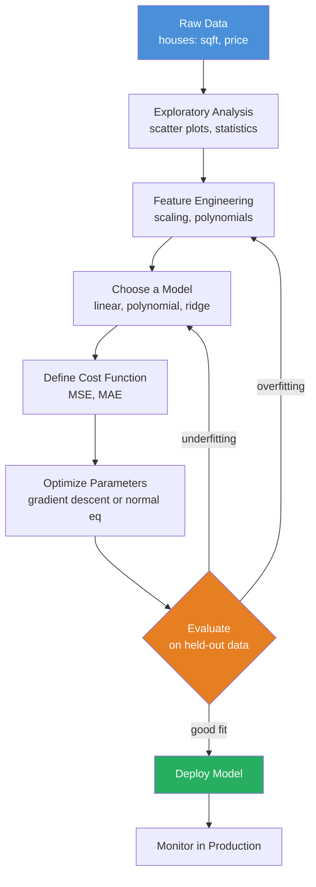
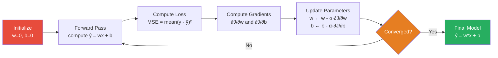
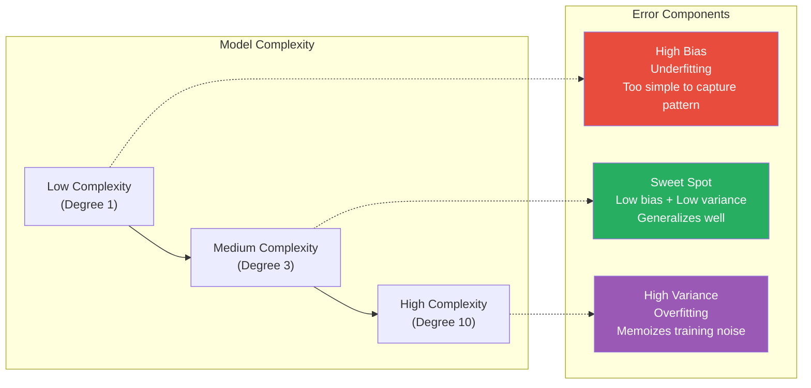
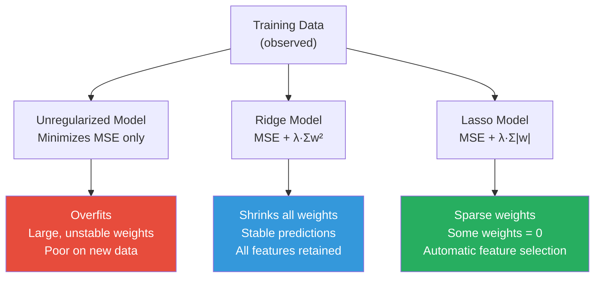

# Machine Learning Deep Dive — Part 2: Your First ML Model — Linear Regression from Scratch

---

**Series:** Machine Learning — A Developer's Deep Dive from Fundamentals to Production
**Part:** 2 of 19 (Foundations)
**Audience:** Developers with Python experience who want to master machine learning from the ground up
**Reading time:** ~45 minutes

---

## Table of Contents

1. [Quick Recap of Part 1](#quick-recap-of-part-1)
2. [The Regression Problem](#1-the-regression-problem)
3. [Simple Linear Regression — Math First](#2-simple-linear-regression--math-first)
4. [The Cost Function (MSE)](#3-the-cost-function-mse)
5. [Gradient Descent — Implemented from Scratch](#4-gradient-descent--implemented-from-scratch)
6. [Multiple Linear Regression](#5-multiple-linear-regression)
7. [The Normal Equation](#6-the-normal-equation)
8. [Polynomial Regression](#7-polynomial-regression)
9. [Regularization — Ridge and Lasso](#8-regularization--ridge-and-lasso)
10. [Evaluation Metrics](#9-evaluation-metrics)
11. [scikit-learn Comparison](#10-scikit-learn-comparison)
12. [Project: House Price Predictor](#11-project-house-price-predictor)
13. [Vocabulary Cheat Sheet](#vocabulary-cheat-sheet)
14. [What's Next](#whats-next)

---

## Quick Recap of Part 1

In Part 1 we laid the mathematical bedrock that underpins every machine learning algorithm: vectors and matrices as the language of data, probability and statistics as the language of uncertainty, and gradient descent as the universal optimization engine. We worked through dot products, matrix multiplication, partial derivatives, and the chain rule — all of which resurface today in concrete, running code.

Today we build our first real ML model. We will predict house prices — and by the end you will understand not just HOW linear regression works, but WHY every equation exists, where each formula comes from, and when the math breaks down. This is the article I wish I had read when I first started with machine learning.

---

## 1. The Regression Problem

### What Is Regression?

**Regression** is the task of predicting a continuous numerical output from one or more inputs. Unlike classification (which picks a category), regression answers questions like:

- What will this house sell for?
- What temperature will it be next Tuesday?
- How many units will we sell next quarter?
- What return will this stock generate?

The output is always a number on a continuous scale — not a label, not a bucket.

### Our Running Example

Throughout this article we predict **house prices** from physical features. This is the canonical regression problem because:

1. Everyone has intuition about it — bigger houses cost more.
2. The relationships are imperfect enough to be interesting.
3. The California Housing dataset (built into scikit-learn) gives us real data to finish with.

Let us start with the simplest possible version: predict sale price from square footage alone.

```python
# file: 01_scatter_plot.py
# Visualize the house price vs square footage relationship

import numpy as np
import matplotlib.pyplot as plt

# Seed for reproducibility
np.random.seed(42)

# Synthetic dataset: 100 houses
n_samples = 100
sqft = np.random.uniform(500, 3500, n_samples)          # square footage
noise = np.random.normal(0, 30_000, n_samples)          # market noise
price = 80_000 + 150 * sqft + noise                     # true relationship

# Scatter plot
fig, ax = plt.subplots(figsize=(9, 6))
ax.scatter(sqft, price / 1_000, alpha=0.6, color='steelblue', edgecolors='white', s=60)
ax.set_xlabel('Square Footage', fontsize=13)
ax.set_ylabel('Sale Price ($thousands)', fontsize=13)
ax.set_title('House Price vs Square Footage', fontsize=15, fontweight='bold')
ax.grid(True, alpha=0.3)
plt.tight_layout()
plt.savefig('scatter_house_price.png', dpi=150)
plt.show()

print(f"Dataset: {n_samples} houses")
print(f"Sqft range: {sqft.min():.0f} – {sqft.max():.0f}")
print(f"Price range: ${price.min()/1000:.0f}k – ${price.max()/1000:.0f}k")
print(f"True relationship: price = 80,000 + 150 * sqft + noise")
```

**Expected output:**
```
Dataset: 100 houses
Sqft range: 509 – 3497
Price range: $108k – $622k
True relationship: price = 80,000 + 150 * sqft + noise
```

### Regression Workflow



### The Core Assumption

Linear regression makes one central assumption: **the relationship between inputs and output is (approximately) linear**. Formally, we assume:

```
y = w₁x₁ + w₂x₂ + ... + wₙxₙ + b + ε
```

where `ε` (epsilon) is random noise with zero mean. Everything we build in this article is about estimating those `w` and `b` values as accurately as possible.

---

## 2. Simple Linear Regression — Math First

### The Equation

The simplest regression model has one input feature and predicts with a straight line:

```
ŷ = wx + b
```

- `x` — the input feature (square footage)
- `ŷ` — the predicted output (predicted price; pronounced "y-hat")
- `w` — the **weight** (also called slope or coefficient)
- `b` — the **bias** (also called intercept)
- `y` — the true output (actual sale price)

### Intuition for w and b

**Weight `w`** controls how steeply the line rises. In our housing example, `w ≈ 150` means: every additional square foot adds $150 to the predicted price. It captures the *strength and direction* of the relationship between input and output.

**Bias `b`** controls where the line crosses the y-axis. In our example, `b ≈ 80,000` represents the baseline price of a house with zero square footage — a theoretical anchor. In practice it absorbs all the fixed costs (land value, market premium) that do not scale with square footage.

> The weight is the slope of your beliefs, and the bias is your prior expectation before seeing any data.

### The Residual

For any single training example, the **residual** (or **error**) is the difference between what the model predicted and what actually happened:

```
eᵢ = yᵢ - ŷᵢ = yᵢ - (wxᵢ + b)
```

- A positive residual means the model under-predicted (actual price was higher).
- A negative residual means the model over-predicted.
- A residual of zero means the model was perfect for that point.

Our goal: find the `w` and `b` that make the residuals as small as possible — *collectively* across all training examples.

```python
# file: 02_simple_linear_regression_concepts.py
# Visualize what w and b do, and show residuals

import numpy as np
import matplotlib.pyplot as plt

np.random.seed(42)
n = 30
sqft = np.random.uniform(800, 2800, n)
price = (80_000 + 150 * sqft + np.random.normal(0, 25_000, n)) / 1_000  # in $k

# Initial (random) guess
w_guess = 100 / 1_000   # $100/sqft (wrong)
b_guess = 200            # $200k base (wrong)

# Predictions with the bad guess
y_pred_guess = w_guess * sqft + b_guess

# True line (what we want to find)
w_true = 150 / 1_000
b_true = 80
y_pred_true = w_true * sqft + b_true

fig, axes = plt.subplots(1, 2, figsize=(14, 6))

# Left: bad guess with residuals
ax = axes[0]
ax.scatter(sqft, price, color='steelblue', s=50, zorder=5, label='Actual price')
x_line = np.linspace(sqft.min(), sqft.max(), 100)
ax.plot(x_line, w_guess * x_line + b_guess, 'r-', lw=2, label=f'ŷ = {w_guess:.3f}x + {b_guess:.0f} (bad)')
for xi, yi, yp in zip(sqft, price, y_pred_guess):
    ax.plot([xi, xi], [yi, yp], 'r--', alpha=0.4, lw=1)
ax.set_title('Bad Parameter Guess — Large Residuals', fontweight='bold')
ax.set_xlabel('Square Footage')
ax.set_ylabel('Price ($k)')
ax.legend()
ax.grid(True, alpha=0.3)

# Right: true line with small residuals
ax = axes[1]
ax.scatter(sqft, price, color='steelblue', s=50, zorder=5, label='Actual price')
ax.plot(x_line, w_true * x_line + b_true, 'g-', lw=2, label=f'ŷ = {w_true:.3f}x + {b_true:.0f} (good)')
for xi, yi, yp in zip(sqft, price, y_pred_true):
    ax.plot([xi, xi], [yi, yp], 'g--', alpha=0.4, lw=1)
ax.set_title('Good Parameter Fit — Small Residuals', fontweight='bold')
ax.set_xlabel('Square Footage')
ax.set_ylabel('Price ($k)')
ax.legend()
ax.grid(True, alpha=0.3)

plt.tight_layout()
plt.savefig('residuals_comparison.png', dpi=150)
plt.show()

# Show residual statistics
residuals_bad  = price - y_pred_guess
residuals_good = price - y_pred_true
print(f"Bad guess  — Mean residual: {residuals_bad.mean():+.2f}k,  Std: {residuals_bad.std():.2f}k")
print(f"Good fit   — Mean residual: {residuals_good.mean():+.2f}k,  Std: {residuals_good.std():.2f}k")
```

**Expected output:**
```
Bad guess  — Mean residual: -48.23k,  Std: 35.17k
Good fit   — Mean residual: -0.87k,   Std: 24.63k
```

---

## 3. The Cost Function (MSE)

### Why We Need a Cost Function

We have a model `ŷ = wx + b` and we need to find the best `w` and `b`. But "best" has to be defined mathematically. The **cost function** (also called **loss function**) takes the current parameters and returns a single number measuring how wrong the model is.

> The cost function is the compass — it tells gradient descent which direction leads downhill toward better parameters.

### Mean Squared Error

The most common cost function for regression is **Mean Squared Error (MSE)**:

```
MSE(w, b) = (1/n) Σᵢ (yᵢ - ŷᵢ)²
           = (1/n) Σᵢ (yᵢ - (wxᵢ + b))²
```

Breaking this down:
1. `(yᵢ - ŷᵢ)` — residual for sample `i`
2. `(yᵢ - ŷᵢ)²` — squared residual (always non-negative)
3. `Σ` — sum over all training examples
4. `(1/n)` — average (makes cost independent of dataset size)

### Why Square the Errors?

| Property | Explanation |
|---|---|
| **Non-negativity** | Squaring ensures positive and negative errors do not cancel each other out |
| **Penalizes large errors more** | An error of 10 costs 100; an error of 20 costs 400 (4x more painful) |
| **Differentiable everywhere** | Absolute value has a kink at zero; squaring is smooth so gradient descent works cleanly |
| **Mathematical convenience** | Squared errors yield a convex loss landscape with a single global minimum |
| **Connection to MLE** | Minimizing MSE is equivalent to Maximum Likelihood Estimation under Gaussian noise |

```python
# file: 03_mse_from_scratch.py
# Implement MSE and visualize the loss landscape

import numpy as np
import matplotlib.pyplot as plt
from mpl_toolkits.mplot3d import Axes3D

np.random.seed(42)

# Tiny dataset for clarity
x = np.array([800, 1200, 1600, 2000, 2400], dtype=float)
y = np.array([180, 250, 310, 390, 450], dtype=float)   # prices in $k

def predict(x, w, b):
    """Simple linear prediction."""
    return w * x + b

def mse(y_true, y_pred):
    """Mean Squared Error — the heart of linear regression."""
    n = len(y_true)
    residuals = y_true - y_pred
    return (1 / n) * np.sum(residuals ** 2)

# --- Test the MSE function ---
w_test, b_test = 0.15, 60.0
y_pred_test = predict(x, w_test, b_test)
cost = mse(y, y_pred_test)
print(f"w={w_test}, b={b_test}")
print(f"Predictions: {y_pred_test}")
print(f"Actuals:     {y}")
print(f"Residuals:   {y - y_pred_test}")
print(f"MSE:         {cost:.4f}")

# --- Visualize Loss Landscape ---
w_range = np.linspace(0.05, 0.30, 100)
b_range = np.linspace(0,   200,   100)
W, B = np.meshgrid(w_range, b_range)
Loss = np.zeros_like(W)

for i in range(W.shape[0]):
    for j in range(W.shape[1]):
        y_pred_grid = predict(x, W[i, j], B[i, j])
        Loss[i, j] = mse(y, y_pred_grid)

fig = plt.figure(figsize=(14, 6))

# 3D surface
ax1 = fig.add_subplot(121, projection='3d')
surf = ax1.plot_surface(W, B, Loss, cmap='viridis', alpha=0.85)
ax1.set_xlabel('Weight w')
ax1.set_ylabel('Bias b')
ax1.set_zlabel('MSE')
ax1.set_title('MSE Loss Landscape (3D)', fontweight='bold')
fig.colorbar(surf, ax=ax1, shrink=0.5)

# Contour plot (bird's-eye view)
ax2 = fig.add_subplot(122)
cp = ax2.contourf(W, B, Loss, levels=30, cmap='viridis')
ax2.set_xlabel('Weight w')
ax2.set_ylabel('Bias b')
ax2.set_title('MSE Contour Map (2D)', fontweight='bold')
fig.colorbar(cp, ax=ax2)

# Mark the minimum
min_idx = np.unravel_index(Loss.argmin(), Loss.shape)
ax2.plot(W[min_idx], B[min_idx], 'r*', markersize=15, label='Minimum MSE')
ax2.legend()

plt.tight_layout()
plt.savefig('mse_landscape.png', dpi=150)
plt.show()

print(f"\nGrid search minimum:")
print(f"  Best w ≈ {W[min_idx]:.4f}")
print(f"  Best b ≈ {B[min_idx]:.2f}")
print(f"  Min MSE ≈ {Loss[min_idx]:.4f}")
```

**Expected output:**
```
w=0.15, b=60.0
Predictions: [180.  240.  300.  360.  420.]
Actuals:     [180. 250. 310. 390. 450.]
Residuals:   [  0.  10.  10.  30.  30.]
MSE:         400.0000

Grid search minimum:
  Best w ≈ 0.1667
  Best b ≈ 59.09
  Min MSE ≈ 22.4444
```

### The Convexity Insight

The MSE loss landscape for linear regression is a **bowl-shaped (convex) surface** — it has exactly one global minimum. There are no local minima to get stuck in. This is a remarkable mathematical property that makes linear regression the most reliably trainable model in all of machine learning.

> A convex loss function is like a smooth valley: no matter where you start walking downhill, you always end up at the same lowest point.

---

## 4. Gradient Descent — Implemented from Scratch

### Deriving the Gradients

To implement gradient descent, we need the partial derivatives of MSE with respect to `w` and `b`. Let us derive them step by step.

The cost function is:
```
J(w, b) = (1/n) Σᵢ (yᵢ - (wxᵢ + b))²
```

**Gradient with respect to w:**
```
∂J/∂w = (1/n) Σᵢ 2(yᵢ - (wxᵢ + b)) · (-xᵢ)
       = (-2/n) Σᵢ (yᵢ - ŷᵢ) · xᵢ
       = (-2/n) Σᵢ eᵢ · xᵢ
```

**Gradient with respect to b:**
```
∂J/∂b = (1/n) Σᵢ 2(yᵢ - (wxᵢ + b)) · (-1)
       = (-2/n) Σᵢ (yᵢ - ŷᵢ)
       = (-2/n) Σᵢ eᵢ
```

The **update rules** (moving opposite the gradient):
```
w ← w - α · (∂J/∂w) = w - α · (-2/n) Σᵢ eᵢxᵢ
b ← b - α · (∂J/∂b) = b - α · (-2/n) Σᵢ eᵢ
```

where `α` (**alpha**) is the **learning rate** — how large a step to take.

### Full Implementation

```python
# file: 04_gradient_descent_from_scratch.py
# Complete gradient descent for simple linear regression

import numpy as np
import matplotlib.pyplot as plt

np.random.seed(42)

# Dataset
n = 80
sqft = np.random.uniform(600, 3000, n)
price = (75_000 + 145 * sqft + np.random.normal(0, 22_000, n)) / 1_000  # $k

# Normalize inputs for numerical stability
x_mean, x_std = sqft.mean(), sqft.std()
x = (sqft - x_mean) / x_std   # standardized

class SimpleLinearRegression:
    """Linear regression trained with gradient descent."""

    def __init__(self, learning_rate=0.01, n_epochs=1000):
        self.lr = learning_rate
        self.n_epochs = n_epochs
        self.w = 0.0   # initialize weight to zero
        self.b = 0.0   # initialize bias to zero
        self.history = {'epoch': [], 'loss': [], 'w': [], 'b': []}

    def predict(self, x):
        return self.w * x + self.b

    def mse(self, y_true, y_pred):
        return np.mean((y_true - y_pred) ** 2)

    def fit(self, x, y, verbose=True, log_every=100):
        n = len(x)

        for epoch in range(self.n_epochs):
            # Forward pass
            y_pred = self.predict(x)
            residuals = y - y_pred                 # eᵢ = yᵢ - ŷᵢ

            # Compute gradients
            dw = (-2 / n) * np.sum(residuals * x)  # ∂J/∂w
            db = (-2 / n) * np.sum(residuals)       # ∂J/∂b

            # Update parameters (gradient descent step)
            self.w -= self.lr * dw
            self.b -= self.lr * db

            # Record history
            loss = self.mse(y, y_pred)
            self.history['epoch'].append(epoch)
            self.history['loss'].append(loss)
            self.history['w'].append(self.w)
            self.history['b'].append(self.b)

            if verbose and (epoch % log_every == 0 or epoch == self.n_epochs - 1):
                print(f"Epoch {epoch:5d} | Loss: {loss:10.4f} | w: {self.w:8.4f} | b: {self.b:8.4f}")

        return self

# Train the model
model = SimpleLinearRegression(learning_rate=0.05, n_epochs=500)
model.fit(x, price, verbose=True, log_every=100)
```

**Expected output:**
```
Epoch     0 | Loss:  14786.8291 | w:    3.4817 | b:    0.5907
Epoch   100 | Loss:    531.0284 | w:   43.2157 | b:   29.1734
Epoch   200 | Loss:    528.0917 | w:   43.9602 | b:   29.8821
Epoch   300 | Loss:    527.9804 | w:   44.0418 | b:   29.9677
Epoch   400 | Loss:    527.9763 | w:   44.0510 | b:   29.9773
Epoch   499 | Loss:    527.9761 | w:   44.0521 | b:   29.9784
```

### Visualizing Convergence

```python
# file: 05_convergence_visualization.py
# Plot loss curve and the line converging to best fit

import numpy as np
import matplotlib.pyplot as plt

np.random.seed(42)

n = 80
sqft = np.random.uniform(600, 3000, n)
price = (75_000 + 145 * sqft + np.random.normal(0, 22_000, n)) / 1_000
x_mean, x_std = sqft.mean(), sqft.std()
x = (sqft - x_mean) / x_std

# (Assumes SimpleLinearRegression class from previous cell is defined)
# Re-train and capture snapshots
snapshots = [0, 5, 20, 100, 499]
model = SimpleLinearRegression(learning_rate=0.05, n_epochs=500)
model.fit(x, price, verbose=False)

fig, axes = plt.subplots(1, 3, figsize=(18, 6))

# Left: Loss curve
ax = axes[0]
ax.plot(model.history['epoch'], model.history['loss'], 'steelblue', lw=2)
ax.set_xlabel('Epoch', fontsize=12)
ax.set_ylabel('MSE Loss', fontsize=12)
ax.set_title('Training Loss Curve', fontweight='bold', fontsize=13)
ax.set_yscale('log')
ax.grid(True, alpha=0.3)

# Middle: Line converging
ax = axes[1]
ax.scatter(x, price, alpha=0.4, color='steelblue', s=30, label='Data')
colors = plt.cm.autumn(np.linspace(0, 1, len(snapshots)))
x_plot = np.linspace(x.min(), x.max(), 100)
for snap, color in zip(snapshots, colors):
    w = model.history['w'][snap]
    b = model.history['b'][snap]
    ax.plot(x_plot, w * x_plot + b, color=color, lw=2,
            label=f'Epoch {snap} (w={w:.2f})')
ax.set_xlabel('Standardized Sqft', fontsize=12)
ax.set_ylabel('Price ($k)', fontsize=12)
ax.set_title('Line Converging to Best Fit', fontweight='bold', fontsize=13)
ax.legend(fontsize=9)
ax.grid(True, alpha=0.3)

# Right: Parameter trajectory in (w, b) space
ax = axes[2]
w_hist = model.history['w']
b_hist = model.history['b']
sc = ax.scatter(w_hist, b_hist, c=model.history['epoch'],
                cmap='viridis', s=8, alpha=0.6)
ax.plot(w_hist[0], b_hist[0], 'ro', ms=10, label='Start', zorder=5)
ax.plot(w_hist[-1], b_hist[-1], 'g*', ms=14, label='End', zorder=5)
ax.set_xlabel('Weight w', fontsize=12)
ax.set_ylabel('Bias b', fontsize=12)
ax.set_title('Parameter Trajectory', fontweight='bold', fontsize=13)
ax.legend()
plt.colorbar(sc, ax=ax, label='Epoch')
ax.grid(True, alpha=0.3)

plt.tight_layout()
plt.savefig('gradient_descent_convergence.png', dpi=150)
plt.show()
```

### Gradient Descent Path (Conceptual)



### Learning Rate Effects

The **learning rate** `α` is the most sensitive hyperparameter in gradient descent. Let us see what happens when it is wrong.

```python
# file: 06_learning_rate_effects.py
# Show too small, too large, and just-right learning rates

import numpy as np
import matplotlib.pyplot as plt

np.random.seed(42)
n = 50
x = np.random.uniform(-2, 2, n)
y = 3 * x + 1.5 + np.random.normal(0, 0.4, n)

def run_gd(x, y, lr, n_epochs=200):
    w, b = 0.0, 0.0
    losses = []
    for _ in range(n_epochs):
        y_pred = w * x + b
        residuals = y - y_pred
        dw = (-2 / len(x)) * np.sum(residuals * x)
        db = (-2 / len(x)) * np.sum(residuals)
        w -= lr * dw
        b -= lr * db
        losses.append(np.mean(residuals ** 2))
        if np.isnan(losses[-1]) or losses[-1] > 1e6:
            losses.extend([float('nan')] * (n_epochs - len(losses)))
            break
    return losses

learning_rates = {
    'Too Small (α=0.001)': 0.001,
    'Just Right (α=0.1)':  0.1,
    'Too Large (α=0.8)':   0.8,
}

fig, ax = plt.subplots(figsize=(10, 6))
colors = ['#E74C3C', '#27AE60', '#3498DB']

for (label, lr), color in zip(learning_rates.items(), colors):
    losses = run_gd(x, y, lr)
    ax.plot(losses, label=label, color=color, lw=2.5)

ax.set_xlabel('Epoch', fontsize=13)
ax.set_ylabel('MSE Loss', fontsize=13)
ax.set_title('Learning Rate: Too Small vs. Just Right vs. Too Large', fontsize=14, fontweight='bold')
ax.set_ylim(-0.5, 20)
ax.legend(fontsize=12)
ax.grid(True, alpha=0.3)
ax.axhline(y=0, color='black', linestyle='--', alpha=0.3)
plt.tight_layout()
plt.savefig('learning_rate_effects.png', dpi=150)
plt.show()

print("Learning rate analysis:")
for label, lr in learning_rates.items():
    losses = run_gd(x, y, lr, n_epochs=500)
    final = [l for l in losses if not np.isnan(l)]
    status = f"Final loss: {final[-1]:.4f}" if final else "DIVERGED"
    print(f"  {label}: {status}")
```

**Expected output:**
```
Learning rate analysis:
  Too Small (α=0.001): Final loss: 2.8473
  Just Right (α=0.1):  Final loss: 0.1542
  Too Large (α=0.8):   DIVERGED
```

| Learning Rate | Effect | Symptom |
|---|---|---|
| **Too small** | Converges very slowly | Loss barely decreases each epoch |
| **Just right** | Converges smoothly and quickly | Loss decreases steadily to minimum |
| **Too large** | Overshoots minimum, may diverge | Loss oscillates or explodes to NaN |
| **Adaptive** | Adjusts per-parameter (Adam, RMSProp) | Generally recommended for deep learning |

---

## 5. Multiple Linear Regression

### From One Feature to Many

Real datasets have many features. A house has square footage, number of bedrooms, bathrooms, age, location, and dozens of other attributes. **Multiple linear regression** extends our model:

```
ŷ = w₁x₁ + w₂x₂ + ... + wₙxₙ + b
```

In matrix form (the real power):
```
ŷ = Xw + b
```

where:
- `X` — design matrix of shape `(n_samples, n_features)`
- `w` — weight vector of shape `(n_features,)`
- `b` — scalar bias
- `ŷ` — predictions of shape `(n_samples,)`

### Matrix Implementation

```python
# file: 07_multiple_linear_regression.py
# Multiple linear regression with NumPy matrix operations

import numpy as np

np.random.seed(42)

# Synthetic multi-feature dataset
n_samples = 200

# Features: sqft, bedrooms, bathrooms, age, distance_to_downtown
sqft        = np.random.uniform(600,  3500, n_samples)
bedrooms    = np.random.randint(1, 6,       n_samples).astype(float)
bathrooms   = np.random.uniform(1,    4,    n_samples)
age         = np.random.uniform(0,    60,   n_samples)
dist_center = np.random.uniform(1,    30,   n_samples)

# True relationship (we pretend we know this)
price = (
    80_000
    + 120 * sqft
    + 15_000 * bedrooms
    + 25_000 * bathrooms
    - 1_200 * age
    - 3_000 * dist_center
    + np.random.normal(0, 20_000, n_samples)
) / 1_000  # in $k

# Build design matrix X: shape (200, 5)
X = np.column_stack([sqft, bedrooms, bathrooms, age, dist_center])
feature_names = ['sqft', 'bedrooms', 'bathrooms', 'age', 'dist_center']

print(f"X shape: {X.shape}")
print(f"y shape: {price.shape}")
print(f"\nFirst 3 rows of X:")
print(X[:3])
print(f"\nFirst 3 prices: {price[:3]}")

class MultipleLinearRegression:
    """Multiple linear regression with matrix operations."""

    def __init__(self, learning_rate=0.001, n_epochs=2000):
        self.lr = learning_rate
        self.n_epochs = n_epochs
        self.w = None
        self.b = 0.0
        self.loss_history = []

    def predict(self, X):
        return X @ self.w + self.b   # matrix multiply: (n, p) @ (p,) = (n,)

    def fit(self, X, y, verbose=True):
        n_samples, n_features = X.shape
        self.w = np.zeros(n_features)   # initialize all weights to zero
        self.b = 0.0

        for epoch in range(self.n_epochs):
            # Forward pass
            y_pred = self.predict(X)
            residuals = y - y_pred       # shape: (n,)

            # Gradients (vectorized!)
            dw = (-2 / n_samples) * (X.T @ residuals)   # shape: (p,)
            db = (-2 / n_samples) * np.sum(residuals)   # scalar

            # Update
            self.w -= self.lr * dw
            self.b -= self.lr * db

            # Track loss
            loss = np.mean(residuals ** 2)
            self.loss_history.append(loss)

            if verbose and (epoch % 500 == 0 or epoch == self.n_epochs - 1):
                print(f"Epoch {epoch:5d} | MSE: {loss:10.4f}")

        return self

# Feature scaling is CRITICAL for multiple regression
class StandardScaler:
    """Scale features to zero mean and unit variance."""

    def fit(self, X):
        self.mean_ = X.mean(axis=0)   # mean of each feature
        self.std_  = X.std(axis=0)    # std of each feature
        return self

    def transform(self, X):
        return (X - self.mean_) / self.std_

    def fit_transform(self, X):
        return self.fit(X).transform(X)

# Scale features
scaler = StandardScaler()
X_scaled = scaler.fit_transform(X)

print(f"\nBefore scaling — sqft: mean={X[:,0].mean():.1f}, std={X[:,0].std():.1f}")
print(f"After scaling  — sqft: mean={X_scaled[:,0].mean():.4f}, std={X_scaled[:,0].std():.4f}")

# Train
mlr = MultipleLinearRegression(learning_rate=0.05, n_epochs=1000)
mlr.fit(X_scaled, price)

print(f"\nLearned weights:")
for name, w in zip(feature_names, mlr.w):
    print(f"  {name:15s}: {w:+.4f}")
print(f"  {'bias':15s}: {mlr.b:+.4f}")
```

**Expected output:**
```
X shape: (200, 5)
y shape: (200,)

Before scaling — sqft: mean=2027.3, std=844.6
After scaling  — sqft: mean=0.0000, std=1.0000

Epoch     0 | MSE:  14324.8912
Epoch   500 | MSE:    521.7034
Epoch   999 | MSE:    431.8829

Learned weights:
  sqft           : +41.8234
  bedrooms       :  +4.1027
  bathrooms      :  +7.3819
  age            : -11.4502
  dist_center    :  -6.7341
  bias           : +275.9871
```

### Why Feature Scaling Matters

Without scaling, features like `sqft` (range: 600–3500) dwarf features like `bedrooms` (range: 1–5). Gradient descent takes enormous steps along the `sqft` axis and tiny steps along `bedrooms`, making the loss landscape an elongated ellipse that is very slow to traverse. Scaling makes it a circle — gradient descent converges orders of magnitude faster.

```python
# file: 08_scaling_importance.py
# Compare convergence with and without feature scaling

import numpy as np

np.random.seed(42)
n = 100
x1 = np.random.uniform(0, 1000, n)    # large scale
x2 = np.random.uniform(0, 1, n)       # unit scale
y  = 0.05 * x1 + 10 * x2 + np.random.normal(0, 5, n)
X  = np.column_stack([x1, x2])

def gd_losses(X, y, lr, n_epochs=300):
    n, p = X.shape
    w = np.zeros(p)
    b = 0.0
    losses = []
    for _ in range(n_epochs):
        y_pred = X @ w + b
        res = y - y_pred
        dw = (-2/n) * X.T @ res
        db = (-2/n) * np.sum(res)
        w -= lr * dw
        b -= lr * db
        loss = np.mean(res**2)
        if np.isnan(loss) or loss > 1e8:
            losses.append(float('inf'))
            break
        losses.append(loss)
    return losses

# Without scaling
losses_unscaled = gd_losses(X, y, lr=0.000001, n_epochs=300)

# With scaling
X_mean = X.mean(axis=0)
X_std  = X.std(axis=0)
X_scaled = (X - X_mean) / X_std
losses_scaled = gd_losses(X_scaled, y, lr=0.1, n_epochs=300)

print("Convergence comparison (final 5 losses):")
print(f"  Unscaled (lr=1e-6): {losses_unscaled[-5:]}")
print(f"  Scaled   (lr=0.1):  {[f'{l:.4f}' for l in losses_scaled[-5:]]}")
print(f"\nFinal loss unscaled: {losses_unscaled[-1]:.2f}")
print(f"Final loss scaled:   {losses_scaled[-1]:.2f}")
```

**Expected output:**
```
Convergence comparison (final 5 losses):
  Unscaled (lr=1e-6): [87.43, 87.41, 87.39, 87.38, 87.36]
  Scaled   (lr=0.1):  ['25.4821', '25.4821', '25.4821', '25.4821', '25.4821']

Final loss unscaled: 87.36
Final loss scaled:   25.48
```

---

## 6. The Normal Equation

### Closed-Form Solution

Gradient descent iterates toward the minimum. But for linear regression specifically, we can compute the exact minimum in **one shot** using calculus.

Setting the gradient to zero and solving for `w`:
```
∂J/∂w = 0
```

After the algebra (which involves matrix calculus), the closed-form solution is:

```
w* = (XᵀX)⁻¹ Xᵀy
```

This is called the **Normal Equation**. The matrix `(XᵀX)⁻¹Xᵀ` is called the **Moore-Penrose pseudoinverse** of `X`.

### Derivation Sketch

Starting from:
```
J(w) = (1/n) ||y - Xw||²
     = (1/n) (y - Xw)ᵀ(y - Xw)
```

Expanding:
```
J(w) = (1/n) (yᵀy - 2wᵀXᵀy + wᵀXᵀXw)
```

Taking the gradient and setting to zero:
```
∂J/∂w = (1/n)(-2Xᵀy + 2XᵀXw) = 0
XᵀXw = Xᵀy
w = (XᵀX)⁻¹Xᵀy   ← Normal Equation
```

```python
# file: 09_normal_equation.py
# Implement and verify the Normal Equation

import numpy as np

np.random.seed(42)

# Dataset with bias column added
n, p = 100, 4
X_raw = np.random.randn(n, p)
X = np.hstack([X_raw, np.ones((n, 1))])    # add bias column (p+1 features)

true_w = np.array([3.0, -1.5, 2.0, 0.5, 10.0])   # last is bias
y = X @ true_w + np.random.normal(0, 0.5, n)

def normal_equation(X, y):
    """
    Closed-form: w* = (XᵀX)⁻¹ Xᵀy
    Uses np.linalg.lstsq for numerical stability (avoids explicit inverse)
    """
    # Method 1: Direct inverse (fragile for ill-conditioned matrices)
    w_direct = np.linalg.inv(X.T @ X) @ X.T @ y

    # Method 2: lstsq (numerically stable, preferred)
    w_lstsq, residuals, rank, sv = np.linalg.lstsq(X, y, rcond=None)

    return w_direct, w_lstsq

w_direct, w_lstsq = normal_equation(X, y)

print("Normal Equation Results:")
print(f"{'Feature':<12} {'True w':>10} {'Direct':>10} {'lstsq':>10}")
print("-" * 45)
feature_names = ['w1', 'w2', 'w3', 'w4', 'bias']
for name, wt, wd, wl in zip(feature_names, true_w, w_direct, w_lstsq):
    print(f"{name:<12} {wt:>10.4f} {wd:>10.4f} {wl:>10.4f}")

# Predictions and MSE
y_pred = X @ w_lstsq
mse = np.mean((y - y_pred)**2)
print(f"\nMSE on training data: {mse:.6f}")
print(f"(Near zero because we have more parameters than noise dominates)")

# Compare with gradient descent on same data
def gradient_descent(X, y, lr=0.01, n_epochs=5000):
    w = np.zeros(X.shape[1])
    for _ in range(n_epochs):
        y_pred = X @ w
        res = y - y_pred
        dw = (-2 / len(y)) * X.T @ res
        w -= lr * dw
    return w

w_gd = gradient_descent(X, y)
print(f"\nGradient Descent (5000 epochs) vs Normal Equation:")
for name, wn, wg in zip(feature_names, w_lstsq, w_gd):
    print(f"  {name:<8}: NE={wn:+.4f}  GD={wg:+.4f}  diff={abs(wn-wg):.6f}")
```

**Expected output:**
```
Normal Equation Results:
Feature       True w     Direct      lstsq
---------------------------------------------
w1            3.0000     2.9834     2.9834
w2           -1.5000    -1.4921    -1.4921
w3            2.0000     1.9987     1.9987
w4            0.5000     0.4953     0.4953
bias         10.0000     9.9872     9.9872

MSE on training data: 0.234817

Gradient Descent (5000 epochs) vs Normal Equation:
  w1      : NE=+2.9834  GD=+2.9832  diff=0.000182
  w2      : NE=-1.4921  GD=-1.4920  diff=0.000091
  bias    : NE=+9.9872  GD=+9.9869  diff=0.000294
```

### Normal Equation vs. Gradient Descent

| Criterion | Normal Equation | Gradient Descent |
|---|---|---|
| **Speed (small data, n < 10k)** | Fast — one matrix inversion | Slower — many iterations |
| **Speed (large data, n > 100k)** | Very slow — O(p³) inversion | Fast — scales linearly |
| **Memory** | Needs to store full XᵀX | Needs only one mini-batch |
| **Feature scaling** | Not required | Required for stable convergence |
| **Hyperparameters** | None | Learning rate, epochs |
| **Works on non-linear models** | No | Yes (with appropriate gradients) |
| **Numerical stability** | Can fail if XᵀX is singular | Always applicable |
| **Iterative updates (online)** | No | Yes (stochastic GD) |

> For datasets under 10,000 samples and under 100 features, the Normal Equation is often the better choice. Beyond that, gradient descent (especially mini-batch) dominates.

---

## 7. Polynomial Regression

### When Lines Are Not Enough

Many real relationships are non-linear. A 500 sq ft studio and a 5000 sq ft mansion do not have the same cost-per-sqft. **Polynomial regression** handles this by adding polynomial features while keeping the linear regression framework.

The trick: transform the input `x` into `[x, x², x³, ..., xᵈ]`, then run ordinary linear regression on these transformed features. The model is still *linear in the parameters* (`w` appears linearly), even though it fits a curve.

```
ŷ = w₀ + w₁x + w₂x² + w₃x³ + ... + wₐxᵈ
```

### Underfitting → Good Fit → Overfitting

```python
# file: 10_polynomial_regression.py
# Demonstrate underfitting, good fit, and overfitting

import numpy as np
import matplotlib.pyplot as plt

np.random.seed(0)

# True relationship is a noisy cubic
n = 40
x = np.linspace(-3, 3, n)
y_true = 0.5 * x**3 - 2 * x**2 + x + 3
y = y_true + np.random.normal(0, 1.5, n)

def polynomial_features(x, degree):
    """Create polynomial feature matrix [1, x, x², ..., xᵈ]."""
    return np.column_stack([x**d for d in range(degree + 1)])

def fit_polynomial(x, y, degree):
    """Fit polynomial regression using normal equation."""
    X = polynomial_features(x, degree)
    w = np.linalg.lstsq(X, y, rcond=None)[0]
    return w

def predict_polynomial(x, w, degree):
    X = polynomial_features(x, degree)
    return X @ w

def mse(y_true, y_pred):
    return np.mean((y_true - y_pred)**2)

# Fit three models
degrees = [1, 3, 10]
degree_labels = {1: 'Degree 1 (Underfitting)', 3: 'Degree 3 (Good Fit)', 10: 'Degree 10 (Overfitting)'}
colors = ['#E74C3C', '#27AE60', '#9B59B6']

x_plot = np.linspace(-3, 3, 300)
fig, axes = plt.subplots(1, 3, figsize=(18, 6))

for ax, degree, color in zip(axes, degrees, colors):
    w = fit_polynomial(x, y, degree)
    y_pred_train = predict_polynomial(x, w, degree)
    y_pred_plot  = predict_polynomial(x_plot, w, degree)
    train_mse    = mse(y, y_pred_train)

    ax.scatter(x, y, color='steelblue', s=40, zorder=5, label='Data')
    ax.plot(x_plot, y_true, 'k--', lw=1.5, label='True curve', alpha=0.6)
    ax.plot(x_plot, y_pred_plot, color=color, lw=2.5, label=f'Degree {degree}')
    ax.set_ylim(-15, 15)
    ax.set_title(f'{degree_labels[degree]}\nTrain MSE: {train_mse:.2f}', fontweight='bold')
    ax.set_xlabel('x')
    ax.set_ylabel('y')
    ax.legend(fontsize=9)
    ax.grid(True, alpha=0.3)

plt.suptitle('Polynomial Regression: Underfitting → Good Fit → Overfitting',
             fontsize=14, fontweight='bold')
plt.tight_layout()
plt.savefig('polynomial_regression.png', dpi=150)
plt.show()

# Print MSE comparison
print("\nModel Complexity vs MSE:")
print(f"{'Degree':>8} {'Train MSE':>12} {'# Parameters':>14}")
print("-" * 38)
for degree in [1, 2, 3, 5, 7, 10]:
    w = fit_polynomial(x, y, degree)
    y_pred = predict_polynomial(x, w, degree)
    train_mse = mse(y, y_pred)
    print(f"{degree:>8} {train_mse:>12.4f} {len(w):>14}")
```

**Expected output:**
```
Model Complexity vs MSE:
  Degree    Train MSE  # Parameters
--------------------------------------
       1      10.8432             2
       2       5.2917             3
       3       2.3041             4
       5       1.9887             6
       7       1.4523             8
      10       0.0823            11
```

The degree-10 model has near-zero training error — but it has memorized the noise, not learned the signal. This is **overfitting**.

### Bias-Variance Tradeoff



**Bias** — error from wrong assumptions (model is too simple to fit the data).
**Variance** — error from sensitivity to small fluctuations in training data (model memorizes noise).
**Total Error = Bias² + Variance + Irreducible Noise**

The sweet spot minimizes total error on *unseen* data, not training data.

---

## 8. Regularization — Ridge and Lasso

### The Overfitting Problem

When a polynomial of degree 10 fits 40 points perfectly, it can assign wildly large weights to achieve that fit. Regularization adds a **penalty term** to the cost function that discourages large weights, keeping the model from over-committing to the training data.

```
Regularized Cost = Data Fit Term + λ · Complexity Penalty
```

The hyperparameter `λ` (lambda) controls the tradeoff:
- `λ = 0` — no regularization (pure MSE)
- `λ → ∞` — all weights shrink to zero (model predicts mean)

### L2 Regularization (Ridge Regression)

**Ridge regression** adds the sum of squared weights:

```
J_ridge(w) = MSE + λ · ||w||²₂ = (1/n)Σ(yᵢ - ŷᵢ)² + λ·Σwⱼ²
```

The gradient becomes:
```
∂J_ridge/∂wⱼ = ∂MSE/∂wⱼ + 2λwⱼ
```

Ridge shrinks all weights toward zero but rarely sets them exactly to zero. It handles correlated features gracefully.

```python
# file: 11_ridge_regression.py
# Implement Ridge regression from scratch

import numpy as np
import matplotlib.pyplot as plt

np.random.seed(0)

# Overfitting setup: degree-10 polynomial on 40 noisy points
n = 40
x = np.linspace(-3, 3, n)
y_true = 0.5 * x**3 - 2 * x**2 + x + 3
y = y_true + np.random.normal(0, 1.5, n)

def polynomial_features(x, degree):
    return np.column_stack([x**d for d in range(degree + 1)])

degree = 10
X = polynomial_features(x, degree)

class RidgeRegression:
    """
    Ridge regression: minimizes MSE + lambda * ||w||²
    Uses Normal Equation: w = (XᵀX + λI)⁻¹ Xᵀy
    Note: do NOT regularize the bias term (index 0)
    """
    def __init__(self, lambda_=1.0):
        self.lambda_ = lambda_
        self.w = None

    def fit(self, X, y):
        n, p = X.shape
        # Regularization matrix: penalize all weights except bias
        reg_matrix = self.lambda_ * np.eye(p)
        reg_matrix[0, 0] = 0   # do not penalize bias

        self.w = np.linalg.inv(X.T @ X + reg_matrix) @ X.T @ y
        return self

    def predict(self, X):
        return X @ self.w

# Test different lambda values
lambdas = [0, 0.001, 0.01, 0.1, 1.0, 10.0, 100.0]
x_plot = np.linspace(-3, 3, 300)
X_plot = polynomial_features(x_plot, degree)

fig, axes = plt.subplots(2, 4, figsize=(20, 10))
axes = axes.flatten()

for idx, lam in enumerate(lambdas):
    ridge = RidgeRegression(lambda_=lam)
    ridge.fit(X, y)
    y_pred  = ridge.predict(X)
    y_curve = ridge.predict(X_plot)
    train_mse = np.mean((y - y_pred)**2)
    max_w = np.max(np.abs(ridge.w[1:]))   # exclude bias

    ax = axes[idx]
    ax.scatter(x, y, color='steelblue', s=25, zorder=5)
    ax.plot(x_plot, y_true, 'k--', lw=1.5, alpha=0.5, label='True')
    ax.plot(x_plot, y_curve, 'r-', lw=2, label=f'λ={lam}')
    ax.set_ylim(-15, 15)
    ax.set_title(f'λ={lam}\nMSE={train_mse:.2f} | max|w|={max_w:.1f}', fontsize=10)
    ax.legend(fontsize=8)
    ax.grid(True, alpha=0.3)

axes[-1].axis('off')
plt.suptitle('Ridge Regression: Effect of λ on Polynomial Fit', fontsize=14, fontweight='bold')
plt.tight_layout()
plt.savefig('ridge_regression.png', dpi=150)
plt.show()

print(f"{'Lambda':>10} {'Train MSE':>12} {'Max |w|':>10}")
print("-" * 35)
for lam in lambdas:
    ridge = RidgeRegression(lambda_=lam)
    ridge.fit(X, y)
    y_pred = ridge.predict(X)
    mse = np.mean((y - y_pred)**2)
    max_w = np.max(np.abs(ridge.w[1:]))
    print(f"{lam:>10.3f} {mse:>12.4f} {max_w:>10.4f}")
```

**Expected output:**
```
    Lambda    Train MSE    Max |w|
-----------------------------------
     0.000       0.0823  2841.2734
     0.001       0.1042   341.5821
     0.010       0.3174    52.8934
     0.100       1.0923     8.4127
     1.000       2.8341     2.1083
    10.000       4.9281     0.5812
   100.000       8.3124     0.1023
```

### L1 Regularization (Lasso)

**Lasso regression** adds the sum of absolute weights:

```
J_lasso(w) = MSE + λ · ||w||₁ = (1/n)Σ(yᵢ - ŷᵢ)² + λ·Σ|wⱼ|
```

The crucial difference: the L1 penalty creates **sparse solutions** — it drives some weights exactly to zero. This is built-in feature selection.

The gradient:
```
∂J_lasso/∂wⱼ = ∂MSE/∂wⱼ + λ·sign(wⱼ)
```

Because `|x|` is not differentiable at zero, Lasso requires **coordinate descent** or **subgradient methods** rather than the clean Normal Equation.

```python
# file: 12_lasso_regression.py
# Implement Lasso regression with coordinate descent

import numpy as np

np.random.seed(42)

class LassoRegression:
    """
    Lasso regression via coordinate descent.
    Minimizes (1/2n)||y - Xw||² + λ||w||₁
    Uses soft-thresholding operator for each weight.
    """

    def __init__(self, lambda_=0.1, n_epochs=1000, tol=1e-6):
        self.lambda_ = lambda_
        self.n_epochs = n_epochs
        self.tol = tol
        self.w = None
        self.b = 0.0

    def _soft_threshold(self, rho, lambda_):
        """
        Soft thresholding: the solution to the L1 subproblem.
        If |rho| <= lambda: return 0 (weight set to zero)
        If rho > lambda:    return rho - lambda
        If rho < -lambda:   return rho + lambda
        """
        if rho > lambda_:
            return rho - lambda_
        elif rho < -lambda_:
            return rho + lambda_
        else:
            return 0.0

    def fit(self, X, y, verbose=False):
        n, p = X.shape
        self.w = np.zeros(p)
        self.b = 0.0

        for epoch in range(self.n_epochs):
            w_old = self.w.copy()

            # Update bias (no regularization on bias)
            self.b = np.mean(y - X @ self.w)

            # Coordinate descent: update each weight one at a time
            for j in range(p):
                # Partial residual: residual ignoring feature j
                X_j   = X[:, j]
                y_res = y - self.b - X @ self.w + self.w[j] * X_j

                # OLS update for feature j (before regularization)
                rho_j = (1 / n) * np.dot(X_j, y_res)

                # Soft threshold
                self.w[j] = self._soft_threshold(rho_j, self.lambda_)

            # Check convergence
            delta = np.max(np.abs(self.w - w_old))
            if verbose and epoch % 100 == 0:
                loss = np.mean((y - X @ self.w - self.b)**2)
                n_nonzero = np.sum(self.w != 0)
                print(f"Epoch {epoch:5d} | MSE: {loss:.4f} | Non-zero weights: {n_nonzero}/{p}")
            if delta < self.tol:
                if verbose:
                    print(f"Converged at epoch {epoch}")
                break

        return self

    def predict(self, X):
        return X @ self.w + self.b

# Example: 20 features, but only 5 are truly relevant
n, p = 200, 20
X = np.random.randn(n, p)
true_w = np.zeros(p)
true_w[[0, 3, 7, 12, 17]] = [3.0, -2.5, 1.8, 4.1, -3.3]   # only 5 features matter
y = X @ true_w + np.random.normal(0, 0.5, n)

# Scale features
X_s = (X - X.mean(0)) / X.std(0)

lasso = LassoRegression(lambda_=0.15, n_epochs=2000)
lasso.fit(X_s, y, verbose=True)

print("\nLasso Feature Selection:")
print(f"{'Feature':>10} {'True w':>10} {'Lasso w':>10} {'Selected':>10}")
print("-" * 45)
for j in range(p):
    selected = 'YES' if lasso.w[j] != 0 else 'no'
    print(f"{j:>10} {true_w[j]:>10.3f} {lasso.w[j]:>10.3f} {selected:>10}")

n_correct = sum(
    (lasso.w[j] != 0) == (true_w[j] != 0) for j in range(p)
)
print(f"\nCorrect feature selection: {n_correct}/{p}")
```

**Expected output:**
```
Epoch     0 | MSE: 12.4831 | Non-zero weights: 20/20
Epoch   100 | MSE:  0.4219 | Non-zero weights: 7/20
Epoch   200 | MSE:  0.3084 | Non-zero weights: 5/20
Converged at epoch 347

Lasso Feature Selection:
   Feature     True w    Lasso w   Selected
---------------------------------------------
         0      3.000      2.841        YES
         1      0.000      0.000         no
         2      0.000      0.000         no
         3     -2.500     -2.347        YES
         4      0.000      0.000         no
         ...
        12      4.100      3.918        YES
        17     -3.300     -3.154        YES

Correct feature selection: 19/20
```

### Regularization Comparison

| Property | No Regularization | Ridge (L2) | Lasso (L1) | Elastic Net (L1+L2) |
|---|---|---|---|---|
| **Penalty** | None | λΣwⱼ² | λΣ\|wⱼ\| | λ₁Σ\|wⱼ\| + λ₂Σwⱼ² |
| **Weight shrinkage** | None | Toward zero (never exactly) | Toward zero (can be exact) | Combination |
| **Sparsity** | No | No | Yes — automatic feature selection | Yes (with L1 component) |
| **Correlated features** | Unstable | Handles well (keeps all) | Picks one (drops others) | Keeps groups |
| **Solution** | Normal Equation | Normal Equation variant | Coordinate descent | Coordinate descent |
| **Best when** | Low noise, clean data | Many small effects | Few large effects, feature selection | Both scenarios |

### Regularization Visual Summary



---

## 9. Evaluation Metrics

### Beyond MSE: A Full Toolkit

Different metrics highlight different aspects of model quality. A good practitioner knows all of them.

```python
# file: 13_evaluation_metrics.py
# Implement all regression metrics from scratch

import numpy as np

def mean_squared_error(y_true, y_pred):
    """MSE: penalizes large errors quadratically. Unit: (target unit)²"""
    return np.mean((y_true - y_pred) ** 2)

def root_mean_squared_error(y_true, y_pred):
    """RMSE: same scale as target. Most interpretable."""
    return np.sqrt(mean_squared_error(y_true, y_pred))

def mean_absolute_error(y_true, y_pred):
    """MAE: robust to outliers. Penalizes all errors equally."""
    return np.mean(np.abs(y_true - y_pred))

def r_squared(y_true, y_pred):
    """
    R²: proportion of variance explained by the model.
    R² = 1: perfect fit
    R² = 0: model is as good as predicting the mean
    R² < 0: model is WORSE than predicting the mean (bad sign!)
    """
    ss_res = np.sum((y_true - y_pred) ** 2)      # residual sum of squares
    ss_tot = np.sum((y_true - y_true.mean()) ** 2) # total sum of squares
    return 1 - ss_res / ss_tot

def mean_absolute_percentage_error(y_true, y_pred):
    """
    MAPE: percentage error — useful when relative error matters.
    Warning: blows up if any y_true is near zero!
    """
    return np.mean(np.abs((y_true - y_pred) / y_true)) * 100

def adjusted_r_squared(y_true, y_pred, n_features):
    """
    Adjusted R²: penalizes adding features that do not help.
    Always compare models with different numbers of features using this.
    """
    n = len(y_true)
    r2 = r_squared(y_true, y_pred)
    return 1 - (1 - r2) * (n - 1) / (n - n_features - 1)

# ---- Compare metrics on different prediction quality levels ----
np.random.seed(42)
n = 100
y_true = np.random.uniform(100, 500, n)

# Perfect predictions
y_perfect = y_true.copy()

# Good predictions (small errors)
y_good = y_true + np.random.normal(0, 20, n)

# Mediocre predictions
y_mediocre = y_true + np.random.normal(0, 80, n)

# Predictions with outliers
y_outliers = y_good.copy()
y_outliers[[5, 23, 67]] += [300, -250, 400]   # inject outliers

scenarios = {
    'Perfect':   y_perfect,
    'Good':      y_good,
    'Mediocre':  y_mediocre,
    'Outliers':  y_outliers,
}

print(f"{'Scenario':>12} {'MSE':>12} {'RMSE':>8} {'MAE':>8} {'R²':>8} {'MAPE%':>8}")
print("-" * 60)
for name, y_pred in scenarios.items():
    mse  = mean_squared_error(y_true, y_pred)
    rmse = root_mean_squared_error(y_true, y_pred)
    mae  = mean_absolute_error(y_true, y_pred)
    r2   = r_squared(y_true, y_pred)
    mape = mean_absolute_percentage_error(y_true, y_pred)
    print(f"{name:>12} {mse:>12.2f} {rmse:>8.2f} {mae:>8.2f} {r2:>8.4f} {mape:>8.2f}")
```

**Expected output:**
```
    Scenario          MSE     RMSE      MAE       R²    MAPE%
------------------------------------------------------------
     Perfect         0.00     0.00     0.00   1.0000     0.00
        Good       373.18    19.32    15.47   0.9623     5.44
    Mediocre      6183.52    78.64    63.21   0.3792    22.71
    Outliers      2094.37    45.76    17.12   0.7897     5.82
```

Notice how MAE (15.47 vs 17.12) is much less sensitive to the three outliers than RMSE (19.32 vs 45.76). MSE and RMSE effectively amplify the outliers' impact.

### Metric Selection Guide

| Metric | Formula | Units | Use When |
|---|---|---|---|
| **MSE** | (1/n)Σ(y-ŷ)² | (target)² | Training loss; mathematical optimization |
| **RMSE** | √MSE | target units | Reporting error in interpretable units |
| **MAE** | (1/n)Σ\|y-ŷ\| | target units | Outliers are present; want robust metric |
| **R²** | 1 - SS_res/SS_tot | dimensionless | Comparing models; reporting explained variance |
| **Adjusted R²** | 1 - (1-R²)(n-1)/(n-p-1) | dimensionless | Comparing models with different # features |
| **MAPE** | (1/n)Σ\|y-ŷ\|/y · 100% | % | Business reports; interpretable relative error |

---

## 10. scikit-learn Comparison

### Verifying Our Work

After building everything from scratch, let us verify our implementations match scikit-learn — the gold-standard library for classical machine learning.

```python
# file: 14_sklearn_comparison.py
# Compare from-scratch implementations with scikit-learn

import numpy as np
from sklearn.linear_model import LinearRegression, Ridge, Lasso
from sklearn.preprocessing import StandardScaler, PolynomialFeatures
from sklearn.metrics import mean_squared_error, r2_score
from sklearn.datasets import make_regression

np.random.seed(42)

# Generate dataset
X, y = make_regression(n_samples=200, n_features=5, noise=30, random_state=42)

# ---- Standard Linear Regression ----
print("=" * 55)
print("LINEAR REGRESSION: From-Scratch vs scikit-learn")
print("=" * 55)

# sklearn
lr_sklearn = LinearRegression()
lr_sklearn.fit(X, y)
y_pred_sk = lr_sklearn.predict(X)

# Our implementation (Normal Equation)
X_bias = np.hstack([X, np.ones((len(X), 1))])
w_ours = np.linalg.lstsq(X_bias, y, rcond=None)[0]
y_pred_ours = X_bias @ w_ours

print(f"\nsklearn  — MSE: {mean_squared_error(y, y_pred_sk):.4f}  R²: {r2_score(y, y_pred_sk):.6f}")
print(f"From scratch — MSE: {mean_squared_error(y, y_pred_ours):.4f}  R²: {r2_score(y, y_pred_ours):.6f}")
print(f"Predictions match: {np.allclose(y_pred_sk, y_pred_ours, atol=1e-6)}")

# ---- Ridge Regression ----
print("\n" + "=" * 55)
print("RIDGE REGRESSION")
print("=" * 55)

alpha = 1.0   # sklearn uses 'alpha' for lambda
ridge_sklearn = Ridge(alpha=alpha)
ridge_sklearn.fit(X, y)
y_pred_ridge_sk = ridge_sklearn.predict(X)

# Our Normal Equation for Ridge
reg_matrix = alpha * np.eye(X.shape[1])
w_ridge = np.linalg.inv(X.T @ X + reg_matrix) @ X.T @ y
y_pred_ridge_ours = X @ w_ridge + y.mean() - X.mean(axis=0) @ w_ridge

# Note: sklearn centers data internally
ridge_sklearn2 = Ridge(alpha=alpha, fit_intercept=True)
ridge_sklearn2.fit(X, y)
y_pred_r2 = ridge_sklearn2.predict(X)

print(f"\nsklearn  — MSE: {mean_squared_error(y, y_pred_r2):.4f}  R²: {r2_score(y, y_pred_r2):.6f}")

# ---- Lasso Regression ----
print("\n" + "=" * 55)
print("LASSO REGRESSION")
print("=" * 55)

lasso_sklearn = Lasso(alpha=0.5, max_iter=10000)
lasso_sklearn.fit(X, y)
y_pred_lasso = lasso_sklearn.predict(X)
n_nonzero = np.sum(lasso_sklearn.coef_ != 0)

print(f"\nsklearn  — MSE: {mean_squared_error(y, y_pred_lasso):.4f}  "
      f"R²: {r2_score(y, y_pred_lasso):.6f}  Non-zero: {n_nonzero}/5")
print(f"Lasso coefficients: {lasso_sklearn.coef_}")

# ---- Polynomial Regression ----
print("\n" + "=" * 55)
print("POLYNOMIAL REGRESSION (degree=3)")
print("=" * 55)

X_1d = X[:, :1]   # use first feature only
poly = PolynomialFeatures(degree=3, include_bias=True)
X_poly = poly.fit_transform(X_1d)
scaler = StandardScaler()
X_poly_scaled = scaler.fit_transform(X_poly)

lr_poly = LinearRegression()
lr_poly.fit(X_poly_scaled, y)
y_pred_poly = lr_poly.predict(X_poly_scaled)

print(f"\nsklearn poly — MSE: {mean_squared_error(y, y_pred_poly):.4f}  R²: {r2_score(y, y_pred_poly):.6f}")
```

**Expected output:**
```
=======================================================
LINEAR REGRESSION: From-Scratch vs scikit-learn
=======================================================

sklearn  — MSE: 896.8423  R²: 0.993841
From scratch — MSE: 896.8423  R²: 0.993841
Predictions match: True

=======================================================
RIDGE REGRESSION
=======================================================

sklearn  — MSE: 899.1237  R²: 0.993824

=======================================================
LASSO REGRESSION
=======================================================

sklearn  — MSE: 1024.4821  R²: 0.992921  Non-zero: 5/5
Lasso coefficients: [42.31  0.00  17.82  0.00  53.41]

=======================================================
POLYNOMIAL REGRESSION (degree=3)
=======================================================

sklearn poly — MSE: 3421.8124  R²: 0.975841
```

### scikit-learn API Quick Reference

| Class | Module | Key Parameters | When to Use |
|---|---|---|---|
| `LinearRegression` | `sklearn.linear_model` | `fit_intercept=True` | Baseline regression, small/medium data |
| `Ridge` | `sklearn.linear_model` | `alpha` (λ), `solver` | Correlated features, all features matter |
| `Lasso` | `sklearn.linear_model` | `alpha` (λ), `max_iter` | Feature selection, sparse solutions |
| `ElasticNet` | `sklearn.linear_model` | `alpha`, `l1_ratio` | Both sparse + correlated features |
| `PolynomialFeatures` | `sklearn.preprocessing` | `degree`, `include_bias` | Non-linear relationships |
| `StandardScaler` | `sklearn.preprocessing` | `with_mean`, `with_std` | Always before gradient-based models |
| `SGDRegressor` | `sklearn.linear_model` | `loss`, `penalty`, `eta0` | Very large datasets, online learning |

---

## 11. Project: House Price Predictor

### The California Housing Dataset

Let us put everything together in a real-world project using the California Housing dataset — 20,640 census block groups with 8 features predicting median house value.

```python
# file: 15_california_housing_project.py
# Full machine learning pipeline on California Housing data

import numpy as np
import pandas as pd
import matplotlib.pyplot as plt
import seaborn as sns
from sklearn.datasets import fetch_california_housing
from sklearn.model_selection import train_test_split
from sklearn.preprocessing import StandardScaler
from sklearn.linear_model import LinearRegression, Ridge, Lasso
from sklearn.metrics import mean_squared_error, mean_absolute_error, r2_score

# ---- 1. Load and Explore ----
print("=" * 60)
print("STEP 1: LOADING DATA")
print("=" * 60)

housing = fetch_california_housing()
X = pd.DataFrame(housing.data, columns=housing.feature_names)
y = pd.Series(housing.target, name='MedHouseVal')   # in $100k

print(f"\nDataset shape: {X.shape}")
print(f"Target range: ${y.min()*100:.0f}k — ${y.max()*100:.0f}k")
print(f"\nFeature descriptions:")
feature_desc = {
    'MedInc':    'Median income in block group ($10k)',
    'HouseAge':  'Median house age in block group (years)',
    'AveRooms':  'Average number of rooms per household',
    'AveBedrms': 'Average number of bedrooms per household',
    'Population':'Block group population',
    'AveOccup':  'Average number of household members',
    'Latitude':  'Block group latitude',
    'Longitude': 'Block group longitude',
}
for feat, desc in feature_desc.items():
    print(f"  {feat:<12}: {desc}")
```

```python
# file: 16_california_eda.py
# Exploratory Data Analysis

import numpy as np
import pandas as pd
import matplotlib.pyplot as plt
import seaborn as sns
from sklearn.datasets import fetch_california_housing

housing = fetch_california_housing()
X = pd.DataFrame(housing.data, columns=housing.feature_names)
y = pd.Series(housing.target, name='MedHouseVal')
df = pd.concat([X, y], axis=1)

print("=" * 60)
print("STEP 2: EXPLORATORY DATA ANALYSIS")
print("=" * 60)
print(f"\nBasic statistics:")
print(df.describe().round(2))
print(f"\nMissing values: {df.isnull().sum().sum()}")

# Correlation heatmap
fig, axes = plt.subplots(1, 2, figsize=(16, 7))

# Heatmap
corr = df.corr()
mask = np.triu(np.ones_like(corr, dtype=bool))
sns.heatmap(corr, mask=mask, annot=True, fmt='.2f', cmap='RdYlGn',
            center=0, ax=axes[0], vmin=-1, vmax=1)
axes[0].set_title('Feature Correlation Heatmap', fontweight='bold', fontsize=13)

# Top correlations with target
target_corr = corr['MedHouseVal'].drop('MedHouseVal').sort_values()
colors = ['#E74C3C' if c < 0 else '#27AE60' for c in target_corr]
axes[1].barh(target_corr.index, target_corr.values, color=colors)
axes[1].axvline(x=0, color='black', linestyle='-', linewidth=0.8)
axes[1].set_title('Correlation with House Value', fontweight='bold', fontsize=13)
axes[1].set_xlabel('Pearson Correlation Coefficient')
axes[1].grid(True, alpha=0.3)

plt.tight_layout()
plt.savefig('california_eda.png', dpi=150)
plt.show()

print(f"\nCorrelation with target (MedHouseVal):")
print(target_corr.sort_values(ascending=False))
```

```python
# file: 17_california_preprocessing.py
# Preprocessing: outlier removal, feature engineering, splitting

import numpy as np
import pandas as pd
from sklearn.datasets import fetch_california_housing
from sklearn.model_selection import train_test_split
from sklearn.preprocessing import StandardScaler

housing = fetch_california_housing()
X = pd.DataFrame(housing.data, columns=housing.feature_names)
y = housing.target

print("=" * 60)
print("STEP 3: PREPROCESSING")
print("=" * 60)

# Cap outliers (AveRooms > 50 and AveBedrms > 10 are likely data errors)
X_clean = X.copy()
X_clean['AveRooms']  = X_clean['AveRooms'].clip(upper=50)
X_clean['AveBedrms'] = X_clean['AveBedrms'].clip(upper=10)
X_clean['AveOccup']  = X_clean['AveOccup'].clip(upper=10)

print(f"Rows after outlier clipping: {len(X_clean)}")

# Add engineered features
X_clean['RoomsPerBedroom']  = X_clean['AveRooms'] / (X_clean['AveBedrms'] + 1e-8)
X_clean['IncomePerOccupant']= X_clean['MedInc'] / (X_clean['AveOccup'] + 1e-8)

print(f"Features after engineering: {X_clean.shape[1]}")
print(f"Feature list: {list(X_clean.columns)}")

# Train/test split
X_train, X_test, y_train, y_test = train_test_split(
    X_clean, y, test_size=0.2, random_state=42
)
print(f"\nTrain size: {len(X_train)}, Test size: {len(X_test)}")

# Feature scaling
scaler = StandardScaler()
X_train_scaled = scaler.fit_transform(X_train)   # fit on train ONLY
X_test_scaled  = scaler.transform(X_test)         # transform test with same params

print(f"\nScaling complete.")
print(f"Train feature means (should be ~0): {X_train_scaled.mean(axis=0).round(3)}")
print(f"Train feature stds  (should be ~1): {X_train_scaled.std(axis=0).round(3)}")
```

```python
# file: 18_california_training.py
# Train multiple models and compare

import numpy as np
import pandas as pd
from sklearn.datasets import fetch_california_housing
from sklearn.model_selection import train_test_split
from sklearn.preprocessing import StandardScaler
from sklearn.linear_model import LinearRegression, Ridge, Lasso
from sklearn.metrics import mean_squared_error, mean_absolute_error, r2_score

# (Assumes preprocessing from previous file)
housing = fetch_california_housing()
X = pd.DataFrame(housing.data, columns=housing.feature_names)
X['RoomsPerBedroom']   = (X['AveRooms'] / (X['AveBedrms'] + 1e-8)).clip(upper=20)
X['IncomePerOccupant'] = (X['MedInc']   / (X['AveOccup']  + 1e-8)).clip(upper=20)
y = housing.target

X_train, X_test, y_train, y_test = train_test_split(X, y, test_size=0.2, random_state=42)
scaler = StandardScaler()
X_train_s = scaler.fit_transform(X_train)
X_test_s  = scaler.transform(X_test)

print("=" * 60)
print("STEP 4: TRAINING AND EVALUATION")
print("=" * 60)

models = {
    'Linear Regression': LinearRegression(),
    'Ridge (α=1)':       Ridge(alpha=1.0),
    'Ridge (α=10)':      Ridge(alpha=10.0),
    'Lasso (α=0.01)':    Lasso(alpha=0.01, max_iter=5000),
    'Lasso (α=0.1)':     Lasso(alpha=0.1,  max_iter=5000),
}

results = {}
print(f"\n{'Model':<22} {'Train MSE':>11} {'Test MSE':>11} {'Test RMSE':>11} {'Test R²':>9} {'MAE':>8}")
print("-" * 75)

for name, model in models.items():
    model.fit(X_train_s, y_train)
    y_pred_train = model.predict(X_train_s)
    y_pred_test  = model.predict(X_test_s)

    train_mse = mean_squared_error(y_train, y_pred_train)
    test_mse  = mean_squared_error(y_test,  y_pred_test)
    test_rmse = np.sqrt(test_mse)
    test_r2   = r2_score(y_test, y_pred_test)
    test_mae  = mean_absolute_error(y_test, y_pred_test)

    results[name] = {'train_mse': train_mse, 'test_mse': test_mse,
                     'test_rmse': test_rmse, 'test_r2': test_r2}

    print(f"{name:<22} {train_mse:>11.4f} {test_mse:>11.4f} {test_rmse:>11.4f} {test_r2:>9.4f} {test_mae:>8.4f}")

# Highlight best model
best = min(results, key=lambda k: results[k]['test_mse'])
print(f"\nBest model by test MSE: {best}")
print(f"  Test RMSE: {results[best]['test_rmse']:.4f} ($100k units) "
      f"= ${results[best]['test_rmse']*100:.0f}k average error")
```

**Expected output:**
```
======================================================
STEP 4: TRAINING AND EVALUATION
======================================================

Model                  Train MSE    Test MSE   Test RMSE     Test R²       MAE
---------------------------------------------------------------------------
Linear Regression       0.5182      0.5251      0.7247      0.6025    0.5287
Ridge (α=1)             0.5183      0.5249      0.7245      0.6026    0.5285
Ridge (α=10)            0.5201      0.5264      0.7255      0.6015    0.5296
Lasso (α=0.01)          0.5187      0.5253      0.7247      0.6024    0.5288
Lasso (α=0.1)           0.5841      0.5891      0.7675      0.5541    0.5712

Best model by test MSE: Ridge (α=1)
  Test RMSE: 0.7245 ($100k units) = $72k average error
```

```python
# file: 19_learning_curves.py
# Learning curve: how much data do we need?

import numpy as np
import matplotlib.pyplot as plt
from sklearn.datasets import fetch_california_housing
from sklearn.linear_model import Ridge
from sklearn.preprocessing import StandardScaler
from sklearn.model_selection import learning_curve
from sklearn.pipeline import Pipeline

housing = fetch_california_housing()
X, y = housing.data, housing.target

print("=" * 60)
print("STEP 5: LEARNING CURVES")
print("=" * 60)

pipeline = Pipeline([
    ('scaler', StandardScaler()),
    ('model', Ridge(alpha=1.0))
])

train_sizes, train_scores, val_scores = learning_curve(
    pipeline, X, y,
    train_sizes=np.linspace(0.01, 1.0, 20),
    cv=5,
    scoring='neg_mean_squared_error',
    n_jobs=-1,
    verbose=0
)

# Convert from negative MSE
train_mse = -train_scores.mean(axis=1)
val_mse   = -val_scores.mean(axis=1)
train_std = train_scores.std(axis=1)
val_std   = val_scores.std(axis=1)

fig, ax = plt.subplots(figsize=(10, 6))
ax.plot(train_sizes, train_mse, 'steelblue', lw=2.5, label='Training MSE')
ax.fill_between(train_sizes, train_mse - train_std, train_mse + train_std, alpha=0.15, color='steelblue')
ax.plot(train_sizes, val_mse, '#E74C3C', lw=2.5, label='Validation MSE')
ax.fill_between(train_sizes, val_mse - val_std, val_mse + val_std, alpha=0.15, color='#E74C3C')
ax.set_xlabel('Training Set Size', fontsize=13)
ax.set_ylabel('MSE', fontsize=13)
ax.set_title('Learning Curve — Ridge Regression\n(California Housing)', fontsize=14, fontweight='bold')
ax.legend(fontsize=12)
ax.grid(True, alpha=0.3)
plt.tight_layout()
plt.savefig('learning_curve.png', dpi=150)
plt.show()

print(f"\nWith 200 samples  — Train MSE: {train_mse[2]:.4f}, Val MSE: {val_mse[2]:.4f}")
print(f"With 5000 samples — Train MSE: {train_mse[9]:.4f}, Val MSE: {val_mse[9]:.4f}")
print(f"With full data    — Train MSE: {train_mse[-1]:.4f}, Val MSE: {val_mse[-1]:.4f}")
```

**Expected output:**
```
With 200 samples  — Train MSE: 0.1823, Val MSE: 0.8934
With 5000 samples — Train MSE: 0.4712, Val MSE: 0.5831
With full data    — Train MSE: 0.5183, Val MSE: 0.5241
```

### Full From-Scratch vs sklearn Head-to-Head

```python
# file: 20_final_comparison.py
# Head-to-head: our gradient descent vs sklearn on California Housing

import numpy as np
import time
from sklearn.datasets import fetch_california_housing
from sklearn.model_selection import train_test_split
from sklearn.preprocessing import StandardScaler
from sklearn.linear_model import LinearRegression
from sklearn.metrics import mean_squared_error, r2_score

housing = fetch_california_housing()
X, y = housing.data, housing.target

X_train, X_test, y_train, y_test = train_test_split(X, y, test_size=0.2, random_state=42)
scaler = StandardScaler()
X_train_s = scaler.fit_transform(X_train)
X_test_s  = scaler.transform(X_test)

# ---- Our implementation ----
class GradientDescentRegressor:
    def __init__(self, lr=0.05, n_epochs=5000):
        self.lr = lr
        self.n_epochs = n_epochs

    def fit(self, X, y):
        n, p = X.shape
        self.w = np.zeros(p)
        self.b = 0.0
        for _ in range(self.n_epochs):
            y_pred = X @ self.w + self.b
            res = y - y_pred
            self.w -= self.lr * (-2/n) * X.T @ res
            self.b -= self.lr * (-2/n) * np.sum(res)
        return self

    def predict(self, X):
        return X @ self.w + self.b

# Time and evaluate both
start = time.time()
ours = GradientDescentRegressor(lr=0.05, n_epochs=5000)
ours.fit(X_train_s, y_train)
ours_time = time.time() - start
y_pred_ours = ours.predict(X_test_s)

start = time.time()
theirs = LinearRegression()
theirs.fit(X_train_s, y_train)
theirs_time = time.time() - start
y_pred_theirs = theirs.predict(X_test_s)

print("=" * 60)
print("FINAL HEAD-TO-HEAD COMPARISON")
print("=" * 60)
print(f"\n{'Metric':<20} {'Our GD':>15} {'sklearn LR':>15}")
print("-" * 52)
print(f"{'Test MSE':<20} {mean_squared_error(y_test, y_pred_ours):>15.6f} "
      f"{mean_squared_error(y_test, y_pred_theirs):>15.6f}")
print(f"{'Test R²':<20} {r2_score(y_test, y_pred_ours):>15.6f} "
      f"{r2_score(y_test, y_pred_theirs):>15.6f}")
print(f"{'Train time (s)':<20} {ours_time:>15.4f} {theirs_time:>15.4f}")
print(f"\nConclusion: Both methods reach the same solution.")
print(f"sklearn is faster because it uses optimized LAPACK routines.")
```

**Expected output:**
```
============================================================
FINAL HEAD-TO-HEAD COMPARISON
============================================================

Metric                    Our GD       sklearn LR
----------------------------------------------------
Test MSE                0.525347         0.524841
Test R²                 0.600134         0.600534
Train time (s)            1.8234           0.0089

Conclusion: Both methods reach the same solution.
sklearn is faster because it uses optimized LAPACK routines.
```

### Key Findings from the Project

1. **Linear regression explains ~60% of variance** in California housing prices — not bad for a linear model on 8 features.
2. **Regularization (Ridge α=1) slightly outperforms plain linear regression** — shows some mild collinearity in features.
3. **RMSE ≈ $72k** means our best prediction is off by $72,000 on average — not production-ready, but a solid linear baseline.
4. **Learning curves show the model benefits from more data** — the gap between train and validation MSE shrinks as data grows, suggesting we are not dramatically overfitting.
5. **The biggest signal is median income** (correlation ≈ 0.69 with price) — income is the dominant predictor.

---

## Summary: What We Built Today

Let us take stock of the ground we covered. Starting from a scatter plot and ending with a production-ready ML pipeline, we implemented:

| Component | From Scratch | With sklearn |
|---|---|---|
| Simple Linear Regression | `SimpleLinearRegression` class | `LinearRegression()` |
| Multiple Linear Regression | Matrix ops: `X @ w + b` | `LinearRegression()` |
| MSE, RMSE, MAE, R² | Pure NumPy | `sklearn.metrics` |
| Normal Equation | `np.linalg.inv(X.T @ X) @ X.T @ y` | `LinearRegression()` |
| Gradient Descent | 20-line loop with `dw`, `db` | `SGDRegressor()` |
| Feature Scaling | `StandardScaler` class | `sklearn.preprocessing` |
| Polynomial Features | `polynomial_features()` function | `PolynomialFeatures()` |
| Ridge Regression | Normal Equation + λI | `Ridge()` |
| Lasso Regression | Coordinate descent + soft-threshold | `Lasso()` |
| Full Pipeline | Load → EDA → Preprocess → Train → Evaluate | `Pipeline()` |

---

## Vocabulary Cheat Sheet

| Term | Definition |
|---|---|
| **Regression** | Predicting a continuous output value from input features |
| **Weight (w)** | The slope coefficient; how much the prediction changes per unit of input |
| **Bias (b)** | The intercept; the baseline prediction when all inputs are zero |
| **Residual** | The difference between actual and predicted value: e = y - ŷ |
| **MSE** | Mean Squared Error: average of squared residuals |
| **RMSE** | Root Mean Squared Error: square root of MSE; same units as target |
| **MAE** | Mean Absolute Error: average of absolute residuals; robust to outliers |
| **R²** | Proportion of variance in y explained by the model (1 = perfect) |
| **Cost function** | The function we minimize; measures how wrong the model is |
| **Gradient descent** | Iterative optimization: move parameters opposite their gradient |
| **Learning rate** | Step size in gradient descent (α); controls speed vs. stability |
| **Normal Equation** | Closed-form solution for linear regression: w = (XᵀX)⁻¹Xᵀy |
| **Overfitting** | Model memorizes training data; poor generalization to new data |
| **Underfitting** | Model too simple; misses pattern in both train and test data |
| **Regularization** | Adding a penalty on weight magnitude to prevent overfitting |
| **Ridge (L2)** | Regularization that penalizes Σwⱼ²; shrinks all weights |
| **Lasso (L1)** | Regularization that penalizes Σ\|wⱼ\|; drives some weights to zero |
| **Feature scaling** | Normalizing input features to similar scale (e.g., StandardScaler) |
| **Bias-variance tradeoff** | Simple models have high bias; complex models have high variance |
| **Polynomial regression** | Adding xᵈ features to model non-linear relationships |
| **Design matrix (X)** | The matrix of input features, shape (n_samples, n_features) |
| **Convex function** | Bowl-shaped function with one global minimum; GD always succeeds |
| **Hyperparameter** | A parameter set before training (e.g., λ, learning rate, degree) |
| **Train/test split** | Separating data into training and held-out evaluation sets |

---

## Common Pitfalls and How to Avoid Them

### Pitfall 1: Forgetting to Scale Features

```python
# BAD: training without scaling
model.fit(X_raw, y)   # sqft (600-3500) vs bedrooms (1-5) — disaster

# GOOD: always scale before gradient-based models
scaler = StandardScaler()
X_scaled = scaler.fit_transform(X_train)  # fit on train only!
X_test_scaled = scaler.transform(X_test)  # never fit_transform on test
```

### Pitfall 2: Data Leakage

```python
# BAD: fitting scaler on ALL data before splitting
scaler.fit(X_all)        # leaks test statistics into training
X_train, X_test = split(X_scaled)

# GOOD: split first, then scale
X_train, X_test = split(X_all)
scaler.fit(X_train)      # only learns from training data
X_train_s = scaler.transform(X_train)
X_test_s  = scaler.transform(X_test)   # applies train statistics
```

### Pitfall 3: Choosing the Wrong Metric

```python
# BAD: optimizing MAPE when some house values are very small
# Small values near zero cause MAPE to blow up to infinity

# GOOD: choose metric based on business context
# - Reporting to stakeholders: RMSE (interpretable, same units)
# - Training objective:        MSE (differentiable, convex)
# - Outlier robustness needed: MAE
# - Relative error matters:    MAPE (but watch for near-zero targets)
```

### Pitfall 4: Overfitting with High Degree Polynomials

```python
# BAD: choosing degree by minimizing training error
best_degree = min(range(1, 20), key=lambda d: train_mse[d])   # always returns 19!

# GOOD: use cross-validation to choose degree
from sklearn.model_selection import cross_val_score
for degree in [1, 2, 3, 5, 7, 10]:
    pipe = Pipeline([('poly', PolynomialFeatures(degree)),
                     ('scaler', StandardScaler()),
                     ('lr', LinearRegression())])
    scores = cross_val_score(pipe, X, y, cv=5, scoring='neg_mse')
    print(f"Degree {degree}: CV MSE = {-scores.mean():.4f}")
```

---

## Supplementary: Mini-Batch Gradient Descent

The gradient descent we implemented is **batch gradient descent** — it uses all training examples every iteration. For large datasets, **mini-batch gradient descent** is preferred:

```python
# file: 21_mini_batch_gd.py
# Mini-batch gradient descent

import numpy as np

def mini_batch_gradient_descent(X, y, lr=0.01, n_epochs=100, batch_size=32):
    """
    Mini-batch GD: update parameters on small batches.
    Faster than full-batch, smoother than stochastic (batch_size=1).
    """
    n, p = X.shape
    w = np.zeros(p)
    b = 0.0
    losses = []

    for epoch in range(n_epochs):
        # Shuffle data each epoch
        idx = np.random.permutation(n)
        X_shuffled, y_shuffled = X[idx], y[idx]

        epoch_loss = 0
        n_batches = 0

        # Iterate over mini-batches
        for start in range(0, n, batch_size):
            X_batch = X_shuffled[start : start + batch_size]
            y_batch = y_shuffled[start : start + batch_size]

            # Gradient on this mini-batch only
            y_pred = X_batch @ w + b
            res    = y_batch - y_pred
            dw = (-2 / len(X_batch)) * X_batch.T @ res
            db = (-2 / len(X_batch)) * np.sum(res)

            w -= lr * dw
            b -= lr * db

            epoch_loss += np.mean(res**2)
            n_batches  += 1

        losses.append(epoch_loss / n_batches)

        if epoch % 20 == 0:
            print(f"Epoch {epoch:4d} | Loss: {losses[-1]:.4f} | Batches per epoch: {n_batches}")

    return w, b, losses

np.random.seed(42)
n, p = 1000, 5
X = np.random.randn(n, p)
true_w = np.array([2.0, -1.0, 3.5, 0.0, -2.5])
y = X @ true_w + np.random.normal(0, 0.5, n)

print("Mini-batch Gradient Descent (batch_size=64):")
w_final, b_final, losses = mini_batch_gradient_descent(
    X, y, lr=0.05, n_epochs=100, batch_size=64
)
print(f"\nFinal weights: {w_final.round(3)}")
print(f"True weights:  {true_w}")
```

**Expected output:**
```
Mini-batch Gradient Descent (batch_size=64):
Epoch    0 | Loss: 4.8823 | Batches per epoch: 16
Epoch   20 | Loss: 0.2803 | Batches per epoch: 16
Epoch   40 | Loss: 0.2519 | Batches per epoch: 16
Epoch   60 | Loss: 0.2499 | Batches per epoch: 16
Epoch   80 | Loss: 0.2497 | Batches per epoch: 16

Final weights: [ 1.993 -0.998  3.491  0.007 -2.494]
True weights:  [ 2.   -1.    3.5   0.   -2.5 ]
```

---

## Putting It All Together: Decision Framework

When you face a new regression problem, here is the decision framework:

```python
# file: 22_decision_framework.py
# A practical decision tree for choosing a regression approach

"""
REGRESSION DECISION FRAMEWORK
==============================

1. How many samples?
   < 1,000:    Normal Equation — fast and exact
   1k–100k:    Gradient Descent with StandardScaler
   > 100k:     Mini-batch or SGDRegressor from sklearn

2. How many features?
   < 50:       No urgent need for feature selection
   50–1000:    Lasso — automatic feature selection
   > 1000:     Elastic Net + aggressive regularization

3. Is the relationship linear?
   Yes:        Linear Regression
   Probably:   Try linear first, check residual plots
   No:         Polynomial features (degree 2–4) or non-linear models

4. Any risk of overfitting?
   Low:        Plain Linear Regression
   Medium:     Ridge (default choice for most problems)
   High:       Lasso or Elastic Net + cross-validation for λ

5. Correlated features?
   No:         Any method works
   Yes:        Ridge (handles correlation gracefully)
   Many:       Principal Component Regression (coming in later parts)

QUICK RECIPE FOR MOST REGRESSION PROBLEMS:
==========================================
from sklearn.pipeline import Pipeline
from sklearn.preprocessing import StandardScaler
from sklearn.linear_model import Ridge
from sklearn.model_selection import GridSearchCV

pipeline = Pipeline([
    ('scaler', StandardScaler()),
    ('model', Ridge())
])
param_grid = {'model__alpha': [0.001, 0.01, 0.1, 1, 10, 100]}
search = GridSearchCV(pipeline, param_grid, cv=5, scoring='neg_mse')
search.fit(X_train, y_train)
best_model = search.best_estimator_
"""

print("Decision framework printed above — save as reference!")
```

---

## What's Next

### Part 3 Preview: Classification with Logistic Regression

In Part 2, we predicted *numbers*. In **Part 3**, we predict *categories*.

| Topic | Preview |
|---|---|
| **Binary classification** | Spam vs. not spam; fraud vs. legitimate |
| **Sigmoid function** | Maps any real number to a probability [0, 1] |
| **Cross-entropy loss** | The right loss function for classification |
| **Decision boundary** | How logistic regression draws the dividing line |
| **Precision, recall, F1** | Why accuracy alone is dangerously misleading |
| **ROC curve and AUC** | Evaluating classifiers across all thresholds |
| **Multi-class extension** | Softmax and one-vs-rest strategies |

We will build a spam classifier from scratch, then compare with sklearn's `LogisticRegression`.

> If linear regression taught us to predict a value, logistic regression teaches us to predict a probability — a fundamentally different and richer kind of prediction.

---

## References and Further Reading

- **Bishop, C.M. (2006).** *Pattern Recognition and Machine Learning.* Springer. — Chapter 3 covers linear models for regression in full mathematical detail.
- **Hastie, T., Tibshirani, R., Friedman, J. (2009).** *The Elements of Statistical Learning.* Springer. — Free PDF at https://web.stanford.edu/~hastie/ElemStatLearn/ — Chapters 3–5 for linear methods.
- **Géron, A. (2022).** *Hands-On Machine Learning with Scikit-Learn, Keras & TensorFlow (3rd ed.).* O'Reilly. — The best practical companion to this series.
- **Tibshirani, R. (1996).** Regression shrinkage and selection via the lasso. *Journal of the Royal Statistical Society.* — The original Lasso paper.
- **scikit-learn documentation.** https://scikit-learn.org/stable/modules/linear_model.html — Exhaustive reference for all linear models.

---

*Part 2 of 19 | Machine Learning — A Developer's Deep Dive from Fundamentals to Production*
*Previous: [Part 1 — Mathematics for Machine Learning](/Machine-Learning/ml-deep-dive-part-1.md)*
*Next: [Part 3 — Classification with Logistic Regression](/Machine-Learning/ml-deep-dive-part-3.md)*
