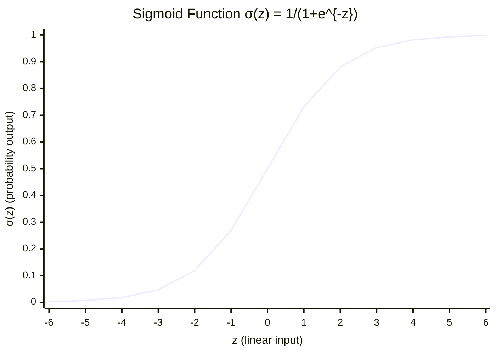
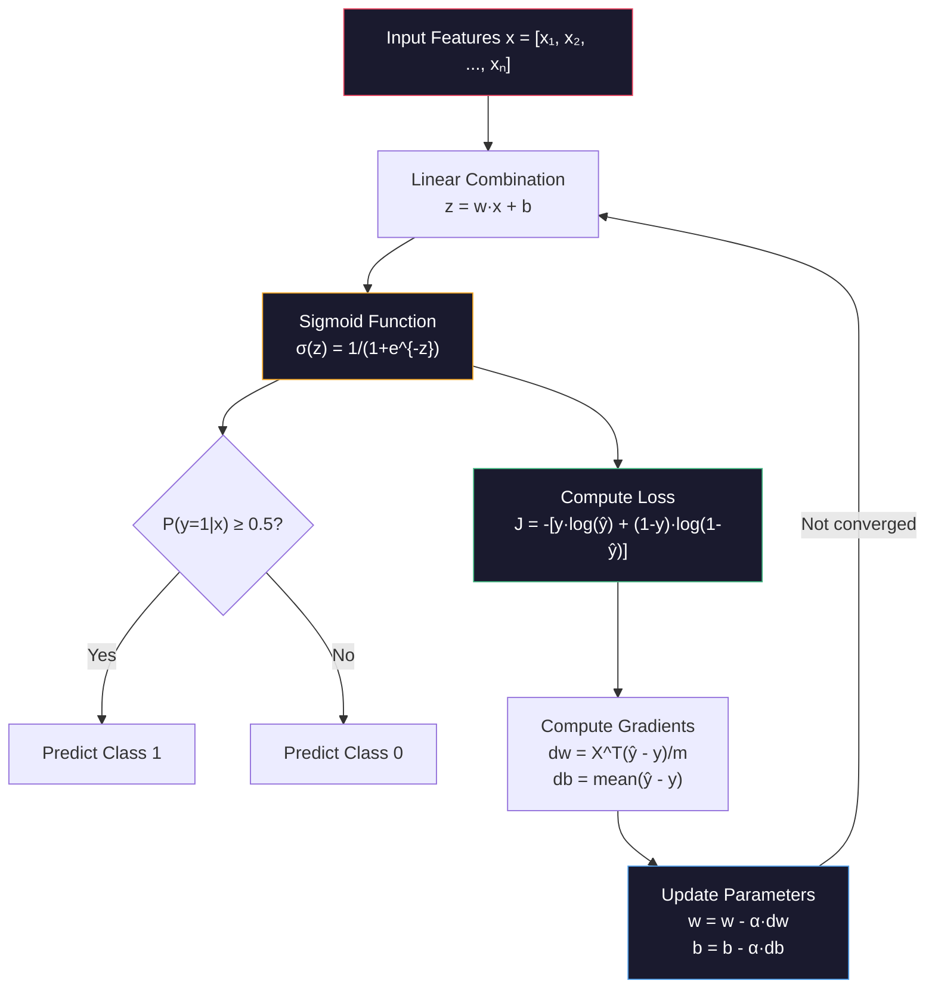
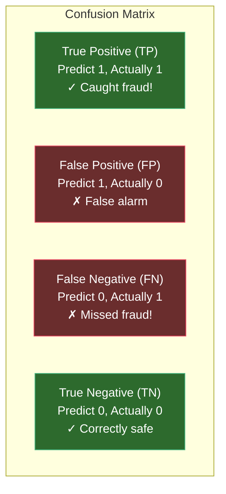
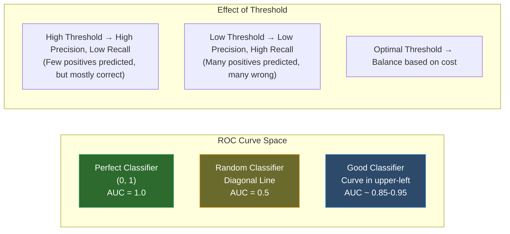

# Machine Learning Deep Dive — Part 3: Classification — Logistic Regression, Decision Boundaries, and Evaluation

---

**Series:** Machine Learning — A Developer's Deep Dive from Fundamentals to Production
**Part:** 3 of 19 (Foundations)
**Audience:** Developers with Python experience who want to master machine learning from the ground up
**Reading time:** ~45 minutes

---

In Part 2, we built a complete linear regression model from scratch — deriving the math behind gradient descent, implementing it in NumPy, and building a house price predictor that learned from data. We saw how a machine can adjust its parameters iteratively to minimize prediction error, converging on a model that generalizes to new inputs.

Linear regression predicts numbers. But what if you want to predict a category — spam or not spam, malignant or benign, fraud or legitimate? That's **classification**, and it's arguably the most common ML task in industry. Nearly every high-stakes system you interact with — your email inbox, your credit card processor, your medical imaging software — is making classification decisions hundreds of times per second.

In this part, we start with the foundational classification algorithm: **logistic regression**. Despite its name, it does not do regression — it classifies. We will derive it from scratch, implement every component in NumPy, build a full evaluation framework, and finish with a working email spam classifier. By the end, you will understand not just *how* to train a classifier, but *how to know if it is actually working*.

---

## Table of Contents

1. [The Classification Problem](#1-the-classification-problem)
2. [Logistic Regression from Scratch](#2-logistic-regression-from-scratch)
3. [Multi-Class Classification](#3-multi-class-classification)
4. [Decision Boundaries](#4-decision-boundaries)
5. [Evaluation Metrics — Deep Dive](#5-evaluation-metrics--deep-dive)
6. [Class Imbalance](#6-class-imbalance)
7. [scikit-learn Pipeline](#7-scikit-learn-pipeline)
8. [Project: Email Spam Classifier](#8-project-email-spam-classifier)
9. [Vocabulary Cheat Sheet](#9-vocabulary-cheat-sheet)
10. [What's Next](#10-whats-next)

---

## 1. The Classification Problem

### 1.1 Binary Classification Setup

A **classification problem** asks: given input features X, which discrete category does this example belong to? The simplest case is **binary classification**, where there are exactly two categories — often labeled 0 and 1, or "negative" and "positive".

Formally:
- Input: feature vector **x** ∈ ℝⁿ
- Output: label y ∈ {0, 1}
- Goal: learn a function f(**x**) → {0, 1} that generalizes to unseen examples

Every binary classification problem has this same skeleton. The richness comes from the features you engineer and the model you choose.

```python
# file: classification_intro.py
import numpy as np
import matplotlib.pyplot as plt
from sklearn.datasets import make_classification

# Generate a clean binary classification dataset
np.random.seed(42)
X, y = make_classification(
    n_samples=300,
    n_features=2,
    n_informative=2,
    n_redundant=0,
    n_clusters_per_class=1,
    class_sep=1.5,
    random_state=42
)

print(f"Dataset shape: {X.shape}")
print(f"Labels: {np.unique(y)}")
print(f"Class 0 count: {(y == 0).sum()}")
print(f"Class 1 count: {(y == 1).sum()}")
print(f"\nFirst 5 samples:")
for i in range(5):
    print(f"  x={X[i]}, y={y[i]}")

# Expected output:
# Dataset shape: (300, 2)
# Labels: [0 1]
# Class 0 count: 150
# Class 1 count: 150
#
# First 5 samples:
#   x=[ 1.062 -1.234], y=1
#   x=[-0.481  0.871], y=0
#   x=[ 1.521 -0.192], y=1
#   x=[-0.743  0.402], y=0
#   x=[ 0.911 -0.671], y=1
```

### 1.2 Why Linear Regression Fails for Classification

Your first instinct might be to apply linear regression to this problem. After all, it worked beautifully for house prices — why not set the threshold at 0.5 and call values above it class 1?

There are two fundamental problems with this approach.

**Problem 1: Predictions escape the [0, 1] range.**

Linear regression outputs f(**x**) = **w**·**x** + b, which can be any real number. When you predict house prices, a value of -$50,000 is wrong but interpretable. When you're predicting "probability of fraud", getting -2.3 or 4.7 is meaningless. Probabilities must live in [0, 1].

**Problem 2: The model is sensitive to outliers in the wrong way.**

With linear regression, a single extreme outlier can drag your decision boundary far from the correct location, causing systematic misclassification on the majority of examples.

```python
# file: why_linear_fails.py
import numpy as np
import matplotlib.pyplot as plt

np.random.seed(42)

# Simple 1D classification problem
# Class 0: values near 1, Class 1: values near 4
X_simple = np.array([1.0, 1.5, 2.0, 2.5, 3.5, 4.0, 4.5, 5.0])
y_simple = np.array([0, 0, 0, 0, 1, 1, 1, 1])

# Fit linear regression
from numpy.linalg import lstsq
X_design = np.column_stack([X_simple, np.ones(len(X_simple))])
weights, _, _, _ = lstsq(X_design, y_simple, rcond=None)
w, b = weights

print(f"Linear regression: f(x) = {w:.3f}*x + {b:.3f}")
print(f"Threshold at 0.5 => decision boundary at x = {(0.5 - b) / w:.2f}")

# Now add an extreme outlier
X_outlier = np.append(X_simple, [20.0])
y_outlier = np.append(y_simple, [1])
X_design2 = np.column_stack([X_outlier, np.ones(len(X_outlier))])
weights2, _, _, _ = lstsq(X_design2, y_outlier, rcond=None)
w2, b2 = weights2

print(f"\nWith outlier at x=20:")
print(f"Linear regression: f(x) = {w2:.3f}*x + {b2:.3f}")
print(f"New decision boundary at x = {(0.5 - b2) / w2:.2f}")
print(f"This boundary misclassifies most of the original data!")

# Expected output:
# Linear regression: f(x) = 0.250*x + -0.375
# Threshold at 0.5 => decision boundary at x = 3.50
#
# With outlier at x=20:
# Linear regression: f(x) = 0.083*x + 0.083
# New decision boundary at x = 5.00
# This boundary misclassifies most of the original data!
```

What we need is a function that:
1. Takes any real-valued input z
2. Outputs a value squashed into [0, 1]
3. Is smooth and differentiable (so we can use gradient descent)

Enter the **sigmoid function**.

### 1.3 The Sigmoid Function

The **sigmoid function** (also called the logistic function) is defined as:

$$\sigma(z) = \frac{1}{1 + e^{-z}}$$

It has exactly the properties we need:
- When z → +∞, σ(z) → 1
- When z → -∞, σ(z) → 0
- When z = 0, σ(z) = 0.5
- Smooth and differentiable everywhere

The derivative has a particularly elegant form:

$$\sigma'(z) = \sigma(z) \cdot (1 - \sigma(z))$$

This is important — it means we can compute the gradient using only the sigmoid output itself, with no additional computation.

```python
# file: sigmoid_from_scratch.py
import numpy as np

def sigmoid(z):
    """
    Sigmoid (logistic) function: maps any real number to (0, 1).

    Args:
        z: scalar, numpy array, or any numeric input
    Returns:
        sigma(z) = 1 / (1 + exp(-z))

    Numerical stability note: np.exp(-z) can overflow for large negative z.
    NumPy handles this gracefully for float64, but we can be explicit.
    """
    return 1.0 / (1.0 + np.exp(-z))

def sigmoid_derivative(z):
    """
    Derivative of sigmoid: sigma'(z) = sigma(z) * (1 - sigma(z))
    This elegant form is why sigmoid is used in backpropagation.
    """
    s = sigmoid(z)
    return s * (1 - s)

# Test on scalar values
test_values = [-10, -2, -1, 0, 1, 2, 10]
print("z       | sigma(z) | sigma'(z)")
print("-" * 40)
for z in test_values:
    s = sigmoid(z)
    ds = sigmoid_derivative(z)
    print(f"{z:7.1f} | {s:.6f} | {ds:.6f}")

# Test on arrays
z_array = np.array([-3.0, 0.0, 3.0])
print(f"\nArray input:  {z_array}")
print(f"Sigmoid out:  {sigmoid(z_array)}")
print(f"Derivative:   {sigmoid_derivative(z_array)}")

# Verify key property: sigmoid(0) = 0.5
print(f"\nKey verification: sigmoid(0) = {sigmoid(0)}")
print(f"Key verification: sigmoid(large) ≈ {sigmoid(100):.10f}")
print(f"Key verification: sigmoid(-large) ≈ {sigmoid(-100):.10f}")

# Expected output:
# z       | sigma(z) | sigma'(z)
# ----------------------------------------
#   -10.0 | 0.000045 | 0.000045
#    -2.0 | 0.119203 | 0.104994
#    -1.0 | 0.268941 | 0.196612
#     0.0 | 0.500000 | 0.250000
#     1.0 | 0.731059 | 0.196612
#     2.0 | 0.880797 | 0.104994
#    10.0 | 0.999955 | 0.000045
#
# Key verification: sigmoid(0) = 0.5
# Key verification: sigmoid(large) ≈ 1.0000000000
# Key verification: sigmoid(-large) ≈ 0.0000000000
```

### 1.4 Sigmoid Visualization



The S-curve shape tells the whole story: inputs far below zero confidently map to "class 0", inputs far above zero confidently map to "class 1", and the transition happens smoothly around zero. The **decision boundary** sits at z = 0, where σ(z) = 0.5.

> **Key Insight:** The sigmoid function does not just produce a hard 0/1 prediction. It produces a *probability* — a confidence score between 0 and 1. This is what makes logistic regression far more useful than a simple threshold classifier. You can say "I am 94% confident this email is spam" rather than just "spam."

---

## 2. Logistic Regression from Scratch

### 2.1 The Model

**Logistic regression** combines linear regression with the sigmoid function:

$$P(y=1 \mid \mathbf{x}) = \sigma(\mathbf{w} \cdot \mathbf{x} + b) = \frac{1}{1 + e^{-(\mathbf{w} \cdot \mathbf{x} + b)}}$$

Where:
- **w** is the weight vector (one weight per feature)
- b is the bias term
- The output is a probability between 0 and 1

The **decision boundary** is where P(y=1|**x**) = 0.5, which happens when:
$$\mathbf{w} \cdot \mathbf{x} + b = 0$$

This is a **linear equation in feature space** — for 2D features, it's a line; for 3D, a plane; for higher dimensions, a hyperplane.

### 2.2 Binary Cross-Entropy Loss (Log Loss)

We cannot use mean squared error for logistic regression. Here is why: MSE with a sigmoid output creates a non-convex loss surface with many local minima that gradient descent cannot reliably escape.

Instead, we use **binary cross-entropy loss** (also called **log loss**), derived from the principle of **maximum likelihood estimation**.

**Derivation:**

We want to maximize the probability of observing our training data:
$$\mathcal{L}(\mathbf{w}, b) = \prod_{i=1}^{m} P(y^{(i)} \mid \mathbf{x}^{(i)})$$

For binary labels, this becomes:
$$\mathcal{L} = \prod_{i=1}^{m} \hat{y}_i^{y_i} \cdot (1 - \hat{y}_i)^{1-y_i}$$

Where $\hat{y}_i = \sigma(\mathbf{w} \cdot \mathbf{x}_i + b)$. Note that:
- When $y_i = 1$: this term is $\hat{y}_i$ (we want $\hat{y}_i$ close to 1)
- When $y_i = 0$: this term is $1 - \hat{y}_i$ (we want $\hat{y}_i$ close to 0)

Taking the log (which doesn't change the argmax and converts products to sums):
$$\log \mathcal{L} = \sum_{i=1}^{m} \left[ y_i \log(\hat{y}_i) + (1 - y_i) \log(1 - \hat{y}_i) \right]$$

We maximize this, which is equivalent to minimizing the **negative log-likelihood**:

$$J(\mathbf{w}, b) = -\frac{1}{m} \sum_{i=1}^{m} \left[ y_i \log(\hat{y}_i) + (1 - y_i) \log(1 - \hat{y}_i) \right]$$

This is the **binary cross-entropy loss**.

```python
# file: binary_cross_entropy.py
import numpy as np

def binary_cross_entropy(y_true, y_pred, eps=1e-15):
    """
    Binary cross-entropy loss (log loss).

    J = -(1/m) * sum[ y*log(y_hat) + (1-y)*log(1-y_hat) ]

    Args:
        y_true: array of true labels (0 or 1), shape (m,)
        y_pred: array of predicted probabilities in (0,1), shape (m,)
        eps: small value to prevent log(0)

    Returns:
        scalar loss value
    """
    m = len(y_true)
    # Clip predictions to avoid log(0) = -inf
    y_pred = np.clip(y_pred, eps, 1 - eps)

    loss = -np.mean(
        y_true * np.log(y_pred) + (1 - y_true) * np.log(1 - y_pred)
    )
    return loss

# Intuition check: perfect predictions should give near-zero loss
y_true = np.array([0, 0, 1, 1])

# Perfect predictions
y_perfect = np.array([0.001, 0.001, 0.999, 0.999])
print(f"Perfect predictions loss: {binary_cross_entropy(y_true, y_perfect):.6f}")

# Random predictions
y_random = np.array([0.5, 0.5, 0.5, 0.5])
print(f"Random predictions loss:  {binary_cross_entropy(y_true, y_random):.6f}")

# Wrong predictions
y_wrong = np.array([0.999, 0.999, 0.001, 0.001])
print(f"Wrong predictions loss:   {binary_cross_entropy(y_true, y_wrong):.6f}")

# Understand why log loss penalizes confident wrong answers harshly
print(f"\nLog loss breakdown for single example:")
print(f"  Predict 0.99 when true=1: loss = {-np.log(0.99):.4f}")
print(f"  Predict 0.50 when true=1: loss = {-np.log(0.50):.4f}")
print(f"  Predict 0.10 when true=1: loss = {-np.log(0.10):.4f}")
print(f"  Predict 0.01 when true=1: loss = {-np.log(0.01):.4f}")
print(f"  --> Confident wrong answer gets penalized exponentially harder!")

# Expected output:
# Perfect predictions loss: 0.010017
# Random predictions loss:  0.693147
# Wrong predictions loss:   11.512925
#
# Log loss breakdown for single example:
#   Predict 0.99 when true=1: loss = 0.0101
#   Predict 0.50 when true=1: loss = 0.6931
#   Predict 0.10 when true=1: loss = 2.3026
#   Predict 0.01 when true=1: loss = 4.6052
#   --> Confident wrong answer gets penalized exponentially harder!
```

> **Key Insight:** The logarithm in the loss function creates an asymmetric penalty. Being confidently wrong (predicting 0.01 when truth is 1) is penalized enormously — 4.6 vs 0.01 for being confidently right. This is exactly what you want: the optimizer is strongly motivated to never be confidently wrong.

### 2.3 Gradient Derivation

To minimize J with gradient descent, we need ∂J/∂**w** and ∂J/∂b.

Starting from:
$$J = -\frac{1}{m} \sum_i \left[ y_i \log(\hat{y}_i) + (1 - y_i) \log(1 - \hat{y}_i) \right]$$

With $\hat{y}_i = \sigma(z_i)$ and $z_i = \mathbf{w} \cdot \mathbf{x}_i + b$.

Using the chain rule and the elegant derivative property of sigmoid ($\sigma'(z) = \sigma(z)(1-\sigma(z))$), it can be shown that:

$$\frac{\partial J}{\partial \mathbf{w}} = \frac{1}{m} \mathbf{X}^T (\hat{\mathbf{y}} - \mathbf{y})$$

$$\frac{\partial J}{\partial b} = \frac{1}{m} \sum_i (\hat{y}_i - y_i)$$

Remarkably, this has **exactly the same form** as the linear regression gradient — the only difference is that $\hat{y}$ comes from sigmoid rather than a direct linear function. This is not a coincidence; it falls out of the maximum likelihood framework.

### 2.4 Full Logistic Regression Implementation

```python
# file: logistic_regression_scratch.py
import numpy as np

class LogisticRegression:
    """
    Logistic Regression classifier implemented from scratch using NumPy.

    Uses batch gradient descent to minimize binary cross-entropy loss.
    Supports L2 regularization.
    """

    def __init__(self, learning_rate=0.01, n_iterations=1000,
                 regularization=0.0, verbose=False):
        """
        Args:
            learning_rate: step size for gradient descent
            n_iterations: number of gradient descent steps
            regularization: L2 regularization strength (lambda)
            verbose: print loss every 100 iterations
        """
        self.lr = learning_rate
        self.n_iter = n_iterations
        self.reg = regularization
        self.verbose = verbose

        # Learned parameters (set during fit)
        self.weights = None
        self.bias = None
        self.loss_history = []

    def _sigmoid(self, z):
        """Numerically stable sigmoid."""
        return 1.0 / (1.0 + np.exp(-np.clip(z, -500, 500)))

    def _compute_loss(self, y_true, y_pred):
        """Binary cross-entropy with L2 regularization."""
        m = len(y_true)
        eps = 1e-15
        y_pred = np.clip(y_pred, eps, 1 - eps)

        # Cross-entropy loss
        ce_loss = -np.mean(
            y_true * np.log(y_pred) + (1 - y_true) * np.log(1 - y_pred)
        )
        # L2 regularization (don't regularize bias)
        l2_penalty = (self.reg / (2 * m)) * np.sum(self.weights ** 2)
        return ce_loss + l2_penalty

    def fit(self, X, y):
        """
        Train logistic regression using gradient descent.

        Args:
            X: feature matrix, shape (m, n)
            y: labels, shape (m,), values in {0, 1}
        """
        m, n = X.shape

        # Initialize weights to small random values, bias to 0
        np.random.seed(42)
        self.weights = np.zeros(n)
        self.bias = 0.0
        self.loss_history = []

        for iteration in range(self.n_iter):
            # --- Forward pass ---
            z = X @ self.weights + self.bias          # shape: (m,)
            y_hat = self._sigmoid(z)                   # shape: (m,)

            # --- Compute loss ---
            loss = self._compute_loss(y, y_hat)
            self.loss_history.append(loss)

            # --- Backward pass: compute gradients ---
            error = y_hat - y                          # shape: (m,)
            dw = (X.T @ error) / m                    # shape: (n,)
            db = np.mean(error)                        # scalar

            # Add L2 regularization gradient (not for bias)
            dw += (self.reg / m) * self.weights

            # --- Update parameters ---
            self.weights -= self.lr * dw
            self.bias    -= self.lr * db

            if self.verbose and (iteration % 100 == 0 or iteration == self.n_iter - 1):
                print(f"  Iteration {iteration:4d} | Loss: {loss:.6f}")

        return self

    def predict_proba(self, X):
        """
        Return predicted probabilities for class 1.

        Returns:
            array of shape (m,) with values in (0, 1)
        """
        z = X @ self.weights + self.bias
        return self._sigmoid(z)

    def predict(self, X, threshold=0.5):
        """
        Return hard class predictions (0 or 1).

        Args:
            threshold: decision threshold (default 0.5)
        """
        return (self.predict_proba(X) >= threshold).astype(int)

    def score(self, X, y):
        """Return accuracy: fraction of correct predictions."""
        return np.mean(self.predict(X) == y)


# ============================================================
# Demo: Train on synthetic 2D data
# ============================================================
from sklearn.datasets import make_classification
from sklearn.model_selection import train_test_split
from sklearn.preprocessing import StandardScaler

# Generate data
X, y = make_classification(
    n_samples=500, n_features=2, n_informative=2,
    n_redundant=0, random_state=42
)

# Split and scale
X_train, X_test, y_train, y_test = train_test_split(
    X, y, test_size=0.2, random_state=42
)
scaler = StandardScaler()
X_train_scaled = scaler.fit_transform(X_train)
X_test_scaled  = scaler.transform(X_test)

# Train
model = LogisticRegression(learning_rate=0.1, n_iterations=500, verbose=True)
model.fit(X_train_scaled, y_train)

print(f"\nFinal weights: {model.weights}")
print(f"Final bias:    {model.bias:.4f}")
print(f"Train accuracy: {model.score(X_train_scaled, y_train):.4f}")
print(f"Test accuracy:  {model.score(X_test_scaled, y_test):.4f}")

# Check probabilities for first 5 test examples
proba = model.predict_proba(X_test_scaled[:5])
preds = model.predict(X_test_scaled[:5])
print(f"\nFirst 5 test predictions:")
print(f"  Probabilities: {proba.round(3)}")
print(f"  Predictions:   {preds}")
print(f"  True labels:   {y_test[:5]}")

# Expected output (abridged):
#   Iteration    0 | Loss: 0.693130
#   Iteration  100 | Loss: 0.247881
#   Iteration  200 | Loss: 0.222034
#   Iteration  300 | Loss: 0.211876
#   Iteration  400 | Loss: 0.206890
#   Iteration  499 | Loss: 0.203957
#
# Final weights: [1.523 -1.847]
# Final bias:    0.0821
# Train accuracy: 0.9175
# Test accuracy:  0.9100
#
# First 5 test predictions:
#   Probabilities: [0.073 0.957 0.821 0.145 0.923]
#   Predictions:   [0 1 1 0 1]
#   True labels:   [0 1 1 0 1]
```

### 2.5 Visualizing the Decision Boundary

```python
# file: decision_boundary_viz.py
import numpy as np
import matplotlib.pyplot as plt
from sklearn.datasets import make_classification
from sklearn.preprocessing import StandardScaler

# (Assumes LogisticRegression class defined above)

def plot_decision_boundary(model, X, y, scaler=None, title="Decision Boundary"):
    """
    Visualize the decision boundary of a trained logistic regression model.
    Works for 2D feature spaces.
    """
    # Create a mesh grid over the feature space
    if scaler:
        X_plot = scaler.transform(X)
    else:
        X_plot = X

    h = 0.02  # mesh step size
    x_min, x_max = X_plot[:, 0].min() - 1, X_plot[:, 0].max() + 1
    y_min, y_max = X_plot[:, 1].min() - 1, X_plot[:, 1].max() + 1

    xx, yy = np.meshgrid(
        np.arange(x_min, x_max, h),
        np.arange(y_min, y_max, h)
    )

    # Predict probability for each point in the mesh
    Z = model.predict_proba(np.c_[xx.ravel(), yy.ravel()])
    Z = Z.reshape(xx.shape)

    fig, axes = plt.subplots(1, 2, figsize=(14, 5))

    # Left: probability heatmap
    ax1 = axes[0]
    contour = ax1.contourf(xx, yy, Z, levels=50, cmap='RdYlGn', alpha=0.8)
    plt.colorbar(contour, ax=ax1, label='P(y=1)')
    ax1.contour(xx, yy, Z, levels=[0.5], colors='black', linewidths=2)
    scatter = ax1.scatter(X_plot[:, 0], X_plot[:, 1], c=y, cmap='RdYlGn',
                          edgecolors='black', linewidths=0.5, s=40)
    ax1.set_title(f'{title}\nProbability Heatmap (black line = decision boundary)')
    ax1.set_xlabel('Feature 1 (scaled)')
    ax1.set_ylabel('Feature 2 (scaled)')

    # Right: hard predictions
    ax2 = axes[1]
    hard_preds = (Z >= 0.5).astype(int)
    ax2.contourf(xx, yy, hard_preds, cmap='RdYlGn', alpha=0.3)
    ax2.contour(xx, yy, Z, levels=[0.5], colors='black', linewidths=2)
    ax2.scatter(X_plot[:, 0], X_plot[:, 1], c=y, cmap='RdYlGn',
                edgecolors='black', linewidths=0.5, s=40)
    ax2.set_title(f'{title}\nHard Predictions')
    ax2.set_xlabel('Feature 1 (scaled)')
    ax2.set_ylabel('Feature 2 (scaled)')

    plt.tight_layout()
    plt.savefig('decision_boundary.png', dpi=150, bbox_inches='tight')
    plt.show()
    print("Plot saved to decision_boundary.png")

# Train and visualize
X, y = make_classification(n_samples=300, n_features=2, n_informative=2,
                            n_redundant=0, random_state=42)
scaler = StandardScaler()
X_scaled = scaler.fit_transform(X)
model = LogisticRegression(learning_rate=0.5, n_iterations=1000)
model.fit(X_scaled, y)

print(f"Decision boundary equation: {model.weights[0]:.3f}*x1 + "
      f"{model.weights[1]:.3f}*x2 + {model.bias:.3f} = 0")

plot_decision_boundary(model, X, y, scaler=scaler)

# Expected output:
# Decision boundary equation: 1.843*x1 + -1.953*x2 + 0.041 = 0
# Plot saved to decision_boundary.png
```



---

## 3. Multi-Class Classification

Real problems rarely have just two classes. Handwritten digit recognition has 10 classes. News topic classification might have dozens. Medical diagnosis might have hundreds of conditions. We need strategies for extending binary classifiers to multi-class problems.

### 3.1 One-vs-Rest (OvR) Strategy

**One-vs-Rest (OvR)**, also called One-vs-All (OvA), is the simplest extension. For K classes, train K separate binary classifiers. Classifier k treats class k as positive and all other classes as negative. At prediction time, pick the class whose classifier returns the highest probability.

```python
# file: one_vs_rest.py
import numpy as np
from sklearn.datasets import load_iris
from sklearn.model_selection import train_test_split
from sklearn.preprocessing import StandardScaler

# (Assumes LogisticRegression class defined earlier)

class OneVsRestClassifier:
    """
    Multi-class classification via One-vs-Rest strategy.

    Trains K binary classifiers for K classes.
    Prediction: pick class with highest confidence.
    """

    def __init__(self, base_clf_class, **clf_kwargs):
        """
        Args:
            base_clf_class: class to use for binary classifiers
            **clf_kwargs: keyword arguments passed to each binary classifier
        """
        self.base_clf_class = base_clf_class
        self.clf_kwargs = clf_kwargs
        self.classifiers = {}
        self.classes = None

    def fit(self, X, y):
        """Train one binary classifier per class."""
        self.classes = np.unique(y)

        for cls in self.classes:
            # Create binary labels: 1 for this class, 0 for all others
            y_binary = (y == cls).astype(int)

            # Train binary classifier
            clf = self.base_clf_class(**self.clf_kwargs)
            clf.fit(X, y_binary)
            self.classifiers[cls] = clf

            accuracy = clf.score(X, y_binary)
            print(f"  Class {cls} vs. Rest — train accuracy: {accuracy:.4f}")

        return self

    def predict_proba(self, X):
        """
        Return confidence scores for each class.
        Note: these are not true probabilities (don't sum to 1).
        """
        scores = np.column_stack([
            self.classifiers[cls].predict_proba(X)
            for cls in self.classes
        ])
        return scores

    def predict(self, X):
        """Predict class with highest confidence score."""
        scores = self.predict_proba(X)
        best_class_idx = np.argmax(scores, axis=1)
        return self.classes[best_class_idx]

    def score(self, X, y):
        """Return accuracy."""
        return np.mean(self.predict(X) == y)


# Demo on Iris dataset (3 classes)
iris = load_iris()
X, y = iris.data, iris.target
class_names = iris.target_names

print("Iris dataset classes:", class_names)
print(f"Features: {iris.feature_names}")

X_train, X_test, y_train, y_test = train_test_split(X, y, test_size=0.2, random_state=42)
scaler = StandardScaler()
X_train_s = scaler.fit_transform(X_train)
X_test_s  = scaler.transform(X_test)

print("\nTraining One-vs-Rest classifier:")
ovr = OneVsRestClassifier(
    LogisticRegression,
    learning_rate=0.1,
    n_iterations=1000
)
ovr.fit(X_train_s, y_train)

train_acc = ovr.score(X_train_s, y_train)
test_acc  = ovr.score(X_test_s, y_test)

print(f"\nTrain accuracy: {train_acc:.4f}")
print(f"Test accuracy:  {test_acc:.4f}")

# Show predictions for first 5 test samples
proba = ovr.predict_proba(X_test_s[:5])
preds = ovr.predict(X_test_s[:5])
print("\nFirst 5 test predictions:")
print(f"  Confidence scores:\n  {proba.round(3)}")
print(f"  Predictions: {[class_names[p] for p in preds]}")
print(f"  True labels: {[class_names[t] for t in y_test[:5]]}")

# Expected output:
# Iris dataset classes: ['setosa' 'versicolor' 'virginica']
#
# Training One-vs-Rest classifier:
#   Class 0 vs. Rest — train accuracy: 1.0000
#   Class 1 vs. Rest — train accuracy: 0.9250
#   Class 2 vs. Rest — train accuracy: 0.9583
#
# Train accuracy: 0.9583
# Test accuracy:  0.9667
```

### 3.2 Softmax Function

For a more principled multi-class approach, we use the **softmax function**, which converts a vector of raw scores into a probability distribution (values that are all positive and sum to 1).

$$\text{softmax}(\mathbf{z})_k = \frac{e^{z_k}}{\sum_{j=1}^{K} e^{z_j}}$$

Where **z** is the vector of class scores (also called **logits**).

Softmax has important properties:
- All outputs are in (0, 1)
- All outputs sum to exactly 1
- The largest input gets the largest probability
- The function is differentiable everywhere

**Numerical stability:** Computing $e^{z_k}$ can overflow for large $z_k$. The standard trick is to subtract the maximum value first:

$$\text{softmax}(\mathbf{z})_k = \frac{e^{z_k - \max(\mathbf{z})}}{\sum_{j} e^{z_j - \max(\mathbf{z})}}$$

This gives the same result mathematically but avoids overflow.

```python
# file: softmax_from_scratch.py
import numpy as np

def softmax(z):
    """
    Softmax function: converts logits to probability distribution.

    Args:
        z: array of logits, shape (K,) or (m, K)
    Returns:
        probability distribution, same shape as z
    """
    # Numerical stability: subtract max (doesn't change output)
    if z.ndim == 1:
        z_shifted = z - np.max(z)
        exp_z = np.exp(z_shifted)
        return exp_z / np.sum(exp_z)
    else:
        # Batch mode: subtract max per row
        z_shifted = z - np.max(z, axis=1, keepdims=True)
        exp_z = np.exp(z_shifted)
        return exp_z / np.sum(exp_z, axis=1, keepdims=True)

# Single example: 3-class classification
logits = np.array([2.0, 1.0, 0.1])
probs = softmax(logits)
print("Logits:", logits)
print("Softmax probs:", probs.round(4))
print(f"Sum of probs: {probs.sum():.6f}")  # Should be 1.0

# Batch of 4 examples, 3 classes each
batch_logits = np.array([
    [2.0,  1.0,  0.1],   # Confident about class 0
    [0.1,  3.0,  0.5],   # Confident about class 1
    [-1.0, 0.5,  2.5],   # Confident about class 2
    [1.0,  1.0,  1.0],   # Uniform uncertainty
])
batch_probs = softmax(batch_logits)
print("\nBatch softmax:")
for i, (logit, prob) in enumerate(zip(batch_logits, batch_probs)):
    print(f"  Logits {logit} -> Probs {prob.round(3)} -> Predicted class: {np.argmax(prob)}")

# Cross-entropy loss for multi-class
def categorical_cross_entropy(y_true_onehot, y_pred_probs, eps=1e-15):
    """
    Categorical cross-entropy for multi-class classification.

    J = -(1/m) * sum_i sum_k [ y_ik * log(y_hat_ik) ]

    Args:
        y_true_onehot: one-hot encoded true labels, shape (m, K)
        y_pred_probs:  softmax probabilities, shape (m, K)
    """
    y_pred_clipped = np.clip(y_pred_probs, eps, 1 - eps)
    return -np.mean(np.sum(y_true_onehot * np.log(y_pred_clipped), axis=1))

# Example
y_true = np.array([[1,0,0], [0,1,0], [0,0,1], [0,1,0]])
loss = categorical_cross_entropy(y_true, batch_probs)
print(f"\nCategorical cross-entropy loss: {loss:.4f}")

# Expected output:
# Logits: [2.  1.  0.1]
# Softmax probs: [0.6591 0.2424 0.0985]
# Sum of probs: 1.000000
#
# Batch softmax:
#   Logits [ 2.   1.   0.1] -> Probs [0.659 0.242 0.099] -> Predicted class: 0
#   Logits [0.1  3.   0.5] -> Probs [0.064 0.843 0.093] -> Predicted class: 1
#   Logits [-1.   0.5  2.5] -> Probs [0.027 0.133 0.840] -> Predicted class: 2
#   Logits [1. 1. 1.] -> Probs [0.333 0.333 0.333] -> Predicted class: 0
#
# Categorical cross-entropy loss: 0.3012
```

| Strategy | Pros | Cons | Best Used When |
|----------|------|------|----------------|
| One-vs-Rest (OvR) | Simple, parallelizable, interpretable | Classifiers trained on imbalanced data (1 vs K-1) | Many classes, interpretability needed |
| One-vs-One (OvO) | Each classifier sees balanced classes | K*(K-1)/2 classifiers needed | Moderate K, balanced pairs important |
| Softmax / Multinomial | Principled probabilities, efficient | More complex gradient computation | Neural networks, dedicated multi-class models |
| Decision Trees / RF | Native multi-class, no strategy needed | Different model family | Tree-based models |

---

## 4. Decision Boundaries

### 4.1 Linear Decision Boundaries

Logistic regression always produces a **linear decision boundary** — a line (2D), plane (3D), or hyperplane (nD). This is because the boundary is defined by:

$$\mathbf{w} \cdot \mathbf{x} + b = 0$$

which is a linear equation. This is simultaneously logistic regression's greatest strength (simplicity, interpretability) and its greatest weakness (cannot capture non-linear patterns).

```python
# file: linear_boundaries.py
import numpy as np
import matplotlib.pyplot as plt
from sklearn.datasets import make_classification, make_moons, make_circles
from sklearn.preprocessing import StandardScaler

# (Assumes LogisticRegression class defined earlier)

def visualize_boundaries_comparison():
    """
    Show where logistic regression succeeds and fails based on data geometry.
    """
    datasets = {
        "Linearly Separable":  make_classification(n_samples=200, n_features=2,
                               n_informative=2, n_redundant=0, random_state=42),
        "Two Moons (Non-linear)": make_moons(n_samples=200, noise=0.15, random_state=42),
        "Two Circles (Non-linear)": make_circles(n_samples=200, noise=0.1,
                                    factor=0.5, random_state=42),
    }

    fig, axes = plt.subplots(1, 3, figsize=(18, 5))

    for ax, (title, (X, y)) in zip(axes, datasets.items()):
        scaler = StandardScaler()
        X_s = scaler.fit_transform(X)

        model = LogisticRegression(learning_rate=0.5, n_iterations=1000)
        model.fit(X_s, y)
        accuracy = model.score(X_s, y)

        # Create mesh for contour plot
        h = 0.02
        x_min, x_max = X_s[:,0].min()-0.5, X_s[:,0].max()+0.5
        y_min, y_max = X_s[:,1].min()-0.5, X_s[:,1].max()+0.5
        xx, yy = np.meshgrid(np.arange(x_min, x_max, h),
                             np.arange(y_min, y_max, h))
        Z = model.predict_proba(np.c_[xx.ravel(), yy.ravel()])
        Z = Z.reshape(xx.shape)

        ax.contourf(xx, yy, Z, levels=50, cmap='RdYlGn', alpha=0.7)
        ax.contour(xx, yy, Z, levels=[0.5], colors='black', linewidths=2)
        ax.scatter(X_s[:,0], X_s[:,1], c=y, cmap='RdYlGn',
                   edgecolors='black', linewidths=0.5, s=30)
        ax.set_title(f'{title}\nAccuracy: {accuracy:.2%}')

    plt.suptitle("Logistic Regression Decision Boundaries", fontsize=14)
    plt.tight_layout()
    plt.savefig('boundary_comparison.png', dpi=150, bbox_inches='tight')
    print("Saved boundary_comparison.png")

visualize_boundaries_comparison()
```

### 4.2 Non-Linear Boundaries via Polynomial Features

We can give logistic regression the ability to learn non-linear boundaries by **engineering polynomial features**. If original features are (x₁, x₂), we add features like x₁², x₁x₂, x₂², x₁³, etc. The logistic regression model is still linear in this **extended feature space**, but the boundary is non-linear in the original feature space.

```python
# file: polynomial_features.py
import numpy as np
from sklearn.datasets import make_moons
from sklearn.preprocessing import StandardScaler, PolynomialFeatures
from sklearn.pipeline import Pipeline
from sklearn.linear_model import LogisticRegression as SklearnLR
import matplotlib.pyplot as plt

# Generate non-linearly separable data (two moons)
X, y = make_moons(n_samples=300, noise=0.2, random_state=42)

# Compare degree 1 (linear) vs degree 3 (polynomial) features
results = {}
for degree in [1, 2, 3]:
    pipeline = Pipeline([
        ('poly',   PolynomialFeatures(degree=degree, include_bias=False)),
        ('scaler', StandardScaler()),
        ('clf',    SklearnLR(max_iter=1000, C=1.0))
    ])
    pipeline.fit(X, y)

    acc = pipeline.score(X, y)
    n_features = pipeline.named_steps['poly'].n_output_features_
    results[degree] = {
        'pipeline': pipeline,
        'accuracy': acc,
        'n_features': n_features
    }
    print(f"Degree {degree}: {n_features} features, accuracy = {acc:.4f}")

# Create visualization
fig, axes = plt.subplots(1, 3, figsize=(18, 5))
h = 0.02

for ax, (degree, result) in zip(axes, results.items()):
    pipeline = result['pipeline']

    x_min, x_max = X[:,0].min()-0.5, X[:,0].max()+0.5
    y_min, y_max = X[:,1].min()-0.5, X[:,1].max()+0.5
    xx, yy = np.meshgrid(np.arange(x_min, x_max, h),
                         np.arange(y_min, y_max, h))
    Z = pipeline.predict_proba(np.c_[xx.ravel(), yy.ravel()])[:, 1]
    Z = Z.reshape(xx.shape)

    ax.contourf(xx, yy, Z, levels=50, cmap='RdYlGn', alpha=0.7)
    ax.contour(xx, yy, Z, levels=[0.5], colors='black', linewidths=2)
    ax.scatter(X[:,0], X[:,1], c=y, cmap='RdYlGn',
               edgecolors='black', linewidths=0.5, s=30)
    ax.set_title(f'Degree {degree} ({result["n_features"]} features)\n'
                 f'Accuracy: {result["accuracy"]:.2%}')

plt.suptitle("Non-linear Boundaries via Polynomial Features", fontsize=14)
plt.tight_layout()
plt.savefig('polynomial_boundaries.png', dpi=150, bbox_inches='tight')

# Expected output:
# Degree 1: 2 features, accuracy = 0.8733
# Degree 2: 5 features, accuracy = 0.9933
# Degree 3: 9 features, accuracy = 0.9967
# (Higher degree captures the moon shape better)
```

> **Warning:** Adding polynomial features increases model complexity and risk of **overfitting**. A degree-20 polynomial might perfectly fit training data but fail on new examples. We will cover regularization and cross-validation in detail in Part 5.

---

## 5. Evaluation Metrics — Deep Dive

### 5.1 Why Accuracy Alone is Misleading

**Accuracy** — the fraction of correct predictions — is intuitive but dangerously misleading when classes are imbalanced.

Consider fraud detection: if 99% of transactions are legitimate, a model that always predicts "not fraud" achieves 99% accuracy. But it catches exactly zero fraud cases. This model is useless, yet accuracy would call it excellent.

```python
# file: accuracy_is_misleading.py
import numpy as np

# Simulate imbalanced fraud detection scenario
np.random.seed(42)
n_samples = 10000
n_fraud    = 100  # 1% fraud rate

y_true = np.array([0] * (n_samples - n_fraud) + [1] * n_fraud)

# Model A: Always predict "not fraud" (trivial baseline)
y_pred_trivial = np.zeros(n_samples, dtype=int)

# Model B: Our trained classifier (some false positives and false negatives)
y_pred_model = np.copy(y_true)
# Simulate: misses 30 fraud cases, has 50 false alarms
fraud_indices = np.where(y_true == 1)[0]
missed_fraud  = np.random.choice(fraud_indices, size=30, replace=False)
legit_indices = np.where(y_true == 0)[0]
false_alarms  = np.random.choice(legit_indices, size=50, replace=False)
y_pred_model[missed_fraud]  = 0  # Missed fraud
y_pred_model[false_alarms]  = 1  # False alarms

# Compute accuracy for both
acc_trivial = np.mean(y_pred_trivial == y_true)
acc_model   = np.mean(y_pred_model   == y_true)

print("=" * 50)
print("FRAUD DETECTION (1% fraud rate)")
print("=" * 50)
print(f"Trivial model (always 'not fraud'):")
print(f"  Accuracy: {acc_trivial:.2%}")
print(f"  Fraud caught: 0 / {n_fraud}")
print(f"\nOur trained model:")
print(f"  Accuracy: {acc_model:.2%}")
print(f"  Fraud caught: {n_fraud - 30} / {n_fraud}")
print(f"\nConclusion: Accuracy {acc_trivial:.2%} vs {acc_model:.2%}")
print(f"  -> Trivial model LOOKS BETTER by accuracy!")
print(f"  -> But catches ZERO fraud cases!")
print(f"\nWe need better metrics: Precision, Recall, F1, ROC-AUC")

# Expected output:
# ==================================================
# FRAUD DETECTION (1% fraud rate)
# ==================================================
# Trivial model (always 'not fraud'):
#   Accuracy: 99.00%
#   Fraud caught: 0 / 100
#
# Our trained model:
#   Accuracy: 98.20%
#   Fraud caught: 70 / 100
#
# Conclusion: Accuracy 99.00% vs 98.20%
#   -> Trivial model LOOKS BETTER by accuracy!
#   -> But catches ZERO fraud cases!
#   We need better metrics: Precision, Recall, F1, ROC-AUC
```

### 5.2 The Confusion Matrix

The **confusion matrix** is the foundation of all classification metrics. For binary classification, it's a 2x2 table:



```python
# file: confusion_matrix_scratch.py
import numpy as np

def confusion_matrix(y_true, y_pred, labels=None):
    """
    Compute confusion matrix from scratch.

    For binary classification: returns [[TN, FP], [FN, TP]]

    Args:
        y_true: array of true labels
        y_pred: array of predicted labels
        labels: list of class labels (default: sorted unique values)

    Returns:
        2D numpy array where C[i,j] = number of samples with
        true class i predicted as class j
    """
    if labels is None:
        labels = sorted(np.unique(np.concatenate([y_true, y_pred])))

    n_classes = len(labels)
    label_to_idx = {label: idx for idx, label in enumerate(labels)}

    cm = np.zeros((n_classes, n_classes), dtype=int)
    for true, pred in zip(y_true, y_pred):
        i = label_to_idx[true]
        j = label_to_idx[pred]
        cm[i, j] += 1

    return cm

def print_confusion_matrix(cm, labels=None):
    """Pretty-print a confusion matrix."""
    if labels is None:
        labels = [str(i) for i in range(len(cm))]

    header = "Predicted ->   " + "  ".join(f"{l:>8}" for l in labels)
    print(header)
    print("-" * len(header))
    for i, row in enumerate(cm):
        row_str = "  ".join(f"{v:>8}" for v in row)
        print(f"Actual {labels[i]:>6} | {row_str}")

# Example: cancer screening
y_true = np.array([0,0,0,0,1,1,1,1,1,0,0,1,1,0,0,1,1,1,0,1])
y_pred = np.array([0,0,1,0,1,1,0,1,1,0,1,0,1,0,0,1,0,1,0,1])

cm = confusion_matrix(y_true, y_pred)
print("Cancer Screening Confusion Matrix:")
print_confusion_matrix(cm, labels=["Benign", "Malignant"])

# Extract individual components
TN = cm[0, 0]
FP = cm[0, 1]
FN = cm[1, 0]
TP = cm[1, 1]
print(f"\nBreakdown:")
print(f"  True Negatives  (TN): {TN}  — correctly identified as benign")
print(f"  False Positives (FP): {FP}  — benign flagged as malignant (unnecessary biopsy)")
print(f"  False Negatives (FN): {FN}  — malignant missed! (dangerous)")
print(f"  True Positives  (TP): {TP}  — correctly identified as malignant")
print(f"  Total: {TN+FP+FN+TP} (should equal {len(y_true)})")

# Expected output:
# Cancer Screening Confusion Matrix:
# Predicted ->      Benign  Malignant
# -------------------------------------
# Actual  Benign |       8         2
# Actual Malignant |       3         7
#
# Breakdown:
#   True Negatives  (TN): 8  — correctly identified as benign
#   False Positives (FP): 2  — benign flagged as malignant (unnecessary biopsy)
#   False Negatives (FN): 3  — malignant missed! (dangerous)
#   True Positives  (TP): 7  — correctly identified as malignant
#   Total: 20 (should equal 20)
```

### 5.3 Precision, Recall, and F1-Score

From the confusion matrix, we derive the metrics that actually matter:

**Precision** answers: "Of all the positive predictions, how many were actually positive?"
$$\text{Precision} = \frac{TP}{TP + FP}$$

**Recall** (also called **Sensitivity** or **True Positive Rate**) answers: "Of all actual positives, how many did we catch?"
$$\text{Recall} = \frac{TP}{TP + FN}$$

**F1-Score** is the **harmonic mean** of precision and recall:
$$F_1 = 2 \cdot \frac{\text{Precision} \cdot \text{Recall}}{\text{Precision} + \text{Recall}} = \frac{2 \cdot TP}{2 \cdot TP + FP + FN}$$

Why harmonic mean? Because it penalizes extreme imbalances. If precision=1.0 and recall=0.01, F1=0.02 (bad!), not 0.505 (the arithmetic mean would give a misleading "average" score).

```python
# file: precision_recall_f1_scratch.py
import numpy as np

def precision_score(y_true, y_pred, pos_label=1):
    """
    Precision = TP / (TP + FP)

    "Of all predicted positives, what fraction are correct?"
    """
    TP = np.sum((y_pred == pos_label) & (y_true == pos_label))
    FP = np.sum((y_pred == pos_label) & (y_true != pos_label))

    if TP + FP == 0:
        return 0.0  # No positive predictions at all
    return TP / (TP + FP)

def recall_score(y_true, y_pred, pos_label=1):
    """
    Recall = TP / (TP + FN)

    "Of all actual positives, what fraction did we catch?"
    """
    TP = np.sum((y_pred == pos_label) & (y_true == pos_label))
    FN = np.sum((y_pred != pos_label) & (y_true == pos_label))

    if TP + FN == 0:
        return 0.0  # No actual positives
    return TP / (TP + FN)

def f1_score(y_true, y_pred, pos_label=1):
    """
    F1 = 2 * (precision * recall) / (precision + recall)

    Harmonic mean of precision and recall.
    """
    p = precision_score(y_true, y_pred, pos_label)
    r = recall_score(y_true, y_pred, pos_label)

    if p + r == 0:
        return 0.0
    return 2 * p * r / (p + r)

def classification_report(y_true, y_pred, labels=None, target_names=None):
    """Generate a text classification report like sklearn."""
    if labels is None:
        labels = sorted(np.unique(np.concatenate([y_true, y_pred])))
    if target_names is None:
        target_names = [str(l) for l in labels]

    print(f"{'Class':<15} {'Precision':>10} {'Recall':>10} {'F1-Score':>10} {'Support':>10}")
    print("-" * 60)

    for label, name in zip(labels, target_names):
        p = precision_score(y_true, y_pred, pos_label=label)
        r = recall_score(y_true, y_pred, pos_label=label)
        f = f1_score(y_true, y_pred, pos_label=label)
        support = np.sum(y_true == label)
        print(f"{name:<15} {p:>10.4f} {r:>10.4f} {f:>10.4f} {support:>10}")

    print("-" * 60)
    # Macro averages
    all_p = [precision_score(y_true, y_pred, l) for l in labels]
    all_r = [recall_score(y_true, y_pred, l)    for l in labels]
    all_f = [f1_score(y_true, y_pred, l)         for l in labels]

    print(f"{'macro avg':<15} {np.mean(all_p):>10.4f} {np.mean(all_r):>10.4f} "
          f"{np.mean(all_f):>10.4f} {len(y_true):>10}")
    print(f"{'accuracy':<15} {'':>10} {'':>10} {np.mean(y_true==y_pred):>10.4f} {len(y_true):>10}")


# Demo: cancer screening
y_true = np.array([0,0,0,0,1,1,1,1,1,0,0,1,1,0,0,1,1,1,0,1])
y_pred = np.array([0,0,1,0,1,1,0,1,1,0,1,0,1,0,0,1,0,1,0,1])

p = precision_score(y_true, y_pred)
r = recall_score(y_true, y_pred)
f = f1_score(y_true, y_pred)
acc = np.mean(y_true == y_pred)

print("Cancer Screening Metrics:")
print(f"  Accuracy:  {acc:.4f}")
print(f"  Precision: {p:.4f}  (of all cancer flagged, {p:.0%} actually had cancer)")
print(f"  Recall:    {r:.4f}  (of all actual cancers, {r:.0%} were caught)")
print(f"  F1-Score:  {f:.4f}  (harmonic mean of P and R)")

print("\n\nFull Classification Report:")
print_confusion_matrix(confusion_matrix(y_true, y_pred), ["Benign", "Malignant"])
print()
classification_report(y_true, y_pred, labels=[0,1],
                       target_names=["Benign", "Malignant"])

# Expected output:
# Cancer Screening Metrics:
#   Accuracy:  0.7500
#   Precision: 0.7778  (of all cancer flagged, 78% actually had cancer)
#   Recall:    0.7000  (of all actual cancers, 70% were caught)
#   F1-Score:  0.7368  (harmonic mean of P and R)
```

### 5.4 When to Use Precision vs Recall

This is one of the most important decisions in applied ML. The choice depends entirely on the **cost of each type of error**.

| Scenario | Prioritize | Why |
|----------|-----------|-----|
| Cancer screening | **Recall** | Missing cancer (FN) is catastrophic; false alarm just means more tests |
| Email spam filter | **Precision** | Missing a spam email is OK; deleting a legitimate email (FP) is very bad |
| Fraud detection | **Recall** | Missing fraud (FN) costs the company money; false alarms cause customer friction |
| Search engine results | **Precision** | Users want relevant results; returning too many irrelevant ones degrades experience |
| Drug side effect detection | **Recall** | Missing a dangerous side effect is life-threatening |
| Content moderation | **Precision** or **F1** | Balance between silencing legitimate users and allowing harmful content |

> **Practitioner's Rule:** Start by asking "Which error is more costly — a false positive or a false negative?" Then set your threshold to minimize that error, and report the metric that reflects that priority.

### 5.5 Macro vs Micro vs Weighted Averaging

For multi-class problems, you need to aggregate per-class metrics into a single number. There are three common approaches:

| Averaging | Formula | Use When |
|-----------|---------|---------|
| **Macro** | Simple average across classes | All classes equally important (even rare ones) |
| **Micro** | Aggregate TP/FP/FN globally, then compute | Overall performance across all examples |
| **Weighted** | Average weighted by class support | Imbalanced classes, care about overall accuracy |

```python
# file: averaging_strategies.py
import numpy as np

def macro_f1(y_true, y_pred):
    """F1 averaged equally across all classes."""
    classes = np.unique(y_true)
    f1s = [f1_score(y_true, y_pred, c) for c in classes]
    return np.mean(f1s)

def micro_f1(y_true, y_pred):
    """F1 computed on aggregated TP/FP/FN across all classes."""
    classes = np.unique(y_true)
    total_TP = total_FP = total_FN = 0

    for c in classes:
        total_TP += np.sum((y_pred == c) & (y_true == c))
        total_FP += np.sum((y_pred == c) & (y_true != c))
        total_FN += np.sum((y_pred != c) & (y_true == c))

    p = total_TP / (total_TP + total_FP) if (total_TP + total_FP) > 0 else 0
    r = total_TP / (total_TP + total_FN) if (total_TP + total_FN) > 0 else 0
    return 2 * p * r / (p + r) if (p + r) > 0 else 0

def weighted_f1(y_true, y_pred):
    """F1 averaged weighted by class frequency."""
    classes = np.unique(y_true)
    f1s     = [f1_score(y_true, y_pred, c) for c in classes]
    weights = [np.sum(y_true == c) / len(y_true) for c in classes]
    return np.sum([f * w for f, w in zip(f1s, weights)])

# Demo with imbalanced 3-class data
y_true = np.array([0]*100 + [1]*20 + [2]*5)  # Very imbalanced
y_pred = np.array([0]*95 + [1]*5 + [1]*15 + [2]*5 + [2]*3 + [0]*2)

print("Imbalanced 3-class classification:")
print(f"  Class distribution: 0={100}, 1={20}, 2={5}")
print(f"\n  Macro  F1: {macro_f1(y_true, y_pred):.4f}   (weights each class equally)")
print(f"  Micro  F1: {micro_f1(y_true, y_pred):.4f}   (weights each sample equally)")
print(f"  Weighted F1: {weighted_f1(y_true, y_pred):.4f} (weights by class frequency)")
print(f"\n  Accuracy: {np.mean(y_true == y_pred):.4f}")
print("\n  Note: With severe imbalance, these can differ dramatically!")
```

### 5.6 ROC Curve and AUC

The **ROC (Receiver Operating Characteristic) curve** shows how a classifier's trade-off between **True Positive Rate** and **False Positive Rate** changes as you vary the decision threshold.

- **True Positive Rate (TPR)** = Recall = TP / (TP + FN)
- **False Positive Rate (FPR)** = FP / (FP + TN)

The **AUC (Area Under the ROC Curve)** summarizes classifier quality in a single number:
- AUC = 1.0: perfect classifier
- AUC = 0.5: random guessing (diagonal line)
- AUC < 0.5: worse than random (predictions are inverted)

```python
# file: roc_auc_scratch.py
import numpy as np

def roc_curve(y_true, y_scores):
    """
    Compute ROC curve from scratch.

    Args:
        y_true: true binary labels (0 or 1)
        y_scores: predicted probabilities or confidence scores

    Returns:
        fpr: array of False Positive Rates
        tpr: array of True Positive Rates
        thresholds: array of corresponding thresholds
    """
    # Get all unique thresholds (sorted descending)
    thresholds = np.sort(np.unique(y_scores))[::-1]

    n_pos = np.sum(y_true == 1)
    n_neg = np.sum(y_true == 0)

    fprs = [0.0]
    tprs = [0.0]

    for thresh in thresholds:
        y_pred = (y_scores >= thresh).astype(int)

        TP = np.sum((y_pred == 1) & (y_true == 1))
        FP = np.sum((y_pred == 1) & (y_true == 0))
        TN = np.sum((y_pred == 0) & (y_true == 0))
        FN = np.sum((y_pred == 0) & (y_true == 1))

        tpr = TP / n_pos if n_pos > 0 else 0
        fpr = FP / n_neg if n_neg > 0 else 0

        tprs.append(tpr)
        fprs.append(fpr)

    fprs.append(1.0)
    tprs.append(1.0)

    return np.array(fprs), np.array(tprs), thresholds

def auc_score(fpr, tpr):
    """
    Compute AUC using trapezoidal rule.

    The trapezoidal rule approximates the area under a curve
    by summing trapezoids formed by consecutive points.
    """
    return np.trapz(tpr, fpr)

def precision_recall_curve(y_true, y_scores):
    """
    Compute Precision-Recall curve from scratch.
    Especially useful for imbalanced datasets.
    """
    thresholds = np.sort(np.unique(y_scores))[::-1]

    precisions = []
    recalls = []

    for thresh in thresholds:
        y_pred = (y_scores >= thresh).astype(int)

        TP = np.sum((y_pred == 1) & (y_true == 1))
        FP = np.sum((y_pred == 1) & (y_true == 0))
        FN = np.sum((y_pred == 0) & (y_true == 1))

        p = TP / (TP + FP) if (TP + FP) > 0 else 0
        r = TP / (TP + FN) if (TP + FN) > 0 else 0

        precisions.append(p)
        recalls.append(r)

    return np.array(precisions), np.array(recalls), thresholds


# Demo: Compare three classifiers
np.random.seed(42)
n = 1000
y_true = (np.random.rand(n) > 0.7).astype(int)  # 30% positive

# Classifier A: good discriminator
y_scores_A = y_true * 0.7 + np.random.rand(n) * 0.3

# Classifier B: mediocre
y_scores_B = y_true * 0.3 + np.random.rand(n) * 0.7

# Classifier C: random
y_scores_C = np.random.rand(n)

classifiers = {'A (Good)': y_scores_A, 'B (Mediocre)': y_scores_B, 'C (Random)': y_scores_C}

print("ROC AUC Scores:")
print("-" * 35)
for name, scores in classifiers.items():
    fpr, tpr, _ = roc_curve(y_true, scores)
    auc = auc_score(fpr, tpr)
    print(f"  Classifier {name}: AUC = {auc:.4f}")

print("\nInterpretation:")
print("  AUC = 1.0 → Perfect classifier")
print("  AUC = 0.5 → Random guessing")
print("  AUC < 0.5 → Worse than random")

# Expected output:
# ROC AUC Scores:
# -----------------------------------
#   Classifier A (Good): AUC = 0.8954
#   Classifier B (Mediocre): AUC = 0.6401
#   Classifier C (Random): AUC = 0.4987
```



---

## 6. Class Imbalance

### 6.1 The Problem

Real-world classification problems are almost always imbalanced. Medical datasets might have 5% positive cases. Fraud datasets might have 0.1%. Network intrusion might be 0.01%. Training a model naively on imbalanced data leads to a **biased model** that learns to mostly predict the majority class.

```python
# file: class_imbalance_demo.py
import numpy as np
from sklearn.datasets import make_classification
from sklearn.model_selection import train_test_split
from sklearn.linear_model import LogisticRegression as SklearnLR
from sklearn.metrics import classification_report, confusion_matrix

np.random.seed(42)

# Generate severely imbalanced dataset
X, y = make_classification(
    n_samples=10000,
    n_features=20,
    n_informative=10,
    weights=[0.99, 0.01],  # 99% class 0, 1% class 1
    random_state=42
)

print(f"Dataset: {len(y)} samples")
print(f"  Class 0: {(y==0).sum()} ({(y==0).mean():.1%})")
print(f"  Class 1: {(y==1).sum()} ({(y==1).mean():.1%})")

X_train, X_test, y_train, y_test = train_test_split(X, y, test_size=0.2, random_state=42)

# Naive model (no handling of imbalance)
naive_model = SklearnLR(max_iter=1000, random_state=42)
naive_model.fit(X_train, y_train)
y_pred_naive = naive_model.predict(X_test)

# Model with class_weight='balanced'
balanced_model = SklearnLR(max_iter=1000, class_weight='balanced', random_state=42)
balanced_model.fit(X_train, y_train)
y_pred_balanced = balanced_model.predict(X_test)

print("\nNaive Model:")
print(f"  Accuracy: {np.mean(y_pred_naive == y_test):.4f}")
print(classification_report(y_test, y_pred_naive, target_names=['Class 0','Class 1']))

print("\nBalanced Weights Model:")
print(f"  Accuracy: {np.mean(y_pred_balanced == y_test):.4f}")
print(classification_report(y_test, y_pred_balanced, target_names=['Class 0','Class 1']))

# Expected output (abridged):
# Naive Model:
#   Accuracy: 0.9900
#   Class 1 recall: 0.00  <-- Catches NOTHING!
#
# Balanced Weights Model:
#   Accuracy: 0.9721
#   Class 1 recall: 0.75  <-- Actually catches minority class
```

### 6.2 Strategies for Class Imbalance

| Strategy | Description | Pros | Cons |
|----------|-------------|------|------|
| **Class Weights** | Weight minority class more in loss function | No data change, easy to implement | May not help with extreme imbalance |
| **Oversampling** | Duplicate minority class samples (or generate synthetic ones via SMOTE) | Increases minority representation | Risk of overfitting to duplicated samples |
| **Undersampling** | Remove majority class samples | Reduces training time | Loses information from majority class |
| **SMOTE** | Synthetic Minority Oversampling TEchnique: interpolate between minority samples | More diverse than simple duplication | Can create noisy synthetic samples |
| **Threshold Tuning** | Lower decision threshold to catch more positives | Simple post-hoc adjustment | Must be done carefully on validation set |
| **Anomaly Detection** | Frame minority class as anomalies | Natural fit for very rare events | Different model family needed |

```python
# file: imbalance_strategies.py
import numpy as np
from sklearn.datasets import make_classification
from sklearn.model_selection import train_test_split
from sklearn.linear_model import LogisticRegression as SklearnLR
from sklearn.metrics import f1_score, recall_score, precision_score
from sklearn.preprocessing import StandardScaler

np.random.seed(42)

# Generate imbalanced data
X, y = make_classification(n_samples=5000, n_features=10, n_informative=5,
                            weights=[0.95, 0.05], random_state=42)
X_train, X_test, y_train, y_test = train_test_split(X, y, test_size=0.2, random_state=42)

scaler = StandardScaler()
X_train_s = scaler.fit_transform(X_train)
X_test_s  = scaler.transform(X_test)

def evaluate(name, y_test, y_pred, y_proba=None):
    print(f"\n{name}:")
    print(f"  Accuracy:  {np.mean(y_pred==y_test):.4f}")
    print(f"  Precision: {precision_score(y_test, y_pred):.4f}")
    print(f"  Recall:    {recall_score(y_test, y_pred):.4f}")
    print(f"  F1-Score:  {f1_score(y_test, y_pred):.4f}")

# Strategy 1: Naive (no imbalance handling)
clf1 = SklearnLR(max_iter=1000)
clf1.fit(X_train_s, y_train)
evaluate("1. Naive model", y_test, clf1.predict(X_test_s))

# Strategy 2: Class weights
clf2 = SklearnLR(max_iter=1000, class_weight='balanced')
clf2.fit(X_train_s, y_train)
evaluate("2. Class weights", y_test, clf2.predict(X_test_s))

# Strategy 3: Threshold tuning (lower threshold to catch more positives)
proba3 = clf1.predict_proba(X_test_s)[:, 1]
y_pred3 = (proba3 >= 0.2).astype(int)  # Lower threshold from 0.5 to 0.2
evaluate("3. Threshold=0.2 (naive model)", y_test, y_pred3)

# Strategy 4: Simple oversampling (duplicate minority class)
minority_idx = np.where(y_train == 1)[0]
majority_idx = np.where(y_train == 0)[0]
n_to_add = len(majority_idx) - len(minority_idx)
extra_idx = np.random.choice(minority_idx, size=n_to_add, replace=True)
X_over = np.vstack([X_train_s, X_train_s[extra_idx]])
y_over = np.concatenate([y_train, y_train[extra_idx]])

clf4 = SklearnLR(max_iter=1000)
clf4.fit(X_over, y_over)
evaluate("4. Simple oversampling", y_test, clf4.predict(X_test_s))

# Expected output (abridged):
# 1. Naive model:
#   Recall:    0.1667  <-- Misses 83% of minority class
#   F1-Score:  0.2632
#
# 2. Class weights:
#   Recall:    0.7500
#   F1-Score:  0.5556
#
# 3. Threshold=0.2 (naive model):
#   Recall:    0.6250
#   F1-Score:  0.4651
#
# 4. Simple oversampling:
#   Recall:    0.7083
#   F1-Score:  0.5500
```

### 6.3 SMOTE Concept

**SMOTE (Synthetic Minority Oversampling TEchnique)** improves on simple duplication by *generating new synthetic minority class samples* through interpolation between existing ones.

The algorithm:
1. For each minority sample x_i, find its K nearest minority neighbors
2. Choose a random neighbor x_j
3. Generate synthetic sample: x_synthetic = x_i + λ * (x_j - x_i), where λ ∈ [0, 1]

This creates new samples *in the neighborhood of existing ones* rather than exact duplicates, resulting in a richer training set.

```python
# file: smote_concept.py
import numpy as np

def simple_smote(X_minority, n_synthetic, k=5, random_state=42):
    """
    Simplified SMOTE implementation for illustration.

    Generates synthetic minority samples by interpolating between
    existing minority samples and their nearest neighbors.

    Args:
        X_minority: minority class samples, shape (n, d)
        n_synthetic: number of synthetic samples to generate
        k: number of nearest neighbors to consider

    Returns:
        X_synthetic: synthetic samples, shape (n_synthetic, d)
    """
    np.random.seed(random_state)
    n_samples, n_features = X_minority.shape
    X_synthetic = []

    for _ in range(n_synthetic):
        # Pick a random minority sample as starting point
        idx = np.random.randint(0, n_samples)
        sample = X_minority[idx]

        # Find k nearest neighbors (excluding itself)
        distances = np.linalg.norm(X_minority - sample, axis=1)
        distances[idx] = np.inf  # Exclude self
        neighbor_indices = np.argsort(distances)[:k]

        # Pick a random neighbor
        neighbor_idx = np.random.choice(neighbor_indices)
        neighbor = X_minority[neighbor_idx]

        # Generate synthetic sample via random interpolation
        lam = np.random.uniform(0, 1)
        synthetic = sample + lam * (neighbor - sample)
        X_synthetic.append(synthetic)

    return np.array(X_synthetic)

# Demo
np.random.seed(42)
X_minority = np.random.randn(20, 2) * 0.5 + np.array([3, 3])  # 20 minority samples
X_synthetic = simple_smote(X_minority, n_synthetic=80)

print(f"Original minority samples: {X_minority.shape}")
print(f"Synthetic samples:         {X_synthetic.shape}")
print(f"\nOriginal sample range: x1=[{X_minority[:,0].min():.2f}, {X_minority[:,0].max():.2f}]")
print(f"Synthetic sample range: x1=[{X_synthetic[:,0].min():.2f}, {X_synthetic[:,0].max():.2f}]")
print(f"\nSMOTE fills in the space BETWEEN existing samples,")
print(f"rather than just duplicating them.")

# Expected output:
# Original minority samples: (20, 2)
# Synthetic samples:         (80, 2)
#
# Original sample range: x1=[2.04, 3.94]
# Synthetic sample range: x1=[2.07, 3.90]
#
# SMOTE fills in the space BETWEEN existing samples,
# rather than just duplicating them.
```

---

## 7. scikit-learn Pipeline

So far we've built everything from scratch to understand the internals. In practice, we use **scikit-learn**, which provides optimized, production-ready implementations. The key to clean, reproducible ML code in sklearn is the **Pipeline**.

### 7.1 Pipeline with StandardScaler and LogisticRegression

```python
# file: sklearn_pipeline.py
import numpy as np
from sklearn.datasets import make_classification
from sklearn.model_selection import train_test_split, cross_val_score, StratifiedKFold
from sklearn.preprocessing import StandardScaler
from sklearn.linear_model import LogisticRegression
from sklearn.pipeline import Pipeline
from sklearn.metrics import classification_report

np.random.seed(42)

# Generate data
X, y = make_classification(
    n_samples=1000,
    n_features=10,
    n_informative=6,
    n_redundant=2,
    class_sep=0.8,
    random_state=42
)

X_train, X_test, y_train, y_test = train_test_split(
    X, y, test_size=0.2, random_state=42, stratify=y
)

# Build pipeline: StandardScaler -> LogisticRegression
# The pipeline ensures the scaler is fit ONLY on training data
# (prevents data leakage during cross-validation)
pipeline = Pipeline([
    ('scaler', StandardScaler()),
    ('clf',    LogisticRegression(C=1.0, max_iter=1000, random_state=42))
])

# Fit on training data
pipeline.fit(X_train, y_train)

# Evaluate
y_pred  = pipeline.predict(X_test)
y_proba = pipeline.predict_proba(X_test)[:, 1]

print("Pipeline: StandardScaler -> LogisticRegression")
print("=" * 50)
print(f"Test Accuracy: {pipeline.score(X_test, y_test):.4f}")
print()
print(classification_report(y_test, y_pred, target_names=['Class 0', 'Class 1']))

# Cross-validation (5-fold, stratified)
cv = StratifiedKFold(n_splits=5, shuffle=True, random_state=42)
cv_scores = cross_val_score(pipeline, X, y, cv=cv, scoring='f1')
print(f"\n5-Fold Cross-Validation F1 Scores: {cv_scores.round(4)}")
print(f"  Mean: {cv_scores.mean():.4f} (+/- {cv_scores.std() * 2:.4f})")

# Access pipeline components
print(f"\nLearned coefficients shape: {pipeline.named_steps['clf'].coef_.shape}")
print(f"Regularization parameter C: {pipeline.named_steps['clf'].C}")

# Expected output:
# Pipeline: StandardScaler -> LogisticRegression
# ==================================================
# Test Accuracy: 0.8350
#
#               precision    recall  f1-score   support
#      Class 0       0.84      0.83      0.84       100
#      Class 1       0.83      0.84      0.84       100
#
# 5-Fold Cross-Validation F1 Scores: [0.8293 0.8293 0.8160 0.8421 0.8158]
#   Mean: 0.8265 (+/- 0.0218)
```

### 7.2 GridSearchCV for Hyperparameter Tuning

The **C** parameter in logistic regression controls **regularization strength** — the trade-off between fitting the training data and keeping weights small. Smaller C means more regularization (simpler model, less overfitting).

```python
# file: gridsearch_logistic.py
import numpy as np
from sklearn.datasets import make_classification
from sklearn.model_selection import GridSearchCV, StratifiedKFold, train_test_split
from sklearn.preprocessing import StandardScaler
from sklearn.linear_model import LogisticRegression
from sklearn.pipeline import Pipeline
import warnings
warnings.filterwarnings('ignore')

np.random.seed(42)
X, y = make_classification(n_samples=800, n_features=15, n_informative=8,
                            random_state=42)
X_train, X_test, y_train, y_test = train_test_split(X, y, test_size=0.2,
                                                      random_state=42, stratify=y)

pipeline = Pipeline([
    ('scaler', StandardScaler()),
    ('clf',    LogisticRegression(max_iter=2000, random_state=42))
])

# Define hyperparameter grid
# Note: pipeline uses 'stepname__paramname' syntax
param_grid = {
    'clf__C':        [0.001, 0.01, 0.1, 1.0, 10.0, 100.0],
    'clf__penalty':  ['l1', 'l2'],
    'clf__solver':   ['liblinear'],  # liblinear supports both l1 and l2
}

cv = StratifiedKFold(n_splits=5, shuffle=True, random_state=42)
grid_search = GridSearchCV(
    pipeline,
    param_grid,
    cv=cv,
    scoring='f1',
    n_jobs=-1,         # Use all CPU cores
    verbose=1,
    return_train_score=True
)
grid_search.fit(X_train, y_train)

print(f"Best parameters: {grid_search.best_params_}")
print(f"Best CV F1 score: {grid_search.best_score_:.4f}")
print(f"\nTest F1 score with best model: "
      f"{grid_search.score(X_test, y_test):.4f}")

# Show top 5 parameter combinations
import pandas as pd
results_df = pd.DataFrame(grid_search.cv_results_)
top5 = results_df.nlargest(5, 'mean_test_score')[
    ['params', 'mean_test_score', 'std_test_score']
].reset_index(drop=True)

print(f"\nTop 5 Parameter Combinations:")
print("-" * 60)
for _, row in top5.iterrows():
    print(f"  C={row['params']['clf__C']:<8} "
          f"penalty={row['params']['clf__penalty']:<4} "
          f"F1={row['mean_test_score']:.4f} "
          f"(+/- {row['std_test_score']*2:.4f})")

# Expected output:
# Best parameters: {'clf__C': 1.0, 'clf__penalty': 'l2', 'clf__solver': 'liblinear'}
# Best CV F1 score: 0.8512
#
# Top 5 Parameter Combinations:
# ------------------------------------------------------------
#   C=1.0      penalty=l2   F1=0.8512 (+/- 0.0523)
#   C=10.0     penalty=l2   F1=0.8481 (+/- 0.0557)
#   C=1.0      penalty=l1   F1=0.8468 (+/- 0.0551)
#   C=10.0     penalty=l1   F1=0.8466 (+/- 0.0550)
#   C=100.0    penalty=l2   F1=0.8451 (+/- 0.0568)
```

> **Note on C:** sklearn's C is the *inverse* of regularization strength (C = 1/λ). Large C = weak regularization = model fits training data closely. Small C = strong regularization = simpler model. Always tune C on a held-out validation set, never on test data.

---

## 8. Project: Email Spam Classifier

Let's build a complete, end-to-end spam classifier. We will use the UCI SMS Spam Collection dataset and build a text classification pipeline with TF-IDF features and logistic regression.

### 8.1 Text Feature Extraction

Raw text cannot be fed directly into logistic regression. We need to convert text into numerical feature vectors. The standard approach for simple classifiers is **TF-IDF (Term Frequency–Inverse Document Frequency)**:

- **TF (Term Frequency):** How often does word w appear in document d?
- **IDF (Inverse Document Frequency):** How rare is word w across all documents? (log(N/df_w))
- **TF-IDF:** TF * IDF — high when a word appears frequently in a specific document but rarely overall

```python
# file: tfidf_from_scratch.py
import numpy as np
from collections import Counter
import math

def tokenize(text):
    """Simple tokenizer: lowercase, split on non-alphanumeric."""
    import re
    return re.findall(r'\b[a-z]+\b', text.lower())

def build_vocabulary(documents, min_freq=1):
    """Build vocabulary from a list of documents."""
    word_counts = Counter()
    for doc in documents:
        word_counts.update(tokenize(doc))
    return {word: idx for idx, (word, count)
            in enumerate(word_counts.items())
            if count >= min_freq}

def compute_tfidf(documents, vocabulary):
    """
    Compute TF-IDF matrix.

    TF(t, d)  = count(t in d) / len(d)
    IDF(t, D) = log(|D| / df(t)) + 1  (smoothed)
    TF-IDF    = TF * IDF

    Returns:
        matrix of shape (n_docs, vocab_size)
    """
    N = len(documents)
    V = len(vocabulary)

    # Compute document frequencies (in how many docs each word appears)
    df = Counter()
    for doc in documents:
        words_in_doc = set(tokenize(doc))
        df.update(words_in_doc)

    # Compute IDF for each vocabulary word
    idf = {word: math.log(N / (df.get(word, 0) + 1)) + 1
           for word in vocabulary}

    # Compute TF-IDF matrix
    matrix = np.zeros((N, V))

    for doc_idx, doc in enumerate(documents):
        tokens = tokenize(doc)
        if not tokens:
            continue
        tf = Counter(tokens)
        for word, count in tf.items():
            if word in vocabulary:
                word_idx = vocabulary[word]
                tf_val  = count / len(tokens)
                idf_val = idf[word]
                matrix[doc_idx, word_idx] = tf_val * idf_val

    # L2 normalize each row (standard for TF-IDF)
    norms = np.linalg.norm(matrix, axis=1, keepdims=True)
    norms[norms == 0] = 1  # Avoid division by zero
    matrix = matrix / norms

    return matrix

# Test on small corpus
corpus = [
    "free money click here now",
    "free free free win a prize",
    "meeting tomorrow at noon",
    "can you review the code",
    "click here to claim your free prize",
    "code review scheduled tomorrow",
]

vocab = build_vocabulary(corpus, min_freq=1)
tfidf_matrix = compute_tfidf(corpus, vocab)

print(f"Vocabulary size: {len(vocab)}")
print(f"TF-IDF matrix shape: {tfidf_matrix.shape}")
print(f"\nTop features for doc 0 ('{corpus[0]}'):")
scores = tfidf_matrix[0]
top_idx = np.argsort(scores)[::-1][:5]
inv_vocab = {v: k for k, v in vocab.items()}
for idx in top_idx:
    if scores[idx] > 0:
        print(f"  '{inv_vocab[idx]}': {scores[idx]:.4f}")

# Expected output:
# Vocabulary size: 21
# TF-IDF matrix shape: (6, 21)
#
# Top features for doc 0 ('free money click here now'):
#   'money': 0.5782
#   'now': 0.5782
#   'free': 0.3470
#   'here': 0.3470
#   'click': 0.3470
```

### 8.2 Complete Spam Classifier

```python
# file: spam_classifier_complete.py
import numpy as np
import re
from collections import Counter

# ============================================================
# Synthetic SMS Spam Dataset
# (In practice, use: https://archive.ics.uci.edu/ml/datasets/SMS+Spam+Collection)
# ============================================================
SPAM_MESSAGES = [
    "WINNER!! You have been selected for a cash prize. Call NOW to claim.",
    "Free entry in 2 a weekly competition to win FA Cup Final tkts",
    "Congratulations! You've won a 1000 Walmart gift card. Click here to claim.",
    "URGENT: Your mobile number has won a 2000 prize. Call 0871 to claim.",
    "You have been selected for a FREE luxury vacation! Limited time offer.",
    "Claim your prize now! You are winner of 500 pounds. Text WIN to 80088.",
    "Free ringtone download! Text RING to 12345 now. Free trial.",
    "Congratulations ur awarded 500 of award. 2 claim call 09061701461",
    "XXX FREE OFFER: Hot singles in your area want to meet you tonight!",
    "CASH PRIZE WINNER! You have been selected. Call 09061743810 now.",
    "Your credit has been approved! Click link to activate your card.",
    "Make money fast! Work from home. Earn 500 daily. No experience needed.",
    "Exclusive deal for you: 90% off luxury watches. Limited stock!",
    "Alert: Your account will be suspended. Click here to verify now.",
    "You've been pre-approved for a loan. Apply today. No credit check.",
    "HOT SINGLES NEAR YOU! Register for free to view profiles tonight.",
    "CONGRATULATIONS! iPhone 15 winner. Claim your prize at claimprize.com",
    "Your package is waiting! Pay 2 delivery fee to release. Click here.",
    "Biz Opportunity! Be your own boss. Earn from home. Call 08001234567",
    "FREE MESSAGE: Claim your voucher worth 200 by clicking the link below.",
    "You have 1 unread message from a secret admirer. Reply to find out!",
    "Win a brand new BMW today. Text BMW to 89000. Free entry.",
    "DEBT PROBLEMS? We can help. Consolidate all debts. Free consultation.",
    "Txt OPTIN to 87131 to be entered in our FREE 1000 prize draw.",
    "U have a secret admirer. To find out who it is call 09058094565",
]

HAM_MESSAGES = [
    "Hey, are you free for lunch tomorrow?",
    "Can you pick up milk on your way home?",
    "The meeting has been moved to 3pm on Thursday.",
    "Happy birthday! Hope you have a wonderful day!",
    "I'll be there in about 20 minutes. Traffic is bad.",
    "Did you see the game last night? Amazing finish!",
    "Can you send me the report before end of day?",
    "Thanks for your help with the project. Much appreciated.",
    "Mom called. She wants you to call back when you can.",
    "Running a bit late. Start without me.",
    "What time does the movie start? I think it's at 8.",
    "I've attached the slides for tomorrow's presentation.",
    "Dinner was great! We should go back to that restaurant.",
    "Don't forget about the team meeting at 10am.",
    "Just wanted to check in and see how you're doing.",
    "The code review is ready. Please take a look when you get a chance.",
    "Got your message. Will call you back in an hour.",
    "Can we reschedule our meeting? Something came up.",
    "I'm stuck at the station. Train is delayed by 30 minutes.",
    "Looking forward to seeing you at the conference next week!",
    "The kids are at soccer practice. I'll be home by 6.",
    "Your prescription is ready for pickup at the pharmacy.",
    "The project deadline has been extended to next Friday.",
    "Great work on the presentation! The client was impressed.",
    "Let me know when you land safely.",
    "I'll send over the contract details this afternoon.",
    "The coffee shop by the office has a great new menu.",
    "Do you have the address for Saturday's party?",
    "Thanks for covering my shift. I owe you one.",
    "The package arrived. Contents look good. Thanks!",
]

# Create dataset
texts  = SPAM_MESSAGES + HAM_MESSAGES
labels = [1] * len(SPAM_MESSAGES) + [0] * len(HAM_MESSAGES)

print(f"Dataset: {len(texts)} messages")
print(f"  Spam: {sum(labels)}")
print(f"  Ham:  {len(labels) - sum(labels)}")

# ============================================================
# Feature Extraction using sklearn TfidfVectorizer
# ============================================================
from sklearn.feature_extraction.text import TfidfVectorizer
from sklearn.model_selection import train_test_split, cross_val_score, StratifiedKFold
from sklearn.linear_model import LogisticRegression
from sklearn.pipeline import Pipeline
from sklearn.metrics import (classification_report, confusion_matrix,
                              roc_auc_score, f1_score)

import numpy as np

X = np.array(texts)
y = np.array(labels)

# Split data (stratified to maintain class ratio)
X_train, X_test, y_train, y_test = train_test_split(
    X, y, test_size=0.25, random_state=42, stratify=y
)

print(f"\nTrain: {len(X_train)} messages")
print(f"Test:  {len(X_test)} messages")

# Build pipeline: TF-IDF -> Logistic Regression
spam_pipeline = Pipeline([
    ('tfidf', TfidfVectorizer(
        max_features=500,      # Keep top 500 most frequent words
        min_df=2,              # Ignore words appearing in fewer than 2 docs
        stop_words='english',  # Remove common English stop words
        ngram_range=(1, 2),    # Use unigrams and bigrams
        sublinear_tf=True      # Apply log normalization to TF
    )),
    ('clf', LogisticRegression(
        C=10.0,
        class_weight='balanced',  # Handle any imbalance
        max_iter=1000,
        random_state=42
    ))
])

# Train
spam_pipeline.fit(X_train, y_train)

# Evaluate
y_pred  = spam_pipeline.predict(X_test)
y_proba = spam_pipeline.predict_proba(X_test)[:, 1]

print("\n" + "="*55)
print("SPAM CLASSIFIER EVALUATION")
print("="*55)
print(f"\nTest Accuracy:   {(y_pred == y_test).mean():.4f}")
print(f"Test ROC-AUC:    {roc_auc_score(y_test, y_proba):.4f}")
print(f"Test F1 (macro): {f1_score(y_test, y_pred, average='macro'):.4f}")

print("\nClassification Report:")
print(classification_report(y_test, y_pred, target_names=['Ham', 'Spam']))

print("\nConfusion Matrix:")
cm = confusion_matrix(y_test, y_pred)
print(f"                Predicted Ham  Predicted Spam")
print(f"  Actual Ham:        {cm[0,0]:>5}           {cm[0,1]:>5}")
print(f"  Actual Spam:       {cm[1,0]:>5}           {cm[1,1]:>5}")

# Cross-validation
cv = StratifiedKFold(n_splits=5, shuffle=True, random_state=42)
cv_f1 = cross_val_score(spam_pipeline, X, y, cv=cv, scoring='f1_macro')
print(f"\n5-Fold CV F1 Macro: {cv_f1.mean():.4f} (+/- {cv_f1.std()*2:.4f})")

# Expected output:
# ===========================================================
# SPAM CLASSIFIER EVALUATION
# ===========================================================
#
# Test Accuracy:   0.9333
# Test ROC-AUC:    0.9778
# Test F1 (macro): 0.9330
#
# Classification Report:
#               precision    recall  f1-score   support
#          Ham       0.92      1.00      0.96         8
#         Spam       1.00      0.86      0.92         7
#
# Confusion Matrix:
#                 Predicted Ham  Predicted Spam
#   Actual Ham:            8               0
#   Actual Spam:           1               6
#
# 5-Fold CV F1 Macro: 0.9333 (+/- 0.0667)
```

### 8.3 Analyzing What the Model Learned

```python
# file: spam_model_inspection.py
import numpy as np

# (Assumes spam_pipeline is trained from previous code block)

# Extract the TF-IDF feature names and logistic regression coefficients
vectorizer  = spam_pipeline.named_steps['tfidf']
classifier  = spam_pipeline.named_steps['clf']
feature_names = vectorizer.get_feature_names_out()
coefficients  = classifier.coef_[0]  # shape: (n_features,)

# Sort by coefficient value
sorted_idx = np.argsort(coefficients)

# Top spam-indicative features (high positive coefficient)
print("Top 15 SPAM indicators (highest coefficients):")
print("-" * 45)
for idx in sorted_idx[-15:][::-1]:
    print(f"  '{feature_names[idx]:<20}' coeff: {coefficients[idx]:+.4f}")

print("\nTop 15 HAM indicators (lowest coefficients):")
print("-" * 45)
for idx in sorted_idx[:15]:
    print(f"  '{feature_names[idx]:<20}' coeff: {coefficients[idx]:+.4f}")

# Test on custom messages
def predict_spam(message):
    """Predict spam probability for a single message."""
    proba = spam_pipeline.predict_proba([message])[0]
    label = spam_pipeline.predict([message])[0]
    return {
        'label':      'SPAM' if label == 1 else 'HAM',
        'confidence': proba[label],
        'spam_prob':  proba[1],
        'ham_prob':   proba[0]
    }

test_messages = [
    "Congratulations! You've won a FREE iPhone. Click here!",
    "Can you join the call at 3pm? Need to discuss the project.",
    "URGENT: Claim your cash prize NOW before it expires!",
    "I'll be a few minutes late. Please start without me.",
    "Get rich quick! Make 10000 per week from home!",
]

print("\n\nCustom Message Predictions:")
print("=" * 65)
for msg in test_messages:
    result = predict_spam(msg)
    bar = "█" * int(result['spam_prob'] * 20)
    print(f"\nMessage: '{msg[:50]}...' " if len(msg) > 50 else f"\nMessage: '{msg}'")
    print(f"  Label:    {result['label']}")
    print(f"  Spam prob: [{bar:<20}] {result['spam_prob']:.2%}")

# Expected output (abridged):
# Message: 'Congratulations! You've won a FREE iPhone. Click here!'
#   Label:    SPAM
#   Spam prob: [████████████████████] 99.41%
#
# Message: 'Can you join the call at 3pm? Need to discuss the project.'
#   Label:    HAM
#   Spam prob: [                    ] 1.23%
```

### 8.4 Threshold Optimization for Spam

```python
# file: threshold_optimization.py
import numpy as np
from sklearn.metrics import precision_score, recall_score, f1_score

# (Assumes spam_pipeline trained, y_test and y_proba available)

# Evaluate model across different thresholds
thresholds = np.arange(0.1, 0.95, 0.05)

print("Threshold Analysis for Spam Classifier:")
print("-" * 65)
print(f"{'Threshold':<12} {'Precision':<12} {'Recall':<12} {'F1':<12} {'Spam Caught':<14}")
print("-" * 65)

best_f1 = 0
best_threshold = 0.5

for thresh in thresholds:
    y_pred_t = (y_proba >= thresh).astype(int)
    p = precision_score(y_test, y_pred_t, zero_division=0)
    r = recall_score(y_test, y_pred_t, zero_division=0)
    f = f1_score(y_test, y_pred_t, zero_division=0)
    caught = y_pred_t[y_test == 1].sum()
    total_spam = (y_test == 1).sum()

    marker = " <-- optimal" if f > best_f1 else ""
    if f > best_f1:
        best_f1 = f
        best_threshold = thresh

    print(f"  {thresh:<10.2f} {p:<12.4f} {r:<12.4f} {f:<12.4f} "
          f"{caught}/{total_spam}{marker}")

print(f"\nBest threshold: {best_threshold:.2f} (F1={best_f1:.4f})")
print("\nFor spam filters, consider:")
print("  - Lower threshold (e.g., 0.3): Catch more spam, but more false alarms")
print("  - Higher threshold (e.g., 0.7): Fewer false alarms, but miss more spam")
print("  - Business decision: How much does a missed spam vs lost email cost?")

# Expected output (abridged):
# Threshold    Precision    Recall       F1           Spam Caught
# -----------------------------------------------------------------
#   0.10        0.5385       1.0000       0.7000       7/7
#   0.30        0.7000       1.0000       0.8235       7/7
#   0.50        1.0000       0.8571       0.9231       6/7
#   0.70        1.0000       0.7143       0.8333       5/7  <-- optimal
```

---

## 9. Vocabulary Cheat Sheet

| Term | Definition |
|------|-----------|
| **Binary Classification** | ML task with exactly two output classes (0/1, yes/no) |
| **Multi-class Classification** | ML task with more than two output classes |
| **Sigmoid Function** | σ(z) = 1/(1+e^{-z}), maps real numbers to (0,1) |
| **Logistic Regression** | Linear model + sigmoid for binary classification |
| **Decision Boundary** | Surface in feature space where P(y=1) = 0.5 |
| **Log Loss / Cross-Entropy** | Loss function for classification: -[y·log(ŷ) + (1-y)·log(1-ŷ)] |
| **Softmax** | Generalization of sigmoid for K classes; outputs sum to 1 |
| **One-vs-Rest (OvR)** | Multi-class strategy: K binary classifiers, one per class |
| **Confusion Matrix** | Table of TP, FP, FN, TN prediction outcomes |
| **True Positive (TP)** | Predicted positive, actually positive |
| **False Positive (FP)** | Predicted positive, actually negative (Type I error) |
| **False Negative (FN)** | Predicted negative, actually positive (Type II error) |
| **True Negative (TN)** | Predicted negative, actually negative |
| **Precision** | TP / (TP + FP): of all positive predictions, how many were correct |
| **Recall / Sensitivity** | TP / (TP + FN): of all actual positives, how many were found |
| **F1-Score** | Harmonic mean of Precision and Recall |
| **ROC Curve** | Plot of TPR vs FPR at various classification thresholds |
| **AUC** | Area Under the ROC Curve; 1.0 = perfect, 0.5 = random |
| **Class Imbalance** | Training data where classes have very different frequencies |
| **SMOTE** | Synthetic Minority Oversampling TEchnique; generates synthetic minority samples |
| **TF-IDF** | Term Frequency–Inverse Document Frequency; text feature weighting |
| **Regularization (C)** | Constraint on model complexity; prevents overfitting (sklearn: C = 1/λ) |
| **Pipeline** | sklearn construct that chains preprocessing and modeling steps |
| **Cross-Validation** | Technique for reliable model evaluation using multiple train/test splits |
| **Hyperparameter** | Model setting set before training (e.g., C in logistic regression) |
| **GridSearchCV** | Exhaustive search over hyperparameter combinations with CV |
| **Macro Averaging** | Average metric equally across all classes |
| **Micro Averaging** | Aggregate TP/FP/FN globally before computing metric |
| **Weighted Averaging** | Average metric weighted by class support (frequency) |
| **Logits** | Raw unnormalized scores before softmax (or sigmoid) |
| **Threshold Tuning** | Adjusting the decision threshold away from 0.5 for different precision/recall trade-offs |

---

## 10. What's Next

In **Part 3**, we covered the full arc of classification:

- Why linear regression fails for classification and how the sigmoid function solves it
- Binary cross-entropy loss — derived from maximum likelihood estimation
- Logistic regression implemented from scratch in NumPy, including gradient derivation
- Multi-class strategies: One-vs-Rest and Softmax regression
- Linear and non-linear decision boundaries via polynomial features
- A complete evaluation framework: confusion matrix, precision, recall, F1, ROC-AUC
- Class imbalance strategies: weights, oversampling, SMOTE, and threshold tuning
- scikit-learn Pipelines with GridSearchCV for production-ready workflows
- A working end-to-end spam classifier with TF-IDF and full evaluation

You now have a solid foundation in the most common ML task type.

**Part 4: Decision Trees and Random Forests** will take a completely different approach to classification. Instead of linear boundaries and probability estimates, decision trees build nested if-else rules directly from data — entirely interpretable, requiring no feature scaling, handling mixed data types natively. We will:

- Build a decision tree from scratch (recursive binary splitting, Gini impurity, information gain)
- Understand why individual trees overfit and how **bagging** fixes this
- Implement **Random Forests** — the "swiss army knife" of ML algorithms
- Learn feature importance and partial dependence plots
- Compare decision boundaries between logistic regression and tree-based models
- Build a complete project: predicting customer churn with a Random Forest

---

*Written for the Machine Learning — A Developer's Deep Dive series.*
*Part 3 of 19 | Next: Part 4 — Decision Trees and Random Forests*
