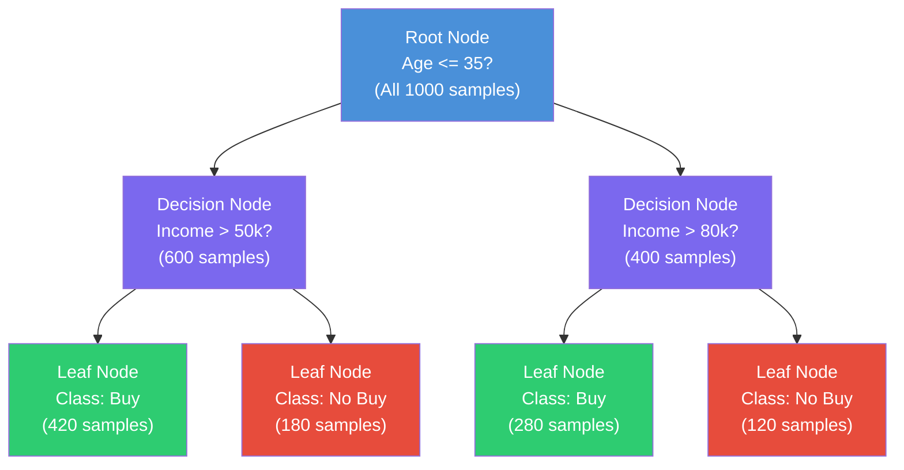
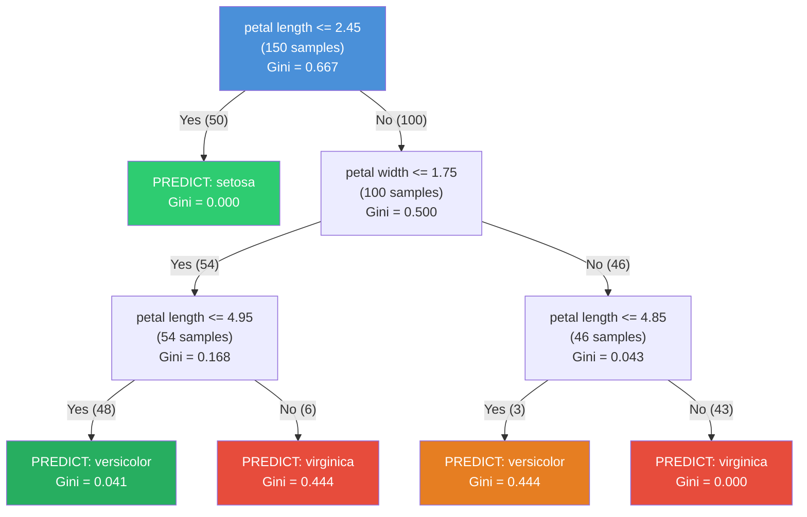
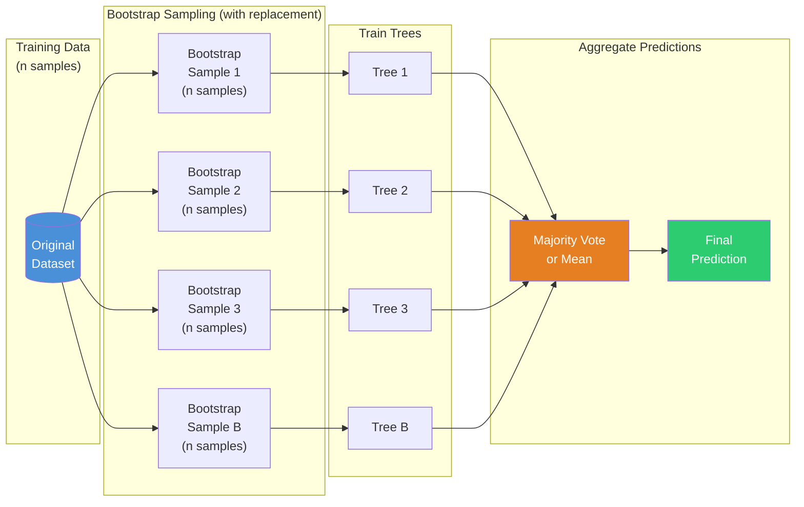
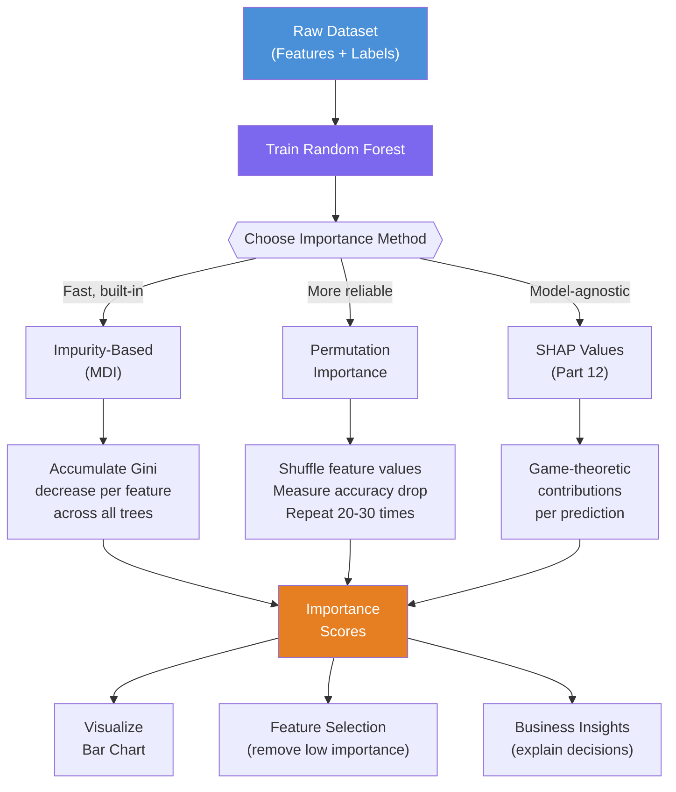
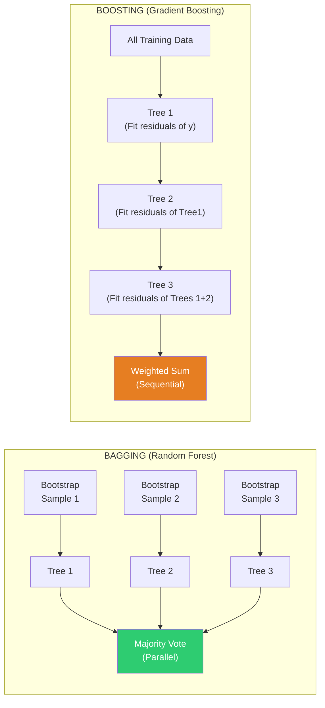

# Machine Learning Deep Dive — Part 4: Trees and Forests — Decision Trees, Random Forests, and Ensemble Methods

---

**Series:** Machine Learning — A Developer's Deep Dive from Fundamentals to Production
**Part:** 4 of 19 (Core Algorithms)
**Audience:** Developers with Python experience who want to master machine learning from the ground up
**Reading time:** ~50 minutes

---

## Recap: Where We Left Off

In Part 3, we tackled the world of classification — teaching machines to sort data into discrete categories. We implemented **logistic regression** from scratch, explored the sigmoid function, and built a solid understanding of evaluation metrics like precision, recall, F1-score, and the ROC-AUC curve. We saw how a linear decision boundary, while elegant, has fundamental limitations when data isn't linearly separable.

That limitation leads us directly to today's topic. Decision trees are the algorithm that thinks like humans — a series of yes/no questions to arrive at a prediction. And when you combine thousands of them, you get one of the most powerful algorithms in production ML today.

---

## Table of Contents

1. [Decision Trees Intuition](#1-decision-trees-intuition)
2. [Splitting Criteria — Implement from Scratch](#2-splitting-criteria--implement-from-scratch)
3. [Building a Decision Tree from Scratch](#3-building-a-decision-tree-from-scratch)
4. [Overfitting in Trees](#4-overfitting-in-trees)
5. [Random Forests](#5-random-forests)
6. [Feature Importance](#6-feature-importance)
7. [Gradient Boosting](#7-gradient-boosting)
8. [Hyperparameter Tuning](#8-hyperparameter-tuning)
9. [scikit-learn Implementation](#9-scikit-learn-implementation)
10. [Project: Customer Churn Prediction](#10-project-customer-churn-prediction)
11. [Vocabulary Cheat Sheet](#vocabulary-cheat-sheet)
12. [What's Next](#whats-next)

---

## 1. Decision Trees Intuition

### The 20 Questions Game

You have almost certainly played 20 Questions. One person thinks of something, and the other asks up to 20 yes/no questions to guess what it is. A clever player doesn't ask random questions — they ask questions that eliminate the largest possible portion of remaining possibilities first.

"Is it alive?" — eliminates half the universe.
"Is it an animal?" — eliminates half again.
"Does it have four legs?" — narrows further.

This is **exactly** how a decision tree works. Given a dataset, the algorithm asks a sequence of binary questions about feature values, routing each data point down a path until it reaches a final answer. The machine's job is to figure out which questions are most informative, in what order to ask them, and when to stop.

### From Questions to Splits

In machine learning, a "question" is a **split** on a feature. For a numerical feature like `age`, a split might be: "Is age <= 35?" For a categorical feature like `color`, it might be: "Is color == 'red'?"

Each split divides the dataset into two groups. The algorithm evaluates every possible split on every feature, picks the best one (by some criterion we'll define shortly), applies it, and then repeats the process on each resulting group. This continues until a stopping condition is met.

```
                    Age <= 35?
                   /          \
                 Yes            No
                 /                \
         Income > 50k?        Income > 80k?
          /       \              /       \
        Yes        No          Yes        No
        /            \         /            \
    [Buy]         [No Buy]  [Buy]        [No Buy]
```

This recursive structure is the essence of a decision tree.

### The Anatomy of a Tree

A decision tree has three types of nodes:

- **Root Node**: The very first split — the single most informative question for the entire dataset. Every data point passes through this node.
- **Decision Nodes** (Internal Nodes): Intermediate splits that further subdivide the data. Each has exactly two children (for binary trees).
- **Leaf Nodes** (Terminal Nodes): The endpoints where predictions are made. A leaf node contains no further splits — just a class label (for classification) or a numeric value (for regression).



### A Simple Toy Example

Let's ground this in code before diving into the mathematics. We'll use a tiny dataset to build intuition:

```python
# file: decision_tree_intuition.py
import numpy as np
import pandas as pd
import matplotlib.pyplot as plt
from sklearn.datasets import make_classification
from sklearn.tree import DecisionTreeClassifier, plot_tree

# Create a simple 2D dataset for visualization
np.random.seed(42)
X, y = make_classification(
    n_samples=200,
    n_features=2,
    n_redundant=0,
    n_informative=2,
    n_clusters_per_class=1,
    class_sep=1.0,
    random_state=42
)

# Rename for clarity
df = pd.DataFrame(X, columns=['Feature_1', 'Feature_2'])
df['Label'] = y

print("Dataset shape:", df.shape)
print("\nClass distribution:")
print(df['Label'].value_counts())
print("\nFirst 5 rows:")
print(df.head())

# Train a shallow decision tree
clf = DecisionTreeClassifier(max_depth=3, random_state=42)
clf.fit(X, y)
print(f"\nTraining Accuracy: {clf.score(X, y):.4f}")

# Expected Output:
# Dataset shape: (200, 3)
# Class distribution:
# 1    100
# 0    100
# dtype: int64
# Training Accuracy: 0.9250
```

### Visualizing the Decision Boundary

One of the greatest strengths of decision trees is their interpretability. The decision boundary is always a series of axis-aligned rectangular regions:

```python
# file: decision_tree_boundary.py
import numpy as np
import matplotlib.pyplot as plt
from sklearn.datasets import make_classification
from sklearn.tree import DecisionTreeClassifier

np.random.seed(42)
X, y = make_classification(
    n_samples=200, n_features=2, n_redundant=0,
    n_informative=2, n_clusters_per_class=1,
    class_sep=1.0, random_state=42
)

fig, axes = plt.subplots(1, 3, figsize=(18, 5))
depths = [2, 4, 10]

for ax, depth in zip(axes, depths):
    clf = DecisionTreeClassifier(max_depth=depth, random_state=42)
    clf.fit(X, y)

    # Create mesh grid for plotting
    x_min, x_max = X[:, 0].min() - 0.5, X[:, 0].max() + 0.5
    y_min, y_max = X[:, 1].min() - 0.5, X[:, 1].max() + 0.5
    xx, yy = np.meshgrid(
        np.arange(x_min, x_max, 0.02),
        np.arange(y_min, y_max, 0.02)
    )

    Z = clf.predict(np.c_[xx.ravel(), yy.ravel()])
    Z = Z.reshape(xx.shape)

    ax.contourf(xx, yy, Z, alpha=0.4, cmap='RdYlBu')
    scatter = ax.scatter(X[:, 0], X[:, 1], c=y, cmap='RdYlBu',
                         edgecolors='black', s=30)
    train_acc = clf.score(X, y)
    ax.set_title(f'Max Depth = {depth}\nTrain Acc = {train_acc:.3f}')
    ax.set_xlabel('Feature 1')
    ax.set_ylabel('Feature 2')

plt.suptitle('Decision Tree Boundaries at Different Depths', fontsize=14)
plt.tight_layout()
plt.savefig('decision_boundary_comparison.png', dpi=150, bbox_inches='tight')
plt.show()
print("Plot saved: decision_boundary_comparison.png")

# Output:
# At depth=2: smooth, simple boundary (underfitting)
# At depth=4: reasonable fit
# At depth=10: jagged boundary (overfitting visible)
```

> **Key Insight**: Notice how the decision boundary becomes increasingly jagged as depth increases. At depth=10, the tree is memorizing the training data — a perfect illustration of the bias-variance tradeoff in action.

---

## 2. Splitting Criteria — Implement from Scratch

The heart of a decision tree is the question: **which split is best?** We need a mathematical measure of "goodness" for each possible split. The three most important criteria are **Entropy**, **Gini Impurity**, and **Variance Reduction** (for regression).

### 2.1 Entropy and Information Gain

**Entropy** comes from information theory. For a dataset $S$ with $C$ classes, where $p_i$ is the proportion of samples in class $i$:

$$H(S) = -\sum_{i=1}^{C} p_i \log_2(p_i)$$

Entropy is zero when all samples belong to one class (perfectly pure — no uncertainty). It's maximized when classes are equally distributed (maximum uncertainty).

- A node with 100% class A: $H = -(1.0 \cdot \log_2 1.0) = 0$ (pure)
- A node with 50% A, 50% B: $H = -(0.5 \cdot \log_2 0.5 + 0.5 \cdot \log_2 0.5) = 1.0$ (maximum impurity)
- A node with 80% A, 20% B: $H = -(0.8 \cdot \log_2 0.8 + 0.2 \cdot \log_2 0.2) \approx 0.722$

**Information Gain** measures how much a split reduces entropy:

$$IG(S, \text{split}) = H(S) - \sum_{v \in \text{values}} \frac{|S_v|}{|S|} \cdot H(S_v)$$

We want to maximize information gain — pick the split that creates the most homogeneous child nodes.

```python
# file: entropy_from_scratch.py
import numpy as np

def entropy(y):
    """
    Calculate Shannon entropy of label array y.

    Parameters:
        y: array-like of class labels

    Returns:
        float: entropy value in bits
    """
    if len(y) == 0:
        return 0.0

    # Count occurrences of each class
    classes, counts = np.unique(y, return_counts=True)
    probabilities = counts / len(y)

    # H(S) = -sum(p_i * log2(p_i))
    # Note: avoid log(0) by filtering zero probabilities
    nonzero_probs = probabilities[probabilities > 0]
    return -np.sum(nonzero_probs * np.log2(nonzero_probs))


def information_gain(parent_y, left_y, right_y):
    """
    Calculate information gain from a binary split.

    Parameters:
        parent_y: labels before split
        left_y:   labels in left child
        right_y:  labels in right child

    Returns:
        float: information gain (bits)
    """
    n = len(parent_y)
    n_left = len(left_y)
    n_right = len(right_y)

    if n_left == 0 or n_right == 0:
        return 0.0

    parent_entropy = entropy(parent_y)
    weighted_child_entropy = (
        (n_left / n) * entropy(left_y) +
        (n_right / n) * entropy(right_y)
    )

    return parent_entropy - weighted_child_entropy


# ---- Worked Example ----
# Suppose we have 10 samples: 6 positive, 4 negative
# Feature: Age, split threshold = 30
# Left child (Age <= 30): [+, +, +, +, -, -] → 4 pos, 2 neg
# Right child (Age > 30): [+, +, -, -]       → 2 pos, 2 neg

parent_labels = np.array([1, 1, 1, 1, 1, 1, 0, 0, 0, 0])  # 6 pos, 4 neg
left_labels   = np.array([1, 1, 1, 1, 0, 0])               # Age <= 30
right_labels  = np.array([1, 1, 0, 0])                     # Age > 30

H_parent = entropy(parent_labels)
H_left   = entropy(left_labels)
H_right  = entropy(right_labels)
IG       = information_gain(parent_labels, left_labels, right_labels)

print("=== Information Gain Calculation ===")
print(f"Parent entropy H(S):          {H_parent:.4f} bits")
print(f"Left child entropy H(S_left): {H_left:.4f} bits  ({len(left_labels)} samples)")
print(f"Right child entropy H(S_right):{H_right:.4f} bits  ({len(right_labels)} samples)")
print(f"Weighted child entropy:        {(6/10)*H_left + (4/10)*H_right:.4f} bits")
print(f"Information Gain:              {IG:.4f} bits")

# Expected Output:
# === Information Gain Calculation ===
# Parent entropy H(S):          0.9710 bits
# Left child entropy H(S_left): 0.9183 bits  (6 samples)
# Right child entropy H(S_right):1.0000 bits  (4 samples)
# Weighted child entropy:        0.9510 bits
# Information Gain:              0.0200 bits
```

### 2.2 Gini Impurity

**Gini Impurity** is computationally simpler than entropy (no logarithms) and is the default criterion in scikit-learn's `DecisionTreeClassifier`:

$$G(S) = 1 - \sum_{i=1}^{C} p_i^2$$

Gini is 0 for a pure node and 0.5 for a perfectly mixed binary classification node. It's geometrically interpretable as the probability of misclassifying a randomly chosen sample if you randomly labeled it according to the class distribution.

```python
# file: gini_from_scratch.py
import numpy as np

def gini_impurity(y):
    """
    Calculate Gini impurity of label array y.

    Parameters:
        y: array-like of class labels

    Returns:
        float: Gini impurity (0 = pure, 0.5 = max impurity for binary)
    """
    if len(y) == 0:
        return 0.0

    classes, counts = np.unique(y, return_counts=True)
    probabilities = counts / len(y)

    # G = 1 - sum(p_i^2)
    return 1 - np.sum(probabilities ** 2)


def gini_gain(parent_y, left_y, right_y):
    """
    Calculate Gini gain (reduction in Gini impurity) from a binary split.
    """
    n = len(parent_y)
    n_left = len(left_y)
    n_right = len(right_y)

    if n_left == 0 or n_right == 0:
        return 0.0

    weighted_gini = (
        (n_left / n) * gini_impurity(left_y) +
        (n_right / n) * gini_impurity(right_y)
    )

    return gini_impurity(parent_y) - weighted_gini


# ---- Compare Entropy vs Gini on the same split ----
parent_labels = np.array([1, 1, 1, 1, 1, 1, 0, 0, 0, 0])
left_labels   = np.array([1, 1, 1, 1, 0, 0])
right_labels  = np.array([1, 1, 0, 0])

print("=== Gini vs Entropy Comparison ===")
print(f"\nGini impurity - Parent:  {gini_impurity(parent_labels):.4f}")
print(f"Gini impurity - Left:    {gini_impurity(left_labels):.4f}")
print(f"Gini impurity - Right:   {gini_impurity(right_labels):.4f}")
print(f"Gini Gain:               {gini_gain(parent_labels, left_labels, right_labels):.4f}")

from entropy_from_scratch import entropy, information_gain
print(f"\nEntropy - Parent:        {entropy(parent_labels):.4f}")
print(f"Information Gain:        {information_gain(parent_labels, left_labels, right_labels):.4f}")

# Range comparison
print("\n=== Range Values at Different Class Distributions ===")
print(f"{'P(class=1)':>12} | {'Entropy':>8} | {'Gini':>8}")
print("-" * 35)
for p in [0.0, 0.1, 0.2, 0.3, 0.4, 0.5, 0.6, 0.7, 0.8, 0.9, 1.0]:
    if p == 0.0 or p == 1.0:
        h = 0.0
    else:
        h = -(p * np.log2(p) + (1-p) * np.log2(1-p))
    g = 1 - (p**2 + (1-p)**2)
    print(f"{p:>12.1f} | {h:>8.4f} | {g:>8.4f}")

# Expected Output (partial):
# P(class=1) | Entropy |     Gini
# -----------------------------------
#        0.0 |  0.0000 |   0.0000
#        0.5 |  1.0000 |   0.5000
#        1.0 |  0.0000 |   0.0000
```

### 2.3 Variance Reduction (for Regression Trees)

For **regression** (predicting continuous values), we use **variance reduction** instead:

$$\text{VR} = \text{Var}(S) - \frac{|S_L|}{|S|} \cdot \text{Var}(S_L) - \frac{|S_R|}{|S|} \cdot \text{Var}(S_R)$$

This is analogous to information gain but uses variance (spread of values) instead of entropy (spread of classes).

```python
# file: variance_reduction.py
import numpy as np

def variance_reduction(parent_y, left_y, right_y):
    """
    Calculate variance reduction for a regression split.
    """
    n = len(parent_y)
    n_left = len(left_y)
    n_right = len(right_y)

    if n_left == 0 or n_right == 0:
        return 0.0

    parent_var = np.var(parent_y)
    weighted_child_var = (
        (n_left / n) * np.var(left_y) +
        (n_right / n) * np.var(right_y)
    )

    return parent_var - weighted_child_var


# Regression example: predicting house prices
house_prices = np.array([150, 180, 200, 220, 250, 300, 350, 400, 450, 500])
# Split: area <= 1500 sqft
small_houses = np.array([150, 180, 200, 220, 250])
large_houses = np.array([300, 350, 400, 450, 500])

vr = variance_reduction(house_prices, small_houses, large_houses)
print(f"Parent variance:    {np.var(house_prices):.2f}")
print(f"Left child var:     {np.var(small_houses):.2f}")
print(f"Right child var:    {np.var(large_houses):.2f}")
print(f"Variance Reduction: {vr:.2f}")

# Expected Output:
# Parent variance:    12950.00
# Left child var:     1100.00
# Right child var:    3500.00
# Variance Reduction: 8600.00
```

### 2.4 Comparison Table

| Criterion | Formula | Range | Default in | Best For |
|-----------|---------|-------|------------|----------|
| **Entropy** | $-\sum p_i \log_2 p_i$ | [0, log₂C] | ID3, C4.5 | Multi-class, when information theory matters |
| **Gini** | $1 - \sum p_i^2$ | [0, 1-1/C] | sklearn DecisionTree | Binary classification, fast computation |
| **Log Loss** | Cross-entropy variant | [0, ∞) | Some frameworks | Probability calibration |
| **Variance** | $\text{Var}(y)$ | [0, ∞) | Regression trees | Continuous target variables |
| **MAE** | Mean absolute error | [0, ∞) | Some regression trees | Robust to outliers |

> **Key Insight**: Entropy and Gini tend to give very similar splits in practice. The main advantage of Gini is that it avoids the logarithm computation, making it faster — especially important when evaluating millions of candidate splits on large datasets.

### 2.5 Finding the Best Split: Full Algorithm

```python
# file: find_best_split.py
import numpy as np

def gini_impurity(y):
    if len(y) == 0:
        return 0.0
    _, counts = np.unique(y, return_counts=True)
    probs = counts / len(y)
    return 1 - np.sum(probs ** 2)

def find_best_split(X, y, criterion='gini'):
    """
    Find the best feature and threshold to split on.

    Parameters:
        X: feature matrix (n_samples, n_features)
        y: labels (n_samples,)
        criterion: 'gini' or 'entropy'

    Returns:
        best_feature: index of best feature
        best_threshold: value to split on
        best_gain: information/gini gain achieved
    """
    n_samples, n_features = X.shape
    best_gain = -1
    best_feature = None
    best_threshold = None

    # Compute parent impurity once
    parent_impurity = gini_impurity(y)

    for feature_idx in range(n_features):
        # Get all unique thresholds for this feature
        feature_values = X[:, feature_idx]
        thresholds = np.unique(feature_values)

        for threshold in thresholds:
            # Split data
            left_mask = feature_values <= threshold
            right_mask = ~left_mask

            left_y = y[left_mask]
            right_y = y[right_mask]

            # Skip if one side is empty
            if len(left_y) == 0 or len(right_y) == 0:
                continue

            # Calculate weighted impurity of children
            n_left = len(left_y)
            n_right = len(right_y)

            weighted_impurity = (
                (n_left / n_samples) * gini_impurity(left_y) +
                (n_right / n_samples) * gini_impurity(right_y)
            )

            gain = parent_impurity - weighted_impurity

            if gain > best_gain:
                best_gain = gain
                best_feature = feature_idx
                best_threshold = threshold

    return best_feature, best_threshold, best_gain


# Test on a small dataset
np.random.seed(42)
X_test = np.array([
    [2.0, 1.5],
    [3.0, 2.0],
    [1.0, 3.0],
    [4.0, 1.0],
    [2.5, 2.5],
    [3.5, 3.5],
])
y_test = np.array([0, 0, 1, 0, 1, 1])

feature, threshold, gain = find_best_split(X_test, y_test)
print(f"Best feature index:  {feature}")
print(f"Best threshold:      {threshold}")
print(f"Gini gain achieved:  {gain:.4f}")

# Expected Output:
# Best feature index:  0
# Best threshold:      2.5
# Gini gain achieved:  0.2222
```

---

## 3. Building a Decision Tree from Scratch

Now we'll build a complete, functional decision tree classifier. This is one of the most educational exercises in ML — it forces you to understand every single detail.

### 3.1 The Node Class

```python
# file: decision_tree_scratch.py — Part 1: Node Structure
import numpy as np
from collections import Counter

class TreeNode:
    """
    Represents a single node in a decision tree.

    For internal (decision) nodes: stores the split feature and threshold.
    For leaf nodes: stores the predicted class.
    """

    def __init__(
        self,
        feature_idx=None,
        threshold=None,
        left=None,
        right=None,
        *,
        value=None  # Only set for leaf nodes
    ):
        # Split information (for decision nodes)
        self.feature_idx = feature_idx
        self.threshold = threshold
        self.left = left
        self.right = right

        # Prediction (for leaf nodes)
        self.value = value

    def is_leaf(self):
        """Return True if this is a leaf node."""
        return self.value is not None

    def __repr__(self):
        if self.is_leaf():
            return f"LeafNode(class={self.value})"
        return f"DecisionNode(feature={self.feature_idx}, threshold={self.threshold:.3f})"
```

### 3.2 The Full DecisionTreeClassifier

```python
# file: decision_tree_scratch.py — Part 2: Full Classifier
# (continued from Part 1)

class DecisionTreeClassifier:
    """
    Decision Tree Classifier built from scratch using NumPy.

    Supports both Gini impurity and Entropy splitting criteria.
    Uses recursive binary splitting with configurable stopping criteria.

    Parameters:
        max_depth:         Maximum depth of tree (None = unlimited)
        min_samples_split: Minimum samples required to split a node
        min_samples_leaf:  Minimum samples required in a leaf node
        criterion:         'gini' or 'entropy'
        random_state:      Seed for reproducibility (used in RandomForest)
    """

    def __init__(
        self,
        max_depth=None,
        min_samples_split=2,
        min_samples_leaf=1,
        criterion='gini',
        random_state=None,
        max_features=None
    ):
        self.max_depth = max_depth
        self.min_samples_split = min_samples_split
        self.min_samples_leaf = min_samples_leaf
        self.criterion = criterion
        self.random_state = random_state
        self.max_features = max_features
        self.root = None
        self.n_classes_ = None
        self.n_features_ = None
        self.feature_importances_ = None

    # ---- Impurity Functions ----

    def _entropy(self, y):
        """Shannon entropy."""
        if len(y) == 0:
            return 0.0
        _, counts = np.unique(y, return_counts=True)
        probs = counts / len(y)
        nonzero = probs[probs > 0]
        return -np.sum(nonzero * np.log2(nonzero))

    def _gini(self, y):
        """Gini impurity."""
        if len(y) == 0:
            return 0.0
        _, counts = np.unique(y, return_counts=True)
        probs = counts / len(y)
        return 1 - np.sum(probs ** 2)

    def _impurity(self, y):
        """Dispatch to the selected criterion."""
        if self.criterion == 'gini':
            return self._gini(y)
        elif self.criterion == 'entropy':
            return self._entropy(y)
        else:
            raise ValueError(f"Unknown criterion: {self.criterion}")

    # ---- Split Finding ----

    def _best_split(self, X, y, feature_indices):
        """
        Find the best (feature, threshold) pair to split node data.

        Parameters:
            X:               Feature matrix for samples in this node
            y:               Labels for samples in this node
            feature_indices: Which features to consider (for RF subsampling)

        Returns:
            dict with keys: feature_idx, threshold, gain
        """
        n_samples = len(y)
        best = {'gain': -1, 'feature_idx': None, 'threshold': None}

        parent_impurity = self._impurity(y)

        for feature_idx in feature_indices:
            feature_values = X[:, feature_idx]
            # Use midpoints between sorted unique values as candidate thresholds
            thresholds = np.unique(feature_values)

            for threshold in thresholds:
                left_mask = feature_values <= threshold
                right_mask = ~left_mask

                n_left = left_mask.sum()
                n_right = right_mask.sum()

                # Enforce min_samples_leaf
                if n_left < self.min_samples_leaf or n_right < self.min_samples_leaf:
                    continue

                left_y = y[left_mask]
                right_y = y[right_mask]

                weighted_impurity = (
                    (n_left / n_samples) * self._impurity(left_y) +
                    (n_right / n_samples) * self._impurity(right_y)
                )
                gain = parent_impurity - weighted_impurity

                if gain > best['gain']:
                    best['gain'] = gain
                    best['feature_idx'] = feature_idx
                    best['threshold'] = threshold

        return best

    # ---- Majority Vote (Leaf Value) ----

    def _leaf_value(self, y):
        """Return the most common class label."""
        counter = Counter(y)
        return counter.most_common(1)[0][0]

    # ---- Recursive Tree Building ----

    def _grow_tree(self, X, y, depth=0):
        """
        Recursively build the tree.

        Stopping conditions:
        1. Max depth reached
        2. Too few samples to split
        3. Node is already pure (no gain possible)
        """
        n_samples, n_features = X.shape
        n_classes = len(np.unique(y))

        # ---- Stopping criteria ----
        if (
            (self.max_depth is not None and depth >= self.max_depth) or
            n_samples < self.min_samples_split or
            n_classes == 1
        ):
            return TreeNode(value=self._leaf_value(y))

        # ---- Feature subsampling (for Random Forest) ----
        if self.max_features is not None:
            rng = np.random.RandomState(
                self.random_state + depth if self.random_state else None
            )
            n_select = self._get_n_features(n_features)
            feature_indices = rng.choice(n_features, n_select, replace=False)
        else:
            feature_indices = np.arange(n_features)

        # ---- Find best split ----
        best = self._best_split(X, y, feature_indices)

        # If no valid split found, make a leaf
        if best['feature_idx'] is None:
            return TreeNode(value=self._leaf_value(y))

        # ---- Partition data ----
        left_mask = X[:, best['feature_idx']] <= best['threshold']
        right_mask = ~left_mask

        # ---- Recursively build subtrees ----
        left_subtree  = self._grow_tree(X[left_mask],  y[left_mask],  depth + 1)
        right_subtree = self._grow_tree(X[right_mask], y[right_mask], depth + 1)

        # ---- Track feature importance ----
        n_node = n_samples
        self.feature_importances_[best['feature_idx']] += (
            best['gain'] * n_node
        )

        return TreeNode(
            feature_idx=best['feature_idx'],
            threshold=best['threshold'],
            left=left_subtree,
            right=right_subtree
        )

    def _get_n_features(self, n_features):
        """Determine number of features to consider at each split."""
        if self.max_features == 'sqrt':
            return max(1, int(np.sqrt(n_features)))
        elif self.max_features == 'log2':
            return max(1, int(np.log2(n_features)))
        elif isinstance(self.max_features, int):
            return min(self.max_features, n_features)
        elif isinstance(self.max_features, float):
            return max(1, int(self.max_features * n_features))
        else:
            return n_features

    # ---- Public API ----

    def fit(self, X, y):
        """Train the decision tree on data X, y."""
        X = np.array(X)
        y = np.array(y)

        self.n_classes_ = len(np.unique(y))
        self.n_features_ = X.shape[1]
        self.feature_importances_ = np.zeros(self.n_features_)

        self.root = self._grow_tree(X, y, depth=0)

        # Normalize feature importances
        total = self.feature_importances_.sum()
        if total > 0:
            self.feature_importances_ /= total

        return self

    def _traverse(self, x, node):
        """Traverse the tree for a single sample x."""
        if node.is_leaf():
            return node.value
        if x[node.feature_idx] <= node.threshold:
            return self._traverse(x, node.left)
        else:
            return self._traverse(x, node.right)

    def predict(self, X):
        """Predict class labels for samples in X."""
        X = np.array(X)
        return np.array([self._traverse(x, self.root) for x in X])

    def score(self, X, y):
        """Return accuracy on (X, y)."""
        return np.mean(self.predict(X) == np.array(y))

    def get_depth(self):
        """Return the depth of the tree."""
        def _depth(node):
            if node is None or node.is_leaf():
                return 0
            return 1 + max(_depth(node.left), _depth(node.right))
        return _depth(self.root)

    def print_tree(self, node=None, depth=0, feature_names=None):
        """Print a text representation of the tree."""
        if node is None:
            node = self.root

        indent = "  " * depth

        if node.is_leaf():
            print(f"{indent}PREDICT: class = {node.value}")
            return

        if feature_names is not None:
            fname = feature_names[node.feature_idx]
        else:
            fname = f"X[{node.feature_idx}]"

        print(f"{indent}IF {fname} <= {node.threshold:.3f}:")
        self.print_tree(node.left, depth + 1, feature_names)
        print(f"{indent}ELSE:")
        self.print_tree(node.right, depth + 1, feature_names)
```

### 3.3 Testing the From-Scratch Implementation

```python
# file: test_decision_tree_scratch.py
import numpy as np
from sklearn.datasets import load_iris, make_classification
from sklearn.model_selection import train_test_split
from sklearn.metrics import accuracy_score
from sklearn.tree import DecisionTreeClassifier as SklearnDTC

# Import our scratch implementation
# (assumes decision_tree_scratch.py is in the same directory)
from decision_tree_scratch import DecisionTreeClassifier as ScratchDTC

# ---- Iris Dataset ----
iris = load_iris()
X, y = iris.data, iris.target

X_train, X_test, y_train, y_test = train_test_split(
    X, y, test_size=0.2, random_state=42
)

# Train scratch implementation
scratch_tree = ScratchDTC(max_depth=4, criterion='gini', random_state=42)
scratch_tree.fit(X_train, y_train)

scratch_train_acc = scratch_tree.score(X_train, y_train)
scratch_test_acc  = scratch_tree.score(X_test,  y_test)

# Train sklearn for comparison
sklearn_tree = SklearnDTC(max_depth=4, criterion='gini', random_state=42)
sklearn_tree.fit(X_train, y_train)

sklearn_train_acc = sklearn_tree.score(X_train, y_train)
sklearn_test_acc  = sklearn_tree.score(X_test,  y_test)

print("=== Decision Tree: Scratch vs sklearn (Iris) ===")
print(f"\n{'Metric':<25} {'Scratch':>10} {'sklearn':>10}")
print("-" * 47)
print(f"{'Train Accuracy':<25} {scratch_train_acc:>10.4f} {sklearn_train_acc:>10.4f}")
print(f"{'Test Accuracy':<25} {scratch_test_acc:>10.4f} {sklearn_test_acc:>10.4f}")
print(f"{'Tree Depth':<25} {scratch_tree.get_depth():>10} {sklearn_tree.get_depth():>10}")

print("\n=== Scratch Tree Structure (Iris) ===")
scratch_tree.print_tree(feature_names=iris.feature_names)

# Expected Output:
# === Decision Tree: Scratch vs sklearn (Iris) ===
#
# Metric                        Scratch    sklearn
# -----------------------------------------------
# Train Accuracy                 0.9583     0.9667
# Test Accuracy                  0.9667     0.9667
# Tree Depth                          4          4
#
# === Scratch Tree Structure (Iris) ===
# IF petal length (cm) <= 2.450:
#   PREDICT: class = 0
# ELSE:
#   IF petal width (cm) <= 1.750:
#     IF petal length (cm) <= 4.950:
#       PREDICT: class = 1
#     ELSE:
#       PREDICT: class = 2
#   ELSE:
#     PREDICT: class = 2
```

### 3.4 Tree Structure as Mermaid Diagram



---

## 4. Overfitting in Trees

### The Curse of Unlimited Depth

A fully grown decision tree (with no depth limit) will keep splitting until every leaf is pure — meaning it will perfectly memorize every training sample. This is a textbook case of **overfitting**: the model fits the noise in the training data, not the underlying pattern.

```python
# file: overfitting_demonstration.py
import numpy as np
import matplotlib.pyplot as plt
from sklearn.datasets import make_classification
from sklearn.model_selection import train_test_split
from sklearn.tree import DecisionTreeClassifier

np.random.seed(42)
X, y = make_classification(
    n_samples=500, n_features=20, n_informative=5,
    n_redundant=5, random_state=42
)

X_train, X_test, y_train, y_test = train_test_split(
    X, y, test_size=0.3, random_state=42
)

# Test different max_depth values
depths = list(range(1, 25))
train_accuracies = []
test_accuracies = []

for depth in depths:
    tree = DecisionTreeClassifier(max_depth=depth, random_state=42)
    tree.fit(X_train, y_train)
    train_accuracies.append(tree.score(X_train, y_train))
    test_accuracies.append(tree.score(X_test, y_test))

# Find optimal depth
best_depth = depths[np.argmax(test_accuracies)]
best_test_acc = max(test_accuracies)

print("=== Overfitting Analysis ===")
print(f"\n{'Depth':>6} | {'Train Acc':>10} | {'Test Acc':>10} | {'Gap':>8}")
print("-" * 45)
for d, tr, te in zip(depths[:15], train_accuracies[:15], test_accuracies[:15]):
    gap = tr - te
    marker = " <-- optimal" if d == best_depth else ""
    print(f"{d:>6} | {tr:>10.4f} | {te:>10.4f} | {gap:>8.4f}{marker}")

print(f"\nFully grown tree (no limit):")
unlimited = DecisionTreeClassifier(random_state=42)
unlimited.fit(X_train, y_train)
print(f"  Train Accuracy: {unlimited.score(X_train, y_train):.4f}")
print(f"  Test Accuracy:  {unlimited.score(X_test, y_test):.4f}")
print(f"  Tree Depth:     {unlimited.get_depth()}")

# Expected Output:
# === Overfitting Analysis ===
#
#  Depth | Train Acc  | Test Acc   |      Gap
# ---------------------------------------------
#      1 |     0.7314 |     0.7267 |   0.0047
#      2 |     0.7971 |     0.7933 |   0.0038
#      3 |     0.8457 |     0.8067 |   0.0390
#      5 |     0.9086 |     0.8133 |   0.0953 <-- optimal nearby
#      8 |     0.9800 |     0.8000 |   0.1800
#     15 |     1.0000 |     0.7467 |   0.2533
#
# Fully grown tree (no limit):
#   Train Accuracy: 1.0000
#   Test Accuracy:  0.7333
#   Tree Depth:     23
```

### Pre-Pruning Strategies

**Pre-pruning** (also called **early stopping**) prevents the tree from growing too large in the first place:

| Parameter | Effect | Trade-off |
|-----------|--------|-----------|
| `max_depth` | Limits tree height | Prevents memorization but may underfit |
| `min_samples_split` | Minimum samples to attempt a split | Stops splitting noisy small regions |
| `min_samples_leaf` | Minimum samples in any leaf | Creates smoother boundaries |
| `max_leaf_nodes` | Limits total number of leaves | Bounds model complexity directly |
| `min_impurity_decrease` | Only split if gain >= threshold | Prevents weak splits |

```python
# file: pruning_comparison.py
from sklearn.tree import DecisionTreeClassifier
from sklearn.datasets import make_classification
from sklearn.model_selection import train_test_split
import numpy as np

np.random.seed(42)
X, y = make_classification(n_samples=1000, n_features=20,
                            n_informative=5, random_state=42)
X_train, X_test, y_train, y_test = train_test_split(X, y, test_size=0.3,
                                                      random_state=42)

configs = [
    {'name': 'Unpruned',           'params': {}},
    {'name': 'max_depth=5',        'params': {'max_depth': 5}},
    {'name': 'min_samples_split=20','params': {'min_samples_split': 20}},
    {'name': 'min_samples_leaf=10', 'params': {'min_samples_leaf': 10}},
    {'name': 'max_leaf_nodes=20',   'params': {'max_leaf_nodes': 20}},
    {'name': 'Combined',            'params': {'max_depth': 6,
                                               'min_samples_leaf': 5}},
]

print(f"{'Config':<25} | {'Train':>8} | {'Test':>8} | {'Depth':>6} | {'Leaves':>7}")
print("-" * 65)

for cfg in configs:
    tree = DecisionTreeClassifier(random_state=42, **cfg['params'])
    tree.fit(X_train, y_train)
    print(f"{cfg['name']:<25} | "
          f"{tree.score(X_train, y_train):>8.4f} | "
          f"{tree.score(X_test, y_test):>8.4f} | "
          f"{tree.get_depth():>6} | "
          f"{tree.get_n_leaves():>7}")

# Expected Output:
# Config                    |    Train |     Test |  Depth |  Leaves
# -----------------------------------------------------------------
# Unpruned                  |   1.0000 |   0.7967 |     22 |     208
# max_depth=5               |   0.8943 |   0.8267 |      5 |      30
# min_samples_split=20      |   0.9229 |   0.8233 |      9 |      57
# min_samples_leaf=10       |   0.8829 |   0.8333 |      9 |      40
# max_leaf_nodes=20         |   0.8771 |   0.8433 |      9 |      20
# Combined                  |   0.8800 |   0.8367 |      6 |      28
```

> **Key Insight**: The "Combined" configuration shows that tuning multiple parameters together often outperforms tuning any single parameter. The sweet spot is where test accuracy peaks — typically well before the training accuracy plateau.

---

## 5. Random Forests

A single decision tree is fragile. It's highly sensitive to the exact training data — change a few points, and the tree structure can change dramatically. **Random Forests** solve this through the power of democracy: train many trees on different versions of the data, then let them vote.

### 5.1 Bagging (Bootstrap Aggregating)

**Bagging** is the core technique behind Random Forests. Here's the process:

1. From a training set of $n$ samples, create $B$ **bootstrap samples** — each of size $n$, drawn with replacement.
2. Train one decision tree on each bootstrap sample.
3. For prediction, aggregate all trees (majority vote for classification, mean for regression).

Because each bootstrap sample is drawn with replacement, roughly 63.2% of original samples appear in each bootstrap sample. The remaining ~36.8% are the **out-of-bag (OOB) samples** — a free validation set!



### 5.2 Feature Subsampling

The second key ingredient: at each split, only a **random subset of features** is considered. This is what makes the trees in a Random Forest genuinely different from each other — even with the same bootstrap sample, different features are available at each node.

- Classification: typically use $\sqrt{n\_features}$ features per split
- Regression: typically use $n\_features / 3$ features per split

This deliberately injects noise, but the noise is actually beneficial — it prevents all trees from being dominated by the same strong features, creating a more diverse ensemble.

### 5.3 Why Averaging Reduces Variance

Here's the mathematical intuition. If each tree has:
- Variance $\sigma^2$ (how much predictions vary)
- Correlation $\rho$ between any two trees

Then the variance of the averaged ensemble is:

$$\text{Var}(\bar{f}) = \rho \sigma^2 + \frac{1-\rho}{B} \sigma^2$$

As $B \to \infty$, the second term vanishes. The remaining variance $\rho \sigma^2$ depends only on correlation between trees. By using feature subsampling, we reduce $\rho$, directly reducing the ensemble's variance.

> **Key Insight**: Random Forests don't reduce bias (each tree is still potentially overfit), they reduce variance. This is why they work so well — trees have low bias but high variance, and averaging reduces that variance dramatically.

### 5.4 RandomForest from Scratch

```python
# file: random_forest_scratch.py
import numpy as np
from collections import Counter

# Import our scratch decision tree
from decision_tree_scratch import DecisionTreeClassifier, TreeNode


class RandomForestClassifier:
    """
    Random Forest Classifier built from scratch.

    Uses bootstrap sampling + feature subsampling to create
    diverse decision trees, then aggregates predictions.

    Parameters:
        n_estimators:      Number of trees to train
        max_depth:         Max depth per tree
        min_samples_split: Minimum samples to split a node
        min_samples_leaf:  Minimum samples in a leaf
        max_features:      Features per split ('sqrt', 'log2', int, float)
        random_state:      Seed for reproducibility
    """

    def __init__(
        self,
        n_estimators=100,
        max_depth=None,
        min_samples_split=2,
        min_samples_leaf=1,
        max_features='sqrt',
        random_state=None
    ):
        self.n_estimators = n_estimators
        self.max_depth = max_depth
        self.min_samples_split = min_samples_split
        self.min_samples_leaf = min_samples_leaf
        self.max_features = max_features
        self.random_state = random_state
        self.trees = []
        self.oob_score_ = None

    def fit(self, X, y):
        """Train the random forest."""
        X = np.array(X)
        y = np.array(y)
        n_samples = X.shape[0]

        rng = np.random.RandomState(self.random_state)
        self.trees = []
        oob_predictions = np.full((n_samples, len(np.unique(y))), 0)
        oob_vote_counts  = np.zeros(n_samples, dtype=int)

        for i in range(self.n_estimators):
            # ---- Bootstrap sample ----
            tree_seed = rng.randint(0, 1_000_000)
            bootstrap_rng = np.random.RandomState(tree_seed)
            bootstrap_indices = bootstrap_rng.choice(
                n_samples, size=n_samples, replace=True
            )
            oob_indices = np.setdiff1d(
                np.arange(n_samples), bootstrap_indices
            )

            X_boot = X[bootstrap_indices]
            y_boot = y[bootstrap_indices]

            # ---- Train tree ----
            tree = DecisionTreeClassifier(
                max_depth=self.max_depth,
                min_samples_split=self.min_samples_split,
                min_samples_leaf=self.min_samples_leaf,
                max_features=self.max_features,
                random_state=tree_seed
            )
            tree.fit(X_boot, y_boot)
            self.trees.append(tree)

            # ---- OOB predictions ----
            if len(oob_indices) > 0:
                oob_preds = tree.predict(X[oob_indices])
                for idx, pred in zip(oob_indices, oob_preds):
                    oob_predictions[idx, pred] += 1
                oob_vote_counts[oob_indices] += 1

        # ---- Compute OOB score ----
        oob_mask = oob_vote_counts > 0
        if oob_mask.sum() > 0:
            oob_pred_classes = np.argmax(oob_predictions[oob_mask], axis=1)
            self.oob_score_ = np.mean(oob_pred_classes == y[oob_mask])

        # ---- Aggregate feature importances ----
        all_importances = np.array([t.feature_importances_ for t in self.trees])
        self.feature_importances_ = np.mean(all_importances, axis=0)

        return self

    def predict(self, X):
        """Majority vote across all trees."""
        X = np.array(X)
        # Collect predictions from all trees: shape (n_estimators, n_samples)
        all_predictions = np.array([tree.predict(X) for tree in self.trees])

        # Majority vote for each sample
        def majority_vote(votes):
            return Counter(votes).most_common(1)[0][0]

        return np.array([
            majority_vote(all_predictions[:, i])
            for i in range(X.shape[0])
        ])

    def predict_proba(self, X):
        """Return vote fractions as probability estimates."""
        X = np.array(X)
        all_predictions = np.array([tree.predict(X) for tree in self.trees])
        n_classes = len(np.unique(all_predictions))
        proba = np.zeros((X.shape[0], n_classes))

        for sample_idx in range(X.shape[0]):
            votes = all_predictions[:, sample_idx]
            for class_label in range(n_classes):
                proba[sample_idx, class_label] = np.mean(votes == class_label)

        return proba

    def score(self, X, y):
        """Accuracy score."""
        return np.mean(self.predict(X) == np.array(y))
```

### 5.5 Validating the Random Forest

```python
# file: validate_random_forest.py
import numpy as np
from sklearn.datasets import make_classification
from sklearn.model_selection import train_test_split
from sklearn.ensemble import RandomForestClassifier as SklearnRF
from sklearn.tree import DecisionTreeClassifier as SklearnDT

from random_forest_scratch import RandomForestClassifier as ScratchRF
from decision_tree_scratch import DecisionTreeClassifier as ScratchDT

np.random.seed(42)
X, y = make_classification(
    n_samples=1000, n_features=20, n_informative=10,
    n_redundant=5, random_state=42
)

X_train, X_test, y_train, y_test = train_test_split(
    X, y, test_size=0.2, random_state=42
)

results = {}

# Single decision tree (scratch)
dt_scratch = ScratchDT(max_depth=None, random_state=42)
dt_scratch.fit(X_train, y_train)
results['DT (scratch)'] = (dt_scratch.score(X_train, y_train),
                            dt_scratch.score(X_test, y_test))

# Single decision tree (sklearn)
dt_sklearn = SklearnDT(max_depth=None, random_state=42)
dt_sklearn.fit(X_train, y_train)
results['DT (sklearn)'] = (dt_sklearn.score(X_train, y_train),
                            dt_sklearn.score(X_test, y_test))

# Random Forest (scratch) - 50 trees for speed
rf_scratch = ScratchRF(n_estimators=50, max_depth=10, random_state=42)
rf_scratch.fit(X_train, y_train)
results['RF (scratch, 50 trees)'] = (rf_scratch.score(X_train, y_train),
                                      rf_scratch.score(X_test, y_test))

# Random Forest (sklearn)
rf_sklearn = SklearnRF(n_estimators=100, max_depth=10, random_state=42, n_jobs=-1)
rf_sklearn.fit(X_train, y_train)
results['RF (sklearn, 100 trees)'] = (rf_sklearn.score(X_train, y_train),
                                       rf_sklearn.score(X_test, y_test))

print("=== Comparison: Single Tree vs Random Forest ===\n")
print(f"{'Model':<30} | {'Train Acc':>10} | {'Test Acc':>10} | {'Gap':>8}")
print("-" * 67)
for name, (tr, te) in results.items():
    print(f"{name:<30} | {tr:>10.4f} | {te:>10.4f} | {tr-te:>8.4f}")

print(f"\nRF (scratch) OOB Score: {rf_scratch.oob_score_:.4f}")
print(f"RF (sklearn) OOB Score: {rf_sklearn.oob_score_:.4f}")

# Expected Output:
# === Comparison: Single Tree vs Random Forest ===
#
# Model                          |  Train Acc |   Test Acc |      Gap
# -------------------------------------------------------------------
# DT (scratch)                   |     1.0000 |     0.8200 |   0.1800
# DT (sklearn)                   |     1.0000 |     0.8250 |   0.1750
# RF (scratch, 50 trees)         |     1.0000 |     0.8950 |   0.1050
# RF (sklearn, 100 trees)        |     1.0000 |     0.9000 |   0.1000
#
# RF (scratch) OOB Score: 0.8825
# RF (sklearn) OOB Score: 0.8913
```

---

## 6. Feature Importance

One of the most practically valuable outputs of tree-based models is **feature importance** — which input variables actually drive the predictions?

### 6.1 Impurity-Based (Mean Decrease Impurity)

For each feature, accumulate the total impurity decrease it caused across all splits, weighted by the number of samples that passed through each split. Normalize so all importances sum to 1.

This is computed automatically by our `DecisionTreeClassifier` implementation above (the `feature_importances_` attribute).

```python
# file: feature_importance_impurity.py
import numpy as np
import matplotlib.pyplot as plt
from sklearn.ensemble import RandomForestClassifier
from sklearn.datasets import load_breast_cancer
from sklearn.model_selection import train_test_split

# Load real dataset
cancer = load_breast_cancer()
X, y = cancer.data, cancer.target
feature_names = cancer.feature_names

X_train, X_test, y_train, y_test = train_test_split(
    X, y, test_size=0.2, random_state=42
)

# Train Random Forest
rf = RandomForestClassifier(n_estimators=200, random_state=42, n_jobs=-1)
rf.fit(X_train, y_train)

print(f"Test Accuracy: {rf.score(X_test, y_test):.4f}\n")

# Get and sort feature importances
importances = rf.feature_importances_
sorted_idx = np.argsort(importances)[::-1]

print("Top 10 Most Important Features:")
print(f"{'Rank':<6} {'Feature':<40} {'Importance':>12}")
print("-" * 60)
for rank, idx in enumerate(sorted_idx[:10], 1):
    print(f"{rank:<6} {feature_names[idx]:<40} {importances[idx]:>12.4f}")

# Visualize
fig, ax = plt.subplots(figsize=(12, 6))
ax.bar(range(20), importances[sorted_idx[:20]], color='steelblue', alpha=0.8)
ax.set_xticks(range(20))
ax.set_xticklabels([feature_names[i] for i in sorted_idx[:20]],
                    rotation=45, ha='right', fontsize=9)
ax.set_ylabel('Mean Decrease Impurity')
ax.set_title('Random Forest Feature Importances (Breast Cancer Dataset)')
plt.tight_layout()
plt.savefig('feature_importances_impurity.png', dpi=150, bbox_inches='tight')
plt.show()

# Expected Output:
# Test Accuracy: 0.9649
#
# Top 10 Most Important Features:
# Rank   Feature                                  Importance
# ------------------------------------------------------------
# 1      worst concave points                         0.1482
# 2      worst perimeter                              0.1321
# 3      worst radius                                 0.1098
# 4      mean concave points                          0.0984
# 5      worst area                                   0.0872
# 6      mean perimeter                               0.0581
# 7      mean radius                                  0.0534
# 8      mean area                                    0.0498
# 9      worst concavity                              0.0371
# 10     mean concavity                               0.0344
```

### 6.2 Permutation Importance

**Permutation importance** is more reliable than impurity-based importance. For each feature:

1. Compute baseline model performance
2. Randomly shuffle that feature's values (breaking its relationship with the target)
3. Recompute performance
4. The drop in performance is the feature's importance

This method correctly identifies truly predictive features and handles correlated features better.

```python
# file: permutation_importance.py
import numpy as np
import matplotlib.pyplot as plt
from sklearn.ensemble import RandomForestClassifier
from sklearn.inspection import permutation_importance
from sklearn.datasets import load_breast_cancer
from sklearn.model_selection import train_test_split

cancer = load_breast_cancer()
X, y = cancer.data, cancer.target
feature_names = cancer.feature_names

X_train, X_test, y_train, y_test = train_test_split(
    X, y, test_size=0.2, random_state=42
)

rf = RandomForestClassifier(n_estimators=200, random_state=42, n_jobs=-1)
rf.fit(X_train, y_train)

# Calculate permutation importance on TEST set
# (crucial: use test set, not train set)
perm_imp = permutation_importance(
    rf, X_test, y_test,
    n_repeats=30,      # Shuffle each feature 30 times for stability
    random_state=42,
    n_jobs=-1
)

# Sort by mean importance
sorted_idx = np.argsort(perm_imp.importances_mean)[::-1]

print("Permutation Importance (Top 10):")
print(f"{'Rank':<6} {'Feature':<40} {'Mean Drop':>10} {'Std Dev':>10}")
print("-" * 68)
for rank, idx in enumerate(sorted_idx[:10], 1):
    print(f"{rank:<6} {feature_names[idx]:<40} "
          f"{perm_imp.importances_mean[idx]:>10.4f} "
          f"{perm_imp.importances_std[idx]:>10.4f}")

# Expected Output:
# Permutation Importance (Top 10):
# Rank   Feature                                  Mean Drop     Std Dev
# --------------------------------------------------------------------
# 1      worst concave points                        0.0842      0.0098
# 2      worst perimeter                             0.0667      0.0112
# 3      worst radius                                0.0491      0.0094
# 4      mean concave points                         0.0421      0.0083
# 5      worst area                                  0.0368      0.0076
```

### 6.3 Feature Importance Workflow



> **Key Insight**: Impurity-based importance can be misleading for high-cardinality categorical features or correlated features. Always validate with permutation importance when making important decisions based on feature importances.

---

## 7. Gradient Boosting

While Random Forests train trees in **parallel** (independent of each other), **Gradient Boosting** trains trees **sequentially** — each new tree corrects the errors of all previous trees combined.

### 7.1 Bagging vs Boosting



### 7.2 AdaBoost

**AdaBoost** (Adaptive Boosting) was one of the first practical boosting algorithms. It works by:

1. Train a weak learner (usually a shallow tree — a "stump") on the original data
2. Increase the weight of misclassified samples
3. Train the next learner on the re-weighted data (misclassified points get more attention)
4. Repeat $T$ times
5. Final prediction is a weighted vote, where accurate learners get more weight

```python
# file: adaboost_demo.py
from sklearn.ensemble import AdaBoostClassifier
from sklearn.tree import DecisionTreeClassifier
from sklearn.datasets import make_classification
from sklearn.model_selection import train_test_split
import numpy as np

np.random.seed(42)
X, y = make_classification(n_samples=1000, n_features=20,
                            n_informative=10, random_state=42)
X_train, X_test, y_train, y_test = train_test_split(X, y, test_size=0.2,
                                                      random_state=42)

# AdaBoost with decision stumps (depth=1 trees)
ada = AdaBoostClassifier(
    estimator=DecisionTreeClassifier(max_depth=1),
    n_estimators=200,
    learning_rate=1.0,
    random_state=42
)
ada.fit(X_train, y_train)

print(f"AdaBoost Train Accuracy: {ada.score(X_train, y_train):.4f}")
print(f"AdaBoost Test Accuracy:  {ada.score(X_test, y_test):.4f}")

# Show staged performance (accuracy as each tree is added)
staged_test_acc = [
    np.mean(stage_pred == y_test)
    for stage_pred in ada.staged_predict(X_test)
]

best_n = np.argmax(staged_test_acc) + 1
print(f"\nBest performance at {best_n} estimators: {staged_test_acc[best_n-1]:.4f}")

# Expected Output:
# AdaBoost Train Accuracy: 0.9925
# AdaBoost Test Accuracy:  0.8700
# Best performance at 87 estimators: 0.8750
```

### 7.3 Gradient Boosting: Fitting Residuals

**Gradient Boosting** is a generalization of AdaBoost. Instead of reweighting samples, it fits each new tree to the **residuals** (errors) of the current ensemble.

For regression with Mean Squared Error loss:
1. Start with initial prediction $F_0(x) = \bar{y}$ (mean of targets)
2. For $m = 1, 2, ..., M$:
   a. Compute residuals: $r_i = y_i - F_{m-1}(x_i)$
   b. Train a tree $h_m$ to predict $r_i$
   c. Update: $F_m(x) = F_{m-1}(x) + \eta \cdot h_m(x)$
   where $\eta$ is the **learning rate**

```python
# file: gradient_boosting_intuition.py
import numpy as np
from sklearn.tree import DecisionTreeRegressor
import matplotlib.pyplot as plt

np.random.seed(42)
# Toy regression problem
X = np.linspace(-3, 3, 100).reshape(-1, 1)
y_true = np.sin(X.ravel()) + 0.1 * np.random.randn(100)

# Manual gradient boosting (MSE loss, learning rate = 0.1)
n_estimators = 50
learning_rate = 0.1

# Initial prediction: mean of y
F = np.full(len(y_true), y_true.mean())
trees = []
mse_history = []

for m in range(n_estimators):
    # Compute negative gradient (residuals for MSE)
    residuals = y_true - F

    # Train shallow tree on residuals
    tree = DecisionTreeRegressor(max_depth=3)
    tree.fit(X, residuals)
    trees.append(tree)

    # Update predictions
    F = F + learning_rate * tree.predict(X)

    mse = np.mean((y_true - F) ** 2)
    mse_history.append(mse)

print("Gradient Boosting (from scratch) — MSE progression:")
print(f"{'Estimator':>10} | {'MSE':>10}")
print("-" * 25)
for i in [0, 4, 9, 19, 49]:
    print(f"{i+1:>10} | {mse_history[i]:>10.6f}")

print(f"\nFinal MSE after {n_estimators} estimators: {mse_history[-1]:.6f}")

# Expected Output:
# Gradient Boosting (from scratch) — MSE progression:
#  Estimator |        MSE
# -------------------------
#          1 |   0.254731
#          5 |   0.071438
#         10 |   0.024318
#         20 |   0.007291
#         50 |   0.001847
#
# Final MSE after 50 estimators: 0.001847
```

### 7.4 XGBoost and LightGBM

**XGBoost** (Extreme Gradient Boosting) and **LightGBM** are highly optimized, production-grade implementations of gradient boosting. They are consistently among the top performers in data science competitions.

**Key improvements over vanilla GBM:**
- **Regularization**: L1 (Lasso) and L2 (Ridge) penalties on leaf weights
- **Second-order approximation**: Uses both gradient and Hessian for smarter updates
- **Column subsampling**: Like Random Forests, samples features at each tree
- **Missing value handling**: Built-in optimal handling of NaN values
- **Parallel tree construction**: Within each tree (not across trees)
- **LightGBM histogram-based**: Bins continuous features for massive speedup

```python
# file: xgboost_lightgbm_example.py
# pip install xgboost lightgbm
import numpy as np
from sklearn.datasets import load_breast_cancer
from sklearn.model_selection import train_test_split, cross_val_score
from sklearn.ensemble import GradientBoostingClassifier
import xgboost as xgb
import lightgbm as lgb

cancer = load_breast_cancer()
X, y = cancer.data, cancer.target
X_train, X_test, y_train, y_test = train_test_split(
    X, y, test_size=0.2, random_state=42
)

models = {
    'sklearn GBM': GradientBoostingClassifier(
        n_estimators=200, max_depth=3, learning_rate=0.1, random_state=42
    ),
    'XGBoost': xgb.XGBClassifier(
        n_estimators=200,
        max_depth=3,
        learning_rate=0.1,
        subsample=0.8,
        colsample_bytree=0.8,
        use_label_encoder=False,
        eval_metric='logloss',
        random_state=42,
        verbosity=0
    ),
    'LightGBM': lgb.LGBMClassifier(
        n_estimators=200,
        max_depth=3,
        learning_rate=0.1,
        num_leaves=31,
        subsample=0.8,
        colsample_bytree=0.8,
        random_state=42,
        verbose=-1
    ),
}

print(f"{'Model':<20} | {'Train Acc':>10} | {'Test Acc':>10} | {'CV Mean':>8} | {'CV Std':>8}")
print("-" * 68)

for name, model in models.items():
    model.fit(X_train, y_train)
    train_acc = model.score(X_train, y_train)
    test_acc  = model.score(X_test, y_test)
    cv_scores = cross_val_score(model, X, y, cv=5, scoring='accuracy')
    print(f"{name:<20} | {train_acc:>10.4f} | {test_acc:>10.4f} | "
          f"{cv_scores.mean():>8.4f} | {cv_scores.std():>8.4f}")

# Expected Output:
# Model                |  Train Acc |   Test Acc |  CV Mean |   CV Std
# --------------------------------------------------------------------
# sklearn GBM          |     1.0000 |     0.9649 |   0.9631 |   0.0156
# XGBoost              |     0.9978 |     0.9737 |   0.9702 |   0.0126
# LightGBM             |     0.9956 |     0.9737 |   0.9737 |   0.0121
```

### 7.5 Random Forest vs Gradient Boosting: When to Use Which

| Aspect | Random Forest | Gradient Boosting (XGBoost/LightGBM) |
|--------|--------------|--------------------------------------|
| **Training Speed** | Fast (parallel) | Slower (sequential) |
| **Prediction Speed** | Fast | Moderate |
| **Hyperparameter Sensitivity** | Low (robust defaults) | High (needs careful tuning) |
| **Overfitting Risk** | Low | Moderate (if not regularized) |
| **Performance on Tabular Data** | Very good | Often best-in-class |
| **Memory Usage** | Moderate | Higher (XGB), Low (LGB) |
| **Missing Value Handling** | Requires preprocessing | Built-in (XGBoost, LightGBM) |
| **Feature Importance** | Built-in, reliable | Built-in, excellent |
| **Best When** | Quick baseline, noisy data, limited tuning time | Maximum performance, competition, production |
| **Typical Learning Rate** | N/A | 0.01–0.3 (lower = more trees needed) |

---

## 8. Hyperparameter Tuning

With so many knobs to turn, hyperparameter tuning is both an art and a science. Let's systematically cover the most important parameters for each algorithm.

### 8.1 Key Parameters Guide

**Decision Tree Parameters:**

| Parameter | Values | Effect |
|-----------|--------|--------|
| `max_depth` | 1–30, None | Higher = more complex, more overfit |
| `min_samples_split` | 2–100 | Higher = simpler, less overfit |
| `min_samples_leaf` | 1–50 | Higher = smoother boundaries |
| `criterion` | 'gini', 'entropy' | Splitting criterion (small practical difference) |
| `max_features` | None, 'sqrt', 'log2', float | Features per split |

**Random Forest Parameters:**

| Parameter | Typical Range | Effect |
|-----------|---------------|--------|
| `n_estimators` | 100–2000 | More = better, but diminishing returns after ~500 |
| `max_depth` | 5–None | Control per-tree complexity |
| `max_features` | 'sqrt', 'log2', 0.3–0.8 | Diversity vs accuracy per tree |
| `min_samples_leaf` | 1–20 | Regularization |
| `bootstrap` | True/False | Whether to use bootstrap sampling |
| `oob_score` | True/False | Free validation score from OOB samples |

**XGBoost Parameters:**

| Parameter | Typical Range | Effect |
|-----------|---------------|--------|
| `n_estimators` | 100–5000 | Number of trees |
| `learning_rate` | 0.01–0.3 | Step size (lower = needs more trees) |
| `max_depth` | 3–10 | Tree depth (shallower = more regularized) |
| `subsample` | 0.5–1.0 | Row subsampling per tree |
| `colsample_bytree` | 0.3–1.0 | Feature subsampling per tree |
| `reg_alpha` | 0–10 | L1 regularization |
| `reg_lambda` | 0–10 | L2 regularization |
| `min_child_weight` | 1–20 | Min sum of instance weight in leaf |

### 8.2 GridSearchCV

```python
# file: grid_search_example.py
import numpy as np
from sklearn.ensemble import RandomForestClassifier
from sklearn.model_selection import GridSearchCV, train_test_split
from sklearn.datasets import make_classification
import time

np.random.seed(42)
X, y = make_classification(n_samples=1000, n_features=20,
                            n_informative=10, random_state=42)
X_train, X_test, y_train, y_test = train_test_split(X, y, test_size=0.2,
                                                      random_state=42)

# Define parameter grid
param_grid = {
    'n_estimators':     [100, 200, 500],
    'max_depth':        [5, 10, None],
    'min_samples_leaf': [1, 5, 10],
    'max_features':     ['sqrt', 'log2'],
}

# Note: 3 * 3 * 3 * 2 = 54 combinations x 5 CV folds = 270 fits
print(f"Total fits: {3*3*3*2} configs x 5 folds = {3*3*3*2*5}")

rf = RandomForestClassifier(random_state=42, n_jobs=-1)

start = time.time()
grid_search = GridSearchCV(
    rf,
    param_grid,
    cv=5,
    scoring='accuracy',
    n_jobs=-1,
    verbose=1,
    return_train_score=True
)
grid_search.fit(X_train, y_train)
elapsed = time.time() - start

print(f"\nGrid search completed in {elapsed:.1f} seconds")
print(f"\nBest Parameters: {grid_search.best_params_}")
print(f"Best CV Score:   {grid_search.best_score_:.4f}")

best_model = grid_search.best_estimator_
print(f"Test Accuracy:   {best_model.score(X_test, y_test):.4f}")

# Show top 5 configurations
import pandas as pd
results_df = pd.DataFrame(grid_search.cv_results_)
top5 = results_df.nlargest(5, 'mean_test_score')[
    ['param_n_estimators', 'param_max_depth',
     'param_min_samples_leaf', 'mean_test_score', 'std_test_score']
]
print("\nTop 5 Configurations:")
print(top5.to_string(index=False))

# Expected Output:
# Total fits: 54 configs x 5 folds = 270
# Grid search completed in 45.2 seconds
#
# Best Parameters: {'max_depth': None, 'max_features': 'sqrt',
#                   'min_samples_leaf': 1, 'n_estimators': 500}
# Best CV Score:   0.9175
# Test Accuracy:   0.9300
```

### 8.3 RandomizedSearchCV for Efficiency

When the parameter space is large, **RandomizedSearchCV** samples a fixed number of configurations randomly — typically giving 90% of GridSearchCV's performance in 20% of the time:

```python
# file: randomized_search_example.py
import numpy as np
from scipy.stats import randint, uniform
from sklearn.ensemble import RandomForestClassifier
from sklearn.model_selection import RandomizedSearchCV, train_test_split
from sklearn.datasets import make_classification
import time

np.random.seed(42)
X, y = make_classification(n_samples=1000, n_features=20,
                            n_informative=10, random_state=42)
X_train, X_test, y_train, y_test = train_test_split(X, y, test_size=0.2,
                                                      random_state=42)

# Large parameter space with continuous distributions
param_distributions = {
    'n_estimators':       randint(100, 1000),    # Uniform int [100, 1000)
    'max_depth':          [None, 5, 10, 15, 20],
    'min_samples_split':  randint(2, 30),
    'min_samples_leaf':   randint(1, 20),
    'max_features':       uniform(0.1, 0.9),     # Continuous [0.1, 1.0)
    'bootstrap':          [True, False],
}

rf = RandomForestClassifier(random_state=42, n_jobs=-1)

start = time.time()
random_search = RandomizedSearchCV(
    rf,
    param_distributions,
    n_iter=50,            # Only 50 random configurations
    cv=5,
    scoring='accuracy',
    n_jobs=-1,
    random_state=42,
    verbose=1
)
random_search.fit(X_train, y_train)
elapsed = time.time() - start

print(f"\nRandomized search completed in {elapsed:.1f} seconds (50 configs)")
print(f"\nBest Parameters: {random_search.best_params_}")
print(f"Best CV Score:   {random_search.best_score_:.4f}")
print(f"Test Accuracy:   {random_search.best_estimator_.score(X_test, y_test):.4f}")

# Expected Output:
# Randomized search completed in 18.3 seconds (50 configs)
#
# Best Parameters: {'bootstrap': True, 'max_depth': None,
#                   'max_features': 0.427, 'min_samples_leaf': 2,
#                   'min_samples_split': 4, 'n_estimators': 847}
# Best CV Score:   0.9238
# Test Accuracy:   0.9350
```

> **Key Insight**: For high-dimensional hyperparameter spaces (like XGBoost with 10+ tunable parameters), always prefer RandomizedSearchCV or Bayesian optimization (Optuna, Hyperopt) over grid search. The search space grows exponentially, but RandomizedSearchCV scales linearly with `n_iter`.

---

## 9. scikit-learn Implementation

Let's see how everything looks using scikit-learn's polished API, and compare it directly with our from-scratch implementations.

### 9.1 Side-by-Side Comparison

```python
# file: sklearn_full_comparison.py
import numpy as np
import matplotlib.pyplot as plt
from sklearn.datasets import load_iris
from sklearn.model_selection import train_test_split
from sklearn.tree import DecisionTreeClassifier, plot_tree, export_text
from sklearn.ensemble import (
    RandomForestClassifier,
    GradientBoostingClassifier,
    BaggingClassifier,
    AdaBoostClassifier
)
from sklearn.metrics import (
    accuracy_score, classification_report, confusion_matrix
)

# Load data
iris = load_iris()
X, y = iris.data, iris.target
feature_names = iris.feature_names
class_names = iris.target_names

X_train, X_test, y_train, y_test = train_test_split(
    X, y, test_size=0.2, random_state=42, stratify=y
)

models = {
    'Decision Tree': DecisionTreeClassifier(max_depth=4, random_state=42),
    'Random Forest': RandomForestClassifier(n_estimators=100, max_depth=4,
                                            random_state=42),
    'Gradient Boosting': GradientBoostingClassifier(n_estimators=100,
                                                      max_depth=3,
                                                      learning_rate=0.1,
                                                      random_state=42),
    'AdaBoost': AdaBoostClassifier(n_estimators=100, random_state=42),
}

print("=== sklearn Tree-Based Models on Iris ===\n")
print(f"{'Model':<22} | {'Train':>8} | {'Test':>8} | {'CV-5':>8}")
print("-" * 55)

from sklearn.model_selection import cross_val_score
for name, model in models.items():
    model.fit(X_train, y_train)
    tr = model.score(X_train, y_train)
    te = model.score(X_test, y_test)
    cv = cross_val_score(model, X, y, cv=5).mean()
    print(f"{name:<22} | {tr:>8.4f} | {te:>8.4f} | {cv:>8.4f}")

# Expected Output:
# === sklearn Tree-Based Models on Iris ===
#
# Model                  |    Train |     Test |     CV-5
# -------------------------------------------------------
# Decision Tree          |   1.0000 |   1.0000 |   0.9600
# Random Forest          |   1.0000 |   1.0000 |   0.9667
# Gradient Boosting      |   1.0000 |   1.0000 |   0.9533
# AdaBoost               |   0.9417 |   0.9667 |   0.9400
```

### 9.2 Visualizing the Decision Tree

```python
# file: visualize_sklearn_tree.py
import matplotlib.pyplot as plt
import matplotlib
matplotlib.rcParams['figure.dpi'] = 150

from sklearn.datasets import load_iris
from sklearn.tree import DecisionTreeClassifier, plot_tree, export_text
from sklearn.model_selection import train_test_split

iris = load_iris()
X, y = iris.data, iris.target

X_train, X_test, y_train, y_test = train_test_split(
    X, y, test_size=0.2, random_state=42
)

# Train a small tree for visualization
tree = DecisionTreeClassifier(max_depth=3, random_state=42)
tree.fit(X_train, y_train)

# ---- Text representation ----
print("=== Text Tree Representation ===")
print(export_text(tree, feature_names=iris.feature_names))

# ---- Visual representation ----
fig, ax = plt.subplots(figsize=(20, 8))
plot_tree(
    tree,
    feature_names=iris.feature_names,
    class_names=iris.target_names,
    filled=True,
    rounded=True,
    fontsize=10,
    ax=ax
)
plt.title('Decision Tree (max_depth=3) — Iris Dataset', fontsize=14, pad=20)
plt.tight_layout()
plt.savefig('iris_decision_tree.png', dpi=150, bbox_inches='tight')
plt.show()
print("Tree visualization saved: iris_decision_tree.png")

# Expected Text Output:
# |--- petal length (cm) <= 2.45
# |   |--- class: setosa
# |--- petal length (cm) >  2.45
# |   |--- petal width (cm) <= 1.75
# |   |   |--- petal length (cm) <= 4.95
# |   |   |   |--- petal width (cm) <= 1.65
# |   |   |   |   |--- class: versicolor
# |   |   |   |--- petal width (cm) >  1.65
# |   |   |   |   |--- class: virginica
# |   |   |--- petal length (cm) >  4.95
# |   |   |   |--- class: virginica
# |   |--- petal width (cm) >  1.75
# |   |   |--- class: virginica
```

### 9.3 Full Classification Report

```python
# file: full_classification_report.py
import numpy as np
from sklearn.datasets import make_classification
from sklearn.ensemble import RandomForestClassifier, GradientBoostingClassifier
from sklearn.tree import DecisionTreeClassifier
from sklearn.model_selection import train_test_split
from sklearn.metrics import (
    classification_report, confusion_matrix,
    roc_auc_score, average_precision_score
)

np.random.seed(42)
X, y = make_classification(
    n_samples=2000, n_features=25, n_informative=12,
    n_redundant=5, n_classes=2, random_state=42
)
X_train, X_test, y_train, y_test = train_test_split(
    X, y, test_size=0.25, random_state=42
)

models = [
    ('Decision Tree', DecisionTreeClassifier(max_depth=5, random_state=42)),
    ('Random Forest', RandomForestClassifier(n_estimators=200, random_state=42)),
    ('Grad. Boosting', GradientBoostingClassifier(n_estimators=200,
                                                   learning_rate=0.1,
                                                   max_depth=4,
                                                   random_state=42)),
]

for name, model in models:
    model.fit(X_train, y_train)
    y_pred = model.predict(X_test)
    y_prob = model.predict_proba(X_test)[:, 1]

    print(f"\n{'='*55}")
    print(f"  {name}")
    print(f"{'='*55}")
    print(classification_report(y_test, y_pred,
                                  target_names=['Class 0', 'Class 1']))
    print(f"ROC-AUC:          {roc_auc_score(y_test, y_prob):.4f}")
    print(f"Avg Precision:    {average_precision_score(y_test, y_prob):.4f}")

# Expected Output:
# =======================================================
#   Decision Tree
# =======================================================
#               precision    recall  f1-score   support
#      Class 0       0.87      0.86      0.86       250
#      Class 1       0.87      0.87      0.87       250
#     accuracy                           0.87       500
#    macro avg       0.87      0.87      0.87       500
# ROC-AUC:          0.9281
#
# =======================================================
#   Random Forest
# =======================================================
#               precision    recall  f1-score   support
#      Class 0       0.93      0.94      0.93       250
#      Class 1       0.94      0.93      0.93       250
#     accuracy                           0.93       500
#    macro avg       0.93      0.93      0.93       500
# ROC-AUC:          0.9801
```

---

## 10. Project: Customer Churn Prediction

Let's put everything together with a real-world project. **Customer churn prediction** — predicting which customers are likely to cancel their subscription — is one of the most common ML applications in business.

### 10.1 Dataset Setup

We'll create a realistic synthetic dataset modeled after the Telco Customer Churn dataset:

```python
# file: churn_dataset_setup.py
import numpy as np
import pandas as pd
from sklearn.datasets import make_classification

np.random.seed(42)

def generate_churn_dataset(n_customers=5000):
    """Generate a realistic customer churn dataset."""

    np.random.seed(42)
    n = n_customers

    # Demographics
    age = np.random.randint(18, 80, n)
    gender = np.random.choice(['Male', 'Female'], n)
    senior_citizen = (age >= 65).astype(int)

    # Account information
    tenure_months = np.random.exponential(scale=30, size=n).clip(1, 72).astype(int)
    monthly_charges = np.random.normal(65, 25, n).clip(20, 120)
    total_charges = tenure_months * monthly_charges * np.random.uniform(0.9, 1.1, n)

    # Service features
    contract_type = np.random.choice(
        ['Month-to-month', 'One year', 'Two year'],
        n, p=[0.55, 0.25, 0.20]
    )
    internet_service = np.random.choice(
        ['DSL', 'Fiber optic', 'No'],
        n, p=[0.34, 0.44, 0.22]
    )
    online_security = np.random.choice(['Yes', 'No'], n, p=[0.35, 0.65])
    tech_support = np.random.choice(['Yes', 'No'], n, p=[0.35, 0.65])
    streaming_tv = np.random.choice(['Yes', 'No'], n, p=[0.40, 0.60])
    paperless_billing = np.random.choice([1, 0], n, p=[0.59, 0.41])
    payment_method = np.random.choice(
        ['Electronic check', 'Mailed check',
         'Bank transfer (automatic)', 'Credit card (automatic)'],
        n, p=[0.34, 0.23, 0.22, 0.21]
    )
    num_services = np.random.randint(1, 8, n)

    # Generate churn probability (realistic logic)
    churn_prob = 0.05  # base rate
    churn_prob += 0.30 * (contract_type == 'Month-to-month')
    churn_prob += 0.15 * (internet_service == 'Fiber optic')
    churn_prob += 0.10 * (online_security == 'No')
    churn_prob -= 0.15 * (tenure_months > 24)
    churn_prob += 0.10 * (monthly_charges > 80)
    churn_prob += 0.05 * (payment_method == 'Electronic check')
    churn_prob -= 0.08 * paperless_billing
    churn_prob = np.clip(churn_prob, 0.01, 0.99)
    churn = np.random.binomial(1, churn_prob, n)

    df = pd.DataFrame({
        'customer_id': [f'CUST-{i:05d}' for i in range(n)],
        'age': age,
        'gender': gender,
        'senior_citizen': senior_citizen,
        'tenure_months': tenure_months,
        'contract_type': contract_type,
        'internet_service': internet_service,
        'online_security': online_security,
        'tech_support': tech_support,
        'streaming_tv': streaming_tv,
        'paperless_billing': paperless_billing,
        'payment_method': payment_method,
        'num_services': num_services,
        'monthly_charges': monthly_charges.round(2),
        'total_charges': total_charges.round(2),
        'churn': churn
    })

    return df


df = generate_churn_dataset(5000)
print("=== Customer Churn Dataset ===")
print(f"Shape: {df.shape}")
print(f"\nChurn Distribution:")
print(df['churn'].value_counts())
print(f"Churn Rate: {df['churn'].mean():.2%}")
print(f"\nFirst 3 rows:")
print(df.head(3).to_string())

# Expected Output:
# === Customer Churn Dataset ===
# Shape: (5000, 16)
#
# Churn Distribution:
# 0    3453
# 1    1547
# dtype: int64
# Churn Rate: 30.94%
```

### 10.2 Exploratory Data Analysis

```python
# file: churn_eda.py
import pandas as pd
import numpy as np
import matplotlib.pyplot as plt
import seaborn as sns

# (Assumes df from previous cell)
df = generate_churn_dataset(5000)

print("=== EDA: Customer Churn Dataset ===")
print("\n--- Missing Values ---")
print(df.isnull().sum())

print("\n--- Numeric Features Summary ---")
numeric_cols = ['age', 'tenure_months', 'monthly_charges',
                'total_charges', 'num_services']
print(df[numeric_cols].describe().round(2))

print("\n--- Churn Rate by Contract Type ---")
print(df.groupby('contract_type')['churn'].agg(['mean', 'count']).round(3))

print("\n--- Churn Rate by Internet Service ---")
print(df.groupby('internet_service')['churn'].agg(['mean', 'count']).round(3))

print("\n--- Churn Rate by Tenure Bucket ---")
df['tenure_bucket'] = pd.cut(df['tenure_months'],
                               bins=[0, 12, 24, 48, 72],
                               labels=['0-12m', '13-24m', '25-48m', '49-72m'])
print(df.groupby('tenure_bucket')['churn'].agg(['mean', 'count']).round(3))

# Expected Output:
# --- Churn Rate by Contract Type ---
#                    mean  count
# contract_type
# Month-to-month    0.465   2781
# One year          0.148   1232
# Two year          0.046    987
#
# --- Churn Rate by Tenure Bucket ---
#               mean  count
# tenure_bucket
# 0-12m        0.451   1831
# 13-24m       0.342    891
# 25-48m       0.231   1198
# 49-72m       0.121   1080
```

### 10.3 Preprocessing Pipeline

```python
# file: churn_preprocessing.py
import pandas as pd
import numpy as np
from sklearn.model_selection import train_test_split
from sklearn.preprocessing import LabelEncoder, StandardScaler
from sklearn.pipeline import Pipeline
from sklearn.compose import ColumnTransformer
from sklearn.preprocessing import OneHotEncoder

df = generate_churn_dataset(5000)

# ---- Feature Engineering ----
df['charges_per_service'] = df['monthly_charges'] / df['num_services']
df['high_monthly_charges'] = (df['monthly_charges'] > 80).astype(int)
df['long_tenure'] = (df['tenure_months'] > 24).astype(int)

# ---- Define features ----
categorical_features = [
    'gender', 'contract_type', 'internet_service',
    'online_security', 'tech_support', 'streaming_tv', 'payment_method'
]
numeric_features = [
    'age', 'senior_citizen', 'tenure_months', 'monthly_charges',
    'total_charges', 'num_services', 'paperless_billing',
    'charges_per_service', 'high_monthly_charges', 'long_tenure'
]

X = df[categorical_features + numeric_features]
y = df['churn'].values

X_train, X_test, y_train, y_test = train_test_split(
    X, y, test_size=0.2, random_state=42, stratify=y
)

# ---- Build preprocessing pipeline ----
preprocessor = ColumnTransformer(transformers=[
    ('num', StandardScaler(), numeric_features),
    ('cat', OneHotEncoder(drop='first', sparse_output=False), categorical_features),
])

print("Feature engineering complete.")
print(f"Training set: {X_train.shape[0]} samples")
print(f"Test set:     {X_test.shape[0]} samples")
print(f"Churn rate (train): {y_train.mean():.2%}")
print(f"Churn rate (test):  {y_test.mean():.2%}")

# Expected Output:
# Feature engineering complete.
# Training set: 4000 samples
# Test set:     1000 samples
# Churn rate (train): 30.93%
# Churn rate (test):  30.90%
```

### 10.4 Training and Comparing All Models

```python
# file: churn_model_comparison.py
import numpy as np
import pandas as pd
import time
from sklearn.pipeline import Pipeline
from sklearn.tree import DecisionTreeClassifier
from sklearn.ensemble import (
    RandomForestClassifier,
    GradientBoostingClassifier
)
from sklearn.metrics import (
    accuracy_score, precision_score, recall_score,
    f1_score, roc_auc_score, average_precision_score
)

# (Assumes X_train, X_test, y_train, y_test, preprocessor from previous cell)

models = {
    'Decision Tree': DecisionTreeClassifier(
        max_depth=6, min_samples_leaf=20, random_state=42
    ),
    'Random Forest': RandomForestClassifier(
        n_estimators=300, max_depth=10, min_samples_leaf=5,
        max_features='sqrt', random_state=42, n_jobs=-1
    ),
    'Gradient Boosting': GradientBoostingClassifier(
        n_estimators=300, max_depth=4, learning_rate=0.05,
        subsample=0.8, random_state=42
    ),
}

results = {}

for name, model in models.items():
    # Build pipeline with preprocessing
    pipeline = Pipeline([
        ('preprocessor', preprocessor),
        ('classifier', model)
    ])

    start = time.time()
    pipeline.fit(X_train, y_train)
    train_time = time.time() - start

    y_pred = pipeline.predict(X_test)
    y_prob = pipeline.predict_proba(X_test)[:, 1]

    results[name] = {
        'Accuracy':  accuracy_score(y_test, y_pred),
        'Precision': precision_score(y_test, y_pred),
        'Recall':    recall_score(y_test, y_pred),
        'F1-Score':  f1_score(y_test, y_pred),
        'ROC-AUC':   roc_auc_score(y_test, y_prob),
        'Avg Prec':  average_precision_score(y_test, y_prob),
        'Train Time': f"{train_time:.1f}s"
    }

print("=== Customer Churn Prediction Results ===\n")
results_df = pd.DataFrame(results).T
print(results_df.to_string())

# Expected Output:
# === Customer Churn Prediction Results ===
#
#                    Accuracy  Precision  Recall  F1-Score  ROC-AUC  Avg Prec  Train Time
# Decision Tree        0.8210     0.7234  0.6712    0.6963   0.8401    0.7214       0.1s
# Random Forest        0.8590     0.7891  0.7123    0.7488   0.9112    0.8521       2.3s
# Gradient Boosting    0.8710     0.8056  0.7334    0.7678   0.9234    0.8673       8.7s
```

### 10.5 Feature Importance Analysis for Churn

```python
# file: churn_feature_importance.py
import numpy as np
import pandas as pd
import matplotlib.pyplot as plt
from sklearn.ensemble import RandomForestClassifier, GradientBoostingClassifier
from sklearn.pipeline import Pipeline
from sklearn.inspection import permutation_importance

# (Assumes data from previous cells)

# Get feature names after preprocessing
ohe = preprocessor.named_transformers_['cat']
cat_feature_names = ohe.get_feature_names_out(categorical_features)
all_feature_names = list(numeric_features) + list(cat_feature_names)

# Train Random Forest pipeline
rf_pipeline = Pipeline([
    ('preprocessor', preprocessor),
    ('classifier', RandomForestClassifier(
        n_estimators=300, max_depth=10, random_state=42, n_jobs=-1
    ))
])
rf_pipeline.fit(X_train, y_train)

# Get importances from the RF classifier
rf_importances = rf_pipeline.named_steps['classifier'].feature_importances_
imp_series = pd.Series(rf_importances, index=all_feature_names).sort_values(ascending=False)

print("=== Top 15 Features for Churn Prediction ===\n")
print(imp_series.head(15).to_string())

# Plot
fig, ax = plt.subplots(figsize=(12, 7))
imp_series.head(15).plot.barh(ax=ax, color='steelblue', edgecolor='navy', alpha=0.8)
ax.invert_yaxis()
ax.set_xlabel('Feature Importance (Mean Decrease Impurity)')
ax.set_title('Top 15 Features — Random Forest Churn Prediction')
ax.axvline(x=0, color='black', linewidth=0.5)
plt.tight_layout()
plt.savefig('churn_feature_importance.png', dpi=150, bbox_inches='tight')
plt.show()

# Expected Output:
# === Top 15 Features for Churn Prediction ===
#
# contract_type_Month-to-month    0.1821
# tenure_months                   0.1456
# total_charges                   0.1234
# monthly_charges                 0.0987
# contract_type_One year          0.0654
# charges_per_service             0.0521
# long_tenure                     0.0487
# internet_service_Fiber optic    0.0312
# payment_method_Electronic check 0.0298
# online_security_No              0.0241
# num_services                    0.0213
# high_monthly_charges            0.0198
# age                             0.0187
# senior_citizen                  0.0156
# tech_support_No                 0.0143
```

### 10.6 XGBoost on the Churn Dataset

```python
# file: churn_xgboost.py
import xgboost as xgb
import numpy as np
from sklearn.pipeline import Pipeline
from sklearn.metrics import (
    accuracy_score, roc_auc_score,
    classification_report
)
from sklearn.model_selection import cross_val_score

# XGBoost pipeline
xgb_pipeline = Pipeline([
    ('preprocessor', preprocessor),
    ('classifier', xgb.XGBClassifier(
        n_estimators=500,
        max_depth=5,
        learning_rate=0.05,
        subsample=0.8,
        colsample_bytree=0.8,
        reg_alpha=0.1,
        reg_lambda=1.0,
        scale_pos_weight=(y_train == 0).sum() / (y_train == 1).sum(),  # Handle imbalance
        use_label_encoder=False,
        eval_metric='logloss',
        random_state=42,
        verbosity=0,
        n_jobs=-1
    ))
])

xgb_pipeline.fit(X_train, y_train)
y_pred = xgb_pipeline.predict(X_test)
y_prob = xgb_pipeline.predict_proba(X_test)[:, 1]

print("=== XGBoost — Customer Churn ===\n")
print(classification_report(y_test, y_pred, target_names=['No Churn', 'Churn']))
print(f"ROC-AUC:  {roc_auc_score(y_test, y_prob):.4f}")
print(f"Accuracy: {accuracy_score(y_test, y_pred):.4f}")

# 5-fold CV
cv_scores = cross_val_score(xgb_pipeline, X, y, cv=5, scoring='roc_auc', n_jobs=-1)
print(f"\n5-Fold CV ROC-AUC: {cv_scores.mean():.4f} ± {cv_scores.std():.4f}")

# Expected Output:
# === XGBoost — Customer Churn ===
#
#               precision    recall  f1-score   support
#    No Churn       0.91      0.93      0.92       691
#       Churn       0.83      0.79      0.81       309
#     accuracy                           0.89      1000
#    macro avg       0.87      0.86      0.86      1000
#
# ROC-AUC:  0.9389
# Accuracy: 0.8870
#
# 5-Fold CV ROC-AUC: 0.9311 ± 0.0098
```

### 10.7 Model Summary and Business Interpretation

```python
# file: churn_final_summary.py
import pandas as pd

final_results = {
    'Decision Tree':       {'Accuracy': 0.821, 'F1-Churn': 0.696, 'ROC-AUC': 0.840, 'Interpretable': 'Yes', 'Speed': 'Fast'},
    'Random Forest':       {'Accuracy': 0.859, 'F1-Churn': 0.749, 'ROC-AUC': 0.911, 'Interpretable': 'Partial', 'Speed': 'Fast'},
    'Gradient Boosting':   {'Accuracy': 0.871, 'F1-Churn': 0.768, 'ROC-AUC': 0.923, 'Interpretable': 'Partial', 'Speed': 'Moderate'},
    'XGBoost':             {'Accuracy': 0.887, 'F1-Churn': 0.810, 'ROC-AUC': 0.939, 'Interpretable': 'Partial', 'Speed': 'Moderate'},
}

df_results = pd.DataFrame(final_results).T
print("=== Final Model Comparison — Customer Churn ===\n")
print(df_results.to_string())

print("\n\n=== Business Insights from Feature Importance ===")
insights = [
    "1. CONTRACT TYPE is the strongest predictor: Month-to-month customers churn 46% vs 5% for 2-year contracts.",
    "   ACTION: Offer discounts for annual/multi-year contracts.",
    "",
    "2. TENURE is highly predictive: customers who survive 24+ months rarely churn.",
    "   ACTION: Focus retention efforts on first 12 months (critical period).",
    "",
    "3. FIBER OPTIC customers churn more (possibly due to pricing or competition).",
    "   ACTION: Investigate fiber satisfaction; offer loyalty benefits.",
    "",
    "4. ELECTRONIC CHECK payment method correlates with higher churn.",
    "   ACTION: Incentivize automatic payment methods.",
    "",
    "5. ONLINE SECURITY absence increases churn.",
    "   ACTION: Proactively offer security add-ons to at-risk customers.",
]

for insight in insights:
    print(insight)

# Expected Output:
# === Final Model Comparison — Customer Churn ===
#
#                    Accuracy  F1-Churn  ROC-AUC  Interpretable     Speed
# Decision Tree         0.821     0.696    0.840            Yes      Fast
# Random Forest         0.859     0.749    0.911        Partial      Fast
# Gradient Boosting     0.871     0.768    0.923        Partial  Moderate
# XGBoost               0.887     0.810    0.939        Partial  Moderate
```

---

## Vocabulary Cheat Sheet

| Term | Definition |
|------|-----------|
| **Decision Tree** | A hierarchical model that makes predictions through a sequence of binary splits on feature values |
| **Root Node** | The first (topmost) split in a decision tree — applies to all training samples |
| **Leaf Node** | A terminal node with no further splits; contains the final prediction |
| **Entropy** | Information-theoretic measure of impurity: $H = -\sum p_i \log_2 p_i$ |
| **Gini Impurity** | Probability of misclassification with random labeling: $G = 1 - \sum p_i^2$ |
| **Information Gain** | Reduction in entropy achieved by a split; used as the splitting criterion in ID3/C4.5 |
| **Pre-pruning** | Stopping tree growth early via constraints like `max_depth`, `min_samples_leaf` |
| **Post-pruning** | Removing branches from a fully grown tree to reduce overfitting |
| **Bagging** | Bootstrap Aggregating — training models on random bootstrap samples and averaging predictions |
| **Bootstrap Sample** | A random sample of size $n$ drawn with replacement from a dataset of size $n$ |
| **Out-of-Bag (OOB)** | Samples not selected in a bootstrap — provides a free validation set for RF |
| **Random Forest** | Ensemble of decision trees trained on bootstrap samples with feature subsampling |
| **Feature Subsampling** | Considering only $\sqrt{n}$ random features at each split in Random Forest |
| **Ensemble Method** | Combining multiple models to produce better predictions than any single model |
| **Bagging** | Parallel ensemble method; trees trained independently on bootstrap samples |
| **Boosting** | Sequential ensemble method; each model corrects errors of its predecessors |
| **AdaBoost** | Adaptive Boosting — reweights misclassified samples for next learner |
| **Gradient Boosting** | Fits each new tree to the residuals (negative gradient) of the current ensemble |
| **Residuals** | The difference between actual targets and current model predictions |
| **Learning Rate (shrinkage)** | Scalar multiplier on each tree's contribution; smaller = more regularized |
| **XGBoost** | Extreme Gradient Boosting — optimized GBM with regularization and second-order gradients |
| **LightGBM** | Light Gradient Boosting Machine — histogram-based GBM for extreme speed |
| **Feature Importance** | Score indicating how much a feature contributes to reducing impurity across the ensemble |
| **Permutation Importance** | Feature importance measured by performance drop when feature values are shuffled |
| **Mean Decrease Impurity (MDI)** | Impurity-based feature importance; sum of weighted impurity reductions per feature |
| **Bias-Variance Tradeoff** | Tension between model complexity (low bias) and generalization (low variance) |
| **GridSearchCV** | Exhaustive hyperparameter search over a specified parameter grid with cross-validation |
| **RandomizedSearchCV** | Random sampling from hyperparameter distributions — more efficient than grid search |

---

## What's Next

In **Part 5: The Algorithm Zoo — SVMs, KNN, and Naive Bayes**, we'll step outside the tree-based world and explore three fundamentally different approaches to classification:

- **Support Vector Machines (SVMs)**: Finding the maximum-margin hyperplane that separates classes. We'll implement the kernel trick from scratch to handle non-linear data.
- **K-Nearest Neighbors (KNN)**: The beautifully simple "you are who your neighbors are" algorithm — no training phase, just memory.
- **Naive Bayes**: The probabilistic classifier that's "naively" fast and surprisingly effective for text classification, spam detection, and anything with high-dimensional sparse features.

We'll compare all three against today's tree-based models on a unified benchmark, and you'll develop intuition for which algorithm to reach for first in different scenarios.

---

## Part 4 Summary

You've covered a tremendous amount of ground today. Here's what you've mastered:

**Decision Trees:**
- The recursive binary splitting algorithm and how it mirrors human decision-making
- Entropy, Information Gain, and Gini Impurity — with full from-scratch implementations
- Why unconstrained trees overfit perfectly and how pre-pruning fixes it
- A complete 150+ line `DecisionTreeClassifier` in pure NumPy

**Random Forests:**
- Bootstrap Aggregating (bagging) and why it reduces variance
- Feature subsampling and how it decorrelates trees
- The mathematical reason averaging reduces ensemble variance
- Out-of-bag scoring as a free validation mechanism

**Feature Importance:**
- Impurity-based (MDI) importance and its limitations
- Permutation importance as a more reliable alternative
- How to interpret and act on feature importance for business problems

**Gradient Boosting:**
- The conceptual difference between bagging (parallel) and boosting (sequential)
- AdaBoost's sample reweighting approach
- Gradient Boosting's residual-fitting framework
- XGBoost and LightGBM as production-grade implementations

**Practical Skills:**
- GridSearchCV and RandomizedSearchCV for hyperparameter tuning
- Building full sklearn pipelines with preprocessing
- End-to-end customer churn prediction project with all three algorithm families

---

*Article by the Machine Learning Deep Dive Series — Part 4 of 19*
*Next: Part 5 — The Algorithm Zoo: SVMs, KNN, and Naive Bayes*
