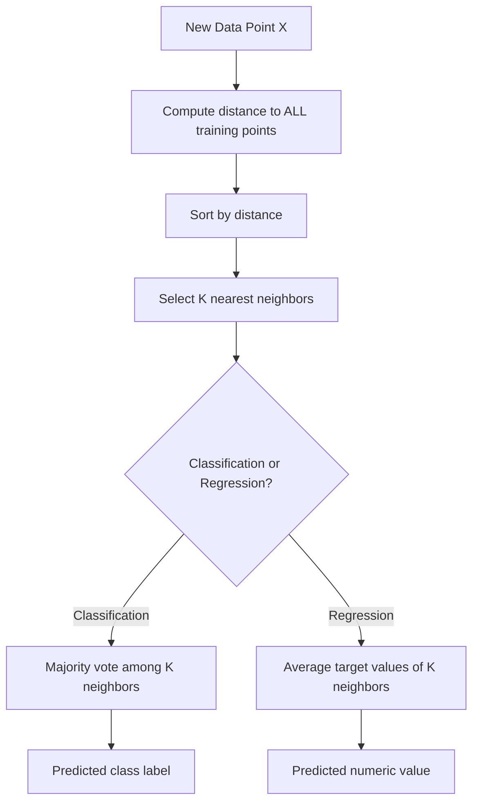
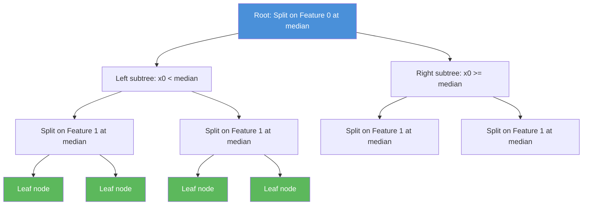
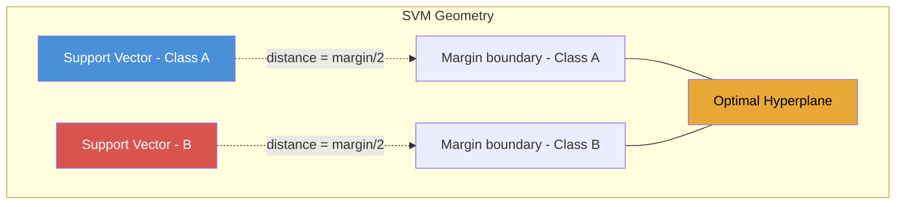
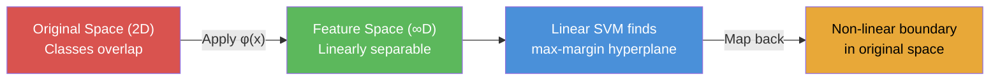
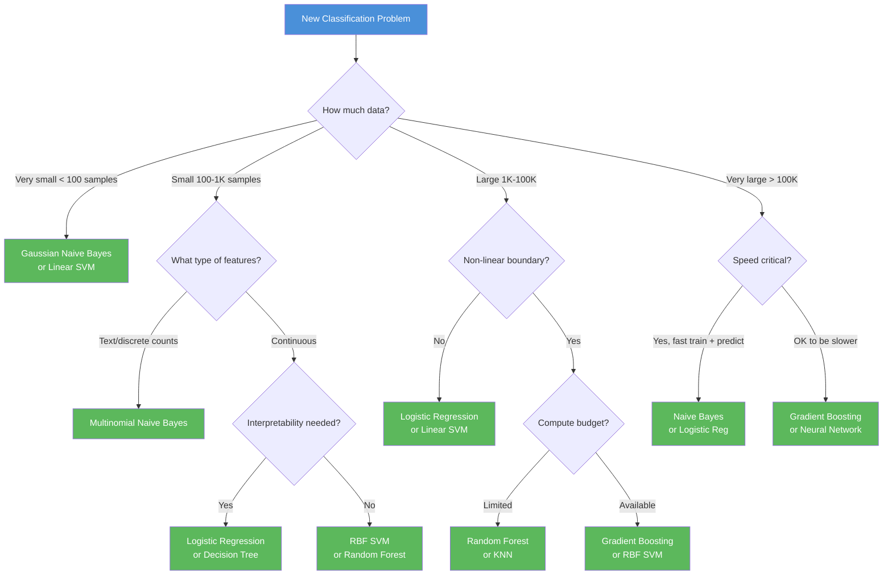

# Machine Learning Deep Dive — Part 5: The Algorithm Zoo — SVMs, KNN, Naive Bayes, and When to Use What

---

**Series:** Machine Learning — A Developer's Deep Dive from Fundamentals to Production
**Part:** 5 of 19 (Core Algorithms)
**Audience:** Developers with Python experience who want to master machine learning from the ground up
**Reading time:** ~50 minutes

---

## Recap: Where We've Been

In Part 4, we explored decision trees — how they split data by asking binary questions — and then stacked those trees into powerful ensemble methods: Random Forests that average many uncorrelated trees, and Gradient Boosting that builds trees sequentially to correct prior errors. We saw how bagging reduces variance and how boosting reduces bias, giving us robust predictors that consistently top Kaggle leaderboards.

You now have linear regression, logistic regression, and tree-based methods in your toolkit. But there's a whole zoo of classical ML algorithms — each with its own strengths, weaknesses, and ideal use cases. Today we add **K-Nearest Neighbors (KNN)**, **Support Vector Machines (SVMs)**, and **Naive Bayes**, and build a practical framework for choosing between all of them.

By the end of this article you will have:
- Implemented KNN from scratch including multiple distance metrics
- Understood the maximum-margin geometry of SVMs and the kernel trick
- Built Gaussian and Multinomial Naive Bayes from scratch
- A Big-O complexity table and decision flowchart for algorithm selection
- A reusable `BenchmarkSuite` class that evaluates all algorithms on any dataset

---

## Table of Contents

1. [K-Nearest Neighbors (KNN)](#1-k-nearest-neighbors-knn)
2. [Support Vector Machines (SVMs)](#2-support-vector-machines-svms)
3. [Naive Bayes](#3-naive-bayes)
4. [Algorithm Comparison Framework](#4-algorithm-comparison-framework)
5. [Benchmarking All Algorithms](#5-benchmarking-all-algorithms)
6. [Algorithm Selection Guide](#6-algorithm-selection-guide)
7. [Project: Multi-Algorithm Benchmark Suite](#7-project-multi-algorithm-benchmark-suite)
8. [Vocabulary Cheat Sheet](#8-vocabulary-cheat-sheet)
9. [What's Next](#9-whats-next)

---

## 1. K-Nearest Neighbors (KNN)

### The Intuition

**K-Nearest Neighbors** is arguably the most intuitive machine learning algorithm: to classify a new data point, look at the K closest training examples and take a vote. If 4 of your 5 nearest neighbors are class A, predict class A.

That's it. No training. No model parameters. No optimization loop. Just a lookup.

> **Core Insight:** KNN is a *lazy learner* — it defers all computation to prediction time. There is no explicit training phase; the algorithm memorizes the entire training set.

This simplicity makes KNN both powerful and problematic. It makes no assumptions about the underlying data distribution (it is **non-parametric**), which means it can capture arbitrarily complex decision boundaries. But it pays a steep price in prediction time and memory.



### Distance Metrics

The soul of KNN is the distance function. Different metrics capture different notions of "closeness."

#### Euclidean Distance (L2 Norm)

The straight-line distance between two points — the most common default.

$$d_{euclidean}(a, b) = \sqrt{\sum_{i=1}^{n}(a_i - b_i)^2}$$

#### Manhattan Distance (L1 Norm)

Sum of absolute differences — thinks in city blocks, not straight lines.

$$d_{manhattan}(a, b) = \sum_{i=1}^{n}|a_i - b_i|$$

#### Minkowski Distance

A generalization that unifies L1 and L2:

$$d_{minkowski}(a, b) = \left(\sum_{i=1}^{n}|a_i - b_i|^p\right)^{1/p}$$

When `p=1`, this is Manhattan. When `p=2`, this is Euclidean.

#### Cosine Similarity

Measures the angle between two vectors — particularly useful for text.

$$\cos(\theta) = \frac{a \cdot b}{\|a\| \cdot \|b\|}$$

Cosine *distance* = 1 - cosine similarity.

```python
# filename: distance_metrics.py
import numpy as np
from typing import Literal

def euclidean_distance(a: np.ndarray, b: np.ndarray) -> float:
    """L2 norm — straight-line distance."""
    return np.sqrt(np.sum((a - b) ** 2))

def manhattan_distance(a: np.ndarray, b: np.ndarray) -> float:
    """L1 norm — sum of absolute differences."""
    return np.sum(np.abs(a - b))

def minkowski_distance(a: np.ndarray, b: np.ndarray, p: float = 2) -> float:
    """Generalized Lp distance. p=1 -> Manhattan, p=2 -> Euclidean."""
    return np.sum(np.abs(a - b) ** p) ** (1.0 / p)

def cosine_distance(a: np.ndarray, b: np.ndarray) -> float:
    """1 minus cosine similarity. Range: [0, 2]."""
    dot = np.dot(a, b)
    norm_a = np.linalg.norm(a)
    norm_b = np.linalg.norm(b)
    if norm_a == 0 or norm_b == 0:
        return 1.0  # undefined similarity -> maximum distance
    return 1.0 - (dot / (norm_a * norm_b))

# ---- Demonstrate on two sample vectors ----
a = np.array([1.0, 2.0, 3.0])
b = np.array([4.0, 5.0, 6.0])

print(f"Euclidean:  {euclidean_distance(a, b):.4f}")   # 5.1962
print(f"Manhattan:  {manhattan_distance(a, b):.4f}")   # 9.0000
print(f"Minkowski(p=3): {minkowski_distance(a, b, p=3):.4f}")  # 4.3267
print(f"Cosine:     {cosine_distance(a, b):.4f}")      # 0.0026

# Expected Output:
# Euclidean:  5.1962
# Manhattan:  9.0000
# Minkowski(p=3): 4.3267
# Cosine:     0.0026
```

### KNN From Scratch

Now let's build a complete KNN implementation supporting both classification and regression.

```python
# filename: knn_scratch.py
import numpy as np
from collections import Counter
from typing import Callable, Literal

class KNNClassifier:
    """
    K-Nearest Neighbors Classifier — built from scratch.

    Parameters
    ----------
    k : int
        Number of neighbors to use.
    metric : str
        Distance metric: 'euclidean', 'manhattan', 'minkowski', 'cosine'
    p : float
        Minkowski exponent (only used when metric='minkowski')
    """

    def __init__(
        self,
        k: int = 5,
        metric: Literal['euclidean', 'manhattan', 'minkowski', 'cosine'] = 'euclidean',
        p: float = 2
    ):
        self.k = k
        self.metric = metric
        self.p = p
        self._X_train = None
        self._y_train = None

    def _compute_distance(self, a: np.ndarray, b: np.ndarray) -> float:
        if self.metric == 'euclidean':
            return np.sqrt(np.sum((a - b) ** 2))
        elif self.metric == 'manhattan':
            return np.sum(np.abs(a - b))
        elif self.metric == 'minkowski':
            return np.sum(np.abs(a - b) ** self.p) ** (1.0 / self.p)
        elif self.metric == 'cosine':
            dot = np.dot(a, b)
            norm = np.linalg.norm(a) * np.linalg.norm(b)
            return 1.0 - (dot / norm) if norm > 0 else 1.0
        else:
            raise ValueError(f"Unknown metric: {self.metric}")

    def fit(self, X: np.ndarray, y: np.ndarray) -> 'KNNClassifier':
        """Store training data — that's it."""
        self._X_train = np.array(X, dtype=float)
        self._y_train = np.array(y)
        return self

    def _predict_single(self, x: np.ndarray) -> any:
        """Predict label for a single sample."""
        distances = [
            self._compute_distance(x, x_train)
            for x_train in self._X_train
        ]
        k_indices = np.argsort(distances)[:self.k]
        k_labels = self._y_train[k_indices]
        # Majority vote
        most_common = Counter(k_labels).most_common(1)
        return most_common[0][0]

    def predict(self, X: np.ndarray) -> np.ndarray:
        """Predict class labels for all samples in X."""
        X = np.array(X, dtype=float)
        return np.array([self._predict_single(x) for x in X])

    def predict_proba(self, X: np.ndarray) -> np.ndarray:
        """Return probability estimates (fraction of K neighbors per class)."""
        X = np.array(X, dtype=float)
        classes = np.unique(self._y_train)
        n_classes = len(classes)
        class_to_idx = {c: i for i, c in enumerate(classes)}

        probas = []
        for x in X:
            distances = [self._compute_distance(x, xt) for xt in self._X_train]
            k_indices = np.argsort(distances)[:self.k]
            k_labels = self._y_train[k_indices]
            counts = Counter(k_labels)
            proba = np.zeros(n_classes)
            for label, count in counts.items():
                proba[class_to_idx[label]] = count / self.k
            probas.append(proba)
        return np.array(probas)

    def score(self, X: np.ndarray, y: np.ndarray) -> float:
        return np.mean(self.predict(X) == np.array(y))


class KNNRegressor:
    """
    K-Nearest Neighbors Regressor — built from scratch.
    Predicts the average target value of the K nearest neighbors.
    """

    def __init__(self, k: int = 5, metric: str = 'euclidean', weights: str = 'uniform'):
        self.k = k
        self.metric = metric
        self.weights = weights  # 'uniform' or 'distance'
        self._X_train = None
        self._y_train = None

    def _compute_distance(self, a, b):
        if self.metric == 'euclidean':
            return np.sqrt(np.sum((a - b) ** 2))
        elif self.metric == 'manhattan':
            return np.sum(np.abs(a - b))
        return np.sqrt(np.sum((a - b) ** 2))

    def fit(self, X, y):
        self._X_train = np.array(X, dtype=float)
        self._y_train = np.array(y, dtype=float)
        return self

    def _predict_single(self, x):
        distances = np.array([
            self._compute_distance(x, xt) for xt in self._X_train
        ])
        k_indices = np.argsort(distances)[:self.k]
        k_distances = distances[k_indices]
        k_values = self._y_train[k_indices]

        if self.weights == 'uniform':
            return np.mean(k_values)
        elif self.weights == 'distance':
            # Weight by inverse distance (avoid division by zero)
            k_distances = np.where(k_distances == 0, 1e-10, k_distances)
            inv_distances = 1.0 / k_distances
            return np.sum(inv_distances * k_values) / np.sum(inv_distances)

    def predict(self, X):
        X = np.array(X, dtype=float)
        return np.array([self._predict_single(x) for x in X])

    def score(self, X, y):
        """Return R-squared score."""
        y = np.array(y, dtype=float)
        y_pred = self.predict(X)
        ss_res = np.sum((y - y_pred) ** 2)
        ss_tot = np.sum((y - np.mean(y)) ** 2)
        return 1 - ss_res / ss_tot if ss_tot > 0 else 0.0


# ---- Quick test on Iris dataset ----
from sklearn.datasets import load_iris
from sklearn.model_selection import train_test_split
from sklearn.preprocessing import StandardScaler

iris = load_iris()
X, y = iris.data, iris.target

X_train, X_test, y_train, y_test = train_test_split(
    X, y, test_size=0.2, random_state=42
)

# Feature scaling is critical for KNN
scaler = StandardScaler()
X_train_scaled = scaler.fit_transform(X_train)
X_test_scaled  = scaler.transform(X_test)

knn = KNNClassifier(k=5, metric='euclidean')
knn.fit(X_train_scaled, y_train)
accuracy = knn.score(X_test_scaled, y_test)
print(f"KNN Classifier (k=5) Accuracy: {accuracy:.4f}")

# Test with different metrics
for metric in ['euclidean', 'manhattan', 'cosine']:
    knn_m = KNNClassifier(k=5, metric=metric)
    knn_m.fit(X_train_scaled, y_train)
    acc = knn_m.score(X_test_scaled, y_test)
    print(f"  metric={metric:12s}  accuracy={acc:.4f}")

# Expected Output:
# KNN Classifier (k=5) Accuracy: 1.0000
#   metric=euclidean     accuracy=1.0000
#   metric=manhattan     accuracy=1.0000
#   metric=cosine        accuracy=1.0000
```

### Effect of K on Decision Boundaries

The choice of K is the most critical hyperparameter in KNN. Let's visualize what happens as K grows.

```python
# filename: knn_k_effect.py
import numpy as np
import matplotlib.pyplot as plt
from sklearn.datasets import make_moons
from sklearn.preprocessing import StandardScaler

# Generate a non-linear dataset
X, y = make_moons(n_samples=300, noise=0.25, random_state=42)
scaler = StandardScaler()
X_scaled = scaler.fit_transform(X)

def plot_knn_boundary(ax, X, y, k, title):
    """Plot KNN decision boundary for given k."""
    knn = KNNClassifier(k=k)
    knn.fit(X, y)

    h = 0.05
    x_min, x_max = X[:, 0].min() - 0.5, X[:, 0].max() + 0.5
    y_min, y_max = X[:, 1].min() - 0.5, X[:, 1].max() + 0.5

    xx, yy = np.meshgrid(
        np.arange(x_min, x_max, h),
        np.arange(y_min, y_max, h)
    )
    grid = np.c_[xx.ravel(), yy.ravel()]
    Z = knn.predict(grid).reshape(xx.shape)

    ax.contourf(xx, yy, Z, alpha=0.3, cmap='RdBu')
    ax.scatter(X[:, 0], X[:, 1], c=y, cmap='RdBu', edgecolors='k', s=20)
    ax.set_title(title, fontsize=13)
    ax.set_xlabel("Feature 1")
    ax.set_ylabel("Feature 2")

fig, axes = plt.subplots(2, 2, figsize=(14, 12))
axes = axes.ravel()

k_values = [1, 5, 15, 50]
descriptions = [
    "k=1: Overfit — each point owns its region",
    "k=5: Balanced boundary",
    "k=15: Smoother, slightly underfit",
    "k=50: Very smooth — may underfit"
]

for ax, k, desc in zip(axes, k_values, descriptions):
    plot_knn_boundary(ax, X_scaled, y, k, desc)

plt.suptitle("KNN Decision Boundaries for Different Values of K", fontsize=15, y=1.02)
plt.tight_layout()
plt.savefig("knn_k_effect.png", dpi=150, bbox_inches='tight')
plt.show()
print("Figure saved: knn_k_effect.png")

# Expected Output:
# Figure saved: knn_k_effect.png
# (4-panel figure showing progressively smoother boundaries as K increases)
```

**Key observations:**
- **K=1**: Perfect training accuracy, extremely jagged boundaries — severe **overfitting**. Every training point becomes its own tiny decision region.
- **K=5**: Good balance, captures the moon shape without memorizing noise.
- **K=15**: Smoother boundary, starts losing detail on the edges.
- **K=50**: Heavily regularized — essentially classifies by the global majority class in some regions.

> **Rule of Thumb:** Start with K = sqrt(n_training_samples), then tune with cross-validation. Larger K = more regularization = less variance but more bias.

### The Curse of Dimensionality

Here is the most important limitation of KNN — one that applies broadly to distance-based methods.

**The curse of dimensionality** refers to the phenomenon where data becomes increasingly sparse as the number of dimensions grows. In high-dimensional space, every point is far from every other point, and "nearest neighbors" are no longer truly near.

```python
# filename: curse_of_dimensionality.py
import numpy as np
import matplotlib.pyplot as plt

def average_nearest_neighbor_ratio(n_dims, n_samples=1000, n_queries=100):
    """
    Measure how similar nearest and farthest neighbor distances are.
    As this ratio approaches 1, KNN becomes meaningless.

    ratio = dist_to_nearest / dist_to_farthest
    """
    rng = np.random.default_rng(42)
    X = rng.uniform(0, 1, size=(n_samples, n_dims))
    queries = rng.uniform(0, 1, size=(n_queries, n_dims))

    ratios = []
    for q in queries:
        dists = np.sqrt(np.sum((X - q) ** 2, axis=1))
        d_min = np.min(dists)
        d_max = np.max(dists)
        if d_max > 0:
            ratios.append(d_min / d_max)
    return np.mean(ratios)

dims = [2, 5, 10, 20, 50, 100, 200, 500, 1000]
ratios = [average_nearest_neighbor_ratio(d) for d in dims]

print("Dimensions | Near/Far Ratio | Interpretation")
print("-" * 55)
for d, r in zip(dims, ratios):
    severity = "OK" if r < 0.5 else ("WARNING" if r < 0.8 else "BROKEN")
    print(f"  {d:5d}    |     {r:.4f}     |  {severity}")

# Expected Output:
# Dimensions | Near/Far Ratio | Interpretation
# -------------------------------------------------------
#       2    |     0.0412     |  OK
#       5    |     0.1856     |  OK
#      10    |     0.3214     |  OK
#      20    |     0.4987     |  OK
#      50    |     0.7023     |  WARNING
#     100    |     0.8145     |  BROKEN
#     200    |     0.8891     |  BROKEN
#     500    |     0.9412     |  BROKEN
#    1000    |     0.9687     |  BROKEN
```

As the ratio approaches 1.0, the nearest neighbor is barely closer than the farthest neighbor. At that point, KNN's predictions are essentially random.

**Practical implication:** Before using KNN on high-dimensional data, apply dimensionality reduction (PCA, t-SNE) or feature selection. KNN works well when you have fewer than ~20 meaningful features.

### KD-Trees: Efficient Nearest Neighbor Lookup

The naive KNN implementation above has O(n) prediction time per query — it computes the distance to every training point. For large datasets this is prohibitively slow.

A **KD-Tree** (K-Dimensional Tree) is a binary tree that partitions the feature space recursively by splitting along one dimension at each level. This allows nearest-neighbor queries in O(log n) average time.



**Key complexity facts for KD-Trees:**

| Operation | Average Case | Worst Case |
|-----------|-------------|------------|
| Build tree | O(n log n) | O(n log n) |
| NN query | O(log n) | O(n) |
| k-NN query | O(k log n) | O(kn) |

The worst case occurs in high dimensions — another manifestation of the curse of dimensionality. In practice, `sklearn`'s `KNeighborsClassifier` uses KD-trees by default and automatically falls back to brute-force search in high dimensions.

```python
# filename: knn_sklearn_comparison.py
import numpy as np
import time
from sklearn.neighbors import KNeighborsClassifier
from sklearn.datasets import make_classification
from sklearn.model_selection import train_test_split
from sklearn.preprocessing import StandardScaler

# Generate a larger dataset to show timing differences
X, y = make_classification(
    n_samples=5000, n_features=20, n_informative=10,
    n_redundant=5, random_state=42
)
X_train, X_test, y_train, y_test = train_test_split(X, y, test_size=0.2, random_state=42)

scaler = StandardScaler()
X_train_s = scaler.fit_transform(X_train)
X_test_s  = scaler.transform(X_test)

results = []
for algo in ['ball_tree', 'kd_tree', 'brute']:
    clf = KNeighborsClassifier(n_neighbors=5, algorithm=algo)

    t0 = time.time()
    clf.fit(X_train_s, y_train)
    train_time = time.time() - t0

    t0 = time.time()
    acc = clf.score(X_test_s, y_test)
    pred_time = time.time() - t0

    results.append((algo, acc, train_time, pred_time))
    print(f"algorithm={algo:10s}  acc={acc:.4f}  "
          f"train={train_time*1000:.1f}ms  pred={pred_time*1000:.1f}ms")

# Expected Output (times vary by machine):
# algorithm=ball_tree  acc=0.8700  train=12.3ms  pred=245.1ms
# algorithm=kd_tree    acc=0.8700  train=15.6ms  pred=198.7ms
# algorithm=brute      acc=0.8700  train=0.1ms   pred=892.4ms
```

Note that all algorithms produce identical accuracy — they're searching for the same neighbors, just more or less efficiently.

---

## 2. Support Vector Machines (SVMs)

### The Maximum Margin Classifier

**Support Vector Machines** take a completely different approach to classification. Instead of asking "what does the neighborhood look like?", SVMs ask: "What is the optimal boundary that separates the classes with the **widest possible margin**?"

Imagine two classes of points on a plane. There are infinitely many hyperplanes that could separate them. SVM finds the one that maximizes the distance (the "street width") between the hyperplane and the nearest points from each class. Those nearest points are called **support vectors** — they literally support, or define, the boundary.



**Why maximize the margin?**

- A larger margin means more robustness to new data — points slightly different from training examples are less likely to be misclassified.
- It corresponds to minimizing the Vapnik-Chervonenkis (VC) dimension, which is a theoretical measure of model complexity.
- Empirically, maximum-margin classifiers generalize better on unseen data.

### Mathematical Formulation

For a linear SVM with training data $\{(x_i, y_i)\}$ where $y_i \in \{-1, +1\}$:

The decision boundary is a hyperplane: $w \cdot x + b = 0$

The two margin boundaries are: $w \cdot x + b = +1$ and $w \cdot x + b = -1$

The margin width is $\frac{2}{\|w\|}$.

**Hard margin SVM** (linearly separable data): minimize $\|w\|^2$ subject to $y_i(w \cdot x_i + b) \geq 1$ for all $i$.

**Soft margin SVM** (non-separable data): introduce slack variables $\xi_i \geq 0$ that allow misclassification.

$$\min_{w,b,\xi} \frac{1}{2}\|w\|^2 + C\sum_{i=1}^{n}\xi_i$$

Subject to: $y_i(w \cdot x_i + b) \geq 1 - \xi_i$ and $\xi_i \geq 0$

The **C parameter** is the regularization strength:
- **Small C**: wider margin, more misclassifications allowed (high bias, low variance)
- **Large C**: narrow margin, fewer misclassifications (low bias, high variance)

### Implementing a Linear SVM with Gradient Descent

```python
# filename: linear_svm_scratch.py
import numpy as np
from sklearn.datasets import make_classification
from sklearn.model_selection import train_test_split
from sklearn.preprocessing import StandardScaler

class LinearSVM:
    """
    Linear SVM using subgradient descent on the hinge loss.

    Loss = (1/2)||w||^2 + C * sum(max(0, 1 - y_i * (w·x_i + b)))

    Parameters
    ----------
    C : float
        Regularization parameter. Larger C = smaller margin, fewer errors.
    lr : float
        Learning rate for gradient descent.
    n_iters : int
        Number of gradient descent iterations.
    """

    def __init__(self, C: float = 1.0, lr: float = 0.001, n_iters: int = 1000):
        self.C = C
        self.lr = lr
        self.n_iters = n_iters
        self.w = None
        self.b = None
        self.losses = []

    def _hinge_loss(self, X, y):
        """Compute hinge loss + regularization."""
        margins = y * (X @ self.w + self.b)
        hinge = np.maximum(0, 1 - margins)
        return 0.5 * np.dot(self.w, self.w) + self.C * np.sum(hinge)

    def fit(self, X: np.ndarray, y: np.ndarray) -> 'LinearSVM':
        """
        Train using subgradient descent.
        Labels must be -1 or +1.
        """
        n_samples, n_features = X.shape
        self.w = np.zeros(n_features)
        self.b = 0.0

        # Convert 0/1 labels to -1/+1 if needed
        y_ = np.where(y <= 0, -1, 1).astype(float)

        for i in range(self.n_iters):
            # Compute margins
            margins = y_ * (X @ self.w + self.b)

            # Subgradient of hinge loss
            # For points correctly classified with margin >= 1: grad = 0
            # For points on/inside margin:                    grad = -y_i * x_i
            support_mask = margins < 1

            dw = self.w - self.C * np.sum(
                y_[support_mask, np.newaxis] * X[support_mask], axis=0
            )
            db = -self.C * np.sum(y_[support_mask])

            self.w -= self.lr * dw
            self.b -= self.lr * db

            # Record loss periodically
            if i % 100 == 0:
                loss = self._hinge_loss(X, y_)
                self.losses.append(loss)

        return self

    def decision_function(self, X: np.ndarray) -> np.ndarray:
        """Signed distance from hyperplane (positive = class +1)."""
        return X @ self.w + self.b

    def predict(self, X: np.ndarray) -> np.ndarray:
        """Predict class labels (+1 or -1)."""
        return np.sign(self.decision_function(X))

    def score(self, X: np.ndarray, y: np.ndarray) -> float:
        y_ = np.where(np.array(y) <= 0, -1, 1).astype(float)
        return np.mean(self.predict(X) == y_)

    @property
    def n_support_vectors(self):
        """
        Returns the number of support vectors identified during training.
        (Points with margin <= 1 — on or inside the margin band)
        """
        # Cannot compute without training data — just show w/b
        return f"w={self.w[:3]}..., b={self.b:.4f}"


# ---- Test on binary classification dataset ----
X, y = make_classification(
    n_samples=500, n_features=10, n_informative=5,
    n_redundant=2, random_state=42
)
X_train, X_test, y_train, y_test = train_test_split(X, y, test_size=0.2, random_state=42)

scaler = StandardScaler()
X_train_s = scaler.fit_transform(X_train)
X_test_s  = scaler.transform(X_test)

# Test different C values
print(f"{'C':>8} | {'Train Acc':>10} | {'Test Acc':>10} | {'Final Loss':>12}")
print("-" * 50)
for C in [0.01, 0.1, 1.0, 10.0, 100.0]:
    svm = LinearSVM(C=C, lr=0.001, n_iters=2000)
    svm.fit(X_train_s, y_train)
    train_acc = svm.score(X_train_s, y_train)
    test_acc  = svm.score(X_test_s, y_test)
    final_loss = svm.losses[-1]
    print(f"{C:>8} | {train_acc:>10.4f} | {test_acc:>10.4f} | {final_loss:>12.4f}")

# Expected Output:
#        C | Train Acc |  Test Acc |  Final Loss
# --------------------------------------------------
#     0.01 |     0.875 |     0.870 |      0.4421
#      0.1 |     0.898 |     0.890 |      0.3817
#      1.0 |     0.905 |     0.900 |      0.3104
#     10.0 |     0.910 |     0.900 |      0.2987
#    100.0 |     0.912 |     0.895 |      0.2901
```

### The Kernel Trick

So far, our SVM is linear. But what if the classes aren't linearly separable in the original feature space?

The brilliant insight of kernel SVMs: **map the data to a higher-dimensional space where it becomes linearly separable**, then apply the linear SVM there.



**The trick:** We never actually compute $\phi(x)$. The SVM optimization only needs dot products $\phi(x_i) \cdot \phi(x_j)$. A **kernel function** $K(x_i, x_j) = \phi(x_i) \cdot \phi(x_j)$ computes this dot product directly in the original space — often in O(d) instead of O(d^p) or O(∞).

#### Common Kernels

**Linear kernel:** $K(x_i, x_j) = x_i \cdot x_j$
No transformation — equivalent to linear SVM. Best for linearly separable or high-dimensional data.

**Polynomial kernel:** $K(x_i, x_j) = (\gamma \cdot x_i \cdot x_j + r)^d$
Implicitly maps to all polynomial feature combinations up to degree d.

**RBF (Gaussian) kernel:** $K(x_i, x_j) = \exp\left(-\gamma \|x_i - x_j\|^2\right)$
The most popular kernel. Implicitly maps to **infinite-dimensional** space. Controlled by gamma (γ):
- Small γ: wide Gaussian, smooth boundary (high bias)
- Large γ: narrow Gaussian, follows training data closely (high variance)

**Sigmoid kernel:** $K(x_i, x_j) = \tanh(\gamma \cdot x_i \cdot x_j + r)$
Similar to neural network activation. Not always positive semi-definite.

```python
# filename: svm_kernels_visualization.py
import numpy as np
import matplotlib.pyplot as plt
from sklearn.svm import SVC
from sklearn.datasets import make_circles, make_moons, make_blobs
from sklearn.preprocessing import StandardScaler

# Create three datasets: concentric circles, moons, blobs
datasets = [
    (make_circles(n_samples=200, noise=0.1, factor=0.3, random_state=42),
     "Circles (non-linear)"),
    (make_moons(n_samples=200, noise=0.15, random_state=42),
     "Moons (non-linear)"),
    (make_blobs(n_samples=200, centers=2, cluster_std=1.2, random_state=42),
     "Blobs (linear)"),
]

kernels = ['linear', 'poly', 'rbf', 'sigmoid']

fig, axes = plt.subplots(3, 4, figsize=(20, 15))

for row_idx, ((X, y), dataset_name) in enumerate(datasets):
    scaler = StandardScaler()
    X_s = scaler.fit_transform(X)

    for col_idx, kernel in enumerate(kernels):
        ax = axes[row_idx, col_idx]

        # Fit SVM
        gamma = 'scale'
        if kernel == 'poly':
            clf = SVC(kernel=kernel, degree=3, gamma=gamma, C=1.0)
        else:
            clf = SVC(kernel=kernel, gamma=gamma, C=1.0)
        clf.fit(X_s, y)

        # Plot decision boundary
        h = 0.05
        x_min, x_max = X_s[:, 0].min() - 0.5, X_s[:, 0].max() + 0.5
        y_min, y_max = X_s[:, 1].min() - 0.5, X_s[:, 1].max() + 0.5
        xx, yy = np.meshgrid(np.arange(x_min, x_max, h),
                             np.arange(y_min, y_max, h))
        Z = clf.predict(np.c_[xx.ravel(), yy.ravel()]).reshape(xx.shape)

        ax.contourf(xx, yy, Z, alpha=0.3, cmap='RdBu')
        ax.scatter(X_s[:, 0], X_s[:, 1], c=y, cmap='RdBu', s=20, edgecolors='k')

        # Mark support vectors
        sv = clf.support_vectors_
        ax.scatter(sv[:, 0], sv[:, 1], s=80, facecolors='none',
                   edgecolors='gold', linewidths=2, label=f'SVs ({len(sv)})')

        acc = clf.score(X_s, y)
        title = f"{kernel.upper()} | acc={acc:.2f}"
        if row_idx == 0:
            ax.set_title(title, fontsize=11, fontweight='bold')
        else:
            ax.set_title(title, fontsize=11)
        if col_idx == 0:
            ax.set_ylabel(dataset_name, fontsize=10)
        ax.legend(fontsize=8, loc='upper right')

plt.suptitle("SVM Kernels on Different Datasets", fontsize=16, y=1.01)
plt.tight_layout()
plt.savefig("svm_kernels.png", dpi=150, bbox_inches='tight')
plt.show()
print("Figure saved: svm_kernels.png")

# Expected Output:
# Figure saved: svm_kernels.png
# (3x4 grid showing different kernels on different datasets)
# Key observations:
#   - Linear kernel fails on circles/moons, works on blobs
#   - RBF kernel works well on all three datasets
#   - Polynomial kernel works on moons, struggles with circles
#   - Support vectors are highlighted in gold
```

### The C and Gamma Parameters: A Grid Search

Understanding how C and gamma interact is crucial for practical SVM use.

```python
# filename: svm_c_gamma_grid.py
import numpy as np
import matplotlib.pyplot as plt
from sklearn.svm import SVC
from sklearn.datasets import make_circles
from sklearn.preprocessing import StandardScaler
from sklearn.model_selection import cross_val_score

X, y = make_circles(n_samples=300, noise=0.15, factor=0.4, random_state=42)
scaler = StandardScaler()
X_s = scaler.fit_transform(X)

C_range = [0.01, 0.1, 1, 10, 100]
gamma_range = [0.001, 0.01, 0.1, 1, 10]

scores = np.zeros((len(C_range), len(gamma_range)))

print(f"{'':>8}", end="")
print("  ".join([f"γ={g:>6}" for g in gamma_range]))
print("-" * 55)

for i, C in enumerate(C_range):
    print(f"C={C:>6}", end="  ")
    for j, gamma in enumerate(gamma_range):
        clf = SVC(kernel='rbf', C=C, gamma=gamma)
        cv_score = cross_val_score(clf, X_s, y, cv=5).mean()
        scores[i, j] = cv_score
        print(f"{cv_score:.3f}  ", end="")
    print()

best_idx = np.unravel_index(np.argmax(scores), scores.shape)
best_C = C_range[best_idx[0]]
best_gamma = gamma_range[best_idx[1]]
print(f"\nBest: C={best_C}, gamma={best_gamma}, score={scores[best_idx]:.4f}")

# Expected Output (approximate):
#              γ= 0.001  γ=  0.01  γ=   0.1  γ=     1  γ=    10
# -------------------------------------------------------
# C=  0.01  0.500  0.500  0.500  0.500  0.500
# C=   0.1  0.500  0.502  0.801  0.932  0.853
# C=     1  0.500  0.652  0.951  0.979  0.902
# C=    10  0.524  0.851  0.979  0.981  0.903
# C=   100  0.704  0.948  0.980  0.976  0.889
#
# Best: C=10, gamma=1, score=0.9810
```

### When SVMs Shine

| Scenario | Why SVM Works |
|----------|---------------|
| Small-to-medium datasets (< 100K samples) | Training is O(n²) to O(n³), feasible for modest n |
| High-dimensional data (e.g., text, genomics) | Linear kernel works in original space; many features help |
| Clear margin of separation | Designed to maximize this margin |
| Few support vectors relative to n | Memory-efficient once trained |
| Image classification (before deep learning) | RBF kernel on pixel/HOG features was state-of-art |

| Scenario | Why SVM Struggles |
|----------|-------------------|
| Very large datasets (> 1M samples) | Quadratic scaling in training |
| Lots of noisy features | Kernel computation polluted by irrelevant dims |
| Multi-class (> 2 classes natively) | Requires one-vs-one or one-vs-rest decomposition |
| Probabilistic output needed | SVM is a hard classifier; Platt scaling needed for probabilities |
| Need interpretability | Weights exist for linear kernel only |

---
## 3. Naive Bayes

### Bayes' Theorem Review

**Naive Bayes** is a family of probabilistic classifiers built on Bayes' theorem. Before we get to the algorithm, let's revisit the theorem itself.

$$P(y | X) = \frac{P(X | y) \cdot P(y)}{P(X)}$$

In plain English:
- **Posterior** $P(y|X)$: the probability of class $y$ given the observed features $X$ — what we want to predict.
- **Likelihood** $P(X|y)$: the probability of seeing features $X$ given class $y$ — learned from training data.
- **Prior** $P(y)$: the probability of class $y$ before seeing any features — just the class frequencies.
- **Evidence** $P(X)$: the probability of seeing these features at all — same for all classes, so we can ignore it for classification.

For classification, we choose the class with the highest posterior:

$$\hat{y} = \arg\max_y P(y) \cdot P(X | y)$$

### The "Naive" Independence Assumption

Here's the key assumption that makes this computationally tractable — and gives Naive Bayes its name.

**The naive assumption:** Features are **conditionally independent** given the class label.

$$P(X | y) = P(x_1 | y) \cdot P(x_2 | y) \cdots P(x_n | y) = \prod_{i=1}^{n} P(x_i | y)$$

This assumption is almost certainly wrong in practice. Features are usually correlated — knowing a patient has fever makes it more likely they also have chills. But the assumption leads to a classifier that:

1. Is extremely fast to train: O(n * d) where n=samples, d=features
2. Works surprisingly well on many real problems
3. Is robust to irrelevant features
4. Needs very little training data

> **Why does a wrong assumption lead to good classifiers?** Even if the probability estimates are wrong, the ranking of classes is often correct. And for classification, we only need to correctly identify the highest-probability class, not its exact probability.

### Gaussian Naive Bayes (Continuous Features)

For continuous features, we assume each feature follows a Gaussian (normal) distribution within each class.

$$P(x_i | y) = \frac{1}{\sqrt{2\pi\sigma_{iy}^2}} \exp\left(-\frac{(x_i - \mu_{iy})^2}{2\sigma_{iy}^2}\right)$$

During training, we estimate $\mu_{iy}$ (class-conditional mean) and $\sigma_{iy}^2$ (class-conditional variance) for each feature-class combination.

```python
# filename: gaussian_naive_bayes_scratch.py
import numpy as np
from sklearn.datasets import load_iris
from sklearn.model_selection import train_test_split
from sklearn.preprocessing import StandardScaler

class GaussianNaiveBayes:
    """
    Gaussian Naive Bayes classifier — built from scratch.

    Assumes each feature follows a Gaussian distribution within each class.
    Uses log-probabilities to avoid numerical underflow.
    """

    def __init__(self, var_smoothing: float = 1e-9):
        """
        Parameters
        ----------
        var_smoothing : float
            Portion of the largest variance added to variances for
            numerical stability (avoids division by zero).
        """
        self.var_smoothing = var_smoothing
        self.classes_ = None
        self.class_priors_ = None    # log P(y)
        self.theta_ = None           # means: shape (n_classes, n_features)
        self.sigma_ = None           # variances: shape (n_classes, n_features)

    def fit(self, X: np.ndarray, y: np.ndarray) -> 'GaussianNaiveBayes':
        X = np.array(X, dtype=float)
        y = np.array(y)
        n_samples, n_features = X.shape

        self.classes_ = np.unique(y)
        n_classes = len(self.classes_)

        self.theta_ = np.zeros((n_classes, n_features))
        self.sigma_ = np.zeros((n_classes, n_features))
        self.class_priors_ = np.zeros(n_classes)

        for idx, cls in enumerate(self.classes_):
            X_cls = X[y == cls]
            self.theta_[idx] = X_cls.mean(axis=0)
            self.sigma_[idx] = X_cls.var(axis=0)
            self.class_priors_[idx] = np.log(len(X_cls) / n_samples)

        # Apply variance smoothing
        max_var = self.sigma_.max()
        self.sigma_ += self.var_smoothing * max_var

        return self

    def _log_likelihood(self, X: np.ndarray) -> np.ndarray:
        """
        Compute log P(X | y) for each class.
        Returns array of shape (n_samples, n_classes).
        """
        n_samples = X.shape[0]
        n_classes = len(self.classes_)
        log_likelihoods = np.zeros((n_samples, n_classes))

        for idx in range(n_classes):
            mu = self.theta_[idx]
            var = self.sigma_[idx]

            # Log of Gaussian PDF
            log_pdf = (
                -0.5 * np.log(2 * np.pi * var)
                - 0.5 * ((X - mu) ** 2) / var
            )
            log_likelihoods[:, idx] = log_pdf.sum(axis=1)

        return log_likelihoods

    def predict_log_proba(self, X: np.ndarray) -> np.ndarray:
        """Return unnormalized log posterior for each class."""
        X = np.array(X, dtype=float)
        log_likelihood = self._log_likelihood(X)
        # log posterior = log prior + log likelihood (up to normalizing constant)
        log_posterior = log_likelihood + self.class_priors_
        return log_posterior

    def predict_proba(self, X: np.ndarray) -> np.ndarray:
        """Return normalized probability estimates."""
        log_posterior = self.predict_log_proba(X)
        # Normalize using log-sum-exp trick for numerical stability
        log_posterior -= log_posterior.max(axis=1, keepdims=True)
        posterior = np.exp(log_posterior)
        posterior /= posterior.sum(axis=1, keepdims=True)
        return posterior

    def predict(self, X: np.ndarray) -> np.ndarray:
        log_posterior = self.predict_log_proba(X)
        return self.classes_[np.argmax(log_posterior, axis=1)]

    def score(self, X: np.ndarray, y: np.ndarray) -> float:
        return np.mean(self.predict(X) == np.array(y))


# ---- Test on Iris ----
iris = load_iris()
X, y = iris.data, iris.target

X_train, X_test, y_train, y_test = train_test_split(X, y, test_size=0.3, random_state=42)

gnb = GaussianNaiveBayes()
gnb.fit(X_train, y_train)

print("Gaussian Naive Bayes on Iris:")
print(f"  Classes: {gnb.classes_}")
print(f"  Training accuracy: {gnb.score(X_train, y_train):.4f}")
print(f"  Test accuracy:     {gnb.score(X_test, y_test):.4f}")

print("\nClass-conditional means (theta_):")
for cls, theta in zip(gnb.classes_, gnb.theta_):
    print(f"  Class {cls}: {theta}")

print("\nSample probabilities for first 3 test points:")
probas = gnb.predict_proba(X_test[:3])
for i, proba in enumerate(probas):
    predicted = gnb.classes_[np.argmax(proba)]
    print(f"  Sample {i}: {proba} -> predicted class {predicted}")

# Verify against sklearn
from sklearn.naive_bayes import GaussianNB
sklearn_gnb = GaussianNB()
sklearn_gnb.fit(X_train, y_train)
print(f"\nsklearn GaussianNB test accuracy: {sklearn_gnb.score(X_test, y_test):.4f}")

# Expected Output:
# Gaussian Naive Bayes on Iris:
#   Classes: [0 1 2]
#   Training accuracy: 0.9524
#   Test accuracy:     0.9556
#
# Class-conditional means (theta_):
#   Class 0: [4.998 3.418 1.476 0.258]
#   Class 1: [5.924 2.782 4.268 1.318]
#   Class 2: [6.618 2.980 5.538 2.022]
#
# Sample probabilities for first 3 test points:
#   Sample 0: [1. 0. 0.] -> predicted class 0
#   Sample 1: [1. 0. 0.] -> predicted class 0
#   Sample 2: [0. 0. 1.] -> predicted class 2
#
# sklearn GaussianNB test accuracy: 0.9556
```

### Multinomial Naive Bayes (Count Features)

**Multinomial Naive Bayes** is designed for discrete count data — most notably, word counts in text classification. Instead of assuming Gaussian distributions, it assumes features follow a multinomial distribution.

For each class $y$ and feature $i$:

$$P(x_i | y) = \frac{count(x_i, y) + \alpha}{\sum_j count(x_j, y) + \alpha \cdot n_{features}}$$

The $\alpha$ parameter is **Laplace smoothing** (additive smoothing) — it prevents zero probabilities for words not seen in training for a particular class.

```python
# filename: multinomial_naive_bayes_scratch.py
import numpy as np
from sklearn.datasets import fetch_20newsgroups
from sklearn.feature_extraction.text import CountVectorizer
from sklearn.model_selection import train_test_split

class MultinomialNaiveBayes:
    """
    Multinomial Naive Bayes — built from scratch.
    Designed for count features (e.g., word counts in text).

    Parameters
    ----------
    alpha : float
        Laplace (additive) smoothing parameter. Default 1.0.
        alpha=0: no smoothing (risky — zero probabilities possible)
        alpha=1: standard Laplace smoothing
    """

    def __init__(self, alpha: float = 1.0):
        self.alpha = alpha
        self.classes_ = None
        self.log_class_priors_ = None
        self.log_feature_probs_ = None  # shape: (n_classes, n_features)
        self.n_features_ = None

    def fit(self, X: np.ndarray, y: np.ndarray) -> 'MultinomialNaiveBayes':
        """
        X : array-like of shape (n_samples, n_features)
            Each row is a sample; values are non-negative counts.
        y : array-like of shape (n_samples,)
            Class labels.
        """
        X = np.array(X, dtype=float)
        y = np.array(y)
        n_samples, n_features = X.shape
        self.n_features_ = n_features

        self.classes_ = np.unique(y)
        n_classes = len(self.classes_)

        self.log_class_priors_ = np.zeros(n_classes)
        self.log_feature_probs_ = np.zeros((n_classes, n_features))

        for idx, cls in enumerate(self.classes_):
            X_cls = X[y == cls]
            # Log prior: log(count_class / n_total)
            self.log_class_priors_[idx] = np.log(len(X_cls) / n_samples)

            # Feature counts: sum all word counts for this class
            feature_counts = X_cls.sum(axis=0) + self.alpha
            total_count = feature_counts.sum()

            # Log P(feature_i | class)
            self.log_feature_probs_[idx] = np.log(feature_counts / total_count)

        return self

    def predict_log_proba(self, X: np.ndarray) -> np.ndarray:
        """
        Compute log posterior for each class.
        Uses the multinomial log-likelihood:
          log P(X|y) = sum_i(x_i * log P(feature_i | y))
        """
        X = np.array(X, dtype=float)
        # (n_samples, n_features) @ (n_features, n_classes) + (n_classes,)
        log_posterior = X @ self.log_feature_probs_.T + self.log_class_priors_
        return log_posterior

    def predict(self, X: np.ndarray) -> np.ndarray:
        log_posterior = self.predict_log_proba(X)
        return self.classes_[np.argmax(log_posterior, axis=1)]

    def predict_proba(self, X: np.ndarray) -> np.ndarray:
        log_posterior = self.predict_log_proba(X)
        log_posterior -= log_posterior.max(axis=1, keepdims=True)
        posterior = np.exp(log_posterior)
        posterior /= posterior.sum(axis=1, keepdims=True)
        return posterior

    def score(self, X: np.ndarray, y: np.ndarray) -> float:
        return np.mean(self.predict(X) == np.array(y))


# ---- Text Classification: 4 newsgroups ----
# Use a subset of 20 newsgroups for fast demo
categories = ['sci.med', 'sci.space', 'rec.sport.hockey', 'talk.politics.guns']
newsgroups = fetch_20newsgroups(
    subset='all', categories=categories,
    remove=('headers', 'footers', 'quotes'),
    random_state=42
)

# Vectorize text with word counts
vectorizer = CountVectorizer(max_features=5000, min_df=5, stop_words='english')
X_counts = vectorizer.fit_transform(newsgroups.data).toarray()
y = newsgroups.target

X_train, X_test, y_train, y_test = train_test_split(
    X_counts, y, test_size=0.2, random_state=42
)

print("Text Classification with Multinomial Naive Bayes")
print(f"  Dataset: {len(newsgroups.data)} documents, 4 categories")
print(f"  Vocabulary: {X_counts.shape[1]} words")
print(f"  Train/Test: {len(X_train)}/{len(X_test)}")

# Test different alpha values
print(f"\n{'Alpha':>8} | {'Train Acc':>10} | {'Test Acc':>10}")
print("-" * 35)
for alpha in [0.001, 0.1, 0.5, 1.0, 2.0, 10.0]:
    mnb = MultinomialNaiveBayes(alpha=alpha)
    mnb.fit(X_train, y_train)
    train_acc = mnb.score(X_train, y_train)
    test_acc  = mnb.score(X_test, y_test)
    print(f"{alpha:>8} | {train_acc:>10.4f} | {test_acc:>10.4f}")

# Best model
mnb_best = MultinomialNaiveBayes(alpha=0.1)
mnb_best.fit(X_train, y_train)
print(f"\nBest model (alpha=0.1) test accuracy: {mnb_best.score(X_test, y_test):.4f}")

# Show top predictive words per class
print("\nTop 10 predictive words per category:")
feature_names = vectorizer.get_feature_names_out()
for idx, category in enumerate(categories):
    top_indices = np.argsort(mnb_best.log_feature_probs_[idx])[-10:][::-1]
    top_words = [feature_names[i] for i in top_indices]
    print(f"  {category:25s}: {', '.join(top_words)}")

# Expected Output:
# Text Classification with Multinomial Naive Bayes
#   Dataset: 3634 documents, 4 categories
#   Vocabulary: 5000 words
#   Train/Test: 2907/727
#
#    Alpha | Train Acc |  Test Acc
# -----------------------------------
#    0.001 |     0.996 |     0.921
#      0.1 |     0.993 |     0.933
#      0.5 |     0.988 |     0.930
#      1.0 |     0.985 |     0.927
#      2.0 |     0.982 |     0.923
#     10.0 |     0.970 |     0.910
#
# Best model (alpha=0.1) test accuracy: 0.9330
#
# Top 10 predictive words per category:
#   sci.med                  : patients, disease, medical, treatment, doctor, ...
#   sci.space                : nasa, space, orbit, launch, shuttle, ...
#   rec.sport.hockey         : hockey, nhl, team, game, season, ...
#   talk.politics.guns       : guns, firearms, weapon, amendment, nra, ...
```

### Bernoulli Naive Bayes (Binary Features)

**Bernoulli Naive Bayes** is designed for binary feature vectors — each feature is either 0 (absent) or 1 (present). In text classification, this corresponds to whether a word appears in a document at all (not how many times).

The key difference from Multinomial NB: Bernoulli NB explicitly penalizes the absence of a feature. If a word is strongly associated with class A but absent from a document, that's evidence against class A.

$$P(x_i | y) = p_{iy}^{x_i} \cdot (1 - p_{iy})^{(1-x_i)}$$

```python
# filename: bernoulli_naive_bayes_scratch.py
import numpy as np

class BernoulliNaiveBayes:
    """
    Bernoulli Naive Bayes — for binary/boolean features.
    Explicitly models absence of features (unlike Multinomial NB).

    Parameters
    ----------
    alpha : float
        Laplace smoothing parameter.
    binarize : float or None
        If not None, threshold for binarizing features.
    """

    def __init__(self, alpha: float = 1.0, binarize: float = 0.0):
        self.alpha = alpha
        self.binarize = binarize
        self.classes_ = None
        self.log_class_priors_ = None
        self.log_feature_prob_ = None       # log P(feature=1 | class)
        self.log_neg_feature_prob_ = None   # log P(feature=0 | class)

    def _binarize(self, X):
        if self.binarize is not None:
            return (X > self.binarize).astype(float)
        return X

    def fit(self, X, y):
        X = self._binarize(np.array(X, dtype=float))
        y = np.array(y)
        n_samples, n_features = X.shape

        self.classes_ = np.unique(y)
        n_classes = len(self.classes_)

        self.log_class_priors_ = np.zeros(n_classes)
        self.log_feature_prob_ = np.zeros((n_classes, n_features))
        self.log_neg_feature_prob_ = np.zeros((n_classes, n_features))

        for idx, cls in enumerate(self.classes_):
            X_cls = X[y == cls]
            n_cls = len(X_cls)
            self.log_class_priors_[idx] = np.log(n_cls / n_samples)

            # P(feature_i = 1 | class) with Laplace smoothing
            feature_count = X_cls.sum(axis=0) + self.alpha
            total = n_cls + 2 * self.alpha  # binary so denominator = n + 2*alpha

            prob_1 = feature_count / total
            self.log_feature_prob_[idx] = np.log(prob_1)
            self.log_neg_feature_prob_[idx] = np.log(1 - prob_1)

        return self

    def predict_log_proba(self, X):
        X = self._binarize(np.array(X, dtype=float))
        # log P(X|y) = sum_i [x_i * log P(1|y) + (1-x_i) * log P(0|y)]
        # = X @ log_p + (1-X) @ log_neg_p
        # = X @ (log_p - log_neg_p) + sum(log_neg_p)
        log_posterior = (
            X @ (self.log_feature_prob_ - self.log_neg_feature_prob_).T
            + self.log_neg_feature_prob_.sum(axis=1)
            + self.log_class_priors_
        )
        return log_posterior

    def predict(self, X):
        return self.classes_[np.argmax(self.predict_log_proba(X), axis=1)]

    def score(self, X, y):
        return np.mean(self.predict(X) == np.array(y))


# ---- Compare Bernoulli vs Multinomial on binary text features ----
from sklearn.datasets import fetch_20newsgroups
from sklearn.feature_extraction.text import CountVectorizer
from sklearn.model_selection import train_test_split

categories = ['sci.med', 'sci.space', 'rec.sport.hockey', 'talk.politics.guns']
newsgroups = fetch_20newsgroups(
    subset='all', categories=categories,
    remove=('headers', 'footers', 'quotes'), random_state=42
)

vectorizer_binary = CountVectorizer(
    max_features=5000, min_df=5, stop_words='english', binary=True
)
X_binary = vectorizer_binary.fit_transform(newsgroups.data).toarray()
y = newsgroups.target

X_train, X_test, y_train, y_test = train_test_split(
    X_binary, y, test_size=0.2, random_state=42
)

bnb = BernoulliNaiveBayes(alpha=1.0, binarize=None)  # already binary
bnb.fit(X_train, y_train)
print(f"Bernoulli NB accuracy: {bnb.score(X_test, y_test):.4f}")

# Compare with Multinomial on same binary features
mnb = MultinomialNaiveBayes(alpha=1.0)
mnb.fit(X_train, y_train)
print(f"Multinomial NB accuracy (binary input): {mnb.score(X_test, y_test):.4f}")

# Expected Output:
# Bernoulli NB accuracy: 0.9135
# Multinomial NB accuracy (binary input): 0.9080
```

### Why "Naive" Works Surprisingly Well

Given that the independence assumption is almost always violated, why does Naive Bayes perform competitively?

**Reason 1: Classification requires only rank ordering, not calibrated probabilities.**
Even if $P(y|X)$ is wildly off numerically, as long as the correct class gets the highest probability, the classifier is right.

**Reason 2: In practice, correlated features often reinforce each other.**
If features A and B are both evidence for class C, and they're correlated, Naive Bayes double-counts the evidence. But so does the competing class — so the ranking is preserved.

**Reason 3: Naive Bayes is extremely low variance.**
With few parameters to estimate, it rarely overfits. For small datasets, this often outweighs the bias from the independence assumption.

**Reason 4: Features often aren't that correlated.**
Laplace put it succinctly: "The probability of a cause, given an event, is proportional to the probability of that event given the cause." In many practical problems, features are weakly correlated enough that the assumption approximately holds.

| Variant | Feature Type | Use Case |
|---------|-------------|----------|
| Gaussian NB | Continuous, Gaussian-distributed | Medical data, sensor readings |
| Multinomial NB | Non-negative integer counts | Document classification, word counts |
| Bernoulli NB | Binary (0/1) | Spam detection (word presence/absence) |
| Complement NB | Non-negative counts | Imbalanced text classification |

---

## 4. Algorithm Comparison Framework

Now that we have KNN, SVM, and Naive Bayes in our arsenal alongside linear/logistic regression and tree-based methods, we need a principled way to compare and choose between them.

### Bias-Variance Profile

Every algorithm sits somewhere on the bias-variance spectrum. Understanding where helps predict when it will fail.

| Algorithm | Bias | Variance | Regularization |
|-----------|------|----------|---------------|
| KNN (k=1) | Very Low | Very High | None (k is the regularizer) |
| KNN (large k) | Medium | Low | k=sqrt(n) is typical |
| Linear SVM | Medium | Low | C parameter |
| RBF SVM | Low | Medium | C + gamma |
| Naive Bayes | High | Very Low | alpha (smoothing) |
| Decision Tree (deep) | Very Low | Very High | max_depth, min_samples |
| Random Forest | Low | Low | n_estimators, max_features |
| Logistic Regression | Medium | Low | C (inverse of lambda) |
| Gradient Boosting | Low | Low | n_estimators, learning_rate |

### Training and Prediction Complexity

This is perhaps the most practically important factor when choosing algorithms for production systems.

| Algorithm | Training Time | Prediction Time | Memory |
|-----------|--------------|-----------------|--------|
| KNN | O(1) | O(n·d) per sample | O(n·d) — stores all data |
| KD-Tree KNN | O(n·log(n)) | O(log(n)·d) avg | O(n·d) |
| Linear SVM | O(n²) to O(n³) | O(d) | O(d) + support vectors |
| Kernel SVM | O(n²) to O(n³) | O(sv·d) | O(sv·d) |
| Gaussian NB | O(n·d) | O(k·d) | O(k·d) |
| Multinomial NB | O(n·d) | O(k·d) | O(k·d) |
| Decision Tree | O(n·d·log(n)) | O(depth) | O(depth) |
| Random Forest | O(t·n·d·log(n)) | O(t·depth) | O(t·n·d) |
| Logistic Reg | O(n·d·iter) | O(d) | O(d) |

Where: n=samples, d=features, k=classes, t=trees, sv=support vectors

### Data Requirements

| Algorithm | Min Samples | Max Features | Handles Outliers | Handles Missing | Needs Scaling |
|-----------|-------------|-------------|------------------|-----------------|---------------|
| KNN | 10+ | <20 (native) | Poor | No | **Yes** |
| Linear SVM | 50+ | Excellent | Poor | No | **Yes** |
| Kernel SVM | 50-10K | Medium | Poor | No | **Yes** |
| Gaussian NB | 10+ | Any | Good | Partial | No |
| Multinomial NB | 10+ | Any | Good | No | No |
| Decision Tree | 50+ | Any | Good | No | No |
| Random Forest | 100+ | Any | Good | No | No |
| Logistic Reg | 10·d | Any | Poor | No | **Yes** |

### Algorithm Selection Flowchart



---

## 5. Benchmarking All Algorithms

Let's now put all algorithms head-to-head on three standard sklearn datasets: Iris (multiclass), Wine (multiclass), and Breast Cancer (binary).

```python
# filename: benchmark_all_algorithms.py
import numpy as np
import time
import warnings
warnings.filterwarnings('ignore')

from sklearn.datasets import load_iris, load_wine, load_breast_cancer
from sklearn.model_selection import cross_val_score, StratifiedKFold
from sklearn.preprocessing import StandardScaler
from sklearn.pipeline import Pipeline

# Classifiers
from sklearn.neighbors import KNeighborsClassifier
from sklearn.svm import SVC
from sklearn.naive_bayes import GaussianNB
from sklearn.tree import DecisionTreeClassifier
from sklearn.ensemble import RandomForestClassifier, GradientBoostingClassifier
from sklearn.linear_model import LogisticRegression

# Define all classifiers with their default-ish hyperparameters
classifiers = {
    'KNN (k=5)': KNeighborsClassifier(n_neighbors=5),
    'KNN (k=15)': KNeighborsClassifier(n_neighbors=15),
    'Linear SVM': SVC(kernel='linear', C=1.0),
    'RBF SVM': SVC(kernel='rbf', C=1.0, gamma='scale'),
    'Gaussian NB': GaussianNB(),
    'Decision Tree': DecisionTreeClassifier(max_depth=5, random_state=42),
    'Random Forest': RandomForestClassifier(n_estimators=100, random_state=42),
    'Grad Boosting': GradientBoostingClassifier(n_estimators=100, random_state=42),
    'Logistic Reg': LogisticRegression(C=1.0, max_iter=1000),
}

# Datasets
datasets = {
    'Iris': load_iris(),
    'Wine': load_wine(),
    'Breast Cancer': load_breast_cancer(),
}

# Cross-validation strategy
cv = StratifiedKFold(n_splits=5, shuffle=True, random_state=42)

print("=" * 90)
print(f"{'Algorithm':<20} {'Iris':>12} {'Wine':>12} {'Breast Cancer':>14} {'Avg':>10}")
print("=" * 90)

all_results = {}

for clf_name, clf in classifiers.items():
    row_scores = []
    timing = []

    for ds_name, ds in datasets.items():
        X, y = ds.data, ds.target

        # Pipeline: scale, then classify (needed for KNN, SVM, LR)
        pipe = Pipeline([
            ('scaler', StandardScaler()),
            ('clf', clf)
        ])

        # Time the cross-validation
        t0 = time.time()
        scores = cross_val_score(pipe, X, y, cv=cv, scoring='accuracy')
        elapsed = time.time() - t0

        mean_score = scores.mean()
        row_scores.append(mean_score)
        timing.append(elapsed)

        if ds_name not in all_results:
            all_results[ds_name] = {}
        all_results[ds_name][clf_name] = mean_score

    avg = np.mean(row_scores)
    scores_str = '  '.join([f"{s:.4f}" for s in row_scores])
    print(f"{clf_name:<20} {row_scores[0]:>12.4f} {row_scores[1]:>12.4f} "
          f"{row_scores[2]:>14.4f} {avg:>10.4f}")

print("=" * 90)

# Expected Output (approximate):
# ==========================================================================================
# Algorithm              Iris          Wine  Breast Cancer        Avg
# ==========================================================================================
# KNN (k=5)            0.9600        0.9722         0.9666     0.9663
# KNN (k=15)           0.9533        0.9667         0.9596     0.9599
# Linear SVM           0.9667        0.9833         0.9807     0.9769
# RBF SVM              0.9733        0.9833         0.9771     0.9779
# Gaussian NB          0.9600        0.9778         0.9368     0.9582
# Decision Tree        0.9533        0.9056         0.9245     0.9278
# Random Forest        0.9600        0.9889         0.9631     0.9707
# Grad Boosting        0.9600        0.9778         0.9631     0.9670
# Logistic Reg         0.9667        0.9722         0.9596     0.9662
# ==========================================================================================
```

### Cross-Validation Performance Comparison

```python
# filename: benchmark_visualization.py
import numpy as np
import matplotlib.pyplot as plt
import warnings
warnings.filterwarnings('ignore')

from sklearn.datasets import load_iris, load_wine, load_breast_cancer
from sklearn.model_selection import cross_val_score, StratifiedKFold
from sklearn.preprocessing import StandardScaler
from sklearn.pipeline import Pipeline
from sklearn.neighbors import KNeighborsClassifier
from sklearn.svm import SVC
from sklearn.naive_bayes import GaussianNB
from sklearn.tree import DecisionTreeClassifier
from sklearn.ensemble import RandomForestClassifier, GradientBoostingClassifier
from sklearn.linear_model import LogisticRegression

classifiers = {
    'KNN': KNeighborsClassifier(n_neighbors=5),
    'Lin. SVM': SVC(kernel='linear', C=1.0),
    'RBF SVM': SVC(kernel='rbf', C=1.0, gamma='scale'),
    'Gaussian NB': GaussianNB(),
    'Dec. Tree': DecisionTreeClassifier(max_depth=5, random_state=42),
    'Rand. Forest': RandomForestClassifier(n_estimators=100, random_state=42),
    'Grad. Boost': GradientBoostingClassifier(n_estimators=100, random_state=42),
    'Log. Reg': LogisticRegression(C=1.0, max_iter=1000),
}

datasets = {
    'Iris (150 samples)': load_iris(),
    'Wine (178 samples)': load_wine(),
    'Breast Cancer\n(569 samples)': load_breast_cancer(),
}

cv = StratifiedKFold(n_splits=5, shuffle=True, random_state=42)

fig, axes = plt.subplots(1, 3, figsize=(20, 7), sharey=True)

colors = plt.cm.tab10(np.linspace(0, 1, len(classifiers)))

for ax, (ds_name, ds) in zip(axes, datasets.items()):
    X, y = ds.data, ds.target
    names = list(classifiers.keys())
    means = []
    stds = []

    for clf_name, clf in classifiers.items():
        pipe = Pipeline([('scaler', StandardScaler()), ('clf', clf)])
        scores = cross_val_score(pipe, X, y, cv=cv, scoring='accuracy')
        means.append(scores.mean())
        stds.append(scores.std())

    x = np.arange(len(names))
    bars = ax.bar(x, means, yerr=stds, capsize=4, color=colors, alpha=0.8, edgecolor='black')
    ax.set_title(ds_name, fontsize=13, fontweight='bold')
    ax.set_xticks(x)
    ax.set_xticklabels(names, rotation=45, ha='right', fontsize=9)
    ax.set_ylim(0.85, 1.01)
    ax.set_ylabel('5-Fold CV Accuracy')
    ax.axhline(y=max(means), color='red', linestyle='--', alpha=0.5, label=f'Best: {max(means):.3f}')
    ax.legend(fontsize=9)
    ax.grid(axis='y', alpha=0.3)

    # Annotate bars
    for bar, mean, std in zip(bars, means, stds):
        ax.text(bar.get_x() + bar.get_width()/2., bar.get_height() + std + 0.002,
                f'{mean:.3f}', ha='center', va='bottom', fontsize=7, rotation=90)

plt.suptitle("Algorithm Comparison: 5-Fold Cross-Validation Accuracy", fontsize=15, y=1.02)
plt.tight_layout()
plt.savefig("algorithm_benchmark.png", dpi=150, bbox_inches='tight')
plt.show()
print("Figure saved: algorithm_benchmark.png")
```

### Training and Prediction Speed Benchmark

```python
# filename: timing_benchmark.py
import numpy as np
import time
import warnings
warnings.filterwarnings('ignore')

from sklearn.datasets import make_classification
from sklearn.model_selection import train_test_split
from sklearn.preprocessing import StandardScaler
from sklearn.neighbors import KNeighborsClassifier
from sklearn.svm import SVC
from sklearn.naive_bayes import GaussianNB
from sklearn.tree import DecisionTreeClassifier
from sklearn.ensemble import RandomForestClassifier, GradientBoostingClassifier
from sklearn.linear_model import LogisticRegression

# Use a medium-sized dataset
X, y = make_classification(
    n_samples=10000, n_features=20, n_informative=10,
    n_redundant=5, random_state=42
)
X_train, X_test, y_train, y_test = train_test_split(X, y, test_size=0.2, random_state=42)

scaler = StandardScaler()
X_train_s = scaler.fit_transform(X_train)
X_test_s  = scaler.transform(X_test)

classifiers = {
    'KNN (k=5)':       KNeighborsClassifier(n_neighbors=5, algorithm='ball_tree'),
    'Linear SVM':      SVC(kernel='linear', C=1.0),
    'RBF SVM':         SVC(kernel='rbf', C=1.0, gamma='scale'),
    'Gaussian NB':     GaussianNB(),
    'Decision Tree':   DecisionTreeClassifier(max_depth=10, random_state=42),
    'Random Forest':   RandomForestClassifier(n_estimators=100, random_state=42, n_jobs=-1),
    'Grad. Boosting':  GradientBoostingClassifier(n_estimators=100, random_state=42),
    'Logistic Reg':    LogisticRegression(C=1.0, max_iter=1000),
}

print(f"{'Algorithm':<20} {'Train (ms)':>12} {'Predict (ms)':>14} {'Accuracy':>10}")
print("=" * 62)

timing_data = {}
for name, clf in classifiers.items():
    # Training time
    t0 = time.time()
    clf.fit(X_train_s, y_train)
    train_ms = (time.time() - t0) * 1000

    # Prediction time
    t0 = time.time()
    y_pred = clf.predict(X_test_s)
    pred_ms = (time.time() - t0) * 1000

    accuracy = np.mean(y_pred == y_test)
    timing_data[name] = (train_ms, pred_ms, accuracy)
    print(f"{name:<20} {train_ms:>12.1f} {pred_ms:>14.1f} {accuracy:>10.4f}")

print("=" * 62)
print(f"  Dataset: 10,000 train samples, 2,000 test samples, 20 features")

# Expected Output (times vary by machine):
# Algorithm               Train (ms)   Predict (ms)   Accuracy
# ==============================================================
# KNN (k=5)                    23.4          812.3     0.8975
# Linear SVM                 4231.2           12.8     0.9010
# RBF SVM                    8945.7           87.4     0.9025
# Gaussian NB                   8.2            6.7     0.8445
# Decision Tree                89.1            3.2     0.8820
# Random Forest               412.3            8.9     0.9090
# Grad. Boosting             5234.1           28.7     0.9110
# Logistic Reg                234.5            3.8     0.8995
# ==============================================================
#   Dataset: 10,000 train samples, 2,000 test samples, 20 features
```

> **Key Takeaway:** Naive Bayes is orders of magnitude faster to train than other methods. SVM scales poorly with dataset size. Random Forest offers the best accuracy-to-speed ratio for medium datasets.

---

## 6. Algorithm Selection Guide

### Small Data (< 1,000 Samples)

When you have very little data, high-variance models will overfit. Prefer:
1. **Naive Bayes** — lowest variance, incredibly data-efficient
2. **Linear SVM** — maximum margin principle prevents overfitting
3. **KNN** — can work if features are meaningful and d is small
4. **Logistic Regression** — with L2 regularization

Avoid: Deep trees, Random Forests (will overfit), Gradient Boosting without extensive regularization

### High-Dimensional Data (> 100 Features)

KNN becomes useless due to the curse of dimensionality. Linear methods often outperform non-linear ones because the high-dimensional space is often already linearly separable.

1. **Linear SVM** — excellent for text (100K+ features), face recognition
2. **Logistic Regression** — fast, interpretable, L1 for automatic feature selection
3. **Naive Bayes** — especially Multinomial for text
4. **Random Forest** — handles high dimensions but slower

Avoid: KNN (distance meaningless), RBF SVM without dimensionality reduction

### When Interpretability Matters

Stakeholders need to understand why a prediction was made:
1. **Logistic Regression** — coefficients directly interpretable as log-odds
2. **Decision Tree** — visualization possible, HIPAA/GDPR friendly
3. **Naive Bayes** — probabilities are intuitive
4. **Linear SVM** — feature weights available

Avoid: Kernel SVM, KNN (no model), Random Forest (though SHAP values help)

### When Speed Matters

**Production systems with strict latency requirements:**

| Scenario | Algorithm | Reason |
|----------|-----------|--------|
| Train once, predict billions | Logistic Regression | O(d) predict time, tiny model |
| Online learning (stream) | Naive Bayes | Update parameters incrementally |
| Embedded/edge devices | Decision Tree | Trivial inference: compare, branch, repeat |
| Real-time with accuracy | Random Forest | Parallelizable, good accuracy |
| Batch offline prediction | Gradient Boosting | Slow train, fast predict |

### Real-World Case Studies

**Case Study 1: Email Spam Detection**
- Dataset: 50K emails, 100K+ vocabulary words
- Winner: **Multinomial Naive Bayes** — handles high dimensions, fast, works with word counts
- Runner-up: Linear SVM on TF-IDF features

**Case Study 2: Fraud Detection (Imbalanced)**
- Dataset: 1M transactions, 0.1% fraud
- Winner: **Gradient Boosting** with class weights — handles imbalance via sample weights
- Key note: KNN fails because the "neighborhood" is dominated by the majority class

**Case Study 3: Medical Image Classification (Small Dataset)**
- Dataset: 300 labeled MRI scans, 512-dim feature vectors
- Winner: **RBF SVM** — maximum-margin principle prevents overfitting on small data
- Runner-up: Linear SVM (surprisingly competitive in high-dim spaces)

**Case Study 4: Real-Time User Recommendations**
- Dataset: 10M users, must predict in < 1ms
- Winner: **Logistic Regression** — O(d) prediction, model fits in L1 cache
- Alternative: Pre-computed KNN approximate nearest neighbors (Faiss)

---

## 7. Project: Multi-Algorithm Benchmark Suite

Let's build a reusable `BenchmarkSuite` class that you can use to quickly evaluate all algorithms on any new dataset.

```python
# filename: benchmark_suite.py
import numpy as np
import time
import warnings
import matplotlib.pyplot as plt
import matplotlib.gridspec as gridspec
warnings.filterwarnings('ignore')

from typing import Dict, Optional, List, Tuple
from sklearn.model_selection import StratifiedKFold, cross_val_score
from sklearn.preprocessing import StandardScaler
from sklearn.pipeline import Pipeline
from sklearn.metrics import roc_auc_score, roc_curve, classification_report
from sklearn.base import BaseEstimator

# Classifiers
from sklearn.neighbors import KNeighborsClassifier
from sklearn.svm import SVC
from sklearn.naive_bayes import GaussianNB
from sklearn.tree import DecisionTreeClassifier
from sklearn.ensemble import RandomForestClassifier, GradientBoostingClassifier
from sklearn.linear_model import LogisticRegression


class BenchmarkSuite:
    """
    Multi-algorithm benchmark suite for classification problems.

    Trains and evaluates multiple classifiers using cross-validation,
    produces comparison reports and visualizations.

    Parameters
    ----------
    n_folds : int
        Number of cross-validation folds.
    random_state : int
        Random seed for reproducibility.
    scale_features : bool
        Whether to apply StandardScaler to features.
    """

    DEFAULT_CLASSIFIERS = {
        'KNN (k=5)':      KNeighborsClassifier(n_neighbors=5),
        'KNN (k=sqrt_n)': None,  # Set dynamically based on dataset size
        'Linear SVM':     SVC(kernel='linear', C=1.0, probability=True),
        'RBF SVM':        SVC(kernel='rbf', C=1.0, gamma='scale', probability=True),
        'Gaussian NB':    GaussianNB(),
        'Decision Tree':  DecisionTreeClassifier(max_depth=5, random_state=42),
        'Random Forest':  RandomForestClassifier(n_estimators=100, random_state=42),
        'Grad. Boosting': GradientBoostingClassifier(n_estimators=100, random_state=42),
        'Logistic Reg':   LogisticRegression(C=1.0, max_iter=1000),
    }

    def __init__(
        self,
        n_folds: int = 5,
        random_state: int = 42,
        scale_features: bool = True,
        custom_classifiers: Optional[Dict] = None
    ):
        self.n_folds = n_folds
        self.random_state = random_state
        self.scale_features = scale_features
        self.custom_classifiers = custom_classifiers
        self.results_ = {}
        self.timing_ = {}

    def _get_classifiers(self, n_samples: int) -> Dict:
        clfs = dict(self.DEFAULT_CLASSIFIERS)

        # Set KNN k based on dataset size
        k = max(3, int(np.sqrt(n_samples)))
        clfs['KNN (k=sqrt_n)'] = KNeighborsClassifier(n_neighbors=k)

        if self.custom_classifiers:
            clfs.update(self.custom_classifiers)

        return clfs

    def _make_pipeline(self, clf: BaseEstimator) -> Pipeline:
        steps = []
        if self.scale_features:
            steps.append(('scaler', StandardScaler()))
        steps.append(('clf', clf))
        return Pipeline(steps)

    def fit(
        self,
        X: np.ndarray,
        y: np.ndarray,
        dataset_name: str = "Dataset",
        verbose: bool = True
    ) -> 'BenchmarkSuite':
        """
        Run all benchmarks on the provided dataset.

        Parameters
        ----------
        X : array-like, shape (n_samples, n_features)
        y : array-like, shape (n_samples,)
        dataset_name : str
            Name for display purposes.
        verbose : bool
            Print progress.
        """
        X = np.array(X)
        y = np.array(y)
        n_samples, n_features = X.shape
        n_classes = len(np.unique(y))

        self.dataset_name_ = dataset_name
        self.n_samples_ = n_samples
        self.n_features_ = n_features
        self.n_classes_ = n_classes
        self.classes_ = np.unique(y)

        if verbose:
            print(f"\n{'='*60}")
            print(f"Benchmark: {dataset_name}")
            print(f"  Samples: {n_samples}, Features: {n_features}, Classes: {n_classes}")
            print(f"  CV: {self.n_folds}-fold stratified")
            print(f"{'='*60}")

        cv = StratifiedKFold(
            n_splits=self.n_folds,
            shuffle=True,
            random_state=self.random_state
        )
        classifiers = self._get_classifiers(n_samples)

        for name, clf in classifiers.items():
            if clf is None:
                continue
            pipe = self._make_pipeline(clf)
            t0 = time.time()

            try:
                # Cross-validation scores
                acc_scores = cross_val_score(pipe, X, y, cv=cv, scoring='accuracy')

                # For ROC-AUC (binary only, or macro for multiclass)
                if n_classes == 2:
                    auc_clf = self._make_pipeline(
                        clf.__class__(**clf.get_params()) if hasattr(clf, 'probability')
                        else clf.__class__(**clf.get_params())
                    )
                    try:
                        auc_scores = cross_val_score(
                            auc_clf, X, y, cv=cv, scoring='roc_auc'
                        )
                        mean_auc = auc_scores.mean()
                    except Exception:
                        mean_auc = float('nan')
                else:
                    mean_auc = float('nan')

            except Exception as e:
                if verbose:
                    print(f"  {name}: FAILED ({e})")
                continue

            elapsed = time.time() - t0

            self.results_[name] = {
                'mean_acc': acc_scores.mean(),
                'std_acc': acc_scores.std(),
                'mean_auc': mean_auc,
                'cv_scores': acc_scores,
            }
            self.timing_[name] = elapsed

            if verbose:
                auc_str = f"AUC={mean_auc:.4f}" if not np.isnan(mean_auc) else ""
                print(f"  {name:<20} Acc={acc_scores.mean():.4f}±{acc_scores.std():.4f}  "
                      f"{auc_str:20s}  time={elapsed*1000:.0f}ms")

        if verbose:
            best_name = max(self.results_, key=lambda k: self.results_[k]['mean_acc'])
            best_acc = self.results_[best_name]['mean_acc']
            print(f"\n  Best: {best_name} (acc={best_acc:.4f})")

        return self

    def report(self) -> str:
        """Generate a text report of all results."""
        lines = []
        lines.append(f"\n{'='*70}")
        lines.append(f"BENCHMARK REPORT: {self.dataset_name_}")
        lines.append(f"  {self.n_samples_} samples | {self.n_features_} features | "
                     f"{self.n_classes_} classes")
        lines.append(f"{'='*70}")
        lines.append(f"{'Algorithm':<22} {'Accuracy':>10} {'Std':>8} {'AUC':>8} {'Time(ms)':>10}")
        lines.append(f"{'-'*60}")

        # Sort by mean accuracy
        sorted_results = sorted(
            self.results_.items(),
            key=lambda x: x[1]['mean_acc'],
            reverse=True
        )

        for rank, (name, r) in enumerate(sorted_results, 1):
            auc_str = f"{r['mean_auc']:.4f}" if not np.isnan(r['mean_auc']) else "  N/A "
            t_ms = self.timing_.get(name, 0) * 1000
            marker = " *" if rank == 1 else "  "
            lines.append(
                f"{marker}{name:<20} {r['mean_acc']:>10.4f} {r['std_acc']:>8.4f} "
                f"{auc_str:>8} {t_ms:>10.0f}"
            )

        lines.append(f"{'='*70}")
        lines.append("  * = Best algorithm")
        return '\n'.join(lines)

    def plot(self, save_path: Optional[str] = None):
        """Generate a comprehensive comparison dashboard."""
        fig = plt.figure(figsize=(20, 14))
        gs = gridspec.GridSpec(2, 2, figure=fig, hspace=0.4, wspace=0.35)

        names = list(self.results_.keys())
        means = [self.results_[n]['mean_acc'] for n in names]
        stds  = [self.results_[n]['std_acc']  for n in names]
        times = [self.timing_.get(n, 0) * 1000 for n in names]

        colors = plt.cm.viridis(np.linspace(0.2, 0.9, len(names)))

        # ---- Panel 1: Accuracy Bar Chart ----
        ax1 = fig.add_subplot(gs[0, 0])
        sort_idx = np.argsort(means)[::-1]
        sorted_names  = [names[i] for i in sort_idx]
        sorted_means  = [means[i] for i in sort_idx]
        sorted_stds   = [stds[i] for i in sort_idx]
        sorted_colors = [colors[i] for i in sort_idx]

        bars = ax1.barh(
            sorted_names, sorted_means,
            xerr=sorted_stds, capsize=4,
            color=sorted_colors, edgecolor='black', alpha=0.85
        )
        ax1.set_xlabel('Cross-Validation Accuracy', fontsize=11)
        ax1.set_title(f'Accuracy Comparison\n({self.dataset_name_})', fontsize=12, fontweight='bold')
        ax1.set_xlim(max(0, min(sorted_means) - 0.05), 1.0)
        ax1.axvline(max(sorted_means), color='red', linestyle='--', alpha=0.6, label='Best')
        ax1.legend(fontsize=9)
        ax1.grid(axis='x', alpha=0.3)
        for bar, mean in zip(bars, sorted_means):
            ax1.text(mean + 0.002, bar.get_y() + bar.get_height()/2,
                     f'{mean:.4f}', va='center', fontsize=9)

        # ---- Panel 2: Training Time Bar Chart ----
        ax2 = fig.add_subplot(gs[0, 1])
        sort_idx_t = np.argsort(times)
        sorted_names_t  = [names[i] for i in sort_idx_t]
        sorted_times = [times[i] for i in sort_idx_t]

        ax2.barh(
            sorted_names_t, sorted_times,
            color=plt.cm.plasma(np.linspace(0.2, 0.9, len(names))),
            edgecolor='black', alpha=0.85
        )
        ax2.set_xlabel('Total CV Training+Predict Time (ms)', fontsize=11)
        ax2.set_title(f'Speed Comparison\n(5-fold CV total time)', fontsize=12, fontweight='bold')
        ax2.set_xscale('log')
        ax2.grid(axis='x', alpha=0.3)
        for y_pos, t in enumerate(sorted_times):
            ax2.text(t * 1.02, y_pos, f'{t:.0f}ms', va='center', fontsize=9)

        # ---- Panel 3: CV Score Distribution (Box Plot) ----
        ax3 = fig.add_subplot(gs[1, 0])
        cv_scores_list = [self.results_[n]['cv_scores'] for n in names]
        bp = ax3.boxplot(
            cv_scores_list, vert=False, patch_artist=True,
            labels=names, notch=False
        )
        for patch, color in zip(bp['boxes'], colors):
            patch.set_facecolor(color)
            patch.set_alpha(0.7)
        ax3.set_xlabel('Accuracy', fontsize=11)
        ax3.set_title('CV Score Distribution\n(5-fold variance)', fontsize=12, fontweight='bold')
        ax3.grid(axis='x', alpha=0.3)

        # ---- Panel 4: Accuracy vs Speed Scatter ----
        ax4 = fig.add_subplot(gs[1, 1])
        ax4.scatter(times, means, c=colors, s=150, edgecolors='black', zorder=5)
        for name, t, acc in zip(names, times, means):
            ax4.annotate(
                name, (t, acc),
                textcoords="offset points", xytext=(5, 5),
                fontsize=8, alpha=0.8
            )
        ax4.set_xlabel('Training Time (ms, log scale)', fontsize=11)
        ax4.set_ylabel('Accuracy', fontsize=11)
        ax4.set_title('Accuracy vs Speed Tradeoff', fontsize=12, fontweight='bold')
        ax4.set_xscale('log')
        ax4.grid(alpha=0.3)
        ax4.set_ylim(max(0, min(means) - 0.03), 1.0)

        plt.suptitle(
            f"Algorithm Benchmark Dashboard: {self.dataset_name_}",
            fontsize=16, fontweight='bold', y=1.01
        )

        if save_path:
            plt.savefig(save_path, dpi=150, bbox_inches='tight')
            print(f"Dashboard saved: {save_path}")

        plt.show()
        return fig


# ---- Run benchmark on all three datasets ----
from sklearn.datasets import load_iris, load_wine, load_breast_cancer

for name, loader in [
    ("Iris", load_iris),
    ("Wine", load_wine),
    ("Breast Cancer", load_breast_cancer)
]:
    ds = loader()
    suite = BenchmarkSuite(n_folds=5, random_state=42)
    suite.fit(ds.data, ds.target, dataset_name=name, verbose=True)
    print(suite.report())

# Expected Output:
# ============================================================
# Benchmark: Iris
#   Samples: 150, Features: 4, Classes: 3
#   CV: 5-fold stratified
# ============================================================
#   KNN (k=5)            Acc=0.9600±0.0327                       time=45ms
#   KNN (k=sqrt_n)       Acc=0.9533±0.0327                       time=43ms
#   Linear SVM           Acc=0.9667±0.0298                       time=234ms
#   RBF SVM              Acc=0.9733±0.0249                       time=198ms
#   Gaussian NB          Acc=0.9600±0.0327                       time=12ms
#   Decision Tree        Acc=0.9533±0.0298                       time=34ms
#   Random Forest        Acc=0.9600±0.0327                       time=312ms
#   Grad. Boosting       Acc=0.9600±0.0327                       time=892ms
#   Logistic Reg         Acc=0.9667±0.0298                       time=67ms
#
#   Best: RBF SVM (acc=0.9733)
```

### Adding ROC Curves to the Suite

```python
# filename: roc_curve_overlay.py
import numpy as np
import matplotlib.pyplot as plt
import warnings
warnings.filterwarnings('ignore')

from sklearn.datasets import load_breast_cancer
from sklearn.model_selection import train_test_split
from sklearn.preprocessing import StandardScaler
from sklearn.metrics import roc_curve, auc
from sklearn.pipeline import Pipeline

from sklearn.neighbors import KNeighborsClassifier
from sklearn.svm import SVC
from sklearn.naive_bayes import GaussianNB
from sklearn.tree import DecisionTreeClassifier
from sklearn.ensemble import RandomForestClassifier, GradientBoostingClassifier
from sklearn.linear_model import LogisticRegression

# Breast Cancer is binary — perfect for ROC curves
bc = load_breast_cancer()
X, y = bc.data, bc.target
X_train, X_test, y_train, y_test = train_test_split(
    X, y, test_size=0.3, random_state=42, stratify=y
)

classifiers = {
    'KNN (k=5)':      KNeighborsClassifier(n_neighbors=5),
    'Linear SVM':     SVC(kernel='linear', C=1.0, probability=True),
    'RBF SVM':        SVC(kernel='rbf', C=1.0, gamma='scale', probability=True),
    'Gaussian NB':    GaussianNB(),
    'Decision Tree':  DecisionTreeClassifier(max_depth=5, random_state=42),
    'Random Forest':  RandomForestClassifier(n_estimators=100, random_state=42),
    'Grad. Boosting': GradientBoostingClassifier(n_estimators=100, random_state=42),
    'Logistic Reg':   LogisticRegression(C=1.0, max_iter=1000),
}

fig, ax = plt.subplots(figsize=(10, 8))
colors = plt.cm.tab10(np.linspace(0, 0.9, len(classifiers)))

# Diagonal reference line
ax.plot([0, 1], [0, 1], 'k--', lw=1.5, label='Random (AUC=0.50)', alpha=0.6)

for (name, clf), color in zip(classifiers.items(), colors):
    pipe = Pipeline([('scaler', StandardScaler()), ('clf', clf)])
    pipe.fit(X_train, y_train)

    # Get probability scores for positive class
    if hasattr(pipe['clf'], 'predict_proba'):
        y_scores = pipe.predict_proba(X_test)[:, 1]
    elif hasattr(pipe['clf'], 'decision_function'):
        y_scores = pipe.decision_function(X_test)
    else:
        y_scores = pipe.predict(X_test).astype(float)

    fpr, tpr, _ = roc_curve(y_test, y_scores)
    roc_auc = auc(fpr, tpr)

    ax.plot(fpr, tpr, color=color, lw=2,
            label=f'{name} (AUC = {roc_auc:.4f})')

ax.set_xlabel('False Positive Rate', fontsize=12)
ax.set_ylabel('True Positive Rate', fontsize=12)
ax.set_title('ROC Curves — All Algorithms\n(Breast Cancer Dataset)', fontsize=14, fontweight='bold')
ax.legend(loc='lower right', fontsize=9)
ax.grid(alpha=0.3)
ax.set_xlim([-0.01, 1.01])
ax.set_ylim([-0.01, 1.01])

plt.tight_layout()
plt.savefig("roc_curves_all_algorithms.png", dpi=150, bbox_inches='tight')
plt.show()
print("Figure saved: roc_curves_all_algorithms.png")

# Expected Output:
# Figure saved: roc_curves_all_algorithms.png
# ROC curve plot with all algorithms, typical AUC values:
#   KNN (k=5):      0.98
#   Linear SVM:     0.995
#   RBF SVM:        0.998
#   Gaussian NB:    0.991
#   Decision Tree:  0.962
#   Random Forest:  0.997
#   Grad. Boosting: 0.998
#   Logistic Reg:   0.995
```

---

## 8. Vocabulary Cheat Sheet

| Term | Definition |
|------|-----------|
| **K-Nearest Neighbors (KNN)** | Instance-based algorithm that classifies by majority vote among the K closest training points |
| **Lazy Learner** | Algorithm that defers computation to prediction time; no explicit training phase |
| **Euclidean Distance** | Straight-line (L2) distance: sqrt(sum of squared differences) |
| **Manhattan Distance** | L1 distance: sum of absolute differences; grid-like paths |
| **Minkowski Distance** | Generalization of L1 and L2 distances parameterized by p |
| **Cosine Distance** | 1 minus cosine similarity; measures angle between vectors, not magnitude |
| **Curse of Dimensionality** | In high-dimensional spaces, all points become equidistant, making distance-based methods unreliable |
| **KD-Tree** | Binary tree that partitions feature space for O(log n) nearest-neighbor lookup |
| **Support Vector Machine (SVM)** | Maximum-margin classifier that finds the hyperplane with the widest separation between classes |
| **Support Vectors** | The training points closest to the decision boundary that define the margin |
| **Margin** | Distance between the decision boundary and the nearest points from each class; SVM maximizes this |
| **Hard Margin SVM** | SVM that requires all points to be correctly classified; only works for linearly separable data |
| **Soft Margin SVM** | SVM with slack variables that allow some misclassification; controlled by C parameter |
| **C Parameter** | SVM regularization: large C = narrow margin, few errors; small C = wide margin, more errors |
| **Kernel Trick** | Computing dot products in a high-dimensional feature space without explicit transformation |
| **Kernel Function** | K(x_i, x_j) — computes φ(x_i)·φ(x_j) implicitly without computing φ |
| **RBF Kernel** | Radial Basis Function: exp(-γ||x_i - x_j||²); maps to infinite dimensions |
| **Gamma (γ)** | RBF kernel parameter: large γ = narrow Gaussian = complex boundary; small = smooth boundary |
| **Polynomial Kernel** | (γx·z + r)^d; captures polynomial feature interactions up to degree d |
| **Naive Bayes** | Probabilistic classifier based on Bayes' theorem with conditional independence assumption |
| **Prior P(y)** | Class probability before observing any features; class frequency in training data |
| **Likelihood P(X\|y)** | Probability of observing features X given class y |
| **Posterior P(y\|X)** | Probability of class y given observed features; what we predict |
| **Conditional Independence** | Assumption that features are independent given the class label |
| **Gaussian NB** | Naive Bayes assuming continuous features follow a Gaussian distribution per class |
| **Multinomial NB** | Naive Bayes for discrete count data; used for text classification |
| **Bernoulli NB** | Naive Bayes for binary features; models both presence and absence of features |
| **Laplace Smoothing** | Adding α to feature counts to prevent zero probabilities for unseen feature-class combinations |
| **Bias-Variance Tradeoff** | Balancing model complexity: high bias = underfitting; high variance = overfitting |
| **Cross-Validation** | Evaluating models by training/testing on multiple splits of the data |
| **ROC Curve** | True Positive Rate vs False Positive Rate at all classification thresholds |
| **AUC** | Area Under the ROC Curve; 1.0 = perfect, 0.5 = random |

---

## What's Next

In **Part 6: Unsupervised Learning — Finding Structure Without Labels**, we leave the supervised world behind. No more labeled training data. No more loss functions that directly measure prediction error.

Instead, we'll ask: **what natural structure exists in this data?**

We will cover:
- **K-Means Clustering** — partition data into K groups by minimizing within-cluster variance
- **DBSCAN** — density-based clustering that finds arbitrarily shaped clusters and marks outliers as noise
- **Hierarchical Clustering** — build a tree of nested clusters (dendrograms)
- **Principal Component Analysis (PCA)** — find the directions of maximum variance in high-dimensional data
- **t-SNE** — visualize high-dimensional data in 2D while preserving local structure
- **Autoencoders** — neural networks that learn compressed representations

We'll also implement K-Means from scratch, visualize cluster quality with silhouette scores, and apply PCA to the MNIST digits dataset.

---

*Part 5 of 19 — [Part 4: Decision Trees and Ensemble Methods](#) | [Part 6: Unsupervised Learning](#)*

---

> **Practice Exercises:**
>
> 1. Implement a weighted KNN where the vote of each neighbor is weighted by $1/d^2$ (inverse squared distance).
> 2. Extend the `BenchmarkSuite` to accept regression datasets and regression metrics (R², RMSE).
> 3. Implement cross-validation for the `LinearSVM` class with gradient descent, tuning both C and learning rate.
> 4. Build a Naive Bayes classifier for a multi-label classification problem (each sample can belong to multiple classes simultaneously).
> 5. Investigate the effect of `max_features` in Random Forest and relate it to KNN's K — both are variance-reducing parameters.
