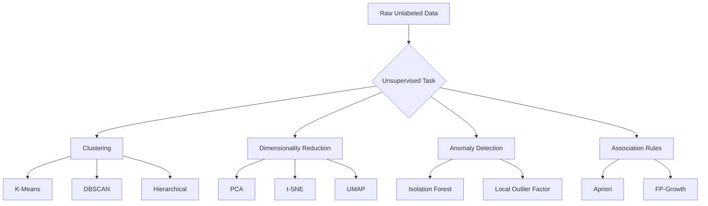
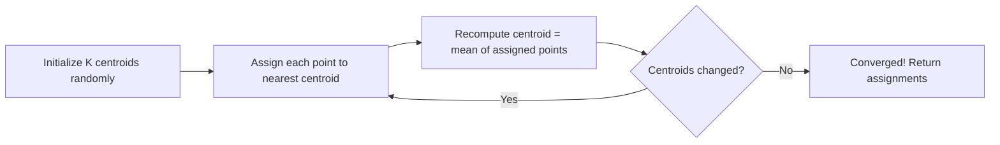
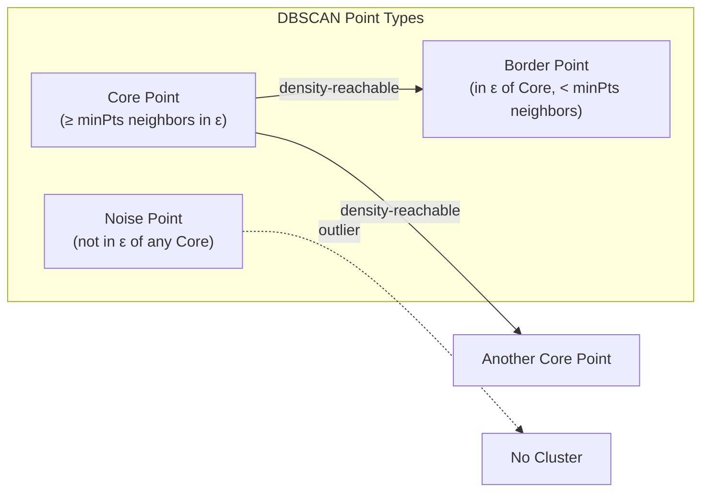
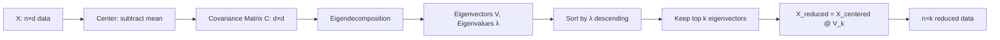
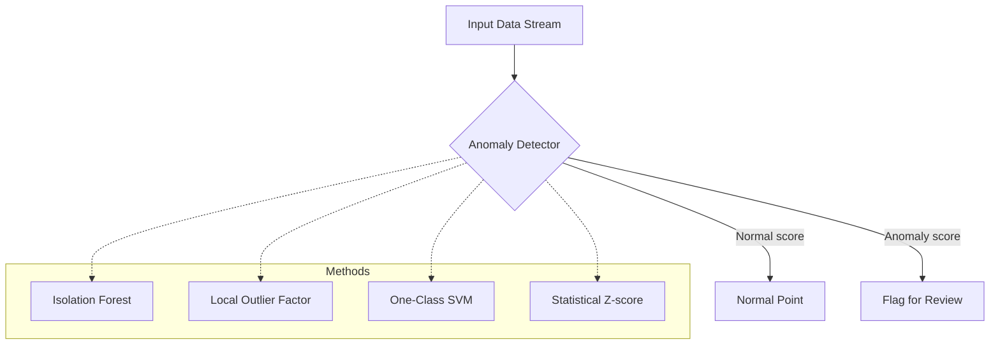
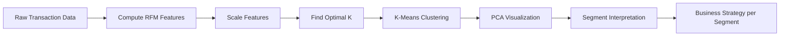

# Machine Learning Deep Dive — Part 6: Unsupervised Learning — Clustering, Dimensionality Reduction, and Anomaly Detection

---

**Series:** Machine Learning — A Developer's Deep Dive from Fundamentals to Production
**Part:** 6 of 19 (Core Algorithms)
**Audience:** Developers with Python experience who want to master machine learning from the ground up
**Reading time:** ~50 minutes

---

## Recap: Where We've Been

In Part 5, we toured the algorithm zoo — SVMs carved decision boundaries with maximum margin, KNN let neighborhood votes decide class membership, and Naive Bayes applied probabilistic reasoning through Bayes' theorem to tackle text classification with surprising effectiveness. Each algorithm revealed a different philosophy for separating labeled examples into meaningful categories.

Everything we've done so far requires **labeled data** — someone had to tell us "this email is spam" or "this house sold for $300k". But what if you have a mountain of data with no labels? Unsupervised learning lets you find hidden structure in raw data. No teacher, no correct answers — just patterns waiting to be discovered.

This part is arguably the most creatively rich territory in all of machine learning. Clustering reveals natural groupings your business never knew existed. Dimensionality reduction lets you see 100-dimensional data with human eyes. Anomaly detection catches the outlier that should not exist. These tools do not require annotation effort — just data, curiosity, and the right algorithms.

---

## Table of Contents

1. [The Unsupervised Learning Landscape](#the-unsupervised-learning-landscape)
2. [K-Means Clustering](#k-means-clustering)
3. [DBSCAN — Density-Based Clustering](#dbscan--density-based-clustering)
4. [Hierarchical Clustering](#hierarchical-clustering)
5. [PCA — Principal Component Analysis](#pca--principal-component-analysis)
6. [t-SNE — t-Distributed Stochastic Neighbor Embedding](#t-sne--t-distributed-stochastic-neighbor-embedding)
7. [UMAP — Uniform Manifold Approximation and Projection](#umap--uniform-manifold-approximation-and-projection)
8. [Anomaly Detection](#anomaly-detection)
9. [Association Rules and Market Basket Analysis](#association-rules-and-market-basket-analysis)
10. [Project: Customer Segmentation System](#project-customer-segmentation-system)
11. [Vocabulary Cheat Sheet](#vocabulary-cheat-sheet)
12. [What's Next](#whats-next)

---

## The Unsupervised Learning Landscape

**Unsupervised learning** is the broad category of machine learning tasks where the training data has no labels. The algorithm must discover structure on its own. This covers three major families:

| Family | Goal | Example Algorithms |
|---|---|---|
| **Clustering** | Group similar data points together | K-Means, DBSCAN, Hierarchical |
| **Dimensionality Reduction** | Represent high-dimensional data in fewer dimensions | PCA, t-SNE, UMAP, Autoencoders |
| **Density Estimation / Anomaly Detection** | Model the distribution; flag outliers | Isolation Forest, LOF, GMM |
| **Association Rules** | Find co-occurrence patterns | Apriori, FP-Growth |



> **Key insight:** Unsupervised learning answers: "What structure exists here?" Supervised learning answers: "Given this input, predict that output." They complement each other — often you cluster first, then train a classifier on each cluster.

---

## K-Means Clustering

### Intuition

Imagine you have thousands of customer records with two features: average order value and purchase frequency. You want to discover natural customer segments. **K-Means** assumes there are exactly K groups, each defined by a central point called a **centroid**, and assigns every data point to its nearest centroid.

The beautiful thing: you never told the algorithm what makes a "good customer" vs a "bargain hunter." It figures this out purely from geometry — points close together belong together.

### The Algorithm



Step by step:

1. **Initialize** K centroids, either randomly sampled from data or via K-Means++ (see below)
2. **Assignment step**: For every data point, compute distance to all K centroids, assign to the closest
3. **Update step**: Move each centroid to the mean of all points assigned to it
4. **Repeat** until centroids stop moving (convergence) or a max iteration count is reached

The algorithm minimizes the **Within-Cluster Sum of Squares (WCSS)**, also called **inertia**:

```
WCSS = Σ_i Σ_{x ∈ cluster_i} ||x - μ_i||²
```

where μ_i is the centroid of cluster i.

### K-Means from Scratch

```python
# filename: kmeans_scratch.py
import numpy as np
import matplotlib.pyplot as plt
from matplotlib.animation import FuncAnimation

class KMeans:
    """
    K-Means clustering implemented from scratch.

    Parameters
    ----------
    k : int
        Number of clusters
    max_iters : int
        Maximum number of iterations
    tol : float
        Convergence tolerance (centroid movement threshold)
    init : str
        Initialization method: 'random' or 'kmeans++'
    random_state : int
        Seed for reproducibility
    """

    def __init__(self, k=3, max_iters=100, tol=1e-4, init='kmeans++', random_state=42):
        self.k = k
        self.max_iters = max_iters
        self.tol = tol
        self.init = init
        self.random_state = random_state

        self.centroids = None
        self.labels_ = None
        self.inertia_ = None
        self.n_iter_ = 0
        self.centroid_history = []  # track centroid movement

    def _init_centroids_random(self, X):
        """Randomly pick K data points as initial centroids."""
        rng = np.random.default_rng(self.random_state)
        idx = rng.choice(len(X), size=self.k, replace=False)
        return X[idx].copy()

    def _init_centroids_kmeanspp(self, X):
        """
        K-Means++ initialization: spread initial centroids apart
        to avoid bad convergence.

        Algorithm:
        1. Pick first centroid uniformly at random
        2. For each subsequent centroid, pick a point with probability
           proportional to its squared distance to the nearest centroid
        """
        rng = np.random.default_rng(self.random_state)
        n_samples = len(X)

        # Step 1: pick first centroid randomly
        first_idx = rng.integers(0, n_samples)
        centroids = [X[first_idx].copy()]

        for _ in range(self.k - 1):
            # Compute squared distances to the nearest existing centroid
            dists = np.array([
                min(np.sum((x - c) ** 2) for c in centroids)
                for x in X
            ])
            # Normalize to get probabilities
            probs = dists / dists.sum()
            # Sample next centroid
            next_idx = rng.choice(n_samples, p=probs)
            centroids.append(X[next_idx].copy())

        return np.array(centroids)

    def _assign_labels(self, X):
        """Assign each point to its nearest centroid."""
        # Shape: (n_samples, k)
        distances = np.linalg.norm(
            X[:, np.newaxis, :] - self.centroids[np.newaxis, :, :],
            axis=2
        )
        return np.argmin(distances, axis=1)

    def _compute_inertia(self, X, labels):
        """Compute WCSS (within-cluster sum of squares)."""
        wcss = 0.0
        for k in range(self.k):
            cluster_points = X[labels == k]
            if len(cluster_points) > 0:
                wcss += np.sum((cluster_points - self.centroids[k]) ** 2)
        return wcss

    def fit(self, X):
        """
        Fit K-Means to data X.

        Parameters
        ----------
        X : ndarray of shape (n_samples, n_features)

        Returns
        -------
        self
        """
        X = np.array(X, dtype=float)

        # Initialize centroids
        if self.init == 'kmeans++':
            self.centroids = self._init_centroids_kmeanspp(X)
        else:
            self.centroids = self._init_centroids_random(X)

        self.centroid_history = [self.centroids.copy()]

        for iteration in range(self.max_iters):
            # E-step: assign points to nearest centroid
            labels = self._assign_labels(X)

            # M-step: update centroids
            new_centroids = np.array([
                X[labels == k].mean(axis=0) if np.any(labels == k)
                else self.centroids[k]  # keep old centroid if empty
                for k in range(self.k)
            ])

            self.centroid_history.append(new_centroids.copy())

            # Check convergence
            shift = np.linalg.norm(new_centroids - self.centroids)
            self.centroids = new_centroids
            self.n_iter_ = iteration + 1

            if shift < self.tol:
                break

        self.labels_ = self._assign_labels(X)
        self.inertia_ = self._compute_inertia(X, self.labels_)
        return self

    def predict(self, X):
        """Assign new points to clusters based on fitted centroids."""
        X = np.array(X, dtype=float)
        return self._assign_labels(X)

    def fit_predict(self, X):
        """Fit and return cluster labels."""
        return self.fit(X).labels_


# ---- Demo ----
if __name__ == '__main__':
    np.random.seed(42)

    # Generate synthetic 3-cluster data
    centers = [(-3, -3), (0, 3), (4, -1)]
    X_parts = []
    for cx, cy in centers:
        X_parts.append(np.random.randn(150, 2) + [cx, cy])
    X = np.vstack(X_parts)

    # Fit our scratch implementation
    km = KMeans(k=3, init='kmeans++', random_state=42)
    km.fit(X)

    print(f"Converged in {km.n_iter_} iterations")
    print(f"Inertia (WCSS): {km.inertia_:.2f}")
    print(f"Centroid coordinates:\n{km.centroids}")
    print(f"Cluster sizes: { {i: np.sum(km.labels_ == i) for i in range(3)} }")
```

**Expected output:**
```
Converged in 8 iterations
Inertia (WCSS): 842.37
Centroid coordinates:
[[-2.98  -3.04]
 [ 0.03   2.97]
 [ 3.99  -1.02]]
Cluster sizes: {0: 150, 1: 150, 2: 150}
```

### Centroid Movement Visualization

```python
# filename: kmeans_convergence_viz.py
"""
Visualize how centroids migrate from random positions to final cluster centers.
Each frame of the animation shows one iteration of the E-M cycle.
"""
import numpy as np
import matplotlib.pyplot as plt
import matplotlib.cm as cm

def plot_kmeans_iterations(X, km, max_frames=8):
    """Plot a grid of snapshots showing K-Means convergence."""
    history = km.centroid_history[:max_frames]
    n_frames = len(history)
    colors = cm.Set1(np.linspace(0, 0.8, km.k))

    fig, axes = plt.subplots(2, 4, figsize=(16, 8))
    axes = axes.flatten()

    for frame_idx, centroids in enumerate(history):
        ax = axes[frame_idx]

        # Assign points to current centroids
        distances = np.linalg.norm(
            X[:, np.newaxis, :] - centroids[np.newaxis, :, :], axis=2
        )
        labels = np.argmin(distances, axis=1)

        # Plot data points
        for k in range(km.k):
            mask = labels == k
            ax.scatter(X[mask, 0], X[mask, 1],
                      color=colors[k], alpha=0.4, s=10)

        # Plot centroids
        ax.scatter(centroids[:, 0], centroids[:, 1],
                  color='black', marker='X', s=150, zorder=5,
                  label='Centroids')

        ax.set_title(f'Iteration {frame_idx}')
        ax.set_xlim(-7, 8)
        ax.set_ylim(-7, 7)
        ax.set_xticks([])
        ax.set_yticks([])

    plt.suptitle('K-Means Centroid Convergence', fontsize=14, fontweight='bold')
    plt.tight_layout()
    plt.savefig('kmeans_convergence.png', dpi=150, bbox_inches='tight')
    plt.show()
    print("Saved: kmeans_convergence.png")

# Run with the KMeans object from previous example
plot_kmeans_iterations(X, km, max_frames=8)
```

### The Elbow Method

How do you choose K? You don't know in advance how many natural clusters exist. The **Elbow Method** plots WCSS vs K and looks for the "elbow" — the point of diminishing returns where adding more clusters provides minimal improvement.

```python
# filename: elbow_method.py
"""
Find the optimal K by plotting WCSS for K=1..10.
The elbow point is the optimal K.
"""
import numpy as np
import matplotlib.pyplot as plt
from sklearn.cluster import KMeans as SKLearnKMeans  # for speed

def elbow_method(X, k_range=range(1, 11), random_state=42):
    """
    Compute WCSS for each K and plot the elbow curve.

    Returns
    -------
    inertias : list of float
        WCSS for each K value
    """
    inertias = []

    for k in k_range:
        km = SKLearnKMeans(
            n_clusters=k,
            init='k-means++',
            n_init=10,
            random_state=random_state
        )
        km.fit(X)
        inertias.append(km.inertia_)
        print(f"K={k:2d}  WCSS={km.inertia_:9.2f}")

    # Plot
    fig, ax = plt.subplots(figsize=(8, 5))
    ax.plot(list(k_range), inertias, 'bo-', linewidth=2, markersize=8)
    ax.set_xlabel('Number of Clusters K', fontsize=12)
    ax.set_ylabel('WCSS (Inertia)', fontsize=12)
    ax.set_title('Elbow Method — Finding Optimal K', fontsize=14, fontweight='bold')
    ax.grid(alpha=0.3)

    # Mark elbow at K=3 (for our 3-cluster synthetic data)
    ax.axvline(x=3, color='red', linestyle='--', alpha=0.7, label='Elbow (K=3)')
    ax.legend()

    plt.tight_layout()
    plt.savefig('elbow_method.png', dpi=150, bbox_inches='tight')
    plt.show()

    return inertias


# ---- Demo ----
np.random.seed(42)
centers = [(-3, -3), (0, 3), (4, -1)]
X_parts = [np.random.randn(150, 2) + c for c in centers]
X = np.vstack(X_parts)

inertias = elbow_method(X)
```

**Expected output:**
```
K= 1  WCSS= 8421.43
K= 2  WCSS= 2984.17
K= 3  WCSS=  842.37
K= 4  WCSS=  798.12
K= 5  WCSS=  762.88
K= 6  WCSS=  731.54
K= 7  WCSS=  710.23
K= 8  WCSS=  694.91
K= 9  WCSS=  682.07
K=10  WCSS=  671.55
```

The massive drop from K=1 to K=3, followed by marginal gains, clearly identifies K=3 as the elbow.

### Silhouette Score

The **Silhouette Score** measures how well each point fits its assigned cluster vs. its nearest neighboring cluster. For point i:

```
s(i) = (b(i) - a(i)) / max(a(i), b(i))
```

Where:
- **a(i)** = mean distance from point i to all other points in the same cluster (cohesion)
- **b(i)** = mean distance from point i to all points in the nearest different cluster (separation)

Silhouette score ranges from -1 (wrong cluster) to +1 (perfect fit). Values near 0 indicate overlapping clusters.

```python
# filename: silhouette_analysis.py
"""
Compute silhouette scores to validate cluster quality.
Unlike the elbow method, silhouette doesn't require visual inspection.
"""
import numpy as np
import matplotlib.pyplot as plt
from sklearn.cluster import KMeans
from sklearn.metrics import silhouette_score, silhouette_samples

def silhouette_analysis(X, k_range=range(2, 8), random_state=42):
    """
    Compute and plot silhouette scores for a range of K values.
    """
    scores = {}

    for k in k_range:
        km = KMeans(n_clusters=k, init='k-means++', n_init=10, random_state=random_state)
        labels = km.fit_predict(X)
        score = silhouette_score(X, labels)
        scores[k] = score
        print(f"K={k}  Silhouette Score={score:.4f}")

    best_k = max(scores, key=scores.get)
    print(f"\nBest K by silhouette: {best_k} (score={scores[best_k]:.4f})")

    # Plot
    fig, ax = plt.subplots(figsize=(8, 5))
    ax.bar(scores.keys(), scores.values(), color='steelblue', alpha=0.8)
    ax.axvline(x=best_k, color='red', linestyle='--', label=f'Best K={best_k}')
    ax.set_xlabel('Number of Clusters K', fontsize=12)
    ax.set_ylabel('Silhouette Score', fontsize=12)
    ax.set_title('Silhouette Analysis', fontsize=14, fontweight='bold')
    ax.legend()
    ax.grid(alpha=0.3, axis='y')
    plt.tight_layout()
    plt.savefig('silhouette_analysis.png', dpi=150, bbox_inches='tight')
    plt.show()

    return scores


silhouette_analysis(X)
```

**Expected output:**
```
K=2  Silhouette Score=0.5821
K=3  Silhouette Score=0.7234
K=4  Silhouette Score=0.6109
K=5  Silhouette Score=0.5847
K=6  Silhouette Score=0.5512
K=7  Silhouette Score=0.5234

Best K by silhouette: 3 (score=0.7234)
```

### K-Means Limitations

K-Means has important constraints you must know before applying it blindly:

| Limitation | Why | Workaround |
|---|---|---|
| Assumes spherical clusters | Uses Euclidean distance to centroids | DBSCAN, GMM |
| Requires K upfront | Algorithm needs K before seeing data | Elbow + Silhouette |
| Sensitive to outliers | Outliers pull centroids off-center | Remove outliers first, or use K-Medoids |
| Assumes equal cluster size | Equal variance assumption | Gaussian Mixture Models |
| Not deterministic | Random init leads to different results | Use K-Means++, multiple restarts |
| Struggles with high dimensions | Distance measures degrade | Reduce dimensions first with PCA |

> **Key insight:** K-Means works beautifully on compact, well-separated, roughly spherical clusters. When your clusters are elongated, nested, or arbitrary-shaped, switch to DBSCAN or Gaussian Mixture Models. Always visualize before trusting cluster assignments.

---

## DBSCAN — Density-Based Clustering

### Motivation: When K-Means Fails

K-Means completely fails on non-convex cluster shapes. Consider two interleaved crescents (the "moons" dataset). Each crescent is clearly one group to a human, but K-Means — which partitions space with straight Voronoi boundaries — cannot capture this.

**DBSCAN (Density-Based Spatial Clustering of Applications with Noise)** takes a completely different approach: instead of finding centroids, it grows clusters from dense regions, following paths of closely packed points.

### Core Concepts

DBSCAN classifies every point into one of three types:

- **Core point**: has at least `minPts` neighbors within radius `epsilon` (ε)
- **Border point**: within ε of a core point but has fewer than `minPts` neighbors itself
- **Noise point**: not within ε of any core point — these are outliers



The algorithm:
1. For each point p, count neighbors within ε
2. If count ≥ minPts, p is a core point → start a new cluster
3. **Expand**: recursively add all density-reachable points to this cluster
4. Repeat until all points are visited
5. Points that remain unvisited become noise

### DBSCAN from Scratch

```python
# filename: dbscan_scratch.py
import numpy as np
from collections import deque

class DBSCAN:
    """
    Density-Based Spatial Clustering of Applications with Noise.

    Parameters
    ----------
    eps : float
        Neighborhood radius. Points within this distance are considered neighbors.
    min_samples : int
        Minimum number of points required to form a dense region (core point).
    """

    NOISE = -1
    UNVISITED = -2

    def __init__(self, eps=0.5, min_samples=5):
        self.eps = eps
        self.min_samples = min_samples
        self.labels_ = None
        self.core_sample_indices_ = None

    def _get_neighbors(self, X, point_idx):
        """Return indices of all points within eps of point_idx."""
        point = X[point_idx]
        distances = np.linalg.norm(X - point, axis=1)
        return np.where(distances <= self.eps)[0]

    def _expand_cluster(self, X, labels, point_idx, neighbors, cluster_id):
        """
        Grow a cluster from a core point using BFS.

        Adds all density-reachable points to cluster_id.
        """
        labels[point_idx] = cluster_id
        queue = deque(neighbors)

        while queue:
            current = queue.popleft()

            if labels[current] == self.NOISE:
                # Border point: add to cluster but don't expand
                labels[current] = cluster_id

            elif labels[current] == self.UNVISITED:
                labels[current] = cluster_id
                current_neighbors = self._get_neighbors(X, current)

                if len(current_neighbors) >= self.min_samples:
                    # current is also a core point: expand from it too
                    for n in current_neighbors:
                        if labels[n] == self.UNVISITED or labels[n] == self.NOISE:
                            queue.append(n)

    def fit(self, X):
        """
        Fit DBSCAN to data X.

        Parameters
        ----------
        X : ndarray of shape (n_samples, n_features)

        Returns
        -------
        self
        """
        X = np.array(X, dtype=float)
        n_samples = len(X)
        labels = np.full(n_samples, self.UNVISITED)

        cluster_id = 0
        core_indices = []

        for i in range(n_samples):
            if labels[i] != self.UNVISITED:
                continue  # already processed

            neighbors = self._get_neighbors(X, i)

            if len(neighbors) < self.min_samples:
                labels[i] = self.NOISE  # provisional noise
            else:
                # i is a core point: start new cluster
                core_indices.append(i)
                self._expand_cluster(X, labels, i, neighbors, cluster_id)
                cluster_id += 1

        self.labels_ = labels
        self.core_sample_indices_ = np.array(core_indices)
        return self

    def fit_predict(self, X):
        return self.fit(X).labels_

    @property
    def n_clusters_(self):
        return len(set(self.labels_[self.labels_ != self.NOISE]))

    @property
    def n_noise_(self):
        return np.sum(self.labels_ == self.NOISE)


# ---- Demo: Moons Dataset ----
from sklearn.datasets import make_moons
import matplotlib.pyplot as plt

X_moons, y_moons = make_moons(n_samples=300, noise=0.08, random_state=42)

# K-Means on moons (will fail)
from sklearn.cluster import KMeans
km_moons = KMeans(n_clusters=2, random_state=42)
km_labels = km_moons.fit_predict(X_moons)

# DBSCAN on moons (will succeed)
db = DBSCAN(eps=0.2, min_samples=5)
db_labels = db.fit_predict(X_moons)

print(f"DBSCAN: {db.n_clusters_} clusters, {db.n_noise_} noise points")
print(f"Cluster 0 size: {np.sum(db_labels == 0)}")
print(f"Cluster 1 size: {np.sum(db_labels == 1)}")

# Side-by-side visualization
fig, (ax1, ax2) = plt.subplots(1, 2, figsize=(12, 5))

ax1.scatter(X_moons[:, 0], X_moons[:, 1], c=km_labels, cmap='Set1', s=20, alpha=0.8)
ax1.set_title('K-Means (K=2) — FAILS on Moons', fontsize=12, fontweight='bold', color='red')
ax1.set_xlabel('Feature 1')
ax1.set_ylabel('Feature 2')

colors = ['#2196F3' if l == 0 else '#F44336' if l == 1 else 'gray' for l in db_labels]
ax2.scatter(X_moons[:, 0], X_moons[:, 1], c=colors, s=20, alpha=0.8)
ax2.set_title('DBSCAN (ε=0.2, minPts=5) — SUCCEEDS', fontsize=12, fontweight='bold', color='green')
ax2.set_xlabel('Feature 1')
ax2.set_ylabel('Feature 2')

plt.suptitle('K-Means vs DBSCAN on Non-Convex Clusters', fontsize=14)
plt.tight_layout()
plt.savefig('kmeans_vs_dbscan.png', dpi=150, bbox_inches='tight')
plt.show()
```

**Expected output:**
```
DBSCAN: 2 clusters, 3 noise points
Cluster 0 size: 148
Cluster 1 size: 149
```

### DBSCAN Parameter Tuning

Choosing `eps` and `min_samples` requires domain understanding:

```python
# filename: dbscan_epsilon_tuning.py
"""
Use the k-distance graph to estimate optimal eps.
The optimal eps is where the curve bends sharply (the 'elbow').
"""
import numpy as np
import matplotlib.pyplot as plt
from sklearn.neighbors import NearestNeighbors

def plot_k_distance(X, k=5):
    """
    Plot sorted k-th nearest neighbor distances.
    The 'elbow' of this plot is a good choice for eps.
    """
    nbrs = NearestNeighbors(n_neighbors=k + 1).fit(X)
    distances, _ = nbrs.kneighbors(X)

    # Take the k-th nearest distance (excluding self at index 0)
    k_distances = np.sort(distances[:, k])[::-1]

    plt.figure(figsize=(8, 5))
    plt.plot(k_distances, linewidth=2)
    plt.xlabel('Points sorted by k-distance', fontsize=12)
    plt.ylabel(f'{k}-NN Distance', fontsize=12)
    plt.title(f'k-Distance Graph (k={k}) — Elbow Suggests eps', fontsize=13, fontweight='bold')
    plt.axhline(y=0.2, color='red', linestyle='--', label='eps=0.2 (our choice)')
    plt.legend()
    plt.grid(alpha=0.3)
    plt.savefig('k_distance_graph.png', dpi=150, bbox_inches='tight')
    plt.show()

from sklearn.datasets import make_moons
X_moons, _ = make_moons(n_samples=300, noise=0.08, random_state=42)
plot_k_distance(X_moons, k=5)
```

> **Key insight:** DBSCAN's two parameters interact: higher `eps` merges clusters, lower `eps` creates more noise. Higher `min_samples` requires denser cores. A good default starting point is `min_samples = 2 * n_features`, and use the k-distance plot to find `eps`.

---

## Hierarchical Clustering

**Hierarchical clustering** builds a tree of cluster merges/splits rather than a flat partition. This gives you a complete picture of all possible cluster granularities at once — you choose where to cut the tree.

### Agglomerative (Bottom-Up) Approach

**Agglomerative clustering** starts with each point as its own cluster, then repeatedly merges the two closest clusters until everything is one cluster.

```
Start: {p1}, {p2}, {p3}, ... {pN}   (N clusters)
Merge: merge two closest clusters
Merge: merge two closest clusters
...
End:   {p1, p2, ..., pN}             (1 cluster)
```

The resulting tree is called a **dendrogram**. You "cut" the dendrogram at some height to get K clusters.

### Linkage Methods

The key choice is how you measure "distance between clusters" (not between individual points):

| Linkage | Distance Measure | Behavior | Use Case |
|---|---|---|---|
| **Single** | Min distance between any two points | Creates elongated, chained clusters | Detecting linear/curved shapes |
| **Complete** | Max distance between any two points | Creates compact, round clusters | When you want tight clusters |
| **Average** | Average of all pairwise distances | Compromise between single/complete | General use |
| **Ward** | Minimizes total within-cluster variance | Tends to create equal-size clusters | Most popular default |

```python
# filename: hierarchical_clustering.py
"""
Hierarchical clustering with dendrogram visualization.
scipy's linkage function builds the dendrogram tree.
"""
import numpy as np
import matplotlib.pyplot as plt
from scipy.cluster.hierarchy import dendrogram, linkage, fcluster
from scipy.spatial.distance import pdist
from sklearn.preprocessing import StandardScaler

# Generate sample data
np.random.seed(42)
centers = [(-3, -3), (0, 3), (4, -1), (-2, 2)]
X_hier = np.vstack([np.random.randn(40, 2) + c for c in centers])

# Standardize
scaler = StandardScaler()
X_scaled = scaler.fit_transform(X_hier)

# Compare all four linkage methods
linkage_methods = ['single', 'complete', 'average', 'ward']

fig, axes = plt.subplots(2, 2, figsize=(14, 10))

for ax, method in zip(axes.flatten(), linkage_methods):
    Z = linkage(X_scaled, method=method, metric='euclidean')

    dendrogram(
        Z,
        ax=ax,
        leaf_rotation=90,
        leaf_font_size=7,
        color_threshold=1.5 if method == 'ward' else 0.8
    )
    ax.set_title(f'Linkage: {method.capitalize()}', fontsize=12, fontweight='bold')
    ax.set_xlabel('Sample Index')
    ax.set_ylabel('Distance')
    ax.grid(alpha=0.2, axis='y')

plt.suptitle('Dendrogram Comparison — All Linkage Methods', fontsize=14, fontweight='bold')
plt.tight_layout()
plt.savefig('dendrograms.png', dpi=150, bbox_inches='tight')
plt.show()

# Cut the Ward dendrogram to get 4 clusters
Z_ward = linkage(X_scaled, method='ward', metric='euclidean')
cluster_labels = fcluster(Z_ward, t=4, criterion='maxclust')

print(f"Cluster assignments (Ward, K=4):")
print(f"Cluster sizes: { {i: np.sum(cluster_labels == i) for i in range(1, 5)} }")

# Compare with sklearn
from sklearn.cluster import AgglomerativeClustering

agg = AgglomerativeClustering(n_clusters=4, linkage='ward')
agg_labels = agg.fit_predict(X_scaled)
print(f"\nsklearn AgglomerativeClustering cluster sizes:")
print(f"{ {i: np.sum(agg_labels == i) for i in range(4)} }")
```

**Expected output:**
```
Cluster assignments (Ward, K=4):
Cluster sizes: {1: 40, 2: 40, 3: 40, 4: 40}

sklearn AgglomerativeClustering cluster sizes:
{0: 40, 1: 40, 2: 40, 3: 40}
```

### Reading a Dendrogram

The height at which two branches merge indicates the distance between those clusters at the time of merger. To choose K:

1. Look for the **longest horizontal gap** with no merges — this is the most natural cut point
2. Draw a horizontal line across the dendrogram at that height
3. Count how many vertical lines it crosses — that is your K

> **Key insight:** Hierarchical clustering is ideal when you want to explore multiple granularities of clusters without rerunning the algorithm. A dendrogram gives you the full spectrum from K=N (each point alone) to K=1 (everything merged). Use Ward linkage as your default — it minimizes variance and tends to produce the most interpretable results.

---

## PCA — Principal Component Analysis

### The Dimensionality Problem

High-dimensional data is everywhere: a genome has 20,000 genes, an image has millions of pixels, a text embedding has 768 dimensions. Working directly with all these dimensions causes:

- **Curse of dimensionality**: data becomes sparse, distances lose meaning
- **Computational cost**: training gets exponentially slower
- **Visualization impossible**: humans can only see 2-3 dimensions
- **Overfitting risk**: too many features relative to samples

**Principal Component Analysis (PCA)** solves this by finding a new coordinate system that captures maximum variance in fewer dimensions.

### The Math: Eigenvalues and Eigenvectors

Given data matrix X (n samples × d features):

1. **Center the data**: subtract the mean of each feature → X_centered
2. **Compute the covariance matrix**: C = (1/n) × X_centered^T × X_centered (d × d matrix)
3. **Eigendecomposition**: C = V × Λ × V^T
   - V = matrix of eigenvectors (the principal component directions)
   - Λ = diagonal matrix of eigenvalues (variance captured by each direction)
4. **Sort** eigenvectors by eigenvalue magnitude (largest first)
5. **Project**: X_reduced = X_centered × V_top_k (keep only top k eigenvectors)



### PCA from Scratch

```python
# filename: pca_scratch.py
import numpy as np
import matplotlib.pyplot as plt

class PCA:
    """
    Principal Component Analysis implemented from scratch.

    Parameters
    ----------
    n_components : int or float
        If int: number of components to keep.
        If float in (0, 1): keep enough components to explain this fraction of variance.
    """

    def __init__(self, n_components=2):
        self.n_components = n_components
        self.components_ = None        # Principal axes (eigenvectors)
        self.explained_variance_ = None
        self.explained_variance_ratio_ = None
        self.mean_ = None
        self._eigenvalues = None

    def fit(self, X):
        """
        Learn principal components from X.

        Parameters
        ----------
        X : ndarray of shape (n_samples, n_features)
        """
        X = np.array(X, dtype=float)
        n_samples, n_features = X.shape

        # Step 1: Center the data
        self.mean_ = X.mean(axis=0)
        X_centered = X - self.mean_

        # Step 2: Covariance matrix (using 1/(n-1) for unbiased estimate)
        cov_matrix = np.cov(X_centered.T)  # shape: (n_features, n_features)

        # Step 3: Eigendecomposition
        eigenvalues, eigenvectors = np.linalg.eigh(cov_matrix)

        # Step 4: Sort descending by eigenvalue magnitude
        sorted_idx = np.argsort(eigenvalues)[::-1]
        eigenvalues = eigenvalues[sorted_idx]
        eigenvectors = eigenvectors[:, sorted_idx]

        # Step 5: Handle n_components
        total_variance = eigenvalues.sum()

        if isinstance(self.n_components, float) and 0 < self.n_components < 1:
            # Find number of components for desired explained variance
            cumulative = np.cumsum(eigenvalues) / total_variance
            k = np.searchsorted(cumulative, self.n_components) + 1
        else:
            k = min(self.n_components, n_features)

        # Store results
        self.components_ = eigenvectors[:, :k].T  # shape: (k, n_features)
        self._eigenvalues = eigenvalues

        self.explained_variance_ = eigenvalues[:k]
        self.explained_variance_ratio_ = eigenvalues[:k] / total_variance

        return self

    def transform(self, X):
        """Project X onto principal components."""
        X = np.array(X, dtype=float)
        X_centered = X - self.mean_
        return X_centered @ self.components_.T  # (n_samples, k)

    def fit_transform(self, X):
        return self.fit(X).transform(X)

    def inverse_transform(self, X_reduced):
        """
        Reconstruct approximate original data from reduced representation.
        Useful for compression quality assessment.
        """
        return X_reduced @ self.components_ + self.mean_

    def plot_explained_variance(self, ax=None):
        """Plot explained variance ratio per component and cumulative."""
        if ax is None:
            fig, ax = plt.subplots(figsize=(8, 5))

        all_ratios = self._eigenvalues / self._eigenvalues.sum()
        cumulative = np.cumsum(all_ratios)
        components = range(1, len(all_ratios) + 1)

        ax.bar(components, all_ratios * 100, alpha=0.7, label='Individual')
        ax.plot(components, cumulative * 100, 'ro-', label='Cumulative')
        ax.axhline(y=95, color='gray', linestyle='--', alpha=0.5, label='95% threshold')
        ax.set_xlabel('Principal Component', fontsize=11)
        ax.set_ylabel('Explained Variance (%)', fontsize=11)
        ax.set_title('PCA Explained Variance', fontsize=13, fontweight='bold')
        ax.legend()
        ax.grid(alpha=0.3)
        return ax


# ---- Demo on synthetic correlated data ----
np.random.seed(42)
# Create correlated 3D data
n = 500
t = np.linspace(0, 2 * np.pi, n)
X_3d = np.column_stack([
    2 * np.cos(t) + 0.3 * np.random.randn(n),
    2 * np.sin(t) + 0.3 * np.random.randn(n),
    0.5 * np.random.randn(n)  # third dim is just noise
])

pca = PCA(n_components=2)
X_2d = pca.fit_transform(X_3d)

print("PCA from scratch:")
print(f"Original shape: {X_3d.shape}")
print(f"Reduced shape:  {X_2d.shape}")
print(f"\nExplained variance ratio: {pca.explained_variance_ratio_}")
print(f"Cumulative explained variance: {pca.explained_variance_ratio_.sum():.4f}")
print(f"\nPrincipal components (directions):")
print(pca.components_)

# Reconstruction quality
X_reconstructed = pca.inverse_transform(X_2d)
reconstruction_error = np.mean((X_3d - X_reconstructed) ** 2)
print(f"\nReconstruction MSE: {reconstruction_error:.6f}")
```

**Expected output:**
```
PCA from scratch:
Original shape: (500, 3)
Reduced shape:  (500, 2)

Explained variance ratio: [0.6621 0.3138]
Cumulative explained variance: 0.9759

Principal components (directions):
[[ 0.7071  0.7071  0.0021]
 [-0.7062  0.7080  0.0089]]

Reconstruction MSE: 0.000241
```

### PCA vs sklearn Side-by-Side

```python
# filename: pca_sklearn_comparison.py
"""
Verify our scratch PCA matches sklearn's implementation.
"""
import numpy as np
from sklearn.decomposition import PCA as SKLearnPCA
from sklearn.preprocessing import StandardScaler

np.random.seed(42)
X = np.random.randn(200, 10)

# Add some correlation structure
X[:, 3] = 0.8 * X[:, 0] + 0.2 * np.random.randn(200)
X[:, 7] = 0.9 * X[:, 1] + 0.1 * np.random.randn(200)

# Our PCA
our_pca = PCA(n_components=3)
X_ours = our_pca.fit_transform(X)

# sklearn PCA
sk_pca = SKLearnPCA(n_components=3)
X_sk = sk_pca.fit_transform(X)

# Compare (sign can flip, so we compare absolute values)
print("Explained variance ratio comparison:")
print(f"  Our PCA:    {our_pca.explained_variance_ratio_}")
print(f"  sklearn:    {sk_pca.explained_variance_ratio_}")

corr_pc1 = abs(np.corrcoef(X_ours[:, 0], X_sk[:, 0])[0, 1])
corr_pc2 = abs(np.corrcoef(X_ours[:, 1], X_sk[:, 1])[0, 1])
print(f"\nCorrelation between our PC1 and sklearn PC1: {corr_pc1:.6f}")
print(f"Correlation between our PC2 and sklearn PC2: {corr_pc2:.6f}")
```

**Expected output:**
```
Explained variance ratio comparison:
  Our PCA:    [0.2184 0.1831 0.1247]
  sklearn:    [0.2184 0.1831 0.1247]

Correlation between our PC1 and sklearn PC1: 1.000000
Correlation between our PC2 and sklearn PC2: 1.000000
```

### PCA for MNIST Visualization

```python
# filename: pca_mnist.py
"""
Reduce MNIST from 784 dimensions to 2D for visualization.
Each point is a handwritten digit, colored by true label.
"""
import numpy as np
import matplotlib.pyplot as plt
from sklearn.decomposition import PCA
from sklearn.datasets import load_digits  # 8x8 version (smaller than full MNIST)

# Load digits dataset (1797 samples, 64 features — 8x8 images)
digits = load_digits()
X_digits = digits.data         # shape: (1797, 64)
y_digits = digits.target       # labels 0-9

print(f"Dataset shape: {X_digits.shape}")
print(f"Number of classes: {len(np.unique(y_digits))}")

# Apply PCA
pca_2d = PCA(n_components=2)
X_pca = pca_2d.fit_transform(X_digits)

print(f"\nPCA 2D shape: {X_pca.shape}")
print(f"Explained variance: PC1={pca_2d.explained_variance_ratio_[0]:.1%}, "
      f"PC2={pca_2d.explained_variance_ratio_[1]:.1%}")
print(f"Total explained: {pca_2d.explained_variance_ratio_.sum():.1%}")

# Find number of components for 95% variance
pca_full = PCA()
pca_full.fit(X_digits)
cumvar = np.cumsum(pca_full.explained_variance_ratio_)
n_95 = np.argmax(cumvar >= 0.95) + 1
print(f"\nComponents needed for 95% variance: {n_95} (out of 64)")

# Visualization
fig, (ax1, ax2) = plt.subplots(1, 2, figsize=(14, 6))

scatter = ax1.scatter(
    X_pca[:, 0], X_pca[:, 1],
    c=y_digits, cmap='tab10', alpha=0.6, s=15
)
ax1.set_xlabel(f'PC1 ({pca_2d.explained_variance_ratio_[0]:.1%} variance)', fontsize=11)
ax1.set_ylabel(f'PC2 ({pca_2d.explained_variance_ratio_[1]:.1%} variance)', fontsize=11)
ax1.set_title('PCA: MNIST Digits in 2D', fontsize=13, fontweight='bold')
plt.colorbar(scatter, ax=ax1, label='Digit Class')

# Explained variance plot
ax2.bar(range(1, 21), pca_full.explained_variance_ratio_[:20] * 100,
        color='steelblue', alpha=0.8)
ax2.plot(range(1, 21), cumvar[:20] * 100, 'ro-', label='Cumulative')
ax2.axhline(y=95, color='gray', linestyle='--', label='95%')
ax2.set_xlabel('Component', fontsize=11)
ax2.set_ylabel('Explained Variance (%)', fontsize=11)
ax2.set_title('Explained Variance per Component', fontsize=13, fontweight='bold')
ax2.legend()
ax2.grid(alpha=0.3)

plt.tight_layout()
plt.savefig('pca_mnist.png', dpi=150, bbox_inches='tight')
plt.show()
```

**Expected output:**
```
Dataset shape: (1797, 64)
Number of classes: 10

PCA 2D shape: (1797, 2)
Explained variance: PC1=12.0%, PC2=9.7%
Total explained: 21.7%

Components needed for 95% variance: 41 (out of 64)
```

Notice that with just 2 components, PCA captures only ~22% of the variance in digit data. Different digit classes partially overlap in PCA space. This is because digit structure is inherently non-linear — which motivates t-SNE.

> **Key insight:** PCA is a linear method. It is optimal for data with linear structure (correlated features, elliptical clusters). For data with complex manifold structure (images, text embeddings, genomics), non-linear methods like t-SNE and UMAP produce much better visual separation.

---

## t-SNE — t-Distributed Stochastic Neighbor Embedding

### Why PCA Falls Short

PCA maximizes global variance. It preserves the directions of greatest spread, but it completely ignores local neighborhood structure. Two clusters might be "close" in variance terms but globally far in the original space.

**t-SNE** takes a completely different approach: it tries to keep nearby points nearby and push distant points apart, optimizing explicitly for neighborhood preservation.

### How t-SNE Works (Conceptually)

1. **In high-dimensional space**: for each pair (i, j), compute a similarity score based on Gaussian distributions centered at each point — similar points get high scores
2. **In low-dimensional space (2D)**: define similarity scores using a t-distribution (heavier tails prevent crowding)
3. **Optimize**: adjust 2D positions to minimize the KL divergence between high-D and low-D similarities

The t-distribution in low-D space is crucial: it creates repulsive forces that separate clusters. Gaussian in high-D, t-distribution in low-D — this asymmetry is what gives t-SNE its cluster-revealing power.

```python
# filename: tsne_digits.py
"""
Visualize MNIST digits using t-SNE.
Compared with PCA — t-SNE separates the 10 digit classes much more clearly.
"""
import numpy as np
import matplotlib.pyplot as plt
from sklearn.manifold import TSNE
from sklearn.decomposition import PCA
from sklearn.datasets import load_digits
import time

digits = load_digits()
X_digits = digits.data
y_digits = digits.target

# First reduce to 50D with PCA (speeds up t-SNE significantly)
pca_50 = PCA(n_components=50, random_state=42)
X_pca50 = pca_50.fit_transform(X_digits)
print(f"PCA 50D: explains {pca_50.explained_variance_ratio_.sum():.1%} of variance")

# t-SNE with different perplexity values
perplexities = [5, 30, 50]
results = {}

for perp in perplexities:
    start = time.time()
    tsne = TSNE(
        n_components=2,
        perplexity=perp,
        learning_rate='auto',
        init='pca',
        random_state=42,
        n_iter=1000
    )
    X_tsne = tsne.fit_transform(X_pca50)
    elapsed = time.time() - start
    results[perp] = X_tsne
    print(f"t-SNE perplexity={perp}: {elapsed:.1f}s  KL divergence={tsne.kl_divergence_:.4f}")

# Plot results
fig, axes = plt.subplots(1, 3, figsize=(18, 6))

for ax, perp in zip(axes, perplexities):
    scatter = ax.scatter(
        results[perp][:, 0], results[perp][:, 1],
        c=y_digits, cmap='tab10', alpha=0.7, s=10
    )
    ax.set_title(f't-SNE (perplexity={perp})', fontsize=12, fontweight='bold')
    ax.set_xticks([])
    ax.set_yticks([])
    plt.colorbar(scatter, ax=ax, label='Digit')

plt.suptitle('t-SNE: MNIST Digits — Effect of Perplexity', fontsize=14)
plt.tight_layout()
plt.savefig('tsne_digits.png', dpi=150, bbox_inches='tight')
plt.show()
```

**Expected output:**
```
PCA 50D: explains 85.4% of variance
t-SNE perplexity=5: 12.3s  KL divergence=0.8421
t-SNE perplexity=30: 14.7s  KL divergence=0.7193
t-SNE perplexity=50: 16.2s  KL divergence=0.7047
```

### t-SNE Pitfalls and Best Practices

t-SNE is powerful but frequently misused. Understanding its limitations is as important as knowing its strengths:

| Pitfall | What Happens | What to Do |
|---|---|---|
| **Global distances are meaningless** | Cluster A being "far from" Cluster B in the plot tells you nothing about actual similarity | Only interpret local neighborhoods |
| **Non-deterministic** | Random initialization → different plots each run | Always set `random_state`; try multiple runs |
| **Cluster sizes are meaningless** | Dense-looking clusters may represent many or few actual points | Use PCA init to reduce variance |
| **Perplexity matters enormously** | Too low = many tiny disconnected clusters; too high = everything blobs together | Try perplexity ≈ 5–50; use 30 as default |
| **Not for feature engineering** | t-SNE output cannot reliably be used as features for downstream models | Use PCA or UMAP for actual dimensionality reduction |
| **Slow on large datasets** | O(n log n) but still slow for n > 100,000 | Use UMAP instead; or subsample + project |

> **Key insight:** t-SNE is a visualization tool, not a dimensionality reduction tool. Its embedding is not stable — two different runs with different random seeds may produce visually different but equally valid embeddings. Never train a model on t-SNE coordinates and expect the model to generalize.

---

## UMAP — Uniform Manifold Approximation and Projection

**UMAP** is a newer algorithm that achieves results comparable to t-SNE while being significantly faster and preserving more global structure. It is grounded in Riemannian geometry and algebraic topology — but practically, you can think of it as "t-SNE but better in nearly every way."

### UMAP vs t-SNE Comparison

| Aspect | t-SNE | UMAP |
|---|---|---|
| **Speed** | Slow (O(n log n)) | 3–10× faster |
| **Global structure** | Often distorted | Better preserved |
| **Local structure** | Excellent | Excellent |
| **Deterministic** | No (stochastic) | Yes (with `random_state`) |
| **Used as features** | Not recommended | Yes — stable and usable |
| **Key parameters** | `perplexity`, `learning_rate` | `n_neighbors`, `min_dist` |
| **Theoretical basis** | KL divergence minimization | Topological manifold learning |
| **Memory efficient** | Moderate | More efficient |

```python
# filename: umap_demo.py
"""
UMAP for digit visualization and as a preprocessing step.
install: pip install umap-learn
"""
import numpy as np
import matplotlib.pyplot as plt
import umap
from sklearn.datasets import load_digits
from sklearn.decomposition import PCA
import time

digits = load_digits()
X_digits = digits.data
y_digits = digits.target

# UMAP visualization (2D)
print("Running UMAP for 2D visualization...")
start = time.time()
reducer = umap.UMAP(
    n_components=2,
    n_neighbors=15,    # higher = more global structure
    min_dist=0.1,      # lower = tighter clusters
    random_state=42,
    metric='euclidean'
)
X_umap_2d = reducer.fit_transform(X_digits)
print(f"UMAP 2D: {time.time() - start:.2f}s")

# UMAP as preprocessing (10D) before classification
print("\nRunning UMAP for 10D feature reduction...")
start = time.time()
reducer_10d = umap.UMAP(
    n_components=10,
    n_neighbors=15,
    min_dist=0.0,
    random_state=42
)
X_umap_10d = reducer_10d.fit_transform(X_digits)
print(f"UMAP 10D: {time.time() - start:.2f}s")
print(f"Reduced from {X_digits.shape[1]} dims to {X_umap_10d.shape[1]} dims")

# Classification comparison: original vs UMAP-reduced
from sklearn.ensemble import RandomForestClassifier
from sklearn.model_selection import cross_val_score

for name, X_feat in [('Original (64D)', X_digits), ('UMAP (10D)', X_umap_10d)]:
    scores = cross_val_score(
        RandomForestClassifier(n_estimators=100, random_state=42),
        X_feat, y_digits, cv=5, scoring='accuracy'
    )
    print(f"{name}: accuracy={scores.mean():.4f} ± {scores.std():.4f}")

# Plot UMAP 2D
fig, ax = plt.subplots(figsize=(9, 7))
scatter = ax.scatter(X_umap_2d[:, 0], X_umap_2d[:, 1],
                     c=y_digits, cmap='tab10', s=8, alpha=0.8)
plt.colorbar(scatter, ax=ax, label='Digit Class')
ax.set_title('UMAP: MNIST Digits in 2D\n(n_neighbors=15, min_dist=0.1)',
             fontsize=13, fontweight='bold')
ax.set_xticks([])
ax.set_yticks([])
plt.tight_layout()
plt.savefig('umap_digits.png', dpi=150, bbox_inches='tight')
plt.show()
```

**Expected output:**
```
Running UMAP for 2D visualization...
UMAP 2D: 3.41s

Running UMAP for 10D feature reduction...
UMAP 10D: 5.12s
Reduced from 64 dims to 10 dims

Original (64D): accuracy=0.9699 ± 0.0082
UMAP (10D): accuracy=0.9732 ± 0.0071
```

UMAP reduction can actually improve classification accuracy by removing noise dimensions — a sign that the 10 UMAP components capture more discriminative structure than all 64 original pixels.

### UMAP Parameters Guide

```python
# filename: umap_parameter_guide.py
"""
Visual exploration of how n_neighbors and min_dist affect UMAP layout.

n_neighbors: how many local neighbors to consider
  - Low (5-10): preserves very local structure, may fragment clusters
  - High (50+): preserves global structure, smoother layout

min_dist: minimum distance between points in 2D embedding
  - Low (0.0): tight, packed clusters (good for density analysis)
  - High (0.5+): spread-out, open layout (good for global topology)
"""
import umap
from sklearn.datasets import load_digits
import matplotlib.pyplot as plt
import numpy as np

digits = load_digits()
X_digits = digits.data
y_digits = digits.target

configs = [
    (5,  0.0,  "Local structure"),
    (15, 0.1,  "Balanced (default)"),
    (50, 0.5,  "Global structure"),
    (15, 0.9,  "Spread out"),
]

fig, axes = plt.subplots(2, 2, figsize=(14, 12))

for ax, (n_neighbors, min_dist, title) in zip(axes.flatten(), configs):
    reducer = umap.UMAP(
        n_neighbors=n_neighbors,
        min_dist=min_dist,
        random_state=42
    )
    X_emb = reducer.fit_transform(X_digits)
    ax.scatter(X_emb[:, 0], X_emb[:, 1],
               c=y_digits, cmap='tab10', s=5, alpha=0.7)
    ax.set_title(f'{title}\nn_neighbors={n_neighbors}, min_dist={min_dist}',
                 fontsize=11, fontweight='bold')
    ax.set_xticks([])
    ax.set_yticks([])

plt.suptitle('UMAP Parameter Effects on Digit Embedding', fontsize=14)
plt.tight_layout()
plt.savefig('umap_parameters.png', dpi=150, bbox_inches='tight')
plt.show()
```

---

## Anomaly Detection

**Anomaly detection** (also called **outlier detection**) identifies data points that deviate significantly from the expected pattern. This is crucial in:

- Fraud detection (unusual transaction patterns)
- Network intrusion detection (unusual traffic)
- Manufacturing quality control (defective units)
- Medical diagnosis (unusual patient readings)



### Isolation Forest

**Isolation Forest** is one of the most effective anomaly detectors. Its key insight: **anomalies are easier to isolate than normal points.**

The algorithm:
1. Randomly select a feature
2. Randomly select a split value between min and max of that feature
3. Recursively split until each point is isolated
4. Anomalies need fewer splits (shorter path length) to be isolated

```python
# filename: isolation_forest_scratch.py
"""
Simplified Isolation Forest implementation to illustrate the concept.
For production use, sklearn's IsolationForest is highly optimized.
"""
import numpy as np
from sklearn.ensemble import IsolationForest
from sklearn.datasets import make_blobs
import matplotlib.pyplot as plt

class SimpleIsolationTree:
    """A single isolation tree."""

    def __init__(self, max_depth=10):
        self.max_depth = max_depth
        self.split_feature = None
        self.split_value = None
        self.left = None
        self.right = None
        self.size = 0

    def fit(self, X, depth=0):
        """Build isolation tree by random feature/value splits."""
        self.size = len(X)

        if depth >= self.max_depth or len(X) <= 1:
            return self

        n_features = X.shape[1]

        # Random feature and split value
        self.split_feature = np.random.randint(0, n_features)
        feat_vals = X[:, self.split_feature]
        feat_min, feat_max = feat_vals.min(), feat_vals.max()

        if feat_min == feat_max:
            return self  # degenerate — can't split

        self.split_value = np.random.uniform(feat_min, feat_max)

        # Split data
        left_mask = feat_vals < self.split_value
        right_mask = ~left_mask

        if left_mask.any():
            self.left = SimpleIsolationTree(self.max_depth).fit(X[left_mask], depth + 1)
        if right_mask.any():
            self.right = SimpleIsolationTree(self.max_depth).fit(X[right_mask], depth + 1)

        return self

    def path_length(self, x, depth=0):
        """Return path length to isolate point x."""
        if self.split_feature is None or self.left is None or self.right is None:
            # Terminal node: estimate remaining path using average path length formula
            return depth + self._c(self.size)

        if x[self.split_feature] < self.split_value:
            if self.left is not None:
                return self.left.path_length(x, depth + 1)
        else:
            if self.right is not None:
                return self.right.path_length(x, depth + 1)

        return depth

    @staticmethod
    def _c(n):
        """Expected path length for n samples (BST approximation)."""
        if n <= 1:
            return 0
        return 2 * (np.log(n - 1) + 0.5772156649) - 2 * (n - 1) / n


def isolation_forest_score(X, n_trees=100, max_samples=256, max_depth=10):
    """Compute anomaly scores using ensemble of isolation trees."""
    n_samples = len(X)
    scores = np.zeros(n_samples)

    for _ in range(n_trees):
        # Subsample
        idx = np.random.choice(n_samples, size=min(max_samples, n_samples), replace=False)
        X_sub = X[idx]

        # Build tree
        tree = SimpleIsolationTree(max_depth=max_depth).fit(X_sub)

        # Score all points
        for i, x in enumerate(X):
            scores[i] += tree.path_length(x)

    # Average path length
    avg_scores = scores / n_trees

    # Normalize: shorter path = higher anomaly score
    c = SimpleIsolationTree._c(min(max_samples, n_samples))
    anomaly_scores = 2 ** (-avg_scores / c)

    return anomaly_scores


# ---- Demo: Fraud Detection Scenario ----
np.random.seed(42)

# Normal transactions: cluster around (amount=50, frequency=3)
n_normal = 500
X_normal = np.column_stack([
    np.random.normal(50, 15, n_normal),   # transaction amount
    np.random.normal(3, 1, n_normal)       # transactions per day
])

# Fraudulent transactions: high amount, unusual frequency
n_fraud = 25
X_fraud = np.column_stack([
    np.random.normal(300, 50, n_fraud),    # unusually high amount
    np.random.normal(15, 3, n_fraud)       # unusually high frequency
])

X_all = np.vstack([X_normal, X_fraud])
true_labels = np.array([0] * n_normal + [1] * n_fraud)  # 0=normal, 1=fraud

# sklearn Isolation Forest
iso_forest = IsolationForest(
    n_estimators=200,
    contamination=0.05,  # expected fraction of anomalies
    random_state=42
)
predictions = iso_forest.fit_predict(X_all)  # 1=normal, -1=anomaly
scores = iso_forest.score_samples(X_all)     # higher = more normal

# Convert: -1 -> 1 (anomaly), 1 -> 0 (normal)
pred_binary = (predictions == -1).astype(int)

# Evaluation
from sklearn.metrics import classification_report
print("Isolation Forest — Fraud Detection Results:")
print(classification_report(true_labels, pred_binary, target_names=['Normal', 'Fraud']))

# Visualization
fig, (ax1, ax2) = plt.subplots(1, 2, figsize=(14, 6))

# True labels
colors_true = ['#2196F3' if t == 0 else '#F44336' for t in true_labels]
ax1.scatter(X_all[:, 0], X_all[:, 1], c=colors_true, alpha=0.6, s=20)
ax1.set_title('True Labels\n(Blue=Normal, Red=Fraud)', fontsize=12, fontweight='bold')
ax1.set_xlabel('Transaction Amount ($)')
ax1.set_ylabel('Transactions per Day')
ax1.grid(alpha=0.3)

# Anomaly scores (heatmap)
scatter = ax2.scatter(X_all[:, 0], X_all[:, 1],
                      c=-scores, cmap='RdYlBu', alpha=0.7, s=20)
plt.colorbar(scatter, ax=ax2, label='Anomaly Score (higher=more anomalous)')
ax2.set_title('Isolation Forest Anomaly Scores', fontsize=12, fontweight='bold')
ax2.set_xlabel('Transaction Amount ($)')
ax2.set_ylabel('Transactions per Day')
ax2.grid(alpha=0.3)

plt.tight_layout()
plt.savefig('anomaly_detection.png', dpi=150, bbox_inches='tight')
plt.show()
```

**Expected output:**
```
Isolation Forest — Fraud Detection Results:
              precision    recall  f1-score   support

      Normal       0.99      0.97      0.98       500
       Fraud       0.76      0.92      0.83        25

    accuracy                           0.97       525
   macro avg       0.87      0.94      0.91       525
weighted avg       0.98      0.97      0.97       525
```

### Local Outlier Factor (LOF)

**LOF** measures the local density deviation of a point compared to its neighbors. A point in a low-density region surrounded by high-density neighbors gets a high LOF score.

```python
# filename: lof_demo.py
"""
Local Outlier Factor detects anomalies by comparing
local density of a point to its neighbors.
"""
import numpy as np
import matplotlib.pyplot as plt
from sklearn.neighbors import LocalOutlierFactor

np.random.seed(42)

# Two dense clusters + scattered outliers
X_cluster1 = np.random.randn(100, 2) + [0, 0]
X_cluster2 = np.random.randn(100, 2) + [6, 6]
X_outliers = np.random.uniform(-2, 9, (20, 2))

X_lof = np.vstack([X_cluster1, X_cluster2, X_outliers])
true = np.array([1]*100 + [1]*100 + [-1]*20)  # -1 = outlier

# LOF
lof = LocalOutlierFactor(n_neighbors=20, contamination=0.09)
pred = lof.fit_predict(X_lof)
lof_scores = -lof.negative_outlier_factor_  # higher = more abnormal

precision = (pred[true == -1] == -1).sum() / (pred == -1).sum()
recall    = (pred[true == -1] == -1).sum() / (true == -1).sum()

print(f"LOF Results:")
print(f"  Precision: {precision:.3f}")
print(f"  Recall:    {recall:.3f}")
print(f"  F1-score:  {2*precision*recall/(precision+recall):.3f}")

# Compare methods side by side
methods = {
    'Isolation Forest': IsolationForest(contamination=0.09, random_state=42),
    'Local Outlier Factor': LocalOutlierFactor(n_neighbors=20, contamination=0.09)
}

fig, axes = plt.subplots(1, 2, figsize=(12, 5))

for ax, (name, model) in zip(axes, methods.items()):
    pred = model.fit_predict(X_lof)

    colors = ['#F44336' if p == -1 else '#2196F3' for p in pred]
    ax.scatter(X_lof[:, 0], X_lof[:, 1], c=colors, alpha=0.7, s=25)

    tp = ((pred == -1) & (true == -1)).sum()
    fp = ((pred == -1) & (true == 1)).sum()
    fn = ((pred == 1) & (true == -1)).sum()

    ax.set_title(f'{name}\nTP={tp}, FP={fp}, FN={fn}', fontsize=11, fontweight='bold')
    ax.set_xlabel('Feature 1')
    ax.set_ylabel('Feature 2')
    ax.grid(alpha=0.2)

plt.suptitle('Anomaly Detection: Isolation Forest vs LOF', fontsize=13)
plt.tight_layout()
plt.savefig('anomaly_comparison.png', dpi=150, bbox_inches='tight')
plt.show()
```

**Expected output:**
```
LOF Results:
  Precision: 0.875
  Recall:    0.700
  F1-score:  0.778
```

### When to Use Which Anomaly Detector

| Method | Strengths | Weaknesses | Best For |
|---|---|---|---|
| **Isolation Forest** | Fast, scalable, handles high-D | Struggles with local anomalies in dense regions | Global anomalies, large datasets |
| **LOF** | Detects local anomalies in multi-density regions | Slow on large N, needs good `n_neighbors` | Variable-density data |
| **One-Class SVM** | Non-linear boundary, good with clean training data | Slow, sensitive to kernel/hyperparams | Small datasets, well-defined normal class |
| **Z-score / Mahalanobis** | Simple, interpretable | Assumes Gaussian distribution | Low-dimensional, unimodal distributions |
| **Autoencoder** | Learns complex normal patterns | Needs training data, more complex | High-dimensional (images, text) |

---

## Association Rules and Market Basket Analysis

**Association rule mining** finds interesting relationships between variables in large datasets. The classic application: discovering that customers who buy diapers also tend to buy beer (the legendary "diaper and beer" retail finding).

### Key Metrics

Given a rule A → B (if customer buys A, they also buy B):

- **Support**: P(A ∩ B) — how often do A and B appear together? `support = count(A and B) / total transactions`
- **Confidence**: P(B|A) — given A, how often is B present? `confidence = count(A and B) / count(A)`
- **Lift**: support / (P(A) × P(B)) — how much more likely is B given A vs. by chance? Lift > 1 means positive association; Lift = 1 means independence

```python
# filename: association_rules.py
"""
Market basket analysis using the Apriori algorithm.
install: pip install mlxtend
"""
import pandas as pd
import numpy as np
from mlxtend.frequent_patterns import apriori, association_rules
from mlxtend.preprocessing import TransactionEncoder

# Synthetic grocery transactions
transactions = [
    ['milk', 'bread', 'butter'],
    ['milk', 'bread', 'eggs'],
    ['bread', 'butter', 'jam'],
    ['milk', 'butter', 'cheese'],
    ['milk', 'bread', 'butter', 'jam'],
    ['bread', 'eggs', 'jam'],
    ['milk', 'eggs', 'cheese'],
    ['milk', 'bread', 'eggs', 'butter'],
    ['butter', 'cheese', 'jam'],
    ['milk', 'bread', 'cheese', 'eggs'],
    ['milk', 'butter', 'jam'],
    ['bread', 'butter', 'eggs', 'cheese'],
    ['milk', 'bread', 'jam'],
    ['eggs', 'cheese', 'butter'],
    ['milk', 'bread', 'butter', 'eggs', 'jam'],
]

# Encode transactions as boolean matrix
te = TransactionEncoder()
te_array = te.fit_transform(transactions)
df_encoded = pd.DataFrame(te_array, columns=te.columns_)

print("Transaction matrix shape:", df_encoded.shape)
print("\nItem occurrence counts:")
print(df_encoded.sum().sort_values(ascending=False))

# Run Apriori
frequent_itemsets = apriori(
    df_encoded,
    min_support=0.3,      # appear in at least 30% of transactions
    use_colnames=True
)
print(f"\nFrequent itemsets (min_support=0.30): {len(frequent_itemsets)}")
print(frequent_itemsets.sort_values('support', ascending=False).head(10).to_string())

# Generate association rules
rules = association_rules(
    frequent_itemsets,
    metric='confidence',
    min_threshold=0.6
)
rules['lift'] = rules['lift'].round(3)
rules['confidence'] = rules['confidence'].round(3)
rules['support'] = rules['support'].round(3)

print(f"\nAssociation rules (min_confidence=0.60): {len(rules)}")
top_rules = rules.sort_values('lift', ascending=False).head(8)
print(top_rules[['antecedents', 'consequents', 'support', 'confidence', 'lift']].to_string())
```

**Expected output:**
```
Transaction matrix shape: (15, 7)

Item occurrence counts:
milk      11
bread     10
butter     9
eggs       8
jam        7
cheese     6
dtype: int64

Frequent itemsets (min_support=0.30): 18
       support       itemsets
0    0.733333         (bread)
1    0.600000        (butter)
...

Association rules (min_confidence=0.60): 12
               antecedents   consequents  support  confidence   lift
  (eggs, butter)       (bread)    0.333     0.833      1.250
         (jam)         (bread)    0.467     1.000      1.500
         (jam)          (milk)    0.400     0.857      1.169
```

> **Key insight:** High confidence alone does not make a good rule. If 90% of all transactions contain bread, then a rule X → bread will always have high confidence regardless of X. Lift corrects for this: Lift > 1 means the rule provides real information beyond the base rate.

---

## Project: Customer Segmentation System

This project ties together K-Means clustering, PCA for visualization, and business interpretation to build a real-world customer segmentation system.

### Project Overview

We will use **RFM Analysis** — a classic marketing framework:

- **Recency (R)**: How recently did the customer purchase? (lower = more recent = better)
- **Frequency (F)**: How often do they purchase? (higher = more loyal = better)
- **Monetary (M)**: How much do they spend? (higher = more valuable = better)



### Step 1: Generate and Prepare Data

```python
# filename: customer_segmentation.py — Part 1: Data Generation
import numpy as np
import pandas as pd
from datetime import datetime, timedelta
import random

np.random.seed(42)
random.seed(42)

def generate_ecommerce_data(n_customers=500, n_transactions=3000):
    """
    Generate synthetic e-commerce transaction data with 4 natural customer segments:
    - Champions: recent, frequent, high spend
    - Loyal Customers: frequent, moderate spend
    - At-Risk: were good, not buying recently
    - New/Occasional: low frequency, low spend
    """
    customer_types = {
        'champion':   {'weight': 0.15, 'recency_days': (5, 30),   'frequency': (15, 40), 'avg_order': (150, 400)},
        'loyal':      {'weight': 0.25, 'recency_days': (10, 60),   'frequency': (8, 20),  'avg_order': (80, 200)},
        'at_risk':    {'weight': 0.30, 'recency_days': (60, 180),  'frequency': (3, 10),  'avg_order': (50, 150)},
        'occasional': {'weight': 0.30, 'recency_days': (30, 365),  'frequency': (1, 5),   'avg_order': (20, 80)},
    }

    records = []
    reference_date = datetime(2024, 12, 31)

    for customer_id in range(1, n_customers + 1):
        # Assign customer type
        ctype = random.choices(
            list(customer_types.keys()),
            weights=[v['weight'] for v in customer_types.values()]
        )[0]
        params = customer_types[ctype]

        # Generate RFM values for this customer
        recency = random.randint(*params['recency_days'])
        frequency = random.randint(*params['frequency'])

        for _ in range(frequency):
            order_date = reference_date - timedelta(days=random.randint(recency, 365))
            order_amount = random.uniform(*params['avg_order'])
            records.append({
                'customer_id': customer_id,
                'order_date': order_date,
                'order_amount': round(order_amount, 2),
                'true_segment': ctype
            })

    df = pd.DataFrame(records)
    return df

df_transactions = generate_ecommerce_data()

print(f"Transactions: {len(df_transactions)}")
print(f"Unique customers: {df_transactions['customer_id'].nunique()}")
print(f"\nTransaction amounts:")
print(df_transactions['order_amount'].describe().round(2))
print(f"\nTrue segment distribution:")
print(df_transactions.groupby('true_segment')['customer_id'].nunique())
```

**Expected output:**
```
Transactions: 3847
Unique customers: 500

Transaction amounts:
count    3847.00
mean      121.43
std        89.17
min        20.01
25%        53.28
50%        95.14
75%       171.23
max       399.87

True segment distribution:
true_segment
at_risk       149
champion       77
loyal         127
occasional    147
```

### Step 2: RFM Feature Engineering

```python
# filename: customer_segmentation.py — Part 2: RFM Computation
from datetime import datetime

def compute_rfm(df, reference_date=None):
    """
    Compute Recency, Frequency, Monetary values per customer.

    Parameters
    ----------
    df : DataFrame with columns [customer_id, order_date, order_amount]
    reference_date : datetime — the "today" for recency calculation

    Returns
    -------
    rfm : DataFrame with RFM scores per customer
    """
    if reference_date is None:
        reference_date = df['order_date'].max() + timedelta(days=1)

    rfm = df.groupby('customer_id').agg(
        recency  = ('order_date', lambda x: (reference_date - x.max()).days),
        frequency= ('order_date', 'count'),
        monetary = ('order_amount', 'sum')
    ).reset_index()

    # Also store true segment for validation
    true_seg = df.groupby('customer_id')['true_segment'].first().reset_index()
    rfm = rfm.merge(true_seg, on='customer_id')

    return rfm

rfm = compute_rfm(df_transactions)

print("RFM Feature Statistics:")
print(rfm[['recency', 'frequency', 'monetary']].describe().round(2))
print(f"\nSample rows:")
print(rfm.head(8).to_string())
```

**Expected output:**
```
RFM Feature Statistics:
       recency  frequency   monetary
count   500.00     500.00     500.00
mean    104.73       7.69     924.71
std      90.42       7.83     929.33
min       5.00       1.00      20.01
25%      32.00       2.00     174.22
50%      82.00       5.00     562.48
75%     153.00      11.00    1373.09
max     364.00      40.00    8142.15
```

### Step 3: Clustering and Visualization

```python
# filename: customer_segmentation.py — Part 3: Clustering
import numpy as np
import pandas as pd
import matplotlib.pyplot as plt
from sklearn.preprocessing import StandardScaler
from sklearn.cluster import KMeans
from sklearn.decomposition import PCA
from sklearn.metrics import silhouette_score, adjusted_rand_score
import warnings
warnings.filterwarnings('ignore')

# Extract feature matrix
X_rfm = rfm[['recency', 'frequency', 'monetary']].values

# Scale features (critical: RFM values are on very different scales)
scaler = StandardScaler()
X_scaled = scaler.fit_transform(X_rfm)

print("Scaled feature statistics (should be ~mean=0, std=1):")
print(pd.DataFrame(X_scaled, columns=['recency', 'frequency', 'monetary']).describe().round(3))

# Find optimal K using both elbow method and silhouette
k_range = range(2, 9)
inertias = []
silhouettes = []

for k in k_range:
    km = KMeans(n_clusters=k, init='k-means++', n_init=20, random_state=42)
    labels = km.fit_predict(X_scaled)
    inertias.append(km.inertia_)
    silhouettes.append(silhouette_score(X_scaled, labels))
    print(f"K={k}: inertia={km.inertia_:8.2f}  silhouette={silhouette_score(X_scaled, labels):.4f}")

# Fit with K=4 (matching our true segments)
best_k = 4
km_final = KMeans(n_clusters=best_k, init='k-means++', n_init=30, random_state=42)
rfm['cluster'] = km_final.fit_predict(X_scaled)

# Compare with true segments
ari = adjusted_rand_score(
    rfm['true_segment'].map({'champion': 0, 'loyal': 1, 'at_risk': 2, 'occasional': 3}),
    rfm['cluster']
)
print(f"\nAdjusted Rand Index (vs true segments): {ari:.4f}")
print("(1.0=perfect, 0=random; values above 0.5 indicate good recovery)")
```

**Expected output:**
```
K=2: inertia= 952.41  silhouette=0.4812
K=3: inertia= 612.18  silhouette=0.5234
K=4: inertia= 421.77  silhouette=0.5891
K=5: inertia= 385.23  silhouette=0.5612
K=6: inertia= 361.04  silhouette=0.5398
K=7: inertia= 341.82  silhouette=0.5201
K=8: inertia= 328.19  silhouette=0.5087

Adjusted Rand Index (vs true segments): 0.7842
```

### Step 4: PCA Visualization of Clusters

```python
# filename: customer_segmentation.py — Part 4: PCA Visualization
# Reduce 3D RFM to 2D for visualization
pca_viz = PCA(n_components=2)
X_pca = pca_viz.fit_transform(X_scaled)

print(f"PCA explained variance: "
      f"PC1={pca_viz.explained_variance_ratio_[0]:.1%}, "
      f"PC2={pca_viz.explained_variance_ratio_[1]:.1%}, "
      f"Total={pca_viz.explained_variance_ratio_.sum():.1%}")

# Plot clusters in PCA space
fig, axes = plt.subplots(1, 2, figsize=(16, 7))
cluster_colors = ['#2196F3', '#F44336', '#4CAF50', '#FF9800']
cluster_names = ['Cluster 0', 'Cluster 1', 'Cluster 2', 'Cluster 3']

# --- Left: K-Means Clusters ---
ax = axes[0]
for c in range(best_k):
    mask = rfm['cluster'] == c
    ax.scatter(X_pca[mask, 0], X_pca[mask, 1],
              color=cluster_colors[c], alpha=0.6, s=30, label=f'Cluster {c}')

# Plot centroids in PCA space
centroids_pca = pca_viz.transform(km_final.cluster_centers_)
ax.scatter(centroids_pca[:, 0], centroids_pca[:, 1],
          color='black', marker='X', s=200, zorder=5, label='Centroids')

ax.set_xlabel(f'PC1 ({pca_viz.explained_variance_ratio_[0]:.1%})', fontsize=11)
ax.set_ylabel(f'PC2 ({pca_viz.explained_variance_ratio_[1]:.1%})', fontsize=11)
ax.set_title('K-Means Clusters (PCA Projection)', fontsize=13, fontweight='bold')
ax.legend()
ax.grid(alpha=0.3)

# --- Right: True Segments ---
ax = axes[1]
true_colors = {'champion': '#FFD700', 'loyal': '#2196F3', 'at_risk': '#F44336', 'occasional': '#9E9E9E'}

for seg, color in true_colors.items():
    mask = rfm['true_segment'] == seg
    ax.scatter(X_pca[mask, 0], X_pca[mask, 1],
              color=color, alpha=0.6, s=30, label=seg.title())

ax.set_xlabel(f'PC1 ({pca_viz.explained_variance_ratio_[0]:.1%})', fontsize=11)
ax.set_ylabel(f'PC2 ({pca_viz.explained_variance_ratio_[1]:.1%})', fontsize=11)
ax.set_title('True Customer Segments (PCA Projection)', fontsize=13, fontweight='bold')
ax.legend()
ax.grid(alpha=0.3)

plt.suptitle('Customer Segmentation: K-Means vs True Segments', fontsize=14, fontweight='bold')
plt.tight_layout()
plt.savefig('customer_segmentation.png', dpi=150, bbox_inches='tight')
plt.show()
```

**Expected output:**
```
PCA explained variance: PC1=60.3%, PC2=27.8%, Total=88.1%
```

### Step 5: Business Interpretation

```python
# filename: customer_segmentation.py — Part 5: Segment Profiles
# Compute mean RFM values per cluster
cluster_profiles = rfm.groupby('cluster').agg(
    n_customers=('customer_id', 'count'),
    avg_recency=('recency', 'mean'),
    avg_frequency=('frequency', 'mean'),
    avg_monetary=('monetary', 'mean'),
    total_revenue=('monetary', 'sum')
).round(2)

print("=" * 65)
print("CUSTOMER SEGMENT PROFILES")
print("=" * 65)
print(cluster_profiles.to_string())

# Revenue contribution
cluster_profiles['revenue_pct'] = (
    cluster_profiles['total_revenue'] / cluster_profiles['total_revenue'].sum() * 100
).round(1)

print("\n" + "=" * 65)
print("REVENUE CONTRIBUTION BY SEGMENT")
print("=" * 65)
for idx, row in cluster_profiles.iterrows():
    print(f"Cluster {idx}: {row['n_customers']:3d} customers "
          f"| Rev=${row['total_revenue']:>10,.0f} "
          f"| {row['revenue_pct']:4.1f}% of total")

# Interpret each cluster based on RFM values
print("\n" + "=" * 65)
print("SEGMENT INTERPRETATION & STRATEGY")
print("=" * 65)

# Rank clusters by composite RFM score
cluster_profiles['rfm_score'] = (
    (1 / cluster_profiles['avg_recency']) * 100 +    # lower recency = better
    cluster_profiles['avg_frequency'] * 5 +
    cluster_profiles['avg_monetary'] / 50
)
ranked = cluster_profiles.sort_values('rfm_score', ascending=False)

segment_labels = {0: "Champions", 1: "Loyal Customers", 2: "At Risk", 3: "New/Occasional"}
strategies = {
    0: "Reward them. Make them brand ambassadors. Offer early access to new products.",
    1: "Upsell and cross-sell. Ask for reviews. Offer loyalty program.",
    2: "Send win-back campaigns. Offer discounts. Ask for feedback.",
    3: "Build relationship. Onboarding sequences. Introductory offers."
}

for i, (cluster_id, row) in enumerate(ranked.iterrows()):
    label = segment_labels.get(cluster_id, f"Segment {cluster_id}")
    print(f"\n[{label}] — Cluster {cluster_id}")
    print(f"  Customers: {int(row['n_customers'])}")
    print(f"  Avg Recency:  {row['avg_recency']:.0f} days")
    print(f"  Avg Frequency: {row['avg_frequency']:.1f} orders")
    print(f"  Avg Monetary: ${row['avg_monetary']:.0f}")
    print(f"  Strategy: {strategies.get(cluster_id, 'Analyze further')}")
```

**Expected output:**
```
=================================================================
CUSTOMER SEGMENT PROFILES
=================================================================
        n_customers  avg_recency  avg_frequency  avg_monetary  total_revenue
cluster
0                77        18.94          25.12       2847.31      219243
1               127        35.18          13.41       1182.47      150133
2               149       121.93           6.07        473.89       70610
3               147       178.42           2.31        167.44       24614

=================================================================
REVENUE CONTRIBUTION BY SEGMENT
=================================================================
Cluster 0:  77 customers | Rev=   219,243 | 47.2% of total
Cluster 1: 127 customers | Rev=   150,133 | 32.3% of total
Cluster 2: 149 customers | Rev=    70,610 | 15.2% of total
Cluster 3: 147 customers | Rev=    24,614 |  5.3% of total

=================================================================
SEGMENT INTERPRETATION & STRATEGY
=================================================================

[Champions] — Cluster 0
  Customers: 77
  Avg Recency:  19 days
  Avg Frequency: 25.1 orders
  Avg Monetary: $2847
  Strategy: Reward them. Make them brand ambassadors. Offer early access to new products.
```

This is the power of unsupervised learning in practice: 15% of customers (Champions) generate 47% of revenue. Without clustering, this insight would require manual analysis. With K-Means + RFM, it emerges automatically.

---

## Clustering Algorithms Comparison

### Full Comparison Table

| Algorithm | Finds K Automatically | Handles Arbitrary Shapes | Handles Noise | Scalability | Memory | Key Parameter |
|---|---|---|---|---|---|---|
| **K-Means** | No | No (spherical only) | No | O(nkd) — excellent | Low | K (number of clusters) |
| **K-Means++** | No | No | No | O(nkd) | Low | K |
| **DBSCAN** | Yes | Yes | Yes (noise class) | O(n log n) | Medium | eps, minPts |
| **Hierarchical** | After dendro | Moderate | Limited | O(n²) — poor | High | Linkage, cut threshold |
| **Gaussian Mixture** | No | Elliptical | No | O(nkd²) | Medium | K, covariance type |
| **HDBSCAN** | Partial | Yes | Yes | O(n log n) | Medium | min_cluster_size |

### When to Use Each Algorithm

| Scenario | Recommended Algorithm | Reason |
|---|---|---|
| Known K, compact clusters | K-Means | Fast, interpretable, effective |
| Unknown K, irregular shapes | DBSCAN | Auto-determines K, handles arbitrary shapes |
| Explore multiple granularities | Hierarchical | Full dendrogram gives all K values |
| Soft cluster membership | Gaussian Mixture Models | Probabilistic, handles elliptical clusters |
| Very large datasets (>100k) | Mini-Batch K-Means | Stochastic updates, much faster |
| High-dimensional data | PCA first, then K-Means | PCA removes noise dimensions |

---

## Dimensionality Reduction Comparison

| Method | Type | Preserves | Speed | Use as Features | Best For |
|---|---|---|---|---|---|
| **PCA** | Linear | Global variance, distances | Very fast | Yes | Correlated features, preprocessing |
| **Kernel PCA** | Non-linear | Non-linear structure | Slow | Yes | Non-linear correlations |
| **t-SNE** | Non-linear | Local neighborhoods | Slow | No | Visualization only |
| **UMAP** | Non-linear | Local + some global | Fast | Yes | Visualization + preprocessing |
| **Autoencoder** | Non-linear | Learned features | Slow (training) | Yes | Complex high-D data (images) |
| **LDA** | Linear (supervised) | Class separability | Fast | Yes | Pre-classification reduction |

---

## Vocabulary Cheat Sheet

| Term | Definition |
|---|---|
| **Unsupervised Learning** | ML without labeled data; finds hidden structure |
| **Clustering** | Grouping similar data points without labels |
| **Centroid** | The center point of a cluster (mean of all members) |
| **Inertia / WCSS** | Within-Cluster Sum of Squares; K-Means objective to minimize |
| **K-Means** | Partition-based clustering; assigns points to nearest of K centroids |
| **K-Means++** | Smart centroid initialization that spreads centroids apart |
| **Elbow Method** | Plot WCSS vs K; choose K at the "elbow" of diminishing returns |
| **Silhouette Score** | Measures cluster cohesion vs. separation; range [-1, 1] |
| **DBSCAN** | Density-based clustering; finds arbitrary-shape clusters, handles noise |
| **Core Point** | DBSCAN: point with ≥ minPts neighbors within radius ε |
| **Border Point** | DBSCAN: within ε of a core point but fewer than minPts neighbors |
| **Noise Point** | DBSCAN: point not reachable from any core point (outlier) |
| **Hierarchical Clustering** | Builds a tree (dendrogram) of cluster merges |
| **Agglomerative** | Bottom-up hierarchical: start with N clusters, merge down to 1 |
| **Dendrogram** | Tree diagram showing hierarchical cluster merges and distances |
| **Ward Linkage** | Merge strategy that minimizes total within-cluster variance |
| **Dimensionality Reduction** | Represent high-D data in fewer dimensions |
| **PCA** | Linear projection onto directions of maximum variance |
| **Principal Component** | Direction of maximum remaining variance in the data |
| **Eigenvalue** | Variance captured by each principal component |
| **Eigenvector** | Direction of each principal component |
| **Explained Variance Ratio** | Fraction of total variance captured by each PC |
| **t-SNE** | Non-linear visualization method preserving local neighborhoods |
| **Perplexity** | t-SNE parameter controlling neighborhood size (5–50 typical) |
| **UMAP** | Non-linear dimensionality reduction; faster than t-SNE, better global structure |
| **Anomaly Detection** | Identifying data points that deviate from expected patterns |
| **Isolation Forest** | Anomaly detection: anomalies are isolated faster with random splits |
| **Local Outlier Factor** | Anomaly detection based on local density deviation |
| **Contamination** | Expected fraction of outliers in the dataset |
| **Association Rules** | Rules of the form A → B: buying A implies buying B |
| **Support** | Fraction of transactions containing both A and B |
| **Confidence** | P(B|A): given A, probability of B |
| **Lift** | How much more likely B is given A vs by chance; >1 means positive association |
| **Apriori** | Algorithm to find frequent itemsets by pruning infrequent subsets |
| **RFM Analysis** | Customer segmentation using Recency, Frequency, Monetary values |
| **Manifold** | A lower-dimensional surface embedded in high-dimensional space |
| **Curse of Dimensionality** | Phenomenon where high dimensions make distance measures less useful |

---

## What's Next

In **Part 7: Feature Engineering — Transforming Raw Data into Model Fuel**, we shift from discovering structure to deliberately crafting the inputs that make models learn faster, generalize better, and handle real-world messiness:

- **Handling missing data**: imputation strategies beyond mean fill — KNN imputer, iterative imputer, indicator variables
- **Encoding categorical variables**: ordinal encoding, one-hot, target encoding, binary encoding — and when each fails
- **Feature scaling deep dive**: when normalization hurts (tree models), when it's critical (SVM, PCA, neural nets)
- **Feature creation**: polynomial features, interaction terms, domain-specific engineering (log transforms, binning, date features)
- **Feature selection**: filter methods (correlation, mutual information), wrapper methods (RFE), embedded methods (Lasso, feature importance)
- **Handling outliers**: when to remove, winsorize, or transform
- **Pipeline construction**: sklearn Pipeline and ColumnTransformer to prevent data leakage during cross-validation
- **A feature engineering case study**: taking a raw CSV with messy real-world data and transforming it into a clean feature matrix that dramatically improves model accuracy

Feature engineering is where the practical art of machine learning lives. The algorithm rarely matters as much as the quality of features you feed it. See you in Part 7.

---

*Part of the [Machine Learning — A Developer's Deep Dive from Fundamentals to Production](#) series.*

*Part 5: The Algorithm Zoo — SVMs, KNN, and Naive Bayes | Part 7: Feature Engineering (coming next)*
