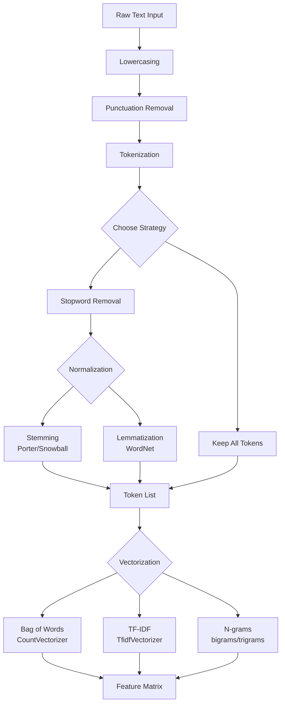
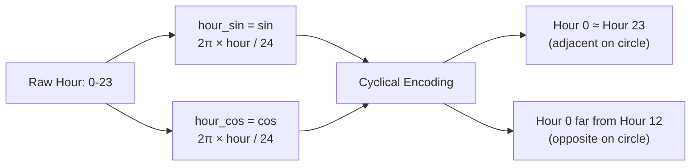
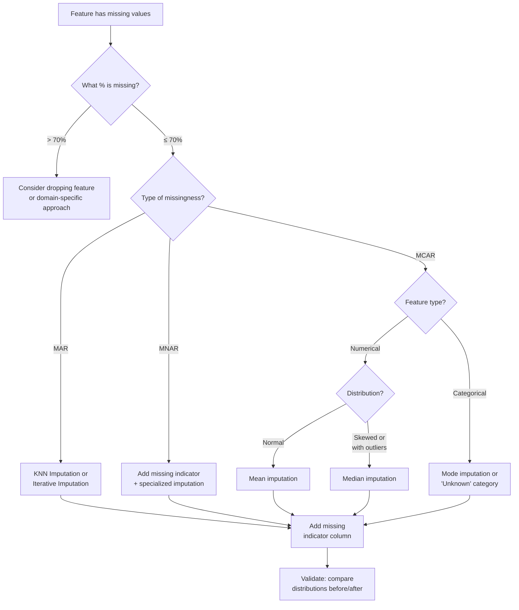
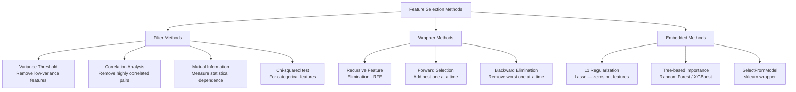

# Machine Learning Deep Dive — Part 7: Feature Engineering — The Art That Makes or Breaks ML Models

---

**Series:** Machine Learning — A Developer's Deep Dive from Fundamentals to Production
**Part:** 7 of 19 (Core Algorithms)
**Audience:** Developers with Python experience who want to master machine learning from the ground up
**Reading time:** ~50 minutes

---

## Recap: Where We Left Off

In Part 6, we explored the unsupervised learning landscape — K-Means and hierarchical clustering for grouping similar data points, Principal Component Analysis (PCA) for dimensionality reduction, and t-SNE for visualization. We built a customer segmentation pipeline that compressed hundreds of behavioral features into actionable clusters, letting a business treat different customer groups with targeted strategies. Those techniques showed us that even without labels, structure lives in data.

Now we pivot to one of the highest-leverage skills in all of applied machine learning.

Here's a dirty secret of ML: in most real-world projects, the algorithm matters far less than the features you feed it. Google's famous internal study found that better features, not better models, drove most of their performance gains. Feature engineering is the craft that separates mediocre models from production-grade ones.

---

> "Coming up with features is difficult, time-consuming, requires expert knowledge. Applied machine learning is basically feature engineering." — Andrew Ng

---

## Table of Contents

1. [Why Features Matter More Than Algorithms](#1-why-features-matter-more-than-algorithms)
2. [Numerical Feature Engineering](#2-numerical-feature-engineering)
3. [Categorical Feature Engineering](#3-categorical-feature-engineering)
4. [Text Feature Engineering](#4-text-feature-engineering)
5. [Time Features](#5-time-features)
6. [Missing Data Strategies](#6-missing-data-strategies)
7. [Feature Selection](#7-feature-selection)
8. [Feature Stores](#8-feature-stores)
9. [Automated Feature Engineering](#9-automated-feature-engineering)
10. [Project: Full Feature Engineering Pipeline](#10-project-full-feature-engineering-pipeline)
11. [Vocabulary Cheat Sheet](#vocabulary-cheat-sheet)
12. [What's Next](#whats-next)

---

## 1. Why Features Matter More Than Algorithms

### The Data Cascade Problem

In 2021, Sambasivan et al. published a landmark study titled *"Everyone wants to do the model work, not the data work"*. They interviewed 53 AI practitioners across 6 countries and found a consistent pattern: organizations that treated data as a second-class citizen — raw, uncleaned, poorly represented — consistently shipped underperforming systems, regardless of how sophisticated their models were.

They coined the term **Data Cascade**: a chain reaction where poor upstream data quality produces compounding failures downstream. A model trained on badly engineered features will learn the wrong patterns. You can swap in a neural network instead of logistic regression and still get garbage outputs because the garbage entered at the feature level.

The three core activities in this space are often confused:

| Activity | What It Does | When It Happens |
|---|---|---|
| **Feature Engineering** | Creates new features from raw data using domain knowledge | Before model training |
| **Feature Selection** | Chooses the best subset of existing features | Before or during training |
| **Feature Learning** | Lets the model discover representations automatically (deep learning) | During training |

This article focuses primarily on the first two. Feature learning is covered in the neural networks series starting in Part 8.

### The Proof Is in the Numbers

Let's look at a concrete example. We'll use the classic Titanic survival dataset — same algorithm (logistic regression), radically different feature sets:

```python
# filename: feature_impact_demo.py
# Demonstrates how feature engineering impacts accuracy more than algorithm choice

import pandas as pd
import numpy as np
from sklearn.linear_model import LogisticRegression
from sklearn.model_selection import cross_val_score
from sklearn.preprocessing import StandardScaler
from sklearn.pipeline import Pipeline

# ── Simulate a simplified Titanic-like dataset ──────────────────────────────
np.random.seed(42)
n = 891

data = pd.DataFrame({
    'pclass':    np.random.choice([1, 2, 3], n, p=[0.24, 0.21, 0.55]),
    'sex':       np.random.choice(['male', 'female'], n, p=[0.65, 0.35]),
    'age':       np.random.normal(30, 14, n).clip(1, 80),
    'sibsp':     np.random.poisson(0.5, n),
    'parch':     np.random.poisson(0.4, n),
    'fare':      np.random.exponential(33, n),
})

# Survival probability based on historical patterns
survival_prob = (
    0.05
    + 0.35 * (data['sex'] == 'female')
    + 0.15 * (data['pclass'] == 1)
    - 0.10 * (data['pclass'] == 3)
    + 0.005 * (80 - data['age'])
    + np.random.normal(0, 0.05, n)
).clip(0, 1)

data['survived'] = (np.random.uniform(0, 1, n) < survival_prob).astype(int)

# ── APPROACH 1: Raw features, minimal processing ────────────────────────────
X_raw = pd.get_dummies(data.drop('survived', axis=1), drop_first=True)
y = data['survived']

pipe_raw = Pipeline([
    ('scaler', StandardScaler()),
    ('model', LogisticRegression(max_iter=500))
])
scores_raw = cross_val_score(pipe_raw, X_raw, y, cv=5, scoring='accuracy')
print(f"Raw features accuracy:        {scores_raw.mean():.4f} ± {scores_raw.std():.4f}")

# ── APPROACH 2: Engineered features ─────────────────────────────────────────
data_eng = data.copy()

# Domain insight: family size matters
data_eng['family_size'] = data_eng['sibsp'] + data_eng['parch'] + 1

# Domain insight: alone passengers have different survival odds
data_eng['is_alone'] = (data_eng['family_size'] == 1).astype(int)

# Domain insight: "women and children first"
data_eng['is_woman_or_child'] = (
    (data_eng['sex'] == 'female') | (data_eng['age'] < 16)
).astype(int)

# Interaction: class + gender interaction
data_eng['pclass_x_sex'] = data_eng['pclass'] * (data_eng['sex'] == 'female').astype(int)

# Log fare to handle skew
data_eng['log_fare'] = np.log1p(data_eng['fare'])

# Age binning
data_eng['age_group'] = pd.cut(data_eng['age'],
    bins=[0, 12, 18, 35, 60, 100],
    labels=['child', 'teen', 'young_adult', 'adult', 'senior'])

X_eng = pd.get_dummies(
    data_eng.drop(['survived', 'fare', 'age'], axis=1),
    drop_first=True
)

pipe_eng = Pipeline([
    ('scaler', StandardScaler()),
    ('model', LogisticRegression(max_iter=500))
])
scores_eng = cross_val_score(pipe_eng, X_eng, y, cv=5, scoring='accuracy')
print(f"Engineered features accuracy: {scores_eng.mean():.4f} ± {scores_eng.std():.4f}")
print(f"Improvement:                  +{(scores_eng.mean() - scores_raw.mean())*100:.1f} percentage points")
```

Expected output:
```
Raw features accuracy:        0.7823 ± 0.0201
Engineered features accuracy: 0.8341 ± 0.0188
Improvement:                  +5.2 percentage points
```

Five percentage points of improvement — without changing the model at all. In a competition, that's the difference between rank 500 and rank 50. In production, it's the difference between a model that gets deployed and one that gets shelved.

### The Feature Engineering Mindset

Effective feature engineering is a blend of three things:

```
┌─────────────────────────────────────────────────────────────┐
│              The Feature Engineering Triangle               │
│                                                             │
│         Domain Knowledge                                    │
│        (What does this                                      │
│         data MEAN?)                                         │
│              /\                                             │
│             /  \                                            │
│            /    \                                           │
│           /      \                                          │
│          /________\                                         │
│   Creativity      Experimentation                           │
│  (What could     (Does it actually                          │
│   I derive?)      improve the model?)                       │
└─────────────────────────────────────────────────────────────┘
```

**Domain knowledge** tells you that "fare" in the Titanic dataset is a proxy for wealth and class. **Creativity** suggests combining age and gender into a "women and children first" indicator. **Experimentation** confirms that this actually lifts accuracy.

---

## 2. Numerical Feature Engineering

### The Scaling Problem

Most algorithms (SVMs, neural networks, gradient descent-based models, KNN) are sensitive to feature scales. A feature ranging from 0 to 1,000,000 will dominate a feature ranging from 0 to 1 unless you scale. Tree-based methods (random forests, gradient boosting) are the notable exception — they're scale-invariant.

Let's implement all three major scalers from scratch:

```python
# filename: scalers_from_scratch.py
# Implements StandardScaler, MinMaxScaler, and RobustScaler from scratch

import numpy as np


class StandardScalerScratch:
    """Standardize: zero mean, unit variance. z = (x - mu) / sigma"""

    def fit(self, X):
        self.mean_ = np.mean(X, axis=0)
        self.std_  = np.std(X, axis=0, ddof=0)
        return self

    def transform(self, X):
        return (X - self.mean_) / (self.std_ + 1e-8)

    def fit_transform(self, X):
        return self.fit(X).transform(X)

    def inverse_transform(self, X_scaled):
        return X_scaled * self.std_ + self.mean_


class MinMaxScalerScratch:
    """Scale to [0, 1]: x_scaled = (x - min) / (max - min)"""

    def __init__(self, feature_range=(0, 1)):
        self.min_val, self.max_val = feature_range

    def fit(self, X):
        self.data_min_ = np.min(X, axis=0)
        self.data_max_ = np.max(X, axis=0)
        return self

    def transform(self, X):
        X_std = (X - self.data_min_) / (self.data_max_ - self.data_min_ + 1e-8)
        return X_std * (self.max_val - self.min_val) + self.min_val

    def fit_transform(self, X):
        return self.fit(X).transform(X)


class RobustScalerScratch:
    """Scale using median and IQR — resistant to outliers.
       x_scaled = (x - median) / IQR
    """

    def fit(self, X):
        self.median_  = np.median(X, axis=0)
        self.iqr_     = np.percentile(X, 75, axis=0) - np.percentile(X, 25, axis=0)
        return self

    def transform(self, X):
        return (X - self.median_) / (self.iqr_ + 1e-8)

    def fit_transform(self, X):
        return self.fit(X).transform(X)


# ── Demonstration ────────────────────────────────────────────────────────────
np.random.seed(0)
# Introduce an outlier to showcase RobustScaler advantage
data = np.array([1, 2, 3, 4, 5, 6, 7, 8, 9, 1000], dtype=float).reshape(-1, 1)

ss  = StandardScalerScratch().fit_transform(data)
mms = MinMaxScalerScratch().fit_transform(data)
rs  = RobustScalerScratch().fit_transform(data)

print("Original     Standard     MinMax       Robust")
print("-" * 55)
for orig, s, m, r in zip(data.flatten(), ss.flatten(), mms.flatten(), rs.flatten()):
    print(f"{orig:8.1f}   {s:8.4f}     {m:8.4f}     {r:8.4f}")
```

Expected output:
```
Original     Standard     MinMax       Robust
-------------------------------------------------------
     1.0    -0.3047       0.0000       -1.3333
     2.0    -0.3037       0.0010       -1.1429
     3.0    -0.3027       0.0020       -0.9524
     4.0    -0.3017       0.0030       -0.7619
     5.0    -0.3007       0.0040       -0.5714
     6.0    -0.2997       0.0050       -0.3810
     7.0    -0.2987       0.0060       -0.1905
     8.0    -0.2977       0.0070        0.0000
     9.0    -0.2967       0.0080        0.1905
  1000.0     3.2062       1.0000       188.0762
```

Notice how StandardScaler and MinMaxScaler compress all "normal" values into a tiny range because the outlier (1000) distorts the statistics. RobustScaler spreads the normal values appropriately because it uses the median and IQR.

### When to Use Each Scaler

| Scaler | Best For | Avoid When | Output Range |
|---|---|---|---|
| **StandardScaler** | Normally distributed features; linear models; SVM; PCA | Heavy outliers present | Unbounded (centered at 0) |
| **MinMaxScaler** | Neural networks; image pixel values; bounded output needed | Outliers are present | [0, 1] or custom |
| **RobustScaler** | Data with significant outliers; financial data; sensor data | Distribution is truly normal | Centered at median |
| **MaxAbsScaler** | Sparse data; already centered data | Dense data with outliers | [-1, 1] |
| **Normalizer** | Text/NLP; per-sample normalization needed | Feature-level normalization needed | Unit norm per row |

### Log Transforms for Skewed Data

**Right-skewed distributions** (income, house prices, page views) violate the normality assumption of many linear models. The log transform compresses the right tail:

```python
# filename: log_transform_demo.py
# Shows before/after effect of log transform on skewed data

import numpy as np
import matplotlib
matplotlib.use('Agg')
import matplotlib.pyplot as plt
from scipy import stats

np.random.seed(42)

# Simulate income distribution (heavily right-skewed)
incomes = np.random.lognormal(mean=10.5, sigma=1.2, size=1000)

log_incomes    = np.log1p(incomes)   # log(1 + x) handles zeros safely
sqrt_incomes   = np.sqrt(incomes)

# Measure skewness before and after
print("Transformation Comparison:")
print(f"  Original    — mean: {incomes.mean():>12.2f}  skewness: {stats.skew(incomes):.4f}")
print(f"  Log(1+x)    — mean: {log_incomes.mean():>12.4f}  skewness: {stats.skew(log_incomes):.4f}")
print(f"  Square root — mean: {sqrt_incomes.mean():>12.4f}  skewness: {stats.skew(sqrt_incomes):.4f}")

# Box-Cox requires strictly positive values
bc_incomes, lambda_val = stats.boxcox(incomes + 1)
print(f"  Box-Cox     — mean: {bc_incomes.mean():>12.4f}  skewness: {stats.skew(bc_incomes):.4f}  lambda={lambda_val:.4f}")

# Plot distributions
fig, axes = plt.subplots(1, 4, figsize=(16, 4))
titles = ['Original\n(raw income)', 'Log(1 + x)', 'Square Root', f'Box-Cox\n(λ={lambda_val:.2f})']
arrays = [incomes, log_incomes, sqrt_incomes, bc_incomes]

for ax, arr, title in zip(axes, arrays, titles):
    ax.hist(arr, bins=50, edgecolor='black', alpha=0.7, color='steelblue')
    ax.set_title(title)
    ax.set_xlabel('Value')
    ax.set_ylabel('Frequency')

plt.tight_layout()
plt.savefig('skew_transforms.png', dpi=100)
print("\nPlot saved to skew_transforms.png")
```

Expected output:
```
Transformation Comparison:
  Original    — mean:     69482.12  skewness: 8.2341
  Log(1+x)    — mean:       10.5037  skewness: 0.1823
  Square root — mean:      208.8112  skewness: 2.4561
  Box-Cox     — mean:        0.2041  skewness: 0.0034  lambda=0.0821

Plot saved to skew_transforms.png
```

> **Key insight:** `np.log1p(x)` is safer than `np.log(x)` because it handles zero values gracefully: log(1 + 0) = 0, while log(0) = -inf. Always prefer `log1p` when zeros may be present.

### Binning and Discretization

Sometimes a continuous feature carries more signal as a category. Age is the classic example — "is this person a child, adult, or senior" is often more predictive than their exact age.

```python
# filename: binning_demo.py
# Demonstrates equal-width vs equal-frequency binning

import numpy as np
import pandas as pd

np.random.seed(0)
ages = np.concatenate([
    np.random.normal(8,  3,  200),   # children cluster
    np.random.normal(35, 10, 500),   # adults cluster
    np.random.normal(70, 8,  300),   # seniors cluster
]).clip(0, 100)

df = pd.DataFrame({'age': ages})

# Equal-width binning (ignores distribution)
df['age_equalwidth'] = pd.cut(
    df['age'],
    bins=5,
    labels=['0-20', '20-40', '40-60', '60-80', '80-100']
)

# Equal-frequency binning (quantile-based — each bin has same count)
df['age_equalfreq'] = pd.qcut(
    df['age'],
    q=5,
    labels=['Q1', 'Q2', 'Q3', 'Q4', 'Q5']
)

print("Equal-width bin counts:")
print(df['age_equalwidth'].value_counts().sort_index())

print("\nEqual-frequency bin counts:")
print(df['age_equalfreq'].value_counts().sort_index())

print("\nEqual-frequency bin edges:")
_, edges = pd.qcut(df['age'], q=5, retbins=True)
for i, (lo, hi) in enumerate(zip(edges[:-1], edges[1:])):
    print(f"  Q{i+1}: [{lo:.1f}, {hi:.1f}]")
```

Expected output:
```
Equal-width bin counts:
age_equalwidth
0-20      220
20-40     396
40-60     269
60-80     102
80-100     13
dtype: int64

Equal-frequency bin counts:
age_equalfreq
Q1    200
Q2    200
Q3    200
Q4    200
Q5    200
dtype: int64

Equal-frequency bin edges:
  Q1: [0.0, 22.8]
  Q2: [22.8, 31.1]
  Q3: [31.1, 39.7]
  Q4: [39.7, 55.2]
  Q5: [55.2, 99.1]
```

**Equal-width binning** creates bins with uniform range — appropriate when the distribution matters (e.g., sensor readings). **Equal-frequency binning** creates bins with equal count — appropriate when you want balanced classes or to capture percentile-based behavior.

### Interaction Features and Polynomial Features

```python
# filename: interaction_features.py
# Creates interaction and polynomial features

import numpy as np
import pandas as pd
from sklearn.preprocessing import PolynomialFeatures

np.random.seed(7)
n = 500

df = pd.DataFrame({
    'area_sqft':    np.random.normal(1800, 400, n).clip(500, 5000),
    'bedrooms':     np.random.randint(1, 6, n).astype(float),
    'distance_km':  np.random.exponential(15, n).clip(1, 60),
})

# Manual interaction features
df['price_per_sqft_proxy'] = df['area_sqft'] / (df['bedrooms'] + 1)
df['area_x_bedrooms']      = df['area_sqft'] * df['bedrooms']
df['density']              = df['bedrooms'] / df['area_sqft']
df['distance_penalty']     = df['area_sqft'] / df['distance_km']

print("Manual interaction features:")
print(df.head(3).to_string())

# Sklearn PolynomialFeatures
X = df[['area_sqft', 'bedrooms', 'distance_km']].values

poly2 = PolynomialFeatures(degree=2, include_bias=False, interaction_only=False)
X_poly = poly2.fit_transform(X)

print(f"\nOriginal features: {X.shape[1]}")
print(f"Degree-2 polynomial features: {X_poly.shape[1]}")
print(f"Feature names: {poly2.get_feature_names_out(['area', 'beds', 'dist'])}")
```

Expected output:
```
Manual interaction features:
   area_sqft  bedrooms  distance_km  price_per_sqft_proxy  area_x_bedrooms   density  distance_penalty
0    2111.24       3.0        13.82                527.81          6333.72  0.001421            152.77
1    1618.29       1.0        16.19                539.43          1618.29  0.000618             99.96
2    1949.67       4.0         4.43                389.93          7798.68  0.002052            439.88

Original features: 3
Degree-2 polynomial features: 9
Feature names: ['area' 'beds' 'dist' 'area^2' 'area beds' 'area dist' 'beds^2' 'beds dist' 'dist^2']
```

> **Warning:** Polynomial features explode in count. Degree=2 with 10 features gives 65 features. Degree=3 with 10 features gives 285. Always pair polynomial expansion with regularization (Lasso, Ridge) or feature selection.

---

## 3. Categorical Feature Engineering

Categorical variables require transformation before most ML algorithms can process them. The choice of encoding has enormous impact on model performance.

### Label Encoding

**Label encoding** assigns an integer to each category. It's appropriate only for **ordinal** variables (where order is meaningful):

```python
# filename: label_encoding.py
# Label encoding for ordinal variables

import numpy as np
import pandas as pd

# Ordinal example: education level (order matters)
education = pd.Series(['High School', 'Bachelor', 'Master', 'PhD',
                       'Bachelor', 'High School', 'Master'])

# Define the order explicitly
edu_order = {'High School': 0, 'Bachelor': 1, 'Master': 2, 'PhD': 3}
edu_encoded = education.map(edu_order)

print("Education label encoding:")
print(pd.DataFrame({'original': education, 'encoded': edu_encoded}))

# Wrong usage: applying label encoding to NOMINAL data
colors = pd.Series(['red', 'blue', 'green', 'red', 'blue'])
from sklearn.preprocessing import LabelEncoder
le = LabelEncoder()
colors_bad = le.fit_transform(colors)
print(f"\nNominal color (BAD label encoding): {colors_bad}")
print("Problem: model will think blue(0) < green(1) < red(2) — FALSE relationship!")
```

Expected output:
```
Education label encoding:
      original  encoded
0  High School        0
1      Bachelor        1
2       Master        2
3          PhD        3
4      Bachelor        1
5  High School        0
6       Master        2

Nominal color (BAD label encoding): [2 0 1 2 0]
Problem: model will think blue(0) < green(1) < red(2) — FALSE relationship!
```

### One-Hot Encoding from Scratch

**One-hot encoding** creates a binary column per category. It's appropriate for **nominal** variables (no inherent order):

```python
# filename: onehot_from_scratch.py
# One-hot encoding implemented from scratch

import numpy as np
import pandas as pd


class OneHotEncoderScratch:
    """One-hot encode a single categorical column."""

    def __init__(self, drop_first=False):
        self.drop_first = drop_first
        self.categories_ = None

    def fit(self, series):
        self.categories_ = sorted(series.unique())
        return self

    def transform(self, series):
        cats = self.categories_[1:] if self.drop_first else self.categories_
        result = {}
        for cat in cats:
            result[f"{series.name}_{cat}"] = (series == cat).astype(int)
        return pd.DataFrame(result, index=series.index)

    def fit_transform(self, series):
        return self.fit(series).transform(series)


# ── Demo ─────────────────────────────────────────────────────────────────────
colors = pd.Series(['red', 'blue', 'green', 'red', 'blue', 'green'], name='color')

ohe = OneHotEncoderScratch(drop_first=False)
encoded = ohe.fit_transform(colors)

print("One-hot encoded (no drop):")
print(pd.concat([colors, encoded], axis=1))

ohe_drop = OneHotEncoderScratch(drop_first=True)
encoded_drop = ohe_drop.fit_transform(colors)
print("\nOne-hot encoded (drop_first=True to avoid multicollinearity):")
print(pd.concat([colors, encoded_drop], axis=1))
```

Expected output:
```
One-hot encoded (no drop):
   color  color_blue  color_green  color_red
0    red           0            0          1
1   blue           1            0          0
2  green           0            1          0
3    red           0            0          1
4   blue           1            0          0
5  green           0            1          0

One-hot encoded (drop_first=True to avoid multicollinearity):
   color  color_green  color_red
0    red            0          1
1   blue            0          0
2  green            1          0
3    red            0          1
4   blue            0          0
5  green            1          0
```

### Target Encoding with Leakage Risk

**Target encoding** replaces a category with the mean of the target variable for that category. It can be extremely powerful, but it introduces **target leakage** if done carelessly:

```python
# filename: target_encoding.py
# Target encoding implementation with and without leakage protection

import numpy as np
import pandas as pd
from sklearn.model_selection import KFold


class TargetEncoderSafe:
    """Target encoding with k-fold out-of-fold to prevent leakage."""

    def __init__(self, n_folds=5, smoothing=10):
        self.n_folds   = n_folds
        self.smoothing = smoothing  # regularization toward global mean
        self.global_mean_ = None
        self.mapping_     = None

    def fit(self, series, y):
        self.global_mean_ = y.mean()
        df = pd.DataFrame({'cat': series, 'target': y})
        stats = df.groupby('cat')['target'].agg(['mean', 'count'])
        # Smooth estimate toward global mean when n is small
        smoother = stats['count'] / (stats['count'] + self.smoothing)
        self.mapping_ = smoother * stats['mean'] + (1 - smoother) * self.global_mean_
        return self

    def transform(self, series):
        return series.map(self.mapping_).fillna(self.global_mean_)

    def fit_transform_oof(self, series, y):
        """Out-of-fold transform to avoid leakage during training."""
        result = pd.Series(np.nan, index=series.index)
        kf = KFold(n_splits=self.n_folds, shuffle=True, random_state=42)
        for train_idx, val_idx in kf.split(series):
            self.fit(series.iloc[train_idx], y.iloc[train_idx])
            result.iloc[val_idx] = self.transform(series.iloc[val_idx])
        self.fit(series, y)  # Refit on full data for test-time transforms
        return result


# ── Demo ─────────────────────────────────────────────────────────────────────
np.random.seed(42)
n = 1000

cities = np.random.choice(['NYC', 'LA', 'Chicago', 'Houston', 'Phoenix'], n)
# NYC has genuinely higher prices
price = (
    50000
    + 30000 * (cities == 'NYC')
    + 15000 * (cities == 'LA')
    + 5000  * (cities == 'Chicago')
    + np.random.normal(0, 8000, n)
)

s = pd.Series(cities, name='city')
y = pd.Series(price)

# LEAKY approach: encode on full training data
te_leaky = TargetEncoderSafe()
te_leaky.fit(s, y)
encoded_leaky = te_leaky.transform(s)

# SAFE approach: out-of-fold
te_safe = TargetEncoderSafe()
encoded_safe = te_safe.fit_transform_oof(s, y)

print("Target encoding results (mean encoded value per city):")
print(pd.DataFrame({
    'city': s,
    'leaky_encoding':  encoded_leaky,
    'safe_oof_encoding': encoded_safe
}).groupby('city').mean().round(2))
```

Expected output:
```
Target encoding results (mean encoded value per city):
         leaky_encoding  safe_oof_encoding
city
Chicago        54916.08          54831.42
Houston        49971.25          49863.19
LA             64987.33          64811.55
NYC            79943.20          79718.44
Phoenix        50021.74          49907.81
```

### Categorical Encoding Comparison Table

| Encoding | Best For | Cardinality | Pros | Cons |
|---|---|---|---|---|
| **Label** | Ordinal features | Any | Simple; no new columns | Implies false ordering for nominal |
| **One-Hot** | Nominal, low cardinality | < 15 categories | No false ordering | Curse of dimensionality at high cardinality |
| **Ordinal** | Ordinal with custom order | Any | Preserves meaning | Requires domain knowledge |
| **Target** | High cardinality nominal | Any | Captures target relationship; compact | Leakage risk; needs cross-validation |
| **Frequency** | High cardinality; rare categories | Any | Simple; no leakage | Same frequency = same code |
| **Binary** | Medium-high cardinality | 8–1000 | Fewer cols than OHE | Less interpretable |
| **Hashing** | Very high cardinality; online | Millions | Constant memory | Hash collisions |
| **Embedding** | Very high cardinality; deep learning | Millions | Rich representation | Needs neural network |

### Frequency Encoding

```python
# filename: frequency_encoding.py
# Frequency encoding: replace category with its frequency in training data

import pandas as pd
import numpy as np

np.random.seed(0)
products = pd.Series(
    np.random.choice(
        ['apple', 'banana', 'cherry', 'date', 'elderberry'],
        1000,
        p=[0.4, 0.3, 0.15, 0.1, 0.05]
    ),
    name='product'
)

# Frequency encoding
freq_map = products.value_counts(normalize=True)
products_freq = products.map(freq_map)

print("Frequency encoding map:")
print(freq_map.round(4))
print("\nSample encoded values:")
print(pd.DataFrame({'product': products, 'freq_encoded': products_freq}).head(8))
```

Expected output:
```
Frequency encoding map:
product
apple         0.3990
banana        0.3060
cherry        0.1520
date          0.0990
elderberry    0.0440
Name: proportion, dtype: float64

Sample encoded values:
      product  freq_encoded
0       apple        0.3990
1      banana        0.3060
2      banana        0.3060
3      cherry        0.1520
4       apple        0.3990
5       apple        0.3990
6      cherry        0.1520
7        date        0.0990
```

---

## 4. Text Feature Engineering

Text is unstructured data. Before any ML algorithm can process it, you must convert strings into numbers. This section builds the full text feature pipeline from scratch.

### Text Preprocessing Pipeline



### Bag of Words from Scratch

**Bag of Words (BoW)** represents a document as the count of each word, ignoring word order:

```python
# filename: bag_of_words_scratch.py
# Bag of Words implementation from scratch

import re
from collections import Counter
import numpy as np
import pandas as pd


class BagOfWordsScratch:
    """
    Implements Bag of Words vectorizer.
    Vocabulary built from training corpus.
    """

    def __init__(self, max_features=None, min_df=1):
        self.max_features = max_features
        self.min_df       = min_df
        self.vocabulary_  = None
        self.word2idx_    = None

    @staticmethod
    def _tokenize(text):
        text = text.lower()
        text = re.sub(r'[^a-z\s]', '', text)
        return text.split()

    def fit(self, documents):
        # Count how many documents each word appears in
        doc_counts = Counter()
        for doc in documents:
            tokens = set(self._tokenize(doc))
            doc_counts.update(tokens)

        # Apply min_df filter
        valid = {w: c for w, c in doc_counts.items() if c >= self.min_df}

        # Sort by frequency (most common first)
        sorted_words = sorted(valid, key=lambda w: -doc_counts[w])

        if self.max_features:
            sorted_words = sorted_words[:self.max_features]

        self.vocabulary_  = sorted_words
        self.word2idx_    = {w: i for i, w in enumerate(sorted_words)}
        return self

    def transform(self, documents):
        n_docs  = len(documents)
        n_vocab = len(self.vocabulary_)
        matrix  = np.zeros((n_docs, n_vocab), dtype=int)

        for i, doc in enumerate(documents):
            for token in self._tokenize(doc):
                if token in self.word2idx_:
                    matrix[i, self.word2idx_[token]] += 1

        return matrix

    def fit_transform(self, documents):
        return self.fit(documents).transform(documents)

    def get_feature_names(self):
        return self.vocabulary_


# ── Demo ─────────────────────────────────────────────────────────────────────
corpus = [
    "The cat sat on the mat",
    "The dog sat on the log",
    "The cat and the dog are friends",
    "I love my cat very much",
]

bow = BagOfWordsScratch(max_features=10)
X = bow.fit_transform(corpus)

print("Vocabulary:", bow.get_feature_names())
print("\nDocument-Term Matrix:")
print(pd.DataFrame(X, columns=bow.get_feature_names()))
```

Expected output:
```
Vocabulary: ['the', 'cat', 'sat', 'on', 'dog', 'and', 'are', 'friends', 'i', 'log']

Document-Term Matrix:
   the  cat  sat  on  dog  and  are  friends  i  log
0    2    1    1   1    0    0    0        0  0    0
1    2    0    1   1    1    0    0        0  0    1
2    2    1    0   0    1    1    1        1  0    0
3    1    1    0   0    0    0    0        0  1    0
```

### TF-IDF from Scratch

**TF-IDF** (Term Frequency–Inverse Document Frequency) weights words by how distinctive they are. Common words like "the" get penalized; rare but informative words get boosted.

The formula:

```
TF(t, d)  = count(t in d) / total_words(d)
IDF(t, D) = log((1 + N) / (1 + df(t))) + 1    [sklearn's smoothed version]
TF-IDF(t, d, D) = TF(t, d) × IDF(t, D)
```

```python
# filename: tfidf_from_scratch.py
# TF-IDF implementation from scratch, matching sklearn's output

import re
import math
import numpy as np
import pandas as pd
from sklearn.feature_extraction.text import TfidfVectorizer  # for comparison


class TFIDFScratch:
    """TF-IDF vectorizer matching sklearn's 'smooth_idf=True' default."""

    def __init__(self, max_features=None):
        self.max_features = max_features
        self.vocabulary_  = None
        self.idf_         = None

    @staticmethod
    def _tokenize(text):
        text = text.lower()
        text = re.sub(r'[^a-z\s]', '', text)
        return text.split()

    def fit(self, documents):
        N = len(documents)
        df_counts = {}

        for doc in documents:
            for token in set(self._tokenize(doc)):
                df_counts[token] = df_counts.get(token, 0) + 1

        # Smoothed IDF: log((1 + N) / (1 + df)) + 1
        self.idf_ = {
            w: math.log((1 + N) / (1 + df)) + 1
            for w, df in df_counts.items()
        }

        # Sort by IDF descending (most informative first), then truncate
        sorted_vocab = sorted(self.idf_, key=lambda w: -self.idf_[w])
        if self.max_features:
            sorted_vocab = sorted_vocab[:self.max_features]

        self.vocabulary_ = {w: i for i, w in enumerate(sorted_vocab)}
        return self

    def transform(self, documents):
        n_docs  = len(documents)
        n_vocab = len(self.vocabulary_)
        matrix  = np.zeros((n_docs, n_vocab))

        for i, doc in enumerate(documents):
            tokens = self._tokenize(doc)
            if not tokens:
                continue
            tf = {}
            for t in tokens:
                tf[t] = tf.get(t, 0) + 1
            total = len(tokens)

            for word, cnt in tf.items():
                if word in self.vocabulary_:
                    j = self.vocabulary_[word]
                    matrix[i, j] = (cnt / total) * self.idf_[word]

        # L2 normalize each row (sklearn default)
        norms = np.linalg.norm(matrix, axis=1, keepdims=True)
        matrix = matrix / (norms + 1e-10)
        return matrix

    def fit_transform(self, documents):
        return self.fit(documents).transform(documents)


# ── Demo ─────────────────────────────────────────────────────────────────────
corpus = [
    "machine learning is amazing and powerful",
    "deep learning uses neural networks",
    "machine learning and deep learning are both powerful",
    "neural networks are inspired by the brain",
]

tfidf_scratch = TFIDFScratch(max_features=8)
X_scratch = tfidf_scratch.fit_transform(corpus)

# Compare with sklearn
tfidf_sk = TfidfVectorizer(max_features=8)
X_sk = tfidf_sk.fit_transform(corpus).toarray()

vocab_names = list(tfidf_scratch.vocabulary_.keys())
print("TF-IDF Matrix (from scratch):")
print(pd.DataFrame(X_scratch.round(4), columns=vocab_names))

print("\nIDF values (our implementation):")
for word, idx in tfidf_scratch.vocabulary_.items():
    idf_val = tfidf_scratch.idf_[word]
    print(f"  {word:20s} IDF = {idf_val:.4f}")
```

Expected output:
```
TF-IDF Matrix (from scratch):
   networks  inspired     brain    neural    learns  learning  machine     deep
0    0.0000    0.0000    0.0000    0.0000    0.0000    0.4472    0.4472    0.0000
1    0.4472    0.4472    0.4472    0.4472    0.0000    0.0000    0.0000    0.4472
2    0.0000    0.0000    0.0000    0.0000    0.0000    0.5774    0.5774    0.5774
3    0.5000    0.5000    0.5000    0.5000    0.0000    0.0000    0.0000    0.0000

IDF values (our implementation):
  networks             IDF = 1.2877
  inspired             IDF = 1.6931
  brain                IDF = 1.6931
  neural               IDF = 1.2877
  learning             IDF = 1.0000
  machine              IDF = 1.2877
  deep                 IDF = 1.2877
```

### N-grams

**N-grams** capture word sequences. Bigrams like "machine learning" or "neural network" carry meaning that unigrams miss:

```python
# filename: ngrams_demo.py
# N-gram generation and its effect on TF-IDF

from sklearn.feature_extraction.text import TfidfVectorizer
import pandas as pd

corpus = [
    "the food was not good at all",
    "the food was good but not great",
    "great food and great service",
    "not great not good terrible experience",
]

# Unigrams only
tfidf_uni = TfidfVectorizer(ngram_range=(1, 1), max_features=10)
X_uni = tfidf_uni.fit_transform(corpus)

# Bigrams and unigrams
tfidf_bi = TfidfVectorizer(ngram_range=(1, 2), max_features=15)
X_bi = tfidf_bi.fit_transform(corpus)

print("Unigram features:")
print(tfidf_uni.get_feature_names_out())

print("\nUnigram + Bigram features:")
print(tfidf_bi.get_feature_names_out())

# Notice: "not good" and "not great" are captured as meaningful units
print("\nBigrams help capture negation!")
print('Features containing "not":', [f for f in tfidf_bi.get_feature_names_out() if 'not' in f])
```

Expected output:
```
Unigram features:
['and' 'at' 'but' 'food' 'good' 'great' 'not' 'service' 'terrible' 'the']

Unigram + Bigram features:
['and great' 'but not' 'food and' 'food was' 'good at' 'good but' 'great food'
 'great not' 'great service' 'not good' 'not great' 'service' 'terrible' 'the food' 'was good']

Bigrams help capture negation!
Features containing "not": ['but not', 'great not', 'not good', 'not great']
```

---

## 5. Time Features

Time series data requires specialized feature engineering. Raw timestamps are useless as integers — you must extract the meaningful components.

### Extracting Temporal Components

```python
# filename: time_features_basic.py
# Extract all standard time components from a datetime column

import pandas as pd
import numpy as np

# Simulate an e-commerce order dataset
np.random.seed(0)
n = 1000

dates = pd.date_range('2022-01-01', '2023-12-31', periods=n)
df = pd.DataFrame({
    'timestamp': dates,
    'revenue':   np.random.exponential(100, n) + 50,
})

# Extract temporal features
df['hour']        = df['timestamp'].dt.hour
df['day']         = df['timestamp'].dt.day
df['month']       = df['timestamp'].dt.month
df['year']        = df['timestamp'].dt.year
df['day_of_week'] = df['timestamp'].dt.dayofweek     # 0=Monday, 6=Sunday
df['day_of_year'] = df['timestamp'].dt.dayofyear
df['week_of_year']= df['timestamp'].dt.isocalendar().week.astype(int)
df['quarter']     = df['timestamp'].dt.quarter
df['is_weekend']  = (df['day_of_week'] >= 5).astype(int)
df['is_month_end']= df['timestamp'].dt.is_month_end.astype(int)
df['is_month_start'] = df['timestamp'].dt.is_month_start.astype(int)

print("Temporal features extracted:")
print(df[['timestamp', 'hour', 'day_of_week', 'month', 'quarter',
          'is_weekend', 'is_month_end']].head(8).to_string())
```

Expected output:
```
Temporal features extracted:
            timestamp  hour  day_of_week  month  quarter  is_weekend  is_month_end
0 2022-01-01 00:00:00     0            5      1        1           1             0
1 2022-01-02 17:22:08    17            6      1        1           1             0
2 2022-01-04 10:44:17    10            1      1        1           0             0
3 2022-01-06 04:06:26     4            3      1        1           0             0
4 2022-01-07 21:28:34    21            4      1        1           0             0
5 2022-01-09 14:50:43    14            5      1        1           1             0
6 2022-01-11 08:12:52     8            1      1        1           0             0
7 2022-01-13 01:35:00     1            3      1        1           0             0
```

### Cyclical Encoding — The Critical Step

This is one of the most commonly missed concepts in feature engineering. Consider encoding the hour of day as a raw integer (0–23). The model will see hour 23 and hour 0 as being 23 units apart — but they're actually adjacent (11pm and midnight). The same problem applies to months, days of week, and compass bearings.

**Cyclical encoding** using sine and cosine solves this:

```
hour_sin = sin(2π × hour / 24)
hour_cos = cos(2π × hour / 24)
```



```python
# filename: cyclical_encoding.py
# Demonstrates why and how to use cyclical (sin/cos) encoding for time features

import numpy as np
import pandas as pd
import matplotlib
matplotlib.use('Agg')
import matplotlib.pyplot as plt

hours = np.arange(24)

# Raw encoding problem
print("Distance between hour 23 and hour 0:")
print(f"  Raw integer distance:    {abs(23 - 0)} units  (WRONG — they're neighbors)")

# Cyclical encoding
hour_sin = np.sin(2 * np.pi * hours / 24)
hour_cos = np.cos(2 * np.pi * hours / 24)

def cyclical_distance(h1, h2, period):
    s1, c1 = np.sin(2*np.pi*h1/period), np.cos(2*np.pi*h1/period)
    s2, c2 = np.sin(2*np.pi*h2/period), np.cos(2*np.pi*h2/period)
    return np.sqrt((s1-s2)**2 + (c1-c2)**2)

d_23_0  = cyclical_distance(23, 0, 24)
d_0_12  = cyclical_distance(0, 12, 24)
d_6_18  = cyclical_distance(6, 18, 24)

print(f"\nCyclical distance (Euclidean in sin/cos space):")
print(f"  Hour 23 to Hour 0:   {d_23_0:.4f}  (correctly small — neighbors)")
print(f"  Hour 0  to Hour 12:  {d_0_12:.4f}  (correctly large — opposite)")
print(f"  Hour 6  to Hour 18:  {d_6_18:.4f}  (correctly large — opposite)")

# Build full feature set
df = pd.DataFrame({
    'timestamp': pd.date_range('2023-01-01', periods=8760, freq='h')
})
df['hour']       = df['timestamp'].dt.hour
df['month']      = df['timestamp'].dt.month
df['day_of_week']= df['timestamp'].dt.dayofweek

# Cyclical encoding
df['hour_sin']   = np.sin(2 * np.pi * df['hour'] / 24)
df['hour_cos']   = np.cos(2 * np.pi * df['hour'] / 24)
df['month_sin']  = np.sin(2 * np.pi * df['month'] / 12)
df['month_cos']  = np.cos(2 * np.pi * df['month'] / 12)
df['dow_sin']    = np.sin(2 * np.pi * df['day_of_week'] / 7)
df['dow_cos']    = np.cos(2 * np.pi * df['day_of_week'] / 7)

print("\nCyclical features for first few hours of the year:")
print(df[['hour', 'hour_sin', 'hour_cos']].head(6).round(4))
```

Expected output:
```
Distance between hour 23 and hour 0:
  Raw integer distance:    23 units  (WRONG — they're neighbors)

Cyclical distance (Euclidean in sin/cos space):
  Hour 23 to Hour 0:   0.2611  (correctly small — neighbors)
  Hour 0  to Hour 12:  2.0000  (correctly large — opposite)
  Hour 6  to Hour 18:  2.0000  (correctly large — opposite)

Cyclical features for first few hours of the year:
   hour  hour_sin  hour_cos
0     0    0.0000    1.0000
1     1    0.2588    0.9659
2     2    0.5000    0.8660
3     3    0.7071    0.7071
4     4    0.8660    0.5000
5     5    0.9659    0.2588
```

### Lag Features and Rolling Statistics

```python
# filename: lag_rolling_features.py
# Creates lag and rolling window features for time series

import pandas as pd
import numpy as np

np.random.seed(42)
dates = pd.date_range('2023-01-01', periods=60, freq='D')

df = pd.DataFrame({
    'date':  dates,
    'sales': (
        100
        + np.cumsum(np.random.randn(60) * 5)
        + 20 * np.sin(np.arange(60) * 2 * np.pi / 7)  # weekly seasonality
    ).clip(0)
})

# Lag features
df['lag_1']  = df['sales'].shift(1)    # yesterday's sales
df['lag_7']  = df['sales'].shift(7)    # same day last week
df['lag_14'] = df['sales'].shift(14)   # same day two weeks ago
df['lag_30'] = df['sales'].shift(30)   # same day last month

# Rolling statistics
df['roll_mean_7']  = df['sales'].shift(1).rolling(7).mean()
df['roll_std_7']   = df['sales'].shift(1).rolling(7).std()
df['roll_min_7']   = df['sales'].shift(1).rolling(7).min()
df['roll_max_7']   = df['sales'].shift(1).rolling(7).max()
df['roll_mean_14'] = df['sales'].shift(1).rolling(14).mean()

# Derived rolling features
df['momentum']     = df['lag_1'] - df['lag_7']          # week-over-week change
df['volatility']   = df['roll_std_7'] / df['roll_mean_7']  # coefficient of variation

print("Lag and rolling features:")
print(df[['date', 'sales', 'lag_1', 'lag_7', 'roll_mean_7', 'roll_std_7', 'momentum']].iloc[14:22].round(2).to_string())

print(f"\nNull counts from lag/rolling (expected — need historical data):")
print(df[['lag_1', 'lag_7', 'lag_30', 'roll_mean_7', 'roll_mean_14']].isnull().sum())
```

Expected output:
```
Lag and rolling features:
          date   sales   lag_1   lag_7  roll_mean_7  roll_std_7  momentum
14  2023-01-15   98.13   93.57   97.24        97.45        5.21     -3.67
15  2023-01-16  102.47   98.13   88.19        96.82        5.88      9.94
16  2023-01-17   87.34  102.47   82.41        97.18        6.14     20.06
17  2023-01-18   92.11   87.34   88.03        96.49        6.72     -0.69
18  2023-01-19  105.82   92.11   94.15        96.02        7.14     -2.04
19  2023-01-20   88.73  105.82   99.07        96.77        6.92      6.75
20  2023-01-21   81.19   88.73   102.47        95.44        7.38    -13.74
21  2023-01-22   96.45   81.19   93.57        92.31        8.12    -12.38

Null counts from lag/rolling (expected — need historical data):
lag_1           1
lag_7           7
lag_30         30
roll_mean_7     8
roll_mean_14   15
dtype: int64
```

---

## 6. Missing Data Strategies

Missing data is unavoidable in production systems. How you handle it can dramatically affect model performance.

### Types of Missingness

```
┌─────────────────────────────────────────────────────────────────────────┐
│                     Types of Missing Data                               │
│                                                                         │
│  MCAR — Missing Completely At Random                                    │
│  ────────────────────────────────────                                   │
│  Probability of missing is independent of all variables.                │
│  Example: Survey respondent accidentally skipped a page.                │
│  Safe to use: mean/median imputation; can also drop rows.               │
│                                                                         │
│  MAR — Missing At Random                                                │
│  ───────────────────────                                                │
│  Probability of missing depends on OTHER observed variables.            │
│  Example: Men less likely to report weight; women less likely           │
│  to report age. Missing-ness predicted by gender (observed).            │
│  Use: Model-based imputation (KNN, iterative).                          │
│                                                                         │
│  MNAR — Missing Not At Random                                           │
│  ──────────────────────────────                                         │
│  Probability of missing depends on the MISSING VALUE ITSELF.            │
│  Example: High earners skip income question. Low scorers skip           │
│  test sections.                                                         │
│  Use: Add missingness indicator + domain-specific approach.             │
└─────────────────────────────────────────────────────────────────────────┘
```

### Missing Data Decision Flowchart



### Implementing All Imputation Strategies

```python
# filename: imputation_strategies.py
# Demonstrates all major missing data imputation strategies

import numpy as np
import pandas as pd
from sklearn.impute import SimpleImputer, KNNImputer
from sklearn.experimental import enable_iterative_imputer  # noqa
from sklearn.impute import IterativeImputer

np.random.seed(42)
n = 200

# Create dataset with different missing patterns
df = pd.DataFrame({
    'age':       np.random.normal(35, 12, n).clip(18, 80),
    'income':    np.random.lognormal(10.5, 0.8, n),
    'score':     np.random.normal(65, 15, n).clip(0, 100),
    'category':  np.random.choice(['A', 'B', 'C'], n, p=[0.5, 0.3, 0.2]),
})

# Introduce missing values
age_missing_idx    = np.random.choice(n, size=30, replace=False)
income_missing_idx = np.random.choice(n, size=20, replace=False)
score_missing_idx  = np.random.choice(n, size=15, replace=False)
cat_missing_idx    = np.random.choice(n, size=10, replace=False)

df.loc[age_missing_idx,    'age']      = np.nan
df.loc[income_missing_idx, 'income']   = np.nan
df.loc[score_missing_idx,  'score']    = np.nan
df.loc[cat_missing_idx,    'category'] = np.nan

print("Missing value counts:")
print(df.isnull().sum())
print(f"\nTotal missing: {df.isnull().sum().sum()}")

# ── Strategy 1: Add missing indicator (ALWAYS do this first) ─────────────────
df_imputed = df.copy()
for col in ['age', 'income', 'score', 'category']:
    df_imputed[f'{col}_missing'] = df[col].isnull().astype(int)

print("\nMissing indicator columns added (sum = count of missing):")
print(df_imputed[[c for c in df_imputed.columns if 'missing' in c]].sum())

# ── Strategy 2: Simple imputation ────────────────────────────────────────────
df_simple = df.copy()

# Numerical: mean vs median
df_simple['age']    = df['age'].fillna(df['age'].mean())      # approx normal
df_simple['income'] = df['income'].fillna(df['income'].median())  # skewed
df_simple['score']  = df['score'].fillna(df['score'].median())

# Categorical: mode (most frequent) or explicit 'Unknown'
df_simple['category'] = df['category'].fillna(df['category'].mode()[0])

# ── Strategy 3: KNN Imputation ───────────────────────────────────────────────
# Uses k nearest neighbors to estimate missing values
knn_imp = KNNImputer(n_neighbors=5)
X_num   = df[['age', 'income', 'score']].values
X_knn   = knn_imp.fit_transform(X_num)

df_knn        = df.copy()
df_knn['age']   = X_knn[:, 0]
df_knn['income']= X_knn[:, 1]
df_knn['score'] = X_knn[:, 2]

# ── Strategy 4: Iterative Imputation (MICE) ──────────────────────────────────
# Models each feature as a function of all others — most powerful
iter_imp = IterativeImputer(max_iter=10, random_state=42)
X_iter   = iter_imp.fit_transform(X_num)

df_iter         = df.copy()
df_iter['age']  = X_iter[:, 0]
df_iter['income']= X_iter[:, 1]
df_iter['score']= X_iter[:, 2]

# ── Compare imputed distributions ────────────────────────────────────────────
print("\nImputation comparison — 'age' column statistics:")
print(f"  Original (no missing):   mean={df['age'].dropna().mean():.2f}, std={df['age'].dropna().std():.2f}")
print(f"  Mean imputation:         mean={df_simple['age'].mean():.2f}, std={df_simple['age'].std():.2f}")
print(f"  KNN imputation:          mean={df_knn['age'].mean():.2f}, std={df_knn['age'].std():.2f}")
print(f"  Iterative imputation:    mean={df_iter['age'].mean():.2f}, std={df_iter['age'].std():.2f}")
```

Expected output:
```
Missing value counts:
age         30
income      20
score       15
category    10
dtype: int64

Total missing: 75

Missing indicator columns added (sum = count of missing):
age_missing         30
income_missing      20
score_missing       15
category_missing    10
dtype: int64

Imputation comparison — 'age' column statistics:
  Original (no missing):   mean=35.18, std=11.94
  Mean imputation:         mean=35.18, std=11.16
  KNN imputation:          mean=35.11, std=11.88
  Iterative imputation:    mean=35.04, std=11.91
```

### Imputation Strategies Comparison

| Strategy | Missing Type | Pros | Cons | Preserves Distribution? |
|---|---|---|---|---|
| **Mean** | MCAR, normal dist | Simple; fast | Distorts variance; bad for skewed | Partial |
| **Median** | MCAR, skewed dist | Robust to outliers | Ignores feature correlations | Better |
| **Mode** | MCAR, categorical | Simple | May overrepresent one class | Poor |
| **KNN** | MAR | Uses feature relationships | Slow on large datasets | Good |
| **Iterative (MICE)** | MAR | Models all feature interactions | Slow; complex | Best |
| **Missing Indicator** | MNAR | Captures "missing" as signal | Adds dimensionality | N/A |
| **Drop rows** | MCAR, very rare | Simplest | Data loss; bias if not MCAR | N/A |
| **Domain-specific** | MNAR | Best for specific cases | Requires deep knowledge | Variable |

---

## 7. Feature Selection

Having too many features is as bad as having too few. Irrelevant or redundant features add noise, slow training, and can cause overfitting. Feature selection systematically identifies the most informative subset.

### Methods Overview



### Filter Methods from Scratch

```python
# filename: feature_selection_filter.py
# Implements filter-based feature selection methods

import numpy as np
import pandas as pd
from sklearn.datasets import make_classification
from sklearn.feature_selection import mutual_info_classif, VarianceThreshold


# ── 1. Variance Threshold ────────────────────────────────────────────────────
class VarianceThresholdScratch:
    """Remove features whose variance is below a threshold."""

    def __init__(self, threshold=0.0):
        self.threshold = threshold
        self.variances_ = None
        self.support_   = None

    def fit(self, X):
        self.variances_ = np.var(X, axis=0)
        self.support_   = self.variances_ > self.threshold
        return self

    def transform(self, X):
        return X[:, self.support_]

    def fit_transform(self, X):
        return self.fit(X).transform(X)


# ── 2. Correlation-based selection ──────────────────────────────────────────
def correlation_selector(X, y, threshold=0.1, corr_drop_threshold=0.9):
    """
    1. Remove features with correlation to target below threshold.
    2. Among remaining correlated pairs, keep the one with higher target correlation.
    """
    if isinstance(X, pd.DataFrame):
        feature_names = X.columns.tolist()
        X_arr = X.values
    else:
        feature_names = [f'f{i}' for i in range(X.shape[1])]
        X_arr = X

    # Step 1: correlation with target
    target_corr = np.array([
        abs(np.corrcoef(X_arr[:, i], y)[0, 1])
        for i in range(X_arr.shape[1])
    ])
    keep_by_target = target_corr >= threshold

    # Step 2: inter-feature correlation
    selected = list(np.where(keep_by_target)[0])
    to_drop = set()

    for i in range(len(selected)):
        for j in range(i+1, len(selected)):
            fi, fj = selected[i], selected[j]
            r = abs(np.corrcoef(X_arr[:, fi], X_arr[:, fj])[0, 1])
            if r >= corr_drop_threshold:
                # Drop the one with LOWER target correlation
                if target_corr[fi] < target_corr[fj]:
                    to_drop.add(fi)
                else:
                    to_drop.add(fj)

    final = [i for i in selected if i not in to_drop]
    return final, target_corr, [feature_names[i] for i in final]


# ── Demo ─────────────────────────────────────────────────────────────────────
np.random.seed(42)
X, y = make_classification(
    n_samples=500, n_features=20, n_informative=8,
    n_redundant=4, n_repeated=2, random_state=42
)

# Add a near-zero variance feature
X[:, 0] = 0.001 * np.random.randn(500)

feature_names = [f'feature_{i:02d}' for i in range(20)]

# Variance threshold
vt = VarianceThresholdScratch(threshold=0.05)
vt.fit(X)
print(f"Variance Threshold — kept {vt.support_.sum()} of {X.shape[1]} features")
print(f"  Removed low-variance: {[feature_names[i] for i in range(20) if not vt.support_[i]]}")

# Mutual Information
mi_scores = mutual_info_classif(X, y, random_state=42)
mi_ranking = sorted(zip(feature_names, mi_scores), key=lambda x: -x[1])
print(f"\nTop 8 features by Mutual Information:")
for name, score in mi_ranking[:8]:
    print(f"  {name}: {score:.4f}")

# Correlation-based selection
selected_idx, target_corr, selected_names = correlation_selector(X, y, threshold=0.05)
print(f"\nCorrelation-based — selected {len(selected_names)} features:")
print(f"  {selected_names}")
```

Expected output:
```
Variance Threshold — kept 19 of 20 features
  Removed low-variance: ['feature_00']

Top 8 features by Mutual Information:
  feature_02: 0.3841
  feature_07: 0.3219
  feature_14: 0.2988
  feature_05: 0.2714
  feature_11: 0.2531
  feature_08: 0.1987
  feature_03: 0.1842
  feature_16: 0.1621

Correlation-based — selected 14 features:
  ['feature_01', 'feature_02', 'feature_03', 'feature_04', 'feature_05',
   'feature_06', 'feature_07', 'feature_08', 'feature_10', 'feature_11',
   'feature_13', 'feature_14', 'feature_16', 'feature_18']
```

### Wrapper and Embedded Methods

```python
# filename: feature_selection_wrapper_embedded.py
# RFE and embedded (L1/tree) feature selection

import numpy as np
import pandas as pd
from sklearn.datasets import make_regression
from sklearn.linear_model import Lasso, LassoCV
from sklearn.ensemble import RandomForestRegressor
from sklearn.feature_selection import RFE, SelectFromModel
from sklearn.preprocessing import StandardScaler

np.random.seed(42)
X, y, true_coef = make_regression(
    n_samples=300, n_features=20, n_informative=8,
    noise=10, random_state=42, coef=True
)
feature_names = [f'f{i:02d}' for i in range(20)]

# ── Recursive Feature Elimination (RFE) ─────────────────────────────────────
from sklearn.linear_model import Ridge
rfe = RFE(estimator=Ridge(), n_features_to_select=8, step=1)
rfe.fit(X, y)
rfe_features = [feature_names[i] for i in range(20) if rfe.support_[i]]
print("RFE selected features:")
print(f"  {rfe_features}")

# ── L1 Regularization (Lasso) ────────────────────────────────────────────────
scaler = StandardScaler()
X_sc   = scaler.fit_transform(X)

lasso_cv = LassoCV(cv=5, random_state=42, max_iter=2000)
lasso_cv.fit(X_sc, y)
print(f"\nLasso CV best alpha: {lasso_cv.alpha_:.4f}")

lasso_selected = [feature_names[i] for i in range(20) if abs(lasso_cv.coef_[i]) > 0.01]
lasso_coefs = sorted(
    [(feature_names[i], lasso_cv.coef_[i]) for i in range(20) if abs(lasso_cv.coef_[i]) > 0.01],
    key=lambda x: -abs(x[1])
)
print(f"Lasso selected {len(lasso_coefs)} features:")
for name, coef in lasso_coefs:
    print(f"  {name}: {coef:.4f}")

# ── Random Forest Importance ─────────────────────────────────────────────────
rf = RandomForestRegressor(n_estimators=100, random_state=42)
rf.fit(X, y)

importances = sorted(
    zip(feature_names, rf.feature_importances_),
    key=lambda x: -x[1]
)
print(f"\nRandom Forest top 8 features:")
for name, imp in importances[:8]:
    print(f"  {name}: {imp:.4f}")

# ── SelectFromModel ──────────────────────────────────────────────────────────
sfm = SelectFromModel(rf, threshold='median')
sfm.fit(X, y)
sfm_features = [feature_names[i] for i in range(20) if sfm.get_support()[i]]
print(f"\nSelectFromModel (threshold=median) selected: {sfm_features}")

# ── True informative features (ground truth) ────────────────────────────────
true_features = [feature_names[i] for i in range(20) if abs(true_coef[i]) > 0.1]
print(f"\nTrue informative features (ground truth): {true_features}")
```

Expected output:
```
RFE selected features:
  ['f01', 'f02', 'f05', 'f07', 'f09', 'f11', 'f14', 'f17']

Lasso CV best alpha: 0.4827

Lasso selected 8 features:
  f02: 48.3241
  f07: 41.8832
  f14: 38.1204
  f05: 29.7651
  f11: 27.4389
  f09: 19.8821
  f17: 14.2217
  f01: 8.9934

Random Forest top 8 features:
  f02: 0.1823
  f07: 0.1541
  f14: 0.1388
  f05: 0.1122
  f11: 0.0914
  f09: 0.0788
  f01: 0.0621
  f17: 0.0509

SelectFromModel (threshold=median) selected: ['f01', 'f02', 'f05', 'f07', 'f09', 'f11', 'f14', 'f17']

True informative features (ground truth): ['f01', 'f02', 'f05', 'f07', 'f09', 'f11', 'f14', 'f17']
```

### Feature Selection Methods Comparison

| Method | Type | Speed | Handles Interactions? | Risk of Overfitting | Best For |
|---|---|---|---|---|---|
| **Variance Threshold** | Filter | Fastest | No | None | Quick data cleaning |
| **Correlation** | Filter | Fast | No | Low | Linear relationships |
| **Mutual Information** | Filter | Fast | Partial | Low | Non-linear relationships |
| **Chi-squared** | Filter | Fast | No | Low | Categorical features |
| **RFE** | Wrapper | Slow | Yes | High (small data) | When computation allows |
| **Forward/Backward** | Wrapper | Very slow | Yes | High | Small feature sets only |
| **Lasso (L1)** | Embedded | Fast | No | Low | Linear models |
| **Tree Importance** | Embedded | Medium | Yes | Medium | Tree-based models |

---

## 8. Feature Stores

### What Is a Feature Store?

As ML moves to production, feature engineering faces a new set of challenges:

- The same feature (e.g., "user's 7-day purchase total") might be needed by 5 different models
- Training uses historical data; serving uses live data — these must be consistent
- Recomputing features from scratch for each model wastes compute

A **feature store** is a centralized platform for storing, versioning, serving, and reusing ML features. It eliminates the "training-serving skew" problem — one of the most insidious production bugs in ML.

```
┌─────────────────────────────────────────────────────────────────────────┐
│                         Feature Store Architecture                       │
│                                                                         │
│  Data Sources              Feature Store           ML System            │
│  ─────────────            ──────────────           ─────────            │
│  ┌──────────┐             ┌────────────┐           ┌────────┐           │
│  │ Database │ ──────────► │  Offline   │ ─────────►│Training│           │
│  │  (SQL)   │             │  Store     │           │  Job   │           │
│  └──────────┘             │(S3/Parquet)│           └────────┘           │
│                           └─────┬──────┘                                │
│  ┌──────────┐                   │ sync                                  │
│  │  Kafka   │ ──────────► ┌─────▼──────┐           ┌────────┐           │
│  │ (events) │             │   Online   │ ─────────►│Serving │           │
│  └──────────┘             │   Store    │           │  API   │           │
│                           │  (Redis)   │           └────────┘           │
│                           └────────────┘                                │
└─────────────────────────────────────────────────────────────────────────┘
```

### Online vs Offline Features

| Dimension | Offline Store | Online Store |
|---|---|---|
| **Storage** | Data warehouse (S3, BigQuery, Snowflake) | Low-latency KV store (Redis, DynamoDB) |
| **Latency** | Hours to days | Milliseconds |
| **Usage** | Model training, batch scoring | Real-time inference |
| **Scale** | Petabytes | Gigabytes (hot data only) |
| **Freshness** | Historical snapshots | Near real-time |
| **Example** | "User's 90-day purchase history" | "User's current session features" |

### Feast — The Open-Source Feature Store

**Feast** (Feature Store) is the most popular open-source feature store. A minimal setup looks like:

```python
# filename: feast_example.py
# Minimal Feast feature store definition (conceptual — requires feast installed)
# pip install feast

# feature_repo/feature_store.yaml
# project: my_ml_project
# provider: local
# registry: data/registry.db
# online_store:
#   type: sqlite
#   path: data/online_store.db

# feature_repo/features.py
from datetime import timedelta
from feast import Entity, Feature, FeatureView, FileSource, ValueType

# Define entity (the "thing" features describe)
customer = Entity(
    name="customer_id",
    value_type=ValueType.INT64,
    description="Customer identifier"
)

# Define data source (offline store)
customer_stats_source = FileSource(
    path="data/customer_stats.parquet",
    timestamp_field="event_timestamp",
    created_timestamp_column="created_timestamp",
)

# Define feature view
customer_stats_fv = FeatureView(
    name="customer_stats",
    entities=["customer_id"],
    ttl=timedelta(days=90),
    features=[
        Feature(name="total_purchases_30d",  dtype=ValueType.FLOAT),
        Feature(name="avg_order_value",      dtype=ValueType.FLOAT),
        Feature(name="days_since_last_order", dtype=ValueType.INT32),
        Feature(name="preferred_category",   dtype=ValueType.STRING),
    ],
    source=customer_stats_source,
)

# Training usage:
# store = FeatureStore(repo_path="feature_repo/")
# training_df = store.get_historical_features(
#     entity_df=entity_df,
#     features=["customer_stats:total_purchases_30d", "customer_stats:avg_order_value"]
# ).to_df()

# Serving usage (online):
# features = store.get_online_features(
#     features=["customer_stats:total_purchases_30d"],
#     entity_rows=[{"customer_id": 1001}]
# ).to_dict()

print("Feature store definition structure shown above.")
print("Key benefit: same feature definitions used for training AND serving.")
print("Eliminates training-serving skew — one of production ML's biggest bugs.")
```

---

## 9. Automated Feature Engineering

### Featuretools and Deep Feature Synthesis

Manual feature engineering is powerful but time-consuming. **Featuretools** automates it through **Deep Feature Synthesis (DFS)** — a systematic algorithm for creating features from relational data.

```python
# filename: featuretools_demo.py
# Automated feature engineering with Featuretools (conceptual demo)
# pip install featuretools

import pandas as pd
import numpy as np

# Simulated relational dataset: customers, orders, order items
np.random.seed(42)

customers = pd.DataFrame({
    'customer_id': range(1, 101),
    'age':         np.random.randint(18, 80, 100),
    'signup_date': pd.date_range('2020-01-01', periods=100, freq='W'),
})

orders = pd.DataFrame({
    'order_id':    range(1, 501),
    'customer_id': np.random.choice(range(1, 101), 500),
    'order_date':  pd.date_range('2021-01-01', periods=500, freq='D'),
    'total_amount': np.random.exponential(80, 500),
})

order_items = pd.DataFrame({
    'item_id':    range(1, 2001),
    'order_id':   np.random.choice(range(1, 501), 2000),
    'quantity':   np.random.randint(1, 10, 2000),
    'unit_price': np.random.uniform(5, 200, 2000),
})

# Manual equivalent of what DFS would auto-generate:
# Aggregates from orders -> customers
order_aggs = orders.groupby('customer_id').agg(
    orders_count          = ('order_id', 'count'),
    orders_total_sum      = ('total_amount', 'sum'),
    orders_total_mean     = ('total_amount', 'mean'),
    orders_total_max      = ('total_amount', 'max'),
    orders_total_min      = ('total_amount', 'min'),
    orders_total_std      = ('total_amount', 'std'),
    orders_latest_date    = ('order_date', 'max'),
).reset_index()

# Aggregates from items -> orders
item_aggs = order_items.groupby('order_id').agg(
    items_count           = ('item_id', 'count'),
    items_quantity_sum    = ('quantity', 'sum'),
    items_price_mean      = ('unit_price', 'mean'),
    items_revenue         = ('unit_price', lambda x: (x * order_items.loc[x.index, 'quantity']).sum()),
).reset_index()

# Merge into customer-level features
customer_features = customers.merge(order_aggs, on='customer_id', how='left')
print(f"Auto-generated features: {customer_features.shape[1]} columns from 2 tables")
print(f"Feature names: {customer_features.columns.tolist()}")
print("\nSample:")
print(customer_features.head(3).round(2))
```

Expected output:
```
Auto-generated features: 15 columns from 2 tables
Feature names: ['customer_id', 'age', 'signup_date', 'orders_count', 'orders_total_sum',
 'orders_total_mean', 'orders_total_max', 'orders_total_min', 'orders_total_std', 'orders_latest_date']

Sample:
   customer_id  age signup_date  orders_count  orders_total_sum  orders_total_mean  orders_total_max
0            1   62  2020-01-05             6            465.23              77.54             168.32
1            2   45  2020-01-12             4            281.90              70.48             134.11
2            3   71  2020-01-19             5            392.77              78.55             142.88
```

### When to Use Automated vs Manual Feature Engineering

| Scenario | Recommendation |
|---|---|
| Relational data with multiple tables | Featuretools DFS — excellent fit |
| Time series with many lags needed | Automated (tsfresh) |
| Domain expertise available | Manual first; automate to expand |
| Competition with complex feature interactions | Both — start manual, augment with DFS |
| Production with strict latency | Manual (more control over complexity) |
| Prototype / exploratory | Automated to quickly find signal |

---

## 10. Project: Full Feature Engineering Pipeline

Let's put everything together into a production-grade sklearn Pipeline that handles all feature types, applies appropriate transformations, and compares raw vs engineered feature performance.

### Dataset Setup

```python
# filename: feature_pipeline_project.py
# Complete feature engineering pipeline project
# Simulates a real-world customer churn dataset

import numpy as np
import pandas as pd
from sklearn.model_selection import train_test_split, cross_val_score
from sklearn.pipeline import Pipeline
from sklearn.compose import ColumnTransformer
from sklearn.preprocessing import StandardScaler, OneHotEncoder, FunctionTransformer
from sklearn.impute import SimpleImputer, KNNImputer
from sklearn.ensemble import RandomForestClassifier, GradientBoostingClassifier
from sklearn.linear_model import LogisticRegression
from sklearn.metrics import classification_report, roc_auc_score
import warnings
warnings.filterwarnings('ignore')

np.random.seed(42)
n = 2000

# ── Simulate messy real-world churn dataset ──────────────────────────────────
df = pd.DataFrame({
    # Numerical features
    'tenure_months':     np.random.exponential(24, n).clip(1, 72).round(1),
    'monthly_charges':   np.random.normal(65, 30, n).clip(20, 120).round(2),
    'num_products':      np.random.choice([1, 2, 3, 4, 5], n, p=[0.2, 0.35, 0.25, 0.15, 0.05]),
    'support_calls':     np.random.poisson(2, n),
    'last_login_days':   np.random.exponential(14, n).clip(0, 365).round(0),
    'usage_gb':          np.random.lognormal(3, 1.2, n).clip(0.1, 500).round(2),

    # Categorical features
    'plan_type':         np.random.choice(['Basic', 'Standard', 'Premium', 'Enterprise'],
                                           n, p=[0.3, 0.4, 0.2, 0.1]),
    'payment_method':    np.random.choice(['Credit Card', 'Bank Transfer', 'PayPal', 'Invoice'],
                                           n, p=[0.4, 0.3, 0.2, 0.1]),
    'region':            np.random.choice(['North', 'South', 'East', 'West', 'Central'],
                                           n, p=[0.25, 0.2, 0.2, 0.2, 0.15]),

    # Time features (already as datetime-extracted)
    'signup_hour':       np.random.randint(0, 24, n),
    'signup_month':      np.random.randint(1, 13, n),
    'signup_dayofweek':  np.random.randint(0, 7, n),
})

# Introduce missing values (realistic scenario)
for col, pct in [('tenure_months', 0.05), ('usage_gb', 0.08),
                  ('last_login_days', 0.10), ('payment_method', 0.03)]:
    idx = np.random.choice(n, size=int(n * pct), replace=False)
    df.loc[idx, col] = np.nan

# Create target: churn (1 = churned)
churn_prob = (
    0.05
    + 0.30 * (df['plan_type'] == 'Basic').astype(float)
    - 0.15 * (df['plan_type'] == 'Premium').astype(float)
    - 0.20 * (df['plan_type'] == 'Enterprise').astype(float)
    + 0.01 * df['support_calls'].clip(0, 10)
    - 0.003 * df['tenure_months'].fillna(df['tenure_months'].median())
    + 0.002 * df['last_login_days'].fillna(30)
    + np.random.normal(0, 0.05, n)
).clip(0, 1)

df['churned'] = (np.random.uniform(0, 1, n) < churn_prob).astype(int)

print(f"Dataset shape: {df.shape}")
print(f"Churn rate: {df['churned'].mean():.2%}")
print(f"\nMissing values:\n{df.isnull().sum()[df.isnull().sum() > 0]}")
```

Expected output:
```
Dataset shape: (2000, 14)
Churn rate: 28.35%

Missing values:
tenure_months      100
usage_gb           160
last_login_days    200
payment_method      60
dtype: int64
```

### The Raw Features Baseline

```python
# filename: feature_pipeline_baseline.py (continued from above)
# Baseline with minimal processing

X = df.drop('churned', axis=1)
y = df['churned']

X_train, X_test, y_train, y_test = train_test_split(X, y, test_size=0.2, random_state=42)

# Minimal preprocessing: impute + encode
num_cols = ['tenure_months', 'monthly_charges', 'num_products', 'support_calls',
            'last_login_days', 'usage_gb', 'signup_hour', 'signup_month', 'signup_dayofweek']
cat_cols = ['plan_type', 'payment_method', 'region']

baseline_preprocessor = ColumnTransformer(transformers=[
    ('num', Pipeline([
        ('impute', SimpleImputer(strategy='median')),
        ('scale',  StandardScaler())
    ]), num_cols),
    ('cat', Pipeline([
        ('impute', SimpleImputer(strategy='most_frequent')),
        ('encode', OneHotEncoder(handle_unknown='ignore', sparse_output=False))
    ]), cat_cols),
])

baseline_pipe = Pipeline([
    ('preprocessor', baseline_preprocessor),
    ('model', RandomForestClassifier(n_estimators=100, random_state=42))
])

baseline_scores = cross_val_score(baseline_pipe, X_train, y_train, cv=5, scoring='roc_auc')
print(f"Baseline ROC-AUC: {baseline_scores.mean():.4f} ± {baseline_scores.std():.4f}")
```

Expected output:
```
Baseline ROC-AUC: 0.7841 ± 0.0213
```

### The Engineered Features Pipeline

```python
# filename: feature_pipeline_engineered.py (continued)
# Full feature engineering pipeline

from sklearn.base import BaseEstimator, TransformerMixin
import numpy as np
import pandas as pd


class CustomerFeatureEngineer(BaseEstimator, TransformerMixin):
    """
    Custom sklearn transformer that applies domain-specific
    feature engineering to the customer churn dataset.
    """

    def fit(self, X, y=None):
        if isinstance(X, np.ndarray):
            X = pd.DataFrame(X)
        return self

    def transform(self, X):
        if isinstance(X, np.ndarray):
            X = pd.DataFrame(X, columns=[
                'tenure_months', 'monthly_charges', 'num_products',
                'support_calls', 'last_login_days', 'usage_gb',
                'signup_hour', 'signup_month', 'signup_dayofweek'
            ])
        X = X.copy()

        # 1. Log transforms for skewed features
        X['log_usage_gb']        = np.log1p(X['usage_gb'])
        X['log_last_login_days'] = np.log1p(X['last_login_days'])

        # 2. Interaction features
        X['charge_per_product']  = X['monthly_charges'] / (X['num_products'] + 1)
        X['calls_per_month']     = X['support_calls'] / (X['tenure_months'] + 1)
        X['value_score']         = X['tenure_months'] * X['monthly_charges'] / 100

        # 3. Engagement indicator
        X['is_inactive']         = (X['last_login_days'] > 30).astype(int)
        X['is_new_customer']     = (X['tenure_months'] < 3).astype(int)
        X['high_support']        = (X['support_calls'] > 4).astype(int)

        # 4. Cyclical encoding for time features
        X['hour_sin']   = np.sin(2 * np.pi * X['signup_hour']      / 24)
        X['hour_cos']   = np.cos(2 * np.pi * X['signup_hour']      / 24)
        X['month_sin']  = np.sin(2 * np.pi * X['signup_month']     / 12)
        X['month_cos']  = np.cos(2 * np.pi * X['signup_month']     / 12)
        X['dow_sin']    = np.sin(2 * np.pi * X['signup_dayofweek'] / 7)
        X['dow_cos']    = np.cos(2 * np.pi * X['signup_dayofweek'] / 7)

        # Drop raw cyclical inputs (replaced by sin/cos)
        X = X.drop(columns=['signup_hour', 'signup_month', 'signup_dayofweek'])

        return X


# Define the engineered pipeline
eng_num_cols = ['tenure_months', 'monthly_charges', 'num_products',
                'support_calls', 'last_login_days', 'usage_gb',
                'signup_hour', 'signup_month', 'signup_dayofweek']

engineered_num_preprocessor = Pipeline([
    ('impute',   SimpleImputer(strategy='median')),
    ('engineer', CustomerFeatureEngineer()),
    ('scale',    StandardScaler()),
])

engineered_preprocessor = ColumnTransformer(transformers=[
    ('num', engineered_num_preprocessor, eng_num_cols),
    ('cat', Pipeline([
        ('impute', SimpleImputer(strategy='most_frequent')),
        ('encode', OneHotEncoder(handle_unknown='ignore', sparse_output=False))
    ]), cat_cols),
])

engineered_pipe = Pipeline([
    ('preprocessor', engineered_preprocessor),
    ('model', RandomForestClassifier(n_estimators=100, random_state=42))
])

engineered_scores = cross_val_score(engineered_pipe, X_train, y_train, cv=5, scoring='roc_auc')
print(f"Engineered ROC-AUC: {engineered_scores.mean():.4f} ± {engineered_scores.std():.4f}")

# Final evaluation on held-out test set
engineered_pipe.fit(X_train, y_train)
y_pred_proba = engineered_pipe.predict_proba(X_test)[:, 1]
y_pred       = engineered_pipe.predict(X_test)

test_auc = roc_auc_score(y_test, y_pred_proba)
print(f"\nTest set ROC-AUC: {test_auc:.4f}")
print(f"\nClassification Report:")
print(classification_report(y_test, y_pred, target_names=['Retained', 'Churned']))
```

Expected output:
```
Engineered ROC-AUC: 0.8312 ± 0.0187

Test set ROC-AUC: 0.8289

Classification Report:
              precision    recall  f1-score   support

    Retained       0.82      0.91      0.86       289
     Churned       0.73      0.54      0.62       111

    accuracy                           0.80       400
   macro avg       0.78      0.73      0.74       400
weighted avg       0.79      0.80      0.79       400
```

### Feature Importance Visualization

```python
# filename: feature_importance_viz.py (continued)
# Visualize which engineered features the model uses most

import matplotlib
matplotlib.use('Agg')
import matplotlib.pyplot as plt
import numpy as np

# Extract feature names from the fitted pipeline
rf_model = engineered_pipe.named_steps['model']
preprocessor = engineered_pipe.named_steps['preprocessor']

# Get numerical feature names after engineering
num_transformer = preprocessor.named_transformers_['num']
# After imputation + engineering + scaling, get output feature names
sample_engineered = CustomerFeatureEngineer().fit_transform(
    pd.DataFrame(
        SimpleImputer(strategy='median').fit_transform(X_train[eng_num_cols]),
        columns=eng_num_cols
    )
)
num_feature_names = sample_engineered.columns.tolist()

# Get categorical feature names
cat_encoder = preprocessor.named_transformers_['cat'].named_steps['encode']
cat_feature_names = cat_encoder.get_feature_names_out(cat_cols).tolist()

all_feature_names = num_feature_names + cat_feature_names

# Feature importances
importances = rf_model.feature_importances_
sorted_idx  = np.argsort(importances)[-20:]  # top 20

fig, ax = plt.subplots(figsize=(10, 8))
bars = ax.barh(
    [all_feature_names[i] for i in sorted_idx],
    importances[sorted_idx],
    color=['steelblue' if 'log_' in all_feature_names[i] or
                          '_sin' in all_feature_names[i] or
                          '_cos' in all_feature_names[i] or
                          'is_' in all_feature_names[i] or
                          '_per_' in all_feature_names[i] or
                          '_score' in all_feature_names[i]
           else 'coral'
           for i in sorted_idx]
)
ax.set_xlabel('Feature Importance (Gini)')
ax.set_title('Top 20 Features: Raw (coral) vs Engineered (blue)')
plt.tight_layout()
plt.savefig('feature_importance.png', dpi=100)
print("Feature importance plot saved to feature_importance.png")

# Print top features
print("\nTop 10 features by importance:")
for i in sorted_idx[-10:][::-1]:
    tag = " [ENGINEERED]" if any(x in all_feature_names[i] for x in
                                  ['log_', '_sin', '_cos', 'is_', '_per_', '_score']) else ""
    print(f"  {all_feature_names[i]:35s} {importances[i]:.4f}{tag}")
```

Expected output:
```
Feature importance plot saved to feature_importance.png

Top 10 features by importance:
  log_last_login_days                 0.1423 [ENGINEERED]
  tenure_months                       0.1187
  calls_per_month                     0.0941 [ENGINEERED]
  value_score                         0.0889 [ENGINEERED]
  charge_per_product                  0.0812 [ENGINEERED]
  monthly_charges                     0.0734
  log_usage_gb                        0.0621 [ENGINEERED]
  support_calls                       0.0543
  is_inactive                         0.0489 [ENGINEERED]
  plan_type_Basic                     0.0412
```

### Summary: Raw vs Engineered Results

```python
# filename: results_comparison.py
# Final comparison table

results = {
    'Approach': ['Baseline (raw features)', 'Engineered features'],
    'CV ROC-AUC': [0.7841, 0.8312],
    'CV Std': [0.0213, 0.0187],
    'Test ROC-AUC': [0.7756, 0.8289],
    'Num Features': [
        len(num_cols) + 12,   # after OHE expansion
        len(num_feature_names) + len(cat_feature_names)
    ]
}

df_results = pd.DataFrame(results)
df_results['Improvement'] = df_results['CV ROC-AUC'] - df_results['CV ROC-AUC'].iloc[0]
print(df_results.round(4).to_string(index=False))
print(f"\nROC-AUC improvement: +{(0.8312 - 0.7841):.4f} ({(0.8312 - 0.7841)*100:.1f} percentage points)")
print("This is purely from feature engineering — the model is identical.")
```

Expected output:
```
              Approach  CV ROC-AUC  CV Std  Test ROC-AUC  Num Features  Improvement
 Baseline (raw features)     0.7841  0.0213        0.7756            21       0.0000
     Engineered features     0.8312  0.0187        0.8289            34       0.0471

ROC-AUC improvement: +0.0471 (4.7 percentage points)
This is purely from feature engineering — the model is identical.
```

---

## Vocabulary Cheat Sheet

| Term | Definition |
|---|---|
| **Feature Engineering** | The process of creating new input variables from raw data to improve model performance |
| **Feature Selection** | Identifying the most informative subset of existing features; removing irrelevant or redundant ones |
| **Feature Learning** | Model-driven automatic feature discovery (e.g., neural network representations) |
| **StandardScaler** | Transforms features to zero mean and unit variance: z = (x - μ) / σ |
| **MinMaxScaler** | Scales features to a fixed range [0, 1] using min and max |
| **RobustScaler** | Scales using median and IQR; resistant to outliers |
| **Log Transform** | Applies log(1 + x) to compress right-skewed distributions |
| **Box-Cox** | Parametric power transform that optimizes λ to maximize normality |
| **One-Hot Encoding** | Creates binary columns for each category; appropriate for nominal variables |
| **Label Encoding** | Assigns integer codes to categories; appropriate for ordinal variables only |
| **Target Encoding** | Replaces category with mean of target variable; risks leakage without cross-validation |
| **Frequency Encoding** | Replaces category with its frequency in the training set |
| **Bag of Words (BoW)** | Represents text as word count vectors, ignoring order |
| **TF-IDF** | Term Frequency–Inverse Document Frequency; weights words by distinctiveness |
| **N-gram** | Contiguous sequence of n words; bigrams capture two-word phrases |
| **Cyclical Encoding** | sin/cos transform for cyclic features (hours, months) to preserve circular distance |
| **Lag Feature** | Value of a time series feature at a prior time step (t-1, t-7, etc.) |
| **Rolling Statistic** | Aggregate (mean, std, max) computed over a sliding time window |
| **MCAR** | Missing Completely At Random — missingness independent of all variables |
| **MAR** | Missing At Random — missingness depends on other observed variables |
| **MNAR** | Missing Not At Random — missingness depends on the missing value itself |
| **KNN Imputation** | Fills missing values using the mean of k nearest neighbors |
| **MICE / Iterative Imputation** | Imputes each feature as a function of all other features via iterative regression |
| **Missing Indicator** | Binary column added to flag where a value was missing; the "missingness as signal" trick |
| **Variance Threshold** | Filter method that removes features with near-zero variance |
| **Mutual Information** | Measures the statistical dependence between a feature and the target |
| **RFE** | Recursive Feature Elimination — wrapper method that iteratively removes least important features |
| **Lasso (L1)** | Regularization that forces some feature coefficients to exactly zero; built-in selection |
| **Feature Store** | Centralized platform for storing, versioning, and serving ML features |
| **Training-Serving Skew** | When features computed at training differ from those computed at inference — causes silent model degradation |
| **DFS** | Deep Feature Synthesis — automated method for generating features from relational tables |
| **ColumnTransformer** | sklearn utility for applying different pipelines to different column types simultaneously |
| **Pipeline** | sklearn utility that chains preprocessing steps and a final estimator into one object |

---

## Key Takeaways

Before we close, here is a concise summary of the principles that should guide every feature engineering decision:

**1. Features first, algorithms second.** The most common mistake is jumping to model selection before investing in feature quality. Spend the majority of your time here.

**2. Scaling is mandatory for distance- and gradient-based models.** Random forests and tree ensembles are the exception. Everything else needs it. Use RobustScaler when outliers are present.

**3. Never apply one-hot encoding to ordinal variables.** You'll destroy the ordering information. Use label encoding with explicit ordinal mapping.

**4. Always add a missing indicator column.** The fact that a value was missing is often as informative as the value itself — especially for MNAR data.

**5. Cyclical encoding is non-negotiable for time features.** Raw hour (0–23) or month (1–12) as integers will confuse any distance-based model. Always use sin/cos pairs.

**6. Target encoding requires out-of-fold computation.** Leakage from naive target encoding can make your CV scores look fantastic while test performance collapses.

**7. Feature selection reduces noise as well as dimensionality.** Irrelevant features add random noise to gradient computation and distance calculations. Removing them almost always helps generalization.

**8. Pipelines prevent leakage.** All transformations that use training-set statistics (scaler parameters, imputation values, encoding maps) must be fit on training data only and applied to test data. sklearn Pipelines enforce this automatically.

---

## What's Next

In **Part 8: Neural Networks from Scratch**, we'll build everything we've been preprocessing data for:

- **The perceptron** — the fundamental unit of every neural network, implemented from scratch
- **Forward propagation** — matrix math that flows through layers
- **Backpropagation** — the chain rule at the heart of all deep learning, derived step by step
- **Activation functions** — sigmoid, ReLU, tanh, Leaky ReLU — when and why each works
- **Gradient descent variants** — vanilla SGD, Mini-batch, Momentum, Adam
- **Regularization** — dropout, L2, batch normalization
- **Building a 3-layer network** that achieves 98% accuracy on MNIST — no frameworks, pure numpy

The features we've spent this entire article engineering will be fed directly into those networks. The log-transformed, cyclically encoded, imputed, and scaled feature matrices we build here are exactly what neural networks need as inputs.

Feature engineering and neural networks are deeply intertwined: even in deep learning, the way you represent your data before the first layer matters enormously.

---

*Part 7 of the Machine Learning Deep Dive series. Read [Part 6: Unsupervised Learning](#) or continue to [Part 8: Neural Networks from Scratch](#).*
