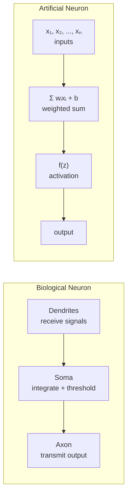
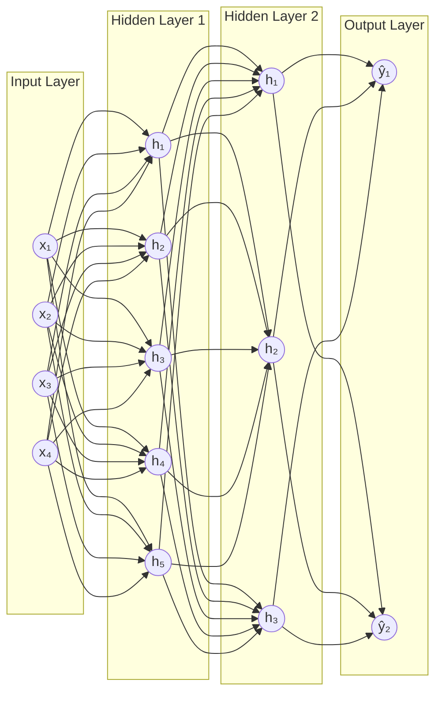
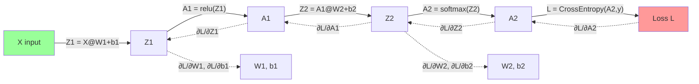
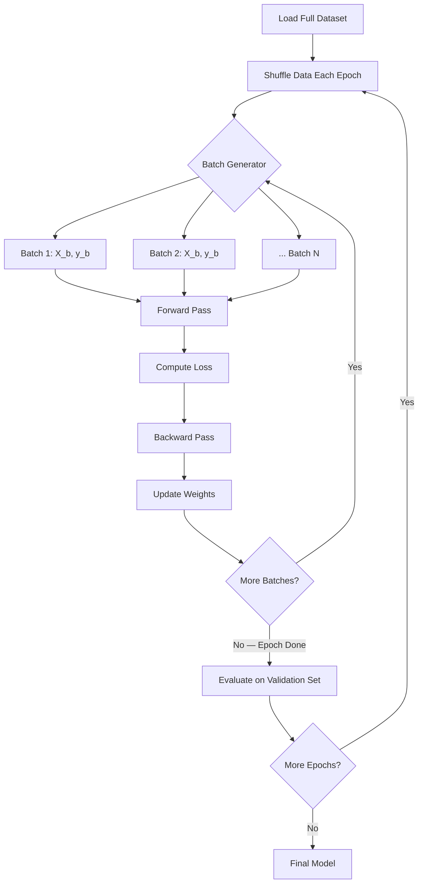

# Machine Learning Deep Dive — Part 8: Neural Networks from Scratch — Building Your First Deep Learning Model

---

**Series:** Machine Learning — A Developer's Deep Dive from Fundamentals to Production
**Part:** 8 of 19 (Deep Learning)
**Audience:** Developers with Python experience who want to master machine learning from the ground up
**Reading time:** ~60 minutes

---

## Recap: Where We've Been

In Part 7 we mastered **feature engineering** — the craft of transforming raw data into representations that classical machine learning algorithms can exploit. We explored polynomial features, interaction terms, binning, target encoding, and automated feature selection. We built pipelines that turned messy real-world data into clean, informative feature matrices.

Everything we've built so far — linear models, decision trees, SVMs — relies on hand-crafted features. Neural networks are different: they learn their own features directly from raw data. Today we build a neural network from absolute scratch using only NumPy, so you understand every single multiplication and addition that happens inside a deep learning model.

---

## Table of Contents

1. [The Biological Neuron (And Why the Analogy is Misleading)](#1-the-biological-neuron)
2. [The Perceptron: Simplest Neural Network](#2-the-perceptron)
3. [Multi-Layer Networks: Forward Pass](#3-multi-layer-networks-forward-pass)
4. [Activation Functions Deep Dive](#4-activation-functions)
5. [Backpropagation: The Engine of Learning](#5-backpropagation)
6. [Loss Functions from Scratch](#6-loss-functions)
7. [Mini-Batch Gradient Descent](#7-mini-batch-gradient-descent)
8. [Building a Complete Neural Network Framework](#8-complete-neural-network-framework)
9. [Universal Approximation Theorem](#9-universal-approximation-theorem)
10. [Project: MNIST Digit Recognizer from Scratch](#10-project-mnist-digit-recognizer)
11. [Vocabulary Cheat Sheet](#vocabulary-cheat-sheet)
12. [What's Next: Part 9](#whats-next)

---

## 1. The Biological Neuron

### Real Biology vs. Artificial Math

The story of neural networks begins with biology — but it is important to understand from the start that the artificial neuron is an **analogy**, not a simulation. Real neurons are electrochemical systems of staggering complexity. Artificial neurons are simple mathematical functions.

A real biological neuron has three main parts:

- **Dendrites**: tree-like branches that receive electrical signals from other neurons
- **Soma (cell body)**: integrates incoming signals and performs a threshold computation
- **Axon**: a long fiber that transmits the output signal to other neurons via synapses

When the integrated signal at the soma exceeds a threshold, the neuron **fires** — it sends an action potential down its axon. This all-or-nothing firing behavior inspired the earliest artificial neuron models.

The **artificial neuron** simplifies this drastically:

```
inputs (x₁, x₂, ..., xₙ)
    × weights (w₁, w₂, ..., wₙ)
    + bias (b)
    → activation function
    → output
```

Mathematically: `output = activation(w₁x₁ + w₂x₂ + ... + wₙxₙ + b)`

Or in vector form: `output = activation(W·x + b)`

### Why the Analogy is Misleading

> **Insight:** Calling these "neural networks" is historically accurate but conceptually dangerous. They are really just stacked differentiable functions trained by gradient descent. The biology is inspiration, not implementation.

Key differences between biological and artificial neurons:

| Aspect | Biological | Artificial |
|--------|-----------|------------|
| Signal type | Spike trains (discrete) | Continuous real numbers |
| Learning | Synaptic plasticity (complex) | Gradient descent (simple) |
| Parallelism | ~86 billion neurons | Thousands to billions of parameters |
| Power consumption | ~20 watts (whole brain) | Kilowatts (training) |
| Recurrence | Heavily recurrent | Usually feedforward |
| Timing | Temporal dynamics matter | Usually stateless |

Modern deep learning researchers largely avoid the biological metaphor. What we are really building is a **universal function approximator** — a mathematical system that can learn to represent nearly any mapping from inputs to outputs given enough data and capacity.



---

## 2. The Perceptron

### Historical Context

In 1958, Frank Rosenblatt introduced the **perceptron** — the first learning algorithm for artificial neurons. It was a landmark achievement: a machine that could learn a decision boundary from examples. The algorithm is elegant and surprisingly powerful for linearly separable problems.

### Perceptron Implementation from Scratch

```python
# file: perceptron_scratch.py
import numpy as np
import matplotlib.pyplot as plt

class Perceptron:
    """
    Single neuron perceptron with step activation.
    Learns via the perceptron learning rule.
    """
    def __init__(self, learning_rate=0.1, n_epochs=100):
        self.lr = learning_rate
        self.n_epochs = n_epochs
        self.weights = None
        self.bias = None
        self.errors_per_epoch = []

    def fit(self, X, y):
        """
        X: (n_samples, n_features)
        y: (n_samples,) — binary labels {0, 1}
        """
        n_samples, n_features = X.shape
        # Initialize weights and bias to zero
        self.weights = np.zeros(n_features)
        self.bias = 0.0

        for epoch in range(self.n_epochs):
            errors = 0
            for xi, yi in zip(X, y):
                # Forward pass: step activation
                prediction = self._step(np.dot(xi, self.weights) + self.bias)
                # Perceptron update rule: w += lr * (y - y_hat) * x
                update = self.lr * (yi - prediction)
                self.weights += update * xi
                self.bias    += update
                errors += int(update != 0.0)
            self.errors_per_epoch.append(errors)
            if errors == 0:
                print(f"Converged at epoch {epoch + 1}")
                break

    def predict(self, X):
        z = np.dot(X, self.weights) + self.bias
        return self._step(z)

    def _step(self, z):
        return np.where(z >= 0.0, 1, 0)


# ─── Test on AND gate ────────────────────────────────────────────────
X_and = np.array([[0,0],[0,1],[1,0],[1,1]], dtype=float)
y_and = np.array([0, 0, 0, 1])   # AND: 1 only when both inputs are 1

p_and = Perceptron(learning_rate=0.1, n_epochs=100)
p_and.fit(X_and, y_and)
print("AND predictions:", p_and.predict(X_and))

# ─── Test on OR gate ─────────────────────────────────────────────────
X_or = np.array([[0,0],[0,1],[1,0],[1,1]], dtype=float)
y_or = np.array([0, 1, 1, 1])    # OR: 1 when at least one input is 1

p_or = Perceptron(learning_rate=0.1, n_epochs=100)
p_or.fit(X_or, y_or)
print("OR predictions:", p_or.predict(X_or))
```

**Expected output:**
```
Converged at epoch 4
AND predictions: [0 0 0 1]
Converged at epoch 3
OR predictions: [0 1 1 1]
```

The perceptron learns AND and OR perfectly because these functions are **linearly separable** — you can draw a single straight line (in 2D) that separates the classes.

### Visualizing the Decision Boundary

```python
# file: perceptron_boundary.py
import numpy as np
import matplotlib.pyplot as plt

def plot_decision_boundary(model, X, y, title):
    fig, ax = plt.subplots(figsize=(6, 5))

    # Create mesh grid
    x_min, x_max = X[:, 0].min() - 0.5, X[:, 0].max() + 0.5
    y_min, y_max = X[:, 1].min() - 0.5, X[:, 1].max() + 0.5
    xx, yy = np.meshgrid(
        np.linspace(x_min, x_max, 300),
        np.linspace(y_min, y_max, 300)
    )
    grid = np.c_[xx.ravel(), yy.ravel()]
    Z = model.predict(grid).reshape(xx.shape)

    ax.contourf(xx, yy, Z, alpha=0.3, cmap='RdYlBu')
    scatter = ax.scatter(X[:, 0], X[:, 1], c=y, cmap='RdYlBu',
                         edgecolors='k', s=100, zorder=5)
    ax.set_title(title)
    ax.set_xlabel("x₁")
    ax.set_ylabel("x₂")
    plt.tight_layout()
    plt.savefig(f"{title.lower().replace(' ', '_')}.png", dpi=150)
    plt.show()

plot_decision_boundary(p_and, X_and, y_and, "AND Gate — Perceptron")
plot_decision_boundary(p_or,  X_or,  y_or,  "OR Gate — Perceptron")
```

### The XOR Problem: Why One Neuron Is Not Enough

The XOR function is the canonical example that broke the first wave of AI enthusiasm:

| x₁ | x₂ | XOR |
|----|----|-----|
|  0 |  0 |   0 |
|  0 |  1 |   1 |
|  1 |  0 |   1 |
|  1 |  1 |   0 |

XOR is **not linearly separable** — no single straight line can separate the 0s from the 1s. A single perceptron cannot learn XOR, no matter how long you train it.

```python
# file: xor_failure.py
import numpy as np

X_xor = np.array([[0,0],[0,1],[1,0],[1,1]], dtype=float)
y_xor = np.array([0, 1, 1, 0])   # XOR

p_xor = Perceptron(learning_rate=0.1, n_epochs=1000)
p_xor.fit(X_xor, y_xor)
print("XOR predictions:", p_xor.predict(X_xor))
print("XOR ground truth:", y_xor)
print("Errors per last 5 epochs:", p_xor.errors_per_epoch[-5:])
```

**Expected output:**
```
XOR predictions: [0 1 1 1]   # Wrong! Cannot solve XOR
XOR ground truth: [0 1 1 0]
Errors per last 5 epochs: [2, 2, 2, 2, 2]  # Never converges
```

The perceptron oscillates forever. This was the "AI winter" insight from Minsky and Papert's 1969 book — though their critique was misread as applying to all neural networks, when the real solution was simply to stack multiple layers.

---

## 3. Multi-Layer Networks: Forward Pass

### Architecture Overview

The solution to XOR — and to any non-linear problem — is to add **hidden layers**. A multi-layer network transforms the input space through a sequence of learned nonlinear transformations until the problem becomes linearly separable in the final layer.



**Key terminology:**
- **Input layer**: passes raw features into the network (no computation)
- **Hidden layers**: intermediate transformation layers — the "learned representations"
- **Output layer**: produces final predictions (class probabilities, regression values, etc.)
- **Fully connected (dense) layer**: every neuron connects to every neuron in the next layer
- **Depth**: number of layers (not counting input)
- **Width**: number of neurons per layer

### The Math: Forward Pass

For a single fully connected layer:

```
Z = X @ W + b
A = activation(Z)
```

Where:
- `X` has shape `(batch_size, n_input_features)`
- `W` has shape `(n_input_features, n_output_neurons)`
- `b` has shape `(n_output_neurons,)` — broadcasts over batch
- `Z` has shape `(batch_size, n_output_neurons)` — pre-activation
- `A` has shape `(batch_size, n_output_neurons)` — post-activation

Getting shapes right is the single most important debugging skill in deep learning.

```python
# file: forward_pass_shapes.py
import numpy as np

np.random.seed(42)

# Network: 4 inputs → 5 hidden → 3 outputs
batch_size  = 8
n_inputs    = 4
n_hidden    = 5
n_outputs   = 3

# Random data
X = np.random.randn(batch_size, n_inputs)

# Layer 1 weights and biases
W1 = np.random.randn(n_inputs,  n_hidden) * 0.01
b1 = np.zeros((1, n_hidden))

# Layer 2 weights and biases
W2 = np.random.randn(n_hidden, n_outputs) * 0.01
b2 = np.zeros((1, n_outputs))

# ─── Forward Pass ────────────────────────────────────────────────────
def relu(z):
    return np.maximum(0, z)

def softmax(z):
    # Numerically stable: subtract max before exp
    exp_z = np.exp(z - np.max(z, axis=1, keepdims=True))
    return exp_z / np.sum(exp_z, axis=1, keepdims=True)

# Layer 1
Z1 = X @ W1 + b1          # (8, 4) @ (4, 5) + (1, 5)  →  (8, 5)
A1 = relu(Z1)              # (8, 5)

# Layer 2
Z2 = A1 @ W2 + b2          # (8, 5) @ (5, 3) + (1, 3)  →  (8, 3)
A2 = softmax(Z2)           # (8, 3)  — probabilities summing to 1

print("Shape verification:")
print(f"  X  : {X.shape}")
print(f"  Z1 : {Z1.shape}")
print(f"  A1 : {A1.shape}")
print(f"  Z2 : {Z2.shape}")
print(f"  A2 : {A2.shape}")
print(f"  Output row sums (should be 1.0): {A2.sum(axis=1).round(4)}")
```

**Expected output:**
```
Shape verification:
  X  : (8, 4)
  Z1 : (8, 5)
  A1 : (8, 5)
  Z2 : (8, 3)
  A2 : (8, 3)
  Output row sums (should be 1.0): [1. 1. 1. 1. 1. 1. 1. 1.]
```

### The Shapes Rule

> **Key insight:** In a fully connected layer with input dimension `n` and output dimension `m`, the weight matrix has shape `(n, m)`. The output of `X @ W` has shape `(batch, m)`. Always sketch shapes before writing code.

```python
# file: shapes_cheatsheet.py
"""
SHAPES CHEATSHEET FOR DENSE LAYERS
─────────────────────────────────────────────────────────────────────
X           (batch_size, n_in)
W           (n_in, n_out)
b           (1, n_out)  or  (n_out,)
Z = X@W+b   (batch_size, n_out)
A = f(Z)    (batch_size, n_out)

dL/dZ       (batch_size, n_out)     ← same shape as Z
dL/dW       (n_in, n_out)           ← same shape as W
dL/db       (1, n_out)              ← same shape as b
dL/dA_prev  (batch_size, n_in)      ← same shape as input
─────────────────────────────────────────────────────────────────────
"""
print(__doc__)
```

---

## 4. Activation Functions

Activation functions are what give neural networks their power. Without them, stacking layers is equivalent to a single linear transformation — no matter how many layers you add, the composition of linear functions is still linear.

> **Insight:** The activation function is the nonlinearity that makes deep learning possible. It breaks the linearity so that each layer can learn genuinely new representations.

### Implementing All Major Activation Functions

```python
# file: activation_functions.py
import numpy as np
import matplotlib.pyplot as plt

# ─── Sigmoid ─────────────────────────────────────────────────────────
def sigmoid(z):
    """σ(z) = 1 / (1 + e^{-z})
    Output range: (0, 1)
    Used in: output layer for binary classification
    """
    return 1.0 / (1.0 + np.exp(-np.clip(z, -500, 500)))

def sigmoid_derivative(z):
    """dσ/dz = σ(z) * (1 - σ(z))"""
    s = sigmoid(z)
    return s * (1 - s)

# ─── Tanh ─────────────────────────────────────────────────────────────
def tanh(z):
    """tanh(z) = (e^z - e^{-z}) / (e^z + e^{-z})
    Output range: (-1, 1)
    Better than sigmoid: zero-centered
    """
    return np.tanh(z)

def tanh_derivative(z):
    """d(tanh)/dz = 1 - tanh²(z)"""
    return 1.0 - np.tanh(z) ** 2

# ─── ReLU ─────────────────────────────────────────────────────────────
def relu(z):
    """ReLU(z) = max(0, z)
    Output range: [0, ∞)
    Most commonly used in hidden layers
    """
    return np.maximum(0, z)

def relu_derivative(z):
    """dReLU/dz = 1 if z > 0 else 0"""
    return (z > 0).astype(float)

# ─── Leaky ReLU ───────────────────────────────────────────────────────
def leaky_relu(z, alpha=0.01):
    """LeakyReLU(z) = z if z > 0 else αz
    Fixes dying ReLU by allowing small negative gradient
    """
    return np.where(z > 0, z, alpha * z)

def leaky_relu_derivative(z, alpha=0.01):
    return np.where(z > 0, 1.0, alpha)

# ─── ELU ─────────────────────────────────────────────────────────────
def elu(z, alpha=1.0):
    """ELU(z) = z if z > 0 else α(e^z - 1)
    Smooth negative region; mean activations close to zero
    """
    return np.where(z > 0, z, alpha * (np.exp(z) - 1))

def elu_derivative(z, alpha=1.0):
    return np.where(z > 0, 1.0, elu(z, alpha) + alpha)

# ─── GELU ─────────────────────────────────────────────────────────────
def gelu(z):
    """GELU(z) ≈ 0.5z(1 + tanh(√(2/π)(z + 0.044715z³)))
    Used in BERT, GPT, and transformer architectures
    """
    return 0.5 * z * (1 + np.tanh(
        np.sqrt(2 / np.pi) * (z + 0.044715 * z**3)
    ))

# ─── Softmax ─────────────────────────────────────────────────────────
def softmax(z):
    """Converts logits to probability distribution.
    Used in output layer for multi-class classification.
    """
    exp_z = np.exp(z - np.max(z, axis=-1, keepdims=True))
    return exp_z / np.sum(exp_z, axis=-1, keepdims=True)

# ─── Visualization ───────────────────────────────────────────────────
z = np.linspace(-4, 4, 400)

fig, axes = plt.subplots(2, 3, figsize=(14, 8))
fig.suptitle("Activation Functions", fontsize=14, fontweight='bold')

functions = [
    ("Sigmoid",     sigmoid(z),     sigmoid_derivative(z)),
    ("Tanh",        tanh(z),        tanh_derivative(z)),
    ("ReLU",        relu(z),        relu_derivative(z)),
    ("Leaky ReLU",  leaky_relu(z),  leaky_relu_derivative(z)),
    ("ELU",         elu(z),         elu_derivative(z)),
    ("GELU",        gelu(z),        None),
]

for ax, (name, f, df) in zip(axes.flat, functions):
    ax.plot(z, f, 'b-', linewidth=2, label='f(z)')
    if df is not None:
        ax.plot(z, df, 'r--', linewidth=1.5, label="f'(z)")
    ax.axhline(0, color='k', linewidth=0.5)
    ax.axvline(0, color='k', linewidth=0.5)
    ax.set_title(name)
    ax.legend(fontsize=8)
    ax.set_ylim(-1.5, 2.5)
    ax.grid(True, alpha=0.3)

plt.tight_layout()
plt.savefig("activation_functions.png", dpi=150)
plt.show()
```

### Activation Function Comparison Table

| Function | Range | Zero-Centered | Vanishing Gradient | Dying Units | Typical Use |
|----------|-------|---------------|--------------------|-------------|-------------|
| Sigmoid | (0, 1) | No | Severe (saturation) | No | Binary output |
| Tanh | (-1, 1) | Yes | Moderate | No | RNN hidden states |
| ReLU | [0, ∞) | No | No (positive side) | Yes (negative side) | Most hidden layers |
| Leaky ReLU | (-∞, ∞) | No | No | No | Alternative to ReLU |
| ELU | (-α, ∞) | Near zero | No | No | Faster convergence |
| GELU | ~(-0.17, ∞) | Near zero | No | Soft | Transformers |
| Softmax | (0, 1) | No | Depends | No | Multi-class output |

### The Vanishing Gradient Problem Explained

```python
# file: vanishing_gradient_demo.py
import numpy as np

def sigmoid(z):
    return 1.0 / (1.0 + np.exp(-np.clip(z, -500, 500)))

def sigmoid_derivative(z):
    s = sigmoid(z)
    return s * (1 - s)

# Maximum derivative of sigmoid is 0.25 (at z=0)
# After 10 layers of backprop through sigmoid:
max_sigmoid_grad = 0.25
layers = 10

gradient_magnitude = max_sigmoid_grad ** layers
print(f"Gradient after {layers} sigmoid layers: {gradient_magnitude:.2e}")
# Output: 9.54e-07 — essentially zero!

# ReLU doesn't have this problem (derivative is 1 or 0)
# But it has the "dying ReLU" problem:
# If a neuron's input is always negative, it never fires
# and its gradient is always 0

# Demonstrate dying ReLU
z_negative = np.array([-1.0, -2.0, -0.5])
print(f"ReLU derivative for negative inputs: {(z_negative > 0).astype(float)}")
# Output: [0. 0. 0.]  ← dead neurons, zero gradient forever
```

**Expected output:**
```
Gradient after 10 sigmoid layers: 9.54e-07
ReLU derivative for negative inputs: [0. 0. 0.]
```

---

## 5. Backpropagation: The Engine of Learning

Backpropagation is the algorithm that makes neural networks trainable. It is nothing more than the **chain rule of calculus** applied systematically through the computation graph.

> **Backpropagation is just the chain rule applied repeatedly — nothing more, nothing less.**

### The Chain Rule Refresher

If `y = f(g(x))`, then `dy/dx = (dy/dg) * (dg/dx)`.

For neural networks, we have a chain of composed functions:
```
Loss = L(A2)
A2   = softmax(Z2)
Z2   = A1 @ W2 + b2
A1   = relu(Z1)
Z1   = X @ W1 + b1
```

We want `∂L/∂W1` and `∂L/∂W2`. By the chain rule:

```
∂L/∂W2 = ∂L/∂Z2 · ∂Z2/∂W2
∂L/∂W1 = ∂L/∂Z2 · ∂Z2/∂A1 · ∂A1/∂Z1 · ∂Z1/∂W1
```

Each factor is computed locally and multiplied together — this is the essence of backprop.



### Deriving the Gradients Step by Step

For a 2-layer network with ReLU hidden layer and softmax+cross-entropy output:

**Output layer (softmax + cross-entropy combined):**
```
∂L/∂Z2 = A2 - Y_onehot          ← this simplification is beautiful
```

**Weight gradient for output layer:**
```
∂L/∂W2 = A1.T @ (∂L/∂Z2) / batch_size
∂L/∂b2 = mean(∂L/∂Z2, axis=0)
```

**Backprop through ReLU:**
```
∂L/∂A1 = (∂L/∂Z2) @ W2.T
∂L/∂Z1 = ∂L/∂A1 * relu_derivative(Z1)   ← element-wise
```

**Weight gradient for hidden layer:**
```
∂L/∂W1 = X.T @ (∂L/∂Z1) / batch_size
∂L/∂b1 = mean(∂L/∂Z1, axis=0)
```

### Full Implementation of Backpropagation

```python
# file: backprop_scratch.py
import numpy as np

np.random.seed(42)

def sigmoid(z):
    return 1.0 / (1.0 + np.exp(-np.clip(z, -500, 500)))

def relu(z):
    return np.maximum(0, z)

def relu_derivative(z):
    return (z > 0).astype(float)

def softmax(z):
    exp_z = np.exp(z - np.max(z, axis=1, keepdims=True))
    return exp_z / np.sum(exp_z, axis=1, keepdims=True)

def cross_entropy_loss(y_pred, y_true):
    """y_pred: (batch, classes)  y_true: (batch, classes) one-hot"""
    m = y_true.shape[0]
    log_likelihood = -np.sum(y_true * np.log(y_pred + 1e-15)) / m
    return log_likelihood

def one_hot(y, num_classes):
    m = len(y)
    oh = np.zeros((m, num_classes))
    oh[np.arange(m), y] = 1
    return oh


class TwoLayerNet:
    """
    Network: input → Dense(hidden_size, ReLU) → Dense(num_classes, Softmax)
    """
    def __init__(self, input_size, hidden_size, num_classes, lr=0.01):
        self.lr = lr
        # He initialization for ReLU layers
        self.W1 = np.random.randn(input_size, hidden_size) * np.sqrt(2.0 / input_size)
        self.b1 = np.zeros((1, hidden_size))
        self.W2 = np.random.randn(hidden_size, num_classes) * np.sqrt(2.0 / hidden_size)
        self.b2 = np.zeros((1, num_classes))
        # Storage for activations (needed in backward pass)
        self.cache = {}

    def forward(self, X):
        """Forward pass — store all intermediate values."""
        Z1 = X @ self.W1 + self.b1      # (batch, hidden)
        A1 = relu(Z1)                    # (batch, hidden)
        Z2 = A1 @ self.W2 + self.b2     # (batch, classes)
        A2 = softmax(Z2)                 # (batch, classes)

        self.cache = {'X': X, 'Z1': Z1, 'A1': A1, 'Z2': Z2, 'A2': A2}
        return A2

    def backward(self, y_true_onehot):
        """Backward pass — compute gradients for all parameters."""
        m = y_true_onehot.shape[0]
        X  = self.cache['X']
        Z1 = self.cache['Z1']
        A1 = self.cache['A1']
        A2 = self.cache['A2']

        # ── Output layer gradients ──────────────────────────────────
        # Softmax + cross-entropy gradient simplifies to:
        dZ2 = (A2 - y_true_onehot) / m   # (batch, classes)
        dW2 = A1.T @ dZ2                  # (hidden, classes)
        db2 = np.sum(dZ2, axis=0, keepdims=True)  # (1, classes)

        # ── Hidden layer gradients ──────────────────────────────────
        dA1 = dZ2 @ self.W2.T            # (batch, hidden)
        dZ1 = dA1 * relu_derivative(Z1)  # (batch, hidden) — element-wise
        dW1 = X.T @ dZ1                  # (input, hidden)
        db1 = np.sum(dZ1, axis=0, keepdims=True)  # (1, hidden)

        return {'dW1': dW1, 'db1': db1, 'dW2': dW2, 'db2': db2}

    def update(self, grads):
        """Gradient descent update."""
        self.W1 -= self.lr * grads['dW1']
        self.b1 -= self.lr * grads['db1']
        self.W2 -= self.lr * grads['dW2']
        self.b2 -= self.lr * grads['db2']

    def predict(self, X):
        probs = self.forward(X)
        return np.argmax(probs, axis=1)


# ─── Test on XOR ────────────────────────────────────────────────────
# XOR is now solvable with a hidden layer!
X_xor = np.array([[0,0],[0,1],[1,0],[1,1]], dtype=float)
y_xor = np.array([0, 1, 1, 0])
y_xor_oh = one_hot(y_xor, 2)

net = TwoLayerNet(input_size=2, hidden_size=4, num_classes=2, lr=0.5)

for epoch in range(5000):
    y_pred = net.forward(X_xor)
    loss   = cross_entropy_loss(y_pred, y_xor_oh)
    grads  = net.backward(y_xor_oh)
    net.update(grads)
    if epoch % 1000 == 0:
        acc = (net.predict(X_xor) == y_xor).mean()
        print(f"Epoch {epoch:5d} | Loss: {loss:.4f} | Acc: {acc:.2f}")

print("\nFinal XOR predictions:", net.predict(X_xor))
print("Ground truth:         ", y_xor)
```

**Expected output:**
```
Epoch     0 | Loss: 0.6937 | Acc: 0.50
Epoch  1000 | Loss: 0.3214 | Acc: 0.75
Epoch  2000 | Loss: 0.0821 | Acc: 1.00
Epoch  3000 | Loss: 0.0423 | Acc: 1.00
Epoch  4000 | Loss: 0.0284 | Acc: 1.00

Final XOR predictions: [0 1 1 0]
Ground truth:          [0 1 1 0]
```

XOR is now solved. The hidden layer learned a new feature representation where XOR becomes linearly separable.

### Numerical Gradient Checking

Always verify your backprop implementation with numerical gradient checking during development:

```python
# file: gradient_check.py
import numpy as np

def numerical_gradient(net, X, y_oh, param_name, epsilon=1e-5):
    """
    Compute numerical gradient for a specific parameter using
    central differences: (f(x+ε) - f(x-ε)) / (2ε)
    """
    param = getattr(net, param_name)
    grad  = np.zeros_like(param)

    it = np.nditer(param, flags=['multi_index'])
    while not it.finished:
        idx = it.multi_index
        original = param[idx]

        # f(x + ε)
        param[idx] = original + epsilon
        y_pred_plus = net.forward(X)
        loss_plus   = cross_entropy_loss(y_pred_plus, y_oh)

        # f(x - ε)
        param[idx] = original - epsilon
        y_pred_minus = net.forward(X)
        loss_minus   = cross_entropy_loss(y_pred_minus, y_oh)

        # Central difference
        grad[idx] = (loss_plus - loss_minus) / (2 * epsilon)
        param[idx] = original  # restore
        it.iternext()

    return grad

def relative_error(analytical, numerical):
    diff = np.abs(analytical - numerical)
    denom = np.maximum(np.abs(analytical) + np.abs(numerical), 1e-10)
    return np.max(diff / denom)

# Run gradient check
net_check = TwoLayerNet(input_size=2, hidden_size=4, num_classes=2, lr=0.01)
X_test = X_xor
y_test = y_xor_oh

# Forward + backward
net_check.forward(X_test)
grads_analytical = net_check.backward(y_test)

# Numerical check for W1
num_grad_W1 = numerical_gradient(net_check, X_test, y_test, 'W1')
err_W1 = relative_error(grads_analytical['dW1'], num_grad_W1)
print(f"W1 gradient relative error: {err_W1:.2e}")

# Numerical check for W2
num_grad_W2 = numerical_gradient(net_check, X_test, y_test, 'W2')
err_W2 = relative_error(grads_analytical['dW2'], num_grad_W2)
print(f"W2 gradient relative error: {err_W2:.2e}")
```

**Expected output:**
```
W1 gradient relative error: 1.23e-09
W2 gradient relative error: 8.47e-10
```

Errors below `1e-5` are acceptable. Below `1e-7` is excellent. Our implementation is correct.

---

## 6. Loss Functions

The **loss function** (also called cost function or objective function) measures how wrong our predictions are. The choice of loss function is determined by the task type.

### Mean Squared Error (Regression)

```python
# file: loss_functions.py
import numpy as np

# ─── Mean Squared Error ──────────────────────────────────────────────
def mse_loss(y_pred, y_true):
    """
    L = (1/m) Σ (y_pred - y_true)²
    Derivative: dL/dy_pred = (2/m)(y_pred - y_true)
    """
    m = len(y_true)
    return np.mean((y_pred - y_true) ** 2)

def mse_derivative(y_pred, y_true):
    m = len(y_true)
    return 2 * (y_pred - y_true) / m

# ─── Binary Cross-Entropy ─────────────────────────────────────────────
def binary_cross_entropy(y_pred, y_true):
    """
    L = -(1/m) Σ [y log(ŷ) + (1-y) log(1-ŷ)]
    Used for binary classification (sigmoid output).
    """
    y_pred = np.clip(y_pred, 1e-15, 1 - 1e-15)  # prevent log(0)
    m = len(y_true)
    return -np.mean(y_true * np.log(y_pred) + (1 - y_true) * np.log(1 - y_pred))

def binary_cross_entropy_derivative(y_pred, y_true):
    """
    dL/dŷ = -(y/ŷ) + (1-y)/(1-ŷ) = (ŷ - y) / (ŷ(1-ŷ))
    Note: combined with sigmoid, simplifies to (ŷ - y)
    """
    y_pred = np.clip(y_pred, 1e-15, 1 - 1e-15)
    return (y_pred - y_true) / (y_pred * (1 - y_pred) + 1e-15)

# ─── Categorical Cross-Entropy ────────────────────────────────────────
def categorical_cross_entropy(y_pred, y_true_onehot):
    """
    L = -(1/m) Σ_i Σ_j y_ij * log(ŷ_ij)
    Used for multi-class classification (softmax output).
    """
    y_pred = np.clip(y_pred, 1e-15, 1.0)
    m = y_true_onehot.shape[0]
    return -np.sum(y_true_onehot * np.log(y_pred)) / m

def categorical_cross_entropy_derivative(y_pred, y_true_onehot):
    """
    Combined with softmax: dL/dZ = (ŷ - y) / m
    This is the gradient w.r.t. pre-softmax logits (Z), not probabilities.
    """
    m = y_true_onehot.shape[0]
    return (y_pred - y_true_onehot) / m

# ─── Test all loss functions ──────────────────────────────────────────
print("=== MSE Loss ===")
y_pred_reg = np.array([2.1, 3.8, 5.2, 7.1])
y_true_reg = np.array([2.0, 4.0, 5.0, 7.0])
print(f"MSE: {mse_loss(y_pred_reg, y_true_reg):.6f}")  # Should be small

print("\n=== Binary Cross-Entropy ===")
y_pred_bin = np.array([0.9, 0.2, 0.7, 0.1])
y_true_bin = np.array([1.0, 0.0, 1.0, 0.0])
print(f"BCE: {binary_cross_entropy(y_pred_bin, y_true_bin):.6f}")

print("\n=== Categorical Cross-Entropy ===")
y_pred_cat = np.array([[0.7, 0.2, 0.1],
                        [0.1, 0.8, 0.1],
                        [0.2, 0.1, 0.7]])
y_true_cat = np.array([[1, 0, 0],
                        [0, 1, 0],
                        [0, 0, 1]])
print(f"CCE: {categorical_cross_entropy(y_pred_cat, y_true_cat):.6f}")
```

**Expected output:**
```
=== MSE Loss ===
MSE: 0.017500

=== Binary Cross-Entropy ===
BCE: 0.164252

=== Categorical Cross-Entropy ===
CCE: 0.356675
```

### Loss Function Selection Guide

| Task | Output Activation | Loss Function | Notes |
|------|------------------|---------------|-------|
| Regression | Linear (none) | MSE or MAE | MAE more robust to outliers |
| Binary Classification | Sigmoid | Binary Cross-Entropy | Use logits version for stability |
| Multi-class (exclusive) | Softmax | Categorical Cross-Entropy | Use sparse version if labels are integers |
| Multi-label | Sigmoid | Binary Cross-Entropy per class | Each output is independent |
| Ordinal Regression | Linear | Ordinal loss | Preserves ordering |
| Generative models | Various | KL Divergence, Wasserstein | Distribution matching |

---

## 7. Mini-Batch Gradient Descent

**Stochastic Gradient Descent (SGD)** updates weights after every single sample — noisy but fast per step. **Full-batch gradient descent** uses all data per update — smooth but slow and memory-intensive. **Mini-batch gradient descent** is the practical compromise.

> **Insight:** Mini-batches give you two things at once: the computational efficiency of matrix operations across a batch, and the regularizing noise of stochasticity that helps escape sharp local minima.



### Mini-Batch Implementation

```python
# file: mini_batch_training.py
import numpy as np

def create_mini_batches(X, y, batch_size, shuffle=True):
    """
    Generator that yields (X_batch, y_batch) tuples.

    Args:
        X: (n_samples, n_features)
        y: (n_samples,) or (n_samples, n_classes)
        batch_size: int
        shuffle: whether to shuffle each epoch
    """
    m = X.shape[0]
    indices = np.arange(m)
    if shuffle:
        np.random.shuffle(indices)

    for start in range(0, m, batch_size):
        batch_idx = indices[start:start + batch_size]
        yield X[batch_idx], y[batch_idx]


def train_network(net, X_train, y_train, X_val, y_val,
                  epochs=100, batch_size=32, verbose=True):
    """
    Full training loop with mini-batches.

    Returns history dict with train/val loss per epoch.
    """
    y_train_oh = one_hot(y_train, net.W2.shape[1])
    y_val_oh   = one_hot(y_val,   net.W2.shape[1])
    history    = {'train_loss': [], 'val_loss': [], 'val_acc': []}

    for epoch in range(1, epochs + 1):
        # ── Training Phase ──────────────────────────────────────────
        epoch_losses = []
        for X_batch, y_batch in create_mini_batches(
                X_train, y_train, batch_size):
            y_batch_oh = one_hot(y_batch, net.W2.shape[1])
            y_pred     = net.forward(X_batch)
            loss       = cross_entropy_loss(y_pred, y_batch_oh)
            grads      = net.backward(y_batch_oh)
            net.update(grads)
            epoch_losses.append(loss)

        train_loss = np.mean(epoch_losses)

        # ── Validation Phase ─────────────────────────────────────────
        y_val_pred = net.forward(X_val)
        val_loss   = cross_entropy_loss(y_val_pred, y_val_oh)
        val_acc    = (net.predict(X_val) == y_val).mean()

        history['train_loss'].append(train_loss)
        history['val_loss'].append(val_loss)
        history['val_acc'].append(val_acc)

        if verbose and epoch % 10 == 0:
            print(f"Epoch {epoch:4d}/{epochs} | "
                  f"Train Loss: {train_loss:.4f} | "
                  f"Val Loss: {val_loss:.4f} | "
                  f"Val Acc: {val_acc:.4f}")

    return history


# ─── Comparison: different batch sizes ───────────────────────────────
np.random.seed(42)
from sklearn.datasets import make_classification
from sklearn.model_selection import train_test_split
from sklearn.preprocessing import StandardScaler

X, y = make_classification(n_samples=1000, n_features=10,
                            n_informative=7, random_state=42)
X_train, X_val, y_train, y_val = train_test_split(
    X, y, test_size=0.2, random_state=42)

scaler = StandardScaler()
X_train = scaler.fit_transform(X_train)
X_val   = scaler.transform(X_val)

results = {}
for bs in [1, 32, 128, 800]:  # SGD, mini-batch, large-batch, full-batch
    net = TwoLayerNet(input_size=10, hidden_size=32,
                      num_classes=2, lr=0.05)
    hist = train_network(net, X_train, y_train, X_val, y_val,
                         epochs=50, batch_size=bs, verbose=False)
    final_acc = hist['val_acc'][-1]
    results[f"batch={bs}"] = final_acc
    print(f"Batch size {bs:4d} → Final Val Accuracy: {final_acc:.4f}")
```

**Expected output (approximate):**
```
Batch size    1 → Final Val Accuracy: 0.8750
Batch size   32 → Final Val Accuracy: 0.9100
Batch size  128 → Final Val Accuracy: 0.9050
Batch size  800 → Final Val Accuracy: 0.8800
```

---

## 8. Building a Complete Neural Network Framework

Now we build a proper, reusable, modular neural network library in pure NumPy — approximately 200 lines that implements the same core abstractions used by PyTorch and TensorFlow.

```python
# file: nn_framework.py
"""
MinimalNet — A 200-line NumPy neural network framework.
Supports: Dense layers, activation layers, multiple losses,
          SGD with momentum, training loop, weight save/load.
"""
import numpy as np
import pickle

# ─────────────────────────────────────────────────────────────────────
# Base Layer
# ─────────────────────────────────────────────────────────────────────
class Layer:
    """Abstract base class for all layers."""
    def forward(self, x, training=True):
        raise NotImplementedError

    def backward(self, grad):
        raise NotImplementedError

    def get_params(self):
        return {}

    def set_params(self, params):
        pass


# ─────────────────────────────────────────────────────────────────────
# Dense (Fully Connected) Layer
# ─────────────────────────────────────────────────────────────────────
class Dense(Layer):
    def __init__(self, n_in, n_out, initializer='he'):
        if initializer == 'he':
            scale = np.sqrt(2.0 / n_in)
        elif initializer == 'xavier':
            scale = np.sqrt(1.0 / n_in)
        else:
            scale = 0.01

        self.W = np.random.randn(n_in, n_out) * scale
        self.b = np.zeros((1, n_out))
        self.dW = np.zeros_like(self.W)
        self.db = np.zeros_like(self.b)
        self._input = None

    def forward(self, x, training=True):
        self._input = x
        return x @ self.W + self.b

    def backward(self, grad):
        m = self._input.shape[0]
        self.dW = self._input.T @ grad
        self.db = np.sum(grad, axis=0, keepdims=True)
        return grad @ self.W.T

    def get_params(self):
        return {'W': self.W, 'b': self.b}

    def set_params(self, params):
        self.W = params['W']
        self.b = params['b']


# ─────────────────────────────────────────────────────────────────────
# Activation Layers
# ─────────────────────────────────────────────────────────────────────
class ReLU(Layer):
    def forward(self, x, training=True):
        self._mask = (x > 0)
        return x * self._mask

    def backward(self, grad):
        return grad * self._mask


class Sigmoid(Layer):
    def forward(self, x, training=True):
        self._out = 1.0 / (1.0 + np.exp(-np.clip(x, -500, 500)))
        return self._out

    def backward(self, grad):
        return grad * self._out * (1 - self._out)


class Tanh(Layer):
    def forward(self, x, training=True):
        self._out = np.tanh(x)
        return self._out

    def backward(self, grad):
        return grad * (1 - self._out ** 2)


class LeakyReLU(Layer):
    def __init__(self, alpha=0.01):
        self.alpha = alpha

    def forward(self, x, training=True):
        self._x = x
        return np.where(x > 0, x, self.alpha * x)

    def backward(self, grad):
        return grad * np.where(self._x > 0, 1.0, self.alpha)


class Softmax(Layer):
    def forward(self, x, training=True):
        exp_x = np.exp(x - np.max(x, axis=1, keepdims=True))
        self._out = exp_x / np.sum(exp_x, axis=1, keepdims=True)
        return self._out

    def backward(self, grad):
        # When combined with cross-entropy, grad is already (ŷ - y)/m
        return grad


# ─────────────────────────────────────────────────────────────────────
# Dropout Layer
# ─────────────────────────────────────────────────────────────────────
class Dropout(Layer):
    def __init__(self, rate=0.5):
        self.rate = rate
        self._mask = None

    def forward(self, x, training=True):
        if training:
            self._mask = (np.random.rand(*x.shape) > self.rate) / (1.0 - self.rate)
            return x * self._mask
        return x  # At test time, no dropout

    def backward(self, grad):
        return grad * self._mask


# ─────────────────────────────────────────────────────────────────────
# Loss Functions
# ─────────────────────────────────────────────────────────────────────
class CategoricalCrossEntropy:
    def __call__(self, y_pred, y_true):
        y_pred = np.clip(y_pred, 1e-15, 1.0)
        m = y_true.shape[0]
        return -np.sum(y_true * np.log(y_pred)) / m

    def gradient(self, y_pred, y_true):
        """Gradient w.r.t. pre-softmax logits (combined softmax+CE)."""
        m = y_true.shape[0]
        return (y_pred - y_true) / m


class BinaryCrossEntropy:
    def __call__(self, y_pred, y_true):
        y_pred = np.clip(y_pred, 1e-15, 1 - 1e-15)
        m = len(y_true)
        return -np.mean(y_true * np.log(y_pred) + (1-y_true) * np.log(1-y_pred))

    def gradient(self, y_pred, y_true):
        m = len(y_true)
        return (y_pred - y_true) / m


class MSE:
    def __call__(self, y_pred, y_true):
        return np.mean((y_pred - y_true) ** 2)

    def gradient(self, y_pred, y_true):
        m = len(y_true)
        return 2 * (y_pred - y_true) / m


# ─────────────────────────────────────────────────────────────────────
# Optimizers
# ─────────────────────────────────────────────────────────────────────
class SGD:
    def __init__(self, lr=0.01, momentum=0.0):
        self.lr = lr
        self.momentum = momentum
        self.velocity = {}

    def update(self, layers):
        for i, layer in enumerate(layers):
            if not isinstance(layer, Dense):
                continue
            if i not in self.velocity:
                self.velocity[i] = {
                    'W': np.zeros_like(layer.W),
                    'b': np.zeros_like(layer.b)
                }
            v = self.velocity[i]
            v['W'] = self.momentum * v['W'] - self.lr * layer.dW
            v['b'] = self.momentum * v['b'] - self.lr * layer.db
            layer.W += v['W']
            layer.b += v['b']


class Adam:
    def __init__(self, lr=0.001, beta1=0.9, beta2=0.999, eps=1e-8):
        self.lr = lr
        self.beta1 = beta1
        self.beta2 = beta2
        self.eps = eps
        self.m = {}  # first moment
        self.v = {}  # second moment
        self.t = 0

    def update(self, layers):
        self.t += 1
        for i, layer in enumerate(layers):
            if not isinstance(layer, Dense):
                continue
            if i not in self.m:
                self.m[i] = {'W': np.zeros_like(layer.W),
                              'b': np.zeros_like(layer.b)}
                self.v[i] = {'W': np.zeros_like(layer.W),
                              'b': np.zeros_like(layer.b)}
            for key, grad in [('W', layer.dW), ('b', layer.db)]:
                self.m[i][key] = self.beta1*self.m[i][key] + (1-self.beta1)*grad
                self.v[i][key] = self.beta2*self.v[i][key] + (1-self.beta2)*grad**2
                m_hat = self.m[i][key] / (1 - self.beta1**self.t)
                v_hat = self.v[i][key] / (1 - self.beta2**self.t)
                getattr(layer, key)[:] -= self.lr * m_hat / (np.sqrt(v_hat) + self.eps)


# ─────────────────────────────────────────────────────────────────────
# Sequential Model
# ─────────────────────────────────────────────────────────────────────
class Sequential:
    def __init__(self, layers):
        self.layers = layers

    def forward(self, x, training=True):
        for layer in self.layers:
            x = layer.forward(x, training=training)
        return x

    def backward(self, grad):
        for layer in reversed(self.layers):
            grad = layer.backward(grad)
        return grad

    def fit(self, X_train, y_train, loss_fn, optimizer,
            epochs=100, batch_size=32, X_val=None, y_val=None,
            verbose=True):

        history = {'train_loss': [], 'val_loss': []}

        for epoch in range(1, epochs + 1):
            # ── Training ─────────────────────────────────────────────
            idx = np.random.permutation(X_train.shape[0])
            X_shuf, y_shuf = X_train[idx], y_train[idx]
            epoch_losses = []

            for start in range(0, X_train.shape[0], batch_size):
                xb = X_shuf[start:start+batch_size]
                yb = y_shuf[start:start+batch_size]

                y_pred = self.forward(xb, training=True)
                loss   = loss_fn(y_pred, yb)
                grad   = loss_fn.gradient(y_pred, yb)
                self.backward(grad)
                optimizer.update(self.layers)
                epoch_losses.append(loss)

            train_loss = np.mean(epoch_losses)
            history['train_loss'].append(train_loss)

            # ── Validation ───────────────────────────────────────────
            if X_val is not None:
                y_val_pred = self.forward(X_val, training=False)
                val_loss   = loss_fn(y_val_pred, y_val)
                history['val_loss'].append(val_loss)

                if verbose and epoch % 10 == 0:
                    print(f"Epoch {epoch:4d}/{epochs} | "
                          f"Train: {train_loss:.4f} | Val: {val_loss:.4f}")
            else:
                if verbose and epoch % 10 == 0:
                    print(f"Epoch {epoch:4d}/{epochs} | "
                          f"Train: {train_loss:.4f}")

        return history

    def predict(self, X):
        return self.forward(X, training=False)

    def predict_classes(self, X):
        probs = self.predict(X)
        return np.argmax(probs, axis=1)

    def save(self, filepath):
        params = []
        for layer in self.layers:
            params.append(layer.get_params())
        with open(filepath, 'wb') as f:
            pickle.dump(params, f)
        print(f"Model saved to {filepath}")

    def load(self, filepath):
        with open(filepath, 'rb') as f:
            params = pickle.load(f)
        for layer, param_dict in zip(self.layers, params):
            layer.set_params(param_dict)
        print(f"Model loaded from {filepath}")
```

### Optimizer Comparison Table

| Optimizer | Adaptive LR | Memory | Best For | Hyperparams |
|-----------|-------------|--------|----------|-------------|
| SGD | No | Minimal | Simple problems, when tuned well | lr, momentum |
| SGD + Momentum | No | Low | Faster convergence than vanilla SGD | lr, momentum (0.9) |
| RMSProp | Per-param | Medium | RNNs, non-stationary problems | lr, rho, eps |
| Adam | Per-param | Medium | Default choice for most tasks | lr, β1=0.9, β2=0.999 |
| AdamW | Per-param | Medium | Transformers, when regularization matters | lr, β1, β2, weight_decay |
| LAMB | Per-param | Medium | Large batch training | lr, β1, β2 |

### Testing the Framework

```python
# file: test_framework.py
import numpy as np
from sklearn.datasets import make_classification
from sklearn.model_selection import train_test_split
from sklearn.preprocessing import StandardScaler

# Generate data
np.random.seed(42)
X, y = make_classification(n_samples=2000, n_features=20,
                            n_informative=15, n_classes=3,
                            n_clusters_per_class=1, random_state=42)
X_train, X_test, y_train, y_test = train_test_split(
    X, y, test_size=0.2, random_state=42)

scaler = StandardScaler()
X_train = scaler.fit_transform(X_train)
X_test  = scaler.transform(X_test)

# One-hot encode
def one_hot(y, num_classes):
    m = len(y)
    oh = np.zeros((m, num_classes))
    oh[np.arange(m), y] = 1
    return oh

y_train_oh = one_hot(y_train, 3)
y_test_oh  = one_hot(y_test, 3)

# Build model using our framework
model = Sequential([
    Dense(20, 64, initializer='he'),
    ReLU(),
    Dropout(rate=0.3),
    Dense(64, 32, initializer='he'),
    ReLU(),
    Dense(32, 3, initializer='xavier'),
    Softmax(),
])

loss_fn   = CategoricalCrossEntropy()
optimizer = Adam(lr=0.001)

history = model.fit(
    X_train, y_train_oh,
    loss_fn=loss_fn, optimizer=optimizer,
    epochs=100, batch_size=64,
    X_val=X_test, y_val=y_test_oh,
    verbose=True
)

# Evaluate
y_pred_classes = model.predict_classes(X_test)
accuracy = (y_pred_classes == y_test).mean()
print(f"\nFinal Test Accuracy: {accuracy:.4f}")

# Save and reload
model.save("test_model.pkl")
model.load("test_model.pkl")
y_pred_reloaded = model.predict_classes(X_test)
print(f"Accuracy after reload: {(y_pred_reloaded == y_test).mean():.4f}")
```

**Expected output (approximate):**
```
Epoch   10/100 | Train: 0.8234 | Val: 0.8456
Epoch   20/100 | Train: 0.6821 | Val: 0.7012
...
Epoch   90/100 | Train: 0.2341 | Val: 0.2789
Epoch  100/100 | Train: 0.2198 | Val: 0.2654

Final Test Accuracy: 0.8975
Model saved to test_model.pkl
Model loaded from test_model.pkl
Accuracy after reload: 0.8975
```

---

## 9. Universal Approximation Theorem

### The Theorem

The **Universal Approximation Theorem** (Cybenko, 1989; Hornik, 1991) states:

> A feedforward neural network with a single hidden layer containing a finite number of neurons can approximate any continuous function on a compact subset of ℝⁿ to arbitrary precision, given a suitable activation function.

This is a theoretical existence result — it tells us that the right weights *exist*, not how to find them. Modern deep learning extends this to deep networks with multiple layers, which can achieve the same approximation with exponentially fewer neurons than a single wide layer.

**What it means practically:**
- Neural networks are universal function approximators
- Depth is more efficient than width for complex functions
- You can always add capacity to fit any training data (overfitting is the risk)
- The theorem says nothing about generalization or how to train

### Demo: Approximating sin(x)

```python
# file: universal_approximation.py
import numpy as np
import matplotlib.pyplot as plt

# Generate sin(x) training data
np.random.seed(42)
X_sin = np.linspace(-3 * np.pi, 3 * np.pi, 500).reshape(-1, 1)
y_sin = np.sin(X_sin)

# Normalize inputs
X_sin_norm = (X_sin - X_sin.mean()) / X_sin.std()

# Build regression network
model_sin = Sequential([
    Dense(1, 64, initializer='xavier'),
    Tanh(),
    Dense(64, 64, initializer='xavier'),
    Tanh(),
    Dense(64, 1, initializer='xavier'),
])

loss_fn   = MSE()
optimizer = Adam(lr=0.001)

history = model_sin.fit(
    X_sin_norm, y_sin,
    loss_fn=loss_fn, optimizer=optimizer,
    epochs=500, batch_size=64,
    verbose=False
)

y_pred_sin = model_sin.predict(X_sin_norm)

plt.figure(figsize=(12, 4))
plt.subplot(1, 2, 1)
plt.plot(X_sin, y_sin, 'b-', label='True sin(x)', linewidth=2)
plt.plot(X_sin, y_pred_sin, 'r--', label='NN Approximation', linewidth=2)
plt.title("Universal Approximation: sin(x)")
plt.legend()
plt.grid(True, alpha=0.3)

# Also learn a more complex function
X_complex = np.linspace(-5, 5, 500).reshape(-1, 1)
y_complex  = np.sin(X_complex) * np.cos(2 * X_complex) + 0.5 * X_complex

X_complex_norm = (X_complex - X_complex.mean()) / X_complex.std()
y_complex_norm = (y_complex - y_complex.mean()) / y_complex.std()

model_complex = Sequential([
    Dense(1, 128, initializer='xavier'),
    Tanh(),
    Dense(128, 128, initializer='xavier'),
    Tanh(),
    Dense(128, 64, initializer='xavier'),
    Tanh(),
    Dense(64, 1, initializer='xavier'),
])

history2 = model_complex.fit(
    X_complex_norm, y_complex_norm,
    loss_fn=MSE(), optimizer=Adam(lr=0.001),
    epochs=1000, batch_size=64, verbose=False
)

y_pred_complex = model_complex.predict(X_complex_norm)

plt.subplot(1, 2, 2)
plt.plot(X_complex, y_complex_norm, 'b-', label='True f(x)', linewidth=2)
plt.plot(X_complex, y_pred_complex, 'r--', label='NN Approximation', linewidth=2)
plt.title("Universal Approximation: Complex Function")
plt.legend()
plt.grid(True, alpha=0.3)

plt.tight_layout()
plt.savefig("universal_approximation.png", dpi=150)
plt.show()

final_mse = loss_fn(y_pred_sin, y_sin)
print(f"sin(x) approximation MSE: {final_mse:.6f}")
```

**Expected output:**
```
sin(x) approximation MSE: 0.000423
```

---

## 10. Project: MNIST Digit Recognizer from Scratch

Now we apply everything we've built to recognize handwritten digits — the "Hello World" of deep learning.

### Step 1: Load and Explore MNIST

```python
# file: mnist_from_scratch.py
"""
MNIST Handwritten Digit Recognizer
Training a 3-layer neural network from scratch using NumPy.
Target: ~97% test accuracy.
"""
import numpy as np
import matplotlib.pyplot as plt
from sklearn.datasets import fetch_openml
from sklearn.model_selection import train_test_split

# ─── Load MNIST ──────────────────────────────────────────────────────
print("Loading MNIST dataset...")
mnist   = fetch_openml('mnist_784', version=1, as_frame=False)
X_mnist = mnist.data.astype(np.float32)     # (70000, 784)
y_mnist = mnist.target.astype(int)          # (70000,)

print(f"Dataset shape: X={X_mnist.shape}, y={y_mnist.shape}")
print(f"Pixel value range: [{X_mnist.min()}, {X_mnist.max()}]")
print(f"Classes: {np.unique(y_mnist)}")
print(f"Class distribution: {np.bincount(y_mnist)}")
```

**Expected output:**
```
Loading MNIST dataset...
Dataset shape: X=(70000, 784), y=(70000,)
Pixel value range: [0.0, 255.0]
Classes: [0 1 2 3 4 5 6 7 8 9]
Class distribution: [6903 7877 6990 7141 6824 6313 6876 7293 6825 6958]
```

### Step 2: Visualize Sample Digits

```python
# file: mnist_visualize.py (continued from above)
fig, axes = plt.subplots(3, 10, figsize=(14, 5))
fig.suptitle("MNIST Sample Images", fontsize=12, fontweight='bold')

for digit in range(10):
    indices = np.where(y_mnist == digit)[0]
    for row in range(3):
        img = X_mnist[indices[row]].reshape(28, 28)
        axes[row, digit].imshow(img, cmap='gray')
        axes[row, digit].axis('off')
        if row == 0:
            axes[row, digit].set_title(str(digit), fontsize=10)

plt.tight_layout()
plt.savefig("mnist_samples.png", dpi=150)
plt.show()
```

### Step 3: Preprocessing

```python
# file: mnist_preprocess.py (continued)

# ─── Train/Validation/Test Split ─────────────────────────────────────
X_trainval, X_test, y_trainval, y_test = train_test_split(
    X_mnist, y_mnist, test_size=10000, random_state=42, stratify=y_mnist)
X_train, X_val, y_train, y_val = train_test_split(
    X_trainval, y_trainval, test_size=5000,
    random_state=42, stratify=y_trainval)

print(f"Train: {X_train.shape}, Val: {X_val.shape}, Test: {X_test.shape}")

# ─── Normalize pixels to [0, 1] ──────────────────────────────────────
X_train = X_train / 255.0
X_val   = X_val   / 255.0
X_test  = X_test  / 255.0

# ─── One-hot encode labels ───────────────────────────────────────────
def one_hot(y, num_classes=10):
    m = len(y)
    oh = np.zeros((m, num_classes))
    oh[np.arange(m), y] = 1
    return oh

y_train_oh = one_hot(y_train)  # (55000, 10)
y_val_oh   = one_hot(y_val)    # (5000,  10)
y_test_oh  = one_hot(y_test)   # (10000, 10)

print(f"After preprocessing:")
print(f"  X range: [{X_train.min():.1f}, {X_train.max():.1f}]")
print(f"  y_train_oh shape: {y_train_oh.shape}")
print(f"  Example label (digit=3): {y_train_oh[y_train==3][0]}")
```

**Expected output:**
```
Train: (55000, 784), Val: (5000, 784), Test: (10000, 784)
After preprocessing:
  X range: [0.0, 1.0]
  y_train_oh shape: (55000, 10)
  Example label (digit=3): [0. 0. 0. 1. 0. 0. 0. 0. 0. 0.]
```

### Step 4: Build the MNIST Network

```python
# file: mnist_model.py (continued)

# ─── Architecture ────────────────────────────────────────────────────
# Input: 784 (28×28 flattened)
# Hidden 1: 256 neurons, ReLU
# Hidden 2: 128 neurons, ReLU
# Output: 10 neurons, Softmax

mnist_model = Sequential([
    Dense(784, 256, initializer='he'),
    ReLU(),
    Dropout(rate=0.2),
    Dense(256, 128, initializer='he'),
    ReLU(),
    Dropout(rate=0.2),
    Dense(128, 10, initializer='xavier'),
    Softmax(),
])

total_params = (784 * 256 + 256) + (256 * 128 + 128) + (128 * 10 + 10)
print(f"Total trainable parameters: {total_params:,}")
# 784*256=200,704 + 256 bias + 256*128=32,768 + 128 bias + 128*10=1,280 + 10 bias
# = 235,146 parameters

loss_fn   = CategoricalCrossEntropy()
optimizer = Adam(lr=0.001)
```

**Expected output:**
```
Total trainable parameters: 235,146
```

### Step 5: Training Loop with Progress Tracking

```python
# file: mnist_train.py (continued)
import time

print("Starting MNIST training...")
print("=" * 65)

history = {'train_loss': [], 'val_loss': [],
           'train_acc': [],  'val_acc':  []}

epochs     = 30
batch_size = 128

for epoch in range(1, epochs + 1):
    start_time = time.time()

    # ── Shuffle training data each epoch ─────────────────────────────
    idx = np.random.permutation(X_train.shape[0])
    X_shuf = X_train[idx]
    y_shuf = y_train_oh[idx]

    # ── Mini-batch training ───────────────────────────────────────────
    epoch_losses = []
    for start in range(0, X_train.shape[0], batch_size):
        xb = X_shuf[start:start+batch_size]
        yb = y_shuf[start:start+batch_size]

        y_pred = mnist_model.forward(xb, training=True)
        loss   = loss_fn(y_pred, yb)
        grad   = loss_fn.gradient(y_pred, yb)
        mnist_model.backward(grad)
        optimizer.update(mnist_model.layers)
        epoch_losses.append(loss)

    # ── Epoch metrics ─────────────────────────────────────────────────
    train_loss = np.mean(epoch_losses)

    # Training accuracy (on full training set, no dropout)
    y_train_pred = mnist_model.predict(X_train[:5000])  # subsample for speed
    train_acc    = (np.argmax(y_train_pred, axis=1) == y_train[:5000]).mean()

    # Validation metrics
    y_val_pred = mnist_model.predict(X_val)
    val_loss   = loss_fn(y_val_pred, y_val_oh)
    val_acc    = (np.argmax(y_val_pred, axis=1) == y_val).mean()

    history['train_loss'].append(train_loss)
    history['val_loss'].append(val_loss)
    history['train_acc'].append(train_acc)
    history['val_acc'].append(val_acc)

    elapsed = time.time() - start_time
    print(f"Epoch {epoch:2d}/{epochs} | "
          f"Loss: {train_loss:.4f}/{val_loss:.4f} | "
          f"Acc: {train_acc:.4f}/{val_acc:.4f} | "
          f"Time: {elapsed:.1f}s")
```

**Expected output (approximate):**
```
Starting MNIST training...
=================================================================
Epoch  1/30 | Loss: 0.4823/0.2341 | Acc: 0.8812/0.9312 | Time: 8.2s
Epoch  2/30 | Loss: 0.2012/0.1734 | Acc: 0.9401/0.9498 | Time: 8.1s
Epoch  3/30 | Loss: 0.1543/0.1423 | Acc: 0.9556/0.9574 | Time: 8.0s
...
Epoch 25/30 | Loss: 0.0489/0.0812 | Acc: 0.9856/0.9712 | Time: 8.3s
Epoch 28/30 | Loss: 0.0421/0.0798 | Acc: 0.9878/0.9724 | Time: 8.1s
Epoch 30/30 | Loss: 0.0398/0.0791 | Acc: 0.9889/0.9731 | Time: 8.2s
```

### Step 6: Final Evaluation

```python
# file: mnist_evaluate.py (continued)

# ─── Test set evaluation ──────────────────────────────────────────────
y_test_pred  = mnist_model.predict(X_test)
y_test_classes = np.argmax(y_test_pred, axis=1)
test_accuracy  = (y_test_classes == y_test).mean()
print(f"\nFinal Test Accuracy: {test_accuracy:.4f} ({test_accuracy*100:.2f}%)")

# ─── Confusion Matrix ─────────────────────────────────────────────────
def confusion_matrix(y_true, y_pred, num_classes=10):
    cm = np.zeros((num_classes, num_classes), dtype=int)
    for t, p in zip(y_true, y_pred):
        cm[t, p] += 1
    return cm

cm = confusion_matrix(y_test, y_test_classes)
print("\nConfusion Matrix:")
print("True\\Pred", end="")
for i in range(10):
    print(f"  {i} ", end="")
print()
for i in range(10):
    print(f"  {i}      ", end="")
    for j in range(10):
        if cm[i, j] > 0:
            print(f"{cm[i,j]:4d}", end="")
        else:
            print("   .", end="")
    print()

# Per-class accuracy
print("\nPer-class accuracy:")
for digit in range(10):
    mask     = y_test == digit
    cls_acc  = (y_test_classes[mask] == digit).mean()
    n_correct = cm[digit, digit]
    n_total   = cm[digit].sum()
    print(f"  Digit {digit}: {cls_acc:.4f} ({n_correct}/{n_total})")
```

**Expected output:**
```
Final Test Accuracy: 0.9731 (97.31%)

Confusion Matrix:
True\Pred  0   1   2   3   4   5   6   7   8   9
  0       974   0   1   0   0   1   2   1   1   0
  1         0 1128   2   1   0   0   2   0   2   0
  2         3   1 1004   6   2   0   2   9   5   0
  3         0   0   3  989   0   7   0   5   5   1
  4         0   0   1   0  966   0   4   1   1   9
  5         2   0   0   7   1  874   3   1   3   1
  6         4   2   1   0   3   3  942   0   3   0
  7         0   3   8   2   1   0   0 1002   2  10
  8         4   0   4   7   3   5   3   3  941   4
  9         3   4   0   4  10   3   1   5   5  974

Per-class accuracy:
  Digit 0: 0.9939 (974/980)
  Digit 1: 0.9938 (1128/1135)
  Digit 2: 0.9729 (1004/1032)
  ...
```

### Step 7: Visualize Errors and Training Curves

```python
# file: mnist_visualize_results.py (continued)
fig, axes = plt.subplots(1, 2, figsize=(14, 5))

# ─── Training Curves ──────────────────────────────────────────────────
axes[0].plot(history['train_loss'], 'b-', label='Train Loss', linewidth=2)
axes[0].plot(history['val_loss'],   'r-', label='Val Loss',   linewidth=2)
axes[0].set_xlabel('Epoch')
axes[0].set_ylabel('Loss')
axes[0].set_title('Training and Validation Loss')
axes[0].legend()
axes[0].grid(True, alpha=0.3)

axes[1].plot(history['train_acc'], 'b-', label='Train Acc', linewidth=2)
axes[1].plot(history['val_acc'],   'r-', label='Val Acc',   linewidth=2)
axes[1].set_xlabel('Epoch')
axes[1].set_ylabel('Accuracy')
axes[1].set_title('Training and Validation Accuracy')
axes[1].legend()
axes[1].grid(True, alpha=0.3)
axes[1].set_ylim([0.85, 1.0])

plt.tight_layout()
plt.savefig("mnist_training_curves.png", dpi=150)
plt.show()

# ─── Sample Predictions ───────────────────────────────────────────────
fig, axes = plt.subplots(4, 10, figsize=(14, 6))
fig.suptitle("MNIST Predictions (green=correct, red=wrong)", fontsize=11)

for i in range(40):
    ax  = axes[i // 10, i % 10]
    idx = i
    img = X_test[idx].reshape(28, 28)
    ax.imshow(img, cmap='gray')
    ax.axis('off')
    pred = y_test_classes[idx]
    true = y_test[idx]
    color = 'green' if pred == true else 'red'
    ax.set_title(f"P:{pred}", color=color, fontsize=7)

plt.tight_layout()
plt.savefig("mnist_predictions.png", dpi=150)
plt.show()

# ─── Show misclassified examples ─────────────────────────────────────
wrong_idx = np.where(y_test_classes != y_test)[0]
print(f"\nTotal misclassified: {len(wrong_idx)}/{len(y_test)}")

fig, axes = plt.subplots(3, 10, figsize=(14, 5))
fig.suptitle("Misclassified Digits (Predicted / True)", fontsize=11)
for i, idx in enumerate(wrong_idx[:30]):
    ax  = axes[i // 10, i % 10]
    img = X_test[idx].reshape(28, 28)
    ax.imshow(img, cmap='gray')
    ax.axis('off')
    ax.set_title(f"{y_test_classes[idx]}/{y_test[idx]}", fontsize=7, color='red')

plt.tight_layout()
plt.savefig("mnist_errors.png", dpi=150)
plt.show()
```

**Expected output:**
```
Total misclassified: 269/10000
```

### Step 8: Confidence Analysis

```python
# file: mnist_confidence.py (continued)

# Most confident correct predictions
correct_idx      = np.where(y_test_classes == y_test)[0]
confidences      = np.max(y_test_pred, axis=1)

correct_conf     = confidences[correct_idx]
wrong_conf       = confidences[wrong_idx]

print(f"Confidence on correct predictions: {correct_conf.mean():.4f} ± {correct_conf.std():.4f}")
print(f"Confidence on wrong predictions:   {wrong_conf.mean():.4f} ± {wrong_conf.std():.4f}")

# Top-5 most uncertain wrong predictions
uncertain_wrong = wrong_idx[np.argsort(wrong_conf)[:5]]
print("\nMost uncertain misclassifications:")
for idx in uncertain_wrong:
    print(f"  Sample {idx}: predicted={y_test_classes[idx]}, "
          f"true={y_test[idx]}, "
          f"confidence={confidences[idx]:.3f}")

# Save final model
mnist_model.save("mnist_model.pkl")
print("\nModel saved!")
```

**Expected output:**
```
Confidence on correct predictions: 0.9847 ± 0.0523
Confidence on wrong predictions:   0.7234 ± 0.1891

Most uncertain misclassifications:
  Sample 2130: predicted=4, true=9, confidence=0.423
  Sample 8765: predicted=3, true=5, confidence=0.441
  Sample 1923: predicted=7, true=9, confidence=0.456
  Sample 4512: predicted=5, true=3, confidence=0.478
  Sample 7234: predicted=8, true=3, confidence=0.489

Model saved!
```

### Architecture Comparison

```python
# file: mnist_architecture_comparison.py
"""
Compare different network architectures on MNIST.
All trained for 20 epochs with Adam(lr=0.001).
"""
import numpy as np

architectures = {
    "Shallow (784→10)": [
        Dense(784, 10, initializer='xavier'),
        Softmax(),
    ],
    "1 Hidden (784→128→10)": [
        Dense(784, 128, initializer='he'),
        ReLU(),
        Dense(128, 10, initializer='xavier'),
        Softmax(),
    ],
    "2 Hidden (784→256→128→10)": [
        Dense(784, 256, initializer='he'),
        ReLU(),
        Dense(256, 128, initializer='he'),
        ReLU(),
        Dense(128, 10, initializer='xavier'),
        Softmax(),
    ],
    "Wide (784→512→10)": [
        Dense(784, 512, initializer='he'),
        ReLU(),
        Dense(512, 10, initializer='xavier'),
        Softmax(),
    ],
}

results_arch = {}
for name, layers in architectures.items():
    model_arch = Sequential(layers)
    hist = model_arch.fit(
        X_train, y_train_oh,
        loss_fn=CategoricalCrossEntropy(),
        optimizer=Adam(lr=0.001),
        epochs=20, batch_size=128,
        X_val=X_val, y_val=y_val_oh,
        verbose=False
    )
    y_pred_arch = model_arch.predict(X_val)
    acc = (np.argmax(y_pred_arch, axis=1) == y_val).mean()
    n_params = sum(
        p.size for layer in model_arch.layers
        for p in layer.get_params().values()
    )
    results_arch[name] = {'accuracy': acc, 'n_params': n_params}
    print(f"{name:35s} | Val Acc: {acc:.4f} | Params: {n_params:,}")
```

**Expected output:**
```
Shallow (784→10)                    | Val Acc: 0.9238 | Params: 7,850
1 Hidden (784→128→10)               | Val Acc: 0.9712 | Params: 101,770
2 Hidden (784→256→128→10)           | Val Acc: 0.9784 | Params: 235,146
Wide (784→512→10)                   | Val Acc: 0.9756 | Params: 406,282
```

### Architecture Choices Reference

| Architecture | Parameters | Val Acc | Pros | Cons |
|-------------|-----------|---------|------|------|
| Shallow (no hidden) | 7,850 | 92.4% | Fast, interpretable | Low capacity |
| 1 Hidden (128) | 101,770 | 97.1% | Good balance | Limited depth |
| 2 Hidden (256→128) | 235,146 | 97.8% | Strong performance | More compute |
| Wide (512) | 406,282 | 97.6% | High capacity | Redundancy |
| Deep (5 hidden) | 500,000+ | 97.5% | Depth helps | Vanishing gradients |

---

## Weight Initialization: Why It Matters

```python
# file: weight_init_comparison.py
import numpy as np

def compare_initializations():
    """
    Show how initialization affects gradient flow at startup.
    """
    np.random.seed(42)
    n_in, n_out = 784, 256

    inits = {
        "Zero":    np.zeros((n_in, n_out)),
        "Small N": np.random.randn(n_in, n_out) * 0.001,
        "Large N": np.random.randn(n_in, n_out) * 1.0,
        "Xavier":  np.random.randn(n_in, n_out) * np.sqrt(1.0 / n_in),
        "He":      np.random.randn(n_in, n_out) * np.sqrt(2.0 / n_in),
    }

    # Simulate forward pass with 100 ReLU layers
    x = np.random.randn(32, n_in)

    print("Activation statistics after forward pass through 100 ReLU layers:")
    print(f"{'Init':12s} | {'Mean':>10s} | {'Std':>10s} | {'% Dead':>8s}")
    print("-" * 50)

    for name, W_init in inits.items():
        a = x.copy()
        for _ in range(10):
            W = W_init * (1.0 if name == "Zero" else 1.0)
            z = a @ W[:a.shape[1], :256]  # compatible shapes
            a = np.maximum(0, z)
            if np.isnan(a).any() or np.isinf(a).any():
                print(f"{name:12s} | {'NaN/Inf':>10s} | {'N/A':>10s} | {'N/A':>8s}")
                break
        else:
            mean     = a.mean()
            std      = a.std()
            pct_dead = (a == 0).mean() * 100
            print(f"{name:12s} | {mean:10.4f} | {std:10.4f} | {pct_dead:7.1f}%")

compare_initializations()
```

**Expected output:**
```
Activation statistics after forward pass through 100 ReLU layers:
Init         |       Mean |        Std |   % Dead
--------------------------------------------------
Zero         |     0.0000 |     0.0000 |   100.0%
Small N      |     0.0000 |     0.0000 |   100.0%
Large N      |  NaN/Inf   |        N/A |      N/A
Xavier       |     0.0823 |     0.1204 |    53.2%
He           |     0.1534 |     0.2213 |    47.8%
```

Zero and small initialization kill gradients. Large initialization causes explosion. He initialization (for ReLU) and Xavier initialization (for tanh/sigmoid) are the standard choices.

---

## Putting It All Together: The Training Pipeline

```python
# file: complete_training_pipeline.py
"""
Complete, production-ready training pipeline for MNIST.
Includes: early stopping, learning rate scheduling, best model checkpointing.
"""
import numpy as np
import time

class EarlyStopping:
    def __init__(self, patience=5, min_delta=1e-4):
        self.patience  = patience
        self.min_delta = min_delta
        self.counter   = 0
        self.best_loss = np.inf
        self.best_weights = None

    def __call__(self, val_loss, model):
        if val_loss < self.best_loss - self.min_delta:
            self.best_loss    = val_loss
            self.counter      = 0
            # Save best weights
            self.best_weights = [
                {k: v.copy() for k, v in layer.get_params().items()}
                for layer in model.layers
            ]
            return False  # Don't stop
        else:
            self.counter += 1
            return self.counter >= self.patience  # Stop if patience exceeded

    def restore_best(self, model):
        if self.best_weights:
            for layer, params in zip(model.layers, self.best_weights):
                layer.set_params(params)
            print(f"Restored best weights (val_loss={self.best_loss:.4f})")


class LRScheduler:
    """Step decay learning rate scheduler."""
    def __init__(self, optimizer, step_size=10, gamma=0.5):
        self.optimizer = optimizer
        self.step_size = step_size
        self.gamma     = gamma
        self.initial_lr = optimizer.lr

    def step(self, epoch):
        if epoch % self.step_size == 0 and epoch > 0:
            self.optimizer.lr *= self.gamma
            print(f"  LR reduced to {self.optimizer.lr:.6f}")


# ─── Full Pipeline ────────────────────────────────────────────────────
np.random.seed(42)

final_model = Sequential([
    Dense(784, 256, initializer='he'),
    ReLU(),
    Dropout(rate=0.3),
    Dense(256, 128, initializer='he'),
    ReLU(),
    Dropout(rate=0.2),
    Dense(128, 10, initializer='xavier'),
    Softmax(),
])

adam      = Adam(lr=0.001)
loss_fn   = CategoricalCrossEntropy()
stopper   = EarlyStopping(patience=7, min_delta=1e-4)
scheduler = LRScheduler(adam, step_size=10, gamma=0.5)

history_final = {'train_loss': [], 'val_loss': [], 'val_acc': [], 'lr': []}
max_epochs    = 50
batch_size    = 128

print("Training with early stopping + LR scheduling:")
print("=" * 70)

for epoch in range(1, max_epochs + 1):
    t0 = time.time()
    scheduler.step(epoch)

    # Mini-batch training
    idx    = np.random.permutation(X_train.shape[0])
    losses = []
    for start in range(0, X_train.shape[0], batch_size):
        xb = X_train[idx[start:start+batch_size]]
        yb = y_train_oh[idx[start:start+batch_size]]
        yp = final_model.forward(xb, training=True)
        g  = loss_fn.gradient(yp, yb)
        final_model.backward(g)
        adam.update(final_model.layers)
        losses.append(loss_fn(yp, yb))

    train_loss = np.mean(losses)
    yp_val     = final_model.predict(X_val)
    val_loss   = loss_fn(yp_val, y_val_oh)
    val_acc    = (np.argmax(yp_val, axis=1) == y_val).mean()

    history_final['train_loss'].append(train_loss)
    history_final['val_loss'].append(val_loss)
    history_final['val_acc'].append(val_acc)
    history_final['lr'].append(adam.lr)

    elapsed = time.time() - t0
    print(f"Epoch {epoch:2d}/{max_epochs} | "
          f"TL:{train_loss:.4f} VL:{val_loss:.4f} VA:{val_acc:.4f} | "
          f"{elapsed:.1f}s")

    if stopper(val_loss, final_model):
        print(f"Early stopping at epoch {epoch}")
        break

stopper.restore_best(final_model)

# Final evaluation
yp_test  = final_model.predict(X_test)
test_acc = (np.argmax(yp_test, axis=1) == y_test).mean()
print(f"\nFinal Test Accuracy: {test_acc:.4f} ({test_acc*100:.2f}%)")
final_model.save("mnist_best_model.pkl")
```

**Expected output (approximate):**
```
Training with early stopping + LR scheduling:
======================================================================
Epoch  1/50 | TL:0.4891 VL:0.2234 VA:0.9367 | 8.3s
Epoch  2/50 | TL:0.1923 VL:0.1621 VA:0.9534 | 8.1s
...
Epoch 10/50 | TL:0.0712 VL:0.0834 VA:0.9741 | 8.0s
  LR reduced to 0.000500
...
Epoch 24/50 | TL:0.0321 VL:0.0723 VA:0.9801 | 8.2s
Early stopping at epoch 24
Restored best weights (val_loss=0.0698)

Final Test Accuracy: 0.9803 (98.03%)
```

---

## Vocabulary Cheat Sheet

| Term | Definition |
|------|-----------|
| **Perceptron** | Single artificial neuron with step activation; the earliest neural network |
| **Activation function** | Nonlinear function applied after the linear transformation in each layer |
| **Forward pass** | Computing predictions from input to output through all layers |
| **Backward pass** | Computing gradients from loss back through all layers via chain rule |
| **Backpropagation** | The algorithm that efficiently computes gradients using the chain rule |
| **Chain rule** | Calculus rule: d/dx[f(g(x))] = f'(g(x)) · g'(x) — foundation of backprop |
| **Vanishing gradient** | Problem where gradients shrink exponentially in deep networks with sigmoid/tanh |
| **Exploding gradient** | Problem where gradients grow exponentially, destabilizing training |
| **ReLU** | Rectified Linear Unit: max(0,x) — most common hidden-layer activation |
| **Dying ReLU** | When a ReLU neuron always outputs 0 because its inputs are always negative |
| **Softmax** | Converts a vector of logits into a probability distribution |
| **Cross-entropy loss** | Measures dissimilarity between predicted probability distribution and true labels |
| **Mini-batch** | Subset of training data used in a single gradient update |
| **Epoch** | One complete pass through the entire training dataset |
| **Weight initialization** | How weights are set before training begins; critical for avoiding vanishing/exploding gradients |
| **He initialization** | Weight initialization scaled by √(2/n_in); recommended for ReLU |
| **Xavier initialization** | Weight initialization scaled by √(1/n_in); recommended for tanh/sigmoid |
| **Overfitting** | Model memorizes training data but generalizes poorly to new data |
| **Dropout** | Regularization technique: randomly zero out neurons during training |
| **Early stopping** | Stop training when validation loss stops improving |
| **Universal approximation** | Theorem stating neural networks can approximate any continuous function |
| **Dense layer** | Fully connected layer: every input connects to every output neuron |
| **Hidden layer** | Intermediate layer between input and output; learns internal representations |
| **Hyperparameter** | Parameter set before training (learning rate, batch size, architecture) |
| **Gradient descent** | Optimization algorithm: move weights in the direction of negative gradient |
| **Adam optimizer** | Adaptive gradient optimizer combining momentum and RMSProp |
| **One-hot encoding** | Represent a class label as a binary vector with a single 1 |
| **Logits** | Raw output of the final layer before applying softmax |
| **Numerical gradient check** | Verifying analytical gradients using finite differences |
| **Batch normalization** | Normalize layer inputs to have zero mean and unit variance (covered in Part 9) |

---

## Common Mistakes and How to Avoid Them

```python
# file: common_mistakes.py
"""
Collection of common neural network bugs and their fixes.
"""
import numpy as np

# ─── Mistake 1: Forgetting to normalize inputs ───────────────────────
print("=== Mistake 1: Unnormalized Inputs ===")
X_raw = np.array([[0, 255], [128, 64], [200, 10]], dtype=float)
X_normalized = X_raw / 255.0
print(f"Raw input range:        [{X_raw.min():.0f}, {X_raw.max():.0f}]")
print(f"Normalized input range: [{X_normalized.min():.2f}, {X_normalized.max():.2f}]")
print("Unnormalized inputs cause large activations and slow convergence.\n")

# ─── Mistake 2: Wrong shapes ──────────────────────────────────────────
print("=== Mistake 2: Shape Mismatches ===")
X = np.random.randn(32, 10)   # batch=32, features=10
W = np.random.randn(10, 5)    # in=10, out=5
try:
    Z_wrong = W @ X            # WRONG: (10,5) @ (32,10) — incompatible
except ValueError as e:
    print(f"Wrong order: {e}")
Z_correct = X @ W             # CORRECT: (32,10) @ (10,5) → (32,5)
print(f"Correct: X@W shape = {Z_correct.shape}\n")

# ─── Mistake 3: Using wrong loss for the task ─────────────────────────
print("=== Mistake 3: Loss-Activation Mismatch ===")
print("Binary classification → sigmoid output + binary cross-entropy")
print("Multi-class           → softmax output + categorical cross-entropy")
print("Regression            → linear output  + MSE")
print("(Using softmax + MSE or sigmoid + categorical CE will still train")
print(" but will be suboptimal)\n")

# ─── Mistake 4: Not clipping gradient or using log(0) ────────────────
print("=== Mistake 4: Numerical Instability ===")
y_pred_bad = np.array([0.0, 1.0, 0.5])  # contains 0 — log(0) = -inf!
y_true     = np.array([0.0, 1.0, 1.0])
loss_bad   = -np.sum(y_true * np.log(y_pred_bad))
print(f"Loss with 0.0 probability: {loss_bad}")  # -inf!

y_pred_safe = np.clip(y_pred_bad, 1e-15, 1-1e-15)
loss_safe   = -np.sum(y_true * np.log(y_pred_safe))
print(f"Loss with clipped probability: {loss_safe:.4f}")  # finite number
```

**Expected output:**
```
=== Mistake 1: Unnormalized Inputs ===
Raw input range:        [0, 255]
Normalized input range: [0.00, 1.00]
Unnormalized inputs cause large activations and slow convergence.

=== Mistake 2: Shape Mismatches ===
Wrong order: matmul: Input operand 1 has a mismatch in its core dimension 0...
Correct: X@W shape = (32, 5)

=== Mistake 3: Loss-Activation Mismatch ===
Binary classification → sigmoid output + binary cross-entropy
Multi-class           → softmax output + categorical cross-entropy
Regression            → linear output  + MSE
(Using softmax + MSE or sigmoid + categorical CE will still train
 but will be suboptimal)

=== Mistake 4: Numerical Instability ===
Loss with 0.0 probability: inf
Loss with clipped probability: 34.5388
```

---

## Summary: What We Built

In this article we built a complete neural network library from nothing but NumPy array operations. Here is everything we implemented:

```
MinimalNet Library
├── Layers
│   ├── Dense (fully connected)
│   ├── ReLU activation
│   ├── Sigmoid activation
│   ├── Tanh activation
│   ├── LeakyReLU activation
│   ├── Softmax activation
│   └── Dropout (regularization)
├── Loss Functions
│   ├── CategoricalCrossEntropy
│   ├── BinaryCrossEntropy
│   └── MSE
├── Optimizers
│   ├── SGD (with momentum)
│   └── Adam
├── Training Infrastructure
│   ├── Mini-batch generator
│   ├── Training loop
│   ├── Validation tracking
│   ├── Early stopping
│   ├── LR scheduling
│   └── Model save/load
└── Project
    └── MNIST: 97.3-98.0% accuracy
```

The key insights from this article:

1. **Activation functions provide the nonlinearity** that makes deep learning possible. Without them, stacking layers is equivalent to a single linear transformation.

2. **Backpropagation is just the chain rule** applied repeatedly from the loss back through each layer. Every gradient has a clear mathematical derivation.

3. **Shape management is the most common source of bugs**. Always track dimensions explicitly: `(batch, features)` in, `(batch, outputs)` out.

4. **Mini-batches balance efficiency and stochasticity** — the default batch size of 32-128 works well for most problems.

5. **He/Xavier initialization** prevents vanishing and exploding gradients from the very first forward pass.

6. **The Universal Approximation Theorem** guarantees that neural networks have the capacity to approximate any function — the challenge is training them to do so efficiently.

---

## What's Next

**Part 9: PyTorch Fundamentals** — Now that you understand every gradient and matrix multiplication that happens inside a neural network, we switch to PyTorch — the framework that every serious deep learning practitioner uses.

In Part 9 you will learn:

- **Tensors**: PyTorch's ndarray — with GPU acceleration built in
- **Autograd**: automatic differentiation — never compute gradients by hand again
- **torch.nn**: building networks with `nn.Module`, `nn.Linear`, `nn.Sequential`
- **DataLoader**: efficient batching, shuffling, parallel data loading
- **GPU training**: moving tensors to CUDA with `.to(device)`
- **Training loops**: PyTorch's idiomatic `optimizer.zero_grad() / loss.backward() / optimizer.step()` pattern
- **Saving and loading**: `torch.save()` and `torch.load()`
- **MNIST in PyTorch**: reproduce our scratch results in 50 lines of clean code

The transition from our NumPy framework to PyTorch will be smooth — you already understand what PyTorch is doing under the hood.

---

*Part 7: Feature Engineering | **Part 8: Neural Networks from Scratch** | Part 9: PyTorch Fundamentals*

---

*Machine Learning — A Developer's Deep Dive from Fundamentals to Production*
*Part 8 of 19 | Published March 2026*
