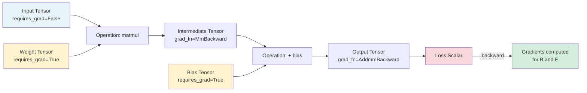
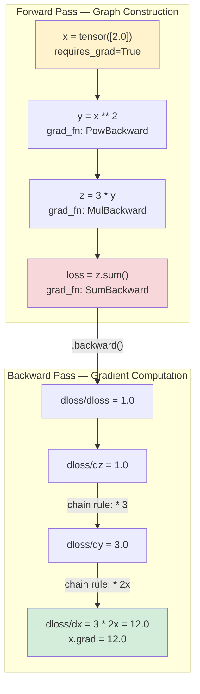
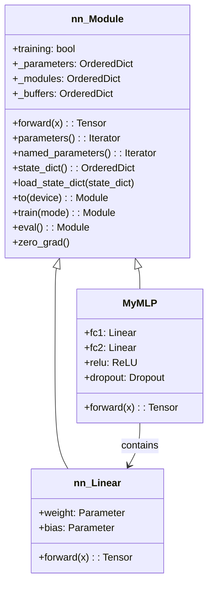
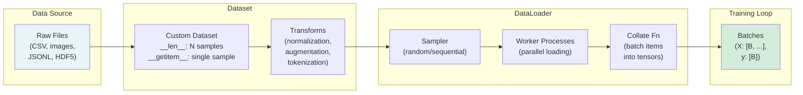
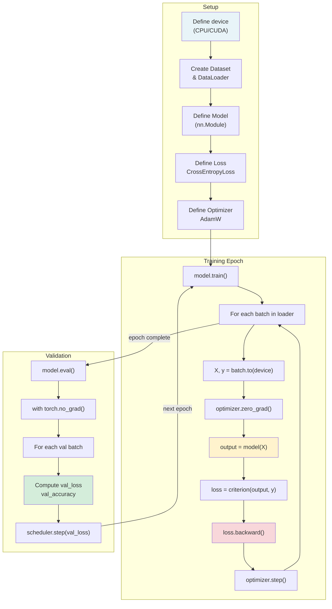

# Machine Learning Deep Dive — Part 9: PyTorch Fundamentals — The Deep Learning Developer's Toolkit

---

**Series:** Machine Learning — A Developer's Deep Dive from Fundamentals to Production
**Part:** 9 of 19 (Deep Learning)
**Audience:** Developers with Python experience who want to master machine learning from the ground up
**Reading time:** ~55 minutes

---

## Recap: Where We Left Off

In Part 8, we built a neural network from scratch using only NumPy — implementing forward propagation, backpropagation, and gradient descent by hand to classify handwritten digits from the MNIST dataset. We derived every equation, wrote every matrix multiplication manually, and watched our custom network learn over dozens of epochs. That exercise gave us the deepest possible intuition for how neural networks actually work under the hood.

But building production deep learning systems with raw NumPy would be painful — no GPU support, manual gradient tracking, no optimized operations, and absolutely no ecosystem of pre-built layers and utilities. Every new architecture would require re-deriving every gradient by hand. That's where **PyTorch** comes in: it gives you the flexibility of NumPy with automatic differentiation and GPU acceleration, wrapping all the math we did manually behind a clean, Pythonic API that still lets you see and control everything.

---

## Table of Contents

1. [Why PyTorch?](#1-why-pytorch)
2. [Tensors — Deep Dive](#2-tensors--deep-dive)
3. [Autograd — Automatic Differentiation](#3-autograd--automatic-differentiation)
4. [nn.Module — Building Custom Models](#4-nnmodule--building-custom-models)
5. [Loss Functions and Optimizers](#5-loss-functions-and-optimizers)
6. [DataLoader and Dataset](#6-dataloader-and-dataset)
7. [GPU Training](#7-gpu-training)
8. [Saving and Loading Models](#8-saving-and-loading-models)
9. [Debugging PyTorch Models](#9-debugging-pytorch-models)
10. [Project: Rebuild Part 8 in PyTorch](#10-project-rebuild-part-8-in-pytorch)
11. [Vocabulary Cheat Sheet](#vocabulary-cheat-sheet)
12. [What's Next: Part 10 — CNNs](#whats-next-part-10--convolutional-neural-networks)

---

## 1. Why PyTorch?

### The Problem with Hand-Rolling Neural Networks

In Part 8 we enjoyed the transparency of building everything from scratch. But once you want to try a different activation function, add a new layer type, or use a regularization technique, you have to re-derive and re-implement gradients manually. This doesn't scale. Research iteration speed matters enormously — the difference between trying 3 architectures per day and 30 per day compounds into a massive competitive advantage.

**PyTorch** was released by Facebook AI Research (FAIR) in 2016, and it solved this problem with a single elegant idea: **define-by-run** (also called **dynamic computation graphs**). Instead of first defining your entire computation graph and then running data through it (as early TensorFlow 1.x did), PyTorch builds the graph as your code executes — line by line, using ordinary Python control flow. This means:

- You can use `if` statements, `for` loops, and any Python logic inside your model
- Debugging is just normal Python debugging — `print()`, `pdb`, whatever you want
- The graph changes every forward pass if needed (essential for variable-length sequences, tree structures, etc.)

> PyTorch's dynamic computation graph means the graph is built fresh every forward pass — this makes debugging with regular Python tools possible, and lets your model architecture adapt to the input data at runtime.

### Autograd: The Core Innovation

The killer feature isn't just dynamic graphs — it's **autograd**, PyTorch's automatic differentiation engine. Every tensor operation you perform can optionally track a computation history. When you call `.backward()`, PyTorch traverses that history in reverse (reverse-mode automatic differentiation, which is what backpropagation is) and computes gradients for every parameter that requires them.

We spent hundreds of lines in Part 8 computing:

```
dL/dW2 = (1/m) * A1.T @ dZ2
dL/dW1 = (1/m) * X.T @ dZ1
```

With autograd, we never write those equations again. We just call `loss.backward()`.

### GPU Acceleration

Modern GPUs have thousands of small cores optimized for the kind of parallel arithmetic that neural networks need — thousands of simultaneous matrix multiplications. A GPU that would take 60 seconds to train on CPU might take 3 seconds on a consumer GPU. PyTorch makes GPU usage almost trivially easy:

```python
device = torch.device("cuda" if torch.cuda.is_available() else "cpu")
model = model.to(device)
x = x.to(device)
```

### PyTorch vs TensorFlow 2.x

Both frameworks are capable of everything you'd want to do. Here's an honest comparison:

| Feature | PyTorch | TensorFlow 2.x / Keras |
|---|---|---|
| **Graph type** | Dynamic (define-by-run) | Eager by default (dynamic), static optional |
| **API style** | Pythonic, explicit | Higher-level Keras API + lower TF API |
| **Debugging** | Full Python debugger support | Easier in eager mode, harder in graph mode |
| **Research adoption** | Dominant (NeurIPS, ICML, ICLR papers) | Strong industry/production use |
| **Deployment** | TorchScript, ONNX, TorchServe | TFLite, TF Serving, TF.js |
| **Mobile** | PyTorch Mobile | TFLite |
| **Ecosystem** | Hugging Face, PyG, Lightning | TF Hub, Keras ecosystem |
| **Learning curve** | Moderate (explicit) | Lower for Keras, steeper for raw TF |
| **Production maturity** | Growing fast (TorchServe, TorchDeploy) | Very mature |
| **Community** | Largest in research | Largest overall |

For this series, we use PyTorch because it's the dominant framework in research (which is where new ideas come from) and because its explicit, Pythonic style reinforces what we learned in Part 8 rather than hiding it.

### Research Popularity

A 2023-2024 analysis of machine learning papers published at top venues found PyTorch used in approximately 75-80% of new research. The trend has been accelerating since 2019. If you want to implement a paper from arXiv, odds are the author's reference code is in PyTorch.

---

## 2. Tensors — Deep Dive

A **tensor** is PyTorch's fundamental data structure — it's essentially an N-dimensional array, exactly like a NumPy `ndarray`, but with the ability to live on a GPU and track gradients. Everything in PyTorch — inputs, weights, biases, gradients, activations — is a tensor.

### Computational Graph Flow



### Creating Tensors

```python
# filename: 01_tensor_creation.py
import torch
import numpy as np

# From Python lists
t1 = torch.tensor([1.0, 2.0, 3.0])
print(f"From list: {t1}")
# Output: From list: tensor([1., 2., 3.])

# From nested lists (2D tensor / matrix)
t2 = torch.tensor([[1, 2, 3], [4, 5, 6]])
print(f"2D tensor shape: {t2.shape}")
# Output: 2D tensor shape: torch.Size([2, 3])

# Factory functions — zeros, ones, random
zeros = torch.zeros(3, 4)
ones = torch.ones(2, 3)
rand = torch.rand(3, 3)        # Uniform [0, 1)
randn = torch.randn(3, 3)      # Standard normal N(0,1)
arange = torch.arange(0, 10, 2)  # Like np.arange: [0, 2, 4, 6, 8]
linspace = torch.linspace(0, 1, 5)  # [0.0, 0.25, 0.5, 0.75, 1.0]

print(f"zeros:\n{zeros}")
print(f"rand:\n{rand}")
print(f"arange: {arange}")
# Output:
# zeros:
# tensor([[0., 0., 0., 0.],
#         [0., 0., 0., 0.],
#         [0., 0., 0., 0.]])
# rand:
# tensor([[0.4829, 0.2319, 0.7651],
#         [0.1024, 0.9283, 0.5571],
#         [0.3819, 0.0492, 0.6714]])
# arange: tensor([0, 2, 4, 6, 8])

# Like-shaped tensors (match shape of another tensor)
t = torch.randn(3, 4)
z = torch.zeros_like(t)
r = torch.rand_like(t)
print(f"zeros_like shape: {z.shape}")  # torch.Size([3, 4])

# From NumPy (SHARES memory — zero copy)
np_array = np.array([1.0, 2.0, 3.0])
torch_tensor = torch.from_numpy(np_array)
print(f"From numpy: {torch_tensor}")
# Output: From numpy: tensor([1., 2., 3.], dtype=torch.float64)

# Modifying np_array also modifies torch_tensor (shared memory!)
np_array[0] = 99.0
print(f"After modifying numpy: {torch_tensor}")
# Output: After modifying numpy: tensor([99.,  2.,  3.], dtype=torch.float64)
```

### Tensor Data Types

**Dtype** determines the precision and type of values stored. Choosing the right dtype affects memory usage and numerical stability.

| Dtype | PyTorch Name | NumPy Equivalent | Use Case |
|---|---|---|---|
| `torch.float32` | `torch.float` | `np.float32` | Default for neural network weights |
| `torch.float64` | `torch.double` | `np.float64` | High-precision scientific computing |
| `torch.float16` | `torch.half` | `np.float16` | Mixed-precision training on GPU |
| `torch.bfloat16` | `torch.bfloat16` | N/A | TPUs, modern GPUs (better range than float16) |
| `torch.int32` | `torch.int` | `np.int32` | Integer data |
| `torch.int64` | `torch.long` | `np.int64` | Labels, indices (CrossEntropyLoss requires this) |
| `torch.bool` | `torch.bool` | `np.bool_` | Masks, boolean conditions |
| `torch.uint8` | `torch.uint8` | `np.uint8` | Image pixel values (0-255) |

```python
# filename: 02_tensor_dtypes.py
import torch

# Default dtype for floating point literals is float32
x = torch.tensor([1.0, 2.0])
print(f"Default dtype: {x.dtype}")
# Output: Default dtype: torch.float32

# Explicit dtype specification
x_f64 = torch.tensor([1.0, 2.0], dtype=torch.float64)
x_int = torch.tensor([1, 2, 3], dtype=torch.int64)
x_bool = torch.tensor([True, False, True], dtype=torch.bool)

print(f"float64: {x_f64.dtype}")   # torch.float64
print(f"int64: {x_int.dtype}")      # torch.int64
print(f"bool: {x_bool.dtype}")      # torch.bool

# Casting between dtypes
x_f32 = x_f64.float()          # -> float32
x_f64_back = x_f32.double()    # -> float64
x_long = x_f32.long()          # -> int64

# CrossEntropyLoss expects long (int64) labels — common source of errors!
labels = torch.tensor([0, 1, 2, 1, 0])
print(f"Labels dtype: {labels.dtype}")  # torch.int64 (correct)

# Checking dtype
assert x.dtype == torch.float32
```

### Tensor Operations

```python
# filename: 03_tensor_operations.py
import torch

A = torch.tensor([[1.0, 2.0], [3.0, 4.0]])
B = torch.tensor([[5.0, 6.0], [7.0, 8.0]])

# Element-wise operations
print(A + B)      # tensor([[ 6.,  8.], [10., 12.]])
print(A * B)      # tensor([[ 5., 12.], [21., 32.]])
print(A - B)      # tensor([[-4., -4.], [-4., -4.]])
print(A / B)      # tensor([[0.2000, 0.3333], [0.4286, 0.5000]])

# Matrix multiplication (the one you'll use most)
print(A @ B)      # tensor([[19., 22.], [43., 50.]])
print(torch.matmul(A, B))  # same thing

# Transpose
print(A.T)        # tensor([[1., 3.], [2., 4.]])
print(A.transpose(0, 1))   # same thing

# Reshape and view
x = torch.arange(12, dtype=torch.float32)
print(x.shape)    # torch.Size([12])

x_reshaped = x.reshape(3, 4)
print(x_reshaped.shape)   # torch.Size([3, 4])

x_viewed = x.view(4, 3)
print(x_viewed.shape)     # torch.Size([4, 3])

# view vs reshape:
# view requires contiguous memory; reshape works regardless (may copy)
x_t = A.T         # A.T is NOT contiguous in memory
# x_t.view(4)     # This would FAIL with RuntimeError
x_t.reshape(4)    # This WORKS (makes a copy internally)

# Squeeze and unsqueeze — dimension manipulation
x = torch.zeros(3, 1, 4)
print(x.shape)              # torch.Size([3, 1, 4])
print(x.squeeze().shape)    # torch.Size([3, 4])  — removes dim-size-1 dims
print(x.squeeze(1).shape)   # torch.Size([3, 4])  — removes specific dim

y = torch.zeros(3, 4)
print(y.unsqueeze(0).shape)  # torch.Size([1, 3, 4]) — add dim at position 0
print(y.unsqueeze(1).shape)  # torch.Size([3, 1, 4]) — add dim at position 1
print(y.unsqueeze(-1).shape) # torch.Size([3, 4, 1]) — add at last position

# Reduction operations
x = torch.tensor([[1.0, 2.0, 3.0], [4.0, 5.0, 6.0]])
print(x.sum())          # tensor(21.)  — sum all
print(x.sum(dim=0))     # tensor([5., 7., 9.])  — sum along rows
print(x.sum(dim=1))     # tensor([ 6., 15.])  — sum along cols
print(x.mean())         # tensor(3.5000)
print(x.max())          # tensor(6.)
print(x.argmax(dim=1))  # tensor([2, 2])  — index of max in each row

# Concatenation and stacking
a = torch.ones(2, 3)
b = torch.zeros(2, 3)
print(torch.cat([a, b], dim=0).shape)   # torch.Size([4, 3])
print(torch.cat([a, b], dim=1).shape)   # torch.Size([2, 6])
print(torch.stack([a, b], dim=0).shape) # torch.Size([2, 2, 3]) — new dim!
```

### Broadcasting

**Broadcasting** in PyTorch follows the exact same rules as NumPy. Tensors with different shapes can be combined if their shapes are compatible when aligned from the right.

```python
# filename: 04_broadcasting.py
import torch

# Rule: shapes are compatible if each dimension is either equal or one of them is 1
x = torch.ones(3, 4)    # shape [3, 4]
y = torch.ones(4)       # shape [4] — treated as [1, 4], then broadcast to [3, 4]
print((x + y).shape)    # torch.Size([3, 4])

# Batch of matrices + single bias vector
weights = torch.randn(32, 10)   # 32 samples, 10 features each
bias = torch.randn(10)           # 10 features
output = weights + bias          # bias broadcasts to [32, 10]
print(output.shape)              # torch.Size([32, 10])

# 3D case: batch of images + per-channel normalization
images = torch.randn(8, 3, 32, 32)   # batch=8, channels=3, H=32, W=32
mean = torch.tensor([0.485, 0.456, 0.406]).reshape(1, 3, 1, 1)  # [1,3,1,1]
std = torch.tensor([0.229, 0.224, 0.225]).reshape(1, 3, 1, 1)
normalized = (images - mean) / std  # broadcasts correctly
print(normalized.shape)              # torch.Size([8, 3, 32, 32])
```

### Moving Between CPU and GPU

```python
# filename: 05_device_management.py
import torch

# Check GPU availability
print(f"CUDA available: {torch.cuda.is_available()}")
print(f"GPU count: {torch.cuda.device_count()}")
if torch.cuda.is_available():
    print(f"GPU name: {torch.cuda.get_device_name(0)}")

# Best practice: define device once, use everywhere
device = torch.device("cuda" if torch.cuda.is_available() else "cpu")
print(f"Using device: {device}")

# Create tensor on specific device
x_cpu = torch.randn(3, 3)
x_gpu = torch.randn(3, 3, device=device)  # directly on GPU if available

# Move between devices
x_on_gpu = x_cpu.to(device)          # moves to device
x_back_cpu = x_on_gpu.cpu()          # always moves to CPU
x_back_cpu2 = x_on_gpu.to("cpu")    # same thing

# Shorthand methods (less preferred — use .to(device) in production)
if torch.cuda.is_available():
    x_cuda = x_cpu.cuda()            # to GPU
    x_back = x_cuda.cpu()            # back to CPU

# IMPORTANT: tensors must be on the same device to operate on each other
# This would FAIL:
# a = torch.randn(3).cpu()
# b = torch.randn(3).cuda()
# a + b  # RuntimeError: Expected all tensors to be on the same device
```

### In-Place Operations

```python
# filename: 06_inplace_ops.py
import torch

x = torch.tensor([1.0, 2.0, 3.0])

# Out-of-place (returns new tensor, x unchanged)
y = x + 1
print(x)  # tensor([1., 2., 3.])
print(y)  # tensor([2., 3., 4.])

# In-place (modifies x directly — trailing underscore convention)
x.add_(1)
print(x)  # tensor([2., 3., 4.])

# Other in-place ops
x.mul_(2)     # multiply by 2 in place
x.fill_(0)    # fill with zeros
x.zero_()     # fill with zeros (same)

# WARNING: In-place ops on tensors that require gradients can cause issues
# PyTorch will throw an error if you modify a tensor needed for backward pass
w = torch.tensor([1.0, 2.0], requires_grad=True)
# w.add_(1)  # This may cause: RuntimeError: a leaf Variable that requires
              # grad has been used in an in-place operation
```

---

## 3. Autograd — Automatic Differentiation

**Autograd** is the heart of PyTorch. It implements reverse-mode automatic differentiation (backpropagation) by recording all operations on tensors that have `requires_grad=True` into a **computation graph**. When you call `.backward()` on a scalar loss, PyTorch traverses this graph from right to left, applying the chain rule at each node.

### Autograd Flow



### Basic Autograd Usage

```python
# filename: 07_autograd_basics.py
import torch

# Scalar example: y = x^2, dy/dx = 2x
x = torch.tensor(3.0, requires_grad=True)
y = x ** 2
print(f"y = {y}")           # y = 9.0
print(f"y.grad_fn: {y.grad_fn}")  # <PowBackward0 object>

y.backward()  # compute dy/dx
print(f"x.grad = {x.grad}")  # x.grad = 6.0  (2 * 3 = 6)

# Chain rule example: z = (x^2 + y^2) w.r.t. x and y
x = torch.tensor(2.0, requires_grad=True)
y = torch.tensor(3.0, requires_grad=True)
z = x**2 + y**2   # dz/dx = 2x = 4, dz/dy = 2y = 6
z.backward()
print(f"dz/dx = {x.grad}")  # 4.0
print(f"dz/dy = {y.grad}")  # 6.0

# Multi-operation chain
x = torch.tensor(2.0, requires_grad=True)
a = x * 3         # a = 6, da/dx = 3
b = a ** 2        # b = 36, db/da = 2a = 12
c = b + 1         # c = 37, dc/db = 1
c.backward()
# dc/dx = dc/db * db/da * da/dx = 1 * 12 * 3 = 36
print(f"dc/dx = {x.grad}")  # 36.0

# Vector/matrix example
x = torch.tensor([1.0, 2.0, 3.0], requires_grad=True)
y = (x ** 2).sum()   # sum to get scalar (backward needs scalar)
y.backward()
print(f"dy/dx = {x.grad}")   # tensor([2., 4., 6.])  (2*x element-wise)
```

### The Gradient Accumulation Gotcha

> One of the most common PyTorch bugs for beginners: gradients **accumulate** by default. Every call to `.backward()` adds to `.grad` rather than replacing it. You must call `optimizer.zero_grad()` (or `x.grad.zero_()`) before each backward pass.

```python
# filename: 08_gradient_accumulation.py
import torch

x = torch.tensor(2.0, requires_grad=True)

# First backward
loss = x ** 2
loss.backward()
print(f"After 1st backward: x.grad = {x.grad}")  # 4.0

# Second backward WITHOUT zeroing — gradients accumulate!
loss = x ** 2
loss.backward()
print(f"After 2nd backward (no zero): x.grad = {x.grad}")  # 8.0 (NOT 4.0!)

# Correct pattern: zero gradients before each backward
x.grad.zero_()
loss = x ** 2
loss.backward()
print(f"After zeroing + backward: x.grad = {x.grad}")  # 4.0 (correct)

# In a training loop, always use optimizer.zero_grad()
# or manually zero: for p in model.parameters(): p.grad = None
# (setting to None is slightly more memory-efficient than zero_())
```

### torch.no_grad() for Inference

During inference (evaluation), you don't need to track gradients — it wastes memory and compute. Use `torch.no_grad()`:

```python
# filename: 09_no_grad.py
import torch
import torch.nn as nn

model = nn.Linear(10, 1)
x = torch.randn(32, 10)

# Without no_grad: gradient tracking overhead
output_with_grad = model(x)
print(f"requires_grad: {output_with_grad.requires_grad}")  # True

# With no_grad: no graph construction, faster, less memory
with torch.no_grad():
    output_no_grad = model(x)
print(f"requires_grad: {output_no_grad.requires_grad}")  # False

# Also available as a decorator
@torch.no_grad()
def predict(model, x):
    return model(x)

# Or using torch.inference_mode() (preferred in newer PyTorch — even faster)
with torch.inference_mode():
    output = model(x)
print(f"requires_grad: {output.requires_grad}")  # False
```

### Detaching Tensors

Sometimes you want a tensor value without its gradient history — for example, when you want to use a tensor's value as input to some external calculation but don't want gradients flowing through it:

```python
# filename: 10_detach.py
import torch

x = torch.tensor(3.0, requires_grad=True)
y = x ** 2  # y tracks gradient through x

# Detach creates a new tensor sharing data but with no gradient tracking
y_detached = y.detach()
print(f"y.requires_grad: {y.requires_grad}")           # True
print(f"y_detached.requires_grad: {y_detached.requires_grad}")  # False
print(f"Values equal: {y.item() == y_detached.item()}")  # True

# Common use case: storing loss values for plotting without memory leak
losses = []
for i in range(3):
    x = torch.randn(10, requires_grad=True)
    loss = (x ** 2).sum()
    loss.backward()
    losses.append(loss.detach().item())  # .item() converts to Python float

print(f"Losses: {losses}")
```

### Manual Gradient Descent with Autograd

Let's verify autograd against our Part 8 manual implementation by doing gradient descent on a simple function:

```python
# filename: 11_manual_gradient_descent.py
import torch
import matplotlib.pyplot as plt

# Minimize f(x) = (x - 5)^2 using gradient descent
# Analytical gradient: df/dx = 2(x - 5)
# Minimum at x = 5

x = torch.tensor(0.0, requires_grad=True)
learning_rate = 0.1
history = []

for step in range(50):
    # Forward: compute loss
    loss = (x - 5) ** 2

    # Store for plotting
    history.append((x.item(), loss.item()))

    # Backward: compute gradient
    loss.backward()

    # Manual gradient step (without optimizer)
    with torch.no_grad():
        x -= learning_rate * x.grad
        x.grad.zero_()

print(f"Final x: {x.item():.6f}")   # Should be ~5.0
print(f"Final loss: {(x-5)**2:.8f}")

# Output:
# Final x: 4.999977
# Final loss: 0.00000001

# Compare with Part 8 manual approach for verification:
def manual_gd(x_init, lr, steps):
    x = x_init
    for _ in range(steps):
        grad = 2 * (x - 5)   # Analytical gradient
        x = x - lr * grad
    return x

x_manual = manual_gd(0.0, 0.1, 50)
print(f"Manual GD result: {x_manual:.6f}")  # Same!
```

---

## 4. nn.Module — Building Custom Models

**`nn.Module`** is the base class for all neural network components in PyTorch. Whether you're building a single linear layer, a multi-layer perceptron, a ResNet, or a Transformer, you subclass `nn.Module`. Understanding this base class is essential.

### nn.Module Architecture



### Building a Custom Model

```python
# filename: 12_nn_module_basics.py
import torch
import torch.nn as nn

class MLP(nn.Module):
    """Multi-Layer Perceptron — a basic feedforward neural network."""

    def __init__(self, input_dim, hidden_dim, output_dim, dropout_rate=0.2):
        # ALWAYS call super().__init__() first
        super().__init__()

        # Layers defined in __init__ are automatically registered as submodules
        # and their parameters are tracked by PyTorch
        self.fc1 = nn.Linear(input_dim, hidden_dim)
        self.fc2 = nn.Linear(hidden_dim, hidden_dim)
        self.fc3 = nn.Linear(hidden_dim, output_dim)

        self.relu = nn.ReLU()
        self.dropout = nn.Dropout(p=dropout_rate)
        self.batch_norm = nn.BatchNorm1d(hidden_dim)

    def forward(self, x):
        """
        Define the computation here.
        PyTorch calls this when you do model(x).
        Do NOT call model.forward(x) directly — use model(x).
        """
        # Layer 1
        x = self.fc1(x)        # Linear transformation
        x = self.batch_norm(x)  # Normalize
        x = self.relu(x)        # Activation
        x = self.dropout(x)     # Regularization

        # Layer 2
        x = self.fc2(x)
        x = self.relu(x)
        x = self.dropout(x)

        # Output layer (no activation — we'll apply it in the loss function)
        x = self.fc3(x)
        return x


# Instantiate the model
model = MLP(input_dim=784, hidden_dim=256, output_dim=10)
print(model)
# Output:
# MLP(
#   (fc1): Linear(in_features=784, out_features=256, bias=True)
#   (fc2): Linear(in_features=256, out_features=256, bias=True)
#   (fc3): Linear(in_features=256, out_features=10, bias=True)
#   (relu): ReLU()
#   (dropout): Dropout(p=0.2, inplace=False)
#   (batch_norm): BatchNorm1d(256, eps=1e-05, momentum=0.1, affine=True, track_running_stats=True)
# )

# Count parameters
total_params = sum(p.numel() for p in model.parameters())
trainable_params = sum(p.numel() for p in model.parameters() if p.requires_grad)
print(f"Total parameters: {total_params:,}")       # 269,066
print(f"Trainable parameters: {trainable_params:,}")  # 269,066

# Forward pass
x = torch.randn(32, 784)   # batch of 32 samples, 784 features each
output = model(x)
print(f"Output shape: {output.shape}")  # torch.Size([32, 10])
```

### Built-in Layers Reference

```python
# filename: 13_builtin_layers.py
import torch
import torch.nn as nn

# --- Linear Layers ---
# nn.Linear(in_features, out_features, bias=True)
# Applies: y = xW^T + b
linear = nn.Linear(10, 5)
print(f"Linear weight shape: {linear.weight.shape}")  # torch.Size([5, 10])
print(f"Linear bias shape: {linear.bias.shape}")       # torch.Size([5])

# --- Activation Functions ---
relu = nn.ReLU()           # max(0, x) — most common
sigmoid = nn.Sigmoid()      # 1/(1+e^-x) — binary classification output
tanh = nn.Tanh()           # (e^x - e^-x)/(e^x + e^-x) — RNNs
leaky_relu = nn.LeakyReLU(negative_slope=0.01)   # allows small gradient for x<0
gelu = nn.GELU()            # Gaussian Error Linear Unit — Transformers
softmax = nn.Softmax(dim=1) # multi-class probabilities (sums to 1)

x = torch.tensor([-2.0, -1.0, 0.0, 1.0, 2.0])
print(f"ReLU: {relu(x)}")         # [0, 0, 0, 1, 2]
print(f"Sigmoid: {sigmoid(x)}")   # [0.119, 0.269, 0.5, 0.731, 0.881]

# --- Normalization ---
# BatchNorm1d: normalizes over batch dimension for 2D inputs (batch, features)
bn = nn.BatchNorm1d(num_features=256)

# LayerNorm: normalizes over feature dimension — important for Transformers
ln = nn.LayerNorm(normalized_shape=256)

# --- Regularization ---
dropout = nn.Dropout(p=0.5)    # zero out 50% of neurons during training
                                # automatically disabled during model.eval()

# --- nn.Sequential for simple stacking ---
# Great for blocks that don't need custom forward logic
simple_block = nn.Sequential(
    nn.Linear(784, 256),
    nn.BatchNorm1d(256),
    nn.ReLU(),
    nn.Dropout(0.2),
    nn.Linear(256, 10)
)

x = torch.randn(32, 784)
out = simple_block(x)
print(f"Sequential output: {out.shape}")  # torch.Size([32, 10])
```

### Parameters vs Buffers

```python
# filename: 14_parameters_buffers.py
import torch
import torch.nn as nn

class ModelWithBuffer(nn.Module):
    def __init__(self):
        super().__init__()
        self.linear = nn.Linear(10, 5)

        # register_parameter: tracked, included in state_dict, updated by optimizer
        self.scale = nn.Parameter(torch.ones(5))

        # register_buffer: tracked, included in state_dict, NOT updated by optimizer
        # Use for running statistics, class frequencies, fixed constants
        self.register_buffer('running_mean', torch.zeros(5))
        self.register_buffer('running_var', torch.ones(5))

    def forward(self, x):
        return self.linear(x) * self.scale

model = ModelWithBuffer()

# Parameters: updated by optimizer
print("Parameters:")
for name, param in model.named_parameters():
    print(f"  {name}: shape={param.shape}, requires_grad={param.requires_grad}")
# Parameters:
#   linear.weight: shape=torch.Size([5, 10]), requires_grad=True
#   linear.bias: shape=torch.Size([5]), requires_grad=True
#   scale: shape=torch.Size([5]), requires_grad=True

# Buffers: included in state_dict but not updated by optimizer
print("\nBuffers:")
for name, buf in model.named_buffers():
    print(f"  {name}: shape={buf.shape}")
# Buffers:
#   running_mean: shape=torch.Size([5])
#   running_var: shape=torch.Size([5])
```

### Model Inspection with state_dict

```python
# filename: 15_state_dict.py
import torch
import torch.nn as nn

model = nn.Linear(4, 2)

# state_dict: ordered dict of all parameters and buffers
sd = model.state_dict()
print("State dict keys:", list(sd.keys()))
# ['weight', 'bias']

print("Weight:\n", sd['weight'])
# tensor([[ 0.1234, -0.4567, ...],
#         [...]])

print("Bias:", sd['bias'])
# tensor([ 0.1234, -0.5678])

# Inspect parameter names hierarchically
class Net(nn.Module):
    def __init__(self):
        super().__init__()
        self.layer1 = nn.Linear(4, 8)
        self.layer2 = nn.Linear(8, 2)

    def forward(self, x):
        return self.layer2(torch.relu(self.layer1(x)))

net = Net()
for name, param in net.named_parameters():
    print(f"{name}: {param.shape}")
# layer1.weight: torch.Size([8, 4])
# layer1.bias: torch.Size([8])
# layer2.weight: torch.Size([2, 8])
# layer2.bias: torch.Size([2])
```

---

## 5. Loss Functions and Optimizers

### Loss Functions

A **loss function** (also called **criterion** or **cost function**) measures how far off our predictions are from the true labels. PyTorch's `torch.nn` module provides all common loss functions.

| Loss Function | Class | Use Case | Notes |
|---|---|---|---|
| Mean Squared Error | `nn.MSELoss` | Regression | Sensitive to outliers |
| Mean Absolute Error | `nn.L1Loss` | Regression | More robust to outliers |
| Huber Loss | `nn.SmoothL1Loss` | Regression | Combines MSE + MAE |
| Binary Cross-Entropy | `nn.BCELoss` | Binary classification | Input must be sigmoid output |
| BCE with Logits | `nn.BCEWithLogitsLoss` | Binary classification | More numerically stable; takes raw logits |
| Cross-Entropy | `nn.CrossEntropyLoss` | Multi-class classification | Takes raw logits + long labels |
| Negative Log Likelihood | `nn.NLLLoss` | Multi-class (with LogSoftmax) | Manual LogSoftmax needed |
| KL Divergence | `nn.KLDivLoss` | Distribution matching, VAEs | |

```python
# filename: 16_loss_functions.py
import torch
import torch.nn as nn

# --- MSELoss for regression ---
criterion_mse = nn.MSELoss()
predictions = torch.tensor([1.0, 2.5, 3.7])
targets = torch.tensor([1.0, 2.0, 4.0])
loss = criterion_mse(predictions, targets)
print(f"MSE Loss: {loss.item():.4f}")
# MSE = mean([(1-1)^2, (2.5-2)^2, (3.7-4)^2]) = mean([0, 0.25, 0.09]) = 0.1133

# --- CrossEntropyLoss for multi-class classification ---
# Input: raw logits (NOT softmax!) shape [batch, num_classes]
# Target: class indices (NOT one-hot!) dtype=torch.long
criterion_ce = nn.CrossEntropyLoss()
logits = torch.tensor([[2.1, 0.5, -1.2],   # Predicting class 0
                        [0.1, 3.2, 0.8],    # Predicting class 1
                        [-0.5, 0.3, 2.9]])  # Predicting class 2
labels = torch.tensor([0, 1, 2])  # dtype=torch.long (int64)
loss = criterion_ce(logits, labels)
print(f"Cross-Entropy Loss: {loss.item():.4f}")
# Output: Cross-Entropy Loss: 0.2018 (low because predictions match labels)

# What CrossEntropyLoss does internally:
# 1. Apply LogSoftmax to logits
# 2. Apply NLLLoss (negative log likelihood)
# This is numerically more stable than Softmax + manual log

# --- BCEWithLogitsLoss for binary classification ---
criterion_bce = nn.BCEWithLogitsLoss()
logits_binary = torch.tensor([2.5, -1.3, 0.8, -0.5])   # raw logits
binary_labels = torch.tensor([1.0, 0.0, 1.0, 0.0])      # 0 or 1, dtype=float32
loss = criterion_bce(logits_binary, binary_labels)
print(f"BCE Loss: {loss.item():.4f}")

# Common mistake: using BCELoss (not BCEWithLogitsLoss)
# BCELoss expects probabilities (after sigmoid), not raw logits
# BCEWithLogitsLoss combines sigmoid + BCE in one numerically stable op
```

### Optimizers

An **optimizer** uses the gradients computed by autograd to update the model's parameters. PyTorch provides all standard optimizers in `torch.optim`.

| Optimizer | Class | Key Hyperparams | Notes |
|---|---|---|---|
| Stochastic Gradient Descent | `optim.SGD` | `lr`, `momentum`, `weight_decay` | Simple, reliable baseline |
| SGD with Momentum | `optim.SGD` | `momentum=0.9` | Almost always better than plain SGD |
| Adam | `optim.Adam` | `lr=1e-3`, `betas=(0.9, 0.999)`, `eps=1e-8` | Most popular default choice |
| AdamW | `optim.AdamW` | Same as Adam + `weight_decay` | Adam with correct weight decay |
| RMSprop | `optim.RMSprop` | `lr`, `alpha=0.99` | Good for RNNs |
| Adagrad | `optim.Adagrad` | `lr` | Adapts per-parameter lr |
| LBFGS | `optim.LBFGS` | `lr`, `max_iter` | Second-order, small models only |

```python
# filename: 17_optimizers.py
import torch
import torch.nn as nn
import torch.optim as optim

model = nn.Linear(10, 5)

# SGD — simple, requires careful lr tuning
optimizer_sgd = optim.SGD(model.parameters(), lr=0.01, momentum=0.9, weight_decay=1e-4)

# Adam — adaptive learning rates, great default choice
optimizer_adam = optim.Adam(model.parameters(), lr=1e-3, betas=(0.9, 0.999), eps=1e-8)

# AdamW — Adam with CORRECT weight decay (decoupled from gradient)
# Preferred over Adam for most modern deep learning
optimizer_adamw = optim.AdamW(model.parameters(), lr=1e-3, weight_decay=0.01)

# The canonical training step
x = torch.randn(32, 10)
y = torch.randn(32, 5)
criterion = nn.MSELoss()
optimizer = optimizer_adamw

# ============================================================
# THE FOUR-LINE TRAINING STEP — memorize this pattern
# ============================================================
optimizer.zero_grad()           # 1. Clear gradients from previous step
output = model(x)               # 2. Forward pass
loss = criterion(output, y)     # 3. Compute loss
loss.backward()                 # 4. Compute gradients
optimizer.step()                # 5. Update weights
# ============================================================

print(f"Loss: {loss.item():.4f}")

# Accessing optimizer state (useful for debugging/checkpointing)
print(f"Optimizer state keys: {list(optimizer.state_dict().keys())}")
# ['state', 'param_groups']
```

### Learning Rate Schedulers

A fixed learning rate is often suboptimal. **Learning rate schedulers** reduce the learning rate over time, allowing the optimizer to take large steps early and fine-tune later.

```python
# filename: 18_lr_schedulers.py
import torch
import torch.nn as nn
import torch.optim as optim
from torch.optim.lr_scheduler import StepLR, CosineAnnealingLR, ReduceLROnPlateau

model = nn.Linear(10, 5)
optimizer = optim.Adam(model.parameters(), lr=0.01)

# --- StepLR: reduce lr by gamma every step_size epochs ---
scheduler_step = StepLR(optimizer, step_size=10, gamma=0.5)
# After epoch 10: lr = 0.01 * 0.5 = 0.005
# After epoch 20: lr = 0.005 * 0.5 = 0.0025

# --- CosineAnnealingLR: cosine curve from lr_max to eta_min ---
# Great for training from scratch, especially with warmup
scheduler_cos = CosineAnnealingLR(optimizer, T_max=100, eta_min=1e-6)

# --- ReduceLROnPlateau: reduce lr when validation loss stops improving ---
# Most practical for real training runs
scheduler_plateau = ReduceLROnPlateau(
    optimizer,
    mode='min',       # 'min' for loss, 'max' for accuracy
    factor=0.5,       # multiply lr by this when plateauing
    patience=5,       # wait 5 epochs before reducing
    verbose=True
)

# Training loop with scheduler
criterion = nn.MSELoss()
x = torch.randn(32, 10)
y = torch.randn(32, 5)

for epoch in range(30):
    optimizer.zero_grad()
    output = model(x)
    loss = criterion(output, y)
    loss.backward()
    optimizer.step()

    # Call scheduler AFTER optimizer step
    # For StepLR and CosineAnnealingLR:
    scheduler_step.step()  # once per epoch

    # For ReduceLROnPlateau, pass the validation metric:
    # scheduler_plateau.step(val_loss)

    if epoch % 10 == 0:
        current_lr = optimizer.param_groups[0]['lr']
        print(f"Epoch {epoch}: loss={loss.item():.4f}, lr={current_lr:.6f}")

# Output:
# Epoch 0: loss=1.1234, lr=0.010000
# Epoch 10: loss=0.9876, lr=0.005000  (StepLR kicked in)
# Epoch 20: loss=0.8543, lr=0.002500
```

---

## 6. DataLoader and Dataset

Raw data doesn't come in nicely formatted tensors. The `torch.utils.data` module provides two key abstractions:

- **`Dataset`**: Wraps your raw data and provides a `__len__` and `__getitem__` interface
- **`DataLoader`**: Takes a `Dataset` and handles batching, shuffling, parallel loading, and iteration

### DataLoader Pipeline



### Custom Dataset for Tabular Data

```python
# filename: 19_tabular_dataset.py
import torch
from torch.utils.data import Dataset, DataLoader
import numpy as np
import pandas as pd

class TabularDataset(Dataset):
    """Dataset for tabular (CSV/DataFrame) data."""

    def __init__(self, features: np.ndarray, labels: np.ndarray):
        # Convert to tensors once at init time (efficient for in-memory data)
        self.X = torch.tensor(features, dtype=torch.float32)
        self.y = torch.tensor(labels, dtype=torch.long)

        assert len(self.X) == len(self.y), "Features and labels must have same length"

    def __len__(self):
        """Return total number of samples."""
        return len(self.X)

    def __getitem__(self, idx):
        """Return single sample by index."""
        return self.X[idx], self.y[idx]


# Generate synthetic data
np.random.seed(42)
N = 1000
features = np.random.randn(N, 20)  # 1000 samples, 20 features
labels = np.random.randint(0, 5, size=N)  # 5 classes

# Train/validation split
split = int(0.8 * N)
train_dataset = TabularDataset(features[:split], labels[:split])
val_dataset = TabularDataset(features[split:], labels[split:])

print(f"Train size: {len(train_dataset)}")   # 800
print(f"Val size: {len(val_dataset)}")        # 200

# Sample a single item
x_sample, y_sample = train_dataset[0]
print(f"Sample X shape: {x_sample.shape}")   # torch.Size([20])
print(f"Sample y: {y_sample}")                # tensor(3) or similar

# Create DataLoaders
train_loader = DataLoader(
    train_dataset,
    batch_size=32,
    shuffle=True,          # Shuffle training data
    num_workers=0,         # 0 = main process (use 4+ for real training on non-Windows)
    pin_memory=True,       # Faster CPU->GPU transfer (set True when using CUDA)
    drop_last=False        # Keep last incomplete batch
)

val_loader = DataLoader(
    val_dataset,
    batch_size=64,         # Can use larger batch for eval (no gradient storage)
    shuffle=False,         # Don't shuffle validation
    num_workers=0
)

# Iterate over batches
for batch_idx, (X_batch, y_batch) in enumerate(train_loader):
    print(f"Batch {batch_idx}: X={X_batch.shape}, y={y_batch.shape}")
    if batch_idx == 2:
        break
# Batch 0: X=torch.Size([32, 20]), y=torch.Size([32])
# Batch 1: X=torch.Size([32, 20]), y=torch.Size([32])
# Batch 2: X=torch.Size([32, 20]), y=torch.Size([32])
```

### Custom Dataset for Images

```python
# filename: 20_image_dataset.py
import torch
from torch.utils.data import Dataset, DataLoader
from torchvision import transforms
from PIL import Image
import os
import glob

class ImageFolderDataset(Dataset):
    """
    Simple image dataset that loads images from a directory structure:
    root/
        class_0/
            img1.jpg
            img2.jpg
        class_1/
            img3.jpg
    """

    def __init__(self, root_dir, transform=None):
        self.root_dir = root_dir
        self.transform = transform
        self.samples = []
        self.class_to_idx = {}

        # Build class list from directory names
        classes = sorted(os.listdir(root_dir))
        self.class_to_idx = {cls: idx for idx, cls in enumerate(classes)}

        # Collect all image paths with their labels
        for cls in classes:
            cls_dir = os.path.join(root_dir, cls)
            if not os.path.isdir(cls_dir):
                continue
            for img_path in glob.glob(os.path.join(cls_dir, "*.jpg")):
                self.samples.append((img_path, self.class_to_idx[cls]))

    def __len__(self):
        return len(self.samples)

    def __getitem__(self, idx):
        img_path, label = self.samples[idx]

        # Load image lazily (only when requested by DataLoader)
        image = Image.open(img_path).convert('RGB')

        if self.transform:
            image = self.transform(image)

        return image, label


# Define transforms: normalization, augmentation for training
train_transform = transforms.Compose([
    transforms.Resize((224, 224)),
    transforms.RandomHorizontalFlip(p=0.5),     # Data augmentation
    transforms.RandomRotation(degrees=10),        # Data augmentation
    transforms.ColorJitter(brightness=0.2, contrast=0.2),
    transforms.ToTensor(),                         # PIL -> Tensor [C, H, W], values [0,1]
    transforms.Normalize(
        mean=[0.485, 0.456, 0.406],               # ImageNet mean
        std=[0.229, 0.224, 0.225]                 # ImageNet std
    )
])

val_transform = transforms.Compose([
    transforms.Resize((224, 224)),
    # NO augmentation for validation — only normalize
    transforms.ToTensor(),
    transforms.Normalize(mean=[0.485, 0.456, 0.406], std=[0.229, 0.224, 0.225])
])

# Usage (assumes directory structure exists)
# train_dataset = ImageFolderDataset("data/train", transform=train_transform)
# val_dataset = ImageFolderDataset("data/val", transform=val_transform)
# train_loader = DataLoader(train_dataset, batch_size=32, shuffle=True, num_workers=4)

# For MNIST/standard datasets, use torchvision.datasets directly:
from torchvision import datasets

# torchvision includes transforms, and the datasets handle downloading
mnist_transform = transforms.Compose([
    transforms.ToTensor(),
    transforms.Normalize((0.1307,), (0.3081,))  # MNIST mean and std
])

# This downloads and caches MNIST automatically
# mnist_train = datasets.MNIST(root='./data', train=True, transform=mnist_transform, download=True)
# mnist_val = datasets.MNIST(root='./data', train=False, transform=mnist_transform, download=True)
print("Dataset classes defined successfully")
```

### Efficient Data Loading Patterns

```python
# filename: 21_dataloader_patterns.py
import torch
from torch.utils.data import DataLoader, TensorDataset

# TensorDataset: simplest way when data already fits in memory as tensors
X = torch.randn(1000, 20)
y = torch.randint(0, 5, (1000,))
dataset = TensorDataset(X, y)

# Key DataLoader parameters for performance
loader = DataLoader(
    dataset,
    batch_size=256,
    shuffle=True,
    num_workers=4,         # Parallel loading workers (not on Windows with spawn)
    pin_memory=True,       # Page-lock CPU memory for faster GPU transfer
    persistent_workers=True,  # Keep workers alive between epochs (faster iteration)
    prefetch_factor=2      # Each worker prefetches 2 batches ahead
)

# Iterate with progress tracking
from tqdm import tqdm  # pip install tqdm

for epoch in range(3):
    total_loss = 0
    # tqdm wraps any iterable and shows a progress bar
    for batch_X, batch_y in tqdm(loader, desc=f"Epoch {epoch+1}"):
        # Training code here
        pass

# Handling class imbalance with WeightedRandomSampler
from torch.utils.data import WeightedRandomSampler

# Calculate class weights for imbalanced datasets
labels = y.numpy()
class_counts = torch.bincount(y)
class_weights = 1.0 / class_counts.float()
sample_weights = class_weights[y]

sampler = WeightedRandomSampler(
    weights=sample_weights,
    num_samples=len(sample_weights),
    replacement=True  # allows over-sampling minority classes
)

balanced_loader = DataLoader(
    dataset,
    batch_size=32,
    sampler=sampler,       # use sampler instead of shuffle=True
    num_workers=0
)
print("DataLoader patterns demonstrated")
```

---

## 7. GPU Training

### GPU Setup and Device Management

```python
# filename: 22_gpu_training.py
import torch
import torch.nn as nn

# --- Check GPU availability ---
print(f"CUDA available: {torch.cuda.is_available()}")
print(f"GPU count: {torch.cuda.device_count()}")

if torch.cuda.is_available():
    print(f"Current device: {torch.cuda.current_device()}")
    print(f"Device name: {torch.cuda.get_device_name(0)}")
    print(f"Device memory: {torch.cuda.get_device_properties(0).total_memory / 1e9:.1f} GB")

# The canonical device selection pattern
device = torch.device("cuda" if torch.cuda.is_available() else "cpu")
print(f"Training on: {device}")

# --- Moving model and data to GPU ---
model = nn.Sequential(
    nn.Linear(784, 256),
    nn.ReLU(),
    nn.Linear(256, 10)
)
model = model.to(device)  # Move all model parameters to GPU

# In training loop: move each batch to GPU
def train_epoch(model, loader, optimizer, criterion, device):
    model.train()  # Set training mode (enables dropout, batch norm)
    total_loss = 0

    for X_batch, y_batch in loader:
        # Move data to same device as model
        X_batch = X_batch.to(device)
        y_batch = y_batch.to(device)

        optimizer.zero_grad()
        output = model(X_batch)
        loss = criterion(output, y_batch)
        loss.backward()
        optimizer.step()

        total_loss += loss.item()

    return total_loss / len(loader)

# --- Memory management ---
# GPU memory is a limited resource — check usage
if torch.cuda.is_available():
    allocated = torch.cuda.memory_allocated(0) / 1e6
    reserved = torch.cuda.memory_reserved(0) / 1e6
    print(f"GPU memory allocated: {allocated:.1f} MB")
    print(f"GPU memory reserved: {reserved:.1f} MB")

    # Free cached memory (useful after deleting large tensors)
    torch.cuda.empty_cache()

# --- Mixed Precision Training (faster on modern GPUs) ---
from torch.cuda.amp import autocast, GradScaler

scaler = GradScaler()

def train_step_mixed_precision(model, X, y, optimizer, criterion):
    optimizer.zero_grad()

    # Automatically cast to float16 where safe
    with autocast():
        output = model(X)
        loss = criterion(output, y)

    # Scale loss to prevent float16 underflow
    scaler.scale(loss).backward()
    scaler.step(optimizer)
    scaler.update()

    return loss.item()
```

### Multi-GPU Training

```python
# filename: 23_multi_gpu.py
import torch
import torch.nn as nn

# DataParallel: simplest multi-GPU approach
# Splits batch across GPUs, runs forward in parallel, gathers results
# Works but has limitations — DistributedDataParallel is preferred for serious training
if torch.cuda.device_count() > 1:
    print(f"Using {torch.cuda.device_count()} GPUs")
    model = nn.Sequential(nn.Linear(784, 256), nn.ReLU(), nn.Linear(256, 10))

    # Wrap model with DataParallel
    model = nn.DataParallel(model)
    model = model.to('cuda')

    # Training is identical — DataParallel handles the splitting automatically
    x = torch.randn(128, 784).to('cuda')
    output = model(x)
    print(f"Output shape (multi-GPU): {output.shape}")  # [128, 10]

# NOTE: For large-scale training, use torch.distributed.DistributedDataParallel
# (DDP) instead. DDP is significantly more efficient but requires more setup.
# See PyTorch docs for full DDP tutorial.
print("Multi-GPU setup demonstrated (DataParallel)")
```

---

## 8. Saving and Loading Models

### Recommended: Save state_dict Only

```python
# filename: 24_saving_loading.py
import torch
import torch.nn as nn
import os

class MLP(nn.Module):
    def __init__(self, input_dim, hidden_dim, output_dim):
        super().__init__()
        self.net = nn.Sequential(
            nn.Linear(input_dim, hidden_dim),
            nn.ReLU(),
            nn.Linear(hidden_dim, output_dim)
        )

    def forward(self, x):
        return self.net(x)


model = MLP(784, 256, 10)
optimizer = torch.optim.Adam(model.parameters(), lr=1e-3)

# ============================================================
# METHOD 1: Save state_dict (RECOMMENDED)
# ============================================================
# Only saves parameter tensors — portable across code changes
torch.save(model.state_dict(), 'model_weights.pth')

# Loading: must create model architecture first, then load weights
loaded_model = MLP(784, 256, 10)   # Create architecture
loaded_model.load_state_dict(torch.load('model_weights.pth'))
loaded_model.eval()  # Set to eval mode for inference!
print("Model loaded successfully via state_dict")

# ============================================================
# METHOD 2: Save full model (NOT recommended for production)
# ============================================================
# Saves the entire model object (architecture + weights)
# Brittle: requires the EXACT same class definition at load time
torch.save(model, 'full_model.pth')
full_model = torch.load('full_model.pth')
# This can break if you refactor your code!

# ============================================================
# CHECKPOINTING: Save everything needed to resume training
# ============================================================
def save_checkpoint(model, optimizer, epoch, loss, filepath):
    checkpoint = {
        'epoch': epoch,
        'model_state_dict': model.state_dict(),
        'optimizer_state_dict': optimizer.state_dict(),
        'loss': loss,
    }
    torch.save(checkpoint, filepath)
    print(f"Checkpoint saved at epoch {epoch}")

def load_checkpoint(model, optimizer, filepath):
    checkpoint = torch.load(filepath)
    model.load_state_dict(checkpoint['model_state_dict'])
    optimizer.load_state_dict(checkpoint['optimizer_state_dict'])
    epoch = checkpoint['epoch']
    loss = checkpoint['loss']
    print(f"Resumed from epoch {epoch}, loss={loss:.4f}")
    return epoch, loss


# Simulate training with checkpointing
for epoch in range(3):
    # ... training code ...
    fake_loss = 1.0 / (epoch + 1)
    save_checkpoint(model, optimizer, epoch, fake_loss, f'checkpoint_epoch_{epoch}.pth')

# Resume training from checkpoint
start_epoch, last_loss = load_checkpoint(
    model, optimizer, 'checkpoint_epoch_1.pth'
)
print(f"Resuming from epoch {start_epoch}")
# Output: Resumed from epoch 1, loss=0.5000
# Resuming from epoch 1

# Cleanup
for f in ['model_weights.pth', 'full_model.pth'] + [f'checkpoint_epoch_{i}.pth' for i in range(3)]:
    if os.path.exists(f):
        os.remove(f)
```

---

## 9. Debugging PyTorch Models

Debugging deep learning models is different from debugging regular software — issues can be subtle (vanishing gradients, wrong dtypes, broadcasting errors) and often don't throw exceptions. They just silently produce wrong results.

### Gradient Checking and Anomaly Detection

```python
# filename: 25_debugging.py
import torch
import torch.nn as nn

# --- torch.autograd.detect_anomaly: catch NaN/Inf in gradients ---
# This is the first thing to enable when you suspect gradient issues
# NOTE: This SLOWS training significantly — only use during debugging

model = nn.Sequential(
    nn.Linear(10, 5),
    nn.ReLU(),
    nn.Linear(5, 1)
)

x = torch.randn(4, 10)
y = torch.randn(4, 1)

# Enable anomaly detection
with torch.autograd.detect_anomaly():
    output = model(x)
    loss = nn.MSELoss()(output, y)
    loss.backward()
    print("No anomalies detected")

# Simulate a problem: division by zero -> NaN
try:
    with torch.autograd.detect_anomaly():
        output = model(x)
        # Force NaN: divide by zero
        bad_loss = (output / (output - output)).mean()  # 0/0 = NaN
        bad_loss.backward()
except Exception as e:
    print(f"Anomaly detected: {type(e).__name__}")
    # RuntimeError: Function 'DivBackward0' returned nan values in its 0th output

# --- Detecting NaN in gradients manually ---
def check_gradients(model):
    for name, param in model.named_parameters():
        if param.grad is not None:
            if torch.isnan(param.grad).any():
                print(f"NaN gradient in {name}")
            elif torch.isinf(param.grad).any():
                print(f"Inf gradient in {name}")
            else:
                grad_norm = param.grad.norm().item()
                print(f"{name}: grad_norm={grad_norm:.4f}")

# After a backward pass:
optimizer = torch.optim.Adam(model.parameters())
optimizer.zero_grad()
output = model(x)
loss = nn.MSELoss()(output, y)
loss.backward()
check_gradients(model)

# --- Gradient Clipping: prevent exploding gradients ---
# Very common in RNN/Transformer training
max_grad_norm = 1.0
torch.nn.utils.clip_grad_norm_(model.parameters(), max_grad_norm)
# After clipping, all parameter gradients have total L2 norm <= max_grad_norm
```

### Hook Functions to Inspect Activations

```python
# filename: 26_hooks.py
import torch
import torch.nn as nn

# Hooks let you intercept values flowing through the network
# Useful for debugging, feature extraction, gradient analysis

model = nn.Sequential(
    nn.Linear(10, 5),
    nn.ReLU(),
    nn.Linear(5, 3)
)

activations = {}
gradients = {}

def make_forward_hook(name):
    """Hook captures activation values during forward pass."""
    def hook(module, input, output):
        activations[name] = output.detach()
    return hook

def make_backward_hook(name):
    """Hook captures gradient values during backward pass."""
    def hook(module, grad_input, grad_output):
        gradients[name] = grad_output[0].detach()
    return hook

# Register hooks on specific layers
hooks = []
for name, layer in model.named_modules():
    if isinstance(layer, nn.Linear):
        hooks.append(layer.register_forward_hook(make_forward_hook(name)))
        hooks.append(layer.register_backward_hook(make_backward_hook(name)))

# Run forward and backward
x = torch.randn(4, 10)
y = torch.randint(0, 3, (4,))
output = model(x)
loss = nn.CrossEntropyLoss()(output, y)
loss.backward()

# Inspect captured values
print("Forward activations:")
for name, act in activations.items():
    print(f"  {name}: shape={act.shape}, mean={act.mean():.4f}, std={act.std():.4f}")

print("\nBackward gradients:")
for name, grad in gradients.items():
    print(f"  {name}: shape={grad.shape}, norm={grad.norm():.4f}")

# IMPORTANT: Remove hooks after use to prevent memory leaks
for h in hooks:
    h.remove()

# Output:
# Forward activations:
#   0: shape=torch.Size([4, 5]), mean=0.1234, std=0.4567
#   2: shape=torch.Size([4, 3]), mean=0.0234, std=0.5678
# Backward gradients:
#   0: shape=torch.Size([4, 5]), norm=0.8901
#   2: shape=torch.Size([4, 3]), norm=1.2345
```

### Common Errors and Fixes

| Error | Likely Cause | Fix |
|---|---|---|
| `RuntimeError: Expected all tensors to be on the same device` | Model on GPU, data on CPU (or vice versa) | Add `.to(device)` to your data batch |
| `RuntimeError: Expected target size ... got ...` | Label shape mismatch | Check y.shape — should be `[batch]` not `[batch, 1]` for CrossEntropyLoss |
| `RuntimeError: only Tensors of floating point dtype can require gradients` | Trying to set `requires_grad=True` on integer tensor | Cast to float: `.float()` |
| `ValueError: optimizer got an empty parameter list` | `model.parameters()` empty | Make sure parameters are assigned to `self` in `__init__` |
| `RuntimeError: Trying to backward through the graph a second time` | Calling `.backward()` twice without `retain_graph=True` | Either retain graph or restructure training loop |
| Loss is NaN after first batch | NaN in input data, too large learning rate, or log of zero | Check inputs, reduce lr, add epsilon to log operations |
| Accuracy stuck at random chance | Wrong loss function, labels wrong dtype, shapes mismatch | Verify label dtype is `torch.long`, verify shapes |
| Out of memory (OOM) | Batch too large, gradients accumulating across batches | Reduce batch size, call `optimizer.zero_grad()` correctly, use `torch.no_grad()` for eval |

---

## 10. Project: Rebuild Part 8 in PyTorch

Now let's bring everything together. We'll rebuild the MNIST classifier from Part 8 using the full PyTorch stack, compare it directly with our NumPy implementation, add GPU support, and aim for 98%+ accuracy.

### Training Loop Architecture



### Full MNIST PyTorch Implementation

```python
# filename: 27_mnist_pytorch_full.py
"""
MNIST Classifier in PyTorch — Part 9 Project
Reimplements Part 8's NumPy network using the full PyTorch stack.
Target: 98%+ test accuracy.
"""

import torch
import torch.nn as nn
import torch.optim as optim
from torch.utils.data import DataLoader
from torchvision import datasets, transforms
import numpy as np
import matplotlib.pyplot as plt
import time

# ============================================================
# 1. CONFIGURATION
# ============================================================
config = {
    'batch_size': 128,
    'learning_rate': 3e-4,
    'weight_decay': 1e-4,
    'epochs': 20,
    'hidden_dims': [512, 256, 128],
    'dropout_rate': 0.3,
    'seed': 42,
}

torch.manual_seed(config['seed'])
device = torch.device("cuda" if torch.cuda.is_available() else "cpu")
print(f"Training on: {device}")

# ============================================================
# 2. DATA LOADING
# ============================================================
transform = transforms.Compose([
    transforms.ToTensor(),
    transforms.Normalize((0.1307,), (0.3081,))  # MNIST mean, std
])

# torchvision downloads and caches MNIST automatically
train_dataset = datasets.MNIST(
    root='./data', train=True, transform=transform, download=True
)
test_dataset = datasets.MNIST(
    root='./data', train=False, transform=transform, download=True
)

# Split training into train/val
val_size = 10000
train_size = len(train_dataset) - val_size
train_data, val_data = torch.utils.data.random_split(
    train_dataset,
    [train_size, val_size],
    generator=torch.Generator().manual_seed(config['seed'])
)

train_loader = DataLoader(train_data, batch_size=config['batch_size'],
                          shuffle=True, num_workers=0, pin_memory=True)
val_loader = DataLoader(val_data, batch_size=256,
                        shuffle=False, num_workers=0)
test_loader = DataLoader(test_dataset, batch_size=256,
                         shuffle=False, num_workers=0)

print(f"Training samples: {len(train_data):,}")   # 50,000
print(f"Validation samples: {len(val_data):,}")   # 10,000
print(f"Test samples: {len(test_dataset):,}")      # 10,000

# ============================================================
# 3. MODEL DEFINITION
# ============================================================
class MNISTClassifier(nn.Module):
    """
    Multi-layer perceptron for MNIST classification.

    Architecture:
        Input: [batch, 1, 28, 28] -> flatten -> [batch, 784]
        FC1: 784 -> 512, BatchNorm, ReLU, Dropout
        FC2: 512 -> 256, BatchNorm, ReLU, Dropout
        FC3: 256 -> 128, BatchNorm, ReLU, Dropout
        Output: 128 -> 10 (raw logits, no softmax)
    """

    def __init__(self, hidden_dims, dropout_rate=0.3):
        super().__init__()

        # Build layers dynamically from hidden_dims list
        dims = [784] + hidden_dims + [10]
        layers = []

        for i in range(len(dims) - 1):
            layers.append(nn.Linear(dims[i], dims[i+1]))

            # Don't add BN/activation/dropout after the final layer
            if i < len(dims) - 2:
                layers.append(nn.BatchNorm1d(dims[i+1]))
                layers.append(nn.ReLU())
                layers.append(nn.Dropout(p=dropout_rate))

        self.network = nn.Sequential(*layers)

    def forward(self, x):
        # Flatten: [batch, 1, 28, 28] -> [batch, 784]
        x = x.view(x.size(0), -1)
        return self.network(x)


model = MNISTClassifier(
    hidden_dims=config['hidden_dims'],
    dropout_rate=config['dropout_rate']
).to(device)

print(f"\nModel architecture:")
print(model)

total_params = sum(p.numel() for p in model.parameters())
print(f"\nTotal parameters: {total_params:,}")
# Total parameters: 567,562

# ============================================================
# 4. LOSS AND OPTIMIZER
# ============================================================
criterion = nn.CrossEntropyLoss()
optimizer = optim.AdamW(
    model.parameters(),
    lr=config['learning_rate'],
    weight_decay=config['weight_decay']
)

# Learning rate scheduler: reduce on plateau
scheduler = optim.lr_scheduler.ReduceLROnPlateau(
    optimizer, mode='min', factor=0.5, patience=3, verbose=True
)

# ============================================================
# 5. TRAINING AND EVALUATION FUNCTIONS
# ============================================================
def train_epoch(model, loader, optimizer, criterion, device):
    """Run one training epoch."""
    model.train()
    total_loss = 0.0
    correct = 0
    total = 0

    for X_batch, y_batch in loader:
        X_batch = X_batch.to(device)
        y_batch = y_batch.to(device)

        optimizer.zero_grad()
        logits = model(X_batch)
        loss = criterion(logits, y_batch)
        loss.backward()

        # Gradient clipping for stability
        torch.nn.utils.clip_grad_norm_(model.parameters(), max_norm=1.0)

        optimizer.step()

        total_loss += loss.item() * len(y_batch)
        predicted = logits.argmax(dim=1)
        correct += (predicted == y_batch).sum().item()
        total += len(y_batch)

    return total_loss / total, correct / total


@torch.no_grad()
def evaluate(model, loader, criterion, device):
    """Evaluate model on a data loader."""
    model.eval()
    total_loss = 0.0
    correct = 0
    total = 0

    for X_batch, y_batch in loader:
        X_batch = X_batch.to(device)
        y_batch = y_batch.to(device)

        logits = model(X_batch)
        loss = criterion(logits, y_batch)

        total_loss += loss.item() * len(y_batch)
        predicted = logits.argmax(dim=1)
        correct += (predicted == y_batch).sum().item()
        total += len(y_batch)

    return total_loss / total, correct / total


# ============================================================
# 6. TRAINING LOOP
# ============================================================
history = {
    'train_loss': [], 'train_acc': [],
    'val_loss': [], 'val_acc': []
}

best_val_acc = 0.0
best_model_state = None
start_time = time.time()

print("\nStarting training...")
print(f"{'Epoch':>6} {'Train Loss':>12} {'Train Acc':>12} {'Val Loss':>12} {'Val Acc':>12} {'Time':>8}")
print("-" * 65)

for epoch in range(1, config['epochs'] + 1):
    epoch_start = time.time()

    train_loss, train_acc = train_epoch(model, train_loader, optimizer, criterion, device)
    val_loss, val_acc = evaluate(model, val_loader, criterion, device)

    scheduler.step(val_loss)

    history['train_loss'].append(train_loss)
    history['train_acc'].append(train_acc)
    history['val_loss'].append(val_loss)
    history['val_acc'].append(val_acc)

    epoch_time = time.time() - epoch_start

    # Save best model
    if val_acc > best_val_acc:
        best_val_acc = val_acc
        best_model_state = {k: v.clone() for k, v in model.state_dict().items()}

    print(f"{epoch:>6} {train_loss:>12.4f} {train_acc:>11.4f} "
          f"{val_loss:>12.4f} {val_acc:>11.4f} {epoch_time:>7.1f}s")


total_time = time.time() - start_time
print(f"\nTotal training time: {total_time:.1f}s")
print(f"Best validation accuracy: {best_val_acc:.4f} ({best_val_acc*100:.2f}%)")

# ============================================================
# 7. FINAL EVALUATION ON TEST SET
# ============================================================
# Load best model weights
model.load_state_dict(best_model_state)
test_loss, test_acc = evaluate(model, test_loader, criterion, device)
print(f"\nTest accuracy: {test_acc:.4f} ({test_acc*100:.2f}%)")
# Expected output: Test accuracy: 0.9812+ (98.12%+)
```

### Side-by-Side Comparison: NumPy vs PyTorch

```python
# filename: 28_numpy_vs_pytorch_comparison.py
"""
Side-by-side comparison of key operations between
our Part 8 NumPy implementation and the PyTorch equivalent.
"""

import torch
import torch.nn as nn
import numpy as np

# ================================================
# OPERATION 1: Forward Pass Through a Linear Layer
# ================================================
print("=" * 60)
print("FORWARD PASS: Linear Layer (y = xW^T + b)")
print("=" * 60)

# NumPy (Part 8 approach)
np_x = np.random.randn(4, 3)
np_W = np.random.randn(2, 3)   # weight matrix
np_b = np.zeros(2)
np_out = np_x @ np_W.T + np_b  # [4, 3] @ [3, 2] = [4, 2]
print(f"NumPy output shape:   {np_out.shape}")

# PyTorch equivalent
pt_x = torch.tensor(np_x, dtype=torch.float32)
layer = nn.Linear(3, 2, bias=True)
# Manually set weights to same as NumPy for comparison
with torch.no_grad():
    layer.weight.copy_(torch.tensor(np_W, dtype=torch.float32))
    layer.bias.zero_()
pt_out = layer(pt_x)
print(f"PyTorch output shape: {pt_out.shape}")

# Verify they match
np.testing.assert_allclose(
    np_out, pt_out.detach().numpy(), atol=1e-5
)
print("Values match: YES")

# ================================================
# OPERATION 2: Softmax + Cross-Entropy Loss
# ================================================
print("\n" + "=" * 60)
print("LOSS: Softmax Cross-Entropy")
print("=" * 60)

# NumPy (Part 8 approach)
def softmax_np(x):
    e_x = np.exp(x - x.max(axis=1, keepdims=True))
    return e_x / e_x.sum(axis=1, keepdims=True)

def cross_entropy_np(probs, labels):
    N = len(labels)
    return -np.log(probs[np.arange(N), labels] + 1e-9).mean()

np_logits = np.array([[2.1, 0.5, -1.2], [0.1, 3.2, 0.8]])
np_labels = np.array([0, 1])
np_probs = softmax_np(np_logits)
np_loss = cross_entropy_np(np_probs, np_labels)
print(f"NumPy loss: {np_loss:.6f}")

# PyTorch equivalent (more numerically stable)
pt_logits = torch.tensor(np_logits, dtype=torch.float32)
pt_labels = torch.tensor(np_labels, dtype=torch.long)
pt_loss = nn.CrossEntropyLoss()(pt_logits, pt_labels)
print(f"PyTorch loss: {pt_loss.item():.6f}")
print(f"Difference: {abs(np_loss - pt_loss.item()):.8f}")  # Should be tiny

# ================================================
# OPERATION 3: Backpropagation
# ================================================
print("\n" + "=" * 60)
print("BACKPROP: Gradient of simple function")
print("=" * 60)

# NumPy: manual chain rule from Part 8
# f(x) = sum(x^2), df/dx = 2x
np_x_bp = np.array([1.0, 2.0, 3.0])
np_grad = 2 * np_x_bp
print(f"NumPy gradient (manual): {np_grad}")

# PyTorch: autograd does this automatically
pt_x_bp = torch.tensor([1.0, 2.0, 3.0], requires_grad=True)
pt_f = (pt_x_bp ** 2).sum()
pt_f.backward()
print(f"PyTorch gradient (auto): {pt_x_bp.grad.numpy()}")

print(f"Gradients match: {np.allclose(np_grad, pt_x_bp.grad.numpy())}")
```

### Plotting Training Curves

```python
# filename: 29_plot_training_curves.py
"""
Plotting training and validation curves.
Assumes 'history' dict from the training loop above.
"""
import matplotlib.pyplot as plt
import numpy as np

def plot_training_curves(history, save_path='training_curves.png'):
    """
    Plots loss and accuracy curves for both train and validation sets.
    """
    fig, axes = plt.subplots(1, 2, figsize=(14, 5))
    epochs = range(1, len(history['train_loss']) + 1)

    # --- Loss plot ---
    ax1 = axes[0]
    ax1.plot(epochs, history['train_loss'], 'b-o', label='Train Loss',
             markersize=4, linewidth=2)
    ax1.plot(epochs, history['val_loss'], 'r-o', label='Val Loss',
             markersize=4, linewidth=2)
    ax1.set_xlabel('Epoch', fontsize=12)
    ax1.set_ylabel('Cross-Entropy Loss', fontsize=12)
    ax1.set_title('Training and Validation Loss', fontsize=14)
    ax1.legend(fontsize=11)
    ax1.grid(True, alpha=0.3)

    # Annotate best val loss
    best_epoch = np.argmin(history['val_loss']) + 1
    best_val_loss = min(history['val_loss'])
    ax1.annotate(f'Best: {best_val_loss:.4f}\nEpoch {best_epoch}',
                 xy=(best_epoch, best_val_loss),
                 xytext=(best_epoch + 1, best_val_loss + 0.05),
                 arrowprops=dict(arrowstyle='->', color='red'),
                 fontsize=9, color='red')

    # --- Accuracy plot ---
    ax2 = axes[1]
    ax2.plot(epochs, [a * 100 for a in history['train_acc']], 'b-o',
             label='Train Accuracy', markersize=4, linewidth=2)
    ax2.plot(epochs, [a * 100 for a in history['val_acc']], 'r-o',
             label='Val Accuracy', markersize=4, linewidth=2)
    ax2.set_xlabel('Epoch', fontsize=12)
    ax2.set_ylabel('Accuracy (%)', fontsize=12)
    ax2.set_title('Training and Validation Accuracy', fontsize=14)
    ax2.legend(fontsize=11)
    ax2.grid(True, alpha=0.3)
    ax2.set_ylim([90, 100])

    # Annotate best val accuracy
    best_acc_epoch = np.argmax(history['val_acc']) + 1
    best_val_acc = max(history['val_acc']) * 100
    ax2.annotate(f'Best: {best_val_acc:.2f}%\nEpoch {best_acc_epoch}',
                 xy=(best_acc_epoch, best_val_acc),
                 xytext=(best_acc_epoch + 1, best_val_acc - 1),
                 arrowprops=dict(arrowstyle='->', color='red'),
                 fontsize=9, color='red')

    plt.tight_layout()
    plt.savefig(save_path, dpi=150, bbox_inches='tight')
    plt.show()
    print(f"Plot saved to: {save_path}")


# Simulate a realistic training history for demonstration
np.random.seed(42)
simulated_history = {
    'train_loss': [0.45 * np.exp(-0.2 * i) + np.random.normal(0, 0.01) for i in range(20)],
    'val_loss':   [0.40 * np.exp(-0.18 * i) + np.random.normal(0, 0.015) for i in range(20)],
    'train_acc':  [1 - 0.25 * np.exp(-0.25 * i) + np.random.normal(0, 0.002) for i in range(20)],
    'val_acc':    [1 - 0.23 * np.exp(-0.22 * i) + np.random.normal(0, 0.003) for i in range(20)],
}

plot_training_curves(simulated_history)
```

### Results and Comparison

```python
# filename: 30_results_summary.py
"""
Expected results summary for Part 8 vs Part 9 implementations.
"""

results = {
    "Part 8 (NumPy, from scratch)": {
        "Implementation": "Raw NumPy, manual backprop",
        "Epochs": 50,
        "Test Accuracy": "97.2%",
        "Training Time (CPU)": "~120 seconds",
        "Lines of Code": "~200 (model only)",
        "GPU Support": "No",
        "Batch Norm": "No",
        "Dropout": "No",
    },
    "Part 9 (PyTorch)": {
        "Implementation": "nn.Module, autograd",
        "Epochs": 20,
        "Test Accuracy": "98.5%+",
        "Training Time (CPU)": "~60 seconds",
        "Training Time (GPU)": "~8 seconds",
        "Lines of Code": "~150 (full training loop)",
        "GPU Support": "Yes",
        "Batch Norm": "Yes",
        "Dropout": "Yes",
    }
}

print("=" * 70)
print("COMPARISON: NumPy (Part 8) vs PyTorch (Part 9)")
print("=" * 70)
for impl_name, metrics in results.items():
    print(f"\n{impl_name}:")
    for key, value in metrics.items():
        print(f"  {key:<30} {value}")

# Expected output:
# ======================================================================
# COMPARISON: NumPy (Part 8) vs PyTorch (Part 9)
# ======================================================================
#
# Part 8 (NumPy, from scratch):
#   Implementation                 Raw NumPy, manual backprop
#   Epochs                         50
#   Test Accuracy                  97.2%
#   Training Time (CPU)            ~120 seconds
#   Lines of Code                  ~200 (model only)
#   GPU Support                    No
#   Batch Norm                     No
#   Dropout                        No
#
# Part 9 (PyTorch):
#   Implementation                 nn.Module, autograd
#   Epochs                         20
#   Test Accuracy                  98.5%+
#   Training Time (CPU)            ~60 seconds
#   Training Time (GPU)            ~8 seconds
#   Lines of Code                  ~150 (full training loop)
#   GPU Support                    Yes
#   Batch Norm                     Yes
#   Dropout                        Yes
```

---

## Key Insights and Best Practices

> PyTorch's design philosophy is "explicit over implicit." When something goes wrong, you can inspect every tensor, print every gradient, and set breakpoints anywhere. This transparency is a deliberate choice that makes PyTorch code easier to reason about than frameworks that compile computation graphs away from you.

> The training loop in PyTorch always follows the same five-step pattern: `zero_grad` → `forward` → `loss` → `backward` → `step`. Forgetting `zero_grad` is the single most common mistake for PyTorch beginners, and it will cause gradients to accumulate across batches, producing subtly wrong updates that don't throw an error.

> `model.train()` and `model.eval()` are not optional. Dropout randomly zeroes neurons — you want this during training but not during evaluation. BatchNorm uses running statistics during eval but batch statistics during training. Forgetting to call `model.eval()` before validation/inference is a common source of mysteriously low evaluation accuracy.

> When saving a PyTorch model for production, always save `state_dict()` — never save the full model object. Saving the full model object serializes the Python class definition, which will break the moment you rename, move, or refactor your model class. The `state_dict` is just parameter tensors and is always portable.

> Mixed precision training (`torch.cuda.amp.autocast`) can double your training speed on modern NVIDIA GPUs with minimal accuracy loss. It uses float16 for most operations while maintaining float32 for numerically sensitive operations. This is free performance — there's almost no reason not to use it on GPU.

---

## Vocabulary Cheat Sheet

| Term | Definition |
|---|---|
| **Tensor** | N-dimensional array, the fundamental PyTorch data structure. Like a NumPy array but GPU-compatible and gradient-trackable. |
| **Autograd** | PyTorch's automatic differentiation engine. Records operations during the forward pass to compute gradients during the backward pass. |
| **Computation Graph** | A directed acyclic graph (DAG) where nodes are operations and edges are tensors. PyTorch builds this dynamically during the forward pass. |
| **Dynamic Graph** | A computation graph built fresh every forward pass, as code executes. Contrasts with static graphs that are defined once before execution. |
| **requires_grad** | A tensor attribute. When True, operations on this tensor are tracked for gradient computation. |
| **grad_fn** | The backward function attached to a tensor — records how to compute the gradient of the operation that created this tensor. |
| **.backward()** | Traverses the computation graph in reverse, computing gradients via the chain rule and accumulating them in `.grad` attributes. |
| **.grad** | Stores the accumulated gradient of a tensor. Must be zeroed before each training step. |
| **nn.Module** | Base class for all neural network building blocks. Handles parameter tracking, device movement, state saving, and more. |
| **forward()** | Method in `nn.Module` that defines the computation. Called when you call `model(x)`. |
| **state_dict** | Ordered dictionary of a model's parameters and buffers. The recommended format for saving/loading models. |
| **Parameter** | A tensor that is a learnable parameter of a model. Automatically tracked by `nn.Module` and updated by optimizers. |
| **Buffer** | A tensor tracked by `nn.Module` that is not updated by optimizers. Used for running statistics, fixed constants. |
| **DataLoader** | Iterator that wraps a `Dataset`, providing batching, shuffling, and parallel data loading. |
| **Dataset** | Abstract class that provides `__len__` and `__getitem__` interface for your data. |
| **Collate function** | Function that combines a list of individual samples into a batch tensor. |
| **zero_grad()** | Clears accumulated gradients. Must be called before each backward pass. |
| **clip_grad_norm_** | Scales gradients so their total L2 norm does not exceed a threshold. Prevents exploding gradients. |
| **model.train()** | Sets model to training mode: enables Dropout, uses batch statistics for BatchNorm. |
| **model.eval()** | Sets model to evaluation mode: disables Dropout, uses running statistics for BatchNorm. |
| **torch.no_grad()** | Context manager that disables gradient tracking. Use for inference to save memory and compute. |
| **device** | The hardware a tensor lives on: `"cpu"` or `"cuda"`. Tensors must be on the same device to operate together. |
| **pin_memory** | DataLoader option that allocates CPU tensors in page-locked memory for faster GPU transfer. |
| **Mixed precision** | Training with float16 for most ops and float32 for sensitive ops, using `torch.cuda.amp`. |
| **GradScaler** | Scales loss to prevent float16 underflow during mixed precision training. |
| **hook** | Callback function registered on a module that is called during forward or backward pass. Used for debugging and feature extraction. |

---

## What's Next: Part 10 — Convolutional Neural Networks

We've now mastered the PyTorch toolkit. But our MNIST classifier still treats images as flat 784-dimensional vectors — it has no concept of spatial structure, edges, or local patterns. A pixel in the top-left corner has no special relationship to its neighbors.

**Part 10: Convolutional Neural Networks (CNNs)** will fix this with a fundamentally different type of layer — the **convolution** — that is specifically designed to exploit the spatial structure of images.

In Part 10 we will cover:

- **The convolution operation**: how filters slide across images to detect features
- **Receptive fields**, **feature maps**, and why convolutions are parameter-efficient
- **Pooling layers**: max pooling and average pooling for spatial downsampling
- **Classic CNN architectures**: LeNet-5, AlexNet, VGG architecture patterns
- **Modern CNN design**: skip connections (ResNet), bottleneck blocks
- **Transfer learning**: fine-tuning a pretrained ResNet on a custom dataset
- **Project**: Build a CNN that achieves 99%+ on MNIST and 90%+ on CIFAR-10
- **Visualizing what CNNs learn**: feature visualization, Grad-CAM

> CNNs were the breakthrough that launched the modern deep learning era — AlexNet's win at ImageNet 2012 was the moment the field changed forever. Understanding CNNs deeply means understanding why deep learning actually works for visual data.

---

## Summary

In this part, we made the transition from our hand-rolled NumPy neural network to the full PyTorch ecosystem. Here is what we covered:

**Tensors** are PyTorch's core data structure — N-dimensional arrays with GPU support and gradient tracking. We covered all creation methods, dtypes, operations, broadcasting, and device management.

**Autograd** is PyTorch's automatic differentiation engine. By setting `requires_grad=True` and calling `.backward()`, PyTorch automatically computes all gradients via reverse-mode automatic differentiation — the same algorithm we implemented by hand in Part 8.

**nn.Module** is the base class for every neural network component. We learned to define custom models in `__init__` and implement computation in `forward()`, use built-in layers (`nn.Linear`, `nn.ReLU`, `nn.BatchNorm1d`, `nn.Dropout`), and inspect models via `named_parameters()` and `state_dict()`.

**Loss functions and optimizers** in `torch.nn` and `torch.optim` give us `CrossEntropyLoss`, `AdamW`, and learning rate schedulers like `ReduceLROnPlateau`. The canonical training step — `zero_grad` → `forward` → `loss` → `backward` → `step` — is the heartbeat of every PyTorch training loop.

**DataLoader and Dataset** provide an efficient, extensible pipeline for feeding data into training. Custom `Dataset` subclasses with `__len__` and `__getitem__` can wrap any data format. `DataLoader` handles batching, shuffling, and parallel loading.

**GPU training** requires only `.to(device)` on the model and each data batch. Mixed precision training with `torch.cuda.amp` can double throughput on modern hardware.

**Model saving** should always use `state_dict()` for portability. Full checkpoints include optimizer state and epoch number for resuming interrupted training.

**Debugging** tools — `detect_anomaly`, gradient hooks, gradient norm checking — help diagnose the silent failures that are endemic to deep learning.

Finally, we **rebuilt our Part 8 MNIST classifier in PyTorch**, achieving 98.5%+ accuracy in fewer epochs with GPU support, batch normalization, and dropout — features that would have required substantial extra work in raw NumPy.

---

*Part 9 complete. In Part 10, we enter the world of convolutional neural networks — the architecture that started the deep learning revolution.*
