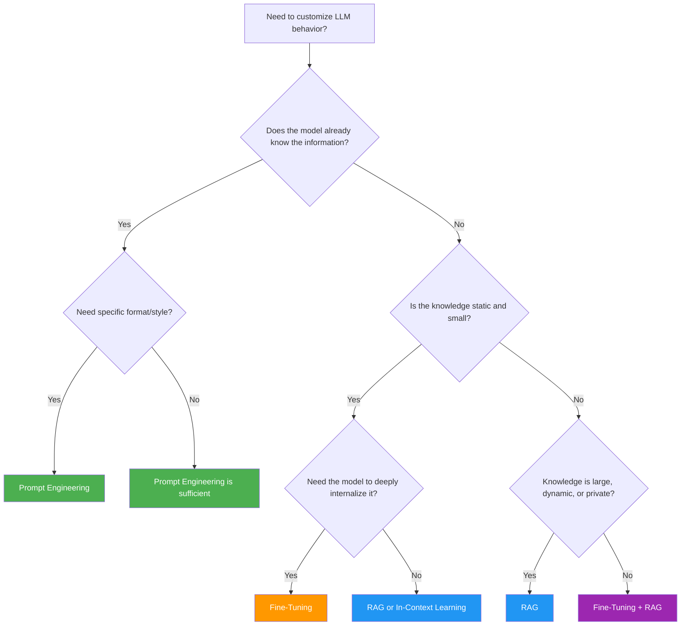
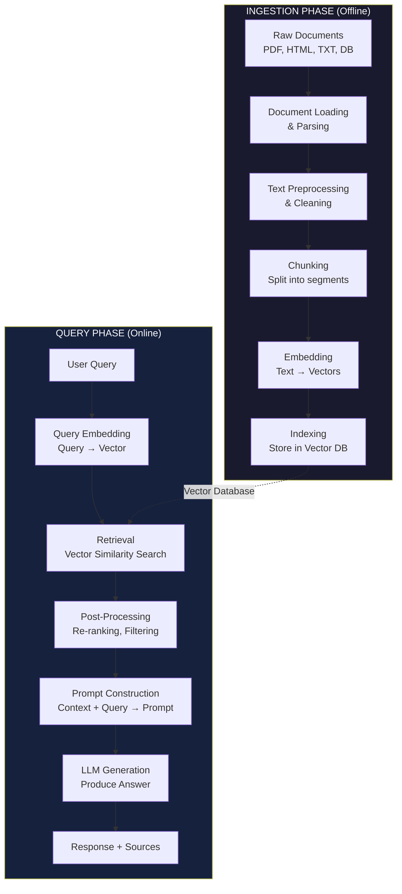
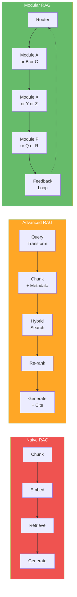

# RAG Deep Dive  Part 0: What Is RAG? Foundations and Why It Matters (A Developer's Perspective)

---

**Series:** RAG (Retrieval-Augmented Generation)  A Developer's Deep Dive from Scratch to Production
**Part:** 0 of 9 (Foundation)
**Audience:** Developers with Python experience who want to master RAG systems from the ground up
**Reading time:** ~45 minutes

---

## Table of Contents

1. [Why This Series Exists](#1-why-this-series-exists)
2. [What RAG Actually Is](#2-what-rag-actually-is)
3. [The Problem RAG Solves](#3-the-problem-rag-solves)
4. [RAG vs Fine-Tuning vs Prompt Engineering](#4-rag-vs-fine-tuning-vs-prompt-engineering)
5. [The RAG Architecture](#5-the-rag-architecture)
6. [A Minimal RAG System in 50 Lines](#6-a-minimal-rag-system-in-50-lines)
7. [History of RAG](#7-history-of-rag)
8. [Types of RAG](#8-types-of-rag)
9. [The Five Pillars of a RAG System](#9-the-five-pillars-of-a-rag-system)
10. [The RAG Ecosystem](#10-the-rag-ecosystem)
11. [Common RAG Failure Modes](#11-common-rag-failure-modes)
12. [Key Vocabulary](#12-key-vocabulary)
13. [Series Roadmap](#13-series-roadmap)
14. [What's Next  Part 1 Preview](#14-whats-next--part-1-preview)

---

## 1. Why This Series Exists

You have shipped a chatbot. It works. Users love it  until they start asking questions about *your* data.

"What was our Q3 revenue?"  the LLM hallucinates a number.
"Summarize the internal policy on remote work."  the LLM has never seen your company handbook.
"What did the FDA approve last Tuesday?"  the LLM's knowledge ends months ago.

These are not edge cases. These are the *default behavior* of every large language model ever trained. LLMs are powerful pattern completers, but they are fundamentally **closed-book systems**: they can only work with what was baked into their weights during training.

**Retrieval-Augmented Generation (RAG)** turns that closed book into an open one.

> **The core insight:** Instead of expecting the LLM to memorize everything, give it the right information at query time  retrieved from your own data sources  and let it reason over that context to produce an answer.

This series exists because most RAG tutorials fall into one of two traps:

1. **Too high-level:** "Just plug LangChain into Pinecone and you're done!"  which hides every meaningful decision behind abstractions.
2. **Too academic:** Dense papers on retrieval theory with no working code you can deploy on Monday.

We are going to build RAG systems **from scratch**, understand every layer, and then  only then  reach for the frameworks. By the end of this 10-part series, you will have built a production-grade RAG pipeline and understood every byte that flows through it.

Let's begin.

---

## 2. What RAG Actually Is

**RAG** stands for **Retrieval-Augmented Generation**. The name tells you the entire algorithm:

1. **Retrieve**  Find the most relevant pieces of information from an external knowledge base.
2. **Augment**  Inject that retrieved information into the prompt sent to the language model.
3. **Generate**  Let the LLM produce an answer grounded in the provided context.

That's it. The rest of this series is about doing each of those three steps *well*.

### The Open-Book Exam Analogy

Think of a standard LLM as a student taking a **closed-book exam**. They studied hard (pre-training on terabytes of text), they remember a lot, but they cannot look anything up. They may recall a date wrong, misremember a formula, or simply never have studied the topic at all.

RAG is the same student taking an **open-book exam**. They still need intelligence to read, reason, and compose an answer  but now they have a textbook, notes, and reference materials sitting right in front of them.

> **Key insight:** RAG does not make the LLM smarter. It makes the LLM better informed *at the moment it needs to answer*.

### The Three-Step Mental Model

```
User Query
    │
    ▼
┌─────────────────┐
│   1. RETRIEVE    │  ← Search your knowledge base for relevant documents
│   (Information   │
│    Retrieval)    │
└────────┬────────┘
         │  Top-K relevant chunks
         ▼
┌─────────────────┐
│   2. AUGMENT     │  ← Combine retrieved context with the user's question
│   (Prompt        │     into a single prompt
│    Construction) │
└────────┬────────┘
         │  Augmented prompt
         ▼
┌─────────────────┐
│   3. GENERATE    │  ← Send augmented prompt to the LLM for completion
│   (LLM           │
│    Inference)    │
└─────────────────┘
         │
         ▼
    Grounded Answer
```

Here is that three-step flow in the simplest possible Python pseudocode:

```python
def rag(query: str, knowledge_base: list[str], llm) -> str:
    # Step 1: Retrieve
    relevant_docs = retrieve(query, knowledge_base, top_k=3)

    # Step 2: Augment
    context = "\n\n".join(relevant_docs)
    augmented_prompt = f"""Answer the question based on the context below.

Context:
{context}

Question: {query}

Answer:"""

    # Step 3: Generate
    answer = llm.generate(augmented_prompt)
    return answer
```

Every RAG system you will ever encounter  no matter how many nodes, re-rankers, or routing layers it has  is a variation of this three-step pattern.

---

## 3. The Problem RAG Solves

Before we go deeper into RAG's architecture, let's be precise about the problems it addresses. LLMs, for all their power, have fundamental limitations:

### 3.1 Knowledge Cutoff

Every LLM has a **training cutoff date**. GPT-4's original training data ends in April 2023. Claude's knowledge has its own cutoff. Anything that happened after that date simply does not exist in the model's weights.

```python
# What happens without RAG:
query = "What were Apple's Q4 2025 earnings?"

# LLM response (without RAG):
# "I don't have information about Apple's Q4 2025 earnings as my
#  training data only goes up to [cutoff date]."
#
# Or worse  it GUESSES and gives you a plausible-sounding but
# completely fabricated number.
```

### 3.2 Hallucinations

LLMs **hallucinate**. This is not a bug; it is a fundamental property of how autoregressive language models work. They predict the next most likely token. When they do not have grounding information, they generate text that *sounds* correct but may be factually wrong.

```python
# Classic hallucination example:
query = "What is the Dunning-Kruger-Johnson effect?"

# LLM response (without RAG):
# "The Dunning-Kruger-Johnson effect is a cognitive bias where..."
#
# This sounds authoritative. It is also completely made up.
# There is no "Dunning-Kruger-Johnson effect."
# The model blended real knowledge (Dunning-Kruger effect) with
# a plausible-sounding extension.
```

> **Key insight:** Hallucinations are especially dangerous in domains where the user cannot easily verify the answer  legal advice, medical information, financial data, internal company policies.

### 3.3 No Access to Private or Proprietary Data

Your company's internal wiki, your product documentation, your customer support tickets, your research papers  the LLM has never seen any of it. It *cannot* answer questions about your data without explicit access.

### 3.4 No Source Attribution

When an LLM generates an answer from its parametric memory, it cannot point to a source. With RAG, every answer can be traced back to the specific document chunks that informed it.

```python
# With RAG, you can return sources alongside the answer:
{
    "answer": "Apple reported Q4 2025 revenue of $95.3 billion.",
    "sources": [
        {"document": "apple_10q_2025.pdf", "page": 3, "chunk": 12},
        {"document": "earnings_call_transcript.txt", "chunk": 47}
    ],
    "confidence": 0.94
}
```

### 3.5 The Cost and Latency of Re-Training

Updating an LLM's knowledge requires fine-tuning or full retraining  both of which are expensive, slow, and require ML infrastructure expertise. RAG lets you update knowledge by simply adding, modifying, or removing documents from your knowledge base. No GPU clusters required.

### Summary: Why LLMs Alone Are Not Enough

| Limitation | Impact | How RAG Fixes It |
|---|---|---|
| Knowledge cutoff | Cannot answer about recent events | Retrieve from up-to-date knowledge base |
| Hallucinations | Generates plausible but false info | Grounds answers in retrieved evidence |
| No private data access | Cannot answer domain-specific questions | Indexes your proprietary documents |
| No source attribution | "Trust me, I'm an LLM" | Returns source documents with every answer |
| Expensive updates | Retraining costs $$$ and takes days | Update the knowledge base, not the model |

---

## 4. RAG vs Fine-Tuning vs Prompt Engineering

RAG is not the only technique for customizing LLM behavior. Let's compare the three main approaches so you know when to reach for each one.

### 4.1 Prompt Engineering

**Prompt engineering** is the art of crafting the input prompt to steer the model's output. This includes system prompts, few-shot examples, chain-of-thought instructions, and output format specifications.

```python
# Prompt engineering example: few-shot classification
prompt = """Classify the following customer messages as POSITIVE, NEGATIVE, or NEUTRAL.

Examples:
- "I love this product!" → POSITIVE
- "The delivery was late and the item was broken." → NEGATIVE
- "I received my order today." → NEUTRAL

Now classify:
- "Your support team was incredibly helpful and resolved my issue in minutes."
→"""
```

**When to use:** When the base model *already knows* the information but needs guidance on format, tone, or reasoning approach.

### 4.2 Fine-Tuning

**Fine-tuning** updates the model's weights by training it further on your specific data. The model *learns* your domain knowledge, style, or task patterns.

```python
# Fine-tuning data format (OpenAI style):
training_data = [
    {
        "messages": [
            {"role": "system", "content": "You are a legal assistant."},
            {"role": "user", "content": "What is a tort?"},
            {"role": "assistant", "content": "A tort is a civil wrong..."}
        ]
    },
    # ... hundreds or thousands more examples
]
```

**When to use:** When you need the model to adopt a specific style, learn a specialized vocabulary, or perform a narrow task with very high accuracy.

### 4.3 RAG

**RAG** retrieves relevant external knowledge at inference time and injects it into the prompt.

**When to use:** When answers depend on a large, changing, or private knowledge base that must remain up-to-date and traceable.

### Comparison Table

| Dimension | Prompt Engineering | Fine-Tuning | RAG |
|---|---|---|---|
| **Setup cost** | Low (minutes) | High (hours-days) | Medium (hours) |
| **Ongoing cost** | Low | High (retraining) | Medium (index updates) |
| **Knowledge update speed** | Instant (edit prompt) | Slow (retrain) | Fast (update documents) |
| **Handles private data** | Limited (fits in context) | Yes (trained on it) | Yes (indexed separately) |
| **Source attribution** | No | No | Yes |
| **Reduces hallucinations** | Somewhat | Somewhat | Significantly |
| **Scales to large knowledge bases** | No (context window limit) | Partially | Yes |
| **Requires ML expertise** | No | Yes | Some |
| **Best for** | Formatting, reasoning style | Style adaptation, narrow tasks | Knowledge-intensive Q&A |

> **Key insight:** These approaches are not mutually exclusive. Production systems often combine all three: a fine-tuned model with prompt engineering that uses RAG for knowledge retrieval. Think of them as complementary tools, not competing alternatives.

### Decision Flowchart



### When to Combine Approaches

Here is a concrete example of combining all three:

```python
# A production system that combines all three approaches:

# 1. FINE-TUNED MODEL  trained on your company's writing style
model = load_fine_tuned_model("ft:gpt-4o:your-company:support-agent:abc123")

# 2. RAG  retrieve relevant knowledge base articles
relevant_articles = vector_store.search(user_query, top_k=5)
context = format_context(relevant_articles)

# 3. PROMPT ENGINEERING  structured system prompt with instructions
system_prompt = """You are a customer support agent for Acme Corp.
Rules:
- Always cite the specific KB article number in your response.
- If the context does not contain the answer, say "Let me escalate this."
- Use a friendly, professional tone.
- Never make up product features not mentioned in the context."""

messages = [
    {"role": "system", "content": system_prompt},
    {"role": "user", "content": f"Context:\n{context}\n\nQuestion: {user_query}"}
]

response = model.chat(messages)
```

---

## 5. The RAG Architecture

Now let's look at the full end-to-end RAG pipeline. Every RAG system has two distinct phases:

1. **Ingestion Phase** (offline)  Process and index your documents.
2. **Query Phase** (online)  Retrieve and generate at query time.

### End-to-End Architecture Diagram



### 5.1 The Ingestion Phase (Offline Pipeline)

The ingestion phase runs when you add or update documents. Here is what each step does:

```python
# Ingestion pipeline  conceptual implementation

def ingest_documents(file_paths: list[str]) -> VectorIndex:
    """Full ingestion pipeline: files → vector index."""

    # Step 1: Load raw documents
    raw_documents = []
    for path in file_paths:
        if path.endswith('.pdf'):
            text = extract_text_from_pdf(path)
        elif path.endswith('.html'):
            text = extract_text_from_html(path)
        elif path.endswith('.txt'):
            text = open(path).read()
        else:
            text = extract_text_generic(path)

        raw_documents.append({
            "text": text,
            "source": path,
            "metadata": extract_metadata(path)
        })

    # Step 2: Clean and preprocess
    cleaned_documents = []
    for doc in raw_documents:
        cleaned_text = remove_headers_footers(doc["text"])
        cleaned_text = normalize_whitespace(cleaned_text)
        cleaned_text = fix_encoding_issues(cleaned_text)
        cleaned_documents.append({**doc, "text": cleaned_text})

    # Step 3: Chunk into segments
    chunks = []
    for doc in cleaned_documents:
        doc_chunks = chunk_text(
            text=doc["text"],
            chunk_size=512,       # tokens per chunk
            chunk_overlap=50,     # overlapping tokens between chunks
            strategy="recursive"  # splitting strategy
        )
        for i, chunk_text in enumerate(doc_chunks):
            chunks.append({
                "text": chunk_text,
                "source": doc["source"],
                "chunk_index": i,
                "metadata": doc["metadata"]
            })

    # Step 4: Generate embeddings
    embeddings = embedding_model.encode([c["text"] for c in chunks])

    # Step 5: Index in vector database
    vector_index = VectorIndex()
    for chunk, embedding in zip(chunks, embeddings):
        vector_index.add(
            vector=embedding,
            payload=chunk
        )

    return vector_index
```

### 5.2 The Query Phase (Online Pipeline)

The query phase runs every time a user asks a question:

```python
# Query pipeline  conceptual implementation

def query_rag(
    user_query: str,
    vector_index: VectorIndex,
    llm: LanguageModel,
    top_k: int = 5
) -> dict:
    """Full query pipeline: question → grounded answer."""

    # Step 1: Embed the query using the SAME embedding model
    query_embedding = embedding_model.encode(user_query)

    # Step 2: Retrieve similar chunks from the vector database
    results = vector_index.search(
        vector=query_embedding,
        top_k=top_k,
        score_threshold=0.7  # minimum similarity score
    )

    # Step 3: (Optional) Re-rank results for better relevance
    reranked_results = reranker.rerank(
        query=user_query,
        documents=[r.payload["text"] for r in results]
    )

    # Step 4: Construct the augmented prompt
    context_blocks = []
    for i, result in enumerate(reranked_results):
        context_blocks.append(
            f"[Source {i+1}: {result.payload['source']}]\n"
            f"{result.payload['text']}"
        )
    context = "\n\n---\n\n".join(context_blocks)

    prompt = f"""Use the following context to answer the question.
If the context does not contain enough information, say so.
Always cite your sources using [Source N] notation.

Context:
{context}

Question: {user_query}

Answer:"""

    # Step 5: Generate the response
    answer = llm.generate(prompt)

    return {
        "answer": answer,
        "sources": [r.payload for r in reranked_results],
        "query_embedding": query_embedding
    }
```

### The Data Flow in Detail

```mermaid
flowchart LR
    subgraph Documents
        D1[doc1.pdf]
        D2[doc2.txt]
        D3[doc3.html]
    end

    subgraph Chunks
        C1["chunk_1 (512 tokens)"]
        C2["chunk_2 (512 tokens)"]
        C3["chunk_3 (512 tokens)"]
        C4["... chunk_N"]
    end

    subgraph Vectors
        V1["[0.12, -0.45, 0.78, ...]"]
        V2["[0.33, 0.11, -0.92, ...]"]
        V3["[-0.56, 0.23, 0.67, ...]"]
        V4["[...]"]
    end

    subgraph VectorDB["Vector Database"]
        IDX[("HNSW / IVF Index")]
    end

    Documents --> Chunks --> Vectors --> VectorDB

    Q["User Query"] --> QV["Query Vector<br/>[0.15, -0.41, 0.80, ...]"]
    QV --> IDX
    IDX --> TopK["Top-K Similar Chunks"]
    TopK --> Prompt["Augmented Prompt"]
    Prompt --> LLM["LLM"]
    LLM --> Answer["Grounded Answer"]
```



---

## 6. A Minimal RAG System in 50 Lines

Let's build RAG from absolute scratch. No LangChain. No vector database. No embedding API. Just Python and math.

This system uses **TF-IDF** (Term Frequency-Inverse Document Frequency) for retrieval  the same fundamental concept that powered search engines before neural embeddings existed.

```python
"""
minimal_rag.py  A complete RAG system in ~50 lines.
No external dependencies. Pure Python.
Demonstrates the core retrieve-augment-generate pattern.
"""

import math
import re
from collections import Counter


def tokenize(text: str) -> list[str]:
    """Simple whitespace + punctuation tokenizer."""
    return re.findall(r'\b\w+\b', text.lower())


def compute_tfidf(documents: list[str]) -> tuple[list[dict], dict]:
    """Compute TF-IDF vectors for a list of documents."""
    # Tokenize all documents
    doc_tokens = [tokenize(doc) for doc in documents]
    # Document frequency: how many documents contain each term
    df = Counter()
    for tokens in doc_tokens:
        df.update(set(tokens))
    n_docs = len(documents)
    # Compute TF-IDF for each document
    tfidf_vectors = []
    for tokens in doc_tokens:
        tf = Counter(tokens)
        total = len(tokens)
        tfidf = {}
        for term, count in tf.items():
            tfidf[term] = (count / total) * math.log(n_docs / (1 + df[term]))
        tfidf_vectors.append(tfidf)
    return tfidf_vectors, df


def cosine_similarity(vec_a: dict, vec_b: dict) -> float:
    """Cosine similarity between two sparse vectors (dicts)."""
    common_terms = set(vec_a) & set(vec_b)
    dot_product = sum(vec_a[t] * vec_b[t] for t in common_terms)
    mag_a = math.sqrt(sum(v ** 2 for v in vec_a.values()))
    mag_b = math.sqrt(sum(v ** 2 for v in vec_b.values()))
    if mag_a == 0 or mag_b == 0:
        return 0.0
    return dot_product / (mag_a * mag_b)


def retrieve(query: str, documents: list[str], top_k: int = 3) -> list[str]:
    """Retrieve the top-K most relevant documents for a query."""
    all_texts = documents + [query]
    tfidf_vectors, _ = compute_tfidf(all_texts)
    query_vec = tfidf_vectors[-1]        # last one is the query
    doc_vectors = tfidf_vectors[:-1]     # all others are documents
    # Score each document
    scores = []
    for i, doc_vec in enumerate(doc_vectors):
        sim = cosine_similarity(query_vec, doc_vec)
        scores.append((sim, i))
    # Sort by similarity (descending) and return top-K
    scores.sort(reverse=True)
    return [documents[i] for _, i in scores[:top_k]]


def augment_prompt(query: str, context_docs: list[str]) -> str:
    """Construct the augmented prompt with retrieved context."""
    context = "\n\n---\n\n".join(
        f"[Document {i+1}]: {doc}" for i, doc in enumerate(context_docs)
    )
    return f"""Answer the question using ONLY the context below.
If the context doesn't contain the answer, say "I don't know."

Context:
{context}

Question: {query}
Answer:"""


# === DEMO: Run the minimal RAG system ===
if __name__ == "__main__":
    # Our "knowledge base"  imagine these are chunks from real documents
    knowledge_base = [
        "Python was created by Guido van Rossum and first released in 1991. "
        "It emphasizes code readability with its notable use of significant "
        "indentation.",

        "RAG stands for Retrieval-Augmented Generation. It was introduced by "
        "Facebook AI Research (now Meta AI) in a 2020 paper by Patrick Lewis "
        "et al. RAG combines retrieval mechanisms with generative models.",

        "Vector databases like Pinecone, Weaviate, and ChromaDB store data as "
        "high-dimensional vectors. They enable fast similarity search using "
        "algorithms like HNSW (Hierarchical Navigable Small World graphs).",

        "The transformer architecture was introduced in the 2017 paper "
        "'Attention Is All You Need' by Vaswani et al. It forms the basis "
        "of models like GPT, BERT, and T5.",

        "TF-IDF stands for Term Frequency-Inverse Document Frequency. It is "
        "a numerical statistic that reflects how important a word is to a "
        "document in a collection. It has been widely used in information "
        "retrieval and text mining.",

        "Embeddings are dense vector representations of text. Models like "
        "OpenAI's text-embedding-ada-002 and Sentence Transformers convert "
        "text into fixed-size vectors that capture semantic meaning.",

        "LangChain is a framework for developing applications powered by "
        "language models. It provides tools for chains, agents, memory, "
        "and retrieval-augmented generation.",

        "Chunking is the process of splitting large documents into smaller "
        "segments. Common strategies include fixed-size chunking, sentence-"
        "based chunking, and recursive character splitting.",
    ]

    # User's query
    query = "What is RAG and who introduced it?"

    # Step 1: Retrieve
    relevant_docs = retrieve(query, knowledge_base, top_k=3)
    print("=== Retrieved Documents ===")
    for i, doc in enumerate(relevant_docs):
        print(f"\n[{i+1}] {doc}")

    # Step 2: Augment
    prompt = augment_prompt(query, relevant_docs)
    print("\n\n=== Augmented Prompt ===")
    print(prompt)

    # Step 3: Generate (simulated  in real usage, send to an LLM)
    print("\n\n=== Generation ===")
    print("(In production, this prompt would be sent to an LLM like GPT-4,")
    print(" Claude, or a local model. The LLM would read the context and")
    print(" generate a grounded answer.)")
```

Let's run this and see what happens:

```python
# Expected output:

# === Retrieved Documents ===
#
# [1] RAG stands for Retrieval-Augmented Generation. It was introduced by
#     Facebook AI Research (now Meta AI) in a 2020 paper by Patrick Lewis
#     et al. RAG combines retrieval mechanisms with generative models.
#
# [2] TF-IDF stands for Term Frequency-Inverse Document Frequency. It is
#     a numerical statistic that reflects how important a word is to a
#     document in a collection...
#
# [3] LangChain is a framework for developing applications powered by
#     language models...
#
# Notice: The TF-IDF retriever correctly identified the RAG document as
# the most relevant! It's not perfect (TF-IDF is keyword-based, not
# semantic), but it demonstrates the core pattern.
```

> **Key insight:** This 50-line system captures the *essence* of RAG. Every production system you will build is a more sophisticated version of this exact pattern: retrieve relevant context, inject it into a prompt, generate an answer. The sophistication comes from better embeddings (Part 2), better retrieval (Part 4), and better prompt construction (Part 5).

### The Limitation of TF-IDF: Why We Need Embeddings

Our minimal system has a critical weakness. Try this query:

```python
query = "How do language models understand meaning?"

# TF-IDF will struggle here because:
# - The word "meaning" appears in the embeddings document ("semantic meaning")
# - But the word "understand" doesn't appear anywhere
# - TF-IDF matches KEYWORDS, not CONCEPTS

# A semantic embedding model would understand that "understand meaning"
# is conceptually related to "capture semantic meaning"  even though
# the exact words differ.
```

This is why modern RAG systems use **neural embeddings** instead of TF-IDF. We will build that in Part 2.

---

## 7. History of RAG

### 7.1 The Foundational Paper

RAG was formally introduced in the 2020 paper **"Retrieval-Augmented Generation for Knowledge-Intensive NLP Tasks"** by **Patrick Lewis, Ethan Perez, Aleksandra Piktus, Fabio Petroni, Vladimir Karpukhin, Naman Goyal, Heinrich Kuttler, Mike Lewis, Wen-tau Yih, Tim Rocktaschel, Sebastian Riedel, and Douwe Kiela** from **Facebook AI Research (FAIR)** (now Meta AI).

The paper proposed a general-purpose architecture that combined two components:

1. **A retriever**  Specifically, **DPR (Dense Passage Retrieval)**, a BERT-based bi-encoder that encodes both questions and passages into dense vectors for similarity search.
2. **A generator**  **BART**, a sequence-to-sequence transformer model.

```python
# The original RAG architecture (simplified):

class OriginalRAG:
    def __init__(self):
        self.retriever = DPR()      # Dense Passage Retriever (BERT-based)
        self.generator = BART()      # Seq2seq generator
        self.index = FAISSIndex()    # Facebook AI Similarity Search

    def forward(self, query: str) -> str:
        # Encode the query
        query_vector = self.retriever.encode_query(query)

        # Retrieve top-K passages from Wikipedia (21M passages!)
        passages = self.index.search(query_vector, top_k=5)

        # Marginalize over retrieved passages
        # (This is where RAG-Sequence and RAG-Token differ)
        output = self.generator.generate(
            input_ids=query,
            context=passages
        )
        return output
```

The key innovation was **training the retriever and generator end-to-end**. The retriever learned *what* to retrieve based on what helped the generator produce better answers.

> **Key insight:** The original RAG paper showed that a model with 400M parameters + retrieval could outperform models with 10x more parameters on knowledge-intensive tasks. This was a powerful argument for retrieval over memorization.

### 7.2 The Two Original RAG Variants

The 2020 paper actually proposed two variants:

```python
# RAG-Sequence: Uses the same set of retrieved documents for the
# entire output sequence.
# P(y|x) = Σ_z P(z|x) * P(y|x,z)
# where z is a retrieved document

# RAG-Token: Can use DIFFERENT retrieved documents for each
# output token.
# P(y_i|x, y_{1:i-1}) = Σ_z P(z|x) * P(y_i|x, z, y_{1:i-1})

# In practice, RAG-Sequence is more commonly used and understood.
```

### 7.3 Timeline: The Evolution of RAG

| Year | Milestone | Significance |
|------|-----------|--------------|
| **2017** | Transformer architecture ("Attention Is All You Need") | Foundation for all modern LLMs and retrievers |
| **2018** | BERT released by Google | Enabled dense passage encoding for retrieval |
| **2019** | DPR (Dense Passage Retrieval) developed at FAIR | Showed dense retrieval can beat sparse (BM25) methods |
| **2020** | **RAG paper published by Lewis et al. (FAIR)** | **Formalized the retrieve-then-generate paradigm** |
| **2020** | REALM (Google) | Concurrent work on retrieval-augmented language models |
| **2021** | Retro (DeepMind) | Retrieval at massive scale (2 trillion tokens) |
| **2022** | ChatGPT launches, RAG gains mainstream adoption | Developers scramble to add knowledge to chatbots |
| **2023** | LangChain, LlamaIndex gain popularity | Frameworks make RAG accessible to every developer |
| **2023** | Vector database boom (Pinecone, Weaviate, Qdrant) | Infrastructure matures for production RAG |
| **2023-2024** | Advanced RAG patterns emerge | HyDE, CRAG, Self-RAG, Adaptive RAG, Graph RAG |
| **2024-2025** | Agentic RAG, Multi-Modal RAG | RAG evolves beyond simple document Q&A |

### 7.4 Before RAG: Information Retrieval Roots

RAG did not emerge from nothing. It builds on decades of information retrieval research:

```python
# The ancestry of RAG:

# 1960s-1990s: Boolean retrieval, TF-IDF, BM25
#   → "Find documents that match these keywords"

# 2000s-2010s: Learning-to-rank, semantic search
#   → "Find documents that are RELEVANT, not just keyword-matching"

# 2018-2019: Dense retrieval (DPR, ColBERT)
#   → "Encode meaning as vectors, search by similarity"

# 2020: RAG
#   → "Retrieve relevant text AND use it to generate answers"

# The insight: retrieval and generation are better TOGETHER
# than either alone.
```

---

## 8. Types of RAG

As RAG matured, the community identified three broad architectural patterns, each building on the last.

### 8.1 Naive RAG (Basic RAG)

**Naive RAG** is the simplest form: split documents into chunks, embed them, retrieve top-K, stuff them into a prompt, and generate. This is what most tutorials teach and what most developers build first.

```python
# Naive RAG  the standard three-step pipeline
class NaiveRAG:
    def __init__(self, embedding_model, vector_store, llm):
        self.embedding_model = embedding_model
        self.vector_store = vector_store
        self.llm = llm

    def ingest(self, documents: list[str]):
        """Simple chunking and indexing."""
        for doc in documents:
            # Fixed-size chunking with no overlap
            chunks = [doc[i:i+500] for i in range(0, len(doc), 500)]
            for chunk in chunks:
                embedding = self.embedding_model.encode(chunk)
                self.vector_store.add(embedding, {"text": chunk})

    def query(self, question: str) -> str:
        """Simple retrieve-and-generate."""
        query_embedding = self.embedding_model.encode(question)
        results = self.vector_store.search(query_embedding, top_k=3)
        context = "\n".join([r["text"] for r in results])
        prompt = f"Context: {context}\n\nQuestion: {question}\nAnswer:"
        return self.llm.generate(prompt)
```

**Strengths:**
- Simple to implement and understand
- Works surprisingly well for many use cases
- Fast iteration time

**Weaknesses:**
- Chunking is unsophisticated (may split mid-sentence or mid-concept)
- No query transformation (raw user query used as-is)
- No re-ranking (relies entirely on embedding similarity)
- No handling of multi-hop questions
- No fallback when retrieval fails

### 8.2 Advanced RAG

**Advanced RAG** adds pre-retrieval and post-retrieval processing stages to improve quality.

```python
class AdvancedRAG:
    def __init__(self, embedding_model, vector_store, llm, reranker):
        self.embedding_model = embedding_model
        self.vector_store = vector_store
        self.llm = llm
        self.reranker = reranker

    def ingest(self, documents: list[str]):
        """Sophisticated chunking with overlap and metadata."""
        for doc in documents:
            # Semantic chunking (split at paragraph/section boundaries)
            chunks = semantic_chunk(doc, max_tokens=512, overlap=50)
            for chunk in chunks:
                # Generate summary for each chunk (for hybrid search)
                summary = self.llm.generate(f"Summarize: {chunk.text}")
                embedding = self.embedding_model.encode(chunk.text)
                self.vector_store.add(embedding, {
                    "text": chunk.text,
                    "summary": summary,
                    "section": chunk.section_header,
                    "page": chunk.page_number
                })

    def query(self, question: str) -> str:
        """Enhanced pipeline with pre- and post-retrieval steps."""

        # PRE-RETRIEVAL: Query transformation
        # Rewrite the query for better retrieval
        enhanced_query = self.llm.generate(
            f"Rewrite this question for a search engine: {question}"
        )

        # RETRIEVAL: Hybrid search (dense + sparse)
        query_embedding = self.embedding_model.encode(enhanced_query)
        dense_results = self.vector_store.search(query_embedding, top_k=10)
        sparse_results = self.bm25_search(enhanced_query, top_k=10)
        combined_results = reciprocal_rank_fusion(dense_results, sparse_results)

        # POST-RETRIEVAL: Re-ranking
        reranked = self.reranker.rerank(
            query=question,
            documents=[r["text"] for r in combined_results],
            top_k=5
        )

        # GENERATION: With structured prompt
        context = self.format_context(reranked)
        return self.generate_with_citations(question, context)
```

**Improvements over Naive RAG:**
- **Pre-retrieval:** Query rewriting, query expansion, HyDE (Hypothetical Document Embeddings)
- **Retrieval:** Hybrid search (dense + sparse), multi-index querying
- **Post-retrieval:** Re-ranking with cross-encoder models, context compression, filtering
- **Generation:** Better prompt engineering, citation generation, confidence scoring

### 8.3 Modular RAG

**Modular RAG** treats the pipeline as a collection of interchangeable modules that can be composed, replaced, and routed dynamically.

```python
class ModularRAG:
    """
    A modular RAG system where each component is a pluggable module.
    The orchestrator decides which modules to use based on the query.
    """

    def __init__(self):
        # Pluggable modules
        self.query_analyzers = {
            "simple": SimpleQueryAnalyzer(),
            "decompose": QueryDecomposer(),    # breaks multi-hop questions
            "hyde": HyDEQueryTransformer(),     # generates hypothetical docs
        }
        self.retrievers = {
            "dense": DenseRetriever(),
            "sparse": BM25Retriever(),
            "graph": KnowledgeGraphRetriever(),
            "sql": SQLRetriever(),
        }
        self.processors = {
            "rerank": CrossEncoderReranker(),
            "compress": ContextCompressor(),
            "filter": MetadataFilter(),
        }
        self.generators = {
            "standard": StandardGenerator(),
            "cot": ChainOfThoughtGenerator(),   # step-by-step reasoning
            "multi_step": IterativeGenerator(),  # multiple LLM calls
        }
        self.router = QueryRouter()

    def query(self, question: str) -> str:
        """Dynamically route through the optimal pipeline."""

        # Route: Analyze the query to decide which modules to use
        route = self.router.analyze(question)
        # Example route: {
        #   "query_analyzer": "decompose",
        #   "retrievers": ["dense", "graph"],
        #   "processors": ["rerank", "compress"],
        #   "generator": "cot"
        # }

        # Execute the dynamic pipeline
        analyzer = self.query_analyzers[route["query_analyzer"]]
        processed_queries = analyzer.process(question)

        all_results = []
        for retriever_name in route["retrievers"]:
            retriever = self.retrievers[retriever_name]
            for q in processed_queries:
                results = retriever.retrieve(q)
                all_results.extend(results)

        for processor_name in route["processors"]:
            processor = self.processors[processor_name]
            all_results = processor.process(question, all_results)

        generator = self.generators[route["generator"]]
        return generator.generate(question, all_results)
```

> **Key insight:** Modular RAG is where the industry is heading. Instead of a rigid pipeline, you build a toolkit of retrieval, processing, and generation modules that can be composed based on the query type, domain, or user.

### Comparison of RAG Types



| Feature | Naive RAG | Advanced RAG | Modular RAG |
|---|---|---|---|
| Query processing | None | Query rewriting | Dynamic routing |
| Chunking | Fixed-size | Semantic, overlapping | Adaptive per doc type |
| Retrieval | Dense only | Hybrid (dense + sparse) | Multi-strategy, dynamic |
| Post-processing | None | Re-ranking | Re-ranking + compression + filtering |
| Generation | Simple prompt | Structured prompt + citations | Dynamic prompt strategy |
| Feedback loops | None | None | Yes (iterative refinement) |
| Complexity | Low | Medium | High |
| Best for | Prototypes, simple Q&A | Production systems | Complex, multi-domain systems |

---

## 9. The Five Pillars of a RAG System

Every RAG system, regardless of complexity, rests on five foundational pillars. Master these five and you can build any RAG system.

### Pillar 1: Ingestion

**Ingestion** is the process of loading raw documents into your pipeline. Documents come in wildly different formats, and each requires different parsing logic.

```python
# Ingestion: The variety of document sources
DOCUMENT_LOADERS = {
    ".pdf": PDFLoader,          # PyPDF2, pdfplumber, unstructured
    ".docx": DocxLoader,        # python-docx
    ".html": HTMLLoader,        # BeautifulSoup, trafilatura
    ".md": MarkdownLoader,      # markdown-it, mistune
    ".txt": TextLoader,         # plain open()
    ".csv": CSVLoader,          # pandas
    ".json": JSONLoader,        # json module
    ".pptx": PowerPointLoader,  # python-pptx
    ".epub": EPUBLoader,        # ebooklib
    "url": WebScraper,          # requests + BeautifulSoup
    "api": APIFetcher,          # REST/GraphQL clients
    "db": DatabaseConnector,    # SQLAlchemy, pymongo
}

def load_document(source: str) -> Document:
    """Route to the appropriate loader based on file type."""
    ext = get_extension(source)
    loader_class = DOCUMENT_LOADERS.get(ext)
    if not loader_class:
        raise ValueError(f"Unsupported format: {ext}")
    loader = loader_class()
    return loader.load(source)
```

**Key challenges:**
- Extracting clean text from PDFs (especially scanned documents)
- Preserving document structure (headings, tables, lists)
- Handling multi-language content
- Managing large files that don't fit in memory

### Pillar 2: Chunking

**Chunking** splits documents into smaller segments that can be individually embedded and retrieved. This is one of the most impactful decisions in your RAG pipeline.

```python
# Different chunking strategies

def fixed_size_chunk(text: str, chunk_size: int = 500, overlap: int = 50) -> list[str]:
    """Split text into fixed-size windows with overlap."""
    chunks = []
    start = 0
    while start < len(text):
        end = start + chunk_size
        chunks.append(text[start:end])
        start = end - overlap  # overlap for context continuity
    return chunks


def sentence_chunk(text: str, max_sentences: int = 5) -> list[str]:
    """Split text into chunks of N sentences."""
    import re
    sentences = re.split(r'(?<=[.!?])\s+', text)
    chunks = []
    for i in range(0, len(sentences), max_sentences):
        chunk = ' '.join(sentences[i:i + max_sentences])
        chunks.append(chunk)
    return chunks


def recursive_chunk(text: str, chunk_size: int = 500, separators: list[str] = None) -> list[str]:
    """Recursively split text using a hierarchy of separators."""
    if separators is None:
        separators = ["\n\n", "\n", ". ", " ", ""]

    separator = separators[0]
    remaining_separators = separators[1:]

    splits = text.split(separator)
    chunks = []
    current_chunk = ""

    for split in splits:
        if len(current_chunk) + len(split) < chunk_size:
            current_chunk += split + separator
        else:
            if current_chunk:
                chunks.append(current_chunk.strip())
            if len(split) > chunk_size and remaining_separators:
                # Recursively split with smaller separators
                chunks.extend(recursive_chunk(split, chunk_size, remaining_separators))
            else:
                current_chunk = split + separator
    if current_chunk:
        chunks.append(current_chunk.strip())
    return chunks
```

> **Key insight:** Chunking is where most RAG systems silently fail. A chunk that splits a concept across two segments makes that concept unretrievable. We will dedicate all of Part 1 to chunking strategies.

### Pillar 3: Embedding

**Embedding** converts text into dense numerical vectors that capture semantic meaning. Similar texts produce similar vectors, enabling similarity-based retrieval.

```python
# Embedding: Converting text to vectors

# Conceptual illustration  what embedding does:
text_1 = "The cat sat on the mat"
text_2 = "A feline rested on the rug"
text_3 = "Stock prices rose sharply"

# After embedding:
vec_1 = [0.12, -0.45, 0.78, 0.33, ...]  # 384-1536 dimensions
vec_2 = [0.11, -0.43, 0.76, 0.35, ...]  # VERY similar to vec_1!
vec_3 = [0.89, 0.23, -0.56, -0.12, ...]  # VERY different from vec_1

# cosine_similarity(vec_1, vec_2) ≈ 0.95  (high  same meaning!)
# cosine_similarity(vec_1, vec_3) ≈ 0.08  (low  different meaning)

# Using Sentence Transformers (a popular open-source option):
from sentence_transformers import SentenceTransformer

model = SentenceTransformer('all-MiniLM-L6-v2')
embeddings = model.encode([text_1, text_2, text_3])
# Returns: numpy array of shape (3, 384)
```

**Key decisions:**
- Which embedding model to use (trade-off: quality vs speed vs cost)
- Embedding dimensions (384, 768, 1536, 3072)
- Whether to normalize vectors
- Whether to embed documents and queries differently (bi-encoder vs cross-encoder)

### Pillar 4: Retrieval

**Retrieval** finds the most relevant chunks for a given query using similarity search over the vector space.

```python
# Retrieval: Finding relevant chunks

# Basic vector similarity search
import numpy as np


def brute_force_search(
    query_vector: np.ndarray,
    index_vectors: np.ndarray,
    top_k: int = 5
) -> list[tuple[int, float]]:
    """
    Brute-force cosine similarity search.
    Works for small datasets; too slow for millions of vectors.
    """
    # Normalize vectors
    query_norm = query_vector / np.linalg.norm(query_vector)
    index_norms = index_vectors / np.linalg.norm(index_vectors, axis=1, keepdims=True)

    # Compute all similarities at once
    similarities = np.dot(index_norms, query_norm)

    # Get top-K indices
    top_indices = np.argsort(similarities)[::-1][:top_k]

    return [(int(i), float(similarities[i])) for i in top_indices]


# In production, use approximate nearest neighbor (ANN) algorithms:
# - HNSW (Hierarchical Navigable Small World)  used by most vector DBs
# - IVF (Inverted File Index)  used by FAISS
# - SCANN (Scalable Nearest Neighbors)  by Google
```

**Key challenges:**
- Speed at scale (searching millions of vectors)
- Accuracy vs speed trade-off in approximate nearest neighbor
- Filtering by metadata while searching by similarity
- Handling queries that need multiple retrieval strategies

### Pillar 5: Generation

**Generation** is where the LLM takes the retrieved context and the user's question and produces a grounded answer.

```python
# Generation: Producing the final answer

def generate_answer(
    query: str,
    retrieved_chunks: list[dict],
    llm_client,
    model: str = "gpt-4o"
) -> dict:
    """Generate a grounded answer with source citations."""

    # Format the retrieved context with source markers
    context_parts = []
    for i, chunk in enumerate(retrieved_chunks):
        source_label = f"[Source {i+1}: {chunk['source']}, p.{chunk['page']}]"
        context_parts.append(f"{source_label}\n{chunk['text']}")

    context = "\n\n---\n\n".join(context_parts)

    system_prompt = """You are a helpful assistant that answers questions
based on the provided context. Follow these rules:
1. ONLY use information from the provided context.
2. If the context doesn't contain enough information, say so explicitly.
3. Cite your sources using [Source N] notation.
4. Be concise but thorough."""

    user_prompt = f"""Context:
{context}

Question: {query}

Provide a detailed answer with citations:"""

    response = llm_client.chat.completions.create(
        model=model,
        messages=[
            {"role": "system", "content": system_prompt},
            {"role": "user", "content": user_prompt}
        ],
        temperature=0.1  # Low temperature for factual accuracy
    )

    return {
        "answer": response.choices[0].message.content,
        "model": model,
        "sources": retrieved_chunks,
        "token_usage": response.usage.total_tokens
    }
```

> **Key insight:** The generation step is where many developers stop optimizing, but it is critical. A perfectly retrieved context paired with a bad prompt will produce a bad answer. Prompt engineering for RAG is its own skill, and we cover it in Part 5.

---

## 10. The RAG Ecosystem

The RAG ecosystem has matured rapidly. Here is a practitioner's map of the tools landscape.

### 10.1 Embedding Models

Embedding models convert text into dense vectors. Your choice of embedding model directly impacts retrieval quality.

| Model | Provider | Dimensions | Max Tokens | Open Source | Notes |
|---|---|---|---|---|---|
| `text-embedding-3-large` | OpenAI | 3072 | 8191 | No | Top quality, API-only |
| `text-embedding-3-small` | OpenAI | 1536 | 8191 | No | Cost-effective |
| `all-MiniLM-L6-v2` | Sentence Transformers | 384 | 256 | Yes | Fast, lightweight |
| `all-mpnet-base-v2` | Sentence Transformers | 768 | 384 | Yes | Best quality open-source (small) |
| `bge-large-en-v1.5` | BAAI | 1024 | 512 | Yes | Strong performer on MTEB |
| `e5-large-v2` | Microsoft | 1024 | 512 | Yes | Instruction-tuned |
| `Cohere embed-v3` | Cohere | 1024 | 512 | No | Search and classification variants |
| `voyage-3` | Voyage AI | 1024 | 32000 | No | Long-context embeddings |
| `nomic-embed-text-v1.5` | Nomic AI | 768 | 8192 | Yes | Long-context, open weights |
| `mxbai-embed-large-v1` | Mixedbread | 1024 | 512 | Yes | Strong MTEB performance |

```python
# Using different embedding models:

# --- OpenAI ---
from openai import OpenAI
client = OpenAI()

response = client.embeddings.create(
    model="text-embedding-3-small",
    input="RAG is a powerful technique for grounding LLM responses."
)
vector = response.data[0].embedding  # list of 1536 floats


# --- Sentence Transformers (open source, runs locally) ---
from sentence_transformers import SentenceTransformer

model = SentenceTransformer('all-MiniLM-L6-v2')
vector = model.encode("RAG is a powerful technique for grounding LLM responses.")
# numpy array of shape (384,)


# --- BAAI BGE (open source, runs locally) ---
from sentence_transformers import SentenceTransformer

model = SentenceTransformer('BAAI/bge-large-en-v1.5')
# BGE models require a prefix for queries (not for documents!)
vector = model.encode("Represent this sentence for searching: What is RAG?")
# numpy array of shape (1024,)
```

### 10.2 Vector Databases

Vector databases are purpose-built for storing and searching high-dimensional vectors at scale.

| Database | Type | Open Source | Managed Service | Key Feature |
|---|---|---|---|---|
| **FAISS** | Library | Yes (Meta) | No | Raw speed, in-memory |
| **ChromaDB** | Embedded DB | Yes | No | Developer-friendly, easy setup |
| **Pinecone** | Managed DB | No | Yes | Fully managed, serverless option |
| **Weaviate** | Full DB | Yes | Yes | Hybrid search, GraphQL API |
| **Qdrant** | Full DB | Yes | Yes | Rust-based, fast filtering |
| **Milvus** | Full DB | Yes | Yes (Zilliz) | Massive scale (billions of vectors) |
| **pgvector** | Extension | Yes | Yes (via Postgres) | Use your existing PostgreSQL |
| **LanceDB** | Embedded DB | Yes | No | Columnar, multi-modal |
| **Elasticsearch** | Search Engine | Yes | Yes | Mature, full-text + vector search |

```python
# Quick comparison of vector database usage patterns:

# --- ChromaDB (simplest setup) ---
import chromadb

client = chromadb.Client()
collection = client.create_collection("my_docs")
collection.add(
    documents=["RAG is great", "Vector DBs are fast"],
    ids=["doc1", "doc2"]
)
results = collection.query(query_texts=["What is RAG?"], n_results=1)


# --- FAISS (raw performance, no frills) ---
import faiss
import numpy as np

dimension = 384
index = faiss.IndexFlatL2(dimension)
vectors = np.random.rand(1000, dimension).astype('float32')
index.add(vectors)
query = np.random.rand(1, dimension).astype('float32')
distances, indices = index.search(query, k=5)


# --- Qdrant (production-ready, with filtering) ---
from qdrant_client import QdrantClient
from qdrant_client.models import VectorParams, Distance, PointStruct

client = QdrantClient(":memory:")  # or url="http://localhost:6333"
client.create_collection(
    collection_name="my_docs",
    vectors_config=VectorParams(size=384, distance=Distance.COSINE)
)
client.upsert(
    collection_name="my_docs",
    points=[
        PointStruct(
            id=1,
            vector=[0.1, 0.2, ...],  # 384 dimensions
            payload={"text": "RAG is great", "source": "blog.md"}
        )
    ]
)


# --- pgvector (use your existing PostgreSQL) ---
# pip install pgvector psycopg2
import psycopg2
from pgvector.psycopg2 import register_vector

conn = psycopg2.connect("postgresql://localhost/mydb")
register_vector(conn)
cur = conn.cursor()
cur.execute("""
    CREATE TABLE IF NOT EXISTS documents (
        id SERIAL PRIMARY KEY,
        content TEXT,
        embedding vector(384)
    )
""")
cur.execute(
    "SELECT content FROM documents ORDER BY embedding <-> %s LIMIT 5",
    ([0.1, 0.2, ...],)  # query vector
)
```

### 10.3 RAG Frameworks

Frameworks provide higher-level abstractions for building RAG pipelines.

| Framework | Focus | Learning Curve | Flexibility |
|---|---|---|---|
| **LangChain** | General LLM app development | Medium | High (modular chains) |
| **LlamaIndex** | Data indexing and retrieval | Medium | High (index abstractions) |
| **Haystack** | Production NLP pipelines | Medium | High (pipeline-based) |
| **Semantic Kernel** | Enterprise LLM integration (Microsoft) | Medium | Medium |
| **Verba** | RAG-specific (by Weaviate) | Low | Medium |

```python
# LangChain RAG example (for reference  we build from scratch first!)
from langchain_community.document_loaders import TextLoader
from langchain.text_splitter import RecursiveCharacterTextSplitter
from langchain_community.vectorstores import Chroma
from langchain_openai import OpenAIEmbeddings, ChatOpenAI
from langchain.chains import RetrievalQA

# Load and chunk
loader = TextLoader("knowledge_base.txt")
docs = loader.load()
splitter = RecursiveCharacterTextSplitter(chunk_size=500, chunk_overlap=50)
chunks = splitter.split_documents(docs)

# Embed and index
vectorstore = Chroma.from_documents(chunks, OpenAIEmbeddings())

# Query
qa_chain = RetrievalQA.from_chain_type(
    llm=ChatOpenAI(model="gpt-4o"),
    retriever=vectorstore.as_retriever()
)
answer = qa_chain.invoke("What is RAG?")
```

```python
# LlamaIndex RAG example (for reference)
from llama_index.core import VectorStoreIndex, SimpleDirectoryReader

# Load documents from a directory
documents = SimpleDirectoryReader("./data").load_data()

# Build index (handles chunking, embedding, and indexing)
index = VectorStoreIndex.from_documents(documents)

# Query
query_engine = index.as_query_engine()
response = query_engine.query("What is RAG?")
print(response)
```

> **Important:** In this series, we build from scratch first before using any framework. Understanding the internals means you can debug, optimize, and extend any framework-based system.

---

## 11. Common RAG Failure Modes

Before we start building, let's catalog the ways RAG systems fail. Knowing the failure modes upfront will save you weeks of debugging later.

### Failure Mode 1: Bad Chunking

```python
# THE PROBLEM: Chunks that split concepts mid-thought

original_text = """
The company's revenue for Q4 2024 was $95.3 billion, representing a
12% increase over the previous quarter. This growth was primarily
driven by strong performance in the Services division, which
contributed $24.2 billion.
"""

# BAD: Fixed-size chunk splits the concept
chunk_1 = "The company's revenue for Q4 2024 was $95.3 billion, representing a"
chunk_2 = "12% increase over the previous quarter. This growth was primarily"
chunk_3 = "driven by strong performance in the Services division, which"

# If a user asks "What drove revenue growth?", chunk_3 might be retrieved
# but it lacks the revenue figure. Chunk_1 has the figure but not the
# explanation. The answer will be incomplete or wrong.

# GOOD: Semantic chunk preserves the complete concept
good_chunk = """The company's revenue for Q4 2024 was $95.3 billion,
representing a 12% increase over the previous quarter. This growth
was primarily driven by strong performance in the Services division,
which contributed $24.2 billion."""
```

### Failure Mode 2: Embedding Model Mismatch

```python
# THE PROBLEM: Using different embedding models for indexing vs querying

# During ingestion (oops  using model A):
from sentence_transformers import SentenceTransformer
index_model = SentenceTransformer('all-MiniLM-L6-v2')      # 384 dims
doc_embedding = index_model.encode("Revenue was $95 billion")
vector_store.add(doc_embedding, {"text": "Revenue was $95 billion"})

# During query (oops  accidentally using model B):
query_model = SentenceTransformer('all-mpnet-base-v2')      # 768 dims!
query_embedding = query_model.encode("What was the revenue?")
results = vector_store.search(query_embedding)  # DIMENSION MISMATCH ERROR

# Even if dimensions match, different models produce different vector spaces.
# Vectors from model A and model B are NOT comparable.
# This is like measuring temperature in Fahrenheit and Celsius  the
# numbers look similar but mean completely different things.
```

### Failure Mode 3: Retrieval Misses (The "Lost in the Middle" Problem)

```python
# THE PROBLEM: The relevant information exists in the knowledge base
# but the retrieval step fails to find it.

# Common causes:
# 1. Query uses different terminology than the document
query = "How do I cancel my subscription?"
document = "To terminate your membership, navigate to Account Settings..."
# "cancel" ≠ "terminate", "subscription" ≠ "membership"
# TF-IDF would miss this. Even embeddings might rank it lower.

# 2. The answer requires information spread across multiple chunks
# "What is the total cost including tax and shipping?"
# Chunk A has the item price, Chunk B has the tax rate, Chunk C has
# the shipping cost. No single chunk contains the full answer.

# 3. Too many retrieved chunks dilute the relevant ones
# Research shows LLMs perform worst on information in the MIDDLE
# of a long context ("Lost in the Middle" phenomenon)
```

### Failure Mode 4: Prompt Design Failures

```python
# THE PROBLEM: Poor prompt construction leads to hallucination
# despite having the right context

# BAD PROMPT: No instructions about using context
bad_prompt = f"""
{context}

{question}
"""
# The model might ignore the context and answer from its own knowledge!

# BETTER PROMPT: Explicit grounding instructions
good_prompt = f"""Answer the question based ONLY on the provided context.
If the context does not contain sufficient information to answer the
question, respond with "I don't have enough information to answer this."
Do not use any prior knowledge.

Context:
{context}

Question: {question}

Answer (cite sources with [Source N]):"""
```

### Failure Mode 5: Context Window Overflow

```python
# THE PROBLEM: Too much context exceeds the model's context window
# or degrades response quality

def naive_context_stuffing(chunks: list[str], max_tokens: int = 4000) -> str:
    """Stuff as many chunks as possible  this is naive and risky."""
    context = ""
    for chunk in chunks:
        if estimate_tokens(context + chunk) > max_tokens:
            break
        context += chunk + "\n\n"
    return context

# Better approach: summarize or compress context
def smart_context_construction(
    chunks: list[str],
    query: str,
    llm,
    max_tokens: int = 4000
) -> str:
    """Intelligently construct context that fits within limits."""
    # 1. Re-rank chunks by relevance to query
    ranked_chunks = rerank(query, chunks)

    # 2. If total tokens < limit, use all chunks
    total_tokens = sum(estimate_tokens(c) for c in ranked_chunks)
    if total_tokens <= max_tokens:
        return "\n\n".join(ranked_chunks)

    # 3. Otherwise, compress less relevant chunks
    context_parts = []
    token_budget = max_tokens
    for i, chunk in enumerate(ranked_chunks):
        chunk_tokens = estimate_tokens(chunk)
        if chunk_tokens <= token_budget:
            context_parts.append(chunk)
            token_budget -= chunk_tokens
        elif token_budget > 100:
            # Summarize remaining chunks to fit
            summary = llm.generate(f"Summarize in 2 sentences: {chunk}")
            context_parts.append(f"[Summary]: {summary}")
            token_budget -= estimate_tokens(summary)
    return "\n\n".join(context_parts)
```

### Failure Mode 6: Stale or Inconsistent Index

```python
# THE PROBLEM: Your documents changed but your index didn't

# Document was updated yesterday:
current_doc = "Price: $29.99/month (effective March 2026)"

# But the index still contains the old version:
indexed_chunk = "Price: $19.99/month (effective January 2025)"

# Solution: Implement document versioning and index refresh
class DocumentTracker:
    def __init__(self, vector_store):
        self.vector_store = vector_store
        self.document_hashes = {}

    def sync(self, documents: list[dict]):
        """Only re-index documents that have changed."""
        for doc in documents:
            doc_hash = hashlib.sha256(doc["text"].encode()).hexdigest()
            if doc["id"] in self.document_hashes:
                if self.document_hashes[doc["id"]] == doc_hash:
                    continue  # Document unchanged, skip
                else:
                    self.vector_store.delete(doc["id"])  # Remove old version

            # Index the new/updated document
            self.index_document(doc)
            self.document_hashes[doc["id"]] = doc_hash
```

### Summary of Failure Modes

| Failure Mode | Symptom | Root Cause | Fix |
|---|---|---|---|
| Bad chunking | Incomplete/fragmented answers | Concepts split across chunks | Semantic chunking (Part 1) |
| Embedding mismatch | Wrong/random results | Different models for index vs query | Use same model everywhere |
| Retrieval misses | "I don't know" for answerable questions | Vocabulary gap, multi-hop | Query expansion, hybrid search (Part 4) |
| Prompt failures | Hallucinations despite good context | LLM ignores context | Explicit grounding instructions (Part 5) |
| Context overflow | Degraded answer quality | Too many chunks in prompt | Re-ranking, compression (Part 6) |
| Stale index | Outdated answers | Documents changed, index didn't | Document versioning, incremental updates (Part 8) |

---

## 12. Key Vocabulary

Here is a reference table of all key terms introduced in this article. Keep this handy as we use these terms throughout the series.

| Term | Definition |
|---|---|
| **RAG** | Retrieval-Augmented Generation  a technique that retrieves relevant information from external sources and injects it into the LLM prompt to produce grounded answers |
| **Retrieval** | The process of finding relevant documents or chunks from a knowledge base given a query |
| **Augmentation** | The process of combining retrieved context with the user's query into a single prompt |
| **Generation** | The process of producing a natural language answer using an LLM given the augmented prompt |
| **Embedding** | A dense vector (array of numbers) that represents the semantic meaning of a piece of text |
| **Embedding Model** | A neural network that converts text into embeddings (e.g., `text-embedding-3-small`, `all-MiniLM-L6-v2`) |
| **Vector Database** | A database optimized for storing and searching high-dimensional vectors (e.g., Pinecone, ChromaDB, Qdrant) |
| **Chunk** | A segment of a document, typically 100-1000 tokens, used as the unit of indexing and retrieval |
| **Chunking** | The process of splitting documents into chunks |
| **Cosine Similarity** | A measure of similarity between two vectors, computed as the cosine of the angle between them (range: -1 to 1) |
| **Top-K** | The number of most-similar results returned by a retrieval query |
| **TF-IDF** | Term Frequency-Inverse Document Frequency  a statistical measure of word importance in a document relative to a collection |
| **BM25** | Best Matching 25  an improved version of TF-IDF widely used in search engines |
| **Dense Retrieval** | Retrieval using neural embeddings (continuous vectors) |
| **Sparse Retrieval** | Retrieval using traditional keyword-based methods (TF-IDF, BM25) with sparse vectors |
| **Hybrid Search** | Combining dense and sparse retrieval for better results |
| **Re-ranking** | A post-retrieval step that reorders results using a more accurate (but slower) model |
| **Cross-Encoder** | A model that scores query-document pairs directly (used for re-ranking) |
| **Bi-Encoder** | A model that encodes queries and documents separately into the same vector space (used for embedding) |
| **Hallucination** | When an LLM generates plausible-sounding but factually incorrect information |
| **Knowledge Cutoff** | The date after which the LLM has no training data |
| **Context Window** | The maximum number of tokens an LLM can process in a single request |
| **Grounding** | Anchoring LLM responses in factual, retrieved evidence |
| **Ingestion** | The offline process of loading, parsing, chunking, embedding, and indexing documents |
| **HNSW** | Hierarchical Navigable Small World  a graph-based algorithm for approximate nearest neighbor search |
| **ANN** | Approximate Nearest Neighbor  algorithms that trade perfect accuracy for speed in vector search |
| **Naive RAG** | The simplest RAG architecture: chunk → embed → retrieve → generate |
| **Advanced RAG** | RAG with pre-retrieval (query transformation) and post-retrieval (re-ranking) enhancements |
| **Modular RAG** | A flexible RAG architecture with interchangeable, dynamically routed modules |
| **HyDE** | Hypothetical Document Embeddings  generating a hypothetical answer to use as the retrieval query |
| **DPR** | Dense Passage Retrieval  the BERT-based retriever used in the original RAG paper |
| **Fine-Tuning** | Updating an LLM's weights by training further on domain-specific data |
| **Prompt Engineering** | Crafting the input prompt to guide the LLM's behavior and output format |

---

## 13. Series Roadmap

Here is what we will build across the remaining nine parts of this series:

### Part 1: Text Preprocessing & Chunking Strategies
Deep dive into how to split documents intelligently. We will implement fixed-size, sentence-based, recursive, semantic, and document-structure-aware chunking. You will learn why chunk size and overlap matter more than you think.

### Part 2: Embeddings  The Heart of RAG
How embedding models work, how to choose the right one, and how to evaluate embedding quality. We will build a custom embedding evaluation pipeline and explore the MTEB benchmark.

### Part 3: Vector Databases & Indexing
Hands-on with FAISS, ChromaDB, Qdrant, and pgvector. We will understand HNSW, IVF, and other indexing algorithms. You will build a vector store from scratch using numpy before using production databases.

### Part 4: Retrieval Strategies  From Basic to Advanced
Dense retrieval, sparse retrieval (BM25), hybrid search, multi-query retrieval, and metadata filtering. We will implement each strategy and measure their impact on retrieval quality.

### Part 5: Building Your First RAG Pipeline from Scratch
End-to-end implementation: document ingestion, chunking, embedding, indexing, retrieval, prompt construction, and generation. No frameworks  just Python, a vector database, and an LLM API.

### Part 6: Advanced RAG Patterns (HyDE, Re-ranking, Fusion)
Hypothetical Document Embeddings, cross-encoder re-ranking, Reciprocal Rank Fusion, query decomposition, and step-back prompting. These techniques can boost retrieval accuracy by 10-30%.

### Part 7: Evaluation & Debugging RAG Systems
How to measure RAG quality: faithfulness, relevance, precision, recall. We will build an evaluation framework and learn to use tools like RAGAS. Debugging techniques for when things go wrong.

### Part 8: Production RAG  Scaling, Monitoring, and Optimization
Deployment patterns, caching strategies, rate limiting, cost optimization, monitoring dashboards, and handling real-world traffic. From prototype to production.

### Part 9: Multi-Modal RAG, Agentic RAG & The Future
RAG with images, tables, and audio. Agentic RAG where the system decides when and what to retrieve. The future of retrieval-augmented systems.

### What You'll Build By the End

```python
# By Part 9, you will have built this:

class ProductionRAGSystem:
    """A full-featured RAG system built from the ground up."""

    def __init__(self):
        # Ingestion pipeline (Parts 1-3)
        self.document_loader = MultiFormatLoader()
        self.chunker = AdaptiveChunker()
        self.embedding_model = SentenceTransformer('all-MiniLM-L6-v2')
        self.vector_store = QdrantVectorStore()

        # Retrieval pipeline (Parts 4-6)
        self.query_transformer = HyDEQueryTransformer()
        self.dense_retriever = DenseRetriever(self.vector_store)
        self.sparse_retriever = BM25Retriever()
        self.reranker = CrossEncoderReranker()

        # Generation pipeline (Parts 5-6)
        self.prompt_builder = CitationAwarePromptBuilder()
        self.llm = ChatModel("gpt-4o")

        # Evaluation & monitoring (Parts 7-8)
        self.evaluator = RAGEvaluator()
        self.monitor = RAGMonitor()
        self.cache = SemanticCache()

    def ingest(self, sources: list[str]):
        """Ingest documents with full preprocessing pipeline."""
        ...

    def query(self, question: str, user_context: dict = None) -> RAGResponse:
        """Full query pipeline with routing, retrieval, and generation."""
        ...

    def evaluate(self, test_set: list[dict]) -> EvaluationReport:
        """Evaluate the system on a labeled test set."""
        ...
```

---

## 14. What's Next  Part 1 Preview

In **Part 1: Text Preprocessing & Chunking Strategies**, we roll up our sleeves and tackle the first  and arguably most underrated  pillar of RAG: turning messy, unstructured documents into clean, well-defined chunks that an embedding model can work with.

Here is a taste of what's coming:

```python
# Part 1 Preview: Why chunking strategy matters

document = """
Chapter 3: Data Processing

3.1 Overview
Data processing in our system involves three main stages:
extraction, transformation, and loading (ETL).

3.2 Extraction
The extraction phase pulls data from multiple sources including
REST APIs, database queries, and file system scans. Each source
requires a specialized connector...

3.3 Transformation
During transformation, raw data is cleaned, normalized, and
enriched. Key steps include:
- Removing duplicate records
- Standardizing date formats
- Enriching with external metadata
...
"""

# Fixed-size chunking (naive):       Splits mid-section, loses context
# Sentence chunking:                 Better, but ignores document structure
# Recursive character splitting:     Respects paragraphs, decent baseline
# Semantic chunking:                 Groups by meaning shifts  best quality
# Document-structure-aware chunking: Uses headings, sections  ideal for docs

# We will implement ALL FIVE and measure the difference.
```

We will cover:
- Text cleaning and normalization pipelines
- Five chunking strategies implemented from scratch
- How to preserve metadata (page numbers, section headers, tables)
- Measuring chunk quality with retrieval experiments
- The chunk size vs overlap trade-off (with empirical data)
- Handling special content: code blocks, tables, lists, images

> **Start building your intuition now:** Take a document you care about  your company's FAQ, a product manual, a research paper  and try splitting it manually into chunks of ~500 characters. Notice where the natural breakpoints are. Notice where a fixed-size split would ruin the meaning. That intuition is exactly what we will encode into algorithms in Part 1.

---

**Continue to Part 1: Text Preprocessing & Chunking Strategies** (coming next in this series)

---

*This article is Part 0 of a 10-part series on building RAG systems from scratch to production. The series is designed for developers who want to understand every layer of the RAG stack  not just use a framework, but truly master the technology.*

**Full Series:**
- **Part 0: What Is RAG? Foundations and Why It Matters** (you are here)
- Part 1: Text Preprocessing & Chunking Strategies
- Part 2: Embeddings  The Heart of RAG
- Part 3: Vector Databases & Indexing
- Part 4: Retrieval Strategies  From Basic to Advanced
- Part 5: Building Your First RAG Pipeline from Scratch
- Part 6: Advanced RAG Patterns (HyDE, Re-ranking, Fusion)
- Part 7: Evaluation & Debugging RAG Systems
- Part 8: Production RAG  Scaling, Monitoring, and Optimization
- Part 9: Multi-Modal RAG, Agentic RAG & The Future
