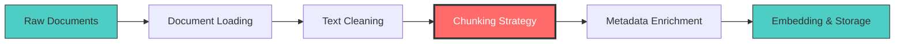
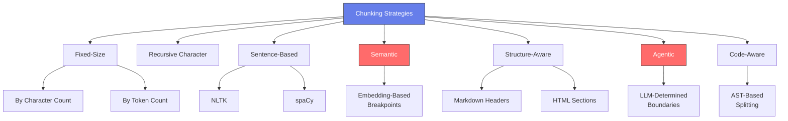
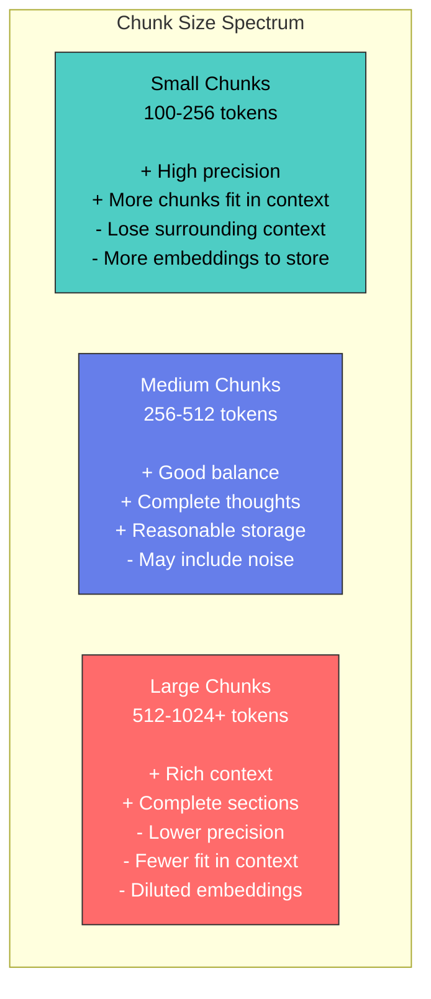
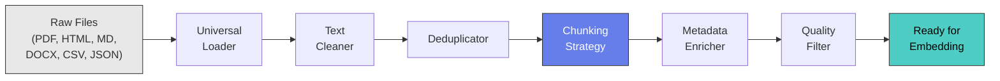
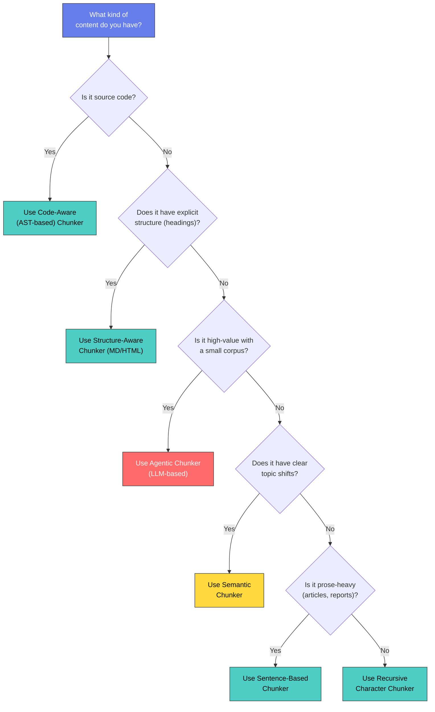

# RAG Deep Dive  Part 1: Text Preprocessing and Chunking Strategies

---

**Series:** RAG (Retrieval-Augmented Generation)  A Developer's Deep Dive from Scratch to Production
**Part:** 1 of 9 (Data Preparation)
**Audience:** Developers with Python experience who want to master RAG systems from the ground up
**Reading time:** ~45 minutes

---

## Series Navigation

| Part | Title | Status |
|------|-------|--------|
| 0 | What Is RAG? Foundations and Why It Matters | Completed |
| **1** | **Text Preprocessing & Chunking Strategies** | **You are here** |
| 2 | Embeddings  The Heart of RAG | Coming Soon |
| 3 | Vector Databases & Indexing | Coming Soon |
| 4 | Retrieval Strategies  From Basic to Advanced | Coming Soon |
| 5 | Building Your First RAG Pipeline from Scratch | Coming Soon |
| 6 | Advanced RAG Patterns | Coming Soon |
| 7 | Evaluation & Debugging RAG Systems | Coming Soon |
| 8 | Production RAG | Coming Soon |
| 9 | Multi-Modal RAG, Agentic RAG & The Future | Coming Soon |

---

## Recap of Part 0

In Part 0, we established that **Retrieval-Augmented Generation (RAG)** is an architecture pattern that grounds Large Language Model (LLM) responses in external, factual data by retrieving relevant documents at inference time and injecting them into the prompt context. This solves the fundamental problems of hallucination, knowledge cutoffs, and the inability of static models to access private or domain-specific data. We walked through the core RAG pipeline: **Ingest -> Retrieve -> Generate**  and now it is time to get our hands dirty with the very first stage of that pipeline: getting your raw data into a form that can actually be searched.

---

## Why Chunking Matters

> **"Garbage in, garbage out."**  This ancient computing proverb has never been more relevant than in RAG systems. Your retrieval quality has an absolute ceiling determined by the quality of your chunks. No amount of embedding model tuning, re-ranking sophistication, or prompt engineering can rescue poorly chunked data.

Let me be blunt: **chunking is the single biggest lever you have over RAG quality**. I have seen teams spend weeks fine-tuning embedding models or experimenting with exotic retrieval strategies, only to discover that switching from naive fixed-size chunking to a structure-aware approach improved their hit rate by 40% overnight.

Here is why chunking matters so much:

1. **Semantic coherence**  A chunk must contain a complete thought. If you split a sentence in half, neither half is useful for retrieval.
2. **Context window budgets**  LLMs have finite context windows. You need chunks small enough to fit multiple relevant pieces, but large enough to carry meaning.
3. **Embedding quality**  Embedding models produce better vectors when the input text is semantically focused. A chunk that mixes three unrelated topics produces a diluted, useless embedding.
4. **Retrieval precision**  If your chunks are too large, you retrieve a lot of irrelevant text along with the relevant part. Too small, and you lose the surrounding context that makes the relevant part understandable.



The red node above is what this article is all about. Let us build it right.

---

## 1. Document Loading

Before you can chunk anything, you need to extract raw text from whatever format your data lives in. In the real world, data comes in dozens of formats, and each has its own quirks. Let us build loaders for the most common ones.

### Install Dependencies

```bash
pip install PyPDF2 pdfplumber python-docx beautifulsoup4 lxml \
            markdown openpyxl nltk spacy pandas tiktoken \
            sentence-transformers langchain-text-splitters
```

### PDF Loading (PyPDF2)

PDFs are the most common document format in enterprise RAG systems  and the most painful to work with. Let us start simple.

```python
import PyPDF2
from pathlib import Path
from dataclasses import dataclass, field
from typing import Optional


@dataclass
class Document:
    """Represents a loaded document with text and metadata."""
    content: str
    metadata: dict = field(default_factory=dict)

    def __repr__(self):
        preview = self.content[:80].replace('\n', ' ')
        return f"Document('{preview}...', metadata={self.metadata})"


def load_pdf_pypdf2(file_path: str) -> list[Document]:
    """
    Load a PDF file using PyPDF2.

    Returns one Document per page for fine-grained page tracking.
    """
    documents = []
    path = Path(file_path)

    with open(path, "rb") as f:
        reader = PyPDF2.PdfReader(f)

        for page_num, page in enumerate(reader.pages):
            text = page.extract_text() or ""

            if text.strip():  # Skip blank pages
                doc = Document(
                    content=text,
                    metadata={
                        "source": str(path.name),
                        "file_path": str(path.absolute()),
                        "page_number": page_num + 1,
                        "total_pages": len(reader.pages),
                        "format": "pdf",
                        "loader": "PyPDF2",
                    }
                )
                documents.append(doc)

    return documents


# Usage
docs = load_pdf_pypdf2("technical_manual.pdf")
print(f"Loaded {len(docs)} pages")
print(docs[0])
```

### PDF Loading (pdfplumber)  For Complex Layouts

PyPDF2 struggles with multi-column layouts, tables, and complex formatting. **pdfplumber** handles these cases far better.

```python
import pdfplumber


def load_pdf_pdfplumber(file_path: str, extract_tables: bool = True) -> list[Document]:
    """
    Load PDF with pdfplumber  handles complex layouts, tables, and columns.

    Args:
        file_path: Path to the PDF file.
        extract_tables: If True, extract tables as structured text.
    """
    documents = []
    path = Path(file_path)

    with pdfplumber.open(path) as pdf:
        for page_num, page in enumerate(pdf.pages):
            # Extract main text
            text = page.extract_text(
                x_tolerance=3,  # horizontal tolerance for character grouping
                y_tolerance=3,  # vertical tolerance for line grouping
            ) or ""

            # Optionally extract tables as formatted text
            tables_text = ""
            if extract_tables:
                tables = page.extract_tables()
                for table_idx, table in enumerate(tables):
                    tables_text += f"\n[Table {table_idx + 1}]\n"
                    for row in table:
                        cleaned_row = [
                            cell.strip() if cell else "" for cell in row
                        ]
                        tables_text += " | ".join(cleaned_row) + "\n"

            combined_text = text
            if tables_text:
                combined_text += f"\n\n--- Tables ---\n{tables_text}"

            if combined_text.strip():
                doc = Document(
                    content=combined_text,
                    metadata={
                        "source": path.name,
                        "file_path": str(path.absolute()),
                        "page_number": page_num + 1,
                        "total_pages": len(pdf.pages),
                        "format": "pdf",
                        "loader": "pdfplumber",
                        "has_tables": bool(tables_text),
                        "page_width": float(page.width),
                        "page_height": float(page.height),
                    }
                )
                documents.append(doc)

    return documents
```

> **When to use which?** Use **PyPDF2** for simple, single-column PDFs where speed matters. Use **pdfplumber** for anything with tables, multi-column layouts, or complex formatting. In production, I usually try pdfplumber first and fall back to PyPDF2 if pdfplumber raises exceptions on corrupted files.

### HTML Loading (BeautifulSoup)

HTML is everywhere  scraped web pages, exported documentation, Confluence exports. The challenge is stripping away the presentation markup while preserving semantic structure.

```python
from bs4 import BeautifulSoup, Comment
import re


def load_html(file_path: str, parser: str = "lxml") -> list[Document]:
    """
    Load an HTML file, extracting clean text while preserving structure.

    Removes scripts, styles, navigation, and other non-content elements.
    """
    path = Path(file_path)

    with open(path, "r", encoding="utf-8", errors="replace") as f:
        raw_html = f.read()

    soup = BeautifulSoup(raw_html, parser)

    # Remove non-content elements
    for element in soup.find_all([
        "script", "style", "nav", "footer", "header",
        "aside", "noscript", "iframe", "svg"
    ]):
        element.decompose()

    # Remove HTML comments
    for comment in soup.find_all(string=lambda text: isinstance(text, Comment)):
        comment.extract()

    # Extract title
    title = soup.title.string.strip() if soup.title and soup.title.string else ""

    # Extract main content  prefer <main> or <article> tags
    main_content = soup.find("main") or soup.find("article") or soup.body or soup

    # Get text with structural markers
    text = main_content.get_text(separator="\n", strip=True)

    # Clean up excessive whitespace
    text = re.sub(r'\n{3,}', '\n\n', text)

    # Extract headings for metadata
    headings = []
    for h_tag in main_content.find_all(re.compile(r'^h[1-6]$')):
        headings.append({
            "level": int(h_tag.name[1]),
            "text": h_tag.get_text(strip=True)
        })

    doc = Document(
        content=text,
        metadata={
            "source": path.name,
            "file_path": str(path.absolute()),
            "title": title,
            "format": "html",
            "loader": "BeautifulSoup",
            "headings": headings,
            "content_length": len(text),
        }
    )

    return [doc]
```

### DOCX Loading

```python
from docx import Document as DocxDocument
from docx.opc.constants import RELATIONSHIP_TYPE as RT


def load_docx(file_path: str) -> list[Document]:
    """
    Load a .docx file, preserving paragraph structure and styles.
    """
    path = Path(file_path)
    docx = DocxDocument(path)

    sections = []
    current_section = {"heading": "", "content": [], "level": 0}

    for para in docx.paragraphs:
        text = para.text.strip()
        if not text:
            continue

        # Detect headings by style name
        style_name = para.style.name.lower() if para.style else ""

        if "heading" in style_name:
            # Save previous section if it has content
            if current_section["content"]:
                sections.append(current_section)

            # Parse heading level (e.g., "Heading 2" -> 2)
            level = 1
            for char in style_name:
                if char.isdigit():
                    level = int(char)
                    break

            current_section = {
                "heading": text,
                "content": [],
                "level": level
            }
        else:
            current_section["content"].append(text)

    # Don't forget the last section
    if current_section["content"]:
        sections.append(current_section)

    # Combine into a single document with structural markers
    full_text_parts = []
    for section in sections:
        if section["heading"]:
            prefix = "#" * section["level"]
            full_text_parts.append(f"{prefix} {section['heading']}")
        full_text_parts.append("\n".join(section["content"]))

    full_text = "\n\n".join(full_text_parts)

    # Extract core properties
    core_props = docx.core_properties

    doc = Document(
        content=full_text,
        metadata={
            "source": path.name,
            "file_path": str(path.absolute()),
            "format": "docx",
            "loader": "python-docx",
            "author": core_props.author or "",
            "title": core_props.title or "",
            "created": str(core_props.created) if core_props.created else "",
            "modified": str(core_props.modified) if core_props.modified else "",
            "sections_count": len(sections),
        }
    )

    return [doc]
```

### Markdown Loading

Markdown is the easiest format to work with because it already has explicit structure markers. But we still need to parse it properly.

```python
import re


def load_markdown(file_path: str) -> list[Document]:
    """
    Load a Markdown file, extracting structured sections.

    Returns one Document per top-level section for granular retrieval,
    plus one Document for the full content.
    """
    path = Path(file_path)

    with open(path, "r", encoding="utf-8") as f:
        content = f.read()

    # Extract front matter (YAML between --- delimiters)
    front_matter = {}
    front_matter_match = re.match(r'^---\s*\n(.*?)\n---\s*\n', content, re.DOTALL)
    if front_matter_match:
        # Simple key: value parsing (for production, use PyYAML)
        for line in front_matter_match.group(1).split('\n'):
            if ':' in line:
                key, value = line.split(':', 1)
                front_matter[key.strip()] = value.strip()
        content = content[front_matter_match.end():]

    # Split by headings
    sections = re.split(r'\n(?=#{1,6}\s)', content)

    documents = []
    for section in sections:
        section = section.strip()
        if not section:
            continue

        # Extract heading if present
        heading_match = re.match(r'^(#{1,6})\s+(.+?)$', section, re.MULTILINE)
        heading = heading_match.group(2) if heading_match else ""
        heading_level = len(heading_match.group(1)) if heading_match else 0

        doc = Document(
            content=section,
            metadata={
                "source": path.name,
                "file_path": str(path.absolute()),
                "format": "markdown",
                "loader": "custom",
                "section_heading": heading,
                "heading_level": heading_level,
                **front_matter,
            }
        )
        documents.append(doc)

    return documents
```

### CSV and JSON Loading

Structured data needs special handling  each row or record might become its own document.

```python
import csv
import json
import pandas as pd


def load_csv(
    file_path: str,
    content_columns: list[str] | None = None,
    metadata_columns: list[str] | None = None,
) -> list[Document]:
    """
    Load CSV where each row becomes a Document.

    Args:
        file_path: Path to CSV file.
        content_columns: Columns to include in document content.
                         If None, all columns are used.
        metadata_columns: Columns to include as metadata only.
    """
    path = Path(file_path)
    df = pd.read_csv(path)

    if content_columns is None:
        content_columns = [
            col for col in df.columns
            if col not in (metadata_columns or [])
        ]

    documents = []
    for idx, row in df.iterrows():
        # Build content as "key: value" pairs for readability
        content_parts = []
        for col in content_columns:
            value = row[col]
            if pd.notna(value):
                content_parts.append(f"{col}: {value}")

        content = "\n".join(content_parts)

        # Build metadata
        meta = {
            "source": path.name,
            "file_path": str(path.absolute()),
            "format": "csv",
            "row_index": int(idx),
        }
        if metadata_columns:
            for col in metadata_columns:
                if col in row and pd.notna(row[col]):
                    meta[col] = row[col]

        if content.strip():
            documents.append(Document(content=content, metadata=meta))

    return documents


def load_json(
    file_path: str,
    content_key: str | None = None,
    jmespath_expr: str | None = None,
) -> list[Document]:
    """
    Load a JSON file. Handles both single objects and arrays.

    Args:
        file_path: Path to JSON file.
        content_key: If provided, use this key's value as content.
        jmespath_expr: JMESPath expression to extract records from nested JSON.
    """
    path = Path(file_path)

    with open(path, "r", encoding="utf-8") as f:
        data = json.load(f)

    # Normalize to a list of records
    if isinstance(data, dict):
        if content_key and content_key in data:
            # e.g., {"articles": [{...}, {...}]}
            records = data[content_key]
            if not isinstance(records, list):
                records = [records]
        else:
            records = [data]
    elif isinstance(data, list):
        records = data
    else:
        records = [{"content": str(data)}]

    documents = []
    for idx, record in enumerate(records):
        if isinstance(record, dict):
            content = json.dumps(record, indent=2, ensure_ascii=False)
        else:
            content = str(record)

        doc = Document(
            content=content,
            metadata={
                "source": path.name,
                "file_path": str(path.absolute()),
                "format": "json",
                "record_index": idx,
                "total_records": len(records),
            }
        )
        documents.append(doc)

    return documents
```

### Universal Document Loader

Now let us tie all these loaders together into a single entry point.

```python
class UniversalLoader:
    """
    Automatically selects the correct loader based on file extension.
    """

    LOADER_MAP = {
        ".pdf": load_pdf_pdfplumber,
        ".html": load_html,
        ".htm": load_html,
        ".docx": load_docx,
        ".md": load_markdown,
        ".csv": load_csv,
        ".json": load_json,
    }

    @classmethod
    def load(cls, file_path: str, **kwargs) -> list[Document]:
        path = Path(file_path)
        ext = path.suffix.lower()

        if ext not in cls.LOADER_MAP:
            # Fallback: treat as plain text
            with open(path, "r", encoding="utf-8", errors="replace") as f:
                content = f.read()
            return [Document(
                content=content,
                metadata={
                    "source": path.name,
                    "format": ext.lstrip("."),
                    "loader": "plaintext_fallback"
                }
            )]

        loader_fn = cls.LOADER_MAP[ext]
        return loader_fn(file_path, **kwargs)

    @classmethod
    def load_directory(cls, dir_path: str, recursive: bool = True) -> list[Document]:
        """Load all supported files from a directory."""
        path = Path(dir_path)
        pattern = "**/*" if recursive else "*"

        all_docs = []
        for file_path in path.glob(pattern):
            if file_path.is_file() and file_path.suffix.lower() in cls.LOADER_MAP:
                try:
                    docs = cls.load(str(file_path))
                    all_docs.extend(docs)
                    print(f"  Loaded {len(docs)} doc(s) from {file_path.name}")
                except Exception as e:
                    print(f"  FAILED to load {file_path.name}: {e}")

        print(f"\nTotal: {len(all_docs)} documents from {dir_path}")
        return all_docs


# Usage
docs = UniversalLoader.load_directory("./knowledge_base/")
```

---

## 2. Text Cleaning

Raw extracted text is messy. PDF extractors leave artifacts. HTML has remnants. Every format has its quirks. Here is a battle-tested cleaning pipeline.

```python
import re
import unicodedata
from typing import Callable


class TextCleaner:
    """
    Configurable text cleaning pipeline.

    Each cleaning step is a function that takes a string and returns a string.
    You can enable/disable steps or add custom ones.
    """

    def __init__(self):
        self.steps: list[tuple[str, Callable[[str], str]]] = [
            ("unicode_normalize", self.unicode_normalize),
            ("remove_null_bytes", self.remove_null_bytes),
            ("fix_encoding_artifacts", self.fix_encoding_artifacts),
            ("remove_headers_footers", self.remove_headers_footers),
            ("normalize_whitespace", self.normalize_whitespace),
            ("remove_page_numbers", self.remove_page_numbers),
            ("fix_hyphenation", self.fix_hyphenation),
            ("normalize_quotes", self.normalize_quotes),
        ]
        self._disabled: set[str] = set()

    def disable(self, step_name: str) -> "TextCleaner":
        self._disabled.add(step_name)
        return self

    def enable(self, step_name: str) -> "TextCleaner":
        self._disabled.discard(step_name)
        return self

    def add_step(self, name: str, fn: Callable[[str], str]) -> "TextCleaner":
        self.steps.append((name, fn))
        return self

    def clean(self, text: str) -> str:
        for name, fn in self.steps:
            if name not in self._disabled:
                text = fn(text)
        return text.strip()

    @staticmethod
    def unicode_normalize(text: str) -> str:
        """Normalize unicode to NFC form (composed characters)."""
        return unicodedata.normalize("NFC", text)

    @staticmethod
    def remove_null_bytes(text: str) -> str:
        """Remove null bytes that occasionally appear in PDF extractions."""
        return text.replace("\x00", "")

    @staticmethod
    def fix_encoding_artifacts(text: str) -> str:
        """Fix common encoding artifacts from PDF extraction."""
        replacements = {
            "\ufb01": "fi",   # fi ligature
            "\ufb02": "fl",   # fl ligature
            "\ufb03": "ffi",  # ffi ligature
            "\ufb04": "ffl",  # ffl ligature
            "\u2018": "'",    # left single quote
            "\u2019": "'",    # right single quote
            "\u201c": '"',    # left double quote
            "\u201d": '"',    # right double quote
            "\u2013": "-",    # en dash
            "\u2014": "--",   # em dash
            "\u2026": "...",  # ellipsis
            "\u00a0": " ",    # non-breaking space
        }
        for old, new in replacements.items():
            text = text.replace(old, new)
        return text

    @staticmethod
    def remove_headers_footers(text: str) -> str:
        """
        Remove common header/footer patterns.

        This is a heuristic approach  adjust patterns for your documents.
        """
        lines = text.split("\n")
        cleaned_lines = []

        for line in lines:
            stripped = line.strip()

            # Skip common footer patterns
            if re.match(r'^Page \d+ of \d+$', stripped, re.IGNORECASE):
                continue
            if re.match(r'^\d+\s*$', stripped) and len(stripped) < 5:
                # Standalone page number
                continue
            if re.match(r'^(confidential|proprietary|draft)\s*$', stripped, re.IGNORECASE):
                continue
            if re.match(r'^Copyright\s+\d{4}', stripped, re.IGNORECASE):
                continue

            cleaned_lines.append(line)

        return "\n".join(cleaned_lines)

    @staticmethod
    def normalize_whitespace(text: str) -> str:
        """Collapse excessive whitespace while preserving paragraph breaks."""
        # Replace tabs with spaces
        text = text.replace("\t", " ")
        # Collapse multiple spaces into one
        text = re.sub(r' {2,}', ' ', text)
        # Collapse 3+ newlines into 2 (preserving paragraph breaks)
        text = re.sub(r'\n{3,}', '\n\n', text)
        return text

    @staticmethod
    def remove_page_numbers(text: str) -> str:
        """Remove standalone page numbers."""
        return re.sub(r'\n\s*\d{1,4}\s*\n', '\n', text)

    @staticmethod
    def fix_hyphenation(text: str) -> str:
        """
        Rejoin words that were hyphenated at line breaks.
        e.g., "compre-\nhensive" -> "comprehensive"
        """
        return re.sub(r'(\w)-\n(\w)', r'\1\2', text)

    @staticmethod
    def normalize_quotes(text: str) -> str:
        """Normalize all quote characters to ASCII equivalents."""
        text = re.sub(r'[\u2018\u2019\u201a\u201b]', "'", text)
        text = re.sub(r'[\u201c\u201d\u201e\u201f]', '"', text)
        return text


# Usage
cleaner = TextCleaner()

# Disable a step you don't need
cleaner.disable("normalize_quotes")

# Add a custom domain-specific step
cleaner.add_step(
    "remove_watermarks",
    lambda text: re.sub(r'DRAFT.*?DRAFT', '', text, flags=re.DOTALL)
)

cleaned_text = cleaner.clean(raw_text)
```

### Text Deduplication

In many document collections, the same content appears multiple times  legal boilerplate, shared appendices, copy-pasted sections. Deduplication prevents your retrieval from returning five copies of the same thing.

```python
import hashlib
from collections import defaultdict


class TextDeduplicator:
    """
    Detect and remove duplicate or near-duplicate text segments.
    """

    def __init__(self, similarity_threshold: float = 0.9):
        self.seen_hashes: set[str] = set()
        self.similarity_threshold = similarity_threshold

    def exact_dedup(self, documents: list[Document]) -> list[Document]:
        """Remove documents with identical content."""
        unique_docs = []

        for doc in documents:
            content_hash = hashlib.md5(
                doc.content.strip().encode()
            ).hexdigest()

            if content_hash not in self.seen_hashes:
                self.seen_hashes.add(content_hash)
                unique_docs.append(doc)

        removed = len(documents) - len(unique_docs)
        if removed > 0:
            print(f"Deduplication: removed {removed} exact duplicates")

        return unique_docs

    def fuzzy_dedup_ngram(
        self, documents: list[Document], n: int = 3
    ) -> list[Document]:
        """
        Remove near-duplicates using n-gram Jaccard similarity.

        This catches documents that are almost identical but differ
        in minor formatting or typos.
        """
        def get_ngrams(text: str, n: int) -> set[str]:
            text = text.lower().strip()
            words = text.split()
            return {
                " ".join(words[i:i+n])
                for i in range(len(words) - n + 1)
            }

        def jaccard_similarity(set1: set, set2: set) -> float:
            if not set1 or not set2:
                return 0.0
            intersection = set1 & set2
            union = set1 | set2
            return len(intersection) / len(union)

        unique_docs = []
        ngram_cache = []

        for doc in documents:
            doc_ngrams = get_ngrams(doc.content, n)

            is_duplicate = False
            for existing_ngrams in ngram_cache:
                similarity = jaccard_similarity(doc_ngrams, existing_ngrams)
                if similarity >= self.similarity_threshold:
                    is_duplicate = True
                    break

            if not is_duplicate:
                unique_docs.append(doc)
                ngram_cache.append(doc_ngrams)

        removed = len(documents) - len(unique_docs)
        if removed > 0:
            print(f"Fuzzy dedup: removed {removed} near-duplicates "
                  f"(threshold={self.similarity_threshold})")

        return unique_docs


# Usage
deduplicator = TextDeduplicator(similarity_threshold=0.85)
unique_docs = deduplicator.exact_dedup(documents)
unique_docs = deduplicator.fuzzy_dedup_ngram(unique_docs)
```

---

## 3. Chunking Strategies Deep Dive

This is the heart of the article. We will implement seven different chunking strategies from scratch, discuss when to use each one, and show you the code so you can plug them into your pipeline immediately.



### Base Chunker Interface

First, let us define a common interface so all strategies are interchangeable.

```python
from abc import ABC, abstractmethod
from dataclasses import dataclass, field


@dataclass
class Chunk:
    """A single chunk of text with metadata."""
    content: str
    metadata: dict = field(default_factory=dict)
    chunk_index: int = 0
    start_char: int = 0
    end_char: int = 0

    @property
    def token_count(self) -> int:
        """Rough token estimate (1 token ~ 4 chars for English)."""
        return len(self.content) // 4

    def __len__(self):
        return len(self.content)

    def __repr__(self):
        preview = self.content[:60].replace('\n', ' ')
        return f"Chunk({self.chunk_index}, len={len(self)}, '{preview}...')"


class BaseChunker(ABC):
    """Abstract base class for all chunking strategies."""

    @abstractmethod
    def chunk(self, document: Document) -> list[Chunk]:
        """Split a document into chunks."""
        pass

    def chunk_many(self, documents: list[Document]) -> list[Chunk]:
        """Split multiple documents into chunks."""
        all_chunks = []
        global_index = 0

        for doc in documents:
            chunks = self.chunk(doc)
            for c in chunks:
                c.chunk_index = global_index
                # Inherit document metadata
                c.metadata = {**doc.metadata, **c.metadata}
                global_index += 1
            all_chunks.extend(chunks)

        return all_chunks
```

---

### Strategy 1: Fixed-Size Chunking

The simplest approach: split text into chunks of a fixed number of characters (or tokens). This is your baseline. It is fast, predictable, and surprisingly effective for homogeneous text.

#### By Character Count

```python
class FixedSizeCharChunker(BaseChunker):
    """
    Split text into fixed-size chunks by character count.

    Pros: Simple, fast, predictable chunk sizes.
    Cons: Splits mid-sentence, mid-word, ignores structure.
    Best for: Quick prototyping, homogeneous text bodies.
    """

    def __init__(self, chunk_size: int = 1000, overlap: int = 200):
        """
        Args:
            chunk_size: Maximum characters per chunk.
            overlap: Number of overlapping characters between consecutive chunks.
        """
        if overlap >= chunk_size:
            raise ValueError("Overlap must be smaller than chunk_size")
        self.chunk_size = chunk_size
        self.overlap = overlap

    def chunk(self, document: Document) -> list[Chunk]:
        text = document.content
        chunks = []
        start = 0
        chunk_idx = 0

        while start < len(text):
            end = start + self.chunk_size
            chunk_text = text[start:end]

            chunks.append(Chunk(
                content=chunk_text,
                chunk_index=chunk_idx,
                start_char=start,
                end_char=min(end, len(text)),
                metadata={
                    "chunking_strategy": "fixed_size_char",
                    "chunk_size": self.chunk_size,
                    "overlap": self.overlap,
                }
            ))

            chunk_idx += 1
            start += self.chunk_size - self.overlap

        return chunks


# Usage
chunker = FixedSizeCharChunker(chunk_size=500, overlap=50)
chunks = chunker.chunk(document)

for c in chunks[:3]:
    print(f"Chunk {c.chunk_index}: {len(c)} chars")
    print(f"  '{c.content[:80]}...'")
    print()
```

#### By Token Count

Character count is a poor proxy for what matters to embedding models and LLMs  **tokens**. Let us count tokens properly using `tiktoken` (the OpenAI tokenizer) or a model-specific tokenizer.

```python
import tiktoken


class FixedSizeTokenChunker(BaseChunker):
    """
    Split text into fixed-size chunks by token count.

    Uses tiktoken for accurate token counting matching the
    tokenizer of OpenAI embedding models.
    """

    def __init__(
        self,
        chunk_size: int = 256,
        overlap: int = 50,
        encoding_name: str = "cl100k_base",  # GPT-4 / text-embedding-3 tokenizer
    ):
        self.chunk_size = chunk_size
        self.overlap = overlap
        self.encoder = tiktoken.get_encoding(encoding_name)

    def chunk(self, document: Document) -> list[Chunk]:
        tokens = self.encoder.encode(document.content)
        chunks = []
        start = 0
        chunk_idx = 0

        while start < len(tokens):
            end = start + self.chunk_size
            chunk_tokens = tokens[start:end]

            # Decode tokens back to text
            chunk_text = self.encoder.decode(chunk_tokens)

            chunks.append(Chunk(
                content=chunk_text,
                chunk_index=chunk_idx,
                metadata={
                    "chunking_strategy": "fixed_size_token",
                    "token_count": len(chunk_tokens),
                    "chunk_size_tokens": self.chunk_size,
                    "overlap_tokens": self.overlap,
                    "encoding": "cl100k_base",
                }
            ))

            chunk_idx += 1
            start += self.chunk_size - self.overlap

        return chunks


# Usage
chunker = FixedSizeTokenChunker(chunk_size=256, overlap=30)
chunks = chunker.chunk(document)
print(f"Created {len(chunks)} token-based chunks")
```

> **Key insight:** Token-based chunking is almost always better than character-based chunking because embedding models and LLMs think in tokens, not characters. A 256-token chunk maps to roughly 1,000 characters of English text, but the exact mapping varies by language, formatting, and vocabulary. Always count tokens when precision matters.

---

### Strategy 2: Recursive Character Splitting

This is the approach popularized by **LangChain**, and it is more sophisticated than it sounds. The idea: try to split on paragraph breaks first. If a chunk is still too large, split on newlines. Still too large? Split on sentences. Last resort? Split on spaces.

```python
class RecursiveCharacterChunker(BaseChunker):
    """
    Recursively split text using a hierarchy of separators.

    This is the "LangChain approach"  it tries to preserve the
    largest possible semantic units by splitting on natural boundaries
    first and only resorting to character-level splits when necessary.

    Pros: Respects paragraph/sentence boundaries, versatile.
    Cons: Can produce uneven chunk sizes.
    Best for: General-purpose chunking when you don't have structural metadata.
    """

    DEFAULT_SEPARATORS = [
        "\n\n",   # Paragraph breaks (strongest boundary)
        "\n",     # Line breaks
        ". ",     # Sentence endings
        "? ",     # Question endings
        "! ",     # Exclamation endings
        "; ",     # Semicolons
        ", ",     # Commas
        " ",      # Words
        "",       # Characters (last resort)
    ]

    def __init__(
        self,
        chunk_size: int = 1000,
        overlap: int = 200,
        separators: list[str] | None = None,
        length_function: callable = len,
    ):
        self.chunk_size = chunk_size
        self.overlap = overlap
        self.separators = separators or self.DEFAULT_SEPARATORS
        self.length_function = length_function

    def chunk(self, document: Document) -> list[Chunk]:
        text = document.content
        raw_chunks = self._recursive_split(text, self.separators)

        # Merge small chunks and apply overlap
        merged_chunks = self._merge_with_overlap(raw_chunks)

        result = []
        for idx, chunk_text in enumerate(merged_chunks):
            result.append(Chunk(
                content=chunk_text,
                chunk_index=idx,
                metadata={
                    "chunking_strategy": "recursive_character",
                    "chunk_size": self.chunk_size,
                    "overlap": self.overlap,
                }
            ))

        return result

    def _recursive_split(
        self, text: str, separators: list[str]
    ) -> list[str]:
        """Recursively split text using the separator hierarchy."""
        final_chunks = []

        # Find the appropriate separator
        separator = separators[-1]  # Default: last separator
        new_separators = []

        for i, sep in enumerate(separators):
            if sep == "":
                separator = sep
                break
            if sep in text:
                separator = sep
                new_separators = separators[i + 1:]
                break

        # Split on the chosen separator
        if separator:
            splits = text.split(separator)
        else:
            splits = list(text)

        # Process each split
        good_splits = []  # Accumulate splits that fit in chunk_size

        for s in splits:
            if self.length_function(s) < self.chunk_size:
                good_splits.append(s)
            else:
                # This split is too large  merge what we have so far
                if good_splits:
                    merged = self._merge_splits(good_splits, separator)
                    final_chunks.extend(merged)
                    good_splits = []

                # Recursively split the oversized piece
                if not new_separators:
                    final_chunks.append(s)
                else:
                    sub_chunks = self._recursive_split(s, new_separators)
                    final_chunks.extend(sub_chunks)

        # Don't forget remaining good_splits
        if good_splits:
            merged = self._merge_splits(good_splits, separator)
            final_chunks.extend(merged)

        return final_chunks

    def _merge_splits(
        self, splits: list[str], separator: str
    ) -> list[str]:
        """Merge small splits into chunks that fit within chunk_size."""
        merged = []
        current_parts = []
        current_length = 0

        for split in splits:
            split_len = self.length_function(split)
            sep_len = self.length_function(separator) if current_parts else 0

            if current_length + split_len + sep_len > self.chunk_size:
                if current_parts:
                    merged.append(separator.join(current_parts))
                current_parts = [split]
                current_length = split_len
            else:
                current_parts.append(split)
                current_length += split_len + sep_len

        if current_parts:
            merged.append(separator.join(current_parts))

        return merged

    def _merge_with_overlap(self, chunks: list[str]) -> list[str]:
        """Add overlap between consecutive chunks."""
        if self.overlap == 0 or len(chunks) <= 1:
            return chunks

        result = [chunks[0]]

        for i in range(1, len(chunks)):
            prev_chunk = chunks[i - 1]
            curr_chunk = chunks[i]

            # Take the last `overlap` characters from the previous chunk
            overlap_text = prev_chunk[-self.overlap:]

            # Prepend overlap to current chunk
            overlapped = overlap_text + curr_chunk

            # Trim if we exceeded chunk_size
            if self.length_function(overlapped) > self.chunk_size + self.overlap:
                overlapped = overlapped[:self.chunk_size + self.overlap]

            result.append(overlapped)

        return result


# Usage
chunker = RecursiveCharacterChunker(chunk_size=800, overlap=100)
chunks = chunker.chunk(document)

for c in chunks[:3]:
    print(f"Chunk {c.chunk_index}: {len(c)} chars")
```

---

### Strategy 3: Sentence-Based Chunking

Instead of splitting on arbitrary character boundaries, split on **sentence boundaries** and then group sentences into chunks. This guarantees no sentence is ever split in half.

#### Using NLTK

```python
import nltk
nltk.download('punkt_tab', quiet=True)

from nltk.tokenize import sent_tokenize


class SentenceChunkerNLTK(BaseChunker):
    """
    Split text into sentences using NLTK, then group sentences
    into chunks that respect a maximum size.

    Pros: Never splits mid-sentence, linguistically informed.
    Cons: Slower than regex, requires NLTK data download.
    Best for: Prose-heavy documents (articles, books, reports).
    """

    def __init__(
        self,
        max_chunk_size: int = 1000,
        overlap_sentences: int = 2,
        language: str = "english",
    ):
        self.max_chunk_size = max_chunk_size
        self.overlap_sentences = overlap_sentences
        self.language = language

    def chunk(self, document: Document) -> list[Chunk]:
        sentences = sent_tokenize(document.content, language=self.language)

        chunks = []
        current_sentences = []
        current_length = 0
        chunk_idx = 0

        for sentence in sentences:
            sentence = sentence.strip()
            if not sentence:
                continue

            sentence_length = len(sentence)

            # Would adding this sentence exceed the limit?
            if current_length + sentence_length > self.max_chunk_size and current_sentences:
                # Emit current chunk
                chunk_text = " ".join(current_sentences)
                chunks.append(Chunk(
                    content=chunk_text,
                    chunk_index=chunk_idx,
                    metadata={
                        "chunking_strategy": "sentence_nltk",
                        "sentence_count": len(current_sentences),
                        "max_chunk_size": self.max_chunk_size,
                    }
                ))
                chunk_idx += 1

                # Keep overlap sentences
                if self.overlap_sentences > 0:
                    current_sentences = current_sentences[-self.overlap_sentences:]
                    current_length = sum(len(s) for s in current_sentences)
                else:
                    current_sentences = []
                    current_length = 0

            current_sentences.append(sentence)
            current_length += sentence_length

        # Emit final chunk
        if current_sentences:
            chunk_text = " ".join(current_sentences)
            chunks.append(Chunk(
                content=chunk_text,
                chunk_index=chunk_idx,
                metadata={
                    "chunking_strategy": "sentence_nltk",
                    "sentence_count": len(current_sentences),
                }
            ))

        return chunks


# Usage
chunker = SentenceChunkerNLTK(max_chunk_size=800, overlap_sentences=1)
chunks = chunker.chunk(document)
```

#### Using spaCy

spaCy provides more accurate sentence segmentation, especially for complex text with abbreviations, numbers, and unusual punctuation.

```python
import spacy


class SentenceChunkerSpaCy(BaseChunker):
    """
    Split text into sentences using spaCy's statistical sentence segmenter,
    then group into chunks.

    Pros: Most accurate sentence detection, handles edge cases.
    Cons: Slower (loads NLP model), higher memory usage.
    Best for: Complex documents with abbreviations, legal text, medical text.
    """

    def __init__(
        self,
        max_chunk_size: int = 1000,
        overlap_sentences: int = 2,
        model_name: str = "en_core_web_sm",
    ):
        self.max_chunk_size = max_chunk_size
        self.overlap_sentences = overlap_sentences

        # Load with only sentencizer for speed
        self.nlp = spacy.load(model_name, disable=["ner", "lemmatizer"])
        # Increase max length for large documents
        self.nlp.max_length = 2_000_000

    def chunk(self, document: Document) -> list[Chunk]:
        doc = self.nlp(document.content)
        sentences = [sent.text.strip() for sent in doc.sents if sent.text.strip()]

        chunks = []
        current_sentences = []
        current_length = 0
        chunk_idx = 0

        for sentence in sentences:
            sentence_length = len(sentence)

            if current_length + sentence_length > self.max_chunk_size and current_sentences:
                chunk_text = " ".join(current_sentences)
                chunks.append(Chunk(
                    content=chunk_text,
                    chunk_index=chunk_idx,
                    metadata={
                        "chunking_strategy": "sentence_spacy",
                        "sentence_count": len(current_sentences),
                    }
                ))
                chunk_idx += 1

                if self.overlap_sentences > 0:
                    current_sentences = current_sentences[-self.overlap_sentences:]
                    current_length = sum(len(s) for s in current_sentences)
                else:
                    current_sentences = []
                    current_length = 0

            current_sentences.append(sentence)
            current_length += sentence_length

        if current_sentences:
            chunk_text = " ".join(current_sentences)
            chunks.append(Chunk(
                content=chunk_text,
                chunk_index=chunk_idx,
                metadata={"chunking_strategy": "sentence_spacy"}
            ))

        return chunks


# Usage (first run: python -m spacy download en_core_web_sm)
chunker = SentenceChunkerSpaCy(max_chunk_size=800, overlap_sentences=1)
chunks = chunker.chunk(document)
```

---

### Strategy 4: Semantic Chunking

This is where things get interesting. Instead of relying on arbitrary size limits or syntactic boundaries, **semantic chunking** uses embedding similarity to find natural topic boundaries within the text. The idea: when two consecutive sentences are about different topics, their embeddings will be dissimilar  and that is where we should split.

```python
import numpy as np
from sentence_transformers import SentenceTransformer


class SemanticChunker(BaseChunker):
    """
    Split text at semantic boundaries detected by embedding similarity.

    Algorithm:
    1. Split text into sentences.
    2. Compute embeddings for each sentence.
    3. Calculate cosine similarity between consecutive sentences.
    4. Identify "breakpoints" where similarity drops below a threshold.
    5. Group sentences between breakpoints into chunks.

    Pros: Produces semantically coherent chunks, adapts to content.
    Cons: Requires embedding model, slower, less predictable sizes.
    Best for: Documents with clear topic shifts (textbooks, reports, articles).
    """

    def __init__(
        self,
        embedding_model: str = "all-MiniLM-L6-v2",
        breakpoint_threshold_type: str = "percentile",
        breakpoint_threshold: float = 25.0,  # percentile or absolute
        min_chunk_size: int = 100,
        max_chunk_size: int = 2000,
    ):
        self.model = SentenceTransformer(embedding_model)
        self.breakpoint_threshold_type = breakpoint_threshold_type
        self.breakpoint_threshold = breakpoint_threshold
        self.min_chunk_size = min_chunk_size
        self.max_chunk_size = max_chunk_size

    def _split_sentences(self, text: str) -> list[str]:
        """Simple sentence splitting (use NLTK/spaCy in production)."""
        import re
        sentences = re.split(r'(?<=[.!?])\s+', text)
        return [s.strip() for s in sentences if s.strip()]

    def _cosine_similarity(self, a: np.ndarray, b: np.ndarray) -> float:
        """Compute cosine similarity between two vectors."""
        return float(np.dot(a, b) / (np.linalg.norm(a) * np.linalg.norm(b)))

    def _find_breakpoints(self, similarities: list[float]) -> list[int]:
        """Find indices where topic shifts occur."""
        if not similarities:
            return []

        if self.breakpoint_threshold_type == "percentile":
            # Breakpoints where similarity is in the bottom N percentile
            threshold = np.percentile(similarities, self.breakpoint_threshold)
        elif self.breakpoint_threshold_type == "standard_deviation":
            mean_sim = np.mean(similarities)
            std_sim = np.std(similarities)
            threshold = mean_sim - (self.breakpoint_threshold * std_sim)
        else:  # absolute
            threshold = self.breakpoint_threshold

        breakpoints = []
        for i, sim in enumerate(similarities):
            if sim < threshold:
                breakpoints.append(i + 1)  # Break AFTER sentence i

        return breakpoints

    def chunk(self, document: Document) -> list[Chunk]:
        sentences = self._split_sentences(document.content)

        if len(sentences) <= 1:
            return [Chunk(
                content=document.content,
                chunk_index=0,
                metadata={"chunking_strategy": "semantic"}
            )]

        # Step 1: Compute embeddings for all sentences (batched for speed)
        embeddings = self.model.encode(
            sentences,
            show_progress_bar=False,
            batch_size=64,
        )

        # Step 2: Calculate cosine similarity between consecutive sentences
        similarities = []
        for i in range(len(embeddings) - 1):
            sim = self._cosine_similarity(embeddings[i], embeddings[i + 1])
            similarities.append(sim)

        # Step 3: Find breakpoints
        breakpoints = self._find_breakpoints(similarities)

        # Step 4: Group sentences into chunks
        chunks = []
        chunk_idx = 0
        start = 0

        for bp in breakpoints:
            chunk_sentences = sentences[start:bp]
            chunk_text = " ".join(chunk_sentences)

            # Enforce min/max size constraints
            if len(chunk_text) >= self.min_chunk_size:
                chunks.append(Chunk(
                    content=chunk_text,
                    chunk_index=chunk_idx,
                    metadata={
                        "chunking_strategy": "semantic",
                        "sentence_count": len(chunk_sentences),
                        "breakpoint_type": self.breakpoint_threshold_type,
                    }
                ))
                chunk_idx += 1
                start = bp

        # Handle remaining sentences
        if start < len(sentences):
            remaining = " ".join(sentences[start:])
            if chunks and len(remaining) < self.min_chunk_size:
                # Merge with previous chunk if too small
                chunks[-1].content += " " + remaining
            else:
                chunks.append(Chunk(
                    content=remaining,
                    chunk_index=chunk_idx,
                    metadata={"chunking_strategy": "semantic"}
                ))

        return chunks


# Usage
chunker = SemanticChunker(
    embedding_model="all-MiniLM-L6-v2",
    breakpoint_threshold_type="percentile",
    breakpoint_threshold=25,  # Split at bottom 25th percentile similarity
)
chunks = chunker.chunk(document)

for c in chunks:
    print(f"Chunk {c.chunk_index}: {len(c)} chars, "
          f"{c.metadata.get('sentence_count', '?')} sentences")
```



```mermaid
graph LR
    subgraph "Semantic Chunking Process"
        S1["Sentence 1"] -->|sim=0.92| S2["Sentence 2"]
        S2 -->|sim=0.88| S3["Sentence 3"]
        S3 -->|"sim=0.31 &#10060;"| S4["Sentence 4"]
        S4 -->|sim=0.85| S5["Sentence 5"]
        S5 -->|sim=0.79| S6["Sentence 6"]
        S6 -->|"sim=0.28 &#10060;"| S7["Sentence 7"]
        S7 -->|sim=0.91| S8["Sentence 8"]
    end

    subgraph "Resulting Chunks"
        C1["Chunk 1<br/>S1 + S2 + S3"]
        C2["Chunk 2<br/>S4 + S5 + S6"]
        C3["Chunk 3<br/>S7 + S8"]
    end

    style S3 fill:#ff6b6b,stroke:#333,color:#fff
    style S6 fill:#ff6b6b,stroke:#333,color:#fff
```

> **Pro tip:** The `breakpoint_threshold` is the most important hyperparameter. Setting it too low produces very few large chunks. Setting it too high splits on every minor topic shift. Start with the 25th percentile and tune based on your retrieval evaluation metrics.

---

### Strategy 5: Document-Structure-Aware Chunking

If your documents have explicit structure  headings, sections, subsections  you should use it. This is especially powerful for Markdown, HTML, and DOCX files where structure is explicitly marked.

```python
import re


class MarkdownStructureChunker(BaseChunker):
    """
    Chunk Markdown documents by their heading structure.

    Each section (defined by headings) becomes a chunk, with the heading
    hierarchy preserved as context. If a section exceeds max_chunk_size,
    it is sub-chunked using sentence-based splitting.

    Pros: Preserves document structure, semantically meaningful chunks.
    Cons: Only works for structured documents, uneven chunk sizes.
    Best for: Documentation, wikis, Markdown knowledge bases.
    """

    def __init__(
        self,
        max_chunk_size: int = 1500,
        min_chunk_size: int = 100,
        include_heading_hierarchy: bool = True,
    ):
        self.max_chunk_size = max_chunk_size
        self.min_chunk_size = min_chunk_size
        self.include_heading_hierarchy = include_heading_hierarchy

    def _parse_sections(self, text: str) -> list[dict]:
        """Parse markdown into a list of sections with heading metadata."""
        lines = text.split('\n')
        sections = []
        current_section = {
            "heading": "",
            "level": 0,
            "content_lines": [],
            "heading_path": [],
        }
        heading_stack = []  # Track heading hierarchy

        for line in lines:
            heading_match = re.match(r'^(#{1,6})\s+(.+)$', line)

            if heading_match:
                # Save current section
                if current_section["content_lines"] or current_section["heading"]:
                    sections.append(current_section)

                level = len(heading_match.group(1))
                heading_text = heading_match.group(2).strip()

                # Update heading stack
                while heading_stack and heading_stack[-1]["level"] >= level:
                    heading_stack.pop()
                heading_stack.append({"level": level, "text": heading_text})

                current_section = {
                    "heading": heading_text,
                    "level": level,
                    "content_lines": [],
                    "heading_path": [h["text"] for h in heading_stack],
                }
            else:
                current_section["content_lines"].append(line)

        # Don't forget the last section
        if current_section["content_lines"] or current_section["heading"]:
            sections.append(current_section)

        return sections

    def chunk(self, document: Document) -> list[Chunk]:
        sections = self._parse_sections(document.content)
        chunks = []
        chunk_idx = 0

        for section in sections:
            content = "\n".join(section["content_lines"]).strip()

            # Prepend heading hierarchy as context
            if self.include_heading_hierarchy and section["heading_path"]:
                heading_context = " > ".join(section["heading_path"])
                full_content = f"[{heading_context}]\n\n{content}"
            elif section["heading"]:
                full_content = f"{section['heading']}\n\n{content}"
            else:
                full_content = content

            if not full_content.strip():
                continue

            # If section fits in one chunk, emit it directly
            if len(full_content) <= self.max_chunk_size:
                if len(full_content) >= self.min_chunk_size:
                    chunks.append(Chunk(
                        content=full_content,
                        chunk_index=chunk_idx,
                        metadata={
                            "chunking_strategy": "markdown_structure",
                            "section_heading": section["heading"],
                            "heading_level": section["level"],
                            "heading_path": " > ".join(section["heading_path"]),
                        }
                    ))
                    chunk_idx += 1
            else:
                # Section too large  sub-chunk by paragraphs
                paragraphs = re.split(r'\n\n+', content)
                current_text = ""

                for para in paragraphs:
                    if len(current_text) + len(para) > self.max_chunk_size:
                        if current_text.strip():
                            heading_prefix = ""
                            if section["heading_path"]:
                                heading_prefix = (
                                    f"[{' > '.join(section['heading_path'])}]\n\n"
                                )
                            chunks.append(Chunk(
                                content=heading_prefix + current_text.strip(),
                                chunk_index=chunk_idx,
                                metadata={
                                    "chunking_strategy": "markdown_structure",
                                    "section_heading": section["heading"],
                                    "heading_level": section["level"],
                                    "heading_path": " > ".join(
                                        section["heading_path"]
                                    ),
                                    "is_sub_chunk": True,
                                }
                            ))
                            chunk_idx += 1
                        current_text = para
                    else:
                        current_text += "\n\n" + para if current_text else para

                # Emit remaining text
                if current_text.strip() and len(current_text) >= self.min_chunk_size:
                    heading_prefix = ""
                    if section["heading_path"]:
                        heading_prefix = (
                            f"[{' > '.join(section['heading_path'])}]\n\n"
                        )
                    chunks.append(Chunk(
                        content=heading_prefix + current_text.strip(),
                        chunk_index=chunk_idx,
                        metadata={
                            "chunking_strategy": "markdown_structure",
                            "section_heading": section["heading"],
                            "heading_path": " > ".join(section["heading_path"]),
                        }
                    ))
                    chunk_idx += 1

        return chunks


# Usage
chunker = MarkdownStructureChunker(max_chunk_size=1200)
chunks = chunker.chunk(document)

for c in chunks[:5]:
    print(f"Chunk {c.chunk_index}: [{c.metadata.get('heading_path', '')}]")
    print(f"  {len(c)} chars")
```

### HTML Structure-Aware Chunking

```python
from bs4 import BeautifulSoup


class HTMLStructureChunker(BaseChunker):
    """
    Chunk HTML documents by their semantic structure.

    Uses heading tags (h1-h6) as section boundaries and preserves
    the hierarchical context.
    """

    def __init__(self, max_chunk_size: int = 1500):
        self.max_chunk_size = max_chunk_size

    def chunk(self, document: Document) -> list[Chunk]:
        soup = BeautifulSoup(document.content, "html.parser")

        # Remove non-content elements
        for tag in soup.find_all(["script", "style", "nav", "footer"]):
            tag.decompose()

        body = soup.find("body") or soup

        sections = []
        current_section = {"heading": "", "level": 0, "parts": []}

        for element in body.children:
            if hasattr(element, 'name') and element.name:
                heading_match = re.match(r'^h([1-6])$', element.name)

                if heading_match:
                    # Save previous section
                    if current_section["parts"]:
                        sections.append(current_section)

                    current_section = {
                        "heading": element.get_text(strip=True),
                        "level": int(heading_match.group(1)),
                        "parts": [],
                    }
                else:
                    text = element.get_text(strip=True)
                    if text:
                        current_section["parts"].append(text)
            elif isinstance(element, str) and element.strip():
                current_section["parts"].append(element.strip())

        if current_section["parts"]:
            sections.append(current_section)

        # Convert sections to chunks
        chunks = []
        for idx, section in enumerate(sections):
            content = "\n".join(section["parts"])
            if section["heading"]:
                content = f"{section['heading']}\n\n{content}"

            if content.strip():
                chunks.append(Chunk(
                    content=content,
                    chunk_index=idx,
                    metadata={
                        "chunking_strategy": "html_structure",
                        "section_heading": section["heading"],
                        "heading_level": section["level"],
                    }
                ))

        return chunks
```

---

### Strategy 6: Agentic Chunking

This is the most advanced (and most expensive) approach: use an LLM itself to decide where to split the text. The LLM reads the text and identifies logical boundaries based on its understanding of the content.

```python
import openai
import json


class AgenticChunker(BaseChunker):
    """
    Use an LLM to determine optimal chunk boundaries.

    The LLM reads the text and decides where natural topic boundaries
    exist, producing chunks that are semantically complete.

    Pros: Best semantic coherence, understands context deeply.
    Cons: Expensive (LLM API calls), slow, non-deterministic.
    Best for: High-value documents where quality justifies cost.
    """

    def __init__(
        self,
        model: str = "gpt-4o-mini",
        max_chunk_size: int = 1500,
        batch_size: int = 5000,  # Process text in batches to fit context window
    ):
        self.client = openai.OpenAI()
        self.model = model
        self.max_chunk_size = max_chunk_size
        self.batch_size = batch_size

    def _get_boundaries(self, text: str) -> list[dict]:
        """Ask the LLM to identify chunk boundaries."""

        prompt = f"""You are a text chunking expert. Your job is to split the
following text into semantically coherent chunks. Each chunk should contain
a complete idea or topic.

Rules:
1. Each chunk should be between 200 and {self.max_chunk_size} characters.
2. Never split in the middle of a sentence.
3. Group related sentences together.
4. A new chunk should start when there is a clear topic shift.

Return your answer as a JSON array of objects, each with:
- "title": A short descriptive title for the chunk (5-10 words)
- "start_sentence": The first few words of the chunk (enough to identify it)
- "reason": Why you chose to start a new chunk here

Text to chunk:
---
{text}
---

Respond with ONLY the JSON array, no other text."""

        response = self.client.chat.completions.create(
            model=self.model,
            messages=[{"role": "user", "content": prompt}],
            temperature=0.0,
            response_format={"type": "json_object"},
        )

        try:
            result = json.loads(response.choices[0].message.content)
            if isinstance(result, dict) and "chunks" in result:
                return result["chunks"]
            elif isinstance(result, list):
                return result
            return []
        except json.JSONDecodeError:
            return []

    def chunk(self, document: Document) -> list[Chunk]:
        text = document.content

        # For very long documents, process in batches
        if len(text) > self.batch_size:
            return self._chunk_long_document(document)

        boundaries = self._get_boundaries(text)

        if not boundaries:
            # Fallback: return entire document as one chunk
            return [Chunk(
                content=text,
                chunk_index=0,
                metadata={"chunking_strategy": "agentic", "fallback": True}
            )]

        # Match boundary markers to actual text positions
        chunks = []
        sentences = re.split(r'(?<=[.!?])\s+', text)

        current_chunk_sentences = []
        current_boundary_idx = 0
        chunk_idx = 0

        for sentence in sentences:
            # Check if this sentence marks a new boundary
            if (current_boundary_idx < len(boundaries) and
                current_chunk_sentences):  # Don't split before first sentence

                boundary = boundaries[current_boundary_idx]
                start_words = boundary.get("start_sentence", "")

                if start_words and sentence.strip().startswith(start_words.strip()[:30]):
                    # Emit current chunk
                    chunk_text = " ".join(current_chunk_sentences)
                    title = boundaries[max(0, current_boundary_idx - 1)].get(
                        "title", ""
                    )

                    chunks.append(Chunk(
                        content=chunk_text,
                        chunk_index=chunk_idx,
                        metadata={
                            "chunking_strategy": "agentic",
                            "chunk_title": title,
                            "model": self.model,
                        }
                    ))
                    chunk_idx += 1
                    current_chunk_sentences = []
                    current_boundary_idx += 1

            current_chunk_sentences.append(sentence)

        # Emit final chunk
        if current_chunk_sentences:
            chunk_text = " ".join(current_chunk_sentences)
            chunks.append(Chunk(
                content=chunk_text,
                chunk_index=chunk_idx,
                metadata={
                    "chunking_strategy": "agentic",
                    "model": self.model,
                }
            ))

        return chunks

    def _chunk_long_document(self, document: Document) -> list[Chunk]:
        """Handle documents longer than batch_size by processing in segments."""
        text = document.content
        all_chunks = []
        offset = 0

        while offset < len(text):
            batch_end = min(offset + self.batch_size, len(text))
            # Try not to cut mid-sentence
            if batch_end < len(text):
                last_period = text.rfind('. ', offset, batch_end)
                if last_period > offset:
                    batch_end = last_period + 2

            batch_text = text[offset:batch_end]
            batch_doc = Document(content=batch_text, metadata=document.metadata)

            batch_chunks = self.chunk(batch_doc)
            all_chunks.extend(batch_chunks)

            offset = batch_end

        # Re-index
        for idx, c in enumerate(all_chunks):
            c.chunk_index = idx

        return all_chunks


# Usage
chunker = AgenticChunker(model="gpt-4o-mini", max_chunk_size=1200)
chunks = chunker.chunk(document)

for c in chunks:
    print(f"Chunk {c.chunk_index}: {c.metadata.get('chunk_title', 'N/A')}")
    print(f"  {len(c)} chars")
```

> **Cost warning:** Agentic chunking calls an LLM for every document. For a corpus of 10,000 documents, that is 10,000+ API calls. Reserve this strategy for high-value documents where retrieval quality is worth the cost  legal contracts, critical policies, medical guidelines.

---

### Strategy 7: Code-Aware Chunking

Code is fundamentally different from prose. You cannot just split on paragraph boundaries  you need to understand functions, classes, imports, and logical blocks. An AST-based (Abstract Syntax Tree) approach preserves these boundaries.

```python
import ast
import re
from textwrap import dedent


class PythonCodeChunker(BaseChunker):
    """
    Chunk Python code using AST parsing.

    Splits code at function and class boundaries, keeping imports,
    docstrings, and related definitions together.

    Pros: Preserves code structure, functions stay intact.
    Cons: Language-specific, fails on invalid syntax.
    Best for: Code repositories, API documentation from source.
    """

    def __init__(
        self,
        max_chunk_size: int = 2000,
        include_imports: bool = True,
        include_docstrings: bool = True,
    ):
        self.max_chunk_size = max_chunk_size
        self.include_imports = include_imports
        self.include_docstrings = include_docstrings

    def chunk(self, document: Document) -> list[Chunk]:
        source = document.content

        try:
            tree = ast.parse(source)
        except SyntaxError:
            # Fallback to regex-based splitting for invalid Python
            return self._regex_fallback(document)

        lines = source.split("\n")

        # Extract module-level imports
        imports = []
        if self.include_imports:
            for node in ast.walk(tree):
                if isinstance(node, (ast.Import, ast.ImportFrom)):
                    if hasattr(node, 'lineno'):
                        import_line = lines[node.lineno - 1]
                        imports.append(import_line)

        imports_text = "\n".join(imports) if imports else ""

        # Extract top-level definitions
        chunks = []
        chunk_idx = 0

        for node in ast.iter_child_nodes(tree):
            if isinstance(node, (ast.FunctionDef, ast.AsyncFunctionDef, ast.ClassDef)):
                # Get the source lines for this node
                start_line = node.lineno - 1
                end_line = node.end_lineno if hasattr(node, 'end_lineno') else start_line

                # Include decorators
                if node.decorator_list:
                    first_decorator = node.decorator_list[0]
                    start_line = first_decorator.lineno - 1

                node_source = "\n".join(lines[start_line:end_line])

                # Optionally prepend imports for context
                if self.include_imports and imports_text:
                    chunk_content = f"{imports_text}\n\n{node_source}"
                else:
                    chunk_content = node_source

                # Extract docstring
                docstring = ast.get_docstring(node) or ""

                # Determine node type
                if isinstance(node, ast.ClassDef):
                    node_type = "class"
                elif isinstance(node, ast.AsyncFunctionDef):
                    node_type = "async_function"
                else:
                    node_type = "function"

                chunks.append(Chunk(
                    content=chunk_content,
                    chunk_index=chunk_idx,
                    metadata={
                        "chunking_strategy": "python_ast",
                        "node_type": node_type,
                        "node_name": node.name,
                        "start_line": start_line + 1,
                        "end_line": end_line,
                        "docstring": docstring[:200] if docstring else "",
                        "has_docstring": bool(docstring),
                    }
                ))
                chunk_idx += 1

        # If no top-level definitions found, fall back to the whole file
        if not chunks:
            chunks.append(Chunk(
                content=source,
                chunk_index=0,
                metadata={
                    "chunking_strategy": "python_ast",
                    "node_type": "module",
                    "node_name": document.metadata.get("source", "unknown"),
                }
            ))

        return chunks

    def _regex_fallback(self, document: Document) -> list[Chunk]:
        """Fallback for code that fails AST parsing."""
        # Split on function/class definitions
        pattern = r'\n(?=(?:def |class |async def ))'
        parts = re.split(pattern, document.content)

        chunks = []
        for idx, part in enumerate(parts):
            if part.strip():
                chunks.append(Chunk(
                    content=part.strip(),
                    chunk_index=idx,
                    metadata={
                        "chunking_strategy": "python_regex_fallback",
                    }
                ))

        return chunks


class GenericCodeChunker(BaseChunker):
    """
    Language-agnostic code chunker using regex patterns.

    Works for JavaScript, TypeScript, Go, Rust, Java, C#, etc.
    by detecting common code boundaries.
    """

    # Patterns for common code boundaries across languages
    LANGUAGE_PATTERNS = {
        "javascript": r'\n(?=(?:function |class |const \w+ = |export |async function ))',
        "typescript": r'\n(?=(?:function |class |const \w+ = |export |interface |type |async function ))',
        "go": r'\n(?=(?:func |type ))',
        "rust": r'\n(?=(?:fn |struct |enum |impl |trait |pub fn |pub struct ))',
        "java": r'\n(?=(?:public |private |protected |class |interface ))',
        "csharp": r'\n(?=(?:public |private |protected |internal |class |interface |namespace ))',
    }

    def __init__(self, language: str = "javascript", max_chunk_size: int = 2000):
        self.language = language
        self.max_chunk_size = max_chunk_size
        self.pattern = self.LANGUAGE_PATTERNS.get(
            language,
            r'\n(?=(?:function |class ))'  # Generic fallback
        )

    def chunk(self, document: Document) -> list[Chunk]:
        parts = re.split(self.pattern, document.content)

        chunks = []
        for idx, part in enumerate(parts):
            part = part.strip()
            if not part:
                continue

            # If part is too large, sub-split on empty lines
            if len(part) > self.max_chunk_size:
                sub_parts = re.split(r'\n\n+', part)
                current = ""
                for sp in sub_parts:
                    if len(current) + len(sp) > self.max_chunk_size and current:
                        chunks.append(Chunk(
                            content=current.strip(),
                            chunk_index=len(chunks),
                            metadata={
                                "chunking_strategy": f"code_{self.language}",
                                "is_sub_chunk": True,
                            }
                        ))
                        current = sp
                    else:
                        current += "\n\n" + sp if current else sp
                if current.strip():
                    chunks.append(Chunk(
                        content=current.strip(),
                        chunk_index=len(chunks),
                        metadata={"chunking_strategy": f"code_{self.language}"}
                    ))
            else:
                chunks.append(Chunk(
                    content=part,
                    chunk_index=len(chunks),
                    metadata={
                        "chunking_strategy": f"code_{self.language}",
                    }
                ))

        return chunks


# Usage
py_chunker = PythonCodeChunker(max_chunk_size=2000, include_imports=True)
chunks = py_chunker.chunk(python_document)

for c in chunks:
    print(f"  {c.metadata['node_type']}: {c.metadata.get('node_name', 'N/A')} "
          f"({len(c)} chars)")
```

---

## 4. Chunk Size Analysis

Chunk size is one of the most important hyperparameters in a RAG system. Too small, and you lose context. Too large, and you dilute the signal with noise. Let us look at the trade-offs empirically.



### Empirical Chunk Size Experiment

Here is a framework to test different chunk sizes on your own data:

```python
import time
from dataclasses import dataclass


@dataclass
class ChunkSizeExperimentResult:
    chunk_size: int
    num_chunks: int
    avg_chunk_length: float
    median_chunk_length: float
    min_chunk_length: int
    max_chunk_length: int
    processing_time_ms: float


def run_chunk_size_experiment(
    document: Document,
    chunk_sizes: list[int] = [128, 256, 512, 768, 1024, 1536, 2048],
    overlap_ratio: float = 0.15,
) -> list[ChunkSizeExperimentResult]:
    """
    Test multiple chunk sizes and measure the results.

    Args:
        document: The document to chunk.
        chunk_sizes: List of chunk sizes to test (in characters).
        overlap_ratio: Overlap as a fraction of chunk size.
    """
    results = []

    for size in chunk_sizes:
        overlap = int(size * overlap_ratio)
        chunker = RecursiveCharacterChunker(chunk_size=size, overlap=overlap)

        start = time.perf_counter()
        chunks = chunker.chunk(document)
        elapsed_ms = (time.perf_counter() - start) * 1000

        lengths = [len(c) for c in chunks]

        result = ChunkSizeExperimentResult(
            chunk_size=size,
            num_chunks=len(chunks),
            avg_chunk_length=sum(lengths) / len(lengths) if lengths else 0,
            median_chunk_length=sorted(lengths)[len(lengths) // 2] if lengths else 0,
            min_chunk_length=min(lengths) if lengths else 0,
            max_chunk_length=max(lengths) if lengths else 0,
            processing_time_ms=elapsed_ms,
        )
        results.append(result)

    # Print results table
    print(f"{'Size':>6} | {'Chunks':>6} | {'Avg Len':>8} | {'Min':>5} | "
          f"{'Max':>5} | {'Time (ms)':>10}")
    print("-" * 55)
    for r in results:
        print(f"{r.chunk_size:>6} | {r.num_chunks:>6} | {r.avg_chunk_length:>8.0f} | "
              f"{r.min_chunk_length:>5} | {r.max_chunk_length:>5} | "
              f"{r.processing_time_ms:>10.2f}")

    return results


# Usage
results = run_chunk_size_experiment(
    document,
    chunk_sizes=[128, 256, 512, 768, 1024, 1536, 2048],
)
```

**Typical output:**

```
  Size | Chunks |  Avg Len |   Min |   Max |  Time (ms)
-------------------------------------------------------
   128 |    142 |      118 |    23 |   128 |       3.21
   256 |     74 |      237 |    45 |   256 |       2.87
   512 |     38 |      468 |   102 |   512 |       2.54
   768 |     26 |      693 |   178 |   768 |       2.31
  1024 |     20 |      912 |   234 |  1024 |       2.18
  1536 |     14 |     1358 |   312 |  1536 |       2.05
  2048 |     11 |     1724 |   456 |  2048 |       1.94
```

### Guidelines for Choosing Chunk Size

| Use Case | Recommended Size (tokens) | Reasoning |
|----------|--------------------------|-----------|
| FAQ / Short answers | 128-256 | Each answer is self-contained |
| Technical documentation | 256-512 | Need full explanations with context |
| Legal documents | 512-1024 | Clauses and sections are long |
| Research papers | 256-512 | Balance between precision and context |
| Code documentation | 256-768 | Function-level chunks with docstrings |
| Conversational AI | 128-256 | Short, focused answers work best |
| Multi-hop reasoning | 512-1024 | Need more context per chunk |

> **The golden rule:** Start with **256-512 tokens** (roughly 1,000-2,000 characters) and adjust based on your evaluation metrics. Most production RAG systems land somewhere in this range.

---

## 5. Overlap Strategies

Overlap is the practice of including some text from the end of one chunk at the beginning of the next. This prevents losing context that spans chunk boundaries.

### Why Overlap Matters

Imagine a paragraph about "transformer attention mechanisms" that gets split right at this sentence: `"The key innovation is the self-attention mechanism, | which allows each token to attend to all other tokens."` Without overlap, the first chunk has incomplete information and the second chunk lacks the subject.

```python
class OverlapAnalyzer:
    """
    Analyze and visualize the effect of different overlap sizes.
    """

    @staticmethod
    def demonstrate_overlap(
        text: str,
        chunk_size: int = 200,
        overlaps: list[int] = [0, 25, 50, 100],
    ):
        """Show how different overlap sizes affect chunk boundaries."""
        for overlap in overlaps:
            chunker = FixedSizeCharChunker(
                chunk_size=chunk_size,
                overlap=overlap
            )
            doc = Document(content=text)
            chunks = chunker.chunk(doc)

            total_chars = sum(len(c) for c in chunks)
            overhead = (total_chars - len(text)) / len(text) * 100

            print(f"\nOverlap: {overlap} chars ({overlap/chunk_size*100:.0f}%)")
            print(f"  Chunks: {len(chunks)}")
            print(f"  Storage overhead: {overhead:.1f}%")
            print(f"  First chunk ends with: '...{chunks[0].content[-40:]}'")
            if len(chunks) > 1:
                print(f"  Second chunk starts with: '{chunks[1].content[:40]}...'")

    @staticmethod
    def find_optimal_overlap(
        text: str,
        chunk_size: int = 500,
        test_ratios: list[float] = [0, 0.05, 0.10, 0.15, 0.20, 0.25, 0.30],
    ) -> dict:
        """
        Test different overlap ratios and report metrics.

        Returns recommended overlap based on storage vs. coverage trade-off.
        """
        results = []

        for ratio in test_ratios:
            overlap = int(chunk_size * ratio)
            chunker = FixedSizeCharChunker(
                chunk_size=chunk_size,
                overlap=max(overlap, 0),
            )
            doc = Document(content=text)
            chunks = chunker.chunk(doc)

            total_chars = sum(len(c) for c in chunks)
            overhead = (total_chars - len(text)) / len(text) * 100

            # Count how many sentence boundaries fall within overlap zones
            sentence_ends = [
                m.start() for m in re.finditer(r'[.!?]\s', text)
            ]

            boundaries_covered = 0
            for i in range(1, len(chunks)):
                chunk_start = (chunk_size - overlap) * i
                overlap_start = chunk_start - overlap
                overlap_end = chunk_start

                for se in sentence_ends:
                    if overlap_start <= se <= overlap_end:
                        boundaries_covered += 1

            results.append({
                "ratio": ratio,
                "overlap_chars": overlap,
                "num_chunks": len(chunks),
                "storage_overhead_pct": overhead,
                "boundaries_in_overlap": boundaries_covered,
            })

        # Print results
        print(f"{'Ratio':>6} | {'Overlap':>7} | {'Chunks':>6} | "
              f"{'Overhead':>8} | {'Boundaries Covered':>18}")
        print("-" * 55)
        for r in results:
            print(f"{r['ratio']:>6.0%} | {r['overlap_chars']:>7} | "
                  f"{r['num_chunks']:>6} | {r['storage_overhead_pct']:>7.1f}% | "
                  f"{r['boundaries_in_overlap']:>18}")

        return results


# Usage
analyzer = OverlapAnalyzer()
analyzer.find_optimal_overlap(
    long_document_text,
    chunk_size=500,
    test_ratios=[0, 0.05, 0.10, 0.15, 0.20, 0.25, 0.30],
)
```

### Overlap Guidelines

| Overlap Ratio | Storage Overhead | Best For |
|---------------|-----------------|----------|
| 0% | 0% | Independent records (FAQ, catalog entries) |
| 5-10% | ~5-11% | Structured documents with clear boundaries |
| 10-20% | ~11-25% | General-purpose prose (recommended default) |
| 20-30% | ~25-43% | Dense technical text with many cross-references |
| >30% | >43% | Rarely justified  diminishing returns |

> **Recommended default:** Use a **10-15% overlap** ratio. For a 512-token chunk, that is roughly 50-75 tokens of overlap. This provides meaningful context continuity with acceptable storage overhead.

---

## 6. Metadata Enrichment

Raw chunks are just text. But in a production RAG system, chunks need **metadata**  information about where the chunk came from, what it is about, and when it was created. This metadata enables filtering, attribution, and debugging.

```python
import hashlib
from datetime import datetime, timezone


class MetadataEnricher:
    """
    Enrich chunks with metadata for better retrieval and attribution.
    """

    def __init__(self, compute_embeddings: bool = False):
        self.compute_embeddings = compute_embeddings

    def enrich(self, chunk: Chunk, document: Document) -> Chunk:
        """Add comprehensive metadata to a chunk."""

        # --- Source Attribution ---
        chunk.metadata["source_file"] = document.metadata.get("source", "unknown")
        chunk.metadata["source_path"] = document.metadata.get("file_path", "")
        chunk.metadata["page_number"] = document.metadata.get("page_number", None)

        # --- Content Metadata ---
        chunk.metadata["char_count"] = len(chunk.content)
        chunk.metadata["word_count"] = len(chunk.content.split())
        chunk.metadata["token_count_estimate"] = len(chunk.content) // 4

        # --- Content Hash (for deduplication and cache invalidation) ---
        chunk.metadata["content_hash"] = hashlib.sha256(
            chunk.content.encode()
        ).hexdigest()[:16]

        # --- Timestamps ---
        chunk.metadata["ingested_at"] = datetime.now(timezone.utc).isoformat()
        chunk.metadata["source_modified"] = document.metadata.get("modified", "")

        # --- Section Context ---
        chunk.metadata["section_title"] = document.metadata.get(
            "section_heading", ""
        )
        chunk.metadata["heading_path"] = document.metadata.get(
            "heading_path", ""
        )

        # --- Content Type Detection ---
        chunk.metadata["has_code"] = bool(
            re.search(r'```|def |class |function |import ', chunk.content)
        )
        chunk.metadata["has_table"] = bool(
            re.search(r'\|.*\|.*\|', chunk.content)
        )
        chunk.metadata["has_list"] = bool(
            re.search(r'^\s*[-*\d+\.]\s', chunk.content, re.MULTILINE)
        )
        chunk.metadata["language"] = self._detect_language(chunk.content)

        return chunk

    def enrich_batch(
        self, chunks: list[Chunk], document: Document
    ) -> list[Chunk]:
        """Enrich all chunks from a document."""
        return [self.enrich(chunk, document) for chunk in chunks]

    @staticmethod
    def _detect_language(text: str) -> str:
        """Simple heuristic language detection."""
        # Check for common non-English characters
        if re.search(r'[\u4e00-\u9fff]', text):
            return "zh"  # Chinese
        if re.search(r'[\u3040-\u309f\u30a0-\u30ff]', text):
            return "ja"  # Japanese
        if re.search(r'[\uac00-\ud7af]', text):
            return "ko"  # Korean
        if re.search(r'[\u0600-\u06ff]', text):
            return "ar"  # Arabic
        return "en"  # Default to English


# Usage
enricher = MetadataEnricher()

for chunk in chunks:
    enricher.enrich(chunk, source_document)

# Now chunks have rich metadata for filtering
print(chunk.metadata)
# {
#   'source_file': 'architecture.md',
#   'page_number': None,
#   'char_count': 847,
#   'word_count': 142,
#   'content_hash': 'a3f8b2c1d4e5f6a7',
#   'ingested_at': '2025-01-15T10:30:00+00:00',
#   'section_title': 'System Architecture',
#   'has_code': True,
#   'has_table': False,
#   'language': 'en',
#   ...
# }
```

### Why Metadata Matters for Retrieval

Metadata enables **filtered search**, which is critical in production:

```python
# Example: search only in a specific document
results = vector_store.search(
    query="How does authentication work?",
    filter={"source_file": "auth-guide.md"}
)

# Example: search only recent content
results = vector_store.search(
    query="quarterly revenue",
    filter={"ingested_at": {"$gte": "2025-01-01"}}
)

# Example: search only code chunks
results = vector_store.search(
    query="database connection pooling",
    filter={"has_code": True}
)
```

---

## 7. The Chunking Pipeline

Now let us put everything together into a complete, configurable pipeline that goes from raw files to enriched, ready-to-embed chunks.



```python
from enum import Enum
from typing import Callable


class ChunkingStrategy(Enum):
    FIXED_SIZE_CHAR = "fixed_size_char"
    FIXED_SIZE_TOKEN = "fixed_size_token"
    RECURSIVE = "recursive"
    SENTENCE_NLTK = "sentence_nltk"
    SENTENCE_SPACY = "sentence_spacy"
    SEMANTIC = "semantic"
    MARKDOWN_STRUCTURE = "markdown_structure"
    CODE_PYTHON = "code_python"
    AGENTIC = "agentic"


class ChunkingPipeline:
    """
    End-to-end pipeline: Load -> Clean -> Deduplicate -> Chunk -> Enrich -> Filter.

    This is the main entry point for preparing documents for a RAG system.
    """

    CHUNKER_MAP = {
        ChunkingStrategy.FIXED_SIZE_CHAR: FixedSizeCharChunker,
        ChunkingStrategy.FIXED_SIZE_TOKEN: FixedSizeTokenChunker,
        ChunkingStrategy.RECURSIVE: RecursiveCharacterChunker,
        ChunkingStrategy.SENTENCE_NLTK: SentenceChunkerNLTK,
        ChunkingStrategy.SENTENCE_SPACY: SentenceChunkerSpaCy,
        ChunkingStrategy.SEMANTIC: SemanticChunker,
        ChunkingStrategy.MARKDOWN_STRUCTURE: MarkdownStructureChunker,
        ChunkingStrategy.CODE_PYTHON: PythonCodeChunker,
        ChunkingStrategy.AGENTIC: AgenticChunker,
    }

    def __init__(
        self,
        strategy: ChunkingStrategy = ChunkingStrategy.RECURSIVE,
        chunker_kwargs: dict | None = None,
        clean: bool = True,
        deduplicate: bool = True,
        enrich: bool = True,
        min_chunk_length: int = 50,
        max_chunk_length: int = 5000,
        custom_cleaning_steps: list[tuple[str, Callable]] | None = None,
    ):
        # Initialize chunker
        chunker_class = self.CHUNKER_MAP[strategy]
        self.chunker = chunker_class(**(chunker_kwargs or {}))

        # Initialize cleaning
        self.clean = clean
        self.cleaner = TextCleaner()
        if custom_cleaning_steps:
            for name, fn in custom_cleaning_steps:
                self.cleaner.add_step(name, fn)

        # Initialize deduplication
        self.deduplicate = deduplicate
        self.deduplicator = TextDeduplicator()

        # Initialize enrichment
        self.enrich = enrich
        self.enricher = MetadataEnricher()

        # Quality filters
        self.min_chunk_length = min_chunk_length
        self.max_chunk_length = max_chunk_length

    def process_file(self, file_path: str) -> list[Chunk]:
        """Process a single file through the full pipeline."""
        # Step 1: Load
        documents = UniversalLoader.load(file_path)
        return self._process_documents(documents)

    def process_directory(self, dir_path: str) -> list[Chunk]:
        """Process all files in a directory."""
        documents = UniversalLoader.load_directory(dir_path)
        return self._process_documents(documents)

    def process_text(self, text: str, metadata: dict | None = None) -> list[Chunk]:
        """Process raw text directly."""
        doc = Document(content=text, metadata=metadata or {})
        return self._process_documents([doc])

    def _process_documents(self, documents: list[Document]) -> list[Chunk]:
        """Internal: run documents through the full pipeline."""
        print(f"Pipeline: Starting with {len(documents)} document(s)")

        # Step 2: Clean
        if self.clean:
            for doc in documents:
                doc.content = self.cleaner.clean(doc.content)
            print(f"  Cleaned {len(documents)} document(s)")

        # Step 3: Deduplicate documents
        if self.deduplicate:
            documents = self.deduplicator.exact_dedup(documents)
            print(f"  After dedup: {len(documents)} document(s)")

        # Step 4: Chunk
        all_chunks = []
        for doc in documents:
            chunks = self.chunker.chunk(doc)

            # Step 5: Enrich
            if self.enrich:
                chunks = self.enricher.enrich_batch(chunks, doc)

            all_chunks.extend(chunks)

        print(f"  Chunked into {len(all_chunks)} chunk(s)")

        # Step 6: Quality filter
        filtered_chunks = [
            c for c in all_chunks
            if self.min_chunk_length <= len(c.content) <= self.max_chunk_length
        ]

        removed = len(all_chunks) - len(filtered_chunks)
        if removed > 0:
            print(f"  Filtered out {removed} chunk(s) "
                  f"(too short or too long)")

        # Re-index
        for idx, chunk in enumerate(filtered_chunks):
            chunk.chunk_index = idx

        print(f"Pipeline: Done. {len(filtered_chunks)} chunks ready for embedding.")
        return filtered_chunks


# ============================================================
# Usage Examples
# ============================================================

# Example 1: Process a directory of Markdown docs
pipeline = ChunkingPipeline(
    strategy=ChunkingStrategy.MARKDOWN_STRUCTURE,
    chunker_kwargs={"max_chunk_size": 1200, "min_chunk_size": 100},
    clean=True,
    deduplicate=True,
    enrich=True,
)
chunks = pipeline.process_directory("./docs/")

# Example 2: Process PDF files with recursive chunking
pipeline = ChunkingPipeline(
    strategy=ChunkingStrategy.RECURSIVE,
    chunker_kwargs={"chunk_size": 800, "overlap": 150},
)
chunks = pipeline.process_file("report.pdf")

# Example 3: Process Python source code
pipeline = ChunkingPipeline(
    strategy=ChunkingStrategy.CODE_PYTHON,
    chunker_kwargs={"max_chunk_size": 2000, "include_imports": True},
    min_chunk_length=30,  # Code can be short
)
chunks = pipeline.process_directory("./src/")

# Example 4: Semantic chunking for research papers
pipeline = ChunkingPipeline(
    strategy=ChunkingStrategy.SEMANTIC,
    chunker_kwargs={
        "breakpoint_threshold_type": "percentile",
        "breakpoint_threshold": 20,
    },
)
chunks = pipeline.process_file("research_paper.pdf")
```

---

## 8. Chunking Anti-Patterns

These are the mistakes I see teams make over and over. Learn from their pain.

### Anti-Pattern 1: Splitting Mid-Sentence

```python
# BAD: Fixed-size split cuts sentences in half
text = "The transformer architecture uses self-attention mechanisms to process input sequences in parallel."

# With chunk_size=50, no overlap:
chunk_1 = "The transformer architecture uses self-attention"  # Incomplete
chunk_2 = " mechanisms to process input sequences in paral"   # Garbage
chunk_3 = "lel."                                              # Useless

# GOOD: Use sentence-aware chunking
chunker = SentenceChunkerNLTK(max_chunk_size=200)
# Keeps the full sentence together
```

### Anti-Pattern 2: Ignoring Document Structure

```python
# BAD: Treating a structured document as flat text
# A heading like "## Error Handling" gets merged into the
# previous section's content, losing its role as a section marker.

# GOOD: Use structure-aware chunking for structured documents
chunker = MarkdownStructureChunker(max_chunk_size=1200)
# Preserves heading hierarchy as context: "[API > Error Handling]"
```

### Anti-Pattern 3: No Overlap Between Chunks

```python
# BAD: Zero overlap
# If a key concept spans the boundary between chunks 4 and 5,
# neither chunk contains the complete information.

# GOOD: Use 10-20% overlap
chunker = RecursiveCharacterChunker(chunk_size=1000, overlap=150)
```

### Anti-Pattern 4: One Size Fits All

```python
# BAD: Using the same chunking strategy for everything
all_chunks = FixedSizeCharChunker(500).chunk_many(all_documents)

# GOOD: Select strategy based on content type
def smart_chunk(doc: Document) -> list[Chunk]:
    fmt = doc.metadata.get("format", "")

    if fmt == "markdown":
        return MarkdownStructureChunker(1200).chunk(doc)
    elif fmt in ("py", "python"):
        return PythonCodeChunker(2000).chunk(doc)
    elif fmt == "csv":
        # Each row is already a chunk
        return [Chunk(content=doc.content, metadata=doc.metadata)]
    else:
        return RecursiveCharacterChunker(800, 120).chunk(doc)
```

### Anti-Pattern 5: Not Preserving Source Context

```python
# BAD: Chunks with no metadata
chunk = Chunk(content="The retry limit is 3 attempts.")
# Where did this come from? What document? What section? When?

# GOOD: Rich metadata for attribution and filtering
chunk = Chunk(
    content="The retry limit is 3 attempts.",
    metadata={
        "source": "ops-runbook.md",
        "section": "Error Handling > Retry Policy",
        "page": 12,
        "ingested_at": "2025-01-15T10:30:00Z",
        "content_hash": "a3f8b2c1",
    }
)
```

### Anti-Pattern 6: Chunking Before Cleaning

```python
# BAD: Chunk first, clean later (or not at all)
chunks = chunker.chunk(raw_document)  # Contains headers, footers, junk

# GOOD: Always clean BEFORE chunking
cleaned_text = cleaner.clean(raw_document.content)
raw_document.content = cleaned_text
chunks = chunker.chunk(raw_document)
```

### Anti-Pattern 7: Extremely Small Chunks

```python
# BAD: Chunks of 50 characters
chunker = FixedSizeCharChunker(chunk_size=50, overlap=10)
# Produces: "The transformer" ... "architecture uses" ... "self-attention"
# Each embedding is meaningless in isolation.

# GOOD: Minimum 200-300 characters for meaningful embeddings
chunker = FixedSizeCharChunker(chunk_size=500, overlap=75)
```

---

## 9. Comparison Table  All Chunking Strategies

| Strategy | Semantic Coherence | Predictable Size | Speed | Complexity | Best Use Case |
|----------|:-----------------:|:----------------:|:-----:|:----------:|---------------|
| **Fixed-Size (Char)** | Low | High | Very Fast | Very Low | Quick prototypes, uniform text |
| **Fixed-Size (Token)** | Low | High | Fast | Low | When token budgets matter |
| **Recursive Character** | Medium | Medium | Fast | Low | General-purpose default |
| **Sentence (NLTK)** | Medium-High | Medium | Medium | Low | Prose documents, articles |
| **Sentence (spaCy)** | Medium-High | Medium | Slow | Medium | Complex text with abbreviations |
| **Semantic** | High | Low | Slow | High | Documents with clear topic shifts |
| **Structure-Aware (MD)** | High | Low | Fast | Medium | Markdown docs, wikis |
| **Structure-Aware (HTML)** | High | Low | Fast | Medium | Web pages, HTML exports |
| **Agentic (LLM)** | Very High | Low | Very Slow | High | High-value, small corpora |
| **Code-Aware (AST)** | High | Low | Fast | Medium | Source code repositories |

### Decision Flowchart



---

## 10. Key Vocabulary

| Term | Definition |
|------|-----------|
| **Chunk** | A segment of text extracted from a larger document, sized appropriately for embedding and retrieval. |
| **Chunking** | The process of splitting documents into smaller pieces (chunks) for a RAG system. |
| **Overlap** | The shared text between consecutive chunks, used to preserve context at boundaries. |
| **Token** | The basic unit of text that language models process. One token is roughly 4 characters of English text (varies by tokenizer). |
| **Tokenizer** | A tool (e.g., tiktoken, SentencePiece) that converts text into tokens. Different models use different tokenizers. |
| **Semantic coherence** | The degree to which a chunk contains a single, complete idea or topic. High coherence = better embeddings. |
| **AST (Abstract Syntax Tree)** | A tree representation of source code structure, used by code-aware chunkers to split at logical boundaries. |
| **Sentence segmentation** | The NLP task of splitting text into individual sentences. NLTK and spaCy provide statistical sentence segmenters. |
| **Metadata** | Structured information attached to a chunk (source, page, section, timestamps) used for filtering and attribution. |
| **Deduplication** | The process of detecting and removing duplicate or near-duplicate content from a corpus. |
| **Recursive splitting** | A chunking technique that tries multiple separators in order of decreasing granularity (paragraphs, then sentences, then words). |
| **Breakpoint** | In semantic chunking, a position where consecutive sentence embeddings show low similarity, indicating a topic shift. |
| **Embedding** | A dense numerical vector representation of text, produced by an embedding model. Chunks are embedded for similarity search. |
| **Context window** | The maximum number of tokens an LLM can process in a single call. Determines how many chunks you can include in a prompt. |
| **Ingestion pipeline** | The full process from raw documents to indexed chunks: load, clean, chunk, enrich, embed, store. |

---

## What's Next

In **Part 2: Embeddings  The Heart of RAG**, we will take the chunks we produced in this article and transform them into dense numerical vectors that capture their semantic meaning. We will cover:

- **What embeddings actually are**  from word2vec to modern transformer-based embeddings
- **Embedding model selection**  OpenAI, Cohere, Sentence Transformers, and open-source options compared
- **How embedding dimensions, normalization, and pooling strategies affect retrieval quality**
- **Building a custom embedding pipeline** from scratch
- **Fine-tuning embeddings** for your domain
- **Practical experiments** measuring how different embedding models perform on the chunks we built today

The quality of your embeddings determines whether your retrieval actually finds relevant content or returns noise. And as we established today, the quality of your embeddings is bounded by the quality of your chunks. Get both right, and you have a RAG system that feels almost magical.

---

**Series Navigation:**
- Previous: [Part 0  What Is RAG? Foundations and Why It Matters](./rag-deep-dive-part-0.md)
- Next: [Part 2  Embeddings: The Heart of RAG](./rag-deep-dive-part-2.md)

---

*This is Part 1 of a 10-part series on building RAG systems from scratch. Each part builds on the previous one, with fully working code you can run immediately.*
